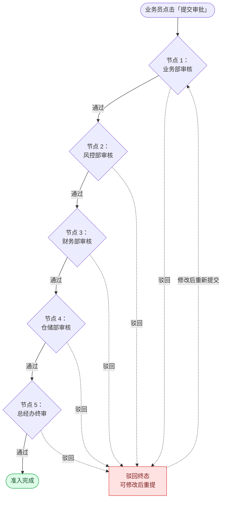

# 豫港通数字供应链平台 · 产品概述与需求总纲

> **文档类型**：PRD Writer 范式 · 落地需求文档 · **总纲（顶层架构）**
> **所属项目**：`yugangtong-prototype`（数字供应链高保真原型 + 需求文档库）
> **源文档（只读，未做任何改动）**：[`../docs/`](../docs/) —— 18 份模块/规范文档 + 112 份页面级 PRD
> **本副本定位**：把源文档从「技术实体维度」（表结构 / 状态机 / 字段规则）重组为「用户价值维度」（定位 → 动线 → 带优先级功能清单 → 交互状态 → 文案 → 非功能需求）
> **整理时间**：2026-09-30

---

## 0. 阅读说明（信息溯源标记）

本副本严格遵守范式通用原则第 6 条「**宁可标 [待补充] 也不编造**」。全文使用以下标记区分信息来源：

| 标记 | 含义 | 处理原则 |
|------|------|---------|
| ✅ | **源文档已明确** | 原 `docs/` 有直接定义，原值保留，不改写口径 |
| 🔷 | **范式补全** | 原文档未写，按范式要求从上下文推导，**已注明推导依据** |
| ⚠️ | **源文档自相矛盾** | v1.0 基线层与 v1.7.99.x 增量层冲突，**不静默选边**，列入待确认 |
| [待补充] | **信息不足** | 未编造，需甲方 / 研发确认后回填 |

> ⚠️ **本次整理共发现 173 处源文档内部矛盾**（如货转管理 6 状态机两套定义、合同状态枚举 4 套并存、预警中心脱敏合规问题），全部收拢在各模块文档的「§3.4 版本冲突」与「§7 待确认问题」两处（编号一一对应）。
> **分模块统计、阻塞级清单、跨模块共性模式见 [`README.md` §3 矛盾总汇](./README.md#三️-源文档矛盾总汇173-处)。**
> **这是源文档已存在的问题（v1.0 基线层与 v1.7.99.x 增量层长期未对齐），不是本次重组引入的。本次重组只负责显式化，拒绝代为裁决。**

---

## 1. 产品概述

### 1.1 一句话定位 ✅

> 这是一个给 **豫港通（港通）供应链业务全角色**（业务员 / 业务主管 / 风控 / 财务 / 总经办 / 仓储）用的 **B 端网页 Web App**，帮他们把 **大宗商品供应链的「准入—合同—履约—仓储—结算—资金—风控」全链路业务**从线下 Excel + 微信群搬到系统里流程化登记、单据可追溯。
> 与现有方案相比，核心差异是 **① 强制前置尽调（立项必关联客户 + 天眼查风险扫描 + 自建黑灰名单）把风险挡在合同之前；② 货权流转（货转）与仓储出入库强联动，业务线「账面库存」自动重算；③ 资金流明确按「线下操作 + 凭证上传 + 系统内确认」建模，不假设线上扣款**。

### 1.2 产品形态 ✅

| 项 | 内容 |
|---|---|
| **当前选型** | **网页 Web App**（PC 端优先，1440px 基准） |
| **选择理由** | ① 功能复杂（8 个一级菜单 / 16 个业务模块 / 82 个页面）、需大屏多列表对比操作 → 典型 B 端工具；② 使用者是企业内部多部门角色，桌面端优于移动端；③ 跨平台（Windows/Mac 浏览器），无客户端发版成本 |
| **是否需要移动端** | ⚠️ [待补充] 仓储现场巡库 / 装卸作业是否有移动端需求 —— 原 `app.html` 中「巡库管理」「视频监控」为占位空菜单 |
| **阶段策略** | 一期：全链路主流程跑通（🔴 核心模块）；二期：风控规则配置 + 风险运营报表（⚪ 未来规划，当前为空菜单） |

### 1.3 目标用户 ✅

**核心用户画像（5 类，来源于源文档角色操作矩阵）**：

| # | 角色 | 部门 | 在平台上的核心诉求 | 主要使用模块 |
|---|------|------|------------------|-------------|
| 1 | **业务员** | 业务部 | 快速发起立项 / 合同 / 收发货 / 货转 / 付款，把单据录进去不丢 | 准入、合同、收发货、货转、仓储 |
| 2 | **业务主管（业务部）** | 业务部 | 审批下属单据 + 看团队待办与业务线进度 | 全部业务模块的审批节点 |
| 3 | **风控人员** | 风控部 | 尽调审查、风险扫描结果复核、盯市监控、预警处置 | 客户准入、预警中心、盯市、保证金、追保函 |
| 4 | **财务人员** | 财务部 | 付款 / 退款 / 回款 / 保证金 / 结算 / 发票的凭证与金额核对 | 结算单、资金、发票 |
| 5 | **总经办** | 总经办 | 高风险事项终审（OR 会签的最终节点） | 审批链终审节点 |
| 6 | 仓储部 | 仓储 | 出入库登记、放货指令执行、巡库（占位） | 仓储管理 |
| 7 | 管理员 | 平台 | 公告发布、系统设置（占位） | 账户中心（占位） |

> 源文档角色操作矩阵表头统一为「业务员 / 业务部 / 风控部 / 财务部 / 总经办 / 系统」5 列（5 份文档），「仓储部」仅在仓储相关文档出现，「管理员」在工作台文档出现 —— ⚠️ [待补充] 完整角色字典与权限矩阵需产品侧统一。

### 1.4 产品价值 ✅

| 维度 | 价值 |
|------|------|
| **用户获得的价值** | ① 单据全链路可追溯（项目 → 客户 → 合同 → 货转 → 仓储 → 结算 → 付款 → 发票 互相可跳）；② 风险前置（尽调报告沉淀为客户档案，重复交易不用重新查）；③ 减少线下 Excel 口径不一致导致的账实不符 |
| **商业价值/变现逻辑** | 平台自身是供应链**管理中枢**（非收费产品）。其商业价值体现为对下游「资金放款 / 仓储 / 物流」业务的承载能力：平台沉淀的交易与货权数据是资金方与仓储方的信任依据 |

### 1.5 核心功能方向 ✅

按源文档 16 个模块归纳为 5 大方向（详细清单见 [§4 功能清单](#4-功能清单)）：

1. **准入与风控前置** — 项目立项、客户档案、黑名单、尽调报告
2. **合同与业务线串联** — 采购/销售/运输合同、补充协议、业务线关联
3. **履约与货权流转** — 收发货、货转（货权转移）、仓储出入库与放货
4. **结算与资金闭环** — 结算单、付款/退款/回款、保证金、发票
5. **监控与数据沉淀** — 盯市价格、追保函、预警中心、数据中心报表与合规验证

### 1.6 不做什么（边界）✅

| 超出范围的需求 | 原因（源文档依据） |
|---------------|------------------|
| **线上扣款 / 银行直连打款** | 源文档明确：资金操作**线下完成**，系统只做流程化登记 + 凭证上传 + 收款方确认；**不存在**「银行扣款失败 / 补足余额 / 账户异常」等线上假设分支 |
| **订单管理模块** | 源文档已于 v1.7.99.181 整体删除（`02.04-订单管理.md` 及 8 处页面引用、主页菜单项均已清理）；⚠️ 但**工作台卡 2「订单数」与待办引用 `orderList` 数据源仍存在残留**，见 §9 |
| **公告管理 / 通知中心 / 账户中心** | `app.html` 中均为 `pages: []` 空菜单，属占位 |
| **风险运营报表 / 风控规则配置** | `app.html` 中为 `pages: []` 空菜单（`p-risk-report.md` / `p-risk-operations.md` 有页面级文档但无菜单挂载） |
| **仓储视频监控 / 巡库管理 / 系统管理** | `app.html` 中为 `pages: []` 空菜单，源文档标注「v1.0 占位」 |

---

## 2. 目标用户与使用场景

### 2.1 用户画像展开 🔷

> 依据：源文档角色操作矩阵 + 各模块 §1 业务定位中描述的实际操作动作。

**业务员（贸易/供应链操作岗）**
- 典型一天：上午接收客户采购需求 → 发起项目立项（必关联客户，做尽调）→ 等审批 → 签采购合同 → 录入发货 → 跟踪入库 → 发起付款
- 最痛的事：单据散在多个 Excel；换个同事接手就找不到历史
- 在平台上的行为特征：**单据创建量最大、审批参与最少、最依赖表单的默认值与校验友好度**

**业务主管（审批 + 统筹）**
- 典型一天：在工作台看待办 → 逐条审批 → 看业务线台账进度
- 最痛的事：不知道团队还有多少单子卡在谁那里
- 行为特征：**高频使用工作台待办列表；对审批效率（待办聚合）最敏感**

**风控人员**
- 典型一天：复核新客户尽调报告（天眼查 44 条检查项）→ 盯市价格波动 → 处理预警
- 最痛的事：风险信息散在多个外部查询源
- 行为特征：**最依赖外部数据源集成（天眼查）与预警规则的准确性**

**财务人员**
- 典型一天：核对结算单 → 登记付款（上传银行回单）→ 确认收款 → 处理发票
- 最痛的事：**系统试算金额与实际线下转账金额常常不一致**
- 行为特征：**最依赖凭证上传链路与「系统内确认」动作的清晰度**

**总经办（终审）**
- 典型一天：只处理 OR 会签链的最后一个节点
- 行为特征：**低频、高权重；对审批路径的可见性要求高**

### 2.2 典型使用场景 ✅

**场景 1：谁 / 什么情况 / 做什么 / 期望什么结果**
> **业务员小王** / 收到新客户 3000 吨煤炭采购需求 / 在「项目立项」发起申请并关联客户（系统自动拉起天眼查尽调）→ 4 步骤表单提交 → **期望**：尽调异常项在提交前就暴露，风险客户被自动标红，不至于签完合同才发现对方是失信被执行人。

**场景 2：谁 / 什么情况 / 做什么 / 期望什么结果**
> **财务小李** / 收到供应商发来的银行转账回单 / 在「付款详情」上传凭证并登记实际付款金额（可能与系统试算金额不同）→ 收款方在系统内确认 → **期望**：系统明确提示「试算金额仅供参考，以实际登记为准」，且凭证可下载留痕用于对账。

**场景 3：谁 / 什么情况 / 做什么 / 期望什么结果**
> **风控小张** / 盯市系统检测到某商品指数跌破预警线 / 在「预警中心」收到高风险预警 → 点「立即处理」进入处置流程 → **期望**：预警从产生到处置全程有状态流转记录，处置后能查到是谁在什么时候关闭的。

---

## 3. 核心用户动线

### 3.1 端到端主流程（Mermaid · 角色泳道）✅ + 🔷

> 依据：各模块 §2「业务流程全景」+ §9「跨模块流转」拼接而成。**跨角色箭头均带动作标签；灰色虚线为异常回退路径。**

```mermaid
flowchart LR
    subgraph S0["① 准入 · 风控前置"]
        direction TB
        A1["业务员<br/>发起项目立项"] --> A2["系统<br/>天眼查尽调 + 黑灰名单扫描"]
        A2 --> A3{"尽调是否通过"}
        A3 -->|"通过"| A4["沉淀为<br/>客户档案"]
        A3 -.->|"不通过 / 高风险"| AX["风控部<br/>人工复核"]:::danger
        AX -->|"可放行"| A4
        AX -.->|"否决"| AX2["终止：项目不予立项"]:::danger
    end

    subgraph S1["② 合同 · 业务线"]
        direction TB
        B1["业务员<br/>签订采购/销售合同"] --> B2["业务部 + 风控部<br/>5 节点 OR 会签"]
        B2 --> B3["关联业务线<br/>锁定货物与台账"]
    end

    subgraph S2["③ 履约 · 货权流转"]
        direction TB
        C1["业务员<br/>录入发货"] --> C2["货主方<br/>收货确认"]
        C1 --> C3["货转管理<br/>货权上转/下转"]
        C3 --> C4["仓储部<br/>出入库登记 + 放货执行"]
    end

    subgraph S3["④ 结算 · 资金闭环"]
        direction TB
        D1["业务员<br/>发起结算单"] --> D2["财务部<br/>结算审核"]
        D2 --> D3["线下转账<br/>（系统不执行）"]:::offline
        D3 --> D4["发起方<br/>上传凭证"] --> D5["收款方<br/>系统内确认"]
        D5 --> D6["财务部<br/>进项发票登记"]
    end

    subgraph S4["⑤ 监控 · 数据沉淀"]
        direction TB
        E1["风控部<br/>盯市监控 + 预警处置"] --> E2["总经办<br/>高风险终审"]
        E1 --> E3["数据中心<br/>报表 + 合规验证报告"]
    end

    A4 --> B1
    B3 --> C1
    C4 --> D1
    D6 --> E1
    E2 --> E3

    classDef danger fill:#fee2e2,stroke:#dc2626,color:#7f1d1d
    classDef offline fill:#fef3c7,stroke:#f59e0b,color:#78350f
```



**图例**
- 🟡 黄框 = **线下节点**（系统不执行实际资金操作）
- 🔴 红框 = 异常 / 否决路径
- 实线 = 正常流转，箭头文字 = 触发动作

### 3.2 关键子流程：项目立项 5 节点审批 ✅

> 依据：`02.01-项目管理-立项.md` §4「5 节点状态机」+ §1.1（v1.1：OR 会签藏在步骤 3「提交审批」内）



> ⚠️ **待确认**：源文档称「5 节点 **OR** 会签」，但流程表现为**串行全通过**。OR 会签（任一节点通过即放行）与串行会签的驳回语义不同 —— 见 [§9](#9-待确认问题) Q1。

### 3.3 异常分支汇总 🔷

> 依据：各模块 §8「异常处理」表汇总。共 6 类通用异常模式：

| 异常模式 | 通用处理 | 出现模块 |
|---------|---------|---------|
| **前置单据状态不符** | 红字提示「该合同已作废，无法 XX」+ 阻止提交 | 货转、结算、资金、仓储 |
| **数量/金额越界** | 「XX 数量 X 超过合同剩余数量 Y」+ 阻止 | 货转、收发货、付款 |
| **附件缺失** | 「XX 必须上传 XX」+ 阻止 | 货转、收发货、结算、发票 |
| **终态不可逆** | 「已 XX 单据不能 XX，请走 XX 流程」+ 阻止 | 货转、合同、资金 |
| **超期未处理** | 自动作废 + 系统提示 | 货转（超 30 天未上传生效单据） |
| **审批驳回** | 进入驳回终态，允许修改后重提 | 全部含审批流的模块 |

> 📌 **提交态通用规则**（源自 `00-form-validation-rules.md`）：提交中按钮 loading + 禁用重复点击；**提交失败必须保留用户输入**；网络异常 Toast「网络异常，请重试」+ 按钮恢复可点。完整规范见 [`01-通用交互与文案规范.md`](./01-通用交互与文案规范.md)。

---

## 4. 功能清单

### 4.1 一级模块 × 优先级总表 ✅

> 优先级依据：源文档模块体量（文档行数）、在端到端动线中的位置、是否为其他模块的前置依赖。

| # | 一级菜单 | 业务模块 | 优先级 | 源文档 | 判定依据 |
|---|---------|---------|--------|--------|---------|
| 1 | 工作台 | 工作台 | 🟡 重要 | `p-workbench.md` | 全部角色的统一入口，82 页面中唯一聚合页 |
| 2 | 准入管理 | **02.01 项目管理** | 🔴 核心 | 792 行 | 全链路起点，所有合同的必经前置 |
| 3 | 准入管理 | **02.02 客户管理** | 🔴 核心 | 886 行 | 立项强依赖；客户档案全域复用 |
| 4 | 准入管理 | 黑名单管理 | 🔴 核心 | `p-blacklist.md` 26KB | 尽调拦截器，独立于客户管理主流程 |
| 5 | 数字供应链 | **02.03 合同管理** | 🔴 核心 | 997 行 | 业务串联核心，13 张表 / 9 状态机，串联全部下游 |
| 6 | 数字供应链 | 02.06 业务线管理 | 🟡 重要 | 521 行 | 合同与货转的中间枢纽 |
| 7 | 数字供应链 | 02.05 收发货管理 | 🟡 重要 | 540 行 | 履约环节，货转/仓储的前置 |
| 8 | 数字供应链 | 02.07 货转管理 | 🟡 重要 | 428 行 | 货权转移，影响业务线账面库存 |
| 9 | 数字供应链 | **02.14 资金管理** | 🔴 核心 | 636 行 / 10 表 | 资金流核心，结算与发票的前置 |
| 10 | 数字供应链 | **02.10 保证金管理** | 🔴 核心 | 422 行 | 资金风控抓手，与追保函强关联 |
| 11 | 数字供应链 | **02.13 结算单管理** | 🔴 核心 | 647 行 | 资金与履约的结算枢纽 |
| 12 | 数字供应链 | 02.15 发票管理 | 🟡 重要 | 438 行 | 资金闭环末端 |
| 13 | 数字供应链 | 02.08 盯市价格管理 | 🟡 重要 | 383 行 | 价格风险监控，预警的数据源 |
| 14 | 数字供应链 | 02.09 追保函管理 | 🟡 重要 | 432 行 | 履约担保，与保证金配套 |
| 15 | 仓储管理 | **02.12 仓储管理** | 🔴 核心 | 1520 行（最大） | 独立第三方仓储履约平台，9+ 页面 |
| 16 | 预警中心 | **02.11 预警中心** | 🔴 核心 | 835 行 | 风控闭环出口，3 大预警类型 |
| 17 | 数据中心 | **02.16 数据中心** | 🟡 重要 | 314 行 / 9 报表 | 对上汇报与合规验证出口 |
| 18 | 风险运营管理 | 风险运营报表 | ⚪ 未来规划 | `p-risk-report.md` | `app.html` 空菜单，未挂载 |
| 19 | 风险运营管理 | 风控规则配置 | ⚪ 未来规划 | `p-risk-operations.md` | `app.html` 空菜单，未挂载 |
| 20 | 仓储管理 | 视频监控 / 巡库管理 / 系统管理 | ⚪ 未来规划 | — | `app.html` 空菜单，源文档标「v1.0 占位」 |
| 21 | 账户中心 | 账户中心 | ⚪ 未来规划 | `p-account-*.md` | `app.html` 空菜单 |
| — | — | 公告管理 / 通知中心 | ⚪ 未来规划 | — | 工作台有入口，模块本身未建 |

### 4.2 功能清单树（范式格式）✅

```
豫港通数字供应链平台
├── 🔴 准入与风控前置
│   ├── 🔴 02.01 项目管理（立项 4 步表单 + 5 节点审批）
│   │   ├── 🔴 项目列表（状态 Tab + 筛选 + 导出）
│   │   ├── 🔴 新增立项申请（4 步骤 stepper）
│   │   │   ├── 🔴 步骤 1：项目信息录入
│   │   │   ├── 🔴 步骤 2：企业尽调报告（天眼查 + 自建名单）
│   │   │   ├── 🔴 步骤 3：提交审批（5 节点 OR 会签）
│   │   │   └── 🔴 步骤 4：准入完成
│   │   └── 🔴 项目准入详情
│   ├── 🔴 02.02 客户管理（4 分类 + 6 状态）
│   │   ├── 🔴 客户列表
│   │   ├── 🔴 新增客户申请
│   │   ├── 🔴 客户额度管理
│   │   └── 🟡 客户详情（含 8 类风险扫描）
│   └── 🔴 黑名单管理（平台自建黑灰名单 + 假国央企库）
│
├── 🔴 合同与业务线串联
│   ├── 🔴 02.03 合同管理（4 子菜单 / 13 表 / 9 状态）
│   │   ├── 🔴 采购合同（框架 + 订单）
│   │   ├── 🔴 销售合同（框架 + 订单）
│   │   ├── 🟡 运输合同
│   │   ├── 🟡 补充协议（框架 + 订单）
│   │   └── 🟡 合同 ↔ 销售/采购合同互关联
│   └── 🟡 02.06 业务线管理（7 状态）
│       ├── 🟡 业务线管理列表
│       ├── 🟡 业务线关联
│       └── 🟡 业务线详情
│
├── 🟡 履约与货权流转
│   ├── 🟡 02.05 收发货管理（发货 / 收货）
│   ├── 🟡 02.07 货转管理（货转上 / 货转下）
│   └── 🔴 02.12 仓储管理（独立第三方仓储方履约）
│       ├── 🔴 入库管理（记录 / 新增 / 详情）
│       ├── 🔴 出库管理（记录 / 新增 / 详情）
│       ├── 🔴 提货管理（放货指令 / 详情）
│       ├── 🟡 仓房管理
│       └── ⚪ 库存管理 / 视频监控 / 巡库管理 / 系统管理（占位）
│
├── 🔴 结算与资金闭环
│   ├── 🔴 02.13 结算单管理（采购结算 / 销售结算）
│   ├── 🔴 02.14 资金管理
│   │   ├── 🔴 付款（线下转账 + 凭证上传 + 收款方确认）
│   │   ├── 🔴 退款
│   │   ├── 🔴 回款
│   │   └── 🔴 费用管理
│   ├── 🔴 02.10 保证金管理（保证金池 / 调整 / 调整记录）
│   └── 🟡 02.15 发票管理（进项发票）
│
└── 🟡 监控与数据沉淀
    ├── 🟡 02.08 盯市价格管理（指标 / 详情）
    ├── 🟡 02.09 追保函管理（函件 / 新增 / 详情）
    ├── 🔴 02.11 预警中心
    │   ├── 🔴 预警列表（3 Tab + 3 张柱状图）
    │   ├── 🔴 预警详情
    │   └── 🔴 预警规则配置（3 Tab）
    ├── 🟡 02.16 数据中心
    │   ├── 🟡 驾驶舱
    │   ├── 🟡 业务报表（项目/业务线/资金占压/库存/应收应付/风控 6 张）
    │   └── 🟡 合规验证报告（列表 / 详情）
    └── ⚪ 风险运营报表 / 风控规则配置（未挂载）
```

### 4.3 通用横切能力（所有模块共用）🔷

| 能力 | 适用范围 | 规范位置 |
|------|---------|---------|
| 表单校验（单表单 / 多步骤 stepper 双层校验） | 全部含表单的页面 | [`01-通用交互与文案规范.md`](./01-通用交互与文案规范.md) |
| 返回保护（`isDirty` 脏数据拦截） | 全部编辑页 | 同上 |
| 列表页筛选（实时过滤 + chips + 清除全部，**无查询/重置按钮**） | 全部列表页 | 同上 |
| 状态标签配色编码 | 全部状态展示 | 同上 |
| 流程图统一 Mermaid（角色泳道 + 异常分支红色 + 虚线回退） | 全部文档 | 本总纲 §3 范式 |
| 隐私脱敏（手机号/银行卡/信用代码/邮箱/身份证） | 全部 mock 与文档 | [`01-通用交互与文案规范.md`](./01-通用交互与文案规范.md) |

---

## 5. 关键页面布局线框图

> 范式要求：选最核心页面用 ASCII 画出骨架，标注各区域名称和作用。
> 此处给出 **3 类通用骨架**，覆盖 82 个页面中的 3 种主要版式。

### 5.1 工作台（业务端首页 · 最核心聚合页）✅

> 依据：`p-workbench.md` §4.1 整体布局 + §4.2-4.4 区块定义（已从 v1.7.99.225 增量层取最新口径）。

```
┌──────────────────────────────────────────────────────────────────────────────┐
│ 【A】Topbar  logo · 8 个一级菜单 · 消息 icon · 用户头像                        │
├──────────────────────────────────────────────────────────────────────────────┤
│ ┌─────────────────┐ ┌─────────────────┐ ┌─────────────────┐                    │
│ │ 【B】物流量(吨)  │ │ 【C】订单数(笔)  │ │ 【D】融资资金    │ ← 3 KPI 卡         │
│ │  总数 + 环形图  │ │  总数 + 环形图  │ │  放款 / 还款    │                    │
│ │  右上:本月▾     │ │  右上:本月▾     │ │  右上:全部|本年 │                    │
│ │  源:发货管理    │ │  源:订单管理⚠️  │ │  源:付款+回款   │                    │
│ └─────────────────┘ └─────────────────┘ └─────────────────┘                    │
│ ┌───────────────────────────────┐ ┌──────────────────────┐                   │
│ │ 【E】预警提醒（高/中/低 3 子卡）│ │ 【F】公告            │ ← 中部             │
│ │  "立即处理" → 预警中心过滤     │ │  空态:"暂无公告"     │                   │
│ └───────────────────────────────┘ └──────────────────────┘                   │
│ ┌──────────────────────────────────────────────────────────────────────────┐ │
│ │ 【G】待办事项  10 个 Tab（横排 flex-wrap）· 右上"查看全部 ›"               │ │
│ │ ┌────┬────┬────┬────┬────┬────┬────┬────┬────┬────┐                        │ │
│ │ │合同│双签│关联│收货│货转│生效│结算│付款│回款│发票│ ← Tab 切换需真重渲染    │ │
│ │ └────┴────┴────┴────┴────┴────┴────┴────┴────┴────┘                        │ │
│ │ 表格: 合同编号 | 买卖方徽章+企业名 | 收货人 | 数量(吨) | 基准价 | 运输 | 操作 │ │
│ │ 分页: 共 X 条 · 第 1/N 页                                    操作:"查看"链接 │ │
│ └──────────────────────────────────────────────────────────────────────────┘ │
└──────────────────────────────────────────────────────────────────────────────┘
```

**各区域作用**

| 区域 | 作用 | 关键规则 |
|------|------|---------|
| A Topbar | 全局导航 + 消息 + 用户菜单 | 8 个一级菜单；未读数角标 |
| B 物流量卡 | 运输量概览 | 环形图「火运 vs 其他」；>10000 转「万」+ 2 位小数 |
| C 订单数卡 | 订单量概览 | ⚠️ 数据源 `orderList` 指向**已删除的订单管理模块** |
| D 融资资金卡 | 放款/还款金额 | 蓝紫底=放款(+) / 橙底=还款(−) |
| E 预警提醒卡 | 3 风险等级入口 | 「立即处理」跳 `warning-list?level=high/mid/low`；**风控角色按钮加红点** |
| F 公告 | 公告位 | 当前空态；管理员可见「发布公告」 |
| G 待办事项 | 全域待办聚合 | 10 Tab；切 Tab 必须调 `renderTodoTable(key)` 重渲染，不只切 active |

### 5.2 通用列表页骨架 🔷 + ✅

> 依据：源文档各模块 §7 列表字段 + v1.7.99.184 全站筛选控件标准。

```
┌──────────────────────────────────────────────────────────────────────────────┐
│ 【A】页面标题 + 右上主操作按钮（如「+ 新增付款」/「+ 开具货转」）                  │
├──────────────────────────────────────────────────────────────────────────────┤
│ ┌──────────────────────────────────────────────────────────────────────────┐ │
│ │ 【B】状态 Tab 组（含「全部」占位，全站统一）+ 右侧「数据导出」               │ │
│ └──────────────────────────────────────────────────────────────────────────┘ │
│ ┌──────────────────────────────────────────────────────────────────────────┐ │
│ │ 【C】当前搜索：chips 区 + 「清除全部」        ← 实时过滤，无查询/重置按钮     │ │
│ │ 筛选字段1 ▾  筛选字段2 ▾  筛选字段3 ▾  筛选字段4 ▾  筛选字段5 ▾             │ │
│ └──────────────────────────────────────────────────────────────────────────┘ │
│ ┌──────────────────────────────────────────────────────────────────────────────┐
│ │ 【D】数据表格                                                             │ │
│ │   列1(编号,等宽) │ 列2 │ 状态Tag │ ... │ 操作(查看/下载/作废)              │ │
│ └──────────────────────────────────────────────────────────────────────────────┘
│ ┌──────────────────────────────────────────────────────────────────────────────┐
│ │ 【E】分页：共 X 条 · 第 1/N 页 · 翻页/跳页                                  │ │
│ └──────────────────────────────────────────────────────────────────────────────┘
```

**区域作用与规则**

| 区域 | 作用 | 关键规则 |
|------|------|---------|
| A 标题区 | 页面定位 + 主操作 | 主操作按钮按角色矩阵控制可见性 |
| B 状态 Tab | 业务状态过滤 | **必须含「全部」占位**（全站统一）；Tab 切换须真重渲染数据 |
| C 筛选区 | 多条件实时过滤 | 5-6 个字段；**不放「操作」列，不放查询/重置按钮**；变更即生效 |
| D 数据表 | 主体数据 | 编号列用等宽字体；状态列用配色 Tag；操作列仅「查看/下载/作废」等只读类 |
| E 分页 | 翻页 | 空数据时显示空状态而非空白表格 |

### 5.3 通用表单页骨架 🔷 + ✅

> 依据：`p-contract-purchase-new.html` 等新建页 + `00-form-validation-rules.md`。

```
┌──────────────────────────────────────────────────────────────────────────────┐
│ 【A】页面标题（新增/编辑 XX） + 右上「返回」                                    │
├──────────────────────────────────────────────────────────────────────────────┤
│ ┌──────────────────────────────────────────────────────────────────────────┐ │
│ │ 【B】Stepper（多步骤表单时；单表单则省略）                                  │ │
│ │   ① 项目信息 ─── ② 企业尽调 ─── ③ 提交审批 ─── ④ 准入完成                 │ │
│ └──────────────────────────────────────────────────────────────────────────┘ │
│ ┌──────────────────────────────────────────────────────────────────────────────┐
│ │ 【C】表单区（分组卡片：基础信息 / 关联单据 / 凭证附件 / 风控信息）          │ │
│ │   字段1  [输入框]              ← 必填项带红星                              │ │
│ │   字段2  [下拉▾]               ← 失焦校验，错误在字段下方红字 + 红框        │ │
│ │   字段3  [日期选择 📅]                                                   │ │
│ │   附件   [上传区]  支持 PDF/JPG，单个 ≤10MB，最多 5 个                     │ │
│ └──────────────────────────────────────────────────────────────────────────────┘
├──────────────────────────────────────────────────────────────────────────────┤
│ 【D】固定底栏：上一步 │ 下一步 │ 提交        ← 提交中 loading + 禁用重复点击   │
└──────────────────────────────────────────────────────────────────────────────┘
```

**区域作用与规则**

| 区域 | 作用 | 关键规则 |
|------|------|---------|
| A 标题区 | 页面定位 + 返回 | 返回时若 `isDirty` 须二次确认 |
| B Stepper | 步骤进度 | 「下一步」只校验当前步；「提交」校验全部 N 步 + 跨步规则 |
| C 表单区 | 数据录入 | 必填红星；失焦做格式校验；错误同时红框 + 字段下红字 + 顶部 Toast |
| D 底栏 | 步骤流转 | 提交中禁用 + loading 文案「提交中...」；**失败必须保留用户输入** |

---

## 6. 功能详细描述

> 范式 §5 要求「每个 🔴 核心功能独立写一节」。本项目按 **业务模块** 粒度组织，每个模块一份独立文档，统一采用范式 6 要素结构。

### 6.1 模块文档索引

> 📌 **入口**：[`README.md`](./README.md) —— 文档总索引 + **173 处源文档矛盾总汇**（分模块统计 / 阻塞级清单 / 跨模块共性模式）
> 本表为总纲视角的模块清单；**逐模块矛盾数与阻塞级标记见 README §2 索引表**。

| 文档 | 对应模块 | 优先级 | 源文档（只读） |
|------|---------|--------|--------------|
| [`01-通用交互与文案规范.md`](./01-通用交互与文案规范.md) | 全站横切规范 | 🔴 | `00-form-validation-rules.md` |
| [`02.01-项目管理.md`](./02.01-项目管理.md) | 立项 4 步 + 5 节点审批 | 🔴 | `02.01-项目管理-立项.md` + `02.01-list/apply/detail.md` |
| [`02.02-客户管理.md`](./02.02-客户管理.md) | 客户档案 + 黑名单 | 🔴 | `02.02-客户管理.md` + `p-blacklist.md` |
| [`02.03-合同管理.md`](./02.03-合同管理.md) | 4 子菜单 / 13 表 / 9 状态 | 🔴 | `02.03-合同管理.md` |
| [`02.05-收发货管理.md`](./02.05-收发货管理.md) | 发货 / 收货 | 🟡 | `02.05-收发货管理.md` |
| [`02.06-业务线管理.md`](./02.06-业务线管理.md) | 7 状态业务线 | 🟡 | `02.06-业务线管理.md` |
| [`02.07-货转管理.md`](./02.07-货转管理.md) | 货转上 / 货转下 | 🟡 | `02.07-货转管理.md` |
| [`02.08-盯市价格管理.md`](./02.08-盯市价格管理.md) | 盯市指标 | 🟡 | `02.08-盯市价格管理.md` |
| [`02.09-追保函管理.md`](./02.09-追保函管理.md) | 追保函 | 🟡 | `02.09-追保函管理.md` |
| [`02.10-保证金管理.md`](./02.10-保证金管理.md) | 保证金池 / 调整 | 🔴 | `02.10-保证金管理.md` |
| [`02.11-预警中心.md`](./02.11-预警中心.md) | 3 大预警类型 | 🔴 | `02.11-预警中心.md` |
| [`02.12-仓储管理.md`](./02.12-仓储管理.md) | 出入库 / 放货 / 仓房 | 🔴 | `02.12-仓储管理.md` |
| [`02.13-结算单管理.md`](./02.13-结算单管理.md) | 采购 / 销售结算 | 🔴 | `02.13-结算单管理.md` |
| [`02.14-资金管理.md`](./02.14-资金管理.md) | 付款/退款/回款/费用 | 🔴 | `02.14-资金管理.md` |
| [`02.15-发票管理.md`](./02.15-发票管理.md) | 进项发票 | 🟡 | `02.15-发票管理.md` |
| [`02.16-数据中心.md`](./02.16-数据中心.md) | 驾驶舱 / 报表 / 合规 | 🟡 | `02.16-数据中心.md` |
| [`03-贸易风险合规-天眼查集成.md`](./03-贸易风险合规-天眼查集成.md) | 外部 API 集成 | 🟡 | `03.贸易风险合规-天眼查接口对照.md` |

### 6.2 模块文档统一结构

每份模块文档均包含范式 §5 要求的 6 要素：

```
1. 功能描述 + 触发条件
2. 交互细节（操作反馈 / 危险操作确认 / 空状态引导 / 失败引导）
3. 状态清单（业务状态机 + UI 状态：默认/加载中/成功/失败/禁用/空状态）
4. 边界条件（空内容 / 超长 / 网络异常 / 无权限 / 并发 / 格式不符）
5. 数据规范（表结构 / 字段名·类型·长度·必填·默认值·校验 / 编号规则）
6. 本模块待确认问题
```

---

## 7. 文案规范

> 范式要求：面向终端用户的产品文案，与开发文档**分开定义**。本节可直接作为前端文案字典使用。

### 7.1 整体文案风格 ✅ + 🔷

| 维度 | 定位 | 说明 |
|------|------|------|
| **风格** | **专业严谨 + 简洁直接** | 面向财务、风控、审批人，不用口语化/网络用语；不使用感叹号 |
| **人称** | 「您」或省略主语 | 不用「你」 |
| **句式** | 陈述句 + 明确动词 | 「已提交审批」优于「提交啦！」 |
| **数字** | 千分位 + 单位 | `20,000 吨`、`¥1,250,000.00`；>10000 自动转「万」+ 2 位小数 |
| **术语一致** | 全站统一 | 见下方术语表 |

### 7.2 术语表（强制统一）✅

| 标准用语 | 禁用/易混用语 | 说明 |
|---------|--------------|------|
| 货转上 / 货转下 | 上转/下转、货权转移上/下 | v1.7.99.176 明确术语 |
| 准入完成 | 审批通过、入驻成功 | 立项 5 节点全通过后的终态 |
| 实际登记金额 | 实付金额、到账金额 | 资金模块：**系统试算金额 ≠ 实际登记金额** |
| 已生效单据 | 生效单据、激活单据 | 货转模块 |
| 释放 / 冻结 | 解冻、解锁 | 保证金模块 |
| 预警解除 | 预警关闭、预警处理 | 预警中心；源文档使用「预警解除时间」列 |
| 账面库存 | 实际库存、库存量 | 业务线台账，受货转联动影响 |

### 7.3 按钮文案 🔷

| 场景 | 主操作 | 次操作 | 危险操作 |
|------|-------|-------|---------|
| 列表页新增 | `+ 新增 XX` / `+ 开具 XX` | `数据导出`、`批量下载` | `作废` |
| 表单提交 | `提交` / `下一步` | `上一步`、`返回`、`重置` | — |
| 审批 | `审批通过`、`驳回` | — | `驳回`（需填驳回原因） |
| 详情页 | `查看` | `下载`、`复制` | `作废`、`解除` |
| 待办聚合 | `查看`（跳详情） | — | — |

> 📌 **约束**：详情页**不提供业务变更类按钮**（创建 / 调整 / 解除 / 导出明细），只允许跳关联单据、复制、附件下载。

### 7.4 空状态文案 ✅ + 🔷

| 场景 | 文案 | 补充动作 |
|------|------|---------|
| 列表无数据 | `暂无数据` | 有筛选时追加：`请调整筛选条件` |
| 筛选后无结果 | `当前搜索无匹配结果` + chips 区 | `清除全部` 按钮 |
| 待办为空 | `暂无待办` | — |
| 公告为空 | `暂无公告` | — |
| KPI 为 0 | 保留图表，`中心数字显示 0` | **不隐藏**（保持布局稳定） |
| 无权限 | `无访问权限` | 提示联系管理员 |

### 7.5 成功 / 失败提示文案 ✅

| 场景 | 文案 |
|------|------|
| 提交成功 | `提交成功` |
| 审批通过 | `审批通过` |
| 驳回成功 | `驳回成功`（必填驳回原因，否则 `请填写驳回原因`） |
| 网络异常 | `网络异常，请重试` |
| 加载失败（整页） | `数据加载失败，请重试` + 顶部红色横幅 |
| 加载失败（单区块） | 该区块降级 `暂无数据`，其他区块正常 |
| 上传中 | `上传中...` |
| 上传失败 | `上传失败，请重新上传` |
| OCR 识别失败 | `OCR 识别失败，请手动填写`（**允许降级为手动录入，不阻断**） |

### 7.6 校验错误文案 ✅

| 规则 | 文案模板 |
|------|---------|
| 必填未填 | `请填写{字段名}` / 提交时 `请完成本步必填项` |
| 格式错误 | `字段格式不正确`（或具体：`请输入正确的统一社会信用代码`） |
| 数量越界 | `货转数量 X 超过合同剩余数量 Y` |
| 前置状态不符 | `该合同已作废，无法货转` |
| 附件缺失 | `上游货转必须上传铁路运单` |
| 终态不可逆 | `已生效货转不能作废，请走解除流程` |
| 跨字段规则 | 直接说明业务约束（如 `实际登记金额不能小于 0`） |

### 7.7 危险操作确认文案 ✅ + 🔷

| 操作 | 确认框 |
|------|-------|
| 作废单据 | `作废后不可恢复，确定作废该{单据名}？` |
| 驳回审批 | `驳回后申请人可修改后重新提交，确定驳回？`（必填原因） |
| 离开有未保存内容的表单 | `当前编辑内容将丢失，确定返回？` + `确定` / `取消` |
| 重置表单 | `确定清空所有已填内容？` |
| 删除关联关系 | `解除后关联关系将失效，确定解除？` |

### 7.8 状态标签配色 🔷

> 依据：源文档各模块状态机的语义（正常/进行中/成功/驳回/作废/预警）推导，统一色板。

| 状态语义 | Tag 色 | 文字色 | 示例 |
|---------|-------|-------|------|
| 正常 / 生效 / 审核通过 | 绿 `#ECFDF5` | `#047857` | 已生效、审核通过、已完结 |
| 进行中 / 待处理 | 蓝 `#EFF6FF` | `#1E40AF` | 审批中、待审核、执行中 |
| 驳回 / 异常 / 高风险 | 红 `#FEE2E2` | `#DC2626` | 驳回、审核驳回、高风险 |
| 警告 / 中风险 / 待补充 | 黄 `#FEF3C7` | `#D97706` | 中风险、待上传已生效单据 |
| 终态 / 作废 / 已关闭 | 灰 `#F3F4F6` | `#6B7280` | 已作废、已完结、已关闭 |
| 提示 / 低风险 | 浅蓝 | `#1E40AF` | 低风险 |

> 📌 徽章另设买卖方专属配色（源文档 v1.7.99.225 已定义）：卖方 绿底 `#ECFDF5`/`#047857`，买方 蓝底 `#EFF6FF`/`#1E40AF`。

---

## 8. 非功能性需求

### 8.1 性能要求 🔷

| 指标 | 要求 | 依据 |
|------|------|------|
| 列表首屏 | ≤ 2s（1000 条内） | 🔷 行业常规 |
| 详情页 | ≤ 1.5s | 🔷 |
| 大表（预警 835 行模块 / 仓储 1520 行） | 需服务端分页 + 筛选，禁止前端全量渲染 | 🔷 |
| 聚合页（工作台） | 单模块接口 >5s 降级为「暂无数据」，不阻塞其他区块 | ✅ `p-workbench.md` §7 |
| 数据刷新 | 进出页面拉取一次，5 分钟内不重复；待办数字 30s 轮询 | ✅ `p-workbench.md` §5（🔷 30s 轮询为源文档待确认项） |
| OCR 识别 | 异步执行，展示进度；失败降级手填 | ✅ 货转模块 |
| 附件上传 | 单个 ≤10MB，支持 PDF/JPG/PNG | 🔷 |

### 8.2 权限控制 ✅

- **角色维度**：按角色操作矩阵控制**按钮可见性**（如「审核货转」仅业务部 + 风控部可见）
- **数据维度**：工作台所有区块按角色权限过滤（无权限显示「无访问权限」占位）
- **越权保护**：前端隐藏 ≠ 后端鉴权；每个写操作须后端二次校验角色
- ⚠️ [待补充] 完整权限矩阵（角色 × 模块 × 操作）未在源文档中集中定义，散落各模块 §5，需产品侧统一

### 8.3 兼容性 🔷

| 项 | 要求 |
|---|------|
| 桌面浏览器 | Chrome / Edge 最新两个大版本；基准分辨率 1440px |
| 最小可用宽度 | 1280px（低于此提示「请放大窗口」） |
| 依赖 | CDN 引入 `marked`（Markdown 渲染）+ `mermaid@10`（流程图渲染） |
| 打印 | 详情页/报表页需支持 A4 纵向打印（🔷 待确认是否本期） |

### 8.4 数据安全与隐私 ✅（用户硬要求）

**所有对外发布的代码 / mock / 文档必须脱敏。** 脱敏规则：

| 字段 | 脱敏格式 | 示例 |
|------|---------|------|
| 手机号 | `138 0000 XXXX` | 明显 demo 格式 |
| 银行卡号 | `6222 XXXX XXXX XXXX XXXX` | 保留前 4 位 |
| 统一社会信用代码 | `91XXXXXXMAXXXXXXXX` | 保留格式 + X 替换 |
| 邮箱 | `xxx@example.com` | RFC 2606 保留域名 |
| 身份证号 | `110000YYYYMMDDXXXX` | 保留格式 + X 替换 |

**可保留真实感的字段**：企业名、中文人名、金额、日期、地址、车牌号、运单号、产品名。

**发布前强制扫描**（`grep -rE` 正则见 [`01-通用交互与文案规范.md`](./01-通用交互与文案规范.md) §6）。

### 8.5 数据存储与审计 🔷

| 项 | 要求 |
|---|------|
| 操作留痕 | 所有审批/作废/解除动作记录操作人 + 所属公司 + 时间 + 内容（源文档已有「操作记录」5 列表：`操作类型/操作人员/所属公司/操作内容/操作时间` ✅） |
| 附件留存 | 凭证附件不可删除，仅可作废关联单据 |
| 历史版本 | 驳回后可修改重提，保留每次提交版本 |
| 归档 | 作废单据不物理删除 |

### 8.6 通用表单校验规范

> 完整规范见 [`01-通用交互与文案规范.md`](./01-通用交互与文案规范.md)。核心 4 条：
> 1. **不在每输入一个字符时校验**，只在失焦（格式）或提交（必填/跨字段）时校验
> 2. **多步骤表单双层校验**：「下一步」只校验当前步，「提交」校验全部 N 步 + 跨步业务规则
> 3. **返回保护**：维护 `isDirty`，离开前拦截，浏览器关闭用 `beforeunload`
> 4. **提交失败必须保留用户输入**

---

## 9. 待确认问题

> 按范式原则第 6 条，以下问题**未编造答案**，需甲方 / 研发确认后回填。
> ⚠️ 标记的问题 = 源文档自身存在矛盾，本次重组已如实暴露。

### 9.1 源文档矛盾（阻塞开发，需优先裁决）⚠️

> 📌 **全量 173 处矛盾的分模块统计、阻塞级清单、跨模块共性模式见 [`README.md` §3 矛盾总汇](./README.md#三️-源文档矛盾总汇173-处)。**
> 下表是其中**跨模块、影响面最广**的 8 条，完整清单见各模块文档 §3.4。

| # | 问题 | 冲突详情 | 影响 |
|---|------|---------|------|
| **Q1** | 立项审批是 **OR 会签** 还是**串行会签**？ | `02.01-项目管理-立项.md` §1.1/§4 称「5 节点 **OR** 会签」，但状态机表现为串行逐级通过（任一节点驳回即终止）。OR 会签 = 任一节点通过即放行 | 🔴 阻塞：审批引擎实现方式完全不同 |
| **Q2** | 货转管理 **6 状态机**有两套定义 | v1.0：全部/审批中/待上传已生效单据/已生效/驳回/已作废<br/>v1.7.99.176：待发起/待审核/审核通过/审核驳回/已货转/已作废 | 🔴 阻塞：列表 Tab 与状态 Tag 完全不同 |
| **Q3** | 货转管理是 **3 页**还是 **6 页**？ | v1.0 记 3 页（且其 §1.2 与 §11.1 自身就不自洽）；v1.7.99.176 记 6 页 | 🔴 阻塞：sitemap 与前端路由 |
| **Q4** | 工作台待办是 **10 个 Tab** 还是 **11 个**？ | `p-workbench.md` §4.4 明确列 10 个（含 v1.7.99.225 变更说明），但 §6 按钮交互、§7 异常处理、§9 待确认均仍写「11 个」 | 🟡 影响待办聚合接口字段数 |
| **Q5** | 工作台卡 2「订单数」数据源指向**已删除的订单管理模块** | 订单管理已于 v1.7.99.181 整体删除，但 `p-workbench.md` §4.2 卡 2 数据源仍写 `orderList` 聚合（订单管理） | 🟡 需替换数据源或下线该卡 |
| **Q6** | 保证金是**独立一级模块**还是**资金管理子模块**？ | `02.10-保证金管理.md` 独立成篇；但 `app.html` 菜单中「保证金管理/保证金调整/保证金调整记录」挂在**资金管理** sub 下 | 🔴 阻塞：菜单层级与权限配置 |
| **Q7** | 合同管理**状态枚举 4 套命名并存** | v1.1 13 值 / v1.7.99.88 的 7 值 / v1.7.99.98 声称的 9 值 / 页面实现的 7 值；且「9 状态」标题下实际列出 13 个。签署状态（待盖章/已双签）与审批状态是否两套并存亦未定 | 🔴 阻塞：`t_contract.status` 枚举无法定稿 |
| **Q8** | **⚠️ 发布合规：脱敏口径冲突** | `02.11-预警中心.md` v1.7.99.104 明确要求「用**真实信用代码** + 沿用 user 截图**假手机号**」，与脱敏发布硬要求（见 [§8.4](#84-数据安全与隐私-用户硬要求)）直接冲突 | 🔴 **阻塞发布**，需立即确认对外口径 |

### 9.2 信息缺口（需补充）[待补充]

| # | 问题 | 归属 |
|---|------|------|
| Q9 | 完整角色字典与权限矩阵（角色 × 模块 × 操作） | 全局 |
| Q10 | 仓储现场是否有移动端 / 巡库 App 需求 | 仓储管理 |
| Q11 | 公告管理、通知中心、账户中心是否本期开发 | 工作台 / 账户中心 |
| Q12 | 风险运营报表、风控规则配置是否本期开发（`p-risk-*.md` 有文档但菜单未挂载） | 风险运营管理 |
| Q13 | 详情页 / 报表页是否需支持打印 | 全局 |
| Q14 | 各模块「复用建议」中的主产品表在目标环境是否真实存在（如 `t_warehouse_receipt_transfer`） | 全部 🔴 模块 |
| Q15 | 货转管理 `goods-transfer-up-new.html` / `goods-transfer-down.html` 两个页面缺页面级 PRD | 货转管理 |

### 9.3 本次重组自身的处理说明

| 项 | 说明 |
|---|------|
| **信息溯源** | 全部 19 份副本均标注 ✅/🔷/⚠️/[待补充] 来源标记，可回溯到 `docs/` 原文具体章节 |
| **原文档保护** | `docs/` 目录**全程只读，零改动**（已用 `git status` 校验） |
| **未编造内容** | 范式要求但源文档缺失的项（UI 加载/失败态、性能指标、兼容性、文案风格）统一标 🔷 并注明推导依据，未虚构业务规则 |
| **冲突处理** | **173 处矛盾全部未静默选边**，逐条列入各模块 §3.4 + §7；跨模块最广的 8 条列入 §9.1，全量统计见 [`README.md` §3](./README.md#三️-源文档矛盾总汇173-处) |
| **本次整理主要产出** | 除范式化重组外，**显式化源文档 173 处 v1.0/v1.7.99.x 版本矛盾 + 100+ 条信息缺口**。这些矛盾源自原文档长期未对齐，重组只负责暴露，不代为裁决 |
| **模块编号** | 保留源文档编号（`02.01`~`02.16`，**`02.04` 空缺**），空缺原因为「订单管理已于 v1.7.99.181 删除」，不重排编号以保持与 `docs/` 的 1:1 可追溯性 |

---

## 附录 A：源文档 → 范式章节映射表

> 本表说明源文档 12 章节模板如何归位到范式 6 要素。16 份模块文档统一按此规则重组。

| 源文档章节 | 归位到范式章节 |
|-----------|--------------|
| §1 业务定位 | → §1 功能描述 |
| §2 业务流程全景（Mermaid） | → §1.2 触发条件 + §1.3 业务流程 |
| §3 核心实体（N 张表） | → §5.1 数据规范 · 表结构 |
| §4 状态机 | → §3.1 状态清单 · 业务状态机 |
| §5 角色操作矩阵 | → §2.1 交互细节 · 权限可见性 |
| §6 字段规则 | → §5.2 数据规范 · 字段级 |
| §7 按钮交互 | → §2.2 交互细节 · 操作反馈 |
| §8 异常处理 | → §4 边界条件 + §7 文案规范 |
| §9 跨模块流转 | → §1.3 流程 + 模块依赖表 |
| §10 复用建议 | → §5.4 数据规范 · 技术实现参考 |
| §11+ v1.7.99.x 增量节 | → §2.4 空状态/§3.3 版本冲突/§4 边界条件/§6 待确认 |

## 附录 B：版本记录

| 版本 | 时间 | 内容 |
|------|------|------|
| v2.0 | 2026-09-30 | 按 PRD Writer 范式重组 `docs/` 全部 18 份模块/规范文档为 19 份范式化副本；原 `docs/` 零改动 |
