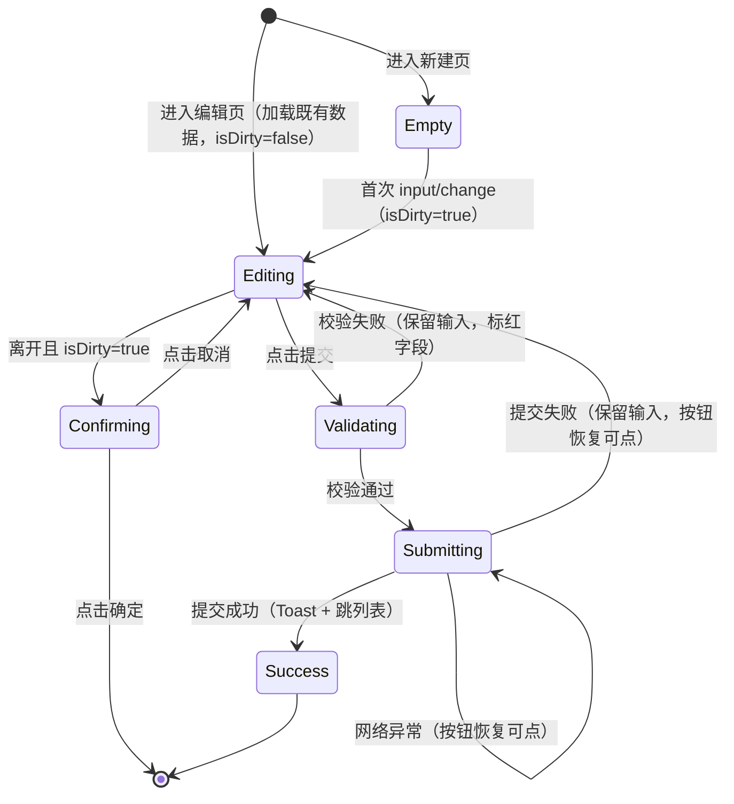

# 通用交互与文案规范 · 横切需求规格

> **文档类型**：PRD Writer 范式 · 落地需求文档 · **横切规范（跨全部模块生效）**
> **所属项目**：`yugangtong-prototype`
> **源文档（只读，未做任何改动）**：[`../docs/00-form-validation-rules.md`](../docs/00-form-validation-rules.md)
> **对应总纲**：[`00-产品概述与需求总纲.md`](./00-产品概述与需求总纲.md)
> **整理时间**：2026-09-30

---

## 0. 阅读说明

沿用总纲的信息溯源标记：**✅ 源文档已明确** / 🔷 范式补全 / ⚠️ 源文档矛盾 / [待补充] 信息不足。

本文档定义**所有页面必须遵循**的横切规范。范式 §5「功能详细描述」中的「交互细节 / 状态清单 / 边界条件」三要素，在模块文档中只写模块特有部分，通用部分一律以本文档为准。

---

## 1. 功能描述与适用范围

### 1.1 功能描述 ✅

> 统一全站表单类页面的**校验时机、返回保护、提交行为、视觉反馈**，避免同类交互在各模块出现不一致实现。

### 1.2 触发条件 ✅

本规范在以下场景**强制生效**：

| 场景 | 判定 |
|------|------|
| 页面含 `<form>` 元素 | ✅ 生效 |
| 页面含 `button[type=submit]` | ✅ 生效 |
| 页面含 stepper（多步骤表单） | ✅ 生效（适用第二章双层校验） |
| 页面为纯展示页（列表 / 详情 / 报表） | ❌ 不适用本规范，但适用第三章通用样式 |

### 1.3 两类表单的区分 ✅

| 类型 | 定义 | 适用校验策略 |
|------|------|-----------------|
| **单张表单** | 无「下一步」，填完直接提交 | 第三章「一、单张表单」 |
| **多步骤表单（stepper）** | 拆成 N 步，逐步填写（如立项 4 步） | 第三章「二、多步骤表单」**双层校验** |

---

## 2. 交互细节

### 2.1 单张表单 · 校验时机 ✅

| 校验类型 | 触发时机 | 错误处理 |
|---------|---------|---------|
| 必填校验 | 点击「提交」按钮时 | 红框 + 字段下方红字 + 顶部 Toast |
| 字段级格式校验 | **失焦时（blur）** | 字段下方红字 + 红框 |
| 二次确认类（密码 / 重复值） | 失焦时 | 同上 |
| 跨字段业务规则 | 点击「提交」按钮时 | 顶部 Toast + 字段下方红字 |

> ⚠️ **强制约束**：**不在每输入一个字符时就校验**（不绑 `input` 事件），避免用户输入一半就报错。**只在失焦或提交时校验。**

### 2.2 单张表单 · 返回保护 ✅（重要，常被遗漏）

用户在表单**有未保存内容**时，以下操作**必须二次确认**：

| 触发操作 | 行为 |
|---------|------|
| 点击「返回 / 取消」按钮 | 弹确认框「当前编辑内容将丢失，确定返回？」+ `确定` / `取消` |
| 点击 sidemenu 切换菜单 | 同上 |
| 路由跳转（菜单点击 / 链接） | 同上 |
| 浏览器后退 / 关闭标签页 | 弹 `beforeunload` 系统提示 |

**实现规范** ✅

```
维护 state.isDirty = false
  ├─ 首次 input / change 事件触发  →  isDirty = true
  ├─ 离开前判断 isDirty 决定是否弹确认
  ├─ 提交成功 / 点击「重置」后      →  isDirty = false
  └─ 加载既有数据进入表单（编辑场景）→  isDirty = false，用户改动后才变 true
```

### 2.3 单张表单 · 提交行为 ✅

| 状态 | 行为 |
|------|------|
| 校验通过 + 提交中 | 按钮 loading（文字「提交中...」+ 旋转图标）+ **禁用重复点击** + 禁用表单其他操作 |
| 提交成功 | Toast「提交成功」+ 跳转列表页 |
| 提交失败（业务错误） | **保留用户输入** + Toast 错误信息 + 按钮恢复可点 |
| 网络异常 | Toast「网络异常，请重试」+ 按钮恢复可点 |
| 用户点「重置」 | 弹确认「确定清空所有已填内容？」→ 清空所有字段 + `isDirty = false` |

### 2.4 多步骤表单 · 校验时机（双层）✅

| 校验层 | 触发时机 | 校验范围 |
|--------|---------|---------|
| 步骤内校验 | 点击「下一步」按钮 | 只校验**当前步**字段（必填 + 格式） |
| 终态校验 | 点击「提交」按钮（最后一步） | 校验**全部 N 步** + 跨步业务规则 |

> **B 端常规逻辑**（源文档决策记录）：
> - 「下一步」即时反馈，引导用户完成当前步
> - 「提交」兜底校验，防止用户跳过某步或跨步规则被破坏
> - **两层都必须有，缺一会导致流程失真**

### 2.5 多步骤表单 · 步骤内校验实现 ✅

```
if (当前步所有必填项已填 && 字段格式正确) {
    进入下一步
} else if (有必填项未填) {
    停留当前步
    + 标红所有未填字段
    + 滚动到第一个错误字段
    + 顶部 Toast「请完成本步必填项」
} else if (格式错误) {
    停留当前步
    + 字段下方红字 + 红框
    + 顶部 Toast「字段格式不正确」
}
```

### 2.6 多步骤表单 · 终态校验实现 ✅

```
// 1. 校验所有步（不只是当前步）
for step in 1..N:
    if step 有必填未填 or 格式错:
        跳转该 step
        + 高亮该字段
        + Toast「第 N 步未完成」
        return  // 终止提交

// 2. 跨步业务规则
if (跨步规则不满足 如 关联企业数 >= 1):
    跳转相关 step
    + Toast「请至少添加 1 个关联企业」
    return

// 3. 校验通过 → 调后端
submit()
```

### 2.7 多步骤表单 · 步骤切换交互 ✅

| 操作 | 行为 |
|------|------|
| 点击「上一步」 | 自由切换，已填字段保留（从 state 读取） |
| 点击「下一步」 | **重新校验当前步**（防止中间修改了字段） |
| 直接点击 stepper 编号 | 允许切换到**任意已访问过的步**；未访问的步禁止点击 |
| 已填内容 | 缓存在 state，用户切走再回来内容不丢失 |

### 2.8 多步骤表单 · 返回保护 ✅

同单张表单规则：表单**任意一步**有未保存内容时，离开前必须确认。

### 2.9 字段联动 ✅

父字段变化时**清空子字段**（如选了「下游客户」→ 清空「上游客户」已填值）。

### 2.10 危险操作确认文案 ✅

| 操作 | 确认框 |
|------|-------|
| 离开有未保存内容的表单 | `当前编辑内容将丢失，确定返回？` + `确定` / `取消` |
| 重置表单 | `确定清空所有已填内容？` |
| 驳回审批 | `驳回后申请人可修改后重新提交，确定驳回？`（**必填驳回原因**） |
| 作废单据 | `作废后不可恢复，确定作废该{单据名}？` |

### 2.11 空状态引导 ✅ + 🔷

| 场景 | 文案 | 补充动作 |
|------|------|---------|
| 表单无历史草稿 | `暂无草稿` 🔷 | 提示「填写后可保存草稿」🔷 |
| 下拉无匹配项 | `无匹配选项` 🔷 | 提供「+ 新建」入口（若允许）🔷 |
| 关联单据选择器为空 | `暂无可关联的{单据名}` 🔷 | 说明前置条件 🔷 |
| 列表无数据 | `暂无数据` ✅ | 有筛选时：`请调整筛选条件` |

### 2.12 失败引导 ✅ + 🔷

| 失败类型 | 引导方式 |
|---------|---------|
| 必填/格式校验失败 | 顶部 Toast + 字段红框红字 + 滚动定位 🔷 |
| 业务规则失败 | 顶部 Toast 说明业务约束 + 保留输入 ✅ |
| 网络异常 | Toast「网络异常，请重试」+ 按钮恢复可点 ✅ |
| 权限不足 | Toast「无权限执行此操作」+ 按钮隐藏 🔷 |
| 加载既有数据失败 | 页面顶部红色横幅 + `重试` 按钮 🔷 |

---

## 3. 状态清单

### 3.1 表单状态机 ✅ + 🔷



### 3.2 UI 状态清单（范式要求 6 态）✅ + 🔷

| 状态 | 触发 | 视觉 | 可交互 |
|------|------|------|-------|
| **默认** | 表单加载完成 | 字段可编辑，必填红星显示 | ✅ 全部 |
| **加载中** | 提交中 / 加载既有数据中 | 提交按钮 loading「提交中...」+ 旋转图标；字段区骨架屏 🔷 | ❌ 禁用重复提交 |
| **成功** | 提交成功 | 顶部居中 Toast，绿色 `#10B981`，**3s 自动消失** | — |
| **失败（业务）** | 后端返回业务错误 | 顶部居中 Toast，红色 `#EF4444`，**不自动消失，需手动关闭**；**保留用户输入** | ✅ 按钮恢复可点 |
| **禁用** | 无权限 / 前置单据状态不符 | 按钮灰化不可点 + Tooltip 说明原因 🔷 | ❌ |
| **空状态** | 表单无关联数据 | 空状态插画/图标 + 灰字 13px 居中 🔷 | ✅ 引导操作 |

### 3.3 视觉状态 3 重同步 ✅

错误状态必须**同时**呈现 3 处（源文档明确要求）：

| 位置 | 样式 |
|------|------|
| input 边框 | 红框 |
| label 文字 | 红字 |
| 字段下方 | 红字 12px，文字 = 「请输入XX」/「XX格式不正确」 |

---

## 4. 边界条件

### 4.1 内容边界 ✅ + 🔷

| 边界 | 处理 |
|------|------|
| **空内容** | 必填字段为空 → 提交时拦截；非必填字段允许空，展示 `—` 🔷 |
| **超长内容** | 🔷 [待补充] 各字段最大长度未在源文档定义，建议：单行文本 ≤100 字符，长文本 ≤500 字符，超出截断 + title 提示 |
| **特殊字符** | 🔷 [待补充] 是否需要过滤 HTML/脚本（前端转义即可，源文档未定义） |
| **粘贴异常格式** | 🔷 日期/金额/编号字段粘贴非预期内容 → 失焦时格式校验拦截 |

### 4.2 格式校验清单 ✅ + 🔷

| 字段类型 | 校验规则 | 来源 |
|---------|---------|------|
| 统一社会信用代码 | 18 位 | ✅ `p-customer-apply` |
| 法定代表人 | 非空 | ✅ `p-customer-apply` |
| 手机号 | 11 位，1 开头 | 🔷 |
| 金额 | ≥ 0，最多 2 位小数 | 🔷 |
| 数量 | > 0，最多 3 位小数（吨） | 🔷 |
| 日期 | 不晚于今天（业务日期）/ 可选未来（计划日期） | 🔷 |
| 阈值范围 | 预警配置页：最小值 ≤ 最大值 | ✅ `p-warning-config` |

### 4.3 业务规则边界 ✅

| 页面 | 关键校验点 |
|------|-----------|
| `p-project-apply` | 每步必填 + 终态全 4 步 + 跨步「关联企业 ≥ 1」 |
| `p-customer-apply` | 必填 + 统一信用代码 18 位 + 法定代表人非空 |
| `p-blacklist` | 客户已存在校验 + 加入原因非空 |
| `p-warning-config` | 阈值范围 + 通知人至少 1 个 |
| `p-customer-quota`（额度调整） | 调整金额 > 0 + 调整后总额 ≥ 0 |
| 所有含 form / `button[type=submit]` / stepper 的页面 | 引用本规则 |

### 4.4 网络异常边界 ✅

| 场景 | 处理 |
|------|------|
| 提交时网络断开 | Toast「网络异常，请重试」+ **保留用户输入** + 按钮恢复可点 |
| 加载既有数据失败 | 顶部红色横幅 + `重试` 按钮 🔷 |
| 附件上传中断 | 提示「上传失败，请重新上传」🔷 |
| 接口超时（>5s） | 聚合页单区块降级为「暂无数据」，不阻塞其他区块 ✅ |

### 4.5 权限边界 🔷

| 场景 | 处理 |
|------|------|
| 无权限访问页面 | 页面显示「无访问权限」占位 |
| 无权限执行操作 | 按钮隐藏；若为详情页只读则按钮置灰 + Tooltip |
| 越权直接调接口 | **后端必须二次鉴权**，前端隐藏 ≠ 安全 |

### 4.6 并发边界 🔷

| 场景 | 处理 |
|------|------|
| 同一单据被两人同时编辑 | 后端乐观锁（版本号 / 更新时间戳），冲突时提示「数据已被他人修改，请刷新」 |
| 重复提交 | 前端提交中禁用按钮；**后端须做幂等控制**（业务唯一键 + 时间窗） |
| 审批并发（两人同时点通过/驳回） | 状态机转移须做 CAS 校验，失败方提示「该单据状态已变更」 |

> ⚠️ 以上并发规则源文档**未定义**，属 🔷 范式补全，需研发确认技术方案。

---

## 5. 数据规范

### 5.1 通用字段规范模板 ✅ + 🔷

每个表单字段在开发前须明确以下 6 项（源文档 §6「字段规则」为字段级实例，此处为通用模板）：

| 项 | 说明 | 示例 |
|---|------|------|
| 字段名 | 英文字段名（用于接口） | `unified_credit_code` |
| 类型 | string / number / date / enum / file | `string` |
| 长度 | 字符数上限 | 18 |
| 必填 | 是 / 否 | 是 |
| 默认值 | 无 / 具体值 | 无 |
| 校验规则 | 格式 / 范围 / 联动 / 唯一性 | 18 位统一社会信用代码 |

### 5.2 状态字段规范 ✅

状态类字段统一使用**英文枚举值 + 中文展示文案**分离：

```
枚举值（如 upstream / downstream）+ 中文 label（如 上游企业 / 下游企业）
```

- ✅ 源文档明确：客户分类 `upstream` / `downstream` / `third_party_logistics` / `third_party_warehouse`
- ✅ 源文档明确：合同方向 `purchase` / `sales`，类型 `framework` / `single_batch`
- 状态色板见总纲 [§7.8](./00-产品概述与需求总纲.md#78-状态标签配色)

### 5.3 编号规则 ✅

各模块编号规则见对应模块文档 §5.3。通用约定（🔷 推导自各模块共性）：

```
{业务前缀}{YYYYMMDD}{N 位流水}
例：SKBT202507240002-20260109004（货转编号，源文档 v1.0 口径）
```

> ⚠️ 编号规则存在版本冲突，详见总纲 §9.1 Q2。

---

## 6. 通用样式规范 ✅

| 元素 | 样式 |
|------|------|
| 必填星号 | label 前 `*`，颜色 `#DC2626`（红色） |
| 错误提示位置 | 字段**下方**红字 12px，文字 = 「请输入XX」/「XX格式不正确」 |
| 错误状态视觉 | input 红框 + label 红字 + 字段下方红字（**3 重同步**） |
| 提交按钮 loading | 文字「提交中...」+ 旋转图标 + 禁用 |
| 成功 Toast | 顶部居中 + 绿色 `#10B981` + **3s 自动消失** |
| 失败 Toast | 顶部居中 + 红色 `#EF4444` + **不自动消失，需手动关闭** |
| 字段级校验触发 | 失焦（blur）触发，**不按键每输入字符都校验** |
| 必填占位提示 | placeholder 灰字「请输入XX」 |
| 字段联动 | 父字段变化时清空子字段 |

### 6.1 隐私脱敏规范（发布前强制）✅

> 用户硬要求：所有对外发布的代码 / mock / 文档**必须脱敏**。

| 字段 | 脱敏格式 | 示例 |
|------|---------|------|
| 手机号 | `138 0000 XXXX` | 明显 demo 格式 |
| 银行卡号 | `6222 XXXX XXXX XXXX XXXX` | 保留前 4 位 |
| 统一社会信用代码 | `91XXXXXXMAXXXXXXXX` | 保留格式 + X 替换 |
| 邮箱 | `xxx@example.com` | RFC 2606 保留域名 |
| 身份证号 | `110000YYYYMMDDXXXX` | 保留格式 + X 替换 |

**可保留真实感的字段**：企业名、中文人名、金额、日期、地址、车牌号、运单号、产品名。

**发布前强制扫描命令**

```bash
# 手机号
grep -rE "(13[0-9]|14[579]|15[0-35-9]|16[6]|17[0135678]|18[0-9]|19[89])[ \-]?[0-9]{4}[ \-]?[0-9]{4}"
# 银行卡
grep -rE "[0-9]{4}[ ]?[0-9]{4}[ ]?[0-9]{4}[ ]?[0-9]{4}"
# 统一社会信用代码
grep -rE "91[0-9A-Z]{16,17}"
# 邮箱
grep -rE "[a-zA-Z0-9._%+-]+@[a-zA-Z0-9.-]+\.[a-zA-Z]{2,}"
```

---

## 7. 本文档待确认问题

| # | 问题 | 说明 |
|---|------|------|
| 1 | 各字段最大长度未定义 | §4.1 超长边界需产品侧给出统一长度约束 🔷 |
| 2 | 并发控制技术方案未定义 | §4.6 乐观锁 / 幂等键需研发确认 🔷 |
| 3 | 附件大小与格式限制 | §5 未定义，源文档各模块未统一 🔷 |
| 4 | 「返回保护」是否覆盖浏览器刷新 | 源文档只写了 `beforeunload`（后退/关闭），未覆盖 F5 刷新 🔷 |
| 5 | Toast 最大并发数 | 同时触发多个校验错误时是否堆叠 🔷 |
