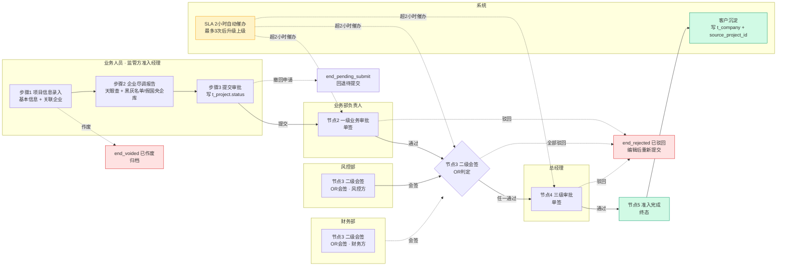
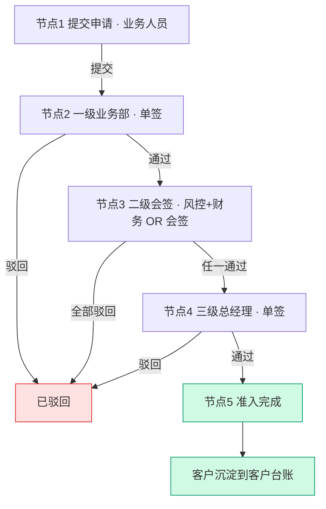
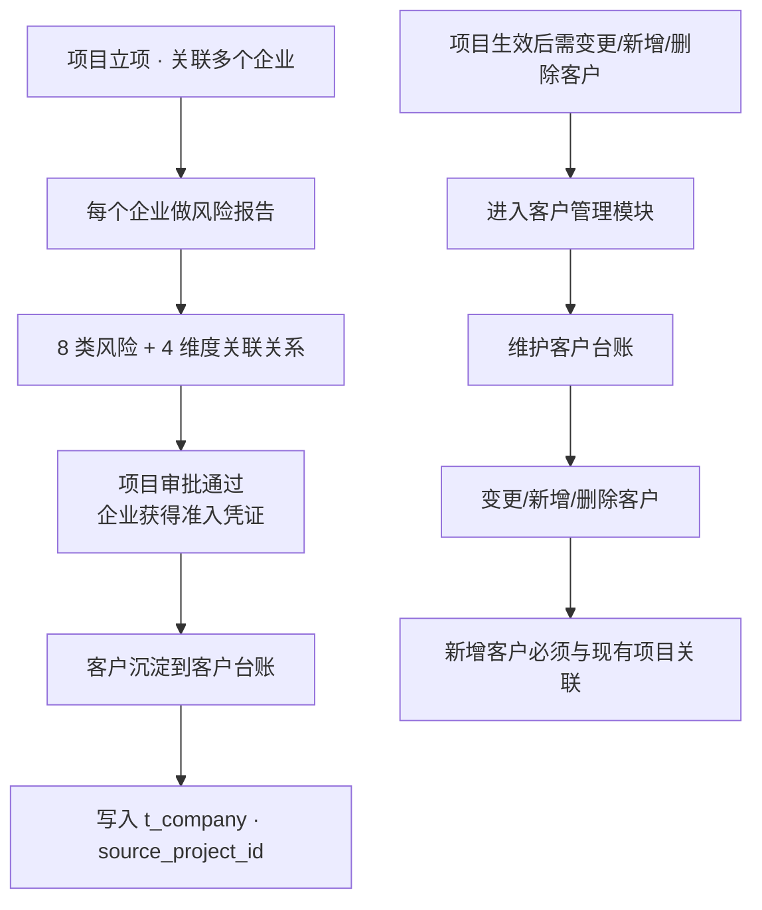
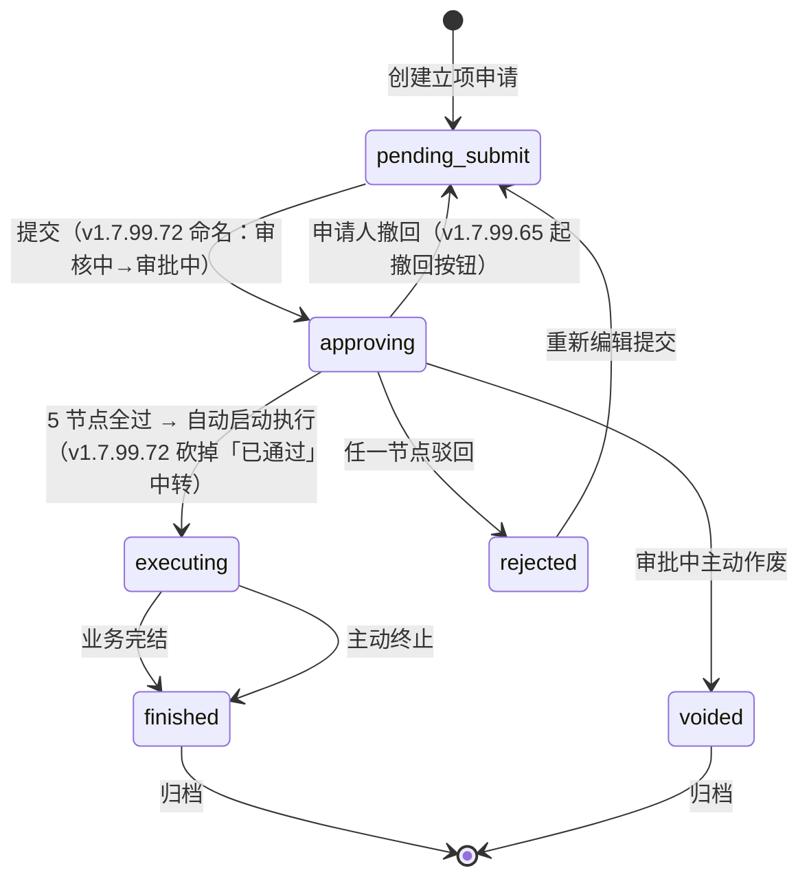
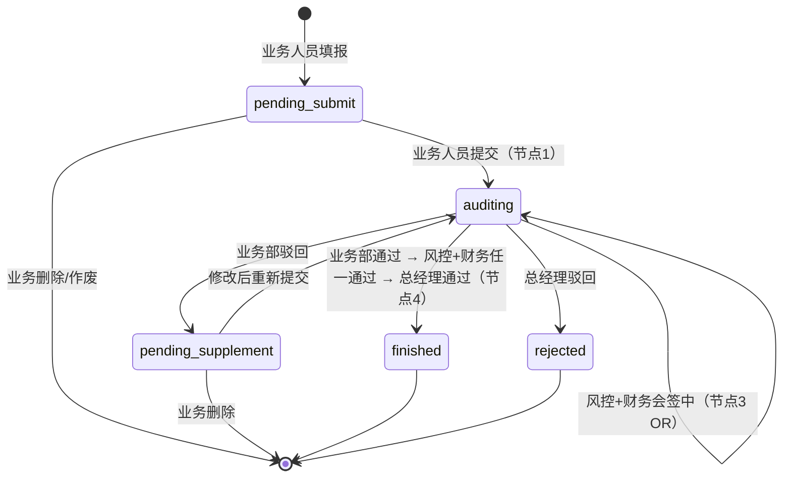

# 02.01 项目管理 · 需求规格说明

> **文档类型**：PRD Writer 范式 · 落地需求文档 · 功能详细描述
> **对应总纲**：[00-产品概述与需求总纲.md](./00-产品概述与需求总纲.md)
> **通用规范**：[01-通用交互与文案规范.md](./01-通用交互与文案规范.md)
> **源文档（只读，未做任何改动）**：[02.01-项目管理-立项.md](../docs/02.01-项目管理-立项.md) / [02.01-list.md](../docs/02.01-list.md) / [02.01-apply.md](../docs/02.01-apply.md) / [02.01-detail.md](../docs/02.01-detail.md)
> **整理时间**：2026-09-30

---

## 0. 阅读说明

### 0.1 信息溯源标记

| 标记 | 含义 | 使用规则 |
|------|------|---------|
| ✅ | 源文档已明确 | 原值保留（表名 / 字段名 / 状态枚举 / 编号规则 / 提示文案），不改写口径 |
| 🔷 | 范式补全 | 源文档没写，按范式要求推导，**必须注明推导依据** |
| ⚠️ | 源文档自相矛盾 | 4 份源文档交叉比对后**如实并列，不静默选边** |
| [待补充] | 信息不足 | **严禁编造**，需业务方 / 研发回填 |

### 0.2 源文档阅读顺序

4 份源文档**内容高度重复**（主体 §1-§12 几乎逐字一致），差异集中在两处：`t_project` 字段表（§3.1）与文末增量节。

| 源文档 | 定位 | 独有价值 |
|--------|------|---------|
| `02.01-项目管理-立项.md` | **主文档 / 超集** | 含 `expected_annual_sales` / `project_background` / `trade_background` 3 字段、`预计完成 sla_deadline` 指标卡行、完整 v1.7.99.x（13+ 版本）变更汇总表、§13 v1.7.99.349.x 增量节（5 步骤重构） |
| `02.01-list.md` | 列表页增量 | v1.7.99.72 状态机变更 + 7 状态 × 操作按钮矩阵 |
| `02.01-apply.md` | 申请页增量 | v1.7.99.72 对申请页的影响说明 |
| `02.01-detail.md` | 详情页增量 | v1.7.99.72 对详情页的影响说明（顶部状态 tag 从 URL `?status=` 读取，联动列表页 `STATUS_META`） |

### 0.3 与通用规范的关系

**通用表单规范（校验时机 / 返回保护 / 提交行为 / 双层校验 / 步骤条切换 / 通用 UI 6 态 / 通用样式）一律以 [01-通用交互与文案规范.md](./01-通用交互与文案规范.md) 为准，本文档不重复定义，只写本模块特有的部分**（5 节点审批、SLA 催办、加签、贸易风控合规报告、项目状态机与跨模块触发）。

---

## 1. 功能描述与触发条件

### 1.1 功能描述

✅ **项目管理（立项）是港通供应链的「业务起点 + 客户准入入口」**。业务人员发起立项申请 → 关联上下游客户 → 每个客户做风险报告（天眼查 + 平台自建黑灰名单/假国央企库）→ 多步骤页面 + 5 节点审批 → 准入完成。**客户管理是项目立项的子流程**——客户从风险报告沉淀到客户台账，不走独立审批。

✅ **源文档 v1.1 锁定的 12 条关键规则**（`02.01-项目管理-立项.md` §1.1，原文保留）：

| # | 规则 |
|---|------|
| 1 | **创建项目时必关联客户**（每个客户必做尽调） |
| 2 | **客户变更 / 新增 / 删除**通过**客户管理模块**维护 |
| 3 | **新增客户必须与现有项目关联**（不能脱离项目独立存在客户） |
| 4 | **4 步骤页面**：步骤 1 项目信息录入 → 步骤 2 企业尽调报告 → 步骤 3 提交审批（5 节点 OR 会签藏在这里）→ 步骤 4 准入完成 ⚠️ v1.7.99.299 已重构为 **5 步骤**，见 §3.4 |
| 5 | **5 节点审批**：提交 → 一级业务 → 二级会签 → 三级总经理 → 完成 |
| 6 | **OR 会签**（风控 + 财务任一通过即可）⚠️ 与状态机表现矛盾，见 §3.4 |
| 7 | **风险扫描**：截图显示「5 条」vs 旧版 8 类，源文档标 **待确认** |
| 8 | **4 维度客户关联关系**（股权 / 对外投资 / 疑似实控人 / 实控控股），**只在「客户股权关系」1 个 Tab 展示** |
| 9 | **v1.0 审批流实现 = 消息推送**（保底方案） |
| 10 | **v2.0 审批流实现 = OA 对接**（拓展方案，致远 A8 OA） |
| 11 | **2 小时 SLA 自动催办** |
| 12 | **3 级 + 会签 + 加签** 审批架构 |

✅ **v1.7.99.x 追加的 13 类客户准入材料**（`02.01-项目管理-立项.md` §13.3，v1.7.99.298 定义，v1.7.99.307 改紧凑分组折叠布局，挂在「添加关联企业」弹窗内）：

| 类型 | 材料 |
|------|------|
| **必填 6 类** | 企业营业执照 / 税务登记证 / 特殊经营许可证 / 纳税申报表 / 完税证明 / 财务报表 |
| **非必填 7 类** | 法定代表人身份证 / 代理人身份证 / 开户许可证 / 授权委托书 / KYC 调查表 / 周年申报表 / 其他材料 |

✅ **v1.7.99.x 其他关键变更**（`02.01-项目管理-立项.md` §13.1 / 变更汇总表）：项目小组成员必填同步 3 处（v1.7.99.26）→ 移到项目基本信息下方 + 列表加 2 列（v1.7.99.27）；总投资信息（v1.7.99.25）；联系人地址（v1.7.99.29）；企业开户行/银行账号字段（v1.7.99.22）；关联企业「已完成准入」自动带入（v1.7.99.31）；步骤条数据回显（v1.7.99.332）+ 首次引导气泡（v1.7.99.333）；Step 2 改名「企业风险报告」→「**企业尽调报告**」+ 合规问卷 banner（v1.7.99.281）；Step 3「贸易风险合规报告」→「**贸易风控合规报告**」（v1.7.99.301）。

### 1.2 触发条件

| 场景 | 触发条件 | 结果 |
|------|---------|------|
| 进入立项流程 | 业务人员从列表页点击「新增立项申请」（v1.7.99.10 改名 ✅） | 跳新建页，`status = pending_submit` |
| 保存草稿 | 任意步骤点击「保存草稿」 | 存储并返回列表 |
| 发起尽调 | 步骤 1 必填项已填 + **至少 1 个关联企业** | 源文档写「状态→`auditing`，跳步骤 2」✅（注：v1.7.99.72 已将 `auditing` 更名为 `approving` ⚠️） |
| 提交审批 | 步骤 2/3 必填项已填 | 状态→审批中（节点 1），进入审批步骤 |
| 审批流实现 | `flow_type` 字段区分 | v1.0 = 消息推送（保底）/ v2.0 = `flow_type=oa_sync` 致远 A8 OA |
| 客户沉淀 | 项目进入 `finished` | 客户从风险报告沉淀到客户台账，写入 `t_company` + `source_project_id` |

✅ 步骤条数据回显（v1.7.99.332）：已完成的步骤**也可点击回看**，数据从 `window.__applyState` 加载；当前步骤 label 加粗 + 永久下划线；已完成步骤 circle 显示绿色 ✓ + 连接线实线。
✅ 首次引导气泡（v1.7.99.333）：进入页面步骤条下方淡入 `提示：步骤条可点击切换查看对应内容（已完成的步骤也可回看）`，3 秒自动淡出（CSS animation `is-hiding`），`sessionStorage['ygt_stepbar_hint_apply_v1'] = '1'` 标记已引导，点击任何步骤后立即隐藏 + 标记。

### 1.3 业务流程（Mermaid）

**多角色泳道图**（角色 = 源文档 §5 角色操作矩阵的 5 类 + 系统）：

> ⚠️ 图中 `{节点3 二级会签 OR判定}` 按源文档「OR 会签 = 任一通过即放行」绘制；**状态机与审批架构关系图实际表现为串行逐级通过**，二者冲突未裁决，见 §3.4 冲突 C3。

**源文档 5 节点 OR 会签子流程（v1.1 原图口径）**：

**客户管理子流程**（源文档 §2.3）：

### 1.4 模块依赖（跨模块流转）

✅ **上游触发：无**——**项目立项是业务起点**（源文档 §9.1 原文）。

✅ **下游触发**（源文档 §9.2 原文）：

| 触发模块 | 触发条件 | 触发动作 |
|---------|---------|---------|
| **客户管理（02.02）** | 项目 `finished` | **客户从风险报告沉淀** |
| **合同管理（02.03）** | 项目 `finished` | 允许创建合同，关联 `project_id` |
| **订单管理（02.04）** | 合同 `signed` | 订单必须关联 `contract_id` → `project_id`（注：订单管理已于 v1.7.99.181 删除，见总纲 §9.3） |
| **收发货（02.05）** | 订单 `executing` | 收/发货关联到 `project_id` |
| **付款（02.08.1）** | 付款申请 | 校验 `project_id` |

✅ 本模块消费的外部能力：**天眼查 API**（风险扫描、原始响应存 `t_tianyancha_search_log`）+ **致远 A8 OA**（v2.0 审批流）。

---

## 2. 交互细节

> 🔷 通用表单交互（校验时机 / 返回保护 / 提交行为 / 双层校验 / 步骤切换）见 [01-通用交互与文案规范.md](./01-通用交互与文案规范.md) §2，本节只写本模块特有部分。

### 2.1 角色操作矩阵（权限可见性）

✅ **状态 × 角色矩阵**（源文档 §5 原表）：

| 状态 / 角色 | 业务人员 | 业务部负责人 | 风控部 | 财务部 | 总经理 | 系统 |
|------------|--------|------------|-------|-------|-------|------|
| `pending_submit` 待提交 | 查看/编辑/删除 | 查看 | 查看 | 查看 | 查看 | - |
| `auditing` 审核中 | 查看 | **审批节点 2** | **审批节点 3** | **审批节点 3** | **审批节点 4** | 推送消息 |
| `pending_supplement` 待补全 | **编辑后重新提交** | 查看 | 查看 | 查看 | 查看 | - |
| `finished` 已完结 | 查看 | 查看 | 查看 | 查看 | 查看 | 客户沉淀 |
| `rejected` 已驳回 | **编辑后重新提交** | 查看 | 查看 | 查看 | 查看 | - |

⚠️ 该矩阵基于 v1.1 的 5 状态（`auditing` / `pending_supplement`），与 v1.7.99.72 的 7 状态（`approving` / `executing` / `voided`）**不对应**，见 §3.4 冲突 C4。

✅ **7 状态 × 操作按钮矩阵**（`02.01-list.md` v1.7.99.72 锁定，原表）：

| 状态 | 操作按钮 |
|------|----------|
| 待提交 | 查看/编辑/提交/作废 |
| 审批中 | 查看/撤回 |
| 执行中 | 查看/上传客户准入报告/终止 |
| 已完结 | 查看 |
| 驳回 | 查看/编辑/重新提交/作废 |
| 已作废 | 查看 |

✅ **v1.7.99.160 跨 tab 审批改造**：详情页固定底栏（`.footer-actions`）在 `data-scenario="approving-approver"` 场景下增加「审批通过」（`.btn.btn-primary` 蓝主按钮）+「驳回审批」（`.btn.btn-danger-outline` 红边框按钮），右侧（`flex: 1` 左侧留空）与「复制为新项目」按钮同行；「审批准入」tab 内「二级审批」节点下方按钮**保留不删**，底栏按钮在**任何 tab 下都可见**。🔷 依据：源文档明确说明「用户可在任何 tab 完成审批」，推导为场景（scenario）驱动的按钮组显隐，非角色驱动。

### 2.2 按钮交互（操作反馈）

✅ **列表页按钮**（源文档 §7.1）：

| 按钮 | 位置 | 可见条件 | 点击行为 |
|------|------|---------|---------|
| **新建立项申请** | 右上 | 所有角色 | 跳新建页 |
| **清空全部** | 搜索区 | 有搜索条件 | 清空筛选 |
| **业务类型筛选** | 搜索区 | - | 下拉选择 |
| **数据导出** | Tab 右侧 | - | 导出 Excel |
| **查看** | 列表行 | 所有 | 跳详情页（仅查看） |
| **编辑** | 列表行 | 状态∈{`pending_submit`, `pending_supplement`, `rejected`} | 跳详情页（编辑） |
| **作废** | 列表行 | 状态∈{`pending_submit`} | 弹确认框 |
| **审核**（v1.1 跟合同对齐） | 列表行 | 状态=`auditing` | 跳详情页（审核中） |

✅ **步骤 1：项目信息录入页按钮**（源文档 §7.2）：

| 按钮 | 位置 | 可见条件 | 点击行为 | 前置校验 |
|------|------|---------|---------|---------|
| **返回** | 底部 | 任何时候 | 弹确认框 | - |
| **保存草稿** | 底部 | 任何时候 | 存储并返回列表 | - |
| **发起尽调** | 底部 | 必填项已填 | 状态→`auditing`，跳步骤 2 | 必填项 + 至少 1 个关联企业 |
| **添加关联企业** | 关联企业区 | 任何时候 | 弹企业选择器 | - |
| **移除关联企业** | 关联企业区 | 任何时候 | 弹确认框 | - |

✅ **步骤 2：企业尽调报告页按钮**（源文档 §7.3）：

| 按钮 | 位置 | 可见条件 | 点击行为 |
|------|------|---------|---------|
| **返回** | 底部 | 任何时候 | 弹确认框 |
| **保存草稿** | 底部 | 任何时候 | 存储并返回列表 |
| **提交审批** | 底部 | 必填项已填 | 状态→`auditing`（节点 1），跳步骤 3 |
| **导出报告** | 顶部 | 任何时候 | 导出 PDF 风险报告 |
| **切换企业 Tab** | 顶部 | 已添加企业 | 切换显示对应企业风险报告（全部/企业A/B/C） |
| **跳天眼查** | 每类风险右侧 | - | 跳天眼查详细页 |
| **编辑准入意见** | 准入意见区 | - | 人工填写 |
| **上传关联报告** | 关联报告区 | - | 拖拽/选择上传（`.pdf` / `.png` / `.jpg` / `.doc`） |

✅ **步骤 3：提交审批页按钮**（源文档 §7.4）：

| 按钮 | 位置 | 可见条件 | 点击行为 |
|------|------|---------|---------|
| **撤回申请** | 顶部 | 创建人 + 审核中 | 状态→`pending_submit` |
| **催办** | 顶部 | 当前审批节点超 2 小时未处理 | 推送催办消息 |
| **立即催办** | 实时活动区超 2 小时 | 节点超 2 小时未处理 | 推送催办消息 |
| **致远 A8 OA** | 关键指标区 | v2.0 OA 模式（`flow_type=oa_sync`） | 跳 OA 系统 |
| **加签** | 当前审批人详情区 | 当前审批人 = 有加签权限 | 弹加签对话框 → 选加签人 + 填加签原因 → 加签节点 `is_add_sign=1` |

✅ **步骤 4：准入完成页按钮**（源文档 §7.5）：

| 按钮 | 位置 | 可见条件 | 点击行为 |
|------|------|---------|---------|
| **下载准入凭证** | 顶部 | active | 下载 |
| **客户管理** | 顶部 | active | 跳客户管理模块 |
| **创建合同** | 顶部 | active | 跳合同新建（关联 `project_id`） |

✅ **关键指标卡片**（步骤 3 顶部，源文档 §7.4.2）：

| 指标 | 字段 / 计算 | 示例 |
|------|------|------|
| **当前节点** | `current_node` + `node_label` | "风控部会签 1/2" |
| **剩余节点** | 计算字段 | "3 个（会签/3级/完成）" |
| **已耗时** | `now() - submit_time` | "1 天 7 小时" |
| **预计完成** | `sla_deadline` + 累计 ⚠️ 仅 `02.01-项目管理-立项.md` / `02.01-detail.md` 有此行 | "2026-07-21 18:00" |
| **外部系统** | `flow_type=oa_sync` 时 | "致远 A8 OA" |

✅ **实时活动时间线样例**（源文档 §7.4.4，7 行事件）：

| 时间 | 操作人 | 事件 |
|------|--------|------|
| 2026-07-19 16:45:23 | 张磊（监管方） | 提交了准入申请（4 份附件） |
| 2026-07-19 18:22:10 | 张磊（业务部负责人） | 通过了一级审批（同意，背景调查材料齐全...） |
| 2026-07-20 09:15 | 王浩（风控部负责人） | 通过了会签子节点（180 万货款纠纷已结...） |
| 2026-07-20 18:22 | 系统 | 向会签节点发送催办 |
| 2026-07-20 18:22 | 系统 | 会签已自动 @王浩 @宋美玲 |
| 2026-07-21 09:00 | 宋美玲（财务总监） | 查看了审批单 |
| （超 2 小时） | 系统 | 自动催办（实时活动 + 弹窗） |

### 2.3 危险操作确认

✅ 源文档明确的「弹确认框」操作（文案按总纲 §7.7 危险操作确认文案模板 🔷 推导，源文档**未逐条给文案**）：

| 操作 | 触发位置 | 确认框文案 | 依据 |
|------|---------|-----------|------|
| **作废立项申请** | 列表行 / 申请页 | `作废后不可恢复，确定作废该立项申请？` 🔷 | 源文档只写「弹确认框」；文案按总纲 §7.7「作废单据」模板推导 |
| **驳回审批** | 步骤 3 底栏 / 固定底栏 | `驳回后申请人可修改后重新提交，确定驳回？` + **必填驳回原因** 🔷 | 总纲 §7.7 / 01 文档 §2.10 已定义；源文档未写本模块文案 |
| **移除关联企业** | 关联企业区 | [待补充] | 源文档只写「弹确认框」，文案未给 |
| **返回 / 离开表单** | 各步骤底部 | `当前编辑内容将丢失，确定返回？` + `确定` / `取消` 🔷 | 01 文档 §2.2 / §2.10 通用规范 |
| **加签未选择加签人** | 加签对话框 | `加签失败：未选择加签人` | ✅ 源文档 §8.2 原文 |
| **终止（执行中）** | 列表行 | [待补充] | v1.7.99.72 操作矩阵有「终止」按钮，源文档未给确认文案 |

✅ 源文档 §8.3 的客户子流程强制阻止（属阻断型而非弹窗型）：`新增客户必须与现有项目关联`（强制阻止）、`客户 XXX 已存在（统一信用代码 YYY）`（阻止重复）、`客户风险等级自动设为 high，已自动冻结`（自动冻结）。

### 2.4 空状态引导

| 场景 | 文案 | 补充动作 | 依据 |
|------|------|---------|------|
| 列表无数据 | `暂无数据` | 有筛选时：`请调整筛选条件` | 🔷 01 文档 §2.11 + 总纲 §7.4 |
| 筛选后无结果 | `当前搜索无匹配结果` + chips 区 | `清除全部` 按钮 | 🔷 总纲 §7.4；源文档有「清空全部」按钮（可见条件 = 有搜索条件）✅ |
| 关联企业选择器为空 | `暂无可关联的企业` | 说明前置条件 | 🔷 01 文档 §2.11「关联单据选择器为空」模板 |
| 关联企业数 = 0 时提交 | `请至少添加 1 个关联企业` | 阻止提交 | ✅ 源文档 §8.1 原文 |
| 步骤 2 企业 Tab 切换 | 无企业时隐藏 Tab 区 | - | 🔷 依据「切换企业 Tab」可见条件 = 已添加企业 ✅ 推导 |
| 5 节点审批进度「待开始」节点 | 灰字 `待开始` | 节点 4 标注「需在二级会签通过后自动触发」、节点 5 标注「三级审批通过后自动归档」 | ✅ 源文档 §7.4.3 原文 |
| KPI 卡片无数据 | [待补充] | [待补充] | 源文档未定义 |

### 2.5 失败引导

✅ **源文档 §8 异常处理原表（提示文案原值保留，不改写）**：

**§8.1 业务异常**

| 异常场景 | 提示文案 | 处理动作 |
|---------|---------|---------|
| 必填项未填 | `"请填写：项目名称/业务类型/品类/..."` | 阻止提交 |
| 关联企业为空 | `"请至少添加 1 个关联企业"` | 阻止提交 |
| 业务类型与品类不匹配 | `"业务类型 X 与品类 Y 不匹配"` | 红色提示 |
| 项目周期 > 999 | `"项目周期最大 999 月"` | 阻止 |
| 风险扫描失败 | `"天眼查接口超时，请重试"` | 允许重试 |
| 8 类高风险 ≥ 2 | `"企业存在 X 项高风险，建议修改关联企业"` | 红色警示 |
| 关联报告上传失败 | `"文件格式不支持或过大"` | 阻止上传 |

**§8.2 审批异常**

| 异常场景 | 提示文案 | 处理动作 |
|---------|---------|---------|
| OR 会签任一驳回 | `"二级会签任一驳回"` | 状态→`pending_supplement`（v1.1）⚠️ 该状态已被 v1.7.99.72 砍掉 |
| 审批人未配置 | `"审批人未配置，请联系管理员"` | 状态保持 |
| 消息推送失败 | `"消息推送失败，请重试"` | 允许重试 |
| 审批超时（2 小时） | `"审批超过 2 小时未处理"` | **自动催办** |
| 2 小时超时 | `"已耗时 X 小时，建议催办或 @该审批人加速处理"` | **实时活动 + 立即催办按钮** |
| OA 对接失败（v2.0） | `"OA 系统连接失败"` | 允许重试 |
| 加签人未配置 | `"加签失败：未选择加签人"` | 阻止加签 |

**§8.3 客户管理子流程异常**

| 异常场景 | 提示文案 | 处理动作 |
|---------|---------|---------|
| 客户已存在 | `"客户 XXX 已存在（统一信用代码 YYY）"` | 阻止重复 |
| 新增客户无项目关联 | `"新增客户必须与现有项目关联"` | 强制阻止 |
| 客户状态变更 | `"客户状态已变更"` | 通知相关业务 |
| 客户风险等级 high | `"客户风险等级自动设为 high，已自动冻结"` | 自动冻结 |

🔷 **本模块补充的失败引导**（源文档未定义，按 01 文档 §2.12 通用失败引导推导）：

| 失败类型 | 引导方式 | 依据 |
|---------|---------|------|
| 天眼查接口超时 | 沿用源文档文案 `"天眼查接口超时，请重试"` + 允许重试按钮，**不阻断其余企业** | ✅ 源文档已定义「允许重试」；🔷 「不阻断其余企业」按总纲 §8.1「单模块降级不阻塞其他区块」推导 |
| 附件上传中断 | `上传失败，请重新上传` 🔷 | 01 文档 §4.4 |
| 加载详情页失败 | 顶部红色横幅 + `重试` 按钮 🔷 | 01 文档 §4.4 |
| 无权限 | `无访问权限` + 提示联系管理员 🔷 | 总纲 §7.4 |

---

## 3. 状态清单

### 3.1 业务状态机

**当前口径（v1.7.99.72 锁定，`02.01-项目管理-立项.md` 增量节 mermaid 原图）**：

✅ **源文档记载的历史演进链**（原值保留）：v1.1 5 状态 → v1.7.99.11 6 状态（补「驳回」独立）→ v1.7.99.65 8 状态（增「待补件/已通过/已作废」）→ **v1.7.99.72 7 状态**（砍「待补件/已通过」）。

✅ **v1.1 旧状态机（已被 v1.7.99.72 取代，保留供追溯）**：

⚠️ **两个状态机图存在以下已裁决/未裁决差异**：

| 差异项 | v1.1 | v1.7.99.72 | 状态 |
|-------|------|-----------|------|
| 审核中枚举值 | `auditing` | `approving`（改名） | ✅ 已明确「审核中→审批中」 |
| 待补全 `pending_supplement` | 存在 | **已砍** | ✅ 已裁决 |
| 已通过中间态 | 无 | **已砍**（审批通过直跳执行中） | ✅ 已裁决 |
| 执行中 `executing` | 无（旧版叫 `active` / 语义为「准入完成」） | **新增** | ✅ 已明确 |
| 已作废枚举值 | `frozen` | `voided`（改名） | ✅ 已明确 |
| 「待补件」 | 无 | 曾有，v1.7.99.72 砍 | ✅ 已裁决 |
| **状态总数算术** | 5 个 | 声称 **7 个** | ⚠️ 见 §3.4 冲突 C4 |
| **OR 会签 vs 串行** | 规则说 OR，状态机表现为串行 | — | ⚠️ 见 §3.4 冲突 C3（总纲 Q1） |

### 3.2 状态值与展示

| 枚举值 | 中文 | 触发条件 | 下一状态 | Tag 色 |
|-------|------|---------|---------|--------|
| `pending_submit` | 待提交 | 创建立项申请 / 驳回后重新编辑提交 / 申请人撤回 | `approving`（提交）/ `voided`（作废） | 🔷 灰 `#F3F4F6` / 文字 `#6B7280`（未开始态，推导自总纲 §7.8「终态/已关闭 = 灰」） |
| `approving` | 审批中 | 业务人员提交（节点 1） | `executing`（5 节点全过）/ `rejected`（任一节点驳回）/ `voided`（主动作废）/ `pending_submit`（撤回） | 🔷 蓝 `#EFF6FF` / 文字 `#1E40AF`（推导自总纲 §7.8「进行中/待处理 = 蓝」，示例明列「审批中」） |
| `executing` | 执行中 | 5 节点全过 → 自动启动执行 | `finished`（业务完结 / 主动终止） | 🔷 蓝 `#EFF6FF` / 文字 `#1E40AF`（同上，「执行中」为总纲 §7.8 明列示例） |
| `finished` | 已完结 | 业务完结 / 主动终止 | 终态，归档 | 🔷 绿 `#ECFDF5` / 文字 `#047857`（推导自总纲 §7.8「正常/生效 = 绿」，示例明列「已完结」） |
| `rejected` | 驳回 | 任一节点驳回 | `pending_submit`（重新编辑提交） | 🔷 红 `#FEE2E2` / 文字 `#DC2626`（推导自总纲 §7.8「驳回/异常 = 红」） |
| `voided` | 已作废 | 审批中主动作废 | 终态，归档 | 🔷 灰 `#F3F4F6` / 文字 `#6B7280`（推导自总纲 §7.8「终态/作废/已关闭 = 灰」） |
| `pending_supplement` | 待补全 | 业务部驳回（**v1.1 专属，v1.7.99.72 已砍**） | `auditing`（修改后重新提交）/ 终态（删除） | ⚠️ 无效枚举，色板 N/A |
| `auditing` | 审核中 | 业务人员提交（**v1.1 枚举，v1.7.99.72 改名 `approving`**） | — | ⚠️ 无效枚举，色板 N/A |
| `frozen` | （源文档未给中文，仅在 v1.1 变更摘要中作为 `pending_supplement/finished/rejected/frozen` 之一出现） | — | — | ⚠️ 无效枚举，色板 N/A |
| `active` | （v1.0 枚举，步骤 4 按钮可见条件写作 `active`） | — | — | ⚠️ 无效枚举，色板 N/A |

> ✅ 枚举值原样保留自源文档 mermaid 与状态说明表；🔷 Tag 色按总纲 §7.8 状态标签配色推导（源文档只写「状态 tag 颜色编码 v1.7.99.14」，未给具体色值）。
> ✅ 源文档 §4.2 状态与列表 Tab 映射（v1.1 口径）：全部 / 待提交 `pending_submit` / 审核中 `auditing` / 待补全 `pending_supplement` / 已完结 `finished` / 驳回 `rejected`。⚠️ 该映射基于 v1.1 状态集，v1.7.99.72 之后需重出。

⚠️ **「审批节点意见标签」vs「项目状态机」的强制区分**（源文档 v1.7.99.72 明确要求）：

- 详情页 / 申请页里出现的「**已通过**」是**审批节点意见标签**（节点 1/2/3 通过、王浩·风控部负责人 通过 等），**不属于项目状态机，不动**。
- 项目状态机顶层状态是「审批中 / 执行中 / 已完结 / 驳回 / 已作废」。

### 3.3 UI 状态清单

> 通用 6 态以 [01-通用交互与文案规范.md](./01-通用交互与文案规范.md) §3.2 为准；下表为**本模块（列表页 / 申请页 / 详情页）**的落地映射。

| 状态 | 触发 | 视觉 | 可交互 |
|------|------|------|-------|
| **默认** | 页面加载完成、状态非审批中 | 列表页展示状态列 + 操作按钮组（按 §2.1 矩阵）；申请页字段可编辑、必填红星显示 | ✅ 全部按钮按矩阵显隐 |
| **加载中** | 🔷 提交中 / 加载既有数据中 / 天眼查扫描中 | 提交按钮 loading「提交中...」+ 旋转图标 + 禁用；天眼查扫描区显示「6 项扫描」灰色 chip + 加载态（✅ Step 3 顶部 meta 有「扫描时间 + 6 项扫描 chip + 2 项风险 chip」结构） | ❌ 禁用重复提交；其他区块 🔷 保持可读 |
| **成功** | 提交成功 / 审批通过 / 5 节点全过 | 顶部居中 Toast 绿色 `#10B981`，3s 自动消失，文案 `提交成功` / `审批通过`（🔷 01 文档 §3.2 / 总纲 §7.5） | — |
| **失败** | 后端返回业务错误 / 天眼查超时 / 消息推送失败 | 顶部居中 Toast 红色 `#EF4444`，**不自动消失需手动关闭**；**保留用户输入**；按钮恢复可点。源文档原文文案：`天眼查接口超时，请重试` / `消息推送失败，请重试` / `OA 系统连接失败` | ✅ 按钮恢复可点 |
| **禁用** | 无权限 / 状态不满足按钮可见条件（如「作废」仅 `pending_submit` 可见、「编辑」仅 3 状态可见） | 按钮灰化不可点 + Tooltip 说明原因 🔷 | ❌ |
| **空状态** | 🔷 列表无数据 / 筛选无结果 / 关联企业为空 | 空状态插画 + 灰字 13px 居中；文案 `暂无数据` / `请调整筛选条件` / `请至少添加 1 个关联企业` | ✅ 引导操作（「新增立项申请」/「清除全部」/「添加关联企业」） |

🔷 **本模块特有的 UI 状态补充**：

| 状态 | 触发 | 视觉 | 可交互 | 依据 |
|------|------|------|-------|------|
| **审批中-审批人视角** | `data-scenario="approving-approver"` | 固定底栏 `.footer-actions` 显示「审批通过」+「驳回审批」，与「复制为新项目」同行 | ✅ | ✅ 源文档 v1.7.99.160 |
| **SLA 超时告警态** | 当前节点超 2 小时未处理 | 实时活动时间线追加「自动催办（实时活动 + 弹窗）」+ 指标卡「已耗时」文案 `已耗时 X 小时，建议催办或 @该审批人加速处理` | ✅「立即催办」按钮 | ✅ 源文档 §7.4.4 / §7.4.6 / §8.2 |
| **加签中节点** | `is_add_sign=1` | 审批进度节点标注加签标记 🔷 | 🔷 待确认视觉 | ✅ 字段规则已定义 `is_add_sign` + `add_sign_reason` 必填；视觉源文档未定义 |
| **风险扫描高风险警示** | 8 类高风险 ≥ 2 | 红色警示 `"企业存在 X 项高风险，建议修改关联企业"` | ✅ 允许继续但红字警示 | ✅ 源文档 §8.1（阻断型为「不匹配」/「>999」，警示型为高风险） |

### 3.4 版本冲突

> ⚠️ 以下 5 条为 **4 份源文档交叉比对后确认的自相矛盾**，本次重组**未选边**，全部如实并列，交由业务方裁决。

**C1 — `project_period_months` 的中文名冲突**

| 源文档 | 中文名 | 版本标注 |
|-------|-------|---------|
| `02.01-项目管理-立项.md` §3.1 | **项目周期（月）** | 无版本标注 |
| `02.01-list.md` / `02.01-apply.md` / `02.01-detail.md` §3.1 | **业务周期（月）** | **v1.7.99.25 改名** |

⚠️ 影响：字段类型/校验完全一致（`int` / ✓ 必填 / 仅支持数字输入、限制 3 位以内），**仅中文名不一致**。因 3/4 份文档带 v1.7.99.25 版本标注，倾向「业务周期（月）」为最新，但**本文档不代为裁决**。

**C2 — `t_project` 字段集合不一致**

| 字段 | 立项.md | list.md | apply.md | detail.md | 备注 |
|------|--------|---------|---------|---------|------|
| `project_period_months` | ✓ | ✓ | ✓ | ✓ | 中文名冲突见 C1 |
| `expected_annual_sales`（预计年销售额（万元），`decimal(20,2)`，✓ 必填，整数） | ✅ | ❌ | ❌ | ❌ | **仅 1 份有** |
| `project_background`（项目背景，`text`，-，最大 200 字） | ✅ | ❌ | ❌ | ❌ | **仅 1 份有** |
| `trade_background`（贸易背景，`text`，-，最大 200 字） | ✅ | ❌ | ❌ | ❌ | **仅 1 份有** |
| `project_content`（项目主要内容，`text`，-，最大 200 字，v1.7.99.25 改名） | ❌ | ✅ | ✅ | ✅ | |
| `expected_profit`（预计收益，`text`，-，最大 200 字，v1.7.99.25 改名） | ❌ | ✅ | ✅ | ✅ | |
| `project_members`（项目小组成员，`json`，✓ **必填**，JSON 数组 `[{id, name}]`，多选+模糊搜索，v1.7.99.25 新增） | ❌ | ✅ | ✅ | ✅ | **必填字段缺失风险** |
| `guarantee_measures`（保障措施，`text`，-，最大 200 字，v1.7.99.25 新增） | ❌ | ✅ | ✅ | ✅ | |
| `report_items`（呈报事项，`text`，-，最大 200 字，v1.7.99.25 新增） | ❌ | ✅ | ✅ | ✅ | |
| `sla_deadline` 预计完成（指标卡行） | ✅ | ❌ | ❌ | ✅ | 见 C5 |

⚠️ 双向缺失：立项.md 独有 3 字段（`expected_annual_sales` / `project_background` / `trade_background`），其余 3 份独有 5 字段（`project_content` / `expected_profit` / `project_members` / `guarantee_measures` / `report_items`）。**`project_members` 是必填字段**，若以立项.md 为准会漏建必填项，反之会以「预计年销售额（万元）」替代 `expected_profit`（语义从「金额」变为「文本」）。**影响：表结构 DDL 与申请页必填校验**。

**C3 — 「5 节点 OR 会签」vs 串行逐级通过（语义冲突，阻塞级）**

| 证据 | 原文口径 |
|------|---------|
| §1.1 规则 6 | 「**OR 会签**（风控+财务任一通过即可）」 |
| §2.2 流程图 | 节点 3 →「任一通过」→ 节点 4；节点 3 →「**全部驳回**」→ 已驳回 |
| §4 状态机 | `auditing → finished: 业务部通过 → 风控+财务任一通过 → 总经理通过`；`auditing → rejected: 总经理驳回` |
| §7.4.3 审批进度 | 节点 3 标「进行中 1/2 + 2 个审批人」，示例「王浩 ✓ 已通过；宋美玲 ⏳ 审批中·已读」——**王浩已通过但流程仍停留在节点 3**，与 OR 会签（任一通过即放行）矛盾 |
| §8.2 审批异常 | 「OR 会签**任一驳回** → 状态→`pending_supplement`」——**任一驳回即终止**，与 OR 会签（任一通过即放行）不对称 |

⚠️ **OR 会签 = 任一节点通过即放行**；但状态机、审批进度示例、异常处理三处均表现为**串行逐级通过 + 任一节点驳回即终止**。两种语义的审批引擎实现方式完全不同。**本项已在总纲 §9.1 记为 Q1（🔴 阻塞开发），本文档不代为裁决**。

**C4 — 项目列表状态数与 Tab 数冲突**

| 口径 | 状态数 | 状态清单 | Tab 数 | 依据 |
|------|-------|---------|-------|------|
| v1.1 | 5 个（表头写「状态 6 个」但枚举仅列 5 个） | `pending_submit` / `auditing` / `pending_supplement` / `finished` / `rejected` | 5 + 全部 = 6 | §4.1 / §4.2 |
| v1.7.99.11 | 6 个 | 上列 +「驳回」独立 | 6 + 全部 = 7 | §13.7 历史注 |
| v1.7.99.65 | **8 状态** | 待提交 / 审批中 / 待补件 / 已通过 / 执行中 / 已完结 / 驳回 / 已作废 | 8 + 全部 = 9 | §13 核心变更 |
| v1.7.99.72 | **7 状态** | 砍「待补件」「已通过」 | 7 + 全部 = 8 | §13 + `02.01-list.md` 状态机变化表 |

⚠️ **本次交叉比对新发现的两处内部不自洽**（源文档自身算术/清单对不上）：

1. **算术不符**：v1.7.99.65 的 8 状态砍掉 2 个 = **6 状态**（待提交 / 审批中 / 执行中 / 已完结 / 驳回 / 已作废），但源文档写「**7** 状态 / **7 + 全部 = 8** Tab」；且 v1.7.99.72 记录的用户需求原话为「全部--待提交--审批中--执行中--已完结--驳回--已作废」= **6 状态 + 全部 = 7 Tab**。
2. **操作按钮矩阵只有 6 行**（`02.01-list.md` v1.7.99.72 锁定表：待提交 / 审批中 / 执行中 / 已完结 / 驳回 / 已作废），**没有第 7 个状态**。

⚠️ 即：**可枚举的状态是 6 个，不是源文档声称的 7 个**。同时 v1.1 §3.1 表头写「状态 6 个（v1.1 调整）」但枚举只列 5 个（第 6 个疑为 `frozen`，见 §11 变更摘要「6 个：pending_submit/auditing/pending_supplement/finished/rejected/frozen」）。**影响：列表 Tab 数量、状态 Tag 色卡数量、状态筛选参数取值范围**。

**C5 — `sla_deadline` 预计完成时间不一致**

| 源文档 | 步骤 3 关键指标卡片是否含「预计完成」行 |
|-------|------------------------------------------|
| `02.01-项目管理-立项.md` §7.4.2 | ✅ 有：`| **预计完成** | `sla_deadline` + 累计 | "2026-07-21 18:00" |` |
| `02.01-detail.md` §7.4.2 | ✅ 有（同上） |
| `02.01-list.md` §7.4.2 | ❌ 无（该行被删除） |
| `02.01-apply.md` §7.4.2 | ❌ 无（该行被删除） |

⚠️ 但 §6.8 字段规则在 **4 份文档中均有**：`SLA 字段：sla_deadline / sla_overtime / sla_remind_count`。即字段定义一致，仅**指标卡是否展示该字段**在 list/apply 两份中缺行。**影响：步骤 3 顶部指标卡列数（4 列 vs 5 列）**。

---

## 4. 边界条件

### 4.1 业务校验拦截

| 校验 | 触发时机 | 规则 | 提示文案 | 动作 |
|------|---------|------|---------|------|
| 必填项校验 | 点击「发起尽调」/「提交审批」 | `project_name` / `business_type` / `product_category` / `project_period_months` / `business_leader_id` / `project_members` 必填 ✅ | `请填写：项目名称/业务类型/品类/...` ✅ | 阻止提交 |
| 关联企业数 | 提交前 | **至少 1 个关联企业** ✅ | `请至少添加 1 个关联企业` ✅ | 阻止提交 |
| 业务类型 × 品类匹配 | 字段失焦 / 提交 | 业务类型与品类必须匹配 ✅（**具体匹配矩阵 [待补充]**，源文档只给提示文案未给规则表） | `业务类型 X 与品类 Y 不匹配` ✅ | 红色提示 |
| 业务周期上限 | 失焦 | ≤ 999（3 位以内）✅ | `项目周期最大 999 月` ✅ | 阻止 |
| 项目名称长度 | 失焦 | 最大 54 中文字符，限中英常规标点 ✅ | [待补充] | 阻止 |
| 文本字段长度 | 失焦 | `project_content` / `expected_profit` / `guarantee_measures` / `report_items` 最大 200 字，限中英常规标点 ✅ | [待补充] | 阻止 |
| 风险扫描高风险 | 扫描完成 | 8 类高风险 ≥ 2 → 红色警示（**不阻断**）✅ | `企业存在 X 项高风险，建议修改关联企业` ✅ | 红色警示 |
| 新增客户关联 | 客户管理子流程 | 新增客户必须与现有项目关联 ✅ | `新增客户必须与现有项目关联` ✅ | 强制阻止 |
| 客户唯一性 | 客户沉淀 | 客户 ID 通过 `unified_credit_code` 唯一 ✅ | `客户 XXX 已存在（统一信用代码 YYY）` ✅ | 阻止重复 |
| 加签人必填 | 加签 | `add_sign_reason` 必填 ✅ | `加签失败：未选择加签人` ✅ | 阻止加签 |
| SLA 阈值 | 审批中 | 2 小时；催办最多 3 次（超过 3 次升级到上级）✅ | `审批超过 2 小时未处理` / `已耗时 X 小时，建议催办或 @该审批人加速处理` ✅ | 自动催办 + 立即催办按钮 |

🔷 **本模块补充的跨步/终态校验**（按 01 文档 §2.4/§2.6 推导，依据：源文档步骤 2 写明「多步骤表单」且 §7.2 明确「发起尽调」前置校验为「必填项 + 至少 1 个关联企业」）：

- 步骤内校验：点击「下一步 / 发起尽调 / 提交审批」只校验**当前步**字段。
- 终态校验：点击最终「提交审批」校验**全部 N 步** + 跨步规则（关联企业 ≥ 1、客户准入材料必填 6 类齐全）。
- 失败时跳转到第一个未完成步 + 高亮该字段 + Toast。

### 4.2 内容边界（空内容/超长/格式不符）

| 边界 | 规则 | 依据 |
|------|------|------|
| **空内容** | 必填字段为空 → 提交时拦截；非必填字段允许空 ✅（`project_content` / `expected_profit` / `guarantee_measures` / `report_items` / `total_investment` / `upstream_count` / `downstream_count` 均为非必填 `-`） | ✅ 源文档 §3.1 必填列 |
| **超长** | `project_name` ≤ 54 中文字符；4 个 text 字段 ≤ 200 字；`project_period_months` ≤ 999 | ✅ 源文档 §3.1 / §8.1 |
| **数字输入** | `project_period_months` **仅支持数字输入**，限制 3 位以内 | ✅ 源文档 §3.1 原文 |
| **标点限制** | `project_name` / 4 个 text 字段**限中英常规标点** | ✅ 源文档 §3.1 原文 |
| **粘贴非预期内容** | 失焦时格式校验拦截 | 🔷 01 文档 §4.1 |
| **非必填字段展示** | 空值展示 `—` | 🔷 01 文档 §4.1 |
| **附件格式** | 关联报告上传：`.pdf` / `.png` / `.jpg` / `.doc`；客户准入材料 13 类 | ✅ 源文档 §7.3 / §13.3 |
| **附件大小上限** | [待补充] | 源文档只写失败文案 `文件格式不支持或过大`，未给具体阈值 |
| **业务类型 × 品类匹配矩阵** | [待补充] | 源文档给了提示文案但未给规则表 |

### 4.3 异常与网络

| 场景 | 处理 | 文案 | 依据 |
|------|------|------|------|
| 天眼查接口超时 | 允许重试 | `天眼查接口超时，请重试` | ✅ §8.1 |
| 消息推送失败（v1.0 消息推送方案） | 允许重试 | `消息推送失败，请重试` | ✅ §8.2 |
| OA 对接失败（v2.0 `flow_type=oa_sync`） | 允许重试 | `OA 系统连接失败` | ✅ §8.2 |
| 审批人未配置 | 状态保持 | `审批人未配置，请联系管理员` | ✅ §8.2 |
| 关联报告上传失败 | 阻止上传 | `文件格式不支持或过大` | ✅ §8.1 |
| 附件上传中断 | 提示重传 | `上传失败，请重新上传` | 🔷 总纲 §7.5 |
| 提交时网络断开 | Toast + **保留用户输入** + 按钮恢复可点 | `网络异常，请重试` | 🔷 01 文档 §4.4 |
| 加载详情页失败 | 顶部红色横幅 + `重试` 按钮 | `数据加载失败，请重试` | 🔷 总纲 §7.5 |
| 单区块降级 | 天眼查扫描失败**不阻断**其余企业/区块 | 该区块降级 `暂无数据` | 🔷 总纲 §8.1 |

### 4.4 权限与并发

**权限** ✅（源文档 §5 角色操作矩阵，详见 §2.1）：

- 角色维度：按状态 × 角色矩阵控制**按钮可见性**（如「审核」仅 `approving` 状态可见；审批节点 2/3/4 分别属业务部负责人 / 风控部+财务部 / 总经理）。
- **撤回申请**额外限定「创建人 + 审核中」双重条件 ✅。
- **加签**额外限定「当前审批人 = 有加签权限」✅。
- 🔷 越权保护：前端隐藏 ≠ 安全，**后端须对每个写操作二次鉴权**（推导自总纲 §8.2）。
- [待补充] 本模块未见「无访问权限」的整页兜底定义。

**并发** 🔷（源文档**完全未定义**并发规则，以下按 01 文档 §4.6 通用并发边界推导，**需研发确认技术方案**）：

| 场景 | 处理 | 对本模块的具体含义 |
|------|------|-----------------|
| 同一项目被两人同时编辑 | 后端乐观锁（版本号 / 更新时间戳），冲突时提示「数据已被他人修改，请刷新」 | 申请页 Step 1 基本信息并发编辑 |
| 重复提交 | 前端提交中禁用按钮；**后端幂等控制**（业务唯一键 `project_no` + 时间窗） | 「保存草稿」/「提交审批」双击 |
| **审批并发**（两人同时点通过 / 驳回） | 状态机转移做 **CAS 校验**，失败方提示「该单据状态已变更」 | 🔴 本模块高风险：`approving` 状态下风控与财务**同时**点通过 / 驳回（OR 会签节点天然并发） |
| **加签并发**（审批人加签时他人已审批） | 加签节点 `is_add_sign=1` 写入需与节点状态转移串行化 | 🔴 加签人可加入**任何节点**，可能加入已结束的节点 |
| **SLA 定时任务与手工催办并发** | 催办计数 `sla_remind_count` 需原子递增，防止超发 | 2 小时自动催办（最多 3 次）+ 手工「立即催办」 |
| 撤回 / 审批并发 | 申请人「撤回申请」与审批人「审批通过」同时发生 → 状态 CAS 失败方提示状态已变更 | 🔴 源文档 v1.7.99.65 起有撤回按钮，存在此竞态 |

---

## 5. 数据规范

### 5.1 核心实体（表结构）

✅ 源文档 §3 定义 **7 张表，本模块全部新建**（🔴 复用度 < 30%，主产品「河南征信」dg_risk **没有项目管理立项流程**）。

| # | 表名 | 中文 | 字段完整度 | 关键字段（源文档已明确部分） |
|---|------|------|-----------|--------------------------|
| 1 | `t_project` | 项目主表 | ✅ **完整字段表**（见 §5.2） | 26 字段，含双编号轨 `project_no` + `system_no` |
| 2 | `t_project_company_rel` | 项目-关联企业关系表 | 🔶 部分 | `relation_type`：`upstream` / `downstream` / `third_party_logistics` / `third_party_warehouse`（4 种）✅；其余字段 [待补充] |
| 3 | `t_project_due_diligence` | 项目尽调报告表 | 🔶 部分 | v1.1 新增 `risk_scan_count` 字段 ✅；其余字段 [待补充] |
| 4 | `t_project_step_record` | 项目步骤记录表 | [待补充] | 源文档未给任何字段 |
| 5 | `t_project_approval` | 项目审批表 | 🔶 部分 | `is_add_sign=1` + `add_sign_reason` 必填 ✅（加签节点标记）；其余字段 [待补充] |
| 6 | `t_project_attach` | 项目附件表 | [待补充] | 源文档未给字段；承载 13 类客户准入材料 + 关联报告 |
| 7 | `t_company` | 客户主表 | 🔶 部分 | `unified_credit_code` 唯一键 ✅；`source_project_id` + `source_due_diligence_id`（来源记录）✅；客户分类字段见 02.02 |

✅ **SLA 字段**（`02.01-项目管理-立项.md` §6.8，4 份文档一致）：`sla_deadline` / `sla_overtime` / `sla_remind_count`。[待补充] 这 3 个字段挂在哪张表（`t_project` 还是 `t_project_approval`）源文档未明确。

✅ **审批流类型字段**：`flow_type`，值 `oa_sync` 时关键指标卡展示「致远 A8 OA」✅。v1.0（消息推送）对应的枚举值 [待补充]。

### 5.2 字段级规范

**`t_project` 项目主表完整字段表**（✅ 源文档 §3.1 原值保留；⚠️ 差异字段已标注）：

| 字段名 | 中文 | 类型 | 必填 | 默认值 | 校验规则 |
|-------|------|------|------|-------|---------|
| `id` | 主键 | bigint PK | - | 自增 | - |
| `project_no` | 业务立项编号 | varchar(32) | ✓ | 系统生成 | `LX{YYYYMMDD}{3位}`，**14 位无横线**，如 `LX20260122001` |
| `system_no` | 系统项目编号 | varchar(32) | - | 系统生成 | `NC{14位数字}`，如 `NC2344542142`；**系统自动生成，不可修改**；与 `project_no` 互为冗余，`project_no` 给业务看，`system_no` 给系统关联用 |
| `project_name` | 项目名称 | varchar(128) | ✓ | - | 限中英常规标点，**最大 54 中文字符** |
| `business_type` | 业务类型 | varchar(20) | ✓ | - | 5 种枚举：`inventory`（存货业务）/ `prepayment`（预付业务）/ `credit_period`（账期业务）/ `trade`（购销业务）/ `agency_business`（总代业务） |
| `product_category` | 货物品类 | varchar(64) | ✓ | - | 3 种具体名：`玉米` / `糖粉` / `木薯淀粉`（v1.1 调整：旧版 `谷物`/`糖粉`/`淀粉` 为抽象名） |
| `project_period_months` | ⚠️ **项目周期（月）**（立项.md）/ ⚠️ **业务周期（月）**（list/apply/detail，v1.7.99.25 改名） | int | ✓ | - | 仅支持数字输入，限制 **3 位以内**（≤ 999） |
| `expected_annual_sales` | 预计年销售额（万元） | decimal(20,2) | ✓ | - | 整数 ⚠️ **仅立项.md 有此字段** |
| `project_background` | 项目背景 | text | - | - | 限中英常规标点，最大 200 字 ⚠️ **仅立项.md 有此字段** |
| `trade_background` | 贸易背景 | text | - | - | 限中英常规标点，最大 200 字 ⚠️ **仅立项.md 有此字段** |
| `project_content` | 项目主要内容 | text | - | - | 限中英常规标点，最大 200 字（v1.7.99.25 改名） |
| `expected_profit` | 预计收益 | text | - | - | 限中英常规标点，最大 200 字（v1.7.99.25 改名） |
| `business_leader_id` | 业务负责人 ID | bigint | ✓ | - | 关联 `sys_user` |
| `project_members` | 项目小组成员 | json | ✓ | - | **JSON 数组 `[{id, name}]`**，多选 + 模糊搜索（v1.7.99.25 新增，必填；v1.7.99.26 必填同步 3 处，v1.7.99.27 移到项目基本信息下方） |
| `total_investment` | 总投资金额（万元） | decimal(20,2) | - | - | 可选填 |
| `guarantee_measures` | 保障措施 | text | - | - | 限中英常规标点，最大 200 字（v1.7.99.25 新增） |
| `report_items` | 呈报事项 | text | - | - | 限中英常规标点，最大 200 字（v1.7.99.25 新增） |
| `upstream_count` | 上游企业数量 | int | - | - | 冗余字段 ✅ |
| `downstream_count` | 下游企业数量 | int | - | - | 冗余字段 ✅ |
| `status` | 状态 | varchar(20) | ✓ | `pending_submit` 🔷 | 枚举见 §3.2 |
| `current_step` | 当前步骤 | tinyint | - | 1 🔷 | **1-4**（v1.1 改为 1-4，不是 1-5）⚠️ v1.7.99.299 改为 5 步骤后应为 1-5，见 §7 |
| `current_node` | 当前审批节点 | tinyint | - | - | **1-5**（步骤 3/4 内部） |
| `creator_id` | 创建人 | bigint | ✓ | 当前登录用户 🔷 | - |
| `create_time` | 创建时间 | datetime | ✓ | 系统时间 🔷 | - |
| `submit_time` | 提交时间 | datetime | - | - | 节点 1 |
| `approve_complete_time` | 审批完成时间 | datetime | - | - | 节点 4 |
| `active_time` | 生效时间 | datetime | - | - | 节点 5 |
| `is_deleted` | 软删除标记 | tinyint | ✓ | 0 🔷 | 0 = 软删除 |

**枚举字段规范汇总**（✅ 英文枚举值 + 中文展示文案分离，见 01 文档 §5.2）：

| 字段 | 枚举值 | 中文 | 依据 |
|------|-------|------|------|
| `business_type` | `inventory` / `prepayment` / `credit_period` / `trade` / `agency_business` | 存货业务 / 预付业务 / 账期业务 / 购销业务 / 总代业务 | ✅ |
| `relation_type`（`t_project_company_rel`） | `upstream` / `downstream` / `third_party_logistics` / `third_party_warehouse` | 上游企业 / 下游企业 / 第三方物流 / 第三方仓储 | ✅ |
| `status` | `pending_submit` / `approving` / `executing` / `finished` / `rejected` / `voided` | 待提交 / 审批中 / 执行中 / 已完结 / 驳回 / 已作废 | ✅ v1.7.99.72；⚠️ 见 §3.4 C4 |
| `product_category` | （无英文枚举，直接存中文） | 玉米 / 糖粉 / 木薯淀粉 | ✅ v1.1 具体名 |
| `flow_type` | `oa_sync` / [待补充] | 致远 A8 OA / — | 🔶 仅 `oa_sync` 明确 |
| 5 节点审批人角色 | 业务人员 / 业务部负责人 / 风控部 / 财务部 / 总经理 | — | ✅ §5 角色矩阵 |

**风险扫描枚举** ⚠️ 源文档**未裁决**（§6.6 标 P0 待确认-业务）：

- 截图显示「风险扫描结果(5条)」**Tab**；
- 旧版 **8 类**：合作黑名单 / 假国央企 / 失信被执行 / 被执行 / 限制消费令 / 终本案件 / 税收违法 / 行政处罚；
- v1.7.99.299 又在 Step 3「贸易风控合规报告」引入 **6 项扫描**（全部是「关联关系类」，只覆盖交易对手关系风险）+ 顶部 meta「6 项扫描」chip + 「2 项风险」chip + 5 列表格（检查分类 / 校验项 / 检查规则 / 检查过程 / 校验结果）；
- **5 条 / 8 类 / 6 项 三者关系未定义** → [待补充]。

**4 维度客户关联关系** ⚠️ 源文档**未裁决**（§6.7 标 P0 待确认-字段）：4 维度 = 股权关系（股东/持股/任职）+ 对外投资（被投公司/出资/比例/状态）+ 疑似实控人（姓名/比例/间接持股）+ 实控控股（股东+被投公司关系图），但**实际只在「客户股权关系」1 个 Tab 展示**，其他 3 维度藏在哪里未定义。

### 5.3 编号规则

✅ **双编号轨**（`02.01-项目管理-立项.md` §1.2 / §6.1 / §6.2）：

| 编号 | 字段 | 格式 | 示例 | 规则 |
|------|------|------|------|------|
| **业务立项编号** | `project_no` | `LX{YYYYMMDD}{3位序列}` = `LX` + `YYYYMMDD`（8 位） + `3 位流水` = **14 位无横线** | `LX20260122001`（立项于 2026-01-22，第 001 号） | ❌ 旧版格式 `LX-{YYYYMM}-{3位}`（带横线月序列，如 `LX-202607-001`）已废弃 |
| **系统项目编号** | `system_no` | `NC{14位数字}` | `NC2344542142` | 系统自动生成，不可修改；与 `project_no` 互为冗余 |

✅ 通用编号规则见 [01-通用交互与文案规范.md](./01-通用交互与文案规范.md) §5.3（`{业务前缀}{YYYYMMDD}{N 位流水}`），本模块编号与该通用式一致。⚠️ 总纲 §9.1 Q2 指出编号规则存在跨模块版本冲突，待统一裁决。

### 5.4 技术实现参考（复用建议）

✅ **复用度：🔴 < 30%（完全新建）**——主产品「河南征信」dg_risk **没有项目管理立项**（源文档 §10.1）。

✅ **可借鉴的主产品设计**（源文档 §10.2 原表）：

| 主产品表 | 可借鉴点 | 港通应用 |
|---------|---------|---------|
| `t_company_blacklist` | 合作黑名单 | 风险报告的「合作黑名单」字段直接对接 |
| `t_company_dishonest` | 失信被执行 | 风险报告的「失信被执行」字段直接对接 |
| `t_company_*`（60+ 张） | 企业信息 | 客户主表 `t_company` 借鉴 |
| `t_tianyancha_search_log` | 天眼查搜索历史 | 风险报告的「原始响应」存储 |
| `t_attachment*` | 附件管理 | 项目附件管理 |
| `sys_user` | 用户 | 业务负责人字段 |
| `t_audit_chain` | 审批链 | 5 节点审批流设计 |
| `t_market_*` | 市场行情 | 4 维度关联关系的天眼查对接 |

✅ **需新建的表：全部 7 张表都是新建**（源文档 §10.3，与 v1.0 一致）。

✅ **给研发的实施建议**（源文档 §10.4 原表，⚠️ 基于 v1.1 的 4 步骤口径，v1.7.99.299 已改 5 步骤）：

| 周 | 内容 |
|---|------|
| 第一周 | 完成 `t_project` + `t_company` 主表 + 4 步骤页面（项目录入/风险报告/提交审批/准入完成） |
| 第二周 | 完成多企业风险报告（**5 条风险** + **4 维度关联关系**）+ 天眼查接口对接 |
| 第三周 | 完成 5 节点审批流（**v1.0 消息推送** + v2.0 OA 对接预留）+ OR 会签 + 加签机制 + 2 小时 SLA 催办 |
| 第四周 | 客户管理子流程 + 跨模块集成（合同/订单关联） |

🔷 **可复用组件建议**（源文档未写，依据：本模块与其他模块的同构结构推导）：

- **5 节点串行审批 timeline 组件**：源文档 §13.2 明确「Step 4 内容：5 节点串行审批 timeline——详见 `02.03-合同管理.md` 中的审批组件复用设计」→ **直接复用合同管理的审批组件** ✅ 源文档已指明。
- **SLA 催办服务**：`sla_deadline` / `sla_overtime` / `sla_remind_count` 三字段 + 2 小时阈值 + 3 次升级，🔷 应做成独立定时任务服务，供其他有审批的模块复用。
- **步骤条组件**：v1.7.99.332 数据回显 + v1.7.99.333 引导气泡，🔷 抽为通用 stepper 组件（`sessionStorage` key 需按页面区分，本页为 `ygt_stepbar_hint_apply_v1`）。
- **固定底栏 `.footer-actions`**：v1.7.99.160 模式（`position: sticky; bottom: 0; z-index: 10;`）已在 `design-system.css` 中，**直接复用不需要新建 CSS** ✅ 源文档明确。
- **天眼查调用**：复用 `t_tianyancha_search_log` 原始响应存储 + `03-贸易风险合规-天眼查接口对照.md` 接口对照。

---

## 6. 页面级 PRD 索引

> 链接均已用 `ls` 确认文件存在于 `docs/` 目录。

| 页面名 | 页面文件 | PRD 文档链接 | 状态 |
|-------|---------|------------|------|
| 项目列表 | `pages/project-list.html` | [p-project-list.md](../docs/p-project-list.md) | ✅ 已有页面级 PRD（源文档记「✅ 6.1 列表字段与交互 + 6.2 列表页规范」；v1.7.99.72 在 §10.6 追加状态机变更） |
| 项目申请 | `pages/project-apply.html` | [p-project-apply.md](../docs/p-project-apply.md) | ✅ 已有页面级 PRD（源文档记「✅ 7.3 + 25+26+27+29+31 字段与底部按钮 + 7.4 表单页规范」；v1.7.99.349.x 升级到 v1.7，含 5 步骤流程 + 客户准入材料 + 步骤条数据回显） |
| 项目详情 | `pages/project-detail.html` | [p-project-detail.md](../docs/p-project-detail.md) | ✅ 已有页面级 PRD（源文档记「✅ 7.1 详情页规则 + 7.2 详情字段 + 7.3 状态机 mermaid 流程图」；v1.7.99.106 已含 4 tab 重构；v1.7.99.160 追加固定底栏审批按钮） |
| 项目报表 | `pages/report-project.html` | [p-report-project.md](../docs/p-report-project.md) | 🔷 存在页面文件与页面级 PRD，但**源文档 4 份均未提及**，未纳入本模块范围说明 → [待补充]（是否属项目管理模块？） |
| 客户申请 | `pages/customer-apply.html` | [p-customer-apply.md](../docs/p-customer-apply.md) | ✅ 属 02.02 客户管理模块范围（源文档 §13.7 记 3 项待办：步骤条未升级 v1.7.99.332/333、Step 1「关联项目」无强制校验、未升级 v1.7.99.31 `mockInProgressCompanies` 自动带入） |

**跨模块 PRD 链接**：

| 模块 | 文档 | 联动点 |
|------|------|-------|
| 客户管理 02.02 | [02.02-客户管理.md](../docs/02.02-客户管理.md) | 项目 `finished` → 客户从风险报告沉淀；`t_company` 客户分类字段 |
| 合同管理 02.03 | [02.03-合同管理.md](../docs/02.03-合同管理.md) | 项目 `finished` → 允许创建合同关联 `project_id`；**5 节点串行审批组件复用源** |
| 收发货管理 02.05 | [02.05-收发货管理.md](../docs/02.05-收发货管理.md) | 订单 `executing` → 关联 `project_id` |
| 贸易风控合规 | [03.贸易风险合规-天眼查接口对照.md](../docs/03.贸易风险合规-天眼查接口对照.md) | 天眼查 API 接口对照 |
| 变更记录 | [v1.7.99-changelog.md](../docs/v1.7.99-changelog.md) | v1.7.99.x 全量变更依据 |

---

## 7. 本模块待确认问题

> ⚠️ C1-C5 为 §3.4 的 5 条源文档矛盾（阻塞项），**必须由业务方裁决**；Q6-Q14 为信息缺口，**需补充后方可开发**。本文档**未代为任何一条给出答案**。

### 7.1 ⚠️ 源文档矛盾（阻塞开发，需优先裁决）

| # | 问题 | 冲突详情 | 影响 | 状态 |
|---|------|---------|------|------|
| **C1** | `project_period_months` 的中文名是「项目周期（月）」还是「业务周期（月）」？ | `02.01-项目管理-立项.md` §3.1 写「项目周期（月）」；`02.01-list/apply/detail.md` 写「业务周期（月）」并标 **v1.7.99.25 改名** | 🟡 影响表单 label 文案、需求文档、导出表头（字段名与校验完全一致，无技术风险） | 待裁决 |
| **C2** | `t_project` 到底有哪些字段？ | 立项.md 独有 `expected_annual_sales` / `project_background` / `trade_background`；其余 3 份独有 `project_content` / `expected_profit` / `project_members` / `guarantee_measures` / `report_items` | 🔴 **阻塞**：`project_members` 是**必填**字段，若以立项.md 为准会漏建必填项；表结构 DDL 与申请页必填校验无法确定 | 待裁决 |
| **C3** | 立项审批是 **OR 会签**还是**串行逐级通过**？ | 源文档 §1.1/§2.2/§4/§7.4.3/§8.2 称「OR 会签（任一通过即可）」，但状态机、审批进度示例（王浩已通过但仍停在节点 3）、异常处理（「OR 会签**任一驳回**」即终止）三处均表现为**串行逐级通过 + 任一节点驳回即终止** | 🔴 **阻塞**：审批引擎实现方式完全不同（任一通过即放行 vs 逐级串行） | 待裁决（总纲 §9.1 **Q1** 已登记） |
| **C4** | 项目列表是 **7 状态**还是**6 状态**？Tab 是 8 个还是 7 个？ | v1.7.99.65 为 8 状态，v1.7.99.72 砍「待补件」「已通过」= **6 状态**（算术），但源文档声称 **7 状态 / 7 + 全部 = 8 Tab**；且 v1.7.99.72 记录的用户需求原话为 6 状态 + 全部 = 7 Tab；操作按钮矩阵实际只列 **6 行**。另：v1.1 §3.1 表头写「状态 6 个」但枚举只列 5 个 | 🔴 **阻塞**：列表 Tab 数量、状态 Tag 色卡数量、筛选参数取值范围 | 待裁决 |
| **C5** | 步骤 3 关键指标卡片是 4 列还是 5 列？ | 「预计完成」（`sla_deadline` + 累计）行在 `02.01-项目管理-立项.md` / `02.01-detail.md` **有**，在 `02.01-list.md` / `02.01-apply.md` **无**（但 §6.8 SLA 字段定义 4 份都有） | 🟡 影响步骤 3 顶部指标卡布局列数 | 待裁决 |

### 7.2 [待补充] 信息缺口（源文档自标 P0 + 本次比对新发现）

| # | 问题 | 出处 | 归属 |
|---|------|------|------|
| **Q6** | **风险扫描到底几条？** 截图「风险扫描结果(5条)」Tab vs 旧版 **8 类** vs v1.7.99.299 Step 3 的 **6 项扫描**，三者关系未定义 | 源文档 §6.6 标 **[P0 待确认-业务]** | 业务方 |
| **Q7** | **4 维度客户关联关系的另外 3 维度（对外投资 / 疑似实控人 / 实控控股）藏在哪里？** 实际只有 1 个「客户股权关系」Tab | 源文档 §6.7 标 **[P0 待确认-字段]** | 业务方 |
| **Q8** | **步骤数是 4 步还是 5 步？** v1.1 锁 4 步（项目信息录入/企业尽调报告/提交审批/准入完成）；v1.7.99.16 改为「关联企业 → 主体信息 → 业务信息 → 提交审批」；v1.7.99.299 明确重构为 **5 步**（① 项目基本信息 → ② 企业尽调报告 → ③ 贸易风控合规报告 → ④ 审批详情 → ⑤ 准入完成）。`current_step` 字段注释仍写「1-4」 | 源文档 §13.2 + §3.1 `current_step` 注释 | 业务方（**本文档按最新 v1.7.99.299 5 步理解，但源文档字段注释未同步**） |
| **Q9** | **业务类型 × 货物品类的匹配矩阵是什么？** 源文档只给提示文案 `业务类型 X 与品类 Y 不匹配`，未给规则表；且货物品类 v1.1 定 3 种（玉米/糖粉/木薯淀粉），v1.7.99.33 又写「货物品类 4 选项」 | 源文档 §8.1 + 变更汇总表第 12 项 | 业务方 |
| **Q10** | 5 张表（`t_project_company_rel` / `t_project_step_record` / `t_project_approval` / `t_project_attach` / `t_company`）**字段未给全**，无法出 DDL | 源文档 §3.2-3.7 只给了关键字段 | 研发补全 |
| **Q11** | **SLA 3 字段（`sla_deadline` / `sla_overtime` / `sla_remind_count`）挂在哪张表？** `t_project` 表中未列出 | 源文档 §6.8 vs §3.1 | 研发 |
| **Q12** | **附件大小上限未定义**（源文档只有失败文案 `文件格式不支持或过大`） | 源文档 §8.1 | 产品 + 研发 |
| **Q13** | **`flow_type` 的完整枚举未定义**（只明确 `oa_sync`；v1.0 消息推送方案对应值未给） | 源文档 §7.4.2 | 研发 |
| **Q14** | **并发控制方案未定义**：审批并发（OR 会签节点天然并发）、撤回 vs 审批竞态、加签加入已结束节点、SLA 定时催办与手工催办计数竞争 | 源文档**完全未提及**，本模块并发风险最高 | 研发（见 §4.4） |

### 7.3 源文档已列出的后续待办（不属矛盾，属排期）

| # | 待办 | 出处 |
|---|------|------|
| 1 | `pages/customer-apply.html` 步骤条尚未升级 v1.7.99.332 数据回显 + v1.7.99.333 引导气泡（**4 步骤暂不升级——产品决策**） | 源文档 §13.7 |
| 2 | `pages/customer-apply.html` Step 1「关联项目」**无强制校验**（#v1.7.99.349.2 待办） | 源文档 §13.7 |
| 3 | `pages/customer-apply.html` 未升级 v1.7.99.31 `mockInProgressCompanies` 自动带入 | 源文档 §13.7 |
