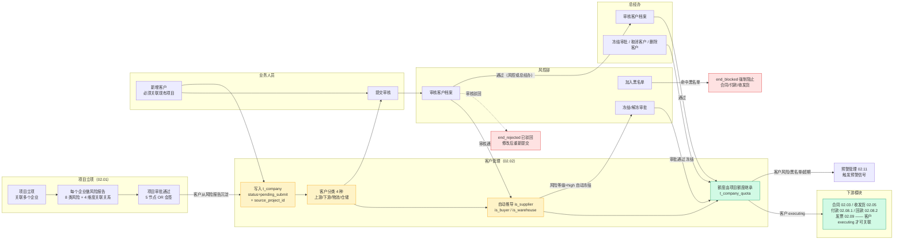
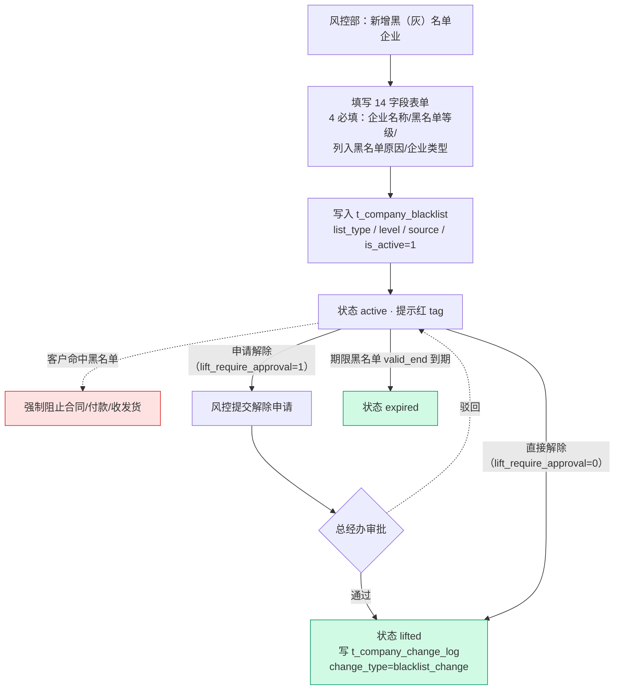
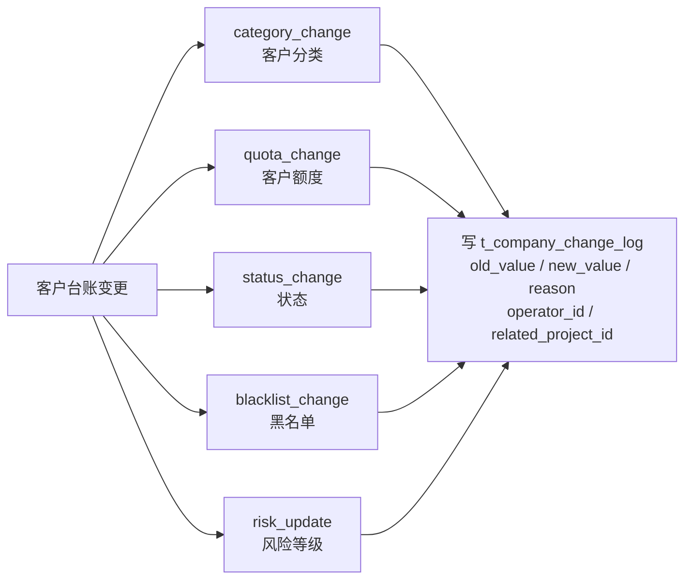
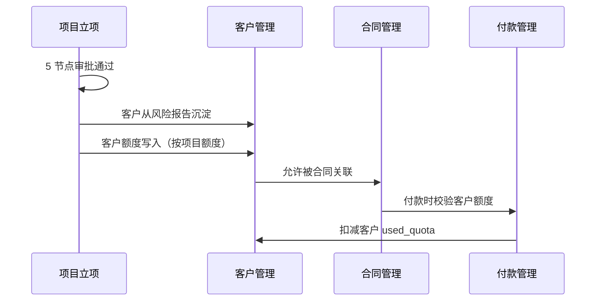
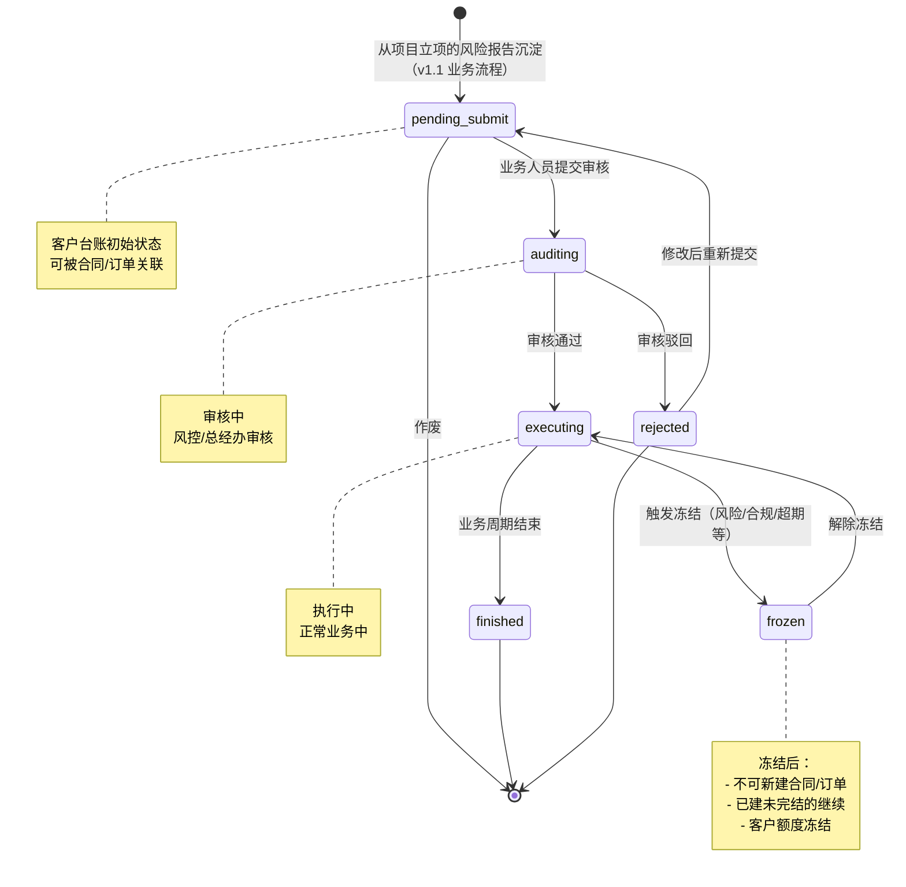
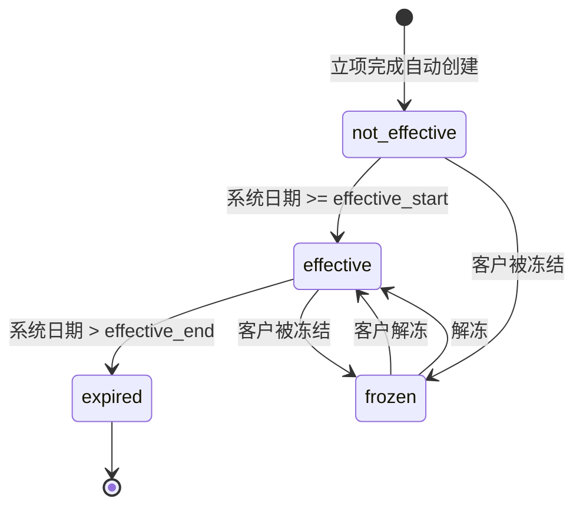
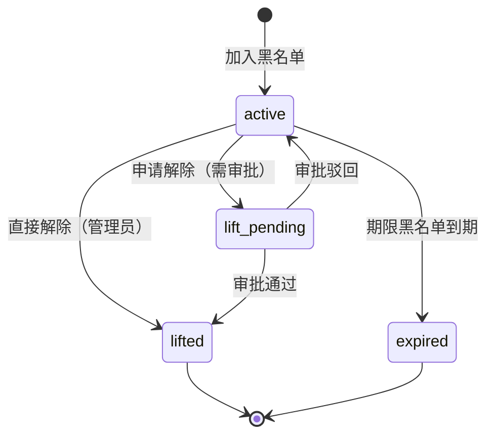
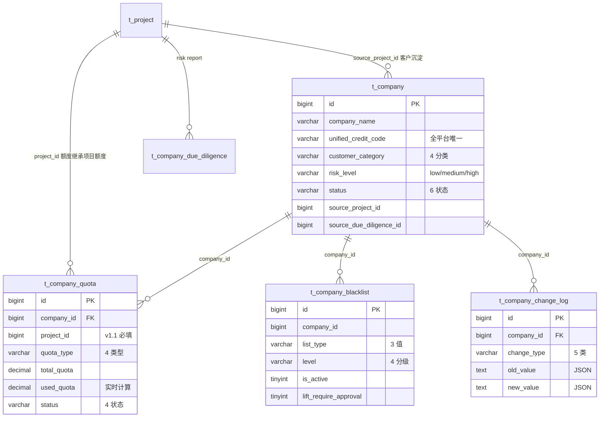

# 02.02 客户管理 · 需求规格说明

> **文档类型**：PRD Writer 范式 · 落地需求文档 · 功能详细描述
> **对应总纲**：[00-产品概述与需求总纲.md](./00-产品概述与需求总纲.md)
> **通用规范**：[01-通用交互与文案规范.md](./01-通用交互与文案规范.md)
> **源文档（只读，未做任何改动）**：[02.02-客户管理.md](../docs/02.02-客户管理.md) / [p-blacklist.md](../docs/p-blacklist.md)
> **整理时间**：2026-09-30

---

## 0. 阅读说明

### 0.1 信息溯源标记

| 标记 | 含义 | 使用规则 |
|------|------|---------|
| ✅ | 源文档已明确 | 原值保留（表名 / 字段名 / 状态枚举 / 编号规则 / 提示文案），不改写口径 |
| 🔷 | 范式补全 | 源文档没写，按范式要求推导，**必须注明推导依据** |
| ⚠️ | 源文档自相矛盾 | 2 份源文档交叉比对后**如实并列，不静默选边** |
| [待补充] | 信息不足 | **严禁编造**，需业务方 / 研发回填 |

### 0.2 源文档阅读顺序

2 份源文档**主体 §1-§9 高度重复**（业务定位 / 流程 / 状态机 / 角色矩阵 / 字段规则 / 按钮 / 异常 / 跨模块流转几乎逐字一致），差异集中在两处：`p-blacklist.md` 的 **§7.3 黑名单页重制**（v1.7.99.49 + 50 + 65）与 `02.02-客户管理.md` 文末的 **v1.7.99.x 增量节**（§v1.7.99.96 详情页 8 区块 / v1.7.99.160 固定底栏 / §14 v1.7.99.349.x）。

| 源文档 | 定位 | 独有价值 |
|--------|------|---------|
| `02.02-客户管理.md` | **主文档 / 超集** | 4 张表完整字段表（§3.1-3.4）、v1.1 关键规则 8 条、客户台账 6 状态机、v1.7.99.96 客户信息详情合并版 8 区块 + CSS 实现要点 + mock 数据、v1.7.99.160 固定底栏、§14 v1.7.99.349.x 增量节（14.1-14.8） |
| `p-blacklist.md` | 黑名单页增量 | v1.7.99.49「新增黑（灰）名单信息」**14 字段真实弹窗**（1080px / 4 列 × 7 行 / 4 必填红星）、v1.7.99.49「批量导入」弹窗（720px + CSV 模板 + BOM）、v1.7.99.50 tab 简化（只保留「全部」1 tab）+ 批量删除移到 tab 行、v1.7.99.65 准入管理 4 关注级别 4 色 badge |

> ⚠️ `p-blacklist.md` 头部自述「基于源模块文档的**占位版**，精确字段待 review 后按原型图精修」——即该文档本身是半成品，**其表名/字段名已被脱敏为 `t_xxx` / `not_xxx` / `lift_xxx` / `source_project_xxx`**，本文档一律以 `02.02-客户管理.md` 的完整原值为准，不采用 `p-blacklist.md` 的占位写法。

### 0.3 与通用规范的关系

**通用表单规范（校验时机 / 返回保护 / 提交行为 / 危险操作确认 / 空状态 / 失败引导 / 通用 UI 6 态 / 通用样式 / 脱敏规范）一律以 [01-通用交互与文案规范.md](./01-通用交互与文案规范.md) 为准，本文档不重复定义，只写本模块特有的部分**（客户分类 4 种角色推导、6 流程状态、额度管理、黑名单分级与假国央企库、客户信息详情 8 区块、跨模块沉淀与关联）。

### 0.4 飞书用户手册补充（2026-10-08）

> **来源**：《豫港通数字供应链管理平台 — 用户使用手册（内部版）》飞书 rev.8976，**本节只引入手册已明确的口径**，手册未写的业务规则一律不补、不推测。手册是对着线上系统写的，**权威性优先于本文档原有的 ⚠️ 冲突条目**——两者不一致时新增 C 编号记录，不静默改写原文。

| 手册小节 | 归位到本文档 | 填了哪些信息缺口 / 补了哪些矛盾 |
|---------|-------------|---------------------------|
| **3.2 客户管理** | §1.1 功能描述、§3.4（新增 **C8** / **C10**）、§4.3 异常表「风险扫描失败」行、§5.2 黑名单弹窗字段表 | 风险数据源口径（→ C8）；客户类别粒度（→ C10）；风险扫描失败行的数据源描述改写为手册口径，**降级策略手册未给，仍为信息缺口** |
| **3.3 黑名单管理** | §3.4（新增 **C9**）、§4.1 校验表脚注、§5.2 黑名单弹窗字段表、§2.2 按钮交互 | 黑名单业务影响范围与查询时点（→ C9）；弹窗补「**附件**」为手册在册上传项；确认行内操作项 = **详情 / 修改 / 移入 / 解除**；确认列表支持**导入 + 导出** |

**✅ 手册原值（照抄，不改写）**：

- **3.2 用户旅程**：业务人员 → 客户申请 → 资质审核 → 准入完成 → 持续监控
- **3.2 内容指引**：客户申请（上游供应商 / 下游客户/第三方企业）／客户风险扫描（定期扫描 / 风险预警）／客户股权关系（穿透查看）
- **3.2 客户类别**：选择客户类别（**上下游/三方**）输入「企业名称」选择对用企业，补全**联系人信息与开户行信息**（此处的两类信息将被合同引用，注意检查是否填写正确）
- **3.2 关联项目**：如需将客户添加至对应项目时，在底部「关联项目」处操作关联对应项目即可，**无需关联项目时直接点击底部「下一步」按钮即可** ⚠️ 与本文档 §4.1「关联项目必填 = 强制阻止」冲突（并入 **C9** 邻接项，见 §3.4）
- **3.2 功能说明**：已获得准入的企业客户，将通过预警管理中的「**企业监控**」规则**定时查询**企业风险数据（**基于配置，通过天眼查数据**）并推送消息
- **3.3 用户旅程**：风控人员 → 添加问题企业 → 持续监控
- **3.3 黑名单录入**：输入【企业名称】【统一社会信用代码】【法定代表人】【所在地】；选择【企业类型】【名单类型】【企业性质】【黑名单等级】【列入黑名单原因】【数据来源】【是否为假国央企】；同时**选择性设定观察区间的时间范围**；如有**备注及附件**也可在此处进行关联上传
- **3.3 黑名单等级设定依据**：依据当前登记人的**尽调结果/外部数据/交易历史**等主观判断，进行设定
- **3.3 黑名单影响（关键）**：**当前版本手动录入的黑名单企业未冻结其业务功能，仅做项目创建时的企业背调信息查询展示**
- **3.3 黑名单查询时点**：后续**创建项目**时会查询此处黑名单企业信息
- **3.3 列表能力**：本页面数据支持**导入导出**功能，可在页面下载对应模版批量导入
- **3.3 行内操作项**：【详情】【修改】【**移入/解除**】

---

## 1. 功能描述与触发条件

### 1.1 功能描述

✅ **客户管理是港通供应链的「客户档案中心」**——客户从项目立项的「风险报告」中沉淀到客户台账，**不走独立审批流程**（与项目立项共用 5 节点审批）。本模块负责客户档案的日常维护：**客户分类、风险等级、关联关系、黑名单、额度管理**（源文档 §1 原文）。

✅ **客户管理 = 项目立项的子流程**（源文档 §1.1 规则 1）——客户从风险报告沉淀，**不走独立审批**。

✅ **源文档 v1.1 锁定的 8 条关键规则**（`02.02-客户管理.md` §1.1，原文保留）：

| # | 规则 | 说明 |
|---|------|------|
| 1 | **客户管理 = 项目立项的子流程** | 客户从风险报告沉淀，不走独立审批 ✅ 不变 |
| 2 | **客户分类 4 种**（v1.1 重大调整） | `upstream` / `downstream` / `third_party_logistics` / `third_party_warehouse` |
| 3 | **客户流程状态 6 个**（v1.1 新增，跟项目立项一致） | 待提交 / 审核中 / 执行中 / 已完结 / 驳回 ⚠️ **只列 5 个**，见 §3.4 C1 |
| 4 | **客户来源记录** | `source_project_id` + `source_due_diligence_id` ✅ 不变 |
| 5 | **客户额度管理**（多维度） | ✅ 不变 |
| 6 | **黑名单管理**（独立子流程） | ✅ 不变 |
| 7 | **客户列表 2 Tab 切换**（v1.1 新增） | 基础信息 / 额度信息 |
| 8 | **顶部 nav 7 个** | 工作台 / 准入管理 / 数字供应链 / 智慧仓储 / 预警中心 / 数据中心 / 账户中心 |

✅ **客户分类 4 种的角色映射**（源文档 §6.1，`customer_category` 决定 `is_supplier` / `is_buyer` / `is_warehouse` **自动推导**）：

| 客户分类 | 枚举值 | 是否可作为供应商 | 是否可作为采购方 | 是否可作为仓储方 |
|---------|-------|----------------|---------------|---------------|
| **上游企业** | `upstream` | ✓ | ❌ | ❌ |
| **下游企业** | `downstream` | ❌ | ✓ | ❌ |
| **第三方物流** | `third_party_logistics` | ❌ | ❌ | ❌（物流，不是仓储） |
| **第三方仓储** | `third_party_warehouse` | ❌ | ❌ | ✓ |

✅ **复用度：🟢 90%（大幅复用）**——主产品「河南征信」`dg_user.sql` 共有 **60+ 张**公司/客户表 + `dg_risk_comtrol.sql` 准入表 + `dg_invoice.sql` 发票客户表（源文档 §1.2 / §10.1）。

✅ **黑名单 = 平台自建黑灰名单 + 假国央企库**（源文档 `p-blacklist.md` §7.3.2）：黑名单弹窗含「名单类型」5 选项（`经营异常` / `失信被执行` / `重大税收违法` / `严重违法失信` / `假冒国企央企`）+ 独立字段「**是否为假央企国企**」（否 / 是 / 待核实）。

### 1.2 触发条件

| 场景 | 触发条件 | 结果 |
|------|---------|------|
| 客户沉淀 | 项目 `active`（源文档 §9.1） | **客户从风险报告沉淀**，写入 `t_company` + `source_project_id` + `source_due_diligence_id` |
| 额度写入 | 立项完成 | `t_company_quota` 自动创建，初始 `not_effective`（源文档 §4.2） |
| 新增客户 | 业务人员点「新增客户」 | 弹新增框，**必须关联项目**（源文档 §7.1 / §8.1） |
| 提交审核 | 状态 = `pending_submit` | `auditing`（源文档 §4.1） |
| 审核 | 状态 = `auditing` + 风控/总经办 | `executing`（通过）/ `rejected`（驳回） |
| 发起完结 | 状态 = `executing` | 弹 custom modal + 二次确认 → `finished`（v1.7.99.124） |
| 重新发起 | 驳回 tab 行的「重新发起」 | 弹二次确认 + **自动回填 Step 1 字段**（v1.7.99.123） |
| 冻结 | `risk_level` = `high` | 客户状态**自动置为 `frozen`**（源文档 §6.5）；或手工冻结（风控审批 / 总经办审批） |
| 额度自动生效 | 系统日期 >= `effective_start` | `not_effective` → `effective`（源文档 §4.2） |
| 额度到期 | 系统日期 > `effective_end` | `effective` → `expired`（源文档 §4.2） |
| 额度被冻结 | 客户被冻结 | `not_effective` / `effective` → `frozen`（源文档 §4.2） |
| 加入黑名单 | 风控部操作 | `active`；⚠️ 客户被拉黑时**合同/付款/收发货强制阻止关联**（源文档 §9.3） |
| 申请解除黑名单 | 详情页「申请解除」+ `lift_require_approval=1` | `active` → `lift_pending` → `lifted` / 回 `active` |
| 风险等级过期 | 距上次扫描 > 30 天 | 黄灯提醒 `"客户风险等级已过期（30 天），请重新扫描"`（源文档 §8.3） |
| tab 状态切换 | 客户列表点击状态 tab | 显示**状态机说明 modal（5 色对应关系图）**（v1.7.99.123） |

### 1.3 业务流程（Mermaid）

**主流程：客户从项目立项沉淀 → 日常维护 → 冻结/黑名单**（多角色泳道，`flowchart LR`）：



**黑名单子流程**（源文档 §4.3 状态机 + §5.5 角色矩阵 + v1.7.99.65 4 关注级别）：



**客户变更 6 类**（源文档 `t_company_change_log.change_type`，全部写变更日志）：



### 1.4 模块依赖（跨模块流转）

✅ **上游触发**（源文档 §9.1 原文）：

| 触发模块 | 触发条件 | 触发动作 |
|---------|---------|---------|
| 项目管理-立项（02.01） | 项目 `active` | **客户从风险报告沉淀** |

✅ **下游触发**（源文档 §9.2 原文）：

| 触发模块 | 触发条件 | 触发动作 |
|---------|---------|---------|
| 合同管理（02.03） | 客户 `executing` | 允许合同关联 |
| 订单管理（02.04） | 客户 `executing` | 允许订单关联 ⚠️ 订单管理已于 v1.7.99.181 删除（见总纲 §9.1 Q5） |
| 收发货（02.05） | 客户 `executing` | 允许收/发货关联 |
| 付款（02.08.1） | 客户 `executing` | 允许付款关联 |
| 回款（02.08.2） | 客户 `executing` | 允许回款关联 |
| 发票（02.09） | 客户 `executing` | 允许开票关联 |
| 预警管理（02.11） | 客户风险 / 黑名单 / 超期 | 触发预警信号 |

✅ **字段影响其他模块**（源文档 §9.3 原文）：

| 港通字段 | 影响模块 | 影响方式 |
|---------|---------|---------|
| `customer_category` | 合同 / 订单 / 付款 | 决定业务规则 + **自动推导 is_supplier / is_buyer / is_warehouse** |
| `total_quota` | 敞口 / 额度 / 付款 | **由项目额度决定，不再按客户分类** |
| `risk_level` | 预警 / 合规 | 触发不同等级风险预警 |
| `unified_credit_code` | 合同 / 发票 | 关联所有外部数据 |
| 黑名单命中 | 合同 / 付款 / 收发货 | 强制阻止关联业务 |

✅ **跨模块状态机联动时序**（源文档 §9.4 原图）：



> ⚠️ 上图末行「扣减客户 `used_quota`」与总纲「资金流转为**线下完成 + 系统流程化登记**」的口径不同——本模块**无线上扣款能力**，`used_quota` 为实时计算字段（源文档 §3.2 标注「实时计算」），具体扣减触发时点 [待补充]。

---

## 2. 交互细节

> 🔷 通用表单交互（校验时机 / 返回保护 / 提交行为 / 危险操作确认 / 空状态 / 失败引导）见 [01-通用交互与文案规范.md](./01-通用交互与文案规范.md) §2，本节只写本模块特有部分。

### 2.1 角色操作矩阵（权限可见性）

✅ **客户台账管理 11 项操作 × 6 角色**（源文档 §5.1 原表）：

| 操作 / 角色 | 业务人员 | 业务部负责人 | 风控部 | 财务部 | 总经办 | 系统 |
|------------|--------|------------|-------|-------|-------|------|
| 查看客户列表/详情 | ✓ | ✓ | ✓ | ✓ | ✓ | - |
| 修改客户分类 | ✓ | ✓ | ✓ | - | - | - |
| 修改风险等级 | - | - | **✓** | - | - | 自动从风险报告 |
| 修改客户额度 | ✓ 建议 | ✓ | **✓** | **✓** | **✓** | - |
| **审核客户档案**（v1.1 新增） | - | - | **✓** | - | **✓** | - |
| 冻结/解冻 | 申请 | 申请 | **审批** | 申请 | **审批** | - |
| 取消客户 | - | 申请 | 申请 | 申请 | **审批** | - |
| 新增客户 | **✓**（必须关联项目） | ✓ | - | - | - | - |
| 删除客户 | - | - | - | - | **✓** | 检查关联业务 |
| 加入黑名单 | 申请 | 申请 | **✓** | - | **审批** | - |
| 解除黑名单 | 申请 | 申请 | **✓** | - | **审批** | - |

✅ **黑名单 4 项操作 × 3 角色**（源文档 §5.5 原表）：

| 操作 / 角色 | 风控部 | 总经办 | 系统 |
|------------|-------|-------|------|
| 新增黑名单 | **✓** | - | - |
| 批量导入 | **✓** | - | - |
| 申请解除 | **✓** | **审批** | - |
| 直接解除 | **✓**（`lift_require_approval=0`） | - | - |

✅ **客户列表状态 Tab × 操作按钮矩阵**（源文档 §5.4 原表）：

| 状态 | 操作按钮 |
|------|---------|
| 待提交 | 查看 / 编辑 / 作废 |
| 审核中 | 查看 / **审核**（v1.1 新增） |
| 执行中 | 查看（v1.7.99.124 加 **发起完结**） |
| 已完结 | 查看 |
| 驳回 | 查看（v1.7.99.123 加 **重新发起**） |

✅ **客户列表 2 Tab**（源文档 §5.2，v1.1 新增）：

| Tab | 说明 |
|-----|------|
| **基础信息** | 客户分类 / 企业名称 / 统一信用代码 / 联系人 / 法定代表人 |
| **额度信息** | 项目编号 / 项目名称 / 授信额度 / 已用额度 / 可用额度 / 授信有效期 / 状态 |

✅ **客户列表 12 列**（v1.7.99.108 锁定）⚠️ 12 列具体列名 [待补充]（源文档只写「客户列表 12 列锁定」，未给列定义）。

✅ **客户详情页 5 tab 重构**（v1.7.99.128 对齐项目详情页）：`审批准入` / `企业信息` / `风险扫描结果` / `股权关系` ⚠️ 第 5 个 tab 名 [待补充]（v1.7.99.160 提到「非『审批准入』tab（企业信息 / 风险扫描结果 / 股权关系）」共 3 个，5 tab 中的另 1 个未列名）。

### 2.2 按钮交互（操作反馈）

✅ **客户台账列表页按钮**（源文档 §7.1 原表）：

| 按钮 | 位置 | 可见条件 | 点击行为 |
|------|------|---------|---------|
| 新增客户 | 右上 | 业务人员 | 弹新增框（**必须关联项目**） |
| 搜索/筛选 | 顶部 | 所有 | 弹筛选抽屉 |
| 导出 | 右上 | 所有 | 导出 Excel |
| 查看 | 列表行 | 所有 | 跳详情页（仅查看） |
| 编辑 | 列表行 | 状态=待提交 | 跳详情页（编辑） |
| **审核**（v1.1 新增） | 列表行 | 状态=审核中 | 弹审核框（风控+总经办） |
| 作废 | 列表行 | 状态=待提交 | 弹确认框 |
| **基础信息/额度信息 Tab 切换**（v1.1 新增） | 列表上方 | 所有 | 切换列表内容 |

✅ **客户台账详情页按钮**（源文档 §7.2 原表）：

> **memory 原则**：详情页**不**加业务变更按钮，只允许**跳关联单据/复制/附件下载**（v1.7.99.130 进一步明确：创建 / 调整 / 解除 / 导出明细均不加）。

| 按钮 | 位置 | 可见条件 | 点击行为 |
|------|------|---------|---------|
| 编辑 | 顶部 | 状态=待提交 | 跳编辑页 |
| 跳关联项目 | 顶部 | 有关联项目 | 跳项目详情 |
| 跳关联合同 | 顶部 | 有关联合同 | 跳合同列表 |
| 跳风险报告 | 顶部 | 有风险报告 | 跳风险报告详情 |
| 下载附件 | 附件区 | 有附件 | 下载 |
| 变更历史 | 顶部 | 所有 | 弹变更日志 |

⚠️ v1.7.99.130 已**删除**「选择关联企业 / 客户编号 / 复制为新客户」3 个按钮 ✅（原表已删，不再列）。
⚠️ v1.7.99.160 在**非「审批准入」tab** 的固定底栏（`.footer-scenario` 内）增加 2 个按钮：`审批通过`（`.btn.btn-primary` 蓝主按钮）+ `驳回审批`（`.btn.btn-danger-outline` 红边框按钮），右侧 `flex: 1` 左侧留空；「审批准入」tab 内一级审批节点下方的原有按钮**保留不删**。

✅ **额度页按钮**（v1.7.99.130 约束）：额度详情页属「详情」，按钮**仅保留**「跳关联项目 / 复制额度编号 / 下载对账单」。

✅ **黑名单页按钮区**（`p-blacklist.md` §7.3.1，v1.7.99.49 + 50）：

| 按钮 | 位置 | 状态 | 点击行为 |
|------|------|------|---------|
| **新增黑名单企业** | 顶部 | **一直 enabled** | 弹「新增黑（灰）名单信息」14 字段表单 |
| **批量导入** | 顶部 | **一直 enabled**（v1.7.99.49 修复，v1.7.99.44 错误地按「勾选行才启用」） | 弹「批量导入」弹窗（下载模板 + 上传文件） |
| ~~批量删除~~ | ~~顶部~~ | - | **v1.7.99.50 移除**——移到 tab 行最右侧（**文字链接样式，红色 `#dc2626`**，仅勾选时显示，由 `updateBatchButtonState` 控制） |
| **申请解除** | 详情页 | 风控 | 弹申请框，走多级审批 |
| **直接解除** | 详情页 | 管理员（`lift_require_approval=0`） | 弹确认框 |
| 修改 / 解除 / 详情 | 列表行 | v1.7.99.65 **3 操作按钮** | 修改 / 解除 / 详情 |

✅ **「新增黑（灰）名单信息」弹窗**（`p-blacklist.md` §7.3.2，v1.7.99.49）：

- 居中模态弹窗，宽度 **1080px**，最大高度 **92vh**
- 头部：标题「新增黑（灰）名单信息」+ 关闭按钮（×）
- 底部：左「取消」+ 右「确定」（footer 固定）
- 表单滚动区：`max-height: calc(92vh - 130px)`，超出滚动
- **14 字段布局：4 列 × 7 行**（左列 6 字段 + 右列 7 字段，备注跨 2 列）
- 校验：浏览器原生 `required`，**4 个必填**（企业名称 / 黑名单等级 / 列入黑名单原因 / 企业类型）任一为空时阻止提交并高亮提示；`form.checkValidity()` + `form.reportValidity()`
- 提交后行为（v1.7.99.49 mock）：弹出 alert 框显示提交的数据 → 关闭弹窗；实际生产：POST `/api/blacklist`，成功后刷新列表

✅ **「批量导入」弹窗**（`p-blacklist.md` §7.3.3，v1.7.99.49）：

- 居中模态弹窗，宽度 **720px**
- 头部：标题「批量导入黑名单企业」+ 关闭按钮（×）
- 底部：左「取消」+ 右「开始导入」（**默认 disabled**）
- 3 块内容：模板下载框（蓝背景 `#F0F7FF` + 蓝色边框 + 📥 图标 + 「下载模板」按钮）/ 文件上传区（2px 虚线边框 `#DBEAFE` + 📤 图标 + 「点击或拖拽文件到此处上传」+ 格式/大小提示）/ 上传结果（成功绿底 or 失败红底，**默认隐藏**，上传后显示）
- 「开始导入」按钮状态：默认 disabled（无文件）→ 上传校验通过 → enabled → 点击后弹 alert（mock）关闭弹窗；实际生产：POST `/api/blacklist/import`，multipart/form-data
- ✅ **关键修复**：v1.7.99.44 错误地让「批量导入」与「批量删除」一起受「勾选行才 enabled」控制；v1.7.99.49 改为**一直 enabled**（仅批量删除受选中状态控制）

✅ **黑名单 tab 状态机简化**（v1.7.99.50）：**删除「企业黑名单/个人黑名单」2 个 tab，只保留「全部」1 个 tab**（用户需求：只有企业没有个人概念）；顶部「已选 X 条」提示保留（蓝色文字，在「新增黑名单企业」按钮左侧），与「批量删除」文字按钮联动。

✅ **v1.7.99.65 准入管理 4 关注级别 4 色 badge**：

| 关注级别 | class | Tag 底色 | 文字色 |
|---------|-------|---------|--------|
| 高度关注 | `tag-red` | 红底 `#FEE2E2` | `#DC2626` |
| 中度关注 | `tag-orange` | 橙底 `#FFEDD5` | `#EA580C` |
| 低度关注 | `tag-yellow` | 黄底 `#FEF3C7` | `#D97706` |
| 已解除 | `tag-green` | 绿底 `#D1FAE5` | `#059669` |

✅ **客户信息详情页 8 区块**（v1.7.99.96 合并版，`pages/customer-detail.html` 27.5KB）：

| # | 区块 | 来源 | 字段数 | 关键样式 |
|---|------|------|--------|----------|
| 0 | **顶部 metadata** | 图 1 | 4 | 横向 flex-wrap gap 32px：企业简称 / 法定代表人 / 统一社会信用代码 + 仓储企业深蓝实心 tag（`.tag-warehouse`，`background:#1E40AF; color:#fff`） |
| 1 | **工商信息** | 图 1 | 14 | 2 列 label+value pair，最后 2 行（注册地址 / 经营范围）跨列 `colspan=3` |
| 2 | **客户负责人信息** | 图 1 | 2 | 负责人姓名 + 负责人电话（**脱敏**：`138 0000 XXXX`） |
| 3 | **联系人信息** | 图 1 | 2 | 联系人姓名 + 联系人电话（**脱敏**：`156 0000 XXXX`） |
| 4 | **风险扫描 8 类** | **图 2 新增** | 8 卡片 | 2×4 CSS Grid；1-7 蓝底圆（`.risk-num` `#1E40AF`）+ 绿「无风险」；第 8 红底圆（`#DC2626`）+ 红「存在风险」+ 红框详情 |
| 5 | **疑似实控人（大数据分析）** | 图 1 | 3 路径 | 汇总行 + 股权链树状图（蓝椭圆节点 `.equity-node` `#EFF6FF`/`#1E40AF` + 蓝色百分比 `.equity-ratio` `#3B82F6` + 灰色箭头 `→`） |
| 6 | **股东信息** | 图 1 | 6 列表格 | 工商登记 tab + 3 行 mock；3 色缩写 tag：`.tag-sh.big` 绿 `#DCFCE7`/`#15803D` / `.tag-sh.controller` 黄 `#FEF3C7`/`#A16207` / `.tag-sh.beneficiary` 紫 `#E0E7FF`/`#4338CA` |
| 7 | **纳税信息** | 图 1 | 5 列表格 | 空表「暂无数据」 |

✅ **风险扫描 8 类**（v1.7.99.96，图 2 原序）：合作黑名单 / 假冒国企 / 失信被执行人 / 被执行人 / 限制消费令 / 终本案件 / 税收违法 / 行政工商违法处罚。
✅ **关键实现要点**（v1.7.99.96 原文）：风险详情行紧跟 has-risk 卡片（`.risk-card.has-risk + .risk-detail { display: block; }`）——**只有存在风险时显示**；`table-layout: fixed` 必加（股东信息 6 列 8%/30%/12%/18%/18%/14% = 100%，纳税信息 5 列 18%/18%/24%/28%/12% = 100%）；空表样式 `.empty-row { text-align:center; padding:40px 0; color:var(--text-tertiary); }`；inline Utils fallback `window.Utils = window.Utils || { toast: function(msg, type) {...} };`。
✅ **不含** 4 步进度条（详情页是查看不是申请）+「上一步/下一步」按钮（详情页底部只有「返回」按钮）；**不画**尽调元信息（尽调时间 / 尽调人 / 尽调来源等）。

### 2.3 危险操作确认

✅ 源文档明确的「弹确认框」操作（文案按总纲 §7.7 危险操作确认文案模板 🔷 推导，源文档**未逐条给文案**）：

| 操作 | 触发位置 | 确认框文案 | 依据 |
|------|---------|-----------|------|
| **作废客户档案** | 列表行 | `作废后不可恢复，确定作废该客户档案？` 🔷 | 源文档 §7.1 只写「弹确认框」；文案按总纲 §7.7「作废单据」模板推导 |
| **发起完结** | 列表行（`executing`） | custom modal + **二次确认** 🔷 | ✅ 源文档 v1.7.99.124 明确「custom modal + 二次确认」，文案未给 |
| **重新发起** | 列表行（`rejected`） | 弹二次确认 + 自动回填 Step 1 字段 🔷 | ✅ 源文档 v1.7.99.123 |
| **修改客户分类影响下游** | 客户管理 | `客户分类修改会影响下游业务，是否继续？` ✅ **黄色警示** | 源文档 §8.2 原文 |
| **直接解除黑名单** | 黑名单详情页 | [待补充] | 源文档 §7.3 只写「弹确认框」 |
| **批量删除黑名单** | tab 行最右侧 | [待补充] | v1.7.99.50 只写「仅勾选时显示」，未给确认文案 |
| **删除客户** | 列表行 | [待补充] | 源文档 §5.1 有删除权限（总经办），未给确认框文案 |

✅ 源文档 §8 的**阻断型**（非弹窗型）强制阻止：`新增客户必须与现有项目关联`（强制阻止）、`客户 XXX 已存在（统一信用代码 YYY）`（阻止）、`客户 XXX 命中黑名单（合作黑名单），禁止任何业务`（强制阻止）、`客户 XXX 有关联合同/订单未完结，不能删除`（阻止）。

### 2.4 空状态引导

| 场景 | 文案 | 补充动作 | 依据 |
|------|------|---------|------|
| 客户列表无数据 | `暂无数据` | 有筛选时：`请调整筛选条件` | 🔷 01 文档 §2.11 + 总纲 §7.4 |
| 筛选后无结果 | `当前搜索无匹配结果` + chips 区 | `清除全部` 按钮 | 🔷 总纲 §7.4 |
| 关联项目选择器为空 | `暂无可关联的项目` | 说明前置条件 | 🔷 01 文档 §2.11「关联单据选择器为空」模板 |
| 详情页**纳税信息**空表 | `暂无数据` | `.empty-row` 居中灰字 13px | ✅ v1.7.99.96 原文（`padding: 40px 0`） |
| 详情页**股东信息**空表 | `暂无数据` | 同上 | ✅ v1.7.99.96 区块 6 结构 |
| 风险扫描卡片**无风险** | 绿字 `无风险` | 第 8 类为红字 `存在风险` + 红框详情行 | ✅ v1.7.99.96 原文 |
| 黑名单列表无数据 | `暂无数据` | 引导「新增黑名单企业」（**一直 enabled**） | 🔷 01 文档 §2.11 + ✅ 源文档 v1.7.99.49 按钮一直 enabled |
| 8 tab 某状态计数为 0 | tab 仍显示，chip 显示 `0` 🔷 | 点击后走筛选无结果空态 | 🔷 依据 v1.7.99.123「每个 tab 右上角实时显示当前 mock 中该状态的数量」 |
| 变更历史无记录 | [待补充] | [待补充] | 源文档只写「变更历史」按钮（可见条件 = 所有），未给空态 |

### 2.5 失败引导

✅ **源文档 §8 异常处理原表（提示文案原值保留，不改写）**：

**§8.1 客户管理异常**

| 异常场景 | 提示文案 | 处理动作 |
|---------|---------|---------|
| 新增客户已存在 | `"客户 XXX 已存在（统一信用代码 YYY）"` | 阻止 |
| 新增客户无项目关联 | `"新增客户必须与现有项目关联"` | 强制阻止 |
| **客户分类与角色冲突**（v1.1 调整） | `"上游企业不能作为采购方"` | 红色提示 |
| 客户被冻结，新建合同 | `"客户 XXX 已被冻结，不能新建合同"` | 阻止 |
| 客户命中黑名单 | `"客户 XXX 命中黑名单（合作黑名单），禁止任何业务"` | 强制阻止 |
| 客户额度不足 | `"客户可用额度不足（可用 X 元，需 Y 元）"` | 阻止付款 |

**§8.2 客户变更异常**

| 异常场景 | 提示文案 | 处理动作 |
|---------|---------|---------|
| 删除客户有关联业务 | `"客户 XXX 有关联合同/订单未完结，不能删除"` | 阻止 |
| 修改客户分类影响下游 | `"客户分类修改会影响下游业务，是否继续？"` | 黄色警示 |
| 客户额度调整生效 | `"新额度已生效，将影响后续业务"` | 通知 |

**§8.3 数据流转异常**

| 异常场景 | 提示文案 | 处理动作 |
|---------|---------|---------|
| 客户从风险报告沉淀失败 | `"客户沉淀失败，请联系管理员"` | 阻止项目准入完成 |
| 客户风险等级过期 | `"客户风险等级已过期（30 天），请重新扫描"` | 黄灯提醒 |
| 客户额度被其他模块占用 | `"客户额度被合同 XXX 占用，暂不能调整"` | 阻止 |

✅ **黑名单弹窗文件上传规则**（`p-blacklist.md` §7.3.3）：

| 规则 | 详情 |
|------|------|
| 接受扩展名 | `.xlsx` / `.xls` / `.csv` |
| 文件大小限制 | **10MB** |
| 校验通过 | 绿色提示 `"已选择文件：xxx.xlsx（XX KB），请确认后点击"开始导入""` + 「开始导入」按钮 enabled |
| 校验失败（格式 / 大小） | 红色提示具体错误 🔷 文案未给 + 「开始导入」按钮保持 disabled |

🔷 **本模块补充的失败引导**（源文档未定义，按 01 文档 §2.12 / §4.4 通用失败引导推导）：

| 失败类型 | 引导方式 | 依据 |
|---------|---------|------|
| 客户列表 / 详情加载失败 | 顶部红色横幅 + `重试` 按钮 🔷 | 01 文档 §4.4 / 总纲 §7.5 |
| 提交时网络断开 | Toast + **保留用户输入** + 按钮恢复可点 `网络异常，请重试` 🔷 | 01 文档 §4.4 |
| 黑名单 POST `/api/blacklist` 失败 | [待补充] | 源文档只写「成功后刷新列表」，未定义失败分支 |
| 批量导入部分行失败 | 源文档只定义「上传结果 成功（绿底）or 失败（红底）」，**失败行明细展示方式** [待补充] | v1.7.99.49 |
| 附件上传中断 | `上传失败，请重新上传` 🔷 | 01 文档 §4.4 |

---

## 3. 状态清单

### 3.1 业务状态机

**（1）客户台账状态机**（源文档 §4.1 原图，v1.1 从 3 状态改 6 状态）：



- ❌ 旧版 3 状态：`active` / `frozen` / `revoked`
- ✅ v1.1 声称 6 状态：`pending_submit` / `auditing` / `executing` / `finished` / `rejected` / `frozen`（**跟项目立项一致**）⚠️ 文字清单只列 5 个，见 §3.4 C1

⚠️ **源文档文末另有一段「本模块的状态机」纯文字块，与上图不一致**（`auditing → finished` 跳过 `executing`、引入图中不存在的 `invalid`（作废）、`frozen` 标注为「准入完成后归档」），见 §3.4 C3。

**（2）客户额度状态机**（源文档 §4.2 原图，v1.1 调整 4 状态）：



> ⚠️ 源文档原图中 `frozen --> effective: 客户解冻` 与 `frozen --> effective: 解冻` **重复两条**（同一起止状态、不同标签），本文档如实保留 ✅ 原值不改写。

**（3）黑名单状态机**（源文档 §4.3 原图，不变）：



⚠️ 黑名单**数据库层**只有 `is_active`（tinyint，必填），**无 `status` 字段**；上述 4 状态（`active` / `lift_pending` / `lifted` / `expired`）在 `t_company_blacklist` 表结构中**无对应落库字段**，见 §3.4 C5 / §7 Q。

### 3.2 状态值与展示

**（1）`t_company.status` 客户台账状态**（源文档 §3.1 字段说明原值 6 枚举）：

| 枚举值 | 中文 | 触发条件 | 下一状态 | Tag 色 |
|-------|------|---------|---------|--------|
| `pending_submit` | 待提交 | 从项目立项的风险报告沉淀 / 驳回后修改重新提交 | `auditing`（提交）/ `[*]`（作废） | ✅ 源文档 §5.3「蓝」；🔷 `#EFF6FF` / `#1E40AF`（推导自总纲 §7.8「进行中/待处理 = 蓝」） |
| `auditing` | 审核中 | 业务人员提交审核 | `executing`（审核通过）/ `rejected`（审核驳回） | ✅ 源文档 §5.3「黄」；🔷 `#FEF3C7` / `#D97706`（推导自总纲 §7.8「警告/待处理 = 黄」） |
| `executing` | 执行中 | 审核通过 | `finished`（业务周期结束）/ `frozen`（触发冻结：风险/合规/超期） | ✅ 源文档 §5.3「绿」；🔷 `#ECFDF5` / `#047857`（推导自总纲 §7.8「正常 = 绿」） |
| `finished` | 已完结 | 业务周期结束（v1.7.99.124 加「发起完结」二次确认） | 终态，归档 | ✅ 源文档 §5.3「灰」；🔷 `#F3F4F6` / `#6B7280`（推导自总纲 §7.8「终态/已关闭 = 灰」） |
| `rejected` | 驳回 | 审核驳回 / v1.7.99.124「待补件」合并至此 | `pending_submit`（修改后重新提交）/ `[*]` | ✅ 源文档 §5.3「灰」；🔷 建议 `#FEE2E2` / `#DC2626`（推导自总纲 §7.8「驳回 = 红」），⚠️ 与源文档「灰」不一致，见 §3.4 C2 |
| `frozen` | 冻结 | 触发冻结（风险/合规/超期等）/ `risk_level=high` 自动置入 | `executing`（解除冻结） | ⚠️ 源文档 §5.3 **6 Tab 无冻结行**，无色值；🔷 建议红 `#FEE2E2` / `#DC2626`（总纲 §7.8「异常 = 红」） |
| ~~`active`~~ | （v1.0 枚举，已废弃） | v1.0 = 3 状态之一 | — | ⚠️ 已废弃枚举，色板 N/A |
| ~~`revoked`~~ | （v1.0 枚举，已废弃） | v1.0 = 3 状态之一 | — | ⚠️ 已废弃枚举，色板 N/A |

**（2）`t_company_quota.status` 客户额度状态**（源文档 §3.2 原值 4 枚举）：

| 枚举值 | 中文 | 触发条件 | 下一状态 | Tag 色 |
|-------|------|---------|---------|--------|
| `not_effective` | 未生效 | 立项完成自动创建 | `effective`（系统日期 >= `effective_start`）/ `frozen`（客户被冻结） | 🔷 灰 `#F3F4F6` / `#6B7280`（总纲 §7.8「未开始/终态 = 灰」） |
| `effective` | 生效中 | 系统日期 >= `effective_start` | `expired`（系统日期 > `effective_end`）/ `frozen`（客户被冻结） | 🔷 绿 `#ECFDF5` / `#047857`（总纲 §7.8「生效 = 绿」） |
| `expired` | 已过期 | 系统日期 > `effective_end` | 终态 | 🔷 灰 `#F3F4F6` / `#6B7280` |
| `frozen` | 冻结 | 客户被冻结 | `effective`（客户解冻） | 🔷 红 `#FEE2E2` / `#DC2626` |
| ~~`active`~~ | （v1.0 枚举，已废弃，变更摘要记 v1.0 为 `active`/`frozen`/`expired`） | — | — | ⚠️ 已废弃枚举，色板 N/A |

> ✅ 源文档只给「客户列表额度信息 Tab」的「状态」展示列名，**未给额度状态的 Tag 配色**；上表色值全部为 🔷 推导自总纲 §7.8。

**（3）黑名单状态**（源文档 §4.3 状态机 4 状态，**无落库 `status` 字段**）：

| 枚举值 | 中文 | 触发条件 | 下一状态 | 展示 |
|-------|------|---------|---------|------|
| `active` | 已生效 / 黑名单中 | 加入黑名单（`is_active=1`） | `lift_pending`（申请解除，需审批）/ `lifted`（直接解除，管理员）/ `expired`（期限黑名单到期） | ✅ v1.7.99.65 badge 用「高度关注 / 中度关注 / 低度关注 / 已解除」4 关注级别 ⚠️ 两套值未定义映射，见 §3.4 C5 |
| `lift_pending` | 解除待审批 | 申请解除（`lift_require_approval=1`） | `lifted`（审批通过）/ `active`（审批驳回） | 🔶 视觉未定义 |
| `lifted` | 已解除 | 审批通过 / 直接解除（`lift_require_approval=0`） | 终态 | ✅ v1.7.99.65「已解除」= `tag-green` 绿底 `#D1FAE5` / 文字 `#059669` |
| `expired` | 已失效 | 期限黑名单 `valid_end` 到期 | 终态 | 🔶 视觉未定义 |

**（4）其他状态 / 枚举字段**

| 字段 | 枚举值 | 中文展示 | 依据 |
|------|-------|---------|------|
| `t_company.risk_level` | `low` / `medium` / `high` | 低风险 / 中风险 / 高风险 | ✅ 源文档 §6.5；色值 🔷 总纲 §7.8（低=浅蓝 / 中=黄 `#FEF3C7`/`#D97706` / 高=红 `#FEE2E2`/`#DC2626`） |
| `t_company_quota.quota_type` | `total` / `category` / `business_line` / `project` | 总额度 / 分类额度 / 业务线额度 / 项目额度 | ✅ 源文档 §3.2（中文 [待补充]，按枚举值直译 🔷） |
| `t_company_blacklist.list_type` | `cooperation_black` / `external_black` / `negative_list` | 合作黑名单 / 外部黑名单 / 负面名单 | ✅ 源文档 §3.3（中文 [待补充]，按枚举值直译 🔷） |
| `t_company_blacklist.level` | `permanent` / `temporary` / `observation` / `industry` | 永久黑名单 / 期限黑名单 / 观察名单 / 行业黑名单 | ✅ 源文档 §3.3 + §6.9 业务影响表；⚠️ 与弹窗「黑名单等级」3 选项不一致，见 §3.4 C5 |
| `t_company_blacklist.source` | `系统判定` / `外部推送` / `人工录入` | 同左（**中文直存**，非英文枚举） | ✅ 源文档 §3.3 原值 |
| `t_company_change_log.change_type` | `category_change` / `quota_change` / `status_change` / `blacklist_change` / `risk_update` | 客户分类变更 / 额度变更 / 状态变更 / 黑名单变更 / 风险更新 | ✅ 源文档 §3.4（中文 [待补充]，按枚举值直译 🔷） |
| `t_company.customer_category` | `upstream` / `downstream` / `third_party_logistics` / `third_party_warehouse` | 上游企业 / 下游企业 / 第三方物流 / 第三方仓储 | ✅ 源文档 §1.1 / §6.1 |
| `t_company.region` | （无英文枚举，直接存中文） | 境内 / 境外 / 港澳台 | ✅ 源文档 §6.8「选择项：境内/境外/港澳台」 |
| 风险等级推导规则 | 0 类高风险 → `low`；1 类高风险 → `medium`；2+ 类高风险 或 3+ 类中风险 → `high` | — | ✅ 源文档 §6.5；**`risk_level=high` → 客户状态自动置为 `frozen`** |

### 3.3 UI 状态清单

> 通用 6 态以 [01-通用交互与文案规范.md](./01-通用交互与文案规范.md) §3.2 为准；下表为**本模块（客户列表 / 客户额度 / 客户详情 / 客户申请 / 黑名单页）**的落地映射。**6 态齐全：默认 / 加载中 / 成功 / 失败 / 禁用 / 空状态**。

| 状态 | 触发 | 视觉 | 可交互 |
|------|------|------|-------|
| **默认** | 页面加载完成、状态非审核中 | 列表页展示状态列 + 操作按钮组（按 §2.1 矩阵）；8 tab 行 + 每 tab 动态计数 chip；2 Tab（基础信息 / 额度信息）切换区；详情页 5 tab；申请页字段可编辑、必填红星显示 | ✅ 全部按钮按矩阵显隐 |
| **加载中** | 提交中 / 加载既有数据中 / 风险扫描中 | 提交按钮 loading「提交中...」+ 旋转图标 + 禁用 🔷；风险扫描区 8 卡片骨架态 🔷；批量导入「开始导入」按钮**默认 disabled（无文件）** ✅ | ❌ 禁用重复提交；「开始导入」保持 disabled ✅ |
| **成功** | 新增客户成功 / 审核通过 / 发起完结成功 / 黑名单新增成功 / 解除成功 | 顶部居中 Toast 绿色 `#10B981`，3s 自动消失，文案 🔷 `提交成功` / `操作成功`（01 文档 §3.2 / 总纲 §7.5）；黑名单新增成功后**刷新列表** ✅ | — |
| **失败** | 后端返回业务错误 / 额度被占用 / 客户已存在 / 命中黑名单 / 文件格式或大小校验失败 | 顶部居中 Toast 红色 `#EF4444`，**不自动消失需手动关闭**；**保留用户输入**；按钮恢复可点。源文档原文文案：`客户 XXX 已存在（统一信用代码 YYY）`、`客户可用额度不足（可用 X 元，需 Y 元）`、`客户额度被合同 XXX 占用，暂不能调整`、`客户沉淀失败，请联系管理员`；上传失败「红色提示具体错误」🔷 文案未给 | ✅ 按钮恢复可点 |
| **禁用** | 无权限 / 状态不满足按钮可见条件（如「作废」仅 `pending_submit` 可见、「编辑」仅 `pending_submit` 可见、「审核」仅 `auditing` 可见） | 按钮灰化不可点 + Tooltip 说明原因 🔷 | ❌ |
| **空状态** | 列表无数据 / 筛选无结果 / 关联项目为空 / 纳税信息空表 / 股东信息空表 | 空状态插画 + 灰字 13px 居中（详情页 `.empty-row { padding: 40px 0; color: var(--text-tertiary); }` ✅）；文案 `暂无数据` / `请调整筛选条件` / `暂无可关联的项目`；风险扫描无风险时绿字 `无风险` ✅ | ✅ 引导操作（「新增客户」/「清除全部」/「新增黑名单企业」） |

🔷 **本模块特有的 UI 状态补充**：

| 状态 | 触发 | 视觉 | 可交互 | 依据 |
|------|------|-------|-------|------|
| **风险命中态（第 8 类）** | 风险扫描 8 类中第 8 类命中 | `.risk-card.has-risk { background:#FEF2F2; border-color:#FECACA; }` + `.risk-num { background:#DC2626; }` + 红字「存在风险」+ **红框详情行紧跟卡片显示** | ✅ 可查看详情行 | ✅ v1.7.99.96 |
| **风险无风险态（第 1-7 类）** | 第 1-7 类未命中 | 蓝底圆 `.risk-num { background:#1E40AF; }` + 绿字「无风险」，**不显示详情行** | — | ✅ v1.7.99.96 |
| **黑名单 4 关注级别 badge** | v1.7.99.65 | 高度关注 `tag-red` / 中度关注 `tag-orange` / 低度关注 `tag-yellow` / 已解除 `tag-green` | ✅ 修改 / 解除 / 详情 3 按钮 | ✅ p-blacklist v1.7.99.65 |
| **黑名单批量删除可见态** | 勾选 ≥ 1 行 | tab 行最右侧出现文字按钮「批量删除」，红色 `#dc2626`（`updateBatchButtonState` 控制）；顶部显示蓝色「已选 X 条」 | ✅ 点击弹确认 | ✅ v1.7.99.50 |
| **黑名单批量删除未选态** | 未勾选 | 「批量删除」文字按钮**隐藏**；「批量导入」仍**一直 enabled** | ✅ 仅可下载模板 / 导入 | ✅ v1.7.99.50 + v1.7.99.49 |
| **非「审批准入」tab 审批态** | v1.7.99.160 固定底栏 | `.footer-scenario` 内「审批通过」（蓝主按钮）+「驳回审批」（红边框按钮），右侧 `flex: 1` 左侧留空 | ✅ 任何 tab 均可审批 | ✅ v1.7.99.160 |
| **tab 状态机说明 modal** | 点击状态 tab | 显示 5 色对应关系图 | ✅ 关闭 | ✅ v1.7.99.123 |
| **风险等级过期态** | 距上次扫描 > 30 天 | 黄灯提醒 `客户风险等级已过期（30 天），请重新扫描` | ✅ 重新扫描 | ✅ §8.3 |
| **冻结态禁用新建** | `status = frozen` | 下游模块新建合同/订单入口禁用 | ❌ 已建未完结的继续 | ✅ §4.1 note |

### 3.4 版本冲突

> ⚠️ 以下 **7 条**为 2 份源文档交叉比对后确认的自相矛盾，本次重组**未选边**，全部如实并列，交由业务方裁决。

**C1 — 客户流程状态「6 个」只列了 5 个（🔴 阻塞，源文档自身算术不符）**

| 口径 | 数量 | 清单 | 出处 |
|------|------|------|------|
| 文档头部「变更」 | 声称 **6 个** | 待提交 / 审核中 / 执行中 / 已完结 / 驳回（**只 5 个**） | `02.02-客户管理.md` 头部 line 7 + §1.1 规则 3 |
| §3.1 `status` 字段说明 | **6 个枚举** | `pending_submit` / `auditing` / `executing` / `finished` / `rejected` / `frozen` | §3.1 |
| §4.1 状态机图 | **6 个状态** | 同上 6 个（含 `frozen` 分支） | §4.1 |
| §11 v1.1 变更摘要 | **6 个** | `pending_submit` / `auditing` / `executing` / `finished` / `rejected` / `frozen` | §11 |
| §5.3 客户列表状态 Tab | **6 Tab = 全部 + 5 状态** | 全部 / 待提交 / 审核中 / 执行中 / 已完结 / 驳回（**无冻结**） | §5.3 |
| §5.4 客户列表操作按钮 | **5 行** | 待提交 / 审核中 / 执行中 / 已完结 / 驳回（**无冻结**） | §5.4 |

⚠️ 即：**枚举层（字段 / 状态机 / 变更摘要）= 6 个，展示层（Tab / 操作按钮矩阵）= 5 个**，且缺失的第 6 个在不同位置指向不同状态。**影响：`t_company.status` 字段枚举取值范围、列表 Tab 数量、状态 Tag 色卡数量、筛选参数取值范围**。

**C2 — 客户列表状态 Tab 数量三套口径（🔴 阻塞）**

| 口径 | Tab 数 | Tab 清单 | 出处 |
|------|-------|---------|------|
| v1.1 §5.3「跟项目对齐 6 Tab」 | **6** | 全部 / 待提交 / 审核中 / 执行中 / 已完结 / 驳回 | §5.3 |
| v1.7.99.123「8 tab 状态机补全」 | **8** | 全部 / 待提交 / 审核中 / 执行中 / 已完结 / 驳回 / 作废 / 冻结 | §14.3 |
| v1.7.99.124「从 8 tab 砍到 7 tab」 | **7** | 砍掉「已通过」，「待补件」合并到「驳回」 | §14.4 |

⚠️ **两处内部算术不符**：
1. v1.7.99.123 写「客户状态机 6 个状态 → 8 个 tab（独立展示"全部" + 6 状态 + "冻结"补 1 个）」= 1+6+1 = 8 ✅ 算术成立，但**这「6 状态」是哪 6 个未列明**——若沿用 v1.1 的 6 状态（含 `frozen`），则「再补 1 个冻结」重复；若沿用 v1.1 展示层的 5 状态（不含 `frozen`），则 1+5+1 = **7** ≠ 8；且「作废」tab 在 6 状态中无对应。
2. v1.7.99.124 说砍掉「**已通过**」和「**待补件**」两个状态（8 - 2 = 6 状态），但 v1.7.99.123 的 8 tab 清单里**本来就没有「已通过」和「待补件」**，而实际是 8 tab → 7 tab 只减 1。

⚠️ **影响：列表 Tab 数量、状态 Tag 色卡数量、筛选参数取值范围、sitemap**。

**C3 — v1.7.99.x 文末「本模块的状态机」与 v1.1 状态机图冲突**

| 对比项 | v1.1 §4.1 状态机图 | v1.7.99.x 文末「本模块的状态机」纯文字块 |
|-------|------------------|--------------------------------------|
| `auditing` 的下一状态 | `executing`（审核通过） | `finished`（已完结）← **直接跳过 `executing`** |
| 作废状态 | `pending_submit --> [*]: 作废`（终止，**无枚举值**） | `invalid (作废)` ← **引入 `invalid` 枚举** |
| `frozen` 含义 | 触发冻结（风险/合规/超期），`executing → frozen → executing` 可逆 | `frozen (已冻结) ← 准入完成后归档` ← **语义变为归档** |
| `auditing` 的分支数 | 2 条（`executing` / `rejected`） | 3 条（`finished` / `rejected` / `invalid`） |

⚠️ **`invalid` 枚举在 §3.1 `status` 字段枚举中不存在**。且 `frozen` 的「可逆冻结」与「终态归档」是两种完全不同的语义（后者将导致已建未完结合同无法恢复）。**本文档 §3.1 采用 v1.1 状态机图口径，v1.7.99.x 文字块并列记录，不代为裁决**。

**C4 — `t_company` / `t_company_quota` 的必填性自相矛盾**

| 字段 | 必填列 | 字段说明中的「必填」表述 | 出处 | 冲突 |
|------|-------|-------------------|------|------|
| `t_company.owner_name` | `-` | **必填** | §3.1 | ⚠️ 列与说明矛盾 |
| `t_company.owner_phone` | `-` | **必填** | §3.1 | ⚠️ 列与说明矛盾 |
| `t_company.bank_name` | `-` | **必填** | §3.1 | ⚠️ 列与说明矛盾 |
| `t_company.bank_account` | `-` | **必填** | §3.1 | ⚠️ 列与说明矛盾 |
| `t_company_quota.project_id` | `-` | **关联项目（v1.1 必填）** | §3.2 | ⚠️ 列与说明矛盾 |
| 客户申请 6 必填（v1.7.99.23 + 24） | — | 企业名称 / 统一社会信用代码 / 开户行 / 银行账号 / 联系人 / 联系电话 | v1.7.99.x 核心变更 | ⚠️ 「联系人」= `contact_name`、`联系电话` = `contact_phone` 在 §3.1 必填列均为 `-` |

⚠️ **影响：DDL 的 NOT NULL 定义、客户申请页必填红星与 JS 校验范围**。另 v1.7.99.23 说的「6 必填」与 `t_company` 表必填列（`company_name` / `unified_credit_code` / `status` / `create_time` / `update_time`）**完全不同集**——前者是**申请页表单必填**，后者是**表级必填**，两者关系未定义。

**C5 — 黑名单「等级 / 分级 / 关注级别」三套枚举不一致**

| 口径 | 枚举值 | 出处 |
|------|-------|------|
| **DB 字段 `t_company_blacklist.level`** | `permanent`（永久）/ `temporary`（期限）/ `observation`（观察）/ `industry`（行业） | §3.3 + §6.9 业务影响表 |
| **「新增黑（灰）名单信息」弹窗「黑名单等级」**（必填） | 高度关注 / 中度关注 / **一般关注**（3 项，v1.7.99.49 明确「弹窗不显示『已解除』」） | p-blacklist §7.3.2 字段规则 |
| **黑名单列表筛选项**（v1.7.99.49） | 高度关注 / 中度关注 / 一般关注 / **已解除**（4 项） | p-blacklist §7.3.2 字段规则注释 |
| **v1.7.99.65 列表 badge 4 关注级别** | 高度关注 / 中度关注 / **低度关注** / 已解除（4 项） | p-blacklist §12 文档版本 |

⚠️ 两处冲突：
1. DB 的 4 值（永久/期限/观察/行业）与弹窗/列表的 4 值（高度/中度/低度（或一般）/已解除）**完全不同维度**，字段映射关系源文档**未定义**。
2. v1.7.99.49 记「**一般关注**」，v1.7.99.65 记「**低度关注**」，同一级别两处叫法不同。

⚠️ 另：黑名单**状态机 4 状态**（`active` / `lift_pending` / `lifted` / `expired`）在表中**无 `status` 字段**，仅有 `is_active`（tinyint，必填）；`lift_pending` 状态**无落库字段**。**影响：DDL、badge 取值、解除审批流实现**。

**C6 — `t_company` 扩展字段「+6 字段」实列 7 个**

| 口径 | 数量 | 字段 |
|------|------|------|
| §10.3 表述 | 「**+6 字段（v1.1 改）**」 | 括号内实列 **7 个**：`customer_category`, `company_short_name`, `region`, `risk_level`, `source_project_id`, `source_due_diligence_id`, `risk_scan_count` |
| §10.5 第 1 周实施建议 | 「加 **6 字段**（v1.1）」 | 同上口径 |
| §3.1 实际新增 | **7 个标 🆕** | `company_short_name` / `contact_email` / `contact_address` / `owner_name` / `owner_phone` / `bank_name` / `bank_account` / `customer_category` / `region` / `is_supplier` / `is_buyer` / `is_warehouse` / `risk_level` / `risk_scan_count` / `last_risk_scan_time` / `source_project_id` / `source_due_diligence_id` / `frozen_reason`（§3.1 标主产品有） |

⚠️ 即：「+6」与括号内 7 个不一致，且 §3.1 标 🆕 的字段数为 **18 个**（不含 `frozen_reason`）。**影响：DDL 评审与研发工作量估算**。

**C7 — 客户详情页 tab 数「4」vs「5」**

| 口径 | tab 数 | 出处 |
|------|-------|------|
| v1.7.99.128 | **5 tab 重构**，对齐项目详情页 | §14.1 时间线 |
| v1.7.99.130 | 「已包含 **4 tab** 重构」 | §14.7 文档产物清单 |

⚠️ 且 §14.1 只列了 3 个非「审批准入」tab（企业信息 / 风险扫描结果 / 股权关系）+ 1 个「审批准入」= **4 个已列名**，第 5 个 tab 名 [待补充]。**影响：详情页路由与 tab 权限**。

**C8 — 客户风险数据源：本地自建库 vs 天眼查外部数据（🔴 阻塞，影响降级策略与外部接口立项）**

| 口径 | 数据来源描述 | 出处 |
|------|-------------|------|
| 本文档（源文档推导） | 平台自建黑灰名单 + 假国央企库为**本地**数据源（**无外部 API**） | §4.3 异常表「风险扫描失败」行 |
| ✅ **手册口径** | 已获得准入的企业客户，将通过**预警管理中的「企业监控」规则定时查询**企业风险数据（**基于配置，通过天眼查数据**）并推送消息 | 手册 3.2 功能说明 |

✅ **手册口径**（权威性优先）：**风险数据来自天眼查（外部数据源），经「预警管理 → 企业监控」规则定时查询**，命中后**推送消息**；「平台自建黑灰名单 + 假国央企库」是**本地底库**，不等于风险扫描的全部数据源。⚠️ 手册未给天眼查的**接口清单 / 字段映射 / 调用频率 / 失败降级策略**，这四项需业务方 / 研发回填（见 §4.3、§7.2 Q9）。**影响：外部接口立项、风险扫描失败降级策略、预警消息推送链路**。

**C9 — 黑名单的业务影响范围与查询时点：强制阻止业务 vs 仅项目创建时背调展示（🔴 阻塞，影响拦截点与权限模型）**

| 口径 | 影响范围 | 查询 / 拦截时点 | 出处 |
|------|---------|----------------|------|
| 本文档（源文档口径） | 命中黑名单 = **强制阻止**（任何业务）；观察名单 = **需风控部审批每笔业务**；行业黑名单 = 特定行业**禁止合作**；`risk_level = high` → 客户**自动置为 `frozen`** | **任何业务**触发 | §4.1 校验表 4 行 + §4.3 异常表 |
| ✅ **手册口径** | **当前版本手动录入的黑名单企业未冻结其业务功能**，**仅做项目创建时的企业背调信息查询展示** | **仅创建项目时**查询 | 手册 3.3 功能说明 |

✅ **手册口径**（权威性优先）：黑名单是**项目创建环节的背调信息展示**，**不是业务级拦截开关**，当前版本**不冻结**黑名单企业的任何业务功能。⚠️ 连带冲突：本手册同节称「**无需关联项目时直接点击底部『下一步』按钮即可**」（3.2 第三步），与本文档 §4.1「关联项目必填 = **强制阻止**」方向相反，**两条一并裁决**。**影响：合同 / 订单 / 付款环节是否拦截、黑名单是否联动客户冻结、项目创建背调弹窗的展示形态**。

**C10 — 客户类别粒度：手册「上下游 / 三方」 vs 本文档 4 分类（🟡 影响 `customer_category` 枚举与角色推导）**

| 口径 | 取值 | 出处 |
|------|------|------|
| 本文档（源文档 §1.1 / §6.1） | **4 值**：`upstream` / `downstream` / `third_party_logistics` / `third_party_warehouse` | §1.1 角色映射表 + §3.2 |
| ✅ **手册口径** | 客户申请的内容指引写「**上游供应商 / 下游客户/第三方企业**」，新增客户第二步写「选择客户类别（**上下游/三方**）」——**第三方未区分物流 / 仓储** | 手册 3.2 |

⚠️ 手册的「上下游 / 三方」是 **2 级分组写法**（第三方物流与第三方仓储被合并为「三方」），本文档的 4 值是**展开写法**，二者**不必然矛盾**，但**手册侧未给出第三方的二级取值**，故 `customer_category` 的 4 值枚举仍以源文档为准。**影响：`customer_category` 枚举、`is_supplier`/`is_buyer`/`is_warehouse` 自动推导规则、第三方客户的角色可选项**。

---

## 4. 边界条件

### 4.1 业务校验拦截

| 校验 | 触发时机 | 规则 | 提示文案 | 动作 |
|------|---------|------|---------|------|
| 客户唯一性 | 新增客户 | `unified_credit_code` **全平台唯一**（通过该字段判重）✅ | `客户 XXX 已存在（统一信用代码 YYY）` ✅ | 阻止 |
| 信用代码格式 | 输入 | **18 位字母+数字**；脱敏存储 `91XXXXXXMAXXXXXXXX` 格式 ✅ | [待补充] | 阻止 |
| 关联项目必填 | 新增客户 | **必须与现有项目关联** ✅ | `新增客户必须与现有项目关联` ✅ | **强制阻止** |
| 客户来源必填 | 首次创建 | `source_project_id` + `source_due_diligence_id` **必须有来源（首次创建时必填）** ✅；后续客户变更不影响来源记录 | [待补充] | 阻止 |
| 客户分类 × 角色 | 选择分类 | `customer_category` 决定可作为角色；`upstream` 不能作为采购方 ✅ | `上游企业不能作为采购方` ✅ | 红色提示 |
| 客户名称不可改 | 编辑 | `company_name` 与营业执照完全一致，**不可修改（如需修改必须重新立项）** ✅ | [待补充] | 阻止 |
| 企业简称长度 | 输入 | **最多 20 个字符**，可修改 ✅ | [待补充] | 阻止 |
| 额度 > 0 | 调整额度 | `total_quota` 元，保留 **2 位小数**，**> 0** ✅ | [待补充] | 阻止 |
| 额度不足 | 付款 | 校验客户可用额度 ✅ | `客户可用额度不足（可用 X 元，需 Y 元）` ✅ | 阻止付款 |
| 额度被占用 | 调整额度 | 额度被其他模块（合同）占用 ✅ | `客户额度被合同 XXX 占用，暂不能调整` ✅ | 阻止 |
| 客户被冻结 | 新建合同/订单 | `status = frozen` 不可新建 ✅ | `客户 XXX 已被冻结，不能新建合同` ✅ | 阻止 |
| 命中黑名单 | 任何业务 | **强制阻止** ✅ | `客户 XXX 命中黑名单（合作黑名单），禁止任何业务` ✅ | **强制阻止** |
| 观察名单 | 任何业务 | 需**风控部审批每笔业务** ✅ | [待补充] | 逐笔审批 |
| 行业黑名单 | 特定行业 | 特定行业禁止合作 ✅ | [待补充] | 阻止 |
| 客户冻结联动 | `risk_level = high` | 客户状态**自动置为 `frozen`** ✅ | [待补充] | 自动冻结 |
| 删除有关联业务 | 删除客户 | 检查合同/订单未完结 ✅ | `客户 XXX 有关联合同/订单未完结，不能删除` ✅ | 阻止 |
| 风险等级过期 | 扫描后 30 天 | 黄灯提醒 ✅ | `客户风险等级已过期（30 天），请重新扫描` ✅ | 黄灯提醒（非阻断） |
| 沉淀失败 | 项目准入完成 | 客户沉淀失败 ✅ | `客户沉淀失败，请联系管理员` ✅ | **阻止项目准入完成** |
| 黑名单表单必填 | 提交「新增黑（灰）名单信息」 | 浏览器原生 `required`，4 个必填：企业名称 / 黑名单等级 / 列入黑名单原因 / 企业类型 ✅ | `form.reportValidity()` 原生提示 ✅ | 阻止提交 + 高亮 |
| 信用代码长度（黑名单弹窗） | 输入 | 选填，**18 位（`maxlength=18`）** ✅ | [待补充] | 阻止 |
| 批量导入文件 | 上传 | 扩展名 `.xlsx` / `.xls` / `.csv`，大小 **≤ 10MB** ✅ | 红色提示具体错误 🔷 | 「开始导入」保持 disabled |

🔴 **⚠️ 手册推翻本表 4 行的拦截口径（见 §3.4 C9，权威性优先）**：✅ **手册 3.3 明确「当前版本手动录入的黑名单企业未冻结其业务功能，仅做项目创建时的企业背调信息查询展示」**——即上表「命中黑名单 = 强制阻止（任何业务）」「观察名单 = 需风控部审批每笔业务」「行业黑名单 = 特定行业禁止合作」「`risk_level=high` → 客户自动置为 `frozen`」**4 行在手册口径下均不成立**，拦截点应从「任何业务」收敛为「**项目创建**」。同理 ✅ 手册 3.2「**无需关联项目时直接点击底部『下一步』按钮即可**」与上表「关联项目必填 = **强制阻止**」冲突。**本表原值保留不删改（源文档口径），落地前须由业务方确认按哪套执行**。

🔷 **本模块补充的校验**（源文档未定义，按 01 文档 §2.4/§2.6 推导）：

- **客户申请 4 步骤双层校验**：步骤内校验只校验当前步；终态校验（提交审批）校验**全部 4 步** + 跨步规则（关联企业 ≥ 1、6 必填齐全、v1.7.99.31 `mockInProgressCompanies` 自动带入字段完整性）；失败跳第一个未完成步 + 高亮 + Toast。依据：01 文档 §2.4/§2.6 + 源文档 v1.7.99.16 明确 4 步骤流程（关联企业 → 主体信息 → 业务信息 → 提交审批）。
- **视觉 3 重同步**：错误状态同时呈现 input 红框 + label 红字 + 字段下方红字 12px（01 文档 §3.3）。

### 4.2 内容边界（空内容/超长/格式不符）

| 边界 | 规则 | 依据 |
|------|------|------|
| **空内容** | 必填字段为空 → 提交时拦截；非必填字段允许空 ✅（§3.1 必填列为 `-` 的字段）；`source_project_id` / `source_due_diligence_id` **首次创建时必填** ✅ | ✅ 源文档 §3.1 / §6.6 |
| **超长 · 企业简称** | `company_short_name` **最多 20 个字符** | ✅ 源文档 §6.7 |
| **超长 · 变更原因** | `t_company_change_log.reason` varchar(500) | ✅ 源文档 §3.4 |
| **超长 · 冻结原因** | `t_company.frozen_reason` varchar(255) | ✅ 源文档 §3.1 |
| **超长 · 备注（黑名单弹窗）** | textarea，选填，`min-height 60px`，可垂直 resize ✅ | ✅ p-blacklist §7.3.2 |
| **长度 · 统一社会信用代码** | 18 位字母+数字；黑名单弹窗 `maxlength=18` | ✅ §6.3 / p-blacklist §7.3.2 |
| **数字精度** | `total_quota` / `used_quota` / `available_quota` 均为 `decimal(20,2)`，元，保留 2 位小数，> 0 | ✅ §3.2 / §6.4 |
| **金额单位** | `register_capital` 为 `decimal(20,2)`，**单位万元** | ✅ 源文档 §3.1 |
| **日期格式** | 观察区间 placeholder「开始日期 ~ 结束日期」，聚焦切换为 date 类型，**失焦若无值切回 text** ✅ | ✅ p-blacklist §7.3.2 |
| **所在地格式** | placeholder「如：河南省/郑州市/金水区」（**省/市/区三段式**）✅ | ✅ p-blacklist §7.3.2 |
| **CSV 编码** | 模板加 `\uFEFF` BOM 解决 Excel 打开 UTF-8 中文乱码 ✅ | ✅ p-blacklist §7.3.3 |
| **CSV 转义** | 含 `,` `"` `\n` 的字段用双引号包裹，内部 `"` 转 `""` ✅ | ✅ p-blacklist §7.3.3 |
| **CSV 模板结构** | 文件名 `黑名单企业导入模板.csv`；头部第 1 行 14 字段名（带 `(*)` 标注必填）；头部第 2 行 **1 行脱敏示例数据**（`某某失信有限公司/高度关注/张三/失信被执行/91XXXXXXMAXXXXXXXX/失信被执行/广东省/深圳市/宝安区/私营/否/手动录入/私营/2026-08-01 ~ 2027-08-01/示例数据，请删除本行后填写真实数据/否`）✅ | ✅ p-blacklist §7.3.3 |
| **附件格式** | 详情页「下载附件」有附件时可下载；[待补充] 支持格式 | ✅ §7.2 按钮表；格式未给 |
| **附件大小上限** | 总纲 §8.1 通用「单个 ≤10MB，支持 PDF/JPG/PNG」🔷；客户模块未单独定义 | 🔷 总纲 §8.1 |
| **非必填字段展示** | 空值展示 `—` | 🔷 01 文档 §4.1 |
| **粘贴非预期内容** | 失焦时格式校验拦截 | 🔷 01 文档 §4.1 |
| **脱敏规范（强制）** | 手机号 `138 0000 XXXX` / `156 0000 XXXX`；统一社会信用代码 `91XXXXXXMAXXXXXXXX`；法人身份证号脱敏存储（`legal_rep_id_card` varchar(32)）；联系人电话（`contact_phone`）、企业银行账号（`bank_account`）脱敏 | ✅ 源文档 §3.1 / v1.7.99.96 + 01 文档 §6.1 |
| **详情页股权链节点样式** | 蓝椭圆 `.equity-node` 需 4 行 CSS 强制换行（`display:flex; flex-wrap:wrap; gap:6px;`）✅ | ✅ v1.7.99.96 |

### 4.3 异常与网络

| 场景 | 处理 | 文案 | 依据 |
|------|------|------|------|
| 客户从风险报告沉淀失败 | **阻止项目准入完成** | `客户沉淀失败，请联系管理员` | ✅ §8.3 |
| 客户风险等级过期（30 天） | 黄灯提醒 | `客户风险等级已过期（30 天），请重新扫描` | ✅ §8.3 |
| 客户额度被合同占用 | 阻止调整 | `客户额度被合同 XXX 占用，暂不能调整` | ✅ §8.3 |
| 客户额度不足 | 阻止付款 | `客户可用额度不足（可用 X 元，需 Y 元）` | ✅ §8.1 |
| 客户被冻结 | 阻止新建合同/订单 | `客户 XXX 已被冻结，不能新建合同` | ✅ §8.1 |
| 客户命中黑名单 | **强制阻止** | `客户 XXX 命中黑名单（合作黑名单），禁止任何业务` | ✅ §8.1 |
| 删除客户有关联业务 | 阻止 | `客户 XXX 有关联合同/订单未完结，不能删除` | ✅ §8.2 |
| 批量导入文件格式/大小错误 | 「开始导入」保持 disabled + 红色提示 | 红色提示具体错误 🔷 文案未给 | ✅ p-blacklist §7.3.3 |
| 列表 / 详情加载失败 | 顶部红色横幅 + `重试` 按钮 🔷 | `数据加载失败，请重试` | 🔷 01 文档 §4.4 / 总纲 §7.5 |
| 提交时网络断开 | Toast + **保留用户输入** + 按钮恢复可点 🔷 | `网络异常，请重试` | 🔷 01 文档 §4.4 |
| 附件上传中断 | 提示重传 🔷 | `上传失败，请重新上传` | 🔷 01 文档 §4.4 |
| 黑名单 POST `/api/blacklist` 失败 | [待补充] | [待补充] | 源文档只写成功路径 |
| 批量导入 POST `/api/blacklist/import` 部分行失败 | 上传结果区显示失败（红底），**失败行明细展示方式** [待补充] | [待补充] | 源文档只写「成功（绿底）or 失败（红底）」 |
| 风险扫描失败 | ✅ **手册 3.2**：已准入客户由**预警管理「企业监控」规则定时查询企业风险数据（基于配置，通过天眼查数据）并推送消息**——**风险数据源是外部数据源**；「平台自建黑灰名单 + 假国央企库」为**本地底库**；天眼查的**接口清单 / 字段映射 / 失败降级策略仍 [待补充]**（⚠️ 与源文档「无外部 API」推导冲突，见 **C8**）| [待补充] | 手册 3.2 + ⚠️ C8 |
| 单区块降级 | 风险扫描区块失败**不阻断**详情页其余 7 区块 🔷 | 该区块降级 `暂无数据` | 🔷 总纲 §8.1 |

### 4.4 权限与并发

**权限** ✅（源文档 §5 角色操作矩阵，详见 §2.1）：

- 角色维度：按 **操作 × 角色**矩阵控制按钮可见性（如「审核」仅风控部 + 总经办可见；「修改风险等级」仅风控部 + 系统自动从风险报告；「删除客户」仅总经办）。
- **申请 / 审批分离**：冻结/解冻、取消客户、加入/解除黑名单均为「业务人员或负责人**申请** → 风控部或总经办**审批**」两级，非申请人不可自行审批。
- **黑名单直接解除**额外限定 `lift_require_approval=0` ✅。
- **新增客户**额外限定「必须关联项目」+ 业务人员/业务部负责人 ✅。
- 🔷 越权保护：前端隐藏 ≠ 安全，**后端须对每个写操作二次鉴权**（推导自总纲 §8.2）。
- [待补充] 本模块未见「无访问权限」的整页兜底定义。

**并发** 🔷（源文档**完全未定义**并发规则，以下按 01 文档 §4.6 通用并发边界推导，**需研发确认技术方案**）：

| 场景 | 处理 | 对本模块的具体含义 |
|------|------|-----------------|
| 同一客户被两人同时编辑 | 后端乐观锁（版本号 / 更新时间戳），冲突时提示「数据已被他人修改，请刷新」 | 客户分类 / 风险等级 / 额度并发修改 |
| 重复提交 | 前端提交中禁用按钮；**后端幂等控制**（业务唯一键 `unified_credit_code` + 时间窗） | 「新增客户」双击 / 沉淀任务重跑 |
| **审批并发**（风控与总经办同时点审核） | 状态机转移做 **CAS 校验**，失败方提示「该单据状态已变更」 | 🔴 高风险：`auditing` 状态下风控与总经办**同时**点通过 / 驳回 |
| **冻结并发**（`risk_level=high` 自动冻结 vs 手工解冻申请） | 自动冻结写入需与手工解冻审批串行化 | 🔴 风险扫描任务与解冻审批流竞态 |
| **额度扣减并发**（合同/付款同时占用额度） | `used_quota` 为**实时计算**字段，额度校验与写入需在同一事务内 | 🔴 高风险：付款时校验客户额度 + 扣减 `used_quota`（源文档 §9.4 时序图） |
| **额度状态定时任务与手工冻结并发** | 定时任务（`effective_start` / `effective_end` 判定）与手工冻结的 `status` 写入需原子化 | 🔴 `not_effective`→`effective` 自动生效 vs 客户冻结 |
| **黑名单解除审批并发** | `lift_pending → lifted` 转移做 CAS；`is_active` 原子更新 | 🔴 高风险：申请解除时黑名单已直接解除 |
| **批量导入并发** | 同一文件重复导入需幂等（按 `unified_credit_code` 去重） | 🔴 批量导入无幂等定义 |
| 变更日志写入并发 | `t_company_change_log` 与主表变更需同事务 | 5 类 `change_type` 均需留痕 |

---

## 5. 数据规范

### 5.1 核心实体（表结构）

✅ 源文档 §3 定义 **4 张表**：1 张直接复用主产品 + 1 张复用扩展 + 2 张港通新建。

| # | 表名 | 中文 | 复用度 | 关键定位 |
|---|------|------|-------|---------|
| 1 | `t_company` | 客户主表 | 🟢 复用主产品 60+ 张公司表合并，扩展约 80% | 客户档案中心主表；`customer_category` 4 分类、`risk_level`、`source_project_id` / `source_due_diligence_id` 来源记录 |
| 2 | `t_company_quota` | 客户额度 | 🆕 港通新建 | 多维度额度（`quota_type` 4 值）；`used_quota` 实时计算 |
| 3 | `t_company_blacklist` | 黑名单 | 🟢 **100% 直接复用**主产品表 | 名单类型 / 分级 / 期限 / 解除是否需审批 |
| 4 | `t_company_change_log` | 客户变更日志 | 🆕 港通新建 | 5 类 `change_type` 留痕；`old_value` / `new_value` JSON |

> ⚠️ 源文档 §10.1 复用度表记「港通新建表 2 张」，✅ 与上表一致。

✅ **表间关系**（🔷 依据 §3 字段中的 `company_id` / `project_id` 外键推导）：



> 🔷 `t_project` / `t_project_due_diligence` 为 02.01 模块的表，详见 [02.01-项目管理.md](./02.01-项目管理.md) §5.1。**源文档未显式给 ER 图**，上图由 §3 字段表的外键列推导。

### 5.2 字段级规范

**`t_company` 客户主表**（✅ 源文档 §3.1 原值保留，⚠️ 必填性矛盾见 §3.4 C4）：

| 字段名 | 中文 | 类型 | 必填 | 默认值 | 校验规则 |
|-------|------|------|------|-------|---------|
| `id` | 主键 | bigint PK | - | 自增 | - |
| `company_name` | 企业名称 | varchar(128) | ✓ | - | 与营业执照完全一致；**不可修改**（如需修改必须重新立项）✅ |
| `company_short_name` | 企业简称 | varchar(64) | - | - | 🆕 v1.1；**最多 20 个字符**；可修改；用于列表/详情页显示 ✅ |
| `unified_credit_code` | 统一信用代码 | varchar(32) | ✓ | - | **全平台唯一**（通过该字段判重）；18 位字母+数字；**脱敏存储 `91XXXXXXMAXXXXXXXX` 格式** ✅ |
| `customer_category` | 客户分类 | varchar(20) | - | - | 🆕 v1.1 改；`upstream` / `downstream` / `third_party_logistics` / `third_party_warehouse`；**v1.1 由本字段自动推导 `is_supplier`/`is_buyer`/`is_warehouse`** ✅ |
| `region` | 所属区域 | varchar(20) | - | - | 🆕 v1.1；选择项：境内/境外/港澳台；决定后续合同/订单的币种默认值 ✅ |
| `country` | 国家 | varchar(20) | - | - | - |
| `province` | 省份 | varchar(20) | - | - | - |
| `register_address` | 注册地址 | varchar(255) | - | - | 详情页跨列展示（`colspan=3`）✅ |
| `register_capital` | 注册资本（万元） | decimal(20,2) | - | - | 单位万元 ✅ |
| `register_date` | 成立日期 | date | - | - | - |
| `business_period_end` | 经营期限（止） | date | - | - | - |
| `legal_rep` | 法定代表人 | varchar(64) | - | - | 顶部 metadata 展示 ✅ |
| `legal_rep_id_card` | 法人身份证号 | varchar(32) | - | - | **脱敏** ✅ |
| `contact_name` | 联系人姓名 | varchar(64) | - | - | v1.7.99.23 **6 必填**之一 ⚠️ 表必填列为 `-`，见 §3.4 C4 |
| `contact_phone` | 联系人电话 | varchar(20) | - | - | **脱敏**；v1.7.99.23 **6 必填**之一 ⚠️ 同上 |
| `contact_email` | 联系人邮箱 | varchar(128) | - | - | 🆕 v1.7.99.22 已有；**v1.7.99.29 锁定** ✅ |
| `contact_address` | 联系人地址 | varchar(255) | - | - | 🆕 **v1.7.99.29 新增，选填** ✅ |
| `owner_name` | 负责人姓名 | varchar(64) | - | - | 🆕 v1.7.99.22 加；说明标**必填** ⚠️ 必填列为 `-`，见 §3.4 C4 |
| `owner_phone` | 负责人电话 | varchar(20) | - | - | 🆕 v1.7.99.22 加；说明标**必填**；**脱敏**（详情页展示 `138 0000 XXXX`）⚠️ 同上 |
| `bank_name` | 企业开户行信息 | varchar(128) | - | - | 🆕 v1.7.99.22 加；说明标**必填**；「关联企业弹窗是 source of truth」⚠️ 同上 |
| `bank_account` | 企业银行账号 | varchar(32) | - | - | 🆕 v1.7.99.22 加；说明标**必填**；**脱敏** ⚠️ 同上 |
| `business_scope` | 经营范围 | text | - | - | 详情页跨列展示 ✅ |
| `is_supplier` | 是否可作为供应商 | tinyint | - | 由 `customer_category` 自动推导 | 🔶 v1.1 推导映射见 §1.1 角色映射表 |
| `is_buyer` | 是否可作为采购方 | tinyint | - | 由 `customer_category` 自动推导 | 同上 |
| `is_warehouse` | 是否可作为仓储方 | tinyint | - | 由 `customer_category` 自动推导 | 同上（`third_party_logistics` → ❌ 物流不是仓储） |
| `risk_level` | 综合风险等级 | varchar(20) | - | 自动从最近一次风险报告继承 | `low` / `medium` / `high`；0 类高风险→`low`，1 类→`medium`，2+ 类高风险 或 3+ 类中风险→`high`；**`high` 时客户状态自动置 `frozen`** ✅ |
| `risk_scan_count` | 历史风险扫描次数 | int | - | - | 🆕 |
| `last_risk_scan_time` | 上次风险扫描时间 | datetime | - | - | 🆕；用于「风险等级过期 30 天」判定 ✅ |
| `source_project_id` | 来源项目 ID | bigint | - | - | 🆕；**客户必须有来源（首次创建时必填）**；后续变更不影响 ✅ |
| `source_due_diligence_id` | 来源风险报告 ID | bigint | - | - | 🆕；同上 ✅ |
| `status` | 状态 | varchar(20) | ✓ | - | `pending_submit` / `auditing` / `executing` / `finished` / `rejected` / `frozen`（v1.1 改 6 状态）⚠️ 见 §3.4 C1 |
| `frozen_reason` | 冻结原因 | varchar(255) | - | - | 主产品已有 ✅ |
| `create_time` | 创建时间 | datetime | ✓ | 系统时间 🔷 | - |
| `update_time` | 更新时间 | datetime | ✓ | 系统时间 🔷 | 并发乐观锁可用 🔷 |

**`t_company_quota` 客户额度**（✅ 源文档 §3.2 原值保留）：

| 字段名 | 中文 | 类型 | 必填 | 默认值 | 校验规则 |
|-------|------|------|------|-------|---------|
| `id` | 主键 | bigint PK | - | 自增 | - |
| `company_id` | 客户 ID | bigint | ✓ | - | 外键关联 `t_company` 🔷 |
| `project_id` | 关联项目 | bigint | - | - | 说明标「**v1.1 必填**」⚠️ 必填列为 `-`，见 §3.4 C4 |
| `project_name` | 项目名称 | varchar(128) | - | - | 冗余字段 ✅ |
| `quota_type` | 额度类型 | varchar(20) | ✓ | - | `total` / `category` / `business_line` / `project` ✅ |
| `total_quota` | 总额度 | decimal(20,2) | ✓ | - | 元，保留 2 位小数，**> 0** ✅；**v1.1 取消客户分类默认值，由项目额度决定** ✅ |
| `used_quota` | 已用额度 | decimal(20,2) | - | 0 🔷 | **实时计算** ✅；付款时扣减 ⚠️ 与总纲「线下资金流转」口径差异见 §1.4 注 |
| `available_quota` | 可用额度 | decimal(20,2) | - | `total_quota - used_quota` 🔷 | `total_quota - used_quota` 🔷 |
| `effective_start` | 生效开始 | date | ✓ | - | `not_effective → effective` 判定依据 ✅ |
| `effective_end` | 生效结束 | date | ✓ | - | `effective → expired` 判定依据 ✅ |
| `status` | 状态 | varchar(20) | ✓ | `not_effective` 🔷 | `not_effective` / `effective` / `expired` / `frozen`（v1.1 改 4 状态）✅ |
| `create_time` | 创建时间 | datetime | ✓ | 系统时间 🔷 | - |
| `update_time` | 更新时间 | datetime | ✓ | 系统时间 🔷 | - |

✅ **客户总额度默认值计算公式**（源文档 §14.5 v1.7.99.86 原文）：

```
客户总额度 = SUM(项目 i 的总授信额度 × 该客户在项目 i 的参与权重) / SUM(权重)
```

其中**权重与客户在项目的角色（上游/下游/物流/仓储）相关**。

⚠️ 影响：客户台账不再有「默认额度」概念；**客户额度必须先关联到项目才有额度**（避免「凭空出现额度」的合规问题）；**客户额度调整审批必须先调整关联项目的额度**。

**`t_company_blacklist` 黑名单**（✅ 源文档 §3.3 原值保留，⚠️ 枚举矛盾见 §3.4 C5）：

| 字段名 | 中文 | 类型 | 必填 | 默认值 | 校验规则 |
|-------|------|------|------|-------|---------|
| `id` | 主键 | bigint PK | - | 自增 | 主产品已有 ✅ |
| `company_id` | 企业 ID | bigint | - | - | 🔶 外键关联 `t_company` 🔷 |
| `company_name` | 企业名称 | varchar(128) | ✓ | - | 冗余字段；弹窗 placeholder「请输入企业名称」，**必填** ✅ |
| `unified_credit_code` | 统一信用代码 | varchar(32) | ✓ | - | **脱敏**；弹窗选填、18 位（`maxlength=18`）⚠️ 表必填 vs 弹窗选填矛盾，见 §3.4 C5 |
| `list_type` | 名单类型 | varchar(20) | ✓ | - | `cooperation_black` / `external_black` / `negative_list` ✅；⚠️ 弹窗「名单类型」5 选项（经营异常/失信被执行/重大税收违法/严重违法失信/假冒国企央企）与之**不对应**，映射未定义 |
| `level` | 分级 | varchar(20) | - | - | 🆕 `permanent` / `temporary` / `observation` / `industry` ✅；业务影响见下表；⚠️ 弹窗「黑名单等级」3 选项与之不对应 |
| `reason` | 纳入原因 | text | ✓ | - | 弹窗对应「列入黑名单原因」select：资金紧张/重大违约/欺诈/失信被执行/经营异常/其他，**必填** ✅ |
| `source` | 来源 | varchar(50) | ✓ | - | `系统判定` / `外部推送` / `人工录入`（**中文直存**）✅；弹窗「数据来源」select：手动录入/系统接入/第三方数据/风险预警 ⚠️ 3 套中文值不同 |
| `valid_start` | 生效日期 | date | - | - | 🆕 期限黑名单用 ✅ |
| `valid_end` | 失效日期 | date | - | - | 🆕 期限黑名单用；到期 → `expired` ✅ |
| `is_active` | 是否激活 | tinyint | ✓ | 1 🔷 | 黑名单状态机 4 状态**无对应落库字段**，见 §3.4 C5 |
| `lift_require_approval` | 解除是否需审批 | tinyint | - | 0 🔷 | 🆕；`=0` 时风控部可**直接解除**（不需总经办审批）✅ |
| `operator_id` | 录入人 | bigint | ✓ | - | - |
| `create_time` | 创建时间 | datetime | ✓ | 系统时间 🔷 | - |
| `update_time` | 更新时间 | datetime | ✓ | 系统时间 🔷 | - |

✅ **`level` 分级的业务影响**（源文档 §6.9 原表）：

| 分级 | 枚举值 | 业务影响 |
|------|-------|---------|
| 永久黑名单 | `permanent` | 永久禁止任何合作 |
| 期限黑名单 | `temporary` | 期限内禁止合作（`valid_start` ~ `valid_end`） |
| 观察名单 | `observation` | 需风控部审批每笔业务 |
| 行业黑名单 | `industry` | 特定行业禁止合作 |

✅ **黑名单弹窗 14 字段表单**（`p-blacklist.md` §7.3.2 v1.7.99.49，**UI 表单字段，非 DB 字段**；DB 映射 ⚠️ 未定义）：

| 行 | 字段 1（必填红星） | 字段 2（必填红星） |
|----|-----------------|-----------------|
| 1 | **企业名称(*) ** | **黑名单等级(*) ** |
| 2 | 法定代表人 | **列入黑名单原因(*) ** |
| 3 | 统一社会信用代码 | 名单类型 |
| 4 | 所在地 | **企业类型(*) ** |
| 5 | 是否有在途业务 | 数据来源 |
| 6 | 企业性质 | 观察区间（"开始日期 ~ 结束日期"占位） |
| 7 | 备注（textarea，跨 2 列） | 是否为假央企国企（select：否/是/待核实） |

| 字段 | 控件 | 选项 / 校验 |
|------|------|------------|
| 企业名称 | text | 必填，placeholder「请输入企业名称」 |
| 黑名单等级 | select | 必填，「高度关注 / 中度关注 / 一般关注」（v1.7.99.49 与列表筛选项 4 选项「高度关注/中度关注/一般关注/已解除」区分，**弹窗不显示「已解除」**，因为新增不应该是「已解除」状态） |
| 法定代表人 | text | 选填 |
| 列入黑名单原因 | select | 必填，「资金紧张 / 重大违约 / 欺诈 / 失信被执行 / 经营异常 / 其他」 |
| 统一社会信用代码 | text | 选填，18 位（`maxlength=18`） |
| 名单类型 | select | 选填，「经营异常 / 失信被执行 / 重大税收违法 / 严重违法失信 / 假冒国企央企」 |
| 所在地 | text | 选填，placeholder「如：河南省/郑州市/金水区」（省/市/区三段式） |
| 企业类型 | select | 必填，「其他 / 私营 / 国有 / 集体 / 外商独资 / 中外合资」 |
| 是否有在途业务 | select | 选填，「是 / 否」 |
| 数据来源 | select | 选填，「手动录入 / 系统接入 / 第三方数据 / 风险预警」 |
| 企业性质 | select | 选填，「私营 / 国有 / 集体 / 外商独资 / 中外合资 / 其他」 |
| 观察区间 | text→date | 选填，placeholder「开始日期 ~ 结束日期」，聚焦切换为 date 类型，失焦若无值切回 text |
| 备注 | textarea | 选填，`min-height 60px`，可垂直 resize |
| 是否为假央企国企 | select | 选填，「否 / 是 / 待核实」 |
| **附件**（✅ 手册 3.3 在册） | file | **选填**——手册 3.3 第二步：「如有备注及**附件**也可在此处进行**关联上传**」。⚠️ 该项**不在 v1.7.99.49 的 14 字段表单内**，即手册口径为 **15 项**，⚠️ **附件的类型 / 数量 / 大小上限源文档与手册均未给**，需业务方回填 |

✅ **手册 3.3 补充确认（本节原 14 字段之外的 3 项事实）**：

| 项 | ✅ 手册口径 |
|----|------------|
| 列表行内操作项 | **【详情】【修改】【移入/解除】**——「移入」= 新增黑名单，「解除」= 移出黑名单 |
| 列表数据能力 | 支持**导入 + 导出**，可在页面**下载对应模版批量导入** |
| 黑名单等级设定依据 | 依据当前登记人的**尽调结果 / 外部数据 / 交易历史**等**主观判断**进行设定（等级**非系统自动计算**） |

**`t_company_change_log` 客户变更日志**（✅ 源文档 §3.4 原值保留）：

| 字段名 | 中文 | 类型 | 必填 | 默认值 | 校验规则 |
|-------|------|------|------|-------|---------|
| `id` | 主键 | bigint PK | - | 自增 | - |
| `company_id` | 客户 ID | bigint | ✓ | - | 🔶 外键关联 `t_company` 🔷 |
| `change_type` | 变更类型 | varchar(20) | ✓ | - | `category_change` / `quota_change` / `status_change` / `blacklist_change` / `risk_update` ✅ |
| `old_value` | 修改前值 | text | - | - | **JSON** ✅ |
| `new_value` | 修改后值 | text | - | - | **JSON** ✅ |
| `reason` | 修改原因 | varchar(500) | - | - | - |
| `operator_id` | 操作人 | bigint | ✓ | - | - |
| `operator_name` | 操作人姓名 | varchar(64) | - | - | 冗余字段 ✅ |
| `related_project_id` | 关联项目 | bigint | - | - | 🔶 🔷 |
| `create_time` | 创建时间 | datetime | ✓ | 系统时间 🔷 | 详情页「变更历史」弹窗数据源 ✅ |

**枚举字段规范汇总**（✅ 英文枚举值 + 中文展示文案分离，详见 01 文档 §5.2）：

| 字段 | 枚举值 | 中文 | 依据 |
|------|-------|------|------|
| `t_company.customer_category` | `upstream` / `downstream` / `third_party_logistics` / `third_party_warehouse` | 上游企业 / 下游企业 / 第三方物流 / 第三方仓储 | ✅ §1.1 / §6.1 |
| `t_company.status` | `pending_submit` / `auditing` / `executing` / `finished` / `rejected` / `frozen` | 待提交 / 审核中 / 执行中 / 已完结 / 驳回 / 冻结 | ✅ §3.1；⚠️ 见 §3.4 C1 |
| `t_company.risk_level` | `low` / `medium` / `high` | 低风险 / 中风险 / 高风险 | ✅ §6.5 |
| `t_company.region` | （中文直存） | 境内 / 境外 / 港澳台 | ✅ §6.8 |
| `t_company_quota.quota_type` | `total` / `category` / `business_line` / `project` | 总额度 / 分类额度 / 业务线额度 / 项目额度 | ✅ §3.2（中文 🔷 直译） |
| `t_company_quota.status` | `not_effective` / `effective` / `expired` / `frozen` | 未生效 / 生效中 / 已过期 / 冻结 | ✅ §3.2（中文 🔷 直译） |
| `t_company_blacklist.list_type` | `cooperation_black` / `external_black` / `negative_list` | 合作黑名单 / 外部黑名单 / 负面名单 | ✅ §3.3（中文 🔷 直译） |
| `t_company_blacklist.level` | `permanent` / `temporary` / `observation` / `industry` | 永久黑名单 / 期限黑名单 / 观察名单 / 行业黑名单 | ✅ §3.3 + §6.9 |
| `t_company_blacklist.source` | `系统判定` / `外部推送` / `人工录入` | 同左（**中文直存**） | ✅ §3.3 |
| `t_company_change_log.change_type` | `category_change` / `quota_change` / `status_change` / `blacklist_change` / `risk_update` | 客户分类变更 / 额度变更 / 状态变更 / 黑名单变更 / 风险更新 | ✅ §3.4（中文 🔷 直译） |
| 黑名单状态机（**无落库字段**） | `active` / `lift_pending` / `lifted` / `expired` | 已生效 / 解除待审批 / 已解除 / 已失效 | ✅ §4.3；⚠️ 见 §3.4 C5 |

### 5.3 编号规则

⚠️ **源文档未定义客户编号规则** —— 唯一线索是 v1.7.99.130 提到客户详情页原有「客户编号」按钮（**已删除**），说明存在「客户编号」概念但格式未给。

| 编号 | 字段 | 格式 | 示例 | 规则 |
|------|------|------|------|------|
| **客户编号** | [待补充] | [待补充] | [待补充] | 🔶 v1.7.99.130 显示详情页曾有「客户编号」按钮（已删），字段名与格式源文档均未给 |
| 业务唯一键（非编号） | `unified_credit_code` | 18 位字母+数字 | `91XXXXXXMAXXXXXXXX`（脱敏） | ✅ 源文档 §6.3：**全平台唯一，通过该字段判重**；**不是编号规则** |

🔷 通用编号规则见 [01-通用交互与文案规范.md](./01-通用交互与文案规范.md) §5.3（`{业务前缀}{YYYYMMDD}{N 位流水}`）——**本模块是否套用该通用式需业务方确认**（客户以企业身份为主，通常以统一社会信用代码作为唯一标识而非流水号）。⚠️ 总纲 §9.1 Q2 指出编号规则存在跨模块版本冲突，待统一裁决。

> **本文档不编造客户编号格式**。

### 5.4 技术实现参考（复用建议）

✅ **复用度：🟢 90%（大幅复用）**（源文档 §10.1 原表）：

| 类别 | 数量 | 复用度 |
|------|------|--------|
| 直接复用主产品表 | 1 张（黑名单 `t_company_blacklist`） | **100%** |
| 复用主产品表（扩展少量字段） | 1 张（`t_company`） | 80% |
| 港通新建表 | 2 张（`t_company_quota` + `t_company_change_log`） | - |

✅ **主产品资产**（源文档 §1.2 / §10.2-10.3）：

- `dg_user.sql`：**60+ 张**公司/客户表 → **合并为 1 张 `t_company`**
- `dg_risk_comtrol.sql`：准入表
- `dg_invoice.sql`：发票客户表
- `t_company_blacklist` —— 黑名单（主产品已有，**直接复用**）

✅ **给研发的实施建议**（源文档 §10.5 原表，4 周）：

| 周 | 内容 |
|---|------|
| 第一周 | 直接复用主产品 60+ 张公司表，合并为 1 张 `t_company`，加 6 字段（v1.1）⚠️ 实列 7 字段，见 §3.4 C6 |
| 第二周 | 新建 2 张港通表（`t_company_quota` + `t_company_change_log`） |
| 第三周 | 客户管理模块（列表/详情/变更/黑名单 + v1.1 审核流程） |
| 第四周 | 与项目立项的子流程集成（风险报告 → 客户沉淀） |

🔷 **可复用组件建议**（源文档未写，依据本模块与其他模块的同构结构推导）：

- **8 tab 状态机 + 动态计数 chip + 状态说明 modal**：v1.7.99.123 模式，🔷 应抽为通用列表页 tab 组件，供项目/合同/收发货等列表页复用。
- **固定底栏 `.footer-actions` sticky 样式**：v1.7.99.160 模式已在 `design-system.css` 中，**直接复用不需要新建 CSS** ✅ 源文档明确。
- **风险扫描 8 类 CSS Grid 卡片**：v1.7.99.96 `.risk-grid` / `.risk-card` / `.risk-detail` 模式，🔷 应抽为通用「风险扫描卡片」组件（企业尽调报告、企业信息详情、项目详情均需）。
- **股东信息 3 色缩写 tag**（`.tag-sh.big` / `.controller` / `.beneficiary`）+ **「仓储企业」深蓝实心 tag**（`.tag-warehouse`）：v1.7.99.96，🔷 建议提升至 `design-system.css` 全局。
- **审批通过 / 驳回审批固定底栏按钮组**：v1.7.99.160 模式，🔷 与 02.01 项目详情共用同一组件。
- **inline Utils fallback**：`window.Utils = window.Utils || { toast: function(msg, type) {...} };`（v1.7.99.80 经验，v1.7.99.96 沿用）✅。
- **CSV 模板生成器**（含 `\uFEFF` BOM + 双引号转义）：p-blacklist v1.7.99.49，🔷 应抽为通用「批量导入模板」工具。
- **modal 弹窗容器**：新增弹窗 1080px（表单）/ 720px（导入）两档宽度，🔷 应统一为 `width: 1080px` + `max-height: 92vh` + `form scroll max-height: calc(92vh - 130px)` 的标准容器。

✅ **v1.7.99.x 变更决策时间线**（源文档 §14.1 原表，本模块关键决策）：

| 版本 | 决策点 | 影响面 |
|---|---|---|
| **v1.7.99.86** | 客户额度默认值从 4 类固定值 → **由项目额度决定**（加权平均） | 客户额度管理 |
| **v1.7.99.96** | 客户信息详情合并版（8 区块）+ 客户列表 Tab 切换 | 客户列表 / 客户详情 |
| **v1.7.99.108** | 客户列表 **12 列**锁定 | 客户列表 |
| **v1.7.99.123** | **8 tab 状态机补全**（5 色对应 + 动态计数 + 状态切换 modal） | 客户列表 |
| **v1.7.99.124** | **客户状态机对齐项目准入**：删「已通过」+ 执行中加「发起完结」custom modal 二次确认 | 客户列表 |
| **v1.7.99.128** | **客户详情页 5 tab 重构**对齐项目详情页 | 客户详情 |
| **v1.7.99.130** | **删除**详情页「选择关联企业 / 客户编号 / 复制为新客户」按钮 | 客户详情 |
| **v1.7.99.160** | 审批中固定底栏（审批通过/驳回审批同步到非「审批准入」tab） | 客户详情 |
| **v1.7.99.16** | 客户准入申请 4 步骤流程 + 提交审批组件首次落地 | 客户准入申请 |
| **v1.7.99.22** | 企业开户行 / 银行账号字段 | 客户准入申请 |
| **v1.7.99.23+24** | **6 字段改必填** + JS 校验 | 客户准入申请 |
| **v1.7.99.26** | 项目小组成员必填 | 客户准入申请 |
| **v1.7.99.29** | 联系人地址字段 | 客户准入申请 |
| **v1.7.99.31** | 关联企业「已完成准入」自动带入 | 客户准入申请 |
| **v1.7.99.349.x** | 额度页「仅保留 3 按钮」约束 + 4 条待办 | 客户额度 |

---

## 6. 页面级 PRD 索引

> 链接均已用 `glob` / `ls` 确认文件存在于 `docs/` 与 `pages/` 目录。

| 页面名 | 页面文件 | PRD 文档链接 | 状态 |
|-------|---------|------------|------|
| 客户列表 | `pages/customer-list.html` | [p-customer-list.md](../docs/p-customer-list.md) | ✅ 已有页面级 PRD（源文档记「✅ 7.3 重做 + 4 步骤 + 7.4 字段 + 7.5 列表页规范」+ **v1.7.99.349.x 增量节 21 章**） |
| 客户申请（准入） | `pages/customer-apply.html` | [p-customer-apply.md](../docs/p-customer-apply.md) | ✅ 已有页面级 PRD（源文档记「✅ 7.4 4 步骤流程 + 7.5 字段与联动 + 7.6 表单页规范」+ **v1.7.99.349.x 增量节 13 章**） |
| 客户额度 | `pages/customer-quota.html` | [p-customer-quota.md](../docs/p-customer-quota.md) | ✅ 已有页面级 PRD（源文档记「✅ 增量记录」+ **v1.7.99.349.x 增量节 14 章**；⚠️ 源文档 §14.8 记「仅 mock 1 行额度详情，与 PRD 完整描述不一致（需补全 HTML）」） |
| 客户详情 | `pages/customer-detail.html` | [p-customer-detail.md](../docs/p-customer-detail.md) | ✅ 已有页面级 PRD（**v1.7.99.96 新建该页面**，v1.7.99.7 从未建过；v1.7.99.130 已包含 tab 重构，源文档 §14.7 记「不需要此次更新」） |
| 黑名单管理 | `pages/blacklist.html` | [p-blacklist.md](../docs/p-blacklist.md) | ✅ 已有页面级 PRD（**同时是本文档的源文档之一**；自述「占位版，精确字段待 review 后按原型图精修」） |

**跨模块 PRD 链接**：

| 模块 | 文档 | 联动点 |
|------|------|-------|
| 项目管理 02.01 | [02.01-项目管理.md](./02.01-项目管理.md) | 项目 `active` → 客户从风险报告沉淀；`t_company` 客户分类字段（`relation_type` 与 `customer_category` 同为 4 值） |
| 合同管理 02.03 | [02.03-合同管理.md](../docs/02.03-合同管理.md) | 客户 `executing` → 允许合同关联；命中黑名单 → 强制阻止 |
| 收发货管理 02.05 | [02.05-收发货管理.md](../docs/02.05-收发货管理.md) | 客户 `executing` → 允许收/发货关联；黑名单命中 → 强制阻止 |
| 付款 02.08.1 | [待补充] | 客户 `executing` → 允许付款关联；付款时校验客户额度 → 扣减 `used_quota` |
| 预警管理 02.11 | [02.11-预警中心.md](../docs/02.11-预警中心.md) | 客户风险 / 黑名单 / 超期 → 触发预警信号 |
| 变更记录 | [v1.7.99-changelog.md](../docs/v1.7.99-changelog.md) | v1.7.99.x 全量变更依据 |
| 源文档（只读） | [02.02-客户管理.md](../docs/02.02-客户管理.md) | 本文档主源文档 |
| 源文档（只读） | [p-blacklist.md](../docs/p-blacklist.md) | 本文档黑名单增量源文档 |

---

## 7. 本模块待确认问题

> ⚠️ C1-C10 为 §3.4 的 10 条源文档矛盾（阻塞项），**必须由业务方裁决**；Q1-Q11 为信息缺口，**需补充后方可开发**。本文档**未代为任何一条给出答案**（**C8 / C9 / C10 除外——手册已给出口径，已在 §3.4 标注 ✅ 手册口径，仍需业务方正式确认落库**）。

### 7.1 ⚠️ 源文档矛盾（阻塞开发，需优先裁决）

| # | 问题 | 冲突详情 | 影响 | 状态 |
|---|------|---------|------|------|
| **C1** | 客户流程状态是 **5 个**还是 **6 个**？ | 文档头部 / §1.1 规则 3 / §5.3 Tab / §5.4 操作按钮矩阵均只列 **5 个**（待提交/审核中/执行中/已完结/驳回）；但 §3.1 `status` 字段枚举 / §4.1 状态机图 / §11 变更摘要均列 **6 个**（多 `frozen`） | 🔴 **阻塞**：`t_company.status` 枚举取值范围、列表 Tab 数量、状态 Tag 色卡数量、筛选参数取值范围 | 待裁决 |
| **C2** | 客户列表状态 Tab 是 **6 / 7 / 8** 个？ | v1.1 §5.3 = 6 Tab；v1.7.99.123 = 8 Tab（「全部」+ 6 状态 + 「冻结」补 1）；v1.7.99.124 = 7 Tab。且 v1.7.99.123 的「6 状态」未列明，v1.7.99.124 砍的「已通过」「待补件」在 8 tab 清单中本就不存在 | 🔴 **阻塞**：列表 Tab 数量、sitemap、状态筛选参数 | 待裁决 |
| **C3** | `auditing` 之后是 `executing` 还是 `finished`？`frozen` 是可逆还是终态？ | v1.1 §4.1 状态机图：`auditing → executing → finished`，`executing ↔ frozen` 可逆；v1.7.99.x 文末「本模块的状态机」文字块：`auditing → finished`（跳过 `executing`）、引入图中不存在的 `invalid`（作废）、`frozen ← 准入完成后归档`（终态） | 🔴 **阻塞**：`frozen` 语义（可逆冻结 vs 归档终态）决定已建未完结合同能否恢复；`invalid` 枚举需新增 | 待裁决 |
| **C4** | 客户 6 个字段到底是否必填？ | `t_company.owner_name` / `owner_phone` / `bank_name` / `bank_account` / `t_company_quota.project_id` 的**必填列均为 `-`**，但字段说明均标「**必填**」；v1.7.99.23 的「6 必填」（企业名称/统一信用代码/开户行/银行账号/联系人/联系电话）**没有一个在表必填列中标 ✓** | 🔴 **阻塞**：DDL 的 NOT NULL 定义 + 申请页必填红星与 JS 校验范围 | 待裁决 |
| **C5** | 黑名单「等级 / 分级 / 关注级别」是同一套枚举吗？黑名单状态怎么落库？ | DB `level` = 永久/期限/观察/行业（4 值）；弹窗「黑名单等级」= 高度/中度/**一般**关注（3 值）；v1.7.49 列表筛选 = 高度/中度/一般/已解除（4 值）；v1.7.99.65 badge = 高度/中度/**低度**关注/已解除（4 值）。两套维度**完全不同**，映射未定义。另有：黑名单状态机 4 状态（`active`/`lift_pending`/`lifted`/`expired`）**无 `status` 字段**，`lift_pending` 无落库字段 | 🔴 **阻塞**：DDL、badge 取值、解除审批流实现、「一般 vs 低度」叫法不统一 | 待裁决 |
| **C6** | `t_company` 新增几个字段？ | §10.3 写「**+6 字段（v1.1 改）**」但括号内**实列 7 个**；§3.1 标 🆕 的字段实为 **18 个** | 🟡 影响 DDL 评审与研发工作量估算 | 待裁决 |
| **C7** | 客户详情页是 **4 tab**还是 **5 tab**？ | v1.7.99.128 = 5 tab 重构；v1.7.99.130 = 「已包含 4 tab 重构」；且 §14.1 只列了 4 个 tab 名（审批准入/企业信息/风险扫描结果/股权关系），第 5 个未列名 | 🟡 影响详情页路由与 tab 权限 | 待裁决 |
| **C8** | 客户风险数据源是**本地自建库**还是**天眼查外部数据**？ | §4.3 记「平台自建黑灰名单 + 假国央企库为**本地**数据源（**无外部 API**）」；✅ **手册 3.2 记「通过预警管理中的『企业监控』规则**定时查询**企业风险数据（基于配置，**通过天眼查数据**）并推送消息」** | 🔴 **阻塞**：外部接口立项、风险扫描失败降级策略、预警消息推送链路 | **手册口径已给**（天眼查 + 企业监控定时查询 + 推送消息）；**接口清单 / 字段映射 / 失败降级仍待业务方 + 研发回填** |
| **C9** | 黑名单是**业务级拦截**还是**仅项目创建时背调展示**？关联项目是**必填**还是**可跳过**？ | §4.1 记「命中黑名单 = **强制阻止**（任何业务）」「观察名单需风控部审批每笔业务」「行业黑名单禁止合作」「`risk_level=high` 自动置 `frozen`」；✅ **手册 3.3 记「当前版本手动录入的黑名单企业**未冻结其业务功能，仅做项目创建时的企业背调信息查询展示**」**，3.2 记「**无需关联项目时直接点击底部『下一步』按钮即可**」 | 🔴 **阻塞**：合同 / 订单 / 付款是否拦截、黑名单是否联动冻结、项目创建背开展示形态、关联项目必填红星 | **手册口径已给**（不冻结 + 仅项目创建时背调 + 关联项目可跳过）；**需业务方正式确认后回写 §4.1** |
| **C10** | `customer_category` 是 **4 值**还是手册的**「上下游/三方」两级分组**？ | §1.1/§3.2 记 **4 值**（`upstream`/`downstream`/`third_party_logistics`/`third_party_warehouse`）；✅ 手册 3.2 只写「上游供应商 / 下游客户/第三方企业」与「（上下游/三方）」，**未区分第三方物流 / 仓储** | 🟡 影响 `customer_category` 枚举与 `is_supplier`/`is_buyer`/`is_warehouse` 推导 | **手册口径为两级分组**；**4 值展开仍以源文档为准，需业务方确认第三方是否需二级取值** |

### 7.2 [待补充] 信息缺口（源文档自标 + 本次比对新发现）

| # | 问题 | 出处 | 归属 |
|---|------|------|------|
| **Q1** | **客户编号规则未定义**（格式 / 前缀 / 流水位数 / 字段名全无）。v1.7.99.130 显示详情页曾有「客户编号」按钮（已删） | 源文档全篇；v1.7.99.130 | 业务方 |
| **Q2** | **客户列表 12 列的列名未给**（v1.7.99.108 只写「12 列锁定」） | 源文档 §14.1 | 业务方 |
| **Q3** | **客户详情页第 5 个 tab 名未给** | 源文档 §14.1 / §14.7 | 业务方 |
| **Q4** | **黑名单 14 字段表单 → `t_company_blacklist` 表的字段映射未定义**（如「法定代表人」「所在地」「企业类型」「是否有在途业务」「企业性质」「备注」「是否为假央企国企」在表中**无对应列**） | p-blacklist §7.3.2 vs 源文档 §3.3 | 研发 |
| **Q5** | **「黑名单等级」与 DB `level` 的映射规则**（高度关注 → `permanent`？中度关注 → `observation`？一般关注 → ？）；「是否为假央企国企」对应哪个字段 | p-blacklist §7.3.2 vs §3.3 | 业务方 + 研发 |
| **Q6** | **`used_quota` 扣减的触发时点未定义**：源文档 §9.4 时序图写「付款时扣减」，但总纲「资金流转为线下完成 + 系统流程化登记」，`used_quota` 标注「实时计算」 | 源文档 §3.2 / §9.4 vs 总纲 | 业务方 + 研发 |
| **Q7** | **客户额度参与权重未定义**：公式 `客户总额度 = SUM(项目额度 × 参与权重) / SUM(权重)` 中「权重与客户在项目的角色（上游/下游/物流/仓储）相关」，但**各角色的具体权重值未给** | 源文档 §14.5 | 业务方 |
| **Q8** | **「订单管理 02.04」已于 v1.7.99.181 删除**，但 §9.2 仍列其为下游触发模块 | 源文档 §9.2 vs 总纲 §9.1 Q5 | 业务方（文档维护） |
| **Q9** | **黑名单 POST `/api/blacklist` / `/api/blacklist/import` 的失败分支与部分行失败明细展示方式未定义** | p-blacklist §7.3.2 / §7.3.3 | 产品 + 研发 |
| **Q10** | **客户申请 4 步骤 vs 项目立项 5 步骤的「未升级项」是否为产品决策**：源文档 §14.6 记步骤条数据回显 / 引导气泡 / mock 自动带入 3 项「⚠ 未升级」，其中步骤条明确写「4 步骤暂不升级——产品决策」，另 2 项未明确是否同为产品决策 | 源文档 §14.6 / §14.8 | 产品 |
| **Q11** | **并发控制方案未定义**：审批并发（风控/总经办同时审核）、冻结并发（`risk_level=high` 自动冻结 vs 手工解冻）、额度扣减并发、额度定时任务与手工冻结竞态、黑名单解除审批并发、批量导入幂等 | 源文档**完全未提及**，本模块并发风险高 | 研发（见 §4.4） |

### 7.3 源文档已列出的后续待办（不属矛盾，属排期）

| # | 待办 | 出处 |
|---|------|------|
| 1 | `pages/customer-apply.html` 步骤条尚未升级 v1.7.99.332 数据回显 + v1.7.99.333 引导气泡（**4 步骤暂不升级——产品决策**） | 源文档 §14.8 |
| 2 | `pages/customer-apply.html` Step 1「关联项目」**无强制校验**（**#v1.7.99.349.2** 待办） | 源文档 §14.8 |
| 3 | `pages/customer-apply.html` 未升级 v1.7.99.31 `mockInProgressCompanies` 自动带入 | 源文档 §14.8 |
| 4 | `pages/customer-quota.html` 仅 mock 1 行额度详情，与 PRD 完整描述不一致（**需补全 HTML**） | 源文档 §14.8 |
| 5 | v1.7.99.96 明确**不新建** `pages/customer-detail-edit.html`（等 user 后续提再做） | 源文档 v1.7.99.96.5 |
| 6 | v1.7.99.96 明确**不新建** `pages/customer-report.html`（图 2「企业尽调报告」属申请流程中的尽调步骤，**不是独立页面**；风险扫描 8 类已合并到 `customer-detail.html` 区块 5） | 源文档 v1.7.99.96.5 |
