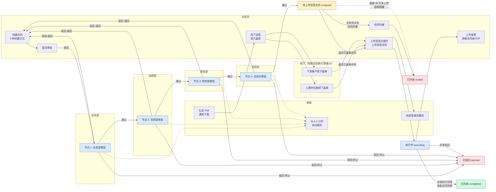
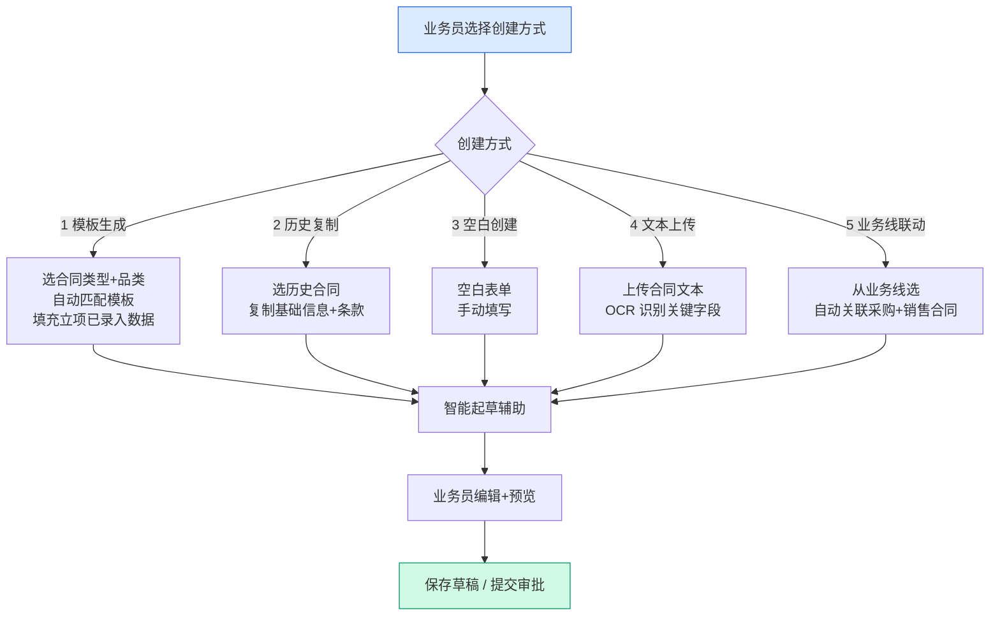
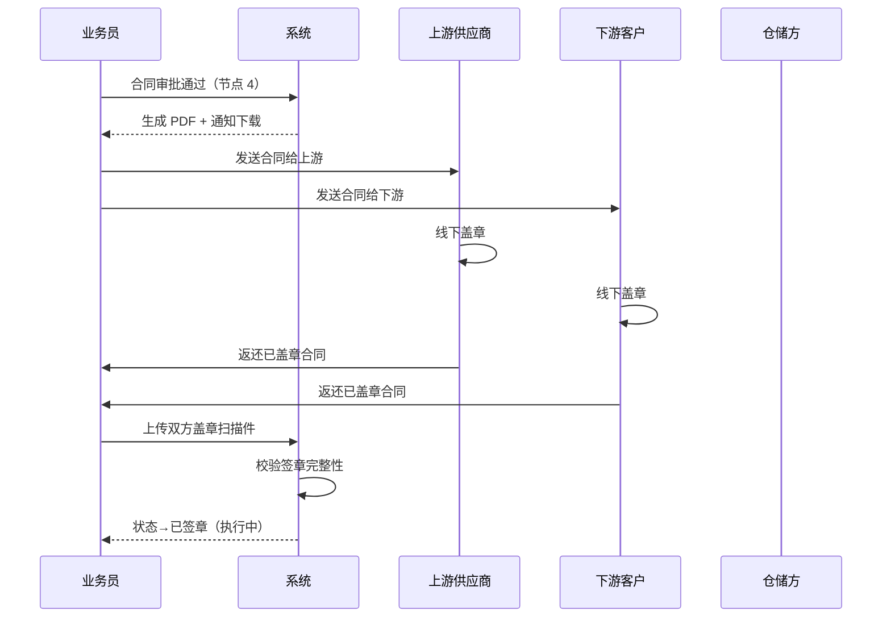
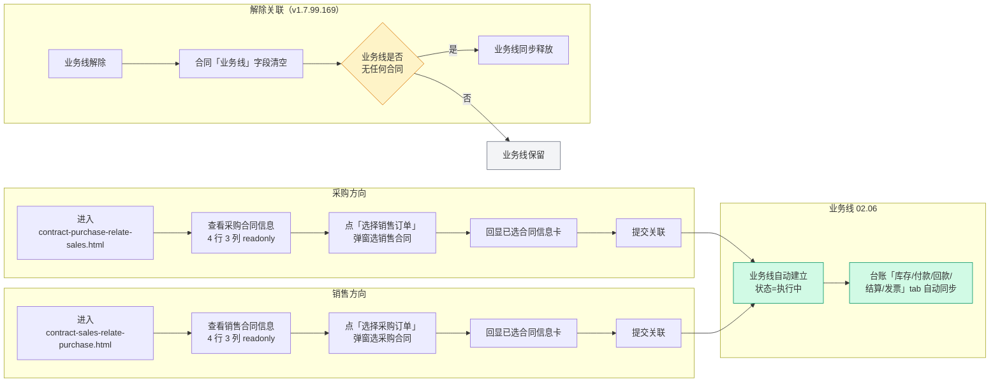
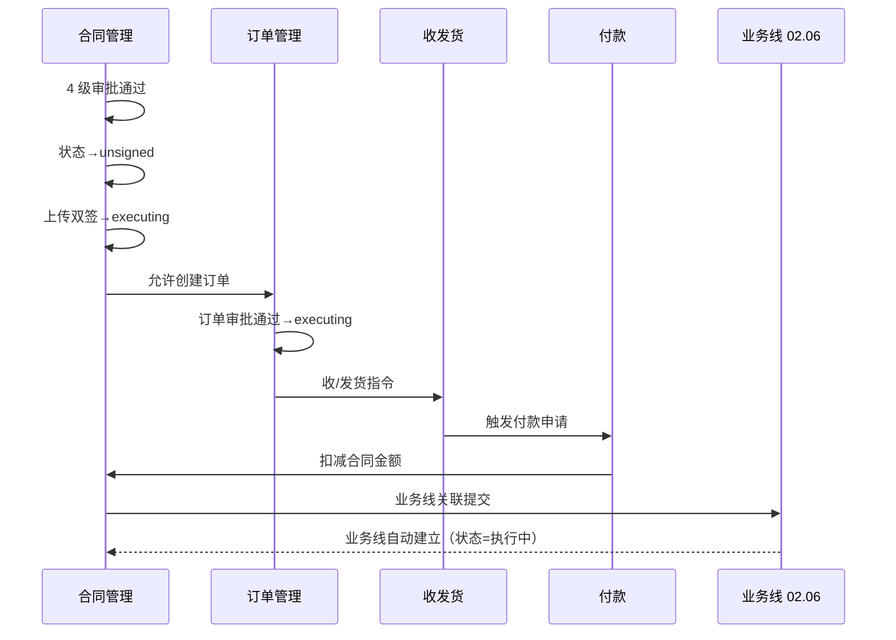
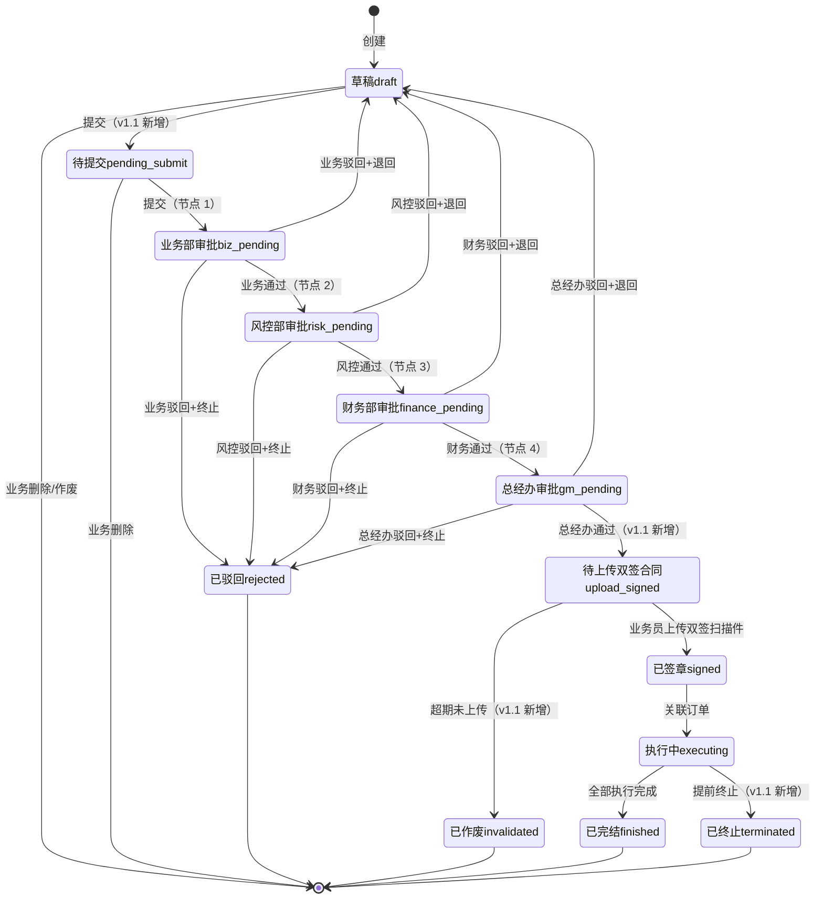
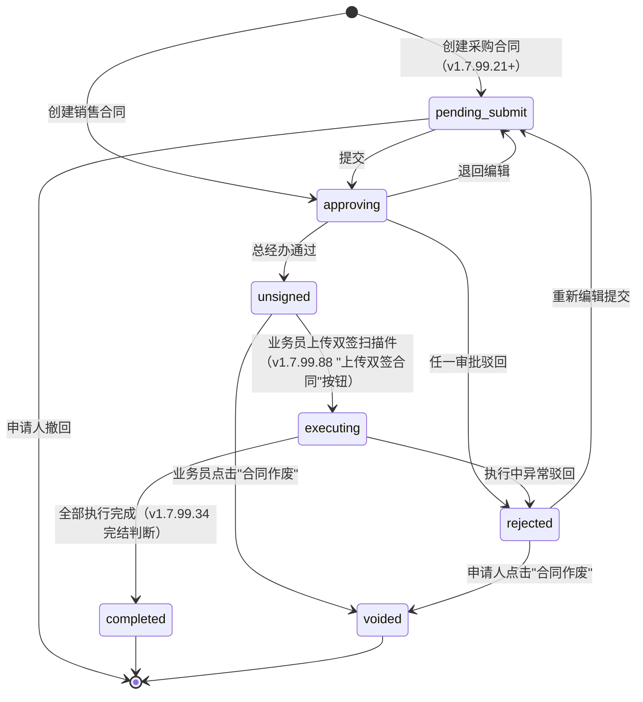

# 02.03 合同管理 · 需求规格说明

> **文档类型**：PRD Writer 范式 · 落地需求文档 · 功能详细描述
> **对应总纲**：[00-产品概述与需求总纲.md](./00-产品概述与需求总纲.md)
> **通用规范**：[01-通用交互与文案规范.md](./01-通用交互与文案规范.md)
> **源文档（只读，未做任何改动）**：[02.03-合同管理.md](../docs/02.03-合同管理.md)
> **整理时间**：2026-09-30

---

## 0. 阅读说明

### 0.1 信息溯源标记

| 标记 | 含义 | 使用规则 |
|------|------|---------|
| ✅ | 源文档已明确 | 原值保留（表名 / 字段名 / 状态枚举 / 编号规则 / 提示文案），不改写口径 |
| 🔷 | 范式补全 | 源文档没写，按范式要求推导，**必须注明推导依据** |
| ⚠️ | 源文档自相矛盾 | **绝不静默选边**，如实并列，交由业务方裁决 |
| [待补充] | 信息不足 | **严禁编造**，需业务方 / 研发回填 |

### 0.2 源文档阅读顺序

源文档 `02.03-合同管理.md`（997 行 / 57,125 字节）**单文件承载全部信息**，但存在**章节编号自相重复**（见 §3.4 C10）：正文按 §1 → §16 排列，其中「§11」被用了两次（v1.1 变更摘要 / v1.7.99.98 改造子章节），§0 章节导航把 v1.7.99.98 与 v1.7.99.88 都编号为「13」。

| 源文档章节 | 内容 | 归位到本文档 |
|-----------|------|------------|
| §1 业务定位 | 10 条关键规则 / 4 子菜单 / 品类 3 种 / 业务类型 5 种 | §1.1、§1.2 |
| §2 业务流程全景 | 5 种创建方式 / 4 级串行审批 / 签章时序 | §1.3.1-1.3.3 |
| §3 核心实体 | `t_contract` 29 字段 + 其他 12 张表 | §5.1、§5.2 |
| §4 9 状态机 | 状态机图 + 13 行状态说明 + 9 Tab 映射 | §3.1、§3.2、§3.4 |
| §5 角色操作矩阵 | 12 状态 × 7 角色 | §2.1 |
| §6 字段规则 | 合同号 / 5 业务模式 / 3 方向 / 3 子类型 / 3 品类 / 4 级审批 / 加签 / 线下签章 | §5.2、§5.3、§3.1 |
| §7 按钮交互 | 列表页 7 按钮 / 详情页 4 进度仪表盘 / 4 子菜单入口 | §2.2、§5.2 |
| §8 异常处理 | 业务 / 审批 / 签章 / 变更终止 4 类 | §4.1、§4.2、§4.3 |
| §9 跨模块流转 | 上游触发 / 下游触发 / 跨模块时序 | §1.4 |
| §10 复用建议 | 80% 复用 / 4 档表 / 4 周实施 | §5.4 |
| §11 + §12 变更摘要与版本 | v1.0→v1.1 9 项变更 + 版本记录 | §3.4、§5.4、§7.3 |
| §13 v1.7.99.88 | 7 状态锁定 / 7 页面改造 / 命名规范 / 触发模式 | §2.1、§2.2、§2.3、§3.1、§3.2、§5.4 |
| §11 v1.7.99.98 | 签署状态 4 文件 4 行改为「待盖章/已双签」 | §3.4、§5.2 |
| §14 v1.7.99.159 | 6 详情页加「审批管理」tab + 5 节点时间线 | §2.2、§3.4、§5.4 |
| §15 v1.7.99.160 | 6 详情页加审批中固定底栏 | §2.2、§5.4 |
| §16 业务线关联 | 2 方向关联页 / 4 步流程 / 6 关键字段 / 跨模块联动 / 异常 | §1.4.3、§2.2、§4.1、§5.2、§6 |
| **📋 业务方裁决（2026-10-08）** | **签署状态术语统一**：「单签」= 界面上「待盖章」，「双签」= 界面上「已双签」——**同一状态的两种叫法，不是四个状态** | §0.1、§3.1、§5.2、§3.4 C4 |

> ✅ **本文档另附一次只读核验**：为判断「源文档口径 vs 页面实际实现」是否一致，整理时对 `pages/contract-*.html`（18 个文件）做了**只读** grep 核验（2026-09-30），核验结果逐条标注为「**现状核验 ✅**」，**未修改任何页面文件**。核验依据：`STATUS_META` 常量 / `signStatus` 字段 / `审批管理|审批记录` tab / `terminated|已终止` 残留。

### 0.3.1 📋 业务方裁决记录（2026-10-08）

> 以下三条由业务负责人在项目收尾阶段确认，**优先级高于本文档中所有 ⚠️ 存疑口径与源文档历史版本**。

| # | 裁决项 | 结论 | 影响范围 |
|---|-------|------|---------|
| **D1** | **合同签署状态术语** | **「单签」= 界面「待盖章」；「双签」= 界面「已双签」——是同一组状态的业务口头叫法与界面文案的对应关系，不是四个独立状态** | 签署状态取值恒为 2 项；§3.4 C4「落库字段缺失」由「2 个枚举值待定」降为「2 个值已确定，字段名待定」；§5.2 字段规范按 `单签/待盖章` + `双签/已双签` 双列写 |
| **D2** | **审批方式** | **串行审批**（业务方 2026-10-08 确认，与飞书用户手册 3.1「目前使用的审批方式为串行审批流」一致） | 全项目所有含审批流的模块统一按串行；源文档中「OR 会签」表述一律作废 |
| **D3** | **资金模块定位** | **系统中仅作为登记方**——只做真实财务付款凭证的流程登记与留存，不涉及真实付款 | 跨模块联动：02.14 资金管理 / 02.13 结算单 / 02.15 发票 的资金类表述统一按「登记方」口径 |

> ⚠️ **D1 未解决的部分**：源文档 §3.1 `t_contract` 的 29 个字段中仍**无签署状态落库列**（只有 `sign_date` 签章日期、`sign_complete_time` 签章完成时间）。**2 个枚举值已确定（D1），但字段名 / 类型 / 是否落库仍 [待补充]**，需研发定。

### 0.3.1.1 ✅ 线上界面实测核验（2026-10-08 · 飞书手册操作录屏逐帧核验）

> 依据：飞书《豫港通用户使用手册（内部版）》第 4.1 节配图（`image-019.gif` 采购合同列表 / `image-020.gif` 列表操作 / `image-021.png` 新增采购框架合同表单），**线上生产环境实拍**。以下为**界面实际文案原值**，优先级高于源文档描述。

#### ① D1 裁决已获线上实证 —— 术语对应关系确认 ✅

| 业务口头叫法（业务方 D1） | 线上界面实际文案 | 出现位置（实拍证据） |
|---|---|---|
| **单签** | **待盖章** | 附件区必传项字段名「**待盖章合同附件**」（`image-021.png`） |
| **双签** | **已双签** | 列表操作按钮「**上传双签章合同**」（`image-019.gif` / `image-020.gif`）；状态 Tab「**待上传双签合同**」 |

**结论**：✅ **D1 裁决与线上一致，予以采纳**。「单签/双签」是业务方口头简称，**界面上不存在这两个词**；界面统一用「待盖章 / 已双签」。

#### ② 线上实测得到的字段与约束（源文档未完整记录，🔷 补全）

| 项 | 线上实测值 | 说明 |
|---|---|---|
| **字段名** | **「合同签署状态」** | ⚠️ **不是**「合同签章状态」——源文档与本模块文档中「签章状态」的表述需统一改为「签署状态」 |
| **占位文案** | `请选择签署状态` | 下拉必填（红星） |
| **合同数量控件** | 数量输入框 **+ 浮动比例 ± %** 两个输入位 | 与手册 4.1「合同数量：可手动输入数量，并且后方填写对应浮动比例」一致 ✅ |
| **计量单位** | `吨/件/支` | ✅ 与手册一致 |
| **合同交货期限** | 交货开始 —— 交货结束（起止日期，开始与截止可为同一日） | ✅ 与手册一致 |
| **框架合同编号** | **系统自动生成**（灰底只读） | 订单/单批次合同为手填，最多 99 位（手册） |
| **附件字段** | 框架合同必传「**待盖章合同附件**」+ 选填「其他附件」 | ✅ 与手册一致 |
| **附件格式白名单** | `png, jpeg, jpg, pdf, doc, docx, xlsx, xls` | 🔷 源文档未记录，线上实测补全 |
| **单附件大小上限** | **100 MB** | 🔷 源文档 §7 未记录；⚠️ 此前 02.07 C9 记「凭证 100MB 上限在页面零实现」——**本项线上已实现**（合同侧），货转侧待核 |
| **底部操作** | `取消` / `保存` / `提交` | 保存 = 存草稿；提交 = 走审批 |

#### ③ 线上合同列表实测（8 个状态 Tab）

`全部` / `待提交` / `审批中` / **`待上传双签合同`** / `执行中` / `已完结` / `审批驳回` / `已作废`
（= 7 个业务状态 + 「全部」占位）

**行内操作 4 个**：`合同详情` / `上传双签章合同` / `新增补协` / `发起合同完结`

⚠️ **与源文档差异**：源文档 v1.1 的状态名为「待上传双签合同」但**枚举写作 `upload_signed`**；线上 Tab 文案为「**待上传双签合同**」（含「合同」二字）。**枚举与界面文案的对应关系仍 [待补充]**（研发定）。

> 📌 本节为**只读核验**产物（读取飞书文档内的线上录屏截图），**未修改任何项目页面文件**。

### 0.3.2 与通用规范的关系

**通用表单规范（校验时机 / 返回保护 / 提交行为 / 危险操作确认 / 空状态 / 失败引导 / 通用 UI 6 态 / 通用样式 / 脱敏规范）一律以 [01-通用交互与文案规范.md](./01-通用交互与文案规范.md) 为准，本文档不重复定义，只写本模块特有的部分**：4 子菜单与 2 维分类、合同号 4 段规则、5 种创建方式、4 级串行审批 + 加签 + 2 小时 SLA、线下签章与双签扫描件、合同与订单/收发货/付款/发票/结算的关联、4 个进度仪表盘、业务线双向关联。

---

## 1. 功能描述与触发条件

### 1.1 功能描述

✅ **合同管理是港通供应链的业务串联核心**——所有下游业务（订单 / 收发货 / 付款 / 发票 / 结算）都通过合同关联起来（源文档 §1 首句）。

✅ **规模定位**（源文档头部 + §3 + 总纲 §3）：**全项目最大的核心模块**——**4 子菜单** / **13 张表** / **9 状态机**（状态数口径存在冲突，见 §3.4 C1）。

✅ **源文档 v1.1 锁定的 10 条关键规则**（§1.1，原文保留）：

| # | 规则 | 说明 | 备注 |
|---|------|------|------|
| 1 | **4 子菜单**（v1.1 重大调整） | 采购合同 / 销售合同 / **运输合同**（v1.1 新发现）/ 补充协议 | §1.1.1 |
| 2 | **2 维分类**（v1.1 新增） | 方向 `purchase`/`sales` × 类型 `framework`/`single_batch` = 4 种合同 | ⚠️ 字段枚举为 3+3，见 C5 |
| 3 | **5 种业务模式**（v1.1 新增 1 种） | 存货 / 预付 / 账期 / 购销 / **总代业务**（从项目立项继承） | §5.2 |
| 4 | **4 级串行审批** | 业务部 → 风控部 → 财务部 → 总经办（**单签**，不是 OR 会签） | ⚠️ vs v1.7.99.159 的 5 节点，见 C7 |
| 5 | **2 小时 SLA 自动催办** | 审批超时自动催办 | §4.3 |
| 6 | **加签机制** | 临时加人审批 | §4.1 |
| 7 | **线下签章 + 系统流程化登记** | 审批通过 → 下载 → 双方线下盖章 → 扫描件上传 | §1.3.3 |
| 8 | **5 种创建方式** | 模板生成 / 历史复制 / 空白创建 / 文本上传 / 业务线联动 | §1.3.2 |
| 9 | **客户关联** | 直接引用 `t_company`（**不再经过 `t_access_apply` 准入台账**） | §1.4.1 |
| 10 | **9 状态**（v1.1 重大调整） | 新增「待上传双签合同 / 已终止 / 已作废」 | ⚠️ 实列 13，见 C1 |

✅ **复用度：🟢 80%（大幅复用）**（源文档头部 + §10.1）——主产品 `bo_contract*` 7 张 + `t_supplemental_agreement*` 4 张 + `t_contract*` 钢铁业务 5 张 = 13+ 张表。⚠️ 分档口径不一致，见 C8。

#### 1.1.1 4 子菜单与 2 维分类

✅ 源文档 §1.2 + §7.3：

| # | 子菜单 | 2 维分类（§1.2 原文） | Tab 结构 | 范本对应 | 现状核验 ✅ |
|---|--------|----------------------|---------|---------|-----------|
| 1 | **采购合同** | `direction=purchase` | 采购框架合同 / 采购订单-单批次合同 | 02.03 v1.0 + 02.04 订单管理 | 2 列表页 + 2 新建页 + 2 详情页 |
| 2 | **销售合同** | `direction=sales` | 销售框架合同 / 销售订单-单批次合同 | 02.03 v1.0 + 02.04 订单管理 | 2 列表页 + 2 新建页 + 2 详情页 |
| 3 | **运输合同**（v1.1 新） | `transport` | ⚠️ 源文档记「暂无详情页（占位）」 | 02.03 v1.0 没写 | `pages/contract-shipping.html` **已存在**（含 20KB 页面级 PRD） |
| 4 | **补充协议** | ⚠️ §1.2 记 `supplemental` | 新增补协-框架合同 / 新增补协-订单-单批次合同 | 02.03 v1.0 部分 | 1 列表页 + 2 新建页 + 2 详情页 |

🔷 **2 维分类的完整组合表**（推导依据：源文档 §1.1 规则 2「2 维分类 = 4 种合同」+ §1.2 子菜单表 + §7.3 Tab 结构）：

| 方向 \ 类型 | `framework`（框架合同） | `single_batch`（订单/单批次合同） |
|------------|------------------------|------------------------------------|
| **`purchase`（采购）** | 采购框架合同 | 采购订单/单批次合同 |
| **`sales`（销售）** | 销售框架合同 | 销售订单/单批次合同 |

⚠️ 该表**只覆盖 4 格**；而 `direction` 实际枚举 3 值（含 `transport`）、`contract_subtype` 实际枚举 3 值（含 `supplement`），**「运输合同」与「补充协议」落在 2 维表之外**——见 §3.4 C5。

✅ **货物品类 3 种（v1.1 具体名）**（§1.3 / §6.5）：`玉米` / `糖粉` / `木薯淀粉`（**不再是 v1.0 的「谷物/糖粉/淀粉」抽象名**）。

✅ **业务类型 5 种（v1.1 新增总代业务）**（§1.4 / §6.2）：见 §5.2 枚举表。

### 1.2 触发条件

| 场景 | 触发条件 | 结果 | 来源 |
|------|---------|------|------|
| 允许创建合同 | 项目状态 = `finished`（项目立项 02.01） | 允许创建合同，关联 `project_id` | §9.1 ✅ |
| 允许合同关联客户 | 客户状态 = `executing`（客户管理 02.02） | 允许合同关联 | §9.1 ✅ |
| 业务线联动创建 | 从业务线（02.06）进入 | 自动关联采购 + 销售合同（创建方式 5） | §2.1 ✅ |
| 提交审批 | 状态 = `pending_submit` / `draft` | 进入 4 级串行审批 | §4.1 / §13.2 ✅ |
| 触发下游单据 | 合同 `signed`（v1.1 口径） | 允许创建订单（采购/销售） | §9.2 ✅ |
| 允许付款/开票/结算 | 合同 `executing` | 付款/发票/结算关联 `contract_id` | §9.2 ✅ |
| 业务线关联合同 | 进入关联页 → 点「选择销售/采购订单」 | 弹窗选合同 → 回显已选合同信息卡 → 提交关联 | §16.2 ✅ |
| 超期自动作废 | `unsigned` 状态**超过 30 天**未上传双签扫描件 | 状态 → `invalidated` / `voided`（已作废） | §6.8 / §8.3 ✅ |
| SLA 催办 | 审批停留**超过 2 小时**未处理 | 自动催办 | §1.1 规则 5 / §8.2 ✅ |
| 审批中固定底栏显示 | 详情页 `currentStatus === 'approving'` | 显示「审批通过 / 驳回审批」固定底栏 | §15.2 v1.7.99.160 ✅ |

### 1.3 业务流程（Mermaid）

#### 1.3.1 端到端主流程（角色泳道 · 4 级串行审批 + 线下签章）

> ✅ 依据源文档 §2.2（4 级串行审批流程图）+ §6.6（4 级审批规则）+ §6.8（线下签章规则）+ §4.1（状态机）重绘为泳道图，**节点文案照抄源文档原值**。



⚠️ **`signed`（已签章）状态在本图省略**：源文档 §2.2 原图与 §9.3 时序图均为「待上传双签 → 线下签章 → **执行中**」（一跳，**无 `signed`**），而 §4.1 状态机图为「待上传双签 → **已签章 signed** → 执行中」（两跳）。v1.7.99.88 的 7 状态机**无 `signed`**。**本文档按 v1.7.99.88（最新）画一跳，冲突见 §3.4 C3。**

#### 1.3.2 5 种创建方式

✅ 源文档 §2.1 原图（`flowchart TB`）：



#### 1.3.3 合同签章时序（线下签章 + 系统流程化登记）

✅ 源文档 §2.3 原图（`sequenceDiagram`）：



> 📌 **与用户「资金流转」基线一致性核查**：本流程**不含任何线上扣款/打款/银行扣款分支**——签章全流程为「线下盖章 + 扫描件上传 + 系统流程化登记」，✅ **符合**基线。
> ⚠️ 末行「状态→已签章（执行中）」**同时出现两个状态名**，源文档原文如此，见 C3。
> 🔷 `WH`（仓储方）participant 在源文档图中**声明但全程未使用**——运输合同（`transport`）涉及仓储方是否走同一签章流程，源文档未说明，见 §7.2 Q6。

#### 1.3.4 业务线关联 4 步流程（v1.7.99.59）

✅ 依据源文档 §16.1 + §16.2 + §16.4 重绘：



✅ **v1.7.99.59 关键决策**（§16.1）：**两个方向独立页面**（不是同一页面切换方向）——业务场景清晰；顶部「选择销售订单/采购订单」按钮 → 弹窗选择对应方向的合同；已选合同展示卡**单条合同展示**（合同编号/卖方/买方/品名/单价/数量等）。

### 1.4 模块依赖（跨模块流转）

#### 1.4.1 上游触发（✅ 源文档 §9.1）

| 触发模块 | 触发条件 | 触发动作 |
|---------|---------|---------|
| 项目管理-立项（02.01） | 项目 `finished` | 允许创建合同，关联 `project_id` |
| 客户管理（02.02） | 客户 `executing` | 允许合同关联 |

#### 1.4.2 下游触发（✅ 源文档 §9.2）

| 触发模块 | 触发条件 | 触发动作 |
|---------|---------|---------|
| 订单管理（02.04） | 合同 `signed` | 允许创建订单（采购/销售） |
| 收发货（02.05） | 订单 `executing` | 收/发货关联到 `contract_id` |
| 付款（02.08.1） | 合同 `executing` | 付款时校验合同 |
| 发票（02.09） | 合同 `executing` | 发票关联到 `contract_id` |
| 结算（02.07） | 合同 `executing` | 结算关联到 `contract_id` |

⚠️ 源文档 §9.2 列的**模块编号（02.04 订单 / 02.08.1 付款 / 02.09 发票 / 02.07 结算）与 docs/ 目录实际文件名不一致**（实际为 `02.05-收发货管理` / `02.06-业务线管理` / `02.07-货转管理` / `02.13-结算单管理` / `02.14-资金管理` / `02.15-发票管理`；且**订单管理 02.04 已于 v1.7.99.181 整体删除**，见总纲 §9.1 Q5）。**模块编号口径见 §7.2 Q9。**

#### 1.4.3 跨模块状态机联动 + 业务线联动（✅ §9.3 + §16.4）



⚠️ 末行「**Pay → Cont: 扣减合同金额**」与用户「**资金流转 = 线下完成 + 系统流程化登记**」基线口径**不一致**（"扣减"暗示线上扣款）——合同金额的真实扣减机制（预付占用 / 实际登记金额 / 结算扣减）源文档未定义，见 §7.2 Q7。

✅ **业务线联动行为**（§16.4）：

| 联动系统 | 行为 |
|----------|------|
| **业务线（02.06）** | 关联成功 → 业务线自动建立，状态 = 执行中 |
| **业务线台账** | 关联成功 → 该业务线的「库存 / 付款 / 回款 / 结算 / 发票」tab 自动同步 |
| **解除关联** | 业务线解除 → 关联的合同「业务线」字段清空（v1.7.99.169 关键） |

---

## 2. 交互细节

### 2.1 角色操作矩阵（权限可见性）

✅ **源文档 §5 角色操作矩阵（v1.1 口径，12 状态 × 7 角色，原文保留）**：

| 状态 / 角色 | 业务员 | 业务部 | 风控部 | 财务部 | 总经办 | 系统 |
|------------|------|------|------|------|------|------|
| `pending_submit` 待提交 | 编辑/作废 | 查看 | 查看 | 查看 | 查看 | - |
| `biz_pending` 业务部 | 查看 | **审批** | 查看 | 查看 | 查看 | 推送 |
| `risk_pending` 风控部 | 查看 | 查看 | **审批** | 查看 | 查看 | 推送 |
| `finance_pending` 财务部 | 查看 | 查看 | 查看 | **审批** | 查看 | 推送 |
| `gm_pending` 总经办 | 查看 | 查看 | 查看 | 查看 | **审批** | 推送 |
| `upload_signed` 待上传（v1.1 新） | **上传双签** | 查看 | 查看 | 查看 | 查看 | 超期提醒 |
| `signed` 已签章 | 查看 | 查看 | 查看 | 查看 | 查看 | - |
| `executing` 执行中 | 查看 | 查看 | 查看 | 查看 | 查看 | - |
| `finished` 已完结 | 查看 | 查看 | 查看 | 查看 | 查看 | - |
| `terminated` 已终止（v1.1 新） | 查看 | 查看 | 查看 | 查看 | 查看 | - |
| `rejected` 已驳回 | **编辑后重新提交** | 查看 | 查看 | 查看 | 查看 | - |
| `invalidated` 已作废（v1.1 新） | 查看 | 查看 | 查看 | 查看 | 查看 | - |

⚠️ 本矩阵是 **v1.1（13 状态）口径**，与 v1.7.99.88 的 7 状态（`draft`/`approving`/`unsigned`/`executing`/`completed`/`rejected`/`voided`）**不对应**——`terminated` 已被 v1.7.99.88 删除，4 个审批态已合并为 `approving`。**矩阵需按 7 状态重出**，见 §3.4 C1/C2。

✅ **v1.7.99.88 锁定的 7 状态权限差异**（§13.4 原文）：

| 维度 | 采购合同 | 销售合同 |
|------|---------|---------|
| **状态数** | 7 状态 | 6 状态（少 `pending_submit`） |
| **执行中 开票按钮名** | `开票申请`（采购方申请销售方开票） | `上传发票`（v1.7.99.88：销售方上传开好的发票给采购方） |
| **upload 按钮名** | `上传双签合同` | `上传双签合同` |
| **terminate 按钮** | ❌ 已下线 | ❌ 已下线 |
| **terminated 状态** | ❌ 已下线 | ❌ 已下线 |

⚠️ **现状核验 ✅（2026-09-30 只读 grep `pages/`）**：`contract-purchase.html` 与 `contract-sales.html` 的 `STATUS_META` **均为 7 个枚举**（`draft` / `approving` / `unsigned` / `executing` / `completed` / `rejected` / `voided`），其中「待提交」标签用的枚举值是 **`draft`**（不是源文档 §13.2 的 `pending_submit`）；**销售合同同样含 `draft`**，与「销售 6 状态（少 `pending_submit`）」不符。见 §3.4 C2。

✅ **v1.7.99.160 审批中固定底栏的可见性**（§15.2）：6 个合同详情页在 `currentStatus === 'approving'` 时显示「审批通过（蓝主）/ 驳回审批（红边框）」底栏，**任何 tab 均可审批**（不限「审批管理」tab）。

### 2.2 按钮交互（操作反馈）

#### 2.2.1 列表页按钮（✅ 源文档 §7.1）

| 按钮 | 位置 | 可见条件 | 点击行为 |
|------|------|---------|---------|
| **新增合同** | 右上 | 业务部 | 弹创建方式选择（5 种） |
| **数据导出** | Tab 右侧 | 所有 | 导出 Excel |
| **合同详情** | 列表行 | 所有 | 跳详情页 |
| **上传合同附件** | 列表行 | `upload_signed` | 弹上传对话框（v1.1 新增） |
| **付款申请** | 列表行 | `executing` | 跳付款新建（关联 `contract_id`） |
| **发货申请** | 列表行 | `executing` | 跳发货新建 |
| **更多** | 列表行 | 所有 | 弹下拉（编辑/作废/驳回/复制等） |

⚠️ 「上传合同附件」按钮名在 **v1.7.99.88 已统一改为「上传双签合同」**（8 个合同页面），上表为 v1.1 旧名，见 §2.2.2。

#### 2.2.2 v1.7.99.88 锁定的命名规范（✅ §13.5，原文保留）

| 操作 | 旧名 | 新名 | 适用页面 |
|------|------|-----|---------|
| 待上传双签合同 | `上传合同附件` | `上传双签合同` | **8 个合同页面统一** |
| 销售合同 执行中 | `开票申请` | `上传发票` | `contract-sales.html` / `contract-sales-order-detail.html` |

✅ **v1.7.99.88 明确保留不改的按钮**（§13.6 原文）：

- **采购合同「开票申请」保留**——采购方 user 没要求改名，业务语义：采购方向销售方申请开票
- **销售合同「待上传双签合同」状态下的「开票申请」保留**——user 只指定了「执行中」状态下改名
- **历史操作记录保留**——4 个详情页操作日志 mock 仍显示「发起合同终止」+「合同终止OA审批通过/驳回」3 行记录，属历史操作记录，user 没要求清理
- ⚠️ **alert 文案跟按钮名同步改**（§13.7）——`contract-sales.html` `case 'invoice'` 的 alert `'进入开票申请页面'` 也要改成 `'进入上传发票页面'`

#### 2.2.3 5 类弹窗触发矩阵（✅ §13.6 原文，v1.7.99.88 移除 `terminateModal`）

| 弹窗 | 触发按钮 | 触发状态 | 标题 | 阻止条件 |
|------|---------|---------|------|---------|
| `uploadModal` | **上传双签合同**（v1.7.99.88 改名） | `unsigned` | 上传双签合同 | - |
| `supplementTipModal` | 新增补协 | `executing` | 提示 | 补协有「已生效/OA审批中/待上传双签/OA驳回」 |
| `voidModal`（采购） | 合同作废 | `unsigned`/`rejected` | 合作废/合同作废（id 动态） | - |
| `voidModal`（销售） | 合同作废 | `unsigned`/`rejected` | 合作废 | - |
| `confirmModal` | 发起合同完结 | `executing` | 发起合同完结 | 6 状态判断全部 `[]` |
| `blockModal` | 发起合同完结 | `executing` | 发起合同完结 | 6 状态判断有 1+ 项 |

✅ **命名规范 v1.7.99.35-fix + 88**：操作按钮 = **「合同作废」**，弹窗标题 = **「合作废」**（销售合同统一）/ 动态（采购合同）。

#### 2.2.4 合同详情页 tab 与操作（✅ v1.7.99.159 + §7.2）

✅ **v1.7.99.159 改造**：6 个合同详情页在「合同信息 / 补协信息」与「操作记录」**中间**插入「审批管理」tab；**状态为执行中 / 待上传双签合同的详情页，该 tab 更名为「审批记录」并只展示已通过的审批节点**（§14.1 / §14.3）：

| 状态 | tab 名 | 内容 | 出处 |
|------|-------|------|------|
| `executing`（执行中） | **审批记录** | 只展示已通过节点（5 节点全 done 时显示 5 节点） | §14.3 ✅ |
| `unsigned`（待上传双签合同） | **审批记录** | 只展示已通过节点 | §14.3 ✅ |
| `approving`（审批中） | 审批管理 | 完整 5 节点（图 2 风格）+ 关键指标 + 实时活动 + 催办卡 | §14.3 ✅ |
| `completed`（已生效 / 已完结） | **审批记录** | 5 节点全已通过 | §14.3 ✅ |
| `rejected`（审批驳回）/ `voided`（已作废） | **审批记录** | 只展示已通过节点 | §14.3 ✅ |

⚠️ 现状核验 ✅：6 个详情页均含 `审批管理|审批记录`（各 5 处命中），v1.7.99.159 已落地。

⚠️ **`completed` 一行同时写「已生效 / 已完结」两个中文名**（源文档 §14.3 原文），且 5 节点时间线的第 ⑤ 节点为「准入完成 / 合同生效」——见 §3.4 C7。

✅ **详情页字段分类与 4 进度仪表盘**（§7.2，v1.1 新增 4 仪表盘）：

| 分类 | 字段 |
|------|------|
| **合同信息** | 合同号 / 卖方企业 / 品名 / 合同单价 / 合同金额 / 业务类型 / 合同量 / 签订日期 / 合同有效期 / 创建人 |
| **货物进度** | 进度条 **0-120%**（带颜色） |
| **付款进度** | 已付款（元）/ 0 |
| **结算进度** | 已结算数量（吨）/ 已结算金额（元）/ 拆分到本合同金额（元） |
| **开票进度** | 发票张数（张）/ 0 |
| **操作** | 合同详情 / 上传合同附件 / 付款申请 / 发货申请 / 更多 |

> ⚠️ 「付款进度」「开票进度」的 `/ 0` 为源文档原文的 mock 值写法；「货物进度 0-120%」**上限 120% 的业务含义**（超收/超发？）源文档未说明，见 §7.2 Q8。

#### 2.2.5 业务线关联页按钮（✅ §16.1 / §16.2）

| 按钮 | 位置 | 行为 |
|------|------|------|
| **选择销售订单 / 选择采购订单** | 页面顶部 | 弹窗选择对应方向的合同 |
| **提交关联** | 已选合同信息卡之后 | 提交关联 → 业务线自动建立 |
| **解除关联**（v1.7.99.169） | 🔷 位置未定义 [待补充] | 业务线解除 → 合同「业务线」字段清空 → 若业务线无任何合同则同步释放 |

### 2.3 危险操作确认

| 操作 | 确认框 / 弹窗 | 依据 |
|------|-------------|------|
| **合同作废** | `voidModal`（采购标题动态「合作废/合同作废」，销售统一「合作废」）；触发状态 `unsigned`/`rejected` | ✅ §13.6 |
| **发起合同完结** | `confirmModal`（6 状态判断全通过）/ `blockModal`（有 1+ 项不通过，列出未完成项） | ✅ §13.6 |
| **作废单据通用确认** | `作废后不可恢复，确定作废该{单据名}？` | 🔷 01 文档 §2.10 + 总纲 §7.7 |
| **驳回审批** | `驳回后申请人可修改后重新提交，确定驳回？`（**必填驳回原因**） | 🔷 01 文档 §2.10（源文档未给驳回确认框文案） |
| **离开有未保存内容的表单** | `当前编辑内容将丢失，确定返回？` + `确定`/`取消` | 🔷 01 文档 §2.2（源文档未覆盖） |
| **解除业务线关联** | `解除后关联关系将失效，确定解除？` | 🔷 总纲 §7.7（源文档 §16.4 未给确认框） |
| ~~发起合同终止~~ | ❌ **v1.7.99.88 已下线**——按钮删除 + `terminateModal` 删除 + `handleAction` 的 `case 'terminate'` 删除 + `checkTerminateBlock` 删除 + `actionLabels.terminate` 删除 | ✅ §13.1 / §13.7 |

✅ **v1.7.99.88「不在 HTML 中留无用弹窗 div」硬规范**（§13.7）：`terminateModal` / `terminate` handler / `case 'terminate'` / `checkTerminateBlock` / `actionLabels.terminate` 全删，**不留僵尸代码**。

### 2.4 空状态引导

> 通用空状态规范以 [01-通用交互与文案规范.md](./01-通用交互与文案规范.md) §2.11 为准（`暂无数据` / `请调整筛选条件` / 空状态插画 + 灰字 13px 居中）。下表为**本模块特有**的空状态。

| 场景 | 文案 | 补充动作 | 依据 |
|------|------|---------|------|
| 合同列表无数据 | `暂无数据` | 有筛选时 `请调整筛选条件` | 🔷 01 §2.11 |
| 关联合同选择器为空（业务线关联页） | 🔷 [待补充] 源文档未给 | 需说明前置条件（须先有「执行中」状态合同） | 🔷 依据 §16.5 校验规则推导 |
| 运输合同子菜单 | 🔷 源文档记「暂无详情页（占位）」，但 `pages/contract-shipping.html` 已存在 | ⚠️ 需确认该页是否已补全，见 §7.2 Q10 | ✅ §1.2 |
| 新增补协被阻止 | 弹 `supplementTipModal`（标题「提示」），阻止条件：补协有「已生效 / OA审批中 / 待上传双签 / OA驳回」 | 引导至已有补协 | ✅ §13.6 |
| 文本上传 OCR 失败 | `OCR 识别失败，请手动填写`（**允许降级为手动录入，不阻断**） | 降级手填 | 🔷 总纲 §7.5 |
| 无「审批记录」可展示（`approving` 之外的 record 模式且无通过节点） | 🔷 [待补充] 源文档未定义 record 模式空态 | 需定义「暂无审批记录」展示 | 🔷 依据 §14.3 record 模式推导 |

### 2.5 失败引导

✅ **源文档 §8 异常处理原文文案（4 类，全部照抄）**：

| 类别 | 异常场景 | 提示文案 | 处理动作 |
|------|---------|---------|---------|
| **业务异常** | 必填项未填 | `请填写：合同名称/客户/品类/...` | 阻止提交 |
| | 业务类型与品类不匹配 | `业务类型 X 与品类 Y 不匹配` | 红色提示 |
| | 合同金额 = 0 | `合同金额必须 > 0` | 阻止 |
| | 合同有效期 < 生效日期 | `到期日期必须 > 生效日期` | 阻止 |
| **审批异常** | 任一审批驳回 | `XX 审批驳回` | 状态 → `draft`（退回）或 `rejected`（终止） |
| | 审批超时（2 小时） | `审批超过 2 小时未处理` | **自动催办** |
| | 审批人未配置 | `审批人未配置，请联系管理员` | 状态保持 |
| | 消息推送失败 | `消息推送失败，请重试` | 允许重试 |
| **签章异常** | 超期未上传双签合同 | `合同 XXX 已超 30 天未上传双签扫描件，已自动作废` | 状态 → `invalidated` |
| | 签章扫描件格式错误 | `扫描件格式不支持（仅支持 .pdf/.png/.jpg）` | 阻止上传 |
| | 签章扫描件过大 | `扫描件不能超过 20MB` | 阻止上传 |
| | 签章扫描件与签章方不匹配 | `扫描件签章方与系统记录不匹配` | 红色提示，需人工审核 |
| **变更/终止异常** | 执行中合同变更 | `执行中合同变更需走补充协议` | 引导到补充协议 |
| | 已完结合同不能变更 | `已完结合同不能变更` | 阻止 |
| | 已终止合同不能恢复 | `已终止合同不能恢复` | 阻止 |
| | 作废合同恢复 | `已作废合同需走 OA 流程恢复` | 引导到 OA |

✅ **业务线关联异常（§16.5 原文）**：

| 场景 | 处理 |
|------|------|
| 关联非「执行中」状态合同 | 红字提示 `请选择执行中状态的合同` |
| 已关联业务线的合同重复关联 | 红字提示 `该合同已关联其他业务线` |
| 解除关联后业务线无任何合同 | 业务线同步释放（v1.7.99.169） |
| 同一合同并发关联 | 二次校验被覆盖则提示 `已被其他操作覆盖，请刷新` |

🔷 **通用失败引导**（01 文档 §2.12）：业务规则失败 → Toast 说明业务约束 + **保留输入**；网络异常 → `网络异常，请重试` + 按钮恢复可点；权限不足 → `无权限执行此操作` + 按钮隐藏；加载既有数据失败 → 页面顶部红色横幅 + `重试` 按钮。

---

## 3. 状态清单

### 3.1 业务状态机

#### 3.1.1 v1.1 口径（13 状态，源文档 §4.1 原图）

✅ 源文档 §4.1 `stateDiagram-v2` 原图（**「9 状态机」标题但实列 13 个状态节点，见 C1**）：



#### 3.1.2 v1.7.99.88 口径（7 状态，最新，源文档文末原图）

✅ 源文档「本模块 v1.7.99.x 后的状态机 mermaid 流程图（v1.7.99.88 移除 terminated）」原图：



> ❌ **v1.7.99.88 已删除**：`terminated`（已终止）——采购 7 状态 = 销售 6 状态（销售比采购少 `pending_submit`）（§13.2 原文）

⚠️ **现状核验 ✅（2026-09-30 只读 grep `pages/`）**：实现层 `STATUS_META` 为 7 枚举 `draft`/`approving`/`unsigned`/`executing`/`completed`/`rejected`/`voided`，**「待提交」用的是 `draft`**，且**采购与销售同为 7 状态**——与上图的 `pending_submit` / 「销售 6 状态」**均不一致**。见 §3.4 C2。

### 3.2 状态值与展示

#### 3.2.1 v1.1 口径 13 状态（✅ 源文档 §4.2 标题写「9 状态说明」，表实列 13 行，原值照抄）

| # | 枚举值 | 中文 | 触发条件 | 下一状态 | Tag 色 |
|---|-------|------|---------|---------|--------|
| 1 | `draft` | 草稿 | 创建 | 提交/删除/作废 | 🔷 灰 `#F3F4F6`（总纲 §7.8 终态色；实际页面用 `tag-yellow`） |
| 2 | `pending_submit` | 待提交 | 业务员提交 | 业务部审批 | 🔷 黄 `#FEF3C7` |
| 3 | `biz_pending` | 业务部审批（节点 1） | 业务员提交 | 业务部审批 | 🔷 蓝 `#EFF6FF` |
| 4 | `risk_pending` | 风控部审批（节点 2） | 业务部通过 | 风控部审批 | 🔷 蓝 `#EFF6FF` |
| 5 | `finance_pending` | 财务部审批（节点 3） | 风控部通过 | 财务部审批 | 🔷 蓝 `#EFF6FF` |
| 6 | `gm_pending` | 总经办审批（节点 4） | 财务部通过 | 总经办审批 | 🔷 蓝 `#EFF6FF` |
| 7 | `upload_signed` | **待上传双签合同**（v1.1 新增） | 总经办通过 | 上传双签 / 超期作废 | 🔷 黄 `#FEF3C7`（现状实现 `tag-orange`） |
| 8 | `signed` | 已签章 | 上传双签扫描件 | 执行中 | 🔷 绿 `#ECFDF5` |
| 9 | `executing` | 执行中 | 关联订单 | 完结 / 终止 | 🔷 蓝 `#EFF6FF`（现状实现 `tag-green`） |
| 10 | `finished` | 已完结 | 全部执行完成 | 终态 | 🔷 灰 `#F3F4F6`（现状实现 `tag-blue`） |
| 11 | `terminated` | **已终止**（v1.1 新增） | 提前终止 | 终态 | 🔷 红 `#FEE2E2` |
| 12 | `rejected` | 已驳回 | 任一审批驳回 | 终态 | 🔷 红 `#FEE2E2`（现状实现 `tag-red`） |
| 13 | `invalidated` | **已作废**（v1.1 新增） | 超期未上传双签 | 终态 | 🔷 灰 `#F3F4F6`（现状实现 `tag-red`） |

> 📌 **Tag 色列说明**：v1.1 源文档**未给状态配色**；上表 🔷 色值依据 [总纲 §7.8 状态标签配色](./00-产品概述与需求总纲.md#78-状态标签配色) 的语义推导（进行中→蓝 / 驳回异常→红 / 待处理→黄 / 终态→灰）。**括号内的 `tag-*` 为现状核验 ✅ 得到的页面实际类名**（v1.7.99.14 状态机颜色编码），两者不一致处见 §3.4 C2。

#### 3.2.2 v1.7.99.88 口径 7 状态（✅ 源文档 §13.2 原表照抄）

| # | 枚举值 | 中文 | 触发条件 | 下一状态 | Tag 色（现状核验 ✅） |
|---|-------|------|---------|------------|-------------------|
| 1 | `pending_submit` | 待提交 | 业务员提交 | 业务部审批 / 撤回 | `tag-yellow` |
| 2 | `approving` | 审批中 | 任一审批节点 | 总经办通过 / 任一驳回 / 退回编辑 | `tag-yellow` |
| 3 | `unsigned` | 待上传双签合同 | 总经办通过 | 上传双签 / 合同作废 | `tag-orange` |
| 4 | `executing` | 执行中 | 上传双签 | 全部完结 / 异常驳回 | `tag-green` |
| 5 | `completed` | 已完结 | 全部执行完成 | 终态 | `tag-blue` |
| 6 | `rejected` | 审批驳回 | 任一审批驳回 | 重新编辑 / 合同作废 | `tag-red` |
| 7 | `voided` | 已作废 | 业务员点击「合同作废」 | 终态 | `tag-red` |

⚠️ **现状 `STATUS_META` 的「待提交」枚举值为 `draft`（非 `pending_submit`）**，故上表第 1 行的枚举值与实现不符（标签「待提交」与 `tag-yellow` 一致）。见 §3.4 C2。

#### 3.2.3 列表 Tab 与状态映射（✅ 源文档 §4.3 v1.1 9 Tab）

| Tab | 对应状态 |
|-----|---------|
| 全部 | 所有 |
| 待提交(100) | `pending_submit` |
| 审批中(1) | `biz_pending` / `risk_pending` / `finance_pending` / `gm_pending` |
| **待上传双签合同(10)**（v1.1 新增） | `upload_signed` |
| 执行中(100) | `executing` |
| 已完结(100) | `finished` |
| **已终止(100)**（v1.1 新增） | `terminated` |
| 驳回(100) | `rejected` |
| **已作废(100)**（v1.1 新增） | `invalidated` |

> 括号内为源文档原文 mock 计数。⚠️ 「已终止」Tab 在 v1.7.99.88 后应删除（状态已下线），**本表为 v1.1 旧口径**；v1.7.99.88 后的 Tab 清单源文档未重出，见 §7.2 Q1。

### 3.3 UI 状态清单

> 通用 6 态以 [01-通用交互与文案规范.md](./01-通用交互与文案规范.md) §3.2 为准；下表为**本模块（4 子菜单列表页 / 4 类新建页 / 6 个详情页 / 2 个业务线关联页 / 5 类弹窗）**的落地映射。**6 态齐全：默认 / 加载中 / 成功 / 失败 / 禁用 / 空状态**。

| 状态 | 触发 | 视觉 | 可交互 |
|------|------|------|-------|
| **默认** | 页面加载完成、`status` 非 `approving` | 列表页 7 操作按钮按状态矩阵显隐（§2.2.1）+ 状态 Tag 按 §3.2 配色；详情页 4 进度仪表盘（货物 0-120% 进度条 / 付款 / 结算 / 开票）+ 5 个操作按钮；新建页字段可编辑、必填红星（含「合同签署状态」）显示 | ✅ 全部按钮按矩阵显隐 |
| **加载中** | 提交中 / 加载既有数据中 / OCR 识别中 | 提交按钮 loading「提交中...」+ 旋转图标 + 禁用 🔷；OCR 异步执行并展示进度（总纲 §8.1）；骨架屏 🔷 | ❌ 禁用重复提交 |
| **成功** | 新增合同成功 / 审批通过 / 上传双签成功 / 发起完结成功 / 业务线关联成功 | 顶部居中 Toast 绿色 `#10B981`，3s 自动消失，文案 🔷 `提交成功`（01 文档 §3.2）；⚠️ 源文档**未给成功文案** [待补充] | — |
| **失败** | 后端返回业务错误 / 审批驳回 / 审批人未配置 / 消息推送失败 / 扫描件格式或大小不符 / 扫描件签章方不匹配 / 关联非「执行中」合同 / 合同已关联其他业务线 / 并发关联被覆盖 | 顶部 Toast 红色 `#EF4444`，**不自动消失需手动关闭**；**保留用户输入**。源文档原文文案见 §2.5 全部 18 条 | ✅ 按钮恢复可点 |
| **禁用** | 无权限 / 状态不满足按钮可见条件（如「上传双签合同」仅 `unsigned`、`付款申请`/`发货申请` 仅 `executing`）/ 「上传合同附件」仅 `upload_signed` | 按钮灰化不可点 + Tooltip 说明原因 🔷 | ❌ |
| **空状态** | 列表无数据 / 筛选无结果 / 关联合同选择器为空 / 运输合同子菜单占位 / `record` 模式无已通过节点 | 空状态插画 + 灰字 13px 居中（🔷 `.empty-row { padding: 40px 0; color: var(--text-tertiary); }`）；文案 `暂无数据` / `请调整筛选条件` | ✅ 引导操作（「新增合同」/「清除全部」） |

🔷 **本模块特有的 UI 状态补充**：

| 状态 | 触发 | 视觉 | 可交互 | 依据 |
|------|------|-----|-------|------|
| **审批中固定底栏态** | `currentStatus === 'approving'` | `.footer-actions` 固定底栏（`position: sticky; bottom: 0; z-index: 10`，复用 `design-system.css`）；`<div style="flex: 1;"></div>` 左侧留空 + 右侧「审批通过」（蓝主按钮 `btn-primary`）+「驳回审批」（红边框 `btn-danger-outline`） | ✅ 任何 tab 均可审批 | ✅ v1.7.99.160 |
| **非审批中底栏隐藏态** | `currentStatus !== 'approving'` | 底栏 `display: none` | ❌ 6 页面默认 mock 状态 = `executing`（补协页 = `completed` hardcode）→ 底栏默认隐藏 | ✅ v1.7.99.160 |
| **`record`（审批记录）模式** | 状态 ∈ `RECORD_STATUSES` | tab 名「审批记录」+ 只展示已通过节点；`shared/contract-approval-template.html` + `assets/css/approval.css` 的 `.approval-record-mode` | ✅ 只读浏览 | ✅ v1.7.99.159 |
| **补协详情页底栏永不显示** | 补协 2 详情页 `var currentStatus = 'completed';`（hardcode，无状态机变量） | 底栏永久 `display: none`（**改 JS 也无法显示**） | ❌ | ✅ v1.7.99.159 §14.4 + v1.7.99.160 §15.2，见 §3.4 C7 |
| **作废弹窗标题动态态** | 采购合同点「合同作废」 | 标题按 id 动态切换「合作废」/「合同作废」；销售合同统一「合作废」 | ✅ 确认/取消 | ✅ v1.7.99.35-fix |
| **货物进度超 100% 态** | 已收/发货量 > 合同量 | 进度条 0-**120%**（带颜色）——⚠️ 超 100% 的业务含义（超收？）与颜色分段规则源文档未定义 [待补充] | ✅ 只读 | ✅ §7.2 |
| **补协新增被阻止态** | 已有补协处于「已生效/OA审批中/待上传双签/OA驳回」 | 弹 `supplementTipModal`（标题「提示」）阻止新增 | ❌ 需先处理已有补协 | ✅ §13.6 |
| **签署状态 select（4 个新建页）** | 进入采购合同新建 / 销售合同新建 / 采购订单合同新建 / 销售订单合同新建 | `<select id="signStatus">`，**必填红星**，2 选项 `待盖章` / `已双签`；v1.7.99.231 起切换会联动附件「单据类型」名称（`data-base` = 合同 / 订单/合同） | ✅ 可选，选后联动 | ✅ v1.7.99.98 + 现状核验 ✅ |
| **补协签署状态只读态** | 进入补协新建（`contract-supplement-new.html`） | `<input id="fieldStatus" class="input readonly-field" readonly placeholder="选择合同后自动带出">`，**无红星**（非必填） | ❌ 只读，由所选合同带出 | ✅ v1.7.99.98 §11.3 + 现状核验 ✅ |

### 3.4 版本冲突

> ⚠️ 以下 **11 条（C1-C11）** 为源文档内部交叉比对 + `pages/` 现状只读核验后确认的自相矛盾，本次重组**未选边**，全部如实并列，交由业务方裁决。

**C1 — 合同状态数「9 个」vs 状态说明表实列 13 个（🔴 阻塞，源文档自身算术不符）**

| 口径 | 数量 | 清单 | 出处 |
|------|------|------|------|
| 文档头部「变更」 | 声称 **9** | v1.0 6 + 新增 3（待上传双签合同/已终止/已作废） | 头部 line 9 |
| §1.1 规则 10 | **9** | 同上 | §1.1 |
| §3.1 `status` 字段 | **9** | 「状态 9 个（v1.1 重大调整）：见 §4」 | §3.1 |
| §4 章节标题 | **9 状态机** | — | §4 / §4.1 |
| §4.1 状态机图 | **13 个状态节点** | draft / pending_submit / biz_pending / risk_pending / finance_pending / gm_pending / upload_signed / **signed** / executing / finished / terminated / rejected / invalidated | §4.1 |
| §4.2 状态说明表 | 标题「9 状态说明」，**实列 13 行**（#1-#13） | 同上 | §4.2 |
| §4.3 列表 Tab | **9 Tab** | 全部 / 待提交 / 审批中 / 待上传双签合同 / 执行中 / 已完结 / 已终止 / 驳回 / 已作废 | §4.3 |
| §11 v1.1 变更摘要 | 状态数 **6 → 9** | 同头部 | §11 |
| §13.2 v1.7.99.88 | **7 状态** | pending_submit / approving / unsigned / executing / completed / rejected / voided | §13.2 |

⚠️ 即：**字段层 / 状态机图 / 状态表 = 13 个枚举，标题 / 变更摘要 / Tab = 9 个，最新 v1.7.99.88 = 7 个**。且「v1.0 6 个」的**具体是哪 6 个从未列明**（若为 draft + 4 审批 + finished，则 §4.1 的 `pending_submit`/`signed`/`rejected`/`invalidated` 4 个无 v1.0 来源）。**影响：`t_contract.status` 枚举取值范围、列表 Tab 数量、状态 Tag 色卡数量、筛选参数取值范围、sitemap**。

**C2 — 状态枚举值 4 套命名并存（🔴 阻塞）**

| 口径 | 枚举集合 | 出处 |
|------|---------|------|
| **v1.1 §4.1 / §4.2**（13） | `draft` / `pending_submit` / `biz_pending` / `risk_pending` / `finance_pending` / `gm_pending` / `upload_signed` / **`signed`** / `executing` / **`finished`** / `terminated` / `rejected` / **`invalidated`** | §4.1、§4.2 |
| **v1.7.99.88 §13.2 + 文末状态机**（7） | **`pending_submit`** / **`approving`** / **`unsigned`** / `executing` / **`completed`** / `rejected` / **`voided`**（无 `draft`、无 `signed`、无 `terminated`；4 审批态合并为 1） | §13.2 + 文末 mermaid |
| **v1.7.99.98 §11.4**（声称是「v1.7.99.88 锁定的 9 状态机」） | `pending_submit` / **`pending_approval`** / **`approved`** / `unsigned` / **`effective`** / `completed` / `rejected` / `voided` / **`unavailable`** | §11.4 |
| **现状 `pages/` 实现**（7） | **`draft`** / `approving` / `unsigned` / `executing` / `completed` / `rejected` / `voided` | 现状核验 ✅ `STATUS_META` |

⚠️ **四处冲突**：
1. 同一语义「待提交」有两个枚举值：v1.7.99.88 写 `pending_submit`，**页面实现用 `draft`**（而 v1.7.99.88 已把 v1.1 的 `draft` 删掉，`draft` 被复用为「待提交」——**枚举复用**）。
2. 「审批中」有两个枚举值：`approving`（§13.2 + 实现）vs `pending_approval`（§11.4）。
3. §11.4 声称「**v1.7.99.88 锁定的 9 状态机**」，但 §13.2 明确 v1.7.99.88 锁定 **7 状态**；且 §11.4 的 9 值里 `approved` / `unavailable` 在其他任何地方都不存在。
4. 「执行中」有两个枚举值：`executing`（全部口径）vs `effective`（§11.4）；`unavailable`（§11.4）与 `voided`（已作废）语义完全不同。

**影响：`t_contract.status` DDL 枚举、接口传参、前后端契约、mock 数据**。

**C3 — `signed`（已签章）状态是否存在：三套流程图不一致（🔴 阻塞）**

| 图 | 路径 | 出处 |
|----|------|------|
| v1.1 §4.1 状态机图 | `待上传双签合同` → **`已签章 signed`** → `执行中`（**两跳**） | §4.1 |
| v1.1 §2.2 4 级审批流程图 | `待上传双签合同` → `线下签章` → `执行中`（**一跳，无 `signed`**） | §2.2 |
| v1.1 §9.3 跨模块时序图 | `上传双签 → signed` → `关联订单→executing`（**有 `signed`**） | §9.3 |
| v1.7.99.88 文末状态机 | `unsigned` → `executing`（**一跳，无 `signed`**） | 文末 mermaid |
| §2.3 签章时序图末行 | 「状态→**已签章（执行中）**」——**一句话里同时出现 2 个状态名** | §2.3 |
| §5 角色矩阵 | **有** `signed` 已签章 行 | §5 |
| §9.2 下游触发 | 订单创建条件写「合同 **`signed`**」 | §9.2 |

⚠️ **下游阻断风险**：若按 v1.7.99.88（无 `signed`），则 §9.2「合同 `signed` 才允许创建订单」的条件**永不满足**（无该状态）；若按 v1.1（有 `signed`），则 §13.2 的 7 状态机缺 1 态。**本文档 §1.3.1 与 §3.1.2 均按最新 v1.7.99.88（一跳、无 `signed`）绘制**，冲突如实并列。**影响：订单创建的前置校验条件、状态机实现、DDL**。

**C4 — 「合同签署状态」（待盖章/已双签）与「流程状态」是否两套并存（🟡 源文档已给结论，但落库与映射缺失）**

> ✅ **已由业务方裁决（2026-10-08 · D1）**：
> - 签署状态**恒为 2 项**，业务口头叫「**单签 / 双签**」，界面文案为「**待盖章 / 已双签**」——**同一组状态的两种叫法，不是 4 个状态**
> - 旧选项映射：已签署 → 已双签（双签）；未签署 → 待盖章（单签）；签署中 → v1.7.99.98 已移除
> - **本条 C4 剩余未决**：落库字段名 / 类型 / 是否落库（见下方第 1 点，仍 [待补充]）
> - 📖 完整裁决记录见 [§0.3.1](#031--业务方裁决记录2026-10-08)

✅ **源文档 §11.4 已明确结论：两套并存，互不重复**——

> 「签署中」是**流程状态**（在审批 / 等待对方）——但**合同签署状态是物理盖章状态**，不是流程状态——**v1.7.99.98 移除「签署中」**——流程状态由 v1.7.99.88 锁定的 9 状态机管，**不与「合同签署状态」重复**。

| 维度 | 合同签署状态（signStatus） | 流程状态（status） |
|------|------------------------|-------------------|
| 语义 | **物理盖章状态**：盖了 / 没盖 | **流程状态**：审批 / 双签 / 执行 / 终态 |
| 取值 | `待盖章` / `已双签`（2 项） | 7 个（v1.7.99.88）或 13 个（v1.1） |
| 载体 | 4 个新建页 `<select id="signStatus">`（**必填红星**）✅ 现状核验 | 列表 / 详情页状态 Tag |
| 补协新建 | **只读 input** `fieldStatus`，placeholder「选择合同后自动带出」，**无红星** ✅ 现状核验 | — |
| 补协订单新建 | **无该字段**（仅 1 处 v1.7.99.231 注释）✅ 现状核验 | — |
| 列表页 | **不设该 select 筛选项**（v1.7.99.98 §11.5 决策：流程状态已覆盖该诉求） | tab `data-status-tab="unsigned"`（v1.7.99.88 锁定，不动） |
| 旧选项映射 | 已签署 → **已双签**；未签署 → **待盖章**；**签署中 → 移除** | — |

⚠️ **并存带来的 3 处未决问题**：
1. **落库字段缺失**：`signStatus` / `待盖章` / `已双签` 在 §3.1 `t_contract` 的 **29 个字段中无对应列**（`t_contract` 只有 `sign_date` 签章日期、`sign_complete_time` 签章完成时间）。**签署状态的字段名、类型、是否落库均 [待补充]**。
2. **与 v1.1 `signed`（已签章）语义重叠**：`已双签` 与 `signed`（已签章）业务含义几乎相同。v1.7.99.88 已删 `signed`，但**两者的映射关系（`已双签` → `executing`？→ `unsigned`？）源文档从未定义**。
3. **详情页展示与源文档描述不符**：源文档 §11.3 称「详情页是只读显示签署状态（『已双签』是**绿 tag 渲染**）」，但**现状核验 ✅** 6 个详情页**没有「合同签署状态」字段**，而是在 KPI 区显示统计文本「**合同已双签**」（`#contractStat`），**非绿 tag、非独立字段**。

**C5 — 2 维分类「2 方向 × 2 类型 = 4 种」vs 字段枚举「3 + 3 = 9 组合」**

| 口径 | 方向 | 类型 | 组合数 | 出处 |
|------|------|------|-------|------|
| §1.1 规则 2 / §11 | `purchase` / `sales`（**2**） | `framework` / `single_batch`（**2**） | **4** | §1.1、§11 |
| §3.1 字段 / §6.3 | `purchase` / `sales` / **`transport`**（**3**） | — | — | §3.1、§6.3 |
| §3.1 字段 / §6.4 | — | `framework` / `single_batch` / **`supplement`**（**3**） | — | §3.1、§6.4 |
| §1.2 子菜单表 | 采购 `purchase` / 销售 `sales` / 运输 `transport` / 补充协议 **`supplemental`** | — | 4 子菜单 | §1.2 |

⚠️ **两处冲突**：
1. **`direction` 枚举无 `supplemental` 值**，但 §1.2 把补充协议归到 `direction=supplemental`——补充协议实际应是 `contract_subtype=supplement`（§3.1 枚举里有），§1.2 的归类方式与字段定义不符。
2. §11 写「**2 维分类 = 方向 × 子类型 = 4 种合同**」——但子类型枚举已是 3 值（含 `supplement`），3 × 2 = 6 或 3 × 3 = 9，**均不等于 4**；且「运输合同」落在 2 维表之外（§1.2 说它 `direction=transport` 但无对应 `contract_subtype`）。

**影响：`direction` + `contract_subtype` 的 DDL 约束、4 子菜单的筛选参数、列表页筛选项**。

**C6 — 合同号规则声明 8 位日期 vs 两处示例为 6-7 位（🔴 阻塞）**

| 口径 | 第 3 段位数 | 完整示例 | 出处 |
|------|----------|---------|------|
| §3.1 `contract_no` 字段说明 | **`YYYYMMDD`（8 位）** | `DLXLC-DSRMT-2022203-001`（实为 **7 位**） | §3.1 |
| 文档头部「变更」 | `YYYYMMDD` | `DLXLC-DSRMT-2022203-001`（实为 **7 位**） | 头部 line 7 |
| §6.1 编号规则 | **`YYYYMMDD`（8 位）** | `DLXLC-DSRMT-2022203-001`（实为 **7 位**） | §6.1 |
| §13.3 补协 mock 数据行 | — | **`DLXLC-DSRMT-202202-003`**（第 3 段 **6 位**，实为 `YYYYMM`） | §13.3 |

⚠️ 即：**规则声明 8 位（YYYYMMDD），但文档中出现的两个示例分别是 7 位（`2022203`）和 6 位（`202202`）**，三种口径互不相同。且 §6.1 自标 **[P0 待确认-字段]**：第 1 段「DLXLC = 立项项目代码？跟 02.01 立项项目编号相关？」、第 2 段「DSRMT = 订/售/燃/煤/统？需用户确认」——**前 2 段含义至今未确认**。**影响：合同号生成规则、唯一索引、与 02.01 项目编号的关联方式、mock 数据**。

**C7 — 4 级串行审批 vs v1.7.99.159 的 5 节点审批时间线（🔴 阻塞）**

| 口径 | 节点链 | 出处 |
|------|-------|------|
| §1.1 规则 4 / §6.6 / §2.2 | **4 级串行**：业务部 → 风控部 → 财务部 → 总经办（**全部单签**，不是 OR 会签） | §1.1、§6.6、§2.2 |
| v1.7.99.159 §14.2 | **5 节点**：① 提交申请（张爽·业务部负责人）→ ② 一级审批·风控部（王浩）→ ③ 二级审批·财务部（宋美玲）→ ④ 三级审批·总经理（李娜）→ ⑤ **准入完成**（合同生效） | §14.2 |

⚠️ **三处冲突**：
1. **5 节点里没有「业务部审批」节点**——业务部只出现在 ①「提交申请」，而 4 级串行的第 1 级是「业务部审批」。**审批人张爽被标为「业务部负责人」却只做「提交申请」**。
2. **第 ⑤ 节点是「准入完成」**——「准入」是**项目立项 / 客户准入**（02.01 / 02.02）的概念，**不是合同签章**；源文档 §14.1 明确该时间线**参考 `v1.7.99.151 project-apply.html`（项目准入页）**，疑为**套用项目准入审批链**而非合同自身审批链。
3. **`completed` 一行有两个中文名**（「已生效 / 已完结」，§14.3），且 v1.7.99.160 固定底栏是**单节点单对按钮**（`currentStatus === 'approving'` 即显示「审批通过/驳回审批」），与 4 级串行「逐节点推进、每节点各自审批人」的对应关系未定义。

⚠️ **另**：v1.7.99.159 §14.4 记补协 2 详情页 `var currentStatus = 'completed';`（**hardcode，无状态机变量**）→ v1.7.99.160 的 `currentStatus === 'approving'` 条件**在补协页永不成立**，审批中固定底栏**永久隐藏**。

**影响：审批引擎节点配置、审批人取数、审批时间线展示、详情页 tab 内容**。

**C8 — 13 张表的复用分档口径不一致（🟡 影响 DDL 评审与工作量估算）**

| 口径 | 表述 | 出处 |
|------|------|------|
| 文档头部 | 主产品 `bo_contract*` **7 张** + `t_supplemental_agreement*` **4 张** + `t_contract*` 钢铁业务 **5 张** = **13+ 张表** | 头部 line 14 |
| §3.1 + §3.2-3.13 | `t_contract` + **12 张** = **13 张** | §3 |
| §10.1 复用分档 | 直接复用主产品 **3 张**（100%）+ 复用主产品表（扩展少量字段）**5 张**（80%）+ 港通新建 **5 张** = **13** ✅ 算术成立 | §10.1 |
| §10.2 直接复用 | `bo_contract` / `bo_contract_attachment` / `bo_terminal_contract` = **3 张** ✅ 与 §10.1 一致 | §10.2 |
| §10.3 复用+扩展 | `t_contract` / `t_supplemental_agreement` / `bo_contract_text_template` = **实列 3 张** ❌ **≠ §10.1 的 5 张** | §10.3 |
| §10.4 港通新建 | `t_contract_upload` / `t_contract_terminate` / `t_contract_invalidate` / `t_contract_progress` / **`t_contract_history`** = 5 张；**但 `t_contract_history` 在 §3.2-3.13 记为「合同历史版本 +`change_reason`」（未标「新」）**，且头部把它归入「`t_contract*` 钢铁业务 5 张」 | §10.4 vs §3.2-3.13 vs 头部 |

⚠️ **另**：`bo_contract_text_template`（合同模板）**只出现在 §10.3**，在 §3.1-3.13 的 13 张表中**没有它**——13 张表的清单与复用清单**不是同一集合**。

**C9 — 作废是否终态：「终态不可恢复」vs「需走 OA 流程恢复」（🟡）**

| 口径 | 表述 | 出处 |
|------|------|------|
| §4.1 状态机图 | `已作废invalidated --> [*]`（**终态**） | §4.1 |
| §13.2 v1.7.99.88 | `voided` 已作废 = **终态** | §13.2 |
| §8.4 变更/终止异常 | 作废合同恢复 → `已作废合同需走 OA 流程恢复` → **引导到 OA** | §8.4 |

⚠️ 「终态不可逆」与「走 OA 可恢复」直接冲突。**且 §8.4 未区分两种作废来源**：①**超期自动作废**（§6.8 / §8.3，超过 30 天未上传，系统自动 `invalidated`）vs ②**人工作废**（§13.2，业务员点「合同作废」→ `voided`）——两者的恢复口径是否相同，源文档未说明。**影响：作废流程的不可逆约束、OA 对接需求**。

**C10 — 源文档章节编号自相重复（🟢 文档维护，不阻塞开发）**

- §0 章节导航列 13 节，且**「13」出现两次**（v1.7.99.98 改造子章节 / v1.7.99.88 改造子章节）
- 正文实际顺序：… `## 11. v1.1 变更摘要` → `## 12. 文档版本` → `## 13. v1.7.99.88 改造子章节` → **`## 11. v1.7.99.98 改造子章节`**（**重复 11**）→ `## 14. v1.7.99.159` → `## 15. v1.7.99.160` → `## 16. v1.7.99.x 业务线关联增量补充`
- 即**「§11」被用于两个完全不同的章节**（v1.1 变更摘要 / v1.7.99.98 签署状态）

**C11 — 「30+ 版本汇总」表实列 21 行，且增量节引用的版本号不在表内（🟡）**

| 口径 | 数量 / 范围 | 出处 |
|------|----------|------|
| 「本模块涉及的 v1.7.99.x 改动（**30+ 版本汇总**）」表 | 标题称 30+，**实列 21 行**，且**最晚只到 v1.7.99.98** | v1.7.99.x 汇总节 |
| §14 | v1.7.99.159（**未进汇总表**） | §14 |
| §15 | v1.7.99.160（**未进汇总表**） | §15 |
| §16.4 / §16.5 | 引用 **v1.7.99.169**（解除关联关键）——**该版本号在汇总表中不存在** | §16.4、§16.5 |
| §16.1 | 引用 v1.7.99.59（业务线关联子页） | §16.1、§16.7 |
| 现状核验 ✅ | 页面注释中另见 **v1.7.99.164**（销售合同 ACTION_RULES 加 draft）、**v1.7.99.225**、**v1.7.99.231**（签署状态联动附件单据类型）——**均未进汇总表** | `pages/contract-*.html` |

⚠️ **影响：版本追溯完整性、增量节与基线对齐、后续改造的回归范围判断**。

---

## 4. 边界条件

### 4.1 业务校验拦截

| 校验 | 触发时机 | 规则 | 提示文案 | 动作 | 来源 |
|------|---------|------|---------|------|------|
| 必填项完整性 | 提交 | 合同名称 / 客户 / 品类 等必填 | `请填写：合同名称/客户/品类/...` | 阻止提交 | ✅ §8.1 |
| 业务类型 × 品类匹配 | 选择 | 业务类型与品类需匹配 | `业务类型 X 与品类 Y 不匹配` | 红色提示 | ✅ §8.1 |
| 合同金额 > 0 | 输入/提交 | 合同金额不能为 0 | `合同金额必须 > 0` | 阻止 | ✅ §8.1 |
| 有效期区间 | 提交 | 到期日期必须 > 生效日期 | `到期日期必须 > 生效日期` | 阻止 | ✅ §8.1 |
| **4 级串行审批** | 审批 | 业务部 → 风控部 → 财务部 → 总经办，**全部单签（不是 OR 会签）** | 🔷 [待补充] | 逐节点推进 | ✅ §1.1 规则 4 / §6.6 |
| **驳回分支** | 审批 | 任一驳回 → **退回草稿** 或 **终止** | `XX 审批驳回` | 状态 → `draft` 或 `rejected` | ✅ §6.6 / §8.2 |
| **加签机制** | 审批 | 加签（`add_sign`）：审批人可临时加审批人（紧急情况）；加签节点 `is_add_sign=1` + **`add_sign_reason` 必填**；加签人也遵守 2 小时 SLA | 🔷 [待补充] | 追加审批节点 | ✅ §6.7 |
| **SLA 催办** | 审批停留 > 2 小时 | 自动催办 | `审批超过 2 小时未处理` | **自动催办** | ✅ §1.1 规则 5 / §8.2 |
| **审批人缺失** | 审批触发 | 审批人未配置 | `审批人未配置，请联系管理员` | **状态保持** | ✅ §8.2 |
| **超期未上传双签** | `unsigned` 停留 > 30 天 | 自动作废 | `合同 XXX 已超 30 天未上传双签扫描件，已自动作废` | 状态 → `invalidated` | ✅ §6.8 / §8.3 |
| **扫描件格式** | 上传 | 仅支持 `.pdf` / `.png` / `.jpg` | `扫描件格式不支持（仅支持 .pdf/.png/.jpg）` | 阻止上传 | ✅ §8.3 |
| **扫描件大小** | 上传 | ≤ **20MB** | `扫描件不能超过 20MB` | 阻止上传 | ✅ §8.3 |
| **扫描件签章方匹配** | 上传 | 扫描件签章方需与系统记录匹配 | `扫描件签章方与系统记录不匹配` | 红色提示，**需人工审核** | ✅ §8.3 |
| **执行中合同变更** | 编辑 | 执行中合同变更需走补充协议 | `执行中合同变更需走补充协议` | 引导到补充协议 | ✅ §8.4 |
| **已完结合同变更** | 编辑 | 不可变更 | `已完结合同不能变更` | 阻止 | ✅ §8.4 |
| **已终止合同恢复** | 恢复操作 | 不可恢复 | `已终止合同不能恢复` | 阻止 | ✅ §8.4 |
| **作废合同恢复** | 恢复操作 | 需走 OA 流程 | `已作废合同需走 OA 流程恢复` | 引导到 OA | ✅ §8.4（⚠️ 与终态定义冲突，见 C9） |
| **补协新增前置** | 点「新增补协」 | 已有补协处于「已生效 / OA审批中 / 待上传双签 / OA驳回」 | 弹 `supplementTipModal`（标题「提示」） | 阻止 | ✅ §13.6 |
| **关联合同状态** | 业务线关联选合同 | 仅可选「执行中」状态合同 | `请选择执行中状态的合同` | 红字提示 | ✅ §16.5 |
| **关联唯一性** | 业务线关联 | 一份合同只能关联一个业务线 | `该合同已关联其他业务线` | 红字提示 | ✅ §16.5 |
| **关联并发** | 业务线关联 | 二次校验被覆盖 | `已被其他操作覆盖，请刷新` | 提示刷新 | ✅ §16.5 |
| **客户关联口径** | 选客户 | 直接引用 `t_company`，**不再经过 `t_access_apply` 准入台账** | 🔷 [待补充] | 允许关联 | ✅ §1.1 规则 9 |
| **合同签署状态必填** | 4 个新建页提交 | 「合同签署状态」**必填红星** | 🔷 01 文档通用：`请填写{字段名}` | 阻止 | ✅ 现状核验 + 总纲 §7.6 |

### 4.2 内容边界（空内容/超长/格式不符）

| 边界 | 规则 | 处理 | 来源 |
|------|------|------|------|
| **扫描件格式不符** | 仅 `.pdf` / `.png` / `.jpg` | `扫描件格式不支持（仅支持 .pdf/.png/.jpg）` + 阻止上传 | ✅ §8.3 |
| **扫描件超大** | > **20MB** | `扫描件不能超过 20MB` + 阻止上传 | ✅ §8.3 |
| **金额边界** | `total_amount` 必填且 > 0 | `合同金额必须 > 0` | ✅ §8.1 |
| **数量/单价精度** | `quantity` / `unit_price` 为 `decimal(20,4)`（**4 位小数**）；合同量为「吨」 | 🔷 展示时小数位规则 [待补充] | ✅ §3.1 / 🔷 |
| **日期区间** | `effective_date` < `expire_date`（均必填） | `到期日期必须 > 生效日期` | ✅ §8.1 |
| **合同号长度** | `contract_no` 为 `varchar(32)` | 4 段格式（§5.3）实际长度 🔷 需确认是否超 32 | ✅ §3.1 + ⚠️ C6 |
| **品类取值** | 仅 3 种：`玉米` / `糖粉` / `木薯淀粉` | 下拉限定；⚠️ v1.7.99.33 记「项目列表筛选项重制 + **货物品类 4 选项**」——**4 vs 3 冲突未在源文档记录**，见 §7.2 Q11 | ✅ §1.3 / ⚠️ |
| **文本字段最大长度** | 🔷 [待补充] 源文档未定义任何文本字段长度上限 | 建议 ≤100 字符（单行）/ ≤500 字符（长文本） | 🔷 01 文档 §4.1 |
| **备注/条款超长** | 🔷 [待补充] 「历史复制」会复制基础信息 + 条款，条款文本无长度约束定义 | 需定义 | 🔷 |
| **OCR 文本上传** | OCR 识别关键字段 | 失败降级手填，**不阻断**（`OCR 识别失败，请手动填写`） | 🔷 总纲 §7.5 |

### 4.3 异常与网络

| 场景 | 处理 | 来源 |
|------|------|------|
| **审批超时（2 小时）** | `审批超过 2 小时未处理` → **自动催办**；加签人同样受 2 小时 SLA 约束 | ✅ §8.2 / §6.7 |
| **审批人未配置** | `审批人未配置，请联系管理员` → **状态保持**（不流转） | ✅ §8.2 |
| **消息推送失败** | `消息推送失败，请重试` → **允许重试**（`t_contract_approval.flow_type` 区分消息推送 / OA） | ✅ §8.2 / §3.2-3.13 |
| **超期未上传双签** | `合同 XXX 已超 30 天未上传双签扫描件，已自动作废` → `invalidated` | ✅ §8.3 |
| **扫描件签章方不匹配** | 红字提示 + **需人工审核**（不自动流转） | ✅ §8.3 |
| **OCR 识别失败** | 降级为手动录入，**不阻断** | 🔷 总纲 §7.5 / §8.1 |
| **提交时网络断开** | Toast `网络异常，请重试` + **保留用户输入** + 按钮恢复可点 | 🔷 01 文档 §2.3 |
| **加载既有数据失败** | 页面顶部红色横幅 + `重试` 按钮 | 🔷 01 文档 §2.12 |
| **接口超时（>5s）** | 单区块降级为 `暂无数据`，不阻塞其他区块（4 进度仪表盘可独立降级） | 🔷 总纲 §8.1 |
| **大表分页** | 合同列表需服务端分页 + 筛选，**禁止前端全量渲染** | 🔷 总纲 §8.1 |
| **部署子目录坑** | `cd workspace/ && wrangler pages deploy yugangtong-prototype`，**不要在子目录内 deploy**（否则路径前缀错位 404） | ✅ v1.7.99.159 §14.6 |
| **部署缓存坑** | `wrangler pages deploy` **必加 `--skip-caching`**（否则 CF Pages 缓存 hash 会跳过新文件） | ✅ v1.7.99.159 §14.6 |
| **审批中底栏验证方式** | playwright 用 `evaluate` JS 改 `currentStatus = 'approving'` 后截图（因 6 页面默认 mock 状态为 `executing`/`completed`） | ✅ v1.7.99.160 §15.1 |

### 4.4 权限与并发

| 场景 | 处理 | 来源 |
|------|------|------|
| **按状态的可见性** | 7 状态 × 7 角色矩阵（审批权仅在对应节点；`unsigned` 才有「上传双签」；其余状态全角色只读） | ✅ §2.1 |
| **销售/采购按钮命名差异（权限语义）** | 销售合同 = 我方是卖方，「上传发票」语义正确；采购合同 = 我方是买方，「开票申请」语义正确（申请对方开票）——**新加销售/采购按钮命名先看角色** | ✅ v1.7.99.88 §13.7 |
| **同一合同并发关联业务线** | 二次校验被覆盖则提示 `已被其他操作覆盖，请刷新` | ✅ §16.5 |
| **审批并发（两人同时点通过/驳回）** | 🔷 [待补充] 源文档未定义；需状态机转移 CAS 校验，失败方提示「该单据状态已变更」 | 🔷 01 文档 §4.6 |
| **同一合同被两人同时编辑** | 🔷 [待补充] 需后端乐观锁（版本号 / 更新时间戳），冲突提示「数据已被他人修改，请刷新」 | 🔷 01 文档 §4.6 |
| **重复提交（作废/完结）** | 🔷 [待补充] 需后端幂等控制（业务唯一键 + 时间窗） | 🔷 01 文档 §4.6 |
| **SLA 催办与审批完成竞态** | 🔷 [待补充] 已完成的节点不应再发催办 | 🔷 依据 §6.6 推导 |
| **越权直接调接口** | 🔷 [待补充] **后端必须二次鉴权**，前端隐藏 ≠ 安全 | 🔷 01 文档 §4.5 |
| **用户没要求的扩散改动不动** | v1.7.99.72 经验：「不扩展范围去修未截图反馈的问题」——user 没明确要求改的（采购合同「开票申请」、`unsigned` 状态「开票申请」、历史操作记录）**不擅自改** | ✅ v1.7.99.88 §13.7 |

---

## 5. 数据规范

### 5.1 核心实体（表结构）

#### 5.1.1 `t_contract` 合同主表（✅ 源文档 §3.1 完整 29 字段，原值照抄）

| 字段 | 类型 | 必填 | 说明 |
|------|------|------|------|
| `id` | bigint PK | - | 主键 |
| `contract_no` | varchar(32) | ✓ | **合同号 4 段格式（v1.1 重大调整）**：`{项目代码}-{业务类型}-{YYYYMMDD}-{3位流水}`，例 `DLXLC-DSRMT-2022203-001` |
| `project_id` | bigint | ✓ | **关联项目**（来自 02.01） |
| `business_mode` | varchar(20) | ✓ | **业务模式 5 种（v1.1 新增）**：`inventory` / `prepayment` / `credit_period` / `trade` / **`agency_business`** |
| `direction` | varchar(20) | ✓ | **方向（v1.1 新增）**：`purchase`（采购）/ `sales`（销售）/ `transport`（运输） |
| `contract_subtype` | varchar(20) | ✓ | **合同子类型（v1.1 新增）**：`framework`（框架合同）/ `single_batch`（订单/单批次合同）/ `supplement`（补充协议） |
| `customer_id` | bigint | ✓ | **关联客户**（直接引用 `t_company`） |
| `customer_name` | varchar(128) | - | 客户名称（冗余） |
| `product_category` | varchar(64) | ✓ | **货物品类 3 种（v1.1 具体名）**：`玉米` / `糖粉` / `木薯淀粉` |
| `total_amount` | decimal(20,2) | ✓ | 合同总金额 |
| `quantity` | decimal(20,4) | - | **合同量（v1.1 新增）**，例 5000 吨 |
| `unit_price` | decimal(20,4) | - | **合同单价（v1.1 新增）**，例 500 元/吨 |
| `currency` | varchar(10) | - | 币种 |
| `sign_date` | date | - | 签章日期（线下签章完成后填写） |
| `effective_date` | date | ✓ | 生效日期 |
| `expire_date` | date | ✓ | 到期日期 |
| `template_id` | bigint | - | 使用的模板 ID |
| `parent_contract_id` | bigint | - | 父合同 ID（补充协议关联原合同） |
| `is_supplement` | tinyint | - | 0=主合同, 1=补充协议 |
| `status` | varchar(20) | ✓ | **状态 9 个（v1.1 重大调整）**：见 §4（⚠️ 实为 13 个，见 C1） |
| `current_approval_node` | tinyint | - | 当前审批节点（1-4） |
| `creator_id` | bigint | ✓ | 创建人 |
| `create_time` | datetime | ✓ | - |
| `submit_time` | datetime | - | 提交时间 |
| `sign_complete_time` | datetime | - | 签章完成时间 |
| `complete_time` | datetime | - | 完结时间 |
| `terminate_time` | datetime | - | **终止时间（v1.1 新增）** ⚠️ v1.7.99.88 已删 `terminated` 状态，该字段是否保留待定 |
| `invalidate_time` | datetime | - | **作废时间（v1.1 新增）** |
| `is_deleted` | tinyint | ✓ | 0 = 软删除 |

> ⚠️ **缺失字段**：**买卖方成对字段**（详情页与业务线关联卡都展示「卖方企业 / 买方」，§7.2 / §16.3）在表中**只有 `customer_id`/`customer_name` 单个客户列**，无 buyer/seller 分离；**合同签署状态 `signStatus`（待盖章/已双签）亦无对应列**。见 §7.2 Q3 / Q4。

#### 5.1.2 其他 12 张表（✅ 源文档 §3.2-3.13 原表照抄）

| # | 表名 | 中文 | v1.0 | v1.1 调整 |
|---|------|------|-----|---------|
| 1 | `t_contract_item` | 合同商品明细 | 合同商品明细 | + `tax_amount` 字段 |
| 2 | `t_contract_template` | 合同模板 | 合同模板 | 不变 |
| 3 | `t_contract_approval` | 合同审批流 | 合同审批流 | + `flow_type` 字段（消息推送/OA） |
| 4 | `t_contract_sign` | 合同签章记录 | 合同签章记录 | + `sign_scan_url` **必填**（v1.1） |
| 5 | `t_contract_supplemental` | 补充协议 | 补充协议 | + `contract_subtype` 字段 |
| 6 | `t_contract_change` | 合同变更 | 合同变更 | 不变 |
| 7 | `t_contract_execution` | 合同执行监控 | 合同执行监控 | + 4 进度字段（v1.1） |
| 8 | `t_contract_upload` | **双签合同扫描件** | 🆕 新（v1.1 新增） | 双签合同扫描件 |
| 9 | `t_contract_terminate` | **终止记录** | 🆕 新（v1.1 新增） | 终止记录 ⚠️ v1.7.99.88 已删终止流程 |
| 10 | `t_contract_invalidate` | **作废记录** | 🆕 新（v1.1 新增） | 作废记录 |
| 11 | `t_contract_progress` | **4 进度仪表盘数据** | 🆕 新（v1.1 新增） | 4 进度仪表盘数据 |
| 12 | `t_contract_history` | 合同历史版本 | 合同历史版本 | + `change_reason` 字段 |

> ⚠️ 源文档仅给出**表名 + 中文名 + 变更摘要**，**12 张表的完整字段结构源文档从未给出**（除 `t_contract`）。字段级规范 [待补充]，见 §7.2 Q5。
> ⚠️ `t_contract_terminate`（终止记录）在 v1.7.99.88 删除终止流程后是否保留该表，源文档未说明。

### 5.2 字段级规范

#### 5.2.1 `t_contract` 字段（字段名 | 中文 | 类型 | 必填 | 默认值 | 校验规则）

> 「中文」列依据源文档 §7.2 详情页字段分类 + §6 字段规则 + §16.3 业务线关联卡推导；源文档未给中文名的标注 🔷。

| 字段名 | 中文 | 类型 | 必填 | 默认值 | 校验规则 |
|-------|------|------|------|-------|---------|
| `id` | 🔷 主键 ID | bigint PK | - | 自增 | 🔷 |
| `contract_no` | 合同号 | varchar(32) | ✓ | 系统生成 | **4 段格式** `{项目代码}-{业务类型}-{YYYYMMDD}-{3位流水}`；⚠️ 段位含义 **[P0 待确认-字段]**，示例位数冲突见 C6 |
| `project_id` | 🔷 关联项目 | bigint | ✓ | 🔷 | 来自 02.01；项目 `finished` 才允许创建合同（§9.1）；v1.7.99.30「项目必填 + 框架合同可选」 |
| `business_mode` | 业务类型 | varchar(20) | ✓ | 🔷 | 5 选 1：`inventory` / `prepayment` / `credit_period` / `trade` / `agency_business`；须与品类匹配（`业务类型 X 与品类 Y 不匹配`） |
| `direction` | 合同方向 | varchar(20) | ✓ | 🔷 | 3 选 1：`purchase` / `sales` / `transport`；⚠️ §1.2 另用 `supplemental`，见 C5 |
| `contract_subtype` | 合同子类型 | varchar(20) | ✓ | 🔷 | 3 选 1：`framework` / `single_batch` / `supplement` |
| `customer_id` | 关联客户 | bigint | ✓ | 🔷 | 直接引用 `t_company`（**不经过 `t_access_apply`**）；客户须 `executing`（§9.1） |
| `customer_name` | 客户名称 | varchar(128) | - | 🔷 | 🔷 冗余字段，同步策略未定义 |
| `product_category` | 品名 / 货物品类 | varchar(64) | ✓ | 🔷 | 3 选 1：`玉米` / `糖粉` / `木薯淀粉`；⚠️ v1.7.99.33 记「4 选项」见 Q11 |
| `total_amount` | 合同金额 | decimal(20,2) | ✓ | 🔷 | **> 0**（`合同金额必须 > 0`） |
| `quantity` | 合同量 | decimal(20,4) | - | 🔷 | 🔷 单位「吨」；v1.1 新增（08 截图显示） |
| `unit_price` | 合同单价 | decimal(20,4) | - | 🔷 | 🔷 例 500 元/吨；v1.1 新增 |
| `currency` | 🔷 币种 | varchar(10) | - | 🔷 | 🔷 取值范围未定义 |
| `sign_date` | 签订日期 | date | - | 🔷 | 线下签章完成后填写 |
| `effective_date` | 合同有效期（起） | date | ✓ | 🔷 | 🔷 |
| `expire_date` | 合同有效期（止） | date | ✓ | 🔷 | **> `effective_date`**（`到期日期必须 > 生效日期`） |
| `template_id` | 🔷 模板 ID | bigint | - | 🔷 | 关联 `t_contract_template`；创建方式 1「模板生成」写入 |
| `parent_contract_id` | 🔷 父合同 ID | bigint | - | 🔷 | 补充协议关联原合同 |
| `is_supplement` | 🔷 是否补充协议 | tinyint | - | 🔷 | 0=主合同, 1=补充协议 |
| `status` | 状态 | varchar(20) | ✓ | 🔷 | ⚠️ 4 套枚举并存，见 C1 / C2；取值范围**未裁决** |
| `current_approval_node` | 🔷 当前审批节点 | tinyint | - | 🔷 | 1-4（业务部/风控部/财务部/总经办） |
| `creator_id` | 创建人 | bigint | ✓ | 🔷 | 🔷 |
| `create_time` | 🔷 创建时间 | datetime | ✓ | 🔷 | 🔷 |
| `submit_time` | 🔷 提交时间 | datetime | - | 🔷 | 提交审批时写入 |
| `sign_complete_time` | 🔷 签章完成时间 | datetime | - | 🔷 | 上传双签扫描件时写入 |
| `complete_time` | 🔷 完结时间 | datetime | - | 🔷 | 发起合同完结时写入 |
| `terminate_time` | 🔷 终止时间 | datetime | - | 🔷 | ⚠️ v1.7.99.88 已删终止状态，字段存废待定 |
| `invalidate_time` | 🔷 作废时间 | datetime | - | 🔷 | 超期自动作废 / 人工「合同作废」时写入 |
| `is_deleted` | 🔷 软删除 | tinyint | ✓ | 0 | 0 = 软删除 |

#### 5.2.2 枚举类字段规范（✅ 源文档 §6.2-6.5）

**业务模式 `business_mode`（5 种，v1.1 新增第 5 种）**：

| 枚举值 | 中文 | v1.0 | v1.1 | 出处 |
|-------|------|-----|------|------|
| `inventory` | 存货业务 | ✅ | ✅ | §1.4 / §6.2 |
| `prepayment` | 预付业务 | ✅ | ✅ | §1.4 / §6.2 |
| `credit_period` | 账期业务 | ✅ | ✅ | §1.4 / §6.2 |
| `trade` | 购销业务 | ✅ | ✅ | §1.4 / §6.2 |
| **`agency_business`** | **总代业务** | ❌ | 🆕（23 业务线截图） | §1.4 / §6.2 |

**合同方向 `direction`（3 种，v1.1 新增）**：`purchase`（采购）/ `sales`（销售）/ `transport`（运输）✅ §3.1 / §6.3

**合同子类型 `contract_subtype`（3 种，v1.1 新增）**：`framework`（框架合同）/ `single_batch`（订单/单批次合同）/ `supplement`（补充协议）✅ §3.1 / §6.4

**货物品类 `product_category`（3 种，v1.1 具体名）**：`玉米` / `糖粉` / `木薯淀粉`（**不再是 v1.0 的「谷物/糖粉/淀粉」抽象名**）✅ §1.3 / §6.5

#### 5.2.3 合同签署状态 `signStatus`（✅ v1.7.99.98，字段级落库 [待补充]）

| 项 | 值 | 出处 |
|----|-----|------|
| 字段名（页面层） | `signStatus`（`<select id="signStatus">`） | ✅ 现状核验 |
| 字段名（DB 层） | 🔴 **[待补充]** —— `t_contract` 29 字段中**无对应列** | §5.1.1 |
| 类型 | 🔷 enum / varchar | 🔷 |
| 必填 | **✓ 必填红星**（4 个新建页）；❌ 补协新建页为**只读无红星**（由所选合同带出） | ✅ 现状核验 + §11.3 |
| 默认值 | 🔷 空（`<option value="">请选择合同签署状态</option>`） | ✅ 现状核验 |
| 取值 1 | `待盖章` = 合同已生成但还没双签（**placeholder 物理盖章前**） | ✅ §11.4 |
| 取值 2 | `已双签` = 双方都已盖章（**placeholder 物理盖章后**——「双」强调「双方都已」） | ✅ §11.4 |
| 旧值映射 | 已签署 → **已双签**；未签署 → **待盖章**；**签署中 → 移除** | ✅ §11.4 |
| 联动 | v1.7.99.231：切换签署状态 → 附件「单据类型」名称联动（`data-base` = `合同` / `订单/合同`） | ✅ 现状核验 |
| 适用范围 | 采购合同新建 / 销售合同新建 / 采购订单合同新建 / 销售订单合同新建（4 页 select）+ 补协新建（只读 input）；**补协订单新建无该字段**；**列表页不设该筛选项** | ✅ §11.2 / §11.3 / §11.5 |

#### 5.2.4 业务线关联页字段（✅ 源文档 §16.3 原表照抄）

| 字段 | 类型 | 必填 | 说明 |
|------|------|------|------|
| 合同单价（元/吨）| display | - | 灰置 |
| 合同数量（吨）| display | - | 灰置 |
| 合同交货期限 | display | - | 灰置 |
| 关联销售/采购订单 | modal | 是 | 弹窗选择 |
| 已选合同信息 | display | - | 灰置 |
| 关联说明 | display | - | 蓝底提示框 |

> ✅ 已选合同展示卡字段（§16.1）：合同编号 / 卖方 / 买方 / 品名 / 单价 / 数量等（单条合同展示）。

### 5.3 编号规则

✅ **源文档 §6.1「合同号 `contract_no`（v1.1 重大调整）」原文**：

- **格式**：`{项目代码}-{业务类型}-{YYYYMMDD}-{3位流水}`，**4 段**
- 例：`DLXLC-DSRMT-2022203-001`
- 段位含义（**v1.1 待确认**）：
  - 第 1 段：项目代码（DLXLC = 立项项目代码？跟 02.01 立项项目编号相关？）
  - 第 2 段：业务类型（DSRMT = 订/售/燃/煤/统？需用户确认）
  - 第 3 段：日期 YYYYMMDD
  - 第 4 段：3 位流水
- **v1.1 标 [P0 待确认-字段]**

⚠️ **口径冲突（未裁决）**：规则声明第 3 段为 `YYYYMMDD`（8 位），但源文档中两处示例分别是 `2022203`（**7 位**，§3.1 / 头部 / §6.1）与 `202202`（**6 位**，§13.3 mock）——三种位数并存，详见 §3.4 C6。字段定义 `varchar(32)` 是否足够容纳 4 段亦需核算。

🔷 **通用编号约定**（01 文档 §5.3）：`{业务前缀}{YYYYMMDD}{N 位流水}`；⚠️ 编号规则存在版本冲突，详见总纲 §9.1 Q2。

### 5.4 技术实现参考（复用建议）

#### 5.4.1 复用度（✅ 源文档 §10.1）

**🟢 80%（大幅复用）**

| 类别 | 数量 | 复用度 |
|------|------|--------|
| 直接复用主产品表 | 3 张 | 100% |
| 复用主产品表（扩展少量字段）| 5 张 ⚠️（§10.3 实列 3 张，见 C8） | 80% |
| 港通新建表 | 5 张 | - |

✅ **直接复用主产品表（3 张）**（§10.2）：`bo_contract` 合同主表 / `bo_contract_attachment` 合同附件 / `bo_terminal_contract` 终结合同

✅ **复用 + 扩展主产品表（§10.3 实列 3 张）**：`t_contract`（基于主产品 + v1.1 新增 5 字段）/ `t_supplemental_agreement`（基于主产品 + 2 维分类）/ `bo_contract_text_template`（合同模板）

✅ **港通新建表（5 张）**（§10.4）：`t_contract_upload` 双签合同扫描件（v1.1 新）/ `t_contract_terminate` 终止记录（v1.1 新）/ `t_contract_invalidate` 作废记录（v1.1 新）/ `t_contract_progress` 4 进度仪表盘数据（v1.1 新）/ `t_contract_history` 合同历史版本 ⚠️（该表在 §3.2-3.13 未标「新」，见 C8）

#### 5.4.2 给研发的实施建议（✅ 源文档 §10.5，4 周）

| 周次 | 任务 |
|------|------|
| **第一周** | 直接复用主产品 `bo_contract*` 7 张表，加 v1.1 字段 |
| **第二周** | 建 4 子菜单页面（采购/销售/运输/补充） |
| **第三周** | 建 9 状态机 + 4 级串行审批 |
| **第四周** | 建 4 进度仪表盘 + 跨模块集成 |

> ⚠️ 第三周的「9 状态机」为 v1.1 口径；**v1.7.99.88 后为 7 状态**，实施时以 §3.4 C1/C2 裁决结果为准。

#### 5.4.3 共享资源模式（✅ v1.7.99.159）

| 资源 | 大小 | 用途 | 模式要点 |
|------|------|------|---------|
| `assets/css/approval.css` | 9.0KB | 5 节点审批共享样式：`.approval-status-card` / `.timeline` / `.timeline-item.done\|current\|pending` / `.chip` / `.metric-list` / `.activity-list` / `.urge-card` / `.approval-record-mode` | 可复用样式 → 抽独立 CSS，6+ 页面 link 引用，**不污染 `design-system.css`** |
| `shared/contract-approval-template.html` | 10.7KB | 5 节点审批 HTML 模板 | 抽 `shared/` 目录独立文件，**Python 脚本批量注入** 6 个详情页，避免 6+ 份 inline 复制 |
| JS 状态机 | — | `RECORD_STATUSES` 数组 + `isRecordMode()` 函数 | record 模式 / 非 record 模式**两套行为** + 共享 CSS class 切换 |

✅ **`RECORD_STATUSES` 配置**（§14.4）：

| 文件 | tab 数量 | 状态机变量 | `RECORD_STATUSES` |
|------|---------|----------|-----------------|
| `pages/contract-purchase-order-detail.html` | 6 → 7 | `var currentStatus = 'executing';` | `['executing', 'unsigned']` |
| `pages/contract-purchase-framework-detail.html` | 2 → 3 | `var currentStatus = 'executing';` | `['executing', 'unsigned']` |
| `pages/contract-sales-order-detail.html` | 6 → 7 | `var currentStatus = 'executing';` | `['executing', 'unsigned']` |
| `pages/contract-sales-framework-detail.html` | 2 → 3 | `var currentStatus = 'executing';` | `['executing', 'unsigned']` |
| `pages/contract-supplement-order-detail.html` | 2 → 3 | `var currentStatus = 'completed';`（**hardcode**） | `['executing', 'unsigned', 'completed', 'voided', 'rejected']` |
| `pages/contract-supplement-framework-detail.html` | 2 → 3 | `var currentStatus = 'completed';`（**hardcode**） | `['executing', 'unsigned', 'completed', 'voided', 'rejected']` |

✅ **5 节点审批时间线**（§14.2 v1.7.99.159 锁定）：

| 节点 | 标题 | 审批人 | 状态 | 时间 |
|------|------|-------|------|------|
| ① | 提交申请 | 张爽（业务部负责人）| 已通过 | 2026-07-19 16:45:23 |
| ② | 一级审批·风控部 | 王浩（风控部负责人）| 已通过 / 串行 1/3 | 2026-07-20 09:15 |
| ③ | 二级审批·财务部 | 宋美玲（财务总监）| 已通过 / 串行 2/3 | 2026-07-21 14:30 |
| ④ | 三级审批·总经理 | 李娜（平台总经理）| 已通过 / 串行 3/3 | 2026-07-22 10:15 |
| ⑤ | 准入完成 | - | 已通过 / 合同生效 | - |

> ⚠️ 该 5 节点与 §6.6 的「4 级串行（业务部→风控部→财务部→总经办）」**不一致**，见 §3.4 C7。

#### 5.4.4 固定底栏实现模式（✅ v1.7.99.160）

**HTML 模板**（放在 `</body>` 前）：

```html
<!-- v1.7.99.160 审批中固定底栏：approving 状态时显示（固定不滚动，右侧"审批通过/驳回审批"） -->
<div class="footer-actions" id="contractApprovalFooter" style="display: none;">
  <div style="flex: 1;"></div>
  <button class="btn btn-primary">审批通过</button>
  <button class="btn btn-danger-outline">驳回审批</button>
</div>
```

**JS 状态判断**（放在 `</script>` 前）：

```js
// v1.7.99.160 审批中固定底栏（approving 状态时显示，固定不滚动）
(function() {
  var footer = document.getElementById('contractApprovalFooter');
  if (footer) {
    footer.style.display = (currentStatus === 'approving') ? 'flex' : 'none';
  }
})();
```

🔧 **可复用经验**（§15.4）：

- **固定底栏 + JS 状态判断**：`.footer-actions` 已有 sticky 样式 + ID 选择器 + `currentStatus === 'approving'` 三元判断 = **3 行 JS 即可**
- **复用 `design-system.css`**：`position: sticky + bottom: 0 + z-index: 10` 样式**已存在**，6 页面直接复用，**不需要新建 CSS**
- **右侧底栏布局**：`<div style="flex: 1;"></div>` 占位左侧 + 按钮在右，与 `project-detail` / `customer-detail` 对齐
- **6 页面批量注入**：Python 脚本批量注入，避免 6 份 inline 复制；每页面 JS 结尾 anchor 不同用 `JS_END_PATTERNS` 字典适配
- **不改全局 `design-system.css`**（v1.7.69+ 经验沿用）：已有样式直接复用，不新建文件
- ⚠️ **补协 2 页 hardcode `currentStatus = 'completed'`** → 底栏永久隐藏（见 C7）

#### 5.4.5 状态改造的「全栈清理」硬规范（✅ v1.7.99.88 §13.7，本项目最可复用的经验）

> **【大前提】合同管理 status 移除要「全栈」清理**：v1.7.99.88 经验——**移除 status 不只删 1 处，必须全栈清理**：
> `STATUS_META` + `statusOrder` + `ACTION_RULES[status]` entry + 状态 tab + mock 数据行 + 处理器 + 弹窗 + helper function + `actionLabels` map **全删**

✅ **v1.7.99.88 的 7 条硬规范**（逐条照抄，作为本模块后续改造的强制约束）：

| # | 规范 |
|---|------|
| 1 | **全栈清理**：见上，8 处全删 |
| 2 | **销售 vs 采购按钮命名差异先看角色**：销售 = 我方卖方（`上传发票`）；采购 = 我方买方（`开票申请`） |
| 3 | **user 没明确要求的不擅自改**（v1.7.99.72 经验：不扩展范围去修未截图反馈的问题） |
| 4 | **不在 HTML 中留无用弹窗 div**：`terminateModal` / `terminate` handler / `case 'terminate'` / `checkTerminateBlock` / `actionLabels.terminate` 全删，**不留僵尸代码** |
| 5 | **alert 文案跟按钮名同步改**：`'进入开票申请页面'` → `'进入上传发票页面'` |
| 6 | **注释更新要锁版本号**：每处改动加 `// v1.7.99.88：xxx` 注释标记，便于回溯 |
| 7 | **不修改全局 `design-system.css` / `list-page.css`**（v1.7.99.69+ 经验：项目级覆盖，避免影响其他 50+ 列表页） |

✅ **配套约束**（§13.7 续）：**不新建 `assets/js/app.js`**——沿用 v1.7.99.80 模式，用**项目级 inline JS**。

✅ **v1.7.99.88 的 7 个改造页面 + 改造点**（§13.3）：

| # | 页面 | 改造点 |
|---|------|--------|
| 1 | `contract-purchase.html` | `STATUS_META` 去 `terminated` + `statusOrder` 去 `terminated` + `ACTION_RULES.executing` 去 `terminate` + upload 改名 |
| 2 | `contract-sales.html` | `STATUS_META`（已无 `terminated`）+ `ACTION_RULES.executing` 去 `terminate` + upload 改名 + 执行中 invoice 改名 + `handleAction` 去 `case 'terminate'` + 注释更新 |
| 3 | `contract-purchase-order-detail.html` | `STATUS_META` 去 `terminated` + `ACTION_RULES` 去 `terminated` entry + upload 改名 + `actionLabels` upload 改名 |
| 4 | `contract-sales-order-detail.html` | 同上 + 执行中 invoice 改名 |
| 5 | `contract-purchase-framework-detail.html` | `STATUS_META` 去 `terminated` + `ACTION_RULES` 去 `terminated` entry + `executing` 去 `terminate` + upload 改名 + `actionLabels` 同步 |
| 6 | `contract-sales-framework-detail.html` | 同上（无 invoice 改造） |
| 7 | `contract-supplement.html` | mock 数据去除 `signStatus:'已终止'` 行（`DLXLC-DSRMT-202202-003`） |

> ⚠️ **现状核验 ✅**：`terminated` / `已终止` 字符串在 6 个页面中**仅残留于 v1.7.99.88 的移除说明注释**（如 `contract-purchase.html:728/741/825`、`contract-purchase-order-detail.html:1169/1180`、`contract-supplement.html:711`），**`STATUS_META` 与 mock 数据中已无该状态**——与 §13.6「历史操作记录保留」「terminateModal HTML 残留」的记载**不一致**（源文档记为未清理，实际已清理）。

#### 5.4.6 部署信息（✅ v1.7.99.159 / v1.7.99.160）

| 项 | v1.7.99.159 | v1.7.99.160 |
|----|-----------|-----------|
| 部署命令 | `cd /Users/fuyu/.minimax/agents/mavis/workspace/ && export CLOUDFLARE_API_TOKEN="..." && npx wrangler@4.112.0 pages deploy yugangtong-prototype --project-name=yugangtong-prototype --skip-caching` | 同左 |
| 部署 hash | `a695f652`（main alias `https://yugangtong-prototype.pages.dev` 已生效） | `3c78ead1`（同 alias 已生效） |
| 在线验证 | 6 个合同详情页 200 + 22 项关键字段全 OK + **0 console errors** | 8 个页面（2 项目/客户准入 + 6 合同详情）200 + 22 项关键字段全 OK + **0 console errors** |
| 截图 | 18 张 = 6 页 × 3 张（tabs / approval / approval-full），存 `/tmp/ygt-prototype-shots/v1.7.99.13-final/v99.159-*.png` | 8 + 6 = 14 张，存 `/tmp/ygt-prototype-shots/v1.7.99.13-final/v99.160-*.png` |

> 📌 部署纪律（§14.6）：**不要在子目录内 deploy**（路径前缀错位 404）；**必加 `--skip-caching`**（否则 CF Pages 缓存 hash 跳过新文件）。

---

## 6. 页面级 PRD 索引

> ✅ 链接均已用 `ls` 确认：**18 个 `docs/p-contract-*.md` 与 18 个 `pages/contract-*.html` 一一对应存在**（2026-09-30 核验）。

| 页面名 | 页面文件 | PRD 文档链接 | 状态 |
|-------|---------|------------|------|
| 采购合同列表 | `pages/contract-purchase.html` | [p-contract-purchase.md](../docs/p-contract-purchase.md) | ✅ 49KB；源文档记「7.4 8 状态操作项矩阵 + 7.5 6 状态判断逻辑 + 7.6 操作按钮交互规则 + 7.7 命名规范化」 |
| 采购合同新建 | `pages/contract-purchase-new.html` | [p-contract-purchase-new.md](../docs/p-contract-purchase-new.md) | ✅ 22KB；源文档记「7.4 5 种运输方式 + 7.5 联动主体 + 7.6 企业开户行字段 + 7.7 表单页规范」；**含 v1.7.99.98 签署状态 select** |
| 采购框架详情 | `pages/contract-purchase-framework-detail.html` | [p-contract-purchase-framework-detail.md](../docs/p-contract-purchase-framework-detail.md) | ✅ 28KB；源文档记「增量记录」；v1.7.99.159 加「审批管理」tab（2→3 tab）+ v1.7.99.160 固定底栏 |
| 采购订单合同新建 | `pages/contract-purchase-order-new.html` | [p-contract-purchase-order-new.md](../docs/p-contract-purchase-order-new.md) | ✅ 20KB；源文档记「增量记录」；**含 v1.7.99.98 签署状态 select** |
| 采购订单详情 | `pages/contract-purchase-order-detail.html` | [p-contract-purchase-order-detail.md](../docs/p-contract-purchase-order-detail.md) | ✅ 28KB；v1.7.99.159 加「审批管理」tab（6→7 tab）+ v1.7.99.160 固定底栏 |
| **采购合同关联销售合同** | `pages/contract-purchase-relate-sales.html` | [p-contract-purchase-relate-sales.md](../docs/p-contract-purchase-relate-sales.md) | ✅ 6.5KB；源文档 §16.6 记「**2026-09-24 新写**（基于手册 5.1 + v1.7.99.59）」 |
| 销售合同列表 | `pages/contract-sales.html` | [p-contract-sales.md](../docs/p-contract-sales.md) | ✅ 55KB；源文档记「7.4 6 状态操作项矩阵 + 7.5 销售特有按钮 + 7.6 4 类弹窗 + 7.7 命名规范化」；**v1.7.99.164 加 draft = 合同详情/合同修改** |
| 销售合同新建 | `pages/contract-sales-new.html` | [p-contract-sales-new.md](../docs/p-contract-sales-new.md) | ✅ 22KB；源文档记「7.4 镜像对称 + 7.5 联动主体 + 7.6 表单页规范」；**含 v1.7.99.98 签署状态 select** |
| 销售框架详情 | `pages/contract-sales-framework-detail.html` | [p-contract-sales-framework-detail.md](../docs/p-contract-sales-framework-detail.md) | ✅ 28KB；v1.7.99.159 加「审批管理」tab（2→3 tab）+ v1.7.99.160 固定底栏 |
| 销售订单合同新建 | `pages/contract-sales-order-new.html` | [p-contract-sales-order-new.md](../docs/p-contract-sales-order-new.md) | ✅ 20KB；**含 v1.7.99.98 签署状态 select** |
| 销售订单详情 | `pages/contract-sales-order-detail.html` | [p-contract-sales-order-detail.md](../docs/p-contract-sales-order-detail.md) | ✅ 28KB；v1.7.99.159 加「审批管理」tab（6→7 tab）+ v1.7.99.160 固定底栏 |
| **销售合同关联采购合同** | `pages/contract-sales-relate-purchase.html` | [p-contract-sales-relate-purchase.md](../docs/p-contract-sales-relate-purchase.md) | ✅ 6.5KB；源文档 §16.6 记「**2026-09-24 新写**（基于手册 5.1 + v1.7.99.59）」 |
| **运输合同** | `pages/contract-shipping.html` | [p-contract-shipping.md](../docs/p-contract-shipping.md) | ✅ 20KB；⚠️ 源文档 §1.2 记「暂无详情页（占位）」，但页面与 PRD 均已存在——**文档过时** |
| 补充协议列表 | `pages/contract-supplement.html` | [p-contract-supplement.md](../docs/p-contract-supplement.md) | ✅ 49KB；源文档记「7.4 + 21b 补协升级 + 7.5 操作项矩阵」；含 `signStatus` 22 处 |
| 补充协议新建（框架） | `pages/contract-supplement-new.html` | [p-contract-supplement-new.md](../docs/p-contract-supplement-new.md) | ✅ 21KB；源文档记「7.4 + 19 字段 + 7.5 联动主体 + 7.6 表单页规范」；签署状态为**只读 input** |
| 补协框架详情 | `pages/contract-supplement-framework-detail.html` | [p-contract-supplement-framework-detail.md](../docs/p-contract-supplement-framework-detail.md) | ✅ 28KB；v1.7.99.159 加 tab（2→3）；⚠️ `currentStatus = 'completed'` hardcode |
| 补协订单新建 | `pages/contract-supplement-order-new.html` | [p-contract-supplement-order-new.md](../docs/p-contract-supplement-order-new.md) | ✅ 22KB；**无「合同签署状态」字段**（✅ 与 v1.7.99.98 §11.3 一致） |
| 补协订单详情 | `pages/contract-supplement-order-detail.html` | [p-contract-supplement-order-detail.md](../docs/p-contract-supplement-order-detail.md) | ✅ 28KB；v1.7.99.159 加 tab（2→3）；⚠️ `currentStatus = 'completed'` hardcode |

**跨模块 PRD 链接**：

| 模块 | 文档 | 联动点 |
|------|------|-------|
| 项目管理 02.01 | [02.01-项目管理.md](./02.01-项目管理.md) | 项目 `finished` → 允许创建合同 + 关联 `project_id`；合同号第 1 段「项目代码」依赖 02.01 项目编号（[P0 待确认]） |
| 客户管理 02.02 | [02.02-客户管理.md](./02.02-客户管理.md) | 客户 `executing` → 允许合同关联；`customer_id` 直接引用 `t_company` |
| 业务线管理 02.06 | [02.06-业务线管理.md](../docs/02.06-业务线管理.md) | 创建方式 5「业务线联动」；业务线关联成功后自动建线（状态=执行中）+ 台账 5 tab 同步 |
| 收发货管理 02.05 | [02.05-收发货管理.md](../docs/02.05-收发货管理.md) | 订单 `executing` → 收/发货关联 `contract_id`；列表页「发货申请」按钮（`executing` 可见） |
| 结算单管理 02.13 | [02.13-结算单管理.md](../docs/02.13-结算单管理.md) | 合同 `executing` → 结算关联 `contract_id`；详情页结算进度仪表盘 |
| 资金管理 02.14 | [02.14-资金管理.md](../docs/02.14-资金管理.md) | 合同 `executing` → 付款时校验合同；列表页「付款申请」按钮（`executing` 可见） |
| 发票管理 02.15 | [02.15-发票管理.md](../docs/02.15-发票管理.md) | 合同 `executing` → 发票关联 `contract_id`；销售合同「上传发票」按钮；详情页开票进度仪表盘 |
| 变更记录 | [v1.7.99-changelog.md](../docs/v1.7.99-changelog.md) | v1.7.99.x 全量变更依据 |
| 源文档（只读） | [02.03-合同管理.md](../docs/02.03-合同管理.md) | 本文档唯一源文档 |

---

## 7. 本模块待确认问题

> ⚠️ C1-C11 为 §3.4 的 **11 条源文档矛盾（阻塞项）**，**必须由业务方裁决**；Q1-Q13 为信息缺口，**需补充后方可开发**。本文档**未代为任何一条给出答案**。

### 7.1 ⚠️ 源文档矛盾（阻塞开发，需优先裁决）

| # | 问题 | 冲突详情 | 影响 | 状态 |
|---|------|---------|------|------|
| **C1** | 合同状态是 **7 / 9 / 13** 个？ | 头部/§1.1/§3.1/§4 标题/§11/§4.3 Tab 均称 **9**；§4.1 状态机图 + §4.2 状态表实列 **13**；v1.7.99.88 §13.2 锁定 **7**。「v1.0 6 个」具体是哪 6 个从未列明 | 🔴 **阻塞**：`t_contract.status` 枚举范围、列表 Tab 数量、状态 Tag 色卡数、筛选参数 | 待裁决 |
| **C2** | 状态枚举值用哪一套？ | 4 套并存：v1.1（13 值）/ v1.7.99.88（7 值）/ v1.7.99.98 §11.4 声称的「9 值」/ **页面实现（7 值，但待提交用 `draft`，且采购销售同为 7 状态）** | 🔴 **阻塞**：DDL 枚举、接口传参、前后端契约、mock 数据 | 待裁决 |
| **C3** | `signed`（已签章）状态存在吗？ | §4.1 状态机图 + §9.3 时序图 + §5 角色矩阵**有**；§2.2 流程图 + §13.2 + 文末状态机**无**；§2.3 末行一句话里同时写「已签章（执行中）」 | 🔴 **阻塞**：§9.2「合同 `signed` 才允许创建订单」的前置条件可能永不满足；状态机实现、DDL | 待裁决 |
| **C4** | ✅ **枚举值已定**（单签/双签 = 待盖章/已双签，业务方 2026-10-08 D1）；🔴 **落库字段仍待定**：`t_contract` 29 字段中无 `signStatus` 列 | 签署状态恒为 2 项已确认；**剩余**字段名/类型/是否落库未知。`已双签` 与 v1.1 `signed` 的映射仍未定义；详情页实际展示为 KPI 文本「合同已双签」而非源文档所述「绿 tag 字段」 | 🟡 仅剩 DDL 影响 | **部分已裁决**（枚举值✅，字段名待研发） |
| **C5** | 2 维分类是 4 种还是 9 组合？ | §1.1/§11 记「2 方向 × 2 类型 = 4 种」；字段枚举是 3 方向（含 `transport`）× 3 类型（含 `supplement`）；§1.2 又用 `direction=supplemental` 归类补充协议，但 `direction` 枚举**无此值** | 🔴 **阻塞**：`direction`+`contract_subtype` 的 DDL 约束、4 子菜单筛选参数 | 待裁决 |
| **C6** | 合同号第 3 段是 8 位还是 7/6 位？前 2 段含义是什么？ | 规则声明 `YYYYMMDD`（8 位），但示例 `2022203`（7 位）与 `202202`（6 位）并存；§6.1 自标 **[P0 待确认-字段]**（DLXLC / DSRMT 含义均待确认） | 🔴 **阻塞**：合同号生成规则、唯一索引、与 02.01 项目编号的关联 | 待裁决 |
| **C7** | 审批是 4 级串行还是 5 节点？ | §1.1/§6.6/§2.2 = **4 级**（业务部→风控部→财务部→总经办，单签）；v1.7.99.159 §14.2 = **5 节点**（①提交申请→②风控部→③财务部→④总经理→⑤**准入完成**），**无「业务部审批」节点**且第 ⑤ 节点是准入语义（源文档自述参考 `project-apply.html`）。另 `completed` 有「已生效/已完结」两个中文名；补协 2 页 hardcode `completed` 导致审批中底栏永久隐藏 | 🔴 **阻塞**：审批引擎节点配置、审批人取数、时间线展示、详情页 tab 内容 | 待裁决 |
| **C8** | 13 张表的复用分档怎么算？ | §10.1 记「3 + 5 + 5 = 13」但 §10.3 只实列 **3 张**；`bo_contract_text_template` 只在 §10.3 出现、不在 13 张表清单内；`t_contract_history` 同时被 §10.4 记为「港通新建」与 §3.2-3.13 记为「合同历史版本（+`change_reason`）」 | 🟡 影响 DDL 评审与研发工作量估算 | 待裁决 |
| **C9** | 作废是不是不可逆终态？ | §4.1 状态机图 `invalidated --> [*]`（终态）+ §13.2 `voided` 终态；§8.4 却写 `已作废合同需走 OA 流程恢复`。且未区分**超期自动作废**与**人工作废**两种来源的恢复口径 | 🟡 影响作废流程不可逆约束 + OA 对接需求 | 待裁决 |
| **C10** | 源文档章节编号重复 | 「§11」被用于两个不同章节（v1.1 变更摘要 / v1.7.99.98 签署状态）；§0 导航把 v1.7.99.98 与 v1.7.99.88 都编为「13」 | 🟢 文档维护，不阻塞开发 | 待修订 |
| **C11** | v1.7.99.x 版本汇总是否完整？ | 标题称「30+ 版本汇总」但**实列 21 行**且最晚只到 v1.7.99.98；§14-§16 已记录 v1.7.99.159/160/169/59，页面注释另见 v1.7.99.164/225/231——**均不在汇总表内** | 🟡 影响版本追溯与回归范围判断 | 待修订 |

### 7.2 [待补充] 信息缺口（源文档自标 + 本次重组新发现）

| # | 问题 | 出处 | 归属 |
|---|------|------|------|
| **Q1** | **v1.7.99.88 后的列表 Tab 清单未重出**：§4.3 仍是含「已终止」的 v1.1 9 Tab，但该状态已下线；7 状态对应的 Tab 清单与动态计数口径未定义 | 源文档 §4.3 vs §13.2 | 业务方 + 产品 |
| **Q2** | **`signed`（已签章）与 `unsigned`（待上传双签合同）的业务分界未定义**：两者都涉及「双签」，前者是「已盖完」，后者是「还没盖完」——若 `signed` 删除（v1.7.99.88），`unsigned` 之后直接进 `executing`，则「已盖完但未执行」的中间态无处安放 | 源文档 §4.1 vs §13.2 | 业务方 |
| **Q3** | **买卖方字段未在 `t_contract` 定义**：详情页（§7.2）与业务线关联卡（§16.1）都展示「卖方企业 / 买方」，v1.7.99.32 记「卖方/买方与项目/框架合同联动」，但表中只有 `customer_id`/`customer_name` 单列 | 源文档 §3.1 vs §7.2 / §16.1 / v1.7.99.32 | 研发 + 业务方 |
| **Q4** | **合同签署状态的落库字段未定义**：字段名 / 类型 / 是否落库 / 与 `status` 的映射全部缺失 | 源文档 §11 vs §3.1 | 研发 |
| **Q5** | **其他 12 张表的完整字段结构从未给出**（`t_contract_item` / `t_contract_template` / `t_contract_approval` / `t_contract_sign` / `t_contract_supplemental` / `t_contract_change` / `t_contract_execution` / `t_contract_upload` / `t_contract_terminate` / `t_contract_invalidate` / `t_contract_progress` / `t_contract_history`），仅有表名 + 中文名 + 变更摘要 | 源文档 §3.2-3.13 | 研发 |
| **Q6** | **运输合同（`transport`）的业务流程未定义**：是否走同一套 4 级审批 + 线下签章？§1.2 记「暂无详情页（占位）」，但 `pages/contract-shipping.html` + 20KB PRD 已存在；§2.3 时序图声明了 `WH`（仓储方）participant 却全程未使用 | 源文档 §1.2 / §2.3 | 业务方 + 产品 |
| **Q7** | **合同金额的扣减机制未定义**：§9.3 时序图末行「Pay → Cont: 扣减合同金额」暗示线上扣款，与「资金流转 = 线下完成 + 系统流程化登记」基线不一致；预付占用 / 实际登记金额 / 结算扣减三种口径源文档未区分 | 源文档 §9.3 vs 总纲 | 业务方 + 研发 |
| **Q8** | **4 个进度仪表盘的口径未定义**：货物进度「0-120%」**上限 120% 的业务含义**（超收/超发？）与颜色分段规则；付款进度「已付款（元）」的取数来源；结算进度「**拆分到本合同金额**」的拆分算法（业务线关联后一份合同对应多个业务线？）；开票进度「发票张数」的统计范围 | 源文档 §7.2 | 业务方 |
| **Q9** | **跨模块编号口径不一致**：§9.2 引用「订单管理 02.04 / 付款 02.08.1 / 发票 02.09 / 结算 02.07」，但 docs/ 实际文件为 02.05 收发货 / 02.06 业务线 / 02.07 货转 / 02.13 结算单 / 02.14 资金 / 02.15 发票；且**订单管理已于 v1.7.99.181 整体删除**（总纲 §9.1 Q5），而 §9.2 仍列其为下游触发模块、§9.3 时序图仍含 `Ord` participant | 源文档 §9.2 / §9.3 vs docs/ 目录 | 业务方（文档维护） |
| **Q10** | **运输合同页面状态未知**：源文档记「占位/暂无详情页」，但 `pages/contract-shipping.html` + `p-contract-shipping.md`（20KB）已存在——该页是否已补全、是否已同步 7 状态机与 v1.7.99.x 改造，源文档未更新 | 源文档 §1.2 vs 目录 | 产品 |
| **Q11** | **货物品类是 3 种还是 4 种**：§1.3 / §6.5 明确 3 种（`玉米`/`糖粉`/`木薯淀粉`），但 v1.7.99.x 汇总表第 15 行记「v1.7.99.33 项目列表筛选项重制 + **货物品类 4 选项**」——第 4 个选项是什么未给 | 源文档 §1.3 vs v1.7.99.x 汇总表 | 业务方 |
| **Q12** | **加签机制的落库与节点模型未定义**：`is_add_sign=1` + `add_sign_reason` 必填属于哪张表（推测 `t_contract_approval`，但该表字段未给）；加签节点如何插入 4 级串行链；加签后 `current_approval_node` 如何表示 | 源文档 §6.7 + §5.1.2 | 研发 |
| **Q13** | **并发控制方案未定义**：审批并发（多节点同时点通过/驳回）、超期自动作废与人工作废竞态、双签扫描件重复上传、合同作废与订单创建的竞态、业务线并发关联（源文档仅给了提示文案，未给技术方案） | 源文档仅 §16.5 给了提示文案 | 研发（见 §4.4） |

### 7.3 源文档已列出的后续待办与已知遗留（不属矛盾，属排期/遗留）

| # | 待办 / 遗留 | 出处 | 现状核验 ✅ |
|---|----------|------|-----------|
| 1 | **历史操作记录保留**：4 个详情页操作日志 mock 仍显示「发起合同终止」+「合同终止OA审批通过/驳回」3 行记录——user 没要求清理 | §13.6 | ⚠️ **已不存在**：现状 grep 仅命中 v1.7.99.88 移除说明注释，mock 中无「发起合同终止」 |
| 2 | **`terminateModal` HTML 残留**：4 个详情页 + 2 列表页的弹窗 div 元素本身未删除（JS handler 已删触发路径） | §13.6 | ⚠️ **已清理**：现状 grep `terminated\|已终止` 仅命中注释 |
| 3 | **采购合同「开票申请」保留**（user 没要求改名，业务语义：采购方向销售方申请开票） | §13.6 | ✅ 保持不动（**改销售/采购按钮命名先看角色**） |
| 4 | **销售合同 `unsigned` 状态下的「开票申请」保留**（user 只指定了「执行中」状态下改名） | §13.6 | ✅ 保持不动 |
| 5 | **历史修改记录**：见 `06-修改记录.md` | §12 | 🔴 该文件在 `docs/` 目录中**不存在**（未随源文档迁移） |
| 6 | v1.7.99.98 明确**不修改**列表页 `cp-filter` 的筛选项、`contract-supplement-new.html` 的只读 input、6 个详情页、mock 数据 | §11.3 | ✅ 现状一致（`signStatus` 仅存在于 4 个新建页 select + 补协 1 只读 input） |
| 7 | v1.7.99.159 补协 2 页 `currentStatus` hardcode 修复**仅记录未解决** | §14.6 | ⚠️ **仍未解决**（`hardcode 'completed'`），导致 v1.7.99.160 底栏在补协页永久隐藏 |
