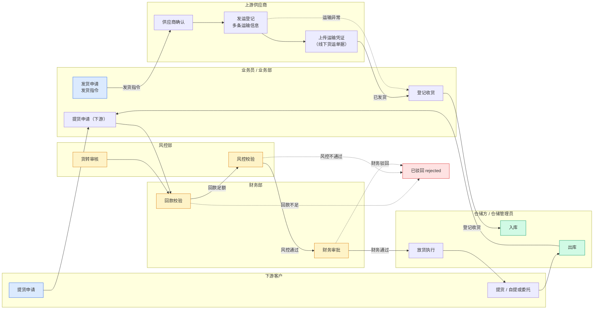
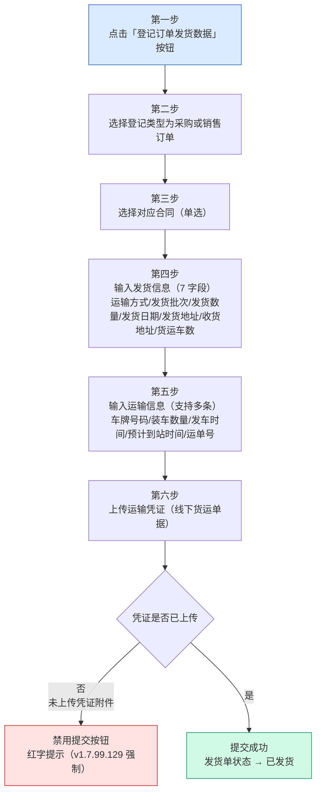
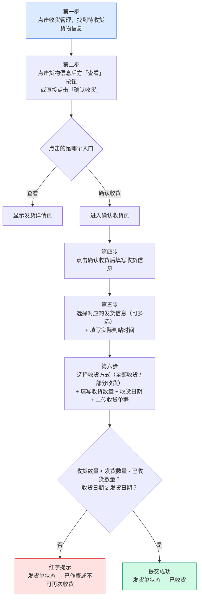
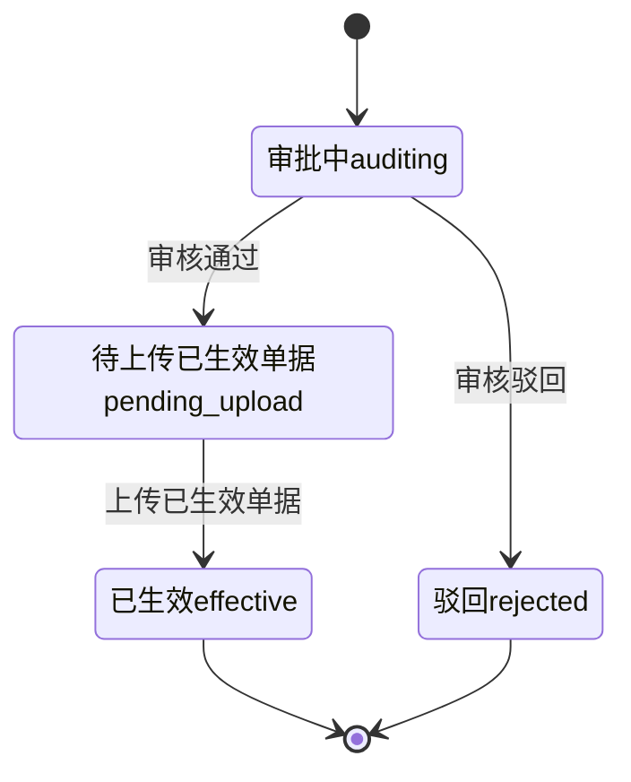
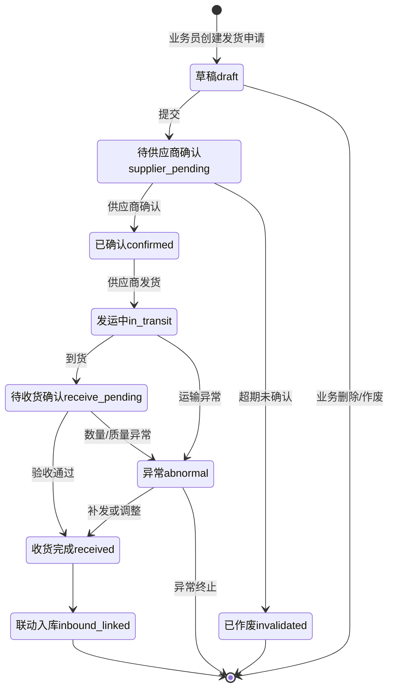
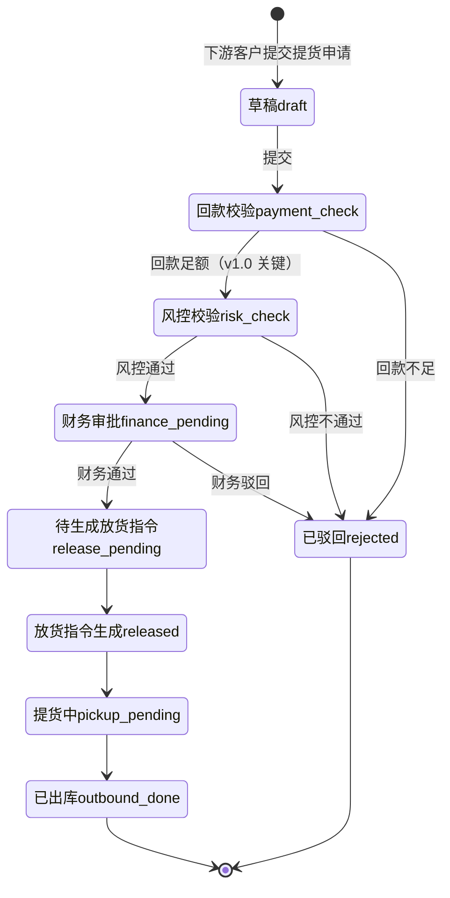

# 02.05 收发货管理 · 需求规格说明

> **文档类型**：PRD Writer 范式 · 落地需求文档 · 功能详细描述
> **对应总纲**：[00-产品概述与需求总纲.md](./00-产品概述与需求总纲.md)
> **通用规范**：[01-通用交互与文案规范.md](./01-通用交互与文案规范.md)
> **源文档（只读，未做任何改动）**：[02.05-收发货管理.md](../docs/02.05-收发货管理.md)
> **整理时间**：2026-09-30

---

## 0. 阅读说明

### 0.1 信息溯源标记

| 标记 | 含义 | 使用规则 |
|------|------|---------|
| ✅ | 源文档已明确 | 原值保留（表名 / 字段名 / 状态枚举 / 编号规则 / 提示文案），不改写口径 |
| 🔷 | 范式补全 | 源文档没写，按范式要求推导，**必须注明推导依据** |
| ⚠️ | 源文档自相矛盾 | **绝不静默选边**，如实并列，交由业务方裁决 |
| [待补充] | 信息不足 | **严禁编造**，需业务方 / 研发回填 |

### 0.2 源文档阅读顺序

源文档 `02.05-收发货管理.md`（540 行 / 27,261 字节）由**两代口径叠加**构成：**§1-§10 是 v1.0 终版口径**（基于原型 26-31 截图 + sitemap），**§11 是 v1.7.99.x 模块级增量节**（2026-09-24 基于飞书《用户使用手册》第 5.2 / 5.3 节沉淀）。两代口径在**状态机、页面清单、收货业务定义、模块归属**上存在**根本性冲突**（见 §3.4），本文档不做静默合并。

| 源文档章节 | 内容 | 归位到本文档 |
|-----------|------|------------|
| 头部 + §0 章节导航 | 状态 / 复用度 80% / 11+ 张表 | §1.1、§5.4 |
| §1 业务定位 | 3 大子模块 / 5 个关键特点（多方协同 / 线下+线上 / 货权凭证 / 多式联运 / OCR） | §1.1、§1.2 |
| §2 业务流程全景 | 3 子模块架构图（sitemap 6 页） | §1.3.1、§6 |
| §3 核心实体 | 8 张表逐字段（`t_shipment` 等） | §5.1、§5.2 |
| §4 3 子状态机 | 发货 9 态 / 收货 8 态 / 货转 4 态 | §3.1.1-3.1.3、§3.2.1-3.2.3 |
| §5 角色操作矩阵 | 8 状态行 × 7 角色 | §2.1 |
| §6 字段规则 | 运输方式 / 提货方式 / 回款校验 / 风控校验 | §5.2.2、§4.1 |
| §7 按钮交互 | 6 个页面区块（26-31 截图） | §2.2、§6 |
| §8 异常处理 | 发货 5 类 / 收货 5 类 / 货转 2 类 | §4.1、§2.5 |
| §9 跨模块流转 | 上游 1 条 / 下游 6 条 | §1.4 |
| §10 复用建议 | 80% / 复用分档 / 8 张直接复用表 / 3 张新建表 / 4 周实施 | §5.4 |
| §11 文档版本 | v0.1 → v1.0 重写 | §3.4 C10 |
| 修改记录 | v1.7.99.x 全局规范（占位=全部 / 状态 tag 色 / Mermaid） | §2.2、§3.2、§3.3 |
| **§11 v1.7.99.x 增量节** | **模块业务变化 / 发货 6 步 / 收货 6 步 / 4 状态机 / 跨模块联动 / 异常 / 页面 PRD 索引 / 修改记录** | **§1.2、§1.3.2-1.3.3、§3.1.4、§3.2.4、§4.1、§4.2、§4.4、§5.4、§6、§7** |

> ✅ **本文档另附一次只读核验**：为判断「源文档口径 vs 页面实际实现」是否一致，整理时对 `pages/shipment-out.html` / `shipment-out-detail.html` / `shipment-out-new.html` / `shipment-in.html` / `shipment-in-detail.html` / `shipment-in-new.html` / `receipt-confirm.html` / `business-line.html` / `business-line-relate.html` / `business-line-detail.html` 做了**只读** grep 核验（2026-09-30），结果逐条标注为「**现状核验 ✅**」。**未修改任何页面文件、未修改 `docs/` 任何文件**。

### 0.3 与通用规范的关系

**通用表单规范（校验时机 / 返回保护 / 提交行为 / 危险操作确认 / 空状态 / 失败引导 / 通用 UI 6 态 / 通用样式 / 脱敏规范）一律以 [01-通用交互与文案规范.md](./01-通用交互与文案规范.md) 为准，本文档不重复定义，只写本模块特有的部分**：发货 6 步 + 收货 6 步（手册 5.2 / 5.3 权威口径）、多批次与多条运输信息、运输方式与合同一致性校验、凭证强制上传、下游提货 6 段校验链（回款 → 风控 → 财务 → 放货指令 → 出库）、多式联运（汽运 / 火运 / 船运）与铁路运单。

### 0.4 飞书用户手册补充（2026-10-08）

> **来源**：《豫港通数字供应链管理平台 — 用户使用手册（内部版）》飞书 rev.8976。⚠️ 本文档 §1.2 / §1.3 / §5.x 已大量引用手册 5.2 / 5.3，本节只补**此前未被引用**的手册原值，以及**手册与本文档 ⚠️ 冲突项**。手册是对着线上系统写的，**权威性优先于本文档原有推导**。

| 手册小节 | 归位到本文档 | 填了哪些信息缺口 / 补了哪些矛盾 |
|---------|-------------|---------------------------|
| **5.2 发货管理** | §0.4 手册原值、§3.4（**C6** 追加 ✅ 手册口径 / 新增 **C12**）、§4.2 内容边界、§5.1 `t_shipment_particulars` 落库说明、§5.2 字段级规范 | 「装车数量（**发货数量**）」等同性 → 部分回答 §7.2 **Q3**；发货详情「合同信息」区块补 **基准价格（合同价）/ 交货期限 / 托运人 / 收活人** 4 个展示字段 → 部分回答 §5.2 金额字段缺口；车牌号码**字符集**（汉字/数字/字母）新增；**C12**（作废可逆性） |
| **5.3 收货管理** | §3.4（**C6** 追加 ✅ 手册口径 / 新增 **C12**）、§2.3 危险操作确认 | 收货作废**恢复为未收货状态** → **C12**；收货详情 = 发货详细记录；收货方式 = **全部收货 / 部分收货** |

**✅ 手册原值（照抄，不改写）**：

- **5.2 登记入口**：点击「**登记订单发货数据**」按钮 → 选择登记类型为**采购或销售订单** → 选择对应合同（**单选**）
- **5.2 运输方式**：此货运方式选择**需与合同登记货运方式保持一致**（**单选**）
- **5.2 发货批次**：可选择**单批次发货 / 多批次发货**
- **5.2 发货信息 6 项**：填写发货数量「填写实际发货单据对应数量即可（**仅支持数字输入**）」／发货日期「填写实际实际发货单据对应日期（**年月日**）」／发货地址／收货地址／货运车数「填写实际发货单据对应车数量（**仅支持数字输入**）」
- **5.2 运输信息（支持新增多条）**：填写车牌号码「按实际发货单据对应车牌号录入（**支持输入：汉字/数字/字母**）」／填写**装车数量（发货数量）**「按实际发货单据的装车数量填写」／填写发车时间／填写预计到站时间／填写运单号
- **5.2 上传运输凭证**：上传与本次发货一致的**线下货运单据**
- **5.2 发货详情 4 组字段**：**合同信息**（合同编号 / **基准价格（合同价）** / 数量 / **交货期限** / 运输方式 / 发到站 / **托运人** / **收活人**）；**发货信息**（运输方式 / 发货日期 / 发货数量 / 托运人 / 发到站 / 车数）；**运输信息**（运单号 / 车种 / 车号 / 票重）；**附件信息**（实际业务单据）
- **5.2 发货操作（作废）**：发货信息录入错误时，可将**本条**发货数据操作作废
- **5.3 收货 6 步**：点击收货管理找到待收货货物信息 → 点击货物信息后方「查看」按钮或直接点击确认收货 → 点击确认收货后填写收货信息 → **选择对应的发货信息（可多选）→ 填写实际到站时间** → 选择收货方式（**全部收货 / 部分收货**）填写收货数量 → 收货日期 → 上传收货单据
- **5.3 收货详情**：**收货详情（发货详细记录）**
- **5.3 收货异常处理（作废）**：在提交完收货后，如遇异常问题，可点击**已完成收货**的业务数据进行「**作废操作**」；完成收货的数据**作废后恢复为未收货状态**，可继续在发货管理中将其作废

---

## 1. 功能描述与触发条件

### 1.1 功能描述

✅ **收/发货管理是港通供应链物流执行的核心**——订单执行后，通过收/发货指令完成货物的**实际物理流转**（源文档 §1 首句）。

✅ **模块定位**：**货转与仓储的前置环节**——发货登记为货转提供上游入库依据，收货确认 / 放货出库为货转与仓储提供下游依据。

✅ **3 大子模块**（源文档 §1，基于 sitemap）：

| # | 子模块 | 链路 | 说明 |
|---|--------|------|------|
| 1 | **发货管理**（上游） | 业务人员 → 上游供应商 | 发货指令 → 发运登记 → 收货确认 → 入库 |
| 2 | **收货管理**（下游） | 下游客户 → 业务人员 | 提货申请 → 风控校验 → 放货指令 → 出库 |
| 3 | **货转管理** | 货权转移登记 + 智能识别 + 撤销 | ⚠️ **v1.0 已拆出到独立模块 02.07**，但 §3.8 / §4.3 / §5 仍在 02.05 内定义，见 §3.4 C8 |

✅ **5 个关键特点**（源文档 §1 原文保留）：

1. **多方协同**：业务人员 + 上游供应商 + 仓储管理员 + 下游客户
2. **线下+线上结合**：发货指令系统下发 → 供应商确认 → 线下发货 → 线上登记
3. **货权凭证**：铁路运单 + 商品所有权确认单（**港通特色**——木薯淀粉通过中欧班列运输）
4. **多式联运**：根据建设方案 V2 §3.3.2.5，港通支持**船运 / 火车 / 汽车**
5. **货转凭证智能识别**：OCR 识别关键字段（**港通特色**）

✅ **规模定位**：**8 张表**（源文档 §3 标题）/ **3 子状态机**（源文档 §4 标题）/ **6 页**（源文档 §2.1 sitemap）— ⚠️ 三处口径与其他章节冲突，见 §3.4 C2 / C3 / C7。

✅ **复用度：🟢 80%（大幅复用）**（源文档头部 + §10.1）——主产品 `t_shipment*` 6 张 + `t_take_delivery*` 5 张 + `t_release_instruct` = **11+ 张表**。⚠️ 头部 / §10.1（8+3=11）/ §3（8 张详列）三处口径不一致，见 §3.4 C3。

### 1.2 触发条件

| 场景 | 触发条件 | 结果 | 来源 |
|------|---------|------|------|
| 允许发货 / 收货关联 | 订单状态 = `executing` | 允许发货/收货关联 | §9.1 ✅ |
| 发货单创建 | 业务员点「登记订单发货数据」 | 打开新增发货页 | §11.2 手册 5.2 ✅ |
| 登记类型选择 | 第 2 步 | 采购订单 / 销售订单（**二选一**） | §11.2 手册 5.2 ✅ |
| 合同选择 | 第 3 步 | 选择对应合同（**单选**） | §11.2 手册 5.2 ✅ |
| 运输方式一致性 | 第 4 步选择运输方式 | **必须与合同登记货运方式一致**，否则红字提示 | §11.2 / §11.6 ✅ |
| 运输信息录入 | 汽运 / 火运 / 船运 | **支持多条**（车牌号码 / 装车数量 / 发车时间 / 预计到站时间 / 运单号） | §11.2 手册 5.2 + §11.1 v1.7.99.165 ✅ |
| 凭证上传 | 第 6 步 | 上传运输凭证（线下货运单据）；⚠️ §11.6 记「未上传凭证附件 → 禁用提交按钮 + 红字提示（v1.7.99.129 强制）」 | §11.2 / §11.6 ✅ |
| 收货入口 | 收货管理 → 待收货货物信息 | 点「查看」看发货详情 / 点「确认收货」进确认收货页 | §11.3 手册 5.3 ✅ |
| 收货信息关联发货 | 第 5 步 | 选择对应的发货信息（**可多选**）+ 填写实际到站时间 | §11.3 手册 5.3 ✅ |
| 收货方式 | 第 6 步 | 全部收货 / 部分收货 | §11.3 手册 5.3 ✅ |
| 发货单转已发货 | 发货登记完成 | 状态 → 已发货 | §11.4 ✅ |
| 发货单转已收货 | 收货登记完成 | 状态 → 已收货（**终态**） | §11.4 ✅ |
| 发货单转已作废 | 业务人员主动作废 | 状态 → 已作废（**仅未收货可作废**） | §11.4 ✅ |
| 下游提货申请提交 | 下游客户提交 | 状态 → 回款校验 | §4.2 ✅ |
| 联动入库 | 发货收货完成 | 仓储-入库（02.12）联动 | §9.2 ✅ |
| 联动出库 | 放货指令生成 | 仓储-出库（02.12）联动 | §9.2 ✅ |
| 更新业务线进度 | 发货/收货完成 | 业务线（02.06）更新货物进度 / 累计入库出库数量 | §9.2 / §11.5 ✅ |
| 触发预警 | 发货/收货异常 | 预警中心（02.11）触发预警 | §9.2 ✅ |
| 回款校验 | 提货申请 | 客户额度（02.02）校验回款 | §9.2 ✅ |

### 1.3 业务流程（Mermaid）

#### 1.3.1 3 子模块架构与端到端主流程（v1.0 口径，角色泳道）

> ✅ 依据源文档 §2.1 架构图 + §1 三大子模块链路 + §5 角色矩阵 + §4 状态机重绘，**节点文案照抄源文档原值**。



> ⚠️ **本图为 v1.0 三子模块链路口径**（发货 → 收货确认 → 入库；提货申请 → 回款 → 风控 → 财务 → 放货 → 出库）。**v1.7.99.x 增量节把「收货管理」重新定义为「上游到货确认」**（手册 5.3：确认收货 → 选发货信息 → 收货方式 + 数量 + 日期 + 单据），**与 v1.0「下游提货出库」是完全不同的业务对象**——见 §3.4 C1（🔴 阻塞）。**两套口径必须先裁决，再定状态机与页面归属。**

#### 1.3.2 发货 6 步流程（手册 5.2 权威口径 · v1.7.99.x 最新）

> ✅ **来自手册 5.2**：发货登记完整流程，**6 步原文保留**。



✅ **v1.7.99.x 关键决策**（§11.2 原文）：

- **运输方式必须与合同登记货运方式一致**（手册 5.2）
- **支持单批次发货 / 多批次发货**（手册 5.2）

✅ **第四步 7 字段**（§11.2 原文照抄）：运输方式 / 发货批次 / 发货数量 / 发货日期 / 发货地址 / 收货地址 / 货运车数

🔷 **现状核验 ✅（2026-09-30 只读 grep `pages/shipment-out-new.html`）**：页面区块为「合同信息（v1.7.99.54 11 字段 readonly 表格）」→「发货信息（运输方式* / 发货批次* 单批次|多批次 radio / 运单号* / 发货地址* / 收货地址* / 发站 readonly / 到站 readonly）」→「运输信息（v1.7.99.165 仅火运 / 火运+汽运显示：运单号 / 车种 / 车号 / 票重）」→「附件信息（v1.7.99.165 按运输方式显示不同附件行）」。⚠️ 页面把**运单号提为独立必填字段**并**按运输方式条件显隐**（汽运/船运 vs 火运/火运+汽运），与手册 5.2「运单号在第 5 步运输信息内」的组织方式不同；**「发货日期 / 发货数量 / 货运车数」在 grep 命中的前 25 行内未见**（可能存在，需研发核对完整字段清单）。见 §7.2 Q9。

#### 1.3.3 收货 6 步流程（手册 5.3 权威口径 · v1.7.99.x 最新）

> ✅ **来自手册 5.3**：收货确认完整流程，**6 步原文保留**。



✅ **v1.7.99.129 收货确认页 3 区块**（§11.8 原文）：**合同信息 / 发货清单 / 填写收货信息**；**3 必填字段（数量 / 日期 / 单据）+ 简化校验**（§11.1）。

🔷 **现状核验 ✅（2026-09-30 只读 grep `pages/receipt-confirm.html`，17KB）**：页面标题「填写收货信息 - 豫港通 v1.7.99.129」；区块 1「合同信息（v1.7.99.129：1:1 重制 user 截图，5 字段 3 列，含已收货数量(吨)）」；区块 2 发货清单（列含「已收货数量(吨)」）；区块 3「收货信息（v1.7.99.129：2 行 × 2 列布局）」——收货方式 radio（**部分收货 / 全部收货**）+ `收货数量(吨)`**必填红星**（`id="receiptQuantity"`, `min="0"`, `step="0.01"`）+ `收货日期`**必填红星**（`id="receiptDate"`）。✅ 与 §11.1「3 必填字段」中的**数量 / 日期**一致；⚠️ **第 3 个必填字段「单据 / 收货凭证」在 grep 的前 25 行内未见上传控件**，JS 校验亦只见 `请输入收货数量` / `请选择收货日期` **两条**。见 §7.2 Q9。

#### 1.3.4 货转管理状态流转（v1.0 简版，⚠️ 已拆出 02.07）

> ✅ 源文档 §4.3 原图，**⚠️ 源文档该 mermaid 块有一处语法残缺**（`→` 单独成行），本文档按语义修复并如实标注。



⚠️ 源文档 §4.3 原图第 247 行为孤立的 `→` 字符（mermaid 语法残缺，会导致该行解析异常）。**本文档按上下文语义补回为 `待上传已生效单据pending_upload --> 已生效effective`**，属 🔷 格式修复，不改业务口径。⚠️ **该子模块 v1.0 已拆出到 02.07 独立模块**，详见 §3.4 C8。

### 1.4 模块依赖（跨模块流转）

#### 1.4.1 上游触发（✅ 源文档 §9.1）

| 触发模块 | 触发条件 | 触发动作 |
|---------|---------|---------|
| 订单管理（02.04） | 订单 `executing` | 允许发货/收货关联 |

> ⚠️ **订单管理 02.04 已于 v1.7.99.181 整体删除**（见总纲 §9.1 Q5），而源文档 §9.1 仍以其为唯一上游触发模块。**当前 02.05 的实际直接上游是合同管理（02.03）**——手册 5.2 第 3 步「选择对应合同」、页面 `shipment-out-new.html` 的「合同信息 readonly 表格（v1.7.99.54 按图 3：11 字段）」均已确认。见 §7.2 Q10。

#### 1.4.2 下游触发（✅ 源文档 §9.2 + §11.5）

| 触发模块 | 触发条件 | 触发动作 | 出处 |
|---------|---------|---------|------|
| 仓储-入库（02.12） | 发货收货完成 | 联动入库 | §9.2 ✅ |
| 仓储-出库（02.12） | 放货指令生成 | 联动出库 | §9.2 ✅ |
| 货转（02.07） | 发货/收货完成 | 货转关联；收货完成 → 货转流程可继续推进 | §9.2 / §11.5 ✅ |
| 业务线（02.06） | 发货/收货完成 | 更新业务线货物进度；**收/发货登记成功 → 该业务线的「累计入库/出库数量」同步更新** | §9.2 / §11.5 ✅ |
| 客户额度（02.02） | 提货申请 | 校验回款 | §9.2 ✅ |
| 预警中心（02.11） | 发货/收货异常 | 触发预警 | §9.2 ✅ |
| 结算单（02.13） | 收货完成 | 后续可发起结算（详见 02.13） | §11.5 ✅ |
| 物流跟踪 | v1.7.99.165 运输信息含车牌 / 装车 / 发车 / 到站 / 运单号 | 支持运输跟踪 | §11.5 ✅ |

> ⚠️ **模块编号口径**：源文档 §9.2 引用「仓储 02.12 / 客户额度 02.02 / 预警中心 02.11 / 结算 02.13 / 业务线 02.06 / 货转 02.07」，与 `docs/` 目录实际文件名需逐一核对（见 §6 跨模块链接表）。**02.12 仓储管理在 `docs/` 中是否存在，未在本次核验范围内确认** [待补充]。

---

## 2. 交互细节

### 2.1 角色操作矩阵（权限可见性）

✅ **源文档 §5 角色操作矩阵（v1.0 口径，8 状态行 × 7 角色，原文保留）**：

| 状态 / 角色 | 业务员 | 业务部 | 供应商 | 客户 | 风控部 | 财务部 | 仓储方 |
|------------|------|------|------|------|------|------|------|
| 发货-待供应商确认 | 查看 | 查看 | **确认** | - | - | - | - |
| 发货-已确认 | 查看 | 查看 | **发运登记** | - | - | - | - |
| 发货-到货 | **登记收货** | 查看 | - | - | - | - | **入库** |
| 收货-回款校验 | 查看 | - | - | - | - | **校验** | - |
| 收货-风控校验 | 查看 | - | - | - | **校验** | - | - |
| 收货-财务审批 | 查看 | - | - | - | - | **审批** | - |
| 收货-放货指令 | 查看 | - | - | - | - | - | **执行放货** |
| 货转-审核 | 查看 | - | - | - | **审核** | - | - |

⚠️ 本矩阵是 **v1.0 三子状态机口径**（发货行对应 §4.1 的 `supplier_pending` / `confirmed` / `receive_pending`；收货行对应 §4.2 的 `payment_check` / `risk_check` / `finance_pending` / `release_pending`），**与 v1.7.99.165 的 4 状态机（待发货 / 已发货 / 已收货 / 已作废）完全不对应**——4 状态机**无任何供应商 / 财务 / 风控 / 仓储方的独立操作行**。**矩阵需按最终裁决的状态机重出**，见 §3.4 C1 / C7。

🔷 **v1.7.99.x 增量带来的角色补充**（依据 §11.2 手册 5.2 + §11.3 手册 5.3 + 现状核验 ✅ 推导）：

| 角色 | 新增操作 | 依据 |
|------|---------|------|
| **业务员** | 「登记订单发货数据」下拉入口（v1.7.99.54）/ 提交发货登记 | ✅ §11.2 + 现状核验 ✅ `shipment-out.html:110` |
| **业务员** | 业务线关联后**手动作废**发货单（**仅未收货可作废**） | 🔷 §11.4 推导：作废权限归业务员（v1.0 矩阵中作废类操作均归业务侧） |
| **供应商** | 货运单据**线下**提供 → 业务员上传运输凭证 | 🔷 §11.2 手册 5.2「上传运输凭证（线下货运单据）」推导 |
| **下游客户** | 提货申请（自提 `self` / 委托 `delegate`） | 🔷 §3.4 `pickup_method` 推导 |
| **系统** | 提交时校验「运输方式 = 合同货运方式」；未传凭证禁用提交 | ✅ §11.2 / §11.6 |

⚠️ **v1.7.99.x 增量节未给出任何角色权限矩阵**，上表为 🔷 推导，**不是业务方确认口径**，见 §7.2 Q11。

### 2.2 按钮交互（操作反馈）

#### 2.2.1 列表页与页面区块按钮（✅ 源文档 §7）

| 页面 | 按钮 | 位置 | 可见条件 | 点击行为 | 出处 |
|------|------|------|---------|---------|------|
| 发货管理列表 | **+ 新增发货申请** | 右上 | 业务员 | 跳新增页 | §7.1 |
| 发货管理列表 | 详情 | 列表行 | 所有 | 跳详情页 | §7.1 |
| 发货管理列表 | **登记订单发货数据**（v1.7.99.54 下拉） | 顶部 | 业务员 | 打开下拉菜单 | ✅ §11.2 + 现状核验 ✅ `shipment-out.html:104/110` |
| 发货管理列表 | 货转开具状态筛选 | 筛选区 | 所有 | 下拉（未开具 / 已开具） | 🔷 现状核验 ✅ `shipment-out.html:161-162` |
| 新增发货申请 | — | — | — | 选上游供应商（必填）/ 选关联订单（必填）/ 填运输方式 + 数量 + 提货日期 / 上传附件（铁路运单 / 车辆照片 / 质检报告） | §7.2 |
| 发货申请详情 | — | — | — | 状态时间线 / 运输信息 / 附件列表 / 异常处理记录 | §7.3 |
| 收货管理列表 | — | — | — | 提货申请列表（按订单 / 客户筛选）；状态：草稿 / 回款校验 / 风控校验 / 财务审批 / 放货指令 / 已出库 | §7.4 |
| 新增收货数据 | — | — | — | 选下游客户（必填）/ 选关联销售订单（必填）/ 填提货数量 + 提货日期 + 提货方式 / **自动校验回款 + 风控** | §7.5 |
| 收货信息详情 | — | — | — | 完整提货信息 / 校验记录（回款 / 风控 / 财务）/ 放货指令 / 提货凭证 | §7.6 |

#### 2.2.2 收货管理列表与确认收货入口（✅ §11.3 手册 5.3 + 现状核验 ✅）

| 元素 | 内容 | 出处 |
|------|------|------|
| 列表状态筛选下拉 | `请选择状态` / `待收货` / `已收货` | 🔷 现状核验 ✅ `shipment-in.html:170` |
| 「查看」入口 | 货物信息后方「查看」按钮 → 显示发货详情页 | ✅ §11.3 第三步 |
| 「确认收货」入口 | 链接跳 `receipt-confirm.html?bn={发货单号}` | ✅ §11.3 + 🔷 现状核验 ✅ `shipment-in.html:413/432/451/470` |
| 收货方式 radio | **部分收货 / 全部收货**（2 项） | ✅ §11.3 第六步 + 🔷 现状核验 ✅ `receipt-confirm.html:295/300` |
| 收货数量输入 | `收货数量(吨)`，必填红星，`min="0"` `step="0.01"` | 🔷 现状核验 ✅ `receipt-confirm.html:306-307` |
| 收货日期 | `收货日期`，必填红星，`<input type="date">` | 🔷 现状核验 ✅ `receipt-confirm.html:310-311` |
| 列表行状态 Tag | `tag-yellow 部分收货` / `tag-blue 待收货` / `tag-green 已收货` / `tag-red 已作废` | 🔷 现状核验 ✅ `shipment-in.html:429`、`shipment-out.html:216/267/352` |

#### 2.2.3 全局规范继承（✅ 两份源文档共有的修改记录）

| 规范 | 内容 | 出处 |
|------|------|------|
| **列表页占位 = "全部"** | 全站统一 | 修改记录 v1.7.99.x ✅ |
| **列表页规范升级** | v1.7.99 全局 | 修改记录 ✅ |
| **状态 tag 颜色编码** | v1.7.99.14 | 修改记录 ✅ |
| **流程图统一用 Mermaid** | v1.7.99.6 | 修改记录 ✅ |
| **v1.7.99.x 硬规范** | 不修改全局 `design-system.css` / `list-page.css`；注释锁版本号；不留僵尸代码；user 没要求的不擅自改 | 🔷 沿用 02.03 §5.4.5 沉淀的 7 条 |

### 2.3 危险操作确认

| 操作 | 确认框 / 弹窗 | 依据 |
|------|-------------|------|
| **发货单作废** | 🔷 `作废后不可恢复，确定作废该发货单？`（v1.7.99.165 定义「**仅未收货可作废**」，属不可逆操作） | 🔷 01 文档 §2.10 + 总纲 §7.7 + ✅ §11.4 作废语义 |
| **货转数量超限** | `货转数量 X 超过剩余数量 Y` → **阻止** | ✅ §8.3 |
| **发货数量超订单数量** | `发货数量 X 超过订单剩余数量 Y` → **阻止** | ✅ §8.1 |
| **火车运输未上传铁路运单** | `火车运输必须上传铁路运单` → **阻止** | ✅ §8.1 |
| **已收货 / 已作废发货单再次收货** | 顶部红色 bar 提示 `该发货单已收货/已作废` → 阻止 | ✅ §11.6 |
| **同一发货单并发收货** | 二次校验被覆盖则提示 `已被其他收货覆盖，请刷新` | ✅ §11.6 |
| **离开有未保存内容的发货 / 收货表单** | 🔷 `当前编辑内容将丢失，确定返回？` + `确定`/`取消` | 🔷 01 文档 §2.2（源文档未覆盖） |
| **回款 / 风控 / 财务驳回** | 🔷 [待补充] 源文档 §8.2 只给状态流转 `→rejected`，**未给驳回确认框与驳回原因字段** | 🔷 01 文档 §2.10 |

> ✅ **v1.7.99.129「凭证强制」是禁用态而非确认框**：未上传凭证附件 → **禁用提交按钮 + 红字提示**（§11.6），不弹确认框。

### 2.4 空状态引导

> 通用空状态规范以 [01-通用交互与文案规范.md](./01-通用交互与文案规范.md) §2.11 为准（`暂无数据` / `请调整筛选条件` / 空状态插画 + 灰字 13px 居中）。下表为**本模块特有**的空状态。

| 场景 | 文案 | 补充动作 | 依据 |
|------|------|---------|------|
| 发货管理列表无数据 | `暂无数据` | 有筛选时 `请调整筛选条件` | 🔷 01 §2.11 |
| 收货管理列表无数据 | `暂无数据` | 同上 | 🔷 01 §2.11 |
| 「查看未关联」类选择器为空（发货页未选合同） | 🔷 [待补充] 源文档未给 | 需说明前置条件（须先有「执行中」状态合同） | 🔷 依据 §11.2 第 3 步推导 |
| 收货确认页发货清单为空 | 🔷 [待补充] 源文档未给 | 需说明前置条件（该发货单须处于待收货且未收货量 > 0） | 🔷 依据 §11.6 校验规则推导 |
| 质检附件未上传 | 🔷 [待补充] 源文档 §7.2 只列「质检报告」为可选附件之一 | — | ✅ §7.2 |
| 货转凭证 OCR 失败 | `OCR 识别失败，请手动填写` → **允许降级为手动录入，不阻断** | 降级手填 | 🔷 依据 §8.3 + 总纲 §7.5 |

### 2.5 失败引导

✅ **源文档 §8 异常处理原文（3 类，全部照抄）**：

| 类别 | 异常场景 | 提示文案 | 处理动作 |
|------|---------|---------|---------|
| **发货异常** | 供应商未确认 | `供应商 X 未确认发货指令` | 黄灯提醒 |
| | 发货数量 > 订单数量 | `发货数量 X 超过订单剩余数量 Y` | 阻止 |
| | 铁路运单未上传 | `火车运输必须上传铁路运单` | 阻止 |
| | 收货数量不一致 | `实际收货数量 X 与发货数量 Y 不一致` | 红色提示 + 启动异常流程 |
| | 质检不合格 | `质检不合格数量 X` | 启动补发/调整流程 |
| **收货异常**（v1.0 关键）| **回款不足** | `客户 X 已回款 Y 元，不足以提货 Z 元` | 状态→`rejected` |
| | **客户被冻结** | `客户 X 已被冻结，不能提货` | 状态→`rejected` |
| | **客户命中黑名单** | `客户 X 命中黑名单，禁止提货` | 状态→`rejected` |
| | 风控不通过 | `风控校验不通过` | 状态→`rejected` |
| | 财务驳回 | `财务驳回` | 状态→`rejected` |
| **货转异常**（v1.0 简版）| OCR 识别失败 | `OCR 识别失败，请手动填写` | 允许手动 |
| | 货转数量 > 发货/收货数量 | `货转数量 X 超过剩余数量 Y` | 阻止 |

✅ **v1.7.99.x 增量节异常处理（§11.6 原文，全部照抄）**：

| 场景 | v1.7.99.x 处理 |
|------|-----------------|
| 运输方式 ≠ 合同登记方式 | 红字提示 `运输方式必须与合同一致`（手册 5.2）|
| 收货数量 > 未收货数量 | 红字提示 `收货数量不能大于发货数量 - 已收货数量` |
| 收货日期 < 发货日期 | 红字提示 `收货日期不能早于发货日期` |
| 已收货/已作废发货单再次收货 | 顶部红色 bar 提示 `该发货单已收货/已作废` |
| 同一发货单并发收货 | 二次校验被覆盖则提示 `已被其他收货覆盖，请刷新` |
| 未上传凭证附件 | 禁用提交按钮 + 红字提示（v1.7.99.129 强制）|

🔷 **通用失败引导**（01 文档 §2.12）：业务规则失败 → Toast 说明业务约束 + **保留输入**；网络异常 → `网络异常，请重试` + 按钮恢复可点；权限不足 → `无权限执行此操作` + 按钮隐藏；加载既有数据失败 → 页面顶部红色横幅 + `重试` 按钮。

> 📌 **与用户「资金流转」基线一致性核查**：本模块 v1.0 收货链路含「**回款校验**（校验提货金额 ≤ 客户已回款金额）」与「**付款凭证 ID / 回款是否足额**」字段（`payment_voucher_id` / `is_payment_verified`）——这是**对已发生的线下回款做校验**，**不是线上扣款**；v1.7.99.x 增量节的 4 状态机与 6 步流程**完全不含资金动作**。✅ 两代口径**均不含线上扣款/打款分支**，**符合**基线。

---

## 3. 状态清单

### 3.1 业务状态机

#### 3.1.1 v1.0 发货管理状态机（9 状态，源文档 §4.1 原图照抄）



#### 3.1.2 v1.0 收货管理状态机（8 状态，源文档 §4.2 原图照抄）



#### 3.1.3 v1.0 货转管理状态机（4 状态，源文档 §4.3）

见 §1.3.4（该状态机属 02.07 独立模块，此处仅作 v1.0 口径留档）。

#### 3.1.4 v1.7.99.165 状态机（4 状态，最新口径 · 源文档 §11.4）

✅ **源文档 §11.4 原文（该节用 ``` 代码块写 ASCII 图，**违反 v1.7.99.6「Mermaid 统一」规范**，本文档已按规范重绘为 mermaid，状态值原值保留）**：

| 状态 | 触发 | 下一状态 |
|------|------|----------|
| 待发货 | 合同已签订 | 已发货 |
| 已发货 | 发货登记完成 | 已收货 / 已作废 |
| 已收货 | 收货登记完成 | 终态 |
| 已作废 | 业务人员主动作废 | 终态（**仅未收货可作废**）|

🔷 **按源文档 §11.4 表格重绘的 mermaid 状态机**（推导依据：§11.4 的 4 行状态表 + ASCII 图的 3 个「已作废」入口 + 「异常回退到待收货」标注）：

```mermaid
stateDiagram-v2
    [*] --> 待发货
    待发货 --> 已发货: 合同已签订 / 发货登记完成
    已发货 --> 已收货: 收货登记完成
    已发货 --> 已作废: 业务人员主动作废（仅未收货可作废）
    待发货 --> 已作废: 业务人员主动作废
    已收货 --> 待发货: 异常回退
    已收货 --> 已作废: 业务人员主动作废
    已收货 --> [*]
    已作废 --> [*]

    classDef danger fill:#fee2e2,stroke:#dc2626
    class 已作废 danger
```

⚠️ **本状态机与页面实现不一致**：🔷 **现状核验 ✅（2026-09-30 只读 grep）**——`pages/shipment-out.html:167-174` 与 `pages/shipment-in.html:175-182` 的 4 个 tab 实为 **「全部 / 待收货 / 已收货 / 已作废」**（`data-tab-key` = `all` / `pending-receipt` / `received` / `voided`，v1.7.99.162 注释明写「4 状态 全部/待收货/已收货/已作废」），**没有「待发货」和「已发货」两个 tab**；行内 Tag 也只有 `待收货`(tag-blue) / `已收货`(tag-green) / `已作废`(tag-red) **3 种**。**即：源文档 §11.4 的「待发货 / 已发货」两态在页面实现中不存在，被合并为「待收货」。** 见 §3.4 C7（🔴 阻塞）。

### 3.2 状态值与展示

#### 3.2.1 v1.0 发货管理状态（9 态，✅ 源文档 §4.1 状态机图逐条转写）

| # | 枚举值 | 中文 | 触发条件 | 下一状态 | Tag 色 |
|---|-------|------|---------|---------|--------|
| 1 | `draft` | 草稿 | 业务员创建发货申请 | 提交 / 业务删除作废 | 🔷 灰 `#F3F4F6` |
| 2 | `supplier_pending` | 待供应商确认 | 提交 | 供应商确认 / 超期作废 | 🔷 黄 `#FEF3C7` |
| 3 | `confirmed` | 已确认 | 供应商确认 | 供应商发货 | 🔷 蓝 `#EFF6FF` |
| 4 | `in_transit` | 发运中 | 供应商发货 | 到货 / 运输异常 | 🔷 蓝 `#EFF6FF` |
| 5 | `receive_pending` | 待收货确认 | 到货 | 验收通过 / 数量质量异常 | 🔷 蓝 `#EFF6FF` |
| 6 | `received` | 收货完成 | 验收通过 | 补发或调整回退 / 联动入库 | 🔷 绿 `#ECFDF5` |
| 7 | `abnormal` | 异常 | 运输异常 / 数量质量异常 | 补发或调整 → 收货完成 / 异常终止 | 🔷 红 `#FEE2E2` |
| 8 | `invalidated` | 已作废 | 超期未确认 / 业务删除作废 | 终态 | 🔷 红 `#FEE2E2` |
| 9 | `inbound_linked` | 联动入库 | 收货完成 | 终态 | 🔷 绿 `#ECFDF5` |

> 📌 **Tag 色列说明**：v1.0 源文档**未给状态配色**；上表 🔷 色值依据 [总纲 §7.8 状态标签配色](./00-产品概述与需求总纲.md) 的语义推导（进行中→蓝 / 异常→红 / 待处理→黄 / 终态→灰）。

#### 3.2.2 v1.0 收货管理状态（8 态，✅ 源文档 §4.2 状态机图逐条转写）

| # | 枚举值 | 中文 | 触发条件 | 下一状态 | Tag 色 |
|---|-------|------|---------|---------|--------|
| 1 | `draft` | 草稿 | 下游客户提交提货申请 | 提交 | 🔷 灰 `#F3F4F6` |
| 2 | `payment_check` | 回款校验 | 提交 | 回款足额→风控校验 / 回款不足→已驳回 | 🔷 黄 `#FEF3C7` |
| 3 | `risk_check` | 风控校验 | 回款足额 | 风控通过→财务审批 / 不通过→已驳回 | 🔷 黄 `#FEF3C7` |
| 4 | `finance_pending` | 财务审批 | 风控通过 | 财务通过→待生成放货指令 / 驳回→已驳回 | 🔷 黄 `#FEF3C7` |
| 5 | `release_pending` | 待生成放货指令 | 财务通过 | 放货指令生成 | 🔷 黄 `#FEF3C7` |
| 6 | `released` | 放货指令生成 | 放货指令生成 | 提货中 | 🔷 蓝 `#EFF6FF` |
| 7 | `pickup_pending` | 提货中 | 提货中 | 已出库 | 🔷 蓝 `#EFF6FF` |
| 8 | `outbound_done` | 已出库 | 提货完成 | 终态 | 🔷 绿 `#ECFDF5` |
| 9 | `rejected` | 已驳回 | 回款不足 / 风控不通过 / 财务驳回 | 终态 | 🔷 红 `#FEE2E2` |

> ⚠️ **状态机图 8 个流转状态 + 1 个终止态 `rejected`，实为 9 个状态节点**（图标题与源文档均未标状态数）。⚠️ `rejected` **无回退路径**——一旦驳回即终态，**客户无法修改后重新提交**，与 §7.4「状态：草稿/回款校验/风控校验/财务审批/放货指令/已出库」列表中**未列「已驳回」**一致（列表页不展示驳回单？），见 §3.4 C5。

#### 3.2.3 v1.0 货转管理状态（4 态，✅ 源文档 §4.3）

| # | 枚举值 | 中文 | 触发条件 | 下一状态 | Tag 色 |
|---|-------|------|---------|---------|--------|
| 1 | `auditing` | 审批中 | 货转发起 | 审核通过 / 审核驳回 | 🔷 黄 `#FEF3C7` |
| 2 | `pending_upload` | 待上传已生效单据 | 审核通过 | 上传已生效单据 → 已生效 | 🔷 黄 `#FEF3C7` |
| 3 | `effective` | 已生效 | 上传已生效单据 | 终态 | 🔷 绿 `#ECFDF5` |
| 4 | `rejected` | 驳回 | 审核驳回 | 终态 | 🔷 红 `#FEE2E2` |

#### 3.2.4 v1.7.99.165 状态（4 态，✅ 源文档 §11.4 原表照抄）

| # | 中文 | 枚举值 | 触发条件 | 下一状态 | Tag 色（现状核验 ✅） |
|---|------|-------|---------|---------|---------------------|
| 1 | **待发货** | 🔷 [待补充] 源文档 §11.4 **只给中文，未给枚举值** | 合同已签订 | 已发货 | ⚠️ **页面无此 Tag**（现状核验 ✅ 行内仅 3 种 Tag） |
| 2 | **已发货** | 🔷 [待补充] 源文档未给枚举值 | 发货登记完成 | 已收货 / 已作废 | ⚠️ **页面无此 Tag** |
| 3 | **已收货** | `received` 🔷（现状核验 `data-tab-key="received"`） | 收货登记完成 | 终态 | ✅ `tag-green` |
| 4 | **已作废** | `voided` 🔷（现状核验 `data-tab-key="voided"`） | 业务人员主动作废（仅未收货可作废）| 终态 | ✅ `tag-red` |
| — | **待收货** | `pending-receipt` 🔷（现状核验 `data-tab-key="pending-receipt"`）| 🔷 页面独有：发货登记完成但未收货 | 已收货 / 已作废 | ✅ `tag-blue` |

⚠️ **关键发现**：**现状核验 ✅ 的页面状态集合是「待收货 / 已收货 / 已作废」3 态 + 全部 tab**，而**源文档 §11.4 是「待发货 / 已发货 / 已收货 / 已作废」4 态**——**「待收货」是页面独有的第 4 态，源文档从未定义**；反之**「待发货 / 已发货」在页面中不存在**。见 §3.4 C7（🔴 阻塞）。

### 3.3 UI 状态清单

> 通用 6 态以 [01-通用交互与文案规范.md](./01-通用交互与文案规范.md) §3.2 为准；下表为**本模块（发货管理 3 页 + 收货管理 3 页 + 收货确认 1 页 + 货转关联）**的落地映射。**6 态齐全：默认 / 加载中 / 成功 / 失败 / 禁用 / 空状态**。

| 状态 | 触发 | 视觉 | 可交互 |
|------|------|------|-------|
| **默认** | 页面加载完成、状态非异常 | 列表页 4 状态 tab（全部 / 待收货 / 已收货 / 已作废）+ 筛选区 + 表格 + 分页；发货页顶部「登记订单发货数据」下拉 + 状态筛选「货转开具状态」；新增页 4 区块（合同信息 readonly / 发货信息 / 运输信息 / 附件信息）；收货确认页 3 区块（合同信息 / 发货清单 / 收货信息） | ✅ 全部按钮按 §2.2 矩阵显隐 |
| **加载中** | 提交中 / 加载既有数据中 / 凭证上传中 / 运输信息多行新增中 | 提交按钮 loading「提交中...」+ 旋转图标 + 禁用 🔷；凭证上传进度 🔷；表格骨架屏 🔷 | ❌ 禁用重复提交 |
| **成功** | 发货登记提交成功 / 收货确认提交成功 / 供应商确认 / 放货指令生成 | 顶部居中 Toast 绿色 `#10B981`，3s 自动消失，文案 🔷 `提交成功`（01 文档 §3.2）；⚠️ 源文档**未给成功文案** [待补充] | — |
| **失败** | 运输方式与合同不一致 / 收货数量超限 / 收货日期早于发货日期 / 已收货或已作废再次收货 / 并发收货被覆盖 / 回款不足 / 客户被冻结 / 命中黑名单 / 风控不通过 / 财务驳回 / 未上传凭证 / 质检不合格 | 顶部 Toast 红色 `#EF4444`，**不自动消失需手动关闭**；或**顶部红色 bar**（`该发货单已收货/已作废`）；或**红字内联提示**（`收货数量不能大于发货数量 - 已收货数量`）；**保留用户输入**。源文档原文文案见 §2.5 全部 18 条 | ✅ 按钮恢复可点（凭证未传为禁用） |
| **禁用** | 无权限 / **未上传凭证附件（v1.7.99.129 强制）** / 已收货或已作废状态下的「确认收货」入口 / 运输信息区块按运输方式条件显隐（汽运船运 vs 火运火运+汽运） | 提交按钮灰化不可点 + 红字说明原因；入口不渲染 | ❌ |
| **空状态** | 发货列表无数据 / 收货列表无数据 / 筛选无结果 / 收货确认页发货清单为空 / 合同选择器为空 | 空状态插画 + 灰字 13px 居中（🔷 `.empty-row { padding: 40px 0; color: var(--text-tertiary); }`）；文案 `暂无数据` / `请调整筛选条件` | ✅ 引导操作（「登记订单发货数据」/「清除全部」） |

🔷 **本模块特有的 UI 状态补充**：

| 状态 | 触发 | 视觉 | 可交互 | 依据 |
|------|------|-----|-------|------|
| **合同信息只读态** | 新增发货页选中合同后 | `.readonly-label` 灰底表格（v1.7.99.54 11 字段），`readonly` 不可编辑 | ❌ 只读，由所选合同带出 | 🔷 现状核验 ✅ `shipment-out-new.html:18/110-133` |
| **发站 / 到站只读态** | 运输方式 = 火运 / 火运+汽运 | 灰底 `readonly`，自合同信息带出（「万泰站」→「新郑」） | ❌ | 🔷 现状核验 ✅ `shipment-out-new.html:244/250` |
| **运输信息条件显隐态** | 运输方式 = 汽运 / 船运 / 火运 / 火运+汽运 | v1.7.99.165：仅火运 / 火运+汽运显示「运单号 / 车种 / 车号 / 票重 / 操作」 | ✅ | 🔷 现状核验 ✅ `shipment-out-new.html:264/274` |
| **附件按运输方式显隐态** | 运输方式切换 | v1.7.99.165：附件信息区块按运输方式显示不同附件行 | ✅ | 🔷 现状核验 ✅ `shipment-out-new.html:293` |
| **发货批次 radio 态** | 运输方式 = 汽运 | `发货批次` 必填红星，**单批次 / 多批次** radio 二选一 | ✅ | 🔷 现状核验 ✅ `shipment-out-new.html:183` |
| **运单号条件必填态** | 运输方式 = 火运 / 火运+汽运 | `运单号` 必填红星（汽运/船运时非必填或不显示） | ✅ | 🔷 现状核验 ✅ `shipment-out-new.html:196-199` |
| **「全部」tab 堆叠态** | 收货 / 发货列表点「全部」 | v1.7.99.131 决策：4 tab 分别显示 4 个 table block，「全部」= **同时显示多个 table（待收货+已收货+已作废 堆叠）** | ✅ | 🔷 现状核验 ✅ `shipment-in.html:586-587`、`shipment-out.html:860-862` |
| **已作废 tab 演示态** | 发货 / 收货列表 | v1.7.99.131 新增 4 tab 之一，2 行 mock | ✅ 只读 | 🔷 现状核验 ✅ `shipment-in.html:479/499` |
| **黄色 bar 阻止态** | 已收货 / 已作废发货单再次收货 | 顶部**红色** bar 提示 `该发货单已收货/已作废` | ❌ | ✅ §11.6 |
| **黄灯提醒态** | 供应商超期未确认 | 「供应商 X 未确认发货指令」黄灯提醒（**不阻止**） | ✅ | ✅ §8.1 |
| **回款/风控驳回态** | 回款不足 / 客户被冻结 / 命中黑名单 / 风控不通过 / 财务驳回 | 状态 → `rejected`（**终态，无回退**），Toast 原文文案 | ❌ 需新建申请 | ✅ §8.2 + ⚠️ C5 |

### 3.4 版本冲突

> ⚠️ 以下 **12 条（C1-C12）** 为源文档内部交叉比对（v1.0 口径 vs v1.7.99.x 增量口径）+ **飞书用户手册 5.2 / 5.3**（2026-10-08 补充）+ `pages/` 现状只读核验后确认的自相矛盾，除**已标 ✅ 手册口径**者外**未选边**，全部如实并列，交由业务方裁决。

**C1 — 「收货管理」的定义：下游提货出库 vs 上游到货确认（🔴 最阻塞，两代业务对象完全不同）**

| 口径 | 「收货管理」的业务对象 | 流程 | 出处 |
|------|---------------------|------|------|
| **v1.0** | **下游客户提货**（`t_take_delivery_apply` / `t_take_delivery` / `t_release_instruct`） | 提货申请 → 回款校验 → 风控校验 → 财务审批 → 放货指令 → 提货 → 出库 | §1 / §4.2 / §7.4-7.6 |
| **v1.7.99.x** | **上游到货确认**（`pages/receipt-confirm.html` 确认发货单已到货） | 收货管理 → 待收货货物 → 确认收货 → 选发货信息（多选）→ 收货方式 + 数量 + 日期 + 单据 | §11.1 / §11.3 |

⚠️ **两者不是同一业务**：v1.0 收货 = **出库方向**（货交给下游客户）；v1.7.99.x 收货 = **入库方向**（上游货到厂确认）。**共用「收货管理」一个菜单名承载两条相反方向的链路，且 v1.0 的 3 张表（`t_take_delivery*` + `t_release_instruct`）在 v1.7.99.x 增量节中完全没有出现。** 🔷 **现状核验 ✅**：`pages/business-line-relate.html:63` 的侧边菜单同时存在「收货管理 / 新增收货数据 / 收货信息详情」与「发货管理 / 新增发货申请 / 发货申请详情」共 6 项，**未区分「入库收货」与「出库提货」**。**影响：`t_take_delivery*` 3 张表是否保留、§5.1 核心实体、菜单结构、状态机、页面清单**。**必须先裁决。**

**C2 — 状态机总数「3 子状态机」vs 实际状态节点数（🔴 源文档未标状态数，算术不可验）**

| 口径 | 表述 | 出处 |
|------|------|------|
| §0 导航 / §4 标题 | **3 子状态机** | §0 / §4 |
| 头部「变更」 | 3 子状态机 | 头部 |
| §11.1 增量节 | 「状态机：v1.0 简化版 → v1.7.99.x **4 状态**」 | §11.1 |

⚠️ 即：v1.0 侧是 **3 张状态机图**（发货 / 收货 / 货转），但**每张图各含多少个状态节点从未声明**——本文档 §3.2.1-3.2.3 逐图转写得 **9 / 9 / 4 = 22 个状态节点**（含终止态）。**「3 子状态机」是图的张数，不是状态数**，源文档头部与任务简报「3 子状态机」口径易被误读为「3 个状态」。**影响：状态 Tag 色卡数量、筛选参数取值、DDL 枚举。**

**C3 — 表数量：8 张 vs 11+ 张 vs 复用分档 8+3（🔴 三个集合不是同一集合）**

| 口径 | 表述 | 清单 | 出处 |
|------|------|------|------|
| §3 章节标题 | **核心实体（8 张表）** | 详列 8 张：`t_shipment` / `t_shipment_particulars` / `t_take_delivery_apply` / `t_take_delivery` / `t_release_instruct` / `t_shipment_attach` / `t_shipment_qc` / `t_ownership_transfer` | §3.1-3.8 |
| 头部「复用度」 | `t_shipment*` 6 张 + `t_take_delivery*` 5 张 + `t_release_instruct` = **11+ 张表** | 前缀计数法 | 头部 line 6 |
| §10.1 复用分档 | 直接复用主产品表 **8 张** + 港通新建表 **3 张** = **11** | 见下 | §10.1 |
| §10.2 直接复用主产品表 | **实列 8 张**：`t_shipment`(25 字段) / `t_shipment_particulars`(18 字段) / **`t_shipment_plan`** / `t_take_delivery_apply`(30 字段) / `t_take_delivery`(51 字段) / **`t_take_delivery_model`** / `t_release_instruct`(34 字段) / **`t_warehouse_receipt`** | — | §10.2 |
| §10.3 港通新建表 | **3 张**：`t_shipment_attach` / `t_shipment_qc` / `t_ownership_transfer` | — | §10.3 |

⚠️ **三个集合互不相同**：① §3 的 8 张表**包含** §10.3 的 3 张新建表（`t_shipment_attach` / `t_shipment_qc` / `t_ownership_transfer`）**和** 5 张主产品表；② §10.2 的 8 张直接复用表中，**`t_shipment_plan` / `t_take_delivery_model` / `t_warehouse_receipt` 在 §3 中没有字段定义**；③ §10.1 说「直接复用 8 + 新建 3 = 11」，但 §3 只详列 8 张（5 主产品 + 3 新建）。**且头部按前缀计数得 11+ 张（6+5+1=12），与 §10.1 的 11 也对不上。** **影响：DDL 评审范围、研发工作量（§10.4 记「第一周：直接复用主产品 8 张表 + 加 v1.0 字段」）、迁移脚本。**

**C4 — 字段级规范：8 张表中 5 张是「v1.0 字段调整」简表，主产品原表字段数（25 / 18 / 30 / 51 / 34）远大于本文档所列（🔴 阻塞 DDL）**

| 表名 | §3 本文列出的字段数 | §10.2 声称的主产品字段数 | 差 |
|------|------------------|----------------------|---|
| `t_shipment` | 18 | **25** | 缺 7 |
| `t_shipment_particulars` | 9 | **18** | 缺 9 |
| `t_take_delivery_apply` | 13 | **30** | 缺 17 |
| `t_take_delivery` | 12 | **51** | 缺 39 |
| `t_release_instruct` | 8 | **34** | 缺 26 |
| `t_shipment_attach` | 6 | 新建 | — |
| `t_shipment_qc` | 9 | 新建 | — |
| `t_ownership_transfer` | 6 | 新建 | — |

⚠️ §3 标注为「**v1.0 字段调整**」，即**只列了本次新增 / 调整的字段，不是全量字段**；但**新增/调整的字段集合从未单独列出**（「哪些是 v1.0 新增」不可区分）。**影响：`CREATE TABLE` 脚本无法生成、迁移方案无法评审。** 见 §7.2 Q1。

**C5 — `rejected`（已驳回）是终态，但列表页状态枚举不含「已驳回」（🟡 落库与展示口径冲突）**

| 口径 | 表述 | 出处 |
|------|------|------|
| §4.2 收货状态机 | `已驳回rejected --> [*]`（**终态，无回退**）| §4.2 |
| §8.2 收货异常 | 回款不足 / 客户被冻结 / 命中黑名单 / 风控不通过 / 财务驳回 → 状态 → `rejected` | §8.2 |
| §7.4 收货管理列表 | 「状态：草稿/回款校验/风控校验/财务审批/放货指令/已出库」（**6 项，不含「已驳回」**）| §7.4 |
| §5 角色矩阵 | 无「收货-已驳回」行 | §5 |

⚠️ 三处口径不同：状态机里有 `rejected`、异常表里会流转到 `rejected`、但**列表页状态清单和角色矩阵都没有它**。**若 `rejected` 是终态且不展示，则驳回单据在业务人员界面上「消失」**；若要展示，列表需加第 7 个状态。**另：`rejected` 无「修改后重新提交」路径**——客户提货申请被回款不足驳回后如何再次申请，源文档未定义。**影响：列表 Tab 数量、状态 Tag 色卡、驳回单据的可见性、重新申请入口。**

**C6 — 4 状态机「已作废」的触发条件：仅未收货可作废 vs 三个入口（🟡 表与图不一致）**

| 口径 | 「已作废」的入口 | 出处 |
|------|--------------|------|
| §11.4 状态表 | 「业务人员主动作废」→ 终态（**仅未收货可作废**）| §11.4 表 |
| §11.4 ASCII 图 | `已作废` 在 **待发货 ↓ / 已发货 ↓ / 已收货 ↓** **三处**都有箭头指入，且**「已收货」下方标注「异常回退到待收货」** | §11.4 ASCII 图 |

⚠️ **表说「仅未收货可作废」（即 1 个入口），图说 3 个入口**；且图中「已收货」同时存在**「→ 已作废」**和**「→ 待发货（异常回退）」**两条互斥出边，**已收货又被定义为终态**（表）。**同一状态既有终态定义又有 2 条出边，状态机自相矛盾。** **影响：作废权限校验、状态机实现。**

✅ **手册口径（权威性优先，裁决倾向「3 个入口」）**：手册 5.2「发货操作（作废）：发货信息录入错误时，可将**本条**发货数据操作作废」+ 手册 5.3「收货异常处理（作废）：在提交完收货后，如遇异常问题，可点击**已完成收货的业务数据**进行『作废操作』」——即**已收货同样可作废**，**作废入口为 3 个**（待发货 / 已发货 / 已收货），与 §11.4 **ASCII 图**一致，与 §11.4 **状态表的「仅未收货可作废」**冲突。⚠️ 手册未给「谁可作废」的角色归属，仍需业务方裁决（见 §7.2 Q11）。

**C7 — 「待发货 / 已发货」vs「待收货」：源文档 4 状态机与页面实现的 3 状态完全不同（🔴 阻塞，与 v1.0 的 9 态叠加后共 3 套状态）**

| 口径 | 状态集合 | 出处 / 核验 |
|------|---------|-----------|
| **v1.0 §4.1** | `draft` / `supplier_pending` / `confirmed` / `in_transit` / `receive_pending` / `received` / `abnormal` / `invalidated` / `inbound_linked`（**9 态**）| §4.1 |
| **v1.7.99.165 §11.4** | 待发货 / 已发货 / 已收货 / 已作废（**4 态，仅中文无枚举**）| §11.4 |
| **页面实现 ✅** | 全部 / **待收货** / 已收货 / 已作废（`data-tab-key` = `all` / `pending-receipt` / `received` / `voided`；行内 Tag 仅 3 种）| 现状核验 `shipment-out.html:167-174`、`shipment-in.html:175-182` |

⚠️ **三套状态机并存**，且：① 页面**没有「待发货」和「已发货」**——**发货登记完成后直接进「待收货」**，「已发货」这一态在页面上不存在；② **「待收货」是页面独有状态，源文档 §11.4 从未定义**；③ 页面 `shipment-out.html`（发货管理）与 `shipment-in.html`（收货管理）**用的是同一套 3 态**（`pending-receipt` / `received` / `voided`），**发货管理与收货管理在实现层没有区分**。**影响：`t_shipment.status` 与 `t_take_delivery_apply.status` 的枚举、列表 Tab、状态 Tag 色卡、两个菜单的状态语义。**

**C8 — 货转管理归属：已拆出 02.07，但表结构 / 状态机 / 角色权限仍留在 02.05（🟡 模块边界）**

| 口径 | 表述 | 出处 |
|------|------|------|
| §1 | 「货转管理：货权转移登记 + 智能识别 + 撤销（**v1.0 拆出来到独立模块 02.07**）」| §1 |
| §2.1 架构图 | `A --> D[货转管理<br/>独立到 02.07]` | §2.1 |
| §3.8 | 仍详列 `t_ownership_transfer` 货权转移表 **6 字段** | §3.8 |
| §4.3 | 仍保留货转管理状态机（4 态）| §4.3 |
| §5 | 角色矩阵仍有「货转-审核」行（风控部审核）| §5 |
| §8.3 | 仍有货转异常 2 条 | §8.3 |
| §10.3 | 港通新建表仍含 `t_ownership_transfer`（「详细见 02.07」）| §10.3 |
| §11.1 | 页面清单含「**货转管理（独立 02.07）**」| §11.1 |

⚠️ **02.05 声明已拆出货转，但 6 处仍在本文档内**（表 / 状态机 / 角色权限 / 异常 / 复用清单 / 页面清单）。**`t_ownership_transfer` 归 02.05 还是 02.07 未定。** **影响：DDL 归属、02.05 与 02.07 的接口边界。**

**C9 — 凭证附件的格式与大小约束：100MB 是增量节口径且与页面实现不一致（🟡）**

| 口径 | 表述 | 出处 / 核验 |
|------|------|-----------|
| §11.1 | 「v1.7.99.129 强制凭证（必填）+ v1.7.99.x **单文件 ≤ 100MB**」| §11.1 |
| §11.6 | 「未上传凭证附件 → **禁用提交按钮** + 红字提示（v1.7.99.129 强制）」| §11.6 |
| §7.2 | 上传附件（**铁路运单 / 车辆照片 / 质检报告**）——`t_shipment_attach.attach_type` 枚举 3 值 | §7.2 / §3.6 |
| 现状核验 ✅ | **`pages/shipment-*.html` 与 `pages/receipt-confirm.html` 中 grep `100MB` 零命中**；`100MB` 文案只出现在 `receipt-edit.html` / `settlement-*-new.html` / `margin-*.html` | 2026-09-30 只读 grep |

⚠️ **「100MB 上限」在本模块页面中无对应实现**，而全站其他上传页有统一 `单个附件大小不得超过 100MB 的文件` 文案。**且源文档未给凭证附件的「支持格式」清单**（其他页为 `png/jpeg/jpg/gif/pdf/doc/docx/xlsx/xls`）。**影响：上传组件配置、前端校验文案。**

**C10 — 页面清单：sitemap 6 页 vs 增量节 10 页 vs 页面 PRD 索引 7 页（🟡）**

| 口径 | 页面清单 | 数量 | 出处 / 核验 |
|------|---------|------|-----------|
| **§2.1 sitemap 架构图** | 发货管理列表 / 新增发货申请 / 发货申请详情 / 收货管理列表 / 新增收货数据 / 收货信息详情（+ 货转管理，注明「独立到 02.07」）| **6 页**（不含货转）| §2.1 |
| **§11.1 增量节** | 发货管理 + 详情 + 新增 + 收货管理 + 详情 + 新增 + **收货确认**（v1.7.99.129）+ 货转管理（独立 02.07）| **10 页** | §11.1 |
| **§11.7 页面 PRD 索引** | `shipment-out` / `shipment-out-detail` / `shipment-out-new` / `shipment-in` / `shipment-in-detail` / `shipment-in-new` / `receipt-confirm` | **7 页** | §11.7 |
| 现状核验 ✅ | 上 7 个 `pages/*.html` **全部存在**（2026-09-30 `ls`）| **7 页** | 见 §6 |

⚠️ **「10 页」既不等于 sitemap 的 6 页，也不等于索引的 7 页**——按索引逐条枚举只有 7 个页面文件，**「10 页」的另 3 页从未在任何清单中列明**。**影响：sitemap 范围、页面 PRD 补齐清单、页面级测试范围。**

**C11 — 源文档章节编号自相重复（🟢 文档维护，不阻塞开发）**

- §0 导航列 10 节（业务定位 … 复用建议），**不含 §11**
- 正文实际顺序：… `## 10. 复用建议` → `## 11. 文档版本` → `## 修改记录`（无编号）→ **`## 11. v1.7.99.x 模块级增量补充`**（**重复 11**）→ 子节编号 `11.1` - `11.8`
- 即**「§11」被用于两个完全不同的章节**（文档版本 / v1.7.99.x 增量补充）

**C12 — 收货作废的**可逆性**：「作废后不可恢复」vs「作废后恢复为未收货状态」（🔴 阻塞，方向完全相反）**

| 口径 | 作废后的状态 | 可逆性 | 出处 |
|------|-------------|--------|------|
| 本文档（🔷 推导 + v1.7.99.165） | 作废 → **已作废**（终态） | **不可逆**，确认文案写死 `作废后不可恢复，确定作废该发货单？` | §2.3 危险操作确认表 + §11.4 状态表 |
| ✅ **手册口径** | 收货数据**作废后恢复为未收货状态**，可继续在发货管理中将其作废 | **可逆**（回退到未收货） | 手册 5.3 收货异常处理（作废） |

⚠️ 两条口径**方向完全相反**：本文档把「已作废」定义为**吸收态**（进得去出不来，确认框还要强调「不可恢复」），手册把收货作废定义为**回退操作**（作废 → 未收货）。**二者不能同时实现**——尤其 §2.3 的确认框文案 `作废后不可恢复` 在手册口径下**是错误文案**。**影响：作废确认框文案、`已作废` 是否为吸收态、状态机出边定义、与 §3.4 C6（作废入口 3 个）的联动**。⚠️ 手册未给「已作废 → 未收货」这条回退边是否**也需二次确认**、**操作角色是谁**，仍需业务方补充。

---

## 4. 边界条件

### 4.1 业务校验拦截

#### 4.1.1 v1.0 口径（✅ 源文档 §6 + §8）

| 校验 | 触发时机 | 规则 | 提示文案 | 动作 | 来源 |
|------|---------|------|---------|------|------|
| 上游供应商必填 | 新增发货 | 必须选供应商 | 🔷 01 文档通用：`请选择供应商` | 阻止提交 | ✅ §7.2 |
| 关联订单必填 | 新增发货 | 必须选订单 | 🔷 01 文档通用：`请选择订单` | 阻止提交 | ✅ §7.2 |
| 运输方式 | 新增发货 | `truck` / `train` / `ship` 3 选 1 | 🔷 [待补充] | 阻止提交 | ✅ §6.1 / §3.1 |
| **发货数量 ≤ 订单剩余数量** | 提交 | 数量不得超 | `发货数量 X 超过订单剩余数量 Y` | **阻止** | ✅ §8.1 |
| **火车运输必传铁路运单** | 提交 | `train` 时 `railway_waybill_no` 必填 | `火车运输必须上传铁路运单` | **阻止** | ✅ §8.1 |
| 提货回款校验 | 提交提货申请 | **提货金额 ≤ 客户已回款金额** | `客户 X 已回款 Y 元，不足以提货 Z 元` | 状态 → `rejected` | ✅ §6.3 / §8.2 |
| 风控校验 | 回款校验通过后 | 校验客户**黑名单 / 风险等级** | `客户 X 已被冻结，不能提货` / `客户 X 命中黑名单，禁止提货` / `风控校验不通过` | 状态 → `rejected` | ✅ §6.4 / §8.2 |
| 财务审批 | 风控通过后 | 财务可通过 / 驳回 | `财务驳回` | 状态 → `rejected` | ✅ §8.2 |
| 下游客户必填 | 新增收货 | 必须选客户 | 🔷 `请选择客户` | 阻止提交 | ✅ §7.5 |
| 关联销售订单必填 | 新增收货 | 必须选订单 | 🔷 `请选择销售订单` | 阻止提交 | ✅ §7.5 |
| 供应商确认超期 | `supplier_pending` 停留超期 | 超期未确认 | `供应商 X 未确认发货指令` | 状态 → `invalidated`（+ 黄灯提醒）| ✅ §4.1 / §8.1 |
| 收货数量一致性 | 登记收货 | 实际收货 vs 发货 | `实际收货数量 X 与发货数量 Y 不一致` | 红色提示 + **启动异常流程**（→ `abnormal`）| ✅ §8.1 |
| 质检不合格 | 收货质检 | `qc_result` = `fail` | `质检不合格数量 X` | 启动**补发 / 调整**流程 | ✅ §8.1 / §3.7 |
| 货转数量上限 | 货转登记 | ≤ 发货 / 收货剩余数量 | `货转数量 X 超过剩余数量 Y` | **阻止** | ✅ §8.3 |

#### 4.1.2 v1.7.99.x 口径（✅ 源文档 §11.6，手册 5.2 / 5.3 原文）

| 校验 | 触发时机 | 规则 | 提示文案 | 动作 | 来源 |
|------|---------|------|---------|------|------|
| **运输方式 = 合同货运方式** | 第 4 步选运输方式 | **必须与合同登记货运方式一致** | `运输方式必须与合同一致` | **红字提示**（⚠️ 是否阻止提交源文档未明写）| ✅ §11.2 / §11.6 |
| **凭证必传** | 提交 | 未上传凭证附件 | 🔷 红字提示（文案未给）| **禁用提交按钮** | ✅ §11.6 |
| **收货数量 ≤ 未收货数量** | 收货确认提交 | 收货数量 ≤ 发货数量 − 已收货数量 | `收货数量不能大于发货数量 - 已收货数量` | 红字提示 | ✅ §11.6 |
| **收货日期 ≥ 发货日期** | 收货确认提交 | 收货日期不能早于发货日期 | `收货日期不能早于发货日期` | 红字提示 | ✅ §11.6 |
| **发货单状态可收货性** | 确认收货 | 已收货 / 已作废 不可再收 | `该发货单已收货/已作废` | 顶部**红色 bar** | ✅ §11.6 |
| **并发收货保护** | 提交 | 二次校验被覆盖 | `已被其他收货覆盖，请刷新` | 提示刷新 | ✅ §11.6 |
| 收货数量必填 | 收货确认 | 必填 | `请输入收货数量` | 阻止 | 🔷 现状核验 ✅ `receipt-confirm.html:423` |
| 收货日期必填 | 收货确认 | 必填 | `请选择收货日期` | 阻止 | 🔷 现状核验 ✅ `receipt-confirm.html:424` |
| 收货方式必选 | 收货确认 | 全部收货 / 部分收货 | 🔷 [待补充] | 阻止 | ✅ §11.3 第六步 |

### 4.2 内容边界（空内容/超长/格式不符）

| 边界 | 规则 | 处理 | 来源 |
|------|------|------|------|
| **凭证单文件大小** | ⚠️ §11.1 记 **≤ 100MB**；**⚠️ 现状核验 ✅ 本模块页面无该限制实现**（见 C9）| 🔷 需补上传组件配置 | ✅ §11.1 + ⚠️ C9 |
| **凭证支持格式** | 🔴 [待补充] 源文档**从未给出**凭证附件的格式白名单 | 需定义（🔷 全站其他页为 `png/jpeg/jpg/gif/pdf/doc/docx/xlsx/xls`）| 🔷 01 文档 §4.2 |
| **附件类型枚举** | `attach_type` 3 值：`railway_waybill` / `vehicle_photo` / `qc_report` | 下拉限定 | ✅ §3.6 / §7.2 |
| **收货数量精度** | `receiptQuantity`：`min="0"` `step="0.01"`（2 位小数）；DB `qc_quantity` / `release_quantity` / `pickup_quantity` 为 `decimal(20,4)`（4 位小数）| 🔷 前后端精度不一致，**展示与入参口径需统一** | 🔷 现状核验 ✅ + ✅ §3.3/3.5/3.7 |
| **数量 > 0** | 收货数量 / 发货数量 / 质检数量 / 放货数量 | 🔷 [待补充] 源文档**未给「必须 > 0」规则**（对比：02.03 合同有 `合同金额必须 > 0`）| 🔷 01 文档 §4.3 |
| **日期区间** | 收货日期 ≥ 发货日期 | `收货日期不能早于发货日期` | ✅ §11.6 |
| **多批次 / 多条运输信息** | 支持单批次 / 多批次；运输信息**支持多条** | 动态行增删 | ✅ §11.2 |
| **发站 / 到站** | 火运时**灰底 readonly**，自合同信息带出 | 不可手改 | 🔷 现状核验 ✅ `shipment-out-new.html:244/250` |
| **司机联系电话** | `driver_phone` varchar(20)，**脱敏** | 按 01 文档 §6.1 脱敏规范处理 | ✅ §3.2 |
| **质检备注** | `qc_remark` text | 🔷 无长度上限定义 [待补充] | ✅ §3.7 |
| **OCR 识别失败** | 货转凭证 OCR | `OCR 识别失败，请手动填写` → **降级手填，不阻断** | 🔷 依据 §8.3 + 总纲 §7.5 |

### 4.3 异常与网络

| 场景 | 处理 | 来源 |
|------|------|------|
| **供应商超期未确认** | `供应商 X 未确认发货指令` → **黄灯提醒**；状态 → `invalidated`（v1.0 §4.1）| ✅ §8.1 / §4.1 |
| **运输异常** | 发运中 → `abnormal`（异常态）→ 补发或调整 → 收货完成 / 异常终止 | ✅ §4.1 |
| **数量 / 质量异常** | 待收货确认 → `abnormal` | ✅ §4.1 / §8.1 |
| **回款不足 / 客户冻结 / 黑名单** | 状态 → `rejected`（**终态，无回退**）| ✅ §8.2 |
| **风控不通过 / 财务驳回** | 状态 → `rejected` | ✅ §8.2 |
| **并发收货被覆盖** | `已被其他收货覆盖，请刷新` | ✅ §11.6 |
| **已收货/已作废再次收货** | 顶部红色 bar `该发货单已收货/已作废` | ✅ §11.6 |
| **凭证未上传** | 禁用提交按钮 + 红字提示 | ✅ §11.6 |
| **OCR 识别失败** | 降级手填，不阻断 | 🔷 总纲 §7.5 |
| **提交时网络断开** | Toast `网络异常，请重试` + **保留用户输入** + 按钮恢复可点 | 🔷 01 文档 §2.3 |
| **加载既有数据失败** | 页面顶部红色横幅 + `重试` 按钮 | 🔷 01 文档 §2.12 |
| **接口超时（>5s）** | 单区块降级为 `暂无数据`，不阻塞其他区块 | 🔷 总纲 §8.1 |
| **凭证上传中 / 提交中** | 按钮 loading + 禁用，防重复提交 | 🔷 01 文档 §2.3 |

### 4.4 权限与并发

| 场景 | 处理 | 来源 |
|------|------|------|
| **按状态的可见性** | v1.0 矩阵：8 状态行 × 7 角色（供应商仅 `待供应商确认`/`已确认` 行有操作权；财务仅 3 行；风控仅 2 行；仓储方 2 行）| ✅ §5 |
| **作废权限** | 「业务人员主动作废」，**仅未收货可作废** | ✅ §11.4 + ⚠️ C6（3 入口 vs 1 入口）|
| **并发收货** | 二次校验被覆盖 → `已被其他收货覆盖，请刷新` | ✅ §11.6 |
| **同一发货单两人同时编辑运输信息** | 🔷 [待补充] 需后端乐观锁（版本号 / 更新时间戳），冲突提示「数据已被他人修改，请刷新」| 🔷 01 文档 §4.6 |
| **发货登记重复提交** | 🔷 [待补充] 需后端幂等控制（业务唯一键 + 时间窗）| 🔷 01 文档 §4.6 |
| **回款 / 风控 / 财务并发审批** | 🔷 [待补充] 需状态机转移 CAS 校验，失败方提示「该单据状态已变更」| 🔷 01 文档 §4.6 |
| **超期自动作废与人工作废竞态** | 🔷 [待补充] | 🔷 依据 §4.1 推导 |
| **越权直接调接口** | 🔷 [待补充] **后端必须二次鉴权**，前端隐藏 ≠ 安全 | 🔷 01 文档 §4.5 |
| **多批次 / 多条运输信息的行级权限** | 🔷 [待补充] 供应商能否编辑自己那条运输信息，源文档未定义 | 🔷 依据 §11.2 推导 |

---

## 5. 数据规范

### 5.1 核心实体（表结构）

⚠️ **表数量三套口径冲突**（8 张 / 11+ 张 / 复用分档 8+3=11），见 §3.4 C3。下表照抄 §3 详列的 **8 张表**原值。

#### 5.1.1 `t_shipment` 发货主表（✅ 源文档 §3.1，18 字段原值照抄）

| 字段 | 类型 | 必填 | 说明 |
|------|------|------|------|
| `id` | bigint PK | - | 主键 |
| `shipment_no` | varchar(32) | ✓ | 发货单号（参考 02.03 合同号 4 段格式）|
| `order_id` | bigint | ✓ | 关联订单（02.04）|
| `order_no` | varchar(32) | - | 订单号（冗余）|
| `supplier_company_id` | bigint | ✓ | 供应商 ID |
| `supplier_company_name` | varchar(128) | - | 供应商名称 |
| `goods_id` | bigint | - | 商品 ID |
| `goods_name` | varchar(128) | - | 商品名称 |
| `quantity` | decimal(20,4) | ✓ | 数量 |
| `unit` | varchar(20) | - | 单位 |
| `delivery_method` | varchar(20) | - | 运输方式：`truck`（汽车）/ `train`（火车）/ `ship`（船）|
| `pickup_date` | date | ✓ | 提货日期 |
| `estimated_arrival_date` | date | - | 预计到达日期 |
| `actual_arrival_date` | date | - | 实际到达日期 |
| `status` | varchar(20) | ✓ | 发货状态（见 §4.1）|
| `creator_id` | bigint | ✓ | 创建人 |
| `create_time` | datetime | ✓ | - |
| `is_deleted` | tinyint | ✓ | 0 = 软删除 |

> ⚠️ **主产品 `t_shipment` 实为 25 字段**（§10.2），本表 18 字段为「v1.0 字段调整」子集，缺 7 字段，见 §3.4 C4。
> ⚠️ **`order_id` / `order_no` 依赖 02.04 订单管理，而该模块已于 v1.7.99.181 整体删除**（总纲 §9.1 Q5）——v1.7.99.x 口径已改为**关联合同**（手册 5.2 第 3 步），**`order_id` 是否改名为 `contract_id` 未定义**。见 §7.2 Q2。

#### 5.1.2 `t_shipment_particulars` 发货明细（✅ 源文档 §3.2，9 字段原值照抄）

| 字段 | 类型 | 必填 | 说明 |
|------|------|------|------|
| `id` | bigint PK | - | 主键 |
| `shipment_id` | bigint | ✓ | 关联发货 |
| `railway_waybill_no` | varchar(64) | - | **铁路运单号**（火车运输时）|
| `vehicle_no` | varchar(32) | - | **车牌号/船次**（汽车/船运输时）|
| `driver_name` | varchar(64) | - | 司机姓名/船长 |
| `driver_phone` | varchar(20) | - | 联系电话（脱敏）|
| `departure_location` | varchar(255) | - | 始发地 |
| `destination_location` | varchar(255) | - | 目的地 |
| `actual_quantity` | decimal(20,4) | - | 实际数量 |

> ⚠️ 主产品实为 **18 字段**，本表 9 字段，缺 9 字段（见 C4）。
> 🔷 **v1.7.99.165「多条运输信息」与本表 1:N 的对应**（推导依据：§11.2 第五步「输入运输信息（**支持多条**）—— 车牌号码/装车数量/发车时间/预计到站时间/运单号」+ 本表以 `shipment_id` 关联）：**一张发货单 → N 条 `t_shipment_particulars`**。但本表**缺 3 个 v1.7.99.165 字段的落库位置**：`装车数量`（可映射 `actual_quantity`？）、`发车时间`、`预计到站时间`（可映射 `estimated_arrival_date`？）。**映射关系 [待补充]**，见 §7.2 Q3。
>
> ✅ **手册 5.2 部分收敛（第 3 步未决项减 1）**：手册第五步原文为「**填写装车数量（发货数量）**：按实际发货单据的装车数量填写」——括号**明示「装车数量」即「发货数量」**，即 `装车数量` 与发货单的 `发货数量` 是**同一业务量**，落库时**很可能复用 `actual_quantity` 而非新增列**；⚠️ 但手册**未写字段名**，**「发车时间 / 预计到站时间」的落库位置手册仍未给**，两者的映射关系仍需研发确认（§7.2 Q3）。另 ✅ 手册 5.2 给出**车牌号码的字符集规则**：**支持输入：汉字/数字/字母**（✅ 已可用于 §4.2 内容边界的字符集校验）。

#### 5.1.3 `t_take_delivery_apply` 提货申请单（✅ 源文档 §3.3，13 字段原值照抄）

| 字段 | 类型 | 必填 | 说明 |
|------|------|------|------|
| `id` | bigint PK | - | 主键 |
| `apply_no` | varchar(32) | ✓ | 提货申请单号 |
| `order_id` | bigint | ✓ | 关联销售订单 |
| `customer_id` | bigint | ✓ | 客户 ID |
| `customer_name` | varchar(128) | - | 客户名称 |
| `pickup_quantity` | decimal(20,4) | ✓ | 提货数量 |
| `pickup_date` | date | ✓ | 提货日期 |
| `payment_voucher_id` | bigint | - | **付款凭证 ID**（回款校验，**v1.0 关键**）|
| `is_payment_verified` | tinyint | - | **回款是否足额（v1.0 关键）** |
| `risk_check_result` | varchar(20) | - | **风控校验结果（v1.0 关键）**：`pass` / `reject` |
| `status` | varchar(20) | ✓ | 提货状态 |
| `creator_id` | bigint | ✓ | 创建人 |
| `create_time` | datetime | ✓ | - |

> ⚠️ 主产品实为 **30 字段**，本表 13 字段，缺 17 字段（见 C4）。
> ⚠️ **该表在 v1.7.99.x 增量节中完全没有出现**（增量节的「收货」是上游到货确认），见 §3.4 C1。

#### 5.1.4 `t_take_delivery` 提货单（✅ 源文档 §3.4，12 字段原值照抄）

| 字段 | 类型 | 必填 | 说明 |
|------|------|------|------|
| `id` | bigint PK | - | 主键 |
| `delivery_no` | varchar(32) | ✓ | 提货单号 |
| `apply_id` | bigint | ✓ | 关联提货申请 |
| `pickup_company_id` | bigint | ✓ | 提货方 ID |
| `pickup_company_name` | varchar(128) | - | 提货方名称 |
| `pickup_location` | varchar(255) | - | 提货地点 |
| `pickup_method` | varchar(20) | - | `self`（自提）/ `delegate`（委托）|
| `delegate_company_id` | bigint | - | 委托方 ID（委托提货时）|
| `vehicle_no` | varchar(32) | - | 车牌号/船次 |
| `driver_name` | varchar(64) | - | 司机/船长 |
| `actual_pickup_date` | date | - | 实际提货日期 |
| `status` | varchar(20) | ✓ | 提货单状态 |

> ⚠️ 主产品实为 **51 字段**，本表 12 字段，缺 39 字段（见 C4）。

#### 5.1.5 `t_release_instruct` 放货指令（✅ 源文档 §3.5，8 字段原值照抄）

| 字段 | 类型 | 必填 | 说明 |
|------|------|------|------|
| `id` | bigint PK | - | 主键 |
| `release_no` | varchar(32) | ✓ | 放货指令号 |
| `apply_id` | bigint | ✓ | 关联提货申请 |
| `warehouse_id` | bigint | ✓ | 仓库 ID |
| `release_quantity` | decimal(20,4) | ✓ | 放货数量 |
| `release_date` | date | ✓ | 放货日期 |
| `released_by` | bigint | - | 放货执行人（仓储方）|
| `status` | varchar(20) | ✓ | 放货状态 |

> ⚠️ 主产品实为 **34 字段**，本表 8 字段，缺 26 字段（见 C4）。

#### 5.1.6 `t_shipment_attach` 发货附件（✅ 源文档 §3.6，6 字段原值照抄）

| 字段 | 类型 | 必填 | 说明 |
|------|------|------|------|
| `id` | bigint PK | - | 主键 |
| `shipment_id` | bigint | ✓ | 关联发货 |
| `attach_type` | varchar(20) | ✓ | `railway_waybill` / `vehicle_photo` / `qc_report` |
| `file_id` | bigint | ✓ | 关联文件 |
| `uploader_id` | bigint | ✓ | 上传人 |
| `upload_time` | datetime | ✓ | - |

> ⚠️ **`attach_type` 的 3 值枚举与 v1.7.99.x 的「运输凭证（线下货运单据）」不是同一概念**——手册 5.2 第 6 步的「运输凭证」在枚举中**没有对应值**（`railway_waybill` 是铁路运单、`vehicle_photo` 是车辆照片、`qc_report` 是质检报告），见 §7.2 Q4。

#### 5.1.7 `t_shipment_qc` 收货质检（✅ 源文档 §3.7，9 字段原值照抄）

| 字段 | 类型 | 必填 | 说明 |
|------|------|------|------|
| `id` | bigint PK | - | 主键 |
| `shipment_id` | bigint | ✓ | 关联发货 |
| `qc_result` | varchar(20) | ✓ | `pass` / `fail` / `partial` |
| `qc_quantity` | decimal(20,4) | ✓ | 质检数量 |
| `qualified_quantity` | decimal(20,4) | - | 合格数量 |
| `unqualified_quantity` | decimal(20,4) | - | 不合格数量 |
| `qc_remark` | text | - | 质检备注 |
| `qc_by` | bigint | - | 质检人 |
| `qc_time` | datetime | - | 质检时间 |

#### 5.1.8 `t_ownership_transfer` 货权转移（✅ 源文档 §3.8，6 字段原值照抄，⚠️ 归属待定见 C8）

| 字段 | 类型 | 必填 | 说明 |
|------|------|------|------|
| `id` | bigint PK | - | 主键 |
| `transfer_no` | varchar(32) | ✓ | 货转编号 |
| `ref_type` | varchar(20) | ✓ | `shipment` / `take_delivery` |
| `ref_id` | bigint | ✓ | 关联发货/提货 |
| `transfer_cert_url` | varchar(255) | - | 货权转移凭证 URL |
| `status` | varchar(20) | ✓ | 货转状态 |

> ⚠️ `ref_type` 的 2 值枚举 `shipment` / `take_delivery` **恰好对应 §3.4 C1 的两条收货定义**——即**货权转移同时可挂在「发货」和「下游提货」两个对象上**。

#### 5.1.9 §10.2 提到但 §3 无字段定义的 3 张表（🔴 [待补充]）

| 表名 | §10.2 描述 | §3 是否定义字段 | 状态 |
|------|------------|----------------|------|
| `t_shipment_plan` | 发货计划 | ❌ **无任何字段定义** | 🔴 [待补充] |
| `t_take_delivery_model` | 提货方式 | ❌ **无任何字段定义** | 🔴 [待补充] |
| `t_warehouse_receipt` | 仓单（部分字段） | ❌ **无任何字段定义** | 🔴 [待补充] |

### 5.2 字段级规范

#### 5.2.1 枚举类字段规范（✅ 源文档 §6 字段规则原文）

**运输方式 `delivery_method`（港通特色，3 种）**（§6.1）：

| 枚举值 | 中文 | 关联凭证字段 | 备注 |
|-------|------|------------|------|
| `truck` | 汽车 | `vehicle_no`（车牌号） | **多式联运**：发货单可拆分为多段运输 |
| `train` | 火车 | `railway_waybill_no`（**铁路运单号**） | 火车运输时**必传**（§8.1）|
| `ship` | 船 | `vehicle_no`（船次） | — |

✅ 「**多式联运**：发货单可拆分为多段运输」（§6.1 原文）——🔷 **推导出 3 个字段需补充**：多段运输的分段序号、各段起止地、各段运单号。**源文档只给了 `t_shipment_particulars` 一张明细表，未说明如何表达「多段」**，见 §7.2 Q5。

**提货方式 `pickup_method`（2 种）**（§6.2）：

| 枚举值 | 中文 | 关联字段 |
|-------|------|---------|
| `self` | 自提 | — |
| `delegate` | 委托 | `delegate_company_id`（委托方 ID，委托提货时）|

**风控校验结果 `risk_check_result`（2 值）**（§3.3）：

| 枚举值 | 中文 | 后续流转 |
|-------|------|---------|
| `pass` | 通过 | → 财务审批 |
| `reject` | 不通过 | → `rejected` |

**附件类型 `attach_type`（3 值）**（§3.6）：`railway_waybill` / `vehicle_photo` / `qc_report`

**质检结果 `qc_result`（3 值）**（§3.7）：`pass` / `fail` / `partial`

**货转关联类型 `ref_type`（2 值）**（§3.8）：`shipment` / `take_delivery`

#### 5.2.2 关键校验字段规范（✅ 源文档 §6.3 / §6.4）

| 字段 | 规则 | 失败处理 | 来源 |
|------|------|---------|------|
| `pickup_quantity` vs 客户已回款金额 | **提货金额 ≤ 客户已回款金额** | 状态 → `rejected` | ✅ §6.3 |
| 客户黑名单 / 风险等级 | 校验黑名单 + 风险等级 | 状态 → `rejected` | ✅ §6.4 |
| `is_payment_verified` | 回款是否足额 | tinyint，🔷 取值 `0`/`1` 未明写 | ✅ §3.3（§6.3 推导）|
| `payment_voucher_id` | 关联线下付款凭证 | 线下凭证 → 系统登记 | ✅ §3.3 |
| `driver_phone` | 联系电话 | **脱敏**（01 文档 §6.1）| ✅ §3.2 |

#### 5.2.3 数量与金额精度

| 字段 | 类型 | 小数位 | 来源 |
|------|------|-------|------|
| `quantity` / `actual_quantity` / `pickup_quantity` / `release_quantity` / `qc_quantity` / `qualified_quantity` / `unqualified_quantity` | `decimal(20,4)` | 4 位 | ✅ §3.1-3.5 / §3.7 |
| 收货数量输入框 | `min="0"` `step="0.01"` | **2 位** | 🔷 现状核验 ✅ `receipt-confirm.html:307` |
| 合同价格 / 合同单价 / 货值 | 🔴 [待补充] **源文档 8 张表中无任何金额字段**；✅ **手册 5.2 发货详情「合同信息」区块展示「基准价格（合同价）」**——即页面上的合同金额**取自合同（02.03），而非发货表落库**；⚠️ 发货表是否需要冗余快照金额，手册与源文档**均未给**，需研发确认 | — | ✅ §3.1-3.8（逐表核对）+ ✅ 手册 5.2 |

> ⚠️ **本模块 8 张表中没有任何金额（money / decimal 金额）字段**，但 §8.2 校验文案含「客户 X 已回款 Y 元，不足以提货 Z 元」——**回款金额的取数来源（客户额度 02.02？）与落库位置未定义**，见 §7.2 Q6。
>
> ✅ **手册 5.2 补齐「发货详情」的展示字段清单**（页面展示口径，非 DB 字段）：**合同信息** = 合同编号 / **基准价格（合同价）** / 数量 / **交货期限** / 运输方式 / 发到站 / **托运人** / **收活人**（手册原文为「收活人」，本文档沿用手册原值不改写）；**发货信息** = 运输方式 / 发货日期 / 发货数量 / 托运人 / 发到站 / 车数；**运输信息** = 运单号 / 车种 / 车号 / 票重；**附件信息** = 实际业务单据。⚠️ 上述 4 组中的**「交货期限 / 托运人 / 收活人 / 车种 / 票重」在本模块 8 张表中均无对应列**，与「合同信息 11 字段 readonly 表格」的现状核验口径需研发逐列对齐。

### 5.3 编号规则

✅ **源文档中唯一的编号规则原文**（§3.1）：

> `shipment_no` varchar(32) ✓ **发货单号（参考 02.03 合同号 4 段格式）**

⚠️ **「参考 02.03 合同号 4 段格式」只是一句引用，没有给出 02.05 的实际段定义**。而 02.03 自身的合同号规则存在**未裁决冲突**（规则声明 `YYYYMMDD` 8 位，但示例分别为 7 位与 6 位，见 02.03 §3.4 C6）。**本模块的 `shipment_no` 实际格式 [待补充]**。

🔴 **其余 4 个编号字段全部无规则**：

| 字段 | 类型 | 规则 | 状态 |
|------|------|------|------|
| `shipment_no` | varchar(32) | 「参考 02.03 合同号 4 段格式」（未展开） | 🔴 [待补充] |
| `apply_no` | varchar(32) | 提货申请单号 —— **无任何规则** | 🔴 [待补充] |
| `delivery_no` | varchar(32) | 提货单号 —— **无任何规则** | 🔴 [待补充] |
| `release_no` | varchar(32) | 放货指令号 —— **无任何规则** | 🔴 [待补充] |
| `transfer_no` | varchar(32) | 货转编号 —— **无任何规则** | 🔴 [待补充] |

🔷 **通用编号约定**（01 文档 §5.3）：`{业务前缀}{YYYYMMDD}{N 位流水}`。🔷 **现状核验 ✅ 参考**：`pages/shipment-in.html:413/432/451/470` 的确认收货链接携带参数 `?bn=BN202603090001` / `BN202601200001` / `BN202604280002` / `BN202605150003`——**前缀为 `BN` + 8 位日期 + 4 位流水**。⚠️ **页面 mock 的 `BN` 前缀与源文档 `shipment_no` 的「参考合同号 4 段格式」不一致**（4 段 = `DLXLC-DSRMT-2022203-001` 形式），**`BN` 的段定义源文档从未给出**。见 §7.2 Q7。

### 5.4 技术实现参考（复用建议）

#### 5.4.1 复用度（✅ 源文档 §10.1）

**🟢 80%（大幅复用）**

| 类别 | 数量 | 复用度 |
|------|------|--------|
| 直接复用主产品表 | 8 张 | 100% |
| 港通新建表 | 3 张 | - |

⚠️ 「8 + 3 = 11」与 §3 详列的 8 张表、与头部「11+ 张」三处口径不一致，见 §3.4 C3。

#### 5.4.2 直接复用主产品表（✅ 源文档 §10.2，8 张原表照抄）

- `t_shipment` 发货主表（**25 字段**）
- `t_shipment_particulars` 发货明细（**18 字段**）
- `t_shipment_plan` 发货计划
- `t_take_delivery_apply` 提货申请单（**30 字段**）
- `t_take_delivery` 提货单（**51 字段**）
- `t_take_delivery_model` 提货方式
- `t_release_instruct` 放货指令（**34 字段**）
- `t_warehouse_receipt` 仓单（部分字段）

#### 5.4.3 港通新建表（✅ 源文档 §10.3，3 张原表照抄）

- `t_shipment_attach` 发货附件（v1.0）
- `t_shipment_qc` 收货质检（v1.0）
- `t_ownership_transfer` 货权转移（**v1.0 简化版，详细见 02.07**）⚠️ 归属见 C8

#### 5.4.4 给研发的实施建议（✅ 源文档 §10.4，4 周原表照抄）

| 周次 | 任务 |
|------|------|
| **第一周** | 直接复用主产品 8 张表 + 加 v1.0 字段 |
| **第二周** | 建发货/收货 3 子模块 |
| **第三周** | 建 3 子状态机 + 联动入库/出库 |
| **第四周** | 建回款校验/风控校验 + 跨模块集成 |

> ⚠️ **4 周计划为 v1.0 口径**，且「建 3 子状态机」的第二、三周任务在 v1.7.99.165 后已被 4 状态机 + 6 步流程替代（见 C1 / C7）。**实施排期需按裁决结果重排。**

#### 5.4.5 页面实现的可复用经验（🔷 依据 02.03 §5.4.5 沉淀 + 本模块现状核验 ✅ 推导）

| 经验 | 说明 | 依据 |
|------|------|------|
| **多行「运输信息」区块** | 发货页按 `delivery_method` 条件显隐动态表格，支持 N 行增删 | 🔷 现状核验 ✅ `shipment-out-new.html:264-290` |
| **附件区块按运输方式切换** | v1.7.99.165 附件行随运输方式变化 | 🔷 现状核验 ✅ `shipment-out-new.html:293` |
| **合同信息只读表格** | 选中合同后回显 11 字段 readonly 表格（`readonly-label` 灰底）| 🔷 现状核验 ✅ `shipment-out-new.html:18/110-133`；与 `contract-purchase-relate-sales.html` 的已选合同卡模式一致（02.03 §2.2.5）|
| **「全部」tab 多表堆叠** | 4 tab 切换，「全部」= 待收货 + 已收货 + 已作废 三个 table block 堆叠 | 🔷 现状核验 ✅ `shipment-in.html:586-587`、`shipment-out.html:860-862` |
| **条件必填（`attach_type` 随运输方式）** | 火运时运单号必填红星，汽运/船运时不显示 | 🔷 现状核验 ✅ `shipment-out-new.html:196-199` |
| **不改全局 CSS** | 沿用 v1.7.99.69+ 经验：项目级 inline 覆盖，不动 `design-system.css` / `list-page.css` | 🔷 02.03 §5.4.5 规范 7 |
| **注释锁版本号** | 每处改动加 `// v1.7.99.xxx：xxx` 注释 | 🔷 现状核验 ✅ 全模块注释均遵循（`v1.7.99.54/131/162/165`）|

#### 5.4.6 隐私脱敏（🔷 01 文档 §6.1 强制）

| 字段 | 脱敏规则 | 依据 |
|------|---------|------|
| `driver_phone` varchar(20) | 源文档已标「**脱敏**」；发布前按 01 文档 §6.1 的正则扫描替换为 `138 0000 XXXX` / `138-XXXX-XXXX` | ✅ §3.2 + 🔷 01 §6.1 |
| `supplier_company_name` / `customer_name` / `pickup_company_name` | 企业名**可保留真实感**（不属强制脱敏项）| 🔷 01 §6.1 |
| 金额 / 日期 / 地址 / 车牌号 / 运单号 | **可保留真实感**，但运单号（`railway_waybill_no`）属业务单据号，🔷 建议保留格式 | 🔷 01 §6.1 |

---

## 6. 页面级 PRD 索引

> ✅ 链接均已用 `ls` 确认：**7 个 `docs/p-shipment-*.md` / `p-receipt-confirm.md` 与 7 个 `pages/*.html` 一一对应存在**（2026-09-30 核验）。

| 页面名 | 页面文件 | PRD 文档链接 | 状态 |
|-------|---------|------------|------|
| 发货管理（列表）| `pages/shipment-out.html` | [p-shipment-out.md](../docs/p-shipment-out.md) | ✅ 45KB 页面 / 11.8KB PRD；v1.7.99.165 终版；4 状态 tab（全部/待收货/已收货/已作废，v1.7.99.162）+「登记订单发货数据」下拉（v1.7.99.54）|
| 发货申请详情 | `pages/shipment-out-detail.html` | [p-shipment-out-detail.md](../docs/p-shipment-out-detail.md) | ✅ 10KB 页面 / 10.2KB PRD；v1.7.99.165 终版 |
| 新增发货申请 | `pages/shipment-out-new.html` | [p-shipment-out-new.md](../docs/p-shipment-out-new.md) | ✅ 18KB 页面 / 10.2KB PRD；v1.7.99.165 终版；合同信息 11 字段 readonly + 多条运输信息 + 按运输方式条件显隐 |
| 收货管理（列表）| `pages/shipment-in.html` | [p-shipment-in.md](../docs/p-shipment-in.md) | ✅ 37KB 页面 / 19.4KB PRD；v1.7.99.129 终版 + v1.7.99.131 4 tab；「确认收货」入口 4 处 |
| 收货信息详情 | `pages/shipment-in-detail.html` | [p-shipment-in-detail.md](../docs/p-shipment-in-detail.md) | ✅ 17KB 页面 / 10.2KB PRD；v1.7.99.129 终版 |
| 新增收货数据 | `pages/shipment-in-new.html` | [p-shipment-in-new.md](../docs/p-shipment-in-new.md) | ✅ 15KB 页面 / 10.2KB PRD；v1.7.99.129 终版 |
| **填写收货信息（确认收货）** | `pages/receipt-confirm.html` | [p-receipt-confirm.md](../docs/p-receipt-confirm.md) | ✅ 27KB 页面 / 7.0KB PRD；**2026-09-24 新写**（基于手册 5.3 + v1.7.99.129 沉淀）|

**跨模块 PRD 链接**：

| 模块 | 文档 | 联动点 |
|------|------|-------|
| 合同管理 02.03 | [02.03-合同管理.md](./02.03-合同管理.md) | 合同 `signed` → 待发货（§11.4）；发货页第 3 步「选择对应合同（单选）」；运输方式必须与合同货运方式一致 |
| 客户管理 02.02 | [02.02-客户管理.md](./02.02-客户管理.md) | 提货申请 → 校验回款（§9.2）；`customer_id` 引用；黑名单 / 冻结校验 |
| 业务线管理 02.06 | [02.06-业务线管理.md](./02.06-业务线管理.md) | 发货/收货完成 → 更新业务线货物进度 + 累计入库/出库数量（§9.2 / §11.5）|
| 货转管理 02.07 | [02.07-货转管理.md](../docs/02.07-货转管理.md) | 发货/收货完成 → 货转关联（§9.2）；`t_ownership_transfer` 归属待定（C8）|
| 结算单管理 02.13 | [02.13-结算单管理.md](../docs/02.13-结算单管理.md) | 收货完成 → 后续可发起结算（§11.5）|
| 预警中心 02.11 | [02.11-预警中心.md](../docs/02.11-预警中心.md) | 发货/收货异常 → 触发预警（§9.2）|
| 仓储管理 02.12 | 🔴 [待补充] `docs/` 中未确认是否存在 `02.12-*.md` | 仓储-入库（发货收货完成）/ 仓储-出库（放货指令生成）（§9.2）|
| 订单管理 02.04 | 🔴 **已删除**（v1.7.99.181，总纲 §9.1 Q5）| ⚠️ 源文档 §9.1 仍以其为唯一上游触发；`order_id` / `order_no` 字段依赖它（见 C1 / Q2）|
| 变更记录 | [v1.7.99-changelog.md](../docs/v1.7.99-changelog.md) | v1.7.99.x 全量变更依据 |
| 源文档（只读）| [02.05-收发货管理.md](../docs/02.05-收发货管理.md) | 本文档唯一源文档 |

---

## 7. 本模块待确认问题

> ⚠️ C1-C12 为 §3.4 的 **12 条源文档矛盾（阻塞项）**，**必须由业务方裁决**；Q1-Q13 为信息缺口，**需补充后方可开发**。本文档**未代为任何一条给出答案**（**C6 除外——手册 5.2 / 5.3 已给出口径，已在 §3.4 标注 ✅ 手册口径，仍需业务方正式确认**）。

### 7.1 ⚠️ 源文档矛盾（阻塞开发，需优先裁决）

| # | 问题 | 冲突详情 | 影响 | 状态 |
|---|------|---------|------|------|
| **C1** | **「收货管理」到底是下游提货出库还是上游到货确认？** | v1.0 = 下游提货（`t_take_delivery_apply` → 回款 → 风控 → 财务 → 放货 → 出库）；v1.7.99.x = 上游到货确认（`receipt-confirm.html` 确认发货单已到货）。**两者是相反方向的业务，且 3 张表在增量节中完全消失** | 🔴 **最阻塞**：`t_take_delivery*` + `t_release_instruct` 3 张表存废、菜单结构、状态机、页面清单、字段落库 | 待裁决 |
| **C2** | 「3 子状态机」是图的张数还是状态数？ | §0/§4/头部均称「3 子状态机」——是 3 张图；逐图转写实为 **9 / 9 / 4 = 22 个状态节点**，从未声明状态数 | 🔴 **阻塞**：状态 Tag 色卡数、筛选参数、DDL 枚举、易被误读为「3 个状态」 | 待裁决 |
| **C3** | 到底几张表？ | §3 详列 **8 张**；头部按前缀计 **11+ 张**（6+5+1=12）；§10.1 分档 **8+3=11**。三个集合不同：`t_shipment_plan` / `t_take_delivery_model` / `t_warehouse_receipt` 在 §3 无字段 | 🔴 **阻塞**：DDL 评审范围、迁移脚本、研发工作量 | 待裁决 |
| **C4** | 8 张表的全量字段是什么？ | §3 只列「v1.0 字段调整」子集：`t_shipment` 18/25、`t_shipment_particulars` 9/18、`t_take_delivery_apply` 13/30、`t_take_delivery` 12/51、`t_release_instruct` 8/34。**新增/调整字段集合从未单独列出** | 🔴 **阻塞**：`CREATE TABLE` 脚本、迁移方案 | 待裁决 |
| **C5** | `rejected` 是终态但列表不含「已驳回」？ | 状态机 `rejected --> [*]`（终态无回退）；异常表 5 条会流转到 `rejected`；但 §7.4 列表状态只有 6 项**不含「已驳回」**，§5 矩阵也无该行。驳回后如何重新申请未定义 | 🟡 列表 Tab 数、Tag 色卡、驳回单可见性、重新申请入口 | 待裁决 |
| **C6** | 「已作废」是 1 个入口还是 3 个？ | §11.4 表：「业务人员主动作废，**仅未收货可作废**」（1 入口）；§11.4 ASCII 图：待发货/已发货/已收货**三处**箭头指入，且「已收货」同时有「→已作废」与「→待发货（异常回退）」两条互斥出边，**已收货又被定义为终态**；✅ **手册 5.2 + 5.3 确认已发货、已完成收货均可作废（3 入口）** | 🟡 作废权限校验、状态机实现 | **手册口径倾向 3 入口**（已发货 / 已收货均可作废）；**「谁可作废」的角色归属仍待业务方裁决** |
| **C7** | 状态机用哪一套（3 套并存）？ | v1.0 9 态 / v1.7.99.165 4 态（仅中文无枚举）/ **页面实现 3 态（待收货/已收货/已作废）**。页面**无「待发货」「已发货」**，「待收货」是页面独有态；且发货管理与收货管理**实现层用同一套 3 态** | 🔴 **阻塞**：`status` DDL 枚举、列表 Tab、Tag 色卡、两菜单状态语义 | 待裁决 |
| **C8** | 货转管理归 02.05 还是 02.07？ | §1/§2.1 声明已拆到 02.07；但 §3.8（表）/§4.3（状态机）/§5（角色权限）/§8.3（异常）/§10.3（复用清单）/§11.1（页面清单）**6 处仍在 02.05** | 🟡 DDL 归属、02.05↔02.07 接口边界 | 待裁决 |
| **C9** | 凭证附件 100MB 上限是否有效？ | §11.1 记「单文件 ≤ 100MB」；**现状核验 ✅ 本模块 7 个页面 grep `100MB` 零命中**（全站其他上传页有统一 100MB 文案）。且**支持格式白名单源文档从未给出** | 🟡 上传组件配置、前端校验文案 | 待裁决 |
| **C10** | **页面是 6 页 / 7 页还是 10 页？** | §2.1 sitemap **6 页**；§11.1 增量节「**10 页**」；§11.7 页面 PRD 索引 **7 页**（= 现状核验 ✅ 的 7 个 `pages/*.html`）。**「10 页」的另 3 页从未在任何清单中列明** | 🟡 sitemap 范围、页面 PRD 补齐清单、页面级测试范围 | 待裁决 |
| **C11** | 源文档章节编号重复 | 「§11」被用于两个不同章节（文档版本 / v1.7.99.x 增量补充）；§0 导航列 10 节不含 §11 | 🟢 文档维护，不阻塞开发 | 待修订 |
| **C12** | 收货作废是**不可逆**还是**恢复为未收货状态**？ | 🔷 本文档 §2.3 写死确认文案 `作废后不可恢复，确定作废该发货单？`、「已作废」为吸收态（终态）；✅ **手册 5.3 记「完成收货的数据作废后恢复为未收货状态，可继续在发货管理中将其作废」**——即作废是**可逆回退** | 🔴 **阻塞**：作废确认框文案（「不可恢复」在手册口径下是错文案）、`已作废` 是否为吸收态、状态机出边定义 | **手册口径为可逆（恢复未收货）**；**回退边是否需二次确认 / 操作角色是谁，源文档与手册均未给，待业务方补充** |

### 7.2 [待补充] 信息缺口（源文档自标 + 本次重组新发现）

| # | 问题 | 出处 | 归属 |
|---|------|------|------|
| **Q1** | **8 张表的全量字段 + 哪些是 v1.0 新增/调整**：「v1.0 字段调整」子集与主产品原表的差集从未列出（缺 7/9/17/39/26 个字段）| 源文档 §3 vs §10.2 | 研发 |
| **Q2** | **`order_id` / `order_no` 是否改为 `contract_id` / `contract_no`**：02.04 订单管理已于 v1.7.99.181 整体删除，v1.7.99.x 口径改为「选择对应合同」，但 `t_shipment` / `t_take_delivery_apply` 的关联字段仍是 `order_id` | 源文档 §3.1 / §3.3 vs 手册 5.2 + 现状核验 ✅ | 研发 + 业务方 |
| **Q3** | **v1.7.99.165「多条运输信息」5 字段的落库位置**：`t_shipment_particulars` 9 字段中，装车数量 / 发车时间 / 预计到站时间 3 个字段无对应列（`actual_quantity` / `estimated_arrival_date` 是否复用未明说）| 源文档 §11.2 vs §3.2 | 研发 |
| **Q4** | **「运输凭证（线下货运单据）」对应哪个 `attach_type`**：3 值枚举 `railway_waybill` / `vehicle_photo` / `qc_report` 中**无「运输凭证」值**；凭证必传（v1.7.99.129）落在哪个枚举上 | 源文档 §11.2 / §11.6 vs §3.6 | 业务方 + 研发 |
| **Q5** | **「多式联运：发货单可拆分为多段运输」如何落库**：只有 1 张 `t_shipment_particulars` 明细表，**分段序号 / 各段起止地 / 各段运单号** 无字段；`t_shipment_plan`（发货计划）有表名无字段，是否即分段载体 | 源文档 §6.1 / §10.2 | 研发 + 业务方 |
| **Q6** | **回款金额的取数来源与落库位置**：§8.2 校验文案含「客户 X 已回款 Y 元」，但 8 张表中**无任何金额字段**；回款数据来自客户额度（02.02）？`payment_voucher_id` 指向哪张表 | 源文档 §6.3 / §8.2 vs §3.1-3.8 | 业务方 + 研发 |
| **Q7** | **5 个单号字段的生成规则全缺**：`shipment_no` 只写「参考 02.03 合同号 4 段格式」未展开；`apply_no` / `delivery_no` / `release_no` / `transfer_no` **无任何规则**。页面 mock 用 `BN202603090001`（`BN`+8 位日期+4 位流水），**`BN` 段定义源文档从未给出**，且与「4 段格式」不一致 | 源文档 §3.1-3.5 vs 现状核验 ✅ | 业务方 + 研发 |
| **Q8** | **多批次/多条运输信息的行级编辑权限**：供应商能否编辑自己那条、业务员能否代填、提交后能否改 | 源文档 §11.2 未涉及 | 业务方 |
| **Q9** | **两个页面的必填字段清单需研发核对**：① `shipment-out-new.html` 的「发货日期 / 发货数量 / 货运车数」在本次 grep 前 25 行内未见（手册 5.2 第 4 步 7 字段）；② `receipt-confirm.html` 的第 3 个必填字段「收货单据」上传控件与校验未命中（§11.1 记 3 必填，JS 只有 2 条校验）| 源文档 §11.1 / §11.2 vs 现状核验 ✅ | 研发（页面核对）|
| **Q10** | **02.05 的实际直接上游是合同（02.03）而非订单（02.04）**：源文档 §9.1 仍写「订单管理 02.04 订单 `executing`」，但 02.04 已删除，手册 5.2 与页面均已是「选合同」——§9.1 是否需重写 | 源文档 §9.1 vs 手册 5.2 + 总纲 §9.1 Q5 | 业务方（文档维护）|
| **Q11** | **v1.7.99.x 的角色权限矩阵缺失**：增量节无任何角色-状态权限表，§2.1 补全表为 🔷 推导（尤其「业务员可作废」的权限归属）| 源文档 §11 全节 | 业务方 |
| **Q12** | **状态枚举值缺失**：§11.4 只给「待发货 / 已发货 / 已收货 / 已作废」**4 个中文，无 snake_case 枚举**；v1.0 的 9 态有枚举但已被 4 态取代。`待发货` / `已发货` 的枚举值 [待补充] | 源文档 §11.4 | 研发 |
| **Q13** | **并发控制方案未定义**：并发收货有提示文案但无技术方案；发货登记重复提交、运输信息行级乐观锁、`supplier_pending` 超期自动作废与人工作废竞态、驳回后重新申请路径 | 源文档仅 §11.6 给了提示文案 | 研发（见 §4.4）|

### 7.3 源文档已列出的版本记录（不属矛盾，属版本追溯）

| # | 版本 | 内容 | 出处 |
|---|------|------|------|
| 1 | **v0.1（2026-07-24 11:01）** | 基于 5 张截图 + 建设方案 V2 初稿（旧架构）| §11 |
| 2 | **v1.0（2026-07-24 14:55）** | 基于 26-31 截图 + sitemap **重写**（新架构）：🔴 3 子模块结构（货转拆出 02.07）/ 🟡 8 张表（vs v0.1 11+ 张）/ 🟡 3 子状态机 / 🟡 关键校验回款+风控+财务 | §11 |
| 3 | **v1.7.99.129（2026-07-31）** | 收货确认页 **1:1 重制 user 截图** + 3 区块（合同信息 / 发货清单 / 填写收货信息）| §11.8 |
| 4 | **v1.7.99.165（2026-08-15）** | 发货管理 4 状态机 + 运输信息支持多条 | §11.8 |
| 5 | **2026-09-24** | 基于飞书《用户使用手册》第 5.2 / 5.3 节补充模块级业务口径（即本文档归位的增量节）| §11.8 |
| 6 | **v1.7.99.x（2026-07-28）全局规范** | 列表页占位 = "全部" / 列表页规范升级 / 状态 tag 颜色编码（v1.7.99.14）/ 流程图统一用 Mermaid（v1.7.99.6）| 修改记录 |
| 7 | **🔴 `06-修改记录.md`** | 源文档 §11 记「修改记录：见 `06-修改记录.md`」——🔴 **该文件在 `docs/` 目录中是否存在，本次未在核验范围内确认** [待补充] | §11 |
