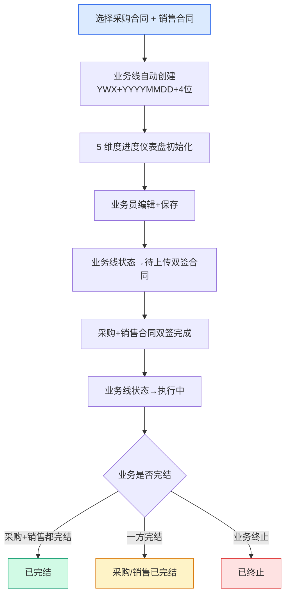
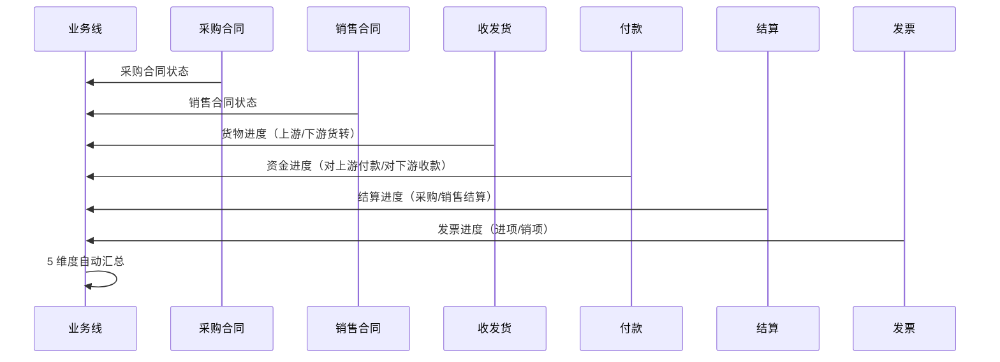
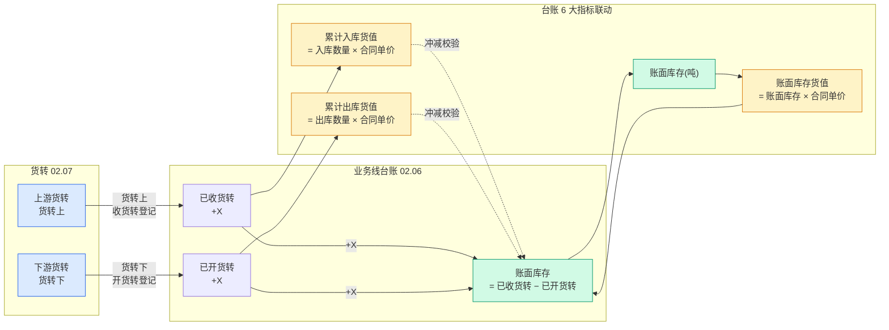
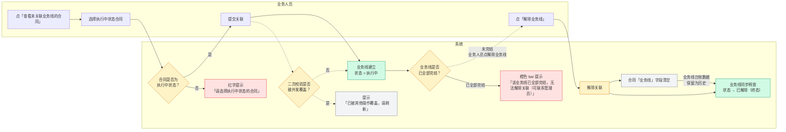
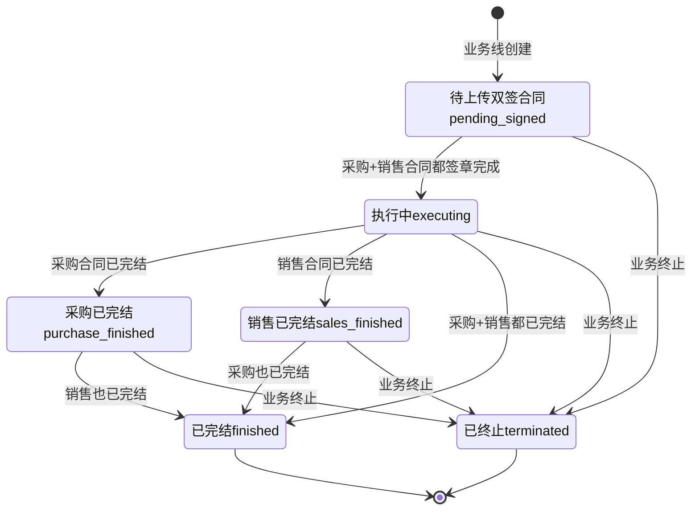

# 02.06 业务线管理 · 需求规格说明

> **文档类型**：PRD Writer 范式 · 落地需求文档 · 功能详细描述
> **对应总纲**：[00-产品概述与需求总纲.md](./00-产品概述与需求总纲.md)
> **通用规范**：[01-通用交互与文案规范.md](./01-通用交互与文案规范.md)
> **源文档（只读，未做任何改动）**：[02.06-业务线管理.md](../docs/02.06-业务线管理.md)
> **整理时间**：2026-09-30

---

## 0. 阅读说明

### 0.1 信息溯源标记

| 标记 | 含义 | 使用规则 |
|------|------|---------|
| ✅ | 源文档已明确 | 原值保留（表名 / 字段名 / 状态枚举 / 编号规则 / 提示文案），不改写口径 |
| 🔷 | 范式补全 | 源文档没写，按范式要求推导，**必须注明推导依据** |
| ⚠️ | 源文档自相矛盾 | **绝不静默选边**，如实并列，交由业务方裁决 |
| [待补充] | 信息不足 | **严禁编造**，需业务方 / 研发回填 |

### 0.2 源文档阅读顺序

源文档 `02.06-业务线管理.md`（521 行 / 31,121 字节）由**三代口径叠加**构成：**§1-§11 是 v1.0 终版口径**（基于原型 23-25 截图）、**§12 是 v1.7.99.87 改造节**（业务线详情头部重制）、**§11（重复编号）是 v1.7.99.x 模块级增量节**（2026-09-24 基于飞书《用户使用手册》第 5.1 节沉淀）。三代口径在**状态机（7 vs 5）、详情页 tab（3 vs 9）、解除业务线流程、表数量**上存在冲突（见 §3.4）。

| 源文档章节 | 内容 | 归位到本文档 |
|-----------|------|------------|
| 头部 + §0 章节导航 | 状态 / 复用度 70% / `t_business_line*` 3 张 | §1.1、§5.4 |
| §1 业务定位 | 业务线 = 1 采购合同 + 1 销售合同 / 5 条关键规则 / 3 个页面 | §1.1、§1.3、§6 |
| §2 业务流程全景 | 2.1 创建流程 / 2.2 5 维度联动时序 | §1.3.2-1.3.3 |
| §3 核心实体 | 3 张表逐字段（`t_business_line` 等） | §5.1、§5.2 |
| §4 7 状态机 | 状态机图 + 7 行状态说明 + 7 Tab 映射 | §3.1.1、§3.2.1-3.2.3 |
| §5 角色操作矩阵 | 5 操作 × 6 角色 | §2.1 |
| §6 字段规则 | 业务线号 / 业务线名称 / 5 维度进度 | §5.2、§5.3、§3.2.4 |
| §7 按钮交互 | 列表页 5 按钮 / 详情页字段分类 | §2.2、§2.3 |
| §8 异常处理 | 5 条业务异常 | §4.1、§2.5 |
| §9 跨模块流转 | 上游 1 条 / 下游 5 条 | §1.4 |
| §10 复用建议 | 70% / 3 复用 + 2 新建 / 4 周实施 | §5.4 |
| §11 文档版本 | v1.0 / v1.7.99.87 | §7.3 |
| **§12 v1.7.99.87 改造** | **详情页头部重制 10 项 + 关键规范 4 条** | **§2.2.2、§3.3、§5.4.5** |
| 修改记录 | v1.7.99.x 全局规范 | §2.2、§3.2、§3.3 |
| **§11 v1.7.99.x 增量节** | **模块业务变化 / 业务线概念 / 9 大 tab / 台账 6 大指标 / 5 状态机 / 跨模块联动 / 异常 / 页面 PRD 索引 / 业务规则沉淀 / 修改记录** | **§1.2、§1.3.4、§2.1.2、§3.1.2、§3.2.5、§3.3、§4.1-4.2、§4.4、§5.4、§6、§7** |

> ✅ **本文档另附一次只读核验**：为判断「源文档口径 vs 页面实际实现」是否一致，整理时对 `pages/business-line.html` / `business-line-relate.html` / `business-line-detail.html` 做了**只读** grep 核验（2026-09-30），结果逐条标注为「**现状核验 ✅**」。**未修改任何页面文件、未修改 `docs/` 任何文件**。

### 0.3 与通用规范的关系

**通用表单规范（校验时机 / 返回保护 / 提交行为 / 危险操作确认 / 空状态 / 失败引导 / 通用 UI 6 态 / 通用样式 / 脱敏规范）一律以 [01-通用交互与文案规范.md](./01-通用交互与文案规范.md) 为准，本文档不重复定义，只写本模块特有的部分**：业务线「1 采购合同 + 1 销售合同」的生成与解除规则、业务线号 `YWX` 规则、5 维度进度的计算公式、v1.7.99.169 的 5 状态机与合同状态同步、详情页 9 大 tab 与台账 6 大指标、**账面库存受货转联动影响**（已收货转 +X / 已开货转 −X）、v1.7.99.87 的 2×5 KPI 网格与 6 列横向 label+value 布局。

### 0.4 飞书用户手册补充（2026-10-08）

> **来源**：《豫港通数字供应链管理平台 — 用户使用手册（内部版）》飞书 rev.8976，主用 **5.1 业务线管理**；`business_type` / `unit` 两个枚举取自**手册 4.1 采购+销售-合同管理**（合同侧字段，业务线引用），已逐条标注出处。手册是对着线上系统写的，**权威性优先于本文档原有推导**。

| 手册小节 | 归位到本文档 | 填了哪些信息缺口 / 补了哪些矛盾 |
|---------|-------------|---------------------------|
| **5.1 业务线管理** | §0.4 手册原值、§3.4（**C1** / **C2** / **C5** / **C7** 追加 ✅ 手册口径；新增 **C12**）、§4.1 校验表、§5.2 字段级规范 | 业务线状态收敛为 **4 个**；**账面库存 = 已收货转总数 − 已开货转总数**（解 C7）；解除关联**无审批**（解 C5）；**新增 C12**（手册自身「4 列进度」却列 5 项） |
| **4.1 合同**（业务线引用的合同侧字段） | §3.4（**C10** 追加 ✅ 手册口径）、§5.2 字段级规范 | **`business_type` = 4 值枚举**（解 C10「5 种」与「从未列出」）；**`unit`（计价单位）= 吨 / 件 / 支** |

**✅ 手册原值（照抄，不改写）**：

- **5.1 业务线概念**：**上游供应商 + 下游客户 = 完整业务线**
- **5.1 用户旅程**：业务人员 → 建立业务线 → 关联上下游 → 关联合同 → 业务线生效
- **5.1 业务线的产生**：需要操作人员在**创建采购订单-单批次合同时进行关联生成**，或创建时未关联，可在**合同为 `执行中` 状态下手动进行关联**
- **5.1 解除关联**：同时已产生关联的业务线也可**解除关联**，**解除关联后，业务线将同步释放**
- **5.1 关联入口**：「关联XX合同」在**执行中的**采/销订单-单批次合同的**对应的操作项**；查看未关联合同在**业务线管理中-选择右上角「查看未关联业务线的合同」**
- **5.1 业务线详情**：**基础信息 + 4 列进度：货转/付款回款/收发货/结算/发票**（⚠️ 手册自身「4 列」与所列 5 项不符，见 **C12**）
- **5.1 账面库存**：**已收货转总数减去已开货转总数所得出的剩余库存**
- **5.1 风险预警**：当前业务线中的采销合同在**预警中心**中记录的**预警警告数量**
- **5.1 账面库存货值**：**账面库存数量 * 合同单价**计算出的货值金额
- **5.1 累计入库货值**：**总入库货物数量 * 合同单价**的货值金额
- **5.1 累计出库货值**：**总出库货物数量 * 合同单价**的货值金额
- **5.1 品类库存列表**：显示业务线合同中各品名货物的库存情况（**库存量 / 货值 / 出入库量 / 出入库货值**）
- **5.1 详情页 8 个内容块**：收发货（**发运**）/ 货转 / 库存 / 付款（**采购合同**的付款详细记录）/ 回款（**销售合同**的付款详细记录）/ 采销结算 / 进销项发票 / 合同基础信息+附件
- **5.1 合同基础信息+附件字段**：合同编号 / 买卖双方企业信息 / 签订日期 / 合同单价 / 合同总量 / 运输方式 / 发到站点 / 托运信息 / 收货人信息 + 附件信息
- **5.1 业务线状态**：**执行中 / 采购已完结 / 销售已完结 / 全部完结 = 同步所关联的合同的实际状态**
- **4.1 合同侧 `business_type`**：业务类型：**存货业务 / 预付业务 / 账期业务 / 购销业务**；**单选（必填）**
- **4.1 合同侧 `unit`**：计价单位：**吨 / 件 / 支**；**单选（必填）**

---

## 1. 功能描述与触发条件

### 1.1 功能描述

✅ **业务线是港通供应链的全景视图**（**v1.1 新顶级模块**）——串联 **1 个采购合同 + 1 个销售合同 + 多个执行单据**（收发货 / 货转 / 付款 / 结算 / 发票 / 库存），让业务人员一眼看到「上游采购到下游销售」的**全链路进度**（源文档 §1 原文）。

✅ **港通特色模块**——建设方案明确「主产品可能没有完整的多合同联动」（源文档 §1 原文）。

✅ **模块定位**：**合同与货转之间的中间枢纽**——上接合同（02.03）的采购 + 销售双合同，下接货转（02.07）的收发货 / 货转 / 付款 / 结算 / 发票 5 类执行单据，**其进度汇总是本模块的唯一职责**。

✅ **5 条关键规则**（源文档 §1.1 原文保留）：

| # | 规则 | 说明 |
|---|------|------|
| 1 | **业务线 = 1 采购合同 + 1 销售合同**（v1.0 核心）| — |
| 2 | **业务线状态 = 7 个**（基于 23 截图）：待上传双签合同 / 执行中 / 采购已完结 / 销售已完结 / 已完结 / 已终止 | ⚠️ **声称 7 个，实列 6 个**（缺 `dissolved`），且 v1.7.99.169 改为 5 状态，见 §3.4 C1 / C2 |
| 3 | **业务线 5 维度进度**（v1.0 新增）：货物进度 / 资金进度 / 结算进度 / 发票进度 + 业务线信息 | ⚠️ 实为 **4 进度维度 + 1 信息区**，且 v1.7.99.169 详情页改为 9 大 tab，见 §3.4 C4 |
| 4 | **业务线号格式**：`YWX{YYYYMMDD}{4位}`，例 `YWX202309060001` | ✅ §5.3 |
| 5 | **解除业务线**：仅在特殊情况下解除（如业务终止） | ⚠️ 与 v1.7.99.169「已产生关联的业务线**也可**解除关联，解除后**同步释放**」直接冲突，见 §3.4 C5 |

✅ **复用度：🟢 70%（主产品已有）**（源文档头部 + §10.1）——主产品 `t_business_line*` 3 张 + `t_business_line_full` + `t_business_line_extend_info` + `t_business_line_data_statistics`。

⚠️ **表数量三套口径冲突**（核心实体 3 张 / 头部 6 张 / §10 分档 3+2=5），见 §3.4 C3。

✅ **3 个页面（sitemap，§1.2）**：

| # | 页面 | 说明 |
|---|------|------|
| 1 | **业务线管理**（列表）| 7 状态 Tab + 5 维度仪表盘 |
| 2 | **业务线关联**（**内容待调整**）| 关联采购合同 + 销售合同 |
| 3 | **业务线详情** | 业务线完整信息 + 5 维度进度 |

### 1.2 触发条件

| 场景 | 触发条件 | 结果 | 来源 |
|------|---------|------|------|
| **业务线自动创建（v1.0 口径）** | 采购 + 销售合同**都 `signed`** | **业务线自动创建** | §9.1 ✅ |
| **业务线产生（手册 5.1 口径）** | 操作人员在**创建采购订单-单批次合同**时进行**关联生成** | 业务线生成 | §11.2 手册 5.1 ✅ |
| **业务线手动关联（v1.7.99.169 关键）** | 创建时未关联 + 合同为「**执行中**」状态 | **手动关联** | §11.1 / §11.2 手册 5.1 ✅ |
| 关联入口 | 业务线管理 → 右上角「**查看未关联业务线的合同**」 | 抽屉展示未关联合同 → 关联 | §11.9 手册 5.1 ✅ |
| 关联路径 1 | 在**执行中**的采 / 销**订单-单批次合同**的对应操作项 | 发起合同关联 | §11.9 ✅ |
| 业务线状态初始 | 业务线创建 | → 待上传双签合同 `pending_signed` | §4.1 ✅ |
| 状态 → 执行中 | 采购 + 销售合同都签章完成 | `pending_signed` → `executing` | §4.1 ✅ |
| 状态 → 已完结 | 采购 + 销售**都**完结 | `executing` → `finished` | §4.1 ✅ |
| 状态 → 采购/销售已完结 | 采购 / 销售合同**一方**完结 | `executing` → `purchase_finished` / `sales_finished` | §4.1 ✅ |
| 状态 → 已终止 | 业务终止 | 任意非终态 → `terminated` | §4.1 ✅ |
| 状态 → 已解除 | 业务人员手动解除关联 | → `dissolved`（v1.0）/ 已解除（v1.7.99.169）| §4.1 / §11.5 ✅ |
| 状态同步合同 | 业务线状态**同步**所关联的合同的实际状态 | 状态自动刷新 | §11.9 v1.7.99.169 关键 ✅ |
| 收货转完成 | 货转（02.07）上游货转完成 | 业务线「已收货转」+X（**账面库存增加**）| §11.4 / §11.6 ✅ |
| 开货转完成 | 货转（02.07）下游货转完成 | 业务线「已开货转」+X（**账面库存减少**）| §11.4 / §11.6 ✅ |
| 收发货登记成功 | 收发货（02.05） | 台账「收发货 / 库存」tab 自动同步；累计入库 / 出库数量同步更新 | §11.6 / 02.05 §11.5 ✅ |
| 付款完成 | 付款（02.08.1）| 更新业务线资金进度 / 「付款」tab | §9.2 / §11.6 ✅ |
| 回款完成 | 回款 | 更新「回款」tab | §11.3 / §11.6 ✅ |
| 结算完成 | 结算（02.13）| 更新业务线结算进度 / 「采销结算」tab | §9.2 / §11.6 ✅ |
| 开票完成 | 发票（02.09 / 02.15）| 更新业务线发票进度 / 「进销项发票」tab | §9.2 / §11.6 ✅ |
| 风险预警同步 | 预警中心（02.11）| 业务线「风险预警」计数同步预警中心数据 | §11.6 ✅ |
| 解除关联同步释放 | 业务人员手动解除关联 | 关联合同「业务线」字段清空；已关联业务线台账数据保留为历史 | §11.7 ✅ |

### 1.3 业务流程（Mermaid）

#### 1.3.1 业务线创建流程（v1.0 口径，源文档 §2.1 原图照抄）



> ⚠️ **本图为 v1.0「自动创建」口径**（合同双签 → 业务线自动创建）。**v1.7.99.169 后业务线是在「创建采购订单-单批次合同时关联生成」或「执行中状态手动关联」**（§11.1 / §11.2）——**不是等双签后才自动创建**。**两条路径并存，见 §3.4 C6。**

#### 1.3.2 5 维度进度联动（v1.0 口径，源文档 §2.2 原图照抄）



> 📌 **与用户「资金流转」基线一致性核查**：本时序图的「资金进度」由**已登记的对上游付款 / 对下游收款**驱动（🔷 推断：源文档 §6.3 公式为 `paid_to_upstream / received_from_downstream`），**不含任何线上扣款/打款/银行扣款分支**——✅ **符合**「资金流转 = 线下完成 + 系统流程化登记」基线。⚠️ **源文档未明确声明付款 / 回款的资金动作在线下完成**，见 §7.2 Q7。

#### 1.3.3 货转联动的账面库存增减（v1.7.99.x 口径 · 手册 5.1 权威公式）

> ✅ **源文档 §11.4「业务线台账 6 大指标」原文**：**账面库存 = 已收货转总数 − 已开货转总数**。本流程图据此推导货转事件对账面库存的增减方向。



⚠️ **「货转上 / 货转下」与「已收货转 / 已开货转」的对应关系需业务方确认**（见 §3.4 C7）：
- ✅ **源文档口径**：「**已收货转总数 − 已开货转总数 = 剩余库存（吨）**」（§11.4）、「库存 = 已收货转总数 − 已开货转总数」（§11.3）
- ⚠️ **任务简报口径**：「**货转上 −X / 货转下 +X**」
- 🔷 **本文档不选边**：从字面看「货转上」= 上游货转 = 入库方向 = 增加库存（+X），「货转下」= 下游货转 = 出库方向 = 减少库存（−X），**与任务简报方向相反**。**但「货转上 / 货转下」也可能是「开货转 / 收货转」在业务侧的另一套叫法**，源文档未定义术语映射，见 §3.4 C7 + §7.2 Q2。

#### 1.3.4 业务线解除与同步释放（v1.7.99.169 关键 · 手册 5.1 口径）

> ✅ **源文档 §11.2 + §11.7 原文**：已产生关联的业务线**也可**解除关联；解除关联后业务线将**同步释放**——关联的合同「业务线」字段清空；已关联的业务线台账数据**保留为历史**。



✅ **解除后的数据处置**（§11.7 原文）：**同步释放** —— 关联的合同「业务线」字段清空；**已关联的业务线台账数据保留为历史**。

⚠️ **本流程图与 v1.0 §8 异常表直接冲突**：v1.0 记「**解除业务线但有未完结单据** → 阻止（`业务线 X 有关联单据未完结，不能解除`）」，而 v1.7.99.169 记「**业务线已全部完结试图解除** → 橙色 bar 提示无法解除」——**两者的阻止条件完全相反**（v1.0 阻止「有未完结单据时解除」，v1.7.99.169 阻止「全部完结后解除」）。见 §3.4 C5。

### 1.4 模块依赖（跨模块流转）

#### 1.4.1 上游触发（✅ 源文档 §9.1）

| 触发模块 | 触发条件 | 触发动作 | 出处 |
|---------|---------|---------|------|
| 合同管理（02.03）| 采购 + 销售合同都 `signed` | **业务线自动创建** | §9.1 ✅ |
| 合同管理（02.03）| 创建采购订单-单批次合同时关联生成 | 业务线产生 | §11.2 手册 5.1 ✅ |
| 合同管理（02.03）| 合同为「执行中」状态下手动关联 | 业务线产生 | §11.2 / §11.9 ✅ |

⚠️ **「自动创建」与「手动关联」两条路径并存**（见 §3.4 C6）：v1.0 口径是「双签后自动创建」，v1.7.99.169 口径是「创建合同时关联或执行中手动关联」——**两条路径的互斥关系、优先级、是否会重复创建，源文档未定义**。

#### 1.4.2 下游触发（✅ 源文档 §9.2 + §11.6）

| 触发模块 | 触发条件 | 触发动作 | v1.7.99.169 增强 | 出处 |
|---------|---------|---------|----------------|------|
| 收发货（02.05）| 收/发货完成 | 更新业务线货物进度 | 业务线台账的「收发货 / 库存」tab 自动同步 | §9.2 / §11.6 ✅ |
| 货转（02.07）| 上游/下游货转完成 | 更新业务线货物进度 | 业务线台账的「货转」tab 自动同步 | §9.2 / §11.6 ✅ |
| 付款（02.08.1）| 付款完成 | 更新业务线资金进度 | 业务线关联的采购合同 → 台账的「付款」tab | §9.2 / §11.6 ✅ |
| 结算（02.13）| 结算完成 | 更新业务线结算进度 | 业务线台账的「采销结算」tab 自动同步 | §9.2 / §11.6 ✅ |
| 发票（02.09 / 02.15）| 开票完成 | 更新业务线发票进度 | 业务线台账的「进销项发票」tab 自动同步 | §9.2 / §11.6 ✅ |
| **回款** | 回款完成 | 🔷 更新「回款」tab（v1.0 §9.2 **无此行**）| 业务线关联的**销售合同** → 台账的「回款」tab | §11.3 / §11.6 ✅ |
| **预警中心（02.11）** | 预警产生 | 🔷 更新「风险预警」计数（v1.0 §9.2 **无此行**）| 业务线的「风险预警」计数同步预警中心数据 | §11.6 ✅ |
| 采购合同（02.03）| 合同状态变化 | 🔷 业务线状态同步合同实际状态 | 业务线关联的采购合同 → 台账的「付款」tab | §11.6 / §11.9 ✅ |
| 销售合同（02.03）| 合同状态变化 | 🔷 业务线状态同步合同实际状态 | 业务线关联的**销售合同** → 台账的「回款」tab | §11.6 / §11.9 ✅ |

⚠️ **模块编号口径**：源文档 §9.2 引用「付款 02.08.1 / 结算 02.13 / 发票 02.09」，而 §11.6 引用「发票 **02.15**」——**发票模块编号 02.09 与 02.15 并存**（`docs/` 实际文件为 `02.15-发票管理.md`）。见 §3.4 C9。

---

## 2. 交互细节

### 2.1 角色操作矩阵（权限可见性）

#### 2.1.1 v1.0 口径（✅ 源文档 §5 角色操作矩阵，5 操作 × 6 角色，原文照抄）

| 操作 / 角色 | 业务员 | 业务部 | 风控部 | 财务部 | 总经办 | 系统 |
|------------|------|------|------|------|------|------|
| 查看业务线 | ✓ | ✓ | ✓ | ✓ | ✓ | - |
| 创建业务线 | **✓** | - | - | - | - | - |
| 解除业务线 | - | 申请 | - | - | **审批** | - |
| 业务线终止 | 申请 | **审批** | 申请 | 申请 | **审批** | - |
| 查看 5 维度进度 | ✓ | ✓ | ✓ | ✓ | ✓ | 自动汇总 |

⚠️ **本矩阵是 v1.0「7 状态 + 审批流解除」口径**——「解除业务线」需**业务部申请 + 总经办审批**；而 v1.7.99.169 §11.5 记「**已解除** | **业务人员手动解除关联** | 终态（业务线释放）」，§11.7 记解除过程**无任何审批节点**。**审批流在 v1.7.99.169 后是否取消，源文档未明确**。见 §3.4 C5。

#### 2.1.2 v1.7.99.x 口径的权限补充（✅ 源文档 §11 增量节 + 🔷 推导）

✅ **源文档 §11.9「详细业务规则沉淀（来自手册 5.1）」原文**：

> **关联 XX 合同**：
> - 在执行中的采/销订单-单批次合同在对应的操作项
> - 业务线管理 → 选择右上角「查看未关联业务线的合同」进行合同关联

✅ **源文档 §11.9「业务线状态 vs 合同状态」**：业务线状态**同步**所关联的合同的实际状态（v1.7.99.169 关键）。

🔷 **v1.7.99.x 权限矩阵**（源文档**未给**权限表，下表为 🔷 推导，推导依据逐行注明）：

| 操作 | 业务员 | 业务部 | 风控部 | 财务部 | 总经办 | 系统 | 推导依据 |
|------|------|------|------|------|------|------|---------|
| 查看业务线列表 / 详情 | ✅ | ✅ | ✅ | ✅ | ✅ | - | 🔷 沿用 v1.0 §5 首行（5 角色均可查看）|
| **手动关联合同** | ✅ | ✅ | - | - | - | 校验执行中状态 | 🔷 §11.9「业务线管理 → 右上角「查看未关联业务线的合同」进行合同关联」（v1.0 §7.1 记该按钮「可见条件：业务部」）|
| **解除业务线** | ✅ | ✅ | - | - | ⚠️ [待补充] | 同步释放 | 🔷 §11.5「业务人员手动解除关联」+ v1.0 §5「业务部申请 + 总经办审批」——**是否仍需审批未定义**（C5）|
| 业务线终止 | ⚠️ [待补充] | ⚠️ [待补充] | ⚠️ [待补充] | ⚠️ [待补充] | ⚠️ [待补充] | - | 🔷 v1.0 §5 记「业务/风控/财务申请 + 总经办审批」；⚠️ **v1.7.99.169 的 5 状态机中已无 `terminated`（已终止）**——**终止流程是否随状态一起下线未定义**（C1）|
| 查看 5 维度 / 9 tab 进度 | ✅ | ✅ | ✅ | ✅ | ✅ | **自动汇总** | ✅ v1.0 §5 末行（源文档已给）|
| 数据导出 | ✅ | ✅ | - | - | - | - | 🔷 §7.1「数据导出｜Tab 右侧｜所有｜导出 Excel」（可见条件 = 所有）|

⚠️ **v1.7.99.169 增量节完全没有角色权限矩阵**，上表除 2 行 ✅ 外均为 🔷 推导，**不是业务方确认口径**，见 §7.2 Q6。

### 2.2 按钮交互（操作反馈）

#### 2.2.1 列表页按钮（✅ 源文档 §7.1 + 现状核验 ✅）

| 按钮 | 位置 | 可见条件 | 点击行为 | 现状核验 ✅ |
|------|------|---------|---------|-----------|
| 搜索 / 筛选 | 顶部 | 所有 | 弹**筛选抽屉** | — |
| **数据导出** | Tab 右侧 | 所有 | **导出 Excel** | ✅ `business-line.html:170` 存在「数据导出」按钮 |
| **业务线详情** | 列表行 | 所有 | 跳详情页 | ✅ 4 个抽屉面板中的链接 |
| **解除业务线** | 列表行 | **状态 ≠ 已完结** | 弹**解除确认框**（v1.0 新增）| ✅ `business-line.html:413/464/515/566` 共 **4 处**「解除业务线」链接 |
| **查看未关联业务线的合同** | Tab 右侧 | **业务部** | 跳合同列表筛选（v1.0）| ✅ `business-line.html:208` 实际是**右侧抽屉**（`openUnlinkedDrawer()`，v1.7.99.46 按图 2），**不是「跳合同列表」**——⚠️ 与 §7.1 记法不符，见 C8 |
| — | — | — | — | ✅ `business-line.html:92` 注释「v1.7.99.46 抽屉：查看未关联业务线的合同（按图 2）」|

🔷 **现状核验 ✅ 补充发现**：`pages/business-line-relate.html`（业务线关联页）实际有 **2 个状态 tab**（`已关联 (82)` / `待关联 (18)`，v1.7.99）+ 「**新增业务线关联**」按钮 + 侧边菜单含 14 项（业务线管理 / 业务线关联 / 业务线详情 / 发货管理 / 新增发货申请 / 发货申请详情 / 收货管理 / 新增收货数据 / 收货信息详情 / 货转管理 / 上游货转 / 上游货转详情 / 下游货转 / 新增下游货转 / 下游货转详情）。⚠️ **「已关联 / 待关联」2 tab 在源文档中从未出现**，见 C8。

#### 2.2.2 详情页字段分类（✅ 源文档 §7.2 + §11.3）

✅ **源文档 §7.2 详情页字段分类（v1.0，基于 23 截图，原表照抄）**：

| 分类 | 字段 |
|------|------|
| **业务线信息** | 业务线号 / 业务线名称 / 采购合同 / 销售合同 / 业务类型 / 采购签订日期 |
| **货物进度** | 销售合同量 / 上游货转 / 下游货转 / 已开货转 + 进度条 |
| **资金进度** | 对上游付款 / 对下游收款 |
| **结算进度** | 采购结算金额 / 销售结算金额 |
| **发票进度** | 进项发票金额 / 销项发票金额 |
| **操作** | 业务线详情 / 解除业务线 |

✅ **v1.7.99.169 详情页 9 大 tab（§11.3 手册 5.1 沉淀，原表照抄）**：

| Tab | 内容 | 关键计算 | 现状核验 ✅ |
|-----|------|----------|-----------|
| **业务线台账** | 账面库存 + 风险预警 + 库存货值 | 详见下表 §1.3.3 | ✅ `business-line-detail.html:348` `data-bl-tap="standing"` |
| **收发货（发运）** | 业务线中采销合同的收发货详细记录 | - | 🔷 现状为 `bl-sub-tap` 子 tab（发运 / 货转信息）|
| **货转** | 业务线中采销合同的采销货转详细记录 | - | ✅ `business-line-detail.html:442/701` `data-sub-tap="transfer"`「货转信息」+ badge `(6)` |
| **库存** | 已收货转总数 − 已开货转总数 | **剩余库存** | ✅ `business-line-detail.html:322/326` KPI「库存」/「已开货转」 |
| **付款** | 业务线中采购合同的付款详细记录 | - | ✅ `business-line-detail.html:515-531` 付款表格（列：单号 / 付款类型 / 资金来源 / 金额 / 日期 / 状态）|
| **回款** | 业务线中销售合同的付款详细记录 | - | ✅ `business-line-detail.html:617` 侧边导航 `data-bl-side="receipt"`「回款」 |
| **采销结算** | 业务线中采销售合同的结算单详细记录 | - | 🔷 现状未在 grep 命中范围内确认 |
| **进销项发票** | 业务线中采销售合同的进销项发票详细记录 | - | 🔷 现状未在 grep 命中范围内确认 |
| **合同基础信息 + 附件** | 合同编号 / 买卖双方 / 签订日期 / 合同单价 / 合同总量 / 运输方式 / 发到站 / 托运人 / 收货人 | — | ✅ `business-line-detail.html:660-662` 付款账户 / 回款账户 |

⚠️ **现状核验 ✅ 的 tab 层级与源文档 9 大 tab 不是同一层级**：页面实际是 **3 个顶层 tab**（`purchase` 采购合同 / `sales` 销售合同 / `standing` 业务线台账，v1.7.99.53 注释「3 个 tap：采购合同/销售合同/业务线台账」），**「业务线台账」内部的 9 个内容块以「侧边导航（`bl-side-nav-item`）」+「子 tab（`bl-sub-tap`）」两级组织**，**不是 9 个平级 tab**。见 §3.4 C4。

#### 2.2.3 v1.7.99.87 详情页头部重制 10 项（✅ 源文档 §12.1 逐条照抄）

> **改造范围**（§12 头部）：重制 1 个 HTML（`pages/business-line-detail.html` 头部 + 基础信息 + 合同附件 + 销售合同对应改造，**~980 行 → 1091 行**）。**不动**：业务线详情页其他 panel（货物运输 / 资金流水 / 结算单 / 发票 + 销售合同对应 panel）**只更新合同号 -a → -s**；全局 `design-system.css` / `list-page.css`；`assets/js/app.js`。

| # | 改造项 | 旧 | 新 | 现状核验 ✅ |
|---|--------|----|----|-----------|
| 1 | **面包屑 3 级 → 2 级** | 业务线管理 / 业务线 / 业务线详情（3 级）| 业务线管理 / 业务线详情（2 级，**删掉「业务线」中间级**）| — |
| 2 | **顶部右上角加「返回」button** | 无 | 面包屑右侧；白底 + 浅灰边 + 左箭头 SVG + 「返回」文字；行为 `window.history.back()` | — |
| 3 | **业务链路 3 段中游改深蓝实心** | 中游 `background: #EFF6FF` 浅蓝 + 蓝字 | 中游 `background: #1E40AF` **深蓝实心** + 白字 + `font-weight: 500`；上游 / 下游保持白底蓝边蓝字 | — |
| 4 | **业务线 metadata 4 列** | 「业务线**编号**」 | 「**业务线号**」；合同号后缀 **-a → -s** | 🔷 `business-line.html:368` 抽屉内显示合同号 `...-s`（现状已为 -s）|
| 5 | **4 个 tags 更新** | 📅 2026-01-27**到**2026-12-31 / 📦 存**现**货 | 📅 2026-01-27**至**2026-12-31 / 📦 存**货类**；保留 🚆 火运 / 💰 自有资金 | — |
| 6 | **KPI grid 8 项 → 2×5 grid 10 项**（**最大改动**）| 8 项 / 4 列 × 2 行（合同 / 货量 / 付款 / 上游结算 / 上游发票 / 回款 / 下游结算 / 下游发票）| **2 行 × 5 列 = 10 cell**：采购合同\|销售合同 / 已收货转 / 已支付货款\|财务余额\|业务余额 / 采购结算 / 进项发票金额 / **库存** / 已开货转 / 已回货款\|保证金 / 销售结算 / 销项发票金额 | ✅ `business-line-detail.html:305-326` 命中「已收货转」「库存」「已开货转」 |
| 6a | **黄色高亮 4 个 cell** | — | `background: #FEFCE8`（已收货转 / 已支付货款·财务余额·业务余额 / 已开货转 / 已回货款·保证金）| ✅ `business-line-detail.html:889` `class="kpi-card highlight"` |
| 6b | **⚡ 黄色闪电图标** | — | 4 个高亮 cell 值前；`color: #FBBF24` + `font-size: 14px` + `margin-right: 2px` | — |
| 6c | **(18% ↑) 绿字** | — | 1 个 cell（已回货款/保证金）；`color: #16A34A` + `margin-left: 4px` + `font-weight: 500` | — |
| 7 | **基础信息 4 列 13 字段 → 6 列 5 行 14 字段** | `.bl-info-grid` 4 列 × 4 行，13 字段（合同编号 / 卖方 / 买方 / 签订日期 / 业务类型 / 品名 / 合同单价 / 合同数量 / 交货期限 / 到货 / 运输人 / 供方 / 收货人）| `.bl-info-table` **6 列 × 5 行**，14 字段：Row1 合同编号(+`[长协]`+`[双签]` tags) / 买方企业(河南中豫港通) / 卖方企业(河南诚泽运输)；Row2 签订日期(2026-01-27) / 业务类型(-) / 品名(进口木薯淀粉)；Row3 合同价格(3,400元/吨) / 合同数量(20,000吨) / 交货期限(2026-01-27至2026-12-31)；Row4 运输方式(中欧班列-东盟线路) / 发站(万象站) / 到站(新郑)；Row5 托运人(无) / 收货人(河南中豫港通) / (空) | ✅ `business-line-detail.html:660` `class="info-label"`（6 列 label+value pair）|
| 8 | **销售合同基础信息同步重制** | — | 同步采购合同 6 列 5 行；14 字段精简到 12 字段；销售合同标的买方 = 河南中豫港通；`YL-MSXS-20260127-s` + `[综合]` + `[合同]` tags | — |
| 9 | **合同附件加「一键下载」button** | 无 | 「附件共 1 份」+「一键下载」同一行 flex space-between；白底 + 蓝边 + 蓝字 + 12px + 下箭头 SVG；附件表格 3 列（单据类型 / 文件名称 / 操作，操作列右对齐）；1 行 mock：线下合同 / 采购合同.pdf / 下载 | — |
| 10 | **右下角「返回顶部」button** | 无 | `position: fixed; bottom: 32px; right: 32px;`；40px × 40px 圆形 + 白底 + 浅灰边 + 阴影 + ∧ SVG；行为 `window.scrollTo({top: 0, behavior: 'smooth'})`；沿用 v1.7.99.84 销项发票编辑页模式 | — |

#### 2.2.4 全局规范继承（✅ 修改记录）

| 规范 | 内容 | 出处 |
|------|------|------|
| **列表页占位 = "全部"** | 全站统一 | 修改记录 v1.7.99.x ✅ |
| **列表页规范升级** | v1.7.99 全局 | 修改记录 ✅ |
| **状态 tag 颜色编码** | v1.7.99.14 | 修改记录 ✅ |
| **流程图统一用 Mermaid** | v1.7.99.6 | 修改记录 ✅ |
| **合同号 -s 后缀统一** | v1.7.99.86 库存台账 mock 用 `-s`，v1.7.99.87 业务线详情也用 `-s`，**全文件 -a → -s** | ✅ §12.2 |
| **v1.7.99.x 硬规范** | 不修改全局 `design-system.css` / `list-page.css`；注释锁版本号；不留僵尸代码；user 没要求的不擅自改 | 🔷 沿用 02.03 §5.4.5 沉淀的 7 条 |

### 2.3 危险操作确认

| 操作 | 确认框 / 弹窗 | 依据 |
|------|-------------|------|
| **解除业务线** | ✅ §7.1：弹**解除确认框**（v1.0 新增）；⚠️ **确认框标题与按钮文案源文档未给** [待补充] | ✅ §7.1 |
| **解除业务线（未完结单据时）** | `业务线 X 有关联单据未完结，不能解除` → **阻止** | ✅ §8 |
| **解除业务线（已全部完结时，v1.7.99.169）** | 顶部**橙色 bar** 提示 `该业务线已全部完结，无法解除关联（可联系管理员）` | ✅ §11.7 |
| **创建业务线时无采购合同** | `必须先选择采购合同` → **阻止** | ✅ §8 |
| **创建业务线时无销售合同** | `必须先选择销售合同` → **阻止** | ✅ §8 |
| **合同业务类型不一致** | `采购 X 与销售 Y 业务类型不匹配` → **阻止** | ✅ §8 |
| **关联非「执行中」状态合同** | 红字提示 `请选择执行中状态的合同` | ✅ §11.7 |
| **业务线 5 维度进度不一致** | `采购 X 已完结但销售 Y 仍执行中` → **黄灯提醒** | ✅ §8 |
| **离开有未保存内容的关联页** | 🔷 `当前编辑内容将丢失，确定返回？` + `确定`/`取消` | 🔷 01 文档 §2.2（源文档未覆盖）|
| **业务线终止** | 🔷 [待补充] 源文档 §5 记有终止审批流（业务 / 风控 / 财务申请 + 总经办审批），但**未给确认框文案**，且 ⚠️ v1.7.99.169 的 5 状态机中**已无 `terminated`** | 🔷 01 文档 §2.10 + ⚠️ C1 |

> ✅ **解除业务线的「同步释放」是级联操作**（§11.7）：解除关联 → 合同「业务线」字段清空 → 业务线同步释放。🔷 **推导出这是不可逆操作**（源文档只说「台账数据保留为历史」，**未说合同能否重新关联回该业务线**），**必须走危险操作确认**。见 §7.2 Q4。

### 2.4 空状态引导

> 通用空状态规范以 [01-通用交互与文案规范.md](./01-通用交互与文案规范.md) §2.11 为准（`暂无数据` / `请调整筛选条件` / 空状态插画 + 灰字 13px 居中）。下表为**本模块特有**的空状态。

| 场景 | 文案 | 补充动作 | 依据 |
|------|------|---------|------|
| 业务线列表无数据 | `暂无数据` | 有筛选时 `请调整筛选条件` | 🔷 01 §2.11 |
| 「查看未关联业务线的合同」抽屉为空 | 🔷 [待补充] 源文档未给 | 需说明：所有合同均已关联时的引导（🔷 现状核验 ✅ 抽屉标题旁计数为「(0)」）| 🔷 依据 §11.9 推导 + 现状核验 ✅ `business-line.html:208` |
| 业务线关联页「待关联」tab 为空 | 🔷 [待补充] 源文档未给 | 需说明：无非「执行中」状态可关联合同时的引导 | 🔷 依据 §11.7 校验规则推导 |
| 详情页 9 tab 某 tab 无数据 | 🔷 [待补充] 源文档未给 | 需按 tab 定义空态（如「货转」tab 无记录 / 「进销项发票」tab 无记录）| 🔷 依据 §11.3 推导 |
| 台账「风险预警」为 0 | 🔷 [待补充] 源文档未给 | 需定义 0 时的展示（灰态 / 「无预警」）| 🔷 依据 §11.4 推导 |
| 品类库存列表为空 | 🔷 [待补充] 源文档未给 | 需定义空态 | 🔷 依据 §11.4 推导 |
| 5 维度进度分母为 0（如未签销售合同）| 🔷 [待补充] **进度条除零处理未定义** | 需定义 0 分母时的展示（0% / 空条 / —）| 🔷 依据 §6.3 公式推导 |

### 2.5 失败引导

✅ **源文档 §8 异常处理原文（5 条，全部照抄）**：

| 异常场景 | 提示文案 | 处理动作 |
|---------|---------|---------|
| 创建业务线时无采购合同 | `必须先选择采购合同` | **阻止** |
| 创建业务线时无销售合同 | `必须先选择销售合同` | **阻止** |
| 采购/销售合同业务类型不一致 | `采购 X 与销售 Y 业务类型不匹配` | **阻止** |
| 解除业务线但有未完结单据 | `业务线 X 有关联单据未完结，不能解除` | **阻止** |
| 业务线 5 维度进度不一致 | `采购 X 已完结但销售 Y 仍执行中` | **黄灯提醒** |

✅ **v1.7.99.x 增量节异常处理（§11.7 原文，4 条全部照抄）**：

| 场景 | v1.7.99.169 处理 |
|------|------------------|
| 解除关联 → 业务线释放 | **同步释放**：关联的合同「业务线」字段清空；已关联的业务线台账数据保留为历史 |
| 关联非「执行中」状态合同 | 红字提示 `请选择执行中状态的合同` |
| 同一业务线并发关联 | 二次校验被覆盖则提示 `已被其他操作覆盖，请刷新` |
| 业务线已全部完结试图解除 | 顶部**橙色 bar** 提示 `该业务线已全部完结，无法解除关联（可联系管理员）` |

✅ **详情页进度不一致的只读提示（🔷 现状核验 ✅）**：业务线详情台的合同 tag 会**同时显示两方状态**，如 `采购已完结`(tag-green) + `销售执行中`(tag-yellow)（`business-line.html:470`）、`采购执行中`(tag-yellow) + `销售已完结`(tag-green)（`business-line.html:521`）——🔷 **这是 v1.0 §8「5 维度进度不一致 → 黄灯提醒」在实现层的落地形态**（推导依据：上述两行 tag 并存现象 + §8 末行规则）。

🔷 **通用失败引导**（01 文档 §2.12）：业务规则失败 → Toast 说明业务约束 + **保留输入**；网络异常 → `网络异常，请重试` + 按钮恢复可点；权限不足 → `无权限执行此操作` + 按钮隐藏；加载既有数据失败 → 页面顶部红色横幅 + `重试` 按钮。

---

## 3. 状态清单

### 3.1 业务状态机

#### 3.1.1 v1.0 状态机（6 状态节点，源文档 §4 原图照抄）



⚠️ **标题称「7 状态机」，但图只画了 6 个状态节点**（`pending_signed` / `executing` / `purchase_finished` / `sales_finished` / `finished` / `terminated`）——**第 7 个 `dissolved`（已解除）只出现在 §4.1 状态表，图与表不一致**。见 §3.4 C1。

#### 3.1.2 v1.7.99.169 状态机（5 状态，最新口径）

✅ **源文档 §11.5 原文表照抄**（源文档**只给表格，未给状态机图**）：

| 状态 | 触发 | 下一状态 |
|------|------|----------|
| **执行中** | 业务线建立 + 关联合同后 | 采购已完结 / 销售已完结 / 已解除 |
| **采购已完结** | 关联的采购合同全部已结清 | 全部完结 / 销售已完结 / 已解除 |
| **销售已完结** | 关联的销售合同全部已结清 | 全部完结 / 采购已完结 / 已解除 |
| **全部完结** | 采购 + 销售合同全部已结清 | 终态 |
| **已解除** | 业务人员手动解除关联 | 终态（业务线释放） |

🔷 **按源文档 §11.5 表格重绘的 mermaid 状态机**（推导依据：§11.5 的 5 行状态表 + 「全部完结 = 终态」「已解除 = 终态（业务线释放）」）：

```mermaid
stateDiagram-v2
    [*] --> 执行中: 业务线建立 + 关联合同后
    执行中 --> 采购已完结: 关联的采购合同全部已结清
    执行中 --> 销售已完结: 关联的销售合同全部已结清
    执行中 --> 已解除: 业务人员手动解除关联

    采购已完结 --> 全部完结: 关联的销售合同全部已结清
    采购已完结 --> 销售已完结: 关联的销售合同全部已结清
    采购已完结 --> 已解除: 业务人员手动解除关联

    销售已完结 --> 全部完结: 关联的采购合同全部已结清
    销售已完结 --> 采购已完结: 关联的采购合同全部已结清
    销售已完结 --> 已解除: 业务人员手动解除关联

    全部完结 --> [*]
    已解除 --> [*]

    classDef danger fill:#fee2e2,stroke:#dc2626
    classDef done fill:#d1fae5,stroke:#059669
    classDef todo fill:#fef3c7,stroke:#d97706
    class 执行中 todo
    class 采购已完结,销售已完结 todo
    class 全部完结 done
    class 已解除 danger
```

⚠️ **v1.7.99.169 的 5 状态机删掉了 2 个 v1.0 状态**：`pending_signed`（待上传双签合同）与 `terminated`（已终止）——**且把 `finished`（已完结）改名为「全部完结」**。🔷 **现状核验 ✅** 佐证：`pages/business-line.html:197` 注释明写「v1.7.99.167 去掉『已终止』/ v1.7.99.169 去掉『待上传双签合同』」。⚠️ **但页面 tab 名称仍用「已完结」（不是「全部完结」），且 `pending_signed` 是「初始状态」还是「不存在」未明确**——见 §3.4 C1 / C2。

### 3.2 状态值与展示

#### 3.2.1 v1.0 口径 6 状态（✅ 源文档 §4.1 状态表标题写「7 状态说明」，实列 7 行但图只有 6 节点，原值照抄）

| # | 枚举值 | 中文 | 触发条件 | 下一状态 | Tag 色 |
|---|-------|------|---------|---------|--------|
| 1 | `pending_signed` | 待上传双签合同 | 业务线创建 | 采购+销售都签章 → 执行中；业务终止 → 已终止 | 🔷 黄 `#FEF3C7` |
| 2 | `executing` | 执行中 | 采购+销售都签章 | 采购/销售已完结 / 已完结 / 终止 | 🔷 蓝 `#EFF6FF` |
| 3 | `purchase_finished` | 采购已完结 | 采购合同已完结 | 销售也已完结 / 已完结 / 终止 | 🔷 绿 `#ECFDF5` |
| 4 | `sales_finished` | 销售已完结 | 销售合同已完结 | 采购也已完结 / 已完结 / 终止 | 🔷 绿 `#ECFDF5` |
| 5 | `finished` | 已完结 | 采购+销售都完结 | **终态** | 🔷 绿 `#ECFDF5` |
| 6 | `terminated` | 已终止 | 业务终止 | **终态** | 🔷 红 `#FEE2E2` |
| 7 | `dissolved` | 已解除 | 解除业务线（异常）| **终态** | 🔷 灰 `#F3F4F6` |

> ⚠️ **`dissolved` 只在表里，不在 §4 状态机图里**（图只有 6 个节点，无 `dissolved` 任何出边），见 C1。
> 📌 **Tag 色列说明**：v1.0 源文档**未给状态配色**；上表 🔷 色值依据 [总纲 §7.8 状态标签配色](./00-产品概述与需求总纲.md) 推导（进行中→蓝 / 已完结→绿 / 终止→红 / 异常解除→灰）。

#### 3.2.2 v1.0 列表 7 Tab 映射（✅ 源文档 §4.2 原表照抄）

| Tab | 对应状态 |
|-----|---------|
| 全部 | 所有 |
| 待上传双签合同 | `pending_signed` |
| 执行中 | `executing` |
| 采购已完结 | `purchase_finished` |
| 销售已完结 | `sales_finished` |
| 已完结 | `finished` |
| 已终止 | `terminated` |

⚠️ **「7 Tab」= 6 个状态 tab + 1 个「全部」占位 tab**，而 §4.1 状态表是 **7 个状态**——**`dissolved`（已解除）没有对应 Tab**（因为它是异常态），**「7 Tab」与「7 状态」是巧合相同、集合不同**。见 §3.4 C2。

🔷 **现状核验 ✅**：`pages/business-line.html:197-205` 实际只有 **5 个 tab**（`全部 4` / `执行中 1` / `采购已完结 0` / `销售已完结 0` / `已完结 1`），注释明写「v1.7.99.167 去掉『已终止』/ v1.7.99.169 去掉『待上传双签合同』」。**`data-tab-key` 实际值为 `all` / `executing` / `purchase_done` / `sales_done` / `done`**——**`purchase_done` / `sales_done` / `done` 与源文档的 `purchase_finished` / `sales_finished` / `finished` 不一致**，见 C2。

#### 3.2.3 v1.7.99.169 口径 5 状态（✅ 源文档 §11.5 原表照抄）

| # | 中文 | 枚举值 | 触发条件 | 下一状态 | Tag 色（现状核验 ✅） |
|---|------|-------|---------|---------|---------------------|
| 1 | **执行中** | `executing` ✅ | 业务线建立 + 关联合同后 | 采购已完结 / 销售已完结 / 已解除 | ✅ `business-line.html:202/368` tag 名「执行中」+ 计数绿字 `#15803D` |
| 2 | **采购已完结** | ⚠️ `purchase_done` 🔷（现状核验 `data-tab-key`）| 关联的采购合同全部已结清 | 全部完结 / 销售已完结 / 已解除 | ✅ `business-line.html:470` tag-green「采购已完结」 |
| 3 | **销售已完结** | ⚠️ `sales_done` 🔷（现状核验 `data-tab-key`）| 关联的销售合同全部已结清 | 全部完结 / 采购已完结 / 已解除 | ✅ `business-line.html:521` tag-green「销售已完结」 |
| 4 | **全部完结** | ⚠️ `done` 🔷（现状核验 `data-tab-key`）/ 源文档 v1.0 名为 `finished` | 采购 + 销售合同全部已结清 | **终态** | ✅ `business-line.html:205/419` tag-green「已完结」（⚠️ **tab 与 tag 用「已完结」，状态表用「全部完结」**）|
| 5 | **已解除** | 🔴 [待补充] 源文档**只给中文，未给枚举值**；且**页面无该 tab / 无该 Tag** | 业务人员手动解除关联 | **终态（业务线释放）** | ❌ **页面无此态** |

⚠️ **3 处命名冲突**（见 C2）：① 「全部完结」（§11.5）vs「已完结」（§4.1 + 页面 tag + 页面 tab）；② `purchase_done`（页面）vs `purchase_finished`（§4.1）；③ `sales_done`（页面）vs `sales_finished`（§4.1）。

#### 3.2.4 5 维度进度计算公式（✅ 源文档 §6.3 原表照抄）

| 维度 | 字段 | 公式 |
|------|------|------|
| **货物进度** | `upstream_transferred / sales_contract_quantity` | 进度条 **0-120%** |
| **资金进度** | `paid_to_upstream / received_from_downstream` | 双向付款比例 |
| **结算进度** | `purchase_settled_amount + sales_settled_amount` | 采购 + 销售结算金额 |
| **发票进度** | `purchase_invoiced_amount + sales_invoiced_amount` | 进项 + 销项发票金额 |

⚠️ **本公式表存在 3 处口径问题**（见 C3）：
1. **进度条 0-120% 的上限 120% 业务含义（超收？超发？）未说明**（与 02.03 §7.2 Q8 同源问题）
2. **「资金进度」的公式方向可疑**：`paid_to_upstream`（对上游**付款**）/ `received_from_downstream`（对下游**收款**）——🔷 推导：**这 2 个是「金额」，不是「比值」，相除得到的是「倍数」而非「百分比」**；若要百分比需明确分母（如 `paid_to_upstream / 采购合同金额`）
3. **「结算进度」「发票进度」的公式是「加总」而非「比值」**——🔷 推导：这两维返回的是**金额**不是**百分比**，与其他两维的「进度」语义不同

#### 3.2.5 业务线台账 6 大指标（✅ 源文档 §11.4 手册 5.1 权威口径，原表照抄）

| 指标 | 计算公式 | 含义 | 现状核验 ✅ |
|------|----------|------|-----------|
| **账面库存** | 已收货转总数 − 已开货转总数 | 剩余库存（吨）| ✅ `business-line-detail.html:850/889/929` `账面库存(吨)` = `12,540.85`（3 处，品类库存列表内也有 1 处）|
| **风险预警** | 当前业务线中的采销合同在预警中心中记录的预警警告数量 | 风险计数 | ✅ `business-line-detail.html:855/894` 风险预警大数字卡 |
| **账面库存货值** | 账面库存数量 × 合同单价 | 库存金额（元）| ✅ `business-line-detail.html:860/899` `账面库存货值(元)` = `¥50,201,351.29` |
| **累计入库货值** | 总入库货物数量 × 合同单价 | 入库金额（元）| ✅ `business-line-detail.html:861/900` `累计入库货值(元)` = `¥60,663,310` |
| **累计出库货值** | 总出库货物数量 × 合同单价 | 出库金额（元）| ✅ `business-line-detail.html:862/901` `累计出库货值(元)` = `¥10,461,948.71` |
| **品类库存列表** | 各品名货物的库存情况 | 库存量 / 货值 / 出入库量 / 出入库货值 | ✅ `business-line-detail.html:843` 侧边导航 `data-bl-side="category"`「品类库存列表」+ `:943` 标题 + `:953-956` 表头（账面库存（吨）/ 累计入库（吨）/ 累计入库货值（元））|

> ⚠️ **现状核验 ✅ 发现一个源文档未列的第 7 个指标**：`business-line-detail.html:853/932` 存在 `累计出库金额(元)` = `¥10,325,800`，**与 `累计出库货值(元)` = `¥10,461,948.71` 并存且数值不同**（10,325,800 vs 10,461,948.71）——**「累计出库金额」与「累计出库货值」是两个不同指标还是同一指标的 mock 不一致，源文档从未定义**。见 C3。

### 3.3 UI 状态清单

> 通用 6 态以 [01-通用交互与文案规范.md](./01-通用交互与文案规范.md) §3.2 为准；下表为**本模块（列表页 / 业务线关联页 / 业务线详情页 3 顶层 tab + 9 内容块 / 4 类弹窗抽屉）**的落地映射。**6 态齐全：默认 / 加载中 / 成功 / 失败 / 禁用 / 空状态**。

| 状态 | 触发 | 视觉 | 可交互 |
|------|------|------|-------|
| **默认** | 页面加载完成、状态非 `dissolved` | 列表页 5 状态 tab（全部 / 执行中 / 采购已完结 / 销售已完结 / 已完结，v1.7.99.169 后）+ 筛选区 + 表格 + 分页 + 「数据导出」+「查看未关联业务线的合同(0) >>」；详情页头部 2×5 KPI grid（4 个黄色高亮 `highlight` + 4 个闪电 + 1 个 (18%↑)）+ 3 段业务链路（中游深蓝实心 `#1E40AF`）+ 3 顶层 tap（采购合同 / 销售合同 / 业务线台账）+ 台账内 6 大指标 | ✅ 全部按钮按 §2.2 矩阵显隐 |
| **加载中** | 提交中 / 加载既有数据中 / 5 维度汇总计算中 / tab 切换中 | 按钮 loading + 旋转图标 + 禁用 🔷；tab 内容区骨架屏 🔷（台账 6 大指标可独立降级）| ❌ 禁用重复提交 |
| **成功** | 关联成功 / 解除关联成功 / 状态自动流转（合同完结 / 合同解除关联）| 顶部居中 Toast 绿色 `#10B981`，3s 自动消失，文案 🔷 `提交成功`（01 文档 §3.2）；⚠️ 源文档**未给成功文案** [待补充] | — |
| **失败** | 无采购合同 / 无销售合同 / 业务类型不匹配 / 有未完结单据时解除 / 已全部完结时解除 / 关联非执行中合同 / 并发关联被覆盖 / 5 维度进度不一致 | Toast 红色 `#EF4444`（不自动消失）；或**红色字内联提示**（`请选择执行中状态的合同`）；或**顶部橙色 bar**（`该业务线已全部完结，无法解除关联（可联系管理员）`）；或**黄灯提醒**（`采购 X 已完结但销售 Y 仍执行中`，**不阻断**）。源文档原文文案见 §2.5 全部 9 条 | ✅ 按钮恢复可点 |
| **禁用** | 状态 = 已完结时的「解除业务线」（§7.1 可见条件：状态 ≠ 已完结）/ 无权限角色的操作 / 关联页无可选「执行中」合同 | 按钮灰化不可点 + Tooltip 说明原因 🔷 | ❌ |
| **空状态** | 列表无数据 / 筛选无结果 / 未关联合同抽屉为空 / 关联页「待关联」为空 / 详情页某 tab 无数据 / 风险预警为 0 / 品类库存列表为空 | 空状态插画 + 灰字 13px 居中（🔷 `.empty-row { padding: 40px 0; color: var(--text-tertiary); }`）；文案 `暂无数据` / `请调整筛选条件` | ✅ 引导操作（「查看未关联业务线的合同」/「清除全部」） |

🔷 **本模块特有的 UI 状态补充**：

| 状态 | 触发 | 视觉 | 可交互 | 依据 |
|------|------|-----|-------|------|
| **3 段业务链路 · 中游深蓝实心态** | 业务线详情 / 业务线台账类页面 | 3 段业务链路（上/中/下游）：**中游 = 我方 = `background: #1E40AF` 深蓝实心 + 白字 + `font-weight: 500`**；上游/下游 = 对手方 = 白底 + 蓝边 + 蓝字 | ✅ 只读 | ✅ §12.2【大前提】+ §12.1 改造 3 |
| **KPI 黄色高亮态** | 4 个 cell（已收货转 / 已支付货款·财务余额·业务余额 / 已开货转 / 已回货款·保证金）| `background: #FEFCE8` + 值前 ⚡ 闪电 `color: #FBBF24` `font-size: 14px` `margin-right: 2px` | ✅ 只读 | ✅ §12.1 改造 6 / 6a / 6b + 现状核验 ✅ `class="kpi-card highlight"` |
| **(18% ↑) 绿字态** | 1 个 cell（已回货款/保证金）| `color: #16A34A` + `margin-left: 4px` + `font-weight: 500` | ✅ 只读 | ✅ §12.1 改造 6c |
| **双 tag 并存态**（进度不一致）| 采购与销售完结状态不同时 | 同一行显示两个 tag，如 `采购已完结`(tag-green) + `销售执行中`(tag-yellow) | ✅ 只读 | 🔷 现状核验 ✅ `business-line.html:470/521` + 🔷 §8 末行推导 |
| **合同号 -s 后缀态** | 全模块 | 合同号统一 `-s` 后缀（v1.7.99.86 库存台账 → v1.7.99.87 业务线详情，**全文件 -a → -s**）| ✅ 只读 | ✅ §12.2【大前提】+ 🔷 现状核验 ✅ `business-line.html:368` |
| **合同 tags 态** | 采购合同 3 tags | `合同编号` + `[长协]`（**蓝底蓝字**）+ `[双签]`（**蓝实心白字**）| ✅ 只读 | ✅ §12.1 改造 7 |
| 销售合同 tags | 销售合同 2 tags | `YL-MSXS-20260127-s` + `[综合]` + `[合同]` | ✅ 只读 | ✅ §12.1 改造 8 |
| **6 列横向 label+value pair 态** | 详情页基础信息 | `.bl-info-table` **6 列 × 5 行**，label + value **横向同一行 = 2 cell/字段**（**不是**常规 4 列 grid 的「label 一行 + value 一行」垂直布局）| ✅ 只读 | ✅ §12.1 改造 7 + §12.2【大前提】+ 🔷 现状核验 ✅ `class="info-label"` |
| **返回 button 态** | 详情页顶部面包屑右侧 | 白底 + 浅灰边 + 左箭头 SVG + 「返回」；`window.history.back()` | ✅ 点击返回 | ✅ §12.1 改造 2 |
| **返回顶部 button 态** | 详情页右下角 | `position: fixed; bottom: 32px; right: 32px;`；40px × 40px 圆形 + 白底 + 浅灰边 + 阴影 + ∧ SVG；`window.scrollTo({top: 0, behavior: 'smooth'})` | ✅ 点击回顶 | ✅ §12.1 改造 10 |
| **合同附件「一键下载」态** | 详情页合同附件区 | 「附件共 1 份」+「一键下载」同一行 flex space-between；白底 + 蓝边 + 蓝字 + 12px + 下箭头 SVG；表格 3 列（单据类型 / 文件名称 / 操作，**操作列右对齐**）| ✅ 下载 | ✅ §12.1 改造 9 |
| **「待上传双签合同」/「已终止」tab 已下线态** | v1.7.99.167 去掉「已终止」；v1.7.99.169 去掉「待上传双签合同」| 两个 tab **不再渲染**（5 tab）| ❌ | ✅ 现状核验 ✅ `business-line.html:197` 注释 |
| **合同状态合并为业务线状态态** | 合同状态 = 「待上传双签合同」/「执行中」 | v1.7.99.169 决策：**合同状态「待上传双签合同」/「执行中」→ 业务线 tab 都显示为「执行中」** | ✅ 只读 | 🔷 现状核验 ✅ `business-line.html:592` JS 注释 |
| **台账 6 大指标独立降级态** | 风险预警接口失败 | 🔷 该指标卡降级为 `暂无数据`，**其他 5 指标正常展示**（不阻塞整页）| ✅ 重试 | 🔷 依据 §6.3 公式 + 总纲 §8.1 推导 |
| **进度条超 100% 态** | 已收货转 / 已开货转 > 销售合同量 | 进度条 0-**120%**（带颜色）——⚠️ 超 100% 的业务含义与颜色分段规则**源文档未定义** [待补充] | ✅ 只读 | ✅ §6.3 |

### 3.4 版本冲突

> ⚠️ 以下 **12 条（C1-C12）** 为源文档内部交叉比对（v1.0 / v1.7.99.87 / v1.7.99.169 三代口径）+ **飞书用户手册 5.1 / 4.1**（2026-10-08 补充）+ `pages/` 现状只读核验后确认的自相矛盾，除**已标 ✅ 手册口径**者外**未选边**，全部如实并列，交由业务方裁决。

**C1 — 状态机「7 个」vs 图 6 节点 vs v1.7.99.169 的 5 状态（🔴 阻塞）**

| 口径 | 状态集合 | 数量 | 出处 / 核验 |
|------|---------|------|-----------|
| §1.1 规则 2 | 待上传双签合同 / 执行中 / 采购已完结 / 销售已完结 / 已完结 / 已终止（**列举 6 个，标题写 7 个**）| 标题 7 / 列举 6 | §1.1 规则 2 |
| §0 导航 / §4 标题 | **7 状态机** | 7 | §0 / §4 |
| **§4 状态机图** | `pending_signed` / `executing` / `purchase_finished` / `sales_finished` / `finished` / `terminated` | **6 个节点** | §4 |
| **§4.1 状态表** | 上 6 个 + **`dissolved`（已解除）** | **7 行** | §4.1 |
| **§11.5 v1.7.99.169** | 执行中 / 采购已完结 / 销售已完结 / 全部完结 / 已解除 | **5 状态** | §11.5 |
| 现状核验 ✅ | 5 tab（`all`/`executing`/`purchase_done`/`sales_done`/`done`）；`pending_signed` 与 `terminated` **已下线** | 5 | `business-line.html:197-205` |

⚠️ **三处冲突**：
1. **「7 状态」的构成在图（6 节点）与表（7 行）之间不一致**——第 7 个 `dissolved`（已解除）**在 §4 状态机图里完全不存在**（无任何出边、无任何入边）。
2. **v1.7.99.169 删掉 2 个状态**（`pending_signed` 待上传双签合同、`terminated` 已终止），**`finished`（已完结）改名为「全部完结」**——但**源文档从未说明 `pending_signed` 是「被删除」还是「被合并进 `executing`」**（🔷 现状核验 ✅ 的 JS 注释暗示是**合并**：合同状态「待上传双签合同」/「执行中」→ 业务线 tab **都显示为「执行中」**，即业务线层面合并为 1 态）。
3. **`terminated`（已终止）被删后，§5 角色矩阵的「业务线终止」操作（业务/风控/财务申请 + 总经办审批）失去了目标状态——终止流程是否随之下线，源文档从未声明。**

**影响：`t_business_line.status` 枚举范围、列表 Tab 数量、状态 Tag 色卡、终止流程的存废、7 状态 → 5 状态的迁移方案。**

✅ **手册口径（权威性优先，收敛为 4 状态）**：手册 5.1 只列 **4 个业务线状态**——**执行中 / 采购已完结 / 销售已完结 / 全部完结**，且原文写明「**= 同步所关联的合同的实际状态**」。据此：① **「已解除」不是业务线状态**（§4.1 的 `dissolved` 与 §11.5 的「已解除」**均不成立**，`dissolved` 枚举应废弃）；② **「已终止」不是业务线状态**（`terminated` 及 §5 的「业务线终止」审批流随之**无目标状态**，应整体下线）；③ **「待上传双签合同」不是业务线状态**（合并进「执行中」，与 🔷 现状核验 ✅ 的 5 tab 一致）；④ **业务线状态是「所关联合同实际状态」的派生值**，不是可独立写入的字段。⚠️ 手册**未给 4 个状态的 snake_case 枚举**，`t_business_line.status` 枚举取值仍需研发回填（见 §7.2 Q1 / §3.4 C2）。

**C2 — 枚举值与中文名 3 处不一致（「全部完结」vs「已完结」，`purchase_done` vs `purchase_finished`）（🔴 阻塞 DDL）**

| 语义 | §4.1（v1.0）| §11.5（v1.7.99.169）| 现状核验 ✅（`data-tab-key` / tag）|
|------|-------------|----------------------|---------------------------|
| 执行中 | `executing` | 执行中 | `executing` / tag「执行中」|
| 采购已完结 | `purchase_finished` | 采购已完结 | **`purchase_done`** / tag「采购已完结」|
| 销售已完结 | `sales_finished` | 销售已完结 | **`sales_done`** / tag「销售已完结」|
| 全部完结 | `finished`（中文「**已完结**」）| **全部完结** | **`done`** / tab 与 tag 均为「**已完结**」|
| 待上传双签合同 | `pending_signed` | ❌ 已删 | ❌ 已删 |
| 已终止 | `terminated` | ❌ 已删 | ❌ 已删 |
| 已解除 | `dissolved` | 已解除（**无枚举值**）| ❌ **页面无此态** |

✅ **手册口径（中文名以手册为准）**：手册 5.1 用「**全部完结**」，与 v1.7.99.169 一致，**页面 / v1.0 的「已完结」叫法应改为「全部完结」**。⚠️ 手册**只给中文、仍未给枚举**，故冲突 ② 的 `finished` / `done`、`purchase_finished` / `purchase_done`、`sales_finished` / `sales_done` **枚举分歧手册无法裁决，仍需研发回填**。

⚠️ **3 处冲突**：① 「已完结」（v1.0 / 页面）与「全部完结」（v1.7.99.169）**同一语义两个中文名**；② 枚举值 `finished` / `purchase_finished` / `sales_finished`（v1.0）与 `done` / `purchase_done` / `sales_done`（页面）**不一致**——**且源文档从未给出 v1.7.99.169 状态的枚举值**（§11.5 只有中文）；③ `dissolved`（v1.0 有枚举）与「已解除」（v1.7.169 无枚举）是**同一状态但命名体系不同**。

**影响：`t_business_line.status` DDL 枚举、接口传参、前后端契约、mock 数据。**

**C3 — 5 维度进度公式不可计算（🔴 阻塞）**

| 维度 | 源文档公式 | 问题 | 出处 |
|------|-----------|------|------|
| 货物进度 | `upstream_transferred / sales_contract_quantity` | ✅ 可算；但**进度条上限 120% 的业务含义未说明**（超收？超发？）| §6.3 |
| 资金进度 | `paid_to_upstream / received_from_downstream` | 🔴 **2 个都是「金额」不是「比值」，相除得「倍数」不是「百分比」**；分母（`received_from_downstream`）可随业务推进变为 0 → **除零未定义** | §6.3 |
| 结算进度 | `purchase_settled_amount + sales_settled_amount` | 🔴 **返回「金额」不是「百分比」**，与其他 3 维语义不同 | §6.3 |
| 发票进度 | `purchase_invoiced_amount + sales_invoiced_amount` | 🔴 同上 | §6.3 |
| 「5 维度」本身 | 货物 / 资金 / 结算 / 发票 **+ 业务线信息** | ⚠️ **实为 4 进度维度 + 1 信息区**，「业务线信息」不是进度维度 | §1.1 规则 3 |

⚠️ **另**：🔷 **现状核验 ✅ 发现源文档未列的第 7 个指标**——`business-line-detail.html:853/932` 存在 `累计出库金额(元)` = `¥10,325,800`，与 §11.4 定义的 `累计出库货值(元)` = `¥10,461,948.71` **并存且数值不同**。「累计出库金额」与「累计出库货值」是两个不同指标还是同一指标的 mock 数值不一致，**源文档从未定义**。

**另**：§11.4 的 6 大指标（账面库存 / 风险预警 / 账面库存货值 / 累计入库货值 / 累计出库货值 / 品类库存列表）与 §6.3 的 5 维度（货物 / 资金 / 结算 / 发票 / 信息）**是两套完全不同的指标体系**（6 大指标全是**库存/货值/风险**维度，5 维度含**资金/结算/发票**），**两套体系的映射关系从未定义**。见 C4。

**影响：5 个进度仪表盘的取数 SQL、百分比计算、进度条分段着色、详情页展示。**

**C4 — 详情页组织层级：3 维度（v1.0）vs 9 tab（v1.7.169）vs 3 顶层 tab + 9 内容块（页面实现）（🔴 阻塞页面实现）**

| 口径 | 详情页的组织方式 | 出处 / 核验 |
|------|----------------|-----------|
| **v1.0 §7.2** | **6 个字段分类区块**（业务线信息 / 货物进度 / 资金进度 / 结算进度 / 发票进度 / 操作）——**没有「tab」概念** | §7.2 |
| **v1.7.169 §11.3** | **9 大 tab**（业务线台账 / 收发货 / 货转 / 库存 / 付款 / 回款 / 采销结算 / 进销项发票 / 合同基础信息+附件）——**平级** | §11.3 |
| **v1.7.87 §12.1 改造 7-9** | 改造的是**「基础信息」区块 + 「合同附件」区块**（**在 v1.7.169 的 9 tab 语义下，这两个区块归属哪个 tab 未说明**）| §12.1 |
| **现状核验 ✅** | **3 个顶层 tap**：`purchase` 采购合同 / `sales` 销售合同 / `standing` 业务线台账（v1.7.99.53 注释「3 个 tap：采购合同/销售合同/业务线台账」）；「业务线台账」内部以**侧边导航（`bl-side-nav-item`）+ 子 tab（`bl-sub-tap`）两级**组织 | `business-line-detail.html:47/344-348/442/617/843/701` |

⚠️ **三套组织方式**：
1. **「9 大 tab」在实现层不是 9 个平级 tab**，而是「3 顶层 tap + 台账内 2 级导航」——**「9」这个数字在页面上无对应实现**
2. **v1.7.87 改造的「基础信息」+「合同附件」+「销售合同对应改造」在 v1.7.169 的 9 tab 体系中归属不明**——改造时（2026-07-31）**9 tab 体系尚未沉淀（§11 增量节是 2026-09-24 才追加）**，两者**从未对齐**
3. **v1.0 的「资金进度 / 结算进度 / 发票进度」3 个区块在 v1.7.169 的 9 tab 中对应「付款 / 回款 / 采销结算 / 进销项发票」4 个 tab**——**5 维度 → 9 tab 的映射关系从未定义**

**影响：详情页 HTML 结构、tab 路由、PRD 页面索引、旧区块的存废。**

**C5 — 解除业务线的条件与流程：v1.0「有未完结单据不能解除」vs v1.7.169「已全部完结不能解除」（🔴 阻塞，条件完全相反）**

| 口径 | 阻止条件 | 审批流 | 解除后 | 出处 |
|------|---------|--------|--------|------|
| **v1.0 §5** | — | **业务部申请 + 总经办审批** | — | §5 |
| **v1.0 §7.1** | 可见条件：**状态 ≠ 已完结** | — | 弹**解除确认框** | §7.1 |
| **v1.0 §8** | **有未完结单据** → `业务线 X 有关联单据未完结，不能解除` **阻止** | — | — | §8 |
| **v1.7.169 §11.5** | — | — | 触发：**业务人员手动解除关联**（**无审批**）| §11.5 |
| **v1.7.169 §11.7** | **已全部完结** → 橙色 bar `该业务线已全部完结，无法解除关联（可联系管理员）` **阻止** | — | **同步释放**：合同「业务线」字段清空；台账数据保留为历史 | §11.7 |
| 现状核验 ✅ | — | — | 「解除业务线」链接在 4 处存在，**无任何条件判断或确认框 JS** | `business-line.html:413/464/515/566` |

⚠️ **阻止条件完全相反**：
- v1.0：**「有未完结单据时**不能**解除」**（即**必须全部完结才能解除**）
- v1.7.169：**「已全部完结时**不能**解除」**（即**必须未完结才能解除**）

🔷 **推导**：v1.0 的实际语义是「**先干完活再解除关联**」（业务做完后清理），v1.7.169 的实际语义是「**做错了要解除重做**」（关联错了就释放），**两者是完全相反的业务意图**。**源文档从未说明口径切换的原因，也未说明「解除」到底是「完成后的清理」还是「错误后的纠错」。**

⚠️ **另 3 处冲突**：① **v1.0 有审批流（业务部申请 + 总经办审批），v1.7.169 记「业务人员手动解除」无审批**——审批流是否取消未明说；② **v1.0 §7.1 记「解除业务线」可见条件是「状态 ≠ 已完结」**，与 v1.0 §8「有未完结单据不能解除」**方向相反**（一个说排除已完结，一个说排除有未完结）——**v1.0 自身的 §7.1 与 §8 就已冲突**；③ 现状核验 ✅ 的页面「解除业务线」链接**无任何条件判断、无确认框**（`javascript:void(0)` 占位），v1.0 §7.1 记的「弹解除确认框」**未实现**。

**影响：解除业务线的触发条件、审批流、按钮可见性、确认框、级联释放的不可逆性。**

✅ **手册口径（权威性优先，倾向 v1.7.169）**：手册 5.1 全文只写「**同时已产生关联的业务线也可解除关联，解除关联后，业务线将同步释放**」——**既未设「有未完结单据不能解除」的前置条件，也未提任何审批**，即**解除是无条件、无审批的手工动作**，与 v1.7.169「业务人员手动解除关联（无审批）」一致，与 v1.0 §5「业务部申请 + 总经办审批」+ §8「有未完结单据阻止」冲突。⚠️ 手册**未说明解除是否需二次确认框**（本文档 §2.2 的 🔷 推导仍成立但非手册口径），**「做完清理」还是「做错纠错」的业务意图手册未表态**。

**C6 — 业务线的产生路径：v1.0「双签后自动创建」vs v1.7.169「创建合同时关联或执行中手动关联」（🔴 阻塞）**

| 口径 | 产生路径 | 时机 | 出处 |
|------|---------|------|------|
| **v1.0 §9.1** | 采购 + 销售合同**都 `signed`** → **业务线自动创建** | 双签完成后 | §9.1 |
| **v1.0 §2.1 流程图** | 「选择采购合同 + 销售合同」→「业务线自动创建」 | 流程起点即选合同 | §2.1 |
| **v1.7.169 §11.2 手册 5.1** | ① 在**创建采购订单-单批次合同**时进行**关联生成**；② **或**创建时未关联，可在合同为「**执行中**」状态下**手动关联** | 合同创建时 或 执行中 | §11.2 |
| **v1.7.169 §11.9** | 路径 1：执行中的采/销订单-单批次合同的对应操作项；路径 2：业务线管理 → 右上角「查看未关联业务线的合同」 | — | §11.9 |

⚠️ **两条路径并存且互斥关系未定义**：① v1.0 是「**双签后自动**」（系统行为，无需人工）；v1.7.169 是「**人工关联**」（可主动或被动）；② **「自动创建」与「手动关联」是否会重复创建同一条业务线**（同一对采购+销售合同先被手动关联、后双签完成又触发自动创建）——**源文档未定义去重规则**；③ v1.0 的自动创建条件是「**都 `signed`**」（02.03 v1.1 口径），而 v1.7.169 关联的合同是「**订单-单批次合同**」且状态为「**执行中**」（02.03 v1.7.99.88 口径）——**两种合同类型是否同一实体未定义**（见 02.03 §3.4 C3 的 `signed` 是否存在的问题）。

**影响：业务线创建的唯一性约束、`t_business_line` 的唯一索引、去重逻辑、创建时机、初始状态。**

**C7 — 货转联动方向：「货转上 −X / 货转下 +X」vs「已收货转 +X / 已开货转 −X」（🔴 阻塞，直接影响账面库存数值）**

| 口径 | 表述 | 方向 | 出处 |
|------|------|------|------|
| **源文档 §11.4** | **账面库存 = 已收货转总数 − 已开货转总数** | **收货转 +X / 开货转 −X** | §11.4 |
| **源文档 §11.3** | 库存 tab：**已收货转总数 − 已开货转总数** = 剩余库存 | 同上 | §11.3 |
| **源文档 §6.3** | 货物进度 = `upstream_transferred / sales_contract_quantity`（**只算上游货转，不减下游**）| **只有 +X，无 −X** | §6.3 |
| **任务简报口径** | **货转上 −X / 货转下 +X** | **与源文档相反** | 任务简报 |

⚠️ **两处冲突**：
1. **「货转上 / 货转下」与「已收货转 / 已开货转」的术语映射未定义**——从字面看「货转上」= 上游货转 = 入库 = 应 **+X**（库存增加），「货转下」= 下游货转 = 出库 = 应 **−X**（库存减少），**与任务简报的「货转上 −X / 货转下 +X」方向完全相反**。**源文档从未出现「货转上 / 货转下」这 2 个术语**（§11.3/§11.4 用的是「已收货转 / 已开货转」）。
2. **§6.3 的「货物进度」只加不减**（`upstream_transferred / sales_contract_quantity`，**没有减 `downstream_transferred`**），而 §11.4 的「账面库存」是加减法（减 `已开货转`）——**「货物进度」与「账面库存」不是同一个数**，但源文档**从未说明两者的关系**。

**影响：账面库存台账数值、货物进度条百分比、库存 KPI 卡、品类库存列表、货转与库存的对账口径。**

✅ **手册口径（权威性优先，解 C7）**：手册 5.1 两处原文均为「**账面库存：已收货转总数减去已开货转总数所得出的剩余库存**」与「**库存：已收货转总数减去已开货转总数所得出的剩余库存**」，即 **已收货转 = +X / 已开货转 = −X**，与源文档 §11.3 / §11.4 一致，**任务简报的「货转上 −X / 货转下 +X」口径不成立**。⚠️ 但手册**只定义了「库存」这一项**，**§6.3 的「货物进度 = `upstream_transferred` / `sales_contract_quantity`」（只有 +X、无 −X）手册未涉及**，两者是否应统一为一个公式仍需业务方确认。

**C8 — 页面清单：3 页（sitemap）vs 4 页（§11.1）vs 3 个页面文件（🔴 阻塞页面范围）**

| 口径 | 页面清单 | 出处 / 核验 |
|------|---------|-----------|
| **v1.0 §1.2 sitemap** | **3 页**：业务线管理（列表）/ 业务线关联（**内容待调整**）/ 业务线详情 | §1.2 |
| **v1.7.169 §11.1** | **4 页**（业务线管理 + 详情 + **新增** + 关联）| §11.1 |
| **v1.7.169 §11.8 页面 PRD 索引** | **3 页**：`business-line.html` / `business-line-detail.html` / `business-line-relate.html` | §11.8 |
| 现状核验 ✅ | **3 个页面文件**（`business-line.html` 36KB / `business-line-relate.html` 14KB / `business-line-detail.html` 86KB）| 2026-09-30 `ls` |

⚠️ **「新增」业务线页在 sitemap / 索引 / 实际文件三处都不存在**——§11.1 的「4 页」中的「新增」是**误记**（业务线的产生是「关联合同」而非「新增一条业务线」，`business-line-relate.html` 内含「**新增业务线关联**」按钮即为其载体）。
⚠️ **另 2 处 🔷 现状核验 ✅ 新发现、源文档从未记录**：① `business-line-relate.html` 有 **2 个状态 tab（`已关联 82` / `待关联 18`）**，源文档从未提及；② §7.1 记「查看未关联业务线的合同 → **跳合同列表筛选**」，但页面实现是**右侧抽屉**（`openUnlinkedDrawer()`，v1.7.99.46 按图 2，标题旁计数 `(0)`）——**交互形态与源文档记法不符**。
⚠️ **另**：§1.2 记「业务线关联（**内容待调整**）」——**该标注至今未解除**。

**影响：页面范围、sitemap、`p-business-line-*.md` 索引、抽屉与跳页的交互实现。**

**C9 — 模块编号口径：发票 02.09 vs 02.15（🟢 文档维护）**

| 出处 | 引用 | 出处 |
|------|------|------|
| §9.2 下游触发 | 发票（**02.09**）| §9.2 |
| §11.6 跨模块联动 | 发票（**02.15**）| §11.6 |
| `docs/` 实际文件 | 🔷 `02.15-发票管理.md` | 2026-09-30 `ls` |

⚠️ **同一模块（发票）在源文档内部用了两个编号**。⚠️ 另：§9.2 引用的「付款 02.08.1」在 `docs/` 中的实际编号亦未在本次核验范围内确认（🔷 实际为 `02.14-资金管理.md`，见 02.03 §6 跨模块链接表）。

**C10 — `business_type`「5 种（v1.1）」但 5 个枚举值全文从未列出（🔴 阻塞 DDL）**

| 口径 | 表述 | 出处 |
|------|------|------|
| §3.1 字段说明 | `business_type` varchar(20)，「**业务类型 5 种（v1.1）**」——**只给数量，未给任何枚举值** | §3.1 |
| §8 异常 | 校验文案 `采购 X 与销售 Y 业务类型不匹配` ——🔷 **暗示业务类型是「采购 / 销售」对比维度**，取值域必须明确 | §8 |
| 对照 02.03 | 合同的 `business_mode` 5 种**明确列出** `inventory` / `prepayment` / `credit_period` / `trade` / `agency_business` | 02.03 §5.2.2 |
| 源文档全文 | 🔴 **5 个枚举值从未出现** | 逐节核对 |

⚠️ **本模块的「业务类型」是否即复用 02.03 的 `business_mode` 5 值，源文档从未说明**（二者是否同一概念亦未定义）。**影响：`business_type` DDL 约束、关联校验逻辑（`采购 X 与销售 Y 业务类型不匹配` 的判定规则）、表单下拉选项。**

✅ **手册口径（权威性优先，解 C10 的「枚举从未列出」）**：手册 **4.1 采购+销售-合同管理**（合同侧字段，业务线引用同一取值）原文「**业务类型：存货业务 / 预付业务 / 账期业务 / 购销业务；单选（必填）**」——即 **`business_type` 为 4 值枚举，控件为单选、必填**。⚠️ **手册是 4 值，源文档记「5 种（v1.1）」——数量对不上（4 ≠ 5）**，且手册**未给 snake_case 枚举值**，故 DDL 约束取 4 值中文、枚举编码仍为 [待补充]；「本模块的业务类型是否即 02.03 的 `business_mode`」手册未回答，两字段是否同一概念仍需研发确认。**同时 ✅ 手册 4.1 给出计价单位枚举：`unit` = 吨 / 件 / 支，单选（必填）**（本文档原无该字段口径）。

**C11 — `bl_name` 自动生成规则两处不一致（🟡）**

| 口径 | 格式 | 出处 / 核验 |
|------|------|-------------|
| **§3.1 字段说明** | 业务线名称（自动生成：**采购合同号 + 销售合同号**）——**无分隔符、无品名** | §3.1 |
| **§6.2 字段规则** | 自动生成：**`{采购合同号}-{销售合同号}-{品名}`**——**有 `-` 分隔符、含品名** | §6.2 |
| **§6.2 示例** | `JYX-HNRH-202309-JYX-HNRH-20230-龙铜 三级抗震螺纹钢`（含 2 个 `-` + 品名）| §6.2 |
| 现状核验 ✅ | 抽屉标题 `XXXX有限公司-德通供应链-XXXX有限公司`（**含 `-` 分隔符、3 段**）——**符合 §6.2 口径** | `business-line.html:368` |

⚠️ 字段说明与字段规则**一个缺分隔符与品名、一个有**；示例与页面实现**均符合 §6.2 的 3 段式**。**影响：`bl_name` 生成逻辑、`varchar(128)` 长度核算（3 字段拼接理论最大 194 > 128）、列表与抽屉展示。**

**C12 — 详情页进度列数：手册自身「4 列」却列了 5 项，与本文档「5 维度」/「6 大指标」三方不一致（🟡 影响详情页列数）**

| 口径 | 进度项 | 列数声明 | 出处 |
|------|-------|---------|------|
| **v1.0 §6.3 + §7.2** | 货物 / 资金 / 结算 / 发票 **+ 业务线信息**（**实为 4 进度 + 1 信息区**）| 「5 维度」 | §6.3 / §1.1 规则 3 |
| **v1.7.169 §11.4** | 账面库存 / 风险预警 / 账面库存货值 / 累计入库货值 / 累计出库货值 / 品类库存列表 | **6 大指标**（**全是库存/货值/风险维度，无资金/结算/发票**）| §11.4 |
| ✅ **手册 5.1** | 「基础信息 + **4 列进度**：**货转 / 付款回款 / 收发货 / 结算 / 发票**」 | **声明「4 列」，实列 5 项** | 手册 5.1 |

⚠️ 手册**自身的算术不符**——写「4 列进度」却列了 **货转 / 付款回款 / 收发货 / 结算 / 发票 = 5 项**；若按业务实体合并（「付款回款」= 付款 + 回款算 1 项、「收发货」算 1 项）则为 **货转 / 付款回款 / 收发货 / 结算 / 发票 = 5 项**仍非 4。**手册的进度项集合（货转 / 付款回款 / 收发货 / 结算 / 发票）与本文档的「6.3 五维度（货物/资金/结算/发票/信息）」既不同名也不同集**——手册多「货转」「收发货」，本文档多「货物进度」「业务线信息」。**影响：详情页进度列到底渲染几列、每列取数公式、与 C3 / C4 的映射。** ⚠️ 手册与源文档**均未给每列的百分比公式**，公式仍以 §6.3 原文为准并保留 C3 的不可计算问题。

---

## 4. 边界条件

### 4.1 业务校验拦截

#### 4.1.1 v1.0 口径（✅ 源文档 §8）

| 校验 | 触发时机 | 规则 | 提示文案 | 动作 | 来源 |
|------|---------|------|---------|------|------|
| **采购合同必选** | 创建业务线 | 必须选采购合同 | `必须先选择采购合同` | **阻止** | ✅ §8 |
| **销售合同必选** | 创建业务线 | 必须选销售合同 | `必须先选择销售合同` | **阻止** | ✅ §8 |
| **业务类型匹配** | 关联合同 | 采购与销售的业务类型须一致 | `采购 X 与销售 Y 业务类型不匹配` | **阻止** | ✅ §8 |
| **解除前置（v1.0 口径）** | 解除业务线 | 有未完结单据时不能解除 | `业务线 X 有关联单据未完结，不能解除` | **阻止** | ✅ §8（⚠️ 与 v1.7.169 相反，见 C5）|
| **解除按钮可见性** | 列表行 | 状态 ≠ 已完结 | 🔷 Tooltip | 按钮不显示 | ✅ §7.1（⚠️ 与上一行方向相反，见 C5）|
| **进度一致性提醒** | 列表 / 详情 | 采购已完结但销售仍执行中 | `采购 X 已完结但销售 Y 仍执行中` | **黄灯提醒**（不阻止）| ✅ §8 + 🔷 现状核验 ✅ 双 tag 并存 |
| **业务线唯一性** | 创建 | 1 采购合同 + 1 销售合同 = 1 业务线 | 🔴 [待补充] **源文档未给重复关联的校验与文案** | 🔷 需唯一索引 | 🔷 依据 §1.1 规则 1 推导 |
| **合同状态前置** | 关联 | 合同须 `signed`（v1.0 自动创建口径）| 🔴 [待补充] | 阻止 | ✅ §9.1 |
| **业务线终止审批** | 终止 | 业务/风控/财务申请 + 总经办审批 | 🔴 [待补充] **确认框文案与驳回流程未给** | 逐级审批 | ✅ §5（⚠️ v1.7.169 5 状态机已无 `terminated`，见 C1）|

#### 4.1.2 v1.7.169 口径（✅ 源文档 §11.7，手册 5.1 原文）

| 校验 | 触发时机 | 规则 | 提示文案 | 动作 | 来源 |
|------|---------|------|---------|------|------|
| **合同状态前置** | 关联合同 | 合同须为「**执行中**」状态 | `请选择执行中状态的合同` | **红字提示** | ✅ §11.7 |
| **全部完结后不可解除** | 解除业务线 | 已全部完结的业务线不能解除关联 | `该业务线已全部完结，无法解除关联（可联系管理员）` | 顶部**橙色 bar** 提示 | ✅ §11.7（⚠️ 与 v1.0 相反，见 C5）|
| **并发关联保护** | 提交关联 | 二次校验被覆盖 | `已被其他操作覆盖，请刷新` | 提示刷新 | ✅ §11.7 |
| **状态同步** | 状态展示 | 业务线状态**同步**所关联的合同实际状态 | 🔷 [待补充] | 自动刷新 | ✅ §11.9 |
| **解除后同步释放** | 解除成功 | 合同「业务线」字段清空 | 🔷 [待补充] 源文档未给成功文案 | 同步释放；台账数据保留为历史 | ✅ §11.7 |

### 4.2 内容边界（空内容/超长/格式不符）

| 边界 | 规则 | 处理 | 来源 |
|------|------|------|------|
| **业务线号长度** | `bl_no` varchar(32)；规则 `YWX{YYYYMMDD}{4位}` = **3+8+4 = 15 位** | ✅ 15 < 32，长度足够 | ✅ §5.3 / §3.1 |
| **业务线名称长度** | `bl_name` varchar(128)；自动生成 `{采购合同号}-{销售合同号}-{品名}` | 🔷 需核算：3 个字段拼接（合同号各 32 + 品名 128）**理论最大 194 > 128 会被截断**；实际示例 `JYX-HNRH-202309-JYX-HNRH-20230-龙铜 三级抗震螺纹钢` = 44 字符 | 🔷 依据 §6.2 + §3.1 推导 |
| **品名含空格** | 示例 `龙铜 三级抗震螺纹钢` 含空格 | 🔷 [待补充] 空格是否需转义 | 🔷 依据 §6.2 推导 |
| **采购 / 销售合同号长度** | varchar(32) 各 | ✅ 拼接后需核算 | ✅ §3.1 |
| **业务类型取值** | `business_type` varchar(20)，源文档记「**业务类型 5 种（v1.1）**」| ✅ **手册 4.1：存货业务 / 预付业务 / 账期业务 / 购销业务**（单选、必填）——**手册为 4 值，与源文档「5 种」不符（见 ⚠️ C10）**；✅ 手册 4.1 计价单位 `unit` = **吨 / 件 / 支**（单选、必填）；⚠️ **snake_case 枚举值需研发回填**；§8 校验文案「采购 X 与销售 Y 业务类型不匹配」的**匹配规则（上下游是否必须同类型）手册未给，需业务方确认** | ✅ §3.1 / ✅ 手册 4.1 / ⚠️ C10 |
| **金额字段精度** | `paid_to_upstream` / `received_from_downstream` / `purchase_settled_amount` / `sales_settled_amount` / `purchase_invoiced_amount` / `sales_invoiced_amount` 均为 `decimal(20,2)` | ✅ 2 位小数（**元角分**）| ✅ §3.2 |
| **数量字段精度** | `sales_contract_quantity` / `upstream_transferred` / `downstream_transferred` 均为 `decimal(20,4)` | ✅ 4 位小数 | ✅ §3.2 |
| **进度百分比精度** | `progress_pct` decimal(5,2)，**范围 0-120%** | ✅ 2 位小数；⚠️ **120% 上限的业务含义未说明**（见 C3）| ✅ §3.2 / §6.3 |
| **修改原因长度** | `reason` varchar(500) | ✅ 500 字符上限 | ✅ §3.3 |
| **JSON 值长度** | `old_value` / `new_value` 均为 `text` | ✅ 无长度限制 | ✅ §3.3 |
| **进度条超 100% 态** | 0-**120%** | ⚠️ 超 100% 的业务含义（超收？超发？）与**颜色分段规则源文档未定义** [待补充] | ✅ §6.3 |
| **除零处理** | `paid_to_upstream / received_from_downstream` 分母可变为 0 | 🔴 [待补充] **未定义除零时的展示** | 🔷 依据 §6.3 推导 |
| **5 维度 / 6 大指标口径混用** | §6.3 5 维度与 §11.4 6 大指标是两套体系 | 🔴 [待补充] **两套体系的映射关系从未定义**（见 C3）| ⚠️ C3 |
| **文本字段最大长度** | 🔷 [待补充] 源文档未定义文本字段长度上限 | 建议 ≤100 字符（单行）/ ≤500 字符（长文本）| 🔷 01 文档 §4.1 |
| **企业名脱敏** | 买方 / 卖方 / 提货方 / 供应商名 | 企业名**可保留真实感**（不属强制脱敏项）；🔷 但 02.03 §7.2 Q3 建议业务方确认 | 🔷 01 文档 §6.1 |

### 4.3 异常与网络

| 场景 | 处理 | 来源 |
|------|------|------|
| **进度不一致** | `采购 X 已完结但销售 Y 仍执行中` → **黄灯提醒**（不阻断）| ✅ §8 + 🔷 现状核验 ✅ 双 tag 并存 |
| **业务类型不匹配** | `采购 X 与销售 Y 业务类型不匹配` → **阻止** | ✅ §8 |
| **解除前置被拦截（v1.0）** | `业务线 X 有关联单据未完结，不能解除` → 阻止 | ✅ §8 |
| **解除前置被拦截（v1.7.169）** | 顶部橙色 bar `该业务线已全部完结，无法解除关联（可联系管理员）` | ✅ §11.7 |
| **解除成功后的级联释放** | 合同「业务线」字段清空；**台账数据保留为历史** | ✅ §11.7 |
| **并发关联被覆盖** | `已被其他操作覆盖，请刷新` | ✅ §11.7 |
| **自动创建与手动关联竞态** | 🔴 [待补充] **源文档未定义**（见 C6）| 🔷 依据 C6 推导 |
| **解除与合同完结竞态** | 🔴 [待补充] 需状态机转移 CAS 校验，失败方提示「该业务线状态已变更」| 🔷 01 文档 §4.6 |
| **5 维度汇总接口失败** | 🔷 单维度降级为 `暂无数据`，不阻塞其他维度 | 🔷 总纲 §8.1 |
| **台账 6 大指标部分失败** | 🔷 该指标卡独立降级 + `重试` | 🔷 总纲 §8.1 |
| **提交时网络断开** | Toast `网络异常，请重试` + **保留用户输入** + 按钮恢复可点 | 🔷 01 文档 §2.3 |
| **加载既有数据失败** | 页面顶部红色横幅 + `重试` 按钮 | 🔷 01 文档 §2.12 |
| **接口超时（>5s）** | 单区块降级，不阻塞其他区块 | 🔷 总纲 §8.1 |
| **大表分页** | 业务线列表需服务端分页 + 筛选，**禁止前端全量渲染** | 🔷 总纲 §8.1 |

### 4.4 权限与并发

| 场景 | 处理 | 来源 |
|------|------|------|
| **按角色的可见性** | v1.0 矩阵：查看 5 角色均可；创建仅业务员；解除需业务部申请 + 总经办审批；终止需业务/风控/财务申请 + 总经办审批 | ✅ §5 |
| **「查看未关联业务线的合同」按钮权限** | **仅业务部可见** | ✅ §7.1 |
| **合同状态同步权限** | 状态由系统自动同步，人工不可改 | 🔷 依据 §11.9「业务线状态**同步**所关联的合同的实际状态」推导 |
| **5 维度 / 9 tab 汇总权限** | **系统自动汇总**（人工不可编辑） | ✅ §5 末行 |
| **并发关联保护** | 二次校验被覆盖 → `已被其他操作覆盖，请刷新` | ✅ §11.7 |
| **自动创建 vs 手动关联并发** | 🔴 [待补充] **源文档未定义**（C6）| 🔷 依据 C6 推导 |
| **合同关联唯一性（并发）** | 🔴 [待补充] 同一合同被两个业务线同时关联时的校验 | 🔷 依据 §1.1 规则 1 推导 |
| **解除与合同完结竞态** | 🔴 [待补充] 需乐观锁 + CAS，冲突提示「该业务线状态已变更」| 🔷 01 文档 §4.6 |
| **解除后重新关联回同一业务线** | 🔴 [待补充] 源文档只说「台账数据保留为历史」，**未说合同能否重新关联** | 🔷 依据 §11.7 推导 |
| **越权直接调接口** | 🔴 [待补充] **后端必须二次鉴权**，前端隐藏 ≠ 安全 | 🔷 01 文档 §4.5 |
| **用户没要求的扩散改动不动** | v1.7.99.72 经验：不扩展范围去修未反馈的问题 | 🔷 02.03 §5.4.5 规范 3 |

---

## 5. 数据规范

### 5.1 核心实体（表结构）

⚠️ **表数量三套口径冲突**（核心实体 3 张 / 头部 6 张 / §10 分档 3+2=5），见 §3.4 C3。下表照抄 §3 详列的 **3 张表**原值。

#### 5.1.1 `t_business_line` 业务线主表（✅ 源文档 §3.1，15 字段原值照抄）

| 字段 | 类型 | 必填 | 说明 |
|------|------|------|------|
| `id` | bigint PK | - | 主键 |
| `bl_no` | varchar(32) | ✓ | **业务线号** `YWX{YYYYMMDD}{4位}`，例 `YWX202309060001` |
| `bl_name` | varchar(128) | ✓ | 业务线名称（自动生成：采购合同号+销售合同号）|
| `project_id` | bigint | ✓ | 关联项目（来自 02.01）|
| `purchase_contract_id` | bigint | ✓ | **采购合同 ID** |
| `purchase_contract_no` | varchar(32) | - | 采购合同号（冗余）|
| `sales_contract_id` | bigint | ✓ | **销售合同 ID** |
| `sales_contract_no` | varchar(32) | - | 销售合同号（冗余）|
| `goods_id` | bigint | - | 品名（来自销售合同）|
| `goods_name` | varchar(128) | - | 品名（冗余）|
| `business_type` | varchar(20) | - | **业务类型 5 种（v1.1）** |
| `signed_date` | date | - | 采购+销售签订日期 |
| `status` | varchar(20) | ✓ | **7 状态**（见 §4）|
| `creator_id` | bigint | ✓ | 创建人 |
| `create_time` | datetime | ✓ | - |
| `update_time` | datetime | ✓ | - |

> ⚠️ **`status` 字段注释写「7 状态（见 §4）」，但 §4 图只有 6 节点、表有 7 行，v1.7.169 改为 5 状态**——见 C1 / C2。
> ✅ **`business_type` 枚举已由手册 4.1 补齐：存货业务 / 预付业务 / 账期业务 / 购销业务（单选、必填）**——⚠️ **源文档记「5 种」与手册 4 值不符（⚠️ C10），且 snake_case 枚举编码手册未给**；上下游业务类型的匹配规则手册亦未给，见 §7.2 Q1。
> ⚠️ **`bl_name` 字段说明与 §6.2 规则不一致**：字段说明写「采购合同号+销售合同号」（**无分隔符、无品名**），§6.2 写「`{采购合同号}-{销售合同号}-{品名}`」（**有分隔符、有品名**）——见 C11。

#### 5.1.2 `t_business_line_progress` 5 维度进度（✅ 源文档 §3.2，13 字段原值照抄）

| 字段 | 类型 | 必填 | 说明 |
|------|------|------|------|
| `id` | bigint PK | - | 主键 |
| `bl_id` | bigint | ✓ | 关联业务线 |
| `progress_type` | varchar(20) | ✓ | `goods` / `capital` / `settlement` / `invoice` |
| `sales_contract_quantity` | decimal(20,4) | - | 销售合同量 |
| `upstream_transferred` | decimal(20,4) | - | 上游货转数量 |
| `downstream_transferred` | decimal(20,4) | - | 下游货转数量 |
| `paid_to_upstream` | decimal(20,2) | - | 对上游付款 |
| `received_from_downstream` | decimal(20,2) | - | 对下游收款 |
| `purchase_settled_amount` | decimal(20,2) | - | 采购结算金额 |
| `sales_settled_amount` | decimal(20,2) | - | 销售结算金额 |
| `purchase_invoiced_amount` | decimal(20,2) | - | 进项发票金额 |
| `sales_invoiced_amount` | decimal(20,2) | - | 销项发票金额 |
| `progress_pct` | decimal(5,2) | - | 进度百分比 0-120% |
| `last_update_time` | datetime | ✓ | 最后更新时间 |

> ⚠️ **`progress_type` 枚举 4 值**（`goods` / `capital` / `settlement` / `invoice`）与「5 维度」口径不符——**「业务线信息」不是进度维度，无对应 `progress_type`**（见 C3）。
> ⚠️ **`downstream_transferred`（下游货转数量）字段存在，但 §6.3 的「货物进度」公式只用 `upstream_transferred`，不减 `downstream_transferred`**——**下游货转的取数用途从未定义**（见 C7）。
> ⚠️ **`progress_pct` 是单列，但 4 个 `progress_type` 各自需要独立百分比**——🔷 推导：应是 1 行业务线 = **4 行** progress 记录（`progress_type` 各 1 行），但源文档**从未定义行数与唯一约束**。

#### 5.1.3 `t_business_line_history` 业务线历史（✅ 源文档 §3.3，8 字段原值照抄）

| 字段 | 类型 | 必填 | 说明 |
|------|------|------|------|
| `id` | bigint PK | - | 主键 |
| `bl_id` | bigint | ✓ | 关联业务线 |
| `change_type` | varchar(20) | ✓ | `add_purchase` / `add_sales` / `relieve` / `terminate` |
| `old_value` | text | - | 修改前值（JSON）|
| `new_value` | text | - | 修改后值（JSON）|
| `reason` | varchar(500) | - | 修改原因 |
| `operator_id` | bigint | ✓ | 操作人 |
| `create_time` | datetime | ✓ | - |

> ⚠️ **`change_type` 的 `terminate`（终止）在 v1.7.169 的 5 状态机中已无目标状态**（`terminated` 已删）——**该枚举值是否保留待定**（见 C1）。
> ⚠️ **`change_type` 缺「解除关联」的独立枚举**：`relieve`（解除）是否覆盖 v1.7.169 的「解除关联 + 同步释放」，或需新增枚举 [待补充]。

#### 5.1.4 头部与 §10 提到但 §3 无字段定义的 3 张表（🔴 [待补充]）

| 表名 | 出处描述 | §3 是否定义字段 | 状态 |
|------|---------|----------------|------|
| `t_business_line_full` | 头部「主产品 `t_business_line*` 3 张」+ §10.2「业务线完整版」| ❌ **无任何字段定义** | 🔴 [待补充] |
| `t_business_line_extend_info` | 头部 + §10.2「业务线扩展信息」| ❌ **无任何字段定义** | 🔴 [待补充] |
| `t_business_line_data_statistics` | **仅头部提及**（「主产品已有」+ 该表名），§10.2/§10.3 **均未列出** | ❌ **无任何字段定义**，且 §10 分档中也无位置 | 🔴 [待补充] |

### 5.2 字段级规范

#### 5.2.1 枚举类字段规范（✅ 源文档 §6 + §3 字段说明原文）

**业务线号前缀 `YWX`**（§6.1）：🔷 推导 Y = 业务 / W = 线 / X = 形近？**源文档未定义 3 个字母的含义**。

**进度类型 `progress_type`（4 值）**（§3.2）：

| 枚举值 | 中文 | 计算公式（§6.3）| 公式类型 |
|-------|------|----------------|---------|
| `goods` | 货物进度 | `upstream_transferred / sales_contract_quantity` | **比值**（✅ 可算百分比）|
| `capital` | 资金进度 | `paid_to_upstream / received_from_downstream` | **比值**（⚠️ 2 金额相除 = 倍数，见 C3）|
| `settlement` | 结算进度 | `purchase_settled_amount + sales_settled_amount` | **加总**（⚠️ 返回金额，见 C3）|
| `invoice` | 发票进度 | `purchase_invoiced_amount + sales_invoiced_amount` | **加总**（⚠️ 返回金额，见 C3）|
| — | 业务线信息 | 🔴 **无 `progress_type` 值** | ⚠️ 「5 维度」的 5th 项不是进度维度 |

**变更类型 `change_type`（4 值）**（§3.3）：`add_purchase` / `add_sales` / `relieve` / `terminate`

**业务类型 `business_type`**（§3.1 记 5 种）：✅ **手册 4.1 给出 4 值枚举 = 存货业务 / 预付业务 / 账期业务 / 购销业务；单选（必填）**（**手册 4 值 vs 源文档 5 种，数量不符，见 ⚠️ C10**）。⚠️ **snake_case 枚举编码手册未给，需研发回填**；且 §8 校验文案「采购 X 与销售 Y 业务类型不匹配」**暗示业务类型是采购/销售对比维度**，但**匹配规则（是否必须上下游同类型）源文档与手册均未给，需业务方确认**（见 §7.2 Q1）。✅ **计价单位 `unit`（合同侧字段）= 吨 / 件 / 支；单选（必填）**（手册 4.1）。

**状态枚举**：见 §3.2（**3 套并存，未裁决**，见 C1 / C2）。

#### 5.2.2 业务线名称 `bl_name` 规范（⚠️ 两处口径不一致，见 C11）

| 口径 | 格式 | 出处 |
|------|------|------|
| **字段说明** | 业务线名称（自动生成：**采购合同号+销售合同号**）——无分隔符、无品名 | §3.1 |
| **字段规则** | 自动生成：**`{采购合同号}-{销售合同号}-{品名}`**——有分隔符、含品名 | §6.2 |
| **示例** | `JYX-HNRH-202309-JYX-HNRH-20230-龙铜 三级抗震螺纹钢` | §6.2 |

⚠️ **示例恰好同时符合两者的关键部分**（含 2 个 `-` 分隔符 + 含品名），**但字段说明缺分隔符与品名**。🔷 **现状核验 ✅ 佐证 §6.2 口径**：`business-line.html:368` 抽屉标题属性为 `XXXX有限公司-德通供应链-XXXX有限公司`（**含 `-` 分隔符、含 3 段**）——**页面实现符合 §6.2 的 3 段式**，且示例中「德通供应链」位置对应品名段。**本文档按 §6.2 记录，冲突如实并列（见 C11）。**

#### 5.2.3 金额与数量精度

| 字段 | 类型 | 小数位 | 来源 |
|------|------|-------|------|
| `sales_contract_quantity` / `upstream_transferred` / `downstream_transferred` | `decimal(20,4)` | 4 位 | ✅ §3.2 |
| `paid_to_upstream` / `received_from_downstream` / `purchase_settled_amount` / `sales_settled_amount` / `purchase_invoiced_amount` / `sales_invoiced_amount` | `decimal(20,2)` | 2 位 | ✅ §3.2 |
| `progress_pct` | `decimal(5,2)` | 2 位，范围 0-120% | ✅ §3.2 |

### 5.3 编号规则

✅ **源文档 §6.1「业务线号 `bl_no`」原文**：

- **格式**：`YWX{YYYYMMDD}{4位}`，例 `YWX202309060001`
- **系统自动生成**

✅ **核算**：`YWX`（3 位）+ `YYYYMMDD`（8 位）+ 4 位流水 = **15 字符**，字段 `varchar(32)` 容量充足 ✅

✅ **示例校验**：`YWX202309060001` → `YWX` + `20230906`（8 位日期）+ `0001`（4 位流水）✅ **示例与规则一致，无冲突**（与 02.03 合同号的示例冲突不同）。

⚠️ **3 处未定义**：
1. **`YWX` 3 个字母的业务含义**（🔴 [待补充]）——是缩写？是固定前缀？
2. **4 位流水的取号规则**（🔴 [待补充]）——按日重置？全局递增？并发取号如何保证唯一？
3. **唯一索引**（🔴 [待补充]）——`bl_no` 是否建唯一索引；**同一对采购+销售合同能否建多条业务线**（见 C6）

🔷 **通用编号约定**（01 文档 §5.3）：`{业务前缀}{YYYYMMDD}{N 位流水}`——✅ **本模块完全符合该约定**。

### 5.4 技术实现参考（复用建议）

#### 5.4.1 复用度（✅ 源文档 §10.1）

**🟢 70%（主产品已有）**——主产品 `t_business_line*` 3 张 + 扩展即可

⚠️ §10.1 只给一句话，**没有像 02.03 那样的分档表**（直接复用 / 扩展 / 新建），见 C3。

#### 5.4.2 直接复用主产品表（✅ 源文档 §10.2，3 张原表照抄）

- `t_business_line` 业务线主表
- `t_business_line_full` 业务线完整版
- `t_business_line_extend_info` 业务线扩展信息

#### 5.4.3 港通新建表（✅ 源文档 §10.3，2 张原表照抄）

- `t_business_line_progress` 5 维度进度表（v1.0 新）
- `t_business_line_history` 业务线历史

⚠️ **3+2 = 5 张 ≠ §3 核心实体的 3 张**（`t_business_line_full` / `t_business_line_extend_info` 在 §3 无字段定义），且**头部的 `t_business_line_data_statistics` 在 §10 分档中无位置**——见 C3。

#### 5.4.4 给研发的实施建议（✅ 源文档 §10.4，4 周原表照抄）

| 周次 | 任务 |
|------|------|
| **第一周** | 直接复用主产品 3 张表，加 v1.0 字段 |
| **第二周** | 建 5 维度进度表 + 联动逻辑 |
| **第三周** | 建 7 状态机 + 解除流程 |
| **第四周** | 跨模块集成（5 维度自动汇总）|

> ⚠️ **4 周计划为 v1.0 口径**：「建 **7 状态机**」在 v1.7.169 后为 **5 状态机**，「建 5 维度进度表」在 v1.7.169 后为「**9 tab + 6 大指标**」。**实施排期需按裁决结果重排。**

#### 5.4.5 v1.7.99.87 锁定的 4 条「大前提」规范（✅ 源文档 §12.2，本项目最可复用的页面经验）

✅ **源文档 §12.2「关键规范（v1.7.99.87 锁定）」逐条照抄**：

| # | 规范 | 适用范围 |
|---|------|---------|
| 1 | **基础信息 6 列横向 label+value pair 布局** | 🔷 **大前提经验**：常规 4 列 grid 是 label 单独一行 + value 单独一行的「垂直布局」；v1.7.99.87 是 **6 列横向 = label+value pair 同一行 = 6 列表格**。**新加基础信息表格先看是 4 列垂直还是 6 列横向** | **新加基础信息表格** |
| 2 | **业务链路中游深蓝实心** | 🔷 **大前提经验**：业务线详情 / 业务线台账 类页面的 3 段业务链路 = 上游/中游/下游；**中游是「我方」= 深蓝实心 + 白字**，上游/下游是「对手方」= 白底 + 蓝边 + 蓝字。**新加业务线类页面沿用 3 段业务链路模式** | **新加业务线类页面** |
| 3 | **2×5 KPI 网格 = 顶部业务概览** | 🔷 **大前提经验**：业务线详情头部 KPI = **2 行 × 5 列 = 10 cell** + 部分 cell 黄色高亮 + 闪电 + (18%↑)；**v1.7.99.86 库存台账是 1×8 水平滚动 + 蓝橙绿 3 色循环**——**新加业务线详情头部 KPI 用 2×5 网格 + 黄色高亮，新加库存台账 KPI 用 1×8 水平滚动 + 蓝橙绿** | **新加业务线详情头部 KPI / 新加库存台账 KPI** |
| 4 | **合同号 -s 后缀统一** | 🔷 **大前提经验**：v1.7.99.86 库存台账 mock 用 `-s` 后缀，v1.7.99.87 业务线详情也用 `-s` 后缀，**v1.7.99.87 全文件 -a → -s**——**新加业务线相关页面合同号后缀统一用 -s** | **新加业务线相关页面** |

✅ **沿用 v1.7.99.86 经验**（§12.2 续）：

| 经验 | 内容 |
|------|------|
| 顶部 + 底部 button | v1.7.99.84 销项发票编辑页：保存 + 返回顶部；v1.7.99.87 业务线详情：返回 + 返回顶部 |
| 6 列表格布局 | v1.7.99.86 业务线台账：**5 列复杂表格**；v1.7.99.87 业务线详情基础信息：**6 列 label+value pair** |
| 黄底高亮 | v1.7.99.86 库存台账 KPI：**蓝橙绿 3 色**；v1.7.99.87 业务线详情 KPI：**黄色高亮 4 cell** |

🔷 **v1.7.99.x 硬规范**（沿用 02.03 §5.4.5 沉淀的 7 条）：全栈清理（移除状态时 `STATUS_META` + `statusOrder` + `ACTION_RULES[status]` + 状态 tab + mock 数据 + 处理器 + 弹窗 + helper + `actionLabels` 全删）；注释锁版本号；不在 HTML 中留无用弹窗 div；alert 文案跟按钮名同步改；**不修改全局 `design-system.css` / `list-page.css`**；**不新建 `assets/js/app.js`**（沿用项目级 inline JS）；user 没明确要求的不擅自改。

#### 5.4.6 跨模块集成的可复用模式（🔷 依据 §2.2 时序 + §11.6 推导）

| 模式 | 说明 | 依据 |
|------|------|------|
| **事件驱动汇总** | 6 类执行单据（收发货 / 货转 / 付款 / 回款 / 结算 / 发票）完成 → 事件推送 → 业务线对应维度重算 | 🔷 依据 §2.2 时序图「BL->>BL: 5 维度自动汇总」+ §11.6 推导 |
| **合同状态驱动** | 采购/销售合同状态变化 → 业务线状态同步（v1.7.169 关键）| 🔷 依据 §11.9 推导 |
| **级联释放** | 解除关联 → 合同「业务线」字段清空 + 业务线同步释放（**不可逆**）| 🔷 依据 §11.7 推导 |
| **台账 tab 数据源直连** | 9 tab 的数据**不落业务线库**，而是**直连各模块明细**（采购合同→付款、销售合同→回款等）| 🔷 依据 §11.6「业务线关联的采购合同 → 业务线台账的『付款』tab」推导 |

### 5.5 隐私脱敏（🔷 01 文档 §6.1 强制）

| 字段 | 脱敏规则 | 依据 |
|------|---------|------|
| 合同号 / 业务线号 | **可保留真实感**（业务单据号，不属强制脱敏项）| 🔷 01 §6.1 |
| 企业名（买方 / 卖方 / 客户 / 供应商）| **可保留真实感** | 🔷 01 §6.1 |
| 金额 / 日期 / 数量 | **可保留真实感** | 🔷 01 §6.1 |
| 银行账户（付款账户 / 回款账户）| 🔴 [待补充] 源文档 §12.1 改造 8 的 mock 含「付款账户 / 回款账户(华夏银行...)」——**银行卡号属 01 文档 §6.1 强制脱敏项**（改为 `6222 XXXX XXXX XXXX XXXX`），**源文档未标脱敏** | 🔷 01 §6.1 + ✅ §12.1 改造 8 |
| ⚠️ **现状核验 ✅ 发现的泄漏风险** | `business-line-detail.html` 是**本仓库最大页面（86KB）**，含大量 mock 合同号（`GTGYL-MSXS-20260127-s` / `YL-MSXS-20260127-s`）、企业名（河南中豫港通 / 河南诚泽运输）、付款账户（华夏银行…）——🔷 **发布前需按 01 文档 §6.1 的 4 条正则强制扫描** | 🔷 01 §6.1 |

---

## 6. 页面级 PRD 索引

> ✅ 链接均已用 `ls` 确认：**3 个 `docs/p-business-line*.md` 与 3 个 `pages/business-line*.html` 一一对应存在**（2026-09-30 核验）。

| 页面名 | 页面文件 | PRD 文档链接 | 状态 |
|-------|---------|------------|------|
| 业务线管理（列表）| `pages/business-line.html` | [p-business-line.md](../docs/p-business-line.md) | ✅ 36KB 页面 / 16KB PRD；**v1.7.99.169 终版**；5 状态 tab（v1.7.99.167 去「已终止」+ v1.7.99.169 去「待上传双签合同」）+「数据导出」+「查看未关联业务线的合同(0)」抽屉（v1.7.99.46）+ 4 处「解除业务线」+ 采购/销售合同双 tab 抽屉 |
| 业务线详情 | `pages/business-line-detail.html` | [p-business-line-detail.md](../docs/p-business-line-detail.md) | ✅ 86KB 页面 / 23KB PRD（**本仓库最大页面**）；v1.7.99.169 终版 + v1.7.99.87 头部重制；3 顶层 tap（采购合同 / 销售合同 / 业务线台账）+ 台账内 2 级导航（9 内容块）+ 台账 6 大指标 + 品类库存列表 |
| 业务线关联 | `pages/business-line-relate.html` | [p-business-line-relate.md](../docs/p-business-line-relate.md) | ✅ 14KB 页面 / 9.4KB PRD；v1.7.99.169 终版；「新增业务线关联」按钮 + 2 状态 tab（已关联 82 / 待关联 18）+ 14 项侧边菜单 |
| ~~新增业务线~~ | 🔴 **不存在** | 🔴 [待补充] | ⚠️ **§11.1 记「4 页」含「新增」，但 sitemap / PRD 索引 / 实际文件三处均无**——见 §3.4 C8 |

**跨模块 PRD 链接**：

| 模块 | 文档 | 联动点 |
|------|------|-------|
| 合同管理 02.03 | [02.03-合同管理.md](./02.03-合同管理.md) | 采购 + 销售合同都 `signed` → 业务线自动创建（§9.1）；创建采购订单-单批次合同时关联生成 / 执行中手动关联（§11.2）；**业务线状态同步合同实际状态**（§11.9）；`purchase_contract_id` / `sales_contract_id`；业务类型匹配校验 |
| 项目管理 02.01 | [02.01-项目管理.md](./02.01-项目管理.md) | `project_id` 必填关联项目 |
| 客户管理 02.02 | [02.02-客户管理.md](./02.02-客户管理.md) | 销售合同的买方（下游客户）；下游回款校验 |
| 收发货管理 02.05 | [02.05-收发货管理.md](./02.05-收发货管理.md) | 收/发货完成 → 更新货物进度；台账「收发货 / 库存」tab 自动同步；**累计入库 / 出库数量同步更新**（§11.6）|
| 货转管理 02.07 | [02.07-货转管理.md](../docs/02.07-货转管理.md) | 上游/下游货转完成 → 更新货物进度；台账「货转」tab 自动同步；**账面库存 = 已收货转 − 已开货转**（§11.4）|
| 资金管理 02.14 | [02.14-资金管理.md](../docs/02.14-资金管理.md) | ⚠️ 源文档记「付款（**02.08.1**）付款完成 → 更新资金进度」；**实际编号为 02.14**（见 C9）|
| 结算单管理 02.13 | [02.13-结算单管理.md](../docs/02.13-结算单管理.md) | 结算完成 → 更新结算进度；台账「采销结算」tab 自动同步 |
| 发票管理 02.15 | [02.15-发票管理.md](../docs/02.15-发票管理.md) | 开票完成 → 更新发票进度；台账「进销项发票」tab 自动同步；⚠️ **源文档 §9.2 记为 02.09**（见 C9）|
| 预警中心 02.11 | [02.11-预警中心.md](../docs/02.11-预警中心.md) | 业务线「风险预警」计数同步预警中心数据（§11.6）|
| 变更记录 | [v1.7.99-changelog.md](../docs/v1.7.99-changelog.md) | v1.7.99.x 全量变更依据 |
| 源文档（只读）| [02.06-业务线管理.md](../docs/02.06-业务线管理.md) | 本文档唯一源文档 |

---

## 7. 本模块待确认问题

> ⚠️ C1-C12 为 §3.4 的 **12 条源文档矛盾（阻塞项）**，**必须由业务方裁决**；Q1-Q10 为信息缺口，**需补充后方可开发**。本文档**未代为任何一条给出答案**（**C1 / C2 / C5 / C7 / C10 除外——手册已给出口径，已在 §3.4 标注 ✅ 手册口径，仍需业务方正式确认落库**）。

### 7.1 ⚠️ 源文档矛盾（阻塞开发，需优先裁决）

| # | 问题 | 冲突详情 | 影响 | 状态 |
|---|------|---------|------|------|
| **C1** | **业务线状态是 5 / 6 还是 7 个？** | §1.1 规则 2 标题写 7 / 列举 6；§4 状态机图 **6 节点**；§4.1 状态表 **7 行**（多出 `dissolved`，图里没有）；§11.5 v1.7.169 **5 状态**（删 `pending_signed` + `terminated`，`finished` 改名「全部完结」）；现状核验 ✅ **5 tab**。且 **`terminated` 被删后，§5 的「业务线终止」审批流失去目标状态** | 🔴 **阻塞**：`status` 枚举范围、列表 Tab 数、Tag 色卡、终止流程存废、7→5 迁移方案 | **手册 5.1 口径已给：仅 4 状态**（执行中/采购已完结/销售已完结/全部完结），**且状态 = 所关联合同实际状态的派生值**；「已解除」`dissolved`、「已终止」`terminated`、「待上传双签合同」`pending_signed` **均不是业务线状态**；⚠️ **4 个状态的 snake_case 枚举手册未给，仍待研发回填** |
| **C2** | **枚举值与中文名 3 处不一致** | 「已完结」（v1.0 / 页面）vs「全部完结」（v1.169）；`purchase_finished`/`sales_finished`/`finished`（v1.0）vs **`purchase_done`/`sales_done`/`done`**（页面）；`dissolved`（v1.0 有枚举）vs「已解除」（v1.169 **无枚举**）；且 v1.169 的 5 状态**从未给出枚举值** | 🔴 **阻塞**：DDL 枚举、接口传参、前后端契约、mock | **中文名以手册 5.1「全部完结」为准**（页面/v1.0 的「已完结」应改）；⚠️ **枚举值分歧（`finished`/`done` 等）手册未给，仍待裁决**；`dissolved` 随 C1 口径废弃 |
| **C3** | **5 维度进度公式不可计算** | 资金进度 `paid_to_upstream / received_from_downstream`（**2 金额相除 = 倍数**，分母可为 0 **未定义除零**）；结算 / 发票进度是**加总**（返回金额，非百分比）；「5 维度」实为 4 进度 + 1 信息区。另：§11.4 的 6 大指标与 §6.3 的 5 维度是**两套不同体系，映射关系从未定义**。🔷 现状核验 ✅ 另发现源文档未列的第 7 个指标「累计出库金额」与「累计出库货值」**并存且数值不同** | 🔴 **阻塞**：进度条取数 SQL、百分比计算、分段着色、详情页展示 | 待裁决 |
| **C4** | **详情页是 6 区块 / 9 tab / 3 顶层 tab + 9 内容块？** | v1.0 §7.2 = 6 字段分类区块（**无 tab**）；v1.7.169 §11.3 = **9 大平级 tab**；现状核验 ✅ = **3 顶层 tap**（采购合同/销售合同/业务线台账）+ 台账内**侧边导航 + 子 tab 两级**。且 v1.7.87 改造（2026-07-31）**早于** 9 tab 沉淀（2026-09-24），两者从未对齐 | 🔴 **阻塞**：详情页 HTML 结构、tab 路由、旧区块存废、PRD 索引 | 待裁决 |
| **C5** | **解除业务线的条件与流程两代相反** | v1.0 §8：**有未完结单据时不能解除**（须全部完结）；v1.7.169 §11.7：**已全部完结时不能解除**（须未完结）——**阻止条件完全相反，语义从「完成后清理」变成「错误后纠错」**。另 3 处：① v1.0 §5 有审批流（业务部申请 + 总经办审批），v1.169 记「业务人员手动」**无审批**；② **v1.0 §7.1「状态 ≠ 已完结」与 §8「有未完结单据不能解除」方向相反**（v1.0 自身已冲突）；③ 现状核验 ✅ 页面「解除业务线」**无条件判断、无确认框**（`javascript:void(0)` 占位） | 🔴 **阻塞**：解除触发条件、审批流、按钮可见性、确认框、级联释放的不可逆性 | **手册 5.1 口径已给：解除无前置条件、无审批**（倾向 v1.7.169「业务人员手动解除关联」）；⚠️ **是否需二次确认框、业务意图（完成后清理 vs 做错纠错）手册未表态，仍待业务方确认** |
| **C6** | **业务线的产生路径：自动创建 vs 手动关联** | v1.0 §9.1：**双签（都 `signed`）后自动创建**；v1.7.169 §11.2 手册 5.1：**创建采购订单-单批次合同时关联生成** 或 **执行中状态手动关联**。**两路径是否互斥、是否会重复创建同一条业务线（去重规则），源文档未定义**；且 v1.0 的「都 `signed`」与 v1.169 的「订单-单批次合同 + 执行中」**是否同一合同实体**未定义（参 02.03 §3.4 C3） | 🔴 **阻塞**：业务线创建唯一性、`t_business_line` 唯一索引、去重逻辑、初始状态 | 待裁决 |
| **C7** | **货转联动方向：账面库存是 +X 还是 −X** | 源文档 §11.3/§11.4：**账面库存 = 已收货转总数 − 已开货转总数**（收货转 **+X** / 开货转 **−X**）；⚠️ **任务简报口径为「货转上 −X / 货转下 +X」，方向相反**；且**「货转上/货转下」与「已收货转/已开货转」的术语映射源文档从未定义**（源文档全文无「货转上/货转下」这 2 个术语）。另：§6.3 货物进度公式 `upstream_transferred / sales_contract_quantity` **只加不减**，与账面库存的加减法**不是同一个数**，两者关系未定义；`downstream_transferred` 字段的取数用途未定义 | 🔴 **阻塞**：账面库存台账数值、货物进度条、库存 KPI、品类库存列表、货转与库存对账口径 | **手册 5.1 口径已给：账面库存 = 已收货转总数 − 已开货转总数**（收货转 +X / 开货转 −X），**任务简报的「货转上 −X / 货转下 +X」口径不成立**；⚠️ **§6.3 货物进度公式（只有 +X）手册未涉及，仍待业务方确认是否统一** |
| **C8** | **页面是 3 页还是 4 页？交互是抽屉还是跳页？** | sitemap §1.2 = **3 页**（含「业务线关联（**内容待调整**）」，该标注至今未解除）；§11.1 = **4 页**（多出「新增」）；§11.8 索引 = **3 页**；现状核验 ✅ = **3 个文件**。**「新增业务线」页三处都不存在**。另 2 处新发现：① `business-line-relate.html` 有 **2 个状态 tab（已关联 82 / 待关联 18）**，源文档从未提及；② §7.1 记「查看未关联业务线的合同 → **跳合同列表筛选**」，实际是**右侧抽屉**（`openUnlinkedDrawer()`，v1.7.99.46） | 🔴 **阻塞**：页面范围、sitemap、PRD 索引、抽屉与跳页的交互实现 | 待裁决 |
| **C9** | 模块编号：发票 02.09 vs 02.15 | 源文档 §9.2 记「发票（**02.09**）」，§11.6 记「发票（**02.15**）」；`docs/` 实际为 `02.15-发票管理.md`。另 §9.2 的「付款 02.08.1」实际编号亦为 `02.14-资金管理.md` | 🟢 文档维护，不阻塞开发 | 待修订 |
| **C10** | **`business_type`「5 种」但从未列出枚举值** | §3.1 字段说明写「**业务类型 5 种（v1.1）**」；§8 校验文案「采购 X 与销售 Y 业务类型不匹配」**暗示业务类型是采购/销售对比维度**——但**5 个枚举值源文档全文从未出现**。对照 02.03：`business_mode` 5 种明确列出 `inventory`/`prepayment`/`credit_period`/`trade`/`agency_business`——**本模块的业务类型是否即复用该 5 值，源文档未说明** | 🔴 **阻塞**：`business_type` DDL 约束、关联校验逻辑、下拉选项 | **枚举已由手册 4.1 补齐：存货业务 / 预付业务 / 账期业务 / 购销业务（单选、必填）**；⚠️ **手册 4 值 vs 源文档「5 种」数量不符，仍需业务方确认是 4 还是 5**；⚠️ **snake_case 枚举编码 + 上下游业务类型匹配规则仍 [待补充]** |
| **C11** | `bl_name` 自动生成规则两处不一致 | §3.1 字段说明：**采购合同号+销售合同号**（无分隔符、无品名）；§6.2 字段规则：**`{采购合同号}-{销售合同号}-{品名}`**（有分隔符、含品名） | 🟡 影响 `bl_name` 生成逻辑、varchar(128) 长度核算、列表展示 | 待裁决 |
| **C12** | 详情页进度列数：手册自身「4 列」却列 5 项 | ✅ **手册 5.1 原文「基础信息 + 4 列进度：货转/付款回款/收发货/结算/发票」——声明 4 列、实列 5 项（手册自身算术不符）**；本文档 §6.3 五维度（货物/资金/结算/发票/信息）与 §11.4 六大指标（库存/货值/风险）**与手册的进度项集合既不同名也不同集**；**三者均未给每列的百分比公式** | 🟡 影响详情页进度列渲染数、每列取数公式、与 C3/C4 的映射 | **手册已给进度项清单（5 项）**；**「4 列 vs 5 项」的列数、每列百分比公式仍待业务方确认** |

### 7.2 [待补充] 信息缺口（源文档自标 + 本次重组新发现）

| # | 问题 | 出处 | 归属 |
|---|------|------|------|
| **Q1** | **`business_type` 的 5 个枚举值**：源文档只写「5 种（v1.1）」，全文未列（见 C10）| 源文档 §3.1 | 业务方 |
| **Q2** | **「货转上 / 货转下」与「已收货转 / 已开货转」的术语映射**：「货转上/货转下」是源文档中**不存在的新术语**（见 C7）；`upstream_transferred` / `downstream_transferred` 与「已收货转/已开货转」是否一一对应未定义 | 源文档 §11.3 / §11.4 vs 任务简报 | 业务方 |
| **Q3** | **5 维度 / 6 大指标 / 9 tab 三套体系的映射关系**：§6.3 的 5 维度（货物/资金/结算/发票/信息）与 §11.4 的 6 大指标（账面库存/风险预警/账面库存货值/累计入库货值/累计出库货值/品类库存列表）**几乎不重叠**（6 大指标全是库存/货值/风险维度），**映射从未定义** | 源文档 §6.3 vs §11.4 | 业务方 + 产品 |
| **Q4** | **解除关联后合同能否重新关联回该业务线**：§11.7 只说「台账数据保留为历史」，**未说合同能否重新关联**——这决定了解除是否**真正不可逆** | 源文档 §11.7 | 业务方 |
| **Q5** | **3 张表（`t_business_line_full` / `t_business_line_extend_info` / `t_business_line_data_statistics`）的全量字段**：源文档只给表名 + 中文名，**字段结构从未给出**；且 `t_business_line_data_statistics` **仅在头部出现**，§10.2/§10.3 分档中无位置 | 源文档头部 / §10.2 / §10.3 | 研发 |
| **Q6** | **v1.7.169 的角色权限矩阵缺失**：增量节无角色-状态权限表，§2.1.2 补全表为 🔷 推导（尤其「解除业务线」是否仍需总经办审批、「业务线终止」在状态已删后如何处理）| 源文档 §11 全节 | 业务方 |
| **Q7** | **付款 / 回款的资金动作是否线下完成**：§2.2 时序图的「资金进度」由已登记的付款/收款驱动，✅ 符合「资金流转 = 线下完成 + 系统流程化登记」基线，但**源文档未显式声明资金动作在线下完成**——需在 PRD 中显式标注 | 源文档 §2.2 | 业务方（文档维护）|
| **Q8** | **`t_business_line_progress` 的行模型与唯一约束**：`progress_type` 4 值 + `progress_pct` 单列——🔷 推导出「1 业务线 = 4 行 progress 记录」，但**源文档从未定义行数与唯一约束**（`bl_id` + `progress_type` 联合唯一？）| 源文档 §3.2 | 研发 |
| **Q9** | **`t_business_line_history` 枚举缺口**：① `change_type.terminate` 在 `terminated` 状态已删后是否保留；② 是否需新增「解除关联」独立枚举（`relieve` 是否已覆盖 v1.7.169 的「解除 + 同步释放」）| 源文档 §3.3 vs §11.5 | 业务方 + 研发 |
| **Q10** | **并发控制方案未定义**：自动创建与手动关联的竞态（C6）、合同关联唯一性并发、解除与合同完结竞态、重复关联同一对采购+销售合同、`bl_no` 4 位流水的并发取号唯一性 | 源文档仅 §11.7 给了提示文案 | 研发（见 §4.4）|

### 7.3 源文档已列出的版本记录与遗留（不属矛盾，属版本追溯/排期）

| # | 版本 / 遗留 | 内容 | 出处 |
|---|------------|------|------|
| 1 | **v1.0（2026-07-24 14:55）** | 基于 23 截图 + sitemap 首次终版，作为范本用于后端开发 | §11 |
| 2 | **v1.7.99.87（2026-07-31）** | 业务线详情页头部 + 基础信息 + 合同附件重制（按 user 1 张图）；~980 行 → 1091 行 | §11 / §12 |
| 3 | **v1.7.99.169（2026-08-04）** | 业务线 5 状态机重构 + 详情页 9 tab + 业务线解除同步释放 | §11.11 |
| 4 | **2026-09-24** | 基于飞书《用户使用手册》第 5.1 节补充模块级业务口径（即本文档归位的增量节）| §11.11 |
| 5 | **v1.7.99.x（2026-07-28）全局规范** | 列表页占位 = "全部" / 列表页规范升级 / 状态 tag 颜色编码（v1.7.99.14）/ 流程图统一用 Mermaid（v1.7.99.6）| 修改记录 |
| 6 | **v1.7.99.53 / 46 / 55 / 84 / 86（🔷 现状核验 ✅ 页面注释新发现，源文档未列）** | 53：3 个 tap（采购合同/销售合同/业务线台账）；46：未关联合同抽屉；55：品类库存列表字段名修正；84：返回顶部 button 模式；86：库存台账 1×8 KPI + 蓝橙绿 3 色 + 合同号 -s | 🔷 现状核验 ✅ |
| 7 | **「业务线关联」页内容待调整** | §1.2 sitemap 中该页标注「（**内容待调整**）」——🔷 **该标注至今未解除**（v1.7.169 已补充关联规则，但源文档未撤标注）| §1.2 |
| 8 | **🔴 `06-修改记录.md`** | 源文档 §11 记「修改记录：见 `06-修改记录.md`」——🔴 **该文件在 `docs/` 目录中是否存在，本次未在核验范围内确认** [待补充] | §11 |
