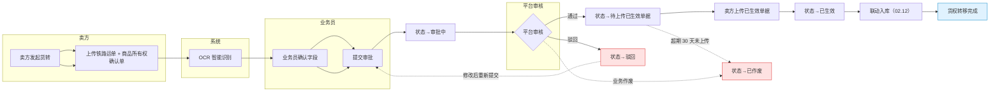
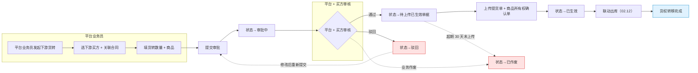
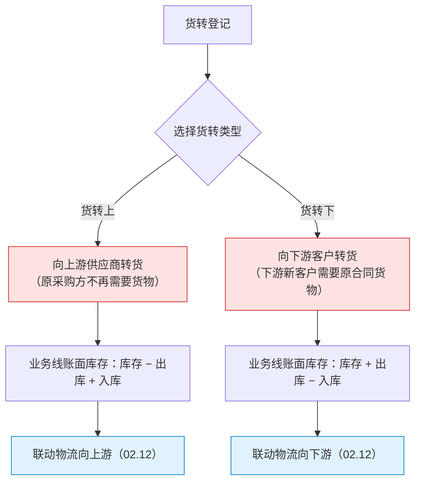
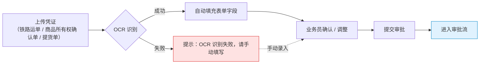
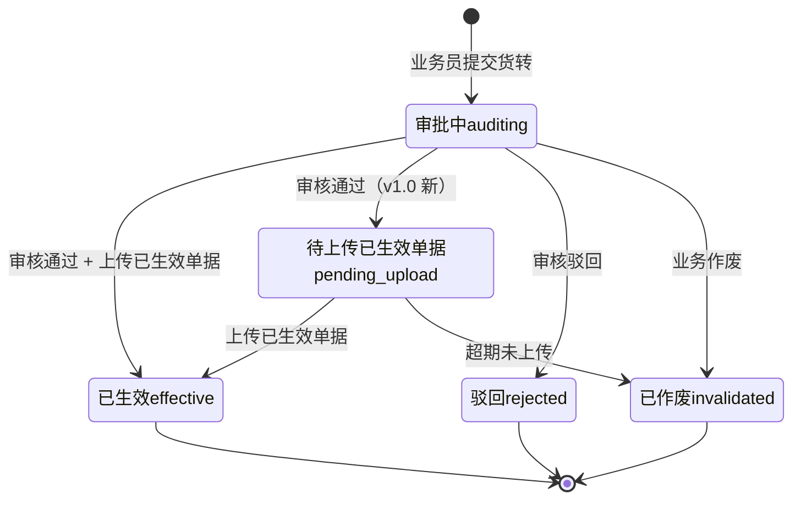
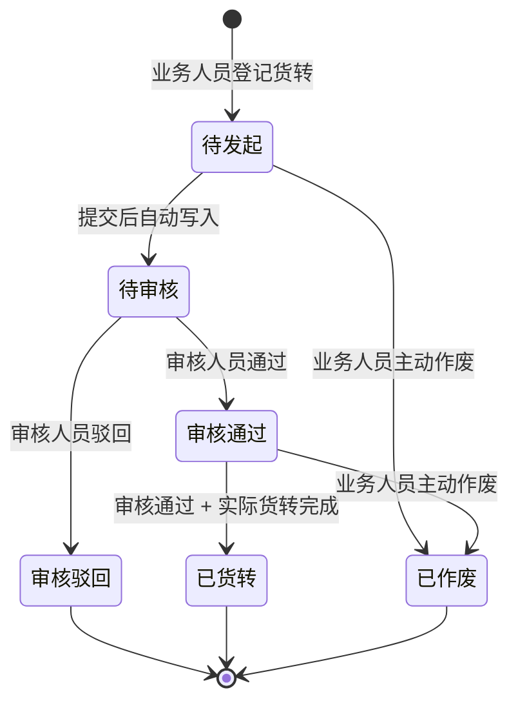

# 02.07 货转管理 · 需求规格说明

> **文档类型**：PRD Writer 范式 · 落地需求文档 · 功能详细描述
> **对应总纲**：[00-产品概述与需求总纲.md](./00-产品概述与需求总纲.md)
> **通用规范**：[01-通用交互与文案规范.md](./01-通用交互与文案规范.md)
> **源文档（只读，未做任何改动）**：[02.07-货转管理.md](../docs/02.07-货转管理.md)
> **整理时间**：2026-09-30

---

## 0. 阅读说明

### 0.1 信息溯源标记

| 标记 | 含义 | 使用规则 |
|------|------|---------|
| ✅ | 源文档已明确 | 原值保留（表名 / 字段名 / 状态枚举 / 编号规则 / 提示文案），不改写口径 |
| 🔷 | 范式补全 | 源文档没写，按范式要求推导，**必须注明推导依据** |
| ⚠️ | 源文档自相矛盾 | **绝不静默选边**，如实并列，交由业务方裁决 |
| 🔷 现状核验 ✅ | 本次整理对 `pages/` 做的**只读** grep 核验（2026-09-30）| 结果为页面实现事实，**未修改任何页面文件** |
| [待补充] | 信息不足 | **严禁编造**，需业务方 / 研发回填 |

### 0.2 源文档阅读顺序

源文档 `02.07-货转管理.md`（428 行 / 17,406 字节）由**两代口径叠加**构成：**§1-§10 是 v1.0 终版口径**（2026-07-24，基于原型 32-36 截图）、**§11 是 v1.7.99.x 模块级增量节**（2026-09-24 基于飞书《豫港通用户使用手册（内部版）》第 5.4 节 + 本仓库 v1.7.99.176 改造沉淀）。两代口径在**6 状态机、页面清单、货转类型术语与业务方向、库存联动符号**上存在**已探明的 3 处硬矛盾**（见 §3.4 C1-C3）**及 2 处页面级 PRD 缺失**（见 §6、§7）。

| 源文档章节 | 内容 | 归位到本文档 |
|-----------|------|------------|
| 头部 + §0 章节导航 | 状态 / 复用度 80% / `t_warehouse_receipt_transfer` | §1.1、§5.4 |
| §1 业务定位 | 货权转移登记中心 + 港通特色（铁路运单 / 商品所有权确认单 / OCR）+ 5 条关键规则 + sitemap | §1.1、§1.2、§1.3、§6 |
| §2 业务流程全景 | 2.1 上游货转流程 / 2.2 下游货转流程 | §1.3.1、§1.3.2 |
| §3 核心实体 | 3 张表逐字段（`t_goods_transfer` / `_attach` / `_history`）| §5.1、§5.2 |
| §4 6 状态机 | 状态机图 + 6 行状态说明（含 `all` Tab）| §3.1.1、§3.2.1 |
| §5 角色操作矩阵 | 6 操作 × 6 角色 | §2.1.1 |
| §6 字段规则 | 货转编号 / 货转类型 / 货权凭证 / OCR 识别字段 | §5.2、§5.3、§5.4.2 |
| §7 按钮交互 | 列表页 6 按钮 / 列表 6 列 / 7 搜索条件（实列 5）| §2.2.1、§2.1.3 |
| §8 异常处理 | 6 条业务异常 | §4.1、§2.5 |
| §9 跨模块流转 | 上游 2 条 / 下游 4 条 | §1.4 |
| §10 复用建议 | 80% / 1 复用 + 1 复用扩展 + 2 新建 / 4 周实施 | §5.4 |
| §11 文档版本 + 修改记录 | v1.0 / v1.7.99.x 全局规范 | §7.3 |
| **§11 v1.7.99.x 增量节** | **模块业务变化 / 货转上-下类型 / 6 状态机 / 跨模块联动 / 异常 / 页面 PRD 索引 / 手册 5.4 业务规则 / 修改记录** | **§1.1.2、§1.2、§1.3.3、§1.4.2、§3.1.2、§3.2.2、§3.3、§4.1、§4.2、§4.4、§5.2、§5.4.3、§6、§7** |

> ✅ **本文档另附只读核验**：为判断「源文档口径 vs 页面实际实现」是否一致，整理时对 `pages/goods-transfer*.html` 做了**只读** grep 核验（2026-09-30），结果逐条标注为「**现状核验 ✅**」。**未修改任何页面文件、未修改 `docs/` 任何文件。**

### 0.3 与通用规范的关系

**通用表单规范（校验时机 / 返回保护 / 提交行为 / 危险操作确认 / 空状态 / 失败引导 / 通用 UI 6 态 / 通用样式 / 脱敏规范）一律以 [01-通用交互与文案规范.md](./01-通用交互与文案规范.md) 为准，本文档不重复定义，只写本模块特有的部分**：货转编号 `SKBT` 规则（且**源文档自标 [P0 待确认-字段]**）、货转类型术语与业务方向（**两代口径相反，见 C3**）、6 状态机（**两套定义，见 C1**）、**OCR 智能识别的 3 类凭证 × 识别字段清单**（港通特色）、铁路运单 + 商品所有权确认单的中欧班列凭证体系、货转生效后的**入库 / 出库 / 库存台账 / 业务线账面库存** 4 路联动。

### 0.4 飞书用户手册补充（2026-10-08）

> ✅ **补充来源**：飞书《豫港通数字供应链管理平台 — 用户使用手册（内部版）》**rev.8976** 第 **5.4 节「货转管理」**。手册是**对着线上系统写的**，为权威口径，**优先于本文档原有的信息缺口标记**。手册原文一律**照抄**（枚举名 / 字段名 / 公式 / 文案一字不改），**手册未提及的仍保留原有标记，严禁编造**。

| 手册小节 | 归位到本文档 | 补充 / 消解了哪些内容 |
|---------|------------|----------------|
| **5.4 章节目标 + 内容指引** | §1.1.3、§1.4.2 | 业务前置条件（**需先针对合同登记收发货后才能发起对应货转**）✅ |
| **5.4.1 上下游货转概览** | §1.2 | 上下游货转结构（手册仅配图，无文字枚举，**不补枚举**）✅ |
| **5.4.2 上下游货转（货权从供应商转给核心企业）第一步~第三步** | §2.1.2、§5.2.2 | **合同单选** / **收货信息可多选** / 「货转开具数量（**按实际业务货转单填写即可**）」✅ |
| **5.4.2 第四步（签署状态）** | §2.1.2、§3.3.2、§5.2.5 | **签署状态枚举 = 待签署 / 双签**；**待签署 → 触发平台内部串行审批**；**双签 → 默认跳过审批直接生效** ✅ |
| **5.4.2 第五步（附件 + 确定）** | §2.1.2 | 上传货转附件 → 确定（提交货转）✅ |
| **5.4.3 货转详情（货物清单 / 价值评估）** | §5.2.6 | **详情页 4 组字段完整清单**（合同信息 15 项 / 收货信息 6 项 / 货转证明 3 项 / 附件信息）✅ |
| **5.4.3 注** | §1.4.2 | 「**已开具货转后可进行对应合同的结算登记**」✅ |
| **5.4.2 末尾（上下游货转 = 货权从供应商转给核心企业）** | §1.2、§3.4 C3 | 货权方向裁决 → **新增 C12** ✅ |

> ⚠️ **手册未给、本次未消解的原有缺口**：货转编号格式、货转类型枚举值、`transfer_type` ↔ `transfer_direction` 映射、`ocr_data` 结构、Tag 色值、`transfer_no` 并发取号、附件文件类型/大小上限、`06-修改记录.md` 缺失等——**手册完全未提及，严禁编造**。

### 0.5 手册带来的既有矛盾更新（本次新增）

| 矛盾编号 | 变化 | 说明 |
|---------|------|------|
| **C1**（6 状态机两套定义） | **追加 ✅ 手册口径** | 手册给出**签署状态只有「待签署 / 双签」2 值**，且**双签直接生效（无审批环节）**——与文档 6 状态 / 9 状态机**均不一致** |
| **C3**（货转类型业务方向两代相反） | **追加 ✅ 手册口径** | 手册明确「上下游货转（**货权从供应商转给核心企业**）」，可裁决方向 |
| **C12** | **🆕 本次新增** | 签署状态 2 值 vs 文档 6/9 状态机——手册「双签跳过审批」使「审批中 / 待签约 / 已签约」等审批态在双签路径上**不成立** |

---

## 1. 功能描述与触发条件

### 1.1 功能描述

✅ **货转管理是港通供应链的货权转移登记中心**（源文档 §1 原文，**v1.0 新顶级模块**）——货权在不同主体间的转移登记。

✅ **港通特色模块**——对接**铁路运单 + 商品所有权确认单**（中欧班列运输场景）。

#### 1.1.1 v1.0 口径（§1 + §1.1，2026-07-24，原值保留）

| # | 关键规则 | 原文口径 | 本文档归位 |
|---|---------|---------|-----------|
| 1 | **2 个 Tab** | **上游货转** / **下游货转**（同一个顶级模块下的 2 个子页）| §1.1.2、§6 |
| 2 | **货转编号格式** | `SKBT{YYYYMMDD}{6位}-{YYYYMMDD}{4位}`，例 `SKBT202507240002-20260109004` | §5.3 ⚠️ 源文档标 **[P0 待确认-字段]** |
| 3 | **6 状态** | 全部 / 审批中 / 待上传已生效单据 / 已生效 / 驳回 / 已作废 | §3.2.1 ⚠️ 与 §11.3 冲突（C1）|
| 4 | **货权凭证** | 上游货转 = 铁路运单 + 商品所有权确认单；下游货转 = 提货单 + 商品所有权确认单 | §5.4.2 |
| 5 | **OCR 智能识别**（**港通特色**）| 扫描凭证后自动识别关键字段 | §5.4.3 |

✅ **复用度：🟢 80%（大幅复用）**（源文档头部 + §10.1）——主产品 `t_warehouse_receipt_transfer`（仓单转移）+ `t_shipment_particulars` 字段扩展。

#### 1.1.2 v1.7.99.176 口径（§11.1-11.2，2026-08-12，原值保留）

⚠️ **本节术语与业务方向与 v1.0 完全相反**，详见 §3.4 C3。

| 类型 | 含义 | 触发场景（§11.2 原文）|
|------|------|---------------------|
| **货转上** | 向上游供应商转货 | 原采购方不再需要货物，转给上游 |
| **货转下** | 向下游客户转货 | 下游新客户需要原合同货物 |

✅ **v1.7.99.176 关键决策**：货转分上下两类，对应业务线台账的「账面库存」计算：
- **货转上**：库存 − 出库 + 入库（向上游）
- **货转下**：库存 + 出库 − 入库（向下游）

> ⚠️ **注意**：该「账面库存」加减法与 02.06 业务线文档 §3.4 C7 记录的「账面库存 = 已收货转总数 − 已开货转总数（收货转 +X / 开货转 −X）」**方向相反**。两文档口径需一并裁决。

✅ **v1.0 sitemap（§1.2，5 行，标题写「5 个页面（sitemap）」）**：

| # | 页面 | 说明 |
|---|------|------|
| 1 | **货转管理**（列表，含 2 Tab：上游/下游）| 6 状态 Tab + 搜索筛选 |
| 2 | **上传上游货转** | 上游货转新建（卖方→平台）|
| 3 | **已上传上游货转详情** | 上游货转详情 |
| 4 | **新增下游货转** | 下游货转新建（平台→买方）|
| 5 | **下游货转详情** | 下游货转详情 |

⚠️ **v1.0 自身即不自洽**：§1.2 sitemap 记 **5 页**，但 §11.1 回溯 v1.0 时记「3 页（货转管理 + 详情 + 新增）」——见 §3.4 C2。

### 1.2 触发条件

| 场景 | 触发条件 | 结果 | 来源 |
|------|---------|------|------|
| 上游货转发起（v1.0）| 卖方发起货转 | 进入「上传铁路运单 + 商品所有权确认单」 | §2.1 ✅ |
| 下游货转发起（v1.0）| 平台业务员发起 | 选下游买方 + 关联合同 | §2.2 ✅ |
| **开具货转入口（v1.0）** | 业务员点击右上「**+ 开具货转**」 | 弹货转类型选择（上游/下游）| §7.1 ✅ |
| OCR 触发 | 上传铁路运单 / 商品所有权确认单 / 提货单时 | 自动填充表单字段，业务员确认/调整 | §6.4 ✅ |
| 状态 → 审批中 | 业务员提交 | `auditing` | §4.1 ✅ |
| 状态 → 待上传已生效单据 | 平台审核通过 | `pending_upload` | §4.1 ✅ |
| 状态 → 驳回 | 平台审核驳回 | `rejected` | §4.1 ✅ |
| 状态 → 已作废 | 业务作废 / **超期未上传已生效单据（30 天）** | `invalidated` | §4.1 / §8 ✅ |
| 状态 → 已生效 | 上传已生效单据（`signed_doc`）| `effective` | §4.1 / §6.3 ✅ |
| **货转登记（v1.7.99.176）** | 业务人员登记货转 | → **待发起** | §11.3 ✅ |

✅ **手册 rev.8976 · 5.4 章节目标确认的前置条件**（原文照抄）：

| 项 | 手册口径 | 说明 |
|---|---------|------|
| **章节目标** | 「**货物物权转移**（**需先针对合同登记收发货后发起对应货转**）」 | ✅ 货转管理 = 货物物权转移登记 |
| **业务前置（硬前置）** | **需先针对合同登记收发货**，才能发起对应货转 | ✅ 即**货转不可脱离收发货独立发起**——对应本模块上游依赖 02.05 收发货管理 |
| **货权方向** | 「上下游货转（**货权从供应商转给核心企业**）」 | ✅ 上游 = 供应商 → 核心企业；见 §3.4 C3 裁决倾向 |
| 🔴 手册未给 | **手册未给**「已登记收发货」的判定口径（是必须全部收完？还是部分即可？）**也未给未登记时的拦截文案** | 需业务方补充 |
| **提交货转（v1.7.99.176）** | 提交后**自动写入** | → **待审核** | §11.3 ✅ |
| **审核通过（v1.7.99.176）** | 审核人员通过 | → **已货转** / **已作废** | §11.3 ✅ |
| **审核驳回（v1.7.99.176）** | 审核人员驳回 | → **审核驳回**（终态，**可修改重提**）| §11.3 / §11.5 ✅ |
| **主动作废（v1.7.99.176）** | 业务人员主动作废 | → **已作废**（终态）| §11.3 ✅ |
| 上游触发 · 合同管理（02.03）| 合同 `executing` | 允许货转关联 | §9.1 ✅ |
| 上游触发 · 收发货（02.05）| 收/发货完成 | 货转关联 | §9.1 ✅ |
| 下游触发 · 仓储-入库（02.12）| 上游货转生效 | 联动入库登记 | §9.2 ✅ |
| 下游触发 · 仓储-出库（02.12）| 下游货转生效 | 联动出库登记 | §9.2 ✅ |
| 下游触发 · 库存台账（02.12）| 货转生效 | 更新库存数量 | §9.2 ✅ |
| 下游触发 · 业务线（02.06）| 货转生效 | 更新业务线货物进度 | §9.2 ✅ |
| 下游触发 · 结算单（02.13，v1.7.99.x）| 货转完成 | 后续可发起结算 | §11.4 ✅ |
| 下游触发 · 发票（02.15，v1.7.99.x）| 货转完成 | 发票的合同关联重新绑定 | §11.4 ✅ |

### 1.3 业务流程（Mermaid）

#### 1.3.1 上游货转流程（v1.0 口径，源文档 §2.1 原图照抄 + 泳道化）

✅ 源文档原图为 `flowchart TB` 单链路；🔷 依范式要求改写为**多角色泳道 `flowchart LR`**（卖方 / 平台 / 系统），节点文字与流转关系**原值保留**。

> 🔷 虚线回退（`-.->`）为范式补全，依据：源文档 §4.1「`rejected` 驳回 = 终态」与 §11.5「审核驳回 = 终态，**可修改重提**」两处口径不一致（v1.0 说终态、v1.7.99.176 说可重提），本图**同时保留**「终态标记」与「可重提回退」两种可能路径，**不选边**（见 C4）。
> ✅ 「超期 30 天未上传 → 已作废」文案与天数来自源文档 §8 原文。

#### 1.3.2 下游货转流程（v1.0 口径，源文档 §2.2 原图照抄 + 泳道化）

#### 1.3.3 货转类型与账面库存计算（v1.7.99.176 关键决策，§11.2）

> ⚠️ **本图是 v1.7.99.176 单方口径**，与 v1.0 的「上游=卖方→平台 / 下游=平台→买方」**业务方向相反**（见 C3）。**本图不选边**，两种口径的正负号并列呈现。

> 🔷 `class C,D danger` 用于标注**业务方向存疑**（C3）而非错误——**不改变源文档原值**。

#### 1.3.4 OCR 智能识别流程（港通特色，§6.4 原文流程补全）

🔷 依据：源文档 §6.4「触发 / 识别字段 / 结果」三段文字 + §8「OCR 识别失败 → 允许手动」推导。

### 1.4 模块依赖（跨模块流转）

#### 1.4.1 v1.0 口径（§9）

| 方向 | 触发模块 | 触发条件 | 触发动作 |
|------|---------|---------|---------|
| **上游** | 合同管理（02.03）| 合同 `executing` | 允许货转关联 |
| **上游** | 收发货（02.05）| 收/发货完成 | 货转关联 |
| **下游** | 仓储-入库（02.12）| 上游货转生效 | 联动入库登记 |
| **下游** | 仓储-出库（02.12）| 下游货转生效 | 联动出库登记 |
| **下游** | 库存台账（02.12）| 货转生效 | 更新库存数量 |
| **下游** | 业务线（02.06）| 货转生效 | 更新业务线货物进度 |

#### 1.4.2 v1.7.99.x 增强（§11.4）

| 联动系统 | v1.0 描述 | v1.7.99.176 增强 |
|----------|-----------|------------------|
| **业务线（02.06）** | 已记录 | 货转完成 → 业务线「**账面库存**」重算（关键决策：货转上 −X / 货转下 +X）⚠️ 与 v1.0 方向相反，见 C3 |
| **合同（02.03）** | 已记录 | 货转完成 → 原合同的货权转移 → **关联的合同状态同步** |
| **结算单（02.13）** | 未单独提及 | 货转完成 → 后续可发起结算 |
| **发票（02.15）** | 未单独提及 | 货转完成 → **发票的合同关联重新绑定** |

✅ **手册 rev.8976 · 5.4.3 注确认的结算前置**（原文照抄）：「**已开具货转后可进行对应合同的结算登记**」——即**结算单（02.13）的上游前置 = 已开具货转**，✅ 手册口径与上表「货转完成 → 后续可发起结算」一致。🔴 **手册未给**「已开具」对应的具体状态名（是「已生效」还是「已货转」，见 C1 / C12）——需业务方补充。

#### 1.4.3 依赖字段与回写

| 依赖方向 | 依赖对象 | 字段 / 机制 | 依据 |
|---------|---------|------------|------|
| 上游依赖 | 合同（02.03）| `contract_id`（✓ 必填）+ `contract_no`（冗余）| ✅ §3.1 |
| 上游依赖 | 卖方企业 | `seller_company_id` / `seller_company_name`（上游货转必填）| ✅ §3.1 |
| 上游依赖 | 买方企业 | `buyer_company_id` / `buyer_company_name`（下游货转必填）| ✅ §3.1 |
| 下游回写 | 仓储入库（02.12）| 货转生效 → 联动入库登记 | ✅ §9.2 |
| 下游回写 | 仓储出库（02.12）| 下游货转生效 → 联动出库登记 | ✅ §9.2 |
| 下游回写 | 库存台账（02.12）| 货转生效 → 更新库存数量 | ✅ §9.2 |
| 下游回写 | 业务线（02.06）| 更新业务线货物进度 / **账面库存重算** | ✅ §9.2 / §11.4 |
| 下游回写 | 结算单（02.13）| 货转完成 → 可发起结算（**具体字段未定义** [待补充]）| ✅ §11.4 |
| 下游回写 | 发票（02.15）| 货转完成 → 合同关联重新绑定（**具体字段未定义** [待补充]）| ✅ §11.4 |

---

## 2. 交互细节

### 2.1 角色操作矩阵（权限可见性）

#### 2.1.1 v1.0 口径（§5，6 操作 × 6 角色，原值保留）

| 操作 / 角色 | 业务员 | 业务部 | 风控部 | 财务部 | 总经办 | 系统 |
|------------|------|------|------|------|------|------|
| 上传上游货转 | **✓** | - | - | - | - | - |
| 新增下游货转 | **✓** | 申请 | - | - | - | - |
| 审核货转 | - | **✓** | **✓** | - | - | - |
| 上传已生效单据 | **✓** | - | - | - | - | - |
| 查看/作废/下载 | ✓ | ✓ | ✓ | - | - | - |
| OCR 智能识别 | 自动 | - | - | - | - | ✓ |

#### 2.1.2 按钮级可见性（§7.1，原值保留）

| 按钮 | 位置 | 可见条件 | 点击行为 |
|------|------|---------|---------|
| **+ 开具货转**（v1.0）| 右上 | 业务员 | 弹货转类型选择（上游/下游）|
| 批量下载 | Tab 右侧 | 所有 | 批量下载货转凭证 |
| 数据导出 | Tab 右侧 | 所有 | 导出 Excel |
| **查看** | 列表行 | 所有 | 跳详情页 |
| **作废** | 列表行 | **状态≠已生效/已作废** | 弹作废确认框 |
| **下载** | 列表行 | **有附件** | 下载货转凭证 |

#### 2.1.2.1 ✅ 手册 rev.8976 · 5.4.2 开具货转 5 步流程（原文照抄）

> ✅ **手册原文照抄**（5.4.2「上下游货转（货权从供应商转给核心企业）」）。手册为**单流程叙述**，未区分「上游 / 下游」两套步骤。

| 步骤 | 手册原文 | 约束 / 口径 |
|-----|---------|-----------|
| **前置条件** | 「**需先针对合同登记收发货后发起对应货转**」（5.4 章节目标）| ✅ 货转的前置 = **已登记收发货**，否则不可发起 |
| **第一步** | 「选择需要开具货转的**合同**（**单选**）」| ✅ 合同**单选** |
| **第二步** | 「选择此合同对应**已开具的收货信息**（**可多选**）」| ✅ 收货信息**可多选**；且必须是**已开具**的 |
| **第三步** | 「填写货转开具的**日期信息** → 货转开具**数量**（**按实际业务货转单填写即可**）」| ✅ 数量口径 = 按实际业务货转单填写；🔴 与合同剩余数量 / 可用库存的**校验关系手册未给**（见 C6）|
| **第四步** | 「选择**签署状态**（待签署/双签）选择**待签署时将触发平台内部的串行审批**，选择**双签时，则默认跳过审批直接生效**」| ✅ **枚举 = 待签署 / 双签**；**审批 = 串行审批流**；详见 §5.2.5 |
| **第五步** | 「上传**货转附件** → **确定**（提交货转）」| ✅ 上传附件后确定提交 |

#### 2.1.3 搜索条件（§7.3，标题写「7 搜索条件」，实际列举 5 条）

| # | 条件 | 类型 | 页面现状核验 ✅ |
|---|------|------|--------------|
| 1 | **编号** | 订单/合同/货转编号 | ✅ `goods-transfer.html:158` 筛选项「编号」，占位符「请输入订单或合同编号」 |
| 2 | **货转编号** | 货转编号（v1.0）| ✅ 独立筛选项「货转编号」 |
| 3 | **卖方企业** | 卖方名称 | ⚠️ 源文档写「卖方企业」，现状核验 ✅ 页面为「**买方企业**」+「**卖方企业**」**两项并存**（多 1 项）|
| 4 | **货转开具日期** | 日期范围（开始时间 ~ 结束时间）| ✅ 占位符「开始时间 ~ 结束时间」 |
| 5 | **状态** | 下拉选择（6 状态之一）| ✅ 下拉含「请选择状态 / 审批中 / 待上传已生效单据 / 已生效 / 驳回 / 已作废」 |
| 6 | [待补充] | 标题声称第 6-7 条 | 🔴 源文档 §7.3 标题「7 搜索条件」但**只列举 5 条**——缺 2 条定义，见 §7.2 Q4 |

#### 2.1.4 列表字段（§7.2，6 列，原值保留）

| 列 | 说明 | 页面现状核验 ✅ |
|---|------|--------------|
| 合同编号 | `QY-LG-20250317-063` / `NMGZHCG202505015001` / `燃料公司-2025-燃煤-0162` | ✅ `goods-transfer.html:225` 合同编号 |
| 货转编号 | `SKBT{YYYYMMDD}{6位}-{YYYYMMDD}{4位}` | ✅ `:226` 货转编号 |
| 卖方企业 | 卖方名称 | ✅ 上游表 7 列：合同编号 / 货转编号 / **买方企业** / **卖方企业** / 收货人 / 货转开具日 / 操作（**多 1 列买方企业**）|
| 收货人 | 收货人姓名 | ✅ `:229` 收货人 |
| 货转开具日 | 货转日期 | ✅ `:230` 货转开具日 |
| 操作 | 查看 / 作废 / 下载 | ✅ `:231` `.col-action` |

> 🔷 现状核验 ✅ **上下游表列数不同**：上游 **7 列**（v1.7.99.57 按图 1），下游 **10 列**（v1.7.99.57 按图 2），`min-width` 分别为 1300px / 1500px。源文档 §7.2 **只给了 1 套 6 列**，未区分上下游。

### 2.2 按钮交互（操作反馈）

#### 2.2.1 列表页按钮（§7.1 + 页面现状核验 ✅）

| 按钮 | 点击反馈 | 来源 / 核验 |
|------|---------|-----------|
| **+ 开具货转** | 弹下拉选择货转类型（上游/下游），非弹窗 | ✅ §7.1 + 🔷 现状核验 ✅ `goods-transfer.html:128/137`「v1.7.99.61 开具货转下拉」，选项「↑ 上传上游货转 / ↓ 新增下游货转」 |
| **批量下载** | 批量下载货转凭证 | ✅ §7.1 + 现状核验 ✅ `goods-transfer.html:216` 位于 `cp-tab-bar-actions` |
| **数据导出** | 导出 Excel | ✅ §7.1；🔷 现状核验 ✅ 主列表页**未见该按钮**（仅批量下载）——见 §7.2 Q5 |
| **查看** | 跳详情页 | ✅ §7.1 |
| **作废** | **弹作废确认框** | ✅ §7.1 + 🔷 依 01 文档 §2.10 危险操作确认规范 |
| **下载** | 下载货转凭证（有附件才显示）| ✅ §7.1 |
| **上传已生效单据** | 居中弹窗 | 🔷 现状核验 ✅ `goods-transfer.html:44/528/570`「v1.7.99.219 上传已生效单据 - 居中弹窗（v1.7.99.218 drawer 改 modal + **删单据类型字段**）」——⚠️ 源文档 §6.3 列 `signed_doc`（已生效单据）为附件类型，页面已删该下拉字段 |
| 状态 Tab 切换 | 切换方向时**重置 tab key = all** | 🔷 现状核验 ✅ `goods-transfer.html:300/315/321`「v1.7.99.187 联动：方向切换 → 重新渲染 + 更新 tab count + 更新分页 hint」+「v1.7.99.187b 切方向 → 重置 tab key=all」|

#### 2.2.2 成功反馈

🔷 **成功文案源文档全部未给** [待补充]；依 01 文档 §3.2 统一采用 Toast 绿色 `#10B981`，3s 自动消失。🔷 现状核验 ✅ 页面已有 Toast 机制：`goods-transfer.html:629` `window.Utils.toast('已提交上传，' + uploadedFiles.length + ' 个文件待审核', 'success')`。

### 2.3 危险操作确认

| 操作 | 确认方式 | 提示文案 | 来源 |
|------|---------|---------|------|
| **作废货转** | 弹作废确认框 | 源文档**未给作废确认文案** [待补充] | §7.1 ✅（行为）/ 🔴 文案缺失 |
| **已生效货转作废** | **阻止** | `"已生效货转不能作废，请走解除流程"` | §8 ✅ 原文照抄 |
| **超期自动作废** | 无人工确认（系统自动）| `"货转 X 已超 30 天未上传已生效单据，已自动作废"` | §8 ✅ 原文照抄 |
| **货转上/下类型与实际业务不符** | 顶部**红色 bar** 提示 | `"货转类型错误"` | §11.5 ✅ 原文照抄 |

> ⚠️ **口径冲突（🔴 阻塞）**：v1.0 §8 明确「**已生效货转不能作废**」，而 v1.7.99.176 §11.3 的状态机中「已货转」是**终态**（✅ 与 v1.0 一致）——**本模块无冲突**。但注意：02.09 追保函的 v1.7.99.85 明确「**已生效仍可改可废**」且 02.09 §8 无「已生效不能作废」拦截——**两模块口径不同，见 C7**。

### 2.4 空状态引导

| 场景 | 空状态表现 | 引导操作 | 依据 |
|------|----------|---------|------|
| 列表无数据 | 🔷 空状态插画 + 灰字居中，文案 `暂无数据` | 🔷 「+ 开具货转」 | 🔷 01 文档 §2.11 + ✅ §7.1（唯一新增入口）|
| 筛选无结果 | 🔷 空状态 + 文案 `请调整筛选条件` | 🔷 「清除全部」 | 🔷 01 文档 §2.11 + 🔷 现状核验 ✅ 页面已有 `clearAllFilters()` + `.clear-all-btn` |
| 详情页无附件 | 🔷 `暂无附件` | 🔷 「下载」按钮隐藏 | 🔷 01 文档 §2.11 + ✅ §7.1（有附件才显示下载）|

### 2.5 失败引导

| # | 异常场景 | 提示文案（原文照抄）| 处理动作 | 失败引导 |
|---|---------|------------------|---------|---------|
| 1 | 上游货转无铁路运单 | `"上游货转必须上传铁路运单"` | 阻止 | 🔷 定位到上传控件 + 保持弹窗打开 |
| 2 | 下游货转无提货单 | `"下游货转必须上传提货单"` | 阻止 | 🔷 同上 |
| 3 | OCR 识别失败 | `"OCR 识别失败，请手动填写"` | 允许手动 | 🔷 提供「手动填写」入口 |
| 4 | 货转数量 > 合同数量 | `"货转数量 X 超过合同剩余数量 Y"` | 阻止 | 🔷 红色字内联提示在数量字段下方 |
| 5 | 超期未上传已生效单据 | `"货转 X 已超 30 天未上传已生效单据，已自动作废"` | 自动作废 | 🔷 Toast 警告 + 列表自动刷新到「已作废」tab |
| 6 | 已生效货转作废 | `"已生效货转不能作废，请走解除流程"` | 阻止 | 🔷 隐藏「作废」按钮（见 §2.1.2 可见条件）|
| 7 | 关联合同已作废（v1.7.99.176）| 红字提示 `"该合同已作废，无法货转"` | 阻止 | 🔷 红字内联 |
| 8 | 货转数量 > 可用库存（v1.7.99.176）| 红字提示 `"货转数量不能大于可用库存"` | 阻止 | 🔷 红字内联 |
| 9 | 货转上/下类型与实际业务不符（v1.7.99.176）| 顶部红色 bar `"货转类型错误"` | 阻止 | 🔷 顶部 bar 常驻至修正 |

> ⚠️ **失败文案两代口径不一致**：v1.0 用「**合同剩余数量**」，v1.7.99.176 用「**可用库存**」——**校验对象不同**（合同维度 vs 库存维度），见 C6。

---

## 3. 状态清单

### 3.1 业务状态机

> ⚠️ **源文档存在两套完全不同的 6 状态定义**（C1）。本节**并列保留两套**，**绝不静默选边**。

#### 3.1.1 v1.0 状态机（§4 原图照抄）

> ✅ 注意：源文档 §4 状态机图中**同时存在** `审批中 → 已生效` 与 `审批中 → 待上传已生效单据 → 已生效` **两条路径**——前者为「审核通过 + 上传已生效单据」一步到位，后者为两步；§4.1 状态表则只记两步路径。**图与表口径不一致，见 C5**。

#### 3.1.2 v1.7.99.176 状态机（§11.3，据表推导）

🔷 依据：源文档 §11.3 给出「状态 / 触发 / 下一状态」6 行表，但**未给状态图**；本图为依该表推导的状态机（**状态中文名原值保留**）。

#### 3.1.3 页面现状核验 ✅ 的第三套状态集（🔷 2026-09-30 只读 grep）

🔷 **重要发现**：`pages/` 下**两个货转列表页的状态集互不相同，且都与源文档两套口径都不同**。

| 页面 | 状态集 | 数量 | 依据 |
|------|-------|------|------|
| `goods-transfer.html`（主列表）| 全部 / 审批中 / 待上传已生效单据 / 已生效 / 驳回 / 已作废 | 6 | ✅ 现状核验 `goods-transfer.html:201` 注释「v1.7.99.176：按 user 图 2 简化为 6 状态」；`:202-207` 6 个 `data-gt-status` |
| `goods-transfer-up.html`（上游子页）| 全部 / 待提交 / 审批中 / 待签约 / 已签约 / 退回 / 已作废 / 待确认 / 已驳回 | 9 | ✅ 现状核验 `goods-transfer-up.html:177` 注释「v1.7.99.125：与「状态」筛选项同步——9 状态」；`:180-188` 9 个 `data-gt-status` |
| `goods-transfer-down.html`（下游子页）| 全部 / 待提交 / 审批中 / 待签约 / 已签约 / 退回 / 已作废 / 待确认 / 已驳回 | 9 | ✅ 现状核验 `goods-transfer-down.html:161/165-173` 同上 9 状态 |

⚠️ **枚举值第三套**：主列表页 `data-gt-status` 枚举为 `all` / `approving` / `awaiting-effect-voucher` / `effective` / `rejected` / `voided`，**与 v1.0 源文档的 `auditing` / `pending_upload` / `effective` / `rejected` / `invalidated` / `all` 不一致**（`approving` ≠ `auditing`、`awaiting-effect-voucher` ≠ `pending_upload`、`voided` ≠ `invalidated`）。子页枚举为 `pending` / `approving` / `awaiting-sign` / `signed` / `returned` / `up-voided`（上游）/ `down-voided`（下游）/ `awaiting-confirm` / `rejected`。见 C1 与 C8。

### 3.2 状态值与展示

#### 3.2.1 v1.0 口径（§4.1，6 行，原值保留）

| # | 状态枚举 | 中文 | 触发条件 | 下一状态 | Tag 色 |
|---|---------|------|---------|---------|--------|
| 1 | `auditing` | 审批中 | 业务员提交 | 审核通过 / 驳回 / 作废 | 🔷 蓝（审核中）|
| 2 | `pending_upload` | 待上传已生效单据 | 审核通过 | 上传已生效单据 / 超期作废 | 🔷 黄（待办）|
| 3 | `effective` | 已生效 | 上传已生效单据 | 终态 | 🔷 绿（完成）|
| 4 | `rejected` | 驳回 | 审核驳回 | 终态 | 🔷 红（异常）|
| 5 | `invalidated` | 已作废 | 业务作废 / 超期未上传 | 终态 | 🔷 灰（终态）|
| 6 | `all` | 全部 | 列表 Tab | - | 🔷 灰（Tab 占位）|

> 🔷 **Tag 色依据**：🔷 01 文档 §3.3 视觉状态 + 02.09 追保函 v1.7.99.85 §12.2 已锁定的**同族 5 状态色卡**（审批中 `#FEF3C7`/`#A16207`、待上传已生效单据 `#DBEAFE`/`#1E40AF`、已生效 `#D1FAE5`/`#047857`、驳回 `#FEE2E2`/`#DC2626`、已作废 `#F3F4F6`/`#6B7280`）——**02.07 源文档自身未给色值** [待补充]，本表色值为 🔷 推导。
> ✅ 现状核验 ✅ **页面实际色值与 02.09 色卡不同**：`goods-transfer.html:202-207` 用 `#1e40af`（审批中）/ `#a16207`（待上传已生效单据）/ `#15803d`（已生效）/ `#dc2626`（驳回）/ `#6b7280`（已作废）——**同为 5 状态但审批中/待上传两色互换**，见 C9。

#### 3.2.2 v1.7.99.176 口径（§11.3，6 行，原值保留）

| # | 状态 | 触发条件 | 下一状态 |
|---|------|---------|---------|
| 1 | **待发起** | 业务人员登记货转 | 待审核 / 已作废 |
| 2 | **待审核** | 提交后自动写入 | 审核通过 / 审核驳回 |
| 3 | **审核通过** | 审核人员通过 | 已货转 / 已作废 |
| 4 | **审核驳回** | 审核人员驳回 | 终态（**可修改重提**）|
| 5 | **已货转** | 审核通过 + 实际货转完成 | 终态 |
| 6 | **已作废** | 业务人员主动作废 | 终态 |

> 🔴 **v1.7.99.176 的 6 状态源文档只给中文，未给任何枚举值** [待补充]——**`t_goods_transfer.status` 的 DDL 枚举在 v1.7.99.176 口径下无法落地**，见 C1 与 §7.2 Q1。

#### 3.2.3 货转类型枚举与状态的关系

| 货转类型枚举 | 中文 | 业务方向（v1.0）| 业务方向（v1.7.99.176）| 关联状态机 |
|------------|------|----------------|----------------------|-----------|
| `upstream` | 上游货转 / **货转上** | 卖方 → 平台 | ⚠️ **向上游供应商转**（方向相反）| 上下游**共用**同一状态机 |
| `downstream` | 下游货转 / **货转下** | 平台 → 买方 | ⚠️ **向下游客户转**（方向相反）| 上下游**共用**同一状态机 |

✅ `transfer_direction`（§3.1）：`inbound`（入库货转）/ `outbound`（出库货转）——🔴 **该字段与 `transfer_type` 的映射关系源文档从未定义**（`upstream` 对应 `inbound`？`downstream` 对应 `outbound`？），见 §7.2 Q2。

### 3.3 UI 状态清单

> 通用 6 态以 [01-通用交互与文案规范.md](./01-通用交互与文案规范.md) §3.2 为准；下表为**本模块（货转主列表 / 上游列表 / 下游列表 / 上游新建 / 下游新建 / 上转详情 / 下转详情 + OCR 上传弹窗 + 作废确认框 + 上传已生效单据弹窗）**的落地映射。**6 态齐全：默认 / 加载中 / 成功 / 失败 / 禁用 / 空状态**。

| 状态 | 触发 | 视觉 | 可交互 |
|------|------|------|-------|
| **默认** | 页面加载完成、状态非终态 | 货转主列表：标题「货转管理」+ 上游/下游切换 tap + 筛选区 + 状态 tab + 表格（上游 7 列 / 下游 10 列）+ 分页 + 「批量下载」+「开具货转」下拉；详情页：货转信息 + 凭证附件 + 操作区 | ✅ 全部按钮按 §2.1.2 矩阵显隐 |
| **加载中** | 提交中 / OCR 识别中 / 状态切换中 / 方向切换重渲染中 | 按钮 loading + 旋转图标 + 禁用 🔷；OCR 识别中在上传区显示进度 🔷 | ❌ 禁用重复提交 |
| **成功** | 提交成功 / OCR 识别成功 / 上传已生效单据成功 / 作废成功 | 顶部居中 Toast 绿色 `#10B981`，3s 自动消失；文案 🔷 `提交成功`（01 文档 §3.2）；🔷 现状核验 ✅ 已有 `已提交上传，N 个文件待审核` | — |
| **失败** | 9 类业务异常（§2.5 全部 9 条）/ OCR 识别失败 / 合同已作废 / 数量超限 / 类型错误 | Toast 红色 `#EF4444`（不自动消失）；或**红色字内联提示**（`货转数量 X 超过合同剩余数量 Y`）；或**顶部红色 bar**（`货转类型错误`）。源文档原文文案见 §2.5 | ✅ 按钮恢复可点 |
| **禁用** | 状态 = 已生效 / 已作废时的「作废」按钮（§2.1.2 可见条件）/ 无附件时的「下载」按钮 / 无权限角色的审核按钮 | 按钮灰化不可点 + Tooltip 说明原因 🔷 | ❌ |
| **空状态** | 列表无数据 / 筛选无结果 / 详情页无附件 / 下拉无合同可选 | 空状态插画 + 灰字 13px 居中（🔷 `.empty-row { padding: 40px 0; color: var(--text-tertiary); }`）；文案 `暂无数据` / `请调整筛选条件` | ✅ 引导操作（「开具货转」/「清除全部」）|

🔷 **本模块特有的 UI 状态补充**：

| 状态 | 触发 | 视觉 | 可交互 | 依据 |
|------|-----|------|-------|------|
| **OCR 识别中态** | 上传铁路运单 / 商品所有权确认单 / 提货单 | 上传区显示识别进度 + 字段区置灰 🔷 | ❌ 字段暂不可编辑 | 🔷 §6.4 推导 |
| **OCR 识别失败态** | 识别失败 | 红色提示 `OCR 识别失败，请手动填写` + 「手动填写」按钮 | ✅ 可手动录入 | ✅ §6.4 / §8 |
| **OCR 回填待确认态** | 识别成功 | 字段已自动填充 + 「识别自 OCR」标记 🔷 | ✅ 业务员可确认/调整 | ✅ §6.4「自动填充到表单字段，业务员确认/调整」|
| **上传已生效单据 · 居中弹窗态** | 状态 = 待上传已生效单据 | 居中 modal（**非 drawer**）| ✅ 上传 + 提交 | 🔷 现状核验 ✅ `goods-transfer.html:44/528/570` v1.7.99.219 |
| **「单据类型」字段已删态** | v1.7.99.219 | 上传弹窗**不再有单据类型下拉**，校验只剩「至少 1 个文件」| ✅ | 🔷 现状核验 ✅ `goods-transfer.html:625/548` + ⚠️ 与源文档 §6.3 的 `signed_doc` 附件类型定义冲突，见 C10 |
| **上游/下游方向切动态** | 切换 tap | 切换后重新渲染 + 更新 tab count + 更新分页 hint + **重置 tab key = all** | ✅ | 🔷 现状核验 ✅ `goods-transfer.html:300/315/321` v1.7.99.187 + v1.7.99.187b |
| **上下游表格切换态** | 切换方向 | 上游 `min-width: 1300px`（7 列）/ 下游 `min-width: 1500px`（10 列），同一 `<tbody>` 区切换 `display` | ✅ | 🔷 现状核验 ✅ `goods-transfer.html:222/240` |
| **状态 tab 数不一致态** | 不同列表页 | 主列表 **6 tab**；上/下游子页 **9 tab**——同一顶级模块下两套 tab | ✅ | 🔷 现状核验 ✅ 见 C1 / §3.1.3 |
| **1440px 视口列裁切态** | 部署视口 ≤ 1440px | 上游表 7 列 min-width 1300px / 下游 10 列 min-width 1500px，**右侧列被滚动隐藏**，`.cp-table-wrap { overflow-x: auto }` 横向滚动 | ✅ 横向滚动 | 🔷 02.09 v1.7.99.85 §12.6 沿用规范（v1.7.99.83/84 经验）+ 🔷 现状核验 ✅ `.cp-table-wrap` |

### 3.4 版本冲突

> ⚠️ 以下 **C1-C12** 为源文档内部交叉比对（v1.0 / v1.7.99.176 两代口径）+ `pages/` 只读核验后确认的自相矛盾，本次重组**未选边**，全部如实并列，交由业务方裁决。**其中 C1 / C2 / C3 为任务简报已探明的 3 处硬矛盾。**

**C1 — 6 状态机两套完全不同的定义（🔴 阻塞 DDL）** ← **简报已探明矛盾 1**

| 口径 | 状态集合 | 数量 | 是否含 `all` | 出处 / 核验 |
|------|---------|------|------------|-----------|
| **v1.0 §1.1 规则 3 / §4.1** | 全部 / **审批中** / **待上传已生效单据** / **已生效** / **驳回** / **已作废** | 6（**5 业务态 + 1 Tab**）| ✅ 含 `all` | §1.1 / §4.1 |
| **v1.0 §4 状态机图** | `auditing` / `pending_upload` / `effective` / `rejected` / `invalidated` | **5 节点**（**图中无 `all`**）| ❌ | §4 |
| **v1.7.99.176 §11.3** | **待发起** / **待审核** / **审核通过** / **审核驳回** / **已货转** / **已作废** | 6（**无 Tab 占位**）| ❌ **不含「全部」** | §11.3 |
| 🔷 现状核验 ✅ `goods-transfer.html` | 全部 / 审批中 / 待上传已生效单据 / 已生效 / 驳回 / 已作废；枚举 `all`/`approving`/`awaiting-effect-voucher`/`effective`/`rejected`/`voided` | 6 | ✅ 含 | `:201-207` |
| 🔷 现状核验 ✅ `goods-transfer-up/down.html` | 全部 / 待提交 / 审批中 / 待签约 / 已签约 / 退回 / 已作废 / 待确认 / 已驳回 | **9** | ✅ 含 | `:180-188` / `:165-173` |

⚠️ **三处冲突**：
1. **两套状态集 5 个状态中 4 个不同名**：仅「已作废」重名；v1.0 的「审批中 / 待上传已生效单据 / 已生效 / 驳回」vs v1.7.99.176 的「待审核 / 审核通过 / 已货转 / 审核驳回」——**语义近似但命名与切分点全不同**（v1.0 在审核通过后插入「待上传已生效单据」，v1.7.99.176 改为「审核通过 → 已货转」两步，**没有「待上传」环节**）。
2. **「待发起」在 v1.0 完全不存在**——v1.0 的入口是「业务员提交 → 审批中」，**无「登记后未提交」态**；v1.7.99.176 明确「待发起 = 业务人员登记货转」。**草稿态是否必须存在，两代从未对齐**。
3. **v1.7.99.176 状态集不含「全部」Tab**，而两套页面实现都含「全部」Tab——**Tab 占位是否计入 6 状态，两代定义方式不同**（v1.0 把 `all` 算作第 6 个状态，v1.7.99.176 的 6 个全是业务态）。

⚠️ **另有 🔷 现状核验 ✅ 发现的第 3、4 套状态集**：`goods-transfer-up.html` / `goods-transfer-down.html`（v1.7.99.125）用**完全不同的 9 状态**（待提交 / 审批中 / 待签约 / 已签约 / 退回 / 已作废 / 待确认 / 已驳回），**该状态集在源文档 v1.0 与 v1.7.99.176 中均无对应**——其中「待签约 / 已签约 / 退回 / 待确认」4 态**是源文档从未提及的新状态**，且**子页枚举 `up-voided` / `down-voided` 上下游不共用同一个 `voided`**。

⚠️ **另有枚举值第 3 套**：页面 `data-gt-status` 枚举（`approving` / `awaiting-effect-voucher` / `voided`）与 v1.0 源文档枚举（`auditing` / `pending_upload` / `invalidated`）**逐一不同**。

**影响：`t_goods_transfer.status` DDL 枚举、接口传参、列表 Tab 数量与命名、状态 Tag 色卡、审批流切分点、「待上传已生效单据」环节在 v1.7.99.176 下的存废、6→9 状态迁移方案。**

✅ **手册口径（rev.8976 · 5.4.2，2026-10-08 补入）**：手册只给**「签署状态」两个枚举值 = 待签署 / 双签**，**未给任何审批环节的状态枚举**；且明确「**选择双签时，则默认跳过审批直接生效**」。详见 §5.2.5 与新增 C12。

**C2 — 页面数量三套口径（🔴 阻塞页面范围）** ← **简报已探明矛盾 2**

| 口径 | 页面清单 | 数量 | 出处 |
|------|---------|------|------|
| **v1.0 §1.2 sitemap** | 货转管理 / 上传上游货转 / 已上传上游货转详情 / 新增下游货转 / 下游货转详情 | **5** | §1.2 |
| **§11.1 回溯 v1.0** | 货转管理 + 详情 + 新增 | **3** | §11.1 |
| **v1.7.99.176 §11.1 / §11.6** | 货转管理 + 上转详情 + 下转详情 + 上转新建 + 下转新建 + 货转主页面 | **6** | §11.1 / §11.6 |
| 🔷 现状核验 ✅ `pages/` | `goods-transfer.html` / `goods-transfer-up.html` / `goods-transfer-up-new.html` / `goods-transfer-up-detail.html` / `goods-transfer-down.html` / `goods-transfer-down-new.html` / `goods-transfer-down-detail.html` | **7** | `ls` 核验 |

⚠️ **三处冲突**：
1. **v1.0 自身不自洽**——§1.2 sitemap 明确列 **5 行**，而 §11.1 回溯 v1.0 时写「**3 页**（货转管理 + 详情 + 新增）」。**5 页 vs 3 页，差 2 页**（漏掉「上转详情」与「下转详情」两个独立详情页）。
2. **v1.7.99.176 的 6 页含「货转主页面」**——而 v1.0 的「货转管理（列表）」已是主页面，**「货转主页面」是新增的第 6 页还是对「货转管理」的改名，源文档未定义**。
3. 🔷 现状核验 ✅ **实际 7 个 HTML 文件**，比 v1.7.99.176 的 6 页**多出 `goods-transfer-up.html`（上游列表子页）**——该页在源文档三套页面清单中**均无对应**，且它承载了源文档从未定义的 **9 状态集**（C1）。

**影响：sitemap、页面范围界定、页面级 PRD 索引、路由设计、6→7 页的补录。**

**C3 — 货转类型术语与业务方向两代相反（🔴 阻塞业务定义）** ← **简报已探明矛盾 3**

| 口径 | 类型名 | 业务方向原文 | 账面库存计算 |
|------|-------|------------|------------|
| **v1.0 §1.1 / §3.1 / §6.2** | **上游货转**（`upstream`）| **卖方 → 平台** | 联动**入库**（§9.2）|
| | **下游货转**（`downstream`）| **平台 → 买方** | 联动**出库**（§9.2）|
| **v1.7.99.176 §11.1-11.2** | **货转上** | **向上游供应商转货**（原采购方不再需要货物，转给上游）| 库存 **− 出库 + 入库** |
| | **货转下** | **向下游客户转货**（下游新客户需要原合同货物）| 库存 **+ 出库 − 入库** |

⚠️ **两处冲突**：
1. **业务方向完全相反**：v1.0「上游货转」= 货**从卖方进**平台（入库）；v1.7.99.176「货转上」= 货**从平台退给**上游供应商（出库）。**同指「向上游」，一个收一个付，方向 180° 相反**。
2. **库存正负号相反**：v1.0 上游=入库（库存 +X）、下游=出库（库存 −X）；v1.7.99.176 货转上=−出库+入库（即**净减**）、货转下=+出库−入库（即**净增**）。**两套算法的库存净变化符号完全相反**。

⚠️ **外溢冲突**：v1.7.99.176 的加减法与 02.06 业务线文档 §3.4 C7 记录的「账面库存 = 已收货转总数 − 已开货转总数（收货转 **+X** / 开货转 **−X**）」**方向相反**——**02.06 与 02.07 两文档的账面库存口径需一并裁决**。

⚠️ **另有术语断层**：v1.7.99.176 的「货转上 / 货转下」**是否即 v1.0 的 `upstream` / `downstream` 枚举值**，源文档从未说明；§11.7 手册 5.4 的关键字段只写「货转类型（货转上 / 货转下）」，**未给枚举值** [待补充]。

**影响：货转类型枚举值、业务方向定义、库存 / 入出库联动方向、合同货权转移方向、结算与发票的合同重绑定方向。**

✅ **手册口径（rev.8976 · 5.4.2，2026-10-08 补入）**：手册小节标题为「**上下游货转（货权从供应商转给核心企业）**」，章节目标为「**货物物权转移**」——即**上游 = 货权从供应商转给核心企业**，方向与 **v1.0 口径（卖方 → 平台）一致**，与 v1.7.99.176 的「货转上 = 向上游供应商转货」**相反**。✅ **裁决倾向：业务方向以 v1.0 + 手册为准（货权由供应商/卖方转向核心企业）**，但**枚举值（`upstream` / `downstream` ↔ 货转上 / 货转下）手册仍未给**，原有信息缺口标记保留。

**C4 — 「审核驳回 / 驳回」是否可重提（🟡 影响状态机出口）**

| 口径 | 表述 | 是否可重提 | 出处 |
|------|------|----------|------|
| v1.0 §4.1 状态表 | `rejected` 驳回 → 出口 = **终态** | ❌ 否 | §4.1 |
| v1.0 §4 状态机图 | `驳回rejected --> [*]` | ❌ 否 | §4 |
| v1.7.99.176 §11.3 | 审核驳回 → 终态（**可修改重提**）| ✅ 是 | §11.3 |
| v1.7.99.176 §11.5 | 货转审核驳回 → 终态，**可修改重提** | ✅ 是 | §11.5 |

⚠️ **冲突**：v1.0 判为**不可逆终态**，v1.7.99.176 判为**终态但可重提**。**「终态」与「可重提」在业务上互斥**（若可重提则「终态」不成立）。且**重提后回到哪个状态**（审批中 / 待审核）两代均未明确。

**C5 — 状态机图与状态表不一致（「审核通过 + 上传已生效单据」一步 vs 两步）（🟡）**

| 路径 | 源文档 §4 状态机图 | 源文档 §4.1 状态表 | §2.1/§2.2 流程图 |
|------|------------------|-----------------|---------------|
| 审批中 → 已生效 | ✅ **存在**：「审核通过 + 上传已生效单据」**一步到位** | ❌ 未记 | ✅ 流程图为**两步**（审批中 → 待上传已生效单据 → 已生效）|
| 审批中 → 待上传已生效单据 → 已生效 | ✅ 存在 | ✅ 存在 | ✅ 存在 |

⚠️ **冲突**：**「一步到位」路径只存在于状态机图，状态表和业务流程图都没有**。若该路径成立，则「待上传已生效单据」可被跳过；若不成立，状态机图应删除该边。**「已生效」的触发条件因此有 2 个版本**。

**C6 — 数量校验对象两代不同：合同剩余数量 vs 可用库存（🟡）**

| 口径 | 提示文案 | 校验对象 | 出处 |
|------|---------|---------|------|
| v1.0 §8 | `"货转数量 X 超过合同剩余数量 Y"` | **合同剩余数量** | §8 |
| v1.7.99.176 §11.5 | 红字提示 `"货转数量不能大于可用库存"` | **可用库存** | §11.5 |

⚠️ **冲突**：**校验基准从「合同维度」变成「库存维度」**——两者可同时存在（合同还有余量但库存已不足）也可能都不存在（库存充足但合同已用完）。**是否两级校验、二者的先后关系，源文档未定义** [待补充]。

**C7 — 「已生效」能否作废：本模块 vs 追保函模块口径不同（🟡）**

| 模块 | 口径 | 出处 |
|------|------|------|
| **02.07 货转（v1.0）** | **已生效货转不能作废** → `"已生效货转不能作废，请走解除流程"` | ✅ §8 |
| **02.07 货转（v1.7.99.176）** | 「已货转」= **终态**（✅ 与 v1.0 一致）| ✅ §11.3 |
| **02.09 追保函（v1.7.99.85）** | **已生效仍可修改 / 作废**（跟销售/采购「已生效=终态」不同）| ✅ 02.09 §12.4 |

⚠️ **提示**：02.07 与 02.09 对「已生效」的处理**刻意不同**（源文档 02.09 §12.4 明确说明这是「特殊业务」）。**本条不一定是错误**，但 02.07 §8 提到的「**解除流程**」**在源文档全文中没有任何定义**（无解除按钮、无解除状态、无解除流程图）[待补充]。

**C8 — 🔷 现状核验 ✅：子页 9 状态与「待签约 / 已签约 / 退回 / 待确认」是源文档从未定义的新状态（🔴）**

| 页面 | 状态集 | 源文档是否有定义 | 出处 / 核验 |
|------|-------|----------------|-----------|
| `goods-transfer-up.html` | 全部 / **待提交** / 审批中 / **待签约** / **已签约** / **退回** / 已作废 / **待确认** / **已驳回** | 🔴 **4 个状态（待签约 / 已签约 / 退回 / 待确认）源文档从未出现** | `:180-188` 注释「v1.7.99.125」|
| `goods-transfer-down.html` | 同上 9 状态 | 🔴 同上 | `:165-173` 注释「v1.7.99.125」|

⚠️ **冲突**：`up-voided`（上游作废）/ `down-voided`（下游作废）**上下游使用不同枚举**，而 v1.0 / v1.7.99.176 源文档都是**单一 `invalidated` / 「已作废」**。**上下游是否共用一张表的状态枚举，页面实现与源文档不一致**。

**C9 — 🟡 状态 Tag 色值：源文档未给，本模块页面与 02.09 同族色卡不同（🟢 视觉微差）**

| 状态 | 02.07 页面实际色值（🔷 现状核验）| 02.09 追保函 v1.7.99.85 锁定色值 | 是否一致 |
|------|-------------------------------|------------------------------|---------|
| 审批中 | `#1e40af`（蓝字）| `#FEF3C7`/`#A16207`（黄底棕字）| ❌ 不同 |
| 待上传已生效单据 | `#a16207`（黄字）| `#DBEAFE`/`#1E40AF`（蓝底深蓝字）| ❌ **与上一行互换** |
| 已生效 | `#15803d` | `#D1FAE5`/`#047857` | ❌ 不同 |
| 驳回 | `#dc2626` | `#FEE2E2`/`#DC2626` | 🟡 前景色同、底色不同 |
| 已作废 | `#6b7280` | `#F3F4F6`/#6B7280` | 🟡 前景色同、底色不同 |

⚠️ **02.07 源文档自身从未给出任何状态 Tag 色值** [待补充]——本表两列均为外部参照（页面实现 / 同族模块锁定值），**均非源文档原值**。

**C10 — 「已生效单据」附件类型定义与页面实现冲突（🟡）**

| 口径 | 内容 | 出处 / 核验 |
|------|------|-----------|
| v1.0 §6.3 | 货权凭证表列「已生效 → 已生效单据（`signed_doc`）」为**一种附件类型** | ✅ §6.3 + §3.2 `attach_type` 含 `signed_doc` |
| 🔷 现状核验 ✅ | v1.7.99.219 **删除了上传弹窗的「单据类型」字段**，校验只剩「至少 1 个文件」 | `goods-transfer.html:625`「v1.7.99.219 去掉"单据类型"字段，校验只剩"至少 1 个文件"」+ `:548` |

⚠️ **冲突**：`attach_type = 'signed_doc'` **在页面上已无录入入口**——该枚举值如何产生（后端默认写入？）**源文档与页面均未定义** [待补充]。

**C11 — 表数量分档自相矛盾 + `t_goods_transfer` 主表无归属（🟡）**

| 口径 | 内容 | 数量 | 出处 |
|------|------|------|------|
| §3 标题 | 「核心实体（**3 张表**）」（`t_goods_transfer` / `_attach` / `_history`）| 3 | §3 |
| §10.1 分档 | 直接复用主产品表 **1 张** + 复用主产品表（扩展少量字段）**1 张** + **港通新建表 1 张** | 3（新建 **1**）| §10.1 |
| §10.4 港通新建表 | `t_goods_transfer_attach` + `t_goods_transfer_history` | 新建 **2** | §10.4 |
| §10.2 / §10.3 复用清单 | `t_warehouse_receipt_transfer`（复用）+ `t_shipment_particulars`（复用扩展）| 2 | §10.2 / §10.3 |

⚠️ **两处冲突**：
1. **「港通新建表」§10.1 说 1 张、§10.4 列 2 张**——**分档表与明细清单自相矛盾**。
2. **`t_goods_transfer`（货转主表）在 §10 分档中完全没出现**——既不在「直接复用主产品表」（§10.2 只有 `t_warehouse_receipt_transfer`），也不在「港通新建表」（§10.4 只有 `_attach` + `_history`）。**22 字段的主表属于「复用扩展」还是「港通新建」，源文档从未归类**。§10.3 只说「`t_shipment_particulars`（发货明细）→ **改名为货转**」——**这是否就是 `t_goods_transfer` 的来源？两处是否指同一张表，源文档未说明**。

**影响：4 周实施排期（「第三周：建 6 状态机 + 上传/作废流程」落在哪张表）、「直接复用 1 张」的口径、主表的建表 vs 改造策略。**

**C12 — 签署状态仅 2 值且「双签跳过审批」，与文档 6/9 状态机的审批态不兼容（🔴 阻塞 DDL）** ← **2026-10-08 手册补充新增**

| 口径 | 签署状态取值 | 审批行为 | 出处 |
|------|------------|---------|------|
| ✅ **手册 rev.8976** | **待签署 / 双签**（**仅 2 值**）| 待签署 → **触发平台内部的串行审批**；**双签 → 默认跳过审批直接生效** | ✅ 手册 5.4.2 第四步 |
| **v1.0 §4.1** | 🔴 未设「签署状态」字段 | 6 状态含「**审批中**」「**待上传已生效单据**」 | §4.1 |
| **v1.7.99.176 §11.3** | 🔴 未设「签署状态」字段 | 6 状态含「**待审核**」「**审核通过**」「**审核驳回**」 | §11.3 |
| 🔷 现状核验 ✅ 9 状态子页 | 🔴 未设「签署状态」字段 | 含「**待签约 / 已签约 / 退回 / 待确认**」 | `goods-transfer-up/down.html` |

⚠️ **三处冲突**：
1. ✅ **手册的「签署状态」是独立于 `status` 的第 2 个维度**——文档 6/9 状态机**从未出现过该字段**，手册却把它作为开具流程的**第四步必选项**。
2. ✅ **「双签跳过审批直接生效」与文档状态机直接冲突**：6 状态的「审批中」、9 状态的「待签约 / 已签约」等**审批态在双签路径上不存在**——即**同一套状态机需同时容纳「走审批」与「跳过审批」两条路径**，而文档两套状态机**均未定义跳转分支**。
3. 🔴 **手册未给**：签署状态的存储字段名 / 枚举值 / DDL 类型，也**未说明签署状态与 `status` 是一字段还是两字段**；**审批串行的审批人层级、审批节点数亦未给**。

**影响：`sign_status`（或等价字段）DDL 枚举、状态机是否需分「审批路径 / 免审路径」两套、列表 Tab 拆分口径、签署状态在详情页与列表页的展示位（详情页叫「合同签署状态」，见 §5.2.6）。**

---

## 4. 边界条件

### 4.1 业务校验拦截

| # | 拦截规则 | 提示文案（原文照抄）| 时机 | 动作 | 来源 |
|---|---------|------------------|------|------|------|
| 1 | 上游货转必须上传铁路运单 | `"上游货转必须上传铁路运单"` | 提交时 | 阻止 | ✅ §8 |
| 2 | 下游货转必须上传提货单 | `"下游货转必须上传提货单"` | 提交时 | 阻止 | ✅ §8 |
| 3 | 货转数量 > 合同剩余数量 | `"货转数量 X 超过合同剩余数量 Y"` | 实时/失焦 | 阻止 | ✅ §8 |
| 4 | 货转数量 > 可用库存 | `"货转数量不能大于可用库存"` | 实时/失焦 | 阻止 | ✅ §11.5 |
| 5 | 关联合同已作废 | `"该合同已作废，无法货转"` | 选合同时 | 阻止 | ✅ §11.5 |
| 6 | 货转上/下类型与实际业务不符 | 顶部红 bar `"货转类型错误"` | 提交时 | 阻止 | ✅ §11.5 |
| 7 | 已生效货转作废 | `"已生效货转不能作废，请走解除流程"` | 点击作废 | 阻止 | ✅ §8 |
| 8 | 必填字段：`contract_id` / `transfer_type` / `transfer_direction` / `quantity` / `status` / `creator_id` / `create_time` / `is_deleted` | 🔷 定位到首个未填字段（01 文档 §2.1）| 提交时 | 阻止 | 🔷 依据 ✅ §3.1 必填列 |
| 9 | 上游货转 `seller_company_id` 必填 | 🔷 [待补充]（源文档仅注「上游货转必填」，**无文案**）| 提交时 | 阻止 | 🔷 依据 ✅ §3.1 |
| 10 | 下游货转 `buyer_company_id` / `receiver_name` 必填 | 🔷 [待补充]（同上）| 提交时 | 阻止 | 🔷 依据 ✅ §3.1 |
| 11 | OCR 识别失败 | `"OCR 识别失败，请手动填写"` | 识别返回时 | **允许手动**（不阻止）| ✅ §8 |
| 12 | 上传弹窗至少 1 个文件 | 🔷 现状核验已有文案 `请上传文件` | 提交上传 | 阻止 | 🔷 现状核验 ✅ `goods-transfer.html:626` |
| 13 | 超期 30 天未上传已生效单据 | `"货转 X 已超 30 天未上传已生效单据，已自动作废"` | **系统定时** | 自动作废 | ✅ §8 |

> ✅ **「30 天」超期天数原文照抄**（§8），**定时任务频率 / 判定口径源文档未定义** [待补充]。

### 4.2 内容边界（空内容/超长/格式不符）

| 字段 | 类型上限 | 边界规则 | 依据 |
|------|---------|---------|------|
| `transfer_no` | varchar(32) | ⚠️ 格式 `SKBT{YYYYMMDD}{6位}-{YYYYMMDD}{4位}` = 4+8+6+1+8+4 = **31 字符**，**与 varchar(32) 相容（余 1）** | 🔷 依据 ✅ §3.1 类型 + §5.3 格式 |
| `transfer_no` | — | 🔴 **源文档标 [P0 待确认-字段]**：「参考 32 截图的 SKBT 前缀」——**前缀 `SKBT` 本身是否已确认，源文档明确标 P0 待确认** | ✅ §5.1 / §6.1 |
| `railway_waybill_no` / `ownership_cert_no` | varchar(64) | 🔷 铁路运单号 / 确认单号格式校验 [待补充] | 🔷 依据 ✅ §3.1 类型 |
| `quantity` | decimal(20,4) | 🔷 大于 0；4 位小数 | 🔷 依据 ✅ §3.1 |
| `goods_name` / `seller_company_name` / `buyer_company_name` | varchar(128) | 🔷 超长截断提示（01 文档 §4.1）| 🔷 |
| `receiver_name` | varchar(64) | 🔷 超长提示 | 🔷 |
| `transfer_date` / `effective_date` | date | 🔷 `effective_date` 不得早于 `transfer_date` [待补充] | 🔷 |
| `file_name` / `file_url` | varchar(128) / varchar(255) | 🔷 超长截断 | 🔷 |
| `ocr_data` | longtext | 🔷 OCR JSON 结构 [待补充] | 🔷 |
| 凭证文件 | — | 🔷 文件类型 / 大小上限 [待补充]（源文档未给上传限制）| 🔷 |

### 4.3 异常与网络

| 场景 | 处理 | 文案 | 依据 |
|------|------|------|------|
| OCR 服务不可用 | 降级为手动填写 | `"OCR 识别失败，请手动填写"` | ✅ §8 |
| OCR 超时 | 🔷 同上降级 | [待补充] | 🔷 |
| 列表接口失败 | 🔷 错误态 + 重试按钮 | [待补充] | 🔷 01 文档 §4.4 |
| 提交接口失败 | 🔷 保留表单内容 + Toast 错误 | [待补充] | 🔷 01 文档 §2.3 |
| 上传凭证失败 | 🔷 保留已上传文件列表 + 重试 | [待补充] | 🔷 |
| 审核接口失败 | 🔷 状态不变 + 重试 | [待补充] | 🔷 |
| 库存联动失败 | 🔴 [待补充]——**货转生效后入库/出库/库存台账/业务线账面库存 4 路联动，任一路失败是否回滚货转状态，源文档完全未定义** | [待补充] | 🔴 |
| 合同/发票关联重绑定失败 | 🔴 [待补充]——v1.7.99.176 §11.4 的「合同状态同步」「发票合同关联重新绑定」**失败处理未定义** | [待补充] | 🔴 |

### 4.4 权限与并发

| 项 | 规则 | 依据 |
|----|------|------|
| 审核权限 | 业务部 + 风控部可审核；业务员不可审核 | ✅ §5 |
| 作废权限 | 业务员 / 业务部 / 风控部（查看/作废/下载共用一行）| ✅ §5 |
| 财务部 / 总经办 | **无任何货转权限** | 🔷 依据 ✅ §5（两列全为 `-`）|
| OCR | 系统自动，业务员「自动」列不可手动触发 | ✅ §5 |
| 重复提交 | 🔷 提交中禁用按钮（01 文档 §2.3）| 🔷 |
| `transfer_no` 并发取号 | 🔴 [待补充]——`SKBT{YYYYMMDD}{6位}` 的 6 位日内流水**并发取号唯一性策略未定义** | 🔴 |
| `is_deleted` 软删除 | ✅ 0 = 软删除；🔴 软删除后状态如何处理 [待补充] | ✅ §3.1 |
| 跨模块并发 | 🔴 [待补充]——「同一合同被多条货转并发引用」「上游货转已生效但下游货转并发发起」**源文档未定义** | 🔴 |

---

## 5. 数据规范

### 5.1 核心实体（表结构）

| # | 表名 | 中文名 | 字段数 | 主产品 / 港通 | 来源 |
|---|------|-------|-------|---------------|------|
| 1 | `t_goods_transfer` | 货转主表 | 22 | ✅ 源文档 §3.1 | ✅ |
| 2 | `t_goods_transfer_attach` | 货转附件（OCR 凭证）| 10 | ✅ 源文档 §3.2 | ✅ |
| 3 | `t_goods_transfer_history` | 货转历史 | 7 | ✅ 源文档 §3.3 | ✅ |
| — | `t_warehouse_receipt_transfer` | 仓单转移（主产品，复用 100%）| — | 🔷 复用，不属本模块新建 | ✅ §10.2 |
| — | `t_shipment_particulars` | 发货明细（主产品，复用 80%，改名为货转）| — | 🔷 复用 | ✅ §10.3 |

> ⚠️ **表数量冲突**：源文档 §3 标题写「核心实体（**3 张表**）」，但 §10.1 分档为「直接复用主产品表 **1 张** + 复用主产品表（扩展少量字段）**1 张** + 港通新建表 **1 张**」= **3 张（其中港通新建 1 张）**，而 §10.4 港通新建表列了 **2 张**（`_attach` + `_history`）。**§10.1 说新建 1 张，§10.4 说新建 2 张**；且 `t_goods_transfer` 本身在 §10 分档中**完全没出现**（既不在「直接复用」也不在「港通新建」）。见 C11。

### 5.2 字段级规范

#### 5.2.1 `t_goods_transfer` 货转主表（§3.1 逐字段照抄）

| 字段名 | 中文 | 类型 | 必填 | 默认值 | 校验规则 / 说明 |
|-------|------|------|------|-------|-------------|
| `id` | 主键 | bigint PK | - | - | - |
| `transfer_no` | **货转编号** | varchar(32) | ✓ | - | `SKBT{YYYYMMDD}{6位}-{YYYYMMDD}{4位}`，例 `SKBT202507240002-20260109004`；⚠️ **[P0 待确认-字段]** |
| `transfer_type` | 货转类型 | varchar(20) | ✓ | - | `upstream`（上游货转，卖方→平台）/ `downstream`（下游货转，平台→买方）；⚠️ 见 C3 |
| `transfer_direction` | 货转方向 | varchar(20) | ✓ | - | `inbound`（入库货转）/ `outbound`（出库货转）；🔴 与 `transfer_type` 映射未定义 |
| `contract_id` | 关联合同 | bigint | ✓ | - | 关联 02.03 合同 |
| `contract_no` | 合同号 | varchar(32) | - | - | 冗余 |
| `seller_company_id` | 卖方企业 ID | bigint | - | - | **上游货转必填** |
| `seller_company_name` | 卖方企业名称 | varchar(128) | - | - | - |
| `buyer_company_id` | 买方企业 ID | bigint | - | - | **下游货转必填** |
| `buyer_company_name` | 买方企业名称 | varchar(128) | - | - | - |
| `receiver_name` | 收货人姓名 | varchar(64) | - | - | **下游货转必填** |
| `goods_id` | 商品 ID | bigint | - | - | - |
| `goods_name` | 商品名称 | varchar(128) | - | - | - |
| `quantity` | 货转数量 | decimal(20,4) | ✓ | - | > 合同剩余数量 / > 可用库存时阻止（见 §4.1）|
| `unit` | 单位 | varchar(20) | - | - | 🔴 枚举 [待补充] |
| `transfer_date` | 货转开具日期 | date | - | - | - |
| `effective_date` | 已生效日期 | date | - | - | - |
| `railway_waybill_no` | **铁路运单号** | varchar(64) | - | - | 上游货转（**港通特色**）|
| `ownership_cert_no` | **商品所有权确认单号** | varchar(64) | - | - | 上下游均需（**港通特色**）|
| `status` | 状态 | varchar(20) | ✓ | - | ⚠️ **6 状态两套定义，见 C1** |
| `creator_id` | 创建人 | bigint | ✓ | - | - |
| `create_time` | 创建时间 | datetime | ✓ | - | - |
| `is_deleted` | 软删除 | tinyint | ✓ | **0** | 0 = 软删除 |

#### 5.2.2 `t_goods_transfer_attach` 货转附件（§3.2 逐字段照抄）

| 字段名 | 中文 | 类型 | 必填 | 默认值 | 校验规则 / 说明 |
|-------|------|------|------|-------|-------------|
| `id` | 主键 | bigint PK | - | - | - |
| `transfer_id` | 关联货转 | bigint | ✓ | - | - |
| `attach_type` | 附件类型 | varchar(20) | ✓ | - | `railway_waybill`（铁路运单）/ `ownership_cert`（商品所有权确认单）/ `pickup_order`（提货单）/ `signed_doc`（已生效单据）；⚠️ `signed_doc` 页面已删录入入口，见 C10 |
| `file_id` | 关联文件 | bigint | ✓ | - | - |
| `file_name` | 文件名 | varchar(128) | - | - | 冗余 |
| `file_url` | 文件 URL | varchar(255) | - | - | 冗余 |
| `ocr_data` | **OCR 识别结果** | longtext | - | - | JSON；🔴 结构 [待补充] |
| `ocr_recognized_at` | OCR 识别时间 | datetime | - | - | - |
| `uploader_id` | 上传人 | bigint | ✓ | - | - |
| `upload_time` | 上传时间 | datetime | ✓ | - | - |

#### 5.2.3 `t_goods_transfer_history` 货转历史（§3.3 逐字段照抄）

| 字段名 | 中文 | 类型 | 必填 | 默认值 | 校验规则 / 说明 |
|-------|------|------|------|-------|-------------|
| `id` | 主键 | bigint PK | - | - | - |
| `transfer_id` | 关联货转 | bigint | ✓ | - | - |
| `change_type` | 变更类型 | varchar(20) | ✓ | - | `submit` / `approve` / `reject` / `upload_effective` / `invalidate`（5 值）；⚠️ 与 v1.7.99.176 状态机不匹配（无「登记」「重提」类型），见 §7.2 Q3 |
| `operator_id` | 操作人 | bigint | ✓ | - | - |
| `operator_name` | 操作人姓名 | varchar(64) | - | - | 冗余 |
| `opinion` | 操作意见 | text | - | - | 🔷 驳回时必填 [待补充] |
| `create_time` | 创建时间 | datetime | ✓ | - | - |

#### 5.2.4 v1.7.99.176 补充的关键字段（§11.7 手册 5.4，**无枚举 / 无类型**）

| 字段名 | 中文 | 类型 | 必填 | 默认值 | 校验规则 |
|-------|------|------|------|-------|---------|
| 货转编号 | 货转编号 | 🔴 [待补充] | 🔴 [待补充] | 🔴 [待补充] | 🔴 手册 5.4 **未给格式**（v1.0 的 `SKBT` 规则标 P0 待确认）|
| 货转类型 | 货转类型（货转上 / 货转下）| 🔴 [待补充] | ✓ | 🔴 [待补充] | ⚠️ 枚举值 [待补充]，见 C3 |
| 原合同编号 | 原合同编号 | 🔴 [待补充] | 🔴 [待补充] | - | 🔴 与 `contract_id` 是否同一字段 [待补充] |
| 转入方合同编号 | 转入方合同编号 | 🔴 [待补充] | 🔴 [待补充] | - | 🔴 **v1.0 表结构中无对应字段**（v1.0 只有一个 `contract_id`）|
| 货转数量 | 货转数量 | 🔴 [待补充] | ✓ | - | > 可用库存时阻止 |
| 货转日期 | 货转日期 | 🔴 [待补充] | ✓ | - | - |
| 凭证附件 | 凭证附件 | 🔴 [待补充] | ✓ | - | - |

> ⚠️ **「转入方合同编号」是 v1.7.99.176 新增业务概念，但 v1.0 的 `t_goods_transfer` 表结构中没有承载该数据的字段**（`contract_id` 单值）。**是否需新增 `target_contract_id` 字段，源文档未定义** [待补充]。

#### 5.2.5 ✅ 手册 rev.8976 · 5.4.2 第四步：签署状态与审批触发

> ✅ **手册原文照抄**（5.4.2 第四步）：「选择签署状态（**待签署/双签**）选择**待签署时将触发平台内部的串行审批**，选择**双签时，则默认跳过审批直接生效**」

| 项 | 手册口径（原值）| 说明 |
|----|----------------|------|
| **字段中文名** | **签署状态** | ✅ 手册 5.4.2 第四步 |
| **枚举值（仅 2 个）** | **待签署** / **双签** | ✅ 手册 5.4.2 第四步原文照抄 |
| **待签署 → 审批** | **将触发平台内部的串行审批** | ✅ 手册原文照抄；**审批 = 串行审批流，不是 OR 会签** |
| **双签 → 审批** | **默认跳过审批直接生效** | ✅ 手册原文照抄 |

⚠️ **与本文档既有状态机的冲突（新增 C12，见 §3.4）**：

1. ✅ **手册只给「签署状态」2 值，不给审批环节的状态枚举**——文档 6 状态机的「审批中 / 待上传已生效单据 / 审核通过」与 9 状态机的「待签约 / 已签约 / 退回 / 待确认」**均非手册口径**。
2. ✅ **手册「双签 → 默认跳过审批直接生效」意味着：双签路径下不存在任何审批态**——文档中「审批中」「待签约」等**审批态在双签路径上不成立**。
3. 🔴 **手册未给**：签署状态的存储字段名 / 枚举值 / DDL 类型（如 `sign_status` / `pending` / `double`），也未说明它与 `status` 字段是**同一个字段**还是**两个独立字段**。

#### 5.2.6 ✅ 手册 rev.8976 · 5.4.3 货转详情（货物清单 / 价值评估）字段清单

> ✅ **手册原文照抄**（5.4.3），4 组字段一字不改。**手册未给这 4 组的类型 / 必填 / 枚举**，故本表只列中文名。

**① 合同信息（手册 15 项，顺序照抄）**

合同编号 / 单价 / 数量 / 总价 / 签订日期 / 合同有效期 / 合同类型 / **合同签署状态** / 回款账号 / 运输方式 / 发货地址 / 收货地址 / 收货人姓名 / 业务类型

**② 收货信息（手册 6 项，顺序照抄）**

收货编号 / **关联发货批次** / 品名 / 收货数量 / 收货日期 / 车数

**③ 货转证明（手册 3 项，顺序照抄）**

**货转开具方式** / 货转开具日期 / 货转开具数量

**④ 附件信息（手册 1 项）**

已上传的货转单据信息

✅ **由手册 5.4.3 确认的三条口径**：

| # | 口径 | 手册原文 | 状态 |
|---|------|---------|------|
| 1 | **详情页「合同签署状态」与开具时的「签署状态」是两处不同展示** | 开具时字段名 = **签署状态**（5.4.2 第四步）；详情页字段名 = **合同签署状态**（5.4.3 合同信息）——**是否同一个值、手册未说明** | 🔴 手册未给 |
| 2 | **货转开具数量口径** | 「货转开具数量（**按实际业务货转单填写即可**）」（5.4.2 第三步）——**手册未给与合同数量 / 库存的校验关系** | 🔴 手册未给（见 §2.5 第 4/8 条 C6）|
| 3 | **结算前置** | 注：「**已开具货转后可进行对应合同的结算登记**」（5.4.3 注）| ✅ 已归位 §1.4.2 |

🔴 **「货转开具方式」是手册新增字段**，✅ 手册明确它属于「货转证明」组，**但手册未给其枚举值**，本文档原有信息缺口标记保留。

### 5.3 编号规则

| 项 | 规则 | 示例 | 状态 | 来源 |
|----|------|------|------|------|
| **货转编号 `transfer_no`** | `SKBT{YYYYMMDD}{6位}-{YYYYMMDD}{4位}` | `SKBT202507240002-20260109004` | ⚠️ **源文档标 [P0 待确认-字段]**：「参考 32 截图的 SKBT 前缀」 | ✅ §1.1 / §5.1 / §6.1 |
| 组成拆解 🔷 | `SKBT`（4 位前缀，**P0 待确认**）+ `20250724`（8 位 YYYYMMDD）+ `0002`（6 位）+ `-`（分隔符）+ `20260109`（8 位）+ `004`（4 位）= 31 字符 | - | 🔷 依据 ✅ §1.1 格式串推导 | 🔷 |
| 🔴 **两段日期的含义未定义** | 第 1 段日期 = 开具日？第 2 段日期 = ？示例中第 1 段 `20250724` 早于第 2 段 `20260109004` 中的 `20260109` **约 5.5 个月**——**第 2 段日期的业务含义（生效日？审批通过日？）源文档从未说明** | - | 🔴 [待补充] | 🔴 |
| 🔴 **两段流水的独立性与并发** | 6 位 + 4 位是**同一流水拆两段**还是**两套独立流水**？**源文档未定义** | - | 🔴 [待补充] | 🔴 |
| **v1.7.99.176 编号口径** | 手册 5.4 只列「货转编号」为关键字段，**未给任何格式** | - | 🔴 [待补充] | ✅ §11.7 |

### 5.4 技术实现参考（复用建议）

#### 5.4.1 复用度与分档（§10 原值保留）

**🟢 80%（大幅复用）**

| 类别 | 数量 | 复用度 |
|------|------|--------|
| 直接复用主产品表 | 1 张 | 100% |
| 复用主产品表（扩展少量字段）| 1 张 | 80% |
| 港通新建表 | 1 张 ⚠️（§10.4 实列 2 张，见 C11）| - |

#### 5.4.2 复用清单

| 档位 | 表 | 说明 |
|------|----|------|
| 直接复用（100%）| `t_warehouse_receipt_transfer`（仓单转移）| §10.2 |
| 复用 + 扩展（80%）| `t_shipment_particulars`（发货明细）→ **改名为货转** | §10.3 |
| 港通新建 | `t_goods_transfer_attach` 货转附件（含 OCR 数据）| §10.4 |
| 港通新建 | `t_goods_transfer_history` 货转历史 | §10.4 |

#### 5.4.3 货权凭证矩阵（§6.3，**港通特色**，原值保留）

| 货转类型 | 必传凭证 | `attach_type` |
|---------|---------|---------------|
| 上游货转 | 铁路运单（railway_waybill）+ 商品所有权确认单（ownership_cert）| `railway_waybill` / `ownership_cert` |
| 下游货转 | 提货单（pickup_order）+ 商品所有权确认单（ownership_cert）| `pickup_order` / `ownership_cert` |
| 已生效 | 已生效单据（signed_doc）| `signed_doc` ⚠️ 见 C10 |

#### 5.4.4 OCR 智能识别字段清单（§6.4，**港通特色**，原值保留）

| 凭证类型 | 识别字段 |
|---------|---------|
| **铁路运单** | 运单号 / 发货人 / 收货人 / 品名 / 数量 / 发站 / 到站 / 日期（**8 项**）|
| **商品所有权确认单** | 单号 / 所有权人 / 受让人 / 品名 / 数量 / 转移日期（**6 项**）|
| **提货单** | 单号 / 提货人 / 品名 / 数量 / 提货日期（**5 项**）|

> ✅ 触发时机：上传铁路运单 / 商品所有权确认单 / 提货单时；结果：自动填充到表单字段，业务员确认/调整。

#### 5.4.5 研发实施建议（§10.5，4 周，原值保留）

| 周 | 任务 |
|----|------|
| **第一周** | 直接复用 `t_warehouse_receipt_transfer` + 改名为货转 |
| **第二周** | 建货转附件表 + OCR 接口对接 |
| **第三周** | 建 6 状态机 + 上传/作废流程 |
| **第四周** | 跨模块集成（入库/出库/库存联动）|

> ⚠️ **「建 6 状态机」的实施对象存疑**：C1 存在两套 6 状态 + 页面 9 状态，**「6 状态机」指哪一套源文档未明确**。

#### 5.4.6 🔷 现状核验 ✅ 页面实现版本线（源文档未列，供实施参考）

| 页面 | 已核验的 v1.7.99.x 版本注释 | 关键改造 |
|------|-------------------------|---------|
| `goods-transfer.html` | v1.7.99.57 / **.61** / **.176** / **.187** / **.187b** / **.218** / **.219** | 57 = 方向切换 + 7/10 列表格；61 = 开具货转下拉；176 = 状态 tab 简化为 6 状态；187 = 方向切换联动重渲染；187b = 切方向重置 tab；218 → 219 = drawer 改 modal + 删单据类型字段 |
| `goods-transfer-up.html` | **v1.7.99.125** | 9 状态 tab 与「状态」筛选项同步 |
| `goods-transfer-down.html` | **v1.7.99.125** | 9 状态 tab 与「状态」筛选项同步 |

### 5.5 隐私脱敏（🔷 01 文档 §6.1 强制）

| 字段 | 脱敏规则 | 依据 |
|------|---------|------|
| 货转编号 | **可保留真实感**（业务单据号，不属强制脱敏项）| 🔷 01 §6.1 |
| 合同编号 | **可保留真实感** | 🔷 01 §6.1 |
| 铁路运单号 / 商品所有权确认单号 | **可保留真实感**（业务单据号）| 🔷 01 §6.1 |
| 企业名（卖方 / 买方）| **可保留真实感** | 🔷 01 §6.1 |
| 收货人姓名 | **可保留真实感**（中文姓名）| 🔷 01 §6.1 |
| 数量 / 单价 / 日期 | **可保留真实感** | 🔷 01 §6.1 |
| OCR 识别结果 `ocr_data` | 🔴 [待补充]——`ocr_data` 为 longtext JSON，**可能含提货人身份证号 / 联系电话等强制脱敏字段**；源文档**未给 `ocr_data` 的字段结构**，**无法判定脱敏范围** | 🔴 01 §6.1 + 依据 ✅ §3.2 |

---

## 6. 页面级 PRD 索引

> ✅ 链接均已用 `ls` 确认存在（2026-09-30 核验）。**注意链接基准**：本文档位于 `docs-v2/`，页面级 PRD 位于 `docs/`，故相对路径为 `../docs/p-xxx.md`。

| 页面名 | 页面文件 | PRD 文档链接 | 状态 |
|-------|---------|------------|------|
| 货转管理（主列表）| `pages/goods-transfer.html` | [p-goods-transfer.md](../docs/p-goods-transfer.md) | ✅ 13.2KB PRD / 39.0KB 页面；v1.7.99.176 终版；上游/下游切换 tap + 6 状态 tab + 上游 7 列 / 下游 10 列 |
| 上游货转列表 | `pages/goods-transfer-up.html` | [p-goods-transfer-up.md](../docs/p-goods-transfer-up.md) | ✅ 10.6KB PRD / 21.7KB 页面；**v1.7.99.125：9 状态 tab**；⚠️ **该页在源文档三套页面清单中均无对应**，见 C2 |
| **上传上游货转**（新建）| `pages/goods-transfer-up-new.html` | [p-goods-transfer-up-new.md](../docs/p-goods-transfer-up-new.md) | ⚠️ 源文档 §11.6 标「待补」（缺 PRD，F 批范围）」，但 🔷 现状核验 ✅ **该 PRD 文件已存在**（6.9KB / 2026-09-28 09:06）——**源文档标注已过期**，需确认是否为对应版本 |
| **下游货转**（列表）| `pages/goods-transfer-down.html` | [p-goods-transfer-down.md](../docs/p-goods-transfer-down.md) | ⚠️ 源文档 §11.6 标「待补」（缺 PRD，F 批范围）」，但 🔷 现状核验 ✅ **该 PRD 文件已存在**（6.7KB / 2026-09-28 09:06）——**源文档标注已过期**，需确认是否为对应版本 |
| 已上传上游货转详情 | `pages/goods-transfer-up-detail.html` | [p-goods-transfer-up-detail.md](../docs/p-goods-transfer-up-detail.md) | ✅ 9.9KB PRD / 23.1KB 页面；v1.7.99.176 终版 |
| 新增下游货转（新建）| `pages/goods-transfer-down-new.html` | [p-goods-transfer-down-new.md](../docs/p-goods-transfer-down-new.md) | ✅ 10.4KB PRD / 27.8KB 页面；v1.7.99.176 终版 |
| 下游货转详情 | `pages/goods-transfer-down-detail.html` | [p-goods-transfer-down-detail.md](../docs/p-goods-transfer-down-detail.md) | ✅ 9.9KB PRD / 23.0KB 页面；v1.7.99.176 终版 |
| ~~「货转主页面」~~ | 🔴 **无独立文件** | 🔴 [待补充] | ⚠️ **v1.7.99.176 §11.1 的 6 页含「货转主页面」，但 §11.6 索引中无此项，源文档从未说明它与「货转管理」是同页还是新页**，见 C2 |

**🔴 源文档标注的 2 处「缺页面级 PRD」如实记录（任务简报要求）**：

| # | 源文档原文 | 源文档标注 | 🔷 现状核验（2026-09-30）| 结论 |
|---|-----------|-----------|----------------------|------|
| 1 | `goods-transfer-up-new.html` | **待补** — 缺 PRD（F 批范围）| ✅ `docs/p-goods-transfer-up-new.md` **存在**，6,922 字节，2026-09-28 09:06 | ⚠️ **源文档标注与仓库现状不符**：PRD 已存在但**源文档未回填**。**该 PRD 是否与 v1.7.99.176 版本对齐，源文档未说明** [待补充] |
| 2 | `goods-transfer-down.html` | **待补** — 缺 PRD（F 批范围）| ✅ `docs/p-goods-transfer-down.md` **存在**，6,731 字节，2026-09-28 09:06 | ⚠️ **同上**：PRD 已存在但源文档未回填；且该页承载 **9 状态**（C1/C8），**其 PRD 与主列表 6 状态的对应关系未定义** |

**跨模块 PRD 链接**：

| 模块 | 文档 | 联动点 |
|------|------|-------|
| 合同管理 02.03 | [02.03-合同管理.md](./02.03-合同管理.md) | 合同 `executing` → 允许货转关联（§9.1）；v1.7.99.176：货转完成 → 原合同货权转移 → **关联合同状态同步**（§11.4）|
| 收发货管理 02.05 | [02.05-收发货管理.md](./02.05-收发货管理.md) | 收/发货完成 → 货转关联（§9.1）|
| 业务线管理 02.06 | [02.06-业务线管理.md](./02.06-业务线管理.md) | 货转生效 → 更新业务线货物进度（§9.2）；v1.7.99.176 → **账面库存重算**（§11.4）；⚠️ **02.06 C7 记录的库存方向与本模块 C3 相反** |
| 仓储管理 02.12 | [02.12-仓储管理.md](../docs/02.12-仓储管理.md) | 上游货转生效 → 联动**入库**登记；下游货转生效 → 联动**出库**登记；货转生效 → 库存台账更新数量（§9.2）|
| 结算单管理 02.13 | [02.13-结算单管理.md](../docs/02.13-结算单管理.md) | 货转完成 → 后续可发起结算（§11.4）|
| 发票管理 02.15 | [02.15-发票管理.md](../docs/02.15-发票管理.md) | 货转完成 → 发票的**合同关联重新绑定**（§11.4）|
| 变更记录 | [v1.7.99-changelog.md](../docs/v1.7.99-changelog.md) | v1.7.99.x 全量变更依据（源文档 §10 末行引用）|
| 源文档（只读）| [02.07-货转管理.md](../docs/02.07-货转管理.md) | 本文档唯一源文档 |

> 🔴 **`06-修改记录.md` 不存在**：源文档 §11 记「修改记录：见 `06-修改记录.md`」——`ls` 核验 `docs/` 目录**无此文件** [待补充]。

---

## 7. 本模块待确认问题

> ⚠️ **C1-C12 为 §3.4 的 12 条源文档矛盾（其中 C1/C2/C3 为任务简报已探明的 3 处硬矛盾），必须由业务方裁决**；Q1-Q10 为信息缺口，**需补充后方可开发**。本文档**未代为任何一条给出答案**。

### 7.1 ⚠️ 源文档矛盾（阻塞开发，需优先裁决）

| # | 问题 | 冲突详情 | 影响 | 状态 |
|---|------|---------|------|------|
| **C1** | **6 状态机是两套完全不同的定义（另有第 3、4 套在页面上）** | v1.0 §4.1 = 全部/审批中/待上传已生效单据/已生效/驳回/已作废（5 业务态 + 1 Tab）；v1.7.99.176 §11.3 = 待发起/待审核/审核通过/审核驳回/已货转/已作废（6 业务态，**无 Tab、无「待上传」环节**）；🔷 现状核验 ✅ 主列表 6 tab、枚举 `approving`/`awaiting-effect-voucher`/`voided` 与 v1.0 逐一不同；🔷 现状核验 ✅ 上/下游子页 **9 状态**（待提交/审批中/待签约/已签约/退回/已作废/待确认/已驳回）**两套源文档均无定义** | 🔴 **阻塞**：`status` DDL 枚举、接口传参、列表 Tab 数与命名、Tag 色卡、审批流切分点、6→9 状态迁移方案 | 待裁决 |
| **C2** | **页面数量是 3 / 5 / 6 还是 7 页？** | v1.0 §1.2 sitemap = **5 页**；§11.1 回溯 v1.0 = **3 页**（v1.0 自身即冲突）；v1.7.99.176 §11.1/§11.6 = **6 页**（含「货转主页面」，与「货转管理」关系未定义）；🔷 现状核验 ✅ `pages/` = **7 个 HTML**（多出 `goods-transfer-up.html`） | 🔴 **阻塞**：页面范围、sitemap、路由、页面级 PRD 索引、6→7 页补录 | 待裁决 |
| **C3** | **货转类型的业务方向两代 180° 相反** | v1.0：上游货转 = **卖方→平台**（联动入库）、下游货转 = **平台→买方**（联动出库）；v1.7.99.176：货转上 = **向上游供应商转**（库存 −出库+入库 = 净减）、货转下 = **向下游客户转**（+出库−入库 = 净增）。**且 v1.7.99.176 的正负号与 02.06 C7 记录的「收货转 +X / 开货转 −X」再次相反**；「货转上/货转下」与 `upstream`/`downstream` 枚举的对应关系从未定义 | 🔴 **阻塞**：货转类型枚举值、业务方向定义、入出库联动方向、合同货权转移方向、库存对账口径、结算与发票的合同重绑定方向 | 待裁决 |
| **C4** | **「驳回 / 审核驳回」是终态还是可重提？** | v1.0 §4.1 状态表 + §4 状态机图 = **终态**（`驳回rejected --> [*]`）；v1.7.99.176 §11.3 / §11.5 = 终态**（可修改重提）**——「终态」与「可重提」业务上互斥；**重提后回到哪个状态两代均未明确** | 🔴 **阻塞**：状态机出口、驳回后的按钮可见性、history 表 `change_type` 枚举 | 待裁决 |
| **C5** | **「已生效」是一步到位还是两步？** | v1.0 §4 状态机图**同时存在**「审批中 → 已生效（审核通过 + 上传已生效单据）」**一步路径**与「审批中 → 待上传已生效单据 → 已生效」两步路径；而 §4.1 状态表与 §2.1/§2.2 流程图**只记两步** | 🟡 影响 `effective` 状态触发条件、`signed_doc` 附件是否必传、审批流实现 | 待裁决 |
| **C6** | **数量校验基准是「合同剩余数量」还是「可用库存」？** | v1.0 §8 = `"货转数量 X 超过合同剩余数量 Y"`（合同维度）；v1.7.99.176 §11.5 = `"货转数量不能大于可用库存"`（库存维度）。**是否两级校验、二者先后关系未定义** | 🟡 影响 `quantity` 校验逻辑、错误文案、库存与合同的取数 | 待裁决 |
| **C7** | **「已生效」能否作废：本模块禁止 vs 追保函模块允许** | 02.07 v1.0 §8 = **已生效货转不能作废**（v1.7.99.176「已货转」为终态，一致）；02.09 v1.7.99.85 §12.4 = **已生效仍可改可废**（明示为「特殊业务」）。**本条可能是刻意区分**，但 02.07 §8 提到的「**解除流程**」在源文档全文中**无任何定义**（无按钮、无状态、无流程图）| 🟡 影响作废按钮可见性、解除流程是否需新建 | 待确认（解除流程）|
| **C8** | **🔷 子页 9 状态 + 上下游不同枚举是源文档从未定义的新状态** | `goods-transfer-up/down.html`（v1.7.99.125）用 9 状态，其中「**待签约 / 已签约 / 退回 / 待确认**」4 态**源文档从未出现**；且作废态上下游用**不同枚举** `up-voided` / `down-voided`（源文档为单一 `invalidated`）| 🔴 **阻塞**：上下游是否共用一张表的状态枚举、DDL、9 状态业务定义 | 待裁决 |
| **C9** | **状态 Tag 色值：源文档未给，页面与 02.09 同族色卡不同** | 02.07 源文档**从未给任何 Tag 色值**；🔷 现状核验 ✅ 页面用 `#1e40af`(审批中) / `#a16207`(待上传) / `#15803d`(已生效) / `#dc2626`(驳回) / `#6b7280`(已作废)；02.09 v1.7.99.85 锁定色卡**前两位互换**且底色不同 | 🟢 视觉规范一致性 | 待统一 |
| **C10** | **`attach_type = 'signed_doc'` 的录入入口已被删除** | v1.0 §3.2 / §6.3 定义 `signed_doc`（已生效单据）为附件类型；🔷 现状核验 ✅ v1.7.99.219 **删除上传弹窗「单据类型」字段**，校验只剩「至少 1 个文件」——`signed_doc` 如何产生**未定义** | 🟡 影响附件表 `attach_type` 取值、详情页附件分类展示 | 待补充 |
| **C11** | **表数量分档自相矛盾 + `t_goods_transfer` 无归属** | §3 标题「核心实体（3 张表）」；§10.1 分档 = 复用 1 + 复用扩展 1 + **港通新建 1 张**；§10.4 港通新建表**实列 2 张**（`_attach` + `_history`）；**`t_goods_transfer` 货转主表在 §10 分档中完全没出现**（既不在「直接复用」也不在「港通新建」）| 🟡 影响 4 周实施排期、「建 6 状态机 + 上传/作废流程」落在哪张表 | 待澄清 |
| **C12** | **签署状态仅 2 值 +「双签跳过审批直接生效」与 6/9 状态机的审批态不兼容** | ✅ **手册 rev.8976 · 5.4.2 第四步**：签署状态枚举 = **待签署 / 双签**；**待签署 → 触发平台内部的串行审批**；**双签 → 默认跳过审批直接生效**。而 v1.0 §4.1 的「审批中 / 待上传已生效单据」、v1.7.99.176 §11.3 的「待审核 / 审核通过 / 审核驳回」、🔷 现状核验 ✅ 9 状态的「待签约 / 已签约 / 退回 / 待确认」**均无签署状态字段**，且**双签路径下这些审批态不成立** | 🔴 **阻塞**：`sign_status`（或等价字段）DDL 枚举、状态机是否需分「审批路径 / 免审路径」两套、列表 Tab 拆分口径、详情页「合同签署状态」与开具时「签署状态」是否同值 | 待裁决 |

### 7.2 [待补充] 信息缺口（源文档自标 + 本次重组新发现）

| # | 问题 | 出处 | 归属 |
|---|------|------|------|
| **Q1** | **v1.7.99.176 的 6 状态枚举值**：源文档只给中文「待发起 / 待审核 / 审核通过 / 审核驳回 / 已货转 / 已作废」，**未给任何枚举值**（见 C1）| 源文档 §11.3 | 业务方 + 研发 |
| **Q2** | **`transfer_type` 与 `transfer_direction` 的映射**：`upstream` 是否固定对应 `inbound`、`downstream` 是否固定对应 `outbound`，**源文档从未定义** | 源文档 §3.1 | 业务方 + 研发 |
| **Q3** | **`t_goods_transfer_history.change_type` 与 v1.7.99.176 状态机不匹配**：5 个枚举 `submit`/`approve`/`reject`/`upload_effective`/`invalidate` **无「登记（待发起）」「重提」类型**，无法覆盖 v1.7.99.176 的状态流转 | 源文档 §3.3 vs §11.3 | 业务方 + 研发 |
| **Q4** | **搜索条件缺 2 条**：§7.3 标题写「**7 搜索条件**」但**只列举 5 条** | 源文档 §7.3 | 产品 |
| **Q5** | **「数据导出」按钮在主列表页是否存在**：§7.1 列了「数据导出（Tab 右侧）」，🔷 现状核验 ✅ 主列表 `cp-tab-bar-actions` **只有「批量下载」** | 源文档 §7.1 vs 现状核验 | 产品 |
| **Q6** | **「解除流程」完全未定义**：§8 提示「已生效货转不能作废，**请走解除流程**」——但源文档**无解除按钮、无解除状态、无解除流程图、无解除表字段** | 源文档 §8 | 业务方 |
| **Q7** | **「转入方合同编号」的表字段承载**：v1.7.99.176 §11.7 关键字段含「原合同编号 / **转入方合同编号**」，但 `t_goods_transfer` 只有**单值 `contract_id`**——是否需新增字段未定义 | 源文档 §11.7 vs §3.1 | 研发 |
| **Q8** | **`ocr_data` 的 JSON 结构未定义**：longtext 存 OCR 识别结果，但**结构、字段名、失败时的写入内容均未定义**——**同时是脱敏范围判定的前提**（见 §5.5）| 源文档 §3.2 | 研发 + 业务方 |
| **Q9** | **超期作废的定时机制**：30 天天数明确（§8），但**定时任务频率、判定时点、节假日是否顺延、批量作废的并发处理均未定义** | 源文档 §8 | 研发 |
| **Q10** | **跨模块联动的失败回滚策略**：货转生效后需同步 **入库 / 出库 / 库存台账 / 业务线账面库存** 4 路（+ v1.7.99.176 的合同状态同步 / 发票合同重绑定 2 路）——**任一路失败是否回滚货转状态、重试机制、幂等键均未定义** | 源文档 §9.2 / §11.4 | 研发 |
| **Q11** | **⚠️ 两处「待补」页面 PRD 的版本对齐**：源文档 §11.6 标 `goods-transfer-up-new.html` / `goods-transfer-down.html` 缺 PRD，但 🔷 现状核验 ✅ **两个 PRD 文件已存在**（2026-09-28）——**是否已对齐 v1.7.99.176 / v1.7.99.125，源文档未回填说明** | 源文档 §11.6 vs 现状核验 | 产品 |
| **Q12** | **⚠️ `06-修改记录.md` 不存在**：源文档 §11 引用该文件，`ls` 核验 `docs/` 目录无此文件 | 源文档 §11 | 文档维护 |

### 7.3 源文档已列出的版本记录与遗留（不属矛盾，属版本追溯/排期）

| # | 版本 / 遗留 | 内容 | 出处 |
|---|------------|------|------|
| 1 | **v1.0（2026-07-24 14:55）** | 基于 32 截图 + sitemap 首次终版，作为范本用于后端开发 | §11 |
| 2 | **v1.7.99.176（2026-08-12）** | **货转上 / 货转下类型明确** + 6 状态机 + 业务线「账面库存」联动 | §11.11 |
| 3 | **2026-09-24** | 基于飞书《豫港通用户使用手册（内部版）》第 5.4 节补充模块级业务口径（即本文档归位的 §11 增量节）| §11.11 |
| 4 | **v1.7.99.x（2026-07-28）全局规范** | 列表页占位 = "全部"（全站统一）/ 列表页规范升级（v1.7.99 全局）/ 状态 tag 颜色编码（v1.7.99.14）/ 流程图统一用 Mermaid（v1.7.99.6）| 修改记录 |
| 5 | **🔷 现状核验 ✅ 页面注释新发现（源文档未列）** | `goods-transfer.html` = v1.7.99.57 / **61** / **176** / **187** / **187b** / **218** / **219**；`goods-transfer-up/down.html` = **v1.7.99.125**（9 状态）| 🔷 现状核验 ✅ |
| 6 | **⚠️ v1.0 的 sitemap 标题「5 个页面」与 §11.1 回溯「3 页」不一致** | 已归入 C2，此处仅作版本追溯提示 | §1.2 / §11.1 |
| 7 | **🔴 `06-修改记录.md`** | 源文档 §11 引用该文件——🔴 **该文件在 `docs/` 目录中不存在** [待补充]（已归入 Q12）| §11 |
