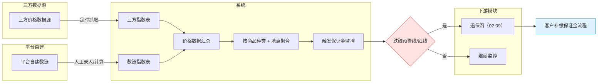
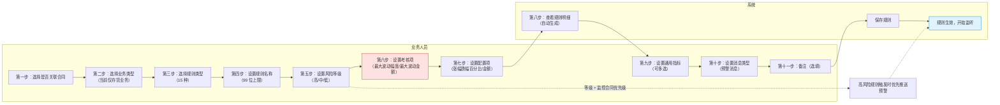
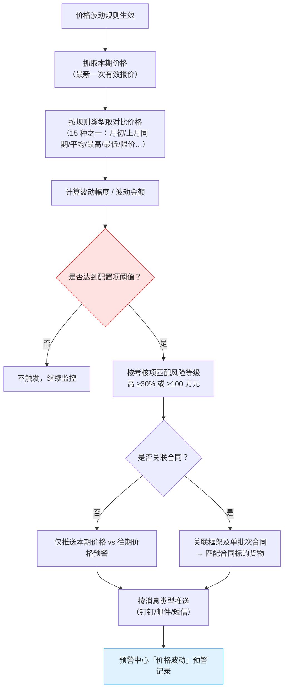
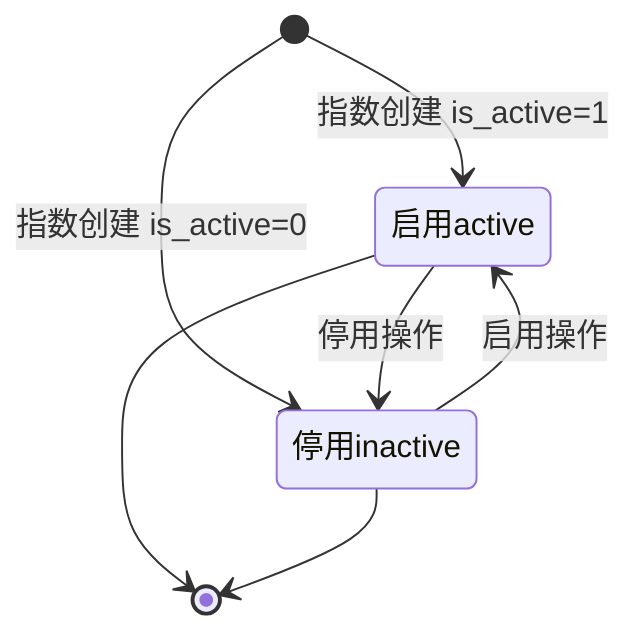
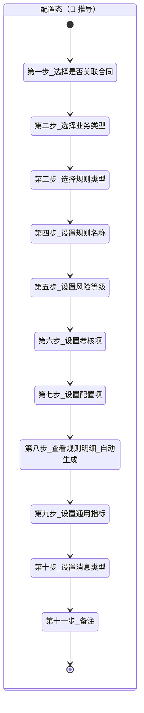
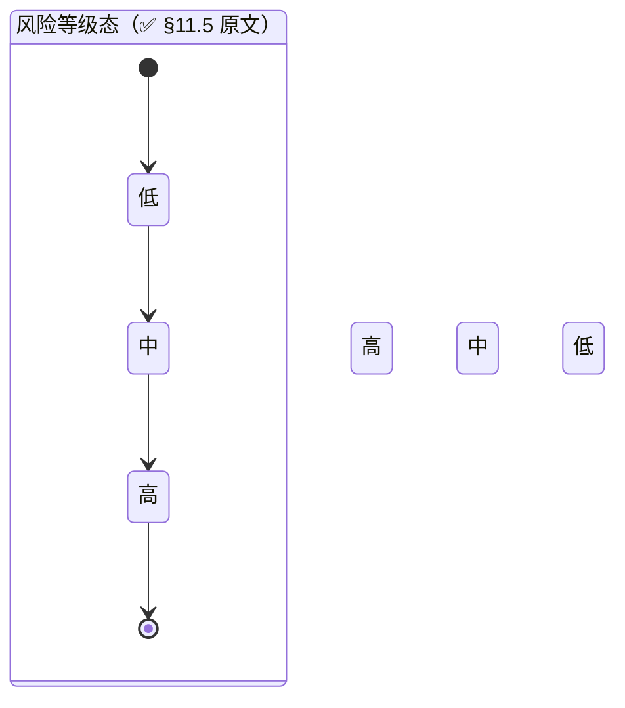

# 02.08 盯市价格管理 · 需求规格说明

> **文档类型**：PRD Writer 范式 · 落地需求文档 · 功能详细描述
> **对应总纲**：[00-产品概述与需求总纲.md](./00-产品概述与需求总纲.md)
> **通用规范**：[01-通用交互与文案规范.md](./01-通用交互与文案规范.md)
> **源文档（只读，未做任何改动）**：[02.08-盯市价格管理.md](../docs/02.08-盯市价格管理.md)
> **整理时间**：2026-09-30

---

## 0. 阅读说明

### 0.1 信息溯源标记

| 标记 | 含义 | 使用规则 |
|------|------|---------|
| ✅ | 源文档已明确 | 原值保留（表名 / 字段名 / 状态枚举 / 编号规则 / 提示文案），不改写口径 |
| 🔷 | 范式补全 | 源文档没写，按范式要求推导，**必须注明推导依据** |
| ⚠️ | 源文档自相矛盾 | **绝不静默选边**，如实并列，交由业务方裁决 |
| 🔷 现状核验 ✅ | 本次整理对 `pages/` 做的**只读** grep 核验（2026-09-30）| 结果为页面实现事实，**未修改任何页面文件** |
| [待补充] | 信息不足 | **严禁编造**，需业务方 / 研发回填 |

### 0.2 源文档阅读顺序

源文档 `02.08-盯市价格管理.md`（383 行 / 16,366 字节）由**两代口径叠加**构成：**§1-§10 是 v1.0 终版口径**（2026-07-24，基于原型 56-57 截图）、**§11 是 v1.7.99.x 模块级增量节**（2026-09-24 基于飞书《豫港通用户使用手册（内部版）》第 8.1 节「预警管理 - 价格波动-指标配置」+ 本仓库 v1.7.99.250 改造沉淀）。两代口径在**模块定位（独立模块 vs 预警中心子模块）、页面清单（2 页 vs 4 页）、状态机（无 vs 15 规则类型 + 3 风险等级）**上存在冲突（见 §3.4）。

| 源文档章节 | 内容 | 归位到本文档 |
|-----------|------|------------|
| 头部 + §0 章节导航 | 状态 / 复用度 90% / `t_market_index*` 3 张 | §1.1、§5.4 |
| §1 业务定位 | 价格监控中心 + 港通特色（三方指数 + 数链指数）+ 5 条关键规则 + sitemap | §1.1、§1.2、§6 |
| §2 业务流程全景 | 价格数据采集流程 | §1.3.1 |
| §3 核心实体 | 3 张表逐字段（`t_market_index` / `_indicator` / `_indicator_data`）| §5.1、§5.2 |
| §4 状态机 | **无业务状态机**（数据展示模块）| §3.1、§3.4 C1 |
| §5 字段规则 | 指数来源 / 商品种类 / 对应地点 / 价格变化 | §5.2.4、§3.2.3 |
| §6 按钮交互 | 列表页 8 按钮 / 看板模式 / 列表模式 / 趋势对比模式 | §2.1.2、§2.2 |
| §7 异常处理 | 4 条数据异常 | §2.5、§4.3 |
| §8 跨模块流转 | 上游 2 条 / 下游 3 条 | §1.4 |
| §9 复用建议 | 90% / 3 张全复用 / 4 周实施 | §5.4 |
| §10 文档版本 + 修改记录 | v1.0 / v1.7.99.x 全局规范 | §7.3 |
| **§11 v1.7.99.x 增量节** | **模块业务变化 / 4 业务类型 / 15 规则类型 / 11 步配置流程 / 3 风险等级 / 跨模块联动 / 异常 / 页面 PRD 索引 / 业务规则沉淀 / 修改记录** | **§1.1.2、§1.2、§1.3.2、§2.1.1、§3.1.2、§3.2.1-3.2.2、§3.3、§3.4、§4.1-4.2、§4.4、§5.2、§5.4、§6、§7** |

> ✅ **本文档另附只读核验**：为判断「源文档口径 vs 页面实际实现」是否一致，整理时对 `pages/market-price*.html` 做了**只读** grep 核验（2026-09-30），结果逐条标注为「**现状核验 ✅**」。**未修改任何页面文件、未修改 `docs/` 任何文件。**

### 0.3 与通用规范的关系

**通用表单规范（校验时机 / 返回保护 / 提交行为 / 危险操作确认 / 空状态 / 失败引导 / 通用 UI 6 态 / 通用样式 / 脱敏规范）一律以 [01-通用交互与文案规范.md](./01-通用交互与文案规范.md) 为准，本文档不重复定义，只写本模块特有的部分**：**三方指数 / 数链指数双数据源体系**、**3 商品种类 vs 6 品类（源文档自身口径冲突）**、6 对应地点、**变化值 / 变化百分比的计算公式与红涨绿跌配色**、**v1.7.99.250 的 15 种价格波动规则类型**（手册 8.1 权威口径）、**11 步配置流程**、**3 风险等级与阈值区间**、**监控合同配置独立子页**、以及本模块作为**预警中心「价格波动」类预警的数据源**这一定位。

---

## 1. 功能描述与触发条件

### 1.1 功能描述

✅ **盯市价格管理是港通供应链的价格监控中心**（源文档 §1 原文，**v1.0 新顶级模块**）——监控煤炭/木薯淀粉/糖粉等大宗商品的市场价格，**触发追保函 + 保证金预警**。

✅ **港通特色**——对接「我的钢铁网 / 煤炭网」等三方价格指数 + 平台自建**数链指数**。

> ⚠️ **模块定位在 v1.7.99.250 后发生变化**：源文档 §11.1 明确「盯市价格作为**预警中心的子模块**（02.11 预警中心 / 价格波动）」——**不再是独立顶级模块**，见 §3.4 C2。

#### 1.1.1 v1.0 口径（§1.1，5 条关键规则，原值保留）

| # | 关键规则 | 原文口径 | 备注 |
|---|---------|---------|------|
| 1 | **2 大数据源**（基于 56 截图）| **三方指数**（公开）：BSP 环渤海 / CCI 沿海动力煤 / CCI 动力煤现货 / CCI 焦炭价格 / CCI 冶金煤 / CCTD 环渤海（**6 个**） **数链指数**（平台自建）：秦皇岛煤炭网 / 中国煤炭网 / 中国煤炭市场网 / 中国电力... / 我的钢铁网 / 全国煤炭交...（**6 个，含截断**）| ⚠️ 数链指数 6 个名称中 **2 个被源文档截断**（「中国电力...」「全国煤炭交...」）[待补充] |
| 2 | **3 视图模式**（基于 56 截图）| **看板模式**（默认）/ **列表模式** / **趋势对比模式** | §2.2 |
| 3 | **3 商品种类** | 动力煤 / 炼焦煤 / 水泥煤 / 铁矿石 / 焦炭 / 兰炭（**v1.0 待确认 6 种**）| ⚠️ **标题写「3 种」实列 6 种**——源文档自身矛盾，见 C3 |
| 4 | **6 对应地点** | 全部 / 北方港 / 华东 / 华南 / 巴彦淖尔 / 其他 | §5.3 |
| 5 | **价格走势** | 每个指数卡片显示**最新价 + 日更新 + 变化值 + 趋势图** | §6.2 |

✅ **复用度：🟢 90%（几乎零改造）**（源文档头部 + §9.1）——主产品 `t_market_index` + `t_market_indicator` + `t_market_indicator_data` 高度匹配，**港通新建表 0 张**。

✅ **v1.0 sitemap（§1.2，2 页）**：

| # | 页面 | 说明 |
|---|------|------|
| 1 | **盯市价格管理**（列表 + 3 视图）| 看板/列表/趋势对比 + 6 品类 + 6 地点筛选 |
| 2 | **指标详情** | 单个指数的历史价格走势 + 详情 |

### 1.2 触发条件

| 场景 | 触发条件 | 结果 | 来源 |
|------|---------|------|------|
| **三方指数采集** | **定时抓取**三方价格 API | 写入三方指数表 | ✅ §8.1 / §2.1 |
| **数链指数采集** | **人工录入/计算** | 写入数链指数表 | ✅ §8.1 / §2.1 |
| **数据汇总** | 两源数据就绪 | 价格数据汇总 → 按**商品种类 + 地点**聚合 | ✅ §2.1 |
| **触发保证金监控** | 聚合完成 | 进入保证金监控链路 | ✅ §2.1 |
| **跌破预警线/红线** | 聚合价 ≤ `warn_line` / `red_line` | **触发追保函（02.09）** | ✅ §2.1 / §8.2 |
| 未跌破 | 聚合价 > 预警线 | 继续监控 | ✅ §2.1 |
| **下游 · 保证金管理（02.10）** | 保证金率变化 | 更新保证金监控 | ✅ §8.2 |
| **下游 · 预警中心（02.11）** | 价格波动 | **触发价格波动预警** | ✅ §8.2 |
| **规则配置第一步（v1.7.99.250）** | 业务人员新建价格波动规则 | 进入「是否关联合同」选择 | ✅ §11.4 |
| **规则落地生效** | 11 步配置完成保存 | 规则开始监听本期价格与往期价格 | ✅ §11.3 决策 |
| **规则不关联合同** | 第一步选「否」 | 规则**仅监听本期价格与往期价格**的预警信息 | ✅ §11.3 |
| **规则关联合同** | 第一步选「是」 | 需**多选**框架及单批次合同 | ✅ §11.3 |
| **规则明细生成** | 第八步 | 上方录入规则后**自动生成**，业务人员无需手动填写 | ✅ §11.4 / §11.9 |
| **高风险规则触发** | 达到「高」阈值 | **优先推送预警** | ✅ §11.5 v1.7.99.250 决策 |

### 1.3 业务流程（Mermaid）

#### 1.3.1 价格数据采集流程（v1.0 口径，源文档 §2.1 原图照抄 + 泳道化）

✅ 源文档原图为 `flowchart TB`；🔷 依范式改写为**多角色泳道 `flowchart LR`**（三方 / 平台自建 / 系统 / 下游模块），节点与关系**原值保留**。

> ✅ **G 判定节点用 `classDef danger` 标注**（跌破预警线/红线是本模块唯一的关键异常判定）；✅ `end_bond` 为终止节点。

#### 1.3.2 11 步规则配置流程（v1.7.99.250 口径，源文档 §11.4 手册 8.1 权威口径）

🔷 依据：源文档 §11.4 的 11 步文字列表 + §11.3 规则类型 + §11.5 风险等级 + §11.9 规则明细自动生成推导为**多角色泳道图**（业务人员 / 系统）。

> 🔷 `S6`（第六步设置考核项）用 `class danger` 标注——因为源文档 §11.7 明确「**考核项与配置项不一致 → 阻止**」，是本流程唯一强约束校验点。
> ✅ 虚线 `-.->` 表达 §11.5「风险等级与监控合同的优先级排序联动」。

#### 1.3.3 价格波动预警触发流程（v1.7.99.250 口径，🔷 由 §11.3 15 规则类型 + §11.5 推导）

🔷 依据：§11.3 的 15 种规则类型（本期价格 vs 对比价格）+ §11.5 的 3 风险等级 + §11.3 决策「是否关联合同」推导。

### 1.4 模块依赖（跨模块流转）

#### 1.4.1 v1.0 口径（§8）

| 方向 | 触发模块 | 触发条件 | 触发动作 |
|------|---------|---------|---------|
| **上游** | 三方价格 API | 定时抓取 | 写入三方指数表 |
| **上游** | 数链价格管理 | 人工录入/计算 | 写入数链指数表 |
| **下游** | **追保函管理（02.09）** | 指数跌破预警线/红线 | 触发追保函 |
| **下游** | **保证金管理（02.10）** | 保证金率变化 | 更新保证金监控 |
| **下游** | **预警中心（02.11）** | 价格波动 | 触发价格波动预警 |

#### 1.4.2 v1.7.99.250 增强（§11.6）

| 联动系统 | v1.0 描述 | v1.7.99.250 增强 |
|----------|-----------|------------------|
| **监控合同配置（02.11 子页）** | 未提及 | v1.7.99.250 **独立子页**（`warning-price-contract-config.md`）|
| **预警中心（02.11）** | 已记录 | **盯市价格预警作为预警中心的子模块** |
| **销售/采购合同（02.03）** | 文字提及 | 监控合同选择**仅「执行中 / 待上传双签合同」** |
| **消息推送（钉钉/邮件）** | 文字提及 | 预警消息推送支持多类型（**钉钉/邮件/短信，v1.7.99.250 待集成**）|

#### 1.4.3 依赖字段与回写

| 依赖方向 | 依赖对象 | 字段 / 机制 | 依据 |
|---------|---------|------------|------|
| 上游依赖 | 三方价格 API | 写入 `t_market_index`（`index_source = 'third_party'`）+ `t_market_indicator_data` | ✅ §8.1 / §3.1 |
| 上游依赖 | 数链价格管理 | 写入 `t_market_index`（`index_source = 'data_chain'`）| ✅ §8.1 / §3.1 |
| 下游输出 | 追保函（02.09）| 触发 `t_bond_letter` 生成 | ✅ §8.2 |
| 下游输出 | 保证金管理（02.10）| 更新保证金监控 | ✅ §8.2 |
| 下游输出 | 预警中心（02.11）| 触发 `price`（价格波动）类预警 | ✅ §8.2 + 02.11 §3.1 `rule_type = 'price'` |
| 下游依赖（v1.7.99.250）| 销售/采购合同（02.03）| 监控合同仅可选「执行中 / 待上传双签合同」| ✅ §11.6 |
| 下游依赖（v1.7.99.250）| 消息推送 | 钉钉 / 邮件 / 短信（**待集成**）| ✅ §11.6 |
| 🔴 规则表缺失 | 价格波动规则配置 | 🔴 **源文档 3 张表中没有任何一张承载「15 种规则类型 / 风险等级 / 考核项 / 配置项 / 消息类型 / 是否关联合同」**——[待补充] | 🔴 依据：§3 全部 3 张表 + §11.3/11.4 |

> 🔴 **本模块最重要的结构性缺口**：v1.7.99.250 沉淀的完整规则配置体系（15 规则类型 + 11 步配置 + 3 风险等级）**在源文档的 3 张表里没有任何承载表**。`t_market_indicator` 只有 `warn_line` / `red_line` 两个阈值字段，**与「考核项（幅度/金额）+ 配置项 + 风险等级 + 对比价格基准」的模型完全不匹配**。见 C1 与 §7.2 Q1。

---

## 2. 交互细节

### 2.1 角色操作矩阵（权限可见性）

#### 2.1.1 v1.7.99.250 规则配置的操作主体（§11.4 / §11.9）

| 操作 | 主体 | 依据 |
|------|------|------|
| 11 步规则配置（全部步骤）| **业务人员** | 🔷 依据 §11.4 + §11.9「业务人员无需手动填写」推导 |
| 规则明细查看（第八步）| 业务人员**只读**（系统自动生成）| ✅ §11.4 / §11.9「上方录入规则后自动生成」|
| 监控合同多选 | 业务人员 | ✅ §11.3 / §11.6 |
| 指数数据录入（数链指数）| 「人工录入/计算」——🔴 **具体角色源文档未定义** | ✅ §8.1（只写「人工」）+ 🔴 角色 [待补充] |
| 三方指数抓取 | **系统**（定时任务）| ✅ §8.1 |

> 🔴 **v1.0 源文档无角色操作矩阵**（02.08 不同于 02.07 / 02.09 均有 §5 角色矩阵）——本表为 🔷 推导，**角色-操作权限矩阵需业务方补齐** [待补充]。

#### 2.1.2 v1.0 列表页按钮可见性（§6.1，8 项，原值保留）

| 按钮 | 位置 | 可见条件 | 点击行为 |
|------|------|---------|---------|
| **看板模式** | 顶部 | 所有 | 切换到看板视图（**默认**）|
| **列表模式** | 顶部 | 所有 | 切换到列表视图 |
| **趋势对比模式** | 顶部 | 所有 | 切换到趋势对比视图 |
| 数据源筛选 | 左侧 | 所有 | 按 三方指数 / 数链指数 筛选 |
| 指数名称搜索 | 左侧 | 所有 | 模糊搜索 |
| 品类筛选 | 左侧 | 所有 | 按 **6 品类**筛选 |
| 地点筛选 | 左侧 | 所有 | 按 **6 地点**筛选 |
| **指标详情** | 卡片 | 所有 | 跳指标详情页 |

> ✅ 现状核验 ✅：`market-price.html:163/167/407/409` **3 个视图切换按钮均已实现**；`:244-249` **6 个品类（动力煤 / 炼焦煤 / 水泥煤 / 铁矿石 / 焦炭 / 兰炭）全部在页面出现**；`:264-266` 页面出现**北方港 / 华东 / 华南** 3 个地点（**巴彦淖尔 / 其他 / 全部 未在 grep 命中范围内确认**）。

### 2.2 按钮交互（操作反馈）

#### 2.2.1 三视图切换（§6.2-6.4）

| 视图 | 布局 | 内容 | 交互 |
|------|------|------|------|
| **看板模式**（默认）| **3 列卡片布局** | 每卡片：指数名称（例：CCI 北海动力煤价格）/ 价格（元/吨 日更新）/ 变化值（例：+8.00）/ 变化百分比（例：+1.31%）/ 趋势图（**红/绿**）| **鼠标悬停显示详细数据**；点击卡片 → 指标详情 |
| **列表模式** | 表格布局 | 列：指数名称 / 最新价 / 变化值 / 变化百分比 / 更新时间 / 操作（**6 列**）| 点击操作 → 指标详情 |
| **趋势对比模式** | 多指数叠加图 | **选 2-4 个指数叠加显示** | 🔷 指数选择交互 [待补充]（源文档只说「选 2-4 个」）|

> 🔷 现状核验 ✅ `market-price.html` **未 grep 到 `<table>` 表头**（`<th>` 命中 0）——**列表模式的 6 列表格在页面上可能尚未实现或以非 table 标签渲染** [待补充]。

#### 2.2.2 成功反馈

🔷 **成功文案源文档全部未给** [待补充]；依 01 文档 §3.2 统一采用 Toast 绿色 `#10B981`，3s 自动消失，文案 🔷 `保存成功`（规则配置保存）。

### 2.3 危险操作确认

| 操作 | 确认方式 | 提示文案 | 来源 |
|------|---------|---------|------|
| 停用指数（`is_active` 0/1）| 🔴 [待补充]——源文档**未定义停用操作的确认文案与流程** | [待补充] | 🔴 依据 ✅ §3.1 `is_active` 字段 |
| 删除规则 / 停用指标 | 🔴 [待补充]——v1.0 与 v1.7.99.250 **均未定义规则的删除/停用操作** | [待补充] | 🔴 |

> ⚠️ **本模块几乎无危险操作**（数据展示 + 规则配置，无资金流转、无作废/删除）——这是本模块与其他模块的显著差异。**唯一潜在危险操作是「停用指数导致下游预警中断」，源文档未定义任何保护机制** [待补充]。

### 2.4 空状态引导

| 场景 | 空状态表现 | 引导操作 | 依据 |
|------|----------|---------|------|
| 指数卡片区无数据 | 🔷 空状态 + 文案 `暂无数据` | 🔷 「检查数据源是否正常抓取」/ 联系管理员 | 🔷 01 文档 §2.11 + ✅ §7「三方指数抓取失败 → 联系管理员」|
| 某指数某日无数据 | ✅ 卡片标记为「**暂无数据**」 | 🔷 重试 / 切换其他指数 | ✅ §7 原文「标记为"暂无数据"」|
| 筛选无结果 | 🔷 空状态 + `请调整筛选条件` | 🔷 清除筛选 | 🔷 01 文档 §2.11 |
| **趋势对比未选满 2 个指数** | 🔷 提示「请至少选择 2 个指数」 | 🔷 继续选择 | 🔷 依据 ✅ §6.4「选 2-4 个指数」推导（**文案 [待补充]**）|
| 指标详情历史数据为空 | 🔷 空状态 + `暂无数据` | 🔷 返回 | 🔷 |

### 2.5 失败引导

| # | 异常场景 | 提示文案（原文照抄）| 处理动作 | 失败引导 |
|---|---------|------------------|---------|---------|
| 1 | 三方指数抓取失败 | `"三方指数抓取失败，请联系管理员"` | **重试 + 邮件通知** | 🔷 卡片置「暂无数据」+ 管理员通知链路 |
| 2 | 数据源价格缺失 | `"指数 XXX 在 YYYY-MM-DD 无数据"` | 标记为「暂无数据」 | 🔷 卡片灰化 + 悬浮查看缺失日期 |
| 3 | 指数变化异常（>20%）| `"指数 XXX 变化异常（+25%），请人工确认"` | **黄灯提醒**（**不阻断**）| 🔷 黄色角标 + 悬浮详情 |
| 4 | 多个数据源价格不一致 | `"三方指数与数链指数价格差异 >5%"` | **黄灯提醒**（**不阻断**）| 🔷 黄色角标 + 双源对比 |
| 5 | 规则名称 > 99 位（v1.7.99.250）| 红字提示 `"规则名称不能超过 99 位"` | 阻止 | 🔷 红字内联在规则名称字段 |
| 6 | 考核项与配置项不一致（v1.7.99.250）| 红字提示 `"配置项必须与考核项匹配（百分比 / 金额）"` | 阻止 | 🔷 红字内联 + 高亮两个字段 |
| 7 | 监控合同已作废（v1.7.99.250）| 红字提示 `"该合同已作废，无法监控"`（监控合同配置子页校验）| 阻止 | 🔷 红字内联 |
| 8 | 规则名称重复（v1.7.99.250）| 红字提示 `"规则名称已存在，请修改"` | 阻止 | 🔷 红字内联 |

> 🔴 **异常 1 的「邮件通知」与 v1.7.99.250 §11.6「钉钉/邮件/短信**待集成**」矛盾**——v1.0 说邮件通知已用、v1.7.99.250 说消息推送待集成，见 C5。

---

## 3. 状态清单

### 3.1 业务状态机

#### 3.1.1 v1.0 口径：**无业务状态机**（§4 原文）

> ✅ 源文档 §4 原文：「盯市价格管理**无业务状态机**——是数据展示模块，不涉及审批/状态流转。」

🔷 **v1.0 口径下唯一存在的状态是指数的启用状态**：`t_market_index.is_active`（**0 = 停用，1 = 启用**，✅ §3.1）+ `t_market_indicator.is_active`（**0 = 停用，1 = 启用**，✅ §3.2）。这是一个**两值开关，不是状态机**。

> 🔷 依据：✅ §3.1 / §3.2 的 `is_active` 字段（0=停用, 1=启用）推导。**停用 / 启用的触发条件、操作角色、确认流程源文档全部未定义** [待补充]。

#### 3.1.2 v1.7.99.250 口径：规则配置态 + 风险等级态（§11.3-11.5）

⚠️ **v1.7.99.250 沉淀了完整的规则配置体系，但源文档未给任何规则状态机** [待补充]。可从 11 步配置流程 + 3 风险等级推导出**配置态**与**触发态**两条线（🔷 推导）：

> ⚠️ **风险等级不是流程状态，而是规则的静态属性标签**——本图仅表达「阈值区间 → 等级」的映射，**不应理解为状态机**。真实映射见 §3.2.1。
> 🔴 **规则保存后的生命周期状态（草稿 / 启用 / 停用 / 归档 / 删除）源文档完全未定义** [待补充]。

### 3.2 状态值与展示

#### 3.2.1 3 风险等级与阈值（v1.7.99.250，§11.5 手册 8.1 沉淀，原值保留）

| 风险等级 | 颜色 | 触发阈值（**推荐默认值**）|
|---------|------|------------------------|
| **高** | **红** | 阈值 **≥ 30%** 或 **≥ 100 万元** |
| **中** | **黄** | 阈值 **15-30%** 或 **50-100 万元** |
| **低** | **绿** | 阈值 **< 15%** 或 **< 50 万元** |

> ✅ **v1.7.99.250 决策**：风险等级与监控合同的**优先级排序**联动——**高风险规则触发时优先推送预警**。
> ⚠️ **阈值算术自检**：百分比区间 `< 15` / `15-30` / `≥ 30` **无缝且无重叠** ✅；金额区间 `< 50 万` / `50-100 万` / `≥ 100 万` **在 50 万与 100 万两个边界点上归属未明确**（50 万整归「中」还是「低」？100 万整归「高」还是「中」）——**边界开闭区间源文档未定义** [待补充]。
> 🔴 **「百分比」与「金额」是两套独立判据**（考核项决定用哪一套，见 §11.7），**混合判据时如何合并判定源文档未说明** [待补充]。

#### 3.2.2 指数启用状态（v1.0，§3.1 / §3.2，原值保留）

| 枚举值 | 中文 | 触发条件 | 下一状态 | Tag 色 |
|-------|------|---------|---------|--------|
| `1` | 启用 | 指数 / 指标创建或启用 | 停用（`0`）| 🔷 绿 |
| `0` | 停用 | 指数 / 指标停用 | 启用（`1`）| 🔷 灰 |

> 🔴 **停用 / 启用的触发条件、操作角色、是否需要二次确认、停用后下游预警如何处理，源文档全部未定义** [待补充]。

#### 3.2.3 展示态枚举（v1.0，§5 原值保留）

| 枚举 | 中文 | 取值 | 备注 |
|------|------|------|------|
| `index_source` | 指数来源 | `third_party`（三方指数）/ `data_chain`（数链指数）| §5.1 |
| `product_category` | 商品种类 | **动力煤 / 炼焦煤 / 水泥煤 / 铁矿石 / 焦炭 / 兰炭**（**6 种**）| §5.2；⚠️ §1.1 规则 3 标题写「**3 商品种类**」但实列 6 种——源文档自身矛盾，见 C3；**v1.0 标 [P0 待确认-业务]：6 种是否完整？** |
| `region` | 对应地点 | **全部 / 北方港 / 华东 / 华南 / 巴彦淖尔 / 其他**（**6 种**）| §5.3；⚠️ **「全部」是筛选项而非地点值**，与 `region` 字段语义混用 [待补充] |
| 涨跌配色 | — | **红涨 / 绿跌** | §5.4 |
| 数据缺失标记 | **暂无数据** | — | §7 原文 |

#### 3.2.4 价格变化计算（§5.4，原值保留）

| 指标 | 字段 | 计算公式 |
|------|------|---------|
| **变化值** | `change_value` | **最新价 − 昨日价** |
| **变化百分比** | `change_pct` | **变化值 ÷ 昨日价 × 100%** |
| 配色 | — | **红涨 / 绿跌** |

> 🔴 **「昨日价」的定义未给出**：是 `t_market_indicator_data` 中 `record_date` 为昨天的记录，还是同指数最近一条记录？**`update_frequency` 为「周 / 月」的指数，「昨日价」如何取未定义** [待补充]。
> 🔴 **`change_value` / `change_pct` 是 `t_market_index` 上的冗余字段**（✅ §3.1 标 🆕 港通扩展），**是抓取时计算落库还是查询时实时计算，源文档未定义** [待补充]。

### 3.3 UI 状态清单

> 通用 6 态以 [01-通用交互与文案规范.md](./01-通用交互与文案规范.md) §3.2 为准；下表为**本模块（盯市价格看板 / 列表 / 趋势对比 3 视图 + 指标详情页 + 规则配置页 11 步表单 + 监控合同配置子页）**的落地映射。**6 态齐全：默认 / 加载中 / 成功 / 失败 / 禁用 / 空状态**。

| 状态 | 触发 | 视觉 | 可交互 |
|------|------|------|-------|
| **默认** | 页面加载完成、指数 `is_active = 1` | 盯市价格页：3 视图切换（**看板模式默认**）+ 左侧筛选（数据源 / 指数名称 / 品类 / 地点）+ **3 列指数卡片**（指数名称 / 价格（元/吨 日更新）/ 变化值 / 变化百分比 / 趋势图）+ 悬停详情 | ✅ 8 按钮按 §2.1.2 矩阵显隐 |
| **加载中** | 抓取 / 聚合 / 视图切换 / 趋势图渲染中 | 卡片骨架屏 🔷；视图切换按钮 loading 🔷；趋势图加载动画 🔷 | ❌ 禁用重复切换 |
| **成功** | 规则保存成功 / 监控合同保存成功 / 数据抓取完成 | 顶部居中 Toast 绿色 `#10B981`，3s 自动消失，文案 🔷 `保存成功`（01 文档 §3.2）| — |
| **失败** | 抓取失败 / 价格缺失 / 变化异常 >20% / 双源差异 >5% / 规则名 >99 位 / 考核项与配置项不匹配 / 合同已作废 / 规则名重复 | Toast 红色 `#EF4444`（不自动消失）；或**红字内联**（`配置项必须与考核项匹配（百分比 / 金额）`）；或**黄灯提醒**（`指数 XXX 变化异常（+25%），请人工确认`、`三方指数与数链指数价格差异 >5%`，**不阻断**）；或卡片标记「**暂无数据**」。源文档原文文案见 §2.5 全部 8 条 | ✅ 按钮恢复可点 |
| **禁用** | 指数 `is_active = 0`（停用）| 卡片灰化 / 隐藏 + 停用标记 🔷 | ❌ 不可触发详情 |
| **空状态** | 无指数数据 / 筛选无结果 / 某指数某日无数据 / 趋势对比未选满 2 个 / 监控合同无可选合同 | 空状态插画 + 灰字居中（🔷 `.empty-row { padding: 40px 0; color: var(--text-tertiary); }`）；文案 `暂无数据` / `请调整筛选条件` / 卡片「**暂无数据**」标记 | ✅ 引导操作（清除筛选 / 联系管理员 / 继续选择指数）|

🔷 **本模块特有的 UI 状态补充**：

| 状态 | 触发 | 视觉 | 可交互 | 依据 |
|------|-----|------|-------|------|
| **红涨 / 绿跌态** | `change_value` > 0 / < 0 | 变化值 + 变化百分比**红涨 / 绿跌**配色 + 趋势图同色 | ✅ 只读 | ✅ §5.4 / §6.2 |
| **「元/吨 日更新」态** | 指数卡片价格行 | 价格值 + 单位「元/吨」+ 更新频率「日更新」 | ✅ 只读 | ✅ §6.2 |
| **「暂无数据」卡片态** | 该指数该日无报价 | 卡片价格区显示「暂无数据」 | ✅ 可查看详情 | ✅ §7 |
| **黄灯提醒态**（⚠️ **不阻断**）| 变化 >20% / 双源差异 >5% | 黄色角标 / 标记 | ✅ 可继续浏览 | ✅ §7 |
| **3 列卡片布局态** | 看板模式 | 每行 3 张指数卡片 | ✅ 点击 → 指标详情 | ✅ §6.2 |
| **卡片悬停详情态** | 鼠标悬停卡片 | 悬浮层显示详细数据 | ✅ 只读 | ✅ §6.2 |
| **趋势对比 2-4 指数叠加态** | 趋势对比模式 | 2-4 条曲线叠加 | ✅ 可切换选择 | ✅ §6.4 |
| **指数停用态** | `is_active = 0` | 🔷 灰化 + 「停用」标记 | ❌ | 🔷 依据 ✅ §3.1 |
| **规则明细自动生成只读态** | 规则配置第八步 | 规则明细区**只读展示**（本期价格 / 对比价格 / 考核项 / 配置项 / 风险等级），**业务人员无需手动填写** | ❌ 不可编辑 | ✅ §11.4 / §11.9 |
| **考核项 ↔ 配置项联动校验态** | 第六步选考核项 | 配置项输入类型**联动切换**（百分比 ↔ 金额）；不匹配时红字阻止 | ✅ 可切换修正 | 🔷 依据 ✅ §11.7「配置项必须与考核项匹配」推导 |
| **「是否关联合同」单选态** | 规则配置第一步 | 单选「是 / 否」；选「是」→ 后续需多选合同；选「否」→ 不关联 | ✅ 可切换 | ✅ §11.3 |
| **规则名称 99 位上限态** | 规则配置第四步 | 超出 99 位 → 红字 `规则名称不能超过 99 位` | ❌ 阻止继续 | ✅ §11.7 / §11.9 |
| **高风险优先推送态** | 高风险规则与低风险规则同时触发 | 高风险规则**优先**推送预警 | ✅ 只读 | ✅ §11.5 |
| **消息类型待集成态** | 规则配置第十步 | 钉钉 / 邮件 / 短信多选；🔴 **v1.7.99.250 标注「待集成」——实际推送能力未上线** | 🔴 [待补充] | ✅ §11.6 |
| **监控合同可选范围受限态** | 监控合同配置子页 | 下拉仅含「**执行中 / 待上传双签合同**」的合同 | ✅ 可选 | ✅ §11.6 |
| **业务类型仅存货态** | 规则配置第二步 | 下拉仅「**存货业务**」可选（预付 / 账期 / 购销**均标 v1.7.99.x 待补**）| ❌ 其余不可选 | ✅ §11.2 |

### 3.4 版本冲突

> ⚠️ 以下 **C1-C8** 为源文档内部交叉比对（v1.0 / v1.7.99.250 两代口径）+ `pages/` 只读核验后确认的自相矛盾，本次重组**未选边**，全部如实并列，交由业务方裁决。

**C1 — 🔴 规则配置体系在 v1.0 的 3 张表中无任何承载表（🔴 阻塞 DDL）**

| 维度 | v1.7.99.250 沉淀的规则模型 | v1.0 的 3 张表 | 是否匹配 |
|------|----------------------|-------------|---------|
| 规则类型（15 种）| ✅ §11.3 完整 15 种 | 🔴 **无字段** | ❌ |
| 是否关联合同（是 / 否）| ✅ §11.3 | 🔴 **无字段** | ❌ |
| 业务类型（存货 / 预付 / 账期 / 购销）| ✅ §11.2 | 🔴 **无字段** | ❌ |
| 风险等级（高 / 中 / 低）| ✅ §11.5 | 🔴 **无字段** | ❌ |
| 考核项（最大波动幅度 / 最大波动金额）| ✅ §11.4 第六步 | 🔴 **无字段**（`t_market_indicator` 只有 `warn_line` / `red_line`）| ❌ |
| 配置项（涨幅/跌幅 百分比 或 金额）| ✅ §11.4 第七步 | 🔴 **无字段** | ❌ |
| 通用指标（多选）| ✅ §11.4 第九步 | 🔴 `t_market_indicator` 是**指数的配置**（`index_id` 关联），**但无「规则→多选指标」的反向关联** | ❌ |
| 消息类型（预警消息 / 钉钉 / 邮件 / 短信）| ✅ §11.4 第十步 | 🔴 **无字段** | ❌ |
| 备注 | ✅ §11.4 第十一步 | 🔴 **无字段** | ❌ |
| 监控合同（多选框架及单批次合同）| ✅ §11.3 / §11.6 | 🔴 **无字段** | ❌ |
| 对比价格基准（15 种各自的时间窗 / 取价口径）| ✅ §11.3 | 🔴 **无字段** | ❌ |

⚠️ **冲突**：**`t_market_indicator` 的 `warn_line` / `red_line`（预警线 / 红线，固定两个阈值）与 v1.7.99.250 的「考核项 + 配置项 + 15 种对比价格基准」是两套完全不同的规则模型**——前者是「**一个指数一条固定阈值**」，后者是「**一条规则 = 一种对比基准 + 一种考核项 + 一个配置项**」。**两者是并存、替代还是映射关系，源文档从未说明**。

⚠️ **另**：v1.7.99.250 已把本模块定位为**预警中心的子模块**（§11.1），其规则模型与 02.11 预警中心的 `t_warning_rule` 更接近——**规则表是否应归入 02.11 而非本模块，源文档未裁决**。

**影响：`t_market_indicator` 与新规则表的边界、DDL 设计、接口契约、规则配置页的数据来源。**

**C2 — 模块定位：独立顶级模块 vs 预警中心子模块（🔴 阻塞信息架构）**

| 口径 | 定位 | 出处 |
|------|------|------|
| **v1.0** | 「v1.0 **新顶级模块**」——独立「盯市价格」模块 | ✅ 头部 + §1 原文 |
| **v1.7.99.250** | 「**盯市价格作为预警中心的子模块**（02.11 预警中心 / 价格波动）」 | ✅ §11.1 |

⚠️ **冲突**：**独立顶级模块 vs 子模块**——影响左侧菜单层级、菜单归属（「数字供应链」下还是「预警中心」下）、面包屑、路由前缀。🔷 现状核验 ✅ `bond-letter.html` v1.7.99.85 明确「『追保函管理』菜单和『**数字供应链**』归属已经在 v1.7.99.x 锁定」——**说明 v1.7.99.x 阶段菜单归属曾被专门讨论**，但**盯市价格菜单归属源文档未记录** [待补充]。

⚠️ **页面数随之变化**：v1.0 sitemap = **2 页**；v1.7.99.250 §11.8 = **4 页**（多出 `warning-config.html` 规则配置 + `warning-price-contract-config.html` 监控合同配置）——且**这 2 个新增页的归属在「独立模块」口径下应属本模块，在「子模块」口径下应属 02.11**。

**C3 — 商品种类「3 种」vs「6 种」——v1.0 源文档自身矛盾（🔴 阻塞枚举）**

| 口径 | 表述 | 数量 | 出处 |
|------|------|------|------|
| **§1.1 规则 3** | 「**3 商品种类**：动力煤 / 炼焦煤 / 水泥煤 / 铁矿石 / 焦炭 / 兰炭（v1.0 待确认 6 种）」| **标题 3 / 实列 6** | §1.1 |
| **§5.2** | 「**6 种**：动力煤 / 炼焦煤 / 水泥煤 / 铁矿石 / 焦炭 / 兰炭」+「v1.0 标 **[P0 待确认-业务]**：6 种是否完整？」| **6** | §5.2 |
| 🔷 现状核验 ✅ | `market-price.html:244-249` **6 个品类全部出现** | **6** | 🔷 |

⚠️ **冲突**：**§1.1 规则 3 的标题「3 商品种类」与实列的 6 个值直接矛盾**；§5.2 与页面实现均为 6 种。**且 §5.2 自己标了 [P0 待确认-业务]（6 种是否完整）——即连 6 种本身都未最终确认**。🔴 **`product_category` 字段的 DDL 枚举无法定稿**。

**C4 — 监控品类与 §1 的业务描述不一致（🟡）**

| 口径 | 监控对象 | 出处 |
|------|---------|------|
| §1 模块描述 | 「监控**煤炭 / 木薯淀粉 / 糖粉**等大宗商品」 | ✅ §1 |
| §5.2 `product_category` | **动力煤 / 炼焦煤 / 水泥煤 / 铁矿石 / 焦炭 / 兰炭**（**6 种均为煤炭系**）| ✅ §5.2 |
| 🔷 现状核验 ✅ | 页面 6 品类与 §5.2 一致 | 🔷 |

⚠️ **冲突**：**「木薯淀粉 / 糖粉」在 6 个品类枚举中完全不存在**——§1 声称监控的 3 类大宗商品中有 2 类（**木薯淀粉、糖粉**）**不在品类枚举内**，也无对应 `product_category` 值。**这两类商品的监控如何落地，源文档未说明** [待补充]。

**C5 — 消息推送：v1.0「邮件通知」已用 vs v1.7.99.250「待集成」（🟡）**

| 口径 | 表述 | 出处 |
|------|------|------|
| v1.0 §7 | 三方指数抓取失败 → 处理动作「**重试 + 邮件通知**」| ✅ §7 |
| v1.7.99.250 §11.6 | 预警消息推送支持多类型（钉钉/邮件/短信，**v1.7.99.250 待集成**）| ✅ §11.6 |

⚠️ **冲突**：**v1.0 说邮件通知已在用（2026-07-24），v1.7.99.250 说消息推送待集成（2026-08-31）**——**晚一个月的版本反而说「待集成」**。二者必有一处不准确：或 v1.0 的「邮件通知」是**规划而非已实现**，或 v1.7.99.250 的「待集成」仅指**新增的钉钉/短信**通道。**源文档未澄清** [待补充]。

**C6 — 页面数 2 页 vs 4 页（🟡）**

| 口径 | 页面清单 | 数量 | 出处 |
|------|---------|------|------|
| v1.0 §1.2 | 盯市价格管理（列表 + 3 视图）/ 指标详情 | **2** | §1.2 |
| v1.7.99.250 §11.8 | `market-price.html` / `market-price-detail.html` / `warning-config.html` / `warning-price-contract-config.html` | **4** | §11.8 |
| 🔷 现状核验 ✅ | `pages/` 中 4 个对应 HTML **全部存在** | **4** | `ls` 核验 |

⚠️ **冲突**：2 页 → 4 页，**新增的 2 页都是「规则配置」类页面**（且归属存疑，见 C2）。**v1.0 的 2 页是否保留、sitemap 是否需重排，源文档未说明** [待补充]。

**C7 — 🔷 现状核验：列表模式表格在页面上未 grep 到（🟡 待确认）**

| 项 | 源文档 | 🔷 现状核验 ✅ |
|----|-------|--------------|
| 列表模式布局 | 「**表格布局**」，列：指数名称 / 最新价 / 变化值 / 变化百分比 / 更新时间 / 操作（6 列）| `market-price.html` 中 `<th>` 表头 **grep 命中 0 处**——列表模式可能未实现，或以非 `<table>` 标签渲染 |
| 3 视图切换 | 看板 / 列表 / 趋势对比 | ✅ `:163/167/407/409` **3 个按钮均已实现** |

⚠️ **待确认**：[待补充]——需产品确认列表模式是否已落地；若未落地，**「列表模式」的 PRD 缺失**。

**C8 — 规则名称 99 位上限的单位未定义（🟡）**

| 口径 | 表述 | 出处 |
|------|------|------|
| §11.4 第四步 | 「设置规则名称（**99 位**上限）」| ✅ §11.4 |
| §11.7 | 「支持中英文数字常规标点，**99 位**上限，自定义（依据规则类型）」| ✅ §11.9 |
| §11.7 异常 | 规则名称 > 99 位 → `"规则名称不能超过 99 位"` | ✅ §11.7 |

⚠️ **冲突/缺口**：**「99 位」是字符数还是字节数**（中文 UTF-8 占 3 字节）**未定义**；**规则名称对应的表字段类型与长度源文档未给** [待补充]。

---

## 4. 边界条件

### 4.1 业务校验拦截

| # | 拦截规则 | 提示文案（原文照抄）| 时机 | 动作 | 来源 |
|---|---------|------------------|------|------|------|
| 1 | 规则名称 > 99 位 | `"规则名称不能超过 99 位"` | 实时/失焦 | 阻止 | ✅ §11.7 |
| 2 | 规则名称重复 | `"规则名称已存在，请修改"` | 失焦/保存时 | 阻止 | ✅ §11.7 |
| 3 | 配置项与考核项不匹配 | `"配置项必须与考核项匹配（百分比 / 金额）"` | 实时联动 | 阻止 | ✅ §11.7 |
| 4 | 监控合同已作废 | `"该合同已作废，无法监控"` | 选合同时（监控合同配置子页校验）| 阻止 | ✅ §11.7 |
| 5 | 指数变化异常 > 20% | `"指数 XXX 变化异常（+25%），请人工确认"` | 数据入库后 | **黄灯提醒（不阻断）** | ✅ §7 |
| 6 | 多数据源价格差异 > 5% | `"三方指数与数链指数价格差异 >5%"` | 双源比对后 | **黄灯提醒（不阻断）** | ✅ §7 |
| 7 | 数据源价格缺失 | `"指数 XXX 在 YYYY-MM-DD 无数据"` | 查询时 | 标记「暂无数据」 | ✅ §7 |
| 8 | 业务类型非存货 | 🔴 [待补充]——预付 / 账期 / 购销 3 种业务类型**均标 v1.7.99.x 待补**，**无拦截文案也无放开计划** | 选择时 | 🔴 不可选 | 🔴 依据 ✅ §11.2 |
| 9 | 必填字段：`index_name` / `index_source` / `product_category` / `unit` / `is_active`（`t_market_index`）| 🔷 定位到首个未填字段（01 文档 §2.1）| 保存时 | 阻止 | 🔷 依据 ✅ §3.1 必填列 |
| 10 | 必填字段：`index_id` / `indicator_name` / `indicator_type` / `is_active`（`t_market_indicator`）| 🔷 同上 | 保存时 | 阻止 | 🔷 依据 ✅ §3.2 |
| 11 | 必填字段：`index_id` / `price` / `record_date`（`t_market_indicator_data`）| 🔷 同上 | 录入时 | 阻止 | 🔷 依据 ✅ §3.3 |

### 4.2 内容边界（空内容/超长/格式不符）

| 字段 | 类型上限 | 边界规则 | 依据 |
|------|---------|---------|------|
| `index_name` | varchar(128) | 🔷 超长截断提示 | 🔷 |
| `index_code` | varchar(64) | 🔷 指数代码格式 [待补充]（例：CCI）| 🔷 依据 ✅ §3.1 |
| `data_source_name` | varchar(128) | 🔷 超长截断 | 🔷 |
| `product_category` | varchar(64) | ⚠️ 6 种枚举，**标 [P0 待确认-业务]**（见 C3）| ✅ §3.1 / §5.2 |
| `region` | varchar(64) | ⚠️ 6 种枚举，**「全部」是筛选项非地点值**（见 §3.2.3）| ✅ §3.1 / §5.3 |
| `unit` | varchar(20) | ✅ 枚举值**元/吨** | ✅ §3.1 / §6.2 |
| `current_price` | decimal(20,4) | 🔷 > 0 | 🔷 |
| `change_value` | decimal(20,4) | 🔷 可正可负 | 🔷 |
| `change_pct` | decimal(5,2) | ⚠️ **decimal(5,2) 最多 3 位整数 + 2 位小数（±999.99）**——**价格单日涨跌超 999.99% 时溢出，源文档未定义** | 🔷 依据 ✅ §3.1 类型 |
| `update_frequency` | varchar(20) | 🔷 枚举 日 / 周 / 月（✅ §3.1 说明），**DDL 枚举值未给** [待补充] | ✅ §3.1 |
| `price`（历史）| decimal(20,4) | 🔷 > 0 | 🔷 |
| `record_date` | date | 🔷 不得晚于今天 [待补充] | 🔷 |
| `source`（历史）| varchar(20) | 🔴 枚举 [待补充] | 🔴 |
| **规则名称** | 🔴 字段类型未给 | **99 位上限**（字符/字节未定义，见 C8）| ✅ §11.4 / §11.9 |
| **配置项** | 🔴 字段类型未给 | 涨幅/跌幅**百分比**（如 10% 表示 ±10% 触发）或**金额**（如 100 万元表示 ±100 万触发）；**必须与考核项匹配** | ✅ §11.9 |
| 规则名称字符集 | — | ✅ **中英文数字常规标点**，自定义（依据规则类型）| ✅ §11.9 |

### 4.3 异常与网络

| 场景 | 处理 | 文案 | 依据 |
|------|------|------|------|
| 三方指数抓取失败 | **重试 + 邮件通知**；卡片标「暂无数据」| `"三方指数抓取失败，请联系管理员"` | ✅ §7 |
| 数据源价格缺失 | 标记「暂无数据」| `"指数 XXX 在 YYYY-MM-DD 无数据"` | ✅ §7 |
| 指数变化异常 >20% | **黄灯提醒**（不阻断）| `"指数 XXX 变化异常（+25%），请人工确认"` | ✅ §7 |
| 多源价格不一致 >5% | **黄灯提醒**（不阻断）| `"三方指数与数链指数价格差异 >5%"` | ✅ §7 |
| 🔴 三方 API 限流 / 超时 | [待补充]——**源文档未定义重试次数、退避策略、超时阈值** | [待补充] | 🔴 |
| 🔴 数链指数人工录入中断 | [待补充] | [待补充] | 🔴 |
| 规则保存失败 | 🔷 保留 11 步表单内容 + Toast 错误 | [待补充] | 🔷 01 文档 §2.3 |
| 监控合同保存失败 | 🔷 保留表单 + Toast 错误 | [待补充] | 🔷 |
| 🔴 **跨模块联动失败** | 🔴 [待补充]——本模块**向下游输出 3 路**（追保函 / 保证金 / 预警中心）+ v1.7.99.250 的**消息推送**，**任一路失败是否阻断数据入库、是否重试、幂等键均未定义** | [待补充] | 🔴 |
| 🔴 **定时抓取任务失败** | 🔴 [待补充]——**抓取频率（每日/每小时）、任务失败告警、连续失败升级策略均未定义**；§7 只说「重试 + 邮件通知」，**未说重试几次、何时停止** | 🔴 | 🔴 |

### 4.4 权限与并发

| 项 | 规则 | 依据 |
|----|------|------|
| 指数查看 | 所有角色（🔷 未定义受限角色）| 🔴 源文档无角色矩阵 |
| 指数 / 指标启停 | 🔴 [待补充]——**谁可停用指数，源文档未定义** | 🔴 |
| 数链指数录入 | 🔴 [待补充]——§8.1 只写「人工录入/计算」，**角色未定义** | 🔴 |
| 规则配置 | 业务人员（🔷 推导）| 🔷 依据 ✅ §11.4 / §11.9 |
| 监控合同配置 | 业务人员（🔷 推导）| 🔷 依据 ✅ §11.6 |
| 规则名称唯一性 | ✅ 重复即拦截 | ✅ §11.7 |
| 🔴 **`change_value` / `change_pct` 并发计算** | 🔴 [待补充]——**同一指数被三方任务与人工同时更新时，红绿配色与变化值的一致性保证未定义** | 🔴 |
| 🔴 **规则重复触发去重** | 🔴 [待补充]——同一指数同一规则在**同一时间窗内多次达到阈值**时，是否重复推送预警**未定义**（§11.5 只说高风险优先推送，未说去重）| 🔴 |
| 🔴 **规则启停与运行中任务** | 🔴 [待补充]——**规则保存后是否立即生效、能否在运行中停用、停用是否需二次确认均未定义** | 🔴 |

---

## 5. 数据规范

### 5.1 核心实体（表结构）

| # | 表名 | 中文名 | 字段数 | 主产品 / 港通扩展 | 复用度 | 来源 |
|---|------|-------|-------|-----------------|--------|------|
| 1 | `t_market_index` | 价格指数主表 | 14 | 主产品 10 字段 + **🆕 港通扩展 4 字段** | 100%（+4 字段）| ✅ §3.1 |
| 2 | `t_market_indicator` | 指标配置 | 7 | 全主产品 | **100%** | ✅ §3.2 |
| 3 | `t_market_indicator_data` | 价格历史 | 5 | 全主产品 | **100%** | ✅ §3.3 |
| — | 港通新建表 | — | **0 张** | — | — | ✅ §9.1 |

> ✅ **复用度 🟢 90%（几乎零改造）**，**港通新建表 0 张**——**是三个模块中复用度最高的**。
> ⚠️ **但 C1 指出**：v1.7.99.250 的规则配置体系**在 3 张表中无承载**——若规则模型落地，需新建表，**「港通新建 0 张」这一结论在 v1.7.99.250 口径下已不成立**。

### 5.2 字段级规范

#### 5.2.1 `t_market_index` 价格指数主表（§3.1 逐字段照抄）

| 字段名 | 中文 | 类型 | 必填 | 主产品 | 港通扩展 | 默认值 | 校验规则 / 说明 |
|-------|------|------|------|-------|---------|-------|-------------|
| `id` | 主键 | bigint PK | - | ✓ | - | - | - |
| `index_name` | 指数名称 | varchar(128) | ✓ | ✓ | - | - | 例：CCI 北海动力煤价格 |
| `index_code` | 指数代码 | varchar(64) | - | ✓ | - | - | 例：CCI |
| `index_source` | 指数来源 | varchar(20) | ✓ | ✓ | - | - | `third_party`（三方指数）/ `data_chain`（数链指数）|
| `data_source_name` | **数据源名称** | varchar(128) | - | - | **🆕** | - | 秦皇岛煤炭网 / 我的钢铁网 |
| `product_category` | 商品种类 | varchar(64) | ✓ | ✓ | - | - | 动力煤/炼焦煤/水泥煤/铁矿石/焦炭/兰炭；⚠️ 标 [P0 待确认-业务]，见 C3 |
| `region` | 对应地点 | varchar(64) | - | ✓ | - | - | 北方港/华东/华南/巴彦淖尔/其他 |
| `unit` | 单位 | varchar(20) | ✓ | ✓ | - | - | 元/吨 |
| `current_price` | 最新价 | decimal(20,4) | - | ✓ | - | - | - |
| `change_value` | 变化值 | decimal(20,4) | - | - | **🆕** | - | **最新价 − 昨日价** |
| `change_pct` | 变化百分比 | decimal(5,2) | - | - | **🆕** | - | **变化值 ÷ 昨日价 × 100%** |
| `update_frequency` | 更新频率 | varchar(20) | - | - | **🆕** | - | 日/周/月 |
| `last_update_time` | 最后更新时间 | datetime | - | ✓ | - | - | - |
| `is_active` | 启用状态 | tinyint | ✓ | ✓ | - | **1** | 0=停用, 1=启用 |

#### 5.2.2 `t_market_indicator` 指标配置（§3.2 逐字段照抄）

| 字段名 | 中文 | 类型 | 必填 | 主产品 | 默认值 | 校验规则 / 说明 |
|-------|------|------|------|-------|-------|-------------|
| `id` | 主键 | bigint PK | - | ✓ | - | - |
| `index_id` | 关联指数 | bigint | ✓ | ✓ | - | - |
| `indicator_name` | 指标名 | varchar(128) | ✓ | ✓ | - | - |
| `indicator_type` | 指标类型 | varchar(20) | ✓ | ✓ | - | 🔴 **枚举值 [待补充]** |
| `warn_line` | 预警线 | decimal(20,4) | - | ✓ | - | ⚠️ 跌破即触发（§2.1）|
| `red_line` | 红线 | decimal(20,4) | - | ✓ | - | ⚠️ 跌破即触发（§2.1）；🔴 **红线与预警线的数值关系约束（红线应 < 预警线？）未定义** [待补充] |
| `is_active` | 启用状态 | tinyint | ✓ | ✓ | **1** | 0=停用, 1=启用 |

#### 5.2.3 `t_market_indicator_data` 价格历史（§3.3 逐字段照抄）

| 字段名 | 中文 | 类型 | 必填 | 主产品 | 默认值 | 校验规则 / 说明 |
|-------|------|------|------|-------|-------|-------------|
| `id` | 主键 | bigint PK | - | ✓ | - | - |
| `index_id` | 关联指数 | bigint | ✓ | ✓ | - | - |
| `price` | 价格 | decimal(20,4) | ✓ | ✓ | - | - |
| `record_date` | 日期 | date | ✓ | ✓ | - | 🔴 **唯一约束（`index_id` + `record_date`）未定义** [待补充] |
| `source` | 数据来源 | varchar(20) | - | ✓ | - | 🔴 枚举 [待补充]（是否与 `index_source` 同枚举？）|

#### 5.2.4 v1.7.99.250 补充的规则配置字段（§11.2-11.9，**全部无表结构定义**）

| 字段 | 中文 | 类型 | 必填 | 默认值 | 校验规则 | 来源 |
|------|------|------|------|-------|---------|------|
| 规则类型 | 规则类型 | 🔴 [待补充] | ✓ | 🔴 [待补充] | **15 选 1**（见 §5.2.5）| ✅ §11.3 |
| 是否关联合同 | — | 🔴 [待补充] | ✓ | 🔴 [待补充] | 单选「是 / 否」| ✅ §11.3 / §11.4 |
| 业务类型 | 业务类型 | 🔴 [待补充] | ✓ | 🔴 [待补充] | **仅存货业务**（预付/账期/购销 v1.7.99.x 待补）| ✅ §11.2 |
| 规则名称 | 规则名称 | 🔴 [待补充] | ✓ | 🔴 [待补充] | 中英文数字常规标点；**99 位上限**；**全局唯一** | ✅ §11.4 / §11.9 |
| 风险等级 | 风险等级 | 🔴 [待补充] | ✓ | 🔴 [待补充] | 高 / 中 / 低（阈值见 §3.2.1）| ✅ §11.4 / §11.5 |
| 考核项 | 考核项 | 🔴 [待补充] | ✓ | 🔴 [待补充] | 最大波动幅度 / 最大波动金额（**2 选 1**）| ✅ §11.1 / §11.4 |
| 配置项 | 配置项 | 🔴 [待补充] | ✓ | 🔴 [待补充] | 涨幅/跌幅**百分比** 或 涨幅/跌幅**金额**；**必须与考核项匹配** | ✅ §11.4 / §11.9 |
| 通用指标 | 通用指标 | 🔴 [待补充] | - | - | **从已有配置勾选，可多选** | ✅ §11.4 |
| 消息类型 | 消息类型 | 🔴 [待补充] | ✓ | 🔴 [待补充] | 预警消息；**钉钉/邮件/短信（待集成）** | ✅ §11.4 / §11.6 |
| 备注 | 备注 | 🔴 [待补充] | - | - | **选填** | ✅ §11.4 |
| 监控合同 | 监控合同 | 🔴 [待补充] | 条件必填（第一步选「是」时）| - | **多选框架及单批次合同**；仅「执行中 / 待上传双签合同」 | ✅ §11.3 / §11.6 |
| 规则明细 | 规则明细 | 🔴 [待补充] | 系统生成 | - | **自动生成，含本期价格 / 对比价格 / 考核项 / 配置项 / 风险等级** | ✅ §11.4 / §11.9 |

#### 5.2.5 15 种价格波动规则类型（§11.3，**手册 8.1 权威口径**，原值照抄）

| # | 规则类型 | 本期价格 | 对比价格 |
|---|---------|---------|---------|
| 1 | 本期价格 = 最新一次有效报价 | 实时价 / 最新成交价 | - |
| 2 | 本期价格 与 **当月月初价格** | 本月 1 日时价格 | - |
| 3 | 本期价格 与 **上月同期价格** | 上月同一天（同月同日）的价格 | - |
| 4 | 本期价格 与 **上上月同期价格** | 上上月同一天的价格 | - |
| 5 | 本期价格 与 **本年年初价格** | 本年度 1 月 1 日的价格 | - |
| 6 | 本期价格 与 **去年同期价格** | 去年同月同日的价格 | - |
| 7 | 本期价格 与 **当月平均价格** | 本月 1 号至今所有有效报价的算术平均 | - |
| 8 | 本期价格 与 **当月最高价格** | 本月至今的最高成交价 | - |
| 9 | 本期价格 与 **当月最低价格** | 本月至今的最低成交价 | - |
| 10 | 本期价格 与 **当年平均价格** | 本年 1 月 1 日至今所有有效报价的算术平均 | - |
| 11 | 本期价格 与 **当年最高价格** | 本年最高成交价 | - |
| 12 | 本期价格 与 **当年最低价格** | 本年最低成交价 | - |
| 13 | 本期价格 与 **最近 N 个自然日内平均价格** | 最近 N 个自然日内所有有效报价的算术平均（**含/不含今日可配**）| - |
| 14 | 本期价格 与 **最近 N 个自然日内最高价格** | 窗口内最高价 | - |
| 15 | 本期价格 与 **各地现货交易最高限价 N** | 某地区/某品类政府或平台发布的最高限价 | - |

> ⚠️ **规则类型 13 的参数 N 未定义**（取值范围、是否必填、与规则 14 是否共用 N 参数）[待补充]。
> ⚠️ **规则类型 15 的「各地现货交易最高限价」数据源未定义**（政府发布？平台发布？由谁维护这张限价表？）[待补充]。
> ⚠️ **源文档「对比价格」列全部为 `-`**——**手册 8.1 原表该列似为「对比价格」的口径说明列，但源文档转录时未填内容** [待补充]。

### 5.3 编号规则

| 项 | 规则 | 状态 | 来源 |
|----|------|------|------|
| 指数代码 `index_code` | 🔴 [待补充]——源文档只举例「CCI」，**未给编码规则** | 🔴 | ✅ §3.1（例：CCI）|
| 数据源名称 `data_source_name` | ✅ 枚举式取值：秦皇岛煤炭网 / 我的钢铁网 / 中国煤炭网 / 中国煤炭市场网 / BSP / CCI / CCTD（**2 个名称被截断**：「中国电力...」「全国煤炭交...」）| ⚠️ 截断 | ✅ §1.1 / §3.1 |
| 本模块编号 | ✅ **本模块无单据编号规则**——盯市价格是数据展示模块，不产生业务单据 | ✅ | 🔷 依据 ✅ §4「无业务状态机」|
| 规则编号 | 🔴 [待补充]——v1.7.99.250 的规则**是否需要编号，源文档未定义**（§11.7 关键字段只提「规则名称」+ 唯一性）| 🔴 | 🔴 |

### 5.4 技术实现参考（复用建议）

#### 5.4.1 复用度与分档（§9 原值保留）

**🟢 90%（几乎零改造）**

| 类别 | 数量 | 复用度 |
|------|------|--------|
| 直接复用主产品表 | **3 张** | **100%** |
| 港通新建表 | **0 张** | - |

#### 5.4.2 复用清单（§9.2 原值保留）

| 表 | 港通扩展字段 |
|----|------------|
| `t_market_index` 价格指数主表 | **+ 港通 4 字段**：`data_source_name` / `change_value` / `change_pct` / `update_frequency` |
| `t_market_indicator` 指标配置 | 无扩展 |
| `t_market_indicator_data` 价格历史 | 无扩展 |

#### 5.4.3 三方指数清单（§1.1 规则 1，**基于 56 截图**，原值照抄）

| 数据源 | 指数（原文照抄）|
|-------|--------------|
| **三方指数**（公开）| BSP 环渤海 / CCI 沿海动力煤 / CCI 动力煤现货 / CCI 焦炭价格 / CCI 冶金煤 / CCTD 环渤海（**6 个**）|
| **数链指数**（平台自建）| 秦皇岛煤炭网 / 中国煤炭网 / 中国煤炭市场网 / **中国电力...** / 我的钢铁网 / **全国煤炭交...**（**6 个，2 个被源文档截断**）|

> 🔴 **2 个截断的数据源全名 [待补充]**：「中国电力...」「全国煤炭交...」——**源文档原样截断，本次不编造补全**。

#### 5.4.4 研发实施建议（§9.3，4 周，原值保留）

| 周 | 任务 |
|----|------|
| **第一周** | 直接复用主产品 3 张表 + 加 4 字段 |
| **第二周** | 对接三方价格 API（秦皇岛煤炭网/我的钢铁网）|
| **第三周** | 建 3 视图模式（看板/列表/趋势对比）|
| **第四周** | 跨模块集成（追保函/保证金/预警）|

> ⚠️ **该 4 周计划完全未包含 v1.7.99.250 的规则配置体系**（15 规则类型 + 11 步配置 + 监控合同子页 + 消息推送）——**实施排期与实际需求范围不符**，见 C1。

#### 5.4.5 🔷 现状核验 ✅ 页面实现版本线（源文档未列，供实施参考）

| 页面 | 已核验的 v1.7.99.x 版本注释 | 关键改造 |
|------|-------------------------|---------|
| `market-price.html` | **v1.7.99.80** / **v1.7.99.123** / **v1.7.99.136** | 80 = inline Utils fallback；123 = ?；136 = 3 视图切换（`:163/167/407/409`）+ 6 品类 + 6 地点筛选 |
| `market-price-detail.html` | 🔴 **未 grep 到 v1.7.99.x 注释** | [待补充] |
| `warning-config.html` | 🔴 **158KB（全仓库最大页面之一）**——规则配置页承载 15 规则类型 + 11 步配置 | 🔷 现状核验 ✅ |
| `warning-price-contract-config.html` | ✅ 源文档 §11.8 记「**2026-09-24 新写**（基于手册 8.1 + v1.7.99.250）」| ✅ |

### 5.5 隐私脱敏（🔷 01 文档 §6.1 强制）

| 字段 | 脱敏规则 | 依据 |
|------|---------|------|
| 指数名称 / 指数代码 / 数据源名称 | **可保留真实感**（公开数据源）| 🔷 01 §6.1 |
| 价格 / 数量 / 百分比 / 日期 | **可保留真实感** | 🔷 01 §6.1 |
| 监控合同（框架及单批次合同）| **可保留真实感**（业务单据号）| 🔷 01 §6.1 |
| 规则名称 | **可保留真实感**（自定义文本）| 🔷 01 §6.1 |
| 消息推送接收人 | 🔴 [待补充]——钉钉/邮件/短信的**接收人标识（手机号 / 邮箱 / 钉钉 userId）属 01 文档 §6.1 强制脱敏项**；源文档**未定义消息推送的接收人字段表** | 🔴 01 §6.1 |
| 🔷 现状核验 ✅ 风险 | `warning-config.html` **158KB** 为全仓库超大页面，含规则 mock 数据——🔷 **发布前需按 01 文档 §6.1 的 4 条正则强制扫描** | 🔷 01 §6.1 |

---

## 6. 页面级 PRD 索引

> ✅ 链接均已用 `ls` 确认存在（2026-09-30 核验）。**注意链接基准**：本文档位于 `docs-v2/`，页面级 PRD 位于 `docs/`，故相对路径为 `../docs/p-xxx.md`。

| 页面名 | 页面文件 | PRD 文档链接 | 状态 |
|-------|---------|------------|------|
| 盯市价格管理（列表 + 3 视图）| `pages/market-price.html` | [p-market-price.md](../docs/p-market-price.md) | ✅ 9.8KB PRD / 22.7KB 页面；v1.7.99.x 终版；3 视图（看板默认 / 列表 / 趋势对比）+ 6 品类 + 6 地点筛选 |
| 指标详情 | `pages/market-price-detail.html` | [p-market-price-detail.md](../docs/p-market-price-detail.md) | ✅ 10.8KB PRD / 20.1KB 页面；v1.7.99.x 终版；单个指数历史价格走势 + 详情 |
| 预警规则配置（价格波动）| `pages/warning-config.html` | [p-warning-config.md](../docs/p-warning-config.md) | ✅ 9.9KB PRD / **158.3KB 页面（全仓库最大）**；v1.7.99.250 终版；15 规则类型 + 11 步配置 + 3 风险等级；⚠️ **模块归属存疑**（C2）|
| 监控合同配置 | `pages/warning-price-contract-config.html` | [p-warning-price-contract-config.md](../docs/p-warning-price-contract-config.md) | ✅ 6.4KB PRD / 49.4KB 页面；**2026-09-24 新写**（基于手册 8.1 + v1.7.99.250）；合同多选框 + 顶部「当前合同编号」指示器；⚠️ **模块归属存疑**（C2）|

**跨模块 PRD 链接**：

| 模块 | 文档 | 联动点 |
|------|------|-------|
| 预警中心 02.11 | [02.11-预警中心.md](../docs/02.11-预警中心.md) | 价格波动 → 触发 `price` 类预警（§8.2）；**v1.7.99.250 后本模块为其子模块**（§11.1）；v1.7.99.250 增强：盯市价格预警作为预警中心的子模块（§11.6）；⚠️ 02.11 §11 亦有「15 规则类型」的**重复沉淀**，**两文档规则模型是否一致从未对齐** |
| 追保函管理 02.09 | [02.09-追保函管理.md](./02.09-追保函管理.md) | 指数跌破预警线/红线 → 触发追保函（§8.2）|
| 保证金管理 02.10 | [02.10-保证金管理.md](../docs/02.10-保证金管理.md) | 保证金率变化 → 更新保证金监控（§8.2）|
| 合同管理 02.03 | [02.03-合同管理.md](./02.03-合同管理.md) | v1.7.99.250：监控合同选择仅「执行中 / 待上传双签合同」（§11.6）|
| 变更记录 | [v1.7.99-changelog.md](../docs/v1.7.99-changelog.md) | v1.7.99.x 全量变更依据 |
| 源文档（只读）| [02.08-盯市价格管理.md](../docs/02.08-盯市价格管理.md) | 本文档唯一源文档 |

> ⚠️ **源文档 §11 交叉引用了 `02.11-预警中心.md` 第 11 节**（✅「关联文档：[02.11-预警中心.md](./02.11-预警中心.md) 第 11 节（更多预警规则细节）」）——**02.11 的第 11 节也沉淀了 15 种规则类型**，**本模块 §11.3 与 02.11 §11 的规则类型是否完全一致，源文档未做交叉校验** [待补充]。
> 🔴 **`06-修改记录.md` 不存在**：源文档 §10 记「修改记录：见 `06-修改记录.md`」——`ls` 核验 `docs/` 目录**无此文件** [待补充]。

---

## 7. 本模块待确认问题

> ⚠️ **C1-C8 为 §3.4 的 8 条源文档矛盾（阻塞项），必须由业务方裁决**；Q1-Q11 为信息缺口，**需补充后方可开发**。本文档**未代为任何一条给出答案**。

### 7.1 ⚠️ 源文档矛盾（阻塞开发，需优先裁决）

| # | 问题 | 冲突详情 | 影响 | 状态 |
|---|------|---------|------|------|
| **C1** | **规则配置体系在 3 张表中无任何承载表** | v1.7.99.250 沉淀了「是否关联合同 / 业务类型 / 15 规则类型 / 风险等级 / 考核项 / 配置项 / 通用指标 / 消息类型 / 备注 / 监控合同 / 对比价格基准」共 11 类字段，**`t_market_index`(14 字段) / `t_market_indicator`(7 字段) / `t_market_indicator_data`(5 字段) 中无任何对应**；`t_market_indicator` 的 `warn_line`/`red_line`（固定双阈值）与「考核项+配置项+15 种对比基准」是**两套完全不同的规则模型**。且 v1.7.99.250 已把本模块定位为 02.11 子模块，**规则表是否应归 02.11 从未裁决** | 🔴 **阻塞**：规则表 DDL、规则配置页数据源、`warn_line`/`red_line` 存废、模块间表边界 | 待裁决 |
| **C2** | **模块定位：独立顶级模块 vs 预警中心子模块** | v1.0 头部 + §1 = 「v1.0 **新顶级模块**」；v1.7.99.250 §11.1 = 「**预警中心的子模块**（02.11 / 价格波动）」。页面数随之 2 页 → 4 页，且**新增 2 页（规则配置 + 监控合同配置）归属存疑** | 🔴 **阻塞**：左侧菜单层级与归属、面包屑、路由前缀、sitemap、PRD 归属 | 待裁决 |
| **C3** | **商品种类「3 种」vs「6 种」——v1.0 自身矛盾** | §1.1 规则 3 **标题写「3 商品种类」但实列 6 个**（动力煤/炼焦煤/水泥煤/铁矿石/焦炭/兰炭）；§5.2 = 6 种 + 标 **[P0 待确认-业务]**「6 种是否完整？」；🔷 现状核验 ✅ 页面 6 品类 | 🔴 **阻塞**：`product_category` DDL 枚举、筛选项、品类字典 | 待裁决 |
| **C4** | **§1 声称监控的品类中有 2 类不在枚举内** | §1 = 「监控**煤炭 / 木薯淀粉 / 糖粉**等大宗商品」；§5.2 的 6 品类**全部是煤炭系**，**「木薯淀粉」「糖粉」在枚举中完全不存在**，也无 `product_category` 取值 | 🟡 影响品类字典完整性、是否需扩充枚举 | 待确认 |
| **C5** | **消息推送：v1.0「邮件通知」已用 vs v1.7.99.250「待集成」** | v1.0 §7 异常处理「重试 + **邮件通知**」（2026-07-24）；v1.7.99.250 §11.6「钉钉/邮件/短信，v1.7.99.250 **待集成**」（2026-08-31）——**晚一个月的版本反而说待集成** | 🟡 影响消息通道实现范围、异常 1 的处理动作 | 待澄清 |
| **C6** | **页面数 2 页 vs 4 页** | v1.0 §1.2 = **2 页**；v1.7.99.250 §11.8 = **4 页**（新增 `warning-config.html` + `warning-price-contract-config.html`）；🔷 现状核验 ✅ 4 个 HTML 全部存在 | 🟡 影响 sitemap、页面范围、PRD 索引 | 待澄清（与 C2 联动）|
| **C7** | **🔷 列表模式表格在页面上未 grep 到** | §6.3 定义列表模式为「表格布局」+ **6 列**（指数名称/最新价/变化值/变化百分比/更新时间/操作）；🔷 现状核验 ✅ `market-price.html` 中 `<th>` 表头 **grep 命中 0 处**——可能未实现或以非 table 标签渲染；3 视图切换按钮已实现 | 🟡 若未落地则列表模式 PRD 缺失 | 待确认 |
| **C8** | **规则名称「99 位」的单位未定义** | §11.4 / §11.9 / §11.7 三处均写「99 位」，**但未说明是字符数还是字节数**（中文 UTF-8 占 3 字节）；且**规则名称的表字段类型与长度完全未给** | 🟡 影响 DDL 长度、前后端长度校验一致性 | 待补充 |

### 7.2 [待补充] 信息缺口（源文档自标 + 本次重组新发现）

| # | 问题 | 出处 | 归属 |
|---|------|------|------|
| **Q1** | **规则配置表的完整表结构**：11 类规则字段（见 §5.2.4）**全部无类型、无长度、无默认值、无表名** | 源文档 §11.2-11.9 vs §3 | 研发 + 业务方 |
| **Q2** | **2 个数据源全名被截断**：「**中国电力...**」「**全国煤炭交...**」——源文档原样截断，本次**不编造补全** | 源文档 §1.1 | 业务方 |
| **Q3** | **数链指数「人工录入/计算」的角色未定义**：§8.1 只写「人工」，**谁可以录入数链指数、是否需审核，源文档未说** | 源文档 §8.1 | 业务方 |
| **Q4** | **指数 / 指标启停操作全流程未定义**：谁可停用、是否需二次确认、停用后下游预警（追保函/保证金/预警）如何处理、停用是否影响历史数据 | 源文档 §3.1 / §3.2（仅给 `is_active` 字段）| 业务方 |
| **Q5** | **枚举缺口**：① `index_source` 已给（2 值）✅；② `indicator_type` **枚举未给**；③ `update_frequency` 枚举值**未给 DDL**（说明写日/周/月）；④ `source`（历史表）**枚举未给**；⑤ `region` 的「全部」是筛选项还是存储值 | 源文档 §3.1 / §3.2 / §3.3 / §5.3 | 研发 + 业务方 |
| **Q6** | **「昨日价」的定义未给出**：`change_value = 最新价 − 昨日价`——**周 / 月更新的指数如何取「昨日价」**（昨日无报价时取最近一条？还是不计算？）| 源文档 §5.4 vs §3.1 `update_frequency` | 业务方 + 研发 |
| **Q7** | **`change_value` / `change_pct` 的计算时机**：是抓取时计算落库（冗余字段），还是查询时实时计算？并发更新时如何保证一致 | 源文档 §3.1（🆕 港通扩展字段）| 研发 |
| **Q8** | **规则类型 13 的参数 N 未定义**：取值范围、是否必填、与规则 14 是否共用 N；**规则类型 15 的「各地现货交易最高限价」数据源与维护方未定义**；**「对比价格」列源文档转录时全为 `-`，内容缺失** | 源文档 §11.3 | 业务方 |
| **Q9** | **风险等级阈值的边界开闭未定义**：金额 50 万整 / 100 万整归哪一级；**「百分比」与「金额」两套判据混合时如何合并判定**（是「或」还是「与」）| 源文档 §11.5 | 业务方 |
| **Q10** | **定时抓取机制未定义**：抓取频率（每日/每小时）、失败重试次数与退避、超时阈值、连续失败升级告警 | 源文档 §8.1 / §7 | 研发 |
| **Q11** | **跨模块输出与幂等未定义**：本模块向下输出 **3 路**（追保函 / 保证金 / 预警中心）+ 消息推送；**任一路失败是否阻断数据入库、重试策略、幂等键**；**同一指数同一规则在同一时间窗内多次达阈值是否重复推送**（去重规则）| 源文档 §8.2 / §11.5 / §11.6 | 研发 |
| **Q12** | **🔴 `06-修改记录.md` 不存在**：源文档 §10 引用该文件，`ls` 核验 `docs/` 目录无此文件 | 源文档 §10 | 文档维护 |
| **Q13** | **⚠️ 本模块与 02.11 的规则模型重复沉淀**：源文档 §11 交叉引用「[02.11-预警中心.md](./02.11-预警中心.md) 第 11 节（更多预警规则细节）」，而 02.11 同样沉淀了 15 规则类型——**两处是否完全一致、谁是权威口径，源文档未做交叉校验** | 源文档 §11 关联文档行 | 产品 |

### 7.3 源文档已列出的版本记录与遗留（不属矛盾，属版本追溯/排期）

| # | 版本 / 遗留 | 内容 | 出处 |
|---|------------|------|------|
| 1 | **v1.0（2026-07-24 14:55）** | 基于 56 截图 + sitemap 首次终版，作为范本用于后端开发 | §10 |
| 2 | **v1.7.99.250（2026-08-31）** | 监控合同配置独立子页 + 合同多选框 + 顶部「当前合同编号」指示器 | §11.10 |
| 3 | **2026-09-24** | 基于飞书《豫港通用户使用手册（内部版）》第 8.1 节「预警管理 - 价格波动-指标配置」补充模块级业务口径（即本文档归位的 §11 增量节）| §11.10 |
| 4 | **v1.7.99.x（2026-07-28）全局规范** | 列表页占位 = "全部"（全站统一）/ 列表页规范升级（v1.7.99 全局）/ 状态 tag 颜色编码（v1.7.99.14）/ 流程图统一用 Mermaid（v1.7.99.6）| 修改记录 |
| 5 | **🔷 现状核验 ✅ 页面注释新发现（源文档未列）** | `market-price.html` = v1.7.99.80 / **123** / **136**（3 视图 + 6 品类 + 6 地点）；`market-price-detail.html` **未 grep 到 v1.7.99.x 注释**；`warning-config.html` **158.3KB 为全仓库最大页面** | 🔷 现状核验 ✅ |
| 6 | **⚠️ §1.1 规则 3 的「3 商品种类」** | 已归入 C3（源文档自身矛盾），此处仅作版本追溯提示 | §1.1 |
| 7 | **⚠️ §1.1 数链指数 2 个名称被截断** | 已归入 Q2 | §1.1 |
| 8 | **🔴 `06-修改记录.md`** | 源文档 §10 引用该文件——🔴 **该文件在 `docs/` 目录中不存在** [待补充]（已归入 Q12）| §10 |
