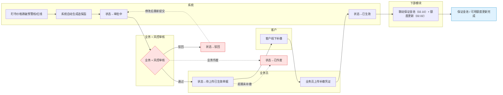
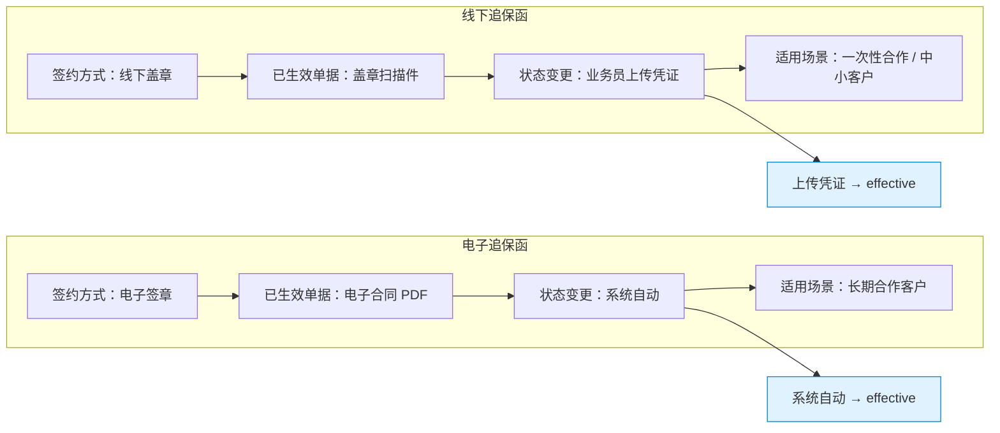
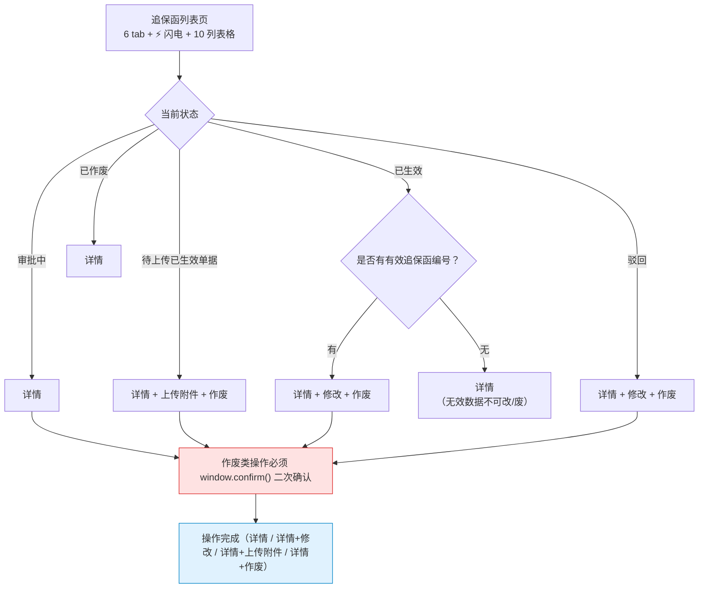
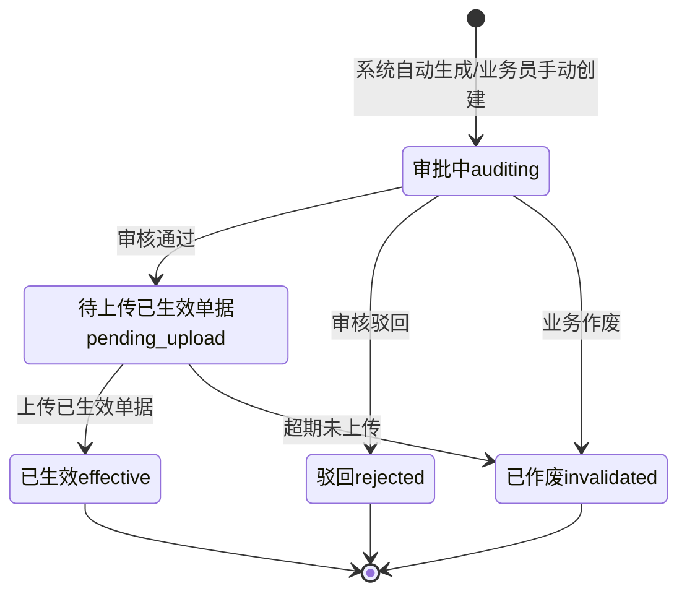
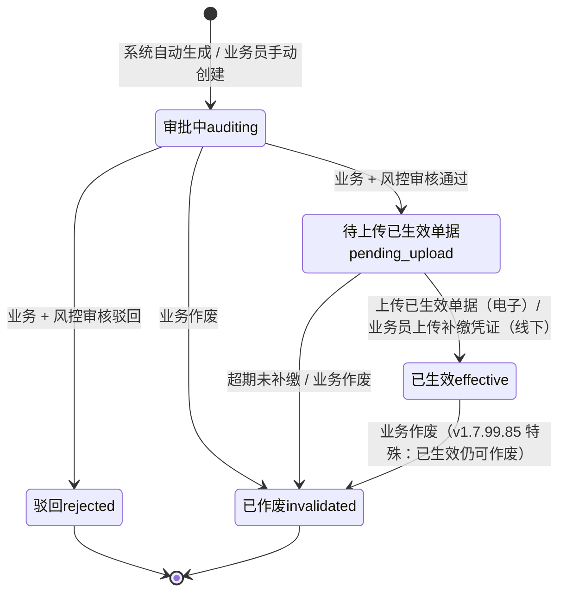

# 02.09 追保函管理 · 需求规格说明

> **文档类型**：PRD Writer 范式 · 落地需求文档 · 功能详细描述
> **对应总纲**：[00-产品概述与需求总纲.md](./00-产品概述与需求总纲.md)
> **通用规范**：[01-通用交互与文案规范.md](./01-通用交互与文案规范.md)
> **源文档（只读，未做任何改动）**：[02.09-追保函管理.md](../docs/02.09-追保函管理.md)
> **整理时间**：2026-09-30

---

## 0. 阅读说明

### 0.1 信息溯源标记

| 标记 | 含义 | 使用规则 |
|------|------|---------|
| ✅ | 源文档已明确 | 原值保留（表名 / 字段名 / 状态枚举 / 编号规则 / 提示文案），不改写口径 |
| 🔷 | 范式补全 | 源文档没写，按范式要求推导，**必须注明推导依据** |
| ⚠️ | 源文档自相矛盾 | **绝不静默选边**，如实并列，交由业务方裁决 |
| 🔷 现状核验 ✅ | 本次整理对 `pages/` 做的**只读** grep 核验（2026-09-30）| 结果为页面实现事实，**未修改任何页面文件** |
| [待补充] | 信息不足 | **严禁编造**，需业务方 / 研发回填 |

### 0.2 源文档阅读顺序

源文档 `02.09-追保函管理.md`（432 行 / 24,592 字节）由**三代口径叠加**构成：**§1-§10 是 v1.0 终版口径**（2026-07-24，基于原型 58-60 截图）、**§11 是 v1.7.99.85 改造记录**（2026-07-30 列表页重制）、**§12 是 v1.7.99.85 列表页改造详节**（图 1 状态机 + 图 2 表头 + **5 状态操作按钮矩阵** + 7 行 mock + 14 条硬规范）。三代口径在**状态数（6 vs 5）、列表字段（5 列 vs 10 列）、已生效能否作废**上存在冲突（见 §3.4）。

| 源文档章节 | 内容 | 归位到本文档 |
|-----------|------|------------|
| 头部 + §0 章节导航 | 状态 / 复用度 85% / `t_bond_letter` / **§12 标注「新增章节」** | §1.1、§5.4 |
| §1 业务定位 | 追保函全生命周期 + 港通特色（电子 / 线下 2 种）+ 5 条关键规则 + sitemap | §1.1、§1.2、§1.3.3、§6 |
| §2 业务流程全景 | 2.1 追保函生成流程 / 2.2 电子 vs 线下差异 | §1.3.1、§1.3.2 |
| §3 核心实体 | 3 张表逐字段（`t_bond_letter` / `_attach` / `_history`）| §5.1、§5.2 |
| §4 6 状态机 | 状态机图 + 6 行状态说明（含 `all` Tab）| §3.1.1、§3.2.1 |
| §5 角色操作矩阵 | 6 操作 × 6 角色 | §2.1.1 |
| §6 字段规则 | 追保函类型 / 销售合同类型 / **追保金额公式** / 触发指数 | §5.2.4、§5.4.3 |
| §7 按钮交互 | 列表页 5 按钮 / 列表 5 列 / 新增对话框 | §2.1.2、§2.1.3、§2.2 |
| §8 异常处理 | 6 条业务异常 | §4.1、§2.5 |
| §9 跨模块流转 | 上游 2 条 / 下游 3 条 | §1.4 |
| §10 复用建议 | 85% / 1 复用 + 2 新建 / 4 周实施 | §5.4 |
| §11 文档版本 | v1.0 + **v1.7.99.85 列表页重制 16 条详录** | §2.2.2、§3.1.2、§3.2.2、§3.3、§7.3 |
| **§12 v1.7.99.85 改造** | **6 tab 状态机 / 10 列表格 + 列宽 / 5 状态操作按钮矩阵 / 7 行 mock / 14 条硬规范** | **§2.1.2、§2.1.4、§2.2.2、§2.3、§3.1.2、§3.2.2、§3.3、§4.4、§5.4、§6、§7** |
| 修改记录 | v1.7.99.85 + v1.7.99.x 全局规范 | §7.3 |

> ✅ **本文档另附只读核验**：为判断「源文档口径 vs 页面实际实现」是否一致，整理时对 `pages/bond-letter*.html` 做了**只读** grep 核验（2026-09-30），结果逐条标注为「**现状核验 ✅**」。**未修改任何页面文件、未修改 `docs/` 任何文件。**

### 0.3 与通用规范的关系

**通用表单规范（校验时机 / 返回保护 / 提交行为 / 危险操作确认 / 空状态 / 失败引导 / 通用 UI 6 态 / 通用样式 / 脱敏规范）一律以 [01-通用交互与文案规范.md](./01-通用交互与文案规范.md) 为准，本文档不重复定义，只写本模块特有的部分**：**电子追保函 vs 线下追保函的差异化凭证链路**、**追保金额公式 `(合同金额 × 追保率) − 已缴保证金`**、**补缴截止日期默认 7 天**、**「已生效仍可修改 / 作废」的特殊业务规则**、**「有效追保函编号」分支的操作按钮矩阵**、**⚡ 黄色闪电 tab 图标**、**⚠️ 用户截图中追保函编号「乱填」字符串的 1:1 保留原则**、**1440px 视口列裁切 + 横向滚动**、以及 v1.7.99.85 锁定的 14 条实施硬规范。

---

## 1. 功能描述与触发条件

### 1.1 功能描述

✅ **追保函管理是港通供应链的追保函全生命周期管理**（源文档 §1 原文 + §12.1 重申，**v1.0 顶级模块**）——**盯市价格跌破预警线/红线时，自动生成追保函，要求客户补缴保证金**。

✅ **港通特色**——分**电子追保函**和**线下追保函**两种（**v1.0 重大发现，基于 58 截图**）。

#### 1.1.1 v1.0 口径（§1.1，5 条关键规则，原值保留）

| # | 关键规则 | 原文口径 | 本文档归位 |
|---|---------|---------|-----------|
| 1 | **2 种追保函**（基于 58 截图）| **电子追保函**（电子签约）/ **线下追保函**（线下盖章）| §1.3.2、§3.2.3 |
| 2 | **触发条件** | 盯市价格跌破预警线/红线（来自 **02.08 盯市价格管理**）| §1.2 |
| 3 | **6 状态**（基于 58 截图）| 全部 / 审批中 / 待上传已生效单据 / 已生效 / 驳回 / 已作废 | §3.2.1 ⚠️ 与 v1.7.99.85 的 **5 状态**冲突（C1）|
| 4 | **关联销售合同**（**必填**）| 选择**电子销售合同**或**线下销售合同** | §2.2.1、§4.1 |
| 5 | **线下补缴** | 客户线下转账 → 业务员上传凭证 → 状态→已生效 | §1.3.1、§4.4 |

✅ **复用度：🟢 85%（大幅复用）**（源文档头部 + §10.1）——主产品 `t_bond_letter` 几乎匹配。

✅ **v1.0 sitemap（§1.2，3 页）**：

| # | 页面 | 说明 |
|---|------|------|
| 1 | **追保函管理**（列表，含 2 Tab：电子/线下）| 6 状态 Tab + 搜索筛选 |
| 2 | **新增/编辑追保函** | 新建追保函 + 选择销售合同 |
| 3 | **追保函详情** | 追保函完整信息 + 凭证 |

> 🔷 现状核验 ✅ **实际 `pages/` 中有 4 个页面**：`bond-letter.html` / `bond-letter-detail.html` / `bond-letter-new.html` / **`bond-letter-new-offline.html`**——**多出「线下追保函新增页」1 个**，v1.0 sitemap 未记录。见 C6。

#### 1.1.2 v1.7.99.85 口径（§12，2026-07-30，列表页重制）

✅ **改造缘起**（§12.1 原文）：

> 现有 `pages/bond-letter.html` 是 **v1.7.99.7 占位版**（11.5KB，标题「**保函管理**」+ **4 tab** + **6 字段筛选** + **10 列** + **2 行 mock**），**结构和字段跟 user 截图 1-2 完全对不上**。

✅ **v1.7.99.85 改造结果**：按 user 截图 1:1 复制——**6 tab 状态机 + ⚡ 闪电图标 + 10 列表格 + 5 状态操作按钮矩阵 + 7 行真实 mock**；**不改左侧菜单**（「追保函管理」在「数字供应链」下的归属已锁定）。

✅ **v1.7.99.85 的 6 项大前提**（§12.6，原文照抄）：

| # | 大前提 | 原文要点 |
|---|-------|---------|
| 1 | **图 1 + 图 2 组合改造模式** | user 经常给 2 张图——图 1 展示状态机/数据，图 2 展示表头/字段——**按「图 1 状态机 + 图 2 表头 + 图 1 数据」组合改造，别只按一张图做** |
| 2 | **错别字处理** | user 图 1 标题写「追保**涵**管理」（错别字）vs 图 2 写「追保**函**管理」（正确）——**沿用正确写法「追保函」，不因为 user 截图有错别字就用错别字**（v1.7.99.69 锁定）|
| 3 | **5 状态机（v1.7.99.85 锁定）** | 追保函 **5 状态** = 审批中 + 待上传已生效单据 + 已生效 + 驳回 + 已作废（**比销售结算 7 状态少「待确认/量产投放/收回」，比采购结算 6 状态少「驳回」重复——追保函 5 状态独立于销售/采购**）|
| 4 | **⚡ 黄色闪电图标** | 6 tab 状态机每个 tab 都有 ⚡ 黄色闪电（`color: #FBBF24` + `font-size: 14px`）——**新加状态机 tab 都用 ⚡ 闪电** |
| 5 | **已生效特殊业务** | 追保函「已生效」= **修改 + 作废 + 详情**（**跟销售/采购「已生效=终态=详情」不同**）——**新加业务时检查「已生效」是否真的不可改** |
| 6 | **有效追保函编号分支** | 操作按钮矩阵按「是否有效编号」分支——有效编号（格式正常的）= 修改+作废+详情；无效编号（乱填的）= 只有详情。**业务规则可配置**（mock 阶段按图 1 实现）|

### 1.2 触发条件

| 场景 | 触发条件 | 结果 | 来源 |
|------|---------|------|------|
| **系统自动生成追保函** | **盯市价格（02.08）跌破预警线/红线** | 状态 → 审批中 | ✅ §5 / §9.1 / §2.1 |
| **系统自动生成追保函** | **保证金监控（02.10）保证金率变化** | 触发追保函 | ✅ §9.1 |
| **业务员手动创建** | 点击右上「**+ 新增追保函**」 | 弹新增对话框 → 状态 → 审批中 | ✅ §5 / §7.1 / §4 |
| 状态 → 审批中 | 系统自动生成 / 业务员手动创建 | `auditing` | ✅ §4.1 |
| 状态 → 待上传已生效单据 | 业务 + 风控审核通过 | `pending_upload` | ✅ §4.1 |
| 状态 → 驳回 | 业务 + 风控审核驳回 | `rejected` | ✅ §4.1 |
| 状态 → 已作废 | 业务作废 / **超期未补缴** | `invalidated` | ✅ §4.1 / §8 |
| 状态 → 已生效 | 上传已生效单据 | `effective` | ✅ §4.1 |
| **补缴截止日期默认值** | 新增追保函时 | **默认 7 天后** | ✅ §7.3 |
| **电子追保函 → 已生效（系统自动）** | 电子签约完成 | 状态**系统自动**变更 | ✅ §2.2 |
| **线下追保函 → 已生效（人工）** | 客户线下转账 → 业务员上传凭证 | 状态**业务员上传凭证**后变更 | ✅ §2.2 |
| 补缴金额登记 | 客户线下补缴 | 业务员上传补缴凭证 → 状态→已生效 | ✅ §5 / §2.1 |
| 下游 · 保证金池（02.10）| 追保函**已生效** | 更新客户保证金池 | ✅ §9.2 |
| 下游 · 客户额度（02.02）| 追保函**已生效** | 更新客户可用额度 | ✅ §9.2 |
| 下游 · 预警中心（02.11）| 追保函**生成/驳回** | 触发预警信号 | ✅ §9.2 |
| **电子 / 线下 Tab 筛选** | 点击顶部 Tab | 筛选电子追保函 / 线下追保函 | ✅ §7.1 |

### 1.3 业务流程（Mermaid）

#### 1.3.1 追保函生成流程（v1.0 口径，源文档 §2.1 原图照抄 + 泳道化）

✅ 源文档原图为 `flowchart TB` 单链路；🔷 依范式改写为**多角色泳道 `flowchart LR`**（系统 / 业务 + 风控 / 客户 / 业务员 / 下游），节点与关系**原值保留**。



> ✅ **资金流转基线核对**：本流程的「客户线下补缴」= **线下完成 + 系统流程化登记**（业务员上传凭证）——**✅ 完全符合「资金流转 = 线下完成 + 系统流程化登记」基线**，源文档未出现「银行扣款 / 扣款失败 / 补足余额」等线上假设分支 ✅。
> 🔷 虚线回退 `-.->` 为范式补全，依据：源文档 §4.1「`rejected` 驳回 = 终态」——**驳回后能否重新提交，源文档未定义**（v1.0 记为终态），本图保留回退路径**但不选边**，见 C4。

#### 1.3.2 电子 vs 线下追保函差异（v1.0 口径，§2.2 表格 + 🔷 泳道化）

✅ 源文档 §2.2 为 4 行对比表；🔷 依范式转为泳道对比图，**单元格原文照抄**。



#### 1.3.3 v1.7.99.85 列表页改造模式（§12.6 6 大前提 + §12.2-12.4，🔷 推导）

🔷 依据：§12.6 的 6 大前提 + §12.2 的 6 tab + §12.4 的 5 状态操作按钮矩阵推导为状态-操作泳道图。



### 1.4 模块依赖（跨模块流转）

#### 1.4.1 v1.0 口径（§9）

| 方向 | 触发模块 | 触发条件 | 触发动作 |
|------|---------|---------|---------|
| **上游** | **盯市价格（02.08）** | 价格跌破预警线/红线 | **自动生成追保函** |
| **上游** | **保证金监控（02.10）** | 保证金率变化 | 触发追保函 |
| **下游** | **保证金池（02.10）** | 追保函已生效 | 更新客户保证金池 |
| **下游** | **客户额度（02.02）** | 追保函已生效 | 更新客户可用额度 |
| **下游** | **预警中心（02.11）** | 追保函生成/驳回 | 触发预警信号 |

#### 1.4.2 依赖字段与回写

| 依赖方向 | 依赖对象 | 字段 / 机制 | 依据 |
|---------|---------|------------|------|
| 上游依赖 | 盯市价格（02.08）| `trigger_index_id`（关联指数）/ `trigger_index_name`（冗余）/ `trigger_price`（触发价格）/ `warn_line`（预警线）/ `red_line`（红线）——**自动记录触发时的指数价格** | ✅ §3.1 / §6.4 |
| 上游依赖 | 销售合同（02.03）| `sales_contract_id`（**✓ 必填**）/ `sales_contract_no`（冗余）/ `sales_contract_type`（电子 / 线下）| ✅ §3.1 |
| 上游依赖 | 保证金管理（02.10）| 追保金额公式中的「已缴保证金」+ `追保率` | ✅ §6.3 |
| 下游回写 | 保证金池（02.10）| 追保函已生效 → 更新客户保证金池 | ✅ §9.2 |
| 下游回写 | 客户额度（02.02）| 追保函已生效 → 更新客户可用额度 | ✅ §9.2 |
| 下游回写 | 预警中心（02.11）| 追保函生成 / 驳回 → 触发预警信号 | ✅ §9.2 |
| 🔴 字段级回写缺失 | 02.10 / 02.02 / 02.11 | 🔴 **三个下游模块的具体回写字段（保证金池金额如何计算、额度扣减公式、预警规则类型）源文档完全未定义** [待补充] | 🔴 |

---

## 2. 交互细节

### 2.1 角色操作矩阵（权限可见性）

#### 2.1.1 v1.0 口径（§5，6 操作 × 6 角色，原值保留）

| 操作 / 角色 | 业务员 | 业务部 | 风控部 | 财务部 | 总经办 | 系统 |
|------------|------|------|------|------|------|------|
| 自动生成追保函 | - | - | - | - | - | **✓（盯市价格触发）** |
| 手动创建追保函 | **✓** | - | - | - | - | - |
| 审核追保函 | - | **✓** | **✓** | - | - | - |
| 上传已生效单据 | **✓** | - | - | - | - | - |
| 客户线下补缴 | **客户** | - | - | - | - | - |
| 上传补缴凭证 | **✓** | - | - | - | - | - |

> ✅ 财务部 / 总经办**无任何追保函权限**（两列全为 `-`）。

#### 2.1.2 列表页按钮（v1.0 §7.1，5 项，原值保留）

| 按钮 | 位置 | 可见条件 | 点击行为 |
|------|------|---------|---------|
| **+ 新增追保函** | 右上 | 业务员 | 弹新增对话框 |
| 数据导出 | Tab 右侧 | 所有 | 导出 Excel |
| **电子追保函 Tab** | 顶部 | 所有 | 筛选电子追保函 |
| **线下追保函 Tab** | 顶部 | 所有 | 筛选线下追保函 |
| 详情 | 列表行 | 所有 | 跳详情页 |

#### 2.1.3 v1.0 列表字段（§7.2，**5 列**，原值保留）

| 列 | 说明 |
|---|------|
| 编号 | 订单/合同/追保函编号 |
| 企业名称 | 客户名称 |
| 签发日期 | 追保函签发日期 |
| 状态 | 6 状态之一 |
| 操作 | **详情 / 编辑 / 撤销** |

> ⚠️ **v1.0 的 5 列 vs v1.7.99.85 的 10 列**：操作按钮也变了（v1.0 = 详情/编辑/**撤销**，v1.7.99.85 = 详情/修改/上传附件/**作废**）——「**撤销**」与「**作废**」是否同一操作、v1.0 的 3 个按钮如何映射到 v1.7.99.85 的 5 状态矩阵，**源文档从未说明**。见 C2 与 C3。

#### 2.1.4 v1.7.99.85 列表字段（§12.3，**10 列**，原值保留）

| # | 列名 | 类型 | 宽度 | 说明 |
|---|------|------|------|------|
| 1 | 合同编号 | mono | 12% | 关联销售合同编号 |
| 2 | 卖方企业 | text | 11% | 销售方 |
| 3 | 买方企业 | text | 11% | 采购方 |
| 4 | 追保金额(元) | money right-align | 9% | 追保金额 |
| 5 | 追保截止日期 | date | 9% | 追保函到期日 |
| 6 | 签发日期 | date | 9% | 追保函签发日 |
| 7 | 追保函编号 | mono | 10% | 系统生成的追保函编号 |
| 8 | **上传时间** | datetime | 9% | **v1.7.99.85 新增**（user 图 2）|
| 9 | 追保函状态 | tag | 7% | 5 状态 badge |
| 10 | 操作 | action | auto | 5 状态操作按钮矩阵 |

**列宽配置（§12.3 原文，1440px 视口）**：

| 项 | 配置 |
|----|------|
| checkbox | **4%**（v1.7.99.83 模式，**本表无 checkbox**）|
| 10 列合计 | 12% + 11% + 11% + 9% + 9% + 9% + 10% + 9% + 7% + auto = **87% 固定列 + auto** |
| 源文档表述 | 「10 列总宽度 **~85%**，操作 auto 占满剩余」 |

> ⚠️ **算术自检**：源文档 §12.3 写「10 列总宽度 **~85%**」，但逐列相加为 **87%**（12+11+11+9+9+9+10+9+7）；若再计入 checkbox 4% 则为 **91%**。**「~85%」与逐列和（87% / 91%）不一致** [待补充]。
> ⚠️ **§12.3 自身矛盾**：列宽配置首行写「checkbox 4%（v1.7.99.83 模式，**本表无 checkbox**）」——**既声明有 4% checkbox 宽度，又声明本表无 checkbox**。
> ✅ 现状核验 ✅：`bond-letter.html` 已实现 5 状态 badge + 操作列「上传附件」（`:217/:341`）+ 「作废」（`:199/:206/:209`）。

#### 2.1.5 搜索条件（§11 v1.7.99.85，**3 字段**，原值保留）

| # | 筛选字段 | 说明 |
|---|---------|------|
| 1 | **编号** | 订单、合同、**追保函编号** |
| 2 | **企业名称** | - |
| 3 | **签发日期** | - |

> ⚠️ **v1.0 §7.3 未给搜索条件清单**（只在 §7.2 列表字段中隐含）；v1.7.99.85 明确 3 字段——**两代搜索条件从未对齐** [待补充]。

### 2.2 按钮交互（操作反馈）

#### 2.2.1 新增追保函对话框（§7.3，原值保留）

| 字段 | 交互 | 来源 |
|------|------|------|
| **选择销售合同**（**必填**）| 弹选择列表，**区分电子销售合同 / 线下销售合同** | ✅ §7.3 |
| **触发指数**（自动）| 从**当前合同的最新指数**自动带出 | ✅ §7.3 |
| **追保金额**（自动计算）| `(合同金额 × 追保率) − 已缴保证金` | ✅ §7.3 / §6.3 |
| **补缴截止日期** | **默认 7 天后** | ✅ §7.3 |

#### 2.2.2 v1.7.99.85 操作列按钮（§12.4，**5 状态操作按钮矩阵**，原值保留）

| 状态 | 查看 | 修改 | 上传附件 | 作废 | 删除 |
|------|------|------|---------|------|------|
| **审批中** | ✓ | - | - | - | - |
| **待上传已生效单据** | ✓ | - | **✓** | **✓** | - |
| **已生效（有有效追保函编号）** | ✓ | **✓** | - | **✓** | - |
| **已生效（无有效追保函编号）** | ✓ | - | - | - | - |
| **驳回** | ✓ | **✓** | - | **✓** | - |
| **已作废** | ✓ | - | - | - | - |

**关键差异（§12.4 原文）**：

> - 追保函「已生效」= 修改 + 作废 + 详情（**跟销售/采购「已生效=终态=详情」不同**，追保函特殊业务：**已生效仍可修改追保金额/作废**）
> - 追保函「已生效」按「**是否有效追保函编号**」分支：有效编号（ZBH/ceshi/1234/日期为翁等格式正常的）= 修改+作废+详情；无效编号（"发士大夫士大夫"/"发顺丰"等乱填的）= 只有详情（**业务限制：无效数据不可改/废**）

> ⚠️ **矩阵是 6 行但标题写「5 状态」**——「已生效」被拆成**有 / 无有效编号 2 行**，故 5 个状态对应 6 行矩阵 ✅ 逻辑自洽。
> 🔴 **「有效追保函编号」的判定规则完全未定义**——**什么格式算「有效」？**（§12.4 举例「ZBH/ceshi/1234/日期为翁等格式正常的」算有效，「发士大夫士大夫/发顺丰」算无效——**但这些是 mock 数据不是规则**）见 C5 与 §7.2 Q3。
> ⚠️ **矩阵中出现「修改」但 v1.0 §7.2 的按钮叫「编辑」，v1.0 §7.1 没有「上传附件」和「作废」**——见 C3。

#### 2.2.3 成功反馈

🔷 **成功文案源文档全部未给** [待补充]；依 01 文档 §3.2 统一采用 Toast 绿色 `#10B981`，3s 自动消失。🔷 v1.7.99.85 §12.6 要求 inline Utils 兜底：`window.Utils = window.Utils || { toast: function(msg, type) { try { console.log(...) } catch (e) {} } }`（v1.7.99.80 模式）。

#### 2.2.4 v1.7.99.85 交互实现规范（§12.6，原文照抄）

| # | 规范 | 原文要点 |
|---|------|---------|
| 1 | **操作列点击事件委托** | **用 `document.body.addEventListener('click', ...)` 事件委托** + 检查 `target.closest('.col-action')`——避免每个按钮单独 bind |
| 2 | **inline Utils fallback 必加** | **新加操作列按钮**必须 inline `window.Utils = window.Utils || { toast: function(msg, type) { ... } }` 兜底（v1.7.99.80 模式）|
| 3 | **数据导出按钮位置 = 2 处** | **顶部右侧**（页面 header 右）+ **tab 栏右侧**（`cp-tab-bar-actions`）——2 处都加更友好（图 1 实际就是这样，**保留**）|
| 4 | **1440px 视口列裁切** | **10 列在 1440px 部署下右 2 列（上传时间/追保函状态）被裁切**，`cp-table-wrap` `overflow-x: auto` 让用户横向滚动——user 图 1 是 1903px 视口，部署到 1440px 是 463px 视口差，**用户可接受横向滚动体验**（v1.7.99.83/84 经验）|

> ⚠️ **规范 3 与 v1.0 §7.1 冲突**：v1.0 只记「数据导出（**Tab 右侧**）」1 处，v1.7.99.85 要求**顶部 + Tab 右侧 2 处**。见 C3。

### 2.3 危险操作确认

| 操作 | 确认方式 | 提示文案 | 来源 |
|------|---------|---------|------|
| **作废追保函** | **`window.confirm()` 二次确认** | 🔴 源文档**未给 confirm 文案** [待补充] | ✅ §12.6 硬规范（沿用 v1.7.99.82 销售结算 + v1.7.99.83/84 模式）|
| **超期未补缴** | 无人工确认（系统自动）| `"追保函 X 已超期 Y 天，已自动作废"` | ✅ §8 原文照抄 |
| **未选销售合同** | 阻止 | `"必须先选择销售合同"` | ✅ §8 原文照抄 |
| **销售合同已签章** | 阻止 | `"销售合同已签章，不能创建追保函"` | ✅ §8 原文照抄 |
| **追保金额 ≤ 0** | 阻止 | `"追保金额必须 > 0"` | ✅ §8 原文照抄 |
| **补缴截止日期 < 今天** | 阻止 | `"补缴截止日期必须 > 今天"` | ✅ §8 原文照抄 |
| **客户已被冻结** | 阻止 | `"客户 X 已被冻结，不能创建追保函"` | ✅ §8 原文照抄 |

> ✅ **v1.7.99.85 §12.6 硬规范**：**作废类危险操作必须 `window.confirm()` 二次确认**——v1.7.99.82 销售结算 + v1.7.99.83/84 模式。
> ⚠️ **v1.0 §4.1 状态表记「已生效 = 终态」，与 v1.7.99.85「已生效可作废」直接冲突**——**这决定了「已生效 → 已作废」的路径是否存在**，见 C1。

### 2.4 空状态引导

| 场景 | 空状态表现 | 引导操作 | 依据 |
|------|----------|---------|------|
| 列表无数据 | 🔷 空状态 + 文案 `暂无数据` | 🔷 「+ 新增追保函」 | 🔷 01 文档 §2.11 + ✅ §7.1（唯一新增入口）|
| 筛选无结果 | 🔷 空状态 + `请调整筛选条件` | 🔷 「清除全部」 | 🔷 01 文档 §2.11 |
| 详情页无凭证附件 | 🔷 `暂无附件` | 🔷 「上传附件」（仅「待上传已生效单据」状态可见，✅ §12.4）| 🔷 + ✅ §12.4 |
| 销售合同选择列表为空 | 🔷 `暂无可选销售合同` | 🔷 前往 02.03 创建合同 | 🔷 |
| 电子 / 线下 Tab 无数据 | 🔷 `暂无数据` + 提示可切换另一 Tab | 🔷 切换 Tab | 🔷 + ✅ §7.1 |

### 2.5 失败引导

| # | 异常场景 | 提示文案（原文照抄）| 处理动作 | 失败引导 |
|---|---------|------------------|---------|---------|
| 1 | 未选择销售合同 | `"必须先选择销售合同"` | 阻止 | 🔷 定位到合同选择控件 + 弹窗保持打开 |
| 2 | 销售合同已签章 | `"销售合同已签章，不能创建追保函"` | 阻止 | 🔷 红字内联 + 高亮该合同行 |
| 3 | 追保金额 > 0 才允许提交 | `"追保金额必须 > 0"` | 阻止 | 🔷 红字内联在追保金额字段 |
| 4 | 补缴截止日期 < 今天 | `"补缴截止日期必须 > 今天"` | 阻止 | 🔷 红字内联 + 定位日期控件 |
| 5 | 超期未补缴 | `"追保函 X 已超期 Y 天，已自动作废"` | **自动作废** | 🔷 Toast 警告 + 列表自动刷新到「已作废」tab |
| 6 | 客户已被冻结 | `"客户 X 已被冻结，不能创建追保函"` | 阻止 | 🔷 红字内联 |
| 7 | 作废操作用户取消 | `window.confirm()` 返回 false | **不操作** | 🔷 无提示，列表状态不变 |
| 8 | 关联指数/追保率数据缺失 | 🔴 [待补充]——**追保金额公式的输入（合同金额 / 追保率 / 已缴保证金）任一缺失时的处理，源文档未定义** | [待补充] | 🔴 |

---

## 3. 状态清单

### 3.1 业务状态机

#### 3.1.1 v1.0 状态机（§4 原图照抄，**6 状态，含 `all` Tab**）



> ⚠️ **v1.0 状态机中「已生效」是终态（`已生效effective --> [*]`）——与 v1.7.99.85「已生效可修改 / 作废」直接冲突**，见 C1。

#### 3.1.2 v1.7.99.85 状态机（§12.2 + §12.4，据表推导）

🔷 依据：§12.2 的 6 tab（全部 / 审批中 / 待上传已生效单据 / 已生效 / 驳回 / 已作废）+ §12.4 的操作按钮矩阵（「已生效」有修改 + 作废按钮、「待上传已生效单据」有上传附件 + 作废）推导。**状态中文名原值保留**。



> ⚠️ **本图与 §3.1.1 的唯一差异**是新增的 `已生效 → 已作废` 边（**v1.7.99.85 依据 §12.4「已生效（有有效追保函编号）= 详情 + 修改 + 作废」推导**）。**本图不选边**，两版并列见 C1。
> 🔴 **「已生效 → 已作废」是否需要审核？**（v1.0 §5 角色矩阵无「作废」单独行，「作废」权限与「查看」同属业务员/业务部/风控部）——**作废是否需审批，源文档未定义** [待补充]。

#### 3.1.3 页面现状核验 ✅（🔷 2026-09-30 只读 grep）

| 项 | 核验结果 | 依据 |
|----|---------|------|
| 6 tab 状态机 | ✅ 页面存在 审批中 / 待上传已生效单据 / 已生效 / 驳回 / 已作废 5 状态 + 全部 | `bond-letter.html:14/117/122-126/191-195` |
| 5 状态 badge | ✅ `badge` class 存在 3 处 | `:14/:49/:189` |
| 操作列按钮 | ✅ 「上传附件」（`:217/:341`）+「作废」（`:199/:206/:209`）| 🔷 |
| 页面版本注释 | ✅ v1.7.99.85（`:12/14/21/23/117/132/155/189/198/202-204`）+ v1.7.99.80（`:325`）+ v1.7.99.191（`:198/202/203/204/238/243/247`）+ v1.7.99.212（`:326/334`）+ **v1.7.99.236**（`:128`）| 🔷 |
| ⚡ 黄色闪电 | 🔷 grep 未命中 ⚡ 字符或 `#FBBF24`——**闪电图标是否仍在页面中，无法确认** [待补充] | 🔷 |

> 🔷 **v1.7.99.191 / .212 / .236 是源文档从未记录的版本**（源文档最新记到 v1.7.99.85）——**列表页在 v1.7.99.85 之后又被改造过至少 3 次**（§12.6 锁定的 5 状态矩阵是否仍成立，**需核验**）[待补充]。

### 3.2 状态值与展示

#### 3.2.1 v1.0 口径（§4.1，6 行，原值保留）

| # | 状态枚举 | 中文 | 触发条件 | 下一状态 | Tag 色 |
|---|---------|------|---------|---------|--------|
| 1 | `auditing` | 审批中 | 系统生成 / 手动创建 | 审核通过 / 驳回 / 作废 | **#FEF3C7 / #A16207** ✅ |
| 2 | `pending_upload` | 待上传已生效单据 | 审核通过 | 上传已生效单据 / 超期作废 | **#DBEAFE / #1E40AF** ✅ |
| 3 | `effective` | 已生效 | 上传已生效单据 | **终态** ⚠️ | **#D1FAE5 / #047857** ✅ |
| 4 | `rejected` | 驳回 | 审核驳回 | **终态** | **#FEE2E2 / #DC2626** ✅ |
| 5 | `invalidated` | 已作废 | 业务作废 / 超期未上传 | **终态** | **#F3F4F6 / #6B7280** ✅ |
| 6 | `all` | 全部 | 列表 Tab | - | — |

> ✅ **5 状态 badge 颜色编码原文照抄**（§11 v1.7.99.85 记录）：审批中 `#FEF3C7`/`#A16207` / 待上传已生效单据 `#DBEAFE`/`#1E40AF` / 已生效 `#D1FAE5`/`#047857` / 驳回 `#FEE2E2`/`#DC2626` / 已作废 `#F3F4F6`/`#6B7280`。
> ✅ **v1.7.99.85 状态 tag 颜色编码遵循 v1.7.99.14 全局规范**（修改记录）。

#### 3.2.2 v1.7.99.85 口径（§12.2，6 tab，原值保留）

| Tab | 数量（mock）| 状态颜色 | 说明 |
|-----|------------|---------|------|
| **全部** | **100** | — | 全部追保函 |
| **审批中** | **10** | 🟡 **黄色** | 待审批 |
| **待上传已生效单据** | **10** | 🔵 **蓝色** | 已审批通过，待上传签章/盖章版单据 |
| **已生效** | **10** | 🟢 **绿色** | 已上传已生效单据，**可改可废**（**特殊业务**）|
| **驳回** | **10** | 🔴 **红色** | 审批驳回 |
| **已作废** | **10** | ⚪ **灰色** | 已作废（**终态**）|

> ✅ **每个 tab 都有 ⚡ 黄色闪电图标**（§12.2 原文）：`color: #FBBF24` + `font-size: 14px` + `margin-right: 2px`。
> ⚠️ **v1.7.99.85 明确 5 状态**（§12.6 大前提 3）：审批中 + 待上传已生效单据 + 已生效 + 驳回 + 已作废——**「全部」是 Tab 占位不计入状态数**，与 v1.0 把 `all` 算作第 6 个状态的方式**不同**，见 C1。

#### 3.2.3 追保函类型枚举（§1.1 + §6.1 + §6.2，原值保留）

| 字段 | 枚举值 | 中文 | 必填 | 来源 |
|------|-------|------|------|------|
| `bond_letter_type` | `electronic` | 电子追保函 | ✓ | ✅ §3.1 / §6.1 |
| `bond_letter_type` | `offline` | 线下追保函 | ✓ | ✅ §3.1 / §6.1 |
| `sales_contract_type` | `electronic` | 电子销售合同 | - | ✅ §3.1 / §6.2 |
| `sales_contract_type` | `offline` | 线下销售合同 | - | ✅ §3.1 / §6.2 |

> 🔴 **「追保函类型」与「销售合同类型」是否必须一致**（电子追保函是否只能关联电子销售合同？）**源文档未定义**——§7.3 只说「选择销售合同（必填）：弹出选择列表，**区分**电子销售合同/线下销售合同」，**没说是否按追保函类型过滤** [待补充]。

### 3.3 UI 状态清单

> 通用 6 态以 [01-通用交互与文案规范.md](./01-通用交互与文案规范.md) §3.2 为准；下表为**本模块（追保函列表页 / 新增对话框 / 线下新增页 / 详情页 + 操作列按钮区 + 作废 confirm 弹窗 + 上传附件弹窗）**的落地映射。**6 态齐全：默认 / 加载中 / 成功 / 失败 / 禁用 / 空状态**。

| 状态 | 触发 | 视觉 | 可交互 |
|------|------|------|-------|
| **默认** | 页面加载完成、状态非终态 | 追保函列表页：标题「追保函管理」+ **6 tab（各带 ⚡ 黄色闪电）** + 3 字段筛选（编号/企业名称/签发日期）+ **10 列表格** + 分页（**共 50 条 / 1-5 页 / 10 条每页**）+ 右上 **2 按钮**（数据导出 白底蓝字 + 新增追保函 蓝底白字 + + 图标）；操作列按 **5 状态矩阵**显示按钮 | ✅ 全部按钮按 §2.2.2 矩阵显隐 |
| **加载中** | 提交中 / 状态切换中 / 附件上传中 / tab 切换中 | 按钮 loading + 旋转图标 + 禁用 🔷；操作列按钮 loading 🔷 | ❌ 禁用重复提交 |
| **成功** | 创建成功 / 审核通过 / 上传已生效单据成功 / 修改成功 / 作废成功 / 附件上传成功 | 顶部居中 Toast 绿色 `#10B981`，3s 自动消失；文案 🔷 `提交成功`（01 文档 §3.2）；**必须 inline Utils 兜底**（v1.7.99.80 模式）| — |
| **失败** | 6 类业务异常（§2.5 全部 6 条）| Toast 红色 `#EF4444`（不自动消失）；或**红字内联**（`必须先选择销售合同`）。源文档原文文案见 §2.5 | ✅ 按钮恢复可点 |
| **禁用** | 「审批中」状态下的修改/上传附件/作废按钮（§12.4）/ 「已作废」状态下的全部操作 / 「已生效（无有效编号）」的修改 + 作废 / 无凭证时的上传附件 | 按钮**不渲染**（§12.4 用 `-` 表示，不是灰化）| ❌ |
| **空状态** | 列表无数据 / 筛选无结果 / 详情页无附件 / 合同选择列表为空 / 电子-线下 Tab 无数据 | 空状态插画 + 灰字居中（🔷 `.empty-row { padding: 40px 0; color: var(--text-tertiary); }`）；文案 `暂无数据` / `请调整筛选条件` | ✅ 引导操作（「+ 新增追保函」/「清除全部」/ 切换 Tab）|

🔷 **本模块特有的 UI 状态补充**：

| 状态 | 触发 | 视觉 | 可交互 | 依据 |
|------|-----|------|-------|------|
| **⚡ 黄色闪电 tab 态** | 6 tab 状态机每个 tab | tab 前置 ⚡ 图标，`color: #FBBF24` + `font-size: 14px` + `margin-right: 2px` | ✅ 点击切换 | ✅ §12.2 + §12.6 大前提 4 |
| **5 状态 badge 态** | 列表行第 9 列 | 5 色 badge（见 §3.2.1 色值）| ✅ 只读 | ✅ §12.2 / §11 |
| **「已生效」绿色特殊态** | 状态 = 已生效 | badge 绿色 `#D1FAE5`/`#047857` + **操作列 = 详情 + 修改 + 作废**（**非终态**）| ✅ 可改可废 | ✅ §12.2 / §12.4 |
| **「已生效（无有效编号）」降级态** | 状态 = 已生效 + 追保函编号无效/乱填 | 操作列**仅「详情」** | ✅ 仅查看 | ✅ §12.4 / §12.6 大前提 6 |
| **「待上传已生效单据」附件态** | 状态 = 待上传已生效单据 | 操作列 = 详情 + **上传附件** + 作废 | ✅ 可上传可废 | ✅ §12.4 |
| **作废二次确认弹窗态** | 点击「作废」 | **`window.confirm()` 浏览器原生弹窗** | ✅ 确认 / 取消 | ✅ §12.6 硬规范 |
| **1440px 视口列裁切态** | 部署视口 ≤ 1440px | **右 2 列（上传时间 / 追保函状态）被裁切**，`cp-table-wrap` `overflow-x: auto` 横向滚动 | ✅ 横向滚动（**用户已确认可接受**）| ✅ §11 / §12.6 硬规范 |
| **分页态** | 列表底部 | **共 50 条记录 / 1-5 页 / 10 条每页** | ✅ 翻页 / 改每页数 | ✅ §11 |
| **右上 2 按钮态** | 页面右上 | **数据导出**（白底蓝字）+ **新增追保函**（蓝底白字 + + 图标）| ✅ 点击 | ✅ §11 |
| **数据导出 2 处并存态** | 页面 header 右 + tab 栏右 | **2 处都有「数据导出」按钮**（更友好，**保留**）| ✅ 两处均可点 | ✅ §12.6 硬规范 |
| **mock 乱填编号态** | 追保函编号为「发士大夫士大夫」等乱填字符串 | **原样展示，不纠正**（v1.7.99.78 教训：擅自改 user 截图被批评）| ✅ 只读 | ✅ §12.5 |
| **错别字不继承态** | user 截图写「追保涵管理」 | **沿用正确写法「追保函管理」** | ✅ | ✅ §12.6 大前提 2（v1.7.69 锁定）|
| **inline Utils fallback 态** | 页面缺少 `window.Utils` | inline 兜底 `window.Utils = window.Utils \|\| { toast: ... }` | ✅ | ✅ §12.6 硬规范（v1.7.99.80 模式）|
| **事件委托态** | 操作列按钮点击 | `document.body.addEventListener('click', ...)` + `target.closest('.col-action')` | ✅ 全部操作列按钮 | ✅ §12.6 硬规范 |

### 3.4 版本冲突

> ⚠️ 以下 **C1-C7** 为源文档内部交叉比对（v1.0 / v1.7.99.85 两代口径）+ `pages/` 只读核验后确认的自相矛盾，本次重组**未选边**，全部如实并列，交由业务方裁决。

**C1 — 「已生效」是终态还是可改可废（🔴 阻塞，状态机核心冲突）**

| 口径 | 「已生效」的出口 | 是否可修改 / 作废 | 出处 |
|------|---------------|------------------|------|
| **v1.0 §4 状态机图** | `已生效effective --> [*]` | ❌ **终态，不可改不可废** | §4 |
| **v1.0 §4.1 状态表** | `effective` 已生效 → 出口 = **终态** | ❌ | §4.1 |
| **v1.0 §7.1 列表按钮** | 「作废」可见条件在 02.07 是「状态≠已生效/已作废」；**02.09 §7.1 无「作废」按钮** | ❌ | §7.1 |
| **v1.7.99.85 §12.2** | 已生效 tab = 🟢 绿色，「已上传已生效单据，**可改可废**（**特殊业务**）」| ✅ **可改可废** | §12.2 |
| **v1.7.99.85 §12.4 矩阵** | 已生效（有有效编号）= **详情 + 修改 + 作废** | ✅ | §12.4 |
| **v1.7.99.85 §12.6 大前提 5** | 「追保函『已生效』= 修改+作废+详情（**跟销售/采购『已生效=终态=详情』不同**）」——**明示这是刻意设计** | ✅ | §12.6 |
| 🔷 现状核验 ✅ | `bond-letter.html:199/206/209` **「作废」按钮出现在已生效行** | ✅ 与 v1.7.85 一致 | 🔷 |

⚠️ **冲突**：**v1.0 判为不可逆终态，v1.7.99.85 判为可修改 + 可作废**。**v1.7.99.85 §12.6 明确说明这是「特殊业务」并给出理由**（其他模块的已生效确实不可改），因此**v1.7.99.85 口径更可能是修正而非错误**——但**本次重组不代为选边**，两版状态机并列于 §3.1.1 / §3.1.2。

⚠️ **衍生问题**：「已生效 → 已作废」的路径：
1. **是否需要审核？** v1.0 §5 角色矩阵**无「作废」独立行**，「查看/作废」权限在 02.07 才与查看合并——02.09 的作废权限**未定义** [待补充]
2. **作废后能否恢复？** 源文档未定义
3. **与超期自动作废是同一路径吗？** v1.0 §8 记「超期未补缴 → 自动作废」——**超期作废是否受「已生效可作废」规则影响（已生效的函不会超期）？** 逻辑上不冲突

**影响：`t_bond_letter.status` 状态机出口、已生效行的操作按钮、作废权限与审批流、详情页可编辑字段范围。**

**C2 — 状态数量 6 vs 5（🟡 Tab 占位计入方式不同）**

| 口径 | 状态构成 | 状态数 | Tab 数 | 出处 |
|------|---------|-------|-------|------|
| **v1.0 §1.1 规则 3 / §4.1** | 全部 / 审批中 / 待上传已生效单据 / 已生效 / 驳回 / 已作废（**`all` 计为状态**）| **6** | 6 | §1.1 / §4.1 |
| **v1.7.99.85 §12.6 大前提 3** | 审批中 + 待上传已生效单据 + 已生效 + 驳回 + 已作废（**`all` 不计入**）| **5** | 6 | §12.6 |
| **v1.7.99.85 §12.2** | 6 tab（含「全部」）| **5 状态** | 6 | §12.2 |
| 🔷 现状核验 ✅ | 页面 6 tab + 5 状态 badge | **5 状态** | 6 | `bond-letter.html:14/117/122-126` |

⚠️ **冲突**：**「6 状态机」的叫法在两代含义不同**——v1.0 指「5 业务态 + 1 Tab 占位」，v1.7.99.85 指「5 业务态」（Tab 另计）。**状态本身完全相同（5 个业务态），仅命名与计数方式冲突**。🔷 现状核验 ✅ 与 v1.7.99.85 一致。

**C3 — 列表字段 5 列 vs 10 列 + 操作按钮 3 个 vs 4 个（🔴 阻塞页面实现）**

| 维度 | v1.0（§7.1-7.2）| v1.7.99.85（§12.3-12.4）| 🔷 现状核验 ✅ |
|------|----------------|--------------------|--------------|
| **列数** | **5 列**（编号 / 企业名称 / 签发日期 / 状态 / 操作）| **10 列**（合同编号 / 卖方企业 / 买方企业 / 追保金额(元) / 追保截止日期 / 签发日期 / 追保函编号 / 上传时间 / 追保函状态 / 操作）| ✅ 10 列（§12.4 明示 v1.7.99.7 占位版也是 10 列，只是字段对不上）|
| **搜索条件** | 🔴 **未定义** | **3 字段**（编号 / 企业名称 / 签发日期）| ✅ v1.7.99.85 记录 v1.7.99.7 占位版是 6 字段筛选 |
| **操作按钮** | **详情 / 编辑 / 撤销**（3 个）| **详情 / 修改 / 上传附件 / 作废**（4 个，按状态矩阵显隐）| ✅ 现状核验 ✅ 上传附件 + 作废均已实现 |
| **Tab 结构** | **电子追保函 Tab / 线下追保函 Tab**（2 个类型 Tab）| **6 状态 Tab**（全部 / 审批中 / 待上传 / 已生效 / 驳回 / 已作废）| 🔶 **两者维度不同**：v1.0 按「类型」分 Tab，v1.7.99.85 按「状态」分 Tab |
| **数据导出位置** | **Tab 右侧 1 处** | **顶部右侧 + Tab 栏右侧 2 处** | 🔷 |
| **新增入口** | 「+ 新增追保函」弹**新增对话框** | 未提及改造（§12.1 明确「**不**改 `bond-letter-new.html`」）| 🔷 |

⚠️ **五处冲突**：
1. **5 列 vs 10 列**——v1.0 列表**缺 7 个字段**：合同编号 / 卖方企业 / 买方企业 / 追保金额 / 追保截止日期 / 追保函编号 / 上传时间
2. **「编辑」vs「修改」**——同一操作两个名称；**v1.0 的「撤销」在 v1.7.99.85 矩阵中不存在**（矩阵只有 作废）；**「撤销」与「作废」是否同一操作从未定义**
3. **Tab 维度切换**：**v1.0 是「类型 Tab」（电子/线下），v1.7.99.85 是「状态 Tab」**——**电子/线下筛选在 v1.7.99.85 的 6 tab 中去哪儿了？**（是取消、还是叠加为第 2 层、还是移到筛选区？）**源文档从未说明**。这是最关键的一处：**v1.0 的核心分类维度（电子 vs 线下）在 v1.7.99.85 的列表页中消失了**
4. **搜索条件从「未定义」到「3 字段」**——v1.0 是否有搜索条件、是否也是 3 个，无记录
5. **数据导出 1 处 vs 2 处**

**影响：列表页 HTML 结构、Tab 层级、筛选区字段、操作按钮集合、mock 数据结构、PRD 与实现对齐。**

**C4 — 「驳回」后能否重新提交（🟡）**

| 口径 | 表述 | 是否可重提 | 出处 |
|------|------|----------|------|
| v1.0 §4 状态机图 | `驳回rejected --> [*]` | ❌ 终态 | §4 |
| v1.0 §4.1 状态表 | `rejected` 驳回 → 出口 = **终态** | ❌ | §4.1 |
| v1.7.99.85 §12.4 矩阵 | 驳回 = **详情 + 修改 + 作废**（**有「修改」按钮**）| ✅ **可修改**（但改完去哪？源文档未定义）| §12.4 |

⚠️ **冲突**：v1.0 判为**终态不可改**，v1.7.99.85 的矩阵却给驳回行配了「**修改**」按钮——**「终态却有修改按钮」在逻辑上矛盾**。**修改后能否重新提交、提交后回到哪个状态（审批中？），两代均未定义** [待补充]。

**C5 — 「有效追保函编号」的判定规则完全未定义（🔴 阻塞）**

| 项 | 内容 | 出处 |
|----|------|------|
| 矩阵分支 | 「已生效（**有有效追保函编号**）= 详情+修改+作废」/「已生效（**无有效追保函编号**）= 详情」| ✅ §12.4 |
| 源文档举例 | **有效**：ZBH / ceshi / 1234 / 日期为翁（**格式正常的**）<br>**无效**：发士大夫士大夫 / 发顺丰（**乱填的**）| ✅ §12.4 / §12.5 |
| 🔴 **判定规则** | **「格式正常」= 什么格式？** 正则？前缀白名单（ZBH）？纯数字？长度？**源文档全文未给任何规则** | 🔴 |
| 业务依据 | 「**业务限制：无效数据不可改/废**」| ✅ §12.4 |
| 源文档定性 | §12.6 大前提 6：「**业务规则可配置**（mock 阶段按图 1 实现）」——**即承认当前只是 mock，不是规则** | ✅ §12.6 |

⚠️ **冲突/缺口**：**① `bond_letter_no` 的编号规则源文档完全未定义**（§6 字段规则只给了类型/合同类型/金额/触发指数 4 条，**没有编号规则**）；**② 有效性的判定规则未定义**；**③ §12.5 的 mock 中「日期为翁」「ZBH234324」「ceshi11111」「1234」被判为「格式正常」，但它们显然是测试数据**——**「有效」的真实业务含义（是否代表线下盖章已完成？是否为外部系统回传的单号？）源文档未说明**。

**影响：操作按钮矩阵的正确性、`bond_letter_no` 的 DDL 与生成规则、已生效行能否编辑的业务判定。**

**C6 — 页面数 3 页 vs 实际 4 页（🟡）**

| 口径 | 页面清单 | 数量 | 出处 |
|------|---------|------|------|
| v1.0 §1.2 sitemap | 追保函管理（列表）/ 新增/编辑追保函 / 追保函详情 | **3** | §1.2 |
| 🔷 现状核验 ✅ | `pages/`：`bond-letter.html` / `bond-letter-detail.html` / `bond-letter-new.html` / **`bond-letter-new-offline.html`** | **4** | `ls` 核验 |
| 🔷 现状核验 ✅ `docs/` | `p-bond-letter.md` / `p-bond-letter-detail.md` / `p-bond-letter-new.md` / **`p-bond-letter-new-offline.md`** | **4 PRD** | `ls` 核验 |

⚠️ **冲突**：**多出「线下追保函新增页」`bond-letter-new-offline.html` 及其 PRD `p-bond-letter-new-offline.md`**（2026-09-28 更新）——v1.0 sitemap 只有 1 个「新增/编辑追保函」页 + 1 个**弹窗式新增对话框**（§7.3），**而 v1.7.99.85 §12.1 又说明 `bond-letter-new.html` 在 v1.7.99.50+ 已实现（独立页面）**——**「新增对话框」（v1.0 §7.1/§7.3）与「新增页面」（v1.7.99.50+）两种交互形式并存，源文档未说明哪个是当前口径**；**线下追保函是否有独立的电子版页面，源文档完全未记录** [待补充]。

**C7 — 🔷 现状核验：列表页在 v1.7.99.85 之后又被改造过至少 3 次（🔴）**

| 版本 | 是否在源文档中记录 | 依据 |
|------|----------------|------|
| v1.7.99.85 | ✅ 源文档 §12 完整记录 | `bond-letter.html:12/14/...` |
| **v1.7.99.191** | 🔴 **源文档未记录** | `bond-letter.html:198/202/203/204/238/243/247` |
| **v1.7.99.212** | 🔴 **源文档未记录** | `bond-letter.html:326/334` |
| **v1.7.99.236** | 🔴 **源文档未记录** | `bond-letter.html:128` |

⚠️ **冲突**：源文档 §12 声明「v1.7.99.85 锁定的 5 状态机 / 5 状态操作按钮矩阵 / 10 列表格 / 14 条硬规范」，但**页面注释显示此后至少经历了 .191 / .212 / .236 三次改造**——**§12.6 锁定的规范是否仍然成立，源文档从未回填验证**。§12.6 的 7 行 mock、5 状态矩阵、列宽配置、1440px 裁切结论**都可能已过期** [待补充]。

⚠️ **另**：§12.6 记录的 ⚡ 黄色闪电图标（`color: #FBBF24`）在 `bond-letter.html` 中 **grep 未命中**——**闪电图标可能已在后续改造中移除**，与 §12.6 大前提 4「新加状态机 tab 都用 ⚡ 闪电」冲突。

**C8 — 港通扩展字段数 §3.1（10 个）vs §10.2（6 个）+ 4 个列表列无对应表字段（🔴 阻塞 DDL）**

**（1）扩展字段数两处不一致**：

| 口径 | 列出的 🆕 港通扩展字段 | 数量 | 出处 |
|------|---------------------|------|------|
| §3.1 表结构列 | `bond_letter_type` / `sales_contract_type` / `trigger_price` / `warn_line` / `red_line` / `paid_amount` / `unpaid_amount` / `effective_date` / `approve_time` / `effective_complete_time` | **10** | §3.1 |
| §10.2 复用清单 | `bond_letter_type` / `sales_contract_type` / `trigger_price` / `paid_amount` / `effective_date` / `effective_complete_time` | **6** | §10.2 |

⚠️ **冲突**：§10.2 **漏列 4 个 🆕 字段**——`warn_line` / `red_line` / `unpaid_amount` / `approve_time`。**§10.4「第一周：直接复用 `t_bond_letter` + 加 6 字段」的实施范围因此少算 4 个字段**。

**（2）v1.7.99.85 的 10 列表格中 4 列在表结构中无对应字段**：

| 列名（§12.3）| 对应 `t_bond_letter` 字段 | 状态 |
|------------|---------------------|------|
| 合同编号 | `sales_contract_no` | 🔷 有 |
| **卖方企业** | 🔴 **无 `seller_company_name` 字段** | 🔴 需从 02.03 合同带出 |
| **买方企业** | 🔴 **无 `buyer_company_name` 字段** | 🔴 需从 02.02 客户 / 02.03 合同带出 |
| 追保金额(元) | `shortfall_amount` | 🔷 有 |
| 追保截止日期 | `due_date` | 🔷 有 |
| **签发日期** | 🔴 **无 `issue_date`（签发日期）字段** | 🔴 需补字段 |
| 追保函编号 | `bond_letter_no` | 🔷 有 |
| **上传时间** | 🔴 **无对应字段**——v1.7.99.85 §12.3 明确标注该列为「**v1.7.99.85 新增**（user 图 2）」，**但表结构从未加过该字段** | 🔴 需补字段 |
| 追保函状态 | `status` | 🔷 有 |
| 操作 | — | UI 派生（§12.4 矩阵）|

⚠️ **冲突**：**v1.7.99.85 新增了 1 个列表列（上传时间）并明确标注「新增」，但 `t_bond_letter` 的 22 字段结构中从未同步增加该字段**——**列表页要展示的字段，主表存不下**。另「签发日期」在 02.07 货转的对应列表字段中存在（`transfer_date` 货转开具日），本表却没有；「卖方企业 / 买方企业」需跨模块实时带出还是加冗余字段，源文档未定义。

**影响：`t_bond_letter` DDL 字段清单、列表页取数方案（冗余字段 vs 跨模块联查）、第一周实施工作量。**

---

## 4. 边界条件

### 4.1 业务校验拦截

| # | 拦截规则 | 提示文案（原文照抄）| 时机 | 动作 | 来源 |
|---|---------|------------------|------|------|------|
| 1 | 未选择销售合同 | `"必须先选择销售合同"` | 提交时 | 阻止 | ✅ §8 |
| 2 | 销售合同已签章 | `"销售合同已签章，不能创建追保函"` | 选合同时 | 阻止 | ✅ §8 |
| 3 | 追保金额必须 > 0 | `"追保金额必须 > 0"` | 提交时 | 阻止 | ✅ §8 |
| 4 | 补缴截止日期必须 > 今天 | `"补缴截止日期必须 > 今天"` | 失焦/提交时 | 阻止 | ✅ §8 |
| 5 | 客户已被冻结 | `"客户 X 已被冻结，不能创建追保函"` | 选客户/提交时 | 阻止 | ✅ §8 |
| 6 | 超期未补缴 | `"追保函 X 已超期 Y 天，已自动作废"` | **系统定时** | 自动作废 | ✅ §8 |
| 7 | 必填字段：`bond_letter_no` / `bond_letter_type` / `sales_contract_id` / `shortfall_amount` / `due_date` / `status` / `creator_id` / `create_time` / `is_deleted` | 🔷 定位到首个未填字段（01 文档 §2.1）| 提交时 | 阻止 | 🔷 依据 ✅ §3.1 必填列 |
| 8 | 附件必填：`attach_type` / `file_id` / `uploader_id` / `upload_time`（`t_bond_letter_attach`）| 🔷 同上 | 上传时 | 阻止 | 🔷 依据 ✅ §3.2 |
| 9 | 已生效（无有效编号）时点「修改 / 作废」 | 🔴 按钮不渲染（§12.4 矩阵用 `-`）| - | ❌ 不提供入口 | ✅ §12.4 |
| 10 | 作废操作用户取消 | `window.confirm()` 返回 false | 点击作废 | **不操作** | ✅ §12.6 |

> 🔴 **超期判定的天数未给**：v1.0 §8 提示文案是「已超期 **Y 天**」——**Y 是几天，源文档未定义**（对比 02.07 货转明确「30 天」）。见 §7.2 Q1。

### 4.2 内容边界（空内容/超长/格式不符）

| 字段 | 类型上限 | 边界规则 | 依据 |
|------|---------|---------|------|
| `bond_letter_no` | varchar(32) | 🔴 **编号规则完全未定义**（见 C5）——**「有效编号」判定规则也未定义** | 🔴 依据 ✅ §3.1（仅给类型）|
| `bond_letter_type` / `sales_contract_type` | varchar(20) | ✅ 2 值枚举 | ✅ §6.1 / §6.2 |
| `sales_contract_no` | varchar(32) | 🔷 超长截断 | 🔷 |
| `trigger_index_name` | varchar(128) | 🔷 超长截断 | 🔷 |
| `shortfall_amount` | decimal(20,2) | ✅ **元，保留 2 位小数**；**必须 > 0** | ✅ §6.3 / §8 |
| `paid_amount` | decimal(20,2) | 🔴 **与 `shortfall_amount` 的大小关系未定义**（已补缴 > 追保金额是否允许？）[待补充] | 🔴 |
| `unpaid_amount` | decimal(20,2) | 🔴 **计算公式未定义**（应为 `shortfall_amount − paid_amount`？**源文档未给公式**）[待补充] | 🔴 |
| `trigger_price` / `warn_line` / `red_line` | decimal(20,4) | 🔴 **红线与预警线的大小关系约束未定义** | 🔴 |
| `due_date` | date | ✅ **必须 > 今天**；✅ **默认 7 天后** | ✅ §8 / §7.3 |
| `effective_date` | date | 🔷 不得早于签发日期 [待补充] | 🔷 |
| `opinion`（`t_bond_letter_history`）| text | 🔷 驳回时必填 [待补充] | 🔷 |
| 电子合同 PDF | — | 🔴 文件类型 / 大小上限 [待补充] | 🔴 |
| 盖章扫描件 | — | 🔴 同上 | 🔴 |

### 4.3 异常与网络

| 场景 | 处理 | 文案 | 依据 |
|------|------|------|------|
| 销售合同选择接口失败 | 🔷 错误态 + 重试 | [待补充] | 🔷 01 文档 §4.4 |
| 追保金额计算失败（缺 02.08 指数或 02.10 保证金数据）| 🔴 [待补充]——**公式 3 个输入来自 2 个外部模块，任一缺失时的降级策略源文档未定义** | [待补充] | 🔴 依据 ✅ §6.3 |
| 电子签约失败 | 🔴 [待补充]——**电子追保函的「系统自动」状态变更依赖第三方电子签服务，失败处理未定义** | [待补充] | 🔴 依据 ✅ §2.2 |
| 附件上传失败 | 🔷 保留已上传列表 + 重试 | [待补充] | 🔷 |
| 提交接口失败 | 🔷 保留表单内容 + Toast 错误 | [待补充] | 🔷 01 文档 §2.3 |
| **下游联动失败** | 🔴 [待补充]——已生效后需同步 **保证金池（02.10）+ 客户额度（02.02）** 2 路 + **预警中心（02.11）** 信号，**任一路失败是否回滚追保函状态、重试、幂等键均未定义** | 🔴 | 🔴 依据 ✅ §9.2 |
| 🔴 定时作废机制 | 🔴 [待补充]——**超期作废的定时频率、判定时点、批量并发处理均未定义** | 🔴 | 🔴 依据 ✅ §8 |

### 4.4 权限与并发

| 项 | 规则 | 依据 |
|----|------|------|
| 手动创建 | 业务员 | ✅ §5 |
| 审核 | 业务部 + 风控部 | ✅ §5 |
| 上传已生效单据 / 补缴凭证 | 业务员 | ✅ §5 |
| 自动生成 | 系统（盯市价格触发）| ✅ §5 |
| 查看 / 下载 | 🔴 **v1.0 §5 角色矩阵**无「查看」行（02.07 有「查看/作废/下载」行）——**02.09 的查看/下载/作废权限未定义** [待补充] | 🔴 |
| 财务部 / 总经办 | **无任何权限** | 🔷 依据 ✅ §5（两列全为 `-`）|
| **作废权限** | 🔴 [待补充]——**v1.7.99.85 允许「已生效 → 已作废」，但 v1.0 §5 矩阵中「作废」权限从未单独列出**（对比 02.07 §5 有「查看/作废/下载」行）——**谁可作废已生效的追保函？是否需审批？** | 🔴 依据 ✅ §5 / §12.4 |
| **「修改」权限** | 🔴 [待补充]——v1.7.99.85 矩阵给「已生效」「驳回」两态配了「修改」按钮，**但 v1.0 §5 角色矩阵无「修改」操作行**——**谁可修改？修改哪些字段？** | 🔴 依据 ✅ §12.4 vs §5 |
| **「上传附件」权限** | 🔴 [待补充]——v1.7.99.85 矩阵有「上传附件」按钮，**但 v1.0 §5 矩阵只有「上传已生效单据」「上传补缴凭证」两行**，二者关系未定义 | 🔴 依据 ✅ §12.4 vs §5 |
| 并发提交 | 🔷 提交中禁用按钮（01 文档 §2.3）| 🔷 |
| 🔴 **`bond_letter_no` 并发取号** | 🔴 [待补充]——**编号规则本身未定义（见 C5），并发取号唯一性无从谈起** | 🔴 |
| 🔴 **同一销售合同并发创建多张追保函** | 🔴 [待补充]——**一个合同在多个指数跌破时可触发多张追保函，是否需要去重 / 合并，源文档未定义** | 🔴 |
| 🔴 **作废与审核并发** | 🔴 [待补充]——审核员点「通过」的同时业务员点「作废」的竞态处理未定义 | 🔴 |
| **客户线下补缴的资金动作** | ✅ **线下完成**——源文档 §2.1「客户线下补缴」+ §5「上传补缴凭证」，**无任何线上扣款假设分支** ✅ | ✅ §2.1 / §5 |

---

## 5. 数据规范

### 5.1 核心实体（表结构）

| # | 表名 | 中文名 | 字段数 | 主产品 / 港通扩展 | 来源 |
|---|------|-------|-------|-----------------|------|
| 1 | `t_bond_letter` | 追保函主表 | 22 | 主产品 14 字段 + **🆕 港通扩展 8 字段** | ✅ §3.1 |
| 2 | `t_bond_letter_attach` | 追保函附件 | 7 | 🔷 港通新建（§10.3）| ✅ §3.2 |
| 3 | `t_bond_letter_history` | 追保函历史 | 6 | 🔷 港通新建（§10.3）| ✅ §3.3 |

> ⚠️ **表数量口径**：源文档 §3 标题「核心实体（**3 张表**）」；§10.1 分档 = 直接复用主产品表 **1 张** + 港通新建表 **2 张** = 3 张 ✅ 一致。
> ⚠️ **🆕 港通扩展字段数两处不一致**：§3.1 表格中 `t_bond_letter` 标 🆕 的字段有 **8 个**（`bond_letter_type` / `sales_contract_type` / `trigger_price` / `warn_line` / `red_line` / `paid_amount` / `unpaid_amount` / `effective_date` / `approve_time` / `effective_complete_time`——实际数下来是 **10 个**），而 §10.2 复用清单只列 **6 个**（`bond_letter_type` / `sales_contract_type` / `trigger_price` / `paid_amount` / `effective_date` / `effective_complete_time`）——**漏了 `warn_line` / `red_line` / `unpaid_amount` / `approve_time` 4 个**。见 C8。

### 5.2 字段级规范

#### 5.2.1 `t_bond_letter` 追保函主表（§3.1 逐字段照抄）

| 字段名 | 中文 | 类型 | 必填 | 主产品 | 港通扩展 | 默认值 | 校验规则 / 说明 |
|-------|------|------|------|-------|---------|-------|-------------|
| `id` | 主键 | bigint PK | - | ✓ | - | - | - |
| `bond_letter_no` | 追保函编号 | varchar(32) | ✓ | ✓ | - | - | 🔴 **编号规则未定义**（见 C5）|
| `bond_letter_type` | **追保函类型（v1.0）** | varchar(20) | ✓ | ❌ | **🆕** | - | `electronic`（电子）/ `offline`（线下）|
| `sales_contract_id` | **关联销售合同** | bigint | ✓ | ✓ | - | - | **必填** |
| `sales_contract_no` | 销售合同号 | varchar(32) | - | - | - | - | 冗余 |
| `sales_contract_type` | **销售合同类型** | varchar(20) | - | ❌ | **🆕** | - | `electronic`（电子）/ `offline`（线下）|
| `trigger_index_id` | **触发的价格指数** | bigint | - | ✓ | - | - | 来自 **02.08 盯市价格管理** |
| `trigger_index_name` | 指数名称 | varchar(128) | - | - | - | - | - |
| `trigger_price` | 触发价格 | decimal(20,4) | - | - | **🆕** | - | **自动记录触发时的指数价格** |
| `warn_line` | 预警线 | decimal(20,4) | - | - | **🆕** | - | 🔴 与 `red_line` 大小关系未定义 |
| `red_line` | 红线 | decimal(20,4) | - | - | **🆕** | - | 🔴 同上 |
| `shortfall_amount` | **追保金额** | decimal(20,2) | ✓ | ✓ | - | - | **客户应补缴**；**元，保留 2 位小数**；**必须 > 0**；公式见 §5.4.3 |
| `paid_amount` | 已补缴金额 | decimal(20,2) | - | - | **🆕** | - | 🔴 与 `shortfall_amount` 关系未约束 |
| `unpaid_amount` | 未补缴金额 | decimal(20,2) | - | - | **🆕** | - | 🔴 **计算公式未定义** |
| `due_date` | 补缴截止日期 | date | ✓ | ✓ | - | 🔷 **今天 + 7 天** | **必须 > 今天** |
| `effective_date` | 已生效日期 | date | - | - | **🆕** | - | - |
| `status` | 状态 | varchar(20) | ✓ | ✓ | - | - | ⚠️ **5/6 状态两代计数方式冲突**（C2）；「已生效」出口冲突（C1）|
| `creator_id` | 创建人 | bigint | ✓ | ✓ | - | - | - |
| `create_time` | 创建时间 | datetime | ✓ | ✓ | - | - | - |
| `approve_time` | 审批时间 | datetime | - | - | **🆕** | - | 🔷 审核通过时写入 |
| `effective_complete_time` | 已生效完成时间 | datetime | - | - | **🆕** | - | 🔷 状态→已生效时写入 |
| `is_deleted` | 软删除 | tinyint | ✓ | ✓ | - | **0** | 0 = 软删除 |

#### 5.2.2 `t_bond_letter_attach` 追保函附件（§3.2 逐字段照抄）

| 字段名 | 中文 | 类型 | 必填 | 默认值 | 校验规则 / 说明 |
|-------|------|------|------|-------|-------------|
| `id` | 主键 | bigint PK | - | - | - |
| `bond_letter_id` | 关联追保函 | bigint | ✓ | - | - |
| `attach_type` | 附件类型 | varchar(20) | ✓ | - | `signed_letter`（**已签追保函**）/ `payment_voucher`（**补缴凭证**）/ `seal_scan`（**盖章扫描件，线下追保函用**）|
| `file_id` | 关联文件 | bigint | ✓ | - | - |
| `uploader_id` | 上传人 | bigint | ✓ | - | - |
| `upload_time` | 上传时间 | datetime | ✓ | - | - |

> 🔴 **附件表缺 `file_name` / `file_url`**：对比 02.07 的 `t_goods_transfer_attach` 有 `file_name`（冗余）+ `file_url`（冗余），**本表没有**——附件如何在详情页展示（文件名）**源文档未定义** [待补充]。
> ⚠️ **`attach_type` 与 §2.2 的凭证链路映射未完全对齐**：§2.2 说电子追保函的「已生效单据」是「**电子合同 PDF**」、线下是「**盖章扫描件**」——**电子合同 PDF 应归入 `signed_letter` 还是 `seal_scan`？两者区别未定义** [待补充]。

#### 5.2.3 `t_bond_letter_history` 追保函历史（§3.3 逐字段照抄）

| 字段名 | 中文 | 类型 | 必填 | 默认值 | 校验规则 / 说明 |
|-------|------|------|------|-------|-------------|
| `id` | 主键 | bigint PK | - | - | - |
| `bond_letter_id` | 关联追保函 | bigint | ✓ | - | - |
| `change_type` | 变更类型 | varchar(20) | ✓ | - | `submit` / `approve` / `reject` / `effective` / `invalidate`（**5 值**）|
| `operator_id` | 操作人 | bigint | ✓ | - | - |
| `opinion` | 操作意见 | text | - | - | 🔷 驳回时必填 [待补充] |
| `create_time` | 创建时间 | datetime | ✓ | - | - |

> 🔴 **`change_type` 缺 `modify` 枚举**：v1.7.99.85 矩阵给「已生效」「驳回」两态配了「**修改**」按钮——**修改操作没有对应的 `change_type` 值** [待补充]。
> 🔴 **`change_type` 缺作废细分**：`invalidate` 单一值无法区分「业务主动作废」与「超期自动作废」[待补充]。

#### 5.2.4 列表页展示字段（v1.7.99.85 §12.3 10 列 ↔ 表字段映射，🔷 推导）

| # | 列名 | 对应表字段 | 映射状态 |
|---|------|-----------|---------|
| 1 | 合同编号 | `sales_contract_no` | 🔷 推导 |
| 2 | 卖方企业 | 🔴 **无对应字段**——`t_bond_letter` **无 `seller_company_name`** | 🔴 需从 02.03 合同带出 |
| 3 | 买方企业 | 🔴 **无对应字段**——`t_bond_letter` **无 `buyer_company_name`** | 🔴 需从 02.02 客户 / 02.03 合同带出 |
| 4 | 追保金额(元) | `shortfall_amount` | 🔷 |
| 5 | 追保截止日期 | `due_date` | 🔷 |
| 6 | 签发日期 | 🔴 **无对应字段**——`t_bond_letter` **无 `issue_date`（签发日期）** | 🔴 需补字段 |
| 7 | 追保函编号 | `bond_letter_no` | 🔷 |
| 8 | 上传时间 | 🔴 **无对应字段**——v1.7.99.85 标注为「**v1.7.99.85 新增**」（列新增），**但表结构无对应字段** | 🔴 需补字段 |
| 9 | 追保函状态 | `status` | 🔷 |
| 10 | 操作 | — | UI 派生（§12.4 矩阵）|

> 🔴 **重要发现**：v1.7.99.85 的 10 列表格中，**「卖方企业」「买方企业」「签发日期」「上传时间」4 列在 `t_bond_letter` 表结构中没有对应字段**——其中「**上传时间**」是 v1.7.99.85 明确标注「**新增**」的列，但**表结构从未加过这个字段**。**「签发日期」在 02.07 货转的对应列表字段中存在（`transfer_date`），本表却没有**。见 C8。

### 5.3 编号规则

| 项 | 规则 | 示例 | 状态 | 来源 |
|----|------|------|------|------|
| **追保函编号 `bond_letter_no`** | 🔴 **[待补充]——源文档完全未定义编号规则** | — | 🔴 | 🔴 依据：§6 字段规则只给了 4 条（类型 / 合同类型 / 金额 / 触发指数），**无编号规则** |
| **「有效编号」判定** | 🔴 **[待补充]——判定规则未定义**（§12.4 举例 ZBH/ceshi/1234/日期为翁 有效；发士大夫士大夫/发顺丰 无效，**但这是 mock 数据不是规则**）| — | 🔴 | 🔴 依据：§12.4 / §12.6 大前提 6「业务规则可配置（mock 阶段按图 1 实现）」|
| **对比参考：02.07 货转编号** | `SKBT{YYYYMMDD}{6位}-{YYYYMMDD}{4位}` | — | ⚠️ **本模块无同族编号规则** | ✅ 02.07 §5.3 |
| **v1.7.99.85 mock 中的编号** | `ZBH234324` / `ceshi11111` / `1234` / `日期为翁` / `发士大夫士大夫` / `发顺丰` / `法沙发沙发房货首` | — | ⚠️ **源文档明示为「乱填」并要求 1:1 保留不纠正** | ✅ §12.5 + v1.7.99.78 教训 |

### 5.4 技术实现参考（复用建议）

#### 5.4.1 复用度与分档（§10 原值保留）

**🟢 85%（大幅复用）**

| 类别 | 数量 | 复用度 |
|------|------|--------|
| 直接复用主产品表 | **1 张** | **100%** |
| 港通新建表 | **2 张** | - |

#### 5.4.2 复用清单（§10.2-10.3 原值保留）

| 档位 | 表 | 港通扩展 |
|------|----|---------|
| 直接复用（100%）| `t_bond_letter` 追保函主表 | **+ 港通 6 字段**：`bond_letter_type` / `sales_contract_type` / `trigger_price` / `paid_amount` / `effective_date` / `effective_complete_time`（⚠️ 见 C8：§3.1 实际标了 10 个 🆕）|
| 港通新建 | `t_bond_letter_attach` 追保函附件 | — |
| 港通新建 | `t_bond_letter_history` 追保函历史 | — |

#### 5.4.3 追保金额计算公式（§6.3，**核心业务规则**，原值照抄）

```
追保金额 = (合同金额 × 追保率) - 已缴保证金
```

| 项 | 说明 | 来源 |
|----|------|------|
| **公式** | `追保金额 = (合同金额 × 追保率) - 已缴保证金` | ✅ §6.3 |
| **计算方式** | **自动计算** | ✅ §6.3 |
| **数据来源** | 来自 **02.08 盯市价格** + **02.10 保证金管理** | ✅ §6.3 |
| `合同金额` | 🔴 来源表与取数字段 [待补充] | 🔴 |
| `追保率` | 🔴 **取值来源、是否可按客户/合同配置、默认值全部未定义** [待补充] | 🔴 |
| `已缴保证金` | 🔴 来源表与取数字段 [待补充] | 🔴 |
| **交互** | 新增对话框中**自动带出，不可手填** | ✅ §7.3「追保金额（自动计算）」|
| **校验** | **必须 > 0**，否则 `"追保金额必须 > 0"` 阻止提交 | ✅ §8 |

> 🔴 **公式的三个输入全部无字段级定义**——「合同金额」从 02.03 的哪个字段取、「追保率」存在哪张表、「已缴保证金」从 02.10 的哪个字段取，**源文档全部未定义**。且**「合同金额 × 追保率」的结果若小于「已缴保证金」，追保金额为负 → 被「必须 > 0」拦截**——**此时应提示「无需追保」还是别的文案，源文档未定义** [待补充]。

#### 5.4.4 触发指数联动（§6.4，原值保留）

| 项 | 说明 | 来源 |
|----|------|------|
| 关联对象 | **02.08 盯市价格管理**的指数 | ✅ §6.4 |
| 自动记录 | **自动记录触发时的指数价格** → `trigger_price` | ✅ §6.4 |
| 交互 | 新增对话框中「触发指数（**自动**）：从**当前合同的最新指数**」 | ✅ §7.3 |

> 🔴 **「当前合同的最新指数」如何确定**：合同与指数的绑定关系**源文档未定义**（一个合同可对应多个指数？取哪个？`product_category` / `region` 如何匹配？）[待补充]。

#### 5.4.5 研发实施建议（§10.4，4 周，原值保留）

| 周 | 任务 |
|----|------|
| **第一周** | 直接复用 `t_bond_letter` + 加 6 字段 |
| **第二周** | 建电子/线下 2 种追保函入口 |
| **第三周** | 建 6 状态机 + 联动逻辑（盯市价格→追保函）|
| **第四周** | 跨模块集成（保证金池/客户额度/预警）|

> ⚠️ **「建 6 状态机」的实施对象存疑**：C1 指出「已生效」在两代口径下出口不同；C2 指出「6 状态」在两代含义不同——**「6 状态机」指哪一版，源文档未明确**。

#### 5.4.6 v1.7.99.85 触发的 14 条硬规范（§12.6，原文照抄 / 🔷 归位）

| # | 规范 | 归位 | 类型 |
|---|------|------|------|
| 1 | **图 1 + 图 2 组合改造模式**——按「图 1 状态机 + 图 2 表头 + 图 1 数据」组合改造，别只按一张图做 | §1.1.2 | 【大前提】|
| 2 | **错别字处理**——沿用正确写法「追保函」，不因 user 截图有错别字就用错别字 | §1.1.2 / §3.3 | 【大前提】|
| 3 | **5 状态机**——追保函 5 状态独立于销售/采购 | §1.1.2 / §3.1.2 / §3.2.2 | 【大前提】|
| 4 | **⚡ 黄色闪电图标**——新加状态机 tab 都用 ⚡ 闪电 | §1.1.2 / §3.3 | 【大前提】|
| 5 | **已生效特殊业务**——新加业务时检查「已生效」是否真的不可改 | §1.1.2 / §3.1.2 / §3.4 C1 | 【大前提】|
| 6 | **有效追保函编号分支**——业务规则可配置（mock 阶段按图 1 实现）| §1.1.2 / §3.4 C5 | 【大前提】|
| 7 | **乱填字符串保留**——user 截图的乱填编号 1:1 复制不擅自纠正（v1.7.99.78 教训）| §3.3 / §5.3 | 【大前提】|
| 8 | **1440px 视口列裁切**——`cp-table-wrap` `overflow-x: auto` 让用户横向滚动 | §2.2.4 / §3.3 | 【大前提】|
| 9 | **不修改 `bond-letter-detail.html` / `bond-letter-new.html`**（v1.7.99.50+ 已实现，只重制列表页）| §6 | 【大前提】|
| 10 | **不修改左侧 sidemenu**（「追保函管理」菜单和「数字供应链」归属在 v1.7.99.x 已锁定）| §1.1.2 / §6 | 【大前提】|
| 11 | **不**改全局 `design-system.css`（项目级覆盖，v1.7.99.69/71/73/75/80-84 经验）| §2.2.3 | 【大前提】|
| 12 | **不**新建 `assets/js/app.js`（沿用 v1.7.99.80 inline Utils fallback 模式）| §2.2.3 / §3.3 | 【大前提】|
| 13 | **inline Utils fallback 必加** | §2.2.3 / §3.3 | 【大前提】|
| 14 | **操作列点击事件委托**（`document.body.addEventListener` + `target.closest('.col-action')`）| §2.2.4 | 【大前提】|
| 15 | **作废 confirm 二次确认**（`window.confirm()`，v1.7.99.82 + 83/84 模式）| §2.3 | 【大前提】|
| 16 | **数据导出按钮位置 = 2 处**（顶部右侧 + tab 栏右侧）| §2.2.4 | 【大前提】|

> ⚠️ 源文档 §12.6 标题写「v1.7.99.85 触发的硬规范」，实际列举 **16 条**（非 14 条）——本文档按实际条数归位。

#### 5.4.7 🔷 现状核验 ✅ 页面实现版本线（源文档未列，供实施参考）

| 页面 | 已核验的 v1.7.99.x 版本注释 | 关键改造 |
|------|-------------------------|---------|
| `bond-letter.html` | **v1.7.99.80** / **v1.7.99.85** / **v1.7.99.191** / **v1.7.99.212** / **v1.7.99.236** | 80 = inline Utils fallback；85 = 6 tab + 10 列 + 5 状态矩阵重制；**191 / 212 / 236 = 源文档未记录的后续改造**（见 C7）|
| `bond-letter-detail.html` | 🔴 **未 grep 核验**（v1.7.99.50+ 已实现，§12.6 明确不改）| — |
| `bond-letter-new.html` | 🔴 **未 grep 核验**（v1.7.99.50+ 已实现，§12.6 明确不改）| — |
| `bond-letter-new-offline.html` | 🔴 **未 grep 核验**——**源文档完全未记录此页**（见 C6）| — |

### 5.5 隐私脱敏（🔷 01 文档 §6.1 强制）

| 字段 | 脱敏规则 | 依据 |
|------|---------|------|
| 追保函编号 | **可保留真实感**（业务单据号）| 🔷 01 §6.1 |
| 合同编号 | **可保留真实感** | 🔷 01 §6.1 |
| 企业名（卖方 / 买方 / 客户）| **可保留真实感** | 🔷 01 §6.1 |
| 金额 / 日期 | **可保留真实感** | 🔷 01 §6.1 |
| 附件（已签追保函 / 补缴凭证 / 盖章扫描件）| 🔴 [待补充]——**盖章扫描件与补缴凭证属敏感财务凭证**，源文档**未定义文件存储与访问控制** | 🔴 01 §6.1 |
| **支付凭证中的银行信息** | 🔴 [待补充]——`payment_voucher`（补缴凭证）截图**必然含收款账户信息（银行卡号属 01 文档 §6.1 强制脱敏项）**；源文档 mock **未给该附件内容** | 🔴 01 §6.1 |
| 🔷 现状核验 ✅ 风险 | `bond-letter-detail.html`（30.4KB）+ `bond-letter-new-offline.html`（14.3KB）含凭证展示区——🔷 **发布前需按 01 文档 §6.1 的 4 条正则强制扫描** | 🔷 01 §6.1 |

---

## 6. 页面级 PRD 索引

> ✅ 链接均已用 `ls` 确认存在（2026-09-30 核验）。**注意链接基准**：本文档位于 `docs-v2/`，页面级 PRD 位于 `docs/`，故相对路径为 `../docs/p-xxx.md`。

| 页面名 | 页面文件 | PRD 文档链接 | 状态 |
|-------|---------|------------|------|
| 追保函管理（列表）| `pages/bond-letter.html` | [p-bond-letter.md](../docs/p-bond-letter.md) | ✅ 9.2KB PRD / 23.4KB 页面；**v1.7.99.85 列表页重制**（6 tab + ⚡ 闪电 + 10 列表格 + 5 状态操作按钮矩阵 + 7 行 mock）；⚠️ **页面注释显示另有 v1.7.99.191 / .212 / .236 三次未记录改造**，见 C7 |
| 追保函详情 | `pages/bond-letter-detail.html` | [p-bond-letter-detail.md](../docs/p-bond-letter-detail.md) | ✅ 7.9KB PRD / **30.4KB 页面**；v1.7.99.50+ 已实现；§12.6 明确**不改** |
| 新增追保函（电子）| `pages/bond-letter-new.html` | [p-bond-letter-new.md](../docs/p-bond-letter-new.md) | ✅ 7.9KB PRD / 14.9KB 页面；v1.7.99.50+ 已实现；§12.6 明确**不改** |
| **新增追保函（线下）** | `pages/bond-letter-new-offline.html` | [p-bond-letter-new-offline.md](../docs/p-bond-letter-new-offline.md) | ⚠️ **源文档完全未记录此页**——v1.0 sitemap 只有 3 页且「新增/编辑追保函」是 1 个**弹窗式对话框**；🔷 现状核验 ✅ 页面 + PRD 均存在（PRD 2026-09-28 更新），见 C6 |

**跨模块 PRD 链接**：

| 模块 | 文档 | 联动点 |
|------|------|-------|
| 盯市价格管理 02.08 | [02.08-盯市价格管理.md](./02.08-盯市价格管理.md) | **指数跌破预警线/红线 → 自动生成追保函**（§9.1）；`trigger_index_id` / `trigger_index_name` / `trigger_price` / `warn_line` / `red_line`（§3.1 / §6.4）|
| 保证金管理 02.10 | [02.10-保证金管理.md](../docs/02.10-保证金管理.md) | 保证金率变化 → 触发追保函（§9.1）；追保函已生效 → 更新客户保证金池（§9.2）；**追保金额公式的「已缴保证金」来源**（§6.3）|
| 客户管理 02.02 | [02.02-客户管理.md](./02.02-客户管理.md) | 追保函已生效 → 更新客户可用额度（§9.2）；**「客户已被冻结」校验**（§8）|
| 预警中心 02.11 | [02.11-预警中心.md](../docs/02.11-预警中心.md) | 追保函生成 / 驳回 → 触发预警信号（§9.2）|
| 合同管理 02.03 | [02.03-合同管理.md](./02.03-合同管理.md) | `sales_contract_id`（✓ 必填）/ `sales_contract_no` / `sales_contract_type`（电子 / 线下）（§3.1）；**「销售合同已签章 → 阻止创建」校验**（§8）；**「合同金额」是追保金额公式的输入**（§6.3）|
| 变更记录 | [v1.7.99-changelog.md](../docs/v1.7.99-changelog.md) | v1.7.99.x 全量变更依据（§11 引用 §v1.7.99.85）|
| 源文档（只读）| [02.09-追保函管理.md](../docs/02.09-追保函管理.md) | 本文档唯一源文档 |

> 🔴 **`06-修改记录.md` 不存在**：源文档 §11 记「修改记录：见 `06-修改记录.md`」——`ls` 核验 `docs/` 目录**无此文件** [待补充]。

---

## 7. 本模块待确认问题

> ⚠️ **C1-C8 为 §3.4 的 8 条源文档矛盾（阻塞项），必须由业务方裁决**；Q1-Q12 为信息缺口，**需补充后方可开发**。本文档**未代为任何一条给出答案**。

### 7.1 ⚠️ 源文档矛盾（阻塞开发，需优先裁决）

| # | 问题 | 冲突详情 | 影响 | 状态 |
|---|------|---------|------|------|
| **C1** | **「已生效」是终态还是可改可废** | v1.0 §4 状态机图 + §4.1 状态表 = **终态**（`已生效effective --> [*]`，出口=终态），§7.1 列表页**无「作废」按钮**；v1.7.99.85 §12.2 = 「**可改可废**（特殊业务）」，§12.4 矩阵 = 已生效（有有效编号）= **详情+修改+作废**，§12.6 大前提 5 **明示这是刻意设计**（与其他模块不同）；🔷 现状核验 ✅ 页面已生效行**确有「作废」按钮**。衍生 3 问：① 作废是否需审核？② 作废后能否恢复？③ 作废权限在 §5 角色矩阵中从未单独列出 | 🔴 **阻塞**：`status` 状态机出口、已生效行操作按钮、作废权限与审批流、详情页可编辑字段范围 | 待裁决 |
| **C2** | **「6 状态机」的计数方式两代不同** | v1.0 = **6**（5 业务态 + `all` Tab 占位计入）；v1.7.99.85 §12.6 = **5 状态**（`all` 是 Tab 不计入）。**5 个业务态本身完全相同**，仅命名与计数冲突；🔷 现状核验 ✅ = 5 状态 + 6 tab（与 v1.7.85 一致）| 🟡 影响文档表述、状态机图、Tab 数说明 | 待统一表述 |
| **C3** | **列表字段 5 列 vs 10 列 + Tab 维度从「类型」换成「状态」** | v1.0 §7.2 = **5 列**（编号/企业名称/签发日期/状态/操作），操作 = **详情/编辑/撤销**；v1.7.99.85 §12.3 = **10 列**（缺 7 个字段），操作 = **详情/修改/上传附件/作废**（4 个）；v1.0 Tab = **电子/线下（2 个类型 Tab）**，v1.7.99.85 Tab = **6 个状态 Tab**——**v1.0 的核心分类维度（电子 vs 线下）在 v1.7.99.85 列表页中消失了，去向从未说明**；搜索条件 v1.0 未定义 vs v1.7.99.85 = 3 字段；数据导出 1 处 vs 2 处 | 🔴 **阻塞**：列表页 HTML 结构、Tab 层级、筛选区字段、操作按钮集合、mock 数据结构、PRD 与实现对齐 | 待裁决 |
| **C4** | **「驳回」是终态却有「修改」按钮** | v1.0 §4 + §4.1 = **终态**（`驳回rejected --> [*]`）；v1.7.99.85 §12.4 矩阵 = 驳回 = **详情 + 修改 + 作废**（**有「修改」按钮**）——**终态却有修改按钮，逻辑矛盾**。修改后能否重新提交、提交后回哪个状态，两代均未定义 | 🟡 影响状态机出口、驳回行按钮、修改后流转 | 待裁决 |
| **C5** | **「有效追保函编号」判定规则完全未定义** | §12.4 矩阵按「是否有效编号」二分操作按钮；§12.6 大前提 6 自认「**业务规则可配置**（mock 阶段按图 1 实现）」；但**「格式正常」= 什么格式（正则？前缀白名单？长度？）源文档全文未给任何规则**；且 `bond_letter_no` 的**编号规则本身也完全未定义**。§12.5 mock 中「ZBH234324 / ceshi11111 / 1234 / 日期为翁」被判「格式正常」——**这些显然是测试数据**，「有效」的真实业务含义（是否代表线下盖章完成？外部系统回传单号？）源文档未说明 | 🔴 **阻塞**：操作矩阵正确性、`bond_letter_no` DDL 与生成规则、已生效行能否编辑的业务判定 | 待裁决 |
| **C6** | **页面数 3 页 vs 实际 4 页 + 新增交互形式两种并存** | v1.0 §1.2 sitemap = **3 页**，其中「新增/编辑追保函」是**弹窗式对话框**（§7.1/§7.3）；v1.7.99.85 §12.1 说 `bond-letter-new.html` **v1.7.99.50+ 已实现（独立页面）**；🔷 现状核验 ✅ `pages/` 有 **4 页**，多出 **`bond-letter-new-offline.html`（线下追保函新增页）**及其 PRD，**源文档完全未记录** | 🟡 影响 sitemap、页面范围、PRD 索引、新增入口的交互形式（弹窗 vs 跳页）| 待澄清 |
| **C7** | **🔷 列表页在 v1.7.99.85 后又被改造至少 3 次** | 页面注释显示 **v1.7.99.191 / v1.7.99.212 / v1.7.99.236** 三个版本，**源文档完全未记录**；§12.6 声明锁定的 5 状态矩阵 / 10 列 / 列宽 / 7 行 mock / 1440px 裁切结论 / ⚡ 闪电图标（grep 未命中）**都可能已过期** | 🔴 **阻塞**：§12.6 全部硬规范是否仍成立、PRD 与实现对齐 | 待核验 |
| **C8** | **港通扩展字段数 §3.1（10 个🆕）vs §10.2（6 个）不一致 + 4 个列表列无对应表字段** | §3.1 中 `t_bond_letter` 标 🆕 的字段实际有 **10 个**（`bond_letter_type`/`sales_contract_type`/`trigger_price`/`warn_line`/`red_line`/`paid_amount`/`unpaid_amount`/`effective_date`/`approve_time`/`effective_complete_time`），§10.2 只列 **6 个**，**漏 4 个**（`warn_line`/`red_line`/`unpaid_amount`/`approve_time`）。另：v1.7.99.85 的 10 列表格中，**「卖方企业」「买方企业」「签发日期」「上传时间」4 列在表结构中无对应字段**——其中「上传时间」是 v1.7.99.85 明确标注「新增」的列，**表结构从未加过该字段** | 🔴 **阻塞**：`t_bond_letter` DDL 字段清单、列表页取数、扩展工作量评估 | 待裁决 |

### 7.2 [待补充] 信息缺口（源文档自标 + 本次重组新发现）

| # | 问题 | 出处 | 归属 |
|---|------|------|------|
| **Q1** | **超期作废的天数未给**：§8 提示文案是「已超期 **Y 天**」——**Y 是几天从未定义**（对比 02.07 货转明确「30 天」）| 源文档 §8 | 业务方 |
| **Q2** | **追保金额公式 3 个输入的字段级定义全缺**：`合同金额`（从 02.03 哪个字段取）、`追保率`（存在哪张表？是否可按客户/合同配置？默认值？）、`已缴保证金`（从 02.10 哪个字段取）| 源文档 §6.3 | 业务方 + 研发 |
| **Q3** | **`unpaid_amount`（未补缴金额）的计算公式未给**（应为 `shortfall_amount − paid_amount`？源文档只写字段说明）| 源文档 §3.1 | 业务方 |
| **Q4** | **`paid_amount` 与 `shortfall_amount` 的大小关系未约束**：已补缴 > 追保金额是否允许？超补如何处理？| 源文档 §3.1 | 业务方 |
| **Q5** | **「当前合同的最新指数」如何确定**：合同与指数的绑定关系未定义（一个合同可对应多个指数？按 `product_category` / `region` 匹配？）| 源文档 §7.3 / §6.4 | 业务方 + 研发 |
| **Q6** | **追保函类型与销售合同类型的对应关系未定义**：`electronic` 追保函是否只能关联 `electronic` 销售合同？§7.3 只说选择列表「区分」二者，**没说是否按类型过滤** | 源文档 §6.1 / §6.2 / §7.3 | 业务方 |
| **Q7** | **附件表缺 `file_name` / `file_url`**：对比 02.07 的 `t_goods_transfer_attach` 有文件名 + URL 冗余，**本表没有**——详情页如何展示附件名未定义 | 源文档 §3.2 | 研发 |
| **Q8** | **`attach_type` 语义边界**：`signed_letter`（已签追保函）/ `payment_voucher`（补缴凭证）/ `seal_scan`（盖章扫描件，线下用）——**§2.2 说电子的「已生效单据」是「电子合同 PDF」，应归 `signed_letter` 还是 `seal_scan`？** | 源文档 §2.2 / §3.2 | 业务方 |
| **Q9** | **`t_bond_letter_history.change_type` 枚举缺口**：① 缺 `modify`（v1.7.99.85 有「修改」按钮）；② `invalidate` 单一值无法区分「业务主动作废」与「超期自动作废」| 源文档 §3.3 vs §12.4 / §8 | 业务方 + 研发 |
| **Q10** | **v1.7.99.85 新增操作的角色权限未定义**：「修改」「上传附件」「作废」三个操作在 v1.0 §5 角色矩阵中**均无对应行**（矩阵只有 自动生成 / 手动创建 / 审核 / 上传已生效单据 / 客户线下补缴 / 上传补缴凭证 6 行）——**谁可执行？是否需审批？** | 源文档 §5 vs §12.4 | 业务方 |
| **Q11** | **v1.0 §5 角色矩阵缺「查看 / 下载 / 作废」行**：02.07 的矩阵有「查看/作废/下载」合并行，**02.09 没有**——本模块的只读权限与作废权限均无来源 | 源文档 §5 | 业务方 |
| **Q12** | **并发与幂等未定义**：① 同一销售合同在多个指数跌破时**是否生成多张追保函**（去重/合并规则）；② `bond_letter_no` 并发取号唯一性（编号规则本身未定义）；③ 作废与审核并发竞态；④ 下游 2 路（保证金池 + 客户额度）联动失败的回滚与幂等 | 源文档 §9.2 | 研发 |
| **Q13** | **🔴 `06-修改记录.md` 不存在**：源文档 §11 引用该文件，`ls` 核验 `docs/` 目录无此文件 | 源文档 §11 | 文档维护 |

### 7.3 源文档已列出的版本记录与遗留（不属矛盾，属版本追溯/排期）

| # | 版本 / 遗留 | 内容 | 出处 |
|---|------------|------|------|
| 1 | **v1.0（2026-07-24 14:55）** | 基于 58 截图 + sitemap 首次终版，作为范本用于后端开发 | §11 |
| 2 | **v1.0「重大发现」** | **v1.0 重大发现（基于 58 截图）**：分**电子追保函**和**线下追保函**两种 | §1 |
| 3 | **v1.7.99.7 占位版（被替换）** | 11.5KB，标题「**保函管理**」（非「追保函管理」）+ **4 tab** + **6 字段筛选** + **10 列** + **2 行 mock**——**结构和字段跟 user 截图 1-2 完全对不上** | §11 / §12.1 |
| 4 | **v1.7.99.50+** | `bond-letter-detail.html` / `bond-letter-new.html` **已实现**（§12.6 明确不改）| §11 / §12.6 |
| 5 | **v1.7.99.85（2026-07-30）** | 追保函管理列表页重制（user 截图 2 张）；`bond-letter.html` 11.5KB → 17.0KB，~360 行；**6 tab + ⚡ 闪电 + 10 列 + 5 状态矩阵 + 7 行 mock + 16 条硬规范** | §11 / §12 |
| 6 | **v1.7.99.82 / 83 / 84** | 82 = 销售结算状态机模式 + 作废 confirm（被沿用）；83 = checkbox 模式 + 1440px 裁切经验（被沿用）；84 = 同上 | §11 / §12.3 / §12.6 |
| 7 | **v1.7.99.69** | **错别字不继承**规范（沿用正确写法「追保函」）——被 v1.7.99.85 沿用 | §11 / §12.6 |
| 8 | **v1.7.99.80** | inline Utils fallback 模式——被 v1.7.99.85 沿用 | §11 / §12.6 |
| 9 | **v1.7.99.78** | **擅自改 user 截图被批评**的教训——v1.7.99.85 据此 1:1 保留乱填编号 | §12.5 / §12.6 |
| 10 | **v1.7.99.14** | 状态 tag 颜色编码全局规范 | 修改记录 |
| 11 | **v1.7.99.6** | 流程图统一用 Mermaid | 修改记录 |
| 12 | **v1.7.99.x（2026-07-28）全局规范** | 列表页占位 = "全部"（全站统一）/ 列表页规范升级 | 修改记录 |
| 13 | **🔷 现状核验 ✅ 页面注释新发现（源文档未列）** | `bond-letter.html` = **v1.7.99.191 / .212 / .236**（已归入 C7）；⚡ 闪电图标 grep 未命中 | 🔷 现状核验 ✅ |
| 14 | **🔴 `06-修改记录.md`** | 源文档 §11 引用该文件——🔴 **该文件在 `docs/` 目录中不存在** [待补充]（已归入 Q13）| §11 |
