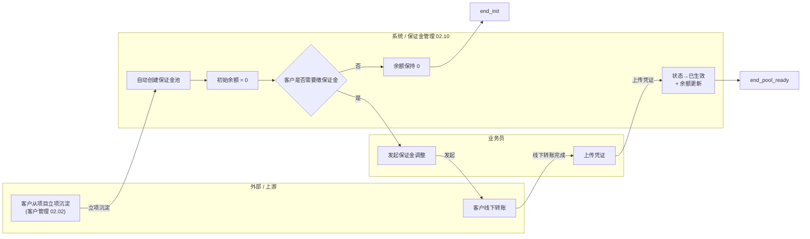
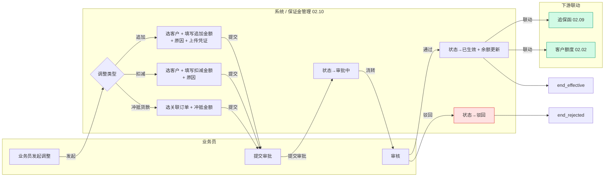
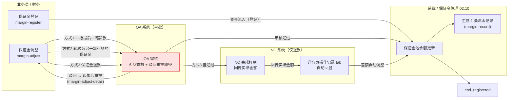
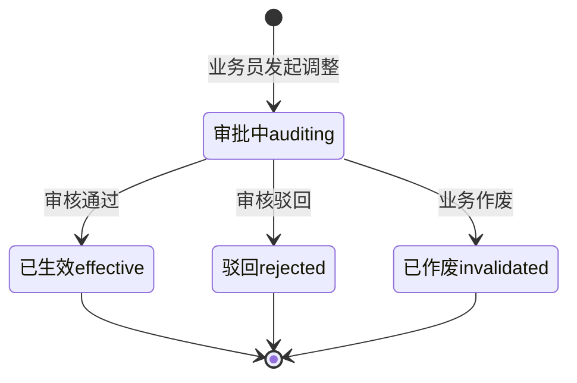

# 02.10 保证金管理 · 需求规格说明

> **文档类型**：PRD Writer 范式 · 落地需求文档 · 功能详细描述
> **对应总纲**：[00-产品概述与需求总纲.md](./00-产品概述与需求总纲.md)
> **通用规范**：[01-通用交互与文案规范.md](./01-通用交互与文案规范.md)
> **源文档（只读，未做任何改动）**：[02.10-保证金管理.md](../docs/02.10-保证金管理.md)
> **整理时间**：2026-09-30

---

## 0. 阅读说明

### 0.1 信息溯源标记

| 标记 | 含义 | 使用规则 |
|------|------|---------|
| ✅ | 源文档已明确 | 原值保留（表名 / 字段名 / 状态枚举 / 编号规则 / 提示文案），不改写口径 |
| 🔷 | 范式补全 | 源文档没写，按范式要求推导，**必须注明推导依据** |
| ⚠️ | 源文档自相矛盾 | **绝不静默选边**，如实并列，交由业务方裁决 |
| 🔷 现状核验 ✅ | 本次整理对 `pages/` / `app.html` 做的**只读** grep 核验（2026-09-30）| 结果为页面实现事实，**与源文档原值严格分离标注**，未修改任何文件 |
| [待补充] | 信息不足 | **严禁编造**，需业务方 / 研发回填 |

### 0.2 源文档阅读顺序

源文档 `02.10-保证金管理.md`（**422 行 / 18,770 字节**）由**两代口径叠加**构成：**§1-§10 是 v1.0 终版口径**（2026-07-24，基于原型 46-48 截图，自称「v1.0 新顶级模块」）、**§11 是 v1.7.99.x 模块级增量补充**（2026-09-24 追加，基于飞书《豫港通用户使用手册（内部版）》第 6.4 节 + 本仓库 v1.7.99.196 / 337 / 338 / 341 / 342 / 345 / 346 / 349 改造沉淀）。两代口径在**调整方式（4 种 vs 登记/调整二分 + 3 种方式）、状态数（3/4 vs 6）、页面数（3 vs 5/6）、预警机制（余额线 vs 比例阈值）、客户额度是否重算**上存在冲突（见 §3.4 C1-C11）。

| 源文档章节 | 内容 | 归位到本文档 |
|-----------|------|------------|
| 头部 + §0 章节导航 | 状态 / 复用度 50% / 3 张表 / 3 页面 sitemap | §1.1、§5.4、§6 |
| §1 业务定位 | 客户保证金池定位 + 港通特色 + 4 条关键规则 + 3 页面 sitemap | §1.1、§1.2、§6 |
| §2 业务流程全景 | 2.1 保证金池初始化 / 2.2 保证金调整流程 | §1.3.1、§1.3.2 |
| §3 核心实体（3 张表）| `t_margin_pool` / `t_margin_record` / `t_margin_offset` 逐字段 | §5.1、§5.2 |
| §4 状态机 | 状态机图 + 状态说明表 | §3.1.1、§3.2.1 |
| §5 字段规则 | 调整类型 `change_type` / 冲抵类型 `offset_type` / 余额计算 | §5.2.4、§5.2.5、§5.4.4 |
| §6 按钮交互 | 6.1 列表页按钮 / 6.2 列表字段 / 6.3 调整对话框 | §2.1.2、§2.1.3、§2.2.1 |
| §7 异常处理 | 6 条业务异常（含原文文案）| §2.3、§2.5、§4.1 |
| §8 跨模块流转 | 上游 2 条 / 下游 3 条 | §1.4.1 |
| §9 复用建议 | 50% / 复用 1 + 新建 / 4 周实施 | §5.4 |
| §10 文档版本 + 修改记录 | v1.0 + v1.7.99.x 全局规范 | §7.3 |
| **§11 v1.7.99.x 增量补充** | **11.1 业务变化 / 11.2 5 个 KPI 口径 / 11.3 3 种调整方式 / 11.4 等比例冲抵（3 控制点 + 2 组配置示例）/ 11.5 跨模块联动 / 11.6 异常补充 / 11.7 页面 PRD 索引 / 11.8 详细业务规则 / 11.9 修改记录** | **§1.1.2、§1.2.2、§1.3.3、§1.4.2、§2.2.2、§2.3、§2.5、§3.1.2、§3.2.2、§3.3、§3.4、§4.1、§4.4、§5.2.4、§5.2.5、§5.4、§6、§7** |

> ⚠️ **源文档自身的两处结构问题（照实记录，不代为修正）**：
> 1. **§4.1 标题写「3 状态说明」，表内实列 4 行**（`auditing` / `effective` / `rejected` / `invalidated`）——见 C3。
> 2. **§3 标题写「核心实体（3 张表）」，但 §9.3「港通新建表」也列了 3 张**（`t_margin_pool` / `t_margin_record` / `t_margin_offset`），加上 §9.2 复用 1 张 `t_payment_margin_voucher` = **共 4 张**；而 §9.1 复用度表写「港通新建表 **2 张**」——见 C4。

> 🔷 **本文档附只读核验**：为判断「源文档口径 vs 页面实际实现」是否一致，整理时对 `pages/margin-*.html`、`app.html`、`docs/p-margin-*.md` 做了**只读** grep / `ls` 核验（2026-09-30），结果逐条标注为「**🔷 现状核验 ✅**」。**未修改 `docs/` 与 `pages/` 下任何文件。**

### 0.3 与通用规范的关系

**通用表单规范（校验时机 / 返回保护 / 提交行为 / 危险操作确认 / 空状态 / 失败引导 / 通用 UI 6 态 / 通用样式 / 脱敏规范）一律以 [01-通用交互与文案规范.md](./01-通用交互与文案规范.md) 为准，本文档不重复定义，只写本模块特有的部分**：**登记（资金流入）与调整（资金流出）的二分语义**、**3 种调整方式各自的字段要点**、**5 个 KPI 权威口径公式（敞口金额不可颠倒、保证金比例四舍五入 2 位小数）**、**等比例冲抵货款的 3 个控制点（足额硬卡 / 修改策略 B / 统一配置入口）**、**保证金池行的「未足额」禁用态与红字徽标**、**余额预警线 / 余额红线阈值**、**⚠️ 页面归属矛盾（独立模块 vs 资金管理 sub 菜单）**、以及 **p-margin-record.md 已废弃、保证金调整记录以 p-margin-adjust-detail.md 为准**的文档事实。

### 0.4 飞书用户手册补充（2026-10-08）

> ✅ **补充来源**：飞书《豫港通数字供应链管理平台 — 用户使用手册（内部版）》**rev.8976** 第 **6.4 节「保证金管理」**。手册是**对着线上系统写的**，为权威口径，**优先于本文档原有的信息缺口标记**。手册原文一律**照抄**（枚举名 / 字段名 / 公式 / 文案一字不改），**手册未提及的仍保留原有标记，严禁编造**。

| 手册小节 | 归位到本文档 | 补充 / 消解了哪些内容 |
|---------|------------|----------------|
| **6.4 章节目标 + 内容指引** | §1.1 | **保证金的缴存 / 调整 / 退还** 三分口径 ✅ |
| **保证金池（按业务线汇总）** | §1.2、§5.4.5 | **待缴保证金记录的自动生成规则**（创建销售合同时填写保证金比例后自动生成）✅ |
| **5 个 KPI 口径公式** | §5.4.5、§3.4 C2 | **付款总金额 / 已回款总金额 / 敞口金额 / 当前保证金金额 / 当前保证金比例** 五条公式**逐字照抄** ✅ |
| **保证金列表字段 5 项** | §5.2.6 | **应付保证金金额 / 已付保证金金额 / 保证金余额 / 付款金额 / 已回款总金额** 定义**照抄** ✅ |
| **登记保证金 4 个字段** | §2.1.2、§5.2.7 | **应付保证金金额（可调整）/ 合同设置比例（可调整）/ 已付保证金金额 / 本次登记保证金金额 / 附件** ✅ |
| **保证金调整（追加 / 释放 / 转移）** | §2.2.1、§5.2.8 | ✅ **3 种调整方式**（冲抵最后一笔货款 / 转移为另一笔业务的保证金 / 保证金退款）+ **调整金额 / 情况说明（选填）/ 附件（非必填）** |
| **调整记录** | §3.3、§5.2.9 | **4 类记录**：登记记录 / 修改记录 / 划账记录 / 配置比例记录 ✅ |

> ⚠️ **手册未给、本次未消解的原有缺口**：保证金状态枚举值与 DDL、`t_margin_*` 三表字段类型、超限文案、OA 推送失败降级策略、NC 未回传兜底、余额预警线 / 红线阈值数值、调整方式与 `change_type` 枚举的映射等——**手册完全未提及，严禁编造**。

### 0.5 手册带来的既有矛盾更新（本次新增）

| 矛盾编号 | 变化 | 说明 |
|---------|------|------|
| **C1**（调整方式 4 种 vs 3 种） | **追加 ✅ 手册口径** | ✅ **手册明确「保证金调整」只有 3 种**：**冲抵最后一笔货款 / 转移为另一笔业务的保证金 / 保证金退款**——与 v1.0「4 种」冲突，**手册支持 3 种口径** |
| **C2**（5 个 KPI 公式） | **追加 ✅ 手册口径** | ✅ **手册逐字给出 5 条公式**，含「**敞口金额 = 付款总金额 − 已回款总金额**」与「**保证金比例四舍五入保留两位小数**」；且 ✅ **消解 C9 第 3 条**（「已付保证金金额」= 实际登记为保证金的凭证总金额） |
| **C10** | **🆕 本次新增** | **KPI 统计范围冲突**：手册 KPI 是「**平台中所有**采购/销售合同」，而列表字段「付款金额 / 已回款总金额」是「**业务线**上/下游合同」——平台维度 vs 业务线维度 |
| **C11** | **🆕 本次新增** | **调整方式命名冲突**：手册标题写「保证金调整（**追加 / 释放 / 转移**）」，但正文列的 3 种是「**冲抵最后一笔货款 / 转移为另一笔业务的保证金 / 保证金退款**」——标题与正文名称不一致 |

---

## 1. 功能描述与触发条件

### 1.1 功能描述

✅ **保证金管理是港通供应链的客户保证金池管理**（源文档 §1 原文，**v1.0 自称「新顶级模块」**）——**按客户维度管理保证金池，支持保证金调整（追加/扣减）和调整记录追溯**。

✅ **港通特色**（§1 原文照抄）——**主产品只有单笔追保函，港通需要「客户保证金池」概念**。

#### 1.1.1 v1.0 口径（§1.1，4 条关键规则，原值保留）

| # | 规则 | 出处 |
|---|------|------|
| 1 | **客户保证金池**：每个客户一个保证金池，记录余额 + 变动 | §1.1 规则 1 |
| 2 | **保证金调整**：追加保证金 / 扣减保证金 / 冲抵货款 | §1.1 规则 2 |
| 3 | **调整记录**：所有保证金变动都有详细记录（含原因/凭证）| §1.1 规则 3 |
| 4 | **联动追保函**：追保函已生效 → 自动更新保证金池 | §1.1 规则 4 |

#### 1.1.2 v1.7.99.x 口径（§11.1 模块业务变化表，2026-09-24，原值保留）

| 维度 | v1.0 文档 | v1.7.99.349 现状 |
|------|----------|------------------|
| 页面清单 | 3 页（保证金管理/调整/调整记录）| **6 页**：保证金池 / 登记 / 调整 / 调整记录详情 / 流水 / 等比例冲抵配置 |
| 业务语义 | 「调整」统称（追加/扣减）| **v1.7.99.341 后** 严格分**登记**（资金流入）与**调整**（资金转移/冲抵/退款）|
| 调整方式 | 追加/扣减/冲抵/追保函（4 种）| **v1.7.99.196 重写** 为：冲抵最后一笔货款 / 转移为另一笔业务的保证金 / 保证金退款（3 种）|
| 等比例冲抵 | 未提及 | **v1.7.99.349 新增**：保证金池每行支持「等比例冲抵货款」开关 + 冲抵比例（X%），影响未来付款按比例自动冲抵保证金 |
| 足额校验 | 未提及 | **v1.7.99.345 足额硬卡**：未足额禁止开启等比例冲抵（业务合规底线）|
| 修改冲抵比例 | 未提及 | **v1.7.99.346 修改策略 B**：允许修改，未来笔按新比例，已完成不回溯，变更记录最多 10 条 |

> ⚠️ **「页面清单 6 页」与源文档 §11.7 的 5 页索引不一致**，且与 🔷 现状核验 ✅ 的 5 个 `pages/margin-*.html` 不一致——见 C7。
> ⚠️ **「4 种调整方式」与「登记/调整二分 + 3 种调整方式」是两套分类法**，`t_margin_record.change_type` 的 4 个枚举值（`add`/`deduct`/`offset`/`bond_letter`）在 v1.7.99.196 后是否仍然有效，源文档未回填——见 C2。

### 1.2 触发条件

#### 1.2.1 v1.0 口径（§2.1 + §8，原值保留）

| # | 触发条件 | 触发动作 | 出处 |
|---|---------|---------|------|
| 1 | **客户从项目立项沉淀**（客户管理 02.02）| **系统自动创建保证金池**（初始余额 = 0）| §8.1 / §2.1 |
| 2 | **客户是否需要缴保证金** = 是 | 业务员发起保证金调整 → 客户线下转账 → 业务员上传凭证 → 状态→已生效 + 余额更新 | §2.1 |
| 3 | **客户是否需要缴保证金** = 否 | 余额保持 0 | §2.1 |
| 4 | **追保函（02.09）已生效** | **自动追加保证金到池** | §8.1 |
| 5 | **业务员发起调整** | 状态→审批中，等待审核 | §2.2 |

#### 1.2.2 v1.7.99.x 口径（§11.2 + §11.4 + §11.8，原值保留）

| # | 触发条件 | 触发动作 | 版本 | 出处 |
|---|---------|---------|------|------|
| 1 | **创建销售合同时填写保证金比例** | **自动生成一条待缴保证金记录**（保证金池列表按业务线汇总）| 手册 6.4 | §11.8 |
| 2 | **`paid >= payTotal`（已足额）** | 允许开启等比例冲抵货款开关 | v1.7.99.345 | §11.4 |
| 3 | **`paid < payTotal`（未足额）** | 开关 **disabled** + 红字「未足额」徽标 + tooltip 含具体差额 | v1.7.99.345 | §11.4 |
| 4 | **修改 `depositRatio`** | 弹窗二次确认 + 未来笔按新比例 + 已完成不回溯 + 变更记录最多 10 条 | v1.7.99.346 | §11.4 |
| 5 | **保证金登记「超额」** | 顶部**橙色 bar** 提示「该合同保证金已足额，登记会超额」+ 提供「查看保证金池」链接 | v1.7.99.x | §11.6 |
| 6 | **每次登记 / 调整** | **生成 1 条流水记录**（`margin-record`）| v1.7.99.x | §11.5 |
| 7 | **追保函未生效** | **保证金池状态 = 待追保** | v1.7.99.x | §11.5 |
| 8 | **-NC 系统完成打款后**（仅退款）| 回传「实际金额」→ 详情页操作记录 tab 自动回显 → 差额自动调整 | v1.7.99.196 | §11.5 |

### 1.3 业务流程（Mermaid）

#### 1.3.1 保证金池初始化流程（v1.0 口径，§2.1 原图照抄 + 🔷 泳道化）



> ✅ **节点文案原值照抄**（§2.1）。🔷 泳道化为本次重组按范式推导（依据：源文档 §8.1 明确「客户管理 02.02」为上游、§2.1 明确「客户线下转账」为外部动作、§6.1 明确「业务员」为发起角色）。

#### 1.3.2 保证金调整流程（v1.0 口径，§2.2 原图照抄 + 🔷 泳道化）



> ✅ **节点文案 + 绿色联动样式 `style I fill:#d1fae5,stroke:#059669` 原值照抄**（§2.2）。⚠️ **本图 v1.0 口径的「4 种调整方式」在 v1.7.99.196 后已被重写**（见 §1.3.3 与 C2）。

#### 1.3.3 保证金登记 / 调整 双轨流程（v1.7.99.x 口径，§11.3 + §11.5 + §11.8，🔷 据表推导）

🔷 **推导依据**：§11.1「v1.7.99.341 后严格分**登记**（资金流入）与**调整**（资金转移/冲抵/退款）」+ §11.3 的 3 种调整方式表 + §11.5 的 OA / NC 联动 + §11.8 的三步操作说明。**3 种调整方式的中文名与字段要点原值照抄**，泳道为推导。



> 🔴 **「OA 6 状态机」在源文档中从未枚举**——§11.5 只写「v1.7.99.196 强化：6 状态机 + 驳回重提路径」，**6 个状态的枚举值 / 中文名 / 出口条件全文未给**，与 §4 的 4 状态机也不一致（见 C3）[待补充]。
> 🔴 **「保证金登记」是否也需要 OA 审批，源文档未定义**（§11.8 只写「录入必填项后提交即可（→ OA 审核 + NC 退款）」，把 OA 审核挂在「保证金调整」流程下）[待补充]。

### 1.4 模块依赖（跨模块流转）

#### 1.4.1 v1.0 口径（§8，原值保留）

**上游触发**：

| 触发模块 | 触发条件 | 触发动作 |
|---------|---------|---------|
| 客户管理（02.02）| 客户从项目立项沉淀 | 自动创建保证金池 |
| 追保函（02.09）| 追保函已生效 | 自动追加保证金到池 |

**下游触发**：

| 触发模块 | 触发条件 | 触发动作 |
|---------|---------|---------|
| 客户额度（02.02）| 保证金变化 | 更新客户可用额度 |
| 订单付款（02.04）| 冲抵货款 | 占用保证金 |
| 预警中心（02.11）| 余额跌破预警线/红线 | 触发预警信号 |

#### 1.4.2 v1.7.99.x 口径（§11.5 跨模块联动增强，原值保留）

| 联动系统 | v1.0 描述 | v1.7.99.x 增强 |
|----------|-----------|----------------|
| **OA 系统** | 已记录 | v1.7.99.196 强化：6 状态机 + 驳回重提路径 |
| **NC 系统**（仅退款）| 文字提及 | v1.7.99.196 强化：**NC 完成打款后回传「实际金额」**，详情页操作记录 tab 自动回显；差额自动调整 |
| **追保函管理（02.09）** | 已记录 | 追保函未生效 → 保证金池状态=待追保（v1.7.99.x）|
| **客户额度（02.02）** | 已记录 | 联动方式不变；**保证金池余额变化不重算客户额度（保证金不等同于回款）** |
| **等比例冲抵配置**（新增）| 无 | v1.7.99.349：保证金池每行可开启/调整；登记页只读 |
| **保证金流水（margin-record）** | 未单独提及 | 每次登记/调整 → 生成 1 条流水记录 |

> ⚠️ **客户额度联动的两处口径直接对立**：§8.2「保证金变化 → **更新**客户可用额度」vs §11.5「保证金池余额变化**不重算**客户额度（保证金不等同于回款）」——见 C5。
> ⚠️ **「订单付款（02.04）」的模块编号已失效**：源文档 §8.2 引用 `02.04`，但 🔷 总纲 §编号规则已记录 **`02.04` 空缺**（「订单管理已于 v1.7.99.181 删除」）——本文档按原值照抄 `02.04`，同时记录该编号现状 [待补充]。
> ⚠️ **「保证金池状态 = 待追保」是一个第 5 个保证金池状态**，但 `t_margin_pool.status` 枚举（§3.1）只有 `active`/`frozen`/`closed` **3 值**，「待追保」**无对应枚举值**——见 C3。

#### 1.4.3 🔷 现状核验 ✅ 页面归属（2026-09-30 只读 `app.html`）

| 项 | 核验结果 | 依据 |
|----|---------|------|
| `app.html` 菜单 | 「保证金管理」/「保证金调整」/「保证金调整记录」3 项**位于 `{ sub: '资金管理', pages: [...] }` 块内**（该 sub 块内另有付款/退款/回款系列共 10 项）| `app.html:544` 起 sub 块；`:550/:551/:552` 3 条保证金项 |
| 「保证金调整记录」指向页面 | `margin-adjust-detail`（**不是** `margin-record`）| `app.html:552` |
| 「保证金登记」入口 | 🔷 `app.html` 菜单中**无 `margin-register` 独立菜单项**（v1.7.99.339 已抽屉化，见 §11.9）| `app.html:544-553` grep 无 `margin-register` |

> ⚠️ **已知的一处全局归属矛盾（任务书已登记）**：保证金在源文档中**独立成篇（02.10，自称「v1.0 新顶级模块」）**，但 `app.html` 菜单中 3 个页面实际挂在**资金管理（02.14）sub 菜单**下，**不是独立一级菜单**。**已登记在总纲 §9.1 Q6**。本文档 §1.4.3 如实标注，**不代为裁决**。详见 §3.4 C1。

---

## 2. 交互细节

### 2.1 角色操作矩阵（权限可见性）

#### 2.1.1 v1.0 口径（§6.1 + §6.2，原值保留）

源文档**未提供本模块的角色操作矩阵表**，仅在按钮可见条件中零散提及角色。下表按「✅ 源文档原值」+「🔷 推导（依据：§6.1 可见条件列 + §11.5 的 OA / NC 参与方）」整理。

| 操作 | 业务员 | 审核方 | 🔷 其他 | 依据 |
|------|--------|--------|-------|------|
| **新增保证金调整** | ✅ | 🔴 [待补充] | 🔴 [待补充] | §6.1 可见条件 = **业务员** |
| **数据导出** | ✅ | ✅ | ✅ | §6.1 可见条件 = **所有** |
| **详情** | ✅ | ✅ | ✅ | §6.1 可见条件 = **所有** |
| **列表行「调整」操作** | ✅ | 🔴 [待补充] | 🔴 [待补充] | §6.2 操作列 = 详情 / 调整 |
| **审核（通过/驳回）** | 🔶 **§6.1 可见条件未列审核角色** | ✅ 隐含存在 | — | §2.2「提交审批 → 审核 → 通过/驳回」；**审核人角色、权限、是否与发起人互斥，源文档未定义** [待补充] |
| **OA 审批操作** | 🔷 外部系统 | — | — | §11.5 |
| **NC 打款操作** | 🔷 外部系统（仅退款）| — | — | §11.5 |
| **开启 / 调整等比例冲抵（v1.7.99.345/346/349）** | 🔴 [待补充] | 🔴 [待补充] | — | §11.4 只给规则，**未给可见条件** [待补充] |
| **登记保证金（v1.7.99.337/339/341）** | 🔴 [待补充] | 🔴 [待补充] | — | §11.9 |

> 🔴 **源文档 §6.1「新增保证金调整」可见条件写「业务员」，但 §2.2 流程中「审核」是独立环节**——**审核角色（业务经理？风控？财务？）在 02.10 源文档中从未出现**，与 02.09 追保函（业务 + 风控双审）也不同。**审批人角色与权限是本模块最大的权限缺口** [待补充]。

#### 2.1.2 列表页按钮（§6.1，3 项，原值保留）

| 按钮 | 位置 | 可见条件 | 点击行为 |
|------|------|---------|---------|
| **新增保证金调整** | 右上 | 业务员 | 弹调整对话框 |
| 数据导出 | Tab 右侧 | 所有 | 导出 Excel |
| **详情** | 列表行 | 所有 | 跳详情页 |

#### 2.1.3 列表字段（§6.2，**6 列**，原值保留）

| 列 | 说明 |
|---|------|
| 客户名称 | 公司名称 |
| 总余额 | 当前总余额 |
| 已占用 | 冲抵占用余额 |
| 可用余额 | 总余额 - 已占用 |
| 状态 | active / frozen / closed |
| 操作 | 详情 / 调整 |

> ⚠️ **v1.0 列表按「客户」维度组织（6 列，客户名称为首列）**；§11.2 / §11.4 / §11.8 的 v1.7.99.x 口径按「**合同**」维度组织（KPI 按业务线汇总、每行一个销售订单/单批次合同、等比例冲抵开关挂在行上）——**列表主键维度已从「客户」变为「合同」，源文档从未明说这次切换**。见 C8。
> 🔷 现状核验 ✅ `margin-pool.html` 表头实为 **13 列**：销售订单/单批次合同编号(9%) / 买方企业(11%) / 品名(7%) / 合同数量(吨)(7%) / 当前比例·合同应缴比例(%)(9%) / 应付保证金金额(元)(9%) / 已付保证金金额(元)(9%) / 已回款总金额(元)(8%) / 敞口金额(元)(8%) / 保证金金额(元)(7%) / 合同签订日期(8%) / **等比例冲抵货款(7%，v1.7.99.341 新增)** / 操作(8%)——`margin-pool.html:357-381`。

### 2.2 按钮交互（操作反馈）

#### 2.2.1 调整对话框（v1.0 口径，§6.3，7 字段，原值保留）

| # | 字段 | 必填条件 | 说明 |
|---|------|---------|------|
| 1 | **调整类型** | ✓ 必填 | 追加 / 扣减 / 冲抵货款 |
| 2 | **客户** | ✓ 必填 | 下拉选择 |
| 3 | **金额** | ✓ 必填 | 数字 |
| 4 | **原因** | ✓ 必填 | 文本 |
| 5 | **付款凭证** | **追加时必填** | 上传图片/PDF |
| 6 | **关联订单** | **冲抵货款时必填** | 选择订单 |
| 7 | **关联追保函** | **追保函类型时必填** | 选择追保函 |

> ⚠️ **第 7 项「关联追保函」的必填条件是「追保函类型时」**，但**第 1 项「调整类型」只有 3 个选项（追加/扣减/冲抵货款），不含「追保函」**——**「追保函类型」在这个对话框里无法被选中，该字段成为死字段**。见 C2。
> 🔴 **字段级规范缺失**：金额的最大值 / 小数位、原因的字符上限、凭证的文件格式与大小上限、客户下拉是否按状态过滤——**§6.3 全部未给** [待补充]（通用格式规范见 01 文档）。

#### 2.2.2 v1.7.99.196 3 种调整方式的字段要点（§11.3，原值保留）

| 调整方式 | 含义 | 触发场景 | 字段要点 |
|----------|------|----------|----------|
| **冲抵最后一笔货款** | 将当前剩余保证金登记为货款 | 客户要求保证金抵货款 | 当前保证金（**灰置**）+ 冲抵货款金额（**≤ 当前保证金**）+ 情况说明 + 附件 |
| **转移为另一笔业务的保证金** | 将当前剩余保证金转移至关联合同 | 多合同间余额调度 | 当前保证金（**灰置**）+ 转移金额（**≤ 当前保证金**）+ 选择合同（**仅限「执行中 / 待上传双签合同」**）+ 情况说明 |
| **保证金退款** | 直接登记退款（OA + NC）| 客户终止合作 | 当前保证金（**灰置**）+ 申请退款金额 + **收款账号名称（带出账号/开户行）** + 退款日期 + 情况说明 |

✅ **v1.0 vs v1.7.99.196 关键决策**（§11.3 原文照抄）：

| 决策 | 原文 |
|------|------|
| **旧版分类法不准确** | 「追加」本质是「保证金**登记**」，「扣减」对应 3 种调整方式之一 |
| **语义更贴近业务真实** | 登记（资金流入）vs 调整（资金流出）|

> ⚠️ **3 种调整方式的「提交后 tip 提示文案」「二次确认弹窗」源文档均未给** [待补充]（对比 02.13 销售结算的 3 种弹窗已给全，见 [02.13-结算单管理.md](./02.13-结算单管理.md) §2.3）。
> 🔴 **「保证金退款」涉及收款账号名称 / 账号 / 开户行，属 01 文档 §6.1 强制脱敏范畴**（银行卡号）——**源文档未定义脱敏规则** [待补充]。

#### 2.2.3 等比例冲抵货款配置（v1.7.99.345 / 346 / 349，§11.4，**3 个控制点**，原值保留）

| 控制点 | 规则 | 版本 |
|--------|------|------|
| **足额硬卡** | `paid >= payTotal` 才允许开启等比例冲抵；未足额开关 disabled + 红字「未足额」徽标 | v1.7.99.345 |
| **修改 depositRatio 策略** | 允许修改；未来笔按新比例；已完成不回溯；变更记录最多 10 条 | v1.7.99.346 |
| **配置入口** | 保证金池列表页（统一入口）；登记页 / 详情页 / 新建页只读展示 | v1.7.99.349 |

✅ **配置示例**（§11.4 原文照抄）：

```
合同: GTGYL-DFHT-2024-001
敞口金额: ¥1,000,000
已付保证金: ¥600,000   ← 不足
等比例冲抵开关: [灰色禁用]
配置入口徽标: 「未足额：还差 ¥400,000」

合同: YL-MSXS-2024-088
敞口金额: ¥1,200,000
已付保证金: ¥1,250,000  ← 超额
等比例冲抵开关: [紫色"开"]   ← 已开启
配置入口徽标: 「已开启 冲抵比例 25%」
未来付款¥100,000 → 自动冲抵保证金 ¥25,000
```

> 🔷 现状核验 ✅ `margin-pool.html` 中存在：① 列表页每行内嵌 toggle switch（`v1.7.99.350`，`margin-pool.html:33/373-374`）；② 配置弹窗「配置等比例冲抵货款」（`v1.7.99.341`，`:530-534`）；③ 变更记录弹窗「等比例冲抵货款比例 变更记录」（`v1.7.99.346`，`:504-508`）；④ 未足额时红色提示「⚠ 当前合同保证金未足额，无法启用等比例冲抵货款」（`:681/709`）；⑤ `v1.7.99.350` **去掉了「未足额」信息说明**，与其他状态统一显示「调整比例」（`:599`）——**与 §11.4 示例中的「未足额：还差 ¥400,000」徽标口径不一致**，见 C9。
> ⚠️ **「配置入口统一在保证金池页」与调整详情页仍可改比例冲突**：🔷 现状核验 ✅ `margin-adjust-detail.html:57/283/348` 存在「`v1.7.99.276` 设置等比例冲抵货款比例」弹窗并可写入新比例——见 C9。

### 2.3 危险操作确认

| 操作 | 确认方式 | 提示文案 | 来源 |
|------|---------|---------|------|
| **修改 `depositRatio`** | **弹窗二次确认** + 历史不回溯 + 变更记录最多 10 条 | 🔴 源文档**未给确认弹窗文案** [待补充] | ✅ §11.4 / §11.6（v1.7.99.346 策略 B）|
| **余额跌破红线** | 无人工确认（系统自动）| `"客户 X 保证金余额跌破红线"` | ✅ §7 原文照抄 |
| **余额跌破预警线** | 无人工确认（系统黄灯提醒）| `"客户 X 保证金余额跌破预警线"` | ✅ §7 原文照抄 |
| **扣减金额 > 可用余额** | 阻止 | `"扣减金额 X 超过可用余额 Y"` | ✅ §7 原文照抄 |
| **冲抵金额 > 订单未付金额** | 阻止 | `"冲抵金额 X 超过订单未付金额 Y"` | ✅ §7 原文照抄 |
| **客户已被冻结** | 阻止 | `"客户 X 已被冻结，不能调整保证金"` | ✅ §7 原文照抄 |
| **客户已作废** | 阻止 | `"客户 X 已作废，不能调整保证金"` | ✅ §7 原文照抄 |
| **调整 `depositRatio` 的 v1.7.99.276 路径** | 🔴 源文档未记录该路径 | 🔴 [待补充] | 🔷 现状核验 ✅ `margin-adjust-detail.html:283` |

> 🔴 **「作废保证金调整单」这一危险操作在 02.10 源文档中从未定义**——§4 状态机有 `invalidated`（已作废）状态和「业务作废」触发，但**没有作废按钮、作废权限、作废确认文案** [待补充]（02.13 销售结算有完整的「作废原因必填弹窗 + tip 提示『结算单已作废』」可参照）。

### 2.4 空状态引导

| 场景 | 空状态表现 | 引导操作 | 依据 |
|------|----------|---------|------|
| 保证金池列表无数据 | 🔷 空状态 + 文案 `暂无数据` | 🔷 「登记保证金」/「新增保证金调整」 | 🔷 01 文档 §2.11 + ✅ §11.9（v1.7.99.337 保证金池加「登记保证金」按钮）|
| 合同选择列表为空（转移为另一笔业务）| 🔷 `暂无可选合同` | 🔷 提示：仅「执行中 / 待上传双签合同」可选项 | 🔷 + ✅ §11.3 |
| 关联订单选择列表为空（冲抵货款）| 🔷 `暂无可选订单` | 🔷 先完成订单执行 | 🔷 + ✅ §6.3 |
| 保证金流水 tab 无数据 | 🔷 `暂无数据` | 🔷 切换其他 tab | 🔷 01 文档 §2.11 |
| 调整详情页「操作记录」tab 无记录 | 🔷 `暂无操作记录` | 🔷 — | 🔷 + ✅ §11.5（NC 实际打款回传）|
| 变更记录弹窗无记录 | 🔷 `暂无变更记录` | 🔷 首次启用时不展示弹窗入口 | 🔷 + ✅ §11.4 |

### 2.5 失败引导

| # | 异常场景 | 提示文案（原文照抄）| 处理动作 | 来源 | 失败引导 |
|---|---------|------------------|---------|------|---------|
| 1 | 扣减金额 > 可用余额 | `"扣减金额 X 超过可用余额 Y"` | 阻止 | ✅ §7 | 🔷 红字内联在金额字段 |
| 2 | 冲抵金额 > 订单未付金额 | `"冲抵金额 X 超过订单未付金额 Y"` | 阻止 | ✅ §7 | 🔷 红字内联 + 定位订单选择器 |
| 3 | 客户已被冻结 | `"客户 X 已被冻结，不能调整保证金"` | 阻止 | ✅ §7 | 🔷 红字内联 + 客户字段置灰 |
| 4 | 客户已作废 | `"客户 X 已作废，不能调整保证金"` | 阻止 | ✅ §7 | 🔷 红字内联 + 客户字段置灰 |
| 5 | 余额跌破预警线 | `"客户 X 保证金余额跌破预警线"` | **黄灯提醒** | ✅ §7 | 🔷 黄色警示条 / 列表标黄 |
| 6 | 余额跌破红线 | `"客户 X 保证金余额跌破红线"` | **触发追保函** | ✅ §7 | 🔷 红色警示条 + 跳转 02.09 |
| 7 | 等比例冲抵「未足额」试图开启 | **开关 disabled + 红字「未足额」徽标 + tooltip 含具体差额** | 阻止 | ✅ §11.6（v1.7.99.345）| 🔷 tooltip「已付 X 元 / 应付 Y 元，需补足后方可启用」|
| 8 | 调整 `depositRatio` | **弹窗二次确认 + 历史不回溯 + 变更记录最多 10 条** | 允许（策略 B）| ✅ §11.6（v1.7.99.346）| 🔷 弹窗内展示「仅影响未来未登记的回款，已完成的回款不会重算」|
| 9 | 保证金登记「超额」 | **顶部橙色 bar** 提示「该合同保证金已足额，登记会超额」+ 提供「查看保证金池」链接 | 允许（仅提醒）| ✅ §11.6 | 🔷 橙色 bar 常驻至关闭或改额 |
| 10 | **同一合同并发登记** | **提交时二次校验已付金额**，如已被另一笔登记覆盖则提示 `"已被其他登记覆盖，请刷新后重试"` | 阻止 | ✅ §11.6 | 🔷 提示 + 「刷新」按钮 |
| 11 | OA 审核驳回 | v1.7.99.196 后在 `margin-adjust-detail.html` 支持「**调整后重提**」路径 | 允许重提 | ✅ §11.6 | 🔷 详情页「调整后重提」按钮 |
| 12 | 合同已作废发起调整 | `"合同已作废，无法调整"` | 阻止 | ✅ §11.6（v1.0 已记录 → v1.7.99.x 强化）| 🔷 红字内联 |
| 13 | 转移时关联合同状态非「执行中 / 待上传双签合同」 | `"请选择执行中或待上传双签合同"` | 阻止 | ✅ §11.6（v1.7.99.196 新增）| 🔷 红字内联在合同选择器 |
| 14 | **OA 系统不可用 / 超时** | 🔴 [待补充]——**OA 推送失败的提示文案与降级策略源文档未定义** | [待补充] | 🔴 | 🔴 |
| 15 | **NC 未回传实际金额** | 🔴 [待补充]——§11.5 只说「NC 完成打款后回传」，**未说超期未回传时的兜底** | [待补充] | 🔴 | 🔴 |
| 16 | **余额跌破红线后追保函生成失败** | 🔴 [待补充]——§7 记「触发追保函」，**与 02.09 的自动生成路径的对接失败兜底未定义** | [待补充] | 🔴 | 🔴 |

---

## 3. 状态清单

### 3.1 业务状态机

#### 3.1.1 v1.0 状态机（§4 原图照抄，**图上 4 状态，§4.1 表列 4 行**）



> ⚠️ **§4.1 标题写「3 状态说明」，表内实列 4 行**——见 C3。
> ⚠️ **「驳回」在 v1.0 是终态（`驳回rejected --> [*]`）**，但 §11.6 明确「v1.7.99.196 后在 `margin-adjust-detail.html` 支持『**调整后重提**』路径」——**驳回后能否重新提交，两代口径冲突**。

#### 3.1.2 v1.7.99.x OA 6 状态机（§11.5，🔶 源文档提及但**未枚举**）

🔴 **源文档 §11.5 只写「v1.7.99.196 强化：**6 状态机** + 驳回重提路径」，**6 个状态的枚举值 / 中文名 / 触发 / 出口全文未给**。**

🔷 **可确定的边界条件（仅 2 条有源文档依据）**：

| 已知事实 | 原文 | 出处 |
|---------|------|------|
| 存在「驳回」状态且**支持重提** | 「v1.7.99.196 后在 margin-adjust-detail.html 支持『调整后重提』路径」| §11.6 |
| 存在「作废」路径 | §11.6「合同已作废发起调整」是**校验**（阻止发起），**不是「已发起单据的作废」**——02.10 的 `invalidated` 状态在 v1.7.99.x 口径下是否仍存在，源文档未说明 | §11.6 + §4 |

🔴 **完整 6 状态机的枚举值、中文名、状态 tag 颜色、列表 tab 结构，全部 [待补充]**。见 C3。

> ⚠️ **保证金池自身还有一套状态**（与「保证金调整单」状态不同）：`t_margin_pool.status` = `active` / `frozen` / `closed`（§3.1）+ §11.5 的「待追保」= **4 值，但只有 3 个有枚举定义**。见 C3。

#### 3.1.3 🔷 现状核验 ✅ 页面状态实现（2026-09-30 只读 grep）

| 页面 | 核验结果 | 依据 |
|-----|---------|------|
| `margin-pool.html` | 🔷 **无状态 tab**，按「合同」维度列表 + 6 个统计卡片 + 13 列表格 | `margin-pool.html:273-302` / `:357-381` |
| `margin-register.html` | 🔷 无状态 tab（单记录登记页）| `margin-register.html:245-305` |
| `margin-adjust.html` | 🔷 **未 grep 到 `auditing` / `effective` / `rejected` / `invalidated` 任何状态枚举值**；页面为「保证金调整」表单页（附件区 + 退款明细区 + 调整列表）| `margin-adjust.html:518-664` |
| `margin-adjust-detail.html` | 🔷 存在 `status-badge adjusted` 单一态「**已调整**」（`#ECFDF5` / `#059669`），**与 v1.0 的 4 状态枚举不对应** | `margin-adjust-detail.html:19-20/129` |
| `margin-record.html` | 🔷 **3 tab**：全部 32 / 已生效 28 / 已驳回 4（**中文名与 v1.0 的 `effective` / `rejected` 对应，但比 4 状态少 2 个**）| `margin-record.html:145-148` |

> 🔴 **`margin-adjust-detail.html` 的「已调整」与 v1.0 的 4 状态（审批中/已生效/驳回/已作废）无法对应**——**调整记录详情页的状态语义在 v1.7.99.x 被重命名/重定义，源文档未记录** [待补充]。
> ⚠️ **`margin-record.html` 页面在 `docs/p-margin-record.md` 中被明确标记「已废弃」**（详见 §6 与 C7）。

### 3.2 状态值与展示

#### 3.2.1 v1.0 口径（§4.1，表列 4 行，原值保留）

| # | 状态枚举 | 中文 | 触发条件 | 下一状态 | Tag 色 |
|---|---------|------|---------|---------|--------|
| 1 | `auditing` | 审批中 | 业务员发起 | 审核通过 / 驳回 / 作废 | 🔴 [待补充]——02.10 源文档**未给状态色**；🔷 参照 02.09 同状态 `#FEF3C7` / `#A16207`（见 §3.2.3 说明）|
| 2 | `effective` | 已生效 | 审核通过 | **终态** | 🔴 [待补充]（🔷 参照 02.09 `#D1FAE5` / `#047857`）|
| 3 | `rejected` | 驳回 | 审核驳回 | **终态** ⚠️ | 🔴 [待补充]（🔷 参照 02.09 `#FEE2E2` / `#DC2626`）|
| 4 | `invalidated` | 已作废 | 业务作废 | **终态** | 🔴 [待补充]（🔷 参照 02.09 `#F3F4F6` / `#6B7280`）|

> ✅ **02.10 源文档全文未给任何状态色值**。修改记录只写「🟡 状态 tag 颜色编码（v1.7.99.14）」为全局规范引用，**未落到本模块的具体色值**。上表色值为**跨模块参照推导**，**不覆盖源文档**。
> 🔷 现状核验 ✅ `margin-adjust-detail.html:19-20` 页面实色为 `.status-badge.adjusted { background: #ECFDF5; color: #059669; }`——**与上述任何一版推导色值均不同**（`#ECFDF5` vs `#D1FAE5`）。

#### 3.2.2 保证金池状态 `t_margin_pool.status`（§3.1，原值保留）

| 枚举值 | 中文 | 触发条件 | 下一状态 | Tag 色 | 备注 |
|--------|------|---------|---------|--------|------|
| `active` | 正常 | 🔴 [待补充] | 🔴 [待补充] | 🔴 [待补充] | ✅ §3.1 枚举；触发条件源文档未给 |
| `frozen` | 冻结 | 🔴 [待补充] | 🔴 [待补充] | 🔴 [待补充] | ✅ §3.1 枚举；**§7 只说「客户已被冻结」时禁止调整，未说冻结由谁触发、冻结后能否恢复** [待补充] |
| `closed` | 关闭 | 🔴 [待补充] | 🔴 [待补充] | 🔴 [待补充] | ✅ §3.1 枚举 |
| 🔴 **「待追保」** | 待追保 | **追保函未生效** | 🔴 [待补充] | 🔴 [待补充] | ⚠️ **§11.5 提到但 `t_margin_pool.status` 枚举中无此值**——见 C3 |

#### 3.2.3 调整类型 `change_type` / 冲抵类型 `offset_type` 枚举（§5.1 / §5.2，原值保留）

| 字段 | 枚举值 | 中文 | 来源 |
|------|-------|------|------|
| `change_type` | `add` | 追加 | ✅ §3.2 / §5.1 |
| `change_type` | `deduct` | 扣减 | ✅ §3.2 / §5.1 |
| `change_type` | `offset` | 冲抵货款 | ✅ §3.2 / §5.1 |
| `change_type` | `bond_letter` | 追保函 | ✅ §3.2 / §5.1 |
| `offset_type` | `proportional` | 等比例减少保证金 | ✅ §3.3 / §5.2 |
| `offset_type` | `full_until_last` | 全额维持至尾批（**v1.0 待确认业务**）| ✅ §3.3 / §5.2 |

> ⚠️ **`offset_type` 是 v1.0 的「按订单冲抵」概念**（记在 `t_margin_offset.offset_type`）；**v1.7.99.349 的「等比例冲抵货款」是另一套东西**（保证金池行的 `depositRatio` 百分比开关，作用于「未来每笔付款」）——**两者是否同一个业务，源文档未说明**。见 C2。
> 🔴 **`change_type` 与 `full_until_last` 在 v1.7.99.196 后的存废未回填**：`add`（→ 登记）/ `deduct`（→ 3 种调整方式）/ `bond_letter`（→ §11.5 待追保）**三个值在重写后是否仍写入 `t_margin_record.change_type`，源文档未说** [待补充]。

### 3.3 UI 状态清单

> 通用 6 态以 [01-通用交互与文案规范.md](./01-通用交互与文案规范.md) §3.2 为准；下表为**本模块（保证金池列表页 + 保证金登记页 + 保证金调整页 + 保证金调整详情页 + 保证金流水页 + 等比例冲抵配置弹窗 + 变更记录弹窗 + 超额橙色 bar）**的落地映射。**6 态齐全：默认 / 加载中 / 成功 / 失败 / 禁用 / 空状态**。

| 状态 | 触发 | 视觉 | 可交互 |
|------|------|------|-------|
| **默认** | 页面加载完成 | 保证金池列表页：标题「保证金管理」+ **6 个统计卡片**（应付保证金金额(元) / 已付保证金金额(元) / 已回款总金额(元) / 敞口金额(元) / 当前保证金金额(元) / 当前保证金比例%）+ 业务线筛选下拉（**全部** / 存货业务 / 预付业务 / 账期业务 / 购销业务）+ **13 列表格** + 操作列（🔷 现状核验 ✅ 含「登记保证金」+ 详情 + 调整）| ✅ 全部按钮可点；每行「等比例冲抵货款」toggle 按足额态显隐 |
| **加载中** | 登记提交中 / 调整提交中 / 开关切换中 / 比例修改中 / 流水分页切换中 | 按钮 loading + 旋转图标 + 禁用 🔷；配置弹窗内比例 input 禁用 🔷 | ❌ 禁用重复提交 |
| **成功** | 登记成功 / 调整提交成功 / OA 审核通过 / 等比例冲抵首次启用 / 冲抵比例修改保存 | 顶部居中 Toast 绿色 `#10B981`，3s 自动消失；🔷 现状核验 ✅ 原文 `已保存等比例冲抵配置`（`margin-pool.html:742`）/ `已保存。等比例冲抵货款比例从 X% 调整为 Y%，仅影响未来未登记的回款，已完成的回款不会重算。`（`:741`）| — |
| **失败** | 14 类业务异常（§2.5 第 1-6、7、9、10、12、13 条为阻止/提醒类）| Toast 红色 `#EF4444`（不自动消失）；或**红字内联**（`扣减金额 X 超过可用余额 Y`）；**红色警示**（`⚠ 当前合同保证金未足额，无法启用等比例冲抵货款`，🔷 现状核验 ✅ `margin-pool.html:681/709`）；**黄色 Toast**（`Utils.toast(..., 'warning')`）| ✅ 按钮恢复可点 |
| **禁用** | ① **`paid < payTotal`（未足额）** → 等比例冲抵开关 **disabled 灰色** + 红字「未足额」徽标（v1.7.99.345 足额硬卡）；② 客户 `frozen` / `closed` 状态 → 调整入口禁用（§7）；③ 转移方式下非「执行中 / 待上传双签合同」的合同选项 → 不可选（§11.3）；④ 登记页 / 详情页 / 新建页的等比例冲抵配置 → **只读展示**（v1.7.99.349）；⑤ 冲抵金额 > 当前保证金 → 不可提交（§11.3）| 开关 `disabled` + 灰底；只读态徽标（🔷 现状核验 ✅ `margin-register.html:296-305` v1.7.99.342 「去掉开关，纯状态徽标（已开启/已关闭）」）| ❌ 不可开启 / 不可编辑 |
| **空状态** | 列表无数据 / 筛选无结果 / 合同选择列表为空 / 订单选择列表为空 / 流水 tab 无数据 / 操作记录 tab 无记录 / 变更记录弹窗无记录 | 空状态插画 + 灰字居中（🔷 `.empty-row { padding: 40px 0; color: var(--text-tertiary); }`，01 文档 §3.2）；文案 `暂无数据` / `暂无可选合同` / `暂无可选订单` / `暂无操作记录` / `暂无变更记录` | ✅ 引导操作（登记保证金 / 新增保证金调整 / 清除筛选 / 切换 Tab）|

🔷 **本模块特有的 UI 状态补充**（§2 已逐条给出来源）：

| 状态 | 触发 | 视觉 | 可交互 | 依据 |
|------|-----|------|-------|------|
| **「未足额」禁用态** | `paid < payTotal` | 开关**灰色禁用** + 弹窗内红色提示「⚠ 当前合同保证金未足额，无法启用等比例冲抵货款」+ 已付 / 应付金额明细 | ❌ 不可开启；✅ 可点开弹窗查看差额 | ✅ §11.4 / §11.6；🔷 现状核验 ✅ `margin-pool.html:670-681/709` |
| **「已开启」紫色态** | 已启用等比例冲抵 | 开关**紫色「开」** + 徽标「已开启 冲抵比例 25%」+ 按钮文案「调整比例」 | ✅ 可点开改比例 | ✅ §11.4；🔷 现状核验 ✅ `margin-pool.html:359/599/611/649` |
| **超额橙色 bar 态** | 登记金额 > 应付保证金 | 顶部**橙色 bar**「该合同保证金已足额，登记会超额」+ 「查看保证金池」链接 | ✅ 可关闭 / 可跳保证金池 | ✅ §11.6 |
| **余额跌破预警线（黄灯）** | `available_balance < warn_line` | **黄灯**提醒 | ✅ 可查看 | ✅ §7 |
| **余额跌破红线** | `available_balance < red_line` | **触发追保函**（02.09）| ✅ 跳转 02.09 | ✅ §7 |
| **「当前保证金」灰置只读态** | 3 种调整方式的表单中 | 「当前保证金」字段**灰置**（不可编辑，随方式联动）| ❌ 只读 | ✅ §11.3 |
| **计算回显只读态** | 登记页输入「应付保证金金额」 | 「计算规则」说明 + 现金 / 冲抵比例回显（🔷 现状核验 ✅ `margin-register.html:271/293`：本次登记保证金 = 应付保证金 × (1 − 冲抵比例)）| ❌ 只读 | 🔷 现状核验 ✅ |
| **「调整后重提」态** | 状态 = 驳回 | 详情页显示「调整后重提」入口 | ✅ 可重提 | ✅ §11.6 |
| **NC 实际金额回显态** | 退款类调整的 NC 完成打款 | 详情页**操作记录 tab** 自动回显 NC 回传实际金额 + 差额自动调整 | ✅ 只读 | ✅ §11.5 |

### 3.4 版本冲突

> ⚠️ 以下 **C1-C11** 为源文档内部交叉比对（v1.0 / v1.7.99.x 两代口径）+ `app.html` / `pages/` / `docs/` 只读核验后确认的自相矛盾，本次重组**未选边**，全部如实并列，交由业务方裁决。

**C1 — ⚠️ 保证金管理是独立一级模块还是资金管理（02.14）子模块（🔴 阻塞菜单与权限配置；已登记总纲 §9.1 Q6）**

| 口径 | 表述 | 菜单层级 | 出处 |
|------|------|---------|------|
| **v1.0 §1** | 「**保证金管理**是港通供应链的客户保证金池管理（**v1.0 新顶级模块**）」| **独立一级** | §1 / 文档头部「状态：v1.0 终版（**新顶级模块**）」|
| **文档编号体系** | 独立成篇 `02.10`，与 02.09 追保函、02.11 预警中心平级 | **独立一级** | `docs/02.10-保证金管理.md` 文件本身 |
| 🔷 现状核验 ✅ | `app.html:544` `{ sub: '资金管理', pages: [...] }` 块内含 3 条保证金项（`:550` 保证金管理 / `:551` 保证金调整 / `:552` 保证金调整记录），与付款/退款/回款系列同级 | **资金管理 sub 下** | `app.html:544-553` 只读 grep |
| **总纲 §9.1 Q6** | 「保证金是**独立一级模块**还是**资金管理子模块**？`02.10-保证金管理.md` 独立成篇；但 `app.html` 菜单中挂在**资金管理** sub 下」——🟡 影响菜单层级与权限配置 | **未裁决** | `00-产品概述与需求总纲.md:679` |

⚠️ **冲突**：**源文档自称「新顶级模块」并独立编号 02.10，实际实现挂在资金管理（02.14）sub 菜单下**。**这决定了权限配置是按「一级模块」还是按「资金管理子权限」下发**。**已登记总纲 §9.1 Q6，本次重组不代为裁决。**

**衍生问题**：
1. 🔴 保证金相关的权限点在 02.14 资金管理的权限表里还是独立配置？源文档未涉及
2. ⚠️ 「保证金调整记录」菜单指向 `margin-adjust-detail`，而 §11.7 索引中的 `margin-record.html`（保证金流水）**没有菜单入口**——见 C7

**影响：左侧菜单层级、面包屑路径、角色权限点配置、PRD 索引组织方式。**

**C2 — 调整方式分类法 4 种 vs 登记/调整二分 + 3 种（🔴 阻塞 `change_type` 枚举与表单结构）**

| 口径 | 分类法 | 数量 | `change_type` 对应 | 出处 |
|------|--------|-----|-----------------|------|
| **v1.0 §1.1 规则 2 / §5.1** | 追加 / 扣减 / 冲抵货款 / 追保函 | **4 种** | `add` / `deduct` / `offset` / `bond_letter` | §1.1 / §5.1 / §3.2 |
| **v1.0 §6.3 调整对话框** | 追加 / 扣减 / 冲抵货款（**下拉只有 3 项**）| **3 项** | 死字段：「关联追保函」的必填条件写「**追保函类型时**」，但下拉无该项 | §6.3 |
| **v1.7.99.196 §11.1 + §11.3** | **登记**（资金流入）vs **调整**（资金流出）；调整下分 3 种：冲抵最后一笔货款 / 转移为另一笔业务的保证金 / 保证金退款 | **登记 1 + 调整 3** | 🔴 **4 个旧枚举值在新分类法下的映射未给** | §11.1 / §11.3 |

⚠️ **冲突**：
1. **v1.0 内部就不自洽**——`change_type` 定义 4 值，但调整对话框下拉只给 3 项，**「关联追保函」字段永远无法触发必填**（死字段）
2. **v1.7.99.196 把 4 种重写为「登记 + 3 种调整」**，但**从未回填 `t_margin_record.change_type` 的新枚举值**——4 个旧值是保留、扩展、还是重命名，源文档未说
3. 🔴 **`bond_letter`（追保函）在新分类法中的位置未定义**——§11.5 只说「追保函未生效 → 保证金池状态=待追保」，那是**保证金池状态**，不是 `change_type`

**衍生问题**：
- 🔴 **保证金「登记」是否也写入 `t_margin_record`？** §11.5 说「每次登记/调整 → 生成 1 条流水记录」，但登记的 `change_type` 值是什么，未给 [待补充]
- ⚠️ **`offset_type`（`proportional` / `full_until_last`）与 v1.7.99.349 的「等比例冲抵货款（`depositRatio` 百分比）」是否同一业务？** v1.0 的 `offset_type` 是**按订单冲抵的策略枚举**（记在 `t_margin_offset`），v1.7.99.349 的是**保证金池行的全局开关 + 百分比**（影响未来每笔付款）——**两者作用域完全不同（单订单 vs 整池），源文档从未说明关系**。见 §3.2.3

**影响：`t_margin_record.change_type` / `t_margin_offset.offset_type` DDL、调整对话框字段与下拉项、流水类型筛选。**

✅ **手册口径（rev.8976 · 6.4，2026-10-08 补入）**：手册 6.4 明确「保证金调整（追加 / 释放 / 转移）」的**正文只列 3 种方式**——**冲抵最后一笔货款 / 转移为另一笔业务的保证金 / 保证金退款**（逐字照抄，见 §5.5.2）。✅ **裁决倾向：调整方式 = 3 种**（与 §11.3 一致，**不支持 v1.0 的 4 种**）；⚠️ 但手册**标题**写的是「追加 / 释放 / 转移」，与正文命名不一致，另立 **C11**。

**C3 — 状态机数量 3 / 4 / 6 三说 + 保证金池状态 3 值 vs 4 个状态名（🔴 阻塞状态机落地）**

**（1）保证金调整单状态数三说**：

| 口径 | 状态构成 | 状态数 | 出处 |
|------|---------|-------|------|
| **v1.0 §4 状态机图** | 审批中 / 已生效 / 驳回 / 已作废 | **4** | §4 |
| **v1.0 §4.1 表标题** | 写「**3** 状态说明」 | **3**（标题）| §4.1 |
| **v1.0 §4.1 表内容** | `auditing` / `effective` / `rejected` / `invalidated` | **4**（行数）| §4.1 |
| **v1.7.99.196 §11.5** | 「**6 状态机** + 驳回重提路径」 | **6** | §11.5 |
| 🔴 **6 状态的枚举值** | 🔴 **源文档全文未枚举任何一个** | 🔴 | 🔴 |
| 🔷 现状核验 ✅ | `margin-record.html` 3 tab：全部 / **已生效** / **已驳回** | **2 业务态 + 1 Tab** | `margin-record.html:145-148` |
| 🔷 现状核验 ✅ | `margin-adjust-detail.html` 单一态「**已调整**」 | **1** | `margin-adjust-detail.html:19-20/129` |

⚠️ **冲突**：**4 / 3 / 6 / 2 / 1 —— 五个数字互不相同**。**6 状态机的枚举值、中文名、Tag 色、列表 tab 结构全部缺失**，是本模块最大的状态口径黑洞。

**（2）「驳回」是终态还是可重提**：

| 口径 | 表述 | 可否重提 | 出处 |
|------|------|---------|------|
| v1.0 §4 状态机图 | `驳回rejected --> [*]` | ❌ 终态 | §4 |
| v1.0 §4.1 | `rejected` 驳回 → 出口 = **终态** | ❌ | §4.1 |
| v1.7.99.196 §11.6 | 「v1.7.99.196 后在 `margin-adjust-detail.html` 支持『**调整后重提**』路径」| ✅ | §11.6 |

**（3）保证金池状态 3 值 vs 4 个状态名**：

| 口径 | 状态名 | 数量 | 出处 |
|------|-------|-------|------|
| `t_margin_pool.status` 枚举 | `active` / `frozen` / `closed` | **3** | §3.1 |
| §11.5 跨模块联动 | **「待追保」**（追保函未生效 → 保证金池状态=待追保）| +1 = **4** | §11.5 |

⚠️ **冲突**：**「待追保」是保证金池的第 4 个状态，但 DDL 枚举只有 3 个值**——**要么要加枚举值，要么「待追保」是派生展示态（由关联追保函状态计算得出，不落库）**，源文档未说明。

**影响：`status` 状态机出口、列表 tab 结构、状态 tag 色、驳回行操作按钮、保证金池行状态展示、DDL 枚举值。**

**C4 — 表数量 3 张 vs 4 张 + 新建表 2 张 vs 3 张（🔴 阻塞 DDL 与实施排期）**

| 口径 | 复用表 | 新建表 | 合计 | 出处 |
|------|-------|-------|------|------|
| **文档头部** | `t_payment_margin_voucher`（借用）| `t_margin_pool` | 2 | 头部「复用度」行 |
| **§3 标题** | — | — | 「**3 张表**」（实列 `t_margin_pool` / `t_margin_record` / `t_margin_offset`）| **3** | §3 |
| **§9.1 复用度表** | 复用主产品表 **1 张**（60%）| 港通新建表 **2 张** | **3** | §9.1 |
| **§9.2 复用清单** | `t_payment_margin_voucher` | — | 1 | §9.2 |
| **§9.3 新建清单** | — | `t_margin_pool` / `t_margin_record` / **`t_margin_offset`** | **3** | §9.3 |
| **§9.4 实施建议** | 第一周「建 `t_margin_pool` 保证金池 + 客户关联」| — | — | §9.4 |
| **§11.2 沉淀** | — | 提到「保证金流水（margin-record）」| — | §11.5 |

⚠️ **冲突**：
1. **§9.1 写「港通新建表 2 张」，§9.3 列了 3 张**（`t_margin_offset` 多出）——**实施范围因此少算 1 张表**
2. **§9.4「第一周：建 `t_margin_pool` 保证金池 + 客户关联」只提 1 张表**，`t_margin_record` / `t_margin_offset` 的建表周次未排
3. 🔴 **`t_payment_margin_voucher` 在 §3 核心实体中完全没出现**（§3 只列 3 张新建表）——**它与 `t_margin_record` 的关系（是同表改造？还是保证金凭证与保证金变动是两张表？）从未说明** [待补充]

**影响：`t_margin_pool` / `t_margin_record` / `t_margin_offset` / `t_payment_margin_voucher` 四表边界与职责、DDL 清单、4 周实施排期。**

**C5 — 客户额度是否随保证金变化重算（🔴 阻塞 02.02 联动实现）**

| 口径 | 表述 | 出处 |
|------|------|------|
| **v1.0 §8.2 下游触发** | 客户额度（02.02）· **保证金变化** · **更新客户可用额度** | §8.2 |
| **v1.0 §1.1 规则 4 + §2.2** | 追保函已生效 → 自动更新保证金池；调整已生效 → **联动追保函（02.09）+ 客户额度（02.02）** | §1.1 / §2.2 |
| **v1.7.99.x §11.5** | 客户额度（02.02）· 联动方式不变；**保证金池余额变化不重算客户额度（保证金不等同于回款）** | §11.5 |

⚠️ **冲突**：**v1.0 说「更新客户可用额度」，v1.7.99.x 明确说「不重算客户额度」——直接对立**。且 §11.5 括号内的理由「**保证金不等同于回款**」在 v1.0 中完全没有出现。**若 v1.7.99.x 口径成立，则 §2.2 流程图中的「联动客户额度（02.02）」绿色节点应删除**。**本次重组不代为选边。**

**衍生问题**：🔴 若「不重算」，则保证金对客户的授信敞口如何体现？是否仍写入 02.02 的某个独立字段？源文档未涉及 [待补充]。

**影响：02.02 客户额度更新逻辑、§1.3.2 流程图的联动下游、保证金对授信风控的贡献度。**

**C6 — 预警机制两套并存：余额线（`warn_line` / `red_line`）vs 比例阈值（30% / 20% / 10%）（🟡）**

| 口径 | 预警对象 | 阈值 | 动作 | 出处 |
|------|---------|------|------|------|
| **v1.0 §3.1 字段** | 保证金**余额** | `warn_line`（余额预警线）/ `red_line`（余额红线），**绝对金额，值未给** | — | §3.1 |
| **v1.0 §7 异常** | 余额跌破预警线 / 余额跌破红线 | 同上 | 黄灯提醒 / **触发追保函** | §7 |
| **v1.0 §8.2** | 同上 | 同上 | 触发**预警中心（02.11）**预警信号 | §8.2 |
| **v1.7.99.x §11.2** | **保证金比例**（`当前保证金金额 / 敞口金额 × 100%`）| **30% / 20% / 10% 三档** | 「触发阈值规则: 30%/20%/10% 预警」——**三档对应什么颜色/什么动作，源文档未给** | §11.2 |

⚠️ **冲突/缺口**：
1. **两套阈值口径完全不同**（余额绝对额 vs 比例百分比），**是否都存在、是否叠加、优先级如何，源文档未说明**
2. 🔴 **`warn_line` / `red_line` 的具体值与配置入口（谁能配、在哪配、按客户还是按合同）从未定义**
3. 🔴 **§11.2 的 30% / 20% / 10% 三档各对应什么预警动作（黄灯？橙灯？红灯？触发追保函？）未给**
4. 🔴 **「余额跌破红线 → 触发追保函」（§7）与 02.09 追保函的「盯市价格跌破预警线/红线 → 自动生成追保函」是两条不同的生成路径**——02.09 的触发源是**盯市价格**，02.10 的触发源是**保证金余额**，**02.09 源文档从未提到保证金余额也能触发追保函** [待补充]（跨模块，登记在 02.09 §7.2 Q 范围）

**影响：预警规则配置表、02.11 预警中心的信号源、02.09 追保函的自动生成触发条件。**

**C7 — 页面数 3 / 5 / 6 三说 + `margin-record` 已废弃但页面仍在 + 保证金登记无菜单入口（🟡）**

| 口径 | 页面清单 | 数量 | 出处 |
|------|---------|-------|------|
| **v1.0 §1.2 sitemap** | 保证金管理（列表）/ 保证金调整 / 调整记录 | **3** | §1.2 |
| **v1.7.99.x §11.1** | 保证金池 / 登记 / 调整 / 调整记录详情 / **流水** / **等比例冲抵配置** | **6** | §11.1 |
| **v1.7.99.x §11.7 索引** | `margin-pool.html` / `margin-register.html` / `margin-adjust.html` / `margin-adjust-detail.html` / `margin-record.html` | **5** | §11.7 |
| 🔷 现状核验 ✅ `pages/` | 上述 **5 个 html 全部存在** | **5** | `ls pages/margin-*.html` |
| 🔷 现状核验 ✅ `docs/` | **5 个 p-*.md 全部存在**——**含 §11.7 标「待补 / 缺 PRD（A 批范围）」的 `p-margin-record.md`** | **5 PRD** | `ls docs/p-margin-*.md` |
| 🔴 **`docs/p-margin-record.md` 首行** | 「# 02.10.2 保证金调整记录（margin-record.html）— **已废弃**」+「**v1.7.99.196 起此页停用**，由 `p-margin-adjust-detail.md` 取代」| — | `p-margin-record.md:1-4` |
| 🔷 现状核验 ✅ `app.html` | 菜单 3 项：保证金管理 / 保证金调整 / 保证金调整记录（**指向 `margin-adjust-detail`**）；**`margin-register`（登记）无独立菜单项**（v1.7.99.339 抽屉化）| **3** | `app.html:550-552` |

⚠️ **冲突**：
1. **页面数 3 / 5 / 6 三个数字**——「等比例冲抵配置」在 §11.1 算作**独立 1 页**，但 §11.4 明确它是**保证金池列表页的弹窗**（v1.7.99.349「配置入口：保证金池列表页」）——**§11.1 的「6 页」把弹窗当成了页面**
2. 🔴 **§11.7 标 `margin-record.html`「待补 PRD」，但 `docs/p-margin-record.md` 实际存在**（7,548 字节，2026-09-24 12:30 生成）——**源文档的索引已过期**
3. 🔴 **更关键：`p-margin-record.md` 首行声明该页「v1.7.99.196 起已停用，由 `p-margin-adjust-detail.md` 取代」**，但 **`pages/margin-record.html` 仍然存在**（14,103 字节，含 3 tab + 32 条数据）——**页面与 PRD 的存废状态不一致** [待补充]
4. ⚠️ **保证金「登记」页无菜单入口**（`margin-register.html` 32,097 字节已实现，v1.7.99.339 抽屉化后从保证金池行进入），源文档 §11.7 仍把它列为独立页面

**影响：sitemap、菜单结构、PRD 索引、废弃页面的处置（删除 or 保留归档）。**

**C8 — 列表组织维度「客户」vs「合同」+ 列表字段 6 列 vs 13 列（🔴 阻塞列表页实现）**

| 维度 | v1.0（§1.2 + §6.2）| v1.7.99.x（§11.1 + §11.2 + §11.4）| 🔷 现状核验 ✅ |
|------|------------------|---------------------------|--------------|
| **列表主键** | **客户**（规则 1「每个客户一个保证金池」）| **销售订单 / 单批次合同**（§11.8「创建销售合同时填写保证金比例后自动生成一条待缴保证金记录」）| ✅ **合同**（首列「销售订单/单批次合同编号」）|
| **列表列数** | **6 列**（客户名称 / 总余额 / 已占用 / 可用余额 / 状态 / 操作）| 🔴 未给列表字段清单 | ✅ **13 列**（见 §2.1.3）|
| **KPI 卡片** | 🔴 未提及 | **5 个 KPI**（付款总金额 / 已回款总金额 / 敞口金额 / 当前保证金金额 / 当前保证金比例）| ✅ **6 张卡**，且「付款总金额」**已改名为「应付保证金金额」** + **新增「已付保证金金额」**（v1.7.99.337，`:275`）|
| **状态列** | ✅ 状态（`active`/`frozen`/`closed`）| 🔴 未提及列表是否还有状态列 | ❌ **无状态列**（13 列中无 status）|
| **已占用 / 可用余额** | ✅ 两列（`used_balance` / `available_balance`）| 🔴 未提及 | ❌ **无这两列** |
| **等比例冲抵开关** | 无 | ✅ 每行可开关（v1.7.99.349）| ✅ 独立 1 列（v1.7.99.341 新增）|

⚠️ **冲突**：**v1.0 的 `t_margin_pool` 是「客户维度一池一户」（§1.1 规则 1），v1.7.99.x 的列表是「合同维度一行一合同」**——**两者的数据模型不是同一张表**。§11.8 说「创建销售合同时自动生成一条待缴保证金记录」，这**天然是合同维度的**。
🔴 **`t_margin_pool`（客户维度）与页面实现的合同维度列表如何对应？源文档从未说明**——是 `t_margin_pool` 加 `contract_id` 变成合同维度？还是页面根本不用 `t_margin_pool`？[待补充]
⚠️ **`used_balance` / `available_balance` / `status` 3 个字段在页面 13 列中全部消失**——**`t_margin_pool` 定义的 11 个字段里只有 3 个（`company_name` / `total_balance` 语义上对应）在页面上有体现**。

**影响：列表页 HTML 结构、`t_margin_pool` 与合同维度数据的映射、KPI 卡片口径（见 C9）、筛选维度。**

**C9 — KPI 口径 5 个 vs 页面 6 张卡 + 「付款总金额」被改名 + 「未足额」徽标被移除（🟡）**

**（1）KPI 数量与名称**：

| KPI | §11.2 权威公式（原文照抄）| 🔷 现状核验 ✅ `margin-pool.html` 卡片标签 |
|-----|---------------------------|--------------------------------------|
| **付款总金额** | `SUM(所有采购合同的付款金额)` | 🔴 **无此标签**——🔷 现状核验 ✅ v1.7.99.337 **已改名为「应付保证金金额(元)」**（`:275/278`）|
| **已回款总金额** | `SUM(所有销售合同的回款金额)` | ✅「已回款总金额(元)」（`:286`，值 6,378,213.37）|
| **敞口金额** | `付款总金额 - 已回款总金额`（⚠️ **公式不可颠倒**）| ✅「敞口金额(元)」（`:290`，值 7,207,381.19）|
| **当前保证金金额** | `已回款总金额 × 保证金百分比` | ✅「当前保证金金额(元)」（`:294`，值 7,207,381.19）|
| **当前保证金比例** | `当前保证金金额 / 敞口金额 × 100%`（**四舍五入保留 2 位小数**）| ✅「当前保证金比例」（`:298`，值 17.22%）|
| 🔴 **已付保证金金额** | 🔴 **§11.2 无此 KPI** | 🔷 现状核验 ✅ **6,378,213.37 之外的独立卡片「已付保证金金额(元)」= 2,500,000.00**（`:282-285`）|
| 🔴 **应付保证金金额** | 🔴 **§11.2 无此 KPI 名称**（原名「付款总金额」）| 🔷 现状核验 ✅ 值 6,378,213.37（`:278-281`）|

⚠️ **冲突**：
1. **§11.2 锁定的 5 KPI 口径是「产品/技术/财务三方一致口径，任何 v1.7.99.x 改造必须保留等式成立」**，但 🔷 现状核验 ✅ 页面**已把其中 1 个改了名（付款总金额 → 应付保证金金额）并新增了 1 个（已付保证金金额）**
2. 🔴 **改名后「敞口金额 = 付款总金额 − 已回款总金额」这条公式还能不能成立？**——如果「付款总金额」被「应付保证金金额」取代，**公式的左操作项在页面上已经不存在了**。「口径锁定」的承诺与实现现状**直接冲突**
3. ✅ **已消解（2026-10-08 手册 rev.8976 · 6.4）**：**「已付保证金金额」= 「实际登记为保证金的凭证总金额」**（手册原文照抄）——即**实缴凭证口径，不含冲抵**；⚠️ **与「当前保证金金额」（= 已回款总金额 × 保证金百分比）不是同一概念**：前者是**实际已登记的凭证总额**，后者是**按比例应计的金额**。✅ 同时手册给出「保证金余额 = 已付保证金金额 − 已支出保证金金额（等比例冲抵货款）」
4. ⚠️ **🔷 现状核验 ✅ 页面数值本身自相矛盾**：「当前保证金金额(元)」= 7,207,381.19 与「敞口金额(元)」= 7,207,381.19 **完全相同**，则按 §11.2 公式「当前保证金比例 = 当前保证金金额 / 敞口金额 × 100%」应为 **100.00%**，而页面显示 **17.22%**——**mock 数值与锁定公式不自洽**（页面为 mock 阶段占位值，源文档 §11.2 明确公式不可颠倒）

**（2）「未足额」徽标被 v1.7.99.350 移除**：

| 口径 | 未足额时的行内表现 | 出处 |
|------|-------------------|------|
| **§11.4 配置示例** | 配置入口徽标：「**未足额：还差 ¥400,000**」；开关 `[灰色禁用]` | §11.4 |
| **§11.6 异常处理** | 开关 disabled + **红字「未足额」徽标** + tooltip 含具体差额 | §11.6 |
| 🔷 现状核验 ✅ | 🔶 **`v1.7.99.350` 去除「未足额」信息说明，与其他状态统一显示「调整比例」**（`margin-pool.html:599`）；⚠️ 但**配置弹窗内仍保留红色提示**「⚠ 当前合同保证金未足额，无法启用等比例冲抵货款」+ 已付/应付明细（`:670-681`）+ Toast warning（`:709`）| `margin-pool.html:599/670-681/709` |

⚠️ **冲突**：**行内「未足额」徽标在 v1.7.99.350 被移除，但 §11.4 / §11.6 仍要求展示**。**v1.7.99.350 是源文档从未记录的版本**（§11.9 修改记录最新到 v1.7.99.349）[待补充]。

**（3）配置入口「统一保证金池页」vs 调整详情页仍可改**：

| 口径 | 配置入口 | 出处 |
|------|---------|------|
| **v1.7.99.349 §11.4** | **保证金池列表页（统一入口）**；登记页 / 详情页 / 新建页**只读展示** | §11.4 |
| 🔷 现状核验 ✅ | 🔴 **`margin-adjust-detail.html:57/283/348` 存在「`v1.7.99.276` 设置等比例冲抵货款比例」弹窗且可写入新比例**（`console.log('[v1.7.99.276] 冲抵比例已更新：', oldValue, '→', value)`）| 🔷 现状核验 ✅ |
| 🔷 现状核验 ✅ | ✅ `margin-register.html:296-305` v1.7.99.342 **确为只读徽标**（与 §11.4 一致）| 🔷 现状核验 ✅ |

⚠️ **冲突**：**保证金调整详情页仍保留了可写比例的弹窗（v1.7.99.276），与 v1.7.99.349「统一在保证金池页、详情页只读」冲突**。**若两处都能改，同一 `depositRatio` 会出现两个写入口，变更记录（最多 10 条）也分散** [待补充]。

**影响：KPI 卡片定义与数值校验、列表行内徽标、比例配置的唯一写入口、变更记录归属。**

**C10 — KPI 统计范围「平台全量」vs 列表字段「业务线维度」（🔴 阻塞 KPI 取数范围）** ← **2026-10-08 手册补充新增**

| 口径 | 统计范围（原文照抄）| 出处 |
|------|-------------------|------|
| ✅ **手册 rev.8976 · 6.4（KPI）** | 付款总金额 = 「**平台中所有采购合同**的付款金额总和」；已回款总金额 = 「**平台中所有销售合同**回款金额总和」；当前保证金金额 = 「**平台中所有销售合同**回款金额总和\*保证金百分比」 | ✅ 手册 6.4 |
| ✅ **手册 rev.8976 · 6.4（列表字段）** | 付款金额 = 「**业务线上游合同**的付款金额」；已回款总金额 = 「**业务线下游合同**的回款金额」 | ✅ 手册 6.4 |
| **本文档 §1 定位** | 「**按客户维度**管理保证金池」 | §1 |

⚠️ **三处冲突**：
1. ✅ **同一份手册内，KPI 卡与列表字段的统计范围不同**——KPI 是**平台全量**，列表字段是**业务线维度**。二者**同名不同义**（「付款金额」vs「付款总金额」、「已回款总金额」**在 KPI 与列表中各指一次**）。
2. ⚠️ **本文档 §1 的「按客户维度」与手册的「平台 / 业务线维度」都不同**——**保证金池究竟按客户、业务线还是平台组织，源文档与手册口径不一致**（另见 C8「列表组织维度『客户』vs『合同』」）。
3. 🔴 **手册未给**：业务线筛选下拉切换时 KPI 卡是否随之重算——**若 KPI 是平台全量，则业务线筛选对 KPI 无效**，而页面同时存在业务线筛选（🔷 现状核验 ✅ 13 列表格 + 业务线筛选下拉）。

**影响：5 个 KPI 的取数 SQL 范围、业务线筛选与 KPI 的联动关系、「已回款总金额」在 KPI 卡与列表行两处同名不同义的处理。**

**C11 — 保证金调整方式：手册标题「追加 / 释放 / 转移」vs 正文 3 种（🟡 阻塞枚举命名）** ← **2026-10-08 手册补充新增**

| 口径 | 调整方式集合 | 出处 |
|------|------------|------|
| ✅ **手册 rev.8976 · 6.4 标题** | 「保证金调整（**追加 / 释放 / 转移**）」 | ✅ 手册 6.4 |
| ✅ **手册 rev.8976 · 6.4 正文** | **冲抵最后一笔货款 / 转移为另一笔业务的保证金 / 保证金退款**（**3 种**）| ✅ 手册 6.4 |
| **v1.0 §5** | **4 种**（见 C1） | §5 |
| **§11.3 v1.7.99.176** | **3 种**：冲抵 / 转移 / 退款 | §11.3 |

⚠️ **两处冲突**：
1. ✅ **手册自身标题与正文不一致**——标题用「追加 / 释放 / 转移」，正文用「冲抵最后一笔货款 / 转移为另一笔业务的保证金 / 保证金退款」。**「追加」在正文的 3 种里没有对应项；「释放」是否即「冲抵最后一笔货款」或「退款」，手册未说明**。
2. ⚠️ **正文 3 种与 §11.3 的 3 种一致**（✅ 支持 C1 的 3 种口径），**但标题的「追加 / 释放 / 转移」是另一套命名**——`change_type` 枚举该用哪一套命名，两套并存。

**影响：`change_type` 枚举命名、调整方式下拉的文案、「追加」是否有独立业务含义、`change_type` 与 v1.0 的 4 种映射。**

---

## 4. 边界条件

### 4.1 业务校验拦截

| # | 校验项 | 校验规则 | 提示文案（原文照抄）| 处理动作 | 来源 |
|---|-------|---------|------------------|---------|------|
| 1 | 扣减金额 vs 可用余额 | 扣减金额 ≤ 可用余额 | `"扣减金额 X 超过可用余额 Y"` | 阻止 | ✅ §7 |
| 2 | 冲抵金额 vs 订单未付金额 | 冲抵金额 ≤ 订单未付金额 | `"冲抵金额 X 超过订单未付金额 Y"` | 阻止 | ✅ §7 |
| 3 | 客户状态 = frozen | 冻结客户不可调整 | `"客户 X 已被冻结，不能调整保证金"` | 阻止 | ✅ §7 |
| 4 | 客户状态 = closed/作废 | 作废客户不可调整 | `"客户 X 已作废，不能调整保证金"` | 阻止 | ✅ §7 |
| 5 | 余额 vs 预警线 | 余额 ≥ `warn_line` | `"客户 X 保证金余额跌破预警线"` | **黄灯提醒** | ✅ §7 |
| 6 | 余额 vs 红线 | 余额 ≥ `red_line` | `"客户 X 保证金余额跌破红线"` | **触发追保函** | ✅ §7 |
| 7 | 等比例冲抵足额硬卡 | `paid >= payTotal` 才允许开启 | 开关 disabled + 红字「未足额」徽标 + tooltip 含具体差额 | 阻止 | ✅ §11.4 / §11.6 |
| 8 | 冲抵货款金额上限 | ≤ 当前保证金 | 🔴 [待补充]——**§11.3 只写「≤ 当前保证金」，未给超限文案** | 阻止 | ✅ 规则 / 🔴 文案 |
| 9 | 转移金额上限 | ≤ 当前保证金 | 🔴 [待补充]——同上 | 阻止 | ✅ 规则 / 🔴 文案 |
| 10 | 转移目标合同状态 | 仅限「**执行中 / 待上传双签合同**」| `"请选择执行中或待上传双签合同"` | 阻止 | ✅ §11.3 / §11.6 |
| 11 | 登记超额 | 登记金额 ≤ 应付保证金 | 顶部橙色 bar「该合同保证金已足额，登记会超额」+ 「查看保证金池」链接 | **允许（仅提醒）** | ✅ §11.6 |
| 12 | 同一合同并发登记 | 提交时**二次校验已付金额** | `"已被其他登记覆盖，请刷新后重试"` | 阻止 | ✅ §11.6 |
| 13 | 合同已作废 | 作废合同不可发起调整 | `"合同已作废，无法调整"` | 阻止 | ✅ §11.6 |
| 14 | 变更记录条数 | 变更记录**最多 10 条** | 🔴 [待补充]——**超过 10 条如何处理（拒绝新增？滚动覆盖？）未给** | — | ✅ §11.4 / 🔴 |
| 15 | 保证金比例小数位 | 四舍五入**保留 2 位小数** | — | 计算规则 | ✅ §11.2 |
| 16 | 敞口金额公式方向 | `付款总金额 - 已回款总金额`（⚠️ **公式不可颠倒**）| 🔴 结果为负时如何处理，未给 | — | ✅ §11.2 |
| 17 | `available_balance` 计算 | `可用余额 = 总余额 - 已占用余额` | — | 计算规则 | ✅ §5.3 / §3.1 |
| 18 | `change_amount` 正负号 | 正 = 追加，负 = 扣减 | — | 计算规则 | ✅ §3.2 |

### 4.2 内容边界（空内容/超长/格式不符）

| 项 | 规则 | 来源 |
|----|------|------|
| **原因 `reason`** | ✅ DDL `varchar(500)`——**最多 500 字符** | ✅ §3.2 |
| **客户名称 `company_name`** | ✅ DDL `varchar(128)` | ✅ §3.1 |
| **付款凭证 `payment_voucher_url`** | ✅ DDL `varchar(255)`；✅ §6.3「上传**图片/PDF**」；✅ §2.1「**客户线下转账**」后上传凭证（**符合全局「线下资金流转 + 凭证登记」规范**）| ✅ §3.2 / §6.3 |
| **付款凭证文件大小 / 数量上限** | 🔴 [待补充]——**源文档未给** | 🔴 |
| **「情况说明」字数上限** | 🔴 [待补充]——§11.3 列了该字段但未给字数限制 | 🔴 |
| **「收款账号名称 / 账号 / 开户行」** | 🔴 [待补充]——**字段长度、脱敏规则（银行卡号属 01 文档 §6.1 强制脱敏项）均未定义** | 🔴 |
| **`company_id` / `pool_id` / `order_id` 等外键** | 🔴 [待补充]——**是否必关联、关联对象已删除时如何处理，未给** | 🔴 |
| **空原因 / 空说明** | 🔴 [待补充]——§6.3 标「原因（必填）」，§11.3 的「情况说明」未标必填 | 🔴 |
| **未足额 tooltip 内容** | ✅ §11.6「tooltip 含**具体差额**」 | ✅ §11.6 |
| **通用表单规范** | 校验时机 / 超长截断 / 格式不符提示 / 必填星号 / placeholder 规范 → 以 [01-通用交互与文案规范.md](./01-通用交互与文案规范.md) 为准，本文档不重复 | 🔷 01 文档 |

### 4.3 异常与网络

| # | 场景 | 源文档是否定义 | 处理 | 状态 |
|---|------|--------------|------|------|
| 1 | **OA 审核推送失败 / 超时** | ❌ 未定义 | — | 🔴 [待补充] |
| 2 | **NC 打款未回传实际金额** | ❌ 只写「NC 完成打款后回传」 | — | 🔴 [待补充] |
| 3 | **NC 回传金额 > / < 申请金额** | ✅ §11.5「差额自动调整」——**调整方向、是否需要审批、是否通知业务，未给** | 差额自动调整 | 🔴 部分 [待补充] |
| 4 | **余额跌破红线 → 追保函（02.09）生成失败** | ❌ 未定义 | — | 🔴 [待补充] |
| 5 | **保证金池余额更新成功但流水记录写入失败** | ❌ 未定义 | — | 🔴 [待补充] |
| 6 | **并发登记同合同** | ✅ §11.6 已定义（提交时二次校验 + 提示文案）| 阻止 | ✅ |
| 7 | **文件上传中断 / 超时** | ❌ 未定义 | — | 🔴 [待补充]（通用规范见 01 文档）|
| 8 | **接口重试与幂等** | ❌ 未定义 | — | 🔴 [待补充] |

### 4.4 权限与并发

| # | 项 | 说明 | 状态 |
|---|----|------|------|
| 1 | **审核人角色未定义** | §2.2 流程有「提交审批 → 审核」，但 §6.1 只把「新增保证金调整」可见条件标为**业务员**——**审核角色（业务经理？风控？财务？OA 账号？）在 02.10 全文从未出现** | 🔴 [待补充] |
| 2 | **「发起人 = 审核人」是否互斥** | 未定义 | 🔴 [待补充] |
| 3 | **v1.7.99.x 新增操作的角色权限** | 「登记保证金」（v1.7.99.337/339/341）、「开启/调整等比例冲抵」（v1.7.99.345/346/349）**均未给可见条件** | 🔴 [待补充] |
| 4 | **并发登记同合同** | ✅ 已定义：提交时二次校验已付金额，已被覆盖则提示「已被其他登记覆盖，请刷新后重试」 | ✅ §11.6 |
| 5 | **并发调整同保证金池** | ❌ 未定义（v1.0 无并发校验）| 🔴 [待补充] |
| 6 | **余额计算的并发安全** | 🔴 未定义——`total_balance` / `used_balance` / `available_balance` 三字段是**冗余存储还是实时计算**，源文档未说明（§5.3 给了公式但未说是否落库；🔷 现状核验 ✅ 页面同时展示「已回款总金额」「敞口金额」「保证金金额」多列，**推导关系未定义**）| 🔴 [待补充] |
| 7 | **下游 2 路联动（追保函 + 客户额度）的失败回滚** | ❌ 未定义；且 C5 指出「是否联动客户额度」本身有矛盾 | 🔴 [待补充] |
| 8 | **同一合同能否同时存在多条审批中的调整单** | ❌ 未定义 | 🔴 [待补充] |
| 9 | **权限点归属** | ⚠️ 保证金相关权限按「一级模块」还是「资金管理 sub 权限」下发——见 C1 | ⚠️ |

---

## 5. 数据规范

### 5.1 核心实体（表结构）

> ⚠️ **源文档 §3 标题写「3 张表」，实列 3 张新建表；加上 §9.2 的复用表 `t_payment_margin_voucher` 共 4 张**——见 C4。下表按源文档逐字照抄。

| # | 表名 | 中文 | 归属 | 出处 |
|---|------|------|------|------|
| 1 | `t_payment_margin_voucher` | 保证金凭证 | **复用主产品**（§9.2）；🔴 **未在 §3 核心实体中给出字段结构** | ✅ §9.2 |
| 2 | `t_margin_pool` | 客户保证金池 | **港通新建（v1.0）** | ✅ §3.1 / §9.3 |
| 3 | `t_margin_record` | 保证金变动记录 | **港通新建** | ✅ §3.2 / §9.3 |
| 4 | `t_margin_offset` | 保证金冲抵货款（v1.0 新建）| **港通新建（v1.0）** | ✅ §3.3 / §9.3 |

### 5.2 字段级规范

#### 5.2.1 `t_margin_pool` 客户保证金池（§3.1 逐字段照抄，**11 字段**）

| 字段名 | 中文 | 类型 | 必填 | 默认值 | 校验规则 / 说明 |
|-------|------|------|------|--------|----------------|
| `id` | 主键 | `bigint` PK | - | - | ✅ |
| `company_id` | 客户 ID | `bigint` | ✓ | - | ✅ 来自 02.02 |
| `company_name` | 客户名称（冗余）| `varchar(128)` | - | - | ✅ |
| `total_balance` | **保证金总余额** | `decimal(20,2)` | ✓ | - | ✅ |
| `used_balance` | **已占用余额** | `decimal(20,2)` | - | - | ✅ 冲抵货款时占用 |
| `available_balance` | **可用余额** | `decimal(20,2)` | - | - | ✅ **= 总余额 - 已占用** |
| `warn_line` | 余额预警线 | `decimal(20,2)` | - | - | ✅ 🔴 具体值与配置方式未定义 |
| `red_line` | 余额红线 | `decimal(20,2)` | - | - | ✅ 🔴 具体值与配置方式未定义 |
| `status` | 状态 | `varchar(20)` | ✓ | - | ✅ **`active` / `frozen` / `closed`**（⚠️ §11.5 另有「待追保」无枚举值，见 C3）|
| `create_time` | 创建时间 | `datetime` | ✓ | - | ✅ |
| `update_time` | 更新时间 | `datetime` | ✓ | - | ✅ |

> 🔴 **`depositRatio`（冲抵比例）在本表中无对应字段**——§11.4 反复使用 `depositRatio`、🔷 现状核验 ✅ 页面 mock 也有 `depositRatio` / `depositEnabled`（`margin-pool.html:599/611`），**但 §3.1 的 11 个字段里没有它，也没有 `contract_id`**——**v1.7.99.349 新增的等比例冲抵配置没有落库字段**，见 C8。
> 🔴 **「保证金百分比」也没有字段**——§11.2 的 KPI 公式「当前保证金金额 = 已回款总金额 × **保证金百分比**」、§11.8「创建销售合同时，填写保证金比例」——**该比例存在哪张表（合同？保证金池？配置项？）从未定义** [待补充]。

#### 5.2.2 `t_margin_record` 保证金变动记录（§3.2 逐字段照抄，**12 字段**）

| 字段名 | 中文 | 类型 | 必填 | 默认值 | 校验规则 / 说明 |
|-------|------|------|------|--------|----------------|
| `id` | 主键 | `bigint` PK | - | - | ✅ |
| `pool_id` | 关联保证金池 | `bigint` | ✓ | - | ✅ |
| `change_type` | 变动类型 | `varchar(20)` | ✓ | - | ✅ **`add`（追加）/ `deduct`（扣减）/ `offset`（冲抵货款）/ `bond_letter`（追保函）** ⚠️ 见 C2 |
| `change_amount` | 变动金额 | `decimal(20,2)` | ✓ | - | ✅ **正 = 追加，负 = 扣减** |
| `before_balance` | 变动前余额 | `decimal(20,2)` | - | - | ✅ |
| `after_balance` | 变动后余额 | `decimal(20,2)` | - | - | ✅ |
| `related_bond_letter_id` | 关联追保函 ID | `bigint` | - | - | ✅ 追保函类型时 |
| `related_order_id` | 关联订单 ID | `bigint` | - | - | ✅ 冲抵货款时 |
| `payment_voucher_url` | 付款凭证 URL | `varchar(255)` | - | - | ✅ 线下转账时 |
| `reason` | 调整原因 | `varchar(500)` | - | - | ✅ |
| `operator_id` | 操作人 | `bigint` | ✓ | - | ✅ |
| `create_time` | 创建时间 | `datetime` | ✓ | - | ✅ |

> 🔴 **本表无 `status` 字段**——**审批状态（`auditing`/`effective`/`rejected`/`invalidated`）存在哪里？源文档从未定义**（v1.0 §4 定义了 4 状态机，但 §3.2 的 `t_margin_record` 12 字段中没有状态列；§3.1 的 `t_margin_pool.status` 是**池状态**不是**调整单状态**）[待补充]。
> 🔴 **本表无审批相关字段**（审批人 / 审批时间 / 审批意见 / SLA）——对比 02.13 结算单有完整的 `t_settlement_approval` 表，**02.10 的审批流完全没有落库设计** [待补充]。
> 🔴 **无 `contract_id` 字段**——但 §11.8 说「创建销售合同时自动生成一条待缴保证金记录」、§11.6 说「同一合同并发登记」——**流水记录与合同的关联无字段承载** [待补充]（见 C8）。

#### 5.2.3 `t_margin_offset` 保证金冲抵货款（§3.3 逐字段照抄，**7 字段**）

| 字段名 | 中文 | 类型 | 必填 | 默认值 | 校验规则 / 说明 |
|-------|------|------|------|--------|----------------|
| `id` | 主键 | `bigint` PK | - | - | ✅ |
| `pool_id` | 关联保证金池 | `bigint` | ✓ | - | ✅ |
| `order_id` | 关联订单 | `bigint` | ✓ | - | ✅ |
| `offset_amount` | 冲抵金额 | `decimal(20,2)` | ✓ | - | ✅ 🔴 校验规则 = 「≤ 订单未付金额」（§7），但**「订单未付金额」在本表无字段** |
| `offset_type` | 冲抵类型 | `varchar(20)` | ✓ | - | ✅ **`proportional`（等比例）/ `full_until_last`（全额维持至尾批，v1.0 待确认业务）** |
| `operator_id` | 操作人 | `bigint` | ✓ | - | ✅ |
| `create_time` | 创建时间 | `datetime` | ✓ | - | ✅ |

> ⚠️ **`full_until_last` 在 v1.0 源文档中即被标注为「v1.0 待确认业务」**——至 v1.7.99.349 仍未确认 [待补充]。
> 🔴 **本表无 `status` 字段**——冲抵失败 / 冲抵作废的状态无处记录 [待补充]。

#### 5.2.4 🔷 展示字段 ↔ 表字段映射（v1.0 列表 6 列 ↔ 表字段，🔷 推导）

| 列表列（§6.2）| 对应表字段 | 状态 |
|------------|-----------|------|
| 客户名称 | `company_name` | 🔷 有 |
| 总余额 | `total_balance` | 🔷 有 |
| 已占用 | `used_balance` | 🔷 有 |
| 可用余额 | `available_balance` | 🔷 有 |
| 状态 | `t_margin_pool.status` | 🔷 有 |
| 操作 | — | UI 派生（§6.1 / §6.2）|

#### 5.2.5 🔷 现状核验 ✅ 列表 13 列 ↔ `t_margin_pool` 字段映射（🔴 大量无对应字段）

| 🔷 现状核验 ✅ 页面列（`margin-pool.html:357-381`）| 对应 `t_margin_pool` 字段 | 状态 |
|-----------------------------------|----------------------|------|
| 销售订单/单批次合同编号 | 🔴 **无 `contract_id` / `contract_no` 字段** | 🔴 |
| 买方企业 | 🔷 `company_name`（语义近似）| 🔶 冗余字段口径未确认 |
| 品名 | 🔴 无 | 🔴 |
| 合同数量(吨) | 🔴 无 | 🔴 |
| 当前比例/合同应缴比例(%) | 🔴 **无 `deposit_percent` 字段** | 🔴 |
| 应付保证金金额(元) | 🔴 **无**（原「付款总金额」KPI 无落库字段）| 🔴 |
| 已付保证金金额(元) | 🔴 **无** | 🔴 |
| 已回款总金额(元) | 🔴 无（**02.14 回款数据**）| 🔴 需跨模块取数 |
| 敞口金额(元) | 🔴 无 | 🔴 需实时计算 |
| 保证金金额(元) | 🔶 `total_balance`（语义近似）| 🔶 |
| 合同签订日期 | 🔴 无 | 🔴 |
| 等比例冲抵货款 | 🔴 **无 `depositEnabled` / `depositRatio` 字段** | 🔴 |
| 操作 | — | UI 派生 |

> 🔴 **结论（🔷 推导，供研发评估）**：**页面 13 列中只有 2 列能对应到 `t_margin_pool` 的现有字段，11 列无落库字段**。且**列表主键是合同而非客户**（见 C8）——**v1.7.99.x 实际使用的数据模型与 v1.0 §3 定义的三张表不匹配**。这是本模块 DDL 层面最需要优先裁决的问题。

### 5.3 编号规则

| 项 | 规则 | 示例 | 状态 | 来源 |
|----|------|------|------|------|
| **保证金池编号** | 🔴 **[待补充]——源文档完全未定义** | — | 🔴 | 🔴 依据：§3.1 `t_margin_pool` **无编号字段**（只有 `id` 主键）|
| **保证金调整单编号** | 🔴 **[待补充]——源文档完全未定义** | — | 🔴 | 🔴 依据：§3.2 `t_margin_record` **无编号字段** |
| **保证金流水编号** | 🔴 **[待补充]——源文档完全未定义** | — | 🔴 | 🔴 |
| **关联合同编号（示例）** | 🔴 格式未定义 | `GTGYL-DFHT-2024-001` / `YL-MSXS-2024-088` | ⚠️ **仅示例，非规则** | ✅ §11.4 配置示例原文照抄 |
| **对比参考：02.13 结算单号** | 用户手动输入，**100 字以内** | `XSJS-20241119-001`（v1.7.99.82 mock）| ⚠️ **本模块无同族编号规则** | ✅ [02.13-结算单管理.md](./02.13-结算单管理.md) §5.3 |
| **对比参考：02.07 货转编号** | `SKBT{YYYYMMDD}{6位}-{YYYYMMDD}{4位}` | — | ⚠️ **本模块无同族编号规则** | ✅ 02.07 §5.3 |

> 🔴 **三张表全部没有业务编号字段**——**保证金池 / 调整单 / 流水均只能靠 `id` 关联**。若与 02.13 结算单、02.09 追保函的「业务单号 + 主键」双轨设计保持一致，**本模块需补 3 个编号字段** [待补充]。

### 5.4 技术实现参考（复用建议）

#### 5.4.1 复用度与分档（§9.1 原值保留）

**🟡 50%（部分复用+新建）**（文档头部原值）

| 类别 | 数量 | 复用度 |
|------|------|--------|
| 复用主产品表 | 1 张 | 60% |
| 港通新建表 | 2 张 | - |

> ⚠️ **⚠️ 与 §11 头部冲突**：§11 头部「复用度」写 **🟢 90%（v1.0 骨架 + v1.7.99.x 增量）**——**50% vs 90% 两个数字**。§11 头部与 §9.1 未对齐 [待补充]。

#### 5.4.2 复用清单（§9.2-9.3 原值保留）

| 档位 | 表 | 说明 |
|------|----|------|
| 复用主产品 | `t_payment_margin_voucher`（保证金凭证）| ✅ §9.2；🔴 未给字段结构 |
| 港通新建 | `t_margin_pool` 客户保证金池（**v1.0 港通特色**）| ✅ §9.3 |
| 港通新建 | `t_margin_record` 保证金变动记录 | ✅ §9.3 |
| 港通新建 | `t_margin_offset` 保证金冲抵货款 | ✅ §9.3（⚠️ §9.1 只算 2 张新建，见 C4）|

#### 5.4.3 研发实施建议（§9.4，4 周，原值保留）

| 周 | 任务 |
|----|------|
| **第一周** | 建 `t_margin_pool` 保证金池 + 客户关联 |
| **第二周** | 建 4 种调整类型（追加/扣减/冲抵/追保函）|
| **第三周** | 建 3 状态机 + 余额计算 |
| **第四周** | 跨模块集成（追保函/客户额度/预警）|

> ⚠️ **「建 3 状态机」与 §4 状态机图的 4 状态不符**——见 C3。
> ⚠️ **「建 4 种调整类型」与 v1.7.99.196 重写后的「登记 + 3 种调整」不符**——§9.4 是 v1.0 口径，**v1.7.99.x 增量后未更新实施排期**（§11.9 修改记录无排期更新）[待补充]。

#### 5.4.4 余额计算公式（§5.3 + §3.1 + §11.2，原值照抄）

**（1）v1.0 余额公式（§5.3 原文照抄）**：

```
可用余额 = 总余额 - 已占用余额
```

| 项 | 说明 | 来源 |
|----|------|------|
| `total_balance` | 保证金总余额 | ✅ §3.1 |
| `used_balance` | 已占用余额（**冲抵货款时占用**）| ✅ §3.1 |
| `available_balance` | 可用余额 = 总余额 − 已占用 | ✅ §3.1 / §5.3 |
| 🔴 **落库 or 实时计算** | **未定义**——三个字段都在 DDL 中，**是否每次变动都重算落库、还是查询时计算，源文档未说** | 🔴 §4.4 第 6 项 |

**（2）v1.7.99.x 5 个 KPI 权威口径（§11.2，**口径锁定：产品/技术/财务三方一致**）**：

| KPI | 计算公式 | 含义 | 备注 |
|-----|----------|------|------|
| **付款总金额** | `SUM(所有采购合同的付款金额)` | 平台业务规模 | 反映敞口基础 |
| **已回款总金额** | `SUM(所有销售合同的回款金额)` | 平台回款规模 | 反映已实现资金 |
| **敞口金额** | `付款总金额 - 已回款总金额` | 风险敞口 | ⚠️ **公式不可颠倒** |
| **当前保证金金额** | `已回款总金额 × 保证金百分比` | 应缴保证金 | **来自保证金百分比配置** |
| **当前保证金比例** | `当前保证金金额 / 敞口金额 × 100%`（**四舍五入保留 2 位小数**）| 风险敞口指标 | **触发阈值规则: 30%/20%/10% 预警** |

> ✅ **「v1.0 vs v1.7.99.x 算法一致性」原文照抄**（§11.2 末）：「**v1.0 文档采用相同公式，v1.7.99.x 改造保留。**」
> 🔴 **但 🔷 现状核验 ✅ 显示页面已改 KPI 名（付款总金额 → 应付保证金金额）并新增 1 张卡，「等式成立」的前提被破坏**——见 C9。
> 🔴 **「保证金百分比」的存在位置未定义**（合同？保证金池？全局配置？）[待补充]。
> 🔴 **30%/20%/10% 三档预警各对应什么动作未给**——见 C6。

#### 5.4.5 余额预警线 / 红线机制（§3.1 + §7 + §8.2，原值保留）

| 项 | 规则 | 出处 |
|----|------|------|
| 字段 | `warn_line`（余额预警线）/ `red_line`（余额红线）| ✅ §3.1 |
| 跌破预警线 | `"客户 X 保证金余额跌破预警线"` → **黄灯提醒** + 触发**预警中心（02.11）**预警信号 | ✅ §7 / §8.2 |
| 跌破红线 | `"客户 X 保证金余额跌破红线"` → **触发追保函** | ✅ §7 |
| 🔴 `warn_line` / `red_line` 的值 | **未给** | 🔴 |
| 🔴 配置入口与粒度 | **未给**（按客户？按合同？全局？）| 🔴 |
| 🔴 与 §11.2 比例阈值（30/20/10%）的关系 | **未给**——见 C6 | 🔴 |

#### 5.4.6 🔷 现状核验 ✅ 页面实现版本线（源文档未列，供实施参考）

| 页面 | 🔷 已核验的 v1.7.99.x 版本注释 | 关键改造 |
|------|------------------------|---------|
| `margin-pool.html`（51,832 B / 912 行）| **v1.7.99.337** / **v1.7.99.341** / **v1.7.99.342** / **v1.7.99.346** / **v1.7.99.349** / 🔶 **v1.7.99.350** | 337 = 6 张统计卡；341 = 行内开关 + 配置弹窗；342 = 配置弹窗；346 = 变更记录弹窗；349 = 统一配置入口 + pill 按钮；🔶 **350 = 移除「未足额」信息说明（源文档未记录）** |
| `margin-register.html`（32,097 B / 623 行）| **v1.7.99.335** / **v1.7.99.338** / **v1.7.99.339** / **v1.7.99.341** / **v1.7.99.342** | 335 = 等比例冲抵设置卡（紫）；338 = 登记信息行改造；339 = 只读 12 字段 + 抽屉化；341 = 区块标题改造；342 = 开关 → 只读状态徽标 |
| `margin-adjust.html`（52,199 B / 890 行）| 🔶 **v1.7.99.67** | ⚠️ **v1.7.99.67 是源文档从未记录的版本**；且 🔷 grep **未命中任何 §4 的状态枚举值** |
| `margin-adjust-detail.html`（22,868 B / 353 行）| 🔶 **v1.7.99.201** / 🔴 **v1.7.99.276** | 201 = 顶部重排 1+3+3；🔶 **276 = 「设置等比例冲抵货款比例」弹窗（与 v1.7.99.349「详情页只读」冲突，见 C9）**；**源文档从未记录这两个版本** |
| `margin-record.html`（14,103 B / 176 行）| 🔴 **无任何版本注释** | 🔴 **且 `p-margin-record.md` 首行声明该页「v1.7.99.196 起已停用」**——见 C7 |

#### 5.4.7 隐私脱敏（🔷 01 文档 §6.1 强制）

| 字段 | 脱敏规则 | 依据 |
|------|---------|------|
| 客户 / 买方企业名称 | **可保留真实感** | 🔷 01 §6.1 |
| 合同编号 | **可保留真实感** | 🔷 01 §6.1 |
| 金额 / 比例 / 日期 | **可保留真实感** | 🔷 01 §6.1 |
| **付款凭证 `payment_voucher_url`** | 🔴 [待补充]——**转账截图必然含收款账户信息（银行卡号属 01 文档 §6.1 强制脱敏项）**；源文档 mock **未给该附件内容** | 🔴 01 §6.1 |
| **「保证金退款」的收款账号名称 / 账号 / 开户行**（§11.3）| 🔴 [待补充]——**银行卡号属强制脱敏项，源文档未定义脱敏规则** | 🔴 01 §6.1 |
| 🔷 现状核验 ✅ 风险 | `margin-adjust.html`（52,199 B）含**退款明细区**（`refund-detail-table`，`:518-542`）+ 附件区（`attach-table`，`:553-573`）——🔷 **发布前需按 01 文档 §6.1 的 4 条正则强制扫描** | 🔷 01 §6.1 |

#### 5.4.8 ✅ 手册 rev.8976 · 6.4 保证金池：5 个 KPI 口径 + 列表字段定义（原文照抄）

> ✅ **手册原文逐字照抄**（6.4「保证金池（按业务线汇总）」）。✅ **手册口径与本文档 §11.2（v1.7.99.176）的 5 KPI 公式一致**，可作为 C9 的裁决依据。

**（1）保证金池的生成规则（原文照抄）**

「保证金池（**按业务线汇总**-**创建销售合同时，填写保证金比例后自动生成一条待缴保证金记录**）」

✅ 即：**待缴保证金记录 = 创建销售合同时填写保证金比例 → 自动生成**（非手工登记产生）。

**（2）5 个 KPI 口径（原文照抄）**

| KPI | 手册原文口径（逐字照抄）|
|-----|-------------------|
| **付款总金额** | 「**平台中所有采购合同的付款金额总和**」 |
| **已回款总金额** | 「**平台中所有销售合同回款金额总和**」 |
| **敞口金额** | 「**平台中所有采购合同的付款金额总和-平台中所有销售合同回款金额总和=敞口金额**」（即**付款总金额 − 已回款总金额**，⚠️ **不可颠倒**）|
| **当前保证金金额** | 「**平台中所有销售合同回款金额总和\*保证金百分比=当前保证金金额**」 |
| **当前保证金比例** | 「**当前保证金金额/敞口金额\*100%（四舍五入保留两位小数）**」 |

✅ **手册明确：KPI 统计范围是「平台中所有采购/销售合同」，而非「当前客户」**——🔴 这与本文档 §1「按客户维度管理保证金池」的定位**存在口径张力**，已登记为 **C10**（见 §3.4）。

**（3）保证金列表字段定义（原文照抄）**

| 列表字段 | 手册定义（逐字照抄）| 是否消解原有缺口 |
|---------|-------------------|---------------|
| **应付保证金金额** | 「**合同约定的保证金比例**」 | ✅ 消解 C9 中「🔴 应付保证金金额定义缺失」 |
| **已付保证金金额** | 「**实际登记为保证金的凭证总金额**」 | ✅ **消解 C9 第 3 条**（「已付保证金金额」定义源文档完全没有）|
| **保证金余额** | 「**已付保证金金额-已支出保证金金额（等比例冲抵货款）**」 | ✅ 消解 §4.4 中「余额并发安全 / 三字段是否落库」的**部分**口径 |
| **付款金额** | 「**业务线上游合同的付款金额**」 | 🔴 与 KPI「付款总金额 = 平台中所有采购合同的付款金额总和」**范围不同**（业务线维度 vs 平台维度），见 C10 |
| **已回款总金额** | 「**业务线下游合同的回款金额**」 | 🔴 同上，与 KPI「平台中所有销售合同回款金额总和」**范围不同**，见 C10 |

🔴 **手册未给、本节不补的**：上表 5 个字段的 **DDL 类型 / 长度 / 是否落库**、**「已支出保证金金额」的独立字段名**、**敞口金额为负时的处理**——**手册未提及，需业务方/研发补充**。

### 5.5 业务规则（手册补充）

#### 5.5.1 ✅ 手册 rev.8976 · 6.4 登记保证金（原文照抄）

| 步骤 | 手册原文 | 口径 |
|-----|---------|------|
| 第一步 | 「选择**登记保证金**」 | ✅ 入口 |
| 第二步 | 「选择对应**销售合同**（**单批次/订单**）」 | ✅ **选择粒度 = 单批次 / 订单** |
| 第三步 | 「录入保证金登记信息」 | 见下表 |

| 登记字段 | 手册定义（逐字照抄）| 是否可调 |
|---------|-------------------|---------|
| **应付保证金金额** | 「**回显合同实际应付保证金金额（用户可根据实际需付做对应调整）**」 | ✅ **用户可调整** |
| **合同设置比例** | 「**默认回显合同设置比例（用户可根据实际需付做对应调整）**」 | ✅ **用户可调整** |
| **已付保证金金额** | 「**回显当前合同已登记保证金总额**」 | ❌ **仅回显，不可调整** |
| **本次登记保证金金额** | 「**本次计划登记保证金金额**」 | ✅ 用户录入 |
| **附件** | 「**保证金相应单据**」 | ✅ |

#### 5.5.2 ✅ 手册 rev.8976 · 6.4 保证金调整（追加 / 释放 / 转移）— **3 种方式**

> ✅ **手册明确「保证金调整」只有 3 种方式**（逐字照抄），与本文档 §11.3 的 3 种一致；**与 v1.0 §5 的「4 种」冲突**，见 §3.4 **C1** 的 ✅ 手册口径。

| 步骤 | 手册原文 |
|-----|---------|
| 第一步 | 「点击保证金管理页面中「**保证金调整**」按钮」 |
| 第二步 | 「选择保证金调整信息模块中的选项」 |
| 第三步 | 「录入**必填项**后提交即可」 |

**（1）调整方式 = 3 种（原文照抄）**

| 调整方式 | 手册原文说明（逐字照抄）| ✅ 对应本文档 |
|---------|-------------------|------------|
| **冲抵最后一笔货款** | 「选择此项时**可将当前剩余保证金登记为货款**」 | ✅ §11.3 冲抵 |
| **转移为另一笔业务的保证金** | 「选择此项时**可将当前剩余保证金转移至另一合同保证金**」 | ✅ §11.3 转移 |
| **保证金退款** | 「选择此项时**可将剩余保证金直接登记退款**」 | ✅ §11.3 退款 |

**（2）调整表单字段（原文照抄）**

| 字段 | 手册原文 | 必填 |
|-----|---------|------|
| **调整金额** | 「**按实际情况录入金额（数字输入项）**」 | ✅ 必填（手册第三步「录入**必填项**后提交」） |
| **情况说明** | 「**文本输入（选填）**」 | ❌ 选填 |
| **附件** | 「**选择对应附件进行上传（非必填）**」 | ❌ 非必填 |

🔴 **手册未给**：3 种方式各自的**金额上限规则**、**超限文案**、**转移目标合同的状态限制**（文档 §11.6 有「仅限执行中 / 待上传双签合同」，**手册未提**）、**「释放」**——⚠️ 注意手册标题写「**保证金调整（追加 / 释放 / 转移）**」，但**正文列的 3 种是「冲抵最后一笔货款 / 转移为另一笔业务的保证金 / 保证金退款」**，**标题的「追加 / 释放」与正文的 3 种名称不一致**，已登记为 **C11**（见 §3.4）。

#### 5.5.3 ✅ 手册 rev.8976 · 6.4 调整记录 = 4 类（原文照抄）

「记录保证金的**登记记录 / 修改记录 / 划账记录 / 配置比例记录**」

✅ 即调整记录 Tab **至少覆盖 4 类**：登记 / 修改 / 划账 / 配置比例。🔴 **手册未给**这 4 类对应的**记录类型枚举值**、**是否等于本文档 `change_type` 枚举**——**手册未提及，需研发确认**。

---

## 6. 页面级 PRD 索引

> ✅ 链接均已用 `ls` 确认存在（2026-09-30 核验）。**注意链接基准**：本文档位于 `docs-v2/`，页面级 PRD 位于 `docs/`，故相对路径为 `../docs/p-xxx.md`。

| 页面名 | 页面文件 | PRD 文档链接 | 状态 |
|-------|---------|------------|------|
| 保证金管理（保证金池列表）| `pages/margin-pool.html` | [p-margin-pool.md](../docs/p-margin-pool.md) | ✅ 8,644 B PRD / **51,832 B 页面**；v1.7.99.337/341/342/346/349 + 🔶 350；6 张统计卡 + 13 列表格；⚠️ 源文档 §6.2 的 6 列（客户维度）已被合同维度 13 列取代，见 C8/C9 |
| 保证金登记 | `pages/margin-register.html` | [p-margin-register.md](../docs/p-margin-register.md) | ✅ **11,859 B PRD** / 32,097 B 页面；**2026-09-24 新写**（基于手册 6.4 + v1.7.99.349，§11.7 原文）；🔷 `app.html` **无独立菜单项**（v1.7.99.339 抽屉化）|
| 保证金调整 | `pages/margin-adjust.html` | [p-margin-adjust.md](../docs/p-margin-adjust.md) | ✅ 11,556 B PRD / **52,199 B 页面**（**v1.7.99.x 最大页面**）；v1.7.99.196 终版（§11.7 原文）；🔶 页面版本注释仅 v1.7.99.67（源文档未记录）|
| 保证金调整详情 | `pages/margin-adjust-detail.html` | [p-margin-adjust-detail.md](../docs/p-margin-adjust-detail.md) | ✅ 10,898 B PRD / 22,868 B 页面；v1.7.99.196 终版（§11.7 原文）；🔷 页面版本 v1.7.99.201 / v1.7.99.276（源文档未记录，.276 与「详情页只读」冲突，见 C9）|
| 🔴 **保证金调整记录（流水）** | `pages/margin-record.html` | [p-margin-record.md](../docs/p-margin-record.md) | 🔴 **三方状态不一致**：① 源文档 §11.7 标「**待补** · 缺 PRD（A 批范围）」；② 🔷 `ls` 核验 **PRD 实际存在**（7,548 B，2026-09-24 12:30 生成）；③ 🔷 **该 PRD 首行声明「v1.7.99.196 起此页停用，由 p-margin-adjust-detail.md 取代」**，但页面（14,103 B，含 3 tab + 32 条数据）**仍在**。见 C7 |

**跨模块 PRD 链接**：

| 模块 | 文档 | 联动点 |
|------|------|-------|
| **追保函管理 02.09** | [02.09-追保函管理.md](./02.09-追保函管理.md) | **本模块的配套模块**——追保函已生效 → 自动追加保证金到池（§8.1）；追保函未生效 → 保证金池状态=待追保（§11.5）；余额跌破红线 → 触发追保函（§7）；`related_bond_letter_id`（§3.2）。⚠️ 02.09 源文档**从未提到保证金余额也能触发追保函**（02.09 的触发源是盯市价格），见 C6 |
| 客户管理 02.02 | [02.02-客户管理.md](./02.02-客户管理.md) | 客户从项目立项沉淀 → 自动创建保证金池（§8.1）；`company_id`（✓ 必填，来自 02.02）（§3.1）；**客户额度是否重算存在直接矛盾**，见 C5；「客户已被冻结 / 已作废」校验（§7）|
| 盯市价格管理 02.08 | [02.08-盯市价格管理.md](./02.08-盯市价格管理.md) | 保证金比例 / 余额预警线是 02.09 追保函金额公式的输入（02.09 §6.3 追保金额 = (合同金额 × 追保率) − **已缴保证金**）|
| 订单管理 02.04 | 🔴 [待补充] | §8.2 引用「订单付款（02.04）· 冲抵货款 · 占用保证金」——⚠️ **🔷 总纲已记录 `02.04` 空缺**（「订单管理已于 v1.7.99.181 删除」），**本模块的 `related_order_id`（§3.2）与 `order_id`（§3.3）指向的模块现状需确认** |
| 预警中心 02.11 | [02.11-预警中心.md](../docs/02.11-预警中心.md) | 余额跌破预警线 / 红线 → 触发预警信号（§8.2）|
| 资金管理 02.14 | [02.14-资金管理.md](../docs/02.14-资金管理.md) | ⚠️ **C1：保证金 3 个页面在 `app.html` 中实际挂在本模块 sub 菜单下**；🔴 **「已回款总金额」KPI（§11.2）需从本模块取数** |
| 合同管理 02.03 | [02.03-合同管理.md](./02.03-合同管理.md) | 销售合同 / 单批次合同是 v1.7.99.x 列表的主键维度（§11.8「创建销售合同时填写保证金比例后自动生成一条待缴保证金记录」）；**「合同已作废，无法调整」校验**（§11.6）；转移方式的合同状态限制（§11.3）|
| 变更记录 | [v1.7.99-changelog.md](../docs/v1.7.99-changelog.md) | v1.7.99.x 全量变更依据（§11 引用 §v1.7.99.349）|
| 源文档（只读）| [02.10-保证金管理.md](../docs/02.10-保证金管理.md) | 本文档唯一源文档 |

> 🔴 **`06-修改记录.md` 不存在**：源文档 §10 记「修改记录：见 `06-修改记录.md`」——🔷 `ls` 核验 `docs/` 目录**无此文件** [待补充]（02.09 源文档有同样问题）。

---

## 7. 本模块待确认问题

> ⚠️ **C1-C11 为 §3.4 的 11 条源文档矛盾（阻塞项），必须由业务方裁决**；Q1-Q16 为信息缺口，**需补充后方可开发**。本文档**未代为任何一条给出答案**。

### 7.1 ⚠️ 源文档矛盾（阻塞开发，需优先裁决）

| # | 问题 | 冲突详情 | 影响 | 状态 |
|---|------|---------|------|------|
| **C1** | **保证金管理是独立一级模块还是资金管理（02.14）子模块** | v1.0 §1 + 文档头部自称「**v1.0 新顶级模块**」并独立编号 `02.10`（与 02.09 追保函、02.11 预警中心平级）；🔷 现状核验 ✅ `app.html:544-553` 中「保证金管理 / 保证金调整 / 保证金调整记录」3 项**位于 `{ sub: '资金管理' }` 块内**（与付款/退款/回款 7 项同级）。**已登记总纲 §9.1 Q6**。衍生 2 问：① 保证金权限点在 02.14 权限表还是独立配置？② 保证金流水（`margin-record`）为何无菜单入口？ | 🔴 **阻塞**：菜单层级、面包屑路径、角色权限点配置、PRD 索引组织方式 | **待裁决（总纲 Q6 已登记）** |
| **C2** | **调整方式分类法 4 种 vs 登记/调整二分 + 3 种** | v1.0 §5.1 定义 `change_type` **4 值**（`add`/`deduct`/`offset`/`bond_letter`），但 §6.3 对话框下拉**只给 3 项**（追加/扣减/冲抵货款）——**「关联追保函」字段是死字段**；v1.7.99.196 §11.1/§11.3 重写为「**登记**（资金流入）+ **3 种调整**（冲抵最后一笔货款 / 转移为另一笔业务 / 保证金退款）」，**4 个旧枚举值在新分类法下的映射从未回填**。另：`offset_type`（v1.0，单订单冲抵策略）与 v1.7.99.349 的 `depositRatio`（整池百分比开关）**作用域完全不同，关系未说明** | 🔴 **阻塞**：`t_margin_record.change_type` / `t_margin_offset.offset_type` DDL、调整对话框下拉项与字段、流水类型筛选、保证金登记的 `change_type` 取值 | 待裁决 |
| **C3** | **状态数 3 / 4 / 6 / 2 / 1 五说 + 「待追保」无枚举值** | v1.0 §4 状态机图 = **4 状态**，§4.1 标题写「**3** 状态说明」但表列 **4 行**；v1.7.99.196 §11.5 提「**6 状态机**」但**枚举值全文未给**；🔷 现状核验 ✅ `margin-record.html` = 3 tab（全部/已生效/已驳回 = 2 业务态）、`margin-adjust-detail.html` = 单一态「已调整」。另：`t_margin_pool.status` 枚举只有 `active`/`frozen`/`closed` **3 值**，而 §11.5 的「**待追保**」是第 4 个状态名、**无对应枚举值**。再者 v1.0「驳回 = 终态」vs §11.6「支持调整后重提」 | 🔴 **阻塞**：状态机出口、列表 tab 结构、状态 tag 色、驳回行操作按钮、保证金池行状态展示、DDL 枚举值 | 待裁决 |
| **C4** | **表数量 3 张 vs 4 张 + 新建表 2 张 vs 3 张 + `t_payment_margin_voucher` 无字段结构** | §3 标题「3 张表」（实列 3 张新建）；§9.1 复用度表写「港通新建表 **2 张**」但 §9.3 列了 **3 张**（`t_margin_offset` 多出）；§9.2 复用表 `t_payment_margin_voucher` **在 §3 核心实体中完全没有字段结构**；§9.4 实施排期只提 `t_margin_pool` 一张表 | 🔴 **阻塞**：四表边界与职责、DDL 清单、4 周实施排期、`t_payment_margin_voucher` 与 `t_margin_record` 是否同表 | 待裁决 |
| **C5** | **客户额度是否随保证金变化重算（直接对立）** | v1.0 §8.2「保证金变化 → **更新**客户可用额度」+ §1.1 规则 4 + §2.2 流程图绿色联动节点「联动追保函 + 客户额度」；v1.7.99.x §11.5「客户额度联动方式不变；**保证金池余额变化不重算客户额度（保证金不等同于回款）**」 | 🔴 **阻塞**：02.02 客户额度更新逻辑、§1.3.2 流程图下游节点、保证金对授信风控的贡献度 | 待裁决 |
| **C6** | **预警机制两套并存：余额线 vs 比例阈值** | v1.0 §3.1/§7/§8.2 = **余额绝对额**（`warn_line` 预警线 / `red_line` 红线），但**两个值从未给出、配置入口从未定义**；v1.7.99.x §11.2 = **保证金比例**（30% / 20% / 10% 三档），**三档对应什么颜色/什么动作未给**。另：**「余额跌破红线 → 触发追保函」（§7）与 02.09 的「盯市价格跌破 → 生成追保函」是两条不同触发路径，02.09 从未提到保证金余额** | 🟡 **影响**：预警规则配置表、02.11 预警中心信号源、02.09 追保函自动生成触发条件 | 待澄清 |
| **C7** | **页面数 3 / 5 / 6 三说 + `margin-record` 三方状态不一致 + 登记页无菜单入口** | §1.2 sitemap = **3 页**；§11.1 = **6 页**（把「等比例冲抵配置」当独立页，但 §11.4 明确它是**保证金池列表页弹窗**）；§11.7 索引 = **5 页**，其中 `margin-record.html` 标「**待补 PRD**」——🔷 `ls` 核验 **PRD 实际存在（7,548 B）**；更关键：该 PRD 首行声明「**v1.7.99.196 起此页停用，由 p-margin-adjust-detail.md 取代**」，但 `pages/margin-record.html`（14,103 B，含 3 tab + 32 条）**仍在**。另：`margin-register.html`（32,097 B）**无独立菜单项** | 🟡 **影响**：sitemap、菜单结构、PRD 索引、废弃页面处置（删除 or 归档） | 待澄清 |
| **C8** | **列表组织维度「客户」vs「合同」+ 列表 6 列 vs 13 列 + 11 列无落库字段** | v1.0 §1.1 规则 1「每个客户**一个**保证金池」+ §6.2 **6 列**（客户名称 / 总余额 / 已占用 / 可用余额 / 状态 / 操作）；v1.7.99.x §11.8 列表按**销售订单/单批次合同**组织；🔷 现状核验 ✅ **13 列且 11 列在 `t_margin_pool` 中无对应字段**（`contract_id`/`contract_no`/品名/合同数量/比例/应付/已付/已回款/敞口/合同签订日期/`depositRatio` 全缺）；**`used_balance` / `available_balance` / `status` 3 列在页面上已消失**。**客户维度一池 vs 合同维度一行不是同一张表** | 🔴 **阻塞**：`t_margin_pool` DDL、列表页 HTML 结构、筛选维度、KPI 取数路径 | 待裁决 |
| **C9** | **KPI 5 个 vs 页面 6 张卡 + 「付款总金额」被改名 + 等式被破坏 + 「未足额」徽标被移除 + 比例配置双写入口** | §11.2 声明 5 KPI 是「**产品/技术/财务三方一致口径，任何 v1.7.99.x 改造必须保留等式成立**」；🔷 现状核验 ✅ 页面**把「付款总金额」改名为「应付保证金金额」并新增「已付保证金金额」（v1.7.99.337）**——**公式左操作项在页面上已不存在**；且 mock 数值「当前保证金金额 = 敞口金额 = 7,207,381.19」会导致比例应为 100%，页面却显示 17.22%（**与锁定公式不自洽**）。另：🔶 v1.7.99.350 移除了行内「未足额」徽标（§11.4/§11.6 仍要求展示），且 **`margin-adjust-detail.html` 仍有 v1.7.99.276 可写比例弹窗，与 v1.7.99.349「统一保证金池页、详情页只读」冲突** | 🔴 **阻塞**：KPI 卡片定义与数值校验、行内徽标、`depositRatio` 唯一写入口、变更记录归属 | 待裁决（**部分已消解**：✅ 手册 6.4 给出「已付保证金金额 = 实际登记为保证金的凭证总金额」「应付保证金金额 = 合同约定的保证金比例」，见 §5.4.8）|
| **C10** | **KPI 统计范围「平台全量」vs 列表字段「业务线维度」** | ✅ 手册 6.4：KPI = 「**平台中所有**采购/销售合同」的汇总；同节列表字段「付款金额 / 已回款总金额」= 「**业务线**上/下游合同」。**同一手册内 KPI 与列表字段范围不同且「已回款总金额」同名不同义**；另与本文档 §1「按客户维度」定位不一致（另见 C8） | 🔴 **阻塞**：5 个 KPI 的取数范围、业务线筛选与 KPI 是否联动、同名字段的取值口径 | 待裁决 |
| **C11** | **保证金调整方式：手册标题「追加 / 释放 / 转移」vs 正文 3 种** | ✅ 手册 6.4 **标题**写「保证金调整（**追加 / 释放 / 转移**）」，**正文**列的是「**冲抵最后一笔货款 / 转移为另一笔业务的保证金 / 保证金退款**」（3 种）。**手册自身标题与正文命名不一致**；正文 3 种与 §11.3 一致（支持 C1 的 3 种口径），但「追加 / 释放」在正文中无对应项 | 🟡 **影响**：`change_type` 枚举命名、调整方式下拉文案、「追加」是否有独立业务含义 | 待裁决 |

### 7.2 [待补充] 信息缺口（源文档自标 + 本次重组新发现）

| # | 问题 | 出处 | 归属 |
|---|------|------|------|
| **Q1** | **🔴 「OA 6 状态机」完整定义缺失**：§11.5 只写「v1.7.99.196 强化：6 状态机 + 驳回重提路径」，**6 个状态的枚举值 / 中文名 / 触发 / 出口 / Tag 色 / 列表 tab 结构全部未给** | 源文档 §11.5 | 业务方 |
| **Q2** | **🔴 审核人角色与权限未定义**：§2.2 流程有「提交审批 → 审核」，但 §6.1 只把「新增保证金调整」可见条件标为**业务员**——审核人是谁（业务经理 / 风控 / 财务 / OA 账号）？是否与发起人互斥？ | 源文档 §2.2 / §6.1 | 业务方 |
| **Q3** | **🔴 调整单的 `status` 落库字段未定义**：§4 定义 4 状态机，但 `t_margin_record` 12 字段中**无 `status`**，也无审批人 / 审批时间 / 审批意见 / SLA——**审批流完全没有落库设计**（对比 02.13 有完整 `t_settlement_approval` 表）| 源文档 §4 vs §3.2 | 研发 |
| **Q4** | **🔴 三张表全部无业务编号字段**：`t_margin_pool` / `t_margin_record` 只能靠 `id` 关联，无 `pool_no` / `adjust_no`；与 02.09 追保函、02.13 结算单的「业务单号 + 主键」双轨设计不一致 | 源文档 §3.1 / §3.2 | 业务方 + 研发 |
| **Q5** | **🔴 「保证金百分比」的存在位置未定义**：§11.2 KPI 公式的「已回款总金额 × 保证金百分比」、§11.8「创建销售合同时填写保证金比例」——该比例存在哪张表（合同 / 保证金池 / 全局配置）？默认值？可按客户配置吗？ | 源文档 §11.2 / §11.8 | ✅ **部分消解（手册 rev.8976 · 6.4，2026-10-08）**：手册明确「**创建销售合同时，填写保证金比例后自动生成一条待缴保证金记录**」，且登记页字段名 =「**合同设置比例**（默认回显合同设置比例）」——**比例挂在合同上（合同设置比例），登记时可由用户调整**。🔴 但**落库表名 / 字段名、默认值、能否按客户批量配置，手册仍未给**（另见 §5.5.1） |
| **Q6** | **🔴 `depositRatio` / `depositEnabled` 无落库字段**：§11.4 反复使用 `depositRatio`，🔷 现状核验 ✅ 页面 mock 亦有——但 `t_margin_pool` 11 字段中**无此二者**，也**无 `contract_id`** | 源文档 §3.1 vs §11.4 | 研发 |
| **Q7** | **🔴 `t_margin_record` 无 `contract_id`**：§11.6 要求「同一合同并发登记」校验、§11.8 说「创建销售合同时自动生成一条待缴保证金记录」——流水与合同的关联无字段承载 | 源文档 §3.2 | 研发 |
| **Q8** | **🔴 `t_payment_margin_voucher` 无字段结构**：§9.2 列为复用主产品表，但 §3 核心实体中没有它——与 `t_margin_record` 的关系（同表改造？两张表？）从未说明 | 源文档 §9.2 vs §3 | 业务方 + 研发 |
| **Q9** | **🔴 `t_payment_margin_voucher` 复用度数字悬空**：§9.1 写「复用主产品表 1 张，**60%**」——60% 是字段级还是表级口径？哪些字段可复用？ | 源文档 §9.1 | 业务方 |
| **Q10** | **🔴 复用度 50% vs 90% 两个数字**：§9.1 = **🟡 50%**，§11 头部 = **🟢 90%**——两处未对齐 | 源文档 §9.1 vs §11 头部 | 业务方 |
| **Q11** | **🔴 `warn_line` / `red_line` 的值与配置方式未定义**：按客户 / 按合同 / 全局？谁能配？在哪配？与 §11.2 的 30%/20%/10% 比例阈值是否叠加？ | 源文档 §3.1 / §7 / §11.2 | 业务方 |
| **Q12** | **🔴 30% / 20% / 10% 三档预警的动作未给**：各对应什么颜色（黄 / 橙 / 红）？什么动作（提醒 / 通知 / 触发追保函）？ | 源文档 §11.2 | 业务方 |
| **Q13** | **🔴 `full_until_last`（全额维持至尾批）自 v1.0 起即标注「v1.0 待确认业务」**，至 v1.7.99.349 仍未确认 | 源文档 §3.3 / §5.2 | 业务方 |
| **Q14** | **🔴 调整对话框字段级规范缺失**：金额的最大值 / 小数位、原因的字符上限（DDL `varchar(500)` 之外的前端限制）、凭证的文件格式与大小上限、客户下拉是否按 `active` 状态过滤 | 源文档 §6.3 | ✅ **部分消解（手册 rev.8976 · 6.4，2026-10-08）**：手册明确调整表单字段 = **调整金额（「按实际情况录入金额（数字输入项）」）/ 情况说明（「文本输入（**选填**）」）/ 附件（「选择对应附件进行上传（**非必填**）」）**，且**第三步为「录入必填项后提交即可」**（见 §5.5.2）。🔴 但**金额上限 / 小数位、说明的字符上限、附件格式与大小上限，手册仍未给** |
| **Q15** | **🔴 3 种调整方式的确认弹窗与 tip 文案未给**：§11.3 给了字段要点，但未给「提交后 tip 提示文案」和「二次确认弹窗」——对比 02.13 销售结算的 3 种弹窗已给全 | 源文档 §11.3 | 业务方 |
| **Q16** | **🔴 危险操作「作废保证金调整单」完全未定义**：§4 有 `invalidated` 状态和「业务作废」触发，但无作废按钮 / 权限 / 确认文案；v1.7.99.x 口径下该状态是否仍存在也未说明 | 源文档 §4 | 业务方 |
| **Q17** | **🔴 异常与网络兜底全缺**：OA 推送失败 / NC 未回传金额 / 红线触发追保函失败 / 余额更新成功但流水写入失败 / 凭证上传中断——**5 类异常源文档均未定义** | 源文档 §11.5 | 研发 |
| **Q18** | **🔴 并发与幂等全缺**：并发调整同保证金池、余额计算是否落库（3 字段冗余 or 实时算）、下游 2 路联动失败回滚、同一合同能否并存多条审批中单据 | 源文档 §4 / §5.3 | 研发 |
| **Q19** | **🔴 变更记录「最多 10 条」的处理未给**：超过 10 条是拒绝新增、滚动覆盖、还是分页？ | 源文档 §11.4 | 业务方 |
| **Q20** | **🔴 保证金退款（§11.3）的收款账号信息脱敏规则未给**：`收款账号名称 / 账号 / 开户行` 属银行卡类信息，01 文档 §6.1 强制脱敏 | 源文档 §11.3 | 业务方 + 合规 |
| **Q21** | **🔴 「保证金登记」是否需要 OA 审批未定义**：§11.8 把「OA 审核 + NC 退款」写在「保证金调整」三步流程下，登记是否走审批未说 | 源文档 §11.8 | 业务方 |
| **Q22** | **🔴 `02.04` 模块编号失效**：§8.2 引用「订单付款（02.04）」，🔷 总纲已记录 `02.04` 空缺（「订单管理已于 v1.7.99.181 删除」）——`related_order_id` / `order_id` 指向的模块现状需确认 | 源文档 §8.2 | 业务方 + 研发 |
| **Q23** | **🔴 `06-修改记录.md` 不存在**：§10 引用该文件，🔷 `ls` 核验 `docs/` 无此文件 | 源文档 §10 | 文档维护 |
| **Q24** | **🔶 🔷 现状核验 ✅ 发现的 4 个源文档未记录版本**：`v1.7.99.350`（`margin-pool.html:33/599`，移除「未足额」说明）、`v1.7.99.276`（`margin-adjust-detail.html:57/283`，可写比例弹窗）、`v1.7.99.201`（`margin-adjust-detail.html:11`）、`v1.7.99.67`（`margin-adjust.html`）；另 `v1.7.99.335`（`margin-register.html:58`）源文档 §11.9 亦未记录 | 🔷 现状核验 ✅ | 文档维护 |

### 7.3 源文档已列出的版本记录与遗留（不属矛盾，属版本追溯/排期）

| # | 版本 / 遗留 | 内容 | 出处 |
|---|------------|------|------|
| 1 | **v1.0（2026-07-24 14:55）** | 基于 46-48 截图 + sitemap 首次终版，作为范本用于后端开发 | §10 |
| 2 | **v1.0「新顶级模块」定位** | 「保证金管理是港通供应链的客户保证金池管理（**v1.0 新顶级模块**）」——⚠️ **与 C1 的菜单现状冲突** | §1 |
| 3 | **v1.7.99.196（2026-08-07）** | 保证金调整重写（**3 种方式 + OA/NC 联动 + 6 状态机**）| §11.9 |
| 4 | **v1.7.99.337（2026-09-22）** | 保证金池加「登记保证金」按钮（v1.7.99.339 抽屉化）| §11.9 |
| 5 | **v1.7.99.338** | 登记页 section 改名 + 合同设定比例 + 本次登记保证金换行 | §11.9 |
| 6 | **v1.7.99.341（2026-09-23）** | 保证金登记独立化（`margin-register` 从 `margin-adjust` 拆出）+ 列表页行内等比例冲抵开关 | §11.9 |
| 7 | **v1.7.99.342** | `deposit-offset-config` 去 switch → 状态徽标回显 | §11.9 |
| 8 | **v1.7.99.345（2026-09-23）** | 等比例冲抵**足额硬卡** | §11.9 |
| 9 | **v1.7.99.346** | `depositRatio` **修改策略 B** | §11.9 |
| 10 | **v1.7.99.349** | 保证金池的等比例冲抵配置**统一在保证金池页**（登记页只读）+ pill 按钮重构 | §11.9 |
| 11 | **2026-09-24** | 基于飞书《用户使用手册》第 6.4 节补充模块级业务口径（**§11 全节**）| §11 头部 |
| 12 | **v1.7.99.14** | 状态 tag 颜色编码全局规范 | 修改记录 |
| 13 | **v1.7.99.6** | 流程图统一用 Mermaid | 修改记录 |
| 14 | **v1.7.99.x（2026-07-28）全局规范** | 列表页占位 = "全部"（全站统一）/ 列表页规范升级 | 修改记录 |
| 15 | **🔷 现状核验 ✅ 源文档未记录的版本** | v1.7.99.67 / .201 / .276 / .335 / .350（已归入 Q24）；`margin-record.html` 无任何版本注释 | 🔷 现状核验 ✅ |
