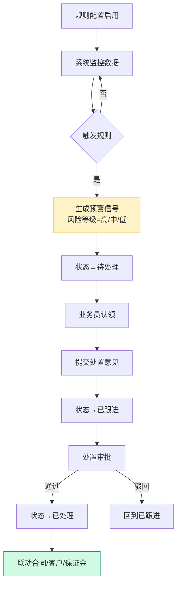
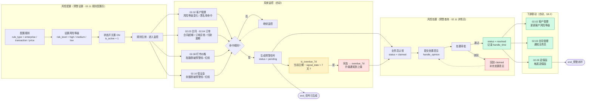
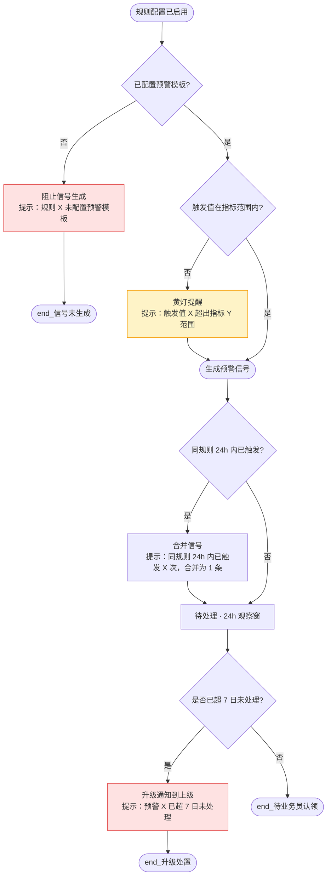
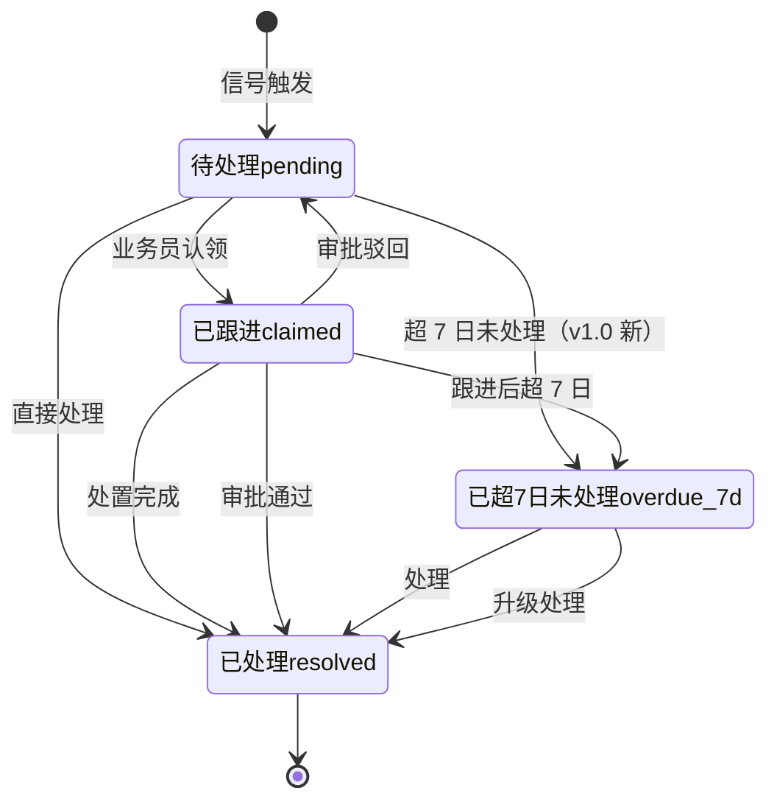
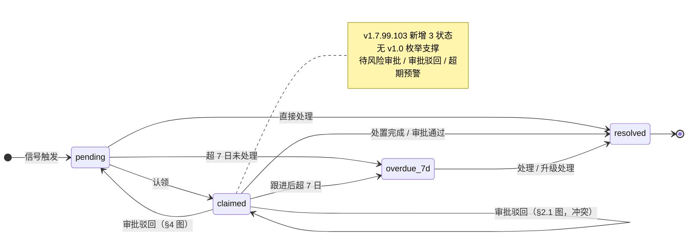
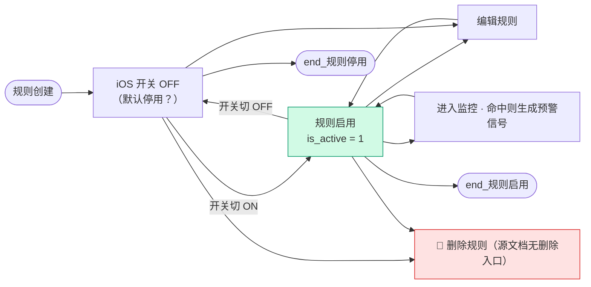

# 02.11 预警中心 · 需求规格说明

> **文档类型**：PRD Writer 范式 · 落地需求文档 · 功能详细描述
> **对应总纲**：[00-产品概述与需求总纲.md](./00-产品概述与需求总纲.md)
> **通用规范**：[01-通用交互与文案规范.md](./01-通用交互与文案规范.md)
> **源文档（只读，未做任何改动）**：[02.11-预警中心.md](../docs/02.11-预警中心.md)
> **整理时间**：2026-09-30

---

## 0. 阅读说明

### 0.1 信息溯源标记

| 标记 | 含义 | 使用规则 |
|------|------|---------|
| ✅ | 源文档已明确 | 原值保留（表名 / 字段名 / 状态枚举 / 编号规则 / 提示文案 / 列名 / 色值），不改写口径 |
| 🔷 | 范式补全 | 源文档没写，按范式要求推导，**必须注明推导依据** |
| ⚠️ | 源文档自相矛盾 | **绝不静默选边**，如实并列，交由业务方裁决（编号 C1-C18，见 §3.4 / §7.1） |
| 🔷 现状核验 ✅ | 本次整理对 `pages/` / `app.html` / `shared/js/` 做的**只读** grep / `ls` 核验（2026-09-30）| 结果为页面实现事实，**与源文档原值严格分离标注**，未修改任何文件 |
| [待补充] | 信息不足 | **严禁编造**，需业务方 / 研发回填 |

### 0.2 源文档阅读顺序

源文档 `02.11-预警中心.md`（**835 行 / 66,686 字节**）由**两代口径叠加**构成：**§1-§10 是 v1.0 终版口径**（2026-07-24，基于原型 79-81 截图，自称「v1.0 新顶级模块」，定位为「风控闭环出口」）、**§11 / §12 / §13 是 v1.7.99.x 三个大增量节**（2026-08-04，基于 user 实际业务截图对原型做 1:1 高保真重制）。两代口径在**子菜单命名、页面数、状态值数量（4 vs 6 vs 8）、状态 tab 数（5/5/8 vs 5/5/8）、列表列数（8 列 vs 12/11/13）、虚线框有无、风险等级呈现形态（文字 vs 下拉）**上存在冲突（见 §3.4 **C1-C18**）。

| 源文档章节 | 内容 | 归位到本文档 |
|-----------|------|------------|
| 头部 + §0 章节导航 | 状态 v1.0 终版 / 复用度 🟢 90% / 配套文档 / 3 大增量节索引 | §1.1、§5.4、§6 |
| §1 业务定位 | 预警信号监控中心定位 + 港通特色 3 大预警类型 + 4 条关键规则 + 3 页面 sitemap | §1.1.1、§1.2.1、§6 |
| §2 业务流程全景 | 2.1 预警信号流转流程（Mermaid flowchart TB）| §1.3.1 |
| §3 核心实体（3 张表）| `t_warning_rule` / `t_warning_signal` / `t_warning_template` 逐字段 | §5.1、§5.2 |
| §4 4 状态机 | stateDiagram-v2 状态机 + §4.1 4 状态说明表 | §3.1.1、§3.2.1 |
| §5 字段规则 | 5.1 `rule_type`/`signal_type` 3 值 / 5.2 `risk_level` 3 值 / 5.3 `is_overdue_7d` 计算式 | §3.2.2、§3.2.3、§5.2.4 |
| §6 按钮交互 | 6.1.1 顶部数据概览 3 卡片 / 6.1.2 筛选 6 项 / 6.1.3 3 大 Tab / 6.1.4 4 状态 Tab / 6.1.5 列表 8 字段 | §2.2.1、§2.2.2、§2.2.3、§2.2.4 |
| §7 异常处理 | 4 条业务异常（含原文提示文案）| §2.3、§2.5、§4.1 |
| §8 跨模块流转 | 8.1 上游 4 条 / 8.2 下游 3 条 | §1.4.1、§1.4.2 |
| §9 复用建议 | 🟢 90% / 复用 3 表 / 新建 0 表 / 4 周实施 | §5.4 |
| §10 文档版本 | v1.0（2026-07-24 14:55）+ 指向 `06-修改记录.md` | §7.3 |
| 修改记录 | v1.7.99.x 全局 3 条 + **v1.7.99.101 / 103 / 104 三条增量摘要** | §1.1.2、§1.1.3、§7.3 |
| **§11 v1.7.99.101 改造子章节**（12 小节）| 11.1 改造背景（3 张 user 图）/ 11.2 改造范围（warning-list.html 9.2KB→47KB）/ 11.3 数据概览 3 张柱状图 / 11.4 3 tab 切换 / 11.5 3 套筛选区（6/5/8 字段）/ 11.6 3 套状态 tab（5/5/8 状态 + tag 色）/ 11.7 3 套表格 mock / 11.8 inline SVG 渲染 / 11.9 紫/绿虚线框 / 11.10 关键规范 15 条 / 11.11 沿用经验 / 11.12 部署 / 11.13 触发模式 / 11.14 清理 | **§1.1.2、§1.2.2、§2.2.1-§2.2.4、§3.1.2、§3.2.2、§3.2.3、§5.3、§5.4.2、§7.3** |
| **§12 v1.7.99.103 改造子章节**（12 小节）| 12.1 改造背景 / 12.2 关键决策 / 12.3 表格列数变化（+2/+1/+1）/ **12.4 状态值精确化对比** / 12.5 **6 种状态 tag 颜色锁定** / 12.6 触发指标精确化（煤炭 CCI 5500 / 钢材 钢材指数）/ 12.7 关键规范 14 条 / 12.8 沿用经验 / **12.9 部署** / 12.10 触发模式 / 12.11 清理 / 12.12 与 101 关联 | **§1.1.2、§1.2.2、§2.2.4、§3.1.2、§3.2.2、§4.2、§5.3、§5.4.2、§7.3** |
| **§13 v1.7.99.104 改造子章节**（9 小节）| 13.1 改造背景（3 套筛选 4/7/6 字段 + 3 套表格 8/13/14 列 + iOS 蓝开关 + 风险等级下拉 + sidemenu label 改名）/ 13.2 关键决策 / 13.3 表格列数变化 / 13.4 关键规范 18 条 / 13.5 沿用经验 / 13.6 部署 / 13.7 触发模式 / 13.8 清理 / 13.9 与 101/103 关联 | **§1.1.3、§1.2.3、§2.2.5、§2.2.6、§2.2.7、§3.1.3、§3.2.4、§5.3、§5.4.2、§6、§7.3** |

> ⚠️ **源文档自身的 3 处结构问题（照实记录，不代为修正）**：
> 1. **§12 与 §13 的小节顺序错乱**：§12（v1.7.99.103）的 12.9-12.12 四个小节**被排在 §13（v1.7.99.104）全部 9 个小节之后**（源文档第 782-835 行），即 12.9 部署 / 12.10 触发模式 / 12.11 清理 / 12.12 与 101 关联实际位于 §13.9 之后——见 C14 的同类结构性记录。
> 2. **§0 章节导航列 13 项，但正文 §11 之后编号跳到 §12.9-§12.12**（同上）。
> 3. **§7 异常处理表只有 4 条**，且「同规则 24h 内重复触发 → 合并信号」在 §3 核心实体中**无对应字段承载**（`t_warning_signal` 无 `merge_group_id` / 无 `trigger_count`）——见 §4.1、§7.2 Q8。

> 🔷 **本文档附只读核验**：为判断「源文档口径 vs 页面实际实现」是否一致，整理时对 `pages/warning-*.html`、`app.html`、`shared/js/topnav-drawer.js`、`docs/p-warning-*.md` 做了**只读** grep / `ls` 核验（2026-09-30），结果逐条标注为「**🔷 现状核验 ✅**」。**未修改 `docs/` 与 `pages/` 下任何文件。**

### 0.3 与通用规范的关系

**通用表单规范（校验时机 / 返回保护 / 提交行为 / 危险操作确认 / 空状态 / 失败引导 / 通用 UI 6 态 / 通用样式 / 脱敏规范）一律以 [01-通用交互与文案规范.md](./01-通用交互与文案规范.md) 为准，本文档不重复定义，只写本模块特有的部分**：

1. **2 个子菜单各自一套「3 tab × 3 筛选 × 3 状态 tab × 3 表格」的独立配置范式**（列表页与规则配置页各一套，**两套互不共享**，见 §2.2）
2. **顶部 3 张 inline SVG 堆叠柱状图跨 3 tab 共享**（唯一一处「共享」的特例，见 §2.2.1）
3. **6 种状态值 + 6 种状态 tag 色编码**（待处理 / 已跟进 / 已处理 / 已处理(人工) / 待风险审批 / 审批驳回，见 §3.2.2）
4. **3 风险等级 + 3 色的双套色值**（图例配色 vs 列表配色，见 §3.2.3、⚠️ C9）
5. **筛选 label 上对齐（display: block）+ 3 列 grid + input 100% + 不带冒号**这一组硬规范（v1.7.99.102/103/104 三版反复强化的样式契约，见 §2.2.2、§2.2.5）
6. **`table-layout: fixed` 必加 + 每列具体 width + 超长省略**（11-14 列宽表唯一可行方案，见 §2.2.4、§2.2.6）
7. **iOS 风格蓝开关（36px×20px 圆角矩形 + 16px 圆形 thumb + checked 变蓝 + transition .2s）**作为规则启停的唯一控件形态（见 §2.2.7）
8. **列头 `?` tooltip 通用模式**（14px×14px 圆形 #94A3B8 背景白字 "?" + hover 变蓝，见 §2.2.7）
9. **预警解除时间 / 统一社会信用代码两列的新增规范**（v1.7.99.103，见 §2.2.4、§5.2.4）
10. **⚠️ 本模块与 02.08 盯市价格管理的归属矛盾**（「独立顶级模块 vs 预警中心子模块」——**已在 `docs-v2/02.08-盯市价格管理.md` §3.4 C2 记录，本文档 §1.4.3 保持同口径，不重复裁决**）

### 0.4 飞书用户手册补充（2026-10-08）

> ✅ **补充来源**：飞书《豫港通数字供应链管理平台 — 用户使用手册（内部版）》**rev.8976** 第 **8.1 节「预警管理」**。手册原文一律**照抄**（枚举名 / 字段名 / 公式 / 文案一字不改），**手册未提及的仍保留原有信息缺口标记，严禁编造**。
> ⚠️ **归位说明**：手册 8.1 覆盖的是「**预警配置 + 预警查询 + 预警处理**」，其中「**价格波动（盯市）指标配置**」在 `docs-v2/02.08-盯市价格管理.md` 已有同源归位，**本文档不重复铺开**，仅在本节做交叉引用与差异登记。

| 手册小节 | 手册原文（照抄要点）| 归位到本文档 | 本次动作 |
|---------|------------------|------------|---------|
| **章节目标 + 用户旅程** | 「**价格波动-配置 + 查看**」；旅程 = **风控 → 配置盯市指标 → 实时监控 → 触发预警** | §1.1 | ✅ **确认**手册口径的旅程终点是「触发预警」 |
| **8.1.1 价格波动-指标配置**（8 个配置项）| 业务类型 / 指标名称 / 是否关联合同 / 规则类型 / 风险等级 / 考核项 / 配置阈值 / 消息类型 | 🔷 交叉引用 **02.08** | ⚠️ **本节主要归 02.08**；本文档仅确认「**价格波动属于预警体系**」 |
| **8.1.1 第五步 风险等级** | 「**三个等级选项可选：高/中/低**」 | §3.2.3、§3.4 C16 | ✅ **手册确认风险等级 = 3 档**（与本文档 §5.2 的 `risk_level` 3 值一致）→ **消解风险等级数量争议** |
| **8.1.1 第六步 考核项** | 「**最大波动幅度超过阈值触发预警**（配置项为**涨幅或跌幅百分比**）」/「**最大波动金额超过阈值触发预警**（配置项为**涨幅或跌幅金额**）」 | 🔷 交叉引用 **02.08** | ⚠️ 归 02.08 |
| **8.1.1 交易监控-指标配置 规则类型** | **合同监控 / 货物监控 / 发票监控 / 结算监控**（4 类）| §5.2.5、§3.4 **C16** | ✅ **消解 `rule_type` 枚举口径**——🆕 **新增 C16** |
| **8.1.1 交易监控 业务品类** | 「**谷物/淀粉/糖粉**」 | §5.2.5 | ✅ **手册确认品类枚举** |
| **8.1.1 交易监控 业务类型** | 「**存货业务**」 | §5.2.5 | ✅ **确认业务类型 = 存货业务** |
| **8.1.1 企业监控-指标配置** | 「**（需前往运营管理后台配置 https://admin.zygtzb.com/data/risk/companylist）**」 | §1.4.4、§3.4 **C18** | 🔴 **外部系统依赖**——🆕 **新增 C18**（详见下方专门说明）|
| **8.1.2 预警查询 数据概览 3 指标** | **预警总数 / 未处理预警 / 超七日未处理预警数** | §2.2.1、§5.4.3 | ✅ **消解 3 指标口径与公式**（含「已处理+未处理」「超过 7 日」）|
| **8.1.3 预警处理** | **解除预警**（消除通知消息）/ **暂不处理**（暂停通知消息）| §3.2.2、§2.4 | ✅ **消解处理动作 = 2 种及其通知副作用** |

#### 0.4.1 🔴 外部系统依赖（如实记录，不代为设计）

> ✅ **手册原文照抄**（8.1.1「企业监控-指标配置」）：「**（需前往运营管理后台配置 https://admin.zygtzb.com/data/risk/companylist）**」

⚠️ **含义**：**「企业监控」的配置入口不在本平台内，而在另一套「运营管理后台」**。本平台的预警中心**只消费企业监控产生的预警数据，不提供企业监控配置 UI**。手册给出的 4 步为企业监控配置流程（原文照抄）：

| 步骤 | 手册原文 |
|-----|---------|
| 第一步 | 「**检查企业监控配置项，是否完成初始化，如未完成，请在此完成监控配置项的初始化**」 |
| 第二步 | 「在「**企业预警管理**」中**开启对应企业监控开关**即可完成对企业的监控配置应用」 |
| 第三步 | 「如需更改企业监控项，可点击对应企业信息后方的「**监控配置**」进行操作」 |
| 第四步 | 「完成配置后企业监控功能开启，系统将**订阅天眼查企业服务**，有对应变化项后将**主动推送并生成预警数据**」 |

🔴 **由此产生的依赖与未定义项**（详见 §3.4 **C18**）：
1. **跨系统边界**：本平台 ↔ `admin.zygtzb.com` 运营管理后台，**两套系统的数据同步机制 / 接口鉴权 / 失败降级，手册均未给**。
2. **天眼查数据源**：✅ 手册明确企业监控**订阅天眼查企业服务**（与本文档 `docs-v2/03-贸易风险合规-天眼查集成.md` 同一数据源），**但推送频率、推送失败重试、指标变更项的枚举，手册未给**。
3. **本平台侧的呈现**：企业监控产生的预警在预警中心**如何展示（是否独立 tab / 是否归入 `signal_type`）**，**手册未说明**——见 §7.2。

### 0.5 手册带来的既有矛盾更新（本次新增）

| 矛盾编号 | 变化 | 说明 |
|---------|------|------|
| **风险等级** | ✅ **手册裁决** | ✅ 手册「**三个等级选项可选：高/中/低**」——确认 3 档，与本文档 §5.2 `risk_level` 3 值**一致，无需裁决** |
| **C16** | **🆕 本次新增** | 手册 `rule_type` 给出「**交易监控**」下的 **4 类**（合同监控 / 货物监控 / 发票监控 / 结算监控），与本文档 `rule_type` 3 值口径需对齐 |
| **C17** | **🆕 本次新增** | 企业监控**不在本平台配置**（外部后台），但本文档预警中心是否承接企业类预警未定义 |
| **C18** | **🆕 本次新增** | **外部系统依赖**：`https://admin.zygtzb.com/data/risk/companylist` 运营管理后台承担企业监控配置，本平台仅消费 |

---

## 1. 功能描述与触发条件

### 1.1 功能描述

#### 1.1.1 v1.0 口径（源文档 §1，原值保留）

✅ **预警中心**是港通供应链的**预警信号监控中心**（**v1.0 新顶级模块**）——基于规则配置，监控企业/交易/价格波动，触发预警信号并跟踪处置。（源文档 §1 原文）

✅ **港通特色**——**3 大预警类型**（基于 79 截图）：

| 类型 | 枚举值 | 监控内容（源文档 §1.1 规则 2 原文）|
|------|--------|------------------------------|
| **企业监控** | `enterprise` | 客户黑名单 / 失信被执行 / 风险等级变化等 |
| **交易监控** | `transaction` | 合同超期 / 订单异常 / 付款逾期等 |
| **价格波动** | `price` | 指数跌破预警线 / 红线 |

✅ **4 条关键规则**（源文档 §1.1，原值保留）：

| # | 规则 | 原值 |
|---|------|------|
| 1 | **2 个子菜单**（基于 79 截图）| **预警查询** / **预警设置** |
| 2 | **3 大预警类型** | 企业监控 / 交易监控 / 价格波动（枚举值见上表）|
| 3 | **3 风险等级** | 高 / 中 / 低（带颜色标记）|
| 4 | **4 状态** | 待处理 / 已跟进 / 已处理 / **已超 7 日仍未处理** |

✅ **3 个页面 sitemap**（源文档 §1.2）：

| # | 页面 | 说明 |
|---|------|------|
| 1 | **预警列表页**（数据概览 + 预警数据）| 3 卡片统计 + 3 Tab 列表 |
| 2 | **预警详情页** | 单个预警信号详情 + 处置 |
| 3 | **预警规则配置** | 规则新增/编辑/启用/停用 |

> 🔴 **源文档 §1.2 sitemap 的 3 个页面 vs 关键规则 1 的 2 个子菜单「预警查询 / 预警设置」之间，源文档从未说明页面与子菜单的映射关系** [待补充]（预警详情页归属「预警查询」还是「预警设置」？）。
> 🔷 现状核验 ✅ `app.html:617-624` 的实际结构是 **2 个 sub 菜单**：`{ sub: '预警列表页' }`（`warning-list` + `warning-detail`）/ `{ sub: '预警规则配置' }`（`warning-config`）——**sub 命名与源文档的「预警查询 / 预警设置」完全不同，且分组粒度不同（一个按页面职责分，一个按菜单分组分）**。见 **C1**。

#### 1.1.2 v1.7.99.101 + v1.7.99.103 增量：预警查询（列表页）3 tab 重制

✅ **v1.7.99.101（2026-08-04）改造背景**（源文档 §11.1 原文）：2026-08-04 用户提 1 条需求 + 3 张图——「上图 1 为预警列表 tap2 交易监控页面 / 上图 2 为预警列表 tap3 价格波动页面 / 上图 3 为预警列表 tap1 企业监控 / 按图所示，更新『预警管理』预警列表页面高保真原型」。**把 v1.7.99.13 占位版（9.2KB / 单一列表 + 9 列 1 个状态 18 条 mock + 占位筛选项）1:1 重制为 47KB（+411%）**。

✅ **v1.7.99.103（2026-08-04）改造背景**（源文档 §12.1 原文）：按 user 最新 3 张**实际业务截图**对 v1.7.99.101 重制版继续细化，**页面由 47KB 增至 49.2KB（+5%）**。

**v1.7.99.101 + v1.7.99.103 合并后的功能增量清单**（全部 ✅ 源文档原值）：

| # | 增量项 | v1.7.99.101 | v1.7.99.103 | 详见 |
|---|--------|--------------|--------------|------|
| 1 | **顶部数据概览 3 张 inline SVG 堆叠柱状图**（预警总计 10000 / 未处理预警 5000 / 超 7 日未处理 3000）| ✅ 锁定 | ✅ 沿用 | §2.2.1 |
| 2 | **3 tab 切换**（企业监控 active / 交易监控 / 价格波动）| ✅ 锁定 | ✅ 沿用 | §2.2.2 |
| 3 | **3 套筛选区**（企业监控 6 字段 / 交易监控 5 字段 / 价格波动 8 字段）| ✅ 锁定 | ✅ 兜底强化 label 上对齐 + 去冒号 | §2.2.2 |
| 4 | **3 套状态 tab**（企业监控 5 状态 / 交易监控 5 状态 / 价格波动 8 状态）| ✅ 锁定 | ✅ 状态值精确化 | §3.1.2 |
| 5 | **3 套表格 mock** | ✅ 标题写 12/11/13 列、正文列清单只列 10/10/12 列 | ✅ 列数修正为 **12 / 11 / 13** | §2.2.4、⚠️ C5 |
| 6 | **3 个 tab 表格新增「预警解除时间」列** | ❌ 缺 | ✅ **新增**（v1.7.99.103 关键决策：user 截图明确显示，v1.7.99.101 漏了）| §2.2.4、§5.2.4 |
| 7 | **Tab1 企业监控新增「统一社会信用代码」列** | ❌ 缺 | ✅ **新增**（表格 10 列 → 12 列；风控场景必须展示信用代码作为企业身份核验）| §2.2.4、§5.2.4 |
| 8 | **Tab1 mock 行数调整** | 微山鑫久泰 4 行 + 国家能源 3 行 + 陕西朕煤 3 行 | ✅ 微山鑫久泰 **3→4 行** + 国家能源 3 行 + 陕西朕煤 **4→3 行**，**总 10 行不变** | §2.2.4 |
| 9 | **Tab2 触发指标细分** | 全部 CCI 5500（v1.7.99.101 判定「不准确」）| ✅ **煤炭 CCI 5500（7 行）/ 钢材 钢材指数（3 行）** | §2.2.4、§5.2.4 |
| 10 | **状态值精确化** | 「待风险管理」单一 | ✅ **「待风险审批」+「审批驳回」拆成 2 个状态**；「已处理」→ **「已处理(人工)」** | §3.2.2、⚠️ C4 |
| 11 | **6 种状态 tag 颜色锁定** | 6 个类（含 1 组重名）| ✅ **锁定 6 种状态值对应色值** | §3.2.2、⚠️ C8 |
| 12 | **筛选样式 label 上对齐强化 + 去掉 11 个 label 冒号** | — | ✅ CSS `.wl-filter .ff-cell { display: flex; flex-direction: column; gap: 6px; }` + `.wl-filter .ff-label { display: block; }` | §2.2.2 |
| 13 | **去掉 3 个 tab 虚线框** | ✅ 规定紫框/绿框（§11.9）| ✅ **v1.7.99.102 已删 CSS，v1.7.99.103 兜底确认 HTML 无残留** | §2.2.2、⚠️ C6 |
| 14 | **`yBase` / `yScale` 提到最外层函数** | 已知 pageerror（`yBase is not defined`）| ✅ **兜底提到最外层** | §5.4.2 |
| 15 | **分页模板** | ✅「共 XXXX 条记录 · 第 1 / XXX 页」+ ‹/1/2/3...9/› + 「10 条/页」+ 「跳至 [input] 页」| ✅ 沿用 | §2.2.7 |

> ⚠️ **v1.7.99.101 §11.9 / §11.10 / §11.13 把「紫色虚线框 = 企业监控 / 绿色虚线框 = 交易监控·价格波动」写成 4 处【大前提】硬规范，但 v1.7.99.102 删除了 `.wl-dashed-purple` / `.wl-dashed-green` CSS、v1.7.99.103 §12.7/§12.12 明确「去掉所有虚线框」**——**源文档 §11 的 4 条硬规范已整体失效但未清理**。见 **C6**。
> 🔷 现状核验 ✅ `warning-list.html` 中 `wl-dashed` 出现 **0 次**——**与 v1.7.99.103 一致，与 v1.7.99.101 §11.10 硬规范不一致**。

#### 1.1.3 v1.7.99.104 增量：预警设置（规则配置页）3 tab 重制

✅ **v1.7.99.104（2026-08-04）改造背景**（源文档 §13.1 原文）：**v1.7.99.13 占位版**是单一列表（5 状态 tab + 9 列 3 行 mock + 6 字段筛选 + 14 条数据）。v1.7.99.104 按 user 最新 3 张实际业务图重制 `warning-config.html`：**8.5KB → 49.6KB（+484%）**。

✅ **v1.7.99.104 功能增量清单**（全部 ✅ 源文档原值）：

| # | 增量项 | 值 | 详见 |
|---|--------|----|----|
| 1 | **3 tab 切换** | 企业监控 / 交易监控 / 价格波动（v1.7.99.13 旧版**无 tab**）| §2.2.5 |
| 2 | **3 套筛选区** | Tab1 企业监控 **4 字段** / Tab2 交易监控 **7 字段** / Tab3 价格波动 **6 字段** | §2.2.5 |
| 3 | **3 套表格 mock** | Tab1 **8 列 10 行** / Tab2 **13 列 10 行** / Tab3 **14 列 10 行** | §2.2.6 |
| 4 | **状态列 iOS 风格蓝开关** | 30 个 ON（3 个 tab 全部 10 行）| §2.2.7、⚠️ C15 |
| 5 | **风险等级下拉 select** | 全部「高」红色字体，`<select class="risk-select">` | §2.2.7、⚠️ C11 |
| 6 | **操作列** | Tab1 **无操作列** / Tab2 仅「编辑」/ Tab3「编辑」+「合同配置」2 链接（列宽 **12%**）| §2.2.6 |
| 7 | **+ 添加规则按钮** | **Tab2 / Tab3 含**（蓝主按钮），**Tab1 不含**（按 user 图 1 实际）| §2.2.5 |
| 8 | **sidemenu label 改** | 「预警规则管理」→ **「预警规则配置」**（只改 label 1 行，不动结构）| §1.4.3、§2.1.2、⚠️ C1 |
| 9 | **筛选样式 label 上对齐强化** | 沿用 v1.7.99.103 经验 + 不带冒号 | §2.2.5 |
| 10 | **0 虚线框** | 沿用 v1.7.99.102/103 经验 | §2.2.5 |
| 11 | **列头 `?` tooltip 通用模式** | 沿用 v1.7.99.91 经验 | §2.2.7 |
| 12 | **0 虚线框 / 不修改全局 CSS / 不新建 app.js / 3 tab 用 `switchWCTab` + classList** | 沿用 v1.7.99.69+ / 80 / 100 经验 | §5.4.2 |

> 🔶 **v1.7.99.104 的记录截止于 v1.7.99.104（2026-08-04）**。🔷 现状核验 ✅ `warning-config.html` 实为 **158,308 字节**，页面注释最高版本为 **v1.7.99.287**，包含 v1.7.99.245-252 / 263 / 267 / 269-273 / 285-287 等**数十个源文档完全未记录的后续版本**（含 02.08 文档所述的「15 规则类型 + 11 步配置」+ 合同选择弹窗）。**源文档 §13 的「49.6KB 终版」已严重过期**。见 **C10**。

### 1.2 触发条件

#### 1.2.1 v1.0 口径（源文档 §1.1 + §2.1，原值保留）

| # | 触发条件 | 触发的预警类型 | 出处 |
|---|---------|--------------|------|
| 1 | **规则配置启用**（`is_active = 1`）| 启动该规则的监控 | §2.1 流程图起点 |
| 2 | **系统监控数据 → 命中规则** | 生成预警信号，`risk_level` = `high` / `medium` / `low` | §2.1 流程图判定菱形 `C{触发规则}` |
| 3 | **客户风险等级变化 / 黑名单命中** | 触发**企业监控** | §8.1 |
| 4 | **合同超期 / 订单异常 / 付款逾期** | 触发**交易监控** | §8.1 |
| 5 | **指数跌破预警线 / 红线** | 触发**价格波动** | §8.1 |
| 6 | **保证金余额跌破预警线 / 红线** | 触发**企业监控 / 交易监控** | §8.1 |
| 7 | **业务员认领** | 状态 → 已跟进（`claimed`）| §2.1 / §4 |
| 8 | **提交处置意见 + 处置审批通过** | 状态 → 已处理（`resolved`）| §2.1 / §4 |
| 9 | **超 7 日未处理**（`当前日期 − signal_date > 7 天`）| 状态 → 已超 7 日未处理（`overdue_7d`），`is_overdue_7d = 1` | §4 / §5.3 |

#### 1.2.2 v1.7.99.101 / 103 触发的可视化数据源（页面侧）

✅ **顶部数据概览的 3 张柱状图**数据来源（源文档 §11.3，✅ 锁定）：

| 卡片 | 总数（v1.7.99.101 mock）| 3 维度 X 轴 | 4 图例 |
|------|------------------------|------------|-------|
| **预警总计** | **10000 条** | 企业监控 / 交易监控 / 价格波动 | 全部（灰 **#94A3B8**）/ 高风险（红 **#DC2626**）/ 中风险（黄 **#F59E0B**）/ 低风险（蓝 **#3B82F6**）|
| **未处理预警** | **5000 条** | 同上 | 同上 |
| **超 7 日未处理** | **3000 条** | 同上 | 同上 |

✅ **每柱 3 色堆叠**：high **30%** + mid **35%** + low **35%**（v1.7.99.101 mock）。
✅ **Y 轴**：0 / 500 / 1000 网格线（虚线），**Y 轴最大 1200**（v1.7.99.101 经验：mock 10000 数据，Y 轴最大 1200 显示 3 维度相对差异）。
> ⚠️ **图例配色（中 = #F59E0B / 低 = #3B82F6）与列表列配色（中 = #A16207 / 低 = #15803D，§11.7）在同一文档内是两套色值**。见 **C9**。

✅ **手册 rev.8976 · 8.1.2 数据概览 3 指标的口径（原文照抄）**：

| 指标（手册原文）| 手册口径（原文照抄）| 与 v1.7.99.101 mock 的关系 |
|----------------|-------------------|----------------------|
| **预警总数** | 「**实时统计各类别预警总数（包含已处理+未处理）**」 | ✅ 对应「预警总计 10000 条」 |
| **未处理预警** | 「**实时统计各类别未触发预警总数**」 | ✅ 对应「未处理预警 5000 条」 |
| **超七日未处理预警数** | 「**实时统计超过7日未处理预警总数**」 | ✅ 对应「超 7 日未处理 3000 条」 |

✅ **本次消解**：**3 个指标的统计口径与计算公式已由手册锁定**——
- **预警总数 = 已处理 + 未处理**（原文「包含已处理+未处理」）；
- **超七日未处理预警数 = 超过 7 日且未处理**（对应 §5.2.4 的 `is_overdue_7d` = **当前日期 − `signal_date` > 7 天**）。

⚠️ **手册口径与源文档的一处措辞差异（如实记录，不代为改写）**：手册把「未处理预警」写为「**实时统计各类别未触发预警总数**」——**「未触发」与「未处理」用词不一致**（未触发 = 尚未产生；未处理 = 已产生但未处理）。二者**业务含义不同**，本文档按源文档 §6.1.1 的「未处理」口径理解，⚠️ **手册该句疑似笔误，需业务方确认**，已登记为 **C17**。

#### 1.2.3 v1.7.99.104 触发的规则配置动作

| 动作 | 触发结果 | 出处 |
|------|---------|------|
| **状态开关切 ON** | 规则启用，开始监控 | §13.2（`.ios-switch` checked）|
| **状态开关切 OFF** | 规则停用，停止监控 | §13.2 |
| **+ 添加规则** | 新增规则（Tab2 / Tab3 支持，Tab1 不支持）| §13.2 |
| **编辑** | 修改规则 | §13.2 |
| **合同配置** | 配置该规则关联的合同（Tab3 专属）| §13.2 |
| **风险等级下拉变更** | 运行时调整风险等级 | §13.2 |

> 🔴 **源文档 §13 全篇未定义规则的「新增 / 编辑」表单页**：`+ 添加规则` 按钮点击后进入哪个页面 / 弹窗、字段有哪些、校验规则是什么——**§6.1.2 sitemap 只写「规则新增/编辑/启用/停用」4 个动作，无任何字段规范** [待补充]（§7.2 Q4）。
> 🔷 现状核验 ✅ `warning-config.html` 中 `+ 添加规则` 文本出现 **8 次**，但**未 grep 到任何指向独立规则编辑页的链接**（`pages/` 下无 `warning-rule-add.html` / `warning-rule-edit.html`）——**新增/编辑落地形态未实现**。

### 1.3 业务流程（Mermaid）

#### 1.3.1 预警信号流转流程（源文档 §2.1 原文图，✅ 原值保留）

> ⚠️ **源文档 §2.1 图中的两条自相矛盾**：
> 1. 图中 `C -->|否| B` 是**无终止条件死循环**（数据永不变化时永不退出），源文档未给轮询间隔 / 最大重试次数 [待补充]。
> 2. 图中 `E[状态→待处理] --> F[业务员认领] --> G[提交处置意见] --> H[状态→已跟进]`——**「提交处置意见」发生在状态变为「已跟进」之前**，但 §4 状态机写 `待处理pending --> 已跟进claimed: 业务员认领`（**认领即转已跟进**）。**流程图与状态机的「认领」语义不同**（见图 = 认领后仍在待处理直到提交意见）。见 **C4**。
> ⚠️ **图中 `I{处置审批}` 的审批角色、审批人、驳回后的可编辑范围源文档全部未定义** [待补充]（§7.2 Q2）。

#### 1.3.2 多角色泳道：规则配置 → 信号生成 → 处置闭环（🔷 范式补全）

> 🔷 **推导依据**：源文档 §1.1 的 3 大预警类型 + §2.1 的 10 个节点 + §8.1/§8.2 的 7 条跨模块流转 + §4 的 4 状态机 + §1.2 sitemap 的 2 个子菜单角色，**按泳道重排为可交付研发的多角色协作图**。**节点文字、状态值、模块编号全部取自源文档原值，未新增业务环节**。

> 🔴 **本图是 🔷 范式补全，不是源文档原图**。以下节点在源文档中**无对应原文，标注为推导**：① `B6`「继续监控」自循环对应 §2.1 的 `C -->|否| B`（源文档确实是无终止循环）；② `B8` 判定对应 §5.3 的 `is_overdue_7d` 计算式；③ `B9`「升级通知到上级」对应 §7 异常表第 3 行原文「预警 X 已超 7 日未处理 → 升级通知到上级」；④ `C5`「补充处置意见」对应 §4 状态机 `已跟进claimed --> 待处理pending: 审批驳回` 与 §2.1 图 `I -->|驳回| K[回到已跟进]` 的**不一致**（图 = 回到已跟进，状态机 = 回到待处理）——**本次按状态机 §4 为准画虚线回退，但两处差异已登记 C4，未代为修正**。
> 🔴 **`02.04 订单管理` 节点在 `docs/` 与 `docs-v2/` 中均不存在**（🔷 总纲已记录「订单管理已于 v1.7.99.181 删除」）——`target_type` 中的「订单」枚举当前**无落地模块**。见 §7.2 Q13。

#### 1.3.3 异常与回退分支（✅ 源文档 §7 异常处理 4 条，原值保留）

> 🔴 **§7 的 4 条异常中，只有「同规则 24h 内重复触发 → 合并信号」在 §3 核心实体中无字段承载**：`t_warning_signal` **无 `merge_group_id`（合并组 ID）/ 无 `trigger_count`（触发次数）/ 无 `first_trigger_time`**——**「合并为 1 条」的实现方式（更新原行 / 新增行打标 / 独立聚合表）源文档未给** [待补充]。见 §4.1、§7.2 Q8。
> 🔴 **「升级通知到上级」的通道未定义**：通知对象是谁（风控负责人 / 主管 / 邮件 / 站内信 / 企微 / OA）、通知失败如何兜底——**源文档 §7 只给了提示文案，没给任何通道** [待补充]。

### 1.4 模块依赖（跨模块流转）

#### 1.4.1 上游触发（源文档 §8.1，原值保留）

| 触发模块 | 触发条件 | 触发动作 |
|---------|---------|---------|
| **客户管理（02.02）** | 客户风险等级变化 / 黑名单命中 | 触发**企业监控** |
| **合同 / 订单（02.03 / 02.04）** | 合同超期 / 订单异常 / 付款逾期 | 触发**交易监控** |
| **盯市价格（02.08）** | 指数跌破预警线 / 红线 | 触发**价格波动** |
| **保证金（02.10）** | 余额跌破预警线 / 红线 | 触发**企业监控 / 交易监控** |

> ✅ **02.08 盯市价格管理是本模块「价格波动」类的唯一数据源**（v1.0 §8.1），且 02.08 v1.7.99.250 §11.1 已把自身定位为**本模块的子模块**——**上下游在两代口径中方向相反**（v1.0 = 02.08 → 02.11 上游触发；v1.7.99.250 = 02.08 是 02.11 的子模块）。见 §1.4.3 与 **C2**。
> 🔴 **`02.04` 模块编号失效**：源文档 §8.1 引用「合同/订单（02.03/02.04）」，🔷 `ls` 核验 `docs/` 与 `docs-v2/` **均无 `02.04`**，且 `target_type` 枚举含「订单」——**订单超期/订单异常/付款逾期 3 类触发源当前无落地模块** [待补充]（§7.2 Q13）。

#### 1.4.2 下游触发（源文档 §8.2，原值保留）

| 触发模块 | 触发条件 | 触发动作 |
|---------|---------|---------|
| **客户管理（02.02）** | 高风险预警已处理 | 更新客户风险等级 |
| **合同管理（02.03）** | 交易监控预警已处理 | 通知业务员 |
| **追保函（02.09）** | 价格波动预警已处理 | 触发追保函 |

> ⚠️ **「更新客户风险等级」的映射规则未给**：02.11 的 `risk_level`（high/medium/low）→ 02.02 客户风险等级的枚举映射、是否覆盖原值、是否需审批，**源文档 §8.2 只写了「更新」二字** [待补充]（§7.2 Q5）。
> ⚠️ **02.10 源文档从未提到预警中心**（02.10 §8.2 提到「余额跌破预警线/红线 → 触发预警信号」，但 02.10 自身的 02.11 引用方向与本模块 §8.1 一致，属单向引用）——**跨文档引用口径已对齐，无冲突**。

#### 1.4.3 ⚠️ 与 02.08 盯市价格管理的归属矛盾（与 docs-v2/02.08 C2 保持一致口径）

> **本文档不在此处重复裁决 C2，仅保持与 `docs-v2/02.08-盯市价格管理.md` §3.4 C2 完全一致的口径**：

| 口径 | 表述 | 出处 | 模块层级 |
|------|------|------|---------|
| **v1.0（本模块源文档 §1 + 头部）** | 「预警中心……**v1.0 新顶级模块**」——02.11 与 02.08 **平级** | §1 / 文档头部 | **独立顶级模块** |
| **02.08 v1.7.99.250 §11.1** | 「**盯市价格作为预警中心的子模块（02.11 预警中心 / 价格波动）**」——**不再是独立顶级模块** | `docs-v2/02.08-盯市价格管理.md:58/492` | **02.11 子模块** |
| 🔷 现状核验 ✅ | `app.html:617-624` 实际只有 `{ group: '预警中心' }` 一个 group，**无独立的盯市价格 group**——`market-price.html` 未在 `app.html` 中 grep 到独立 group 入口 | `app.html` 只读 grep | **偏向 02.11 子模块** |
| **02.08 §11.8 页面索引** | 把 `warning-config.html` + `warning-price-contract-config.html` 列为 **02.08 的 4 页之一** | `docs-v2/02.08-盯市价格管理.md:804-805` | **归属 02.08** |

⚠️ **冲突未裁决**：**`warning-config.html` 同时被本模块 §13（v1.7.99.104，8/13/14 列重制）与 02.08 §11.8（v1.7.99.250，15 规则类型 + 11 步配置）声明归属**。**两文档对该页的规则模型是否一致从未交叉校验**（02.08 Q13 明确记录此点）。**本次重组不代为选边**，见 **C2**（本模块编号）与 02.08 §3.4 C2（02.08 编号，**同一事实、两个编号，本次为避免双份裁决，本文档以 C2 承接并在正文交叉引用，不重新定义**）。

⚠️ **sidemenu label 的跨模块改动已落到 `shared/js` 全局文件**：源文档 §13.2/§13.6 记录 v1.7.99.104 修改了 `shared/js/topnav-drawer.js` 的 label（「预警规则管理」→「预警规则配置」）。🔷 现状核验 ✅ 该文件 **line 174** 为 `{ label: '预警规则配置', file: 'warning-config.html' }`——**源文档 §13.6 记的是「line 185」，实际为 line 174**（行号已漂移）；且 `app.html:622` 另有一份独立的 sub 菜单名 `{ sub: '预警规则配置' }`——**项目存在 `app.html` + `shared/js/topnav-drawer.js` 两份菜单源**。见 **C1**。

#### 1.4.3.1 🔴 外部系统依赖：企业监控配置在「运营管理后台」（手册 rev.8976 · 8.1.1）

> ✅ **手册原文照抄**：「企业监控-指标配置（**需前往运营管理后台配置 https://admin.zygtzb.com/data/risk/companylist**）」

⚠️ **跨系统边界（如实记录，不代为设计）**：

| 项 | 内容 |
|---|------|
| **配置归属** | 「**企业监控**」的配置 UI **不在本平台**，而在 `admin.zygtzb.com` 的**运营管理后台** |
| **本平台角色** | **仅消费**企业监控产生的预警数据（手册第四步：「有对应变化项后将**主动推送并生成预警数据**」），**不提供企业监控配置入口** |
| **数据源** | ✅ 手册第四步明确企业监控**订阅天眼查企业服务**（与 `docs-v2/03-贸易风险合规-天眼查集成.md` 同源）|
| **🔴 未定义** | ① 两套系统的**数据同步机制 / 接口鉴权 / 失败降级**；② 天眼查**推送频率、失败重试、变化项枚举**；③ 企业类预警在**本平台预警中心的展示形态**（独立 tab？归入 `signal_type`？）；④ 企业监控配置**是否有本平台侧的只读回显** |

⚠️ **与本文档既有口径的关系**：源文档 §1.4 把「02.02 客户管理」列为企业监控的**上游数据源（强依赖）**，而手册指向的是**另一个系统（运营管理后台）**——**二者不是同一数据通路**，需一并裁决，见 §3.4 **C18** 与 §7.2。

### 1.4.4 依赖汇总

| 依赖类型 | 模块 | 本模块中的角色 | 依赖强度 |
|---------|------|---------------|---------|
| **上游触发源** | 02.02 客户管理 | 企业监控数据源（风险等级变化 / 黑名单）+ 下游回写（更新客户风险等级）| 强 |
| **上游触发源** | 02.03 合同管理 | 交易监控数据源（合同超期）+ 下游通知 | 强 |
| **上游触发源** | 02.08 盯市价格管理 | 价格波动数据源（指数跌破预警线 / 红线）| 强（且归属存疑）|
| **上游触发源** | 02.10 保证金管理 | 企业/交易监控数据源（余额跌破预警线 / 红线）| 强 |
| **下游消费** | 02.09 追保函管理 | 价格波动预警已处理 → 触发追保函 | 强 |
| **外部数据** | **天眼查**（企业工商 / 司法 / 失信 / 经营风险）| 企业监控类预警的**唯一数据源**——`rule_type = enterprise` 的 `indicator` 取值（被执行人核查 / 被限制高消费 / 工商信息变更 / 破产重组核查 / 法定代表人变更 / 欠税公告核查 / 工商登记状态异常 / 被列入失信被执行人 / 资产审核后发票状态查验，见 §2.2.4）**全部是工商司法类字段** | 强 |
| 🔴 **依赖失效** | **02.04 订单管理** | 源文档 §8.1 的交易监控触发源之一 | **模块已删除** |

---

## 2. 交互细节

### 2.1 角色操作矩阵（权限可见性）

#### 2.1.1 角色识别与操作矩阵

✅ **源文档 §1.0 / §6 只零散提及 2 个角色**（「业务员」、「审批/处置方」），**未提供角色操作矩阵表**。下表按「✅ 源文档原值」+「🔷 推导（推导依据逐行标注）」整理。

| 操作 | 业务员 | 处置审批方 | 风控规则管理员 | 依据 |
|------|--------|-----------|---------------|------|
| **进入预警查询（列表页）** | ✅ | ✅ | ✅ | 🔷 推导：§8.2 写「高风险预警已处理 → 更新客户风险等级」隐含风控可读；§6.1 列表页未给可见条件 |
| **查看 3 张柱状图数据概览** | ✅ | ✅ | ✅ | 🔷 同上 |
| **切换 3 大 tab / 状态 tab** | ✅ | ✅ | ✅ | 🔷 同上 |
| **筛选 / 查询 / 重置** | ✅ | ✅ | ✅ | ✅ §6.1.2（未给可见条件）|
| **导出** | ✅ | ✅ | ✅ | ✅ §6.1.2「按钮：查询 / 重置 / 导出」（未给可见条件）|
| **列表行「详情」** | ✅ | ✅ | ✅ | ✅ §6.1.5 操作列 = 详情/认领/处置 |
| **列表行「认领」** | ✅ | 🔴 [待补充] | 🔴 [待补充] | ✅ §6.1.5 + §4 状态机 `待处理 → 已跟进: 业务员认领`；**认领动作是「从待处理抢领」还是「分配」未定义** [待补充] |
| **列表行「处置」** | ✅ | ✅ 隐含 | 🔴 [待补充] | ✅ §6.1.5；🔷 依据 §2.1 流程 `G[提交处置意见] → H[状态→已跟进] → I[处置审批]` |
| **处置审批（通过 / 驳回）** | 🔴 [待补充] | ✅ 隐含存在 | 🔴 [待补充] | ✅ §2.1 流程图有 `I[处置审批]` 环节 + `I -->|通过| J` / `I -->|驳回| K`；**审批人角色、是否与处置人互斥，源文档全文未出现「风控」「审核员」等角色词** [待补充] |
| **超 7 日升级处置** | ✅ | ✅ | ✅ | ✅ §7 异常表第 3 行「升级通知到上级」；**「上级」是谁未定义** [待补充] |
| **进入预警设置（规则配置页）** | 🔴 [待补充] | 🔴 [待补充] | ✅ | ✅ §1.2 sitemap 第 3 行「规则新增/编辑/启用/停用」；**可见条件源文档未给** [待补充] |
| **状态开关切 ON / OFF（启停规则）** | 🔴 [待补充] | 🔴 [待补充] | ✅ | ✅ §13.2 状态列 iOS 蓝开关 |
| **+ 添加规则**（Tab2 / Tab3）| 🔴 [待补充] | 🔴 [待补充] | ✅ | ✅ §13.2（Tab1 不含此按钮）|
| **编辑规则** | 🔴 [待补充] | 🔴 [待补充] | ✅ | ✅ §13.1 操作列 |
| **合同配置**（Tab3）| 🔴 [待补充] | 🔴 [待补充] | ✅ | ✅ §13.1 操作列 |
| **风险等级下拉调整** | 🔴 [待补充] | 🔴 [待补充] | ✅ | ✅ §13.2「支持运行时调整风险等级」|
| **列头 `?` tooltip** | ✅ | ✅ | ✅ | 🔷 推导：纯展示性提示，无副作用 |

> 🔴 **本模块最大的权限缺口：源文档全文只出现「业务员」一个明确的角色词，「处置审批方」「风控规则管理员」「上级」三个角色全部由本次重组推导补出，源文档从未定义**。**角色清单、角色与权限点的映射、角色与审批环节的绑定关系均需业务方回填** [待补充]（§7.2 Q2）。

#### 2.1.2 菜单层级与 sidemenu 约定

| 项 | 值 | 来源 |
|----|----|------|
| **顶级 group** | **预警中心**（`app.html:617`，`icon: '🔔'`）| 🔷 现状核验 ✅ |
| **v1.0 口径 2 个子菜单** | **预警查询** / **预警设置** | ✅ §1.1 规则 1 |
| 🔷 现状核验 ✅ **实际 2 个 sub** | `预警列表页`（`warning-list` + `warning-detail`）/ `预警规则配置`（`warning-config`）| `app.html:618/622` |
| **sidemenu label（v1.7.99.104 起）** | **「预警规则管理」→「预警规则配置」**——**只改 label 1 行，不动 group / children 结构** | ✅ §13.2、§13.4、§13.9 |
| 🔷 现状核验 ✅ | `shared/js/topnav-drawer.js:174` = `{ label: '预警规则配置', file: 'warning-config.html' }` | 只读 grep |
| **默认展开 sub** | 🔴 [待补充] | 源文档未定义 |

### 2.2 按钮交互（操作反馈）

#### 2.2.1 预警列表页：顶部数据概览（3 卡片，✅ 源文档 §6.1.1 + §11.3）

| 卡片 | 标题 | 总数（v1.7.99.101 mock）| 说明（§6.1.1 原文）|
|------|------|------------------------|------------------|
| 1 | **预警总计** | 10000 条 | 总数 |
| 2 | **未处理预警** | 5000 条 | **待处理 + 已跟进 + 已超 7 日未处理** |
| 3 | **超 7 日未处理** | 3000 条 | 已超 7 日未处理 |

**每张卡片的图表规格**（✅ §11.3 锁定）：

| 规格项 | 值 |
|--------|-----|
| 布局 | **3 列等宽**卡片（`display: grid`）|
| 图表形态 | **inline SVG 堆叠柱状图**（**不引入 ECharts / Chart.js 等图表库**）|
| 3 维度 X 轴 | 企业监控 / 交易监控 / 价格波动 |
| 4 图例 | 全部（灰 **#94A3B8**）/ 高风险（红 **#DC2626**）/ 中风险（黄 **#F59E0B**）/ 低风险（蓝 **#3B82F6**）|
| 每柱 3 色堆叠占比 | high **30%** + mid **35%** + low **35%** |
| Y 轴 | 0 / 500 / 1000 网格线（虚线），**Y 轴最大 1200** |
| 区块标题 | `预警信息`（h2 + 紫色右边粗线）+ 副标题 `数据概览` |
| 核心函数 | `OVERVIEW_DATA`（3 张图数据）/ `X_LABELS`（3 维度）/ `LEGEND`（4 图例）/ `splitBar(total)`（算每柱 high/mid/low 占比）/ `renderOverview()`（3 卡片循环渲染）|

> ✅ **【大前提】3 张柱状图跨 3 tab 共享**（§11.10 原文）：顶部「预警信息 → 数据概览」区块是**全局概览**，**3 个 tab 共用同一份柱状图**——业务实际是「统一数据预览 + 分类查看明细」；**新加预警类型先扩 `OVERVIEW_DATA` 数组**。
> ⚠️ **卡片 2「未处理预警 = 待处理 + 已跟进 + 已超 7 日未处理」的定义中，`overdue_7d` 同时也是「待处理」和「已跟进」的超时态**（§4 状态机：`待处理 → overdue_7d` 与 `已跟进 → overdue_7d` **两条路径都存在**）——**一个 `overdue_7d` 信号在 KPI 口径下被计 1 次，在状态 tab 口径下也是 1 次，但源文档未说明 `overdue_7d` 是否还额外保留其原始状态** [待补充]（§7.2 Q6）。
> ✅ **部分消解（手册 rev.8976 · 8.1.2，2026-10-08 补入）**：手册给出「**预警总数：实时统计各类别预警总数（包含已处理+未处理）**」——即**卡片 1 是「已处理 + 未处理」的二分口径**。按此二分，**「已超 7 日未处理」属于「未处理」的子集，在卡片 1 中只计 1 次**；卡片 2「未处理预警」与卡片 3「超七日未处理预警数」是**嵌套关系而非并列**。⚠️ 但**手册未说明 `overdue_7d` 是否还保留其原始状态（待处理 / 已跟进）**——即「状态 tab 口径」与「KPI 口径」是否指向同一批数据，**仍未定义**（§7.2 Q6 残留）。⚠️ 另：手册把卡片 2 写作「**未触发**」而非「未处理」，**疑似笔误**，见 **C17**。

#### 2.2.2 预警列表页：3 tab + 3 套筛选区（✅ 源文档 §11.4 / §11.5 / §12.7）

**3 tab**（✅ §11.4 锁定）：

| tab | tabKey | 计数 | 默认 | 视觉 |
|-----|--------|------|------|------|
| **企业监控** | `enterprise` | (1000) | **active（默认）** | active 蓝下划线 |
| **交易监控** | `transaction` | (1000) | — | active 蓝下划线 |
| **价格波动** | `price` | (1000) | — | active 蓝下划线 |

**切换交互**：✅ `switchWLTab(el, tabKey)` 函数 + `classList.add/remove('active')` + `document.getElementById('wl-tab-' + tabKey).classList.add('active')`（v1.7.99.100 经验沿用）。

**3 套筛选区**（✅ §11.5 锁定 + §12.7 兜底强化）：

| # | **Tab1 企业监控（6 字段）** | 控件类型 | # | **Tab2 交易监控（5 字段）** | 控件类型 | # | **Tab3 价格波动（8 字段）** | 控件类型 |
|---|---------------------------|---------|---|---------------------------|---------|---|---------------------------|---------|
| 1 | **预警日期** | 开始日期 ~ 结束日期 | 1 | **预警日期** | 开始日期 ~ 结束日期 | 1 | **预警日期** | 开始日期 ~ 结束日期 |
| 2 | **规则类型** | 工商信息变更 / 被执行人 / 失信被执行人 / 限制高消费 / 严重违法 | 2 | **规则名称** | 文本输入 | 2 | **规则类型** | 货值监控 / 提运监控 / 发票监控 / 结算监控 / 回款监控 / 合同监控 |
| 3 | **规则名称** | 被执行人核查 / 被限制高消费 / 工商信息变更 / 法定代表人变更 / 登记状态:注销 | 3 | **规则类型** | 取风控配置的规则名称 / 价格波动监控 / 交易异常监控 | 3 | **规则名称** | 煤炭价格下跌预警 / 船舶停船预警 / 船舶超时未到预警 / 结算单超时未签 / 超时未开具提货 / 超时未收款(汽运) |
| 4 | **风险等级** | 高 / 中 / 低 | 4 | **触发预警指标** | 文本输入 | 4 | **风险等级** | 高 / 中 / 低 |
| 5 | **企业名称** | 文本输入 | 5 | **风险等级** | 高 / 中 / 低 | 5 | **合同编号** | 文本输入 |
| 6 | **企业类型** | 贸易商-一般贸易商 / 贸易商-核心企业 / 终端企业 | | | | 6 | **下游实际负责人** | 下拉 |
| | | | | | | 7 | **业务线名称** | 文本输入 |
| | | | | | | 8 | **业务品种** | 煤炭 / 钢材 / 玉米 / 木薯淀粉 |

> 🔶 **规则类型在列表页是「业务子类名」（工商信息变更 / 货值监控 / 合同监控），在规则配置页也是「业务子类名」（工商变更 / 司法诉讼 / 合同监控）——两者与 `t_warning_rule.rule_type` 的 3 值枚举（`enterprise` / `transaction` / `price`）不是同一层语义**。源文档**从未定义「3 值枚举」与「业务子类名」之间的二级字典表** [待补充]（§5.2.4、§7.2 Q3）。

**筛选样式硬规范**（✅ §12.1 / §12.2 / §12.7 锁定，v1.7.99.103 二次强化）：

| 规范项 | 值 |
|--------|-----|
| **label 位置** | label 在 input **上方** |
| **CSS 1** | `.wl-filter .ff-cell { display: flex; flex-direction: column; gap: 6px; }` |
| **CSS 2** | `.wl-filter .ff-label { display: block; }` |
| **布局** | **3 列 grid**（`grid-template-columns: repeat(3, 1fr); gap: 12px 16px;`）|
| **input 宽度** | **100%** |
| **冒号** | **不带冒号**（v1.7.99.103 去掉 11 个 label 冒号）|
| **按钮区** | 右对齐（`justify-content: flex-end; gap: 8px;`）|

**操作按钮**（✅ §11.5 末行，v1.7.99.97 经验沿用）：

| 按钮 | 样式 | 位置 | 反馈 |
|------|------|------|------|
| **重置** | 白底 | 按钮区最左 | 🔷 通用规范：清空本 tab 全部筛选项，回到默认态（**源文档未给重置后的具体回填值** [待补充]）|
| **查询** | **蓝主按钮** | 重置右侧 | 按当前 tab 筛选条件刷新列表 + 状态 tab 计数 |
| **导出** | **白底蓝边** | 查询右侧 | 🔷 通用规范：导出当前筛选结果（**导出字段范围、文件格式、命名规则源文档未给** [待补充]）|

> ✅ **【大前提】3 tab 筛选区 / 状态 tab / 表格各自独立，别共享**（§11.10 原文）：3 个 tab 业务实体不同，**筛选条件 / 状态数量 / 列数都不同**——每个 tab 单独配置（v1.7.99.99 `TRANSPORT_CONFIG` 模式）。
> ✅ **【大前提】去掉所有虚线框**（§12.7）：新加预警类型 / tab **不加虚线框**。⚠️ **与 §11.9 / §11.10 / §11.13 的紫框 / 绿框硬规范直接冲突**，见 **C6**。
> 🔷 现状核验 ✅ 3 套筛选字段在 `warning-list.html` 中实为 6 / 5 / 8 个 `ff-label`，**与 §11.5 逐字段一致** ✅；CSS `.wl-filter .ff-cell { display: flex; flex-direction: column; gap: 6px; }`（`:52`）+ `.wl-filter .ff-label { ... display: block; }`（`:53`）+ 3 列 grid（`:50`）**均已落地** ✅。

#### 2.2.3 预警列表页：3 套状态 tab（✅ 源文档 §11.6 + §12.4 + §12.5）

**Tab1 企业监控（5 状态）**：全部 (2000) | 待处理 (700) | 已跟进 (300) | 已处理 (1000) | **超 7 日未处理 (20)**

**Tab2 交易监控（5 状态）**：全部 (2000) | 待处理 (70) | 已跟进 (30) | 已处理 (300) | **已超 7 日未处理 (20)**

**Tab3 价格波动（8 状态 —— v1.7.99.101 关键差异）**：全部 (2000) | 待处理 (70) | 已跟进 (30) | **待风险管理 (5)** → ✅ 103 精确化为 **待风险审批 (5)** | **审批驳回 (200)** | **超期预警 (200)** | 已处理 (2200) | **超 7 日未处理 (20)**

> ⚠️ **状态 tab 计数在源文档内部不自洽**：§11.4 的 3 个 tab 计数各为 **(1000)**，但 §11.6 的 3 个状态 tab「全部」均为 **(2000)**；且 Tab3 的「已处理」在 §11.6 写 **(2200)**，在 §12.9 截图说明写 **(200)**。见 **C7**。

**状态 tab 切换核心逻辑**（✅ §11.6 经验）：`document.addEventListener('click')` + `e.target.closest('.wl-status-tab')` → `bar.querySelectorAll('.wl-status-tab').forEach(t => t.classList.remove('active'))` + `tab.classList.add('active')`。
✅ **目的**：**阻止 document 全局 click 干扰**（§11.13 原文）。

> 🔷 现状核验 ✅ `warning-list.html` 实有 3 组状态 tab，实际为 **5 / 8 / 8** 个：
> - Tab1 = 全部 / 待处理 / 已跟进 / 已处理 / 超 7 日未处理（**5**，✅ 与源文档一致）
> - Tab2 = 全部 / 待处理 / 已跟进 / **待风控审批** / **审批驳回** / **延期预警** / 已处理 / 超 7 日未处理（**8**，⚠️ 源文档定义 Tab2 为 5 状态）
> - Tab3 = 全部 / 待处理 / 已跟进 / **待风险审批** / **审批驳回** / **超期预警** / 已处理 / 超 7 日未处理（**8**，✅ 与源文档 Tab3 的 8 状态数量一致）
> ⚠️ **同一页面 Tab2 用「待风控审批」、Tab3 用「待风险审批」两个不同中文名指向同类审批中状态**；且源文档 §12.4 只定义了「待风险审批」，**「待风控审批」与「延期预警」两个状态值在源文档中完全不存在**。见 **C4**。

#### 2.2.4 预警列表页：3 套表格（✅ v1.7.99.101 §11.7 + v1.7.99.103 §12.3）

**v1.7.99.103 列数**（✅ §12.3 锁定）：

| Tab | v1.7.99.101 列数 | v1.7.99.103 列数 | 变化 |
|-----|------------------|------------------|------|
| **Tab1 企业监控** | 10 列 | **12 列** | **+2（统一社会信用代码 + 预警解除时间）** |
| **Tab2 交易监控** | 10 列 | **11 列** | **+1（预警解除时间）** |
| **Tab3 价格波动** | 12 列 | **13 列** | **+1（预警解除时间）** |

> ⚠️ **§11.7 的小节标题写「12 列 / 11 列 / 13 列」，但同小节内的「列：」清单分别只列了 10 / 10 / 12 列**（清单末尾以「（v1.7.99.101 锁 10 列）」/「（v1.7.99.101 锁 12 列）」自我标注）——**同一小节内标题与清单差 2 列**。见 **C5**。

**Tab1 企业监控（12 列 · 10 行）**：

| # | 列 | v1.7.99.103 变更 | mock 值（源文档 §11.7 + §12.9）|
|---|----|-----------------|------------------------------|
| 1 | **预警日期** | — | `signal_date` |
| 2 | **预警内容** | — | `signal_content` |
| 3 | **风险等级** | — | **全部「高」**（✅ §11.7「mock 数据统一高风险」）|
| 4 | **预警状态** | ✅ 精确化 | 待处理 / 已处理(人工) / 已跟进 混合 |
| 5 | **规则名称** | — | 被执行人核查 / 被限制高消费 / 破产重组核查 / 法定代表人变更 / 欠税公告核查 / 工商登记状态异常 / 被列入失信被执行人 / 资产审核后发票状态查验 |
| 6 | **规则类型** | — | 工商信息变更 / 主体司法诉讼 / 主体经营风险 |
| 7 | **企业名称** | — | **微山鑫久泰商贸有限公司 4 行**（贸易商-一般贸易商）+ **国家能源投资集团有限责任公司 3 行**（终端企业）+ **陕西朕煤供应链管理有限公司 3 行**（贸易商-核心企业）= **总 10 行** |
| 8 | **统一社会信用代码** | ✅ **v1.7.99.103 新增** | `91XXXXXXMAXXXXXXXX` × 3 企业的对应值 |
| 9 | **企业类型** | — | 贸易商-一般贸易商 / 终端企业 / 贸易商-核心企业 |
| 10 | **最新跟踪时间** | — | 🔴 [待补充]（mock 值源文档未逐行给）|
| 11 | **预警解除时间** | ✅ **v1.7.99.103 新增** | 🔴 [待补充]（mock 值源文档未逐行给）|
| 12 | **操作** | — | 详情 / 认领 / 处置（✅ §6.1.5）|

**Tab2 交易监控（11 列 · 10 行）**：

| # | 列 | v1.7.99.103 变更 | mock 值 |
|---|----|-----------------|---------|
| 1 | **预警日期** | — | — |
| 2 | **预警内容** | — | — |
| 3 | **风险等级** | — | **全部「高」** |
| 4 | **预警状态** | ✅ 精确化 | 待处理 / 已跟进 / 已处理(人工) |
| 5 | **规则名称** | — | 取风控配置的规则名称 |
| 6 | **规则类型** | — | 价格波动监控 / 交易异常监控 |
| 7 | **触发[指标]** | ✅ **精确化** | **煤炭 → CCI 5500（7 行）/ 钢材 → 钢材指数（3 行）**（✅ §12.6）|
| 8 | **业务品种** | — | 煤炭 / 钢材 |
| 9 | **最新跟踪时间** | — | — |
| 10 | **预警解除时间** | ✅ **v1.7.99.103 新增** | — |
| 11 | **操作** | — | 详情 / 认领 / 处置 |

> ⚠️ **§11.7 的 Tab2 清单只列 10 列**（无「预警解除时间」），**§12.3 说 Tab2 是 11 列**（+1 = 预警解除时间）——**两处列清单缺该列，见 C5**。

**Tab3 价格波动（13 列 · 10 行）**：

| # | 列 | v1.7.99.103 变更 | mock 值 |
|---|----|-----------------|---------|
| 1 | **预警日期** | — | — |
| 2 | **预警内容** | — | — |
| 3 | **风险等级** | — | **全部「高」** |
| 4 | **预警状态** | ✅ 精确化 | 待处理 / 已跟进 / **已处理(人工)** / **待风险审批** / **审批驳回** 混合（**5 种状态值**）|
| 5 | **规则名称** | — | 煤炭价格下跌预警 / 船舶停船预警 / 船舶超时未到预警 / 结算单超时未签 / 超时未开具提货 / 超时未收款(汽运) |
| 6 | **规则类型** | — | 合同监控 / 提运监控 / 发票监控 / 结算监控 / 回款监控 / 货值监控 |
| 7 | **合同编号** | — | **`XJXNGYL-DSRMT-202212-002`（10 行统一）**（✅ §11.7「mock 数据简化」决策）|
| 8 | **实际业务负责人** | — | **王涛 138 0000 XXXX** |
| 9 | **业务线名称** | — | 取业务线名称（10 行统一，占位文字）|
| 10 | **业务品种** | — | 煤炭 / 钢材 |
| 11 | **最新跟踪时间** | — | — |
| 12 | **预警解除时间** | ✅ **v1.7.99.103 新增** | — |
| 13 | **操作** | — | 详情 / 认领 / 处置 |

**风险等级 3 色**（✅ §11.7，v1.7.99.97 经验沿用）：高 `risk-high`（红 **#DC2626** 粗体）/ 中 `risk-mid`（黄 **#A16207** 粗体）/ 低 `risk-low`（绿 **#15803D** 粗体）。

**表格通用硬规范**（✅ §11.10 / §12.7 / §12.10）：

| 规范项 | 值 |
|--------|-----|
| **table-layout** | `.wl-table { table-layout: fixed; width: 100%; min-width: 100%; }` **必加**（v1.7.99.91/97 教训）|
| **每列宽度** | 每列给具体 width（v1.7.99.103 锁定值见下）|
| **超长处理** | `overflow: hidden` + `text-overflow: ellipsis` |
| **Tab1 12 列宽** | 9% + 16% + 6% + 8% + 10% + 9% + 12% + 13% + 7% + 8% + 8% + 5% = **109%**（✅ §12.10 锁定，**列宽加起来略超 100%，但 viewport 1440 仍能完整显示**）|
| **Tab2 11 列宽** | 9% + 18% + 6% + 9% + 11% + 11% + 10% + 7% + 9% + 9% + 5% = **104%**（✅ §12.10 锁定）|
| **Tab3 13 列宽** | 8% + 14% + 5% + 8% + 9% + 8% + 9% + 9% + 7% + 6% + 8% + 8% + 5% = **96%**（✅ §12.10 锁定，**略低于 100%，viewport 1440 仍有少量余量**）|

> ⚠️ **3 套列宽总和分别为 109% / 104% / 96%——`table-layout: fixed` 下总和 ≠ 100% 时的浏览器实际分配规则，源文档只保证「viewport 1440 仍能完整显示」，未定义 1366 / 1920 等其他分辨率下的表现** [待补充]。
> 🔷 现状核验 ✅ `warning-list.html` 三张表的实际 `<th>` 表头实为 **12 / 13 / 13 列**（另有 3 个空 `<th>`，合计 41 个 `<th>`）——**Tab1 = 12 ✅ 与 §12.3 一致；Tab2 = 13（源文档说 11）、Tab3 = 13 ✅ 与 §12.3 一致但列结构与源文档不同**。且实现中 **Tab2 与 Tab3 的列结构完全相同**（均为 预警日期/预警内容/风险等级/预警状态/规则名称/规则类型/**合同编号/实际业务负责人/业务线名称/业务品种**/最新跟踪时间/预警解除时间/操作），**Tab2 的「触发指标」列在实现中不存在，反而多出 3 列业务属性**。见 **C5**。

#### 2.2.5 预警规则配置页：3 tab + 3 套筛选区（✅ 源文档 §13.1 / §13.4）

**3 tab**：`switchWCTab(el, tabKey)` + `classList.add/remove('active')` + `document.getElementById('wc-tab-' + tabKey).classList.add('active')`（✅ §13.4，v1.7.99.100/101 经验沿用）。

**3 套筛选区**（✅ §13.1 锁定）：

| # | **Tab1 企业监控（4 字段）** | # | **Tab2 交易监控（7 字段）** | # | **Tab3 价格波动（6 字段）** |
|---|---------------------------|---|---------------------------|---|---------------------------|
| 1 | **规则类型** | 1 | **规则类型** | 1 | **规则名称** |
| 2 | **规则名称** | 2 | **规则名称** | 2 | **规则类型** |
| 3 | **状态** | 3 | **状态** | 3 | **状态** |
| 4 | **风险等级** | 4 | **风险等级** | 4 | **风险等级** |
| | | 5 | **业务品种** | 5 | **业务品种** |
| | | 6 | **业务类型** | 6 | **是否关联合同** |
| | | 7 | **资金类型** | | |

**Tab1 筛选项值**（🔷 由 §13.1 mock 分布 + §2.2.6 推导，依据 = §13.1「Tab1 8 列 10 行 mock：工商变更 5 / 司法诉讼 3 / 经营风险 2」）：规则类型 = 工商变更 / 司法诉讼 / 经营风险；风险等级 = 高 / 中 / 低；状态 = 启用 / 停用。

**Tab2 筛选项值**（✅ §13.2 原文）：业务类型 = **标准仓单 / 打折仓单 / 代理 / 应收 / 其他**；资金类型 = **郑州银行**（真实银行名）。
**Tab3 筛选项值**（✅ §13.1）：是否关联合同 = 是 / 否。

**按钮**：

| 按钮 | 样式 | Tab1 | Tab2 | Tab3 | 依据 |
|------|------|------|------|------|------|
| **查询** | 蓝主按钮 | ✅ | ✅ | ✅ | ✅ §13.2「user 图 1 只显示『查询』和『重置』按钮」|
| **重置** | 白底 | ✅ | ✅ | ✅ | 同上 |
| **+ 添加规则** | **蓝主按钮** | ❌ **不含** | ✅ 含 | ✅ 含 | ✅ §13.2 决策（v1.7.99.78 经验：**以 user 截图优先，没显示就不加**）|

**筛选样式**：✅ **沿用 v1.7.99.103 经验**——label 上对齐（`display: block`）+ **不带冒号** + 3 列 grid + input 100% + **0 虚线框**。

> 🔶 **规则配置页的「业务品种」（列表页也有）与「业务品类」（v1.7.99.104 Tab2）** ——见 **C14**。
> 🔷 现状核验 ✅ `warning-config.html` 三个筛选区实为 4 / 7 / 6 个 `ff-label`，**与 §13.1 逐字段数量一致** ✅；但 **Tab2 的第 5 个 label 实为「业务品类」而非 §13.1 写的「业务品种」**。见 **C14**。

#### 2.2.6 预警规则配置页：3 套表格（✅ 源文档 §13.1 / §13.3 / §13.7）

**v1.7.99.104 列数**（✅ §13.3）：

| Tab | v1.7.99.13 列数 | v1.7.99.104 列数 | 变化 |
|-----|-----------------|------------------|------|
| **Tab1 企业监控** | 9 列（**单一列表**）| **8 列** | **−1**（9 列 + 1 状态 + 1 操作 = 9；v1.7.99.104 = 8 列，**无操作列** + 状态用开关）|
| **Tab2 交易监控** | （v1.7.99.13 **无**）| **13 列** | **新增**（含 1 操作列）|
| **Tab3 价格波动** | （v1.7.99.13 **无**）| **14 列** | **新增**（含 1 操作列 = 2 链接）|

**Tab1 企业监控（8 列 · 10 行 mock）**：

| # | 列 | mock 值（§13.1 / §13.6）|
|---|----|----------------------|
| 1 | **规则编号** | `YJGS0002` / `YJGS0003` / `YJGS0004` / `YJGS0005`（工商变更 5 行）+ `YJSS0001` / `YJSS0002` / `YJSS0003` / `YJSS0004` / `YJSS0005`（司法诉讼 3 行 + 经营风险 2 行）+ **第 1 行「取Excel表中的预警编号」为占位文字** |
| 2 | **规则名称** | 🔶 按类型：工商信息变更 / 失信被执行 / 经营异常 |
| 3 | **规则类型** | **工商变更 5 行 / 司法诉讼 3 行 / 经营风险 2 行** |
| 4 | **规则明细** | 🔴 [待补充]（源文档未给该列的字段与内容）|
| 5 | **风险等级** | **全部「高」**（红色字体）|
| 6 | **状态** | **iOS 风格蓝开关，10 个 ON** |
| 7 | **最后操作人员** | 🔴 [待补充]（§13.2 原文提「业务人员是『张三/李四』中文名」）|
| 8 | **最后操作时间** | 🔴 [待补充] |
| — | ~~操作列~~ | **Tab1 无操作列**（✅ §13.1）|

**Tab2 交易监控（13 列 · 10 行 mock，全部煤炭）**：

| # | 列 | mock 值 |
|---|----|---------|
| 1 | **规则编号** | `YJSS0001` ~ `YJSS0005` 等（🔶 编号规则见 §5.3）|
| 2 | **规则名称** | 🔴 [待补充] |
| 3 | **规则类型** | **货值监控 / 合同监控规则集 / 货运监控规则集 / 结算监控规则集 / 回款监控规则集**（✅ §13.1）|
| 4 | **规则明细** | 🔴 [待补充] |
| 5 | **风险等级** | **全部「高」** |
| 6 | **状态** | **iOS 风格蓝开关，10 个 ON** |
| 7 | **业务品类** | 🔶 由 §13.1 推导（依据：Tab2 全为煤炭）|
| 8 | **业务类型** | **标准仓单 / 打折仓单 / 代理 / 应收 / 其他**（✅ §13.2）|
| 9 | **资金类型** | **郑州银行**（✅ §13.2「资金类型用真实银行名」）|
| 10 | **备注** | 🔴 [待补充] |
| 11 | **最后操作人员** | 张三 / 李四（中文常用名）|
| 12 | **最后操作时间** | 🔴 [待补充] |
| 13 | **操作** | **编辑**（仅 1 链接，列宽 🔴 [待补充]，Tab2 无 2 链接故不适用 12% 规则）|

**Tab3 价格波动（14 列 · 10 行 mock，9 煤炭 + 1 钢材）**：

| # | 列 | mock 值 |
|---|----|---------|
| 1 | **规则编号** | **`DSYJGZ0000010`（10 行统一）** |
| 2 | **规则名称** | 🔴 [待补充] |
| 3 | **规则类型** | **本期价格与上一期 / 当月 / 上月同期 / 本年初 / 去年同期 / 初始值 / 当月平均 / 当月最高 / 当月最低 价格对比**（✅ §13.1，9 类价格对比基准）|
| 4 | **规则明细** | 🔴 [待补充] |
| 5 | **风险等级** | **全部「高」** |
| 6 | **状态** | **iOS 风格蓝开关，10 个 ON** |
| 7 | **业务品种** | **煤炭（9 行）/ 钢材（1 行）** |
| 8 | **关联指标** | **CCI 5500, CCI 3300**（✅ §13.6 截图说明）|
| 9 | **业务类型** | 🔶 标准仓单 / 打折仓单 / 代理 / 应收 / 其他 |
| 10 | **是否关联合同** | 是 / 否 |
| 11 | **备注** | 🔴 [待补充] |
| 12 | **最后操作人员** | 张三 / 李四 |
| 13 | **最后操作时间** | 🔴 [待补充] |
| 14 | **操作** | **编辑 + 合同配置**（2 链接，**列宽 12%**）|

**操作列列宽规则**（✅ §13.4 硬规范）：**2 链接时列宽给 12%**——✅ v1.7.99.104 **第一次部署后截图发现「合同配置」被截断**（操作列只给 8%）→ **修复后 12%，2 链接都能完整显示**。

**列宽锁定值**（✅ §13.7）：

| Tab | 列宽 | 合计 |
|-----|------|------|
| **Tab1 8 列** | 12% + 14% + 10% + 28% + 9% + 9% + 9% + 11% | **102%**（**略超 100%，但 viewport 1440 仍能完整显示**）|
| **Tab2 13 列** | 9% + 11% + 8% + 12% + 7% + 7% + 7% + 7% + 7% + 7% + 7% + 8% + 5% | **102%** |
| **Tab3 14 列** | 8% + 9% + 8% + 12% + 6% + 6% + 6% + 7% + 6% + 6% + 6% + 6% + 6% + 12% | **100%**（**修复后操作列 12%，2 链接都完整显示**）|

**表格通用**：✅ `.wc-table { table-layout: fixed; width: 100%; min-width: 100%; }` **必加**（v1.7.99.91/97/101/103 教训）；**0 虚线框**。

> ⚠️ **Tab1「规则编号」列的 mock 构成与「10 行」对不上**：§13.1 写 Tab1 8 列 10 行 = 工商变更 **5** + 司法诉讼 **3** + 经营风险 **2**，但同句给出的编号只有 `YJGS0002~0005`（**4 个**）+ `YJSS0001~0005`（**5 个**）= **9 个**，且第 1 行是**占位文字「取Excel表中的预警编号」**。见 **C13**。
> ⚠️ **Tab3「规则编号」10 行全部是 `DSYJGZ0000010`（同一编号重复 10 次）**——**编号不唯一，且 `t_warning_rule` 主键设计中无业务编号字段**（§5.2.4）。见 **C13**、§7.2 Q9。
> 🔷 现状核验 ✅ `warning-config.html` 三张表的实际 `<th>` 表头实为 **8 / 13 / 14 列**——**与 §13.3 逐项一致** ✅（Tab1 无操作列 ✅、Tab2 13 列含「操作」✅、Tab3 14 列含「操作」✅）。另 grep 到**第 4 张表（7 列：合同编号/品类/品名/对方企业/合同期限/类型·数量/状态）**，属 v1.7.99.250 的**合同选择弹窗**（02.08 §11.8 范围），**源文档 §13 从未记录该弹窗**。见 **C2**、**C10**。

#### 2.2.7 通用控件规范（✅ 源文档 §11.10 / §12.7 / §13.4）

| 控件 | 规范 | 出处 |
|------|------|------|
| **iOS 风格蓝开关** | `.ios-switch` = **36px×20px 圆角矩形** + **16px 圆形 thumb** + label 包裹 checkbox + `` + `checked` 时变蓝 + `transition .2s` | ✅ §13.4（v1.7.99.91 经验）|
| **风险等级列** | `<select class="risk-select">` **下拉 select**（不是文字 + span 样式），**支持运行时调整风险等级** | ✅ §13.2 / §13.4 |
| **列头 `?` tooltip** | `?` = **14px×14px 圆形 #94A3B8 背景白字 "?"** + **hover 时变蓝** | ✅ §13.4（v1.7.99.91 经验）|
| **操作列 2 链接** | **列宽 12%** | ✅ §13.4 |
| **分页模板** | 「**共 XXXX 条记录 · 第 1 / XXX 页**」+ ‹/1/2/3...9/› + 「**10 条/页**」+ 「**跳至 [input] 页**」 | ✅ §11.10（v1.7.99.97 经验）|
| **日期范围** | `.ff-date-range` flex 布局（开始日期 input ~ 结束日期 input）| 🔷 现状核验 ✅ `warning-list.html:60-61` |
| **切换 tab 动效** | active 蓝下划线 | ✅ §11.4 / §13.4 |

> 🔴 **v1.7.99.104 §13.2 决策「风险等级用下拉 select 而不是文字」在实现中未落地**：🔷 现状核验 ✅ `warning-config.html` 中 `risk-select` **仅在 CSS 出现 1 次（line 67，`.wc-table select.risk-select { ... }`），HTML 中无任何 `<select class="risk-select">` 元素**；**30 行（3 tab × 10 行）风险等级全部是文字 ``**。列表页 `warning-list.html` 同理（30 处 `class="risk-high"`，无 select）。见 **C11**。
> 🔴 **「运行时调整风险等级」交互的确认环节未定义**：下拉切换后是否立即生效、是否需二次确认、切到「中/低」是否影响后续生成的预警信号（历史信号是否重算）——**源文档全篇未给** [待补充]（§2.3、§7.2 Q7）。

#### 2.2.8 预警详情页（🔴 源文档几乎空白，仅有 sitemap 1 行）

✅ **源文档对本页的全部信息**（§1.2 sitemap 第 2 行）：「**预警详情页** | 单个预警信号详情 + 处置」。**无字段规范、无区块划分、无状态机、无按钮清单**。

🔷 现状核验 ✅ `warning-detail.html`（23,108 字节，`<title>` 标注 **v1.7.99.243**，源文档未记录该版本）实为 **4 区块 + 头部操作下拉 + 底部嵌入式按钮区**：

| 区块 | 内容（🔷 现状核验 ✅，依据页面注释原文）|
|------|------------------------------|
| **头部「操作」下拉** | v1.7.99.243 锁定：参考 `contract-purchase-order-detail.html` v1.7.99.226 模式 |
| **区块 1：基本信息** | **6 行 2 列 = 12 字段** |
| **区块 2：预警明细** | 描述 + **9 列表格 1 行** |
| **区块 3：预警处理记录** | **5 列表格 5 行** |
| **区块 4：预警解除** | **radio + 6 列表格 5 行 + 取消 / 提交** |
| **底部嵌入式按钮区** | v1.7.99.243 锁定：按 user 2026-08-17 12:44 图 1 嵌入式，**不是 fixed bottom** |
| **区块通用样式** | 左蓝竖线 + 标题 + 描述 + 内容 |

> 🔴 **本页是本模块缺口最大的页面**：
> 1. **源文档对本页只有 1 行 sitemap，0 条业务规则**；
> 2. **「预警解除」区块（radio + 6 列 + 提交）与列表页 v1.7.99.103 新增的「预警解除时间」列**在语义上直接对应，但**二者的字段映射、radio 选项值、提交后的状态流转（是否直接置 `resolved`？）源文档均未给** [待补充]（§7.2 Q1）；
> 3. **「头部操作下拉」的下拉项清单（认领 / 处置 / 转交 / 升级 / 关闭？）未给** [待补充]；
> 4. **`t_warning_signal` 无「预警解除」相关字段**（无 `clear_time` / `clear_type` / `clear_operator`）——**落库无承载**（§5.2.4）。
> **本文档不对本页做任何 🔷 字段级推导**（源文档信息不足以支撑），仅记录区块结构现状与缺口。

### 2.3 危险操作确认

✅ **源文档 §7 异常处理中的 4 条，均为「阻止 / 提醒 / 合并 / 升级」类，无一条是「用户主动发起的危险操作」**。下表为 🔷 范式补全（通用确认规范以 [01-通用交互与文案规范.md](./01-通用交互与文案规范.md) 为准，本表只列**本模块特有**的确认点）。

| # | 危险操作 | 触发位置 | 是否需二次确认 | 确认文案 | 依据（推导）|
|---|---------|---------|--------------|---------|------------|
| 1 | **停用规则（开关切 OFF）** | 规则配置页「状态」列 iOS 开关 | 🔶 **建议需**（开关是单击即生效，误触风险高）| 🔴 [待补充]——源文档只定义开关视觉，**未给任何确认弹窗文案**。推导依据：§13.2「状态列 iOS 风格蓝开关 + checked 变蓝」为**即时态控件**（无提交按钮），与 01 文档「即时生效控件需确认」一致 | ✅ §13.2 + 🔷 01 文档通用规范 |
| 2 | **批量停用多条规则** | 🔴 **源文档无批量操作** | — | — | 源文档 §13 全篇只有行内单条开关，**无批量选择 / 批量启停** [待补充]（§7.2 Q10）|
| 3 | **审批驳回** | 预警详情页处置审批 | 🔶 **建议需**（驳回后业务方需返工）| 🔴 [待补充]——§2.1 只给流程节点 `I -->|驳回| K`，**无驳回原因字段、无确认弹窗** | ✅ §2.1 + 🔷 01 文档通用规范 |
| 4 | **预警解除** | 预警详情页「预警解除」区块「提交」按钮 | 🔶 **建议需**（解除后是否可恢复未定义）| 🔴 [待补充]——🔷 现状核验 ✅ 区块有「取消 / 提交」双按钮，**提交文案与确认弹窗源文档未给** | ✅ §1.3.1 状态机 `resolved` 为终态（**终态不可逆**）|
| 5 | **删除预警信号** | 🔴 **源文档无删除入口** | — | — | §3 核心实体、§6.1.5 操作列、§13 操作列**均无删除动作** [待补充] |

> 🔴 **本模块 5 个危险操作中，4 个的确认文案源文档完全未给**（仅 1 条间接信息：状态机中 `resolved` 是终态）——**「已处理后能否反悔」「预警解除后能否恢复」「驳回后能否再提交」3 个问题源文档均未回答** [待补充]。

### 2.4 空状态引导

> 🔴 **源文档全篇未定义任何空状态文案**。通用空态规范以 [01-通用交互与文案规范.md](./01-通用交互与文案规范.md) §3.2 为准；下表为本模块**必须覆盖的空场景清单**（🔷 推导依据 = §11.5 的 3 套筛选 + §11.6 的 3 套状态 tab + §13.1 的 3 套筛选）。

| # | 空场景 | 触发条件 | 🔷 建议引导 | 依据 |
|---|-------|---------|------------|------|
| 1 | **列表无数据** | 某 tab + 某状态 tab 下 0 条信号 | 「暂无数据」+ 清除筛选 / 切换 tab | ✅ §11.6 状态 tab 存在即意味着可能为 0 |
| 2 | **筛选无结果** | 3 套筛选区任一组合命中 0 条 | 「未找到符合条件的预警」+ **重置** | ✅ §11.5 各 tab 有「重置」按钮 |
| 3 | **某状态 tab 计数为 0** | 如「审批驳回 (0)」| 保留 tab + 显示 0 计数，**不隐藏 tab** | 🔷 推导：§11.6 把状态 tab 作为固定导航，隐藏会导致导航不稳定 |
| 4 | **规则配置列表无数据** | 规则 tab 下 0 条规则 | 「暂无规则」+ **+ 添加规则**（仅 Tab2 / Tab3）| ✅ §13.2（Tab1 无该按钮，空态**不能引导到不存在的按钮**）|
| 5 | **合同配置弹窗无合同** | Tab3「合同配置」→ 该规则无关联合同 | 「暂无可选合同」 | 🔷 现状核验 ✅ 弹窗为合同多选（02.08 §11.8）|
| 6 | **柱状图无数据** | 3 大预警类型全为 0 | 仍渲染 3 维度 X 轴 + 空柱（**不隐藏图表**）| 🔷 推导：§11.10「3 张柱状图跨 3 tab 共享 + 新加预警类型先扩 `OVERVIEW_DATA` 数组」——图表是全局固定结构 |

> ⚠️ **Tab1（企业监控）的空状态不能引导「+ 添加规则」**——源文档 §13.2 明确 Tab1 不含该按钮（依据：user 图 1 实际，v1.7.99.78 经验「以 user 截图优先」）。

### 2.5 失败引导

✅ **源文档 §7 异常处理 4 条**（含**原文提示文案，一律照抄不改**）：

| # | 异常场景 | **提示文案（源文档原文）** | 处理动作 | 类型 |
|---|---------|------------------------|---------|------|
| 1 | **信号未配置模板** | **"规则 X 未配置预警模板"** | **阻止信号生成** | 🔴 阻断 |
| 2 | **触发值超出指标范围** | **"触发值 X 超出指标 Y 范围"** | **黄灯提醒** | 🟡 提醒 |
| 3 | **已超 7 日未处理** | **"预警 X 已超 7 日未处理"** | **升级通知到上级** | 🟠 升级 |
| 4 | **同规则 24h 内重复触发** | **"同规则 24h 内已触发 X 次，合并为 1 条"** | **合并信号** | 🟡 合并 |

🔷 **网络与系统类失败**（源文档未给，按 01 文档通用失败规范 + 本模块场景推导）：

| # | 失败场景 | 🔷 建议提示 | 🔷 建议引导 |
|---|---------|-----------|-----------|
| 5 | **柱状图渲染 JS 异常** | 🔴 [待补充] | ✅ §12.7 已知问题兜底：`yBase` / `yScale` **提到最外层函数**避免 `pageerror`；✅ §13.4「表单页 inline Utils fallback，避免 console error 阻断 JS」 |
| 6 | **规则开关切换失败** | 🔴 [待补充] | 开关回弹到原态 + Toast；**源文档未定义失败回滚** [待补充] |
| 7 | **跨模块联动失败**（02.02 更新客户风险等级 / 02.03 通知业务员 / 02.09 触发追保函）| 🔴 [待补充] | 🔴 **源文档 §8.2 只写了 3 个下游动作，全部未定义失败重试 / 告警 / 补偿机制** [待补充]（§4.3）|
| 8 | **升级通知发送失败** | 🔴 [待补充] | 🔴 **通知通道本身未定义**（§1.3.3）|
| 9 | **导出失败** | 🔴 [待补充] | 通用规范；**源文档未给导出文件大小上限 / 行数上限** [待补充] |

---

## 3. 状态清单

### 3.1 业务状态机

#### 3.1.1 v1.0 口径：预警信号 4 状态机（源文档 §4 原文图，✅ 原值保留）

**4 状态说明**（✅ §4.1 原表）：

| # | 状态 | 中文 | 触发 | 出口 |
|---|------|------|------|------|
| 1 | `pending` | 待处理 | 信号触发 | 已跟进 / 已处理 / 已超 7 日未处理 |
| 2 | `claimed` | 已跟进 | 业务员认领 | 已处理 / **回到待处理** / 已超 7 日未处理 |
| 3 | `resolved` | 已处理 | 处置完成/审批通过 | **终态** |
| 4 | `overdue_7d` | **已超 7 日仍未处理**（v1.0 新）| 超 7 日未处理 | 已处理 / 升级处理 |

> ⚠️ **状态机图内部有 2 处不一致（照实记录，见 C4）**：
> 1. **图中有 2 条 `已跟进claimed --> 已处理resolved`（分别标「处置完成」和「审批通过」）**——**「处置完成」不经审批直接终态，与 §2.1 流程图「处置意见 → 已跟进 → 处置审批 → 已处理」强制审批冲突**；
> 2. **图中的驳回路径是 `已跟进 --> 待处理`（回到待处理）**，而 §2.1 流程图是 `I -->|驳回| K[回到已跟进]`——**驳回后落到哪个状态，两图相反**。
> ⚠️ **`overdue_7d` 是「派生标记」还是「独立状态」未定义**：`is_overdue_7d`（tinyint 0/1）与 `status`（varchar 4 枚举）**两套机制并存**，但源文档从未说明 `overdue_7d` 状态下 `status` 字段的值是什么（是 `overdue_7d`？还是仍为 `pending`/`claimed` 只把 `is_overdue_7d` 置 1？）。见 **C4**、§7.2 Q6。
> ⚠️ **超时检测的触发时机未定义**：7 天是从 `signal_date` 起算（§5.3 明确）还是从上次跟进起算？**定时任务频率**（每小时 / 每日 / 实时）？§5.3 只给了计算式 `当前日期 − signal_date > 7 天` [待补充]。

#### 3.1.2 v1.7.99.101 / 103：列表页 3 套状态 tab 口径

> ⚠️ **这一层不是独立状态机，而是「列表页筛选 tab」**——它引入了 v1.0 状态机中**不存在的 3 个状态值**（`待风险审批` / `审批驳回` / `超期预警`）。**状态机与列表 tab 的映射关系源文档从未定义**。见 **C4**。

| 维度 | Tab1 企业监控 | Tab2 交易监控 | Tab3 价格波动 | 依据 |
|------|--------------|--------------|--------------|------|
| **状态 tab 数** | **5** | **5**（✅）/ 🔶 **8**（现状核验）| **8** | ✅ §11.6 |
| **状态 tab 清单** | 全部 / 待处理 / 已跟进 / 已处理 / 超 7 日未处理 | 全部 / 待处理 / 已跟进 / 已处理 / 已超 7 日未处理 | 全部 / 待处理 / 已跟进 / **待风险审批** / **审批驳回** / **超期预警** / 已处理 / 超 7 日未处理 | ✅ §11.6 + §12.4 |
| **对应 v1.0 状态枚举** | `pending` / `claimed` / `resolved` / `overdue_7d` | 同左 | 同左 **+ 3 个新值无枚举** | ✅ §4.1 |
| **新增状态值** | — | — | `待风险审批` / `审批驳回` / `超期预警` | ✅ §12.4 |
| **人工细分** | `已处理(人工)` | `已处理(人工)` | `已处理(人工)` | ✅ §12.4 / §12.5 |

> 🔴 **图注说明**：以上为 v1.0 §4 原图的**忠实复刻 + 冲突标注**（`claimed --> claimed` 自环仅用于展示 §2.1 的「回到已跟进」口径，**不代表源文档中存在该自环**）。**3 个新增状态（待风险审批 / 审批驳回 / 超期预警）的触发条件、前置状态、出口状态、是否终态，源文档全部未定义** [待补充]（§7.2 Q1、Q6）。

#### 3.1.3 v1.7.99.104：规则状态（启用 / 停用）

> ✅ **这是与预警信号状态完全不同的第二套状态**，源文档 §13.9 明确区分：「v1.7.99.101 状态值用 tag（待处理/已处理/已处理(人工)）vs v1.7.99.104 状态用 iOS 蓝开关（启用/停用）——**业务含义不同**」。

> 🔶 **本图为 🔷 范式补全**（推导依据：✅ §13.2 状态开关 + §5.1 `is_active` 0=停用/1=启用 + §1.2 sitemap「规则新增/编辑/启用/停用」4 动作）。以下为推导项：① **新增规则的默认状态**（ON 还是 OFF）源文档未给；② **「编辑」是否对已启用规则开放**（改规则时是否需停用）源文档未给；③ **「删除」动作源文档全篇不存在**（§1.2 sitemap 的 4 动作是「新增/编辑/启用/停用」，**无删除**）——若规则有历史信号，删除必然破坏追溯，**实际应为「停用」而非「删除」** [待补充]。
> 🔴 **停用规则后已产生的预警信号如何处理**（保留 / 连带关闭 / 禁止处置）源文档未给 [待补充]。

### 3.2 状态值与展示

#### 3.2.1 v1.0 口径：4 状态（✅ §4.1 原值）

| 枚举值 | 中文 | 触发条件 | 下一状态 | Tag 色 |
|-------|------|---------|--------|--------|
| `pending` | 待处理 | 信号触发 | 已跟进 / 已处理 / 已超 7 日未处理 | 🔴 [待补充]——v1.0 源文档**未给 v1.0 状态色** |
| `claimed` | 已跟进 | 业务员认领 | 已处理 / 回到待处理 / 已超 7 日未处理 | 🔴 [待补充] |
| `resolved` | 已处理 | 处置完成 / 审批通过 | **终态** | 🔴 [待补充] |
| `overdue_7d` | **已超 7 日仍未处理** | 超 7 日未处理 | 已处理 / 升级处理 | 🔴 [待补充] |

> ✅ **v1.0 源文档未给任何状态色值**；修改记录只写「🟡 状态 tag 颜色编码（**v1.7.99.14**）」为**全局规范引用**，**未落到本模块**。上表色值由 **v1.7.99.103 §12.5 锁定的 6 色**回填（见 §3.2.2），**属于代 v1.0 补齐，不改 v1.0 原值**。

#### 3.2.2 v1.7.99.103 锁定的 6 种状态值 + 6 种 tag 色（✅ §12.5 原值）

| # | tag 类 | 中文 | 背景色 | 文字色 | 语义说明（源文档原文）| 状态枚举支撑 |
|---|--------|------|--------|--------|----------------------|-----------|
| 1 | `.wl-tag-pending` | **待处理** | 黄色 **#FEF3C7** | **#A16207** | 风险待处理中 | ✅ `pending` |
| 2 | `.wl-tag-claimed` | **已跟进** | 蓝色 **#DBEAFE** | **#1E40AF** | 已认领处理 | ✅ `claimed` |
| 3 | `.wl-tag-resolved` | **已处理** | 绿色 **#DCFCE7** | **#15803D** | **系统自动处理** | ✅ `resolved` |
| 4 | `.wl-tag-resolved-manual` | **已处理(人工)** | 绿色 **#DCFCE7** | **#15803D** | **人工处理（v1.7.99.103 新增）** | 🔴 **无独立枚举值** |
| 5 | `.wl-tag-risk` | **待风险审批** | 黄色 **#FEF3C7** | **#A16207** | 风控审核中 | 🔴 **无枚举值** |
| 6 | `.wl-tag-rejected` | **审批驳回** | 红色 **#FEE2E2** | **#DC2626** | 风控驳回 | 🔴 **无枚举值** |

> ⚠️ **6 种状态值中只有 3 种有 `status` 枚举值支撑**（`pending` / `claimed` / `resolved`）。`已处理(人工)` / `待风险审批` / `审批驳回` 三个值在 `t_warning_signal.status` 的 v1.0 枚举（4 值）中**不存在**，**源文档从未定义其枚举值、也未说明「已处理(人工)」与 `resolved` 是同一枚举的两个值还是两个枚举**。见 **C4**、§7.2 Q1。
> ⚠️ **v1.7.99.101 §11.6 的 tag 类清单比 v1.7.99.103 多 2 个类且有 1 组重名**：
> - 「**超 7 日未处理**」在 §11.6 出现 **两次**：`.wl-tag-overdue`（红 #FEE2E2/#DC2626）**和** `.wl-tag-warn`（红 #FEE2E2/#DC2626）；
> - §11.6 有 `.wl-tag-risk` = 「**待风险管理**」（v1.7.99.103 已精确化为「待风险审批」）；
> - **§12.5 锁定的 6 种 tag 中不含 `.wl-tag-overdue` / `.wl-tag-warn`**——`overdue_7d` 的 tag 色在 v1.7.99.103 后**无规范**。
> **见 C8**。
> 🔶 现状核验 ✅ `warning-list.html` 中实际存在 **10 个** tag 类：`wl-tag-pending` / `wl-tag-claimed` / `wl-tag-resolved` / `wl-tag-resolved-manual` / `wl-tag-risk` / `wl-tag-rejected` / `wl-tag-pending-risk` / `wl-tag-extended` / `wl-tag-overdue` / `wl-tag-warn`——**后 3 个（`pending-risk` / `extended` / `warn`）在源文档中从未出现**（其中 `warn` 出现在 §11.6 但未锁定）。见 **C4**、**C8**。

**✅ 手册 rev.8976 · 8.1.3 预警处理：2 种处理动作（原文照抄）**

> 手册 8.1.3 小节标题为「**预警处理（解除预警 / 暂不处理）**」，正文逐字照抄：

| 处理动作（手册原文）| 手册原文说明 | 副作用（手册原文）|
|------------------|------------|----------------|
| **解除预警** | 「可操作将已生成的预警信息**解除预警提醒**」 | 「将在**解除后消除此条提醒触发的通知消息**」 |
| **暂不处理** | 「可操作将已生成的预警信息**暂缓预警提醒**」 | 「将在**暂不处理后暂停此条提醒触发的通知消息**」 |

✅ **消解的缺口**：
1. ✅ **处理动作 = 2 种**（解除预警 / 暂不处理），且**二者都会影响「通知消息」**——解除 = **消除**已触发的通知，暂不处理 = **暂停**后续通知。
2. ⚠️ **「暂不处理」不是终态**：手册说它「暂缓 / 暂停」，**未给对应的状态枚举名**，也未说明它**是否可恢复**、**是否有超时自动恢复**——本文档 6 状态清单中**无对应值**，已并入 **C18** 一并裁决。

⚠️ **与本文档 6 状态的对应关系未定义**：手册的「解除预警 / 暂不处理」**未说明落到 `status` 的哪个枚举**（是 `resolved`？还是新增枚举？），源文档与手册均未给，见 **C18**。

**v1.7.99.101 → v1.7.99.103 状态值精确化对比**（✅ §12.4 原表）：

| Tab | v1.7.99.101 状态 | v1.7.99.103 状态 |
|-----|------------------|------------------|
| **Tab1 企业监控** | 待处理 / 已处理 | **+ 已处理(人工)** |
| **Tab2 交易监控** | 待处理 / 已跟进 / 已处理 | **+ 已处理(人工)** |
| **Tab3 价格波动** | 待处理 / 已跟进 / 已处理(人工) / **待风险管理** / 待处理 / 待处理 / 已处理 / 已处理(人工) / **待风险管理** / 待处理 | 待处理 / 已跟进 / 已处理(人工) / **待风险审批** / 审批驳回 / 待处理 / 已跟进 / 已处理(人工) / **待风险审批** / 审批驳回 |

**触发指标精确化**（✅ §12.6 原表）：

| 业务品种 | 触发指标 | 行数 |
|---------|---------|------|
| **煤炭** | **CCI 5500** | 7 行 |
| **钢材** | **钢材指数** | 3 行 |

#### 3.2.3 风险等级 3 值 + 双套配色

**枚举值**（✅ §5.2 + §3.1 / §3.2，**3 值不变**）：`high` / `medium` / `low`（高 / 中 / 低，**带颜色标记**）。

⚠️ **两套配色并存**（**源文档内部冲突，见 C9**）：

| 等级 | 枚举 | **柱状图图例色**（✅ §11.3）| **列表列色**（✅ §11.7）|
|------|------|----------------------|----------------------|
| **高** | `high` | 红 **#DC2626** | `risk-high` 红 **#DC2626** 粗体 |
| **中** | `medium` | 黄 **#F59E0B** | `risk-mid` 黄 **#A16207** 粗体 |
| **低** | `low` | 蓝 **#3B82F6** | `risk-low` **绿 #15803D** 粗体 |
| 全部 | — | 灰 **#94A3B8** | — |

> ⚠️ **「中」在图例是 #F59E0B（橙黄）、在列表是 #A16207（深黄）；「低」在图例是 #3B82F6（蓝）、在列表是 #15803D（绿）**——**同一页面内「高」一致、「中」「低」两套色**。🔷 现状核验 ✅ 两页共 60 处 `class="risk-high"`，**页面实际只用「高」一档（§11.7「mock 数据统一高风险」决策），中/低两档未在页面落地**——**该冲突在 mock 数据下不可见，但换真实数据即暴露**。

#### 3.2.4 规则状态（启用 / 停用）

| 值 | 中文 | 字段 | 控件 | 视觉 | 依据 |
|----|------|------|------|------|------|
| `1` | 启用 | `t_warning_rule.is_active = 1` | iOS 蓝开关 `checked` | 蓝色滑块在右 | ✅ §3.1 字段说明「0=停用, 1=启用」+ §13.2 |
| `0` | 停用 | `t_warning_rule.is_active = 0` | iOS 蓝开关 `unchecked` | 灰色滑块在左 | 同上 |

> ⚠️ **源文档未给「停用」态的开关视觉色值**（§13.2 只给「checked 变蓝」+ 尺寸）[待补充]。
> ⚠️ **v1.7.99.104 mock 中 30 个开关全部 ON（0 个停用样例）**——**停用态在页面上无样例** [待补充]。

### 3.3 UI 状态清单

> 通用 6 态以 [01-通用交互与文案规范.md](./01-通用交互与文案规范.md) §3.2 为准；下表为**本模块（预警列表页 + 预警详情页 + 预警规则配置页 + 3 张柱状图 + 分页 + 状态开关 + 合同配置弹窗）**的落地映射。**6 态齐全：默认 / 加载中 / 成功 / 失败 / 禁用 / 空状态**。

| 状态 | 触发 | 视觉 | 可交互 |
|------|------|------|-------|
| **默认** | 页面加载完成 | **预警列表页**：区块 1「预警信息 / 数据概览」= **3 张等宽柱状图卡片**（预警总计 10000 / 未处理预警 5000 / 超 7 日未处理 3000 + 3 维度 X 轴 + 4 图例 + 3 色堆叠）+ 区块 2「预警数据」= **3 tab**（企业监控 active）+ **6 字段筛选区**（label 上对齐无冒号）+ **5 状态 tab**（全部 active）+ **12 列表格 10 行** + **分页**。**规则配置页**：**3 tab**（企业监控 active）+ **4 字段筛选** + **8 列表格 10 行** + **iOS 蓝开关 10 个 ON** + 风险等级「高」红色 + **Tab1 无操作列、无 +添加规则** | ✅ tab / 状态 tab 切换、筛选、查询、重置、导出、分页、行内开关、编辑 / 合同配置链接 |
| **加载中** | 柱状图 SVG 渲染中 / 列表分页切换中 / 状态开关提交中 / 风险等级 select 变更提交中 / 合同配置弹窗加载合同中 | 🔷 骨架屏或图表区域 loading 占位；**开关/select 提交中禁用** 🔷；弹窗内合同列表 loading 🔷 | ❌ 禁止重复触发开关 / select / 提交 |
| **成功** | 规则开关切换成功 / 风险等级调整成功 / 合同配置保存成功 / 预警处置提交成功 | 🔷 顶部居中 Toast 绿色 `#10B981`，3s 自动消失（01 文档规范）；**具体文案源文档全部未给** [待补充] | — |
| **失败** | ① **信号未配置模板** → **"规则 X 未配置预警模板"**（阻止信号生成）；② **触发值超出指标范围** → **"触发值 X 超出指标 Y 范围"**（黄灯提醒）；③ **已超 7 日未处理** → **"预警 X 已超 7 日未处理"**（升级通知到上级）；④ **同规则 24h 内重复触发** → **"同规则 24h 内已触发 X 次，合并为 1 条"**（合并信号）；⑤ 跨模块联动失败 / 导出失败 / 开关回滚（源文档未给）| ① 阻断（红 Toast 或阻断页）；② **黄灯提醒**（#F59E0B 系）；③ 升级通知（红/橙）；④ 合并结果 Toast；⑤ 🔴 [待补充] | ✅ 按钮恢复可点；① 信号不生成 |
| **禁用** | ① **Tab1 无「+ 添加规则」按钮**（源文档 §13.2 决策）→ 该按钮在 Tab1 **不渲染**；② **Tab1 无操作列** → 编辑 / 合同配置链接**不渲染**；③ 停用规则（`is_active = 0`）→ 该规则不参与监控，但**历史信号仍可查看** 🔷；④ 提交中的开关 / select **临时禁用** 🔷；⑤ 🔴 风险等级 select 的**可选值范围**（是否允许选「全部」/ 是否受等级约束）未定义 [待补充] | ① 按钮**不存在**（非灰态）；② 操作列**不存在**；③ 规则行状态开关灰显（🔴 具体灰度值未给）；④ `disabled` 属性 | ① ② 不可点（无元素）；③ 不可切 ON；④ 不可重复提交 |
| **空状态** | 列表无数据 / 筛选无结果 / 某状态 tab 计数 0 / 规则 tab 无规则 / 合同配置弹窗无可选合同 / 柱状图 3 维度全 0（**仍渲染 X 轴**）| 🔷 空状态插画 + 灰字居中（01 文档 §3.2）；**本模块全部 6 个空场景文案源文档未给** [待补充] | ✅ 清除筛选 / 切换 tab / 切换状态 tab / **+ 添加规则（仅 Tab2/Tab3）** |

🔷 **本模块特有的 UI 状态补充**（依据逐条标注）：

| 状态 | 触发 | 视觉 | 可交互 | 依据 |
|------|-----|------|-------|------|
| **iOS 蓝开关 ON** | `is_active = 1` | `.ios-switch` 36px×20px 圆角矩形 + 16px 圆形 thumb 在右 + 蓝色（🔴 具体蓝值源文档未给）| ✅ 可切 OFF | ✅ §13.4 |
| **iOS 蓝开关 OFF** | `is_active = 0` | 滑块在左（🔴 灰色值未给，**mock 中无 OFF 样例**）| ✅ 可切 ON | ✅ §13.4 + 🔶 推导 |
| **列头 `?` tooltip** | hover 列头 | 14px×14px 圆形 #94A3B8 背景白字 "?" + hover 变蓝 + `title` 原生提示 | ✅ hover 显 tooltip | ✅ §13.4 |
| **状态 tag 6 色** | 表格行状态列 | 待处理=黄 / 已跟进=蓝 / 已处理=绿 / 已处理(人工)=绿 / 待风险审批=黄 / 审批驳回=红 | ❌ 只读 | ✅ §12.5 |
| **风险等级色** | 表格行风险等级列 | `risk-high` 红 #DC2626 粗体 / `risk-mid` 黄 #A16207 粗体 / `risk-low` 绿 #15803D 粗体 | ❌ 列表页只读；**规则配置页理论上可改（§13.2）** | ✅ §11.7 + §13.2 |
| **超长省略态** | 单元格内容超列宽 | `overflow: hidden` + `text-overflow: ellipsis`（`table-layout: fixed`）| ✅ hover / 点击看全（🔷 通用规范）| ✅ §11.10 / §13.4 |
| **「预警解除时间」空态** | 状态 ≠ 已处理 | 该列为空 | ✅ 只读 | 🔶 推导（✅ §12.1：已处理状态需记录解除时间 → 未解除即空）|
| **「预警解除」区块（详情页）** | 进入详情页 | radio + 6 列表格 5 行 + 取消 / 提交 | ✅ 可选 / 提交 | 🔷 现状核验 ✅（v1.7.99.243，源文档未记录）|

### 3.4 版本冲突

> ⚠️ 以下 **C1-C18** 为源文档内部交叉比对（v1.0 / v1.7.99.101 / 103 / 104 四代口径）+ `pages/` / `app.html` / `shared/js/` 只读核验后确认的自相矛盾，本次重组**未选边**，全部如实并列，交由业务方裁决。**每条编号在本节展开，§7.1 表格逐条对应。**

**C1 — ⚠️ 2 个子菜单的命名与分组粒度：预警查询/预警设置 vs 预警列表页/预警规则配置（🔴 阻塞菜单、权限与 PRD 归属）**

| 口径 | 表述 | 分组粒度 | 出处 |
|------|------|---------|------|
| **v1.0 §1.1 规则 1** | **2 个子菜单**：「**预警查询**」/「**预警设置**」 | 按**页面职责**分 | §1.1 规则 1 |
| **v1.0 §1.2 sitemap** | **3 个页面**：预警列表页 / 预警详情页 / 预警规则配置 | — | §1.2 |
| **v1.7.99.104 §13.2 / §13.7** | sidemenu「预警中心」group 下「预警管理」children「**预警规则配置**」（原「预警规则管理」）| 改 label 1 行，**不动结构** | §13.2 / §13.7 |
| 🔷 现状核验 ✅ | `app.html:617-624` = `{ group: '预警中心' }` 下 **2 个 sub**：`预警列表页`（`warning-list` + `warning-detail`）/ `预警规则配置`（`warning-config`）| sub 名为**「预警列表页」（把子菜单命名为单页名，把预警详情页塞进去）** | `app.html:617-624` |
| 🔷 现状核验 ✅ | `shared/js/topnav-drawer.js:174` = `{ label: '预警规则配置', file: 'warning-config.html' }`——⚠️ **源文档 §13.6 记「line 185」，实际 line 174**；且 `app.html:622` 另有 `{ sub: '预警规则配置' }`——**两份菜单源并存** | — | 只读 grep |

⚠️ **冲突**：
1. **子菜单命名两套**（预警查询/预警设置 vs 预警列表页/预警规则配置）——**这决定了权限点挂在哪个 sub 下**；
2. **预警详情页归属未定**：源文档从未说它属「预警查询」还是「预警设置」；🔷 实现把它放在「预警列表页」sub 内（**用列表页名作为容器名**）；
3. **v1.7.99.104 说「不修改 sidemenu」是例外**（只改 label 1 行），**但 §13.6 记录的改动落在全局共享文件 `topnav-drawer.js`**——该文件被全站共用，**改动的回归影响面源文档未评估**；
4. **`app.html` + `topnav-drawer.js` 双份菜单源**，v1.7.99.104 只改了后者——**两份定义不同步**。

**影响：左侧菜单层级与命名、面包屑路径、角色权限点配置、PRD 文档归属目录。**

**C2 — ⚠️ 页面归属：02.11 独立顶级模块 vs 02.08 盯市价格子模块，4 个页面 2 份文档同时声明（🔴 阻塞信息架构；与 `docs-v2/02.08-盯市价格管理.md` §3.4 C2 为同一事实）**

| 口径 | 表述 | 页面数 | 出处 |
|------|------|-------|------|
| **v1.0 §1 + 头部** | 「**预警中心**是港通供应链的预警信号监控中心（**v1.0 新顶级模块**）」| **3 页**（§1.2）| §1 / 头部 |
| **本模块 §13 v1.7.99.104** | 重制 `warning-config.html`（3 tab + 3 套筛选 + 3 套表格 + 8/13/14 列）| 3 页 + 未提及第 4 页 | §13 |
| **02.08 v1.7.99.250 §11.8** | 02.08 = **4 页**：`market-price.html` / `market-price-detail.html` / **`warning-config.html`** / **`warning-price-contract-config.html`** | **4 页** | `docs-v2/02.08-盯市价格管理.md:804-805` |
| **02.08 v1.7.99.250 §11.1** | 「盯市价格作为**预警中心的子模块**（02.11 预警中心 / 价格波动）」——**不再是独立顶级模块** | — | `docs-v2/02.08-盯市价格管理.md:58/492` |
| 🔷 现状核验 ✅ | `pages/` 下实有 **4 个** `warning-*.html`：`warning-list.html`（51,113 B）/ `warning-config.html`（158,308 B）/ `warning-detail.html`（23,108 B）/ `warning-price-contract-config.html`（49,417 B）| **4 页** | `ls pages/warning-*.html` |
| 🔷 现状核验 ✅ | `app.html:617-624` 的「预警中心」group **只有 3 个菜单项**——🔴 **`warning-price-contract-config.html` 无任何菜单入口**（与 02.10 的 `margin-record.html` 同类问题）| 3 项 | `app.html` 只读 grep |

⚠️ **冲突**：
1. **模块层级直接对立**（独立顶级 vs 子模块）——**已在 02.08 §3.4 C2 记录，本文保持一致口径，不重复裁决**；
2. **`warning-config.html` 被 02.11 §13 与 02.08 §11.8 双重声明归属**，且**两文档的规则模型（02.11 = 3 tab / 8·13·14 列；02.08 = 15 规则类型 + 11 步配置）从未交叉校验**（02.08 Q13 明确记录）；
3. **第 4 页 `warning-price-contract-config.html` 无菜单入口**——若归属 02.11（价格波动子模块），它应挂在「预警中心」下；**归属未定则路由前缀与面包屑无法确定**。

**影响：左侧菜单层级、面包屑、路由前缀、sitemap、PRD 归属目录、规则配置页的规则模型权威口径。**

**C3 — ⚠️ `warning-set.html` / `warning-rule.html` 被 5 处声明为「其他预警中心子页面」，但文件不存在（🟡 影响页面范围与清理记录）**

| 源文档位置 | 原文（照抄）|
|-----------|------------|
| **§11.10** | 「**不修改其他预警中心子页面**（v1.7.99.101 经验）：**只重制 user 截图对应的 warning-list.html 1 个页面**——`warning-detail.html` / **`warning-rule.html`** / **`warning-set.html`** 等不动」|
| **§11.14** | 「**不**修改 warning-detail.html / **`warning-rule.html`** / **`warning-set.html`** 等其他预警中心子页面」|
| **§12.11** | 「**不**修改 warning-detail.html / **`warning-rule.html`** / **`warning-set.html`** 等其他预警中心子页面」|
| **§13.2** | 「**不修改其他预警中心子页面**……**只重制 warning-config.html 1 个页面 + sidemenu 1 行 label**——warning-detail.html / **`warning-set.html`** 等不动」|
| **§13.8** | 「**不**修改其他预警中心子页面（warning-list.html / warning-detail.html / **`warning-set.html`** 等）」|

🔷 现状核验 ✅ **`pages/warning-rule.html` 与 `pages/warning-set.html` 均不存在**（`ls` 报错 No such file or directory）。

⚠️ **冲突**：**源文档 5 处「不修改」声明指向 2 个不存在的文件**——要么这些文件被删除但源文档未更新，要么**「预警设置」/「规则编辑」页面从未真正建出**（与 §7.2 Q4「规则新增/编辑表单未定义」互为印证）。**本次重组不代为删除这 5 处表述。**

**影响：页面范围界定、PRD 索引完整性、§1.2 sitemap「预警规则配置：规则新增/编辑」4 动作的落地页面。**

**C4 — ⚠️ 状态值 4 / 6 / 8 三代口径并存 + 3 个状态无枚举支撑 + 2 处状态机冲突（🔴 阻塞 `status` 枚举 DDL 与状态 tab 结构）**

| 口径 | 状态数 | 状态构成 | 出处 |
|------|-------|---------|------|
| **v1.0 §4 + §4.1** | **4** | `pending` / `claimed` / `resolved` / `overdue_7d` | §4 / §4.1 |
| **v1.7.99.101 §11.6 Tab3** | **8** | 全部 / 待处理 / 已跟进 / **待风险管理** / **审批驳回** / **超期预警** / 已处理 / 超 7 日未处理 | §11.6 |
| **v1.7.99.103 §12.5** | **6** | 待处理 / 已跟进 / 已处理 / **已处理(人工)** / **待风险审批** / **审批驳回** | §12.5 |
| **v1.7.99.103 §12.4** | Tab1 = 2、Tab2 = 3、Tab3 = 5 | 逐 tab 不同的状态值集合 | §12.4 |
| 🔷 现状核验 ✅ | **10 个 tag 类** | 另含 **`wl-tag-pending-risk`「待风控审批」**、**`wl-tag-extended`「延期预警」**、**`wl-tag-warn`** | `warning-list.html` 只读 grep |
| 🔷 现状核验 ✅ | 状态 tab 实为 **5 / 8 / 8** | **Tab2 交易监控实为 8 状态**（比源文档定义的 5 状态多 3 个）| `warning-list.html` 只读 grep |

**（1）3 个状态值无枚举支撑**：`已处理(人工)` / `待风险审批` / `审批驳回` 在 `t_warning_signal.status`（§3.2 定义 4 值枚举）中**不存在**；**「已处理(人工)」与 `resolved` 是同一枚举的 2 个值还是 2 个枚举，源文档从未说明**。

**（2）同一页面两个 tab 两个不同中文名**：Tab2 用「**待风控审批**」（`.wl-tag-pending-risk`），Tab3 用「**待风险审批**」（`.wl-tag-risk`）——**源文档 §12.4 只定义了「待风险审批」**；**「待风控审批」与「延期预警」两个状态值在源文档中完全不存在**。

**（3）状态机图 vs 流程图，驳回后落点相反**：
- §4 状态机：`已跟进claimed --> 待处理pending: 审批驳回`（**回到待处理**）
- §2.1 流程图：`I -->|驳回| K[回到已跟进]`（**回到已跟进**）

**（4）状态机图内部：2 条 `claimed --> resolved`**（标「处置完成」+「审批通过」）——**「处置完成」不经审批直达终态，与 §2.1 强制审批冲突**。

**（5）`overdue_7d` 与 `is_overdue_7d` 的关系未定义**：4 状态机把 `overdue_7d` 当**独立状态**，§3.2 又有 `is_overdue_7d` tinyint 标记；**两条超时路径（`pending → overdue_7d` 与 `claimed → overdue_7d`）导致 `overdue_7d` 下 `status` 究竟存什么值从未说明**。§7 异常表第 3 条又把「已超 7 日未处理」当作**异常事件**而非状态。

**影响：`t_warning_signal.status` DDL 枚举、状态 tag 类清单、3 套状态 tab 的构成与计数、驳回后的可编辑范围、`resolved` 终态判定、列表筛选实现。**

**C5 — ⚠️ 列表页列数 4 套口径 + Tab2/Tab3 列结构在实现中完全相同（🔴 阻塞列表查询 SQL 与前端列定义）**

| 口径 | Tab1 | Tab2 | Tab3 | 出处 |
|------|------|------|------|------|
| **v1.7.99.101 §11.7 小节标题** | 12 列 | 11 列 | 13 列 | §11.7 标题 |
| **v1.7.99.101 §11.7 正文「列：」清单**（末尾自标「v1.7.99.101 锁 10 列」/「锁 12 列」）| **10 列** | **10 列** | **12 列** | §11.7 |
| **v1.7.99.103 §12.3 对比表** | 10 → **12** | 10 → **11** | 12 → **13** | §12.3 |
| 🔷 现状核验 ✅ | **12** | **13** | **13** | `warning-list.html` 只读 grep |

⚠️ **冲突**：
1. **§11.7 同一个小节内标题与列清单差 2 列**（12 vs 10 / 11 vs 10 / 13 vs 12）——**§11.7 未把 v1.7.99.103 新增的两列写进清单**；
2. **Tab2 的 v1.7.99.103 增量「+1（预警解除时间）」**——但 §12.3 表格未列出 Tab2 的完整列清单，**该列的插入位置无定义**；
3. 🔶 **Tab2（交易监控）在实现中实为 13 列，且列结构与 Tab3（价格波动）完全相同**（预警日期/预警内容/风险等级/预警状态/规则名称/规则类型/**合同编号/实际业务负责人/业务线名称/业务品种**/最新跟踪时间/预警解除时间/操作）——**Tab2 的「触发指标」列（煤炭 CCI 5500 / 钢材 钢材指数，§12.6 精确化的核心成果）在实现中不存在，反而多出合同/业务线/业务品种 3 列业务属性**。这直接使 §12.6「触发指标按业务品种区分」的规范在 Tab2 上**落不了地**；
4. **三套列宽总和 109% / 104% / 96%**（§12.10）——`table-layout: fixed` 下总和 ≠ 100% 的分配行为在其他分辨率下未定义。

**影响：3 套列表查询的 SELECT 字段集、前端 `<th>` 定义、Excel 导出字段、列宽分配。**

**C6 — ⚠️ 虚线框：v1.7.99.101 §11 的 4 处「【大前提】硬规范」已被 v1.7.99.102/103 废止，源文档未清理（🟡 影响视觉规范权威口径）**

| 口径 | 虚线框规定 | 出处 |
|------|----------|------|
| **v1.7.99.101 §11.9** | 「**v1.7.99.101 决策**（基于 user 3 张图实际颜色）：**企业监控 tab = 紫色虚线框**（`wl-dashed-purple` 2px dashed **#7C3AED** + 4px padding）/ **交易监控、价格波动 tab = 绿色虚线框**（`wl-dashed-green` 2px dashed **#10B981** + 4px padding）」| §11.9 |
| **v1.7.99.101 §11.10** | 「**【大前提】紫色虚线框 = 企业监控 / 绿色虚线框 = 交易监控·价格波动**（沿用 v1.7.99.97 经验）：颜色 + 业务语义绑定，**别乱用**」——**列为 15 条【大前提】之一** | §11.10 |
| **v1.7.99.101 §11.13** | 「任何『紫色虚线框 = 风险/合规』→ `wl-dashed-purple` 2px dashed #7C3AED」/「任何『绿色虚线框 = 业务监控』→ `wl-dashed-green` 2px dashed #10B981」——**2 条触发模式** | §11.13 |
| **v1.7.99.102 / 103** | 「**去掉 3 个 tab 虚线框**（v1.7.99.102 删了 `.wl-dashed-purple` / `.wl-dashed-green` CSS，v1.7.99.103 兜底确认 HTML 无残留）」| 修改记录 / §12.1 / §12.7 |
| **v1.7.99.103 §12.7** | 「**【大前提】去掉所有虚线框**（沿用 v1.7.99.102 经验）：**新加预警类型/tab 不加虚线框** —— 视觉简洁」| §12.7 |
| 🔷 现状核验 ✅ | `wl-dashed` 在 `warning-list.html` 中出现 **0 次**——**与 v1.7.99.103 一致** | 只读 grep |

⚠️ **冲突**：**§11.9 / §11.10 / §11.13 仍在把紫框 / 绿框写成硬规范与触发模式（合计 4 处），但这些规范已在 v1.7.99.102 被废止、v1.7.99.103 确认删除**。**源文档采用「追加增量节」的方式记录，§11 的旧规范未标注失效状态**，读者按 §11 实施会重新引入已废止的虚线框。**v1.7.99.104 §13 同样沿用「0 虚线框」，进一步确认 103 口径为现行。**

**C7 — ⚠️ 状态 tab 计数在同一小节内不自洽（🟡 影响 mock 数据可信度与 KPI 口径）**

| 口径 | 数值 | 出处 |
|------|------|------|
| **§11.4 3 大 tab 计数** | 企业监控 **(1000)** / 交易监控 **(1000)** / 价格波动 **(1000)** | §11.4 |
| **§11.6 状态 tab「全部」计数** | Tab1 **(2000)** / Tab2 **(2000)** / Tab3 **(2000)** | §11.6 |
| **§11.6 Tab3「已处理」** | **(2200)** | §11.6 |
| **§12.9 价格波动 tab 截图描述** | 全部 **(1000)** / 待处理 **(700)** / 已跟进 **(30)** / 待风险审批 **(5)** / 审批驳回 **(200)** / 超期预警 **(200)** / 已处理 **(200)** / 超 7 日未处理 **(20)** | §12.9 |

⚠️ **冲突**：
1. **同一天的 3 个 tab 计数（各 1000）与状态 tab「全部」计数（各 2000）差 1 倍**——**要么 3 大 tab 计数是「本页展示条数」，要么「全部」是「全量总数」，源文档未说明哪个是 KPI 口径**；
2. **Tab3「已处理」在 §11.6 是 2200，在 §12.9 截图描述是 200**；
3. **Tab3「待处理」在 §11.6 是 70，在 §12.9 截图描述是 700**；
4. **Tab1 与 Tab2/3 的计数也互不相同**（Tab1 待处理 700 / Tab2 待处理 70）——**若 3 个 tab 业务实体不同，各 tab 计数本应不同，但「各 tab 全部 = 2000」的完全一致又与「各 tab 计数 = 1000」的完全一致相互矛盾**。

**C8 — ⚠️ 状态 tag 类：同一中文名 2 个类名 + v1.7.99.103 锁定的 6 种不含 `overdue_7d` 的 tag（🟡 影响 tag 类清单与样式文件）**

| 口径 | tag 类清单 | 出处 |
|------|------------|------|
| **v1.7.99.101 §11.6** | `.wl-tag-pending`（待处理）/ `.wl-tag-claimed`（已跟进）/ `.wl-tag-resolved`（已处理）/ **`.wl-tag-overdue`（超 7 日未处理，红 #FEE2E2/#DC2626）** / `.wl-tag-risk`（**待风险管理**，黄）/ **`.wl-tag-warn`（已超 7 日未处理，红 #FEE2E2/#DC2626）** | §11.6 |
| **v1.7.99.103 §12.5** | `.wl-tag-pending`（待处理）/ `.wl-tag-claimed`（已跟进）/ `.wl-tag-resolved`（已处理）/ **`.wl-tag-resolved-manual`（已处理(人工)）** / **`.wl-tag-risk`（待风险审批）** / **`.wl-tag-rejected`（审批驳回）**——**6 种，不含 `.wl-tag-overdue` / `.wl-tag-warn`** | §12.5 |
| 🔷 现状核验 ✅ | 实际 **10 个**类：上述 6 个 + `.wl-tag-pending-risk` + `.wl-tag-extended` + `.wl-tag-overdue` + `.wl-tag-warn` | 只读 grep |

⚠️ **冲突**：
1. **§11.6 中「超 7 日未处理」这一个中文名对应 2 个类名**（`.wl-tag-overdue` 与 `.wl-tag-warn`），**色值完全相同**（#FEE2E2/#DC2626）——**「同中文名 + 同色 + 不同类名」是明确的冗余**；
2. **v1.7.99.103 锁定的 6 种 tag 反而不含 `.wl-tag-overdue` / `.wl-tag-warn`**——**`overdue_7d`（v1.0 的 4 状态之一）在 103 的 tag 规范中失去色值定义**；
3. **`.wl-tag-risk` 的中文从「待风险管理」（§11.6）变为「待风险审批」（§12.5）**——**同名类改中文，源文档未标注旧中文失效**。

**C9 — ⚠️ 风险等级配色两套：图例（中 #F59E0B / 低 #3B82F6）vs 列表（中 #A16207 / 低 #15803D）（🟡 影响设计 token 统一）**

| 等级 | 柱状图图例（§11.3）| 列表列（§11.7）| 是否一致 |
|------|------------------|----------------|---------|
| **高** | 红 **#DC2626** | `risk-high` 红 **#DC2626** 粗体 | ✅ 一致 |
| **中** | 黄 **#F59E0B** | `risk-mid` 黄 **#A16207** 粗体 | ❌ **不一致** |
| **低** | 蓝 **#3B82F6** | `risk-low` **绿 #15803D** 粗体 | ❌ **不一致**（**蓝 vs 绿**）|
| 全部 | 灰 **#94A3B8** | — | — |

⚠️ **冲突**：**同一页面内「高」色一致，「中」「低」两档在图表与列表用两套色值**。🔶 该冲突在当前 mock 下**不可见**（3 个 tab 全部 mock 为「高」，30 行 `risk-high`），**换真实数据即暴露**。源文档从未说明「图例色」与「列表色」是否有意区分（如图表需要更高饱和度）。

**C10 — ⚠️ 规则配置页：源文档 §13 记录 v1.7.99.104（49.6KB）为终版，实际已到 v1.7.99.287（158.3KB）（🔴 阻塞规则模型权威口径）**

| 口径 | 页面大小 | 最高版本 | tab / 列结构 | 规则类型 | 出处 |
|------|---------|---------|-------------|---------|------|
| **v1.7.99.104 §13.6** | **49.6KB**（+484%）| **v1.7.99.104** | 3 tab / **8·13·14 列** | 货值监控 / 合同监控规则集 / 货运监控规则集 / 结算监控规则集 / 回款监控规则集 + 9 类价格对比基准 | §13.6 / §13.1 |
| **02.08 v1.7.99.250 §11.8** | 🔷 现状核验 ✅ **158.3KB（全仓库最大页面之一）** | **v1.7.99.250 终版** | 3 tab / 8·13·14 列 + **第 4 张 7 列合同选择表** | **15 规则类型 + 11 步配置 + 3 风险等级** | `docs-v2/02.08-盯市价格管理.md:804` |
| 🔷 现状核验 ✅ | **158,308 B** | **v1.7.99.287** | **8 / 13 / 14 列**（+ 1 张 7 列弹窗表）| option 中含 **本期价格与上一期/上上月同期/上月同期/去年同月/初始值/当年平均/当年最高/当年最低/当月/当月平均/当月最高/当月最低/当年月初/指定日期/最近N个自然日内平均/最低/最高/各地现货交易最高限价N** 等 | 只读 grep |

⚠️ **冲突**：**源文档 §13 的记录截止于 v1.7.99.104（2026-08-04），而页面已迭代到 v1.7.99.287**——中间 **v1.7.99.245-252 / 263 / 267 / 269-273 / 285-287** 等数十个版本**源文档完全未记录**；**其中 v1.7.99.250 的「15 规则类型 + 11 步配置」被写进了 02.08 文档而非本模块文档**。**本模块 §13 的「8·13·14 列」与 02.08 §11.8 的「15 规则类型」两套规则模型从未交叉校验**（02.08 Q13 已记录同一点）。

**C11 — ⚠️ 风险等级呈现形态：v1.7.99.104 决策「下拉 select」vs 实现「文字 span」（🟡 影响规则运行时调整可行性）**

| 口径 | 形态 | 出处 |
|------|------|------|
| **v1.7.99.104 §13.1** | 「**风险等级下拉 select**（v1.7.99.104 新模式）：全部『高』红色字体」| §13.1 |
| **v1.7.99.104 §13.2 决策** | 「**风险等级用下拉 select**（v1.7.99.104 决策）：`<select class="risk-select">` **而不是文字 + span 样式**」| §13.2 |
| **v1.7.99.104 §13.4 硬规范** | 「**【大前提】风险等级用下拉 select 而不是文字**（v1.7.99.104 决策）：**支持运行时调整风险等级**」| §13.4 |
| 🔷 现状核验 ✅ | `warning-config.html` 中 `risk-select` **仅 1 次，且在 CSS（line 67 `.wc-table select.risk-select { ... }`）；HTML 中无 `<select class="risk-select">` 元素**；**30 行（3 tab × 10 行）全为文字 ``** | 只读 grep |
| 🔷 现状核验 ✅ | `warning-list.html` 同样 30 处 `class="risk-high"`，**无任何 risk-select** | 只读 grep |

⚠️ **冲突**：**v1.7.99.104 的核心交互决策（运行时用下拉调整风险等级）在实现中完全未落地——CSS 残留证明曾计划实现 select，但 HTML 全为文字 span**。**「支持运行时调整风险等级」这一能力当前不可用。**

**C12 — ⚠️ 脱敏：源文档明确「用真实信用代码 + 沿用 user 截图假手机号」，与 01 文档脱敏规范及发布硬要求冲突（🔴 阻塞发布合规）**

| 口径 | 规定 | 出处 |
|------|------|------|
| **v1.7.99.101 §11.7** | 「统一社会信用代码 + 企业名称 是 v1.7.99.7 脱敏规范**例外字段**（保留前 6 位 MA 标记 + X 替换）——v1.7.99.101 决策：**这里用真实信用代码** `91XXXXXXMAXXXXXXXX`……」| §11.7 |
| **v1.7.99.101 §11.10** | 「**【大前提】mobile 脱敏规范例外**：**真实信用代码 + 假手机号 138 0000 XXXX 是 mock 数据**……**因为是展示风控场景的 mock 数据，不是真实数据**」| §11.10 |
| **v1.7.99.103 §12.2 / §12.7** | 「mobile 脱敏规范例外……**沿用 user 截图**」| §12.2 / §12.7 |
| **v1.7.99.104 §13.2** | 「mobile 脱敏规范例外……但 v1.7.99.104 不涉及个人手机号（业务人员是『张三/李四』中文名）」| §13.2 |
| 🔶 **01 文档 §6.1 + 用户发布硬要求** | 统一社会信用代码**必须脱敏**为 `91XXXXXXMAXXXXXXXX` 格式（保留格式 + X 替换）；手机号**必须脱敏**为 `138 0000 XXXX` 格式 | 01 文档 §6.1 |

⚠️ **冲突**：
1. **源文档自己写明「保留前 6 位 MA 标记 + X 替换」却又写「用真实信用代码」**——**「用真实信用代码」与它引用的脱敏规则自相矛盾**（若真用真实代码，就不会有 X 替换）；
2. **手机号 `138 0000 XXXX` 的格式本身符合脱敏规范**（demo 格式），源文档的理由（「user 截图里直接给了这个号码」）**不构成豁免依据**——**发布到公共仓库必须以脱敏规范为准**；
3. **企业名称用真实公司名**（微山鑫久泰商贸有限公司 / 陕西朕煤供应链管理有限公司 / 国家能源投资集团有限责任公司）——01 文档口径下企业名**可保留真实感但需确认无商业敏感**；🔶 用户口径「企业名可保留真实感」✅ 无冲突。

**C13 — ⚠️ 规则编号规则：Tab1 的 9 个编号 + 1 行占位文字凑 10 行；Tab3 的 10 行全部同一编号（🔴 阻塞规则编号唯一性设计）**

| Tab | 编号 | 行数 | 问题 | 出处 |
|-----|------|------|------|------|
| **Tab1 企业监控** | `YJGS0002` ~ `YJGS0005`（**4 个**）+ `YJSS0001` ~ `YJSS0005`（**5 个**）= **9 个** | **10 行**（工商变更 5 + 司法诉讼 3 + 经营风险 2）| ① 编号数（9）≠ 行数（10）；② **第 1 行「取Excel表中的预警编号」是占位文字混入 mock**；③ 编号与「规则类型」分布无对应关系（`YJGS` 4 个 vs 工商变更 5 行；`YJSS` 5 个 vs 司法诉讼 3 + 经营风险 2）| §13.1 |
| **Tab3 价格波动** | **`DSYJGZ0000010`（10 行全部相同）** | **10 行** | **10 行共用同一编号**——**编号不唯一** | §13.1 |

⚠️ **冲突**：
1. **规则编号不唯一**（Tab3）+ **数量不匹配**（Tab1）——**mock 阶段可以，DDL 阶段不可**；
2. **`t_warning_rule` 主键设计中无业务编号字段**（§5.2.1：只有 `id` bigint PK + `rule_name`）——**`YJGS` / `YJSS` / `DSYJGZ` 三个编号段在数据规范中无落库位置**；
3. **3 个编号段的业务含义未定义**：`YJGS`（推测 = 预警工商？）、`YJSS`（推测 = 预警司法/诉讼？）、`DSYJGZ`（推测 = 盯市预警规则？最后一个 Z 无对应词）——**源文档从未解释**。

**C14 — ⚠️ 「业务品种」vs「业务品类」：列表页 / 规则配置 Tab2 / 规则配置 Tab3 三处命名不一（🟡 影响筛选与列定义的字典统一）**

| 位置 | 字段名 | 出处 |
|------|-------|------|
| **列表页 Tab2 筛选 + Tab3 筛选 + Tab2 表格 + Tab3 表格** | **业务品种**（煤炭 / 钢材 / 玉米 / 木薯淀粉）| ✅ §11.5 / §11.7 |
| **规则配置页 Tab2 筛选** | ✅ **业务品种** | §13.1 / §13.7 |
| **规则配置页 Tab2 表格** | 🔶 **业务品类** | 🔷 现状核验 ✅ |
| **规则配置页 Tab3 筛选 + Tab3 表格** | **业务品种** | ✅ §13.1 / 🔷 现状核验 ✅ |
| 🔷 现状核验 ✅ | Tab2 筛选 label 实为「**业务品类**」，Tab2 表头实为「**业务品类**」；Tab3 筛选与表头均为「**业务品种**」 | `warning-config.html` 只读 grep |

⚠️ **冲突**：**源文档 §13.1 / §13.7 写 Tab2 筛选字段是「业务品种」，实现是「业务品类」**；且 Tab2 表格用「业务品类」而 Tab3 表格用「业务品种」——**同一页面两个 tab 用了两个不同名（且都存在），源文档从未说明二者是同一字典的别名还是两个字典**。

**C15 — ⚠️ 状态开关数量：修改记录「10 个 ON」vs §13.1「30 个 ON」（🟡 影响 mock 完整度记录）**

| 口径 | 数值 | 出处 |
|------|------|------|
| **修改记录**（v1.7.99.104 条）| 「**状态列 iOS 风格蓝开关**（**10 个 ON**，沿用 v1.7.99.91 经验）」| 修改记录 |
| **§13.1** | 「**状态列 iOS 风格蓝开关**（v1.7.99.104 沿用 v1.7.99.91 经验）：**30 个 ON（3 个 tab 全部 10 行）**」| §13.1 |
| **§13.7** | 「任何『v1.7.99.104 状态 iOS 蓝开关』→ **30 个全部 ON**」| §13.7 |
| 🔷 现状核验 ✅ | `ios-switch` 在 `warning-config.html` 中出现 **36 次**、`type="checkbox"` **58 次**——**30 行 × 1 开关对应 30 个 ON 是自洽的；修改记录的「10 个」应为单 tab 口径** | 只读 grep |

⚠️ **冲突**：**修改记录写「10 个 ON」与 §13.1 / §13.7 的「30 个 ON」口径不一致**（前者应为单 tab 口径但未注明）。

**C16 — 手册 `rule_type` 的 4 个交易监控子类型 vs 源文档 3 值一级枚举 + 业务子类名（🔴 阻塞二级字典表）** ← **2026-10-08 手册补充新增**

| 口径 | 层级 | 取值 | 出处 |
|------|------|------|------|
| ✅ **手册 rev.8976 · 8.1.1** | **二级**（交易监控下的规则类型）| **合同监控 / 货物监控 / 发票监控 / 结算监控**（**4 类**）| ✅ 手册 8.1.1 |
| **源文档 §5.1** | **一级** | `enterprise` / `transaction` / `price`（**3 值**）| §5.1 |
| 🔷 现状核验 ✅ | **业务子类名** | 列表页（工商信息变更 / 货值监控 / 合同监控）、规则配置页（工商变更 / 司法诉讼 / 合同监控）——**两套子类名互不相同** | 只读核验 |

⚠️ **三处冲突**：
1. ✅ **手册的 4 类与本文档的「业务子类名」只有「合同监控」1 项重合**——手册的「货物监控 / 发票监控 / 结算监控」在源文档与页面实现中**均无对应名**。
2. ⚠️ **同一层级的子类名存在两套**（列表页 vs 规则配置页），且**与手册的第 4 类命名规则不同**。
3. 🔴 **二级字典表从未给出**：`rule_type`（一级）↔ 业务子类名（二级）↔ 手册 4 类的**三向映射关系缺失**，`t_warning_rule` **也缺承载二级类型的列**。

**影响：`rule_type` 是否需拆为两级枚举、DDL 是否新增二级类型列、规则配置页的类型下拉项、列表页的「规则类型」列取值。**

**C17 — 手册「未处理预警」写作「实时统计各类别未触发预警总数」（🟡 影响指标含义）** ← **2026-10-08 手册补充新增**

| 口径 | 表述 | 出处 |
|------|------|------|
| ✅ **手册 rev.8976 · 8.1.2** | 未处理预警 = 「**实时统计各类别未触发预警总数**」| ✅ 手册 8.1.2 |
| **源文档 §6.1.1 / §11.3** | 卡片名为「**未处理预警**」（mock 5000 条）| §6.1.1 / §11.3 |
| **手册同节其余 2 项** | 预警总数 = 「包含**已处理+未处理**」；超七日 = 「超过7日**未处理**」 | ✅ 手册 8.1.2 |

⚠️ **冲突 / 待确认**：**手册同一小节内，其余 2 个指标都用「未处理」，唯独「未处理预警」这一条写成「未触发」**——**「未触发」（尚未产生）与「未处理」（已产生待处理）业务含义完全不同**。若按字面「未触发」理解，则该指标**恒为 0**（未触发的预警不会入库）。✅ 文档按源文档口径理解，**该句疑似手册笔误，需业务方确认**。

**影响：顶部第 2 张卡片的数据源 SQL、指标口径说明、与 `is_overdue_7d` 的取数关系。**

**C18 — 预警处理动作「解除预警 / 暂不处理」无对应状态枚举（🟡 影响状态机出口）** ← **2026-10-08 手册补充新增**

| 口径 | 处理动作 | 对应 `status` 枚举 | 出处 |
|------|---------|------------------|------|
| ✅ **手册 rev.8976 · 8.1.3** | **解除预警**（消除该条提醒触发的通知消息）| 🔴 **手册未给** | ✅ 手册 8.1.3 |
| ✅ **手册 rev.8976 · 8.1.3** | **暂不处理**（暂停该条提醒触发的通知消息）| 🔴 **手册未给**（且**非终态**——「暂缓 / 暂停」）| ✅ 手册 8.1.3 |
| **源文档 §4.1** | — | 4 值：`pending` / `processing` / `resolved` / `closed` | §4.1 |
| **v1.7.99.103 §12.5** | — | 6 个 tag 值（仅 3 个有枚举支撑）| §3.2.2 |

⚠️ **三处冲突 / 缺口**：
1. ⚠️ **手册的 2 个处理动作与本文档的 6 状态**（待处理 / 已跟进 / 已处理 / 已处理(人工) / 待风险审批 / 审批驳回）**名称无一对应**——手册「解除预警」是否即「已处理」？手册未说明。
2. 🔴 **「暂不处理」在本文档任何状态清单中都不存在**，且**其可逆性（能否恢复、是否超时自动恢复）手册未给**。
3. 🔴 **通知消息的副作用无表字段承载**：`t_warning_signal` **无「通知已发送 / 已消除 / 已暂停」类字段**（手册明确两种动作都会影响通知消息），**通知状态如何落库未定义**。

**影响：状态机出口数量、通知消息表的字段、列表页操作按钮的可见条件、通知推送的幂等与恢复逻辑。**

---

## 4. 边界条件

### 4.1 业务校验拦截

✅ **源文档 §7 异常处理的 4 条拦截规则**（含原文文案，§2.5 已列，此处只列拦截语义）：

| # | 拦截规则 | 拦截点 | 拦截后行为 | 落库字段支撑 |
|---|---------|-------|-----------|------------|
| 1 | **信号未配置模板** | 信号生成前 | **阻止信号生成** + 提示「规则 X 未配置预警模板」| ✅ `t_warning_rule.template_id`（可为空，§5.2.1）|
| 2 | **触发值超出指标范围** | 触发后 | **黄灯提醒** + 提示「触发值 X 超出指标 Y 范围」（**不阻止生成**）| ✅ `t_warning_signal.trigger_value`（decimal(20,4)）|
| 3 | **已超 7 日未处理** | 超时检测 | **升级通知到上级** + 提示「预警 X 已超 7 日未处理」| ✅ `is_overdue_7d` |
| 4 | **同规则 24h 内重复触发** | 信号生成 | **合并信号** + 提示「同规则 24h 内已触发 X 次，合并为 1 条」| 🔴 **无字段承载**——`t_warning_signal` 无 `merge_group_id` / `trigger_count` / `first_trigger_time` |

🔷 **表单 / 控件级校验**（源文档未给，按本模块控件推导）：

| # | 校验项 | 规则 | 依据（推导）|
|---|-------|------|-----------|
| 5 | **预警日期范围** | 开始日期 ≤ 结束日期；最长跨度 🔴 [待补充]（源文档只写「开始日期 ~ 结束日期」，**未给最大跨度**）| ✅ §6.1.2 / §11.5 有该筛选项 |
| 6 | **规则名称模糊搜索** | 文本输入，🔴 最大长度未给 | ✅ §6.1.2「模糊搜索」|
| 7 | **触发值 vs `threshold` + `comparison`** | ✅ 字段已定义（§5.2.1：`threshold` decimal(20,4) + `comparison` varchar(10) ∈ `>` `<` `=` `>=` `<=`），**但校验规则源文档未给** | ✅ §3.1 字段 + 🔷 推导 |
| 8 | **规则启停** | 停用规则**不删除**历史信号 🔶（推导依据：§1.2 sitemap 4 动作中无「删除」）| 🔷 推导 |
| 9 | **风险等级运行时调整** | 调整后**历史信号是否重算** 🔴 [待补充] | 🔴 §13.2 只说「支持运行时调整」，**未说影响范围** |
| 10 | **已处理（`resolved`，终态）** | 终态**不可再变更** 🔶（✅ §4.1 出口列明确「终态」）| ✅ §4.1 |
| 11 | **企业类预警必须有统一社会信用代码** | Tab1 列表展示该列 🔶（推导依据：✅ §12.2「风控场景必须展示信用代码作为企业身份核验」→ 新增企业类预警 tab **必加该列**）| ✅ §12.2 / §12.7 |
| 12 | **任意预警 tab 必加「预警解除时间」列** | ✅ §12.7「新加预警类型/tab 必加该列」| ✅ §12.7 |
| 13 | **新增企业类预警 tab 必加「统一社会信用代码」列** | ✅ §12.7「新加企业类预警 tab 必加该列」| ✅ §12.7 |
| 14 | **新增预警类型先扩 `OVERVIEW_DATA` 数组** | ✅ §11.10「新加预警类型先扩 `OVERVIEW_DATA` 数组」| ✅ §11.10 |
| 15 | **新增预警类型/tab 不加虚线框** | ✅ §12.7 | ✅ §12.7 |

### 4.2 内容边界（空内容/超长/格式不符）

| # | 字段 | 边界 | 依据 |
|---|------|------|------|
| 1 | `rule_name` | varchar(128) | ✅ §3.1 |
| 2 | `rule_target` | varchar(64) | ✅ §3.1 |
| 3 | `indicator` | varchar(64) | ✅ §3.1 |
| 4 | `comparison` | varchar(10)，枚举 `>` `<` `=` `>=` `<=` | ✅ §3.1 |
| 5 | `frequency` | varchar(20)，枚举 实时/日/周 | ✅ §3.1 |
| 6 | `threshold` / `trigger_value` | decimal(20,4) | ✅ §3.1 / §3.2 |
| 7 | `target_name` / `rule_name`（信号冗余）| varchar(128) | ✅ §3.2 |
| 8 | `handler_name` | varchar(64) | ✅ §3.2 |
| 9 | `signal_content` / `handle_opinion` | `text` | ✅ §3.2 |
| 10 | `template_name` | varchar(128) | ✅ §3.3 |
| 11 | `content` | `longtext` | ✅ §3.3 |
| 12 | `variables` | `text`（JSON） | ✅ §3.3 |
| 13 | **统一社会信用代码**（列表列）| 格式 `91XXXXXXMAXXXXXXXX`（✅ v1.7.99.7 脱敏规则：保留前 6 位 MA 标记 + X 替换）| ✅ §11.7；⚠️ 与 §11.7「用真实信用代码」自相矛盾，见 **C12** |
| 14 | **实际业务负责人 + 手机号**（列表列）| `王涛 138 0000 XXXX`（✅ demo 格式）| ✅ §11.7；⚠️ 见 **C12** |
| 15 | **合同编号**（列表列）| `XJXNGYL-DSRMT-202212-002` | ✅ §11.7 |
| 16 | **超长单元格** | `table-layout: fixed` + 每列 width + `overflow: hidden` + `text-overflow: ellipsis` | ✅ §11.10 / §13.4 |
| 17 | **筛选 label** | **不带冒号**（11 个 label）| ✅ §12.1 / §12.7 |
| 18 | **页面内嵌样式** | 只能写**项目级 inline `<style>` 块**，**不修改全局 `design-system.css` / `list-page.css`** | ✅ §11.10 / §12.7 / §13.4 |
| 19 | **JS 作用域** | 只能写**项目级 inline JS**，**不新建 `assets/js/app.js`**；表单页需 **inline Utils fallback** | ✅ §11.10 / §12.7 / §13.4 |

### 4.3 异常与网络

✅ **源文档覆盖的异常**：§7 的 4 条（见 §2.5 / §4.1）。

🔴 **源文档完全未覆盖的异常与网络场景**（需研发补充设计）：

| # | 异常场景 | 缺口 |
|---|---------|------|
| 1 | **规则监控任务失败**（轮询 / 定时任务中断）| 无重试次数、无告警、无补跑机制 [待补充] |
| 2 | **`C{触发规则}` 无终止循环**（§2.1 图）| 轮询间隔、任务超时、最大重试均未定义 [待补充] |
| 3 | **7 日超时检测任务失败** | 检测方式（定时 / 查询时实时算）、频率、失败补跑未定义 [待补充] |
| 4 | **「升级通知到上级」通道失败** | 通知通道（站内信 / 邮件 / 企微 / OA）本身未定义，更未定义失败兜底 [待补充] |
| 5 | **跨模块联动失败**（02.02 更新客户风险等级 / 02.03 通知业务员 / 02.09 触发追保函）| 3 条下游动作**全部无重试 / 补偿 / 告警**设计 [待补充] |
| 6 | **天眼查数据源超时 / 限流 / 接口报错**（企业监控类预警的唯一数据源）| **源文档全文未提天眼查**（只在本次整合说明中作为上游列出）；限流、配额、失败缓存、数据新鲜度全未定义 [待补充] |
| 7 | **信号合并写库失败**（§7 第 4 条）| 无合并组字段，无事务边界 [待补充] |
| 8 | **列表查询 / 分页 / 导出超时** | 通用规范；🔶 列表 tab 计数最大 2000，**导出行数上限未定义** [待补充] |
| 9 | **inline SVG 图表渲染异常** | ✅ §12.7 已给兜底（`yBase` / `yScale` 提到最外层）；✅ §13.4「inline Utils fallback 避免 console error 阻断 JS」|
| 10 | **规则开关 / 风险等级 select 提交失败回滚** | 无回滚定义 [待补充] |
| 11 | **并发认领同一条预警** | §4「业务员认领」**无锁 / 无抢占失败提示**设计 [待补充]（§4.4）|

### 4.4 权限与并发

| # | 项 | 源文档状态 |
|---|----|-----------|
| 1 | **角色清单** | 🔴 **源文档只出现「业务员」1 个明确角色词**；「处置审批方」「风控规则管理员」「上级」均为本次推导补出（§2.1.1）|
| 2 | **权限点与菜单的绑定** | 🔴 [待补充]——是按 2 个 sub（预警查询/预警设置）还是按 3 个页面授权，取决于 **C1** 的裁决 |
| 3 | **认领的并发控制** | 🔴 [待补充]——两个业务员同时点「认领」时：乐观锁 / 悲观锁 / 抢占失败提示，源文档未给 |
| 4 | **认领后能否转交** | 🔴 [待补充]——§6.1.5 操作列只有 详情/认领/处置，**无「转交」**；但 §13.7 的列表状态 tab 有「审批驳回」隐含二次流转 |
| 5 | **审批人与处置人是否互斥** | 🔴 [待补充]——§2.1 流程有独立审批环节，但**未说能否自己处置自己审批** |
| 6 | **规则启停的并发** | 🔴 [待补充]——两名管理员同时切同一规则的开关 |
| 7 | **规则编辑的并发** | 🔴 [待补充]——`t_warning_rule` 有 `update_time` 但**无版本号 / 乐观锁字段** |
| 8 | **下游联动的幂等** | 🔴 [待补充]——02.09 追保函「触发」是否幂等（同一价格波动预警重复触发是否生成多张追保函）|
| 9 | **24h 合并的并发** | 🔴 [待补充]——同一规则在 24h 窗口内并发触发，合并是否原子 |
| 10 | **超 7 日升级的幂等** | 🔴 [待补充]——「升级通知到上级」是否只发一次（`is_overdue_7d` 由 0 变 1 时发，还是每天发）|

---

## 5. 数据规范

### 5.1 核心实体（表结构）

✅ **源文档 §3 定义 3 张表，§9.2 声明 3 张均直接复用主产品**：

| # | 港通表名 | 业务实体 | 主产品复用表 | 源文档主产品列 |
|---|---------|---------|-------------|--------------|
| 1 | **`t_warning_rule`** | 预警规则 | **`bo_risk_alert_config`** | ✓ |
| 2 | **`t_warning_signal`** | 预警信号 | **`bo_risk_alert_record`** | ✓ |
| 3 | **`t_warning_template`** | 预警模板 | **`bo_risk_alert_template`** | ✓ |

> ✅ **§9.1 复用度表**：「直接复用主产品表 **3 张** / 复用度 **100%**」；「港通新建表 **0 张**」；文档头部总复用度 **🟢 90%**。
> ⚠️ **复用度 90%（头部/§9.1 标题）vs 3 张表各 100%（§9.1 表内）**——**表级 100% 与整体 90% 的差异源文档未解释**（推测指主产品 3 张表之外仍有其他改造工作，但未说明）[待补充]。
> ⚠️ **表名体系冲突**：`t_warning_*` 是港通侧命名（`t_` 前缀，与 02.10 的 `t_margin_*` 一致），`bo_risk_alert_*` 是主产品命名——**两套命名的映射关系（是同表双名、还是港通侧建了新表只复用主产品逻辑）源文档未说明** [待补充]。

### 5.2 字段级规范

#### 5.2.1 `t_warning_rule` 预警规则（✅ 源文档 §3.1 原表，字段名照抄不改）

| 字段名 | 中文 | 类型 | 必填 | 主产品 | 默认值 | 校验规则 / 取值 |
|-------|------|------|------|--------|-------|---------------|
| `id` | 主键 | bigint PK | - | ✓ | - | - |
| `rule_name` | 规则名称 | varchar(128) | ✓ | ✓ | - | 🔴 [待补充] 唯一性约束 |
| `rule_type` | 规则类型 | varchar(20) | ✓ | ✓ | - | ✅ 枚举 `enterprise` / `transaction` / `price`（§5.1）|
| `rule_target` | 监控对象 | varchar(64) | - | ✓ | - | 客户 / 合同 / 订单 / 指数（🔴 [待补充] 是否有二级字典）|
| `indicator` | 监控指标 | varchar(64) | ✓ | ✓ | - | 黑名单 / 逾期 / 跌破预警线（🔴 [待补充] 完整枚举；🔶 列表页实际取值见 §2.2.4 Tab1「规则名称」列）|
| `threshold` | 阈值 | decimal(20,4) | - | ✓ | - | 🔴 [待补充]（02.08 有 `warn_line` / `red_line` 双阈值口径，与本表单 `threshold` 的关系未说明）|
| `comparison` | 比较符 | varchar(10) | - | ✓ | - | ✅ 枚举 `>` / `<` / `=` / `>=` / `<=` |
| `frequency` | 监控频率 | varchar(20) | - | ✓ | - | ✅ 枚举 实时 / 日 / 周 |
| `risk_level` | 风险等级 | varchar(20) | - | - | 🔴 [待补充] | ✅ 枚举 `high` / `medium` / `low`（v1.0）|
| `template_id` | 关联预警模板 | bigint | - | ✓ | - | 🔴 [待补充] 是否允许为空（§7 第 1 条「规则 X 未配置预警模板」说明**允许为空**）|
| `is_active` | 启停 | tinyint | ✓ | ✓ | 🔴 [待补充]（0 或 1）| ✅ **0=停用, 1=启用** |
| `creator_id` | 创建人 | bigint | ✓ | ✓ | - | 🔴 [待补充] 关联用户表 |
| `create_time` | 创建时间 | datetime | ✓ | ✓ | - | 🔴 [待补充] 格式 |
| `update_time` | 更新时间 | datetime | ✓ | ✓ | - | 🔴 [待补充] 格式 |

🔴 **规则配置页（v1.7.99.104）表格展示的字段在表中无对应列**（见 **C10** 与 §7.2 Q11）：

| 列表列名 | 源文档中是否有对应字段 | 说明 |
|---------|------------------|------|
| **规则编号**（`YJGS` / `YJSS` / `DSYJGZ`）| 🔴 **无** | `t_warning_rule` **无业务编号字段**，见 **C13** |
| **规则明细** | 🔴 **无** | 源文档 §13.1 列为独立表格列，§3.1 无此字段 |
| **业务品类 / 业务品种** | 🔴 **无** | 列表页与配置页均展示，§3.1 无此字段 |
| **业务类型**（标准仓单/打折仓单/代理/应收/其他）| 🔴 **无** | 同上 |
| **资金类型**（郑州银行）| 🔴 **无** | 同上 |
| **是否关联合同** | 🔴 **无** | 同上 |
| **关联指标**（CCI 5500, CCI 3300）| 🔴 **无** | 同上 |
| **备注** | 🔴 **无** | 同上 |
| **最后操作人员** | 🔶 **疑似** `creator_id` + `update_user_id` | §3.1 只有 `creator_id`，**无 `update_user_id`** |
| **最后操作时间** | 🔶 **疑似** `update_time` | ✅ §3.1 有 `update_time` |

#### 5.2.2 `t_warning_signal` 预警信号（✅ 源文档 §3.2 原表）

| 字段名 | 中文 | 类型 | 必填 | 主产品 | 默认值 | 校验规则 / 取值 |
|-------|------|------|------|--------|-------|---------------|
| `id` | 主键 | bigint PK | - | ✓ | - | - |
| `rule_id` | 关联规则 | bigint | ✓ | ✓ | - | 🔴 [待补充] 外键约束 |
| `rule_name` | 规则名称（冗余）| varchar(128) | - | - | - | 🔶 冗余自 `t_warning_rule.rule_name` |
| `signal_type` | 信号类型 | varchar(20) | ✓ | - | - | ✅ 枚举 `enterprise` / `transaction` / `price`（v1.0）|
| `target_type` | 目标类型 | varchar(20) | ✓ | ✓ | - | 客户 / 合同 / 订单 / 指数（🔴 [待补充] 枚举值；**「订单」枚举因 02.04 模块已删而无落地对象**）|
| `target_id` | 目标 ID | bigint | ✓ | ✓ | - | 🔴 [待补充] 多态外键（`target_type` 不同则指向不同表）|
| `target_name` | 目标名称 | varchar(128) | - | - | - | 🔶 |
| `signal_content` | 预警内容（人类可读）| text | - | - | - | 🔶 由模板 + 变量渲染（`t_warning_template.variables`）|
| `risk_level` | 风险等级 | varchar(20) | - | - | 🔴 [待补充] | ✅ 枚举 `high` / `medium` / `low`（v1.0）|
| `trigger_indicator` | 触发指标 | varchar(128) | - | - | - | v1.0；✅ v1.7.99.103 §12.6 实际取值：煤炭 `CCI 5500` / 钢材 `钢材指数` |
| `trigger_value` | 触发值 | decimal(20,4) | - | - | - | 🔴 [待补充] |
| `signal_date` | 预警日期 | date | - | - | - | v1.0；✅ 7 日超时起算基准（§5.3）|
| `status` | 预警状态 | varchar(20) | ✓ | ✓ | 🔴 [待补充] | ✅ 4 枚举（§4.1）+ ⚠️ v1.7.99.103 新增 3 值无枚举（**C4**）|
| `handler_id` | 处理人 | bigint | - | - | - | 🔴 [待补充] |
| `handler_name` | 处理人姓名 | varchar(64) | - | - | - | 🔴 [待补充] |
| `handle_time` | 处理时间 | datetime | - | - | - | 🔴 [待补充] **≠「预警解除时间」**（见 §5.2.4）|
| `handle_opinion` | 处置意见 | text | - | - | - | 🔴 [待补充] 字符上限 |
| `is_overdue_7d` | 是否超 7 日未处理 | tinyint | - | - | 0 | ✅ **0/1，系统自动计算**（§5.3）|
| `create_time` | 创建时间 | datetime | ✓ | ✓ | - | 🔴 [待补充] |

#### 5.2.3 `t_warning_template` 预警模板（✅ 源文档 §3.3 原表）

| 字段名 | 中文 | 类型 | 必填 | 主产品 | 默认值 | 校验规则 / 取值 |
|-------|------|------|------|--------|-------|---------------|
| `id` | 主键 | bigint PK | - | ✓ | - | - |
| `template_name` | 模板名称 | varchar(128) | ✓ | ✓ | - | 🔴 [待补充] |
| `template_type` | 模板类型 | varchar(20) | ✓ | ✓ | - | ✅ 枚举 `enterprise` / `transaction` / `price` |
| `content` | 模板内容（带变量占位符）| longtext | ✓ | ✓ | - | 🔴 [待补充] **变量占位符语法未定义**（`{{var}}`？`${var}`？`%s`？）|
| `variables` | 变量定义（JSON）| text | - | ✓ | - | 🔴 [待补充] **JSON schema 未定义** |
| `is_active` | 启停 | tinyint | ✓ | ✓ | - | ✅ **0=停用, 1=启用** |
| `creator_id` | 创建人 | bigint | ✓ | ✓ | - | 🔴 [待补充] |
| `create_time` | 创建时间 | datetime | ✓ | ✓ | - | 🔴 [待补充] |

#### 5.2.4 枚举与计算规则（✅ 源文档 §5 原值）

**（1）预警类型 `rule_type` / `signal_type`（§5.1，3 种，基于 79 截图）**：

| 枚举值 | 中文 | 监控内容 |
|-------|------|---------|
| `enterprise` | **企业监控** | 客户黑名单 / 失信被执行 / 风险等级变化等 |
| `transaction` | **交易监控** | 合同超期 / 订单异常 / 付款逾期等 |
| `price` | **价格波动** | 指数跌破预警线 / 红线 |

**（2）风险等级 `risk_level`（§5.2，v1.0 新增，3 种，带颜色标记）**：`high` / `medium` / `low`
　　→ 颜色：⚠️ **两套**，见 §3.2.3 与 **C9**

**（2.1）✅ 手册 rev.8976 · 8.1.1 交易监控：规则类型的 4 个子类型（原文照抄）**

> ✅ 手册在「交易监控-指标配置 第三步：选项规则类型」下，明确列出 **4 类规则类型**及各自的判定口径：

| 规则类型（手册原文）| 判定口径（手册原文照抄）|
|-----------------|---------------------|
| **合同监控** | 「选择**合同超期未完结**时按配置的天数上限，判断合同截止时间是否达到上限」/「选择**超期未上传有效单据（合同）**时按配置的天数上限…」/「选择**超期未上传生效单据（补协）**时按配置的天数上限…」 |
| **货物监控** | 「选择**超期未上传有效单据（货转）**时按配置的天数上限，判断合同截止时间是否达到上限」 |
| **发票监控** | 「选择**发票未开**时，监控对应业务类型下具体品类执行结束的合同是否有未开发票情况」/「选择**发票状态异常**，监控对应业务类型下具体品类执行中及结束的合同是否有红冲情况」 |
| **结算监控** | 「选择**超期未上传生效单据（结算单）**监控对应业务类型下具体品类执行中及结束的合同到达合同截止日期后，是否有未上传结算单的情况」 |

✅ **手册同时确认的两个枚举**：
- **业务类型** = 「**存货业务**」（手册 8.1.1 交易监控第一步 / 价格波动第二步均写「当前仅支持存货业务」）
- **业务品类** = 「**谷物/淀粉/糖粉**」（手册 8.1.1 交易监控第二步）

⚠️ **与本文档 `rule_type` 的层级关系**：手册这 4 类是 **`transaction`（交易监控）下的二级子类**，而 `t_warning_rule.rule_type` 是**一级枚举 `enterprise` / `transaction` / `price`**——**二级字典表源文档与手册均未给出完整映射**，见 §3.4 **C16** 与 §7.2 Q3。

**（2.2）✅ 手册 rev.8976 · 8.1.1 第五步：风险等级 = 3 档（原文照抄）**

「设置风险等级：**三个等级选项可选高/中/低**」——✅ **手册确认 3 档**（高 / 中 / 低），与 §5.2 的 `high` / `medium` / `low` **完全一致，无需裁决**（仅色值两套的问题仍在，见 C9）。

**（3）是否超 7 日未处理 `is_overdue_7d`（§5.3，v1.0 新增）**：

| 项 | 值 |
|----|-----|
| 取值 | **0 / 1** |
| 计算式 | ✅ **系统自动计算：当前日期 − `signal_date` > 7 天** |
| 🔶 推导落库时机 | 🔴 [待补充]——是定时任务批量置位，还是查询时实时计算？**源文档只给计算式，未给执行方式** |

**（4）⚠️ 列表页展示字段与 `t_warning_signal` 的映射缺口**（v1.7.99.101/103/104 引入，**表结构未同步扩展**）：

| 列表列名 | 对应字段 | 状态 |
|---------|---------|------|
| **预警解除时间**（✅ v1.7.99.103 新增，3 个 tab 必加）| 🔴 **无对应字段** | `handle_time`（处理时间）语义是「处置动作完成时间」，**不等于「预警解除时间」**——v1.7.99.103 §12.1 说「user 实际业务中『已处理』状态的预警需要记录解除时间」，**说明二者是两个时间点**，但表结构只有 1 个时间字段 |
| **统一社会信用代码**（✅ v1.7.99.103 新增，Tab1 必加）| 🔴 **无对应字段** | `t_warning_signal` 无 `credit_code`；企业信息应来自 02.02 客户管理（🔶 需 join，非冗余字段）|
| **企业名称 / 企业类型** | 🔴 **无对应字段**（`target_name` 部分覆盖企业名称）| 🔶 企业类型需来自 02.02 |
| **最新跟踪时间** | 🔴 **无对应字段** | `handle_time`？`update_time`？**`t_warning_signal` 连 `update_time` 都没有** |
| **合同编号 / 实际业务负责人 / 业务线名称 / 业务品种**（Tab3 4 列）| 🔴 **无对应字段** | 应来自 02.03 合同管理 / 02.06 业务线管理（🔶 需 join）|
| **业务品种**（Tab2 1 列）| 🔴 **无对应字段** | 同上 |
| **规则类型**（列表展示）| 🔶 **疑似** `signal_type` | 名称不同（`signal_type` = 信号类型 vs 列表「规则类型」），**源文档从未明确二者是同一字段** |
| **触发[指标]**（列表展示）| ✅ `trigger_indicator` | ✅ §3.2 定义 |
| **最新跟踪时间 / 预警解除时间 / 最后操作人员 / 最后操作时间**（配置页 4 列）| 🔴 **规则表无 `update_user_id`；`update_time` 可覆盖「最后操作时间」** | 见 §5.2.1 |

#### 5.2.5 ⚠️ 规则配置页的 11 类规则字段在 3 张表中均无承载（与 02.08 C1 同源）

🔷 现状核验 ✅ 02.08 文档 §3.4 **C1** 已记录：「v1.7.99.250 沉淀了『是否关联合同 / 业务类型 / 15 规则类型 / 风险等级 / 考核项 / 配置项 / 通用指标 / 消息类型 / 备注 / 监控合同 / 对比价格基准』共 **11 类字段**，`t_market_index` / `t_market_indicator` / `t_market_indicator_data` 中无任何对应」。

⚠️ **本模块 `t_warning_rule` 同样无承载**：§5.2.1 的 14 字段中，**除 `risk_level`（有）外，「是否关联合同 / 业务类型 / 资金类型 / 业务品种 / 关联指标 / 考核项 / 配置项 / 通用指标 / 消息类型 / 备注 / 监控合同 / 对比价格基准 / 规则编号」共 13 类全部无字段**。**两文档的规则配置页共享同一个 `warning-config.html`，但规则表归属与字段承载均未裁决。**

### 5.3 编号规则

✅ **源文档给出的编号规则全部集中在 v1.7.99.104 §13**（列表页与信号表**无任何业务编号规则**）：

| 编号段 | 格式 | 出现位置 | 出处 |
|-------|------|---------|------|
| **`YJGS`** | `YJGS` + **4 位数字**（`YJGS0002` ~ `YJGS0005`）| 规则配置 **Tab1 企业监控** | ✅ §13.1 / §13.2「规则编号用项目现有格式（YJGS/YJSS/DSYJGZ + **4-7 位数字**）」|
| **`YJSS`** | `YJSS` + **4 位数字**（`YJSS0001` ~ `YJSS0005`）| 规则配置 **Tab1 企业监控**（同时出现在 Tab2 表格的 mock 编号中）| 同上 |
| **`DSYJGZ`** | `DSYJGZ` + **7 位数字**（`DSYJGZ0000010`）| 规则配置 **Tab3 价格波动**（**10 行统一**）| 同上 |

✅ **其他编号**：

| 编号 | 格式 | 出处 |
|------|------|------|
| **合同编号** | `XJXNGYL-DSRMT-202212-002`（10 行统一 mock）| ✅ §11.7（v1.7.99.101 决策：v1.7.99.97 风控统计报表用过此合同号，**沿用**）|
| **预警信号编号** | 🔴 **无**——`t_warning_signal` 只有 `id` bigint PK，**无业务单号** | 源文档 §3.2 |
| **预警规则编号（表结构）** | 🔴 **无**——`t_warning_rule` 只有 `id` bigint PK，**`YJGS` / `YJSS` / `DSYJGZ` 三段在 DDL 中无落库位置** | 源文档 §3.1，见 **C13** |

> 🔴 **3 个编号段的业务含义未定义**：`YJGS` / `YJSS` / `DSYJGZ` 的中文含义、**各自的编号池（是否按 tab / 规则类型分段）**、**是否唯一**（Tab3 的 10 行共用 `DSYJGZ0000010` 已证明当前不唯一）、**是否需要 `t_warning_rule.rule_code` 字段承载**——**源文档全部未给** [待补充]。
> 🔴 **Tab1 出现「取Excel表中的预警编号」占位文字**（§13.1）——**说明真实业务中规则编号来自 Excel 导入，但导入功能在源文档中无任何设计** [待补充]。

### 5.4 技术实现参考（复用建议）

#### 5.4.1 复用度与实施排期（✅ 源文档 §9 原值）

**复用度：🟢 90%（大幅复用）**

| 类别 | 数量 | 复用度 |
|------|------|--------|
| **直接复用主产品表** | **3 张** | **100%** |
| **港通新建表** | **0 张** | - |

**直接复用主产品表**（✅ §9.2）：`bo_risk_alert_config`（预警规则）/ `bo_risk_alert_record`（预警信号）/ `bo_risk_alert_template`（预警模板）

**给研发的实施建议**（✅ §9.3，4 周）：

| 周次 | 任务 |
|------|------|
| **第一周** | 直接复用主产品 3 张表 |
| **第二周** | 建 3 大预警类型（企业 / 交易 / 价格）|
| **第三周** | 建 4 状态机 + 7 日超时检测 |
| **第四周** | 跨模块集成（**11 个数据源**）|

> ⚠️ **「11 个数据源」全文无对应清单**——§8.1 只列了 4 个上游模块，§8.2 只列了 3 个下游模块，§3 的 3 张表也不构成数据源；「11 个」的构成源文档从未列出 [待补充]。
> ⚠️ **4 周排期完全未包含 v1.7.99.101 / 103 / 104 三次重制的工作量**（warning-list.html 9.2KB→49.2KB、warning-config.html 8.5KB→49.6KB），**排期与实际改造脱节** [待补充]。
> ⚠️ **「4 状态机」与 v1.7.99.103 的 6 状态 / v1.7.99.101 Tab3 的 8 状态冲突**（**C4**）——**第 3 周的交付口径本身未裁决**。

#### 5.4.2 前端实现规范沉淀（✅ 源文档 §11.11 / §12.8 / §13.5 沿用经验，逐条照抄）

| # | 经验 | 首次来源 | 本模块沿用版本 |
|---|------|---------|--------------|
| 1 | **inline Utils fallback** | v1.7.99.80 模式 | ✅ §11.10 / §12.7 / §13.4（避免 console error 阻断 JS）|
| 2 | **不修改全局 `design-system.css` / `list-page.css`** | v1.7.99.69+ 经验 | ✅ §11.10 / §12.7 / §13.4（只写项目级 inline `<style>` 块）|
| 3 | **`table-layout: fixed` 必加** | v1.7.99.91 / 97 教训 | ✅ §11.10 / §12.7 / §13.4（11 / 12 / 13 / 14 列都要）|
| 4 | **3 tab 切换用 `classList` + JS 同步** | v1.7.99.100 经验 | ✅ §11.10 / §13.4（`switchWLTab` / `switchWCTab`）|
| 5 | **状态 tab 切换用 `document.addEventListener` + `e.target.closest('.wl-status-tab')`** | v1.7.99.101 经验 | ✅ §11.6 / §11.13（**阻止 document 全局 click 干扰**）|
| 6 | **数据从已有业务数据来** | v1.7.99.97 经验 | ✅ §11.11 / §12.8 |
| 7 | **inline SVG 避免引入图表库** | v1.7.99.101 经验 | ✅ §11.8 / §11.13（60 行代码搞定）|
| 8 | **筛选样式 label 上对齐** | v1.7.97 / 102 经验 | ✅ §12.8 / §13.5（label 在 input 上方 + 不带冒号）|
| 9 | **去掉虚线框** | v1.7.99.102 经验 | ✅ §12.8 / §13.5（⚠️ 与 §11.9/10/13 冲突，见 **C6**）|
| 10 | **iOS 风格蓝开关** | v1.7.99.91 经验 | ✅ §13.5（`.ios-switch` 36px×20px + 16px thumb）|
| 11 | **列头 `?` tooltip 通用模式** | v1.7.99.91 经验 | ✅ §13.5（`hint-icon` 14px×14px #94A3B8）|
| 12 | **状态值精确化按 user 截图优先** | v1.7.99.78 经验 | ✅ §12.8 / §13.5 |
| 13 | **分页模板** | v1.7.99.97 经验 | ✅ §11.10 |
| 14 | **`yBase` / `yScale` 提到最外层函数** | v1.7.99.101 已知 pageerror 兜底 | ✅ §12.7 |
| 15 | **不新建 `assets/js/app.js`** | v1.7.99.80 模式 | ✅ §11.10 / §12.7 / §13.4（只写项目级 inline JS）|
| 16 | **不修改 sidemenu（例外：user 实际命名变更时改 label）** | v1.7.99.86 经验 + v1.7.99.91 例外 | ✅ §11.10 / §13.4 / §13.9（**只改 label 1 行，不动结构**）|
| 17 | **只重制 user 截图对应的页面，不动其他子页面** | v1.7.99.101 经验 | ✅ §11.10 / §12.7 / §13.4 |
| 18 | **不修改其他业务模块页面** | v1.7.99.101 经验 | ✅ §11.14 / §12.11 / §13.8 |

#### 5.4.3 变更文件与部署记录（✅ 源文档 §11.12 / §12.9 / §13.6 原值）

| 版本 | 页面 | 大小变化 | 变更文件 | deploy hash | 在线地址 |
|------|------|---------|---------|------------|--------|--------|
| **v1.7.99.101** | `warning-list.html` | 9.2KB → **47KB（+411%）** | 1 HTML + 2 MD | TBD（源文档未给）| `https://yugangtong-prototype.pages.dev/pages/warning-list.html` |
| **v1.7.99.103** | `warning-list.html` | 47KB → **49.2KB（+5%）** | 1 HTML + 2 MD | `43995e8b` | 同上 |
| **v1.7.99.104** | `warning-config.html` | 8.5KB → **49.6KB（+484%）** | 1 HTML + **1 JS（`shared/js/topnav-drawer.js` label 1 行）** + 2 MD | `7642af92`（首deploy）→ `07fbb2bc`（修复列宽后）| `https://yugangtong-prototype.pages.dev/pages/warning-config.html` |

> 🔶 **部署验证记录**（✅ §11.12 / §12.9 / §13.6）：curl 1 关键页面 200 + 关键字段全部命中；**playwright console 调试收集 0 个 pageerror / 0 个 console.error**（6-7 张截图，**hash URL 绕过 v1.7.99.79 发现的 edge cache**，viewport 1440×900）。
> ⚠️ **`v1.7.99.101` 的 deploy hash 源文档写「TBD」**——**该版本从未补填** [待补充]。

#### 5.4.4 🔷 现状核验 ✅：页面与文档现状（2026-09-30 只读核验）

| 页面 | 实际大小 | 页面注释最高版本 | 源文档是否记录 | PRD 文档 |
|------|---------|----------------|--------------|---------|
| `pages/warning-list.html` | **51,113 B** | **v1.7.99.103**（另含 v1.7.99.101 / 102 / 242 / 244 引用）| ✅ §12（记 49.2KB）| `docs/p-warning-list.md`（7,717 B）|
| `pages/warning-config.html` | **158,308 B** | **v1.7.99.287** | 🔴 **源文档只记到 v1.7.99.104（49.6KB）** | `docs/p-warning-config.md`（9,885 B）|
| `pages/warning-detail.html` | **23,108 B** | **v1.7.99.243** | 🔴 **源文档从未记录该版本** | `docs/p-warning-detail.md`（7,719 B）|
| `pages/warning-price-contract-config.html` | **49,417 B** | **v1.7.99.250** | 🔴 **源文档完全未提及该页**（属 02.08 §11.8）| `docs/p-warning-price-contract-config.md`（6,386 B，2026-09-24 新写）|

> ⚠️ **`warning-list.html` 实为 51,113 B，源文档记 49.2 KB**——差约 1.9 KB，**对应 v1.7.99.242 / 244 两个源文档未记录的版本**。
> ⚠️ **4 个页面的 PRD 文档生成时间不一致**：`p-warning-list` / `p-warning-detail` / `p-warning-config` 均为 **2026-08-07 16:02**，`p-warning-price-contract-config` 为 **2026-09-24 08:44**——**前 3 份 PRD 是否已同步 v1.7.99.243（详情页）与 v1.7.99.287（配置页）需回填核对** [待补充]。

---

## 6. 页面级 PRD 索引

> ✅ 链接均已用 `ls` 确认存在（2026-09-30 核验）。**注意链接基准**：本文档位于 `docs-v2/`，页面级 PRD 位于 `docs/`，故相对路径为 `../docs/p-xxx.md`。

| 页面名 | 页面文件 | PRD 文档链接 | 状态 |
|-------|---------|------------|------|
| **预警列表（预警查询 · Tab1/2/3）** | `pages/warning-list.html` | [p-warning-list.md](../docs/p-warning-list.md) | ✅ **7,717 B PRD** / **51,113 B 页面**；v1.7.99.101 + v1.7.99.103 双版重制（源文档 §11 + §12）；3 张 inline SVG 柱状图 + 3 tab + 3 套筛选（6/5/8）+ 3 套状态 tab + **12/13/13 列表格**（🔶 实现值，源文档为 12/11/13，见 **C5**）；⚠️ 页面注释含 v1.7.99.242 / 244（源文档未记录）|
| **预警详情（预警查询）** | `pages/warning-detail.html` | [p-warning-detail.md](../docs/p-warning-detail.md) | ✅ **7,719 B PRD** / **23,108 B 页面**；🔶 **v1.7.99.243**（源文档完全未记录，§2.2.8 只记录 1 行 sitemap）；4 区块（基本信息 12 字段 / 预警明细 9 列 / 预警处理记录 5 列 / **预警解除** radio + 6 列）+ 头部操作下拉 + 底部嵌入式按钮区；⚠️ **源文档对本页 0 条业务规则**（§7.2 Q1）|
| **预警规则配置（预警设置 · Tab1/2/3）** | `pages/warning-config.html` | [p-warning-config.md](../docs/p-warning-config.md) | ✅ **9,885 B PRD** / **158,308 B 页面（全仓库最大页面之一）**；🔶 页面已迭代到 **v1.7.99.287**，源文档只记到 v1.7.99.104（49.6KB），**v1.7.99.245-287 共 40+ 版本未记录**（**C10**）；3 tab + 3 套筛选（4/7/6）+ **8/13/14 列表格** ✅ 与 §13.3 一致 + 第 4 张 7 列合同选择弹窗表（v1.7.99.250，源文档未记录）；iOS 蓝开关 30 个；⚠️ **风险等级下拉 select 未落地（C11）**；⚠️ **Tab2「业务品类」vs 源文档「业务品种」（C14）**；⚠️ **模块归属存疑（C2）** |
| **监控合同配置** | `pages/warning-price-contract-config.html` | [p-warning-price-contract-config.md](../docs/p-warning-price-contract-config.md) | 🔶 **归属存疑**：源文档 §1.2 sitemap 的 3 页中**无此页**；**02.08 §11.8（v1.7.99.250）将其列为 02.08 的 4 页之一**；🔷 `app.html:617-624` **无菜单入口**；✅ 6,386 B PRD（2026-09-24 新写）/ 49,417 B 页面；见 **C2** |

**🔴 源文档引用但不存在 / 未定义的页面**：

| 页面名 | 源文档引用位置 | 🔷 现状核验 ✅ |
|-------|------------|----------------|
| `warning-rule.html` | §11.10 / §11.14 / §12.11（3 处「不修改」）| 🔴 **`pages/warning-rule.html` 不存在** |
| `warning-set.html` | §11.10 / §11.14 / §12.11 / §13.2 / §13.8（5 处「不修改」）| 🔴 **`pages/warning-set.html` 不存在** |
| 规则新增 / 编辑页 | §1.2 sitemap「规则新增/编辑」+ §13.2「+ 添加规则」/「编辑」| 🔴 **`pages/` 下无对应 HTML**，「+ 添加规则」按钮无落地目标（§2.2.5、§7.2 Q4）|

**跨模块 PRD 链接**：

| 模块 | 文档 | 联动点 |
|------|------|-------|
| **客户管理 02.02** | [02.02-客户管理.md](./02.02-客户管理.md) | 上游：客户风险等级变化 / 黑名单命中 → 触发企业监控（§8.1）；下游：高风险预警已处理 → **更新客户风险等级**（§8.2）；**Tab1 的「企业名称 / 企业类型 / 统一社会信用代码」3 列数据源**（🔶 `t_warning_signal` 无此字段，需 join 02.02）|
| **合同管理 02.03** | [02.03-合同管理.md](./02.03-合同管理.md) | 上游：合同超期 → 触发交易监控（§8.1）；下游：交易监控预警已处理 → 通知业务员（§8.2）；**Tab3 的「合同编号 / 实际业务负责人 / 业务线名称 / 业务品种」4 列数据源** |
| **盯市价格管理 02.08** | [02.08-盯市价格管理.md](./02.08-盯市价格管理.md) | 上游：指数跌破预警线 / 红线 → **触发价格波动**（§8.1）；🔶 **v1.7.99.250 后本模块成为其父模块**；⚠️ **`warning-config.html` + `warning-price-contract-config.html` 2 页归属存疑（C2，与 02.08 C2 同一事实）**；⚠️ **`t_market_indicator` 的 `warn_line` / `red_line` 双阈值 vs `t_warning_rule.threshold` 单阈值，关系未定义**（§5.2.1）|
| **追保函管理 02.09** | [02.09-追保函管理.md](./02.09-追保函管理.md) | 下游：**价格波动预警已处理 → 触发追保函**（§8.2）；⚠️ 02.09 源文档**从未提到预警中心**（其触发源写的是盯市价格）——**双向引用不对等** [待补充] |
| **保证金管理 02.10** | [02.10-保证金管理.md](./02.10-保证金管理.md) | 上游：余额跌破预警线 / 红线 → 触发企业监控 / 交易监控（§8.1）；✅ **02.10 §8.2 同样引用本模块（双向引用已对齐，无冲突）** |
| 🔴 **订单管理 02.04** | 🔴 **不存在** | §8.1 引用「合同/订单（02.03/02.04）」，🔷 `docs/` 与 `docs-v2/` **均无 02.04**（总纲已记录「订单管理已于 v1.7.99.181 删除」）；`target_type` 枚举中的「订单」**无落地对象** |
| **天眼查集成（03 文档）** | 🔴 [待补充] | 企业监控类的唯一数据源（工商 / 司法 / 失信 / 经营风险）；**源文档 02.11 全文未提天眼查**，03 文档在 `docs/` 与 `docs-v2/` 中**均未见** [待补充] |
| **变更记录** | [v1.7.99-changelog.md](../docs/v1.7.99-changelog.md) | v1.7.99.x 全量变更依据（§11 / §12 / §13 各引用对应版本）|
| **源文档（只读）** | [02.11-预警中心.md](../docs/02.11-预警中心.md) | 本文档唯一源文档（835 行 / 66,686 B）|

> 🔴 **`06-修改记录.md` 不存在**：源文档 §10 记「修改记录：见 `06-修改记录.md`」——🔷 `ls` 核验 `docs/` 目录**无此文件** [待补充]。

---

## 7. 本模块待确认问题

> ⚠️ **C1-C18 为 §3.4 的 18 条源文档矛盾（阻塞项），必须由业务方裁决**；Q1-Q24 为信息缺口，**需补充后方可开发**。本文档**未代为任何一条给出答案**。

### 7.1 ⚠️ 源文档矛盾（阻塞开发，需优先裁决）

| # | 问题 | 冲突详情 | 影响 | 状态 |
|---|------|---------|------|------|
| **C1** | **2 个子菜单的命名与分组粒度：预警查询/预警设置 vs 预警列表页/预警规则配置** | v1.0 §1.1 规则 1 = 「**2 个子菜单**：**预警查询** / **预警设置**」（按页面职责分）；v1.7.99.104 §13.2 = sidemenu「预警中心」group 下「预警管理」children「**预警规则配置**」（只改 label 1 行不动结构）；🔷 现状核验 ✅ `app.html:617-624` = 2 个 sub：`预警列表页`（warning-list + warning-detail）/ `预警规则配置`（warning-config）——**用单页名作为 sub 容器名**。且 `shared/js/topnav-drawer.js:174` 存有第二份菜单源（⚠️ 源文档 §13.6 记「line 185」实际 174），**两份菜单源并存且不同步**。另：**预警详情页归属源文档从未定义** | 🔴 **阻塞**：左侧菜单层级与命名、面包屑路径、角色权限点配置、PRD 文档归属目录、菜单双源的同步策略 | **待裁决** |
| **C2** | **页面归属：02.11 独立顶级模块 vs 02.08 盯市价格子模块，4 个页面 2 份文档同时声明** | v1.0 §1 + 头部 = 「**v1.0 新顶级模块**」，sitemap **3 页**；02.08 v1.7.99.250 §11.1 = 「**盯市价格作为预警中心的子模块**」且 §11.8 把 **`warning-config.html` + `warning-price-contract-config.html`** 列为 02.08 的 4 页之一；🔷 现状核验 ✅ `pages/` 实有 **4 个** `warning-*.html`，而 `app.html` **只有 3 个菜单项**——🔴 **`warning-price-contract-config.html` 无任何菜单入口**。两文档对 `warning-config.html` 的规则模型（02.11 = 3 tab / 8·13·14 列 vs 02.08 = 15 规则类型 + 11 步配置）**从未交叉校验**。**已在 `docs-v2/02.08-盯市价格管理.md` §3.4 C2 记录同一事实** | 🔴 **阻塞**：左侧菜单层级、面包屑、路由前缀、sitemap、PRD 归属目录、规则配置页的规则模型权威口径、孤立页面的处置 | **待裁决（与 02.08 C2 联动，不重复裁决）** |
| **C3** | **`warning-set.html` / `warning-rule.html` 被 5 处声明为「其他预警中心子页面」，但文件不存在** | §11.10 / §11.14 / §12.11 / §13.2 / §13.8 **共 5 处**「**不修改** warning-detail.html / **warning-rule.html** / **warning-set.html** 等其他预警中心子页面」；🔷 `ls` 核验 **`pages/warning-rule.html` 与 `pages/warning-set.html` 均不存在** | 🟡 **影响**：页面范围界定、PRD 索引完整性、§1.2 sitemap「规则新增/编辑」4 动作的落地页面 | **待澄清** |
| **C4** | **状态值 4 / 6 / 8 三代口径并存 + 3 个状态无枚举支撑 + 2 处状态机冲突** | v1.0 §4/§4.1 = **4 状态**（`pending`/`claimed`/`resolved`/`overdue_7d`）；v1.7.99.101 §11.6 Tab3 = **8 状态**（含待风险管理/审批驳回/超期预警）；v1.7.99.103 §12.5 = **6 种状态值**；§12.4 = Tab1 2 值 / Tab2 3 值 / Tab3 5 值。🔶 3 个值（`已处理(人工)` / `待风险审批` / `审批驳回`）**在 `status` 的 4 值枚举中不存在**；🔶 「已处理(人工)」与 `resolved` 的关系未定义。🔶 同一页面 **Tab2 用「待风控审批」、Tab3 用「待风险审批」**，且**「待风控审批」「延期预警」在源文档中完全不存在**；🔶 状态 tab 实现为 **5/8/8**（Tab2 比定义多 3 个状态）。⚠️ **§4 状态机驳回落 `pending`，§2.1 流程图驳回落 `claimed`，两图相反**；⚠️ §4 图中 **2 条 `claimed --> resolved`**（一条不经审批）与 §2.1 强制审批冲突；⚠️ `overdue_7d` 作为独立状态与 `is_overdue_7d` 标记的关系未定义 | 🔴 **阻塞**：`t_warning_signal.status` DDL 枚举、状态 tag 类清单、3 套状态 tab 构成与计数、驳回后落点与可编辑范围、`resolved` 终态判定、列表筛选实现 | **待裁决** |
| **C5** | **列表页列数 4 套口径 + Tab2/Tab3 列结构在实现中完全相同** | §11.7 **小节标题** = 12/11/13 列，同小节**正文「列：」清单** = **10/10/12 列**（末尾自标「v1.7.99.101 锁 10/10/12 列」）；§12.3 = 10/10/12 → **12/11/13**；🔷 现状核验 ✅ 实现实为 **12/13/13**。🔶 **Tab2 与 Tab3 的表头完全相同**（均为 合同编号/实际业务负责人/业务线名称/业务品种），**Tab2 的「触发指标」列（煤炭 CCI 5500 / 钢材 钢材指数，即 §12.6 精确化的核心成果）在实现中不存在**，反而多出 3 列业务属性。⚠️ 三套列宽总和 **109% / 104% / 96%**，非 100% 的行为在其他分辨率下未定义 | 🔴 **阻塞**：3 套列表查询 SELECT 字段集、前端 `<th>` 定义、Excel 导出字段、列宽分配、§12.6 规范的落地 | **待裁决** |
| **C6** | **虚线框：v1.7.99.101 §11 的 4 处「【大前提】硬规范」已被 v1.7.99.102/103 废止，源文档未清理** | §11.9（紫框 #7C3AED / 绿框 #10B981 决策）+ §11.10【大前提】+ §11.13（2 条触发模式）= **4 处**仍把虚线框写成硬规范；v1.7.99.102 删除 `.wl-dashed-purple` / `.wl-dashed-green` CSS，v1.7.99.103 §12.7/§12.12 明确「**去掉所有虚线框**」。🔷 现状核验 ✅ `wl-dashed` 在 `warning-list.html` 中 **0 次**（与 103 一致）。**源文档用「追加增量节」记录，§11 旧规范未标失效** | 🟡 **影响**：视觉规范权威口径；按 §11 实施会重新引入已废止的虚线框 | **待澄清（建议以 103/104 口径为准，需业务方确认 §11 是否标注失效）** |
| **C7** | **状态 tab 计数在同一小节内不自洽** | §11.4 的 3 大 tab 计数**各 (1000)** vs §11.6 的 3 个状态 tab「全部」**各 (2000)**（差 1 倍，且**完全一致**，与「各 tab 业务实体不同」矛盾）；§11.6 Tab3「已处理」**(2200)** vs §12.9 截图描述 **(200)**；§11.6 Tab3「待处理」**(70)** vs §12.9 **(700)** | 🟡 **影响**：mock 数据可信度、KPI 口径（卡片 2「未处理预警」= 待处理 + 已跟进 + 超 7 日）、前端 tab 计数实现 | **待澄清** |
| **C8** | **状态 tag 类：同一中文名 2 个类名 + v1.7.99.103 锁定的 6 种不含 `overdue_7d` 的 tag** | §11.6 中「**超 7 日未处理**」**同一中文名对应 2 个类名**（`.wl-tag-overdue` 与 `.wl-tag-warn`，色值完全相同 #FEE2E2/#DC2626）；§12.5 锁定的 **6 种 tag 不含 `.wl-tag-overdue` / `.wl-tag-warn`**——v1.0 四状态之一的 `overdue_7d` **在 103 后失去色值规范**；`.wl-tag-risk` 的中文从「待风险管理」（§11.6）改为「待风险审批」（§12.5）而**旧中文未标失效**。🔶 实现实有 **10 个** tag 类 | 🟡 **影响**：tag 类清单、样式文件、`overdue_7d` 的视觉规范 | **待澄清** |
| **C9** | **风险等级配色两套：图例 vs 列表** | §11.3 图例：高 #DC2626 / **中 #F59E0B** / **低 #3B82F6** / 全部 #94A3B8；§11.7 列表：`.risk-high` #DC2626 / **`.risk-mid` #A16207** / **`.risk-low` #15803D**。**「高」一致，「中」「低」两套（低甚至是蓝 vs 绿）**。🔶 当前 mock 3 个 tab 全为「高」（60 处 `risk-high`），**该冲突在 mock 下不可见，换真实数据即暴露** | 🟡 **影响**：设计 token 统一、风险等级视觉一致性、图表与列表对照阅读 | **待裁决（哪一套是权威色值）** |
| **C10** | **规则配置页：源文档 §13 记 v1.7.99.104（49.6KB）为终版，实际已到 v1.7.99.287（158.3KB）** | §13.6 记 **49.6KB / v1.7.99.104**；🔷 现状核验 ✅ 实为 **158,308 B / v1.7.99.287**，含 v1.7.99.245-252 / 263 / 267 / 269-273 / 285-287 等**数十个源文档完全未记录的版本**；其中 **v1.7.99.250 的「15 规则类型 + 11 步配置 + 合同选择弹窗」被写进 02.08 文档而非本模块**。另：该页有 **2 处规则类型口径**（§13.1 = 5 种规则类型 + 9 类价格对比基准 vs 02.08 = 15 规则类型） | 🔴 **阻塞**：规则配置页的规则模型权威口径、8/13/14 列是否为终版、`p-warning-config.md` PRD 是否需重写、DDL 承载（**13 类规则字段在 `t_warning_rule` 中无列**）| **待裁决** |
| **C11** | **风险等级呈现形态：v1.7.99.104 决策「下拉 select」vs 实现「文字 span」** | §13.1 / §13.2 / §13.4 **三处**明确「**风险等级用下拉 select**（`<select class="risk-select">`）**而不是文字 + span 样式**」「**支持运行时调整风险等级**」；🔷 现状核验 ✅ `risk-select` **仅在 CSS 出现 1 次**（`warning-config.html:67`），HTML **无任何 `<select class="risk-select">`**，30 行全为文字 ``；列表页同样 30 处 `risk-high` 无 select | 🟡 **影响**：「支持运行时调整风险等级」这一核心能力**当前不可用**；规则配置页是否需重做 | **待澄清（实现回退 or 补落地）** |
| **C12** | **脱敏：源文档明确「用真实信用代码 + 沿用 user 截图假手机号」，与 01 文档脱敏规范及发布硬要求冲突** | §11.7 写「统一社会信用代码……是 v1.7.99.7 脱敏规范**例外字段**（保留前 6 位 MA 标记 + X 替换）——v1.7.99.101 决策：**这里用真实信用代码**」——**「用真实」与它引用的脱敏规则自相矛盾**；§11.10 / §12.2 / §12.7 连续 3 处写「**mobile 脱敏规范例外**：真实信用代码 + 假手机号 138 0000 XXXX……**沿用 user 截图**」；§13.2 写「v1.7.99.104 不涉及个人手机号」。🔶 01 文档 §6.1 + 用户发布硬要求：**统一社会信用代码必须脱敏**为 `91XXXXXXMAXXXXXXXX`，手机号必须为 `138 0000 XXXX` demo 格式 | 🔴 **阻塞**：**发布合规**；统一社会信用代码与手机号在公开仓库的呈现方式；§11.7 的「例外」是否撤销 | **待裁决（建议以 01 文档脱敏规范为准，撤销源文档的「例外」表述）** |
| **C13** | **规则编号规则：Tab1 的 9 个编号 + 1 行占位凑 10 行；Tab3 的 10 行共用同一编号** | Tab1 = `YJGS0002~0005`（**4 个**）+ `YJSS0001~0005`（**5 个**）= **9 个编号**，但表格 **10 行**（工商变更 5 / 司法诉讼 3 / 经营风险 2），且**第 1 行是占位文字「取Excel表中的预警编号」**；Tab3 = **`DSYJGZ0000010` 10 行全部相同**——**编号不唯一**。⚠️ `t_warning_rule` **无业务编号字段**（只有 `id`），3 个编号段在 DDL 中**无落库位置**；`YJGS`/`YJSS`/`DSYJGZ` 三段**业务含义未定义** | 🔴 **阻塞**：规则编号 DDL 设计、唯一性约束、编号池分段规则、Excel 导入功能（占位文字暗示存在但无设计）| **待裁决** |
| **C14** | **「业务品种」vs「业务品类」：列表页 / 规则配置 Tab2 / 规则配置 Tab3 三处命名不一** | ✅ 列表页 Tab2 筛选 + Tab3 筛选 + Tab2 表格 + Tab3 表格 + 规则配置 Tab2 筛选 + Tab3 筛选 + Tab3 表格 = **「业务品种」**；🔶 规则配置 **Tab2 筛选与 Tab2 表格 = 「业务品类」**（实现值）。源文档 §13.1 / §13.7 写 Tab2 筛选是「业务品种」，实现是「业务品类」；**同一页面两个 tab 用了两个不同名（且都存在），源文档从未说明是同一字典别名还是两个字典** | 🟡 **影响**：筛选字段与列定义的字典统一、前后端字段映射、Excel 导出表头 | **待澄清** |
| **C15** | **状态开关数量：修改记录「10 个 ON」vs §13.1「30 个 ON」** | 修改记录（v1.7.99.104 条）写「状态列 iOS 风格蓝开关（**10 个 ON**）」；§13.1 写「**30 个 ON（3 个 tab 全部 10 行）**」；§13.7 写「**30 个全部 ON**」。🔶 现状核验 ✅ `ios-switch` 36 次 / `type="checkbox"` 58 次，**30 行 × 1 开关对应 30 个 ON 是自洽的——修改记录的「10 个」应为单 tab 口径但未注明** | 🟡 **影响**：mock 完整度记录的可信度；停用态在页面上无样例 | **待澄清** |
| **C16** | **手册 `rule_type` 4 类交易监控子类型 vs 源文档 3 值一级枚举 + 两套业务子类名** | ✅ 手册 8.1.1 给出**二级**规则类型 = **合同监控 / 货物监控 / 发票监控 / 结算监控**；源文档 §5.1 的 `rule_type` 是**一级** `enterprise`/`transaction`/`price`；🔷 现状核验 ✅ 列表页与规则配置页还有**两套互不相同的业务子类名**。**三者之间无映射表，`t_warning_rule` 也缺二级类型列** | 🔴 **阻塞**：`rule_type` 是否拆两级、DDL 是否新增二级列、规则配置页类型下拉项、列表「规则类型」列取值 | 待裁决 |
| **C17** | **手册「未处理预警」写作「实时统计各类别未触发预警总数」** | ✅ 手册 8.1.2：预警总数 = 「包含已处理+未处理」、超七日 = 「超过7日未处理」，**唯独「未处理预警」写成「未触发」**——「未触发」（尚未产生）与「未处理」（已产生待处理）**含义不同**；若按字面理解则该指标**恒为 0**。**疑似手册笔误** | 🟡 **影响**：顶部第 2 张卡片的数据源 SQL、指标口径说明 | 待澄清 |
| **C18** | **手册处理动作「解除预警 / 暂不处理」无对应状态枚举** | ✅ 手册 8.1.3 给出 2 个处理动作，且**都会影响通知消息**（解除 = 消除通知，暂不处理 = 暂停通知）；但**手册未给对应 `status` 枚举**，「暂不处理」**非终态且可逆性未定义**；与本文档 6 状态**名称无一对应**。🔴 `t_warning_signal` **无通知状态字段承载副作用** | 🟡 **影响**：状态机出口、通知消息表字段、列表操作按钮可见条件、通知推送幂等与恢复 | 待裁决 |

### 7.2 [待补充] 信息缺口（源文档自标 + 本次重组新发现）

| # | 问题 | 出处 | 归属 |
|---|------|------|------|
| **Q1** | 🔴 **预警详情页业务规则几乎全缺**：源文档对本页只有 §1.2 sitemap 1 行（0 条字段规范 / 0 个区块定义 / 0 个状态机 / 0 个按钮清单）。**需补**：4 区块字段清单（🔶 现状核验 ✅ 为 6 行 2 列 12 字段 / 9 列 / 5 列 / radio + 6 列）、「头部操作下拉」的下拉项、「预警解除」的 radio 选项值与提交后的状态流转、**「预警解除时间」与 `handle_time` 的字段映射** | 源文档 §1.2 + 🔷 现状核验 ✅ | 业务方 |
| **Q2** | 🔴 **角色清单与审批人未定义**：全文只出现「业务员」1 个明确角色词。「处置审批方」「风控规则管理员」「升级通知的『上级』」均为本次推导补出。**审批人是否与处置人互斥、角色与权限点的映射关系全部未给** | 源文档 §2.1 / §6.1 | 业务方 |
| **Q3** | 🔴 **「3 值枚举」与「业务子类名」之间无二级字典**：`rule_type` / `signal_type` 只有 `enterprise`/`transaction`/`price` 3 值，但列表与配置页的「规则类型」展示的是**业务子类名**（企业监控侧：工商信息变更 / 主体司法诉讼 / 主体经营风险 / 工商变更 / 司法诉讼 / 经营风险；交易监控侧：取风控配置的规则名称 / 价格波动监控 / 交易异常监控；价格波动侧：货值监控 / 提运监控 / 发票监控 / 结算监控 / 回款监控 / 合同监控 / 合同监控规则集 / 货运监控规则集 / 结算监控规则集 / 回款监控规则集）。**两套名称层级、对应关系、二级字典表全部未给** | 源文档 §5.1 vs §11.5 / §11.7 / §13.1 | 业务方 + 研发 |
| **Q4** | 🔴 **规则新增 / 编辑的落地形态未定义**：§1.2 sitemap 写「规则**新增/编辑**/启用/停用」4 动作，§13.2 定义了「+ 添加规则」与「编辑」2 个按钮，但**点击后进入哪个页面 / 弹窗、字段有哪些、校验规则、是否有草稿态，全部未给**。🔷 `pages/` 下无 `warning-rule-add.html` / `warning-rule-edit.html` | 源文档 §1.2 / §13.2 | 业务方 + 研发 |
| **Q5** | 🔴 **下游「更新客户风险等级」的映射规则未给**：02.11 的 `risk_level`（high/medium/low）→ 02.02 客户风险等级枚举的**映射、是否覆盖原值、是否需审批、失败如何回滚**全部未给 | 源文档 §8.2 | 业务方 |
| **Q6** | 🔴 **`overdue_7d` 状态的落库口径未定义**：4 状态机把 `overdue_7d` 当独立状态，`is_overdue_7d` 是 tinyint 标记，**两条超时路径（`pending → overdue_7d` 与 `claimed → overdue_7d`）导致 `overdue_7d` 下 `status` 存什么值从未说明**。**是否保留原始状态、7 日检测频率、KPI 口径是否重复计数**均未给 | 源文档 §4 / §5.3 | 业务方 + 研发 |
| **Q7** | 🔴 **风险等级运行时调整的影响范围未定义**：下拉切换后是否立即生效、是否需二次确认、**历史信号是否重算**、**已生成但未处理的信号风险等级是否跟随规则变化**全部未给 | 源文档 §13.2 | 业务方 |
| **Q8** | 🔴 **「同规则 24h 内合并为 1 条」无字段承载**：`t_warning_signal` **无 `merge_group_id` / `trigger_count` / `first_trigger_time`**——**合并的实现方式（更新原行 / 新增行打标 / 独立聚合表）与事务边界均未给**。且提示文案中的「X 次」这个计数本身无字段 | 源文档 §7 第 4 条 vs §3.2 | 研发 |
| **Q9** | 🔴 **「升级通知到上级」的通道与幂等未定义**：通知对象（风控负责人 / 主管 / 邮件 / 站内信 / 企微 / OA）、发送失败兜底、**是否只发一次还是每天发**全部未给 | 源文档 §7 第 3 条 | 业务方 + 研发 |
| **Q10** | 🔴 **规则配置页无批量操作**：§13 全篇只有行内单条开关，**无批量选择 / 批量启停 / 批量改风险等级**。批量停用是高危动作，无确认文案 | 源文档 §13 | 业务方 |
| **Q11** | 🔴 **13 类规则配置字段在 `t_warning_rule` 中无落库列**：规则编号 / 规则明细 / 业务品类 / 业务品种 / 业务类型 / 资金类型 / 是否关联合同 / 关联指标 / 考核项 / 配置项 / 通用指标 / 消息类型 / 备注 / 监控合同 / 对比价格基准。🔶 **与 02.08 §3.4 C1 是同类问题**（02.08 侧记 11 类），**两文档共享同一页面但表归属未裁决（C2）** | 源文档 §13 vs §3.1 | 研发 + 业务方 |
| **Q12** | 🔴 **「预警解除时间」与「统一社会信用代码」2 列无落库字段**：✅ v1.7.99.103 明确要求 3 个 tab 都加「预警解除时间」列、Tab1 加「统一社会信用代码」列，但 `t_warning_signal` **既无 `clear_time` 也无 `credit_code`**——`handle_time`（处理时间）语义不等于解除时间；企业信息需 join 02.02。**同样无字段的还有「企业名称 / 企业类型 / 最新跟踪时间 / 合同编号 / 实际业务负责人 / 业务线名称 / 业务品种」7 列** | 源文档 §12.3 vs §3.2 | 研发 |
| **Q13** | 🔴 **`02.04` 模块编号失效**：§8.1 引用「合同/订单（02.03/02.04）」，🔷 `ls` 核验 `docs/` 与 `docs-v2/` **均无 02.04**（总纲已记录「订单管理已于 v1.7.99.181 删除」）——`target_type` 枚举中的「订单」**无落地对象**，交易监控的 3 个触发源（合同超期 / 订单异常 / 付款逾期）中有 2 个依赖已删模块 | 源文档 §8.1 | 业务方 + 研发 |
| **Q14** | 🔴 **天眼查集成未在源文档出现**：企业监控类预警（`rule_type = enterprise`）的 `indicator` 取值（被执行人核查 / 被限制高消费 / 工商信息变更 / 破产重组核查 / 法定代表人变更 / 欠税公告核查 / 工商登记状态异常 / 被列入失信被执行人 / 资产审核后发票状态查验）**全部是工商司法类字段**，唯一数据源是天眼查——**但源文档 02.11 全文未提天眼查**，🔶 `docs/` 与 `docs-v2/` 中**亦未见「03」系列文档**。**数据拉取方式（实时 API / 定时同步 / 缓存）、限流、配额、失败兜底、数据新鲜度全部未定义** | 源文档全文 + 🔷 现状核验 ✅ | 业务方 + 研发 |
| **Q15** | 🔴 **复用度 90% vs 表级 100% 未解释**：文档头部与 §9.1 标题 = **🟢 90%（大幅复用）**；§9.1 表内 3 张表**各 100%**——**表级 100% 汇总后为何是 90%，源文档未说明** | 源文档头部 / §9.1 | 业务方 |
| **Q16** | 🔴 **表名双体系未说明映射**：`t_warning_*`（港通侧 `t_` 前缀）与 `bo_risk_alert_*`（主产品 `bo_` 前缀）**是同表双名、还是港通侧建了新表只复用主产品逻辑？**若同表，DDL 差异由谁维护？ | 源文档 §3 vs §9.2 | 研发 |
| **Q17** | 🔴 **实施排期「11 个数据源」全文无对应清单**：§9.3 第 4 周写「跨模块集成（**11 个数据源**）」，但 §8.1 只有 4 个上游、§8.2 只有 3 个下游，**「11」的构成从未列出** | 源文档 §9.3 | 业务方 |
| **Q18** | 🔴 **实施排期 4 周不含三次重制工作量**：§9.3 的 4 周排期（复用表 / 建类型 / 建状态机+7 日检测 / 跨模块集成）**完全未包含 v1.7.99.101/103/104 三次原型重制**（warning-list.html 9.2KB→49.2KB、warning-config.html 8.5KB→49.6KB）；且第 3 周的「**4 状态机**」交付口径**与 C4 未裁决** | 源文档 §9.3 | 业务方 + 研发 |
| **Q19** | 🔴 **5 个危险操作的确认文案全缺**：① 停用规则（开关单击即生效）② 批量停用（无批量功能）③ 审批驳回（无驳回原因字段）④ 预警解除（`resolved` 是终态，解除后能否恢复未定义）⑤ 删除预警信号（**源文档无删除入口**）。**4 个的二次确认文案源文档完全未给** | 源文档 §7 / §13.2 | 业务方 |
| **Q20** | 🔴 **6 个空场景文案全缺**：列表无数据 / 筛选无结果 / 状态 tab 计数 0 / 规则 tab 无规则 / 合同配置弹窗无合同 / 柱状图全 0。**源文档全篇未定义任何空状态文案**。⚠️ Tab1 空态**不能引导「+ 添加规则」**（该按钮 Tab1 不存在） | 源文档全文 | 业务方 |
| **Q21** | 🔴 **并发与幂等全缺**：并发认领同一条预警（无锁设计）/ 规则启停并发 / 规则编辑并发（无版本号或乐观锁字段）/ 下游联动幂等（同一价格波动预警是否重复生成追保函）/ 24h 合并原子性 / 超 7 日升级通知幂等 | 源文档 §4 / §13.2 | 研发 |
| **Q22** | 🔴 **网络与系统异常兜底全缺**：规则监控任务失败 / `C{触发规则}` 无终止循环的轮询超时 / 7 日检测任务失败补跑 / 通知通道失败 / 3 条下游联动失败重试补偿 / 列表查询与导出超时上限 / 开关与 select 提交失败回滚。**源文档 §7 只覆盖 4 条业务异常，无任何技术异常** | 源文档 §7 | 研发 |
| **Q23** | 🔴 **`06-修改记录.md` 不存在**：源文档 §10 记「修改记录：见 `06-修改记录.md`」——🔷 `ls` 核验 `docs/` 目录**无此文件** | 源文档 §10 | 文档维护 |
| **Q24** | 🔴 **模板变量语法与 JSON schema 未定义**：`t_warning_template.content` 是「带变量占位符」的长文本、`variables` 是「变量定义（JSON）」——**占位符语法（`{{var}}`？`${var}`？`%s`？）与 JSON schema（键名、类型、是否必填、来源表）全部未给**。**`signal_content` 的渲染规则依赖此项** | 源文档 §3.3 | 业务方 + 研发 |
| **Q25** | 🔶 🔴 **`v1.7.99.101` 的 deploy hash 源文档写「TBD」**——该版本从未补填；另 §11.12 的截图清单中 `v99.101-online-warning-list-enterprise-full.png` **重复列了 2 次**（一次含紫框描述、一次为「企业监控 full page」纯文字），疑为记录笔误 | 源文档 §11.12 | 文档维护 |
| **Q26** | 🔶 🔴 **源文档 4 份页面级 PRD 是否同步最新版本需回填核对**：`p-warning-list.md` / `p-warning-detail.md` / `p-warning-config.md` 均生成于 **2026-08-07 16:02**，而页面已到 v1.7.99.242/244（列表）、**v1.7.99.243（详情）**、**v1.7.99.287（配置）**——**PRD 是否已同步这 3 个未记录版本需核对**（见 §5.4.4）| 🔷 现状核验 ✅ | 文档维护 + 业务方 |
| **Q27** | 🔶 🔴 **源文档 §12 与 §13 的小节顺序错乱**：§12（v1.7.99.103）的 **12.9-12.12 四个小节被排在 §13（v1.7.99.104）全部 9 个小节之后**（源文档第 782-835 行）；§0 章节导航也未反映此错乱。**照实记录，不代为修正** | 源文档 §0 / §12 / §13 | 文档维护 |

### 7.3 源文档已列出的版本记录与遗留（不属矛盾，属版本追溯 / 排期）

| # | 版本 / 遗留 | 内容 | 出处 |
|---|------------|------|------|
| 1 | **v1.0（2026-07-24 14:55）** | 基于原型 **79-81 截图** + sitemap 首次终版，作为**范本用于后端开发**；**新顶级模块，基于原型 79-81 截图** | 头部 / §10 |
| 2 | **复用度 🟢 90%（大幅复用）** | 主产品 `bo_risk_alert_config` + `bo_risk_alert_record` + `bo_risk_alert_template` 高度匹配 | 头部 / §9.1 |
| 3 | **v1.7.99.101（2026-08-04）** | 预警列表页 3 tab 重制：9.2KB → **47KB（+411%）**；3 张柱状图 + 3 tab + 3 套筛选（6/5/8）+ 3 套状态 tab（5/5/8）+ 3 套表格 + 完整分页 | §11 全节 / 修改记录 |
| 4 | **v1.7.99.102** | 改过筛选样式 label 上对齐 + 删除 `.wl-dashed-purple` / `.wl-dashed-green` CSS（v1.7.99.103 兜底确认）| 修改记录 / §12.1 / §12.2 |
| 5 | **v1.7.99.103（2026-08-04）** | 预警列表页按 user 实际业务截图细化：47KB → **49.2KB（+5%）**；3 tab 全部新增「预警解除时间」列 + Tab1 新增「统一社会信用代码」列 + Tab1 mock 行数调整（4+3+3）+ Tab2 触发指标细分（煤炭 CCI 5500 / 钢材 钢材指数）+ Tab3 状态值精确化（待风险审批 / 审批驳回 / 已处理(人工)）+ 6 种状态 tag + label 上对齐强化 + 去掉虚线框兜底 | §12 全节 / 修改记录 |
| 6 | **v1.7.99.104（2026-08-04）** | 预警规则配置页 3 tab 重制：8.5KB → **49.6KB（+484%）**；3 tab + 3 套筛选（4/7/6）+ 3 套表格（8/13/14）+ iOS 蓝开关 + 风险等级下拉 + +添加规则（Tab2/3）+ 编辑/合同配置链接（列宽 12% 修复）+ sidemenu label 改「预警规则管理」→「预警规则配置」+ 0 虚线框 | §13 全节 / 修改记录 |
| 7 | **v1.7.99.14** | 状态 tag 颜色编码（**全局规范引用，未落到本模块具体色值**）| 修改记录 |
| 8 | **v1.7.99.6** | 流程图统一用 Mermaid | 修改记录 |
| 9 | **v1.7.99.x 列表页占位** | 「**列表页占位 = "全部"（全站统一）**」+ 列表页规范升级（v1.7.99 全局）| 修改记录 |
| 10 | 🔶 **v1.7.99.242 / 244**（`warning-list.html`）| 🔷 现状核验 ✅ 页面引用但**源文档完全未记录** | 🔷 现状核验 ✅ |
| 11 | 🔶 **v1.7.99.243**（`warning-detail.html`）| 🔷 现状核验 ✅ **源文档完全未记录**——4 区块 + 头部操作下拉 + 底部嵌入式按钮区 | 🔷 现状核验 ✅ |
| 12 | 🔶 **v1.7.99.245-287**（`warning-config.html`）| 🔷 现状核验 ✅ **源文档完全未记录**（见 **C10**）| 🔷 现状核验 ✅ |
| 13 | 🔶 **v1.7.99.250**（`warning-price-contract-config.html`）| 🔷 现状核验 ✅ **源文档完全未提及该页**（属 02.08 §11.8，见 **C2**）| 🔷 现状核验 ✅ |
| 14 | **4 周实施排期** | 第 1 周复用 3 张表 / 第 2 周建 3 大预警类型 / 第 3 周建 4 状态机 + 7 日超时检测 / 第 4 周跨模块集成（11 个数据源）| §9.3 |
| 15 | 🔷 **在线地址** | `https://yugangtong-prototype.pages.dev/pages/warning-list.html` / `https://yugangtong-prototype.pages.dev/pages/warning-config.html`（根域名 URL）| §11.12 / §12.9 / §13.6 |
| 16 | 🔶 **清理副作用** | v1.7.99.101/103 **不修改** warning-detail.html / warning-rule.html / warning-set.html 等、不修改全局 CSS、不新建 app.js、不修改 sidemenu、不修改其他 17 个仓储管理子页面、不修改其他业务模块页面；v1.7.99.104 **改 topnav-drawer.js label 1 行**，其余同上 | §11.14 / §12.11 / §13.8 |
| 17 | 🔶 **changelog 引用** | 「详见：[v1.7.99-changelog.md](../docs/v1.7.99-changelog.md)（**30+ 版本汇总**）」——🔷 `ls` 核验 `docs/v1.7.99-changelog.md` **存在**；**本次重组未核验其内容** | 修改记录 |
