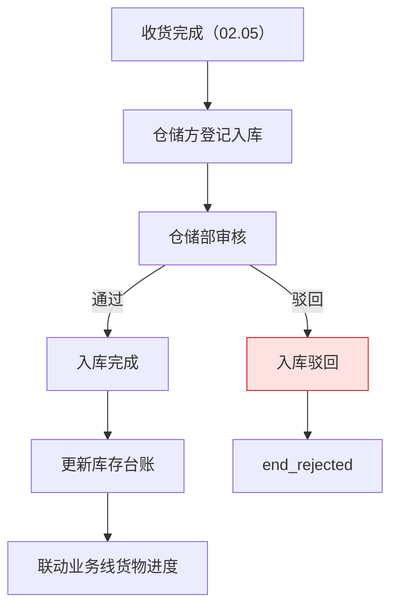
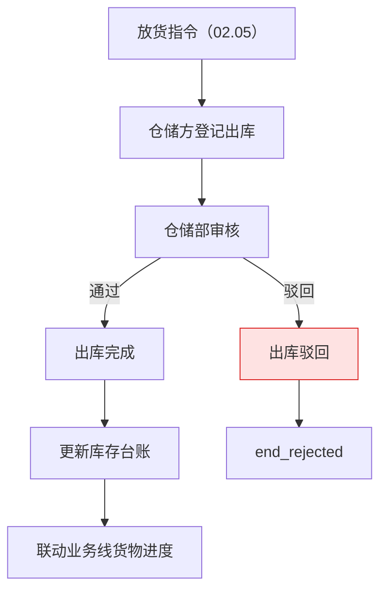
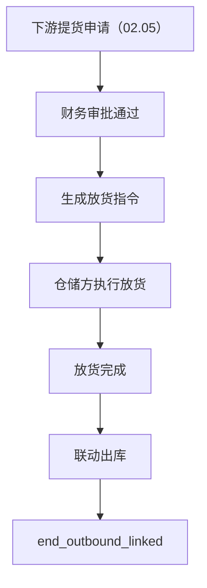
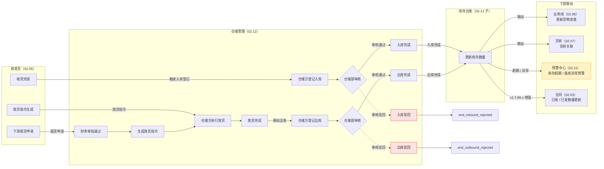
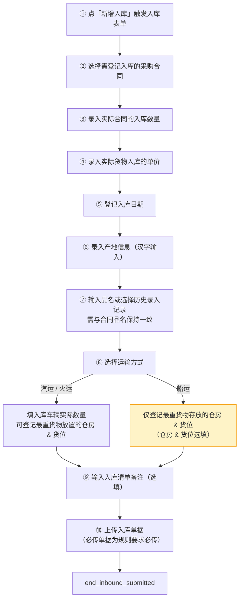
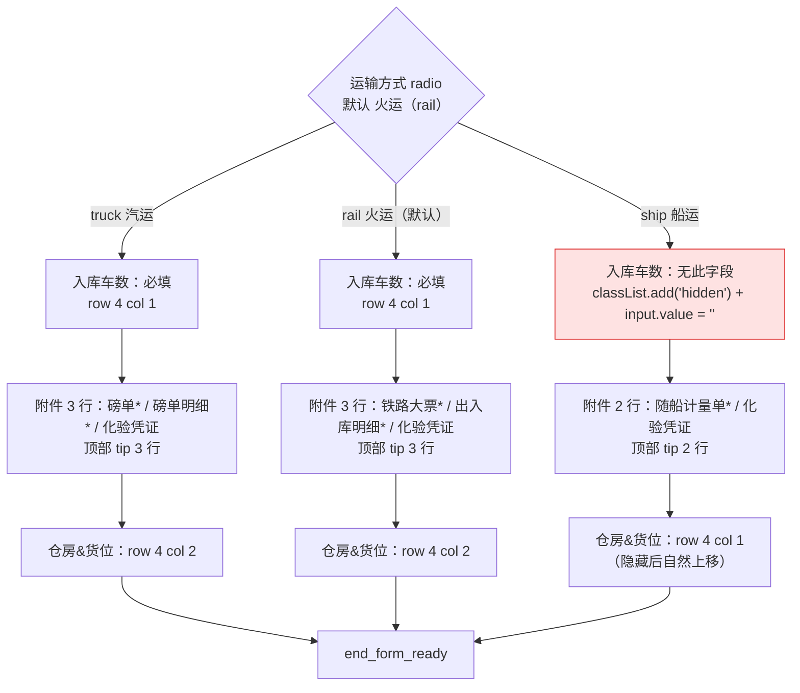
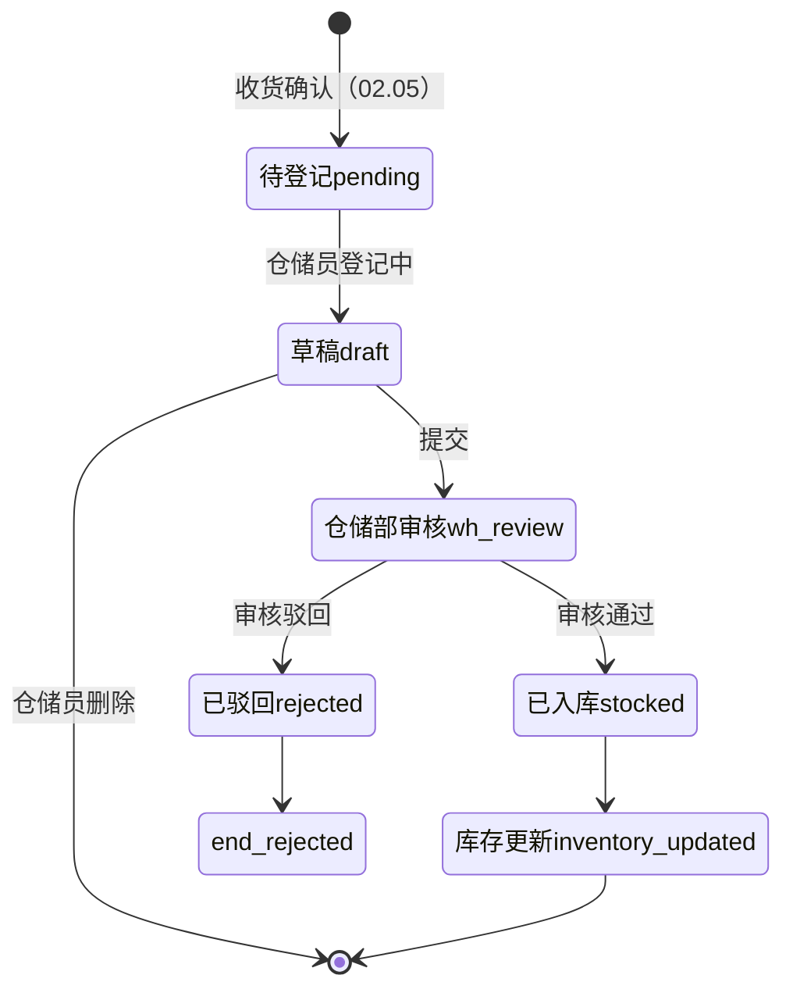
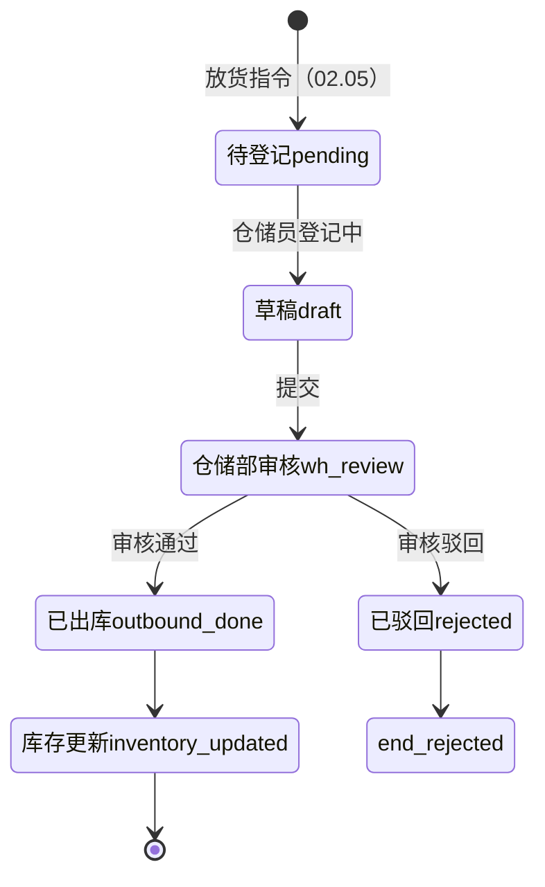
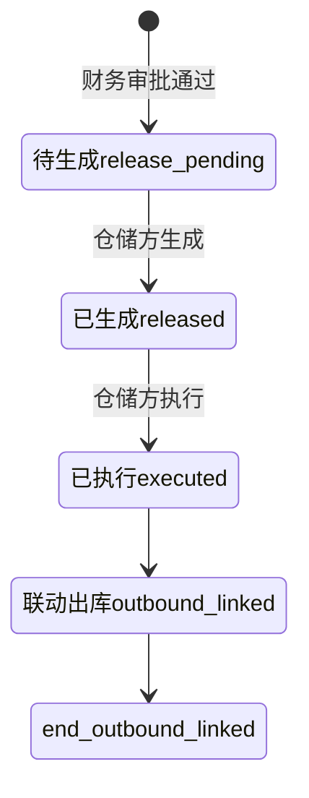

# 02.12 仓储管理 · 需求规格说明

> **文档类型**：PRD Writer 范式 · 落地需求文档 · 功能详细描述
> **对应总纲**：[00-产品概述与需求总纲.md](./00-产品概述与需求总纲.md)
> **通用规范**：[01-通用交互与文案规范.md](./01-通用交互与文案规范.md)
> **源文档（只读，未做任何改动）**：[02.12-仓储管理.md](../docs/02.12-仓储管理.md)
> **整理时间**：2026-09-30

---

## 0. 阅读说明

### 0.1 信息溯源标记

| 标记 | 含义 | 使用规则 |
|------|------|---------|
| ✅ | 源文档已明确 | 原值保留（表名 / 字段名 / 状态枚举 / 编号规则 / 提示文案 / 列名 / 列宽），不改写口径 |
| 🔷 | 范式补全 | 源文档没写，按范式要求推导，**必须注明推导依据** |
| ⚠️ | 源文档自相矛盾 | **绝不静默选边**，如实并列，交由业务方裁决 |
| 🔷 现状核验 ✅ | 本次整理对 `pages/` / `app.html` / `shared/js/` / `docs/` 做的**只读** grep / `ls` 核验（2026-09-30）| 结果为页面实现事实，**与源文档原值严格分离标注**，**未修改任何文件** |
| [待补充] | 信息不足 | **严禁编造**，需业务方 / 研发回填 |

### 0.2 源文档阅读顺序与 7 个增量节归位映射

源文档 `02.12-仓储管理.md`（**1,520 行**）由**三代口径叠加**构成：**§1-§11 是 v1.0 终版口径**（2026-07-24，基于原型 61-69 截图）、**§12-§17 是 6 个 v1.7.99.x 页面级改造增量**（2026-07-31 ~ 2026-08-03）、**§18 是 v1.7.99.x 模块级增量补充**（2026-09-24 追加，基于飞书《豫港通用户使用手册（内部版）》第 9 章）。三代口径在**子模块数量（7 vs 9）、表集合（§3 的 6 张 vs §10.2 的另 6 张）、放货管理状态机（4 状态 vs 现状 7 tab）、仓房管理列数（7 列 vs 现状 6 列）、必填字段数（11 vs 现状动态）**上存在冲突（见 §3.4 C1-C15）。

| 源文档章节 | 内容 | 归位到本文档 |
|-----------|------|------------|
| 头部（状态 / 复用度 65% / 13+ 张表） | 模块定位 + 复用度 + 配套文档 | §1.1、§5.4、§7.3 |
| §0 章节导航 | 18 节目录 | §0.2（本表） |
| §1 业务定位 + §1.1 sitemap | 独立第三方仓储方履约平台 / 3 子模块 / 多仓储方 / 7 行页面表 | §1.1、§1.2、§6 |
| §2 业务流程全景 | 2.1 入库 / 2.2 出库 / 2.3 放货（3 张 Mermaid）| §1.3.1、§1.3.2、§1.3.3 |
| §3 核心实体（6 张表）| `t_warehouse` / `t_inbound` / `t_outbound` / `t_inventory` / `t_stock_check` / `t_stock_check_item` 逐字段 | §5.1、§5.2 |
| §4 3 子模块状态机 | 入库 / 出库 / 放货（3 张 stateDiagram-v2）| §3.1.1、§3.1.2、§3.1.3、§3.2 |
| §5 角色操作矩阵 | 8 操作 × 5 角色 | §2.1.1 |
| §6 字段规则 | 仓库类型 / 入库类型 / 出库类型 / 库存计算 / 盘库差异 | §5.2.7-§5.2.11 |
| §7 按钮交互 | 7.1 入库列表 / 7.2 新增入库 / 7.3 入库详情 / 7.4 出库列表 / 7.5 放货列表 / 7.6 新增放货指令 / 7.7 放货详情 | §2.2、§2.1、§2.4、§6 |
| §8 异常处理 | 5 条业务异常（含原文文案）| §4.1、§2.5 |
| §9 跨模块流转 | 9.1 上游 2 条 / 9.2 下游 4 条 | §1.4.1、§1.4.2 |
| §10 复用建议 | 10.1 复用度 / 10.2 复用 6 表 / 10.3 不做的 3 类表 / 10.4 4 周排期 | §5.4 |
| §11 文档版本 | v1.0 + v1.7.99.86 | §7.3 |
| **§12 v1.7.99.86（5 页面重制）** | **12.1 入库记录 11 列 / 12.2 出库记录 10 列 / 12.3 提货管理 9 列 / 12.4 库存台账 8 KPI 双 tab / 12.5 巡库记录 12 列 / 12.6 共性规范 / 12.7 mock 数据规范** | **§1.2.2、§2.1.2、§2.2.2、§3.2.4、§3.3、§4.2、§5.3、§6、§7.3** |
| **§13 v1.7.99.89（新增采购入库表单 + 船运隐藏）** | **13.1 背景 / 13.2 范围 / 13.3 5 区块 26 字段 / 13.4 船运隐藏入库车数 / 13.5 关键规范 / 13.6 沿用 / 13.7 部署 / 13.8 触发模式 / 13.9 清理 / 13.10 适用范围** | **§1.2.3、§2.2.3、§3.3、§4.1.2、§5.2.12、§6、§7.3** |
| **§14 v1.7.99.90（新增销售出库 + 新增放货指令 + 放货列表改名）** | **14.1 背景 / 14.2 改 3 个 HTML（2 表单页 6 区块 + 1 列表页 4 处改名）/ 14.3 关键规范（select vs radio）/ 14.4 沿用 / 14.5 部署 / 14.6 清理 / 14.7 适用范围** | **§1.2.4、§2.2.4、§2.2.5、§3.3、§5.2.13、§5.2.14、§6、§7.3** |
| **§15 v1.7.99.91（仓房管理重制 + 新增仓房弹窗 + 巡库任务开关）** | **15.1 背景（仓房 ≠ 仓库）/ 15.2 范围 / 15.3 列表 7 列 / 15.4 新增仓房弹窗 2 字段 / 15.5 巡库任务 iOS 开关 / 15.6 关键规范 / 15.7 沿用 / 15.8 不改全局 / 15.9 部署 / 15.10 触发模式 / 15.11 清理 / 15.12 与 v1.7.99.86 关联 / 15.13 与 89/90 关联 / 15.14 适用范围** | **§1.1.2、§1.2.5、§2.1.3、§2.2.6、§2.3.2、§2.4、§3.2.4、§5.2.15、§6、§7.3** |
| **§16 v1.7.99.99（附件按运输方式动态切换）** | **16.1 3 图差异矩阵 / 16.2 范围 / 16.3 TRANSPORT_CONFIG / 16.4 renderAttachByTransport / 16.5 已上传 chip / 16.6 关键规范 / 16.7 沿用 / 16.8 部署 / 16.9 触发模式 / 16.10 清理 / 16.11 与 89 关联 / 16.12 适用范围** | **§1.3.6、§2.2.3、§3.3、§4.1.2、§4.2.3、§5.2.16、§5.2.17、§6、§7.3** |
| **§17 v1.7.99.100（入库详情 3 tab + 列表页新增入库修复）** | **17.1 背景（需求 A/B）/ 17.2 范围 / 17.3 详情 3 tab / 17.4 列表页下拉 2 项 / 17.5 抽屉「关联采购合同」/ 17.6 关键规范 / 17.7 沿用 / 17.8 部署 / 17.9 触发模式 / 17.10 清理 / 17.11 适用范围** | **§1.2.6、§2.1.4、§2.2.7、§2.2.8、§2.3.1、§2.4、§3.3、§4.1.3、§4.2.4、§6、§7.3** |
| **§18 v1.7.99.x 模块级增量补充** | **18.1 业务变化 / 18.2 9 子模块列表 / 18.3 入库 10 步流程 / 18.4 库存 3 指标公式 / 18.5 9 子模块统一规范 / 18.6 跨模块联动 / 18.7 异常补充 / 18.8 详细页面 PRD 索引 / 18.9 修改记录** | **§1.1.2、§1.2.1、§1.3.5、§1.4.2、§2.1.1、§2.4、§3.2.4、§5.1、§5.2.18、§6、§7.3** |

> ⚠️ **源文档自身的结构问题（照实记录，不代为修正）**：
> 1. **§1.1 标题写「9 个页面（sitemap）」，表内只有 7 行**（且 7 行是按**子模块**归并的，每行内含多个页面，非逐页列出）——见 C1。
> 2. **§3 标题写「核心实体（6 张表）」，头部写「13+ 张表」，§10.1 写「复用主产品表 6 张 + 港通新建表 0 张」，§10.2 列的 6 张表与 §3 的 6 张表**完全是两组不同的表**——见 C2。**
> 3. **§1 关键特点写「视频监控/巡库：v1.0 占位（无改动）」，§1.1 表格写巡库管理「无改动（占位）」，但 §12.5 重制了巡库记录页（12 列表格）**——见 C15。
> 4. **§12.2 同一段内既写「出库比入库少 1 列品类」，列清单里又有「品类」列**——见 C10。
> 5. **§12.5 写「巡库结果 3 状态 × 处理状态 3 状态 = 5 状态机组合」**——3 × 3 = 9，不是 5——见 C11。
> 6. **§13.8 写「11 个 * 号必填字段」，§16 之后附件与入库车数随运输方式动态变化，该数字已失效**——见 C13。
> 7. **§11 与 §18.9 记的版本日期互相冲突**（v1.7.99.86 = 07-31 vs 08-03；v1.7.99.91 = 07-31 vs 08-03；v1.7.99.100 = 08-03 vs 08-04）——见 C14。

> 🔷 **本文档附只读核验**：为判断「源文档口径 vs 页面实际实现」是否一致，整理时对 `pages/warehouse-*.html`（19 个）、`app.html`、`shared/js/topnav-drawer.js`、`docs/p-warehouse-*.md`（19 个）做了**只读** grep / `ls` 核验（2026-09-30），结果逐条标注为「**🔷 现状核验 ✅**」。**未修改 `docs/` 与 `pages/` 下任何文件。**

### 0.3 与通用规范的关系

**通用表单规范（校验时机 / 返回保护 / 提交行为 / 危险操作确认 / 空状态 / 失败引导 / 通用 UI 6 态 / 通用样式 / 脱敏规范）一律以 [01-通用交互与文案规范.md](./01-通用交互与文案规范.md) 为准，本文档不重复定义，只写本模块特有的部分**：**3 子模块状态机与 3 套列表 tab 维度互不相同（状态机 tab vs 运输方式 tab vs 开具/收到 tab）**、**入库 vs 出库 6 处字段/列/单位/合同号前缀差异**、**运输方式（汽运/火运/船运）驱动的字段显隐 + 附件单据动态切换（3 套配置）**、**新增采购入库（radio）与新增销售出库（select）、新增放货指令（radio）三种控件的差异**、**采购入库用「下游销售合同编号」而销售出库用「上游采购合同编号」的方向性差异**、**列表页 tab 在全站的 3 类维度（状态 / 运输方式 / 开具-收到）**、**入库列表页「新增入库」下拉 2 项（采购入库 → 抽屉选合同 / 盘盈入库 → 抽屉提示无合同）**、**8 KPI 横向滚动 + 蓝橙绿 3 色循环 + 折线/环形图 inline SVG**、**仓房管理 iOS 风格巡库任务开关 + 列头 ? tooltip + 520px 小弹窗**、**1440px 视口下列裁切的计算口径**、以及 **⚠️ 子模块数量、表集合、页面数量、放货状态机、仓房列数、必填字段数六类源文档自相矛盾**。

### 0.4 飞书用户手册补充（2026-10-08）

> **来源**：《豫港通数字供应链管理平台 — 用户使用手册（内部版）》飞书 rev.8976，**9.1 入库管理 + 9.2 出库管理**。⚠️ 本文档 §18 增量节已声明「基于飞书《豫港通用户使用手册（内部版）》第 9 章」，故**运输方式分支（汽运/火运/船运）、船运仓房货位选填等口径此前已吸收**；本节只补**此前未吸收的项**与**手册与本文档 ⚠️ 冲突项**。手册是对着线上系统写的，**权威性优先于本文档原有推导**。

| 手册小节 | 归位到本文档 | 填了哪些信息缺口 / 补了哪些矛盾 |
|---------|-------------|---------------------------|
| **9.1 入库管理** | §0.4 手册原值、§3.4（新增 **C16**）、§2.2 按钮交互「入库审核 / 出库审核」行、§4.1 校验表、§5.2 字段级规范 | **新增 C16**（手册入库全流程**无审核环节**，与 §4.1 的 `wh_review` 冲突）；「编辑仅支持修改入库单价 / 删除释放对应货物数量」**补齐为手册口径**；「必传单据 vs 非必传择性上传」补入 §4.1 |
| **9.2 出库管理** | §0.4 手册原值、§3.4（新增 **C16** / **C17**）、§2.2 按钮交互、§4.1 校验表 | **C16** 同上；**C17**（手册 9.2.3 出库操作项沿用入库措辞）；出库须**勾选放货指令记录**、出库 4 字段（数量/单价/日期/品名）**补齐为手册口径** |

**✅ 手册原值（照抄，不改写）**：

- **9.1.1 新增入库 10 步**：① 点击入库记录页面中的「**新增入库**」按钮触发入库表单 → ② **选择需登记入库的采购合同** → ③ 录入实际合同的**入库数量**（输入数字）→ ④ 录入实际货物入库的**单价** → ⑤ 登记**入库日期**（单日期年月日）→ ⑥ 录入**产地信息**（汉字输入）→ ⑦ **输入品名或选择历史录入记录，需与合同品名保持一致** → ⑧ 选择**运输方式** → ⑨ 输入入库清单的**备注说明**（选填；文本输入）→ ⑩ **上传入库单据**（**必传单据为规则要求必传，非必传择选择性上传即可**）
- **9.1.1 第八步 · 运输方式分支**：**汽运**：选择汽运时需填写对应入库单的**入库车辆实际数量**信息、**可选择**登记货物**最重放置**的仓房&货位信息；**火运**：同上；**船运**：选择船运时，**仅登记最重货物存放的仓房&货位（仓方&货位选填）**
- **9.1.2 入库记录操作项 · 编辑**：**仅支持修改入库单价**
- **9.1.2 入库记录操作项 · 删除**：如遇入库信息登记错误，则可以通过「删除」按钮删除此条入库记录，**释放对应货物数量**
- **9.2.1 新增出库**：① 点击**新增出库**按钮 → ② **选择需登记出库的销售合同**进行出库登记 → ③ **勾选当前合同登记的放货指令记录** → ④ 登记出库信息：**出库数量**（数字）/ **出库单价**（数字）/ **出库日期**（单/年月日）/ **品名**（文本输入）/ **运输方式**（汽运、火运同上；**船运**：仅登记最重货物存放的仓房&货位（仓房&货位选填））→ ⑤ 输入出库清单的**备注说明**（选填；文本输入）→ ⑥ 登记**上传附件信息**
- **9.2.3 出库记录操作项**：**详情**：点击详情可查看**入库记录**的详细信息；**编辑**：**仅支持修改入库单价**；**删除**：如遇**入库**信息登记错误，则可以通过「删除」按钮删除此条**入库**记录，**释放对应货物数量**（⚠️ 手册 9.2.3 原文沿用了入库措辞，见 **C17**）

---

## 1. 功能描述与触发条件

### 1.1 功能描述

✅ **仓储管理是港通供应链的独立第三方仓储方履约平台——出入库登记 + 盘库 + 月度对账**（源文档 §1 原文）。

✅ **关键特点**（§1 原文照抄）：

| 特点 | 内容 | 出处 |
|-----|------|------|
| **3 子模块** | 入库管理 / 出库管理 / 提货管理（放货管理）| §1 |
| **多仓储方** | 木薯淀粉仓储方、煤炭仓储方等 | §1 |
| **视频监控 / 巡库** | v1.0 占位（无改动）| §1 —— ⚠️ **与 §12.4 / §12.5 冲突，见 C15** |

#### 1.1.1 履约链路定位（🔷 范式补全）

> **推导依据**：源文档 §2 的 3 张流程图已明确「收货完成（02.05）→ 入库」「放货指令（02.05）→ 出库」「下游提货申请（02.05）→ 财务审批 → 放货指令 → 放货完成 → 联动出库」，且 §1 写「月度对账」。因此本模块的定位是**仓储履约的执行段与账实核对段**，不承载资金流转。**月度对账在源文档中无任何展开章节**，标 [待补充]（见 §7.2 Q1）。

✅ **本模块承接的 3 段履约动作**（§2 原文归纳）：

| 段 | 动作 | 触发方 | 产出 |
|----|------|-------|------|
| **入库段** | 收货完成后由仓储方登记入库，仓储部审核 | 收发货（02.05）| `t_inbound` + 库存台账更新 |
| **出库段** | 放货指令下达后由仓储方登记出库，仓储部审核 | 收发货（02.05）| `t_outbound` + 库存台账更新 |
| **放货段** | 下游提货申请 → 财务审批 → 生成放货指令 → 仓储方执行 → 联动出库 | 收发货（02.05）+ 财务 | 放货指令 + 联动出库 |

#### 1.1.2 v1.7.99.x 子模块结构（§18.1 + §18.2，2026-09-24 增量）

✅ **v1.0 → v1.7.99.x 业务变化表**（§18.1 原值照抄）：

| 维度 | v1.0 文档 | v1.7.99.x 现状 |
|------|----------|------------------|
| 子模块数量 | 5-6 个 | **9 个**：入库 / 出库 / 库存台账 / 巡库 / 库点 / 仓房 / 品类 / 系统监控 / 行情管理 |
| 库点结构 | 简化 | **v1.7.99.119 后**：库点 + 仓房 + 货位 三级结构 |
| 仓房结构 | 简化 | **v1.7.99.91 后**：仓房 + 货位 二级结构 + 容积 + 当前库存 |
| 品类配置 | 文字提及 | **v1.7.99.120 后**：品类 + 单品名 二级结构 + 计量单位 + 批量导入 |
| 入库类型 | 单一采购入库 | **v1.7.99.100 后**：采购入库 + 盘盈入库（列表页按钮下拉）|
| 库存台账 | 简化 | **v1.7.99.86 后**：实际库存 vs 账面库存 vs 库存差异 三指标 |
| 系统监控 | 无 | **新增**：设备状态 + IoT 设备实时上报 + 异常预警 |
| 行情管理 | 无 | **新增**：仓储端行情采集（与 02.08 盯市价格区别）|

✅ **9 子模块详细列表**（§18.2 原值照抄）：

| # | 子模块 | 页面文件 | PRD 文档 |
|---|--------|----------|----------|
| 1 | **入库管理** | `warehouse-inbound*.html` | p-warehouse-inbound*.md |
| 2 | **出库管理** | `warehouse-outbound*.html` | p-warehouse-outbound*.md |
| 3 | **库存台账** | `warehouse-inventory.html` | p-warehouse-inventory.md（2026-09-24 新写）|
| 4 | **巡库记录** | `warehouse-patrol.html` | p-warehouse-patrol.md（2026-09-24 新写）|
| 5 | **库点信息管理** | `warehouse-point.html` | p-warehouse-point.md（2026-09-24 新写）|
| 6 | **仓房管理** | `warehouse-warehouse.html` | p-warehouse-warehouse.md（2026-09-24 新写）|
| 7 | **品类配置** | `warehouse-category.html` | p-warehouse-category.md（2026-09-24 新写）|
| 8 | **系统监控** | `warehouse-system.html` | p-warehouse-system.md（2026-09-24 新写）|
| 9 | **行情管理** | `warehouse-market.html` | p-warehouse-market.md（2026-09-24 新写）|

⚠️ **⚠️ 子模块数量三套口径并存**：§1.1 表格 7 行 / §1.1 标题「9 个页面」/ §12 头部「仓储管理 7 个子模块菜单」/ §13-§17 反复写「仓储管理 9 个子模块菜单」/ §18.2 是另一套 9 子模块。**详见 C1**。

🔷 **现状核验 ✅（2026-09-30，只读）** —— 三处菜单的实际情况，**与源文档口径严格分离**：

| 载体 | 仓储管理下的条目 | 备注 |
|------|---------------|------|
| **`app.html:575-594`** | 7 个子项：入库管理（3 页）/ 出库管理（3 页）/ 提货管理（3 页）/ **库存管理 `pages: []`** / **视频监控 `pages: []`** / **巡库管理 `pages: []`** / **系统管理 `pages: []`** | 只有 9 个页面挂载了 `doc` 与 `section`，其余 4 个子项为空菜单占位 |
| **`shared/js/topnav-drawer.js:105-153`** | 7 个 subMenus：入库管理（`warehouse-inbound.html`）/ 出库管理（`warehouse-outbound.html`）/ 提放货管理（`warehouse-pickup.html` + `warehouse-release.html`）/ 库存管理（`warehouse-inventory.html`）/ 视频监控（`warehouse-video.html`）/ 巡库管理（`warehouse-patrol.html`）/ 系统管理（`warehouse-point.html` + `warehouse-warehouse.html` + `warehouse-category.html`）| `line 150` label 已是「仓房管理」（v1.7.99.91 改名已落地）；`line 127` label 已是「放货管理」 |
| **`pages/` 目录** | **19 个 `warehouse-*.html`** | 含 `warehouse-market.html`、`warehouse-inbound-overflow-new.html` 两个**未被任何菜单引用**的页面 |

### 1.2 触发条件

#### 1.2.1 模块级触发（§9 跨模块流转 + §18.3 手册 10 步）

✅ **上游触发**（§9.1 原表照抄）：

| 触发模块 | 触发条件 | 触发动作 |
|---------|---------|---------|
| 收发货（02.05）| **收货完成** | 触发入库登记 |
| 收发货（02.05）| **放货指令生成** | 触发出库登记 |

✅ **下游触发**（§9.2 原表照抄）：

| 触发模块 | 触发条件 | 触发动作 |
|---------|---------|---------|
| 库存台账 | 入库/出库完成 | 更新库存数量 |
| 业务线（02.06）| 入库/出库完成 | 更新业务线货物进度 |
| 货转（02.07）| 入库/出库 | 货转关联 |
| 预警中心（02.11）| 库存超期/盘库异常 | 触发预警 |

✅ **入库登记 10 步流程（手册 9.1 权威口径，§18.3 原值照抄）**：

1. **第一步**：点击入库记录页面中的「新增入库」按钮触发入库表单
2. **第二步**：选择需登记入库的采购合同
3. **第三步**：录入实际合同的入库数量（输入数字）
4. **第四步**：录入实际货物入库的单价
5. **第五步**：登记入库日期（单日期年月日）
6. **第六步**：录入产地信息（汉字输入）
7. **第七步**：输入品名或选择历史录入记录，**需与合同品名保持一致**
8. **第八步**：选择运输方式
   - 汽运 / 火运：需填写对应入库单的**入库车辆实际数量信息**，可选择登记货物最重放置的仓房 & 货位
   - 船运：**仅登记最重货物存放的仓房 & 货位**（仓房 & 货位选填）
9. **第九步**：输入入库清单的备注说明（选填）
10. **第十步**：上传入库单据（**必传单据为规则要求必传**）

#### 1.2.2 入库记录列表页触发（§12.1）

✅ **入库记录（`warehouse-inbound.html`）v1.7.99.86 触发条件**：

| 触发源 | 条件 | 结果 |
|-------|------|------|
| sidemenu | 点「仓储管理 / 入库管理 / 入库记录」| 进列表页，默认「全部」tab（92 条）|
| tab 切换 | 点「汽运 / 火运 / 船运」| 按**运输方式**维度过滤（不是状态维度）|
| 操作列「编辑」| 点行内编辑 | 🔶 进入编辑态 —— ⚠️ 源文档**未记录编辑页跳转目标**（v1.7.99.86 只写「操作列：详情 / 编辑 / 删除」），标 [待补充] |
| 操作列「删除」| 点行内删除 | 🔴 危险操作，`window.confirm()` 二次确认（§12.1 + §12.6）|
| 右上「新增入库」| v1.7.99.86 **无 onclick handler（缺陷）** → v1.7.99.100 修复为下拉弹 2 项 | 见 §1.2.6 |

#### 1.2.3 新增采购入库表单触发（§13.2 + §16.2）

✅ **`pages/warehouse-inbound-new.html` v1.7.99.89 触发条件**：

| 触发源 | 条件 | 结果 |
|-------|------|------|
| 用户截图需求 | 2026-07-31 user 提 1 条需求 + 1 张图 | 触发表单页 1:1 重制（14.8KB → 21.6KB，**+46%**）|
| 运输方式切换 | 选中「船运」（`checked.value === 'ship'`）| **隐藏「入库车数」字段 + 同步清空 input.value** |
| 页面初始化 | `syncCarCount()` 兜底调用 | 确保 radio 默认值（火运）生效 |
| v1.7.99.99 升级 | 运输方式任一变化 | **附件表格 + 顶部 tip 按 `TRANSPORT_CONFIG` 全量重渲染** |

#### 1.2.4 新增销售出库 / 新增放货指令触发（§14.1）

✅ **2026-07-31 user 提 2 张图 + 1 条规则**：

| 触发源 | 内容 | 结果 |
|-------|------|------|
| **图 1** | 出库记录中「新增出库」按钮触发的表单页（**新增销售出库**，含 **5+1 区块含「放货指令」中间区块**）| `warehouse-outbound-new.html` 重制 14.8KB → 23.4KB（**+58%**）|
| **图 2** | 放货管理中「新增释放管理」按钮的表单页（**实际是「新增放货指令」**）| `warehouse-release-new.html` 重制 14.8KB → 22.9KB（**+55%**）|
| **规则** | 「释放管理」→「放货管理」，「新增释放管理」→「新增放货指令」| `warehouse-release.html` 改 4 处文本（title / 面包屑 / h1 / 按钮）|

✅ **销售出库的核心条件逻辑（§14.2）**：

- 运输方式 = **船运** 时隐藏「出库车数」字段（**沿用 v1.7.99.89 模式**：JS 监听 select change + `classList.add('hidden')` + 同步清空 `input.value`）
- **运输方式 = select 而非 radio**（区别于 v1.7.99.89 采购入库的 radio —— **user 截图实际是 select**）
- **默认状态**：**汽运** selected
- **业务线 metadata**：「下游销售合同编号」→「**上游采购合同编号**」（销售出库方向 = 我方销售给采购方，业务线对应「上游采购合同」）

#### 1.2.5 仓房管理触发（§15.1）

✅ **2026-07-31 user 反馈 2 张图**：

- 图 1 = **仓房管理列表页**（v1.7.99.7 占位版「仓库管理」完全对不上）
- 图 2 = **新增仓房弹窗**（2 字段：仓房名称* + 备注）

✅ **实际业务（§15.1 原文）**：

- 仓储管理的「**系统管理 → 仓房管理**」子模块 = **仓库（站台）下挂的仓房/货位**
- 一个仓库（站台）下可以有**多个仓房**，每个仓房可**独立设置「巡库任务」开关 + 备注**
- 仓房列表「操作」列有 **2 个动作**：编辑（修改仓房信息）+ 货位（跳该仓房下的货位管理页）

✅ **巡库任务开关触发（§15.5）**：

- 点击开关 → `togglePatrolTask(input)` → `Utils.toast("巡库任务已开启/关闭", "success")`
- 行点击 + 开关点击**互不冲突**（`.ios-switch` 容器加 `onclick="event.stopPropagation();"`）
- 列头 `?` tooltip 原文：**「开启后该仓房将自动纳入巡库计划」**

✅ **新增仓房弹窗触发（§15.4）**：

- 标题「新增」（点击编辑时改为「编辑仓房」）
- 关闭交互 4 条：点右上 × / 点 modal-overlay 蒙层（`closeModal('addModal')`）/ 点底部「取消」/ **确定触发 `submitAddModal()`**（检查表单 validity + `Utils.toast` 提示 + 关闭弹窗）

#### 1.2.6 列表页「新增入库」下拉 + 抽屉触发（§17.1 需求 B + §17.4 + §17.5）

✅ **v1.7.99.100 修复对象**：v1.7.99.86 列表页「新增入库」按钮**无 onclick handler** → v1.7.99.100 修复。

✅ **需求原文 4 条（§17.1 照抄）**：

1. 检查「新增入库」按钮路由（图 4 触发的页面）
2. 点击新增入库按钮需要**下拉弹出两个入库类型**：**采购入库** + **盘盈入库**
3. 选择任意入库方式需要**弹出图 5 的抽屉式弹出层**
4. 抽屉表头依次为：订单/单批次合同编号 -- 订单/单批次合同编号 -- 收货人 -- 交货期限 -- 签订日期 -- 运输方式 -- 数量 -- 基准价格 -- 品名

✅ **实际采用的表头（§17.1 决策，原值照抄）**：**合同编号 / 卖方企业名称 / 收货人 / 交货期限 / 签订日期 / 运输方式 / 数量 / 基准价格 / 品名**

> ✅ **v1.7.99.100 决策**：user 文字「订单/单批次合同编号」重复了，属 **typo**，**以图 5 实际 9 列表头为准**（v1.7.99.78 经验：「user 截图优先于 user 文字」）。

✅ **`selectInboundType(type)` 函数（§17.4 核心逻辑）**：

| type | 行为 |
|------|------|
| `purchase` | `openContractDrawer('purchase')` —— **弹抽屉** |
| `inventory_profit` | `Utils.toast` + `window.location.href = './warehouse-inbound-new.html?type=inventory_profit'` —— 盘盈入库**不需关联合同，直接跳详情页** |

✅ **下拉菜单交互（§17.4）**：

- 按钮：`新增入库` + 下拉箭头（polyline SVG）
- 点击：`toggleInboundAddMenu()` → 显示/隐藏下拉菜单
- 下拉 2 项：**采购入库**（hint: 关联采购合同）/ **盘盈入库**（hint: 实物盘盈生成入库）
- 样式：`position absolute` + `min-width 180px` + `box-shadow 0 4px 12px` + 菜单项 `padding 10px 16px` + hover 浅蓝背景
- **点击外部关闭**：`document.addEventListener('click')` + `!btn.contains(e.target) && !menu.contains(e.target)` → `menu.style.display = 'none'`

✅ **抽屉「关联采购合同」3 底部按钮（§17.5）**：

| 按钮 | 函数 | 行为 |
|------|------|------|
| **取消** | `closeContractDrawer()` | 关闭抽屉 |
| **暂不关联** | `drawerSkip()` | 关闭抽屉 + `Utils.toast` + 跳 `warehouse-inbound-new.html?type=purchase`（**不携带合同号**）|
| **确定** | `drawerConfirm()` | 选 1 合同后 → 关闭抽屉 + `Utils.toast` + 跳 `warehouse-inbound-new.html?type=purchase&contract=GTGYL-MSXS-20260127-s`（**携带合同号**）|

✅ **确定按钮 disabled 状态（§17.5）**：未选任何合同时 `disabled=true`，选中后 `disabled=false` —— 由 `updateConfirmBtn()` 函数控制。

### 1.3 业务流程（Mermaid）

#### 1.3.1 入库管理流程（§2.1，原图照搬）



#### 1.3.2 出库管理流程（§2.2，原图照搬）



#### 1.3.3 放货管理流程（§2.3，原图照搬）



#### 1.3.4 端到端履约泳道图（🔷 范式补全，跨 §2 + §9 + §18.6 整合）

> **推导依据**：源文档 §2 的 3 张流程图均为**单模块视角 TB 图**，未画出跨模块角色边界；§9.1/§9.2 记录了上下游 6 条触发关系；§18.6 记录了 5 条 v1.7.99.x 增强联动。**下图的泳道划分与箭头标签全部由上述源文档条目拼装，未新增任何业务环节**。



#### 1.3.5 入库登记 10 步（§18.3 手册口径，转 Mermaid）

> **推导依据**：§18.3 是纯编号步骤文本，按本模块统一规范（v1.7.99.6「流程图统一用 Mermaid」）转为流程图，**步骤文字逐字照抄，未增删**。



#### 1.3.6 运输方式条件分支（§13.4 + §16.3，新增采购入库）

> **推导依据**：§13.4 定义「船运隐藏入库车数」单条逻辑，§16.3 用 `TRANSPORT_CONFIG.carCount` 把它升级为**配置驱动的 3 分支**。下图为两条源文档的合并表达，**分支内容与字段清单照抄 §16.1 差异矩阵**。



✅ **合同信息同步（§16.4 + §16.6）**：`contractTransportLabel.textContent = cfg.label` —— 合同信息表格里的「运输方式」label **跟随 radio 切换**（火运↔汽运↔船运）。**合同信息是只读展示，不与 radio 双向绑定 —— 只单向同步显示**。

✅ **仓房&货位位置自适应（§16.3 + §16.6）**：CSS grid 顺序不变，**carCount 隐藏后 warehousePosition 自然上移到 row 4 col 1**（v1.7.99.99 简化方案：不重排 grid，依赖 `display:none` 副作用）。

### 1.4 模块依赖（跨模块流转）

#### 1.4.1 v1.0 上游 / 下游触发（§9 原表）

见 §1.2.1 的两张表（上游 2 条 / 下游 4 条）。

#### 1.4.2 v1.7.99.x 增强联动（§18.6 原表照抄）

| 联动系统 | v1.0 描述 | v1.7.99.x 增强 |
|----------|-----------|------------------|
| **业务线（02.06）** | 文字提及 | **库存台账 → 业务线「账面库存」自动同步** |
| **合同（02.03）** | 已记录 | **入库/出库 → 合同「已收/已发」数量自动更新** |
| **预警中心（02.11）** | 未提及 | **设备异常触发预警 + 温湿度超阈值触发预警** |
| **盯市价格（02.08）** | 未提及 | **行情管理数据可同步到盯市价格规则库** |
| **监控视频（02.12 子模块）** | 未提及 | **系统监控 → 监控视频一键跳转** |

⚠️ **⚠️ §18.6 的「v1.0 描述」列与 v1.0 §9.1/§9.2 对不上**：v1.0 §9.2 **只记了 4 条下游**（库存台账 / 业务线 02.06 / 货转 02.07 / 预警中心 02.11），**完全没有「合同（02.03）」这条**；且「盯市价格（02.08）」「监控视频」在 v1.0 中确实未提及。**详见 C6**。

✅ **9 子模块统一规范（§18.5，v1.7.99.86 关键决策）**：

- 顶部按钮（**导出 / 新增**）
- **6-7 字段筛选区**
- 表格列宽统一规范
- 状态 tag 颜色统一（v1.7.99.14）
- 流程图统一用 Mermaid（v1.7.99.6）

---

## 2. 交互细节

### 2.1 角色操作矩阵（权限可见性）

#### 2.1.1 v1.0 角色操作矩阵（§5 原表照抄，8 操作 × 5 角色）

| 操作 / 角色 | 仓储员 | 仓储部 | 业务部 | 风控部 | 财务部 |
|------------|------|------|------|------|------|
| 入库登记 | **✓** | - | - | - | - |
| 入库审核 | - | **✓** | - | - | - |
| 出库登记 | **✓** | - | - | - | - |
| 出库审核 | - | **✓** | - | - | - |
| 放货指令生成 | **✓** | - | - | - | - |
| 放货执行 | **✓** | - | - | - | - |
| 盘库 | **✓** | - | - | - | - |
| 查看库存台账 | ✓ | ✓ | ✓ | ✓ | ✓ |

⚠️ **⚠️ 该矩阵与 3 个增量节的角色口径完全脱节**：§12-§17 反复出现的角色是「**仓储方**」「**仓储部**」「**仓储员**」「**创建人员（张爽）**」「**监管负责人**」「**财务**」，但 §12-§17 **从未更新过 §5 矩阵**。具体缺口见 §7.2 Q5-Q9。

✅ **矩阵内各操作的可见按钮（§7 + §12-§17 交叉补全）**：

| 操作 | 可见按钮 | 位置 | 出处 |
|------|---------|------|------|
| 入库登记 | **新增入库**（v1.7.99.100 后为下拉 2 项）| 入库记录列表右上 | §12.1 + §17.4 |
| 入库审核 | 🔴 **不实现**（✅ 手册 9.1.1）| — | 源文档**未记录审核按钮**；✅ **手册 9.1.1 的 10 步入库流程直达提交、无审核环节** → 按钮应判定为不实现（⚠️ 见 **C16**，待业务方确认）|
| 出库登记 | **新增出库** | 出库记录列表右上 | §12.2 |
| 出库审核 | 🔴 **不实现**（✅ 手册 9.2.1）| — | 同上；✅ **手册 9.2.1 的 6 步出库流程直达提交、无审核环节**（⚠️ 见 **C16**，待业务方确认）|
| 放货指令生成 | **新增放货指令** | 放货管理列表右上 | §7.5 + §14.2 |
| 放货执行 | 🔶 [待补充] | — | 源文档**未记录执行按钮** → Q7 |
| 盘库 | 🔶 [待补充] | — | 源文档 §4 / §5 有「盘库」，但**无任何盘库页面 / 按钮记录**（`t_stock_check` 无对应页面文件）→ Q8 |
| 查看库存台账 | **数据导出**（Tab 右侧）| 库存台账 | §7.1 类推 + §12.4 |

#### 2.1.2 5 个重制列表页的 tab 维度差异（§12，**不同业务用不同 tab 维度**）

> ✅ **源文档 §12.1 / §12.3 明确锁定：「别复制粘贴状态机 tab」「新加 tab 维度要先看 user 截图是状态还是维度」**。

| 页面 | tab 数量 | tab 维度 | tab 清单（§12 原值）| 计数 | 出处 |
|------|---------|---------|--------------------|------|------|
| **入库记录** | **4** | **运输方式** | 全部 92 / 汽运 52 / 火运 28 / 船运 12 | ✅ 带 count | §12.1 |
| **出库记录** | **4** | **运输方式** | 全部 76 / 汽运 42 / 火运 22 / 船运 12 | ✅ 带 count | §12.2 |
| **提货管理** | **2** | **开具 / 收到** | 已开具（active）/ 已收到 | ❌ 无 count | §12.3 |
| **库存台账** | **2** | **台账视角** | 库存概览（active）/ 业务线台账 | ❌ 无 count | §12.4 |
| **巡库记录** | **0** | — | （无 tab，仅 3 字段筛选）| — | §12.5 |

✅ **对比参照（源文档反复引用的其他模块）**：
- v1.7.99.85 追保函管理 = **5 状态 tab**
- v1.7.99.82 销售结算 = **7 状态 tab**
- ✅ **v1.7.99.86 入库 = 4 运输方式 tab**、**提货 = 2 维度 tab（不是状态机）**

#### 2.1.3 仓房管理操作列（§15.3）

| 操作 | 类型 | 行为 | 出处 |
|------|------|------|------|
| **编辑** | 文字链接 | 打开弹窗，标题改为「**编辑仓房**」 | §15.3 + §15.4 |
| **货位** | 文字链接 | 跳该仓房下的货位管理页 —— ⚠️ **v1.7.99.91 实际只 toast 提示**，`warehouse-warehouse-position.html` **不新建**（等 user 后续提再做）| §15.3 + §15.8 + §15.11 |

#### 2.1.4 入库记录详情页 3 tab（§17.3，v1.7.99.100 锁定）

| tab | 顺序 | 默认 | 内容 | 出处 |
|-----|------|------|------|------|
| **入库信息** | 1 | ✅ **active** | metadata 8 字段 2 列 + 入库信息 4 行 6 列 label-value 表格（10 字段 + 备注跨 5 列）+ 附件 3 列 2 行 | §17.3 |
| **入库明细** | 2 | — | 2 字段筛选（入库流水号 / 车牌号）+ **数据导出 button**（带 download icon）+ 11 列表格 1 行 mock | §17.3 |
| **操作记录** | 3 | — | 5 列表格 1 行 mock | §17.3 |

⚠️ **⚠️ 与 v1.7.99.7 占位版 4 tab 完全不同**（v1.7.99.7 = 入库信息 / 货位详情 / 质检记录 / 操作记录，全部「待补充」）——**见 §7.3 版本记录第 2 行**。

🔷 **现状核验 ✅（2026-09-30，只读）** —— `pages/warehouse-release-detail.html:202` 的放货指令详情页在 **v1.7.99.191** 已改为 **4 tab（放货信息 / 审批管理 / 出库记录 / 操作记录）**。**源文档从未记录此版本**，见 C5。

### 2.2 按钮交互（操作反馈）

#### 2.2.1 v1.0 按钮交互（§7 原值照抄）

**入库记录列表（61 截图）**：

| 按钮 | 位置 | 可见条件 | 点击行为 |
|------|------|---------|---------|
| 搜索/筛选 | 顶部 | 所有 | 弹筛选抽屉 |
| 数据导出 | Tab 右侧 | 所有 | 导出 Excel |
| 详情 | 列表行 | 所有 | 跳详情页 |
| 新增入库 | 右上 | 仓储员 | 跳新增页（62 截图）|

**放货管理列表（67 截图）**：

| 按钮 | 位置 | 可见条件 | 点击行为 |
|------|------|---------|---------|
| 搜索/筛选 | 顶部 | 所有 | 弹筛选抽屉 |
| 数据导出 | Tab 右侧 | 所有 | 导出 Excel |
| 详情 | 列表行 | 所有 | 跳详情页 |
| 新增放货指令 | 右上 | 仓储员 | 跳新增页（68 截图）|

**出库记录列表（64 截图）**：✅ 源文档原文「**类似入库记录列表**」；**出库详情无改动（66 截图）** —— ⚠️ 见 C7。

#### 2.2.2 v1.7.99.86 操作列 + 共性规范（§12.1 + §12.6）

✅ **入库记录操作列（§12.1 原值）**：**详情 / 编辑 / 删除**（删除用红色 `danger` 样式 + `confirm` 二次确认）。

✅ **5 页面共性规范（§12.6）**：

| 规范 | 内容 | 经验来源 |
|------|------|---------|
| **inline Utils fallback 必加** | 5 个页面都有操作列，**每个都加** `window.Utils = window.Utils \|\| { toast: function(msg, type) { ... } }` | v1.7.99.80 |
| **操作列点击事件委托** | `document.body.addEventListener('click', ...)` + `target.closest('.col-action')` | v1.7.99.85 |
| **危险操作 confirm 二次确认** | 删除/作废等危险操作必须 `window.confirm()` 二次确认 | v1.7.99.82 |
| **不修改全局 design-system.css / list-page.css** | 项目级覆盖 | v1.7.99.69/71/73/75/80/81/82/83/84/85 |
| **不修改 assets/js/app.js** | 沿用 v1.7.99.80 inline Utils fallback | v1.7.99.80 |
| **不修改 sidemenu** | 仓储管理 7 个子模块菜单已锁定，**不动 topnav-drawer.js** | v1.7.99.85 |
| **不修改详情页/新增页** | 5 个页面对应的详情/新增页（v1.7.99.7 占位）**不动** —— **等 user 后续提「详情页/新增页改造」再做** | v1.7.99.85 |
| **1440px 视口列裁切** | 表格列数 5-12 列，**沿用 cp-table-wrap `overflow-x: auto`**，新加列表页先算 1440px 视口下哪些列被裁切 | v1.7.99.83/84/85 |

✅ **v1.7.99.86 新加 3 条规范（§12.6）**：

- **【大前提】图 1-N 组合改造模式**：user 给 6 张图对应 6 个页面，**每张图都是 1 个独立页面的完整描述** —— **别只按一张图做**
- **【大前提】title 改/不改边界**：user 截图入库管理列表页叫「入库记录」→ **沿用 user 截图改标题**，**别**「v1.7.99.7 叫入库管理就不动」—— **新加页面先看 user 截图标题**
- **【大前提】empty state 2 种页面**：提货管理 / 巡库记录 2 个页面都是 empty state，**业务系统的真实数据就是这样** —— **沿用 user 截图不擅自加 mock**

#### 2.2.3 新增采购入库：5 区块 26 字段（§13.3 + §16）

✅ **5 区块结构（§13.3 原表照抄）**：

| # | 区块 | 字段 | 备注 |
|---|------|------|------|
| 1 | **合同信息** | **9 字段 3 列 label+value pair** | 合同编号（`GTGYL-MSXS-20260127-s`）+ 卖方 / 买方 / 品名 / 基准价格 / 数量 / 交货期限 / 运输方式 / 收货人 |
| 2 | **业务线信息** | **1 行 3 列** | 业务线号（`SKYWX202607050001`）+ 业务线名称 + **下游销售合同编号**（`YL-MSXS-20260127-s`）|
| 3 | **入库信息** | **11 字段 3 列 4 行** | Row 1: 入库数量(吨)* / 入库单价(元/吨)* / 入库货值<br>Row 2: 入库日期* / 产地* / 品名*<br>Row 3: 发货单位* / 收货单位* / 运输方式*（汽运/火运/船运 **radio**）<br>Row 4: **入库车数*（条件隐藏）** + 仓库&货位 |
| 4 | **备注** | **1 full-width textarea** | **200 字以内** |
| 5 | **附件信息** | **3 表格行**（v1.7.99.89）/ **2-3 表格行**（v1.7.99.99）| v1.7.99.89：铁路大票*（必填）/ 出入库明细*（必填）/ 化验凭证（非必填）|

✅ **核心 JS 规范（§13.4 + §13.5）**：

| 项 | 内容 |
|----|------|
| **JS 监听** | `input[name="transport"]` 的 `change` 事件 |
| **触发条件** | `checked.value === 'ship'` |
| **动作 1** | `carCountField.classList.add('hidden')`（`display: none`）|
| **动作 2** | **同时清空 input 值**（避免无效数据提交）|
| **默认状态** | **火运**（沿用 user 截图：合同信息中运输方式 = 火运）|
| **初始化** | 页面加载时调用 `syncCarCount()` 兜底，确保 radio 默认值生效 |
| **CSS 语义化** | `.transport-dependent.hidden { display: none !important; }` —— **而不是** `style.display = 'none'` |
| **radio 控件** | `<input type="radio" name="transport" value="truck/rail/ship">` + `accent-color: var(--color-primary)` —— **别用自定义 div 模拟 radio** |

✅ **`TRANSPORT_CONFIG` 配置驱动（§16.3，v1.7.99.99 核心数据结构，原值照抄）**：

| transportKey | label | carCount | attaches 1（必填）| attaches 2 | attaches 3（非必填）| 总行数 |
|-------------|-------|----------|------------------|-----------|------------------|--------|
| `truck` | 汽运 | `true` | **磅单*** `jpg，jpeg，png，pdf` | **磅单明细*** `jpg，jpeg，png，pdf，xls，xlsx` | 化验凭证 | **3** |
| `rail` | 火运 | `true` | **铁路大票*** `jpg，jpeg，png，pdf` | **出入库明细*** `jpg，jpeg，png，pdf，xls，xlsx` | 化验凭证 | **3** |
| `ship` | 船运 | **`false`** | **随船计量单*** `jpg，jpeg，png，pdf` | —（无）| 化验凭证 | **2** |

✅ **已上传文件名 chip（§16.5）**：

- ✅ **汽运 mock 文件名**：`1-4批次采购订单、商品所有权确认单.pdf`（磅单 / 磅单明细 已上传）
- **`.attach-file-chip`**：`inline-flex` + `background #EFF6FF` + `color var(--color-primary)` + `padding 3px 10px` + `border-radius 4px`
- **`.file-name`**：`max-width 320px` + `overflow hidden` + `text-overflow ellipsis` + `white-space nowrap`（**长文件名截断**）
- **`.file-remove`**：`color #94A3B8` + `font-size 14px` + `cursor pointer` + hover 变红
- ✅ **v1.7.99.99 决策**：**不沿用 v1.7.99.90 的 hover tooltip 显示时间戳** —— 附件清单的 chip 简化版，**时间戳等详情放详情页**

✅ **顶部 tip 文案模板（§16.4，从 `renderAttachByTransport` 原码照抄）**：

```
<strong>{name}：</strong>可支持格式为{formats}的附件，支持多张，单个附件大小不得超过100M的文件
```

✅ **关键规范（§16.6）**：

- **【大前提】配置驱动渲染 vs 写死 DOM**：v1.7.99.89 旧版附件表格 3 行**写死在 HTML 里**，改运输方式时要重制整个 tbody → v1.7.99.99 升级为 `TRANSPORT_CONFIG` 配置驱动，**改运输方式只改 transportKey 变量** —— **新加运输方式条件渲染先用配置驱动，别写死 DOM**
- **【大前提】3 套附件动态切换用 `innerHTML` 全量重写**（`renderAttachByTransport`）—— **别用 show/hide className**
- **【大前提】合同信息同步是单向** —— 合同信息是**只读展示**，**不与 radio 双向绑定**
- **【大前提】字段位置自适应用 CSS grid + `display:none` 副作用**（船运 → 入库车数 hidden → 仓房&货位自然上移 col 1）
- **【大前提】附件单据类型 user 截图驱动** —— **新加运输方式单据类型先按 user 截图确定，别沿用旧版本**

#### 2.2.4 新增销售出库：6 区块（§14.2 原值照抄）

✅ **6 区块结构**：

| # | 区块 | 字段 | 关键差异 |
|---|------|------|---------|
| 1 | **合同信息** | 9 字段 3 列 label+value pair | 合同编号 `销售数据合同001`（**带 ⧉ 复制 icon**）+ 卖方/买方/品名/基准价格/数量/交货期限/运输方式/收货人 |
| 2 | **业务线信息** | 1 行 3 列 | 业务线号 `SKYWX202408210001` + 业务线名称「天宇源国际-荣厚实业-云南云核地质环境测试有限公司」+ **上游采购合同编号 `TYYGJ-RHSY-202408-003`** |
| 3 | **放货指令**（**v1.7.99.90 新加区块，user 截图独占一行（红框）**）| 表格 **6 列 + 5 行 mock + 单选 radio** | 放货指令编号 / 放货日期 / 放货吨数(吨) / 已出库吨数(吨) / 提货联系人姓名 / 提货联系人电话号码 |
| 4 | **出库信息** | 12 字段 3 列 4 行 | Row 1 出库数量(吨)* / 出库单价(元/吨)* / **出库货值（readonly 自动计算）**<br>Row 2 出库日期* / 品名* / 发货单位*<br>Row 3 收货单位* / 运输方式*（**select 汽运/火运/船运，默认汽运**）/ **出库车数*（条件隐藏）**<br>Row 4 **仓库&货位（无 label）** + **收货地址*（带 📍 location icon）** |
| 5 | **备注** | 1 full-width textarea | **200 字 maxlength** |
| 6 | **附件信息** | 2 表格行 + **蓝色 tip 收起/展开** | **磅单\* 必填** + **化验凭证\* 必填** |

✅ **放货指令 mock 合同号（§14.5 验证清单照抄）**：`FH-DLXLC-DSRMT-202203-001`

#### 2.2.5 新增放货指令：6 区块（§14.2 原值照抄）

| # | 区块 | 字段 | 关键差异 |
|---|------|------|---------|
| 1 | **合同信息** | 9 字段 3 列 label+value pair | 合同编号 `销售090701long有一天突然` + 卖方/买方/品名/基准价格/数量/交货期限/运输方式/收货人 |
| 2 | **放货信息** | **7 字段 3 列 3 行** | Row 1 放货日期*（**带 📅 date icon**）/ 放货数量(吨)* / 仓库名称*<br>Row 2 提货联系人姓名* / 提货人联系方式* / **提货联系人身份证号\***<br>Row 3 **运输方式\*（汽运/火运/船运 radio，默认火运）** |
| 3 | **站点表格** | 5 列 + 1 行 mock + **新增 button** | 序号 / 发站* / 到站* / 收货人 / 托运人 / 操作(新增) —— **表格可在 JS 动态加行**（`addStationRow(btn)`）|
| 4 | **备注** | 1 full-width textarea | **上限 200 字** |
| 5 | **业务线下游回款信息**（**7 列复杂表格**）| 3 项汇总 + 7 列表格 + **4 行 mock** + 详情链接 | 汇总 = 下游企业累计已回款货款（元）`123,234.23` + 累计已出库货值（元）`23,234.23` + 剩余可出库货值（元）`100,000.00`<br>表格 = 收款编号 / 回款时间 / 回款金额 / 认领至本合同金额 / 可认领余额 / 回款方式 / 认领状态 / 操作(详情) |
| 6 | **附件** | 蓝色 tip + 2 表格行 | **出库通知书附件\* 必填** + 已有 `44354657687.pdf`（**带 hover tooltip 显示 `2023-12-12 12:23:32` 时间戳** + × 删除按钮）+ 其他附件 |

✅ **放货指令 mock 业务线号（§14.5 验证清单照抄）**：`SKJSD2021090911100001`

✅ **【大前提】运输方式控件三分（§14.3）**：

| 表单 | 运输方式控件 | 默认 | 版本 |
|------|------------|------|------|
| **新增采购入库** | **radio** | 火运 | v1.7.99.89 锁定 |
| **新增销售出库** | **select** | 汽运 | v1.7.99.90 沿用 user 截图 |
| **新增放货指令** | **radio** | 火运 | v1.7.99.90 沿用 user 截图 |

> ✅ **源文档原文**：「**新加运输方式字段先看 user 截图是 select 还是 radio，别复制粘贴**——不同业务用不同控件」。

✅ **【大前提】业务线信息方向差异（§14.3 + §14.7）**：

| 业务 | 业务线信息第 3 列 | 依据 |
|------|-----------------|------|
| **采购入库** | **下游销售合同编号** | v1.7.99.89 |
| **销售出库** | **上游采购合同编号** | v1.7.99.90 ——「销售出库方向是『我方销售给采购方』，所以业务线对应『上游采购合同』」|

#### 2.2.6 仓房管理 + 新增仓房弹窗（§15.3 + §15.4）

✅ **列表页（§15.3）**：

| 项 | 内容 |
|----|------|
| **h1** | **仓房管理** |
| **右上按钮** | **+ 新增仓房**（点击触发 `openAddModal()`）|
| **面包屑** | 仓储管理 / 系统管理 / 仓房管理 |
| **2 字段筛选区** | **仓房名称**（input，「请输入仓房名称」）+ **仓库名称**（select，「请选择仓库」+ **4 候选：陕煤物流监管测试站台 / 测试222站台1111 / 国际物流组合库 / 郑州主仓**）|
| **7 列表格** | 编号 13%（mono 字体）/ **仓库 20%** / 仓房名称 14% / 所属货主 22% / 备注 auto / **巡库任务 9%（带 ? tooltip）** / 操作 10% |
| **mock 2 行** | ① `CF202410140001` + 陕煤物流监管测试站台 + 测试仓房 + 陕西陕煤供应链管理有限公司 + — + 蓝开关 ON<br>② `CF202408010007` + 测试222站台1111 + 测试仓房 + 陕西陕煤供应链管理有限公司 + `111` + 蓝开关 ON |

✅ **新增仓房弹窗（§15.4）**：

| 项 | 内容 |
|----|------|
| **标题** | 「新增」（点击编辑时改为「**编辑仓房**」）|
| **字段 1** | **仓房名称\***（必填红色 \* + input + placeholder「请输入仓房名称」）|
| **字段 2** | **备注**（textarea + **maxlength 200** + placeholder「请输入备注」）|
| **布局** | **2 字段 1 列纵向 layout**（`.form-stack` flex column，**区别 blacklist 的 4 列 grid** —— **字段数决定 layout**）|
| **modal-overlay** | fixed inset 0 + `rgba(15,23,42,0.45)` 蒙层 + z-index 999 |
| **modal-panel** | fixed top/left 50% + `translate(-50%,-50%)` + **520px 宽** + z-index 1000（**2 字段小弹窗 = 520px**；8+ 字段 = 1080px，v1.7.99.49 blacklist 模式）|
| **三段式** | modal-header / modal-body / modal-footer |
| **底部按钮** | 取消（`closeModal`）+ 确定（`submitAddModal`）|
| **确定行为** | 检查表单 validity + `Utils.toast` 提示 + 关闭弹窗 |

✅ **巡库任务开关（§15.5）**：

| 项 | 值 |
|----|-----|
| **样式** | **iOS 风格蓝开关**（设计系统没有 switch 类，**inline CSS `.ios-switch`**，**别用系统原生 checkbox**）|
| **尺寸** | **36px × 20px** 圆角矩形，checked 时变蓝（`var(--color-primary, #1E40AF)`）|
| **thumb** | **16px 圆形白点**，未选时 `left 2px`，选中时 `translateX(16px)` |
| **背景色** | 灰色 `#CBD5E1`（未选）→ 蓝色（选中）|
| **列头 ? tooltip** | 14px × 14px 圆形 `#94A3B8` 背景白字「?」+ hover 变蓝 + `title="开启后该仓房将自动纳入巡库计划"` HTML 原生 tooltip |
| **toggle 行为** | `togglePatrolTask(input)` → `Utils.toast("巡库任务已开启/关闭", "success")` |
| **点击不冲突** | `.ios-switch` 容器加 `onclick="event.stopPropagation();"`；每个 click 监听都要 `e.target.closest('.col-action, button, a, .ios-switch')` 排除 |

#### 2.2.7 入库列表页「新增入库」下拉菜单（§17.4）

| 项 | 内容 |
|----|------|
| **按钮** | `新增入库` + 下拉箭头（polyline SVG）|
| **点击** | `toggleInboundAddMenu()` → 显示/隐藏下拉菜单 |
| **菜单项 1** | **采购入库**（hint: 关联采购合同）|
| **菜单项 2** | **盘盈入库**（hint: 实物盘盈生成入库）|
| **样式** | `position absolute` + `min-width 180px` + `box-shadow 0 4px 12px` + 菜单项 `padding 10px 16px` + hover 浅蓝背景 + z-index 100 |
| **外部关闭** | `document.addEventListener('click')` + `!btn.contains(e.target) && !menu.contains(e.target)` → `menu.style.display = 'none'` |

#### 2.2.8 抽屉式弹层「关联采购合同」（§17.5，v1.7.99.100 锁定）

| 部件 | 内容 |
|------|------|
| **drawer-mask** | fixed inset 0 + `rgba(15,23,42,0.45)` 蒙层 + z-index 999 + **点击蒙层关闭** |
| **drawer-panel** | fixed right 0 + **880px 宽** + `max-width 90vw` + `box-shadow -4px 0 12px` + **右侧滑入动画**（`transform: translateX(100%) → 0` + `transition 0.25s ease`）|
| **drawer-header** | 标题「**关联采购合同**」+ 右上 × 关闭按钮 |
| **drawer-tabs** | 2 tab（**线下合同 active / 线上合同**）—— active 蓝下划线 |
| **drawer-body** | **8 字段筛选 + 9 列表格** |
| **drawer-footer** | **3 按钮（取消 / 暂不关联 / 确定）** |

✅ **8 字段筛选区（3 列 grid，原值照抄）**：

| 行 | 字段 |
|----|------|
| **Row 1** | 编号（input）+ 企业名称（input）+ 收货人（input）|
| **Row 2** | 运输方式（select）+ 品名（input）+ 业务类型（select）|
| **Row 3** | 签订日期（开始时间 ~ 结束时间 双 input）+ 合同状态（select）|

✅ **9 列表格 + 列宽（§17.5）**：

| 列 | 合同编号 | 卖方企业名称 | 收货人 | 交货期限 | 签订日期 | 运输方式 | 数量 | 基准价格 | 品名 |
|----|---------|------------|-------|---------|---------|---------|------|---------|------|
| **列宽** | 16% | 15% | 15% | 14% | 10% | 7% | 7% | 7% | 5% |

> ✅ 另有 **radio 单选列 4%**（合计 `4% + 16% + 15% + 15% + 14% + 10% + 7% + 7% + 7% + 5% = 100%`）。

✅ **radio 单选交互（§17.5）**：每行第 1 列是单选 radio + 整行点击 `selectContractRow(tr, idx)` → `tr.classList.add('selected')` + `radio.checked = true`。

✅ **2 行 mock（v1.7.99.100 锁定，原值照抄）**：

| 合同编号 | 卖方企业名称 | 收货人 | 交货期限 | 签订日期 | 运输方式 | 数量 | 基准价格 | 品名 |
|---------|------------|-------|---------|---------|---------|------|---------|------|
| `GTGYL-MSXS-20260127-s` | 河南诚泽运输有限公司 | 河南中豫港通供应链管理有限公司 | 2026-01-27 ~ 2026-12-31 | 2026-01-27 | 火运 | 20000 | ¥3,400/吨 | 进口木薯淀粉 |
| `DLXLC-DSRMT-202203-001` | 天宇源国际供应链有限公司 | 云南云核地质测试有限公司 | 2026-03-01 ~ 2026-08-31 | 2026-02-28 | 汽运 | 5000 | ¥2,850/吨 | 玉米 |

### 2.3 危险操作确认

#### 2.3.1 确认机制总表（§12.6 + §15.4 + §17）

| 危险操作 | 确认方式 | 文案 | 出处 |
|---------|---------|------|------|
| **入库记录列表「删除」** | `window.confirm()` 二次确认 + 红色 `danger` 样式 | 🔶 [待补充] —— 源文档**未给删除确认弹窗原文** | §12.1 + §12.6 |
| **其他删除/作废类操作** | 必须 `window.confirm()` 二次确认（v1.7.99.82 铁律）| 🔶 [待补充] | §12.6 |
| **仓房管理「新增仓房」确定** | **非 confirm，而是表单 validity 检查** | `submitAddModal()`：检查表单 validity + `Utils.toast` 提示 + 关闭弹窗 | §15.4 |
| **仓房管理「编辑仓房」确定** | 同上（标题改为「编辑仓房」）| 同上 | §15.4 |
| **巡库任务开关切换** | **无二次确认**，直接切换 + toast | `Utils.toast("巡库任务已开启/关闭", "success")` | §15.5 |
| **抽屉「确定」** | **无 confirm**，但**按钮 disabled 控制** | 未选合同 `disabled=true`；选中后 `disabled=false` | §17.5 |
| **抽屉「暂不关联」** | **无 confirm**，直接跳页 | `drawerSkip()` → 关闭 + toast + 跳 `?type=purchase`（不带合同号）| §17.5 |

#### 2.3.2 详情页铁律（§17.6，沿用 v1.7.99.91）

> ✅ **源文档原文**：「**详情页不加业务变更按钮**（v1.7.99.91 铁律）：详情页只允许『复制/下载/跳关联单据』，**不**加『创建/调整/解除/导出明细』等业务变更按钮——v1.7.99.100 决策：详情页**只有『复制』（入库编号/合同编号 ⧉ 复制）和『下载』（附件 PDF 下载）2 个动作**」。

⚠️ **⚠️ 与 §2.1.4 的冲突**：§17.3 Tab 2「入库明细」明确有「**数据导出 button**（带 download icon）」—— **这与「详情页只有复制和下载 2 个动作」的表述不一致**（导出 ≠ 下载）。**详见 C8**。

### 2.4 空状态引导

✅ **源文档明确的 empty state 页面（§12.3 + §12.5 + §12.6）**：

| 页面 | 空状态 | 源文档决策 | 出处 |
|------|-------|-----------|------|
| **提货管理（`warehouse-pickup.html`）** | **暂无数据** | 「v1.7.99.86 沿用 user 截图『暂无数据』空状态（**user 截图没数据，v1.7.99.86 不擅自加 mock**）」| §12.3 |
| **巡库记录（`warehouse-patrol.html`）** | **暂无数据** | 「v1.7.99.86 沿用 user 截图『暂无数据』空状态」| §12.5 |

✅ **empty state 复用规范（§12.3 + §12.6）**：

- ✅ **源文档原文**：「**新加 empty state 页面直接复制 v1.7.99.86 模板**」—— **dashed-border-icon 样式**
- ✅ **源文档原文**：「**业务系统的真实数据就是这样** —— v1.7.99.86 沿用 user 截图**不擅自加 mock**」
- ✅ **空状态文案**：`暂无数据`（源文档唯一给出的空状态文案）

✅ **非 empty state 的空态规则（🔷 范式补全）**：

> **推导依据**：源文档 §12.7 给出了「10 行 mock 数据规范」并强调「**沿用 user 截图不擅自排序**」，可推出**有数据的列表页必须给足 mock**。**通用空状态引导文案（无搜索结果 / 无权限 / 首次使用引导）以 [01-通用交互与文案规范.md](./01-通用交互与文案规范.md) 为准，本文档不重复定义。**

### 2.5 失败引导

✅ **源文档明确的失败 / 拦截提示（§8 原表照抄，5 条）**：

| 异常场景 | 提示文案 | 处理动作 |
|---------|---------|---------|
| 入库数量 > 收货数量 | **"入库数量 X 超过收货剩余数量 Y"** | 阻止 |
| 出库数量 > 库存可用数量 | **"出库数量 X 超过库存可用数量 Y"** | 阻止 |
| 库存为负 | **"出库后库存 X < 0，不允许出库"** | 阻止 |
| 盘库差异 > 5% | **"盘库差异 X 超过 5%，请人工确认"** | 黄色提醒 |
| 锁定数量 > 库存总量 | **"锁定数量异常"** | 红色提示 |

✅ **v1.7.99.x 补充的异常处理（§18.7 原表照抄，7 条）**：

| 场景 | v1.7.99.x 处理 | 出处 |
|------|------------------|------|
| **删除被业务引用的品类** | 红字提示**引用数** | v1.7.99.120 |
| **删除有货位的仓房** | 红字提示**货位数** | — |
| **删除有仓房的库点** | 红字提示**仓房数** | v1.7.99.119 |
| **货位容积 > 仓房容积** | 红字提示**"货位容积合计不能大于仓房容积"** | v1.7.99.91 |
| **设备离线超过 1 小时** | 顶部**红色 bar** 提示 | 系统监控 |
| **温湿度超阈值** | **红色字显示 + 自动触发预警** | 系统监控 |
| **盘盈说明为空** | 红字提示**"请填写盘盈说明（合规要求）"** | v1.7.99.100 |

✅ **JS 错误兜底（§12.6 + §13.5 + §14.3 + §15.6 + §16.6 + §17.6，6 个版本反复强调）**：

> **inline Utils fallback 必加**：`window.Utils = window.Utils || { toast: function(msg, type) { ... } }` —— **避免 console error 阻断 JS**（v1.7.99.80 经验，v1.7.99.86/89/90/91/99/100 全部沿用）。

✅ **playwright console 调试结果（源文档 3 处记录，均为 0 error）**：

| 版本 | 截图数 | console error |
|------|-------|--------------|
| v1.7.99.89 | 4 张 | **0 个**（v1.7.99.80 inline Utils fallback 兜底成功）|
| v1.7.99.90 | 8 张 | **0 个** |
| v1.7.99.99 | 6 张 | **0 个**（inline Utils fallback 兜底成功）|
| v1.7.99.100 | 7 张 | **0 个**（inline Utils fallback 兜底成功）|

---

## 3. 状态清单

### 3.1 业务状态机（3 子模块分别列）

#### 3.1.1 入库管理状态机（§4.1，原图照搬）



#### 3.1.2 出库管理状态机（§4.2，原图照搬）



⚠️ **⚠️ 入库与出库状态机的差异**：**入库有「草稿 → 仓储员删除 → [*]」的删除出口，出库没有**。源文档未说明出库草稿为何不可删 → Q9。

#### 3.1.3 放货管理状态机（§4.3，原图照搬）



⚠️ **⚠️ 放货管理状态机无驳回 / 无作废分支**，且 🔷 现状核验 ✅ 放货指令列表页已有 **7 tab 状态（全部 / 审批中 / 生效中 / 已超额 / 已完结 / 已驳回 / 已作废）**——**与本 4 状态机完全不同源**。**详见 C4**。

#### 3.1.4 3 子模块状态机横向对比（🔷 范式补全）

> **推导依据**：仅将 §4.1 / §4.2 / §4.3 三张图的节点与边做并列，**未新增任何状态**。

| 环节 | 入库管理 | 出库管理 | 放货管理 |
|------|---------|---------|---------|
| **初始态** | 待登记 `pending`（收货确认 02.05）| 待登记 `pending`（放货指令 02.05）| 待生成 `release_pending`（**财务审批通过**）|
| **登记态** | 草稿 `draft` | 草稿 `draft` | 已生成 `released`（**仓储方生成**）|
| **审核态** | 仓储部审核 `wh_review` | 仓储部审核 `wh_review` | **无审核态** |
| **完成态** | 已入库 `stocked` | 已出库 `outbound_done` | 已执行 `executed` |
| **驳回态** | 已驳回 `rejected` | 已驳回 `rejected` | **无驳回态** |
| **收尾态** | 库存更新 `inventory_updated` | 库存更新 `inventory_updated` | 联动出库 `outbound_linked` |
| **删除出口** | ✅ 草稿 → 仓储员删除 | ❌ 无 | ❌ 无 |
| **状态总数** | **6** | **5** | **4** |

### 3.2 状态值与展示

#### 3.2.1 入库管理状态值表（§4.1 逐节点展开）

| 枚举值 | 中文 | 触发条件 | 下一状态 | Tag 色 |
|-------|------|---------|---------|--------|
| `pending` | 待登记 | 收货确认（02.05）| `draft` | 🔶 [待补充]（源文档未给入库状态色）|
| `draft` | 草稿 | 仓储员登记中 | `wh_review` / `[*]`（删除）| 🔶 [待补充] |
| `wh_review` | 仓储部审核 | 提交 | `stocked` / `rejected` | 🔶 [待补充] |
| `stocked` | 已入库 | 审核通过 | `inventory_updated` | 🔶 [待补充] |
| `inventory_updated` | 库存更新 | 已入库后自动 | `[*]` | 🔶 [待补充] |
| `rejected` | 已驳回 | 审核驳回 | `[*]` | 🔶 [待补充] |

#### 3.2.2 出库管理状态值表（§4.2 逐节点展开）

| 枚举值 | 中文 | 触发条件 | 下一状态 | Tag 色 |
|-------|------|---------|---------|--------|
| `pending` | 待登记 | 放货指令（02.05）| `draft` | 🔶 [待补充] |
| `draft` | 草稿 | 仓储员登记中 | `wh_review` | 🔶 [待补充] |
| `wh_review` | 仓储部审核 | 提交 | `outbound_done` / `rejected` | 🔶 [待补充] |
| `outbound_done` | 已出库 | 审核通过 | `inventory_updated` | 🔶 [待补充] |
| `inventory_updated` | 库存更新 | 已出库后自动 | `[*]` | 🔶 [待补充] |
| `rejected` | 已驳回 | 审核驳回 | `[*]` | 🔶 [待补充] |

#### 3.2.3 放货管理状态值表（§4.3 逐节点展开）

| 枚举值 | 中文 | 触发条件 | 下一状态 | Tag 色 |
|-------|------|---------|---------|--------|
| `release_pending` | 待生成 | 财务审批通过 | `released` | 🔶 [待补充] |
| `released` | 已生成 | 仓储方生成 | `executed` | 🔶 [待补充] |
| `executed` | 已执行 | 仓储方执行 | `outbound_linked` | 🔶 [待补充] |
| `outbound_linked` | 联动出库 | 已执行后自动 | `[*]` | 🔶 [待补充] |

#### 3.2.4 巡库「状态组合」（§12.5 + §15.5）

> ⚠️ **源文档原文**：「**巡库 5 状态机**（v1.7.99.86 锁定）：**巡库结果 3 状态（正常/异常/待处理）× 处理状态 3 状态（已处理/未处理/已关闭）= 5 状态机组合**」—— **3 × 3 = 9，不是 5，算术自相矛盾**。**详见 C11**。下表**并列全部 9 种组合**，不代为裁决。

| # | 巡库结果 | 处理状态 | 组合数 | Tag 色 |
|---|---------|---------|-------|--------|
| 1 | 正常 | 已处理 | 1 / 9 | 🟢 `#D1FAE5` |
| 2 | 正常 | 未处理 | 2 / 9 | 🟢 `#D1FAE5` |
| 3 | 正常 | 已关闭 | 3 / 9 | 🟢 `#D1FAE5` |
| 4 | 异常 | 已处理 | 4 / 9 | 🔴 `#FEE2E2` |
| 5 | 异常 | 未处理 | 6 / 9 | 🔴 `#FEE2E2` |
| 6 | 异常 | 已关闭 | 7 / 9 | 🔴 `#FEE2E2` |
| 7 | 待处理 | 已处理 | 5 / 9 | 🟡 `#FEF3C7` |
| 8 | 待处理 | 未处理 | **9 / 9（源文档口径的「5 状态」应指此默认态）** | 🟡 `#FEF3C7` |
| 9 | 待处理 | 已关闭 | 8 / 9 | 🟡 `#FEF3C7` |

✅ **3 颜色循环 status tag（§12.5）**：巡库结果用 **`#D1FAE5` / `#FEE2E2` / `#FEF3C7` 绿 / 红 / 黄** 3 色 —— **新加 status tag 沿用 3 色循环**。

✅ **筛选下拉选项（§12.5 原值照抄）**：

| 字段 | 控件 | 选项 |
|------|------|------|
| **巡库结果** | select | **正常 / 异常 / 待处理** |
| **处理状态** | select | **已处理 / 未处理 / 已关闭** |
| **巡库时间** | 开始时间 ~ 结束时间 | — |

✅ **巡库任务开关状态（§15.5）**：iOS 风格蓝开关，**开启** = 蓝（`var(--color-primary, #1E40AF)`，thumb `translateX(16px)`）/ **关闭** = 灰（`#CBD5E1`，thumb `left 2px`）。tooltip 原文：**「开启后该仓房将自动纳入巡库计划」**。

### 3.3 UI 状态清单

✅ **通用 6 态（[01-通用交互与文案规范.md](./01-通用交互与文案规范.md) 定义，本模块沿用不重复）**：

| 状态 | 触发 | 视觉 | 可交互 |
|------|------|------|--------|
| **默认态** | 页面首次加载 | 完整布局，列表行 mock 已渲染（§12.7）或空状态（§12.3 / §12.5）| ✅ 全部可点 |
| **加载中** | 列表 / 详情 / 图表数据请求中 | 🔶 [待补充] —— 源文档**未给本模块 loading 视觉**（骨架屏 / spinner / 遮罩？）| ❌ 交互禁用 |
| **成功态** | 入库 / 出库 / 放货提交成功 | `Utils.toast` 成功提示（§15.5「巡库任务已开启/关闭」为唯一原文示例）+ 列表刷新 | ✅ |
| **失败态** | 校验拦截 / 接口失败 | ① **业务拦截**：红字 + §8 / §18.7 原文；② **附件格式/大小**：顶部 tip 原文「单个附件大小不得超过100M的文件」（§16.4）；③ **接口失败**：🔶 [待补充] | ❌ / 修复后可重试 |
| **禁用态** | ① 抽屉「确定」未选合同 → `disabled=true`（§17.5）；② 船运时「入库车数」→ `classList.add('hidden')` + `input.value = ''`（§13.4 / §16.3）；③ 弹窗「确定」在表单 validity 不通过时（§15.4）| 灰底 / 不可见 | ❌ |
| **空状态** | 提货管理 / 巡库记录 | **「暂无数据」+ dashed-border-icon 样式**（§12.3 / §12.5 / §12.6）| ✅ 筛选可点 |

✅ **本模块特有的 6 个补充 UI 态（🔷 范式补全）**：

> **推导依据**：以下 6 态均由源文档 §12-§17 明确描述的交互推出，**每条注明出处**。

| 状态 | 触发 | 视觉 | 可交互 | 出处 |
|------|------|------|--------|------|
| **tab 切换态** | 点「汽运/火运/船运」「已开具/已收到」「库存概览/业务线台账」| active 蓝下划线 / active 蓝底 | ✅ 切换筛选 | §12.1 / §12.3 / §12.4 |
| **行选中态** | 抽屉内点行 `selectContractRow(tr, idx)` | `tr.classList.add('selected')` + 蓝底 `#EFF6FF` + `radio.checked = true` | ✅ 可改选 | §17.5 |
| **单选 radio 已选态** | 选中某运输方式 / 合同行 | HTML native radio + `accent-color: var(--color-primary)` 蓝实心 | ✅ 可切换 | §13.5 / §14.2 / §17.5 |
| **弹层打开态** | 点「新增仓房」/「新增放货指令」/「新增入库」| **modal-overlay**（`rgba(15,23,42,0.45)` + z-index 999）+ **modal-panel**（520px，居中 translate(-50%,-50%)）| ✅ 可填字段 | §15.4 |
| **抽屉滑入态** | 点「新增入库」→ 选「采购入库」/「盘盈入库」| **drawer-panel**（880px 右侧固定 + `translateX(100%) → 0` + `transition 0.25s ease` + `box-shadow -4px 0 12px`）| ✅ 可筛选可选 | §17.5 |
| **条件字段隐藏态** | 运输方式 = 船运 | `.transport-dependent.hidden { display: none !important; }` + **同位字段自然上移**（CSS grid 不变，靠 `display:none` 副作用）+ **同步清空 `input.value`** | ❌ 隐藏字段不可交互 | §13.4 / §16.3 / §16.6 |

✅ **空状态复用边界（§12.6）**：

> ✅ **源文档原文**：「**empty state 2 种页面**（v1.7.99.86 经验）：提货管理 / 巡库记录 2 个页面都是 empty state，**业务系统的真实数据就是这样** —— v1.7.99.86 沿用 user 截图**不擅自加 mock**，**新加 empty state 页面**直接复制 v1.7.99.86 dashed-border-icon 模板」。

### 3.4 版本冲突

> ⚠️ 以下 **C1-C17** 为源文档内部交叉比对（v1.0 / v1.7.99.86 / v1.7.99.89 / v1.7.99.90 / v1.7.99.91 / v1.7.99.99 / v1.7.99.100 / v1.7.99.x §18 共 8 代口径）+ **飞书用户手册 9.1 / 9.2**（2026-10-08 补充）+ `app.html` / `pages/` / `shared/js/topnav-drawer.js` 只读核验后确认的自相矛盾，除**已标 ✅ 手册口径**者外**未选边**，全部如实并列，交由业务方裁决。

**C1 — 子模块 / 页面数量五套口径并存（🔴 阻塞菜单、路由、PRD 索引）**

| 口径 | 数量 | 明细 | 出处 |
|------|-----|------|------|
| **§1.1 标题** | **9 个页面** | 但表内只有 **7 行**，且 7 行按**子模块**归并（每行含多页）| §1.1 |
| **§1.1 表格** | **7 行** | 入库管理 / 出库管理 / 提货管理 / 库存管理 / 视频监控 / 巡库管理 / 系统管理（后 4 行「无改动（占位）」）| §1.1 |
| **§12 头部** | **7 个子模块菜单** | 「入库/出库/提放货/库存/视频/巡库/系统」| §12 |
| **§13-§17 反复引用** | **9 个子模块菜单** | §13.6 / §14.3 / §15.x / §16.6 / §17.6 均写「仓储管理 **9** 个子模块菜单已锁定」| §13.6 / §14.3 / §16.6 / §17.6 |
| **§18.1 / §18.2** | **9 个子模块** | 入库 / 出库 / 库存台账 / 巡库 / 库点 / 仓房 / 品类 / 系统监控 / **行情管理**（**与前两套清单完全不同**）| §18.1 / §18.2 |
| **🔷 现状核验 ✅** | **7 subMenus / 9 挂载页 / 19 页面文件** | `app.html:575-594` = 7 子项（仅 9 页有 `doc`，4 子项 `pages: []`）；`topnav-drawer.js:105-153` = 7 subMenus；`ls pages/warehouse-*.html` = **19 个** | 2026-09-30 只读 |

⚠️ **冲突**：
1. 🔴 **「9 个页面」（§1.1 标题）与「7 行」（§1.1 表格）本身不对账** —— 且 7 行是子模块不是页面
2. 🔴 **「7 个子模块」（§12）与「9 个子模块」（§13-§17）**在同一文档内直接矛盾，**且 7 vs 9 指的是同一份 sidemenu**
3. 🔴 **§18.2 的 9 子模块清单新增了「系统监控」与「行情管理」，但没有「视频监控」** —— **视频监控页 `warehouse-video.html` 实际存在**（🔷 现状核验 ✅，8,909 字节，`warehouse-video.html:74` 注释「v1.7.99.152 新增：账户中心 2 页 + 视频监控-库点监控」）
4. 🔶 **「行情管理」页 `warehouse-market.html` 实际存在（12,306 字节）但未被任何菜单引用**（🔷 现状核验 ✅：`grep -c "warehouse-market" shared/js/topnav-drawer.js` = 0）
5. 🔶 **19 个页面文件中有 2 个无菜单入口**：`warehouse-market.html`（行情管理）+ `warehouse-inbound-overflow-new.html`（盘盈入库，**仅被 `warehouse-inbound.html` 内部引用**）

**影响：sidemenu 层级、app.html 菜单挂载、页面级 PRD 索引（§6）、路由可达性、文档 §1.1 sitemap。**

**C2 — 表数量与表集合三方矛盾 + 5 类新实体无表（🔴 阻塞 DDL）**

| 口径 | 复用主产品表 | 港通新建表 | 合计 | 明细 | 出处 |
|------|------------|-----------|------|------|------|
| **文档头部** | `t_storage*` + `t_warehouse*` + `t_warehouse_receipt*` **13+ 张表** | — | **13+** | — | 头部「复用度」行 |
| **§3 标题** | — | — | **6 张表** | `t_warehouse` / `t_inbound` / `t_outbound` / `t_inventory` / `t_stock_check` / `t_stock_check_item` | §3 |
| **§10.1** | **6 张** | **0 张** | **6** | 复用度 🟡 65% | §10.1 |
| **§10.2** | **6 张** | — | **6** | `t_storage` / `t_storage_goods` / `t_storage_goods_inout_record` / `t_warehouse_info` / `t_warehouse_receipt` / `t_warehouse_receipt_transfer` | §10.2 |

⚠️ **冲突**：
1. 🔴 **§3 的 6 张 `t_*` 表与 §10.2 的 6 张表是完全不同的两组表**（除 `t_warehouse` vs `t_warehouse_info` 外无一相同）—— **它们是「10 张并存」还是「港通重命名替换」？源文档从未说明**
2. 🔴 **§10.1 写「港通新建表 0 张」，但 §3 的 6 张 `t_*` 表显然是港通新建命名**（含 `t_warehouse` / `t_inbound` / `t_outbound` / `t_inventory` / `t_stock_check` / `t_stock_check_item`）—— **直接矛盾**
3. 🔴 **§10.1 的「复用 6 张 / 新建 0 张」与头部的「13+ 张表」不相等**（6 ≠ 13+）
4. 🔴 **§15 / §18.1 引入的 5 类业务实体在 §3 的 6 张表中全部缺表**：

| 新实体 | 业务描述 | §3 是否有对应表 | 出处 |
|-------|---------|--------------|------|
| **库点** | 库点 + 仓房 + 货位 三级结构的顶层 | ❌ 无（§3 只有 `t_warehouse` 仓库）| §18.1 / §18.2 |
| **仓房** | 仓库（站台）下挂的仓房 + 容积 + 当前库存 | ❌ 无 | §15.1 / §18.1 |
| **货位** | 仓房下的货位 + 容积 | ❌ 无 | §15.1 / §18.7 |
| **品类 / 单品名** | 品类 + 单品名二级 + 计量单位 + 批量导入 | ❌ 无 | §18.1 / §18.2 |
| **设备 / IoT** | 设备状态 + IoT 实时上报 + 温湿度 | ❌ 无 | §18.1 / §18.6 / §18.7 |
| **巡库任务** | 仓房级巡库任务开关 | ❌ 无 | §15.5 |
| **行情** | 仓储端行情采集 | ❌ 无 | §18.1 / §18.6 |

5. 🔴 **§3 的 `t_stock_check` / `t_stock_check_item`（盘库）无任何对应页面** —— `pages/` 19 个文件中无盘库页 → Q8

**影响：DDL 清单、复用 vs 新建边界、§10.4 的 4 周实施排期、复用度 65% 的计算基数。**

**C3 — 仓库 / 仓房 / 库点 / 货位 / 站点 五套概念层级（🔴 阻塞实体建模）**

| 口径 | 层级 | 顶层实体 | 出处 |
|------|------|---------|------|
| **§3.1 v1.0** | **仓库 → （无下级）** | `t_warehouse`（`warehouse_name` / `warehouse_type` / `capacity` / `address`）| §3.1 |
| **§15.1 v1.7.99.91** | **仓库（站台）→ 仓房 → 货位** | 仓库（站台）| §15.1 |
| **§15.6 v1.7.99.7 占位版** | **仓库基础信息 9 列**（仓库编号/名称/类型/所在地区/面积/货位数/负责人/启用日期/状态）| 仓库 | §15.6 |
| **§15.6 v1.7.99.91** | **仓房 → 货位 二级**（仓房**属于**仓库）| 仓房 | §15.6 |
| **§18.1 v1.7.99.119 后** | **库点 → 仓房 → 货位 三级** | **库点** | §18.1 / §18.2 |
| **§14.2 v1.7.99.90** | **站点表格**（放货指令的「发站/到站」，站点出现在运输层面）| 站点 | §14.2 |
| **🔷 现状核验 ✅** | `topnav-drawer.js:146-152` 系统管理 = **库点信息管理 / 仓房管理 / 品类配置**（**无「仓库管理」**，`line 150` label 已是「仓房管理」）| 库点 + 仓房 | 2026-09-30 |

⚠️ **冲突**：
1. 🔴 **顶层实体是「仓库（站台）」还是「库点」？** §15.1 说「仓库（站台）下挂仓房」，§18.1 说「库点 + 仓房 + 货位 三级结构」—— **「仓库」与「库点」是同一实体的两个名字吗？** 🔷 现状核验 ✅ 两者都存在（`warehouse-point.html` 库点信息管理 + `warehouse-warehouse.html` 仓房管理），**但页面名 `warehouse-warehouse.html` 叫「warehouse」却展示「仓房」**
2. 🔴 **§3.1 的 `t_warehouse` 定义的是「仓库」（含 `warehouse_type` = starch/coal/sugar + `capacity`），但 §15.6 明确说 v1.7.99.7 的「仓库管理」概念是错的** —— **`t_warehouse` 是否还成立？**
3. 🔶 **「站点」（放货指令的发站/到站）是运输层概念，与「仓库/库点/仓房」不是同一维度**，但 §15.1 用「站台」描述仓库 —— **站台 / 站点 / 库点是否同一物？**
4. 🔴 **`warehouse_type` 枚举（`starch`/`coal`/`sugar`）在 §15/§18 改造后是否保留未说明** —— v1.7.99.119/120 改成了库点/品类维度，**品类与 `warehouse_type` 的关系未定义**

**影响：`t_warehouse` 及其下级实体的 DDL、仓房/库点/货位三级表结构、品类与仓库类型的关系、`t_inventory.warehouse_id` 的外键指向。**

**C4 — 放货指令列表页标题 3 代 + 状态机 4 状态 vs 7 tab（🔴 阻塞核心页面）**

| 口径 | 页面标题 | 按钮文案 | 状态维度 | 出处 |
|------|---------|---------|---------|------|
| **v1.0 §1.1 / §7.5** | **放货管理** | **新增放货指令** | 🔶 未记录 | §1.1 / §7.5 |
| **v1.0 §4.3 状态机** | — | — | **4 状态**：待生成 `release_pending` / 已生成 `released` / 已执行 `executed` / 联动出库 `outbound_linked` | §4.3 |
| **v1.0 §7.7 详情** | 放货指令详情 | — | **3 区块**：放货基本信息 / 商品明细 / 执行记录 | §7.7 |
| **v1.7.99.90** | **放货管理**（「释放管理」→「放货管理」，改 title / 面包屑 / h1 / 按钮 **4 处文本**）| **+ 新增放货指令** | 🔶 未记录 | §14.2 |
| **🔷 现状核验 ✅ `warehouse-release.html:6 / :103 / :96-99 / :104-107`** | **放货指令**（`<title>放货指令 - 豫港通</title>` + `<h1>放货指令</h1>`）；面包屑 = **仓储管理 / 放货管理 / 放货指令** | **+ 新增放货指令**（触发 `openContractDrawer()`）| **7 tab = 全部 / 审批中 / 生效中 / 已超额 / 已完结 / 已驳回 / 已作废**（`warehouse-release.html:135`，v1.7.99.147，**不带 count 数字**）+ **10 列表格**（`:156`：放货指令编号 / 合同编号 / 卖方企业 / 买方企业 / 放货日期 / 放货数量（吨）/ 品名 / 最新操作时间 / 状态 / 操作）+ **关联销售合同抽屉**（`:202`，6 字段筛选 + 10 列表格）| v1.7.99.147 / 152 / 194 |

⚠️ **冲突**：
1. 🔴 **v1.7.99.90 刚把标题改成「放货管理」，v1.7.99.147 又改回「放货指令」** —— **面包屑中间层仍是「放货管理」，页面标题是「放货指令」**。**最终口径是哪个？**
2. 🔴 **§4.3 的 4 状态机与现状 7 tab 完全不同源**（4 状态无「审批中/已超额/已作废/已驳回」；7 tab 无「待生成/联动出库」）—— **是同一套状态的两种抽象，还是两套并行的状态？**
3. 🔴 **§7.7 说详情是 3 区块，🔷 现状核验 ✅ 是 4 tab**（见 C5）
4. 🔶 **v1.7.99.90 记放货管理列表「类似入库记录列表」（v1.0 §7.4 口径），但现状是 7 tab + 10 列 + 合同抽屉** —— 结构完全不同
5. 🔶 **v1.7.99.90 未记的「关联销售合同抽屉」在 v1.7.99.147 才出现，且是 6 字段筛选 + 10 列表格**（与入库抽屉的 8 字段 + 9 列**不同**）

**影响：放货指令列表页 HTML 结构、7 tab 状态定义、详情页 tab 结构、状态 tag 枚举、`t_outbound.release_order_id` 的状态回写。**

**C5 — 放货指令详情页 3 区块 vs 现状 4 tab（🟡 影响页面结构与 PRD 对齐）**

| 口径 | tab / 区块 | 内部区块 | 出处 |
|------|----------|---------|------|
| **v1.0 §7.7** | **3 区块**（无 tab 概念）| 放货基本信息 / 商品明细 / 执行记录 | §7.7 |
| **v1.7.99.90 §14.2 区块 5** | 🔶 详情页结构**未记录**（只记了新增表单页）| 业务线下游回款信息（3 汇总 + 7 列 4 行）| §14.2 |
| **🔷 现状核验 ✅ `warehouse-release-detail.html:202`（v1.7.99.191）** | **4 tab** = 放货信息 / 审批管理 / 出库记录 / 操作记录（**审批管理 tab 名按 status 动态切换「审批管理」/「审批记录」**）| ① 放货信息 3 行 6 列 + 备注行（`:210`）<br>② 业务线下回款信息 3 汇总 + **8 列表格** + 4 行 mock（`:250`，**注意是 8 列，§14.2 新增页是 7 列**）<br>③ 附件 3 列 1 行 = 付款回单（`:76`）<br>④ 出库记录 **6 列** = 出库编号 / 关联下煤计划编号 / 出库日期 / 仓房&货位 / 出库数量 / 车数（`:90`，v1.7.99.185）<br>⑤ 操作记录 5 列（`:107`，v1.7.99.185）| v1.7.99.148 / 176 / 185 / 187 / 188 / 191 |

⚠️ **冲突**：
1. 🟡 **「关联下煤计划编号」暗示存在「煤炭仓储方」的下煤计划实体**（§1 提过多仓储方含煤炭仓储方），但**源文档 6 张表无此实体**
2. 🟡 **回款信息表格 7 列（新增页）vs 8 列（详情页）** —— 差异未说明
3. 🔶 **v1.7.99.191/185/148/176/187/188 全部是源文档从未记录的版本**

**影响：放货指令详情页 tab 数、业务线下回款表格列数、出库记录关联实体、审批组件复用。**

**C6 — §18.6「v1.0 描述」列与 v1.0 §9 实际内容不符（🟡 影响联动清单）**

| 联动 | §18.6 声称的 v1.0 描述 | v1.0 §9.1/§9.2 实际内容 | 出处 |
|------|-------------------|---------------------|------|
| **业务线（02.06）** | 「文字提及」 | ✅ §9.2 有「业务线（02.06）| 入库/出库完成 | 更新业务线货物进度」| §9.2 / §18.6 |
| **合同（02.03）** | 「**已记录**」 | 🔴 **v1.0 §9.1 上游只记了「收发货（02.05）」，§9.2 下游只记了库存台账 / 业务线 / 货转 / 预警中心 —— 完全没有「合同」** | §9 / §18.6 |
| **预警中心（02.11）** | 「未提及」 | 🔴 **v1.0 §9.2 明确有「预警中心（02.11）｜库存超期/盘库异常｜触发预警」**（原表内竖线已转为全角，避免破坏 Markdown 表格分列） | §9.2 / §18.6 |
| **盯市价格（02.08）** | 「未提及」 | ✅ 正确（v1.0 无） | §9 / §18.6 |
| **监控视频** | 「未提及」 | ✅ 正确（v1.0 §1 写「视频监控 v1.0 占位」）| §1 / §18.6 |

⚠️ **冲突**：**§18.6 的「v1.0 描述」列在「合同」与「预警中心」两行上与 v1.0 §9 直接矛盾**（合同被误标为「已记录」，预警中心被误标为「未提及」）。

**影响：跨模块联动清单、集成排期、合同「已收/已发」数量回写是否属 v1.7.99.x 新增。**

**C7 — 出库详情页「无改动」但已被重制（🟡 影响 PRD 索引与版本记录）**

| 口径 | 出库详情页状态 | 出处 |
|------|--------------|------|
| **v1.0 §7.4** | 「**出库详情无改动**（66 截图）」| §7.4 |
| **v1.0 §1.1** | 出库管理 = 出库记录 / 新增出库 / 出库详情（**无改动**）| §1.1 |
| **v1.7.99.90 §14.3** | 「**不修改出库/放货详情页**（v1.7.99.86 经验）：v1.7.99.7 占位版详情/新增页**不动** —— 等 user 后续提再做」| §14.3 / §14.6 |
| **v1.7.99.100 §17.2 / §17.10** | 「**不**修改 `warehouse-outbound-detail.html` 详情页（v1.7.99.7 占位版，user 后续提再做）」| §17.10 |
| **🔷 现状核验 ✅ `warehouse-outbound-detail.html`（18,899 字节）** | **v1.7.99.145 已重制**（3 tab + 顶部信息条 4 元信息 3 行 + 出库信息 3 行 6 列 + 附件 3 列 3 行 = 矿磅单/磅单明细/化验凭证）+ **v1.7.99.146 在出库信息与附件中间新增「放货指令」7 列 5 行区块**（`:58 / :195`）+ 3 tab = 出库信息 / 出库明细 / 操作记录（`:153`）| v1.7.99.64 / 140 / 145 / 146 |

⚠️ **冲突**：源文档**反复声明出库详情页「不动」「无改动」**，但实现已由 v1.7.99.145/146 完整重制并**新增了 7 列放货指令区块** —— 且该区块与 §14.2 新增销售出库表单页的「放货指令」区块是同一业务实体。**源文档缺失 v1.7.99.140/141/145/146 全部记录。**

**影响：出库详情页 PRD、3 tab 结构、放货指令区块、版本记录完整性。**

**C8 — 详情页「只有复制和下载 2 个动作」vs 明细 tab 有「数据导出」（🟡 影响铁律执行）**

| 口径 | 详情页允许的动作 | 出处 |
|------|-----------------|------|
| **v1.7.99.91 铁律** | 只允许「复制/下载/跳关联单据」，**不**加「创建/调整/解除/**导出明细**」等业务变更按钮 | §17.6 |
| **v1.7.99.100 决策** | 详情页**只有「复制」（入库编号 / 合同编号 ⧉ 复制）和「下载」（附件 PDF 下载）2 个动作** | §17.6 |
| **v1.7.99.100 §17.3 Tab 2** | 入库明细 tab **右上角有「数据导出 button」（带 download icon）** | §17.3 |

⚠️ **冲突**：铁律明确排除「**导出明细**」，但 §17.3 的入库明细 tab 恰恰提供了「数据导出」按钮 —— **是铁律有例外，还是 §17.3 违反铁律？**

**影响：详情页按钮矩阵、导出权限、v1.7.99.91 铁律的适用范围。**

**C9 — 入库抽屉 tab 与盘盈入库落地页均在 v1.7.99.115 变更（🔴 阻塞列表页交互）**

| 口径 | 抽屉 tab | 盘盈入库落地页 | 出处 |
|------|---------|--------------|------|
| **v1.7.99.100 §17.5** | **2 tab：线下合同（active）/ 线上合同** | `warehouse-inbound-new.html?type=inventory_profit` | §17.4 / §17.5 |
| **v1.7.99.100 §17.1 图 5 验证** | ✅ 含 2 tab（线下合同 active）| — | §17.1 / §17.8 |
| **🔷 现状核验 ✅ `warehouse-inbound.html:521 / :642`** | 🔴 **v1.7.99.115「删 v1.7.99.100 线下合同/线上合同 tab」**（含删除 `drawer-tabs` 与 tab 切换函数整段）| — | v1.7.99.115 |
| **🔷 现状核验 ✅ `warehouse-inbound.html:428 / :433 / :498 / :603`** | 🔴 **v1.7.99.117 新增「盘盈入库侧边抽屉」**（与采购合同抽屉同款 `.drawer-mask` / `.drawer-panel`，**440px 宽**，提示「实物盘盈无合同关联」）+ **v1.7.99.115「暂不关联」跳到「无合同版新增页」（无合同信息 + 无业务线信息）** | 独立的 **`warehouse-inbound-overflow-new.html`**（21,487 字节，v1.7.99.89/99/80 版本标记）| v1.7.99.115 / 117 |

⚠️ **冲突**：
1. 🔴 **§17.5 的「2 tab 线下合同/线上合同」已被 v1.7.99.115 删除** —— 源文档的抽屉结构已失效
2. 🔴 **§17.4 说 `inventory_profit` 跳 `warehouse-inbound-new.html?type=inventory_profit`（同一页带参数），但实现有独立的 `warehouse-inbound-overflow-new.html` 页面** —— **是两个 URL 还是一个是「无合同版」同一文件的另一种形态？** 🔷 现状核验 ✅ 两文件**都存在**（`warehouse-inbound-new.html` 25,222 字节 + `warehouse-inbound-overflow-new.html` 21,487 字节）
3. 🔶 **§17.6 明确写「v1.7.99.100 决策：**不沿用 URL 参数联动合同号** —— **新加 URL 参数联动等 user 后续提再做**（v1.7.99.100 范围：按钮修复 + 抽屉弹层，**不含 URL 参数处理**）」** —— **但 §17.4 / §17.5 又明确写了 3 处带 `?type=` / `&contract=` 的跳转** —— **文档内部自相矛盾**
4. 🔶 **v1.7.99.115 / v1.7.99.117 是源文档从未记录的版本**

**影响：入库列表页下拉 2 项的落地路径、抽屉 tab 结构、盘盈入库表单页 URL 约定、URL 参数联动范围。**

**C10 — 出库「比入库少 1 列品类」与同段列清单自相矛盾（🟡 影响表格结构）**

⚠️ **§12.2 同一段内的 3 处表述互相矛盾**：

| 表述 | 内容 | 出处 |
|------|------|------|
| **标题行** | 「**10 列表格**（**注意：v1.7.99.86 出库比入库少 1 列「品类」** —— user 截图实际如此，v1.7.99.86 沿用不擅自加）」| §12.2 第 5 点 |
| **列清单** | 出库日期 8% / **品类 7%** / 出库数量(吨) 8% / 出库单价(元/吨) 9% / 车数 6% / 合同编号 14% / 业务线号 12% / 收货单位 13% / 仓库&货位 11% / 数据类型 6% / 操作 auto = **11 项（含「品类」+ 11 列宽）** | §12.2 第 5 点 |
| **关键规范** | 「表格列差异：**入库 11 列 vs 出库 10 列**（出入库都叫「品类」但 **user 出库截图少 1 列「品类」** —— v1.7.99.86 完全按 user 截图复制）」| §12.2 关键规范 |

⚠️ **冲突**：
1. 🟡 **标题说「少 1 列品类」，但同一段的列清单里「品类」明确存在（7% 宽）** —— **自相矛盾**
2. 🔶 **列清单逐项点数是 11 项（10 数据列 + 操作），不是标题说的 10 列** —— 若「10 列」指数据列，则「少 1 列」应导致**列宽合计 93%**（入库 11 列宽合计 100%），但清单列宽合计 **100%**（8+7+8+9+6+14+12+13+11+6+auto）
3. 🔷 **现状核验 ✅ `warehouse-outbound.html:155-165`**：**11 个 `<th>`**（出库日期 8% / 品类 7% / 出库数量 8% / 出库单价 9% / 车数 6% / 合同编号 14% / 业务线号 12% / **收货单位 13%** / 仓库&货位 11% / 数据类型 6% / 操作 auto）—— **与源文档列清单逐项一致，「品类」列存在**
4. 🔶 **对比：入库 `warehouse-inbound.html:264-274` 也是 11 个 `<th>`**（唯一差异：发货单位 12% vs 收货单位 13%）—— **「出库比入库少 1 列」不成立**

**影响：出库记录列表 HTML 结构、列数口径、1440px 视口裁切计算。**

**C11 — 「巡库 3 状态 × 3 状态 = 5 状态机组合」算术错误（🟡 影响状态定义）**

⚠️ **源文档 §12.5 原文**：「**【大前提】巡库 5 状态机**（v1.7.99.86 锁定）：**巡库结果 3 状态（正常/异常/待处理）× 处理状态 3 状态（已处理/未处理/已关闭）= 5 状态机组合** —— 比追保函 5 状态独立，比销售 7 状态简单。**新加巡库相关业务用 5 状态组合**」

⚠️ **冲突**：
1. 🟡 **3 × 3 = 9，不是 5** —— **算术错误**
2. 🟡 **若「5」指**「默认值组合数」，则 3 × 3 - 1 = 8（9 种组合减 1 种默认态）仍不等于 5
3. 🟡 **若「5」指**「状态总数（不区分双维度）」，则 3 + 3 = 6，也不等于 5
4. 🟡 **「新加巡库相关业务用 5 状态组合」这条可复用经验建立在错误算术之上**

**影响：巡库状态机定义、`t_stock_check.status` 枚举（源文档 §3.5 只写「盘库状态」未给枚举）、巡库记录页筛选联动、跨模块复用的状态模板。**

**C12 — 库存台账 KPI 与 §18.1「三指标」归属错配 + 精度不一致（🟡 影响指标定义）**

| 口径 | 指标 | 值 | 出处 |
|------|------|----|------|
| **v1.7.99.86 §12.4 区块 0（8 KPI）** | 账面库存(吨) | **11,295.6** | §12.4 |
| | 累计入库(吨) | **15,577.85** | §12.4 |
| | 累计出库(吨) | **4,282.25** | §12.4 |
| | 未关联业务线入库(吨) | **0** | §12.4 |
| | 未关联业务线出库(吨) | **0** | §12.4 |
| | 库存货值(元) | **45,835,266.4725** | §12.4 |
| | 累计入库货值(元) | **60,663,310** | §12.4 |
| | 累计出库货值(元) | **14,828,043.5275** | §12.4 |
| **§18.1** | 「**v1.7.99.86 后：实际库存 vs 账面库存 vs 库存差异 三指标**」| — | §18.1 |
| **§18.4 三指标公式** | 实际库存 = 入库数量 - 出库数量（含盘盈/盘亏调整）| — | §18.4 |
| | 账面库存 = 来自合同应收货物数量 - 已收货物数量 | — | §18.4 |
| | 库存差异 = 实际库存 - 账面库存 | 盘盈（>0）/ 盘亏（<0）/ 一致（=0）| §18.4 |

⚠️ **冲突**：
1. 🟡 **§18.1 把「三指标」归给 v1.7.99.86，但 v1.7.99.86 自己的 §12.4 区块 0 只有「账面库存」1 个库存指标** —— **「实际库存」「库存差异」在 v1.7.99.86 中不存在**
2. 🟡 **§12.4 的「账面库存 11,295.6」= 累计入库 15,577.85 - 累计出库 4,282.25 = 11,295.60**（算术 ✅ 一致）—— **但 §18.4 的「账面库存」定义是「合同应收 - 已收」，而 §12.4 的 11,295.6 显然是「累计入库 - 累计出库」（即 §18.4 的「实际库存」）** —— **同名不同义**
3. 🟡 **精度不一致**：KPI 区「库存货值 **45,835,266.4725**」（4 位小数）+「累计出库货值 **14,828,043.5275**」（4 位）+「累计入库货值 **60,663,310**」（0 位）；品类库存列表区「库存货值 **45,835,266.47**」（2 位）+「累计入库货值 **60,663,310**」（0 位）+「累计出库货值 **14,828,043.53**」（2 位）—— **同一指标在两个区域小数位不同**
4. 🔶 **§12.4 品类库存列表与业务线台账 mock 均注明「不带千分位，跟 user 截图一致」**，但 §14.2 放货指令汇总用千分位（`123,234.23` / `23,234.23` / `100,000.00`）—— **金额千分位口径在本模块内不统一**

**影响：库存 3 指标定义与计算口径、KPI 数值精度、千分位展示规则、库存台账与业务线台账的对账关系。**

**C13 — 「11 个 * 号必填字段」构成未列明且 v1.7.99.99 后失效（🟡 影响表单校验）**

⚠️ **源文档 §13.8 原文**：「任何『v1.7.99.89 必填字段』→ **11 个 \* 号必填字段**（v1.7.99.89 沿用 user 截图红色 \* 号）」

⚠️ **冲突**：
1. 🟡 **「11 个 \* 号」的构成从未逐项列明** —— §13.3 只标了入库信息区 9 个 `*`（入库数量 / 入库单价 / 入库日期 / 产地 / 品名 / 发货单位 / 收货单位 / 运输方式 / 入库车数）+ 附件区 2 个 `*`（铁路大票 / 出入库明细）= **11**（数字恰好对上，但**这是本文档的推算，非源文档原文**，且合同信息 9 字段是否带 `*` 未说明）
2. 🔴 **v1.7.99.99 之后该数字已失效**：
   - **船运**：`carCount: false` → 少 1 个必填（入库车数）
   - **船运**：附件 2 行（随船计量单* / 化验凭证）→ 少 1 个必填
   - **船运必填总数 = 9**（vs 火运/汽运 **11**）
3. 🟡 **v1.7.99.90 新增销售出库（`warehouse-outbound-new.html`）的必填数与 v1.7.99.89 不同**（附件 2 行**均必填**：磅单\* + 化验凭证\*），但源文档**未给其 \* 号总数**
4. 🔶 **v1.7.99.90 新增放货指令（`warehouse-release-new.html`）的 \* 号也未给总数**（已知：放货日期 / 放货数量 / 仓库名称 / 提货联系人姓名 / 提货人联系方式 / 提货联系人身份证号 / 运输方式 / 发站 / 到站 / 出库通知书附件 = 至少 10）

**影响：3 个表单页的必填校验规则、红色 `*` 数量、提交拦截逻辑。**

**C14 — 版本日期自相矛盾 + 119/120 日期倒挂（🟡 影响版本追溯）**

| 版本 | §11 / 章节标题记的日期 | §18.9 记的日期 | 是否一致 |
|------|---------------------|---------------|---------|
| **v1.7.99.86** | **2026-07-31**（§11 + §12 标题 + §12 改造时间）| **2026-08-03** | ❌ |
| **v1.7.99.89** | 2026-07-31（§13.1）| 未记 | — |
| **v1.7.99.90** | 2026-07-31（§14.1）| 未记 | — |
| **v1.7.99.91** | **2026-07-31**（§15.1）| **2026-08-03** | ❌ |
| **v1.7.99.99** | 2026-08-03（§16.1）| 未记 | — |
| **v1.7.99.100** | **2026-08-03**（§17.1）| **2026-08-04** | ❌ |
| **v1.7.99.119** | 未在 §12-§17 出现 | **2026-07-30** | 🔶 见下 |
| **v1.7.99.120** | 未在 §12-§17 出现 | **2026-07-30** | 🔶 见下 |
| **§18 本身** | **2026-09-24**（§18 追加时间 + §18.8「2026-09-24 新写」+ §18.9 末行）| 2026-09-24 | ✅ |

⚠️ **冲突**：
1. 🟡 **v1.7.99.86 / v1.7.99.91 / v1.7.99.100 三个版本各有 2 个日期**（07-31 vs 08-03、07-31 vs 08-03、08-03 vs 08-04）
2. 🟡 **v1.7.99.119 / v1.7.99.120 记为 2026-07-30，**却**早于 v1.7.99.86（07-31）/ §12 之后的所有版本** —— **版本号递增但日期倒挂**
3. 🔶 **v1.7.99.119 / v1.7.99.120（库点三级 / 品类二级）在 §12-§17 的正文改造章节中完全没有出现**，只在 §18.1 表格与 §18.9 修改记录里被引用 —— **改造细节缺失**
4. 🔶 **§11 引用 `06-修改记录.md`，🔷 现状核验 ✅ `ls docs/` 无此文件** → Q4

**影响：版本追溯、changelog 对齐、改造排期。**

**C15 — §1「视频监控/巡库 v1.0 占位（无改动）」vs §12.4 / §12.5 已重制（🟡 影响模块定位描述）**

| 口径 | 视频监控 | 巡库 | 出处 |
|------|---------|------|------|
| **§1 关键特点** | 「**v1.0 占位（无改动）**」| 「**v1.0 占位（无改动）**」| §1 |
| **§1.1 表格** | 「**无改动**（占位）」| 「**无改动**（占位）」| §1.1 |
| **§12.4** | — | — | **库存台账（`warehouse-inventory.html`）v1.7.99.86 全面重制**（226 行 11 列简单列表 → 730+ 行双 tab 复杂看板页，**v1.7.99.86 标题称为「最大改动」**）| §12.4 |
| **§12.5** | — | — | **巡库记录（`warehouse-patrol.html`）v1.7.99.86 重制**（3 字段筛选 + **12 列表格** + empty state）| §12.5 |
| **§12.4 关键规范** | ✅ **明确列为「不修改」**：「**不修改其他 5 个库存管理子页面**（v1.7.99.86 经验：warehouse-market.html 库存盯市 / warehouse-video.html 库点监控 / warehouse-system.html 系统管理 / warehouse-point.html 库点信息 / warehouse-warehouse.html 仓库 / warehouse-category.html 品类配置 **6 个页面都不动**，v1.7.99.86 **只重制「库存台账」1 个**）」| 同左 | §12.4 |

⚠️ **冲突**：
1. 🟡 **§1 关键特点 + §1.1 表格说「巡库 v1.0 占位无改动」，§12.5 却重制了巡库记录页**
2. 🟡 **§1.1 表格把「库存管理」整行标为「无改动（占位）」，§12.4 却重制了库存台账并称其为「v1.7.99.86 最大改动」**
3. 🟡 **§12.4 关键规范把 `warehouse-video.html` 列为「6 个页面都不动」，但 §1.1 又把「视频监控」子模块整体标为「无改动（占位）」** —— **「不动」与「占位」是两个不同状态，源文档混用**
4. 🔶 **§12.4 的「6 个页面」清单实际列了 7 个**（market / video / system / point / warehouse / category = 6 个，源文档写「6 个页面都不动」但列举时列了 6 项**含** warehouse-video/warehouse-system/warehouse-point/warehouse-warehouse/warehouse-category/warehouse-market = 6 项，✅ 数字正确）—— ⚠️ 更正：此项**无误**，不构成矛盾

**影响：模块定位描述、§6 页面索引的「状态」列、§18.1 业务变化表的起点口径。**

---

**C16 — 入库 / 出库是否有「仓储部审核」环节：手册全流程无审核 vs §4.1 状态机的 `wh_review` 节点（🔴 阻塞，状态机与按钮均受影响）**

| 口径 | 入库 / 出库流程是否含审核 | 状态节点 | 出处 |
|------|--------------------------|---------|------|
| 本文档（v1.0 口径） | 入库段 = 收货完成后由仓储方登记入库 → **仓储部审核**；出库段 = 放货指令下达后由仓储方登记出库 → **仓储部审核** | `pending` → `draft` → **`wh_review`（仓储部审核）** → `stocked` / `outbound_done`；驳回出 `rejected` | §1.1 流程段 + §3.1 状态机 + §4.1 |
| ✅ **手册口径** | 手册 9.1.1 新增入库 = **10 步直达提交**（选合同 → 数量 → 单价 → 日期 → 产地 → 品名 → 运输方式 → 备注 → 上传单据），**全程无「审核」环节**；手册 9.2.1 新增出库 = **6 步直达提交**（选合同 → 勾选放货指令 → 4 字段 → 运输方式 → 备注 → 上传附件），**全程无「审核」环节** | 手册**未给任何入库 / 出库状态枚举**，也**未提「审核」「驳回」** | 手册 9.1 / 9.2 |

✅ **手册口径（权威性优先，倾向「无审核」）**：手册是**对着线上系统写的**，其入库 / 出库登记均为**登记即完成**，**没有中间的仓储部审核与驳回环节**。据此 `wh_review`（仓储部审核）与 `rejected`（已驳回）两个状态**在线上系统中可能不存在**，本文档 §2.2 的「入库审核 / 出库审核」按钮（源文档未记录、🔶 [待补充]）**应判定为「不实现」**。⚠️ 手册**未给状态枚举**，**「登记后是否直接进 `stocked` / `outbound_done`、库存台账何时更新」仍未定义**；且手册**未提「盘盈入库」「放货指令审核」是否另有审核**，不能据本条推断全模块无审核。**影响：`t_inbound.status` / `t_outbound.status` 枚举、§2.2 审核按钮存废、§3.1 两张状态机是否删掉 2 个节点、审核并发（§4.4）是否还需要。**

**C17 — 手册 9.2.3「出库记录操作项」沿用了入库措辞：出库的编辑 / 删除规则是否与入库相同（🟡）**

| 项 | 手册 9.1.2（入库）| 手册 9.2.3（出库，原文照抄）| 差异 |
|----|------------------|---------------------------|------|
| 详情 | 点击详情可查看**入库记录**的详细信息 | 点击详情可查看**入库记录**的详细信息 | ❌ 出库详情却写「入库记录」 |
| 编辑 | **仅支持修改入库单价** | **仅支持修改入库单价** | ❌ 出库却写「入库单价」 |
| 删除 | 删除此条入库记录，**释放对应货物数量** | 删除此条**入库**记录，**释放对应货物数量** | ❌ 出库却写「入库记录」 |

⚠️ **手册 9.2.3 整段沿用了 9.1.2 的入库措辞**（「入库单价」「入库记录」出现在出库章节），存在两种可能：① **出库确实与入库同规则**（仅可改单价、删除即释放数量）；② **手册笔误**，出库单价本可编辑、出库记录删除的库存回滚逻辑与入库不同。**本文档不代为选择**：§2.2 现有「编辑仅支持修改入库单价」「删除释放对应货物数量」的口径**按入库侧成立**，**出库侧待业务方确认**。**影响：出库记录的编辑字段白名单、删除后的库存回滚方向（出库删除应回补库存还是扣减）。**

## 4. 边界条件

### 4.1 业务校验拦截

#### 4.1.1 v1.0 业务异常（§8 原表照抄）

见 §2.5 的 5 条表（入库超收货 / 出库超可用 / 库存为负 / 盘库差异 > 5% / 锁定数量 > 总量）。

✅ **原文文案必须照抄**（§8）：

| 原文 | 处理 |
|------|------|
| "入库数量 X 超过收货剩余数量 Y" | 阻止 |
| "出库数量 X 超过库存可用数量 Y" | 阻止 |
| "出库后库存 X < 0，不允许出库" | 阻止 |
| "盘库差异 X 超过 5%，请人工确认" | 黄色提醒 |
| "锁定数量异常" | 红色提示 |

#### 4.1.1.1 ✅ 手册 9.1 / 9.2 补充的 3 条表单校验（2026-10-08）

| 校验 | 规则 | 手册出处 |
|------|------|---------|
| **入库 / 出库单据分「必传 / 非必传」两级** | 「上传入库单据（**必传单据为规则要求必传，非必传择选择性上传即可**）」——**必传清单与非必传清单手册均未逐项列出，需业务方回填** | 手册 9.1.1 第十步 |
| **船运：仓房 & 货位选填** | 「选择船运时，**仅登记最重货物存放的仓房&货位（仓方&货位选填）**」——船运**不强制**仓房货位 | 手册 9.1.1 第八步 / 9.2.1 第四步 |
| **汽运 / 火运：车辆数量必填 + 仓房货位可选** | 「选择汽运时需填写对应入库单的**入库车辆实际数量**信息、**可选择**登记货物**最重放置**的仓房&货位信息」；火运**同上** | 手册 9.1.1 第八步 / 9.2.1 第四步 |

⚠️ **车辆数量的数值范围 / 小数位手册仍未给**（§4.2 的「出库车数 / 入库车数 🔶 [待补充]」**保持不变**）；⚠️ 手册 9.2.1 的汽运分支原文写「对应**入库单**的入库车辆实际数量」——**出库表单引用了入库单的措辞**，疑为手册笔误，实际应指向出库单（见 **C17**）。

#### 4.1.2 运输方式条件校验（§13.4 + §16.3 + §18.3）

| 校验 | 规则 | 出处 |
|------|------|------|
| **船运 → 隐藏入库车数** | `input[name="transport"]:checked.value === 'ship'` → `carCountField.classList.add('hidden')` + **`input.value = ''`** | §13.4 / §13.8 / §16.3 |
| **船运 → 隐藏出库车数** | 同上，**监听 select change**（新增销售出库用的是 select 不是 radio）| §14.2 |
| **船运 → 附件 2 行** | 随船计量单\* / 化验凭证（**无磅单明细等价项**）| §16.3 |
| **船运 → 仓房&货位上移** | 隐藏后自然到 row 4 col 1（**CSS grid 不变，靠 `display:none` 副作用**）| §16.3 / §16.6 |
| **船运 → 仓房 & 货位选填** | 手册口径：「船运：**仅登记最重货物存放的仓房 & 货位**（**仓房 & 货位选填**）」| §18.3 第 8 步 |
| **汽运 / 火运 → 必填车数** | 「汽运 / 火运：需填写对应入库单的**入库车辆实际数量信息**」| §18.3 第 8 步 |
| **品名与合同一致** | 「输入品名或选择历史录入记录，**需与合同品名保持一致**」| §18.3 第 7 步 |
| **附件格式校验** | 按 `TRANSPORT_CONFIG` 的 `formats` 字段：图片 `jpg，jpeg，png，pdf`；明细类 `jpg，jpeg，png，pdf，xls，xlsx` | §16.3 |
| **附件大小校验** | 「**单个附件大小不得超过100M的文件**」（顶部 tip 原文）| §16.4 |
| **附件多张** | 「**支持多张**」| §16.4 |

#### 4.1.3 v1.7.99.x 补充异常（§18.7）

见 §2.5 的 7 条表（品类引用数 / 货位数 / 仓房数 / 货位容积 > 仓房容积 / 设备离线 / 温湿度超阈值 / 盘盈说明为空）。

✅ **唯一给出的新增原文**：「请填写盘盈说明（合规要求）」（v1.7.99.100）、「货位容积合计不能大于仓房容积」（v1.7.99.91）。

#### 4.1.4 仓房管理表单校验（§15.4）

| 校验 | 规则 | 出处 |
|------|------|------|
| **仓房名称必填** | 红色 `*` + `submitAddModal()` **检查表单 validity** | §15.4 |
| **备注长度** | textarea `maxlength 200` | §15.4 |
| **巡库任务开关** | 无校验，直接切换 + toast | §15.5 |

#### 4.1.5 抽屉确定按钮校验（§17.5）

| 校验 | 规则 |
|------|------|
| **未选合同** | `确定` 按钮 `disabled=true`（由 `updateConfirmBtn()` 控制）|
| **已选合同** | `确定` 按钮 `disabled=false` → 变蓝 |
| **选中态视觉** | `tr.classList.add('selected')` + `radio.checked = true` |

### 4.2 内容边界（空内容/超长/格式不符）

#### 4.2.1 长度边界（源文档明确给出的全部数值）

| 位置 | 字段 | 边界 | 出处 |
|------|------|------|------|
| **新增采购入库** | 备注 | **200 字以内** | §13.3 |
| **新增销售出库** | 备注 | **200 字 maxlength** | §14.2 |
| **新增放货指令** | 备注 | **上限 200 字** | §14.2 |
| **新增仓房弹窗** | 备注 | **`maxlength 200`** | §15.4 |
| **出库车数 / 入库车数** | 数字 | 🔶 [待补充]（源文档未给数值范围与小数位）| — |
| **数量 / 单价 / 货值** | 数字 | 🔶 [待补充] —— DDL 为 `decimal(20,4)`（§3.2 / §3.3），但**前端校验规则未给** | §3.2 |
| **品名 / 历史录入** | 文本 | 🔶 [待补充] —— §18.3 第 7 步要求「需与合同品名保持一致」，**但比对的容差/提示文案未给** | §18.3 |

#### 4.2.2 文件名截断（§16.5）

| 项 | 值 |
|----|-----|
| **文件名 chip** | `.file-name` → `max-width 320px` + `overflow hidden` + `text-overflow ellipsis` + `white-space nowrap`（**长文件名截断**）|
| **删除按钮** | `.file-remove` → `color #94A3B8` + `font-size 14px` + `cursor pointer` + **hover 变红** |
| **放货指令附件** | `44354657687.pdf` 带 **hover tooltip 显示 `2023-12-12 12:23:32` 时间戳** + × 删除按钮 | §14.2 |

#### 4.2.3 空内容处理

| 场景 | 处理 | 出处 |
|------|------|------|
| **仓房列表「备注」为空** | 显示 **`—` 占位**（mock 第 1 行备注 = `—`，第 2 行 = `111`）| §15.3 |
| **入库详情「备注」为空** | 显示 **`—`**（§17.3 Row 4「备注 —（跨 5 列空白）」）| §17.3 |
| **入库明细 mock 的空值** | `车牌号` = `—` / `派车方式` = `—` / `关联上架` = `—` | §17.3 |
| **化验凭证未上传** | **不展示**（§17.3 v1.7.99.100 决策：只展示**已上传的附件**，化验凭证未上传所以不展示）| §17.3 / §17.9 |
| **提货管理 / 巡库记录无数据** | **「暂无数据」+ dashed-border-icon 空状态**，**不擅自加 mock** | §12.3 / §12.5 / §12.6 |

#### 4.2.4 1440px 视口列裁切（§12.5 + §12.6）

✅ **源文档明确**：5 个页面表格列数 **5-12 列**，「**新加列表页先算列数**，12 列在 1440px 部署下**右 3 列被裁切**」，「**沿用 cp-table-wrap `overflow-x: auto`**」。

✅ **各页列数（§12 原值 + 🔷 现状核验 ✅）**：

| 页面 | 列数 | 1440px 裁切风险 | 出处 |
|------|-----|--------------|------|
| **巡库记录** | **12**（5 页面中最多）| 🔴 右 3 列被裁切 | §12.5 |
| **入库记录** | **11** | 🟡 需实测 | §12.1 |
| **出库记录** | **10**（源文档口径）/ 🔷 现状 11 | 🟡 需实测 | §12.2 / C10 |
| **提货管理** | **9** | 🟢 风险较低 | §12.3 |
| **业务线台账** | **5** | 🟢 风险低 | §12.4 |
| **品类库存列表** | **7 + 操作 = 8** | 🟢 风险低 | §12.4 |
| **放货指令表**（🔷 现状）| **10** | 🟡 需实测 | v1.7.99.147 |
| **仓房管理**（源文档）| **7** / 🔷 现状 6 | 🟢 | §15.3 / C9 |
| **入库明细**（详情页 Tab 2）| **11** | 🟡 需实测 | §17.3 |
| **操作记录**（详情页 Tab 3）| **5** | 🟢 | §17.3 |
| **关联采购合同抽屉** | **9 + radio = 10** | 🔶 抽屉 880px 宽（`max-width 90vw`）需单独计算 | §17.5 |

#### 4.2.5 列宽自洽性（§17.3）

✅ **入库明细 11 列的列宽调整记录（源文档原文照抄）**：

> 原始列宽 `10% + 7% + 13% + 8% + 8% + 7% + 8% + 15% + 11% + 12% + 8% = 107%` → **调整后** `9% + 7% + 11% + 8% + 8% + 7% + 8% + 15% + 11% + 12% + 4% = 100%`

✅ **操作记录 5 列**：`8% + 8% + 20% + 48% + 16% = 100%` ✅

✅ **`table-layout: fixed` 必加（§17.6，沿用 v1.7.99.91/97 教训）**：

```css
.cp-table { table-layout: fixed; width: 100%; min-width: 100%; }
/* 每列具体 width + overflow:hidden + text-overflow:ellipsis */
```

### 4.3 异常与网络

#### 4.3.1 附件上传异常

| 异常 | 处理 | 状态 | 出处 |
|------|------|------|------|
| **格式不符** | 按 `formats` 校验 | 🔶 [待补充] —— 源文档**未给格式不符的提示文案** | §16.3 |
| **单文件 > 100M** | 顶部 tip 已声明「单个附件大小不得超过100M」| 🔶 [待补充] —— **未给拦截提示文案** | §16.4 |
| **上传中断 / 失败** | 🔶 [待补充] | — | — |
| **已上传文件删除** | `.file-remove` × 按钮（hover 变红）| 🔶 [待补充] —— **未给删除二次确认** | §16.5 |

#### 4.3.2 跨模块调用异常

| 异常 | 状态 | 出处 |
|------|------|------|
| **库存台账更新失败** | 🔶 [待补充] | §9.2 |
| **业务线货物进度联动失败** | 🔶 [待补充] | §9.2 |
| **货转关联失败** | 🔶 [待补充] | §9.2 |
| **预警中心触发失败** | 🔶 [待补充] | §9.2 |
| **合同「已收/已发」回写失败**（v1.7.99.x 增强）| 🔶 [待补充] | §18.6 |
| **设备异常 / 温湿度超阈值上报失败** | 🔶 [待补充] | §18.6 / §18.7 |
| **IoT 设备离线** | **设备离线超过 1 小时 → 顶部红色 bar 提示**（唯一明确的设备异常处理）| §18.7 |

#### 4.3.3 JS 运行时异常兜底

✅ **inline Utils fallback（6 个版本反复强调，§12.6 / §13.5 / §14.3 / §15.6 / §16.6 / §17.6）**：

```javascript
window.Utils = window.Utils || {
  toast: function(msg, type) { /* ... */ }
};
```

> ✅ **源文档原文**：「避免 **console error 阻断 JS**」（v1.7.99.80 经验）。

✅ **playwright console 验证结果**：v1.7.99.89（4 张）/ v1.7.99.90（8 张）/ v1.7.99.99（6 张）/ v1.7.99.100（7 张）**共 25 张截图，收集 0 个 error**（§13.7 / §14.5 / §16.8 / §17.8）。

### 4.4 权限与并发

| 项 | 状态 | 说明 |
|----|------|------|
| **页面级数据权限** | 🔶 [待补充] —— 仓储员能否看到其他仓储方的单据？§5 矩阵未定义数据范围 | §5 |
| **按钮级权限** | ✅ 部分明确：「新增入库」可见条件 = **仓储员**；「新增放货指令」可见条件 = **仓储员**；「查看库存台账」= **5 角色全部可见** | §7.1 / §7.5 / §5 |
| **多仓储方数据隔离** | 🔶 [待补充] —— §1 提「多仓储方（木薯淀粉仓储方、煤炭仓储方等）」，但**`t_warehouse.operator_company_id` 之外的权限模型未定义** | §1 / §3.1 |
| **审核并发** | 🔶 [待补充] —— `wh_review` 状态的审核锁 / 重复审核未定义 | §4.1 |
| **库存并发扣减** | 🔶 [待补充] —— §8 有「出库后库存 < 0」的**事后校验**，但**是否用悲观锁/乐观锁/DB 约束未定义** | §8 / §6.4 |
| **盘库与出入库并发** | 🔶 [待补充] —— 盘库期间能否出入库？`t_stock_check` 与 `t_inventory` 无版本号字段 | §3.5 / §3.4 |
| **附件并发上传** | 🔶 [待补充] | §16 |

---

## 5. 数据规范

### 5.1 核心实体（表结构）

> ✅ **源文档 §3 明确 6 张表，表名与字段名逐项照抄，不改写口径。**

#### 5.1.1 `t_warehouse` 仓库基础信息（§3.1）

| 字段 | 类型 | 必填 | 说明 |
|------|------|------|------|
| `id` | bigint PK | - | 主键 |
| `warehouse_name` | varchar(128) | ✓ | 仓库名称 |
| `warehouse_code` | varchar(32) | - | 仓库编码 |
| `address` | varchar(255) | ✓ | 仓库地址 |
| `warehouse_type` | varchar(20) | ✓ | `starch`（木薯淀粉）/ `coal`（煤炭）/ `sugar`（糖粉）|
| `capacity` | decimal(20,4) | - | 仓库容量（吨）|
| `operator_company_id` | bigint | ✓ | 仓储方企业 ID |
| `contract_id` | bigint | - | 关联仓储合同 |
| `is_active` | tinyint | ✓ | 0=停用, 1=启用 |
| `create_time` | datetime | ✓ | - |

⚠️ **本表与 §15 / §18 的概念冲突** —— §15.6 明确说 v1.7.99.7 的「仓库管理」概念是错的，§18.1 改成了「库点 + 仓房 + 货位」三级。**本表是否仍为顶层实体待裁决，见 C3。**

#### 5.1.2 `t_inbound` 入库登记（§3.2）

| 字段 | 类型 | 必填 | 说明 |
|------|------|------|------|
| `id` | bigint PK | - | 主键 |
| `inbound_no` | varchar(32) | ✓ | 入库单号 |
| `warehouse_id` | bigint | ✓ | 仓库 ID |
| `receive_confirm_id` | bigint | - | 关联收货确认（02.05）|
| `goods_id` | bigint | ✓ | 商品 ID |
| `goods_name` | varchar(128) | - | 商品名称 |
| `quantity` | decimal(20,4) | ✓ | 入库数量 |
| `unit` | varchar(20) | - | 单位 |
| `inbound_date` | date | ✓ | 入库日期 |
| `inbound_type` | varchar(20) | - | `purchase`（采购入库）/ `return`（退货入库）/ `transfer`（调拨入库）|
| `status` | varchar(20) | ✓ | 入库状态 |
| `operator_id` | bigint | ✓ | 仓储员 |
| `create_time` | datetime | ✓ | - |

🔴 **DDL 与 §13/§16/§17 的表单字段严重不匹配（见 §7.2 Q10）**：本表**缺少**入库单价、入库货值、产地、发货单位、收货单位、运输方式、入库车数、仓库&货位、备注、附件、盘盈入库类型等字段。

#### 5.1.3 `t_outbound` 出库登记（§3.3）

| 字段 | 类型 | 必填 | 说明 |
|------|------|------|------|
| `id` | bigint PK | - | 主键 |
| `outbound_no` | varchar(32) | ✓ | 出库单号 |
| `warehouse_id` | bigint | ✓ | 仓库 ID |
| `release_order_id` | bigint | - | 关联放货指令（02.05）|
| `goods_id` | bigint | ✓ | 商品 ID |
| `quantity` | decimal(20,4) | ✓ | 出库数量 |
| `outbound_date` | date | ✓ | 出库日期 |
| `outbound_type` | varchar(20) | - | `sales`（销售出库）/ `transfer`（调拨出库）/ `loss`（损耗）|
| `status` | varchar(20) | ✓ | 出库状态 |
| `operator_id` | bigint | ✓ | 仓储员 |

#### 5.1.4 `t_inventory` 库存台账（§3.4）

| 字段 | 类型 | 必填 | 说明 |
|------|------|------|------|
| `id` | bigint PK | - | 主键 |
| `warehouse_id` | bigint | ✓ | 仓库 ID |
| `goods_id` | bigint | ✓ | 商品 ID |
| `lot_no` | varchar(64) | - | 批次号 |
| `total_quantity` | decimal(20,4) | ✓ | 库存总量 |
| `locked_quantity` | decimal(20,4) | - | **锁定数量**（已下单但未出库）|
| `available_quantity` | decimal(20,4) | - | **可用数量** = 总量 - 锁定 |
| `last_inbound_date` | date | - | 最后入库日期 |
| `last_outbound_date` | date | - | 最后出库日期 |
| `update_time` | datetime | ✓ | 最后更新时间 |

#### 5.1.5 `t_stock_check` 盘库记录（§3.5）

| 字段 | 类型 | 必填 | 说明 |
|------|------|------|------|
| `id` | bigint PK | - | 主键 |
| `warehouse_id` | bigint | ✓ | 仓库 ID |
| `check_date` | date | ✓ | 盘库日期 |
| `check_type` | varchar(20) | ✓ | `full`（全盘）/ `partial`（部分盘库）/ `random`（抽盘）|
| `total_goods_count` | int | - | 商品总类数 |
| `diff_goods_count` | int | - | 差异商品数 |
| `status` | varchar(20) | ✓ | 盘库状态 |
| `operator_id` | bigint | ✓ | 盘库人 |

#### 5.1.6 `t_stock_check_item` 盘库明细（§3.6）

| 字段 | 类型 | 必填 | 说明 |
|------|------|------|------|
| `id` | bigint PK | - | 主键 |
| `check_id` | bigint | ✓ | 关联盘库 |
| `goods_id` | bigint | ✓ | 商品 ID |
| `system_quantity` | decimal(20,4) | ✓ | 系统数量 |
| `actual_quantity` | decimal(20,4) | ✓ | 实际数量 |
| `diff_quantity` | decimal(20,4) | - | **差异数量** = 系统 - 实际 |
| `diff_reason` | varchar(500) | - | 差异原因 |
| `handle_opinion` | varchar(500) | - | 处理意见 |

#### 5.1.7 🔴 缺失的实体（§15 / §18 引入但 §3 无表）

| 缺失实体 | 业务依据 | 应有字段线索 | 出处 |
|---------|---------|------------|------|
| **库点（point）** | 库点 + 仓房 + 货位 三级顶层 | 🔶 [待补充] | §18.1 / §18.2 |
| **仓房（warehouse room）** | 仓库下挂仓房 + 容积 + 当前库存 | **容积**（§18.7「货位容积合计不能大于仓房容积」）、**巡库任务开关**（§15.5）、**仓房名称\***、**备注 200 字** | §15.3 / §15.4 / §18.1 |
| **货位（position）** | 仓房下挂货位 + 容积 | **容积** | §15.3 / §18.7 |
| **品类（category）** | 品类 + 单品名 二级 + 计量单位 + 批量导入 | **计量单位**、**引用数**（删除校验）| §18.1 / §18.7 |
| **设备（device）** | 设备状态 + IoT 实时上报 + 温湿度 | **设备状态**、**温湿度**、**离线时长** | §18.1 / §18.6 / §18.7 |
| **巡库任务（patrol task）** | 仓房级开关 | **开启/关闭** | §15.5 |
| **巡库记录（patrol record）** | 🔷 现状核验 ✅ `warehouse-patrol.html` 12 列 | 序号/仓库名称/仓房/货主/巡库时间/巡库结果/处理状态/处理时间/巡库人员/监管负责人/报告生成时间 | §12.5 |
| **放货指令（release order）** | `t_outbound.release_order_id` 外键指向的表 | 放货指令编号/放货日期/放货数量/仓库名称/提货联系人/站点/回款信息/附件 | §4.3 / §7.5 / §14.2 |
| **附件（attachment）** | 3-4 类单据按运输方式动态 | 附件类型 / 文件编号 / 文件名 / 上传时间 / 格式 / 大小 | §16.3 / §17.3 / §14.2 |
| **行情（market quote）** | 仓储端行情采集 | 🔶 [待补充] | §18.1 / §18.6 |

### 5.2 字段级规范

#### 5.2.1 `t_warehouse` 关键字段规范

| 字段名 | 中文 | 类型 | 必填 | 默认值 | 校验规则 |
|-------|------|------|------|-------|---------|
| `warehouse_name` | 仓库名称 | varchar(128) | ✓ | - | 🔶 [待补充] |
| `warehouse_type` | 仓库类型 | varchar(20) | ✓ | - | ✅ 3 值枚举：`starch` / `coal` / `sugar`（§6.1）|
| `capacity` | 仓库容量（吨）| decimal(20,4) | - | - | 🔶 [待补充]（是否允许超出？§8 只校验出库不为负）|
| `operator_company_id` | 仓储方企业 ID | bigint | ✓ | - | 🔶 [待补充]（多仓储方隔离未定义）|
| `is_active` | 启用状态 | tinyint | ✓ | 🔶 [待补充] | ✅ `0`=停用 / `1`=启用 |

#### 5.2.2 `t_inbound` 关键字段规范

| 字段名 | 中文 | 类型 | 必填 | 默认值 | 校验规则 |
|-------|------|------|------|-------|---------|
| `inbound_no` | 入库单号 | varchar(32) | ✓ | 🔶 [待补充] | 🔶 编号规则未给（见 §5.3）|
| `inbound_type` | 入库类型 | varchar(20) | - | - | ✅ 3 值枚举：`purchase` / `return` / `transfer`（§6.2）<br>🔴 **v1.7.99.100 列表页下拉新增「盘盈入库」，`inventory_profit` 枚举值是否入 `inbound_type` 未定义**（§17.4）|
| `inbound_date` | 入库日期 | date | ✓ | - | ✅ 手册口径「单日期年月日」（§18.3 第 5 步）|
| `quantity` | 入库数量 | decimal(20,4) | ✓ | - | ✅ **"入库数量 X 超过收货剩余数量 Y"** 阻止（§8）|
| `status` | 入库状态 | varchar(20) | ✓ | - | ✅ 6 值（§4.1）：`pending` / `draft` / `wh_review` / `stocked` / `inventory_updated` / `rejected` |

#### 5.2.3 `t_outbound` 关键字段规范

| 字段名 | 中文 | 类型 | 必填 | 默认值 | 校验规则 |
|-------|------|------|------|-------|---------|
| `outbound_no` | 出库单号 | varchar(32) | ✓ | 🔶 [待补充] | 🔶 编号规则未给 |
| `outbound_type` | 出库类型 | varchar(20) | - | - | ✅ 3 值枚举：`sales` / `transfer` / `loss`（§6.3）|
| `outbound_date` | 出库日期 | date | ✓ | - | 🔶 [待补充] |
| `quantity` | 出库数量 | decimal(20,4) | ✓ | - | ✅ **"出库数量 X 超过库存可用数量 Y"** 阻止 + **"出库后库存 X < 0，不允许出库"** 阻止（§8）|
| `release_order_id` | 关联放货指令 | bigint | - | - | 🔶 外键表不存在（见 §5.1.7）|
| `status` | 出库状态 | varchar(20) | ✓ | - | ✅ 5 值（§4.2）：`pending` / `draft` / `wh_review` / `outbound_done` / `inventory_updated` / `rejected` |

#### 5.2.4 `t_inventory` 关键字段规范

| 字段名 | 中文 | 类型 | 必填 | 默认值 | 校验规则 |
|-------|------|------|------|-------|---------|
| `total_quantity` | 库存总量 | decimal(20,4) | ✓ | - | ✅ **"出库后库存 X < 0，不允许出库"**（§8）|
| `locked_quantity` | 锁定数量 | decimal(20,4) | - | - | ✅ 定义：**已下单但未出库的数量**（§3.4 / §6.4）<br>✅ **"锁定数量异常"** 红色提示（§8，触发条件 = 锁定 > 总量）|
| `available_quantity` | 可用数量 | decimal(20,4) | - | 🔶 [待补充] | ✅ 公式见 §5.2.7 |

#### 5.2.5 `t_stock_check` / `t_stock_check_item` 关键字段规范

| 字段名 | 中文 | 类型 | 必填 | 默认值 | 校验规则 |
|-------|------|------|------|-------|---------|
| `check_type` | 盘库类型 | varchar(20) | ✓ | - | ✅ 3 值枚举：`full`（全盘）/ `partial`（部分盘库）/ `random`（抽盘）（§3.5 / §6.1 区域）|
| `status` | 盘库状态 | varchar(20) | ✓ | - | 🔶 **[待补充]** —— 源文档从未给出 `status` 枚举值（§3.5 只写「盘库状态」）|
| `system_quantity` | 系统数量 | decimal(20,4) | ✓ | - | — |
| `actual_quantity` | 实际数量 | decimal(20,4) | ✓ | - | — |
| `diff_quantity` | 差异数量 | decimal(20,4) | - | 🔶 计算得出 | ✅ 公式见 §5.2.8 |
| `diff_reason` | 差异原因 | varchar(500) | - | - | 🔶 [待补充]（是否必填？§18.7 只说「盘盈说明」必填）|
| `handle_opinion` | 处理意见 | varchar(500) | - | - | 🔶 [待补充] |

#### 5.2.6 附件字段规范（§16.3 + §17.3 + §14.2）

| 字段名 | 中文 | 类型 | 必填 | 默认值 | 校验规则 |
|-------|------|------|------|-------|---------|
| `attach_type` | 附件类型 | - | ✅ 按运输方式 | - | ✅ 由 `TRANSPORT_CONFIG` 驱动：铁路大票 / 出入库明细 / 磅单 / 磅单明细 / 随船计量单 / 化验凭证 / 出库通知书附件 |
| `file_name` | 文件名 | - | - | - | ✅ chip 展示，`.file-name` **max-width 320px + ellipsis 截断**（§16.5）|
| `uploaded` | 是否已上传 | boolean | - | `false` | ✅ 详情页**只展示 `uploaded: true` 的附件**（§17.3）|
| `formats` | 支持格式 | - | - | - | ✅ `jpg，jpeg，png，pdf` 或 `jpg，jpeg，png，pdf，xls，xlsx`（§16.3）|
| `file_size` | 文件大小 | - | - | - | ✅ **单个附件大小不得超过 100M**（§16.4 tip 原文）|
| `upload_time` | 上传时间 | - | - | - | ✅ 放货指令附件 hover tooltip 显示 `2023-12-12 12:23:32`（§14.2）|

#### 5.2.7 库存数量计算规则（§6.4 原值照抄）

```
可用数量 = 库存总量 - 锁定数量
```

> ✅ **源文档原文**：「锁定数量：**已下单但未出库的数量**」。

#### 5.2.8 盘库差异处理规则（§6.5 原值照抄）

- ✅ `diff_quantity` = **系统数量 - 实际数量**
- ✅ **正数：盘亏**（实际少于系统）
- ✅ **负数：盘盈**（实际多于系统）
- ✅ **差异 > 5% 触发预警** —— 提示原文「**"盘库差异 X 超过 5%，请人工确认"**」，**黄色提醒**（§8）

#### 5.2.9 库存 3 指标公式（§18.4 原值照抄）

| 指标 | 计算公式 | 含义 |
|------|----------|------|
| **实际库存** | 入库数量 - 出库数量（含盘盈/盘亏调整）| 实际仓房里的货物数 |
| **账面库存** | 来自合同应收货物数量 - 已收货物数量 | 合同维度的应收未收数 |
| **库存差异** | 实际库存 - 账面库存 | 盘盈（>0）/ 盘亏（<0）/ 一致（=0）|

⚠️ **⚠️ 与 §12.4 KPI 的「账面库存」同名不同义，见 C12。**

#### 5.2.10 三个 `*_type` 枚举汇总（§6.1 / §6.2 / §6.3 原值照抄）

| 字段 | 枚举值 | 中文 |
|------|-------|------|
| **`warehouse_type`** | `starch` | 木薯淀粉 |
| | `coal` | 煤炭 |
| | `sugar` | 糖粉 |
| **`inbound_type`** | `purchase` | 采购入库 |
| | `return` | 退货入库 |
| | `transfer` | 调拨入库 |
| **`outbound_type`** | `sales` | 销售出库 |
| | `transfer` | 调拨出库 |
| | `loss` | 损耗 |
| **`check_type`** | `full` | 全盘 |
| | `partial` | 部分盘库 |
| | `random` | 抽盘 |

#### 5.2.11 运输方式枚举（§13.4 + §16.3 + §14.2 + §18.3）

| 枚举值 | 中文 | 采购入库控件 | 销售出库控件 | 放货指令控件 | 入库车数 | 附件行数 |
|-------|------|------------|------------|------------|---------|---------|
| `truck` | **汽运** | **radio** | **select** | **radio** | ✅ 必填 | **3**（磅单\* / 磅单明细\* / 化验凭证）|
| `rail` | **火运** | **radio**（**默认**）| **select** | **radio**（**默认**）| ✅ 必填 | **3**（铁路大票\* / 出入库明细\* / 化验凭证）|
| `ship` | **船运** | **radio** | **select** | **radio** | ❌ **无此字段** | **2**（随船计量单\* / 化验凭证）|

⚠️ **⚠️ 控件三分 + 默认值二分**（§14.3 / §13.4 / §14.2）—— **新加运输方式字段先看 user 截图是 select 还是 radio，别复制粘贴**。

⚠️ **⚠️ 🔷 现状核验 ✅ 列表页与表单页的枚举值不一致**：表单页 `warehouse-inbound-new.html:314-322` 用 `truck` / `rail` / `ship`；列表页 `warehouse-inbound.html:250-253` 用 `all` / **`road`** / `rail` / `ship` —— **「汽运」在表单页是 `truck`，在列表页 tab 是 `road`**。**见 C9 相邻问题**（本文档 C 编号中归入 §3.4 C10 之外的独立关注点，见 §7.2 Q14）。

#### 5.2.12 新增采购入库 5 区块 26 字段（§13.3 + §13.8）

✅ **源文档原文**：「v1.7.99.89 **5 区块 + 26 字段 + 3 附件**」。

| 区块 | 字段数 | 字段清单 |
|------|-------|---------|
| **合同信息** | **9** | 合同编号（`GTGYL-MSXS-20260127-s`）+ 卖方 + 买方 + 品名 + 基准价格 + 数量 + 交货期限 + 运输方式 + 收货人 |
| **业务线信息** | **3**（1 行 3 列）| 业务线号（`SKYWX202607050001`）+ 业务线名称 + 下游销售合同编号（`YL-MSXS-20260127-s`）|
| **入库信息** | **11** | 入库数量(吨)\* + 入库单价(元/吨)\* + 入库货值 + 入库日期\* + 产地\* + 品名\* + 发货单位\* + 收货单位\* + 运输方式\* + 入库车数\*（条件隐藏）+ 仓库&货位 |
| **备注** | **1** | 1 full-width textarea（200 字以内）|
| **附件信息** | **3**（表格行）| 铁路大票\*（必填）+ 出入库明细\*（必填）+ 化验凭证（非必填）|

#### 5.2.13 新增销售出库 6 区块（§14.2）

| 区块 | 字段数 | 字段清单 |
|------|-------|---------|
| **合同信息** | **9** | 合同编号 `销售数据合同001`（⧉ 复制 icon）+ 卖方/买方/品名/基准价格/数量/交货期限/运输方式/收货人 |
| **业务线信息** | **3** | 业务线号 `SKYWX202408210001` + 业务线名称 + **上游采购合同编号** `TYYGJ-RHSY-202408-003` |
| **放货指令** | **6 列** | 放货指令编号 / 放货日期 / 放货吨数(吨) / 已出库吨数(吨) / 提货联系人姓名 / 提货联系人电话号码（**5 行 mock + 单选 radio**）|
| **出库信息** | **12** | 出库数量(吨)\* / 出库单价(元/吨)\* / **出库货值（readonly 自动计算）** / 出库日期\* / 品名\* / 发货单位\* / 收货单位\* / 运输方式\*(select，默认汽运) / **出库车数\*(条件隐藏)** / **仓库&货位（无 label）** / **收货地址\*(📍 location icon)**<br>⚠️ 源文档写「12 字段」但列出 **11 项** → Q15 |
| **备注** | **1** | 1 full-width textarea（200 字 maxlength）|
| **附件信息** | **2** | **磅单\* 必填** + **化验凭证\* 必填**（+ 蓝色 tip 收起/展开）|

#### 5.2.14 新增放货指令 6 区块（§14.2）

| 区块 | 字段数 | 字段清单 |
|------|-------|---------|
| **合同信息** | **9** | 合同编号 `销售090701long有一天突然` + 卖方/买方/品名/基准价格/数量/交货期限/运输方式/收货人 |
| **放货信息** | **7** | 放货日期\*（📅 date icon）/ 放货数量(吨)\* / 仓库名称\* / 提货联系人姓名\* / 提货人联系方式\* / **提货联系人身份证号\*** / **运输方式\*(radio，默认火运)** |
| **站点表格** | **5 列** | 序号 / 发站\* / 到站\* / 收货人 / 托运人（+ 操作「新增」按钮，JS 动态加行 `addStationRow(btn)`）|
| **备注** | **1** | 1 full-width textarea（上限 200 字）|
| **业务线下游回款信息** | **3 汇总 + 7 列** | 汇总：下游企业累计已回款货款（元）`123,234.23` + 累计已出库货值（元）`23,234.23` + 剩余可出库货值（元）`100,000.00`<br>表格：收款编号 / 回款时间 / 回款金额 / 认领至本合同金额 / 可认领余额 / 回款方式 / 认领状态 / 操作(详情)（**4 行 mock**）|
| **附件** | **2** | **出库通知书附件\* 必填** + 已有 `44354657687.pdf`（**hover tooltip 显示 `2023-12-12 12:23:32`** + × 删除）+ 其他附件 |

#### 5.2.15 仓房管理字段规范（§15.3 + §15.4）

| 字段名 | 中文 | 类型 | 必填 | 默认值 | 校验规则 |
|-------|------|------|------|-------|---------|
| `warehouse_room_code` | 编号 | - | ✅ 系统生成 | 🔶 [待补充] | ✅ **mono 字体**（§15.3）<br>✅ mock 值 `CF202410140001` / `CF202408010007` |
| `warehouse_name` | 仓库 | - | - | - | ✅ select「请选择仓库」+ **4 候选**（§15.3）<br>🔴 🔷 现状核验 ✅ **实现中该列与该筛选项均不存在**（见 C9）|
| `room_name` | 仓房名称 | - | ✅ **必填（红色 `*`）** | - | ✅ placeholder「**请输入仓房名称**」+ `submitAddModal()` 检查 validity |
| `cargo_owner` | 所属货主 | - | - | - | ✅ mock 值 `陕西陕煤供应链管理有限公司` |
| `remark` | 备注 | - | - | - | ✅ **maxlength 200** + placeholder「请输入备注」<br>✅ 空值显示 **`—` 占位** |
| `patrol_task` | 巡库任务 | - | - | 🔶 [待补充] | ✅ **iOS 风格蓝开关**（36px × 20px，checked 变 `var(--color-primary, #1E40AF)`，未选 `#CBD5E1`）<br>✅ tooltip 原文「**开启后该仓房将自动纳入巡库计划**」<br>✅ toggle 行为：`togglePatrolTask(input)` → `Utils.toast("巡库任务已开启/关闭", "success")`<br>✅ **无二次确认** |

#### 5.2.16 入库记录详情页字段（§17.3）

**顶部 metadata 8 字段 2 列**（v1.7.99.100 锁定）：

| # | 字段 | mock 值 | 特殊交互 |
|---|------|--------|---------|
| 1 | **所属合同编号** | `GTGYL-MSXS-20260127-s` | **带 ⧉ 复制** |
| 2 | **卖方企业** | 河南诚泽运输有限公司 | — |
| 3 | **买方企业** | 河南中豫港通供应链管理有限公司 | — |
| 4 | **关联业务线号** | `SKYWX202607050001` | — |
| 5 | **业务线名称** | 河南诚泽运输有限公司-河南中豫港通供应链管理有限公司-郑州信必达国际供应链有限公司 | — |
| 6 | **创建人员** | 张爽 | — |
| 7 | **创建时间** | `2026-07-29 16:31:41` | — |
| 8 | **数据类型** | 手动新增 | — |

> ✅ **标题**：`入库信息详情`（h1）+ 入库编号 `IN-20260729-017`（**带「入」蓝色 icon + ⧉ 复制**）

**Tab 1 入库信息 4 行 6 列 label-value 表格**（10 字段 + 备注跨 5 列）：

| 行 | 字段与值 |
|----|---------|
| **Row 1** | 入库数量(吨) `1143.2` / 入库日期 `2026-07-14` / **抗/矿口** `老挝` |
| **Row 2** | 品类 `木薯淀粉` / 发货单位 `河南诚泽运输有限公司` / 收货单位 `河南中豫港通供应链管理有限公司` |
| **Row 3** | 运输方式 `火运` / 入库车数 `40` / 仓房&货位 `中欧班列集结中心&国际邮件及电商分拨中心11#CD库区` |
| **Row 4** | 备注 `—`（**跨 5 列空白**）|

**附件 3 列 2 行**（文件类型 / 文件编号 / 操作-下载）：

| 文件类型 | 文件编号 | 操作 |
|---------|---------|------|
| 铁路大票 | `入库单-18.pdf` | 下载 |
| 出入库明细 | `入库单-18.pdf` | 下载 |

> ✅ **v1.7.99.100 决策**：只展示**已上传的附件**（沿用 v1.7.99.99 的 `uploaded: true/false`），**化验凭证未上传所以不展示**。

**Tab 2 入库明细 11 列表格**（列宽 `9% + 7% + 11% + 8% + 8% + 7% + 8% + 15% + 11% + 12% + 4% = 100%`）：

| # | 列名 | 列宽 | mock 值 |
|---|------|-----|---------|
| 1 | 入库流水号 | 9% | `RK2026072900018` |
| 2 | 品名 | 7% | 木薯淀粉 |
| 3 | 入库时间 | 11% | `2026-07-14 00:00:00` |
| 4 | 入库重量(吨) | 8% | `1143.2` |
| 5 | 车牌号 | 8% | `—` |
| 6 | 运输方式 | 7% | 火运 |
| 7 | 派车方式 | 8% | `—` |
| 8 | 仓房&货位 | 15% | 中欧班列集结中心&国际邮件及电商分拨中心11#CD库区 |
| 9 | 发货单位 | 11% | 河南诚泽运输有限公司 |
| 10 | 收货单位 | 12% | 河南中豫港通供应链管理有限公司 |
| 11 | 关联上架 | 4% | `—` |

**Tab 3 操作记录 5 列表格**（`8% + 8% + 20% + 48% + 16% = 100%`）：

| 列名 | 列宽 | mock 值 |
|------|-----|---------|
| 操作类型 | 8% | 新建 |
| 操作人 | 8% | 张爽 |
| 所属公司 | 20% | 河南中豫港通供应链管理有限公司 |
| 操作内容 | 48% | **新增入库,入库编号:IN-20260729-017** |
| 操作时间 | 16% | `2026-07-29 16:31:41` |

#### 5.2.17 `TRANSPORT_CONFIG` 完整配置（§16.3 原码照抄）

```javascript
var TRANSPORT_CONFIG = {
  'truck': {  // 汽运
    label: '汽运',
    carCount: true,   // 是否有入库车数
    attaches: [
      { name: '磅单',     required: true,  formats: 'jpg，jpeg，png，pdf',                            uploaded: false },
      { name: '磅单明细', required: true,  formats: 'jpg，jpeg，png，pdf，xls，xlsx',                 uploaded: true,  fileName: '1-4批次采购订单、商品所有权确认单.pdf' },
      { name: '化验凭证', required: false, formats: 'jpg，jpeg，png，pdf',                            uploaded: false }
    ]
  },
  'rail': {  // 火运
    label: '火运',
    carCount: true,
    attaches: [
      { name: '铁路大票', required: true,  formats: 'jpg，jpeg，png，pdf',                            uploaded: false },
      { name: '出入库明细', required: true, formats: 'jpg，jpeg，png，pdf，xls，xlsx',                uploaded: false },
      { name: '化验凭证', required: false, formats: 'jpg，jpeg，png，pdf',                            uploaded: false }
    ]
  },
  'ship': {  // 船运
    label: '船运',
    carCount: false,  // 船运无入库车数
    attaches: [
      { name: '随船计量单', required: true,  formats: 'jpg，jpeg，png，pdf',                          uploaded: false },
      { name: '化验凭证',   required: false, formats: 'jpg，jpeg，png，pdf',                          uploaded: false }
    ]
  }
};
```

✅ **配置驱动渲染（§16.3）**：

| 目标元素 | 渲染方式 |
|---------|---------|
| **顶部 tip** | `<div class="attach-tip" id="attachTip">` **JS 渲染**（按 attaches 数组的 name + formats 生成 N 行）|
| **附件表格** | `<tbody id="attachTbody">` **JS 渲染**（按 attaches 数组生成 N 行 + required/uploaded 状态）|
| **入库车数显隐** | `carCount: true/false` 控制 `classList.add/remove('hidden')` |
| **仓房&货位位置** | CSS grid 顺序不变，carCount 隐藏后 warehousePosition **自然上移到 row 4 col 1**（**不重排 grid，依赖 `display:none` 副作用**）|
| **合同信息运输方式** | `contractTransportLabel.textContent = cfg.label`（**单向同步**）|

#### 5.2.18 v1.7.99.91 / 119 / 120 新增字段（§15 + §18.1）

🔶 **以下字段源文档仅提及名称，未给 DDL，标 [待补充]**：

| 字段 | 所属实体 | 依据 | 出处 |
|------|---------|------|------|
| **容积** | 仓房 | 「货位容积合计**不能大于仓房容积**」| §18.7 |
| **容积** | 货位 | 同上 | §18.7 |
| **当前库存** | 仓房 | 「仓房 + 货位 二级结构 + **容积 + 当前库存**」| §18.1 |
| **计量单位** | 品类 / 单品名 | 「品类 + 单品名 二级结构 + **计量单位** + 批量导入」| §18.1 |
| **货位数** | 仓房 | 「删除有货位的仓房 → 红字提示**货位数**」| §18.7 |
| **仓房数** | 库点 | 「删除有仓房的库点 → 红字提示**仓房数**」| §18.7 |
| **引用数** | 品类 | 「删除被业务引用的品类 → 红字提示**引用数**」| §18.7 |
| **设备状态 / 温湿度 / 离线时长** | 设备 | 「设备状态 + IoT 设备实时上报 + 异常预警」「设备离线超过 1 小时」「温湿度超阈值」| §18.1 / §18.6 / §18.7 |
| **盘盈说明** | 入库 | 「盘盈说明为空 → 红字提示『请填写盘盈说明（合规要求）』」| §18.7 |

### 5.3 编号规则

🔶 **源文档 §5.3（v1.0）只给 DDL 长度（`varchar(32)`），从未给编号规则**。以下**仅列源文档中出现的全部编号样例值**，**不从样例反推规则**（避免编造）：

| 编号类型 | 样例值（源文档原值）| DDL | 出处 |
|---------|-------------------|-----|------|
| **入库单号 `inbound_no`** | 🔶 **[待补充]** —— 源文档**未给任何入库单号样例** | `varchar(32)` | §3.2 |
| **出库单号 `outbound_no`** | 🔶 **[待补充]** —— 源文档**未给任何出库单号样例** | `varchar(32)` | §3.3 |
| **入库编号（详情页）** | `IN-20260729-017` | 🔶 [待补充] | §17.3 |
| **入库流水号（明细 tab）** | `RK2026072900018` | 🔶 [待补充] | §17.3 |
| **仓房编号** | `CF202410140001` / `CF202408010007` | 🔶 [待补充] | §15.3 |
| **采购合同编号** | `GTGYL-MSXS-20260127-s` | 🔶 [待补充] | §12.7 / §17.5 |
| **销售合同编号** | `YL-MSXS-20260127-s` | 🔶 [待补充] | §12.7 |
| **业务线号** | `SKYWX202607050001` / `SKYWX202408210001` | 🔶 [待补充] | §12.7 / §14.2 |
| **放货指令编号** | `FH-DLXLC-DSRMT-202203-001` / `SKJSD2021090911100001` | 🔶 [待补充] | §14.5 / §14.2 |
| **上游采购合同编号** | `TYYGJ-RHSY-202408-003` | 🔶 [待补充] | §14.2 |
| **其他采购合同** | `DLXLC-DSRMT-202203-001` | 🔶 [待补充] | §17.5 |
| **销售合同编号（mock 文本）** | `销售数据合同001` / `销售090701long有一天突然` | — | §14.2 |
| **附件文件名** | `入库单-18.pdf` / `1-4批次采购订单、商品所有权确认单.pdf` / `44354657687.pdf` | — | §17.3 / §16.3 / §14.2 |

🔶 **合同编号前缀与业务的对应关系（§12.2 原文照抄）**：

> ✅ **「合同号差异**：入库 `GTGYL-MSXS-20260127-s`（**采购入库对应采购合同 GTGYL 前缀**）vs 出库 `YL-MSXS-20260127-s`（**销售出库对应销售合同 YL 前缀**）」

⚠️ **⚠️ 编号规则全部缺失** —— 入库单号 / 出库单号的取号规则、唯一性约束、并发取号，全部 [待补充]（见 §7.2 Q11）。

### 5.4 技术实现参考（复用建议）

#### 5.4.1 复用度（§10.1 原值照抄）

> ✅ **🟡 65%（可用，去掉部分字段）**

| 类别 | 数量 | 复用度 |
|------|------|--------|
| 复用主产品表 | **6 张** | **70%** |
| 港通新建表 | **0 张** | - |

⚠️ **⚠️ 与 §3 的 6 张 `t_*` 表矛盾，见 C2。**

#### 5.4.2 复用主产品表（§10.2 原值照抄）

| 表名 | 中文 |
|------|------|
| `t_storage` | 库存（主表）|
| `t_storage_goods` | 库存商品 |
| `t_storage_goods_inout_record` | 出入库记录 |
| `t_warehouse_info` | 仓库信息 |
| `t_warehouse_receipt` | 仓单 |
| `t_warehouse_receipt_transfer` | 仓单转移 |

#### 5.4.3 港通不一定要的表（§10.3 原值照抄，v1.0 不做）

| 表前缀 | 中文 | 判断依据（原文）|
|-------|------|----------------|
| `t_camera_*` | 摄像头 | **港通仓储不一定要** |
| `t_weigh_*` | 过磅 | **港通仓储不一定要** |
| `t_station_*` | 站台铁路 | **港通不一定** |

⚠️ **⚠️ 与 §14.2「站点表格」（放货指令的发站/到站）冲突** —— 源文档 §10.3 说「站台铁路」港通不一定，但 §14.2 的新增放货指令表单页**有站点表格**（发站\* / 到站\* 均为必填）。**见 §7.2 Q12。**

#### 5.4.4 给研发的实施建议（§10.4 原值照抄）

| 周次 | 任务 |
|------|------|
| **第一周** | 直接复用主产品 6 张表 |
| **第二周** | 建 3 子模块（入库/出库/放货）|
| **第三周** | 建 3 子状态机 + 库存计算 |
| **第四周** | 跨模块集成（02.05 收发货 / 02.06 业务线）|

⚠️ **⚠️ 该 4 周排期基于 v1.0（2026-07-24）口径**，**未包含 §12-§18 引入的 9 子模块、库点/仓房/货位三级结构、品类配置、系统监控、行情管理**，也未包含 C2 发现的 10 类缺失实体。**排期需重估。**

#### 5.4.5 页面级可复用实现（v1.7.99.x 沉淀，🔷 范式补全）

> **推导依据**：源文档 §12.6 / §13.5 / §14.3 / §15.6 / §16.6 / §17.6 共 6 个版本反复锁定的「关键规范 / 触发模式」条目，全部是**页面级实现约定**。以下按「可复用于哪些页面」归并，**不新增任何源文档未写的规范**。

| 可复用单元 | 实现约定 | 源文档反复强调的版本 | 复用于 |
|-----------|---------|-------------------|-------|
| **inline Utils fallback** | `window.Utils = window.Utils \|\| { toast: ... }` | v1.7.99.80 / 86 / 89 / 90 / 91 / 99 / 100（**7 个版本**）| **全部 19 个页面** |
| **操作列事件委托** | `document.body.addEventListener('click', ...)` + `target.closest('.col-action')` | v1.7.99.85 / 86 / 91 | 全部列表页 |
| **危险操作 confirm** | `window.confirm()` 二次确认 | v1.7.99.82 / 86 | 入库记录删除等 |
| **`table-layout: fixed`** | `.cp-table { table-layout: fixed; width: 100%; min-width: 100%; }` + 每列 width + `overflow:hidden` + `text-overflow:ellipsis` | v1.7.99.91 / 97 / 100 | 全部表格 |
| **1440px 列裁切** | cp-table-wrap `overflow-x: auto` + 先算列数 | v1.7.99.83 / 84 / 85 / 86 | 12 列的巡库记录、11 列的入库记录与入库明细 |
| **tab 切换** | `switchDetailTab(el, tabKey)` + `querySelectorAll('.detail-tab').forEach(t => t.classList.remove('active'))` + `el.classList.add('active')` + `getElementById('tab-' + tabKey).classList.add('active')` | v1.7.99.100 | 全部多 tab 详情页 |
| **下拉菜单 + 外部关闭** | `toggleInboundAddMenu()` + `document.addEventListener('click')` 外部关闭 + `position absolute` + z-index 100 | v1.7.99.100 | 列表页新增类按钮 |
| **抽屉式弹层** | `drawer-mask`（`rgba(15,23,42,0.45)` + z-index 999）+ `drawer-panel`（right 0 + 880px + `max-width 90vw` + `box-shadow -4px 0 12px` + `translateX(100%) → 0` + `transition 0.25s ease`）| v1.7.99.100 | 关联单据选择 |
| **小弹窗（2-3 字段）** | `.form-stack` flex column + `modal-panel` **520px** + modal-header/body/footer 三段式 | v1.7.99.91 | 新增仓房 |
| **大弹窗（8+ 字段）** | `modal-panel` **1080px** | v1.7.99.49（blacklist 模式）| — |
| **iOS 风格开关** | inline CSS `.ios-switch`（36px × 20px + thumb 16px + `translateX(16px)` + `#CBD5E1`→primary）| v1.7.99.91 | 仓房巡库任务 |
| **列头 ? tooltip** | `<span class="hint-icon" title="...">?</span>`（14px × 14px 圆 `#94A3B8` + hover 变蓝）| v1.7.99.91 | 带说明的列头 |
| **动态表格加行** | `addStationRow(btn)` + `appendChild` 新 `tr` | v1.7.99.90 | 放货指令站点表格 |
| **附件 chip** | `.attach-file-chip`（`#EFF6FF` + primary + `padding 3px 10px` + `border-radius 4px`）+ `.file-name`（320px + ellipsis）+ `.file-remove`（`#94A3B8` + hover 变红）| v1.7.99.90 / 99 | 出库 / 入库 / 放货附件 |
| **附件 hover tooltip** | dark background + 时间戳（**v1.7.99.99 明确不再用于入库附件清单**）| v1.7.99.90 | 放货指令附件 |
| **条件字段显隐** | `.transport-dependent.hidden { display: none !important; }` + **同步清空 `input.value`** | v1.7.99.89 / 90 / 99 | 3 个表单页 |
| **native radio** | `<input type="radio" name="transport" value="truck/rail/ship">` + `accent-color: var(--color-primary)` | v1.7.99.89 / 90 | 采购入库 / 放货指令 |
| **配置驱动条件渲染** | `TRANSPORT_CONFIG` 对象 + `renderAttachByTransport(key)` + `innerHTML` 全量重写 | v1.7.99.99 | 入库附件 |
| **⧉ 复制** | 入库编号 / 合同编号复制按钮 | v1.7.99.100 | 全部详情页 |
| **inline SVG 图表** | 纯 SVG **不用 chart.js / echarts**（保持原型轻量）| v1.7.99.86 | 库存台账 |
| **KPI 横向滚动** | `flex: 0 0 168px` + `overflow-x: auto` + 左右箭头 JS `scrollBy` | v1.7.99.86 | 库存台账 |
| **KPI 3 色循环** | 蓝 `#EFF6FF` / 橙 `#FFF7ED` / 绿 `#F0FDF4` 循环 | v1.7.99.86 | 全部 KPI 区 |
| **空状态** | dashed-border-icon + 「暂无数据」| v1.7.99.86 | 提货管理 / 巡库记录 |
| **不修改全局 CSS** | 项目级 inline `<style>` 块，**不改 design-system.css / list-page.css** | v1.7.99.69/71/73/75/80-86/89/90/91/99/100（**10+ 个版本**）| 全部页面改造 |

---

## 6. 页面级 PRD 索引

> ✅ **链接已用 `ls docs/p-warehouse-*.md` 逐一核验，19 个文件全部存在**（核验时间 2026-09-30，只读）。🔷 **现状核验 ✅ 页面文件已用 `ls -la pages/warehouse-*.html` 核验，19 个文件全部存在**。

### 6.1 有 PRD 文档的页面（19 个，全部核验存在）

| # | 页面名 | 页面文件（🔷 现状核验 ✅ 字节数）| PRD 文档链接 | 状态 |
|---|-------|------------------------------|-------------|------|
| 1 | **入库记录** | `warehouse-inbound.html`（34,979）| [p-warehouse-inbound.md](../docs/p-warehouse-inbound.md) | ✅ v1.7.99.86 重制 + v1.7.99.100 按钮修复；🔷 现状另含 v1.7.99.115 / 117 |
| 2 | **新增采购入库** | `warehouse-inbound-new.html`（25,222）| [p-warehouse-inbound-new.md](../docs/p-warehouse-inbound-new.md) | ✅ v1.7.99.89 重制 + v1.7.99.99 附件动态切换 |
| 3 | **入库详情** | `warehouse-inbound-detail.html`（19,670）| [p-warehouse-inbound-detail.md](../docs/p-warehouse-inbound-detail.md) | ✅ v1.7.99.100 3 tab 重制 |
| 4 | **盘盈入库（无合同版）** | `warehouse-inbound-overflow-new.html`（21,487）| [p-warehouse-inbound-overflow-new.md](../docs/p-warehouse-inbound-overflow-new.md) | ✅ v1.7.99.100（源文档 §18.8 列于「2026-09-24 新写」表）|
| 5 | **出库记录** | `warehouse-outbound.html`（16,989）| [p-warehouse-outbound.md](../docs/p-warehouse-outbound.md) | ✅ v1.7.99.86 重制；🔷 现状另含 v1.7.99.116 |
| 6 | **新增销售出库** | `warehouse-outbound-new.html`（23,442）| [p-warehouse-outbound-new.md](../docs/p-warehouse-outbound-new.md) | ✅ v1.7.99.90 重制；🔷 现状另含 v1.7.99.157 |
| 7 | **出库详情** | `warehouse-outbound-detail.html`（18,899）| [p-warehouse-outbound-detail.md](../docs/p-warehouse-outbound-detail.md) | 🔶 源文档称「无改动」，🔷 现状 v1.7.99.145/146 已重制（**见 C7**）|
| 8 | **提货管理** | `warehouse-pickup.html`（12,558）| [p-warehouse-pickup.md](../docs/p-warehouse-pickup.md) | ✅ v1.7.99.86 重制（empty state）；🔷 现状另含 v1.7.99.152（加 6+5 行 mock）|
| 9 | **放货管理 / 放货指令** | `warehouse-release.html`（25,289）| [p-warehouse-release.md](../docs/p-warehouse-release.md) | ✅ v1.7.99.90 改名；🔴 现状 v1.7.99.147/152/194 已改标题为「放货指令」+ 7 tab（**见 C4**）|
| 10 | **新增放货指令** | `warehouse-release-new.html`（22,875）| [p-warehouse-release-new.md](../docs/p-warehouse-release-new.md) | ✅ v1.7.99.90 重制 |
| 11 | **放货指令详情** | `warehouse-release-detail.html`（33,378）| [p-warehouse-release-detail.md](../docs/p-warehouse-release-detail.md) | 🔶 源文档 §7.7 记 3 区块，🔷 现状 v1.7.99.148/176/185/187/188/191 已改 4 tab（**见 C5**）|
| 12 | **库存台账** | `warehouse-inventory.html`（29,838）| [p-warehouse-inventory.md](../docs/p-warehouse-inventory.md) | ✅ v1.7.99.86 重制（8 KPI + 双 tab，最大改动）|
| 13 | **巡库记录** | `warehouse-patrol.html`（7,957）| [p-warehouse-patrol.md](../docs/p-warehouse-patrol.md) | ✅ v1.7.99.86 重制（12 列，empty state）|
| 14 | **库点信息管理** | `warehouse-point.html`（13,191）| [p-warehouse-point.md](../docs/p-warehouse-point.md) | ✅ v1.7.99.119（🔷 现状核验 ✅ 页面含 v1.7.99.119 标记；源文档 §12-§17 无改造章节）|
| 15 | **仓房管理** | `warehouse-warehouse.html`（15,473）| [p-warehouse-warehouse.md](../docs/p-warehouse-warehouse.md) | ✅ v1.7.99.91 重制 + v1.7.99.120；🔴 现状 6 列 vs 源文档 7 列（**见 C9**）|
| 16 | **品类配置** | `warehouse-category.html`（10,261）| [p-warehouse-category.md](../docs/p-warehouse-category.md) | ✅ v1.7.99.120（品类 + 单品名二级）|
| 17 | **系统监控** | `warehouse-system.html`（12,003）| [p-warehouse-system.md](../docs/p-warehouse-system.md) | ✅ v1.7.99.x 新增（设备 + IoT + 温湿度）|
| 18 | **行情管理** | `warehouse-market.html`（12,306）| [p-warehouse-market.md](../docs/p-warehouse-market.md) | ✅ v1.7.99.x 新增（仓储端行情采集）|
| 19 | **库点监控（视频监控）** | `warehouse-video.html`（8,909）| [p-warehouse-video.md](../docs/p-warehouse-video.md) | 🔶 源文档 §12.4 列为「6 个页面都不动」；🔷 现状 v1.7.99.152 已补内容 |

### 6.2 菜单挂载核验（🔷 现状核验 ✅，2026-09-30 只读）

| 页面 | `app.html` 菜单挂载 | `topnav-drawer.js` 菜单挂载 | 说明 |
|------|-------------------|------------------------|------|
| 入库记录 / 新增入库 / 入库详情 | ✅ `{ name, file, doc, section }` 齐全 | ✅ 入库管理 → 入库记录 | 双端一致 |
| 出库记录 / 新增出库 / 出库详情 | ✅ 齐全 | ✅ 出库管理 → 出库记录 | 双端一致 |
| 放货管理 / 新增放货指令 / 放货指令详情 | ✅ 齐全（挂在 `sub: '提货管理'`）| ✅ 提放货管理 → 提货管理 + **放货管理** | `app.html:586` 子项名是「提货管理」，`topnav-drawer.js:122` 子项名是「**提放货管理**」—— **两处不一致** → Q13 |
| 库存台账 | ❌ `{ sub: '库存管理', pages: [] }` | ✅ 库存管理 → 库存台账 | **仅 topnav 有** |
| 巡库记录 | ❌ `{ sub: '巡库管理', pages: [] }` | ✅ 巡库管理 → 巡库记录 | **仅 topnav 有** |
| 库点监控（视频监控）| ❌ `{ sub: '视频监控', pages: [] }` | ✅ 视频监控 → 库点监控 | **仅 topnav 有** |
| 库点信息管理 / 仓房管理 / 品类配置 | ❌ `{ sub: '系统管理', pages: [] }` | ✅ 系统管理 → 3 项 | **仅 topnav 有** |
| 提货管理 | ❌ 未挂 `app.html` | ✅ 提放货管理 → 提货管理 | **仅 topnav 有** |
| 盘盈入库 | ❌ 未挂 `app.html` | ❌ 未挂 | 🔴 **两处都没有入口**，仅被 `warehouse-inbound.html` 内部引用 |
| 行情管理 | ❌ 未挂 `app.html` | ❌ 未挂（`grep -c "warehouse-market"` = **0**）| 🔴 **两处都没有入口** |

### 6.3 源文档 §18.8 的 PRD 索引（原表照抄，供交叉核对）

| 页面 | 源文档 §18.8 记录 | 源文档记录的版本 |
|------|----------------|----------------|
| `warehouse-inbound.html` | p-warehouse-inbound.md | v1.7.99.x 终版 |
| `warehouse-inbound-detail.html` | p-warehouse-inbound-detail.md | v1.7.99.100 终版 |
| `warehouse-inbound-new.html` | p-warehouse-inbound-new.md | v1.7.99.x 终版 |
| `warehouse-outbound*.html` | p-warehouse-outbound*.md | v1.7.99.x 终版 |
| `warehouse-release*.html` | p-warehouse-release*.md | v1.7.99.x 终版 |
| `warehouse-pickup.html` | p-warehouse-pickup.md | v1.7.99.x 终版 |
| `warehouse-video.html` | p-warehouse-video.md | v1.7.99.x 终版 |
| `warehouse-category.html` | p-warehouse-category.md | v1.7.99.120 品类 + 单品名二级 |
| `warehouse-inbound-overflow-new.html` | p-warehouse-inbound-overflow-new.md | v1.7.99.100 盘盈入库 |
| `warehouse-inventory.html` | p-warehouse-inventory.md | v1.7.99.86 三指标 |
| `warehouse-market.html` | p-warehouse-market.md | 仓储端行情 |
| `warehouse-patrol.html` | p-warehouse-patrol.md | v1.7.99.86 巡库记录 |
| `warehouse-point.html` | p-warehouse-point.md | v1.7.99.119 库点 + 仓房 + 货位三级 |
| `warehouse-system.html` | p-warehouse-system.md | 新增系统监控 |
| `warehouse-warehouse.html` | p-warehouse-warehouse.md | v1.7.99.91 仓房 + 货位二级 |

> ✅ **核验结论：源文档 §18.8 两张表（已有 PRD 7 行 + 2026-09-24 新写 8 行 = 15 行）**用通配符 `warehouse-outbound*.html` / `warehouse-release*.html` / `warehouse-inbound*.html` 覆盖，实际展开为 **19 个页面**，与 🔷 现状核验 ✅ 的 19 个 `pages/warehouse-*.html` **数量一致** ✅（本文档 §6.1 已逐个展开并全部核验存在）。

---

## 7. 本模块待确认问题

> ⚠️ **C1-C17 为 §3.4 的 17 条源文档矛盾（阻塞项），必须由业务方裁决**；Q1-Q20 为信息缺口，**需补充后方可开发**。本文档**未代为任何一条给出答案**（**C16 除外——手册 9.1 / 9.2 已给出「无审核环节」的口径，已在 §3.4 标注 ✅ 手册口径，仍需业务方正式确认**）。

### 7.1 ⚠️ 源文档矛盾（阻塞开发，需优先裁决）

| # | 问题 | 冲突详情 | 影响 | 状态 |
|---|------|---------|------|------|
| **C1** | **子模块 / 页面数量五套口径并存** | ① §1.1 标题「**9 个页面**」vs 表内只有 **7 行**（且 7 行是子模块不是页面）；② §12 头部「**7 个**子模块菜单」vs §13-§17 反复写「**9 个**子模块菜单」；③ §18.1/§18.2 的 9 子模块清单（入库/出库/库存台账/巡库/库点/仓房/品类/系统监控/行情管理）**与前两套完全不同**（**去掉了视频监控**）；④ 🔷 现状核验 ✅ = `app.html` 7 子项（仅 9 页有 `doc`，4 子项 `pages: []`）+ `topnav-drawer.js` 7 subMenus + `pages/` **19 个页面文件**；⑤ **`warehouse-video.html` 实际存在但不在 §18 的 9 子模块里**；⑥ **`warehouse-market.html` + `warehouse-inbound-overflow-new.html` 两个页面无任何菜单入口** | 🔴 **阻塞**：sidemenu 层级、app.html 菜单挂载、§6 页面级 PRD 索引、路由可达性、§1.1 sitemap | 待裁决 |
| **C2** | **表数量与表集合三方矛盾 + 10 类实体无表** | ① 头部「**13+ 张表**」/ §3「**6 张表**」/ §10.1「复用 **6** 张 + **新建 0 张**」/ §10.2 列的 6 张表与 §3 的 6 张表**是完全不同的两组**；② §10.1「新建 0 张」与 §3 的 6 张港通 `t_*` 表直接矛盾；③ 头部 13+ ≠ §10.1 的 6；④ 🔴 **库点 / 仓房 / 货位 / 品类 / 设备 / 巡库任务 / 巡库记录 / 放货指令 / 附件 / 行情 共 10 类实体在 §3 无表**；⑤ `t_stock_check` / `t_stock_check_item`（盘库）**无任何对应页面** | 🔴 **阻塞**：DDL 清单、复用 vs 新建边界、§10.4 的 4 周排期、复用度 65% 的计算基数 | 待裁决 |
| **C3** | **仓库 / 仓房 / 库点 / 货位 / 站点 五套概念层级** | ① §3.1 v1.0 是「**仓库**」单层（`warehouse_type` = starch/coal/sugar）；② §15.1 是「**仓库（站台）→ 仓房 → 货位**」；③ §15.6 v1.7.99.7 占位版是「**仓库基础信息 9 列**」且 §15.6 明确说该概念**是错的**；④ §18.1 v1.7.99.119 后是「**库点 → 仓房 → 货位**」三级（**顶层是库点不是仓库**）；⑤ §14.2 放货指令的「**站点**」（发站/到站）是运输层概念；⑥ 🔷 现状核验 ✅ `topnav-drawer.js:150` label 是「**仓房管理**」但文件名叫 `warehouse-warehouse.html`（叫 warehouse 却展示仓房）；⑦ **`t_warehouse` 是否仍是顶层实体？`warehouse_type` 枚举在库点/品类维度下是否保留？两者关系未定义** | 🔴 **阻塞**：`t_warehouse` DDL、库点/仓房/货位三级表结构、品类与仓库类型关系、`t_inventory.warehouse_id` 外键指向 | 待裁决 |
| **C4** | **放货指令列表页标题 3 代 + 4 状态机 vs 7 tab** | ① v1.0 §1.1/§7.5 = 「**放货管理**」+ 按钮「新增放货指令」；② v1.7.99.90 把「释放管理」改成「**放货管理**」（改 title/面包屑/h1/按钮 4 处）；③ 🔷 现状核验 ✅ `warehouse-release.html:6/:103` 标题 = 「**放货指令**」（v1.7.99.147），面包屑 = 仓储管理/**放货管理**/放货指令 —— **中间层是「放货管理」、页面标题是「放货指令」**；④ §4.3 状态机只有 **4 状态**（待生成/已生成/已执行/联动出库，**无审批中/已超额/已驳回/已作废**），🔷 现状 `:135` 是 **7 tab**（v1.7.99.147，不带 count）；⑤ §7.4 记放货列表「类似入库记录列表」，但现状是 7 tab + 10 列 + 关联销售合同抽屉（6 字段筛选 + 10 列表格）| 🔴 **阻塞**：放货指令列表页 HTML 结构、7 tab 状态定义、状态 tag 枚举、`release_order_id` 状态回写 | 待裁决 |
| **C5** | **放货指令详情页 3 区块 vs 现状 4 tab** | ① v1.0 §7.7 = **3 区块**（放货基本信息 / 商品明细 / 执行记录，无 tab 概念）；② v1.7.99.90 未记详情页结构；③ 🔷 现状核验 ✅ `warehouse-release-detail.html:202`（v1.7.99.191）= **4 tab**（放货信息 / 审批管理 / 出库记录 / 操作记录，**审批管理 tab 名按 status 动态切换「审批管理」/「审批记录」**）；④ 🔴 业务线下回款信息表格**新增页 7 列 vs 详情页 8 列**（`:51`）；⑤ 详情页出库记录 6 列含「**关联下煤计划编号**」（v1.7.99.185）—— **「下煤计划」实体在 §3 的 6 张表中不存在**，但 §1 提过「煤炭仓储方」；⑥ v1.7.99.148/176/185/187/188/191 全部是源文档从未记录的版本 | 🟡 **影响**：详情页 tab 数、回款表格列数、下煤计划实体、审批组件复用、版本记录完整性 | 待裁决 |
| **C6** | **§18.6「v1.0 描述」列与 v1.0 §9 实际内容不符** | ① 「**合同（02.03）**」被标为「**已记录**」，但 **v1.0 §9.1 上游只有收发货（02.05）、§9.2 下游只有库存台账/业务线/货转/预警中心 —— 完全没有「合同」**；② 「**预警中心（02.11）**」被标为「**未提及**」，但 **v1.0 §9.2 明确有「预警中心（02.11）｜库存超期/盘库异常｜触发预警」**（全角竖线）；③ 业务线/盯市价格/监控视频 3 行描述正确 | 🟡 **影响**：跨模块联动清单、集成排期、合同「已收/已发」回写是否属 v1.7.99.x 新增 | 待更正 |
| **C7** | **出库详情页「无改动」但已被 v1.7.99.145/146 重制** | ① v1.0 §7.4 明写「**出库详情无改动（66 截图）**」；② §14.3 / §14.6 / §17.10 三处都写「**不修改 warehouse-outbound-detail.html 详情页**」；③ 🔶 现状核验 ✅ `warehouse-outbound-detail.html`（18,899 字节）已由 **v1.7.99.145** 重制（3 tab + 顶部信息条 4 元信息 3 行 + 出库信息 3 行 6 列 + 附件 3 列 3 行 = 矿磅单/磅单明细/化验凭证）并由 **v1.7.99.146 在出库信息与附件中间新增「放货指令」7 列 5 行区块**（`:58` / `:195`）；④ **v1.7.99.64 / 140 / 141 / 145 / 146 全部是源文档从未记录的版本** | 🟡 **影响**：出库详情页 PRD、3 tab 结构、放货指令区块（与 §14.2 新增销售出库的「放货指令」区块同实体）、版本记录完整性 | 待更正 |
| **C8** | **详情页「只有复制和下载 2 个动作」vs 明细 tab 有「数据导出」** | ① v1.7.99.91 铁律（§17.6）：详情页只允许「复制/下载/跳关联单据」，**不**加「创建/调整/解除/**导出明细**」等业务变更按钮；② v1.7.99.100 决策（§17.6）：详情页**只有「复制」（⧉）和「下载」（附件 PDF）2 个动作**；③ 🔴 **§17.3 Tab 2「入库明细」右上角恰恰有「数据导出 button」（带 download icon）** —— **铁律明确排除「导出明细」** | 🟡 **影响**：详情页按钮矩阵、导出权限、v1.7.99.91 铁律适用范围 | 待裁决 |
| **C9** | **入库抽屉 tab 与盘盈入库落地页均在 v1.7.99.115/117 变更** | ① §17.5 记抽屉 **2 tab（线下合同 active / 线上合同）**；② 🔶 现状核验 ✅ `warehouse-inbound.html:521/:642` 明确「**v1.7.99.115 删 v1.7.99.100 线下合同/线上合同 tab**」（含 tab 切换函数整段删除）—— **源文档的抽屉结构已失效**；③ §17.4 说 `inventory_profit` 跳 `warehouse-inbound-new.html?type=inventory_profit`，但 🔷 现状有**独立文件 `warehouse-inbound-overflow-new.html`**（21,487 字节）；④ 🔶 现状 v1.7.99.117 新增「**盘盈入库侧边抽屉**」（**440px 宽**，与采购合同抽屉同款）+ v1.7.99.115「暂不关联」跳「**无合同版新增页**（无合同信息 + 无业务线信息）」；⑤ 🔴 **§17.6 同时写「v1.7.99.100 决策：不沿用 URL 参数联动合同号 —— 不含 URL 参数处理」，而 §17.4/§17.5 又明确写了 3 处带 `?type=` / `&contract=` 的跳转 —— 文档内部自相矛盾**；⑥ v1.7.99.115 / 117 是源文档从未记录的版本 | 🔴 **阻塞**：下拉 2 项的落地路径、抽屉 tab 结构、盘盈入库 URL 约定、URL 参数联动范围 | 待裁决 |
| **C10** | **出库「比入库少 1 列品类」与同段列清单自相矛盾** | ① §12.2 标题行写「**10 列表格**（出库比入库**少 1 列「品类」**）」；② **同一段的列清单里「品类 7%」明确存在**，逐项点数是 **11 项**（10 数据列 + 操作）；③ 关键规范写「入库 11 列 vs 出库 10 列（出入库都叫「品类」但 user 出库截图少 1 列「品类」）」；④ 🔶 现状核验 ✅ `warehouse-outbound.html:155-165` = **11 个 `<th>`**（含「品类 7%」），与 `warehouse-inbound.html:264-274` 的 **11 个 `<th>`** **数量相同**（唯一差异：发货单位 12% vs 收货单位 13%）—— **「少 1 列」不成立** | 🟡 **影响**：出库记录列表 HTML 结构、列数口径、1440px 视口裁切计算 | 待更正 |
| **C11** | **「巡库 3 状态 × 3 状态 = 5 状态机组合」算术错误** | ① §12.5 原文：「巡库结果 3 状态（正常/异常/待处理）**×** 处理状态 3 状态（已处理/未处理/已关闭）**= 5 状态机组合**」；② 🔴 **3 × 3 = 9，不是 5**；③ 若「5」指默认组合数，3 × 3 - 1 = **8**，仍不等于 5；④ 若「5」指状态总数，3 + 3 = **6**，也不等于 5；⑤ 「**新加巡库相关业务用 5 状态组合**」这条可复用经验建立在错误算术之上；⑥ `t_stock_check.status` 的枚举值（§3.5 只写「盘库状态」）从未给出 | 🟡 **影响**：巡库状态机定义、`t_stock_check.status` 枚举、巡库记录页筛选联动、跨模块复用的状态模板 | 待更正 |
| **C12** | **库存台账 KPI 与 §18.1「三指标」归属错配 + 精度不一致** | ① §18.1 把「实际库存 vs 账面库存 vs 库存差异 **三指标**」归给 **v1.7.99.86**，但 **v1.7.99.86 自己的 §12.4 区块 0 只有「账面库存」1 个库存指标**；② 🔴 §12.4 的「账面库存 11,295.6」= 累计入库 15,577.85 - 累计出库 4,282.25（算术 ✅ 一致）—— **但这正是 §18.4 定义的「实际库存」**，而 §18.4 的「账面库存」是「合同应收 - 已收」—— **同名不同义**；③ 🔴 **精度不一致**：KPI 区「库存货值 **45,835,266.4725**」（4 位）+「累计出库货值 **14,828,043.5275**」（4 位）+「累计入库货值 **60,663,310**」（0 位），而品类库存列表区是 **45,835,266.47 / 14,828,043.53 / 60,663,310**（2/2/0 位）；④ §12.4/§12.7 注明「**不带千分位**」，但 §14.2 放货指令汇总用千分位（`123,234.23` / `100,000.00`）—— **千分位口径模块内不统一** | 🟡 **影响**：库存 3 指标定义与计算口径、KPI 数值精度、千分位展示规则、库存台账与业务线台账的对账关系 | 待裁决 |
| **C13** | **「11 个 * 号必填字段」构成未列明且 v1.7.99.99 后失效** | ① §13.8 写「11 个 \* 号必填字段」，但**构成从未逐项列明**（本文档 §5.2.12 的 9 + 2 = 11 是**推算**，非原文）；② 🔴 **v1.7.99.99 后该数字已失效**：船运 `carCount: false` 少 1 个必填 + 船运附件 2 行少 1 个必填 → **船运必填 = 9**（vs 火运/汽运 11）；③ v1.7.99.90 新增销售出库（磅单\* + 化验凭证\* **均必填**）的 \* 号总数未给；④ v1.7.99.90 新增放货指令的 \* 号总数未给（已知至少 10 个）| 🟡 **影响**：3 个表单页的必填校验规则、红色 `*` 数量、提交拦截逻辑 | 待更正 |
| **C14** | **版本日期自相矛盾 + 119/120 日期倒挂** | ① **v1.7.99.86** = §11/§12 记 **2026-07-31** vs §18.9 记 **2026-08-03**；② **v1.7.99.91** = §15.1 记 **2026-07-31** vs §18.9 记 **2026-08-03**；③ **v1.7.99.100** = §17.1 记 **2026-08-03** vs §18.9 记 **2026-08-04**；④ 🔶 **v1.7.99.119 / v1.7.99.120 记为 2026-07-30，却早于 v1.7.99.86（07-31）之后的全部版本** —— 版本号递增但日期倒挂；⑤ v1.7.99.119 / 120（库点三级 / 品类二级）**在 §12-§17 正文改造章节中完全没有出现**，只在 §18.1 表格与 §18.9 修改记录里被引用 —— **改造细节缺失**；⑥ §11 引用的 `06-修改记录.md` 🔷 现状核验 ✅ `ls docs/` **无此文件** | 🟡 **影响**：版本追溯、changelog 对齐、v1.7.99.119/120 改造细节补写 | 待更正 |
| **C15** | **§1「视频监控/巡库 v1.0 占位（无改动）」vs §12.4/§12.5 已重制** | ① §1 关键特点写「**视频监控/巡库：v1.0 占位（无改动）**」；② §1.1 表格把库存管理 / 视频监控 / 巡库管理 / 系统管理 4 行全标为「**无改动（占位）**」；③ 🔴 **§12.4 重制了库存台账并称其为「v1.7.99.86 最大改动」**（226 行 11 列简单列表 → 730+ 行双 tab 复杂看板页）；④ 🔴 **§12.5 重制了巡库记录页**（3 字段筛选 + 12 列表格）；⑤ §12.4 关键规范把 `warehouse-video.html` / `warehouse-market.html` / `warehouse-system.html` / `warehouse-point.html` / `warehouse-warehouse.html` / `warehouse-category.html` **6 个页面列为「都不动」** —— **「不动」与「占位」是两个不同状态，源文档混用** | 🟡 **影响**：模块定位描述、§6 页面索引的「状态」列、§18.1 业务变化表的起点口径 | 待更正 |
| **C16** | **入库 / 出库是否有「仓储部审核」环节？** | 本文档 v1.0 口径：入库段与出库段**均含「仓储部审核」**，状态机含 **`wh_review`（仓储部审核）** 与 **`rejected`（已驳回）**；✅ **手册 9.1.1 新增入库 = 10 步直达提交、9.2.1 新增出库 = 6 步直达提交，全程无「审核」/「驳回」环节，且未给任何入库出库状态枚举** | 🔴 **阻塞**：`t_inbound.status` / `t_outbound.status` 枚举、§2.2 入库审核/出库审核按钮存废、§3.1 两张状态机是否删 2 个节点、§4.4 审核并发是否还需要 | **手册口径：无审核环节**（登记即完成）；⚠️ **「登记后直接进 `stocked`/`outbound_done`、库存台账何时更新、盘盈入库与放货指令是否另有审核」手册未给，仍待业务方确认** |
| **C17** | **手册 9.2.3「出库记录操作项」沿用入库措辞，出库编辑 / 删除规则是否与入库相同？** | 手册 9.1.2（入库）与 9.2.3（出库）原文**逐字相同**，但出库段落里写的是「**仅支持修改入库单价**」「删除此条**入库**记录」——或为出库确实同规则，或为手册笔误 | 🟡 出库记录编辑字段白名单、删除后的库存回滚方向 | **手册未区分（出库段沿用入库措辞）**；**出库单价是否可编辑、出库删除的库存回滚方向仍待业务方确认** |

### 7.2 [待补充] 信息缺口（源文档自标 + 本次重组新发现）

| # | 问题 | 出处 | 归属 |
|---|------|------|------|
| **Q1** | **🔴 「月度对账」完全无展开**：§1 把「月度对账」列为本模块 3 大职能之一，但**源文档 18 节中没有任何对账章节、页面、对账单模板或表结构** | 源文档 §1 | 业务方 + 财务 |
| **Q2** | **🔴 `t_inbound` DDL 与入库表单严重不匹配**：§3.2 只有 13 字段，**缺少入库单价、入库货值、产地、发货单位、收货单位、运输方式、入库车数、仓库&货位、备注、附件、数据类型、业务线号、盘盈说明** 等 §13/§16/§17/§18.7 反复出现的字段 | 源文档 §3.2 vs §13.3 / §16.3 / §17.3 / §18.7 | 研发 |
| **Q3** | **🔴 `t_outbound` DDL 与出库表单同样不匹配**：§3.3 只有 10 字段，**缺少出库单价、出库货值、发货单位、收货单位、运输方式、出库车数、仓库&货位、收货地址、放货指令、附件、备注** | 源文档 §3.3 vs §14.2 | 研发 |
| **Q4** | **🔶 `06-修改记录.md` 不存在**：§11 与 §13.8/§14.7/§15.10/§16.9/§17.9 均引用该文件，🔷 现状核验 ✅ `ls docs/` 无此文件 | 源文档 §11 | 文档维护 |
| **Q5** | **🔴 角色矩阵与 6 个增量节的角色口径完全脱节**：§5 矩阵只有 仓储员 / 仓储部 / 业务部 / 风控部 / 财务部 5 列，而 §12-§18 出现的角色是「仓储方 / 仓储部 / 仓储员 / 创建人员（张爽）/ 监管负责人 / 财务」—— **「仓储方」是外部企业（`operator_company_id`）还是内部角色？「监管负责人」是哪个部门？矩阵从未更新** | 源文档 §5 vs §12-§18 | 业务方 |
| **Q6** | **🔴 入库审核 / 出库审核的页面与按钮完全未记录**：§4.1/§4.2 状态机有「仓储部审核 `wh_review`」节点，§5 矩阵有「入库审核 / 出库审核 = 仓储部」行，但**源文档 18 节中没有任何审核列表页、审核按钮、审核弹窗、审核意见字段的记录** | 源文档 §4 / §5 | 业务方 + 研发 |
| **Q7** | **🔴 放货执行的页面与按钮完全未记录**：§4.3 状态机有「已生成 → 已执行」边（触发条件「仓储方执行」），但**没有任何执行按钮、执行确认弹窗、执行记录字段的记录**（§7.7 详情页记「执行记录」区块但无字段）| 源文档 §4.3 / §7.7 | 业务方 |
| **Q8** | **🔴 盘库（`t_stock_check` / `t_stock_check_item`）无任何页面**：`pages/` 19 个文件中**无盘库页**；§3.5/§3.6 定义了 2 张表、§6.5 定义了差异规则、§5 矩阵有「盘库 = 仓储员」行、§9.2 有「预警中心 | 盘库异常 | 触发预警」—— **但盘库入口、页面、字段、5% 预警阈值如何配置全无记录** | 源文档 §3.5 / §3.6 / §5 / §6.5 / §9.2 | 业务方 + 研发 |
| **Q9** | **🔴 出库草稿为何不可删**：§4.1 入库状态机有「草稿 → 仓储员删除 → [*]」的删除出口，**§4.2 出库状态机没有** —— 是业务规则差异还是漏画？ | 源文档 §4.1 vs §4.2 | 业务方 |
| **Q10** | **🔴 `inbound_type` 枚举是否含 `inventory_profit`**：§6.2 只给 3 值（`purchase` / `return` / `transfer`），但 §17.4 列表页下拉已有「**盘盈入库**」—— 盘盈入库在 `inbound_type` 里是第 4 个枚举值，还是独立的入库渠道字段？ | 源文档 §6.2 vs §17.4 | 研发 |
| **Q11** | **🔴 入库单号 / 出库单号的取号规则、唯一性约束、并发取号全部未定义**：DDL 只给 `varchar(32)`；**源文档未给任何 `inbound_no` / `outbound_no` 的样例值**（详见 §5.3）| 源文档 §3.2 / §3.3 | 业务方 + 研发 |
| **Q12** | **🔴 `t_station_*`「站台铁路」是否真的不做**：§10.3 判定「港通不一定」，但 §14.2 新增放货指令表单页的**站点表格中「发站\*」「到站\*」均为必填**，且有 `addStationRow(btn)` 动态加行 —— 站点实体到底做不做？ | 源文档 §10.3 vs §14.2 | 业务方 |
| **Q13** | **🔶 「提货管理」子项名两处不一致**：`app.html:586` 是 `sub: '提货管理'`，`topnav-drawer.js:122` 是 `label: '提放货管理'` —— **哪一处是最终口径？** | 源文档 §1.1（无）+ 🔷 现状核验 ✅ | 业务方 + 前端 |
| **Q14** | **🔴 运输方式枚举值两处不一致**：表单页 `warehouse-inbound-new.html:314-322` 用 **`truck`**（汽运）/ `rail` / `ship`；列表页 tab `warehouse-inbound.html:250-253` 用 **`road`**（汽运）/ `rail` / `ship` —— **「汽运」到底是 `truck` 还是 `road`？** 后端枚举以哪个为准？ | 源文档 §16.3（只给 `truck`）+ 🔷 现状核验 ✅ | 研发 |
| **Q15** | **🔶 新增销售出库「出库信息 12 字段」只列出 11 项**：§14.2 区块 4 写「**12 字段** 3 列 4 行」，但逐项列出的是 出库数量/出库单价/出库货值/出库日期/品名/发货单位/收货单位/运输方式/出库车数/仓库&货位/收货地址 = **11 项**（3 列 × 4 行 = 12 格）—— 缺的第 12 项是什么？ | 源文档 §14.2 | 业务方 |
| **Q16** | **🔴 入库记录列表「编辑」按钮的落地页未记录**：§12.1 写「操作列：详情 / 编辑 / 删除」，但**未记录点「编辑」跳哪个页面**（是复用 `warehouse-inbound-new.html` 变编辑态？还是 `?type=edit` 参数？）—— v1.7.99.100 明确「不含 URL 参数处理」，与编辑态如何传参直接相关 | 源文档 §12.1 + §17.6 | 业务方 + 研发 |
| **Q17** | **🔴 仓房管理「货位」按钮的落地页未建**：§15.3 定义了「货位」操作（跳该仓房下的货位管理页），但 §15.8/§15.11 明确 **`warehouse-warehouse-position.html` 不新建**（v1.7.99.91 只 toast 提示）—— 货位管理页何时建？货位实体（容积、名称）的 DDL 未给 | 源文档 §15.3 / §15.8 / §15.11 | 业务方 |
| **Q18** | **🔴 附件异常提示文案全部未给**：单文件 > 100M、格式不符、上传中断、已上传文件删除二次确认 —— **4 类附件异常的处理动作与文案全部缺失**（顶部 tip 只声明了限制，未给拦截文案）| 源文档 §16.3 / §16.4 / §16.5 | 业务方 |
| **Q19** | **🔴 跨模块调用的失败兜底全部未给**：库存台账更新失败 / 业务线进度联动失败 / 货转关联失败 / 预警中心触发失败 / 合同「已收/已发」回写失败 / IoT 设备离线上报失败 —— **6 类调用的重试、降级、回滚策略全部缺失** | 源文档 §9.2 / §18.6 | 研发 |
| **Q20** | **🔴 并发与幂等全部未给**：审核并发（`wh_review` 无锁）/ 库存并发扣减（§8 只有事后校验，**是否用悲观锁/乐观锁/DB 约束未定义**）/ 盘库与出入库并发（`t_stock_check` 与 `t_inventory` 无版本号字段）/ 附件并发上传 / 多仓储方数据隔离 / 页面级数据权限 | 源文档 §4 / §5 / §6.4 / §8 | 研发 + 业务方 |

### 7.3 源文档已列出的版本记录与遗留（不属矛盾，属版本追溯/排期）

| # | 版本 / 遗留 | 内容 | 出处 |
|---|------------|------|------|
| 1 | **v1.0（2026-07-24 14:55）** | 基于 **61-69 截图** + sitemap 首次终版，作为范本用于后端开发 | §11 |
| 2 | **v1.7.99.7 占位版** | 入库详情页（4.7KB）/ 新增入库页（14.8KB）/ 新增出库页（14.8KB）/ 新增放货指令页（14.8KB）/ 仓房管理（12.1KB）—— 全部「待补充」占位。**v1.7.99.89/90/91/99/100 的改造全部是「占位版 → user 截图 1:1 重制」** | §13.2 / §14.2 / §15.2 / §17.2 |
| 3 | **v1.7.99.86（§11 记 2026-07-31 / §18.9 记 2026-08-03，⚠️ 见 C14）** | 基于 user 6 张截图，**5 个仓储管理页面重制** —— 入库记录 / 出库记录 / 提货管理 / 库存台账 / 巡库记录 | §11 / §12 / §18.9 |
| 4 | **v1.7.99.89（2026-07-31）** | 新增采购入库表单页重制（**5 区块 26 字段 + 3 附件**）+ **船运隐藏入库车数** | §13 |
| 5 | **v1.7.99.90（2026-07-31）** | 新增销售出库（**6 区块**）+ 新增放货指令（**6 区块**）+ 放货管理列表页改名（4 处文本）| §14 |
| 6 | **v1.7.99.91（§15.1 记 2026-07-31 / §18.9 记 2026-08-03，⚠️ 见 C14）** | 仓房管理列表页重制（**仓库管理 → 仓房管理**）+ 新增仓房弹窗 2 字段 + 巡库任务蓝开关 + ? tooltip + sidemenu 改名（`topnav-drawer.js` line 153）| §15 |
| 7 | **v1.7.99.99（2026-08-03）** | 新增采购入库：**附件信息按运输方式动态切换**（火运 3 套 / 汽运 3 套 / 船运 2 套）+ 顶部 tip 同步切换 + 仓房&货位位置自适应 | §16 |
| 8 | **v1.7.99.100（§17.1 记 2026-08-03 / §18.9 记 2026-08-04，⚠️ 见 C14）** | 入库记录详情页 3 tab 重制（4.7KB → **19.7KB，+318%**）+ 列表页「新增入库」按钮修复（24KB → 27KB，**+12%**）| §17 |
| 9 | **v1.7.99.119（§18.9 记 2026-07-30，⚠️ 日期倒挂见 C14）** | **库点 + 仓房 + 货位 三级结构** —— ⚠️ **§12-§17 无改造章节，细节缺失** | §18.1 / §18.9 |
| 10 | **v1.7.99.120（§18.9 记 2026-07-30，⚠️ 日期倒挂见 C14）** | **品类 + 单品名 二级结构 + 计量单位 + 批量导入** —— ⚠️ **§12-§17 无改造章节，细节缺失** | §18.1 / §18.9 |
| 11 | **2026-09-24** | 基于飞书《用户使用手册》第 9 章补充模块级业务口径（**§18 整节**）+ 新写 8 个仓储子页面 PRD | §18 / §18.9 |
| 12 | **🔷 现状核验 ✅：源文档从未记录的 11 个版本** | `warehouse-inbound.html`：**v1.7.99.115 / 117**（删抽屉 tab + 盘盈入库侧边抽屉）；`warehouse-outbound.html`：**v1.7.99.116**；`warehouse-outbound-new.html`：**v1.7.99.157**；`warehouse-release.html`：**v1.7.99.147 / 152 / 194**；`warehouse-pickup.html` + `warehouse-video.html`：**v1.7.99.152**；`warehouse-outbound-detail.html`：**v1.7.99.140 / 145 / 146**（+ `.64`）；`warehouse-release-detail.html`：**v1.7.99.140 / 145 / 148 / 176 / 185 / 187 / 188 / 191** | 🔷 现状核验 ✅ 2026-09-30（只读 grep `v1.7.99.[0-9]+`）|
| 13 | **🔷 现状核验 ✅：源文档 4 个版本的 deploy hash 为 TBD** | §14.5 第 2 次 deploy（2 MD）hash 待定；§15.9 两次 deploy hash 均 TBD；§16.8 hash TBD；§17.8 hash TBD —— **部署记录未回填** | §14.5 / §15.9 / §16.8 / §17.8 |
| 14 | **🔶 在线 URL（§13.7 / §16.8 / §17.8）** | `https://yugangtong-prototype.pages.dev/pages/warehouse-inbound-new.html` / `.../warehouse-inbound-detail.html` / `.../warehouse-inbound.html` | §13.7 / §16.8 / §17.8 |
| 15 | **🔶 全局规范引用（§18.5）** | 状态 tag 颜色统一（v1.7.99.14）、流程图统一用 Mermaid（v1.7.99.6）、列表页占位 = 「全部」（全站统一）| §18.5 / 修改记录 |

### 7.4 源文档的全局经验条目（v1.7.99.x 沉淀，可跨模块复用）

| # | 经验条目 | 出处 |
|---|---------|------|
| 1 | **inline Utils fallback**（v1.7.99.80）—— `window.Utils = window.Utils \|\| { toast }` 避免 console error 阻断 JS | §12.6 / §13.5 / §14.3 / §15.6 / §16.6 / §17.6 |
| 2 | **操作列点击事件委托**（v1.7.99.85）—— `document.body.addEventListener` + `target.closest('.col-action')` | §12.6 |
| 3 | **危险操作 confirm 二次确认**（v1.7.99.82）| §12.6 |
| 4 | **新加 tab 维度要先看 user 截图是状态还是维度**（v1.7.99.86）—— 「别复制粘贴状态机 tab」| §12.1 / §12.3 |
| 5 | **title 改/不改边界**（v1.7.99.86）—— user 截图标题优先，「别『v1.7.99.7 叫入库管理就不动』」| §12.1 / §12.6 |
| 6 | **图 1-N 组合改造模式**（v1.7.99.86）—— 每张图都是 1 个独立页面的完整描述，「别只按一张图做」| §12.6 |
| 7 | **empty state 是真实业务状态**（v1.7.99.86）—— 「不擅自加 mock」| §12.3 / §12.5 / §12.6 |
| 8 | **1440px 视口列裁切**（v1.7.99.83-86）—— 「新加列表页先算列数」| §12.5 / §12.6 |
| 9 | **图表类页面用 inline SVG**（v1.7.99.86）—— 不用 chart.js / echarts，「保持原型轻量」| §12.4 |
| 10 | **先看是累计还是日值**（v1.7.99.86）—— 库存吨位 = 累计值曲线，入库/出库才是 daily bar | §12.4 |
| 11 | **条件显示/隐藏用 class="hidden"**（v1.7.99.89）—— 不是 `style.display = 'none'`，「保持 CSS class 语义化」| §13.5 |
| 12 | **隐藏时同时清空 input.value**（v1.7.99.89）—— 「避免提交无效数据，否则后端会收到『船运 + 入库车数 = 5』这种矛盾数据」| §13.5 |
| 13 | **radio 群用 HTML native**（v1.7.99.89）—— + `accent-color: var(--color-primary)`，「别用自定义 div 模拟 radio」| §13.5 |
| 14 | **占位版表单升级 → 整体重制不局部修改**（v1.7.99.89）—— 局部修改不如 1:1 重制 | §13.5 / §13.8 |
| 15 | **不同业务用不同控件**（v1.7.99.90）—— 运输方式 radio vs select，「先看 user 截图，**别复制粘贴**」| §14.3 / §14.7 |
| 16 | **业务线信息先看方向**（v1.7.99.90）—— 采购入库 = 下游销售合同，销售出库 = 上游采购合同 | §14.3 / §14.7 |
| 17 | **列表页改名 vs 表单页重制要区分**（v1.7.99.90）—— 改名只改 4 处文本，重制整体推翻 | §14.3 |
| 18 | **小弹窗按字段数定宽度**（v1.7.99.91）—— 2-3 字段 = `.form-stack` + 520px；8+ 字段 = 1080px | §15.6 |
| 19 | **先确认概念是「仓库」还是「仓房」**（v1.7.99.91）—— 「这是不同业务实体」| §15.6 / §15.14 |
| 20 | **行点击 vs 操作列 vs 开关点击互不冲突**（v1.7.99.91）—— 每个 click 监听都要 `e.target.closest('.col-action, button, a, .ios-switch')` 排除 | §15.6 |
| 21 | **配置驱动渲染 vs 写死 DOM**（v1.7.99.99）—— 「改运输方式只改 transportKey 变量」| §16.6 |
| 22 | **user 截图优先于 user 文字**（v1.7.99.78，v1.7.99.100 再次引用）—— §17.1 抽屉表头 typo 决策 | §17.1 / §17.6 |
| 23 | **详情页不加业务变更按钮**（v1.7.99.91 铁律）| §17.6 / §17.7 |
| 24 | **`table-layout: fixed` 必加**（v1.7.99.91/97 教训）| §17.6 / §17.7 |
| 25 | **tab 切换不重渲染内容**（v1.7.99.100）—— 只用 CSS class 控制 display | §17.9 |
| 26 | **下拉菜单点击外部关闭**（v1.7.99.100）| §17.4 / §17.6 |
| 27 | **新加占位版表单改造先看 user 截图覆盖哪些区块**（v1.7.99.89）| §13.5 / §13.8 |
| 28 | **新加仓储管理表单改造先确认改造范围**（v1.7.99.86-91）—— 「只重制 user 截图对应的页面」| §13.5 / §14.3 / §15.6 |
