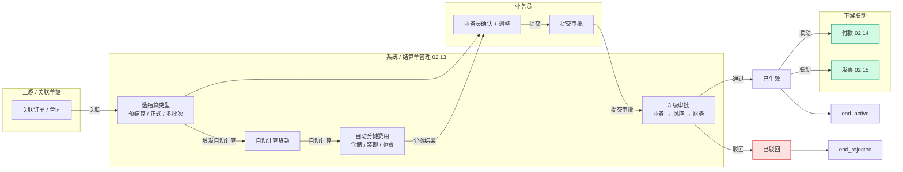
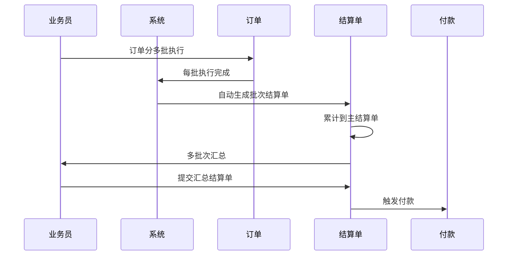
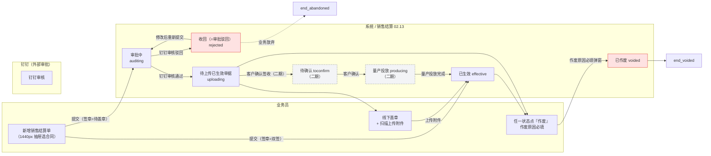
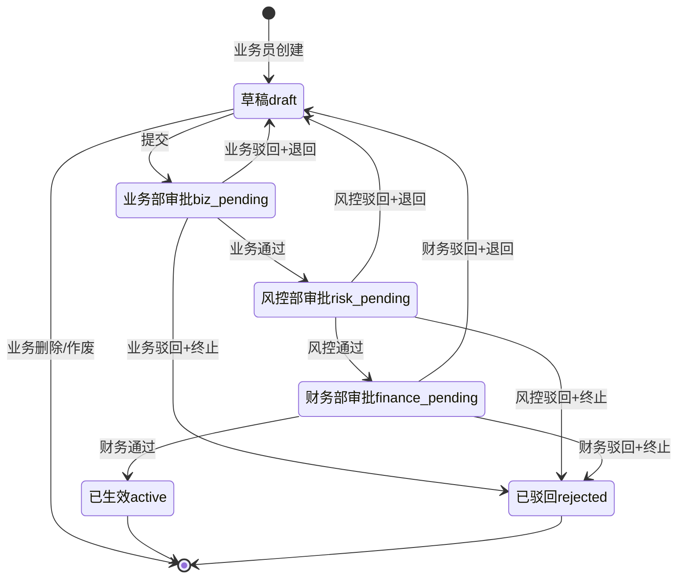
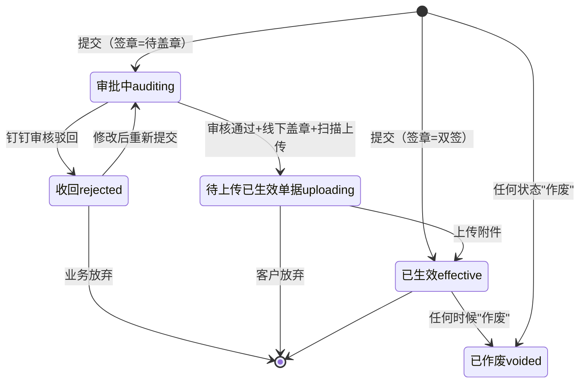

# 02.13 结算单管理 · 需求规格说明

> **文档类型**：PRD Writer 范式 · 落地需求文档 · 功能详细描述
> **对应总纲**：[00-产品概述与需求总纲.md](./00-产品概述与需求总纲.md)
> **通用规范**：[01-通用交互与文案规范.md](./01-通用交互与文案规范.md)
> **源文档（只读，未做任何改动）**：[02.13-结算单管理.md](../docs/02.13-结算单管理.md)
> **整理时间**：2026-09-30

---

## 0. 阅读说明

### 0.1 信息溯源标记

| 标记 | 含义 | 使用规则 |
|------|------|---------|
| ✅ | 源文档已明确 | 原值保留（表名 / 字段名 / 状态枚举 / 编号规则 / 提示文案），不改写口径 |
| 🔷 | 范式补全 | 源文档没写，按范式要求推导，**必须注明推导依据** |
| ⚠️ | 源文档自相矛盾 | **绝不静默选边**，如实并列，交由业务方裁决 |
| 🔷 现状核验 ✅ | 本次整理对 `pages/` / `app.html` / `docs/` 做的**只读** grep / `ls` 核验（2026-09-30）| 结果为页面实现事实，**与源文档原值严格分离标注**，未修改任何文件 |
| [待补充] | 信息不足 | **严禁编造**，需业务方 / 研发回填 |

### 0.2 源文档阅读顺序

源文档 `02.13-结算单管理.md`（**647 行 / 33,096 字节**）由**三代口径叠加**构成：**§1-§10 是 v1.0 终版口径**（2026-07-24，基于原型 49-54 截图）、**§12 是 v1.7.99.82 销售结算子模块**（2026-07-30，7 状态机 + 5 操作按钮矩阵 + 3 种二次确认弹窗 + 关联货转逻辑）、**§13 是 v1.7.99.x 模块级增量补充**（2026-09-24 追加，基于飞书《豫港通用户使用手册（内部版）》第 7.1 节）。三代口径在**状态机（v1.0 6 状态 vs 销售 7 状态 vs §13.2 另一套 7 状态）、表数量（3 张 vs 5 张）、签章状态（待盖章/驳回 vs 待盖章/双签 vs 待盖章/已双签/驳回）、tab 数量（4 vs 6）**上存在冲突（见 §3.4 C1-C7）。

| 源文档章节 | 内容 | 归位到本文档 |
|-----------|------|------------|
| 头部 + §0 章节导航 | 状态 / 复用度 75% / 3 张表 / 2 子模块 | §1.1、§5.4、§6 |
| §1 业务定位 | 结算中心定位 + 关键特点（2 子模块 / 3 结算类型 / 自动分摊）+ 6 页面 sitemap | §1.1、§1.2、§6 |
| §2 业务流程全景 | 2.1 结算单创建流程 / 2.2 多批次结算流程（sequenceDiagram）| §1.3.1、§1.3.2 |
| §3 核心实体（3 张表）| `t_settlement` / `t_settlement_item` / `t_settlement_approval` 逐字段 | §5.1、§5.2 |
| §4 4 状态机 | 状态机图 + 状态说明表（**实列 6 行**）| §3.1.1、§3.2.1 |
| §5 角色操作矩阵 | 6 状态 × 5 角色（业务员/业务部/风控部/财务部/系统）| §2.1.1 |
| §6 字段规则 | 结算类型 / 结算阶段 / 费用类型 / **自动分摊规则** | §5.2.4-5.2.6、§5.4.4 |
| §7 按钮交互 | 列表页按钮 / 新增编辑 / 详情页 | §2.1.2、§2.2.1 |
| §8 异常处理 | 5 条业务异常（含原文文案）| §2.3、§2.5、§4.1 |
| §9 跨模块流转 | 上游 2 条 / 下游 3 条 | §1.4.1 |
| §10 复用建议 | 75% / 4 复用 + 1 新建 / 4 周实施 | §5.4 |
| §11 文档版本 + 修改记录 | v1.0 + v1.7.99.82 销售结算 + v1.7.99.x 全局规范 | §7.3 |
| **§12 销售结算（v1.7.99.82）** | **12.1 业务定位与差异 / 12.2 3 页面 / 12.3 7 状态机 + 状态机图 / 12.4 6 tab / 12.5 5 状态操作按钮矩阵 / 12.6 9 列列表字段 + 列宽 / 12.7 新增页 5 大区块 + 8 字段规则 + 附件规则 + 3 种二次确认弹窗 / 12.8 详情页 2 tab + 7 行操作记录 mock / 12.9 列表基础交互 / 12.10 10 行 mock / 12.11 字段映射表（销售 vs 采购）/ 12.12 异常处理** | **§1.1.2、§1.2.2、§1.3.3、§2.1.2、§2.1.3、§2.2.2、§2.3、§3.1.2、§3.2.2、§3.3、§3.4、§4.1、§4.2、§5.2.7、§5.3、§5.4、§6、§7** |
| **§13 v1.7.99.x 增量补充** | **13.1 业务变化 / 13.2 7 状态机（另一套）/ 13.3 销售 vs 采购对比 / 13.4 跨模块联动 / 13.5 异常补充 / 13.6 页面 PRD 索引 / 13.7 详细业务规则（手册 7.1）/ 13.8 修改记录** | **§1.1.2、§1.4.2、§2.1.1、§3.1.3、§3.4、§5.4、§6、§7.3** |

> ⚠️ **源文档自身的结构问题（照实记录，不代为修正）**：
> 1. **§4 标题写「4 状态机」，§4.1 表实列 6 行**（`draft` / `biz_pending` / `risk_pending` / `finance_pending` / `active` / `rejected`）——见 C2。
> 2. **§1.2 标题写「6 个页面（sitemap）」，表内只有 2 行**（按子模块归并，非逐页列出）——见 C7。
> 3. **§3 标题写「核心实体（3 张表）」，但头部复用度写「4+ 张表」，§10.2 列 4 张复用表 + §10.3 列 1 张新建表 = 5 张**——见 C3。
> 4. **§12 与 §13 各定义了一套 7 状态机，两套的状态名与出口条件完全不同**——见 C2。

> 🔷 **本文档附只读核验**：为判断「源文档口径 vs 页面实际实现」是否一致，整理时对 `pages/settlement-*.html`、`app.html`、`docs/p-settlement-*.md` 做了**只读** grep / `ls` 核验（2026-09-30），结果逐条标注为「**🔷 现状核验 ✅**」。**未修改 `docs/` 与 `pages/` 下任何文件。**

### 0.3 与通用规范的关系

**通用表单规范（校验时机 / 返回保护 / 提交行为 / 危险操作确认 / 空状态 / 失败引导 / 通用 UI 6 态 / 通用样式 / 脱敏规范）一律以 [01-通用交互与文案规范.md](./01-通用交互与文案规范.md) 为准，本文档不重复定义，只写本模块特有的部分**：**销售结算与采购结算的视角差异（谁是卖方）**、**销售结算 7 状态机 + 5 状态操作按钮矩阵**、**签章状态 2 选项（待盖章 / 双签）触发的不同生效路径与不同 tip 颜色**、**3 种二次确认弹窗的原文文案**、**关联「已生效且未关联结算单」的货转单据筛选规则**、**1440px 抽屉选单模式**、**附件 20 个上限 + 9 种格式 + 单个 100MB**、**结算单价由「数量 ÷ 金额」自动计算且 readonly**、**作废原因必填弹窗**、以及 **⚠️ 采购结算 v1.0 4 状态 vs 页面 5 状态 vs §12 声明 6 状态的三方冲突**。

### 0.4 飞书用户手册补充（2026-10-08）

> **来源**：《豫港通数字供应链管理平台 — 用户使用手册（内部版）》飞书 rev.8976，**7.1 采/销购结算**。手册是对着线上系统写的，**权威性优先于本文档原有推导**——签章状态、审批流、关联对象 3 项均有明确口径，直接影响 §3.4 的 C1 / C4。

| 手册小节 | 归位到本文档 | 填了哪些信息缺口 / 补了哪些矛盾 |
|---------|-------------|---------------------------|
| **7.1 采/销购结算** | §0.4 手册原值、§3.4（**C1** / **C4** 追加 ✅ 手册口径；新增 **C8**）、§4.1 校验表、§5.2 字段级规范、§5.3 编号规则 | **C4 收敛**（签章状态 = **待盖章 / 已双签** 2 项，「驳回」不是签章状态）；**C1 部分收敛**（待盖章 → **内部串行审批流程**）；**新增 C8**（手册**无「关联订单」、无「结算阶段」**）；`settlement_no` **确认为手工登记**（§5.3） |

**✅ 手册原值（照抄，不改写）**：

- **7.1.1 新增采购结算单 6 步**：① 点击**新增采/销结算单**按钮 → ② **选择对应需要登记结算单的合同** → ③ **勾选（复选）要登记结算的货转记录** → ④ 登记**结算单号 → 结算日期 → 供货周期 → 结算金额 → 备注** → ⑤ 选择**签章状态（待盖章 / 已双签）**，**选择待盖章后需要触发内部串行审批流程，选择已双签则直接跳过审批流程** → ⑥ 上传对应**线下单据附件** → 提交（完成结算单登记）
- **7.1.2 结算单信息 · 结算货物**：显示**货转编号 / 货转数量 / 货转日期 / 收货人 / 状态**
- **7.1.2 结算单信息 · 本次结算信息**：**结算金额 / 结算数量 / 结算单价 / 结算日期 / 供货周期 / 备注**
- **7.1.2 结算单信息 · 合同信息**：**品名 / 计量单位 / 合同单价 / 税率**
- **7.1.2 结算单附件**：**已生效附件 + 其他附件**
- **7.1.2 结算单操作记录**：**操作类型**（新建 / 提交）；**操作人**（用户名称 + 企业名称）；**操作企业**（核心企业名称）；**操作内容**（具体操作结果）；**操作时间**（年月日时分秒）
- **7.1.2 流程审批**：审批流程结果记录

---

## 1. 功能描述与触发条件

### 1.1 功能描述

✅ **结算单管理是港通供应链的货款及费用结算中心**（源文档 §1 原文）——**采购/销售预结算 + 正式结算 + 多批次结算，自动核算货款及仓储/装卸/运费**。

✅ **关键特点**（§1 原文照抄）：

| 特点 | 内容 | 出处 |
|-----|------|------|
| **2 子模块** | 采购结算 / 销售结算 | §1 |
| **3 结算类型** | 预结算 / 正式结算 / 多批次结算 | §1 |
| **自动分摊** | 仓储 / 装卸 / 运费按比例分摊 | §1 / §6.4 |

#### 1.1.1 销售结算子模块（§12.1，v1.7.99.82，原值保留）

✅ **销售结算是港通供应链对外销售的结算中心**（§12.1 原文）——**按销售订单/单批次合同开结算单，关联「已生效」的货转单据，按签章状态（待盖章/双签）走不同生效流程**。

✅ **与采购结算的核心差异**（§12.1 原文照抄）：

| 维度 | 销售结算 | 采购结算 |
|------|---------|---------|
| **视角** | **客户视角**：卖方 = 我方 = 港通供应链，买方 = 客户 | **供应商视角**：卖方 = 供应商，买方 = 我方 = 港通供应链 |
| **关联货转单据** | 必须是关联「**已生效**」且「**未关联结算单**」的货转单据（v1.7.99.82 按图 1）| 🔴 **源文档未记录采购结算是否关联货转** [待补充] |
| **签章状态 2 选项** | **待盖章 / 双签** | **待盖章 / 驳回** |

> 🔴 **「审批/审核方式」在两代口径下不同**：v1.0 §2.1 是「**3 级审批：业务 → 风控 → 财务**」（采购结算基线），v1.7.99.82 §12.3 是「**推送钉钉审核**」（销售结算）——**销售结算是否还有 3 级内部审批，源文档未说明**，见 C1。

#### 1.1.2 v1.7.99.x 口径（§13.1 模块业务变化表，2026-09-24，原值保留）

| 维度 | v1.0 文档 | v1.7.99.82 现状 |
|------|----------|------------------|
| 页面清单 | 3 页（结算单列表/详情/新建）| **6 页**：销售结算（v1.7.99.82 新增）+ 采购结算 + 各页详情/新建 |
| 销售结算子模块 | 无 | **v1.7.99.82 关键决策**：销售结算从采购结算中拆出独立子模块 |
| 签章状态 | v1.0 简化 | v1.7.99.82 **统一规范**：待盖章 / 已双签（销售）/ 驳回（销售）|
| 列表 tab 数量 | 4 tab | 6 tab（全部 / 审批中 / 待上传已生效单据 / 已生效 / 收回 / 已作废）|

> ⚠️ **§13.1「签章状态」列 3 项**（待盖章 / 已双签 / 驳回）与 §12.7.2「**2 选项：待盖章 / 双签**」、§12.11「签章状态 2 选项 = 待盖章 / 双签（销售）vs 待盖章 / 驳回（采购）」三处不一致——见 C4。
> ⚠️ **§13.1「列表 tab」中的「收回」**与 §12.4 的「收回」、🔷 现状核验 ✅ 页面的「**驳回**」（v1.7.99.93 改名）三处不一致——见 C5。

### 1.2 触发条件

#### 1.2.1 v1.0 口径（§2.1 + §9，原值保留）

| # | 触发条件 | 触发动作 | 出处 |
|---|---------|---------|------|
| 1 | **合同（02.03）状态 = `executing`** | **允许创建结算单** | §9.1 |
| 2 | **订单（02.04）状态 = `finished`** | **触发正式结算** | §9.1 |
| 3 | 关联订单/合同 | 进入结算单创建流程 → 选结算类型 | §2.1 |
| 4 | 结算单状态 → `active` | **触发付款申请（02.14）+ 触发开票申请（02.15）+ 更新业务线结算进度（02.06）** | §9.2 |
| 5 | **订单分多批执行** | 每批执行完成 → 系统自动生成批次结算单 → 累计到主结算单 | §2.2 |

> ⚠️ **「订单管理（02.04）」的模块编号已失效**：源文档 §9.1 引用 `02.04`，但 🔷 总纲 §编号规则已记录 **`02.04` 空缺**（「订单管理已于 v1.7.99.181 删除」）——本文档按原值照抄 `02.04`，同时记录该编号现状 [待补充]。

#### 1.2.2 v1.7.99.x 口径（§12.3 + §12.7.2 + §13.4 + §13.7，原值保留）

| # | 触发条件 | 触发动作 | 版本 | 出处 |
|---|---------|---------|------|------|
| 1 | **签章状态 = 待盖章 + 提交** | 结算信息**推送钉钉审核** → 状态变更为**审批中** | v1.7.99.82 | §12.3 / §12.7.4 |
| 2 | **签章状态 = 双签 + 提交** | **无需盖章，提交后直接生效** → 状态变更为**已生效** | v1.7.99.82 | §12.3 / §12.7.4 |
| 3 | **钉钉审核通过** | 状态 → **待上传已生效单据** → 业务**线下盖章** → **扫描上传附件** → 状态 → **已生效** | v1.7.99.82 | §12.3 |
| 4 | **钉钉审核驳回** | 状态 → **收回**（= 审批驳回）| v1.7.99.82 | §12.3 |
| 5 | **任一状态点「作废」按钮** | 状态 → **已作废**（**终态**）| v1.7.99.82 | §12.3 / §12.5 |
| 6 | **待上传已生效单据 → 客户确认签收** | 状态 → **待确认**（v1.7.99.82 **二期再做**）| 二期 | §12.3 |
| 7 | **客户确认 → 量产投放** | 状态 → **量产投放**（v1.7.99.82 **二期再做**）| 二期 | §12.3 |
| 8 | **结算单 `active` / 已生效** | ① 回款管理（02.14）→ 触发下游结算金额重算；② 发票（02.15）→ 关联发票可登记；③ 合同（02.03）→ 合同「已结算金额」自动更新；④ 货转（02.07）→ 货转编号关联 | v1.7.99.x | §13.4 |
| 9 | **创建销售订单/单批次合同** | 打开新增页时**默认弹出 1440px 抽屉**选择合同 | v1.7.99.82 | §12.7.1 区块 1 |

### 1.3 业务流程（Mermaid）

#### 1.3.1 结算单创建流程（v1.0 口径，§2.1 原图照抄 + 🔷 泳道化）

> ✅ **节点文案原值照抄**（§2.1）。🔷 泳道化为本次重组按范式推导（依据：§9.1 明确合同/订单为上游、§7.1 明确按钮可见条件为「业务部」、§2.1 明确「业务员确认+调整」与「提交审批」为两个动作、§9.2 明确付款/发票为下游）。⚠️ **本图为 v1.0 采购结算基线，销售结算不走这条 3 级审批路径**，见 §1.3.3 与 C1。

#### 1.3.2 多批次结算流程（v1.0 口径，§2.2 原图照抄，sequenceDiagram）

> ✅ **参与者与消息文案原值照抄**（§2.2）。⚠️ **「累计到主结算单」的数据结构**：§3.1 有 `parent_settlement_id`（父结算单 ID）+ `batch_no`（批次号）两个字段，**但「多批次结算」的汇总规则（是汇总后新建一个主单，还是主单汇总子单？）未定义** [待补充]。

#### 1.3.3 销售结算签章双路径流程（v1.7.99.82 口径，§12.3 + §12.5 + §12.7.4，🔷 据状态机表泳道化）

🔷 **推导依据**：§12.3 的 7 状态表 + §12.5 的 5 状态操作按钮矩阵 + §12.7.4 的 3 种二次确认弹窗。**状态中文名与操作按钮原值照抄**。

> ✅ **状态中文名 + 枚举值原值照抄**（§12.3）。✅ **`已生效 → 已作废` 与「任一状态可作废」两条作废边原值照抄**（§12.3 状态机图 + §12.5 矩阵）。✅ **虚线 = 业务放弃**（§12.3 `收回rejected --> [*]: 业务放弃`）。🔷 灰色虚线框 = **v1.7.99.82 二期再做**的状态（§12.3 原文标注）。
> ⚠️ **§12.3 状态机图中有 3 条指向 `[*]` 的边与本图不同**：① `[*] --> 已生效effective: 提交（签章=双签）` ✅ 已含；② `收回rejected --> [*]: 业务放弃` ✅ 已含（虚线）；③ `待上传已生效单据uploading --> [*]: 客户放弃`——**本图未画此边**（画出会与「客户放弃」语义模糊），**如需严格照抄请以此边为准** [待补充]。

### 1.4 模块依赖（跨模块流转）

#### 1.4.1 v1.0 口径（§9，原值保留）

**上游触发**：

| 触发模块 | 触发条件 | 触发动作 |
|---------|---------|---------|
| 合同管理（02.03）| 合同 `executing` | 允许创建结算单 |
| 订单管理（02.04）| 订单 `finished` | 触发正式结算 |

**下游触发**：

| 触发模块 | 触发条件 | 触发动作 |
|---------|---------|---------|
| 付款（02.14）| 结算单 `active` | 触发付款申请 |
| 发票（02.15）| 结算单 `active` | 触发开票申请 |
| 业务线（02.06）| 结算单 `active` | 更新业务线结算进度 |

#### 1.4.2 v1.7.99.x 口径（§13.4 跨模块联动，原值保留）

| 联动系统 | v1.0 描述 | v1.7.99.x 增强 |
|----------|-----------|----------------|
| **回款管理（02.14）** | 已记录 | 结算单生效 → 触发下游结算金额重算 |
| **发票管理（02.15）** | 已记录 | 结算单生效 → 关联发票可登记 |
| **合同（02.03）** | 已记录 | 结算单 → 合同「已结算金额」自动更新 |
| **货转（02.07）** | 已记录 | 结算单 → 货转编号关联（详见 `p-settlement-sales-detail.md` 第 12.7 节）|

> ⚠️ **「付款（02.14）」vs「回款管理（02.14）」名称不一致**：§9.2 写「付款」，§13.4 写「回款管理」——🔷 实际 `docs/02.14-资金管理.md` 是**资金管理**（付款/退款/回款/费用 4 个子模块）——**02.13 的下游触发到底进「付款」还是「回款」，两代口径不同，且触发动作也不同（触发付款申请 vs 触发结算金额重算）**，见 C6。
> ⚠️ **「货转（02.07）」在 v1.0 §9 的上下游表中完全没有出现**（§9.1 只有合同 02.03 + 订单 02.04，§9.2 只有付款 02.14 + 发票 02.15 + 业务线 02.06）——§13.4 却写「v1.0 描述 = **已记录**」。**这是 §13.4 对 v1.0 的误述**，见 C6。
> ⚠️ **「业务线（02.06）→ 更新业务线结算进度」在 §13.4 中消失了**（§13.4 只列 4 条：回款/发票/合同/货转）——**v1.0 的业务线联动是否仍然存在，源文档未说明** [待补充]。
> 🔴 **「合同『已结算金额』自动更新」的字段名未给**——`t_settlement` 有 `total_amount` / `paid_amount` / `unpaid_amount`，但**合同表（02.03）侧对应哪个字段、是否累加，源文档未定义** [待补充]。

#### 1.4.3 🔷 现状核验 ✅ 页面归属（2026-09-30 只读 `app.html`）

| 项 | 核验结果 | 依据 |
|----|---------|------|
| `app.html` 菜单 | 6 个结算页面**位于 `{ sub: '结算单管理', pages: [...] }` 块内**（采购 3 项 + 销售 3 项）| `app.html:554` 起 sub 块；`:555-560` 6 条 |
| 采购结算 3 项 | 采购结算（列表）/`settlement-purchase`、采购结算 · 新增/编辑/`settlement-purchase-new`、采购结算单详情/`settlement-purchase-detail` | `app.html:555-557` |
| 销售结算 3 项 | 销售结算（列表）/`settlement-sales`、销售结算 · 新增/编辑/`settlement-sales-new`、销售结算单详情/`settlement-sales-detail` | `app.html:558-560` |
| 资金管理 sub | `app.html:542-553` 资金管理 sub 下是付款/退款/回款 7 项 + 保证金 3 项，**无销售结算** | `app.html:542-553` |

> ✅ **02.13 的菜单归属与源文档一致**（独立 sub 菜单「结算单管理」），**无模块归属矛盾**——与 02.10 保证金的情况不同（02.10 源文档自称「新顶级模块」但实现挂在资金管理 sub 下，见 [02.10-保证金管理.md](./02.10-保证金管理.md) §3.4 C1）。

---

## 2. 交互细节

### 2.1 角色操作矩阵（权限可见性）

#### 2.1.1 v1.0 采购结算基线矩阵（§5，6 状态 × 5 角色，原值保留）

| 状态 / 角色 | 业务员 | 业务部 | 风控部 | 财务部 | 系统 |
|------------|------|------|------|------|------|
| `draft` 草稿 | 编辑/提交 | 查看 | 查看 | 查看 | - |
| `biz_pending` 业务部 | 查看 | **审批** | 查看 | 查看 | 推送 |
| `risk_pending` 风控部 | 查看 | 查看 | **审批** | 查看 | 推送 |
| `finance_pending` 财务部 | 查看 | 查看 | 查看 | **审批** | 推送 |
| `active` 已生效 | 查看 | 查看 | 查看 | 查看 | 联动付款/发票 |
| `rejected` 已驳回 | **编辑后重新提交** | 查看 | 查看 | 查看 | - |

> ✅ **矩阵原值照抄**（§5）。⚠️ **该矩阵 6 个状态与 §4.1 状态表一致，但 §4 标题写「4 状态机」**——见 C2。
> 🔴 **矩阵中 `active` 已生效行只有「查看」，没有「作废」**——但 🔷 现状核验 ✅ 页面（`settlement-purchase.html:203-211` v1.7.99.133）**5 状态矩阵中「已生效 = 仅详情」**（与矩阵一致），**「已作废」也不在矩阵 6 行中**——**作废操作的角色权限在 v1.0 矩阵中无来源** [待补充]。

#### 2.1.2 列表页按钮（§7.1，3 项，原值保留）

| 按钮 | 位置 | 可见条件 | 点击行为 |
|------|------|---------|---------|
| **新增/编辑采购结算单** | 右上 | 业务部 | 跳新增页 |
| **新增/编辑销售结算单** | 右上 | 业务部 | 跳新增页 |
| 数据导出 | Tab 右侧 | 所有 | 导出 Excel |
| 详情 | 列表行 | 所有 | 跳详情页 |

> ⚠️ **「新增」按钮可见条件写「业务部」，但 §5 矩阵中创建人是「业务员」（`draft` 行 = 编辑/提交）**——**创建权限归「业务员」还是「业务部」，源文档自相矛盾** [待补充]。
> ✅ **销售结算导出文件名规则**（§12.9 原文照抄）：`销售结算单_20240730.xlsx`，命名规则 = **`销售结算单_导出日期.xlsx`**。

#### 2.1.3 列表字段（v1.0 §7 未定义 / 销售版 §12.6 **9 列 + 列宽**，原值保留）

| # | 字段 | 宽度 | 说明 | 取值 |
|---|------|------|------|------|
| 1 | 结算单编号 | 13% | 等宽字体 | 用户输入的结算单号（100字以内）|
| 2 | 买方企业 | 16% | - | 销售合同关联客户 |
| 3 | 结算金额（元）| 9% | 右对齐 | **取消前**结算单的结算总金额 |
| 4 | 结算数量 | 8% | 右对齐 | **取消前**结算单的结算总数量 |
| 5 | 结算单价 | 8% | 右对齐 | **取消前**结算单的结算单价（**「如果只一个单价或者单价相同时，展示一个值；如果单价不同，则以"、"隔开」**）|
| 6 | 结算日期 | 8% | - | 取消前结算单的结算日期 |
| 7 | 销售订单/单批次合同编号 | 16% | 等宽字体 | 取消前结算单关联的销售订单/单批次合同编号 |
| 8 | 结算单状态 | 11% | 7 状态 badge | 见 §12.3 |
| 9 | 操作 | auto | 右对齐 | 5 状态操作按钮矩阵（见 §12.5）|

> ✅ **9 列 + 列宽 + 取值规则原值照抄**（§12.6）。⚠️ **第 3-7 列的取值说明全部写「取消前结算单的…」**——**销售结算的状态机中没有「取消」状态**（§12.3 是 审批中/收回/待上传/待确认/量产投放/已生效/已作废），**「取消前」疑为 v1.7.99.70 采购版文案遗留** [待补充]。
> 🔴 **v1.0 采购结算的列表字段在源文档中完全没有定义**（§7.1 只给了按钮，§7.2 无列表字段表）——**采购结算列表的列数 / 列名 / 列宽全部 [待补充]**（🔷 现状核验 ✅ `settlement-purchase.html` 存在实���表头，但按规则**不用实现值覆盖源文档**）。
> 🔷 现状核验 ✅ `settlement-sales.html:143-151` 实测 9 列 + 列宽与 §12.6 **完全一致**（13%/16%/9%/8%/8%/8%/16%/11%/auto）。

#### 2.1.4 v1.7.99.82 5 状态操作按钮矩阵（§12.5，原值保留）

| 结算单状态 | 操作按钮 | 行为 |
|-----------|---------|------|
| **审批中** | 详情 | 跳 `settlement-sales-detail.html?status=auditing` |
| **收回**（=审批驳回）| 详情 / 修改 / 作废 | 详情跳 `?status=rejected`；修改跳 `settlement-sales-new.html?status=rejected`；作废触发**作废原因必填弹窗** + 提交后 tip 提示「结算单已作废」|
| **待上传已生效单据** | 详情 / 上传附件 / 作废 | 上传附件触发**上传弹窗（最多 20 个）**；作废同上 |
| **已生效** | 详情 | 跳 `?status=effective` |
| **已作废** | 详情 | 跳 `?status=voided` |

> ✅ **矩阵原值照抄**（§12.5）。
> ⚠️ **「修改」按钮只在「收回」状态有，但修改后跳 `settlement-sales-new.html?status=rejected`——修改后重新提交回到哪个状态，源文档未明说**（§12.3 状态机图有 `收回rejected --> 审批中auditing: 修改后重新提交` ✅ 已含此边）。
> ⚠️ **「待确认」「量产投放」两个二期状态在矩阵中无行**——§12.3 明确「一期只实现 5 状态操作」，✅ 一致。
> 🔴 **采购结算的 5 状态操作矩阵源文档完全未记录**（§12.11 只对比了 tab 数字、状态色、source-tag、操作记录最后一行）——🔷 现状核验 ✅ `settlement-purchase.html:203-211`（v1.7.99.133）**5 状态矩阵与销售版完全同构**（审批中=详情 / 审批驳回=详情+修改+作废 / 待上传已生效单据=详情+上传附件+作废 / 已生效=详情 / 已作废=详情），**但源文档未记录此矩阵** [待补充]。

### 2.2 按钮交互（操作反馈）

#### 2.2.1 新增/编辑结算单（v1.0 口径，§7.2，原值保留）

- 选关联合同（**必填**）
- 选关联订单（**必填**，多批次时为空）
- 选结算阶段（预结算 / 正式结算 / 多批次结算）
- **系统自动计算货款 + 分摊费用**
- **业务员可调整金额 + 备注**

#### 2.2.2 v1.7.99.82 新增销售结算单 5 大区块（§12.7.1，原值保留）

| 区块 | 字段数 | 关键字段 | 必填 | 备注 |
|------|--------|---------|------|------|
| **1. 销售订单/单批次合同信息** | **11 字段 3 列 4 行** | 卖方企业/买方企业/品名/计量单位/合同单价/合同数量/税率/签订日期/合同交货期限/运输方式/业务实际负责人 | **否（只读）** | **默认打开「选择销售订单/单批次合同」1440px 抽屉**（v1.7.99.82 仿 v1.7.99.68 货转 drawer / v1.7.99.70 采购 drawer 模式）|
| **2. 选择结算物** | **5 列 5 行 checkbox** | 货转编号/货转数量(吨)/货转日期/收货人/状态(已生效) | **否** | **仅展示关联「已生效」且未关联结算单的所有货转单据**（按 user 图 2 注意事项）；点击货转编号 → 新标签页打开货转详情 |
| **3. 结算单信息** | **6 字段 3 列 2 行 + 备注** | 结算单号/结算日期/供货周期/结算金额/本次结算数量/结算单价/签章状态/备注 | **部分必填** | 见 §2.2.3 字段规则 |
| **4. 附件** | 3 行 表格 | 单据类型/文件名/操作 | 见 §2.2.4 | **单据类型联动签章状态** |
| **5. 底部按钮** | 2 按钮 | 取消 / 提交 | - | 取消触发「取消确认」弹窗；提交触发「待盖章/双签」对应弹窗 |

> ⚠️ **区块 3 标题写「6 字段 3 列 2 行 + 备注」，但「关键字段」列了 8 个字段**（结算单号/结算日期/供货周期/结算金额/本次结算数量/结算单价/签章状态/备注）——**6 vs 8 的字段数冲突**，见 C8。
> 🔴 **区块 2「选择结算物」的字段来源未定义**——**货转单据取自 02.07 的哪张表、字段如何映射，源文档只给了展示列** [待补充]（§13.4 引用「详见 `p-settlement-sales-detail.md` 第 12.7 节」——**引用的是页面级 PRD，不是本模块文档**）。

#### 2.2.3 结算单信息字段规则（v1.7.99.82，§12.7.2，**8 字段**，原值保留）

| 字段 | 必填 | 规则 |
|------|------|------|
| **结算单号** | ✓ | 文本输入，**100 字以内**，**用户手动输入** |
| **本次结算数量** | ✓ | **所有货转数量的加和**，**禁止修改**（`readonly` 灰底）|
| **本次结算金额** | ✓ | 文本输入框，**金额输入样式**，必填 |
| **结算单价** | - | **根据数量和金额自动计算**（`readonly` 紫底）|
| **结算日期** | ✓ | 单个日期选择器；默认提示「**请选择结算日期**」；**提交时如未选择，提示「结算日期必填」**（**浅紫底**）|
| **供货周期** | ✓ | 日期范围选择器，**不能大于当前日期**，必填（**浅黄底**）|
| **签章状态** | ✓ | 单选**紫色下拉触发器**，**2 选项：待盖章 / 双签**（采购版是「待盖章/驳回」）|
| **备注** | - | 文本域，**最多 200 字** |

> ✅ **8 字段 + 全部交互细节（readonly 灰底 / 紫底 / 浅紫底 / 浅黄底 / 紫色下拉触发器 / 100 字 / 200 字）原值照抄**。
> ⚠️ **「结算单价 = 数量与金额自动计算」的除法方向未明示**——是 `金额 ÷ 数量`（从 §12.10 mock 看：`1,000,000.22 ÷ 100吨 = 10,000.22元/吨` ✅ **金额 ÷ 数量**）——**源文档只写「根据数量和金额自动计算」，本文档按 mock 反推，标为 🔷 推导**。
> ⚠️ **「除不尽时的舍入规则未给**——§12.10 mock 中 `5,200,000.00 ÷ 1,500吨 = 3,466.67元/吨`（**保留 2 位小数**），但源文档未明写舍入位数 [待补充]。
> ⚠️ **区块 1 是「11 字段 3 列 4 行」但列了 11 个字段名**（卖方/买方/品名/计量单位/合同单价/合同数量/税率/签订日期/合同交货期限/运输方式/业务实际负责人 = 11 ✅）——**3 列 × 4 行 = 12 格 ≠ 11 字段**（差 1 格）[待补充]。

#### 2.2.4 附件规则（v1.7.99.82，§12.7.3，**6 条**，原值保留）

| 规则 | 说明 |
|------|------|
| **签章联动单据类型** | **签章 = 待盖章** → 单据类型显示**待盖章附件**（必填）；**签章 = 双签** → 单据类型显示**已生效附件**（必填）|
| **必须填** | 待盖章附件 / 已生效附件必填；**提交时如未选择，提示「请上传待盖章附件」**（v1.7.99.82 沿用 purchase 文案，**按签章动态调整**）|
| **支持多文件** | 待盖章附件 / 已生效附件 / 其他附件都支持上传多个 |
| **其他附件** | 非必填项，支持上传多个 |
| **预览** | 上传后，支持点击对应的附件进行预览 |
| **数量上限** | 单个类型的附件，**最多支持上传 20 个** |
| **格式大小** | **蓝底提示框统一文案**：可支持格式为 **png、jpeg、jpg、gif、pdf、doc、docx、xlsx、xls**，**单个附件大小不得超过 100MB** |

> ✅ **6 条规则 + 9 种格式 + 20 个上限 + 100MB 原文照抄**。✅ **「请上传待盖章附件」为「沿用 purchase 文案」**（源文档明示）。
> 🔴 **「双签」态下的必填提示文案未给**——§12.7.3 写「提交时如未选择，提示『请上传待盖章附件』（按签章动态调整）」，§12.12 异常表补了 `"请上传已生效附件"` ✅ 两处都有，但**附件区块的行数是固定 3 行（待盖章/已生效/其他）还是随签章状态动态增减，源文档只说「联动」，未明说行数变化** [待补充]。

#### 2.2.5 列表基础交互（v1.7.99.82，§12.9，**4 条**，原值保留）

| 交互 | 规则 |
|------|------|
| **鼠标移入字段** | 列表中每一行展示不全时，支持鼠标移入到对应字段**展示全量信息**（tooltip）|
| **行点击** | 点击行任意位置（**除操作区**）→ 跳详情页 `settlement-sales-detail.html?status=xxx` |
| **页码固定** | 页码**固定在页面底部**，**不随上下滑动而滚动** |
| **数据导出** | 点击「数据导出」→ 弹出系统下载 `销售结算单_20240730.xlsx`（命名规则：`销售结算单_导出日期.xlsx`）|

> ✅ **4 条规则 + 导出文件名原值照抄**。
> 🔴 **采购结算的列表基础交互源文档完全未记录**（tooltip / 行点击 / 页码固定 / 导出文件名 4 条均为销售版）[待补充]。

#### 2.2.6 详情页（v1.0 口径，§7.3 + v1.7.99.82 §12.8，原值保留）

**v1.0 §7.3 详情页区块（4 项）**：结算基本信息 / 费用明细（货款/仓储/装卸/运费/其他）/ 审批记录 / 关联付款·发票。

**v1.7.99.82 §12.8 销售结算详情页**：

| 区块 | 内容 |
|------|------|
| **顶部信息条** | 面包屑：结算管理 / 销售结算 / 销售结算单详情；结算单编号（蓝色链接 + **复制 icon**）；状态 badge（「已生效」绿色）；**来源 tag**：「作废：待发起方重置」蓝色 tag；所属合同编号（蓝色链接 + 复制 icon）；卖方企业 / 买方企业 / 创建时间（明文）|
| **Tab 1：结算单信息**（默认）| 3 区块：结算货物（**5 列 5 行**）/ 本次结算信息（**6 字段 3 列 2 行 + 备注**）/ 结算单附件（3 行：待盖章/已生效/其他 + **一键下载**）|
| **Tab 2：结算单操作记录 (10)** | **5 列表格 7 行**：新建 / 修改 / 提交审批 / 签约完成 / 确认完成 / 收回 / 作废 |

> ✅ **顶部信息条 7 项 + 2 tab 原文照抄**（§12.8.1 / §12.8.2）。
> ⚠️ **「来源 tag」文案是「作废：待发起方重置」但状态 badge 是「已生效」**——**一个「已生效」的结算单为什么挂「作废」来源 tag，源文档未解释**（§12.11 说明这是销售 vs 采购的差异：采购是「来源：待发起方盖章」，销售是「作废：待发起方重置」）[待补充]。
> ⚠️ **操作记录 7 行 mock 中，第 2 tab 标题带 (10) 而内容只有 7 行**——`(10)` 是总数还是分页数，源文档未说明 [待补充]。

**操作记录 7 行 mock（§12.8.3，原值照抄）**：

| 操作类型 | 操作人 | 所属公司 | 操作内容 | 操作时间 |
|---------|-------|---------|---------|---------|
| 新建 | 张三 | XXXX公司 | 创建结算单成功，结算单编号：BX8282828 | 2021-11-15 12:22:32 |
| 修改 | 张三 | XXXX公司 | 修改结算单 | 2021-11-15 12:22:32 |
| 提交审批 | 张三 | XXXX公司 | 提交结算单 | 2021-11-15 12:22:32 |
| 签约完成 | 张三 | XXXX公司 | 完成结算单签约盖章 | 2021-11-15 12:22:32 |
| 确认完成 | 李四 | XXXX公司 | 完成对结算单的确认盖章 | 2021-11-15 12:22:32 |
| 收回 | 张三 | XXXX公司 | 内部审批驳回 | 2021-11-15 12:22:32 |
| 作废 | 张三 | XXXX公司 | 待结算单 - 自动作废 | 2021-11-15 12:23:32 |

> ⚠️ **「收回」行的操作内容写「内部审批驳回」**——但 §12.3 定义销售结算走**钉钉审核**，「内部审批驳回」是 v1.7.99.70 采购版文案遗留 [待补充]。
> ⚠️ **7 行 mock 的时间戳全部是 2021-11-15**（同一天），而列表 mock 的结算日期是 2024-10~11（§12.10）——**详情页与列表页的时间口径不一致**（mock 占位，非规则）[待补充]。

### 2.3 危险操作确认

| 操作 | 确认方式 | 提示文案（原文照抄）| tip 提示 | 来源 |
|------|---------|------------------|---------|------|
| **作废销售结算单** | **作废原因必填弹窗** | 弹窗标题未给 | **「结算单已作废」** | ✅ §12.5 / §12.7.4 |
| **作废时未填原因** | 阻止 | `"作废原因必填"` | — | ✅ §12.12 |
| **取消新增销售结算单** | **取消确认弹窗** | 标题「**取消确认**」+ 描述「**确定要进行取消操作吗？取消后，结算数据不会保存。**」| — | ✅ §12.7.4 |
| **提交（签章 = 待盖章）** | **提交确认弹窗** | 标题「**提交确认**」+ 描述「**请确认信息填写完成并提交？提交后，结算信息将推送钉钉进行审核，审核通过后，将线下盖章的结算单上传到系统。**」| **「结算单已推送钉钉审核，状态变更为审批中」**（**蓝色 #1E40AF**）| ✅ §12.7.4 |
| **提交（签章 = 双签）** | **提交确认弹窗** | 标题「**提交确认**」+ 描述「**请确认信息填写完成并提交？当前结算单无需盖章，提交后，将直接生效。**」| **「结算单已生效，状态变更为已生效」**（**绿色 #10B981**）| ✅ §12.7.4 |
| **结算金额 < 0** | 阻止 | `"结算金额不能 < 0"` | — | ✅ §8 |
| **结算金额 > 合同剩余金额** | 阻止 | `"结算金额 X 超过合同剩余金额 Y"` | — | ✅ §8 |
| **货款自动计算错误** | 阻止 | `"货款计算异常，请联系管理员"` | — | ✅ §8 |
| **关联订单未完结** | 阻止 | `"关联订单还未完结，不能正式结算"` | — | ✅ §8 |
| **多批次结算未到批次** | 阻止 | `"批次 X 还未执行完成"` | — | ✅ §8 |
| **结算日期未选择** | 阻止提交 | `"结算日期必填"` | — | ✅ §12.12 |
| **供货周期大于当前日期** | 阻止 | `"供货周期不能大于当前日期"` | — | ✅ §12.12 |
| **待盖章附件未上传（签章=待盖章）** | 阻止提交 | `"请上传待盖章附件"` | — | ✅ §12.12 |
| **已生效附件未上传（签章=双签）** | 阻止提交 | `"请上传已生效附件"` | — | ✅ §12.12 |
| **签章状态未选择** | 阻止提交 | `"请先选择签章状态"` | — | ✅ §12.12 |

> ✅ **3 种二次确认弹窗的标题 / 描述 / tip 文案 / tip 颜色 全部原值照抄**（§12.7.4）——**这是本模块最有价值的落地文案资产**。
> 🔴 **采购结算的取消/提交确认弹窗文案源文档完全未记录**（§12.7.4 3 种弹窗均为销售版）[待补充]。
> 🔴 **v1.0 的 3 级审批（业务 → 风控 → 财务）驳回时是否也有二次确认弹窗、驳回意见是否必填，源文档未定义**——§3.3 `t_settlement_approval` 有 `opinion`（审批意见）字段但无必填约束 [待补充]。

### 2.4 空状态引导

| 场景 | 空状态表现 | 引导操作 | 依据 |
|------|----------|---------|------|
| 结算单列表无数据 | 🔷 空状态 + 文案 `暂无数据` | 🔷 「+ 新增采购/销售结算单」 | 🔷 01 文档 §2.11 + ✅ §7.1 |
| 筛选无结果 | 🔷 空状态 + `请调整筛选条件` | 🔷 「清除全部」 | 🔷 01 文档 §2.11（🔷 现状核验 ✅ 页面有 `clearAllFilters` 按钮）|
| 某个状态 tab 无数据 | 🔷 `暂无数据` | 🔷 切换其他 tab | 🔷 01 文档 §2.11 + ✅ §12.4 |
| **tab 数字为 0** | ✅ **不展示数字信息** | — | ✅ §12.4 原文（user 图 5：「标签 tab 数字：取对应状态的结算单数量，**为 0 时不展示数字信息**」）|
| 抽屉选单列表为空 | 🔷 `暂无可选合同` | 🔷 先创建销售订单/单批次合同 | 🔷 + ✅ §12.7.1 区块 1 |
| **区块 2 货转列表为空** | 🔷 `暂无可选货转单据` | 🔷 提示「**仅展示已生效且未关联结算单的货转**」 | 🔷 + ✅ §12.7.1 区块 2 |
| 详情页附件区为空 | 🔷 `暂无附件` | 🔷 「一键下载」按钮 disabled | 🔷 + ✅ §12.8.2 |
| 详情页操作记录 tab 无数据 | 🔷 `暂无操作记录` | 🔷 — | 🔷 + ✅ §12.8.2 |
| 结算货物区为空 | 🔷 `暂无结算货物` | 🔷 返回区块 2 勾选货转 | 🔷 + ✅ §12.7.1 区块 2 |

### 2.5 失败引导

| # | 异常场景 | 提示文案（原文照抄）| 处理动作 | 来源 | 失败引导 |
|---|---------|------------------|---------|------|---------|
| 1 | 结算金额 < 0 | `"结算金额不能 < 0"` | 阻止 | ✅ §8 | 🔷 红字内联在结算金额字段 |
| 2 | 结算金额 > 合同剩余金额 | `"结算金额 X 超过合同剩余金额 Y"` | 阻止 | ✅ §8 | 🔷 红字内联 + 高亮合同选择器 |
| 3 | 货款自动计算错误 | `"货款计算异常，请联系管理员"` | 阻止 | ✅ §8 | 🔷 弹窗 + 阻断流程，**需研发排查** |
| 4 | 关联订单未完结 | `"关联订单还未完结，不能正式结算"` | 阻止 | ✅ §8 | 🔷 红字内联 + 定位订单字段 |
| 5 | 多批次结算未到批次 | `"批次 X 还未执行完成"` | 阻止 | ✅ §8 | 🔷 红字内联 + 定位批次字段 |
| 6 | 结算日期未选择 | `"结算日期必填"` | 阻止提交 | ✅ §12.12 | 🔷 日期控件**浅紫底**（§12.7.2）+ 定位 |
| 7 | 供货周期大于当前日期 | `"供货周期不能大于当前日期"` | 阻止 | ✅ §12.12 | 🔷 供货周期控件**浅黄底**（§12.7.2）+ 定位 |
| 8 | 待盖章附件未上传 | `"请上传待盖章附件"` | 阻止提交 | ✅ §12.12 | 🔷 附件区块红字 + 滚动定位 |
| 9 | 已生效附件未上传 | `"请上传已生效附件"` | 阻止提交 | ✅ §12.12 | 🔷 同上 |
| 10 | 签章状态未选择 | `"请先选择签章状态"` | 阻止提交 | ✅ §12.12 | 🔷 紫色下拉触发器红框 + 定位 |
| 11 | 作废原因未填 | `"作废原因必填"` | 阻止作废 | ✅ §12.12 | 🔷 弹窗内红字 + 输入框聚焦 |
| 12 | 货转编号点击 | **新标签页打开货转详情** | — | ✅ §12.12 | ✅ 已在 §2.2.2 区块 2 规定 |
| 13 | **钉钉审核推送失败 / 超时** | 🔴 [待补充]——源文档未定义 | [待补充] | 🔴 | 🔴 |
| 14 | **货转单据被其他结算单抢先关联** | 🔴 [待补充]——区块 2 要求「未关联结算单」，**但并发场景的校验与提示未定义** | [待补充] | 🔴 | 🔴 |
| 15 | **3 级审批中某节点长期不审批（SLA 超时）** | 🔴 [待补充]——§3.3 有 `sla_deadline` / `sla_overtime` 字段，**但超时后的动作（提醒 / 自动通过 / 自动驳回）未定义** | [待补充] | 🔴 | 🔴 |
| 16 | **下游联动失败（付款 / 发票 / 合同已结算金额更新）** | 🔴 [待补充]——§9.2 + §13.4 记了 4 条联动，**但失败回滚与重试未定义** | [待补充] | 🔴 | 🔴 |

---

## 3. 状态清单

### 3.1 业务状态机

#### 3.1.1 v1.0 采购结算基线状态机（§4 原图照抄，**图上 6 状态**）

> ⚠️ **§4 标题写「4 状态机」，§4.1 表实列 6 行**——见 C2。
> ✅ **「驳回 + 退回 → 草稿」与「驳回 + 终止 → 已驳回」的双出口设计原值照抄**——这是 v1.0 状态机最关键的分支（退回可改，终止不可改）。
> ⚠️ **「已生效」是终态**（`已生效active --> [*]`），但 v1.7.99.82 §12.5 的销售结算矩阵中**没有「已生效可作废」**（只有「已作废」行）✅ 与此一致；但 §12.3 状态机图有 `已生效effective --> 已作废voided: 任何时候"作废"`——**销售结算的「已生效可作废」与 v1.0 采购结算的「已生效是终态」是两个子模块的独立设计**，源文档未说明是否应统一 [待补充]。

#### 3.1.2 v1.7.99.82 销售结算 7 状态机（§12.3 状态机图 + 7 状态表，原值照抄）

**7 状态说明表（§12.3，原值照抄）**：

| # | 状态 | 中文 | 触发 | 出口 |
|---|------|------|------|------|
| 1 | `auditing` | 审批中 | 提交签章状态=待盖章 → 推送钉钉审核 | 待上传已生效单据 / 收回 |
| 2 | `rejected` | 收回（=审批驳回）| 钉钉审核驳回 | 审批中（修改后重新提交）/ 已作废 |
| 3 | `uploading` | 待上传已生效单据 | 钉钉审核通过 → 业务线下盖章 → 扫描上传附件 | 已生效 / 已作废 |
| 4 | `toconfirm` | 待确认（**v1.7.99.82 二期再做**）| 待上传已生效单据 → 客户确认签收 | 已生效 |
| 5 | `producing` | 量产投放（**v1.7.99.82 二期再做**）| 客户确认 → 量产投放 | 已生效 |
| 6 | `effective` | 已生效 | 提交签章状态=双签 / 待确认完成 / 量产投放完成 | 终态（**可作废**）|
| 7 | `voided` | 已作废 | 任一状态点「作废」按钮 | 终态 |

> ✅ **状态机图 + 7 状态表原值照抄**。
> ✅ **「v1.7.99.82 一期只实现 5 状态操作（全部 10 条 mock 不包含「待确认」和「量产投放」数据），但状态定义保留 7 个以便二期扩展。列表 6 tab 实际只展示 5 个状态 + 全部」原文照抄**。
> ⚠️ **状态机图未画 `待确认toconfirm` 和 `量产投放producing` 两个节点**——7 状态表有，状态机图没有（状态机图只有 5 个业务节点 + 2 条入口边）。**图与表不一致** [待补充]。
> ⚠️ **状态机图有 2 条 `[*] --> 已作废voided` 的入口**（第 1 条在图末尾 `[*] --> 已作废voided: 任何状态"作废"`）——**Mermaid 中从 `[*]` 出发表示「任意状态可作废」，但同时又有 `已生效effective --> 已作废voided` 显式边，语义重复** [待补充]。

#### 3.1.3 v1.7.99.x §13.2 的第三套 7 状态机（原值照抄，**与 §12.3 完全不同**）

| 状态 | 触发 | 下一状态 |
|------|------|----------|
| 待发起 | 业务人员登记结算单 | 待盖章 / 审批中 |
| 待盖章 | 签章状态=待盖章 | 已双签 / 已作废 |
| 审批中 | 销售结算发起后 | 已生效 / 已作废 |
| 待上传已生效单据 | 双签后待上传凭证 | 已生效 / 已作废 |
| 已生效 | 凭证已上传 | 终态 |
| 已作废 | 业务人员主动作废 | 终态 |
| 收回 | v1.7.99.82 新增（销售）| 终态 |

> ⚠️ **§13.2 与 §12.3 的差异（4 处）**：
> 1. **§13.2 有「待发起」「待盖章」两个状态，§12.3 没有**——§12.3 中「待盖章」不是状态，是**签章状态字段的一个选项**
> 2. **§13.2 有「已双签」，§12.3 没有**——§12.3 中「双签提交后直接 → 已生效」，不存在「已双签」中间态
> 3. **§13.2 有「待确认」「量产投放」吗？没有**——而 §12.3 有（标注二期）
> 4. **§13.2 的「审批中」出口是「已生效 / 已作废」，没有「待上传已生效单据」**；**§12.3 的「审批中」出口是「待上传已生效单据 / 收回」**——**两套的审批中出口完全不同**
> 5. **§13.2 的「收回」出口是「终态」，§12.3 的「收回」出口是「审批中（修改后重新提交）/ 已作废」**
>
> **本文档不代为选边**，两套并列于 §3.1.2 / §3.1.3。见 C2。

### 3.2 状态值与展示

#### 3.2.1 v1.0 采购结算基线状态（§4.1，表实列 6 行，原值保留）

| # | 状态枚举 | 中文 | 触发条件 | 下一状态 | Tag 色 |
|---|---------|------|---------|---------|--------|
| 1 | `draft` | 草稿 | 业务员创建 | 提交 / 删除 | 🔴 [待补充]——02.13 源文档**未给状态色**；🔷 参照 02.09 同类（见 §3.2.4 说明）|
| 2 | `biz_pending` | 业务部审批 | 业务部审批 | 风控部审批 / 草稿 / 已驳回 | 🔴 [待补充] |
| 3 | `risk_pending` | 风控部审批 | 风控部审批 | 财务部审批 / 草稿 / 已驳回 | 🔴 [待补充] |
| 4 | `finance_pending` | 财务部审批 | 财务部审批 | 已生效 / 草稿 / 已驳回 | 🔴 [待补充] |
| 5 | `active` | 已生效 | 财务部通过 | **终态** | 🔴 [待补充] |
| 6 | `rejected` | 已驳回 | 任一审批驳回 | **终态**（但矩阵给「编辑后重新提交」⚠️）| 🔴 [待补充] |

> ⚠️ **`rejected` 已驳回在 §4 状态机图里是终态（`已驳回rejected --> [*]`），但 §5 角色矩阵给 `rejected` 行配了「**编辑后重新提交**」**——**终态却有重新提交入口，逻辑矛盾**，见 C2 衍生问题。
> ✅ **02.13 源文档全文未给任何状态色值**（修改记录只引用「v1.7.99.14 状态 tag 颜色编码」全局规范，未落到本模块具体色值）。

#### 3.2.2 v1.7.99.82 销售结算 6 tab（§12.4，原值保留）

| Tab | 筛选状态 | 数字（mock）| 业务含义 |
|-----|---------|------------|---------|
| **全部** | 所有 5 个状态 | **10** | 全量展示 |
| **审批中** | `auditing` | **3** | 钉钉审核中 |
| **待上传已生效单据** | `uploading` | **2** | 审核通过 + 线下盖章 + 扫描上传 |
| **已生效** | `effective` | **3** | 结算单已生效 |
| **收回** | `rejected` | **1** | 钉钉审核驳回 |
| **已作废** | `voided` | **1** | 任何状态作废 |

> ✅ **6 tab + mock 数字原值照抄**（10 = 3+2+3+1+1 ✅ 自洽）。
> ✅ **「数字取自 mock 实际数量，为 0 时不展示数字」原文照抄**（§12.4）。
> ⚠️ **「收回」中文名与 🔷 现状核验 ✅ 页面的「驳回」不一致**（v1.7.99.93 改名）——见 C5。
> 🔴 **「6 tab」是筛选结构还是状态机的正式划分，源文档只说「列表 6 tab 实际只展示 5 个状态 + 全部」**——**`toconfirm` / `producing` 两个二期状态没有对应 tab**，这与 §12.3「保留 7 个状态定义以便二期扩展」一致 ✅。

#### 3.2.3 结算类型 / 结算阶段 / 费用类型枚举（§6.1-6.3，原值保留）

| 字段 | 枚举值 | 中文 | 说明 | 来源 |
|------|-------|------|------|------|
| `settlement_type` | `purchase` | 采购结算 | - | ✅ §6.1 / §3.1 |
| `settlement_type` | `sales` | 销售结算 | - | ✅ §6.1 / §3.1 |
| `settlement_stage` | `pre` | 预结算 | **订单执行前预估** | ✅ §6.2 / §3.1 |
| `settlement_stage` | `final` | 正式结算 | **订单完成后** | ✅ §6.2 / §3.1 |
| `settlement_stage` | `multi_batch` | 多批次结算 | **长协订单分批结算** | ✅ §6.2 / §3.1 |
| `fee_type` | `goods` | 货款 | - | ✅ §6.3 / §3.2 |
| `fee_type` | `storage` | 仓储费 | - | ✅ §6.3 / §3.2 |
| `fee_type` | `loading` | 装卸费 | - | ✅ §6.3 / §3.2 |
| `fee_type` | `transport` | 运费 | - | ✅ §6.3 / §3.2 |
| `fee_type` | `other` | 其他 | - | ✅ §6.3 / §3.2 |

> ⚠️ **v1.7.99.82 §12.7.2 用的是「签章状态（待盖章 / 双签）」，没有枚举 `settlement_stage`（预结算/正式结算/多批次）在销售结算表单中的位置**——**销售结算是 3 阶段还是只有 1 个正式结算？源文档 §12 全节未提 `settlement_stage`** [待补充]。
> 🔴 **`fee_type` 5 类分摊在销售结算中是否同样适用，源文档未说明**（§12.8.2 Tab 1「结算货物」只有 1 个区块，**没有费用明细区块**）[待补充]。

#### 3.2.4 审批决策枚举（§3.3，原值保留）

| 字段 | 枚举值 | 中文 | 来源 |
|------|-------|------|------|
| `decision` | `approve` | 通过 | ✅ §3.3 |
| `decision` | `reject` | 驳回 | ✅ §3.3 |

> ✅ **`decision` 2 值原值照抄**。🔴 **v1.7.99.82 销售结算的「钉钉审核」结果如何落到 `t_settlement_approval`（节点 1-3 + `approver_id`）完全未定义**——**销售结算是 1 级审批还是 3 级？见 C1**。

> ⚠️ **状态 tag 颜色说明（🔷 跨模块参照，非源文档值）**：02.13 源文档**未给任何状态色值**。若需与 02.09 / 02.10 对齐，可参照 02.09 §3.2.1 的色值（审批中 `#FEF3C7`/`#A16207`、待上传已生效单据 `#DBEAFE`/`#1E40AF`、已生效 `#D1FAE5`/`#047857`、驳回 `#FEE2E2`/`#DC2626`、已作废 `#F3F4F6`/`#6B7280`）——**本文档不以此覆盖 02.13 的 [待补充] 状态**。
> 🔷 现状核验 ✅ `settlement-purchase.html:14/19` 存在「5 种结算单状态 badge 颜色」，其中 v1.7.99.133 明确「审批驳回独立色（**橙红 #FEE2E2 + 深红 #B91C1C**）区分于已作废的纯红 #DC2626」——**该色值是页面实现事实，非源文档值**。

### 3.3 UI 状态清单

> 通用 6 态以 [01-通用交互与文案规范.md](./01-通用交互与文案规范.md) §3.2 为准；下表为**本模块（采购结算列表/新增/详情 + 销售结算列表/新增/详情 + 1440px 选单抽屉 + 提交确认弹窗 + 取消确认弹窗 + 作废原因弹窗 + 上传附件弹窗）**的落地映射。**6 态齐全：默认 / 加载中 / 成功 / 失败 / 禁用 / 空状态**。

| 状态 | 触发 | 视觉 | 可交互 |
|------|------|------|-------|
| **默认** | 页面加载完成 | 销售结算列表页：标题 + **6 tab**（全部 10 / 审批中 3 / 待上传已生效单据 2 / 已生效 3 / 收回 1 / 已作废 1）+ **9 列表格**（结算单编号 13% 等宽 / 买方企业 16% / 结算金额(元) 9% 右对齐 / 结算数量 8% 右对齐 / 结算单价 8% 右对齐 / 结算日期 8% / 销售订单·单批次合同编号 16% 等宽 / 结算单状态 11% 7 状态 badge / 操作 auto 右对齐）+ 页码**固定在底部不随滚动** + 右上「+ 新增销售结算单」；操作列按 **5 状态矩阵**显示按钮 | ✅ 全部按钮按 §2.1.4 矩阵显隐 |
| **加载中** | 提交中 / tab 切换中 / 抽屉加载中 / 附件上传中 / 钉钉推送中 | 按钮 loading + 旋转图标 + 禁用 🔷；操作列按钮 loading 🔷 | ❌ 禁用重复提交 |
| **成功** | 提交成功（待盖章）/ 提交成功（双签）/ 上传附件成功 / 作废成功 | 顶部居中 Toast；**文案与颜色原值照抄**：待盖章 →「**结算单已推送钉钉审核，状态变更为审批中**」**蓝色 #1E40AF**；双签 →「**结算单已生效，状态变更为已生效**」**绿色 #10B981**；作废 →「**结算单已作废**」 | — |
| **失败** | 11 类业务异常（§2.5 第 1-11 条）| Toast 红色 🔷；或**红字内联**（`结算日期必填`）；**浅紫底**（结算日期未选）/ **浅黄底**（供货周期非法）/ **紫色下拉触发器**（签章状态未选）| ✅ 按钮恢复可点 |
| **禁用** | ① **本次结算数量** = 系统加和 → `readonly` **灰底**（禁止修改）；② **结算单价** = 自动计算 → `readonly` **紫底**；③ 区块 1 销售订单/单批次合同信息 = **只读**（从抽屉带出）；④ 状态 = 已生效 / 已作废 → 操作列**仅「详情」**（不渲染修改/上传/作废）；⑤ 状态 = 审批中 → 操作列**仅「详情」**；⑥ **tab 数字为 0 → 不展示数字**；⑦ 详情页「一键下载」在无附件时 | 字段 `readonly` + 灰底/紫底；操作列按钮**不渲染**（§12.5 矩阵未列即不显示）；tab 无数字 | ❌ |
| **空状态** | 列表无数据 / 筛选无结果 / 某 tab 无数据 / 抽屉选单列表为空 / 货转列表为空 / 详情页附件区为空 / 操作记录 tab 无数据 | 空状态插画 + 灰字居中（🔷 `.empty-row { padding: 40px 0; color: var(--text-tertiary); }`，01 文档 §3.2）；文案 `暂无数据` / `请调整筛选条件` / `暂无可选合同` / `暂无可选货转单据` / `暂无附件` / `暂无操作记录` | ✅ 引导操作（新增结算单 / 清除全部 / 切换 tab / 打开抽屉）|

🔷 **本模块特有的 UI 状态补充**（§2 已逐条给出来源）：

| 状态 | 触发 | 视觉 | 可交互 | 依据 |
|------|-----|------|-------|------|
| **浅紫底输入态** | 结算日期未选择（提交时）| 日期控件**浅紫底** + 提示「结算日期必填」 | ❌ 不可提交 | ✅ §12.7.2 / §12.12 |
| **浅黄底输入态** | 供货周期非法（大于当前日期）| 供货周期控件**浅黄底** | ❌ | ✅ §12.7.2 / §12.12 |
| **紫色下拉触发器态** | 签章状态选择器 | **紫色**单选下拉触发器，2 选项（待盖章 / 双签）| ✅ 可选 | ✅ §12.7.2 |
| **readonly 灰底态** | 本次结算数量 | **灰底**，值为所有货转数量加和 | ❌ 禁止修改 | ✅ §12.7.2 |
| **readonly 紫底态** | 结算单价 | **紫底**，值为数量与金额自动计算 | ❌ | ✅ §12.7.2 |
| **金额输入样式态** | 本次结算金额 | **金额输入样式**（千分位）文本框 | ✅ 可输入 | ✅ §12.7.2 |
| **1440px 抽屉态** | 新增销售结算单打开时 | **默认打开**「选择销售订单/单批次合同」**1440px 抽屉** | ✅ 可搜索 / 选择 / 关闭 | ✅ §12.7.1 区块 1 |
| **抽屉 chips 态** | 抽屉列表每行 | 销售 chips 示例 `XSXS20241119-001`（采购为 `DLXLC001`）| ✅ 点击带出 | ✅ §12.11 |
| **货转编号链接态** | 区块 2 货转编号列 | **点击 → 新标签页打开货转详情** | ✅ 新标签页 | ✅ §12.7.1 / §12.12 |
| **5 列 5 行 checkbox 态** | 区块 2 选择结算物 | 货转编号/数量(吨)/日期/收货人/状态(已生效) **checkbox 多选** | ✅ 可勾选 | ✅ §12.7.1 区块 2 |
| **提交确认弹窗态（待盖章）** | 签章=待盖章 + 提交 | 弹窗 + 提交后 **蓝色 #1E40AF** tip | ✅ 确认 / 取消 | ✅ §12.7.4 |
| **提交确认弹窗态（双签）** | 签章=双签 + 提交 | 弹窗 + 提交后 **绿色 #10B981** tip | ✅ 确认 / 取消 | ✅ §12.7.4 |
| **取消确认弹窗态** | 点击「取消」按钮 | 弹窗「确定要进行取消操作吗？取消后，结算数据不会保存。」| ✅ 确认 / 取消 | ✅ §12.7.4 |
| **作废原因必填弹窗态** | 点击「作废」| **弹窗 + 提交后 tip「结算单已作废」** | ✅ 填原因后提交 | ✅ §12.5 / §12.7.4 |
| **上传附件弹窗态** | 点击「上传附件」| **上传弹窗，最多 20 个**；格式 png/jpeg/jpg/gif/pdf/doc/docx/xlsx/xls；单个 ≤ 100MB（**蓝底提示框**）| ✅ 可上传 / 预览 | ✅ §12.5 / §12.7.3 |
| **tooltip 全量信息态** | 鼠标移入列表字段 | 行展示不全时 tooltip 展示全量 | ✅ 移入 | ✅ §12.9 |
| **页码固定态** | 列表滚动 | 页码**固定底部，不随上下滑动** | ✅ 翻页 | ✅ §12.9 |
| **行点击跳转态** | 点击行任意位置（除操作区）| 跳 `settlement-sales-detail.html?status=xxx` | ✅ | ✅ §12.9 |
| **7 状态 badge 态** | 列表行第 8 列 | 7 状态 badge | ✅ 只读 | ✅ §12.6 |
| **来源 tag 态** | 详情页顶部 | 销售「**作废：待发起方重置**」蓝色 tag（采购「来源：待发起方盖章」）| ✅ 只读 | ✅ §12.8.1 / §12.11 |
| **复制 icon 态** | 详情页结算单编号 / 合同编号 | 蓝色链接 + **复制 icon**（点击复制）| ✅ 点击复制 | ✅ §12.8.1 |
| **一键下载态** | 详情页附件区 | 「一键下载」按钮 | ✅ 可下载 | ✅ §12.8.2 |
| **1440px 视口列裁切态** | 部署视口 ≤ 1440px | 9 列 + 16% × 2 宽列，🔷 可能裁切，`cp-table-wrap` 横向滚动 | ✅ 横向滚动 | 🔷 推导（依据：02.09 §12.6 硬规范 + §12.6 9 列中有 2 列 16%）|

### 3.4 版本冲突

> ⚠️ 以下 **C1-C8** 为源文档内部交叉比对（v1.0 / v1.7.99.82 / v1.7.99.x 三代口径）+ **飞书用户手册 7.1**（2026-10-08 补充）+ `app.html` / `pages/` 只读核验后确认的自相矛盾，除**已标 ✅ 手册口径**者外**未选边**，全部如实并列，交由业务方裁决。

**C1 — 审批体系两套：3 级内部审批 vs 钉钉单级审核（🔴 阻塞流程与权限落地）**

| 口径 | 审批方式 | 参与方 | 状态 | 出处 |
|------|---------|-------|------|------|
| **v1.0 §2.1** | **3 级审批：业务 → 风控 → 财务** | 业务部 / 风控部 / 财务部（3 个**内部角色**）| `biz_pending` → `risk_pending` → `finance_pending` | §2.1 / §4 / §5 |
| **v1.7.99.82 §12.3** | **推送钉钉审核**（单级）| 钉钉（**外部系统**）| `auditing`（1 个状态）| §12.3 / §12.7.4 |

⚠️ **冲突**：
1. **销售结算是否还有 3 级内部审批？** §12.3 的 7 状态机中**没有 `biz_pending` / `risk_pending` / `finance_pending`** 任何一级——销售结算从提交直接到「审批中」（钉钉）。**但 §12 没说取消内部 3 级审批**——是销售结算**只走钉钉**，还是**先内部 3 级再钉钉**（那状态数应该 > 7），源文档未说明
2. 🔴 **`t_settlement_approval` 表（节点 1-3 + `approver_id`）在销售结算场景下如何填充未定义**——7 状态机只有 1 个审批节点，`node` tinyint 1-3 的哪一级？`approver_id` 是钉钉账号还是内部员工？
3. 🔴 **「钉钉审核驳回」后的「收回」与 v1.0 的「已驳回（任一审批驳回）」是两个不同的终态/非终态**（见 C2）

**影响：`t_settlement.approval` 路径、`t_settlement_approval` 记录条数、角色操作矩阵（§5 只有内部 3 角色，无钉钉）、SLA 机制。**

✅ **手册口径（权威性优先，部分收敛）**：手册 7.1.1 第五步原文「选择待盖章后需要触发**内部串行审批流程**，选择已双签则直接跳过审批流程」——**审批是「内部」的、且是「串行」的**，**手册全节未出现「钉钉」二字**。据此：① **审批为内部审批**这一条成立（v1.0 §2.1 的业务 → 风控 → 财务方向未被推翻）；② **「串行」明确了 3 级审批是逐级流转而非并行会签**，`t_settlement_approval` 应按 `node` 1→2→3 **串行写入**；③ **已双签路径完全无审批**，无 `t_settlement_approval` 记录。⚠️ **手册未给审批的级数（是否就是 3 级）、未给是否推送钉钉、也未给 SLA**，故「3 级内部审批 vs 钉钉单级审核」的**级数与外部系统部分手册无法裁决，仍待业务方确认**。

**C2 — 状态机三套并存 + 「4 状态机」标题 vs 6 行表 + 驳回终态却有重提入口（🔴 阻塞核心）**

**（1）三套状态机**：

| 口径 | 状态清单 | 状态数 | 出处 |
|------|---------|-------|------|
| **v1.0 §4 状态机图 + §4.1 表** | `draft` / `biz_pending` / `risk_pending` / `finance_pending` / `active` / `rejected` | **6** | §4 |
| **§4 标题** | 写「**4 状态机**」 | **4** | §4 标题 |
| **v1.7.99.82 §12.3** | `auditing` / `rejected` / `uploading` / `toconfirm` / `producing` / `effective` / `voided` | **7** | §12.3 |
| **v1.7.99.x §13.2** | 待发起 / 待盖章 / 审批中 / 待上传已生效单据 / 已生效 / 已作废 / 收回 | **7**（**另一套**）| §13.2 |

⚠️ **§12.3 与 §13.2 两套 7 状态机的 5 处差异**（详见 §3.1.3）：

| 状态 | §12.3 | §13.2 | 差异 |
|------|--------|--------|------|
| **待发起** | ❌ 不存在 | ✅ 存在（业务人员登记结算单 → 待盖章/审批中）| 🔴 §13.2 独有 |
| **待盖章** | ❌ 不存在（是**签章状态字段的选项**，不是状态）| ✅ 存在（→ 已双签/已作废）| 🔴 §13.2 独有 |
| **审批中** | ✅ 出口 = **待上传已生效单据 / 收回** | ✅ 出口 = **已生效 / 已作废** | 🔴 **出口完全不同** |
| **待上传已生效单据** | ✅ | ✅ 触发写「**双签后**待上传凭证」| 🔶 触发条件不同 |
| **待确认 / 量产投放** | ✅ 存在（二期）| ❌ **不存在** | 🔴 §12.3 独有 |
| **已双签** | ❌ 不存在 | ✅ 存在 | 🔴 §13.2 独有 |
| **收回 `rejected`** | 出口 = **审批中（修改后重提）/ 已作废** | 出口 = **终态** | 🔴 **出口完全不同** |

⚠️ **§4 标题写「4 状态机」但 §4.1 表实列 6 行**——**「4」从哪来的从未说明**（可能是 v1.0 草稿期的遗留）。

⚠️ **「驳回/收回」是终态却有重提入口**：

| 口径 | 表述 | 可否重提 | 出处 |
|------|------|---------|------|
| v1.0 §4 状态机图 | `已驳回rejected --> [*]` | ❌ 终态 | §4 |
| v1.0 §5 角色矩阵 | `rejected` 行 = **「编辑后重新提交」** | ✅ | §5 |
| v1.7.99.82 §12.3 | `收回rejected --> 审批中auditing: 修改后重新提交` | ✅ | §12.3 |
| v1.7.99.x §13.2 | 收回 → **终态** | ❌ | §13.2 |

**影响：`status` 字段枚举值、列表 tab 数量、状态机图、`t_settlement_approval` 记录条数、驳回行操作按钮、PRD 与实现对齐。**

**C3 — 表数量 3 张 vs 5 张（头部 4+ / §3 三张 / §10.1 复用 4 新建 1）（🔴 阻塞 DDL 与实施排期）**

| 口径 | 复用主产品表 | 港通新建表 | 合计 | 出处 |
|------|------------|-----------|------|------|
| **文档头部** | 「主产品 `bo_statement` + `t_statement` + `bo_terminal_statement` + `t_settlement_agreement` **4+ 张表**」| — | **4+** | 头部「复用度」行 |
| **§3 标题** | — | — | 「**3 张表**」（实列 `t_settlement` / `t_settlement_item` / `t_settlement_approval`）| **3** | §3 |
| **§10.1 复用度表** | 复用主产品表 **4 张**（80%）| 港通新建表 **0 张** | **4** | §10.1 |
| **§10.2 复用清单** | `bo_statement` / `t_statement` / `bo_terminal_statement` / `t_settlement_agreement` | — | **4** | §10.2 |
| **§10.3 新建清单** | — | `t_settlement_approval` 结算审批流（**v1.0 标准化**）| **1** | §10.3 |
| **§9.4 实施建议** | 「第一周：**直接复用主产品 4 张表**」| 「第三周：建 **3 级审批** + **4 状态机**」| — | §10.4 |

⚠️ **冲突**：
1. **§10.1 写「港通新建表 0 张」，§10.3 却列了 1 张新建表**（`t_settlement_approval`）——**自相矛盾**
2. **合计 4 张（§10.1）/ 5 张（§10.2+§10.3）/ 3 张（§3）/ 4+ 张（头部）四个数字**
3. 🔴 **`t_settlement` / `t_settlement_item` / `t_settlement_approval` 三个 `t_*` 表与主产品 4 张 `bo_*`/`t_*` 表是什么关系？**——§3 只给 3 张 `t_*` 的字段，§10.2 给 4 张复用表的表名但**无字段**。**是「复用 4 张 + 另建 3 张 = 7 张」？还是「3 张 `t_*` 就是那 4 张的港通重命名」？源文档从未说明** [待补充]
4. 🔴 **头部说「4+ 张表」，「+」是几张未给**

**影响：DDL 清单、复用 vs 新建的边界、4 周实施排期、复用度 75% 的计算基数。**

**C4 — 签章状态 2 选项 vs 3 项（🔴 阻塞新增页与生效路径）**

| 口径 | 签章状态选项 | 选项数 | 出处 |
|------|------------|-------|------|
| **v1.0** | 🔴 **未定义**（v1.0 §7.2 只有「选关联合同/订单/结算阶段」，无签章状态）| — | §7.2 |
| **v1.7.99.82 §12.7.2** | **2 选项：待盖章 / 双签**（采购版是「待盖章/驳回」）| **2** | §12.7.2 |
| **v1.7.99.82 §12.11** | 销售版 **待盖章 / 双签**；采购版 **待盖章 / 驳回** | **2** | §12.11 |
| **v1.7.99.82 §12.3** | 提交时按 **签章状态=待盖章 / 签章状态=双签** 二分 | **2** | §12.3 |
| **v1.7.99.82 §12.7.3** | **签章=待盖章 → 待盖章附件**；**签章=双签 → 已生效附件** | **2** | §12.7.3 |
| **v1.7.99.x §13.1** | 「v1.7.99.82 **统一规范**：**待盖章 / 已双签（销售）/ 驳回（销售）**」| **3** | §13.1 |

⚠️ **冲突**：
1. **§13.1 列了 3 项**（待盖章 / **已双签** / **驳回**），而 §12 全节（7 个小节）反复强调是 **2 选项：待盖章 / 双签**——**「驳回」作为签章状态选项只在 §13.1 出现一次，其余 7 处都是 2 选项**
2. 🔴 **「已双签」vs「双签」**——§13.1 叫「已双签」（完成态），§12.7.2/§12.11 叫「双签」（提交时选择项）。**这是「状态」与「提交选项」的概念混淆，还是同一枚举值的两种写法？** [待补充]
3. 🔴 **采购版「待盖章/驳回」中的「驳回」作为签章状态，在 §12 的采购流程中从未被使用**——§12 只描述了销售的 3 种弹窗，**采购的「驳回」签章状态如何影响生效路径，源文档未定义** [待补充]
4. 🔴 **v1.0 结算单的签章状态完全缺失**——§7.2 的新增表单无签章字段，§3.1 `t_settlement` 表**无签章状态字段**——**签章状态是 v1.7.99.82 才加的还是一直有、落在哪个字段，未定义** [待补充]

**影响：签章状态枚举值、附件类型联动、提交后的生效路径（2 条 vs 3 条）、`t_settlement` DDL。**

✅ **手册口径（权威性优先，解 C4 的选项数与命名）**：手册 7.1.1 第五步原文「选择**签章状态（待盖章/已双签）**」——**签章状态就是 2 项，且选项名统一为「待盖章」与「已双签」**。据此：① **「驳回」不是签章状态**（§13.1 的 3 项应更正为 2 项）；② **「已双签」是「提交时选择的选项」而非「完成态」**——手册把它与「待盖章」并列为二选一的选项名，§12.7.2 / §12.11 的「双签」应统一写作「**已双签**」；③ **生效路径由手册直接给出 2 条**——待盖章 → **内部串行审批流程**；已双签 → **跳过审批流程**（与 §12.7.3 的「签章=待盖章 → 待盖章附件；签章=双签 → 已生效附件」方向一致）。⚠️ 手册**未给 `t_settlement` 的签章状态字段名与 DDL 类型**，落库字段需研发回填；⚠️ **v1.0 结算单无签章字段**这一点手册同样未回答。

**C5 — 状态中文名「收回」vs「驳回」vs「审批驳回」三套（🟡）**

| 口径 | `rejected` 状态的中文名 | 适用子模块 | 出处 |
|------|----------------------|-----------|------|
| **v1.0** | **已驳回** | 采购结算（基线）| §4.1 |
| **v1.7.99.82 §12.3** | **收回（=审批驳回）** | 销售结算 | §12.3 |
| **v1.7.99.82 §12.4** | **收回**（tab 5）| 销售结算 tab | §12.4 |
| **v1.7.99.82 §12.8.3** | **收回**（操作记录行）| 销售结算详情 | §12.8.3 |
| **v1.7.99.82 §12.10 mock** | `status: '收回'` | 销售结算列表 mock | §12.10 |
| **v1.7.99.x §13.1** | **收回**（tab 列表）| 销售结算 tab | §13.1 |
| **v1.7.99.x §13.2** | **收回** | 销售结算状态机 | §13.2 |
| 🔷 现状核验 ✅ | 🔶 **驳回**（v1.7.99.93「**『收回』→『驳回』**」改名）| 销售结算列表 tab + 状态映射 + 操作矩阵 | `settlement-sales.html:122/189/199`、`settlement-sales-detail.html:239` |
| 🔷 现状核验 ✅ | 🔶 **审批驳回**（v1.7.99.133「**『驳回』→『审批驳回』**」改名）| 采购结算列表 tab + 状态映射 + 操作矩阵 | `settlement-purchase.html:14/120/195/203` |

⚠️ **冲突**：**同一个 `rejected` 枚举值在源文档中是「已驳回」（采购）/「收回」（销售），在页面实现中变成「审批驳回」（采购）/「驳回」（销售）——3 套中文名**。**源文档（2026-08-04 v1.7.99.82）之后，页面经历了两轮改名（v1.7.99.93 销售改名、v1.7.99.133 采购改名），源文档从未回填**。
⚠️ **v1.7.99.93 与 v1.7.99.133 都是源文档从未记录的版本**（源文档 §12/§13 记录到 v1.7.99.82）[待补充]。

**影响：状态 badge 文案、tab 名称、6 个页面的中文名一致性、PRD 与实现对齐。**

**C6 — 跨模块流转「v1.0 已记录」不实 + 02.14 名称不一致 + 02.04 编号失效（🔴 阻塞集成）**

| 联动 | §9 v1.0 实际记录 | §13.4 声称的 v1.0 描述 | 差异 |
|------|-----------------|---------------------|------|
| **付款 / 回款（02.14）** | ✅ §9.2 记「**付款（02.14）· 结算单 `active` · 触发付款申请**」| §13.4 记「**回款管理（02.14）· 已记录 · 结算单生效 → 触发下游结算金额重算**」| 🔴 **名称不同（付款 vs 回款管理）+ 触发动作不同（触发付款申请 vs 触发结算金额重算）** |
| **发票（02.15）** | ✅ §9.2 记「触发开票申请」| §13.4 记「关联发票可登记」| 🔶 动作表述不同（申请 vs 登记） |
| **合同（02.03）** | ⚠️ §9.1 只记「合同 `executing` → 允许创建结算单」（**上游**，不是下游）| §13.4 记「结算单 → 合同『已结算金额』自动更新」（**下游**）| 🔶 方向不同，§13.4 的「已记录」**部分不实**（下游联动 v1.0 无记录） |
| **货转（02.07）** | 🔴 **§9.1 / §9.2 上下游表中完全没有货转** | §13.4 记「**已记录** · 结算单 → 货转编号关联」| 🔴 **v1.0 根本没有这条联动记录**（货转关联是 v1.7.99.82 §12.1/§12.7.1 引入的） |
| **业务线（02.06）** | ✅ §9.2 记「结算单 `active` → 更新业务线结算进度」| 🔴 §13.4 **完全没有业务线** | 🔴 **v1.7.99.x 口径下业务线联动消失了**——是取消还是遗漏？ |

⚠️ **⚠️ 三处「已记录」的误述**：**货转（v1.0 完全无记录）、合同的下游方向（v1.0 只记上游）、发票动作（申请 vs 登记）**。
⚠️ **业务线（02.06）联动在 v1.7.99.x 口径中消失**——v1.0 记了，§13.4 没有。
⚠️ **「付款（02.14）」vs「回款管理（02.14）」**——🔷 实际 `docs/02.14-资金管理.md` 是**资金管理**（含付款/退款/回款/费用），**源文档两处叫法都只对应其中一个子模块**，且**触发动作不同**（见上表）。

**衍生问题**：🔴 **`02.04` 编号失效**——§9.1 记「订单管理（02.04）· 订单 `finished` · 触发正式结算」，🔷 总纲已记录 **`02.04` 空缺**（「订单管理已于 v1.7.99.181 删除」）。**「订单 finished → 触发正式结算」这条上游触发在订单模块删除后由谁承接？** [待补充]

**影响：§1.4 联动清单、跨模块接口清单、PRD 与实现对齐、集成排期。**

**C7 — 列表字段「6 字段」vs 8 字段 + 列数 9 列 + 采购列表字段完全缺失（🔴 阻塞页面实现）**

| 维度 | 口径 A | 口径 B | 出处 |
|------|-------|-------|------|
| **结算单信息区块字段数** | **6 字段** + 备注 | **8 字段**（结算单号/结算日期/供货周期/结算金额/本次结算数量/结算单价/签章状态/备注）| §12.7.1 区块 3「6 字段 3 列 2 行 + 备注」vs §12.7.2「8 字段」|
| **结算单信息布局** | **3 列 2 行 = 6 格** | 8 个字段放 3 列 2 行（6 格）→ 放不下 | §12.7.1 vs §12.7.2 |
| **销售结算列表列数** | 9 列（含列宽）| 🔷 现状核验 ✅ 9 列（与 §12.6 一致 ✅）| §12.6 |
| **采购结算列表列数** | 🔴 **源文档完全未定义** | 🔴 | §7.1 只给按钮，无列表字段表 |
| **tab 数量** | 4 tab（v1.0）| 6 tab（v1.7.99.x）| §13.1 |

⚠️ **冲突**：
1. **「6 字段」vs「8 字段」**——§12.7.1 的区块概览表与 §12.7.2 的字段规则表**自相矛盾**。3 列 2 行 = 6 个格子，放不下 8 个字段（即使 + 备注也放不下 9 个）。**是 4 行还是 3 列 3 行？源文档未明说** [待补充]
2. 🔴 **「区块 1：11 字段 3 列 4 行」也是 12 格 vs 11 字段**（差 1 格）——同源问题
3. **采购结算列表的列名 / 列宽 / 排序 / 筛选条件 / 操作矩阵，源文档完全未记录**（§7.1 只给 3 个按钮；§12.11 只对比了 tab 数字、状态色、source-tag、操作记录最后一行）[待补充]
4. **tab 数量从 4（v1.0）→ 6（v1.7.99.x）**——v1.0 的 4 个 tab 分别是什么，源文档未记录 [待补充]

**影响：列表页 HTML 结构（采购 + 销售）、新增页布局（3 列 2 行 vs 3 列 3 行）、tab 结构、PRD 与实现对齐。**

---

**C8 — 关联对象与结算阶段：手册「只关联合同 + 货转」vs 文档「关联合同 + 关联订单 + 结算阶段」（🟡 影响表单字段与 DDL）**

| 项 | ✅ **手册 7.1.1 六步** | 本文档（源文档口径） | 差异 |
|----|-------------------|-------------------|------|
| 关联**合同** | ✅ 第 2 步「选择对应需要登记结算单的**合同**」 | §12.7.1 / §9.1 关联合同（`contract_id` 必填）| ✅ 一致 |
| 关联**订单** | ❌ **手册六步中无「订单」** | §4.1 校验第 13 行「**关联订单** 必填（**多批次时为空**）」；`t_settlement.order_id` / `parent_settlement_id` + `batch_no` | ⚠️ 手册只关联合同，**订单字段存废待定**（另 `02.04` 订单管理已于 v1.7.99.181 删除，见 §6）|
| 关联**货转** | ✅ 第 3 步「**勾选（复选）要登记结算的货转记录**」 | §12.7.1 区块 2「选择结算物」 | ✅ 一致（**手册补充：货转是「复选」多选**）|
| **结算阶段** | ❌ **手册六步中无「结算阶段」**（无预结算 / 正式结算之分）| §3.1 `t_settlement.settlement_stage`（§12 从未提到，见 §5.2）| ⚠️ 手册暗示**只有 1 个结算阶段**，**字段是否保留待定** |

⚠️ 手册六步中**既无「订单」也无「结算阶段」**，若以手册为准则 `t_settlement` 的 `order_id` / `parent_settlement_id` / `batch_no` / `settlement_stage` **4 个字段的存废均需重新确认**；但手册**未直接说明这些字段不存在**，只说明**新增流程不经过它们**，**不能据此直接删列**。**影响：新增表单字段数、DDL 列存废、`batch_no` 多批次主单汇总逻辑、结算金额 ≤ 合同剩余金额校验的触发阶段。**

## 4. 边界条件

### 4.1 业务校验拦截

| # | 校验项 | 校验规则 | 提示文案（原文照抄）| 处理动作 | 来源 |
|---|-------|---------|------------------|---------|------|
| 1 | 结算金额 | ≥ 0 | `"结算金额不能 < 0"` | 阻止 | ✅ §8 |
| 2 | 结算金额 vs 合同剩余金额 | ≤ 合同剩余金额 | `"结算金额 X 超过合同剩余金额 Y"` | 阻止 | ✅ §8 |
| 3 | 货款自动计算 | 校验失败 | `"货款计算异常，请联系管理员"` | 阻止 | ✅ §8 |
| 4 | 关联订单状态 | 订单已完结才能正式结算 | `"关联订单还未完结，不能正式结算"` | 阻止 | ✅ §8 |
| 5 | 多批次结算 | 批次已执行完成 | `"批次 X 还未执行完成"` | 阻止 | ✅ §8 |
| 6 | 结算日期 | 必填 | `"结算日期必填"` | 阻止提交 | ✅ §12.12 |
| 7 | 供货周期 | **不能大于当前日期** | `"供货周期不能大于当前日期"` | 阻止 | ✅ §12.12 / §12.7.2 |
| 8 | 待盖章附件（签章=待盖章）| 必填 | `"请上传待盖章附件"` | 阻止提交 | ✅ §12.12 |
| 9 | 已生效附件（签章=双签）| 必填 | `"请上传已生效附件"` | 阻止提交 | ✅ §12.12 |
| 10 | 签章状态 | 必填 | `"请先选择签章状态"` | 阻止提交 | ✅ §12.12 |
| 11 | 作废原因 | 必填 | `"作废原因必填"` | 阻止作废 | ✅ §12.12 |
| 12 | 关联合同 | 必填 | 🔴 [待补充]——v1.0 §7.2 标必填但**未给文案** | 阻止 | ✅ 规则 / 🔴 文案 |
| 13 | 关联订单 | ⚠️ **手册 7.1.1 六步中无「关联订单」环节**（只关联合同 + 货转）——该字段**存废待确认**（⚠️ C8）；若保留则规则为「必填（多批次时为空）」 | 🔴 文案手册未给；**字段是否仍存在本身待业务方确认** | 阻止 | ✅ 规则 / 🔴 文案 / ⚠️ **C8** |
| 14 | 结算单号 | ≤ 100 字 | 🔴 [待补充]——超长文案未给 | 阻止 | ✅ §12.6 / §12.7.2 / 🔴 文案 |
| 15 | 备注 | ≤ 200 字 | 🔴 [待补充]——同上 | 阻止 | ✅ §12.7.2 / 🔴 文案 |
| 16 | 本次结算数量 | = 所有货转数量加和，**禁止修改** | 🔴 [待补充]——`readonly` 灰底，**若前端绕过修改如何校验未给** | 阻止 | ✅ §12.7.2 / 🔴 后端 |
| 17 | 结算单价 | = 数量与金额自动计算，**禁止修改** | 🔴 [待补充]——同上 | 阻止 | ✅ §12.7.2 / 🔴 后端 |
| 18 | 附件数量 | 单个类型 **≤ 20 个** | 🔴 [待补充]——超过 20 个的提示文案未给 | 阻止 | ✅ §12.7.3 / 🔴 文案 |
| 19 | 附件大小 | 单个 **≤ 100MB** | 🔴 [待补充]——超限文案未给（格式列表在蓝底提示框，非报错）| 阻止 | ✅ §12.7.3 / 🔴 文案 |
| 20 | 附件格式 | png/jpeg/jpg/gif/pdf/doc/docx/xlsx/xls | 🔴 [待补充]——**格式不符的提示文案未给** | 阻止 | ✅ §12.7.3 / 🔴 文案 |
| 21 | 关联货转单据 | **必须是「已生效」且「未关联结算单」** | 🔴 [待补充]——筛选规则在 §12.7.1 区块 2 给了，**但不符合条件时的提示文案未给** | 阻止 | ✅ §12.7.1 / 🔴 文案 |
| 22 | 合同状态 | 合同 `executing` 才允许创建结算单 | 🔴 [待补充]——**非 `executing` 时的文案未给** | 阻止 | ✅ §9.1 / 🔴 文案 |
| 23 | 合同剩余金额 | **来源字段未定义** | 🔴 [待补充]——「合同剩余金额」从合同表哪个字段取，未给 | — | 🔴 §8 |
| 24 | 结算金额 > 合同剩余金额（销售版）| 🔴 [待补充]——**销售结算是否沿用 v1.0 §8 的合同剩余金额校验，源文档未说明** | — | 🔴 §8 vs §12 |

### 4.2 内容边界（空内容/超长/格式不符）

| 项 | 规则 | 来源 |
|----|------|------|
| **结算单号 `settlement_no`** | ✅ DDL `varchar(32)`；✅ §12.7.2「**100 字以内**，用户手动输入」——⚠️ **DDL 32 vs 前端 100 字冲突**（见 §5.3 编号规则）| ✅ §3.1 / §12.6 / §12.7.2 |
| **结算单号字体** | ✅ 列表列「等宽字体」（§12.6 第 1 列 + 第 7 列「销售订单/单批次合同编号」也是等宽字体）| ✅ §12.6 |
| **结算单价多值展示** | ✅「**如果只一个单价或者单价相同时，展示一个值；如果单价不同，则以"、"隔开**」| ✅ §12.6 第 5 列 |
| **本次结算数量** | ✅ `readonly` 灰底，= 货转数量加和 | ✅ §12.7.2 |
| **结算单价** | ✅ `readonly` 紫底，自动计算；🔷 **除不尽时保留 2 位小数**（从 mock 反推，源文档未明写）| ✅ §12.7.2 / 🔷 §12.10 |
| **备注** | ✅ 文本域，**最多 200 字** | ✅ §12.7.2 |
| **附件格式** | ✅ **png、jpeg、jpg、gif、pdf、doc、docx、xlsx、xls**（9 种）| ✅ §12.7.3 |
| **附件大小** | ✅ **单个附件 ≤ 100MB** | ✅ §12.7.3 |
| **附件数量** | ✅ **单个类型 ≤ 20 个** | ✅ §12.7.3 |
| **`remark`（结算明细备注）** | ✅ DDL `varchar(500)` | ✅ §3.2 |
| **`currency`（币种）** | ✅ DDL `varchar(10)`——**枚举值未给**（人民币？美元？多币种？）[待补充] | ✅ §3.1 |
| **附件行数** | ✅ 区块 4 = **3 行表格**（待盖章/已生效/其他）；✅ 详情页附件区 = **3 行**（待盖章/已生效/其他 + 一键下载）——🔶 **签章状态联动时行数是否变化，源文档只说「联动」，未明说** | ✅ §12.7.1 / §12.8.2 |
| **通用表单规范** | 校验时机 / 超长截断 / 格式不符提示 / 必填星号 / placeholder 规范 → 以 [01-通用交互与文案规范.md](./01-通用交互与文案规范.md) 为准，本文档不重复 | 🔷 01 文档 |

### 4.3 异常与网络

| # | 场景 | 源文档是否定义 | 处理 | 状态 |
|---|------|--------------|------|------|
| 1 | **钉钉审核推送失败 / 超时** | ❌ 未定义 | — | 🔴 [待补充] |
| 2 | **钉钉审核回调丢失** | ❌ 未定义 | — | 🔴 [待补充] |
| 3 | **附件上传中断 / 超时** | ❌ 未定义（只给格式和大小上限）| — | 🔴 [待补充]（通用规范见 01 文档）|
| 4 | **货转单据被其他结算单抢先关联** | ❌ 未定义（区块 2 只给筛选规则，无并发校验）| — | 🔴 [待补充] |
| 5 | **3 级审批 SLA 超时** | ❌ §3.3 有 `sla_deadline` / `sla_overtime` 字段，**但超时后的动作（提醒/自动通过/自动驳回）未定义** | — | 🔴 [待补充] |
| 6 | **下游联动失败（付款/回款/发票/合同已结算金额）** | ❌ 未定义 | — | 🔴 [待补充] |
| 7 | **自动分摊计算失败** | ✅ §8「货款计算异常，请联系管理员」——✅ 给了文案，但**是「阻止」而非降级** | 阻止 | ✅ §8 |
| 8 | **多批次结算主单汇总失败** | ❌ 未定义 | — | 🔴 [待补充] |
| 9 | **接口重试与幂等** | ❌ 未定义 | — | 🔴 [待补充] |

### 4.4 权限与并发

| # | 项 | 说明 | 状态 |
|---|----|------|------|
| 1 | **v1.0 角色矩阵 5 角色** | ✅ §5：业务员 / 业务部 / 风控部 / 财务部 / 系统——**6 状态 × 5 角色完整矩阵** | ✅ §5 |
| 2 | **v1.7.99.82 销售结算的角色权限未定义** | §12.5 的 5 状态操作按钮矩阵**没有角色列**——「修改」「上传附件」「作废」分别谁能做，源文档未说 | 🔴 [待补充] |
| 3 | **作废权限** | §5 矩阵 6 行**无「作废」行**——v1.0 的 `draft` 行写「编辑/提交」，§4 状态机图写「草稿 → [*]: 业务删除/作废」，但**「作废」没有独立角色行** | 🔴 [待补充] |
| 4 | **「新增」按钮可见条件自相矛盾** | §7.1 写「**业务部**」可见，§5 矩阵 `draft` 行的创建人是「**业务员**」 | ⚠️ 需统一 |
| 5 | **3 级审批的互斥规则** | 🔴 未定义——**发起人能否审批自己的结算单？3 级审批人能否是同一人？** | 🔴 [待补充] |
| 6 | **并发修改同一结算单** | ❌ 未定义（v1.0 无并发校验，v1.7.99.82 也未定义）| 🔴 [待补充] |
| 7 | **同一合同多次结算的并发** | ✅ §8 有校验「结算金额 > 合同剩余金额」——🔷 **但这是金额校验不是并发锁**，两个用户同时提交时是否都能通过，源文档未定义 | 🔴 [待补充] |
| 8 | **货转单据关联的并发** | 🔴 未定义（同 §4.3 第 4 项）| 🔴 [待补充] |
| 9 | **作废与审核并发竞态** | 🔴 未定义——「任一状态可作废」（§12.3）意味着作废可能在审批中发生，**与钉钉审核回调的竞态未处理** | 🔴 [待补充] |
| 10 | **`t_settlement_approval` 的并发写** | 🔴 未定义——3 级审批是否串行（node 1 → 2 → 3）？§4 状态机是串行 ✅，但**数据库层的并发控制未定义** | 🔴 [待补充] |
| 11 | **页面级权限与数据权限** | 🔴 未定义——**业务员能否看到其他业务员的结算单？风控能否看到全部？** §5 矩阵只区分了角色，未区分数据范围 | 🔴 [待补充] |

---

## 5. 数据规范

### 5.1 核心实体（表结构）

> ⚠️ **源文档 §3 标题写「3 张表」，实列 3 张港通 `t_*` 表；加上 §10.2 的 4 张复用表共 7 张，或按头部「4+ 张表」/§10.1「4 张」口径**——见 C3。下表按源文档逐字照抄。

| # | 表名 | 中文 | 归属 | 出处 |
|---|------|------|------|------|
| 1 | `bo_statement` | 结算单（主表）| **复用主产品**（§10.2）；🔴 **未在 §3 核心实体中给出字段结构** | ✅ §10.2 |
| 2 | `t_statement` | 结算单（业务表）| **复用主产品**（§10.2）；🔴 **未给字段结构** | ✅ §10.2 |
| 3 | `bo_terminal_statement` | 终结结算单 | **复用主产品**（§10.2）；🔴 **未给字段结构** | ✅ §10.2 |
| 4 | `t_settlement_agreement` | 结算协议 | **复用主产品**（§10.2）；🔴 **未给字段结构** | ✅ §10.2 |
| 5 | `t_settlement` | 结算单主表 | **港通**（§3.1）| ✅ §3.1 |
| 6 | `t_settlement_item` | 结算明细 | **港通**（§3.2）| ✅ §3.2 |
| 7 | `t_settlement_approval` | 结算审批流（v1.0 标准化）| **港通新建**（§10.3 明确列，§10.1 却写「新建 0 张」）| ✅ §3.3 / §10.3 |

### 5.2 字段级规范

#### 5.2.1 `t_settlement` 结算单主表（§3.1 逐字段照抄，**17 字段**）

| 字段名 | 中文 | 类型 | 必填 | 默认值 | 校验规则 / 说明 |
|-------|------|------|------|--------|----------------|
| `id` | 主键 | `bigint` PK | - | - | ✅ |
| `settlement_no` | 结算单号 | `varchar(32)` | ✓ | - | ✅ ⚠️ **与 §12.7.2「100 字以内」冲突**（见 §5.3） |
| `settlement_type` | 结算类型 | `varchar(20)` | ✓ | - | ✅ `purchase`（采购）/ `sales`（销售）|
| `settlement_stage` | 结算阶段 | `varchar(20)` | ✓ | - | ✅ `pre`（预结算）/ `final`（正式结算）/ `multi_batch`（多批次结算）|
| `contract_id` | 关联合同 | `bigint` | ✓ | - | ✅ 🔴 来源表字段未给 |
| `order_id` | 关联订单 | `bigint` | - | - | ✅ **多批次时为空**；⚠️ 🔷 `02.04` 已删除（C6） |
| `parent_settlement_id` | 父结算单 ID | `bigint` | - | - | ✅ **多批次时关联主单** |
| `batch_no` | 批次号 | `varchar(32)` | - | - | ✅ 多批次时 |
| `total_amount` | 结算总金额 | `decimal(20,2)` | ✓ | - | ✅ |
| `paid_amount` | 已付金额 | `decimal(20,2)` | - | - | ✅ 🔴 计算公式未给 |
| `unpaid_amount` | 未付金额 | `decimal(20,2)` | - | - | ✅ 🔴 计算公式未给 |
| `currency` | 币种 | `varchar(10)` | - | - | ✅ 🔴 枚举值未给 |
| `settlement_date` | 结算日期 | `date` | ✓ | - | ✅ |
| `due_date` | 付款截止日期 | `date` | - | - | ✅ 🔴 默认值（结算日期 + N 天？N 未给）与校验规则未给 |
| `status` | 状态 | `varchar(20)` | ✓ | - | ✅ **见 §3.1 / §3.2**（⚠️ 三套状态机，见 C2）|
| `creator_id` | 创建人 | `bigint` | ✓ | - | ✅ |
| `create_time` | 创建时间 | `datetime` | ✓ | - | ✅ |

> 🔴 **本表无 `sign_status`（签章状态）字段**——v1.7.99.82 的核心字段「签章状态（待盖章/双签）」**无落库字段**，见 C4。
> 🔴 **本表无货转关联字段**——v1.7.99.82 §12.7.1 区块 2 要求勾选货转单据，**但货转与结算单的关联表在源文档中完全不存在**（§3 只有 3 张表）[待补充]。
> 🔴 **本表无 `contract_no` / 货转编号冗余字段**——§12.6 列表第 7 列要展示「销售订单/单批次合同编号」，需跨表实时关联 [待补充]。
> 🔴 **本表无 `buyer_name` / `seller_name` 冗余字段**——§12.6 列表第 2 列要展示「买方企业」，需从合同表带出 [待补充]。

#### 5.2.2 `t_settlement_item` 结算明细（§3.2 逐字段照抄，**8 字段**）

| 字段名 | 中文 | 类型 | 必填 | 默认值 | 校验规则 / 说明 |
|-------|------|------|------|--------|----------------|
| `id` | 主键 | `bigint` PK | - | - | ✅ |
| `settlement_id` | 关联结算单 | `bigint` | ✓ | - | ✅ |
| `fee_type` | 费用类型 | `varchar(20)` | ✓ | - | ✅ `goods`（货款）/ `storage`（仓储费）/ `loading`（装卸费）/ `transport`（运费）/ `other`（其他）|
| `amount` | 金额 | `decimal(20,2)` | ✓ | - | ✅ 🔴 与 `t_settlement.total_amount` 的汇总关系未说明 |
| `ref_type` | 关联单据类型 | `varchar(20)` | - | - | ✅ 订单 / 合同 / 出入库——🔴 **枚举值未给**（是否含 `goods_transfer` 货转？货转关联需求见 §5.2.1）|
| `ref_id` | 关联单据 ID | `bigint` | - | - | ✅ |
| `remark` | 备注 | `varchar(500)` | - | - | ✅ |
| （无 `create_time`）| — | — | - | - | 🔴 **本表无 `create_time` 字段**——与 `t_settlement` / `t_settlement_approval` 都有 `create_time` 不一致 |

> 🔴 **`ref_type` 枚举值未给**——v1.0 只写「关联单据类型（订单/合同/出入库）」3 类，**但 v1.7.99.82 引入货转后是否新增 `goods_transfer`，源文档未回填** [待补充]。
> 🔴 **本表无「数量」「单价」字段**——但 §12.6 列表第 4 列「结算数量」+ 第 5 列「结算单价」要展示，**结算明细中无数量/单价字段** [待补充]（`t_settlement` 主表也无）。

#### 5.2.3 `t_settlement_approval` 结算审批流（§3.3 逐字段照抄，**12 字段**）

| 字段名 | 中文 | 类型 | 必填 | 默认值 | 校验规则 / 说明 |
|-------|------|------|------|--------|----------------|
| `id` | 主键 | `bigint` PK | - | - | ✅ |
| `settlement_id` | 关联结算单 | `bigint` | ✓ | - | ✅ |
| `node` | 当前节点 | `tinyint` | ✓ | - | ✅ **1-3** |
| `node_label` | 节点名 | `varchar(50)` | - | - | ✅ 🔴 3 个节点的中文名未给（推测为 业务部/风控部/财务部，源文档未明写）|
| `approver_id` | 审批人 | `bigint` | - | - | ✅ 🔴 v1.7.99.82 钉钉审核时填什么未定义 |
| `approver_name` | 审批人姓名 | `varchar(64)` | - | - | ✅ |
| `opinion` | 审批意见 | `text` | - | - | ✅ 🔴 **驳回时是否必填未给** |
| `decision` | 决策 | `varchar(20)` | - | - | ✅ `approve` / `reject` |
| `decision_time` | 决策时间 | `datetime` | - | - | ✅ |
| `sla_deadline` | SLA 截止时间 | `datetime` | - | - | ✅ 🔴 **SLA 时长未给**（几小时？几天？）|
| `sla_overtime` | SLA 超时标记 | `tinyint` | - | - | ✅ 🔴 **超时后的动作未给** |
| `create_time` | 创建时间 | `datetime` | ✓ | - | ✅ |

> ✅ **本表是三个 `t_*` 表中设计最完整的一张**（12 字段含审批人 / 意见 / 决策 / SLA）——**与 02.10 保证金模块（无审批落库表，见 [02.10-保证金管理.md](./02.10-保证金管理.md) §5.2.2）形成对比**。
> 🔴 **`node` 1-3 与 v1.7.99.82 销售结算的「钉钉单级审核」不匹配**——见 C1。
> 🔴 **`sla_deadline` / `sla_overtime` 的规则（SLA 时长 + 超时动作）完全未定义** [待补充]。

#### 5.2.4 结算类型枚举 `settlement_type`（§6.1，原值保留）

| 枚举值 | 中文 | 来源 |
|-------|------|------|
| `purchase` | 采购结算 | ✅ §6.1 / §3.1 |
| `sales` | 销售结算 | ✅ §6.1 / §3.1 |

#### 5.2.5 结算阶段枚举 `settlement_stage`（§6.2，v1.0 新增，原值保留）

| 枚举值 | 中文 | 业务含义 | 来源 |
|-------|------|---------|------|
| `pre` | 预结算 | **订单执行前预估** | ✅ §6.2 |
| `final` | 正式结算 | **订单完成后** | ✅ §6.2 |
| `multi_batch` | 多批次结算 | **长协订单分批结算** | ✅ §6.2 |

> 🔴 **v1.7.99.82 §12（销售结算全节）从未提到 `settlement_stage`**——销售结算只有 1 个状态（无预结算 / 正式结算区分），**还是源文档漏记？** [待补充]。

#### 5.2.6 费用类型枚举 `fee_type`（§6.3，5 种，原值保留）

| 枚举值 | 中文 | 来源 |
|-------|------|------|
| `goods` | 货款 | ✅ §6.3 / §3.2 |
| `storage` | 仓储费 | ✅ §6.3 / §3.2 |
| `loading` | 装卸费 | ✅ §6.3 / §3.2 |
| `transport` | 运费 | ✅ §6.3 / §3.2 |
| `other` | 其他 | ✅ §6.3 / §3.2 |

#### 5.2.7 🔷 v1.7.99.82 新增页字段 ↔ 表字段映射（🔷 推导，**8 个字段中 6 个无落库字段**）

| §12.7.2 字段 | 对应 `t_settlement` 字段 | 状态 |
|-------------|----------------------|------|
| **结算单号** | `settlement_no` | 🔷 有（⚠️ 长度冲突，见 §5.3）|
| **本次结算数量** | 🔴 **无 `quantity` 字段** | 🔴 需补字段 |
| **本次结算金额** | `total_amount` | 🔷 有 |
| **结算单价** | 🔴 **无 `unit_price` 字段**（🔷 从 `total_amount / 货转数量` 推导，源文档未定义落库）| 🔴 |
| **结算日期** | `settlement_date` | 🔷 有 |
| **供货周期** | 🔴 **无字段**（日期范围，DDL 只有 `date` 单值）| 🔴 需补字段 |
| **签章状态** | 🔴 **无 `sign_status` 字段** | 🔴 需补字段（见 C4）|
| **备注** | 🔴 无（主表无 `remark`；`t_settlement_item.remark` 是**明细级**备注）| 🔴 |

> 🔴 **8 个新增页字段中 6 个无对应落库字段**（数量 / 单价 / 供货周期 / 签章状态 / 备注 / 货转关联）——**v1.7.99.82 的新增页是源文档写得最细的部分（8 字段 + 6 附件规则 + 3 弹窗），但 DDL 层完全没有同步扩展**。这是本模块最需要优先裁决的 DDL 缺口。
> 🔴 **区块 1 的 11 个只读字段（卖方/买方/品名/计量单位/合同单价/合同数量/税率/签订日期/合同交货期限/运输方式/业务实际负责人）全部来自合同表**——`t_settlement` 无冗余，**需实时关联 `t_contract`**；**结算单创建后合同被修改，这 11 个字段展示旧值还是新值，源文档未定义**（是否需要快照）[待补充]。

### 5.3 编号规则

| 项 | 规则 | 示例 | 状态 | 来源 |
|----|------|------|------|------|
| **结算单号 `settlement_no`** | ✅ **手册 7.1.1 第四步为「登记结算单号」——即用户手工录入，系统不自动生成，故不存在生成规则**；⚠️ **重复编号如何处理 / 是否需唯一性校验，手册与源文档均未给，需业务方确认**| `XSJS-20241119-001`（v1.7.99.82 mock）/ `JSD202411120001`（🔷 现状核验 ✅ 采购版）| ⚠️ **mock 数据非规则** | 🔴 §3.1 / §12.10 |
| **DDL 长度 vs 前端长度** | 🔴 **直接冲突**：DDL `varchar(32)`（§3.1）vs §12.6 + §12.7.2「**100 字以内**」 | — | 🔴 **必须裁决** | 🔴 |
| **批次号 `batch_no`** | 🔴 **[待补充]——源文档未给规则**（DDL `varchar(32)`）| — | 🔴 | 🔴 §3.1 |
| **结算单号唯一性 / 取号并发** | 🔴 [待补充]——**用户手动输入，重复编号如何处理，源文档未说** | — | 🔴 | 🔴 |
| **合同编号格式** | 🔴 未定义 | `XSXS-20241119-001` / `XSXS-20241119-002`（销售，v1.7.99.82 mock）；`DLXLC001`（采购 drawer chip 示例）| ⚠️ **mock/示例非规则** | ✅ §12.10 / §12.11 |
| **数据导出文件名** | ✅ **`销售结算单_导出日期.xlsx`** | `销售结算单_20240730.xlsx` | ✅ §12.9 |
| **对比参考：02.10 保证金** | 🔴 三张表**无任何编号字段**（只能靠 `id`）| — | ⚠️ 跨模块 | ✅ [02.10-保证金管理.md](./02.10-保证金管理.md) §5.3 |
| **对比参考：02.09 追保函** | 🔴 `bond_letter_no` 编号规则未定义 | `ZBH234324` 等 mock | ⚠️ 跨模块 | ✅ 02.09 §5.3 |

> 🔴 **`settlement_no` 是本模块唯一的业务编号**（用户手动输入），**但 DDL 32 字符 vs 前端 100 字的冲突必须先裁决**——32 字符装不下 100 字的输入。
> 🔴 **结算单号是否需要唯一索引，源文档未说**——用户手动输入 + 无取号规则 = 重复风险。

### 5.4 技术实现参考（复用建议）

#### 5.4.1 复用度与分档（§10.1 原值保留）

**🟢 75%（大幅复用）**（文档头部 + §10.1 一致 ✅）

| 类别 | 数量 | 复用度 |
|------|------|--------|
| 复用主产品表 | 4 张 | 80% |
| 港通新建表 | 0 张 | - |

> ⚠️ **⚠️ 与 §10.3 冲突**：§10.1 写「港通新建表 **0 张**」，§10.3 却列了 **1 张新建表**（`t_settlement_approval` 结算审批流，标注「v1.0 标准化」）。见 C3。

#### 5.4.2 复用清单（§10.2-10.3 原值保留）

| 档位 | 表 | 说明 |
|------|----|------|
| 复用主产品 | `bo_statement` 结算单（主表）| ✅ §10.2；🔴 未给字段结构 |
| 复用主产品 | `t_statement` 结算单（业务表）| ✅ §10.2；🔴 未给字段结构 |
| 复用主产品 | `bo_terminal_statement` 终结结算单 | ✅ §10.2；🔴 未给字段结构 |
| 复用主产品 | `t_settlement_agreement` 结算协议 | ✅ §10.2；🔴 未给字段结构 |
| 港通新建 | `t_settlement_approval` 结算审批流（**v1.0 标准化**）| ✅ §10.3（⚠️ §10.1 写 0 张，见 C3）|
| （§3 定义的 3 张 `t_*` 表）| `t_settlement` / `t_settlement_item` / `t_settlement_approval` | 🔴 **与上表 4 张复用表的关系未说明**（见 C3 第 3 点）|

#### 5.4.3 研发实施建议（§10.4，4 周，原值保留）

| 周 | 任务 |
|----|------|
| **第一周** | 直接复用主产品 4 张表 |
| **第二周** | 建 2 子模块（采购/销售结算）|
| **第三周** | 建 3 级审批 + 4 状态机 |
| **第四周** | 建自动分摊逻辑 + 跨模块集成 |

> ⚠️ **「建 4 状态机」与 §4 状态机图的 6 状态不符**（§4 标题也写 4）——见 C2。
> ⚠️ **实施排期是 v1.0 口径**（2026-07-24），**v1.7.99.82 销售结算子模块（2026-08-04）新增的 7 状态机 / 5 操作矩阵 / 3 弹窗 / 1440px 抽屉 / 货转关联，§10.4 从未更新** [待补充]。

#### 5.4.4 自动分摊规则（§6.4，**v1.0 港通特色**，原值照抄）

- **仓储 / 装卸 / 运费按订单数量 / 金额分摊**
- **多批次结算：分摊费按批次数量占比**

| 项 | 说明 | 状态 | 来源 |
|----|------|------|------|
| **分摊维度** | 订单**数量** / **金额**（两者都算？还是二选一？）| 🔴 **未明说** | ✅ §6.4 |
| **多批次分摊** | 按**批次数量占比** | 🔴 「批次数量」指批次数还是该批货量？未明说 | ✅ §6.4 |
| **分摊精度** | 🔴 未给（小数位、尾差处理）| 🔴 | 🔴 |
| **分摊触发时机** | ✅ §2.1「自动计算货款 → 自动分摊费用 → 业务员确认+调整」——**自动算 + 人工可调** | ✅ §2.1 / §7.2 | 
| **人工调整是否覆盖分摊结果** | ✅ §7.2「业务员可调整金额 + 备注」——✅ 覆盖；🔴 **调整后是否重新触发下游联动（付款/发票），未定义** | 🔴 |
| **销售结算是否用同一分摊规则** | 🔴 **未定义**——§12.8.2 销售结算详情 Tab 1 只有「结算货物 / 本次结算信息 / 结算单附件」**3 区块，无费用明细区块** | 🔴 |

> 🔴 **「按订单数量/金额分摊」的除不尽尾差如何处理（最后一单补齐？四舍五入？）完全未给**——这是财务场景的高频问题 [待补充]。

#### 5.4.5 销售 vs 采购字段映射（v1.7.99.82，§12.11，**13 行**，原值照抄）

| 字段 | 销售版 | 采购版（v1.7.99.70）|
|------|--------|------------------|
| 业务类型 | **销售**（我方=卖方）| **采购**（我方=买方）|
| 合同类型 | **销售订单/单批次合同** | **采购订单/单批次合同**|
| 关联企业（主）| **买方企业**（=客户）| **卖方企业**（=供应商）|
| 关联企业（次）| **卖方企业**（=我方/港通供应链）| **买方企业**（=我方/港通供应链）|
| 抽屉标题 | 选择销售订单/单批次合同 | 选择采购销售订单/单批次合同 |
| 抽屉 chips 示例 | XSXS20241119-001 | DLXLC001 |
| 抽屉筛选字段 | 买方企业 / 卖方企业 / 品名 / 签订日期 | 卖方企业 / 买方企业 / 品名 / 签订日期 |
| 签章状态 2 选项 | **待盖章 / 双签** | 待盖章 / 驳回 |
| 列表 tab 数量 | 6 tab（全部 10/审批中 3/待上传已生效单据 2/已生效 3/收回 1/已作废 1）| 6 tab（全部 100/审批中 10/待上传已生效单据 10/已生效 10/驳回 10/已作废 10）|
| 状态 badge 颜色 | 同 7 状态色 | 同 7 状态色 |
| 详情页 source-tag | 「作废：待发起方重置」| 「来源：待发起方盖章」|
| 操作记录最后一行 | 作废 - 待结算单 - 自动作废 | 驳回 - 驳回结算单，驳回原因：XXXXX |

> ✅ **13 行映射原值照抄**（§12.11）。⚠️ **抽屉标题「选择采购销售订单/单批次合同」疑似笔误**（「采购销售」并列），源文档照抄 [待补充]。
> ⚠️ **采购版 6 tab 数字是 100/10/10/10/10/10（占位），销售版是 10/3/2/3/1/1（mock 实际数）**——**两版的 tab 数字口径不同**（占位 vs 实际）[待补充]。
> ⚠️ **采购版 tab 5 叫「驳回」，销售版 tab 5 叫「收回」**——🔷 现状核验 ✅ 页面已分别改为「**审批驳回**」和「**驳回**」——见 C5。
> ⚠️ **「状态 badge 颜色」两版「同 7 状态色」——但 v1.0 采购基线是 6 状态**，「7 状态色」从何而来未说明 [待补充]。
> ⚠️ **「操作记录最后一行」采购版是「驳回 - 驳回结算单，驳回原因：XXXXX」，销售版是「作废 - 待结算单 - 自动作废」**——**「待结算单」这个实体在源文档中从未定义**（既不是状态也不是表）[待补充]。

#### 5.4.6 🔷 现状核验 ✅ 页面实现版本线（源文档未列，供实施参考）

| 页面 | 🔷 已核验的 v1.7.99.x 版本注释 | 关键改造 |
|------|------------------------|---------|
| `settlement-purchase.html`（18,149 B）| 🔶 **v1.7.99.133** | 133 = 审批驳回独立色（#FEE2E2/#B91C1C）+ **「驳回」→「审批驳回」改名** + 操作列按状态映射（5 状态矩阵）+ 10 行 mock 5 状态×2 行 + tab 计数动态计算（v1.7.99.123 经验）。⚠️ **源文档从未记录 v1.7.99.133**，且 §12 声明采购是「v1.7.99.70 6 状态」 |
| `settlement-purchase-new.html`（34,401 B）| **v1.7.99.70** | ✅ 源文档 §12.11 已引 v1.7.99.70 |
| `settlement-purchase-detail.html`（17,643 B）| **v1.7.99.70** | ✅ 同上 |
| `settlement-sales.html`（16,587 B）| **v1.7.99.82** + 🔶 **v1.7.99.93** | 82 = 7 状态 + 5 矩阵 + 6 tab（§12 全节）；🔶 **93 = 「收回」→「驳回」改名**（`:122/189/199`）——**源文档从未记录 v1.7.99.93**，见 C5 |
| `settlement-sales-new.html`（35,156 B）| **v1.7.99.82** | ✅ §12.7 全部内容 |
| `settlement-sales-detail.html`（18,231 B）| **v1.7.99.82** + 🔶 **v1.7.99.93** | 🔶 93 = 操作记录 tab 的「收回」→「驳回」改名（`:239`） |

> ⚠️ **§12 声明「采购结算（v1.7.99.70 6 状态）」，但 🔷 现状核验 ✅ `settlement-purchase.html:195-202`（v1.7.99.133）实为 **5 状态**（审批中/审批驳回/已生效/待上传已生效单据/已作废）——「6 状态」与页面的 5 状态不一致，见 C2 衍生问题。**
> ⚠️ **v1.7.99.93 与 v1.7.99.133 是源文档从未记录的两个版本**——§12 记录到 v1.7.99.82，§13 记录到 2026-09-24（无新版本）[待补充]。

#### 5.4.7 隐私脱敏（🔷 01 文档 §6.1 强制）

| 字段 | 脱敏规则 | 依据 |
|------|---------|------|
| 结算单编号 | **可保留真实感**（业务单据号）| 🔷 01 §6.1 |
| 买方 / 卖方企业名称 | **可保留真实感** | 🔷 01 §6.1 |
| 合同编号 | **可保留真实感** | 🔷 01 §6.1 |
| 金额 / 数量 / 单价 / 日期 | **可保留真实感** | 🔷 01 §6.1 |
| **附件（待盖章附件 / 已生效附件 / 其他附件）** | 🔴 [待补充]——**签章扫描件属敏感财务凭证，源文档未定义文件存储与访问控制** | 🔴 01 §6.1 |
| **单据类型枚举** | ⚠️ `fee_type` / `ref_type` / `decision` **均为业务枚举，无 PII** | 🔷 |
| 🔷 现状核验 ✅ 风险 | `settlement-sales-new.html`（**35,156 B**）+ `settlement-purchase-new.html`（**34,401 B**）是 02.13 最大的两个页面，均含附件上传区——🔷 **发布前需按 01 文档 §6.1 的 4 条正则强制扫描** | 🔷 01 §6.1 |

---

## 6. 页面级 PRD 索引

> ✅ 链接均已用 `ls` 确认存在（2026-09-30 核验）。**注意链接基准**：本文档位于 `docs-v2/`，页面级 PRD 位于 `docs/`，故相对路径为 `../docs/p-xxx.md`。

| 页面名 | 页面文件 | PRD 文档链接 | 状态 |
|-------|---------|------------|------|
| 采购结算（列表）| `pages/settlement-purchase.html` | [p-settlement-purchase.md](../docs/p-settlement-purchase.md) | ✅ 12,060 B PRD / 18,149 B 页面；🔶 **v1.7.99.133**（源文档未记录）；6 tab（🔶 tab 5 已改名「审批驳回」）；5 状态操作矩阵（🔶 **源文档完全未记录采购的操作矩阵**）；⚠️ 源文档称「v1.7.99.70 6 状态」，页面实为 5 状态，见 C2 |
| 采购结算 · 新增/编辑 | `pages/settlement-purchase-new.html` | [p-settlement-purchase-new.md](../docs/p-settlement-purchase-new.md) | ✅ 7,620 B PRD / **34,401 B 页面**；**v1.7.99.70** ✅ 源文档已引；⚠️ **源文档对采购新增页的字段规则几乎未写**（§12.7 全部是销售版）[待补充] |
| 采购结算单详情 | `pages/settlement-purchase-detail.html` | [p-settlement-purchase-detail.md](../docs/p-settlement-purchase-detail.md) | ✅ 8,982 B PRD / 17,643 B 页面；**v1.7.99.70** ✅ 源文档已引；⚠️ **源文档对采购详情页仅 §7.3 记了 4 个区块**（结算基本信息/费用明细/审批记录/关联付款发票）[待补充] |
| 销售结算（列表）| `pages/settlement-sales.html` | [p-settlement-sales.md](../docs/p-settlement-sales.md) | ✅ 7,613 B PRD / 16,587 B 页面；**v1.7.99.82 终版** + 🔶 **v1.7.99.93**（「收回」→「驳回」改名，源文档未记录）；**9 列 + 列宽与 §12.6 完全一致** ✅；6 tab 数字 10/3/2/3/1/1 ✅ 与 §12.4 一致 |
| 销售结算 · 新增/编辑 | `pages/settlement-sales-new.html` | [p-settlement-sales-new.md](../docs/p-settlement-sales-new.md) | ✅ 7,620 B PRD / **35,156 B 页面**（**02.13 最大页面**）；**v1.7.99.82 终版** ✅；5 大区块 + 8 字段规则 + 6 附件规则 + 3 弹窗全部有源文档依据 |
| 销售结算单详情 | `pages/settlement-sales-detail.html` | [p-settlement-sales-detail.md](../docs/p-settlement-sales-detail.md) | ✅ 7,620 B PRD / 18,231 B 页面；**v1.7.99.82 终版** + 🔶 **v1.7.99.93**（操作记录 tab 改名）；顶部信息条 + 2 tab + 7 行操作记录 mock（§12.8）|

**跨模块 PRD 链接**：

| 模块 | 文档 | 联动点 |
|------|------|-------|
| **货转管理 02.07** | [02.07-货转管理.md](./02.07-货转管理.md) | **销售结算的核心关联对象**——§12.7.1 区块 2「选择结算物」5 列 5 行 checkbox（货转编号/数量(吨)/日期/收货人/状态）；**仅展示「已生效」且「未关联结算单」的货转**（§12.7.1 / §12.12）；点击货转编号 → 新标签页打开货转详情（§12.12）。⚠️ **§13.4 声称「v1.0 已记录」货转联动，但 §9 上下游表完全无此条**，见 C6；🔴 **货转与结算单的关联表在源文档中不存在** [待补充] |
| 合同管理 02.03 | [02.03-合同管理.md](./02.03-合同管理.md) | `contract_id`（✓ 必填）；合同 `executing` → 允许创建结算单（§9.1）；**结算金额 ≤ 合同剩余金额**校验（§8，🔴 「合同剩余金额」字段未定义）；抽屉选合同 + 区块 1 的 11 个只读字段（卖方/买方/品名/单位/单价/数量/税率/签订日期/交货期限/运输方式/负责人）；**合同「已结算金额」自动更新**（§13.4，🔴 字段名未给）|
| 订单管理 02.04 | 🔴 [待补充] | §9.1 记「订单 `finished` → 触发正式结算」；`order_id`（多批次时为空）；`parent_settlement_id` + `batch_no`（多批次）。⚠️ **🔷 总纲已记录 `02.04` 空缺**（「订单管理已于 v1.7.99.181 删除」）——**「关联订单还未完结，不能正式结算」这条校验的订单来源需重新确认** |
| 业务线管理 02.06 | [02.06-业务线管理.md](./02.06-业务线管理.md) | §9.2 记「结算单 `active` → 更新业务线结算进度」；🔴 **⚠️ 该联动在 §13.4 v1.7.99.x 口径中完全消失**，见 C6 |
| 资金管理 02.14 | [02.14-资金管理.md](../docs/02.14-资金管理.md) | ⚠️ **两处名称不一致**：§9.2「**付款**（02.14）· 结算单 `active` · **触发付款申请**」vs §13.4「**回款管理**（02.14）· 结算单生效 · **触发下游结算金额重算**」，见 C6。🔷 `docs/02.14-资金管理.md` 实际是**资金管理**（付款/退款/回款/费用 4 子模块），**两个叫法各对应一个子模块，触发动作不同** |
| 发票管理 02.15 | [02.15-发票管理.md](../docs/02.15-发票管理.md) | §9.2「结算单 `active` → 触发开票申请」；§13.4「结算单生效 → 关联发票可登记」——⚠️ **动作表述不同（申请 vs 登记）**，见 C6 |
| 变更记录 | [v1.7.99-changelog.md](../docs/v1.7.99-changelog.md) | v1.7.99.x 全量变更依据（§11 引用 §v1.7.99.82）|
| 源文档（只读）| [02.13-结算单管理.md](../docs/02.13-结算单管理.md) | 本文档唯一源文档 |

> 🔴 **`06-修改记录.md` 不存在**：源文档 §11 记「修改记录：见 `06-修改记录.md`」——🔷 `ls` 核验 `docs/` 目录**无此文件** [待补充]（02.09 / 02.10 源文档有同样问题）。
> 🔴 **§13.4 引用 `p-settlement-sales-detail.md` 第 12.7 节作为货转关联依据**——本页级 PRD 是否真的包含该节，🔷 未逐行核验 [待补充]。

---

## 7. 本模块待确认问题

> ⚠️ **C1-C8 为 §3.4 的 8 条源文档矛盾（阻塞项），必须由业务方裁决**；Q1-Q20 为信息缺口，**需补充后方可开发**。本文档**未代为任何一条给出答案**（**C1 / C4 除外——手册 7.1 已给出口径，已在 §3.4 标注 ✅ 手册口径，仍需业务方正式确认落库**）。

### 7.1 ⚠️ 源文档矛盾（阻塞开发，需优先裁决）

| # | 问题 | 冲突详情 | 影响 | 状态 |
|---|------|---------|------|------|
| **C1** | **审批体系两套：3 级内部审批 vs 钉钉单级审核** | v1.0 §2.1/§4/§5 = **3 级审批（业务 → 风控 → 财务）**，6 状态含 `biz_pending`/`risk_pending`/`finance_pending`；v1.7.99.82 §12.3/§12.7.4 = **推送钉钉审核（单级）**，7 状态无任何内部审批节点。**销售结算是否还有 3 级内部审批？**（若「先内部 3 级再钉钉」则状态数应 > 7；若是「只走钉钉」则 §5 角色矩阵与销售无关）。衍生：`t_settlement_approval`（node 1-3）在销售场景如何填？`approver_id` 是钉钉账号还是内部员工？ | 🔴 **阻塞**：`t_settlement.approval` 路径、`t_settlement_approval` 记录条数、角色操作矩阵、SLA 机制 | **手册 7.1 已给出 2 条要点**：① 审批是「**内部串行审批流程**」（**手册全节未出现「钉钉」**）；② **已双签直接跳过审批**（无 `t_settlement_approval` 记录）。⚠️ **审批级数（是否 3 级）、是否推送钉钉、SLA 手册均未给，仍待业务方确认** |
| **C2** | **状态机三套并存 + 「4 状态机」标题 vs 6 行表 + 驳回终态却有重提入口** | ① **v1.0 §4 状态机图 6 状态，但 §4 标题写「4 状态机」**；② **v1.7.99.82 §12.3 7 状态 vs v1.7.99.x §13.2 另一套 7 状态**——§13.2 独有「待发起」「待盖章」「已双签」且「审批中」出口（已生效/已作废 ≠ 待上传/收回）与「收回」出口（终态 ≠ 可重提）**完全不同**，§12.3 独有「待确认」「量产投放」；③ **v1.0 §4 图中「已驳回」是终态，但 §5 矩阵给 `rejected` 行配了「编辑后重新提交」**；④ **§12 声明「采购结算 v1.7.99.70 6 状态」，🔷 现状核验 ✅ 页面实为 5 状态** | 🔴 **阻塞**：`status` 字段枚举值、列表 tab 数量、状态机图、驳回行操作按钮、`t_settlement_approval` 记录条数、PRD 与实现对齐 | 待裁决 |
| **C3** | **表数量 3 张 vs 4 张 vs 5 张 vs 4+ 张** | 头部「**4+ 张表**」/ §3 标题「**3 张表**」（实列 3 张 `t_*`）/ §10.1「复用 4 张 + **新建 0 张**」/ §10.2 列 4 张复用 / §10.3 列 **1 张新建**（`t_settlement_approval`）——**§10.1「新建 0 张」与 §10.3「新建 1 张」直接矛盾**。更根本：**3 张港通 `t_*` 表与 4 张复用 `bo_*`/`t_*` 表是什么关系？是「7 张并存」还是「4 张的港通重命名」？源文档从未说明** | 🔴 **阻塞**：DDL 清单、复用 vs 新建边界、4 周实施排期、复用度 75% 的计算基数 | 待裁决 |
| **C4** | **签章状态 2 选项 vs 3 项 + 「双签」vs「已双签」+ 采购版「驳回」语义未定义** | §12.7.2 / §12.11 / §12.3 / §12.7.3 **共 7 处**都写「**2 选项：待盖章 / 双签**」（销售）/「待盖章 / 驳回」（采购）；**§13.1 却列 3 项**「待盖章 / **已双签**（销售）/ **驳回**（销售）」。「已双签」与「双签」是同一枚举的两种写法还是状态与提交选项之分？采购版的「驳回」签章状态如何影响生效路径（§12 只描述了销售的 3 种弹窗）？**v1.0 结算单无签章字段**（§7.2 + §3.1 均无），是 v1.7.99.82 新增的？ | 🔴 **阻塞**：签章状态枚举值、附件类型联动、提交后生效路径（2 条 vs 3 条）、`t_settlement` DDL（无 `sign_status` 字段） | **手册 7.1 已收敛选项数与命名**：签章状态 = **待盖章 / 已双签**（**仅 2 项**，「**驳回」不是签章状态**），生效路径 = 待盖章→内部串行审批 / 已双签→跳过审批。⚠️ **`sign_status` 落库字段名与 DDL 类型、v1.0 是否本就有签章字段，手册均未给，需研发回填** |
| **C5** | **状态中文名「已驳回」/「收回」/「驳回」/「审批驳回」四套** | 同一 `rejected` 枚举：v1.0 采购 = **「已驳回」**；v1.7.99.82 销售 = **「收回」**（§12.3/§12.4/§12.8.3/§12.10/§13.1/§13.2 共 6 处）；🔷 现状核验 ✅ 销售 tab 已改名 **「驳回」**（v1.7.99.93）、采购 tab 已改名 **「审批驳回」**（v1.7.99.133）——**v1.7.99.93 与 v1.7.99.133 都是源文档从未记录的版本** | 🟡 **影响**：状态 badge 文案、tab 名称、6 个页面中文名一致性、PRD 与实现对齐 | 待统一表述 |
| **C6** | **跨模块流转「v1.0 已记录」3 处不实 + 02.14 名称不一致 + 02.04 编号失效** | ① **货转（02.07）**：§13.4 称「v1.0 已记录」，但 §9.1/§9.2 **完全没有货转**（货转关联是 v1.7.99.82 §12.1 引入的）；② **合同（02.03）**：§13.4 称「已记录」下游「已结算金额自动更新」，但 v1.0 §9.1 只记了**上游**（合同 `executing` → 允许创建结算单）；③ **业务线（02.06）**：v1.0 §9.2 记了「更新业务线结算进度」，**§13.4 完全没有它**；④ **02.14**：§9.2 叫「付款」触发**付款申请**，§13.4 叫「回款管理」触发**结算金额重算**——**名称与动作都不同**；⑤ **🔴 `02.04` 已空缺**（「订单管理已于 v1.7.99.181 删除」），§9.1「订单 `finished` → 触发正式结算」与 §8「关联订单还未完结」这两条规则的订单来源需重新确认 | 🔴 **阻塞**：§1.4 联动清单、跨模块接口清单、集成排期、「关联订单」校验的数据来源 | 待裁决 |
| **C7** | **新增页字段数 6 vs 8 + 布局格子数放不下 + 采购列表字段完全缺失** | ① §12.7.1 区块 3 写「**6 字段 3 列 2 行** + 备注」= 6 格，但 §12.7.2 列了 **8 个字段**——**3 列 2 行放不下 8 个字段**；② 区块 1 写「**11 字段 3 列 4 行**」= 12 格 vs 11 字段（差 1 格）；③ **🔴 采购结算的列表列名 / 列宽 / 筛选 / 排序 / 操作矩阵，源文档完全未记录**（§7.1 只给 3 个按钮，§12.11 只对比 tab 数字、状态色、source-tag、操作记录最后一行 4 项）；④ **tab 数量 v1.0 记「4 tab」但未说明是哪 4 个**，v1.7.99.x 记「6 tab」 | 🔴 **阻塞**：列表页 HTML 结构（采购 + 销售）、新增页布局（3 列 2 行 vs 3 列 3 行）、tab 结构、PRD 与实现对齐 | 待裁决 |
| **C8** | **新增结算单是「关联合同」还是「关联合同+订单」？有无「结算阶段」？** | ✅ **手册 7.1.1 六步 = 新增按钮 → 关联合同 → 勾选货转 → 登记单号/日期/供货周期/金额/备注 → 签章状态 → 上传附件提交**，**既无「订单」也无「结算阶段」**；本文档 §4.1 有「关联订单 必填（多批次时为空）」、§5.2 有 `t_settlement.settlement_stage`（§12 从未提到） | 🟡 影响新增表单字段数、`order_id`/`parent_settlement_id`/`batch_no`/`settlement_stage` 4 列存废、多批次主单汇总逻辑 | **手册口径：只关联合同 + 货转，无订单、无结算阶段**；⚠️ **手册未说这些字段不存在（只说新增流程不经过），删列前仍需业务方确认** |

### 7.2 [待补充] 信息缺口（源文档自标 + 本次重组新发现）

| # | 问题 | 出处 | 归属 |
|---|------|------|------|
| **Q1** | **🔴 货转与结算单的关联表不存在**：§12.7.1 区块 2 要求勾选「已生效且未关联结算单」的货转单据，§12.8.2 Tab 1 有「结算货物」区块——**但 §3 只有 3 张表，无任何货转关联表**。`t_settlement_item.ref_type` 是否承担此职责？其枚举值未给（是否含 `goods_transfer`？）| 源文档 §3 / §12.7.1 | 业务方 + 研发 |
| **Q2** | **🔴 8 个新增页字段中 6 个无落库字段**：`t_settlement` 缺 `quantity`（本次结算数量）/ `unit_price`（结算单价）/ 供货周期（日期范围，主表只有 `date` 单值）/ `sign_status`（签章状态）/ 主表 `remark` / 货转关联字段 | 源文档 §3.1 vs §12.7.2 | 研发 |
| **Q3** | **🔴 `settlement_no` DDL `varchar(32)` vs 前端「100 字以内」直接冲突** | 源文档 §3.1 vs §12.6 / §12.7.2 | 业务方 + 研发 |
| **Q4** | **🔴 结算单号唯一性 / 取号并发未定义**：用户手动输入，**重复编号如何处理、是否有唯一索引，源文档未说** | 源文档 §3.1 / §12.7.2 | 业务方 + 研发 |
| **Q5** | **🔴 自动分摊规则不完整**：「按订单数量/金额分摊」——两者都算还是二选一？「多批次按批次数量占比」——批次数量指批次数还是该批货量？**除不尽尾差如何处理、小数位数、最后一单是否补齐，全部未给** | 源文档 §6.4 | 业务方 + 财务 |
| **Q6** | **🔴 销售结算是否沿用自动分摊**：§12.8.2 销售详情 Tab 1 只有「结算货物 / 本次结算信息 / 结算单附件」3 区块，**无费用明细区块**——销售结算不涉及仓储/装卸/运费的自动分摊？ | 源文档 §12.8.2 | 业务方 |
| **Q7** | **🔴 `settlement_stage` 在销售结算中的位置未定义**：§12 全节从未提到预结算/正式结算/多批次——**销售结算只有 1 个阶段，还是漏记？** | 源文档 §12 vs §6.2 | 业务方 |
| **Q8** | **🔴 销售结算的角色权限未定义**：§12.5 的 5 状态操作按钮矩阵**无角色列**——「修改」「上传附件」「作废」分别谁能做？§5 角色矩阵（业务员/业务部/风控部/财务部）是否适用于销售结算？ | 源文档 §5 / §12.5 | 业务方 |
| **Q9** | **🔴 作废权限无来源**：§5 矩阵 6 行**无「作废」行**；§4 状态机图写「草稿 → [*]: 业务删除/作废」，§12.3 写「任一状态可作废」——**谁能作废、谁能看到作废按钮，源文档未定义** | 源文档 §4 / §5 / §12.3 | 业务方 |
| **Q10** | **🔴 SLA 机制完全未定义**：`t_settlement_approval` 有 `sla_deadline` / `sla_overtime` 字段，但 **SLA 时长（几小时？几天？）与超时后的动作（提醒/自动通过/自动驳回/升级）全部未给** | 源文档 §3.3 | 业务方 |
| **Q11** | **🔴 `node_label`（节点名）3 个值未给**：`node` 是 1-3，但**对应的中文节点名（业务部审批 / 风控部审批 / 财务部审批？）源文档未明写** | 源文档 §3.3 | 业务方 |
| **Q12** | **🔴 驳回时 `opinion`（审批意见）是否必填未给**：§12.7.4 有「作废原因必填弹窗」，但**v1.0 的 3 级审批驳回时是否也强制填意见，源文档未说** | 源文档 §3.3 / §12.7.4 | 业务方 |
| **Q13** | **🔴 「合同剩余金额」字段未定义**：§8 校验「结算金额 X 超过合同剩余金额 Y」——**从合同表（02.03）哪个字段取、如何计算，源文档未给** | 源文档 §8 | 业务方 + 研发 |
| **Q14** | **🔴 采购结算的 3 种二次确认弹窗文案未给**：§12.7.4 的取消/待盖章/双签 3 种弹窗**全部是销售版**，采购版（待盖章/驳回）的弹窗标题、描述、tip 文案、tip 颜色全部缺失 | 源文档 §12.7.4 | 业务方 |
| **Q15** | **🔴 采购结算的列表字段 / 基础交互 / 操作矩阵全部未记录**：列表列名与列宽、tooltip、行点击、页码固定、导出文件名、5 状态操作矩阵——§12 只对比了 4 项（tab 数字 / 状态色 / source-tag / 操作记录最后一行） | 源文档 §7.1 / §12.11 | 业务方 |
| **Q16** | **🔴 「待结算单」实体未定义**：§12.11 与 §12.8.3 的操作记录最后一行的内容是「**待结算单 - 自动作废**」——**「待结算单」既不是 7 状态中的任何一个，也不是 §3 的三张表之一，它是什么？** | 源文档 §12.8.3 / §12.11 | 业务方 |
| **Q17** | **🔴 来源 tag 语义矛盾**：§12.8.1 顶部信息条「状态 badge = 已生效」但「来源 tag = **作废：待发起方重置**」——**一个已生效的结算单为什么挂「作废」来源 tag？** §12.11 说明销售用「作废：待发起方重置」、采购用「来源：待发起方盖章」，但**何时显示哪个、是否随状态变化，源文档未说** | 源文档 §12.8.1 / §12.11 | 业务方 |
| **Q18** | **🔴 合同快照策略未定义**：区块 1 的 11 个只读字段（卖方/买方/品名/单价/税率等）全部实时关联合同表——**结算单创建后合同被修改，详情页展示旧值还是新值？是否需要快照？** | 源文档 §12.7.1 | 业务方 + 研发 |
| **Q19** | **🔴 异常与网络兜底全缺**：钉钉推送失败 / 钉钉回调丢失 / 货转被抢先关联 / SLA 超时 / 下游 4 路联动失败回滚 / 多批次主单汇总失败 / 附件上传中断——**7 类异常源文档均未定义** | 源文档 §2.1 / §9.2 / §13.4 | 研发 |
| **Q20** | **🔴 并发与幂等全缺**：并发修改同一结算单 / 同一合同多次结算的并发锁（§8 只有金额校验不是锁）/ 货转关联竞态 / 作废与钉钉审核回调的竞态（§12.3「任一状态可作废」意味着作废可在审批中发生）/ `t_settlement_approval` 的并发写 / 页面级数据权限（业务员能否看到他人单据） | 源文档 §4 / §8 / §12.3 | 研发 + 业务方 |
| **Q21** | **🔴 `06-修改记录.md` 不存在**：§11 引用该文件，🔷 `ls` 核验 `docs/` 无此文件 | 源文档 §11 | 文档维护 |
| **Q22** | **🔶 🔷 现状核验 ✅ 发现的 2 个源文档未记录版本**：`v1.7.99.93`（`settlement-sales.html:122/189/199` + `settlement-sales-detail.html:239`，「收回」→「驳回」改名）、`v1.7.99.133`（`settlement-purchase.html:6/14/19/22/120/195/203/212/225/237/263/276/285`，审批驳回独立色 + 改名 + 操作列状态映射 + tab 动态计数 + 作废/上传占位 toast） | 🔷 现状核验 ✅ | 文档维护 |
| **Q23** | **🔶 源文档自身的疑似笔误**：「选择**采购销售**订单/单批次合同」（§12.11 抽屉标题）、「**待结算单** - 自动作废」（§12.8.3）、「内部审批驳回」（§12.8.3 收回行，销售走钉钉却写「内部」）| 源文档 §12.8.3 / §12.11 | 业务方 |

### 7.3 源文档已列出的版本记录与遗留（不属矛盾，属版本追溯/排期）

| # | 版本 / 遗留 | 内容 | 出处 |
|---|------------|------|------|
| 1 | **v1.0（2026-07-24 14:55）** | 基于 49-54 截图 + sitemap 首次终版，作为范本用于后端开发 | §11 |
| 2 | **v1.7.99.82（2026-07-30，§11 记）** | 销售结算 3 页面（列表 / 表单 / 详情）+ **7 状态机** + 5 操作按钮矩阵 + PRD 规则全量补全 | §11 / §12 |
| 3 | **v1.7.99.82（2026-08-04，§13.8 记）** | **销售结算子模块新增** —— 从采购结算中拆出独立子模块（v1.7.99.82 **关键决策**）| §13.8 |
| 4 | **⚠️ 同一版本两个日期**：§11 记 v1.7.99.82 = **2026-07-30**，§13.8 记 v1.7.99.82 = **2026-08-04** | 同一版本两个生成日期，源文档未对齐 [待补充] | §11 / §13.8 |
| 5 | **v1.7.99.70** | 采购结算 3 页面版本线 + **采购 drawer 模式**（销售 drawer 仿此，§12.7.1）+ **采购 6 状态**（§12.11 原文）——⚠️ **与 🔷 现状核验 ✅ 的 5 状态不一致**，见 C2 | §12.7.1 / §12.11 / §12 头部 |
| 6 | **v1.7.99.68** | 货转 drawer 模式（销售 drawer 仿此，§12.7.1）| §12.7.1 |
| 7 | **v1.7.99.123** | tab 计数动态计算经验（🔷 现状核验 ✅ `settlement-purchase.html:225` 沿用）| 🔷 现状核验 ✅ |
| 8 | **v1.7.99.131** | tab 切换按 `data-status` 过滤经验（🔷 现状核验 ✅ `settlement-purchase.html:263` 沿用）| 🔷 现状核验 ✅ |
| 9 | **v1.7.99.x** | 7 状态机统一规范（采购/销售）——⚠️ **§13.8 这条与 §12.3 的 7 状态机不是同一套**（§13.2 才是），见 C2 | §13.8 |
| 10 | **2026-09-24** | 基于飞书《用户使用手册》第 7.1 节补充模块级业务口径（**§13 全节**）| §13 头部 |
| 11 | **v1.7.99.14** | 状态 tag 颜色编码全局规范 | 修改记录 |
| 12 | **v1.7.99.6** | 流程图统一用 Mermaid | 修改记录 |
| 13 | **v1.7.99.x（2026-07-28）全局规范** | 列表页占位 = "全部"（全站统一）/ 列表页规范升级 | 修改记录 |
| 14 | **🔷 现状核验 ✅ 源文档未记录的版本** | v1.7.99.93（销售改名）/ v1.7.99.133（采购改名 + 独立色 + 操作矩阵）（已归入 Q22）| 🔷 现状核验 ✅ |
