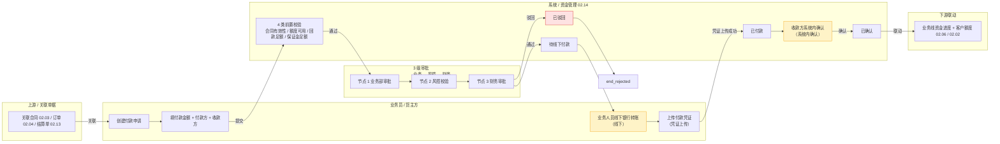
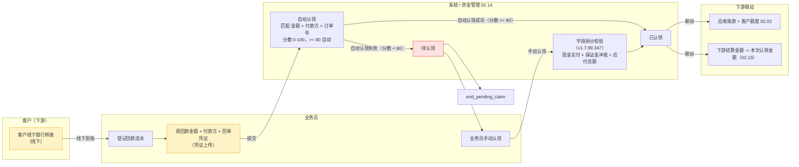
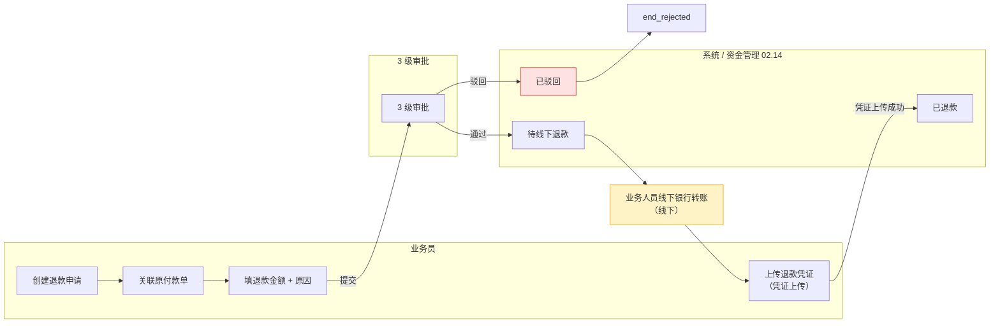
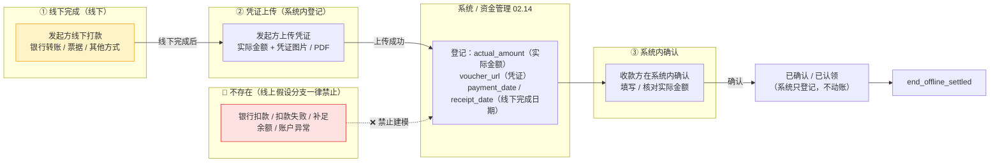
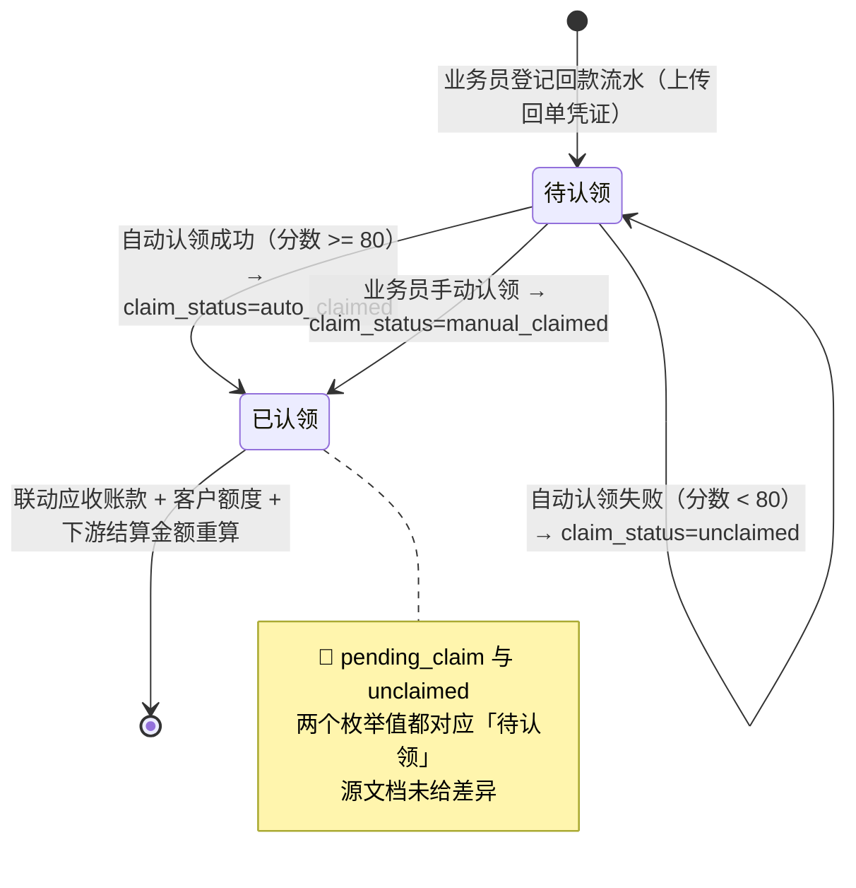
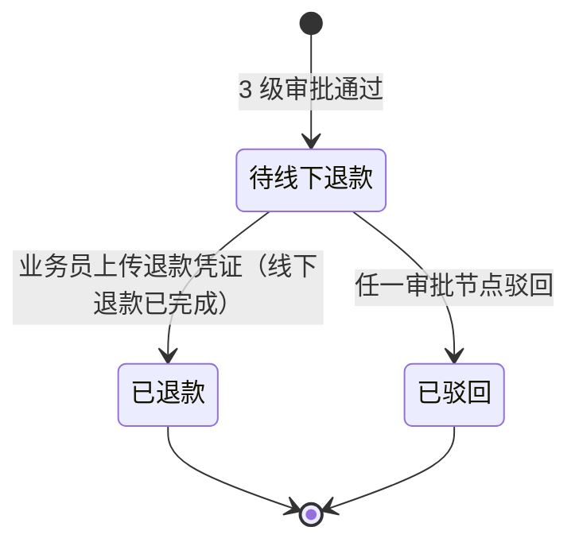
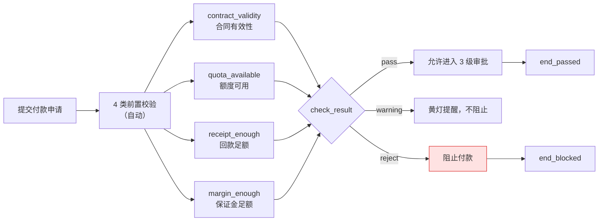
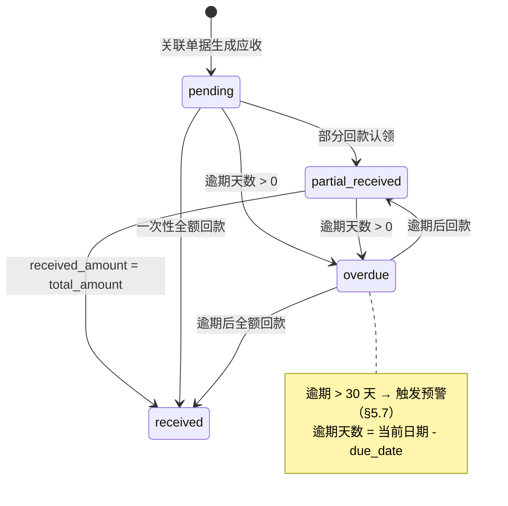
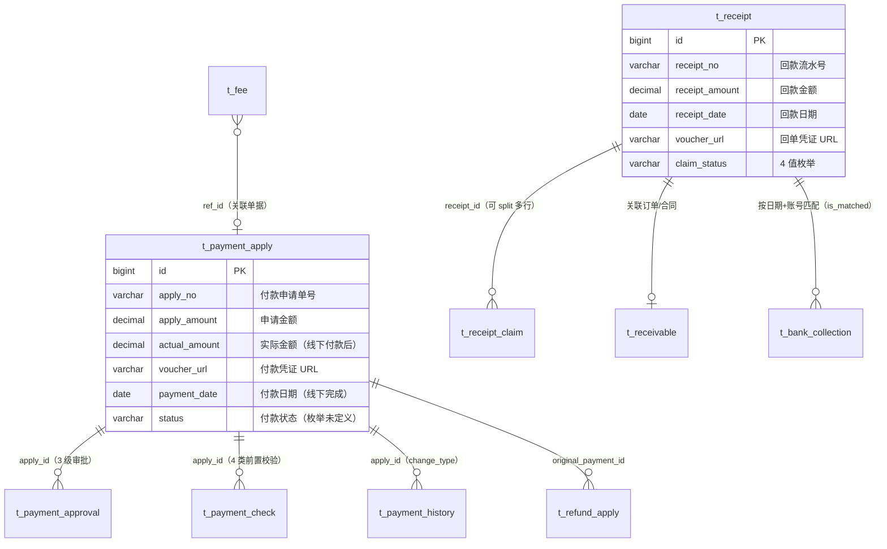

# 02.14 资金管理 · 需求规格说明

> **文档类型**：PRD Writer 范式 · 落地需求文档 · 功能详细描述
> **对应总纲**：[00-产品概述与需求总纲.md](./00-产品概述与需求总纲.md)
> **通用规范**：[01-通用交互与文案规范.md](./01-通用交互与文案规范.md)
> **源文档（只读，未做任何改动）**：[02.14-资金管理.md](../docs/02.14-资金管理.md)
> **整理时间**：2026-09-30

---

## 0. 阅读说明

### 0.1 信息溯源标记

| 标记 | 含义 | 使用规则 |
|------|------|---------|
| ✅ | 源文档已明确 | 原值保留（表名 / 字段名 / 状态枚举 / 编号规则 / 提示文案），不改写口径 |
| 🔷 | 范式补全 | 源文档没写，按范式要求推导，**必须注明推导依据** |
| ⚠️ | 源文档自相矛盾 | **绝不静默选边**，如实并列，交由业务方裁决 |
| 🔷 现状核验 ✅ | 本次整理对 `pages/` / `app.html` / `docs/` 做的**只读** grep / `ls` 核验（2026-09-30）| 结果为页面实现事实，**与源文档原值严格分离标注**，未修改任何文件 |
| [待补充] | 信息不足 | **严禁编造**，需业务方 / 研发回填 |

### 0.2 源文档阅读顺序

源文档 `02.14-资金管理.md`（**636 行 / 27,382 字节**）由**两代口径叠加**构成：**§1-§10 是 v1.0 终版口径**（2026-07-24，基于原型 37-48 截图）、**§11 是 v1.7.99.x 模块级增量补充**（2026-09-24 追加，基于飞书《豫港通用户使用手册（内部版）》第 6.3 / 6.4 节）。两代口径在**页面数量（12 / 14 / 20+）、子模块数（5 / 4）、表数量（10 / 12+ / 13）、复用度（85% / 90%）、回款改造（"逻辑不变" vs "重构"）** 上存在冲突（见 §3.4 C1-C12）。

| 源文档章节 | 内容 | 归位到本文档 |
|-----------|------|------------|
| 头部 + §0 章节导航 | 状态 v1.0 终版 / 复用度 85% / `bo_payment`+`bo_receipt`+`bo_collection_claim_record` 12+ 张表 | §1.1、§5.4、§6 |
| §1 业务定位 | 资金流核心定位 + 3 条关键特点（线下流转 / 凭证上传 / 不假设线上扣款）+ §1.1 5 大子模块表 + §1.1 注（保证金已独立到 02.10）| §1.1、§1.1.2、§4.5 |
| §1.2 12 个页面（sitemap）| 付款 3 / 退款 3 / 回款 3 / 保证金 3 | §1.1.3、§6 |
| §2 业务流程全景 | 2.1 付款流程（线下付款）/ 2.2 回款流程（线下回款+自动认领）/ 2.3 退款流程（线下退款）3 张 Mermaid | §1.3.1-1.3.3 |
| §3 核心实体（10 张表）| `t_payment_apply` / `t_payment_approval` / `t_payment_check` / `t_receipt` / `t_receipt_claim` / `t_receivable` / `t_refund_apply` / `t_fee` / `t_payment_history` / `t_bank_collection` 逐字段 | §5.1、§5.2 |
| §4 角色操作矩阵 | §4.1 付款 7 操作 × 5 角色 / §4.2 回款 4 操作 × 4 角色 | §2.1.1、§2.1.2 |
| §5 字段规则 | 付款类型 / 付款方式 / **实际金额** / **付款凭证** / **4 类前置校验** / **回款认领匹配规则** / **应收账款逾期** | §5.2.11-5.2.17、§3.2、§4.1 |
| §6 按钮交互 | §6.1-6.9（付款 3 页 + 退款 3 页 + 回款 3 页，共 9 条）| §2.2、§6 |
| §7 异常处理 | §7.1 付款 6 条 / §7.2 回款 4 条 / §7.3 退款 2 条（含原文提示文案）| §2.5、§4.1 |
| §8 跨模块流转 | §8.1 上游 4 条 / §8.2 下游 4 条 | §1.4.1 |
| §9 复用建议 | §9.1 复用度 85%（9 复用 + 1 新建）/ §9.2 10 张复用表 / §9.3 3 张新建表 / §9.4 4 周实施 | §5.4 |
| §10 文档版本 + 修改记录 | v1.0 终版 + v1.7.99.x（2026-07-28）4 条全局规范 | §7.3 |
| **§11 v1.7.99.x 增量补充** | **11.1 业务变化 / 11.2 关键公式（347 现金实付·保证金冲抵公式 + 345 足额硬卡 + 346 修改策略 B）/ 11.3 回款 4 步流程 / 11.4 字段拆分 UX 模式 / 11.5 348 关键决策（保证金业务切分）/ 11.6 跨模块联动 / 11.7 异常补充 8 条 / 11.8 页面 PRD 索引 7 行 / 11.9 详细业务规则（回款方式 4 种 / 回款方默认 / 收款账号默认 / 认领类型 2 种）/ 11.10 修改记录 10 条** | **§1.1.4、§1.2.2、§1.3.2、§1.3.4、§1.4.2、§2.1.3、§2.2.1、§2.5、§3.2.2、§4.1、§4.2、§5.2.18-5.2.21、§5.3、§5.4、§6、§7.3** |

> ⚠️ **源文档自身的结构问题（照实记录，不代为修正）**：
> 1. **§1 标题写「5 大子模块」，紧跟的 §1.1 注写「保证金管理已独立到 02.10，本范本只覆盖付款/退款/回款/费用」= 4 个子模块**——见 C3。
> 2. **§1.2 标题写「12 个页面」，表内只列 4 行分组（1-3 / 4-6 / 7-9 / 10-12）**，其中第 4 组注明「v1.0 独立到 02.10」——**实际落在 02.14 的只有 9 个页面**——见 C2。
> 3. **§3 标题写「核心实体（10 张表）」，头部写「12+ 张表」，§9.1 写「9 复用 + 1 新建 = 10」，§9.2 列 10 张复用表，§9.3 列 3 张新建表**——见 C6。
> 4. **§2.1 的「v1.0 关键流程变化」注中同时出现 `❌ 旧版` 与 `✅ v1.1` 两条**，但文档状态是「v1.0 终版」——**「v1.1」从未在文档版本章节出现**——见 C12。
> 5. **§4.1 角色矩阵中「收款方确认」一行的 5 个角色全部是 `-`（无人可执行），但 §2.1 流程图明确有「收款方系统内确认 → 状态→已确认」**——见 C1。

> 🔴 **本文档附只读核验**：为判断「源文档口径 vs 页面实际实现」是否一致，整理时对 `pages/payment-*.html`、`pages/receipt-*.html`、`pages/refund-*.html`、`app.html`、`docs/p-payment-*.md` 等做了**只读** grep / `ls` 核验（2026-09-30），结果逐条标注为「**🔷 现状核验 ✅**」。**未修改 `docs/` 与 `pages/` 下任何文件。**

### 0.3.1 📋 业务方裁决记录（2026-10-08）

> 由业务负责人在项目收尾阶段确认，**优先级高于本文档中所有 ⚠️ 存疑口径与源文档历史版本**。

| # | 裁决项 | 结论 | 影响范围 |
|---|-------|------|---------|
| **D3** | **系统资金链路定位** | **系统中仅作为登记方**——只做真实财务付款凭证的流程登记与留存，**不涉及真实付款** | §1.1 定位表、§1.3 流程图、§2.1 角色矩阵、§3.1 状态机、§4.5 铁律、§3.4 C1 |
| **D2** | **审批方式** | **串行审批**（与 02.03 同一裁决，跨模块统一） | §2.1 审批链、§3.1 状态机触发条件 |

**D3 的直接后果 —— C1「收款方确认无人可执行」裁决为「该动作不存在」**：

| 项 | 源文档旧口径 | 业务方裁决口径（D3） |
|---|-------------|-------------------|
| 付款流程 | 线下转账 → 凭证上传 → **收款方系统内确认 → 已确认** | 登记付款申请（含凭证）→ 审批 → **归档留存** |
| 终态 | `已确认`（由收款方确认触发） | ✅ **删除 `已确认` 终态**；终态 = `已付款`（凭证登记完成） |
| 「收款方」 | 独立业务主体，角色矩阵中 5 个角色全为 `-` | ✅ **不存在该角色**——系统内只有「登记方」（平台/业务员/财务） |
| 4 步铁律 | 发起方打款 → 上传凭证 → 收款方系统确认 → 不存在线上扣款 | ✅ **收敛为 3 步**：登记付款申请 → 平台内审批（串行）→ 凭证归档留存 |

> ⚠️ **仍需研发确认（非业务方决策）**：源文档 §2.1 流程图的 `已确认` 状态、§3.2 的 `confirmed` 枚举、§7.7 的 C1，在**线上是否实际存在**该状态。业务方口径为「不存在」，若线上代码仍有残留（源文档 §11 有「4 步口径原值照抄」记录），需研发核对后统一。

### 0.3.2 与通用规范的关系

**通用表单规范（校验时机 / 返回保护 / 提交行为 / 危险操作确认 / 空状态 / 失败引导 / 通用 UI 6 态 / 通用样式 / 脱敏规范）一律以 [01-通用交互与文案规范.md](./01-通用交互与文案规范.md) 为准，本文档不重复定义**，只写本模块特有的部分：

1. 🔴 **§4.5 线下资金流转铁律（本模块不可违背的业务边界）**——系统无任何线上扣款 / 打款能力，所有资金流转为「线下完成 + 系统流程化登记」，**本文档 §1.3 全部流程图中的线下节点用黄框 `classDef offline` 标注，§3.4 / §4 / §7 全程不使用「银行扣款」等线上术语**。
2. **v1.7.99.347 字段拆分 UX 模式**（应付总额 / 现金实付 / 保证金冲抵 三行 + 顶部「剩余未付」实时计算 + 2 快捷按钮「补足剩余」/「本次付清」）。
3. **v1.7.99.345 足额硬卡**（等比例冲抵开启条件 `paid >= payTotal`，未足额时开关 `disabled` + 红字「未足额」徽标 + tooltip 含具体差额）。
4. **v1.7.99.346 depositRatio 修改策略 B**（允许修改 / 未来笔按新比例 / 已完成不回溯 / 变更记录最多 10 条）。
5. **v1.7.99.348 保证金业务切分**（回款认领只负责货款认领，保证金业务统一走保证金模块 02.10）。
6. **回款认领匹配算法**（金额 > 付款方 > 订单号；分数 0-100；>= 80 自动认领，< 80 人工认领）。
7. **回款并发认领覆盖提示**（「已被其他认领覆盖，请刷新后重试」）。

> 📌 **本文档 §4 在范式骨架 4.1-4.4 之外增设 §4.5**（承载铁律），**不新增任何一级章节**（一级章节仍为 0-7 共 8 个）。

---

## 1. 功能描述与触发条件

### 1.1 功能描述

✅ **资金管理是港通供应链的资金流核心**（源文档 §1 原文照抄）——**5 大子模块：付款 / 退款 / 回款 / 保证金管理 / 费用管理**。

✅ **3 条关键特点**（§1 原文照抄，**本模块第一铁律**）：

| # | 特点 | 原文 | 出处 |
|---|------|------|------|
| 1 | **资金线下流转（港通特色）** | 实际资金操作**线下完成**（银行转账/票据），系统流程化登记 | §1 |
| 2 | **凭证上传** | 发起方上传凭证 + 收款方系统内确认 | §1 |
| 3 | **不假设线上扣款** | 不存在"银行扣款失败/补足余额/账户异常"等线上假设分支 | §1 |

> 🔴 **本模块完整铁律见 §4.5**，§1.3 全部流程图的线下节点已用黄框标注。

> ✅ **业务方裁决（2026-10-08 · D3）：本系统在资金链路上「仅作为登记方」**
>
> 业务负责人原话：**「付款申请只是将真实的财务付款凭证在本系统内进行流程登记留存凭证，不涉及真实付款」**。
>
> 该裁决**收敛了源文档最长的那条矛盾链（C1）**，口径升级为：
>
> | 维度 | 定位（业务方裁决口径 · 交付以此为准） |
> |------|--------------------------------------|
> | **系统角色** | **登记方**——只做凭证的流程登记与留存 |
> | **真实付款** | **不在本平台执行**（银行转账 / 票据，平台不介入） |
> | **系统不做** | 不扣款、不打款、不做资金划转、不校验账户余额、不对接银行 |
> | **「收款方系统内确认」** | ⚠️ **本裁决下该动作不作为独立业务角色存在**——详见下方 C1 裁决结论 |
>
> 📖 完整裁决记录见 [§0.3.1](#031--业务方裁决记录2026-10-08)

#### 1.1.1 5 大子模块（§1.1 原表照抄）

| # | 子模块 | 页面 | 说明 |
|---|--------|------|------|
| 1 | **付款管理** | 付款列表 / 新增付款 / 付款详情 | 采购付款（货主方→上游供应商）|
| 2 | **退款管理** | 退款列表（逻辑不变）/ 退款申请（逻辑不变）/ 退款详情 | 退款流程（逻辑不变）|
| 3 | **回款管理** | 回款列表（不做改动）/ 回款认领操作 / 回款认领详情 | 回款流水登记 + 自动认领 |
| 4 | **保证金管理（新增）** | 保证金管理 / 保证金调整 / 调整记录 | **v1.0 新顶级（独立到 02.10）** |
| 5 | **费用管理** | 隐含在付款/回款中 | 服务费/手续费 |

> ⚠️ **§1.1 下方原注**：「保证金管理在原型 46-48 是独立顶级，v1.0 拆出来到 02.10 独立范本。本范本（02.14）只覆盖付款/退款/回款/费用。」——**与 §1 标题「5 大子模块」直接冲突**，见 C3。
> 🔴 **费用管理**：`t_fee` 表存在（§3.8），但**源文档全篇没有任何费用页面、按钮、字段规则、状态**；§11.8 明确「费用 ·（v1.7.99.x 未单独页面化）· 缺 PRD」[待补充]。

#### 1.1.2 页面清单（§1.2 sitemap 12 页，⚠️ 实际落在 02.14 的只有 9 页）

| # | 子模块 | 页面 | 归属 |
|---|--------|------|------|
| 1-3 | 付款 | 付款列表 / 新增付款 / 付款详情 | ✅ 02.14 |
| 4-6 | 退款 | 退款列表（逻辑不变）/ 退款申请（逻辑不变）/ 退款详情 | ✅ 02.14 |
| 7-9 | 回款 | 回款列表（不做改动）/ 回款认领操作 / 回款认领详情 | ✅ 02.14 |
| 10-12 | 保证金 | 保证金管理 / 保证金调整 / 调整记录（**v1.0 独立到 02.10**）| ⚠️ **已归 02.10**，不在本文档范围 |

> ⚠️ 页面数量在源文档内有 **4 个不同口径**（12 / 14 / 20+ / 索引 14），见 C2。

#### 1.1.3 复用度与表规模（头部 + §9.1）

| 项 | 源文档原值 | 出处 |
|----|-----------|------|
| 复用度 | **🟢 85%（大幅复用）** | 头部 + §9.1 |
| 主产品表 | `bo_payment` + `bo_receipt` + `bo_collection_claim_record` **12+ 张表** | 头部「复用度」行 |
| 核心实体 | **10 张表** | §3 标题 |
| 港通新建表 | 3 张（`t_payment_check` / `t_payment_history` / `t_bank_collection`）| §9.3 |

> ⚠️ 复用度 85% 与 §11 头部「复用度：🟢 90%」冲突，见 C7；表数量 4 个口径冲突，见 C6。

#### 1.1.4 v1.7.99.x 口径（§11.1 模块业务变化表，2026-09-24，原值照抄）

| 维度 | v1.0 文档 | v1.7.99.349 现状 |
|------|----------|------------------|
| 子模块 | 5 大（付款/退款/回款/费用/保证金） | **5 大不变**，但回款内部扩展了 v1.7.99.347 字段拆分 UX + v1.7.99.348 移除保证金收款类型 |
| 页面清单 | 14 页（v1.0 提到） | **20+ 页**：v1.7.99.196 保证金新增 margin-adjust-detail + v1.7.99.341 新增 margin-register + v1.7.99.66 回款重构 receipt-edit / receipt-detail |
| 回款认领字段 | 单一"本次认领金额" input | **v1.7.99.347 字段拆分**：应付总额 / 现金实付 / 保证金冲抵 三行 |
| 保证金登记/调整 | "追加/扣减/冲抵/追保函" 4 分类 | **v1.7.99.196 重写**：登记（独立页）+ 调整（3 种方式：冲抵/转移/退款）|
| 等比例冲抵货款 | 未提及 | **v1.7.99.349 新增**：保证金池每行支持等比例冲抵配置（足额硬卡 + 修改策略 B + pill 按钮）|
| 资金流转方式 | 文字描述"线下 + 凭证" | **v1.7.99.196 强化**：明确 4 步流程（发起方打款 → 上传凭证 → 收款方系统确认 → 不存在线上扣款）|

> ⚠️ **§11.1「页面清单」列写「14 页（v1.0 提到）」，但 §1.2 sitemap 写「12 个页面」**——同一份源文档内部不一致，见 C2。

### 1.2 触发条件

#### 1.2.1 v1.0 口径（§8 跨模块流转，原表照抄）

**上游触发**：

| 触发模块 | 触发条件 | 触发动作 |
|---------|---------|---------|
| 合同管理（02.03）| 合同 `executing` | 允许付款关联 |
| 订单管理（02.04）| 订单 `finished` | 触发付款申请 |
| 结算单（02.13）| 结算单 `active` | 触发付款申请 |
| 客户回款（线下）| 客户线下转账 | 业务员登记回款 |

**下游触发**：

| 触发模块 | 触发条件 | 触发动作 |
|---------|---------|---------|
| 客户额度（02.02）| 付款/回款 | 更新客户已用/可用额度 |
| 业务线（02.06）| 付款/回款 | 更新业务线资金进度 |
| 发票（02.15）| 付款完成 | 触发开票申请 |
| 预警中心（02.11）| 应收账款逾期 | 触发预警 |

> ⚠️ **「订单管理（02.04）」编号已失效**：🔷 总纲已记录 **`02.04` 空缺**（「订单管理已于 v1.7.99.181 删除」）——本文档按原值照抄 `02.04`，同时记录该编号现状，见 C9。
> ⚠️ **「发票（02.15）· 付款完成 · 触发开票申请」与发票模块业务语义冲突**：🔷 `docs/02.15-发票管理.md` v1.0 §1 明确「v1.0 范围仅**进项发票**」——**进项发票由供应商开具，核心企业无法「触发开票申请」**；且 02.15 §8.1 记的是「付款（02.14）· 付款完成 · **触发发票上传**」，两处动作不同，见 C11。

#### 1.2.2 v1.7.99.x 口径（§11.2 / §11.3 / §11.6，原值照抄）

| # | 触发条件 | 触发动作 | 版本 | 出处 |
|---|---------|---------|------|------|
| 1 | **回款认领完成** | 该合同**下游结算金额 -= 本次认领金额**；**下游结算金额 = 0 触发「已结清」** | v1.7.99.x | §11.6 |
| 2 | **回款完成** | 客户**已回款金额 += 本次回款** → 触发**敞口金额 / 保证金覆盖率重算** | v1.7.99.x | §11.6 |
| 3 | **认领的「销售合同」** | **必须为「执行中 / 待上传双签合同」状态**（否则红字拦截）| v1.7.99.x | §11.6 + §11.7 |
| 4 | **保证金池改 `depositRatio`** | **未来笔**按新比例计算，**已完成不回溯** | v1.7.99.196 / 346 | §11.2 / §11.6 |
| 5 | **保证金退款** | **仅保证金退款走 OA + NC**；**回款本身不直接走 OA** | v1.7.99.196 | §11.6 |
| 6 | **等比例冲抵开关** | 开启条件 `paid >= payTotal`（足额硬卡）| v1.7.99.345 | §11.2 |
| 7 | **应付总额变化** | 顶部「剩余未付」条**实时计算**；2 快捷按钮「补足剩余」/「本次付清」联动 | v1.7.99.347 | §11.4 |

### 1.3 业务流程（Mermaid）

> 🔴 **本节所有流程图遵循 §4.5 铁律**：线下资金操作节点一律用 `classDef offline fill:#fef3c7,stroke:#f59e0b` 标注为「**线下**」；**全图不出现「银行扣款 / 扣款失败 / 补足余额 / 账户异常」等线上分支**。
> 🔷 **泳道化为本次重组按范式推导**，推导依据逐图标注在图下。

#### 1.3.1 付款管理流程（v1.0 §2.1 原图照抄 + 🔷 泳道化，**含线下节点黄框**）



> ✅ **节点文案原值照抄**（§2.1）：`待线下付款` / `已驳回` / `已付款` / `已确认` / `收款方系统内确认` / `联动业务线资金进度+客户额度`。
> ✅ **黄框 offline = 线下节点**（`B3 业务人员线下银行转账`、`S5 收款方系统内确认`），红框 danger = 异常终态（`S3 已驳回`）。
> 🔷 **泳道化推导依据**：§2.1 明确「业务员创建」「业务人员线下转账」「业务员上传凭证」「收款方系统内确认」为 4 个不同主体/动作；§2.1 明确「3 级审批 业务→风控→财务」为 3 个节点；§5.5 明确 4 类前置校验；§8.2 明确业务线 + 客户额度为下游。
> ⚠️ **「任一校验不通过 → 阻止付款」（§5.5）在原图中无分支**，本图按 §5.5 补入 `S1 → P1` 的单向「通过」边，**校验拦截的失败分支见 §4.1**。
> ⚠️ **收款方确认无对应角色**（§4.1 矩阵中该行 5 个角色全为 `-`），见 C1。

#### 1.3.2 回款管理流程（v1.0 §2.2 原图照抄 + v1.7.99.347 字段拆分，**含线下节点黄框**）



> ✅ **节点文案原值照抄**（§2.2）：`客户线下银行转账` / `业务员登记回款流水` / `填回款金额+付款方+回单凭证` / `系统自动认领 匹配订单号/金额/付款方` / `已认领` / `待认领` / `业务员手动认领` / `联动应收账款+客户额度`。
> ✅ **匹配规则原值照抄**（§5.6）：优先级 **金额（精确）> 付款方（一致）> 订单号（备注）**；分数 0-100；**>= 80 → 自动认领**；**< 80 → 待人工认领**。
> 🔷 `S4 字段拆分校验` 为 v1.7.99.347 补充节点（§11.2 公式 + §11.7 强校验），**插入在手动认领与已认领之间**。
> ⚠️ **「已认领」1 个中文状态对应 `claim_status` 的 `auto_claimed` / `manual_claimed` 两个枚举值**，见 C5。

#### 1.3.3 退款管理流程（v1.0 §2.3 原图照抄，**含线下节点黄框**）



> ✅ **节点文案原值照抄**（§2.3）。✅ **v1.0 注释「退款逻辑不变，沿用主产品」（§6.4）保留在 §2.2 与 §3.4 C10**。⚠️ **退款流程无「收款方系统内确认」环节**（对比付款流程 §2.1 有 `I 收款方系统内确认`）——**源文档未说明原因** [待补充]。

#### 1.3.4 线下资金流转 4 步铁律总图（v1.7.99.196 口径，§11.1 最后一行 + §1 关键特点）



> ✅ **4 步口径原值照抄**（§11.1「v1.7.99.196 强化：明确 4 步流程（发起方打款 → 上传凭证 → 收款方系统确认 → 不存在线上扣款）」+ §1 关键特点 3 条）。
> ✅ **登记字段原值**：`actual_amount`（§3.1「实际金额（线下付款后填写，v1.0 关键）」）、`voucher_url`（§3.1「付款凭证 URL」）、`payment_date`（§3.1「付款日期（线下完成日期）」）、`receipt_date`（§3.4「回款日期」）。
> 🔴 **`X1 银行扣款 / 扣款失败 / 补足余额 / 账户异常` 为禁止建模项**（§1 原文「不存在"银行扣款失败/补足余额/账户异常"等线上假设分支」）——虚线表示「**禁止**」，**不是一条真实流程边**。
> ⚠️ **「系统试算金额 ≠ 实际还款金额」**：§5.3 明确「与 `apply_amount` 可能不一致（v1.0 重要）」，§7.1 异常文案「实际金额 X ≠ 申请金额 Y」→ **黄灯提醒**。**试算金额仅作参考**，见 §4.5。

### 1.4 模块依赖（跨模块流转）

#### 1.4.1 v1.0 口径（§8，原表照抄）

**上游触发**（同 §1.2.1 上半部）：

| 触发模块 | 触发条件 | 触发动作 |
|---------|---------|---------|
| 合同管理（02.03）| 合同 `executing` | 允许付款关联 |
| 订单管理（02.04）| 订单 `finished` | 触发付款申请 |
| 结算单（02.13）| 结算单 `active` | 触发付款申请 |
| 客户回款（线下）| 客户线下转账 | 业务员登记回款 |

**下游触发**：

| 触发模块 | 触发条件 | 触发动作 |
|---------|---------|---------|
| 客户额度（02.02）| 付款/回款 | 更新客户已用/可用额度 |
| 业务线（02.06）| 付款/回款 | 更新业务线资金进度 |
| 发票（02.15）| 付款完成 | 触发开票申请 |
| 预警中心（02.11）| 应收账款逾期 | 触发预警 |

> ⚠️ **「订单管理（02.04）」编号空缺**（总纲已记录 02.04 于 v1.7.99.181 删除），见 C9。
> ⚠️ **「发票（02.15）· 付款完成 · 触发开票申请」业务语义存疑**（02.15 v1.0 仅进项发票，由供应商开具），见 C11。

#### 1.4.2 v1.7.99.x 口径（§11.6 跨模块联动，原表照抄）

| 联动系统 | v1.0 描述 | v1.7.99.x 增强 |
|----------|-----------|----------------|
| **保证金池（02.10）** | 文字提及 | receipt-edit 的"保证金冲抵"按保证金池 depositRatio 自动计算；保证金池改 depositRatio **未来笔**按新比例 |
| **下游结算单（02.13）** | 已记录 | 回款认领完成后 → 该合同下游结算金额 -= 本次认领金额；下游结算金额 = 0 触发"已结清" |
| **客户额度（02.02）** | 已记录 | 回款完成 → 客户已回款金额 += 本次回款 → 触发敞口金额 / 保证金覆盖率重算 |
| **OA / NC 系统** | v1.0 文字提及 | v1.7.99.196 强化：**仅保证金退款走 OA + NC；回款本身不直接走 OA** |
| **销售合同（02.03）** | 已记录 | 认领的"销售合同"必须为"执行中/待上传双签合同"状态 |

> ⚠️ **§11.6「保证金池（02.10）」标注为「v1.0 描述 = 文字提及」**，但 §1.1 的 5 大子模块里保证金管理**本身就是 02.14 的第 4 个子模块**（v1.0 才拆到 02.10）——「文字提及」指的是 §8 跨模块流转表未列保证金条目 [待补充]。
> ⚠️ **「销售合同状态 = 执行中 / 待上传双签合同」的枚举值未给**：🔷 02.13 的合同状态枚举为 `draft` / `auditing` / `uploading` / `effective` / `rejected` / `voided` / `pending_dispatch` / `producing` / `toconfirm`，**「执行中」与「待上传双签合同」对应哪个英文枚举未定义**，见 C12。

#### 1.4.3 🔷 现状核验 ✅ 页面归属（2026-09-30 只读 `app.html`）

| 项 | 核验结果 | 依据 |
|----|---------|------|
| 菜单分组 | 02.14 的页面全部位于 **`{ sub: '资金管理', pages: [...] }`** 块内 | `app.html:542-553` |
| 菜单实际 10 项 | 付款列表 / 新增付款 / 付款详情 / 退款列表 / 退款申请 / 退款详情 / 回款列表 / 保证金管理 / 保证金调整 / 保证金调整记录 | `app.html:543-552` |
| **回款认领操作 / 回款认领详情未进菜单** | `pages/receipt-edit.html`、`pages/receipt-detail.html`、`pages/receipt-confirm.html` **文件存在但 `app.html` 引用数为 0** | `grep -c receipt-confirm app.html` = 0 |
| **保证金登记 / 保证金调整记录未进菜单** | `pages/margin-register.html`、`pages/margin-record.html` 文件存在，`app.html` 引用数为 0 | `grep -c "margin-register\|margin-record" app.html` = 0 |
| 页面状态口径 | `payment-list.html` 实际渲染状态为 **审批中 / 已付款**（**无「待线下付款」「已确认」**）| `grep -oE` 核验 |
| 回款状态口径 | `receipt-list.html` 实际渲染状态为 **已认领 / 未认领**（**无 4 值 `claim_status` 枚举**）| `grep -oE` 核验 |

> ⚠️ **🔷 现状核验 ✅ 与源文档原值分离**：上述均为**页面实现事实**，**不覆盖**源文档 §2.1 / §2.2 / §3 的原值。菜单 10 项 vs 源文档 12 / 14 / 20+ 口径的冲突记录于 C2。

---

## 2. 交互细节

### 2.1 角色操作矩阵（权限可见性）

#### 2.1.1 付款管理（§4.1 原表照抄，7 操作 × 5 角色）

| 操作 / 角色 | 业务员 | 业务部 | 风控部 | 财务部 | 总经办 |
|------------|------|------|------|------|------|
| 创建付款申请 | **✓** | - | - | - | - |
| 业务部审批 | - | **✓** | - | - | - |
| 风控校验 | - | - | **✓** | - | - |
| 财务审批 | - | - | - | **✓** | - |
| 线下付款+上传凭证 | **✓** | - | - | - | - |
| 收款方确认 | - | - | - | - | - |
| 查看 | ✓ | ✓ | ✓ | ✓ | ✓ |

> 🔴 **「收款方确认」一行的 5 个角色全部是 `-`**——**没有任何角色被授予「收款方确认」权限**，但 §2.1 流程图明确该动作会把状态推进到「已确认」，见 C1。
> 🔴 **「线下付款+上传凭证」由「业务员」执行**：源文档把它与「创建付款申请」归为同一角色，但 §1 特点 2 区分了「发起方」与「收款方」两个主体——**谁算「收款方」**（上游供应商 / 业务部 / 财务部）在角色矩阵中无对应项 [待补充]。

#### 2.1.2 回款管理（§4.2 原表照抄，4 操作 × 4 角色，⚠️ 少「总经办」列）

| 操作 / 角色 | 业务员 | 业务部 | 风控部 | 财务部 |
|------------|------|------|------|------|
| 登记回款流水 | **✓** | - | - | - |
| 自动认领 | 自动 | - | - | - |
| 手动认领 | **✓** | - | - | - |
| 查看 | ✓ | ✓ | ✓ | ✓ |

> ⚠️ **§4.2 矩阵只有 4 个角色列，§4.1 付款矩阵有 5 个角色列（多「总经办」）**——**回款是否对总经办开放，源文档未说明** [待补充]。
> ✅ **「自动认领」由系统执行**（原值「自动」）。

#### 2.1.3 退款 / 费用 / 保证金（🔷 范式补全 + ⚠️ 源文档空白）

| 子模块 | 操作 | 角色 | 依据 |
|-------|------|------|------|
| **退款** | 创建退款申请 | 🔷 业务员（类比付款「创建付款申请」✓ 角色）| 🔷 推导依据：§2.3 流程图首节点为「业务员创建退款申请」 |
| **退款** | 3 级审批 | 🔷 业务部 / 风控部 / 财务部（类比付款 §4.1 审批 3 行）| 🔷 推导依据：§2.3 流程图「3 级审批」节点 |
| **退款** | 线下退款+上传凭证 | 🔷 业务员 | 🔷 推导依据：§2.3 流程图「业务人员线下银行转账」+「业务员上传退款凭证」 |
| **退款** | 查看 | 🔷 全角色 | 🔷 推导依据：§4.1 最后一行「查看 = 全 5 角色」 |
| **费用** | 🔴 [待补充] | 🔴 [待补充] | `t_fee` 表存在（§3.8），但**源文档无费用页面 / 按钮 / 角色 / 状态**；§11.8 明确「费用 · 缺 PRD」 |
| **保证金** | ⚠️ 归 02.10 | — | ✅ §1.1 注「v1.0 拆出来到 02.10 独立范本」；详见 [02.10-保证金管理.md](./02.10-保证金管理.md) |

> ⚠️ **本表 4 行退款角色均为 🔷 推导，源文档 §4 只给了付款与回款两个矩阵**——**退款是否复用付款的 5 角色、是否允许总经办，源文档未确认** [待补充]。

#### 2.1.4 角色可见性通则（🔷 范式补全）

> 依据：[00-产品概述与需求总纲.md](./00-产品概述与需求总纲.md) §8.2 权限控制 + [01-通用交互与文案规范.md](./01-通用交互与文案规范.md) §4.5 权限边界。
> - **前端隐藏 ≠ 后端鉴权**：每个写操作（创建付款 / 审批 / 上传凭证 / 确认 / 登记回款 / 认领）须后端二次校验角色
> - **数据维度过滤**：业务员能否查看他人单据，源文档未定义 [待补充]
> - **系统角色**：`auto`（自动认领）为系统执行，不受 5 角色矩阵约束（✅ §4.2）

### 2.2 按钮交互（操作反馈）

#### 2.2.1 付款 / 退款 / 回款 9 页按钮（§6.1-6.9，原表照抄）

| # | 页面 | 按钮 | 位置 | 可见条件 | 点击行为 |
|---|------|------|------|---------|---------|
| 1 | **付款列表（37 截图）** | **+ 新增付款** | 右上 | 业务员 | 跳新增页（38 截图）|
| 2 | 付款列表 | 数据导出 | Tab 右侧 | 所有 | 导出 Excel |
| 3 | 付款列表 | 详情 | 列表行 | 所有 | 跳详情页（39 截图）|
| 4 | **新增付款（38 截图）** | —（表单页）| — | — | 关联合同/订单/结算单（必填）；填付款金额+付款方+收款方；**4 类前置校验（自动）** |
| 5 | **付款详情（39 截图）** | —（详情页）| — | — | 付款基本信息 / 4 类校验结果 / 审批记录 / **线下付款凭证** |
| 6 | **退款列表（40 截图，逻辑不变）** | — | — | — | ✅ §6.4 原文注：「v1.0 注释：退款逻辑不变，沿用主产品」|
| 7 | **退款申请（41 截图，逻辑不变）** | —（表单页）| — | — | 关联原付款单；填退款金额+原因 |
| 8 | **退款详情（42 截图）** | —（详情页）| — | — | 退款基本信息 / 关联原付款 / 凭证 |
| 9 | **回款列表（43 截图，不做改动）** | — | — | — | ✅ §6.7 原文注：「v1.0 注释：回款逻辑不变，沿用主产品」 |
| 10 | **回款认领操作（44 截图）** | —（认领页）| — | — | 系统自动匹配订单/合同；**手动调整匹配**；**拆分认领（多订单）** |
| 11 | **回款认领详情（45 截图）** | —（详情页）| — | — | 回款基本信息 / 认领记录 / 关联订单/合同 |

> ⚠️ **§6.4 / §6.7「逻辑不变 / 不做改动」是 v1.0 口径，与 §11.1「v1.7.99.66 回款重构 receipt-edit / receipt-detail」冲突**，见 C10。
> 🔴 **付款列表 / 付款详情 / 退款列表 / 退款详情 / 回款列表 / 回款认领详情 6 个页面的完整按钮清单、列名、列宽、筛选、排序、mock 数据，源文档均未记录** [待补充]（§6 只给了 3 个列表按钮 + 6 个页面的区块级说明）。

#### 2.2.2 v1.7.99.347 字段拆分 UX（§11.4「可复用」模式，原值照抄）

**通用模式**：**应付 / 实付 / 冲抵 3 input + 实时摘要 + 2 快捷按钮 + 顶部「剩余未付」bar**。

**核心元素**（✅ §11.4 原文）：

| 元素 | 内容 | 可交互 |
|------|------|-------|
| 顶部「剩余未付」提示条 | **实时计算** | ✅ 只读 |
| 快捷按钮 1 | **补足剩余** | ✅ 点击 |
| 快捷按钮 2 | **本次付清** | ✅ 点击 |
| 字段三行 | 应付总额（**disabled**）/ 现金实付（**input**）/ 保证金冲抵（**disabled**）| 现金实付可输入，另 2 行只读 |

**适用场景**（✅ §11.4 原文）：**任何「一笔支付拆分为多种资金来源」的页面**（货款 + 保证金 + 其他费用等）。

#### 2.2.3 v1.7.99.347 字段拆分公式（§11.2，原值照抄）

```
应付总额 = SUM(本认领行关联合同的下游结算金额)
现金实付 = 用户填写（默认 = 应付总额）
保证金冲抵 = 应付总额 × depositRatio / 100  (来自保证金池配置)
约束: 现金实付 + 保证金冲抵 = 应付总额（产品硬约束）
```

> ✅ **「现金实付默认值 = 应付总额」** 为源文档唯一明确的默认值，登记于 §5.2 表「默认值」列。

#### 2.2.4 v1.7.99.345 足额硬卡 + v1.7.99.346 修改策略 B（§11.2，原值照抄）

| 版本 | 规则 | 原值 |
|------|------|------|
| **v1.7.99.345 足额硬卡** | 等比例冲抵**开启条件** | `paid >= payTotal` |
| | 未足额时表现 | 开关 **disabled** + **红字「未足额」徽标** + **tooltip 含具体差额** |
| **v1.7.99.346 修改策略 B** | 是否允许修改 `depositRatio` | ✅ **允许** |
| | 历史数据 | **未来笔按新比例计算；已完成不回溯** |
| | 变更记录 | **最多 10 条** |

#### 2.2.5 v1.7.99.348 保证金业务切分（§11.5，原值照抄）

**问题**（✅ §11.5 原文）：v1.7.99.66 时回款认领的「收款类型」提供 radio（**保证金 / 货款 2 选 1**），导致：
- 同一笔回款可能既认领货款又登记保证金，业务语义混乱
- 等比例冲抵配置散落在 receipt-edit 与保证金池两处，难维护

**v1.7.99.348 解决方案**（✅ §11.5 原文）：

| # | 决策 |
|---|------|
| 1 | **回款认领只负责货款认领**（**移除保证金 radio**）|
| 2 | **保证金业务统一走保证金模块**（`margin-register` / `margin-adjust` / `margin-pool`）|
| 3 | **`deposit-offset-config` 等比例冲抵配置统一在保证金池页**（`receipt-edit` / `receipt-detail` **只读回显**）|

> ⚠️ **§11.9 又记「回款方式 4 种」中第 4 种是「保证金冲抵」**，并注「v1.7.99.348 后此选项**仅在 receipt-edit 回款方式字段保留，业务上不再走保证金**」——**「字段保留但不生效」的 UI 口径与 §11.5「移除保证金 radio」并列存在**，实现时需明确该选项是置灰还是可提交 [待补充]。

#### 2.2.6 回款录入默认带出（§11.9，原值照抄）

| 字段 | 规则 | 出处 |
|------|------|------|
| **回款方** | **单选，默认下游客户**；回款方**账号名称 / 开户行 / 银行账号随客户自动带出（可修改）** | §11.9 |
| **收款账号** | **单选，默认核心企业所登记信息** | §11.9 |
| **回款方式** | 4 种：① 商业承兑汇票 ② 电子银行承兑汇票 ③ 电汇 ④ 保证金冲抵 | §11.9 |
| **认领类型** | 2 种：① **业务线回款**（可选择**已关联业务线**的销售合同，单批次/订单）② **非业务线回款**（可选择**未关联业务线**的销售合同，单批次/订单）| §11.9 |

> ⚠️ **回款方式 4 种（§11.9）与 `t_receipt.receipt_method` 3 值（`bank_transfer` / `bill` / `other`，§3.4）不一致**——**「电汇」「商业承兑汇票」「电子银行承兑汇票」「保证金冲抵」与 3 个英文枚举无法一一对应** [待补充]。

### 2.3 危险操作确认

> **通用确认弹窗规范（标题 / 描述 / 确定·取消按钮 / 二次校验）以 [01-通用交互与文案规范.md](./01-通用交互与文案规范.md) §2.10 为准**，下表只列本模块特有项。
> 🔴 **源文档 §2.3 / §6 全文未给任何危险操作确认弹窗的文案**——本表 4 条均为 🔷 推导，**文案为占位，需业务方回填原文**。

| # | 操作 | 触发条件 | 确认要点 | 文案来源 | 依据 |
|---|------|---------|---------|---------|------|
| 1 | **提交付款申请** | 4 类前置校验通过后 | 需提示**线下打款 + 上传凭证**两步不可省略 | 🔷 [待补充] | 🔷 §1 特点 1/2 + §11.1「4 步流程」 |
| 2 | **调整 depositRatio**（保证金池）| 策略 B 允许修改 | **弹窗二次确认**；提示「历史不回溯」 | 🔷 [待补充] | ✅ §11.7「调整 depositRatio → v1.7.99.346 策略 B：弹窗二次确认 + 历史不回溯 + 变更记录最多 10 条」（**行为 ✅ 已确认，文案 🔷 待补**）|
| 3 | **删除费用记录** | `t_fee` 记录 | 🔴 无任何依据 | 🔴 [待补充] | 🔴 §3.8 只有表结构，无操作定义 |
| 4 | **回款认领合同并发覆盖** | 提交时已认领金额被他人覆盖 | 阻断提交 | ✅ **「已被其他认领覆盖，请刷新后重试」** | ✅ §11.7 原文文案 |

> 🔴 **退款作废 / 付款单删除 / 保证金冲抵撤销等危险操作，源文档均未定义** [待补充]。

### 2.4 空状态引导

> 通用空状态规范（插画 / 灰字居中 / 引导按钮 / `暂无数据` 基线文案）以 [01-通用交互与文案规范.md](./01-通用交互与文案规范.md) §2.11 为准。

| 场景 | 建议文案 | 引导操作 | 依据 |
|------|---------|---------|------|
| 付款列表无数据 | 🔷 `暂无付款记录` | 🔷 「+ 新增付款」 | 🔷 依据 §6.1 有「+ 新增付款」按钮（右上）|
| 回款列表无数据 | 🔷 `暂无回款记录` | 🔷 「+ 新增回款」 | ✅ §11.3「**第一步：点击新增回款按钮**（列表页 + 新增）」 |
| 关联合同抽屉无匹配 | 🔷 `暂无可选合同` | 🔷 清除筛选条件 | 🔷 依据 §2.1 A1「关联合同/订单/结算单」为必填选择项 |
| 认领页无可认领订单 | 🔷 `暂无可认领订单` | 🔷 返回上一步 | 🔷 依据 §6.8「系统自动匹配订单/合同」可能匹配为空 |
| 付款详情无凭证 | 🔷 `暂无付款凭证` | 🔷 上传凭证 | 🔷 依据 §5.4「付款凭证 `voucher_url` 必填（线下付款后）」|
| 审批记录为空 | 🔷 `暂无审批记录` | — | 🔷 依据 §6.3 付款详情含「审批记录」区块 |

> 🔷 **上表 6 条文案均为推导占位**，源文档未给空状态文案；**需业务方确认后回填**。

### 2.5 失败引导

> 通用失败引导规范（Toast 红色 / 红字内联 / 重试按钮）以 [01-通用交互与文案规范.md](./01-通用交互与文案规范.md) §2.12 为准。**下表提示文案全部 ✅ 源文档原值照抄，一字不改。**

#### 2.5.1 付款异常（§7.1 原表照抄，6 条）

| # | 异常场景 | 提示文案 | 处理动作 |
|---|---------|---------|---------|
| 1 | 合同无效 | **"合同已过期/作废"** | **阻止** |
| 2 | 额度不足 | **"可用额度 X < 付款金额 Y"** | **阻止** |
| 3 | 回款不足 | **"客户已回款 X < 本次付款 Y"** | **黄灯提醒** |
| 4 | 保证金不足 | **"客户保证金 X < 应付 Y"** | **黄灯提醒** |
| 5 | **实际金额 ≠ 申请金额** | **"实际金额 X ≠ 申请金额 Y"** | **黄灯提醒** |
| 6 | 凭证未上传 | **"线下付款后必须上传凭证"** | **阻止完成** |

#### 2.5.2 回款异常（§7.2 原表照抄，4 条）

| # | 异常场景 | 提示文案 | 处理动作 |
|---|---------|---------|---------|
| 1 | 凭证未上传 | **"登记回款必须上传回单凭证"** | **阻止** |
| 2 | 自动认领失败 | **"回款自动认领失败（匹配分数 X < 80），请手动认领"** | **提示手动** |
| 3 | 认领金额 > 回款金额 | **"认领金额 X 超过回款金额 Y"** | **阻止** |
| 4 | 客户被冻结 | **"客户 X 已被冻结，不能登记回款"** | **阻止** |

#### 2.5.3 退款异常（§7.3 原表照抄，2 条）

| # | 异常场景 | 提示文案 | 处理动作 |
|---|---------|---------|---------|
| 1 | 退款金额 > 原付款金额 | **"退款金额 X 超过原付款金额 Y"** | **阻止** |
| 2 | 原付款已退款 | **"原付款 X 已退款，不能重复退款"** | **阻止** |

#### 2.5.4 v1.7.99.x 补充异常（§11.7 原表照抄，8 条）

| # | 场景 | v1.7.99.x 处理（原文照抄）|
|---|------|-----------------|
| 1 | **现金实付 + 保证金冲抵 ≠ 应付总额**（v1.7.99.347 强校验）| 单行红字提示**"现金实付 + 保证金冲抵 必须等于应付总额"** |
| 2 | 现金实付 > 应付总额 | 红字提示**"现金实付不能大于应付总额"** |
| 3 | 已认领金额 > 回款金额 | 顶部红字提示**"已认领金额超过回款金额"** |
| 4 | 等比例冲抵"未足额"试图开启 | **v1.7.99.345 足额硬卡**：开关 disabled + 红字**"未足额"**徽标 |
| 5 | 调整 `depositRatio` | **v1.7.99.346 策略 B**：弹窗二次确认 + 历史不回溯 + 变更记录最多 10 条 |
| 6 | 选择已作废合同 | 红字提示**"该合同已作废，无法认领"** |
| 7 | 选择非"执行中/待上传双签合同"状态 | 红字提示**"请选择执行中或待上传双签合同"** |
| 8 | 同一合同并发认领 | 提交时校验已认领金额，如被覆盖则提示**"已被其他认领覆盖，请刷新后重试"** |

> ⚠️ **§7.2 第 3 条「认领金额 X 超过回款金额 Y」（阻止）与 §11.7 第 3 条「已认领金额超过回款金额」（顶部红字）** 措辞不同、拦截位置不同（行内 vs 顶部）——**是同一条规则的两种展示还是两条不同规则，源文档未说明** [待补充]。

---

## 3. 状态清单

### 3.1 业务状态机

#### 3.1.1 付款状态机（🔷 据 §2.1 流程图节点反推，**原值照抄**）

> 🔴 **`t_payment_apply.status` 是 `varchar(20)` 必填，但源文档 §3.1 从未给出该字段的枚举值清单**——下表状态**从 §2.1 流程图的中文状态标签反推**，标注为 🔷 推导。

```mermaid
stateDiagram-v2
    [*] --> 待线下付款 : 3 级审批通过
    待线下付款 --> 已付款 : 业务员上传付款凭证（线下打款已完成）
    已付款 --> 已确认 : 收款方系统内确认
    已确认 --> [*] : 联动业务线资金进度 + 客户额度
    待线下付款 --> 已驳回 : 任一审批节点驳回
    已驳回 --> [*]
    已驳回 -.-> 待线下付款 : 修改后重新提交（🔴 源文档未定义）
    note right of 已付款
        🔴 status 枚举值未定义
        （varchar(20) 必填，§3.1 无清单）
    end note
    note right of 待线下付款
        ⚠️ §5.3 引入第 5 态 warning
        实际金额 ≠ 申请金额 → 状态→warning
    end note
```

> ✅ **状态中文名原值照抄**（§2.1）：`待线下付款` / `已付款` / `已确认` / `已驳回`。
> ✅ **`t_payment_history.change_type` 5 值原值照抄**（§3.9）：`submit` / `approve` / `reject` / `paid` / `confirmed`——**与 4 个中文状态可对应，但源文档未给映射关系**。
> 🔴 **「已驳回」后能否修改重提，源文档未定义**——图中虚线为 🔷 推导的待确认项（02.13 结算单的「驳回后重提」是明确规则，本模块源文档无此规则，**不类推**）。
> ⚠️ **§5.3 引入第 5 个状态 `warning`**（「实际金额 ≠ 申请金额 → 状态→`warning`」），与流程图的 4 状态冲突，见 C4。

#### 3.1.2 回款认领状态机（🔷 据 §2.2 流程图 + §3.4 `claim_status` 枚举）



> ✅ **`claim_status` 4 枚举值原值照抄**（§3.4）：`pending_claim` / `auto_claimed` / `manual_claimed` / `unclaimed`。
> ⚠️ **「已认领」1 个中文状态对应 `auto_claimed` + `manual_claimed` 两个枚举值**；**「待认领」对应 `pending_claim` + `unclaimed` 两个枚举值**（流程图只出现「待认领」，但枚举有两个待认领值）——**4 枚举 vs 2 展示状态的对齐关系源文档未定义**，见 C5。

#### 3.1.3 退款状态机（🔷 据 §2.3 流程图节点反推）



> ✅ **状态中文名原值照抄**（§2.3）。🔴 **`t_refund_apply.status` 是 `varchar(20)` 必填，枚举值未定义** [待补充]。

#### 3.1.4 4 类付款前置校验（§5.5，独立结果态，非单据状态）



> ✅ **`check_type` 4 值 + `check_result` 3 值原值照抄**（§3.3 + §5.5）。✅ **「任一校验不通过 → 阻止付款」原值照抄**（§5.5）。
> ⚠️ **`warning` 结果与 §7.1 异常表的对应关系**：§7.1 第 3 条「回款不足 → 黄灯提醒」、第 4 条「保证金不足 → 黄灯提醒」→ 对应 `receipt_enough` / `margin_enough` 的 `warning`；§7.1 第 1/2 条「合同无效 / 额度不足 → 阻止」→ 对应 `contract_validity` / `quota_available` 的 `reject`。**此映射为 🔷 推导**（依据：两条表的文案语义与动作一一对应），源文档未显式给出。

#### 3.1.5 应收账款状态（§3.6 `t_receivable.status` 4 值，原值照抄）



> ✅ **4 枚举值原值照抄**（§3.6）：`pending` / `partial_received` / `received` / `overdue`。🔷 **状态间的转换边为推导**（源文档只给 4 枚举 + §5.7 逾期算法，**未给状态机**），推导依据：`total_amount` / `received_amount` / `unreceived_amount` / `due_date` / `overdue_days` 5 字段的语义（§3.6）。

### 3.2 状态值与展示

#### 3.2.1 付款 / 退款状态（🔴 `status` 枚举未定义，按流程图中文名反推）

| 枚举值 | 中文 | 触发条件 | 下一状态 | Tag 色 | 依据 |
|--------|------|---------|---------|--------|------|
| 🔴 [待补充] | 待线下付款 | 3 级审批通过 | 已付款 | 🔷 蓝 `#EFF6FF` / 文字 `#1E40AF`（进行中/待处理）| ✅ 中文名 §2.1；🔷 枚举 🔴 未定义；🔷 色 推导依据 [总纲 §7.8](./00-产品概述与需求总纲.md#78-状态标签配色) |
| 🔴 [待补充] | 已付款 | 业务员上传付款凭证 | 已确认 / warning | 🔷 绿 `#ECFDF5` / 文字 `#047857`（正常/生效）| ✅ §2.1；🔷 枚举未定义；🔷 色板依据 [总纲 §7.8](./00-产品概述与需求总纲.md#78-状态标签配色)|
| 🔴 [待补充] | 已确认 | 收款方系统内确认 | 终态 | 🔷 绿 `#ECFDF5` / 文字 `#047857` | ✅ §2.1；🔷 枚举未定义；🔷 色板依据 [总纲 §7.8](./00-产品概述与需求总纲.md#78-状态标签配色)|
| 🔴 [待补充] | 已驳回 | 任一审批节点驳回 | 终态 | 🔷 红 `#FEE2E2` / 文字 `#DC2626`（驳回/异常）| ✅ §2.1；🔷 枚举未定义；🔷 色板依据 [总纲 §7.8](./00-产品概述与需求总纲.md#78-状态标签配色)|
| ⚠️ `warning` | （源文档只写状态名，**无中文标签**）| 实际金额 ≠ 申请金额（§5.3）| 🔴 [待补充] | 🔷 黄 `#FEF3C7` / 文字 `#D97706`（警告）| ✅ `warning` 是**源文档全文唯一出现的 status 枚举字面量**（§5.3）；🔷 色 推导依据 [总纲 §7.8](./00-产品概述与需求总纲.md#78-状态标签配色) |

> ⚠️ **§5.3 的 `warning` 是一条完整英文枚举值，与其余 4 个只有中文名的状态并存**——是同一 `status` 字段的第 5 个值，还是 `t_payment_check.check_result` 的 `warning`（§3.3）串写，源文档未说明，见 C4。
> 🔴 **退款 3 状态（待线下退款 / 已退款 / 已驳回）的枚举值同样未定义**。

#### 3.2.2 回款认领状态（§3.4 `claim_status`，✅ 4 枚举原值照抄）

| 枚举值 | 中文 | 触发条件 | 下一状态 | Tag 色 |
|--------|------|---------|---------|--------|
| `pending_claim` | 🔶 待认领（**源文档无此中文标签**）| 登记回款流水后初值 | `auto_claimed` / `manual_claimed` / `unclaimed` | 🔷 蓝（待处理）|
| `auto_claimed` | ✅ **已认领**（自动）| 自动认领成功（分数 **>= 80**）| 终态 | 🔷 绿（正常）|
| `manual_claimed` | ✅ **已认领**（人工）| 业务员手动认领 | 终态 | 🔷 绿（正常）|
| `unclaimed` | ✅ **待认领** | 自动认领失败（分数 **< 80**）| `manual_claimed` | 🔷 蓝（待处理）|

> ⚠️ **4 个枚举值只有 2 个中文展示状态**（`pending_claim` + `unclaimed` → 待认领；`auto_claimed` + `manual_claimed` → 已认领），**差异与选用条件源文档未定义**，见 C5。
> 🔷 **中文标签「待认领 / 已认领」来自 §2.2 流程图**；**色板推导依据**：[总纲 §7.8 状态标签配色](./00-产品概述与需求总纲.md#78-状态标签配色)。

#### 3.2.3 付款历史变更类型（§3.9 `change_type`，✅ 5 值原值照抄）

| 枚举值 | 中文 | 触发条件 | 对应付款状态 | Tag 色 |
|--------|------|---------|-------------|--------|
| `submit` | 提交 | 创建付款申请 | 待线下付款 | 🔷 蓝 |
| `approve` | 审批通过 | 3 级审批某节点通过 | 待线下付款 | 🔷 绿 |
| `reject` | 审批驳回 | 3 级审批某节点驳回 | 已驳回 | 🔷 红 |
| `paid` | 已付款（线下打款 + 上传凭证）| 上传付款凭证 | 已付款 | 🔷 绿 |
| `confirmed` | 收款方确认 | 收款方系统内确认 | 已确认 | 🔷 绿 |

> 🔶 **`change_type` 5 值与 §2.1 状态的中文名可对应，但源文档未给映射表**——本表映射为 🔷 推导（依据：`change_type` 字面语义 + §2.1 状态标签）。

#### 3.2.4 前置校验结果（§3.3 `check_result`，✅ 3 值原值照抄）

| 枚举值 | 中文 | 触发条件 | 下一状态 | Tag 色 |
|--------|------|---------|---------|--------|
| `pass` | 通过 | 4 类校验全部满足 | 允许进入 3 级审批 | 🔷 绿 `#ECFDF5` / `#047857` |
| `reject` | 不通过 | 合同无效 / 额度不足 | **阻止付款** | 🔷 红 `#FEE2E2` / `#DC2626` |
| `warning` | 警告 | 回款不足 / 保证金不足 / 实际金额 ≠ 申请金额 | **黄灯提醒，不阻止** | 🔷 黄 `#FEF3C7` / `#D97706` |

> ✅ 3 枚举原值照抄（§3.3）。✅ 与 §7.1 异常表动作的对应见 §3.1.4 图下注。

#### 3.2.5 应收账款状态（§3.6 `status`，✅ 4 值原值照抄）

| 枚举值 | 中文 | 触发条件 | 下一状态 | Tag 色 |
|--------|------|---------|---------|--------|
| `pending` | 待回款 | 关联单据生成应收 | `partial_received` / `received` / `overdue` | 🔷 蓝 |
| `partial_received` | 部分回款 | `received_amount` ∈ (0, `total_amount`) | `received` / `overdue` | 🔷 黄（待补充）|
| `received` | 已回款 | `unreceived_amount` = 0 | 终态 | 🔷 绿 |
| `overdue` | 已逾期 | **逾期天数 = 当前日期 - `due_date` > 0** | `partial_received` / `received` | 🔷 红 |

> ✅ 4 枚举 + 逾期算法原值照抄（§3.6 + §5.7）。⚠️ **§5.7「逾期 > 30 天 → 触发预警」到预警中心（02.11）的联动，源文档未给预警编号前缀与字段** [待补充]。

#### 3.2.6 银行流水匹配标记（§3.10 `is_matched`，✅ tinyint 原值照抄）

| 枚举值 | 中文 | 触发条件 | 下一状态 | Tag 色 |
|--------|------|---------|---------|--------|
| `1` / `true` | 已匹配 | 银行流水与回款流水认领成功 | — | 🔷 绿 |
| `0` / `false` | 未匹配 | 登记后未被认领 | `1`（认领后）| 🔷 灰 |

> 🔴 **`tinyint` 的具体取值（0/1 还是 NULL 默认）源文档未给**；**`is_matched` 与 `t_receipt` 的关联方式（是否同一天同一账号）源文档未定义** [待补充]。

### 3.3 UI 状态清单

> 通用 6 态以 [01-通用交互与文案规范.md](./01-通用交互与文案规范.md) §3.2 为准；下表为**本模块（付款列表/新增/详情 + 退款列表/申请/详情 + 回款列表/认领/认领详情 + 认领字段拆分区 + 保证金冲抵只读回显 + 凭证上传区）**的落地映射。**6 态齐全：默认 / 加载中 / 成功 / 失败 / 禁用 / 空状态**。

| 状态 | 触发 | 视觉 | 可交互 |
|------|------|------|-------|
| **默认** | 页面加载完成 | 付款列表页：标题 + Tab + 列表 + **右上「+ 新增付款」**（§6.1）+ **Tab 右侧「数据导出」**（§6.1）+ 行操作「详情」（§6.1）；付款详情页 4 区块（付款基本信息 / **4 类校验结果** / 审批记录 / **线下付款凭证**，§6.3）；回款认领页 3 区块（回款信息 / 凭证 / 认领，§11.10 v1.7.99.66）| ✅ 全部按钮按 §2.1 矩阵显隐 |
| **加载中** | 提交中 / 4 类前置校验计算中 / 凭证上传中 / **自动认领算法计算中** / OCR 外无关 | 按钮 loading + 旋转图标 + 禁用 🔷；行操作按钮 loading 🔷 | ❌ 禁用重复提交 |
| **成功** | 付款申请提交成功 / 3 级审批通过 / **凭证上传成功（→ 已付款）** / **收款方确认（→ 已确认）** / 回款流水登记成功 / **自动认领成功（→ 已认领）** / 手动认领成功 / 退款凭证上传成功 | 顶部居中 Toast；**文案原值照抄**：提示文案见 §2.5 全部原文；成功态文案 🔴 [待补充]（源文档未给成功 Toast 原文）| — |
| **失败** | 付款 6 条（§7.1）+ 回款 4 条（§7.2）+ 退款 2 条（§7.3）+ v1.7.99.x 8 条（§11.7）| Toast 红色 🔷；或**红字内联**（v1.7.99.347「现金实付 + 保证金冲抵 必须等于应付总额」单行红字）；**顶部红字**（v1.7.99.347「已认领金额超过回款金额」）；**黄灯提醒**（§7.1 第 3/4/5 条）| ✅ 按钮恢复可点 |
| **禁用** | ① **应付总额** = `SUM(本认领行关联合同的下游结算金额)` → **disabled**（§11.4）；② **保证金冲抵** = `应付总额 × depositRatio / 100` → **disabled**（§11.4）；③ **等比例冲抵开关** 未足额（`paid < payTotal`）→ **disabled + 红字「未足额」徽标**（§11.2 v1.7.99.345）；④ **保证金冲抵 / `deposit-offset-config`** 在 `receipt-edit` / `receipt-detail` → **只读回显**（§11.5 v1.7.99.348）；⑤ 状态 = `已确认` / `已退款` / 终态 → 无后续操作按钮（§3.1）| 字段 `disabled` + 灰底 🔷；开关 disabled + 红字徽标；操作列按钮**不渲染** | ❌ |
| **空状态** | 付款列表无数据 / 回款列表无数据 / 关联合同无可选项 / 认领页无可认领订单 / 付款详情无凭证 / 审批记录为空 / 凭证区为空 | 空状态插画 + 灰字居中（🔷 `.empty-row { padding: 40px 0; color: var(--text-tertiary); }`，01 文档 §2.11）；文案见 §2.4（🔷 推导占位）| ✅ 引导操作（新增付款 / 新增回款 / 清除筛选 / 上传凭证）|

**🔷 本模块特有的 UI 状态补充**（依据逐条标注）：

| 状态 | 触发 | 视觉 | 可交互 | 依据 |
|------|-----|------|-------|------|
| **顶部「剩余未付」bar 态** | 认领页字段拆分区加载 | 顶部提示条，**实时计算** | ✅ 只读 | ✅ §11.4 |
| **2 快捷按钮态** | 认领页字段拆分区 | 「**补足剩余**」/「**本次付清**」2 按钮 | ✅ 点击 | ✅ §11.4 |
| **单行红字校验态** | 现金实付 + 保证金冲抵 ≠ 应付总额 | 该行下方**红字**「现金实付 + 保证金冲抵 必须等于应付总额」 | ❌ 不可提交 | ✅ §11.7 |
| **顶部红字校验态** | 已认领金额 > 回款金额 | 页面**顶部红字**「已认领金额超过回款金额」 | ❌ | ✅ §11.7 |
| **足额硬卡徽标态** | 等比例冲抵未足额 | 开关 **disabled** + **红字「未足额」徽标** + **tooltip 含具体差额** | ❌ 开关不可点 | ✅ §11.2 |
| **depositRatio 二次确认弹窗态** | 调整 `depositRatio` | **弹窗二次确认**（🔴 文案 [待补充]）| ✅ 确认 / 取消 | ✅ §11.7 |
| **变更记录 10 条上限态** | `depositRatio` 变更记录列表 | 最多 10 条 | ✅ 只读 | ✅ §11.2 |
| **保证金冲抵只读回显态** | `receipt-edit` / `receipt-detail` | 保证金冲抵金额**只读**，由 `depositRatio` 自动计算 | ❌ | ✅ §11.5 |
| **自动带出态（回款方）** | 选中默认下游客户 | 回款方**账号名称 / 开户行 / 银行账号自动带出** | ✅ **可修改** | ✅ §11.9 |
| **自动带出态（收款账号）** | 打开回款表单 | 收款账号默认**核心企业所登记信息** | ✅ 单选 | ✅ §11.9 |
| **认领类型 2 选 1 态** | 填写认领信息 | ① 业务线回款（可选**已关联业务线**的销售合同）② 非业务线回款（可选**未关联业务线**的销售合同）| ✅ 单选 | ✅ §11.9 |
| **红线金额不符态** | 实际金额 ≠ 申请金额 | **黄灯提醒**「实际金额 X ≠ 申请金额 Y」 | ✅ 可继续（不阻止）| ✅ §7.1 |
| **拆分认领态（多订单）** | 回款认领操作页 | 一笔回款拆分为多订单认领 | ✅ | ✅ §6.8 |
| **票据 / 银行转账凭证态** | `payment_method` = `bill` / `bank_transfer` | 凭证必填（**银行回单 / 票据照片**，图片 / PDF）| ✅ 上传 | ✅ §5.2 / §5.4 |

### 3.4 版本冲突

> ⚠️ 以下 **C1-C12** 为源文档内部交叉比对（v1.0 / v1.7.99.x 两代口径）+ `app.html` / `pages/` 只读核验后确认的自相矛盾，本次重组**未选边**，全部如实并列，交由业务方裁决。**每条 C 在 §7.1 表格中逐条对应，编号一致。**

**C1 — 「收款方系统内确认」在角色矩阵中无人可执行（✅ 已由业务方裁决：该动作不存在）**

> ✅ **已裁决（2026-10-08 · D3）**：业务负责人明确「**系统中仅作为登记方**」「付款申请只是将真实的财务付款凭证在本系统内进行流程登记留存凭证，**不涉及真实付款**」。
>
> **裁决结论**：
> 1. **「收款方」不是本平台的业务角色**——平台内只有登记方（业务员登记 / 财务审批）
> 2. **付款终态为「已付款」（凭证登记完成）**，源文档的「已确认」终态**不成立**，予以删除
> 3. 资金 4 步铁律**收敛为 3 步**：登记付款申请 → 平台内审批（串行）→ 凭证归档留存
> 4. 真实付款（银行转账/票据）**在本平台之外完成**，系统只留痕
>
> 📖 完整裁决记录见 [§0.3.1](#031--业务方裁决记录2026-10-08)；旧口径全文见下方「历史口径（原文档冲突记录）」

<details>
<summary><b>历史口径（原文档冲突记录，保留供追溯）</b></summary>

| 口径 | 内容 | 出处 |
|------|------|------|
| **§2.1 付款流程图** | `I[收款方系统内确认] --> J[状态→已确认]` —— **是付款流程的第 9 步，必须有人执行** | §2.1 |
| **§1 关键特点 2** | 「发起方上传凭证 + **收款方系统内确认**」—— 双主体模型 | §1 |
| **§4.1 付款角色矩阵** | 「收款方确认」一行：**业务员 `-` / 业务部 `-` / 风控部 `-` / 财务部 `-` / 总经办 `-`** —— **5 个角色全部无权限** | §4.1 |

⚠️ **原冲突**：付款能否走到「已确认」终态完全悬空——没有角色能执行最后一步。
**裁决后**：不是「悬空」，而是**该步骤本就不属于本平台的职责范围**。

</details>

> 🔧 **仍需研发核对（技术层面，非业务决策）**：源文档 §2.1 / §3.2 / §11 记录的 `已确认` 状态与 `confirmed` 枚举，在**线上代码中是否仍有残留**。若有，属历史实现冗余，需与业务方口径对齐后清理。

**C2 — 页面数量 4 个口径（12 / 14 / 20+ / 🔷 现状 10）**

| 口径 | 数量 | 明细 | 出处 |
|------|------|------|------|
| **§1.2 sitemap** | **12** | 付款 3 + 退款 3 + 回款 3 + 保证金 3 | §1.2 |
| **§11.1 变化表「v1.0 文档」列** | **14** | 「14 页（v1.0 提到）」——**但 §1.2 只列 12** | §11.1 |
| **§11.1 变化表「现状」列** | **20+** | 「20+ 页：v1.7.99.196 保证金新增 margin-adjust-detail + v1.7.99.341 新增 margin-register + v1.7.99.66 回款重构 receipt-edit / receipt-detail」| §11.1 |
| **§11.8 PRD 索引** | **14** | 回款 3 + 付款 3 + 退款 3 + 保证金 5 + 费用 **0（缺 PRD）** | §11.8 |
| **🔷 现状核验 ✅ `app.html:543-552`** | **10** | 付款 3 + 退款 3 + 回款 **1（仅回款列表）** + 保证金 3 | `app.html:542-553` |

⚠️ **冲突**：
1. **§1.2（12）与 §11.1（14）在同一份源文档内不一致**
2. **「20+ 页」是估算值，未给具体清单**
3. **`app.html` 菜单只有 10 项**：`receipt-edit` / `receipt-detail` / `receipt-confirm` / `margin-register` / `margin-record` 5 个页面**文件存在但未进菜单**
**影响：sitemap 冻结、页面 PRD 索引、导航与原型演示范围、测试用例数量。**

**C3 — 子模块数 5 vs 4（保证金管理已独立到 02.10）**

| 口径 | 子模块数 | 内容 | 出处 |
|------|---------|------|------|
| **§1 首段 + §1.1 标题 + §1.1 表** | **5** | 付款 / 退款 / 回款 / **保证金管理（新增）** / 费用管理 | §1 / §1.1 |
| **§1.1 表下方原注** | **4** | 「保证金管理在原型 46-48 是独立顶级，v1.0 拆出来到 02.10 独立范本。**本范本（02.14）只覆盖付款/退款/回款/费用**」| §1.1 注 |
| **§11.1「现状」列** | **5** | 「**5 大不变**」 | §11.1 |

⚠️ **冲突**：§11.1 说「5 大不变」是相对 v1.0 的 5 大，**但 v1.0 的第 4 个（保证金）已剥离到 02.10**——「不变」指的是历史分类，还是本模块当前范围？
**影响：模块定位文案、菜单归属、页面归属、跨文档 PR 边界。**

**C4 — 付款状态 4 个（流程图）vs 第 5 个 `warning`（§5.3）vs 枚举完全未定义**

| 口径 | 状态 | 出处 |
|------|------|------|
| **§2.1 流程图** | 待线下付款 / 已付款 / 已确认 / 已驳回（**4 个中文标签**）| §2.1 |
| **§5.3** | 「实际金额 ≠ 申请金额 → **状态→`warning`**」（**唯一出现的英文 status 枚举**）| §5.3 |
| **§7.1 第 5 条** | 实际金额 ≠ 申请金额 → **黄灯提醒**（未说进哪个状态）| §7.1 |
| **§3.1 `t_payment_apply.status`** | `varchar(20)` **必填**，**无枚举清单** | §3.1 |

⚠️ **冲突**：
1. **`warning` 是 `t_payment_apply.status` 的第 5 个值，还是 `t_payment_check.check_result` 的 `warning`（§3.3 确实有这个值）串写？** §3.3 已有 `check_result = warning`，若 §5.3 的 `warning` 是同一个，则**付款单本身没有第 5 个状态**；若是 `status` 的值，则**流程图缺一个状态节点**
2. **§7.1 说「黄灯提醒」（不阻止），§5.3 说「状态→`warning`」（进状态）**——是同一条规则吗
3. **4 个中文标签无对应英文枚举**，`status` 取值无法落库
**影响：`status` DDL 枚举、列表 tab 划分、状态 badge 数量、付款详情状态展示。**

**C5 — 回款认领 4 个枚举 vs 2 个展示状态**

| 口径 | 状态 | 出处 |
|------|------|------|
| **§3.4 `claim_status`** | `pending_claim` / `auto_claimed` / `manual_claimed` / `unclaimed`（**4 值**）| §3.4 |
| **§2.2 流程图** | 已认领 / 待认领（**2 个中文标签**）| §2.2 |

⚠️ **冲突**：
1. **「已认领」= `auto_claimed` + `manual_claimed` 两个值**——列表 tag 是否区分自动/人工？
2. **「待认领」= `pending_claim` + `unclaimed` 两个值**——**两个枚举值都对应「待认领」，差异（初值 vs 自动认领失败后的回落？）源文档未给**
3. 🔷 现状核验 ✅：`receipt-list.html` 实际只渲染 **已认领 / 未认领** 2 个标签，**与源文档 2 标签（已认领/待认领）用词也不同**（未认领 ≠ 待认领）
**影响：`claim_status` 写入逻辑、列表筛选值、tab 数量。**

**C6 — 表数量 4 个口径（10 / 12+ / 10（9+1）/ 13（10+3））**

| 口径 | 数量 | 明细 | 出处 |
|------|------|------|------|
| **头部「复用度」行** | **12+ 张** | 「主产品 `bo_payment` + `bo_receipt` + `bo_collection_claim_record` 12+ 张表」| 头部 |
| **§3 标题** | **10 张** | 实列 `t_payment_apply` / `t_payment_approval` / `t_payment_check` / `t_receipt` / `t_receipt_claim` / `t_receivable` / `t_refund_apply` / `t_fee` / `t_payment_history` / `t_bank_collection` | §3 |
| **§9.1 复用度表** | **10** | 复用主产品表 **9 张** + 港通新建表 **1 张** | §9.1 |
| **§9.2 复用主产品表清单** | **10 张** | `bo_payment` / `bo_payment_deliver_link` / `bo_payment_invoice_link` / `bo_payment_statement_link` / `t_payment_audit_log` / `bo_receipt` / `bo_collection_claim_record` / `bo_bank_collection` / `t_collect_money_item` / `t_collection_flow` | §9.2 |
| **§9.3 港通新建表清单** | **3 张** | `t_payment_check` / `t_payment_history` / `t_bank_collection` | §9.3 |

⚠️ **冲突**：
1. **§9.1「新建 1 张」与 §9.3「新建 3 张」直接矛盾**
2. **§9.2（10 复用）+ §9.3（3 新建）= 13**，与 §3 的 10 张**对不上**
3. **头部「12+ 张」**与所有口径都不同
**影响：DDL 清单、复用 vs 新建边界、4 周实施排期、复用度计算基数。**

**C7 — 复用度 85% vs 90%**

| 口径 | 复用度 | 出处 |
|------|--------|------|
| **头部「复用度」行** | 🟢 **85%（大幅复用）** | 头部 |
| **§9.1** | 🟢 **85%（大幅复用）** | §9.1 |
| **§11 头部「复用度」行** | 🟢 **90%（v1.0 骨架 + v1.7.99.x 增量）** | §11 头部 |

⚠️ **冲突**：**90% 的计算基数未给**（是「按表数算」还是「按字段数算」？§9.1 的基数本身也矛盾，见 C6）。
**影响：研发投入估算、实施排期。**

**C8 — `t_*`（港通）与 `bo_*`（主产品）双主表并存**

| 业务 | 源文档 §3 的港通表 | §9.2 的主产品复用表 | 是否同表？ |
|------|-------------------|--------------------|-----------|
| 付款 | `t_payment_apply` | `bo_payment` | 🔴 **未说明** |
| 回款 | `t_receipt` | `bo_receipt` | 🔴 **未说明** |
| 回款认领 | `t_receipt_claim` | `bo_collection_claim_record` | 🔴 **未说明** |
| 银行流水 | `t_bank_collection` | `bo_bank_collection` | 🔴 **未说明**（§9.3 把 `t_bank_collection` 列为**新建**表）|

⚠️ **冲突**：**`t_bank_collection` 在 §9.3 是「港通新建」，在 §9.2 又出现近似名 `bo_bank_collection` 是「主产品复用」**——是同一张表的两套命名，还是两张表？**源文档从未说明 `t_*` 表与 `bo_*` 表是「并存」还是「重命名关系」**。
**影响：DDL 落地、旧表数据迁移、接口契约。**

**C9 — 模块编号 `02.04` 已空缺（§8.1 上游触发）**

| 口径 | 内容 | 出处 |
|------|------|------|
| **§8.1** | 「**订单管理（02.04）** · 订单 `finished` · 触发付款申请」 | §8.1 |
| **🔷 总纲** | **「`02.04` 空缺」** —— 源文档已于 v1.7.99.181 整体删除（`02.04-订单管理.md` 及 8 处页面引用、主页菜单项均已清理）| [总纲](./00-产品概述与需求总纲.md) §编号规则 |

⚠️ **冲突**：**付款申请的上游触发条件「订单 `finished`」失去了数据来源**。
**影响：§1.4 上游清单、`related_type = order`（§3.1）的可选单据来源、付款申请入口。**

**C10 — v1.0「退款 / 回款逻辑不变」vs v1.7.99.66「回款重构」**

| 口径 | 表述 | 出处 |
|------|------|------|
| **§1.1 退款行** | 「退款列表（**逻辑不变**）/ 退款申请（**逻辑不变**）」| §1.1 |
| **§6.4** | 「**v1.0 注释：退款逻辑不变，沿用主产品**」| §6.4 |
| **§1.1 回款行** | 「回款列表（**不做改动**）/ 回款认领操作 / 回款认领详情」| §1.1 |
| **§6.7** | 「**v1.0 注释：回款逻辑不变，沿用主产品**」| §6.7 |
| **§11.1** | 「**v1.7.99.66 回款重构 receipt-edit / receipt-detail**」| §11.1 |
| **§11.2** | 回款流程拆为 **4 步**（新增回款 → 填回款信息 → 上传附件 → 填认领信息）| §11.3 |
| **§11.10** | 「v1.7.99.66（2026-07-30）：**回款重构为 3 区块**（回款信息 / 凭证 / 认领）+ 详情页 2 tab（信息 / 操作记录）」| §11.10 |

⚠️ **冲突**：**「不做改动」与「重构为 3 区块 + 详情页 2 tab」是两套完全不同的实现**——重构后的 3 区块与 v1.0 的「不做改动」版本如何对应？「逻辑不变」指的是业务规则不变（而非 UI 不变）？**源文档未澄清**。
**影响：回款 3 页面需求基线、PRD 与 v1.0 记录的差异说明。**

**C11 — 下游发票动作「触发开票申请」与进项发票业务语义冲突**

| 口径 | 内容 | 出处 |
|------|------|------|
| **§8.2 下游触发** | 「发票（**02.15**）· 付款完成 · **触发开票申请**」| §8.2 |
| **🔷 `docs/02.15-发票管理.md` §1** | 「**v1.0 范围：仅进项发票**」「销项发票 02.15 v1.0 暂不写」 | 02.15 §1 |
| **🔷 `docs/02.15-发票管理.md` §8.1** | 「付款（02.14）· 付款完成 · **触发发票上传**」 | 02.15 §8.1 |

⚠️ **冲突**：
1. **02.14 说是「触发开票申请」，02.15 说是「触发发票上传」**——两个动作不同
2. **进项发票由供应商开具，核心企业不能「触发开票申请」**——业务语义不成立
**影响：跨模块接口清单、02.14 与 02.15 的联动文案、开票流程归属。**

**C12 — 「执行中 / 待上传双签合同」状态名无对应枚举**

| 口径 | 表述 | 出处 |
|------|------|------|
| **§11.6** | 「认领的"销售合同"必须为"**执行中/待上传双签合同**"状态」| §11.6 |
| **§11.7** | 「选择非"执行中/待上传双签合同"状态 → 红字提示"**请选择执行中或待上传双签合同**"」| §11.7 |
| **🔷 02.13 合同状态枚举** | `draft` / `auditing` / `uploading`（待上传已生效单据）/ `effective` / `rejected` / `voided` / `pending_dispatch` / `producing` / `toconfirm` | 02.13 §3.2 |

⚠️ **冲突**：**「执行中」与「待上传双签合同」是两个中文名，但 02.13 的合同状态枚举中找不到「执行中」**——`effective`（已生效）？还是合同表另有「执行中」状态？**02.14 未给任何英文枚举值**。
**影响：认领页合同下拉的数据过滤条件（`status IN (?, ?)` 的具体取值）、后端查询。**

---

## 4. 边界条件

### 4.1 业务校验拦截

> **全部提示文案 ✅ 源文档原值照抄，一字不改**（§7.1 / §7.2 / §7.3 / §11.7）。

#### 4.1.1 付款校验（§7.1 + §5.5）

| # | 校验点 | 提示文案 | 拦截级别 | 依据 |
|---|--------|---------|---------|------|
| 1 | **4 类前置校验任一不通过** | （无统一文案，分类见下）| **阻止付款** | ✅ §5.5「任一校验不通过 → 阻止付款」|
| 2 | `contract_validity` 合同有效性 | **"合同已过期/作废"** | **阻止** | ✅ §7.1 |
| 3 | `quota_available` 额度可用 | **"可用额度 X < 付款金额 Y"** | **阻止** | ✅ §7.1 |
| 4 | `receipt_enough` 回款足额 | **"客户已回款 X < 本次付款 Y"** | **黄灯提醒（不阻止）** | ✅ §7.1 |
| 5 | `margin_enough` 保证金足额 | **"客户保证金 X < 应付 Y"** | **黄灯提醒（不阻止）** | ✅ §7.1 |
| 6 | 实际金额 ≠ 申请金额 | **"实际金额 X ≠ 申请金额 Y"** | **黄灯提醒（不阻止）** | ✅ §7.1 + §5.3 |
| 7 | 凭证未上传 | **"线下付款后必须上传凭证"** | **阻止完成** | ✅ §7.1 + §5.4 |
| 8 | 关联合同/订单/结算单 | （无文案）| **必填** | ✅ §6.2「关联合同/订单/结算单（必填）」|

#### 4.1.2 回款校验（§7.2 + §5.6 + §11.2 + §11.7）

| # | 校验点 | 提示文案 | 拦截级别 | 依据 |
|---|--------|---------|---------|------|
| 1 | 凭证未上传 | **"登记回款必须上传回单凭证"** | **阻止** | ✅ §7.2 |
| 2 | 自动认领失败（分数 < 80）| **"回款自动认领失败（匹配分数 X < 80），请手动认领"** | 提示手动 | ✅ §7.2 |
| 3 | 认领金额 > 回款金额 | **"认领金额 X 超过回款金额 Y"** | **阻止** | ✅ §7.2 |
| 4 | 客户被冻结 | **"客户 X 已被冻结，不能登记回款"** | **阻止** | ✅ §7.2 |
| 5 | **现金实付 + 保证金冲抵 ≠ 应付总额** | **"现金实付 + 保证金冲抵 必须等于应付总额"** | **强校验，阻止提交** | ✅ §11.7 + §11.2（产品硬约束）|
| 6 | 现金实付 > 应付总额 | **"现金实付不能大于应付总额"** | **阻止** | ✅ §11.7 |
| 7 | 已认领金额 > 回款金额 | **"已认领金额超过回款金额"** | **阻止**（顶部红字）| ✅ §11.7 |
| 8 | 认领选择了已作废合同 | **"该合同已作废，无法认领"** | **阻止** | ✅ §11.7 |
| 9 | 认领选择了非「执行中/待上传双签合同」 | **"请选择执行中或待上传双签合同"** | **阻止** | ✅ §11.7（枚举值见 C12）|
| 10 | 等比例冲抵未足额 | **红字「未足额」徽标 + tooltip 含具体差额** | **开关 disabled** | ✅ §11.2 / §11.7（v1.7.99.345 足额硬卡）|

#### 4.1.3 退款校验（§7.3）

| # | 校验点 | 提示文案 | 拦截级别 | 依据 |
|---|--------|---------|---------|------|
| 1 | 退款金额 > 原付款金额 | **"退款金额 X 超过原付款金额 Y"** | **阻止** | ✅ §7.3 |
| 2 | 原付款已退款 | **"原付款 X 已退款，不能重复退款"** | **阻止** | ✅ §7.3 |
| 3 | 关联原付款单 | （无文案）| **必填** | ✅ §6.5 |

#### 4.1.4 费用校验

🔴 **费用管理（`t_fee`）无任何校验规则**——源文档全篇无费用页面、无费用校验 [待补充]。

### 4.2 内容边界（空内容/超长/格式不符）

> 通用内容边界与格式校验清单以 [01-通用交互与文案规范.md](./01-通用交互与文案规范.md) §4.1 / §4.2 为准。下表为本模块特有项。

| # | 字段 | 边界 | 依据 |
|---|------|------|------|
| 1 | **回款凭证附件格式** | **jpg / jpeg / png / pdf** | ✅ §11.3「上传附件信息（凭证 **jpg/jpeg/png/pdf**，单文件 **≤ 100MB**）」|
| 2 | **回款凭证单文件大小** | **≤ 100MB** | ✅ §11.3 |
| 3 | **付款凭证 `voucher_url` 格式** | **图片 / PDF**；内容含**银行回单 / 票据照片**；**线下付款后必填** | ✅ §5.4 |
| 4 | **付款凭证张数上限** | 🔴 [待补充] | 源文档只说「格式：图片/PDF」，未给张数上限 |
| 5 | `apply_no` 付款申请单号 | `varchar(32)` | ✅ §3.1 |
| 6 | `receipt_no` 回款流水号 | `varchar(32)` | ✅ §3.4 |
| 7 | `refund_reason` 退款原因 | `varchar(500)`，**✓ 必填** | ✅ §3.7 |
| 8 | `check_message` 校验信息 | `varchar(500)` | ✅ §3.3 |
| 9 | `match_rule` 匹配规则 | `varchar(500)` | ✅ §3.5 |
| 10 | `remark` 备注（`t_receipt` / `t_bank_collection`）| `varchar(500)` | ✅ §3.4 / §3.10 |
| 11 | `bank_account` 收款银行账号 | `varchar(64)`，**脱敏** | ✅ §3.4 / §3.10 |
| 12 | 脱敏规范 | 银行账号、凭证图片等敏感信息按 [01 文档 §6.1 隐私脱敏规范](./01-通用交互与文案规范.md#61-隐私脱敏规范发布前强制) 处理 | 🔷 推导依据：`bank_account` 字段原文标注「（脱敏）」+ 总纲 §6.1 强制规范 |

> ⚠️ **回款附件 100MB（§11.3）与总纲 §8.1「附件上传 单个 ≤10MB」冲突**——**02.14 的凭证是否适用 100MB 特例，源文档未说明该例外的适用范围** [待补充]。

### 4.3 异常与网络

> 通用网络异常边界（超时 / 断网 / 重试 / 幂等）以 [01-通用交互与文案规范.md](./01-通用交互与文案规范.md) §4.4 为准。

| # | 异常源 | 影响 | 处理 | 依据 |
|---|--------|------|------|------|
| 1 | **自动认领算法计算失败** | 回款停留在「待认领」 | 提示手动认领 | ✅ §7.2（文案原值）|
| 2 | **凭证上传中断** | 付款无法推进到「已付款」 | 🔴 [待补充] | 源文档未定义断点续传 / 重传 |
| 3 | **4 类前置校验服务不可用** | 付款无法提交 | 🔴 [待补充] | 源文档未定义降级策略（放行 or 阻断）|
| 4 | **下游 5 路联动失败**（客户额度 02.02 / 业务线 02.06 / 发票 02.15 / 预警中心 02.11 / 下游结算 02.13）| 源单据状态已变但下游未同步 | 🔴 [待补充] | 源文档未给事务边界 / 重试 / 补偿机制 |
| 5 | **同一合同并发认领** | 已认领金额被覆盖 | ✅ 提示「已被其他认领覆盖，请刷新后重试」 | ✅ §11.7（唯一有并发兜底的场景）|
| 6 | **银行流水对接失败**（`t_bank_collection`）| 自动认领无数据源 | 🔴 [待补充] | §3.10 只有表结构，无对接方式说明 |

> 🔴 **源文档未定义任何超时时间、重试次数、幂等键**，全部 [待补充]。

### 4.4 权限与并发

> 通用权限边界与并发边界以 [01-通用交互与文案规范.md](./01-通用交互与文案规范.md) §4.5 / §4.6 为准。

| # | 项 | 内容 | 依据 |
|---|----|------|------|
| 1 | **角色可见性** | 按 §2.1 矩阵控制按钮可见性；**前端隐藏 ≠ 后端鉴权** | ✅ §4 + 🔷 总纲 §8.2 |
| 2 | **数据维度权限** | 🔴 业务员能否查看他人单据——**源文档未定义** | [待补充] |
| 3 | **同一合同并发认领** | ✅ 提交时二次校验已认领金额，被覆盖则提示「已被其他认领覆盖，请刷新后重试」 | ✅ §11.7 |
| 4 | **同一回款并发拆分认领** | 🔴 `t_receipt_claim` 允许多行（`claim_type = split`），**是否需要乐观锁 / 事务隔离级别未定义** | [待补充] |
| 5 | **付款单并发审批** | 🔴 `t_payment_approval.node` 1-3 三级审批，**同一节点多人同时审批的抢占规则未定义** | [待补充] |
| 6 | **SLA 超时** | `t_payment_approval` 有 `sla_deadline` / `sla_overtime` 字段，但 **SLA 时长与超时后的动作全部未定义** | ✅ 字段 / 🔴 规则 [待补充] |
| 7 | **系统自动认领 vs 人工认领竞态** | 🔴 自动认领算法运行期间业务员手动认领，**如何仲裁未定义** | [待补充] |
| 8 | **`depositRatio` 并发修改** | ✅ 变更记录最多 10 条；🔴 **超 10 条后是拒绝还是滚动覆盖，未定义** | [待补充] |

### 4.5 线下资金流转铁律（本模块不可违背的业务边界）

> 🔴 **本节为源文档 §1 关键特点 + §11.1「v1.7.99.196 强化」的完整落地，是本模块最硬的边界条件。任何实现、任何流程图、任何文案都不得违反。**

#### 4.5.1 铁律 6 条（✅ 源文档原值）

| # | 铁律 | 源文档原值 | 出处 |
|---|------|-----------|------|
| **1** | **系统无实际线上扣款 / 打款能力** | 「实际资金操作**线下完成**（银行转账/票据），系统流程化登记」 | §1 特点 1 |
| **2** | **发起方上传凭证** | 「发起方上传凭证 + 收款方系统内确认」；凭证含**实际金额 + 凭证图片 / PDF** | §1 特点 2 / §5.4 / §11.1 |
| **3** | **收款方系统内确认** | 「收款方系统内确认」 | §1 特点 2 / §2.1 |
| **4** | **不存在线上假设分支** | 「**不假设线上扣款**：不存在"**银行扣款失败 / 补足余额 / 账户异常**"等线上假设分支」 | §1 特点 3 / §2.1 注 |
| **5** | **系统试算金额 ≠ 实际还款金额** | 「`actual_amount` 与 `apply_amount` **可能不一致**（v1.0 重要）」；异常处理「实际金额 X ≠ 申请金额 Y → **黄灯提醒**」 | §3.1 / §5.3 / §7.1 |
| **6** | **流程图与 PRD 必须显式标注线下节点** | 「v1.7.99.196 强化：明确 **4 步流程**（**发起方打款 → 上传凭证 → 收款方系统确认 → 不存在线上扣款**）」 | §11.1 |

#### 4.5.2 4 步标准流程（✅ §11.1 + §1）

| 步骤 | 动作 | 执行方 | 系统内留痕字段 | 完成后状态 |
|------|------|--------|--------------|-----------|
| **①** | **发起方线下打款**（银行转账 / 票据 / 其他方式）| 发起方（**线下**）| `payment_date`（付款日期 = **线下完成日期**，§3.1）/ `receipt_date`（回款日期，§3.4）| 待线下付款 |
| **②** | **发起方上传凭证**（实际金额 + 凭证图片 / PDF）| 发起方 | `actual_amount`（**实际金额**）/ `voucher_url`（**付款凭证 URL**）/ `uploader_id` / `upload_time` | 已付款 |
| **③** | **收款方系统内确认** | 收款方（**系统内登记**）| `t_payment_history.change_type = confirmed` | 已确认 |
| **④** | **不存在线上扣款** | — | — | — |

#### 4.5.3 禁止建模项清单（🔴 硬禁止）

| # | 禁止出现的分支 / 状态 / 文案 | 原因 | 出处 |
|---|------------------------------|------|------|
| 1 | ❌ **银行扣款** | 系统无扣款能力 | ✅ §1 特点 3 |
| 2 | ❌ **扣款失败** / 扣款重试 | 同上 | ✅ §1 特点 3 / §2.1 注 |
| 3 | ❌ **补足余额** | 同上 | ✅ §1 特点 3 |
| 4 | ❌ **账户异常** / 余额不足（系统账户维度）| 同上 | ✅ §1 特点 3 |
| 5 | ❌ **自动扣款 / 定时扣款 / 免密支付** | 同上（🔷 由铁律 1 推导）| 🔷 推导依据：铁律 1「线下完成」|
| 6 | ❌ **退款原路返回（系统内）** | 退款同样是线下转账 + 凭证 | ✅ §2.3「业务人员线下银行转账」→「业务员上传退款凭证」|
| 7 | ❌ **把「已付款」理解为系统已划账** | 「已付款」= **线下已打款 + 凭证已上传**的系统登记态 | ✅ §3.1 `actual_amount`「线下付款后填写」+ §5.4 凭证必填 |

#### 4.5.4 试算金额 vs 实际金额（§5.3 + §7.1）

| 项 | 申请 / 试算 | 实际 |
|---|-----------|------|
| 字段 | `apply_amount`（申请金额，✓ 必填）| `actual_amount`（**实际金额**，线下付款后填写）|
| 填写时机 | 创建付款申请时 | **线下打款完成后** |
| 一致性 | **两者可能不一致**（✅ §5.3 原文「v1.0 重要」）| — |
| 不一致时处理 | 🔶 **黄灯提醒**「实际金额 X ≠ 申请金额 Y」，**不阻止** | — |
| 是否自动更正申请金额 | 🔴 [待补充] | 🔴 源文档未说明 `apply_amount` 是否保持原值（不自动改）|

> ✅ **§5.3 明确「实际金额 = 线下实际转账金额」**——**不是系统试算值**。

---

## 5. 数据规范

### 5.1 核心实体（表结构）

#### 5.1.1 10 张表清单（§3 标题 + 实列，原值照抄）

| # | 表名 | 中文 | 归属子模块 | 关键字段 | 出处 |
|---|------|------|-----------|---------|------|
| 1 | **`t_payment_apply`** | 付款申请 | 付款 | `apply_no` / `payment_type` / `related_type` / `apply_amount` / **`actual_amount`** / **`voucher_url`** / **`payment_date`** / `status` | §3.1 |
| 2 | **`t_payment_approval`** | 付款审批流 | 付款 | `apply_id` / **`node`（1-3）** / `approver_id` / `opinion` / `decision` / `sla_deadline` / `sla_overtime` | §3.2 |
| 3 | **`t_payment_check`** | 付款前置校验（**v1.0 关键**）| 付款 | `check_type`（4 值）/ `check_result`（3 值）/ `check_message` | §3.3 |
| 4 | **`t_receipt`** | 回款流水登记 | 回款 | `receipt_no` / `receipt_amount` / `receipt_date` / `receipt_method` / **`voucher_url`** / `bank_account`（脱敏）/ `claim_status`（4 值）| §3.4 |
| 5 | **`t_receipt_claim`** | 回款认领 | 回款 | `receipt_id` / `claim_type`（3 值）/ `claim_amount` / **`claim_match_score`（v1.0 新增）** / `match_rule` | §3.5 |
| 6 | **`t_receivable`** | 应收账款 | 回款 | `total_amount` / `received_amount` / `unreceived_amount` / `due_date` / **`overdue_days`（v1.0 新增）** / `status`（4 值）| §3.6 |
| 7 | **`t_refund_apply`** | 退款申请 | 退款 | `apply_no` / `original_payment_id` / `refund_amount` / `refund_reason` / `voucher_url` / `status` | §3.7 |
| 8 | **`t_fee`** | 费用登记 | 费用 | `fee_type` / `direction`（2 值）/ `amount` / `ref_id` / `status` | §3.8 |
| 9 | **`t_payment_history`** | 付款历史 | 付款 | `apply_id` / `change_type`（5 值）/ `operator_id` | §3.9 |
| 10 | **`t_bank_collection`** | 银行流水对接（**v1.0 新增**）| 回款 | `bank_account` / `transaction_no` / `amount` / `direction`（2 值）/ `transaction_date` / `counterparty_account` / `counterparty_name` / **`is_matched`** | §3.10 |

> ⚠️ **表数量在源文档内有 4 个口径（头部 12+ / §3 十张 / §9.1 9+1=10 / §9.2 十张复用 + §9.3 三张新建 = 13）**，见 C6。
> ⚠️ **`t_*` 表与 §9.2 的 `bo_*` 主产品表并存关系未说明**，见 C8。

#### 5.1.2 实体关系（🔷 推导，依据 §3 各表的 `*_id` 外键 + §2 流程图）



> 🔷 **ER 图为推导**，依据：§3.2 `apply_id`「关联付款申请」、§3.3 `apply_id`、§3.9 `apply_id`、§3.5 `receipt_id`、§3.7 `original_payment_id`「原付款单 ID」、§3.8 `ref_id`「关联单据 ID」、§3.10 `is_matched`。
> 🔴 **`t_receipt → t_receivable` 的关联键源文档未给**（`t_receivable` 有 `related_type` / `related_id` 但指向「关联单据类型 / 关联单据 ID」，**枚举值未给**）[待补充]。

### 5.2 字段级规范

> 通用字段规范模板（字段名 / 类型 / 长度 / 必填 / 默认值 / 校验规则）以 [01-通用交互与文案规范.md](./01-通用交互与文案规范.md) §5.1 为准。**下表字段名、类型、必填、说明全部 ✅ 源文档原值照抄**；**「默认值」列除 §5.2.18 外源文档均未给，一律标 🔴 [待补充]**，不编造。

#### 5.2.1 `t_payment_apply` 付款申请（§3.1）

| 字段名 | 中文 | 类型 | 必填 | 默认值 | 校验规则 |
|-------|------|------|------|--------|---------|
| `id` | 主键 | bigint PK | - | - | - |
| `apply_no` | 付款申请单号 | varchar(32) | ✓ | 🔴 [待补充] | 🔴 编号规则未给（§5.3） |
| `payment_type` | 付款类型 | varchar(20) | ✓ | 🔴 [待补充] | ✅ §5.1 3 值：`purchase`（采购付款）/ `expense`（费用付款）/ `other`（其他）|
| `related_type` | 关联单据类型 | varchar(20) | ✓ | 🔴 [待补充] | ✅ §3.1 4 值：`contract` / `order` / `settlement` / `margin` |
| `related_id` | 关联单据 ID | bigint | ✓ | - | ✅ 必填（§6.2）|
| `payer_company_id` | 付款方 ID（货主方）| bigint | ✓ | - | - |
| `payee_company_id` | 收款方 ID（上游供应商等）| bigint | ✓ | - | - |
| `apply_amount` | 申请金额 | decimal(20,2) | ✓ | - | - |
| **`actual_amount`** | **实际金额（线下付款后填写，v1.0 关键）** | decimal(20,2) | - | - | ✅ §5.3 与 `apply_amount` **可能不一致**；不一致 → 状态 `warning`（见 C4）|
| `currency` | 币种 | varchar(10) | - | 🔴 [待补充] | 🔴 币种枚举未给 |
| `payment_method` | 付款方式 | varchar(20) | - | 🔴 [待补充] | ✅ §5.2 3 值：`bank_transfer`（银行转账）/ `bill`（票据）/ `other`；**实际资金操作线下完成，系统只登记** |
| **`voucher_url`** | **付款凭证 URL（v1.0 关键）** | varchar(255) | - | - | ✅ §5.4 **线下付款后必填**；格式**图片 / PDF**；内容**银行回单 / 票据照片**；🔴 张数上限未给 |
| **`payment_date`** | **付款日期（线下完成日期，v1.0 关键）** | date | - | - | ✅ 线下完成日期 |
| `uploader_id` | 凭证上传人 | bigint | - | - | - |
| `upload_time` | 凭证上传时间 | datetime | - | - | - |
| `status` | 付款状态 | varchar(20) | ✓ | 🔴 [待补充] | 🔴 **枚举值未定义**（流程图 4 个中文标签 + §5.3 的 `warning`），见 C4 |
| `creator_id` | 创建人 | bigint | ✓ | - | - |
| `create_time` | - | datetime | ✓ | - | - |

#### 5.2.2 `t_payment_approval` 付款审批流（§3.2）

| 字段名 | 中文 | 类型 | 必填 | 默认值 | 校验规则 |
|-------|------|------|------|--------|---------|
| `id` | 主键 | bigint PK | - | - | - |
| `apply_id` | 关联付款申请 | bigint | ✓ | - | - |
| `node` | 当前节点 1-3 | tinyint | ✓ | - | 🔶 1 = 业务部 / 2 = 风控部 / 3 = 财务部（🔷 推导，依据 §2.1「3 级审批 业务→风控→财务」）；🔴 节点中文名源文档未显式给出 |
| `approver_id` | 审批人 | bigint | - | - | - |
| `opinion` | 审批意见 | text | - | - | 🔴 驳回时是否必填未定义 |
| `decision` | 决策 | varchar(20) | - | - | ✅ §3.2 2 值：`approve` / `reject` |
| `decision_time` | 决策时间 | datetime | - | - | - |
| `sla_deadline` | SLA 截止时间 | datetime | - | - | 🔴 **SLA 时长未给** |
| `sla_overtime` | SLA 超时 | tinyint | - | - | 🔴 **超时后的动作（提醒 / 自动通过 / 自动驳回 / 升级）未给** |
| `create_time` | - | datetime | ✓ | - | - |

#### 5.2.3 `t_payment_check` 付款前置校验（§3.3，v1.0 关键）

| 字段名 | 中文 | 类型 | 必填 | 默认值 | 校验规则 |
|-------|------|------|------|--------|---------|
| `id` | 主键 | bigint PK | - | - | - |
| `apply_id` | 关联付款申请 | bigint | ✓ | - | - |
| `check_type` | 校验类型 | varchar(20) | ✓ | - | ✅ §5.5 4 值：`contract_validity`（合同有效性）/ `quota_available`（额度可用）/ `receipt_enough`（回款足额）/ `margin_enough`（保证金足额）|
| `check_result` | 校验结果 | varchar(20) | ✓ | - | ✅ 3 值：`pass` / `reject` / `warning`；**任一 `reject` → 阻止付款**（§5.5）|
| `check_message` | 校验信息 | varchar(500) | - | - | ✅ 对应 §7.1 文案（X / Y 为变量）|
| `check_time` | 校验时间 | datetime | - | - | - |

#### 5.2.4 `t_receipt` 回款流水登记（§3.4）

| 字段名 | 中文 | 类型 | 必填 | 默认值 | 校验规则 |
|-------|------|------|------|--------|---------|
| `id` | 主键 | bigint PK | - | - | - |
| `receipt_no` | 回款流水号 | varchar(32) | ✓ | 🔴 [待补充] | 🔴 编号规则未给（§5.3） |
| `customer_id` | 客户 ID（回款方）| bigint | ✓ | - | ✅ §11.9 **默认下游客户**；客户被冻结 → 阻止（§7.2）|
| `receipt_amount` | 回款金额 | decimal(20,2) | ✓ | - | - |
| `currency` | 币种 | varchar(10) | - | 🔴 [待补充] | 🔴 币种枚举未给 |
| `receipt_date` | 回款日期 | date | ✓ | - | - |
| `receipt_method` | 回款方式 | varchar(20) | - | 🔴 [待补充] | ⚠️ §3.4 3 值 `bank_transfer` / `bill` / `other` vs §11.9 **4 种中文**（商业承兑汇票 / 电子银行承兑汇票 / 电汇 / 保证金冲抵）**不一致**，见 §2.2.6 |
| **`voucher_url`** | **回单凭证 URL（v1.0 关键）** | varchar(255) | - | - | ✅ §7.2 **登记回款必须上传回单凭证 → 阻止**；格式 jpg/jpeg/png/pdf，单文件 ≤ 100MB（§11.3）|
| `bank_account` | 收款银行账号（**脱敏**）| varchar(64) | - | - | ✅ 按 01 文档 §6.1 脱敏 |
| `remark` | 备注 | varchar(500) | - | - | - |
| `claim_status` | 认领状态 | varchar(20) | ✓ | 🔴 [待补充] | ✅ §3.4 4 值：`pending_claim` / `auto_claimed` / `manual_claimed` / `unclaimed`；**2 枚举对应 2 展示状态的对齐未定义**，见 C5 |
| `creator_id` | 登记人 | bigint | ✓ | - | - |
| `create_time` | - | datetime | ✓ | - | - |

> 🔴 **回款 10 字段（§11.3「填写回款信息（10 字段：回款编号/回款方式/回款方/账号/收款账号/日期/金额）」）与 `t_receipt` 表字段的映射未给**——**「账号」与「收款账号」分别对应 `bank_account` 与哪个字段，源文档未说明** [待补充]。

#### 5.2.5 `t_receipt_claim` 回款认领（§3.5）

| 字段名 | 中文 | 类型 | 必填 | 默认值 | 校验规则 |
|-------|------|------|------|--------|---------|
| `id` | 主键 | bigint PK | - | - | - |
| `receipt_id` | 关联回款 | bigint | ✓ | - | - |
| `claim_type` | 认领类型 | varchar(20) | ✓ | - | ✅ §3.5 3 值：`auto`（自动认领）/ `manual`（人工认领）/ `split`（拆分认领）|
| `related_type` | 关联单据类型（订单/合同）| varchar(20) | - | - | 🔴 **枚举值未给**（是否 `contract` / `order`？）|
| `related_id` | 关联单据 ID | bigint | - | - | ✅ §11.7 合同须为「执行中/待上传双签合同」（枚举见 C12）|
| `claim_amount` | 认领金额 | decimal(20,2) | ✓ | - | ✅ §7.2 **认领金额 X 超过回款金额 Y → 阻止** |
| `claim_match_score` | 匹配分数（**v1.0 新增**，自动认领时）| decimal(5,2) | - | - | ✅ §5.6 分数 0-100；**>= 80 → 自动认领**；**< 80 → 待人工认领** |
| `match_rule` | 匹配规则（金额/付款方/订单号）| varchar(500) | - | - | ✅ §5.6 优先级：金额（精确）> 付款方（一致）> 订单号（备注）|
| `operator_id` | 操作人 | bigint | - | - | - |
| `create_time` | - | datetime | ✓ | - | - |

> ⚠️ **§11.9「认领类型 2 种（业务线回款 / 非业务线回款）」与 §3.5 `claim_type` 3 值（`auto` / `manual` / `split`）不是同一维度**——**前者是「业务线归属」，后者是「认领方式」**，**业务线归属对应的字段名未给** [待补充]。

#### 5.2.6 `t_receivable` 应收账款（§3.6）

| 字段名 | 中文 | 类型 | 必填 | 默认值 | 校验规则 |
|-------|------|------|------|--------|---------|
| `id` | 主键 | bigint PK | - | - | - |
| `related_type` | 关联单据类型 | varchar(20) | ✓ | - | 🔴 枚举值未给 |
| `related_id` | 关联单据 ID | bigint | ✓ | - | - |
| `customer_id` | 客户 ID | bigint | ✓ | - | - |
| `total_amount` | 应收总金额 | decimal(20,2) | ✓ | - | - |
| `received_amount` | 已收金额 | decimal(20,2) | - | - | - |
| `unreceived_amount` | 未收金额 | decimal(20,2) | - | - | 🔶 = `total_amount` - `received_amount`（🔷 推导，依据字段名语义）；🔴 **是否自动计算源文档未说** |
| `due_date` | 到期日期 | date | ✓ | - | ✅ §5.7 逾期天数基准 |
| `overdue_days` | **逾期天数（自动计算，v1.0 新增）** | int | - | - | ✅ §5.7 **逾期天数 = 当前日期 - `due_date`**；**逾期 > 30 天 → 触发预警**（02.11）|
| `status` | 状态 | varchar(20) | ✓ | - | ✅ §3.6 4 值：`pending` / `partial_received` / `received` / `overdue` |
| `create_time` | - | datetime | ✓ | - | - |

#### 5.2.7 `t_refund_apply` 退款申请（§3.7）

| 字段名 | 中文 | 类型 | 必填 | 默认值 | 校验规则 |
|-------|------|------|------|--------|---------|
| `id` | 主键 | bigint PK | - | - | - |
| `apply_no` | 退款申请单号 | varchar(32) | ✓ | 🔴 [待补充] | 🔴 编号规则未给 |
| `original_payment_id` | 原付款单 ID | bigint | ✓ | - | ✅ §7.3 **原付款已退款 → 阻止**（「原付款 X 已退款，不能重复退款」）|
| `refund_amount` | 退款金额 | decimal(20,2) | ✓ | - | ✅ §7.3 **退款金额 X 超过原付款金额 Y → 阻止** |
| `refund_reason` | 退款原因 | varchar(500) | ✓ | - | ✅ **必填** |
| `voucher_url` | 退款凭证 | varchar(255) | - | - | ✅ §2.3 **线下退款完成后上传**；🔴 格式未单独规定（按 §5.4 通用规则）|
| `status` | 退款状态 | varchar(20) | ✓ | 🔴 [待补充] | 🔴 **枚举值未定义**（流程图 3 个中文标签）|
| `creator_id` | 创建人 | bigint | ✓ | - | - |
| `create_time` | - | datetime | ✓ | - | - |

> 🔴 **`t_refund_apply` 缺「实际退款金额」与「线下退款完成日期」字段**——对比 `t_payment_apply` 有 `actual_amount` + `payment_date`，**退款侧无对应字段，线下退款时间无留痕** [待补充]。

#### 5.2.8 `t_fee` 费用登记（§3.8）

| 字段名 | 中文 | 类型 | 必填 | 默认值 | 校验规则 |
|-------|------|------|------|--------|---------|
| `id` | 主键 | bigint PK | - | - | - |
| `fee_type` | 费用类型 | varchar(20) | ✓ | - | 🔴 **枚举值未给**（§1.1 只写「服务费/手续费」）|
| `direction` | 方向 | varchar(20) | ✓ | - | ✅ §3.8 2 值：`income`（收入）/ `expense`（支出）|
| `amount` | 金额 | decimal(20,2) | ✓ | - | - |
| `ref_id` | 关联单据 ID | bigint | - | - | 🔴 **`ref_type` 字段缺失**——只有 ID 不知关联哪类单据 |
| `status` | 状态 | varchar(20) | ✓ | - | 🔴 **枚举值未给** |
| `creator_id` | 创建人 | bigint | ✓ | - | - |
| 🔴 **缺失** | - | - | - | - | 🔴 **`create_time` 字段缺失**（其他 9 张表均有）；🔴 **费用归属子模块无页面**（§11.8「费用 · 缺 PRD」）|

#### 5.2.9 `t_payment_history` 付款历史（§3.9）

| 字段名 | 中文 | 类型 | 必填 | 默认值 | 校验规则 |
|-------|------|------|------|--------|---------|
| `id` | 主键 | bigint PK | - | - | - |
| `apply_id` | 关联付款申请 | bigint | ✓ | - | - |
| `change_type` | 变更类型 | varchar(20) | ✓ | - | ✅ §3.9 5 值：`submit` / `approve` / `reject` / `paid` / `confirmed` |
| `operator_id` | 操作人 | bigint | ✓ | - | - |
| `create_time` | - | datetime | ✓ | - | - |

> 🔴 **退款流程无对应的 `t_refund_history` 操作记录表**（§6.6 退款详情有「凭证」但无「审批记录」区块，§6.3 付款详情有「审批记录」）[待补充]。

#### 5.2.10 `t_bank_collection` 银行流水对接（§3.10，v1.0 新增）

| 字段名 | 中文 | 类型 | 必填 | 默认值 | 校验规则 |
|-------|------|------|------|--------|---------|
| `id` | 主键 | bigint PK | - | - | - |
| `bank_account` | 银行账号 | varchar(64) | ✓ | - | 🔴 **未标注脱敏**（`t_receipt.bank_account` 标注了「脱敏」，此处无）|
| `transaction_no` | 银行流水号 | varchar(64) | ✓ | - | 🔴 唯一性未定义 |
| `amount` | 金额 | decimal(20,2) | ✓ | - | - |
| `direction` | 方向 | varchar(20) | ✓ | - | ✅ §3.10 2 值：`in`（入账）/ `out`（出账）|
| `transaction_date` | 交易日期 | date | ✓ | - | - |
| `counterparty_account` | 对方账号 | varchar(64) | - | - | 🔴 脱敏未标注 |
| `counterparty_name` | 对方户名 | varchar(128) | - | - | - |
| `remark` | 备注 | varchar(500) | - | - | - |
| `is_matched` | **是否已匹配（v1.0 新增）** | tinyint | - | 🔴 [待补充] | 🔴 **取值（0/1）与匹配规则未给**；🔴 **与 `t_receipt` 的匹配键（同日同额同对方账号？）未定义** |

#### 5.2.11 付款类型 `payment_type`（§5.1，✅ 3 值原值照抄）

| 枚举值 | 中文 | 说明 | 备注 |
|--------|------|------|------|
| `purchase` | 采购付款 | 货主方 → 上游供应商 | ✅ §1.1 |
| `expense` | 费用付款 | 关联 `t_fee` 的 `income` | 🔷 推导依据：§3.8 `direction` 有 `expense` |
| `other` | 其他 | — | - |

#### 5.2.12 付款方式 `payment_method`（§5.2，✅ 3 值原值照抄，**v1.0 港通特色**）

| 枚举值 | 中文 | 说明 |
|--------|------|------|
| `bank_transfer` | 银行转账 | **实际资金操作线下完成，系统只登记** |
| `bill` | 票据 | 同上 |
| `other` | 其他 | 同上 |

> ✅ §5.2 原文：「**v1.0 关键**：实际资金操作**线下完成**，系统只登记」。

#### 5.2.13 付款前置校验 4 类（§5.5，✅ 4 值原值照抄）

| `check_type` | 中文 | 拦截动作（§7.1）| 提示文案（§7.1 原值）|
|--------------|------|-----------------|------------------|
| `contract_validity` | 合同有效性 | **阻止** | "合同已过期/作废" |
| `quota_available` | 额度可用 | **阻止** | "可用额度 X < 付款金额 Y" |
| `receipt_enough` | 回款足额 | **黄灯提醒** | "客户已回款 X < 本次付款 Y" |
| `margin_enough` | 保证金足额 | **黄灯提醒** | "客户保证金 X < 应付 Y" |

#### 5.2.14 回款认领匹配规则（§5.6，✅ 原值照抄）

| 项 | 规则 |
|---|------|
| 匹配优先级 | **金额（精确）> 付款方（一致）> 订单号（备注）** |
| 匹配分数 | **0-100** |
| 分数 **>= 80** | **自动认领** |
| 分数 **< 80** | **待人工认领** |

#### 5.2.15 应收账款逾期（§5.7，✅ 原值照抄）

| 项 | 规则 |
|---|------|
| 逾期天数 | **= 当前日期 - `due_date`** |
| 触发预警 | **逾期 > 30 天 → 触发预警**（02.11）|

#### 5.2.16 业务线回款 / 非业务线回款（§11.9，✅ 原值照抄）

| 认领类型 | 可选择的销售合同 | 范围 |
|---------|----------------|------|
| **业务线回款** | **已关联业务线**的销售合同（单批次/订单）| ✅ §11.9 |
| **非业务线回款** | **未关联业务线**的销售合同（单批次/订单）| ✅ §11.9 |

#### 5.2.17 财务工具枚举汇总（✅ 全部源文档原值照抄）

| 字段 | 枚举 | 出处 |
|------|------|------|
| `t_payment_apply.payment_type` | `purchase` / `expense` / `other` | §3.1 / §5.1 |
| `t_payment_apply.payment_method` | `bank_transfer` / `bill` / `other` | §3.1 / §5.2 |
| `t_payment_approval.decision` | `approve` / `reject` | §3.2 |
| `t_payment_check.check_type` | `contract_validity` / `quota_available` / `receipt_enough` / `margin_enough` | §3.3 / §5.5 |
| `t_payment_check.check_result` | `pass` / `reject` / `warning` | §3.3 |
| `t_receipt.receipt_method` | `bank_transfer` / `bill` / `other` | §3.4 |
| `t_receipt.claim_status` | `pending_claim` / `auto_claimed` / `manual_claimed` / `unclaimed` | §3.4 |
| `t_receipt_claim.claim_type` | `auto` / `manual` / `split` | §3.5 |
| `t_receivable.status` | `pending` / `partial_received` / `received` / `overdue` | §3.6 |
| `t_fee.direction` | `income` / `expense` | §3.8 |
| `t_payment_history.change_type` | `submit` / `approve` / `reject` / `paid` / `confirmed` | §3.9 |
| `t_bank_collection.direction` | `in` / `out` | §3.10 |
| `t_payment_apply.related_type` | `contract` / `order` / `settlement` / `margin` | §3.1 |
| 🔴 `t_payment_apply.status` | **未定义** | §3.1，见 C4 |
| 🔴 `t_refund_apply.status` | **未定义** | §3.7 |
| 🔴 `t_fee.fee_type` | **未定义** | §3.8 |
| 🔴 `t_receipt_claim.related_type` | **未定义** | §3.5 |
| 🔴 `t_receivable.related_type` | **未定义** | §3.6 |

#### 5.2.18 v1.7.99.347 认领三行字段（§11.2 + §11.4，原值照抄）

| 字段行 | 公式 / 规则 | 控件 | 默认值 |
|-------|-----------|------|--------|
| **应付总额** | `= SUM(本认领行关联合同的下游结算金额)` | **disabled** | 🔴 [待补充] |
| **现金实付** | **用户填写**；约束 `现金实付 + 保证金冲抵 = 应付总额`；**不得大于应付总额** | **input** | ✅ **`= 应付总额`**（§11.2 原文「默认 = 应付总额」）|
| **保证金冲抵** | `= 应付总额 × depositRatio / 100`（**来自保证金池配置**）| **disabled** | 🔶 由公式计算（🔷 推导依据：§11.4 标注 disabled）|

> ✅ **`现金实付` 是本模块唯一有明确默认值的字段**（`= 应付总额`，§11.2 原文）。
> 🔴 **`depositRatio` 字段本身的归属表与精度未给**（保证金池 02.10）[待补充]。

### 5.3 编号规则

| 编号 | 字段 | 格式 | 规则 | 来源 |
|------|------|------|------|------|
| 1 | **付款申请单号** | `varchar(32)` | 🔴 **[待补充]** —— 源文档**只给了字段长度，未给编号前缀 / 日期段 / 流水位数**。通用约定见 [01 文档 §5.3](./01-通用交互与文案规范.md#53-编号规则)（`{业务前缀}{YYYYMMDD}{N 位流水}`，🔷 通用推导，**本模块未确认**）| §3.1 |
| 2 | **退款申请单号** | `varchar(32)` | 🔴 **[待补充]** —— 同上；**是否与付款申请单共用流水序列，源文档未说明** | §3.7 |
| 3 | **回款流水号** | `varchar(32)` | 🔴 **[待补充]** —— 同上 | §3.4 |
| 4 | **银行流水号** | `varchar(64)` | ✅ **由银行提供**（`transaction_no`），非系统生成 | §3.10 |
| 5 | **v1.7.99.66 回款编号** | 🔴 | ✅ §11.3 回款 10 字段中含「**回款编号**」，但**格式与是否自动生成未给** | §11.3 |

> ⚠️ **总纲已记录全站编号规则存在版本冲突**（见 [总纲 §9.1 Q2](./00-产品概述与需求总纲.md)）——本模块未给出独立编号规则，**不自行套用通用模板**。

### 5.4 技术实现参考（复用建议）

#### 5.4.1 复用度（⚠️ 2 个口径，见 C7）

| 口径 | 复用度 | 出处 |
|------|--------|------|
| 头部 + §9.1 | **🟢 85%（大幅复用）** | 头部 / §9.1 |
| §11 头部 | **🟢 90%（v1.0 骨架 + v1.7.99.x 增量）** | §11 |

#### 5.4.2 §9.2 复用主产品表（10 张，原表照抄）

| # | 表名 | 用途 |
|---|------|------|
| 1 | `bo_payment` | 付款 |
| 2 | `bo_payment_deliver_link` | 付款-交付关联 |
| 3 | `bo_payment_invoice_link` | 付款-发票关联 |
| 4 | `bo_payment_statement_link` | 付款-结算关联 |
| 5 | `t_payment_audit_log` | 付款审计日志 |
| 6 | `bo_receipt` | 回款 |
| 7 | `bo_collection_claim_record` | 回款认领 |
| 8 | `bo_bank_collection` | 银行流水 |
| 9 | `t_collect_money_item` | 收款明细 |
| 10 | `t_collection_flow` | 收款流水 |

#### 5.4.3 §9.3 港通新建表（3 张，原表照抄）

| # | 表名 | 说明 | 版本标注 |
|---|------|------|---------|
| 1 | `t_payment_check` | 付款前置校验 | v1.0 |
| 2 | `t_payment_history` | 付款历史 | **v1.0 标准化** |
| 3 | `t_bank_collection` | 银行流水对接 | v1.0 |

> ⚠️ **§9.1 写「港通新建表 1 张」，§9.3 列 3 张**；且 `t_bank_collection` 在 §9.3 是新建、在 §9.2 有近似名 `bo_bank_collection` 是复用，见 C6 / C8。

#### 5.4.4 §9.4 给研发的实施建议（4 周，原表照抄）

| 周 | 任务 | 原文 |
|---|------|------|
| 第一周 | **直接复用主产品 9 张表 + 加 v1.0 字段** | §9.4 |
| 第二周 | **建 5 子模块（付款/退款/回款/费用/保证金）** | §9.4 |
| 第三周 | **建 4 类付款前置校验** | §9.4 |
| 第四周 | **建自动认领算法 + 跨模块集成** | §9.4 |

> ⚠️ **「建 5 子模块」含保证金，但保证金已独立到 02.10**（§1.1 注），见 C3。
> 🔴 **实施建议写于 2026-07-24，未包含 v1.7.99.66 / 196 / 337 / 341 / 345-349 共 9 个后续版本的工作量** [待补充]。

#### 5.4.5 v1.7.99.x 改造沉淀（§11 头部 + §11.10，原值照抄）

> **复用度（§11 头部）**：🟢 **90%（v1.0 骨架 + v1.7.99.x 增量）**
> **需求来源**：飞书《豫港通用户使用手册（内部版）》第 6.3 节「回款管理」+ 第 6.4 节「保证金管理」+ 本仓库 v1.7.99.66 / 196 / 337 / 341 / 345 / 346 / 347 / 348 / 349 改造沉淀

| 版本 | 日期 | 改造内容 | 归属 |
|------|------|---------|------|
| v1.7.99.66 | 2026-07-30 | **回款重构为 3 区块**（回款信息 / 凭证 / 认领）+ 详情页 **2 tab**（信息 / 操作记录）| 02.14 回款 |
| v1.7.99.196 | 2026-08-07 | 保证金调整 **3 种方式重写**（冲抵/转移/退款）+ **OA/NC 联动强化** | 02.10 为主，02.14 引用 |
| v1.7.99.337 | 2026-09-22 | 保证金池加「登记保证金」按钮 | 02.10 |
| v1.7.99.341 | 2026-09-23 | 保证金登记独立化（`margin-register` 拆出）| 02.10 |
| v1.7.99.345 | 2026-09-23 | 等比例冲抵**足额硬卡** | 02.14 / 02.10 |
| v1.7.99.346 | — | `depositRatio` **修改策略 B** | 02.10 |
| v1.7.99.347 | 2026-09-23 | **回款字段拆分**（应付总额 / 现金实付 / 保证金冲抵 三行 + 顶部「剩余未付」实时计算 + 2 快捷按钮）| 02.14 回款 |
| v1.7.99.348 | 2026-09-23 | **移除「保证金」收款类型 radio** + 移除 `deposit-offset-config` checkbox（保证金业务统一走保证金模块）| 02.14 回款 |
| v1.7.99.349 | — | 保证金池的等比例冲抵配置**统一在保证金池页** + pill 按钮重构 | 02.10 |
| 2026-09-24 | — | 基于飞书《用户使用手册》第 6.3 / 6.4 节补充模块级业务口径（**§11 全节**）| 02.14 |

---

## 6. 页面级 PRD 索引

> ✅ 链接均已用 `ls` 确认存在（2026-09-30 核验）。**注意链接基准**：本文档位于 `docs-v2/`，页面级 PRD 位于 `docs/`，故相对路径为 `../docs/p-xxx.md`。

| 页面名 | 页面文件 | PRD 文档链接 | 状态 |
|-------|---------|------------|------|
| 付款列表 | `pages/payment-list.html` | [p-payment-list.md](../docs/p-payment-list.md) | ✅ 26,191 B 页面；🔶 **v1.7.99.209**（源文档未记录）；🔶 页面实际状态标签为**审批中 / 已付款**（源文档流程图为**待线下付款 / 已付款 / 已确认 / 已驳回**），见 C4 |
| 新增付款 | `pages/payment-new.html` | [p-payment-new.md](../docs/p-payment-new.md) | ✅ 39,815 B 页面；🔶 **v1.7.99.58**（源文档未记录）；✅ 源文档 §6.2 已引（关联合同/订单/结算单必填 + 4 类前置校验）|
| 付款详情 | `pages/payment-detail.html` | [p-payment-detail.md](../docs/p-payment-detail.md) | ✅ 32,525 B 页面；🔶 **v1.7.99.188**（源文档未记录）；✅ 源文档 §6.3 已引（4 区块）|
| 退款列表 | `pages/refund-list.html` | [p-refund-list.md](../docs/p-refund-list.md) | ✅ 12,751 B 页面；🔶 **v1.7.99.63**（源文档未记录）；✅ §6.4「逻辑不变」 |
| 退款申请 | `pages/refund-apply.html` | [p-refund-apply.md](../docs/p-refund-apply.md) | ✅ 26,351 B 页面；🔶 **v1.7.99.213**（源文档未记录）；✅ §6.5 已引 |
| 退款详情 | `pages/refund-detail.html` | [p-refund-detail.md](../docs/p-refund-detail.md) | ✅ 24,732 B 页面；🔶 **v1.7.99.63**（源文档未记录）；✅ §6.6 已引 |
| 回款列表 | `pages/receipt-list.html` | [p-receipt-list.md](../docs/p-receipt-list.md) | ✅ 15,990 B 页面 / ✅ **v1.7.99.66 终版**（源文档 §11.8 已标）；🔶 页面实际状态标签为**已认领 / 未认领**（源文档枚举 4 值），见 C5 |
| 回款认领操作（新增/编辑）| `pages/receipt-edit.html` | [p-receipt-edit.md](../docs/p-receipt-edit.md) | ✅ 36,839 B 页面；✅ **2026-09-24 新写**（源文档 §11.8 已标，基于手册 6.3 + v1.7.99.347/348）；🔶 **未进 `app.html` 菜单**，见 C2 |
| 回款认领详情 | `pages/receipt-detail.html` | [p-receipt-detail.md](../docs/p-receipt-detail.md) | ✅ 13,915 B 页面；✅ **2026-09-24 新写**（源文档 §11.8 已标，基于手册 6.3 + v1.7.99.66）；🔶 **未进 `app.html` 菜单**，见 C2 |
| 🔶 回款确认 | `pages/receipt-confirm.html` | [p-receipt-confirm.md](../docs/p-receipt-confirm.md) | ✅ 27,435 B 页面；🔶 **v1.7.99.129**；🔴 **源文档全文未提及此页面**（既不在 §1.2 sitemap，也不在 §11.8 索引）；🔶 **未进 `app.html` 菜单**。⚠️ **该页面很可能就是 §1 特点 2 中「收款方系统内确认」的落地页**——源文档需补录 [待补充] |
| 保证金管理（保证金池）| `pages/margin-pool.html` | [p-margin-pool.md](../docs/p-margin-pool.md) | ✅ 归 **02.10**；源文档 §1.1 注 + §11.8「详见 02.10 第 11.7 节」；🔶 在 `app.html:550` 挂在**资金管理 sub 下**，⚠️ 与 02.10 源文档的「新顶级模块」表述不一致（见 [02.10-保证金管理.md](./02.10-保证金管理.md) §3.4 C1）|
| 保证金调整 | `pages/margin-adjust.html` | [p-margin-adjust.md](../docs/p-margin-adjust.md) | ✅ 归 **02.10**（v1.7.99.196 三种方式重写）|
| 保证金调整记录 | `pages/margin-adjust-detail.html` | [p-margin-adjust-detail.md](../docs/p-margin-adjust-detail.md) | ✅ 归 **02.10**（v1.7.99.196 新增）|
| 🔶 保证金登记 | `pages/margin-register.html` | [p-margin-register.md](../docs/p-margin-register.md) | ✅ 归 **02.10**（v1.7.99.341 拆出 + v1.7.99.337 加按钮）；🔶 **未进 `app.html` 菜单**，见 C2 |
| 🔶 保证金记录 | `pages/margin-record.html` | [p-margin-record.md](../docs/p-margin-record.md) | 🔶 页面与 PRD 均存在；🔴 **源文档 §11.8 只列 margin-record 但未给版本，§1.1 只列「调整记录」**——`margin-record` 与 `margin-adjust-detail` 是否重复，源文档未说明 [待补充] |
| **费用管理** | 🔴 **无页面** | 🔴 **缺 PRD** | ✅ §11.8 原文：「**费用** ·（v1.7.99.x 未单独页面化）· **缺 PRD** · —」；🔴 `t_fee` 表存在但无任何页面（见 §5.2.8）|

**跨模块 PRD 链接**：

| 模块 | 文档 | 联动点 |
|------|------|-------|
| **合同管理 02.03** | [02.03-合同管理.md](./02.03-合同管理.md) | 合同 `executing` → 允许付款关联（§8.1）；`related_type = contract`（§3.1）；**认领的销售合同必须为「执行中/待上传双签合同」**（§11.6，枚举见 C12）|
| **订单管理 02.04** | 🔴 [待补充] | 订单 `finished` → 触发付款申请（§8.1）；`related_type = order`（§3.1）。⚠️ **`02.04` 已空缺**（总纲记录已于 v1.7.99.181 删除），见 C9 |
| **结算单管理 02.13** | [02.13-结算单管理.md](./02.13-结算单管理.md) | 结算单 `active` → 触发付款申请（§8.1）；`related_type = settlement`（§3.1）；**回款认领完成 → 下游结算金额 -= 本次认领金额，= 0 触发「已结清」**（§11.6）|
| **客户管理 02.02** | [02.02-客户管理.md](./02.02-客户管理.md) | 付款/回款 → 更新客户已用/可用额度（§8.2）；**回款完成 → 已回款金额 += 本次回款 → 触发敞口金额 / 保证金覆盖率重算**（§11.6）；**客户被冻结 → 阻止登记回款**（§7.2）；`customer_id`（✓ 必填，§3.4）；**回款方默认下游客户**（§11.9）|
| **业务线管理 02.06** | [02.06-业务线管理.md](./02.06-业务线管理.md) | 付款/回款 → 更新业务线资金进度（§8.2）；**认领类型「业务线回款 / 非业务线回款」按是否已关联业务线区分**（§11.9）|
| **发票管理 02.15** | [02.15-发票管理.md](./02.15-发票管理.md) | 付款完成 → 触发开票申请（§8.2）⚠️ **与 02.15 §8.1「触发发票上传」动作不同，且进项发票由供应商开具**，见 C11 |
| **预警中心 02.11** | [02.11-预警中心.md](./02.11-预警中心.md) | 应收账款逾期 → 触发预警（§8.2）；**逾期 > 30 天**（§5.7）；🔴 预警编号前缀与落库字段未给 [待补充] |
| **保证金管理 02.10** | [02.10-保证金管理.md](./02.10-保证金管理.md) | `depositRatio` 来自保证金池（§11.2 / §11.6）；等比例冲抵配置统一在保证金池页（§11.5）；保证金调整 3 种方式（v1.7.99.196）；**仅保证金退款走 OA + NC**（§11.6）|
| **变更记录** | [v1.7.99-changelog.md](../docs/v1.7.99-changelog.md) | v1.7.99.x 全量变更依据（§11 引用 §v1.7.99.66 / 196 / 337 / 341 / 345-349）|
| **源文档（只读）** | [02.14-资金管理.md](../docs/02.14-资金管理.md) | 本文档唯一源文档 |

> 🔴 **`06-修改记录.md` 不存在**：源文档 §10 记「修改记录：见 `06-修改记录.md`」——🔷 `ls` 核验 `docs/` 目录**无此文件** [待补充]。
> 🔴 **9 个页面中 6 个（付款列表/付款详情/退款列表/退款详情/回款列表/回款认领详情）的完整 PRD 内容源文档未引**，仅在 §11.8 标了 `v1.7.99.x 终版` [待补充]。

---

## 7. 本模块待确认问题

> ⚠️ **C1-C12 为 §3.4 的 12 条源文档矛盾（阻塞项），必须由业务方裁决**；Q1-Q26 为信息缺口，**需补充后方可开发**。本文档**未代为任何一条给出答案**。

### 7.1 ⚠️ 源文档矛盾（阻塞开发，需优先裁决）

| # | 问题 | 冲突详情 | 影响 | 状态 |
|---|------|---------|------|------|
| **C1** | ✅ **已裁决（2026-10-08 · D3）：该动作不存在** | 业务方口径「系统中仅作为登记方」→**「收款方」不是平台业务角色**；付款终态为「已付款」（凭证登记完成），源文档「已确认」终态删除；4 步铁律收敛为 3 步 | ✅ **已解除** | **已裁决**（D3）。🔧 遗留：研发核对线上代码中 `已确认`/`confirmed` 是否仍有残留 |
| **C2** | **页面数量 4 个口径（12 / 14 / 20+ / 10）** | ① §1.2 sitemap = **12**；② §11.1「14 页（v1.0 提到）」= **14**；③ §11.1 现状 = **20+ 页**（估算，无清单）；④ §11.8 索引 = **14 行**（回款 3 + 付款 3 + 退款 3 + 保证金 5 + 费用 0）；⑤ 🔷 现状核验 ✅ `app.html:543-552` = **10 项**，其中 `receipt-edit` / `receipt-detail` / `receipt-confirm` / `margin-register` / `margin-record` **5 个页面文件存在但未进菜单** | 🔴 **阻塞**：sitemap 冻结、页面 PRD 索引、导航与演示范围、测试用例数量 | 待裁决 |
| **C3** | **子模块数 5 vs 4** | §1 首段 + §1.1 标题 + §1.1 表均写 **5 大子模块**（含保证金管理）；§1.1 表下原注写「**保证金已独立到 02.10，本范本只覆盖付款/退款/回款/费用**」= **4 个**；§11.1 又说「**5 大不变**」；§9.4 实施建议仍写「建 5 子模块（付款/退款/回款/费用/**保证金**）」 | 🟡 **影响**：模块定位文案、菜单归属、页面归属、跨文档 PR 边界 | 待裁决 |
| **C4** | **付款状态：4 个流程图标签 + 第 5 个 `warning` + 枚举完全未定义** | ① §2.1 流程图 4 个中文标签；② §5.3「实际金额 ≠ 申请金额 → 状态→`warning`」是全文**唯一出现的英文 status 枚举**；③ §7.1 同一条规则说「**黄灯提醒**」（不阻止）而非进状态；④ §3.3 `check_result` **已经有 `warning` 值**——§5.3 的是否串写？⑤ 🔷 现状核验 ✅ `payment-list.html` 只渲染**审批中 / 已付款**（2 个）| 🔴 **阻塞**：`status` DDL 枚举、列表 tab 划分、状态 badge 数量、付款详情状态展示、PRD 与实现对齐 | 待裁决 |
| **C5** | **回款认领 4 枚举 vs 2 展示状态** | §3.4 `claim_status` = `pending_claim` / `auto_claimed` / `manual_claimed` / `unclaimed`（4 值）；§2.2 流程图只有「已认领 / 待认领」（2 标签）。**「已认领」= 2 个值，「待认领」= 2 个值，`pending_claim` 与 `unclaimed` 的差异未给**。🔷 现状核验 ✅ `receipt-list.html` 渲染**已认领 / 未认领**（「未认领」≠「待认领」）| 🔴 **阻塞**：`claim_status` 写入逻辑、列表筛选值、tab 数量、状态文案 | 待裁决 |
| **C6** | **表数量 4 个口径（10 / 12+ / 10 / 13）** | ① 头部 = **12+ 张**；② §3 标题 = **10 张**（实列 10）；③ §9.1 = **9 复用 + 1 新建 = 10**；④ §9.2 列 **10 张**复用表 + §9.3 列 **3 张**新建表 = **13 张**。**§9.1「新建 1 张」与 §9.3「新建 3 张」直接矛盾** | 🔴 **阻塞**：DDL 清单、复用 vs 新建边界、4 周实施排期、复用度计算基数 | 待裁决 |
| **C7** | **复用度 85% vs 90%** | 头部 + §9.1 = **🟢 85%**；§11 头部 = **🟢 90%（v1.0 骨架 + v1.7.99.x 增量）**。**90% 的计算基数（表数 / 字段数 / 工作量）未给** | 🟡 **影响**：研发投入估算、实施排期、验收标准 | 待统一 |
| **C8** | **`t_*`（港通）与 `bo_*`（主产品）双主表并存关系未说明** | 付款：`t_payment_apply` vs `bo_payment`；回款：`t_receipt` vs `bo_receipt`；认领：`t_receipt_claim` vs `bo_collection_claim_record`；银行流水：`t_bank_collection`（§9.3 列为**新建**）vs `bo_bank_collection`（§9.2 列为**复用**）。**是同一张表的两套命名，还是两张表并存？旧数据如何迁移？** | 🔴 **阻塞**：DDL 落地、旧表数据迁移、接口契约、复用度口径 | 待裁决 |
| **C9** | **模块编号 `02.04` 已空缺** | §8.1 上游触发写「**订单管理（02.04）** · 订单 `finished` · 触发付款申请」；🔷 总纲记录 **`02.04` 空缺**（订单管理已于 v1.7.99.181 删除，`02.04-订单管理.md` 及 8 处页面引用、主页菜单项均已清理）。**付款申请的上游触发条件「订单 `finished`」已失去数据来源**，但 §3.1 `related_type` 仍含 `order` | 🔴 **阻塞**：§1.4 上游清单、`related_type = order` 的可选单据来源、付款申请入口 | 待裁决 |
| **C10** | **v1.0「退款 / 回款逻辑不变、不做改动」vs v1.7.99.66「回款重构为 3 区块 + 详情页 2 tab」** | §1.1 退款行「逻辑不变」× 2 + 回款行「不做改动」；§6.4「v1.0 注释：退款逻辑不变，沿用主产品」；§6.7「v1.0 注释：回款逻辑不变，沿用主产品」；**但 §11.1 / §11.10 记 v1.7.99.66 回款重构为 3 区块（回款信息 / 凭证 / 认领）+ 详情页 2 tab，§11.3 拆为 4 步流程**。「逻辑不变」指的是业务规则不变还是 UI 不变？重构后的 3 区块与 v1.0 版本如何对应？ | 🟡 **影响**：回款 3 页面需求基线、v1.0 记录的差异说明、PRD 与实现的对照 | 待澄清 |
| **C11** | **下游发票动作「触发开票申请」与进项发票业务语义冲突** | §8.2 写「发票（**02.15**）· 付款完成 · **触发开票申请**」；🔷 02.15 §1 明确「v1.0 范围：**仅进项发票**」——**进项发票由供应商开具，核心企业无法「触发开票申请」**；且 02.15 §8.1 记的是「付款（02.14）· 付款完成 · **触发发票上传**」——**两个动作不同** | 🟡 **影响**：跨模块接口清单、02.14 与 02.15 的联动文案、开票流程归属 | 待裁决 |
| **C12** | **「执行中 / 待上传双签合同」状态名无对应英文枚举** | §11.6 写「认领的"销售合同"必须为"**执行中/待上传双签合同**"状态」；§11.7 拦截文案「请选择执行中或待上传双签合同」；🔷 02.13 的合同状态枚举为 `draft` / `auditing` / `uploading`（待上传已生效单据）/ `effective` / `rejected` / `voided` / `pending_dispatch` / `producing` / `toconfirm`——**找不到「执行中」**。是 `effective`？还是合同表另有状态？02.14 未给任何英文枚举 | 🔴 **阻塞**：认领页合同下拉的过滤条件（`status IN (?, ?)` 的具体取值）、后端查询、跨文档枚举一致性 | 待裁决 |

### 7.2 [待补充] 信息缺口（源文档自标 + 本次重组新发现）

| # | 问题 | 出处 | 归属 |
|---|------|------|------|
| **Q1** | 🔴 **`t_payment_apply.status` / `t_refund_apply.status` / `t_fee.status` / `t_fee.fee_type` / `t_receipt_claim.related_type` / `t_receivable.related_type` 六个字段的枚举值全部未给** —— 只有「付款状态 / 退款状态 / 状态 / 费用类型 / 关联单据类型 / 关联单据类型」这 6 个中文说明 | 源文档 §3.1 / §3.5 / §3.6 / §3.7 / §3.8 | 业务方 + 研发 |
| **Q2** | 🔴 **费用管理（`t_fee`）无页面、无按钮、无字段规则、无状态、无角色** —— §1.1 只写「隐含在付款/回款中 · 服务费/手续费」，§11.8 明确「缺 PRD」 | 源文档 §1.1 / §11.8 | 业务方 |
| **Q3** | 🔴 **编号规则全缺** —— `apply_no`（付款）/ `apply_no`（退款）/ `receipt_no`（回款）三个 `varchar(32)` 单号**只有长度、没有前缀 / 日期段 / 流水位数**；且**付款与退款是否共用流水序列未说** | 源文档 §3.1 / §3.4 / §3.7 | 业务方 + 研发 |
| **Q4** | 🔴 **SLA 机制完全未定义** —— `t_payment_approval` 有 `sla_deadline` / `sla_overtime`，但**时长（几小时 / 几天）与超时后的动作（提醒 / 自动通过 / 自动驳回 / 升级到谁）全部未给** | 源文档 §3.2 | 业务方 |
| **Q5** | 🔴 **回款 10 字段（§11.3）与 `t_receipt` 表字段映射未给** —— 「回款编号 / 回款方式 / 回款方 / **账号** / **收款账号** / 日期 / 金额」中，「账号」与「收款账号」分别对应哪个字段？`t_receipt` 只有 1 个 `bank_account` | 源文档 §11.3 vs §3.4 | 研发 |
| **Q6** | ⚠️ **回款方式 4 种（§11.9 中文）vs `receipt_method` 3 值（§3.4 英文）无法一一对应** —— 「商业承兑汇票 / 电子银行承兑汇票 / 电汇 / 保证金冲抵」与 `bank_transfer` / `bill` / `other` 是两套枚举？ | 源文档 §3.4 vs §11.9 | 业务方 |
| **Q7** | ⚠️ **§11.9 记「保证金冲抵」选项在 receipt-edit 保留但业务上不走保证金（v1.7.99.348），而 §11.5 记「移除保证金 radio」** —— **该选项是置灰不可提交，还是可提交但不生效？** | 源文档 §11.5 vs §11.9 | 业务方 |
| **Q8** | 🔴 **`t_refund_apply` 缺「实际退款金额」与「线下退款完成日期」** —— 对比 `t_payment_apply` 有 `actual_amount` + `payment_date`，**退款侧的线下完成时点无字段留痕**，违反 §4.5 铁律 2 | 源文档 §3.7 vs §3.1 | 研发 |
| **Q9** | 🔴 **退款无操作记录表** —— 付款有 `t_payment_history`（5 变更类型），**退款没有对应表**；§6.6 退款详情也无「审批记录」区块 | 源文档 §3.9 / §6.6 | 研发 |
| **Q10** | 🔴 **`t_fee` 缺 `create_time` 与 `ref_type`** —— 其他 9 张表均有 `create_time`；只有 `ref_id` 不知关联哪类单据 | 源文档 §3.8 | 研发 |
| **Q11** | 🔴 **银行流水匹配规则未定义** —— `t_bank_collection.is_matched` 的匹配键（同日 / 同额 / 同对方账号 / 同客户）未给；`transaction_no` 唯一性未给；**`t_bank_collection` 与 `t_receipt` 是 1:1 还是 1:N 未给** | 源文档 §3.10 | 研发 |
| **Q12** | 🔴 **9 个页面中 6 个的完整需求缺失** —— 付款列表 / 付款详情 / 退款列表 / 退款详情 / 回款列表 / 回款认领详情：**列名、列宽、筛选、排序、mock 数据、基础交互全部未记录**（§6 只给了 3 个列表按钮 + 6 个页面的区块级说明）| 源文档 §6 | 业务方 |
| **Q13** | 🔴 **退款 3 页面的角色权限未定义** —— §4 只给了付款与回款两个矩阵，**退款是否复用付款的 5 角色、是否允许总经办，无依据** | 源文档 §4 | 业务方 |
| **Q14** | 🔴 **回款矩阵是否对总经办开放未说明** —— §4.2 只有 4 个角色列（业务员 / 业务部 / 风控部 / 财务部），**§4.1 有 5 列（多总经办）** | 源文档 §4.1 vs §4.2 | 业务方 |
| **Q15** | 🔴 **数据维度权限未定义** —— 业务员能否查看他人创建的付款单 / 回款流水？**源文档全篇无一条数据权限规则** | 源文档 §4 | 业务方 + 研发 |
| **Q16** | 🔴 **并发与幂等全缺** —— ① 同一回款并发拆分认领（`claim_type = split` 多行）无隔离级别；② 同一审批节点多人并发审批无抢占规则；③ **自动认领算法与人工认领的竞态仲裁未定义**；④ `depositRatio` 变更记录超 10 条是拒绝还是滚动覆盖 | 源文档 §3.2 / §3.5 / §11.2 / §11.7 | 研发 |
| **Q17** | 🔴 **网络异常兜底全缺** —— 凭证上传中断、4 类前置校验服务不可用（放行 or 阻断）、**下游 5 路联动失败的事务边界 / 重试 / 补偿**、银行流水对接失败——全部未定义 | 源文档 §2 / §8 / §3.10 | 研发 |
| **Q18** | 🔴 **危险操作确认弹窗文案全缺** —— §2.3 / §6 全文**无任何确认弹窗文案**；§11.7 只给了「调整 `depositRatio` 弹窗二次确认」的**行为**，未给文案 | 源文档 §6 / §11.7 | 业务方 |
| **Q19** | 🔴 **成功 Toast 文案全缺** —— §2.5 给了全部失败 / 警告文案，**但没有任何一条成功提示文案** | 源文档 §7 / §11.7 | 业务方 |
| **Q20** | 🔴 **空状态文案全缺** —— §2.4 的 6 条文案全部为 🔷 推导占位，源文档未给 | 源文档（无）| 业务方 |
| **Q21** | 🔴 **`receipt-confirm.html` 页面在源文档中不存在** —— 页面与 PRD（`p-receipt-confirm.md`，v1.7.99.129）都存在，但**源文档 §1.2 sitemap 与 §11.8 索引都没有它**。**它很可能就是 §1 特点 2「收款方系统内确认」的落地页，但源文档未记录** | 🔷 现状核验 ✅ | 业务方 + 文档维护 |
| **Q22** | 🔴 **`margin-record` 与 `margin-adjust-detail` 是否重复未说明** —— §1.1 只列「调整记录」，§11.8 同时列 `margin-adjust-detail.html` 与 `margin-record.html` | 源文档 §1.1 / §11.8 | 业务方 |
| **Q23** | 🔴 **实施建议未含 v1.7.99.x 的 9 个版本工作量** —— §9.4 的 4 周计划写于 2026-07-24，未包含 v1.7.99.66 / 196 / 337 / 341 / 345 / 346 / 347 / 348 / 349 | 源文档 §9.4 vs §11.10 | 研发 + 业务方 |
| **Q24** | ⚠️ **回款凭证 100MB（§11.3）与总纲 §8.1「附件上传 单个 ≤ 10MB」冲突** —— 02.14 的凭证是否适用 100MB 特例，例外的适用范围未说明 | 源文档 §11.3 vs [总纲 §8.1](./00-产品概述与需求总纲.md#81-性能要求) | 业务方 |
| **Q25** | 🔴 **`06-修改记录.md` 不存在** —— §10 引用该文件，🔷 `ls` 核验 `docs/` 无此文件 | 源文档 §10 | 文档维护 |
| **Q26** | 🔶 🔷 现状核验 ✅ 发现的 3 个源文档未记录版本 | `v1.7.99.209`（`payment-list.html`）/ `v1.7.99.188`（`payment-detail.html`）/ `v1.7.99.129`（`receipt-confirm.html`）；另 `v1.7.99.213`（`refund-apply.html`）/ `v1.7.99.58`（`payment-new.html`）/ `v1.7.99.63`（`refund-list` + `refund-detail`）| 🔷 现状核验 ✅ | 文档维护 |

### 7.3 源文档已列出的版本记录与遗留（不属矛盾，属版本追溯/排期）

| # | 版本 / 遗留 | 内容 | 出处 |
|---|------------|------|------|
| 1 | **v1.0（2026-07-24 14:55）** | 基于 **37-48 截图** + sitemap 首次终版，作为范本用于后端开发 | §10 |
| 2 | **v1.7.99.14** | 状态 tag 颜色编码（全局规范）| 修改记录 |
| 3 | **v1.7.99.6** | 流程图统一用 Mermaid | 修改记录 |
| 4 | **v1.7.99.x（2026-07-28）** | 列表页占位 = "全部"（全站统一）/ 列表页规范升级 | 修改记录 |
| 5 | **⚠️ §2.1 注中的「✅ v1.1」标签** | §2.1「v1.0 关键流程变化」同时列「❌ 旧版」与「✅ v1.1」两条，**但「v1.1」在文档版本章节（§10）从未出现，文档状态是「v1.0 终版」** | §2.1 |
| 6 | **v1.7.99.66（2026-07-30）** | 回款重构为 3 区块 + 详情页 2 tab | §11.10 |
| 7 | **v1.7.99.196（2026-08-07）** | 保证金调整 3 种方式重写 + OA/NC 联动强化 | §11.10 |
| 8 | **v1.7.99.337（2026-09-22）** | 保证金池加「登记保证金」按钮 | §11.10 |
| 9 | **v1.7.99.341（2026-09-23）** | 保证金登记独立化（`margin-register` 拆出）| §11.10 |
| 10 | **v1.7.99.345（2026-09-23）** | 等比例冲抵**足额硬卡** | §11.10 |
| 11 | **v1.7.99.346** | `depositRatio` **修改策略 B** | §11.10 |
| 12 | **v1.7.99.347（2026-09-23）** | 回款字段拆分（应付总额 / 现金实付 / 保证金冲抵 三行 + 顶部「剩余未付」实时计算 + 2 快捷按钮）| §11.10 |
| 13 | **v1.7.99.348（2026-09-23）** | 移除「保证金」收款类型 radio + 移除 `deposit-offset-config` checkbox | §11.10 |
| 14 | **v1.7.99.349** | 保证金池的等比例冲抵配置统一在保证金池页 + pill 按钮重构 | §11.10 |
| 15 | **2026-09-24** | 基于飞书《用户使用手册》第 **6.3 / 6.4** 节补充模块级业务口径（**§11 全节**）| §11 头部 |
| 16 | **§7.2 异常「已认领金额 > 回款金额」（顶部红字，§11.7）vs「认领金额 X 超过回款金额 Y」（阻止，§7.2）措辞与拦截位置不同** —— 是同一条规则的两种展示还是两条规则，源文档未说明 | §7.2 / §11.7 | 已归入 Q6 区（见 §2.5.4 注）|
| 17 | **§11.6「保证金池（02.10）v1.0 描述 = 文字提及」** —— §8 跨模块流转表确实未列保证金条目，但 §1.1 的 5 大子模块含保证金管理，**「文字提及」指什么未澄清** | §11.6 vs §1.1 | 已归入 C3 区 |


