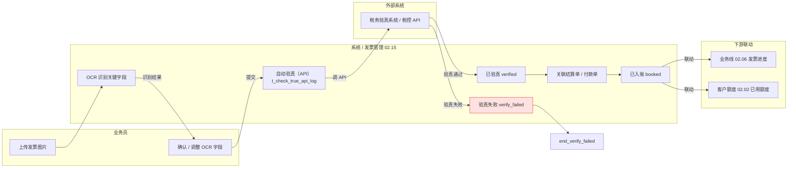
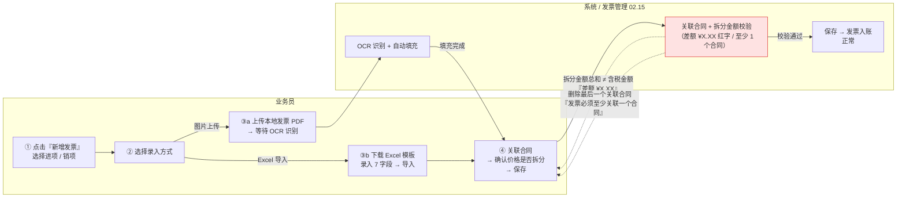
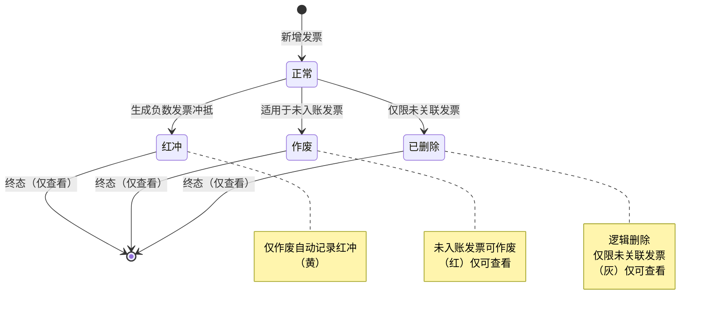
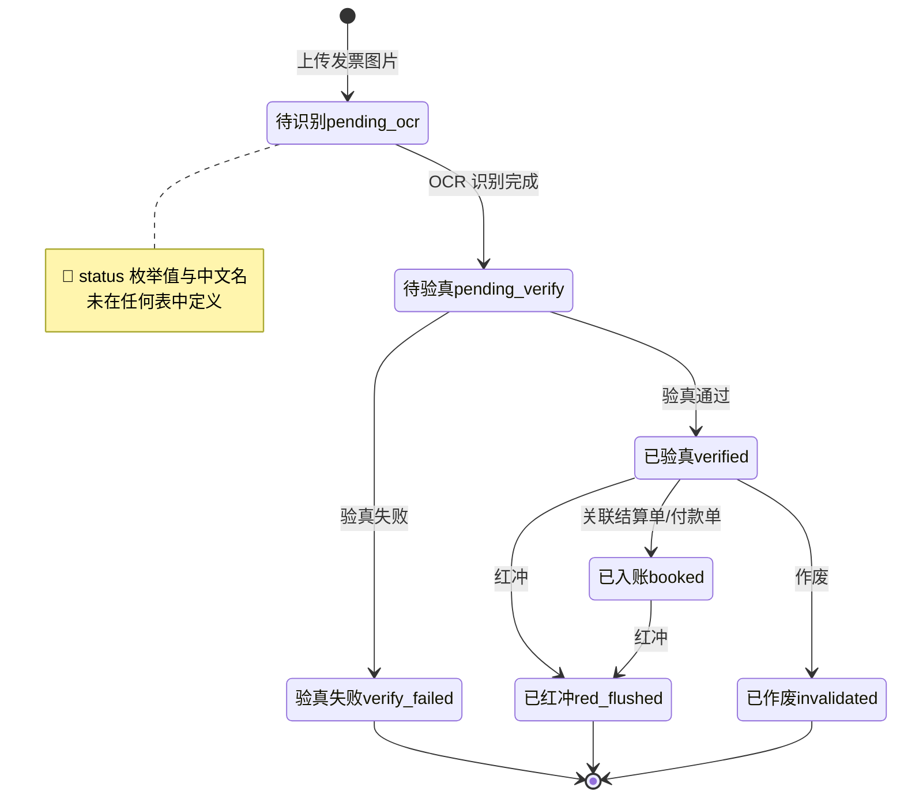
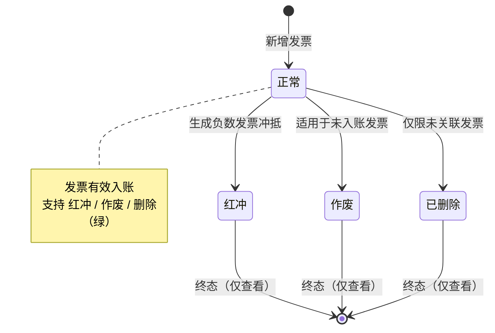
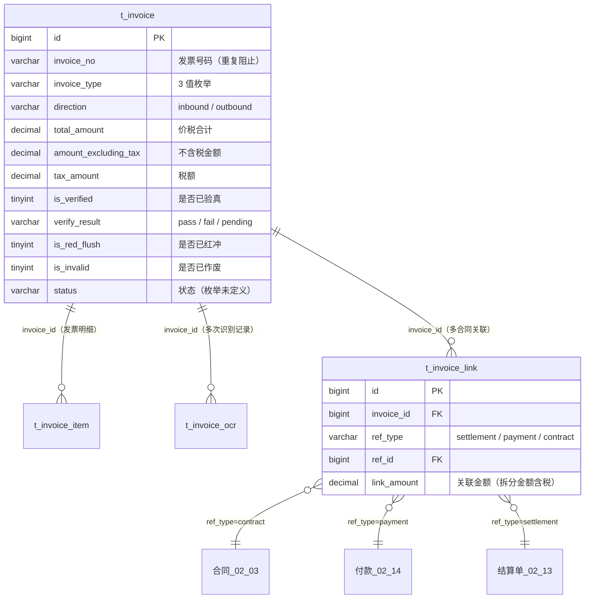

# 02.15 发票管理 · 需求规格说明

> **文档类型**：PRD Writer 范式 · 落地需求文档 · 功能详细描述
> **对应总纲**：[00-产品概述与需求总纲.md](./00-产品概述与需求总纲.md)
> **通用规范**：[01-通用交互与文案规范.md](./01-通用交互与文案规范.md)
> **源文档（只读，未做任何改动）**：[02.15-发票管理.md](../docs/02.15-发票管理.md)
> **整理时间**：2026-09-30

---

## 0. 阅读说明

### 0.1 信息溯源标记

| 标记 | 含义 | 使用规则 |
|------|------|---------|
| ✅ | 源文档已明确 | 原值保留（表名 / 字段名 / 状态枚举 / 编号规则 / 提示文案），不改写口径 |
| 🔷 | 范式补全 | 源文档没写，按范式要求推导，**必须注明推导依据** |
| ⚠️ | 源文档自相矛盾 | **绝不静默选边**，如实并列，交由业务方裁决 |
| 🔷 现状核验 ✅ | 本次整理对 `pages/` / `app.html` / `docs/` 做的**只读** grep / `ls` 核验（2026-09-30）| 结果为页面实现事实，**与源文档原值严格分离标注**，未修改任何文件 |
| [待补充] | 信息不足 | **严禁编造**，需业务方 / 研发回填 |

### 0.2 源文档阅读顺序

源文档 `02.15-发票管理.md`（**438 行 / 17,395 字节**）由**两代口径叠加**构成：**§1-§10 是 v1.0 终版口径**（2026-07-24，基于原型 55 截图，**仅进项发票**）、**§11 是 v1.7.99.x 模块级增量补充**（2026-09-24 追加，基于飞书《豫港通用户使用手册（内部版）》第 7.2 节）。两代口径在**页面数（1 vs 4）、业务范围（仅进项 vs 进销项分离）、状态机（7 状态 vs 4 状态）** 上存在根本性冲突（见 §3.4 C1-C12）。

| 源文档章节 | 内容 | 归位到本文档 |
|-----------|------|------------|
| 头部 + §0 章节导航 | 状态 v1.0 终版 / 复用度 90% / `t_invoice`+`t_invoice_item`+`t_invoice_ocr`+`bo_invoice`+`bo_invoice_comparison` 5+ 张表 | §1.1、§5.4、§6 |
| §1 业务定位 | 进/销项发票统一管理 + 4 条关键特点（v1.0 仅进项 / OCR 识别 / 验真 API）+ §1.1 1 个页面 sitemap | §1.1、§1.1.2、§6 |
| §2 业务流程全景 | §2.1 进项发票流程（上传 → OCR → 确认/调整 → 验真 → 关联 → 已入账 → 联动业务线）| §1.3.1 |
| §3 核心实体（4 张表）| `t_invoice` / `t_invoice_item` / `t_invoice_ocr` / `t_invoice_link` 逐字段 | §5.1、§5.2 |
| §4 状态机 | §4 状态机图（7 状态 stateDiagram-v2）+ §4.1「**5 状态说明**」表（**实列 7 行**）| §3.1.1、§3.2.1 |
| §5 字段规则 | 发票类型 / 进销项范围 / OCR 识别字段 / 验真 / 红冲 / 作废 | §3.2.1、§4.1、§5.2.6-5.2.10 |
| §6 按钮交互 | §6.1 进项发票列表 7 个按钮（可见条件原值）+ §6.2 列表字段 | §2.2 |
| §7 异常处理 | 6 条业务异常（含原文文案，**含 1 条 `X` 占位未填**）| §2.5、§4.1 |
| §8 跨模块流转 | §8.1 上游 2 条 / §8.2 下游 2 条 | §1.4.1 |
| §9 复用建议 | §9.1 复用度 90%（5 复用 + 0 新建）/ §9.2 6 张复用表 / §9.3 4 周实施 | §5.4 |
| §10 文档版本 + 修改记录 | v1.0 终版 + v1.7.99.x（2026-07-28）4 条全局规范 | §7.3 |
| **§11 v1.7.99.x 增量补充** | **11.1 业务变化（83 进销项分离 + 销项 14 列 + 84 详情 3 区块 + 编辑能力区分 + Excel 导入）/ 11.2 发票录入 4 步流程（手册 7.2）/ 11.3 发票 4 状态（正常/红冲/作废/删除 + 颜色 + OCR 失败处理）/ 11.4 进销项对比（84 关键决策：进项只读 vs 销项可编辑）/ 11.5 OCR 9 字段识别准确度 / 11.6 跨模块联动 5 行 / 11.7 异常补充 8 条 / 11.8 页面 PRD 索引 4 行 / 11.9 4 状态流程 + Excel 导入 7 字段必填表 / 11.10 修改记录 3 条** | **§1.1.3、§1.2.2、§1.3.2、§1.4.2、§2.1、§2.2.2、§2.3、§2.5.2、§3.1.2、§3.2.2、§4.1、§4.2、§5.2.11-5.2.13、§6、§7.3** |

> ⚠️ **源文档自身的结构问题（照实记录，不代为修正）**：
> 1. **§4.1 标题写「5 状态说明」，表内实列 7 行**（`pending_ocr` / `pending_verify` / `verified` / `verify_failed` / `booked` / `red_flushed` / `invalidated`）——见 C1。
> 2. **§1.1 标题写「1 个页面（sitemap）」，§11.1 / §11.8 却列 4 个页面**（进项 2 + 销项 2）——见 C2。
> 3. **§1 写「v1.0 范围：仅进项发票」「销项发票 02.15 v1.0 暂不写」，但 §11.1 记 v1.7.99.83 后进销项已分离**——见 C3。
> 4. **§7 异常表最后一行文案「发票已 X，不能再次操作」中 `X` 是未填的占位符**——见 C7。
> 5. **头部写「5+ 张表」，§9.2 列 6 张表，§9.1 写「复用主产品表 5 张 / 港通新建 0 张」**——见 C9。

> 🔴 **本文档附只读核验**：为判断「源文档口径 vs 页面实际实现」是否一致，整理时对 `pages/invoice*.html`、`app.html`、`docs/p-invoice*.md` 做了**只读** grep / `ls` 核验（2026-09-30），结果逐条标注为「**🔷 现状核验 ✅**」。**未修改 `docs/` 与 `pages/` 下任何文件。**

### 0.3 与通用规范的关系

**通用表单规范（校验时机 / 返回保护 / 提交行为 / 危险操作确认 / 空状态 / 失败引导 / 通用 UI 6 态 / 通用样式 / 脱敏规范）一律以 [01-通用交互与文案规范.md](./01-通用交互与文案规范.md) 为准，本文档不重复定义**，只写本模块特有的部分：

1. **发票录入 4 步流程**（选进项/销项 → 选「图片上传」或「Excel 导入」→ 填/识别 → 关联合同 + 确认拆分 + 保存）——**两条录入通道**是本模块最核心的交互特征。
2. **OCR 自动识别 9 字段 + 识别准确度高/中分级 + 失败降级手填**（「OCR 识别失败，请手动补录」）。
3. **进项只读 vs 销项可编辑**（v1.7.99.84 关键决策）——**进项详情页不提供任何业务变更按钮**。
4. **发票-合同多对多关联 + 拆分金额（含税）编辑 + 差额红字提示「差额 ¥X.XX」+ 至少关联一个合同**。
5. **税控 / 税务验真 API 对接**（`t_check_true_api_log`）与 `verify_result` 3 值。
6. **红冲 / 作废 / 删除 三种终态的单向操作与互斥规则**。
7. **Excel 导入模板 7 必填字段**（手册 7.2 权威口径）。

### 0.4 飞书用户手册补充（2026-10-08）

> ✅ **补充来源**：飞书《豫港通数字供应链管理平台 — 用户使用手册（内部版）》**rev.8976** 第 **7.2 节「发票管理」**。手册原文一律**照抄**（枚举名 / 字段名 / 公式 / 文案一字不改），**手册未提及的仍保留原有信息缺口标记，严禁编造**。
> ⚠️ **说明**：本文档 §11 增量节已基于手册 7.2 做过一轮沉淀，**本次为 rev.8976 逐字复核**，**消解残留缺口 + 补记手册原文措辞**，不重复已有内容。

| 手册小节 | 手册原文（照抄）| 归位到本文档 | 本次动作 |
|---------|---------------|------------|---------|
| **章节目标** | 「**进销项发票管理**」| §1.1 | ✅ **确认**「进销项」范围（v1.0「仅进项」已被手册覆盖，见 C3）|
| **发票录入 → 关联合同（OCR 识别 / 发票验证）第一步** | 「选择**进项或销项发票** → 点击**新增发票**按钮」| §1.2、§2.1 | ✅ **确认**进销项二选一为入口第一步 |
| **第二步** | 「点击**图片上传**或**Excel导入**」| §2.1、§2.3 | ✅ **确认 2 条录入通道** |
| **第三步（图片上传）** | 「如选择图片上传则**上传本地发票PDF等待识别**即可」| §2.1、§5.2.12 | ✅ **消解**「上传文件类型 = **PDF**」——⚠️ 见新增 C11 |
| **第三步（Excel 导入）** | 「如果选择Excel导入，则需**下载对应模版**录入」| §2.3 | ✅ **确认模板需下载**（手册未给模板字段 → 保留原有 §11.9 的 7 字段）|
| **第三步（录入字段）** | 「**发票代码 / 发票号码 / 开票日期 / 发票金额 / 报税合计 / 发票拆分金额（含税）/ 合同编号**」| §5.2.12 | ✅ **消解**「录入字段清单 = 7 项」+ ⚠️ **「报税合计」为手册新增字段** → 新增 **C12** |
| **第四步** | 「将发票**关联对应合同** → 确认**发票价格是否拆分** → **保存**即可」| §2.1 | ✅ **确认 3 步收尾** |
| **发票状态** | 「**发票状态（正常 / 红冲 / 作废/删除）**」| §3.2 | ✅ **确认 4 状态**（与 §11.3 一致）|
| **状态操作** | 「在发票上传后**可在列表页面操作冲红/作废/删除**」| §2.2 | ✅ **确认操作入口 = 列表页** |

### 0.5 手册带来的既有矛盾更新（本次新增）

| 矛盾编号 | 变化 | 说明 |
|---------|------|------|
| **C3**（仅进项 vs 进销项分离） | **追加 ✅ 手册口径** | ✅ 手册章节目标 = 「**进销项发票管理**」，**支持 v1.7.99.83 的进销项分离** |
| **C7**（`X` 占位未填） | **部分消解** | ✅ 手册给出 3 个终态名（**红冲 / 作废 / 删除**）与入口（**列表页**），但**未给该条提示原文**，占位问题仍在 |
| **C11** | **🆕 本次新增** | 上传文件类型：手册只说「**本地发票PDF**」，与文档「图片上传」表述及 OCR 场景是否只支持 PDF 待确认 |
| **C12** | **🆕 本次新增** | 「**报税合计**」是手册 7 个录入字段之一，源文档与本文档字段清单**均未收录** |

---

## 1. 功能描述与触发条件

### 1.1 功能描述

✅ **发票管理是港通供应链的进/销项发票统一管理**（源文档 §1 原文照抄）——**OCR 识别 + 验真 + 红冲 + 作废**。

✅ **3 条关键特点**（§1 原文照抄）：

| # | 特点 | 原文 | 出处 |
|---|------|------|------|
| 1 | **v1.0 范围** | **仅进项发票**（基于 55 截图 + sitemap「发票管理（无改动）」）；**销项发票 02.15 v1.0 暂不写** | §1 |
| 2 | **OCR 识别** | 上传发票图片**自动识别关键字段** | §1 |
| 3 | **验真 API** | **对接税务验真系统** | §1 |

#### 1.1.1 模块在资金闭环中的位置

> 🔷 **推导依据**：总纲 §模块清单记「**02.15 发票管理 · 资金闭环末端**」；02.14 §8.2 记「发票（02.15）· 付款完成 · 触发开票申请」；02.15 §8.1 记「结算单（02.13）`active` → 触发开票申请」「付款（02.14）付款完成 → 触发发票上传」。
> ⚠️ **两个上游动作不同（触发开票申请 vs 触发发票上传），且「进项发票由供应商开具、核心企业无法触发开票申请」的业务语义存疑** —— 详见 §1.4.3 与 C11（02.14 侧记录同源矛盾）。

#### 1.1.2 页面清单（§1.1 v1.0 sitemap 1 页 vs §11.1 / §11.8 的 4 页）

| # | 页面 | 归属 | 归属代次 | 出处 |
|---|------|------|---------|------|
| 1 | **进项发票**（列表 + 上传 + OCR）| 进项 | ✅ v1.0 | §1.1 |
| 2 | `invoice-detail.html` | 进项详情 | 🆕 v1.7.99.83/84 | §11.1 / §11.8 |
| 3 | `invoice-out.html` | 销项列表 | 🆕 v1.7.99.83 | §11.1 / §11.8 |
| 4 | `invoice-out-detail.html` | 销项详情 | 🆕 v1.7.99.84 | §11.1 / §11.8 |

> ⚠️ **§1.1「1 个页面」与 §11.1 / §11.8「4 个页面」冲突**；🔷 现状核验 ✅ `app.html:562-564` 的「发票管理」sub **只有 1 项**（进项发票 / `invoice`）——见 C2。

#### 1.1.3 复用度与表规模（头部 + §9.1）

| 项 | 源文档原值 | 出处 |
|----|-----------|------|
| 复用度 | **🟢 90%（几乎零改造）** | 头部 + §9.1 + §11 头部 |
| 主产品表 | `t_invoice` + `t_invoice_item` + `t_invoice_ocr` + `bo_invoice` + `bo_invoice_comparison` **5+ 张表** | 头部「复用度」行 |
| 核心实体 | **4 张表**（`t_invoice` / `t_invoice_item` / `t_invoice_ocr` / `t_invoice_link`）| §3 标题 |
| §9.1 分类 | 复用主产品表 **5 张** / 港通新建表 **0 张** | §9.1 |
| §9.2 实际列出 | **6 张表**（多 `t_check_true_api_log`）| §9.2 |

> ⚠️ **头部「5+ 张」/ §9.1「5 张」/ §9.2「6 张」/ §3「4 张」4 个口径**，且 §9.1 声称「港通新建 0 张」但 §3 的 4 张表**全部是 `t_` 前缀**（其余模块 `t_` 前缀 = 港通新建，`bo_` = 主产品复用）——见 C9。

#### 1.1.4 v1.7.99.x 口径（§11.1 模块业务变化表，2026-09-24，原值照抄）

| 维度 | v1.0 文档 | v1.7.99.84 现状 |
|------|----------|------------------|
| 页面结构 | 合并进销项发票 | **v1.7.99.83 后进销项分离**：进项 `invoice.html` / `invoice-detail.html` + 销项 `invoice-out.html` / `invoice-out-detail.html` |
| 列表列数 | 合并版本字段不全 | **v1.7.99.83 销项列表 14 列**：发票代码 / 发票号码 / 开票日期 / 销售方 / 购买方 / 不含税 / 税额 / 含税 / 价税合计 / 关联合同数 / 关联业务线 / 状态 / 是否含附件 / 操作 |
| 详情页 | v1.0 单区块 | **v1.7.99.84 3 区块**：发票与合同关联 + 发票附件 + 原发票 OCR 信息 |
| 编辑能力 | v1.0 不区分进销项 | **v1.7.99.84 区分**：**进项详情只读**，**销项详情支持重新上传 + 关联合同 + 拆分金额编辑** |
| 录入方式 | 未明确 | **手册 7.2 + v1.7.99.83**：**图片上传（OCR 自动识别）/ Excel 导入（下载模板）** |

### 1.2 触发条件

#### 1.2.1 v1.0 口径（§2.1 + §8，原值照抄）

| # | 触发条件 | 触发动作 | 出处 |
|---|---------|---------|------|
| 1 | **业务员上传发票图片** | 进入 OCR 识别流程 | §2.1 |
| 2 | **OCR 识别完成** | 自动填充表单字段，业务员确认/调整 | §2.1 / §5.3 |
| 3 | **自动验真（API）** | 通过 → `verified`；失败 → `verify_failed` | §2.1 / §5.4 |
| 4 | **关联结算单/付款单** | 状态 → `booked`（已入账） | §2.1 |
| 5 | **结算单（02.13）`active`** | **触发开票申请** | §8.1 |
| 6 | **付款（02.14）付款完成** | **触发发票上传** | §8.1 |

#### 1.2.2 v1.7.99.x 口径（§11.2 手册 7.2 4 步 + §11.6 + §11.7，原值照抄）

| # | 触发条件 | 触发动作 | 出处 |
|---|---------|---------|------|
| 1 | **第一步**：选择进项或销项发票 → 点击「新增发票」按钮 | 进入录入方式选择 | §11.2 |
| 2 | **第二步**：点击「图片上传」或「Excel 导入」 | 分叉进入两条录入通道 | §11.2 |
| 3 | **第三步 a**：图片上传 → 上传本地发票 **PDF** → 等待 OCR 识别 | OCR 识别关键字段 | §11.2 |
| 4 | **第三步 b**：Excel 导入 → **需下载对应模板**录入 7 字段 | 批量导入 | §11.2 / §11.9 |
| 5 | **第四步**：将发票关联对应合同 → 确认发票价格是否拆分 → 保存 | 保存入账 | §11.2 |
| 6 | 关联合同拆分金额 | 合同「**已开票金额** += 拆分金额」；**解除关联时 -= 拆分金额** | §11.6 |
| 7 | 销项发票关联的销售合同 → 回款认领时 | 检查「**已开票金额**」是否足够 | §11.6（回款 02.14）|
| 8 | 进项发票关联的采购合同 → 付款时 | 检查「**已开票金额**」是否足够 | §11.6（付款 02.14）|
| 9 | 发票已红冲 / 作废 | 顶部**橙色 bar** 提示「该发票已红冲/作废，无法修改关联合同和拆分金额」 | §11.7 |

> ⚠️ **§11.2 图片上传通道写「上传本地发票 **PDF**」，§11.7 写「重新上传文件类型不符 → 仅支持 **jpg/jpeg/png/pdf**」，§5.3 OCR 面向「发票**图片**」** —— 3 处对可接受文件类型的表述不一致 [待补充]。

### 1.3 业务流程（Mermaid）

#### 1.3.1 进项发票流程（v1.0 §2.1 原图照抄 + 🔷 泳道化）

> ✅ **节点文案原值照抄**（§2.1）：`业务员上传发票图片` / `OCR 识别关键字段` / `业务员确认/调整` / `自动验真（API）` / `已验真` / `验真失败` / `关联结算单/付款单` / `已入账` / `联动业务线发票进度`。
> 🔷 **泳道化推导依据**：§2.1 明确「业务员」为上传与确认主体、§5.4 明确验真对接税务 API、§8.2 明确下游 2 条（业务线 + 客户额度）。
> 🔴 **§8.2「客户额度（02.02）· 发票已入账 · 更新客户已用额度」在本图中以灰色虚线标注**：**v1.0 范围仅进项发票，而进项发票的购买方是港通供应链（付款方），不是客户（收款方）——进项发票影响供应商额度，不影响客户额度**。该联动的业务对象存疑，见 C5。
> ⚠️ **红冲 / 作废两条终态路径未画入本图** —— v1.0 §2.1 原图就没有，完整状态机见 §3.1.1。

#### 1.3.2 发票录入 4 步流程（§11.2 手册 7.2 权威口径，🔷 泳道化）

> ✅ **4 步文案原值照抄**（§11.2）。✅ **Excel 7 字段原值照抄**（§11.2 + §11.9）：发票代码 / 发票号码 / 开票日期 / 发票金额 / 报税合计 / 发票拆分金额（含税）/ 合同编号（**7 项全部「是」必填**，§11.9）。
> ✅ **2 条异常回退文案原值照抄**（§11.7）：「差额 ¥X.XX」（区块 1 顶部右侧红字）、「发票必须至少关联一个合同」（删除最后一个关联合同时）。
> ⚠️ **两条虚线为 §11.7 异常向录入流程的回退边**（源文档只给了异常表，未给流程边，本次按表意推导，依据为 §11.7 第 1-2 条）。

#### 1.3.3 发票 4 状态流转（§11.9 手册 7.2 权威口径，原值照抄）

> ✅ **4 状态流转原值照抄**（§11.9 原文代码块）：`新增发票 → 正常` / `正常 → 红冲` / `正常 → 作废（适用于未入账发票）` / `正常 → 已删除（仅限未关联发票）` / `红冲/作废/已删除 → 终态（仅查看）`。
> ⚠️ **「仅作废自动记录红冲」**（§11.3 红冲行「操作」列）——**语义歧义：是「红冲状态下只能通过『作废』操作产生红冲记录」，还是「系统作废时自动生成红冲记录」？源文档未澄清** [待补充]。
> ⚠️ **本图 4 状态与 v1.0 §4 的 7 状态是两套完全不同的状态机**（无一个状态名重合），见 C1。

### 1.4 模块依赖（跨模块流转）

#### 1.4.1 v1.0 口径（§8，原表照抄）

**上游触发**：

| 触发模块 | 触发条件 | 触发动作 |
|---------|---------|---------|
| 结算单（02.13）| 结算单 `active` | 触发开票申请 |
| 付款（02.14）| 付款完成 | 触发发票上传 |

**下游触发**：

| 触发模块 | 触发条件 | 触发动作 |
|---------|---------|---------|
| 业务线（02.06）| 发票已入账 | 更新业务线发票进度 |
| 客户额度（02.02）| 发票已入账 | 更新客户已用额度 |

#### 1.4.2 v1.7.99.x 口径（§11.6 跨模块联动，原表照抄）

| 联动系统 | v1.0 描述 | v1.7.99.x 增强 |
|----------|-----------|----------------|
| **合同管理（02.03）** | 文字提及 | 关联合同拆分金额 → 合同「**已开票金额 += 拆分金额**；**解除关联时 -= 拆分金额**」 |
| **回款管理（02.14）** | 未提及 | 销项发票关联的销售合同 → **回款认领时检查「已开票金额」是否足够** |
| **付款管理（02.14）** | 文字提及 | 进项发票关联的采购合同 → **付款时检查「已开票金额」是否足够** |
| **OCR / 税控 API** | 未提及 | v1.7.99.83+ 集成 **OCR 自动识别 + 税控 API 验真**（**v1.7.99.x 待集成**）|

> ⚠️ **§11.6「合同管理（02.03）」与 §8 上下游表完全不含合同** —— §11.6 却写「v1.0 描述 = **文字提及**」；**v1.0 §8.1 上游只有结算单 + 付款，§8.2 下游只有业务线 + 客户额度**。这是 §11.6 对 v1.0 的**误述** [待补充]。
> ⚠️ **§11.6 出现「回款管理（02.14）」与「付款管理（02.14）」两个条目指向同一模块** —— 🔷 `docs/02.14-资金管理.md` 是**资金管理**（含付款 / 退款 / 回款 / 费用 4 子模块），**两个叫法各对应一个子模块，此处写法正确**，但源文档未说明「回款认领时检查」对应 02.14 的哪个子模块。
> 🔴 **「合同『已开票金额』」字段名未给** —— 合同表（02.03）侧对应哪个字段、精度、是否含税，源文档未定义 [待补充]。
> 🔴 **「税控 API 验真」标注为「v1.7.99.x 待集成」** —— 与 v1.0 §5.4「对接税务验真 API（`t_check_true_api_log`）」的**已完成口径冲突**（v1.0 写已对接，§11.6 写待集成），见 C6。

#### 1.4.3 跨文档编号一致性核查（按任务要求专项核查）

> 🔴 **本节记录 `docs-v2/02.06-业务线管理.md` C9 记录的跨文档矛盾，在发票模块侧的对应情况。**

| 引用方 | 引用内容 | 编号 | 出处 |
|-------|---------|------|------|
| **本文档 §1.4.1 / §1.4.2** | **发票（02.15）** | **02.15** ✅ | §8.1 / §8.2 / §11.6 |
| 🔷 `docs/02.06-业务线管理.md` §9.2 下游触发 | 「发票（**02.09**）」| ❌ **02.09** | 02.06 §9.2 |
| 🔷 `docs/02.06-业务线管理.md` §11.6 跨模块联动 | 「发票（**02.15**）」| ✅ **02.15** | 02.06 §11.6 |
| 🔷 `docs/02.13-结算单管理.md` §9.2 / §13.4 | 「发票（**02.15**）」| ✅ **02.15** | 02.13 §9.2 |
| 🔷 `docs/02.14-资金管理.md` §8.2 | 「发票（**02.15**）」| ✅ **02.15** | 02.14 §8.2 |
| 🔷 `ls docs/` 实际文件 | `02.15-发票管理.md` | ✅ **02.15** | 2026-09-30 `ls` |

⚠️ **结论（交由业务方统一，本次不选边）**：**发票模块编号在跨文档引用中存在 `02.09` 与 `02.15` 两种写法**——`docs/02.06-业务线管理.md` §9.2 写作 `02.09`（该文档已在其 §3.4 C9 记录同一问题），**本文档与其余 3 份文档均写作 `02.15`，且 `docs/` 实际文件为 `02.15-发票管理.md`**。
⚠️ **同类问题**：`02.06` §9.2 还把「付款」写作 `02.08.1`（实际为 `02.14-资金管理.md`）。
📌 **本文档统一采用 `02.15`**，记录于 §7.1 **C4**。

---

## 2. 交互细节

### 2.1 角色操作矩阵（权限可见性）

> 🔴 **源文档 §4 只有「状态机」，全文没有角色操作矩阵** —— 下表为 🔷 范式补全，推导依据逐行标注。**所有角色名均取自项目既有 5 角色**（业务员 / 业务部 / 风控部 / 财务部 / 总经办，见 [总纲 §8.2 权限控制](./00-产品概述与需求总纲.md#82-权限控制)）。

| 操作 | 业务员 | 业务部 | 风控部 | 财务部 | 总经办 | 依据 |
|------|--------|--------|--------|--------|--------|------|
| **新增发票**（选进项/销项）| **✓** | - | - | - | - | 🔷 §6.1 按钮可见条件原文「**上传发票 · 右上 · 业务员**」 |
| **图片上传 + OCR** | **✓** | - | - | - | - | 🔷 §2.1 流程首节点「业务员上传发票图片」 |
| **Excel 导入（下载模板 + 导入）** | 🔷 **✓** | - | - | - | - | 🔷 §11.2 第三步 b（谁导入源文档未说，按上传发票同角色推导）|
| **确认 / 调整 OCR 字段** | **✓** | - | - | - | - | 🔷 §2.1「业务员确认/调整」+ §5.3「业务员可手动调整」 |
| **验真**（调 API）| ✅ 列表行按钮（`pending_verify` 可见）| 🔷 ✓ | 🔷 ✓ | 🔷 ✓ | - | ✅ §6.1「验真 · 列表行 · `pending_verify` · 调验真 API」；🔶 **§6.1 未给验真的角色可见条件**（只给状态条件）|
| **关联合同 + 拆分金额编辑** | 🔶 销项 ✓ / 进项 ❌ | - | - | - | - | ✅ §11.4「进项 ❌ 只读 / 销项 ✅ 支持重新上传 / 关联合同 / 拆分金额编辑」；✅ §11.4 关键决策「**进项发票不加业务变更按钮**——业务人员通过『上传进项发票』入口重新发起」|
| **重新上传** | 🔶 销项 ✓ / 进项 ❌ | - | - | - | - | ✅ §11.1「销项详情支持重新上传」+ §11.4 关键决策 |
| **红冲** | 🔶 列表行可见（`verified` / `booked`）| 🔷 ✓ | 🔷 ✓ | 🔷 ✓ | - | ✅ §6.1「红冲 · 列表行 · `verified`/`booked` · 弹红冲确认框」；🔶 **§6.1 未给红冲的角色可见条件** |
| **作废** | 🔶 列表行可见（`verified`）| 🔷 ✓ | 🔷 ✓ | 🔷 ✓ | - | ✅ §6.1「作废 · 列表行 · `verified` · 弹作废确认框」；🔶 同上 |
| **删除** | 🔴 [待补充] | 🔴 [待补充] | 🔴 [待补充] | 🔴 [待补充] | 🔴 [待补充] | 🔴 §11.3 状态表有「删除 · 逻辑删除（仅限未关联发票）」，但**无角色定义、无按钮定义** |
| **搜索 / 筛选** | ✅ ✓ | ✓ | ✓ | ✓ | ✓ | ✅ §6.1「搜索/筛选 · 顶部 · 所有」 |
| **数据导出** | ✅ ✓ | ✓ | ✓ | ✓ | ✓ | ✅ §6.1「数据导出 · Tab 右侧 · 所有 · 导出 Excel」 |
| **详情** | ✅ ✓ | ✓ | ✓ | ✓ | ✓ | ✅ §6.1「详情 · 列表行 · 所有 · 跳详情页」 |
| **查看** | ✓ | ✓ | ✓ | ✓ | ✓ | 🔷 依据 §6.1 三行「所有」 |

> 🔴 **本表 8 行为 🔷 推导**：源文档只给了 3 个「所有」可见条件的按钮（搜索/筛选、导出、详情）+ 1 个「业务员」可见条件的按钮（上传发票）+ 3 个只给状态条件不给角色条件的按钮（验真 / 红冲 / 作废），**红冲 / 作废 / 删除 3 个高危操作的执行角色完全无依据**。
> 🔴 **进项发票的「谁上传」在 v1.0 §2.1 是「业务员」，但业务上供应商开票后由谁上传，源文档未确认** [待补充]。

### 2.2 按钮交互（操作反馈）

#### 2.2.1 进项发票列表 7 个按钮（§6.1 原表照抄）

| 按钮 | 位置 | 可见条件 | 点击行为 |
|------|------|---------|---------|
| **上传发票** | 右上 | **业务员** | **弹上传对话框** |
| **搜索/筛选** | 顶部 | **所有** | **弹筛选抽屉** |
| **数据导出** | Tab 右侧 | **所有** | **导出 Excel** |
| **详情** | 列表行 | **所有** | **跳详情页** |
| **验真** | 列表行 | **`pending_verify`** | **调验真 API** |
| **红冲** | 列表行 | **`verified`/`booked`** | **弹红冲确认框** |
| **作废** | 列表行 | **`verified`** | **弹作废确认框** |

> ✅ **7 个按钮的名称 / 位置 / 可见条件 / 点击行为全部原值照抄**（§6.1）。
> ⚠️ **§6.1 的可见条件是 v1.0 的 7 状态枚举**（`pending_verify` / `verified` / `booked`），**与 §11.3 手册 4 状态（正常/红冲/作废/删除）无交集** —— 按钮可见条件需按最终状态机重写，见 C1。
> 🔴 **「新增发票」按钮（§11.2 第一步）在 §6.1 的 7 个按钮中不存在** —— §6.1 叫「上传发票」，§11.2 叫「新增发票」，**是两个按钮还是同一按钮改名，源文档未说明** [待补充]。

#### 2.2.2 列表字段（§6.2 原值照抄）

- **发票号码 / 发票代码 / 销售方 / 购买方 / 金额 / 税额 / 状态**
- **操作：详情 / 验真 / 红冲 / 作废**

#### 2.2.3 销项发票列表 14 列（§11.1，v1.7.99.83，原值照抄）

| # | 列 | # | 列 |
|---|----|---|----|
| 1 | 发票代码 | 8 | 价税合计 |
| 2 | 发票号码 | 9 | **关联合同数** |
| 3 | 开票日期 | 10 | **关联业务线** |
| 4 | 销售方 | 11 | 状态 |
| 5 | 购买方 | 12 | **是否含附件** |
| 6 | 不含税 | 13 | 操作 |
| 7 | 税额 | 14 | **含税** |

> ✅ **14 列原值照抄**（§11.1）。
> ⚠️ **§11.1 的 14 列清单**中「含税」列在原文中排在最后（第 14 项前），而「税额」在第 7 项——**列序以源文档列举顺序为准**，实际渲染顺序需与前端确认 [待补充]。
> 🔴 **进项发票列表的完整列名 / 列宽 / 筛选字段 / 排序，源文档 §6.2 只给了 7 个字段名**，**无列宽、无筛选、无排序** [待补充]。

#### 2.2.4 发票详情 3 区块（§11.1 v1.7.99.84，原值照抄）

| # | 区块 | 内容 | 依据 |
|---|------|------|------|
| 1 | **发票与合同关联** | 关联合同列表 + **拆分金额（含税）可编辑**（销项）+ 顶部右侧差额红字 | §11.1 / §11.7 |
| 2 | **发票附件** | 发票图片 / PDF | §11.1 |
| 3 | **原发票 OCR 信息** | 9 字段识别结果 + 识别准确度 | §11.1 / §11.5 |

> ⚠️ **「区块 1 顶部右侧红字『差额 ¥X.XX』」只在 §11.7 出现，未在 §11.1 的 3 区块描述中出现** —— 依据一致，位置按 §11.7 原文。

#### 2.2.5 OCR 自动识别 9 字段（§11.5，v1.7.99.84，原值照抄）

| 字段 | OCR 识别准确度 | 业务含义 |
|------|----------------|----------|
| 发票代码 | **高** | 增值税发票代码 |
| 发票号码 | **高** | 增值税发票号码 |
| 开票日期 | **高** | yyyy-MM-dd |
| 销售方 / 购买方名称 | **中** | **需业务核对** |
| 不含税金额 | **高** | 关键金额 |
| 税率 | **高** | **13% / 9% / 6% / 3%** |
| 税额 | **高** | **不含税 × 税率** |
| 含税金额 | **高** | **不含税 + 税额** |
| 价税合计（大写）| **中** | 中文数字 |

> ⚠️ **§5.3「必识别」列 8 项**（发票号码 / 代码 / 日期 / 销售方 / 购买方 / 金额 / 税额 / 税率）与 **§11.5 的 9 项**（多「含税金额」「价税合计（大写）」，少「销售方 / 购买方」合并为 1 行）——**必识别清单两处不一致** [待补充]。
> 🔴 **税率 4 值（13% / 9% / 6% / 3%）无对应枚举字段定义** —— `t_invoice.tax_rate` 是 `decimal(5,2)`，**是否限制只能取这 4 个值，源文档未说** [待补充]。

#### 2.2.6 Excel 导入 7 字段（§11.9 手册 7.2 权威口径，原值照抄）

| 字段 | 是否必填 | 与 `t_invoice` 字段映射 |
|------|---------|-------------------|
| 发票代码 | **是** | `invoice_code` |
| 发票号码 | **是** | `invoice_no` |
| 开票日期 | **是** | `invoice_date` |
| 发票金额 | **是** | ✅ **手册确认录入字段名为「发票金额」**；🔴 对应 `t_invoice` 的哪个字段（`total_amount` 价税合计 / `amount_excluding_tax` 不含税）**手册未给**，需研发确认 |
| **报税合计** | **是** | ✅ **手册 rev.8976 · 7.2 第三步确认为 7 个录入字段之一**；⚠️ 但 `t_invoice.total_amount` 中文标注是「**价税合计**」，与录入字段名「**报税合计**」**不同名**——**是否同一字段，手册未说明** |
| 发票拆分金额（含税）| **是（如有多合同拆分）** | `t_invoice_link.link_amount` |
| 合同编号 | **是** | `t_invoice_link.ref_id`（`ref_type = contract`）|

> ✅ **手册 rev.8976 · 7.2 第三步确认的 7 个录入字段（原文照抄，顺序不变）**：**发票代码 / 发票号码 / 开票日期 / 发票金额 / 报税合计 / 发票拆分金额（含税）/ 合同编号**。
> ⚠️ **残留缺口**：「报税合计」与 `t_invoice.total_amount`（价税合计）**是否同一字段，源文档与手册均未说明**；且**「发票金额」对应哪个 DDL 字段手册也未给**——需研发确认。
> 🔴 **Excel 模板文件本身未产出**（§11.2 只说「需下载对应模板」）—— 模板路径、列顺序、示例行、校验规则全部未给 [待补充]。

#### 2.2.7 进销项对比（§11.4 v1.7.99.83/84，原表照抄）

| 维度 | 进项发票（采购）| 销项发票（销售）|
|------|-----------------|------------------|
| 业务方向 | **供应商开给核心企业** | **核心企业开给客户** |
| 主动方 | **供应商** | **核心企业** |
| 详情页编辑能力 | **❌ 只读** | **✅ 支持重新上传 / 关联合同 / 拆分金额编辑** |
| 列表列「卖方/买方」| **卖方=供应商 / 买方=核心企业** | **卖方=核心企业 / 买方=下游客户** |
| 业务核心 | **索取发票（采购方）** | **开具发票（销售方）** |

**v1.7.99.84 关键决策**（✅ §11.4 原文）：

| # | 决策 | 原文 |
|---|------|------|
| 1 | **进项发票不加业务变更按钮** | 「v1.7.99.x 通用规则：详情页不直接做编辑」——业务人员通过「上传进项发票」入口重新发起 |
| 2 | **销项发票支持详情页编辑** | 因为销项是核心企业主动发起，编辑属于「修正开票」场景（业务真实存在）|

### 2.3 危险操作确认

> **通用确认弹窗规范以 [01-通用交互与文案规范.md](./01-通用交互与文案规范.md) §2.10 为准**（标题 / 描述 / 确定·取消 / 二次校验）。下表为本模块特有项。

| # | 操作 | 触发条件 | 确认要点 | 文案来源 | 依据 |
|---|------|---------|---------|---------|------|
| 1 | **红冲** | 状态 `verified` / `booked`（v1.0 口径）| **弹红冲确认框**；**红冲金额必须等于原金额** | 🔴 弹窗文案 [待补充]；✅ 拦截规则「红冲金额 X 不等于原金额 Y」| ✅ §6.1 + §7 |
| 2 | **作废** | 状态 `verified` | **弹作废确认框**；**仅未入账发票可作废** | 🔴 弹窗文案 [待补充]；✅ 规则 §11.3「作废 · 发票未入账作废（适用于未入账发票）」| ✅ §6.1 + §11.3 |
| 3 | **删除** | 状态 正常 | **逻辑删除，仅限未关联发票** | 🔴 **无弹窗定义** [待补充] | ✅ §11.3 + §11.7「删除已关联合同的发票 → 红字提示『该发票已关联合同，无法删除（可走作废）』」|
| 4 | **解除合同关联** | 销项详情页 | 合同「已开票金额 **-= 拆分金额**」，需二次确认 | 🔴 [待补充] | 🔶 依据 §11.6 联动规则 |
| 5 | **Excel 导入批量创建** | 导入前 | 建议预览校验结果再提交 | 🔴 [待补充] | 🔷 推导依据：§11.2「下载对应模板录入」→ 批量写入风险 |

> 🔴 **5 条中 4 条的弹窗文案源文档完全未给**（仅给出「弹红冲确认框」「弹作废确认框」两个动作名）[待补充]。

### 2.4 空状态引导

> 通用空状态规范（插画 / 灰字居中 / 引导按钮）以 [01-通用交互与文案规范.md](./01-通用交互与文案规范.md) §2.11 为准。

| 场景 | 建议文案 | 引导操作 | 依据 |
|------|---------|---------|------|
| 进项发票列表无数据 | 🔷 `暂无发票记录` | 🔷 「上传发票」 | 🔷 依据 §6.1「上传发票」按钮 |
| 销项发票列表无数据 | 🔷 `暂无销项发票` | 🔷 「新增发票」 | 🔷 依据 §11.2 第一步 |
| 筛选无结果 | 🔷 `请调整筛选条件` | 🔷 清除筛选 | 🔷 依据 §6.1「搜索/筛选」 |
| 详情页无附件 | 🔷 `暂无附件` | 🔶 销项可点「重新上传」 | 🔷 依据 §11.1 区块 2 + §11.1 编辑能力区分 |
| 详情页无关联合同 | ✅ **不适用** | ✅ **必须阻止** | ✅ §11.7「删除最后一个关联合同 → 红字提示『**发票必须至少关联一个合同**』」→ **至少 1 个合同是硬约束，不存在空态** |
| 详情页无 OCR 信息 | 🔷 `暂无 OCR 识别信息` | 🔷 重新上传 | 🔷 依据 §11.1 区块 3 + §11.5 OCR 失败处理 |

> ✅ **「发票必须至少关联一个合同」是硬约束**（§11.7 原文），**关联合同区不存在空状态**。
> 🔴 **源文档未给任何空状态文案** —— 上表 5 条为 🔷 推导占位。

### 2.5 失败引导

> 通用失败引导规范以 [01-通用交互与文案规范.md](./01-通用交互与文案规范.md) §2.12 为准。**下表提示文案 ✅ 源文档原值照抄**。

#### 2.5.1 v1.0 异常（§7 原表照抄，6 条）

| # | 异常场景 | 提示文案 | 处理动作 |
|---|---------|---------|---------|
| 1 | OCR 识别失败 | **"OCR 识别失败，请手动填写"** | **允许手动** |
| 2 | 验真 API 失败 | **"验真 API 调用失败，请稍后重试"** | **允许重试** |
| 3 | 验真失败 | **"发票验真失败：XXX"** | **阻止入账** |
| 4 | 重复发票 | **"发票号码 X 已存在"** | **阻止** |
| 5 | 红冲金额不一致 | **"红冲金额 X 不等于原金额 Y"** | **阻止** |
| 6 | 已红冲/作废发票再次操作 | ⚠️ **"发票已 X，不能再次操作"**（**`X` 为未填占位符**；✅ 手册确认取值域 = **红冲 / 作废 / 删除**，原文未给，见 C7）| **阻止** |

> ⚠️ **第 6 条的 `X` 是未填的占位符** —— 源文档未给具体文案（应为「发票已红冲」/「发票已作废」二选一或动态拼接），见 C7。

#### 2.5.2 v1.7.99.x 异常补充（§11.7 原表照抄，8 条）

| # | 场景 | v1.7.99.x 处理（原文照抄）|
|---|------|-----------------|
| 1 | **拆分金额总和 ≠ 含税金额** | 区块 1 顶部右侧红字提示**"差额 ¥X.XX"** |
| 2 | **删除最后一个关联合同** | 红字提示**"发票必须至少关联一个合同"** |
| 3 | **重新上传文件类型不符** | 红字提示**"仅支持 jpg/jpeg/png/pdf"** |
| 4 | **红冲已红冲/作废/已删除发票** | 红字提示**"该发票状态不支持红冲"** |
| 5 | **作废已红冲/作废/已删除发票** | 红字提示**"该发票已作废或已红冲"** |
| 6 | **删除已关联合同的发票** | 红字提示**"该发票已关联合同，无法删除（可走作废）"** |
| 7 | **同一发票并发操作** | 二次校验时被覆盖则提示**"已被其他操作覆盖，请刷新"** |
| 8 | **发票已红冲/作废尝试编辑关联合同** | 顶部**橙色 bar** 提示**"该发票已红冲/作废，无法修改关联合同和拆分金额"** |

> ⚠️ **§7 第 6 条「发票已 X，不能再次操作」与 §11.7 第 4/5 条「该发票状态不支持红冲」/「该发票已作废或已红冲」是同场景的两套文案**，且 v1.0 的判定依据是 `is_red_flush` / `is_invalid` 布尔字段，§11.7 的判定依据是「状态」——**两代口径的拦截对象不同**（v1.0 拦截「已红冲/作废」两个布尔态，§11.7 拦截「红冲/作废/已删除」3 个状态），见 C1。

---

## 3. 状态清单

### 3.1 业务状态机

#### 3.1.1 v1.0 状态机（§4 原图照抄，7 状态）

> ✅ **状态机图原值照抄**（§4，含全部 10 条边与 3 个终态）。
> ⚠️ **§4.1 表标题写「5 状态说明」，表内实列 7 行** —— 见 C1。
> 🔴 **`t_invoice.status` 是 `varchar(20)` 必填，但源文档从未把它定义成枚举** —— 状态机图中的 `pending_ocr` / `pending_verify` / `verified` / `verify_failed` / `booked` / `red_flushed` / `invalidated` **只在状态机图与 §4.1 表中作为标签出现，没有任何一处声明它们就是 `status` 的取值**。
> ⚠️ **`t_invoice` 同时有 `is_verified` / `verify_result` / `is_red_flush` / `is_invalid` 4 个布尔/枚举字段** —— 这 4 个字段与 7 状态的关系（是冗余、还是状态由 4 字段组合推导）**源文档未说明** [待补充]。

#### 3.1.2 手册 4 状态机（§11.9 原值照抄，v1.7.99.83/84）

> ✅ **4 状态与 4 条流转原值照抄**（§11.9 流程 + §11.3 状态表）。
> 🔴 **4 状态全部只有中文名，无英文枚举** —— 与 v1.0 的 7 状态英文枚举**无一个重合**，见 C1。
> ⚠️ **4 状态中「红冲」的出口只有终态，但 §11.3 记「红冲 · 操作 = 仅作废自动记录红冲」** —— 说明「作废」可从「红冲」态再次触发，**§11.9 流程未画这条边**，见 §1.3.3 图下注。

#### 3.1.3 两套状态机对照（🔷 供裁决参考）

| v1.0 §4（7 状态）| 手册 §11.3（4 状态）| 是否对应 |
|-------------------|---------------------|---------|
| `pending_ocr` 待识别 | — | 🔴 4 状态中**无对应**（新建发票直接「正常」）|
| `pending_verify` 待验真 | — | 🔴 **无对应** |
| `verified` 已验真 | **正常**（发票有效入账）| 🔶 语义相近，**但 v1.0 的「正常」态要求先验真通过，4 状态的「正常」态是「新增发票」直接进入** |
| `verify_failed` 验真失败 | — | 🔴 **无对应**（4 状态无「验真失败」态）|
| `booked` 已入账 | **正常** | 🔶 语义重叠（4 状态只有 1 个「正常」承载两个语义）|
| `red_flushed` 已红冲 | **红冲** | ✅ 语义对应 |
| `invalidated` 已作废 | **作废** | ✅ 语义对应 |
| — | **已删除** | 🔴 4 状态**独有**（v1.0 无删除态）|

> ⚠️ **两套状态机无一个枚举值重合，中文名只有 2 个语义对应**。**OCR 与验真这两个 v1.0 的核心能力，在手册 4 状态中没有对应状态** —— 4 状态下 OCR / 验真是「过程动作」还是「已隐含在『正常』之前」，源文档未说明，见 C1。

### 3.2 状态值与展示

#### 3.2.1 v1.0 状态（§4.1 表原值照抄，⚠️ 标题写「5 状态」实列 7 行）

| 枚举值 | 中文 | 触发条件 | 下一状态 | Tag 色 |
|--------|------|---------|---------|--------|
| `pending_ocr` | 待识别 | 上传图片 | OCR 完成 → `pending_verify` | 🔷 蓝 `#EFF6FF` / 文字 `#1E40AF` |
| `pending_verify` | 待验真 | OCR 完成 | 验真通过 → `verified` / 验真失败 → `verify_failed` | 🔷 蓝 `#EFF6FF` / 文字 `#1E40AF` |
| `verified` | 已验真 | 验真通过 | `booked` / `red_flushed` / `invalidated` | 🔷 绿 `#ECFDF5` / 文字 `#047857` |
| `verify_failed` | 验真失败 | 验真失败 | **终态** | 🔷 红 `#FEE2E2` / 文字 `#DC2626` |
| `booked` | 已入账 | 关联结算单/付款单 | `red_flushed` | 🔷 绿 `#ECFDF5` / 文字 `#047857` |
| `red_flushed` | 已红冲 | 红冲 | **终态** | 🔷 绿 `#ECFDF5` / 文字 `#047857` |
| `invalidated` | 已作废 | 作废 | **终态** | 🔷 红 `#FEE2E2` / 文字 `#DC2626` |

> ✅ **枚举值 + 中文 + 触发 + 出口全部原值照抄**（§4.1）。
> 🔷 **Tag 色推导依据**：[总纲 §7.8 状态标签配色](./00-产品概述与需求总纲.md#78-状态标签配色)（正常/生效→绿、进行中/待处理→蓝、驳回/异常→红、终态/作废→灰）。⚠️ **`red_flushed` 我按「已生效后的正常业务结果」取绿，若业务认为红冲应取黄（§11.3 明确红冲=黄），需按最终状态机统一**，见 C1。
> ⚠️ **7 个状态与 🔷 现状核验 ✅ 页面实现的 4 个状态（正常 / 红冲 / 作废 / 已删除）完全不同** —— 见 §3.4 现状核验表。

#### 3.2.2 手册 4 状态（§11.3 原值照抄，**含 v1.7.99.83 颜色规范**）

| 枚举值 | 中文 | 含义 | 可用操作 | Tag 色（✅ 原值）|
|--------|------|------|---------|----------------|
| 🔴 [待补充] | **正常** | 发票有效入账 | **支持红冲 / 作废 / 删除** | **绿**（`#10B981` / `#ECFDF5`）|
| 🔴 [待补充] | **红冲** | 生成负数发票冲抵 | **仅作废自动记录红冲** | **黄**（`#F59E0B` / `#FEF3C7`）|
| 🔴 [待补充] | **作废** | 发票未入账作废（适用于未入账发票）| **仅可查看** | **红**（`#DC2626` / `#FEE2E2`）|
| 🔴 [待补充] | **删除** | 逻辑删除（仅限未关联发票）| **仅可查看** | **灰**（`#6B7280` / `#F3F4F6`）|

> ✅ **4 状态中文名 + 含义 + 可用操作 + 4 组颜色码全部原值照抄**（§11.3，含 v1.7.99.14 全局 tag 颜色规范）。
> 🔴 **4 状态无英文枚举值** —— `t_invoice.status` 的 `varchar(20)` 无取值清单，见 C1。

#### 3.2.3 验真结果（§3.1 `verify_result`，✅ 3 值原值照抄）

| 枚举值 | 中文 | 触发条件 | 下一状态 | Tag 色 |
|--------|------|---------|---------|--------|
| `pass` | 验真通过 | 税控 / 税务 API 返回通过 | 状态 → `verified`（v1.0）| 🔷 绿 |
| `fail` | 验真失败 | API 返回不通过 | 状态 → `verify_failed`（v1.0），**阻止入账**（§7）| 🔷 红 |
| `pending` | 待验真 | 待调 API | `pass` / `fail` | 🔷 蓝 |

> ✅ **3 枚举原值照抄**（§3.1）。⚠️ **v1.0 状态机的 `pending_verify` 状态与 `verify_result = pending` 是两个层级**（一个是单据状态，一个是验真字段值），**两者的同步关系未定义** [待补充]。

#### 3.2.4 🔷 现状核验 ✅ 页面实际状态（2026-09-30 只读核验，**与源文档原值严格分离**）

| 页面 | 实际渲染的状态标签 | 依据 |
|------|----------------|------|
| `pages/invoice.html`（进项）| **正常 / 红冲 / 作废 / 已删除**（4 个）| `grep -oE` 核验 |
| `pages/invoice-out.html`（销项）| **正常 / 红冲 / 作废 / 已删除**（4 个）| `grep -oE` 核验 |

> ✅ **页面实现与 §11.3 手册 4 状态完全一致**，与 v1.0 §4 的 7 状态**完全不同**。
> 📌 **此核验结果不覆盖源文档原值**，仅作为裁决参考记录于 C1。

#### 3.2.5 进销项方向（§3.1 `direction`，✅ 2 值原值照抄）

| 枚举值 | 中文 | v1.0 范围 | Tag 色 |
|--------|------|----------|--------|
| `inbound` | 进项 | ✅ **v1.0 仅此一种** | 🔷 蓝 |
| `outbound` | 销项 | ⚠️ **v1.0 暂不写**；v1.7.99.83 后已实现 | 🔷 绿 |

> ✅ 2 枚举原值照抄（§3.1 / §5.2）。⚠️ **v1.0 范围声明与 v1.7.99.x 实现冲突**，见 C3。

#### 3.2.6 发票类型（§3.1 `invoice_type`，✅ 3 值原值照抄）

| 枚举值 | 中文 | 备注 |
|--------|------|------|
| `vat_special` | 增值税专用 | §11.5 OCR 识别的税率 13% / 9% / 6% / 3% 主要对应专票 |
| `vat_general` | 增值税普通 | — |
| `electronic` | 电子发票 | — |

> ✅ 3 枚举原值照抄（§3.1 / §5.1）。

### 3.3 UI 状态清单

> 通用 6 态以 [01-通用交互与文案规范.md](./01-通用交互与文案规范.md) §3.2 为准；下表为**本模块（进项发票列表 / 进项详情 / 销项列表 / 销项详情 / 上传对话框 / Excel 导入 / OCR 结果表单 / 红冲确认框 / 作废确认框 / 删除确认框）**的落地映射。**6 态齐全：默认 / 加载中 / 成功 / 失败 / 禁用 / 空状态**。

| 状态 | 触发 | 视觉 | 可交互 |
|------|------|------|-------|
| **默认** | 页面加载完成 | 进项列表页：Tab + 列表（**发票号码 / 发票代码 / 销售方 / 购买方 / 金额 / 税额 / 状态**，§6.2）+ **右上「上传发票」**（§6.1）+ **Tab 右侧「数据导出」**（§6.1）+ 顶部「搜索/筛选」（§6.1）+ 行操作「详情 / 验真 / 红冲 / 作废」（§6.1）；详情页 **3 区块**（发票与合同关联 / 发票附件 / 原发票 OCR 信息，§11.1）| ✅ 全部按钮按 §2.2.1 可见条件显隐 |
| **加载中** | 提交中 / **OCR 识别中** / 税控验真 API 调用中 / 附件上传中 / Excel 导入解析中 | 按钮 loading + 旋转图标 + 禁用 🔷；**OCR 识别中区块遮罩 + 进度提示** 🔷；**验真中按钮 loading** 🔷 | ❌ 禁用重复提交 |
| **成功** | 发票保存成功 / OCR 识别完成 / 验真通过 / 关联合同保存成功 / 红冲成功 / 作废成功 / 删除成功 / Excel 导入成功 | 顶部居中 Toast；🔴 **源文档未给任何成功 Toast 文案** [待补充]；🔶 列表刷新 | — |
| **失败** | §7 的 6 条 + §11.7 的 8 条（共 14 条，见 §2.5）| Toast 红色 🔷；**红字内联**（§11.7 第 1-6 条）；**顶部橙色 bar**（§11.7 第 8 条「该发票已红冲/作废，无法修改关联合同和拆分金额」）；**红字「差额 ¥X.XX」置于区块 1 顶部右侧** | ✅ 按钮恢复可点 |
| **禁用** | ① **进项详情页全部业务变更按钮** → **不渲染**（§11.4 关键决策「进项发票不加业务变更按钮」）；② **红冲** 仅 `verified`/`booked` 可见（v1.0 口径）；③ **作废** 仅 `verified` 可见（v1.0 口径）；④ **红冲/作废/已删除 3 个状态的操作** → **仅可查看**（§11.3）；⑤ **保证金冲抵式只读**（本模块无）；⑥ 关联合同为空时保存 | 操作列按钮**不渲染**；详情页进项无编辑控件 | ❌ |
| **空状态** | 发票列表无数据 / 筛选无结果 / 详情页无附件 / 详情页无 OCR 信息 / 关联合同区为空（**❌ 不允许，见「至少关联一个合同」硬约束**）| 空状态插画 + 灰字居中（🔷 `.empty-row { padding: 40px 0; color: var(--text-tertiary); }`，01 文档 §2.11）；文案见 §2.4（🔷 推导占位）| ✅ 引导操作（上传发票 / 新增发票 / 清除筛选 / 重新上传）|

**🔷 本模块特有的 UI 状态补充**（依据逐条标注）：

| 状态 | 触发 | 视觉 | 可交互 | 依据 |
|------|-----|------|-------|------|
| **OCR 识别结果表单态** | 图片上传后 | OCR 9 字段**自动填充**到表单，业务员可手动调整 | ✅ 可调整 | ✅ §2.1 / §5.3 / §11.5 |
| **OCR 失败降级手填态** | OCR 识别失败 | 区块 3 提示「**OCR 识别失败，请手动补录**」 | ✅ 手动录入 | ✅ §11.5 注 |
| **OCR 准确度「中」标记态** | 销售方 / 购买方名称 / 价税合计（大写）| **准确度「中」+「需业务核对」** | ✅ 必核对 | ✅ §11.5 |
| **进项只读态** | 进项详情页 | **无任何业务变更按钮** | ❌ 只读 | ✅ §11.4 关键决策 |
| **销项可编辑态** | 销项详情页 | **重新上传 + 关联合同 + 拆分金额编辑** | ✅ | ✅ §11.4 关键决策 |
| **附件类型校验态** | 重新上传 | 红字「**仅支持 jpg/jpeg/png/pdf**」 | ❌ 阻止上传 | ✅ §11.7 |
| **差额红字态** | 拆分金额总和 ≠ 含税金额 | **区块 1 顶部右侧红字「差额 ¥X.XX」** | ❌ 阻止保存 | ✅ §11.7 |
| **至少 1 合同红字态** | 删除最后一个关联合同 | 红字「**发票必须至少关联一个合同**」 | ❌ 阻止删除 | ✅ §11.7 |
| **红冲 / 作废确认框态** | 点击红冲 / 作废 | **弹确认框**（🔴 文案 [待补充]）| ✅ 确认 / 取消 | ✅ §6.1 |
| **删除拦截红字态** | 删除已关联合同的发票 | 红字「**该发票已关联合同，无法删除（可走作废）**」 | ❌ 阻止 | ✅ §11.7 |
| **并发覆盖提示态** | 同一发票并发操作 | 提示「**已被其他操作覆盖，请刷新**」 | ✅ 刷新 | ✅ §11.7 |
| **终态橙色 bar 态** | 已红冲/作废的发票尝试编辑 | 顶部**橙色 bar**「该发票已红冲/作废，无法修改关联合同和拆分金额」 | ❌ 禁止编辑 | ✅ §11.7 |
| **销项 14 列 + 「是否含附件」列态** | 销项列表 | 14 列（含**关联合同数** / **关联业务线** / **是否含附件**）| ✅ | ✅ §11.1 |
| **Excel 模板下载态** | 选择「Excel 导入」 | 「**下载对应模板**」按钮 | ✅ 下载 | ✅ §11.2 |

### 3.4 版本冲突

> ⚠️ 以下 **C1-C12** 为源文档内部交叉比对（v1.0 / v1.7.99.x 两代口径）+ 跨文档编号核查 + `app.html` / `pages/` 只读核验后确认的自相矛盾，本次重组**未选边**，全部如实并列，交由业务方裁决。**每条 C 在 §7.1 表格中逐条对应，编号一致。**

**C1 — 状态机两套并存 + 「5 状态说明」实列 7 行 + 4 状态无英文枚举（🔴 阻塞核心）**

**（1）两套状态机**：

| 口径 | 状态清单 | 状态数 | 枚举值 | 出处 |
|------|---------|-------|--------|------|
| **v1.0 §4 状态机图 + §4.1 表** | 待识别 / 待验真 / 已验真 / 验真失败 / 已入账 / 已红冲 / 已作废 | **7** | ✅ 有（`pending_ocr` / `pending_verify` / `verified` / `verify_failed` / `booked` / `red_flushed` / `invalidated`）| §4 |
| **§4.1 标题** | 写「**5 状态说明**」| **5** | — | §4.1 标题 |
| **手册 §11.3 + §11.9** | 正常 / 红冲 / 作废 / 删除 | **4** | 🔴 **无英文枚举** | §11.3 / §11.9 |
| **🔷 现状核验 ✅ 页面实现** | 正常 / 红冲 / 作废 / 已删除 | **4** | 🔴 未给 | `invoice.html` / `invoice-out.html` |

⚠️ **冲突**：
1. **两套状态机无一个枚举值重合**；只有「红冲 / 已红冲」「作废 / 已作废」2 个中文语义对应
2. **v1.0 的 OCR（`pending_ocr`）与验真（`pending_verify` / `verify_failed`）三个状态在 4 状态中完全消失** —— 而 §1 明确把「OCR 识别 + 验真 API」列为模块的 2 大核心能力
3. **4 状态的「删除」在 v1.0 中不存在**
4. **§4.1 标题写 5、实列 7** ——「5」从哪来从未说明
5. 🔴 **`t_invoice.status` 的枚举值在两代口径下都没有合法定义**（v1.0 只在状态机图给标签、手册只给中文名）
6. ⚠️ **Tag 色冲突**：§11.3 明确「红冲 = 黄」，而 §3.2.1 若沿用 v1.0 色板则「已红冲」应取何色未定

**影响：`t_invoice.status` DDL 枚举、列表 tab 数量、状态 badge 数量、§6.1 全部 3 个状态相关按钮的可见条件（`pending_verify` / `verified` / `booked`）**、**详情页编辑能力判定、PRD 与实现对齐。**

**C2 — 页面数 1 vs 4 vs 🔷 现状 1（且 4 个页面的进销项归属不一致）**

| 口径 | 页面数 | 明细 | 出处 |
|------|-------|------|------|
| **§1.1 sitemap** | **1** | 进项发票（列表 + 上传 + OCR）| §1.1 |
| **§11.1 业务变化** | **4** | 进项 `invoice.html` / `invoice-detail.html` + 销项 `invoice-out.html` / `invoice-out-detail.html` | §11.1 |
| **§11.8 PRD 索引** | **4** | 同上 | §11.8 |
| **🔷 现状核验 ✅ `app.html:562-564`** | **1** | 「发票管理」sub **只有 1 项**：进项发票 / `invoice` | `app.html:562-564` |

⚠️ **冲突**：
1. **§1.1「1 个页面」与 §11.1 / §11.8「4 个页面」冲突**
2. 🔷 **4 个页面的页面文件全部存在**（`invoice.html` 19,571 B / `invoice-detail.html` 15,220 B / `invoice-out.html` 19,496 B / `invoice-out-detail.html` 29,559 B），**但只有 `invoice.html` 进了 `app.html` 菜单**——**3 个页面（进项详情 + 销项列表 + 销项详情）无法从导航进入**
3. 🔴 **`invoice-detail.html` 是进项还是销项的详情页，源文档 §11.1 / §11.8 表述含混**（「进项 `invoice.html` / `invoice-detail.html`」与「`invoice.html` = 进项、`invoice-out-detail.html` = 销项详情」两种读法都成立）
4. 🔴 **§1 写「v1.0 范围仅进项」，但 §11.8 的 4 行索引中 2 行是销项页面** —— 源文档未声明 v1.0 sitemap 是否需要更新

**影响：sitemap 冻结、菜单结构、页面 PRD 索引、演示范围、测试用例数量。**

**C3 — 业务范围：v1.0「仅进项、销项暂不写」vs v1.7.99.83「进销项分离」**

| 口径 | 范围 | 出处 |
|------|------|------|
| **§1 关键特点 1** | 「**v1.0 范围：仅进项发票**（基于 55 截图 + sitemap『发票管理（无改动）』）；**销项发票 02.15 v1.0 暂不写**」| §1 |
| **§5.2** | 「v1.0 **仅 `inbound`（进项）**；销项 `outbound` **v1.0 暂不写**」| §5.2 |
| **§11.1** | 「**v1.7.99.83 后进销项分离**：进项 `invoice.html` / `invoice-detail.html` + 销项 `invoice-out.html` / `invoice-out-detail.html`」| §11.1 |
| **§11.4** | 完整对比进项 vs 销项（含「销项支持详情页编辑」）| §11.4 |
| **§3.1 `direction`** | ✅ 枚举已含 `outbound`（销项）| §3.1 |

⚠️ **冲突**：**销项发票从 v1.0 的「暂不写」变成 v1.7.99.83 的「已实现 + 14 列列表 + 可编辑详情」** —— 但 §1 与 §5.2 的「仅进项」声明**从未被修订**，导致本文档读者会按「仅进项」理解模块范围。
**影响：模块定位、需求基线版本、`direction` 字段的实际取值范围、§2.1 角色矩阵（进项上传方 vs 销项开具方）。**

**C4 — 模块编号跨文档不一致：`02.09` vs `02.15`（🟢 文档维护，但需统一）**

| 引用方 | 编号 | 出处 |
|-------|------|------|
| **本文档 / 02.13 / 02.14 / 02.06 §11.6** | **02.15** ✅ | §8.1 / §8.2 / §11.6 |
| 🔷 `docs/02.06-业务线管理.md` §9.2 下游触发 | 「发票（**02.09**）」❌ | 02.06 §9.2（该文档已在其 §3.4 C9 记录同一问题）|
| 🔷 `ls docs/` 实际文件 | `02.15-发票管理.md` ✅ | 2026-09-30 `ls` |

⚠️ **冲突**：**跨文档引用存在 `02.09` 与 `02.15` 两种写法**（同源问题另见 02.06 §9.2 把「付款」写作 `02.08.1`，实际为 `02.14-资金管理.md`）。
📌 **本文档统一采用 `02.15`**（见 §1.4.3 专项核查表）。
**影响：文档间引用可追溯性（🟢 不阻塞开发）。**

**C5 — 「发票已入账 → 更新客户额度（02.02）」与 v1.0「仅进项发票」的业务对象冲突**

| 口径 | 内容 | 出处 |
|------|------|------|
| **§8.2 下游触发** | 「客户额度（02.02）· **发票已入账** · **更新客户已用额度**」| §8.2 |
| **§1 关键特点 1** | 「v1.0 范围：**仅进项发票**」| §1 |
| **§11.4 业务方向** | 进项 = **供应商开给核心企业**（买方是核心企业）| §11.4 |
| **§11.6 跨模块联动** | 客户额度联动**完全未出现**（只有合同 / 回款 / 付款 / OCR 税控 4 条）| §11.6 |

⚠️ **冲突**：
1. **进项发票的购买方是核心企业，供应商才是被付款方** —— 「更新**客户**已用额度」在仅进项范围内**业务对象不成立**
2. **§11.6 的 v1.7.99.x 联动表里客户额度这条消失了** —— 源文档未说明是否废弃
**影响：下游联动清单、02.02 客户额度模块的取数逻辑、跨模块接口。**

**C6 — 验真集成状态：v1.0「已对接」vs §11.6「v1.7.99.x 待集成」**

| 口径 | 内容 | 出处 |
|------|------|------|
| **§1 关键特点 3** | 「**验真 API**：对接税务验真系统」（陈述为已完成）| §1 |
| **§5.4** | 「**对接税务验真 API（`t_check_true_api_log`）**」；验真通过 → `verified`；失败 → `verify_failed` | §5.4 |
| **§9.2 复用表** | `t_check_true_api_log` **验真 API 日志**（列为**已复用**的主产品表）| §9.2 |
| **§11.6** | 「OCR / 税控 API · 未提及 · v1.7.99.83+ 集成 OCR 自动识别 + 税控 API 验真（**v1.7.99.x 待集成**）」| §11.6 |

⚠️ **冲突**：**验真 / OCR 在 v1.0 是「已对接的能力」，在 §11.6 是「待集成」** —— 是 v1.0 的设计稿口径（设计时假设已对接）还是真的已上线，源文档未说明。
**影响：实施排期、`t_check_true_api_log` 是否需要新建、§2 流程图第 4 步是否为阻塞路径。**

**C7 — §7 异常文案含未填占位符 `X`**

| 位置 | 文案 | 问题 |
|------|------|------|
| **§7 第 6 行** | **"发票已 X，不能再次操作"** | 🔴 **`X` 是未填的占位符** —— ✅ **手册 rev.8976 确认取值域 = 红冲 / 作废 / 删除 3 个终态**（发票状态枚举 = 正常 / 红冲 / 作废 / 删除），但**手册未给原文措辞，静态三选一 vs 动态拼接仍未定** |
| **§11.7 第 4/5/6 条** | 「该发票状态不支持红冲」/「该发票已作废或已红冲」/「该发票已关联合同，无法删除（可走作废）」| ✅ 已给完整文案 |

⚠️ **冲突**：**v1.0 与 v1.7.99.x 是同场景的两套文案**；且 v1.0 判定依据是 `is_red_flush` / `is_invalid` **2 个布尔字段**，§11.7 判定依据是「红冲 / 作废 / 已删除」**3 个状态** —— **拦截对象不同**（见 C1）。
**影响：提示文案统一、拦截条件实现。**

✅ **手册部分消解（rev.8976 · 7.2，2026-10-08 补入）**：手册给出**发票状态枚举 = 正常 / 红冲 / 作废 / 删除（4 个）**（原文照抄），并明确**「在发票上传后可在列表页面操作冲红/作废/删除」**——即 **`X` 的取值域应收敛为「红冲 / 作废 / 删除」3 个终态之一**。⚠️ 但**手册未给该条提示的原文措辞**，`X` 的**具体填法（静态三选一 vs 动态拼接）仍未定**，占位问题部分消解、**仍需业务方补齐原文**。

**C8 — 红冲 / 删除 3 个终态缺少落库字段**

| 能力 | 源文档依据 | 缺失的字段 |
|------|-----------|-----------|
| **红冲** | ✅ §11.3「红冲 · 生成负数发票冲抵」；§5.5「红冲后状态→`red_flushed`，**关联结算单/付款单可反向调整**」；§7「红冲金额 X 不等于原金额 Y」→ **必须阻止** | 🔴 `t_invoice` **无红冲发票号 / 红冲金额 / 红冲时间字段**；`is_red_flush` 只是 tinyint 布尔标记。**「负数发票」是新发票还是同一张发票？「红冲金额」存哪？** |
| **删除** | ✅ §11.3「删除 · **逻辑删除**（仅限未关联发票）」；§11.9「正常 → 已删除（仅限未关联发票）」| 🔴 `t_invoice` **无 `is_deleted` / `deleted_at` / `deleted_by` 字段** —— **「逻辑删除」在表结构中无落库字段** |
| **作废** | ✅ §11.3 / §5.6 | ✅ `is_invalid` tinyint 已有；🔴 **无作废时间 / 作废人** |

⚠️ **冲突**：`t_invoice` 的 21 个字段**无法承载 §11.3 的 4 状态**（尤其「删除」的逻辑删除与「红冲」的负数发票）。
**影响：DDL 补字段、红冲流程实现、删除的数据保留策略、历史数据追溯。**

**C9 — 表数量 4 个口径（头部 5+ / §3 四张 / §9.1 5+0 / §9.2 六张）**

| 口径 | 数量 | 明细 | 出处 |
|------|------|------|------|
| **头部「复用度」行** | **5+ 张** | `t_invoice` + `t_invoice_item` + `t_invoice_ocr` + `bo_invoice` + `bo_invoice_comparison` | 头部 |
| **§3 标题** | **4 张** | `t_invoice` / `t_invoice_item` / `t_invoice_ocr` / `t_invoice_link` | §3 |
| **§9.1 复用度表** | **5 张** | 复用主产品表 5 张 / 港通新建 0 张 | §9.1 |
| **§9.2 实际列出** | **6 张** | 上述 5 张 + `t_check_true_api_log` 验真 API 日志 | §9.2 |

⚠️ **冲突**：
1. **§3 的 4 张表与 §9.2 的 6 张表只有 3 张重合** —— §3 有 `t_invoice_link`（§9.2 无）、§9.2 有 `bo_invoice` / `bo_invoice_comparison` / `t_check_true_api_log`（§3 无）
2. **§9.1 声称「港通新建 0 张」，但 §3 的 4 张表全部是 `t_` 前缀**（项目约定 `t_` = 港通新建、`bo_` = 主产品复用，见 [02.14 §5.4](./02.14-资金管理.md)）—— **`t_invoice` 系列到底是复用主产品表还是港通新建？**
**影响：DDL 清单、复用 vs 新建边界、4 周实施排期。**

**C10 — §11.6 对 v1.0 的 2 处误述 + 合同联动为「新增」而非「已记录」**

| 联动项 | §11.6 声称的 v1.0 描述 | v1.0 实际（§8 上下游表）|
|--------|--------------------|---------------------|
| **合同管理（02.03）** | 「**文字提及**」| 🔴 **§8.1 上游只有结算单 + 付款，§8.2 下游只有业务线 + 客户额度——合同完全未出现** |
| **付款管理（02.14）** | 「**文字提及**」| ✅ §8.1 有「付款（02.14）· 付款完成 · 触发发票上传」—— **这一条是准确的** |
| **客户额度（02.02）** | 🔴 **未列出**（被删除）| ✅ §8.2 有「客户额度（02.02）· 发票已入账 · 更新客户已用额度」—— **§11.6 漏了 v1.0 已有的这条**（见 C5）|

⚠️ **冲突**：**§11.6 的「v1.0 描述」列有 1 处凭空声称（合同）+ 1 处漏记（客户额度）**。
**影响：§1.4 联动清单的完整性、跨模块接口清单。**

**C11 — 上传文件类型：手册只说「本地发票PDF」vs 通道名「图片上传」（🟡 影响上传控件与 OCR 入口）** ← **2026-10-08 手册补充新增**

| 口径 | 表述 | 出处 |
|------|------|------|
| ✅ **手册 rev.8976 · 7.2 第三步** | 「如选择**图片上传**则上传**本地发票PDF**等待识别即可」 | ✅ 手册 7.2 |
| **本文档 §0.3 / §11.2** | 通道名为「**图片上传**」，OCR 面向**铁路运单 / 确认单 / 提货单类凭证**（02.07 口径） | §11.2 |

⚠️ **冲突 / 待确认**：**手册在同一句话里既叫「图片上传」又要求传 PDF**——①「图片上传」是否指**上传扫描件图片**（jpg/png）而非 PDF？② 若只支持 PDF，则通道名「图片上传」**名实不符**；③ PDF 是否属于 OCR 可识别格式（PDF 需先转图）**手册未说明**。

**影响：上传控件的 `accept` 取值、OCR 前置的 PDF→图片转换链路、错误提示文案。**

**C12 — 「报税合计」是手册 7 个录入字段之一，但本文档 DDL 无对应字段（🟡 阻塞 Excel 导入映射）** ← **2026-10-08 手册补充新增**

| 口径 | 字段清单 | 出处 |
|------|---------|------|
| ✅ **手册 rev.8976 · 7.2 第三步** | **发票代码 / 发票号码 / 开票日期 / 发票金额 / 报税合计 / 发票拆分金额（含税）/ 合同编号**（7 项）| ✅ 手册 7.2 |
| **本文档 `t_invoice` DDL** | 有 `total_amount`（中文「**价税合计**」）/ `amount_excluding_tax`（不含税）——**无「报税合计」字段** | §5.2 |

⚠️ **冲突 / 待确认**：「**报税合计**」与 `total_amount`（价税合计）**是否同一字段的两个名字，还是两个独立字段**（报税合计 ≠ 价税合计）——**源文档与手册均未说明**。若为两个字段，则 `t_invoice` **缺 1 个 DDL 列**，Excel 导入映射也缺 1 行。

**影响：`t_invoice` DDL 是否需新增「报税合计」列、Excel 模板 7 列的落库映射、发票金额 vs 报税合计的校验关系。**

---

## 4. 边界条件

### 4.1 业务校验拦截

> **全部提示文案 ✅ 源文档原值照抄，一字不改**（§7 / §11.7）。校验点归并如下，判定依据列标注源文档出处。

| # | 场景 | 提示文案 | 拦截级别 | 出处 |
|---|------|---------|---------|------|
| 1 | **OCR 识别失败** | **"OCR 识别失败，请手动填写"** | **允许手动**（不阻止）| §7 |
| 2 | **OCR 识别失败（详情页区块 3）** | **"OCR 识别失败，请手动补录"** | **允许手动** | §11.5 注 |
| 3 | **验真 API 调用失败** | **"验真 API 调用失败，请稍后重试"** | **允许重试** | §7 |
| 4 | **验真失败** | **"发票验真失败：XXX"** | **阻止入账** | §7 |
| 5 | **重复发票** | **"发票号码 X 已存在"** | **阻止** | §7 |
| 6 | **红冲金额 ≠ 原金额** | **"红冲金额 X 不等于原金额 Y"** | **阻止** | §7 |
| 7 | **已红冲/作废发票再次操作** | ⚠️ **"发票已 X，不能再次操作"**（`X` 占位未填，见 C7）| **阻止** | §7 |
| 8 | **拆分金额总和 ≠ 含税金额** | **"差额 ¥X.XX"**（区块 1 顶部右侧红字）| **阻止保存** | §11.7 |
| 9 | **删除最后一个关联合同** | **"发票必须至少关联一个合同"** | **阻止删除** | §11.7 |
| 10 | **重新上传文件类型不符** | **"仅支持 jpg/jpeg/png/pdf"** | **阻止上传** | §11.7 |
| 11 | **红冲已红冲/作废/已删除发票** | **"该发票状态不支持红冲"** | **阻止** | §11.7 |
| 12 | **作废已红冲/作废/已删除发票** | **"该发票已作废或已红冲"** | **阻止** | §11.7 |
| 13 | **删除已关联合同的发票** | **"该发票已关联合同，无法删除（可走作废）"** | **阻止** | §11.7 |
| 14 | **已红冲/作废发票尝试编辑关联合同** | **"该发票已红冲/作废，无法修改关联合同和拆分金额"**（顶部橙色 bar）| **禁止编辑** | §11.7 |
| 15 | **作废仅限未入账发票** | 🔴 无独立文案 [待补充] | **阻止** | §11.3 |
| 16 | **删除仅限未关联发票** | 🔴 无独立文案（对应第 13 条）| **阻止** | §11.3 / §11.9 |
| 17 | **销项关联合同 → 回款认领检查已开票金额** | 🔴 无文案 [待补充] | 🔴 拦截 or 提醒未定义 | §11.6 |
| 18 | **进项关联合同 → 付款检查已开票金额** | 🔴 无文案 [待补充] | 🔴 拦截 or 提醒未定义 | §11.6 |

### 4.2 内容边界（空内容/超长/格式不符）

> 通用内容边界与格式校验清单以 [01-通用交互与文案规范.md](./01-通用交互与文案规范.md) §4.1 / §4.2 为准。下表为本模块特有项。

| # | 字段 / 场景 | 边界 | 依据 |
|---|------------|------|------|
| 1 | **发票图片 / PDF 附件类型** | **jpg / jpeg / png / pdf**（重新上传时校验）| ✅ §11.7 |
| 2 | **图片上传通道的文件类型** | ✅ §11.2 写「上传本地发票 **PDF**」| ⚠️ **与第 1 条的 4 种格式不一致**，见 §1.2.2 注 |
| 3 | **Excel 导入 7 字段** | 全部**必填**（「发票拆分金额（含税）」= 是（如有多合同拆分））| ✅ §11.9 |
| 4 | `invoice_no` 发票号码 | `varchar(32)`；**重复阻止**（「发票号码 X 已存在」）| ✅ §3.1 / §7 |
| 5 | `invoice_code` 发票代码 | `varchar(32)` | ✅ §3.1 |
| 6 | `goods_name` 商品名称 | `varchar(128)`，✓ 必填 | ✅ §3.2 |
| 7 | `specification` 规格 | `varchar(255)` | ✅ §3.2 |
| 8 | `seller_company_name` / `buyer_company_name` | `varchar(128)` | ✅ §3.1 |
| 9 | `ocr_data` OCR 识别结果 | `longtext`（JSON）| ✅ §3.3 |
| 10 | `recognition_accuracy` 识别准确率 | `decimal(5,2)` | ✅ §3.3 |
| 11 | **税率取值** | `decimal(5,2)`；🔶 §11.5 列出 **13% / 9% / 6% / 3%** 4 值 | 🔴 **是否限制只能取这 4 个值，源文档未说** |
| 12 | **价税合计大写** | 🔶 OCR 识别「价税合计（大写）」**中文数字**，准确度「中」| 🔴 **大写与小写金额的一致性校验未定义** |
| 13 | **关联合同数量** | **至少 1 个**（硬约束）| ✅ §11.7 |
| 14 | **拆分金额总和** | **必须 = 含税金额** | ✅ §11.7（差额红字）|
| 15 | **Excel 模板文件** | 🔴 模板本身未产出，列顺序 / 示例 / 校验规则全未给 | §11.2 |

> ⚠️ **§11.7「仅支持 jpg/jpeg/png/pdf」与 §11.2「上传本地发票 PDF」不一致**（PDF 是 4 种之一，但 §11.2 表述像「只能传 PDF」）[待补充]。
> 🔴 **源文档未给附件大小上限**（02.14 回款凭证为 ≤100MB，本模块无对应值）[待补充]。

### 4.3 异常与网络

> 通用网络异常边界以 [01-通用交互与文案规范.md](./01-通用交互与文案规范.md) §4.4 为准。

| # | 异常源 | 影响 | 处理 | 依据 |
|---|--------|------|------|------|
| 1 | **OCR 服务失败** | 发票字段无法自动填充 | ✅ 降级手填（「OCR 识别失败，请手动填写」/「请手动补录」）| §7 / §11.5 |
| 2 | **验真 API 失败（网络/超时）** | 无法取得 `verify_result` | ✅ 允许重试（「验真 API 调用失败，请稍后重试」）| §7 |
| 3 | **验真返回不通过** | 发票不可入账 | ✅ 阻止入账（「发票验真失败：XXX」）| §7 |
| 4 | **同一发票并发操作** | 二次校验值被覆盖 | ✅ 「已被其他操作覆盖，请刷新」| §11.7 |
| 5 | **合同「已开票金额」并发累加** | 关联/解除关联竞态 | 🔴 [待补充] | §11.6 联动规则无并发约束 |
| 6 | **下游 2 路联动失败**（业务线 02.06 / 客户额度 02.02）| 发票已入账但下游未同步 | 🔴 [待补充] | §8.2 |
| 7 | **Excel 导入部分行失败** | 批量导入中断 | 🔴 [待补充]（无逐行错误报告机制）| §11.2 |
| 8 | **税控 API 长时间无响应** | 验真卡在 `pending` | 🔴 [待补充]（§11.6 标注「v1.7.99.x 待集成」，见 C6）| §11.6 |
| 9 | **附件上传中断** | 发票无附件 | 🔴 [待补充] | — |

> 🔴 **源文档只对 OCR 与验真 2 个外部依赖给了兜底，其余 7 类全部未定义**。

### 4.4 权限与并发

> 通用权限边界与并发边界以 [01-通用交互与文案规范.md](./01-通用交互与文案规范.md) §4.5 / §4.6 为准。

| # | 项 | 内容 | 依据 |
|---|----|------|------|
| 1 | **角色可见性** | 按 §2.1 矩阵控制按钮可见性；**前端隐藏 ≠ 后端鉴权** | 🔷 总纲 §8.2 + §2.1 |
| 2 | **数据维度权限** | 🔴 业务员能否查看他人录入的发票 / 他家企业的发票，**源文档未定义** | [待补充] |
| 3 | **进项只读 vs 销项可编辑** | ✅ 权限维度的硬隔离（进项详情页不渲染任何业务变更按钮）| ✅ §11.4 关键决策 |
| 4 | **同一发票并发操作** | ✅ 二次校验被覆盖 → 「已被其他操作覆盖，请刷新」| ✅ §11.7 |
| 5 | **并发验真** | 🔴 同一发票同时触发 2 次验真（自动 + 手动），**幂等与去重未定义** | [待补充] |
| 6 | **并发红冲 / 作废** | 🔴 红冲与作废可从 `verified` 同时触发，**竞态仲裁未定义** | [待补充] |
| 7 | **并发拆分金额编辑** | 🔶 销项详情页多个用户编辑关联合同的拆分金额，**无乐观锁 / 隔离级别定义** | [待补充] |
| 8 | **Excel 导入权限** | 🔴 谁能批量导入（业务员 / 财务部）未定义 | [待补充] |

---

## 5. 数据规范

### 5.1 核心实体（表结构）

#### 5.1.1 4 张表清单（§3 标题 + 实列，原值照抄）

| # | 表名 | 中文 | 关键字段 | 出处 |
|---|------|------|---------|------|
| 1 | **`t_invoice`** | 发票主表 | `invoice_no` / `invoice_code` / `invoice_type`（3 值）/ `direction`（2 值）/ `total_amount` / `amount_excluding_tax` / `tax_amount` / `tax_rate` / **`is_verified`** / `verify_result`（3 值）/ **`is_red_flush`** / **`is_invalid`** / `status` | §3.1 |
| 2 | **`t_invoice_item`** | 发票明细 | `goods_name` / `specification` / `unit` / `quantity` / `unit_price` / `amount` / `tax_rate` / `tax_amount` | §3.2 |
| 3 | **`t_invoice_ocr`** | OCR 识别记录 | `image_url` / **`ocr_data`（JSON）** / `recognized_fields` / `unrecognized_fields` / **`recognition_accuracy`** / `recognized_at` | §3.3 |
| 4 | **`t_invoice_link`** | 发票关联单据 | `invoice_id` / `ref_type`（3 值）/ `ref_id` / **`link_amount`（关联金额）** | §3.4 |

> ⚠️ **表数量 4 个口径（头部 5+ / §3 四张 / §9.1 5+0 / §9.2 六张）**，见 C9。
> 🔴 **`t_invoice` 缺少承载「删除」与「红冲」的业务字段**（无 `is_deleted` / `deleted_at` / 红冲发票号 / 红冲金额），见 C8。

#### 5.1.2 实体关系（🔷 推导，依据 §3 各表外键 + §11.1 详情 3 区块）

> 🔷 **ER 图为推导**，依据：§3.2 / §3.3 / §3.4 的 `invoice_id` 外键、§3.4 `ref_type` 3 值（`settlement` / `payment` / `contract`）、§11.7「发票必须至少关联一个合同」。
> ⚠️ **`ref_type` 3 值（`settlement` / `payment` / `contract`）与 v1.7.99.x 的实际用法冲突** —— §11.1 详情区块 1 是「**发票与合同关联**」、§11.6 联动也只讲**合同**的「已开票金额」，**结算单 / 付款两种 `ref_type` 在 v1.7.99.x 口径中无使用场景** [待补充]。

### 5.2 字段级规范

> 通用字段规范模板以 [01-通用交互与文案规范.md](./01-通用交互与文案规范.md) §5.1 为准。**下表字段名、类型、必填、说明全部 ✅ 源文档原值照抄**；「默认值」列源文档均未给，除标注外一律 🔴 [待补充]，不编造。

#### 5.2.1 `t_invoice` 发票主表（§3.1）

| 字段名 | 中文 | 类型 | 必填 | 默认值 | 校验规则 |
|-------|------|------|------|--------|---------|
| `id` | 主键 | bigint PK | - | - | - |
| `invoice_no` | 发票号码 | varchar(32) | ✓ | 🔴 [待补充] | ✅ §7 **重复阻止**：「发票号码 X 已存在」；🔴 唯一索引未声明 |
| `invoice_code` | 发票代码 | varchar(32) | - | 🔴 [待补充] | ✅ §11.9 Excel 导入必填 |
| `invoice_type` | 发票类型 | varchar(20) | ✓ | 🔴 [待补充] | ✅ §5.1 3 值：`vat_special`（增值税专用）/ `vat_general`（增值税普通）/ `electronic`（电子发票）|
| `direction` | 进销项 | varchar(20) | ✓ | 🔶 `inbound`（🔷 依据 §5.2「v1.0 仅 `inbound`（进项）」）| ✅ §5.2 2 值：`inbound`（进项）/ `outbound`（销项）；**v1.0 暂不写 `outbound`**（范围冲突见 C3）|
| `seller_company_id` | 销售方 ID | bigint | ✓ | - | - |
| `seller_company_name` | 销售方名称 | varchar(128) | - | 🔶 OCR 自动填充（§11.5）| 🔴 **是否 OCR 必填字段未标注** |
| `buyer_company_id` | 购买方 ID | bigint | ✓ | - | - |
| `buyer_company_name` | 购买方名称 | varchar(128) | - | 🔶 OCR 自动填充（§11.5）| 🔴 同上 |
| `total_amount` | **价税合计** | decimal(20,2) | ✓ | - | ⚠️ **Excel 导入字段名为「报税合计」**，映射未明 [待补充] |
| `amount_excluding_tax` | 不含税金额 | decimal(20,2) | ✓ | 🔶 OCR 自动填充（准确度「高」）| ✅ §11.5「**关键金额**」|
| `tax_amount` | 税额 | decimal(20,2) | ✓ | 🔶 OCR 自动填充 | ✅ §11.5「**不含税 × 税率**」|
| `tax_rate` | 税率 | decimal(5,2) | - | 🔶 OCR 自动填充（准确度「高」）| 🔶 §11.5 列出 **13% / 9% / 6% / 3%**；🔴 **是否限值未定义** |
| `invoice_date` | 开票日期 | date | ✓ | 🔶 OCR 自动填充（`yyyy-MM-dd`）| ✅ §11.5 |
| **`is_verified`** | **是否已验真** | tinyint | - | 🔴 [待补充] | ✅ §5.4 验真通过 → `verified`；⚠️ **与 `verify_result` / `status` 的同步关系未定义** |
| `verify_time` | 验真时间 | datetime | - | - | - |
| `verify_result` | 验真结果 | varchar(20) | - | 🔶 `pending` | ✅ §3.1 3 值：`pass` / `fail` / `pending` |
| **`is_red_flush`** | **是否已红冲** | tinyint | - | 🔴 [待补充] | 🔴 **红冲发票号 / 金额 / 时间无字段**，见 C8 |
| **`is_invalid`** | **是否已作废** | tinyint | - | 🔴 [待补充] | 🔴 **无作废时间 / 作废人** |
| `status` | 发票状态 | varchar(20) | ✓ | 🔴 [待补充] | 🔴 **枚举值未定义**（v1.0 7 状态 vs 手册 4 状态），见 C1 |
| `creator_id` | 上传人 | bigint | ✓ | - | ✅ §6.1「上传发票 · 业务员」|
| `create_time` | - | datetime | ✓ | - | - |

#### 5.2.2 `t_invoice_item` 发票明细（§3.2）

| 字段名 | 中文 | 类型 | 必填 | 默认值 | 校验规则 |
|-------|------|------|------|--------|---------|
| `id` | 主键 | bigint PK | - | - | - |
| `invoice_id` | 关联发票 | bigint | ✓ | - | - |
| `goods_name` | 商品名称 | varchar(128) | ✓ | - | - |
| `specification` | 规格 | varchar(255) | - | - | - |
| `unit` | 单位 | varchar(20) | - | - | - |
| `quantity` | 数量 | decimal(20,4) | - | - | ✅ 4 位小数（其他金额字段均 2 位）|
| `unit_price` | 单价 | decimal(20,4) | - | - | ✅ 4 位小数 |
| `amount` | 金额 | decimal(20,2) | ✓ | - | - |
| `tax_rate` | 税率 | decimal(5,2) | - | - | 🔴 与主表 `tax_rate` 精度一致，**是否允许主从不一致未定义** |
| `tax_amount` | 税额 | decimal(20,2) | - | - | - |

> 🔴 **`t_invoice_item` 无 Excel 导入映射** —— §11.2 / §11.9 的 7 字段**全部是发票头字段，没有明细行字段**（Excel 导入是否支持多明细行，源文档未说明）[待补充]。

#### 5.2.3 `t_invoice_ocr` OCR 识别记录（§3.3）

| 字段名 | 中文 | 类型 | 必填 | 默认值 | 校验规则 |
|-------|------|------|------|--------|---------|
| `id` | 主键 | bigint PK | - | - | - |
| `invoice_id` | 关联发票 | bigint | - | - | 🔴 **可空**（上传时发票尚未创建）—— **上传态的 OCR 记录如何与后续发票关联未定义** [待补充] |
| `image_url` | 发票图片 URL | varchar(255) | ✓ | - | ✅ §11.7 格式 **jpg/jpeg/png/pdf** |
| **`ocr_data`** | **OCR 识别结果（JSON）** | longtext | - | - | ✅ §5.3「自动填充到表单字段」|
| `recognized_fields` | 识别的字段列表 | text | - | - | - |
| `unrecognized_fields` | 未识别的字段 | text | - | - | - |
| **`recognition_accuracy`** | **识别准确率** | decimal(5,2) | - | - | 🔶 §11.5 给出**分级**（高 / 中）**而非百分比**——**两者如何对应未定义** [待补充] |
| `recognized_at` | 识别时间 | datetime | ✓ | - | - |
| `operator_id` | 操作人 | bigint | - | - | - |

> ⚠️ **§11.5 的「高 / 中」是文字分级，§3.3 的 `recognition_accuracy` 是 `decimal(5,2)` 数值** —— **「高」= 多少？「中」= 多少？分界点源文档未给** [待补充]。

#### 5.2.4 `t_invoice_link` 发票关联单据（§3.4）

| 字段名 | 中文 | 类型 | 必填 | 默认值 | 校验规则 |
|-------|------|------|------|--------|---------|
| `id` | 主键 | bigint PK | - | - | - |
| `invoice_id` | 关联发票 | bigint | ✓ | - | - |
| `ref_type` | 关联单据类型 | varchar(20) | ✓ | 🔶 `contract`（🔷 依据 §11.1 区块 1「发票与合同关联」+ §11.7「至少关联一个合同」）| ✅ §3.4 3 值：`settlement` / `payment` / `contract`；🔴 **v1.7.99.x 是否只用 `contract` 未说** |
| `ref_id` | 关联单据 ID | bigint | ✓ | - | ✅ §11.9 Excel 导入「合同编号 · 是」|
| `link_amount` | 关联金额 | decimal(20,2) | - | - | ✅ §11.7 **拆分金额（含税）**；**所有 `link_amount` 之和必须 = `t_invoice.total_amount`（含税）**，否则「差额 ¥X.XX」 |

> ✅ **拆分金额 = 含税**（§11.7「拆分金额总和 ≠ **含税金额**」+ §11.9「发票拆分金额（含税）」）。
> ⚠️ **但 `t_invoice` 中没有名为「含税金额」的字段** —— 只有 `total_amount`（价税合计）/ `amount_excluding_tax`（不含税）/ `tax_amount`（税额）。**「含税金额」对应哪个字段（§11.5 OCR 把「含税金额」和「价税合计」列为两个字段）？源文档未明确** [待补充]。

#### 5.2.5 发票类型 `invoice_type`（§5.1，✅ 3 值原值照抄）

| 枚举值 | 中文 |
|--------|------|
| `vat_special` | 增值税专用 |
| `vat_general` | 增值税普通 |
| `electronic` | 电子发票 |

#### 5.2.6 进销项 `direction`（§5.2，✅ 2 值原值照抄）

| 枚举值 | 中文 | v1.0 范围 |
|--------|------|----------|
| `inbound` | 进项 | ✅ **v1.0 仅此一种** |
| `outbound` | 销项 | ⚠️ **v1.0 暂不写**；v1.7.99.83 后已实现（见 C3）|

#### 5.2.7 OCR 识别字段（§5.3，✅ 原文照抄）

| 项 | 内容 |
|---|------|
| **必识别** | **发票号码 / 代码 / 日期 / 销售方 / 购买方 / 金额 / 税额 / 税率**（**8 项**）|
| **自动填充** | 自动填充到表单字段 |
| **人工调整** | 业务员可手动调整 |
| **失败降级** | 「OCR 识别失败，请手动填写」/「OCR 识别失败，请手动补录」|

> ⚠️ **§5.3「必识别」8 项 vs §11.5 的 9 项**（§11.5 多「含税金额」「价税合计（大写）」，且「销售方 / 购买方」合并为 1 行）——**两处必识别清单不一致** [待补充]。

#### 5.2.8 验真（§5.4，港通特色，✅ 原文照抄）

| 项 | 规则 |
|---|------|
| 对接对象 | **税务验真 API**（日志表 `t_check_true_api_log`）|
| 验真通过 | → 状态 `verified` |
| 验真失败 | → 状态 `verify_failed`（**§7：阻止入账**）|

> ⚠️ **v1.0 §1 / §5.4 记「已对接」，§11.6 记「v1.7.99.x 待集成」**，见 C6。
> 🔴 **「税控 API」（§11.6）与「税务验真 API」（§5.4）是同一套接口还是两套，源文档未说明** [待补充]。

#### 5.2.9 红冲（§5.5，✅ 原文照抄）

| 项 | 规则 |
|---|------|
| 前置条件 | **已验真或已入账的发票可红冲** |
| 结果 | 红冲后状态 → `red_flushed` |
| 联动 | **关联结算单 / 付款单可反向调整** |
| 金额约束 | **红冲金额 X 不等于原金额 Y → 阻止**（§7）|

> 🔴 **落库字段缺失**（无红冲发票号 / 红冲金额 / 红冲时间 / 红冲人），见 C8。
> 🔴 **「关联结算单 / 付款单可反向调整」的反向调整规则未定义**（是扣减已付金额、还是标记冲销，未说）[待补充]。

#### 5.2.10 作废（§5.6，✅ 原文照抄）

| 项 | 规则 |
|---|------|
| 前置条件 | **已验真的发票可作废** |
| 结果 | 作废后状态 → `invalidated` |

> ⚠️ **v1.0 §5.6「已验真的发票可作废」未含「未入账」限制**，而 §11.3 明确「作废 · 发票**未入账**作废（适用于未入账发票）」—— **两代口径的作废前置条件不同**（v1.0 允许已入账发票作废，§11.3 不允许）[待补充]，见 C1。

#### 5.2.11 销项发票列表 14 列字段映射（§11.1，🔷 推导）

| # | 列表列 | 映射字段 | 依据 |
|---|-------|---------|------|
| 1 | 发票代码 | `invoice_code` | 🔷 依据字段中文名 |
| 2 | 发票号码 | `invoice_no` | 🔷 同上 |
| 3 | 开票日期 | `invoice_date` | 🔷 同上 |
| 4 | 销售方 | `seller_company_name` | 🔷 同上 |
| 5 | 购买方 | `buyer_company_name` | 🔷 同上 |
| 6 | 不含税 | `amount_excluding_tax` | 🔷 同上 |
| 7 | 税额 | `tax_amount` | 🔷 同上 |
| 8 | 价税合计 | `total_amount` | 🔷 同上 |
| 9 | **含税** | 🔴 [待补充] | ⚠️ **与第 8 列「价税合计」是否同一字段？§11.5 OCR 把两者列为不同字段** |
| 10 | **关联合同数** | 🔶 `COUNT(t_invoice_link WHERE ref_type=contract)` | 🔷 推导（聚合列，非表字段）|
| 11 | **关联业务线** | 🔴 [待补充] | 🔴 **合同 → 业务线的取数路径未定义** |
| 12 | 状态 | `status` | 🔷 同上（🔴 枚举未定义，见 C1）|
| 13 | **是否含附件** | 🔶 `EXISTS(t_invoice_ocr.image_url)` | 🔷 推导（`t_invoice` 无附件字段）|
| 14 | 操作 | — | ✅ §6.1 |

> 🔷 **本表 3 列为推导映射**（关联合同数 / 关联业务线 / 是否含附件均为聚合或关联列，`t_invoice` 主表无对应字段）。

#### 5.2.12 枚举汇总（✅ 全部源文档原值照抄）

| 字段 | 枚举 | 出处 |
|------|------|------|
| `t_invoice.invoice_type` | `vat_special` / `vat_general` / `electronic` | §3.1 / §5.1 |
| `t_invoice.direction` | `inbound` / `outbound` | §3.1 / §5.2 |
| `t_invoice.verify_result` | `pass` / `fail` / `pending` | §3.1 |
| `t_invoice_link.ref_type` | `settlement` / `payment` / `contract` | §3.4 |
| 🔴 `t_invoice.status` | **未定义**（v1.0 7 状态标签 vs 手册 4 中文名）| §3.1，见 C1 |
| 🔴 OCR 准确度分级 | 「高 / 中」无阈值 | §11.5 |
| 🔴 税率取值 | 13% / 9% / 6% / 3%（未声明限值）| §11.5 |

#### 5.2.13 状态值归位（v1.0 与手册两套，⚠️ 详见 §3.2 与 C1）

| 能力 | v1.0 落库方式 | 手册落库方式 | 判定 |
|------|--------------|-------------|------|
| 验真 | `is_verified` + `verify_result` + `verify_time` | 🔴 无 | ✅ v1.0 字段齐全 |
| 已入账 | `status = booked` | 🔴 无 | ⚠️ 仅 v1.0 |
| 红冲 | `is_red_flush` | `status`（枚举未给）| ⚠️ 布尔 vs 状态 |
| 作废 | `is_invalid` | `status`（枚举未给）| ⚠️ 布尔 vs 状态 |
| 删除 | 🔴 **无字段** | `status`（枚举未给）| 🔴 **两代都缺**（v1.0 无删除态、手册无字段）|

### 5.3 编号规则

| 编号 | 字段 | 格式 | 规则 | 来源 |
|------|------|------|------|------|
| 1 | **发票号码** | `varchar(32)` | 🔴 **[待补充]** —— **发票号码由开票系统（税务）生成，不是本系统生成的编号**，本系统只做**唯一性校验**（「发票号码 X 已存在」→ 阻止）| §3.1 / §7 |
| 2 | **发票代码** | `varchar(32)` | 🔴 同上（税务生成）| §3.1 |
| 3 | **红冲发票号** | 🔴 **[待补充]** | 🔴 **表结构中无该字段**（见 C8）| §11.3 |
| 4 | **Excel 模板名** | 🔴 [待补充] | 🔴 「下载对应模板」的模板文件名 / 路径 / 版本未给 | §11.2 |

> ✅ **本模块无系统自生成的业务编号** —— 发票号码与发票代码均由外部开票系统产生，本系统只校验唯一性。
> ⚠️ **发票号码 + 发票代码是否联合唯一**（同一代码下号码唯一，还是号码全局唯一），源文档只说「发票号码 X 已存在」，**未说是否含代码维度** [待补充]。

### 5.4 技术实现参考（复用建议）

#### 5.4.1 复用度（✅ 唯一口径，无冲突）

**🟢 90%（几乎零改造）**（头部 + §9.1 + §11 头部三处一致）。

| 类别 | 数量 | 复用度 | 出处 |
|------|------|--------|------|
| 复用主产品表 | **5 张** | **100%** | §9.1 |
| 港通新建表 | **0 张** | - | §9.1 |

> ⚠️ **§9.1「复用 5 张 / 新建 0 张」与 §9.2 实际列出 6 张、与 §3 的 4 张 `t_` 表矛盾**，见 C9。

#### 5.4.2 §9.2 复用主产品表（6 张，原表照抄）

| # | 表名 | 用途 |
|---|------|------|
| 1 | `t_invoice` | 发票主表 |
| 2 | `t_invoice_item` | 发票明细 |
| 3 | `t_invoice_ocr` | OCR 识别记录 |
| 4 | `bo_invoice` | 业务发票 |
| 5 | `bo_invoice_comparison` | 发票对比 |
| 6 | `t_check_true_api_log` | **验真 API 日志** |

#### 5.4.3 §9.3 给研发的实施建议（4 周，原表照抄）

| 周 | 任务 | 原文 |
|---|------|------|
| 第一周 | **直接复用主产品 5 张表** | §9.3 |
| 第二周 | **建进项发票列表 + 上传 + OCR** | §9.3 |
| 第三周 | **建验真 API 对接** | §9.3 |
| 第四周 | **建红冲/作废流程** | §9.3 |

> ⚠️ **实施建议写于 2026-07-24，只覆盖 v1.0 范围（仅进项）**，**未包含 v1.7.99.83 / 84 的进销项分离、14 列列表、3 区块详情、Excel 导入、OCR 9 字段、删除态等工作量** [待补充]。
> 🔴 **「建 5 张表」与 §9.1「复用 5 张 / 新建 0 张」矛盾**（复用不是「建」），见 C9。

#### 5.4.4 v1.7.99.x 改造沉淀（§11 头部 + §11.10，原值照抄）

> **复用度（§11 头部）**：🟢 **90%（v1.0 骨架 + v1.7.99.x 增量）**
> **需求来源**：飞书《豫港通用户使用手册（内部版）》第 **7.2 节「发票管理」** + 本仓库 **v1.7.99.83 / 84** 改造沉淀

| 版本 | 日期 | 改造内容 | 页面 |
|------|------|---------|------|
| **v1.7.99.83** | 2026-08-08 | **进项发票列表重构 + 销项发票独立 + 销项列表 14 列 + 7 字段筛选 + 状态 tag 颜色** | `invoice.html` / `invoice-out.html` |
| **v1.7.99.84** | 2026-08-08 | **进项发票详情只读 + 销项发票详情支持编辑**（重新上传 / 关联合同 / 拆分金额编辑 / 解除关联）+ **OCR 增值税专用发票识别** | `invoice-detail.html` / `invoice-out-detail.html` |
| **2026-09-24** | — | 基于飞书《用户使用手册》第 **7.2 节**补充模块级业务口径（**§11 全节**） | — |

> 🔶 **§11.10 提到「7 字段筛选」，但 §11.1 / §6 均未列出这 7 个筛选字段** —— 源文档未给 [待补充]。

---

## 6. 页面级 PRD 索引

> ✅ 链接均已用 `ls` 确认存在（2026-09-30 核验）。**注意链接基准**：本文档位于 `docs-v2/`，页面级 PRD 位于 `docs/`，故相对路径为 `../docs/p-xxx.md`。

| 页面名 | 页面文件 | PRD 文档链接 | 状态 |
|-------|---------|------------|------|
| 进项发票（列表）| `pages/invoice.html` | [p-invoice.md](../docs/p-invoice.md) | ✅ 19,571 B 页面 / ✅ **37,683 B PRD**（**02.15 最大页面级 PRD**）；✅ **v1.7.99.83 终版**（源文档 §11.8 已标）；✅ 源文档 §6.1 / §6.2 已引（7 按钮 + 7 字段）；✅ 页面实渲染状态 = **正常 / 红冲 / 作废 / 已删除**（与 §11.3 一致，与 v1.0 §4 的 7 状态不一致），见 C1 |
| 进项发票详情 | `pages/invoice-detail.html` | [p-invoice-detail.md](../docs/p-invoice-detail.md) | ✅ 15,220 B 页面 / ✅ 6,442 B PRD；✅ **2026-09-24 新写**（源文档 §11.8 已标，基于手册 7.2 + v1.7.99.84）；⚠️ **「进项详情只读」（v1.7.99.84 关键决策）；🔶 未进 `app.html` 菜单**，见 C2 |
| 销项发票（列表）| `pages/invoice-out.html` | [p-invoice-out.md](../docs/p-invoice-out.md) | ✅ 19,496 B 页面 / ✅ 7,349 B PRD；✅ **2026-09-24 新写**（源文档 §11.8 已标，基于手册 7.2 + v1.7.99.83）；✅ **14 列**（§11.1）；🔶 **未进 `app.html` 菜单**，见 C2 |
| 销项发票详情 | `pages/invoice-out-detail.html` | [p-invoice-out-detail.md](../docs/p-invoice-out-detail.md) | ✅ 29,559 B 页面（**02.15 最大页面**）/ ✅ 8,154 B PRD；✅ **2026-09-24 新写**（源文档 §11.8 已标，基于手册 7.2 + **v1.7.99.84 编辑能力**）；✅ **3 区块 + 可编辑**；🔶 **未进 `app.html` 菜单**，见 C2 |

**跨模块 PRD 链接**：

| 模块 | 文档 | 联动点 |
|------|------|-------|
| **结算单管理 02.13** | [02.13-结算单管理.md](./02.13-结算单管理.md) | §8.1「结算单 `active` → **触发开票申请**」；`t_invoice_link.ref_type = settlement`（§3.4）；⚠️ **「触发开票申请」是开票动作还是发票登记入口，源文档未明**；🔴 **v1.7.99.x 的 3 区块只做「合同」关联，结算单关联无落地场景** [待补充] |
| **资金管理 02.14** | [02.14-资金管理.md](./02.14-资金管理.md) | §8.1「付款（02.14）付款完成 → **触发发票上传**」；`t_invoice_link.ref_type = payment`（§3.4）；§11.6「**进项发票关联的采购合同 → 付款时检查『已开票金额』是否足够**」；⚠️ **与 §8.1「触发开票申请」动作不同**（02.14 §8.2 记的是「触发开票申请」，见 [02.14 §3.4 C11](./02.14-资金管理.md)）|
| **合同管理 02.03** | [02.03-合同管理.md](./02.03-合同管理.md) | §11.6「关联合同拆分金额 → 合同『**已开票金额 += 拆分金额**；**解除关联时 -= 拆分金额**」；`t_invoice_link.ref_type = contract`；**至少关联 1 个合同**（§11.7）；**Excel 导入「合同编号 · 是」**（§11.9）；🔴 **合同表侧「已开票金额」字段名未给** [待补充] |
| **业务线管理 02.06** | [02.06-业务线管理.md](./02.06-业务线管理.md) | §8.2「发票已入账 → **更新业务线发票进度**」；🔶 销项列表有「**关联业务线**」列（§11.1）；⚠️ **02.06 §9.2 把发票模块编号写作 `02.09`**，见 C4 |
| **客户管理 02.02** | [02.02-客户管理.md](./02.02-客户管理.md) | §8.2「发票已入账 → **更新客户已用额度**」；⚠️ **v1.0 范围仅进项时该联动业务对象不成立**（进项买方是核心企业），且 §11.6 未列此条，见 C5 |
| **源文档（只读）** | [02.15-发票管理.md](../docs/02.15-发票管理.md) | 本文档唯一源文档 |

> 🔴 **`06-修改记录.md` 不存在**：源文档 §10 记「修改记录：见 `06-修改记录.md`」——🔷 `ls` 核验 `docs/` 目录**无此文件** [待补充]。
> 🔴 **源文档 §11.1 提到「7 字段筛选」但从未列出是哪 7 个字段** [待补充]。

---

## 7. 本模块待确认问题

> ⚠️ **C1-C12 为 §3.4 的 12 条源文档矛盾（阻塞项），必须由业务方裁决**；Q1-Q18 为信息缺口，**需补充后方可开发**。本文档**未代为任何一条给出答案**。

### 7.1 ⚠️ 源文档矛盾（阻塞开发，需优先裁决）

| # | 问题 | 冲突详情 | 影响 | 状态 |
|---|------|---------|------|------|
| **C1** | **状态机两套并存 + 「5 状态说明」实列 7 行 + 4 状态无英文枚举** | ① v1.0 §4 = **7 状态**（`pending_ocr` / `pending_verify` / `verified` / `verify_failed` / `booked` / `red_flushed` / `invalidated`，**有英文枚举**）；② §4.1 标题写「**5 状态说明**」实列 **7 行**；③ 手册 §11.3 / §11.9 = **4 状态**（正常 / 红冲 / 作废 / 删除，**无英文枚举**），**与 7 状态无一个枚举值重合**，仅「红冲/已红冲」「作废/已作废」2 个中文语义对应；④ **OCR（`pending_ocr`）与验真（`pending_verify` / `verify_failed`）3 个状态在 4 状态中完全消失**，而 §1 明确 OCR + 验真是模块 2 大核心能力；⑤ 4 状态的「删除」在 v1.0 中不存在；⑥ 🔷 现状核验 ✅ `invoice.html` / `invoice-out.html` 均渲染 **正常 / 红冲 / 作废 / 已删除**（= 手册 4 状态）；⑦ Tag 色冲突（§11.3 红冲 = 黄 vs §3.2.1 色板） | 🔴 **阻塞**：`t_invoice.status` DDL 枚举、列表 tab 数量、状态 badge 数、**§6.1 全部 3 个状态相关按钮的可见条件**（`pending_verify` / `verified` / `booked`）、详情页编辑能力判定、作废前置条件、PRD 与实现对齐 | 待裁决 |
| **C2** | **页面数 1 vs 4 vs 🔷 现状 1** | ① §1.1 sitemap「**1 个页面**（进项发票）」；② §11.1 / §11.8 列 **4 个页面**（进项 2 + 销项 2）；③ 🔷 现状核验 ✅ `app.html:562-564`「发票管理」sub **只有 1 项**（`invoice`），**`invoice-detail` / `invoice-out` / `invoice-out-detail` 3 个页面文件存在但无法从导航进入**；④ 🔴 `invoice-detail.html` 是**进项详情**还是**销项详情**，§11.1 与 §11.8 两种读法都成立 | 🔴 **阻塞**：sitemap 冻结、菜单结构、页面 PRD 索引、演示范围、测试用例数量 | 待裁决 |
| **C3** | **业务范围：v1.0「仅进项、销项暂不写」vs v1.7.99.83「进销项分离已实现」** | §1「v1.0 范围：仅进项发票…**销项发票 02.15 v1.0 暂不写**」+ §5.2「v1.0 **仅 `inbound`（进项）**；销项 `outbound` **v1.0 暂不写**」；**但 §11.1 记 v1.7.99.83 后进销项分离（销项 14 列）+ §11.4 完整销项编辑能力 + §11.8 两行销项页面 PRD**。**§1 与 §5.2 的「仅进项」声明从未被修订** | 🟡 **影响**：模块定位、需求基线版本、`direction` 实际取值范围、§2.1 角色矩阵（进项上传方 vs 销项开具方）、§2.2.2 进项列表字段能否沿用 | 待裁决 |
| **C4** | **模块编号跨文档不一致：`02.09` vs `02.15`** | 🔷 `docs/02.06-业务线管理.md` §9.2 下游触发写「发票（**02.09**）」，§11.6 写「发票（**02.15**）」（该文档已在其 §3.4 C9 记录同一问题）；**本文档 / 02.13 / 02.14 / 02.06 §11.6 均写 `02.15`**；`ls docs/` 实际文件为 `02.15-发票管理.md`。同源问题：02.06 §9.2 把「付款」写作 `02.08.1`（实际 `02.14-资金管理.md`）| 🟢 **文档维护，不阻塞开发**（本文档已统一采用 `02.15`，见 §1.4.3）| 待修订 |
| **C5** | **「发票已入账 → 更新客户额度（02.02）」与 v1.0「仅进项」的业务对象冲突** | §8.2 记「客户额度（02.02）· 发票已入账 · 更新客户已用额度」；但 §1 明确 v1.0 **仅进项发票**，§11.4 明确进项 = **供应商开给核心企业**（买方是核心企业）—— **进项发票影响的是供应商侧额度，不是客户（下游）额度**；且 **§11.6 的 v1.7.99.x 联动表里客户额度这条直接消失了**，源文档未说明是否废弃 | 🔴 **阻塞**：下游联动清单、02.02 客户额度取数逻辑、跨模块接口 | 待裁决 |
| **C6** | **验真集成状态：v1.0「已对接」vs §11.6「v1.7.99.x 待集成」** | §1「验真 API：对接税务验真系统」+ §5.4「对接税务验真 API（`t_check_true_api_log`）」+ §9.2 把 `t_check_true_api_log` 列为**已复用**表 —— 三处口径为「已完成」；**§11.6 写「OCR / 税控 API · 未提及 · v1.7.99.83+ 集成 OCR 自动识别 + 税控 API 验真（v1.7.99.x 待集成）」** | 🟡 **影响**：实施排期、`t_check_true_api_log` 是否需新建、§1.3.1 流程图第 4 步（验真）是否为阻塞路径、OCR 字段的可用性 | 待澄清 |
| **C7** | **§7 异常文案含未填占位符 `X` + 同场景两套文案 + 拦截对象不同** | §7 第 6 行原文「**"发票已 X，不能再次操作"**」—— `X` 是**未填的占位符**；§11.7 第 4/5/6 条已给完整文案（「该发票状态不支持红冲」/「该发票已作废或已红冲」/「该发票已关联合同，无法删除（可走作废）」）。**且 v1.0 判定依据是 `is_red_flush` / `is_invalid` 2 个布尔字段，§11.7 判定依据是「红冲 / 作废 / 已删除」3 个状态，拦截对象不同** | 🟡 **影响**：提示文案统一、拦截条件实现、v1.0 与 v1.7.99.x 行为对齐 | 待统一 |
| **C8** | **红冲 / 删除 2 个终态缺少落库字段** | ✅ §11.3「红冲 · **生成负数发票冲抵**」+ §5.5「红冲后状态→`red_flushed`，关联结算单/付款单可反向调整」+ §7「红冲金额 X 不等于原金额 Y → 阻止」；🔴 但 `t_invoice` **无红冲发票号 / 红冲金额 / 红冲时间 / 红冲人**，`is_red_flush` 只是布尔标记。✅ §11.3 / §11.9「删除 · **逻辑删除**（仅限未关联发票）」；🔴 但 `t_invoice` **无 `is_deleted` / `deleted_at` / `deleted_by`** —— **「逻辑删除」在 21 个字段中无落库字段**。作废侧有 `is_invalid` 但无作废时间 / 作废人 | 🔴 **阻塞**：DDL 补字段、红冲流程实现（负数发票是新建还是同表标记）、删除的数据保留策略、结算单/付款反向调整落点、历史数据追溯 | 待裁决 |
| **C9** | **表数量 4 个口径 + 「新建 0 张」与 `t_` 前缀矛盾** | ① 头部「**5+ 张表**」；② §3 标题「**4 张表**」（`t_invoice` / `t_invoice_item` / `t_invoice_ocr` / `t_invoice_link`）；③ §9.1「复用主产品表 **5 张** / 港通新建表 **0 张**」；④ §9.2 实际列 **6 张**（多 `bo_invoice` / `bo_invoice_comparison` / `t_check_true_api_log`）。**§3 的 4 张与 §9.2 的 6 张只有 3 张重合**（§3 有 `t_invoice_link` 而 §9.2 无；§9.2 有 `bo_invoice` / `bo_invoice_comparison` / `t_check_true_api_log` 而 §3 无）。**§9.1 声称「新建 0 张」但 §3 的 4 张全是 `t_` 前缀**（项目约定 `t_` = 港通新建，见 [02.14 §5.4](./02.14-资金管理.md)）；§9.3 实施建议又写「**建** 5 张表」 | 🔴 **阻塞**：DDL 清单、复用 vs 新建边界、4 周实施排期、`t_invoice_link` 的归属 | 待裁决 |
| **C10** | **§11.6 对 v1.0 的 2 处误述** | ① 「**合同管理（02.03）** · v1.0 描述 = **文字提及**」—— 🔴 **v1.0 §8.1 上游只有结算单 + 付款、§8.2 下游只有业务线 + 客户额度，合同完全未出现**（合同联动是 v1.7.99.x 新增）；② 🔴 **「客户额度（02.02）」在 §11.6 完全没有列出** —— 而 v1.0 §8.2 明确有这条（见 C5）| 🟡 **影响**：§1.4 联动清单的完整性、跨模块接口清单、合同联动是「新增」还是「v1.0 已有」 | 待澄清 |
| **C11** | **上传文件类型：手册同一句里既叫「图片上传」又要求传 PDF** | ✅ 手册 7.2 第三步：「如选择**图片上传**则上传**本地发票PDF**等待识别即可」。**通道名（图片上传）与实际要求（PDF）不一致**；PDF 是否可直接 OCR（是否需转图片）**手册未说明** | 🟡 **影响**：上传控件 `accept` 取值、PDF→图片转换链路、错误提示文案 | 待澄清 |
| **C12** | **「报税合计」是手册 7 个录入字段之一，但 DDL 无对应字段** | ✅ 手册 7.2 第三步字段清单含「**报税合计**」；而 `t_invoice` 只有 `total_amount`（中文「**价税合计**」）与 `amount_excluding_tax`——**「报税合计」与「价税合计」是否同一字段，源文档与手册均未说明** | 🟡 **影响**：`t_invoice` 是否需新增 DDL 列、Excel 模板 7 列落库映射 | 待澄清 |

### 7.2 [待补充] 信息缺口（源文档自标 + 本次重组新发现）

| # | 问题 | 出处 | 归属 |
|---|------|------|------|
| **Q1** | 🔴 **`t_invoice.status` 的枚举值完全未定义** —— 两代口径都没有合法的 `status` 取值清单（v1.0 只在状态机图给标签、手册只给中文名）| 源文档 §3.1 / §4 / §11.3 | 业务方 + 研发 |
| **Q2** | 🔴 **红冲 / 作废 / 删除 3 个操作的角色权限完全未定义** —— §6.1 的「验真 / 红冲 / 作废」只给状态可见条件，不给角色条件；「删除」在源文档中**既无按钮也无角色** | 源文档 §6.1 / §11.3 | 业务方 |
| **Q3** | 🔴 **成功 Toast 文案全缺** —— §7 / §11.7 给了 14 条失败文案，**没有一条成功提示文案** | 源文档 §7 / §11.7 | 业务方 |
| **Q4** | 🔴 **红冲确认框 / 作废确认框的弹窗文案全缺** —— §6.1 只写「弹红冲确认框」「弹作废确认框」两个动作名；**删除弹窗完全未定义** | 源文档 §6.1 / §11.3 | 业务方 |
| **Q5** | 🔴 **空状态文案全缺** —— §2.4 的 5 条文案全部为 🔷 推导占位 | 源文档（无）| 业务方 |
| **Q6** | 🔴 **「新增发票」与「上传发票」是 1 个还是 2 个按钮未说明** —— §6.1 按钮表只有「上传发票」；§11.2 第一步说「点击『新增发票』按钮」 | 源文档 §6.1 vs §11.2 | 业务方 |
| **Q7** | 🔴 **Excel 模板文件未产出** —— §11.2 只说「需下载对应模板」；模板文件名 / 路径 / 列顺序 / 示例行 / 校验规则全未给 | 源文档 §11.2 / §11.9 | 业务方 + 研发 |
| **Q8** | 🔴 **「报税合计」（Excel 字段）vs「价税合计」（`t_invoice.total_amount` 中文）名称不一致** —— 同一字段两个名字，还是两个不同字段？源文档未说明 | 源文档 §3.1 vs §11.9 | 业务方 |
| **Q9** | 🔴 **「含税金额」字段不存在** —— §11.5 OCR 识别「含税金额」与「价税合计」为两个字段，但 `t_invoice` 只有 `total_amount`（价税合计）/ `amount_excluding_tax` / `tax_amount`；而 §11.7 校验的是「拆分金额总和 = **含税金额**」、§11.1 列表第 14 列又是「含税」 | 源文档 §3.1 / §11.1 / §11.5 / §11.7 | 业务方 + 研发 |
| **Q10** | ⚠️ **OCR 必识别字段清单两处不一致** —— §5.3 列 **8 项**，§11.5 列 **9 项**（多「含税金额」「价税合计（大写）」，且「销售方 / 购买方」合并为 1 行）| 源文档 §5.3 vs §11.5 | 业务方 |
| **Q11** | 🔴 **OCR 准确度阈值未定义** —— §11.5 用「高 / 中」文字分级，§3.3 `recognition_accuracy` 是 `decimal(5,2)` 数值；**「高」= ?%、「中」= ?% 未给** | 源文档 §3.3 / §11.5 | 业务方 + 研发 |
| **Q12** | 🔴 **税率是否限值未定义** —— §11.5 列出 13% / 9% / 6% / 3%，`tax_rate` 是 `decimal(5,2)`；**是否限制只能取这 4 个值，源文档未说** | 源文档 §3.1 / §11.5 | 业务方 |
| **Q13** | 🔴 **「含税金额」与「价税合计（大写）」的 OCR 一致性校验未定义** —— 两者应相等，失败如何处理未说 | 源文档 §11.5 | 业务方 |
| **Q14** | 🔴 **「7 字段筛选」未列出是哪 7 个** —— §11.10 提到 v1.7.99.83 做了「7 字段筛选」，但 §11.1 / §6 均未列出字段名 | 源文档 §11.10 | 业务方 |
| **Q15** | 🔴 **「关联业务线」列的取数路径未定义** —— 销项列表第 11 列是「关联业务线」，但 `t_invoice_link.ref_type` 只有 `settlement` / `payment` / `contract` 3 值，**没有 `business_line`**；合同 → 业务线的取数路径未给 | 源文档 §3.4 / §11.1 | 研发 |
| **Q16** | 🔴 **「合同『已开票金额』」字段名未给** —— §11.6 联动规则依赖该字段，但合同表（02.03）侧对应哪个字段、精度、是否含税，源文档未定义；**该字段同时被 02.14 付款校验与回款认领校验引用** | 源文档 §11.6 | 业务方 + 研发 |
| **Q17** | 🔴 **`t_invoice_item` 无 Excel 导入映射** —— §11.2 / §11.9 的 7 字段**全部是发票头字段，没有明细行字段**；Excel 导入是否支持多明细行未说明 | 源文档 §3.2 / §11.2 | 业务方 |
| **Q18** | 🔴 **异常与网络兜底全缺 + 并发与幂等全缺 + 权限全缺** | 源文档 §7 / §11.7 | 研发 + 业务方 |
| 18-1 | 🔴 **网络兜底**：OCR 之外 7 类外部依赖异常（Excel 导入部分行失败 / 下游 2 路联动失败事务边界 / 税控 API 长超时 / 附件上传中断 / 合同已开票金额并发累加 / 验真并发去重 / 红冲与作废竞态）全部未定义 | §8.2 / §11.6 | 研发 |
| 18-2 | 🔴 **并发与幂等**：同一发票并发验真、并发红冲 + 作废、销项多用户并发编辑拆分金额、Excel 批量导入幂等键，**均无乐观锁 / 隔离级别 / 幂等键定义**（仅 §11.7 给了 1 条「已被其他操作覆盖，请刷新」）| §11.7 | 研发 |
| 18-3 | 🔴 **权限**：红冲 / 作废 / 删除 / Excel 批量导入 4 个高危操作的执行角色、数据维度权限（能否看他人或他家发票）**全部未定义** | §6.1 / §11.3 | 业务方 |
| **Q19** | 🔴 **`06-修改记录.md` 不存在** —— §10 引用该文件，🔷 `ls` 核验 `docs/` 无此文件 | 源文档 §10 | 文档维护 |
| **Q20** | 🔶 🔷 现状核验 ✅ 发现的源文档未记录事项 | ① `app.html:562-564` 发票管理 sub **只有 1 项**（3 个页面未进菜单）；② 4 个页面均渲染**手册 4 状态**（与 v1.0 §4 的 7 状态不一致）；③ **发票侧 4 个页面的 v1.7.99.83 / 84 版本号源文档均已引用**，无「页面已实现但源文档完全未记录版本」的情况（本项与 02.14 的 `receipt-confirm.html` 情况不同）| 🔷 现状核验 ✅ | 文档维护 |

### 7.3 源文档已列出的版本记录与遗留（不属矛盾，属版本追溯/排期）

| # | 版本 / 遗留 | 内容 | 出处 |
|---|------------|------|------|
| 1 | **v1.0（2026-07-24 14:55）** | 基于 **55 截图** + sitemap 首次终版，作为范本用于后端开发 | §10 |
| 2 | **v1.7.99.14** | 状态 tag 颜色编码（全局规范）| 修改记录 |
| 3 | **v1.7.99.6** | 流程图统一用 Mermaid | 修改记录 |
| 4 | **v1.7.99.x（2026-07-28）** | 列表页占位 = "全部"（全站统一）/ 列表页规范升级 | 修改记录 |
| 5 | **v1.7.99.83（2026-08-08）** | 进项发票列表重构 + 销项发票独立 + 销项列表 14 列 + 7 字段筛选 + 状态 tag 颜色 | §11.10 |
| 6 | **v1.7.99.84（2026-08-08）** | 进项发票详情只读 + 销项发票详情支持编辑（重新上传 / 关联合同 / 拆分金额编辑 / 解除关联）+ OCR 增值税专用发票识别 | §11.10 |
| 7 | **2026-09-24** | 基于飞书《用户使用手册》第 **7.2 节**补充模块级业务口径（**§11 全节**）| §11 头部 |
| 8 | **§4.1 标题「5 状态说明」实列 7 行** | 「5」从哪来从未说明（可能为草稿期遗留）| §4.1 |
| 9 | **§11.3「红冲 · 操作 = 仅作废自动记录红冲」语义歧义** | 是「红冲态只能通过『作废』操作产生红冲记录」，还是「系统作废时自动生成红冲记录」？§11.9 流程未画这条边 | §11.3 / §11.9 |
| 10 | **§11.2「上传本地发票 PDF」vs §11.7「仅支持 jpg/jpeg/png/pdf」** | 图片上传通道是否只允许 PDF，两处表述不一致 | §11.2 / §11.7 |
| 11 | **§6.2 进项列表字段（7 项）vs §11.1 销项列表（14 列）** | 两种粒度并存，**进项是否也要补齐列宽 / 筛选 / 排序** 源文档未说 | §6.2 / §11.1 |
| 12 | **§9.3 实施建议（4 周）写于 2026-07-24** | 只覆盖 v1.0 范围（仅进项），未含 v1.7.99.83 / 84 的进销项分离、14 列、3 区块、Excel 导入、OCR 9 字段、删除态工作量 | §9.3 |
| 13 | **`ref_type` 的 `settlement` / `payment` 两值在 v1.7.99.x 无落地场景** | §11.1 区块 1 与 §11.6 联动都只做「合同」关联 | §3.4 / §11.1 / §11.6 |

