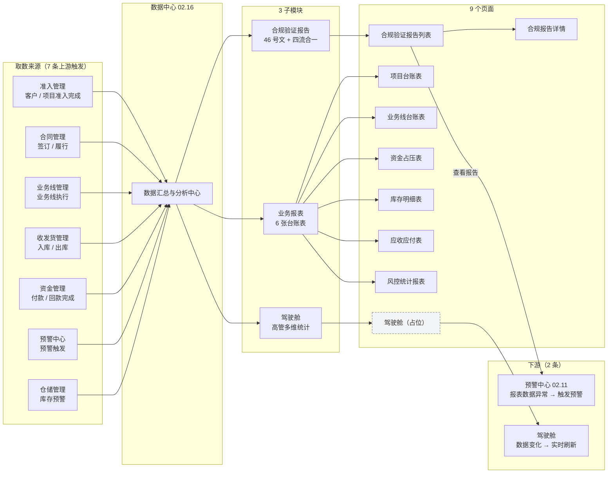
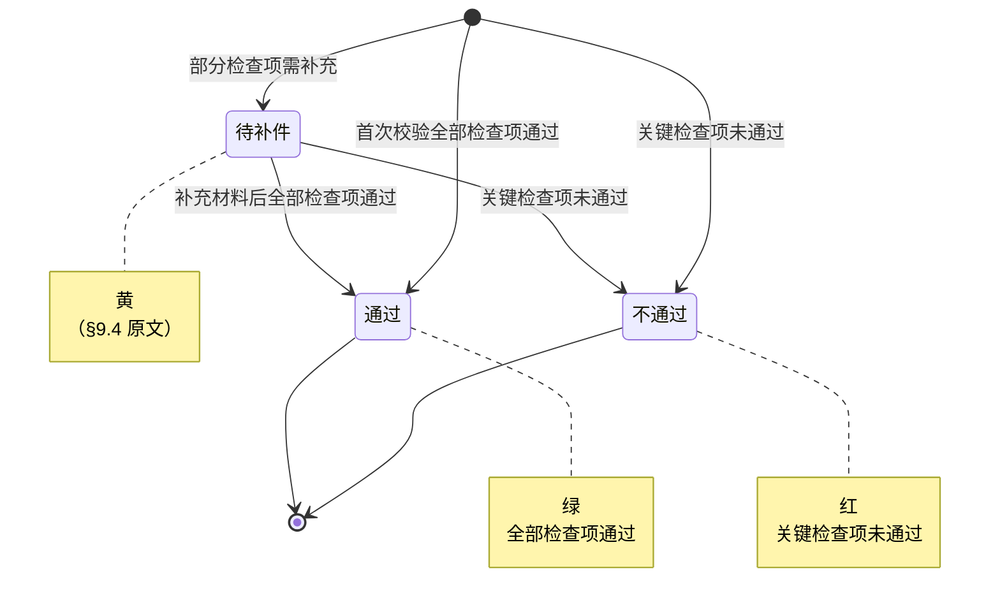
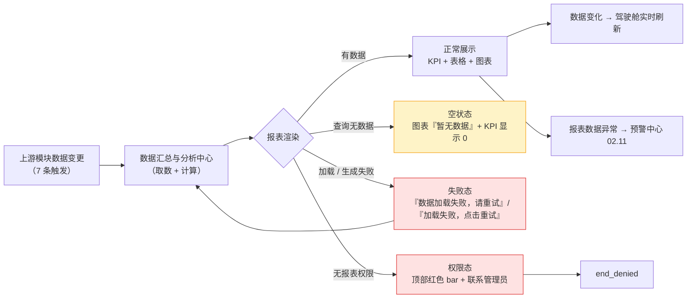
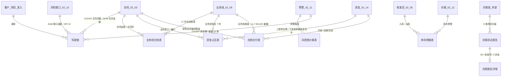

# 02.16 数据中心 · 需求规格说明

> **文档类型**：PRD Writer 范式 · 落地需求文档 · 功能详细描述
> **对应总纲**：[00-产品概述与需求总纲.md](./00-产品概述与需求总纲.md)
> **通用规范**：[01-通用交互与文案规范.md](./01-通用交互与文案规范.md)
> **源文档（只读，未做任何改动）**：[02.16-数据中心.md](../docs/02.16-数据中心.md)
> **整理时间**：2026-09-30

---

## 0. 阅读说明

### 0.1 信息溯源标记

| 标记 | 含义 | 使用规则 |
|------|------|---------|
| ✅ | 源文档已明确 | 原值保留（表名 / 字段名 / 状态枚举 / 编号规则 / 提示文案），不改写口径 |
| 🔷 | 范式补全 | 源文档没写，按范式要求推导，**必须注明推导依据** |
| ⚠️ | 源文档自相矛盾 | **绝不静默选边**，如实并列，交由业务方裁决 |
| 🔷 现状核验 ✅ | 本次整理对 `pages/` / `app.html` / `docs/` 做的**只读** grep / `ls` 核验（2026-09-30）| 结果为页面实现事实，**与源文档原值严格分离标注**，未修改任何文件 |
| [待补充] | 信息不足 | **严禁编造**，需业务方 / 研发回填 |

### 0.2 源文档阅读顺序

源文档 `02.16-数据中心.md`（**314 行 / 16,053 字节**）由**两代口径叠加**构成：**§1-§8 是 v1.7.99.200 终版口径**（2026-08-07 16:30，按实际 prototype 页面字段重写 + 按 9 个子菜单拆分）、**§9 是 v1.7.99.x 模块级增量补充**（2026-09-24 追加，基于飞书《豫港通用户使用手册（内部版）》第 10 章）。两代口径在**页面数（9 vs 10）、驾驶舱文件（`dashboard.html` vs `cockpit.html`）、跨模块编号（合同记 02.05 / 收发货与仓储都记 02.07）** 上存在冲突（见 §3.4 C1-C9）。

> 🔴 **本模块与其他模块模板的 3 处结构性差异（照实记录，不硬造）**：
> 1. **源文档没有「角色操作矩阵」章节** —— §4 只说「每个子菜单的字段定义详见对应 docs」，**9 个子菜单的角色 / 权限完全无记录**。本文档 §2.1 据 §5 按钮交互总览 + 总纲 §8.2 推导，并逐行标注 🔷。
> 2. **源文档没有「状态机」章节** —— 但 9 张报表中**至少有 8 类状态列**（数据完善状态 / 合同状态 / 业务线状态 / 处理状态 / 进项发票状态 / 销项发票状态 / 合规状态 / 库存异常标记），**除合规验证报告 3 状态外全部无枚举值**。本文档 §3.1 据 §2.9 与 §9.4 推导，逐条标注 🔷。
> 3. **源文档没有「核心实体 / 表结构」章节** —— v1.7.99.199 **明确删除**了「## 3. 核心实体」与「## 9. 复用建议」（见 §8 版本记录）。本文档 §5.1 据 v1.7.99.199 删除记录 + §2 各页字段清单推导，**不编造表名与字段名**。

| 源文档章节 | 内容 | 归位到本文档 |
|-----------|------|------------|
| 头部 + §0 章节导航 | 状态 v1.7.99.200 终版（按实际原型页面字段重写 + 按 9 个子菜单拆分）| §1.1、§6、§7.3 |
| §1 业务定位 | §1.1 **9 个页面 sitemap**（含每个页面的 `p-*.md` 索引）+ §1.2 3 子模块说明 | §1.1、§1.1.2、§6 |
| **§2 9 个子菜单（按页面拆分的详细字段定义）** | **§2.1 驾驶舱（2 筛选 + 4 tab + 7 列卡片）/ §2.2 项目台账（4 筛选 + 9 列）/ §2.3 业务线台账（4 筛选 + 17 列）/ §2.4 资金占压（2 KPI + 分组表）/ §2.5 库存明细（多组 KPI + 18 列）/ §2.6 应收应付（4 KPI + 6 筛选 + 13 列 3 分组）/ §2.7 风控统计（4 筛选 + 9 列）/ §2.8 合规验证报告列表（7 筛选 + 11 列）/ §2.9 合规报告详情（3 KPI + 8 类风险 + 25+ 检查项 + 整改跟踪）** | **§1.1.3、§2.2、§2.4、§3.2、§5.2、§6** |
| §3 业务流程全景 | 数据中心 → 3 子模块 → 9 页面的树状 Mermaid | §1.3 |
| §4 字段规则总览 | 「每个子菜单的字段定义详见对应 docs」（9 个 `p-*.md` 指针，**本文档不复述**）| §5.4 |
| §5 按钮交互总览 | 6 类通用按钮（编号/合同号蓝字跳转、查看、查看报告、处理、导出、状态 tab）| §2.2 |
| §6 异常处理总览 | 5 条（含原文文案）| §2.5、§4.1 |
| §7 跨模块流转 | §7.1 上游 7 条 / §7.2 下游 2 条 | §1.4.1 |
| §8 文档版本 | v1.0 → v1.7.99.64 / 97 / 151 / 193 / 199 / 200 共 6 个版本 | §7.3 |
| **§9 v1.7.99.x 增量补充** | **9.1 业务变化 / 9.2 10 类报表详细列表 / 9.3 驾驶舱 5 大 KPI + 4 图表（各带计算公式）/ 9.4 合规验证报告 3 状态 / 9.5 跨模块联动 5 行 / 9.6 异常补充 3 条 / 9.7 页面 PRD 索引（已有 8 行 + 新写 2 行）/ 9.8 10 类报表业务场景 / 9.9 修改记录 7 条** | **§1.1.4、§1.2.2、§1.4.2、§2.4、§3.1.2、§3.2.2、§4.1、§6、§7.3** |

> 🔴 **`06-修改记录.md` 不存在**：源文档 §8 记「修改记录：见 `06-修改记录.md`」——🔷 `ls` 核验 `docs/` 目录**无此文件** [待补充]（02.09 / 02.10 / 02.13 / 02.14 源文档有同样问题）。

### 0.3 与通用规范的关系

**通用表单规范（校验时机 / 返回保护 / 提交行为 / 危险操作确认 / 空状态 / 失败引导 / 通用 UI 6 态 / 通用样式 / 脱敏规范）一律以 [01-通用交互与文案规范.md](./01-通用交互与文案规范.md) 为准，本文档不重复定义**，只写本模块特有的部分：

1. 🔶 **数据中心是纯只读汇总分析模块** —— 9 个页面中**只有 2 个有写操作**（合规报告详情的「整改跟踪 + 实时活动 + 催办」、风控统计报表的「处理」跳转），其余 7 个页面是纯查询 / 导出。
2. **6 类通用按钮的跨页面复用规则**（蓝字编号跳转 / 操作「查看」/ 「查看报告」/ 「处理」/ 数据导出 / 状态 tab）——源文档 §5 唯一定义交互的一节。
3. **应收应付表的 v1.7.99.220 变更三连**（KPI 4 卡片、筛选 2→6 字段、表格 8→13 列）——本模块唯一记录了字段级版本变更的地方。
4. **驾驶舱 5 大 KPI 的计算公式 + 4 张图表**（§9.3）——**公式原值照抄，是本模块唯一有取数口径的地方**。
5. **合规验证报告 3 状态（通过 / 待补件 / 不通过）+ 颜色**（§9.4）+ 详情页 8 类风险扫描 + 25+ 检查项。
6. **数据权限降级**：「当前用户无报表权限 → 顶部红色 bar + 联系管理员」（§9.6）。

### 0.4 飞书用户手册补充（2026-10-08）

> **来源**：《豫港通数字供应链管理平台 — 用户使用手册（内部版）》飞书 rev.8976，**10.1 驾驶舱 + 10.2 各类台账报表 + 10.3 合规验证报告**。手册是**对着线上系统写的**，其 10.2 的**报表取数公式是本模块最缺的部分**（§3.4 C9 记「10 条数据公式原文完全缺失」），本章直接补齐其中 8 条。

| 手册小节 | 归位到本文档 | 填了哪些信息缺口 / 补了哪些矛盾 |
|---------|-------------|---------------------------|
| **10.1 驾驶舱** | §0.4 手册原值、§3.4（**C6** 追加 ✅ 手册口径；新增 **C10**）、§1.1 驾驶舱行、§5.2 字段级规范 | **驾驶舱 KPI 口径补齐 9 项**（采购情况 / 上下游发运 / 上游发运明细 / 下游收货明细 / 付款 / 回款 / 库存量 / 入库量 / 出库量）；**库存量 = 入库总数 − 已出库数**；**新增 C10**（区块数 7 / 9 / 5+4 三套口径）|
| **10.2 各类台账报表** | §0.4 手册原值、§3.4（**C9** 追加 ✅ 手册口径）、§5.2 字段级规范 | **补齐 8 条公式**：应收应付 4 条 + 资金占压 2 条 + 库存明细 2 条；**补齐 5 张报表的显示字段清单**（项目台账 8 项 / 业务线台账 14 项）|
| **10.3 合规验证报告** | §0.4 手册原值、§7.2（确认信息缺口真实存在）| ✅ **手册小节标题即「（改造中-待补全）」且正文仅有 1 张配图**——确认「十不准 10 条 / 四流 4 流 / 25+ 检查项清单」是**产品侧尚未完成的功能**，非本文档遗漏；**该 3 项信息缺口保持不变** |

**✅ 手册原值（照抄，不改写）**：

- **10.1 采购情况**：统计数据维度为-具体品类在框架合同下不同时间节点（**本年/本月**）的采购量的情况
- **10.1 上下游发运情况**：统计数据维度为-核心企业向上下游贸易环节的不同运输方式（**汽运/火运/船运**）间不同时间节点（**当年/本月**）的发货数据
- **10.1 上游供应商发运明细**：具体上游供应商的**发货累计总数量**（实时）
- **10.1 下游客户收货明细**：具体下游客户的**收货累计总数量**（实时）
- **10.1 付款情况**：**累计付款**（历史上所有已付款的总额（无论哪一年））/ **当年付款**（本年内发生的付款总额）/ **本月付款**（当前月份发生的付款总额）
- **10.1 回款情况**：**累计回款**（历史上所有已回款的总额（无论哪一年））/ **当年回款**（本年内发生的回款总额）/ **本月回款**（当前月份发生的回款总额）
- **10.1 库存量**：**入库总数 - 已出库数**
- **10.1 入库量**：登记入库的总量　**10.1 出库量**：登记出库的总量
- **10.2 §11.2.1 项目台账表**：显示**项目编号 / 项目名称 / 项目类型 / 上下游企业数量 / 项目实际总合同金额 / 项目总合同回款金额 / 项目状态 / 登记立项时间**
- **10.2 §11.2.2 业务线台账表**：显示**业务线总数量 / 上游业务总数量 / 下游业务总数量 / 累计交易金额（业务线收付款总额）/ 业务线上下游企业信息 / 合同编号 / 业务类型 / 项目名称 / 上下游货转 / 剩余库存 / 付款回款 / 上下游结算数量+金额 / 上下游开票金额 / 业务线形成时间**
- **10.2 §11.2.3 资金占压表**：**上游供应商流水：上游货款总和-退款**；**下游客户流水：下游总货款+保证金-退款**；统计各销售采购合同的**付款-回款**登记信息
- **10.2 §11.2.4 库存明细表**：**累计入库 = 平台全量入库记录中货物重量总和**；**累计出库 = 平台全量出库记录中货物重量总和**；**库存吨位 = 累计入库 - 累计出库总和**；**库存货值 = 库存重量 * 当期货物总价**
- **10.2 §11.2.5 应收应付表**：**应付总额 = 全量采购合同总金额**；**应收总额 = 全量销售合同总金额**；**库存资金占压 =【（上游货款之和-上游退款之和）】-【（下游货款之和）+（下游保证金之和）-（下游退款之和）】**；**净占压金额 = 下游未收 + 库存资金占压 - 上游未付**
- **10.3 合规验证报告**：章节目标「合规自查 + 报告导出」；内容指引仅有 1 张配图；**报告详情（检查项 / 通过状态 / 整改建议）**；⚠️ 手册小节标题自带「**（改造中-待补全）**」

---

## 1. 功能描述与触发条件

### 1.1 功能描述

✅ **数据中心是港通供应链的数据汇总与分析中心**（源文档 §1 原文照抄）——**v1.0 新顶级模块**，**3 子模块（驾驶舱 / 业务报表 / 合规验证报告），9 个页面**。

#### 1.1.1 3 子模块（§1.2 原文照抄）

| # | 子模块 | 定义（✅ 原文）| 页面数 | 出处 |
|---|-------|--------------|-------|------|
| 1 | **驾驶舱** | **高管视角多维统计（占位待完善）** | 1 | §1.2 |
| 2 | **业务报表** | **6 张台账表（项目 / 业务线 / 资金 / 库存 / 应收应付 / 风控）** | 6 | §1.2 |
| 3 | **合规验证报告** | **国资委 46 号文 + 四流合一验证** | 2 | §1.2 |

> ⚠️ **「6 张台账表」与 §9.2 / §9.8 的「10 类报表」冲突**：§9.2 的 10 类 = 驾驶舱 1 + 业务报表 **7**（含 `risk-report.html` 旧版）+ 合规 2；§9.8 同为 10 类。见 C1。

#### 1.1.2 9 个页面 sitemap（§1.1 原表照抄）

| # | 子模块 | 页面 | 关联 docs | 页面文件（🔷 现状核验 ✅）|
|---|-------|------|-----------|----------------------|
| 1 | 驾驶舱 | 驾驶舱 | [p-dashboard.md](../docs/p-dashboard.md) | 🔶 `dashboard.html`（6,961 B）|
| 2 | 业务报表 | 项目台账表 | [p-report-project.md](../docs/p-report-project.md) | `report-project.html`（14,658 B）|
| 3 | 业务报表 | 业务线台账表 | [p-report-bizline.md](../docs/p-report-bizline.md) | `report-bizline.html`（33,042 B）|
| 4 | 业务报表 | 资金占压表 | [p-report-fund.md](../docs/p-report-fund.md) | `report-fund.html`（36,520 B）|
| 5 | 业务报表 | 库存明细表 | [p-report-inventory.md](../docs/p-report-inventory.md) | `report-inventory.html`（22,742 B）|
| 6 | 业务报表 | 应收应付表 | [p-report-ar-ap.md](../docs/p-report-ar-ap.md) | `report-ar-ap.html`（26,702 B）|
| 7 | 业务报表 | 风控统计报表 | [p-report-risk.md](../docs/p-report-risk.md) | `report-risk.html`（13,960 B）|
| 8 | 合规验证报告 | 合规验证报告列表 | [p-report-compliance.md](../docs/p-report-compliance.md) | `report-compliance.html`（65,811 B）|
| 9 | 合规验证报告 | 合规报告详情 | [p-report-compliance-detail.md](../docs/p-report-compliance-detail.md) | `report-compliance-detail.html`（47,461 B）|

> ⚠️ **§1.1 驾驶舱指向 `p-dashboard.md`，§9.2 / §9.7 / §9.8 指向 `cockpit.html` + `p-cockpit.md`** —— `p-dashboard.md` 与 `p-cockpit.md` **两个 PRD 都存在**（4,671 B / 4,292 B），`dashboard.html` 与 `cockpit.html` **两个页面都存在**。见 C2。
> ⚠️ **§1.1 记 9 个页面，§9.2 / §9.8 记 10 类**（多 `risk-report.html` 旧版业务报表），见 C1。

#### 1.1.3 §2 「9 个子菜单」详细字段定义（本模块**唯一有页面级字段记录**的章节）

> ✅ **下表 9 行全部原值照抄**（§2.1-§2.9 的筛选字段数 / 列数 / 分组数）。
> 🔴 **各列的列名、列宽、排序、mock 数据不在源文档中** —— 源文档只给了**列数**（个别子菜单给了列名清单），详见 §5.2 逐页归位。

| # | 子菜单 | 顶部筛选（字段数）| 顶部 KPI | 表格列数 | 分组结构 | 出处 |
|---|-------|-----------------|----------|---------|---------|------|
| 1 | **驾驶舱** | **2 字段**（统计周期 + 业务类型）| — | **7 列**（list-card-item 卡片）| 状态 tab **4 个**（概览 / 项目 / 合同 / 客户）| §2.1 |
| 2 | **项目台账表** | **4 字段**（项目类型 / 项目状态 / 客户名称 / 立项时间）| — | **9 列** | — | §2.2 |
| 3 | **业务线台账表** | **4 字段**（业务类型 / 业务状态 / 上游企业 / 下游企业）| — | **17 列** | — | §2.3 |
| 4 | **资金占压表** | — | **2 个**（上游供应商资金流水 + 下游采购商资金流水）| **分组表** | 业务线信息 **7 列** + 上游款项 **4 列** + 下游款项 **4 列** + 资金占压 **1 列** = **16 列** | §2.4 |
| 5 | **库存明细表** | — | **多组（每组 4 个 KPI）** | **18 列** | — | §2.5 |
| 6 | **应收应付明细表（按业务线汇总）** | **6 字段**（业务线号 / 采购合同编号 / 上下游客户 / 进项发票状态 / 销项发票状态 / 资金占压）| **4 卡片**（应付总额 / 应收总额 / 库存资金占压 / 净占压金额）| **13 列** | 业务线信息 **3 列** + 上游 **4 列** + 下游 **4 列** + 资金占压 **2 列** | §2.6 |
| 7 | **风控统计报表** | **4 字段**（风险类型 / 风险等级 / 处理状态 / 客户）| — | **9 列** | — | §2.7 |
| 8 | **合规验证报告列表** | **7 字段**（编号 / 企业名称 / 运输方式 / 签订日期 / 交货起始日 / 业务类型 / 业务线回款）| — | **11 列** | — | §2.8 |
| 9 | **合规报告详情** | — | **3 字段**（基础信息 / 合规状态 / 验证规则）| **25+ 检查项**（5 列 + 2 大类分组）| 业务线全景 + 风险扫描 **8 类** + 十不准及四流一致性校验 + 整改跟踪 + 实时活动 + 催办 | §2.9 |

> ⚠️ **§2.6 标题写「13 列 **3 大分组**」，但括号内列了 **4 组**（业务线信息 3 + 上游 4 + 下游 4 + 资金占压 2 = 13）** —— 见 C5。
> 🔴 **§2.4 / §2.5 / §2.9 未给筛选字段或 KPI 的具体口径**（§2.4 的 2 个 KPI 只有名称，§2.5 的「多组 4 个 KPI」连数量都没给）[待补充]。
> ✅ **手册 10.1 / 10.2 补齐了其中 3 组口径（2026-10-08）**：① **驾驶舱 9 项 KPI 及其统计维度**（采购情况 / 上下游发运情况 / 上游供应商发运明细 / 下游客户收货明细 / 付款情况 / 回款情况 / 库存量 / 入库量 / 出库量），其中**付款与回款各含 3 个时间口径**：**累计**（历史上所有已付/已回的总额，**无论哪一年**）/ **当年**（本年内发生）/ **本月**（当前月份发生）；**库存量 = 入库总数 − 已出库数**；② **资金占压表**公式（上游供应商流水 = 上游货款总和-退款；下游客户流水 = 下游总货款+保证金-退款）；③ **库存明细表**公式（累计入库 / 累计出库 = 平台全量出入库记录中**货物重量总和**；**库存吨位 = 累计入库 − 累计出库总和**；**库存货值 = 库存重量 * 当期货物总价**）。⚠️ **§2.4 的「筛选字段」、§2.5 / §2.9 的 KPI 分组数量、§2.9 合规报告的检查项清单，手册均未给**（§2.9 已由手册 10.3 确认为「**改造中-待补全**」，是产品侧未完成项，非本文档遗漏）。

#### 1.1.4 v1.7.99.x 口径（§9.1 模块业务变化表，2026-09-24，原值照抄）

| 维度 | v1.0 文档 | v1.7.99.200 现状 |
|------|----------|------------------|
| 页面清单 | **7-8 页**（dashboard + 各报表）| **10 类**：驾驶舱 + 6 张台账表 + 合规报告列表 + 合规报告详情 |
| dashboard | v1.0 单一 dashboard | v1.7.99.200 **完全替换**：**驾驶舱 `cockpit.html` 成为首页** |
| 报表格式 | v1.0 简化版 | v1.7.99.200 **统一规范**：所有报表按「v1.7.99.x 终版」格式 |
| 合规验证报告 | v1.0 简述 | **v1.7.99.64 + v1.7.99.193 + v1.7.99.199 多次重构** |

> ⚠️ **§9.1「页面清单」列写 v1.0 是「7-8 页」，但 §1.1 sitemap 写「9 个页面」** —— **同一份源文档的 v1.0 页面数都无法确定**，见 C1。
> ⚠️ **§9.1「驾驶舱 `cockpit.html` 成为首页」，但 🔷 现状核验 ✅ `app.html:601-603` 菜单指向 `dashboard`，且 `grep -c cockpit app.html` = 0** —— 见 C2。

### 1.2 触发条件

#### 1.2.1 报表取数触发（§7 跨模块流转，原表照抄）

> ✅ **7 条上游触发全部原值照抄**；⚠️ **其中 3 条的模块编号错误**，见 C3。

| # | 触发模块（源文档原值）| 触发条件 | 触发动作 | 编号核查 |
|---|-------------------|---------|---------|---------|
| 1 | 准入管理（**02.01-02.04**）| 客户 / 项目准入完成 | 更新驾驶舱 + 业务报表 | ⚠️ **`02.04` 已空缺**，见 C4 |
| 2 | 合同管理（**02.05**）| 合同签订 / 履行 | 更新业务线台账表 + 资金占压表 | ❌ **合同管理实际是 `02.03`**，`02.05` 是收发货管理，见 C3 |
| 3 | 业务线管理（02.06）| 业务线执行 | 更新业务线台账表 + 资金占压表 | ✅ 正确 |
| 4 | 收发货管理（**02.07**）| 入库 / 出库 | 更新库存明细表 | ❌ **收发货管理实际是 `02.05`**，`02.07` 是货转管理，见 C3 |
| 5 | 资金管理（02.14）| 付款 / 回款完成 | 更新资金占压表 + 应收应付表 | ✅ 正确 |
| 6 | 预警中心（02.11）| 预警触发 | 更新风控统计报表 | ✅ 正确 |
| 7 | 仓储管理（**02.07**）| 库存预警 | 更新风控统计报表 + 库存明细表 | ❌ **仓储管理实际是 `02.12`**，见 C3 |

> ⚠️ **第 4 条与第 7 条都写 `02.07`** —— 收发货管理与仓储管理**同时被标为 02.07**，而 `02.07` 实际是货转管理。见 C3。

**下游触发**：

| # | 触发模块 | 触发条件 | 触发动作 | 出处 |
|---|---------|---------|---------|------|
| 1 | 预警中心（02.11）| 报表数据异常 | 触发预警 | §7.2 |
| 2 | 驾驶舱 | 数据变化 | 实时刷新 | §7.2 |

> ✅ **下游仅 2 条**（✅ 原值照抄）—— 数据中心几乎不向下游写数据，仅预警 1 路。

#### 1.2.2 v1.7.99.x 口径（§9.3 驾驶舱 + §9.4 合规 + §9.6 异常，原值照抄）

| # | 触发条件 | 触发动作 | 出处 |
|---|---------|---------|------|
| 1 | **进入驾驶舱** | 按 **统计周期 + 业务类型** 2 字段筛选 → 实时计算 **5 大 KPI + 4 张图表** | §2.1 + §9.3 |
| 2 | **切换驾驶舱状态 tab**（概览 / 项目 / 合同 / 客户）| 切换卡片数据 | §2.1 + §5 |
| 3 | **进入合规报告详情** | 加载 8 类风险扫描 + 25+ 检查项 + 3 KPI（基础信息 / 合规状态 / 验证规则）| §2.9 |
| 4 | **当前用户无报表权限** | 顶部**红色 bar** + **联系管理员** | §9.6 |
| 5 | **时间范围查询无数据** | 图表显示「**暂无数据**」+ KPI 显示 **0** | §9.6 |
| 6 | **数据加载失败** | 各图表显示「**加载失败，点击重试**」 | §9.6 |

> 🔴 **「实时刷新」（§7.2 下游触发 2）的刷新频率 / 推送方式 / 是否 WebSocket 全部未给** [待补充]。

### 1.3 业务流程（Mermaid）

> 🔷 **本图为 §3 业务流程全景原图的原样照抄 + 🔶 补充「取数链路」泳道**（依据：§7.1 的 7 条上游触发 + §9.5 的跨模块联动 5 行）。

> ✅ **「3 子模块 → 9 页面」的树状结构原值照抄**（§3）。
> ✅ **合规报告详情由合规验证报告列表进入** —— 🔷 推导，依据 §5 按钮交互总览「操作『查看报告』· 合规列表 · 跳合规报告详情」。
> 🔶 **灰色虚线框 P1「驾驶舱（占位）」** = §1.2 + §3 原图节点文字「**驾驶舱（占位）**」+ §1.2「高管视角多维统计（**占位待完善**）」。
> ⚠️ **7 条上游的 3 处模块编号错误**（02.05 / 02.07 / 02.07），见 C3。

### 1.4 模块依赖（跨模块流转）

#### 1.4.1 v1.7.99.200 口径（§7，原值照抄，**编号问题见 §1.2.1 注与 C3**）

**上游触发**（7 条）与**下游触发**（2 条）见 §1.2.1 表格（内容完全一致，此处不重复）。

#### 1.4.2 v1.7.99.x 口径（§9.5 跨模块联动，原值照抄）

| 联动系统 | v1.0 描述 | v1.7.99.x 增强 | 编号核查 |
|----------|-----------|----------------|---------|
| **合同（02.03）** | 已记录 | 报表数据来自合同 | ✅ 正确 |
| **业务线（02.06）** | 已记录 | 业务线台账来自业务线 | ✅ 正确 |
| **预警（02.11）** | 已记录 | 预警计数 + 最新预警表格 | ✅ 正确 |
| **风险敞口（02.10）** | 已记录 | 风险敞口来自**保证金池** | ⚠️ `02.10` 是**保证金管理**，风险敞口是其下的保证金池指标 —— **编号与口径的对应关系源文档未说明** [待补充] |
| **合规（天眼查）** | 未提及 | 合规验证报告联动**外部数据源** | 🔴 **「天眼查」具体对接哪些接口、哪些字段，源文档未给** [待补充] |

> ⚠️ **§9.5 与 §7.1 口径不一致**：
> 1. **§7.1 有 7 条上游，§9.5 只有 5 行**，且 **§9.5 缺「准入管理（02.01-02.04）」「收发货管理」「仓储管理」** 3 条，新增「风险敞口（02.10）」「合规（天眼查）」2 条
> 2. **§9.5 的「风险敞口（02.10）· v1.0 描述 = 已记录」** —— 🔴 **§7.1 的 7 条上游里根本没有「风险敞口」这条**（§7.1 有「预警中心 02.11」），这是 §9.5 对 v1.0 的误述
> 3. **§9.5 的「合规（天眼查）· v1.0 描述 = 未提及」** —— ✅ 这一条是准确的
> 4. **§7.1 的「合同管理（02.05）」** 与 **§9.5 的「合同（02.03）」** —— **同一模块在两处编号不同**（02.05 错 / 02.03 对），见 C3

#### 1.4.3 🔷 现状核验 ✅ 页面归属与菜单结构（2026-09-30 只读 `app.html`）

| 项 | 核验结果 | 依据 |
|----|---------|------|
| 菜单分组 | 数据中心是**独立顶级 group** `{ group: '数据中心', icon: '📊', pages: [...] }` | `app.html:600` |
| 子菜单结构 | **3 个 sub**：驾驶舱（1 项）/ 业务报表（6 项）/ 合规验证报告（2 项）= **9 项** | `app.html:601-615` |
| 驾驶舱指向 | **`dashboard`**（`app.html:602`），**`cockpit` 在 `app.html` 中引用数为 0** | `app.html:602`；`grep -c cockpit app.html` = 0 |
| 业务报表 6 项 | 项目台账表 / 业务线台账表 / 资金占压表 / 库存明细表 / 应收应付表 / 风控统计报表 —— **与 §1.1 sitemap 完全一致** | `app.html:605-610` |
| 合规验证报告 2 项 | 合规验证报告列表（section = 业务定位）/ 合规报告详情（section = **字段规则**）| `app.html:613-614` |
| **`risk-report.html` 未进菜单** | 页面（4,505 B）与 PRD（2,992 B）均存在，但**不在 `app.html` 任何 sub 内** | `grep risk-report app.html` = 0 |

> 📌 **菜单 9 项 = §1.1 sitemap 9 页面**（✅ 一致）；**§9.2 / §9.8 的 10 类多出的 `risk-report.html` 未进菜单**。见 C1。

---

## 2. 交互细节

### 2.1 角色操作矩阵（权限可见性）

> 🔴 **源文档全文没有角色操作矩阵**（§0-§9 无此章节）。下表为 🔷 范式补全，推导依据逐行标注。
> 🔷 **推导依据**：[00-产品概述与需求总纲.md](./00-产品概述与需求总纲.md) §8.2 权限控制（角色维度按钮可见性 + 数据维度过滤）+ §9.6「当前用户无报表权限 → 顶部红色 bar + 联系管理员」+ §1.2「驾驶舱 = **高管视角**多维统计」+ §5 按钮交互总览（6 类按钮均未标角色）+ §1.2.2 第 4 条。

| 角色 | 驾驶舱 | 6 张业务报表 | 合规验证报告 | 合规报告详情 | 依据 |
|------|-------|------------|------------|------------|------|
| **高管 / 总经办** | ✅ **✓（主视角）** | 🔷 ✓ | 🔷 ✓ | 🔷 ✓ | 🔷 依据 §1.2「**高管视角**多维统计」 |
| **业务员** | 🔶 ✓ | 🔶 ✓ | 🔷 ✓ | 🔷 ✓ | 🔷 依据：报表为只读查询，无写操作 |
| **业务部** | 🔶 ✓ | 🔶 ✓ | 🔷 ✓ | 🔷 ✓ | 🔷 同上 |
| **风控部** | 🔶 ✓ | 🔶 ✓（**风控统计报表为主**）| 🔷 ✓ | 🔶 ✓（**风险扫描 + 催办**）| 🔷 依据 §2.7 风控统计报表 + §2.9 风险扫描 8 类 |
| **财务部** | 🔶 ✓ | 🔶 ✓（**资金占压 + 应收应付为主**）| 🔷 ✓ | 🔷 ✓ | 🔷 依据 §2.4 / §2.6 资金类报表 |
| **系统 / 定时任务** | ✅ ✓（**实时刷新**，§7.2）| ✅ ✓（按上游触发刷新）| ✅ ✓ | 🔴 [待补充] | 🔶 依据 §7.2 下游触发 2「数据变化 → 实时刷新」 |

**按页面的操作可见性（🔷 推导，依据 §5 按钮交互总览）**：

| 页面 | 可用按钮（✅ §5 原值）| 写操作 | 依据 |
|------|-------------------|-------|------|
| 驾驶舱 | 数据导出 / 状态 tab（概览·项目·合同·客户）| ❌ 无 | §5 + §2.1 |
| 项目台账表 | 编号蓝字跳转 / 操作「查看」/ 数据导出 | ❌ 无 | §5 |
| 业务线台账表 | 编号蓝字跳转 / 操作「查看」/ 数据导出 | ❌ 无 | §5 |
| 资金占压表 | 编号蓝字跳转 / 操作「查看」/ 数据导出 | ❌ 无 | §5 |
| 库存明细表 | 编号蓝字跳转 / 操作「查看」/ 数据导出 | ❌ 无 | §5 |
| 应收应付表 | 编号蓝字跳转 / 操作「查看」/ 数据导出 | ❌ 无 | §5 |
| 风控统计报表 | 编号蓝字跳转 / 操作「**查看**」/ 操作「**处理**」（跳风险处理页）/ 数据导出 | 🔶 **处理**（跳转，非本页写）| §5 |
| 合规验证报告列表 | 操作「**查看报告**」（跳合规报告详情）/ 数据导出 | ❌ 无 | §5 |
| 合规报告详情 | **整改跟踪 + 实时活动 + 催办**（§2.9）| ✅ **本页唯一的真实写操作** | §2.9 |

> 🔴 **本表 12 行为 🔷 推导**：源文档 §5 只定义了 6 类通用按钮的**位置与行为**，**全部未标角色**；「高管 / 业务员 / 业务部 / 风控部 / 财务部」5 个角色名**取自项目既有角色体系**（见 [总纲 §8.2](./00-产品概述与需求总纲.md#82-权限控制) 与各模块 §5 角色矩阵）。
> 🔴 **9 个页面的数据行级权限（谁能看哪些项目 / 业务线 / 客户）完全无记录** —— 源文档只有 §9.6 一条兜底「无报表权限 → 红色 bar + 联系管理员」[待补充]。

### 2.2 按钮交互（操作反馈）

#### 2.2.1 6 类通用按钮（§5 按钮交互总览，原表照抄，**本模块唯一的交互定义**）

| 通用按钮 | 位置 | 行为（✅ 原文）| 适用页面 | 状态条件 |
|---------|------|--------------|---------|---------|
| **编号 / 合同号（蓝字）** | 表格 | **跳对应详情页** | 6 张业务报表 | 🔴 未定义哪些列是蓝字可点 |
| **操作「查看」** | 表格 | **跳对应详情页** | 6 张业务报表 | 🔴 未定义 |
| **操作「查看报告」** | 合规列表 | **跳合规报告详情** | 合规验证报告列表 | 🔴 未定义 |
| **操作「处理」** | 风控表格 | **跳风险处理页** | 风控统计报表 | 🔴 目标页 `risk-report.html` **未进菜单**（见 C1）|
| **数据导出** | 顶部 | **导出当前筛选数据到 Excel** | **全部 9 个页面** | ✅ 「当前筛选数据」—— 导出范围 = 当前筛选结果（🔴 无导出上限说明）|
| **状态 tab** | 顶部 | **切换卡片 / 表格数据** | 驾驶舱（**4 tab**：概览 / 项目 / 合同 / 客户）| ✅ §2.1 明确 4 tab |

> ✅ **6 类按钮的名称 / 位置 / 行为全部原值照抄**（§5）。
> 🔴 **无任何按钮反馈文案**（成功 Toast / 加载态 / 失败提示）—— §5 只定义行为，未定义反馈 [待补充]。

#### 2.2.2 驾驶舱 4 tab + 7 列卡片（§2.1 原值照抄）

| 项 | 内容 |
|---|------|
| **顶部筛选** | **2 字段**：统计周期 + 业务类型 |
| **状态 tab** | **4 个**：概览 / 项目 / 合同 / 客户 |
| **卡片区** | **list-card-item 7 列布局**：编号 / 状态 / 统计周期 / 数据来源 / 项目总数 / 执行中项目 / 操作 |

> ✅ **7 列名原值照抄**（§2.1）。
> ⚠️ **7 列含「操作」列，但 §5 未定义驾驶舱的操作按钮**（6 类通用按钮中无「驾驶舱专用」项）[待补充]。

#### 2.2.3 驾驶舱 5 大 KPI + 4 图表（§9.3，**本模块唯一有取数公式的地方**，原值照抄）

**5 大 KPI（含计算公式）**：

| 卡片 | 指标 | 计算公式（✅ 原文照抄）|
|------|------|-------------------|
| 1 | **业务规模（合同总数）** | `COUNT(合同 WHERE status ≠ 作废)` |
| 2 | **资金规模（累计交易额）** | `SUM(合同金额)` |
| 3 | **风险敞口** | `SUM(敞口金额)` |
| 4 | **业务线状态（执行中）** | `COUNT(业务线 WHERE status = 执行中)` |
| 5 | **预警计数（未处理）** | `COUNT(预警 WHERE status = 未处理)` |

**4 张图表**：

| # | 类型 | 内容（✅ 原文照抄）|
|---|------|----------------|
| 1 | **折线图** | 近 30 日合同签订数量趋势 |
| 2 | **饼图** | 业务类型分布（**存货 / 预付 / 账期 / 购销**）|
| 3 | **柱状图** | 业务线执行状态分布 |
| 4 | **表格** | 最新 10 条预警 |

> ⚠️ **§9.3 的 5 KPI + 4 图表与 §2.1 的「2 筛选 + 4 tab + 7 列卡片」是两套驾驶舱 UI 描述** —— **7 列卡片区的「项目总数 / 执行中项目」与 5 KPI 的「业务规模 / 业务线状态」语义重叠**，且 **5 KPI + 4 图表在 🔷 现状核验 ✅ 的 `dashboard.html` 与 `cockpit.html` 中均未出现**（见 C2）。
> 🔴 **公式引用的中文表名 / 字段名（「合同」「合同金额」「敞口金额」「业务线」「预警」）没有对应的物理表名**（v1.7.99.199 已删除「核心实体」章节），见 §5.1 [待补充]。

#### 2.2.4 应收应付表 v1.7.99.220 变更三连（§2.6 原值照抄）

| 维度 | v1.7.99.217 旧版 | v1.7.99.220 新版 | 依据 |
|------|-----------------|-----------------|------|
| **顶部 KPI（4 卡片）** | 「应收总额 / 已收金额 / 未收金额 / 应付总额」4 卡片 | **应付总额 / 应收总额 / 库存资金占压 / 净占压金额** —— 按 **10 条数据公式**汇总，**每卡片对应 1 个公式或公式组合**（**应付总额 = 公式 1 SUM**、**应收总额 = 公式 5 SUM**、**库存资金占压 = 公式 9 SUM**、**净占压 = 公式 10 SUM**）| ✅ §2.6 原文 |
| **顶部筛选** | **2 字段** | **6 字段**：业务线号 / 采购合同编号 / 上下游客户 / 进项发票状态 / 销项发票状态 / 资金占压 —— **按 user 13 列表格字段设计筛选** | ✅ §2.6 原文 |
| **表格** | **8 列** | **13 列**（业务线信息 3 + 上游 4 + 下游 4 + 资金占压 2）—— **按 user 图 1 完全重做**（从**单据维度**改为**业务线维度** + **上下游客户双行展示** + **进项 / 销项发票 4 状态 tag** + **资金占压 2 列**）| ✅ §2.6 原文 |

> 🔴 **「10 条数据公式」的原文完全未给** —— §2.6 只引用了公式 1 / 5 / 9 / 10 的用途，**公式 2/3/4/6/7/8 的内容、10 条公式的完整定义、计算口径全部缺失**。见 C9。
> ⚠️ **「6 字段」中的「上下游客户」实为 2 个字段**（上游客户 + 下游客户），**实际筛选字段可能是 7 个** [待补充]。

#### 2.2.5 合规报告详情页结构（§2.9 原值照抄）

| 区块 | 内容 | 出处 |
|------|------|------|
| **顶部 KPI 摘要** | **3 字段**：基础信息 / 合规状态 / 验证规则 | §2.9 |
| **业务线全景** | 业务线信息 + 上下游 + 货转 / 库存 / 回款 / 结算 | §2.9 |
| **风险扫描** | **8 类风险**：合作黑名单 / 假国央企 / 失信被执行人 / 被执行人 / 限制消费令 / 终本案件 / 税收违法 / 行政工商违法 | §2.9 |
| **十不准及四流一致性校验** | **25+ 检查项**（**5 列 + 2 大类分组**）| §2.9 |
| **整改跟踪 + 实时活动 + 催办** | 3 个写操作区 | §2.9 |

> 🔴 **「十不准」的 10 条具体内容、「四流」的 4 流定义、「25+ 检查项」的完整清单（只给了「5 列 + 2 大类分组」）全部未给** [待补充]。
> ⚠️ **§8 版本记录提到 v1.7.99.193「合规报告 colspan=2 + 检验结果列居中」** —— 🔶 `colspan=2` 暗示**表格有合并单元格**，与 §2.9「5 列」口径相关但未说明对应关系 [待补充]。
> 🔴 **「整改跟踪 + 实时活动 + 催办」是本模块唯一的写操作区，但无任何字段定义、无角色、无确认文案** [待补充]。

### 2.3 危险操作确认

> **通用确认弹窗规范以 [01-通用交互与文案规范.md](./01-通用交互与文案规范.md) §2.10 为准**。

| # | 操作 | 触发条件 | 确认要点 | 文案来源 | 依据 |
|---|------|---------|---------|---------|------|
| 1 | **数据导出** | 全部 9 个页面 | 导出「当前筛选数据」到 Excel，🔶 大数据量建议二次确认 | 🔴 [待补充] | ✅ §5 行为定义；🔶 确认需求推导依据：总纲 §8.1「大表需服务端分页 + 筛选，禁止前端全量渲染」 |
| 2 | **催办** | 合规报告详情 | 通知相关责任人，🔶 建议二次确认（对外发出动作）| 🔴 [待补充] | 🔶 依据 §2.9「催办」为对外动作 |
| 3 | **整改跟踪提交** | 合规报告详情 | 提交整改结果，🔶 建议二次确认 | 🔴 [待补充] | 🔶 依据 §2.9「整改跟踪」 |
| 4 | **风险处理** | 风控统计报表 → 跳风险处理页 | 在**目标页**确认，不在本页 | 🔴 [待补充] | ✅ §5「操作『处理』· 跳风险处理页」|
| 5 | **报表删除 / 重算 / 刷新全量** | — | 🔴 **源文档未定义任何此类操作** | 🔴 [待补充] | — |

> 🔴 **本模块 5 条危险操作中 4 条文案完全未给**；**本模块是只读汇总模块，危险操作面极小**（源文档仅「催办」「整改跟踪」2 个写操作）。

### 2.4 空状态引导

> 通用空状态规范以 [01-通用交互与文案规范.md](./01-通用交互与文案规范.md) §2.11 为准。

| 场景 | 建议文案 | 引导操作 | 依据 |
|------|---------|---------|------|
| **时间范围查询无数据（图表）** | ✅ **"暂无数据"** | 🔷 调整统计周期 / 业务类型 | ✅ §9.6「时间范围查询无数据 → 图表显示『暂无数据』」+ §6「报表数据为空 · 提示文案『暂无数据』· 提示空数据」 |
| **KPI 值为 0** | ✅ **显示 0**（不是空状态）| 🔷 — | ✅ §9.6「图表显示『暂无数据』+ **KPI 显示 0**」 |
| 6 张业务报表筛选无结果 | 🔷 `暂无数据` | 🔷 清除筛选条件 | 🔶 依据 §6「报表数据为空 · 提示文案『暂无数据』」 |
| 驾驶舱某 tab 无数据 | 🔷 `暂无数据` | 🔷 切换其他 tab | 🔷 依据 §2.1 4 tab |
| 合规验证报告列表无数据 | 🔷 `暂无数据` | 🔷 清除筛选条件 | 🔶 依据 §6 |
| 合规报告详情无风险记录 | 🔷 `未发现风险` | 🔷 — | 🔷 依据 §2.9 风险扫描 8 类 |
| 合规报告详情检查项全通过 | 🔷 `全部检查项通过` | 🔷 — | 🔶 依据 §9.4「通过 · 全部检查项通过」|
| **无数据权限** | 🔷 顶部红色 bar + 🔷 `无访问权限` | ✅ **联系管理员** | ✅ §9.6「当前用户无报表权限 → 顶部红色 bar + 联系管理员」；🔶 文案按总纲 §8.2「无权限显示『无访问权限』占位」|

> ✅ **唯一有源文档出处的空状态文案是「暂无数据」**（§6 + §9.6 两次出现，一字不差）与「联系管理员」（§9.6）；**其余 6 条为 🔷 推导占位**。
> 🔴 **合规报告详情的 4 个子区块（业务线全景 / 风险扫描 / 检查项 / 整改跟踪）各自的空状态文案完全未给** [待补充]。

### 2.5 失败引导

> 通用失败引导规范以 [01-通用交互与文案规范.md](./01-通用交互与文案规范.md) §2.12 为准。**下表提示文案 ✅ 源文档原值照抄**。

#### 2.5.1 v1.7.99.200 异常（§6 原表照抄，5 条）

| # | 异常场景 | 提示文案 | 处理动作 |
|---|---------|---------|---------|
| 1 | 报表生成失败 | **"报表生成失败，请联系管理员"** | **重试** |
| 2 | 报表数据为空 | **"暂无数据"** | **提示空数据** |
| 3 | 数据加载失败 | **"数据加载失败，请重试"** | **重试** |
| 4 | 风险未及时处理 | **黄色逾期标记** | **提示处理** |
| 5 | **库存为负数** | **红色异常标记** | **提示异常** |

> ✅ **5 条文案 / 动作原值照抄**（§6）。⚠️ **第 4 / 5 条的「黄色逾期标记」「红色异常标记」是视觉标记，不是提示文案** —— 🔴 **逾期天数阈值（几天算「未及时处理」）与「库存为负数」的判定口径均未给** [待补充]。

#### 2.5.2 v1.7.99.x 异常补充（§9.6 原表照抄，3 条）

| # | 场景 | v1.7.99.x 处理（原文照抄）|
|---|------|-----------------|
| 1 | **数据加载失败** | 各图表显示**"加载失败，点击重试"** |
| 2 | **时间范围查询无数据** | 图表显示**"暂无数据"** + **KPI 显示 0** |
| 3 | **当前用户无报表权限** | 顶部**红色 bar** + **联系管理员** |

> ⚠️ **同场景两套文案**：§6 第 3 条「**数据加载失败，请重试**」vs §9.6 第 1 条「**加载失败，点击重试**」—— **措辞与交互（文案内嵌重试 vs 独立重试按钮）不同**，且 §9.6 明确是「**各图表**」独立失败（图表级降级），§6 是页面级。**两处不矛盾（粒度不同），但需明确最终口径** [待补充]。

---

## 3. 状态清单

> 🔴 **源文档没有状态机章节** —— 本节按「不硬造」原则处理：**§3.1.1 先说明源文档的状态现状，再把源文档确实记录了状态的 2 处（合规 3 状态 + 风险处理状态列）归位，其余 6 类状态字段标 🔴 未定义**。

### 3.1 业务状态机

#### 3.1.1 🔴 源文档的状态记录现状（照实说明，不硬造）

| 项 | 结论 | 依据 |
|---|------|------|
| **是否有独立状态机章节** | ❌ **没有** —— 源文档 §0-§9 全文无状态机章节 | §0 章节导航（8 节）与 §9 全文 |
| **是否记录了状态枚举值** | ⚠️ **仅 1 处** —— §9.4 合规验证报告 **3 状态**（通过 / 待补件 / 不通过），**且只有中文名 + 颜色，无英文枚举** | §9.4 |
| **报表中的状态列** | 🔴 **9 张报表中至少 8 类状态列，枚举值全部未给** | 见 §3.1.3 清单 |
| **是否记录了状态流转** | ❌ **完全没有** —— 无任何「A → B」的流转定义 | — |

> 📌 **本文档不编造状态机**。§3.1.2 只归位源文档确实记录的合规 3 状态；§3.1.3 列出 8 类无枚举的状态列并标 🔴。

#### 3.1.2 合规验证报告 3 状态（§9.4 原值照抄，**v1.7.99.64 沉淀**）

> ✅ **3 状态中文名 + 含义 + 颜色原值照抄**（§9.4）。
> 🔷 **3 条流转边为推导**（源文档只给 3 状态的含义与颜色，**未给任何流转**）—— 推导依据：①「通过 = 全部检查项通过」②「待补件 = 部分检查项需补充」③「不通过 = 关键检查项未通过」——「待补件」是唯一带「需补充」语义的中间态，故推导出 `待补件 → 通过` 与 `待补件 → 不通过` 两条边；`待补件 → 待补件` 的自循环（补件后仍不通过）**源文档未给，未画**。
> 🔴 **3 状态无英文枚举值** —— 合规报告表无 `status` 字段定义（v1.7.99.199 已删除核心实体章节），见 §5.1 [待补充]。
> 🔴 **「部分检查项需补充」→ 待补件 与「关键检查项未通过」→ 不通过 的判定阈值未给**（§2.9 有 25+ 检查项，但「关键」指哪几项未定义）[待补充]。
> ⚠️ **§8 版本记录：v1.7.99.64「合规验证报告 **3 状态 mock**」** —— **「mock」意味着这 3 个状态可能只是原型占位，不是最终口径**。见 C8。

#### 3.1.3 🔴 9 张报表中的 8 类状态列（**枚举值全部未定义**）

> 🔴 **本表 8 类状态列在源文档 §2 中只给了列名，未给任何枚举值**。本表如实列出，**不编造枚举**。

| # | 状态列 | 出现页面 | 源文档记录 | 枚举值 |
|---|-------|---------|-----------|--------|
| 1 | **数据完善状态** | 合规验证报告列表（§2.8 表格 11 列之一）| ✅ 仅列名 | 🔴 **未定义** |
| 2 | **合同状态** | 合规验证报告列表（§2.8）+ §2.9 KPI「合同状态」| ✅ 仅列名 | 🔴 **未定义**（🔶 02.03 合同状态枚举可参考，见下）|
| 3 | **业务线状态** | 合规验证报告列表（§2.8）+ 业务线台账表（§2.3 17 列之一）+ §2.7 | ✅ 仅列名 | 🔴 **未定义** |
| 4 | **处理状态** | 风控统计报表（§2.7 表格 9 列之一）| ✅ 仅列名 | 🔴 **未定义**；🔶 §5 定义「处理」按钮跳风险处理页，**说明该列有可处理态** |
| 5 | **进项发票状态** | 应收应付表（§2.6 筛选 6 字段之一 + 13 列中带 tag）| ✅ 列名 + 「**4 状态 tag**」 | 🔴 **4 个 tag 值未给**（🔶 [02.15](./02.15-发票管理.md) 手册 4 状态 = 正常 / 红冲 / 作废 / 删除）|
| 6 | **销项发票状态** | 应收应付表（§2.6 筛选 6 字段之一 + 13 列中带 tag）| ✅ 列名 + 「**4 状态 tag**」 | 🔴 **4 个 tag 值未给**（同上）|
| 7 | **合规状态** | 合规报告详情（§2.9 KPI 3 字段之一）| ✅ 列名；🔶 §9.4 给了 3 状态 | ✅ **通过 / 待补件 / 不通过**（§9.4）|
| 8 | **库存异常标记（负数）** | 库存明细表（§2.5 18 列之一）+ §6 第 5 条 | ✅ 「库存为负数 → 红色异常标记」 | 🔴 **是布尔标记还是枚举，未给** |

> 🔶 **第 2 行「合同状态」可参考 [02.03-合同管理.md](./02.03-合同管理.md) 的合同状态枚举**（`draft` / `executing` / `rejected` / `terminated` 等，以 02.03 文档为准）；**第 5/6 行「进项/销项发票状态」可参考 [02.15-发票管理.md](./02.15-发票管理.md)**（手册 4 状态）—— **本文档不代为选定，须业务方确认取哪一套**。
> 🔴 **第 3/4 行「业务线状态」「处理状态」的枚举完全无来源可参考** [待补充]。

#### 3.1.4 数据流状态（🔷 推导，依据 §7.1 的 7 条上游触发 + §7.2 的 2 条下游）

> 🔷 **本图为 §7.1 / §7.2 / §6 / §9.6 的流程归并推导**，节点文案全部 ✅ 源文档原值。**源文档本身没有数据流状态机**。

### 3.2 状态值与展示

#### 3.2.1 合规验证报告 3 状态（§9.4，✅ 原值照抄）

| 枚举值 | 中文 | 触发条件 | 下一状态 | Tag 色 |
|--------|------|---------|---------|--------|
| 🔴 [待补充] | **通过** | **全部检查项通过** | 终态（🔷 推导）| ✅ **绿**（🔶 按 [总纲 §7.8](./00-产品概述与需求总纲.md#78-状态标签配色) 取 `#ECFDF5` / `#047857`）|
| 🔴 [待补充] | **待补件** | **部分检查项需补充** | 通过 / 不通过（🔷 推导）| ✅ **黄**（`#FEF3C7` / `#D97706`）|
| 🔴 [待补充] | **不通过** | **关键检查项未通过** | 终态（🔷 推导）| ✅ **红**（`#FEE2E2` / `#DC2626`）|

> ✅ **3 状态的中文名 + 含义 + 颜色（绿 / 黄 / 红）原值照抄**（§9.4）。
> 🔶 **具体色值取自 [总纲 §7.8 状态标签配色](./00-产品概述与需求总纲.md#78-状态标签配色)** —— ⚠️ **源文档只给了「绿 / 黄 / 红」三个中文色名，未给色值**。
> 🔴 **3 状态的英文枚举值完全未定义** —— 且 🔴 「关键检查项」的判定标准未给（§2.9 有 25+ 检查项，未标哪些是「关键」）。

#### 3.2.2 报表状态列的展示（🔴 全部未定义，如实记录）

| 状态列 | 枚举值 | 触发条件 | 下一状态 | Tag 色 | 依据 |
|-------|-------|---------|---------|--------|------|
| 数据完善状态 | 🔴 [待补充] | 🔴 未给 | 🔴 未给 | 🔴 未给 | §2.8 仅列名 |
| 合同状态 | 🔴 [待补充] | 🔴 未给 | 🔴 未给 | 🔴 未给 | §2.8 / §2.9 仅列名 |
| 业务线状态 | 🔴 [待补充] | 🔴 未给 | 🔴 未给 | 🔴 未给 | §2.3 / §2.8 仅列名 |
| 处理状态 | 🔴 [待补充] | 🔴 未给 | 🔴 未给 | 🔴 未给 | §2.7 仅列名 |
| 进项发票状态 | 🔴 [待补充]（§2.6 称「4 状态 tag」）| 🔴 未给 | 🔴 未给 | 🔴 未给 | §2.6 |
| 销项发票状态 | 🔴 [待补充]（§2.6 称「4 状态 tag」）| 🔴 未给 | 🔴 未给 | 🔴 未给 | §2.6 |
| 库存异常标记 | 🔴 [待补充] | **库存为负数** | — | ✅ **红色异常标记**（§6 第 5 条原文）| §6 |
| 风险逾期标记 | 🔴 [待补充] | **风险未及时处理** | — | ✅ **黄色逾期标记**（§6 第 4 条原文）| §6 |
| 驾驶舱业务类型（饼图）| ✅ **存货 / 预付 / 账期 / 购销** | 🔴 未给 | — | 🔴 未给 | ✅ §9.3 4 图表第 2 项 |

> ✅ **唯一有完整枚举的报表维度是驾驶舱饼图的「业务类型 4 值」**（存货 / 预付 / 账期 / 购销，§9.3 原文）。
> ✅ **「库存为负数 → 红色异常标记」「风险未及时处理 → 黄色逾期标记」是源文档唯二给出状态标记颜色的地方**（§6 原文），但**两者的触发阈值未给**。

### 3.3 UI 状态清单

> 通用 6 态以 [01-通用交互与文案规范.md](./01-通用交互与文案规范.md) §3.2 为准；下表为**本模块（驾驶舱 + 6 张业务报表 + 合规验证报告列表 + 合规报告详情 + 筛选区 + 导出 + 催办弹窗）**的落地映射。**6 态齐全：默认 / 加载中 / 成功 / 失败 / 禁用 / 空状态**。

| 状态 | 触发 | 视觉 | 可交互 |
|------|------|------|-------|
| **默认** | 页面加载完成 | 报表页：顶部筛选（2-7 字段）+ 可选顶部 KPI 卡（2-4 个）+ 表格 / 卡片区 + **顶部「数据导出」** + 行操作（查看 / 查看报告 / 处理）+ 蓝字编号；驾驶舱：2 筛选 + **4 tab** + 7 列 list-card-item；合规详情：3 KPI + 业务线全景 + 8 类风险 + 25+ 检查项 + 整改跟踪/实时活动/催办 | ✅ 6 类通用按钮按 §2.2.1 |
| **加载中** | 报表生成中 / 表格加载中 / 图表渲染中 / 导出中 / 催办提交中 | 表格 loading 遮罩 🔷；**各图表独立 loading** 🔷（🔶 依据 §9.6「各图表显示『加载失败，点击重试』」的图表级降级设计）；导出按钮 loading 🔷 | ❌ 禁用重复操作 |
| **成功** | 报表加载成功 / 导出成功 / 催办提交成功 / 整改提交成功 | 表格与图表正常渲染；🔴 **源文档未给任何成功 Toast 文案** [待补充] | — |
| **失败** | 报表生成失败（§6 第 1 条）/ 数据加载失败（§6 第 3 条 + §9.6 第 1 条）/ 催办失败 / 导出失败 | 页面级 Toast **"报表生成失败，请联系管理员"** / **"数据加载失败，请重试"**（§6）；**图表级内嵌 "加载失败，点击重试"**（§9.6）；🔴 催办/导出失败文案 [待补充] | ✅ 重试 |
| **禁用** | ① **当前用户无该报表权限** → **顶部红色 bar** + 🔶 报表区不渲染（§9.6）；② **合规报告已红冲/作废类的只读态** —— 🔴 本模块无此规则（无写操作）| 顶部红色 bar；报表区不渲染 | ❌ 报表区禁用；**「联系管理员」链接可点** |
| **空状态** | 查询无数据（§6 第 2 条 + §9.6 第 2 条）/ 筛选无结果 / 某 tab 无数据 / KPI 为 0 / 风险记录为空 | 图表区「**暂无数据**」+ **KPI 显示 0**（✅ §9.6 原文）；表格区空态 🔷 灰字居中（01 文档 §2.11）；🔴 表格空态文案源文档未给 [待补充] | ✅ 调整筛选 / 切换 tab / 清除筛选 |

**🔷 本模块特有的 UI 状态补充**（依据逐条标注）：

| 状态 | 触发 | 视觉 | 可交互 | 依据 |
|------|-----|------|-------|------|
| **图表级降级态** | 单个图表加载失败 | 该图表内显示「**加载失败，点击重试**」，**其他图表正常** | ✅ 单图表重试 | ✅ §9.6 |
| **KPI 显示 0 态** | 查询区间无数据 | KPI 卡片显示 **0**（不是空态）| ✅ 只读 | ✅ §9.6 |
| **4 tab 切换态** | 驾驶舱切 tab | 切换概览 / 项目 / 合同 / 客户的卡片或表格数据 | ✅ 切换 | ✅ §2.1 + §5 |
| **4 类筛选抽屉态** | 6 张业务报表点筛选 | 筛选字段 4-7 个 | ✅ 筛选 | ✅ §2.2-2.8 |
| **蓝字编号跳转态** | 报表行点编号 / 合同号 | **蓝字**，跳对应详情页 | ✅ 新页面 | ✅ §5 |
| **红 / 黄状态标记态** | 库存为负数 / 风险未及时处理 | **红色异常标记** / **黄色逾期标记** | ✅ 只读 | ✅ §6 第 4/5 条 |
| **「是否含附件」标记态** | 销项发票列表（02.15）| — | — | 📌 属 [02.15](./02.15-发票管理.md)，本模块不重复 |
| **无权限红色 bar 态** | 当前用户无报表权限 | 顶部红色 bar + **联系管理员** | ✅ 联系管理员 | ✅ §9.6 |
| **「导出当前筛选数据」提示态** | 点数据导出 | 需明确导出范围 = 当前筛选结果 | ✅ 导出 | ✅ §5 行为原文 |

### 3.4 版本冲突

> ⚠️ 以下 **C1-C10** 为源文档内部交叉比对（v1.0 / v1.7.99.200 / v1.7.99.x 三代口径）+ **飞书用户手册 10.1 / 10.2 / 10.3**（2026-10-08 补充）+ `app.html` / `pages/` 只读核验后确认的自相矛盾，除**已标 ✅ 手册口径**者外**未选边**，全部如实并列，交由业务方裁决。**每条 C 在 §7.1 表格中逐条对应，编号一致。**

**C1 — 页面数 4 个口径（9 / 7-8 / 10 / 🔷 现状 9）**

| 口径 | 数量 | 明细 | 出处 |
|------|------|------|------|
| **§1 业务定位** | **9 个页面** | 3 子模块（驾驶舱 1 + 业务报表 6 + 合规 2）| §1 |
| **§1.1 sitemap** | **9** | 逐页列出 9 行 | §1.1 |
| **§9.1 业务变化「v1.0 文档」列** | **7-8 页** | 「7-8 页（dashboard + 各报表）」—— **同一份源文档的 v1.0 页面数都无法确定** | §9.1 |
| **§9.1 业务变化「现状」列** | **10 类** | 「驾驶舱 + 6 张台账表 + 合规报告列表 + 合规报告详情」= **9** —— **标题写 10，明细只列 9** | §9.1 |
| **§9.2 10 类报表表** | **10** | 多出第 8 项「**业务报表（旧版）· `risk-report.html`**」| §9.2 |
| **§9.8 10 类报表** | **10** | 10 类清单含「8. 业务报表：综合风险统计（**早期版本**）」| §9.8 |
| **🔷 现状核验 ✅ `app.html:600-615`** | **9 项** | 驾驶舱 1 + 业务报表 6 + 合规 2 —— **与 §1.1 完全一致**；**`risk-report.html` 未进菜单**（引用数 0）| `app.html:600-615` |

⚠️ **冲突**：
1. **v1.0 页面数「9」（§1 / §1.1）vs「7-8」（§9.1）** —— 源文档自己不确定
2. **§9.1「10 类」但明细只列 9 项** —— 要么漏列 1 项，要么数字错
3. **§9.2 / §9.8 的第 8 类「业务报表（旧版）`risk-report.html`」是 v1.0 早期版本**，**已不在 §1.1 sitemap、不在菜单中** —— **是否仍属本模块范围，源文档未声明**
4. 🔶 **§9.2 对 `risk-report.html` 的注释只写「（与 `report-risk` 关系）」** —— **两者关系完全未说明**（是同一份数据的新旧 UI？还是两张不同的表？）
**影响：sitemap 冻结、菜单结构、页面 PRD 索引、演示范围。**

**C2 — 驾驶舱到底是 `dashboard.html` 还是 `cockpit.html`**

| 口径 | 页面文件 | PRD 文档 | 出处 |
|------|---------|---------|------|
| **§1.1 sitemap** | 🔴 **未给文件** | [p-dashboard.md](../docs/p-dashboard.md) | §1.1 |
| **§4 字段规则总览** | 🔴 未给 | 「驾驶舱 → [p-dashboard.md](../docs/p-dashboard.md) 第 3 节」| §4 |
| **§9.1 业务变化** | **`cockpit.html` 成为首页** | — | §9.1 |
| **§9.2 10 类报表表** | **`cockpit.html`** | [p-cockpit.md](../docs/p-cockpit.md) **2026-09-24 新写** | §9.2 |
| **§9.7 页面 PRD 索引** | **`cockpit.html`** | [p-cockpit.md](../docs/p-cockpit.md)「v1.7.99.200 驾驶舱（**首页**）」| §9.7 |
| **🔷 现状核验 ✅** | **`dashboard.html`（6,961 B）在菜单**；`cockpit.html`（**4,061 B**）**在 `app.html` 中引用数为 0** | 两个 PRD 都存在：p-dashboard.md（4,671 B）/ p-cockpit.md（4,292 B）| `app.html:601-603`；`grep -c cockpit app.html` = 0 |

⚠️ **冲突**：
1. **§1.1 / §4 指向 `p-dashboard.md`，§9.1 / §9.2 / §9.7 指向 `cockpit.html` + `p-cockpit.md`** —— **两套并存**
2. **§9.1 说 `cockpit.html`「成为首页」，但 `app.html` 菜单第 1 项是 `dashboard`** —— 🔷 现状核验 ✅ 与 §9 口径相反
3. 🔴 **`cockpit.html` 仅 4,061 B（比 `dashboard.html` 的 6,961 B 还小）** —— §9.3 描述的 5 大 KPI + 4 图表在**两个页面中均未出现**（`grep` 核验「业务规模 / 资金规模 / 风险敞口 / 业务线状态 / 预警计数」**全部 0 命中**；`dashboard.html` 只命中「统计周期」「业务类型」2 个筛选字段，与 §2.1 一致）
4. ⚠️ **§9.3 的「5 KPI + 4 图表」与 §2.1 的「2 筛选 + 4 tab + 7 列卡片」是两套驾驶舱 UI 描述**（见 C6）
**影响：驾驶舱的唯一性、首页指向、PRD 归属、5 KPI 的实现。**

**C3 — §7.1 跨模块编号 3 处错误（🔴 阻塞接口对齐）**

| 源文档原文 | 源文档写的编号 | 🔷 实际编号 | 出处 |
|----------|-------------|------------|------|
| **合同管理** | **02.05** | ❌ **`02.03`**（`docs/02.03-合同管理.md`）；**`02.05` 是收发货管理** | §7.1 |
| **收发货管理** | **02.07** | ❌ **`02.05`**；**`02.07` 是货转管理** | §7.1 |
| **仓储管理** | **02.07** | ❌ **`02.12`**（`docs/02.12-仓储管理.md`）| §7.1 |
| 业务线管理 | 02.06 | ✅ 正确 | §7.1 |
| 资金管理 | 02.14 | ✅ 正确 | §7.1 |
| 预警中心 | 02.11 | ✅ 正确 | §7.1 |
| 准入管理 | 02.01-02.04 | ⚠️ 范围编号，见 C4 | §7.1 |

⚠️ **冲突**：
1. **「收发货管理」与「仓储管理」同时被标为 `02.07`** —— 一个编号指向两个模块
2. **同一模块在两处编号不同**：§7.1「合同管理（**02.05**）」vs §9.5「合同（**02.03**）」
3. **§7.1 完全没有「天眼查 / 外部数据源」这一路**，但 §9.5 有「合规（天眼查）」——见 C3 附注
**影响：跨模块接口清单、触发订阅、集成排期。**

**附注（C3 的子项）— §7.1 与 §9.5 的上游清单 3 处不一致（🔴 阻塞）**

| 项 | §7.1（7 条）| §9.5（5 行）| 差异 |
|---|-----------|-----------|------|
| 准入管理（02.01-02.04）| ✅ 有 | ❌ **无** | §9.5 漏 |
| 收发货管理 | ✅ 有 | ❌ **无** | §9.5 漏 |
| 仓储管理 | ✅ 有 | ❌ **无** | §9.5 漏 |
| **风险敞口（02.10）** | ❌ **无** | ✅ 有（且称「v1.0 描述 = **已记录**」）| 🔴 **§7.1 根本没有这条，§9.5 声称已记录 = 误述** |
| **合规（天眼查）** | ❌ **无** | ✅ 有（且称「v1.0 描述 = **未提及**」）| ✅ 这一条 §9.5 准确 |

**C4 — 准入管理编号范围 `02.01-02.04` 含已空缺的 `02.04`**

| 口径 | 内容 | 出处 |
|------|------|------|
| **§7.1** | 「准入管理（**02.01-02.04**）· 客户 / 项目准入完成 · 更新驾驶舱 + 业务报表」| §7.1 |
| 🔷 **总纲** | **「`02.04` 空缺」** —— 源文档已于 v1.7.99.181 整体删除（`02.04-订单管理.md` 及 8 处页面引用、主页菜单项均已清理）| [总纲 §编号规则](./00-产品概述与需求总纲.md) |

⚠️ **冲突**：**准入管理的编号范围含已删除的 `02.04`**（订单管理）。**准入管理的真实编号范围（`02.01` / `02.02` / `02.03`？）源文档未说明**。
**影响：上游触发清单、准入管理模块的准确定位。**

**C5 — 应收应付表「13 列 3 大分组」实为 4 组**

| 口径 | 分组数 | 明细 | 出处 |
|------|-------|------|------|
| **§2.6 标题写法** | **3 大分组** | 「13 列 **3 大分组**（业务线信息 **3 列** + 上游 **4 列** + 下游 **4 列** + 资金占压 **2 列**）」| §2.6 |
| **括号内实际** | **4 组** | 3 + 4 + 4 + 2 = **13** ✅ 列数自洽，分组数不成立 | §2.6 |

⚠️ **冲突**：**「3 大分组」应为「4 大分组」**（列数 13 是对的，分组数写错）。**类似措辞问题在其他页面是否存在，源文档未自查**。
**影响：表格结构定义、前端列分组表头实现。**

**C6 — 驾驶舱两套 UI 描述（7 列卡片 vs 5 KPI + 4 图表）**

| 口径 | 结构 | 字段 | 出处 |
|------|------|------|------|
| **§2.1 + §3** | **2 筛选 + 4 tab + 7 列 list-card-item 卡片** | 编号 / 状态 / 统计周期 / 数据来源 / 项目总数 / 执行中项目 / 操作 | §2.1 / §3 |
| **§9.3** | **5 大 KPI + 4 图表** | 5 KPI（业务规模 / 资金规模 / 风险敞口 / 业务线状态 / 预警计数）+ 4 图表（折线 / 饼图 / 柱状图 / 表格）| §9.3 |
| **§1.2** | 「**占位待完善**」| 🔴 驾驶舱本身被标注为占位 | §1.2 |

⚠️ **冲突**：
1. **7 列卡片区的「项目总数 / 执行中项目」与 5 KPI 的「业务规模 / 业务线状态」语义重叠** —— 是同一数据的两种展示，还是不同内容？
2. **§5 按钮交互总览有「状态 tab · 顶部 · 切换卡片/表格数据」，但没有 KPI 卡与图表的任何交互定义**（KPI 卡是否可点？图表是否可下钻？未说）
3. 🔴 **§9.3 的 5 KPI 公式引用的表名（合同 / 业务线 / 预警 / 敞口金额）没有物理表名**（v1.7.99.199 删除了核心实体章节）
4. 🔶 **§1.2 说驾驶舱「占位待完善」** —— 说明 §2.1 与 §9.3 两套描述**可能都是占位稿**
**影响：驾驶舱页面结构、KPI 取数实现、下钻交互。**

**C7 — §9.5 声称「风险敞口（02.10）· v1.0 已记录」，§7.1 7 条上游中无此条**

| 口径 | 内容 | 出处 |
|------|------|------|
| **§9.5** | 「**风险敞口（02.10）** · **已记录** · 风险敞口来自保证金池」| §9.5 |
| **§7.1** | 7 条上游 = 准入 / 合同 / 业务线 / 收发货 / 资金 / 预警 / 仓储 —— **完全没有「风险敞口」或「保证金」** | §7.1 |

⚠️ **冲突**：**§9.5 对 v1.0 的「已记录」是误述** —— 风险敞口这一路是 v1.7.99.x 新增的。
**附**：🔶 **「风险敞口（02.10）」的口径也需确认** —— `02.10` 是**保证金管理**，风险敞口是保证金池下的一个派生指标，**是否等于「客户敞口金额」（02.14 §11.6 提到「触发敞口金额 / 保证金覆盖率重算」）源文档未说明** [待补充]。
**影响：上游取数清单、驾驶舱 KPI 3「风险敞口」的数据源。**

**C8 — 合规验证报告 3 状态是 v1.7.99.64「mock」状态**

| 口径 | 内容 | 出处 |
|------|------|------|
| **§9.4** | 3 状态：通过（绿）/ 待补件（黄）/ 不通过（红）| §9.4 |
| **§8 版本记录** | 「**v1.7.99.64（2026-08-02）：合规验证报告 3 状态 mock**」| §8 |
| **§9.1** | 「合规验证报告 · v1.0 简述 · **v1.7.99.64 + v1.7.99.193 + v1.7.99.199 多次重构**」| §9.1 |
| **§8** | 「**v1.7.99.199（2026-08-07）：删除『## 3. 核心实体』和『## 9. 复用建议』章节（全 86 个 p-*.md）**」| §8 |

⚠️ **冲突**：
1. **「mock」意味着 3 状态可能只是原型占位**，**不是最终业务口径** —— 源文档从未声明 3 状态已定稿
2. **合规报告经历了 64 → 193 → 199 三次重构**，但**只有 64 的记录（3 状态 mock）说明了状态，193（colspan=2 + 检验结果列居中）与 199（删除核心实体）的记录都不涉及状态** —— **3 状态是否经历过后续变更，源文档无从判断**
3. 🔴 **3 状态无英文枚举值**，且 **v1.7.99.199 删除了核心实体章节** —— 合规报告表结构在源文档中**不存在**
**影响：合规状态落库、详情页状态展示、报表筛选、PRD 与实现对齐。**

**C9 — 应收应付表引用「10 条数据公式」但公式原文完全缺失**

| 口径 | 内容 | 出处 |
|------|------|------|
| **§2.6** | 「v1.7.99.220 新版按 **10 条数据公式**汇总——**每卡片对应 1 个公式或公式组合**（**应付总额 = 公式 1 SUM**、**应收总额 = 公式 5 SUM**、**库存资金占压 = 公式 9 SUM**、**净占压 = 公式 10 SUM**）」| §2.6 |
| **源文档全文** | 🔴 **10 条公式的原文（1-10）全部未给**，只给了公式 1 / 5 / 9 / 10 的用途标签 | — |

⚠️ **冲突 / 缺口**：
1. **公式 2 / 3 / 4 / 6 / 7 / 8 的内容完全缺失**
2. **公式 1 / 5 / 9 / 10 也只给了「SUM 汇总」的笼统描述** —— **SUM 什么表、什么字段、什么过滤条件，全部未给**
3. ⚠️ **「应付总额 = 公式 1」与「应收总额 = 公式 5」跨越了 4 个公式位** —— **公式 2/3/4 是什么？为什么应付与应收要隔 4 个公式？源文档未解释**
4. 🔴 **13 列的每个列的计算公式也全部未给** —— §2.6 只给了列数与分组，**没给任何一个列名**
**影响：4 个 KPI 卡片与 13 个表格列的取数实现、研发排期。**

✅ **手册 10.2 §11.2.5 口径（权威性优先，补齐 4 张 KPI 卡片的公式原文）**——手册给出**应收应付表 4 张卡片的完整公式**，与 §2.6 的「公式 1 / 5 / 9 / 10」一一对应：

| 卡片 | ✅ 手册 10.2 公式原文 | 对应 §2.6 标签 |
|------|---------------------|---------------|
| 应付总额 | **应付总额 = 全量采购合同总金额** | 公式 1 |
| 应收总额 | **应收总额 = 全量销售合同总金额** | 公式 5 |
| 库存资金占压 | **库存资金占压 =【（上游货款之和 - 上游退款之和）】-【（下游货款之和）+（下游保证金之和）-（下游退款之和）】** | 公式 9 |
| 净占压金额 | **净占压金额 = 下游未收 + 库存资金占压 - 上游未付** | 公式 10 |

✅ **同时补齐另2 张报表的公式**：**资金占压表**（§11.2.3）**上游供应商流水 = 上游货款总和 - 退款**、**下游客户流水 = 下游总货款 + 保证金 - 退款**；**库存明细表**（§11.2.4）**累计入库 = 平台全量入库记录中货物重量总和**、**累计出库 = 平台全量出库记录中货物重量总和**、**库存吨位 = 累计入库 - 累计出库总和**、**库存货值 = 库存重量 * 当期货物总价**。

⚠️ **仍未解决**：① **公式 2 / 3 / 4 / 6 / 7 / 8 的内容手册未给**；② **13 个表格列的列名与列公式手册完全未给**（手册只给「显示」项，不给列结构）；③ **公式中的中文名（上游货款 / 下游保证金 / 下游未收 / 上游未付 / 当期货物总价）对应哪张物理表、哪个字段，手册未给**（见 §5.1）；④ **「累计入库 / 累计出库」手册按「货物重量总和」计算，而 §2.5 的 KPI 分组口径源文档未给**——两者是否一致待确认。

---

**C10 — 驾驶舱区块数三套口径：源文档 7 列 / 源文档 5 KPI + 4 图表 / 手册 9 项（🟡 影响首页布局与取数任务拆分）**

| 口径 | 区块清单 | 数量 | 出处 |
|------|---------|------|------|
| **源文档 §2.1** | 7 列 `list-card-item` 卡片（**未逐列列名**）| **7** | §2.1 |
| **源文档 §9.3** | **5 大 KPI + 4 张图表** | **5 + 4 = 9** | §9.3 |
| ✅ **手册 10.1** | 采购情况 / 上下游发运情况 / 上游供应商发运明细 / 下游客户收货明细 / 付款情况 / 回款情况 / 库存量 / 入库量 / 出库量 | **9** | 手册 10.1 |

⚠️ 手册的 **9 项**与源文档 §9.3 的 **5 KPI + 4 图表 = 9** **数量相同但构成不同**（手册把「上下游发运情况」拆成「上游供应商发运明细 + 下游客户收货明细」两项，把「库存量 / 入库量 / 出库量」列为 3 项，而 §9.3 的 KPI 与图表如何对应**手册未说明**）；源文档 §2.1 的 **7 列**则与前两者均不符。**影响：驾驶舱首页的区块排布、每个区块的取数 SQL 任务拆分、9 个 p-*.md 页面级 PRD 的区块对齐。** ⚠️ 手册**未给「7 列卡片」的列名**，§2.1 的 7 列构成需业务方回填。

## 4. 边界条件

### 4.1 业务校验拦截

> **全部提示文案 ✅ 源文档原值照抄**（§6 / §9.6）。数据中心是**只读汇总模块**，业务拦截规则极少。

| # | 校验 / 异常点 | 提示文案 | 拦截级别 | 依据 |
|---|-------------|---------|---------|------|
| 1 | **报表生成失败** | **"报表生成失败，请联系管理员"** | 页面级失败 + **重试** | §6 第 1 条 |
| 2 | **数据加载失败**（页面级）| **"数据加载失败，请重试"** | 页面级失败 + **重试** | §6 第 3 条 |
| 3 | **数据加载失败**（图表级）| **"加载失败，点击重试"** | **单图表降级**（其他图表正常）| §9.6 第 1 条 |
| 4 | **报表数据为空 / 时间范围查询无数据** | **"暂无数据"** | 非错误；**KPI 显示 0** | §6 第 2 条 + §9.6 第 2 条 |
| 5 | **风险未及时处理** | ✅ **黄色逾期标记** | 🔴 **逾期天数阈值未给** | §6 第 4 条 |
| 6 | **库存为负数** | ✅ **红色异常标记** | 🔴 **判定口径未给**（负数是数据错误还是业务允许？）| §6 第 5 条 |
| 7 | **当前用户无报表权限** | ✅ **顶部红色 bar + 联系管理员** | **报表区不渲染** | §9.6 第 3 条 |
| 8 | **拆分金额 / 差额类校验** | 🔴 **不适用**（本模块无金额编辑）| — | — |
| 9 | **催办 / 整改提交失败** | 🔴 [待补充] | [待补充] | §2.9 仅有区块名 |
| 10 | **导出失败 / 导出超限** | 🔴 [待补充] | [待补充] | §5 仅有「导出当前筛选数据到 Excel」|

### 4.2 内容边界（空内容/超长/格式不符）

> 通用内容边界与格式校验清单以 [01-通用交互与文案规范.md](./01-通用交互与文案规范.md) §4.1 / §4.2 为准。

| # | 项 | 边界 | 依据 |
|---|----|------|------|
| 1 | **报表数据量** | 🔴 **源文档未给任何分页 / 行数上限** | — |
| 2 | **合规报告详情「25+ 检查项」** | ✅ 数量为「**25+**」（不是确定值）—— **实际多少项未给** | §2.9 |
| 3 | **合规报告详情检查项表** | ✅ **5 列 + 2 大类分组** | §2.9 |
| 4 | **合规报告详情 colspan** | 🔶 §8 记 v1.7.99.193「**colspan=2** + 检验结果列居中」—— **合并单元格规则未说明** | §8 |
| 5 | **驾驶舱「最新 10 条预警」表** | ✅ **10 条**（固定条数）| §9.3 |
| 6 | **驾驶舱折线图时间窗** | ✅ **近 30 日** | §9.3 |
| 7 | **业务线台账表 17 列宽度** | 🔴 未给 —— 17 列在大屏下的列宽 / 横向滚动策略未定义 | §2.3 |
| 8 | **库存明细表 18 列宽度** | 🔴 未给 | §2.5 |
| 9 | **应收应付表 13 列宽度** | 🔴 未给（且列名全部缺失，见 C9）| §2.6 |
| 10 | **企业名称（合规筛选）** | 🔴 未给 | §2.8 |
| 11 | **运输方式（合规筛选）** | 🔴 **枚举值未给** | §2.8 |
| 12 | **业务类型（驾驶舱饼图）** | ✅ **4 值：存货 / 预付 / 账期 / 购销** | §9.3 |
| 13 | **脱敏规范** | 🔶 报表含企业名称 / 银行流水 / 合同金额，🔴 **数据中心的脱敏规则源文档完全未提** | 🔷 推导依据：[01 文档 §6.1 隐私脱敏规范](./01-通用交互与文案规范.md#61-隐私脱敏规范发布前强制) 为全站强制 |
| 14 | **Excel 导出** | 🔴 导出文件的列顺序 / 格式 / 是否含合计行 / 大数据量上限全部未给 | §5 |

> 🔴 **数据中心 9 张报表、合计 100+ 列，绝大部分列名 / 列宽 / 排序 / 校验规则源文档均未记录**（§2 只给了列数，部分页面给了列名清单）—— **这是本模块最大的信息缺口**，详见 §7.2 Q1。

### 4.3 异常与网络

> 通用网络异常边界以 [01-通用交互与文案规范.md](./01-通用交互与文案规范.md) §4.4 为准。

| # | 异常源 | 影响 | 处理 | 依据 |
|---|--------|------|------|------|
| 1 | **报表生成失败** | 整页无数据 | ✅ 提示 + 重试 | §6 第 1 条 |
| 2 | **数据加载失败（页面级）** | 整页无数据 | ✅ 提示 + 重试 | §6 第 3 条 |
| 3 | **数据加载失败（图表级）** | 单图表无数据 | ✅ 单图表内嵌重试，**其他图表不受影响** | §9.6 第 1 条 |
| 4 | **导出失败 / 导出超时** | 用户拿不到文件 | 🔴 [待补充] | §5 仅有行为定义 |
| 5 | **上游模块接口超时**（7 路取数）| 报表数据不全 | 🔴 [待补充]（**是否显示部分数据 + 标注数据源异常，未定义**）| §7.1 |
| 6 | **外部数据源（天眼查）超时** | 合规报告风险扫描不全 | 🔴 [待补充] | §9.5 |
| 7 | **驾驶舱实时刷新推送失败** | 驾驶舱数据陈旧 | 🔴 [待补充]（§7.2 只写「数据变化 → 实时刷新」）| §7.2 |
| 8 | **KPI 统计口径变更** | 历史曲线不可比 | 🔴 [待补充] | §9.3 公式 |
| 9 | **合规验证报告触发的预警推送失败** | 预警漏报 | 🔴 [待补充] | §7.2 下游触发 1 |

> 🔴 **9 类异常中仅 3 类有源文档兜底**（报表生成失败 / 页面级加载失败 / 图表级加载失败），**其余 6 类完全未定义**。
> 🔴 **数据中心的核心风险是「上游 7 路 + 外部 1 路的取数失败如何呈现」，源文档完全未覆盖**。

### 4.4 权限与并发

> 通用权限边界与并发边界以 [01-通用交互与文案规范.md](./01-通用交互与文案规范.md) §4.5 / §4.6 为准。

| # | 项 | 内容 | 依据 |
|---|----|------|------|
| 1 | **报表级权限** | ✅ **当前用户无报表权限 → 顶部红色 bar + 联系管理员**（**本模块唯一的权限规则**）| §9.6 |
| 2 | **页面级权限** | 🔴 **9 个页面各自的权限矩阵完全无记录**（哪些角色能看哪些报表）| — |
| 3 | **数据行级权限** | 🔴 **谁能看哪些项目 / 业务线 / 客户 / 企业，完全未定义** | 🔶 总纲 §8.2「数据维度过滤」为全站要求，本模块未落地 |
| 4 | **导出权限** | 🔴 **能否导出、导出是否受数据行级权限约束，完全未定义** —— 🔴 **「数据导出 · 所有」意味着可能绕过数据权限导出全量数据** | §5 |
| 5 | **整改跟踪 / 催办权限** | 🔴 **本模块唯一的写操作，无角色定义、无数据权限定义** | §2.9 |
| 6 | **只读性** | 🔶 9 个页面中 7 个是纯查询，**因此并发冲突面极小**；唯一的并发风险是**「实时刷新」与「用户操作」竞态** | 🔷 依据 §5 + §2.9 |
| 7 | **「实时刷新」与导出竞态** | 🔴 导出过程中数据刷新，是否会导出不一致的快照，未定义 | §5 + §7.2 |
| 8 | **合规报告并发整改** | 🔴 多个角色同时提交整改 / 催办，**无乐观锁 / 幂等键定义** | §2.9 |

---

## 5. 数据规范

### 5.1 核心实体（表结构）

#### 5.1.1 🔴 源文档无表结构（照实记录，不编造）

| 项 | 结论 | 依据 |
|---|------|------|
| **是否有「核心实体」章节** | ❌ **没有** —— **v1.7.99.199 明确删除** | §8 版本记录：「v1.7.99.199（2026-08-07）：**删除「## 3. 核心实体」和「## 9. 复用建议」章节（全 86 个 p-*.md）**」 |
| **是否有「复用建议」章节** | ❌ **没有** —— 同上，v1.7.99.199 删除 | §8 |
| **是否给出任何表名** | ❌ **没有** —— 源文档全文 0 个物理表名 | 全文核验 |
| **§4 字段规则总览说什么** | ✅ 「**每个子菜单的字段定义详见对应 docs**」—— 9 个 `p-*.md` 指针，**不复述字段** | §4 |
| **§9.3 KPI 公式引用什么** | 🔶 「合同」「合同金额」「敞口金额」「业务线」「预警」—— **全是中文逻辑名，无物理表名** | §9.3 |

> 🔴 **本文档不编造表名与字段名**。数据模型由 9 个页面级 PRD（`p-report-*.md` / `p-cockpit.md` / `p-dashboard.md`）承载，见 §5.4。
> ⚠️ **「删除核心实体章节（全 86 个 p-*.md）」意味着这是一次全量级的文档结构调整** —— 02.16 的 9 个页面级 PRD 是否也删了核心实体，🔴 [待补充]。

#### 5.1.2 🔷 数据模型溯源（按 §4 的 9 个指针 + §7.1 的 7 条上游推导）

> 🔷 **本图为按 §7.1 的 7 条上游 + §9.3 的 5 KPI + §9.5 的 5 行联动推导的逻辑数据溯源图**，**节点名全部用中文逻辑名（源文档 §9.3 公式中的原词），不是物理表名**。
> ⚠️ **7 条上游中 3 条编号错误**（合同 02.05→02.03 / 收发货 02.07→02.05 / 仓储 02.07→02.12），本图已用**正确编号 + 中文模块名**双标注，见 C3。

### 5.2 字段级规范

> 🔴 **本模块是报表模块，源文档 §2 给的是「列数 + 少量列名」，不是字段级规范**。下表按「源文档给了什么就记什么」的原则归位，**未给的一律 🔴**。

#### 5.2.1 驾驶舱（§2.1 + §9.3）

| 项 | 内容 | 来源 |
|---|------|------|
| **顶部筛选（2 字段）** | ✅ 统计周期、业务类型 | §2.1 |
| **状态 tab（4 个）** | ✅ 概览、项目、合同、客户 | §2.1 |
| **卡片区 7 列** | ✅ 编号、状态、统计周期、数据来源、项目总数、执行中项目、操作 | §2.1 |
| **5 大 KPI** | ✅ 业务规模（合同总数）、资金规模（累计交易额）、风险敞口、业务线状态（执行中）、预警计数（未处理）| §9.3 |
| **5 KPI 计算公式** | ✅ `COUNT(合同 WHERE status ≠ 作废)`、`SUM(合同金额)`、`SUM(敞口金额)`、`COUNT(业务线 WHERE status = 执行中)`、`COUNT(预警 WHERE status = 未处理)` | §9.3 |
| **4 图表** | ✅ 折线图（近 30 日合同签订数量趋势）、饼图（业务类型分布：存货/预付/账期/购销）、柱状图（业务线执行状态分布）、表格（最新 10 条预警）| §9.3 |
| **筛选字段枚举** | 🔴 **统计周期、业务类型的枚举值与默认值未给** | — |
| **KPI 字段定义** | 🔴 **「合同金额」「敞口金额」「执行中」「未处理」的物理字段名与取值未给** | — |

#### 5.2.2 6 张业务报表（§2.2-§2.7）

| 报表 | 筛选字段 | 列数 | 列名 | 分组 |
|------|---------|------|------|------|
| **项目台账表** | ✅ 4：项目类型、项目状态、客户名称、立项时间 | **9** | ✅ **全部 9 个**：项目编号、项目名称、项目类型、客户、合同金额、累计回款、项目状态、立项时间、操作 | — |
| **业务线台账表** | ✅ 4：业务类型、业务状态、上游企业、下游企业 | **17** | ✅ **全部 17 个**：业务线号、业务线名称、类型、上游企业、下游企业、上游货转、下游货转、库存、向上游支付、下游合同回款、下游业务回款、上游结算数量、上游结算金额、下游结算数量、下游结算金额、业务状态、操作 | — |
| **资金占压表** | 🔴 未给 | **16**（分组表）| 🔴 **未给**（只给分组列数）| 业务线信息 **7** + 上游款项 **4** + 下游款项 **4** + 资金占压 **1** |
| **库存明细表** | 🔴 未给 | **18** | ✅ **全部 18 个**：序号、仓库名称、供应商、采购方、合同编号_我方、合同编号_客户方、所属上游货转、所属类别、品名、规格、材质、产地、入库日期、库存数量、库存重量、预占库存数量、预占库存重量、车船号 | — |
| **应收应付表** | ✅ 6：业务线号、采购合同编号、上下游客户、进项发票状态、销项发票状态、资金占压 | **13** | 🔴 **未给**（**13 个列名全部缺失**）| 业务线信息 **3** + 上游 **4** + 下游 **4** + 资金占压 **2**（⚠️ §2.6 误写「3 大分组」，见 C5）|
| **风控统计报表** | ✅ 4：风险类型、风险等级、处理状态、客户 | **9** | ✅ **全部 9 个**：风险编号、风险类型、等级、关联客户、风险描述、触发时间、处理人、处理状态、操作 | — |

> ✅ **3 张报表（项目台账 9 / 业务线台账 17 / 库存明细 18 / 风控统计 9）给了完整列名**；🔴 **资金占压表（16 列）与应收应付表（13 列）只给列数，列名全缺**。
> 🔶 **列宽 / 排序 / 默认排序 / 数字格式 / 状态 tag 色，9 张报表全部未给** [待补充]。
> 🔴 **应收应付表 §2.6 引用的「10 条数据公式」原文完全缺失**（见 C9）。

#### 5.2.3 合规验证报告列表（§2.8）

| 项 | 内容 | 来源 |
|---|------|------|
| **顶部筛选（7 字段）** | ✅ 编号、企业名称、运输方式、签订日期、交货起始日、业务类型、业务线回款 | §2.8 |
| **表格 11 列** | ✅ **全部 11 个**：业务线、数据完善状态、资金来源、合同状态、预警数、材料完善度、采购合同编号、销售合同编号、业务线号、业务线状态、操作 | §2.8 |
| **筛选字段枚举** | 🔴 **运输方式 / 业务类型 / 业务线回款 的枚举值未给** | — |
| **列名重复** | ⚠️ **「业务线」与「业务线号」两列同时存在**（第 1 列 vs 第 9 列）—— **两者语义差异未说明** | §2.8 |
| **筛选与列不匹配** | ⚠️ **7 个筛选字段（编号 / 企业名称 / 运输方式 / 签订日期 / 交货起始日 / 业务类型 / 业务线回款）与 11 个表格列（业务线 / 数据完善状态 / 资金来源 / 合同状态 / 预警数 / 材料完善度 / 采购合同号 / 销售合同号 / 业务线号 / 业务线状态）几乎无交集** —— **筛选的 7 个字段在表格中都没有对应列** | §2.8 |

#### 5.2.4 合规报告详情（§2.9）

| 区块 | 字段 / 内容 | 来源 |
|------|-----------|------|
| **顶部 KPI 摘要（3 字段）** | ✅ 基础信息、合规状态、验证规则 | §2.9 |
| **业务线全景** | ✅ 业务线信息 + 上下游 + 货转 / 库存 / 回款 / 结算 | §2.9 |
| **风险扫描（8 类）** | ✅ 合作黑名单、假国央企、失信被执行人、被执行人、限制消费令、终本案件、税收违法、行政工商违法 | §2.9 |
| **十不准及四流一致性校验** | ✅ **25+ 检查项**（5 列 + 2 大类分组）| §2.9 |
| **整改跟踪 + 实时活动 + 催办** | ✅ 3 个区块名 | §2.9 |
| **检查项 25+ 清单** | 🔴 **未给**（只给「5 列 + 2 大类分组」）| — |
| **「十不准」10 条内容** | 🔴 **未给** | — |
| **「四流」4 流定义** | 🔴 **未给**（§1.2 只写「四流合一验证」）| — |
| **8 类风险的判定标准** | 🔴 **未给**（8 个类名有，阈值 / 规则 / 数据源全无）| — |
| **「关键检查项」定义** | 🔴 **未给**（§9.4「不通过 = 关键检查项未通过」，但 25+ 项中哪几项是「关键」未说）| — |

#### 5.2.5 通用按钮的字段级影响（§5）

| 按钮 | 涉及的字段 | 来源 |
|------|-----------|------|
| 编号 / 合同号（蓝字）| 🔴 **哪些列是蓝字可点，源文档未给** | §5 |
| 操作「查看」/「查看报告」/「处理」| 🔴 **目标详情页的入参（ID / 编号）未给** | §5 |
| 数据导出 | ✅ **导出「当前筛选数据」到 Excel**；🔴 列顺序 / 格式 / 上限未给 | §5 |
| 状态 tab | ✅ **切换卡片 / 表格数据**（驾驶舱 4 tab）| §5 + §2.1 |

### 5.3 编号规则

| 编号 | 字段 | 格式 | 规则 | 来源 |
|------|------|------|------|------|
| 1 | **项目编号** | 🔴 未给 | 🔴 项目台账表第 1 列，未给格式 | §2.2 |
| 2 | **业务线号** | 🔴 未给 | 🔴 业务线台账表第 1 列 + 应收应付筛选字段，未给格式 | §2.3 / §2.6 |
| 3 | **风险编号** | 🔴 未给 | 🔴 风控统计报表第 1 列，未给格式 | §2.7 |
| 4 | **合规报告编号** | 🔴 未给 | 🔴 合规列表筛选字段「编号」，未给格式 | §2.8 |
| 5 | **合同编号** | 🔴 未给 | 🔴 库存明细表有「合同编号_我方 / 合同编号_客户方」2 列，格式未给 | §2.5 |
| 6 | **数据中心自身编号前缀** | — | ✅ **本模块是只读汇总模块，不生成任何业务编号**（全部编号来自上游模块）| 🔷 推导依据：§5 六类按钮全为查询 / 导出 / 跳转 |

> 🔴 **6 类编号全部未给格式** —— 本模块作为报表层，编号规则归属上游模块（项目 02.01 / 业务线 02.06 / 风险 02.11 / 合规 02.16），通用约定见 [01 文档 §5.3](./01-通用交互与文案规范.md#53-编号规则)。

### 5.4 技术实现参考（复用建议）

#### 5.4.1 🔴 无「复用建议」章节（照实记录）

| 项 | 结论 | 依据 |
|---|------|------|
| **是否有「复用建议」章节** | ❌ **没有** —— **v1.7.99.199 明确删除**「## 9. 复用建议」章节（全 86 个 p-*.md）| §8 版本记录 |
| **v1.7.99.200 统一规范** | ✅ 「所有报表按『v1.7.99.x 终版』格式」，**9 个 docs 全部按统一格式**（0. 章节导航 + 1. 业务定位 + 2. 页面结构 + 3. 字段定义 + 4. 按钮交互 + 5. 数据规则 + 6. 异常处理 + 7. 跨模块流转 + 8. 文档版本）| §9.1 + §8 |
| **9 个页面级 PRD 是否含核心实体** | 🔴 **未核验** —— v1.7.99.199 说「全 86 个 p-*.md」都删了，本文档未逐个核验 | [待补充] |

> 🔴 **数据中心没有表结构、没有复用建议、没有实施排期** —— 这三块在其他模块都有，本模块**完全没有**。见 §5.1.1 与 §7.2 Q2。

#### 5.4.2 §4 字段规则总览的 9 个指针（✅ 原值照抄）

> ✅ 「**每个子菜单的字段定义详见对应 docs**」—— 本文档**不复述**这 9 份 PRD 的字段内容（避免与 §6 索引重复），字段级规范见 §5.2（本模块自身的 6 筛选 / 4 KPI / 4 图表 / 状态列）。

| 子菜单 | 指向的页面级 PRD | 指向的章节 |
|-------|----------------|-----------|
| **驾驶舱** | [p-dashboard.md](../docs/p-dashboard.md) | 第 3 节 |
| **业务报表（6 张）** | [p-report-project.md](../docs/p-report-project.md) 等 6 份 | 第 3 节 |
| **合规验证报告（列表 + 详情）** | [p-report-compliance.md](../docs/p-report-compliance.md) / [p-report-compliance-detail.md](../docs/p-report-compliance-detail.md) | 第 3 节 |

#### 5.4.3 v1.7.99.200 的页面级 PRD 统一格式（✅ §8 原文照抄）

> 「9 个 docs 全部按统一格式（**0. 章节导航 + 1. 业务定位 + 2. 页面结构 + 3. 字段定义 + 4. 按钮交互 + 5. 数据规则 + 6. 异常处理 + 7. 跨模块流转 + 8. 文档版本**）重新整理」

#### 5.4.4 v1.7.99.x 改造沉淀（§9 头部 + §9.9，原值照抄）

> **需求来源**：飞书《豫港通用户使用手册（内部版）》**第 10 章「数据中心」**（§9.2 引用 **手册 10.2：各类台账报表业务场景**）+ 本仓库 **v1.7.99.200** 改造沉淀

| 版本 | 日期 | 改造内容 | 归属 |
|------|------|---------|------|
| **v1.7.99.64** | 2026-08-02 | **合规验证报告 3 状态 mock** | 🔴 **「mock」= 占位，见 C8** |
| **v1.7.99.97** | 2026-08-03 | **6 张台账表重制 + sidemenu 平铺** | 业务报表 6 页 |
| **v1.7.99.151** | 2026-08-05 17:15 | **项目台账表删除「累计放款」** | 项目台账表 |
| **v1.7.99.193** | 2026-08-07 | **合规报告 colspan=2 + 检验结果列居中** | 合规报告详情 |
| **v1.7.99.199** | 2026-08-07 16:00 | **删除「## 3. 核心实体」和「## 9. 复用建议」章节（全 86 个 p-*.md）** | 全部页面级 PRD |
| **v1.7.99.200** | 2026-08-07 16:30 | **完全重写** —— 按实际 prototype 页面字段 + 按 9 个子菜单拆分（每个子菜单独立 `p-*.md`）| 全部 |
| **v1.7.99.220** | 🔴 日期未给 | **应收应付表 4 大改**：KPI 4 卡片 + 筛选 2→6 字段 + 表格 8→13 列 | 应收应付表 |
| 🔶 **2026-09-24** | 2026-09-24 | 基于飞书《用户使用手册》第 10 章补充模块级业务口径（**§9 全节**）+ **新写 2 个 page PRD**（`p-cockpit.md` / `p-risk-report.md`）| — |

> 🔴 **v1.7.99.220 是 §2.6 明确引用的版本，但 §8 文档版本章节与 §9.9 修改记录里都没有它** —— 源文档两处版本清单不一致 [待补充]。
> 🔶 **🔷 现状核验 ✅ 发现的 3 个源文档未记录版本**：`v1.7.99.208`（`report-bizline.html`）/ `v1.7.99.224`（`report-fund.html`）/ `v1.7.99.233`（`report-compliance.html` + `report-compliance-detail.html`）—— **其中 v1.7.99.233 比源文档最新版本 v1.7.99.200 还新，源文档完全未记录**。

---

## 6. 页面级 PRD 索引

> ✅ 链接均已用 `ls` 确认存在（2026-09-30 核验）。**注意链接基准**：本文档位于 `docs-v2/`，页面级 PRD 位于 `docs/`，故相对路径为 `../docs/p-xxx.md`。

| 页面名 | 页面文件 | PRD 文档链接 | 状态 |
|-------|---------|------------|------|
| 驾驶舱 | 🔶 `pages/dashboard.html` | [p-dashboard.md](../docs/p-dashboard.md) | ✅ 6,961 B 页面 / 4,671 B PRD；✅ 源文档 §1.1 + §4 指向此页；✅ 页面含「统计周期 / 业务类型」2 筛选（与 §2.1 一致）；⚠️ **§9.1 / §9.2 / §9.7 指向的是 `cockpit.html`**；🔶 **§9.3 的 5 KPI + 4 图表在此页 0 命中**，见 C2 |
| 🔶 驾驶舱（旧/新并存）| `pages/cockpit.html` | [p-cockpit.md](../docs/p-cockpit.md) | ✅ 4,061 B 页面 / 4,292 B PRD；✅ 源文档 §9.2 / §9.7 标为「**2026-09-24 新写**」「v1.7.99.200 驾驶舱（首页）」；🔶 **`app.html` 引用数为 0，不在菜单**；🔶 **页面仅 4 KB，5 KPI + 4 图表 0 命中**，见 C2 |
| 项目台账表 | `pages/report-project.html` | [p-report-project.md](../docs/p-report-project.md) | ✅ 14,658 B 页面 / 5,165 B PRD；✅ **v1.7.99.151 终版**（源文档 §9.7 已标，项目台账表删除「累计放款」）；🔶 **v1.7.99.97**（源文档 §8 记 6 张台账表重制）|
| 业务线台账表 | `pages/report-bizline.html` | [p-report-bizline.md](../docs/p-report-bizline.md) | ✅ **33,042 B 页面**（02.16 最大台账表）/ 5,274 B PRD；✅ **v1.7.99.x 终版**（源文档 §9.7 已标）；🔶 **v1.7.99.208**（源文档未记录）|
| 资金占压表 | `pages/report-fund.html` | [p-report-fund.md](../docs/p-report-fund.md) | ✅ **36,520 B 页面**（**02.16 最大页面**）/ 5,870 B PRD；✅ **v1.7.99.x 终版**（源文档 §9.7 已标）；🔶 **v1.7.99.224**（源文档未记录）|
| 库存明细表 | `pages/report-inventory.html` | [p-report-inventory.md](../docs/p-report-inventory.md) | ✅ 22,742 B 页面 / 4,756 B PRD；✅ **v1.7.99.x 终版**（源文档 §9.7 已标）；🔶 **v1.7.99.150**（源文档未记录）|
| 应收应付表 | `pages/report-ar-ap.html` | [p-report-ar-ap.md](../docs/p-report-ar-ap.md) | ✅ 26,702 B 页面 / ✅ **15,734 B PRD**（**02.16 最大页面级 PRD**）；✅ **v1.7.99.x 终版**（源文档 §9.7 已标）；✅ **v1.7.99.220**（源文档 §2.6 明确引用的 4 大改，🔴 但 §8 / §9.9 版本清单里没有它）|
| 风控统计报表 | `pages/report-risk.html` | [p-report-risk.md](../docs/p-report-risk.md) | ✅ 13,960 B 页面 / 4,790 B PRD；✅ **v1.7.99.x 终版**（源文档 §9.7 已标）；🔶 **v1.7.99.97** |
| 合规验证报告列表 | `pages/report-compliance.html` | [p-report-compliance.md](../docs/p-report-compliance.md) | ✅ **65,811 B 页面（02.16 最大页面）** / ✅ **17,793 B PRD**；✅ **v1.7.99.193 终版**（源文档 §9.7 已标）；🔶 **v1.7.99.233**（**比源文档最新版本还新，源文档未记录**）|
| 合规报告详情 | `pages/report-compliance-detail.html` | [p-report-compliance-detail.md](../docs/p-report-compliance-detail.md) | ✅ **47,461 B 页面** / ✅ **17,480 B PRD**；✅ **v1.7.99.193 终版**（源文档 §9.7 已标）；🔶 **v1.7.99.233**（源文档未记录）|
| 🔶 业务报表（旧版）| `pages/risk-report.html` | [p-risk-report.md](../docs/p-risk-report.md) | ✅ 4,505 B 页面 / 2,992 B PRD；✅ 源文档 §9.2 标为「**2026-09-24 新写**」；⚠️ **§9.2 注释只写「（与 `report-risk` 关系）」，两者关系未说明**；🔶 **`app.html` 引用数为 0，不在菜单**；⚠️ **不在 §1.1 的 9 页面 sitemap 内**，见 C1 |

**跨模块 PRD 链接**：

| 模块 | 文档 | 联动点 | 编号核查 |
|------|------|-------|---------|
| **准入管理 02.01-02.04** | 🔴 [待补充] | §7.1「客户 / 项目准入完成 → 更新驾驶舱 + 业务报表」；⚠️ **编号范围含已空缺的 `02.04`**，见 C4 | ⚠️ 范围编号 |
| **合同管理 02.03** | [02.03-合同管理.md](./02.03-合同管理.md) | §7.1「合同签订 / 履行 → 更新业务线台账表 + 资金占压表」（❌ **源文档误写 02.05**）；§9.5「报表数据来自合同」（✅ 02.03）；§9.3 KPI 1 `COUNT(合同 WHERE status ≠ 作废)`、KPI 2 `SUM(合同金额)`、折线图「近 30 日合同签订数量趋势」；§2.5 库存明细表「合同编号_我方 / 合同编号_客户方」；§2.6 筛选「采购合同编号」；§2.8「采购合同编号 / 销售合同编号」| ❌→✅ 见 C3 |
| **收发货管理 02.05** | [02.05-收发货管理.md](./02.05-收发货管理.md) | §7.1「入库 / 出库 → 更新库存明细表」（❌ **源文档误写 02.07**）| ❌→✅ 见 C3 |
| **货转管理 02.07** | [02.07-货转管理.md](./02.07-货转管理.md) | 🔶 间接：业务线台账表「上游货转 / 下游货转」2 列（§2.3）+ 合规详情「货转」（§2.9）—— **但 §7.1 的 7 条上游中无货转管理** | 🔴 **货转取数未在联动清单中登记** [待补充] |
| **业务线管理 02.06** | [02.06-业务线管理.md](./02.06-业务线管理.md) | §7.1「业务线执行 → 更新业务线台账表 + 资金占压表」；§9.5「业务线台账来自业务线」；§9.3 KPI 4 `COUNT(业务线 WHERE status = 执行中)`、柱状图「业务线执行状态分布」；§2.3 全 17 列；§2.6 应收应付表**改为业务线维度**（v1.7.99.220）| ✅ 正确 |
| **仓储管理 02.12** | [02.12-仓储管理.md](./02.12-仓储管理.md) | §7.1「库存预警 → 更新风控统计报表 + 库存明细表」（❌ **源文档误写 02.07**）；§2.5 库存明细表「仓库名称 / 库存数量 / 库存重量 / 预占库存数量 / 预占库存重量」| ❌→✅ 见 C3 |
| **资金管理 02.14** | [02.14-资金管理.md](./02.14-资金管理.md) | §7.1「付款 / 回款完成 → 更新资金占压表 + 应收应付表」；§2.4 KPI「上游供应商资金流水 + 下游采购商资金流水」；§2.3「向上游支付 / 下游合同回款 / 下游业务回款 / 上游结算数量 / 上游结算金额 / 下游结算数量 / 下游结算金额」| ✅ 正确 |
| **发票管理 02.15** | [02.15-发票管理.md](./02.15-发票管理.md) | §2.6 应收应付表筛选「进项发票状态 / 销项发票状态」+ 13 列中「**进项 / 销项发票 4 状态 tag**」；🔴 **发票的 4 个 tag 值源文档未给**（可参考 02.15 手册 4 状态）| 🔴 取值未给 |
| **预警中心 02.11** | [02.11-预警中心.md](./02.11-预警中心.md) | §7.1「预警触发 → 更新风控统计报表」；§7.2 下游「报表数据异常 → 触发预警」；§9.5「预警计数 + 最新预警表格」；§9.3 KPI 5 `COUNT(预警 WHERE status = 未处理)`、表格「最新 10 条预警」；§2.7 风控统计报表 9 列；§6 第 4 条「风险未及时处理 → 黄色逾期标记」| ✅ 正确 |
| **保证金管理 02.10** | [02.10-保证金管理.md](./02.10-保证金管理.md) | §9.5「风险敞口（02.10）· 已记录 · **风险敞口来自保证金池**」；§9.3 KPI 3 `SUM(敞口金额)`；⚠️ **🔴 §7.1 的 7 条上游中无此条，§9.5 声称「v1.0 已记录」是误述**，见 C7 | ⚠️ 口径未明 |
| **天眼查（外部数据源）** | 🔴 [待补充] | §9.5「合规（天眼查）· 未提及 · **合规验证报告联动外部数据源**」；§2.9 风险扫描 **8 类**（合作黑名单 / 假国央企 / 失信被执行人 / 被执行人 / 限制消费令 / 终本案件 / 税收违法 / 行政工商违法）—— 🔴 **具体对接哪些接口、哪些字段，未给** | 🔴 缺 |
| **变更记录** | [v1.7.99-changelog.md](../docs/v1.7.99-changelog.md) | v1.7.99.x 全量变更依据（§8 / §9.9 引用的 7 个版本）|
| **源文档（只读）** | [02.16-数据中心.md](../docs/02.16-数据中心.md) | 本文档唯一源文档 |

> 🔴 **`06-修改记录.md` 不存在**：源文档 §8 记「修改记录：见 `06-修改记录.md`」——🔷 `ls` 核验 `docs/` 目录**无此文件** [待补充]。
> 🔴 **9 个页面级 PRD 是否也删了「核心实体」章节**（v1.7.99.199 说「全 86 个 p-*.md」都删了）—— **本次未逐份核验** [待补充]。

---

## 7. 本模块待确认问题

> ⚠️ **C1-C10 为 §3.4 的 10 条源文档矛盾（阻塞项），必须由业务方裁决**；Q1-Q16 为信息缺口，**需补充后方可开发**。本文档**未代为任何一条给出答案**（**C9 除外——手册 10.2 已给出 8 条公式原文，已在 §3.4 标注 ✅ 手册口径，仍需业务方正式确认**）。

### 7.1 ⚠️ 源文档矛盾（阻塞开发，需优先裁决）

| # | 问题 | 冲突详情 | 影响 | 状态 |
|---|------|---------|------|------|
| **C1** | **页面数 4 个口径（9 / 7-8 / 10 / 10）+ 明细与数字对不上** | ① §1 / §1.1 = **9 个页面**；② §9.1「v1.0 文档」列 = **7-8 页**（**源文档自己不确定**）；③ §9.1「现状」列 = **10 类**但**明细只列 9 项**（驾驶舱 1 + 台账 6 + 合规 2 = 9）；④ §9.2 / §9.8 = **10 类**，多出第 8 类「业务报表（旧版）· `risk-report.html`」；⑤ 🔷 现状核验 ✅ `app.html:600-615` 菜单 = **9 项**，与 §1.1 一致，**`risk-report.html` 未进菜单**。另 🔴 **§9.2 对 `risk-report.html` 的注释只写「（与 `report-risk` 关系）」，两者关系完全未说明** | 🔴 **阻塞**：sitemap 冻结、菜单结构、页面 PRD 索引、演示范围、测试用例数量 | 待裁决 |
| **C2** | **驾驶舱到底是 `dashboard.html` 还是 `cockpit.html`** | ① §1.1 + §4 指向 **`p-dashboard.md`**；② §9.1「**`cockpit.html` 成为首页**」+ §9.2 / §9.7 指向 **`cockpit.html` + `p-cockpit.md`**；③ 🔷 现状核验 ✅ `app.html:602` 菜单指向 **`dashboard`**，`cockpit` 引用数 **0**；④ 两个 PRD 都存在（p-dashboard 4,671 B / p-cockpit 4,292 B）、两个页面都存在（dashboard 6,961 B / cockpit 4,061 B）；⑤ 🔴 **`cockpit.html` 仅 4 KB，§9.3 的 5 KPI + 4 图表在两个页面中均 0 命中** | 🔴 **阻塞**：驾驶舱唯一性、首页指向、PRD 归属、5 KPI 的实现 | 待裁决 |
| **C3** | **§7.1 跨模块编号 3 处错误 + §7.1 与 §9.5 上游清单 3 处不一致** | **编号错误**：① 「合同管理（**02.05**）」→ 实际 **02.03**（`02.05` 是收发货管理）；② 「收发货管理（**02.07**）」→ 实际 **02.05**（`02.07` 是货转管理）；③ 「仓储管理（**02.07**）」→ 实际 **02.12**（**与第 ② 条同写 02.07**）。**清单不一致**：④ §9.5 **漏掉**「准入管理 / 收发货管理 / 仓储管理」3 条；⑤ §9.5 **新增**「风险敞口（02.10）」并声称「v1.0 描述 = **已记录**」，但 **§7.1 的 7 条上游中根本没有这条**（见 C7）；⑥ §7.1 写「合同管理（02.05）」而 §9.5 写「合同（02.03）」—— **同一模块两处编号不同** | 🔴 **阻塞**：跨模块接口清单、触发订阅、集成排期、报表取数路由 | 待裁决 |
| **C4** | **准入管理编号范围 `02.01-02.04` 含已空缺的 `02.04`** | §7.1「准入管理（**02.01-02.04**）· 客户 / 项目准入完成」；🔷 总纲记录 **`02.04` 空缺**（订单管理已于 v1.7.99.181 整体删除）。**准入管理的真实编号范围（`02.01` / `02.02` / `02.03`？）源文档未说明** | 🟡 **影响**：上游触发清单、准入管理模块的准确定位 | 待裁决 |
| **C5** | **应收应付表「13 列 3 大分组」实为 4 组** | §2.6 标题写「13 列 **3 大分组**（业务线信息 3 + 上游 4 + 下游 4 + 资金占压 2）」—— **列数 13 自洽（3+4+4+2），但括号内列了 4 组**，「3 大分组」应为「4 大分组」。**类似措辞问题在其他页面是否存在，源文档未自查** | 🟡 **影响**：表格结构定义、前端列分组表头实现 | 待修订 |
| **C6** | **驾驶舱两套 UI 描述（7 列卡片 vs 5 KPI + 4 图表）** | ① §2.1 + §3 = **2 筛选 + 4 tab + 7 列 list-card-item 卡片**（编号 / 状态 / 统计周期 / 数据来源 / 项目总数 / 执行中项目 / 操作）；② §9.3 = **5 大 KPI + 4 图表**。**「项目总数 / 执行中项目」与「业务规模 / 业务线状态」语义重叠**——是同一数据的两种展示还是不同内容？③ §5 定义了「状态 tab」交互，**但没有 KPI 卡与图表的任何交互定义**（能否下钻？）；④ 🔴 **§9.3 公式引用的「合同 / 合同金额 / 敞口金额 / 业务线 / 预警」全是中文逻辑名，无物理表名**（v1.7.99.199 删了核心实体章节）；⑤ 🔶 §1.2 说驾驶舱「**占位待完善**」—— **两套描述可能都是占位稿** | 🔴 **阻塞**：驾驶舱页面结构、KPI 取数实现、下钻交互、报表与图表的组件划分 | **手册 10.1 给出第三套口径（9 项，见 C10）**；⚠️ **「7 列卡片」的列名、KPI 卡与图表的对应关系手册未给，仍待业务方裁决** |
| **C7** | **§9.5 声称「风险敞口（02.10）· v1.0 已记录」，§7.1 7 条上游中无此条** | §9.5 第 4 行「风险敞口（**02.10**）· **已记录** · 风险敞口来自**保证金池**」；§7.1 的 7 条上游 = 准入 / 合同 / 业务线 / 收发货 / 资金 / 预警 / 仓储 —— **无「风险敞口」也无「保证金」**。**§9.5 对 v1.0 的「已记录」是误述**。另 🔶 **「风险敞口（02.10）」的口径未明** —— 是否等于 02.14 §11.6 的「敞口金额」，源文档未说明 | 🔴 **阻塞**：上游取数清单、驾驶舱 KPI 3「风险敞口」的数据源 | 待裁决 |
| **C8** | **合规验证报告 3 状态是 v1.7.99.64「mock」状态** | §9.4 给了 3 状态（通过 / 待补件 / 不通过 + 绿 / 黄 / 红）；**§8 版本记录明确写「v1.7.99.64（2026-08-02）：合规验证报告 3 状态 **mock**」** ——「mock」意味着可能只是原型占位，**源文档从未声明 3 状态已定稿**。另：① 合规报告经历 64 → 193 → 199 三次重构，**只有 64 的记录涉及状态**；② 3 状态**无英文枚举值**；③ v1.7.99.199 删除了核心实体章节，**合规报告表结构在源文档中不存在**；④ 🔴 「关键检查项」的判定标准未给（§2.9 有 25+ 检查项，未标哪些是「关键」）| 🔴 **阻塞**：合规状态落库、详情页状态展示、报表筛选、PRD 与实现对齐 | 待裁决 |
| **C9** | **应收应付表引用「10 条数据公式」但公式原文完全缺失** | §2.6 写「v1.7.99.220 新版按 **10 条数据公式**汇总——每卡片对应 1 个公式或公式组合（**应付总额 = 公式 1 SUM**、**应收总额 = 公式 5 SUM**、**库存资金占压 = 公式 9 SUM**、**净占压 = 公式 10 SUM**）」；🔴 **10 条公式原文全部未给**，只给了公式 1/5/9/10 的「SUM 汇总」笼统标签（**SUM 什么表、什么字段、什么过滤条件全无**）；🔴 **公式 2/3/4/6/7/8 完全缺失**；⚠️ **「应付总额 = 公式 1」与「应收总额 = 公式 5」跨越 4 个公式位，源文档未解释中间是什么**；🔴 **13 个表格列的计算公式也全部未给**（§2.6 只给列数与分组，连列名都没有）；🔴 **v1.7.99.220 这个版本在 §8 文档版本与 §9.9 修改记录中都不存在** | 🔴 **阻塞**：4 个 KPI 卡片与 13 个表格列的取数实现、研发排期、报表口径验收 | **手册 10.2 §11.2.5 已补齐 4 张卡片公式原文**（应付总额=全量采购合同总金额 / 应收总额=全量销售合同总金额 / 库存资金占压=【上游货款之和-上游退款之和】-【下游货款之和+下游保证金之和-下游退款之和】/ 净占压金额=下游未收+库存资金占压-上游未付），并另补资金占压表 2 条 + 库存明细表 4 条公式；⚠️ **公式 2/3/4/6/7/8、13 个表格列的列名与列公式、公式中中文名对应的物理表字段手册均未给，需研发回填** |
| **C10** | **驾驶舱区块数三套口径：7 列 / 5 KPI + 4 图表 / 手册 9 项** | ① §2.1 + §3 = **2 筛选 + 4 tab + 7 列 list-card-item 卡片**（**未逐列列名**）；② §9.3 = **5 大 KPI + 4 张图表**；③ ✅ **手册 10.1 = 9 项**（采购情况 / 上下游发运情况 / 上游供应商发运明细 / 下游客户收货明细 / 付款情况 / 回款情况 / 库存量 / 入库量 / 出库量）。**手册 9 项与 §9.3 的 5+4=9 数量相同但构成不同**（手册把「上下游发运情况」拆为上游发运明细 + 下游收货明细 2 项，并把库存量 / 入库量 / 出库量列为 3 项），**§2.1 的 7 列与前两者均不符** | 🟡 影响驾驶舱首页区块排布、各区块取数 SQL 任务拆分、9 个 p-*.md 的区块对齐 | **手册已给 9 项区块清单**；⚠️ **「7 列卡片」的列名、KPI 卡与图表的对应关系手册未给，待业务方确认** |

### 7.2 [待补充] 信息缺口（源文档自标 + 本次重组新发现）

| # | 问题 | 出处 | 归属 |
|---|------|------|------|
| **Q1** | 🔴 **本模块最大缺口：9 张报表的 100+ 列中，列名 / 列宽 / 排序 / 默认排序 / 数字格式 / 状态 tag 色几乎没有记录** —— §2 给了**列数**，其中**项目台账（9）、业务线台账（17）、库存明细（18）、风控统计（9）、合规列表（11）5 张给了完整列名**，但**资金占压表（16 列）与应收应付表（13 列）连列名都没有**；**全部 9 张报表的列宽、排序、tag 色 100% 缺失** | 源文档 §2.1-2.9 | 业务方 |
| **Q2** | 🔴 **本模块无表结构、无复用建议、无实施排期** —— v1.7.99.199 删除了「## 3. 核心实体」和「## 9. 复用建议」章节（全 86 个 p-*.md）；**数据中心是全项目唯一连表结构都没有的模块** | 源文档 §8 | 研发 + 业务方 |
| **Q3** | 🔴 **9 个页面的角色 / 权限矩阵完全无记录** —— §0-§9 无角色章节；本文档 §2.1 的 12 行矩阵全为 🔷 推导 | 源文档（无）| 业务方 |
| **Q4** | 🔴 **数据行级权限完全未定义** —— 谁能看哪些项目 / 业务线 / 客户 / 企业；**且 §5「数据导出 · 所有」意味着可能绕过数据权限导出全量数据** | 源文档 §5 / §9.6 | 业务方 + 研发 |
| **Q5** | 🔴 **整改跟踪 / 实时活动 / 催办 3 个写操作区无任何定义** —— 字段、角色、确认文案、失败提示全无 | 源文档 §2.9 | 业务方 |
| **Q6** | 🔴 **9 张报表的筛选字段枚举值几乎全缺** —— 项目类型 / 项目状态 / 业务类型 / 业务状态 / 风险类型 / 风险等级 / 运输方式 / 立项时间区间 / 交货起始日 等，**只有「业务类型（驾驶舱饼图）存货/预付/账期/购销」1 处有枚举** | 源文档 §2.2-2.8 | 业务方 |
| **Q7** | 🔴 **8 类报表状态列的枚举值全部未定义** —— 数据完善状态 / 合同状态 / 业务线状态 / 处理状态 / 进项发票状态 / 销项发票状态 / 库存异常标记 / 风险逾期标记，**除合规状态（3 值）外全部无枚举**；且「风险未及时处理」的**逾期天数阈值**与「库存为负数」的**判定口径**均未给 | 源文档 §2.8 / §6 | 业务方 |
| **Q8** | 🔴 **合规报告详情的核心内容全缺** —— 「十不准」的 10 条 / 「四流」的 4 流 / 「25+ 检查项」的完整清单 / 8 类风险的判定规则与数据源 / 「关键检查项」定义 | 源文档 §2.9 / §9.5 | 业务方 |
| **Q9** | 🔴 **取数失败 / 外部数据源超时 / 实时刷新推送失败 / 导出失败 等 6 类异常无兜底** —— 源文档只覆盖报表生成失败、页面级加载失败、图表级加载失败 3 类 | 源文档 §6 / §9.6 | 研发 |
| **Q10** | 🔴 **成功 Toast 文案全缺** —— §6 / §9.6 给了 8 条失败与空态文案，**没有一条成功提示文案**（导出成功 / 催办成功 / 整改提交成功）| 源文档 §6 / §9.6 | 业务方 |
| **Q11** | 🔴 **空状态文案仅 1 条有依据** —— ✅「暂无数据」（§6 + §9.6）；**表格区空态、tab 空态、风险记录为空、检查项全通过等 6 处均为 🔷 推导占位** | 源文档 §6 / §9.6 | 业务方 |
| **Q12** | 🔴 **「实时刷新」的实现方式完全未定义** —— §7.2 只写「数据变化 → 实时刷新」；**刷新频率 / 推送方式（轮询 or WebSocket）/ 刷新范围（当前页 or 全模块）全无** | 源文档 §7.2 | 研发 |
| **Q13** | ⚠️ **合规验证报告列表的筛选字段与表格列几乎无交集** —— 7 个筛选（编号 / 企业名称 / 运输方式 / 签订日期 / 交货起始日 / 业务类型 / 业务线回款）在 11 个表格列（业务线 / 数据完善状态 / 资金来源 / 合同状态 / 预警数 / 材料完善度 / 采购合同号 / 销售合同号 / 业务线号 / 业务线状态）中**几乎没有对应列**；且表格同时有「业务线」与「业务线号」两列，语义差异未说明 | 源文档 §2.8 | 业务方 |
| **Q14** | ⚠️ **应收应付表「6 字段」中的「上下游客户」实为 2 个字段** —— 实际可能是 **7 个筛选字段** | 源文档 §2.6 | 业务方 |
| **Q15** | 🔴 **数据中心的数据脱敏规则未提** —— 报表含企业名称 / 合同金额 / 银行资金流水 / 客户信息，**[01 文档 §6.1 隐私脱敏规范](./01-通用交互与文案规范.md#61-隐私脱敏规范发布前强制) 为全站强制，但本模块无任何脱敏说明**；**且 §5「数据导出」是最大的脱敏风险出口** | 源文档（无）| 业务方 + 研发 |
| **Q16** | 🔴 **`06-修改记录.md` 不存在** —— §8 引用该文件，🔷 `ls` 核验 `docs/` 无此文件 | 源文档 §8 | 文档维护 |
| **Q17** | 🔶 🔷 现状核验 ✅ 发现的源文档未记录版本（3 个） | `v1.7.99.208`（`report-bizline.html`）/ `v1.7.99.224`（`report-fund.html`）/ **`v1.7.99.233`**（`report-compliance.html` + `report-compliance-detail.html`，**比源文档最新版本 v1.7.99.200 还新**）| 🔷 现状核验 ✅ | 文档维护 |
| **Q18** | 🔶 **9 个页面级 PRD 是否也删了「核心实体」章节未核验** —— v1.7.99.199 说「全 86 个 p-*.md」都删了，本次只核验了文件存在性与大小，**未逐份核验章节结构** | 🔷 现状核验 ✅ | 文档维护 |

### 7.3 源文档已列出的版本记录与遗留（不属矛盾，属版本追溯/排期）

| # | 版本 / 遗留 | 内容 | 出处 |
|---|------------|------|------|
| 1 | **v1.0（2026-07-24 14:55）** | 基于 **70-78 截图** + sitemap 首次终版 | §8 |
| 2 | **v1.7.99.64（2026-08-02）** | 合规验证报告 **3 状态 mock** —— ⚠️ 见 C8 | §8 / §9.9 |
| 3 | **v1.7.99.97（2026-08-03）** | **6 张台账表重制 + sidemenu 平铺** | §8 / §9.9 |
| 4 | **v1.7.99.151（2026-08-05 17:15）** | **项目台账表删除「累计放款」** | §8 / §9.9 |
| 5 | **v1.7.99.193（2026-08-07）** | **合规报告 colspan=2 + 检验结果列居中** | §8 / §9.9 |
| 6 | **v1.7.99.199（2026-08-07 16:00）** | **删除「## 3. 核心实体」和「## 9. 复用建议」章节（全 86 个 p-*.md）** —— 导致本模块无表结构、无复用建议（见 Q2）| §8 / §9.9 |
| 7 | **v1.7.99.200（2026-08-07 16:30）** | **完全重写** —— 按实际 prototype 页面字段 + 按 9 个子菜单拆分（每个子菜单独立 `p-*.md`），9 个 docs 全部按统一格式重新整理 | §8 / §9.9 |
| 8 | **v1.7.99.220** | 应收应付表 4 大改（KPI 4 卡片 / 筛选 2→6 / 表格 8→13）—— 🔴 **§2.6 引用了它，但 §8 与 §9.9 的版本清单里都没有它；日期也未给** | §2.6（已归入 C9）|
| 9 | **2026-09-24** | 基于飞书《用户使用手册》第 **10 章** 补充模块级业务口径（**§9 全节**）+ **新写 2 个 page PRD**（`p-cockpit.md` / `p-risk-report.md`）| §9 头部 / §9.7 |
| 10 | **v1.7.99.14 / v1.7.99.6** | 状态 tag 颜色编码 / 流程图统一用 Mermaid（02.16 源文档的修改记录节未引这两条，02.14 / 02.15 源文档有）| — |
| 11 | **§1.2「驾驶舱 = 高管视角多维统计（**占位待完善**）」** | 驾驶舱是全模块唯一被自标「占位」的子模块 —— §2.1 与 §9.3 两套描述可能都是占位稿（见 C6）| §1.2 |
| 12 | **§9.5「风险敞口（02.10）· v1.0 已记录」** | 🔴 §7.1 中无此条，属 §9.5 误述（见 C7）| §9.5 |
| 13 | **§8 版本清单缺 v1.7.99.220** | 源文档两处版本清单（§8 文档版本 + §9.9 修改记录）本身不一致 | §8 / §9.9 |

