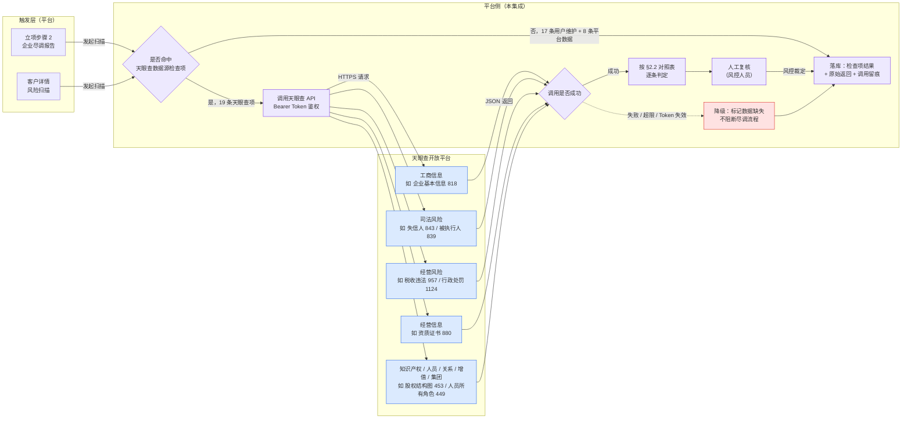
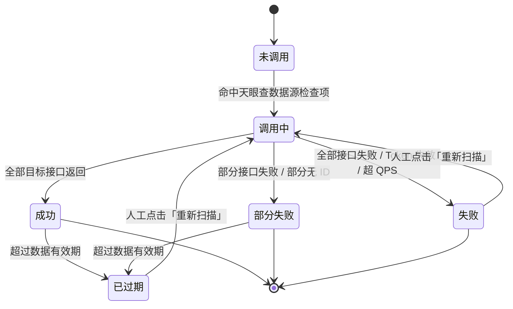

# 03 贸易风险合规 · 天眼查集成规格

> **文档类型**：PRD Writer 范式 · 落地需求文档 · **外部系统集成规格**
> **对应总纲**：[00-产品概述与需求总纲.md](./00-产品概述与需求总纲.md)
> **通用规范**：[01-通用交互与文案规范.md](./01-通用交互与文案规范.md)
> **源文档（只读，未做任何改动）**：[03.贸易风险合规-天眼查接口对照.md](../docs/03.贸易风险合规-天眼查接口对照.md)
> **上游消费方**：[02.01-项目管理.md](./02.01-项目管理.md)（立项步骤 2 企业尽调报告）/ [02.02-客户管理.md](./02.02-客户管理.md)（客户详情 8 类风险扫描）
> **整理时间**：2026-09-30

---

## 0. 阅读说明

### 0.1 本文档的定位（与功能模块文档的根本差异）

本文档**不是一个业务模块**，而是一份 **外部系统集成规格**：把 prototype 尽调表单 / 客户详情风险扫描中的 **44 条风险检查项**，逐条映射到天眼查开放平台（https://open.tianyancha.com）真实存在的 API 接口（含接口 ID）。

因此本章之后的内容按「**谁在什么场景下、看到什么、调用谁、拿到什么、失败了怎么办**」组织，**不按「页面 → 字段」组织**。

### 0.2 信息溯源标记

| 标记 | 含义 | 使用规则 |
|------|------|---------|
| ✅ | 源文档已明确 | 原值保留（接口 ID / 接口名称 / 路径 / 单价 / 检查项编号与文案），**不改写口径** |
| 🔷 | 范式补全 | 源文档没写，按范式要求推导，**已注明推导依据** |
| ⚠️ | 源文档自相矛盾 | **绝不静默选边**，如实并列，交由业务方裁决（汇总见 §3.4） |
| [待补充] | 信息不足 | **严禁编造**，需业务方 / 研发回填 |

> 🔴 **本文档最高准确性约束**：天眼查接口 ID 是具体数字 ID。全文所有接口 ID / 接口名称 / 接口路径 / 单价 **一律照抄源文档**，**未做任何外部核验**，**未凭常识推断或补全任何一个 ID**。源文档中 ID 缺失处，一律保留源文档的「—」并标 ⚠️ 或 [待补充]，**不做推断补齐**。见 §7.1。

### 0.3 源文档 6 章 → 范式章节归位映射表

| 源文档章节 | 源文档小节 | 归入本文档 | 归位理由 |
|---|---|---|---|
| 一、天眼查接口 ID 全景 | 9 个业务域接口清单 | **§5.1 + §5.2** | 接口清单是**外部数据源自身的字段规范**（接口 ID / 业务域 / 用途），属「数据规范」而非「交互」 |
| 二、44 条检查项 → API 对照 | A 主体准入 16 / B 主体风险 8 / C 贸易风险 12 / D 关联关系 6 | **§2.1 + §2.2** | 检查项是**尽调表单 / 客户详情风险扫描里的展示项与结果项**，用户直接看见它，交互细节章节才是它的正确归属（详见 §0.4） |
| 三、汇总统计 | 数据源分布 / 高频接口 / 未使用建议补强 | **§5.3 + §5.4** | 属数据源侧的**技术实现参考**（采购优先级、补强建议），随数据规范成章 |
| 四、调用方式示例 | 单接口调用 / 组合查询 | **§1.3 + §5.5** | 流程部分进「业务流程」，报文样例进「数据规范」 |
| 五、注意事项 | 5 条（ID 已锁定 / 路径版本 / Token 限频 / 脱敏字段 / 价格浮动） | **§4.1 / §4.2 / §4.3 / §4.4** | 全部是**边界条件**（配额、时效、第三方异常、合规留痕） |
| 六、附录 | 完整接口 ID 索引 | **附录 A** | 查阅型速查表，不进正文编号章节 |

### 0.4 关于「44 条检查项归 §2 还是归 §5」的判断说明

源文档第二章同时含**清单**与**映射**两层信息。本文按**读者角色**拆分归位：

- **§2.1 检查项清单** —— 面向**业务 / 产品 / 风控**：这 44 条是什么、分几类、每条数据源是谁。检查项是尽调表单与客户详情页的**展示内容**，按范式「用户看到什么」归入交互细节。
- **§2.2 检查项 → API 对照表** —— 面向**研发**：每条检查项该调哪个接口、拿哪个 ID。此表虽含接口 ID，但它的**主键是检查项（业务视角）而非接口（数据视角）**；若整体放进 §5 会割裂「检查项」这条业务主线，故与 §2.1 连续排布。

> 🔷 **推导依据**：范式 §5「功能详细描述」把「字段级规范」限定为**本系统自有实体的字段**（表名 / 字段名 / 类型 / 枚举），而天眼查接口 ID 属**外部系统的标识符**，不属于本系统字段规范。故对照表随业务主线留在 §2，接口清单本体归 §5.2。

### 0.5 源文档规模与核验结论

| 核验项 | 源文档声明 | 本次实测 | 结论 |
|---|---|---|---|
| 风险检查项总数 | 44 条 | **44 条**（编号 1~44 连续无缺号） | ✅ 一致 |
| A 主体准入类 | 16 条 | 16 条 | ✅ |
| B 主体风险类 | 8 条 | 8 条 | ✅ |
| C 贸易风险类 | 12 条 | **13 条** | ⚠️ 见 §3.4 C1 |
| D 关联关系类 | 6 条 | **7 条** | ⚠️ 见 §3.4 C2 |
| 业务域数 | 9 个 | 9 个（工商 / 司法风险 / 经营风险 / 经营信息 / 知识产权 / 人员相关 / 关系发现 / 增值服务 / 集团族群） | ✅ |
| 接口清单行数 | 未声明总数 | **135 行**（各域标题声明数与实际行数多处不符） | ⚠️ 见 §3.4 C8~C13 |
| 源文档篇幅 | v1.7.99.315（2026-09-17） | 366 行 / 27,121 字节（20,301 字符） | ✅ |

### 0.6 飞书多维表实测数据（2026-10-08）

> 🔴 **本文档最大的口径变更，请优先阅读本节。** §2.1 的 44 条不再是唯一口径；新增 §2.1.1 的 **27 条**为「平台实际生效」的权威口径。

#### 0.6.1 数据来源

| 项 | 值 |
|---|---|
| 数据来源 | 飞书多维表格「**准入企业负面+合规风险注入关系表**」 |
| base_token | `HxV6bNRcHav25NsC1u0cFK2onMf` |
| table_id | `tblmqbT1huleSMIO` |
| 记录总数 | **35 条** |
| 导出时间 | 2026-10-08 |
| 字段 | TAP / 检查项 / 风险类别 / 数据源归属 / 检查过程 / 合规要求项 / 接口 / 参数 / 关联查询项 / 父记录 / record_id |

#### 0.6.2 ⚠️ 27 条有效 vs 源文档 44 条（核心口径变更）

飞书表共 **35 条记录**，其中：

| 分类 | 条数 | record_id | 说明 |
|---|---|---|---|
| **有效检查项** | **27 条** | 见 §2.1.1 | 有检查项名称，是平台实际生效的规则 |
| 空壳记录 | **8 条** | `recvvmxKw6fYzp`、`recvvmy0SDBb5L`、`recvvmzMSg2kLV`、`recvvmzOqcJrH1`、`recvvmzQ0CzdM8`、`recvvn3JSlFBDI`、`recvvrlJ5W7wwG`、`recvvOxic7E3uX` | 7 条全字段为空；**1 条（`recvvmzMSg2kLV`）仅填了「风险类别=空壳企业风险」，无检查项**，属半填壳 |

**27 ≠ 44，且两者不是同一维度的东西，不构成重复登记：**

| 维度 | 27 条（飞书实测） | 44 条（源文档） |
|---|---|---|
| 回答的问题 | **什么算风险 / 什么触发预警**（规则侧） | **这个风险从哪个天眼查 API 取数**（数据侧） |
| 核心字段 | 检查项 / 风险类别 / 判定逻辑 / 检查过程文案 | 接口名称 / 接口 ID / 接口路径 / 单价 |
| 状态 | 平台实际生效 | 历史版本，尚未与 27 条完成映射 |
| 对应本文档 | **§2.1.1**（新） | §2.1 / §2.2（保留） |

> ✅ **结论：两张表互补，不是重复。** 44 条仍是接口采购与研发对接的唯一依据，**原样保留**；27 条是规则口径的唯一依据，**新增为权威**。二者尚未打通的映射关系见 §7.2 新增问题。

#### 0.6.3 实测发现的数据质量问题

| # | 问题 | 实测 | 影响 |
|---|---|---|---|
| **Q1** | 「接口」字段全空 | **35 条全部为空，0 条有值** | 27 条无法自动落地到天眼查接口 ID |
| **Q2** | 「参数」字段全空 | **35 条全部为空，0 条有值** | 调用参数（如分页 / 时间窗）无定义 |
| **Q3** | 检查过程大面积缺失 | 27 条中 **10 条为空**（全表口径 18 条为空） | 预警文案无法自动生成 |
| **Q4** | TAP 缺失 | 27 条中 **6 条未填**（全表口径 14 条未填） | 风险无法归入预警中心的 TAP 分组 |
| **Q5** | 空壳记录 | **8 条**无检查项 | 见 §0.6.2 |
| **Q6** | 风险类别缺失 | 全表 **7 条**无风险类别（即 7 条全空壳） | 分类统计口径需剔除 |
| **Q7** | 父记录字段全空 | 27 条 **0 条**有父记录 | 无法建立检查项的父子层级 |
| **Q8** | 检查过程含未替换占位符 | `recvvmykkRXCi6` 的文案含「实缴资本 **N** 万元」 | 文案未做数值渲染 |
| **Q9** | 检查过程为无效残值 | `recvvmykkRfw1n` = `"/"`；`recvvmzRIxJtt6` = `"N"` | 有值但不可用，**实际可用样本仅 15 条** |

#### 0.6.4 实测分布（以 27 条有效记录为口径）

| 维度 | 分布 |
|---|---|
| TAP | 贸易风险 **12** / 主体风险 **8** / 未填 **6** / 经营风险 **1** |
| 风险类别 | 空壳企业风险 **10** / 背离主业 **6** / 关联风险交易 **6** / 资质缺失 **4** / 客户产业链定位 **1** |
| 数据源归属 | 天眼查 **13** / 用户手动维护 **9** / 平台数据 **5** |
| 关联查询项 | 上游企业负面 + 下游企业负面 **22** / 上下游贸易合规风控 **5** |
| 检查过程 | 有 **17**（其中 2 条为无效残值）/ 无 **10** |

> ⚠️ **口径提示**：本表为 **27 条**口径。若按全表 35 条计，TAP 未填为 **14**、风险类别未归类为 **7**、数据源未标注为 **8**、关联查询项为空为 **8**。引用数字时**务必标明是 27 条还是 35 条口径**，否则会与源文档的 44 条口径再次混淆。

---

## 1. 功能描述与触发条件

### 1.1 功能描述（外部集成定位与边界）

**定位**：本集成是平台的**企业工商与司法风险数据供给通道**。平台不自建工商数据库，全部企业风险事实由天眼查开放平台提供，平台负责「调用 → 映射 → 判定 → 展示 → 留痕」。

**它做什么**（✅ 依源文档第二章映射表反推）：

1. 以企业名称为入参调用天眼查接口，取得工商 / 司法 / 经营 / 资质等事实数据；
2. 将返回数据按 **44 条风险检查项**逐条判定，产出「命中 / 未命中 / 数据缺失」结论；
3. 把结论回填到尽调表单与客户详情风险扫描的展示位；
4. 保留人工复核入口，由风控人员对命中项做最终裁定。

**它不做什么**（边界，✅ 依源文档映射表「数据源」列反推）：

| 不做的事 | 依据 |
|---|---|
| **不提供**黑名单 / 假国央企 / 授权书 / 个税记录类结论 | ✅ 源文档中这些检查项数据源标为「用户手动维护」，无对应天眼查接口 |
| **不提供**历史业务单据 / 仓储 / 担保 / 长期合作价差类结论 | ✅ 源文档中这些检查项数据源标为「平台数据」，无对应天眼查接口 |
| **不做企业准入的最终决策** | ✅ 源文档仅提供「接口 → 检查项」映射与采购建议，未定义决策规则引擎 |
| **不做资金流转、不做线上扣款** | ✅ 源文档全文无资金 / 放款 / 还款相关接口（与项目「资金流转线下完成」基线一致） |
| **不保证接口 ID 长期有效** | ✅ 源文档第五章第 2 条明确「接口路径可能版本切换」「价格随时调整」 |

> ⚠️ 44 条中**唯一检查项实为 36 条** —— A 组 #9~#16 与 B 组 #17~#24 为 8 条完全重复项，详见 §3.4 C4。

### 1.2 触发条件（何时调用天眼查）

| 触发场景 | 触发方 | 覆盖检查项 | 依据 |
|---|---|---|---|
| **企业尽调报告生成**（立项步骤 2） | [02.01-项目管理.md](./02.01-项目管理.md) | A 主体准入 16 条 + B 主体风险 8 条 | ✅ 源文档第二章 A / B 组 |
| **客户详情 8 类风险扫描** | [02.02-客户管理.md](./02.02-客户管理.md) | A / B / C / D 全部 44 条 | ✅ 源文档第二章 A~D 组 |
| **关联关系扫描**（上下游互保 / 交叉持股） | 平台在 D 类检查项触发时 | D 关联关系 7 条 | ✅ 源文档第二章 D 组 |

> 🔷 **推导依据**：源文档只给了「检查项 → 接口」映射，**未定义触发时机**。上述触发场景由本文档头部声明的**上游消费方**（02.01 立项步骤 2 / 02.02 客户详情 8 类风险扫描）反推，属范式补全。

### 1.3 调用流程



> ✅ 图中「19 条天眼查项 / 17 条用户维护 / 8 条平台数据」为**按源文档第二章映射表逐行实测**的结果（19 + 17 + 4 + 4 = 44）。
> ⚠️ 源文档第三章自己声明的分布是「天眼查 13 条 + 11 条复用、用户 22、平台数据 5、平台+用户 4」，合计 **55 ≠ 44**，详见 §3.4 C5。

### 1.4 上下游依赖（哪些模块消费本集成）

| 关系 | 模块 | 消费内容 | 依据 |
|---|---|---|---|
| **上游（触发方）** | [02.01-项目管理.md](./02.01-项目管理.md) | 立项步骤 2 企业尽调报告的 A / B 类 24 条检查项结果 | ✅ 源文档第二章 A / B 组 |
| **上游（触发方）** | [02.02-客户管理.md](./02.02-客户管理.md) | 客户详情 8 类风险扫描的全量 44 条检查项结果 | ✅ 源文档第二章 A~D 组 |
| **下游（数据供给）** | 天眼查开放平台 https://open.tianyancha.com/data | 9 个业务域共 135 行接口 | ✅ 源文档第一章 |
| **横向** | 预警中心 / 合同管理 / 资金管理等 | 源文档**未提及**任何其他模块消费本集成 | [待补充] |

> [待补充] 源文档未定义本集成结果是否回流至 [02.11-预警中心.md](./02.11-预警中心.md)。考虑到 C / D 类检查项（交叉持股 ≥25%、关联担保、长期固定合作价差不变）天然具备预警属性，**建议确认**是否需要在预警中心建风险事件，但**本文档不代为决定**。

---

## 2. 交互细节

> 📌 本章是源文档第二章「44 条检查项 → 天眼查 API 完整对照」的**全量保留**。归位理由见 §0.4。

### 2.1 44 条风险检查项清单

> ⚠️ **口径声明（2026-10-08 新增）**：**本表为源文档历史版本的数据侧参考，尚未与平台实际生效的 27 条检查项完成映射，接口字段在飞书表中当前为空。** 本表**原样保留源文档的 44 条与接口 ID**，不作删改；平台实际生效的规则口径见 **§2.1.1（27 条 · 权威）**。二者为「规则侧 ↔ 数据侧」的互补关系，**不是重复登记**。

> ✅ **条数核验：44 条，编号 1~44 连续无缺号，与源文档声明一致。**
> ⚠️ 但分组声明 C = 12 / D = 6 与实际 13 / 7 不符，详见 §3.4 C1~C3。
> ⚠️ 其中 8 条为完全重复项（A#9~16 = B#17~24），详见 §3.4 C4。

#### A. 主体准入类（源文档标注 16 条）

| # | 检查项 | 数据源 | 对应天眼查接口 | 接口 ID | 单价 | 判定逻辑 |
|---|---|---|---|---|---|---|
| 1 | 合作黑名单 | 用户手动维护 | — | — | — | [待补充] 源文档未给判定规则；数据源为用户手动维护，人工判定 |
| 2 | 假国央企 | 用户手动维护 | — | — | — | [待补充] 源文档未给判定规则；数据源为用户手动维护，人工判定 |
| 3 | 失信被执行人信息 | 天眼查 | 失信人（企业） | **843** | ¥0.50/次 | 🔷 失信人（企业）接口返回非空即命中（由检查项名称直译） |
| 4 | 被执行人信息 | 天眼查 | 被执行人（企业） | **839** | ¥0.15/次 | 🔷 被执行人（企业）接口返回非空即命中（由检查项名称直译） |
| 5 | 限制消费令信息 | 天眼查 | 限制消费令（企业） | — | ¥0.15/次 | 🔷 限制消费令（企业）接口返回非空即命中（由检查项名称直译） |
| 6 | 终本案件 | 天眼查 | 终本案件（企业） | — | ¥0.15/次 | 🔷 终本案件（企业）接口返回非空即命中（由检查项名称直译） |
| 7 | 税收违法信息 | 天眼查 | 税收违法 | **957** | ¥0.15/次 | 🔷 税收违法接口返回非空即命中（由检查项名称直译） |
| 8 | 行政/工商违法处罚信息 | 天眼查 | 行政处罚-工商局 | **1124** | ¥0.15/次 | 🔷 行政处罚-工商局接口返回非空即命中（由检查项名称直译） |
| 9 | 成立时间＜6 个月 | 天眼查 | 企业基本信息（含联系方式） | **818** | ¥0.20/次 | 🔷 企业成立时间 < 6 个月（阈值取自检查项名称） |
| 10 | 社保人数≤1 人 | 天眼查 | 企业基本信息（含联系方式） | **818** | ¥0.20/次 | 🔷 社保人数 ≤ 1 人（阈值取自检查项名称） |
| 11 | 无工资个税记录 | 用户手动维护 | — | — | — | [待补充] 源文档未给判定规则；数据源为用户手动维护，人工判定 |
| 12 | 注册地址为虚拟/集群/托管地址 | 天眼查 | 企业基本信息（含联系方式） | **818** | ¥0.20/次 | 🔷 注册地址命中虚拟地址 / 集群园区 / 托管地址判定库（判定库与关键词表 [待补充]） |
| 13 | 一址多企 ≥5 家 | 用户手动维护 | — | — | — | 🔷 同一注册地址下企业数 ≥ 5 家（阈值取自检查项名称） |
| 14 | 无实缴资本 | 天眼查 | 企业基本信息（含联系方式） | **818** | ¥0.20/次 | 🔷 实缴资本 = 0（由检查项名称直译） |
| 15 | 资质已过期或 30 天内即将到期 | 天眼查 | 资质证书 | **880** | ¥0.20/次 | 🔷 资质有效期 < 当前日期，或在 30 天内到期（阈值取自检查项名称） |
| 16 | 品牌类商品无正规授权书 | 用户手动维护 | — | — | — | [待补充] 源文档未给判定规则；数据源为用户手动维护，人工判定 |

#### B. 主体风险类（源文档标注 v1.7.99.302 新增 8 条）

> ⚠️ **C4 重复项提示**：B 组 #17~#24 与 A 组 #9~#16 逐条**名称、数据源、接口、接口 ID、单价完全相同**，属 8 条重复登记。**本文档照抄，不合并、不删除**；去重后的唯一检查项为 **36 条**。

| # | 检查项 | 数据源 | 对应天眼查接口 | 接口 ID | 单价 | 判定逻辑 |
|---|---|---|---|---|---|---|
| 17 | 成立时间＜6 个月 | 天眼查 | 企业基本信息（含联系方式） | **818** | ¥0.20/次 | 🔷 企业成立时间 < 6 个月（阈值取自检查项名称） |
| 18 | 社保人数≤1 人 | 天眼查 | 企业基本信息（含联系方式） | **818** | ¥0.20/次 | 🔷 社保人数 ≤ 1 人（阈值取自检查项名称） |
| 19 | 无工资个税记录 | 用户手动维护 | — | — | — | [待补充] 源文档未给判定规则；数据源为用户手动维护，人工判定 |
| 20 | 注册地址为虚拟/集群/托管地址 | 天眼查 | 企业基本信息（含联系方式） | **818** | ¥0.20/次 | 🔷 注册地址命中虚拟地址 / 集群园区 / 托管地址判定库（判定库与关键词表 [待补充]） |
| 21 | 一址多企 ≥5 家 | 用户手动维护 | — | — | — | 🔷 同一注册地址下企业数 ≥ 5 家（阈值取自检查项名称） |
| 22 | 无实缴资本 | 天眼查 | 企业基本信息（含联系方式） | **818** | ¥0.20/次 | 🔷 实缴资本 = 0（由检查项名称直译） |
| 23 | 资质已过期或 30 天内即将到期 | 天眼查 | 资质证书 | **880** | ¥0.20/次 | 🔷 资质有效期 < 当前日期，或在 30 天内到期（阈值取自检查项名称） |
| 24 | 品牌类商品无正规授权书 | 用户手动维护 | — | — | — | [待补充] 源文档未给判定规则；数据源为用户手动维护，人工判定 |

#### C. 贸易风险类（源文档标注 v1.7.99.303 新增 12 条）

> ⚠️ **C1**：源文档标题声明「12 条」，表格实际列出 **13 条**（编号 25~37）。本文档照抄 13 条，不删减。

| # | 检查项 | 数据源 | 对应天眼查接口 | 接口 ID | 单价 | 判定逻辑 |
|---|---|---|---|---|---|---|
| 25 | 拟开展单笔＞500 万大额贸易 | 用户手动维护 | — | — | — | 🔷 拟开展单笔金额 > 500 万（阈值取自检查项名称） |
| 26 | 无历史业务记录 | 平台数据 | — | — | — | 🔷 平台内无该企业历史业务单据（由检查项名称直译） |
| 27 | 突然开展大额新增品类贸易 | 用户手动维护 | — | — | — | [待补充] 源文档未给判定规则；数据源为用户手动维护，人工判定 |
| 28 | 经营范围中无贸易、供应链管理 | 天眼查 | 企业基本信息（含联系方式） | **818** | ¥0.20/次 | 🔷 工商经营范围不含「贸易」「供应链管理」关键词（关键词取自检查项名称） |
| 29 | 业务品类属于集团公司禁止开展的 | 用户手动维护 | — | — | — | [待补充] 源文档未给判定规则；数据源为用户手动维护，人工判定 |
| 30 | 公司具有清晰的供应链业务方向和模式 | 用户手动维护 | — | — | — | [待补充] 源文档未给判定规则；数据源为用户手动维护，人工判定 |
| 31 | 控制与集团主业关联度较低的业务规模 | 用户手动维护 | — | — | — | [待补充] 源文档未给判定规则；数据源为用户手动维护，人工判定 |
| 32 | 拟交易商品不在工商经营范围内 | 天眼查 | 企业基本信息（含联系方式） | **818** | ¥0.20/次 | 🔷 拟交易商品不在工商经营范围内（由检查项名称直译） |
| 33 | 危化/粮油/医药/能源无有效专项资质 | 天眼查 | 资质证书 | **880** | ¥0.20/次 | 🔷 危化 / 粮油 / 医药 / 能源品类无对应有效专项资质（品类取自检查项名称） |
| 34 | 无仓库、无仓储协议 | 平台数据 | — | — | — | [待补充] 源文档未给判定规则；数据源为平台数据 |
| 35 | 无固定物流合作、无运输资质、无稳定运力 | 用户手动维护 | — | — | — | [待补充] 源文档未给判定规则；数据源为用户手动维护，人工判定 |
| 36 | 合作客户中贸易类企业占比超过 80% | 用户手动维护 | — | — | — | 🔷 合作客户中贸易类企业占比 > 80%（阈值取自检查项名称） |
| 37 | 前五大客户变动频繁（连续三个月变动率＞50%） | 用户手动维护 | — | — | — | 🔷 前五大客户连续三个月变动率 > 50%（阈值取自检查项名称） |

#### D. 关联关系类（源文档标注 6 条）

> ⚠️ **C2**：源文档标题声明「6 条」，表格实际列出 **7 条**（编号 38~44）。本文档照抄 7 条，不删减。
> ⚠️ **C24**：#42 源文档接口名写作「企业基本信息」但配接口 ID **818**，而源文档第一章中 818 = **企业基本信息（含联系方式）**，「企业基本信息」实为 **1116**。**接口名与 ID 存在错配，照抄并标出，不代为修正。**

| # | 检查项 | 数据源 | 对应天眼查接口 | 接口 ID | 单价 | 判定逻辑 |
|---|---|---|---|---|---|---|
| 38 | 关联交易风险 | 用户手动维护 | — | — | — | [待补充] 源文档未给判定规则；数据源为用户手动维护，人工判定 |
| 39 | 上下游为同一企业或同一实际控制人 | 平台数据 + 用户 | 股权结构图 | **453** | ¥2.00/次 | 🔷 股权结构图比对：上下游为同一主体，或最终实际控制人一致 |
| 40 | 上下游交叉持股≥25% | 平台数据 + 用户 | 股权结构图 | **453** | ¥2.00/次 | 🔷 股权结构图比对：上下游交叉持股比例 ≥ 25%（阈值取自检查项名称） |
| 41 | 上下游董监高人员完全重合或交叉任职≥3 人 | 平台数据 + 用户 | 人员所有角色 | **449** | ¥6.00/次 | 🔷 董监高交叉任职人数 ≥ 3 人，或人员完全重合（阈值取自检查项名称） |
| 42 | 上下游注册/经营地址、电话、邮箱完全相同 | 平台数据 + 用户 | 企业基本信息 | **818** | ¥0.20/次 | 🔷 上下游注册/经营地址、电话、邮箱三项完全相同（由检查项名称直译） |
| 43 | 一方为另一方贸易合同提供连带责任担保 | 平台数据 | — | — | — | [待补充] 源文档未给判定规则；数据源为平台数据 |
| 44 | 上下游存在长期固定合作且价差不变≥6 个月 | 平台数据 | — | — | — | [待补充] 源文档未给判定规则；数据源为平台数据 |
>
> 🔷 **「判定逻辑」列说明（全文唯一的推导列）**：源文档**完全没有**提供任何判定表达式。为既不丢信息也不编造，本列规则为：
> - 检查项名称中**自带阈值**（如「成立时间＜6 个月」「交叉持股≥25%」「连续三个月变动率＞50%」）→ 标 🔷，**仅直译名称中的字面阈值**，不改写、不追加业务口径；
> - 源文档未给规则、或数据源为人工 / 平台数据的 → 标 **[待补充]**，**不编造**。
> - 研发实现前，需业务方 / 风控确认全部 🔷 行的判定表达式。

### 2.1.1 合规检查项实测清单（27 条 · 2026-10-08 权威）

> 🔴 **本节为平台实际生效的检查项权威口径**，数据源为飞书多维表「准入企业负面+合规风险注入关系表」（35 条记录中 **27 条有检查项内容**）。检查项名称、风险类别、分类**均逐字照抄飞书表原文，未做任何改写或润色**；原字段中的换行符已清理为单行。

> 🔴 **接口字段当前为空**：飞书表 35 条记录的「接口」与「参数」字段 **100% 为空**，因此本节**不填写任何天眼查接口 ID**。27 条与 §2.1 的 44 条尚未建立映射（详见 §0.6.2 与 §7.2）。

| 序号 | TAP | 风险类别 | 检查项 | 数据源归属 | 关联查询项 | 是否有检查过程 |
|---|---|---|---|---|---|---|
| 1 | 主体风险 | 空壳企业风险 | 成立时间<6个月 | 天眼查 | 上游企业负面/下游企业负面 | ✅ 有 |
| 2 | 贸易风险 | 背离主业 | 经营范围中无贸易、供应链管理 | 天眼查 | 上游企业负面/下游企业负面 | ❌ 无 |
| 3 | — 未填 | 关联风险交易 | 上下游为同一企业或同一实际控制人 | 天眼查 | 上下游贸易合规风控 | ✅ 有 |
| 4 | 贸易风险 | 资质缺失 | 拟交易商品不在工商经营范围内 | 天眼查 | 上游企业负面/下游企业负面 | ❌ 无 |
| 5 | 主体风险 | 背离主业 | 品牌类商品无正规授权书或授权已过期 | 用户手动维护 | 上游企业负面/下游企业负面 | ✅ 有 |
| 6 | 贸易风险 | 背离主业 | 业务品类属于集团公司禁止开展的业务范围 | 用户手动维护 | 上游企业负面/下游企业负面 | ❌ 无 |
| 7 | 贸易风险 | 背离主业 | 公司具有清晰的供应链业务方向和模式 | 用户手动维护 | 上游企业负面/下游企业负面 | ❌ 无 |
| 8 | 贸易风险 | 背离主业 | 控制与集团主业关联度较低的业务规模 | 用户手动维护 | 上游企业负面/下游企业负面 | ❌ 无 |
| 9 | 贸易风险 | 空壳企业风险 | 拟开展单笔>500万大额贸易 | 用户手动维护 | 上游企业负面/下游企业负面 | ✅ 有 |
| 10 | 主体风险 | 空壳企业风险 | 社保人数<=1人 | 天眼查 | 上游企业负面/下游企业负面 | ❌ 无 |
| 11 | 主体风险 | 空壳企业风险 | 无工资个税记录 | 用户手动维护 | 上游企业负面/下游企业负面 | ✅ 有 |
| 12 | 主体风险 | 空壳企业风险 | 注册地址为虚拟/集群/托管地址 | 天眼查 | 上游企业负面/下游企业负面 | ✅ 有 |
| 13 | 主体风险 | 空壳企业风险 | 一址多企≥5 家 | 用户手动维护 | 上游企业负面/下游企业负面 | ✅ 有 |
| 14 | 贸易风险 | 客户产业链定位 | 前五大客户变动频繁，连续三个月变动率＞50% | 平台数据 | 上游企业负面/下游企业负面 | ❌ 无 |
| 15 | 主体风险 | 空壳企业风险 | 无实缴资本 | 天眼查 | 上游企业负面/下游企业负面 | ✅ 有 |
| 16 | 经营风险 | 空壳企业风险 | 经营范围宽泛无具体品类 | 天眼查 | 上游企业负面/下游企业负面 | ⚠️ 有（残值 `/`） |
| 17 | 贸易风险 | 空壳企业风险 | 无历史业务记录 | 平台数据 | 上游企业负面/下游企业负面 | ✅ 有 |
| 18 | 贸易风险 | 空壳企业风险 | 突然开展大额新增品类贸易 | 平台数据 | 上游企业负面/下游企业负面 | ❌ 无 |
| 19 | — 未填 | 关联风险交易 | 上下游交叉持股≥25% | 天眼查 | 上下游贸易合规风控 | ✅ 有 |
| 20 | — 未填 | 关联风险交易 | 上下游董监高人员完全重合或交叉任职≥3 人 | 天眼查 | 上下游贸易合规风控 | ✅ 有 |
| 21 | — 未填 | 关联风险交易 | 上下游注册 / 经营地址、电话、邮箱完全相同 | 天眼查 | 上下游贸易合规风控 | ✅ 有 |
| 22 | — 未填 | 关联风险交易 | 一方为另一方贸易合同提供连带责任担保 | 用户手动维护 | 上游企业负面/下游企业负面 | ❌ 无 |
| 23 | — 未填 | 关联风险交易 | 上下游存在长期固定合作且价差不变≥6个月 | 平台数据 | 上下游贸易合规风控 | ✅ 有 |
| 24 | 贸易风险 | 资质缺失 | 危化 / 粮油 / 医药 / 能源无有效专项资质 | 天眼查 | 上游企业负面/下游企业负面 | ⚠️ 有（残值 `N`） |
| 25 | 贸易风险 | 资质缺失 | 无仓库、无仓储协议 | 平台数据 | 上游企业负面/下游企业负面 | ✅ 有 |
| 26 | 贸易风险 | 资质缺失 | 无固定物流合作、无运输资质、无稳定运力 | 用户手动维护 | 上游企业负面/下游企业负面 | ❌ 无 |
| 27 | 主体风险 | 背离主业 | 资质已过期或 30 天内即将到期 | 天眼查 | 上游企业负面/下游企业负面 | ✅ 有 |

> ✅ **计数核验：27 行，序号 1~27 连续无缺号，无遗漏、无合并、无改写。**

#### 检查过程文案规范

飞书表中**有检查过程的记录共 17 条**，其中 **15 条为可用的完整 N / Y 双分支文案**（另 2 条为无效残值，见下）。经抽取比对，全表文案统一遵循以下模板：

```
N：截至 {时间}，{判定说明}，未触发预警。
Y：截至 {时间}，{判定说明}，已触发预警。
```

**规范要点：**

| # | 规范项 | 要求 |
|---|---|---|
| 1 | 分支标记 | 以 `N`（未触发）/ `Y`（已触发）开头，`N` 在前、`Y` 在后，两分支必须成对出现 |
| 2 | 时间戳 | 统一为 `截至 {YYYY-MM-DD HH:mm:ss}`，为**检查执行时刻**，非录入时刻 |
| 3 | 判定说明 | 描述**企业实际取数结果**（如「企业成立时间 2009-01-01，已超过 6 个月」），须含具体数值 / 事实，**不得只写结论** |
| 4 | 结论语 | N 分支固定收尾「未触发预警。」；Y 分支固定收尾「已触发预警。」 |
| 5 | 标点 | 全角逗号与句号；**不换行**（飞书表原文中的换行符为存储格式，渲染时合并为单行） |

> 📌 **待补齐范围**：剩余 **10 条无检查过程**（序号 2 / 4 / 6 / 7 / 8 / 10 / 14 / 18 / 22 / 26）需按上述模板补写。

> ⚠️ **已知脏数据（不得直接复用，需业务方确认后重写）**：
> - 序号 **16**（经营范围宽泛无具体品类）：检查过程值为 `/`，**无实际内容**；
> - 序号 **24**（危化 / 粮油 / 医药 / 能源无有效专项资质）：检查过程值为 `N`，**仅有分支标记、无判定说明**；
> - 序号 **15**（无实缴资本）：文案含未替换占位符「实缴资本 **N** 万元」，**数值未渲染**。
>
> 上述 3 条虽有值，但**不计入 15 条可用样本**，须按模板重写。

> ⚠️ **格式不统一现状**：17 条有值记录中，`N：截至`（全角冒号）8 条、`N截至`（无冒号）7 条。补写时**统一采用全角冒号**格式。
> ⚠️ **时间戳单一**：全部 30 处时间戳均为同一时刻 `2026-07-17 15:46:04`，提示现有文案为**批量生成或测试数据**，非真实逐次执行留痕。

### 2.2 检查项 → 天眼查 API 对照

下表按**接口维度**反向汇总，供研发排期与接口采购决策使用。✅ 接口名称 / 接口 ID / 单价 / 业务域全部照抄源文档或由源文档接口清单机械反查得出，未编造。

| 天眼查接口 | 接口 ID | 所属业务域 | 命中检查项编号 | 命中条数 | 单价 | 源文档 §三 声明命中数 |
|---|---|---|---|---|---|---|
| 企业基本信息（含联系方式） | **818** | 工商信息 | 9, 10, 12, 14, 17, 18, 20, 22, 28, 32, 42 | 11 条 | ¥0.20/次 | 6 条 ⚠️ |
| 资质证书 | **880** | 经营信息 | 15, 23, 33 | 3 条 | ¥0.20/次 | 2 条 ⚠️ |
| 股权结构图 | **453** | 关系发现 | 39, 40 | 2 条 | ¥2.00/次 | 2 条（辅助） ✅ |
| 行政处罚-工商局 | **1124** | 经营风险 | 8 | 1 条 | ¥0.15/次 | 1 条 ✅ |
| 人员所有角色 | **449** | 人员相关 | 41 | 1 条 | ¥6.00/次 | 1 条（辅助） ✅ |
| 被执行人（企业） | **839** | 司法风险 | 4 | 1 条 | ¥0.15/次 | 1 条 ✅ |
| 失信人（企业） | **843** | 司法风险 | 3 | 1 条 | ¥0.50/次 | 1 条 ✅ |
| 税收违法 | **957** | 经营风险 | 7 | 1 条 | ¥0.15/次 | 1 条 ✅ |

> ⚠️ **C6 / C7**：接口 **818** 源文档 §三 称命中「6 条」，按 §二 映射表逐行实测为 **11 条**；接口 **880** 称「2 条」，实测为 **3 条**。本文档**两值并列，不静默选边**。
> ✅ 无 ID 的 2 条天眼查检查项（#5 限制消费令（企业）、#6 终本案件（企业））在源文档第一章中同样无 ID，此处一并保留「—」，不补全。

### 2.3 风险等级与展示

| 风险等级 | 含义 | 检查项结果 | 展示形态 |
|---|---|---|---|
| 🔴 高风险 | 命中否决型检查项 | 命中风险 | 阻断 / 强制人工复核 |
| 🟡 中风险 | 命中需关注型检查项 | 命中风险 | 提示 + 需说明 |
| ⚪ 低风险 | 未命中 | 正常 | 灰底通过态 |
| ⚪ 无结论 | 数据取不到 | 数据缺失 | 灰底 +「数据获取失败」 |
| 🔵 待定 | 机器不可判 | 待人工确认 | 蓝底 + 复核入口 |

> 🔷 **推导依据**：源文档**完全没有**风险等级定义，只在检查项文案里隐含严重性差异。**本文档不代业务方定义哪 44 条属于高 / 中 / 低** —— 逐条分级属风控策略，须由风控负责人出具，标记 [待补充]。上表仅定义**结果状态与展示形态**的框架，映射到具体检查项的分级表 [待补充]。

### 2.4 调用失败与降级引导

| 失败情形 | 表现 | 降级引导 | 依据 |
|---|---|---|---|
| **接口无 ID** | 源文档中该接口 ID 为「—」 | 无法调用，检查项直接置「数据缺失」 | ✅ 源文档第一章大量接口无 ID |
| **Token 失效** | 鉴权失败 | 提示「天眼查授权已失效，请联系管理员」，不阻断尽调 | 🔷 由 §4.3 第三方异常推导 |
| **超出 QPS** | 限频 | 排队重试，超时置「数据缺失」 | 🔷 源文档第五章第 3 条「QPS ≤ 20」 |
| **接口版本切换** | 404 / 路径失效 | 提示「接口需按官方当前版本调整」，**不静默换路径** | ✅ 源文档第五章第 2 条 |
| **数据本身缺失** | 接口返回空 | 置「数据缺失」，**严禁当作「正常」** | 🔷 风险导向推导 |

> 🔴 **降级铁律（🔷 推导依据：风控数据缺失 ≠ 风险通过）**：天眼查取不到数据的检查项，**一律不得显示为「正常」**，必须显示为「数据缺失」并附复核入口。**理由**：本集成是尽调风控的唯一外部数据源，缺失若被误判为通过会造成准入风险漏放。

### 2.5 人工复核入口

| 复核对象 | 入口位置 | 复核人 | 复核后动作 |
|---|---|---|---|
| 命中风险项 | 尽调报告 / 客户详情风险项详情 | 风控人员 | 裁定「确认风险 / 误报」并留痕 |
| 数据缺失项 | 同上 | 风控人员 | 转人工核查或放行 |
| 用户手动维护项（17 条） | 尽调表单录入区 | 业务经理 | 录入结论 |

> [待补充] 源文档未定义**复核角色权限、复核 SLA、复核结论枚举值**。§2.3 的风险分级同此，均须业务方回填。

---

## 3. 状态清单

### 3.1 集成调用状态机



| 状态 | 含义 | 界面表现 | 依据 |
|---|---|---|---|
| 未调用 | 尚未发起扫描 | 「待扫描」 | 🔷 范式补全 |
| 调用中 | 请求在途 | 骨架屏 / 转圈 | 🔷 范式补全 |
| 成功 | 目标接口全部返回 | 正常展示检查项结果 | 🔷 范式补全 |
| 部分失败 | 部分接口失败或无 ID | 成功项正常 + 失败项「数据缺失」 | 🔷 范式补全（对应源文档中大量无 ID 接口） |
| 失败 | 全部失败 | 错误提示 + 重试按钮 | 🔷 范式补全 |
| 已过期 | 超过数据有效期 | 灰底 +「数据已过期，重新扫描」 | 🔷 范式补全（有效期见 §4.2） |

> 🔷 **推导依据**：源文档**无状态机章节**。状态划分依据为「源文档映射表中存在无 ID 接口 → 必然存在部分失败」+ 源文档第五章「接口路径可能版本切换 / 价格随时调整 / Token 限频」三条边界事实。

### 3.2 风险项结果状态

| 状态 | 枚举含义 | 数据源分布 | 依据 |
|---|---|---|---|
| 正常 | 未命中风险 | 天眼查 19 条 + 用户维护 17 条 + 平台数据 8 条 | ✅ 按 §二 实测 |
| 命中风险 | 命中该检查项风险 | 同上 | ✅ |
| 数据缺失 | 天眼查取不到 / 接口无 ID / 调用失败 | 主要集中在无 ID 接口 | 🔷 范式补全 |
| 待人工确认 | 机器不可判，需风控裁定 | 17 条用户维护项天然属于此类 | 🔷 范式补全 |

> ⚠️ 源文档**未定义任何结果状态枚举**。上表为范式补全，枚举值命名需与 [01-通用交互与文案规范.md](./01-通用交互与文案规范.md) 对齐。

### 3.3 UI 状态清单

| 界面 | 默认态 | 加载中 | 成功 | 失败 | 禁用 | 空状态 |
|---|---|---|---|---|---|---|
| **尽调报告风险扫描区** | 「待扫描」按钮 | 骨架屏 +「天眼查扫描中…」 | 检查项结果列表 | 「扫描失败，重试」 | Token 失效时按钮禁用 | 「暂无风险检查结果」 |
| **单条检查项行** | 未扫描 | 单行转圈 | 命中 / 正常标签 | 「数据缺失」灰标 | 用户维护项对风控角色禁用 | — |
| **关联关系扫描区** | 「待扫描」 | 转圈 | 关联关系图 + 结论 | 「数据缺失」 | 未开通 449 / 453 采购时禁用 | 「未发现关联关系」 |
| **资质有效期项** | 「待扫描」 | 单行转圈 | 到期日 + 倒计时 | 「数据缺失」 | — | 「无资质记录」 |

> 🔷 **推导依据**：源文档为接口对照文档，**无任何 UI 描述**。上表依据「44 条检查项在尽调表单 / 客户详情中的展示位」+ §1.3 调用流程推导，具体文案需与 [01-通用交互与文案规范.md](./01-通用交互与文案规范.md) 对齐后回填。

### 3.4 ⚠️ 版本冲突与源文档矛盾清单

**本节是本文档最高价值部分。** 源文档存在 **24 处**自相矛盾，全部如实并列，**未静默选边**。其中 **C1~C4 已于 2026-10-08 结合飞书多维表实测数据重新表述**（见下方「条数口径」说明）。

> 🔴 **条数口径说明（2026-10-08）**：本文档现同时存在**三个不同口径**，引用时**必须标明是哪一个**，否则必然再次混淆：
>
> | 口径 | 数值 | 含义 | 出处 |
> |---|---|---|---|
> | **规则侧（现行生效）** | **27 条** | 平台实际生效的检查项 | 飞书表实测，见 **§2.1.1** |
> | 飞书表原始记录数 | 35 条 | = 27 条有效 + 8 条空壳 | 飞书表实测，见 §0.6.2 |
> | 数据侧（源文档历史版本） | 44 条 | 检查项 → 天眼查接口的取数映射 | 源文档，见 §2.1 / §2.2 |
>
> **27 与 44 相差 17 条，且二者不是同一维度**（27 = 规则侧「什么触发预警」，44 = 数据侧「从哪个 API 取数」），**不是重复登记，也不是简单的对错关系**。

| 编号 | 位置 | 源文档说法 A | 源文档说法 B / 实测 | 冲突性质 |
|---|---|---|---|---|
| **C1** | 第二章 C 组标题 | 「12 条」 | 表格实际 **13 条**（25~37） | 声明数 vs 实际行数 |
| **C2** | 第二章 D 组标题 | 「6 条」 | 表格实际 **7 条**（38~44） | 声明数 vs 实际行数 |
| **C3** | 第二章整体 | 总声明「44 条」 | 分项声明 16+8+12+6 = **42** | 分项合计 vs 总声明 |
| **C4** | 第二章 A 组 vs B 组 | A#9~16 与 B#17~24 是两组独立检查项 | 8 条**名称 / 数据源 / 接口 / ID / 单价完全相同**；唯一检查项实为 **36** 条 | 内容重复登记 |
| **C4-新** | 源文档 44 条 ↔ 飞书表 27 条 | 源文档口径 **44 条**（数据侧） | 飞书表实测**有效 27 条 / 记录 35 条**（规则侧）；差 **17** 条，**尚未建立映射** | **口径不一致 · 待裁决**（见 §7.2 问题 1） |
| **C5** | 第三章 数据源分布 | 天眼查 13 + 11 复用 = 24 / 用户 22 / 平台 5 / 平台+用户 4 | 合计 **55 ≠ 44**；按第二章实测为 天眼查 **19** / 用户 **17** / 平台 **4** / 平台+用户 **4** = 44 | 统计口径矛盾 |
| **C6** | 第三章 高频接口 | 818 企业基本信息 命中「6 条」 | 第二章实测命中 **11 条** | 统计口径矛盾 |
| **C7** | 第三章 高频接口 | 880 资质证书 命中「2 条」 | 第二章实测命中 **3 条** | 统计口径矛盾 |
| **C8** | 第一章 §1 工商信息 | 「19 个」 | 表格实际 **21 行**（8 有 ID + 13 无 ID） | 声明数 vs 实际行数 |
| **C9** | 第一章 §2 司法风险 | 「23 个」 | 表格实际 **25 行**（含人员侧 4 行） | 声明数 vs 实际行数 |
| **C10** | 第一章 §4 经营信息 | 「31 个」 | 表格实际 **26 行** | 声明数 vs 实际行数 |
| **C11** | 第一章 §6 人员相关 | 「6+ 个」 | 表格实际 **7 行** | 声明数 vs 实际行数 |
| **C12** | 第一章 §7 关系发现 | 「8 个」 | 表格实际 **7 行** | 声明数 vs 实际行数 |
| **C13** | 第一章 §9 集团族群 | 「7 个」 | 表格实际 **8 行** | 声明数 vs 实际行数 |
| **C14** | 附录 工商信息 | 「+ 10 个无 ID」 | 第一章实际 **13 个无 ID** | 附录 vs 正文 |
| **C15** | 附录 司法风险 | 「+ 10 个无 ID」 | 第一章实际 **15 个无 ID** | 附录 vs 正文 |
| **C16** | 附录 经营信息 | 「+ 27 个无 ID」 | 第一章实际 **22 个无 ID** | 附录 vs 正文 |
| **C17** | 附录 人员相关 | 「+ 1 个无 ID」 | 第一章实际 **2 个无 ID** | 附录 vs 正文 |
| **C18** | 附录 集团族群 | 「+ 6 个无 ID」 | 第一章实际 **7 个无 ID** | 附录 vs 正文 |
| **C19** | 附录 增值服务 | 「暂无完整 ID（建议另查）」 | 第一章已列 **3 个**接口（企业天眼风险 / 企业空壳洞察 / 司法解析，均无 ID） | 附录 vs 正文 |
| **C20** | 第一章跨域 | ID **1101** 属「司法风险 · 人员侧」 | 同一 ID **1101** 同时出现在「集团族群」 | 跨域 ID 重复 |
| **C21** | 第一章跨域 | 「司法解析」属司法风险 `/law/judicialAnalysis` | 同名接口另见「增值服务」`/risk/judicialAnalysis` | 同名接口路径不一致 |
| **C22** | 附录 | 另列 7 个业务域：上市信息 / 投资机构 / 私募基金 / 建筑资质 / 组合接口 / 报告服务 / 特色接口 | 第一章「9 个业务域」**完全不含**这些域，且**无任何接口清单** | 域范围矛盾 |
| **C23** | 第一章表格结构 | 8 个业务域表均为 5 列（接口名 / ID / 路径 / 单价 / 链接） | 「集团族群」表仅 4 列，**缺「接口路径」** | 表结构不一致 |
| **C24** | 第二章 #42 | 接口名「企业基本信息」，ID **818** | 第一章中 818 = **企业基本信息（含联系方式）**；「企业基本信息」实为 **1116** | 接口名与 ID 错配 |

> 🔴 **处理原则**：以上 24 条**均不代为修正**。业务方裁决后，需同步回写源文档与本文档。
> ✅ **核验通过项（供业务方放心使用）**：44 条总数、9 个业务域数、135 行接口清单、经营风险域 28 行、知识产权域 10 行、关系发现域附录条目、A 组 16 条、B 组 8 条。
> ⚠️ **2026-10-08 增补**：C1~C4 描述的是**源文档内部**的条数矛盾，仍然成立；新增 **C4-新** 描述**源文档 44 条 ↔ 飞书表 27 条**的跨文档口径差异，该项**必须由业务方裁决**（见 §7.2 问题 1）。
> 🔴 **本文档规则侧权威口径自 2026-10-08 起为 27 条**（§2.1.1）；§2.1 / §2.2 的 44 条**保留为数据侧参考**，不再是规则口径。

---

## 4. 边界条件

### 4.1 配额与限流（天眼查 API 调用次数限制）

| 约束 | 源文档原值 | 依据 |
|---|---|---|
| **基础版 QPS** | **QPS ≤ 20** | ✅ 源文档第五章第 3 条，超出需申请扩容 |
| **计费方式** | 按次计费，单价 ¥0.10 ~ ¥6.00 / 次 | ✅ 源文档第一章各表「单价」列 |
| **最高单价接口** | 人员所有角色 449 ¥6.00 / 次；人员所有历史角色 ¥6.00 / 次；人员控股企业 1033 ¥6.00 / 次 | ✅ 照抄源文档 |
| **最低单价接口** | 企业三要素验证、知识产权域接口 ¥0.10 / 次 | ✅ 照抄源文档 |
| **价格浮动** | 「价格随时调整」，签约以商务报价为准（400-608-0000） | ✅ 源文档第五章第 5 条 |
| **单次扫描成本** | [待补充] 源文档**未给出**「一次 44 条扫描」的总调用次数与总价 | — |

> 🔷 **推导依据**：44 条中 19 条走天眼查，但 #9 / 10 / 12 / 14 / 17 / 18 / 20 / 22 / 28 / 32 / 42 **共 11 条共用同一接口 818**。若每次扫描各调 1 次，818 单接口即产生 11 次计费。**是否需要结果缓存以压缩调用次数属架构决策，源文档未涉及，标记 [待补充]**（相关落库口径见 §5.6）。

### 4.2 数据时效（风险数据过期策略）

| 约束 | 内容 | 依据 |
|---|---|---|
| **接口版本时效** | 天眼查在 2024-2025 期间多次切换接口版本（如 `v2` → `baseinfoV2/2.0`），**签约前以数据超市当前页为准** | ✅ 源文档第五章第 2 条 |
| **数据有效期** | [待补充] 源文档**未定义**风险数据的有效期（工商类 / 司法类 / 经营类各多久过期） | — |
| **历史类接口** | 源文档接口清单中含大量 `History` 后缀接口（历史股东 / 历史失信 / 历史股权出质等）均**无 ID**，采购前需确认 | ✅ 照抄源文档接口名 |
| **建议默认口径** | 🔷 工商类 30 天 / 司法类 7 天 / 经营类 30 天重新扫描 | **仅为占位建议，源文档无此数值，须风控确认后方可采用** |

### 4.3 第三方接口异常与降级

| 异常 | 源文档口径 | 本集成处理 |
|---|---|---|
| **接口路径失效 / 版本切换** | ✅ 第五章第 2 条明确「可能版本切换」 | 不静默换路径；报「接口需按官方当前版本调整」 |
| **Token 限频** | ✅ 第五章第 3 条 QPS ≤ 20 | 排队 + 重试；超限转「数据缺失」 |
| **接口 ID 缺失** | ✅ 第一章大量接口 ID 为「—」 | 该检查项直接置「数据缺失」，跳过调用 |
| **接口 ID 与名称错配** | ⚠️ C24（#42） | 照抄并标出，**研发联调时以官方文档核实** |
| **服务不可用** | [待补充] 源文档未定义 | 降级为「数据缺失」+ 人工复核入口（§2.4） |

> ✅ 源文档第五章第 1 条：表中粗体 ID「经第三方集成商『快鲸智慧楼宇』长期使用验证，确认可被天眼查 API 网关接受」。⚠️ 该验证来自**第三方集成商使用记录**，**非天眼查官方文档直接核验**，见 §7.1。

### 4.4 数据合规（企业信息查询的授权与留痕）

| 约束 | 内容 | 依据 |
|---|---|---|
| **脱敏字段** | 法定代表人身份证号、联系方式默认脱敏，**需单独申请权限** | ✅ 源文档第五章第 4 条 |
| **查询授权** | [待补充] 企业信息查询的用户授权与告知文案，源文档**未涉及** | 需法务确认 |
| **调用留痕** | [待补充] 源文档**未定义**调用日志的留存范围与期限 | 🔷 建议留存：入参企业名、接口 ID、调用时间、返回码、复核结论（推导依据：风控数据须可追溯） |
| **数据二次使用 / 出境** | [待补充] 源文档**未涉及** | 需法务确认 |

> 🔴 **项目基线一致性检查**：本文档**不含**任何资金流转 / 线上扣款 / 放款还款接口，与项目「资金流转线下完成 + 系统流程化登记」基线**一致**。

---

## 5. 数据规范

### 5.1 外部数据源总览（9 个业务域）

✅ 源文档第一章共 9 个业务域，合计 **135 行**接口清单。

| # | 业务域 | 源文档声明数 | 实际行数 | 核验 | 有 ID | 无 ID | 本平台用途 |
|---|---|---|---|---|---|---|---|
| 1 | 工商信息 | 19 个 | 21 | ⚠️ | 8 | 13 | 企业基本信息、股东、人员、变更记录（支撑 #9 / 10 / 12 / 14 / 17 / 18 / 20 / 22 / 28 / 32 / 42） |
| 2 | 司法风险 | 23 个 | 25 | ⚠️ | 10 | 15 | 失信、被执行、限消令、终本（支撑 #3~#6） |
| 3 | 经营风险 | 28 个 | 28 | ✅ | 6 | 22 | 税收违法、行政处罚、股权出质、动产抵押 |
| 4 | 经营信息 | 31 个 | 26 | ⚠️ | 4 | 22 | 资质证书、税务评级、一般纳税人、行政许可 |
| 5 | 知识产权 | 10 个 | 10 | ✅ | 5 | 5 | [待补充] 源文档未把知识产权域映射到任何检查项 |
| 6 | 人员相关 | 6+ 个 | 7 | ⚠️ | 5 | 2 | 人员所有角色（支撑 #41 董监高交叉任职） |
| 7 | 关系发现 | 8 个 | 7 | ⚠️ | 2 | 5 | 股权结构图（支撑 #39 / #40 关联关系） |
| 8 | 增值服务 | 未声明 | 3 | ⚠️ | 0 | 3 | 企业天眼风险、企业空壳洞察、司法解析 |
| 9 | 集团族群 | 7 个 | 8 | ⚠️ | 1 | 7 | 所属集团、集团成员（支撑 #29 集团禁止业务类判断的人工输入） |

> ⚠️ **C8~C13**：9 个业务域中 **6 个**的标题声明数与表格实际行数不符（工商 19/21、司法 23/25、经营信息 31/26、人员相关 6+/7、关系发现 8/7、集团族群 7/8）。本文档**两值并列**，实际行数经逐行核验。
> ⚠️ **C22**：源文档附录另列「上市信息 / 投资机构 / 私募基金 / 建筑资质 / 组合接口 / 报告服务 / 特色接口」7 个业务域，**第一章 9 域不含这些域，也无任何接口清单**，本文档无法展开，标 [待补充]。

### 5.2 接口清单（9 个业务域完整保留）

> ✅ **本节为源文档第一章 100% 保留**，接口名称 / 接口 ID / 接口路径 / 单价 / 文档链接**逐行照抄，未做任何改动、未做任何补全**。
> 📌 **关于「用途」列**：源文档接口清单**未设独立「用途」列**，接口名称本身即承载用途语义；末列为官方详情页链接。本文档**照抄原列结构**，不臆造「用途」文字。


#### 5.2.1 工商信息（源文档声明 19 个 / 实际 21 行 ⚠️ 不一致）

| 接口名 | 接口 ID | 接口路径（v3） | 单价 | 文档链接 |
|---|---|---|---|---|
| 企业基本信息 | **1116** | `/services/open/ic/baseinfo/2.0` | ¥0.15/次 | https://open.tianyancha.com/data/open/1116 |
| 企业基本信息（含联系方式） | **818** | `/services/open/ic/baseinfoV2/2.0` | ¥0.20/次 | https://open.tianyancha.com/data/open/818 |
| 企业基本信息（特殊） | — | `/services/open/ic/specialBaseInfo` | — | https://open.tianyancha.com/data/open |
| 企业类型 | **1047** | `/services/open/ic/companyType` | ¥0.15/次 | https://open.tianyancha.com/data/open/1047 |
| 企业三要素验证 | — | `/services/open/ic/verify/2.0` | ¥0.10/次 | https://open.tianyancha.com/data/open |
| 工商快照 | — | `/services/open/ic/snapshot` | ¥0.50/次 | https://open.tianyancha.com/data/open |
| 企业联系方式 | — | `/services/open/ic/contactInfo` | ¥0.15/次 | https://open.tianyancha.com/data/open |
| 主要人员 | **820** | `/services/open/ic/staff` | ¥0.15/次 | https://open.tianyancha.com/data/open/820 |
| 历史主要人员 | — | `/services/open/ic/staffHistory` | — | https://open.tianyancha.com/data/open |
| 企业股东 | — | `/services/open/ic/holder/2.0` | ¥0.15/次 | https://open.tianyancha.com/data/open |
| 历史股东信息 | — | `/services/open/ic/holderHistory` | — | https://open.tianyancha.com/data/open |
| 股东信息（即企业股东别名） | **821** | `/services/open/ic/holder` | ¥0.15/次 | https://open.tianyancha.com/data/open/821 |
| 公司公示-股东出资 | **997** | `/services/open/ic/holderList/2.0` | ¥0.15/次 | https://open.tianyancha.com/data/open/997 |
| 公司公示-股权变更 | — | `/services/open/ic/equityChange` | ¥0.15/次 | https://open.tianyancha.com/data/open |
| 对外投资 | **823** | `/services/open/ic/investment` | ¥0.15/次 | https://open.tianyancha.com/data/open/823 |
| 历史对外投资 | — | `/services/open/ic/investmentHistory` | ¥0.15/次 | https://open.tianyancha.com/data/open |
| 分支机构 | — | `/services/open/ic/branch` | ¥0.15/次 | https://open.tianyancha.com/data/open |
| 总公司 | — | `/services/open/ic/headCompany` | ¥0.15/次 | https://open.tianyancha.com/data/open |
| 企业年报 | — | `/services/open/ic/annualReport` | ¥0.15/次 | https://open.tianyancha.com/data/open |
| 变更记录 | **822** | `/services/open/ic/changeRecord` | ¥0.15/次 | https://open.tianyancha.com/data/open/822 |
| 历史工商信息 | — | `/services/open/ic/historyInfo` | ¥0.15/次 | https://open.tianyancha.com/data/open |

#### 5.2.2 司法风险（源文档声明 23 个 / 实际 25 行 ⚠️ 不一致）

| 接口名 | 接口 ID | 接口路径（v3） | 单价 | 文档链接 |
|---|---|---|---|---|
| 法律诉讼 | **1114** | `/services/open/law/lawsuit` | ¥0.15/次 | https://open.tianyancha.com/data/open/1114 |
| 法律诉讼详情 | — | `/services/open/law/lawsuitDetail` | ¥0.15/次 | https://open.tianyancha.com/data/open |
| 历史法律诉讼 | — | `/services/open/law/lawsuitHistory` | ¥0.15/次 | https://open.tianyancha.com/data/open |
| 开庭公告 | **840** | `/services/open/law/courtNotice` | ¥0.15/次 | https://open.tianyancha.com/data/open/840 |
| 历史开庭公告 | — | `/services/open/law/courtNoticeHistory` | ¥0.15/次 | https://open.tianyancha.com/data/open |
| 法院公告 | **841** | `/services/open/law/courtAnnouncement` | ¥0.15/次 | https://open.tianyancha.com/data/open/841 |
| 法院公告历史 | — | `/services/open/law/courtAnnouncementHistory` | ¥0.15/次 | https://open.tianyancha.com/data/open |
| 送达公告 | — | `/services/open/law/serviceNotice` | ¥0.15/次 | https://open.tianyancha.com/data/open |
| 立案信息 | **961** | `/services/open/law/caseFiling` | ¥0.15/次 | https://open.tianyancha.com/data/open/961 |
| 司法协助 | — | `/services/open/law/judicialAssistance` | ¥0.15/次 | https://open.tianyancha.com/data/open |
| 司法协助详情 | — | `/services/open/law/judicialAssistanceDetail` | ¥0.15/次 | https://open.tianyancha.com/data/open |
| 历史司法协助 | — | `/services/open/law/judicialAssistanceHistory` | ¥0.15/次 | https://open.tianyancha.com/data/open |
| 破产重整 | — | `/services/open/law/bankruptcy` | ¥0.15/次 | https://open.tianyancha.com/data/open |
| 破产重整详情 | — | `/services/open/law/bankruptcyDetail` | ¥0.15/次 | https://open.tianyancha.com/data/open |
| 被执行人（企业） | **839** | `/services/open/law/zhixingInfo/2.0` | ¥0.15/次 | https://open.tianyancha.com/data/open/839 |
| 历史被执行人 | — | `/services/open/law/zhixingHistory` | ¥0.15/次 | https://open.tianyancha.com/data/open |
| 失信人（企业） | **843** | `/services/open/law/dishonest/2.0` | ¥0.50/次 | https://open.tianyancha.com/data/open/843 |
| 历史失信人 | — | `/services/open/law/dishonestHistory` | ¥0.15/次 | https://open.tianyancha.com/data/open |
| 限制消费令（企业） | — | `/services/open/law/consumptionRestriction` | ¥0.15/次 | https://open.tianyancha.com/data/open |
| 终本案件（企业） | — | `/services/open/law/endCase` | ¥0.15/次 | https://open.tianyancha.com/data/open |
| 司法解析 | — | `/services/open/law/judicialAnalysis` | — | https://open.tianyancha.com/data/open |
| **人员侧**失信被执行人（人员） | **1076** | `/services/v4/open/human/dishonest` | ¥0.50/次 | https://open.tianyancha.com/data/open/1076 |
| **人员侧**历史失信被执行人（人员） | **1101** | `/services/v4/open/human/dishonestHistory` | ¥0.15/次 | https://open.tianyancha.com/data/open/1101 |
| **人员侧**限制消费令（人员） | **1078** | `/services/v4/open/human/consumptionRestriction` | ¥0.15/次 | https://open.tianyancha.com/data/open/1078 |
| **人员侧**终本案件（人员） | **1081** | `/services/v4/open/human/endCase` | ¥0.15/次 | https://open.tianyancha.com/data/open/1081 |

#### 5.2.3 经营风险（源文档声明 28 个 / 实际 28 行 ✅ 一致）

| 接口名 | 接口 ID | 接口路径（v3） | 单价 | 文档链接 |
|---|---|---|---|---|
| 经营异常 | **848** | `/services/open/risk/abnormalOperation` | ¥0.15/次 | https://open.tianyancha.com/data/open/848 |
| 经营异常历史 | — | `/services/open/risk/abnormalOperationHistory` | ¥0.15/次 | https://open.tianyancha.com/data/open |
| 严重违法 | **846** | `/services/open/risk/seriousViolation` | ¥0.15/次 | https://open.tianyancha.com/data/open/846 |
| 股权出质 | **845** | `/services/open/risk/equityPledge` | ¥0.15/次 | https://open.tianyancha.com/data/open/845 |
| 历史股权出质 | — | `/services/open/risk/equityPledgeHistory` | ¥0.15/次 | https://open.tianyancha.com/data/open |
| 行政处罚-工商局 | **1124** | `/services/open/risk/adminPenalty` | ¥0.15/次 | https://open.tianyancha.com/data/open/1124 |
| 历史行政处罚-工商局 | — | `/services/open/risk/adminPenaltyHistory` | ¥0.15/次 | https://open.tianyancha.com/data/open |
| 行政处罚-其他来源 | — | `/services/open/risk/adminPenaltyOther` | ¥0.15/次 | https://open.tianyancha.com/data/open |
| 历史行政处罚-其他来源 | — | `/services/open/risk/adminPenaltyOtherHistory` | ¥0.15/次 | https://open.tianyancha.com/data/open |
| 欠税公告 | — | `/services/open/risk/taxArrears` | ¥0.15/次 | https://open.tianyancha.com/data/open |
| 税收违法 | **957** | `/services/open/risk/taxViolation` | ¥0.15/次 | https://open.tianyancha.com/data/open/957 |
| 税收违法详情 | — | `/services/open/risk/taxViolationDetail` | ¥0.15/次 | https://open.tianyancha.com/data/open |
| 清算信息 | — | `/services/open/risk/clearance` | ¥0.15/次 | https://open.tianyancha.com/data/open |
| 简易注销 | — | `/services/open/risk/simpleCancellation` | ¥0.15/次 | https://open.tianyancha.com/data/open |
| 询价评估 | — | `/services/open/risk/appraisal` | — | https://open.tianyancha.com/data/open |
| 司法拍卖 | — | `/services/open/risk/judicialAuction` | ¥0.15/次 | https://open.tianyancha.com/data/open |
| 公示催告 | — | `/services/open/risk/publicNotice` | ¥0.15/次 | https://open.tianyancha.com/data/open |
| 动产抵押 | **844** | `/services/open/risk/movablePledge` | ¥0.15/次 | https://open.tianyancha.com/data/open/844 |
| 历史动产抵押 | — | `/services/open/risk/movablePledgeHistory` | ¥0.15/次 | https://open.tianyancha.com/data/open |
| 土地抵押 | — | `/services/open/risk/landPledge` | ¥0.15/次 | https://open.tianyancha.com/data/open |
| 土地抵押详情 | — | `/services/open/risk/landPledgeDetail` | ¥0.15/次 | https://open.tianyancha.com/data/open |
| 知识产权出质 | — | `/services/open/risk/ipPledge` | ¥0.15/次 | https://open.tianyancha.com/data/open |
| 质押明细 | — | `/services/open/risk/pledgeDetail` | ¥0.15/次 | https://open.tianyancha.com/data/open |
| 质押明细详情 | — | `/services/open/risk/pledgeDetailInfo` | ¥0.15/次 | https://open.tianyancha.com/data/open |
| 重要股东质押 | — | `/services/open/risk/keyHolderPledge` | ¥0.15/次 | https://open.tianyancha.com/data/open |
| 重要股东质押详情 | — | `/services/open/risk/keyHolderPledgeDetail` | ¥0.15/次 | https://open.tianyancha.com/data/open |
| 质押比例 | — | `/services/open/risk/pledgeRatio` | ¥0.15/次 | https://open.tianyancha.com/data/open |
| 质押走势 | — | `/services/open/risk/pledgeTrend` | ¥0.15/次 | https://open.tianyancha.com/data/open |

#### 5.2.4 经营信息（源文档声明 31 个 / 实际 26 行 ⚠️ 不一致）

| 接口名 | 接口 ID | 接口路径（v3） | 单价 | 文档链接 |
|---|---|---|---|---|
| 招投标 | — | `/services/open/biz/bidding` | ¥0.20/次 | https://open.tianyancha.com/data/open |
| 招投标信息垂搜 | — | `/services/open/biz/biddingSearch` | ¥0.20/次 | https://open.tianyancha.com/data/open |
| 行政许可-工商局 | **1129** | `/services/open/biz/adminLicense` | ¥0.15/次 | https://open.tianyancha.com/data/open/1129 |
| 历史行政许可-工商局 | — | `/services/open/biz/adminLicenseHistory` | ¥0.15/次 | https://open.tianyancha.com/data/open |
| 行政许可-其他来源 | — | `/services/open/biz/adminLicenseOther` | ¥0.15/次 | https://open.tianyancha.com/data/open |
| 历史行政许可-其他来源 | — | `/services/open/biz/adminLicenseOtherHistory` | ¥0.15/次 | https://open.tianyancha.com/data/open |
| 抽查检查 / 双随机抽查 | — | `/services/open/biz/spotCheck` | ¥0.15/次 | https://open.tianyancha.com/data/open |
| 双随机抽查详情 | — | `/services/open/biz/spotCheckDetail` | ¥0.15/次 | https://open.tianyancha.com/data/open |
| 税务评级 | **884** | `/services/open/biz/taxRating` | ¥0.15/次 | https://open.tianyancha.com/data/open/884 |
| 进出口信用 | — | `/services/open/biz/importExportCredit` | ¥0.15/次 | https://open.tianyancha.com/data/open |
| 电信许可 | — | `/services/open/biz/telecomLicense` | ¥0.15/次 | https://open.tianyancha.com/data/open |
| 资质证书 | **880** | `/services/open/biz/certificate` | ¥0.20/次 | https://open.tianyancha.com/data/open/880 |
| 公告研报 | — | `/services/open/biz/announcementResearch` | ¥0.15/次 | https://open.tianyancha.com/data/open |
| 企业信用评级 | — | `/services/open/biz/creditRating` | ¥0.15/次 | https://open.tianyancha.com/data/open |
| 一般纳税人 | **1048** | `/services/open/biz/generalTaxpayer` | ¥0.15/次 | https://open.tianyancha.com/data/open/1048 |
| 债券信息 | — | `/services/open/biz/bondInfo` | ¥0.15/次 | https://open.tianyancha.com/data/open |
| 产品信息 | — | `/services/open/biz/productInfo` | ¥0.15/次 | https://open.tianyancha.com/data/open |
| 供应商客户 | — | `/services/open/biz/supplierCustomer` | ¥0.15/次 | https://open.tianyancha.com/data/open |
| 企业招聘 | — | `/services/open/biz/recruit` | ¥0.20/次 | https://open.tianyancha.com/data/open |
| 企业微博 | — | `/services/open/biz/weibo` | ¥0.15/次 | https://open.tianyancha.com/data/open |
| 企业微信公众号 | — | `/services/open/biz/wechatOfficial` | ¥0.15/次 | https://open.tianyancha.com/data/open |
| 购地信息 | — | `/services/open/biz/landPurchase` | ¥0.20/次 | https://open.tianyancha.com/data/open |
| 地块公示 | — | `/services/open/biz/landPublicity` | ¥0.15/次 | https://open.tianyancha.com/data/open |
| 地块公示详情 | — | `/services/open/biz/landPublicityDetail` | ¥0.15/次 | https://open.tianyancha.com/data/open |
| 土地转让 | — | `/services/open/biz/landTransfer` | ¥0.15/次 | https://open.tianyancha.com/data/open |
| 土地转让详情 | — | `/services/open/biz/landTransferDetail` | ¥0.15/次 | https://open.tianyancha.com/data/open |

#### 5.2.5 知识产权（源文档声明 10 个 / 实际 10 行 ✅ 一致）

| 接口名 | 接口 ID | 接口路径（v3） | 单价 | 文档链接 |
|---|---|---|---|---|
| 企业商标信息 | — | `/services/open/ip/trademark` | ¥0.10/次 | https://open.tianyancha.com/data/open |
| 企业商标详情 | **838** | `/services/open/ip/trademarkDetail` | ¥0.10/次 | https://open.tianyancha.com/data/open/838 |
| 历史企业商标信息 | — | `/services/open/ip/trademarkHistory` | ¥0.10/次 | https://open.tianyancha.com/data/open |
| 商标信息垂搜 | — | `/services/open/ip/trademarkSearch` | ¥0.10/次 | https://open.tianyancha.com/data/open |
| 企业专利信息 | **1137** | `/services/open/ip/patent` | ¥0.10/次 | https://open.tianyancha.com/data/open/1137 |
| 专利信息垂搜 | — | `/services/open/ip/patentSearch` | ¥0.10/次 | https://open.tianyancha.com/data/open |
| 软件著作权 | **836** | `/services/open/ip/softwareCopyright` | ¥0.10/次 | https://open.tianyancha.com/data/open/836 |
| 作品著作权 | **833** | `/services/open/ip/workCopyright` | ¥0.10/次 | https://open.tianyancha.com/data/open/833 |
| 网站备案 | **1038** | `/services/open/ip/websiteRecord` | ¥0.10/次 | https://open.tianyancha.com/data/open/1038 |
| 历史网站备案 | — | `/services/open/ip/websiteRecordHistory` | ¥0.10/次 | https://open.tianyancha.com/data/open |

#### 5.2.6 人员相关（源文档声明 6+ 个 / 实际 7 行 ⚠️ 不一致）

| 接口名 | 接口 ID | 接口路径（v3） | 单价 | 文档链接 |
|---|---|---|---|---|
| 人员所有角色 | **449** | `/services/open/human/roles` | ¥6.00/次 | https://open.tianyancha.com/data/open/449 |
| 人员所有历史角色 | — | `/services/open/human/rolesHistory` | ¥6.00/次 | https://open.tianyancha.com/data/open |
| 人员所有公司 | **450** | `/services/open/human/allCompanys` | ¥6.00/次 | https://open.tianyancha.com/data/open/450 |
| 人员所有合作伙伴 | **451** | `/services/open/human/partners` | ¥5.00/次 | https://open.tianyancha.com/data/open/451 |
| 人员控股企业 | **1033** | `/services/open/human/holdCompanys` | ¥6.00/次 | https://open.tianyancha.com/data/open/1033 |
| 企业人员简介 | — | `/services/open/human/profile` | ¥0.10/次 | https://open.tianyancha.com/data/open |
| 人员天眼风险 | **427** | `/services/open/human/riskInfo` | ¥0.20/次 | https://open.tianyancha.com/data/open/427 |

#### 5.2.7 关系发现（源文档声明 8 个 / 实际 7 行 ⚠️ 不一致）

| 接口名 | 接口 ID | 接口路径（v3） | 单价 | 文档链接 |
|---|---|---|---|---|
| 企业图谱 | **783** | `/services/open/ic/graph` | ¥2.00/次 | https://open.tianyancha.com/data/open/783 |
| 股权结构图 | **453** | `/services/open/ic/equityStructure` | ¥2.00/次 | https://open.tianyancha.com/data/open/453 |
| 股权穿透图 | — | `/services/open/ic/equityPenetrate` | ¥2.00/次 | https://open.tianyancha.com/data/open |
| 最终受益人 | — | `/services/open/ic/beneficiary` | ¥1.00/次 | https://open.tianyancha.com/data/open |
| 实际控制权 | — | `/services/open/ic/controlRight` | ¥1.00/次 | https://open.tianyancha.com/data/open |
| 疑似实际控制人 | — | `/services/open/ic/suspectedController` | ¥1.00/次 | https://open.tianyancha.com/data/open |
| 最短路径发现 | — | `/services/open/ic/shortestPath` | ¥1.00/次 | https://open.tianyancha.com/data/open |

#### 5.2.8 增值服务（源文档声明 未声明 / 实际 3 行 ✅ 一致）

| 接口名 | 接口 ID | 接口路径（v3） | 单价 | 文档链接 |
|---|---|---|---|---|
| 企业天眼风险 | — | `/services/open/risk/riskInfo/2.0` | ¥0.20/次 | https://open.tianyancha.com/data/open |
| 企业空壳洞察 | — | `/services/open/risk/shellInsight` | — | https://open.tianyancha.com/data/open |
| 司法解析 | — | `/services/open/risk/judicialAnalysis` | — | https://open.tianyancha.com/data/open |

#### 5.2.9 集团族群（源文档声明 7 个 / 实际 8 行 ⚠️ 不一致）

| 接口名 | 接口 ID | 单价 | 文档链接 |
|---|---|---|---|
| 所属集团查询 | — | ¥0.10/次 | https://open.tianyancha.com/data/open |
| 集团详情信息 | — | ¥0.50/次 | https://open.tianyancha.com/data/open |
| 集团成员 | — | ¥0.50/次 | https://open.tianyancha.com/data/open |
| 集团对外投资 | — | ¥0.50/次 | https://open.tianyancha.com/data/open |
| 集团投资方 | — | ¥0.50/次 | https://open.tianyancha.com/data/open |
| 历史失信被执行人（人员） | **1101** | ¥0.15/次 | https://open.tianyancha.com/data/open/1101 |
| 历史被执行人（人员） | — | ¥0.15/次 | https://open.tianyancha.com/data/open |
| 历史限制消费令（人员） | — | ¥0.15/次 | https://open.tianyancha.com/data/open |
>
> ⚠️ **C20**：ID **1101**（历史失信被执行人（人员））在「司法风险 · 人员侧」与「集团族群」两域**重复出现**，是否同一产品线源文档未说明。
> ⚠️ **C21**：「司法解析」在「司法风险」（`/services/open/law/judicialAnalysis`）与「增值服务」（`/services/open/risk/judicialAnalysis`）**同名不同路径**。
> ⚠️ **C23**：「集团族群」表缺「接口路径」列，与其余 8 域的 5 列结构不一致，照抄保留原结构。
> ⚠️ **大量接口 ID 为「—」**：135 行中仅 **41 行**有明确 ID，**94 行无 ID**。✅ 源文档第六章明确：这些接口「需登录天眼查控制台 → 数据超市 → 详情页确认」。**本文档严禁为无 ID 接口编造 ID。**

### 5.3 建议采购的高频接口清单（按实际命中次数排序）

> ✅ **本节为源文档第三章照抄**，并增列「按 §二 映射表实测的命中次数」并列对照。

| 排序 | 接口名 | 接口 ID | 单价 | 源文档声明命中数 | 本次实测命中数 | 核验 |
|---|---|---|---|---|---|---|
| 1 | 企业基本信息（含联系方式） | **818** | ¥0.20/次 | 6 条 | 11 条 | ⚠️ 不一致 |
| 2 | 资质证书 | **880** | ¥0.20/次 | 2 条 | 3 条 | ⚠️ 不一致 |
| 3 | 失信人（企业） | **843** | ¥0.50/次 | 1 条 | 1 条 | ✅ |
| 4 | 被执行人（企业） | **839** | ¥0.15/次 | 1 条 | 1 条 | ✅ |
| 5 | 限制消费令（企业） | — | ¥0.15/次 | 1 条 | 1 条 | ✅ |
| 6 | 终本案件（企业） | — | ¥0.15/次 | 1 条 | 1 条 | ✅ |
| 7 | 税收违法 | **957** | ¥0.15/次 | 1 条 | 1 条 | ✅ |
| 8 | 行政处罚-工商局 | **1124** | ¥0.15/次 | 1 条 | 1 条 | ✅ |
| 9 | 人员所有角色 | **449** | ¥6.00/次 | 1 条（辅助） | 1 条 | ⚠️ 不一致 |
| 10 | 股权结构图 | **453** | ¥2.00/次 | 2 条（辅助） | 2 条 | ⚠️ 不一致 |

> ⚠️ **C6 / C7**：818 与 880 的命中条数不一致，两值并列，不静默选边。
> ⚠️ **排序口径存疑**：源文档标题称「按实际命中次数排序」，但 453（2 条）排在第 10 位、449（1 条）排在第 9 位，**与其自身排序原则不符**。本文档照抄源文档排序，不重排。
> 🔴 **采购优先级提示**：接口 **818** 覆盖 11 条检查项（成立时间 / 社保人数 / 注册地址 / 实缴资本 / 经营范围等），**是单接口覆盖面最广的接口，应列为第一优先采购**。🔷 推导依据：按 §二 映射表实测。

### 5.4 未使用但建议补强的接口

> ✅ **本节为源文档第三章照抄**。

| 接口名 | 接口 ID | 单价 | 对应检查项（源文档建议新增） | 核验 |
|---|---|---|---|---|
| 企业空壳洞察 | — | — | 空壳企业识别（v1.7.99.302 已删除对应检查项） | ✅ 照抄 |
| 司法解析 | — | — | 司法风险细节分析 | ✅ 照抄（⚠️ C21 同名接口两处） |
| 一般纳税人 | **1048** | ¥0.15/次 | 企业税务身份核验 | ✅ 照抄 |
| 经营异常 | **848** | ¥0.15/次 | 经营状态核验 | ✅ 照抄 |
| 股权出质 | **845** | ¥0.15/次 | 股权质押情况 | ✅ 照抄 |
| 动产抵押 | **844** | ¥0.15/次 | 动产抵押情况 | ✅ 照抄 |

> ⚠️ 「企业空壳洞察」对应的**空壳企业识别检查项在 v1.7.99.302 已被删除**（源文档原注），该接口当前**无对应检查项**。

### 5.5 调用方式示例

> ✅ **本节为源文档第四章照抄**，报文示例**原样保留未改**。⚠️ 示例中的企业名称为源文档原文，**若本文档需对外发布须另行脱敏**。

```bash
GET https://api.tianyancha.com/services/open/ic/baseinfoV2/2.0?keyword=河南智信国际贸易有限公司
Headers:
  Authorization: Bearer $TYC_TOKEN
```

```bash
POST https://api.tianyancha.com/v2/company/search
Headers:
  Authorization: Bearer $TYC_TOKEN
  Content-Type: application/json
Body:
{
  "keyword": "河南智信国际贸易有限公司",
  "include": ["baseInfo", "holder", "risk"]
}
```

> 📌 上述 `GET .../baseinfoV2/2.0` 对应接口 ID **818**（企业基本信息（含联系方式）），✅ 照抄源文档第四章标题。

### 5.6 落库规范（本集成结果在本系统的存储要求）

> 🔷 **本节为范式补全**：源文档**完全没有**落库 / 存储要求。推导依据：§4.4 要求调用留痕 + §4.2 要求数据有效期 + §2.4 要求缺失可追溯。**表名 / 字段名一律留 [待补充]，不编造。**

| 存储项 | 内容 | 状态 |
|---|---|---|
| 检查项结果 | 44 条逐条结论（正常 / 命中风险 / 数据缺失 / 待人工确认） | 🔷 概念级，字段名 [待补充] |
| 原始返回 | 天眼查接口原始 JSON，用于结果争议时回溯 | 🔷 概念级，字段名 [待补充] |
| 调用留痕 | 入参企业名、接口 ID、调用时间、返回码、耗时 | 🔷 概念级，字段名 [待补充] |
| 复核记录 | 复核人、复核时间、复核结论（确认风险 / 误报）、备注 | 🔷 概念级，字段名 [待补充] |
| 数据有效期 | 各业务域结果的有效期与过期时间戳 | 🔷 概念级，数值 [待补充]（§4.2） |
| 缓存策略 | 同一企业多次扫描的结果复用规则（直接影响接口计费，见 §4.1） | [待补充] 源文档未涉及 |

---

## 6. 上游页面级 PRD 索引

| 消费方文档 | 消费位置 | 消费的检查项 | 对应本文档 |
|---|---|---|---|
| [02.01-项目管理.md](./02.01-项目管理.md) | 立项步骤 2 · 企业尽调报告 | A 主体准入 16 条 + B 主体风险 8 条 | §2.1 / §2.2 |
| [02.02-客户管理.md](./02.02-客户管理.md) | 客户详情 · 8 类风险扫描 | A~D 全量 44 条 | §2.1 / §2.2 |
| [00-产品概述与需求总纲.md](./00-产品概述与需求总纲.md) | 顶层架构 / 角色定义 | 集成在整体架构中的位置 | §1.4 |
| [01-通用交互与文案规范.md](./01-通用交互与文案规范.md) | 文案与状态枚举 | §2.3 / §3.3 的文案需对齐 | §3.3 |

> [待补充] 「客户详情 8 类风险扫描」中的**「8 类」与本文档 A / B / C / D 4 类**的对应关系，源文档与上游文档均未给出映射，需与 02.02 文档作者对齐后回填。

---

## 7. 本文档待确认问题

### 7.1 准确性声明（最高优先级）

> 🔴 **本文档所有接口 ID / 接口名称 / 接口路径 / 单价 / 检查项文案，均为「照抄源文档」，未做任何外部核验。**
>
> 具体而言：
> 1. **未登录天眼查控制台逐个核对接口 ID**；
> 2. **未访问 https://open.tianyancha.com/data 校验接口路径与价格**；
> 3. 源文档中标注为「—」的接口 ID，**本文档一律保留「—」，未推断、未补全任何数字 ID**；
> 4. 源文档第五章称接口 ID「经第三方集成商『快鲸智慧楼宇』长期使用验证」，该验证**来自第三方使用记录而非天眼查官方文档**，不能替代官方核验；
> 5. 源文档第五章同时称「接口路径可能版本切换」「价格随时调整」。
>
> 👉 **上线前需以天眼查开放平台官方文档（https://open.tianyancha.com/data）为准，逐一复核全部 41 个有 ID 的接口，以及 94 个无 ID 接口的实际可获取性。**

> 🆕 **2026-10-08 补充说明**：上述声明适用于 **§2.1 / §2.2 / §5 / 附录 A**（均源自源文档）。
> **§0.6 与 §2.1.1 的数据来源不同** —— 来自**飞书多维表实测导出**（非源文档），已通过逐行程序化解析核验：
> **27 条检查项名称 / 风险类别 / TAP / 数据源归属 / 关联查询项均为飞书表原文逐字照抄**（换行符已清理为单行）。
> 飞书表 **35 条记录的「接口」与「参数」字段全部为空**，故 §2.1.1 **不含任何接口 ID**；其中**规则正确性未经业务方复核**，其检查过程文案亦为批量生成的测试数据（时间戳全部相同），**上线前必须由业务方逐条确认**。

### 7.2 待业务方 / 研发确认清单

| # | 待确认问题 | 影响 | 依据 |
|---|---|---|---|
| **1** | 🔴 **【最高优先级】到底是 27 条还是 44 条？** 飞书表实测**有效 27 条**（记录 35 条），源文档为 **44 条**，差 **17** 条。请业务方明确：**（a）另外 17 条是「已废弃」还是「待开发」？（b）8 条空壳记录（7 条全空 + 1 条 `recvvmzMSg2kLV` 仅填风险类别）是「误建」还是「待填」？** | 决定检查项落库结构、UI 展示条数与开发排期总量 | §0.6.2 / §2.1.1 / §3.4 C4-新 |
| **1.1** | 🔴 **27 条与 44 条的映射关系**：44 条中哪 27 条对应现行生效规则？其余 17 条如何处置？（飞书表「接口」字段 35 条全空，**当前无法自动映射**） | 影响接口采购预算与研发实现 | §2.1.1 / §2.2 |
| **1.2** | **10 条缺失检查过程**（序号 2/4/6/7/8/10/14/18/22/26）由谁按 §2.1.1 文案模板补写？ | 预警文案无法自动生成 | §2.1.1 |
| **1.3** | **3 条脏数据**（序号 16 值 `/`、序号 24 值 `N`、序号 15 含占位符「实缴资本 N 万元」）是否作废重写？ | 文案不可直接使用 | §2.1.1 |
| **1.4** | **6 条未填 TAP**（序号 3/19/20/21/22/23）应归入哪个 TAP？现有 27 条中另含 **1 条「经营风险」**（序号 16），该 TAP 是否为正式枚举？ | 影响预警中心风险分组 | §2.1.1 |
| 2 | **C1~C4** 的条数矛盾以哪一方为准？（C 组 12 vs 13、D 组 6 vs 7、分项合计 42 vs 总数 44、8 条重复项是否合并） | 影响检查项落库结构与 UI 展示条数 | §3.4 C1~C4 |
| 3 | **C5~C7** 统计口径以源文档第三章为准还是以第二章实测为准？（数据源分布合计 55 vs 44；818 命中 6 vs 11；880 命中 2 vs 3） | 影响接口采购预算测算 | §3.4 C5~C7 |
| 4 | **C8~C13** 9 个业务域的接口数量以标题声明还是表格实际为准？ | 影响接口清单完整性 | §3.4 C8~C13 |
| 5 | **C14~C19** 附录索引与第一章表格数量不符，附录是否需重出？ | 影响查阅准确性 | §3.4 C14~C19 |
| 6 | **C20** ID 1101 在两个业务域重复，是否为同一产品？ | 影响采购是否重复计费 | §3.4 C20 |
| 7 | **C21**「司法解析」两条同名不同路径接口，实际应调用哪一条？ | 影响实现 | §3.4 C21 |
| 8 | **C22** 附录 7 个额外业务域（上市信息 / 投资机构 / 私募基金 / 建筑资质 / 组合接口 / 报告服务 / 特色接口）是否纳入本期范围？ | 影响范围与预算 | §3.4 C22 |
| 9 | **C24** 检查项 #42 的接口名「企业基本信息」与 ID 818 是否应更正？ | 影响实现 | §3.4 C24 |
| 10 | **风险分级**：27 条现行检查项中哪几条为高 / 中 / 低风险？ | §2.3 分级表完全空缺 | §2.3 |
| 11 | **判定表达式**：§2.1 中标 🔷 的检查项，其正式判定表达式为何？ | 研发无法实现 | §2.1 |
| 12 | **数据有效期**：工商 / 司法 / 经营 / 资质四类结果各多久过期？ | §3.1「已过期」状态无阈值 | §4.2 |
| 13 | **缓存策略**：同企业多次扫描是否复用已购结果以压缩计费？ | 直接影响接口成本 | §4.1 / §5.6 |
| 14 | **复核体系**：复核角色、权限、SLA、结论枚举值？ | §2.5 无法落地 | §2.5 |
| 15 | **数据合规**：企业信息查询的用户授权文案与调用留痕留存期限？ | 法务风险 | §4.4 |
| 16 | **跨模块联动**：C / D 类风险项是否需在 [02.11-预警中心.md](./02.11-预警中心.md) 建风险事件？ | 影响模块边界 | §1.4 |
| 17 | **「8 类」映射**：02.02 客户详情的 8 类风险扫描与本文档 4 类分组如何对应？ | 影响联调 | §6 |

---

## 附录 A. 完整接口 ID 索引

> ✅ **本附录为源文档第六章照抄**，未做任何改动。


```
【工商信息】818 820 821 822 823 997 1047 1116 + 10 个无 ID（联系方式/工商快照等）
【司法风险】839 840 841 843 961 1114 + 10 个无 ID
  【人员侧】1076 1078 1081 1101
【经营风险】844 845 846 848 957 1124 + 22 个无 ID
【经营信息】880 884 1048 1129 + 27 个无 ID
【知识产权】833 836 838 1038 1137 + 5 个无 ID
【人员相关】427 449 450 451 1033 + 1 个无 ID
【关系发现】453 783 + 5 个无 ID
【集团族群】1101 + 6 个无 ID
【增值服务】暂无完整 ID（建议另查）
【上市信息】23 个无 ID
【投资机构】10 个无 ID
【私募基金】7 个无 ID
【建筑资质】7 个无 ID
【组合接口】5 个无 ID
【报告服务】2 个无 ID
【特色接口】4 个无 ID
```

> ✅ 源文档原注照抄：「上方『无 ID』接口均为天眼查数据超市目录中可见但第三方集成商未直接调用的接口，**接口 ID 需登录天眼查控制台 → 数据超市 → 详情页确认**。」

> ⚠️ **附录与第一章的实际差异（本次逐域核验，供查阅时注意）**：

| 业务域 | 附录声明 | 附录合计 | 第一章实际 | 差异 |
|---|---|---|---|---|
| 工商信息 | 8 ID + 10 无 ID | 18 | 8 ID + 13 无 ID = 21 | ⚠️ C14 |
| 司法风险 | 6 ID + 10 无 ID | 16 | 6 ID + 15 无 ID = 21 | ⚠️ C15 |
| 经营风险 | 6 ID + 22 无 ID | 28 | 6 ID + 22 无 ID = 28 | ✅ |
| 经营信息 | 4 ID + 27 无 ID | 31 | 4 ID + 22 无 ID = 26 | ⚠️ C16 |
| 知识产权 | 5 ID + 5 无 ID | 10 | 5 ID + 5 无 ID = 10 | ✅ |
| 人员相关 | 5 ID + 1 无 ID | 6 | 5 ID + 2 无 ID = 7 | ⚠️ C17 |
| 关系发现 | 2 ID + 5 无 ID | 7 | 2 ID + 5 无 ID = 7 | ✅ |
| 集团族群 | 1 ID + 6 无 ID | 7 | 1 ID + 7 无 ID = 8 | ⚠️ C18 |
| 增值服务 | 「暂无完整 ID」 | — | 0 ID + 3 无 ID = 3 | ⚠️ C19 |

---

*本文档由源文档 `03.贸易风险合规-天眼查接口对照.md`（v1.7.99.315，2026-09-17，366 行 / 27,121 字节（20,301 字符））按 PRD Writer 范式重组而成。*
***源文档为只读输入，未做任何改动。***
