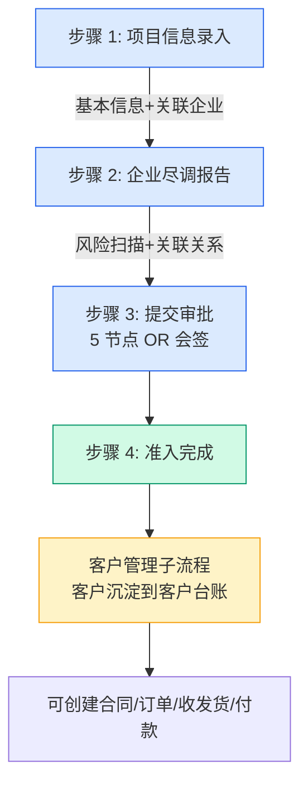
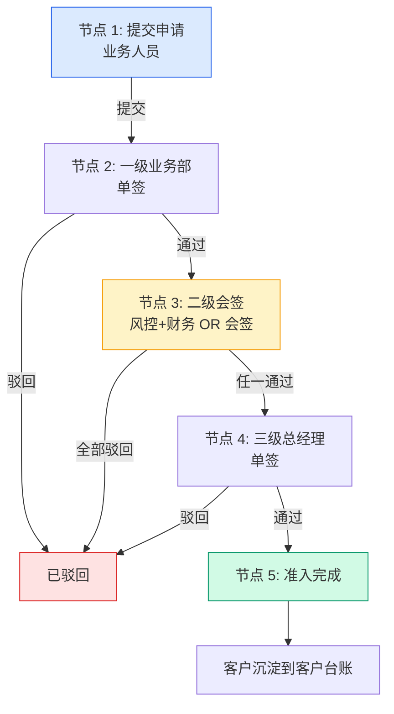
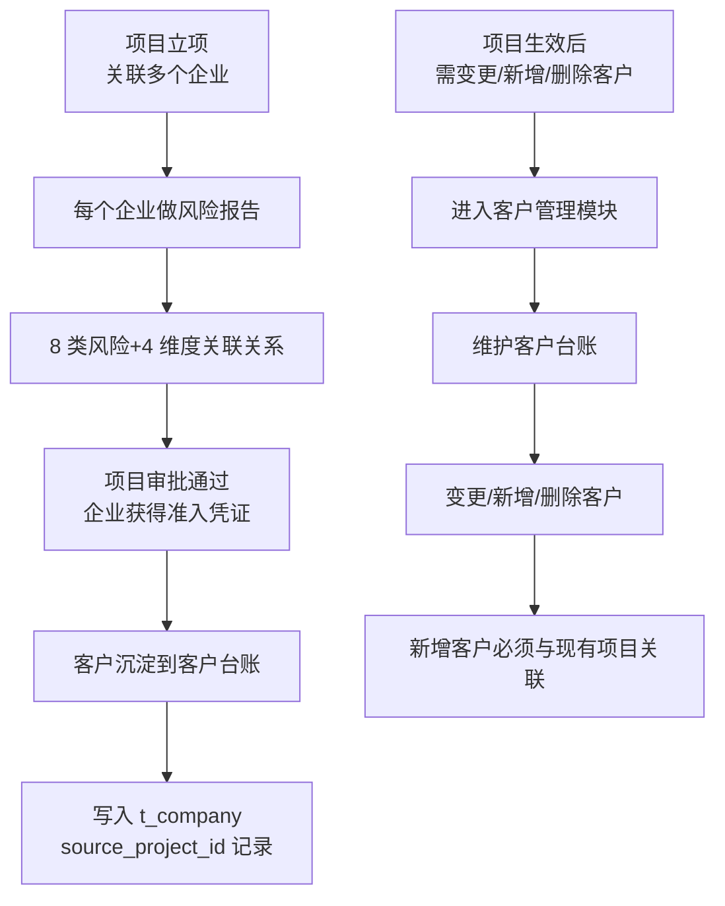
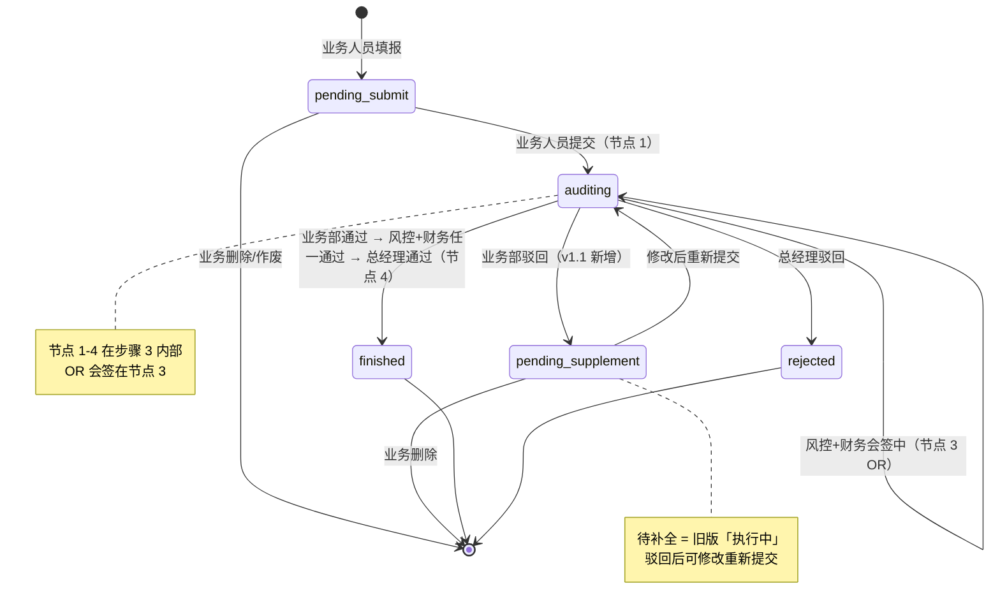

# 02.01 项目管理（立项）v1.1 终版

> **状态**：v1.1 终版（**v1.0 修正版，基于 83 张原型截图调整**）
> **生成时间**：2026-07-24 14:55
> **变更**：
> - 🔴 **立项编号格式**：`LX-{YYYYMM}-{3位}` → **`LX{YYYYMMDD}{3位}` 14 位无横线**
> - 🟡 **步骤条结构**：5 节点 OR 会签**拆开** → **4 步骤页面**（5 节点 OR 会签藏在「提交审批」步骤内）
> - 🟡 **流程状态**：`审核中/执行中/已完结` → `**审核中/待补全/已完结**`（待补全替代执行中）
> - 🟡 详情页 5 Tab：企业信息/风险扫描结果(5条)/客户股权关系/准入意见/审批记录
> - 🟡 项目编号 2 轨：项目编号 NC2344542142（系统编号）+ 立项编号 LX...（业务编号）
> - 🟡 顶部 nav 7 个（详情页展开）：工作台/准入管理/数字供应链/智慧仓储/预警中心/数据中心/账户中心
> **配套文档**：[00-项目总览与对接.md](../00-项目总览与对接.md) / [01-模块拆解大框架.md](../01-模块拆解大框架.md) / [05-复用对比/全量矩阵 v1.2.md](../05-复用对比/全量矩阵%20v1.0.md) / [02.02-客户管理.md](./02.02-客户管理.md) / [02.03-合同管理.md](./02.03-合同管理.md) / [02.04-订单管理.md](./02.04-订单管理.md)
> **复用度**：🔴 **<30%（完全新建）**——主产品「河南征信」**没有**项目管理立项流程

---

## 0. 章节导航

1. 业务定位
2. 业务流程全景（**v1.1 重大调整**：4 步骤页面 + 5 节点 OR 会签藏在提交审批）
3. 核心实体（7 张表）
4. 5 节点状态机（**v1.1 调整**：藏在步骤 3 内）
5. 角色操作矩阵
6. 字段规则
7. 按钮交互
8. 异常处理
9. 跨模块流转
10. 复用建议
11. v1.1 变更摘要

---

## 1. 业务定位

**项目管理**是港通供应链的**业务起点 + 客户准入入口**。业务人员发起立项申请 → 关联上下游客户 → 每个客户做风险报告（天眼查 + 平台自建黑灰名单/假国央企库）→ **4 步骤页面 + 5 节点审批**（OR 会签藏在「提交审批」步骤内）→ 准入完成。**客户管理是项目立项的子流程**——客户从风险报告沉淀到客户台账，不走独立审批。

### 1.1 v1.1 关键规则（基于原型 01-03 截图）

1. **创建项目时必关联客户**（每个客户必做尽调）✅ 不变
2. **客户变更/新增/删除**通过**客户管理模块**维护 ✅ 不变
3. **新增客户必须与现有项目关联**（不能脱离项目独立存在客户）✅ 不变
4. **4 步骤页面**（**v1.1 新结构**）：
   - 步骤 1：项目信息录入
   - 步骤 2：企业尽调报告
   - 步骤 3：**提交审批**（**5 节点 OR 会签藏在这里**）
   - 步骤 4：准入完成
5. **5 节点审批**（**v1.1 调整**：藏在步骤 3 内）：提交 → 一级业务 → 二级会签 → 三级总经理 → 完成
6. **OR 会签**（风控+财务任一通过即可）✅ 不变
7. **风险扫描**（**v1.1 调整**：5 条 vs 旧版 8 类，**待确认**）—— 截图显示"5 条"
8. **4 维度客户关联关系**（**v1.1 调整**：股权/对外投资/实控人/实控控股，**只在「客户股权关系」1 个 Tab 展示**）
9. **v1.0 审批流实现 = 消息推送**（保底方案）✅ 不变
10. **v2.0 审批流实现 = OA 对接**（拓展方案，致远 A8 OA）✅ 不变
11. **2 小时 SLA 自动催办** ✅ 不变
12. **3 级 + 会签 + 加签** 审批架构 ✅ 不变

### 1.2 v1.1 关键编号（**重大调整**）

- **项目编号**（系统编号）：`NC{14位数字}`，例 `NC2344542142`
- **立项编号**（业务编号）：`LX{YYYYMMDD}{3位}`，**14 位无横线**，例 `LX20260122001`
  - ❌ 旧版格式：`LX-{YYYYMM}-{3位}`（带横线月序列）
  - ✅ v1.1 格式：`LX{YYYYMMDD}{3位}`（**无横线，YYYYMMDD 8 位 + 3 位流水**）

### 1.3 v1.1 顶部 nav 7 个（详情页展开）

| # | 一级菜单 | 备注 |
|---|---------|------|
| 1 | 工作台 | 主页 |
| 2 | 准入管理 | 立项+客户+黑名单 |
| 3 | 数字供应链 | 合同+订单+业务线+收发货+货转+资金+结算+发票+盯市+追保 |
| 4 | 智慧仓储 | 入库+出库+放货+库存+视频监控+巡库 |
| 5 | **预警中心**（**v1.1 新增**）| 预警查询+规则配置 |
| 6 | **数据中心**（**v1.1 新增**）| 驾驶舱+业务报表+合规验证报告 |
| 7 | **账户中心**（**v1.1 新增**）| 个人中心 |

---

## 2. 业务流程全景（**v1.1 重大调整**）

### 2.1 4 步骤页面流程（**v1.1 重新结构化**）



**v1.1 关键变化**：
- ❌ 旧版：5 节点 OR 会签拆成 5 个独立节点画流程图
- ✅ v1.1：**4 步骤页面 + 步骤 3 内部嵌入 5 节点 OR 会签子流程**

### 2.2 步骤 3 内部的 5 节点 OR 会签子流程（**v1.1 详细**）



### 2.3 客户管理子流程



---

## 3. 核心实体（7 张表）

### 3.1 `t_project` 项目主表（**v1.1 编号字段调整**）

| 字段 | 类型 | 必填 | 说明 |
|------|------|------|------|
| `id` | bigint PK | - | 主键 |
| `project_no` | varchar(32) | ✓ | **业务立项编号** `LX{YYYYMMDD}{3位}`（**v1.1 无横线 14 位**），如 `LX20260122001` |
| `system_no` | varchar(32) | - | **系统项目编号** `NC{14位数字}`（**v1.1 新增**），如 `NC2344542142` |
| `project_name` | varchar(128) | ✓ | 项目名称（限中英常规标点，**最大 54 中文字符**）|
| `business_type` | varchar(20) | ✓ | **业务类型 4-5 种**：`inventory` / `prepayment` / `credit_period` / `trade` / **`agency_business`（总代业务，v1.1 新增）** |
| `product_category` | varchar(64) | ✓ | **货物品类 3 种（v1.1 具体名）**：`玉米` / `糖粉` / `木薯淀粉` |
| `project_period_months` | int | ✓ | **业务周期（月）**（v1.7.99.25 改名；仅支持数字输入，限制 3 位以内）|
| `project_content` | text | - | **项目主要内容**（v1.7.99.25 改名；限中英常规标点，**最大 200 字**）|
| `expected_profit` | text | - | **预计收益**（v1.7.99.25 改名；限中英常规标点，**最大 200 字**）|
| `business_leader_id` | bigint | ✓ | **业务负责人** ID |
| `project_members` | json | ✓ | **项目小组成员**（v1.7.99.25 新增，**必填**；JSON 数组 [{id, name}]，多选+模糊搜索）|
| `total_investment` | decimal(20,2) | - | 总投资金额（万元，可选填）|
| `guarantee_measures` | text | - | **保障措施**（v1.7.99.25 新增；限中英常规标点，**最大 200 字**）|
| `report_items` | text | - | **呈报事项**（v1.7.99.25 新增；限中英常规标点，**最大 200 字**）|
| `upstream_count` | int | - | 上游企业数量（冗余）|
| `downstream_count` | int | - | 下游企业数量（冗余）|
| `status` | varchar(20) | ✓ | **状态 6 个（v1.1 调整）**：`pending_submit` / `auditing` / **`pending_supplement`（待补全，v1.1 新）** / `finished` / `rejected` |
| `current_step` | tinyint | - | **当前步骤 1-4**（v1.1 改为 1-4，不是 1-5）|
| `current_node` | tinyint | - | **当前审批节点 1-5**（步骤 3 内部）|
| `creator_id` | bigint | ✓ | 创建人 |
| `create_time` | datetime | ✓ | - |
| `submit_time` | datetime | - | 提交时间（节点 1）|
| `approve_complete_time` | datetime | - | 审批完成时间（节点 4）|
| `active_time` | datetime | - | 生效时间（节点 5）|
| `is_deleted` | tinyint | ✓ | 0 = 软删除 |

### 3.2-3.7 其他 6 张表（**v1.1 字段小调整**）

`t_project_company_rel` / `t_project_due_diligence` / `t_project_step_record` / `t_project_approval` / `t_project_attach` / `t_company`（**v1.1 客户分类字段调整见 02.02**）

关键字段调整：
- `t_project_company_rel.relation_type`：`upstream` / `downstream` / `third_party_logistics` / `third_party_warehouse`（**v1.1 调整 4 种**）
- `t_project_due_diligence.risk_scan_count`：v1.1 加 `risk_scan_count` 字段

---

## 4. 5 节点状态机（**v1.1 调整：藏在步骤 3 内**）



### 4.1 状态说明（**v1.1 调整**）

| 状态 | 节点 | 中文 | 触发 | 出口 |
|------|------|------|------|------|
| `pending_submit` | - | 待提交 | 业务人员填报 | 提交 / 删除 |
| `auditing` | 1-4 | 审核中 | 业务人员提交 | 5 节点 OR 会签 |
| **`pending_supplement`**（v1.1 新）| - | **待补全** | 业务部驳回 | 修改后重新提交 / 删除 |
| `finished` | 5 | 已完结 | 总经理通过 | 终态 |
| `rejected` | - | 已驳回 | 总经理驳回 | 终态 |

### 4.2 状态与列表 Tab 映射（**v1.1 调整**）

| Tab | 对应状态 |
|-----|---------|
| **全部** | 全部状态 |
| **待提交** | `pending_submit` |
| **审核中** | `auditing` |
| **待补全**（v1.1 替代执行中）| `pending_supplement` |
| **已完结** | `finished` |
| **驳回** | `rejected` |

---

## 5. 角色操作矩阵（**v1.1 字段调整**）

| 状态 / 角色 | 业务人员 | 业务部负责人 | 风控部 | 财务部 | 总经理 | 系统 |
|------------|--------|------------|-------|-------|-------|------|
| `pending_submit` 待提交 | 查看/编辑/删除 | 查看 | 查看 | 查看 | 查看 | - |
| `auditing` 审核中 | 查看 | **审批节点 2** | **审批节点 3** | **审批节点 3** | **审批节点 4** | 推送消息 |
| `pending_supplement` 待补全 | **编辑后重新提交** | 查看 | 查看 | 查看 | 查看 | - |
| `finished` 已完结 | 查看 | 查看 | 查看 | 查看 | 查看 | 客户沉淀 |
| `rejected` 已驳回 | **编辑后重新提交** | 查看 | 查看 | 查看 | 查看 | - |

---

## 6. 字段规则

### 6.1 立项申请编号 `project_no`（**v1.1 重大调整**）

- **格式**：`LX{YYYYMMDD}{3位序列}`，如 `LX20260122001`（**14 位无横线**）
- ❌ 旧版：`LX-202607-001`（带横线）
- ✅ v1.1：`LX` + `YYYYMMDD`（8 位） + `3 位流水`
- 示例：`LX20260122001`（立项于 2026-01-22，第 001 号）

### 6.2 系统项目编号 `system_no`（**v1.1 新增**）

- **格式**：`NC{14位数字}`，如 `NC2344542142`
- 系统自动生成，不可修改
- 与 `project_no` 互为冗余，`project_no` 给业务看，`system_no` 给系统关联用

### 6.3 业务类型 `business_type`（**v1.1 新增第 5 种**）

- **5 种**（**v1.1 新增**）：
  - `inventory`（存货业务）
  - `prepayment`（预付业务）
  - `credit_period`（账期业务）
  - `trade`（购销业务）
  - **`agency_business`（总代业务，v1.1 新增）** —— 23 业务线截图显示

### 6.4 货物品类 `product_category`（**v1.1 具体名**）

- **3 种**（**v1.1 具体名调整**）：
  - ❌ 旧版：`谷物` / `糖粉` / `淀粉`（抽象）
  - ✅ v1.1：`玉米` / `糖粉` / `木薯淀粉`（具体名）

### 6.5 关联企业类型 `relation_type`（**v1.1 调整**）

- **4 种**（**v1.1 跟 02.02 客户分类对齐**）：
  - `upstream`（上游企业）
  - `downstream`（下游企业）
  - `third_party_logistics`（第三方物流）
  - `third_party_warehouse`（第三方仓储）

### 6.6 风险扫描（**v1.1 待确认**）

- 截图显示"**风险扫描结果(5条)**" Tab
- 旧版 8 类：合作黑名单/假国央企/失信被执行/被执行/限制消费令/终本案件/税收违法/行政处罚
- **v1.1 标 [P0 待确认-业务]**：5 条还是 8 类？

### 6.7 4 维度客户关联关系（**v1.1 调整**）

- **4 维度**（v1.0 范本）：
  - 股权关系（股东/持股/任职）
  - 对外投资（被投公司/出资/比例/状态）
  - 疑似实控人（姓名/比例/间接持股）
  - 实控控股（股东+被投公司关系图）
- **v1.1 实际展示**（03 截图）：**只有 1 个「客户股权关系」Tab**
- **v1.1 标 [P0 待确认-字段]**：其他 3 维度藏在哪里？

### 6.8 2 小时 SLA 自动催办（不变）

- **SLA 阈值**：2 小时
- **超时处理**：自动发送催办消息 + 实时活动记录
- **催办次数**：最多 3 次（超过 3 次升级到上级）
- **SLA 字段**：`sla_deadline` / `sla_overtime` / `sla_remind_count`

### 6.9 加签机制（不变）

- **加签**（add_sign）：审批人可临时加审批人（紧急情况）
- 加签节点 `is_add_sign=1` + `add_sign_reason` 必填
- 加签人可加入任何节点
- 加签人也需遵守 2 小时 SLA

### 6.10 客户管理子流程规则（不变）

- 客户从风险报告沉淀（不单独走审批）
- 客户 ID 通过 `unified_credit_code` 唯一
- 客户来源记录（`source_project_id` + `source_due_diligence_id`）
- 客户变更/新增/删除通过客户管理模块维护
- 新增客户必须与现有项目关联

---

## 7. 按钮交互

### 7.1 列表页（**v1.1 调整**）

| 按钮 | 位置 | 可见条件 | 点击行为 |
|------|------|---------|---------|
| **新建立项申请** | 右上 | 所有角色 | 跳新建页 |
| **清空全部** | 搜索区 | 有搜索条件 | 清空筛选 |
| **业务类型筛选** | 搜索区 | - | 下拉选择 |
| **数据导出** | Tab 右侧 | - | 导出 Excel |
| **查看** | 列表行 | 所有 | 跳详情页（仅查看）|
| **编辑** | 列表行 | 状态∈{`pending_submit`, `pending_supplement`, `rejected`} | 跳详情页（编辑）|
| **作废** | 列表行 | 状态∈{`pending_submit`} | 弹确认框 |
| **审核**（v1.1 跟合同对齐）| 列表行 | 状态=`auditing` | 跳详情页（审核中）|

### 7.2 步骤 1：项目信息录入页（不变）

| 按钮 | 位置 | 可见条件 | 点击行为 | 前置校验 |
|------|------|---------|---------|---------|
| **返回** | 底部 | 任何时候 | 弹确认框 | - |
| **保存草稿** | 底部 | 任何时候 | 存储并返回列表 | - |
| **发起尽调** | 底部 | 必填项已填 | 状态→`auditing`，跳步骤 2 | 必填项+至少 1 个关联企业 |
| **添加关联企业** | 关联企业区 | 任何时候 | 弹企业选择器 | - |
| **移除关联企业** | 关联企业区 | 任何时候 | 弹确认框 | - |

### 7.3 步骤 2：企业尽调报告页（**v1.1 调整**）

| 按钮 | 位置 | 可见条件 | 点击行为 |
|------|------|---------|---------|
| **返回** | 底部 | 任何时候 | 弹确认框 |
| **保存草稿** | 底部 | 任何时候 | 存储并返回列表 |
| **提交审批** | 底部 | 必填项已填 | 状态→`auditing`（节点 1），跳步骤 3 |
| **导出报告** | 顶部 | 任何时候 | 导出 PDF 风险报告 |
| **切换企业 Tab** | 顶部 | 已添加企业 | 切换显示对应企业风险报告（全部/企业A/B/C）|
| **跳天眼查** | 每类风险右侧 | - | 跳天眼查详细页 |
| **编辑准入意见** | 准入意见区 | - | 人工填写 |
| **上传关联报告** | 关联报告区 | - | 拖拽/选择上传（.pdf/.png/.jpg/.doc）|

### 7.4 步骤 3：提交审批页（**v1.1 5 节点 OR 会签内嵌**）

#### 7.4.1 顶部操作区

| 按钮 | 位置 | 可见条件 | 点击行为 |
|------|------|---------|---------|
| **撤回申请** | 顶部 | 创建人+审核中 | 状态→`pending_submit` |
| **催办** | 顶部 | 当前审批节点超 2 小时未处理 | 推送催办消息 |

#### 7.4.2 关键指标卡片（不变）

| 指标 | 字段 | 示例 |
|------|------|------|
| **当前节点** | `current_node` + `node_label` | "风控部会签 1/2" |
| **剩余节点** | 计算字段 | "3 个（会签/3级/完成）" |
| **已耗时** | `now() - submit_time` | "1 天 7 小时" |
| **预计完成** | `sla_deadline` + 累计 | "2026-07-21 18:00" |
| **外部系统** | `flow_type=oa_sync` 时 | "致远 A8 OA" |

#### 7.4.3 审批进度（**v1.1 内嵌在步骤 3**）

| 节点 | 显示 | 状态 |
|------|------|------|
| 节点 1：提交申请 | ✓ 已完成 + 时间 + 附件数 | - |
| 节点 2：一级业务部 | ✓ 已通过 + 审批人 + 意见 + 时间 | - |
| 节点 3：二级会签 OR | 进行中 1/2 + 2 个审批人 | 王浩·风控部负责人 ✓ 已通过；宋美玲·财务总监 ⏳ 审批中·已读 |
| 节点 4：三级总经理 | 待开始 | 需在二级会签通过后自动触发 |
| 节点 5：准入完成 | 待开始 | 三级审批通过后自动归档 |

#### 7.4.4 实时活动时间线（不变）

| 时间 | 操作人 | 事件 |
|------|--------|------|
| 2026-07-19 16:45:23 | 张磊（监管方）| 提交了准入申请（4 份附件）|
| 2026-07-19 18:22:10 | 张磊（业务部负责人）| 通过了一级审批（同意，背景调查材料齐全...）|
| 2026-07-20 09:15 | 王浩（风控部负责人）| 通过了会签子节点（180 万货款纠纷已结...）|
| 2026-07-20 18:22 | 系统 | 向会签节点发送催办 |
| 2026-07-20 18:22 | 系统 | 会签已自动 @王浩 @宋美玲 |
| 2026-07-21 09:00 | 宋美玲（财务总监）| 查看了审批单 |
| （超 2 小时）| 系统 | 自动催办（实时活动 + 弹窗）|

#### 7.4.5 审批架构关系图

```
                    提交人 张磊·监管方准入经理
                          ↓ 提交
                    一级审批（单签）张磊·业务部负责人
                          ↓ 通过
                    二级会签（OR）风控部+财务部
                          ↓ 任一通过
                    三级审批（单签）李糖·平台总经理
                          ↓ 通过
                    准入完成
```

**审批架构**：3 级 + 会签 + **加签**

**加签按钮**：
- 位置：当前审批人详情区
- 可见：当前审批人=有加签权限
- 行为：弹加签对话框 → 选加签人 + 填加签原因 → 加签节点 `is_add_sign=1`
- 加签人也需遵守 2 小时 SLA

#### 7.4.6 立即催办

| 按钮 | 位置 | 可见条件 | 点击行为 |
|------|------|---------|---------|
| **立即催办** | 实时活动区超 2 小时 | 节点超 2 小时未处理 | 推送催办消息 |
| **致远 A8 OA** | 关键指标区 | v2.0 OA 模式 | 跳 OA 系统 |

### 7.5 步骤 4：准入完成页（不变）

| 按钮 | 位置 | 可见条件 | 点击行为 |
|------|------|---------|---------|
| **下载准入凭证** | 顶部 | active | 下载 |
| **客户管理** | 顶部 | active | 跳客户管理模块 |
| **创建合同** | 顶部 | active | 跳合同新建（关联 project_id）|

### 7.6 详情页 5 Tab（**v1.1 新增**）

| Tab | 说明 |
|-----|------|
| **企业信息** | 客户基本档案（来自 `t_company`）|
| **风险扫描结果（5条）** | 8 类风险扫描结果汇总 |
| **客户股权关系** | 4 维度关联关系（仅股权 1 维度展示）|
| **准入意见** | 人工填写意见 |
| **审批记录** | 5 节点审批活动 timeline |

### 7.7 项目详情页字段（**v1.1 03 截图**）

| 字段 | 值 |
|------|---|
| 项目名称 | 这里是项目名称 |
| 项目编号 | NC2344542142 |
| 立项编号 | LX20260122001 |
| 项目周期 | 2026-07-12 ~ 2028-07-11 |
| 创建人 | 张爽 |
| 创建时间 | 2026-07-12 12:22:32 |
| 选择企业 | 企业A（下拉切换）|

---

## 8. 异常处理

### 8.1 业务异常

| 异常场景 | 提示文案 | 处理动作 |
|---------|---------|---------|
| 必填项未填 | "请填写：项目名称/业务类型/品类/..." | 阻止提交 |
| 关联企业为空 | "请至少添加 1 个关联企业" | 阻止提交 |
| 业务类型与品类不匹配 | "业务类型 X 与品类 Y 不匹配" | 红色提示 |
| 项目周期 > 999 | "项目周期最大 999 月" | 阻止 |
| 风险扫描失败 | "天眼查接口超时，请重试" | 允许重试 |
| 8 类高风险 ≥ 2 | "企业存在 X 项高风险，建议修改关联企业" | 红色警示 |
| 关联报告上传失败 | "文件格式不支持或过大" | 阻止上传 |

### 8.2 审批异常

| 异常场景 | 提示文案 | 处理动作 |
|---------|---------|---------|
| OR 会签任一驳回 | "二级会签任一驳回" | 状态→`pending_supplement`（v1.1）|
| 审批人未配置 | "审批人未配置，请联系管理员" | 状态保持 |
| 消息推送失败 | "消息推送失败，请重试" | 允许重试 |
| 审批超时（2 小时）| "审批超过 2 小时未处理" | **自动催办** |
| 2 小时超时 | "已耗时 X 小时，建议催办或 @该审批人加速处理" | **实时活动 + 立即催办按钮** |
| OA 对接失败（v2.0）| "OA 系统连接失败" | 允许重试 |
| 加签人未配置 | "加签失败：未选择加签人" | 阻止加签 |

### 8.3 客户管理子流程异常

| 异常场景 | 提示文案 | 处理动作 |
|---------|---------|---------|
| 客户已存在 | "客户 XXX 已存在（统一信用代码 YYY）" | 阻止重复 |
| 新增客户无项目关联 | "新增客户必须与现有项目关联" | 强制阻止 |
| 客户状态变更 | "客户状态已变更" | 通知相关业务 |
| 客户风险等级 high | "客户风险等级自动设为 high，已自动冻结" | 自动冻结 |

---

## 9. 跨模块流转（不变）

### 9.1 上游触发

无（**项目立项是业务起点**）。

### 9.2 下游触发

| 触发模块 | 触发条件 | 触发动作 |
|---------|---------|---------|
| **客户管理（02.02）** | 项目 `finished` | **客户从风险报告沉淀** |
| **合同管理（02.03）** | 项目 `finished` | 允许创建合同，关联 `project_id` |
| **订单管理（02.04）** | 合同 `signed` | 订单必须关联 `contract_id` → `project_id` |
| **收发货（02.05）** | 订单 `executing` | 收/发货关联到 `project_id` |
| **付款（02.08.1）** | 付款申请 | 校验 `project_id` |

---

## 10. 复用建议

### 10.1 复用度

**🔴 <30%（完全新建）**——主产品「河南征信」dg_risk **没有项目管理立项**。

### 10.2 可借鉴的主产品设计

| 主产品表 | 可借鉴点 | 港通应用 |
|---------|---------|---------|
| `t_company_blacklist` | 合作黑名单 | 风险报告的"合作黑名单"字段直接对接 |
| `t_company_dishonest` | 失信被执行 | 风险报告的"失信被执行"字段直接对接 |
| `t_company_*` (60+ 张) | 企业信息 | 客户主表 `t_company` 借鉴 |
| `t_tianyancha_search_log` | 天眼查搜索历史 | 风险报告的"原始响应"存储 |
| `t_attachment*` | 附件管理 | 项目附件管理 |
| `sys_user` | 用户 | 业务负责人字段 |
| `t_audit_chain` | 审批链 | 5 节点审批流设计 |
| `t_market_*` | 市场行情 | 4 维度关联关系的天眼查对接 |

### 10.3 需新建的表

**全部 7 张表都是新建**（与 v1.0 一致）

### 10.4 给研发的实施建议

1. **第一周**：完成 `t_project` + `t_company` 主表 + 4 步骤页面（项目录入/风险报告/提交审批/准入完成）
2. **第二周**：完成多企业风险报告（**5 条风险** + **4 维度关联关系**）+ 天眼查接口对接
3. **第三周**：完成 5 节点审批流（**v1.0 消息推送** + v2.0 OA 对接预留）+ OR 会签 + 加签机制 + 2 小时 SLA 催办
4. **第四周**：客户管理子流程 + 跨模块集成（合同/订单关联）

---

## 11. v1.1 变更摘要

| 变更点 | v1.0 | v1.1 |
|------|------|------|
| **立项编号格式** | `LX-202607-001`（带横线）| **`LX{YYYYMMDD}{3位}` 14 位无横线** |
| **步骤条** | 5 节点 OR 会签拆开 | **4 步骤页面 + 5 节点藏在步骤 3** |
| **流程状态** | 5 个：submitted/level1_approved/level2_cosigning/level3_approved/active + rejected | **6 个：pending_submit/auditing/pending_supplement/finished/rejected/frozen** |
| **列表 Tab** | 全部/待提交/审核中/执行中/已完结/驳回 | **全部/待提交/审核中/待补全/已完结/驳回**（待补全替代执行中）|
| **业务类型** | 4 种 | **5 种**（+ 总代业务 `agency_business`）|
| **货物品类** | 谷物/糖粉/淀粉（抽象）| **玉米/糖粉/木薯淀粉**（具体名）|
| **关联企业类型** | upstream/downstream/third_party | **4 种**（upstream/downstream/third_party_logistics/third_party_warehouse）|
| **详情页 Tab** | 未明确 | **5 Tab**（企业信息/风险扫描结果(5条)/客户股权关系/准入意见/审批记录）|
| **项目编号 2 轨** | 仅 `project_no` | **`project_no`（业务）+ `system_no`（系统）** |
| **顶部 nav** | 5 个 | **7 个**（+预警中心/数据中心/账户中心）|

---

## 12. 文档版本

- **v1.0（2026-07-24 11:30）**：基于 5 张截图 + 建设方案 V2 推测的初版
- **v1.1（2026-07-24 14:55）**：基于 83 张原型截图（7-24 最新版）修正
  - 🔴 立项编号格式 14 位无横线
  - 🟡 4 步骤 + 5 节点 OR 会签藏在提交审批
  - 🟡 6 状态 + 待补全替代执行中
  - 🟡 业务类型 + 总代业务
  - 🟡 品类具体名
  - 🟡 详情页 5 Tab
  - 🟡 项目编号 2 轨
  - 🟡 顶部 nav 7 个
- 修改记录：见 `06-修改记录.md`
---

## 修改记录

### v1.7.99.x（2026-07-28）

- 🟡 列表页占位 = "全部"（全站统一）
- 🟡 列表页规范升级（v1.7.99 全局）
- 🟡 状态 tag 颜色编码（v1.7.99.14）
- 🟡 流程图统一用 Mermaid（v1.7.99.6）
- 详见：[v1.7.99-changelog.md](./v1.7.99-changelog.md)（30+ 版本汇总）

### v1.7.99.72（2026-07-30）— 项目立项状态机调整

> **用户需求**：「项目准入菜单中的状态机修改为：全部--待提交--审批中--执行中--已完结--驳回--已作废」
> **变更范围**：`project-list.html` v1.7.99.72

**v1.7.99.72 关键决策**（4 个）：
1. **「待补件」+「上传补件」按钮 + 补件 modal** → 连同一起砍掉
2. **「已通过」+「启动执行」按钮** → 审批通过直跳执行中（无「启动执行」按钮）
3. **16 行 mock 数据里 3 行**（行 8 待补件 + 行 11 已通过 + 行 15 待补件）→ 直接删 3 行（剩 13 行）
4. **客户管理（customer-list.html）的「已通过」状态** → 不动（仅改项目立项）

**详情页相关影响**（v1.7.99.72）：
- 详情页（project-detail.html）的审批节点意见标签里出现的「**已通过**」是**审批节点意见标签**（节点 2/3 通过、王浩·风控部负责人 通过 等），**不属于项目状态机**，**不动**
- 详情页顶部状态 tag（从 URL `?status=` 读取）联动列表页 STATUS_META（v1.7.99.72 已同步：7 状态色卡）

详见：[p-project-list.md § 10.6 v1.7.99.72 变更](./p-project-list.md)
