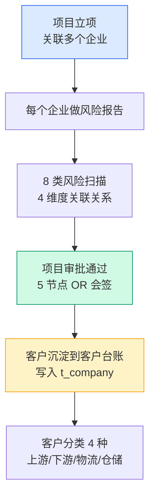
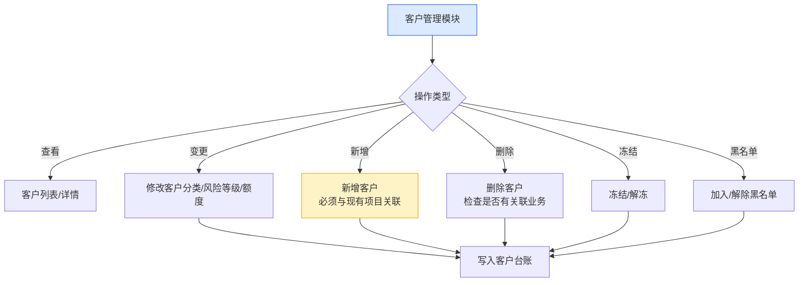
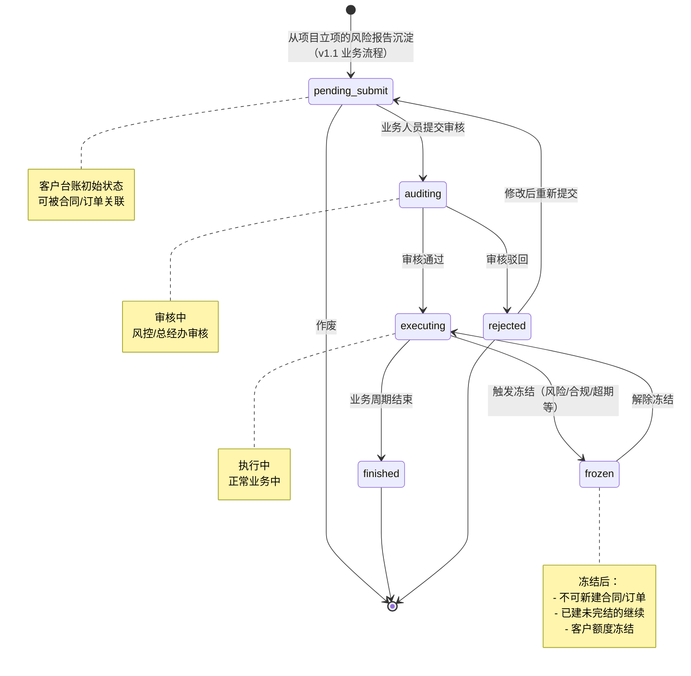
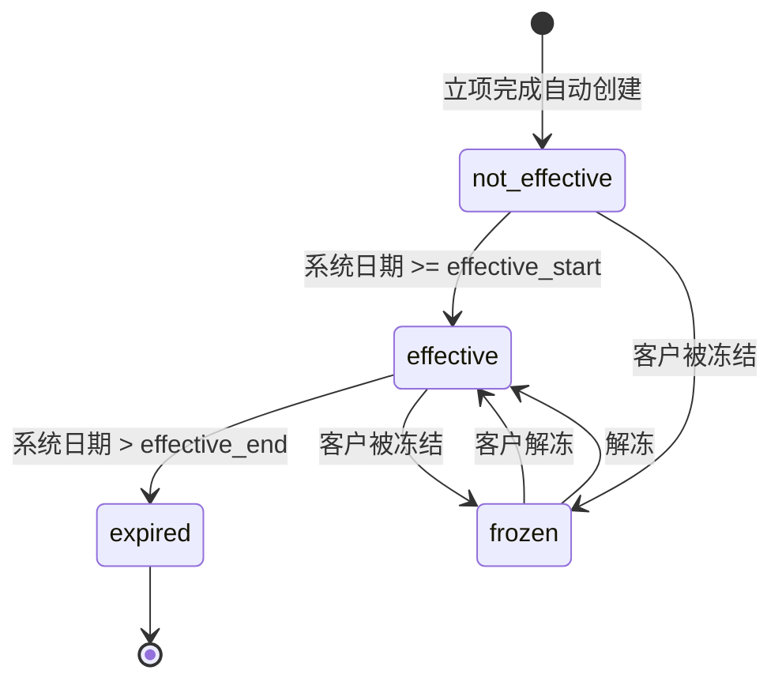
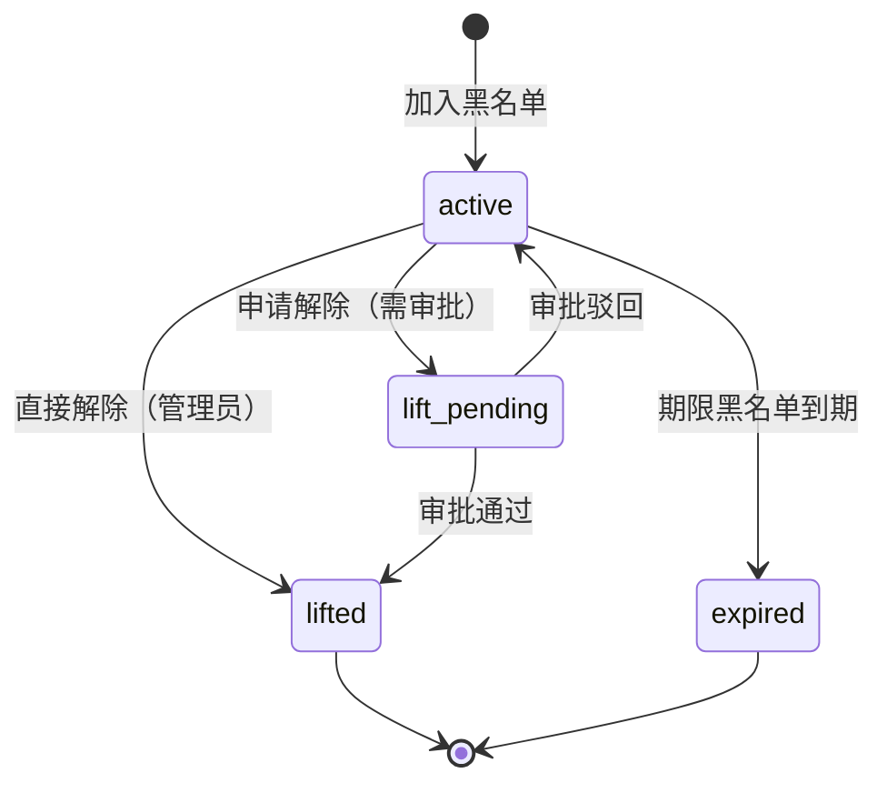
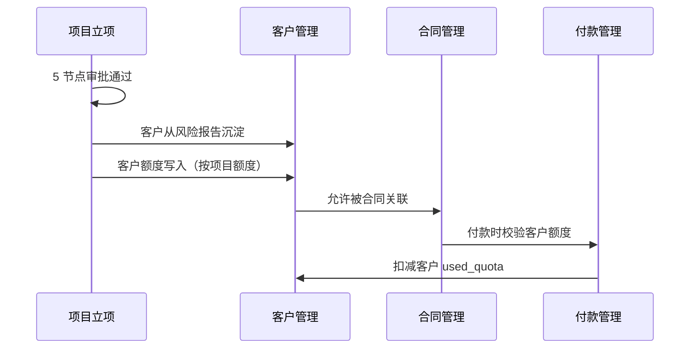
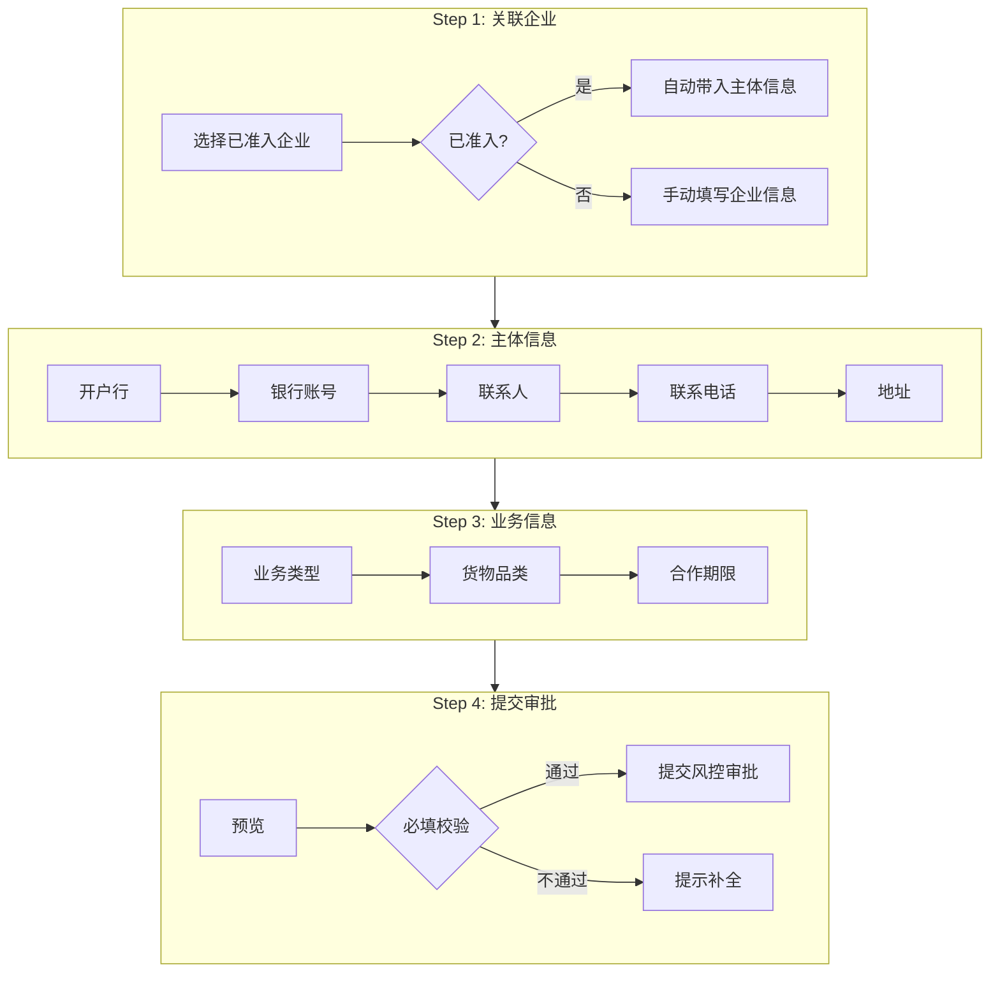

# 02.02 客户管理 v1.1 终版

> **状态**：v1.1 终版（**v1.0 修正版，基于 83 张原型截图调整**）
> **生成时间**：2026-07-24 14:55
> **变更**：
> - 🔴 **客户分类 4 种完全重做**：贸易商/加工厂/物流商/服务商 → **上游企业/下游企业/第三方物流/第三方仓储**
> - 🟡 客户流程状态从 3 个（active/frozen/revoked）→ **6 个**（待提交/审核中/执行中/已完结/驳回）
> - 🟡 新增"审核"按钮（审核中状态）
> - 🟡 列表 2 Tab 切换（基础信息/额度信息）
> - 🟡 客户字段新增：企业简称、所属区域
> **配套文档**：[00-项目总览与对接.md](../00-项目总览与对接.md) / [01-模块拆解大框架.md](../01-模块拆解大框架.md) / [05-复用对比/全量矩阵 v1.2.md](../05-复用对比/全量矩阵%20v1.0.md) / [02.01-项目管理-立项.md](./02.01-项目管理-立项.md) / [02.03-合同管理.md](./02.03-合同管理.md) / [02.04-订单管理.md](./02.04-订单管理.md)
> **复用度**：🟢 **90%（大幅复用）**——主产品 `t_company*` 60+ 张 + `t_company_blacklist` 大幅复用

---

## 0. 章节导航

1. 业务定位
2. 业务流程全景
3. 核心实体（4 张表）
4. 状态机（**v1.1 重大调整**）
5. 角色操作矩阵
6. 字段规则
7. 按钮交互
8. 异常处理
9. 跨模块流转
10. 复用建议
11. **v1.7.99.96 改造子章节**（客户信息详情合并版：图 1 + 图 2 风险扫描 8 类）

---

## 1. 业务定位

**客户管理**是港通供应链的**客户档案中心**——客户从项目立项的"风险报告"中沉淀到客户台账，**不走独立审批流程**（与项目立项共用 5 节点审批）。客户管理模块负责客户档案的日常维护：客户分类、风险等级、关联关系、黑名单、额度管理等。

### 1.1 v1.1 关键规则（基于原型 04 截图 + sitemap）

1. **客户管理 = 项目立项的子流程**（客户从风险报告沉淀，不走独立审批）✅ 不变
2. **客户分类 4 种**（**v1.1 重大调整**）：
   - **`upstream`**（上游企业）= 卖方/供应方
   - **`downstream`**（下游企业）= 买方/采购方
   - **`third_party_logistics`**（第三方物流）
   - **`third_party_warehouse`**（第三方仓储）
3. **客户流程状态 6 个**（**v1.1 新增**，跟项目立项一致）：
   - 待提交 / 审核中 / 执行中 / 已完结 / 驳回
4. **客户来源记录**：`source_project_id` + `source_due_diligence_id` ✅ 不变
5. **客户额度管理**（多维度）✅ 不变
6. **黑名单管理**（独立子流程）✅ 不变
7. **客户列表 2 Tab 切换**：**基础信息 / 额度信息**（**v1.1 新增**）
8. **顶部 nav 7 个**：工作台/准入管理/数字供应链/智慧仓储/预警中心/数据中心/账户中心

### 1.2 v1.1 主产品对标

主产品「河南征信」dg_user.sql 共有 **60+ 张** 公司/客户表 + dg_risk_comtrol.sql 准入表 + dg_invoice.sql 发票客户表，港通可**大幅复用 90%**。

---

## 2. 业务流程全景

### 2.1 客户从项目立项沉淀



### 2.2 客户管理日常维护



---

## 3. 核心实体（4 张表）

### 3.1 `t_company` 客户主表（**v1.1 重大调整 customer_category**）

| 字段 | 类型 | 必填 | 主产品 | 港通扩展 | 说明 |
|------|------|------|--------|---------|------|
| `id` | bigint PK | - | ✓ | - | 主键 |
| `company_name` | varchar(128) | ✓ | ✓ | - | 企业名称 |
| `company_short_name` | varchar(64) | - | ❌ | 🆕 | **企业简称**（**v1.1 新增**）|
| `unified_credit_code` | varchar(32) | ✓ | ✓ | - | 统一信用代码（**全平台唯一**，脱敏）|
| `customer_category` | varchar(20) | - | ❌ | 🆕 | **客户分类 4 种（v1.1 改）**：`upstream` / `downstream` / `third_party_logistics` / `third_party_warehouse` |
| `region` | varchar(20) | - | ❌ | 🆕 | **所属区域**（**v1.1 新增**）|
| `country` | varchar(20) | - | ✓ | - | 国家 |
| `province` | varchar(20) | - | ✓ | - | 省份 |
| `register_address` | varchar(255) | - | ✓ | - | 注册地址 |
| `register_capital` | decimal(20,2) | - | ✓ | - | 注册资本（万元）|
| `register_date` | date | - | ✓ | - | 成立日期 |
| `business_period_end` | date | - | ✓ | - | 经营期限（止）|
| `legal_rep` | varchar(64) | - | ✓ | - | 法定代表人 |
| `legal_rep_id_card` | varchar(32) | - | ✓ | - | 法人身份证号（脱敏）|
| `contact_name` | varchar(64) | - | - | - | 联系人姓名 |
| `contact_phone` | varchar(20) | - | - | - | 联系人电话（脱敏）|
| `contact_email` | varchar(128) | - | - | 🆕 | **联系人邮箱**（v1.7.99.22 已有；v1.7.99.29 锁定）|
| `contact_address` | varchar(255) | - | - | 🆕 | **联系人地址**（v1.7.99.29 新增，选填）|
| `owner_name` | varchar(64) | - | - | 🆕 | **负责人姓名**（v1.7.99.22 加，**必填**）|
| `owner_phone` | varchar(20) | - | - | 🆕 | **负责人电话**（v1.7.99.22 加，**必填**；脱敏）|
| `bank_name` | varchar(128) | - | - | 🆕 | **企业开户行信息**（v1.7.99.22 加，**必填**）|
| `bank_account` | varchar(32) | - | - | 🆕 | **企业银行账号**（v1.7.99.22 加，**必填**；脱敏）|
| `business_scope` | text | - | ✓ | - | 经营范围 |
| `is_supplier` | tinyint | - | ❌ | 🆕 | 是否可作为供应商（**v1.1 由 customer_category 自动推导**）|
| `is_buyer` | tinyint | - | ❌ | 🆕 | 是否可作为采购方（**v1.1 自动推导**）|
| `is_warehouse` | tinyint | - | ❌ | 🆕 | 是否可作为仓储方（**v1.1 自动推导**）|
| `risk_level` | varchar(20) | - | ❌ | 🆕 | 综合风险等级：`low` / `medium` / `high` |
| `risk_scan_count` | int | - | ❌ | 🆕 | 历史风险扫描次数 |
| `last_risk_scan_time` | datetime | - | ❌ | 🆕 | 上次风险扫描时间 |
| `source_project_id` | bigint | - | ❌ | 🆕 | **来源项目 ID** |
| `source_due_diligence_id` | bigint | - | ❌ | 🆕 | **来源风险报告 ID** |
| `status` | varchar(20) | ✓ | ✓ | - | **v1.1 改 6 状态**：`pending_submit` / `auditing` / `executing` / `finished` / `rejected` / `frozen` |
| `frozen_reason` | varchar(255) | - | ✓ | - | 冻结原因 |
| `create_time` | datetime | ✓ | ✓ | - | - |
| `update_time` | datetime | ✓ | ✓ | - | - |

### 3.2 `t_company_quota` 客户额度（**v1.1 字段调整**）

| 字段 | 类型 | 必填 | 说明 |
|------|------|------|------|
| `id` | bigint PK | - | 主键 |
| `company_id` | bigint | ✓ | 客户 ID |
| `project_id` | bigint | - | **关联项目**（v1.1 必填）|
| `project_name` | varchar(128) | - | 项目名称（冗余）|
| `quota_type` | varchar(20) | ✓ | 额度类型：`total` / `category` / `business_line` / `project` |
| `total_quota` | decimal(20,2) | ✓ | 总额度 |
| `used_quota` | decimal(20,2) | - | 已用额度（实时计算）|
| `available_quota` | decimal(20,2) | - | 可用额度 |
| `effective_start` | date | ✓ | 生效开始 |
| `effective_end` | date | ✓ | 生效结束 |
| `status` | varchar(20) | ✓ | **v1.1 改 4 状态**：`not_effective` / `effective` / `expired` / `frozen` |
| `create_time` | datetime | ✓ | - |
| `update_time` | datetime | ✓ | - |

### 3.3 `t_company_blacklist` 黑名单（**v1.1 字段微调**）

| 字段 | 类型 | 必填 | 主产品 | 港通扩展 | 说明 |
|------|------|------|--------|---------|------|
| `id` | bigint PK | - | ✓ | - | 主键 |
| `company_id` | bigint | - | - | - | 企业 ID |
| `company_name` | varchar(128) | ✓ | ✓ | - | 企业名称（冗余）|
| `unified_credit_code` | varchar(32) | ✓ | ✓ | - | 统一信用代码（脱敏）|
| `list_type` | varchar(20) | ✓ | ✓ | - | 名单类型：`cooperation_black` / `external_black` / `negative_list` |
| `level` | varchar(20) | - | ❌ | 🆕 | **分级**：`permanent` / `temporary` / `observation` / `industry` |
| `reason` | text | ✓ | ✓ | - | 纳入原因 |
| `source` | varchar(50) | ✓ | ✓ | - | 来源：`系统判定` / `外部推送` / `人工录入` |
| `valid_start` | date | - | ❌ | 🆕 | 生效日期（期限黑名单用）|
| `valid_end` | date | - | ❌ | 🆕 | 失效日期（期限黑名单用）|
| `is_active` | tinyint | ✓ | ✓ | - | 是否激活 |
| `lift_require_approval` | tinyint | - | ❌ | 🆕 | 解除是否需审批 |
| `operator_id` | bigint | ✓ | ✓ | - | 录入人 |
| `create_time` | datetime | ✓ | ✓ | - | - |
| `update_time` | datetime | ✓ | ✓ | - | - |

### 3.4 `t_company_change_log` 客户变更日志

| 字段 | 类型 | 必填 | 说明 |
|------|------|------|------|
| `id` | bigint PK | - | 主键 |
| `company_id` | bigint | ✓ | 客户 ID |
| `change_type` | varchar(20) | ✓ | `category_change` / `quota_change` / `status_change` / `blacklist_change` / `risk_update` |
| `old_value` | text | - | 修改前值（JSON）|
| `new_value` | text | - | 修改后值（JSON）|
| `reason` | varchar(500) | - | 修改原因 |
| `operator_id` | bigint | ✓ | 操作人 |
| `operator_name` | varchar(64) | - | 操作人姓名（冗余）|
| `related_project_id` | bigint | - | 关联项目 |
| `create_time` | datetime | ✓ | - |

---

## 4. 状态机（**v1.1 重大调整**）

### 4.1 客户台账状态机（**v1.1 从 3 状态改 6 状态**）



**v1.1 关键变化**：
- ❌ 旧版 3 状态：`active` / `frozen` / `revoked`
- ✅ v1.1 6 状态：`pending_submit` / `auditing` / `executing` / `finished` / `rejected` / `frozen`（**跟项目立项一致**）

### 4.2 客户额度状态机（**v1.1 调整 4 状态**）



**v1.1 4 状态**：`not_effective` / `effective` / `expired` / `frozen`

### 4.3 黑名单状态机（不变）



---

## 5. 角色操作矩阵

### 5.1 客户台账管理（**v1.1 新增「审核」操作**）

| 操作 / 角色 | 业务人员 | 业务部负责人 | 风控部 | 财务部 | 总经办 | 系统 |
|------------|--------|------------|-------|-------|-------|------|
| 查看客户列表/详情 | ✓ | ✓ | ✓ | ✓ | ✓ | - |
| 修改客户分类 | ✓ | ✓ | ✓ | - | - | - |
| 修改风险等级 | - | - | **✓** | - | - | 自动从风险报告 |
| 修改客户额度 | ✓ 建议 | ✓ | **✓** | **✓** | **✓** | - |
| **审核客户档案**（**v1.1 新增**）| - | - | **✓** | - | **✓** | - |
| 冻结/解冻 | 申请 | 申请 | **审批** | 申请 | **审批** | - |
| 取消客户 | - | 申请 | 申请 | 申请 | **审批** | - |
| 新增客户 | **✓**（必须关联项目）| ✓ | - | - | - | - |
| 删除客户 | - | - | - | - | **✓** | 检查关联业务 |
| 加入黑名单 | 申请 | 申请 | **✓** | - | **审批** | - |
| 解除黑名单 | 申请 | 申请 | **✓** | - | **审批** | - |

### 5.2 客户列表 Tab（**v1.1 新增**）

| Tab | 说明 |
|-----|------|
| **基础信息** | 客户分类/企业名称/统一信用代码/联系人/法定代表人 |
| **额度信息** | 项目编号/项目名称/授信额度/已用额度/可用额度/授信有效期/状态 |

### 5.3 客户列表状态 Tab（**v1.1 跟项目对齐 6 Tab**）

| Tab | 对应状态 | 颜色 |
|-----|---------|------|
| 全部 | 所有状态 | - |
| 待提交 | `pending_submit` | 蓝 |
| 审核中 | `auditing` | 黄 |
| 执行中 | `executing` | 绿 |
| 已完结 | `finished` | 灰 |
| 驳回 | `rejected` | 灰 |

### 5.4 客户列表操作按钮（**v1.1 新增「审核」**）

| 状态 | 操作按钮 |
|------|---------|
| 待提交 | 查看 / 编辑 / 作废 |
| 审核中 | 查看 / **审核**（v1.1 新增）|
| 执行中 | 查看 |
| 已完结 | 查看 |
| 驳回 | 查看 |

### 5.5 黑名单（不变）

| 操作 / 角色 | 风控部 | 总经办 | 系统 |
|------------|-------|-------|------|
| 新增黑名单 | **✓** | - | - |
| 批量导入 | **✓** | - | - |
| 申请解除 | **✓** | **审批** | - |
| 直接解除 | **✓**（`lift_require_approval=0`）| - | - |

---

## 6. 字段规则

### 6.1 客户分类 `customer_category`（**v1.1 重大调整**）

- **4 类**（**v1.1 完全改**）：
  - `upstream`（上游企业）= 卖方/供应方
  - `downstream`（下游企业）= 买方/采购方
  - `third_party_logistics`（第三方物流）
  - `third_party_warehouse`（第三方仓储）
- 决定客户可作为的角色（**v1.1 自动推导 is_supplier/is_buyer/is_warehouse**）
- 决定客户额度默认值

**v1.1 角色映射**（**v1.1 新增**）：

| 客户分类 | 是否可作为供应商 | 是否可作为采购方 | 是否可作为仓储方 |
|---------|---------------|---------------|---------------|
| **upstream**（上游企业）| ✓ | ❌ | ❌ |
| **downstream**（下游企业）| ❌ | ✓ | ❌ |
| **third_party_logistics** | ❌ | ❌ | ❌（物流，不是仓储）|
| **third_party_warehouse** | ❌ | ❌ | ✓ |

### 6.2 客户名称 `company_name`

- 与营业执照完全一致
- 不可修改（如需修改必须重新立项）

### 6.3 统一社会信用代码 `unified_credit_code`

- **全平台唯一**（通过该字段判重）
- 18 位字母+数字
- 脱敏存储：`91XXXXXXMAXXXXXXXX` 格式

### 6.4 客户总额度 `total_quota`（**v1.1 字段简化**）

- 元，保留 2 位小数
- > 0
- 调整权限：业务员可建议，风控+财务可调整，总经办可最终调整

**v1.1 取消客户分类默认值**（**v1.1 重要调整**）：
- ❌ 旧版：贸易商 500 万 / 加工厂 200 万 / 物流商 100 万 / 服务商 100 万
- ✅ v1.1：**由项目额度决定**——立项时设定项目总额度，客户从项目继承，不分客户分类设默认值

### 6.5 客户风险等级 `risk_level`

- **自动从最近一次风险报告继承**
- 等级：`low` / `medium` / `high`
- 触发规则：
  - 0 类高风险 → `low`
  - 1 类高风险 → `medium`
  - 2+ 类高风险 或 3+ 类中风险 → `high`
- 风险等级为 `high` 时，客户状态自动置为 `frozen`

### 6.6 客户来源记录

- `source_project_id` + `source_due_diligence_id`
- 客户**必须**有来源（首次创建时必填）
- 后续客户变更不影响来源记录

### 6.7 企业简称 `company_short_name`（**v1.1 新增**）

- 用于列表/详情页显示
- 最多 20 个字符
- 可修改

### 6.8 所属区域 `region`（**v1.1 新增**）

- 选择项：境内/境外/港澳台
- 决定后续合同/订单的币种默认值

### 6.9 黑名单分级影响

| 分级 | 业务影响 |
|------|---------|
| 永久黑名单 | 永久禁止任何合作 |
| 期限黑名单 | 期限内禁止合作 |
| 观察名单 | 需风控部审批每笔业务 |
| 行业黑名单 | 特定行业禁止合作 |

---

## 7. 按钮交互

### 7.1 客户台账列表页（**v1.1 调整**）

| 按钮 | 位置 | 可见条件 | 点击行为 |
|------|------|---------|---------|
| 新增客户 | 右上 | 业务人员 | 弹新增框（**必须关联项目**）|
| 搜索/筛选 | 顶部 | 所有 | 弹筛选抽屉 |
| 导出 | 右上 | 所有 | 导出 Excel |
| 查看 | 列表行 | 所有 | 跳详情页（仅查看）|
| 编辑 | 列表行 | 状态=待提交 | 跳详情页（编辑）|
| **审核**（**v1.1 新增**）| 列表行 | 状态=审核中 | 弹审核框（风控+总经办）|
| 作废 | 列表行 | 状态=待提交 | 弹确认框 |
| **基础信息/额度信息 Tab 切换**（**v1.1 新增**）| 列表上方 | 所有 | 切换列表内容 |

### 7.2 客户台账详情页

> **memory 原则**：详情页**不**加业务变更按钮，只允许**跳关联单据/复制/附件下载**。

| 按钮 | 位置 | 可见条件 | 点击行为 |
|------|------|---------|---------|
| 编辑 | 顶部 | 状态=待提交 | 跳编辑页 |
| 跳关联项目 | 顶部 | 有关联项目 | 跳项目详情 |
| 跳关联合同 | 顶部 | 有关联合同 | 跳合同列表 |
| 跳风险报告 | 顶部 | 有风险报告 | 跳风险报告详情 |
| 下载附件 | 附件区 | 有附件 | 下载 |
| 变更历史 | 顶部 | 所有 | 弹变更日志 |

### 7.3 黑名单页（不变）

| 按钮 | 位置 | 可见条件 | 点击行为 |
|------|------|---------|---------|
| 新增黑名单 | 右上 | 风控 | 弹新增框 |
| 批量导入 | 右上 | 风控 | 弹导入框 |
| 申请解除 | 详情页 | 风控 | 弹申请框，走多级审批 |
| 直接解除 | 详情页 | 管理员（`lift_require_approval=0`）| 弹确认框 |

---

## 8. 异常处理

### 8.1 客户管理异常

| 异常场景 | 提示文案 | 处理动作 |
|---------|---------|---------|
| 新增客户已存在 | "客户 XXX 已存在（统一信用代码 YYY）" | 阻止 |
| 新增客户无项目关联 | "新增客户必须与现有项目关联" | 强制阻止 |
| **客户分类与角色冲突**（**v1.1 调整**）| "上游企业不能作为采购方" | 红色提示 |
| 客户被冻结，新建合同 | "客户 XXX 已被冻结，不能新建合同" | 阻止 |
| 客户命中黑名单 | "客户 XXX 命中黑名单（合作黑名单），禁止任何业务" | 强制阻止 |
| 客户额度不足 | "客户可用额度不足（可用 X 元，需 Y 元）" | 阻止付款 |

### 8.2 客户变更异常（不变）

| 异常场景 | 提示文案 | 处理动作 |
|---------|---------|---------|
| 删除客户有关联业务 | "客户 XXX 有关联合同/订单未完结，不能删除" | 阻止 |
| 修改客户分类影响下游 | "客户分类修改会影响下游业务，是否继续？" | 黄色警示 |
| 客户额度调整生效 | "新额度已生效，将影响后续业务" | 通知 |

### 8.3 数据流转异常

| 异常场景 | 提示文案 | 处理动作 |
|---------|---------|---------|
| 客户从风险报告沉淀失败 | "客户沉淀失败，请联系管理员" | 阻止项目准入完成 |
| 客户风险等级过期 | "客户风险等级已过期（30 天），请重新扫描" | 黄灯提醒 |
| 客户额度被其他模块占用 | "客户额度被合同 XXX 占用，暂不能调整" | 阻止 |

---

## 9. 跨模块流转

### 9.1 上游触发

| 触发模块 | 触发条件 | 触发动作 |
|---------|---------|---------|
| 项目管理-立项（02.01）| 项目 `active` | **客户从风险报告沉淀** |

### 9.2 下游触发

| 触发模块 | 触发条件 | 触发动作 |
|---------|---------|---------|
| 合同管理（02.03）| 客户 `executing` | 允许合同关联 |
| 订单管理（02.04）| 客户 `executing` | 允许订单关联 |
| 收发货（02.05）| 客户 `executing` | 允许收/发货关联 |
| 付款（02.08.1）| 客户 `executing` | 允许付款关联 |
| 回款（02.08.2）| 客户 `executing` | 允许回款关联 |
| 发票（02.09）| 客户 `executing` | 允许开票关联 |
| 预警管理（02.11）| 客户风险/黑名单/超期 | 触发预警信号 |

### 9.3 字段影响其他模块（**v1.1 调整**）

| 港通字段 | 影响模块 | 影响方式 |
|---------|---------|---------|
| `customer_category` | 合同/订单/付款 | 决定业务规则 + **自动推导 is_supplier/buyer/warehouse** |
| `total_quota` | 敞口/额度/付款 | **由项目额度决定，不再按客户分类** |
| `risk_level` | 预警/合规 | 触发不同等级风险预警 |
| `unified_credit_code` | 合同/发票 | 关联所有外部数据 |
| 黑名单命中 | 合同/付款/收发货 | 强制阻止关联业务 |

### 9.4 跨模块状态机联动



---

## 10. 复用建议

### 10.1 复用度

**🟢 90%（大幅复用）**

| 类别 | 数量 | 复用度 |
|------|------|--------|
| 直接复用主产品表 | 1 张（黑名单）| 100% |
| 复用主产品表（扩展少量字段）| 1 张（`t_company`）| 80% |
| 港通新建表 | 2 张 | - |

### 10.2 直接复用主产品表

- `t_company_blacklist` —— 黑名单（主产品已有）

### 10.3 复用+扩展主产品表

- `t_company`（基于主产品 60+ 张公司表合并，**+6 字段（v1.1 改）**：`customer_category`, `company_short_name`, `region`, `risk_level`, `source_project_id`, `source_due_diligence_id`, `risk_scan_count`）

### 10.4 港通新建表

- `t_company_quota` —— 客户额度（多维度，**v1.1 字段简化**）
- `t_company_change_log` —— 客户变更日志

### 10.5 给研发的实施建议

1. **第一周**：直接复用主产品 60+ 张公司表，合并为 1 张 `t_company`，加 6 字段（v1.1）
2. **第二周**：新建 2 张港通表（`t_company_quota` + `t_company_change_log`）
3. **第三周**：客户管理模块（列表/详情/变更/黑名单 + v1.1 审核流程）
4. **第四周**：与项目立项的子流程集成（风险报告 → 客户沉淀）

---

## 11. v1.1 变更摘要

| 变更点 | v1.0 | v1.1 |
|------|------|------|
| **客户分类 4 种** | 贸易商/加工厂/物流商/服务商 | **上游企业/下游企业/第三方物流/第三方仓储** |
| **客户分类逻辑** | 按业务类型 | **按业务角色** |
| **客户流程状态** | 3 个（active/frozen/revoked）| **6 个**（pending_submit/auditing/executing/finished/rejected/frozen）|
| **客户额度状态** | 3 个（active/frozen/expired）| **4 个**（not_effective/effective/expired/frozen）|
| **客户额度默认值** | 4 类（500/200/100/100 万）| **由项目额度决定** |
| **新字段** | - | `company_short_name` / `region` |
| **新按钮** | - | 「审核」按钮（审核中状态）|
| **新 Tab** | - | 「基础信息/额度信息」切换 |
| **`is_supplier/buyer/warehouse`** | 手动设置 | **由 customer_category 自动推导** |

---

## 12. 文档版本

- **v1.0（2026-07-24）**：基于 5 张截图 + 建设方案 V2 推测的初版
- **v1.1（2026-07-24）**：基于 83 张原型截图（7-24 最新版）修正
  - 🔴 客户分类 4 种完全重做
  - 🟡 客户流程状态从 3 改 6
  - 🟡 新增审核按钮
  - 🟡 列表 Tab 切换
  - 🟡 新增 2 字段
  - 🟡 客户额度默认值取消
- 修改记录：见 `06-修改记录.md`

---

## v1.7.99.x 模块变更汇总

> **变更依据**：[v1.7.99-changelog.md](./v1.7.99-changelog.md)（v1.7.99.x 全量汇总）
> **本页同步时间**：2026-07-28
> **本次同步策略**：模块级汇总（页面级增量见各 p-*.md）

### 本模块涉及的 v1.7.99.x 改动（8+ 版本汇总）

| # | 版本 | 改动 | 影响页面 |
|---|------|------|---------|
| 1 | v1.7.99.15 | 客户管理重做 | 列表页 |
| 2 | v1.7.99.16 | 客户管理 4 步骤流程 | 申请页 |
| 3 | v1.7.99.22 | 客户/项目准入加企业开户行/银行账号 | 申请页 |
| 4 | v1.7.99.23 | 6 字段改必填 | 申请页 |
| 5 | v1.7.99.24 | 6 必填 JS 校验 | 申请页 |
| 6 | v1.7.99.26 | 项目小组成员必填同步 | 申请页 |
| 7 | v1.7.99.29 | 联系人地址字段 | 申请页 |
| 8 | v1.7.99.31 | 关联企业"已完成准入"自动带入 | 申请页 |
| 9 | **v1.7.99.96** | **客户信息详情合并版**（图 1 7 区块 + 图 2 风险扫描 8 类） | **详情页（新建）** |

### 本模块的核心变更

- **6 必填字段**（v1.7.99.23+24）：企业名称 / 统一社会信用代码 / 开户行 / 银行账号 / 联系人 / 联系电话
- **4 步骤流程**（v1.7.99.16）：关联企业 → 主体信息 → 业务信息 → 提交审批
- **企业开户行/银行账号**（v1.7.99.22）：关联企业弹窗是 source of truth
- **联系人地址**（v1.7.99.29）：联系人 + 地址
- **关联企业自动带入**（v1.7.99.31）：选择已准入企业自动带入主体信息

### 本模块的页面级同步状态

| 页面 | 文档 | 同步状态 |
|------|------|---------|
| 客户列表 | [p-customer-list.md](./p-customer-list.md) | ✅ 7.3 重做 + 4 步骤 + 7.4 字段 + 7.5 列表页规范 |
| 客户申请 | [p-customer-apply.md](./p-customer-apply.md) | ✅ 7.4 4 步骤流程 + 7.5 字段与联动 + 7.6 表单页规范 |
| 客户额度 | p-customer-quota.md | ✅ 增量记录 |

### 本模块 v1.7.99.x 后的 4 步骤流程 mermaid



### 本模块的状态机

```
pending_submit (待提交)
  ↓ 提交
auditing (审核中)
  ├─→ finished (已完结) ← 全部审批通过
  ├─→ rejected (驳回) ← 任一节点驳回
  └─→ invalid (作废) ← 申请人撤回
frozen (已冻结) ← 准入完成后归档
```

---

## v1.7.99.96 改造子章节（客户信息详情合并版：图 1 + 图 2 风险扫描 8 类）

> **变更依据**：[v1.7.99-changelog.md](./v1.7.99-changelog.md) v1.7.99.96 行
> **本次改动**：1 个 HTML 新建（`pages/customer-detail.html` 27.5KB，**v1.7.99.7 没建过 customer-detail.html——v1.7.99.96 新建**）

### v1.7.99.96.1 改造背景

客户准入点击「查看」按钮本应跳到客户信息详情页，但 v1.7.99.7 占位版**没有建过这个页面**——只有 `customer-list.html`（列表）+ `customer-apply.html`（新增申请）+ `customer-quota.html`（客户额度）。user 提供 2 张图：
- **图 1**：客户信息详情（已准入企业）—— 8 大区块：顶部 metadata + 工商信息 + 客户负责人 + 联系人 + 疑似实控人 + 股东信息 + 纳税信息 + 底部返回
- **图 2**：新增客户申请第 2 步「企业尽调报告」中的「风险扫描 8 类」—— 8 卡片（合作黑名单/假冒国企/失信被执行人/被执行人/限制消费令/终本案件/税收违法/行政工商违法处罚）+ 第 8 类详情行

**v1.7.99.96 决策**：把图 1 客户信息详情所有 7 大区块 + 图 2 独有的「风险扫描 8 类」合并到一个 `pages/customer-detail.html` 详情页——**不含** 4 步进度条（详情页是查看不是申请）和"上一步/下一步"按钮（详情页底部只有"返回"按钮）。

### v1.7.99.96.2 8 区块结构

| # | 区块 | 来源 | 字段数 | 关键样式 |
|---|------|------|--------|----------|
| 0 | **顶部 metadata** | 图 1 | 4 | 横向 flex-wrap gap 32px：企业简称 / 法定代表人 / 统一社会信用代码 + 仓储企业深蓝实心 tag |
| 1 | **工商信息** | 图 1 | 14 | 2 列 label+value pair，最后 2 行（注册地址/经营范围）跨列 colspan=3 |
| 2 | **客户负责人信息** | 图 1 | 2 | 负责人姓名 + 负责人电话（**脱敏**：`138 0000 XXXX`） |
| 3 | **联系人信息** | 图 1 | 2 | 联系人姓名 + 联系人电话（**脱敏**：`156 0000 XXXX`） |
| 4 | **风险扫描 8 类** | **图 2 新增** | 8 卡片 | 2x4 CSS Grid，1-7 蓝底圆 + 绿"无风险" + 第 8 红底圆 + 红"存在风险" + 红框详情 |
| 5 | **疑似实控人（大数据分析）** | 图 1 | 3 路径 | 汇总行 + 股权链树状图（蓝椭圆节点 + 蓝色百分比 + 灰色箭头） |
| 6 | **股东信息** | 图 1 | 6 列表格 | 工商登记 tab + 3 行 mock（彩色缩写 tag） |
| 7 | **纳税信息** | 图 1 | 5 列表格 | 空表"暂无数据" |

### v1.7.99.96.3 关键实现要点

1. **风险扫描 8 类 CSS Grid**（v1.7.99.96 经验）：
   ```css
   .risk-grid { display: grid; grid-template-columns: repeat(2, 1fr); gap: 12px; }
   .risk-card { display: flex; align-items: center; gap: 12px; padding: 14px 18px; ... }
   .risk-card.has-risk { background: #FEF2F2; border-color: #FECACA; }  /* 第 8 卡片专属 */
   .risk-card .risk-num { width: 22px; height: 22px; border-radius: 50%; background: #1E40AF; color: #fff; ... }
   .risk-card.has-risk .risk-num { background: #DC2626; }  /* 第 8 卡片红底 */
   ```
2. **风险详情行紧跟 has-risk 卡片**（v1.7.99.96 经验）：`.risk-card.has-risk + .risk-detail { display: block; }` ——**只有存在风险时显示**
3. **股权链树状图**（v1.7.99.96 经验）：`.equity-row { display: flex; flex-wrap: wrap; gap: 6px; }` + **蓝椭圆节点** `.equity-node { padding: 4px 12px; background: #EFF6FF; color: #1E40AF; border: 1px solid #DBEAFE; border-radius: 16px; }` + **蓝色百分比** `.equity-ratio { color: #3B82F6; font-family: var(--font-mono); }` + **灰色箭头** `→`
4. **股东信息 3 色缩写 tag**（v1.7.99.96 经验）：`.tag-sh.big` 绿 `#DCFCE7/#15803D` / `.tag-sh.controller` 黄 `#FEF3C7/#A16207` / `.tag-sh.beneficiary` 紫 `#E0E7FF/#4338CA`
5. **"仓储企业" tag 深蓝实心**（v1.7.99.96 经验）：`.tag-warehouse { display: inline-block; padding: 2px 10px; border-radius: 12px; background: #1E40AF; color: #fff; }` ——**深蓝实心**区别普通业务 tag
6. **table-layout: fixed 必加**（v1.7.99.96 沿用 v1.7.99.91 经验）：股东信息 6 列 8%/30%/12%/18%/18%/14% = 100% + 纳税信息 5 列 18%/18%/24%/28%/12% = 100%
7. **空表"暂无数据"**（v1.7.99.96 沿用 v1.7.99.86 经验）：`.empty-row { text-align: center; padding: 40px 0; color: var(--text-tertiary); }`
8. **脱敏规范**（v1.7.99.96 沿用 v1.7.99.7 规则）：手机号 `138 0000 XXXX` / `156 0000 XXXX` 格式（**强制**——v1.7.99.7 用户隐私脱敏规则）
9. **inline Utils fallback 模式**（v1.7.99.96 沿用 v1.7.99.80 经验）：`window.Utils = window.Utils || { toast: function(msg, type) {...} };`

### v1.7.99.96.4 mock 数据样例

- **企业简称**：`国际物流`
- **企业全名**：`河南国际物流枢纽建设运营有限公司`
- **统一社会信用代码**：`91XXXXXXMAXXXXXXXX`（**v1.7.99.7 隐私脱敏规则**——保留格式 + X 占位）
- **法定代表人**：`陈晗`
- **成立日期**：`2022-09-08`
- **注册资本**：`300000万人民币`
- **实缴资本**：`192300万人民币`
- **企业类型**：`其他有限责任公司`
- **营业期限**：`2022-09-08 至 无固定期限`
- **工商注册号**：`410000XXXXX001`
- **组织机构代码**：`MA9M1W7X-2`
- **所属地区**：`河南省/郑州市/中牟县`
- **所属行业**：`交通运输、仓储和邮政业/多式联运和运输代理业/多式联运/多式联运`
- **注册地址**：`河南省郑州市航空港区南海大道276号2号仓储服务中心1-9层101号`
- **负责人**：`张爽` / `138 0000 XXXX`（**脱敏**）
- **联系人**：`饶永生` / `156 0000 XXXX`（**脱敏**）
- **风险扫描第 8 类详情**：「该企业在 2022-12-01 因『销售不合格消防产品』存在 行政处罚 5 万元，并已足额缴纳罚款」
- **疑似实控人**：`河南省人民政府国有资产监督管理委员会` 总持股 `60.02%`（**3 条股权路径**）
- **股东信息 3 行 mock**（彩色缩写 tag）：
  1. `河` 绿 + 河南中豫国际港务集团有限公司
  2. `河` 黄 + 河南省临空产业园发展有限公司
  3. `河` 紫 + 河南郑发产业投资有限公司
- **纳税信息**：`暂无数据`（空表）

### v1.7.99.96.5 不修改其他文件

**v1.7.99.96 经验"user 没要求的扩散改动不动"**（沿用 v1.7.99.88 经验）：
- **不**修改 `pages/customer-list.html`（客户管理列表页 v1.7.99.7 占位版不动——"查看"按钮跳转链接 user 没提改，**默认跳 customer-detail.html 已能通**）
- **不**修改 `pages/customer-apply.html`（新增客户申请页 v1.7.99.7 占位版不动——user 截图是图 1 详情页 + 图 2 尽调报告，**与申请页不同**）
- **不**修改 `pages/customer-quota.html`（客户额度页 v1.7.99.7 占位版不动）
- **不**新建 `pages/customer-detail-edit.html`（**v1.7.99.96 经验**：user 没提编辑详情功能，**等 user 后续提再做**）
- **不**新建 `pages/customer-report.html`（**v1.7.99.96 经验**：图 2 的"企业尽调报告"实际是申请流程中的尽调步骤，**不是独立页面**——**图 2 的所有"风险扫描 8 类"内容已合并到 customer-detail.html 的区块 5 中**，**尽调报告独占的"基础信息"等区块不合并**——**因为详情页已有更完整的"工商信息"和"股东信息"**）

### v1.7.99.96.6 区块 5 风险扫描与图 2 尽调报告的差异

**v1.7.99.96 经验**：
- **图 2 尽调报告的"风险扫描 8 类"**：尽调结果 + 尽调元信息（尽调时间/尽调人/尽调来源等）
- **v1.7.99.96 区块 5**：**只保留 8 类卡片 + 第 8 类详情行**——**v1.7.99.96 不画尽调元信息**
- **v1.7.99.96 决策**：详情页区块 5 = 「图 2 尽调报告的卡片区部分」——**不是 1:1 复制图 2 整页**

## v1.7.99.160 改造子章节（审批中固定底栏：审批通过/驳回审批同步到非"审批准入" tab）

> **变更依据**：[v1.7.99-changelog.md](./v1.7.99-changelog.md) v1.7.99.160 行
> **本次改动**：`pages/customer-detail.html`（1 个文件 1 行 + 1 按钮组）

### 改造背景

同 v1.7.99.160 02.01 改造背景：`customer-detail.html` 在"审批准入" tab 内的"一级审批"节点下方有"审批通过/驳回审批"按钮（v1.7.99.128 模式），但**非"审批准入" tab**（企业信息 / 风险扫描结果 / 股权关系）下没有审批按钮。v1.7.99.160 实施固定底栏同步操作。

### 关键修改

- **`pages/customer-detail.html` line 795**：approving-approver 场景的 `.footer-scenario` 内加 2 个按钮
  - "审批通过"（`.btn.btn-primary` 蓝主按钮）
  - "驳回审批"（`.btn.btn-danger-outline` 红边框按钮）
  - 右侧（`flex: 1` 左侧留空）

### 关键经验（v1.7.99.160 锁定）

同 v1.7.99.160 02.01 关键经验——固定底栏同步操作按钮 + 状态机判断 + 复用 design-system.css 的 `.footer-actions` sticky 样式。

---

## 14. v1.7.99.349.x 模块级增量节

> 本节是客户管理模块（02.02）跨多个版本（v1.7.99.123 → v1.7.99.349）的关键决策汇总——主要影响客户列表 8 tab + 客户详情 4 tab + 客户准入申请 4 步骤。

### 14.1 关键决策时间线

| 版本 | 决策点 | 影响面 |
|---|---|---|
| **v1.7.99.86** | 客户额度默认值从 4 类固定值 → **由项目额度决定**（加权平均） | 客户额度管理 |
| **v1.7.99.96** | 客户列表 Tab 切换 | 客户列表 |
| **v1.7.99.108** | 客户列表 12 列锁定 | 客户列表 |
| **v1.7.99.123** | **8 tab 状态机补全**（5 色对应 + 动态计数 + 状态切换 modal） | 客户列表 |
| **v1.7.99.124** | **客户状态机对齐项目准入**：删「已通过」+ 执行中加「发起完结」custom modal 二次确认 | 客户列表 |
| **v1.7.99.128** | **客户详情页 5 tab 重构**对齐项目详情页 | 客户详情 |
| **v1.7.99.130** | **删除**详情页「选择关联企业 / 客户编号 / 复制为新客户」按钮 | 客户详情 |
| **v1.7.99.16** | 客户准入申请 4 步骤流程 + 提交审批组件首次落地 | 客户准入申请 |
| **v1.7.99.22** | 企业开户行 / 银行账号字段 | 客户准入申请 |
| **v1.7.99.23+24** | 6 字段改必填 + JS 校验 | 客户准入申请 |
| **v1.7.99.26** | 项目小组成员必填 | 客户准入申请 |
| **v1.7.99.29** | 联系人地址字段 | 客户准入申请 |
| **v1.7.99.31** | 客户准入 step 1 底部按钮改造 | 客户准入申请 |

### 14.2 v1.7.99.130 详情页"减按钮"规则（核心决策）

**用户反馈**（2026-07-30）：「客户详情页有"选择关联企业 / 客户编号 / 复制为新客户"等按钮——这些逻辑根本不需要，直接删除」

**v1.7.99.130 决策**：

> **详情页不加业务变更按钮**（创建 / 调整 / 解除 / 导出明细），只允许跳关联单据 / 复制 / 附件下载。

**实施范围**（v1.7.99.130 起强制执行）：
- ✅ `pages/customer-detail.html`：删除"选择关联企业 / 客户编号 / 复制为新客户"3 个按钮
- ✅ `pages/project-detail.html`：删除"调整额度 / 解除关联 / 导出明细"等
- ⚠️ `pages/customer-quota.html`：额度详情页属于"详情"，按钮仅保留"跳关联项目 / 复制额度编号 / 下载对账单"

### 14.3 v1.7.99.123 客户列表 8 tab 状态机

**决策**：客户状态机 6 个状态 → 8 个 tab（独立展示"全部" + 6 状态 + "冻结"补 1 个）

**v1.7.99.123 补全**：
- 8 tab 锁定：全部 / 待提交 / 审核中 / 执行中 / 已完结 / 驳回 / 作废 / 冻结
- **动态计数 chip**：每个 tab 右上角实时显示当前 mock 中该状态的数量
- **状态切换交互**：tab 行点击切到对应状态时显示状态机说明 modal（5 色对应关系图）
- **驳回 → 重新发起**：驳回 tab 行的"重新发起"按钮 → 弹二次确认 + 自动回填 Step 1 字段

### 14.4 v1.7.99.124 状态机对齐项目准入（**关键决策**）

**v1.7.99.124 决策**：
- 客户状态机从 8 tab → **7 tab**：砍掉"已通过"中间状态（与项目立项一致）
- 客户"待补件"状态被砍（合并到"驳回"）
- **执行中状态下加"发起完结"按钮**：custom modal + 二次确认

**为什么对齐**：之前客户和项目立项的状态机不一致，导致用户做"客户-项目"对应查看时心累——同一个"已通过"状态在两边表示不同含义（项目准入通过 vs 客户台账通过）。v1.7.99.124 决策后两边完全一致。

### 14.5 v1.7.99.86 客户额度默认值取消（关键决策）

**决策**：客户台账总授信额度的默认值**从 4 类固定值（500/200/100/100 万）改为"由项目额度决定"**

**计算公式**：

```
客户总额度 = SUM(项目 i 的总授信额度 × 该客户在项目 i 的参与权重) / SUM(权重)
```

其中权重与客户在项目的角色（上游/下游/物流/仓储）相关。

**影响**：
- 客户台账不再有"默认额度"概念
- 客户额度必须先关联到项目才有额度——这避免了"凭空出现额度"的合规问题
- 客户额度调整审批必须先调整关联项目的额度

### 14.6 客户准入申请（customer-apply）4 步骤 vs 项目立项（project-apply）5 步骤

**为什么客户申请是 4 步骤而不是 5 步骤**？

| 维度 | customer-apply | project-apply |
|---|---|---|
| 步骤数 | 4 | 5 |
| 步骤名 | 客户信息录入 / 尽调 / 提交审批 / 准入完成 | 基本信息 / 尽调 / 贸易风控 / 审批 / 准入完成 |
| 数据回显 | ⚠ 未升级（仍走"上一步/下一步"） | ✅ v1.7.99.332 + v1.7.99.333 |
| 引导气泡 | ⚠ 未升级 | ✅ v1.7.99.333 |
| mock 自动带入 | ⚠ 未升级 v1.7.99.31 mockInProgressCompanies | ✅ v1.7.99.31 完整 17 字段自动带入 |

**决策原因**：
- 客户准入路径短（4 步骤），用户来回切换需求低
- 客户准入与项目立项共享"添加关联企业"自动带入机制（项目端做一次性采集，客户端自动同步）
- 后续如需升级到 5 步骤，可参考 project-apply 升级路径

### 14.7 文档产物清单（v1.7.99.349.x）

- ✅ `docs/p-customer-apply.md`：增加 v1.7.99.349.x 增量节（13 章）
- ✅ `docs/p-customer-list.md`：增加 v1.7.99.349.x 增量节（21 章）
- ✅ `docs/p-customer-quota.md`：增加 v1.7.99.349.x 增量节（14 章）
- ⚠️ `docs/p-customer-detail.md`：v1.7.99.130 已包含 4 tab 重构（不需要此次更新；不影响）
- ⚠️ `docs/02.02-客户管理.md`：本次 +增量节（§14）

### 14.8 待办（后续版本）

- ❌ `pages/customer-apply.html` 步骤条尚未升级 v1.7.99.332 数据回显 + v1.7.99.333 引导气泡（4 步骤暂不升级——产品决策）
- ❌ `pages/customer-apply.html` Step 1 「关联项目」**无强制校验**（**#v1.7.99.349.2** 待办）
- ❌ `pages/customer-apply.html` 未升级 v1.7.99.31 mockInProgressCompanies 自动带入
- ❌ `pages/customer-quota.html` 仅 mock 1 行额度详情，与 PRD 完整描述不一致（需补全 HTML）
