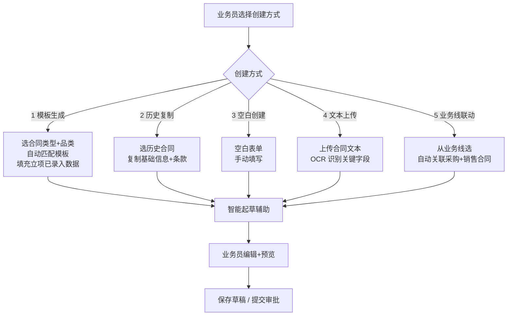
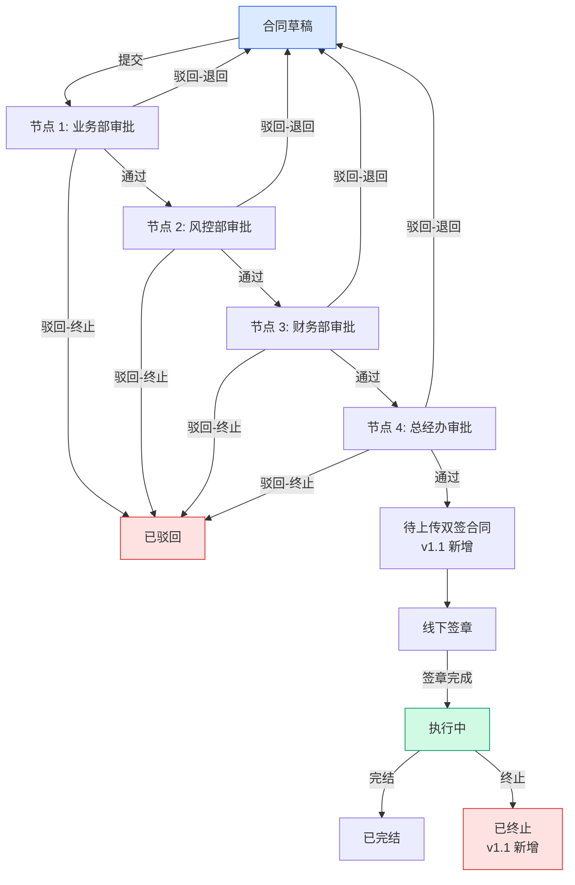
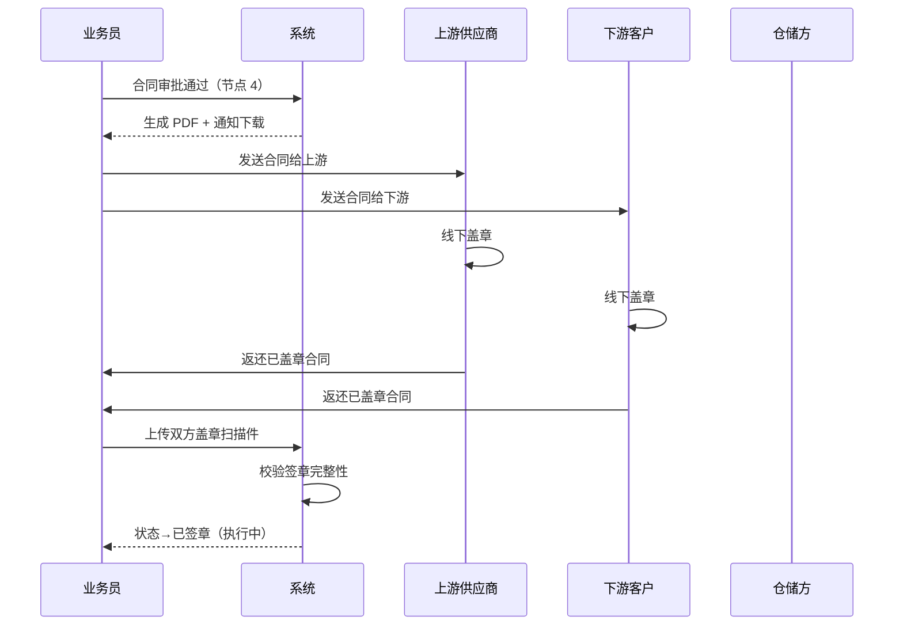
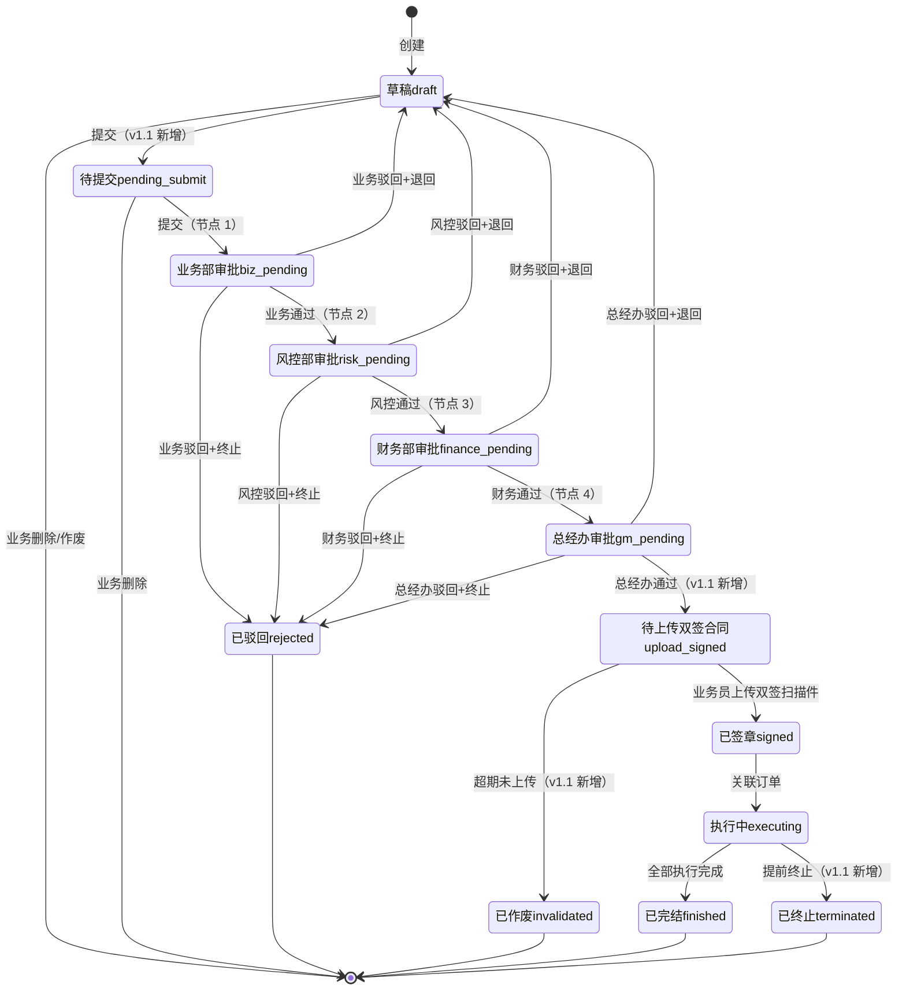
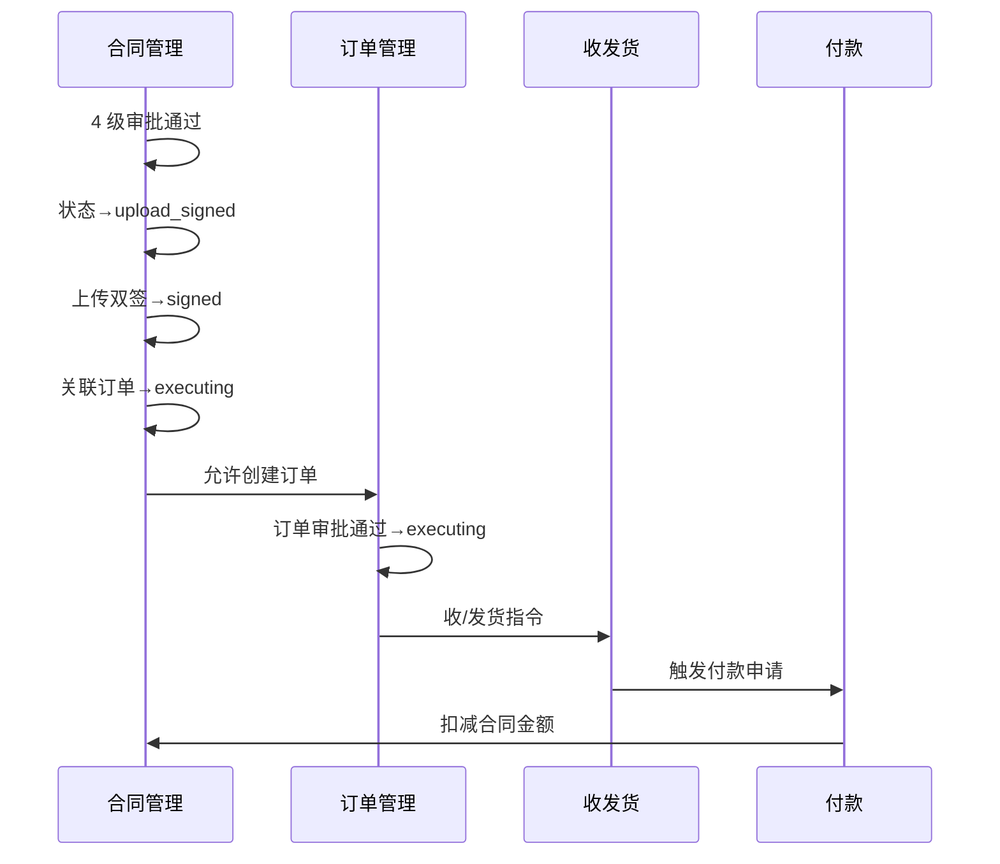
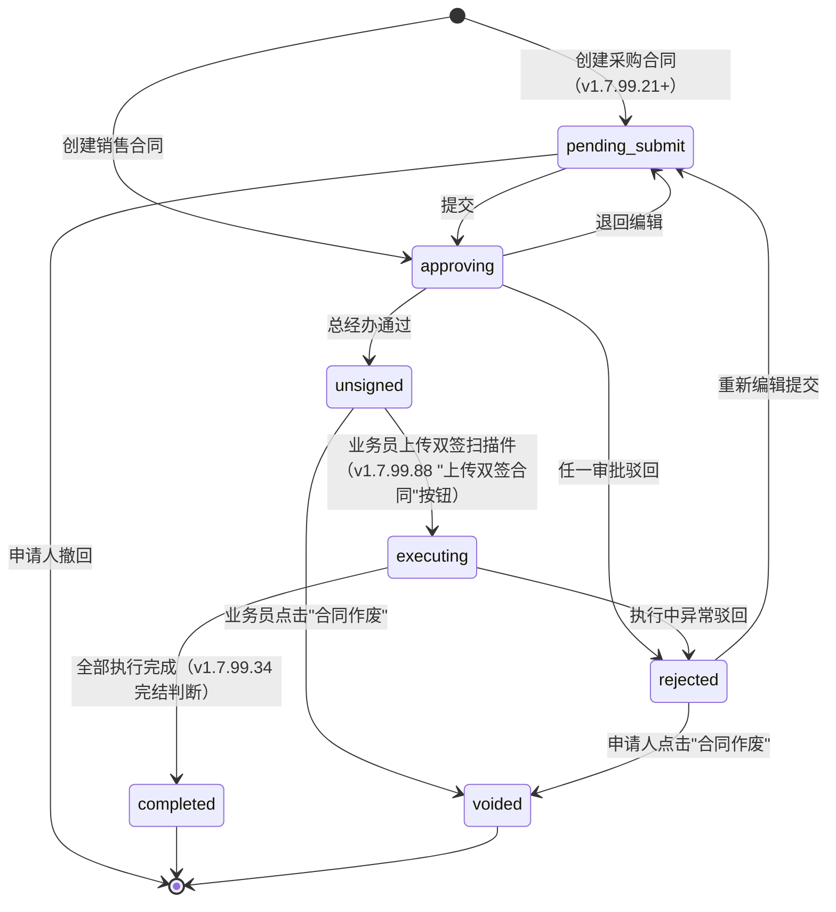

# 02.03 合同管理 v1.1 终版

> **状态**：v1.1 终版（**v1.0 修正版，基于 83 张原型截图调整**）
> **生成时间**：2026-07-24 14:55
> **变更**：
> - 🔴 **4 子菜单**（采购/销售/**运输**/补充）vs v1.0 4 类（采购/销售/仓储/补充）
> - 🔴 **合同号 4 段格式** `DLXLC-DSRMT-2022203-001` vs v1.0 `HT-{YYYYMM}-{4位}`
> - 🔴 **品类具体名** 玉米/糖粉/木薯淀粉 vs v1.0 谷物/糖粉/淀粉
> - 🟡 **9 状态**（新增"待上传双签合同/已终止/已作废"）vs v1.0 6 状态
> - 🟡 **5 业务类型**（+总代业务）vs v1.0 4 类型
> - 🟡 **2 维分类**：方向（采购/销售）×类型（框架/订单单批次）= 4 种合同
> - 🟡 合同字段新增：货物进度/付款进度/结算进度/开票进度 4 仪表盘
> **配套文档**：[00-项目总览与对接.md](../00-项目总览与对接.md) / [01-模块拆解大框架.md](../01-模块拆解大框架.md) / [05-复用对比/全量矩阵 v1.2.md](../05-复用对比/全量矩阵%20v1.0.md) / [02.01-项目管理-立项.md](./02.01-项目管理-立项.md) / [02.02-客户管理.md](./02.02-客户管理.md) / [02.04-订单管理.md](./02.04-订单管理.md)
> **复用度**：🟢 **80%（大幅复用）**——主产品 `bo_contract*` 7 张 + `t_supplemental_agreement*` 4 张 + `t_contract*` 钢铁业务 5 张 = **13+ 张表**

---

## 0. 章节导航

1. 业务定位
2. 业务流程全景
3. 核心实体（**v1.1 调整：13 张表**）
4. 9 状态机（**v1.1 新增 3 个状态**）
5. 角色操作矩阵
6. 字段规则
7. 按钮交互
8. 异常处理
9. 跨模块流转
10. 复用建议
11. v1.1 变更摘要
12. 文档版本
13. **v1.7.99.98 改造子章节**（合同签署状态预设选项统一：待盖章/已双签）
13. **v1.7.99.88 改造子章节**（合同管理 4 处状态机/操作按钮改造）

---

## 1. 业务定位

**合同管理**是港通供应链的**业务串联核心**——所有下游业务（订单/收发货/付款/发票/结算）都通过合同关联起来。

### 1.1 v1.1 关键规则（基于原型 08-22 截图 + sitemap）

1. **4 子菜单**（**v1.1 重大调整**）：
   - **采购合同**（含采购框架合同 + 采购订单/单批次合同）
   - **销售合同**（含销售框架合同 + 销售订单/单批次合同）
   - **运输合同**（**v1.1 新发现**）
   - **补充协议**
2. **2 维分类**（**v1.1 新增**）：
   - 方向：`purchase`（采购）/ `sales`（销售）
   - 类型：`framework`（框架合同）/ `single_batch`（订单/单批次合同）
   - 组合 = 4 种合同
3. **5 种业务模式**（**v1.1 新增 1 种**）：存货/预付/账期/购销/**总代业务**（从项目立项继承）
4. **4 级串行审批**：业务部 → 风控部 → 财务部 → 总经办（**单签**，不是 OR 会签）✅ 不变
5. **2 小时 SLA 自动催办** ✅ 不变
6. **加签机制**（临时加人审批）✅ 不变
7. **线下签章 + 系统流程化登记**（审批通过→下载→双方线下盖章→扫描件上传）✅ 不变
8. **5 种创建方式**：模板生成 / 历史复制 / 空白创建 / 文本上传 / 业务线联动 ✅ 不变
9. **客户关联**：直接引用 `t_company`（不再经过 `t_access_apply` 准入台账）✅ 不变
10. **9 状态**（**v1.1 重大调整**）：新增"**待上传双签合同/已终止/已作废**"

### 1.2 v1.1 4 子菜单详解

| # | 子菜单 | 2 维分类 | 子页 | 范本对应 |
|---|--------|---------|------|---------|
| 1 | **采购合同** | direction=purchase | 采购框架合同 / **采购订单/单批次合同** | 02.03 v1.0 + 02.04 订单管理 |
| 2 | **销售合同** | direction=sales | 销售框架合同 / **销售订单/单批次合同** | 02.03 v1.0 + 02.04 订单管理 |
| 3 | **运输合同**（v1.1 新）| transport | 暂无详情页（占位）| **02.03 v1.0 没写** |
| 4 | **补充协议** | supplemental | 框架合同补充 / 订单/单批次合同补充 | 02.03 v1.0 部分 |

### 1.3 货物品类 3 种（**v1.1 具体名**）

| v1.0（抽象）| v1.1（具体名）|
|------|------|
| 谷物 | **玉米** |
| 糖粉 | **糖粉** |
| 淀粉 | **木薯淀粉** |

### 1.4 业务类型 5 种（**v1.1 新增总代业务**）

| # | 业务类型 | v1.0 | v1.1 |
|---|--------|-----|------|
| 1 | 存货业务 | ✅ | ✅ |
| 2 | 预付业务 | ✅ | ✅ |
| 3 | 账期业务 | ✅ | ✅ |
| 4 | 购销业务 | ✅ | ✅ |
| 5 | **总代业务**（`agency_business`）| ❌ | 🆕（23 业务线截图）|

---

## 2. 业务流程全景

### 2.1 5 种创建方式（不变）



### 2.2 4 级串行审批流程（不变）



**v1.1 关键调整**：节点 4 后新增"**待上传双签合同**"状态（线下盖章完成的过渡状态）

### 2.3 合同签章流程（不变）



---

## 3. 核心实体（13 张表，**v1.1 字段调整**）

### 3.1 `t_contract` 合同主表（**v1.1 编号 + 2 维分类 + 9 状态**）

| 字段 | 类型 | 必填 | 说明 |
|------|------|------|------|
| `id` | bigint PK | - | 主键 |
| `contract_no` | varchar(32) | ✓ | **合同号 4 段格式（v1.1 重大调整）**：`{项目代码}-{业务类型}-{YYYYMMDD}-{3位流水}`，例 `DLXLC-DSRMT-2022203-001` |
| `project_id` | bigint | ✓ | **关联项目**（来自 02.01）|
| `business_mode` | varchar(20) | ✓ | **业务模式 5 种（v1.1 新增）**：`inventory` / `prepayment` / `credit_period` / `trade` / **`agency_business`** |
| `direction` | varchar(20) | ✓ | **方向（v1.1 新增）**：`purchase`（采购）/ `sales`（销售）/ `transport`（运输）|
| `contract_subtype` | varchar(20) | ✓ | **合同子类型（v1.1 新增）**：`framework`（框架合同）/ `single_batch`（订单/单批次合同）/ `supplement`（补充协议）|
| `customer_id` | bigint | ✓ | **关联客户**（直接引用 `t_company`）|
| `customer_name` | varchar(128) | - | 客户名称（冗余）|
| `product_category` | varchar(64) | ✓ | **货物品类 3 种（v1.1 具体名）**：`玉米` / `糖粉` / `木薯淀粉` |
| `total_amount` | decimal(20,2) | ✓ | 合同总金额 |
| `quantity` | decimal(20,4) | - | **合同量（v1.1 新增）**，例 5000 吨 |
| `unit_price` | decimal(20,4) | - | **合同单价（v1.1 新增）**，例 500 元/吨 |
| `currency` | varchar(10) | - | 币种 |
| `sign_date` | date | - | 签章日期（线下签章完成后填写）|
| `effective_date` | date | ✓ | 生效日期 |
| `expire_date` | date | ✓ | 到期日期 |
| `template_id` | bigint | - | 使用的模板 ID |
| `parent_contract_id` | bigint | - | 父合同 ID（补充协议关联原合同）|
| `is_supplement` | tinyint | - | 0=主合同, 1=补充协议 |
| `status` | varchar(20) | ✓ | **状态 9 个（v1.1 重大调整）**：见 §4 |
| `current_approval_node` | tinyint | - | 当前审批节点（1-4）|
| `creator_id` | bigint | ✓ | 创建人 |
| `create_time` | datetime | ✓ | - |
| `submit_time` | datetime | - | 提交时间 |
| `sign_complete_time` | datetime | - | 签章完成时间 |
| `complete_time` | datetime | - | 完结时间 |
| `terminate_time` | datetime | - | **终止时间（v1.1 新增）** |
| `invalidate_time` | datetime | - | **作废时间（v1.1 新增）** |
| `is_deleted` | tinyint | ✓ | 0 = 软删除 |

### 3.2-3.13 其他 12 张表（**v1.1 字段小调整**）

| 表名 | v1.0 | v1.1 调整 |
|------|-----|---------|
| `t_contract_item` | 合同商品明细 | + `tax_amount` 字段 |
| `t_contract_template` | 合同模板 | 不变 |
| `t_contract_approval` | 合同审批流 | + `flow_type` 字段（消息推送/OA）|
| `t_contract_sign` | 合同签章记录 | + `sign_scan_url` 必填（v1.1） |
| `t_contract_supplemental` | 补充协议 | + `contract_subtype` 字段 |
| `t_contract_change` | 合同变更 | 不变 |
| `t_contract_execution` | 合同执行监控 | + 4 进度字段（v1.1） |
| `t_contract_upload` | **新（v1.1 新增）** | 双签合同扫描件 |
| `t_contract_terminate` | **新（v1.1 新增）** | 终止记录 |
| `t_contract_invalidate` | **新（v1.1 新增）** | 作废记录 |
| `t_contract_progress` | **新（v1.1 新增）** | 4 进度仪表盘数据 |
| `t_contract_history` | 合同历史版本 | + `change_reason` 字段 |

---

## 4. 9 状态机（**v1.1 重大调整**）

### 4.1 合同状态机（**v1.1 从 6 个扩到 9 个**）



### 4.2 9 状态说明

| # | 状态 | 节点 | 中文 | 触发 | 出口 |
|---|------|------|------|------|------|
| 1 | `draft` | - | 草稿 | 创建 | 提交/删除/作废 |
| 2 | `pending_submit` | - | 待提交 | 业务员提交 | 业务部审批 |
| 3 | `biz_pending` | 1 | 业务部审批 | 业务员提交 | 业务部审批 |
| 4 | `risk_pending` | 2 | 风控部审批 | 业务部通过 | 风控部审批 |
| 5 | `finance_pending` | 3 | 财务部审批 | 风控部通过 | 财务部审批 |
| 6 | `gm_pending` | 4 | 总经办审批 | 财务部通过 | 总经办审批 |
| 7 | **`upload_signed`** | - | **待上传双签合同**（v1.1 新增）| 总经办通过 | 上传双签 / 超期作废 |
| 8 | `signed` | - | 已签章 | 上传双签扫描件 | 执行中 |
| 9 | `executing` | - | 执行中 | 关联订单 | 完结 / 终止 |
| 10 | `finished` | - | 已完结 | 全部执行完成 | 终态 |
| 11 | `terminated` | - | **已终止**（v1.1 新增）| 提前终止 | 终态 |
| 12 | `rejected` | - | 已驳回 | 任一审批驳回 | 终态 |
| 13 | `invalidated` | - | **已作废**（v1.1 新增）| 超期未上传双签 | 终态 |

### 4.3 列表 9 Tab 映射

| Tab | 对应状态 |
|-----|---------|
| 全部 | 所有 |
| 待提交(100) | `pending_submit` |
| 审批中(1) | `biz_pending` / `risk_pending` / `finance_pending` / `gm_pending` |
| **待上传双签合同(10)**（v1.1 新增）| `upload_signed` |
| 执行中(100) | `executing` |
| 已完结(100) | `finished` |
| **已终止(100)**（v1.1 新增）| `terminated` |
| 驳回(100) | `rejected` |
| **已作废(100)**（v1.1 新增）| `invalidated` |

---

## 5. 角色操作矩阵（不变）

| 状态 / 角色 | 业务员 | 业务部 | 风控部 | 财务部 | 总经办 | 系统 |
|------------|------|------|------|------|------|------|
| `pending_submit` 待提交 | 编辑/作废 | 查看 | 查看 | 查看 | 查看 | - |
| `biz_pending` 业务部 | 查看 | **审批** | 查看 | 查看 | 查看 | 推送 |
| `risk_pending` 风控部 | 查看 | 查看 | **审批** | 查看 | 查看 | 推送 |
| `finance_pending` 财务部 | 查看 | 查看 | 查看 | **审批** | 查看 | 推送 |
| `gm_pending` 总经办 | 查看 | 查看 | 查看 | 查看 | **审批** | 推送 |
| `upload_signed` 待上传（v1.1 新）| **上传双签** | 查看 | 查看 | 查看 | 查看 | 超期提醒 |
| `signed` 已签章 | 查看 | 查看 | 查看 | 查看 | 查看 | - |
| `executing` 执行中 | 查看 | 查看 | 查看 | 查看 | 查看 | - |
| `finished` 已完结 | 查看 | 查看 | 查看 | 查看 | 查看 | - |
| `terminated` 已终止（v1.1 新）| 查看 | 查看 | 查看 | 查看 | 查看 | - |
| `rejected` 已驳回 | **编辑后重新提交** | 查看 | 查看 | 查看 | 查看 | - |
| `invalidated` 已作废（v1.1 新）| 查看 | 查看 | 查看 | 查看 | 查看 | - |

---

## 6. 字段规则

### 6.1 合同号 `contract_no`（**v1.1 重大调整**）

- **格式**：`{项目代码}-{业务类型}-{YYYYMMDD}-{3位流水}`，**4 段**
- 例：`DLXLC-DSRMT-2022203-001`
- 段位含义（**v1.1 待确认**）：
  - 第 1 段：项目代码（DLXLC = 立项项目代码？跟 02.01 立项项目编号相关？）
  - 第 2 段：业务类型（DSRMT = 订/售/燃/煤/统？需用户确认）
  - 第 3 段：日期 YYYYMMDD
  - 第 4 段：3 位流水
- **v1.1 标 [P0 待确认-字段]**

### 6.2 业务模式 `business_mode`（**v1.1 新增第 5 种**）

- **5 种**：
  - `inventory`（存货业务）
  - `prepayment`（预付业务）
  - `credit_period`（账期业务）
  - `trade`（购销业务）
  - **`agency_business`（总代业务，v1.1 新增）**

### 6.3 合同方向 `direction`（**v1.1 新增**）

- 3 种：`purchase`（采购）/ `sales`（销售）/ `transport`（运输）

### 6.4 合同子类型 `contract_subtype`（**v1.1 新增**）

- 3 种：`framework`（框架合同）/ `single_batch`（订单/单批次合同）/ `supplement`（补充协议）

### 6.5 货物品类 `product_category`（**v1.1 具体名**）

- 3 种：**玉米** / **糖粉** / **木薯淀粉**（不再是"谷物/糖粉/淀粉"抽象名）

### 6.6 4 级串行审批规则（不变）

- 业务部 → 风控部 → 财务部 → 总经办
- 全部单签（不是 OR 会签）
- 任一驳回→ 退回草稿或终止
- 2 小时 SLA 自动催办

### 6.7 加签机制（不变）

- 加签（add_sign）：审批人可临时加审批人（紧急情况）
- 加签节点 `is_add_sign=1` + `add_sign_reason` 必填
- 加签人也需遵守 2 小时 SLA

### 6.8 线下签章规则（**v1.1 调整**）

- **v1.0 流程**：审批通过→下载→双方线下盖章→扫描件上传→已签章
- **v1.1 流程**：审批通过→**状态→"待上传双签合同"**→业务员上传双签扫描件→状态→"已签章"
- **超期未上传**（v1.1 新增）：超过 30 天未上传扫描件→状态→"已作废"

---

## 7. 按钮交互

### 7.1 列表页（**v1.1 调整**）

| 按钮 | 位置 | 可见条件 | 点击行为 |
|------|------|---------|---------|
| **新增合同** | 右上 | 业务部 | 弹创建方式选择（5 种）|
| **数据导出** | Tab 右侧 | 所有 | 导出 Excel |
| **合同详情** | 列表行 | 所有 | 跳详情页 |
| **上传合同附件** | 列表行 | `upload_signed` | 弹上传对话框（v1.1 新增）|
| **付款申请** | 列表行 | `executing` | 跳付款新建（关联 contract_id）|
| **发货申请** | 列表行 | `executing` | 跳发货新建 |
| **更多** | 列表行 | 所有 | 弹下拉（编辑/作废/驳回/复制等）|

### 7.2 详情页字段（**v1.1 新增 4 进度仪表盘**）

| 分类 | 字段 |
|------|------|
| **合同信息** | 合同号 / 卖方企业 / 品名 / 合同单价 / 合同金额 / 业务类型 / 合同量 / 签订日期 / 合同有效期 / 创建人 |
| **货物进度** | 进度条 0-120%（带颜色）|
| **付款进度** | 已付款（元）/ 0 |
| **结算进度** | 已结算数量（吨）/ 已结算金额（元）/ 拆分到本合同金额（元）|
| **开票进度** | 发票张数（张）/ 0 |
| **操作** | 合同详情 / 上传合同附件 / 付款申请 / 发货申请 / 更多 |

### 7.3 4 子菜单入口（**v1.1 调整**）

- 合同管理 → 4 个子菜单
  - 采购合同（含 2 Tab：采购框架合同 / 采购订单/单批次合同）
  - 销售合同（含 2 Tab：销售框架合同 / 销售订单/单批次合同）
  - 运输合同（占位）
  - 补充协议（含 2 Tab：新增补协-框架合同 / 新增补协-订单/单批次合同）

---

## 8. 异常处理

### 8.1 业务异常

| 异常场景 | 提示文案 | 处理动作 |
|---------|---------|---------|
| 必填项未填 | "请填写：合同名称/客户/品类/..." | 阻止提交 |
| 业务类型与品类不匹配 | "业务类型 X 与品类 Y 不匹配" | 红色提示 |
| 合同金额 = 0 | "合同金额必须 > 0" | 阻止 |
| 合同有效期 < 生效日期 | "到期日期必须 > 生效日期" | 阻止 |

### 8.2 审批异常

| 异常场景 | 提示文案 | 处理动作 |
|---------|---------|---------|
| 任一审批驳回 | "XX 审批驳回" | 状态→`draft`（退回）或 `rejected`（终止）|
| 审批超时（2 小时）| "审批超过 2 小时未处理" | **自动催办** |
| 审批人未配置 | "审批人未配置，请联系管理员" | 状态保持 |
| 消息推送失败 | "消息推送失败，请重试" | 允许重试 |

### 8.3 签章异常（**v1.1 调整**）

| 异常场景 | 提示文案 | 处理动作 |
|---------|---------|---------|
| **超期未上传双签合同**（v1.1 新）| "合同 XXX 已超 30 天未上传双签扫描件，已自动作废" | 状态→`invalidated` |
| 签章扫描件格式错误 | "扫描件格式不支持（仅支持 .pdf/.png/.jpg）" | 阻止上传 |
| 签章扫描件过大 | "扫描件不能超过 20MB" | 阻止上传 |
| 签章扫描件与签章方不匹配 | "扫描件签章方与系统记录不匹配" | 红色提示，需人工审核 |

### 8.4 变更/终止异常

| 异常场景 | 提示文案 | 处理动作 |
|---------|---------|---------|
| 执行中合同变更 | "执行中合同变更需走补充协议" | 引导到补充协议 |
| 已完结合同不能变更 | "已完结合同不能变更" | 阻止 |
| 已终止合同不能恢复 | "已终止合同不能恢复" | 阻止 |
| **作废合同恢复**（v1.1 新）| "已作废合同需走 OA 流程恢复" | 引导到 OA |

---

## 9. 跨模块流转

### 9.1 上游触发

| 触发模块 | 触发条件 | 触发动作 |
|---------|---------|---------|
| 项目管理-立项（02.01）| 项目 `finished` | 允许创建合同，关联 `project_id` |
| 客户管理（02.02）| 客户 `executing` | 允许合同关联 |

### 9.2 下游触发

| 触发模块 | 触发条件 | 触发动作 |
|---------|---------|---------|
| 订单管理（02.04）| 合同 `signed` | 允许创建订单（采购/销售）|
| 收发货（02.05）| 订单 `executing` | 收/发货关联到 `contract_id` |
| 付款（02.08.1）| 合同 `executing` | 付款时校验合同 |
| 发票（02.09）| 合同 `executing` | 发票关联到 `contract_id` |
| 结算（02.07）| 合同 `executing` | 结算关联到 `contract_id` |

### 9.3 跨模块状态机联动



---

## 10. 复用建议

### 10.1 复用度

**🟢 80%（大幅复用）**

| 类别 | 数量 | 复用度 |
|------|------|--------|
| 直接复用主产品表 | 3 张 | 100% |
| 复用主产品表（扩展少量字段）| 5 张 | 80% |
| 港通新建表 | 5 张 | - |

### 10.2 直接复用主产品表

- `bo_contract` 合同主表
- `bo_contract_attachment` 合同附件
- `bo_terminal_contract` 终结合同

### 10.3 复用+扩展主产品表

- `t_contract`（基于主产品 + v1.1 新增 5 字段）
- `t_supplemental_agreement`（基于主产品 + 2 维分类）
- `bo_contract_text_template`（合同模板）

### 10.4 港通新建表（**v1.1 调整**）

- `t_contract_upload` 双签合同扫描件（v1.1 新）
- `t_contract_terminate` 终止记录（v1.1 新）
- `t_contract_invalidate` 作废记录（v1.1 新）
- `t_contract_progress` 4 进度仪表盘数据（v1.1 新）
- `t_contract_history` 合同历史版本

### 10.5 给研发的实施建议

1. **第一周**：直接复用主产品 `bo_contract*` 7 张表，加 v1.1 字段
2. **第二周**：建 4 子菜单页面（采购/销售/运输/补充）
3. **第三周**：建 9 状态机 + 4 级串行审批
4. **第四周**：建 4 进度仪表盘 + 跨模块集成

---

## 11. v1.1 变更摘要

| 变更点 | v1.0 | v1.1 |
|------|------|------|
| **4 子菜单** | 4 类（采购/销售/仓储/补充）| **4 子菜单**（采购/销售/**运输**/补充）|
| **2 维分类** | 范本没明确 | **方向 × 子类型 = 4 种合同**（采购框架/采购订单/销售框架/销售订单）|
| **合同号格式** | `HT-{YYYYMM}-{4位}` | **`{项目代码}-{业务类型}-{YYYYMMDD}-{3位}` 4 段** |
| **货物品类** | 谷物/糖粉/淀粉 | **玉米/糖粉/木薯淀粉** |
| **业务类型** | 4 种 | **5 种**（+ 总代业务）|
| **状态数** | 6 个 | **9 个**（+ 待上传双签合同/已终止/已作废）|
| **新增表** | 13 张 | **13 张**（+ 4 张：upload/terminate/invalidate/progress）|
| **字段：合同量/单价** | 范本没说 | **v1.1 新增**（08 截图显示）|
| **4 进度仪表盘** | 范本没说 | **v1.1 新增**（货物/付款/结算/开票）|

---

## 12. 文档版本

- **v1.0（2026-07-24 11:33）**：基于 5 张截图 + 建设方案 V2 推测的初版
- **v1.1（2026-07-24 14:55）**：基于 83 张原型截图（7-24 最新版）修正
  - 🔴 4 子菜单（+运输合同）
  - 🔴 合同号 4 段格式
  - 🔴 品类具体名
  - 🟡 9 状态
  - 🟡 5 业务类型
  - 🟡 2 维分类
  - 🟡 4 进度仪表盘
  - 🟡 4 新表
- **v1.7.99.88（2026-07-31）**：合同管理 4 处状态机/操作按钮改造
  - 🔴 移除「已终止」状态（采购 8→7 状态，销售 7→6 状态）
  - 🔴 移除「发起合同终止」按钮 + terminateModal
  - 🔴 「待上传双签合同」状态下「上传合同附件」→「上传双签合同」（8 个页面）
  - 🟡 销售合同「执行中」状态下「开票申请」→「上传发票」（2 个销售合同页面）
  - 🟡 补协列表移除 mock「已终止」行（DLXLC-DSRMT-202202-003）
- 修改记录：见 `06-修改记录.md`

---

## 13. v1.7.99.88 改造子章节

### 13.1 改造背景

2026-07-31 用户一次性提 4 处合同管理改造（基于实际业务沟通）：
1. **状态机**：所有「已终止」状态全部去除（采购 8 状态 → 7 状态，销售 7 状态 → 6 状态）
2. **操作按钮命名**：「待上传双签合同」状态下「上传合同附件」→「上传双签合同」（8 个页面统一）
3. **销售合同操作按钮**：执行中「开票申请」→「上传发票」（销售合同语义："我方（卖方）开票给采购方" = 我方上传发票）
4. **危险操作下线**：「发起合同终止」按钮全部去掉 + 对应 terminateModal 弹窗删除

### 13.2 7 状态机锁定（v1.7.99.88）

| # | 状态 | 中文 | 触发 | 出口 |
|---|------|------|------|------|
| 1 | `pending_submit` | 待提交 | 业务员提交 | 业务部审批 / 撤回 |
| 2 | `approving` | 审批中 | 任一审批节点 | 总经办通过 / 任一驳回 / 退回编辑 |
| 3 | `unsigned` | 待上传双签合同 | 总经办通过 | 上传双签 / 合同作废 |
| 4 | `executing` | 执行中 | 上传双签 | 全部完结 / 异常驳回 |
| 5 | `completed` | 已完结 | 全部执行完成 | 终态 |
| 6 | `rejected` | 审批驳回 | 任一审批驳回 | 重新编辑 / 合同作废 |
| 7 | `voided` | 已作废 | 业务员点击"合同作废" | 终态 |

> ❌ **v1.7.99.88 已删除**：`terminated`（已终止）—— 采购 7 状态 = 销售 6 状态（销售比采购少 `pending_submit`）

### 13.3 7 个改造页面 + 改造点

| # | 页面 | 改造点 |
|---|------|--------|
| 1 | `contract-purchase.html` | STATUS_META 去 terminated + statusOrder 去 terminated + ACTION_RULES.executing 去 terminate + upload 改名 |
| 2 | `contract-sales.html` | STATUS_META（已无 terminated）+ ACTION_RULES.executing 去 terminate + upload 改名 + 执行中 invoice 改名 + handleAction 去 case 'terminate' + 注释更新 |
| 3 | `contract-purchase-order-detail.html` | STATUS_META 去 terminated + ACTION_RULES 去 terminated entry + upload 改名 + actionLabels upload 改名 |
| 4 | `contract-sales-order-detail.html` | 同上 + 执行中 invoice 改名 |
| 5 | `contract-purchase-framework-detail.html` | STATUS_META 去 terminated + ACTION_RULES 去 terminated entry + executing 去 terminate + upload 改名 + actionLabels 同步 |
| 6 | `contract-sales-framework-detail.html` | 同上（无 invoice 改造） |
| 7 | `contract-supplement.html` | mock 数据去除 signStatus:'已终止' 行（DLXLC-DSRMT-202202-003） |

### 13.4 销售合同 vs 采购合同 4 处状态机差异（v1.7.99.88 后）

| 维度 | 采购合同 | 销售合同 |
|------|---------|---------|
| **状态数** | 7 状态 | 6 状态（少 `pending_submit`）|
| **执行中 开票按钮名** | `开票申请`（采购方申请销售方开票）| `上传发票`（v1.7.99.88：销售方上传开好的发票给采购方）|
| **upload 按钮名** | `上传双签合同` | `上传双签合同` |
| **terminate 按钮** | ❌ 已下线 | ❌ 已下线 |
| **terminated 状态** | ❌ 已下线 | ❌ 已下线 |

### 13.5 命名规范 v1.7.99.88 锁定

| 操作 | 旧名 | 新名 | 适用页面 |
|------|------|------|---------|
| 待上传双签合同 | `上传合同附件` | `上传双签合同` | 8 个合同页面统一 |
| 销售合同 执行中 | `开票申请` | `上传发票` | contract-sales.html / contract-sales-order-detail.html |

### 13.6 触发的潜在问题

- **历史操作记录保留**：4 个详情页的操作日志 mock 仍显示「发起合同终止」+「合同终止OA审批通过/驳回」3 行记录——这些是历史操作记录，user 没要求清理
- **采购合同「开票申请」保留**：采购合同 user 没要求改名，保留"开票申请"（业务语义：采购方向销售方申请开票）
- **销售合同「待上传双签合同」状态下「开票申请」保留**：user 只指定了「执行中」状态下改名，unsigned 状态保留
- **terminateModal HTML 残留**：contract-purchase.html / contract-sales.html / 4 个详情页的 HTML 弹窗 div 元素本身未删除（虽然没按钮触发），但 JS handler 已删除触发路径

### 13.7 触发模式（v1.7.99.88 锁定的硬规范）

- **【大前提】合同管理 status 移除要"全栈"清理**：v1.7.99.88 经验——移除 status 不只删 1 处，必须全栈清理：STATUS_META + statusOrder + ACTION_RULES[status] entry + 状态 tab + mock 数据行 + 处理器 + 弹窗 + helper function + actionLabels map 全删
- **【大前提】销售合同 vs 采购合同按钮命名差异**：v1.7.99.88 经验——销售合同 = 我方是卖方，"上传发票"语义正确；采购合同 = 我方是买方，"开票申请"语义正确（申请对方开票）——**新加销售/采购按钮命名先看角色**
- **【大前提】状态机 + 操作按钮命名沿用 user 明确要求**：v1.7.99.88 经验——user 没明确要求改的（如 采购合同"开票申请"、unsigned 状态"开票申请"、历史操作记录）**不擅自改**——v1.7.99.72 经验："不扩展范围去修未截图反馈的问题"
- **【大前提】不在 HTML 中留无用弹窗 div**：v1.7.99.88 经验——terminateModal / terminate handler / case 'terminate' / checkTerminateBlock / actionLabels terminate 全删，**不留僵尸代码**
- **【大前提】alert 文案跟按钮名同步改**：v1.7.99.88 经验——contract-sales.html "case 'invoice'" 之前的 alert `'进入开票申请页面'` 也要改成 `'进入上传发票页面'`——alert 文案要跟按钮名一致
- **【大前提】注释更新要锁版本号**：v1.7.99.88 经验——每处改动要加 `// v1.7.99.88：xxx` 注释标记，**便于以后回溯**
- **【大前提】不修改全局 design-system.css / list-page.css**：v1.7.99.88 沿用 v1.7.99.69+ 经验：项目级覆盖，避免影响其他 50+ 列表页
- **【大前提】不新建 assets/js/app.js**：v1.7.99.88 沿用 v1.7.99.80 模式：项目级 inline JS

---

## v1.7.99.x 模块变更汇总

> **变更依据**：[v1.7.99-changelog.md](./v1.7.99-changelog.md)（v1.7.99.x 全量汇总）
> **本页同步时间**：2026-07-28
> **本次同步策略**：模块级汇总（页面级增量见各 p-*.md）

### 本模块涉及的 v1.7.99.x 改动（30+ 版本汇总）

| # | 版本 | 改动 | 影响页面 |
|---|------|------|---------|
| 1 | v1.7.99.12 | 表格加"流程状态"列 | 采购/销售合同列表 |
| 2 | v1.7.99.13 | 命名统一"项目准入" | 全站 |
| 3 | v1.7.99.14 | 流程状态列 sticky + 状态机颜色编码 | 列表页 |
| 4 | v1.7.99.16m | 采购合同重做（双 tap 切换） | 采购合同列表 |
| 5 | v1.7.99.17 | 采购合同 2 个新增页 | 采购合同新增 |
| 6 | v1.7.99.18 | 销售合同 4 个页 | 销售合同 |
| 7 | v1.7.99.19 | 补充协议升级 | 补协 3 个页 |
| 8 | v1.7.99.20 | 销售合同详情页重做 | 销售合同详情 |
| 9 | v1.7.99.21+21b | 合同状态机加"待提交" | 采购/销售/补协 |
| 10 | v1.7.99.22 | 客户/项目准入加企业开户行/银行账号 | 合同新增页 |
| 11 | v1.7.99.23 | 6 字段改必填 | 合同新增页 |
| 12 | v1.7.99.24 | 6 必填 JS 校验 | 合同新增页 |
| 13 | v1.7.99.30 | 合同新增页"项目必填 + 框架合同可选" | 合同新增页 |
| 14 | v1.7.99.32 | 卖方/买方与项目/框架合同联动 | 合同新增页 |
| 15 | v1.7.99.33 | 项目列表筛选项重制 + 货物品类 4 选项 | 列表页 |
| 16 | v1.7.99.34 | 采购合同列表"操作列"按状态机重制 | 采购合同列表 |
| 17 | v1.7.99.35 | 采购合同 6 类弹窗升级 + 销售合同重制 | 采购/销售合同 |
| 18 | v1.7.99.35-fix | 合同作废/合作废命名规范化 | 采购/销售合同 |
| 19 | v1.7.99 全局 | 列表页占位 = "全部" | 列表页 |
| 20 | v1.7.99.88 | 移除「已终止」状态 + 「上传合同附件」→「上传双签合同」+ 销售合同「开票申请」→「上传发票」+ 移除「发起合同终止」按钮 | 合同管理 7 个页面 |
| 21 | **v1.7.99.98** | **合同签署状态预设选项统一：待盖章/已双签**（v1.7.99.98 沿用 v1.7.99.95 "凭证→保证金"经验 + v1.7.99.96 "图 2 占位版字段名按 user 截图改"经验）| **4 个新页面** |

### 本模块的核心变更

- **7 状态机**（v1.7.99.21+21b+34+35+88）：采购合同 = 7 状态（待提交/审批中/待上传双签合同/执行中/已完结/审批驳回/已作废），销售合同 = 6 状态（比采购少"待提交"），**v1.7.99.88 移除"已终止"状态**
- **操作项矩阵**（v1.7.99.34+35+88）：按 7 状态机驱动显示不同操作按钮，**v1.7.99.88 移除"发起合同终止"按钮 + 销售合同"开票申请"→"上传发票" + 待上传双签合同"上传合同附件"→"上传双签合同"**
- **5 类弹窗**（v1.7.99.35+88）：uploadModal / supplementTipModal / voidModal / confirmModal / blockModal，**v1.7.99.88 移除 terminateModal（"发起合同终止"已下线）**
- **命名规范**（v1.7.99.35-fix+88）：操作按钮 = "合同作废"，弹窗标题 = "合作废"（销售合同统一）/ 动态（采购合同），"上传合同附件"统一改为"上传双签合同"（v1.7.99.88）
- **联动主体**（v1.7.99.30+32）：项目必填 + 框架合同可选 + 我方自动带出 + 卖方/买方联动

### 本模块的页面级同步状态

| 页面 | 文档 | 同步状态 |
|------|------|---------|
| 采购合同列表 | [p-contract-purchase.md](./p-contract-purchase.md) | ✅ 7.4 8 状态操作项矩阵 + 7.5 6 状态判断逻辑 + 7.6 操作按钮交互规则 + 7.7 命名规范化 |
| 销售合同列表 | [p-contract-sales.md](./p-contract-sales.md) | ✅ 7.4 6 状态操作项矩阵 + 7.5 销售特有按钮 + 7.6 4 类弹窗 + 7.7 命名规范化 |
| 采购合同新增 | [p-contract-purchase-new.md](./p-contract-purchase-new.md) | ✅ 7.4 5 种运输方式 + 7.5 联动主体 + 7.6 企业开户行字段 + 7.7 表单页规范 |
| 销售合同新增 | [p-contract-sales-new.md](./p-contract-sales-new.md) | ✅ 7.4 镜像对称 + 7.5 联动主体 + 7.6 表单页规范 |
| 补充协议列表 | [p-contract-supplement.md](./p-contract-supplement.md) | ✅ 7.4 + 21b 补协升级 + 7.5 操作项矩阵 |
| 补充协议新增 | [p-contract-supplement-new.md](./p-contract-supplement-new.md) | ✅ 7.4 + 19 字段 + 7.5 联动主体 + 7.6 表单页规范 |
| 采购框架详情 | p-contract-purchase-framework-detail.md | ✅ 增量记录 |
| 销售框架详情 | p-contract-sales-framework-detail.md | ✅ 增量记录 |
| 采购订单详情 | p-contract-purchase-order-detail.md | ✅ 增量记录 |
| 销售订单详情 | p-contract-sales-order-detail.md | ✅ 增量记录 |
| 采购订单新增 | p-contract-purchase-order-new.md | ✅ 增量记录 |
| 销售订单新增 | p-contract-sales-order-new.md | ✅ 增量记录 |
| 补协框架详情 | p-contract-supplement-framework-detail.md | ✅ 增量记录 |
| 补协订单详情 | p-contract-supplement-order-detail.md | ✅ 增量记录 |
| 补协订单新增 | p-contract-supplement-order-new.md | ✅ 增量记录 |

### 本模块 v1.7.99.x 后的状态机 mermaid 流程图（v1.7.99.88 移除 terminated）



> **v1.7.99.88 移除**：`executing --> terminated`（"发起合同终止"按钮已下线 + "已终止"状态从状态机中删除）

### 本模块 5 类弹窗触发矩阵（v1.7.99.88 移除 terminateModal）

| 弹窗 | 触发按钮 | 触发状态 | 标题 | 阻止条件 |
|------|---------|---------|------|---------|
| `uploadModal` | **上传双签合同**（v1.7.99.88 改名）| unsigned | 上传双签合同 | - |
| `supplementTipModal` | 新增补协 | executing | 提示 | 补协有"已生效/OA审批中/待上传双签/OA驳回" |
| `voidModal`（采购）| 合同作废 | unsigned/rejected | 合作废/合同作废（id 动态）| - |
| `voidModal`（销售）| 合同作废 | unsigned/rejected | 合作废 | - |
| `confirmModal` | 发起合同完结 | executing | 发起合同完结 | 6 状态判断全部 [] |
| `blockModal` | 发起合同完结 | executing | 发起合同完结 | 6 状态判断有 1+ 项 |
---

## 11. v1.7.99.98 改造子章节（合同签署状态预设选项统一：待盖章/已双签）

> **变更依据**：[v1.7.99-changelog.md](./v1.7.99-changelog.md) v1.7.99.98 行
> **本次改动**：4 个新页面 select 选项修改（4 文件 4 行）

### 11.1 改造背景

合同管理 4 个新建表单（采购合同新建 / 销售合同新建 / 采购订单合同新建 / 销售订单合同新建）的"合同签署状态" select 选项原本是 **3 项**（已签署 / 未签署 / 签署中）——业务含义模糊（"已签署"指卖方/买方/双方？"签署中"是流程还是物理盖章？）。v1.7.99.98 user 明确要求**统一修改为 2 项业务实体**：「**待盖章**」（合同已生成但还没双签，盖章前状态）+ 「**已双签**」（双方都已盖章，合同正式生效）。

**v1.7.99.98 经验**：v1.7.99.95 "凭证→保证金" + v1.7.99.96 "图 2 占位版字段名按 user 截图改"——**v1.7.99.98 沿用同样思路**：占位版的"已签署/未签署/签署中"是 v1.7.99.7 占位版"语义错"——**业务实际只有 2 个状态**：盖了 / 没盖——"已双签"是合同**真正生效**的状态。

### 11.2 4 个文件 4 行修改

| # | 文件 | 旧选项 | 新选项 |
|---|------|--------|--------|
| 1 | `pages/contract-purchase-new.html` line 319 | 已签署 / 未签署 / 签署中 | **待盖章 / 已双签** |
| 2 | `pages/contract-sales-new.html` line 319 | 已签署 / 未签署 / 签署中 | **待盖章 / 已双签** |
| 3 | `pages/contract-purchase-order-new.html` line 362 | 已签署 / 未签署 / 签署中 | **待盖章 / 已双签** |
| 4 | `pages/contract-sales-order-new.html` line 362 | 已签署 / 未签署 / 签署中 | **待盖章 / 已双签** |

### 11.3 不修改其他文件

**v1.7.99.88 经验"user 没要求的扩散改动不动"**（v1.7.99.98 沿用）：

- **不**修改 `pages/contract-purchase.html` / `pages/contract-sales.html` / `pages/contract-supplement.html` 列表页的**筛选项**——列表页的 cp-filter 区域**没有"合同签署状态" select 筛选项**（只有 tab 形式"待上传双签合同"——这是 tab 不是 select，**v1.7.99.88 锁定的"待上传双签合同" tab 不动**）
- **不**修改 `pages/contract-supplement-new.html` 补协新建——**补协的"合同签署状态"是只读 input**（placeholder"选择合同后自动带出"），**不是 select**（v1.7.99.98 经验：补协本身是双签完成后才能签的子协议，**没有"待盖章"选项**——**不动**）
- **不**修改 `pages/contract-supplement-order-new.html` 补协订单新建——**没有"合同签署状态"字段**（v1.7.99.98 经验：补协订单走补协流程，**没有独立签署状态字段**）
- **不**修改 `pages/contract-purchase-framework-detail.html` / `pages/contract-sales-framework-detail.html` / `pages/contract-supplement-framework-detail.html` / `pages/contract-purchase-order-detail.html` / `pages/contract-sales-order-detail.html` / `pages/contract-supplement-order-detail.html` 6 个详情页——详情页是**只读**显示签署状态（"已双签"是绿 tag 渲染，**不是 select 选项**）
- **不**修改 mock 数据——v1.7.99.13 占位版 mock 已经是 `signStatus: '待盖章'` / `signStatus: '已双签'`（v1.7.99.98 经验：**mock 数据 v1.7.99.13 已经按 user 期望命名了**——**v1.7.99.98 决策：mock 数据**已经正确**，**不动**）

### 11.4 v1.7.99.98 命名沿用

**v1.7.99.98 决策**：
- 「**待盖章**」= 合同已生成但还没双签（**placeholder 物理盖章前**）
- 「**已双签**」= 双方都已盖章（**placeholder 物理盖章后**——"双"强调"双方都已"）

**v1.7.99.98 命名对比**：
| 旧（v1.7.99.7 占位版） | 新（v1.7.99.98） | 业务含义 |
|------|------|------|
| 已签署 | **已双签** | 双方都已盖章 |
| 未签署 | **待盖章** | 还没盖章 |
| 签署中 | （移除）| 流程状态，不是物理盖章状态 |

**v1.7.99.98 经验**："签署中" 是 **流程状态**（在审批 / 等待对方）——但**合同签署状态是物理盖章状态**，不是流程状态——**v1.7.99.98 移除"签署中"**——流程状态由 v1.7.99.88 锁定的 9 状态机管（`pending_submit / pending_approval / approved / unsigned / effective / completed / rejected / voided / unavailable`），**不与"合同签署状态"重复**。

### 11.5 列表页 tab 与"合同签署状态"的关系

**v1.7.99.98 经验**：列表页的"待上传双签合同" tab（cp-tab `data-status-tab="unsigned"`）对应 `status: 'unsigned'`（流程状态）——**这个 tab 不动**（v1.7.99.88 锁定）。

**v1.7.99.98 决策**：列表页**不**新增"合同签署状态" select 筛选项——因为：
1. user 需求是"统一修改预设选择"——**改选项不改结构**（**v1.7.99.88 经验"user 没要求的扩散改动不动"**）
2. 流程状态（unsigned/effective/rejected/voided）已经覆盖了"待盖章/已双签"的业务诉求
3. **v1.7.99.98 最小颗粒度改动**——只改 4 个新建表单的 select 选项

### 11.6 v1.7.99.98 截图验证

- v99.98-online-contract-purchase-new.png（采购合同新建：4 KPI + 4 字段筛选 + 4 字段表单 + **合同签署状态 待盖章 / 已双签 2 选项**）
- v99.98-online-contract-sales-new.png（销售合同新建：同上结构）
- v99.98-online-contract-purchase-order-new.png（采购订单合同新建：同上结构）
- v99.98-online-contract-sales-order-new.png（销售订单合同新建：同上结构）


## 14. v1.7.99.159 改造子章节（合同详情页加"审批管理"tab + 状态机改名"审批记录"）

> **变更依据**：[v1.7.99-changelog.md](./v1.7.99-changelog.md) v1.7.99.159 行
> **本次改动**：6 个合同详情页（4 大页 + 2 补协小页）+ 1 个新 CSS（approval.css 共享）+ 1 个新模板（contract-approval-template.html）

### 14.1 改造背景

v1.7.99.159 之前，6 个合同详情页只有 2-6 个 tab（合同信息 / 货物信息 / 付款信息 / 结算信息 / 开票信息 / 操作记录），没有"审批管理" tab。v1.7.99.159 user 反馈"在所有合同详情页的 tap 中增加「审批管理」tap，加在「合同信息」与「操作记录」中间。同时在状态机为执行中和待上传双签合同的详情页中「审批管理」tap 更名为「审批记录」并展示完整通过审批的记录即可"——实施：
- 6 个合同详情页加"审批管理" tab（合同信息/补协信息 与 操作记录 中间）
- 5 节点审批时间线（参考 v1.7.99.151 project-apply.html）
- 状态机判断：执行中/待上传双签合同 → tab 改"审批记录" + 只展示已通过节点

### 14.2 5 节点审批时间线（v1.7.99.159 锁定）

| 节点 | 标题 | 审批人 | 状态 | 时间 |
|------|------|-------|------|------|
| ① | 提交申请 | 张爽（业务部负责人）| 已通过 | 2026-07-19 16:45:23 |
| ② | 一级审批·风控部 | 王浩（风控部负责人）| 已通过 / 串行 1/3 | 2026-07-20 09:15 |
| ③ | 二级审批·财务部 | 宋美玲（财务总监）| 已通过 / 串行 2/3 | 2026-07-21 14:30 |
| ④ | 三级审批·总经理 | 李娜（平台总经理）| 已通过 / 串行 3/3 | 2026-07-22 10:15 |
| ⑤ | 准入完成 | - | 已通过 / 合同生效 | - |

### 14.3 状态机判断（v1.7.99.159 锁定）

| 状态 | tab 名 | 内容 |
|------|------|------|
| `executing`（执行中）| **审批记录** | 只展示已通过节点（5 节点全 done 时显示 5 节点）|
| `unsigned`（待上传双签合同）| **审批记录** | 只展示已通过节点 |
| `approving`（审批中）| 审批管理 | 完整 5 节点（图2 风格）+ 关键指标 + 实时活动 + 催办卡 |
| `completed`（已生效 / 已完结）| **审批记录** | 5 节点全已通过 |
| `rejected`（审批驳回）/ `voided`（已作废）| **审批记录** | 只展示已通过节点 |

### 14.4 6 个文件改造清单（v1.7.99.159 锁定）

| 文件 | tab 数量 | 状态机变量 | RECORD_STATUSES |
|------|---------|----------|-----------------|
| `pages/contract-purchase-order-detail.html` | 6 → 7 | `var currentStatus = 'executing';` | `['executing', 'unsigned']` |
| `pages/contract-purchase-framework-detail.html` | 2 → 3 | `var currentStatus = 'executing';` | `['executing', 'unsigned']` |
| `pages/contract-sales-order-detail.html` | 6 → 7 | `var currentStatus = 'executing';` | `['executing', 'unsigned']` |
| `pages/contract-sales-framework-detail.html` | 2 → 3 | `var currentStatus = 'executing';` | `['executing', 'unsigned']` |
| `pages/contract-supplement-order-detail.html` | 2 → 3 | `var currentStatus = 'completed';` (hardcode) | `['executing', 'unsigned', 'completed', 'voided', 'rejected']` |
| `pages/contract-supplement-framework-detail.html` | 2 → 3 | `var currentStatus = 'completed';` (hardcode) | `['executing', 'unsigned', 'completed', 'voided', 'rejected']` |

### 14.5 新增共享资源（v1.7.99.159 锁定）

- **`assets/css/approval.css`（9.0KB）**：5 节点审批共享样式（`.approval-status-card` / `.timeline` / `.timeline-item.done/current/pending` / `.chip` / `.metric-list` / `.activity-list` / `.urge-card` / `.approval-record-mode`）
- **`shared/contract-approval-template.html`（10.7KB）**：5 节点审批 HTML 模板（用 Python 脚本批量注入 6 个合同详情页）

### 14.6 关键经验（v1.7.99.159 锁定）

- **共享 CSS v1.7.99.159 模式**：5 节点审批 / 状态机组件等可复用样式 → 抽到独立 CSS 文件，6+ 页面 link 引用，不污染 design-system.css
- **共享 HTML 模板 v1.7.99.159 模式**：5 节点审批 / 状态机组件等可复用 HTML → 抽到 `shared/` 目录独立文件，Python 脚本批量注入，避免 6+ 份 inline 复制
- **JS 状态机 v1.7.99.159 模式**：`RECORD_STATUSES` 数组 + `isRecordMode()` 函数 + record 模式/非 record 模式两套行为 + 共享 CSS class 切换
- **supplement 页面 hardcode currentStatus 修复**：supplement 页面没状态机变量时 hardcode `var currentStatus = 'completed';`
- **部署子目录坑修复**：`cd workspace/ && wrangler pages deploy yugangtong-prototype`，不要在子目录内 deploy（否则路径前缀错位 404）
- **部署 --skip-caching 必加**：避免 wrangler 用 CF Pages 缓存 hash 跳过新文件

### 14.7 部署信息（v1.7.99.159 锁定）

- 部署命令：`cd /Users/fuyu/.minimax/agents/mavis/workspace/ && export CLOUDFLARE_API_TOKEN="..." && npx wrangler@4.112.0 pages deploy yugangtong-prototype --project-name=yugangtong-prototype --skip-caching`
- 部署 hash：`a695f652`（main alias `https://yugangtong-prototype.pages.dev` 已生效）
- 在线验证：6 个合同详情页 200 + 22 项关键字段全 OK + 0 console errors
- 截图：18 张 = 6 个页面 × 3 张（tabs / approval / approval-full），存于 `/tmp/ygt-prototype-shots/v1.7.99.13-final/v99.159-*.png`


## 15. v1.7.99.160 改造子章节（合同详情页加审批中固定底栏）

> **变更依据**：[v1.7.99-changelog.md](./v1.7.99-changelog.md) v1.7.99.160 行
> **本次改动**：6 个合同详情页（4 大页 + 2 补协小页）加 `.footer-actions` 固定底栏 + JS 状态判断

### 15.1 改造背景

v1.7.99.159 之前，6 个合同详情页（v1.7.99.159）没有固定底栏。v1.7.99.160 user 反馈"在所有状态机为审批中的合同详情页面中加入固定底栏，不随页面上下滚动，显示两个按钮：审批通过/驳回审批"——**实施**：
- 6 个合同详情页加 `.footer-actions` 固定底栏
- 底栏包含"审批通过（蓝主）/ 驳回审批（红边框）"两个按钮
- 当合同状态 = `approving`（审批中）时显示，其他状态隐藏
- 6 个页面默认 mock 状态 = `executing`（执行中）→ 底栏默认隐藏
- 验证：playwright 用 evaluate JS 改 currentStatus = 'approving' 截图

### 15.2 6 个文件改造清单（v1.7.99.160 锁定）

| 文件 | tab 数量 | currentStatus | footer-actions 显示条件 |
|------|---------|--------------|---------------------|
| `pages/contract-purchase-order-detail.html` | 7 | `executing` | `currentStatus === 'approving'` |
| `pages/contract-purchase-framework-detail.html` | 3 | `executing` | `currentStatus === 'approving'` |
| `pages/contract-sales-order-detail.html` | 7 | `executing` | `currentStatus === 'approving'` |
| `pages/contract-sales-framework-detail.html` | 3 | `executing` | `currentStatus === 'approving'` |
| `pages/contract-supplement-order-detail.html` | 3 | `completed` (hardcode) | `currentStatus === 'approving'` |
| `pages/contract-supplement-framework-detail.html` | 3 | `completed` (hardcode) | `currentStatus === 'approving'` |

### 15.3 关键代码（v1.7.99.160 锁定）

**HTML 模板**（放在 `</body>` 前）：
```html
<!-- v1.7.99.160 审批中固定底栏：approving 状态时显示（固定不滚动，右侧"审批通过/驳回审批"） -->
<div class="footer-actions" id="contractApprovalFooter" style="display: none;">
  <div style="flex: 1;"></div>
  <button class="btn btn-primary">审批通过</button>
  <button class="btn btn-danger-outline">驳回审批</button>
</div>
```

**JS 状态判断**（放在 `</script>` 前）：
```js
// v1.7.99.160 审批中固定底栏（approving 状态时显示，固定不滚动）
(function() {
  var footer = document.getElementById('contractApprovalFooter');
  if (footer) {
    footer.style.display = (currentStatus === 'approving') ? 'flex' : 'none';
  }
})();
```

### 15.4 关键经验（v1.7.99.160 锁定）

- **固定底栏 + JS 状态判断 v1.7.99.160 模式**（v1.7.99.160 决策——`.footer-actions` 已有 sticky 样式 + ID 选择器 + `currentStatus === 'approving'` 三元判断 = 3 行 JS 即可）
- **.footer-actions 复用 design-system.css v1.7.99.160 模式**（v1.7.99.160 决策——position: sticky + bottom: 0 + z-index: 10 样式已存在，6 页面直接复用不需要新建 CSS）
- **右侧底栏布局 v1.7.99.160 模式**（v1.7.99.160 决策——`<div style="flex: 1;"></div>` 占位左侧 + 按钮在右，与 project-detail / customer-detail 对齐）
- **6 页面批量注入 v1.7.99.160 模式**（v1.7.99.160 决策——Python 脚本批量注入，避免 6 份 inline 复制；每页面 JS 结尾 anchor 不同用 JS_END_PATTERNS 字典适配）
- **不改全局 design-system.css v1.7.99.69+ 经验沿用**（v1.7.99.69+ 经验——已有样式直接复用，不新建文件）

### 15.5 部署信息（v1.7.99.160 锁定）

- 部署命令：`cd /Users/fuyu/.minimax/agents/mavis/workspace/ && export CLOUDFLARE_API_TOKEN="..." && npx wrangler@4.112.0 pages deploy yugangtong-prototype --project-name=yugangtong-prototype --skip-caching`
- 部署 hash：`3c78ead1`（main alias `https://yugangtong-prototype.pages.dev` 已生效）
- 在线验证：8 个页面（2 项目/客户准入 + 6 合同详情）200 + 22 项关键字段全 OK + 0 console errors
- 截图：8 + 6 = 14 张 = 2 个项目/客户详情页（3 张：approval-tab / info-tab / info-tab-bottom）+ 6 个合同详情页（1 张：approving 模拟），存于 `/tmp/ygt-prototype-shots/v1.7.99.13-final/v99.160-*.png`

---

## 16. v1.7.99.x 业务线关联增量补充（基于飞书《用户使用手册》沉淀）

> **本节追加于 2026-09-24**
> **需求来源**：飞书《豫港通用户使用手册（内部版）》第 4.1 节"采购+销售-合同管理" + 第 5.1 节"业务线管理" + 本仓库 v1.7.99.59 业务线关联子页沉淀
> **说明**：02.03 是合同管理模块，本节仅补充**业务线关联**相关的合同字段与流程（其他 v1.7.99.x 改造子章节保持不变）

### 16.1 业务线关联两个方向（v1.7.99.59 关键）

| 方向 | 触发页面 | 含义 |
|------|----------|------|
| **采购合同关联销售合同** | `contract-purchase-relate-sales.html` | 已有采购合同时，从采购方向找销售合同做业务线关联 |
| **销售合同关联采购合同** | `contract-sales-relate-purchase.html` | 已有销售合同时，从销售方向找采购合同做业务线关联 |

**v1.7.99.59 关键决策**：
- 两个方向独立页面（不是同一个页面切换方向）—— 业务场景清晰
- 顶部"选择销售订单/采购订单"按钮 → 弹窗选择对应方向的合同
- 已选合同展示卡：单条合同展示（合同编号/卖方/买方/品名/单价/数量等）

### 16.2 业务线关联 4 步流程（手册 5.1 沉淀）

1. **第一步**：进入业务线关联页（采购/销售方向）
2. **第二步**：查看采购/销售合同信息（4 行 3 列 readonly）
3. **第三步**：点击"选择销售/采购订单" → 弹窗选合同
4. **第四步**：选择后回显"已选合同信息卡" → 提交关联

### 16.3 关键字段（v1.7.99.59）

| 字段 | 类型 | 必填 | 说明 |
|------|------|------|------|
| 合同单价（元/吨）| display | - | 灰置 |
| 合同数量（吨）| display | - | 灰置 |
| 合同交货期限 | display | - | 灰置 |
| 关联销售/采购订单 | modal | 是 | 弹窗选择 |
| 已选合同信息 | display | - | 灰置 |
| 关联说明 | display | - | 蓝底提示框 |

### 16.4 跨模块联动

| 联动系统 | 行为 |
|----------|------|
| **业务线（02.06）** | 关联成功 → 业务线自动建立，状态=执行中 |
| **业务线台账** | 关联成功 → 该业务线的"库存 / 付款 / 回款 / 结算 / 发票"tab 自动同步 |
| **解除关联** | 业务线解除 → 关联的合同"业务线"字段清空（v1.7.99.169 关键）|

### 16.5 异常处理

| 场景 | 处理 |
|------|------|
| 关联非"执行中"状态合同 | 红字提示"请选择执行中状态的合同" |
| 已关联业务线的合同重复关联 | 红字提示"该合同已关联其他业务线" |
| 解除关联后业务线无任何合同 | 业务线同步释放（v1.7.99.169）|
| 同一合同并发关联 | 二次校验被覆盖则提示"已被其他操作覆盖，请刷新" |

### 16.6 详细页面 PRD 索引

| 页面 | PRD 文档 | 当前版本 |
|------|----------|----------|
| `contract-purchase-relate-sales.html` | [p-contract-purchase-relate-sales.md](./p-contract-purchase-relate-sales.md) | **2026-09-24 新写**（基于手册 5.1 + v1.7.99.59）|
| `contract-sales-relate-purchase.html` | [p-contract-sales-relate-purchase.md](./p-contract-sales-relate-purchase.md) | **2026-09-24 新写**（基于手册 5.1 + v1.7.99.59）|

### 16.7 增量补充版 v1.7.99.x 修改记录

- **v1.7.99.59（2026-07-29）**：业务线关联子页（采购关联销售 + 销售关联采购）+ 顶部"选择订单"按钮 + 已选合同展示卡
- **2026-09-24**：基于飞书《用户使用手册》第 4.1 / 5.1 节补充业务线关联业务口径（**本节第 16 节**）
