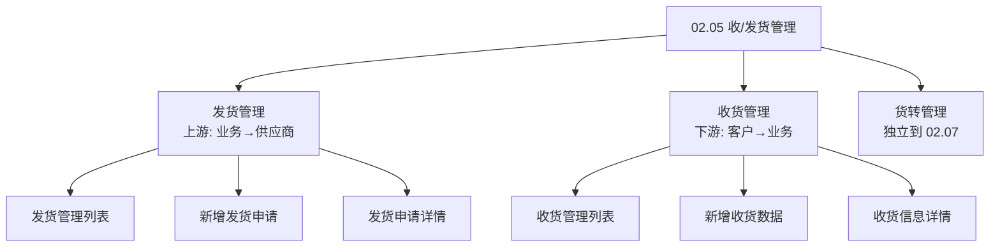
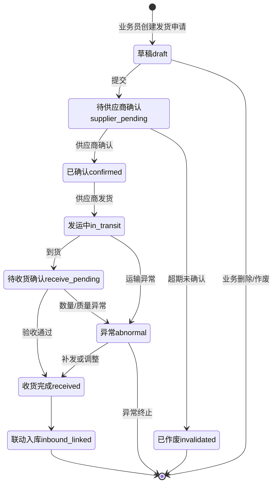
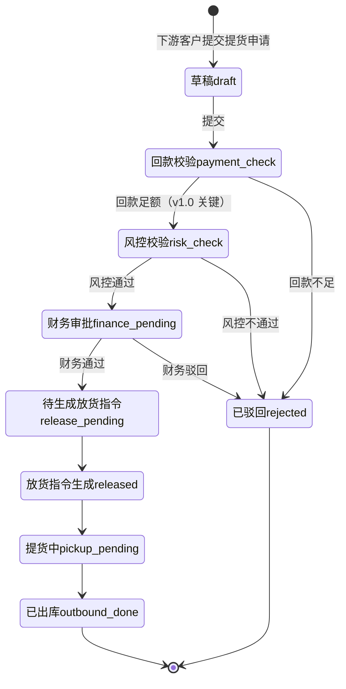
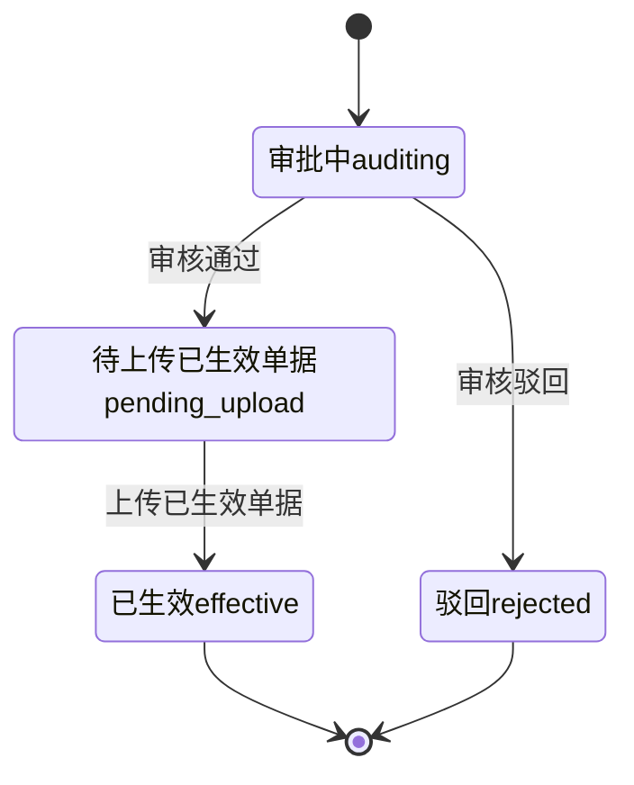

# 02.05 收/发货管理 v1.0 终版

> **状态**：v1.0 终版（**v0.1 重写版，基于原型 26-31 截图 + 新架构**）
> **生成时间**：2026-07-24 14:55
> **配套文档**：[00-项目总览与对接.md](../00-项目总览与对接.md) / [01-模块拆解大框架.md](../01-模块拆解大框架.md) / [02.03-合同管理.md](./02.03-合同管理.md) / [02.04-订单管理.md](./02.04-订单管理.md) / [02.07-货转管理.md](./02.07-货转管理.md)
> **复用度**：🟢 **80%（大幅复用）**——主产品 `t_shipment*` 6 张 + `t_take_delivery*` 5 张 + `t_release_instruct` = **11+ 张表**

---

## 0. 章节导航

1. 业务定位
2. 业务流程全景（**3 子模块**）
3. 核心实体（8 张表）
4. 3 子状态机（**v1.0 重新结构化**）
5. 角色操作矩阵
6. 字段规则
7. 按钮交互
8. 异常处理
9. 跨模块流转
10. 复用建议

---

## 1. 业务定位

**收/发货管理**是港通供应链**物流执行的核心**——订单执行后，通过收/发货指令完成货物的实际物理流转。

**3 大子模块**（基于 sitemap）：
- **发货管理**（上游）：业务人员→上游供应商（发货指令→发运登记→收货确认→入库）
- **收货管理**（下游）：下游客户→业务人员（提货申请→风控校验→放货指令→出库）
- **货转管理**：货权转移登记+智能识别+撤销（**v1.0 拆出来到独立模块 02.07**）

**关键特点**：
- **多方协同**：业务人员 + 上游供应商 + 仓储管理员 + 下游客户
- **线下+线上结合**：发货指令系统下发→供应商确认→线下发货→线上登记
- **货权凭证**：铁路运单 + 商品所有权确认单（**港通特色**——木薯淀粉通过中欧班列运输）
- **车/船/火车**：根据建设方案 V2 §3.3.2.5，港通支持**船运/火车/汽车**多式联运
- **货转凭证智能识别**：OCR 识别关键字段（**港通特色**）

---

## 2. 业务流程全景

### 2.1 3 子模块架构（**v1.0 重新结构化**）



---

## 3. 核心实体（8 张表）

### 3.1 `t_shipment` 发货主表（**v1.0 字段调整**）

| 字段 | 类型 | 必填 | 说明 |
|------|------|------|------|
| `id` | bigint PK | - | 主键 |
| `shipment_no` | varchar(32) | ✓ | 发货单号（参考 02.03 合同号 4 段格式）|
| `order_id` | bigint | ✓ | 关联订单（02.04）|
| `order_no` | varchar(32) | - | 订单号（冗余）|
| `supplier_company_id` | bigint | ✓ | 供应商 ID |
| `supplier_company_name` | varchar(128) | - | 供应商名称 |
| `goods_id` | bigint | - | 商品 ID |
| `goods_name` | varchar(128) | - | 商品名称 |
| `quantity` | decimal(20,4) | ✓ | 数量 |
| `unit` | varchar(20) | - | 单位 |
| `delivery_method` | varchar(20) | - | 运输方式：`truck`（汽车）/ `train`（火车）/ `ship`（船）|
| `pickup_date` | date | ✓ | 提货日期 |
| `estimated_arrival_date` | date | - | 预计到达日期 |
| `actual_arrival_date` | date | - | 实际到达日期 |
| `status` | varchar(20) | ✓ | 发货状态（见 §4.1）|
| `creator_id` | bigint | ✓ | 创建人 |
| `create_time` | datetime | ✓ | - |
| `is_deleted` | tinyint | ✓ | 0 = 软删除 |

### 3.2 `t_shipment_particulars` 发货明细

| 字段 | 类型 | 必填 | 说明 |
|------|------|------|------|
| `id` | bigint PK | - | 主键 |
| `shipment_id` | bigint | ✓ | 关联发货 |
| `railway_waybill_no` | varchar(64) | - | **铁路运单号**（火车运输时）|
| `vehicle_no` | varchar(32) | - | **车牌号/船次**（汽车/船运输时）|
| `driver_name` | varchar(64) | - | 司机姓名/船长 |
| `driver_phone` | varchar(20) | - | 联系电话（脱敏）|
| `departure_location` | varchar(255) | - | 始发地 |
| `destination_location` | varchar(255) | - | 目的地 |
| `actual_quantity` | decimal(20,4) | - | 实际数量 |

### 3.3 `t_take_delivery_apply` 提货申请单（下游收货，**v1.0 调整**）

| 字段 | 类型 | 必填 | 说明 |
|------|------|------|------|
| `id` | bigint PK | - | 主键 |
| `apply_no` | varchar(32) | ✓ | 提货申请单号 |
| `order_id` | bigint | ✓ | 关联销售订单 |
| `customer_id` | bigint | ✓ | 客户 ID |
| `customer_name` | varchar(128) | - | 客户名称 |
| `pickup_quantity` | decimal(20,4) | ✓ | 提货数量 |
| `pickup_date` | date | ✓ | 提货日期 |
| `payment_voucher_id` | bigint | - | **付款凭证 ID**（回款校验，**v1.0 关键**）|
| `is_payment_verified` | tinyint | - | **回款是否足额（v1.0 关键）**|
| `risk_check_result` | varchar(20) | - | **风控校验结果（v1.0 关键）**：`pass` / `reject` |
| `status` | varchar(20) | ✓ | 提货状态 |
| `creator_id` | bigint | ✓ | 创建人 |
| `create_time` | datetime | ✓ | - |

### 3.4 `t_take_delivery` 提货单

| 字段 | 类型 | 必填 | 说明 |
|------|------|------|------|
| `id` | bigint PK | - | 主键 |
| `delivery_no` | varchar(32) | ✓ | 提货单号 |
| `apply_id` | bigint | ✓ | 关联提货申请 |
| `pickup_company_id` | bigint | ✓ | 提货方 ID |
| `pickup_company_name` | varchar(128) | - | 提货方名称 |
| `pickup_location` | varchar(255) | - | 提货地点 |
| `pickup_method` | varchar(20) | - | `self`（自提）/ `delegate`（委托）|
| `delegate_company_id` | bigint | - | 委托方 ID（委托提货时）|
| `vehicle_no` | varchar(32) | - | 车牌号/船次 |
| `driver_name` | varchar(64) | - | 司机/船长 |
| `actual_pickup_date` | date | - | 实际提货日期 |
| `status` | varchar(20) | ✓ | 提货单状态 |

### 3.5 `t_release_instruct` 放货指令

| 字段 | 类型 | 必填 | 说明 |
|------|------|------|------|
| `id` | bigint PK | - | 主键 |
| `release_no` | varchar(32) | ✓ | 放货指令号 |
| `apply_id` | bigint | ✓ | 关联提货申请 |
| `warehouse_id` | bigint | ✓ | 仓库 ID |
| `release_quantity` | decimal(20,4) | ✓ | 放货数量 |
| `release_date` | date | ✓ | 放货日期 |
| `released_by` | bigint | - | 放货执行人（仓储方）|
| `status` | varchar(20) | ✓ | 放货状态 |

### 3.6 `t_shipment_attach` 发货附件

| 字段 | 类型 | 必填 | 说明 |
|------|------|------|------|
| `id` | bigint PK | - | 主键 |
| `shipment_id` | bigint | ✓ | 关联发货 |
| `attach_type` | varchar(20) | ✓ | `railway_waybill` / `vehicle_photo` / `qc_report` |
| `file_id` | bigint | ✓ | 关联文件 |
| `uploader_id` | bigint | ✓ | 上传人 |
| `upload_time` | datetime | ✓ | - |

### 3.7 `t_shipment_qc` 收货质检

| 字段 | 类型 | 必填 | 说明 |
|------|------|------|------|
| `id` | bigint PK | - | 主键 |
| `shipment_id` | bigint | ✓ | 关联发货 |
| `qc_result` | varchar(20) | ✓ | `pass` / `fail` / `partial` |
| `qc_quantity` | decimal(20,4) | ✓ | 质检数量 |
| `qualified_quantity` | decimal(20,4) | - | 合格数量 |
| `unqualified_quantity` | decimal(20,4) | - | 不合格数量 |
| `qc_remark` | text | - | 质检备注 |
| `qc_by` | bigint | - | 质检人 |
| `qc_time` | datetime | - | 质检时间 |

### 3.8 `t_ownership_transfer` 货权转移（**v1.0 简化，详细见 02.07**）

| 字段 | 类型 | 必填 | 说明 |
|------|------|------|------|
| `id` | bigint PK | - | 主键 |
| `transfer_no` | varchar(32) | ✓ | 货转编号 |
| `ref_type` | varchar(20) | ✓ | `shipment` / `take_delivery` |
| `ref_id` | bigint | ✓ | 关联发货/提货 |
| `transfer_cert_url` | varchar(255) | - | 货权转移凭证 URL |
| `status` | varchar(20) | ✓ | 货转状态 |

---

## 4. 3 子状态机（**v1.0 重新结构化**）

### 4.1 发货管理状态机（上游）



### 4.2 收货管理状态机（下游）



### 4.3 货转管理状态机（**v1.0 简版，详细见 02.07**）



---

## 5. 角色操作矩阵

| 状态 / 角色 | 业务员 | 业务部 | 供应商 | 客户 | 风控部 | 财务部 | 仓储方 |
|------------|------|------|------|------|------|------|------|
| 发货-待供应商确认 | 查看 | 查看 | **确认** | - | - | - | - |
| 发货-已确认 | 查看 | 查看 | **发运登记** | - | - | - | - |
| 发货-到货 | **登记收货** | 查看 | - | - | - | - | **入库** |
| 收货-回款校验 | 查看 | - | - | - | - | **校验** | - |
| 收货-风控校验 | 查看 | - | - | - | **校验** | - | - |
| 收货-财务审批 | 查看 | - | - | - | - | **审批** | - |
| 收货-放货指令 | 查看 | - | - | - | - | - | **执行放货** |
| 货转-审核 | 查看 | - | - | - | **审核** | - | - |

---

## 6. 字段规则

### 6.1 运输方式 `delivery_method`（**港通特色**）

- 3 种：`truck`（汽车）/ `train`（火车，铁路运单）/ `ship`（船）
- **多式联运**：发货单可拆分为多段运输

### 6.2 提货方式 `pickup_method`

- 2 种：`self`（自提）/ `delegate`（委托）

### 6.3 提货回款校验（**v1.0 关键**）

- 校验提货金额 ≤ 客户已回款金额
- 校验不通过 → 状态→`rejected`

### 6.4 风控校验（**v1.0 关键**）

- 校验客户黑名单 / 风险等级
- 客户已被冻结/黑名单 → 状态→`rejected`

---

## 7. 按钮交互

### 7.1 发货管理列表（26 截图）

| 按钮 | 位置 | 可见条件 | 点击行为 |
|------|------|---------|---------|
| **+ 新增发货申请** | 右上 | 业务员 | 跳新增页 |
| 详情 | 列表行 | 所有 | 跳详情页 |

### 7.2 新增发货申请（27 截图）

- 选上游供应商（必填）
- 选关联订单（必填）
- 填运输方式 + 数量 + 提货日期
- 上传附件（铁路运单/车辆照片/质检报告）

### 7.3 发货申请详情（28 截图）

- 状态时间线
- 运输信息
- 附件列表
- 异常处理记录

### 7.4 收货管理列表（29 截图）

- 提货申请列表（按订单/客户筛选）
- 状态：草稿/回款校验/风控校验/财务审批/放货指令/已出库

### 7.5 新增收货数据（30 截图）

- 选下游客户（必填）
- 选关联销售订单（必填）
- 填提货数量 + 提货日期 + 提货方式
- 自动校验回款 + 风控

### 7.6 收货信息详情（31 截图）

- 完整提货信息
- 校验记录（回款/风控/财务）
- 放货指令
- 提货凭证

---

## 8. 异常处理

### 8.1 发货异常

| 异常场景 | 提示文案 | 处理动作 |
|---------|---------|---------|
| 供应商未确认 | "供应商 X 未确认发货指令" | 黄灯提醒 |
| 发货数量 > 订单数量 | "发货数量 X 超过订单剩余数量 Y" | 阻止 |
| 铁路运单未上传 | "火车运输必须上传铁路运单" | 阻止 |
| 收货数量不一致 | "实际收货数量 X 与发货数量 Y 不一致" | 红色提示 + 启动异常流程 |
| 质检不合格 | "质检不合格数量 X" | 启动补发/调整流程 |

### 8.2 收货异常（**v1.0 关键**）

| 异常场景 | 提示文案 | 处理动作 |
|---------|---------|---------|
| **回款不足**（v1.0 关键）| "客户 X 已回款 Y 元，不足以提货 Z 元" | 状态→`rejected` |
| **客户被冻结**（v1.0 关键）| "客户 X 已被冻结，不能提货" | 状态→`rejected` |
| **客户命中黑名单**（v1.0 关键）| "客户 X 命中黑名单，禁止提货" | 状态→`rejected` |
| 风控不通过 | "风控校验不通过" | 状态→`rejected` |
| 财务驳回 | "财务驳回" | 状态→`rejected` |

### 8.3 货转异常（**v1.0 简版**）

| 异常场景 | 提示文案 | 处理动作 |
|---------|---------|---------|
| OCR 识别失败 | "OCR 识别失败，请手动填写" | 允许手动 |
| 货转数量 > 发货/收货数量 | "货转数量 X 超过剩余数量 Y" | 阻止 |

---

## 9. 跨模块流转

### 9.1 上游触发

| 触发模块 | 触发条件 | 触发动作 |
|---------|---------|---------|
| 订单管理（02.04）| 订单 `executing` | 允许发货/收货关联 |

### 9.2 下游触发

| 触发模块 | 触发条件 | 触发动作 |
|---------|---------|---------|
| 仓储-入库（02.12）| 发货收货完成 | 联动入库 |
| 仓储-出库（02.12）| 放货指令生成 | 联动出库 |
| 货转（02.07）| 发货/收货完成 | 货转关联 |
| 业务线（02.06）| 发货/收货完成 | 更新业务线货物进度 |
| 客户额度（02.02）| 提货申请 | 校验回款 |
| 预警中心（02.11）| 发货/收货异常 | 触发预警 |

---

## 10. 复用建议

### 10.1 复用度

**🟢 80%（大幅复用）**

| 类别 | 数量 | 复用度 |
|------|------|--------|
| 直接复用主产品表 | 8 张 | 100% |
| 港通新建表 | 3 张 | - |

### 10.2 直接复用主产品表

- `t_shipment` 发货主表（25 字段）
- `t_shipment_particulars` 发货明细（18 字段）
- `t_shipment_plan` 发货计划
- `t_take_delivery_apply` 提货申请单（30 字段）
- `t_take_delivery` 提货单（51 字段）
- `t_take_delivery_model` 提货方式
- `t_release_instruct` 放货指令（34 字段）
- `t_warehouse_receipt` 仓单（部分字段）

### 10.3 港通新建表

- `t_shipment_attach` 发货附件（v1.0）
- `t_shipment_qc` 收货质检（v1.0）
- `t_ownership_transfer` 货权转移（**v1.0 简化版，详细见 02.07**）

### 10.4 给研发的实施建议

1. **第一周**：直接复用主产品 8 张表 + 加 v1.0 字段
2. **第二周**：建发货/收货 3 子模块
3. **第三周**：建 3 子状态机 + 联动入库/出库
4. **第四周**：建回款校验/风控校验 + 跨模块集成

---

## 11. 文档版本

- **v0.1（2026-07-24 11:01）**：基于 5 张截图 + 建设方案 V2 初稿（旧架构）
- **v1.0（2026-07-24 14:55）**：基于 26-31 截图 + sitemap **重写**（新架构）
  - 🔴 3 子模块结构（发货/收货/货转，货转拆出到 02.07）
  - 🟡 8 张表（vs v0.1 11+ 张）
  - 🟡 3 子状态机
  - 🟡 关键校验：回款/风控/财务
- 修改记录：见 `06-修改记录.md`
---

## 修改记录

### v1.7.99.x（2026-07-28）

- 🟡 列表页占位 = "全部"（全站统一）
- 🟡 列表页规范升级（v1.7.99 全局）
- 🟡 状态 tag 颜色编码（v1.7.99.14）
- 🟡 流程图统一用 Mermaid（v1.7.99.6）
- 详见：[v1.7.99-changelog.md](./v1.7.99-changelog.md)（30+ 版本汇总）

---

## 11. v1.7.99.x 模块级增量补充（基于飞书《用户使用手册》沉淀）

> **本节追加于 2026-09-24**
> **需求来源**：飞书《豫港通用户使用手册（内部版）》第 5.2 节"发货管理" + 第 5.3 节"收货管理" + 本仓库 v1.7.99.129 / 165 / 176 改造沉淀
> **v1.0 文档骨架（1-10 节）保持不变**，本节仅补充 v1.7.99.x 后未明的业务规则、流程图、状态机、跨模块联动、详细页面 PRD 索引

### 11.1 模块业务变化（v1.0 → v1.7.99.x）

| 维度 | v1.0 文档 | v1.7.99.x 现状 |
|------|----------|----------------|
| 页面清单 | 5-6 页 | **10 页**：发货管理 + 详情 + 新增 + 收货管理 + 详情 + 新增 + **收货确认**（v1.7.99.129）+ 货转管理（独立 02.07）|
| 字段数量 | 简化 | v1.7.99.x 收货确认 3 必填字段（数量/日期/单据）+ 简化校验 |
| 状态机 | v1.0 简化版 | v1.7.99.x 4 状态（待发货/已发货/已收货/已作废）+ 异常回退 |
| 凭证上传 | 文字提及 | v1.7.99.129 强制凭证（必填）+ v1.7.99.x 单文件 ≤ 100MB |
| 运输信息 | 单条 | v1.7.99.165 支持多条运输信息（车牌/装车数量/发车时间/到站时间/运单号）|

### 11.2 发货 6 步流程（手册 5.2 权威口径）

> **来自手册 5.2**：发货登记完整流程

1. **第一步**：点击「登记订单发货数据」按钮
2. **第二步**：选择登记类型为采购或销售订单
3. **第三步**：选择对应合同（单选）
4. **第四步**：输入发货信息（7 字段：运输方式/发货批次/发货数量/发货日期/发货地址/收货地址/货运车数）
5. **第五步**：输入运输信息（**支持多条**）—— 车牌号码/装车数量/发车时间/预计到站时间/运单号
6. **第六步**：上传运输凭证（线下货运单据）

**v1.7.99.x 关键决策**：
- **运输方式必须与合同登记货运方式一致**（手册 5.2）
- **支持单批次发货 / 多批次发货**（手册 5.2）

### 11.3 收货 6 步流程（手册 5.3 权威口径）

> **来自手册 5.3**：收货确认完整流程

1. **第一步**：点击收货管理，找到待收货货物信息
2. **第二步**：点击货物信息后方「查看」按钮或直接点击"确认收货"
3. **第三步**：如点击查看 → 显示发货详情页；如点击确认收货 → 进入确认收货页
4. **第四步**：点击确认收货后填写收货信息
5. **第五步**：选择对应的发货信息（**可多选**）+ 填写实际到站时间
6. **第六步**：选择收货方式（全部收货 / 部分收货）+ 填写收货数量 + 收货日期 + 上传收货单据

### 11.4 4 状态机（v1.7.99.x 增强）

```
待发货 → 已发货 → 已收货 → 终态
  ↓       ↓       ↓
已作废  已作废  已作废 (异常回退到待收货)
```

| 状态 | 触发 | 下一状态 |
|------|------|----------|
| 待发货 | 合同已签订 | 已发货 |
| 已发货 | 发货登记完成 | 已收货 / 已作废 |
| 已收货 | 收货登记完成 | 终态 |
| 已作废 | 业务人员主动作废 | 终态（**仅未收货可作废**）|

### 11.5 跨模块联动（v1.7.99.x 增强）

| 联动系统 | v1.0 描述 | v1.7.99.x 增强 |
|----------|-----------|----------------|
| **业务线（02.06）**| 文字提及 | 收/发货登记成功 → 该业务线的"累计入库/出库数量"同步更新 |
| **结算单（02.13）**| 已记录 | 收货完成 → 后续可发起结算（详见 02.13） |
| **货转（02.07）**| 未单独提及 | 收货完成 → 货转流程可继续推进（独立 02.07 模块）|
| **物流跟踪** | 未提及 | v1.7.99.165 运输信息含车牌/装车/发车/到站/运单号，支持运输跟踪 |

### 11.6 异常处理（v1.7.99.x 补充）

| 场景 | v1.7.99.x 处理 |
|------|-----------------|
| 运输方式 ≠ 合同登记方式 | 红字提示"运输方式必须与合同一致"（手册 5.2）|
| 收货数量 > 未收货数量 | 红字提示"收货数量不能大于发货数量 - 已收货数量" |
| 收货日期 < 发货日期 | 红字提示"收货日期不能早于发货日期" |
| 已收货/已作废发货单再次收货 | 顶部红色 bar 提示"该发货单已收货/已作废" |
| 同一发货单并发收货 | 二次校验被覆盖则提示"已被其他收货覆盖，请刷新" |
| 未上传凭证附件 | 禁用提交按钮 + 红字提示（v1.7.99.129 强制）|

### 11.7 详细页面 PRD 索引

| 页面 | PRD 文档 | 当前版本 |
|------|----------|----------|
| `shipment-out.html` | [p-shipment-out.md](./p-shipment-out.md) | v1.7.99.165 终版 |
| `shipment-out-detail.html` | [p-shipment-out-detail.md](./p-shipment-out-detail.md) | v1.7.99.165 终版 |
| `shipment-out-new.html` | [p-shipment-out-new.md](./p-shipment-out-new.md) | v1.7.99.165 终版 |
| `shipment-in.html` | [p-shipment-in.md](./p-shipment-in.md) | v1.7.99.129 终版 |
| `shipment-in-detail.html` | [p-shipment-in-detail.md](./p-shipment-in-detail.md) | v1.7.99.129 终版 |
| `shipment-in-new.html` | [p-shipment-in-new.md](./p-shipment-in-new.md) | v1.7.99.129 终版 |
| `receipt-confirm.html` | [p-receipt-confirm.md](./p-receipt-confirm.md) | **2026-09-24 新写**（基于手册 5.3 + v1.7.99.129 沉淀）|

### 11.8 增量补充版 v1.7.99.x 修改记录

- **v1.7.99.129（2026-07-31）**：收货确认页 **1:1 重制 user 截图** + 3 区块（合同信息 / 发货清单 / 填写收货信息）
- **v1.7.99.165（2026-08-15）**：发货管理 4 状态机 + 运输信息支持多条
- **2026-09-24**：基于飞书《用户使用手册》第 5.2 / 5.3 节补充模块级业务口径（**本节第 11 节**）
