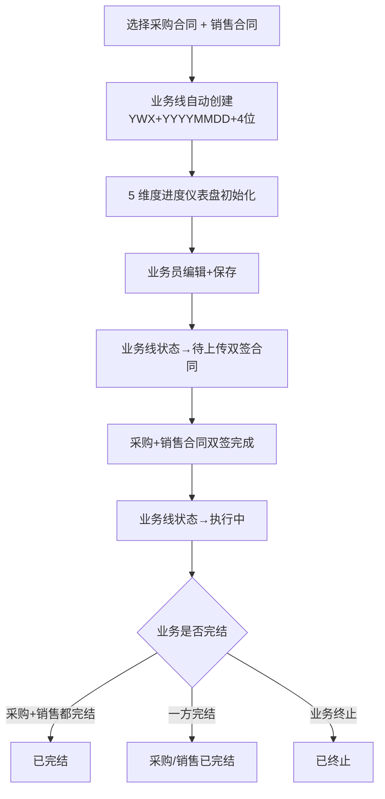
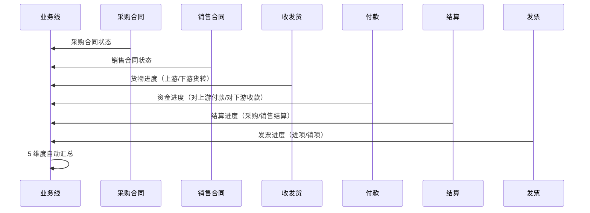
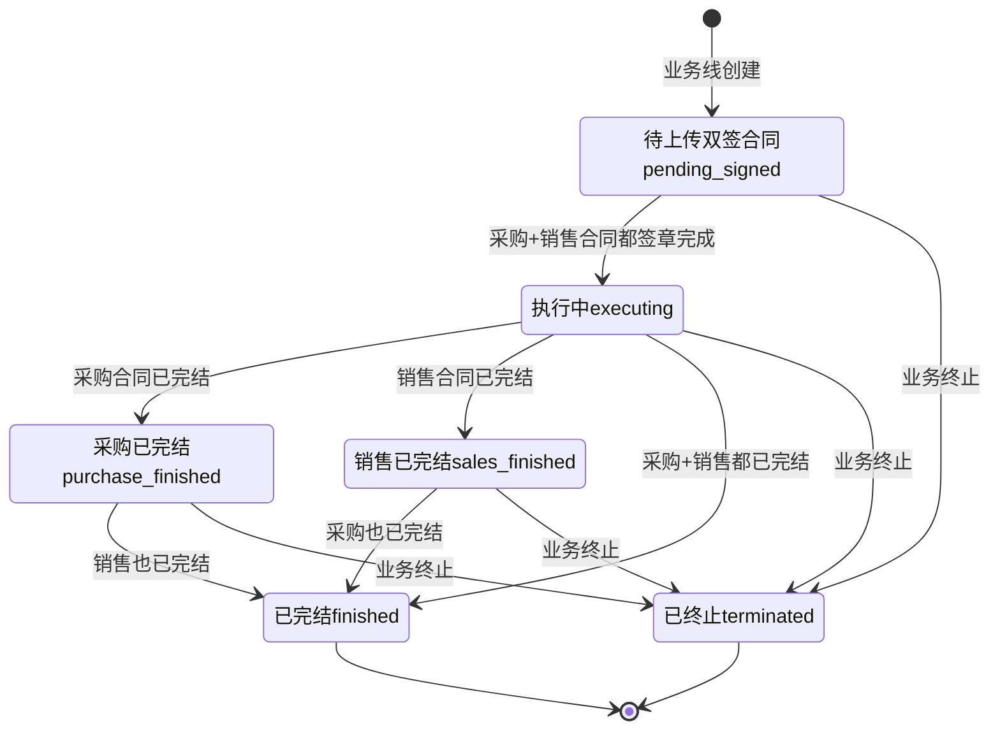

# 02.06 业务线管理 v1.0 终版

> **状态**：v1.0 终版（**新模块，基于原型 23-25 截图**）
> **生成时间**：2026-07-24 14:55
> **配套文档**：[00-项目总览与对接.md](../00-项目总览与对接.md) / [01-模块拆解大框架.md](../01-模块拆解大框架.md) / [02.01-项目管理-立项.md](./02.01-项目管理-立项.md) / [02.03-合同管理.md](./02.03-合同管理.md) / [02.04-订单管理.md](./02.04-订单管理.md)
> **复用度**：🟢 **70%（主产品已有 t_business_line 3 张表 + 扩展）**——主产品 `t_business_line*` 3 张 + `t_business_line_full` + `t_business_line_extend_info` + `t_business_line_data_statistics`

---

## 0. 章节导航

1. 业务定位
2. 业务流程全景
3. 核心实体（3 张表）
4. 7 状态机
5. 角色操作矩阵
6. 字段规则
7. 按钮交互
8. 异常处理
9. 跨模块流转
10. 复用建议

---

## 1. 业务定位

**业务线**是港通供应链的**全景视图**（**v1.1 新顶级模块**）——串联 1 个采购合同 + 1 个销售合同 + 多个执行单据（收发货/货转/付款/结算/发票/库存），让业务人员一眼看到「上游采购到下游销售」的全链路进度。

**港通特色模块**——建设方案明确"主产品可能没有完整的多合同联动"。

### 1.1 关键规则

1. **业务线 = 1 采购合同 + 1 销售合同**（**v1.0 核心**）
2. **业务线状态 = 7 个**（基于 23 截图）：待上传双签合同/执行中/采购已完结/销售已完结/已完结/已终止
3. **业务线 5 维度进度**（**v1.0 新增**）：货物进度/资金进度/结算进度/发票进度 + 业务线信息
4. **业务线号格式**：`YWX{YYYYMMDD}{4位}`，例 `YWX202309060001`
5. **解除业务线**：仅在特殊情况下解除（如业务终止）

### 1.2 3 个页面（sitemap）

| # | 页面 | 说明 |
|---|------|------|
| 1 | **业务线管理**（列表）| 7 状态 Tab + 5 维度仪表盘 |
| 2 | **业务线关联**（内容待调整）| 关联采购合同 + 销售合同 |
| 3 | **业务线详情** | 业务线完整信息 + 5 维度进度 |

---

## 2. 业务流程全景

### 2.1 业务线创建流程

### 2.2 业务线 5 维度联动

---

## 3. 核心实体（3 张表）

### 3.1 `t_business_line` 业务线主表

| 字段 | 类型 | 必填 | 说明 |
|------|------|------|------|
| `id` | bigint PK | - | 主键 |
| `bl_no` | varchar(32) | ✓ | **业务线号** `YWX{YYYYMMDD}{4位}`，例 `YWX202309060001` |
| `bl_name` | varchar(128) | ✓ | 业务线名称（自动生成：采购合同号+销售合同号）|
| `project_id` | bigint | ✓ | 关联项目（来自 02.01）|
| `purchase_contract_id` | bigint | ✓ | **采购合同 ID** |
| `purchase_contract_no` | varchar(32) | - | 采购合同号（冗余）|
| `sales_contract_id` | bigint | ✓ | **销售合同 ID** |
| `sales_contract_no` | varchar(32) | - | 销售合同号（冗余）|
| `goods_id` | bigint | - | 品名（来自销售合同）|
| `goods_name` | varchar(128) | - | 品名（冗余）|
| `business_type` | varchar(20) | - | **业务类型 5 种（v1.1）** |
| `signed_date` | date | - | 采购+销售签订日期 |
| `status` | varchar(20) | ✓ | **7 状态**（见 §4）|
| `creator_id` | bigint | ✓ | 创建人 |
| `create_time` | datetime | ✓ | - |
| `update_time` | datetime | ✓ | - |

### 3.2 `t_business_line_progress` 5 维度进度

| 字段 | 类型 | 必填 | 说明 |
|------|------|------|------|
| `id` | bigint PK | - | 主键 |
| `bl_id` | bigint | ✓ | 关联业务线 |
| `progress_type` | varchar(20) | ✓ | `goods` / `capital` / `settlement` / `invoice` |
| `sales_contract_quantity` | decimal(20,4) | - | 销售合同量 |
| `upstream_transferred` | decimal(20,4) | - | 上游货转数量 |
| `downstream_transferred` | decimal(20,4) | - | 下游货转数量 |
| `paid_to_upstream` | decimal(20,2) | - | 对上游付款 |
| `received_from_downstream` | decimal(20,2) | - | 对下游收款 |
| `purchase_settled_amount` | decimal(20,2) | - | 采购结算金额 |
| `sales_settled_amount` | decimal(20,2) | - | 销售结算金额 |
| `purchase_invoiced_amount` | decimal(20,2) | - | 进项发票金额 |
| `sales_invoiced_amount` | decimal(20,2) | - | 销项发票金额 |
| `progress_pct` | decimal(5,2) | - | 进度百分比 0-120% |
| `last_update_time` | datetime | ✓ | 最后更新时间 |

### 3.3 `t_business_line_history` 业务线历史

| 字段 | 类型 | 必填 | 说明 |
|------|------|------|------|
| `id` | bigint PK | - | 主键 |
| `bl_id` | bigint | ✓ | 关联业务线 |
| `change_type` | varchar(20) | ✓ | `add_purchase` / `add_sales` / `relieve` / `terminate` |
| `old_value` | text | - | 修改前值（JSON）|
| `new_value` | text | - | 修改后值（JSON）|
| `reason` | varchar(500) | - | 修改原因 |
| `operator_id` | bigint | ✓ | 操作人 |
| `create_time` | datetime | ✓ | - |

---

## 4. 7 状态机

### 4.1 7 状态说明（基于 23 截图）

| # | 状态 | 中文 | 触发 | 出口 |
|---|------|------|------|------|
| 1 | `pending_signed` | 待上传双签合同 | 业务线创建 | 采购+销售都签章 → 执行中 |
| 2 | `executing` | 执行中 | 采购+销售都签章 | 采购/销售已完结 / 已完结 / 终止 |
| 3 | `purchase_finished` | 采购已完结 | 采购合同已完结 | 销售也已完结 / 已完结 / 终止 |
| 4 | `sales_finished` | 销售已完结 | 销售合同已完结 | 采购也已完结 / 已完结 / 终止 |
| 5 | `finished` | 已完结 | 采购+销售都完结 | 终态 |
| 6 | `terminated` | 已终止 | 业务终止 | 终态 |
| 7 | `dissolved` | 已解除 | 解除业务线（异常）| 终态 |

### 4.2 列表 7 Tab 映射

| Tab | 对应状态 |
|-----|---------|
| 全部 | 所有 |
| 待上传双签合同 | `pending_signed` |
| 执行中 | `executing` |
| 采购已完结 | `purchase_finished` |
| 销售已完结 | `sales_finished` |
| 已完结 | `finished` |
| 已终止 | `terminated` |

---

## 5. 角色操作矩阵

| 操作 / 角色 | 业务员 | 业务部 | 风控部 | 财务部 | 总经办 | 系统 |
|------------|------|------|------|------|------|------|
| 查看业务线 | ✓ | ✓ | ✓ | ✓ | ✓ | - |
| 创建业务线 | **✓** | - | - | - | - | - |
| 解除业务线 | - | 申请 | - | - | **审批** | - |
| 业务线终止 | 申请 | **审批** | 申请 | 申请 | **审批** | - |
| 查看 5 维度进度 | ✓ | ✓ | ✓ | ✓ | ✓ | 自动汇总 |

---

## 6. 字段规则

### 6.1 业务线号 `bl_no`

- **格式**：`YWX{YYYYMMDD}{4位}`，例 `YWX202309060001`
- 系统自动生成

### 6.2 业务线名称 `bl_name`

- 自动生成：`{采购合同号}-{销售合同号}-{品名}`
- 例：`JYX-HNRH-202309-JYX-HNRH-20230-龙铜 三级抗震螺纹钢`

### 6.3 5 维度进度

| 维度 | 字段 | 公式 |
|------|------|------|
| 货物进度 | `upstream_transferred / sales_contract_quantity` | 进度条 0-120% |
| 资金进度 | `paid_to_upstream / received_from_downstream` | 双向付款比例 |
| 结算进度 | `purchase_settled_amount + sales_settled_amount` | 采购+销售结算金额 |
| 发票进度 | `purchase_invoiced_amount + sales_invoiced_amount` | 进项+销项发票金额 |

---

## 7. 按钮交互

### 7.1 列表页

| 按钮 | 位置 | 可见条件 | 点击行为 |
|------|------|---------|---------|
| 搜索/筛选 | 顶部 | 所有 | 弹筛选抽屉 |
| 数据导出 | Tab 右侧 | 所有 | 导出 Excel |
| **业务线详情** | 列表行 | 所有 | 跳详情页 |
| **解除业务线** | 列表行 | 状态≠已完结 | 弹解除确认框（v1.0 新增）|
| 查看未关联业务线的合同 | Tab 右侧 | 业务部 | 跳合同列表筛选（v1.0）|

### 7.2 详情页字段（基于 23 截图）

| 分类 | 字段 |
|------|------|
| **业务线信息** | 业务线号 / 业务线名称 / 采购合同 / 销售合同 / 业务类型 / 采购签订日期 |
| **货物进度** | 销售合同量 / 上游货转 / 下游货转 / 已开货转 + 进度条 |
| **资金进度** | 对上游付款 / 对下游收款 |
| **结算进度** | 采购结算金额 / 销售结算金额 |
| **发票进度** | 进项发票金额 / 销项发票金额 |
| **操作** | 业务线详情 / 解除业务线 |

---

## 8. 异常处理

| 异常场景 | 提示文案 | 处理动作 |
|---------|---------|---------|
| 创建业务线时无采购合同 | "必须先选择采购合同" | 阻止 |
| 创建业务线时无销售合同 | "必须先选择销售合同" | 阻止 |
| 采购/销售合同业务类型不一致 | "采购 X 与销售 Y 业务类型不匹配" | 阻止 |
| 解除业务线但有未完结单据 | "业务线 X 有关联单据未完结，不能解除" | 阻止 |
| 业务线 5 维度进度不一致 | "采购 X 已完结但销售 Y 仍执行中" | 黄灯提醒 |

---

## 9. 跨模块流转

### 9.1 上游触发

| 触发模块 | 触发条件 | 触发动作 |
|---------|---------|---------|
| 合同管理（02.03）| 采购+销售合同都 `signed` | 业务线自动创建 |

### 9.2 下游触发

| 触发模块 | 触发条件 | 触发动作 |
|---------|---------|---------|
| 收发货（02.05）| 收/发货完成 | 更新业务线货物进度 |
| 货转（02.07）| 上游/下游货转完成 | 更新业务线货物进度 |
| 付款（02.08.1）| 付款完成 | 更新业务线资金进度 |
| 结算（02.13）| 结算完成 | 更新业务线结算进度 |
| 发票（02.09）| 开票完成 | 更新业务线发票进度 |

---

## 10. 复用建议

### 10.1 复用度

**🟢 70%（主产品已有）**——主产品 `t_business_line*` 3 张 + 扩展即可

### 10.2 直接复用主产品表

- `t_business_line` 业务线主表
- `t_business_line_full` 业务线完整版
- `t_business_line_extend_info` 业务线扩展信息

### 10.3 港通新建表

- `t_business_line_progress` 5 维度进度表（v1.0 新）
- `t_business_line_history` 业务线历史

### 10.4 给研发的实施建议

1. **第一周**：直接复用主产品 3 张表，加 v1.0 字段
2. **第二周**：建 5 维度进度表 + 联动逻辑
3. **第三周**：建 7 状态机 + 解除流程
4. **第四周**：跨模块集成（5 维度自动汇总）

---

## 11. 文档版本

- **v1.0（2026-07-24 14:55）**：基于 23 截图 + sitemap 首次终版，作为范本用于后端开发
- **v1.7.99.87（2026-07-31）**：业务线详情页头部 + 基础信息 + 合同附件重制（按 user 1 张图）
- 修改记录：见 `06-修改记录.md`
---

## 12. v1.7.99.87 改造子章节（业务线详情头部重制）

> **改造时间**：2026-07-31
> **触发**：user 1 张图（业务线详情头部截图）
> **改造范围**：**重制 1 个 HTML**（`pages/business-line-detail.html` 头部 + 基础信息 + 合同附件 + 销售合同对应改造，~980 行 → 1091 行）
> **不动**：
> - 业务线详情页其他 panel（货物运输/资金流水/结算单/发票 + 销售合同对应 panel）**只更新合同号 -a → -s**（跟 v1.7.99.86 库存台账保持一致），结构不动
> - 全局 design-system.css / list-page.css
> - assets/js/app.js

### 12.1 改造清单

**1. 面包屑 3 级 → 2 级**（v1.7.99.87）：
- 旧：业务线管理 / 业务线 / 业务线详情（3 级）
- 新：业务线管理 / 业务线详情（2 级，**删掉"业务线"中间级**——v1.7.99.87 沿用 user 截图）

**2. 顶部右上角加 返回 button**（v1.7.99.87 新加）：
- 位置：面包屑右侧
- 样式：白底 + 浅灰边 + 左箭头 SVG + "返回" 文字
- 行为：window.history.back()

**3. 业务链路 3 段中游改深蓝实心**（v1.7.99.87）：
- 旧：中游 `background: #EFF6FF` 浅蓝 + 蓝字
- 新：中游 `background: #1E40AF` 深蓝实心 + 白字 + 500 font-weight（v1.7.99.87 沿用 user 截图）
- 上游/下游保持白底蓝边蓝字

**4. 业务线 metadata 4 列**（v1.7.99.87）：
- 旧："业务线编号"
- 新："**业务线号**"（v1.7.99.87 沿用 user 截图）
- 合同号后缀 -a → -s（v1.7.99.87 跟 v1.7.99.86 库存台账保持一致）

**5. 4 个 tags 更新**（v1.7.99.87）：
- 旧：📅 2026-01-27**到**2026-12-31 / 📦 存**现**货
- 新：📅 2026-01-27**至**2026-12-31 / 📦 存**货类**（v1.7.99.87 沿用 user 截图）
- 保留：🚆 火运 / 💰 自有资金

**6. KPI grid 8 项 → 2×5 grid 10 项**（v1.7.99.87 最大改动）：
- 旧：8 项 / 4 列 × 2 行（合同/货量/付款/上游结算/上游发票/回款/下游结算/下游发票）
- 新：2 行 × 5 列 = 10 个 cell（采购合同|销售合同 / 已收货转 / 已支付货款|财务余额|业务余额 / 采购结算 / 进项发票金额 / 库存 / 已开货转 / 已回货款|保证金 / 销售结算 / 销项发票金额）
- **黄色高亮** 4 个 cell：已收货转 / 已支付货款/财务余额/业务余额 / 已开货转 / 已回货款/保证金（**v1.7.99.87 沿用 user 截图** `background: #FEFCE8`）
- **⚡ 黄色闪电图标** 4 个高亮 cell 的值前面（`color: #FBBF24` + `font-size: 14px` + `margin-right: 2px`）
- **(18% ↑) 绿字** 1 个 cell（已回货款/保证金，`color: #16A34A` + `margin-left: 4px` + `font-weight: 500`）

**7. 基础信息 4 列 13 字段 → 6 列 5 行 14 字段**（v1.7.99.87 重要改动）：
- 旧：`.bl-info-grid` 4 列 × 4 行布局，13 个字段（合同编号/卖方/买方/签订日期/业务类型/品名/合同单价/合同数量/交货期限/到货/运输人/供方/收货人）
- 新：`.bl-info-table` 6 列 × 5 行布局，14 个字段：
  - Row 1：合同编号 (GTGYL-MSXS-20260127-s + [长协] + [双签] tags) / 买方企业 (河南中豫港通) / 卖方企业 (河南诚泽运输)
  - Row 2：签订日期 (2026-01-27) / 业务类型 (-) / 品名 (进口木薯淀粉)
  - Row 3：合同价格 (3,400元/吨) / 合同数量 (20,000吨) / 交货期限 (2026-01-27至2026-12-31)
  - Row 4：运输方式 (中欧班列-东盟线路) / 发站 (万象站) / 到站 (新郑)
  - Row 5：托运人 (无) / 收货人 (河南中豫港通) / (空)
- **v1.7.99.87 沿用 user 截图"6 列横向 label+value pair"布局**（v1.7.99.87 跟常规 4 列 grid 不一样，**label+value pair 横向 = 2 cell/字段**）
- **合同号 + 长协 + 双签 3 个 tag**（v1.7.99.87 沿用 user 截图：长协 蓝底蓝字 + 双签 蓝实心白字）

**8. 销售合同基础信息同步重制**（v1.7.99.87）：
- 同步采购合同 6 列 5 行布局
- 14 字段精简到 12 字段：合同编号 (YL-MSXS-20260127-s + [综合] + [合同] tags) / 卖方/买方 / 签订日期/业务类型/品名 / 合同价格(3,444.83)/合同数量(25,000)/交货期限 / 运输方式(中欧班列-东盟铁路)/发站(万泰站)/到站(新郑) / 付款账户/回款账户(华夏银行...) / (空)
- 销售合同标的买方 = 河南中豫港通（v1.7.99.87 跟销售合同主体一致）

**9. 合同附件加"一键下载" button**（v1.7.99.87 新加）：
- 位置：合同附件标题下方，"附件共 1 份" + "一键下载" button 同一行 flex space-between
- 样式：白底 + 蓝边 + 蓝字 + 12px 字号 + 下箭头 SVG + "一键下载" 文字
- 附件表格 3 列：单据类型 / 文件名称 / 操作（操作列右对齐 v1.7.99.87 沿用 user 截图）
- 1 行 mock：线下合同 / 采购合同.pdf / 下载

**10. 右下角返回顶部 button**（v1.7.99.87 新加）：
- 位置：fixed bottom 32px right 32px
- 样式：40px × 40px 圆形 + 白底 + 浅灰边 + 阴影 + ∧ SVG 图标
- 行为：window.scrollTo({top: 0, behavior: 'smooth'})
- 沿用 v1.7.99.84 销项发票编辑页的返回顶部 button 模式

### 12.2 关键规范（v1.7.99.87 锁定）

- **【大前提】基础信息 6 列横向 label+value pair 布局**（v1.7.99.87 经验：常规 4 列 grid 是 label 单独一行 + value 单独一行的"垂直布局"，v1.7.99.87 是 6 列**横向** = label+value pair 同一行 = 6 列表格，**新加基础信息表格**先看是 4 列垂直还是 6 列横向）
- **【大前提】业务链路中游深蓝实心**（v1.7.99.87 经验：业务线详情/业务线台账 类页面的 3 段业务链路 = 上游/中游/下游，中游是"我方"=深蓝实心 + 白字，上游/下游是"对手方"=白底 + 蓝边 + 蓝字，**新加业务线类页面**沿用 3 段业务链路模式）
- **【大前提】2×5 KPI 网格 = 顶部业务概览**（v1.7.99.87 经验：业务线详情头部 KPI = 2 行 × 5 列 = 10 个 cell，**v1.7.99.87 区别 v1.7.99.86 库存台账的 8 KPI 水平滚动**——v1.7.99.87 是 2×5 网格 + 部分 cell 黄色高亮 + 闪电 + (18%↑)，**v1.7.99.86 是 1×8 水平滚动 + 蓝橙绿 3 色循环**——**新加业务线详情头部 KPI**用 2×5 网格 + 黄色高亮，**新加库存台账 KPI**用 1×8 水平滚动 + 蓝橙绿）
- **【大前提】合同号 -s 后缀统一**（v1.7.99.87 经验：v1.7.99.86 库存台账 mock 用 `-s` 后缀，v1.7.99.87 业务线详情也用 `-s` 后缀，**v1.7.99.87 全文件 -a → -s**——**新加业务线相关页面**合同号后缀统一用 -s）

**沿用 v1.7.99.86 经验**：
- 顶部 + 底部 button（v1.7.99.84 销项发票编辑页：保存 + 返回顶部；v1.7.99.87 业务线详情：返回 + 返回顶部）
- 6 列表格布局（v1.7.99.86 业务线台账：5 列复杂表格；v1.7.99.87 业务线详情基础信息：6 列 label+value pair）
- 黄底高亮（v1.7.99.86 库存台账 KPI：蓝橙绿 3 色；v1.7.99.87 业务线详情 KPI：黄色高亮 4 cell）

## 修改记录

### v1.7.99.x（2026-07-28）

- 🟡 列表页占位 = "全部"（全站统一）
- 🟡 列表页规范升级（v1.7.99 全局）
- 🟡 状态 tag 颜色编码（v1.7.99.14）
- 🟡 流程图统一用 Mermaid（v1.7.99.6）
- 详见：[v1.7.99-changelog.md](./v1.7.99-changelog.md)（30+ 版本汇总）

---

## 11. v1.7.99.x 模块级增量补充（基于飞书《用户使用手册》沉淀）

> **本节追加于 2026-09-24**
> **需求来源**：飞书《豫港通用户使用手册（内部版）》第 5.1 节"业务线管理" + 本仓库 v1.7.99.169 改造沉淀
> **v1.0 文档骨架（1-10 节）保持不变**，本节仅补充 v1.7.99.x 后未明的业务规则、6 大台账口径、状态机、跨模块联动、详细页面 PRD 索引

### 11.1 模块业务变化（v1.0 → v1.7.99.169）

| 维度 | v1.0 文档 | v1.7.99.169 现状 |
|------|----------|------------------|
| 页面清单 | 4 页（业务线管理 + 详情 + 新增 + 关联） | **5 状态机** + 详情页重构（业务线台账 / 收发货 / 货转 / 库存 / 付款 / 回款 / 采销结算 / 进销项发票 / 合同基础信息 + 附件 9 大 tab）|
| 业务线建立 | "创建合同时关联" | **v1.7.99.169 后**增加：合同为执行中状态下**手动关联** |
| 业务线解除 | 文字提及 | **v1.7.99.169 关键**：已产生关联的业务线可解除关联，解除后业务线将**同步释放** |
| 业务线状态 | 简单"执行中/已完结" | **v1.7.99.169 5 状态机**：执行中 / 采购已完结 / 销售已完结 / 全部完结 / 已解除（同步所关联合同的实际状态）|

### 11.2 业务线概念（手册 5.1 权威口径）

> **来自手册 5.1**：业务线定义

**业务线 = 上游供应商 + 下游客户 = 完整业务线**

- **业务线的产生**：
  - 操作人员在创建采购订单-单批次合同时进行关联生成
  - 或创建时未关联，可在合同为"执行中"状态下手动进行关联
- **业务线的解除**：
  - 已产生关联的业务线也可解除关联
  - 解除关联后，业务线将**同步释放**（v1.7.99.169 关键决策）

### 11.3 业务线详情 9 大 tab（手册 5.1 沉淀）

> **来自手册 5.1**：业务线详情页 tab 体系

| Tab | 内容 | 关键计算 |
|-----|------|----------|
| **业务线台账** | 账面库存 + 风险预警 + 库存货值 | 详见下表 |
| **收发货（发运）** | 业务线中采销合同的收发货详细记录 | - |
| **货转** | 业务线中采销合同的采销货转详细记录 | - |
| **库存** | 已收货转总数 - 已开货转总数 | 剩余库存 |
| **付款** | 业务线中采购合同的付款详细记录 | - |
| **回款** | 业务线中销售合同的付款详细记录 | - |
| **采销结算** | 业务线中采销售合同的结算单详细记录 | - |
| **进销项发票** | 业务线中采销售合同的进销项发票详细记录 | - |
| **合同基础信息 + 附件** | 业务线中采销合同的详细信息 + 附件 | 合同编号/买卖双方/签订日期/合同单价/合同总量/运输方式/发到站/托运人/收货人 |

### 11.4 业务线台账 6 大指标（手册 5.1 权威口径）

| 指标 | 计算公式 | 含义 |
|------|----------|------|
| **账面库存** | 已收货转总数 - 已开货转总数 | 剩余库存（吨） |
| **风险预警** | 当前业务线中的采销合同在预警中心中记录的预警警告数量 | 风险计数 |
| **账面库存货值** | 账面库存数量 × 合同单价 | 库存金额（元） |
| **累计入库货值** | 总入库货物数量 × 合同单价 | 入库金额（元） |
| **累计出库货值** | 总出库货物数量 × 合同单价 | 出库金额（元） |
| **品类库存列表** | 各品名货物的库存情况 | 库存量/货值/出入库量/出入库货值 |

### 11.5 5 状态机（v1.7.99.169 关键）

| 状态 | 触发 | 下一状态 |
|------|------|----------|
| **执行中** | 业务线建立 + 关联合同后 | 采购已完结 / 销售已完结 / 已解除 |
| **采购已完结** | 关联的采购合同全部已结清 | 全部完结 / 销售已完结 / 已解除 |
| **销售已完结** | 关联的销售合同全部已结清 | 全部完结 / 采购已完结 / 已解除 |
| **全部完结** | 采购 + 销售合同全部已结清 | 终态 |
| **已解除** | 业务人员手动解除关联 | 终态（业务线释放） |

### 11.6 跨模块联动（v1.7.99.x 增强）

| 联动系统 | v1.0 描述 | v1.7.99.169 增强 |
|----------|-----------|------------------|
| **采购合同（02.03）**| 文字提及 | 业务线关联的采购合同 → 业务线台账的"付款"tab |
| **销售合同（02.03）**| 文字提及 | 业务线关联的销售合同 → 业务线台账的"回款"tab |
| **收发货（02.05）**| 已记录 | 业务线台账的"收发货 / 库存"tab 自动同步 |
| **结算单（02.13）**| 已记录 | 业务线台账的"采销结算"tab 自动同步 |
| **发票（02.15）**| 已记录 | 业务线台账的"进销项发票"tab 自动同步 |
| **预警中心（02.11）**| 已记录 | 业务线的"风险预警"计数同步预警中心数据 |
| **货转（02.07）**| 已记录 | 业务线台账的"货转"tab 自动同步 |

### 11.7 异常处理（v1.7.99.x 补充）

| 场景 | v1.7.99.169 处理 |
|------|------------------|
| 解除关联 → 业务线释放 | **同步释放**：关联的合同"业务线"字段清空；已关联的业务线台账数据保留为历史 |
| 关联非"执行中"状态合同 | 红字提示"请选择执行中状态的合同" |
| 同一业务线并发关联 | 二次校验被覆盖则提示"已被其他操作覆盖，请刷新" |
| 业务线已全部完结试图解除 | 顶部橙色 bar 提示"该业务线已全部完结，无法解除关联（可联系管理员）" |

### 11.8 详细页面 PRD 索引

| 页面 | PRD 文档 | 当前版本 |
|------|----------|----------|
| `business-line.html` | [p-business-line.md](./p-business-line.md) | v1.7.99.169 终版 |
| `business-line-detail.html` | [p-business-line-detail.md](./p-business-line-detail.md) | v1.7.99.169 终版 |
| `business-line-relate.html` | [p-business-line-relate.md](./p-business-line-relate.md) | v1.7.99.169 终版 |

### 11.9 详细业务规则沉淀（来自手册 5.1）

**关联 XX 合同**：
- 在执行中的采/销订单-单批次合同在对应的操作项
- 业务线管理 → 选择右上角「查看未关联业务线的合同」进行合同关联

**业务线状态 vs 合同状态**：
- 业务线状态**同步**所关联的合同的实际状态（v1.7.99.169 关键）

### 11.11 增量补充版 v1.7.99.x 修改记录

- **v1.7.99.169（2026-08-04）**：业务线 5 状态机重构 + 详情页 9 tab + 业务线解除同步释放
- **2026-09-24**：基于飞书《用户使用手册》第 5.1 节补充模块级业务口径（**本节第 11 节**）
