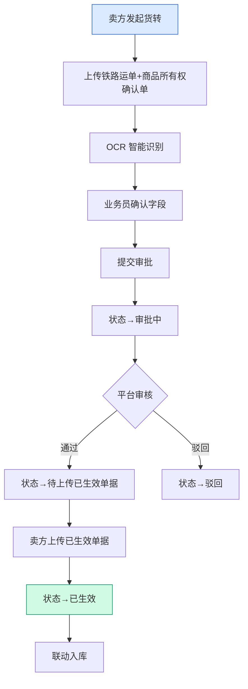
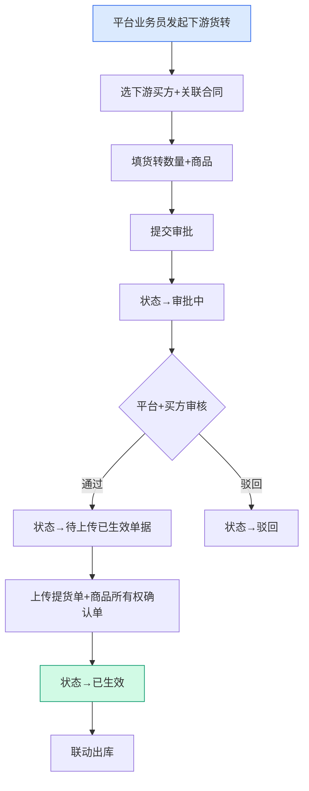
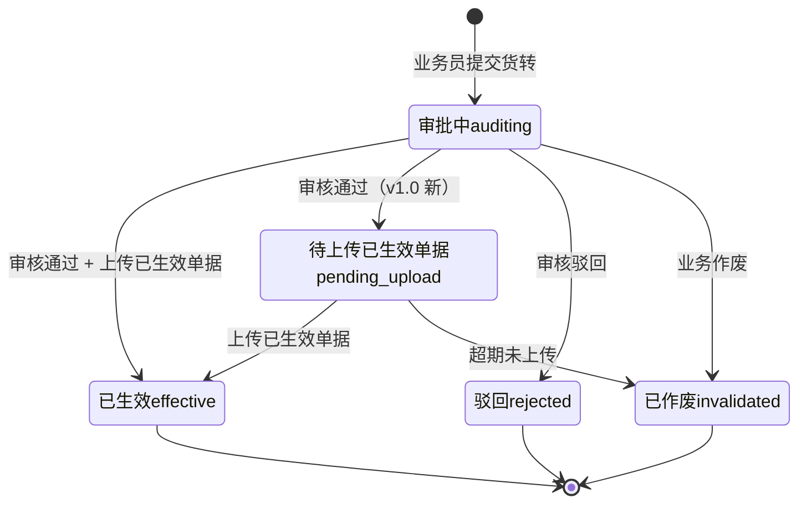

# 02.07 货转管理 v1.0 终版

> **状态**：v1.0 终版（**新模块，基于原型 32-36 截图**）
> **生成时间**：2026-07-24 14:55
> **配套文档**：[00-项目总览与对接.md](../00-项目总览与对接.md) / [01-模块拆解大框架.md](../01-模块拆解大框架.md) / [02.03-合同管理.md](./02.03-合同管理.md) / [02.04-订单管理.md](./02.04-订单管理.md)
> **复用度**：🟢 **80%（大幅复用）**——主产品 `t_warehouse_receipt_transfer`（仓单转移）+ `t_shipment_particulars` 字段扩展

---

## 0. 章节导航

1. 业务定位
2. 业务流程全景
3. 核心实体（3 张表）
4. 6 状态机
5. 角色操作矩阵
6. 字段规则
7. 按钮交互
8. 异常处理
9. 跨模块流转
10. 复用建议

---

## 1. 业务定位

**货转管理**是港通供应链的**货权转移登记中心**（**v1.0 新顶级模块**）——货权在不同主体间的转移登记，包括**上游货转**（卖方→平台）和**下游货转**（平台→买方）两类。

**港通特色模块**——对接铁路运单 + 商品所有权确认单（中欧班列运输场景）。

### 1.1 关键规则

1. **2 个 Tab**（基于 32 截图）：**上游货转** / **下游货转**（同一个顶级模块下的 2 个子页）
2. **货转编号格式**：`SKBT{YYYYMMDD}{6位}-{YYYYMMDD}{4位}`，例 `SKBT202507240002-20260109004`
3. **6 状态**：全部/审批中/待上传已生效单据/已生效/驳回/已作废
4. **货权凭证**：上游货转 = 铁路运单 + 商品所有权确认单；下游货转 = 提货单 + 商品所有权确认单
5. **OCR 智能识别**（**港通特色**）：扫描凭证后自动识别关键字段

### 1.2 5 个页面（sitemap）

| # | 页面 | 说明 |
|---|------|------|
| 1 | **货转管理**（列表，含 2 Tab：上游/下游）| 6 状态 Tab + 搜索筛选 |
| 2 | **上传上游货转** | 上游货转新建（卖方→平台）|
| 3 | **已上传上游货转详情** | 上游货转详情 |
| 4 | **新增下游货转** | 下游货转新建（平台→买方）|
| 5 | **下游货转详情** | 下游货转详情 |

---

## 2. 业务流程全景

### 2.1 上游货转流程（卖方→平台）

### 2.2 下游货转流程（平台→买方）

---

## 3. 核心实体（3 张表）

### 3.1 `t_goods_transfer` 货转主表

| 字段 | 类型 | 必填 | 说明 |
|------|------|------|------|
| `id` | bigint PK | - | 主键 |
| `transfer_no` | varchar(32) | ✓ | **货转编号** `SKBT{YYYYMMDD}{6位}-{YYYYMMDD}{4位}`，例 `SKBT202507240002-20260109004` |
| `transfer_type` | varchar(20) | ✓ | `upstream`（上游货转，卖方→平台）/ `downstream`（下游货转，平台→买方）|
| `transfer_direction` | varchar(20) | ✓ | `inbound`（入库货转）/ `outbound`（出库货转）|
| `contract_id` | bigint | ✓ | 关联合同 |
| `contract_no` | varchar(32) | - | 合同号（冗余）|
| `seller_company_id` | bigint | - | 卖方企业 ID（上游货转必填）|
| `seller_company_name` | varchar(128) | - | 卖方企业名称 |
| `buyer_company_id` | bigint | - | 买方企业 ID（下游货转必填）|
| `buyer_company_name` | varchar(128) | - | 买方企业名称 |
| `receiver_name` | varchar(64) | - | 收货人姓名（下游货转必填）|
| `goods_id` | bigint | - | 商品 ID |
| `goods_name` | varchar(128) | - | 商品名称 |
| `quantity` | decimal(20,4) | ✓ | 货转数量 |
| `unit` | varchar(20) | - | 单位 |
| `transfer_date` | date | - | 货转开具日期 |
| `effective_date` | date | - | 已生效日期 |
| `railway_waybill_no` | varchar(64) | - | **铁路运单号**（上游货转）|
| `ownership_cert_no` | varchar(64) | - | **商品所有权确认单号** |
| `status` | varchar(20) | ✓ | **6 状态**（见 §4）|
| `creator_id` | bigint | ✓ | 创建人 |
| `create_time` | datetime | ✓ | - |
| `is_deleted` | tinyint | ✓ | 0 = 软删除 |

### 3.2 `t_goods_transfer_attach` 货转附件（OCR 凭证）

| 字段 | 类型 | 必填 | 说明 |
|------|------|------|------|
| `id` | bigint PK | - | 主键 |
| `transfer_id` | bigint | ✓ | 关联货转 |
| `attach_type` | varchar(20) | ✓ | `railway_waybill`（铁路运单）/ `ownership_cert`（商品所有权确认单）/ `pickup_order`（提货单）/ `signed_doc`（已生效单据）|
| `file_id` | bigint | ✓ | 关联文件 |
| `file_name` | varchar(128) | - | 文件名（冗余）|
| `file_url` | varchar(255) | - | 文件 URL（冗余）|
| `ocr_data` | longtext | - | **OCR 识别结果（JSON）** |
| `ocr_recognized_at` | datetime | - | OCR 识别时间 |
| `uploader_id` | bigint | ✓ | 上传人 |
| `upload_time` | datetime | ✓ | 上传时间 |

### 3.3 `t_goods_transfer_history` 货转历史

| 字段 | 类型 | 必填 | 说明 |
|------|------|------|------|
| `id` | bigint PK | - | 主键 |
| `transfer_id` | bigint | ✓ | 关联货转 |
| `change_type` | varchar(20) | ✓ | `submit` / `approve` / `reject` / `upload_effective` / `invalidate` |
| `operator_id` | bigint | ✓ | 操作人 |
| `operator_name` | varchar(64) | - | 操作人姓名（冗余）|
| `opinion` | text | - | 操作意见 |
| `create_time` | datetime | ✓ | - |

---

## 4. 6 状态机

### 4.1 6 状态说明（基于 32 截图）

| # | 状态 | 中文 | 触发 | 出口 |
|---|------|------|------|------|
| 1 | `auditing` | 审批中 | 业务员提交 | 审核通过 / 驳回 / 作废 |
| 2 | `pending_upload` | 待上传已生效单据 | 审核通过 | 上传已生效单据 / 超期作废 |
| 3 | `effective` | 已生效 | 上传已生效单据 | 终态 |
| 4 | `rejected` | 驳回 | 审核驳回 | 终态 |
| 5 | `invalidated` | 已作废 | 业务作废 / 超期未上传 | 终态 |
| 6 | `all` | 全部 | 列表 Tab | - |

---

## 5. 角色操作矩阵

| 操作 / 角色 | 业务员 | 业务部 | 风控部 | 财务部 | 总经办 | 系统 |
|------------|------|------|------|------|------|------|
| 上传上游货转 | **✓** | - | - | - | - | - |
| 新增下游货转 | **✓** | 申请 | - | - | - | - |
| 审核货转 | - | **✓** | **✓** | - | - | - |
| 上传已生效单据 | **✓** | - | - | - | - | - |
| 查看/作废/下载 | ✓ | ✓ | ✓ | - | - | - |
| OCR 智能识别 | 自动 | - | - | - | - | ✓ |

---

## 6. 字段规则

### 6.1 货转编号 `transfer_no`

- **格式**：`SKBT{YYYYMMDD}{6位}-{YYYYMMDD}{4位}`，例 `SKBT202507240002-20260109004`
- **v1.0 标 [P0 待确认-字段]**：参考 32 截图的 SKBT 前缀

### 6.2 货转类型 `transfer_type`

- 2 种：`upstream`（上游货转，卖方→平台）/ `downstream`（下游货转，平台→买方）

### 6.3 货权凭证（**v1.0 港通特色**）

| 货转类型 | 必传凭证 |
|---------|---------|
| 上游货转 | 铁路运单（railway_waybill）+ 商品所有权确认单（ownership_cert）|
| 下游货转 | 提货单（pickup_order）+ 商品所有权确认单（ownership_cert）|
| 已生效 | 已生效单据（signed_doc）|

### 6.4 OCR 智能识别（**港通特色**）

- **触发**：上传铁路运单 / 商品所有权确认单 / 提货单时
- **识别字段**：
  - 铁路运单：运单号/发货人/收货人/品名/数量/发站/到站/日期
  - 商品所有权确认单：单号/所有权人/受让人/品名/数量/转移日期
  - 提货单：单号/提货人/品名/数量/提货日期
- **结果**：自动填充到表单字段，业务员确认/调整

---

## 7. 按钮交互

### 7.1 列表页（基于 32 截图）

| 按钮 | 位置 | 可见条件 | 点击行为 |
|------|------|---------|---------|
| **+ 开具货转**（v1.0）| 右上 | 业务员 | 弹货转类型选择（上游/下游）|
| 批量下载 | Tab 右侧 | 所有 | 批量下载货转凭证 |
| 数据导出 | Tab 右侧 | 所有 | 导出 Excel |
| **查看** | 列表行 | 所有 | 跳详情页 |
| **作废** | 列表行 | 状态≠已生效/已作废 | 弹作废确认框 |
| **下载** | 列表行 | 有附件 | 下载货转凭证 |

### 7.2 列表字段（基于 32 截图）

| 列 | 说明 |
|---|------|
| 合同编号 | `QY-LG-20250317-063` / `NMGZHCG202505015001` / `燃料公司-2025-燃煤-0162` |
| 货转编号 | `SKBT{YYYYMMDD}{6位}-{YYYYMMDD}{4位}` |
| 卖方企业 | 卖方名称 |
| 收货人 | 收货人姓名 |
| 货转开具日 | 货转日期 |
| 操作 | 查看 / 作废 / 下载 |

### 7.3 7 搜索条件（基于 32 截图右侧便签）

1. **编号**：订单/合同/货转编号
2. **货转编号**：货转编号（v1.0）
3. **卖方企业**：卖方名称
4. **货转开具日期**：日期范围（开始时间 ~ 结束时间）
5. **状态**：下拉选择（6 状态之一）

---

## 8. 异常处理

| 异常场景 | 提示文案 | 处理动作 |
|---------|---------|---------|
| 上游货转无铁路运单 | "上游货转必须上传铁路运单" | 阻止 |
| 下游货转无提货单 | "下游货转必须上传提货单" | 阻止 |
| OCR 识别失败 | "OCR 识别失败，请手动填写" | 允许手动 |
| 货转数量 > 合同数量 | "货转数量 X 超过合同剩余数量 Y" | 阻止 |
| 超期未上传已生效单据 | "货转 X 已超 30 天未上传已生效单据，已自动作废" | 自动作废 |
| 已生效货转作废 | "已生效货转不能作废，请走解除流程" | 阻止 |

---

## 9. 跨模块流转

### 9.1 上游触发

| 触发模块 | 触发条件 | 触发动作 |
|---------|---------|---------|
| 合同管理（02.03）| 合同 `executing` | 允许货转关联 |
| 收发货（02.05）| 收/发货完成 | 货转关联 |

### 9.2 下游触发

| 触发模块 | 触发条件 | 触发动作 |
|---------|---------|---------|
| 仓储-入库（02.12）| 上游货转生效 | 联动入库登记 |
| 仓储-出库（02.12）| 下游货转生效 | 联动出库登记 |
| 库存台账（02.12）| 货转生效 | 更新库存数量 |
| 业务线（02.06）| 货转生效 | 更新业务线货物进度 |

---

## 10. 复用建议

### 10.1 复用度

**🟢 80%（大幅复用）**

| 类别 | 数量 | 复用度 |
|------|------|--------|
| 直接复用主产品表 | 1 张 | 100% |
| 复用主产品表（扩展少量字段）| 1 张 | 80% |
| 港通新建表 | 1 张 | - |

### 10.2 直接复用主产品表

- `t_warehouse_receipt_transfer`（仓单转移）

### 10.3 复用+扩展主产品表

- `t_shipment_particulars`（发货明细）→ 改名为货转

### 10.4 港通新建表

- `t_goods_transfer_attach` 货转附件（含 OCR 数据）
- `t_goods_transfer_history` 货转历史

### 10.5 给研发的实施建议

1. **第一周**：直接复用 `t_warehouse_receipt_transfer` + 改名为货转
2. **第二周**：建货转附件表 + OCR 接口对接
3. **第三周**：建 6 状态机 + 上传/作废流程
4. **第四周**：跨模块集成（入库/出库/库存联动）

---

## 11. 文档版本

- **v1.0（2026-07-24 14:55）**：基于 32 截图 + sitemap 首次终版，作为范本用于后端开发
- 修改记录：见 `06-修改记录.md`
---

## 修改记录

### v1.7.99.x（2026-07-28）

- 🟡 列表页占位 = "全部"（全站统一）
- 🟡 列表页规范升级（v1.7.99 全局）
- 🟡 状态 tag 颜色编码（v1.7.99.14）
- 🟡 流程图统一用 Mermaid（v1.7.99.6）
- 详见：[v1.7.99-changelog.md](./v1.7.99-changelog.md)（30+ 版本汇总）

---

## 11. v1.7.99.x 模块级增量补充（基于飞书《用户使用手册》沉淀）

> **本节追加于 2026-09-24**
> **需求来源**：飞书《豫港通用户使用手册（内部版）》第 5.4 节"货转管理" + 本仓库 v1.7.99.176 改造沉淀
> **v1.0 文档骨架（1-10 节）保持不变**，本节仅补充 v1.7.99.x 后未明的业务规则、货转类型、6 状态机、跨模块联动、详细页面 PRD 索引

### 11.1 模块业务变化（v1.0 → v1.7.99.176）

| 维度 | v1.0 文档 | v1.7.99.176 现状 |
|------|----------|------------------|
| 页面清单 | 3 页（货转管理 + 详情 + 新增）| **6 页**：货转管理 + 上转详情 + 下转详情 + 上转新建 + 下转新建 + 货转主页面 |
| 货转类型 | 简化 | **v1.7.99.176 关键**：明确**货转上**（向上游供应商转）+ **货转下**（向下游客户转）|
| 状态机 | v1.0 简化版 | **v1.7.99.176 6 状态机**：待发起 / 待审核 / 审核通过 / 审核驳回 / 已货转 / 已作废 |
| 库存联动 | 文字提及 | **v1.7.99.176 关键**：货转完成 → 业务线"账面库存"重算 |

### 11.2 货转类型（v1.7.99.176 关键决策）

| 类型 | 含义 | 触发场景 |
|------|------|----------|
| **货转上** | 向上游供应商转货 | 原采购方不再需要货物，转给上游 |
| **货转下** | 向下游客户转货 | 下游新客户需要原合同货物 |

**v1.7.99.176 关键决策**：货转分上下两类，对应业务线台账的"账面库存"计算：
- **货转上**：库存 - 出库 + 入库（向上游）
- **货转下**：库存 + 出库 - 入库（向下游）

### 11.3 货转 6 状态机（v1.7.99.176）

| 状态 | 触发 | 下一状态 |
|------|------|----------|
| 待发起 | 业务人员登记货转 | 待审核 / 已作废 |
| 待审核 | 提交后自动写入 | 审核通过 / 审核驳回 |
| 审核通过 | 审核人员通过 | 已货转 / 已作废 |
| 审核驳回 | 审核人员驳回 | 终态（可修改重提）|
| 已货转 | 审核通过 + 实际货转完成 | 终态 |
| 已作废 | 业务人员主动作废 | 终态 |

### 11.4 跨模块联动（v1.7.99.x 增强）

| 联动系统 | v1.0 描述 | v1.7.99.176 增强 |
|----------|-----------|------------------|
| **业务线（02.06）**| 已记录 | 货转完成 → 业务线"账面库存"重算（关键决策：货转上 -X / 货转下 +X）|
| **合同（02.03）**| 已记录 | 货转完成 → 原合同的货权转移 → 关联的合同状态同步 |
| **结算单（02.13）**| 未单独提及 | 货转完成 → 后续可发起结算 |
| **发票（02.15）**| 未单独提及 | 货转完成 → 发票的合同关联重新绑定 |

### 11.5 异常处理（v1.7.99.x 补充）

| 场景 | v1.7.99.176 处理 |
|------|------------------|
| 关联合同已作废 | 红字提示"该合同已作废，无法货转" |
| 货转数量 > 可用库存 | 红字提示"货转数量不能大于可用库存" |
| 货转审核驳回 | 终态，可修改重提 |
| 货转上 / 下类型与实际业务不符 | 顶部红色 bar 提示"货转类型错误" |

### 11.6 详细页面 PRD 索引

| 页面 | PRD 文档 | 当前版本 |
|------|----------|----------|
| `goods-transfer.html` | [p-goods-transfer.md](./p-goods-transfer.md) | v1.7.99.176 终版 |
| `goods-transfer-up-detail.html` | [p-goods-transfer-up-detail.md](./p-goods-transfer-up-detail.md) | v1.7.99.176 终版 |
| `goods-transfer-up-new.html` | **待补** | 缺 PRD（F 批范围）|
| `goods-transfer-down.html` | **待补** | 缺 PRD（F 批范围）|
| `goods-transfer-down-detail.html` | [p-goods-transfer-down-detail.md](./p-goods-transfer-down-detail.md) | v1.7.99.176 终版 |
| `goods-transfer-down-new.html` | [p-goods-transfer-down-new.md](./p-goods-transfer-down-new.md) | v1.7.99.176 终版 |

### 11.7 详细业务规则沉淀（来自手册 5.4）

> **来自手册 5.4**：货转管理的业务场景

**关键字段**：
- 货转编号
- 货转类型（货转上 / 货转下）
- 原合同编号
- 转入方合同编号
- 货转数量
- 货转日期
- 凭证附件

### 11.8 增量补充版 v1.7.99.x 修改记录

- **v1.7.99.176（2026-08-12）**：**货转上 / 货转下类型明确** + 6 状态机 + 业务线"账面库存"联动
- **2026-09-24**：基于飞书《用户使用手册》第 5.4 节补充模块级业务口径（**本节第 11 节**）
