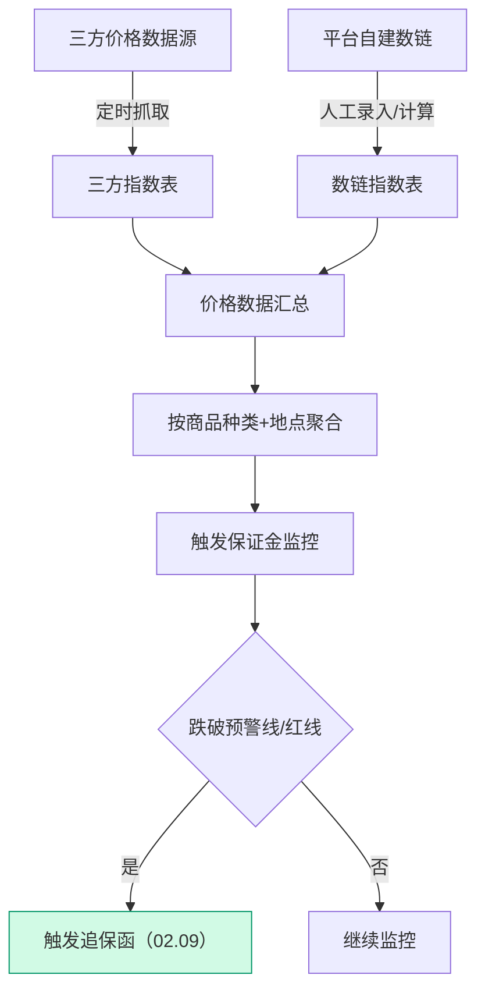

# 02.08 盯市价格管理 v1.0 终版

> **状态**：v1.0 终版（**新模块，基于原型 56-57 截图**）
> **生成时间**：2026-07-24 14:55
> **配套文档**：[00-项目总览与对接.md](../00-项目总览与对接.md) / [01-模块拆解大框架.md](../01-模块拆解大框架.md) / [02.09-追保函管理.md](./02.09-追保函管理.md)
> **复用度**：🟢 **90%（几乎零改造）**——主产品 `t_market_index` + `t_market_indicator` + `t_market_indicator_data` 高度匹配

---

## 0. 章节导航

1. 业务定位
2. 业务流程全景
3. 核心实体（3 张表）
4. 状态机
5. 字段规则
6. 按钮交互
7. 异常处理
8. 跨模块流转
9. 复用建议

---

## 1. 业务定位

**盯市价格管理**是港通供应链的**价格监控中心**（**v1.0 新顶级模块**）——监控煤炭/木薯淀粉/糖粉等大宗商品的市场价格，触发追保函 + 保证金预警。

**港通特色**——对接"我的钢铁网/煤炭网"等三方价格指数 + 平台自建数链指数。

### 1.1 关键规则

1. **2 大数据源**（基于 56 截图）：
   - **三方指数**（公开）：BSP 环渤海 / CCI 沿海动力煤 / CCI 动力煤现货 / CCI 焦炭价格 / CCI 冶金煤 / CCTD 环渤海
   - **数链指数**（平台自建）：秦皇岛煤炭网 / 中国煤炭网 / 中国煤炭市场网 / 中国电力... / 我的钢铁网 / 全国煤炭交...
2. **3 视图模式**（基于 56 截图）：
   - **看板模式**（默认）
   - **列表模式**
   - **趋势对比模式**
3. **3 商品种类**：动力煤 / 炼焦煤 / 水泥煤 / 铁矿石 / 焦炭 / 兰炭（v1.0 待确认 6 种）
4. **6 对应地点**：全部 / 北方港 / 华东 / 华南 / 巴彦淖尔 / 其他
5. **价格走势**：每个指数卡片显示最新价 + 日更新 + 变化值 + 趋势图

### 1.2 2 个页面（sitemap）

| # | 页面 | 说明 |
|---|------|------|
| 1 | **盯市价格管理**（列表 + 3 视图）| 看板/列表/趋势对比 + 6 品类 + 6 地点筛选 |
| 2 | **指标详情** | 单个指数的历史价格走势 + 详情 |

---

## 2. 业务流程全景

### 2.1 价格数据采集流程

---

## 3. 核心实体（3 张表）

### 3.1 `t_market_index` 价格指数主表

| 字段 | 类型 | 必填 | 主产品 | 港通扩展 | 说明 |
|------|------|------|--------|---------|------|
| `id` | bigint PK | - | ✓ | - | 主键 |
| `index_name` | varchar(128) | ✓ | ✓ | - | 指数名称（例：CCI 北海动力煤价格）|
| `index_code` | varchar(64) | - | ✓ | - | 指数代码（例：CCI）|
| `index_source` | varchar(20) | ✓ | ✓ | - | `third_party`（三方指数）/ `data_chain`（数链指数）|
| `data_source_name` | varchar(128) | - | - | 🆕 | **数据源名称**（v1.0）：秦皇岛煤炭网 / 我的钢铁网 |
| `product_category` | varchar(64) | ✓ | ✓ | - | 商品种类（动力煤/炼焦煤/...）|
| `region` | varchar(64) | - | ✓ | - | 对应地点（北方港/华东/...）|
| `unit` | varchar(20) | ✓ | ✓ | - | 单位（元/吨）|
| `current_price` | decimal(20,4) | - | ✓ | - | 最新价 |
| `change_value` | decimal(20,4) | - | - | 🆕 | 变化值 |
| `change_pct` | decimal(5,2) | - | - | 🆕 | 变化百分比 |
| `update_frequency` | varchar(20) | - | - | 🆕 | 更新频率（日/周/月）|
| `last_update_time` | datetime | - | ✓ | - | 最后更新时间 |
| `is_active` | tinyint | ✓ | ✓ | - | 0=停用, 1=启用 |

### 3.2 `t_market_indicator` 指标配置

| 字段 | 类型 | 必填 | 主产品 | 说明 |
|------|------|------|--------|------|
| `id` | bigint PK | - | ✓ | 主键 |
| `index_id` | bigint | ✓ | ✓ | 关联指数 |
| `indicator_name` | varchar(128) | ✓ | ✓ | 指标名 |
| `indicator_type` | varchar(20) | ✓ | ✓ | 指标类型 |
| `warn_line` | decimal(20,4) | - | ✓ | 预警线 |
| `red_line` | decimal(20,4) | - | ✓ | 红线 |
| `is_active` | tinyint | ✓ | ✓ | 0=停用, 1=启用 |

### 3.3 `t_market_indicator_data` 价格历史

| 字段 | 类型 | 必填 | 主产品 | 说明 |
|------|------|------|--------|------|
| `id` | bigint PK | - | ✓ | 主键 |
| `index_id` | bigint | ✓ | ✓ | 关联指数 |
| `price` | decimal(20,4) | ✓ | ✓ | 价格 |
| `record_date` | date | ✓ | ✓ | 日期 |
| `source` | varchar(20) | - | ✓ | 数据来源 |

---

## 4. 状态机

盯市价格管理**无业务状态机**——是数据展示模块，不涉及审批/状态流转。

---

## 5. 字段规则

### 5.1 指数来源 `index_source`（基于 56 截图）

- 2 种：`third_party`（三方指数）/ `data_chain`（数链指数）

### 5.2 商品种类 `product_category`（基于 56 截图）

- 6 种：**动力煤** / **炼焦煤** / **水泥煤** / **铁矿石** / **焦炭** / **兰炭**
- **v1.0 标 [P0 待确认-业务]**：6 种是否完整？

### 5.3 对应地点 `region`（基于 56 截图）

- 6 种：**全部** / **北方港** / **华东** / **华南** / **巴彦淖尔** / **其他**

### 5.4 价格变化

- **变化值** `change_value`：最新价 - 昨日价
- **变化百分比** `change_pct`：变化值 / 昨日价 × 100%
- 颜色：红涨/绿跌

---

## 6. 按钮交互

### 6.1 列表页（基于 56 截图）

| 按钮 | 位置 | 可见条件 | 点击行为 |
|------|------|---------|---------|
| **看板模式** | 顶部 | 所有 | 切换到看板视图（默认）|
| **列表模式** | 顶部 | 所有 | 切换到列表视图 |
| **趋势对比模式** | 顶部 | 所有 | 切换到趋势对比视图 |
| 数据源筛选 | 左侧 | 所有 | 按 三方指数/数链指数 筛选 |
| 指数名称搜索 | 左侧 | 所有 | 模糊搜索 |
| 品类筛选 | 左侧 | 所有 | 按 6 品类 筛选 |
| 地点筛选 | 左侧 | 所有 | 按 6 地点 筛选 |
| **指标详情** | 卡片 | 所有 | 跳指标详情页 |

### 6.2 看板模式（默认，基于 56 截图）

- 3 列卡片布局
- 每个卡片显示：
  - 指数名称（例：CCI 北海动力煤价格）
  - 价格（元/吨 日更新）
  - 变化值（例：+8.00）
  - 变化百分比（例：+1.31%）
  - 趋势图（红/绿）
- 鼠标悬停显示详细数据

### 6.3 列表模式

- 表格布局
- 列：指数名称 / 最新价 / 变化值 / 变化百分比 / 更新时间 / 操作

### 6.4 趋势对比模式

- 多指数对比
- 选 2-4 个指数叠加显示

---

## 7. 异常处理

| 异常场景 | 提示文案 | 处理动作 |
|---------|---------|---------|
| 三方指数抓取失败 | "三方指数抓取失败，请联系管理员" | 重试 + 邮件通知 |
| 数据源价格缺失 | "指数 XXX 在 YYYY-MM-DD 无数据" | 标记为"暂无数据" |
| 指数变化异常（>20%）| "指数 XXX 变化异常（+25%），请人工确认" | 黄灯提醒 |
| 多个数据源价格不一致 | "三方指数与数链指数价格差异 >5%" | 黄灯提醒 |

---

## 8. 跨模块流转

### 8.1 上游触发

| 触发模块 | 触发条件 | 触发动作 |
|---------|---------|---------|
| 三方价格 API | 定时抓取 | 写入三方指数表 |
| 数链价格管理 | 人工录入/计算 | 写入数链指数表 |

### 8.2 下游触发

| 触发模块 | 触发条件 | 触发动作 |
|---------|---------|---------|
| **追保函管理（02.09）**| 指数跌破预警线/红线 | 触发追保函 |
| **保证金管理（02.10）**| 保证金率变化 | 更新保证金监控 |
| **预警中心（02.11）**| 价格波动 | 触发价格波动预警 |

---

## 9. 复用建议

### 9.1 复用度

**🟢 90%（几乎零改造）**

| 类别 | 数量 | 复用度 |
|------|------|--------|
| 直接复用主产品表 | 3 张 | 100% |
| 港通新建表 | 0 张 | - |

### 9.2 直接复用主产品表

- `t_market_index` 价格指数主表（+ 港通 4 字段：`data_source_name`, `change_value`, `change_pct`, `update_frequency`）
- `t_market_indicator` 指标配置
- `t_market_indicator_data` 价格历史

### 9.3 给研发的实施建议

1. **第一周**：直接复用主产品 3 张表 + 加 4 字段
2. **第二周**：对接三方价格 API（秦皇岛煤炭网/我的钢铁网）
3. **第三周**：建 3 视图模式（看板/列表/趋势对比）
4. **第四周**：跨模块集成（追保函/保证金/预警）

---

## 10. 文档版本

- **v1.0（2026-07-24 14:55）**：基于 56 截图 + sitemap 首次终版，作为范本用于后端开发
- 修改记录：见 `06-修改记录.md`
---

## 修改记录

### v1.7.99.x（2026-07-28）

- 🟡 列表页占位 = "全部"（全站统一）
- 🟡 列表页规范升级（v1.7.99 全局）
- 🟡 状态 tag 颜色编码（v1.7.99.14）
- 🟡 流程图统一用 Mermaid（v1.7.99.6）
- 详见：[v1.7.99-changelog.md](./v1.7.99-changelog.md)（30+ 版本汇总）

---

## 11. v1.7.99.x 模块级增量补充（基于飞书《用户使用手册》沉淀）

> **本节追加于 2026-09-24**
> **需求来源**：飞书《豫港通用户使用手册（内部版）》第 8.1 节"预警管理 - 价格波动-指标配置" + 本仓库 v1.7.99.250 改造沉淀
> **v1.0 文档骨架（1-10 节）保持不变**，本节仅补充 v1.7.99.x 后未明的 15 种规则类型、考核项、消息类型、详细页面 PRD 索引
> **关联文档**：[02.11-预警中心.md](./02.11-预警中心.md) 第 11 节（更多预警规则细节）

### 11.1 模块业务变化（v1.0 → v1.7.99.250）

| 维度 | v1.0 文档 | v1.7.99.250 现状 |
|------|----------|------------------|
| 模块定位 | 独立"盯市价格"模块 | **v1.7.99.250 后**：盯市价格作为预警中心的**子模块**（02.11 预警中心 / 价格波动） |
| 规则类型 | 简化 | **v1.7.99.250 关键**：15 种规则类型（来自手册 8.1）|
| 考核项 | 文字提及 | 2 种：最大波动幅度超过阈值 + 最大波动金额超过阈值 |
| 风险等级 | 文字提及 | 3 级：高 / 中 / 低 |
| 监控合同 | 文字提及 | **v1.7.99.250 后**：监控合同配置独立子页（详见 p-warning-price-contract-config.md）|

### 11.2 业务类型（手册 8.1 沉淀）

| 业务类型 | 支持 | 说明 |
|----------|------|------|
| **存货业务** | ✅ 当前支持 | 唯一支持的业务类型（v1.7.99.250） |
| 预付业务 | ❌ v1.7.99.x 待补 | - |
| 账期业务 | ❌ v1.7.99.x 待补 | - |
| 购销业务 | ❌ v1.7.99.x 待补 | - |

### 11.3 15 种价格波动规则类型（手册 8.1 权威口径）

> **来自手册 8.1**：价格波动-指标配置的 15 种规则类型

| # | 规则类型 | 本期价格 | 对比价格 |
|---|----------|----------|----------|
| 1 | 本期价格 = 最新一次有效报价 | 实时价 / 最新成交价 | - |
| 2 | 本期价格 与 当月月初价格 | 本月 1 日时价格 | - |
| 3 | 本期价格 与 上月同期价格 | 上月同一天（同月同日）的价格 | - |
| 4 | 本期价格 与 上上月同期价格 | 上上月同一天的价格 | - |
| 5 | 本期价格 与 本年年初价格 | 本年度 1 月 1 日的价格 | - |
| 6 | 本期价格 与 去年同期价格 | 去年同月同日的价格 | - |
| 7 | 本期价格 与 当月平均价格 | 本月 1 号至今所有有效报价的算术平均 | - |
| 8 | 本期价格 与 当月最高价格 | 本月至今的最高成交价 | - |
| 9 | 本期价格 与 当月最低价格 | 本月至今的最低成交价 | - |
| 10 | 本期价格 与 当年平均价格 | 本年 1 月 1 日至今所有有效报价的算术平均 | - |
| 11 | 本期价格 与 当年最高价格 | 本年最高成交价 | - |
| 12 | 本期价格 与 当年最低价格 | 本年最低成交价 | - |
| 13 | 本期价格 与 最近 N 个自然日内平均价格 | 最近 N 个自然日内所有有效报价的算术平均（**含/不含今日可配**）| - |
| 14 | 本期价格 与 最近 N 个自然日内最高价格 | 窗口内最高价 | - |
| 15 | 本期价格 与 各地现货交易最高限价 N | 某地区/某品类政府或平台发布的最高限价 | - |

**v1.7.99.250 关键决策**：
- "是否关联合同"单选项：选择"是" → 多选框架及单批次合同；选择"否" → 规则仅监听本期价格与往期价格的预警信息

### 11.4 11 步配置流程（手册 8.1 权威口径）

> **来自手册 8.1**：价格波动规则的 11 步完整配置流程

1. **第一步**：选择是否关联合同
2. **第二步**：选择业务类型（当前仅存货业务）
3. **第三步**：选择规则类型（详见 11.3 节 15 种）
4. **第四步**：设置规则名称（99 位上限）
5. **第五步**：设置风险等级（高 / 中 / 低）
6. **第六步**：设置考核项（最大波动幅度 / 最大波动金额）
7. **第七步**：设置配置项（涨幅/跌幅百分比 或 涨幅/跌幅金额）
8. **第八步**：查看规则明细（自动生成）
9. **第九步**：设置通用指标（从已有配置勾选，可多选）
10. **第十步**：设置消息类型（预警消息）
11. **第十一步**：备注（选填）

### 11.5 3 风险等级（手册 8.1 沉淀）

| 风险等级 | 颜色 | 触发阈值（推荐默认值）|
|----------|------|------------------------|
| **高** | 红 | 阈值 ≥ 30% 或 ≥ 100 万元 |
| **中** | 黄 | 阈值 15-30% 或 50-100 万元 |
| **低** | 绿 | 阈值 < 15% 或 < 50 万元 |

> **v1.7.99.250 决策**：风险等级与监控合同的**优先级排序**联动——高风险规则触发时优先推送预警。

### 11.6 跨模块联动（v1.7.99.x 增强）

| 联动系统 | v1.0 描述 | v1.7.99.250 增强 |
|----------|-----------|------------------|
| **监控合同配置（02.11 子页）** | 未提及 | v1.7.99.250 独立子页（p-warning-price-contract-config.md）|
| **预警中心（02.11）** | 已记录 | 盯市价格预警作为预警中心的子模块 |
| **销售/采购合同（02.03）** | 文字提及 | 监控合同选择仅"执行中/待上传双签合同" |
| **消息推送（钉钉/邮件）** | 文字提及 | 预警消息推送支持多类型（钉钉/邮件/短信，v1.7.99.250 待集成）|

### 11.7 异常处理（v1.7.99.x 补充）

| 场景 | v1.7.99.250 处理 |
|------|------------------|
| 规则名称 > 99 位 | 红字提示"规则名称不能超过 99 位" |
| 考核项与配置项不一致 | 红字提示"配置项必须与考核项匹配（百分比 / 金额）" |
| 监控合同已作废 | 红字提示"该合同已作废，无法监控"（监控合同配置子页校验）|
| 规则名称重复 | 红字提示"规则名称已存在，请修改" |

### 11.8 详细页面 PRD 索引

| 页面 | PRD 文档 | 当前版本 |
|------|----------|----------|
| `market-price.html` | [p-market-price.md](./p-market-price.md) | v1.7.99.x 终版 |
| `market-price-detail.html` | [p-market-price-detail.md](./p-market-price-detail.md) | v1.7.99.x 终版 |
| `warning-config.html` | [p-warning-config.md](./p-warning-config.md) | v1.7.99.250 终版 |
| `warning-price-contract-config.html` | [p-warning-price-contract-config.md](./p-warning-price-contract-config.md) | **2026-09-24 新写**（基于手册 8.1 + v1.7.99.250）|

### 11.9 详细业务规则沉淀（来自手册 8.1）

**规则名称命名规则**：
- 支持中英文数字常规标点
- 99 位上限
- 自定义（依据规则类型）

**配置项输入**：
- 涨幅或跌幅百分比（如 10% 表示 ±10% 触发预警）
- 涨幅或跌幅金额（如 100 万元表示 ±100 万触发预警）
- 配置项必须与考核项匹配（百分比 ↔ 百分比 / 金额 ↔ 金额）

**规则明细自动生成**：
- 上方录入规则后自动生成
- 业务人员无需手动填写
- 含本期价格 / 对比价格 / 考核项 / 配置项 / 风险等级

### 11.10 增量补充版 v1.7.99.x 修改记录

- **v1.7.99.250（2026-08-31）**：监控合同配置独立子页 + 合同多选框 + 顶部"当前合同编号"指示器
- **2026-09-24**：基于飞书《用户使用手册》第 8.1 节补充模块级业务口径（**本节第 11 节**）
