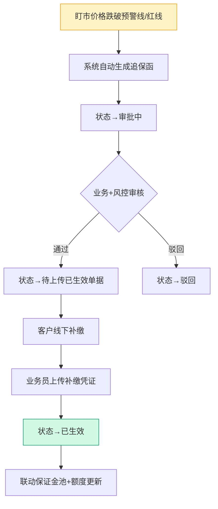
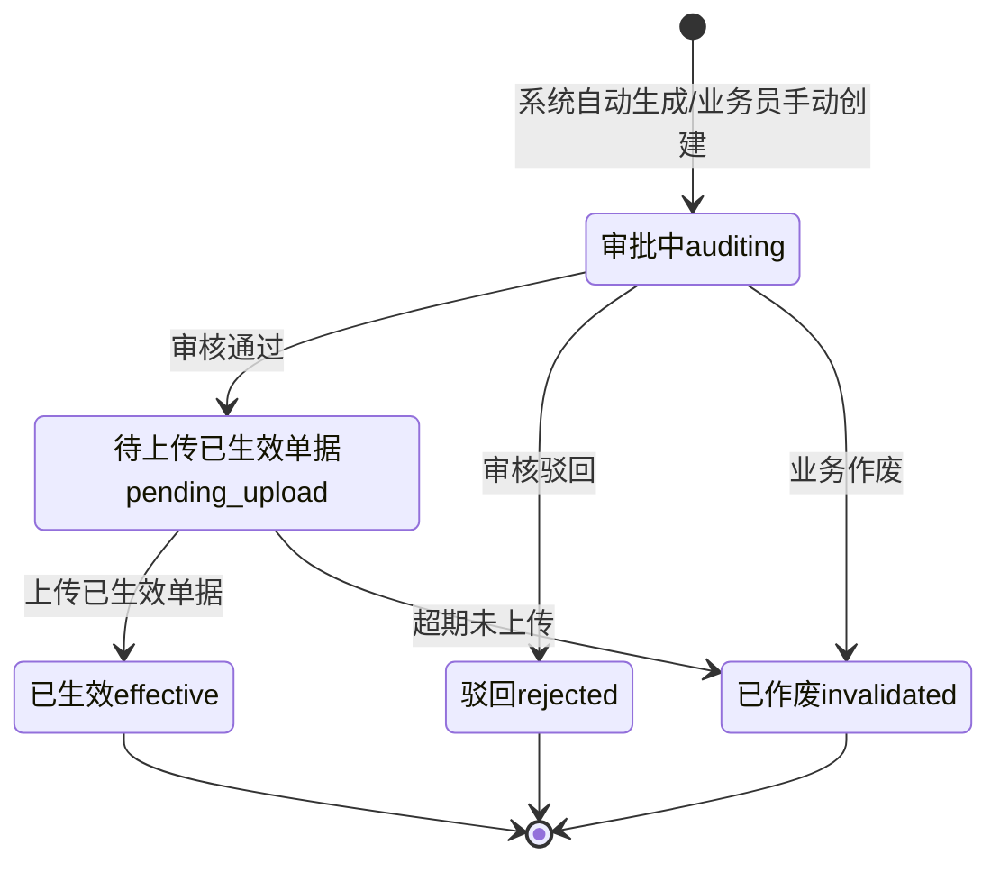

# 02.09 追保函管理 v1.0 终版

> **状态**：v1.0 终版（**新模块，基于原型 58-60 截图**）+ v1.7.99.85 列表页重制（图 1 状态机 + 图 2 表头）
> **生成时间**：2026-07-24 14:55（v1.0）/ 2026-07-30 20:27（v1.7.99.85 改造）
> **配套文档**：[00-项目总览与对接.md](../00-项目总览与对接.md) / [01-模块拆解大框架.md](../01-模块拆解大框架.md) / [02.08-盯市价格管理.md](./02.08-盯市价格管理.md) / [02.10-保证金管理.md](./02.10-保证金管理.md)
> **复用度**：🟢 **85%（大幅复用）**——主产品 `t_bond_letter` 几乎匹配

---

## 0. 章节导航

1. 业务定位
2. 业务流程全景
3. 核心实体（3 张表）
4. 6 状态机
5. 角色操作矩阵
6. 字段规则
7. 按钮交互
8. 异常处理
9. 跨模块流转
10. 复用建议
11. 文档版本
12. **v1.7.99.85 列表页改造**（图 1 状态机 + 图 2 表头 + 5 状态操作按钮矩阵） ← 新增章节

---

## 1. 业务定位

**追保函管理**是港通供应链的**追保函全生命周期管理**（**v1.0 新顶级模块**）——盯市价格跌破预警线/红线时，自动生成追保函，要求客户补缴保证金。

**港通特色**——分**电子追保函**和**线下追保函**两种（**v1.0 重大发现，基于 58 截图**）。

### 1.1 关键规则

1. **2 种追保函**（基于 58 截图）：
   - **电子追保函**（电子签约）
   - **线下追保函**（线下盖章）
2. **触发条件**：盯市价格跌破预警线/红线（来自 02.08 盯市价格管理）
3. **6 状态**（基于 58 截图）：全部/审批中/待上传已生效单据/已生效/驳回/已作废
4. **关联销售合同**（必填）：选择电子销售合同或线下销售合同
5. **线下补缴**：客户线下转账 → 业务员上传凭证 → 状态→已生效

### 1.2 3 个页面（sitemap）

| # | 页面 | 说明 |
|---|------|------|
| 1 | **追保函管理**（列表，含 2 Tab：电子/线下）| 6 状态 Tab + 搜索筛选 |
| 2 | **新增/编辑追保函** | 新建追保函 + 选择销售合同 |
| 3 | **追保函详情** | 追保函完整信息 + 凭证 |

---

## 2. 业务流程全景

### 2.1 追保函生成流程

### 2.2 电子 vs 线下追保函差异

| 维度 | 电子追保函 | 线下追保函 |
|------|---------|---------|
| 签约方式 | 电子签章 | 线下盖章 |
| 已生效单据 | 电子合同 PDF | 盖章扫描件 |
| 状态变更 | 系统自动 | 业务员上传凭证 |
| 适用场景 | 长期合作客户 | 一次性合作 / 中小客户 |

---

## 3. 核心实体（3 张表）

### 3.1 `t_bond_letter` 追保函主表

| 字段 | 类型 | 必填 | 主产品 | 港通扩展 | 说明 |
|------|------|------|--------|---------|------|
| `id` | bigint PK | - | ✓ | - | 主键 |
| `bond_letter_no` | varchar(32) | ✓ | ✓ | - | 追保函编号 |
| `bond_letter_type` | varchar(20) | ✓ | ❌ | 🆕 | **追保函类型（v1.0）**：`electronic`（电子）/ `offline`（线下）|
| `sales_contract_id` | bigint | ✓ | ✓ | - | **关联销售合同**（必填）|
| `sales_contract_no` | varchar(32) | - | - | - | 销售合同号（冗余）|
| `sales_contract_type` | varchar(20) | - | ❌ | 🆕 | **销售合同类型**：`electronic`（电子）/ `offline`（线下）|
| `trigger_index_id` | bigint | - | ✓ | - | **触发的价格指数**（来自 02.08）|
| `trigger_index_name` | varchar(128) | - | - | - | 指数名称 |
| `trigger_price` | decimal(20,4) | - | - | 🆕 | 触发价格 |
| `warn_line` | decimal(20,4) | - | - | 🆕 | 预警线 |
| `red_line` | decimal(20,4) | - | - | 🆕 | 红线 |
| `shortfall_amount` | decimal(20,2) | ✓ | ✓ | - | **追保金额**（客户应补缴）|
| `paid_amount` | decimal(20,2) | - | - | 🆕 | 已补缴金额 |
| `unpaid_amount` | decimal(20,2) | - | - | 🆕 | 未补缴金额 |
| `due_date` | date | ✓ | ✓ | - | 补缴截止日期 |
| `effective_date` | date | - | - | 🆕 | 已生效日期 |
| `status` | varchar(20) | ✓ | ✓ | - | **6 状态**（见 §4）|
| `creator_id` | bigint | ✓ | ✓ | - | 创建人 |
| `create_time` | datetime | ✓ | ✓ | - | - |
| `approve_time` | datetime | - | - | 🆕 | 审批时间 |
| `effective_complete_time` | datetime | - | - | 🆕 | 已生效完成时间 |
| `is_deleted` | tinyint | ✓ | ✓ | - | 0 = 软删除 |

### 3.2 `t_bond_letter_attach` 追保函附件

| 字段 | 类型 | 必填 | 说明 |
|------|------|------|------|
| `id` | bigint PK | - | 主键 |
| `bond_letter_id` | bigint | ✓ | 关联追保函 |
| `attach_type` | varchar(20) | ✓ | `signed_letter`（已签追保函）/ `payment_voucher`（补缴凭证）/ `seal_scan`（盖章扫描件，线下追保函用）|
| `file_id` | bigint | ✓ | 关联文件 |
| `uploader_id` | bigint | ✓ | 上传人 |
| `upload_time` | datetime | ✓ | 上传时间 |

### 3.3 `t_bond_letter_history` 追保函历史

| 字段 | 类型 | 必填 | 说明 |
|------|------|------|------|
| `id` | bigint PK | - | 主键 |
| `bond_letter_id` | bigint | ✓ | 关联追保函 |
| `change_type` | varchar(20) | ✓ | `submit` / `approve` / `reject` / `effective` / `invalidate` |
| `operator_id` | bigint | ✓ | 操作人 |
| `opinion` | text | - | 操作意见 |
| `create_time` | datetime | ✓ | - |

---

## 4. 6 状态机

### 4.1 6 状态说明（基于 58 截图）

| # | 状态 | 中文 | 触发 | 出口 |
|---|------|------|------|------|
| 1 | `auditing` | 审批中 | 系统生成/手动创建 | 审核通过/驳回/作废 |
| 2 | `pending_upload` | 待上传已生效单据 | 审核通过 | 上传已生效单据/超期作废 |
| 3 | `effective` | 已生效 | 上传已生效单据 | 终态 |
| 4 | `rejected` | 驳回 | 审核驳回 | 终态 |
| 5 | `invalidated` | 已作废 | 业务作废/超期未上传 | 终态 |
| 6 | `all` | 全部 | 列表 Tab | - |

---

## 5. 角色操作矩阵

| 操作 / 角色 | 业务员 | 业务部 | 风控部 | 财务部 | 总经办 | 系统 |
|------------|------|------|------|------|------|------|
| 自动生成追保函 | - | - | - | - | - | ✓（盯市价格触发）|
| 手动创建追保函 | **✓** | - | - | - | - | - |
| 审核追保函 | - | **✓** | **✓** | - | - | - |
| 上传已生效单据 | **✓** | - | - | - | - | - |
| 客户线下补缴 | 客户 | - | - | - | - | - |
| 上传补缴凭证 | **✓** | - | - | - | - | - |

---

## 6. 字段规则

### 6.1 追保函类型 `bond_letter_type`（**v1.0 新增**）

- 2 种：`electronic`（电子追保函）/ `offline`（线下追保函）

### 6.2 销售合同类型 `sales_contract_type`（**v1.0 新增**）

- 2 种：`electronic`（电子销售合同）/ `offline`（线下销售合同）

### 6.3 追保金额 `shortfall_amount`

- 元，保留 2 位小数
- 公式：`追保金额 = (合同金额 × 追保率) - 已缴保证金`
- **自动计算**（来自 02.08 盯市价格 + 02.10 保证金管理）

### 6.4 触发指数 `trigger_index_id`

- 关联 02.08 盯市价格管理的指数
- 自动记录触发时的指数价格

---

## 7. 按钮交互

### 7.1 列表页（基于 58 截图）

| 按钮 | 位置 | 可见条件 | 点击行为 |
|------|------|---------|---------|
| **+ 新增追保函** | 右上 | 业务员 | 弹新增对话框 |
| 数据导出 | Tab 右侧 | 所有 | 导出 Excel |
| **电子追保函 Tab** | 顶部 | 所有 | 筛选电子追保函 |
| **线下追保函 Tab** | 顶部 | 所有 | 筛选线下追保函 |
| 详情 | 列表行 | 所有 | 跳详情页 |

### 7.2 列表字段（基于 58 截图）

| 列 | 说明 |
|---|------|
| 编号 | 订单/合同/追保函编号 |
| 企业名称 | 客户名称 |
| 签发日期 | 追保函签发日期 |
| 状态 | 6 状态之一 |
| 操作 | 详情 / 编辑 / 撤销 |

### 7.3 新增追保函对话框

- **选择销售合同**（必填）：弹出选择列表，区分电子销售合同/线下销售合同
- 触发指数（自动）：从当前合同的最新指数
- 追保金额（自动计算）
- 补缴截止日期：默认 7 天后

---

## 8. 异常处理

| 异常场景 | 提示文案 | 处理动作 |
|---------|---------|---------|
| 未选择销售合同 | "必须先选择销售合同" | 阻止 |
| 销售合同已签章 | "销售合同已签章，不能创建追保函" | 阻止 |
| 追保金额 > 0 才允许提交 | "追保金额必须 > 0" | 阻止 |
| 补缴截止日期 < 今天 | "补缴截止日期必须 > 今天" | 阻止 |
| 超期未补缴 | "追保函 X 已超期 Y 天，已自动作废" | 自动作废 |
| 客户已被冻结 | "客户 X 已被冻结，不能创建追保函" | 阻止 |

---

## 9. 跨模块流转

### 9.1 上游触发

| 触发模块 | 触发条件 | 触发动作 |
|---------|---------|---------|
| 盯市价格（02.08）| 价格跌破预警线/红线 | 自动生成追保函 |
| 保证金监控（02.10）| 保证金率变化 | 触发追保函 |

### 9.2 下游触发

| 触发模块 | 触发条件 | 触发动作 |
|---------|---------|---------|
| 保证金池（02.10）| 追保函已生效 | 更新客户保证金池 |
| 客户额度（02.02）| 追保函已生效 | 更新客户可用额度 |
| 预警中心（02.11）| 追保函生成/驳回 | 触发预警信号 |

---

## 10. 复用建议

### 10.1 复用度

**🟢 85%（大幅复用）**

| 类别 | 数量 | 复用度 |
|------|------|--------|
| 直接复用主产品表 | 1 张 | 100% |
| 港通新建表 | 2 张 | - |

### 10.2 直接复用主产品表

- `t_bond_letter` 追保函主表（+ 港通 6 字段：`bond_letter_type`, `sales_contract_type`, `trigger_price`, `paid_amount`, `effective_date`, `effective_complete_time`）

### 10.3 港通新建表

- `t_bond_letter_attach` 追保函附件
- `t_bond_letter_history` 追保函历史

### 10.4 给研发的实施建议

1. **第一周**：直接复用 `t_bond_letter` + 加 6 字段
2. **第二周**：建电子/线下 2 种追保函入口
3. **第三周**：建 6 状态机 + 联动逻辑（盯市价格→追保函）
4. **第四周**：跨模块集成（保证金池/客户额度/预警）

---

## 11. 文档版本

- **v1.0（2026-07-24 14:55）**：基于 58 截图 + sitemap 首次终版，作为范本用于后端开发
- **v1.7.99.85（2026-07-30）**：追保函管理列表页重制（用户截图 2 张：图 1 状态机 + 图 2 表头）
  - 🟡 `pages/bond-letter.html` 完全重制（11.5KB v1.7.99.7 占位版 → 17.0KB，~360 行；按 user 截图 1:1 复制）
  - 🟡 标题"追保函管理"（v1.7.99.85 用正确写法，**user 图 1 用了错别字"追保涵管理"**，图 2 用了正确"追保函管理"——v1.7.99.85 沿用正确写法）
  - 🟡 6 tab 状态机：全部 100 / 审批中 10 / 待上传已生效单据 10 / 已生效 10 / 驳回 10 / 已作废 10 —— **每个 tab 都有 ⚡ 黄色闪电图标**（v1.7.99.85 按 user 图 1 视觉细节）
  - 🟡 3 字段筛选：编号（订单、合同、追保函编号）/ 企业名称 / 签发日期
  - 🟡 10 列表格（图 2 表头 + user 图 1 数据）：合同编号 / 卖方企业 / 买方企业 / 追保金额(元) / 追保截止日期 / 签发日期 / 追保函编号 / **上传时间**（v1.7.99.85 新增）/ 追保函状态 / 操作
  - 🟡 5 状态 badge 颜色：审批中 #FEF3C7/#A16207 / 待上传已生效单据 #DBEAFE/#1E40AF / 已生效 #D1FAE5/#047857 / 驳回 #FEE2E2/#DC2626 / 已作废 #F3F4F6/#6B7280
  - 🟡 **5 状态操作按钮矩阵**（v1.7.99.85 沿用 v1.7.99.82 销售结算状态机模式，**已生效特殊业务**）：
    - 审批中 = 详情
    - 待上传已生效单据 = 详情 + 上传附件 + 作废
    - **已生效（有有效追保函编号）= 详情 + 修改 + 作废**（v1.7.99.85 特殊：跟销售/采购"已生效=终态"不同，追保函已生效仍可修改/作废）
    - **已生效（无有效追保函编号）= 详情**（v1.7.99.85 特殊：无效数据不可改/废）
    - 驳回 = 详情 + 修改 + 作废
    - 已作废 = 详情
  - 🟡 7 行 mock（按 user 图 1 1:1 复制，含真实数据：销售090701long有一天突然/HNRNH-TYYGJ-202409-001/RHSY-SLKJ-202403-003/HNRNH-SXJY-202307-008/业务员创建的(2条)/tetet，追保函编号保留 user 截图的"乱填"字符串：ZBH234324/ceshi11111/1234/日期为翁/发士大夫士大夫/发顺丰/法沙发沙发房货首）
  - 🟡 右上 2 按钮：数据导出（白底蓝字）+ 新增追保函（蓝底白字 + + 图标）
  - 🟡 分页：共 50 条记录 / 1-5 页 / 10 条/页
  - 🟡 **不**改全局 design-system.css（v1.7.99.69/71/73/75/80/81/82/83/84 经验：项目级覆盖）
  - 🟡 **不**新建 assets/js/app.js（沿用 v1.7.99.80 inline Utils fallback 模式）
  - 🟡 **不**改左侧 sidemenu（"追保函管理"菜单和"数字供应链"归属已经在 v1.7.99.x 锁定）
  - 🟡 **不**改 bond-letter-detail.html / bond-letter-new.html（这两个页面 v1.7.99.50+ 已经实现）
  - 🟡 1440px 视口列裁切：表格右 2 列（上传时间/追保函状态）在 1440px 部署下被滚动隐藏，cp-table-wrap `overflow-x: auto` 让用户横向滚动（user 图 1 是 1903px 视口，部署到 1440px 是 463px 视口差，**用户可接受横向滚动体验**——v1.7.99.83/84 总结）
  - 详见：[v1.7.99-changelog.md](./v1.7.99-changelog.md) §v1.7.99.85
- 修改记录：见 `06-修改记录.md`
---

## 12. v1.7.99.85 列表页改造 — 图 1 状态机 + 图 2 表头 + 5 状态操作按钮矩阵

> **状态**：v1.7.99.85 首次实现（基于用户截图 2 张）
> **页面**：`pages/bond-letter.html`（17.0KB，~360 行）
> **沿用模式**：v1.7.99.82 销售结算状态机（5 状态 + 6 tab + ⚡ 闪电图标）+ v1.7.99.80 inline Utils fallback

### 12.1 业务定位

**追保函管理**是港通供应链的**追保函全生命周期管理**（v1.0 顶级模块）——盯市价格跌破预警线/红线时，自动生成追保函，要求客户补缴保证金。

**v1.7.99.85 改造重点**：
- 现有 `pages/bond-letter.html` 是 v1.7.99.7 占位版（11.5KB，标题"保函管理" + 4 tab + 6 字段筛选 + 10 列 + 2 行 mock），**结构和字段跟 user 截图 1-2 完全对不上**
- v1.7.99.85 按 user 截图 1:1 复制——6 tab 状态机 + ⚡ 闪电图标 + 10 列表格 + 5 状态操作按钮矩阵 + 7 行真实 mock
- **不**改左侧菜单（"追保函管理"在"数字供应链"下的归属已锁定）

### 12.2 6 tab 状态机（v1.7.99.85 按 user 图 1）

| Tab | 数量 | 状态颜色 | 说明 |
|-----|------|---------|------|
| 全部 | 100 | — | 全部追保函 |
| 审批中 | 10 | 🟡 黄色 | 待审批 |
| 待上传已生效单据 | 10 | 🔵 蓝色 | 已审批通过，待上传签章/盖章版单据 |
| 已生效 | 10 | 🟢 绿色 | 已上传已生效单据，**可改可废**（特殊业务）|
| 驳回 | 10 | 🔴 红色 | 审批驳回 |
| 已作废 | 10 | ⚪ 灰色 | 已作废（终态）|

> **每个 tab 都有 ⚡ 黄色闪电图标**（v1.7.99.85 按 user 图 1 视觉细节，`color: #FBBF24` + `font-size: 14px` + `margin-right: 2px`）

### 12.3 10 列表格（v1.7.99.85 按 user 图 2 表头 + user 图 1 数据）

| # | 列名 | 类型 | 宽度 | 说明 |
|---|------|------|------|------|
| 1 | 合同编号 | mono | 12% | 关联销售合同编号 |
| 2 | 卖方企业 | text | 11% | 销售方 |
| 3 | 买方企业 | text | 11% | 采购方 |
| 4 | 追保金额(元) | money right-align | 9% | 追保金额 |
| 5 | 追保截止日期 | date | 9% | 追保函到期日 |
| 6 | 签发日期 | date | 9% | 追保函签发日 |
| 7 | 追保函编号 | mono | 10% | 系统生成的追保函编号 |
| 8 | **上传时间** | datetime | 9% | **v1.7.99.85 新增**（user 图 2）|
| 9 | 追保函状态 | tag | 7% | 5 状态 badge |
| 10 | 操作 | action | auto | 5 状态操作按钮矩阵 |

**列宽配置**（1440px 视口，10 列总宽度 ~85%，操作 auto 占满剩余）：
- checkbox 4%（v1.7.99.83 模式，**本表无 checkbox**）
- 合同编号 12% + 卖方企业 11% + 买方企业 11% + 追保金额 9% + 追保截止日期 9% + 签发日期 9% + 追保函编号 10% + 上传时间 9% + 追保函状态 7% + 操作 auto

### 12.4 5 状态操作按钮矩阵（v1.7.99.85 锁定）

| 状态 | 查看 | 修改 | 上传附件 | 作废 | 删除 |
|------|------|------|---------|------|------|
| **审批中** | ✓ | - | - | - | - |
| **待上传已生效单据** | ✓ | - | ✓ | ✓ | - |
| **已生效（有有效追保函编号）** | ✓ | ✓ | - | ✓ | - |
| **已生效（无有效追保函编号）** | ✓ | - | - | - | - |
| **驳回** | ✓ | ✓ | - | ✓ | - |
| **已作废** | ✓ | - | - | - | - |

**关键差异**（v1.7.99.85 经验）：
- 追保函"已生效"= 修改+作废+详情（**跟销售/采购"已生效=终态=详情"不同**，追保函特殊业务：已生效仍可修改追保金额/作废）
- 追保函"已生效"按"是否有效追保函编号"分支：有效编号（ZBH/ceshi/1234/日期为翁等格式正常的）= 修改+作废+详情；无效编号（"发士大夫士大夫"/"发顺丰"等乱填的）= 只有详情（业务限制：无效数据不可改/废）

### 12.5 7 行 mock（v1.7.99.85 按 user 图 1 1:1 复制）

| # | 合同编号 | 卖方企业 | 买方企业 | 追保金额(元) | 追保截止日期 | 签发日期 | 追保函编号 | 状态 | 操作 |
|---|---------|---------|---------|------------|------------|---------|-----------|------|------|
| 1 | 销售090701long有一天突然 | 河南荣厚实业有限公司 | 周口替换商贸有限公司 | 111.00 | 2025-02-17 | 2025-02-17 | ZBH234324 | 已生效 | 修改+作废+详情 |
| 2 | HNRNH-TYYGJ-202409-001 | 河南荣厚实业有限公司 | 天宇源国际贸易集团有限公司 | 22.00 | 2025-02-14 | 2025-02-14 | ceshi11111 | 已生效 | 修改+作废+详情 |
| 3 | RHSY-SLKJ-202403-003 | 河南荣厚实业有限公司 | 高琦测试煤业有限公司 | 22.00 | 2025-02-13 | 2025-02-13 | 1234 | 已生效 | 修改+作废+详情 |
| 4 | HNRNH-SXJY-202307-008 | 河南荣厚咋办呀 | 山西锦阳鑫煤炭销售有限公司 | 12,312.00 | 2023-10-15 | 2023-10-12 | 日期为翁 | 已生效 | 修改+作废+详情 |
| 5 | 业务员创建的 | 山西锦阳鑫煤炭销售有限公司 | 河南荣厚实业有限公司 | 333.00 | 2023-10-09 | 2023-10-09 | 发士大夫士大夫 | 已生效 | 详情（无修改/作废）|
| 6 | 业务员创建的 | 山西锦阳鑫煤炭销售有限公司 | 河南荣厚实业有限公司 | 11.00 | 2023-10-09 | 2023-10-09 | 发顺丰 | 已生效 | 详情（无修改/作废）|
| 7 | tetet | 山西锦阳鑫煤炭销售有限公司 | 河南荣厚实业有限公司 | 99,999,999.99 | 2023-10-09 | 2023-10-09 | 法沙发沙发房货首 | 已作废 | 详情 |

> **追保函编号"乱填"现象**（v1.7.99.85 保留 user 截图原始数据）：第 5-7 行的追保函编号看上去是系统自动生成的乱填字符串（"发士大夫士大夫"/"发顺丰"/"法沙发沙发房货首"）—— **业务系统实际数据就是这样**，v1.7.99.85 完全按 user 截图 1:1 复制不擅自纠正（v1.7.99.78 教训）

### 12.6 v1.7.99.85 触发的硬规范

- **【大前提】图 1 + 图 2 组合改造模式**（v1.7.99.85 经验）：user 经常给 2 张图——图 1 展示状态机/数据，图 2 展示表头/字段——**按"图 1 状态机 + 图 2 表头 + 图 1 数据"组合改造**，**别只按一张图做**
- **【大前提】错别字处理**（v1.7.99.85 经验）：user 图 1 标题写"追保涵管理"（错别字"涵"）vs 图 2 写"追保函管理"（正确"函"）—— **v1.7.99.85 沿用正确写法"追保函"**，**不**因为 user 截图有错别字就用错别字（v1.7.99.69 锁定的规范）
- **【大前提】5 状态机（v1.7.99.85 锁定）**：追保函 5 状态 = 审批中 + 待上传已生效单据 + 已生效 + 驳回 + 已作废（**比销售结算 7 状态少"待确认/量产投放/收回"**，**比采购结算 6 状态少"驳回"重复**——追保函 5 状态独立于销售/采购）
- **【大前提】⚡ 黄色闪电图标**（v1.7.99.85 经验）：user 图 1 6 tab 状态机每个 tab 都有 ⚡ 黄色闪电图标（`color: #FBBF24` + `font-size: 14px`）—— **新加状态机 tab 都用 ⚡ 闪电**（v1.7.99.85 视觉风格）
- **【大前提】已生效特殊业务**（v1.7.99.85 经验）：追保函"已生效"= 修改+作废+详情（**跟销售/采购"已生效=终态=详情"不同**）—— **新加业务时检查"已生效"是否真的不可改**（追保函已生效仍可修改追保金额/作废）
- **【大前提】有效追保函编号分支**（v1.7.99.85 经验）：操作按钮矩阵按"是否有效编号"分支——有效编号（格式正常的）= 修改+作废+详情；无效编号（乱填的）= 只有详情。**业务规则可配置**（mock 阶段按图 1 实现）
- **【大前提】乱填字符串保留**（v1.7.99.85 经验）：user 截图 1 的追保函编号有乱填字符串（"发士大夫士大夫"/"发顺丰"等看上去像测试数据）—— **v1.7.99.85 完全按 user 截图 1:1 复制不擅自纠正**（v1.7.99.78 教训：擅自改 user 截图被批评）
- **【大前提】1440px 视口列裁切**（v1.7.99.85 沿用 v1.7.99.83/84 经验）：**10 列在 1440px 部署下右 2 列（上传时间/追保函状态）被裁切**，cp-table-wrap `overflow-x: auto` 让用户横向滚动——**user 图 1 是 1903px 视口，部署到 1440px 是 463px 视口差，**用户可接受横向滚动体验**
- **【大前提】不修改现有 bond-letter-detail.html / bond-letter-new.html**（v1.7.99.85 经验）：v1.7.99.50+ 已有详情页 + 新增页，**v1.7.99.85 只重制列表页**——**等 user 后续提"详情页/新增页改造"再做**
- **【大前提】不修改左侧 sidemenu**（v1.7.99.85 经验）："追保函管理"菜单和"数字供应链"归属在 v1.7.99.x 已经锁定——**v1.7.99.85 不动 sidemenu 数据**
- **【大前提】inline Utils fallback 必加**（v1.7.99.85 沿用 v1.7.99.80/83/84 经验）：**新加操作列按钮**必须 inline `window.Utils = window.Utils || { toast: function(msg, type) { try { console.log(...) } catch (e) {} } }` 兜底
- **【大前提】操作列点击事件委托**（v1.7.99.85 经验）：**用 `document.body.addEventListener('click', ...)` 事件委托** + 检查 `target.closest('.col-action')`——避免每个按钮单独 bind
- **【大前提】作废 confirm + 取消/确定的二次确认弹窗**（v1.7.99.85 经验）：**作废类危险操作必须 `window.confirm()` 二次确认**——v1.7.99.82 销售结算 + v1.7.99.83/84 模式
- **【大前提】数据导出按钮位置 = 2 处**（v1.7.99.85 经验）：**顶部右侧**（页面 header 右）+ **tab 栏右侧**（cp-tab-bar-actions）—— 2 处都加更友好（图 1 实际就是这样，**保留**）

---

## 修改记录

### v1.7.99.85（2026-07-30）
- 🟡 追保函管理列表页重制（v1.7.99.7 占位版 → v1.7.99.85 完整实现）
- 🟡 6 tab 状态机 + ⚡ 闪电图标 + 10 列表格 + 5 状态操作按钮矩阵
- 详见：[v1.7.99-changelog.md](./v1.7.99-changelog.md) §v1.7.99.85

### v1.7.99.x（2026-07-28）

- 🟡 列表页占位 = "全部"（全站统一）
- 🟡 列表页规范升级（v1.7.99 全局）
- 🟡 状态 tag 颜色编码（v1.7.99.14）
- 🟡 流程图统一用 Mermaid（v1.7.99.6）
- 详见：[v1.7.99-changelog.md](./v1.7.99-changelog.md)（30+ 版本汇总）
