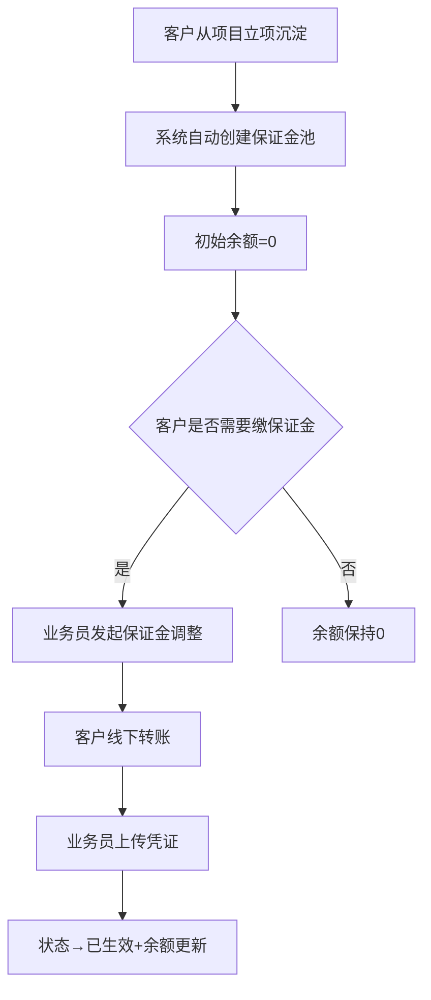
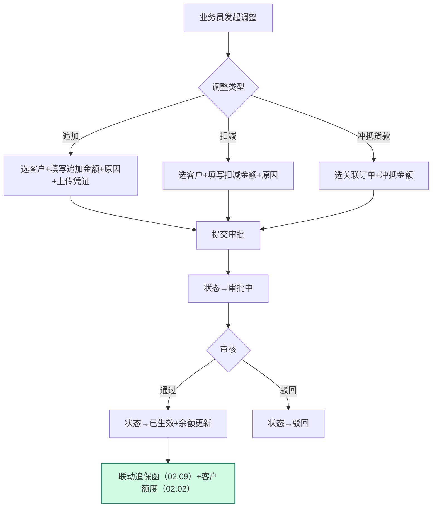
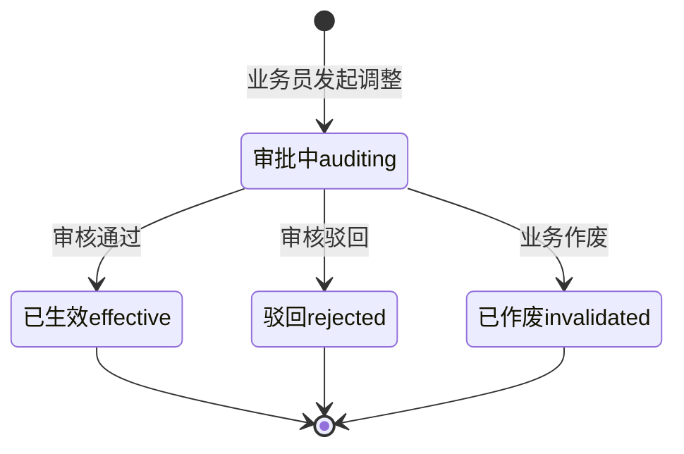

# 02.10 保证金管理 v1.0 终版

> **状态**：v1.0 终版（**新顶级模块，基于原型 46-48 截图**）
> **生成时间**：2026-07-24 14:55
> **配套文档**：[00-项目总览与对接.md](../00-项目总览与对接.md) / [01-模块拆解大框架.md](../01-模块拆解大框架.md) / [02.09-追保函管理.md](./02.09-追保函管理.md) / [02.08-盯市价格管理.md](./02.08-盯市价格管理.md)
> **复用度**：🟡 **50%（部分复用+新建）**——主产品 `t_payment_margin_voucher` 借用，新建 `t_margin_pool` 客户保证金池

---

## 0. 章节导航

1. 业务定位
2. 业务流程全景
3. 核心实体（3 张表）
4. 状态机
5. 字段规则
6. 按钮交互
7. 异常处理
8. 跨模块流转
9. 复用建议

---

## 1. 业务定位

**保证金管理**是港通供应链的**客户保证金池管理**（**v1.0 新顶级模块**）——按客户维度管理保证金池，支持保证金调整（追加/扣减）和调整记录追溯。

**港通特色**——主产品只有单笔追保函，港通需要「客户保证金池」概念。

### 1.1 关键规则

1. **客户保证金池**：每个客户一个保证金池，记录余额 + 变动
2. **保证金调整**：追加保证金 / 扣减保证金 / 冲抵货款
3. **调整记录**：所有保证金变动都有详细记录（含原因/凭证）
4. **联动追保函**：追保函已生效 → 自动更新保证金池

### 1.2 3 个页面（sitemap）

| # | 页面 | 说明 |
|---|------|------|
| 1 | **保证金管理**（列表）| 客户保证金池列表 + 余额/调整记录 |
| 2 | **保证金调整** | 新建保证金调整（追加/扣减）|
| 3 | **调整记录** | 调整历史流水 |

---

## 2. 业务流程全景

### 2.1 保证金池初始化



### 2.2 保证金调整流程



---

## 3. 核心实体（3 张表）

### 3.1 `t_margin_pool` 客户保证金池（**v1.0 新建**）

| 字段 | 类型 | 必填 | 说明 |
|------|------|------|------|
| `id` | bigint PK | - | 主键 |
| `company_id` | bigint | ✓ | 客户 ID（来自 02.02）|
| `company_name` | varchar(128) | - | 客户名称（冗余）|
| `total_balance` | decimal(20,2) | ✓ | **保证金总余额** |
| `used_balance` | decimal(20,2) | - | **已占用余额**（冲抵货款时占用）|
| `available_balance` | decimal(20,2) | - | **可用余额** = 总余额 - 已占用 |
| `warn_line` | decimal(20,2) | - | 余额预警线 |
| `red_line` | decimal(20,2) | - | 余额红线 |
| `status` | varchar(20) | ✓ | `active` / `frozen` / `closed` |
| `create_time` | datetime | ✓ | - |
| `update_time` | datetime | ✓ | - |

### 3.2 `t_margin_record` 保证金变动记录

| 字段 | 类型 | 必填 | 说明 |
|------|------|------|------|
| `id` | bigint PK | - | 主键 |
| `pool_id` | bigint | ✓ | 关联保证金池 |
| `change_type` | varchar(20) | ✓ | `add`（追加）/ `deduct`（扣减）/ `offset`（冲抵货款）/ `bond_letter`（追保函）|
| `change_amount` | decimal(20,2) | ✓ | 变动金额（正=追加，负=扣减）|
| `before_balance` | decimal(20,2) | - | 变动前余额 |
| `after_balance` | decimal(20,2) | - | 变动后余额 |
| `related_bond_letter_id` | bigint | - | 关联追保函 ID（追保函类型时）|
| `related_order_id` | bigint | - | 关联订单 ID（冲抵货款时）|
| `payment_voucher_url` | varchar(255) | - | 付款凭证 URL（线下转账时）|
| `reason` | varchar(500) | - | 调整原因 |
| `operator_id` | bigint | ✓ | 操作人 |
| `create_time` | datetime | ✓ | - |

### 3.3 `t_margin_offset` 保证金冲抵货款（**v1.0 新建**）

| 字段 | 类型 | 必填 | 说明 |
|------|------|------|------|
| `id` | bigint PK | - | 主键 |
| `pool_id` | bigint | ✓ | 关联保证金池 |
| `order_id` | bigint | ✓ | 关联订单 |
| `offset_amount` | decimal(20,2) | ✓ | 冲抵金额 |
| `offset_type` | varchar(20) | ✓ | `proportional`（等比例）/ `full_until_last`（全额维持至尾批）|
| `operator_id` | bigint | ✓ | 操作人 |
| `create_time` | datetime | ✓ | - |

---

## 4. 状态机



### 4.1 3 状态说明

| # | 状态 | 中文 | 触发 | 出口 |
|---|------|------|------|------|
| 1 | `auditing` | 审批中 | 业务员发起 | 审核通过/驳回/作废 |
| 2 | `effective` | 已生效 | 审核通过 | 终态 |
| 3 | `rejected` | 驳回 | 审核驳回 | 终态 |
| 4 | `invalidated` | 已作废 | 业务作废 | 终态 |

---

## 5. 字段规则

### 5.1 调整类型 `change_type`

- 4 种：`add`（追加）/ `deduct`（扣减）/ `offset`（冲抵货款）/ `bond_letter`（追保函）

### 5.2 冲抵类型 `offset_type`（**港通特色**）

- 2 种：
  - `proportional`（等比例减少保证金）
  - `full_until_last`（全额维持至尾批，**v1.0 待确认业务**）

### 5.3 余额计算

```
可用余额 = 总余额 - 已占用余额
```

---

## 6. 按钮交互

### 6.1 列表页

| 按钮 | 位置 | 可见条件 | 点击行为 |
|------|------|---------|---------|
| **新增保证金调整** | 右上 | 业务员 | 弹调整对话框 |
| 数据导出 | Tab 右侧 | 所有 | 导出 Excel |
| **详情** | 列表行 | 所有 | 跳详情页 |

### 6.2 列表字段

| 列 | 说明 |
|---|------|
| 客户名称 | 公司名称 |
| 总余额 | 当前总余额 |
| 已占用 | 冲抵占用余额 |
| 可用余额 | 总余额 - 已占用 |
| 状态 | active / frozen / closed |
| 操作 | 详情 / 调整 |

### 6.3 调整对话框

- **调整类型**（必填）：追加 / 扣减 / 冲抵货款
- **客户**（必填）：下拉选择
- **金额**（必填）：数字
- **原因**（必填）：文本
- **付款凭证**（追加时必填）：上传图片/PDF
- **关联订单**（冲抵货款时必填）：选择订单
- **关联追保函**（追保函类型时必填）：选择追保函

---

## 7. 异常处理

| 异常场景 | 提示文案 | 处理动作 |
|---------|---------|---------|
| 扣减金额 > 可用余额 | "扣减金额 X 超过可用余额 Y" | 阻止 |
| 冲抵金额 > 订单未付金额 | "冲抵金额 X 超过订单未付金额 Y" | 阻止 |
| 客户已被冻结 | "客户 X 已被冻结，不能调整保证金" | 阻止 |
| 客户已作废 | "客户 X 已作废，不能调整保证金" | 阻止 |
| 余额跌破预警线 | "客户 X 保证金余额跌破预警线" | 黄灯提醒 |
| 余额跌破红线 | "客户 X 保证金余额跌破红线" | 触发追保函 |

---

## 8. 跨模块流转

### 8.1 上游触发

| 触发模块 | 触发条件 | 触发动作 |
|---------|---------|---------|
| 客户管理（02.02）| 客户从项目立项沉淀 | 自动创建保证金池 |
| 追保函（02.09）| 追保函已生效 | 自动追加保证金到池 |

### 8.2 下游触发

| 触发模块 | 触发条件 | 触发动作 |
|---------|---------|---------|
| 客户额度（02.02）| 保证金变化 | 更新客户可用额度 |
| 订单付款（02.04）| 冲抵货款 | 占用保证金 |
| 预警中心（02.11）| 余额跌破预警线/红线 | 触发预警信号 |

---

## 9. 复用建议

### 9.1 复用度

**🟡 50%（部分复用+新建）**

| 类别 | 数量 | 复用度 |
|------|------|--------|
| 复用主产品表 | 1 张 | 60% |
| 港通新建表 | 2 张 | - |

### 9.2 复用主产品表

- `t_payment_margin_voucher`（保证金凭证）

### 9.3 港通新建表

- `t_margin_pool` 客户保证金池（**v1.0 港通特色**）
- `t_margin_record` 保证金变动记录
- `t_margin_offset` 保证金冲抵货款

### 9.4 给研发的实施建议

1. **第一周**：建 `t_margin_pool` 保证金池 + 客户关联
2. **第二周**：建 4 种调整类型（追加/扣减/冲抵/追保函）
3. **第三周**：建 3 状态机 + 余额计算
4. **第四周**：跨模块集成（追保函/客户额度/预警）

---

## 10. 文档版本

- **v1.0（2026-07-24 14:55）**：基于 46-48 截图 + sitemap 首次终版，作为范本用于后端开发
- 修改记录：见 `06-修改记录.md`
---

## 修改记录

### v1.7.99.x（2026-07-28）

- 🟡 列表页占位 = "全部"（全站统一）
- 🟡 列表页规范升级（v1.7.99 全局）
- 🟡 状态 tag 颜色编码（v1.7.99.14）
- 🟡 流程图统一用 Mermaid（v1.7.99.6）
- 详见：[v1.7.99-changelog.md](./v1.7.99-changelog.md)（30+ 版本汇总）

---

## 11. v1.7.99.x 模块级增量补充（基于飞书《用户使用手册》沉淀）

> **本节追加于 2026-09-24**
> **需求来源**：飞书《豫港通用户使用手册（内部版）》第 6.4 节"保证金管理" + 本仓库 v1.7.99.196 / 337 / 341 / 345 / 346 / 349 改造沉淀
> **v1.0 文档骨架（1-10 节）保持不变**，本节仅补充 v1.7.99.x 后未明的业务规则、公式口径、跨模块联动、详细页面 PRD 索引
> **复用度**：🟢 90%（v1.0 骨架 + v1.7.99.x 增量）

### 11.1 模块业务变化（v1.0 → v1.7.99.349）

| 维度 | v1.0 文档 | v1.7.99.349 现状 |
|------|----------|------------------|
| 页面清单 | 3 页（保证金管理/调整/调整记录） | **6 页**：保证金池 / 登记 / 调整 / 调整记录详情 / 流水 / 等比例冲抵配置 |
| 业务语义 | "调整"统称（追加/扣减） | **v1.7.99.341 后** 严格分**登记**（资金流入）与**调整**（资金转移/冲抵/退款）|
| 调整方式 | 追加/扣减/冲抵/追保函（4 种） | **v1.7.99.196 重写** 为：冲抵最后一笔货款 / 转移为另一笔业务 / 保证金退款（3 种）|
| 等比例冲抵 | 未提及 | **v1.7.99.349 新增**：保证金池每行支持"等比例冲抵货款"开关 + 冲抵比例（X%），影响未来付款按比例自动冲抵保证金 |
| 足额校验 | 未提及 | **v1.7.99.345 足额硬卡**：未足额禁止开启等比例冲抵（业务合规底线） |
| 修改冲抵比例 | 未提及 | **v1.7.99.346 修改策略 B**：允许修改，未来笔按新比例，已完成不回溯，变更记录最多 10 条 |

### 11.2 5 个 KPI 指标权威口径（来自飞书手册第 6.4 节）

> **口径锁定**：下述定义是**产品/技术/财务三方一致口径**，任何 v1.7.99.x 改造必须保留等式成立。

| KPI | 计算公式 | 含义 | 备注 |
|-----|----------|------|------|
| **付款总金额** | `SUM(所有采购合同的付款金额)` | 平台业务规模 | 反映敞口基础 |
| **已回款总金额** | `SUM(所有销售合同的回款金额)` | 平台回款规模 | 反映已实现资金 |
| **敞口金额** | `付款总金额 - 已回款总金额` | 风险敞口 | ⚠️ 公式不可颠倒 |
| **当前保证金金额** | `已回款总金额 × 保证金百分比` | 应缴保证金 | 来自保证金百分比配置 |
| **当前保证金比例** | `当前保证金金额 / 敞口金额 × 100%`（**四舍五入保留 2 位小数**）| 风险敞口指标 | 触发阈值规则: 30%/20%/10% 预警 |

**v1.0 vs v1.7.99.x 算法一致性**：v1.0 文档采用相同公式，v1.7.99.x 改造保留。

### 11.3 3 种保证金调整方式（v1.7.99.196 重写，手册确认）

| 调整方式 | 含义 | 触发场景 | 字段要点 |
|----------|------|----------|----------|
| **冲抵最后一笔货款** | 将当前剩余保证金登记为货款 | 客户要求保证金抵货款 | 当前保证金（灰置）+ 冲抵货款金额（≤ 当前保证金）+ 情况说明 + 附件 |
| **转移为另一笔业务的保证金** | 将当前剩余保证金转移至关联合同 | 多合同间余额调度 | 当前保证金（灰置）+ 转移金额（≤ 当前保证金）+ 选择合同（**仅限"执行中 / 待上传双签合同"**）+ 情况说明 |
| **保证金退款** | 直接登记退款（OA + NC）| 客户终止合作 | 当前保证金（灰置）+ 申请退款金额 + 收款账号名称（带出账号/开户行）+ 退款日期 + 情况说明 |

**v1.0 vs v1.7.99.196 关键决策**：
- 旧版"追加/扣减"分类法不准确——"追加"本质是"保证金**登记**"，"扣减"对应 3 种调整方式之一
- v1.7.99.196 重写后语义更贴近业务真实：登记（资金流入）vs 调整（资金流出）

### 11.4 等比例冲抵货款（v1.7.99.349 关键新增）

**核心场景**：客户开启"等比例冲抵"后，**未来每笔付款**按冲抵比例 X% 自动从保证金账户抵扣货款，无需业务人员手动操作。

**3 个关键控制点**：

| 控制点 | 规则 | 版本 |
|--------|------|------|
| **足额硬卡** | `paid >= payTotal` 才允许开启等比例冲抵；未足额开关 disabled + 红字"未足额"徽标 | v1.7.99.345 |
| **修改 depositRatio 策略** | 允许修改；未来笔按新比例；已完成不回溯；变更记录最多 10 条 | v1.7.99.346 |
| **配置入口** | 保证金池列表页（统一入口）；登记页 / 详情页 / 新建页只读展示 | v1.7.99.349 |

**配置示例**：
```
合同: GTGYL-DFHT-2024-001
敞口金额: ¥1,000,000
已付保证金: ¥600,000   ← 不足
等比例冲抵开关: [灰色禁用]
配置入口徽标: 「未足额：还差 ¥400,000」

合同: YL-MSXS-2024-088
敞口金额: ¥1,200,000
已付保证金: ¥1,250,000  ← 超额
等比例冲抵开关: [紫色"开"]   ← 已开启
配置入口徽标: 「已开启 冲抵比例 25%」
未来付款¥100,000 → 自动冲抵保证金 ¥25,000
```

### 11.5 跨模块联动（v1.7.99.x 增强）

| 联动系统 | v1.0 描述 | v1.7.99.x 增强 |
|----------|-----------|----------------|
| **OA 系统** | 已记录 | v1.7.99.196 强化：6 状态机 + 驳回重提路径 |
| **NC 系统**（仅退款）| 文字提及 | v1.7.99.196 强化：**NC 完成打款后回传"实际金额"**，详情页操作记录 tab 自动回显；差额自动调整 |
| **追保函管理（02.09）**| 已记录 | 追保函未生效 → 保证金池状态=待追保（v1.7.99.x）|
| **客户额度（02.02）**| 已记录 | 联动方式不变；保证金池余额变化不重算客户额度（**保证金不等同于回款**）|
| **等比例冲抵配置**（新增）| 无 | v1.7.99.349：保证金池每行可开启/调整；登记页只读 |
| **保证金流水（margin-record）**| 未单独提及 | 每次登记/调整 → 生成 1 条流水记录 |

### 11.6 异常处理（v1.7.99.x 补充）

| 场景 | v1.7.99.x 处理 |
|------|-----------------|
| 等比例冲抵"未足额"试图开启 | **v1.7.99.345 足额硬卡**：开关 disabled + 红字"未足额"徽标 + tooltip 含具体差额 |
| 调整 depositRatio | **v1.7.99.346 策略 B**：弹窗二次确认 + 历史不回溯 + 变更记录最多 10 条 |
| 保证金登记"超额" | 顶部橙色 bar 提示"该合同保证金已足额，登记会超额" + 提供"查看保证金池"链接 |
| 同一合同并发登记 | 提交时二次校验已付金额，如已被另一笔登记覆盖则提示"已被其他登记覆盖，请刷新后重试" |
| OA 审核驳回 | v1.7.99.196 后在 margin-adjust-detail.html 支持"调整后重提"路径 |
| 合同已作废发起调整 | 提示"合同已作废，无法调整"（v1.0 已记录 → v1.7.99.x 强化）|
| 转移时关联合同状态非"执行中/待上传双签合同" | 提示"请选择执行中或待上传双签合同"（v1.7.99.196 新增）|

### 11.7 详细页面 PRD 索引

| 页面 | PRD 文档 | 当前版本 |
|------|----------|----------|
| `margin-pool.html` | [p-margin-pool.md](./p-margin-pool.md) | v1.7.99.196 终版 + v1.7.99.337/339/341/343/345/346/349 沉淀 |
| `margin-register.html` | [p-margin-register.md](./p-margin-register.md) | **2026-09-24 新写**（基于手册 6.4 节 + v1.7.99.349）|
| `margin-adjust.html` | [p-margin-adjust.md](./p-margin-adjust.md) | v1.7.99.196 终版 |
| `margin-adjust-detail.html` | [p-margin-adjust-detail.md](./p-margin-adjust-detail.md) | v1.7.99.196 终版 |
| `margin-record.html` | **待补** | 缺 PRD（A 批范围）|

### 11.8 详细业务规则沉淀（来自手册 6.4 节）

**保证金池（列表页）**：
- 按业务线汇总——创建销售合同时，填写保证金比例后自动生成一条待缴保证金记录
- 5 个 KPI 卡片按 11.2 节公式实时计算

**保证金调整（操作页）**：
- 第一步：点击保证金管理页面中「保证金调整」按钮
- 第二步：选择保证金调整信息模块中的选项（调整方式 / 调整金额 / 情况说明 / 附件）
- 第三步：录入必填项后提交即可（→ OA 审核 + NC 退款）

**调整记录（详情页）**：
- 列表展示所有调整记录，含调整方式/金额/状态/审核人/审核时间
- 详情页含 2 个 tab：调整信息 + 操作记录（NC 实际打款回传）

### 11.9 增量补充版 v1.7.99.x 修改记录

- **v1.7.99.196（2026-08-07）**：保证金调整重写（3 种方式 + OA/NC 联动 + 6 状态机）
- **v1.7.99.337（2026-09-22）**：保证金池加"登记保证金"按钮（v1.7.99.339 抽屉化）
- **v1.7.99.338**：登记页 section 改名 + 合同设定比例 + 本次登记保证金换行
- **v1.7.99.341（2026-09-23）**：保证金登记独立化（margin-register 从 margin-adjust 拆出）
- **v1.7.99.342**：deposit-offset-config 去 switch → 状态徽标回显
- **v1.7.99.345（2026-09-23）**：等比例冲抵**足额硬卡**
- **v1.7.99.346**：depositRatio **修改策略 B**
- **v1.7.99.349**：保证金池的等比例冲抵配置**统一在保证金池页**（登记页只读）+ pill 按钮重构
- **2026-09-24**：基于飞书《用户使用手册》第 6.4 节补充模块级业务口径（**本节第 11 节**）
