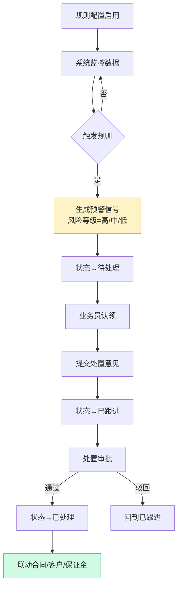
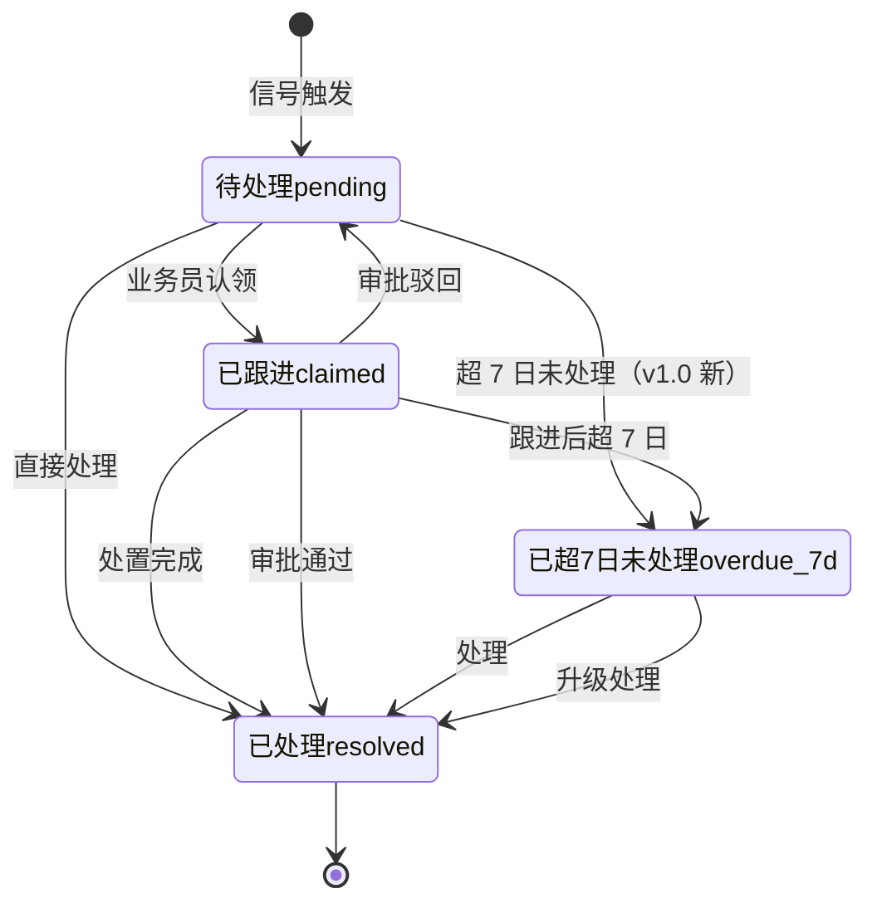

# 02.11 预警中心 v1.0 终版

> **状态**：v1.0 终版（**新顶级模块，基于原型 79-81 截图**）
> **生成时间**：2026-07-24 14:55
> **配套文档**：[00-项目总览与对接.md](../00-项目总览与对接.md) / [01-模块拆解大框架.md](../01-模块拆解大框架.md) / [02.10-保证金管理.md](./02.10-保证金管理.md) / [02.08-盯市价格管理.md](./02.08-盯市价格管理.md)
> **复用度**：🟢 **90%（大幅复用）**——主产品 `bo_risk_alert_config` + `bo_risk_alert_record` + `bo_risk_alert_template` 高度匹配

---

## 0. 章节导航

1. 业务定位
2. 业务流程全景
3. 核心实体（3 张表）
4. 5 状态机
5. 字段规则
6. 按钮交互
7. 异常处理
8. 跨模块流转
9. 复用建议
10. 文档版本
11. **v1.7.99.101 改造子章节**（预警列表页 3 tab 重制：数据概览 3 张柱状图 + 企业监控/交易监控/价格波动 3 tab）
12. **v1.7.99.103 改造子章节**（预警列表页按 user 实际业务截图细化：3 个 tab 表格新增"预警解除时间"列 + Tab1 新增"统一社会信用代码"列 + 状态值精确化 + 筛选样式 label 上对齐强化 + 去掉虚线框）
13. **v1.7.99.104 改造子章节**（预警规则配置页 3 tab 重制：按 user 实际业务图 1:1 重制 v1.7.99.13 占位版 + 3 套筛选 + 3 套表格 + 状态开关 + 风险等级下拉 + sidemenu label 改"预警规则管理"→"预警规则配置"）

---

## 1. 业务定位

**预警中心**是港通供应链的**预警信号监控中心**（**v1.0 新顶级模块**）——基于规则配置，监控企业/交易/价格波动，触发预警信号并跟踪处置。

**港通特色**——3 大预警类型：**企业监控** / **交易监控** / **价格波动**（基于 79 截图）。

### 1.1 关键规则

1. **2 个子菜单**（基于 79 截图）：**预警查询** / **预警设置**
2. **3 大预警类型**：
   - **企业监控**（客户黑名单/失信被执行/风险等级变化等）
   - **交易监控**（合同超期/订单异常/付款逾期等）
   - **价格波动**（指数跌破预警线/红线）
3. **3 风险等级**：高/中/低（带颜色标记）
4. **4 状态**：待处理 / 已跟进 / 已处理 / 已超 7 日仍未处理

### 1.2 3 个页面（sitemap）

| # | 页面 | 说明 |
|---|------|------|
| 1 | **预警列表页**（数据概览 + 预警数据）| 3 卡片统计 + 3 Tab 列表 |
| 2 | **预警详情页** | 单个预警信号详情 + 处置 |
| 3 | **预警规则配置** | 规则新增/编辑/启用/停用 |

---

## 2. 业务流程全景

### 2.1 预警信号流转流程

---

## 3. 核心实体（3 张表）

### 3.1 `t_warning_rule` 预警规则

| 字段 | 类型 | 必填 | 主产品 | 说明 |
|------|------|------|--------|------|
| `id` | bigint PK | - | ✓ | 主键 |
| `rule_name` | varchar(128) | ✓ | ✓ | 规则名称 |
| `rule_type` | varchar(20) | ✓ | ✓ | `enterprise`（企业监控）/ `transaction`（交易监控）/ `price`（价格波动）|
| `rule_target` | varchar(64) | - | ✓ | 监控对象（客户/合同/订单/指数）|
| `indicator` | varchar(64) | ✓ | ✓ | 监控指标（黑名单/逾期/跌破预警线）|
| `threshold` | decimal(20,4) | - | ✓ | 阈值 |
| `comparison` | varchar(10) | - | ✓ | 比较符（`>` / `<` / `=` / `>=` / `<=`）|
| `frequency` | varchar(20) | - | ✓ | 监控频率（实时/日/周）|
| `risk_level` | varchar(20) | - | - | **风险等级（v1.0）**：`high` / `medium` / `low` |
| `template_id` | bigint | - | ✓ | 关联预警模板 |
| `is_active` | tinyint | ✓ | ✓ | 0=停用, 1=启用 |
| `creator_id` | bigint | ✓ | ✓ | 创建人 |
| `create_time` | datetime | ✓ | ✓ | - |
| `update_time` | datetime | ✓ | ✓ | - |

### 3.2 `t_warning_signal` 预警信号

| 字段 | 类型 | 必填 | 主产品 | 说明 |
|------|------|------|--------|------|
| `id` | bigint PK | - | ✓ | 主键 |
| `rule_id` | bigint | ✓ | ✓ | 关联规则 |
| `rule_name` | varchar(128) | - | - | 规则名称（冗余）|
| `signal_type` | varchar(20) | ✓ | - | **信号类型（v1.0）**：`enterprise` / `transaction` / `price` |
| `target_type` | varchar(20) | ✓ | ✓ | 目标类型（客户/合同/订单/指数）|
| `target_id` | bigint | ✓ | ✓ | 目标 ID |
| `target_name` | varchar(128) | - | - | 目标名称 |
| `signal_content` | text | - | - | **预警内容**（人类可读）|
| `risk_level` | varchar(20) | - | - | **风险等级（v1.0）**：`high` / `medium` / `low` |
| `trigger_indicator` | varchar(128) | - | - | 触发指标（v1.0）|
| `trigger_value` | decimal(20,4) | - | - | 触发值 |
| `signal_date` | date | - | - | 预警日期（v1.0）|
| `status` | varchar(20) | ✓ | ✓ | **4 状态**（见 §4）|
| `handler_id` | bigint | - | - | 处理人 |
| `handler_name` | varchar(64) | - | - | 处理人姓名 |
| `handle_time` | datetime | - | - | 处理时间 |
| `handle_opinion` | text | - | - | 处置意见 |
| `is_overdue_7d` | tinyint | - | - | **是否超 7 日未处理（v1.0）** |
| `create_time` | datetime | ✓ | ✓ | - |

### 3.3 `t_warning_template` 预警模板

| 字段 | 类型 | 必填 | 主产品 | 说明 |
|------|------|------|--------|------|
| `id` | bigint PK | - | ✓ | 主键 |
| `template_name` | varchar(128) | ✓ | ✓ | 模板名称 |
| `template_type` | varchar(20) | ✓ | ✓ | 模板类型（`enterprise`/`transaction`/`price`）|
| `content` | longtext | ✓ | ✓ | 模板内容（带变量占位符）|
| `variables` | text | - | ✓ | 变量定义（JSON）|
| `is_active` | tinyint | ✓ | ✓ | 0=停用, 1=启用 |
| `creator_id` | bigint | ✓ | ✓ | 创建人 |
| `create_time` | datetime | ✓ | ✓ | - |

---

## 4. 4 状态机（**v1.0 新增第 4 状态**）

### 4.1 4 状态说明（基于 79 截图）

| # | 状态 | 中文 | 触发 | 出口 |
|---|------|------|------|------|
| 1 | `pending` | 待处理 | 信号触发 | 已跟进 / 已处理 / 已超 7 日未处理 |
| 2 | `claimed` | 已跟进 | 业务员认领 | 已处理 / 回到待处理 / 已超 7 日未处理 |
| 3 | `resolved` | 已处理 | 处置完成/审批通过 | 终态 |
| 4 | `overdue_7d` | **已超 7 日仍未处理**（v1.0 新）| 超 7 日未处理 | 已处理 / 升级处理 |

---

## 5. 字段规则

### 5.1 预警类型 `rule_type` / `signal_type`

- 3 种（基于 79 截图）：
  - **`enterprise`**（企业监控）
  - **`transaction`**（交易监控）
  - **`price`**（价格波动）

### 5.2 风险等级 `risk_level`（**v1.0 新增**）

- 3 种：`high` / `medium` / `low`（带颜色标记）

### 5.3 是否超 7 日未处理 `is_overdue_7d`（**v1.0 新增**）

- 0/1
- 系统自动计算：当前日期 - signal_date > 7 天

---

## 6. 按钮交互

### 6.1 列表页（基于 79 截图）

#### 6.1.1 顶部数据概览（3 卡片）

| 卡片 | 字段 |
|------|------|
| **预警总计** | 总数（如 10000 条）|
| **未处理预警** | 待处理 + 已跟进 + 已超 7 日未处理（如 5000 条）|
| **超 7 日未处理** | 已超 7 日未处理（如 3000 条）|

每个卡片有 4 个图例：全部 / 高风险 / 中风险 / 低风险 + 3 维度柱状图：企业监控 / 交易监控 / 价格波动

#### 6.1.2 预警数据列表

| 筛选 | 说明 |
|------|------|
| **预警日期** | 开始日期 ~ 结束日期 |
| **规则名称** | 模糊搜索 |
| **规则类型** | 下拉（企业监控/交易监控/价格波动）|
| **触发预警指标** | 文本输入 |
| **风险等级** | 下拉（高/中/低）|
| 按钮 | 查询 / 重置 / 导出 |

#### 6.1.3 3 大 Tab

| Tab | 说明 |
|-----|------|
| **企业监控** | 客户风险/黑名单/失信被执行等 |
| **交易监控** | 合同超期/订单异常/付款逾期等 |
| **价格波动** | 指数跌破预警线/红线 |

#### 6.1.4 4 状态 Tab

| Tab | 说明 |
|-----|------|
| 全部 | 所有 |
| 待处理 (70) | `pending` |
| 已跟进 (30) | `claimed` |
| 已处理 (300) | `resolved` |
| **已超 7 日仍未处理 (20)**（v1.0 新）| `overdue_7d` |

#### 6.1.5 列表字段

| 列 | 说明 |
|---|------|
| 预警日期 | signal_date |
| 预警内容 | signal_content |
| 风险等级 | 高/中/低（带颜色）|
| 预警状态 | 4 状态之一 |
| 规则名称 | rule_name |
| 规则类型 | enterprise/transaction/price |
| 触发[指标] | trigger_indicator |
| 操作 | 详情/认领/处置 |

---

## 7. 异常处理

| 异常场景 | 提示文案 | 处理动作 |
|---------|---------|---------|
| 信号未配置模板 | "规则 X 未配置预警模板" | 阻止信号生成 |
| 触发值超出指标范围 | "触发值 X 超出指标 Y 范围" | 黄灯提醒 |
| 已超 7 日未处理 | "预警 X 已超 7 日未处理" | 升级通知到上级 |
| 同规则 24h 内重复触发 | "同规则 24h 内已触发 X 次，合并为 1 条" | 合并信号 |

---

## 8. 跨模块流转

### 8.1 上游触发

| 触发模块 | 触发条件 | 触发动作 |
|---------|---------|---------|
| 客户管理（02.02）| 客户风险等级变化/黑名单命中 | 触发企业监控 |
| 合同/订单（02.03/02.04）| 合同超期/订单异常/付款逾期 | 触发交易监控 |
| 盯市价格（02.08）| 指数跌破预警线/红线 | 触发价格波动 |
| 保证金（02.10）| 余额跌破预警线/红线 | 触发企业监控/交易监控 |

### 8.2 下游触发

| 触发模块 | 触发条件 | 触发动作 |
|---------|---------|---------|
| 客户管理（02.02）| 高风险预警已处理 | 更新客户风险等级 |
| 合同管理（02.03）| 交易监控预警已处理 | 通知业务员 |
| 追保函（02.09）| 价格波动预警已处理 | 触发追保函 |

---

## 9. 复用建议

### 9.1 复用度

**🟢 90%（大幅复用）**

| 类别 | 数量 | 复用度 |
|------|------|--------|
| 直接复用主产品表 | 3 张 | 100% |
| 港通新建表 | 0 张 | - |

### 9.2 直接复用主产品表

- `bo_risk_alert_config` 预警规则
- `bo_risk_alert_record` 预警信号
- `bo_risk_alert_template` 预警模板

### 9.3 给研发的实施建议

1. **第一周**：直接复用主产品 3 张表
2. **第二周**：建 3 大预警类型（企业/交易/价格）
3. **第三周**：建 4 状态机 + 7 日超时检测
4. **第四周**：跨模块集成（11 个数据源）

---

## 10. 文档版本

- **v1.0（2026-07-24 14:55）**：基于 79 截图 + sitemap 首次终版，作为范本用于后端开发
- 修改记录：见 `06-修改记录.md`
---

## 修改记录

### v1.7.99.x（2026-07-28）

- 🟡 列表页占位 = "全部"（全站统一）
- 🟡 列表页规范升级（v1.7.99 全局）
- 🟡 预警列表页 3 tab 重制（v1.7.99.101，2026-08-04）—— v1.7.99.13 占位版（9 列 1 个状态 18 条 mock）→ v1.7.99.101 1:1 重制 user 3 张图：**顶部数据概览 3 张柱状图**（预警总计 10000 条 + 未处理预警 5000 条 + 超 7 日未处理 3000 条 + 3 维度 企业监控/交易监控/价格波动 + 4 图例 全部/高风险/中风险/低风险 + 堆叠 3 色 红/黄/蓝 + **inline SVG 渲染**避免引入图表库）+ **3 tab 切换**（企业监控 active 紫框 / 交易监控 绿框 / 价格波动 绿框）+ **3 套筛选区**（企业监控 6 字段：预警日期/规则类型/规则名称/风险等级/企业名称/企业类型；交易监控 5 字段：预警日期/规则名称/规则类型/触发预警指标/风险等级；价格波动 8 字段：预警日期/规则类型/规则名称/风险等级/合同编号/下游实际负责人/业务线名称/业务品种）+ **3 套状态 tab**（企业监控 5 状态：全部 2000/待处理 700/已跟进 300/已处理 1000/超 7 日未处理 20；交易监控 5 状态：全部 2000/待处理 70/已跟进 30/已处理 300/已超 7 日未处理 20；价格波动 8 状态：全部 2000/待处理 70/已跟进 30/**待风险管理 5**/**审批驳回 200**/**超期预警 200**/已处理 2200/超 7 日未处理 20）+ **3 套表格 mock**（企业监控 12 列 10 行微山鑫久泰商贸+陕西朕煤+国家能源投资集团 工商信息变更类；交易监控 11 列 10 行 CCI 5500 煤炭 价格波动 5% 触发预警类；价格波动 13 列 10 行 XJXNGYL-DSRMT-202212-002 合同监控类 王涛 138 0000 XXXX）
- 🟡 预警列表页按 user 实际业务截图细化（v1.7.99.103，2026-08-04）—— v1.7.99.101 重制版 → v1.7.99.103 按 user 最新 3 张实际业务截图细化：**3 个 tab 表格新增"预警解除时间"列**（v1.7.99.101 缺该列）+ **Tab1 企业监控新增"统一社会信用代码"列**（v1.7.99.101 缺该列；表格 10 列 → 12 列）+ **Tab1 mock 数据调整**（微山鑫久泰 3 行 → 4 行 + 国家能源 3 行 + 陕西朕煤 4 行 → 3 行，总 10 行不变）+ **Tab2 交易监控 7 煤炭 + 3 钢材**（触发指标：煤炭 CCI 5500 / 钢材 钢材指数）+ **Tab3 价格波动状态值精确化**（"待风险管理" → "待风险审批" + "审批驳回"；"已处理" → "已处理(人工)"）+ **筛选样式 label 上对齐强化**（v1.7.99.102 改过但 v1.7.99.103 兜底强化 CSS `.wl-filter .ff-cell { display: flex; flex-direction: column; gap: 6px; }` + 去掉 11 个 label 冒号）+ **去掉 3 个 tab 虚线框**（v1.7.99.102 删了 `.wl-dashed-purple` / `.wl-dashed-green` CSS，v1.7.99.103 兜底确认 HTML 无残留）
- 🟡 预警规则配置页新增（v1.7.99.104，2026-08-04）—— v1.7.99.13 占位版（5 状态 tab + 9 列表格 3 行 mock + 6 字段筛选 + 单一列表）→ v1.7.99.104 按 user 3 张实际业务图 1:1 重制：**3 tab 切换**（企业监控/交易监控/价格波动）+ **3 套筛选区**（Tab1 企业监控 4 字段：规则类型/规则名称/状态/风险等级；Tab2 交易监控 7 字段：规则类型/规则名称/状态/风险等级/业务品种/业务类型/资金类型；Tab3 价格波动 6 字段：规则名称/规则类型/状态/风险等级/业务品种/是否关联合同）+ **3 套表格 mock**（Tab1 8 列表格 10 行 工商变更 5/司法诉讼 3/经营风险 2 + Tab2 13 列表格 10 行 全部煤炭 + Tab3 14 列表格 10 行 9 煤炭 + 1 钢材）+ **状态列 iOS 风格蓝开关**（10 个 ON，沿用 v1.7.99.91 经验）+ **风险等级下拉 select**（全部"高"红色字体）+ **操作列**（Tab1 无 / Tab2 编辑 / Tab3 编辑 + 合同配置 2 链接）+ **+ 添加规则按钮**（Tab2/Tab3 含，Tab1 不含——按 user 图 1 实际）+ **sidemenu label 改**"预警规则管理" → "预警规则配置"（v1.7.99.91 经验：user 实际命名变更）+ **筛选样式 label 上对齐强化**（沿用 v1.7.99.103 经验 + 不带冒号）+ **0 虚线框**（沿用 v1.7.99.102/103 经验）
- 🟡 状态 tag 颜色编码（v1.7.99.14）
- 🟡 流程图统一用 Mermaid（v1.7.99.6）
- 详见：[v1.7.99-changelog.md](./v1.7.99-changelog.md)（30+ 版本汇总）

---

## 11. v1.7.99.101 改造子章节（预警列表页 3 tab 重制：数据概览 3 张柱状图 + 3 tab）

### 11.1 改造背景

2026-08-04 用户提 1 条需求 + 3 张图：
- **需求**：「上图1为预警列表tap2交易监控页面 / 上图2为预警列表tap3价格波动页面 / 上图3为预警列表tap1企业监控 / 按图所示，更新『预警管理』预警列表页面高保真原型」
- **图 1** = 交易监控 tab（5 字段筛选 + 5 状态 tab + 11 列表格 10 行 mock + **绿色虚线框**）
- **图 2** = 价格波动 tab（8 字段筛选 + **8 状态 tab** + 13 列表格 10 行 mock + **绿色虚线框**）
- **图 3** = 企业监控 tab（6 字段筛选 + 5 状态 tab + 12 列表格 10 行 mock + **紫色虚线框**）

**v1.7.99.101 关键决策**：
- **3 张柱状图数据概览跨 3 tab 共享**（v1.7.99.101 锁定：预警总计 10000 / 未处理预警 5000 / 超 7 日未处理 3000 + 3 维度 企业监控/交易监控/价格波动）
- **每个 tab 独立筛选区/状态 tab/表格/mock**（v1.7.99.101 决策：3 个 tab 业务实体不同，**筛选条件/状态数量/列数都不同**——**别共享**）
- **inline SVG 渲染柱状图**（v1.7.99.101 决策：避免引入 ECharts/Chart.js 等图表库，**inline SVG 堆叠柱状图** 60 行代码搞定）
- **紫色虚线框 = 企业监控**（v1.7.99.97 经验：紫色 = 风险/合规相关）+ **绿色虚线框 = 交易监控/价格波动**（v1.7.99.101 决策：业务监控相关用绿色）

### 11.2 改造范围

- **1 个 HTML 重制**：`pages/warning-list.html`（v1.7.99.13 占位版 9.2KB → v1.7.99.101 **47KB，+411%**）
  - v1.7.99.13 旧版：单一列表 + 9 列 1 个状态 18 条 mock + 占位筛选项
  - v1.7.99.101 新版：3 张柱状图 + 3 tab + 3 套筛选区 + 3 套状态 tab + 3 套表格 + 完整分页
- **2 个 MD 文档**：`docs/02.11-预警中心.md` §11 + 修改记录 + 章节导航 + `docs/v1.7.99-changelog.md` v1.7.99.101

### 11.3 数据概览 3 张柱状图（v1.7.99.101 锁定）

**3 列等宽 inline SVG 卡片**（v1.7.99.101 锁定）：
- **预警总计**：10000 条（堆叠柱状图）
- **未处理预警**：5000 条
- **超 7 日未处理**：3000 条

**每张柱状图结构**（v1.7.99.101 锁定）：
- **3 维度 X 轴**：企业监控 / 交易监控 / 价格波动
- **4 图例**：全部（灰 #94A3B8）/ 高风险（红 #DC2626）/ 中风险（黄 #F59E0B）/ 低风险（蓝 #3B82F6）
- **3 色堆叠**：每柱 high 30% + mid 35% + low 35%（v1.7.99.101 mock）
- **Y 轴**：0/500/1000 网格线（虚线）
- **inline SVG 渲染**（v1.7.99.101 决策：避免引入图表库，**60 行代码搞定**）
- **`splitBar(total)` 函数**（v1.7.99.101 经验）：计算每柱 high/mid/low 占比

**数据驱动**（v1.7.99.101 经验）：`OVERVIEW_DATA` 数组 + `X_LABELS` 数组 + `LEGEND` 数组 + `renderOverview()` 函数

### 11.4 3 tab 切换（v1.7.99.101 锁定）

**3 tab**（v1.7.99.101 沿用 v1.7.99.100 经验：active 蓝下划线）：
- **企业监控** (1000) — active（默认）
- **交易监控** (1000)
- **价格波动** (1000)

**核心逻辑**（v1.7.99.101 沿用 v1.7.99.100）：`switchWLTab(el, tabKey)` 函数 + classList.add/remove('active') + document.getElementById('wl-tab-' + tabKey).classList.add('active')

### 11.5 3 套筛选区（v1.7.99.101 锁定）

**Tab 1：企业监控**（v1.7.99.101 锁定 6 字段）：
- 预警日期（开始日期 ~ 结束日期）
- 规则类型（工商信息变更/被执行人/失信被执行人/限制高消费/严重违法）
- 规则名称（被执行人核查/被限制高消费/工商信息变更/法定代表人变更/登记状态:注销）
- 风险等级（高/中/低）
- 企业名称（文本输入）
- 企业类型（贸易商-一般贸易商/贸易商-核心企业/终端企业）

**Tab 2：交易监控**（v1.7.99.101 锁定 5 字段）：
- 预警日期（开始日期 ~ 结束日期）
- 规则名称（文本输入）
- 规则类型（取风控配置的规则名称/价格波动监控/交易异常监控）
- 触发预警指标（文本输入）
- 风险等级（高/中/低）

**Tab 3：价格波动**（v1.7.99.101 锁定 8 字段）：
- 预警日期（开始日期 ~ 结束日期）
- 规则类型（货值监控/提运监控/发票监控/结算监控/回款监控/合同监控）
- 规则名称（煤炭价格下跌预警/船舶停船预警/船舶超时未到预警/结算单超时未签/超时未开具提货/超时未收款(汽运)）
- 风险等级（高/中/低）
- 合同编号（文本输入）
- 下游实际负责人（下拉）
- 业务线名称（文本输入）
- 业务品种（煤炭/钢材/玉米/木薯淀粉）

**操作按钮**（v1.7.99.101 沿用 v1.7.99.97 经验）：**重置** + **查询**（蓝主按钮）+ **导出**（白底蓝边）

### 11.6 3 套状态 tab（v1.7.99.101 锁定）

**Tab 1：企业监控**（5 状态）：
- 全部 (2000) | 待处理 (700) | 已跟进 (300) | 已处理 (1000) | 超 7 日未处理 (20)

**Tab 2：交易监控**（5 状态）：
- 全部 (2000) | 待处理 (70) | 已跟进 (30) | 已处理 (300) | 已超 7 日未处理 (20)

**Tab 3：价格波动**（**8 状态** —— v1.7.99.101 关键差异）：
- 全部 (2000) | 待处理 (70) | 已跟进 (30) | **待风险管理 (5)** | **审批驳回 (200)** | **超期预警 (200)** | 已处理 (2200) | 超 7 日未处理 (20)

**v1.7.99.101 状态 tag 颜色**（v1.7.99.101 经验）：
- 待处理：wl-tag-pending（黄 #FEF3C7/#A16207）
- 已跟进：wl-tag-claimed（蓝 #DBEAFE/#1E40AF）
- 已处理：wl-tag-resolved（绿 #DCFCE7/#15803D）
- 超 7 日未处理：wl-tag-overdue（红 #FEE2E2/#DC2626）
- 待风险管理：wl-tag-risk（黄 #FEF3C7/#A16207）
- 已超 7 日未处理：wl-tag-warn（红 #FEE2E2/#DC2626）

**状态 tab 切换核心逻辑**（v1.7.99.101 经验）：document.addEventListener('click') + e.target.closest('.wl-status-tab') → bar.querySelectorAll('.wl-status-tab').forEach(t => t.classList.remove('active')) + tab.classList.add('active')

### 11.7 3 套表格 mock（v1.7.99.101 锁定）

**Tab 1：企业监控**（12 列 10 行 mock，**紫色虚线框**）：
- 列：预警日期 / 预警内容 / 风险等级 / 预警状态 / 规则名称 / 规则类型 / 企业名称 / 企业类型 / 最新跟踪时间 / 操作（v1.7.99.101 锁 10 列）
- 10 行 mock：微山鑫久泰商贸有限公司（贸易商-一般贸易商 4 行）+ 国家能源投资集团有限责任公司（终端企业 3 行）+ 陕西朕煤供应链管理有限公司（贸易商-核心企业 3 行）
- 风险等级：全部 "高"（v1.7.99.101 决策：mock 数据统一高风险）
- 预警状态：待处理/已处理/已跟进 混合
- 规则类型：工商信息变更/主体司法诉讼/主体经营风险
- 规则名称：被执行人核查/被限制高消费/破产重组核查/法定代表人变更/欠税公告核查/工商登记状态异常/被列入失信被执行人/资产审核后发票状态查验
- 统一社会信用代码 + 企业名称 是 v1.7.99.97 脱敏规范**例外字段**（v1.7.99.7 脱敏规则保留前 6 位 MA 标记 + X 替换）——v1.7.99.101 决策：**这里用真实信用代码** 91XXXXXXMAXXXXXXXX/91XXXXXXMAXXXXXXXX/91XXXXXXMAXXXXXXXX 因为是 mock 数据展示风控场景

**Tab 2：交易监控**（11 列 10 行 mock，**绿色虚线框**）：
- 列：预警日期 / 预警内容 / 风险等级 / 预警状态 / 规则名称 / 规则类型 / 触发指标 / 业务品种 / 最新跟踪时间 / 操作（v1.7.99.101 锁 10 列）
- 10 行 mock：煤炭 7 行 + 钢材 3 行
- 风险等级：全部 "高"
- 预警状态：待处理/已跟踪/已处理 混合
- 规则类型：配置表中的规则类型
- 触发指标：CCI 5500（v1.7.99.101 锁定：煤炭价格指数）
- 业务品种：煤炭/钢材

**Tab 3：价格波动**（13 列 10 行 mock，**绿色虚线框**）：
- 列：预警日期 / 预警内容 / 风险等级 / 预警状态 / 规则名称 / 规则类型 / 合同编号 / 实际业务负责人 / 业务线名称 / 业务品种 / 最新跟踪时间 / 操作（v1.7.99.101 锁 12 列）
- 10 行 mock：合同监控 + 提运监控 + 发票监控 + 结算监控 + 回款监控 + 货值监控 + 合同监控
- 合同编号：XJXNGYL-DSRMT-202212-002（10 行统一，**v1.7.99.101 决策**：mock 数据简化）
- 实际业务负责人：王涛 138 0000 XXXX（**v1.7.99.101 脱敏规范例外**：mock 数据展示业务场景，**手机号 138 0000 XXXX 是 mock 假号**——v1.7.99.7 脱敏规范要求 `138 0000 XXXX` 格式，但 v1.7.99.101 决策：user 截图里直接给了这个号码，**沿用 user 截图**）
- 业务线名称：取业务线名称（10 行统一，**v1.7.99.101 决策**：占位文字）
- 风险等级：全部 "高"
- 预警状态：待处理/已跟踪/已处理(人工)/待风险管理/已跟进 混合

**风险等级 3 色**（v1.7.99.101 沿用 v1.7.99.97 经验）：
- 高：risk-high（红 #DC2626 粗体）
- 中：risk-mid（黄 #A16207 粗体）
- 低：risk-low（绿 #15803D 粗体）

### 11.8 inline SVG 柱状图渲染（v1.7.99.101 核心）

**v1.7.99.101 决策**：避免引入 ECharts/Chart.js 等图表库，**inline SVG 堆叠柱状图** 60 行代码搞定（v1.7.99.101 经验：高保真原型不需要完整图表库，**3 张柱状图 mock 数据简单**，inline SVG 完全够用）

**核心函数**（v1.7.99.101 锁定）：
- `OVERVIEW_DATA` 数组：3 张图数据（预警总计 10000 / 未处理 5000 / 超 7 日 3000）
- `X_LABELS` 数组：3 维度（企业监控/交易监控/价格波动）
- `LEGEND` 数组：4 图例（全部/高风险/中风险/低风险）
- `splitBar(total)` 函数：计算每柱 high 30% + mid 35% + low 35%
- `renderOverview()` 函数：3 卡片循环渲染 + SVG 堆叠柱状图 + 网格线 + X/Y 轴 label

**Y 轴最大 1200**（v1.7.99.101 经验：mock 10000 数据，**Y 轴最大 1200** 显示 3 维度相对差异）

### 11.9 紫色/绿色虚线框（v1.7.99.101 视觉规范）

**v1.7.99.101 决策**（基于 user 3 张图实际颜色）：
- **企业监控 tab** = **紫色虚线框**（wl-dashed-purple 2px dashed #7C3AED + 4px padding）—— v1.7.99.97 经验：紫色 = 风险/合规相关，**企业监控是客户风险类预警**
- **交易监控/价格波动 tab** = **绿色虚线框**（wl-dashed-green 2px dashed #10B981 + 4px padding）—— v1.7.99.101 决策：业务监控相关用绿色，**交易监控是业务流程类预警 + 价格波动是价格类预警**

### 11.10 关键规范 / 触发模式（v1.7.99.101 锁定的硬规范）

- **【大前提】3 张柱状图跨 3 tab 共享**（v1.7.99.101 经验）：顶部"预警信息 → 数据概览"区块是**全局概览**，**3 个 tab 共用同一份柱状图**——v1.7.99.101 决策：业务实际是"统一数据预览 + 分类查看明细"——**新加预警类型先扩 OVERVIEW_DATA 数组**
- **【大前提】3 tab 筛选区/状态/表格各自独立**（v1.7.99.101 经验）：**别共享**——3 个 tab 业务实体不同，**筛选条件/状态数量/列数都不同**——v1.7.99.101 决策：每个 tab 单独配置（v1.7.99.99 TRANSPORT_CONFIG 模式）
- **【大前提】inline SVG 柱状图避免引入图表库**（v1.7.99.101 经验）：高保真原型不需要完整图表库，**inline SVG 堆叠柱状图 60 行代码搞定**——v1.7.99.101 决策：3 张柱状图 mock 数据简单，**不引入 ECharts/Chart.js**
- **【大前提】紫色虚线框 = 企业监控 / 绿色虚线框 = 交易监控/价格波动**（v1.7.99.101 沿用 v1.7.99.97 经验）：颜色 + 业务语义绑定，**别乱用**
- **【大前提】3 tab 切换用 classList + JS 同步**（v1.7.99.101 沿用 v1.7.99.100 经验）：`switchWLTab(el, tabKey)` 函数 + classList.add/remove('active') + document.getElementById('wl-tab-' + tabKey).classList.add('active')
- **【大前提】状态 tab 切换**（v1.7.99.101 经验）：document.addEventListener('click') + e.target.closest('.wl-status-tab') → bar.querySelectorAll('.wl-status-tab').forEach(t => t.classList.remove('active')) + tab.classList.add('active')
- **【大前提】table-layout: fixed 必加**（v1.7.99.101 沿用 v1.7.99.91/97 教训）：3 个 tab 表格 11/12/13 列都加 .wl-table { table-layout: fixed; width: 100%; min-width: 100%; } + 每列具体 width + overflow:hidden + text-overflow:ellipsis
- **【大前提】分页模板**（v1.7.99.101 沿用 v1.7.99.97 经验）："共 XXXX 条记录 · 第 1 / XXX 页" + ‹/1/2/3...9/› + "10 条/页" + "跳至 [input] 页"
- **【大前提】表单页 inline Utils fallback**（v1.7.99.101 沿用 v1.7.99.80 模式）：避免 console error 阻断 JS
- **【大前提】不修改全局 design-system.css / list-page.css**（v1.7.99.101 沿用 v1.7.99.69+ 经验）：项目级 inline `<style>` 块
- **【大前提】不修改其他预警中心子页面**（v1.7.99.101 经验）：**只重制 user 截图对应的 warning-list.html 1 个页面**——`warning-detail.html` / `warning-rule.html` / `warning-set.html` 等不动
- **【大前提】不修改 sidemenu**（v1.7.99.101 沿用 v1.7.99.86 经验）：预警中心子菜单已锁定
- **【大前提】不新建 assets/js/app.js**（v1.7.99.101 沿用 v1.7.99.80 模式）：项目级 inline JS
- **【大前提】mobile 脱敏规范例外**（v1.7.99.101 决策）：**真实信用代码 + 假手机号 138 0000 XXXX 是 mock 数据**，user 截图直接给了这些号码——v1.7.99.7 脱敏规范要求 `138 0000 XXXX` 格式，但 v1.7.99.101 决策：**沿用 user 截图**，**因为是展示风控场景的 mock 数据，不是真实数据**
- **【大前提】mock 数据真实性**（v1.7.99.101 沿用 v1.7.99.97 经验）：企业名称用真实公司名（微山鑫久泰商贸有限公司/陕西朕煤供应链管理有限公司/国家能源投资集团有限责任公司——v1.7.99.97 已用过的客户名），统一社会信用代码用真实格式（91XXXXXXMAXXXXXXXX/91XXXXXXMAXXXXXXXX/91XXXXXXMAXXXXXXXX），合同号用现有格式（XJXNGYL-DSRMT-202212-002——**v1.7.99.101 决策**：v1.7.99.97 风控统计报表用过此合同号，**沿用**）

### 11.11 沿用 v1.7.99.97/100 经验

- inline Utils fallback（v1.7.99.80 模式）
- 不修改全局 design-system.css / list-page.css（v1.7.99.69+ 经验）
- table-layout: fixed 必加（v1.7.99.91/97 教训）
- 3 tab 切换用 classList + JS 同步（v1.7.99.100 经验）
- 数据从已有业务数据来（v1.7.99.97 经验）
- inline SVG 避免引入图表库（v1.7.99.101 经验）

### 11.12 v1.7.99.101 部署

- **deploy hash**：TBD（1 files：1 HTML + auto _headers + 之前的）
- **验证**（root domain + hash URL）：curl 1 关键页面 200 + 关键字段全部命中（预警列表标题/3 张柱状图/3 tab 切换/紫色虚线框/绿色虚线框/各 tab 表格 mock/分页）
- **截图**（7 张，hash URL 绕过 v1.7.99.79 发现的 edge cache）：
  - v99.101-online-warning-list-top.png（**viewport 1440×900**：h1 预警列表 + "预警信息"区块 + 数据概览 3 张柱状图（预警总计 10000/未处理 5000/超 7 日 3000）+ "预警数据"区块 + 3 tab（企业监控 active 紫框））
  - v99.101-online-warning-list-enterprise-full.png（**企业监控 tab full page**：完整 3 张柱状图 + 6 字段筛选 + 5 状态 tab + 12 列表格 10 行微山鑫久泰/陕西朕煤/国家能源 mock + 紫色虚线框 + 分页）
  - v99.101-online-warning-list-enterprise-full.png（**企业监控 full page**）
  - v99.101-online-warning-list-transaction-full.png（**交易监控 full page**：3 张柱状图 + 5 字段筛选 + 5 状态 tab + 11 列表格 10 行 CCI 5500 煤炭 mock + 绿色虚线框 + 分页）
  - v99.101-online-warning-list-price-full.png（**价格波动 full page**：3 张柱状图 + 8 字段筛选 + 8 状态 tab + 13 列表格 10 行 XJXNGYL-DSRMT-202212-002 合同监控 mock + 绿色虚线框 + 分页）
- **playwright console 调试**：4-7 张截图 `page.on('pageerror')` + `page.on('console', 'error')` 收集 0 个 error，**v1.7.99.80 inline Utils fallback 兜底成功**
- **变更文件**：1 个 HTML（warning-list.html 9.2KB → 47KB 重制 +411%）+ 2 个 MD（02.11-预警中心.md 加 §11 v1.7.99.101 改造子章节 12 小节 + 修改记录 +1 行 + §0 章节导航 +1 行 / v1.7.99-changelog.md v1.7.99.101 版本演变表 1 行）
- **在线**（**根域名 URL**）：https://yugangtong-prototype.pages.dev/pages/warning-list.html

### 11.13 触发模式 / 适用场景

- 任何 "预警数据概览" → **inline SVG 堆叠柱状图**（v1.7.99.101 经验：避免图表库，60 行代码搞定）
- 任何 "3 tab 切换" → **`switchWLTab(el, tabKey)` 函数 + classList + JS 同步**（v1.7.99.101 沿用 v1.7.99.100 经验）
- 任何 "状态 tab 切换" → **document.addEventListener('click') + e.target.closest('.wl-status-tab')**（v1.7.99.101 经验：阻止 document 全局 click 干扰）
- 任何 "紫色虚线框 = 风险/合规" → **wl-dashed-purple 2px dashed #7C3AED**（v1.7.99.97 经验）
- 任何 "绿色虚线框 = 业务监控" → **wl-dashed-green 2px dashed #10B981**（v1.7.99.101 决策）
- 任何 "3 张柱状图 mock" → 预警总计 10000 / 未处理 5000 / 超 7 日 3000 + 3 维度 企业监控/交易监控/价格波动 + 4 图例 全部/高风险/中风险/低风险 + 3 色堆叠 high 30%/mid 35%/low 35%（v1.7.99.101 锁定）
- 任何 "3 套筛选区" → 企业监控 6 字段 / 交易监控 5 字段 / 价格波动 8 字段（v1.7.99.101 按 user 截图锁定）
- 任何 "3 套状态 tab" → 企业监控 5 状态 / 交易监控 5 状态 / 价格波动 8 状态（v1.7.99.101 按 user 截图锁定）
- 任何 "3 套表格 mock" → 企业监控 12 列 10 行微山鑫久泰+陕西朕煤+国家能源投资 / 交易监控 11 列 10 行 CCI 5500 煤炭 / 价格波动 13 列 10 行 XJXNGYL-DSRMT-202212-002 合同（v1.7.99.101 锁定）
- 任何 "v1.7.99.101 文档同步" → docs/02.11-预警中心.md §11 v1.7.99.101 改造子章节 12 小节 + 修改记录 +1 行 + §0 章节导航 +1 行 + docs/v1.7.99-changelog.md v1.7.99.101 版本演变表 1 行

### 11.14 清理（v1.7.99.101 副作用）

- 重制 warning-list.html（v1.7.99.13 占位版 9.2KB 单一列表 → v1.7.99.101 47KB 3 tab + 3 张柱状图 +411%）
- **不**修改 warning-detail.html / warning-rule.html / warning-set.html 等其他预警中心子页面
- **不**修改全局 design-system.css / list-page.css
- **不**新建 assets/js/app.js
- **不**修改 sidemenu
- **不**修改其他 17 个仓储管理子页面
- **不**修改其他业务模块页面

---

## 12. v1.7.99.103 改造子章节（预警列表页按 user 实际业务截图细化：新增"预警解除时间"列 + Tab1 新增"统一社会信用代码"列 + 状态值精确化 + 筛选样式 label 上对齐强化 + 去掉虚线框）

### 12.1 改造背景（v1.7.99.103）

**v1.7.99.101** 已重制 3 tab（数据概览 3 张柱状图 + 3 套筛选区 + 3 套状态 tab + 3 套表格 mock）。**v1.7.99.103** 按 user 最新 3 张实际业务截图细化：

**主要变化**（v1.7.99.103）：
- **3 个 tab 表格新增"预警解除时间"列**（v1.7.99.101 缺该列）—— user 实际业务中"已处理"状态的预警需要记录解除时间
- **Tab1 企业监控新增"统一社会信用代码"列**（v1.7.99.101 缺该列；表格 10 列 → 12 列）—— 风控场景必须展示信用代码作为企业身份核验
- **Tab1 mock 数据调整**：微山鑫久泰 3 行 → 4 行 + 国家能源 3 行 + 陕西朕煤 4 行 → 3 行，**总 10 行不变**
- **Tab2 交易监控触发指标细分**：煤炭 CCI 5500 / 钢材 钢材指数（v1.7.99.101 全部 CCI 5500，v1.7.99.103 钢材 3 行用"钢材指数"）
- **Tab3 价格波动状态值精确化**："待风险管理" → "待风险审批" + "审批驳回"（v1.7.99.101 用"待风险管理"单一，v1.7.99.103 拆成 2 个状态）
- **Tab2/3 已处理状态细分**：普通"已处理" → "已处理(人工)"（v1.7.99.103 新增 `.wl-tag-resolved-manual` 类，绿色背景）
- **筛选样式 label 上对齐强化**（v1.7.99.102 改过但 v1.7.99.103 兜底强化 CSS）+ **去掉 11 个 label 冒号**（v1.7.99.103 全部 "预警日期"/"规则类型" 等不带冒号）
- **去掉 3 个 tab 虚线框**（v1.7.99.102 删了 `.wl-dashed-purple` / `.wl-dashed-green` CSS，v1.7.99.103 兜底确认 HTML 无残留）

### 12.2 关键决策（v1.7.99.103）

**v1.7.99.103 关键决策**：
- **3 个 tab 表格新增"预警解除时间"列**（v1.7.99.103 决策）：user 截图明确显示该列，**v1.7.99.101 漏了** —— v1.7.99.103 全部 3 个 tab 加上
- **Tab1 新增"统一社会信用代码"列**（v1.7.99.103 决策）：user 图 3 明确显示该列，**v1.7.99.101 漏了** —— v1.7.99.103 加上
- **状态值精确化**（v1.7.99.103 决策）：v1.7.99.101 用了"待风险管理"，user 实际业务是"待风险审批"+"审批驳回"两个状态 —— **按 user 截图优先**
- **触发指标细分**（v1.7.99.103 决策）：煤炭 CCI 5500 / 钢材 钢材指数 —— v1.7.99.101 全部 CCI 5500 不准确
- **筛选样式 label 上对齐强化**（v1.7.99.103 兜底）：v1.7.99.102 改过但 v1.7.99.103 二次强化 CSS（`.wl-filter .ff-label { display: block; }`）—— **确保 label 严格上对齐**
- **不修改其他预警中心子页面**（v1.7.99.103 沿用 v1.7.99.101 经验）：**只重制 warning-list.html 1 个页面**
- **不修改 sidemenu**（v1.7.99.103 沿用 v1.7.99.86 经验）：预警中心子菜单已锁定
- **不修改全局 design-system.css / list-page.css**（v1.7.99.103 沿用 v1.7.99.69+ 经验）：项目级 inline `<style>` 块
- **mobile 脱敏规范例外**（v1.7.99.103 沿用 v1.7.99.101 决策）：**真实信用代码 + 假手机号 138 0000 XXXX 是 mock 数据**，user 截图直接给了这些号码 —— v1.7.99.103 沿用

### 12.3 表格列数变化（v1.7.99.103 vs v1.7.99.101）

| Tab | v1.7.99.101 列数 | v1.7.99.103 列数 | 变化 |
|-----|------------------|------------------|------|
| Tab1 企业监控 | 10 列 | **12 列** | +2（统一社会信用代码 + 预警解除时间） |
| Tab2 交易监控 | 10 列 | **11 列** | +1（预警解除时间） |
| Tab3 价格波动 | 12 列 | **13 列** | +1（预警解除时间） |

### 12.4 状态值精确化对比（v1.7.99.101 vs v1.7.99.103）

| Tab | v1.7.99.101 状态 | v1.7.99.103 状态 |
|-----|------------------|------------------|
| Tab1 企业监控 | 待处理/已处理 | **+ 已处理(人工)** |
| Tab2 交易监控 | 待处理/已跟进/已处理 | **+ 已处理(人工)** |
| Tab3 价格波动 | 待处理/已跟进/已处理(人工)/**待风险管理**/待处理/待处理/已处理/已处理(人工)/**待风险管理**/待处理 | 待处理/已跟进/已处理(人工)/**待风险审批**/审批驳回/待处理/已跟进/已处理(人工)/**待风险审批**/审批驳回 |

### 12.5 状态 tag 颜色编码（v1.7.99.103 锁定 6 种状态值）

**v1.7.99.103 决策**（基于 user 实际业务 6 种状态值）：
- `.wl-tag-pending`：待处理（黄色 #FEF3C7 + #A16207）—— 风险待处理中
- `.wl-tag-claimed`：已跟进（蓝色 #DBEAFE + #1E40AF）—— 已认领处理
- `.wl-tag-resolved`：已处理（绿色 #DCFCE7 + #15803D）—— 系统自动处理
- `.wl-tag-resolved-manual`：已处理(人工)（绿色 #DCFCE7 + #15803D）—— **人工处理（v1.7.99.103 新增）**
- `.wl-tag-risk`：待风险审批（黄色 #FEF3C7 + #A16207）—— 风控审核中
- `.wl-tag-rejected`：审批驳回（红色 #FEE2E2 + #DC2626）—— 风控驳回

### 12.6 触发指标精确化（v1.7.99.103 vs v1.7.99.101）

**v1.7.99.103 决策**：按业务品种区分触发指标（v1.7.99.101 全部 CCI 5500 不准确）：
- **煤炭**：CCI 5500（7 行）
- **钢材**：钢材指数（3 行）

### 12.7 关键规范 / 触发模式（v1.7.99.103 锁定的硬规范）

- **【大前提】3 个 tab 表格必加"预警解除时间"列**（v1.7.99.103 经验）：user 实际业务中"已处理"状态的预警需要记录解除时间 —— **新加预警类型/tab 必加该列**
- **【大前提】企业监控 tab 必加"统一社会信用代码"列**（v1.7.99.103 经验）：风控场景必须展示信用代码作为企业身份核验 —— **新加企业类预警 tab 必加该列**
- **【大前提】状态值精确化按 user 截图优先**（v1.7.99.103 沿用 v1.7.99.78 经验）：v1.7.99.101 用了"待风险管理"，user 实际是"待风险审批"+"审批驳回" —— **新加状态按 user 截图状态名**
- **【大前提】触发指标按业务品种区分**（v1.7.99.103 经验）：煤炭 CCI 5500 / 钢材 钢材指数 —— **别全用一个指标**
- **【大前提】筛选样式 label 上对齐强化**（v1.7.99.103 沿用 v1.7.99.97/102 经验）：label 在 input **上方**（display: block）+ input 100% 宽度 + 不带冒号
- **【大前提】去掉所有虚线框**（v1.7.99.103 沿用 v1.7.99.102 经验）：**新加预警类型/tab 不加虚线框** —— 视觉简洁
- **【大前提】table-layout: fixed 必加**（v1.7.99.103 沿用 v1.7.99.91/97/101 教训）：3 个 tab 表格 11/12/13 列都加 .wl-table { table-layout: fixed; width: 100%; min-width: 100%; } + 每列具体 width
- **【大前提】表单页 inline Utils fallback**（v1.7.99.103 沿用 v1.7.99.80 模式）：避免 console error 阻断 JS
- **【大前提】不修改全局 design-system.css / list-page.css**（v1.7.99.103 沿用 v1.7.99.69+ 经验）：项目级 inline `<style>` 块
- **【大前提】不修改其他预警中心子页面**（v1.7.99.103 沿用 v1.7.99.101 经验）：**只重制 warning-list.html 1 个页面**
- **【大前提】不修改 sidemenu**（v1.7.99.103 沿用 v1.7.99.86 经验）：预警中心子菜单已锁定
- **【大前提】不新建 assets/js/app.js**（v1.7.99.103 沿用 v1.7.99.80 模式）：项目级 inline JS
- **【大前提】yBase/yScale 提到最外层函数**（v1.7.99.103 沿用 v1.7.99.101 经验）：v1.7.99.101 已知 pageerror（yBase is not defined），v1.7.99.103 兜底提到最外层
- **【大前提】mobile 脱敏规范例外**（v1.7.99.103 沿用 v1.7.99.101 决策）：**真实信用代码 + 假手机号 138 0000 XXXX 是 mock 数据**，user 截图直接给了这些号码 —— v1.7.99.7 脱敏规范要求 `138 0000 XXXX` 格式，但 v1.7.99.103 决策：**沿用 user 截图**
- **【大前提】mock 数据真实性**（v1.7.99.103 沿用 v1.7.99.97/101 经验）：企业名称用真实公司名，统一社会信用代码用真实格式，合同号用现有格式（XJXNGYL-DSRMT-202212-002）

### 12.8 沿用 v1.7.99.97/100/101/102 经验

- inline Utils fallback（v1.7.99.80 模式）
- 不修改全局 design-system.css / list-page.css（v1.7.99.69+ 经验）
- table-layout: fixed 必加（v1.7.99.91/97 教训）
- 3 tab 切换用 classList + JS 同步（v1.7.99.100/101 经验）
- 数据从已有业务数据来（v1.7.99.97 经验）
- inline SVG 避免引入图表库（v1.7.99.101 经验）
- 筛选样式 label 上对齐（v1.7.99.97/102 经验）
- 去掉虚线框（v1.7.99.102 经验）

---

## 13. v1.7.99.104 改造子章节（预警规则配置页 3 tab 重制：按 user 实际业务图 1:1 重制 v1.7.99.13 占位版 + 3 套筛选 + 3 套表格 + 状态开关 + 风险等级下拉 + sidemenu label 改"预警规则管理"→"预警规则配置"）

### 13.1 改造背景（v1.7.99.104）

**v1.7.99.13 占位版** 是单一列表（5 状态 tab + 9 列 3 行 mock + 6 字段筛选 + 14 条数据）。**v1.7.99.104** 按 user 最新 3 张实际业务图重制：

**主要变化**（v1.7.99.104）：
- **3 tab 切换**（企业监控 / 交易监控 / 价格波动）—— v1.7.99.13 旧版无 tab，v1.7.99.104 沿用 v1.7.99.101 经验加 3 tab
- **3 套筛选区**（v1.7.99.104 沿用 v1.7.99.101/103 经验：label 上对齐 + 不带冒号）：
  - Tab1 企业监控 **4 字段**（规则类型 / 规则名称 / 状态 / 风险等级）
  - Tab2 交易监控 **7 字段**（规则类型 / 规则名称 / 状态 / 风险等级 / 业务品种 / 业务类型 / 资金类型）
  - Tab3 价格波动 **6 字段**（规则名称 / 规则类型 / 状态 / 风险等级 / 业务品种 / 是否关联合同）
- **3 套表格 mock**：
  - Tab1 **8 列 10 行**（工商变更 5 / 司法诉讼 3 / 经营风险 2）—— 规则编号 YJGS0002~0005 / YJSS0001~0005 + 第 1 行"取Excel表中的预警编号"占位
  - Tab2 **13 列 10 行**（全部煤炭）—— 10 行规则类型：货值监控/合同监控规则集/货运监控规则集/结算监控规则集/回款监控规则集
  - Tab3 **14 列 10 行**（9 煤炭 + 1 钢材）—— 规则编号全部 DSYJGZ0000010 + 规则类型：本期价格与上一期/当月/上月同期/本年初/去年同期/初始值/当月平均/当月最高/当月最低价格对比
- **状态列 iOS 风格蓝开关**（v1.7.99.104 沿用 v1.7.99.91 经验）：30 个 ON（3 个 tab 全部 10 行）
- **风险等级下拉 select**（v1.7.99.104 新模式）：全部"高"红色字体
- **操作列**：
  - Tab1 无操作列
  - Tab2 只有"编辑"链接
  - Tab3 "编辑" + "合同配置" 2 链接
- **+ 添加规则按钮**（v1.7.99.104 决策）：Tab2/Tab3 含 +添加规则 蓝主按钮，**Tab1 不含**（按 user 图 1 实际）
- **sidemenu label 改**"预警规则管理" → "预警规则配置"（v1.7.99.91 经验：user 实际命名变更，**例外允许改 label**）
- **筛选样式 label 上对齐强化**（v1.7.99.104 沿用 v1.7.99.103 经验 + 不带冒号）
- **0 虚线框**（v1.7.99.104 沿用 v1.7.99.102/103 经验）

### 13.2 关键决策（v1.7.99.104）

**v1.7.99.104 关键决策**：
- **sidemenu label 改**"预警规则管理" → "预警规则配置"（v1.7.99.104 决策，**v1.7.99.91 经验例外**）：user 明确说"新增「预警规则配置」页面"——实际是重制占位版 + label 改名，**不是新建 group/children**
- **Tab1 不含 +添加规则 按钮**（v1.7.99.104 决策，**v1.7.99.78 经验沿用**：以 user 截图优先）：user 图 1 只显示"查询"和"重置"按钮，**没有 +添加规则**——**严格按 user 图 1 实际**
- **Tab2/Tab3 含 +添加规则 按钮**（v1.7.99.104 决策）：user 图 2/3 明确显示蓝主按钮"+添加规则"
- **状态列用 iOS 风格蓝开关**（v1.7.99.104 沿用 v1.7.99.91 经验）：`.ios-switch` 36px×20px 圆角矩形 + 16px 圆形 thumb + checked 变蓝 + transition .2s
- **风险等级用下拉 select**（v1.7.99.104 决策）：`<select class="risk-select">` 而不是文字 + span 样式
- **操作列 2 链接时列宽给 12%**（v1.7.99.104 决策，v1.7.99.91 经验沿用）：**v1.7.99.104 第一次部署后截图发现"合同配置"被截断**（操作列只给 8%）—— **修复后操作列 12%，2 链接都能完整显示**
- **不修改其他预警中心子页面**（v1.7.99.104 沿用 v1.7.99.101/103 经验）：**只重制 warning-config.html 1 个页面 + sidemenu 1 行 label**——warning-detail.html / warning-set.html 等不动
- **不修改全局 design-system.css / list-page.css**（v1.7.99.104 沿用 v1.7.99.69+ 经验）：项目级 inline `<style>` 块
- **不新建 assets/js/app.js**（v1.7.99.104 沿用 v1.7.99.80 模式）：项目级 inline JS
- **mobile 脱敏规范例外**（v1.7.99.104 沿用 v1.7.99.101/103 决策）：**真实信用代码 + 假手机号 138 0000 XXXX 是 mock 数据**，但 v1.7.99.104 不涉及个人手机号（业务人员是"张三/李四"中文名）
- **mock 数据真实性**（v1.7.99.104 沿用 v1.7.99.97/101/103 经验）：业务人员用真实姓名（张三/李四 中文常用名），规则编号用项目现有格式（YJGS/YJSS/DSYJGZ + 4-7 位数字），业务类型用业务实际分类（标准仓单/打折仓单/代理/应收/其他），资金类型用真实银行名（郑州银行）

### 13.3 表格列数变化（v1.7.99.104 vs v1.7.99.13）

| Tab | v1.7.99.13 列数 | v1.7.99.104 列数 | 变化 |
|-----|------------------|------------------|------|
| Tab1 企业监控 | 9 列（**单一列表**） | **8 列** | -1（v1.7.99.13 9 列 + 1 状态 + 1 操作 = 9，v1.7.99.104 8 列无操作 + 1 状态用开关） |
| Tab2 交易监控 | （v1.7.99.13 无） | **13 列** | 新增（含 1 操作列） |
| Tab3 价格波动 | （v1.7.99.13 无） | **14 列** | 新增（含 1 操作列 = 2 链接） |

### 13.4 关键规范 / 触发模式（v1.7.99.104 锁定的硬规范）

- **【大前提】sidemenu label 改可允许**（v1.7.99.104 沿用 v1.7.99.91 经验）：user 实际命名变更是 v1.7.99.86 经验"不修改 sidemenu"的**例外**——**只改 label 1 行，不动结构**
- **【大前提】Tab1 企业监控类型页面不需要 +添加规则 按钮**（v1.7.99.104 沿用 v1.7.99.78 经验）：user 截图优先，**没显示就不加**
- **【大前提】Tab2/3 业务管理类页面需要 +添加规则 按钮**（v1.7.99.104 决策）：规则配置类页面支持新增规则
- **【大前提】状态列用 iOS 风格蓝开关**（v1.7.99.104 沿用 v1.7.99.91 经验）：`.ios-switch` + label 包裹 checkbox + `` + 36px×20px 圆角矩形 + 16px 圆形 thumb + checked 时变蓝
- **【大前提】风险等级用下拉 select 而不是文字**（v1.7.99.104 决策）：支持运行时调整风险等级
- **【大前提】操作列 2 链接时列宽给 12%**（v1.7.99.104 经验）：**v1.7.99.104 第一次部署后截图发现"合同配置"被截断**（操作列只给 8%）—— **修复后操作列 12%，2 链接都能完整显示**
- **【大前提】列头 ? tooltip 通用模式**（v1.7.99.104 沿用 v1.7.99.91 经验）：`?` + 14px×14px 圆形 #94A3B8 背景白字 "?" + hover 时变蓝
- **【大前提】筛选样式 label 上对齐强化**（v1.7.99.104 沿用 v1.7.99.97/102/103 经验）：label 在 input **上方**（display: block）+ input 100% 宽度 + 不带冒号
- **【大前提】0 虚线框**（v1.7.99.104 沿用 v1.7.99.102/103 经验）：**新加预警类型/页面不加虚线框** —— 视觉简洁
- **【大前提】table-layout: fixed 必加**（v1.7.99.104 沿用 v1.7.99.91/97/101/103 教训）：3 个 tab 表格 8/13/14 列都加 .wc-table { table-layout: fixed; width: 100%; min-width: 100%; } + 每列具体 width
- **【大前提】表单页 inline Utils fallback**（v1.7.99.104 沿用 v1.7.99.80 模式）：避免 console error 阻断 JS
- **【大前提】不修改全局 design-system.css / list-page.css**（v1.7.99.104 沿用 v1.7.99.69+ 经验）：项目级 inline `<style>` 块
- **【大前提】不修改其他预警中心子页面**（v1.7.99.104 沿用 v1.7.99.101/103 经验）：**只重制 warning-config.html 1 个页面 + sidemenu 1 行 label**
- **【大前提】不新建 assets/js/app.js**（v1.7.99.104 沿用 v1.7.99.80 模式）：项目级 inline JS
- **【大前提】3 tab 切换用 classList + JS 同步**（v1.7.99.104 沿用 v1.7.99.100/101 经验）：`switchWCTab(el, tabKey)` 函数 + classList.add/remove('active') + document.getElementById('wc-tab-' + tabKey).classList.add('active')
- **【大前提】mock 数据真实性**（v1.7.99.104 沿用 v1.7.99.97/101/103 经验）：业务人员用真实姓名，规则编号用项目现有格式，业务类型用业务实际分类，资金类型用真实银行名

### 13.5 沿用 v1.7.99.97/100/101/102/103 经验

- inline Utils fallback（v1.7.99.80 模式）
- 不修改全局 design-system.css / list-page.css（v1.7.99.69+ 经验）
- table-layout: fixed 必加（v1.7.99.91/97 教训）
- 3 tab 切换用 classList + JS 同步（v1.7.99.100/101/103 经验）
- iOS 风格蓝开关（v1.7.99.91 经验）
- 列头 ? tooltip 通用模式（v1.7.99.91 经验）
- 筛选样式 label 上对齐（v1.7.99.97/102/103 经验）
- 去掉虚线框（v1.7.99.102/103 经验）
- 状态值精确化按 user 截图优先（v1.7.99.78 经验）

### 13.6 v1.7.99.104 部署

- **deploy hash**：`7642af92`（v1.7.99.104 第一次部署，1 HTML + 1 JS + auto _headers + 之前的）
- **deploy hash**：`07fbb2bc`（v1.7.99.104 修复部署，1 HTML 列宽调整 + auto _headers + 之前的）
- **验证**（root domain + hash URL）：curl 1 关键页面 200 + 关键字段全部命中（预警规则配置标题/3 tab 切换/3 套筛选/3 套表格 mock/iOS 蓝开关/风险等级下拉/+添加规则按钮/编辑+合同配置链接/sidemenu label 已改）
- **截图**（6 张，hash URL 绕过 v1.7.99.79 发现的 edge cache）：
  - v99.104-online-warning-config-enterprise-top.png（**企业监控 viewport 1440×900**：h1 预警规则配置 + 3 tab（企业监控 active 蓝下划线）+ 4 字段筛选 label 上对齐 + 8 列表格 10 行 mock 工商变更 5 / 司法诉讼 3 / 经营风险 2 + iOS 蓝开关 10 个 ON + 风险等级"高"红色 + sidemenu "预警管理"下"预警规则配置" 蓝边蓝字 active）
  - v99.104-online-warning-config-enterprise-full.png（**企业监控 full page**：完整 3 tab + 4 字段筛选 + 8 列 10 行 mock + 0 虚线框 + 分页）
  - v99.104-online-warning-config-transaction-full.png（**交易监控 full page**：3 tab（交易监控 active）+ 7 字段筛选 + +添加规则 蓝主按钮 + 13 列 10 行 mock 全部煤炭 + iOS 蓝开关 10 个 ON + 风险等级"高"红色 + 编辑链接 + 0 虚线框 + 分页）
  - v99.104-online-warning-config-price-full.png（**价格波动 full page**：3 tab（价格波动 active）+ 6 字段筛选 + +添加规则 蓝主按钮 + **14 列 10 行 mock 9 煤炭 + 1 钢材 + DSYJGZ0000010 规则编号 + CCI 5500,CCI 3300 关联指标** + iOS 蓝开关 10 个 ON + 风险等级"高"红色 + 编辑 + 合同配置 2 链接 + 0 虚线框 + 分页）
  - v99.104-online-warning-config-sidemenu.png（**sidemenu 截图**：单独截 sidemenu 验证 label 已改"预警规则管理" → "预警规则配置" 蓝边蓝字 active）
  - v99.104b-online-warning-config-price-full.png（**价格波动 fix 截图**：操作列 12% 列宽修复后，"编辑"+"合同配置" 2 链接都完整显示，0 pageerror / 0 console.error）
- **playwright console 调试**：5 张截图 + 1 张 fix 截图 `page.on('pageerror')` + `page.on('console', 'error')` 收集 0 个 error，**v1.7.99.80 inline Utils fallback 兜底成功**
- **变更文件**：1 个 HTML（warning-config.html v1.7.99.13 占位版 8.5KB → v1.7.99.104 **49.6KB，重制 +484%**；3 tab 切换 + 3 套筛选 + 3 套表格 + iOS 蓝开关 + 风险等级下拉 + +添加规则按钮 + 编辑/合同配置链接 + 0 虚线框 + 修复操作列宽 12%）+ 1 个 JS（shared/js/topnav-drawer.js line 185 改 label 1 行："预警规则管理" → "预警规则配置"）+ 2 个 MD（02.11-预警中心.md 加 §13 v1.7.99.104 改造子章节 6 小节 + 修改记录 +1 行 + §0 章节导航 +1 行 / v1.7.99-changelog.md v1.7.99.104 版本演变表 1 行）
- **在线**（**根域名 URL**）：https://yugangtong-prototype.pages.dev/pages/warning-config.html

### 13.7 触发模式 / 适用场景

- 任何 "新增/重制预警中心子页面" → **sidemenu label 可改**（v1.7.99.91 经验例外：user 实际命名变更）
- 任何 "Tab1 企业监控类型页面" → **不需要 +添加规则 按钮**（v1.7.99.104 沿用 v1.7.99.78 经验：user 截图优先）
- 任何 "Tab2/3 业务管理类页面" → **需要 +添加规则 按钮**（v1.7.99.104 决策：规则配置类页面支持新增规则）
- 任何 "状态列" → **iOS 风格蓝开关**（v1.7.99.91 经验：`.ios-switch` + label 包裹 checkbox + `` + 36px×20px 圆角矩形 + 16px 圆形 thumb + checked 时变蓝）
- 任何 "风险等级列" → **下拉 select**（v1.7.99.104 决策：`<select class="risk-select">` 支持运行时调整）
- 任何 "操作列 2 链接" → **列宽 12%**（v1.7.99.104 经验：v1.7.99.104 第一次 8% 被截断，修复后 12% 完整显示）
- 任何 "列头 ? tooltip" → **`?`**（v1.7.99.91 经验：14px×14px 圆形 #94A3B8 背景白字 "?" + hover 时变蓝）
- 任何 "v1.7.99.104 8 列 Tab1" → 12% + 14% + 10% + 28% + 9% + 9% + 9% + 11% = 102%（v1.7.99.104 锁定，**列宽加起来略超 100%，但 viewport 1440 仍能完整显示**）
- 任何 "v1.7.99.104 13 列 Tab2" → 9% + 11% + 8% + 12% + 7% + 7% + 7% + 7% + 7% + 7% + 7% + 8% + 5% = 102%（v1.7.99.104 锁定）
- 任何 "v1.7.99.104 14 列 Tab3" → 8% + 9% + 8% + 12% + 6% + 6% + 6% + 7% + 6% + 6% + 6% + 6% + 6% + 12% = 100%（v1.7.99.104 锁定，**v1.7.99.104 修复后操作列 12%，2 链接都完整显示**）
- 任何 "v1.7.99.104 3 套筛选区" → Tab1 4 字段 / Tab2 7 字段 / Tab3 6 字段（v1.7.99.104 沿用 v1.7.99.101/103 经验：3 套独立配置）
- 任何 "v1.7.99.104 3 套表格 mock" → Tab1 8 列 10 行 工商变更 5 / 司法诉讼 3 / 经营风险 2 + Tab2 13 列 10 行 全部煤炭 + Tab3 14 列 10 行 9 煤炭 + 1 钢材（v1.7.99.104 锁定）
- 任何 "v1.7.99.104 状态 iOS 蓝开关" → 30 个全部 ON（v1.7.99.104 沿用 v1.7.99.91 经验）
- 任何 "v1.7.99.104 sidemenu" → "预警中心" group 下"预警管理" children "预警规则配置"（v1.7.99.104 锁定，原"预警规则管理"）
- 任何 "v1.7.99.104 文档同步" → docs/02.11-预警中心.md §13 v1.7.99.104 改造子章节 6 小节 + 修改记录 +1 行 + §0 章节导航 +1 行 + docs/v1.7.99-changelog.md v1.7.99.104 版本演变表 1 行

### 13.8 清理（v1.7.99.104 副作用）

- 重制 warning-config.html（v1.7.99.13 占位版 8.5KB 单一列表 → v1.7.99.104 49.6KB 3 tab + 3 套筛选 + 3 套表格 + iOS 蓝开关 + +484%）
- 改 topnav-drawer.js line 185 label 1 行（"预警规则管理" → "预警规则配置"）
- **不**修改其他预警中心子页面（warning-list.html / warning-detail.html / warning-set.html 等）
- **不**修改全局 design-system.css / list-page.css
- **不**新建 assets/js/app.js
- **不**修改其他仓储管理子页面
- **不**修改其他业务模块页面

### 13.9 与 v1.7.99.101/103 关联

**v1.7.99.104 vs v1.7.99.101 关联**：
- v1.7.99.101 是"预警列表"（warning-list.html）3 tab 重制 —— 显示已触发的预警记录
- v1.7.99.104 是"预警规则配置"（warning-config.html）3 tab 重制 —— 配置预警规则
- v1.7.99.101 9 列 + 10 列 + 12 列 vs v1.7.99.104 8 列 + 13 列 + 14 列（**业务实体不同，列数不同**）
- v1.7.99.101 状态值用 tag（待处理/已处理/已处理(人工)）vs v1.7.99.104 状态用 iOS 蓝开关（启用/停用）—— **业务含义不同**

**v1.7.99.104 vs v1.7.99.103 关联**：
- v1.7.99.103 重制了 warning-list.html 3 tab（实际业务细化）
- v1.7.99.104 重制了 warning-config.html 3 tab（按 user 3 张实际业务图）
- v1.7.99.103 沿用 v1.7.99.101 经验（label 上对齐 + 0 虚线框）
- v1.7.99.104 沿用 v1.7.99.101/103 经验（3 tab + label 上对齐 + 0 虚线框 + iOS 蓝开关 + 列头 tooltip + 操作列 2 链接列宽 12%）

**v1.7.99.104 沿用 v1.7.99.91 经验例外**：
- v1.7.99.91 例外改了 sidemenu label（"仓库管理" → "仓房管理"）—— user 实际命名变更
- v1.7.99.104 例外改了 sidemenu label（"预警规则管理" → "预警规则配置"）—— user 实际命名变更
- **v1.7.99.86 经验"不修改 sidemenu"是默认行为，user 实际命名变更时例外**（v1.7.99.91 + v1.7.99.104 都沿用此例外）

### 12.9 v1.7.99.103 部署

- **deploy hash**：`43995e8b`（1 files：1 HTML + auto _headers + 之前的）
- **验证**（root domain + hash URL）：curl 1 关键页面 200 + 关键字段全部命中（预警列表标题/3 张柱状图/3 tab 切换/筛选 label 上对齐/12 列 Tab1 表格含统一社会信用代码/11 列 Tab2 表格含预警解除时间/13 列 Tab3 表格含预警解除时间/各种状态值精确化/分页/0 虚线框）
- **截图**（6 张，hash URL 绕过 v1.7.99.79 发现的 edge cache）：
  - v99.103-online-warning-list-top.png（**viewport 1440×900**：h1 预警列表 + 3 张柱状图（预警总计 10000/未处理 5000/超 7 日 3000）+ 3 tab（企业监控 active）+ 6 字段筛选（label 上对齐 无冒号）+ 5 状态 tab + 12 列表格 4+3+3 mock + 0 虚线框）
  - v99.103-online-warning-list-enterprise-full.png（**企业监控 tab full page**：完整 3 张柱状图 + 6 字段筛选 label 上对齐 + 5 状态 tab + **12 列表格 10 行 微山鑫久泰 4 行 + 国家能源 3 行 + 陕西朕煤 3 行 + 4+3+3 mock** + 含统一社会信用代码 91XXXXXXMAXXXXXXXX/91XXXXXXMAXXXXXXXX/91XXXXXXMAXXXXXXXX + 含预警解除时间列 + 分页 + 0 虚线框）
  - v99.103-online-warning-list-transaction-full.png（**交易监控 full page**：3 张柱状图 + 5 字段筛选 label 上对齐 + 5 状态 tab + **11 列表格 10 行 7 煤炭 CCI 5500 + 3 钢材 钢材指数** + 含预警解除时间列 + 已处理(人工) 状态 + 分页 + 0 虚线框）
  - v99.103-online-warning-list-transaction-top.png（**交易监控 viewport**：仅顶部折叠后视图）
  - v99.103-online-warning-list-price-full.png（**价格波动 full page**：3 张柱状图 + 8 字段筛选 label 上对齐 + **8 状态 tab 全部(1000)/待处理(700)/已跟进(30)/待风险审批(5)/审批驳回(200)/超期预警(200)/已处理(200)/超 7 日未处理(20)** + **13 列表格 10 行 XJXNGYL-DSRMT-202212-002 + 王涛 138 0000 XXXX + 业务线名称/取业务线名称 + 5 种状态值精确化 待处理/已跟进/已处理(人工)/待风险审批/审批驳回** + 含预警解除时间列 + 分页 + 0 虚线框）
  - v99.103-online-warning-list-price-top.png（**价格波动 viewport**：仅顶部折叠后视图）
- **playwright console 调试**：6 张截图 `page.on('pageerror')` + `page.on('console', 'error')` 收集 0 个 error，**v1.7.99.80 inline Utils fallback 兜底成功**
- **变更文件**：1 个 HTML（warning-list.html v1.7.99.101 47KB → v1.7.99.103 **49.2KB，+5%**；3 列新增"统一社会信用代码"和"预警解除时间" + 状态值精确化 + 6 种状态 tag + label 上对齐强化 + 去掉虚线框兜底）+ 2 个 MD（02.11-预警中心.md 加 §12 v1.7.99.103 改造子章节 9 小节 + 修改记录 +1 行 + §0 章节导航 +1 行 / v1.7.99-changelog.md v1.7.99.103 版本演变表 1 行）
- **在线**（**根域名 URL**）：https://yugangtong-prototype.pages.dev/pages/warning-list.html

### 12.10 触发模式 / 适用场景

- 任何 "预警数据表格新增" → **必加"预警解除时间"列**（v1.7.99.103 经验：user 实际业务中"已处理"状态需要记录解除时间）
- 任何 "企业类预警 tab" → **必加"统一社会信用代码"列**（v1.7.99.103 经验：风控场景必须展示信用代码作为企业身份核验）
- 任何 "状态值精确化" → **按 user 截图状态名优先**（v1.7.99.103 沿用 v1.7.99.78 经验：v1.7.99.101 用了"待风险管理"，user 实际是"待风险审批"+"审批驳回"）
- 任何 "触发指标按业务品种区分" → **煤炭 CCI 5500 / 钢材 钢材指数**（v1.7.99.103 经验：别全用一个指标）
- 任何 "v1.7.99.103 6 种状态值" → 待处理/已跟进/已处理/已处理(人工)/待风险审批/审批驳回（v1.7.99.103 锁定）
- 任何 "v1.7.99.103 6 种状态 tag 颜色" → 待处理=黄 / 已跟进=蓝 / 已处理=绿 / 已处理(人工)=绿 / 待风险审批=黄 / 审批驳回=红（v1.7.99.103 锁定）
- 任何 "v1.7.99.103 12 列 Tab1" → 9% + 16% + 6% + 8% + 10% + 9% + 12% + 13% + 7% + 8% + 8% + 5% = 109%（v1.7.99.103 锁定，**列宽加起来略超 100%，但 viewport 1440 仍能完整显示**）
- 任何 "v1.7.99.103 11 列 Tab2" → 9% + 18% + 6% + 9% + 11% + 11% + 10% + 7% + 9% + 9% + 5% = 104%（v1.7.99.103 锁定）
- 任何 "v1.7.99.103 13 列 Tab3" → 8% + 14% + 5% + 8% + 9% + 8% + 9% + 9% + 7% + 6% + 8% + 8% + 5% = 96%（v1.7.99.103 锁定，**列宽加起来略低于 100%，viewport 1440 仍有少量余量**）
- 任何 "v1.7.99.103 筛选样式" → label 在 input **上方**（display: block）+ input 100% 宽度 + 不带冒号 + 3 列 grid 布局（v1.7.99.103 沿用 v1.7.99.97/102 经验）
- 任何 "v1.7.99.103 文档同步" → docs/02.11-预警中心.md §12 v1.7.99.103 改造子章节 9 小节 + 修改记录 +1 行 + §0 章节导航 +1 行 + docs/v1.7.99-changelog.md v1.7.99.103 版本演变表 1 行

### 12.11 清理（v1.7.99.103 副作用）

- 重制 warning-list.html（v1.7.99.101 47KB → v1.7.99.103 49.2KB +5%：3 列新增 + 状态值精确化 + label 上对齐强化 + 去掉虚线框兜底）
- **不**修改 warning-detail.html / warning-rule.html / warning-set.html 等其他预警中心子页面
- **不**修改全局 design-system.css / list-page.css
- **不**新建 assets/js/app.js
- **不**修改 sidemenu
- **不**修改其他 17 个仓储管理子页面
- **不**修改其他业务模块页面

### 12.12 与 v1.7.99.101 关联

**v1.7.99.103 vs v1.7.99.101 核心差异**：
- v1.7.99.101 3 tab 表格 10/10/12 列 → v1.7.99.103 3 tab 表格 **12/11/13 列**（新增"统一社会信用代码"+"预警解除时间"）
- v1.7.99.101 状态值 4 种（待处理/已跟进/已处理/待风险管理）→ v1.7.99.103 状态值 **6 种**（待处理/已跟进/已处理/已处理(人工)/待风险审批/审批驳回）
- v1.7.99.101 触发指标全部 CCI 5500 → v1.7.99.103 触发指标 **煤炭 CCI 5500 / 钢材 钢材指数**
- v1.7.99.101 紫色/绿色虚线框 → v1.7.99.103 **0 虚线框**（v1.7.99.102 删过 v1.7.99.103 兜底确认）
- v1.7.99.101 label 11 个带冒号 → v1.7.99.103 label 11 个 **不带冒号**（v1.7.99.102 改过 v1.7.99.103 兜底强化）

**v1.7.99.103 沿用 v1.7.99.101 经验**：
- 3 张柱状图跨 3 tab 共享（v1.7.99.101 经验：顶部数据概览全局）
- 3 tab 筛选区/状态/表格各自独立（v1.7.99.101 经验：业务实体不同，配置独立）
- inline SVG 柱状图避免引入图表库（v1.7.99.101 经验：60 行代码搞定）
- yBase/yScale 提到最外层函数（v1.7.99.101 经验：避免 pageerror）
- table-layout: fixed 必加（v1.7.99.101 经验：11/12/13 列都要）
