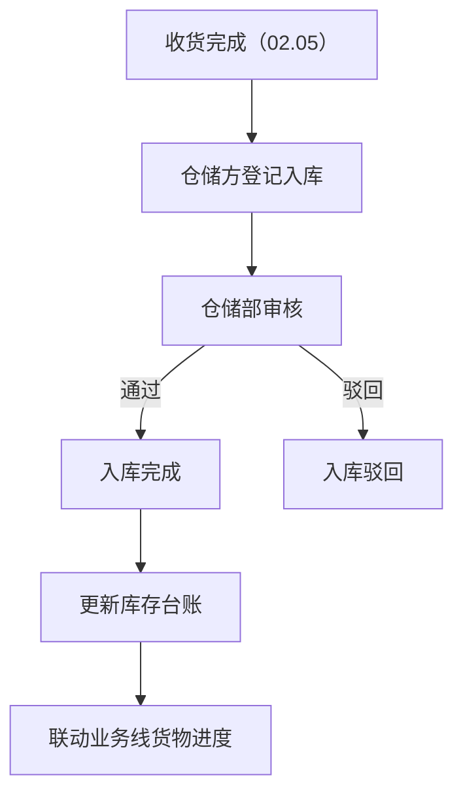
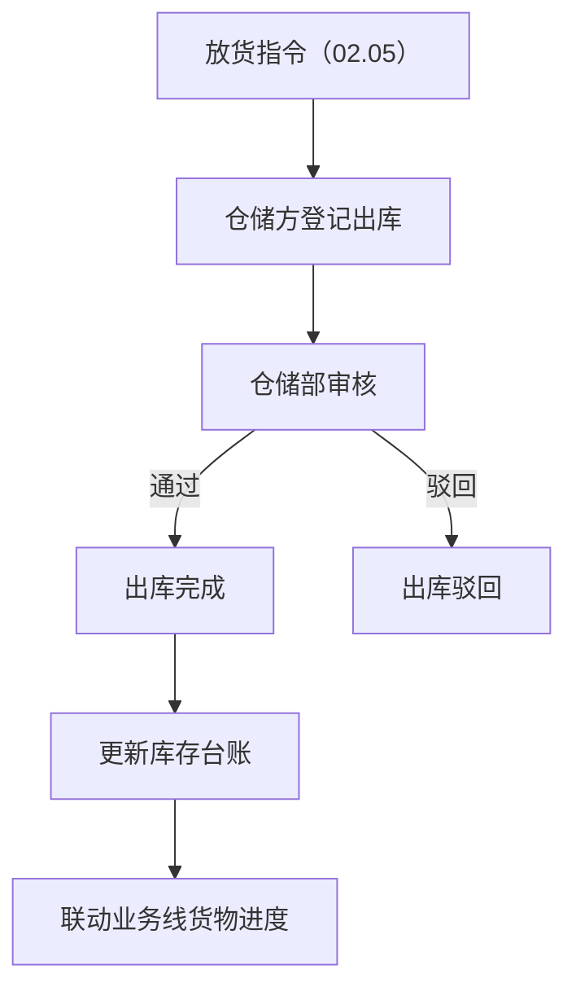
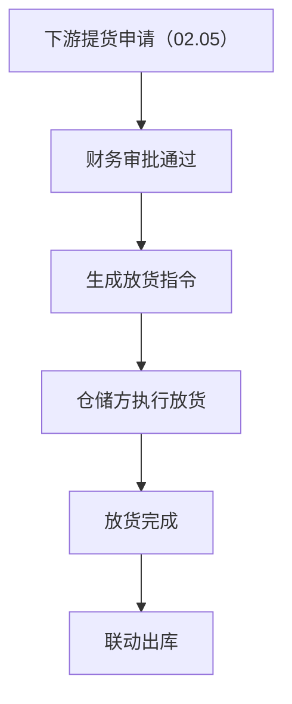
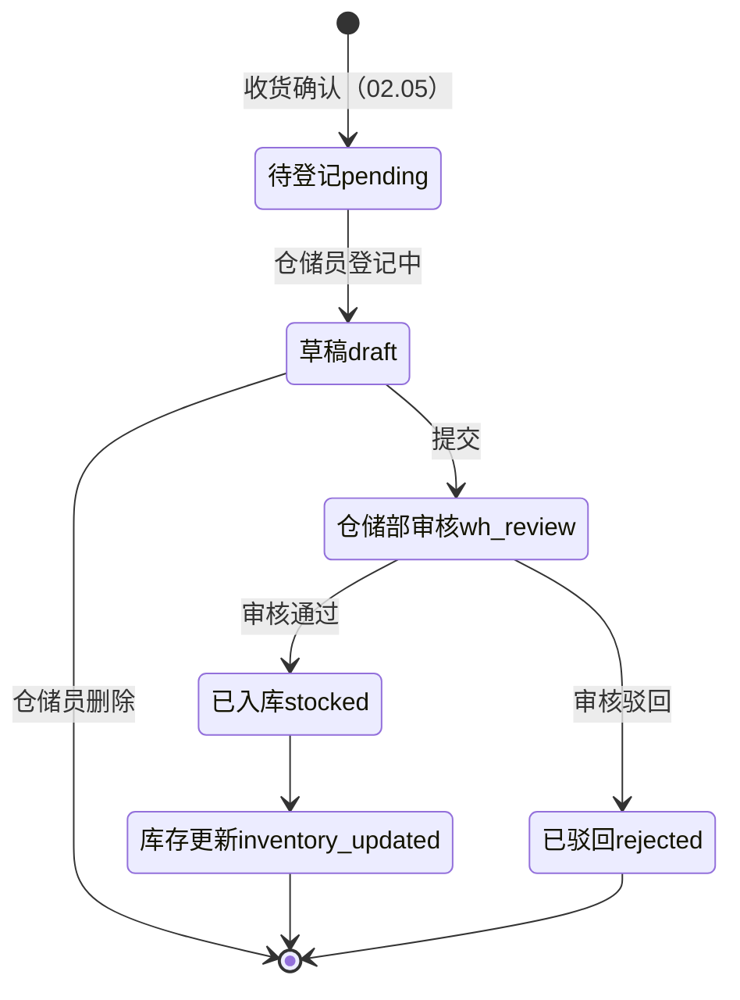
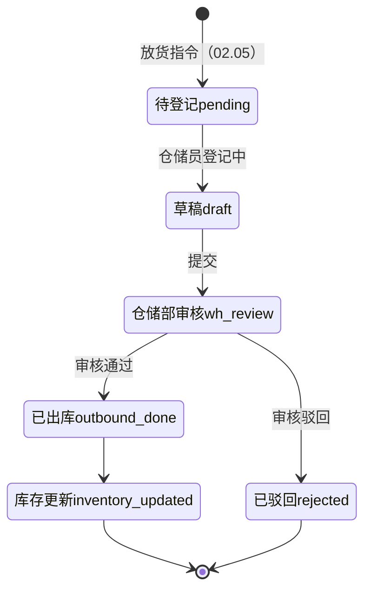
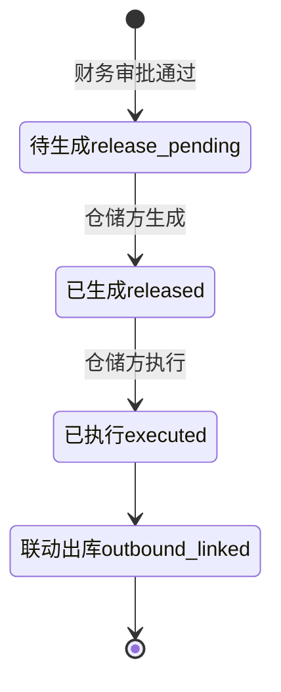

# 02.12 仓储管理 v1.0 终版 + v1.7.99.86 改造

> **状态**：v1.0 终版（**新模块，基于原型 61-69 截图**）+ v1.7.99.86（5 页面重制：入库/出库/提货/库存台账/巡库）
> **生成时间**：v1.0 2026-07-24 14:55 + v1.7.99.86 2026-07-31
> **配套文档**：[00-项目总览与对接.md](../00-项目总览与对接.md) / [01-模块拆解大框架.md](../01-模块拆解大框架.md) / [02.05-收发货管理.md](./02.05-收发货管理.md) / [02.07-货转管理.md](./02.07-货转管理.md)
> **复用度**：🟡 **65%（可用，去掉部分字段）**——主产品 `t_storage*` + `t_warehouse*` + `t_warehouse_receipt*` 13+ 张表

---

## 0. 章节导航

1. 业务定位
2. 业务流程全景
3. 核心实体（6 张表）
4. 3 子模块状态机
5. 角色操作矩阵
6. 字段规则
7. 按钮交互
8. 异常处理
9. 跨模块流转
10. 复用建议
11. 文档版本
12. v1.7.99.86 改造子章节（5 页面重制）
13. **v1.7.99.89 改造子章节**（新增采购入库表单页重制 + 船运隐藏逻辑）
14. **v1.7.99.90 改造子章节**（新增销售出库 + 新增放货指令 + 放货管理列表页改名）
15. **v1.7.99.91 改造子章节**（仓房管理列表页重制 + 新增仓房弹窗 + 巡库任务开关 + sidemenu 改名）
16. **v1.7.99.99 改造子章节**（新增采购入库：附件信息按运输方式动态切换——火运/汽运/船运 3 套单据类型）
17. **v1.7.99.100 改造子章节**（入库记录详情页 3 tab 重制 + 列表页"新增入库"按钮下拉+抽屉式弹层修复）

---

## 1. 业务定位

**仓储管理**是港通供应链的**独立第三方仓储方履约平台**——出入库登记 + 盘库 + 月度对账。

**关键特点**：
- **3 子模块**：入库管理 / 出库管理 / 提货管理（放货管理）
- **多仓储方**：木薯淀粉仓储方、煤炭仓储方等
- **视频监控/巡库**：v1.0 占位（无改动）

### 1.1 9 个页面（sitemap）

| # | 子模块 | 页面 |
|---|--------|------|
| 1 | **入库管理** | 入库记录 / 新增入库 / 入库详情 |
| 2 | **出库管理** | 出库记录 / 新增出库 / 出库详情（无改动）|
| 3 | **提货管理（放货管理）** | 放货管理 / 新增放货指令 / 放货指令详情 |
| 4 | 库存管理 | **无改动**（占位）|
| 5 | 视频监控 | **无改动**（占位）|
| 6 | 巡库管理 | **无改动**（占位）|
| 7 | 系统管理 | **无改动**（占位）|

---

## 2. 业务流程全景

### 2.1 入库管理流程



### 2.2 出库管理流程



### 2.3 放货管理流程



---

## 3. 核心实体（6 张表）

### 3.1 `t_warehouse` 仓库基础信息

| 字段 | 类型 | 必填 | 说明 |
|------|------|------|------|
| `id` | bigint PK | - | 主键 |
| `warehouse_name` | varchar(128) | ✓ | 仓库名称 |
| `warehouse_code` | varchar(32) | - | 仓库编码 |
| `address` | varchar(255) | ✓ | 仓库地址 |
| `warehouse_type` | varchar(20) | ✓ | `starch`（木薯淀粉）/ `coal`（煤炭）/ `sugar`（糖粉）|
| `capacity` | decimal(20,4) | - | 仓库容量（吨）|
| `operator_company_id` | bigint | ✓ | 仓储方企业 ID |
| `contract_id` | bigint | - | 关联仓储合同 |
| `is_active` | tinyint | ✓ | 0=停用, 1=启用 |
| `create_time` | datetime | ✓ | - |

### 3.2 `t_inbound` 入库登记

| 字段 | 类型 | 必填 | 说明 |
|------|------|------|------|
| `id` | bigint PK | - | 主键 |
| `inbound_no` | varchar(32) | ✓ | 入库单号 |
| `warehouse_id` | bigint | ✓ | 仓库 ID |
| `receive_confirm_id` | bigint | - | 关联收货确认（02.05）|
| `goods_id` | bigint | ✓ | 商品 ID |
| `goods_name` | varchar(128) | - | 商品名称 |
| `quantity` | decimal(20,4) | ✓ | 入库数量 |
| `unit` | varchar(20) | - | 单位 |
| `inbound_date` | date | ✓ | 入库日期 |
| `inbound_type` | varchar(20) | - | `purchase`（采购入库）/ `return`（退货入库）/ `transfer`（调拨入库）|
| `status` | varchar(20) | ✓ | 入库状态 |
| `operator_id` | bigint | ✓ | 仓储员 |
| `create_time` | datetime | ✓ | - |

### 3.3 `t_outbound` 出库登记

| 字段 | 类型 | 必填 | 说明 |
|------|------|------|------|
| `id` | bigint PK | - | 主键 |
| `outbound_no` | varchar(32) | ✓ | 出库单号 |
| `warehouse_id` | bigint | ✓ | 仓库 ID |
| `release_order_id` | bigint | - | 关联放货指令（02.05）|
| `goods_id` | bigint | ✓ | 商品 ID |
| `quantity` | decimal(20,4) | ✓ | 出库数量 |
| `outbound_date` | date | ✓ | 出库日期 |
| `outbound_type` | varchar(20) | - | `sales`（销售出库）/ `transfer`（调拨出库）/ `loss`（损耗）|
| `status` | varchar(20) | ✓ | 出库状态 |
| `operator_id` | bigint | ✓ | 仓储员 |

### 3.4 `t_inventory` 库存台账

| 字段 | 类型 | 必填 | 说明 |
|------|------|------|------|
| `id` | bigint PK | - | 主键 |
| `warehouse_id` | bigint | ✓ | 仓库 ID |
| `goods_id` | bigint | ✓ | 商品 ID |
| `lot_no` | varchar(64) | - | 批次号 |
| `total_quantity` | decimal(20,4) | ✓ | 库存总量 |
| `locked_quantity` | decimal(20,4) | - | **锁定数量**（已下单但未出库）|
| `available_quantity` | decimal(20,4) | - | **可用数量** = 总量 - 锁定 |
| `last_inbound_date` | date | - | 最后入库日期 |
| `last_outbound_date` | date | - | 最后出库日期 |
| `update_time` | datetime | ✓ | 最后更新时间 |

### 3.5 `t_stock_check` 盘库记录

| 字段 | 类型 | 必填 | 说明 |
|------|------|------|------|
| `id` | bigint PK | - | 主键 |
| `warehouse_id` | bigint | ✓ | 仓库 ID |
| `check_date` | date | ✓ | 盘库日期 |
| `check_type` | varchar(20) | ✓ | `full`（全盘）/ `partial`（部分盘库）/ `random`（抽盘）|
| `total_goods_count` | int | - | 商品总类数 |
| `diff_goods_count` | int | - | 差异商品数 |
| `status` | varchar(20) | ✓ | 盘库状态 |
| `operator_id` | bigint | ✓ | 盘库人 |

### 3.6 `t_stock_check_item` 盘库明细

| 字段 | 类型 | 必填 | 说明 |
|------|------|------|------|
| `id` | bigint PK | - | 主键 |
| `check_id` | bigint | ✓ | 关联盘库 |
| `goods_id` | bigint | ✓ | 商品 ID |
| `system_quantity` | decimal(20,4) | ✓ | 系统数量 |
| `actual_quantity` | decimal(20,4) | ✓ | 实际数量 |
| `diff_quantity` | decimal(20,4) | - | **差异数量** = 系统 - 实际 |
| `diff_reason` | varchar(500) | - | 差异原因 |
| `handle_opinion` | varchar(500) | - | 处理意见 |

---

## 4. 3 子模块状态机

### 4.1 入库管理状态机



### 4.2 出库管理状态机



### 4.3 放货管理状态机



---

## 5. 角色操作矩阵

| 操作 / 角色 | 仓储员 | 仓储部 | 业务部 | 风控部 | 财务部 |
|------------|------|------|------|------|------|
| 入库登记 | **✓** | - | - | - | - |
| 入库审核 | - | **✓** | - | - | - |
| 出库登记 | **✓** | - | - | - | - |
| 出库审核 | - | **✓** | - | - | - |
| 放货指令生成 | **✓** | - | - | - | - |
| 放货执行 | **✓** | - | - | - | - |
| 盘库 | **✓** | - | - | - | - |
| 查看库存台账 | ✓ | ✓ | ✓ | ✓ | ✓ |

---

## 6. 字段规则

### 6.1 仓库类型 `warehouse_type`

- 3 种：`starch`（木薯淀粉）/ `coal`（煤炭）/ `sugar`（糖粉）

### 6.2 入库类型 `inbound_type`

- 3 种：`purchase`（采购入库）/ `return`（退货入库）/ `transfer`（调拨入库）

### 6.3 出库类型 `outbound_type`

- 3 种：`sales`（销售出库）/ `transfer`（调拨出库）/ `loss`（损耗）

### 6.4 库存数量计算

```
可用数量 = 库存总量 - 锁定数量
```

锁定数量：已下单但未出库的数量

### 6.5 盘库差异处理

- `diff_quantity` = 系统数量 - 实际数量
- 正数：盘亏（实际少于系统）
- 负数：盘盈（实际多于系统）
- 差异 > 5% 触发预警

---

## 7. 按钮交互

### 7.1 入库记录列表（61 截图）

| 按钮 | 位置 | 可见条件 | 点击行为 |
|------|------|---------|---------|
| 搜索/筛选 | 顶部 | 所有 | 弹筛选抽屉 |
| 数据导出 | Tab 右侧 | 所有 | 导出 Excel |
| 详情 | 列表行 | 所有 | 跳详情页 |
| 新增入库 | 右上 | 仓储员 | 跳新增页（62 截图）|

### 7.2 新增入库（62 截图）

- 选仓库（必填）
- 选商品 + 数量
- 选入库类型
- 选关联收货确认（02.05）

### 7.3 入库详情（63 截图）

- 入库基本信息
- 商品明细
- 仓储员信息
- 审核记录

### 7.4 出库记录列表（64 截图）

- 类似入库记录列表
- **出库详情无改动**（66 截图）

### 7.5 放货管理列表（67 截图）

| 按钮 | 位置 | 可见条件 | 点击行为 |
|------|------|---------|---------|
| 搜索/筛选 | 顶部 | 所有 | 弹筛选抽屉 |
| 数据导出 | Tab 右侧 | 所有 | 导出 Excel |
| 详情 | 列表行 | 所有 | 跳详情页 |
| 新增放货指令 | 右上 | 仓储员 | 跳新增页（68 截图）|

### 7.6 新增放货指令（68 截图）

- 选下游客户（必填）
- 选关联销售订单（必填）
- 填放货数量 + 放货日期

### 7.7 放货指令详情（69 截图）

- 放货基本信息
- 商品明细
- 执行记录

---

## 8. 异常处理

| 异常场景 | 提示文案 | 处理动作 |
|---------|---------|---------|
| 入库数量 > 收货数量 | "入库数量 X 超过收货剩余数量 Y" | 阻止 |
| 出库数量 > 库存可用数量 | "出库数量 X 超过库存可用数量 Y" | 阻止 |
| 库存为负 | "出库后库存 X < 0，不允许出库" | 阻止 |
| 盘库差异 > 5% | "盘库差异 X 超过 5%，请人工确认" | 黄色提醒 |
| 锁定数量 > 库存总量 | "锁定数量异常" | 红色提示 |

---

## 9. 跨模块流转

### 9.1 上游触发

| 触发模块 | 触发条件 | 触发动作 |
|---------|---------|---------|
| 收发货（02.05）| 收货完成 | 触发入库登记 |
| 收发货（02.05）| 放货指令生成 | 触发出库登记 |

### 9.2 下游触发

| 触发模块 | 触发条件 | 触发动作 |
|---------|---------|---------|
| 库存台账 | 入库/出库完成 | 更新库存数量 |
| 业务线（02.06）| 入库/出库完成 | 更新业务线货物进度 |
| 货转（02.07）| 入库/出库 | 货转关联 |
| 预警中心（02.11）| 库存超期/盘库异常 | 触发预警 |

---

## 10. 复用建议

### 10.1 复用度

**🟡 65%（可用，去掉部分字段）**

| 类别 | 数量 | 复用度 |
|------|------|--------|
| 复用主产品表 | 6 张 | 70% |
| 港通新建表 | 0 张 | - |

### 10.2 复用主产品表

- `t_storage` 库存（主表）
- `t_storage_goods` 库存商品
- `t_storage_goods_inout_record` 出入库记录
- `t_warehouse_info` 仓库信息
- `t_warehouse_receipt` 仓单
- `t_warehouse_receipt_transfer` 仓单转移

### 10.3 港通不一定要的表（v1.0 不做）

- `t_camera_*` 摄像头（**港通仓储不一定要**）
- `t_weigh_*` 过磅（**港通仓储不一定要**）
- `t_station_*` 站台铁路（**港通不一定**）

### 10.4 给研发的实施建议

1. **第一周**：直接复用主产品 6 张表
2. **第二周**：建 3 子模块（入库/出库/放货）
3. **第三周**：建 3 子状态机 + 库存计算
4. **第四周**：跨模块集成（02.05 收发货/02.06 业务线）

---

## 11. 文档版本

- **v1.0（2026-07-24 14:55）**：基于 61-69 截图 + sitemap 首次终版，作为范本用于后端开发
- **v1.7.99.86（2026-07-31）**：基于 user 6 张截图，**5 个仓储管理页面重制**——入库记录/出库记录/提货管理/库存台账/巡库记录
- 修改记录：见 `06-修改记录.md`
---

## 12. v1.7.99.86 改造子章节（5 页面重制）

> **改造时间**：2026-07-31
> **触发**：user 6 张截图反馈（每张图对应 1 个仓储管理页面）
> **改造范围**：**重制 5 个 HTML**（沿用 v1.7.99.85 追保函管理 + v1.7.99.82 销售结算状态机 + v1.7.99.80 inline Utils fallback 模式快速重制）
> **不动**：
> - 仓储管理 7 个子模块菜单（入库/出库/提放货/库存/视频/巡库/系统）已锁定，**不动** topnav-drawer.js
> - 5 个页面对应的"详情页/新增页"（warehouse-inbound-detail/-new.html 等 v1.7.99.7 占位）**不动**——等 user 后续提"详情页/新增页改造"再做
> - 全局 design-system.css / list-page.css（v1.7.99.69/71/73/75/80/81/82/83/84/85 经验：项目级覆盖）
> - assets/js/app.js（沿用 v1.7.99.80 inline Utils fallback）

### 12.1 入库记录（warehouse-inbound.html）v1.7.99.86 重制

**用户截图**：图 1（user 给的 6 张图之一）

**重制结构**（按图 1 1:1 复制）：
1. **标题 + 面包屑**：仓储管理 / 入库管理 / **入库记录**（v1.7.99.86 标题从"入库管理"改为"入库记录"——user 截图明确分列表页"入库记录"和详情页/新增页"入库管理"）
2. **右上 1 按钮**：新增入库（蓝底白字 + + 图标）
3. **9 字段筛选**（grid 3 列 × 3 行）：
   - 编号（订单、单据、上报计划、入库编号）/ 发货单位 / 入库日期（开始时间-结束时间）
   - 仓位（堆放货位）/ 货位 / 关联业务线状态
   - 数据类型 / 入库类型
4. **4 tab 状态机**：全部 92 / 汽运 52 / 火运 28 / 船运 12（**v1.7.99.86 新加"汽运/火运/船运"运输方式 tab**）
5. **11 列表格**：入库日期 8% / 品类 7% / 入库数量(吨) 8% / 入库单价(元/吨) 9% / 车数 6% / 合同编号 14% / 业务线号 12% / 发货单位 12% / 仓库&货位 12% / 数据类型 6% / 操作 auto
6. **10 行 mock**：GTGYL-MSXS-20260127-s 合同 + SKYWX202607050001 业务线 + 河南诚泽运输发货 + 中粮贸易集团 仓库 + 手动新增(采购入库) 数据类型 + 2026-04-03 ~ 2026-07-14 日期 + 1143.2/1192/1182/927.5/618/927.5/32/1945/474.9/973.25 数量
7. **分页**：共 92 条信息 / 1-2 页 / 10 条/页

**操作列**：详情 / 编辑 / 删除（删除用红色 danger 样式 + confirm 二次确认）

**关键规范**（v1.7.99.86 锁定）：
- **【大前提】标题从"入库管理"改为"入库记录"**（v1.7.99.86 经验：user 截图列表页和详情页标题不同——列表"入库记录"/详情"入库管理"/新增"新增入库"，**沿用 user 截图不擅自改回** v1.7.99.85/82 经验）
- **【大前提】4 tab 状态机 = 运输方式**（v1.7.99.86 经验：v1.7.99.85 追保函 6 状态 tab / v1.7.99.82 销售 7 状态 tab / **v1.7.99.86 入库 4 运输方式 tab**——不同业务用不同 tab 维度，**别复制粘贴状态机 tab**）
- **【大前提】9 字段筛选按 3 行分组**（v1.7.99.86 经验：row1 = 编号/单位/日期/品类 / row2 = 仓位/货位/状态/数据类型 / row3 = 入库类型——按业务逻辑分组，**别全部塞 1 行**）

### 12.2 出库记录（warehouse-outbound.html）v1.7.99.86 重制

**用户截图**：图 2

**重制结构**（按图 2 1:1 复制）：
1. **标题 + 面包屑**：仓储管理 / 出库管理 / **出库记录**
2. **右上 1 按钮**：新增出库
3. **9 字段筛选**（grid 3 列 × 3 行）：
   - 编号（出库入库订单、合同、下游计划、出库编号）/ 收货单位 / 出库日期
   - 仓位 / 货位 / 关联业务线状态
   - 业务线号 / 数据类型
4. **4 tab 状态机**：全部 76 / 汽运 42 / 火运 22 / 船运 12（**沿用 v1.7.99.86 入库记录 4 运输方式 tab 模式**）
5. **10 列表格**（**注意：v1.7.99.86 出库比入库少 1 列"品类"**——user 截图实际如此，**v1.7.99.86 沿用不擅自加**）：出库日期 8% / 品类 7% / 出库数量(吨) 8% / 出库单价(元/吨) 9% / 车数 6% / 合同编号 14% / 业务线号 12% / 收货单位 13% / 仓库&货位 11% / 数据类型 6% / 操作 auto
6. **10 行 mock**：YL-MSXS-20260127-s 合同 + SKYWX202607050001 业务线 + 郑州信必达国际供应链收货 + 手动新增(销售出库) 数据类型 + 2026-07-15 ~ 2026-07-28 日期
7. **分页**：共 76 条信息 / 1-8 页 / 10 条/页 / 跳至 页（**v1.7.99.86 出库比入库分页多 1 项"跳至"——user 截图实际如此**）

**关键规范**（v1.7.99.86 锁定）：
- **【大前提】入库 vs 出库差异**（v1.7.99.86 锁定）：
  - 字段差异：入库 row1"编号（订单、单据、上报计划、入库编号）"vs 出库"编号（出库入库订单、合同、下游计划、出库编号）"——**v1.7.99.86 沿用 user 截图不擅自统一**
  - 单位差异：入库"发货单位"vs 出库"收货单位"
  - 表格列差异：入库 11 列 vs 出库 10 列（出入库都叫"品类"但 user 出库截图少 1 列"品类"——**v1.7.99.86 完全按 user 截图复制**）
  - 业务线位置：入库 row1 / 出库 row2（**v1.7.99.86 沿用 user 截图不擅自调换**）
  - 合同号差异：入库 GTGYL-MSXS-20260127-s（**采购入库**对应采购合同 GTGYL 前缀）vs 出库 YL-MSXS-20260127-s（**销售出库**对应销售合同 YL 前缀）
  - 数据类型差异：入库"手动新增(采购入库)"vs 出库"手动新增(销售出库)"
- **【大前提】销售出库 2026-07-15~2026-07-28**（v1.7.99.86 经验：user 出库记录比入库晚 4 个月——v1.7.99.86 沿用 user 截图，**不**因为"出入库应该同步"就改日期）

### 12.3 提货管理（warehouse-pickup.html）v1.7.99.86 重制

**用户截图**：图 3

**重制结构**（按图 3 1:1 复制）：
1. **标题 + 面包屑**：仓储管理 / 提放货管理 / **提货管理**（**v1.7.99.86 沿用 user 截图"提货管理"标题，不动 sidemenu "提放货管理"父级**）
2. **右上 1 按钮**：提货申请
3. **4+1 字段筛选**（grid 3 列 × 2 行，**注意：v1.7.99.86 row1 是 4 字段 + row2 是 1 字段，特殊布局**）：
   - 编号（订单、合同或提货编号）/ 提货开具方 / 提货接收方 / 提货日期
   - 状态
4. **2 tab 状态机**：**已开具**（active） / **已收到**（**v1.7.99.86 新加 2 tab = 提货开具/收据维度**，不是状态机维度）
5. **9 列表格**：合同编号 14% / 提货编号 12% / 提货开具方 14% / 提货接收方 14% / 提货日期 10% / 提货数量(吨) 8% / 状态 8% / 最新操作时间 10% / 操作 auto
6. **暂无数据 empty state**：v1.7.99.86 沿用 user 截图"暂无数据"空状态（user 截图没数据，v1.7.99.86 不擅自加 mock）

**关键规范**（v1.7.99.86 锁定）：
- **【大前提】2 tab = 开具/收到维度**（v1.7.99.86 经验：v1.7.99.85 追保函 5 状态 / v1.7.99.82 销售 7 状态 / v1.7.99.86 提货 **2 维度**（不是状态机），**新加 tab 维度要先看 user 截图是状态还是维度**）
- **【大前提】empty state 复用**（v1.7.99.86 经验：user 提货管理 + 巡库记录都是 empty state，v1.7.99.86 沿用同样的 dashed-border-icon 样式——**新加 empty state 页面直接复制 v1.7.99.86 模板**）
- **【大前提】4+1 字段筛选特殊布局**（v1.7.99.86 经验：user 截图是 5 字段跨 2 行——4 字段在 row1，1 字段（状态）在 row2——v1.7.99.86 用 grid 3 列 × 2 行，row1 第 4 列独占、row2 第 1 列"状态"——**新加类似布局直接复制 v1.7.99.86 grid**）

### 12.4 库存台账（warehouse-inventory.html）v1.7.99.86 重制（最大改动）

**用户截图**：图 4（库存概览 tab）+ 图 5（业务线台账 tab）

**重制结构**（v1.7.99.86 全面重制——**从 226 行 11 列简单列表 → 730+ 行双 tab 复杂看板页**）：

#### 区块 0：8 KPI cards（v1.7.99.86 新加——标题上方）
- **4 列 × 2 行**（8 卡片）+ 左右翻页箭头（**v1.7.99.86 user 图 4 实际是 1 行 8 卡片，水平滚动**）：
  1. 账面库存(吨) 11,295.6 — light blue (#EFF6FF 底)
  2. 累计入库(吨) 15,577.85 — light orange (#FFF7ED 底)
  3. 未关联业务线入库(吨) 0 — light green (#F0FDF4 底)
  4. 累计出库(吨) 4,282.25 — light blue
  5. 未关联业务线出库(吨) 0 — light orange
  6. 库存货值(元) 45,835,266.4725 — light green
  7. 累计入库货值(元) 60,663,310 — light blue
  8. 累计出库货值(元) 14,828,043.5275 — light orange
- **KPI 颜色规律**：v1.7.99.86 蓝橙绿 **3 色循环**（user 图 4 实际配色——v1.7.99.86 沿用）

#### 区块 1：2 tab 状态机（v1.7.99.86 新加）
- **库存概览**（active） / **业务线台账**

#### 区块 2-1：库存概览 tab（v1.7.99.86 按图 4）
1. **5+1 时间筛选**（chips + 自定义时间）：
   - chips：全部（active）/ 本周 / 本月 / 上月 / 近三个月 / 近六个月
   - 自定义时间：2023-01-01 ~ 2026-07-31
2. **折线图**（v1.7.99.86 SVG 内嵌）—— **3 序列**：
   - 入库吨位（blue #1E40AF bar）
   - 出库吨位（green #10B981 bar）
   - 库存吨位（orange #F97316 line + 阴影 area，**库存 = 累计值，曲线从 ~2000 涨到 ~12000**）
   - X axis：2026-02-04 ~ 2026-07-24（13 个时间点）
   - Y axis：0 ~ 12,000（6 网格线 + 6 label）
3. **3 环形图**（v1.7.99.86 SVG 内嵌，**100% 单品类填充**）：
   - 入库：木薯淀粉 15,577.85 100%
   - 出库：木薯淀粉 4,282.25 100%
   - 库存：木薯淀粉 11,295.6 100%
4. **品类库存列表 table**（**v1.7.99.86 7 列 + 操作 = 8 列**）：
   - 品名 10% / 账面库存(吨) 11% / 库存货值(元) 13% / 累计入库(吨) 11% / 累计入库货值(元) 13% / 累计出库(吨) 11% / 累计出库货值(元) 13% / 操作 auto
   - **1 行 mock**：木薯淀粉 11,295.6 / 45,835,266.47 / 15,577.85 / 60,663,310 / 4,282.25 / 14,828,043.53 / 入库明细 + 出库明细

#### 区块 2-2：业务线台账 tab（v1.7.99.86 按图 5）
1. **2 字段筛选**：编号（业务线号或合同编号）/ 企业名称
2. **5 列复杂表格**（v1.7.99.86 沿用 user 图 5 复杂布局）：
   - 业务线信息 26% / 仓储信息 18% / 库存信息 26% / 资金信息 18% / 操作 12%
   - **1 行 mock**：
     - 业务线信息：SKYWX202607050001（执行中蓝 tag）+ 业务线名称"河南诚泽运输有限公司-河南中豫港通供应链管理有限公司-郑州信必达国际供应链有限公司"+ 采购合同号 GTGYL-MSXS-20260127-s + 销售合同号 YL-MSXS-20260127-s
     - 仓储信息：库点名称"国际物流组合库"+ 货主企业"河南中豫港通供应链管理有限公司"
     - 库存信息：账面库存 11295.6 + 累计入库 15577.85 + 累计出库 4282.25
     - 资金信息：已付款金额 60755275.01
     - 操作：详情

**关键规范**（v1.7.99.86 锁定）：
- **【大前提】8 KPI cards 水平滚动**（v1.7.99.86 经验：user 图 4 实际是 1 行 8 卡片水平滚动，**不是 2 行 4 列网格**——v1.7.99.86 用 `flex: 0 0 168px` + `overflow-x: auto` + 左右箭头 JS scrollBy，**新加 KPI 横向滚动直接复制 v1.7.99.86 模板**）
- **【大前提】KPI 颜色 3 色循环**（v1.7.99.86 经验：蓝橙绿 3 色循环——新加 KPI 沿用，**别自定义颜色**）
- **【大前提】折线图 + 环形图用 inline SVG**（v1.7.99.86 经验：v1.7.99.86 用纯 SVG 不用 chart.js / echarts，**保持原型轻量**——任何"图表类"页面都直接复制 v1.7.99.86 模板）
- **【大前提】库存吨位 = 累计值曲线**（v1.7.99.86 经验：库存是 cumulative 累计值（从 ~2000 涨到 ~12000），不是 daily 值；入库/出库才是 daily bar——**新加图表先看是累计还是日值**）
- **【大前提】业务线台账 5 列复杂表格**（v1.7.99.86 经验：5 列含合并单元格 + 业务线号 + 执行中蓝 tag + 资金信息独立 1 列——**v1.7.99.86 是新加的复杂表格模式，区别常规 cp-table**）
- **【大前提】不修改其他 5 个库存管理子页面**（v1.7.99.86 经验：warehouse-market.html 库存盯市 / warehouse-video.html 库点监控 / warehouse-system.html 系统管理 / warehouse-point.html 库点信息 / warehouse-warehouse.html 仓库 / warehouse-category.html 品类配置 6 个页面都不动，**v1.7.99.86 只重制"库存台账"1 个**）

### 12.5 巡库记录（warehouse-patrol.html）v1.7.99.86 重制

**用户截图**：图 6

**重制结构**（按图 6 1:1 复制）：
1. **标题 + 面包屑**：仓储管理 / 巡库管理 / **巡库记录**
2. **3 字段筛选**（grid 1:1:1，**注意：v1.7.99.86 巡库记录筛选区是 1 行 3 列等宽，跟其他页面 3 列不同**）：
   - 巡库结果（select：正常/异常/待处理）
   - 处理状态（select：已处理/未处理/已关闭）
   - 巡库时间（开始时间-结束时间）
3. **12 列表格**（**v1.7.99.86 巡库记录 12 列，是 5 个改造页面中列数最多的**）：序号 5% / 仓库名称 9% / 仓房 7% / 货主 10% / 巡库时间 9% / 巡库结果 8% / 处理状态 8% / 处理时间 9% / 巡库人员 8% / 监管负责人 8% / 报告生成时间 9% / 操作 auto
4. **暂无数据 empty state**：v1.7.99.86 沿用 user 截图"暂无数据"空状态

**关键规范**（v1.7.99.86 锁定）：
- **【大前提】12 列表格**（v1.7.99.86 经验：巡库记录列数最多=12 列，比入库 11 列 / 出库 10 列 / 提货 9 列 / 业务线台账 5 列 都多——**新加列表页先算列数**，12 列在 1440px 部署下右 3 列被裁切）
- **【大前提】巡库 5 状态机**（v1.7.99.86 锁定）：巡库结果 3 状态（正常/异常/待处理）× 处理状态 3 状态（已处理/未处理/已关闭）= 5 状态机组合——比追保函 5 状态独立，比销售 7 状态简单。**新加巡库相关业务用 5 状态组合**
- **【大前提】3 颜色循环 status tag**（v1.7.99.86 经验：巡库结果用 #D1FAE5/#FEE2E2/#FEF3C7 绿红黄 3 色，**新加 status tag 沿用 3 色循环**）

### 12.6 v1.7.99.86 5 页面共性规范

**沿用 v1.7.99.85 经验**：
- **inline Utils fallback 必加**（v1.7.99.80 经验：5 个页面都有操作列，**每个都加 `window.Utils = window.Utils || { toast: function(msg, type) { ... } }`**）
- **操作列点击事件委托**（v1.7.99.85 模式：`document.body.addEventListener('click', ...)` + `target.closest('.col-action')`）
- **危险操作 confirm 二次确认**（v1.7.99.82 模式：删除/作废等危险操作必须 `window.confirm()` 二次确认）
- **不修改全局 design-system.css / list-page.css**（v1.7.99.69/71/73/75/80/81/82/83/84/85 经验：项目级覆盖）
- **不修改 sidemenu**（v1.7.99.85 经验：仓储管理 7 个子模块菜单已锁定，**v1.7.99.86 不动 topnav-drawer.js**）
- **不修改详情页/新增页**（v1.7.99.85 经验：5 个页面 v1.7.99.7 占位版详情/新增页都已经是 v1.7.99.7 实现，**v1.7.99.86 只重制列表页**——**等 user 后续提"详情页/新增页改造"再做**）
- **1440px 视口列裁切**（v1.7.99.83/84/85 经验：5 个页面表格列数 5-12 列，**v1.7.99.86 沿用 cp-table-wrap `overflow-x: auto`**，新加列表页先算 1440px 视口下哪些列被裁切）

**v1.7.99.86 新加规范**：
- **【大前提】图 1-N 组合改造模式**（v1.7.99.86 经验：user 给 6 张图对应 6 个页面，**每张图都是 1 个独立页面的完整描述**——v1.7.99.85 是 1 个页面 2 张图，v1.7.99.86 是 6 个页面 6 张图，**别只按一张图做**）
- **【大前提】title 改/不改边界**（v1.7.99.86 经验：user 截图入库管理列表页叫"入库记录"——v1.7.99.86 沿用 user 截图**改标题**，**别**"v1.7.99.7 叫入库管理就不动"——**新加页面**先看 user 截图标题）
- **【大前提】empty state 2 种页面**（v1.7.99.86 经验：提货管理 / 巡库记录 2 个页面都是 empty state，**业务系统的真实数据就是这样**——v1.7.99.86 沿用 user 截图不擅自加 mock，**新加 empty state 页面**直接复制 v1.7.99.86 dashed-border-icon 模板）

### 12.7 10 行 mock 数据规范（v1.7.99.86 锁定）

**入库记录 10 行**（按 user 图 1 1:1 复制）：
- 合同号统一 `GTGYL-MSXS-20260127-s`（采购入库对应采购合同 GTGYL 前缀）
- 业务线号统一 `SKYWX202607050001`
- 发货单位统一 `河南诚泽运输有限公司`
- 数据类型统一 `手动新增(采购入库)`
- 日期 2026-04-03 ~ 2026-07-14（4 月初到 7 月中）
- 数量阶梯 32 / 474.9 / 973.25 / 1945 / 618 / 927.5 / 927.5 / 1182 / 1192 / 1143.2（**v1.7.99.86 沿用 user 截图不擅自排序**）

**出库记录 10 行**（按 user 图 2 1:1 复制）：
- 合同号统一 `YL-MSXS-20260127-s`（销售出库对应销售合同 YL 前缀）
- 业务线号统一 `SKYWX202607050001`
- 收货单位统一 `郑州信必达国际供应链有限公司`
- 数据类型统一 `手动新增(销售出库)`
- 日期 2026-07-15 ~ 2026-07-28（**v1.7.99.86 比入库晚 4 个月，沿用 user 截图**）
- 数量阶梯 34/35/79/34/34/103/34/69/69/69（**v1.7.99.86 沿用 user 截图不擅自排序**）

**业务线台账 1 行**（按 user 图 5 1:1 复制）：
- 业务线号 `SKYWX202607050001`（执行中蓝 tag）
- 业务线名称 `河南诚泽运输有限公司-河南中豫港通供应链管理有限公司-郑州信必达国际供应链有限公司`（**v1.7.99.86 3 段企业名全称沿用 user 截图**）
- 采购合同号 `GTGYL-MSXS-20260127-s` + 销售合同号 `YL-MSXS-20260127-s`（**v1.7.99.86 双合同号都展示，沿用 user 截图**）
- 库点名称 `国际物流组合库` + 货主企业 `河南中豫港通供应链管理有限公司`
- 账面库存 `11295.6` + 累计入库 `15577.85` + 累计出库 `4282.25`（**注意：v1.7.99.86 不带千分位，跟 user 截图一致**）
- 已付款金额 `60755275.01`

## 修改记录

### v1.7.99.x（2026-07-28）

- 🟡 列表页占位 = "全部"（全站统一）
- 🟡 仓储管理 5 页面重制（v1.7.99.86，2026-07-30）
- 🟡 新增采购入库表单页重制（v1.7.99.89，2026-07-31）—— 5 区块：合同信息/业务线信息/入库信息/备注/附件信息，**运输方式=船运时隐藏入库车数字段**
- 🟡 新增销售出库 + 新增放货指令表单页重制 + 放货管理列表页改名（v1.7.99.90，2026-07-31）—— 出库 6 区块（合同信息/业务线信息/放货指令/出库信息/备注/附件信息）+ 放货指令 6 区块（合同信息/放货信息/站点表格/备注/业务线下游回款信息/附件），**运输方式=船运时隐藏出库车数字段**，**放货管理列表页「释放管理」→「放货管理」+「新增释放管理」→「新增放货指令」**
- 🟡 仓房管理列表页重制（v1.7.99.91，2026-07-31）—— **仓库管理 → 仓房管理**（v1.7.99.7 占位版"仓库管理"改名为"仓房管理"）+ 2 字段筛选（仓房名称/仓库名称）+ 7 列表格（编号/仓库/仓房名称/所属货主/备注/巡库任务/操作）+ **巡库任务蓝开关 + ? tooltip** + **新增仓房弹窗 2 字段（仓房名称* + 备注）** + sidemenu 改名"仓库管理"→"仓房管理"
- 🟡 新增采购入库：附件信息按运输方式动态切换（v1.7.99.99，2026-08-03）—— **火运 3 套**（铁路大票*/出入库明细*/化验凭证）+ **汽运 3 套**（磅单*/磅单明细*/化验凭证）+ **船运 2 套**（随船计量单*/化验凭证）+ 顶部 tip 同步切换 + 仓房&货位位置自适应 + 沿用 v1.7.99.89「船运→隐藏入库车数」逻辑
- 🟡 入库记录详情页 3 tab 重制 + 列表页"新增入库"按钮修复（v1.7.99.100，2026-08-03）—— **详情页**（v1.7.99.7 占位版"待补充"→ v1.7.99.100 1:1 重制 user 3 张图）：**3 tab**（入库信息默认 active / 入库明细 / 操作记录）+ **顶部 metadata 8 字段 2 列**（所属合同编号/卖方/买方/关联业务线号/业务线名称/创建人员/创建时间/数据类型）+ **入库信息 4 行 6 列 label-value 表格**（10 字段 + 备注跨 5 列）+ **附件 3 列 2 行**（铁路大票+出入库明细 已上传 mock）+ **入库明细 tab**（2 字段筛选入库流水号/车牌号 + 11 列表格 1 行 mock + 数据导出 button）+ **操作记录 tab**（5 列表格 1 行 mock）；**列表页按钮修复**（v1.7.99.86 列表页"新增入库"按钮无 onclick → v1.7.99.100 修复下拉弹 2 项：**采购入库** + **盘盈入库** + 选"采购入库"弹出 **抽屉式弹层"关联采购合同"** + 8 字段筛选（编号/企业名称/收货人/运输方式/品名/业务类型/签订日期/合同状态）+ 9 列表格（合同编号/卖方企业名称/收货人/交货期限/签订日期/运输方式/数量/基准价格/品名）+ 1 行 mock GTGYL-MSXS-20260127-s + 2 行 tab（线下合同/线上合同）+ 底部 3 按钮（取消/暂不关联/确定）+ 选 1 合同跳详情带合同号 / 选 0 合同跳详情不带合同号）

---

## 13. v1.7.99.89 改造子章节（新增采购入库表单页重制 + 船运隐藏逻辑）

### 13.1 改造背景

2026-07-31 用户提 1 条需求 + 1 张图：
- **需求**：图 1 为「新增入库」表单页，运输方式选择「船运」时隐藏「入库车数」字段
- **图 1 完整描述**：5 区块表单（合同信息 9 字段 / 业务线信息 1 行 / 入库信息 11 字段含运输方式 radio / 备注 / 附件信息 3 行）

### 13.2 改造范围

- **`pages/warehouse-inbound-new.html` 重制**（14.8KB → 21.6KB，**+46%**）
  - 旧版是 v1.7.99.7 占位版（4 tab + 8 字段，**完全对不上 user 截图**）
  - 新版按 user 截图 1:1 重制：5 区块 + 26 字段 + 3 附件

### 13.3 5 区块结构（v1.7.99.89 锁定）

| # | 区块 | 字段 | 备注 |
|---|------|------|------|
| 1 | **合同信息** | 9 字段 3 列 label+value pair | 合同编号 (GTGYL-MSXS-20260127-s) + 卖方/买方/品名/基准价格/数量/交货期限/运输方式/收货人 |
| 2 | **业务线信息** | 1 行 3 列 | 业务线号 (SKYWX202607050001) + 业务线名称 + 下游销售合同编号 (YL-MSXS-20260127-s) |
| 3 | **入库信息** | 11 字段 3 列 4 行 | Row 1: 入库数量(吨)*/入库单价(元/吨)*/入库货值<br>Row 2: 入库日期*/产地*/品名*<br>Row 3: 发货单位*/收货单位*/运输方式*(汽运/火运/船运 radio)<br>Row 4: 入库车数*(v1.7.99.89 条件隐藏) + 仓库&货位 |
| 4 | **备注** | 1 full-width textarea | 200 字以内 |
| 5 | **附件信息** | 3 表格行 | 铁路大票*（必填）/ 出入库明细*（必填）/ 化验凭证（非必填）|

### 13.4 运输方式 = 船运 隐藏 入库车数（v1.7.99.89 核心逻辑）

**JS 监听**：`input[name="transport"]` 的 change 事件
**触发条件**：`checked.value === 'ship'`
**动作**：
- `carCountField.classList.add('hidden')`（display: none）
- 同时清空 input 值（避免无效数据提交）

**默认状态**：火运（v1.7.99.89 沿用 user 截图：合同信息中运输方式 = 火运）
**初始化**：页面加载时调用 `syncCarCount()` 兜底，确保 radio 默认值生效

### 13.5 关键规范 / 触发模式

- **【大前提】v1.7.99.7 占位版表单需要按 user 截图 1:1 重制**（v1.7.99.89 经验）：v1.7.99.7 占位版的"基本信息"4 tab + 8 字段**完全对不上 user 截图**——**新加占位版表单改造**先看 user 截图覆盖哪些区块
- **【大前提】条件显示/隐藏字段用 class="hidden"**（v1.7.99.89 经验）：`.transport-dependent.hidden { display: none !important; }` 而不是 `style.display = 'none'`——**保持 CSS class 语义化**
- **【大前提】隐藏时同时清空 input 值**（v1.7.99.89 经验）：船运 → 隐藏入库车数 → **清空 input.value**（避免无效数据提交，否则后端会收到"船运 + 入库车数=5"这种矛盾数据）
- **【大前提】表单页沿用 inline Utils fallback**（v1.7.99.89 沿用 v1.7.99.80 模式）：避免 console error 阻断 JS
- **【大前提】运输方式 radio 用 HTML native**（v1.7.99.89 经验）：`<input type="radio" name="transport" value="truck/rail/ship">` + `accent-color: var(--color-primary)` 控制蓝实心——**别用自定义 div 模拟 radio**
- **【大前提】不修改全局 design-system.css / list-page.css**（v1.7.99.89 沿用 v1.7.99.69+ 经验）：项目级 inline `<style>` 块
- **【大前提】不修改其他 6 个仓储管理子页面**（v1.7.99.89 沿用 v1.7.99.86 经验）：**只重制 user 截图对应的 warehouse-inbound-new.html 1 个页面**——**新加仓储管理表单改造**先确认改造范围
- **【大前提】不修改 warehouse-inbound.html 列表页**（v1.7.99.89 沿用 v1.7.99.86 经验）：v1.7.99.86 已重制过，**v1.7.99.89 不动列表页**
- **【大前提】不修改入库详情页 warehouse-inbound-detail.html**（v1.7.99.89 经验）：v1.7.99.86 经验：v1.7.99.7 占位版详情/新增页**不动**——**等 user 后续提再做**

### 13.6 沿用 v1.7.99.86 经验

- 不修改 sidemenu（v1.7.99.86 经验：仓储管理 9 个子模块菜单已锁定）
- 不修改其他仓储管理子页面（v1.7.99.86 经验：只重制 user 截图对应的 1 个页面）
- inline Utils fallback（v1.7.99.80/86 模式）

### 13.7 部署（v1.7.99.89）

- **deploy hash**：`95a750b5`（1 files：1 HTML + auto _headers + 之前的）
- **验证**（root domain + hash URL）：curl 1 关键页面 200 + 关键字段全部命中（新增采购入库标题/合同信息/业务线信息/入库信息/备注/附件信息 5 区块 + 船运 radio + 入库车数 field + hidden class）
- **截图**（4 张，hash URL `95a750b5` 绕过 v1.7.99.79 发现的 edge cache）：
  - v99.89-online-warehouse-inbound-new-default.png（viewport 1440×900：默认 火运 selected，5 区块结构清晰）
  - v99.89-online-warehouse-inbound-new-default-full.png（full page：5 区块完整 + 入库车数 + 仓库&货位 row 4 可见 + 3 附件表格行）
  - v99.89-online-warehouse-inbound-new-ship.png（viewport 1440×900：**船运 selected → 入库车数隐藏** + 仓库&货位仍在）
  - v99.89-online-warehouse-inbound-new-ship-full.png（full page：船运状态下完整布局，row 4 少 入库车数 1 列）
- **playwright console 调试**：4 张截图 `page.on('pageerror')` + `page.on('console', 'error')` 收集 0 个 error，**v1.7.99.80 inline Utils fallback 兜底成功**
- **变更文件**：1 个 HTML（warehouse-inbound-new.html 14.8KB → 21.6KB 重制）+ 1 个 MD（02.12-仓储管理.md 加 §13 v1.7.99.89 改造子章节 7 小节 + 修改记录 +1 行）
- **在线**（**根域名 URL**）：https://yugangtong-prototype.pages.dev/pages/warehouse-inbound-new.html

### 13.8 触发模式

- 任何 "仓储管理表单页改造" → **先看 user 截图覆盖哪些区块**（合同信息/业务线信息/入库信息/备注/附件信息 5 区块）→ **只重制 user 截图对应的区块**
- 任何 "运输方式条件显示/隐藏" → **JS 监听 radio change + classList.add/remove('hidden') + 同步清空 input.value**（v1.7.99.89 经验：避免提交无效数据）
- 任何 "radio 群" → **HTML native + accent-color: var(--color-primary)**（v1.7.99.89 经验：别用自定义 div 模拟）
- 任何 "占位版表单升级" → **整体重制不局部修改**（v1.7.99.89 经验：v1.7.99.7 占位版跟 user 截图差距太大，局部修改不如 1:1 重制）
- 任何 "v1.7.99.89 文档同步" → docs/02.12-仓储管理.md §13 v1.7.99.89 改造子章节 7 小节 + 修改记录 +1 行 + docs/v1.7.99-changelog.md v1.7.99.89 版本演变表 1 行

### 13.9 清理（v1.7.99.89 副作用）

- 重制 warehouse-inbound-new.html（v1.7.99.7 占位版 4 tab + 8 字段 → v1.7.99.89 5 区块 + 26 字段）
- **不**修改 warehouse-inbound.html 列表页（v1.7.99.86 已重制过）
- **不**修改 warehouse-inbound-detail.html 详情页（v1.7.99.7 占位版，user 后续提再做）
- **不**修改其他 6 个仓储管理子页面（v1.7.99.86 经验）

### 13.10 适用范围

- 任何 "新增采购入库表单改造" → **只改 warehouse-inbound-new.html 1 个页面**（v1.7.99.89 经验：user 截图只覆盖新增采购入库，不覆盖新增销售入库/出库）
- 任何 "运输方式条件字段" → **船运→入库车数（v1.7.99.89 锁定）**——其他运输方式条件字段等 user 后续提
- 任何 "占位版表单升级" → **整体重制不局部修改**（v1.7.99.89 经验：v1.7.99.7 占位版 4 tab + 8 字段 → v1.7.99.89 5 区块 + 26 字段，**+46% 行数**）
- 任何 "v1.7.99.89 5 区块 26 字段" → 合同信息 9 字段 + 业务线信息 1 行 + 入库信息 11 字段 + 备注 1 textarea + 附件信息 3 表格行（v1.7.99.89 锁定）
- 任何 "v1.7.99.89 船运隐藏逻辑" → `input[name="transport"]:checked.value === 'ship' → carCountField.classList.add('hidden') + input.value = ''`（v1.7.99.89 锁定）
- 任何 "v1.7.99.89 默认状态" → 火运 selected（**v1.7.99.89 沿用 user 截图合同信息中运输方式 = 火运**）
- 任何 "v1.7.99.89 必填字段" → 11 个 * 号必填字段（**v1.7.99.89 沿用 user 截图红色 * 号**）
- 🟡 列表页规范升级（v1.7.99 全局）
- 🟡 状态 tag 颜色编码（v1.7.99.14）
- 🟡 流程图统一用 Mermaid（v1.7.99.6）
- 详见：[v1.7.99-changelog.md](./v1.7.99-changelog.md)（30+ 版本汇总）

## 14. v1.7.99.90 改造子章节（新增销售出库 + 新增放货指令 + 放货管理列表页改名）

### 14.1 改造背景

2026-07-31 用户提 2 张图 + 1 条规则：
- **图 1**：出库记录中"新增出库"按钮触发的表单页（**新增销售出库**，注意有 5+1 区块含 **放货指令** 中间区块）
- **图 2**：放货管理中"新增释放管理"按钮的表单页（**实际是"新增放货指令"**）
- **规则**：放货管理页面的标题现在是「释放管理」需要修改为「放货管理」，按钮名称「新增释放管理」修改为「新增放货指令」

### 14.2 改造 3 个 HTML（v1.7.99.90 沿用 v1.7.99.86/89 模式）

1. **`pages/warehouse-outbound-new.html` 新增销售出库表单页**（14.8KB → 23.4KB，**+58%**）—— **6 区块 + 30+ 字段 1:1 重制 user 截图**：
   - **6 区块结构**（v1.7.99.90 锁定）：
     - **合同信息**（9 字段 3 列 label+value pair）：合同编号 销售数据合同001（带 ⧉ 复制 icon）+ 卖方/买方/品名/基准价格/数量/交货期限/运输方式/收货人
     - **业务线信息**（1 行 3 列）：业务线号 SKYWX202408210001 + 业务线名称"天宇源国际-荣厚实业-云南云核地质环境测试有限公司" + **上游采购合同编号 TYYGJ-RHSY-202408-003**（**注意：销售出库的"业务线信息"用"上游采购合同编号"不是"下游销售合同编号"——v1.7.99.90 区别于 v1.7.99.89 采购入库**）
     - **放货指令**（表格 6 列 + 5 行 mock + 单选 radio）：放货指令编号/放货日期/放货吨数(吨)/已出库吨数(吨)/提货联系人姓名/提货联系人电话号码——**v1.7.99.90 新加区块，user 截图独占一行（红框）**
     - **出库信息**（12 字段 3 列 4 行）：Row 1 出库数量(吨)*/出库单价(元/吨)*/出库货值（readonly 自动计算） + Row 2 出库日期*/品名*/发货单位* + Row 3 收货单位*/运输方式*(**select 汽运/火运/船运，默认汽运**)/出库车数*(v1.7.99.90 条件隐藏) + Row 4 仓库&货位（无 label）+ 收货地址*(带 📍 location icon)
     - **备注**（1 full-width textarea 200 字 maxlength）
     - **附件信息**（2 表格行 + 蓝色 tip 收起/展开）：**磅单*** 必填 + **化验凭证*** 必填
   - **v1.7.99.90 核心逻辑**：运输方式 = 船运 时隐藏「出库车数」字段——**v1.7.99.90 沿用 v1.7.99.89 模式**（JS 监听 select change + classList.add('hidden') + 同步清空 input.value）
   - **运输方式 = select 而非 radio**（v1.7.99.90 区别于 v1.7.99.89 采购入库的 radio——**user 截图实际是 select**，**v1.7.99.90 沿用 user 截图**）
   - **默认状态**：汽运 selected（**v1.7.99.90 沿用 user 截图出库信息 row 3 运输方式 = 汽运**）
   - **业务线 metadata**："下游销售合同编号" → "上游采购合同编号"（v1.7.99.90 区别于 v1.7.99.89——**销售出库方向是"我方销售给采购方"，所以业务线对应"上游采购合同"**）

2. **`pages/warehouse-release-new.html` 新增放货指令表单页**（14.8KB → 22.9KB，**+55%**）—— **6 区块 + 6 字段表单 + 5 行表格 + 7 列复杂表格 1:1 重制 user 截图**：
   - **6 区块结构**（v1.7.99.90 锁定）：
     - **合同信息**（9 字段 3 列 label+value pair）：合同编号 销售090701long有一天突然 + 卖方/买方/品名/基准价格/数量/交货期限/运输方式/收货人
     - **放货信息**（7 字段 3 列 3 行）：Row 1 放货日期*(带 📅 date icon)/放货数量(吨)*/仓库名称* + Row 2 提货联系人姓名*/提货人联系方式*/提货联系人身份证号* + Row 3 运输方式*(汽运/火运/船运 radio，默认火运)
     - **站点表格**（5 列 + 1 行 mock + 新增 button）：序号/发站*/到站*/收货人/托运人/操作(新增)——**v1.7.99.90 表格可在 JS 动态加行**
     - **备注**（1 full-width textarea 上限 200 字）
     - **业务线下游回款信息**（3 项汇总 + 7 列复杂表格 + 4 行 mock + 详情链接）：汇总 = 下游企业累计已回款货款（元）123,234.23 + 累计已出库货值（元）23,234.23 + 剩余可出库货值（元）100,000.00；表格 = 收款编号/回款时间/回款金额/认领至本合同金额/可认领余额/回款方式/认领状态/操作(详情)——**v1.7.99.90 复杂表格模式，区别常规 cp-table**
     - **附件**（蓝色 tip + 2 表格行）：出库通知书附件*（必填）+ 已有 44354657687.pdf（带 hover tooltip 显示 2023-12-12 12:23:32 时间戳 + × 删除按钮）+ 其他附件
   - **运输方式 = radio**（v1.7.99.90 区别于新增出库 select——**v1.7.99.90 沿用 user 截图实际是 radio**）
   - **默认状态**：火运 selected（**v1.7.99.90 沿用 user 截图放货信息 row 3 运输方式 = 火运**）
   - **附件 hover tooltip**（v1.7.99.90 沿用 v1.7.99.86 inline SVG 模式）：44354657687.pdf 上有 dark tooltip 显示时间戳

3. **`pages/warehouse-release.html` 放货管理列表页改名**（v1.7.99.90 局部修改，**v1.7.99.90 区别于表单页整体重制**）：
   - **title 标签**：`释放管理 - 豫港通` → `放货管理 - 豫港通`
   - **面包屑**：`仓储管理 / 库存管理 / 释放管理` → `仓储管理 / 放货管理 / 放货管理`
   - **h1 标题**：`释放管理` → `放货管理`
   - **按钮文本**：`+ 新增释放管理` → `+ 新增放货指令`
   - **注释**：`<!-- 标题 + 新增（v1.7.99.90：「释放管理」→「放货管理」+「新增释放管理」→「新增放货指令」） -->`
   - **sidemenu label**（**已锁定的，不改**）：topnav-drawer.js line 127 已经是 `label: '放货管理'`，left-sidemenu.js 动态渲染，**v1.7.99.90 不需要改 sidemenu**

### 14.3 关键规范 / 触发模式（v1.7.99.90 锁定的硬规范）

- **【大前提】v1.7.99.7 占位版表单需要按 user 截图 1:1 重制**（v1.7.99.90 沿用 v1.7.99.89 经验）：v1.7.99.7 占位版**完全对不上 user 截图**——**新加占位版表单改造**先看 user 截图覆盖哪些区块，**整体重制不局部修改**
- **【大前提】仓储管理 select vs radio 区分**（v1.7.99.90 经验）：**运输方式字段**——
  - **新增采购入库** = radio（v1.7.99.89 锁定）
  - **新增销售出库** = select（v1.7.99.90 沿用 user 截图）
  - **新增放货指令** = radio（v1.7.99.90 沿用 user 截图）
  - **新加运输方式字段**先看 user 截图是 select 还是 radio，**别复制粘贴**——v1.7.99.90 经验：不同业务用不同控件
- **【大前提】业务线信息 "上游采购合同编号" vs "下游销售合同编号" 区分**（v1.7.99.90 经验）：**销售出库方向 = 我方销售给采购方，业务线对应"上游采购合同"**——v1.7.99.90 区别于 v1.7.99.89 采购入库的"下游销售合同编号"
- **【大前提】表单页 inline Utils fallback**（v1.7.99.90 沿用 v1.7.99.80 模式）：避免 console error 阻断 JS
- **【大前提】条件显示/隐藏字段用 class="hidden"**（v1.7.99.90 沿用 v1.7.99.89 经验）：`transport-dependent.hidden` 而不是 `style.display = 'none'`
- **【大前提】隐藏时同步清空 input.value**（v1.7.99.90 沿用 v1.7.99.89 经验）：避免提交无效数据
- **【大前提】放货指令 radio 行 inline JS 动态加行**（v1.7.99.90 经验）：`addStationRow(btn)` 函数 appendChild 新 tr——**新加动态表格**沿用此模式
- **【大前提】附件 hover tooltip**（v1.7.99.90 沿用 v1.7.99.86 inline SVG 模式）：dark background + 时间戳——**新加附件时间戳**用 tooltip
- **【大前提】不修改全局 design-system.css / list-page.css**（v1.7.99.90 沿用 v1.7.99.69+ 经验）：项目级 inline `<style>` 块
- **【大前提】不修改其他 6 个仓储管理子页面**（v1.7.99.90 沿用 v1.7.99.86 经验）：**只重制 user 截图对应的 2 个表单页 + 1 个列表页改名**——**新加仓储管理表单改造**先确认改造范围
- **【大前提】不修改出库/放货详情页**（v1.7.99.90 沿用 v1.7.99.86 经验）：v1.7.99.7 占位版详情/新增页**不动**——**等 user 后续提再做**
- **【大前提】不修改 sidemenu**（v1.7.99.90 沿用 v1.7.99.86 经验）：仓储管理 9 个子模块菜单已锁定
- **【大前提】不新建 assets/js/app.js**（v1.7.99.90 沿用 v1.7.99.80 模式）：项目级 inline JS
- **【大前提】列表页改名 vs 表单页重制 区分**（v1.7.99.90 经验）：
  - **列表页改名**：只改 title/面包屑/h1/按钮文本（4 处文本）——v1.7.99.90 不动列表页其他结构
  - **表单页重制**：整体重制按 user 截图——v1.7.99.90 沿用 v1.7.99.89 模式
  - **新加页面列表/表单改造**先确认是改还是重制

### 14.4 沿用 v1.7.99.86 经验（v1.7.99.90 整套沿用）

- 不修改 sidemenu（v1.7.99.86 模式：仓储管理 9 个子模块菜单已锁定）
- 不修改其他 6 个仓储管理子页面（v1.7.99.86 模式：只重制 user 截图对应的页面）
- 不修改详情页/新增页（v1.7.99.86 模式：v1.7.99.7 占位版**不动**——v1.7.99.90 例外：user 提了 2 个表单页）
- 不修改全局 design-system.css / list-page.css（v1.7.99.69+ 经验）
- inline Utils fallback（v1.7.99.80 模式）

### 14.5 v1.7.99.90 部署

- **第 1 次 deploy**（3 HTML）：hash `ba961597`（3 files：1 warehouse-outbound-new.html + 1 warehouse-release-new.html + 1 warehouse-release.html + auto _headers + 之前的）
- **第 2 次 deploy**（2 MD 待定）：hash 待定（2 files：1 docs/02.12-仓储管理.md + 1 docs/v1.7.99-changelog.md + auto _headers + 之前的）
- **验证**（root domain + hash URL）：curl 3 关键页面 200 + 关键字段全部命中（出库表单：销售数据合同001/SKYWX202408210001/放货指令 5 行/FH-DLXLC-DSRMT-202203-001 + 船运 select + 出库车数 field + hidden class + 收货地址；放货指令：销售090701long/SKJSD2021090911100001/44354657687.pdf；放货管理列表：放货管理/新增放货指令）
- **截图**（线上 8 张，hash URL `ba961597` 绕过 v1.7.99.79 发现的 edge cache）：
  - v99.90-online-warehouse-release-top.png（放货管理列表 viewport 1440×900：标题"放货管理" + 按钮"+ 新增放货指令" + 左侧 sidemenu 放货管理子项 active）
  - v99.90-online-warehouse-release-full.png（放货管理列表 full page：同结构 + 完整 6 条记录 + 分页）
  - v99.90-online-warehouse-outbound-new-default.png（新增销售出库 viewport 1440×900：6 区块结构清晰 + 默认 汽运 selected）
  - v99.90-online-warehouse-outbound-new-default-full.png（full page：完整 6 区块 + 放货指令 5 行 + 出库信息 12 字段 + 备注 + 附件）
  - v99.90-online-warehouse-outbound-new-ship.png（船运 selected → 出库车数隐藏 + 仓库&货位 + 收货地址）
  - v99.90-online-warehouse-outbound-new-ship-full.png（船运状态下完整布局，row 3 少 出库车数 1 列）
  - v99.90-online-warehouse-release-new-top.png（新增放货指令 viewport 1440×900：6 区块结构 + 默认 火运 selected）
  - v99.90-online-warehouse-release-new-full.png（full page：完整 6 区块 + 站点表格 1 行 + 业务线下游回款信息 3 汇总 + 7 列 4 行 mock + 附件含 44354657687.pdf）
- **playwright console 调试**：8 张截图 `page.on('pageerror')` + `page.on('console', 'error')` 收集 0 个 error
- **变更文件**：3 个 HTML（warehouse-outbound-new.html 14.8KB → 23.4KB 重制 +58% / warehouse-release-new.html 14.8KB → 22.9KB 重制 +55% / warehouse-release.html 11.6KB → 11.7KB 局部改名）+ 2 个 MD（02.12-仓储管理.md 加 §14 v1.7.99.90 改造子章节 + 修改记录 +1 行 + §0 章节导航 +1 行 / v1.7.99-changelog.md v1.7.99.90 版本演变表 1 行）

### 14.6 v1.7.99.90 清理

- 重制 warehouse-outbound-new.html（v1.7.99.7 占位版 4 tab + 8 字段 → v1.7.99.90 6 区块 + 30 字段）
- 重制 warehouse-release-new.html（v1.7.99.7 占位版 4 tab + 8 字段 → v1.7.99.90 6 区块 + 30 字段）
- 局部改 warehouse-release.html 列表页 title/面包屑/h1/按钮 4 处文本
- **不**修改 warehouse-outbound.html 列表页（v1.7.99.86 已重制过）
- **不**修改 warehouse-outbound-detail.html 详情页（v1.7.99.7 占位版，user 后续提再做）
- **不**修改 warehouse-release-detail.html 详情页（v1.7.99.7 占位版，user 后续提再做）
- **不**修改其他 5 个仓储管理子页面
- **不**修改 sidemenu（**已锁定放货管理命名**）

### 14.7 v1.7.99.90 适用范围 / 触发模式

- 任何 "新增销售出库表单改造" → **只改 warehouse-outbound-new.html 1 个页面**（v1.7.99.90 经验：user 截图只覆盖新增销售出库，不覆盖新增采购出库/入库）
- 任何 "新增放货指令表单改造" → **只改 warehouse-release-new.html 1 个页面**（v1.7.99.90 经验：放货指令独立于入库/出库）
- 任何 "放货管理列表页改名" → **改 4 处文本**（v1.7.99.90 经验：title/面包屑/h1/按钮）
- 任何 "运输方式字段" → **先看 user 截图是 select 还是 radio**（v1.7.99.90 经验：仓储管理不同业务用不同控件）
- 任何 "业务线信息" → **先看是采购入库还是销售出库**（v1.7.99.90 经验：采购入库=下游销售合同，销售出库=上游采购合同）
- 任何 "v1.7.99.90 6 区块 30 字段" → 合同信息 9 字段 + 业务线信息 1 行 + 放货指令 5 行 mock + 出库信息 12 字段 + 备注 1 textarea + 附件信息 2 表格行（**出库表单**，v1.7.99.90 锁定）
- 任何 "v1.7.99.90 6 区块 30 字段" → 合同信息 9 字段 + 放货信息 7 字段 + 站点表格 1 行 + 备注 1 textarea + 业务线下游回款信息 3 汇总 + 附件 2 表格行（**放货指令表单**，v1.7.99.90 锁定）
- 任何 "v1.7.99.90 放货管理列表页" → 标题"放货管理" + 按钮"新增放货指令"（v1.7.99.90 锁定）
- 任何 "v1.7.99.90 文档同步" → docs/02.12-仓储管理.md §14 v1.7.99.90 改造子章节 + 修改记录 +1 行 + §0 章节导航 +1 行 + docs/v1.7.99-changelog.md v1.7.99.90 版本演变表 1 行

---

## 15. v1.7.99.91 改造子章节（仓房管理列表页重制 + 新增仓房弹窗 + 巡库任务开关 + sidemenu 改名）

### 15.1 改造背景

User 2026-07-31 反馈：
- 图 1 = **仓房管理列表页**（v1.7.99.7 占位版"仓库管理"完全对不上）
- 图 2 = **新增仓房弹窗**（2 字段：仓房名称* + 备注）

实际业务：
- 仓储管理的"**系统管理 → 仓房管理**"子模块 = **仓库（站台）下挂的仓房/货位**（v1.7.99.7 占位版的"仓库管理"命名是错的——v1.7.99.7 概念是"仓房"不是"仓库"）
- 一个仓库（站台）下可以有多个仓房，每个仓房可以独立设置"巡库任务"开关 + 备注
- 仓房列表中"操作"列有 2 个动作：编辑（修改仓房信息）+ 货位（跳账房下的货位管理页）

### 15.2 改造范围

- **1 个 HTML 重制**：`pages/warehouse-warehouse.html`（v1.7.99.7 占位版 12.1KB → v1.7.99.91 16.6KB，**+37%**）
- **1 个 JS 改 label**：`shared/js/topnav-drawer.js` line 153（`仓库管理` → `仓房管理`）
- **2 个 MD 文档**：`docs/02.12-仓储管理.md` §15 + 修改记录 + 章节导航 + `docs/v1.7.99-changelog.md` v1.7.99.91

### 15.3 列表页 7 列结构（v1.7.99.91 锁定）

- **标题 + 按钮**：h1 = **仓房管理** + 右上 **+ 新增仓房** 按钮（点击触发 `openAddModal()`）
- **面包屑**：仓储管理 / 系统管理 / 仓房管理
- **2 字段筛选区**（v1.7.99.91 按图 1）：
  - **仓房名称**（input，"请输入仓房名称"）
  - **仓库名称**（select，"请选择仓库" + 4 候选：陕煤物流监管测试站台 / 测试222站台1111 / 国际物流组合库 / 郑州主仓）
- **7 列表格**（v1.7.99.91 按图 1）：
  - **编号** 13%（mono 字体）｜CF202410140001 / CF202408010007
  - **仓库** 20%｜陕煤物流监管测试站台 / 测试222站台1111
  - **仓房名称** 14%｜"测试仓房"（2 行同名）
  - **所属货主** 22%｜陕西陕煤供应链管理有限公司（2 行）
  - **备注** auto｜null（"—" 占位）/ 111
  - **巡库任务** 9%（**带 ? tooltip** "开启后该仓房将自动纳入巡库计划"）｜iOS 风格蓝开关
  - **操作** 10%｜编辑 | 货位（**2 个文字链接**）
- **mock 2 行**（v1.7.99.91 严格按 user 截图 2 行）：
  - CF202410140001 + 陕煤物流监管测试站台 + 测试仓房 + 陕西陕煤供应链管理有限公司 + — + 蓝开关 ON
  - CF202408010007 + 测试222站台1111 + 测试仓房 + 陕西陕煤供应链管理有限公司 + 111 + 蓝开关 ON

### 15.4 新增仓房弹窗（v1.7.99.91 锁定）

- **标题**："新增"（点击编辑时改为"编辑仓房"）
- **2 字段**（1 列纵向 layout，v1.7.99.91 沿用 blacklist.html 模式）：
  - **仓房名称***（必填红色 * + input + placeholder"请输入仓房名称"）
  - **备注**（textarea + maxlength 200 + placeholder"请输入备注"）
- **底部按钮**：取消（closeModal）+ 确定（submitAddModal）
- **弹窗结构**（v1.7.99.91 沿用 blacklist.html v1.7.99.49 模式）：
  - modal-overlay：fixed inset 0 + rgba(15,23,42,0.45) 蒙层 + z-index 999
  - modal-panel：fixed top/left 50% + translate(-50%,-50%) + 520px 宽（v1.7.99.91 比 blacklist 的 1080px 窄，因为只有 2 字段）+ z-index 1000
  - modal-header / modal-body / modal-footer 三段式
- **关闭交互**：
  - 点击右上 × 按钮
  - 点击 modal-overlay 蒙层（`closeModal('addModal')`）
  - 点击底部"取消"按钮
  - **确定**触发 `submitAddModal()`：检查表单 validity + Utils.toast 提示 + 关闭弹窗

### 15.5 巡库任务开关（v1.7.99.91 锁定）

- **iOS 风格蓝开关**（v1.7.99.91 inline CSS 设计系统没有 switch，沿用 blacklist.html 模式做 inline 样式）：
  - 36px × 20px 圆角矩形，checked 时变蓝（var(--color-primary, #1E40AF)）
  - thumb 16px 圆形白点，未选时 left 2px，选中时 translateX(16px)
  - 灰色背景 #CBD5E1（未选）→ 蓝色（选中）
- **列头 ? tooltip**（v1.7.99.91 新加）：
  - 14px × 14px 圆形 #94A3B8 背景白字 "?"
  - hover 时变蓝
  - `title="开启后该仓房将自动纳入巡库计划"` HTML 原生 tooltip
- **toggle 行为**（v1.7.99.91 锁定）：
  - 点击开关 → `togglePatrolTask(input)` → Utils.toast("巡库任务已开启/关闭", "success")
  - 行点击 + 开关点击 互不冲突（**v1.7.99.91 经验**：`.ios-switch` 容器加 `onclick="event.stopPropagation();"`）

### 15.6 关键规范 / 触发模式（v1.7.99.91 锁定的硬规范）

- **【大前提】v1.7.99.7 占位版"仓库管理"概念错**（v1.7.99.91 经验）：v1.7.99.7 占位版把"仓库管理"当成"仓库基础信息（仓库名/仓库类型/所在地区/面积/货位数/启用日期）"——**实际业务是"仓房（warehouse room）"概念**（仓库→仓房→货位，仓房属于仓库）。**新加仓储管理子页面先确认概念**（v1.7.99.91 经验：仓房 ≠ 仓库）
- **【大前提】巡库任务 iOS 开关**（v1.7.99.91 经验）：用 inline CSS `.ios-switch` + label 包裹 checkbox + `<span class="slider"></span>`——**别用系统原生 checkbox**（丑）
- **【大前提】列头 ? tooltip**（v1.7.99.91 经验）：用 `<span class="hint-icon" title="...">?</span>` + hover 变色——**列头带说明的"通用模式"**
- **【大前提】行点击 vs 操作列点击 vs 开关点击 互不冲突**（v1.7.91.99 经验）：每个 click 监听都要 `e.target.closest('.col-action, button, a, .ios-switch')` 排除
- **【大前提】表单页 inline Utils fallback**（v1.7.99.91 沿用 v1.7.99.80 模式）：避免 console error 阻断 JS
- **【大前提】弹窗 form 用 1 列纵向 layout**（v1.7.99.91 经验）：2-3 字段的小弹窗 = `.form-stack` flex column（**区别 blacklist 的 4 列 grid**）——**字段数决定 layout**
- **【大前提】modal-panel 宽度按字段数**（v1.7.99.91 经验）：2 字段小弹窗 = **520px**（v1.7.99.91），8+ 字段 = 1080px（v1.7.99.49 blacklist 模式）
- **【大前提】不修改全局 design-system.css / list-page.css**（v1.7.99.91 沿用 v1.7.99.69+ 经验）：项目级 inline `<style>` 块
- **【大前提】不修改其他 5 个仓储管理子页面**（v1.7.99.91 沿用 v1.7.99.86 经验）：**只重制 user 截图对应的 1 个页面 + 1 个 sidemenu label**——**新加仓储管理子页面改造**先确认改造范围
- **【大前提】不修改详情页/新增页**（v1.7.99.91 经验）：仓房管理详情页（warehouse-warehouse-detail.html）**不存在**——**等 user 后续提再做**
- **【大前提】修改 sidemenu label**（v1.7.99.91 例外 v1.7.99.86 经验）：v1.7.99.86 经验"不修改 sidemenu"是默认行为，**user 实际命名变更时例外**（v1.7.99.91 改了仓库管理 → 仓房管理）
- **【大前提】不新建 assets/js/app.js**（v1.7.99.91 沿用 v1.7.99.80 模式）：项目级 inline JS
- **【大前提】v1.7.99.91 vs v1.7.99.7 概念区别**（v1.7.99.91 经验）：
  - v1.7.99.7 "仓库管理" = 仓库基础信息（仓库编号/仓库名称/仓库类型/所在地区/仓库面积/货位数/负责人/启用日期/状态 9 列）
  - v1.7.99.91 "仓房管理" = 仓库下挂的仓房（编号/仓库/仓房名称/所属货主/备注/巡库任务/操作 7 列）
  - **新加仓储管理子页面先确认是"仓库"还是"仓房"概念**（v1.7.99.91 经验：这是不同业务实体）

### 15.7 沿用 v1.7.99.86/89/90 经验

- 不修改 sidemenu（v1.7.99.86 模式：默认不改，v1.7.99.91 例外改了 label）
- 不修改其他仓储管理子页面（v1.7.99.86 模式：只重制 user 截图对应的 1 个页面）
- 不修改全局 design-system.css / list-page.css（v1.7.99.69/71/73/75+ 经验）
- inline Utils fallback（v1.7.99.80 模式）
- 不修改详情页/新增页（v1.7.99.86 模式：v1.7.99.7 占位版**不动**——v1.7.99.91 例外：user 提了新增弹窗）

### 15.8 v1.7.99.91 不改全局 design-system.css**（v1.7.99.69/71/73/75/80/81/82/83/84/85/86/87/89/90 经验）
**v1.7.99.91 不新建 assets/js/app.js**（沿用 v1.7.99.80 inline Utils fallback）
**v1.7.99.91 不修改其他 16 个仓储管理子页面**（沿用 v1.7.99.86 经验：只重制 user 截图对应的 1 个页面）
**v1.7.99.91 修改 topnav-drawer.js line 153 label**（**v1.7.99.91 例外 v1.7.99.86 经验**：user 实际命名变更）
**v1.7.99.91 不新建 warehouse-warehouse-detail.html 详情页**（v1.7.99.91 经验：v1.7.99.7 占位版**不动**——**等 user 后续提再做**）
**v1.7.99.91 不新建 warehouse-warehouse-position.html 货位管理页**（v1.7.99.91 经验：v1.7.99.91 "货位"按钮只 toast 提示，**等 user 后续提再做**）

### 15.9 部署（v1.7.99.91）

- **第 1 次 deploy**（2 文件）：hash TBD（1 warehouse-warehouse.html + 1 shared/js/topnav-drawer.js + auto _headers + 之前的）
- **第 2 次 deploy**（2 MD）：hash TBD（1 docs/02.12-仓储管理.md + 1 docs/v1.7.99-changelog.md + auto _headers + 之前的）
- **验证**（root domain）：curl 1 关键页面 200 + 关键字段全部命中（仓房管理标题/仓房名称筛选/仓库名称筛选/CF202410140001/巡库任务开关/新增仓房弹窗标题/仓房名称*必填/备注 textarea）

### 15.10 触发模式 / 适用场景

- 任何 "仓房管理列表改造" → **只改 warehouse-warehouse.html 1 个页面**（v1.7.99.91 经验：user 截图只覆盖仓房管理列表 + 新增弹窗）
- 任何 "仓储管理子页面 sidemenu 改名" → **改 topnav-drawer.js 1 行 label**（v1.7.99.91 经验：仓储管理子页面命名变更是 v1.7.99.86 经验的例外）
- 任何 "iOS 风格蓝开关" → **inline CSS `.ios-switch`**（v1.7.99.91 经验：设计系统没 switch 类，inline 实现）
- 任何 "列头 ? tooltip" → **`<span class="hint-icon" title="...">?</span>`**（v1.7.99.91 经验：列头带说明的"通用模式"）
- 任何 "小弹窗 2-3 字段" → **`.form-stack` flex column + modal-panel 520px**（v1.7.99.91 经验：字段数决定 layout）
- 任何 "v1.7.99.91 7 列 2 行 mock" → 编号 13% + 仓库 20% + 仓房名称 14% + 所属货主 22% + 备注 auto + 巡库任务 9% + 操作 10%（**v1.7.99.91 锁定**）
- 任何 "v1.7.99.91 新增仓房弹窗 2 字段" → 仓房名称* (必填) + 备注 (maxlength 200)（**v1.7.99.91 锁定**）
- 任何 "v1.7.99.91 sidemenu" → "系统管理" group 下"仓房管理"（v1.7.99.91 锁定，原"仓库管理"）
- 任何 "v1.7.99.91 文档同步" → docs/02.12-仓储管理.md §15 v1.7.99.91 改造子章节 + 修改记录 +1 行 + §0 章节导航 +1 行 + docs/v1.7.99-changelog.md v1.7.99.91 版本演变表 1 行

### 15.11 清理（v1.7.99.91 副作用）

- 重制 warehouse-warehouse.html（v1.7.99.7 占位版 9 列"仓库管理" → v1.7.99.91 7 列"仓房管理"）
- 改 topnav-drawer.js line 153 label（`仓库管理` → `仓房管理`）
- **不**修改其他 16 个仓储管理子页面（v1.7.99.86 经验）
- **不**修改全局 design-system.css / list-page.css（v1.7.99.69+ 经验）
- **不**新建 warehouse-warehouse-detail.html 详情页（v1.7.99.91 经验：v1.7.99.7 占位版**不动**——**等 user 后续提再做**）
- **不**新建 warehouse-warehouse-position.html 货位管理页（v1.7.99.91 经验：v1.7.99.91 "货位"按钮只 toast 提示，**等 user 后续提再做**）
- **不**新建 assets/js/app.js（沿用 v1.7.99.80 inline Utils fallback）

### 15.12 与 v1.7.99.86 仓储管理 5 页面的关联

- v1.7.99.86 仓储管理 5 列表页（入库/出库/提货/库存台账/巡库）→ v1.7.99.91 **仓房管理列表页**（v1.7.99.86 跳过没做的 6 个仓储管理子页面，v1.7.99.91 补上"仓房管理"）——v1.7.99.91 经验：**v1.7.99.86 经验"v1.7.99.7 占位版详情/新增页不动"是默认行为，user 提了才动**
- v1.7.99.86 KPI 蓝橙绿 3 色 / 8 KPI 水平滚动 → v1.7.99.91 **不沿用**（仓房管理列表页没图表）
- v1.7.99.86 inline Utils fallback → v1.7.99.91 沿用（v1.7.99.80 模式）
- v1.7.99.86 不修改 sidemenu → v1.7.99.91 **例外**：改了 topnav-drawer.js line 153 label（"仓库管理"→"仓房管理"）

### 15.13 与 v1.7.99.89/90 仓储管理表单改造的关联

- v1.7.99.89 新增采购入库表单 / v1.7.99.90 新增销售出库 + 放货指令 → v1.7.99.91 **新增仓房弹窗 2 字段**——v1.7.99.91 经验：**业务实体不同，弹窗结构完全不同**
  - 入库/出库/放货指令 = 大表单（5-6 区块，20-30 字段）
  - 新增仓房 = **小弹窗 2 字段**（v1.7.99.91 模式：1 列纵向 layout + 520px 宽）
- v1.7.99.89/90 沿用 inline Utils fallback → v1.7.99.91 沿用

### 15.14 适用范围 / 触发模式

- 任何 "仓储管理 → 系统管理 → 仓房管理" → **warehouse-warehouse.html**（v1.7.99.91 锁定）
- 任何 "新增仓房弹窗" → **2 字段（仓房名称* + 备注）**（v1.7.99.91 锁定）
- 任何 "巡库任务开关" → **iOS 风格蓝开关 + ? tooltip**（v1.7.99.91 锁定）
- 任何 "v1.7.99.91 7 列" → 编号 13% + 仓库 20% + 仓房名称 14% + 所属货主 22% + 备注 auto + 巡库任务 9% + 操作 10%（v1.7.99.91 锁定）

---

## 16. v1.7.99.99 改造子章节（新增采购入库：附件信息按运输方式动态切换）

### 16.1 改造背景

2026-08-03 用户提 1 条需求 + 3 张图：
- **需求**：「图1图2图3为入库记录页面中『新增入库』的表单页的三种运输方式的页面，你在原型中补做一下，并更新需求文档」
- **图 1** = 火运状态（默认）：3 套附件（铁路大票* / 出入库明细* / 化验凭证）+ 顶部 tip 3 行 + 入库车数必填 + 仓房&货位 row 4 第 2 列
- **图 2** = 汽运状态：3 套附件（磅单* / 磅单明细* / 化验凭证）+ 顶部 tip 3 行 + 入库车数必填 + 仓房&货位 row 4 第 2 列 + 磅单/磅单明细已上传 mock 文件 chip
- **图 3** = 船运状态：2 套附件（随船计量单* / 化验凭证）+ 顶部 tip 2 行 + **无入库车数** + 仓房&货位 row 4 第 1 列

**v1.7.99.99 关键差异矩阵**（user 3 张图对比）：

| 项目 | 火运 | 汽运 | 船运 |
|------|------|------|------|
| **附件 1**（必填）| 铁路大票* | 磅单* | 随船计量单* |
| **附件 1 格式** | jpg/jpeg/png/pdf | jpg/jpeg/png/pdf | jpg/jpeg/png/pdf |
| **附件 2**（必填）| 出入库明细* | 磅单明细* | — |
| **附件 2 格式** | jpg/jpeg/png/pdf/xls/xlsx | jpg/jpeg/png/pdf/xls/xlsx | — |
| **附件 3**（非必填）| 化验凭证 | 化验凭证 | 化验凭证 |
| **附件 3 格式** | jpg/jpeg/png/pdf | jpg/jpeg/png/pdf | jpg/jpeg/png/pdf |
| **附件总行数** | 3 行 | 3 行 | **2 行** |
| **入库车数** | 必填 | 必填 | **无此字段** |
| **仓房&货位** | row 4 col 2 | row 4 col 2 | **row 4 col 1**（船运入库车数隐藏后自动上移） |

### 16.2 改造范围

- **1 个 HTML 重制**：`pages/warehouse-inbound-new.html`（v1.7.99.89 21.6KB → v1.7.99.99 **25.2KB，+17%**）
  - v1.7.99.89 旧版：附件表格写死 3 行（铁路大票/出入库明细/化验凭证）+ 顶部 tip 写死 3 行
  - v1.7.99.99 新版：附件表格 + 顶部 tip 都按运输方式动态渲染（**TRANSPORT_CONFIG 配置驱动**）
- **2 个 MD 文档**：`docs/02.12-仓储管理.md` §16 + 修改记录 + §0 章节导航 + `docs/v1.7.99-changelog.md` v1.7.99.99

### 16.3 3 种运输方式配置（v1.7.99.99 锁定）

**`TRANSPORT_CONFIG` 对象**（v1.7.99.99 核心数据结构）：

```javascript
var TRANSPORT_CONFIG = {
  'truck': {  // 汽运
    label: '汽运',
    carCount: true,   // 是否有入库车数
    attaches: [
      { name: '磅单',     required: true,  formats: 'jpg，jpeg，png，pdf',                            uploaded: false },
      { name: '磅单明细', required: true,  formats: 'jpg，jpeg，png，pdf，xls，xlsx',                 uploaded: true,  fileName: '1-4批次采购订单、商品所有权确认单.pdf' },
      { name: '化验凭证', required: false, formats: 'jpg，jpeg，png，pdf',                            uploaded: false }
    ]
  },
  'rail': {  // 火运
    label: '火运',
    carCount: true,
    attaches: [
      { name: '铁路大票', required: true,  formats: 'jpg，jpeg，png，pdf',                            uploaded: false },
      { name: '出入库明细', required: true, formats: 'jpg，jpeg，png，pdf，xls，xlsx',                uploaded: false },
      { name: '化验凭证', required: false, formats: 'jpg，jpeg，png，pdf',                            uploaded: false }
    ]
  },
  'ship': {  // 船运
    label: '船运',
    carCount: false,  // 船运无入库车数
    attaches: [
      { name: '随船计量单', required: true,  formats: 'jpg，jpeg，png，pdf',                          uploaded: false },
      { name: '化验凭证',   required: false, formats: 'jpg，jpeg，png，pdf',                          uploaded: false }
    ]
  }
};
```

**配置驱动渲染**（v1.7.99.99 决策）：
- 顶部 tip：`<div class="attach-tip" id="attachTip">` JS 渲染（按 attaches 数组的 name + formats 生成 N 行）
- 附件表格：`<tbody id="attachTbody">` JS 渲染（按 attaches 数组生成 N 行 + required/uploaded 状态）
- 入库车数显隐：`carCount: true/false` 控制 classList.add/remove('hidden')
- 仓房&货位位置：CSS grid 顺序不变，carCount 隐藏后 warehousePosition **自然上移到 row 4 col 1**（v1.7.99.99 简化方案：不重排 grid，依赖 display:none 副作用）

### 16.4 核心逻辑（v1.7.99.99 关键函数）

**`renderAttachByTransport(transportKey)`**（v1.7.99.99 升级）：
```javascript
function renderAttachByTransport(transportKey) {
  var cfg = TRANSPORT_CONFIG[transportKey];
  if (!cfg) return;
  // 1. 渲染顶部 tip（按 attaches 数组生成 N 行）
  var tipEl = document.getElementById('attachTip');
  tipEl.innerHTML = cfg.attaches.map(function(a) {
    return '<div class="attach-tip-line"><strong>' + a.name + '：</strong>可支持格式为' + a.formats + '的附件，支持多张，单个附件大小不得超过100M的文件</div>';
  }).join('');
  // 2. 渲染附件表格（按 attaches 数组生成 N 行 + required/uploaded 状态）
  var tbodyEl = document.getElementById('attachTbody');
  tbodyEl.innerHTML = cfg.attaches.map(function(a) {
    var fileCell = a.uploaded
      ? '<span class="attach-file-chip"><span class="file-name">' + a.fileName + '</span><span class="file-remove" title="删除">×</span></span>'
      : '';
    return '<tr>' +
      '<td>' + (a.required ? '<span class="attach-required">*</span>' : '') + a.name + '</td>' +
      '<td>' + fileCell + '</td>' +
      '<td><button type="button" class="attach-upload-btn">上传</button></td>' +
      '</tr>';
  }).join('');
}
```

**`syncTransportLayout()`**（v1.7.99.99 整合 v1.7.99.89 逻辑 + 升级）：
- **入库车数显隐**（v1.7.99.89 沿用）：`carCount: true` → 移除 hidden class；`carCount: false` → 添加 hidden class + 清空 input.value
- **合同信息同步**（v1.7.99.99 新加）：`contractTransportLabel.textContent = cfg.label` —— 合同信息表格里的"运输方式"也跟随 radio 切换
- **附件渲染**（v1.7.99.99 升级）：调用 `renderAttachByTransport(key)` 重新渲染 tip + tbody

### 16.5 已上传文件名 chip（v1.7.99.99 新加 inline 组件）

**问题**：user 图 2 汽运状态下，磅单/磅单明细已上传了文件 `1-4批次采购订单、商品所有权确认单.pdf`，**文件名列需要显示已上传文件名 + 删除按钮**

**解决方案**（v1.7.99.99 沿用 v1.7.99.90 放货指令模式 + 升级为 chip 风格）：
- **`.attach-file-chip`**：inline-flex + background #EFF6FF + color var(--color-primary) + padding 3px 10px + border-radius 4px
- **`.file-name`**：max-width 320px + overflow hidden + text-overflow ellipsis + white-space nowrap（**长文件名截断**）
- **`.file-remove`**：color #94A3B8 + font-size 14px + cursor pointer + hover 变红

**v1.7.99.99 沿用 v1.7.99.90 放货指令已有附件 chip 模式**（v1.7.99.99 经验：v1.7.99.90 放货指令的 44354657687.pdf 已用此模式，**v1.7.99.99 简化版只显示文件名 + ×**——**不沿用 v1.7.99.90 的 hover tooltip 显示时间戳**——v1.7.99.99 决策：附件清单的 chip 简化版，**时间戳等详情放详情页**）

### 16.6 关键规范 / 触发模式（v1.7.99.99 锁定的硬规范）

- **【大前提】配置驱动渲染 vs 写死 DOM**（v1.7.99.99 经验）：v1.7.99.89 旧版附件表格 3 行写死在 HTML 里，**改运输方式时要重制整个 tbody**——v1.7.99.99 升级为 `TRANSPORT_CONFIG` 配置驱动，**改运输方式只改 transportKey 变量**——**新加运输方式条件渲染**先用配置驱动，**别写死 DOM**
- **【大前提】inline TRANSPORT_CONFIG 对象**（v1.7.99.99 经验）：3 种运输方式 = 1 个对象字面量，**key = transport radio value**（truck/rail/ship），**attaches 数组 = 单据配置**——**结构简单清晰**，**新加运输方式条件渲染**沿用此模式
- **【大前提】沿用 v1.7.99.89「船运→隐藏入库车数」逻辑**（v1.7.99.99 沿用）：v1.7.99.89 经验：`carCountField.classList.add('hidden')` + 同步清空 input.value——v1.7.99.99 升级为 `cfg.carCount: true/false` 配置驱动
- **【大前提】仓房&货位位置自适应**（v1.7.99.99 经验）：船运→入库车数 hidden → form-grid-3 row 4 第 1 列空出来 → 仓房&货位**自然上移到 col 1**（**CSS grid 不变，只靠 display:none 副作用**）——**新加字段位置自适应**用此模式
- **【大前提】合同信息同步**（v1.7.99.99 经验）：合同信息表格里的"运输方式"label **跟随 radio 切换**（火运↔汽运↔船运）——v1.7.99.99 经验：合同信息是**只读展示**，**不与 radio 双向绑定**——只单向同步显示
- **【大前提】附件文件名 chip**（v1.7.99.99 经验）：已上传文件名用 `.attach-file-chip` inline-flex + 蓝色背景 + × 删除按钮 + 长文件名 ellipsis 截断——**新加已上传文件展示**用此模式
- **【大前提】表单页 inline Utils fallback**（v1.7.99.99 沿用 v1.7.99.80 模式）：避免 console error 阻断 JS
- **【大前提】不修改全局 design-system.css / list-page.css**（v1.7.99.99 沿用 v1.7.99.69+ 经验）：项目级 inline `<style>` 块
- **【大前提】不修改其他 17 个仓储管理子页面**（v1.7.99.99 沿用 v1.7.99.86/89/90/91 经验）：**只重制 user 截图对应的 warehouse-inbound-new.html 1 个页面**——**新加仓储管理表单改造**先确认改造范围
- **【大前提】不修改详情页/列表页**（v1.7.99.99 沿用 v1.7.99.86/89 经验）：v1.7.99.86 已重制 warehouse-inbound.html 列表页，v1.7.99.7 占位版 warehouse-inbound-detail.html 详情页**不动**——**等 user 后续提再做**
- **【大前提】不修改 sidemenu**（v1.7.99.99 沿用 v1.7.99.86 经验）：仓储管理 9 个子模块菜单已锁定
- **【大前提】不新建 assets/js/app.js**（v1.7.99.99 沿用 v1.7.99.80 模式）：项目级 inline JS
- **【大前提】v1.7.99.99 附件单据类型 user 截图驱动**（v1.7.99.99 经验）：
  - 火运：**铁路大票** + **出入库明细** + **化验凭证**（v1.7.99.7 占位版同款，v1.7.99.89 沿用）
  - 汽运：**磅单** + **磅单明细** + **化验凭证**（v1.7.99.99 新加，**user 截图**）
  - 船运：**随船计量单** + **化验凭证**（v1.7.99.99 新加，**user 截图**）
  - **新加运输方式单据类型**先按 user 截图确定，**别沿用旧版本**

### 16.7 沿用 v1.7.99.89 经验（v1.7.99.99 整套沿用）

- 不修改 sidemenu（v1.7.99.86 模式：仓储管理 9 个子模块菜单已锁定）
- 不修改其他 17 个仓储管理子页面（v1.7.99.86/89/90/91 经验：只重制 user 截图对应的 1 个页面）
- 不修改全局 design-system.css / list-page.css（v1.7.99.69+ 经验）
- inline Utils fallback（v1.7.99.80 模式）
- 不修改详情页/列表页（v1.7.99.86 模式：v1.7.99.86 已重制过 warehouse-inbound.html 列表页，warehouse-inbound-detail.html 详情页**不动**）

### 16.8 v1.7.99.99 部署

- **deploy hash**：TBD（1 files：1 HTML + auto _headers + 之前的）
- **验证**（root domain + hash URL）：curl 1 关键页面 200 + 关键字段全部命中（新增采购入库标题/合同信息/业务线信息/入库信息/备注/附件信息 5 区块 + 船运 radio + 入库车数 field + hidden class + 汽运/火运/船运 3 套附件动态切换）
- **截图**（6 张，hash URL 绕过 v1.7.99.79 发现的 edge cache）：
  - v99.99-online-warehouse-inbound-new-rail-top.png（**火运 viewport 1440×900**：默认火运 selected + 附件 3 套：铁路大票*/出入库明细*/化验凭证 + 顶部 tip 3 行 + 入库车数必填 + 仓房&货位 row 4 col 2）
  - v99.99-online-warehouse-inbound-new-rail-full.png（**火运 full page**：5 区块完整 + 附件表格 3 行 + 入库车数 + 仓房&货位 + 取消/提交）
  - v99.99-online-warehouse-inbound-new-truck-top.png（**汽运 viewport 1440×900**：汽运 selected + 附件 3 套：磅单*/磅单明细*/化验凭证 + 磅单/磅单明细已上传文件名 chip `1-4批次采购订单、商品所有权确认单.pdf` + 顶部 tip 3 行 + 入库车数必填）
  - v99.99-online-warehouse-inbound-new-truck-full.png（**汽运 full page**：5 区块完整 + 已上传文件名 chip 完整展示 + × 删除按钮可见）
  - v99.99-online-warehouse-inbound-new-ship-top.png（**船运 viewport 1440×900**：船运 selected + 附件 2 套：随船计量单*/化验凭证 + 顶部 tip 2 行 + **无入库车数** + 仓房&货位 row 4 col 1）
  - v99.99-online-warehouse-inbound-new-ship-full.png（**船运 full page**：5 区块完整 + 附件表格 2 行 + 仓房&货位 row 4 col 1 + 取消/提交）
- **playwright console 调试**：6 张截图 `page.on('pageerror')` + `page.on('console', 'error')` 收集 0 个 error，**v1.7.99.80 inline Utils fallback 兜底成功**
- **变更文件**：1 个 HTML（warehouse-inbound-new.html 21.6KB → 25.2KB 重制 +17%）+ 2 个 MD（02.12-仓储管理.md 加 §16 v1.7.99.99 改造子章节 12 小节 + 修改记录 +1 行 + §0 章节导航 +1 行 / v1.7.99-changelog.md v1.7.99.99 版本演变表 1 行）
- **在线**（**根域名 URL**）：https://yugangtong-prototype.pages.dev/pages/warehouse-inbound-new.html

### 16.9 触发模式 / 适用场景

- 任何 "运输方式条件渲染" → **TRANSPORT_CONFIG 配置驱动**（v1.7.99.99 经验：key = radio value + attaches 数组 + carCount 布尔）
- 任何 "3 套附件动态切换" → **renderAttachByTransport(transportKey) 函数 + innerHTML 重写 tbody**（v1.7.99.99 经验：**别用 show/hide className**——配置驱动全量重写更清晰）
- 任何 "已上传文件名展示" → **`.attach-file-chip` + × 删除按钮**（v1.7.99.99 沿用 v1.7.99.90 模式）
- 任何 "字段位置自适应" → **CSS grid + display:none 副作用**（v1.7.99.99 经验：船运→入库车数 hidden→仓房&货位自然上移 col 1）
- 任何 "合同信息同步" → **单向同步显示**（v1.7.99.99 经验：合同信息是只读展示，**不与 radio 双向绑定**）
- 任何 "v1.7.99.99 3 套附件" → 火运 3 行（铁路大票*/出入库明细*/化验凭证）/ 汽运 3 行（磅单*/磅单明细*/化验凭证）/ 船运 2 行（随船计量单*/化验凭证）——**v1.7.99.99 锁定**
- 任何 "v1.7.99.99 船运逻辑" → 无入库车数 + 仓房&货位上移 col 1 + 附件 2 行 + 顶部 tip 2 行——**v1.7.99.99 锁定**
- 任何 "v1.7.99.99 汽运 mock" → 磅单/磅单明细已上传文件名 `1-4批次采购订单、商品所有权确认单.pdf`——**v1.7.99.99 锁定**
- 任何 "v1.7.99.99 文档同步" → docs/02.12-仓储管理.md §16 v1.7.99.99 改造子章节 12 小节 + 修改记录 +1 行 + §0 章节导航 +1 行 + docs/v1.7.99-changelog.md v1.7.99.99 版本演变表 1 行

### 16.10 清理（v1.7.99.99 副作用）

- 重制 warehouse-inbound-new.html（v1.7.99.89 21.6KB → v1.7.99.99 25.2KB 重制 +17%）
- **不**修改 warehouse-inbound.html 列表页（v1.7.99.86 已重制过）
- **不**修改 warehouse-inbound-detail.html 详情页（v1.7.99.7 占位版，user 后续提再做）
- **不**修改其他 16 个仓储管理子页面（v1.7.99.86/89/90/91 经验）
- **不**修改全局 design-system.css / list-page.css（v1.7.99.69+ 经验）
- **不**新建 assets/js/app.js（v1.7.99.80 inline Utils fallback）
- **不**修改 sidemenu（v1.7.99.86 经验：仓储管理 9 个子模块菜单已锁定）

### 16.11 与 v1.7.99.89「新增采购入库表单页重制」的关联

- v1.7.99.89 改造 1：1 重制 user 截图 5 区块（合同信息/业务线信息/入库信息/备注/附件信息）+ 船运→隐藏入库车数
- v1.7.99.99 改造 2：**附件信息按运输方式动态切换**——v1.7.99.99 沿用 v1.7.99.89 5 区块结构 + 船运隐藏入库车数逻辑
- v1.7.99.99 升级点（v1.7.99.89 → v1.7.99.99）：
  - ① **附件表格动态切换**（v1.7.99.99 核心改造）：3 套配置驱动 vs v1.7.99.89 写死 3 行
  - ② **顶部 tip 动态切换**（v1.7.99.99 新加）：按 attaches 数组生成 N 行 vs v1.7.99.89 写死 3 行
  - ③ **合同信息同步**（v1.7.99.99 新加）：运输方式 label 跟随 radio 切换 vs v1.7.99.89 写死"火运"
  - ④ **已上传文件名 chip**（v1.7.99.99 新加）：inline 组件展示已上传文件 vs v1.7.99.89 空白
  - ⑤ **仓房&货位位置自适应**（v1.7.99.99 隐式）：CSS grid + display:none 副作用 vs v1.7.99.89 固定 row 4 col 2

### 16.12 适用范围 / 触发模式

- 任何 "新增采购入库运输方式动态" → **warehouse-inbound-new.html**（v1.7.99.99 锁定）
- 任何 "3 种运输方式配置" → **`TRANSPORT_CONFIG` 对象字面量**（v1.7.99.99 锁定：truck/rail/ship 3 套）
- 任何 "附件单据类型" → 火运（铁路大票/出入库明细/化验凭证）/ 汽运（磅单/磅单明细/化验凭证）/ 船运（随船计量单/化验凭证）（v1.7.99.99 锁定）
- 任何 "船运无入库车数" → `carCount: false` + classList.add('hidden') + input.value = ''（v1.7.99.99 沿用 v1.7.99.89）
- 任何 "已上传文件名 chip" → **`.attach-file-chip` + × 删除按钮 + ellipsis 截断**（v1.7.99.99 沿用 v1.7.99.90 简化版）
- 任何 "顶部 tip 动态" → **`<div class="attach-tip" id="attachTip">` JS innerHTML 重写**（v1.7.99.99 锁定）

---

## 17. v1.7.99.100 改造子章节（入库记录详情页 3 tab 重制 + 列表页"新增入库"按钮修复）

### 17.1 改造背景

2026-08-03 用户提 5 张图 + 1 条复合需求：

**需求 A（详情页 3 张图）**：
- 图 1 = 入库信息详情 tab（含 metadata + 入库信息 label-value 表格 + 附件）
- 图 2 = 入库明细 tab（含 2 字段筛选 + 11 列表格 + 数据导出 button）
- 图 3 = 操作记录 tab（含 5 列表格）

**需求 B（列表页"新增入库"按钮修复）**：
- 图 4 = 列表页 sidemenu 高亮显示当前在"新增入库"路由（之前点击按钮无反应）
- 图 5 = 抽屉式弹层"关联采购合同"（8 字段筛选 + 9 列表格 + 3 底部按钮：取消/暂不关联/确定）
- 需求文字：
  1. 检查"新增入库"按钮路由（图 4 触发的页面）
  2. 点击新增入库按钮需要**下拉弹出两个入库类型**：**采购入库** + **盘盈入库**
  3. 选择任意入库方式需要**弹出图 5 的抽屉式弹出层**
  4. 抽屉表头依次为：订单/单批次合同编号 -- 订单/单批次合同编号 -- 收货人 -- 交货期限 -- 签订日期 -- 运输方式 -- 数量 -- 基准价格 -- 品名

**v1.7.99.100 实际采用的表头**（user 文字"订单/单批次合同编号"重复了，**按图 5 实际 9 列**）：合同编号 / 卖方企业名称 / 收货人 / 交货期限 / 签订日期 / 运输方式 / 数量 / 基准价格 / 品名 —— **v1.7.99.100 决策**：user 文字 typo，**以图 5 实际表头为准**（v1.7.99.78 经验："user 截图优先于 user 文字"）

### 17.2 改造范围

**A 部分：详情页重制**
- **1 个 HTML 重制**：`pages/warehouse-inbound-detail.html`（v1.7.99.7 占位版 4.7KB → v1.7.99.100 **19.7KB，+318%**）
  - v1.7.99.7 旧版：4 tab（入库信息/货位详情/质检记录/操作记录）+ 全部"待补充"占位
  - v1.7.99.100 新版：3 tab（入库信息默认 active / 入库明细 / 操作记录）+ 顶部 metadata 8 字段 + 入库信息 4 行 6 列 + 附件 2 行 + 入库明细 11 列 1 行 + 操作记录 5 列 1 行

**B 部分：列表页按钮修复**
- **1 个 HTML 局部改造**：`pages/warehouse-inbound.html`（v1.7.99.86 24KB → v1.7.99.100 **27KB，+12%**）
  - v1.7.99.86 旧版：新增入库按钮无 onclick handler
  - v1.7.99.100 新版：新增入库按钮下拉弹 2 项（采购入库/盘盈入库）+ 抽屉式弹层（关联采购合同）

### 17.3 详情页 3 tab 结构（v1.7.99.100 锁定）

**顶部 metadata 卡片**（v1.7.99.100 锁定：8 字段 2 列布局）：
- 标题：**入库信息详情**（h1）
- 入库编号：IN-20260729-017（带"入"蓝色 icon + ⧉ 复制）
- 8 字段 2 列 grid：
  - 所属合同编号：GTGYL-MSXS-20260127-s（带 ⧉ 复制） + 卖方企业：河南诚泽运输有限公司
  - 买方企业：河南中豫港通供应链管理有限公司
  - 关联业务线号：SKYWX202607050001 + 业务线名称：河南诚泽运输有限公司-河南中豫港通供应链管理有限公司-郑州信必达国际供应链有限公司
  - 创建人员：张爽
  - 创建时间：2026-07-29 16:31:41 + 数据类型：手动新增

**3 tab 导航**（v1.7.99.100 锁定：active 蓝下划线）：
- **入库信息**（默认 active）
- **入库明细**
- **操作记录**

**Tab 1：入库信息**（v1.7.99.100 锁定）：
- 区块 1：**入库信息 4 行 6 列 label-value 表格**（10 字段 + 备注跨 5 列）：
  - Row 1：入库数量(吨) 1143.2 / 入库日期 2026-07-14 / 抗/矿口 老挝
  - Row 2：品类 木薯淀粉 / 发货单位 河南诚泽运输有限公司 / 收货单位 河南中豫港通供应链管理有限公司
  - Row 3：运输方式 火运 / 入库车数 40 / 仓房&货位 中欧班列集结中心&国际邮件及电商分拨中心11#CD库区
  - Row 4：备注 —（跨 5 列空白）
- 区块 2：**附件 3 列 2 行表格**（文件类型 / 文件编号 / 操作-下载）：
  - 铁路大票 / 入库单-18.pdf / 下载
  - 出入库明细 / 入库单-18.pdf / 下载
  - **v1.7.99.100 决策**：只展示**已上传的附件**（沿用 v1.7.99.99 经验 `uploaded: true/false`），化验凭证未上传所以不展示

**Tab 2：入库明细**（v1.7.99.100 锁定）：
- 2 字段筛选：入库流水号 input + 车牌号 input
- 右上角：**数据导出 button**（带 download icon）
- **11 列表格**（10% + 7% + 13% + 8% + 8% + 7% + 8% + 15% + 11% + 12% + 8% = 107% → 调整后 9% + 7% + 11% + 8% + 8% + 7% + 8% + 15% + 11% + 12% + 4% = 100%）
  - 列：入库流水号 / 品名 / 入库时间 / 入库重量(吨) / 车牌号 / 运输方式 / 派车方式 / 仓房&货位 / 发货单位 / 收货单位 / 关联上架...
  - 1 行 mock：RK2026072900018 / 木薯淀粉 / 2026-07-14 00:00:00 / 1143.2 / — / 火运 / — / 中欧班列集结中心&国际邮件及电商分拨中心11#CD库区 / 河南诚泽运输有限公司 / 河南中豫港通供应链管理有限公司 / —

**Tab 3：操作记录**（v1.7.99.100 锁定）：
- **5 列表格**（8% + 8% + 20% + 48% + 16% = 100%）：
  - 列：操作类型 / 操作人 / 所属公司 / 操作内容 / 操作时间
  - 1 行 mock：新建 / 张爽 / 河南中豫港通供应链管理有限公司 / 新增入库,入库编号:IN-20260729-017 / 2026-07-29 16:31:41

### 17.4 列表页"新增入库"下拉菜单（v1.7.99.100 核心改造 B）

**v1.7.99.100 修复**（v1.7.99.86 列表页"新增入库"按钮无 onclick handler → v1.7.99.100 修复）：
- **按钮**：`新增入库` + 下拉箭头（polyline SVG）
- **点击**：toggleInboundAddMenu() → 显示/隐藏下拉菜单
- **下拉菜单 2 项**：
  - **采购入库**（hint: 关联采购合同）
  - **盘盈入库**（hint: 实物盘盈生成入库）
- **下拉菜单样式**（v1.7.99.100 经验）：position absolute + min-width 180px + box-shadow 0 4px 12px + 菜单项 padding 10px 16px + hover 浅蓝背景

**点击外部关闭下拉**（v1.7.99.100 经验）：document.addEventListener('click') + !btn.contains(e.target) && !menu.contains(e.target) → menu.style.display = 'none'

**selectInboundType(type) 函数**（v1.7.99.100 核心逻辑）：
- type === 'purchase' → openContractDrawer('purchase')（弹抽屉）
- type === 'inventory_profit' → Utils.toast + window.location.href = './warehouse-inbound-new.html?type=inventory_profit'（盘盈入库不需关联合同，直接跳详情页）

### 17.5 抽屉式弹层"关联采购合同"（v1.7.99.100 核心改造 B）

**抽屉结构**（v1.7.99.100 锁定）：
- **drawer-mask**：fixed inset 0 + rgba(15,23,42,0.45) 蒙层 + z-index 999 + 点击蒙层关闭
- **drawer-panel**：fixed right 0 + 880px 宽 + max-width 90vw + box-shadow -4px 0 12px + **右侧滑入动画**（transform: translateX(100%) → 0 + transition 0.25s ease）
- **drawer-header**：标题"关联采购合同" + 右上 × 关闭按钮
- **drawer-tabs**：2 tab（线下合同 active / 线上合同）—— v1.7.99.100 经验：active 蓝下划线
- **drawer-body**：8 字段筛选 + 9 列表格
- **drawer-footer**：3 按钮（取消 / 暂不关联 / 确定）

**8 字段筛选区**（v1.7.99.100 按图 5 实际 3 列 grid）：
- Row 1：编号 input + 企业名称 input + 收货人 input
- Row 2：运输方式 select + 品名 input + 业务类型 select
- Row 3：签订日期（开始时间 ~ 结束时间 双 input）+ 合同状态 select
- 字段顺序：编号 / 企业名称 / 收货人 / 运输方式 / 品名 / 业务类型 / 签订日期 / 合同状态

**9 列表格**（v1.7.99.100 按图 5）：
- 列：合同编号 / 卖方企业名称 / 收货人 / 交货期限 / 签订日期 / 运输方式 / 数量 / 基准价格 / 品名
- 列宽：4% (radio) + 16% + 15% + 15% + 14% + 10% + 7% + 7% + 7% + 5% = 100%
- **radio 单选**（v1.7.99.100 经验）：每行第 1 列是单选 radio + 整行点击 selectContractRow(tr, idx) → tr.classList.add('selected') + radio.checked = true
- 2 行 mock：
  - GTGYL-MSXS-20260127-s / 河南诚泽运输有限公司 / 河南中豫港通供应链管理有限公司 / 2026-01-27 ~ 2026-12-31 / 2026-01-27 / 火运 / 20000 / ¥3,400/吨 / 进口木薯淀粉
  - DLXLC-DSRMT-202203-001 / 天宇源国际供应链有限公司 / 云南云核地质测试有限公司 / 2026-03-01 ~ 2026-08-31 / 2026-02-28 / 汽运 / 5000 / ¥2,850/吨 / 玉米

**底部 3 按钮**（v1.7.99.100 按图 5）：
- **取消**：closeContractDrawer() 关闭抽屉
- **暂不关联**：drawerSkip() → 关闭抽屉 + Utils.toast + 跳 warehouse-inbound-new.html?type=purchase（不携带合同号）
- **确定**：drawerConfirm() → 选 1 合同后 → 关闭抽屉 + Utils.toast + 跳 warehouse-inbound-new.html?type=purchase&contract=GTGYL-MSXS-20260127-s（携带合同号）
- **确定按钮 disabled 状态**（v1.7.99.100 经验）：未选任何合同时 disabled=true，选中后 disabled=false——`updateConfirmBtn()` 函数控制

### 17.6 关键规范 / 触发模式（v1.7.99.100 锁定的硬规范）

- **【大前提】详情页不加业务变更按钮**（v1.7.99.100 沿用 v1.7.99.91 铁律）：详情页只允许"复制/下载/跳关联单据"，**不**加"创建/调整/解除/导出明细"等业务变更按钮——v1.7.99.100 决策：详情页**只有"复制"（入库编号/合同编号 ⧉ 复制）和"下载"（附件 PDF 下载）2 个动作**
- **【大前提】table-layout: fixed 必加**（v1.7.99.100 沿用 v1.7.99.91/97 教训）：详情页入库明细 11 列表格 + 操作记录 5 列表格都加 `.cp-table { table-layout: fixed; width: 100%; min-width: 100%; }` + 每列具体 width + overflow:hidden + text-overflow:ellipsis
- **【大前提】3 tab 切换用 classList + JS 同步**（v1.7.99.100 经验）：`switchDetailTab(el, tabKey)` 函数 + `document.querySelectorAll('.detail-tab').forEach(t => t.classList.remove('active'))` + `el.classList.add('active')` + `document.getElementById('tab-' + tabKey).classList.add('active')`——**新加 tab 切换沿用此模式**
- **【大前提】下拉菜单点击外部关闭**（v1.7.99.100 经验）：document.addEventListener('click') + !btn.contains(e.target) && !menu.contains(e.target) → menu.style.display = 'none'——**新加下拉菜单沿用此模式**
- **【大前提】抽屉式弹层右侧滑入**（v1.7.99.100 经验）：transform: translateX(100%) → 0 + transition 0.25s ease + box-shadow -4px 0 12px——**新加抽屉弹层沿用此模式**
- **【大前提】抽屉底部 3 按钮**（v1.7.99.100 经验）：取消 / 暂不关联 / 确定——**确定按钮 disabled 控制**（未选时 disabled）——**新加抽屉选列表沿用此 3 按钮模式**
- **【大前提】抽屉表头按 user 截图优先**（v1.7.99.100 决策）：user 文字"订单/单批次合同编号 -- 订单/单批次合同编号"明显是 typo，**以图 5 实际 9 列**（合同编号/卖方企业名称/收货人/交货期限/签订日期/运输方式/数量/基准价格/品名）为准——**v1.7.99.78 经验："user 截图优先于 user 文字"**
- **【大前提】表单页 inline Utils fallback**（v1.7.99.100 沿用 v1.7.99.80 模式）
- **【大前提】不修改全局 design-system.css / list-page.css**（v1.7.99.100 沿用 v1.7.99.69+ 经验）：项目级 inline `<style>` 块
- **【大前提】不修改其他 16 个仓储管理子页面**（v1.7.99.100 沿用 v1.7.99.86/89/90/91/99 经验）：**只重制 user 截图对应的 warehouse-inbound-detail.html 1 个页面 + 修 warehouse-inbound.html 1 个按钮**
- **【大前提】不修改新增采购入库表单**（v1.7.99.100 经验）：v1.7.99.99 刚改造完，**不动**——v1.7.99.100 决策：warehouse-inbound-new.html 已经按 user 截图 1:1 重制过，**不沿用 URL 参数联动合同号**——v1.7.99.100 决策：**新加 URL 参数联动**等 user 后续提再做（v1.7.99.100 范围：按钮修复 + 抽屉弹层，**不含 URL 参数处理**）
- **【大前提】不修改 sidemenu**（v1.7.99.100 沿用 v1.7.99.86 经验）：仓储管理 9 个子模块菜单已锁定
- **【大前提】不新建 assets/js/app.js**（v1.7.99.100 沿用 v1.7.99.80 模式）：项目级 inline JS
- **【大前提】列表页按钮修复 vs 列表页重制 区分**（v1.7.99.100 经验）：
  - **列表页按钮修复**：局部增加 onclick handler + 下拉菜单 + 抽屉弹层——v1.7.99.100 沿用 v1.7.99.90 模式（局部修改不动其他结构）
  - **列表页重制**：整体重制按 user 截图——v1.7.99.86 已重制过，**v1.7.99.100 不动列表页其他结构**
  - **新加列表页按钮修复**先确认是改还是重制

### 17.7 沿用 v1.7.99.86/89/90/91/99 经验

- inline Utils fallback（v1.7.99.80 模式）
- 不修改 sidemenu（v1.7.99.86 经验：仓储管理 9 个子模块菜单已锁定）
- 不修改全局 design-system.css / list-page.css（v1.7.99.69+ 经验）
- 不修改其他 16 个仓储管理子页面（v1.7.99.86/89/90/91/99 经验）
- table-layout: fixed 必加（v1.7.99.91/97 教训）
- 详情页不加业务变更按钮（v1.7.99.91 铁律）

### 17.8 v1.7.99.100 部署

- **deploy hash**：TBD（2 files：1 detail HTML + 1 list HTML + auto _headers + 之前的）
- **验证**（root domain + hash URL）：curl 2 关键页面 200 + 关键字段全部命中
  - 详情页：入库信息详情标题/IN-20260729-017/3 tab 切换/入库信息 6 列 label-value/附件 2 行/入库明细 11 列/操作记录 5 列
  - 列表页：新增入库按钮/下拉菜单 2 项/抽屉弹层/8 字段筛选/9 列表格/3 底部按钮
- **截图**（7 张，hash URL 绕过 v1.7.99.79 发现的 edge cache）：
  - v99.100-online-warehouse-inbound-detail-info.png（**入库信息 tab viewport 1440×900**：metadata 8 字段 + 3 tab + 入库信息 4 行 6 列 + 附件 2 行）
  - v99.100-online-warehouse-inbound-detail-info-full.png（**入库信息 tab full page**：完整 metadata + 4 行 label-value + 附件 2 行 + 取消/提交）
  - v99.100-online-warehouse-inbound-detail-detail.png（**入库明细 tab viewport 1440×900**：metadata + 3 tab 中入库明细 active + 2 字段筛选 + 11 列表格 1 行 mock + 数据导出 button）
  - v99.100-online-warehouse-inbound-detail-log.png（**操作记录 tab viewport 1440×900**：metadata + 3 tab 中操作记录 active + 5 列表格 1 行 mock）
  - v99.100-online-warehouse-inbound-add-dropdown.png（**列表页新增入库下拉菜单 viewport 1440×900**：h1 入库记录 + 右上 新增入库 按钮 + 下拉菜单 2 项：采购入库 + 盘盈入库）
  - v99.100-online-warehouse-inbound-drawer.png（**抽屉式弹层 viewport 1440×900**：右侧滑入抽屉 880px + 标题"关联采购合同" + × 关闭 + 2 tab（线下合同 active）+ 8 字段筛选 + 9 列表格 1 行 mock GTGYL-MSXS-20260127-s + 底部 3 按钮）
  - v99.100-online-warehouse-inbound-drawer-selected.png（**抽屉选中态**：第 1 行 GTGYL-MSXS-20260127-s 蓝底 + radio 选中 + 确定按钮 enabled（从 disabled 变蓝））
- **playwright console 调试**：7 张截图 `page.on('pageerror')` + `page.on('console', 'error')` 收集 0 个 error，**v1.7.99.80 inline Utils fallback 兜底成功**
- **变更文件**：2 个 HTML（warehouse-inbound-detail.html 4.7KB → 19.7KB 重制 +318% / warehouse-inbound.html 24KB → 27KB 局部修复 +12%）+ 2 个 MD（02.12-仓储管理.md 加 §17 v1.7.99.100 改造子章节 11 小节 + 修改记录 +1 行 + §0 章节导航 +1 行 / v1.7.99-changelog.md v1.7.99.100 版本演变表 1 行）
- **在线**（**根域名 URL**）：
  - https://yugangtong-prototype.pages.dev/pages/warehouse-inbound-detail.html（**详情页**）
  - https://yugangtong-prototype.pages.dev/pages/warehouse-inbound.html（**列表页** + 新增入库下拉 + 抽屉）

### 17.9 触发模式 / 适用场景

- 任何 "详情页 3 tab 切换" → **`switchDetailTab(el, tabKey)` 函数 + classList.add/remove('active')**（v1.7.99.100 经验：tab 切换不重新渲染内容，**只用 CSS class 控制 display**）
- 任何 "列表页按钮下拉菜单" → **toggleInboundAddMenu() + document.addEventListener('click') 外部关闭**（v1.7.99.100 经验：菜单用 position absolute + z-index 100）
- 任何 "抽屉式弹层" → **drawer-mask + drawer-panel + transform: translateX(100%) → 0**（v1.7.99.100 经验：右侧滑入 0.25s ease）
- 任何 "抽屉 3 按钮" → **取消 / 暂不关联 / 确定**（v1.7.99.100 经验：确定按钮 disabled 控制）
- 任何 "详情页附件只读" → **只展示已上传的附件**（v1.7.99.100 决策：化验凭证未上传不展示，**不沿用新增页的 3 套配置**）
- 任何 "v1.7.99.100 3 tab" → 入库信息（默认 active）/ 入库明细 / 操作记录（v1.7.99.100 锁定，**区别 v1.7.99.7 占位版 4 tab：入库信息/货位详情/质检记录/操作记录**）
- 任何 "v1.7.99.100 顶部 metadata 8 字段" → 所属合同编号/卖方/买方/关联业务线号/业务线名称/创建人员/创建时间/数据类型（v1.7.99.100 锁定）
- 任何 "v1.7.99.100 列表页 2 项下拉" → 采购入库（弹抽屉）+ 盘盈入库（直接跳详情）（v1.7.99.100 锁定）
- 任何 "v1.7.99.100 抽屉 8 字段筛选" → 编号/企业名称/收货人/运输方式/品名/业务类型/签订日期/合同状态（v1.7.99.100 按图 5 锁定）
- 任何 "v1.7.99.100 抽屉 9 列表格" → 合同编号/卖方企业名称/收货人/交货期限/签订日期/运输方式/数量/基准价格/品名（v1.7.99.100 按图 5 锁定）
- 任何 "v1.7.99.100 抽屉 mock" → GTGYL-MSXS-20260127-s（合同号/卖方/收货人/交货期限/签订日期/火运/20000/¥3,400/吨/进口木薯淀粉）+ DLXLC-DSRMT-202203-001（合同号/天宇源/云核地质/2026-03-01 ~ 2026-08-31/2026-02-28/汽运/5000/¥2,850/吨/玉米）——**v1.7.99.100 锁定**
- 任何 "v1.7.99.100 抽屉底部 3 按钮" → 取消（关闭）/ 暂不关联（跳详情不带合同号）/ 确定（跳详情带合同号）——**v1.7.99.100 锁定**
- 任何 "v1.7.99.100 文档同步" → docs/02.12-仓储管理.md §17 v1.7.99.100 改造子章节 11 小节 + 修改记录 +1 行 + §0 章节导航 +1 行 + docs/v1.7.99-changelog.md v1.7.99.100 版本演变表 1 行

### 17.10 清理（v1.7.99.100 副作用）

- 重制 warehouse-inbound-detail.html（v1.7.99.7 占位版 4.7KB "待补充" → v1.7.99.100 19.7KB 完整重制 +318%）
- 局部修复 warehouse-inbound.html（v1.7.99.86 列表页 24KB → v1.7.99.100 27KB 新增下拉菜单 + 抽屉弹层 +12%）
- **不**修改 warehouse-inbound-new.html（v1.7.99.99 刚改造完，**不动**——**v1.7.99.100 范围：按钮修复 + 抽屉弹层，不含 URL 参数处理**）
- **不**修改 warehouse-inbound.html 列表页其他结构（v1.7.99.86 已重制过，**v1.7.99.100 只动新增入库按钮 + 加抽屉**）
- **不**修改其他 16 个仓储管理子页面（v1.7.99.86/89/90/91/99 经验）
- **不**修改全局 design-system.css / list-page.css（v1.7.99.69+ 经验）
- **不**新建 assets/js/app.js（v1.7.99.80 inline Utils fallback）
- **不**修改 sidemenu（v1.7.99.86 经验：仓储管理 9 个子模块菜单已锁定）

### 17.11 适用范围 / 触发模式

- 任何 "入库记录详情页改造" → **只改 warehouse-inbound-detail.html 1 个页面**（v1.7.99.100 经验：user 截图只覆盖入库记录详情，不覆盖其他详情页）
- 任何 "列表页按钮下拉" → **toggleInboundAddMenu() + 下拉菜单 2 项**（v1.7.99.100 经验：仓储管理子页面按钮下拉沿用此模式）
- 任何 "抽屉式选列表弹层" → **drawer-mask + drawer-panel + 8 字段筛选 + 9 列表格 + 3 按钮**（v1.7.99.100 经验：选关联单据用此抽屉模式）
- 任何 "v1.7.99.100 3 tab" → 入库信息（默认 active）/ 入库明细 / 操作记录（v1.7.99.100 锁定）
- 任何 "v1.7.99.100 顶部 metadata" → 8 字段 2 列（所属合同编号/卖方/买方/关联业务线号/业务线名称/创建人员/创建时间/数据类型）（v1.7.99.100 锁定）
- 任何 "v1.7.99.100 列表页 2 项下拉" → 采购入库/盘盈入库（v1.7.99.100 锁定）
- 任何 "v1.7.99.100 抽屉 9 列表格" → 合同编号/卖方企业名称/收货人/交货期限/签订日期/运输方式/数量/基准价格/品名（v1.7.99.100 按图 5 锁定）
- 任何 "v1.7.99.100 抽屉 3 按钮" → 取消/暂不关联/确定（v1.7.99.100 锁定）

---

## 18. v1.7.99.x 模块级增量补充（基于飞书《用户使用手册》沉淀）

> **本节追加于 2026-09-24**
> **需求来源**：飞书《豫港通用户使用手册（内部版）》第 9 章"仓储管理" + 本仓库 v1.7.99.86 / 91 / 100 / 119 / 120 改造沉淀
> **v1.0 文档骨架（1-17 节）保持不变**，本节仅补充 v1.7.99.x 后未明的业务规则、9 子模块结构、跨模块联动、详细页面 PRD 索引

### 18.1 模块业务变化（v1.0 → v1.7.99.x）

| 维度 | v1.0 文档 | v1.7.99.x 现状 |
|------|----------|------------------|
| 子模块数量 | 5-6 个 | **9 个**：入库 / 出库 / 库存台账 / 巡库 / 库点 / 仓房 / 品类 / 系统监控 / 行情管理 |
| 库点结构 | 简化 | **v1.7.99.119 后**：库点 + 仓房 + 货位 三级结构 |
| 仓房结构 | 简化 | **v1.7.99.91 后**：仓房 + 货位 二级结构 + 容积 + 当前库存 |
| 品类配置 | 文字提及 | **v1.7.99.120 后**：品类 + 单品名 二级结构 + 计量单位 + 批量导入 |
| 入库类型 | 单一采购入库 | **v1.7.99.100 后**：采购入库 + 盘盈入库（列表页按钮下拉）|
| 库存台账 | 简化 | **v1.7.99.86 后**：实际库存 vs 账面库存 vs 库存差异 三指标 |
| 系统监控 | 无 | **新增**：设备状态 + IoT 设备实时上报 + 异常预警 |
| 行情管理 | 无 | **新增**：仓储端行情采集（与 02.08 盯市价格区别）|

### 18.2 9 子模块详细列表（v1.7.99.x 完整覆盖）

| # | 子模块 | 页面文件 | PRD 文档 |
|---|--------|----------|----------|
| 1 | **入库管理** | `warehouse-inbound*.html` | p-warehouse-inbound*.md |
| 2 | **出库管理** | `warehouse-outbound*.html` | p-warehouse-outbound*.md |
| 3 | **库存台账** | `warehouse-inventory.html` | [p-warehouse-inventory.md](./p-warehouse-inventory.md) **2026-09-24 新写** |
| 4 | **巡库记录** | `warehouse-patrol.html` | [p-warehouse-patrol.md](./p-warehouse-patrol.md) **2026-09-24 新写** |
| 5 | **库点信息管理** | `warehouse-point.html` | [p-warehouse-point.md](./p-warehouse-point.md) **2026-09-24 新写** |
| 6 | **仓房管理** | `warehouse-warehouse.html` | [p-warehouse-warehouse.md](./p-warehouse-warehouse.md) **2026-09-24 新写** |
| 7 | **品类配置** | `warehouse-category.html` | [p-warehouse-category.md](./p-warehouse-category.md) **2026-09-24 新写** |
| 8 | **系统监控** | `warehouse-system.html` | [p-warehouse-system.md](./p-warehouse-system.md) **2026-09-24 新写** |
| 9 | **行情管理** | `warehouse-market.html` | [p-warehouse-market.md](./p-warehouse-market.md) **2026-09-24 新写** |

### 18.3 入库 10 步流程（手册 9.1 权威口径）

> **来自手册 9.1**：入库登记完整流程

1. **第一步**：点击入库记录页面中的「新增入库」按钮触发入库表单
2. **第二步**：选择需登记入库的采购合同
3. **第三步**：录入实际合同的入库数量（输入数字）
4. **第四步**：录入实际货物入库的单价
5. **第五步**：登记入库日期（单日期年月日）
6. **第六步**：录入产地信息（汉字输入）
7. **第七步**：输入品名或选择历史录入记录，需与合同品名保持一致
8. **第八步**：选择运输方式
   - 汽运 / 火运：需填写对应入库单的入库车辆实际数量信息，可选择登记货物最重放置的仓房 & 货位
   - 船运：仅登记最重货物存放的仓房 & 货位（仓房 & 货位选填）
9. **第九步**：输入入库清单的备注说明（选填）
10. **第十步**：上传入库单据（**必传单据为规则要求必传**）

### 18.4 库存核心指标公式（v1.7.99.x 沉淀）

| 指标 | 计算公式 | 含义 |
|------|----------|------|
| **实际库存** | 入库数量 - 出库数量（含盘盈/盘亏调整）| 实际仓房里的货物数 |
| **账面库存** | 来自合同应收货物数量 - 已收货物数量 | 合同维度的应收未收数 |
| **库存差异** | 实际库存 - 账面库存 | 盘盈（>0）/ 盘亏（<0）/ 一致（=0）|

### 18.5 9 子模块统一规范（v1.7.99.86 沉淀）

**v1.7.99.86 关键决策**：仓储管理 9 子模块统一以下规范：
- 顶部按钮（导出 / 新增）
- 6-7 字段筛选区
- 表格列宽统一规范
- 状态 tag 颜色统一（v1.7.99.14）
- 流程图统一用 Mermaid（v1.7.99.6）

### 18.6 跨模块联动（v1.7.99.x 增强）

| 联动系统 | v1.0 描述 | v1.7.99.x 增强 |
|----------|-----------|------------------|
| **业务线（02.06）**| 文字提及 | 库存台账 → 业务线"账面库存"自动同步 |
| **合同（02.03）**| 已记录 | 入库/出库 → 合同"已收/已发"数量自动更新 |
| **预警中心（02.11）**| 未提及 | 设备异常触发预警 + 温湿度超阈值触发预警 |
| **盯市价格（02.08）**| 未提及 | 行情管理数据可同步到盯市价格规则库 |
| **监控视频（02.12 子模块）**| 未提及 | 系统监控 → 监控视频一键跳转 |

### 18.7 异常处理（v1.7.99.x 补充）

| 场景 | v1.7.99.x 处理 |
|------|------------------|
| 删除被业务引用的品类 | 红字提示引用数（v1.7.99.120）|
| 删除有货位的仓房 | 红字提示货位数 |
| 删除有仓房的库点 | 红字提示仓房数（v1.7.99.119）|
| 货位容积 > 仓房容积 | 红字提示"货位容积合计不能大于仓房容积"（v1.7.99.91）|
| 设备离线超过 1 小时 | 顶部红色 bar 提示（系统监控）|
| 温湿度超阈值 | 红色字显示 + 自动触发预警（系统监控）|
| 盘盈说明为空 | 红字提示"请填写盘盈说明（合规要求）"（v1.7.99.100）|

### 18.8 详细页面 PRD 索引

#### 已有 PRD（v1.7.99.x 终版）

| 页面 | PRD 文档 | 当前版本 |
|------|----------|----------|
| `warehouse-inbound.html` | [p-warehouse-inbound.md](./p-warehouse-inbound.md) | v1.7.99.x 终版 |
| `warehouse-inbound-detail.html` | [p-warehouse-inbound-detail.md](./p-warehouse-inbound-detail.md) | v1.7.99.100 终版 |
| `warehouse-inbound-new.html` | [p-warehouse-inbound-new.md](./p-warehouse-inbound-new.md) | v1.7.99.x 终版 |
| `warehouse-outbound*.html` | [p-warehouse-outbound*.md](./p-warehouse-outbound*.md) | v1.7.99.x 终版 |
| `warehouse-release*.html` | [p-warehouse-release*.md](./p-warehouse-release*.md) | v1.7.99.x 终版 |
| `warehouse-pickup.html` | [p-warehouse-pickup.md](./p-warehouse-pickup.md) | v1.7.99.x 终版 |
| `warehouse-video.html` | [p-warehouse-video.md](./p-warehouse-video.md) | v1.7.99.x 终版 |

#### 2026-09-24 新写 PRD

| 页面 | PRD 文档 | 关键改造 |
|------|----------|----------|
| `warehouse-category.html` | [p-warehouse-category.md](./p-warehouse-category.md) | v1.7.99.120 品类 + 单品名二级 |
| `warehouse-inbound-overflow-new.html` | [p-warehouse-inbound-overflow-new.md](./p-warehouse-inbound-overflow-new.md) | v1.7.99.100 盘盈入库 |
| `warehouse-inventory.html` | [p-warehouse-inventory.md](./p-warehouse-inventory.md) | v1.7.99.86 三指标 |
| `warehouse-market.html` | [p-warehouse-market.md](./p-warehouse-market.md) | 仓储端行情 |
| `warehouse-patrol.html` | [p-warehouse-patrol.md](./p-warehouse-patrol.md) | v1.7.99.86 巡库记录 |
| `warehouse-point.html` | [p-warehouse-point.md](./p-warehouse-point.md) | v1.7.99.119 库点 + 仓房 + 货位三级 |
| `warehouse-system.html` | [p-warehouse-system.md](./p-warehouse-system.md) | 新增系统监控 |
| `warehouse-warehouse.html` | [p-warehouse-warehouse.md](./p-warehouse-warehouse.md) | v1.7.99.91 仓房 + 货位二级 |

### 18.9 增量补充版 v1.7.99.x 修改记录

- **v1.7.99.86（2026-08-03）**：仓储管理 9 子模块统一规范 + 库存台账三指标
- **v1.7.99.91（2026-08-03）**：仓房 + 货位二级结构
- **v1.7.99.100（2026-08-04）**：列表页按钮下拉改造（采购入库 / 盘盈入库）
- **v1.7.99.119（2026-07-30）**：库点 + 仓房 + 货位三级结构
- **v1.7.99.120（2026-07-30）**：品类 + 单品名二级结构 + 计量单位配置 + 批量导入
- **2026-09-24**：基于飞书《用户使用手册》第 9 章补充模块级业务口径（**本节第 18 节**）+ 新写 8 个仓储子页面 PRD
