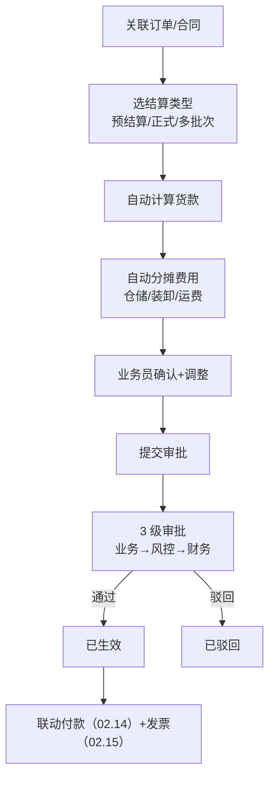
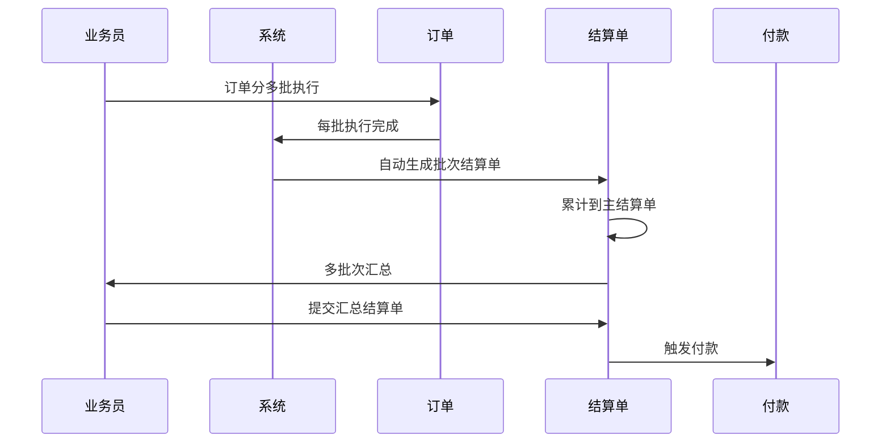
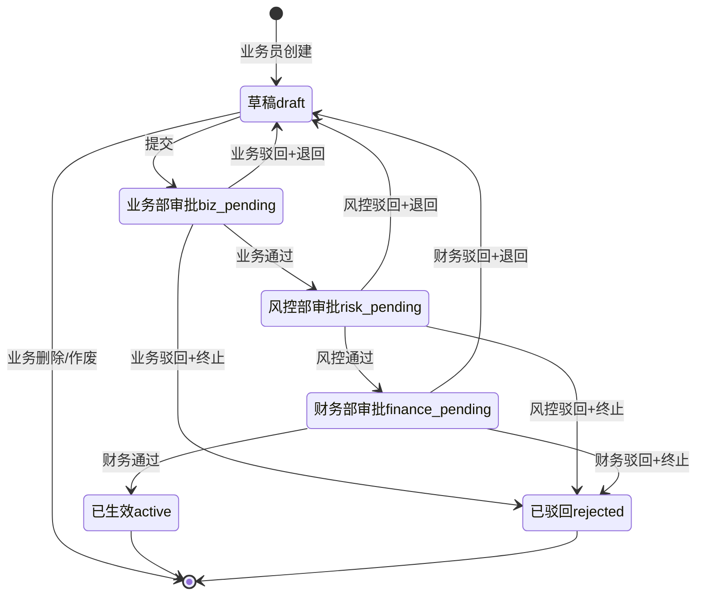
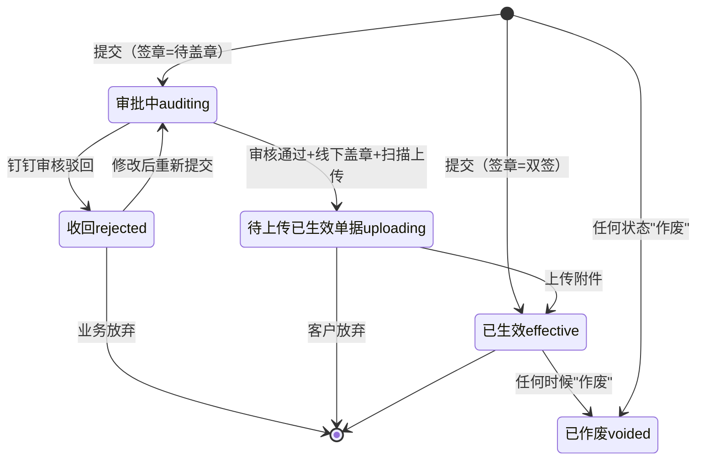

# 02.13 结算单管理 v1.0 终版

> **状态**：v1.0 终版（**新模块，基于原型 49-54 截图**）
> **生成时间**：2026-07-24 14:55
> **配套文档**：[00-项目总览与对接.md](../00-项目总览与对接.md) / [01-模块拆解大框架.md](../01-模块拆解大框架.md) / [02.03-合同管理.md](./02.03-合同管理.md) / [02.04-订单管理.md](./02.04-订单管理.md)
> **复用度**：🟢 **75%（大幅复用）**——主产品 `bo_statement` + `t_statement` + `bo_terminal_statement` + `t_settlement_agreement` 4+ 张表

---

## 0. 章节导航

1. 业务定位
2. 业务流程全景
3. 核心实体（3 张表）
4. 4 状态机
5. 角色操作矩阵
6. 字段规则
7. 按钮交互
8. 异常处理
9. 跨模块流转
10. 复用建议

---

## 1. 业务定位

**结算单管理**是港通供应链的**货款及费用结算中心**——采购/销售预结算+正式结算+多批次结算，自动核算货款及仓储/装卸/运费。

**关键特点**：
- **2 子模块**：采购结算 / 销售结算
- **3 结算类型**：预结算 / 正式结算 / 多批次结算
- **自动分摊**：仓储/装卸/运费按比例分摊

### 1.2 6 个页面（sitemap）

| # | 子模块 | 页面 |
|---|--------|------|
| 1 | **采购结算** | 采购结算列表 / 新增/编辑采购结算单 / 采购结算单详情 |
| 2 | **销售结算** | 销售结算列表 / 新增/编辑销售结算单 / 销售结算单详情 |

---

## 2. 业务流程全景

### 2.1 结算单创建流程



### 2.2 多批次结算流程



---

## 3. 核心实体（3 张表）

### 3.1 `t_settlement` 结算单主表

| 字段 | 类型 | 必填 | 说明 |
|------|------|------|------|
| `id` | bigint PK | - | 主键 |
| `settlement_no` | varchar(32) | ✓ | 结算单号 |
| `settlement_type` | varchar(20) | ✓ | `purchase`（采购）/ `sales`（销售）|
| `settlement_stage` | varchar(20) | ✓ | `pre`（预结算）/ `final`（正式结算）/ `multi_batch`（多批次结算）|
| `contract_id` | bigint | ✓ | 关联合同 |
| `order_id` | bigint | - | 关联订单（多批次时为空）|
| `parent_settlement_id` | bigint | - | 父结算单 ID（多批次时关联主单）|
| `batch_no` | varchar(32) | - | 批次号（多批次时）|
| `total_amount` | decimal(20,2) | ✓ | 结算总金额 |
| `paid_amount` | decimal(20,2) | - | 已付金额 |
| `unpaid_amount` | decimal(20,2) | - | 未付金额 |
| `currency` | varchar(10) | - | 币种 |
| `settlement_date` | date | ✓ | 结算日期 |
| `due_date` | date | - | 付款截止日期 |
| `status` | varchar(20) | ✓ | 4 状态（见 §4）|
| `creator_id` | bigint | ✓ | 创建人 |
| `create_time` | datetime | ✓ | - |

### 3.2 `t_settlement_item` 结算明细

| 字段 | 类型 | 必填 | 说明 |
|------|------|------|------|
| `id` | bigint PK | - | 主键 |
| `settlement_id` | bigint | ✓ | 关联结算单 |
| `fee_type` | varchar(20) | ✓ | `goods`（货款）/ `storage`（仓储费）/ `loading`（装卸费）/ `transport`（运费）/ `other`（其他）|
| `amount` | decimal(20,2) | ✓ | 金额 |
| `ref_type` | varchar(20) | - | 关联单据类型（订单/合同/出入库）|
| `ref_id` | bigint | - | 关联单据 ID |
| `remark` | varchar(500) | - | 备注 |

### 3.3 `t_settlement_approval` 结算审批流

| 字段 | 类型 | 必填 | 说明 |
|------|------|------|------|
| `id` | bigint PK | - | 主键 |
| `settlement_id` | bigint | ✓ | 关联结算单 |
| `node` | tinyint | ✓ | 当前节点 1-3 |
| `node_label` | varchar(50) | - | 节点名 |
| `approver_id` | bigint | - | 审批人 |
| `approver_name` | varchar(64) | - | 审批人姓名 |
| `opinion` | text | - | 审批意见 |
| `decision` | varchar(20) | - | `approve` / `reject` |
| `decision_time` | datetime | - | 决策时间 |
| `sla_deadline` | datetime | - | SLA 截止时间 |
| `sla_overtime` | tinyint | - | SLA 超时标记 |
| `create_time` | datetime | ✓ | - |

---

## 4. 4 状态机



### 4.1 4 状态说明

| # | 状态 | 中文 | 触发 | 出口 |
|---|------|------|------|------|
| 1 | `draft` | 草稿 | 业务员创建 | 提交/删除 |
| 2 | `biz_pending` | 业务部审批 | 业务部审批 | 业务部审批 |
| 3 | `risk_pending` | 风控部审批 | 风控部审批 | 风控部审批 |
| 4 | `finance_pending` | 财务部审批 | 财务部审批 | 财务部审批 |
| 5 | `active` | 已生效 | 财务部通过 | 终态 |
| 6 | `rejected` | 已驳回 | 任一审批驳回 | 终态 |

---

## 5. 角色操作矩阵

| 状态 / 角色 | 业务员 | 业务部 | 风控部 | 财务部 | 系统 |
|------------|------|------|------|------|------|
| `draft` 草稿 | 编辑/提交 | 查看 | 查看 | 查看 | - |
| `biz_pending` 业务部 | 查看 | **审批** | 查看 | 查看 | 推送 |
| `risk_pending` 风控部 | 查看 | 查看 | **审批** | 查看 | 推送 |
| `finance_pending` 财务部 | 查看 | 查看 | 查看 | **审批** | 推送 |
| `active` 已生效 | 查看 | 查看 | 查看 | 查看 | 联动付款/发票 |
| `rejected` 已驳回 | **编辑后重新提交** | 查看 | 查看 | 查看 | - |

---

## 6. 字段规则

### 6.1 结算类型 `settlement_type`

- 2 种：`purchase`（采购结算）/ `sales`（销售结算）

### 6.2 结算阶段 `settlement_stage`（**v1.0 新增**）

- 3 种：
  - `pre`（预结算）—— 订单执行前预估
  - `final`（正式结算）—— 订单完成后
  - `multi_batch`（多批次结算）—— 长协订单分批结算

### 6.3 费用类型 `fee_type`

- 5 种：
  - `goods`（货款）
  - `storage`（仓储费）
  - `loading`（装卸费）
  - `transport`（运费）
  - `other`（其他）

### 6.4 自动分摊规则（**v1.0 港通特色**）

- 仓储/装卸/运费按订单数量/金额分摊
- 多批次结算：分摊费按批次数量占比

---

## 7. 按钮交互

### 7.1 列表页

| 按钮 | 位置 | 可见条件 | 点击行为 |
|------|------|---------|---------|
| **新增/编辑采购结算单** | 右上 | 业务部 | 跳新增页 |
| **新增/编辑销售结算单** | 右上 | 业务部 | 跳新增页 |
| 数据导出 | Tab 右侧 | 所有 | 导出 Excel |
| 详情 | 列表行 | 所有 | 跳详情页 |

### 7.2 新增/编辑结算单

- 选关联合同（必填）
- 选关联订单（必填，多批次时为空）
- 选结算阶段（预结算/正式结算/多批次结算）
- 系统自动计算货款 + 分摊费用
- 业务员可调整金额 + 备注

### 7.3 详情页

- 结算基本信息
- 费用明细（货款/仓储/装卸/运费/其他）
- 审批记录
- 关联付款/发票

---

## 8. 异常处理

| 异常场景 | 提示文案 | 处理动作 |
|---------|---------|---------|
| 结算金额 < 0 | "结算金额不能 < 0" | 阻止 |
| 结算金额 > 合同剩余金额 | "结算金额 X 超过合同剩余金额 Y" | 阻止 |
| 货款自动计算错误 | "货款计算异常，请联系管理员" | 阻止 |
| 关联订单未完结 | "关联订单还未完结，不能正式结算" | 阻止 |
| 多批次结算未到批次 | "批次 X 还未执行完成" | 阻止 |

---

## 9. 跨模块流转

### 9.1 上游触发

| 触发模块 | 触发条件 | 触发动作 |
|---------|---------|---------|
| 合同管理（02.03）| 合同 `executing` | 允许创建结算单 |
| 订单管理（02.04）| 订单 `finished` | 触发正式结算 |

### 9.2 下游触发

| 触发模块 | 触发条件 | 触发动作 |
|---------|---------|---------|
| 付款（02.14）| 结算单 `active` | 触发付款申请 |
| 发票（02.15）| 结算单 `active` | 触发开票申请 |
| 业务线（02.06）| 结算单 `active` | 更新业务线结算进度 |

---

## 10. 复用建议

### 10.1 复用度

**🟢 75%（大幅复用）**

| 类别 | 数量 | 复用度 |
|------|------|--------|
| 复用主产品表 | 4 张 | 80% |
| 港通新建表 | 0 张 | - |

### 10.2 复用主产品表

- `bo_statement` 结算单（主表）
- `t_statement` 结算单（业务表）
- `bo_terminal_statement` 终结结算单
- `t_settlement_agreement` 结算协议

### 10.3 港通新建表

- `t_settlement_approval` 结算审批流（v1.0 标准化）

### 10.4 给研发的实施建议

1. **第一周**：直接复用主产品 4 张表
2. **第二周**：建 2 子模块（采购/销售结算）
3. **第三周**：建 3 级审批 + 4 状态机
4. **第四周**：建自动分摊逻辑 + 跨模块集成

---

## 11. 文档版本

- **v1.0（2026-07-24 14:55）**：基于 49-54 截图 + sitemap 首次终版，作为范本用于后端开发
- **v1.7.99.82（2026-07-30）**：销售结算 3 页面（列表 / 表单 / 详情）+ 7 状态机 + 5 操作按钮矩阵 + PRD 规则全量补全，详见 §12
- 修改记录：见 `06-修改记录.md`
---

## 修改记录

### v1.7.99.x（2026-07-28）

- 🟡 列表页占位 = "全部"（全站统一）
- 🟡 列表页规范升级（v1.7.99 全局）
- 🟡 状态 tag 颜色编码（v1.7.99.14）
- 🟡 流程图统一用 Mermaid（v1.7.99.6）
- 详见：[v1.7.99-changelog.md](./v1.7.99-changelog.md)（30+ 版本汇总）

---

## 12. 销售结算（v1.7.99.82 新增子模块）

> **本节基于 5 张原型截图（v1.7.99.82 重制）补充销售结算模块的需求规则**。3 页面：销售结算列表 / 新增销售结算单 / 销售结算单详情。
> **与 §1-11 采购结算的关系**：v1.0 终版（4 状态机）作为采购结算基线保留；本节定义销售结算的 **7 状态机 + 5 操作按钮矩阵 + 3 种二次确认弹窗 + 关联货转逻辑**，与采购结算（v1.7.99.70 6 状态）独立。

### 12.1 业务定位

**销售结算**是港通供应链**对外销售**的结算中心——按销售订单/单批次合同开结算单，关联"已生效"的货转单据，按签章状态（待盖章/双签）走不同生效流程。

**与采购结算的核心差异**：
- **销售结算 = 客户视角**：卖方=我方=港通供应链，买方=客户
- **采购结算 = 供应商视角**：卖方=供应商，买方=我方=港通供应链
- **销售结算关联货转单据**：必须是关联"已生效"且**未关联结算单**的货转单据（v1.7.99.82 按图 1）
- **销售结算签章 2 选项**：待盖章/双签（采购是 待盖章/驳回）

### 12.2 3 个页面（sitemap）

| # | 页面 | 入口 |
|---|------|------|
| 1 | **销售结算列表** | 左侧菜单「资金管理 / 销售结算」 |
| 2 | **新增/编辑销售结算单** | 列表右上「+ 新增销售结算单」按钮 / 列表操作列「修改」链接（v1.7.99.82） |
| 3 | **销售结算单详情** | 列表行点击 / 列表操作列「详情」链接 |

### 12.3 7 状态机（v1.7.99.82 按 user 图 5）

| # | 状态 | 中文 | 触发 | 出口 |
|---|------|------|------|------|
| 1 | `auditing` | 审批中 | 提交签章状态=待盖章 → 推送钉钉审核 | 待上传已生效单据 / 收回 |
| 2 | `rejected` | 收回（=审批驳回） | 钉钉审核驳回 | 审批中（修改后重新提交）/ 已作废 |
| 3 | `uploading` | 待上传已生效单据 | 钉钉审核通过 → 业务线下盖章 → 扫描上传附件 | 已生效 / 已作废 |
| 4 | `toconfirm` | 待确认（v1.7.99.82 二期再做）| 待上传已生效单据 → 客户确认签收 | 已生效 |
| 5 | `producing` | 量产投放（v1.7.99.82 二期再做）| 客户确认 → 量产投放 | 已生效 |
| 6 | `effective` | 已生效 | 提交签章状态=双签 / 待确认完成 / 量产投放完成 | 终态（可作废）|
| 7 | `voided` | 已作废 | 任一状态点"作废"按钮 | 终态 |

**注意**：v1.7.99.82 一期只实现 5 状态操作（全部 10 条 mock 不包含"待确认"和"量产投放"数据），但状态定义保留 7 个以便二期扩展。列表 6 tab 实际只展示 5 个状态 + 全部。



### 12.4 6 tab 列表（v1.7.99.82 按 user 图 5）

| Tab | 筛选状态 | 数字（mock） | 业务含义 |
|-----|---------|------------|---------|
| **全部** | 所有 5 个状态 | 10 | 全量展示 |
| **审批中** | `auditing` | 3 | 钉钉审核中 |
| **待上传已生效单据** | `uploading` | 2 | 审核通过 + 线下盖章 + 扫描上传 |
| **已生效** | `effective` | 3 | 结算单已生效 |
| **收回** | `rejected` | 1 | 钉钉审核驳回 |
| **已作废** | `voided` | 1 | 任何状态作废 |

**数字取自 mock 实际数量**，为 0 时**不展示**数字（按 user 图 5 "标签 tab 数字：取对应状态的结算单数量，为0时不展示数字信息"）。

### 12.5 5 状态操作按钮矩阵（v1.7.99.82 按 user 图 5 操作列表格）

| 结算单状态 | 操作按钮 | 行为 |
|-----------|---------|------|
| **审批中** | 详情 | 跳 `settlement-sales-detail.html?status=auditing` |
| **收回**（=审批驳回） | 详情 / 修改 / 作废 | 详情跳 `?status=rejected`；修改跳 `settlement-sales-new.html?status=rejected`；作废触发**作废原因必填弹窗** + 提交后 tip 提示"结算单已作废" |
| **待上传已生效单据** | 详情 / 上传附件 / 作废 | 上传附件触发**上传弹窗（最多 20 个）**；作废同上 |
| **已生效** | 详情 | 跳 `?status=effective` |
| **已作废** | 详情 | 跳 `?status=voided` |

### 12.6 列表字段（v1.7.99.82 按 user 图 5 列表_字段）

| # | 字段 | 宽度 | 说明 | 取值 |
|---|------|------|------|------|
| 1 | 结算单编号 | 13% | 等宽字体 | 用户输入的结算单号（100字以内）|
| 2 | 买方企业 | 16% | - | 销售合同关联客户 |
| 3 | 结算金额（元）| 9% | 右对齐 | **取消前**结算单的结算总金额 |
| 4 | 结算数量 | 8% | 右对齐 | **取消前**结算单的结算总数量 |
| 5 | 结算单价 | 8% | 右对齐 | **取消前**结算单的结算单价（"如果只一个单价或者单价相同时，展示一个值；如果单价不同，则以"、"隔开"）|
| 6 | 结算日期 | 8% | - | 取消前结算单的结算日期 |
| 7 | 销售订单/单批次合同编号 | 16% | 等宽字体 | 取消前结算单关联的销售订单/单批次合同编号 |
| 8 | 结算单状态 | 11% | 7 状态 badge | 见 §12.3 |
| 9 | 操作 | auto | 右对齐 | 5 状态操作按钮矩阵（见 §12.5）|

### 12.7 新增销售结算单（v1.7.99.82 按 user 图 1+2）

#### 12.7.1 5 大区块

| 区块 | 字段数 | 关键字段 | 必填 | 备注 |
|------|--------|---------|------|------|
| **1. 销售订单/单批次合同信息** | 11 字段 3 列 4 行 | 卖方企业/买方企业/品名/计量单位/合同单价/合同数量/税率/签订日期/合同交货期限/运输方式/业务实际负责人 | 否（只读）| **默认打开"选择销售订单/单批次合同" 1440px 抽屉**（v1.7.99.82 仿 v1.7.99.68 货转 drawer / v1.7.99.70 采购 drawer 模式）|
| **2. 选择结算物** | 5 列 5 行 checkbox | 货转编号/货转数量(吨)/货转日期/收货人/状态(已生效) | 否 | **仅展示关联"已生效"且未关联结算单的所有货转单据**（按 user 图 2 注意事项）；点击货转编号→新标签页打开货转详情 |
| **3. 结算单信息** | 6 字段 3 列 2 行 + 备注 | 结算单号/结算日期/供货周期/结算金额/本次结算数量/结算单价/签章状态/备注 | 部分必填 | 见 §12.7.2 字段规则 |
| **4. 附件** | 3 行 表格 | 单据类型/文件名/操作 | 见 §12.7.3 | 单据类型**联动签章状态** |
| **5. 底部按钮** | 2 按钮 | 取消 / 提交 | - | 取消触发"取消确认"弹窗；提交触发"待盖章/双签"对应弹窗 |

#### 12.7.2 结算单信息字段规则（v1.7.99.82 按 user 图 2）

| 字段 | 必填 | 规则 |
|------|------|------|
| **结算单号** | ✓ | 文本输入，**100 字以内**，用户手动输入 |
| **本次结算数量** | ✓ | **所有货转数量的加和**，禁止修改（`readonly` 灰底）|
| **本次结算金额** | ✓ | 文本输入框，**金额输入样式**，必填 |
| **结算单价** | - | **根据数量和金额自动计算**（`readonly` 紫底）|
| **结算日期** | ✓ | 单个日期选择器；默认提示"请选择结算日期"；**提交时如未选择，提示"结算日期必填"**（浅紫底）|
| **供货周期** | ✓ | 日期范围选择器，**不能大于当前日期**，必填（浅黄底）|
| **签章状态** | ✓ | 单选紫色下拉触发器，**2 选项：待盖章 / 双签**（采购版是"待盖章/驳回"）|
| **备注** | - | 文本域，最多 200 字 |

#### 12.7.3 附件规则（v1.7.99.82 按 user 图 2）

| 规则 | 说明 |
|------|------|
| **签章联动单据类型** | **签章=待盖章** → 单据类型显示**待盖章附件**（必填）；**签章=双签** → 单据类型显示**已生效附件**（必填）|
| **必须填** | 待盖章附件/已生效附件必填；**提交时如未选择，提示"请上传待盖章附件"**（v1.7.99.82 沿用 purchase 文案，按签章动态调整）|
| **支持多文件** | 待盖章附件/已生效附件/其他附件都支持上传多个 |
| **其他附件** | 非必填项，支持上传多个 |
| **预览** | 上传后，支持点击对应的附件进行预览 |
| **数量上限** | 单个类型的附件，**最多支持上传 20 个** |
| **格式大小** | 蓝底提示框统一文案：可支持格式为 png、jpeg、jpg、gif、pdf、doc、docx、xlsx、xls，单个附件大小不得超过 100MB |

#### 12.7.4 3 种二次确认弹窗（v1.7.99.82 按 user 图 2）

| 弹窗 | 触发 | 标题 | 描述 | 提交后 tip 提示 | tip 颜色 |
|------|------|------|------|----------------|---------|
| **取消确认** | 点击「取消」按钮 | 取消确认 | "确定要进行取消操作吗？取消后，结算数据不会保存。" | — | — |
| **待盖章** | 签章=待盖章 + 点击「提交」 | 提交确认 | "请确认信息填写完成并提交？提交后，结算信息将推送钉钉进行审核，审核通过后，将线下盖章的结算单上传到系统。" | "结算单已推送钉钉审核，状态变更为审批中" | 蓝色 #1E40AF |
| **双签** | 签章=双签 + 点击「提交」 | 提交确认 | "请确认信息填写完成并提交？当前结算单无需盖章，提交后，将直接生效。" | "结算单已生效，状态变更为已生效" | 绿色 #10B981 |

**作废原因必填**（v1.7.99.82 按 user 图 5）：列表操作列「作废」按钮触发**作废原因必填弹窗** + 提交后 tip 提示"结算单已作废"。

### 12.8 销售结算单详情（v1.7.99.82 按 user 图 3+4）

#### 12.8.1 顶部信息条（v1.7.99.82 按 user 图 3）

- **面包屑**：结算管理 / 销售结算 / 销售结算单详情
- **结算单编号**：蓝色链接 + 复制 icon（点击复制）
- **状态 badge**：「已生效」绿色 badge
- **来源 tag**：「作废：待发起方重置」蓝色 tag
- **所属合同编号**：蓝色链接 + 复制 icon
- **卖方企业 / 买方企业 / 创建时间**：明文展示

#### 12.8.2 2 tab

| Tab | 内容 |
|-----|------|
| **结算单信息** | 默认显示。3 区块：结算货物（5 列 5 行）/ 本次结算信息（6 字段 3 列 2 行 + 备注）/ 结算单附件（3 行：待盖章/已生效/其他 + 一键下载）|
| **结算单操作记录 (10)** | 5 列表格 7 行：新建 / 修改 / 提交审批 / 签约完成 / 确认完成 / 收回 / 作废 |

#### 12.8.3 操作记录 7 行 mock（v1.7.99.82 按 user 图 4）

| 操作类型 | 操作人 | 所属公司 | 操作内容 | 操作时间 |
|---------|-------|---------|---------|---------|
| 新建 | 张三 | XXXX公司 | 创建结算单成功，结算单编号：BX8282828 | 2021-11-15 12:22:32 |
| 修改 | 张三 | XXXX公司 | 修改结算单 | 2021-11-15 12:22:32 |
| 提交审批 | 张三 | XXXX公司 | 提交结算单 | 2021-11-15 12:22:32 |
| 签约完成 | 张三 | XXXX公司 | 完成结算单签约盖章 | 2021-11-15 12:22:32 |
| 确认完成 | 李四 | XXXX公司 | 完成对结算单的确认盖章 | 2021-11-15 12:22:32 |
| 收回 | 张三 | XXXX公司 | 内部审批驳回 | 2021-11-15 12:22:32 |
| 作废 | 张三 | XXXX公司 | 待结算单 - 自动作废 | 2021-11-15 12:23:32 |

### 12.9 列表基础交互说明（v1.7.99.82 按 user 图 5）

| 交互 | 规则 |
|------|------|
| **鼠标移入字段** | 列表中每一行展示不全时，支持鼠标移入到对应字段**展示全量信息**（tooltip）|
| **行点击** | 点击行任意位置（除操作区）→ 跳详情页 `settlement-sales-detail.html?status=xxx` |
| **页码固定** | 页码固定在页面底部，**不随上下滑动而滚动** |
| **数据导出** | 点击「数据导出」→ 弹出系统下载 `销售结算单_20240730.xlsx`（命名规则：`销售结算单_导出日期.xlsx`）|

### 12.10 销售结算 10 行 mock（v1.7.99.82）

```js
const SETTLE_MOCK = [
  { no: 'XSJS-20241119-001', buyer: '郑州信必达供应链管理有限公司', amount: '1,000,000.22', qty: '100吨', price: '10,000.22元/吨', date: '2024-11-19', contract: 'XSXS-20241119-001、XSXS-20241119-002', status: '审批中' },
  { no: 'XSJS-20241118-002', buyer: '河南物产集团有限公司', amount: '2,300,000.50', qty: '230吨', price: '10,000.22元/吨', date: '2024-11-18', contract: 'XSXS-20241118-001', status: '审批中' },
  { no: 'XSJS-20241115-003', buyer: '浙江昌瑞贸易有限公司', amount: '4,560,000.00', qty: '1,200吨', price: '3,800元/吨', date: '2024-11-15', contract: 'XSXS-20241115-001', status: '审批中' },
  { no: 'XSJS-20241112-004', buyer: '国电投河南电力燃料有限公司', amount: '1,200,000.00', qty: '400吨', price: '3,000元/吨', date: '2024-11-12', contract: 'XSXS-20241112-001', status: '待上传已生效单据' },
  { no: 'XSJS-20241110-005', buyer: '国能河南燃料有限公司', amount: '1,800,000.00', qty: '600吨', price: '3,000元/吨', date: '2024-11-10', contract: 'XSXS-20241110-001', status: '待上传已生效单据' },
  { no: 'XSJS-20241105-006', buyer: '河南煤炭储配交易中心有限公司', amount: '3,400,000.00', qty: '1,000吨', price: '3,400元/吨', date: '2024-11-05', contract: 'XSXS-20241105-001', status: '已生效' },
  { no: 'XSJS-20241101-007', buyer: '山西潞安环保能源开发有限公司', amount: '5,200,000.00', qty: '1,500吨', price: '3,466.67元/吨', date: '2024-11-01', contract: 'XSXS-20241101-001', status: '已生效' },
  { no: 'XSJS-20241025-008', buyer: '天宇潇国际贸易集团有限公司', amount: '8,694,000.00', qty: '2,898吨', price: '3,000元/吨', date: '2024-10-25', contract: 'XSXS-20241025-001', status: '已生效' },
  { no: 'XSJS-20241020-009', buyer: '中国华能集团燃料有限公司', amount: '2,200,000.00', qty: '550吨', price: '4,000元/吨', date: '2024-10-20', contract: 'XSXS-20241020-001', status: '收回' },
  { no: 'XSJS-20241015-010', buyer: '中煤能源山东有限公司', amount: '1,600,000.00', qty: '500吨', price: '3,200元/吨', date: '2024-10-15', contract: 'XSXS-20241015-001', status: '已作废' },
];
```

### 12.11 字段映射表（销售版 vs 采购版）

| 字段 | 销售版 | 采购版（v1.7.99.70）|
|------|--------|------------------|
| 业务类型 | **销售**（我方=卖方）| **采购**（我方=买方）|
| 合同类型 | **销售订单/单批次合同** | **采购订单/单批次合同** |
| 关联企业（主）| **买方企业**（=客户）| **卖方企业**（=供应商）|
| 关联企业（次）| **卖方企业**（=我方/港通供应链）| **买方企业**（=我方/港通供应链）|
| 抽屉标题 | 选择销售订单/单批次合同 | 选择采购销售订单/单批次合同 |
| 抽屉 chips 示例 | XSXS20241119-001 | DLXLC001 |
| 抽屉筛选字段 | 买方企业 / 卖方企业 / 品名 / 签订日期 | 卖方企业 / 买方企业 / 品名 / 签订日期 |
| 签章状态 2 选项 | **待盖章 / 双签** | 待盖章 / 驳回 |
| 列表 tab 数量 | 6 tab（全部 10/审批中 3/待上传已生效单据 2/已生效 3/收回 1/已作废 1）| 6 tab（全部 100/审批中 10/待上传已生效单据 10/已生效 10/驳回 10/已作废 10）|
| 状态 badge 颜色 | 同 7 状态色 | 同 7 状态色 |
| 详情页 source-tag | 「作废：待发起方重置」| 「来源：待发起方盖章」|
| 操作记录最后一行 | 作废 - 待结算单 - 自动作废 | 驳回 - 驳回结算单，驳回原因：XXXXX |

### 12.12 异常处理

| 异常场景 | 提示文案 | 处理动作 |
|---------|---------|---------|
| 结算日期未选择 | "结算日期必填" | 阻止提交 |
| 供货周期大于当前日期 | "供货周期不能大于当前日期" | 阻止 |
| 待盖章附件未上传（签章=待盖章）| "请上传待盖章附件" | 阻止提交 |
| 已生效附件未上传（签章=双签）| "请上传已生效附件" | 阻止提交 |
| 签章状态未选择 | "请先选择签章状态" | 阻止提交 |
| 货转编号点击 | 新标签页打开货转详情 | — |
| 作废原因未填 | "作废原因必填" | 阻止作废 |

---

## 13. v1.7.99.x 模块级增量补充（基于飞书《用户使用手册》沉淀）

> **本节追加于 2026-09-24**
> **需求来源**：飞书《豫港通用户使用手册（内部版）》第 7.1 节"采/销购结算" + 本仓库 v1.7.99.82 销售结算子模块 + 现有 p-settlement-* 沉淀
> **v1.0 / v1.7.99.82 文档骨架（1-12 节）保持不变**，本节仅补充 v1.7.99.x 后未明的业务规则、销售结算子模块、跨模块联动、详细页面 PRD 索引

### 13.1 模块业务变化（v1.0 → v1.7.99.82）

| 维度 | v1.0 文档 | v1.7.99.82 现状 |
|------|----------|------------------|
| 页面清单 | 3 页（结算单列表/详情/新建）| **6 页**：销售结算（v1.7.99.82 新增）+ 采购结算 + 各页详情/新建 |
| 销售结算子模块 | 无 | **v1.7.99.82 关键决策**：销售结算从采购结算中拆出独立子模块 |
| 签章状态 | v1.0 简化 | v1.7.99.82 **统一规范**：待盖章 / 已双签（销售）/ 驳回（销售）|
| 列表 tab 数量 | 4 tab | 6 tab（全部 / 审批中 / 待上传已生效单据 / 已生效 / 收回 / 已作废）|

### 13.2 7 状态机（v1.7.99.x 沉淀）

| 状态 | 触发 | 下一状态 |
|------|------|----------|
| 待发起 | 业务人员登记结算单 | 待盖章 / 审批中 |
| 待盖章 | 签章状态=待盖章 | 已双签 / 已作废 |
| 审批中 | 销售结算发起后 | 已生效 / 已作废 |
| 待上传已生效单据 | 双签后待上传凭证 | 已生效 / 已作废 |
| 已生效 | 凭证已上传 | 终态 |
| 已作废 | 业务人员主动作废 | 终态 |
| 收回 | v1.7.99.82 新增（销售）| 终态 |

### 13.3 销售 vs 采购结算对比（v1.7.99.82 关键）

| 维度 | 销售结算（v1.7.99.82 新增）| 采购结算（v1.0）|
|------|---------------------------|-------------------|
| 业务方向 | 核心企业 → 下游客户 | 上游供应商 → 核心企业 |
| 抽屉标题 | 选择销售订单/单批次合同 | 选择采购销售订单/单批次合同 |
| 抽屉 chips 示例 | XSXS20241119-001 | DLXLC001 |
| 抽屉筛选字段 | 买方企业 / 卖方企业 / 品名 / 签订日期 | 卖方企业 / 买方企业 / 品名 / 签订日期 |
| 签章状态 | 待盖章 / 双签 | 待盖章 / 驳回 |
| 列表 tab 数量 | 6 tab | 6 tab |
| 状态 badge 颜色 | 同 7 状态色 | 同 7 状态色 |
| 详情页 source-tag | 作废：待发起方重置 | 来源：待发起方盖章 |
| 操作记录最后一行 | 作废 - 待结算单 - 自动作废 | 驳回 - 驳回结算单，驳回原因：XXXXX |

### 13.4 跨模块联动（v1.7.99.x 增强）

| 联动系统 | v1.0 描述 | v1.7.99.x 增强 |
|----------|-----------|------------------|
| **回款管理（02.14）**| 已记录 | 结算单生效 → 触发下游结算金额重算 |
| **发票管理（02.15）**| 已记录 | 结算单生效 → 关联发票可登记 |
| **合同（02.03）**| 已记录 | 结算单 → 合同"已结算金额"自动更新 |
| **货转（02.07）**| 已记录 | 结算单 → 货转编号关联（详见 p-settlement-sales-detail.md 第 12.7 节）|

### 13.5 异常处理（v1.7.99.x 补充）

| 场景 | v1.7.99.x 处理 |
|------|------------------|
| 结算日期未选择 | "结算日期必填" → 阻止提交 |
| 供货周期大于当前日期 | "供货周期不能大于当前日期" → 阻止 |
| 待盖章附件未上传（签章=待盖章）| "请上传待盖章附件" → 阻止提交 |
| 已生效附件未上传（签章=双签）| "请上传已生效附件" → 阻止提交 |
| 签章状态未选择 | "请先选择签章状态" → 阻止提交 |
| 货转编号点击 | 新标签页打开货转详情 |
| 作废原因未填 | "作废原因必填" → 阻止作废 |

### 13.6 详细页面 PRD 索引

#### 采购结算（v1.0 原有）

| 页面 | PRD 文档 | 当前版本 |
|------|----------|----------|
| `settlement-purchase.html` | [p-settlement-purchase.md](./p-settlement-purchase.md) | v1.7.99.x 终版 |
| `settlement-purchase-new.html` | [p-settlement-purchase-new.md](./p-settlement-purchase-new.md) | v1.7.99.x 终版 |
| `settlement-purchase-detail.html` | [p-settlement-purchase-detail.md](./p-settlement-purchase-detail.md) | v1.7.99.x 终版 |

#### 销售结算（v1.7.99.82 新增）

| 页面 | PRD 文档 | 当前版本 |
|------|----------|----------|
| `settlement-sales.html` | [p-settlement-sales.md](./p-settlement-sales.md) | v1.7.99.82 终版 |
| `settlement-sales-new.html` | [p-settlement-sales-new.md](./p-settlement-sales-new.md) | v1.7.99.82 终版 |
| `settlement-sales-detail.html` | [p-settlement-sales-detail.md](./p-settlement-sales-detail.md) | v1.7.99.82 终版 |

### 13.7 详细业务规则沉淀（来自手册 7.1）

> **来自手册 7.1**：采/销购结算业务场景

**采购结算**：
- 关联采购订单/单批次合同
- 结算日期 / 供货周期 / 实际入库数量 / 实际入库单价
- 待盖章附件 + 已生效附件（双签场景）
- 凭证上传（必传）

**销售结算**（v1.7.99.82 新增）：
- 关联销售订单/单批次合同
- 结算日期 / 供货周期 / 实际出库数量 / 实际出库单价
- 待盖章附件 + 已生效附件（双签场景）
- 凭证上传（必传）

### 13.8 增量补充版 v1.7.99.x 修改记录

- **v1.7.99.82（2026-08-04）**：**销售结算子模块新增** —— 从采购结算中拆出独立子模块（v1.7.99.82 关键决策）
- **v1.7.99.x**：7 状态机统一规范（采购/销售）
- **2026-09-24**：基于飞书《用户使用手册》第 7.1 节补充模块级业务口径（**本节第 13 节**）
