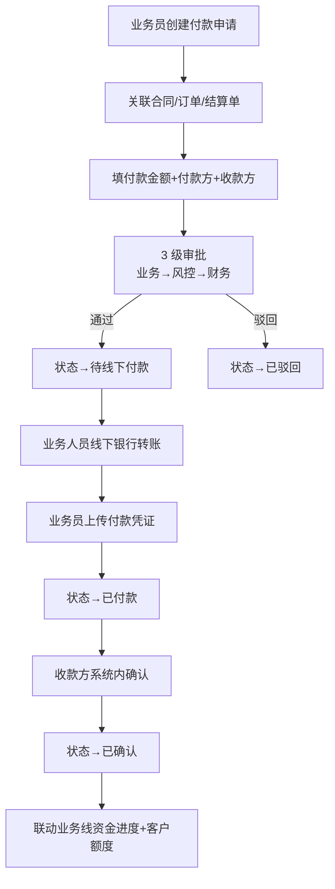
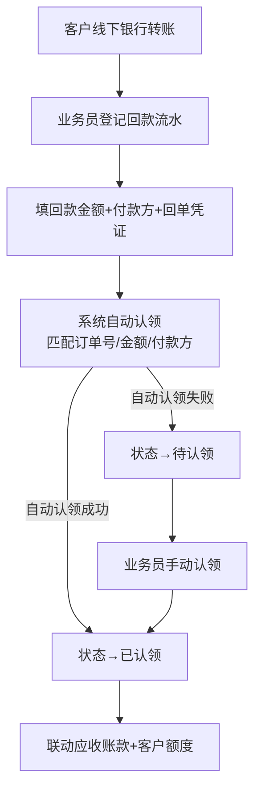
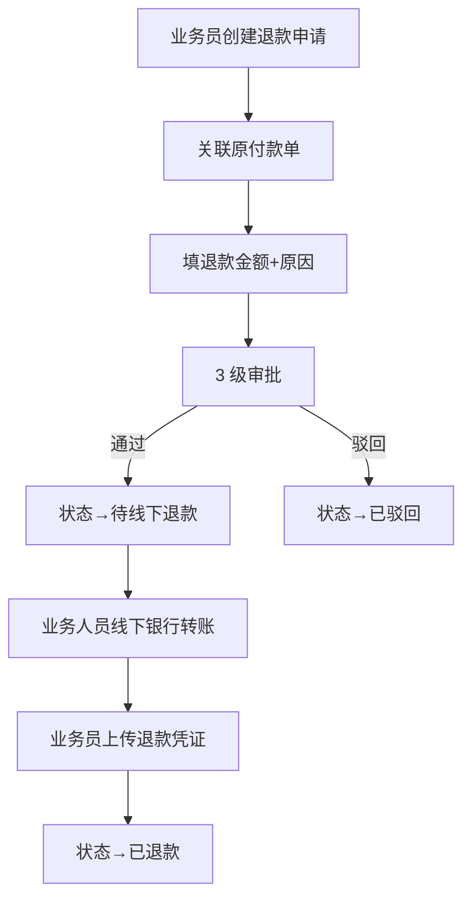

# 02.14 资金管理 v1.0 终版

> **状态**：v1.0 终版（**新模块，基于原型 37-48 截图**）
> **生成时间**：2026-07-24 14:55
> **配套文档**：[00-项目总览与对接.md](../00-项目总览与对接.md) / [01-模块拆解大框架.md](../01-模块拆解大框架.md) / [02.03-合同管理.md](./02.03-合同管理.md) / [02.04-订单管理.md](./02.04-订单管理.md) / [02.10-保证金管理.md](./02.10-保证金管理.md)
> **复用度**：🟢 **85%（大幅复用）**——主产品 `bo_payment` + `bo_receipt` + `bo_collection_claim_record` 12+ 张表

---

## 0. 章节导航

1. 业务定位
2. 业务流程全景（**5 子模块**）
3. 核心实体（10 张表）
4. 角色操作矩阵
5. 字段规则
6. 按钮交互
7. 异常处理
8. 跨模块流转
9. 复用建议

---

## 1. 业务定位

**资金管理**是港通供应链的**资金流核心**——5 大子模块：付款/退款/回款/保证金管理/费用管理。

**关键特点**：
- **资金线下流转**（**港通特色**）：实际资金操作**线下完成**（银行转账/票据），系统流程化登记
- **凭证上传**：发起方上传凭证 + 收款方系统内确认
- **不假设线上扣款**：不存在"银行扣款失败/补足余额/账户异常"等线上假设分支

### 1.1 5 大子模块（基于原型 37-48 截图）

| # | 子模块 | 页面 | 说明 |
|---|--------|------|------|
| 1 | **付款管理** | 付款列表 / 新增付款 / 付款详情 | 采购付款（货主方→上游供应商）|
| 2 | **退款管理** | 退款列表（逻辑不变）/ 退款申请（逻辑不变）/ 退款详情 | 退款流程（逻辑不变）|
| 3 | **回款管理** | 回款列表（不做改动）/ 回款认领操作 / 回款认领详情 | 回款流水登记 + 自动认领 |
| 4 | **保证金管理（新增）** | 保证金管理 / 保证金调整 / 调整记录 | **v1.0 新顶级（独立到 02.10）** |
| 5 | **费用管理** | 隐含在付款/回款中 | 服务费/手续费 |

**注**：保证金管理在原型 46-48 是独立顶级，v1.0 拆出来到 02.10 独立范本。本范本（02.14）只覆盖付款/退款/回款/费用。

### 1.2 12 个页面（sitemap）

| # | 子模块 | 页面 |
|---|--------|------|
| 1-3 | 付款 | 付款列表 / 新增付款 / 付款详情 |
| 4-6 | 退款 | 退款列表（逻辑不变）/ 退款申请（逻辑不变）/ 退款详情 |
| 7-9 | 回款 | 回款列表（不做改动）/ 回款认领操作 / 回款认领详情 |
| 10-12 | 保证金 | 保证金管理 / 保证金调整 / 调整记录（**v1.0 独立到 02.10**）|

---

## 2. 业务流程全景

### 2.1 付款管理流程（**港通特色：线下付款**）



**v1.0 关键流程变化**：
- ❌ 旧版：业务部→风控校验→财务审批→**待线下付款**→已付款
- ✅ v1.1：业务部→风控校验→财务审批→**待线下付款**（保留）→已付款
- 关键：**不假设"银行扣款失败"等线上分支**

### 2.2 回款管理流程（**港通特色：线下回款+自动认领**）



### 2.3 退款管理流程



---

## 3. 核心实体（10 张表）

### 3.1 `t_payment_apply` 付款申请

| 字段 | 类型 | 必填 | 说明 |
|------|------|------|------|
| `id` | bigint PK | - | 主键 |
| `apply_no` | varchar(32) | ✓ | 付款申请单号 |
| `payment_type` | varchar(20) | ✓ | `purchase`（采购付款）/ `expense`（费用付款）/ `other`（其他）|
| `related_type` | varchar(20) | ✓ | `contract` / `order` / `settlement` / `margin` |
| `related_id` | bigint | ✓ | 关联单据 ID |
| `payer_company_id` | bigint | ✓ | 付款方 ID（货主方）|
| `payee_company_id` | bigint | ✓ | 收款方 ID（上游供应商等）|
| `apply_amount` | decimal(20,2) | ✓ | 申请金额 |
| `actual_amount` | decimal(20,2) | - | **实际金额（线下付款后填写，v1.0 关键）** |
| `currency` | varchar(10) | - | 币种 |
| `payment_method` | varchar(20) | - | 付款方式：`bank_transfer`（银行转账）/ `bill`（票据）/ `other` |
| `voucher_url` | varchar(255) | - | **付款凭证 URL（v1.0 关键）** |
| `payment_date` | date | - | **付款日期（线下完成日期，v1.0 关键）** |
| `uploader_id` | bigint | - | 凭证上传人 |
| `upload_time` | datetime | - | 凭证上传时间 |
| `status` | varchar(20) | ✓ | 付款状态 |
| `creator_id` | bigint | ✓ | 创建人 |
| `create_time` | datetime | ✓ | - |

### 3.2 `t_payment_approval` 付款审批流

| 字段 | 类型 | 必填 | 说明 |
|------|------|------|------|
| `id` | bigint PK | - | 主键 |
| `apply_id` | bigint | ✓ | 关联付款申请 |
| `node` | tinyint | ✓ | 当前节点 1-3 |
| `approver_id` | bigint | - | 审批人 |
| `opinion` | text | - | 审批意见 |
| `decision` | varchar(20) | - | `approve` / `reject` |
| `decision_time` | datetime | - | 决策时间 |
| `sla_deadline` | datetime | - | SLA 截止时间 |
| `sla_overtime` | tinyint | - | SLA 超时 |
| `create_time` | datetime | ✓ | - |

### 3.3 `t_payment_check` 付款前置校验（**v1.0 关键**）

| 字段 | 类型 | 必填 | 说明 |
|------|------|------|------|
| `id` | bigint PK | - | 主键 |
| `apply_id` | bigint | ✓ | 关联付款申请 |
| `check_type` | varchar(20) | ✓ | `contract_validity`（合同有效性）/ `quota_available`（额度可用）/ `receipt_enough`（回款足额）/ `margin_enough`（保证金足额）|
| `check_result` | varchar(20) | ✓ | `pass` / `reject` / `warning` |
| `check_message` | varchar(500) | - | 校验信息 |
| `check_time` | datetime | - | 校验时间 |

### 3.4 `t_receipt` 回款流水登记

| 字段 | 类型 | 必填 | 说明 |
|------|------|------|------|
| `id` | bigint PK | - | 主键 |
| `receipt_no` | varchar(32) | ✓ | 回款流水号 |
| `customer_id` | bigint | ✓ | 客户 ID（回款方）|
| `receipt_amount` | decimal(20,2) | ✓ | 回款金额 |
| `currency` | varchar(10) | - | 币种 |
| `receipt_date` | date | ✓ | 回款日期 |
| `receipt_method` | varchar(20) | - | 回款方式：`bank_transfer` / `bill` / `other` |
| `voucher_url` | varchar(255) | - | **回单凭证 URL（v1.0 关键）** |
| `bank_account` | varchar(64) | - | 收款银行账号（脱敏）|
| `remark` | varchar(500) | - | 备注 |
| `claim_status` | varchar(20) | ✓ | 认领状态：`pending_claim` / `auto_claimed` / `manual_claimed` / `unclaimed` |
| `creator_id` | bigint | ✓ | 登记人 |
| `create_time` | datetime | ✓ | - |

### 3.5 `t_receipt_claim` 回款认领

| 字段 | 类型 | 必填 | 说明 |
|------|------|------|------|
| `id` | bigint PK | - | 主键 |
| `receipt_id` | bigint | ✓ | 关联回款 |
| `claim_type` | varchar(20) | ✓ | `auto`（自动认领）/ `manual`（人工认领）/ `split`（拆分认领）|
| `related_type` | varchar(20) | - | 关联单据类型（订单/合同）|
| `related_id` | bigint | - | 关联单据 ID |
| `claim_amount` | decimal(20,2) | ✓ | 认领金额 |
| `claim_match_score` | decimal(5,2) | - | **匹配分数（v1.0 新增，自动认领时）** |
| `match_rule` | varchar(500) | - | 匹配规则（金额/付款方/订单号）|
| `operator_id` | bigint | - | 操作人 |
| `create_time` | datetime | ✓ | - |

### 3.6 `t_receivable` 应收账款

| 字段 | 类型 | 必填 | 说明 |
|------|------|------|------|
| `id` | bigint PK | - | 主键 |
| `related_type` | varchar(20) | ✓ | 关联单据类型 |
| `related_id` | bigint | ✓ | 关联单据 ID |
| `customer_id` | bigint | ✓ | 客户 ID |
| `total_amount` | decimal(20,2) | ✓ | 应收总金额 |
| `received_amount` | decimal(20,2) | - | 已收金额 |
| `unreceived_amount` | decimal(20,2) | - | 未收金额 |
| `due_date` | date | ✓ | 到期日期 |
| `overdue_days` | int | - | **逾期天数（自动计算，v1.0 新增）** |
| `status` | varchar(20) | ✓ | `pending` / `partial_received` / `received` / `overdue` |
| `create_time` | datetime | ✓ | - |

### 3.7 `t_refund_apply` 退款申请

| 字段 | 类型 | 必填 | 说明 |
|------|------|------|------|
| `id` | bigint PK | - | 主键 |
| `apply_no` | varchar(32) | ✓ | 退款申请单号 |
| `original_payment_id` | bigint | ✓ | 原付款单 ID |
| `refund_amount` | decimal(20,2) | ✓ | 退款金额 |
| `refund_reason` | varchar(500) | ✓ | 退款原因 |
| `voucher_url` | varchar(255) | - | 退款凭证 |
| `status` | varchar(20) | ✓ | 退款状态 |
| `creator_id` | bigint | ✓ | 创建人 |
| `create_time` | datetime | ✓ | - |

### 3.8 `t_fee` 费用登记

| 字段 | 类型 | 必填 | 说明 |
|------|------|------|------|
| `id` | bigint PK | - | 主键 |
| `fee_type` | varchar(20) | ✓ | 费用类型 |
| `direction` | varchar(20) | ✓ | `income`（收入）/ `expense`（支出）|
| `amount` | decimal(20,2) | ✓ | 金额 |
| `ref_id` | bigint | - | 关联单据 ID |
| `status` | varchar(20) | ✓ | 状态 |
| `creator_id` | bigint | ✓ | 创建人 |

### 3.9 `t_payment_history` 付款历史

| 字段 | 类型 | 必填 | 说明 |
|------|------|------|------|
| `id` | bigint PK | - | 主键 |
| `apply_id` | bigint | ✓ | 关联付款申请 |
| `change_type` | varchar(20) | ✓ | `submit` / `approve` / `reject` / `paid` / `confirmed` |
| `operator_id` | bigint | ✓ | 操作人 |
| `create_time` | datetime | ✓ | - |

### 3.10 `t_bank_collection` 银行流水对接（**v1.0 新增**）

| 字段 | 类型 | 必填 | 说明 |
|------|------|------|------|
| `id` | bigint PK | - | 主键 |
| `bank_account` | varchar(64) | ✓ | 银行账号 |
| `transaction_no` | varchar(64) | ✓ | 银行流水号 |
| `amount` | decimal(20,2) | ✓ | 金额 |
| `direction` | varchar(20) | ✓ | `in`（入账）/ `out`（出账）|
| `transaction_date` | date | ✓ | 交易日期 |
| `counterparty_account` | varchar(64) | - | 对方账号 |
| `counterparty_name` | varchar(128) | - | 对方户名 |
| `remark` | varchar(500) | - | 备注 |
| `is_matched` | tinyint | - | **是否已匹配（v1.0 新增）** |

---

## 4. 角色操作矩阵

### 4.1 付款管理

| 操作 / 角色 | 业务员 | 业务部 | 风控部 | 财务部 | 总经办 |
|------------|------|------|------|------|------|
| 创建付款申请 | **✓** | - | - | - | - |
| 业务部审批 | - | **✓** | - | - | - |
| 风控校验 | - | - | **✓** | - | - |
| 财务审批 | - | - | - | **✓** | - |
| 线下付款+上传凭证 | **✓** | - | - | - | - |
| 收款方确认 | - | - | - | - | - |
| 查看 | ✓ | ✓ | ✓ | ✓ | ✓ |

### 4.2 回款管理

| 操作 / 角色 | 业务员 | 业务部 | 风控部 | 财务部 |
|------------|------|------|------|------|
| 登记回款流水 | **✓** | - | - | - |
| 自动认领 | 自动 | - | - | - |
| 手动认领 | **✓** | - | - | - |
| 查看 | ✓ | ✓ | ✓ | ✓ |

---

## 5. 字段规则

### 5.1 付款类型 `payment_type`

- 3 种：`purchase`（采购付款）/ `expense`（费用付款）/ `other`（其他）

### 5.2 付款方式 `payment_method`（**v1.0 港通特色**）

- 3 种：`bank_transfer`（银行转账）/ `bill`（票据）/ `other`
- **v1.0 关键**：实际资金操作**线下完成**，系统只登记

### 5.3 实际金额 `actual_amount`（**v1.0 关键**）

- 与 `apply_amount` 可能不一致（**v1.0 重要**）
- 实际金额 = 线下实际转账金额
- 实际金额 ≠ 申请金额 → 状态→`warning`

### 5.4 付款凭证 `voucher_url`（**v1.0 关键**）

- 必填（线下付款后）
- 格式：图片/PDF
- 包含：银行回单/票据照片

### 5.5 付款前置校验 4 类（**v1.0 关键**）

- `contract_validity`（合同有效性）
- `quota_available`（额度可用）
- `receipt_enough`（回款足额）
- `margin_enough`（保证金足额）
- 任一校验不通过 → 阻止付款

### 5.6 回款认领匹配规则（**v1.0 港通特色**）

- 匹配优先级：金额（精确）> 付款方（一致）> 订单号（备注）
- 匹配分数 = 0-100
- 分数 >= 80 → 自动认领
- 分数 < 80 → 待人工认领

### 5.7 应收账款逾期（**v1.0 新增**）

- 逾期天数 = 当前日期 - due_date
- 逾期 > 30 天 → 触发预警

---

## 6. 按钮交互

### 6.1 付款列表（37 截图）

| 按钮 | 位置 | 可见条件 | 点击行为 |
|------|------|---------|---------|
| **+ 新增付款** | 右上 | 业务员 | 跳新增页（38 截图）|
| 数据导出 | Tab 右侧 | 所有 | 导出 Excel |
| 详情 | 列表行 | 所有 | 跳详情页（39 截图）|

### 6.2 新增付款（38 截图）

- 关联合同/订单/结算单（必填）
- 填付款金额+付款方+收款方
- 4 类前置校验（自动）

### 6.3 付款详情（39 截图）

- 付款基本信息
- 4 类校验结果
- 审批记录
- 线下付款凭证

### 6.4 退款列表（40 截图，逻辑不变）

- **v1.0 注释**：退款逻辑不变，沿用主产品

### 6.5 退款申请（41 截图，逻辑不变）

- 关联原付款单
- 填退款金额+原因

### 6.6 退款详情（42 截图）

- 退款基本信息
- 关联原付款
- 凭证

### 6.7 回款列表（43 截图，不做改动）

- **v1.0 注释**：回款逻辑不变，沿用主产品

### 6.8 回款认领操作（44 截图）

- 系统自动匹配订单/合同
- 手动调整匹配
- 拆分认领（多订单）

### 6.9 回款认领详情（45 截图）

- 回款基本信息
- 认领记录
- 关联订单/合同

---

## 7. 异常处理

### 7.1 付款异常

| 异常场景 | 提示文案 | 处理动作 |
|---------|---------|---------|
| 合同无效 | "合同已过期/作废" | 阻止 |
| 额度不足 | "可用额度 X < 付款金额 Y" | 阻止 |
| 回款不足 | "客户已回款 X < 本次付款 Y" | 黄灯提醒 |
| 保证金不足 | "客户保证金 X < 应付 Y" | 黄灯提醒 |
| 实际金额 ≠ 申请金额 | "实际金额 X ≠ 申请金额 Y" | 黄灯提醒 |
| 凭证未上传 | "线下付款后必须上传凭证" | 阻止完成 |

### 7.2 回款异常

| 异常场景 | 提示文案 | 处理动作 |
|---------|---------|---------|
| 凭证未上传 | "登记回款必须上传回单凭证" | 阻止 |
| 自动认领失败 | "回款自动认领失败（匹配分数 X < 80），请手动认领" | 提示手动 |
| 认领金额 > 回款金额 | "认领金额 X 超过回款金额 Y" | 阻止 |
| 客户被冻结 | "客户 X 已被冻结，不能登记回款" | 阻止 |

### 7.3 退款异常

| 异常场景 | 提示文案 | 处理动作 |
|---------|---------|---------|
| 退款金额 > 原付款金额 | "退款金额 X 超过原付款金额 Y" | 阻止 |
| 原付款已退款 | "原付款 X 已退款，不能重复退款" | 阻止 |

---

## 8. 跨模块流转

### 8.1 上游触发

| 触发模块 | 触发条件 | 触发动作 |
|---------|---------|---------|
| 合同管理（02.03）| 合同 `executing` | 允许付款关联 |
| 订单管理（02.04）| 订单 `finished` | 触发付款申请 |
| 结算单（02.13）| 结算单 `active` | 触发付款申请 |
| 客户回款（线下）| 客户线下转账 | 业务员登记回款 |

### 8.2 下游触发

| 触发模块 | 触发条件 | 触发动作 |
|---------|---------|---------|
| 客户额度（02.02）| 付款/回款 | 更新客户已用/可用额度 |
| 业务线（02.06）| 付款/回款 | 更新业务线资金进度 |
| 发票（02.15）| 付款完成 | 触发开票申请 |
| 预警中心（02.11）| 应收账款逾期 | 触发预警 |

---

## 9. 复用建议

### 9.1 复用度

**🟢 85%（大幅复用）**

| 类别 | 数量 | 复用度 |
|------|------|--------|
| 复用主产品表 | 9 张 | 90% |
| 港通新建表 | 1 张 | - |

### 9.2 复用主产品表

- `bo_payment` 付款
- `bo_payment_deliver_link` 付款-交付关联
- `bo_payment_invoice_link` 付款-发票关联
- `bo_payment_statement_link` 付款-结算关联
- `t_payment_audit_log` 付款审计日志
- `bo_receipt` 回款
- `bo_collection_claim_record` 回款认领
- `bo_bank_collection` 银行流水
- `t_collect_money_item` 收款明细
- `t_collection_flow` 收款流水

### 9.3 港通新建表

- `t_payment_check` 付款前置校验（v1.0）
- `t_payment_history` 付款历史（v1.0 标准化）
- `t_bank_collection` 银行流水对接（v1.0）

### 9.4 给研发的实施建议

1. **第一周**：直接复用主产品 9 张表 + 加 v1.0 字段
2. **第二周**：建 5 子模块（付款/退款/回款/费用/保证金）
3. **第三周**：建 4 类付款前置校验
4. **第四周**：建自动认领算法 + 跨模块集成

---

## 10. 文档版本

- **v1.0（2026-07-24 14:55）**：基于 37-48 截图 + sitemap 首次终版，作为范本用于后端开发
- 修改记录：见 `06-修改记录.md`
---

## 修改记录

### v1.7.99.x（2026-07-28）

- 🟡 列表页占位 = "全部"（全站统一）
- 🟡 列表页规范升级（v1.7.99 全局）
- 🟡 状态 tag 颜色编码（v1.7.99.14）
- 🟡 流程图统一用 Mermaid（v1.7.99.6）
- 详见：[v1.7.99-changelog.md](./v1.7.99-changelog.md)（30+ 版本汇总）

---

## 11. v1.7.99.x 模块级增量补充（基于飞书《用户使用手册》沉淀）

> **本节追加于 2026-09-24**
> **需求来源**：飞书《豫港通用户使用手册（内部版）》第 6.3 节"回款管理" + 第 6.4 节"保证金管理" + 本仓库 v1.7.99.66 / 196 / 337 / 341 / 345 / 346 / 347 / 348 / 349 改造沉淀
> **v1.0 文档骨架（1-10 节）保持不变**，本节仅补充 v1.7.99.x 后未明的业务规则、字段拆分 UX、跨模块联动、详细页面 PRD 索引
> **复用度**：🟢 90%（v1.0 骨架 + v1.7.99.x 增量）

### 11.1 模块业务变化（v1.0 → v1.7.99.349）

| 维度 | v1.0 文档 | v1.7.99.349 现状 |
|------|----------|------------------|
| 子模块 | 5 大（付款/退款/回款/费用/保证金） | **5 大不变**，但回款内部扩展了 v1.7.99.347 字段拆分 UX + v1.7.99.348 移除保证金收款类型 |
| 页面清单 | 14 页（v1.0 提到） | **20+ 页**：v1.7.99.196 保证金新增 margin-adjust-detail + v1.7.99.341 新增 margin-register + v1.7.99.66 回款重构 receipt-edit / receipt-detail |
| 回款认领字段 | 单一"本次认领金额" input | **v1.7.99.347 字段拆分**：应付总额 / 现金实付 / 保证金冲抵 三行 |
| 保证金登记/调整 | "追加/扣减/冲抵/追保函" 4 分类 | **v1.7.99.196 重写**：登记（独立页）+ 调整（3 种方式：冲抵/转移/退款）|
| 等比例冲抵货款 | 未提及 | **v1.7.99.349 新增**：保证金池每行支持等比例冲抵配置（足额硬卡 + 修改策略 B + pill 按钮）|
| 资金流转方式 | 文字描述"线下 + 凭证" | **v1.7.99.196 强化**：明确 4 步流程（发起方打款 → 上传凭证 → 收款方系统确认 → 不存在线上扣款）|

### 11.2 关键公式与算法口径

**v1.7.99.347 字段拆分后的现金实付/保证金冲抵公式**：

```
应付总额 = SUM(本认领行关联合同的下游结算金额)
现金实付 = 用户填写（默认 = 应付总额）
保证金冲抵 = 应付总额 × depositRatio / 100  (来自保证金池配置)
约束: 现金实付 + 保证金冲抵 = 应付总额（产品硬约束）
```

**v1.7.99.345 足额硬卡**：
- 等比例冲抵开启条件：`paid >= payTotal`
- 未足额时开关 disabled + 红字"未足额"徽标 + tooltip 含具体差额

**v1.7.99.346 修改策略 B**：
- 允许修改 depositRatio
- 未来笔按新比例计算
- 已完成不回溯
- 变更记录最多 10 条

### 11.3 回款 4 步业务流程（来自手册 6.3）

> **飞书手册权威口径**：下述流程是 v1.7.99.x 实际算法与手册一致确认值

1. **第一步：点击新增回款按钮**（列表页 + 新增）
2. **第二步：填写回款信息**（10 字段：回款编号/回款方式/回款方/账号/收款账号/日期/金额）
3. **第三步：上传附件信息**（凭证 jpg/jpeg/png/pdf，单文件 ≤ 100MB）
4. **第四步：填写回款认领信息**（认领类型 + 收款类型 + 认领信息 + 下游结算金额 + 已认领金额 + 本次认领金额）

### 11.4 v1.7.99.347 字段拆分 UX 模式（可复用）

**通用模式**：应付/实付/冲抵 3 input + 实时摘要 + 2 快捷按钮 + 顶部"剩余未付"bar

**适用场景**：任何"一笔支付拆分为多种资金来源"的页面（货款 + 保证金 + 其他费用等）

**核心元素**：
- 顶部"剩余未付"提示条（实时计算）
- 2 快捷按钮：**补足剩余** / **本次付清**
- 字段三行：应付总额（disabled）/ 现金实付（input）/ 保证金冲抵（disabled）

### 11.5 v1.7.99.348 关键决策（保证金业务切分）

**问题**：v1.7.99.66 时回款认领的"收款类型"提供 radio（保证金 / 货款 2 选 1），导致：
- 同一笔回款可能既认领货款又登记保证金，业务语义混乱
- 等比例冲抵配置散落在 receipt-edit 与保证金池两处，难维护

**v1.7.99.348 解决方案**：
- **回款认领只负责货款认领**（移除保证金 radio）
- **保证金业务统一走保证金模块**（margin-register / margin-adjust / margin-pool）
- **deposit-offset-config 等比例冲抵配置统一在保证金池页**（receipt-edit / receipt-detail 只读回显）

### 11.6 跨模块联动（v1.7.99.x 增强）

| 联动系统 | v1.0 描述 | v1.7.99.x 增强 |
|----------|-----------|----------------|
| **保证金池（02.10）** | 文字提及 | receipt-edit 的"保证金冲抵"按保证金池 depositRatio 自动计算；保证金池改 depositRatio **未来笔**按新比例 |
| **下游结算单（02.13）** | 已记录 | 回款认领完成后 → 该合同下游结算金额 -= 本次认领金额；下游结算金额 = 0 触发"已结清" |
| **客户额度（02.02）** | 已记录 | 回款完成 → 客户已回款金额 += 本次回款 → 触发敞口金额 / 保证金覆盖率重算 |
| **OA / NC 系统** | v1.0 文字提及 | v1.7.99.196 强化：仅保证金退款走 OA + NC；回款本身不直接走 OA |
| **销售合同（02.03）** | 已记录 | 认领的"销售合同"必须为"执行中/待上传双签合同"状态 |

### 11.7 异常处理（v1.7.99.x 补充）

| 场景 | v1.7.99.x 处理 |
|------|-----------------|
| 现金实付 + 保证金冲抵 ≠ 应付总额（v1.7.99.347 强校验）| 单行红字提示"现金实付 + 保证金冲抵 必须等于应付总额" |
| 现金实付 > 应付总额 | 红字提示"现金实付不能大于应付总额" |
| 已认领金额 > 回款金额 | 顶部红字提示"已认领金额超过回款金额" |
| 等比例冲抵"未足额"试图开启 | **v1.7.99.345 足额硬卡**：开关 disabled + 红字"未足额"徽标 |
| 调整 depositRatio | **v1.7.99.346 策略 B**：弹窗二次确认 + 历史不回溯 + 变更记录最多 10 条 |
| 选择已作废合同 | 红字提示"该合同已作废，无法认领" |
| 选择非"执行中/待上传双签合同"状态 | 红字提示"请选择执行中或待上传双签合同" |
| 同一合同并发认领 | 提交时校验已认领金额，如被覆盖则提示"已被其他认领覆盖，请刷新后重试" |

### 11.8 详细页面 PRD 索引

| 子模块 | 页面 | PRD 文档 | 当前版本 |
|--------|------|----------|----------|
| **回款** | `receipt-list.html` | [p-receipt-list.md](./p-receipt-list.md) | v1.7.99.66 终版 |
| | `receipt-edit.html` | [p-receipt-edit.md](./p-receipt-edit.md) | **2026-09-24 新写**（基于手册 6.3 + v1.7.99.347/348）|
| | `receipt-detail.html` | [p-receipt-detail.md](./p-receipt-detail.md) | **2026-09-24 新写**（基于手册 6.3 + v1.7.99.66）|
| **付款** | `payment-list.html` / `payment-new.html` / `payment-detail.html` | p-payment-*.md | v1.7.99.x 终版 |
| **退款** | `refund-list.html` / `refund-apply.html` / `refund-detail.html` | p-refund-*.md | v1.7.99.x 终版 |
| **保证金** | `margin-pool.html` / `margin-register.html` / `margin-adjust.html` / `margin-adjust-detail.html` / `margin-record.html` | p-margin-*.md | 详见 02.10 第 11.7 节 |
| **费用** | （v1.7.99.x 未单独页面化）| 缺 PRD | — |

### 11.9 详细业务规则沉淀（来自手册 6.3）

**回款方式 4 种**：
1. 商业承兑汇票
2. 电子银行承兑汇票
3. 电汇
4. 保证金冲抵（**v1.7.99.348 后此选项仅在 receipt-edit 回款方式字段保留，业务上不再走保证金**）

**回款方默认下游客户**（来自手册）：
- 单选，默认下游客户
- 回款方账号名称/开户行/银行账号随客户自动带出（可修改）

**收款账号默认核心企业所登记信息**（来自手册）：
- 单选，默认核心企业所登记信息

**认领类型 2 种**（来自手册）：
1. **业务线回款**：可选择已关联业务线的销售合同（单批次/订单）
2. **非业务线回款**：可选择未关联业务线的销售合同（单批次/订单）

**v1.7.99.348 后**：回款认领**收款类型仅保留"货款"**，保证金业务统一走保证金模块。

### 11.10 增量补充版 v1.7.99.x 修改记录

- **v1.7.99.66（2026-07-30）**：回款重构为 3 区块（回款信息 / 凭证 / 认领）+ 详情页 2 tab（信息 / 操作记录）
- **v1.7.99.196（2026-08-07）**：保证金调整 3 种方式重写 + OA/NC 联动强化
- **v1.7.99.337（2026-09-22）**：保证金池加"登记保证金"按钮
- **v1.7.99.341（2026-09-23）**：保证金登记独立化（margin-register 拆出）
- **v1.7.99.345（2026-09-23）**：等比例冲抵**足额硬卡**
- **v1.7.99.346**：depositRatio **修改策略 B**
- **v1.7.99.347（2026-09-23）**：回款字段拆分（应付总额 / 现金实付 / 保证金冲抵 三行 + 顶部"剩余未付"实时计算 + 2 快捷按钮）
- **v1.7.99.348（2026-09-23）**：移除"保证金"收款类型 radio + 移除 deposit-offset-config checkbox（保证金业务统一走保证金模块）
- **v1.7.99.349**：保证金池的等比例冲抵配置**统一在保证金池页** + pill 按钮重构
- **2026-09-24**：基于飞书《用户使用手册》第 6.3 / 6.4 节补充模块级业务口径（**本节第 11 节**）
