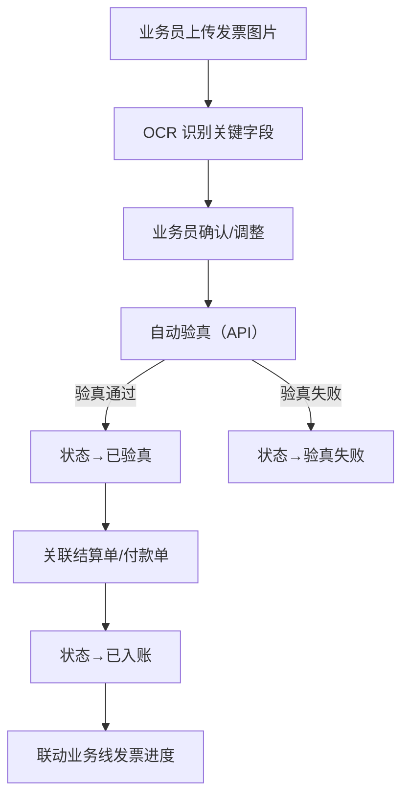
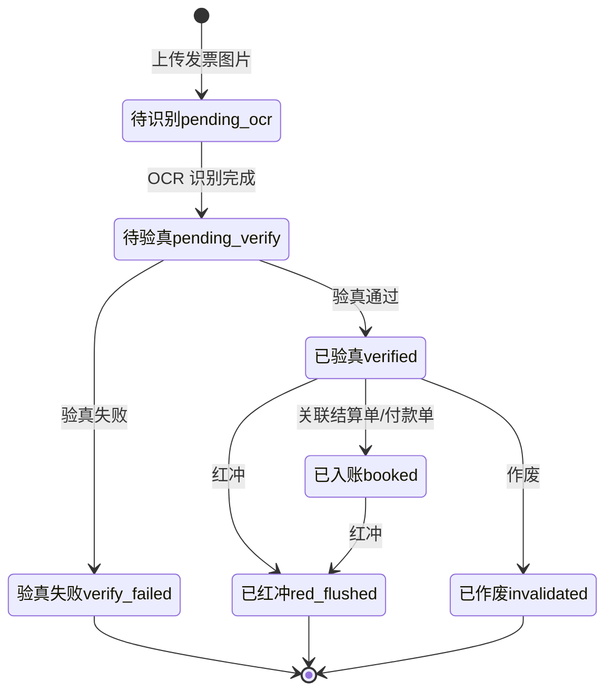

# 02.15 发票管理 v1.0 终版

> **状态**：v1.0 终版（**新模块，基于原型 55 截图**）
> **生成时间**：2026-07-24 14:55
> **配套文档**：[00-项目总览与对接.md](../00-项目总览与对接.md) / [01-模块拆解大框架.md](../01-模块拆解大框架.md) / [02.13-结算单管理.md](./02.13-结算单管理.md) / [02.14-资金管理.md](./02.14-资金管理.md)
> **复用度**：🟢 **90%（几乎零改造）**——主产品 `t_invoice` + `t_invoice_item` + `t_invoice_ocr` + `bo_invoice` + `bo_invoice_comparison` 5+ 张表

---

## 0. 章节导航

1. 业务定位
2. 业务流程全景
3. 核心实体（4 张表）
4. 状态机
5. 字段规则
6. 按钮交互
7. 异常处理
8. 跨模块流转
9. 复用建议

---

## 1. 业务定位

**发票管理**是港通供应链的**进/销项发票统一管理**——OCR 识别+验真+红冲+作废。

**关键特点**：
- **v1.0 范围**：仅**进项发票**（基于 55 截图 + sitemap"发票管理（无改动）"）
- 销项发票 02.15 v1.0 暂不写
- **OCR 识别**：上传发票图片自动识别关键字段
- **验真 API**：对接税务验真系统

### 1.1 1 个页面（sitemap）

| # | 页面 | 说明 |
|---|------|------|
| 1 | **进项发票** | 进项发票列表 + 上传 + OCR |

---

## 2. 业务流程全景

### 2.1 进项发票流程



---

## 3. 核心实体（4 张表）

### 3.1 `t_invoice` 发票主表

| 字段 | 类型 | 必填 | 说明 |
|------|------|------|------|
| `id` | bigint PK | - | 主键 |
| `invoice_no` | varchar(32) | ✓ | 发票号码 |
| `invoice_code` | varchar(32) | - | 发票代码 |
| `invoice_type` | varchar(20) | ✓ | `vat_special`（增值税专用）/ `vat_general`（增值税普通）/ `electronic`（电子发票）|
| `direction` | varchar(20) | ✓ | `inbound`（进项）/ `outbound`（销项）|
| `seller_company_id` | bigint | ✓ | 销售方 ID |
| `seller_company_name` | varchar(128) | - | 销售方名称 |
| `buyer_company_id` | bigint | ✓ | 购买方 ID |
| `buyer_company_name` | varchar(128) | - | 购买方名称 |
| `total_amount` | decimal(20,2) | ✓ | 价税合计 |
| `amount_excluding_tax` | decimal(20,2) | ✓ | 不含税金额 |
| `tax_amount` | decimal(20,2) | ✓ | 税额 |
| `tax_rate` | decimal(5,2) | - | 税率 |
| `invoice_date` | date | ✓ | 开票日期 |
| `is_verified` | tinyint | - | **是否已验真** |
| `verify_time` | datetime | - | 验真时间 |
| `verify_result` | varchar(20) | - | `pass` / `fail` / `pending` |
| `is_red_flush` | tinyint | - | **是否已红冲** |
| `is_invalid` | tinyint | - | **是否已作废** |
| `status` | varchar(20) | ✓ | 发票状态 |
| `creator_id` | bigint | ✓ | 上传人 |
| `create_time` | datetime | ✓ | - |

### 3.2 `t_invoice_item` 发票明细

| 字段 | 类型 | 必填 | 说明 |
|------|------|------|------|
| `id` | bigint PK | - | 主键 |
| `invoice_id` | bigint | ✓ | 关联发票 |
| `goods_name` | varchar(128) | ✓ | 商品名称 |
| `specification` | varchar(255) | - | 规格 |
| `unit` | varchar(20) | - | 单位 |
| `quantity` | decimal(20,4) | - | 数量 |
| `unit_price` | decimal(20,4) | - | 单价 |
| `amount` | decimal(20,2) | ✓ | 金额 |
| `tax_rate` | decimal(5,2) | - | 税率 |
| `tax_amount` | decimal(20,2) | - | 税额 |

### 3.3 `t_invoice_ocr` OCR 识别记录

| 字段 | 类型 | 必填 | 说明 |
|------|------|------|------|
| `id` | bigint PK | - | 主键 |
| `invoice_id` | bigint | - | 关联发票 |
| `image_url` | varchar(255) | ✓ | 发票图片 URL |
| `ocr_data` | longtext | - | **OCR 识别结果（JSON）** |
| `recognized_fields` | text | - | 识别的字段列表 |
| `unrecognized_fields` | text | - | 未识别的字段 |
| `recognition_accuracy` | decimal(5,2) | - | **识别准确率** |
| `recognized_at` | datetime | ✓ | 识别时间 |
| `operator_id` | bigint | - | 操作人 |

### 3.4 `t_invoice_link` 发票关联单据

| 字段 | 类型 | 必填 | 说明 |
|------|------|------|------|
| `id` | bigint PK | - | 主键 |
| `invoice_id` | bigint | ✓ | 关联发票 |
| `ref_type` | varchar(20) | ✓ | `settlement` / `payment` / `contract` |
| `ref_id` | bigint | ✓ | 关联单据 ID |
| `link_amount` | decimal(20,2) | - | 关联金额 |

---

## 4. 状态机



### 4.1 5 状态说明

| # | 状态 | 中文 | 触发 | 出口 |
|---|------|------|------|------|
| 1 | `pending_ocr` | 待识别 | 上传图片 | OCR 完成 |
| 2 | `pending_verify` | 待验真 | OCR 完成 | 验真通过/失败 |
| 3 | `verified` | 已验真 | 验真通过 | 已入账/红冲/作废 |
| 4 | `verify_failed` | 验真失败 | 验真失败 | 终态 |
| 5 | `booked` | 已入账 | 关联结算单/付款单 | 红冲 |
| 6 | `red_flushed` | 已红冲 | 红冲 | 终态 |
| 7 | `invalidated` | 已作废 | 作废 | 终态 |

---

## 5. 字段规则

### 5.1 发票类型 `invoice_type`

- 3 种：`vat_special`（增值税专用）/ `vat_general`（增值税普通）/ `electronic`（电子发票）

### 5.2 进项/销项 `direction`（**v1.0 范围**）

- v1.0 仅 `inbound`（进项）
- 销项 `outbound` v1.0 暂不写

### 5.3 OCR 识别字段

- 必识别：发票号码/代码/日期/销售方/购买方/金额/税额/税率
- 自动填充到表单字段
- 业务员可手动调整

### 5.4 验真（**港通特色**）

- 对接税务验真 API（`t_check_true_api_log`）
- 验真通过 → 状态→`verified`
- 验真失败 → 状态→`verify_failed`

### 5.5 红冲

- 已验真或已入账的发票可红冲
- 红冲后状态→`red_flushed`
- 关联结算单/付款单可反向调整

### 5.6 作废

- 已验真的发票可作废
- 作废后状态→`invalidated`

---

## 6. 按钮交互

### 6.1 进项发票列表（55 截图）

| 按钮 | 位置 | 可见条件 | 点击行为 |
|------|------|---------|---------|
| **上传发票** | 右上 | 业务员 | 弹上传对话框 |
| 搜索/筛选 | 顶部 | 所有 | 弹筛选抽屉 |
| 数据导出 | Tab 右侧 | 所有 | 导出 Excel |
| 详情 | 列表行 | 所有 | 跳详情页 |
| 验真 | 列表行 | `pending_verify` | 调验真 API |
| 红冲 | 列表行 | `verified`/`booked` | 弹红冲确认框 |
| 作废 | 列表行 | `verified` | 弹作废确认框 |

### 6.2 列表字段（基于 55 截图）

- 发票号码 / 发票代码 / 销售方 / 购买方 / 金额 / 税额 / 状态
- 操作：详情/验真/红冲/作废

---

## 7. 异常处理

| 异常场景 | 提示文案 | 处理动作 |
|---------|---------|---------|
| OCR 识别失败 | "OCR 识别失败，请手动填写" | 允许手动 |
| 验真 API 失败 | "验真 API 调用失败，请稍后重试" | 允许重试 |
| 验真失败 | "发票验真失败：XXX" | 阻止入账 |
| 重复发票 | "发票号码 X 已存在" | 阻止 |
| 红冲金额不一致 | "红冲金额 X 不等于原金额 Y" | 阻止 |
| 已红冲/作废发票再次操作 | "发票已 X，不能再次操作" | 阻止 |

---

## 8. 跨模块流转

### 8.1 上游触发

| 触发模块 | 触发条件 | 触发动作 |
|---------|---------|---------|
| 结算单（02.13）| 结算单 `active` | 触发开票申请 |
| 付款（02.14）| 付款完成 | 触发发票上传 |

### 8.2 下游触发

| 触发模块 | 触发条件 | 触发动作 |
|---------|---------|---------|
| 业务线（02.06）| 发票已入账 | 更新业务线发票进度 |
| 客户额度（02.02）| 发票已入账 | 更新客户已用额度 |

---

## 9. 复用建议

### 9.1 复用度

**🟢 90%（几乎零改造）**

| 类别 | 数量 | 复用度 |
|------|------|--------|
| 复用主产品表 | 5 张 | 100% |
| 港通新建表 | 0 张 | - |

### 9.2 复用主产品表

- `t_invoice` 发票主表
- `t_invoice_item` 发票明细
- `t_invoice_ocr` OCR 识别记录
- `bo_invoice` 业务发票
- `bo_invoice_comparison` 发票对比
- `t_check_true_api_log` 验真 API 日志

### 9.3 给研发的实施建议

1. **第一周**：直接复用主产品 5 张表
2. **第二周**：建进项发票列表 + 上传 + OCR
3. **第三周**：建验真 API 对接
4. **第四周**：建红冲/作废流程

---

## 10. 文档版本

- **v1.0（2026-07-24 14:55）**：基于 55 截图 + sitemap 首次终版，作为范本用于后端开发
- 修改记录：见 `06-修改记录.md`
---

## 修改记录

### v1.7.99.x（2026-07-28）

- 🟡 列表页占位 = "全部"（全站统一）
- 🟡 列表页规范升级（v1.7.99 全局）
- 🟡 状态 tag 颜色编码（v1.7.99.14）
- 🟡 流程图统一用 Mermaid（v1.7.99.6）
- 详见：[v1.7.99-changelog.md](./v1.7.99-changelog.md)（30+ 版本汇总）

---

## 11. v1.7.99.x 模块级增量补充（基于飞书《用户使用手册》沉淀）

> **本节追加于 2026-09-24**
> **需求来源**：飞书《豫港通用户使用手册（内部版）》第 7.2 节"发票管理" + 本仓库 v1.7.99.83 / 84 改造沉淀
> **v1.0 文档骨架（1-10 节）保持不变**，本节仅补充 v1.7.99.x 后未明的业务规则、OCR/Excel 录入流程、状态机、跨模块联动、详细页面 PRD 索引
> **复用度**：🟢 90%（v1.0 骨架 + v1.7.99.x 增量）

### 11.1 模块业务变化（v1.0 → v1.7.99.84）

| 维度 | v1.0 文档 | v1.7.99.84 现状 |
|------|----------|------------------|
| 页面结构 | 合并进销项发票 | **v1.7.99.83 后进销项分离**：进项 invoice.html / invoice-detail.html + 销项 invoice-out.html / invoice-out-detail.html |
| 列表列数 | 合并版本字段不全 | **v1.7.99.83 销项列表 14 列**：发票代码/发票号码/开票日期/销售方/购买方/不含税/税额/含税/价税合计/关联合同数/关联业务线/状态/是否含附件/操作 |
| 详情页 | v1.0 单区块 | **v1.7.99.84 3 区块**：发票与合同关联 + 发票附件 + 原发票 OCR 信息 |
| 编辑能力 | v1.0 不区分进销项 | **v1.7.99.84 区分**：进项详情只读，销项详情支持重新上传 + 关联合同 + 拆分金额编辑 |
| 录入方式 | 未明确 | **手册 7.2 + v1.7.99.83**：图片上传（OCR 自动识别）/ Excel 导入（下载模板）|

### 11.2 发票录入 4 步流程（手册 7.2 权威口径）

> **来自手册 7.2**：进销项发票统一录入流程

1. **第一步**：选择进项或销项发票 → 点击"新增发票"按钮
2. **第二步**：点击"图片上传"或"Excel 导入"
3. **第三步**：
   - 如选择图片上传 → 上传本地发票 PDF → 等待 OCR 识别
   - 如选择 Excel 导入 → 需下载对应模板录入以下字段：
     - 发票代码
     - 发票号码
     - 开票日期
     - 发票金额
     - 报税合计
     - 发票拆分金额（含税）
     - 合同编号
4. **第四步**：将发票关联对应合同 → 确认发票价格是否拆分 → 保存即可

### 11.3 发票 4 状态（手册 7.2）

| 状态 | 含义 | 操作 | 颜色 |
|------|------|------|------|
| **正常** | 发票有效入账 | 支持红冲 / 作废 / 删除 | 绿 |
| **红冲** | 生成负数发票冲抵 | 仅作废自动记录红冲 | 黄 |
| **作废** | 发票未入账作废（适用于未入账发票）| 仅可查看 | 红 |
| **删除** | 逻辑删除（仅限未关联发票）| 仅可查看 | 灰 |

**v1.7.99.83 状态 tag 颜色规范**（v1.7.99.14 全局规则）：
- 正常：绿（#10B981 / #ECFDF5）
- 红冲：黄（#F59E0B / #FEF3C7）
- 作废：红（#DC2626 / #FEE2E2）
- 删除：灰（#6B7280 / #F3F4F6）

### 11.4 进销项对比（v1.7.99.83/84 关键决策）

| 维度 | 进项发票（采购）| 销项发票（销售）|
|------|-----------------|------------------|
| 业务方向 | 供应商开给核心企业 | 核心企业开给客户 |
| 主动方 | 供应商 | 核心企业 |
| 详情页编辑能力 | ❌ 只读 | ✅ 支持重新上传 / 关联合同 / 拆分金额编辑 |
| 列表列"卖方/买方" | 卖方=供应商 / 买方=核心企业 | 卖方=核心企业 / 买方=下游客户 |
| 业务核心 | 索取发票（采购方） | 开具发票（销售方）|

**v1.7.99.84 关键决策**：
- 进项发票**不加业务变更按钮**（v1.7.99.x 通用规则：详情页不直接做编辑）—— 业务人员通过"上传进项发票"入口重新发起
- 销项发票**支持详情页编辑** —— 因为销项是核心企业主动发起，编辑属于"修正开票"场景（业务真实存在）

### 11.5 OCR 自动识别（v1.7.99.x 关键能力）

**OCR 增值税专用发票识别字段**（来自 v1.7.99.84 详情页区块 3）：

| 字段 | OCR 识别准确度 | 业务含义 |
|------|----------------|----------|
| 发票代码 | 高 | 增值税发票代码 |
| 发票号码 | 高 | 增值税发票号码 |
| 开票日期 | 高 | yyyy-MM-dd |
| 销售方/购买方名称 | 中 | 需业务核对 |
| 不含税金额 | 高 | 关键金额 |
| 税率 | 高 | 13% / 9% / 6% / 3% |
| 税额 | 高 | 不含税 × 税率 |
| 含税金额 | 高 | 不含税 + 税额 |
| 价税合计（大写）| 中 | 中文数字 |

> **OCR 失败处理**：识别失败 → 区块 3 提示"OCR 识别失败，请手动补录"（业务人员手动调整字段）

### 11.6 跨模块联动（v1.7.99.x 增强）

| 联动系统 | v1.0 描述 | v1.7.99.x 增强 |
|----------|-----------|----------------|
| **合同管理（02.03）**| 文字提及 | 关联合同拆分金额 → 合同"已开票金额" += 拆分金额；解除关联时 -= 拆分金额 |
| **回款管理（02.14）**| 未提及 | 销项发票关联的销售合同 → 回款认领时检查"已开票金额"是否足够 |
| **付款管理（02.14）**| 文字提及 | 进项发票关联的采购合同 → 付款时检查"已开票金额"是否足够 |
| **OCR / 税控 API** | 未提及 | v1.7.99.83+ 集成 OCR 自动识别 + 税控 API 验真（v1.7.99.x 待集成）|

### 11.7 异常处理（v1.7.99.x 补充）

| 场景 | v1.7.99.x 处理 |
|------|-----------------|
| 拆分金额总和 ≠ 含税金额 | 区块 1 顶部右侧红字提示"差额 ¥X.XX" |
| 删除最后一个关联合同 | 红字提示"发票必须至少关联一个合同" |
| 重新上传文件类型不符 | 红字提示"仅支持 jpg/jpeg/png/pdf" |
| 红冲已红冲/作废/已删除发票 | 红字提示"该发票状态不支持红冲" |
| 作废已红冲/作废/已删除发票 | 红字提示"该发票已作废或已红冲" |
| 删除已关联合同的发票 | 红字提示"该发票已关联合同，无法删除（可走作废）" |
| 同一发票并发操作 | 二次校验时被覆盖则提示"已被其他操作覆盖，请刷新" |
| 发票已红冲/作废尝试编辑关联合同 | 顶部橙色 bar 提示"该发票已红冲/作废，无法修改关联合同和拆分金额" |

### 11.8 详细页面 PRD 索引

| 页面 | PRD 文档 | 当前版本 |
|------|----------|----------|
| `invoice.html` | [p-invoice.md](./p-invoice.md) | v1.7.99.83 终版 |
| `invoice-detail.html` | [p-invoice-detail.md](./p-invoice-detail.md) | **2026-09-24 新写**（基于手册 7.2 + v1.7.99.84）|
| `invoice-out.html` | [p-invoice-out.md](./p-invoice-out.md) | **2026-09-24 新写**（基于手册 7.2 + v1.7.99.83）|
| `invoice-out-detail.html` | [p-invoice-out-detail.md](./p-invoice-out-detail.md) | **2026-09-24 新写**（基于手册 7.2 + v1.7.99.84 编辑能力）|

### 11.9 详细业务规则沉淀（来自手册 7.2）

**4 状态流程**：
```
新增发票 → 正常
正常 → 红冲（生成负数发票冲抵）
正常 → 作废（适用于未入账发票）
正常 → 已删除（仅限未关联发票）
红冲/作废/已删除 → 终态（仅查看）
```

**Excel 导入字段**（手册 7.2 权威口径）：
| 字段 | 是否必填 |
|------|----------|
| 发票代码 | 是 |
| 发票号码 | 是 |
| 开票日期 | 是 |
| 发票金额 | 是 |
| 报税合计 | 是 |
| 发票拆分金额（含税）| 是（如有多合同拆分）|
| 合同编号 | 是 |

### 11.10 增量补充版 v1.7.99.x 修改记录

- **v1.7.99.83（2026-08-08）**：进项发票列表重构 + 销项发票独立 + 销项列表 14 列 + 7 字段筛选 + 状态 tag 颜色
- **v1.7.99.84（2026-08-08）**：进项发票详情只读 + 销项发票详情支持编辑（重新上传 / 关联合同 / 拆分金额编辑 / 解除关联）+ OCR 增值税专用发票识别
- **2026-09-24**：基于飞书《用户使用手册》第 7.2 节补充模块级业务口径（**本节第 11 节**）
