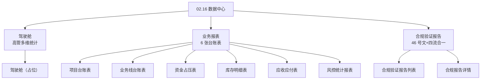

# 02.16 数据中心 v1.7.99.200 终版

> **状态**：v1.7.99.200 终版（**按实际原型页面字段重写 + 按 9 个子菜单拆分**）
> **生成时间**：2026-08-07 16:30
> **当前模块**：数据中心
> **配套文档**：[00-项目总览与对接.md](../00-项目总览与对接.md) / [01-模块拆解大框架.md](../01-模块拆解大框架.md) / [02.11-预警中心.md](./02.11-预警中心.md)

## 0. 章节导航

1. 业务定位
2. 9 个子菜单
3. 业务流程全景
4. 字段规则总览
5. 按钮交互总览
6. 异常处理总览
7. 跨模块流转
8. 文档版本

---

## 1. 业务定位

**数据中心**是港通供应链的**数据汇总与分析中心**（**v1.0 新顶级模块**）——3 子模块（驾驶舱/业务报表/合规验证报告），9 个页面。

### 1.1 9 个页面（sitemap）

| # | 子模块 | 页面 | 关联 docs |
|---|--------|------|-----------|
| 1 | 驾驶舱 | 驾驶舱 | [p-dashboard.md](./p-dashboard.md) |
| 2 | 业务报表 | 项目台账表 | [p-report-project.md](./p-report-project.md) |
| 3 | 业务报表 | 业务线台账表 | [p-report-bizline.md](./p-report-bizline.md) |
| 4 | 业务报表 | 资金占压表 | [p-report-fund.md](./p-report-fund.md) |
| 5 | 业务报表 | 库存明细表 | [p-report-inventory.md](./p-report-inventory.md) |
| 6 | 业务报表 | 应收应付表 | [p-report-ar-ap.md](./p-report-ar-ap.md) |
| 7 | 业务报表 | 风控统计报表 | [p-report-risk.md](./p-report-risk.md) |
| 8 | 合规验证报告 | 合规验证报告列表 | [p-report-compliance.md](./p-report-compliance.md) |
| 9 | 合规验证报告 | 合规报告详情 | [p-report-compliance-detail.md](./p-report-compliance-detail.md) |

### 1.2 子模块说明

- **驾驶舱** = 高管视角多维统计（占位待完善）
- **业务报表** = 6 张台账表（项目/业务线/资金/库存/应收应付/风控）
- **合规验证报告** = 国资委 46 号文 + 四流合一验证

---

## 2. 9 个子菜单（按页面拆分的详细字段定义）

### 2.1 驾驶舱 → [p-dashboard.md](./p-dashboard.md)

- 顶部筛选：2 字段（统计周期 + 业务类型）
- 状态 tab：4 个（概览/项目/合同/客户）
- 卡片区：list-card-item 7 列布局（编号/状态/统计周期/数据来源/项目总数/执行中项目/操作）

### 2.2 项目台账表 → [p-report-project.md](./p-report-project.md)

- 顶部筛选：4 字段（项目类型/项目状态/客户名称/立项时间）
- 表格：9 列（项目编号/项目名称/项目类型/客户/合同金额/累计回款/项目状态/立项时间/操作）

### 2.3 业务线台账表 → [p-report-bizline.md](./p-report-bizline.md)

- 顶部筛选：4 字段（业务类型/业务状态/上游企业/下游企业）
- 表格：17 列（业务线号/业务线名称/类型/上游企业/下游企业/上游货转/下游货转/库存/向上游支付/下游合同回款/下游业务回款/上游结算数量/上游结算金额/下游结算数量/下游结算金额/业务状态/操作）

### 2.4 资金占压表 → [p-report-fund.md](./p-report-fund.md)

- 顶部 KPI 卡：2 个（上游供应商资金流水 + 下游采购商资金流水）
- 表格：分组表（业务线信息 7 列 + 上游款项 4 列 + 下游款项 4 列 + 资金占压 1 列）

### 2.5 库存明细表 → [p-report-inventory.md](./p-report-inventory.md)

- 顶部 KPI 卡组：多组（每组 4 个 KPI）
- 表格：18 列（序号/仓库名称/供应商/采购方/合同编号_我方/合同编号_客户方/所属上游货转/所属类别/品名/规格/材质/产地/入库日期/库存数量/库存重量/预占库存数量/预占库存重量/车船号）

### 2.6 应收应付明细表（按业务线汇总）→ [p-report-ar-ap.md](./p-report-ar-ap.md)

- 顶部 KPI：4 卡片（应付总额 / 应收总额 / 库存资金占压 / 净占压金额） **v1.7.99.220 变更**：v1.7.99.217 旧版"应收总额/已收金额/未收金额/应付总额"4 卡片 → v1.7.99.220 新版按 10 条数据公式汇总——每卡片对应 1 个公式或公式组合（应付总额=公式1 SUM、应收总额=公式5 SUM、库存资金占压=公式9 SUM、净占压=公式10 SUM）
- 顶部筛选：6 字段（业务线号/采购合同编号/上下游客户/进项发票状态/销项发票状态/资金占压） **v1.7.99.220 变更**：2 字段 → 6 字段——按 user 13 列表格字段设计筛选
- 表格：13 列 3 大分组（业务线信息 3 列 + 上游 4 列 + 下游 4 列 + 资金占压 2 列） **v1.7.99.220 变更**：8 列 → 13 列——按 user 图 1 完全重做（从单据维度改为业务线维度 + 上下游客户双行展示 + 进项/销项发票 4 状态 tag + 资金占压 2 列）

### 2.7 风控统计报表 → [p-report-risk.md](./p-report-risk.md)

- 顶部筛选：4 字段（风险类型/风险等级/处理状态/客户）
- 表格：9 列（风险编号/风险类型/等级/关联客户/风险描述/触发时间/处理人/处理状态/操作）

### 2.8 合规验证报告列表 → [p-report-compliance.md](./p-report-compliance.md)

- 顶部筛选：7 字段（编号/企业名称/运输方式/签订日期/交货起始日/业务类型/业务线回款）
- 表格：11 列（业务线/数据完善状态/资金来源/合同状态/预警数/材料完善度/采购合同编号/销售合同编号/业务线号/业务线状态/操作）

### 2.9 合规报告详情 → [p-report-compliance-detail.md](./p-report-compliance-detail.md)

- 顶部 KPI 摘要：3 字段（基础信息/合规状态/验证规则）
- 业务线全景：业务线信息 + 上下游 + 货转/库存/回款/结算
- 风险扫描：8 类风险（合作黑名单/假国央企/失信被执行人/被执行人/限制消费令/终本案件/税收违法/行政工商违法）
- 十不准及四流一致性校验：25+ 检查项（5 列 + 2 大类分组）
- 整改跟踪 + 实时活动 + 催办

---

## 3. 业务流程全景

---

## 4. 字段规则总览

每个子菜单的字段定义详见对应 docs：

- 驾驶舱 → [p-dashboard.md](./p-dashboard.md) 第 3 节
- 业务报表（6 张）→ [p-report-*.md](./p-report-project.md) 第 3 节
- 合规验证报告（列表 + 详情）→ [p-report-compliance.md](./p-report-compliance.md) / [p-report-compliance-detail.md](./p-report-compliance-detail.md) 第 3 节

---

## 5. 按钮交互总览

| 通用按钮 | 位置 | 行为 |
|----------|------|------|
| 编号/合同号（蓝字）| 表格 | 跳对应详情页 |
| 操作"查看" | 表格 | 跳对应详情页 |
| 操作"查看报告" | 合规列表 | 跳合规报告详情 |
| 操作"处理" | 风控表格 | 跳风险处理页 |
| 数据导出 | 顶部 | 导出当前筛选数据到 Excel |
| 状态 tab | 顶部 | 切换卡片/表格数据 |

---

## 6. 异常处理总览

| 异常场景 | 提示文案 | 处理动作 |
|---------|---------|---------|
| 报表生成失败 | "报表生成失败，请联系管理员" | 重试 |
| 报表数据为空 | "暂无数据" | 提示空数据 |
| 数据加载失败 | "数据加载失败，请重试" | 重试 |
| 风险未及时处理 | 黄色逾期标记 | 提示处理 |
| 库存为负数 | 红色异常标记 | 提示异常 |

---

## 7. 跨模块流转

### 7.1 上游触发

| 触发模块 | 触发条件 | 触发动作 |
|---------|---------|---------|
| 准入管理（02.01-02.04）| 客户/项目准入完成 | 更新驾驶舱 + 业务报表 |
| 合同管理（02.05）| 合同签订/履行 | 更新业务线台账表 + 资金占压表 |
| 业务线管理（02.06）| 业务线执行 | 更新业务线台账表 + 资金占压表 |
| 收发货管理（02.07）| 入库/出库 | 更新库存明细表 |
| 资金管理（02.14）| 付款/回款完成 | 更新资金占压表 + 应收应付表 |
| 预警中心（02.11）| 预警触发 | 更新风控统计报表 |
| 仓储管理（02.07）| 库存预警 | 更新风控统计报表 + 库存明细表 |

### 7.2 下游触发

| 触发模块 | 触发条件 | 触发动作 |
|---------|---------|---------|
| 预警中心（02.11）| 报表数据异常 | 触发预警 |
| 驾驶舱 | 数据变化 | 实时刷新 |

---

## 8. 文档版本

- **v1.0（2026-07-24 14:55）**：基于 70-78 截图 + sitemap 首次终版
- **v1.7.99.64（2026-08-02）**：合规验证报告 3 状态 mock
- **v1.7.99.97（2026-08-03）**：6 张台账表重制 + sidemenu 平铺
- **v1.7.99.151（2026-08-05 17:15）**：项目台账表删除"累计放款"
- **v1.7.99.193（2026-08-07）**：合规报告 colspan=2 + 检验结果列居中
- **v1.7.99.199（2026-08-07 16:00）**：删除"## 3. 核心实体"和"## 9. 复用建议"章节（全 86 个 p-*.md）
- **v1.7.99.200（2026-08-07 16:30）**：**完全重写**——按实际 prototype 页面字段 + 按 9 个子菜单拆分（每个子菜单独立 p-*.md 文档），9 个 docs 全部按统一格式（0. 章节导航 + 1. 业务定位 + 2. 页面结构 + 3. 字段定义 + 4. 按钮交互 + 5. 数据规则 + 6. 异常处理 + 7. 跨模块流转 + 8. 文档版本）重新整理

修改记录：见 `06-修改记录.md`
