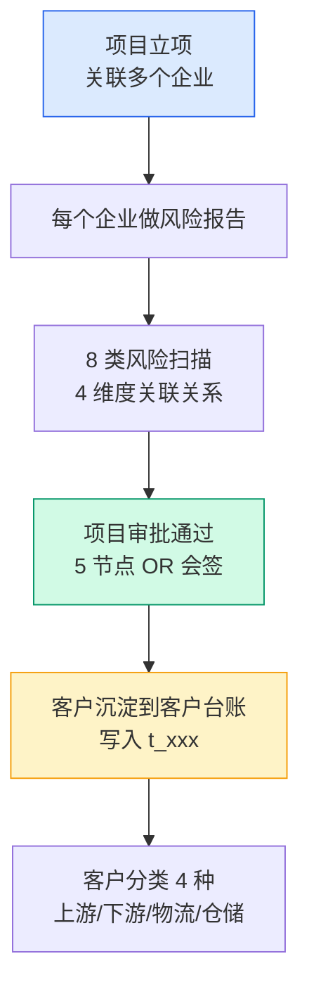
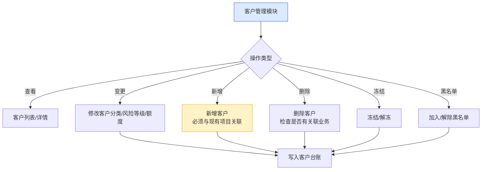
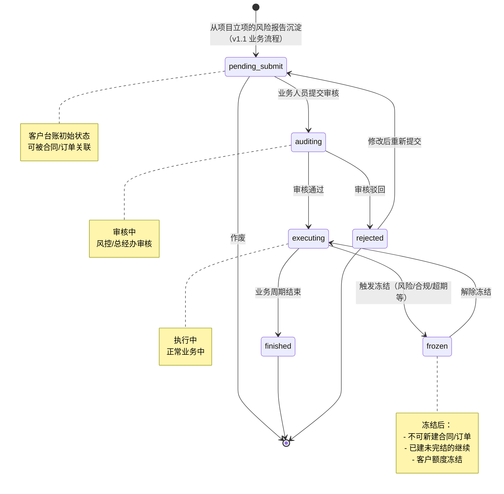
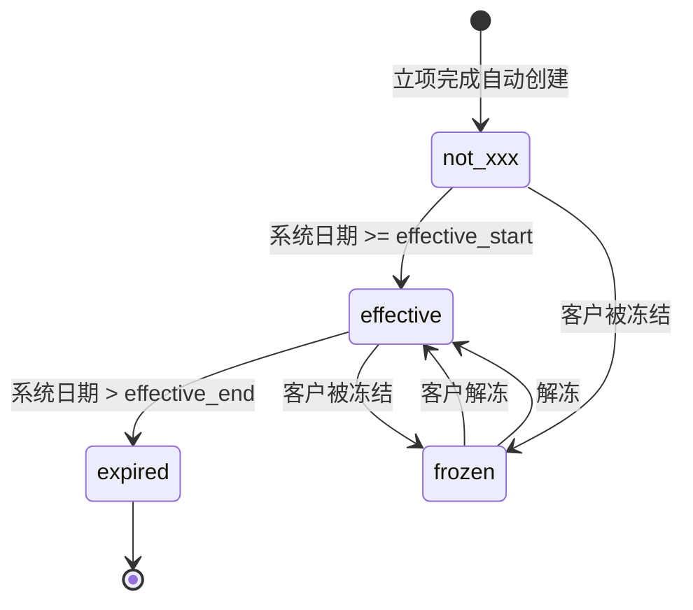
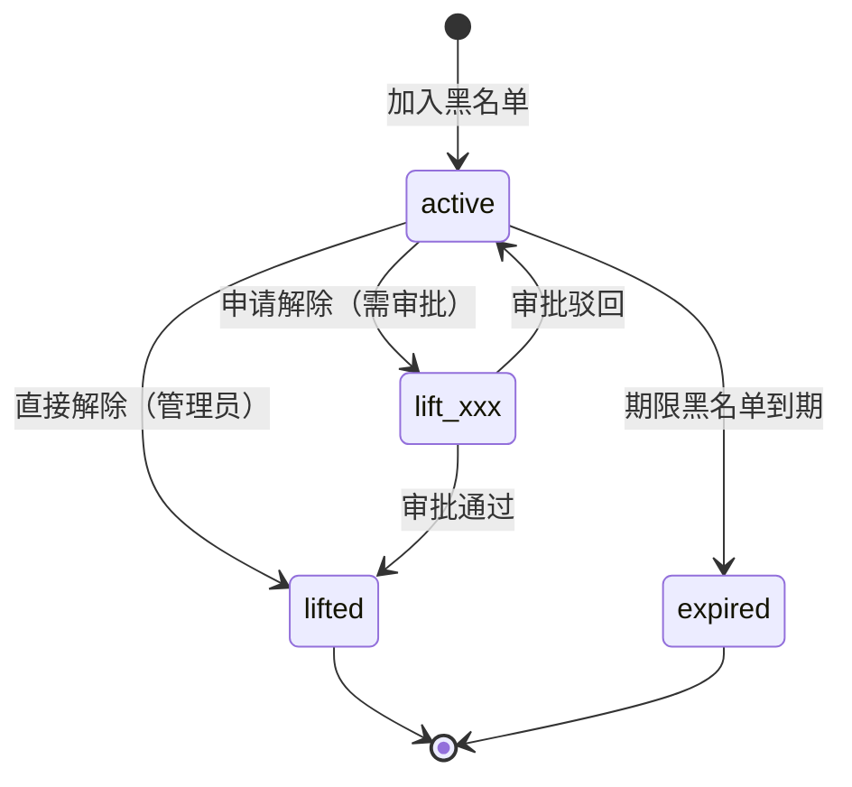
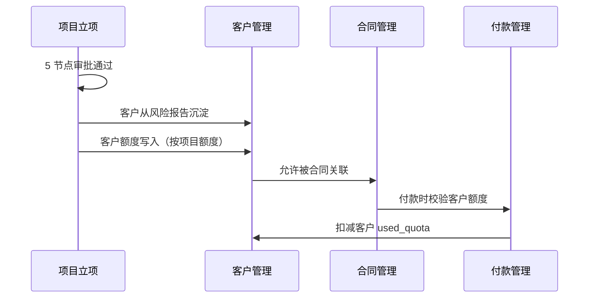

# 02.02 客户管理 v1.1 终版

> **状态**：v1.1 终版（**v1.0 修正版，基于 83 张原型截图调整**）
> **生成时间**：2026-07-24 14:55
> **变更**：
> - 🔴 **客户分类 4 种完全重做**：贸易商/加工厂/物流商/服务商 → **上游企业/下游企业/第三方物流/第三方仓储**
> - 🟡 客户流程状态从 3 个（active/frozen/revoked）→ **6 个**（待提交/审核中/执行中/已完结/驳回）
> - 🟡 新增"审核"按钮（审核中状态）
> - 🟡 列表 2 Tab 切换（基础信息/额度信息）
> - 🟡 客户字段新增：企业简称、所属区域
> **配套文档**：[00-项目总览与对接.md](../00-项目总览与对接.md) / [01-模块拆解大框架.md](../01-模块拆解大框架.md) / [05-复用对比/全量矩阵 v1.2.md](../05-复用对比/全量矩阵%20v1.0.md) / [02.01-项目管理-立项.md](./02.01-项目管理-立项.md) / [02.03-合同管理.md](./02.03-合同管理.md) / [02.04-订单管理.md](./02.04-订单管理.md)
> **复用度**：🟢 **90%（大幅复用）**——主产品 `t_xxx` 60+ 张 + `t_xxx（业务实体）` 大幅复用

---

> **当前页**：`blacklist.html`
> **文档状态**：基于源模块文档的占位版，精确字段待 review 后按原型图精修

## 0. 章节导航

1. 业务定位
2. 业务流程全景
3. 核心实体（4 张表）
4. 状态机（**v1.1 重大调整**）
5. 角色操作矩阵
6. 字段规则
7. 按钮交互
8. 异常处理
9. 跨模块流转

---

## 1. 业务定位

**客户管理**是港通供应链的**客户档案中心**——客户从项目立项的"风险报告"中沉淀到客户台账，**不走独立审批流程**（与项目立项共用 5 节点审批）。客户管理模块负责客户档案的日常维护：客户分类、风险等级、关联关系、黑名单、额度管理等。

### 1.1 v1.1 关键规则（基于原型 04 截图 + sitemap）

1. **客户管理 = 项目立项的子流程**（客户从风险报告沉淀，不走独立审批）✅ 不变
2. **客户分类 4 种**（**v1.1 重大调整**）：
   - **`upstream`**（上游企业）= 卖方/供应方
   - **`downstream`**（下游企业）= 买方/采购方
   - **`third_party_logistics`**（第三方物流）
   - **`third_party_warehouse`**（第三方仓储）
3. **客户流程状态 6 个**（**v1.1 新增**，跟项目立项一致）：
   - 待提交 / 审核中 / 执行中 / 已完结 / 驳回
4. **客户来源记录**：`source_project_xxx` + `source_due_diligence_id` ✅ 不变
5. **客户额度管理**（多维度）✅ 不变
6. **黑名单管理**（独立子流程）✅ 不变
7. **客户列表 2 Tab 切换**：**基础信息 / 额度信息**（**v1.1 新增**）
8. **顶部 nav 7 个**：工作台/准入管理/数字供应链/智慧仓储/预警中心/数据中心/账户中心

## 2. 业务流程全景

### 2.1 客户从项目立项沉淀

### 2.2 客户管理日常维护

---

## 4. 状态机（**v1.1 重大调整**）

### 4.1 客户台账状态机（**v1.1 从 3 状态改 6 状态**）

**v1.1 关键变化**：
- ❌ 旧版 3 状态：`active` / `frozen` / `revoked`
- ✅ v1.1 6 状态：`pending_submit` / `auditing` / `executing` / `finished` / `rejected` / `frozen`（**跟项目立项一致**）

### 4.2 客户额度状态机（**v1.1 调整 4 状态**）

**v1.1 4 状态**：`not_xxx` / `effective` / `expired` / `frozen`

### 4.3 黑名单状态机（不变）

---

## 5. 角色操作矩阵

### 5.1 客户台账管理（**v1.1 新增「审核」操作**）

| 操作 / 角色 | 业务人员 | 业务部负责人 | 风控部 | 财务部 | 总经办 | 系统 |
|------------|--------|------------|-------|-------|-------|------|
| 查看客户列表/详情 | ✓ | ✓ | ✓ | ✓ | ✓ | - |
| 修改客户分类 | ✓ | ✓ | ✓ | - | - | - |
| 修改风险等级 | - | - | **✓** | - | - | 自动从风险报告 |
| 修改客户额度 | ✓ 建议 | ✓ | **✓** | **✓** | **✓** | - |
| **审核客户档案**（**v1.1 新增**）| - | - | **✓** | - | **✓** | - |
| 冻结/解冻 | 申请 | 申请 | **审批** | 申请 | **审批** | - |
| 取消客户 | - | 申请 | 申请 | 申请 | **审批** | - |
| 新增客户 | **✓**（必须关联项目）| ✓ | - | - | - | - |
| 删除客户 | - | - | - | - | **✓** | 检查关联业务 |
| 加入黑名单 | 申请 | 申请 | **✓** | - | **审批** | - |
| 解除黑名单 | 申请 | 申请 | **✓** | - | **审批** | - |

### 5.2 客户列表 Tab（**v1.1 新增**）

| Tab | 说明 |
|-----|------|
| **基础信息** | 客户分类/企业名称/统一信用代码/联系人/法定代表人 |
| **额度信息** | 项目编号/项目名称/授信额度/已用额度/可用额度/授信有效期/状态 |

### 5.3 客户列表状态 Tab（**v1.1 跟项目对齐 6 Tab**）

| Tab | 对应状态 | 颜色 |
|-----|---------|------|
| 全部 | 所有状态 | - |
| 待提交 | `pending_submit` | 蓝 |
| 审核中 | `auditing` | 黄 |
| 执行中 | `executing` | 绿 |
| 已完结 | `finished` | 灰 |
| 驳回 | `rejected` | 灰 |

### 5.4 客户列表操作按钮（**v1.1 新增「审核」**）

| 状态 | 操作按钮 |
|------|---------|
| 待提交 | 查看 / 编辑 / 作废 |
| 审核中 | 查看 / **审核**（v1.1 新增）|
| 执行中 | 查看 |
| 已完结 | 查看 |
| 驳回 | 查看 |

### 5.5 黑名单（不变）

| 操作 / 角色 | 风控部 | 总经办 | 系统 |
|------------|-------|-------|------|
| 新增黑名单 | **✓** | - | - |
| 批量导入 | **✓** | - | - |
| 申请解除 | **✓** | **审批** | - |
| 直接解除 | **✓**（`lift_xxx=0`）| - | - |

---

## 6. 字段规则

### 6.1 客户分类 `customer_category`（**v1.1 重大调整**）

- **4 类**（**v1.1 完全改**）：
  - `upstream`（上游企业）= 卖方/供应方
  - `downstream`（下游企业）= 买方/采购方
  - `third_party_logistics`（第三方物流）
  - `third_party_warehouse`（第三方仓储）
- 决定客户可作为的角色（**v1.1 自动推导 is_supplier/is_buyer/is_warehouse**）
- 决定客户额度默认值

**v1.1 角色映射**（**v1.1 新增**）：

| 客户分类 | 是否可作为供应商 | 是否可作为采购方 | 是否可作为仓储方 |
|---------|---------------|---------------|---------------|
| **upstream**（上游企业）| ✓ | ❌ | ❌ |
| **downstream**（下游企业）| ❌ | ✓ | ❌ |
| **third_party_logistics** | ❌ | ❌ | ❌（物流，不是仓储）|
| **third_party_warehouse** | ❌ | ❌ | ✓ |

### 6.2 客户名称 `company_name`

- 与营业执照完全一致
- 不可修改（如需修改必须重新立项）

### 6.3 统一社会信用代码 `unified_credit_xxx`

- **全平台唯一**（通过该字段判重）
- 18 位字母+数字
- 脱敏存储：`91XXXXXXMAXXXXXXXX` 格式

### 6.4 客户总额度 `total_quota`（**v1.1 字段简化**）

- 元，保留 2 位小数
- > 0
- 调整权限：业务员可建议，风控+财务可调整，总经办可最终调整

**v1.1 取消客户分类默认值**（**v1.1 重要调整**）：
- ❌ 旧版：贸易商 500 万 / 加工厂 200 万 / 物流商 100 万 / 服务商 100 万
- ✅ v1.1：**由项目额度决定**——立项时设定项目总额度，客户从项目继承，不分客户分类设默认值

### 6.5 客户风险等级 `risk_level`

- **自动从最近一次风险报告继承**
- 等级：`low` / `medium` / `high`
- 触发规则：
  - 0 类高风险 → `low`
  - 1 类高风险 → `medium`
  - 2+ 类高风险 或 3+ 类中风险 → `high`
- 风险等级为 `high` 时，客户状态自动置为 `frozen`

### 6.6 客户来源记录

- `source_project_xxx` + `source_due_diligence_id`
- 客户**必须**有来源（首次创建时必填）
- 后续客户变更不影响来源记录

### 6.7 企业简称 `company_short_xxx`（**v1.1 新增**）

- 用于列表/详情页显示
- 最多 20 个字符
- 可修改

### 6.8 所属区域 `region`（**v1.1 新增**）

- 选择项：境内/境外/港澳台
- 决定后续合同/订单的币种默认值

### 6.9 黑名单分级影响

| 分级 | 业务影响 |
|------|---------|
| 永久黑名单 | 永久禁止任何合作 |
| 期限黑名单 | 期限内禁止合作 |
| 观察名单 | 需风控部审批每笔业务 |
| 行业黑名单 | 特定行业禁止合作 |

---

## 7. 按钮交互

### 7.1 客户台账列表页（**v1.1 调整**）

| 按钮 | 位置 | 可见条件 | 点击行为 |
|------|------|---------|---------|
| 新增客户 | 右上 | 业务人员 | 弹新增框（**必须关联项目**）|
| 搜索/筛选 | 顶部 | 所有 | 弹筛选抽屉 |
| 导出 | 右上 | 所有 | 导出 Excel |
| 查看 | 列表行 | 所有 | 跳详情页（仅查看）|
| 编辑 | 列表行 | 状态=待提交 | 跳详情页（编辑）|
| **审核**（**v1.1 新增**）| 列表行 | 状态=审核中 | 弹审核框（风控+总经办）|
| 作废 | 列表行 | 状态=待提交 | 弹确认框 |
| **基础信息/额度信息 Tab 切换**（**v1.1 新增**）| 列表上方 | 所有 | 切换列表内容 |

### 7.2 客户台账详情页

> **memory 原则**：详情页**不**加业务变更按钮，只允许**跳关联单据/复制/附件下载**。

| 按钮 | 位置 | 可见条件 | 点击行为 |
|------|------|---------|---------|
| 编辑 | 顶部 | 状态=待提交 | 跳编辑页 |
| 跳关联项目 | 顶部 | 有关联项目 | 跳项目详情 |
| 跳关联合同 | 顶部 | 有关联合同 | 跳合同列表 |
| 跳风险报告 | 顶部 | 有风险报告 | 跳风险报告详情 |
| 下载附件 | 附件区 | 有附件 | 下载 |
| 变更历史 | 顶部 | 所有 | 弹变更日志 |

### 7.3 黑名单页（**v1.7.99.49 + 50 持续重制**）

> **v1.7.99.49 重大更新**：按用户截图新增「新增黑（灰）名单信息」14 字段真实弹窗 + 修复「批量导入」按钮 enabled 状态 + 基于新增字段生成 CSV 导入模板。
> **v1.7.99.50 重大更新**：「批量删除」按钮从顶部按钮区移到 tab 行最右侧（文字按钮），**仅勾选时显示**；tab 状态机简化（删除「企业黑名单/个人黑名单」tab，**只有"全部"1 个 tab**）。

#### 7.3.1 顶部按钮区（v1.7.99.49 + 50）

| 按钮 | 位置 | 状态 | 点击行为 |
|------|------|------|---------|
| **新增黑名单企业** | 顶部 | 一直 enabled | 弹「新增黑（灰）名单信息」14 字段表单 |
| **批量导入** | 顶部 | **一直 enabled**（v1.7.99.49 修复，v1.7.99.44 错误地按"勾选行才启用"）| 弹「批量导入」弹窗（下载模板 + 上传文件）|
| ~~批量删除~~ | ~~顶部~~ | - | **v1.7.99.50 移除**——移到 tab 行最右侧（文字按钮），仅勾选时显示 |

#### 7.3.2 「新增黑（灰）名单信息」弹窗（v1.7.99.49）

**触发方式**：点击"新增黑名单企业"按钮。

**弹窗样式**：
- 居中模态弹窗，宽度 1080px，最大高度 92vh
- 头部：标题"新增黑（灰）名单信息" + 关闭按钮（×）
- 底部：左"取消" + 右"确定"（footer 固定）
- 表单滚动区：`max-height: calc(92vh - 130px)`，超出滚动

**14 字段布局（4 列 × 7 行）**：

| 行 | 字段 1（必填红星）| 字段 2（必填红星）|
|----|-----------------|-----------------|
| 1 | **企业名称(*) ** | **黑名单等级(*) ** |
| 2 | 法定代表人 | **列入黑名单原因(*) ** |
| 3 | 统一社会信用代码 | 名单类型 |
| 4 | 所在地 | **企业类型(*) ** |
| 5 | 是否有在途业务 | 数据来源 |
| 6 | 企业性质 | 观察区间（"开始日期 ~ 结束日期"占位）|
| 7 | 备注（textarea，跨 2 列）| 是否为假央企国企（select：否/是/待核实）|

**字段规则**：

| 字段 | 控件 | 选项 / 校验 |
|------|------|------------|
| 企业名称 | text | 必填，placeholder"请输入企业名称" |
| 黑名单等级 | select | 必填，"高度关注/中度关注/一般关注"（v1.7.99.49 与列表筛选项 4 选项"高度关注/中度关注/一般关注/已解除"区分，弹窗不显示"已解除"，因为新增不应该是"已解除"状态）|
| 法定代表人 | text | 选填 |
| 列入黑名单原因 | select | 必填，"资金紧张/重大违约/欺诈/失信被执行/经营异常/其他" |
| 统一社会信用代码 | text | 选填，18 位（maxlength=18）|
| 名单类型 | select | 选填，"经营异常/失信被执行/重大税收违法/严重违法失信/假冒国企央企" |
| 所在地 | text | 选填，placeholder"如：河南省/郑州市/金水区"（省/市/区三段式）|
| 企业类型 | select | 必填，"其他/私营/国有/集体/外商独资/中外合资" |
| 是否有在途业务 | select | 选填，"是/否" |
| 数据来源 | select | 选填，"手动录入/系统接入/第三方数据/风险预警" |
| 企业性质 | select | 选填，"私营/国有/集体/外商独资/中外合资/其他" |
| 观察区间 | text→date | 选填，placeholder"开始日期 ~ 结束日期"，聚焦切换为 date 类型，失焦若无值切回 text |
| 备注 | textarea | 选填，min-height 60px，可垂直 resize |
| 是否为假央企国企 | select | 选填，"否/是/待核实" |

**校验规则**：
- 浏览器原生 `required` 校验，4 个必填字段（企业名称/黑名单等级/列入黑名单原因/企业类型）任一为空时阻止提交并高亮提示
- `form.checkValidity()` + `form.reportValidity()` 触发浏览器原生提示

**提交后行为（v1.7.99.49 mock）**：
- 弹出 alert 框显示提交的数据
- 关闭弹窗
- 实际生产：POST `/api/blacklist`，成功后刷新列表

#### 7.3.3 「批量导入」弹窗（v1.7.99.49）

**触发方式**：点击"批量导入"按钮（一直 enabled，**v1.7.99.49 修复 v1.7.99.44 错误**）。

**弹窗样式**：
- 居中模态弹窗，宽度 720px（比新增弹窗窄，因为不需要表单）
- 头部：标题"批量导入黑名单企业" + 关闭按钮（×）
- 底部：左"取消" + 右"开始导入"（默认 disabled）

**弹窗内容**（3 块）：

| 块 | 元素 | 说明 |
|----|------|------|
| **模板下载框** | 蓝色背景（`#F0F7FF`）+ 蓝色边框 | 📥 图标 + 提示文字 + **"下载模板"按钮**（primary）|
| **文件上传区** | 2px 虚线边框（`#DBEAFE`）| 📤 图标 + "点击或拖拽文件到此处上传" + 格式/大小提示 |
| **上传结果** | 成功（绿底）or 失败（红底）| 默认隐藏，上传后显示 |

**下载模板（v1.7.99.49 核心新增）**：
- 基于「新增黑名单企业」14 字段生成 CSV 模板
- 文件名：`黑名单企业导入模板.csv`
- 头部第 1 行：14 字段名（带 `(*)` 标注必填）
- 头部第 2 行：1 行脱敏示例数据（"某某失信有限公司/高度关注/张三/失信被执行/91XXXXXXMAXXXXXXXX/失信被执行/广东省/深圳市/宝安区/私营/否/手动录入/私营/2026-08-01 ~ 2027-08-01/示例数据，请删除本行后填写真实数据/否"）
- 加 `\uFEFF` BOM 解决 Excel 打开 UTF-8 中文乱码
- CSV 转义：含 `,` `"` `\n` 的字段用双引号包裹，内部 `"` 转 `""`

**文件上传规则**：
- 接受扩展名：`.xlsx` / `.xls` / `.csv`
- 文件大小限制：10MB
- 选择文件后：
  - 校验通过：绿色提示"已选择文件：xxx.xlsx（XX KB），请确认后点击"开始导入"" + "开始导入"按钮 enabled
  - 校验失败（格式/大小）：红色提示具体错误 + "开始导入"按钮保持 disabled

**"开始导入"按钮状态**：
- **默认 disabled**（无文件）
- 上传后校验通过 → enabled
- 点击后弹 alert（mock）→ 关闭弹窗
- 实际生产：POST `/api/blacklist/import`，multipart/form-data

**v1.7.99.49 关键修复**：
- ❌ v1.7.99.44（旧版）：批量导入按钮和批量删除按钮一起控制"勾选行才 enabled"（逻辑错误）
- ✅ v1.7.99.49（新）：批量导入按钮一直 enabled（用户随时可下载模板/导入），仅批量删除按钮受选中状态控制

#### 7.3.4 旧版变更历史

| 版本 | 变更 |
|------|------|
| v1.7.99.44 | 黑名单管理重制（按 3 张截图）|
| v1.7.99.49 | 新增/批量导入真实弹窗 + 修复"批量导入"按钮 enabled 状态 + 基于新增字段生成 CSV 导入模板 |
| **v1.7.99.50** | **「批量删除」按钮从顶部按钮区移到 tab 行最右侧（文字按钮），仅勾选时显示**；**tab 状态机简化（删除"企业黑名单/个人黑名单"，只剩"全部"1 个 tab）** |

---

## 8. 异常处理

### 8.1 客户管理异常

| 异常场景 | 提示文案 | 处理动作 |
|---------|---------|---------|
| 新增客户已存在 | "客户 XXX 已存在（统一信用代码 YYY）" | 阻止 |
| 新增客户无项目关联 | "新增客户必须与现有项目关联" | 强制阻止 |
| **客户分类与角色冲突**（**v1.1 调整**）| "上游企业不能作为采购方" | 红色提示 |
| 客户被冻结，新建合同 | "客户 XXX 已被冻结，不能新建合同" | 阻止 |
| 客户命中黑名单 | "客户 XXX 命中黑名单（合作黑名单），禁止任何业务" | 强制阻止 |
| 客户额度不足 | "客户可用额度不足（可用 X 元，需 Y 元）" | 阻止付款 |

### 8.2 客户变更异常（不变）

| 异常场景 | 提示文案 | 处理动作 |
|---------|---------|---------|
| 删除客户有关联业务 | "客户 XXX 有关联合同/订单未完结，不能删除" | 阻止 |
| 修改客户分类影响下游 | "客户分类修改会影响下游业务，是否继续？" | 黄色警示 |
| 客户额度调整生效 | "新额度已生效，将影响后续业务" | 通知 |

### 8.3 数据流转异常

| 异常场景 | 提示文案 | 处理动作 |
|---------|---------|---------|
| 客户从风险报告沉淀失败 | "客户沉淀失败，请联系管理员" | 阻止项目准入完成 |
| 客户风险等级过期 | "客户风险等级已过期（30 天），请重新扫描" | 黄灯提醒 |
| 客户额度被其他模块占用 | "客户额度被合同 XXX 占用，暂不能调整" | 阻止 |

---

## 9. 跨模块流转

### 9.1 上游触发

| 触发模块 | 触发条件 | 触发动作 |
|---------|---------|---------|
| 项目管理-立项（02.01）| 项目 `active` | **客户从风险报告沉淀** |

### 9.2 下游触发

| 触发模块 | 触发条件 | 触发动作 |
|---------|---------|---------|
| 合同管理（02.03）| 客户 `executing` | 允许合同关联 |
| 订单管理（02.04）| 客户 `executing` | 允许订单关联 |
| 收发货（02.05）| 客户 `executing` | 允许收/发货关联 |
| 付款（02.08.1）| 客户 `executing` | 允许付款关联 |
| 回款（02.08.2）| 客户 `executing` | 允许回款关联 |
| 发票（02.09）| 客户 `executing` | 允许开票关联 |
| 预警管理（02.11）| 客户风险/黑名单/超期 | 触发预警信号 |

### 9.3 字段影响其他模块（**v1.1 调整**）

| 港通字段 | 影响模块 | 影响方式 |
|---------|---------|---------|
| `customer_category` | 合同/订单/付款 | 决定业务规则 + **自动推导 is_supplier/buyer/warehouse** |
| `total_quota` | 敞口/额度/付款 | **由项目额度决定，不再按客户分类** |
| `risk_level` | 预警/合规 | 触发不同等级风险预警 |
| `unified_credit_xxx` | 合同/发票 | 关联所有外部数据 |
| 黑名单命中 | 合同/付款/收发货 | 强制阻止关联业务 |

### 9.4 跨模块状态机联动

---

## 11. v1.1 变更摘要

| 变更点 | v1.0 | v1.1 |
|------|------|------|
| **客户分类 4 种** | 贸易商/加工厂/物流商/服务商 | **上游企业/下游企业/第三方物流/第三方仓储** |
| **客户分类逻辑** | 按业务类型 | **按业务角色** |
| **客户流程状态** | 3 个（active/frozen/revoked）| **6 个**（pending_submit/auditing/executing/finished/rejected/frozen）|
| **客户额度状态** | 3 个（active/frozen/expired）| **4 个**（not_xxx/effective/expired/frozen）|
| **客户额度默认值** | 4 类（500/200/100/100 万）| **由项目额度决定** |
| **新字段** | - | `company_short_xxx` / `region` |
| **新按钮** | - | 「审核」按钮（审核中状态）|
| **新 Tab** | - | 「基础信息/额度信息」切换 |
| **`is_supplier/buyer/warehouse`** | 手动设置 | **由 customer_category 自动推导** |

---

## 12. 文档版本

- **v1.0（2026-07-24）**：基于 5 张截图 + 建设方案 V2 推测的初版
- **v1.1（2026-07-24）**：基于 83 张原型截图（7-24 最新版）修正
  - 🔴 客户分类 4 种完全重做
  - 🟡 客户流程状态从 3 改 6
  - 🟡 新增审核按钮
  - 🟡 列表 Tab 切换
  - 🟡 新增 2 字段
  - 🟡 客户额度默认值取消
- - **v1.7.99.x（2026-07-28）**：基于 30+ 版本迭代同步
  - 🟡 列表页占位 = "全部"（全站统一）
  - 🟡 状态 tag 颜色编码
  - 🟡 流程图统一用 Mermaid
  - 详见：[v1.7.99-changelog.md](./v1.7.99-changelog.md)
- **v1.7.99.49（2026-07-29）**：黑名单新增/批量导入弹窗实现
  - 🔴 新增"新增黑（灰）名单信息" 14 字段真实弹窗（4 列布局 + 红星必填 + textarea 备注 + 日期观察区间）
  - 🔴 修复"批量导入"按钮 disabled 状态：v1.7.99.44 误设为"勾选行才 enabled"，v1.7.99.49 改为一直 enabled
  - 🔴 新增"批量导入"真实弹窗（720px 宽 + 模板下载框 + 虚线上传区 + 校验结果）
  - 🔴 基于"新增黑名单企业" 14 字段生成 CSV 导入模板（含 1 行脱敏示例 + UTF-8 BOM）
  - 🟡 7.3 章节重制：拆分为 7.3.1 按钮区 / 7.3.2 新增弹窗 / 7.3.3 批量导入弹窗 / 7.3.4 变更历史
- **v1.7.99.50（2026-07-29）**：黑名单 tap 状态机简化 + 批量删除移到 tab 行最右侧
  - 🔴 删除"企业黑名单/个人黑名单" 2 个 tab，**只保留"全部" 1 个 tab**（用户需求：只有企业没有个人概念）
  - 🔴 顶部按钮区删除"批量删除"按钮
  - 🔴 "批量删除"按钮移到 tab 行最右侧（**文字链接样式**，红色 `#dc2626`），**仅勾选时显示**（`updateBatchButtonState` 控制）
  - 🟡 顶部"已选 X 条"提示保留（蓝色文字，在"新增黑名单企业"按钮左侧），与"批量删除"文字按钮联动
- **v1.7.99.65（2026-07-30 准入管理 4 列表页重制）**：
  - 🔴 **4 关注级别**：高度关注/中度关注/低度关注/已解除
  - 🔴 **4 种 badge 颜色**：
    - 高度关注：`tag-red` 红底 #FEE2E2 + 文字 #DC2626
    - 中度关注：`tag-orange` 橙底 #FFEDD5 + 文字 #EA580C
    - 低度关注：`tag-yellow` 黄底 #FEF3C7 + 文字 #D97706
    - 已解除：`tag-green` 绿底 #D1FAE5 + 文字 #059669
  - 🔴 **3 操作按钮**：修改/解除/详情
  - 🔴 **解除 modal 流程**：confirm 弹窗 + 二次确认 + 自动改 level/releaseDate/released
  - 🟡 **12 行真实数据**（v1.7.99.65 改造 tbody）：覆盖 4 种关注级别（包括常州禧聚科技/郑州粮食批发市场等）
  - 🟡 **保留 v1.7.99.49/50 已有功能**（v1.7.99.65 兼容）：
    - 新增黑名单弹窗 1080px（v1.7.99.49）
    - 批量导入弹窗 720px（v1.7.99.49）
    - tab 行最右侧批量删除按钮（v1.7.99.50）
    - "全部"单 tab（v1.7.99.50）
  - 🟡 **脱敏规则**：手机号 `138 0000 XXXX` / 统一社会信用代码 `91XXXXXXMAXXXXXXXX`
  - 部署 hash：fc7b0d96
  - 在线：https://fc7b0d96.yugangtong-prototype.pages.dev/
修改记录：见 `06-修改记录.md`