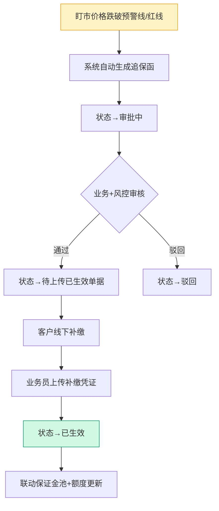
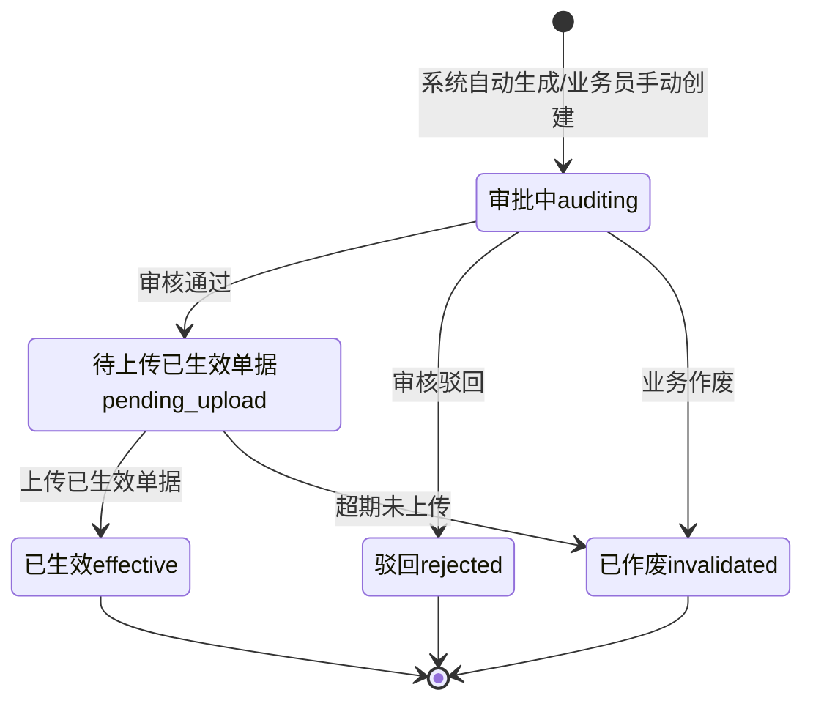

# 02.09 追保函管理 v1.0 终版

> **状态**：v1.0 终版（**新模块，基于原型 58-60 截图**）
> **生成时间**：2026-07-24 14:55
> **配套文档**：[00-项目总览与对接.md](../00-项目总览与对接.md) / [01-模块拆解大框架.md](../01-模块拆解大框架.md) / [02.08-盯市价格管理.md](./02.08-盯市价格管理.md) / [02.10-保证金管理.md](./02.10-保证金管理.md)
> **复用度**：🟢 **85%（大幅复用）**——主产品 `t_xxx（业务实体）` 几乎匹配

---

> **当前页**：`bond-letter-new.html`
> **文档状态**：基于源模块文档的占位版，精确字段待 review 后按原型图精修

## 0. 章节导航

1. 业务定位
2. 业务流程全景
3. 核心实体（3 张表）
4. 6 状态机
5. 角色操作矩阵
6. 字段规则
7. 按钮交互
8. 异常处理
9. 跨模块流转

---

## 1. 业务定位

**追保函管理**是港通供应链的**追保函全生命周期管理**（**v1.0 新顶级模块**）——盯市价格跌破预警线/红线时，自动生成追保函，要求客户补缴保证金。

**港通特色**——分**电子追保函**和**线下追保函**两种（**v1.0 重大发现，基于 58 截图**）。

### 1.1 关键规则

1. **2 种追保函**（基于 58 截图）：
   - **电子追保函**（电子签约）
   - **线下追保函**（线下盖章）
2. **触发条件**：盯市价格跌破预警线/红线（来自 02.08 盯市价格管理）
3. **6 状态**（基于 58 截图）：全部/审批中/待上传已生效单据/已生效/驳回/已作废
4. **关联销售合同**（必填）：选择电子销售合同或线下销售合同
5. **线下补缴**：客户线下转账 → 业务员上传凭证 → 状态→已生效

### 1.2 3 个页面（sitemap）

| # | 页面 | 说明 |
|---|------|------|
| 1 | **追保函管理**（列表，含 2 Tab：电子/线下）| 6 状态 Tab + 搜索筛选 |
| 2 | **新增/编辑追保函** | 新建追保函 + 选择销售合同 |
| 3 | **追保函详情** | 追保函完整信息 + 凭证 |

---

## 2. 业务流程全景

### 2.1 追保函生成流程

### 2.2 电子 vs 线下追保函差异

| 维度 | 电子追保函 | 线下追保函 |
|------|---------|---------|
| 签约方式 | 电子签章 | 线下盖章 |
| 已生效单据 | 电子合同 PDF | 盖章扫描件 |
| 状态变更 | 系统自动 | 业务员上传凭证 |
| 适用场景 | 长期合作客户 | 一次性合作 / 中小客户 |

---

## 4. 6 状态机

### 4.1 6 状态说明（基于 58 截图）

| # | 状态 | 中文 | 触发 | 出口 |
|---|------|------|------|------|
| 1 | `auditing` | 审批中 | 系统生成/手动创建 | 审核通过/驳回/作废 |
| 2 | `pending_upload` | 待上传已生效单据 | 审核通过 | 上传已生效单据/超期作废 |
| 3 | `effective` | 已生效 | 上传已生效单据 | 终态 |
| 4 | `rejected` | 驳回 | 审核驳回 | 终态 |
| 5 | `invalidated` | 已作废 | 业务作废/超期未上传 | 终态 |
| 6 | `all` | 全部 | 列表 Tab | - |

---

## 5. 角色操作矩阵

| 操作 / 角色 | 业务员 | 业务部 | 风控部 | 财务部 | 总经办 | 系统 |
|------------|------|------|------|------|------|------|
| 自动生成追保函 | - | - | - | - | - | ✓（盯市价格触发）|
| 手动创建追保函 | **✓** | - | - | - | - | - |
| 审核追保函 | - | **✓** | **✓** | - | - | - |
| 上传已生效单据 | **✓** | - | - | - | - | - |
| 客户线下补缴 | 客户 | - | - | - | - | - |
| 上传补缴凭证 | **✓** | - | - | - | - | - |

---

## 6. 字段规则

### 6.1 追保函类型 `bond_letter_type`（**v1.0 新增**）

- 2 种：`electronic`（电子追保函）/ `offline`（线下追保函）

### 6.2 销售合同类型 `sales_contract_xxx`（**v1.0 新增**）

- 2 种：`electronic`（电子销售合同）/ `offline`（线下销售合同）

### 6.3 追保金额 `shortfall_amount`

- 元，保留 2 位小数
- 公式：`追保金额 = (合同金额 × 追保率) - 已缴保证金`
- **自动计算**（来自 02.08 盯市价格 + 02.10 保证金管理）

### 6.4 触发指数 `trigger_index_id`

- 关联 02.08 盯市价格管理的指数
- 自动记录触发时的指数价格

---

## 7. 按钮交互

### 7.1 列表页（基于 58 截图）

| 按钮 | 位置 | 可见条件 | 点击行为 |
|------|------|---------|---------|
| **+ 新增追保函** | 右上 | 业务员 | 弹新增对话框 |
| 数据导出 | Tab 右侧 | 所有 | 导出 Excel |
| **电子追保函 Tab** | 顶部 | 所有 | 筛选电子追保函 |
| **线下追保函 Tab** | 顶部 | 所有 | 筛选线下追保函 |
| 详情 | 列表行 | 所有 | 跳详情页 |

### 7.2 列表字段（基于 58 截图）

| 列 | 说明 |
|---|------|
| 编号 | 订单/合同/追保函编号 |
| 企业名称 | 客户名称 |
| 签发日期 | 追保函签发日期 |
| 状态 | 6 状态之一 |
| 操作 | 详情 / 编辑 / 撤销 |

### 7.3 新增追保函对话框

- **选择销售合同**（必填）：弹出选择列表，区分电子销售合同/线下销售合同
- 触发指数（自动）：从当前合同的最新指数
- 追保金额（自动计算）
- 补缴截止日期：默认 7 天后

---

## 8. 异常处理

| 异常场景 | 提示文案 | 处理动作 |
|---------|---------|---------|
| 未选择销售合同 | "必须先选择销售合同" | 阻止 |
| 销售合同已签章 | "销售合同已签章，不能创建追保函" | 阻止 |
| 追保金额 > 0 才允许提交 | "追保金额必须 > 0" | 阻止 |
| 补缴截止日期 < 今天 | "补缴截止日期必须 > 今天" | 阻止 |
| 超期未补缴 | "追保函 X 已超期 Y 天，已自动作废" | 自动作废 |
| 客户已被冻结 | "客户 X 已被冻结，不能创建追保函" | 阻止 |

---

## 9. 跨模块流转

### 9.1 上游触发

| 触发模块 | 触发条件 | 触发动作 |
|---------|---------|---------|
| 盯市价格（02.08）| 价格跌破预警线/红线 | 自动生成追保函 |
| 保证金监控（02.10）| 保证金率变化 | 触发追保函 |

### 9.2 下游触发

| 触发模块 | 触发条件 | 触发动作 |
|---------|---------|---------|
| 保证金池（02.10）| 追保函已生效 | 更新客户保证金池 |
| 客户额度（02.02）| 追保函已生效 | 更新客户可用额度 |
| 预警中心（02.11）| 追保函生成/驳回 | 触发预警信号 |

---

## 11. 文档版本

- **v1.0（2026-07-24 14:55）**：基于 58 截图 + sitemap 首次终版，作为范本用于后端开发
- - **v1.7.99.x（2026-07-28）**：基于 30+ 版本迭代同步
  - 🟡 列表页占位 = "全部"（全站统一）
  - 🟡 状态 tag 颜色编码
  - 🟡 流程图统一用 Mermaid
  - 详见：[v1.7.99-changelog.md](./v1.7.99-changelog.md)
修改记录：见 `06-修改记录.md`