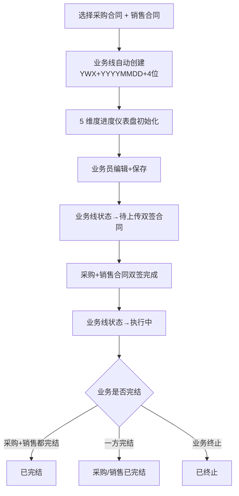
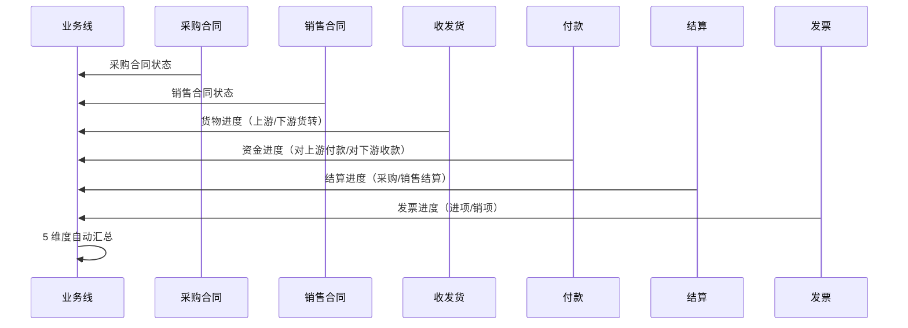
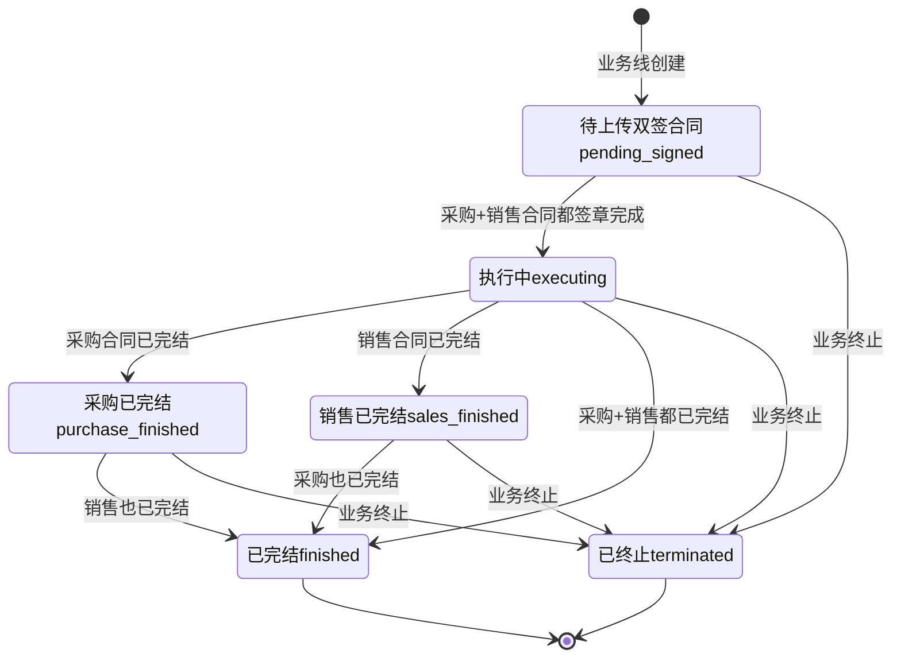

# 02.06 业务线管理 v1.7.99.202 终版

> **状态**：v1.7.99.202 终版（**v1.0 基础上 + v1.7.99.202 操作下拉菜单 4 项**）
> **生成时间**：2026-08-10 09:50
> **配套文档**：[00-项目总览与对接.md](../00-项目总览与对接.md) / [01-模块拆解大框架.md](../01-模块拆解大框架.md) / [02.01-项目管理-立项.md](./02.01-项目管理-立项.md) / [02.03-合同管理.md](./02.03-合同管理.md) / [02.04-订单管理.md](./02.04-订单管理.md)
> **v1.7.99.202 关键改动**（user 2026-08-10 反馈"业务线管理页面，点击具体业务线打开业务线详情页面，有对应的操作按钮"）：
> - **操作按钮改为下拉菜单**（4 项）：解除业务线 / 申请业务完结 / 一键下载附件 / 查看合规验证报告（原"查看监控"改为"查看合规验证报告"）
> - **3 个二次弹窗**：解除业务线（带感叹号 icon + 二次确认）/ 业务线完结申请（单选：上游采购合同/下游销售合同）/ 一键下载附件（多选：上游附件/下游附件，默认全选）

---

> **当前页**：`business-line-detail.html`
> **文档状态**：基于源模块文档的占位版，精确字段待 review 后按原型图精修

## 0. 章节导航

1. 业务定位
2. 业务流程全景
3. 核心实体（3 张表）
4. 7 状态机
5. 角色操作矩阵
6. 字段规则
7. 按钮交互
8. 异常处理
9. 跨模块流转

---

## 1. 业务定位

**业务线**是港通供应链的**全景视图**（**v1.1 新顶级模块**）——串联 1 个采购合同 + 1 个销售合同 + 多个执行单据（收发货/货转/付款/结算/发票/库存），让业务人员一眼看到「上游采购到下游销售」的全链路进度。

**港通特色模块**——建设方案明确"主产品可能没有完整的多合同联动"。

### 1.1 关键规则

1. **业务线 = 1 采购合同 + 1 销售合同**（**v1.0 核心**）
2. **业务线状态 = 7 个**（基于 23 截图）：待上传双签合同/执行中/采购已完结/销售已完结/已完结/已终止
3. **业务线 5 维度进度**（**v1.0 新增**）：货物进度/资金进度/结算进度/发票进度 + 业务线信息
4. **业务线号格式**：`YWX{YYYYMMDD}{4位}`，例 `YWX202309060001`
5. **解除业务线**：仅在特殊情况下解除（如业务终止）

### 1.2 3 个页面（sitemap）

| # | 页面 | 说明 |
|---|------|------|
| 1 | **业务线管理**（列表）| 7 状态 Tab + 5 维度仪表盘 |
| 2 | **业务线关联**（内容待调整）| 关联采购合同 + 销售合同 |
| 3 | **业务线详情** | 业务线完整信息 + 5 维度进度 |

---

## 2. 业务流程全景

### 2.1 业务线创建流程

### 2.2 业务线 5 维度联动

---

## 4. 7 状态机

### 4.1 7 状态说明（基于 23 截图）

| # | 状态 | 中文 | 触发 | 出口 |
|---|------|------|------|------|
| 1 | `pending_signed` | 待上传双签合同 | 业务线创建 | 采购+销售都签章 → 执行中 |
| 2 | `executing` | 执行中 | 采购+销售都签章 | 采购/销售已完结 / 已完结 / 终止 |
| 3 | `purchase_finished` | 采购已完结 | 采购合同已完结 | 销售也已完结 / 已完结 / 终止 |
| 4 | `sales_finished` | 销售已完结 | 销售合同已完结 | 采购也已完结 / 已完结 / 终止 |
| 5 | `finished` | 已完结 | 采购+销售都完结 | 终态 |
| 6 | `terminated` | 已终止 | 业务终止 | 终态 |
| 7 | `dissolved` | 已解除 | 解除业务线（异常）| 终态 |

### 4.2 列表 7 Tab 映射

| Tab | 对应状态 |
|-----|---------|
| 全部 | 所有 |
| 待上传双签合同 | `pending_signed` |
| 执行中 | `executing` |
| 采购已完结 | `purchase_finished` |
| 销售已完结 | `sales_finished` |
| 已完结 | `finished` |
| 已终止 | `terminated` |

---

## 5. 角色操作矩阵

| 操作 / 角色 | 业务员 | 业务部 | 风控部 | 财务部 | 总经办 | 系统 |
|------------|------|------|------|------|------|------|
| 查看业务线 | ✓ | ✓ | ✓ | ✓ | ✓ | - |
| 创建业务线 | **✓** | - | - | - | - | - |
| 解除业务线 | - | 申请 | - | - | **审批** | - |
| 业务线终止 | 申请 | **审批** | 申请 | 申请 | **审批** | - |
| 查看 5 维度进度 | ✓ | ✓ | ✓ | ✓ | ✓ | 自动汇总 |

---

## 6. 字段规则

### 6.1 业务线号 `bl_no`

- **格式**：`YWX{YYYYMMDD}{4位}`，例 `YWX202309060001`
- 系统自动生成

### 6.2 业务线名称 `bl_name`

- 自动生成：`{采购合同号}-{销售合同号}-{品名}`
- 例：`JYX-HNRH-202309-JYX-HNRH-20230-龙铜 三级抗震螺纹钢`

### 6.3 5 维度进度

| 维度 | 字段 | 公式 |
|------|------|------|
| 货物进度 | `upstream_transferred / sales_contract_xxx` | 进度条 0-120% |
| 资金进度 | `paid_to_upstream / received_from_downstream` | 双向付款比例 |
| 结算进度 | `purchase_settled_amount + sales_settled_amount` | 采购+销售结算金额 |
| 发票进度 | `purchase_invoiced_amount + sales_invoiced_amount` | 进项+销项发票金额 |

---

## 7. 按钮交互

### 7.1 列表页

| 按钮 | 位置 | 可见条件 | 点击行为 |
|------|------|---------|---------|
| 搜索/筛选 | 顶部 | 所有 | 弹筛选抽屉 |
| 数据导出 | Tab 右侧 | 所有 | 导出 Excel |
| **业务线详情** | 列表行 | 所有 | 跳详情页 |
| **解除业务线** | 列表行 | 状态≠已完结 | 弹解除确认框（v1.0 新增）|
| 查看未关联业务线的合同 | Tab 右侧 | 业务部 | 跳合同列表筛选（v1.0）|

### 7.2 详情页字段（基于 23 截图）

| 分类 | 字段 |
|------|------|
| **业务线信息** | 业务线号 / 业务线名称 / 采购合同 / 销售合同 / 业务类型 / 采购签订日期 |
| **货物进度** | 销售合同量 / 上游货转 / 下游货转 / 已开货转 + 进度条 |
| **资金进度** | 对上游付款 / 对下游收款 |
| **结算进度** | 采购结算金额 / 销售结算金额 |
| **发票进度** | 进项发票金额 / 销项发票金额 |
| **操作** | 业务线详情 / 解除业务线 / 申请业务完结 / 一键下载附件 / 查看合规验证报告 |

### 7.3 v1.7.99.46 业务线详情页重制（按用户 8 张图）

#### 7.3.1 页面整体结构（按图 3）

**头部 card**：

- 标题：业务线详情 + 状态 tag（执行中/已完结/已终止/采购已完结,销售执行中等）+ 右上角"操作"按钮
- 业务链路：上游 [公司名] → 中游 [公司名] → 下游 [公司名]（3 段，每段用蓝色边框 + 文字 link 风格）
- 业务线信息行 4 项：业务线编号 / 采购合同（蓝色链接）/ 销售合同（蓝色链接）/ 创建时间
- 4 个状态 tag：日期段（2026-01-27到2026-12-31）/ 火运 / 存现货 / 自有资金（图标 + 文字）

**业务概览 8 项 / 2 行**（4 列布局）：

| 合同 | 货量 | 付款 | 上游结算 |
|------|------|------|---------|
| 上下游合同已双签 | 6,252.95吨 | 10,325,800元 | 3,037吨\|10,325,800元 |
| **上游发票** | **回款** | **下游结算** | **下游发票** |
| 10,325,800元 | 10,461,948.71元 | 3,037吨\|10,461,948.71元 | 10,461,948.71元 |

#### 7.3.2 3 个 tap + 5 个左侧导航

**3 个 tap**（横向 tab，蓝色下划线 active）：

1. **采购合同**（默认 active）
2. **销售合同**
3. **业务线台账**

**5 个左侧导航**（垂直，蓝色 dot + 文字）：

1. **合同签订**（默认 active）
2. **货物运输**
3. **资金流水**
4. **结算单**
5. **发票**

#### 7.3.3 采购合同 tap / 合同签订左侧 tap（按图 3）

**基础信息区**（4 列布局 13 字段）：

- 合同编号（蓝色链接，链到 order-detail）
- 卖方企业 / 买方企业
- 签订日期 / 业务类型 / 品名
- 合同单价（元/吨）/ 合同数量（吨）
- 交货期限（起始-结束）/ 到货（地点）
- 运输人（运输方式+路线）/ 供方 / 收货人

**合同附件区**（1 行表格）：

- 单据类型：线下合同
- 文件名称：采购合同.pdf（蓝色链接）
- 操作：下载（蓝色链接）

#### 7.3.4 采购合同 tap / 货物运输左侧 tap（按图 4+图 5）

**2 个内部子 tap**：

1. **发运信息**（默认 active）
2. **货转信息**

**发运信息 tap**（按图 4，9 列 8 行）：

- 批次号 / 发运日期 / 运输方式 / 发运数量(吨) / 收货数量(吨) / 状态（黄色=待配载 / 绿色=已配载）/ 发运地 / 收货地 / 操作（详情/轨迹）

**货转信息 tap**（按图 5，2 层子 tap + 7 列 6 行）：

- 顶部 2 tap：发运信息 / 货转信息(6)（带数字徽标）
- 3 个子 tap：全部 / 有附件 / 无附件
- 表格：货转编号 / 货转开日期 / 货转数量(吨) / 品名 / 运输方式 / 状态（绿色=已配载）/ 操作（详情/下载）

#### 7.3.5 采购合同 tap / 资金流水左侧 tap（按图 6）

**7 列 8 行表格**（资金流水号/付款类型/资金来源/付款金额(元)/付款日期/付款状态/操作）：

- 付款类型：销售付款 / 预付款 / 结算付款
- 资金来源：自有资金
- 付款状态：已付款（绿色 tag）
- 付款金额：1,841,415.93 / 104,940 / 1,676,780 等

#### 7.3.6 采购合同 tap / 结算单左侧 tap（按图 7）

**顶部 2 个操作按钮**：

- 新增结算单（primary 蓝色）
- 新增线下结算单（secondary 灰）

**9 列 4 行表格**（结算单编号/结算日期/结算金额(元)/结算单价(元/吨)/结算数量(吨)/运输方式/结算状态/结算附件/操作）：

- 结算状态：已结算（绿色 tag）
- 运输方式：中欧班列-车厘特路 / 中欧班列-东莞铁路
- 结算附件：第四批商品验收单(2).pdf（蓝色链接）

#### 7.3.7 采购合同 tap / 发票左侧 tap（按图 8）

**2 个顶层 tap**：

- **进项发票(4)**（默认 active）
- **销项发票(0)**

**3 个子 tap + 操作按钮**（右侧）：

- 全部 / 有附件 / 无附件
- 新增发票（primary 蓝色）

**10 列 4 行表格**（发票代码/发票号码/开票日期/不含税金额(元)/税额(元)/价税合计(元)/拆分到本业务金额(元)/发票附件/发票状态/操作）：

- 发票状态：正常（绿色 tag）
- 发票附件：20730138 0000 XXXX529.pdf?bigimg=1_0.png（蓝色链接）

#### 7.3.8 关键设计原则

1. **【大前提】业务线详情页是"全链路仪表盘"**：1 个业务线串联 1 采购 + 1 销售 + N 个执行单据，详情页必须能"看全所有"
2. **3 tap × 5 左侧 = 15 个子页面**：3 个合同类型（采购/销售/台账）× 5 个执行环节（合同/货物/资金/结算/发票）
3. **【大前提】8 项业务概览**：合同+货量+付款+上游结算+上游发票（第一行）+ 回款+下游结算+下游发票（第二行）—— 上下游分两行布局
4. **【大前提】业务链路 3 段**（上游/中游/下游）：用蓝色边框 + 箭头连接，3 段之间用 → 串联
5. **【大前提】采购合同 tap 默认 active**：业务人员最常看采购合同的执行情况
6. **【大前提】合同签订 左侧默认 active**：5 环节的第 1 环节先展示
7. **镜像同步原则**（同 v1.7.99.43）：销售合同 tap 与采购合同 tap 用相同结构，**只 mock 数据不同**（v1.7.99.46 销售合同 tap 占位，待补）
8. **mock 数据覆盖全生命周期**：
   - 货物运输 8 行（4 待配载 + 4 已配载）
   - 货转信息 6 行（全部已配载）
   - 资金流水 8 行（销售付款 + 预付款 + 结算付款）
   - 结算单 4 行（4 个不同月份 + 4 种运输方式）
   - 发票 4 行（4 个不同月份）

#### 7.3.9 适用情景与边界

- **业务线详情页不加业务变更按钮**（遵循"详情页不加业务变更按钮"原则）：仅右上角"操作"按钮（v1.7.99.46 留 placeholder）
- **不展示"业务线名称" 字段**（用户截图未要求）
- **不展示"业务线状态/创建人"**：状态 tag 已在头部展示，创建人放在业务线信息行（v1.7.99.46 mock 数据未要求）
- **销售合同 tap + 业务线台账 tap**：v1.7.99.46 留 placeholder，**等用户后续反馈**再补

---

## 8. 异常处理

| 异常场景 | 提示文案 | 处理动作 |
|---------|---------|---------|
| 创建业务线时无采购合同 | "必须先选择采购合同" | 阻止 |
| 创建业务线时无销售合同 | "必须先选择销售合同" | 阻止 |
| 采购/销售合同业务类型不一致 | "采购 X 与销售 Y 业务类型不匹配" | 阻止 |
| 解除业务线但有未完结单据 | "业务线 X 有关联单据未完结，不能解除" | 阻止 |
| 业务线 5 维度进度不一致 | "采购 X 已完结但销售 Y 仍执行中" | 黄灯提醒 |

---

## 9. 跨模块流转

### 9.1 上游触发

| 触发模块 | 触发条件 | 触发动作 |
|---------|---------|---------|
| 合同管理（02.03）| 采购+销售合同都 `signed` | 业务线自动创建 |

### 9.2 下游触发

| 触发模块 | 触发条件 | 触发动作 |
|---------|---------|---------|
| 收发货（02.05）| 收/发货完成 | 更新业务线货物进度 |
| 货转（02.07）| 上游/下游货转完成 | 更新业务线货物进度 |
| 付款（02.08.1）| 付款完成 | 更新业务线资金进度 |
| 结算（02.13）| 结算完成 | 更新业务线结算进度 |
| 发票（02.09）| 开票完成 | 更新业务线发票进度 |

---

## 11. 文档版本

- **v1.0（2026-07-24 14:55）**：基于 23 截图 + sitemap 首次终版，作为范本用于后端开发
- - **v1.7.99.x（2026-07-28）**：基于 30+ 版本迭代同步
  - 🟡 列表页占位 = "全部"（全站统一）
  - 🟡 状态 tag 颜色编码
  - 🟡 流程图统一用 Mermaid
  - 详见：[v1.7.99-changelog.md](./v1.7.99-changelog.md)
- **v1.7.99.46（2026-07-29）**：业务线详情页重制（按用户 6 张图：图 3-图 8）
  - 🔴 **【关键重制】头部 card**：业务线详情 + 状态 tag + 操作按钮 + 业务链路 3 段（上游→中游→下游）+ 4 项业务线信息行 + 4 个状态 tag（日期/火运/存现货/自有资金）
  - 🔴 **【关键重制】业务概览 8 项 / 2 行**：合同/货量/付款/上游结算（第一行）+ 上游发票/回款/下游结算/下游发票（第二行）—— 上下游分两行
  - 🔴 **【关键重制】3 个 tap**（采购合同/销售合同/业务线台账）：横向 tab，蓝色下划线 active
  - 🔴 **【关键重制】5 个左侧导航**（合同签订/货物运输/资金流水/结算单/发票）：垂直，蓝色 dot + 文字，3 像素蓝色 active 标识
  - 🟡 **【关键新增】采购合同 tap / 合同签订**：基础信息 13 字段（4 列布局）+ 合同附件 1 行表格
  - 🟡 **【关键新增】采购合同 tap / 货物运输**：2 个内部子 tap（发运信息/货转信息）+ 发运信息 9 列 8 行 + 货转信息 7 列 6 行
  - 🟡 **【关键新增】采购合同 tap / 资金流水**：7 列 8 行表格
  - 🟡 **【关键新增】采购合同 tap / 结算单**：顶部"新增结算单/新增线下结算单"按钮 + 9 列 4 行表格
  - 🟡 **【关键新增】采购合同 tap / 发票**：2 顶层 tap（进项发票(4)/销项发票(0)）+ 3 子 tap（全部/有附件/无附件）+ "新增发票"按钮 + 10 列 4 行表格
  - 🟡 **镜像同步原则**（同 v1.7.99.43）：销售合同 tap 与采购合同 tap 用相同结构，v1.7.99.46 销售合同 + 业务线台账 留 placeholder
  - 🟡 **【关键修复】左侧导航文字不换行**：width 100px → 120px + white-space: nowrap
- **v1.7.99.53（2026-07-29）**：业务线详情 - 销售合同 + 业务线台账 tap 8 个子页面（按用户 9 张图）
  - 🔴 **【关键新增】销售合同 tap / 合同签订**：14 字段 4 列布局（合同编号+综合/合同 tag / 卖方/买方/签订日期/业务类型/品名/合同单价 3,444.83元/吨/合同数量 25,000吨/交货期限/到货/运输人/供方/收货人/付款账户/回款账户）+ 1 行合同附件下载
  - 🔴 **【关键新增】销售合同 tap / 货物运输**：2 子 tap（发运信息/货转信息），**均空数据**（📦 暂无数据）
  - 🔴 **【关键新增】销售合同 tap / 回款**：4 数据卡（已结算金额 10,461,948.71 / 已回款金额 0 / 小微企业应收账款 0 / 其他企业应收账款 0）+ 新增还款按钮 + 15 行表格
  - 🔴 **【关键新增】销售合同 tap / 结算单**：新增线下结算单按钮 + 4 行表格（已结算 tag）
  - 🔴 **【关键新增】销售合同 tap / 发票**：销项发票(3) active + 全部/有附件/无附件 + 3 行表格（正常 tag）+ 新增发票按钮
  - 🔴 **【关键新增】业务线台账 tap / 库存数据总览**：4 数据卡 + 风险预警 0 黄底大数字卡 + 库存统计 + 折线图占位
  - 🔴 **【关键新增】业务线台账 tap / 库存统计**：4 数据卡 + 风险预警 0 + 折线图占位
  - 🔴 **【关键新增】业务线台账 tap / 品类库存列表**：4 数据卡（库存数据总览）+ 库存统计 + 折线图 + 环形图 100% 单色 + 8 列品类库存列表 1 行
  - 🟡 **【关键修复】JS 切换限定到当前 tap-panel 内**：用 `closest('.bl-tap-panel')` 找范围，避免跨 tap 串扰
  - 🟡 **【关键新增】CSS**：`.kpi-grid` / `.kpi-card` / `.kpi-card.highlight` / `.risk-card` / `.time-tap-bar` / `.time-tap` / `.chart-line` / `.donut-wrap` / `.donut` / `.cp-empty`
  - 🟡 **【关键新增】JS 函数**：`drawStockChart()` / `drawDonut()` 折线图 + 环形图占位绘制
- **v1.7.99.55（2026-07-29）**：业务线台账 tap 字段名 + 数据卡数量修正
  - 🔴 **【关键修复】字段名"锁库库存"→"账面库存"**：v1.7.99.53 错别字"锁"应为"账"
  - 🔴 **【关键修复】字段名"已结算金额"→"已付款金额"**：业务线台账 tap 用
  - 🔴 **【关键修复】字段名"已回款金额"→"已收货物量"**：图 7 库存数据总览第 1 行第 3 个
  - 🔴 **【关键修复】图 7 库存数据总览 / 第 1 行**：4 数据卡 + 风险预警 0（账面库存/已付款金额/已收货物量/累计出库金额）—— 改前 3 卡 + 风险预警 + 1 卡重复
  - 🔴 **【关键修复】图 7 库存数据总览 / 第 2 行**：3 数据卡（账面库存货值/累计入库货值/累计出库货值）—— 改前 4 数据卡含新签库存增量
  - 🔴 **【关键修复】图 8 库存统计 / 第 1 行**：4 数据卡 + 风险预警 0（账面库存/已付款金额/已回款金额/已开票金额）—— 风险预警从第 2 行挪到第 1 行
  - 🔴 **【关键修复】图 8 库存统计 / 第 2 行**：3 数据卡（账面库存货值/累计入库货值/累计出库货值）—— 改前 3 数据卡含新签库存增量
  - 🔴 **【关键修复】图 9 品类库存列表 4 数据卡**：账面库存/已付款金额/已收货物量/累计出库金额（**和图 7 第 1 行同结构**）
  - 🔴 **【关键修复】图 9 品类库存列表表格列名**："锁库库存"→"账面库存"
- **v1.7.99.202（2026-08-10 09:50）**：业务线详情页"操作"按钮改为下拉菜单 + 3 个二次弹窗（按 user 2026-08-10 反馈）
  - 🟡 **【关键改动】操作按钮 → 下拉菜单 4 项**：解除业务线 / 申请业务完结 / 一键下载附件 / 查看合规验证报告（原"查看监控"改为"查看合规验证报告"）
  - 🟡 **【关键新增】弹窗 1：解除业务线**（带感叹号 icon + 二次确认）：标题"解除业务线" + 提示"解除后，该业务线将删除，不影响上下游合同数据。确认要解除吗？" + 取消/确定
  - 🟡 **【关键新增】弹窗 2：业务线完结申请**（单选）：标题"业务线完结申请" + 单选"上游采购合同 / 下游销售合同" + 取消/确定
  - 🟡 **【关键新增】弹窗 3：一键下载附件**（多选，默认全选）：标题"一键下载附件" + 多选"上游附件 / 下游附件"（默认全选） + 取消/确定
  - 🟡 **【关键新增】查看合规验证报告**：v1.7.99.203 点击后跳到 `./report-compliance-detail.html`（跟 `report-compliance.html` 列表"查看报告"链接同款）
  - 🟡 **【关键新增】CSS**：`.bl-action-menu`（下拉菜单）+ `.bl-modal-mask` / `.bl-modal`（遮罩 + 弹窗体）+ `.bl-modal-header` / `.bl-modal-body` / `.bl-modal-footer` + `.bl-modal-radio-group` / `.bl-modal-checkbox-group` + `.bl-modal-title-icon`（感叹号圆形 icon）
  - 🟡 **【关键新增】JS 函数**：`toggleBlActionMenu()`（切换下拉显示）/ `openBlModal(type)` / `closeBlModal(type)` / `confirmBlAction(type)` + 点击外部关闭下拉
  - 🟡 **【关键修复】操作按钮视觉**：从单独的"操作"按钮（v1.0）改为带下拉箭头的菜单按钮（v1.7.99.202），下拉项 4 项蓝字
修改记录：见 `06-修改记录.md`