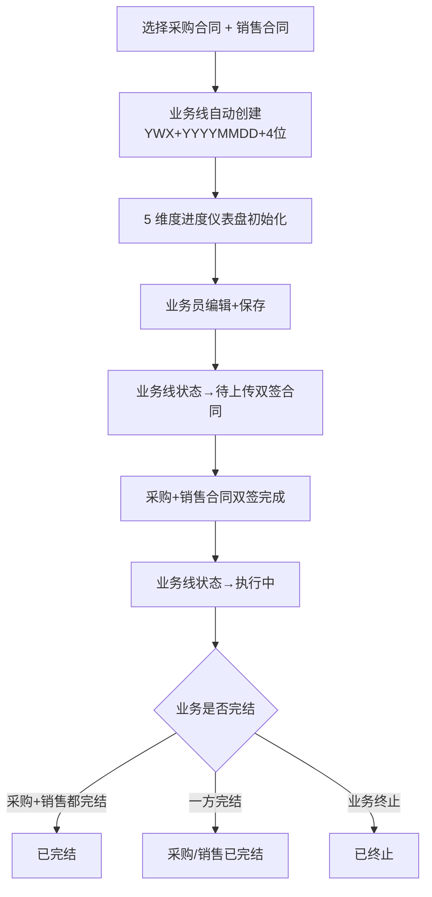
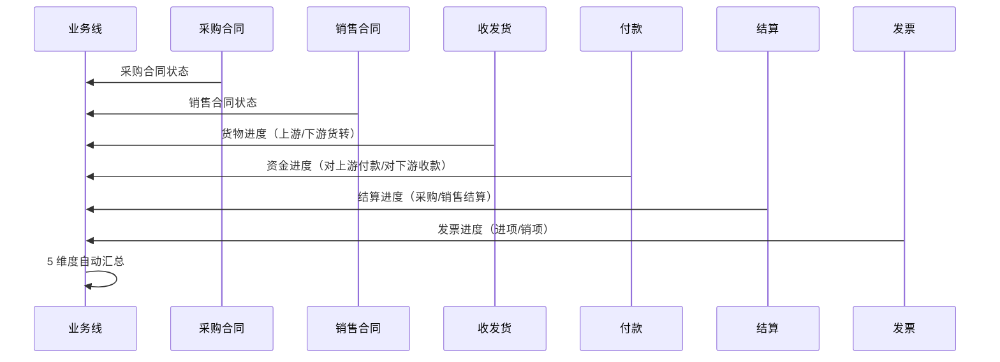
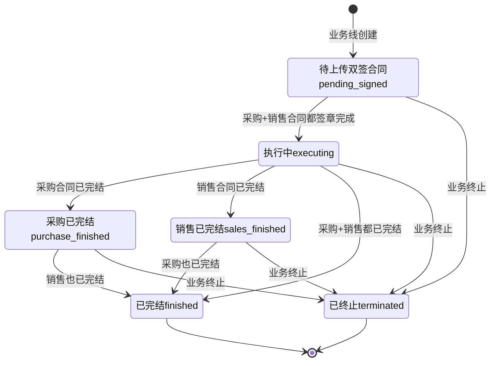

# 02.06 业务线管理 v1.0 终版

> **状态**：v1.0 终版（**新模块，基于原型 23-25 截图**）
> **生成时间**：2026-07-24 14:55
> **配套文档**：[00-项目总览与对接.md](../00-项目总览与对接.md) / [01-模块拆解大框架.md](../01-模块拆解大框架.md) / [02.01-项目管理-立项.md](./02.01-项目管理-立项.md) / [02.03-合同管理.md](./02.03-合同管理.md) / [02.04-订单管理.md](./02.04-订单管理.md)
> **复用度**：🟢 **70%（主产品已有 t_xxx 3 张表 + 扩展）**——主产品 `t_xxx` 3 张 + `t_xxx（业务实体）` + `t_xxx（业务实体）` + `t_xxx（业务实体）`

---

> **当前页**：`business-line.html`
> **文档状态**：基于源模块文档的占位版，精确字段待 review 后按原型图精修

## 0. 章节导航

1. 业务定位
2. 业务流程全景
3. 核心实体（3 张表）
4. 7 状态机
5. 角色操作矩阵
6. 字段规则
7. 按钮交互
8. 异常处理
9. 跨模块流转

---

## 1. 业务定位

**业务线**是港通供应链的**全景视图**（**v1.1 新顶级模块**）——串联 1 个采购合同 + 1 个销售合同 + 多个执行单据（收发货/货转/付款/结算/发票/库存），让业务人员一眼看到「上游采购到下游销售」的全链路进度。

**港通特色模块**——建设方案明确"主产品可能没有完整的多合同联动"。

### 1.1 关键规则

1. **业务线 = 1 采购合同 + 1 销售合同**（**v1.0 核心**）
2. **业务线状态 = 7 个**（基于 23 截图）：待上传双签合同/执行中/采购已完结/销售已完结/已完结/已终止
3. **业务线 5 维度进度**（**v1.0 新增**）：货物进度/资金进度/结算进度/发票进度 + 业务线信息
4. **业务线号格式**：`YWX{YYYYMMDD}{4位}`，例 `YWX202309060001`
5. **解除业务线**：仅在特殊情况下解除（如业务终止）

### 1.2 3 个页面（sitemap）

| # | 页面 | 说明 |
|---|------|------|
| 1 | **业务线管理**（列表）| 7 状态 Tab + 5 维度仪表盘 |
| 2 | **业务线关联**（内容待调整）| 关联采购合同 + 销售合同 |
| 3 | **业务线详情** | 业务线完整信息 + 5 维度进度 |

---

## 2. 业务流程全景

### 2.1 业务线创建流程

### 2.2 业务线 5 维度联动

---

## 4. 7 状态机

### 4.1 7 状态说明（基于 23 截图）

| # | 状态 | 中文 | 触发 | 出口 |
|---|------|------|------|------|
| 1 | `pending_signed` | 待上传双签合同 | 业务线创建 | 采购+销售都签章 → 执行中 |
| 2 | `executing` | 执行中 | 采购+销售都签章 | 采购/销售已完结 / 已完结 / 终止 |
| 3 | `purchase_finished` | 采购已完结 | 采购合同已完结 | 销售也已完结 / 已完结 / 终止 |
| 4 | `sales_finished` | 销售已完结 | 销售合同已完结 | 采购也已完结 / 已完结 / 终止 |
| 5 | `finished` | 已完结 | 采购+销售都完结 | 终态 |
| 6 | `terminated` | 已终止 | 业务终止 | 终态 |
| 7 | `dissolved` | 已解除 | 解除业务线（异常）| 终态 |

### 4.2 列表 7 Tab 映射

| Tab | 对应状态 |
|-----|---------|
| 全部 | 所有 |
| 待上传双签合同 | `pending_signed` |
| 执行中 | `executing` |
| 采购已完结 | `purchase_finished` |
| 销售已完结 | `sales_finished` |
| 已完结 | `finished` |
| 已终止 | `terminated` |

---

## 5. 角色操作矩阵

| 操作 / 角色 | 业务员 | 业务部 | 风控部 | 财务部 | 总经办 | 系统 |
|------------|------|------|------|------|------|------|
| 查看业务线 | ✓ | ✓ | ✓ | ✓ | ✓ | - |
| 创建业务线 | **✓** | - | - | - | - | - |
| 解除业务线 | - | 申请 | - | - | **审批** | - |
| 业务线终止 | 申请 | **审批** | 申请 | 申请 | **审批** | - |
| 查看 5 维度进度 | ✓ | ✓ | ✓ | ✓ | ✓ | 自动汇总 |

---

## 6. 字段规则

### 6.1 业务线号 `bl_no`

- **格式**：`YWX{YYYYMMDD}{4位}`，例 `YWX202309060001`
- 系统自动生成

### 6.2 业务线名称 `bl_name`

- 自动生成：`{采购合同号}-{销售合同号}-{品名}`
- 例：`JYX-HNRH-202309-JYX-HNRH-20230-龙铜 三级抗震螺纹钢`

### 6.3 5 维度进度

| 维度 | 字段 | 公式 |
|------|------|------|
| 货物进度 | `upstream_transferred / sales_contract_xxx` | 进度条 0-120% |
| 资金进度 | `paid_to_upstream / received_from_downstream` | 双向付款比例 |
| 结算进度 | `purchase_settled_amount + sales_settled_amount` | 采购+销售结算金额 |
| 发票进度 | `purchase_invoiced_amount + sales_invoiced_amount` | 进项+销项发票金额 |

---

## 7. 按钮交互

### 7.1 列表页

| 按钮 | 位置 | 可见条件 | 点击行为 |
|------|------|---------|---------|
| 搜索/筛选 | 顶部 | 所有 | 弹筛选抽屉 |
| 数据导出 | Tab 右侧 | 所有 | 导出 Excel |
| **业务线详情** | 列表行 | 所有 | 跳详情页 |
| **解除业务线** | 列表行 | 状态≠已完结 | 弹解除确认框（v1.0 新增）|
| 查看未关联业务线的合同 | Tab 右侧 | 业务部 | 跳合同列表筛选（v1.0）|

### 7.2 详情页字段（基于 23 截图）

| 分类 | 字段 |
|------|------|
| **业务线信息** | 业务线号 / 业务线名称 / 采购合同 / 销售合同 / 业务类型 / 采购签订日期 |
| **货物进度** | 销售合同量 / 上游货转 / 下游货转 / 已开货转 + 进度条 |
| **资金进度** | 对上游付款 / 对下游收款 |
| **结算进度** | 采购结算金额 / 销售结算金额 |
| **发票进度** | 进项发票金额 / 销项发票金额 |
| **操作** | 业务线详情 / 解除业务线 |

### 7.3 v1.7.99.46 业务线管理列表页重制（按用户 8 张图）

#### 7.3.1 列表页结构（按图 1）

**顶部筛选区**（6 项 / 3 列布局）：

| 列 1 | 列 2 | 列 3 |
|------|------|------|
| 编号（input 模糊搜索）| 企业名称（input 模糊搜索）| 品名（input 模糊搜索）|
| 品类（select：淀粉制品/糖粉/谷物/玉米）| 业务类型（select：存货/预付/账期/购销）| 签订日期（date range picker）|

**7 个状态 tab**（替换之前"全部/执行中/已暂停/已完结"4 tap）：

| tab | 含义 |
|-----|------|
| **全部** | 全部业务线（5 条）|
| **待上传双签合同** | 上下游合同尚未双签 |
| **执行中** | 上下游合同已双签 + 业务执行中 |
| **采购已完结** | 采购合同已完结，销售合同执行中 |
| **销售已完结** | 销售合同已完结，采购合同执行中 |
| **已完结** | 上下游合同都已完结 |
| **已终止** | 业务已终止 |

**Tab 右侧操作链接**：**查看未关联业务线的合同(0)>>**（点击触发右侧抽屉弹窗）

**6 列表格**（替换之前 10 列规范表）：

| 列 | 宽度 | 内容 |
|----|------|------|
| 业务线信息 | 24% | 公司链路 + 业务编号 + 业务类型 tag + 采购合同链接 + 采购日期 |
| 货物进度 | 13% | 销售合同量/已发运 + 进度条 + 百分比 |
| 资金进度 | 13% | 对上游付款/对下游收款 |
| 结算进度 | 13% | 采购结算金额/销售结算金额 |
| 发票进度 | 13% | 开发票 |
| 操作 | 8% | 业务线详情/解绑业务线（**上下排布**）|

**业务线信息 cell 4 行结构**（v1.7.99.46 锁定）：

- 第 1 行：XXXXX有限公司-德通供应链-XXXX有限公司 + 状态 tag（执行中/已完结/采购已完结/已终止等）
- 第 2 行：业务编号 YWX202309050001 + 业务类型 tag（存量定例/购销业务/待付业务，颜色区分：蓝色=存货/黄色=购销/绿色=预付）
- 第 3 行：采购合同 JYX-JHWH-202309（蓝色链接，链到 order-detail）
- 第 4 行：采购日期：2023-09-04

**进度 cell 通用结构**（v1.7.99.46 锁定）：

- 货物进度：销售合同量 100吨（黑色）+ 已发运 200吨（绿色/灰色）+ 进度条 + 100%
- 资金进度：对上游付款（label）+ 数值（绿色/灰色）+ 对下游收款（label）+ 数值
- 结算进度：采购结算金额（label）+ 数值（绿色/灰色）+ 销售结算金额（label）+ 数值
- 发票进度：开发票（label）+ 数值

#### 7.3.2 抽屉弹窗：查看未关联业务线的合同（按图 2）

**触发**：列表页 Tab 右侧"查看未关联业务线的合同(0)>>"链接

**抽屉规格**（同 v1.7.99.45-fix 规范）：

- 右侧 1280px，transform 0.25s
- 标题"查看未关联业务线的合同" + 右上角关闭按钮

**2 tap 切换**：

- **采购合同**（默认 active）
- **销售合同**

**7 项筛选**（3 列布局）：

| 列 1 | 列 2 | 列 3 |
|------|------|------|
| 编号（input 模糊搜索）| 企业名称（input 模糊搜索）| 业务员（input 模糊搜索）|
| 运输方式（select：火运/船运/汽运）| 品类（select：淀粉制品/糖粉/谷物/玉米）| 业务类型（select：存货/预付/账期/购销）|
| 签订日期（date range picker，横跨 3 列）|  |  |

**表格 11 列**（合同编号/卖方企业名称/收货人/交货期限/签订日期/运输方式/数量/基准价/品名/品类/操作）

**空数据状态**：图标 + "暂无数据"（按图 2）

#### 7.3.3 关键设计原则

1. **【大前提】业务线管理是"全景视图"**：列表页 6 列设计（业务线信息 + 5 维度进度）让业务人员一眼看到全链路进度
2. **业务类型 tag 颜色编码**（v1.7.99.46 锁定）：蓝色=存货业务 / 黄色=购销业务 / 绿色=预付业务
3. **操作列上下排布**：业务线详情/解绑业务线 用 flex-direction: column
4. **进度条 100% 完成**：v1.7.99.37 规范延伸，业务线列表页的货物进度沿用进度条 + 百分比
5. **抽屉触发方式**：Tab 右侧文字链接（不是按钮）—— 业务部 1 跳 1
6. **【大前提】7 个状态 tab**：替换之前 4 tap（全部/执行中/已暂停/已完结），按业务线真实生命周期补全

#### 7.3.4 适用情景与边界

- **业务线信息 cell** 内不展示"创建人/创建时间"等基础字段（这些在详情页展示）
- **不展示"业务线名称"** 字段（用户截图未要求，v1.7.99.46 仅展示核心信息）
- **操作列只展示"业务线详情/解绑业务线"**（v1.7.99.46 不擅自加业务变更按钮，遵循"详情页不加业务变更按钮"原则）
- **抽屉空数据状态**：当前 mock 数据为空，按图 2 保留"暂无数据"提示

---

## 8. 异常处理

| 异常场景 | 提示文案 | 处理动作 |
|---------|---------|---------|
| 创建业务线时无采购合同 | "必须先选择采购合同" | 阻止 |
| 创建业务线时无销售合同 | "必须先选择销售合同" | 阻止 |
| 采购/销售合同业务类型不一致 | "采购 X 与销售 Y 业务类型不匹配" | 阻止 |
| 解除业务线但有未完结单据 | "业务线 X 有关联单据未完结，不能解除" | 阻止 |
| 业务线 5 维度进度不一致 | "采购 X 已完结但销售 Y 仍执行中" | 黄灯提醒 |

---

## 9. 跨模块流转

### 9.1 上游触发

| 触发模块 | 触发条件 | 触发动作 |
|---------|---------|---------|
| 合同管理（02.03）| 采购+销售合同都 `signed` | 业务线自动创建 |

### 9.2 下游触发

| 触发模块 | 触发条件 | 触发动作 |
|---------|---------|---------|
| 收发货（02.05）| 收/发货完成 | 更新业务线货物进度 |
| 货转（02.07）| 上游/下游货转完成 | 更新业务线货物进度 |
| 付款（02.08.1）| 付款完成 | 更新业务线资金进度 |
| 结算（02.13）| 结算完成 | 更新业务线结算进度 |
| 发票（02.09）| 开票完成 | 更新业务线发票进度 |

---

## 11. 文档版本

- **v1.0（2026-07-24 14:55）**：基于 23 截图 + sitemap 首次终版，作为范本用于后端开发
- - **v1.7.99.x（2026-07-28）**：基于 30+ 版本迭代同步
  - 🟡 列表页占位 = "全部"（全站统一）
  - 🟡 状态 tag 颜色编码
  - 🟡 流程图统一用 Mermaid
  - 详见：[v1.7.99-changelog.md](./v1.7.99-changelog.md)
- **v1.7.99.46（2026-07-29）**：业务线管理列表页 + 抽屉重制（按用户 8 张图）
  - 🔴 **【关键重制】列表页 6 列表格**（替换之前 10 列规范表）：业务线信息（4 行：状态+业务编号+业务类型+采购合同/日期）/货物进度（销售合同量+已发运+进度条+百分比）/资金进度（对上游付款+对下游收款）/结算进度（采购结算金额+销售结算金额）/发票进度（开发票）/操作（业务线详情+解绑业务线）
  - 🔴 **【关键修复】7 个状态 tab**（替换之前 4 tap：全部/执行中/已暂停/已完结）：全部/待上传双签合同/执行中/采购已完结/销售已完结/已完结/已终止
  - 🟡 **【关键新增】抽屉弹窗"查看未关联业务线的合同"**（v1.7.99.46 新增）：右侧 1280px 抽屉，2 tap（采购合同/销售合同），7 项筛选（编号/企业名称/业务员/运输方式/品类/业务类型/签订日期），11 列表格，空数据状态
  - 🟡 **【关键新增】业务类型 tag 颜色编码**：蓝色=存货业务/黄色=购销业务/绿色=预付业务
  - 🟡 **【关键新增】操作列上下排布**：业务线详情/解绑业务线 用 flex-direction: column
  - 🟡 **【关键新增】6 项筛选区**：编号/企业名称/品名/品类/业务类型/签订日期（v1.7.99.46 锁定，3 列布局）
  - 🟡 **【关键新增】Tab 右侧文字链接"查看未关联业务线的合同(0)>>"**：触发抽屉
  - 🟡 **【关键新增】业务线信息 cell 4 行结构**：公司链路/业务编号+业务类型/采购合同/采购日期
  - 🟡 **5 行 mock 数据**：覆盖全部 7 个状态（执行中/已完结/采购已完结,销售执行中/采购执行中,销售已完结/已终止）
  - 🟡 **分页**：共 400 条记录 第 1/80 页 + 1-9 页码 + 10条/页
修改记录：见 `06-修改记录.md`