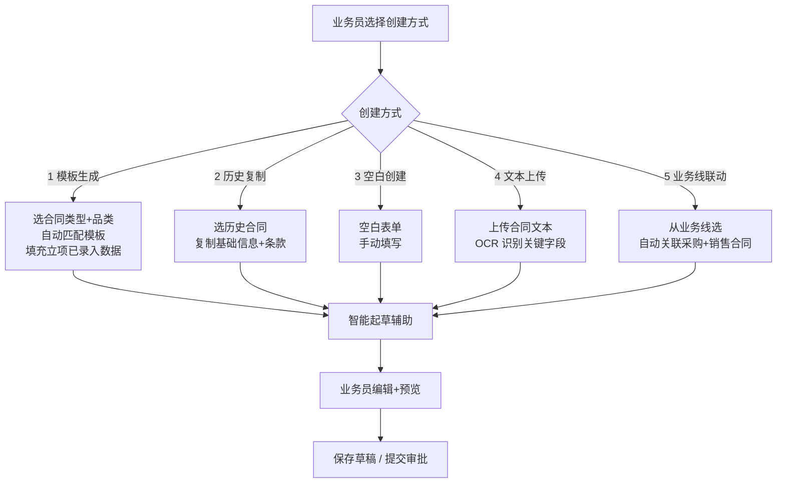
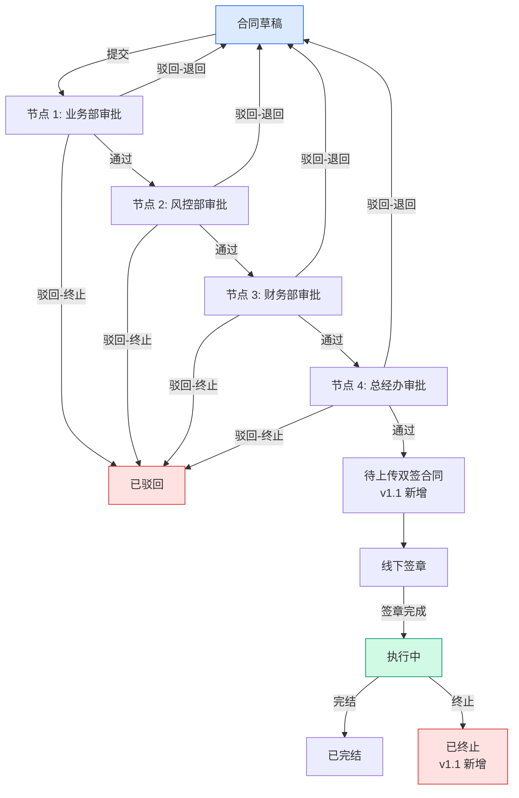
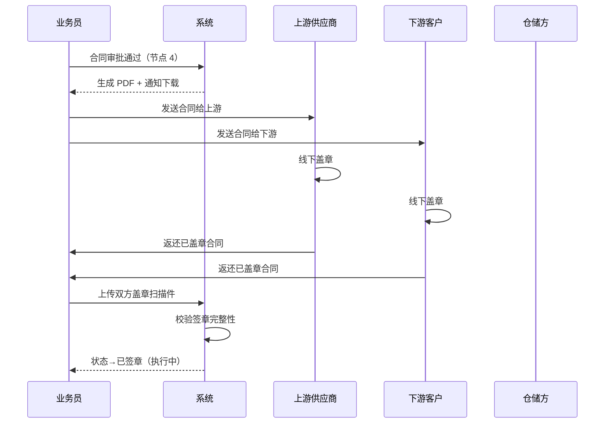
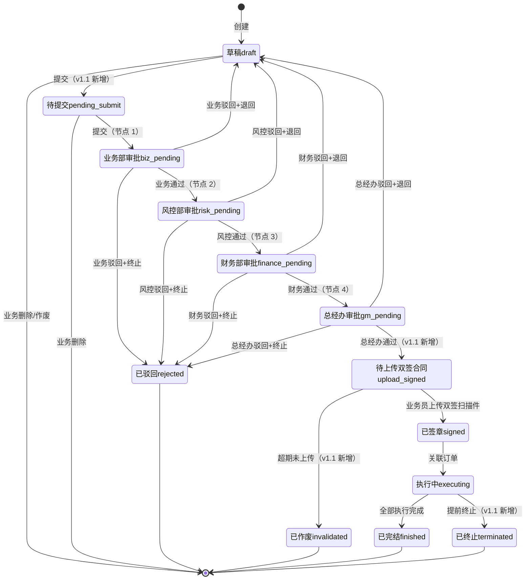
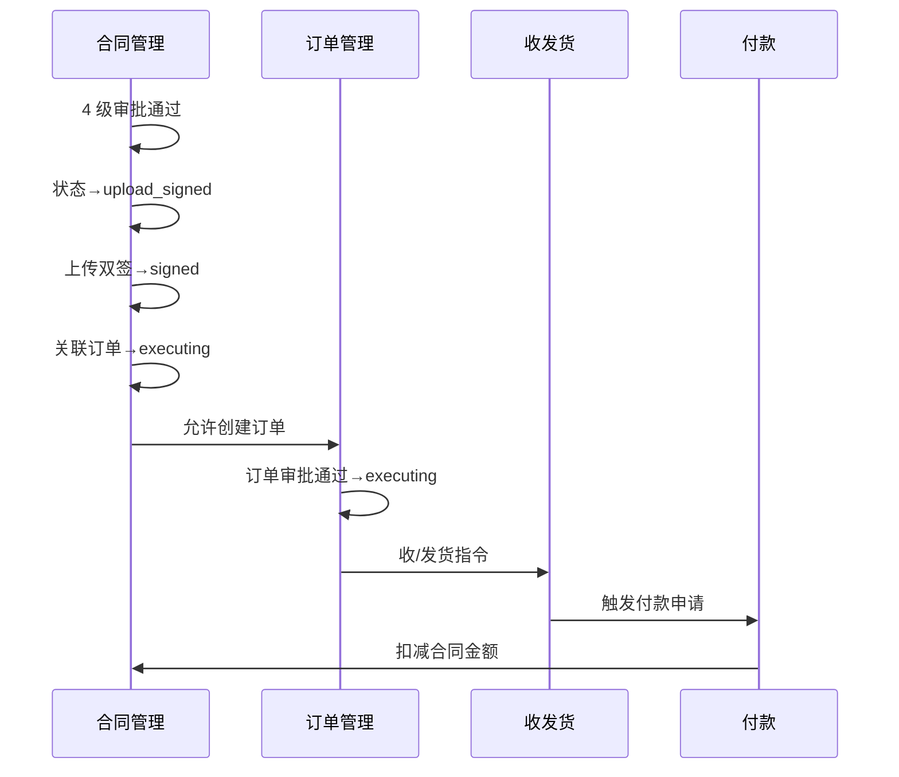

# 02.03 合同管理 v1.1 终版

> **状态**：v1.1 终版（**v1.0 修正版，基于 83 张原型截图调整**）
> **生成时间**：2026-07-24 14:55
> **变更**：
> - 🔴 **4 子菜单**（采购/销售/**运输**/补充）vs v1.0 4 类（采购/销售/仓储/补充）
> - 🔴 **合同号 4 段格式** `DLXLC-DSRMT-2022203-001` vs v1.0 `HT-{YYYYMM}-{4位}`
> - 🔴 **品类具体名** 玉米/糖粉/木薯淀粉 vs v1.0 谷物/糖粉/淀粉
> - 🟡 **9 状态**（新增"待上传双签合同/已终止/已作废"）vs v1.0 6 状态
> - 🟡 **5 业务类型**（+总代业务）vs v1.0 4 类型
> - 🟡 **2 维分类**：方向（采购/销售）×类型（框架/订单单批次）= 4 种合同
> - 🟡 合同字段新增：货物进度/付款进度/结算进度/开票进度 4 仪表盘
> **配套文档**：[00-项目总览与对接.md](../00-项目总览与对接.md) / [01-模块拆解大框架.md](../01-模块拆解大框架.md) / [05-复用对比/全量矩阵 v1.2.md](../05-复用对比/全量矩阵%20v1.0.md) / [02.01-项目管理-立项.md](./02.01-项目管理-立项.md) / [02.02-客户管理.md](./02.02-客户管理.md) / [02.04-订单管理.md](./02.04-订单管理.md)
> **复用度**：🟢 **80%（大幅复用）**——主产品 `bo_contract*` 7 张 + `t_xxx` 4 张 + `t_xxx` 钢铁业务 5 张 = **13+ 张表**

---

> **当前页**：`contract-sales-order-new.html`
> **文档状态**：基于源模块文档的占位版，精确字段待 review 后按原型图精修

## 0. 章节导航

1. 业务定位
2. 业务流程全景
3. 核心实体（**v1.1 调整：13 张表**）
4. 9 状态机（**v1.1 新增 3 个状态**）
5. 角色操作矩阵
6. 字段规则
7. 按钮交互
8. 异常处理
9. 跨模块流转

11. v1.1 变更摘要

---

## 1. 业务定位

**合同管理**是港通供应链的**业务串联核心**——所有下游业务（订单/收发货/付款/发票/结算）都通过合同关联起来。

### 1.1 v1.1 关键规则（基于原型 08-22 截图 + sitemap）

1. **4 子菜单**（**v1.1 重大调整**）：
   - **采购合同**（含采购框架合同 + 采购订单/单批次合同）
   - **销售合同**（含销售框架合同 + 销售订单/单批次合同）
   - **运输合同**（**v1.1 新发现**）
   - **补充协议**
2. **2 维分类**（**v1.1 新增**）：
   - 方向：`purchase`（采购）/ `sales`（销售）
   - 类型：`framework`（框架合同）/ `single_batch`（订单/单批次合同）
   - 组合 = 4 种合同
3. **5 种业务模式**（**v1.1 新增 1 种**）：存货/预付/账期/购销/**总代业务**（从项目立项继承）
4. **4 级串行审批**：业务部 → 风控部 → 财务部 → 总经办（**单签**，不是 OR 会签）✅ 不变
5. **2 小时 SLA 自动催办** ✅ 不变
6. **加签机制**（临时加人审批）✅ 不变
7. **线下签章 + 系统流程化登记**（审批通过→下载→双方线下盖章→扫描件上传）✅ 不变
8. **5 种创建方式**：模板生成 / 历史复制 / 空白创建 / 文本上传 / 业务线联动 ✅ 不变
9. **客户关联**：直接引用 （业务实体）✅ 不变
10. **9 状态**（**v1.1 重大调整**）：新增"**待上传双签合同/已终止/已作废**"

### 1.2 v1.1 4 子菜单详解

| # | 子菜单 | 2 维分类 | 子页 | 范本对应 |
|---|--------|---------|------|---------|
| 1 | **采购合同** | direction=purchase | 采购框架合同 / **采购订单/单批次合同** | 02.03 v1.0 + 02.04 订单管理 |
| 2 | **销售合同** | direction=sales | 销售框架合同 / **销售订单/单批次合同** | 02.03 v1.0 + 02.04 订单管理 |
| 3 | **运输合同**（v1.1 新）| transport | 暂无详情页（占位）| **02.03 v1.0 没写** |
| 4 | **补充协议** | supplemental | 框架合同补充 / 订单/单批次合同补充 | 02.03 v1.0 部分 |

### 1.3 货物品类 3 种（**v1.1 具体名**）

| v1.0（抽象）| v1.1（具体名）|
|------|------|
| 谷物 | **玉米** |
| 糖粉 | **糖粉** |
| 淀粉 | **木薯淀粉** |

### 1.4 业务类型 5 种（**v1.1 新增总代业务**）

| # | 业务类型 | v1.0 | v1.1 |
|---|--------|-----|------|
| 1 | 存货业务 | ✅ | ✅ |
| 2 | 预付业务 | ✅ | ✅ |
| 3 | 账期业务 | ✅ | ✅ |
| 4 | 购销业务 | ✅ | ✅ |
| 5 | **总代业务**（`agency_business`）| ❌ | 🆕（23 业务线截图）|

---

## 2. 业务流程全景

### 2.1 5 种创建方式（不变）

### 2.2 4 级串行审批流程（不变）

**v1.1 关键调整**：节点 4 后新增"**待上传双签合同**"状态（线下盖章完成的过渡状态）

### 2.3 合同签章流程（不变）

---

## 4. 9 状态机（**v1.1 重大调整**）

### 4.1 合同状态机（**v1.1 从 6 个扩到 9 个**）

### 4.2 9 状态说明

| # | 状态 | 节点 | 中文 | 触发 | 出口 |
|---|------|------|------|------|------|
| 1 | `draft` | - | 草稿 | 创建 | 提交/删除/作废 |
| 2 | `pending_submit` | - | 待提交 | 业务员提交 | 业务部审批 |
| 3 | `biz_pending` | 1 | 业务部审批 | 业务员提交 | 业务部审批 |
| 4 | `risk_pending` | 2 | 风控部审批 | 业务部通过 | 风控部审批 |
| 5 | `finance_pending` | 3 | 财务部审批 | 风控部通过 | 财务部审批 |
| 6 | `gm_pending` | 4 | 总经办审批 | 财务部通过 | 总经办审批 |
| 7 | **`upload_signed`** | - | **待上传双签合同**（v1.1 新增）| 总经办通过 | 上传双签 / 超期作废 |
| 8 | `signed` | - | 已签章 | 上传双签扫描件 | 执行中 |
| 9 | `executing` | - | 执行中 | 关联订单 | 完结 / 终止 |
| 10 | `finished` | - | 已完结 | 全部执行完成 | 终态 |
| 11 | `terminated` | - | **已终止**（v1.1 新增）| 提前终止 | 终态 |
| 12 | `rejected` | - | 已驳回 | 任一审批驳回 | 终态 |
| 13 | `invalidated` | - | **已作废**（v1.1 新增）| 超期未上传双签 | 终态 |

### 4.3 列表 9 Tab 映射

| Tab | 对应状态 |
|-----|---------|
| 全部 | 所有 |
| 待提交(100) | `pending_submit` |
| 审批中(1) | `biz_pending` / `risk_pending` / `finance_pending` / `gm_pending` |
| **待上传双签合同(10)**（v1.1 新增）| `upload_signed` |
| 执行中(100) | `executing` |
| 已完结(100) | `finished` |
| **已终止(100)**（v1.1 新增）| `terminated` |
| 驳回(100) | `rejected` |
| **已作废(100)**（v1.1 新增）| `invalidated` |

---

## 5. 角色操作矩阵（不变）

| 状态 / 角色 | 业务员 | 业务部 | 风控部 | 财务部 | 总经办 | 系统 |
|------------|------|------|------|------|------|------|
| `pending_submit` 待提交 | 编辑/作废 | 查看 | 查看 | 查看 | 查看 | - |
| `biz_pending` 业务部 | 查看 | **审批** | 查看 | 查看 | 查看 | 推送 |
| `risk_pending` 风控部 | 查看 | 查看 | **审批** | 查看 | 查看 | 推送 |
| `finance_pending` 财务部 | 查看 | 查看 | 查看 | **审批** | 查看 | 推送 |
| `gm_pending` 总经办 | 查看 | 查看 | 查看 | 查看 | **审批** | 推送 |
| `upload_signed` 待上传（v1.1 新）| **上传双签** | 查看 | 查看 | 查看 | 查看 | 超期提醒 |
| `signed` 已签章 | 查看 | 查看 | 查看 | 查看 | 查看 | - |
| `executing` 执行中 | 查看 | 查看 | 查看 | 查看 | 查看 | - |
| `finished` 已完结 | 查看 | 查看 | 查看 | 查看 | 查看 | - |
| `terminated` 已终止（v1.1 新）| 查看 | 查看 | 查看 | 查看 | 查看 | - |
| `rejected` 已驳回 | **编辑后重新提交** | 查看 | 查看 | 查看 | 查看 | - |
| `invalidated` 已作废（v1.1 新）| 查看 | 查看 | 查看 | 查看 | 查看 | - |

---

## 6. 字段规则

### 6.1 合同号 `contract_xxx`（**v1.1 重大调整**）

- **格式**：`{项目代码}-{业务类型}-{YYYYMMDD}-{3位流水}`，**4 段**
- 例：`DLXLC-DSRMT-2022203-001`
- 段位含义（**v1.1 待确认**）：
  - 第 1 段：项目代码（DLXLC = 立项项目代码？跟 02.01 立项项目编号相关？）
  - 第 2 段：业务类型（DSRMT = 订/售/燃/煤/统？需用户确认）
  - 第 3 段：日期 YYYYMMDD
  - 第 4 段：3 位流水
- **v1.1 标 [P0 待确认-字段]**

### 6.2 业务模式 `business_mode`（**v1.1 新增第 5 种**）

- **5 种**：
  - `inventory`（存货业务）
  - `prepayment`（预付业务）
  - `credit_xxx`（账期业务）
  - `trade`（购销业务）
  - **`agency_business`（总代业务，v1.1 新增）**

### 6.3 合同方向 `direction`（**v1.1 新增**）

- 3 种：`purchase`（采购）/ `sales`（销售）/ `transport`（运输）

### 6.4 合同子类型 `contract_xxx`（**v1.1 新增**）

- 3 种：`framework`（框架合同）/ `single_batch`（订单/单批次合同）/ `supplement`（补充协议）

### 6.5 货物品类 `product_xxx`（**v1.1 具体名**）

- 3 种：**玉米** / **糖粉** / **木薯淀粉**（不再是"谷物/糖粉/淀粉"抽象名）

### 6.6 4 级串行审批规则（不变）

- 业务部 → 风控部 → 财务部 → 总经办
- 全部单签（不是 OR 会签）
- 任一驳回→ 退回草稿或终止
- 2 小时 SLA 自动催办

### 6.7 加签机制（不变）

- 加签（add_sign）：审批人可临时加审批人（紧急情况）
- 加签节点 `is_add_sign=1` + `add_sign_reason` 必填
- 加签人也需遵守 2 小时 SLA

### 6.8 线下签章规则（**v1.1 调整**）

- **v1.0 流程**：审批通过→下载→双方线下盖章→扫描件上传→已签章
- **v1.1 流程**：审批通过→**状态→"待上传双签合同"**→业务员上传双签扫描件→状态→"已签章"
- **超期未上传**（v1.1 新增）：超过 30 天未上传扫描件→状态→"已作废"

---

## 7. 按钮交互

### 7.1 列表页（**v1.1 调整**）

| 按钮 | 位置 | 可见条件 | 点击行为 |
|------|------|---------|---------|
| **新增合同** | 右上 | 业务部 | 弹创建方式选择（5 种）|
| **数据导出** | Tab 右侧 | 所有 | 导出 Excel |
| **合同详情** | 列表行 | 所有 | 跳详情页 |
| **上传合同附件** | 列表行 | `upload_signed` | 弹上传对话框（v1.1 新增）|
| **付款申请** | 列表行 | `executing` | 跳付款新建（关联 contract_xxx）|
| **发货申请** | 列表行 | `executing` | 跳发货新建 |
| **更多** | 列表行 | 所有 | 弹下拉（编辑/作废/驳回/复制等）|

### 7.2 详情页字段（**v1.1 新增 4 进度仪表盘**）

| 分类 | 字段 |
|------|------|
| **合同信息** | 合同号 / 卖方企业 / 品名 / 合同单价 / 合同金额 / 业务类型 / 合同量 / 签订日期 / 合同有效期 / 创建人 |
| **货物进度** | 进度条 0-120%（带颜色）|
| **付款进度** | 已付款（元）/ 0 |
| **结算进度** | 已结算数量（吨）/ 已结算金额（元）/ 拆分到本合同金额（元）|
| **开票进度** | 发票张数（张）/ 0 |
| **操作** | 合同详情 / 上传合同附件 / 付款申请 / 发货申请 / 更多 |

### 7.3 4 子菜单入口（**v1.1 调整**）

- 合同管理 → 4 个子菜单
  - 采购合同（含 2 Tab：采购框架合同 / 采购订单/单批次合同）
  - 销售合同（含 2 Tab：销售框架合同 / 销售订单/单批次合同）
  - 运输合同（占位）
  - 补充协议（含 2 Tab：新增补协-框架合同 / 新增补协-订单/单批次合同）

---

## 8. 异常处理

### 8.1 业务异常

| 异常场景 | 提示文案 | 处理动作 |
|---------|---------|---------|
| 必填项未填 | "请填写：合同名称/客户/品类/..." | 阻止提交 |
| 业务类型与品类不匹配 | "业务类型 X 与品类 Y 不匹配" | 红色提示 |
| 合同金额 = 0 | "合同金额必须 > 0" | 阻止 |
| 合同有效期 < 生效日期 | "到期日期必须 > 生效日期" | 阻止 |

### 8.2 审批异常

| 异常场景 | 提示文案 | 处理动作 |
|---------|---------|---------|
| 任一审批驳回 | "XX 审批驳回" | 状态→`draft`（退回）或 `rejected`（终止）|
| 审批超时（2 小时）| "审批超过 2 小时未处理" | **自动催办** |
| 审批人未配置 | "审批人未配置，请联系管理员" | 状态保持 |
| 消息推送失败 | "消息推送失败，请重试" | 允许重试 |

### 8.3 签章异常（**v1.1 调整**）

| 异常场景 | 提示文案 | 处理动作 |
|---------|---------|---------|
| **超期未上传双签合同**（v1.1 新）| "合同 XXX 已超 30 天未上传双签扫描件，已自动作废" | 状态→`invalidated` |
| 签章扫描件格式错误 | "扫描件格式不支持（仅支持 .pdf/.png/.jpg）" | 阻止上传 |
| 签章扫描件过大 | "扫描件不能超过 20MB" | 阻止上传 |
| 签章扫描件与签章方不匹配 | "扫描件签章方与系统记录不匹配" | 红色提示，需人工审核 |

### 8.4 变更/终止异常

| 异常场景 | 提示文案 | 处理动作 |
|---------|---------|---------|
| 执行中合同变更 | "执行中合同变更需走补充协议" | 引导到补充协议 |
| 已完结合同不能变更 | "已完结合同不能变更" | 阻止 |
| 已终止合同不能恢复 | "已终止合同不能恢复" | 阻止 |
| **作废合同恢复**（v1.1 新）| "已作废合同需走 OA 流程恢复" | 引导到 OA |

---

## 9. 跨模块流转

### 9.1 上游触发

| 触发模块 | 触发条件 | 触发动作 |
|---------|---------|---------|
| 项目管理-立项（02.01）| 项目 `finished` | 允许创建合同，关联 `project_xxx` |
| 客户管理（02.02）| 客户 `executing` | 允许合同关联 |

### 9.2 下游触发

| 触发模块 | 触发条件 | 触发动作 |
|---------|---------|---------|
| 订单管理（02.04）| 合同 `signed` | 允许创建订单（采购/销售）|
| 收发货（02.05）| 订单 `executing` | 收/发货关联到 `contract_xxx` |
| 付款（02.08.1）| 合同 `executing` | 付款时校验合同 |
| 发票（02.09）| 合同 `executing` | 发票关联到 `contract_xxx` |
| 结算（02.07）| 合同 `executing` | 结算关联到 `contract_xxx` |

### 9.3 跨模块状态机联动

---

## 11. v1.1 变更摘要

| 变更点 | v1.0 | v1.1 |
|------|------|------|
| **4 子菜单** | 4 类（采购/销售/仓储/补充）| **4 子菜单**（采购/销售/**运输**/补充）|
| **2 维分类** | 范本没明确 | **方向 × 子类型 = 4 种合同**（采购框架/采购订单/销售框架/销售订单）|
| **合同号格式** | `HT-{YYYYMM}-{4位}` | **`{项目代码}-{业务类型}-{YYYYMMDD}-{3位}` 4 段** |
| **货物品类** | 谷物/糖粉/淀粉 | **玉米/糖粉/木薯淀粉** |
| **业务类型** | 4 种 | **5 种**（+ 总代业务）|
| **状态数** | 6 个 | **9 个**（+ 待上传双签合同/已终止/已作废）|
| **新增表** | 13 张 | **13 张**（+ 4 张：upload/terminate/invalidate/progress）|
| **字段：合同量/单价** | 范本没说 | **v1.1 新增**（08 截图显示）|
| **4 进度仪表盘** | 范本没说 | **v1.1 新增**（货物/付款/结算/开票）|

---

## 12. 文档版本

- **v1.0（2026-07-24 11:33）**：基于 5 张截图 + 建设方案 V2 推测的初版
- **v1.1（2026-07-24 14:55）**：基于 83 张原型截图（7-24 最新版）修正
  - 🔴 4 子菜单（+运输合同）
  - 🔴 合同号 4 段格式
  - 🔴 品类具体名
  - 🟡 9 状态
  - 🟡 5 业务类型
  - 🟡 2 维分类
  - 🟡 4 进度仪表盘
  - 🟡 4 新表
- - **v1.7.99.x（2026-07-28）**：基于 30+ 版本迭代同步
  - 🟡 列表页占位 = "全部"（全站统一）
  - 🟡 状态 tag 颜色编码
  - 🟡 流程图统一用 Mermaid
  - 详见：[v1.7.99-changelog.md](./v1.7.99-changelog.md)
修改记录：见 `06-修改记录.md`