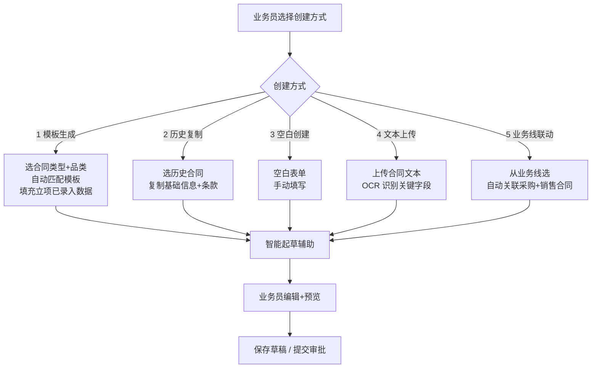
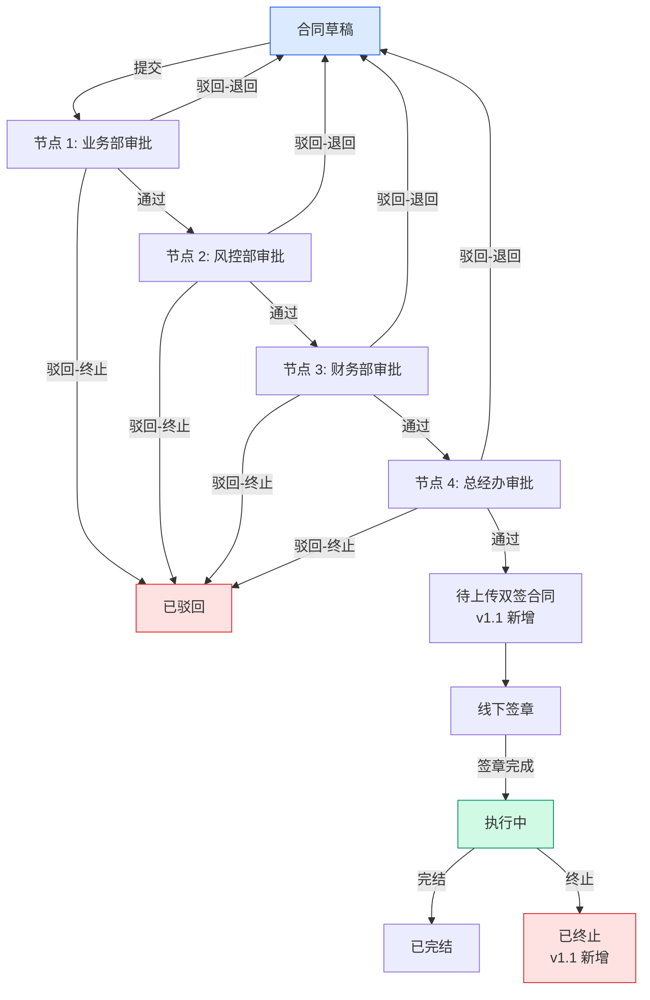
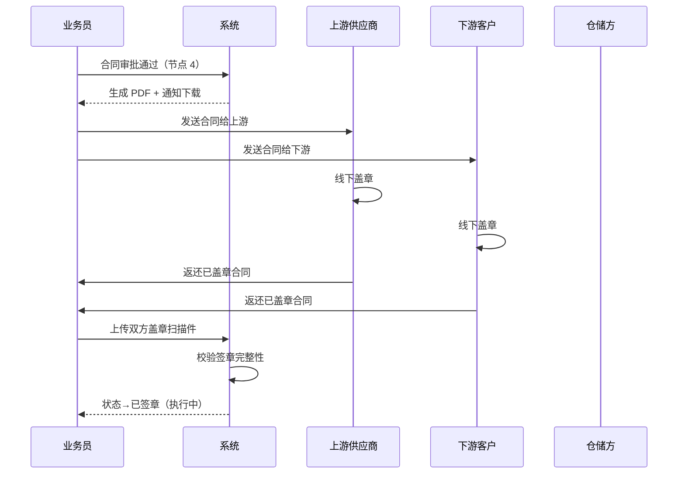
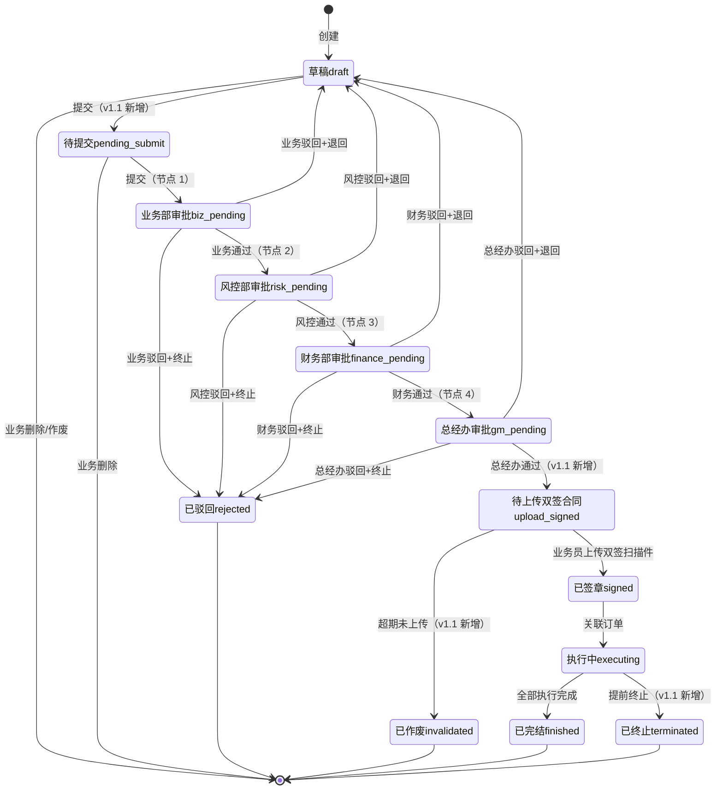
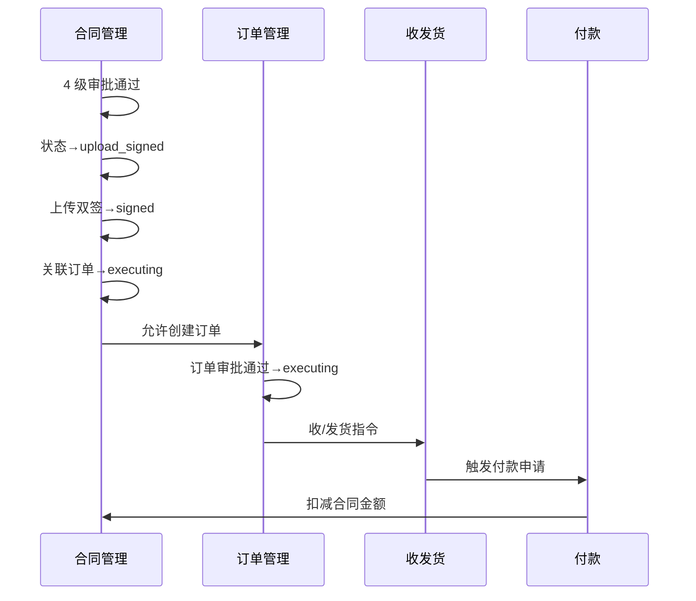

# 02.03 合同管理 v1.1 终版

> **状态**：v1.1 终版（**v1.0 修正版，基于 83 张原型截图调整**）
> **生成时间**：2026-07-24 14:55
> **变更**：
> - 🔴 **4 子菜单**（采购/销售/**运输**/补充）vs v1.0 4 类（采购/销售/仓储/补充）
> - 🔴 **合同号 4 段格式** `DLXLC-DSRMT-2022203-001` vs v1.0 `HT-{YYYYMM}-{4位}`
> - 🔴 **品类具体名** 玉米/糖粉/木薯淀粉 vs v1.0 谷物/糖粉/淀粉
> - 🟡 **9 状态**（新增"待上传双签合同/已终止/已作废"）vs v1.0 6 状态
> - 🟡 **5 业务类型**（+总代业务）vs v1.0 4 类型
> - 🟡 **2 维分类**：方向（采购/销售）×类型（框架/订单单批次）= 4 种合同
> - 🟡 合同字段新增：货物进度/付款进度/结算进度/开票进度 4 仪表盘
> **配套文档**：[00-项目总览与对接.md](../00-项目总览与对接.md) / [01-模块拆解大框架.md](../01-模块拆解大框架.md) / [05-复用对比/全量矩阵 v1.2.md](../05-复用对比/全量矩阵%20v1.0.md) / [02.01-项目管理-立项.md](./02.01-项目管理-立项.md) / [02.02-客户管理.md](./02.02-客户管理.md) / [02.04-订单管理.md](./02.04-订单管理.md)
> **复用度**：🟢 **80%（大幅复用）**——主产品 `bo_contract*` 7 张 + `t_xxx` 4 张 + `t_xxx` 钢铁业务 5 张 = **13+ 张表**

---

> **当前页**：`contract-sales.html`
> **文档状态**：基于源模块文档的占位版，精确字段待 review 后按原型图精修

## 0. 章节导航

1. 业务定位
2. 业务流程全景
3. 核心实体（**v1.1 调整：13 张表**）
4. 9 状态机（**v1.1 新增 3 个状态**）
5. 角色操作矩阵
6. 字段规则
7. 按钮交互
8. 异常处理
9. 跨模块流转

11. v1.1 变更摘要

---

## 1. 业务定位

**合同管理**是港通供应链的**业务串联核心**——所有下游业务（订单/收发货/付款/发票/结算）都通过合同关联起来。

### 1.1 v1.1 关键规则（基于原型 08-22 截图 + sitemap）

1. **4 子菜单**（**v1.1 重大调整**）：
   - **采购合同**（含采购框架合同 + 采购订单/单批次合同）
   - **销售合同**（含销售框架合同 + 销售订单/单批次合同）
   - **运输合同**（**v1.1 新发现**）
   - **补充协议**
2. **2 维分类**（**v1.1 新增**）：
   - 方向：`purchase`（采购）/ `sales`（销售）
   - 类型：`framework`（框架合同）/ `single_batch`（订单/单批次合同）
   - 组合 = 4 种合同
3. **5 种业务模式**（**v1.1 新增 1 种**）：存货/预付/账期/购销/**总代业务**（从项目立项继承）
4. **4 级串行审批**：业务部 → 风控部 → 财务部 → 总经办（**单签**，不是 OR 会签）✅ 不变
5. **2 小时 SLA 自动催办** ✅ 不变
6. **加签机制**（临时加人审批）✅ 不变
7. **线下签章 + 系统流程化登记**（审批通过→下载→双方线下盖章→扫描件上传）✅ 不变
8. **5 种创建方式**：模板生成 / 历史复制 / 空白创建 / 文本上传 / 业务线联动 ✅ 不变
9. **客户关联**：直接引用 （业务实体）✅ 不变
10. **9 状态**（**v1.1 重大调整**）：新增"**待上传双签合同/已终止/已作废**"

### 1.2 v1.1 4 子菜单详解

| # | 子菜单 | 2 维分类 | 子页 | 范本对应 |
|---|--------|---------|------|---------|
| 1 | **采购合同** | direction=purchase | 采购框架合同 / **采购订单/单批次合同** | 02.03 v1.0 + 02.04 订单管理 |
| 2 | **销售合同** | direction=sales | 销售框架合同 / **销售订单/单批次合同** | 02.03 v1.0 + 02.04 订单管理 |
| 3 | **运输合同**（v1.1 新）| transport | 暂无详情页（占位）| **02.03 v1.0 没写** |
| 4 | **补充协议** | supplemental | 框架合同补充 / 订单/单批次合同补充 | 02.03 v1.0 部分 |

### 1.3 货物品类 3 种（**v1.1 具体名**）

| v1.0（抽象）| v1.1（具体名）|
|------|------|
| 谷物 | **玉米** |
| 糖粉 | **糖粉** |
| 淀粉 | **木薯淀粉** |

### 1.4 业务类型 5 种（**v1.1 新增总代业务**）

| # | 业务类型 | v1.0 | v1.1 |
|---|--------|-----|------|
| 1 | 存货业务 | ✅ | ✅ |
| 2 | 预付业务 | ✅ | ✅ |
| 3 | 账期业务 | ✅ | ✅ |
| 4 | 购销业务 | ✅ | ✅ |
| 5 | **总代业务**（`agency_business`）| ❌ | 🆕（23 业务线截图）|

---

## 2. 业务流程全景

### 2.1 5 种创建方式（不变）



### 2.2 4 级串行审批流程（不变）



**v1.1 关键调整**：节点 4 后新增"**待上传双签合同**"状态（线下盖章完成的过渡状态）

### 2.3 合同签章流程（不变）



---

## 4. 9 状态机（**v1.1 重大调整**）

### 4.1 合同状态机（**v1.1 从 6 个扩到 9 个**）



### 4.2 9 状态说明

| # | 状态 | 节点 | 中文 | 触发 | 出口 |
|---|------|------|------|------|------|
| 1 | `draft` | - | 草稿 | 创建 | 提交/删除/作废 |
| 2 | `pending_submit` | - | 待提交 | 业务员提交 | 业务部审批 |
| 3 | `biz_pending` | 1 | 业务部审批 | 业务员提交 | 业务部审批 |
| 4 | `risk_pending` | 2 | 风控部审批 | 业务部通过 | 风控部审批 |
| 5 | `finance_pending` | 3 | 财务部审批 | 风控部通过 | 财务部审批 |
| 6 | `gm_pending` | 4 | 总经办审批 | 财务部通过 | 总经办审批 |
| 7 | **`upload_signed`** | - | **待上传双签合同**（v1.1 新增）| 总经办通过 | 上传双签 / 超期作废 |
| 8 | `signed` | - | 已签章 | 上传双签扫描件 | 执行中 |
| 9 | `executing` | - | 执行中 | 关联订单 | 完结 / 终止 |
| 10 | `finished` | - | 已完结 | 全部执行完成 | 终态 |
| 11 | `terminated` | - | **已终止**（v1.1 新增）| 提前终止 | 终态 |
| 12 | `rejected` | - | 已驳回 | 任一审批驳回 | 终态 |
| 13 | `invalidated` | - | **已作废**（v1.1 新增）| 超期未上传双签 | 终态 |

### 4.3 列表 9 Tab 映射

| Tab | 对应状态 |
|-----|---------|
| 全部 | 所有 |
| 待提交(100) | `pending_submit` |
| 审批中(1) | `biz_pending` / `risk_pending` / `finance_pending` / `gm_pending` |
| **待上传双签合同(10)**（v1.1 新增）| `upload_signed` |
| 执行中(100) | `executing` |
| 已完结(100) | `finished` |
| **已终止(100)**（v1.1 新增）| `terminated` |
| 驳回(100) | `rejected` |
| **已作废(100)**（v1.1 新增）| `invalidated` |

---

## 5. 角色操作矩阵（不变）

| 状态 / 角色 | 业务员 | 业务部 | 风控部 | 财务部 | 总经办 | 系统 |
|------------|------|------|------|------|------|------|
| `pending_submit` 待提交 | 编辑/作废 | 查看 | 查看 | 查看 | 查看 | - |
| `biz_pending` 业务部 | 查看 | **审批** | 查看 | 查看 | 查看 | 推送 |
| `risk_pending` 风控部 | 查看 | 查看 | **审批** | 查看 | 查看 | 推送 |
| `finance_pending` 财务部 | 查看 | 查看 | 查看 | **审批** | 查看 | 推送 |
| `gm_pending` 总经办 | 查看 | 查看 | 查看 | 查看 | **审批** | 推送 |
| `upload_signed` 待上传（v1.1 新）| **上传双签** | 查看 | 查看 | 查看 | 查看 | 超期提醒 |
| `signed` 已签章 | 查看 | 查看 | 查看 | 查看 | 查看 | - |
| `executing` 执行中 | 查看 | 查看 | 查看 | 查看 | 查看 | - |
| `finished` 已完结 | 查看 | 查看 | 查看 | 查看 | 查看 | - |
| `terminated` 已终止（v1.1 新）| 查看 | 查看 | 查看 | 查看 | 查看 | - |
| `rejected` 已驳回 | **编辑后重新提交** | 查看 | 查看 | 查看 | 查看 | - |
| `invalidated` 已作废（v1.1 新）| 查看 | 查看 | 查看 | 查看 | 查看 | - |

---

## 6. 字段规则

### 6.1 合同号 `contract_xxx`（**v1.1 重大调整**）

- **格式**：`{项目代码}-{业务类型}-{YYYYMMDD}-{3位流水}`，**4 段**
- 例：`DLXLC-DSRMT-2022203-001`
- 段位含义（**v1.1 待确认**）：
  - 第 1 段：项目代码（DLXLC = 立项项目代码？跟 02.01 立项项目编号相关？）
  - 第 2 段：业务类型（DSRMT = 订/售/燃/煤/统？需用户确认）
  - 第 3 段：日期 YYYYMMDD
  - 第 4 段：3 位流水
- **v1.1 标 [P0 待确认-字段]**

### 6.2 业务模式 `business_mode`（**v1.1 新增第 5 种**）

- **5 种**：
  - `inventory`（存货业务）
  - `prepayment`（预付业务）
  - `credit_xxx`（账期业务）
  - `trade`（购销业务）
  - **`agency_business`（总代业务，v1.1 新增）**

### 6.3 合同方向 `direction`（**v1.1 新增**）

- 3 种：`purchase`（采购）/ `sales`（销售）/ `transport`（运输）

### 6.4 合同子类型 `contract_xxx`（**v1.1 新增**）

- 3 种：`framework`（框架合同）/ `single_batch`（订单/单批次合同）/ `supplement`（补充协议）

### 6.5 货物品类 `product_xxx`（**v1.1 具体名**）

- 3 种：**玉米** / **糖粉** / **木薯淀粉**（不再是"谷物/糖粉/淀粉"抽象名）

### 6.6 4 级串行审批规则（不变）

- 业务部 → 风控部 → 财务部 → 总经办
- 全部单签（不是 OR 会签）
- 任一驳回→ 退回草稿或终止
- 2 小时 SLA 自动催办

### 6.7 加签机制（不变）

- 加签（add_sign）：审批人可临时加审批人（紧急情况）
- 加签节点 `is_add_sign=1` + `add_sign_reason` 必填
- 加签人也需遵守 2 小时 SLA

### 6.8 线下签章规则（**v1.1 调整**）

- **v1.0 流程**：审批通过→下载→双方线下盖章→扫描件上传→已签章
- **v1.1 流程**：审批通过→**状态→"待上传双签合同"**→业务员上传双签扫描件→状态→"已签章"
- **超期未上传**（v1.1 新增）：超过 30 天未上传扫描件→状态→"已作废"

---

## 7. 按钮交互

### 7.1 列表页（6 状态操作项矩阵，业务端）

> **6 状态**（比采购少"待提交"/"已终止"）：审批中 / 待上传双签合同 / 执行中 / 已完结 / 审批驳回 / 已作废
> **7 tab**：全部 / 审批中 / 待上传双签合同 / 执行中 / 已完结 / 审批驳回 / 已作废

#### 销售框架合同（`framework`）

| 状态 | 操作按钮数 | 按钮列表 |
|------|----------|---------|
| **审批中** | 1 | 合同详情 |
| **待上传双签合同** | 3 | 合同详情 / 上传合同附件 / **合同作废**（红）|
| **执行中** | 5 | 合同详情 / 上传双签章合同（黑红章）/ 新增补协 / 发起合同完结 / 发起合同终止 |
| **已完结** | 1 | 合同详情 |
| **审批驳回** | 3 | 合同详情 / 合同修改 / **合同作废**（红）|
| **已作废** | 1 | 合同详情 |

#### 销售订单合同（`order`）

| 状态 | 操作按钮数 | 按钮列表 |
|------|----------|---------|
| **审批中** | 1 | 合同详情 |
| **待上传双签合同** | **7**（前 4 + 更多里 3）| 合同详情 / 上传合同附件 / 关联采购合同 / 开票申请 / 更多 ▾（发起结算 / 开具货转 / **合同作废**）|
| **执行中** | **9**（前 4 + 更多里 5）| 合同详情 / 上传双签章合同 / 开具货转 / 发起结算 / 更多 ▾（开票申请 / 关联采购合同 / 新增补协 / 发起合同完结 / 发起合同终止）|
| **已完结** | 1 | 合同详情 |
| **审批驳回** | 3 | 合同详情 / 合同修改 / **合同作废**（红）|
| **已作废** | 1 | 合同详情 |

#### 销售合同特有按钮

- ✅ **上传双签章合同**（执行中黑红章合同显示）
- ✅ **关联采购合同**（订单合同显示，框架合同不显示）
- ✅ **开具货转**（销售合同叫法，采购合同叫"上传货转单"）
- ✅ **发起结算**（销售合同叫法，采购合同叫"上传结算单"）
- ✅ **开票申请**（销售合同叫法，采购合同叫"上传发票"）

#### 合同作废/合作废 命名规范

| 对象 | 文字 |
|------|------|
| **操作按钮** | 合同作废（所有状态统一）|
| **弹窗标题** | 销售合同统一：`合作废`（id `void`）|
| **弹窗内文** | "提交后，合同状态将变为"已作废"状态，不可再做其他操作。" |

### 7.2 详情页字段（4 进度仪表盘，**v1.7.99.37 同步**）

| 分类 | 字段 |
|------|------|
| **合同信息** | 合同号 / **买方企业**（销售合同方是客户的客户，区别于采购合同的"卖方企业"）/ 品名 / 合同单价 / 合同金额 / 业务类型 / 合同量 / 签订日期 / 合同有效期 / 创建人 |
| **货转进度** | 进度条 0-120%（带颜色）/ 合同量 / 已货转（销售 = "已确认"状态货转数量之和）|
| **回款进度**（销售特有）| 已收保证金（销售订单且涉及保证金时展示，框架不展示）/ 保证金比例（带 ↑/↓/无箭头）/ 已回款（公式：货款+下游价差+保证金调整-下游退款）|
| **结算进度** | 已结算数量（吨）/ 已结算金额（元）/ 拆分到本合同金额（元）|
| **开票进度** | 发票张数（张）/ 拆分到本合同金额（元）|
| **操作** | 合同详情 / 上传合同附件 / 关联采购合同 / 开票申请 / 更多 |

### 7.3 4 子菜单入口

- 合同管理 → 4 个子菜单
  - 采购合同（含 2 Tab：采购框架合同 / 采购订单/单批次合同）
  - 销售合同（含 2 Tab：销售框架合同 / 销售订单/单批次合同）
  - 运输合同（占位）
  - 补充协议（含 2 Tab：新增补协-框架合同 / 新增补协-订单/单批次合同）

### 7.4 6 类弹窗（v1.7.99.35 锁定）

| 弹窗 | 触发按钮 | 标题 |
|------|---------|------|
| `uploadModal` | 上传合同附件 | 上传双签合同合同 |
| `supplementTipModal` | 新增补协 | 提示 |
| `terminateModal` | 发起合同终止 | 合作废 |
| `voidModal` | 合同作废 | **合作废**（销售合同统一）|
| `confirmModal` | 发起合同完结 | 发起合同完结（正常）|
| `blockModal` | 发起合同完结 / 终止 / 作废（阻止）| 动态标题 |

**注**：销售合同**没有"已终止"状态机分支**（v1.7.99.35 锁定，6 状态：审批中/待上传双签/执行中/已完结/审批驳回/已作废），但 `terminateModal` 仍保留（"发起合同终止"作为动作出现）。

---

## 7c. 销售合同详情页（v1.7.99.41 重制，按用户截图规范）

> **核心变化**（与采购框架合同详情页 7c 对比）：
> - 销售合同没有"关联项目"标识（但有"关联项目"块结构）
> - **5 仪表盘第 2/3 个改为"累计已开货转/累计已回货款"**（销售特有，vs 采购的"已收货转/已付款"）
> - **关联订单合同表第 7 列为"已回款数"**（销售特有，vs 采购的"已付款金额"）
> - **合同附件 4 行**（销售多"黑红章合同附件"行，vs 采购的 3 行）
> - **头部"销"字 icon**（vs 采购的"采"字）

### 7c.1 头部

1. **面包屑**：合同管理 / 销售合同管理 / 销售框架合同详情（或销售订单/单批次合同详情）
2. **右上角"返回"按钮**：返回到销售合同列表页
3. **合同编号**（**"销"字 icon**）：
   - "销"字 icon + 合同编号（`DLXLC-DSRMT-202203-0011`）
   - 鼠标移入**复制 icon** 显示 tooltip "点击复制合同编号"，点击后复制到剪贴板 + alert
   - 状态 tag（执行中/审批中/已作废/...）
   - 右侧"**操作**"按钮（下拉箭头）：
     - **去掉"合同详情"按钮**（详情页本身就在详情页）
     - 其他可操作按钮跟列表页一致（v1.7.99.35 + 35-fix 锁定）
4. **基础信息**（3 列布局，6 字段）：
   - 卖方企业
   - 买方企业
   - 创建人
   - 品类
   - 业务类型
   - 创建时间

### 7c.2 统计信息（5 仪表盘）

| 仪表盘 | 字段 | 备注 |
|--------|------|------|
| **框架合同** | 合同状态展示 | 状态展示规则见 7c.2.1 |
| **累计已开货转** | 数字 + 计量单位 + 进度条 + ⓘ | **销售特有**（vs 采购的"已收货转"）<br>货转状态"已确认"数量之和 |
| **累计已回货款** | 数字 + 元 + ⓘ | **销售特有**（vs 采购的"已付款"）<br>回款状态"已回款"金额之和 |
| **累计已结算** | 数字 + 吨 \| 数字 + 元 + ⓘ | 结算状态"已确认"数量/金额之和 |
| **累计已开票** | 数字 + 元 + ⓘ | 需过滤掉"红冲/作废"状态 |

#### 7c.2.1 框架合同状态展示规则

| 合同状态 | 仪表盘内容 |
|---------|-----------|
| 已作废 | 合同已作废 |
| 审批中 / 审批驳回 / 待上传双签合同 | 合同未双签 |
| 执行中 | 已双签 |
| 其他 | — |

### 7c.3 2 tap：合同信息 / 操作记录

#### 7c.3.1 Tap 1：合同信息（4 块）

##### A. 关联项目（带 badge "1" 数字）
- 立项申请编号（点击跳项目详情）
- 项目名称
- 总投资额（万元）
- 业务周期
- 立项日期
- 业务负责人

##### B. 合同信息（11 字段网格）
- 卖方企业
- 买方企业
- 框架合同编号
- 品类
- 计量单位
- 合同单价（元/吨）
- 合同数量（吨）
- 合同签章状态
- 签订日期
- 合同交货期限
- 业务类型

##### C. 关联的销售订单/单批次合同（10 列表格）

**销售 vs 采购关键差异**：
- 标题：关联的**销售**订单/单批次合同（vs 采购的"采购"）
- 合同号前缀：`BN` 前缀（vs 采购的"GT-"前缀）
- 第 7 列：**已回款数**（销售特有，vs 采购的"已付款金额"）

**字段**：
- 订单/单批次合同编号（点击跳销售订单详情）
- 签订日期
- 品名
- 合同数量
- 合同单价
- 已货转数量
- **已回款数**（销售特有）
- 已结算金额
- 已开票金额
- 合同状态

**规则**：按合同签订日期**倒序排**

##### D. 合同附件（**4 行表格 + 一键下载**，**销售特有**）

**销售 vs 采购关键差异**：
- 销售多"**黑红章合同附件**"行
- 4 行顺序：待盖章合同附件 / **黑红章合同附件** / 双红章附件 / 其他附件

**规则**：
- 鼠标移入文件名旁的图标，展示**上传时间**（小气泡）
- 点击文件预览，支持**打包下载、单个附件下载**
- 待盖章合同附件：如果后续上传时，用户全部删除了原附件，**不展示该行**
- 黑红章合同附件：如果上传的有黑红章合同，**展示该行**
- 双红章附件：双红章合同上传后，展示该行
- 其他附件：如果用户上传的有其他附件，展示该行

##### E. 补充协议（仅当有"已生效"状态的补协时展示）
- 单据类型 / 文件名 / 备注 / 操作（详情 + 下载）
- 备注列展示：补协编号、签订日期、变更项
- 按补协签订日期**倒序排**
- 点击"详情"跳转到补协详情页

#### 7c.3.2 Tap 2：操作记录（11 列表格，**跟采购框架合同一致**）

| 列 | 内容 |
|----|------|
| 操作类型 | 11 种（见下表）|
| 操作人 | 用户名 |
| 所属公司 | 公司名 |
| 操作内容 | 详情（如"合同作废，作废原因：XXX"）|
| 操作时间 | `YYYY-MM-DD HH:mm:ss` |

**11 种操作类型**（按时间倒序 mock）：
1. 新建
2. 提交OA审核
3. OA审核通过
4. OA审核驳回
5. **合同作废**（行背景红色高亮 #FEF2F2）
6. 上传黑红章合同附件
7. 上传双红章附件
8. **发起合同终止**（行背景红色高亮 #FEF2F2）
9. 合同终止OA审批通过
10. 合同终止OA审批驳回
11. 合同完结

### 7c.4 详情页关键设计原则

- ✅ **头部"操作"按钮去掉"合同详情"**：详情页本身就有详情按钮，去掉避免冗余
- ✅ **可操作按钮跟列表页一致**：v1.7.99.35 + 35-fix 锁定的 ACTION_RULES，去掉"合同详情"
- ✅ **5 仪表盘 ⓘ tooltip**：每个进度仪表盘都有 ⓘ，hover 展示统计规则
- ✅ **货转数量定义**："已确认"（**销售特有**，vs 采购的"已开具"）
- ✅ **合同附件时间气泡**：鼠标移入文件名旁的图标，弹出上传时间
- ✅ **操作记录红框**：合同作废 / 发起合同终止 行背景 #FEF2F2 高亮
- ✅ **关联订单合同倒序**：按签订日期倒序
- ✅ **补协详情跳转**：点击"详情"跳转到补协详情页（独立页面）
- ✅ **"销"字 icon**：销售合同标识（vs 采购"采"字）

---

## 7d. 销售订单/单批次合同详情页（v1.7.99.42 重制，按用户截图规范）

> **核心变化**（与销售框架合同详情页 7c 对比）：
> - 销售订单/单批次合同详情页是**6 仪表盘**（多了"保证金"仪表盘）
> - 销售订单/单批次合同详情页是**6 tap**（合同信息/货转信息/回款信息/结算信息/开票信息/操作记录），vs 销售框架合同的 2 tap
> - tap 1 7 块（含"所属业务线/运输信息/银行账户信息/联系人信息"等新块）
> - tap 2 货转信息：**2 子区块**（货转信息 / 出库信息）— vs 采购订单的 3 子区块（发货/货转/入库）
> - tap 3 回款信息：**2 子区块**（货款信息 / 保证金信息）— vs 采购订单的付款/退款
> - 头部合同编号**带"我方"前缀**（销售合同特有，标识"我方合同编号"）
> - 合同附件 **4 行**（含"黑红章合同附件"+"双红章合同附件"，销售特有）
> - 面包屑"销售订单(贸易)合同详情"（"贸易"区分于"单批次"）
> - 删除一切"OA制单人"无关标注（截图中标注为 axshare 工具水印，非业务字段）

### 7d.1 头部

1. **面包屑**：合同管理 / 销售合同管理 / **销售订单(贸易)合同详情**（"贸易"对应截图规范）
2. **右上角"返回"按钮**：返回到销售合同列表页
3. **合同编号**（**"销"字 icon + "我方"标识**）：
   - "销"字 icon + **"销售订单/单批次合同编号_我方：DLXLC-DSRMT-202203-0011"**（带"我方"前缀）
   - "我方"标识 = "我方合同编号"（销售方/卖方），区别于"对方合同编号"
   - 鼠标移入**复制 icon** 显示 tooltip "点击复制合同编号"，点击后复制到剪贴板 + alert
   - 状态 tag（执行中/审批中/已作废/...）
   - 右侧"**操作**"按钮（下拉箭头，**去掉"合同详情"按钮**）
4. **基础信息**（3 列布局，7 字段）：
   - 卖方企业
   - 买方企业
   - **关联框架合同编号**（销售订单特有，点击跳销售框架合同详情）
   - 品类
   - 业务类型
   - 创建人
   - 创建时间

### 7d.2 统计信息（**6 仪表盘**，销售订单特有：多了"保证金"）

| 仪表盘 | 字段 | 备注 |
|--------|------|------|
| **订单(贸易)合同** | 合同状态展示 | 状态展示规则见 7d.2.1 |
| **已开货转** | 数字 + 计量单位 + 进度条 + ⓘ | 销售订单特有<br>货转状态"已确认"数量之和 |
| **保证金** | 数字 + 元 + (比例%) + ↑/↓ + ⓘ | **销售订单特有**（多了"保证金"仪表盘）<br>已收保证金 = 销售订单(贸易)合同且合同涉及保证金时展示<br>比例 > 约定 → ↑ 绿色 #10B981<br>比例 = 约定 → 不展示<br>比例 < 约定 → ↓ 红色 #DC2626 |
| **已回货款** | 数字 + 元 + ⓘ | 销售特有<br>回款状态"已回款"金额之和 |
| **已结算** | 数字 + 吨 \| 数字 + 元 + ⓘ | 结算状态"已确认"数量/金额之和 |
| **已开票** | 数字 + 元 + ⓘ | 需过滤掉"红冲/作废"状态 |

#### 7d.2.1 订单(贸易)合同状态展示规则

| 合同状态 | 仪表盘内容 |
|---------|-----------|
| 已作废 | 合同已作废 |
| 审批中 / 审批驳回 / 待上传双签合同 | 合同未双签 |
| 执行中 | 已双签 |
| 其他 | — |

#### 7d.2.2 保证金箭头 CSS

```css
.stat-value .arrow.up   { color: #10B981; font-weight: 600; }  /* ↑ 绿色 比例 > 约定 */
.stat-value .arrow.down { color: #DC2626; font-weight: 600; }  /* ↓ 红色 比例 < 约定 */
/* 比例 = 约定 → 不展示箭头（严格按区间，不多加 = 的箭头）*/
```

### 7d.3 6 tap：合同信息 / 货转信息 / 回款信息 / 结算信息 / 开票信息 / 操作记录

#### 7d.3.1 Tap 1：合同信息（**7 块**）

##### A. 所属业务线（带 badge "1" 数字，5 列表格）
- 业务线号（点击跳业务线详情）
- 业务线名称
- 采购合同编号
- 销售合同编号
- 操作（业务线详情链接）

##### B. 合同信息（**11 字段网格**）
- 卖方企业
- 买方企业
- 品名
- 计量单位
- 合同单价（元/吨）
- 合同数量（吨）
- 税率（%）
- 签订日期
- 合同交货期限
- 运输方式
- 业务实际负责人（含电话）

##### C. 运输信息（6 字段网格）
- 运输方式
- 提货名称
- 发运
- 到站
- 托运人
- 收货人名称

##### D. 银行账户信息（**双卡并排**：买方银行账户 + 卖方银行账户）
- 买方银行账户卡片（蓝色 #EFF6FF 背景）：
  - 账户名
  - 账号
  - 开户行
  - 开户地
- 卖方银行账户卡片（橙色 #FFF7ED 背景）：
  - 账户名
  - 账号
  - 开户行
  - 开户地

##### E. 联系人信息（6 字段网格）
- 卖方联系人姓名
- 卖方联系方式
- 卖方联系人地址
- 买方联系人姓名
- 买方联系方式
- 买方联系人地址

##### F. 合同附件（**4 行表格 + 一键下载**，**销售特有 4 行**）
- 4 行顺序：待盖章合同附件 / **黑红章合同附件** / **双红章合同附件** / 其他附件
- 鼠标移入文件名旁的图标，展示**上传时间**（小气泡）
- 点击文件预览，支持**打包下载、单个附件下载**
- 待盖章合同附件：如果后续上传时，用户全部删除了原附件，**不展示该行**
- 黑红章合同附件：如果上传的有黑红章合同，**展示该行**
- 双红章合同附件：双红章合同上传后，展示该行
- 其他附件：如果用户上传的有其他附件，展示该行

##### G. 补充协议（仅当有"已生效"状态的补协时展示）
- 单据类型 / 文件名 / 备注 / 操作（详情 + 下载）
- 备注列展示：补协编号、签订日期、变更项
- 按补协签订日期**倒序排**
- 点击"详情"跳转到补协详情页

#### 7d.3.2 Tap 2：货转信息（**2 子区块 + 右侧 anchor**）

**销售 vs 采购关键差异**：
- 销售订单只有 **2 子区块**：货转信息 / 出库信息
- 采购订单是 **3 子区块**：发货信息 / 货转信息 / 入库信息
- 销售是"开"货转（卖方开具）→ 出库给买方，**不需要"发货信息"**（卖方不需要发货给买方）

**右侧 anchor 固定菜单**（sticky 顶部）：
- 货转信息（active）
- 出库信息

##### A. 货转信息
- 汇总展示：**已收货转数量：XXX 吨**
- 表格列：货转编号 / 货转日期 / 货转数量(吨) / 品名规格 / 状态 / 操作

##### B. 出库信息
- 汇总展示：**出库批次：X  累计出库数量(件)：XXX  累计出库重量(吨)：XXX**
- 表格列：展开icon / 出库批次号 / 出库日期 / 仓库名称 / 出库数量/重量 / 总金额 品名规格 / 关联货转编号
- tfoot 汇总行：品件数 / 总数量 / 总金额
- **每行第 1 列 ▼/▶ icon** 切换展开/收起

#### 7d.3.3 Tap 3：回款信息（**2 子区块 + 右侧 anchor**）

**销售 vs 采购关键差异**：
- 销售订单特有 **2 子区块**：货款信息 / 保证金信息
- 采购订单是 2 子区块：付款信息 / 退款信息
- 销售是**收款端**（卖方收到钱），所以是"回款"+"保证金"（不是"付款"+"退款"）

**右侧 anchor 固定菜单**（sticky 顶部）：
- 货款信息（active）
- 保证金信息

##### A. 货款信息
- 汇总展示：**回款笔数：X  认领至本合同金额：XXX元**
- 表格列：收款编号 / 回款时间 / 回款金额(元) / 认领至本合同金额(元) / 可认领余额(元) / 回款方式 / 操作
- 4 种回款方式：电汇/银行承兑/商业承兑/其他

##### B. 保证金信息
- 汇总展示：**保证金额：XXX元  保证金比例：XX.XX%**
- 表格列：日期 / 调整方式 / 调整金额(元) / 操作
- **4 种调整方式**（销售特有）：
  1. 保证金认缴
  2. 冲抵最后一笔货款
  3. 转移为另一笔业务的保证金
  4. 保证金退款

#### 7d.3.4 Tap 4：结算信息（1 子区块，无右侧 anchor）

- 汇总展示：**结算单数量：X  已结算数量：XXX吨  已结算金额：XXXXXXX元**
- 表格列：结算单编号 / 结算日期 / 结算数量(吨) / 结算金额(元) / 状态 / 操作
- 状态 tag：已确认/未确认

#### 7d.3.5 Tap 5：开票信息（1 子区块，无右侧 anchor）

- 汇总展示：**发票数量：XXX张  发票金额合计(不含税)：XXXX元  价税合计(含税)：XXXX元  拆分到本合同金额(含税)：XXXX元**
- 表格列（**9 列**）：发票代码 / 发票号码 / 开票日期 / 不含税金额(元) / 税额(元) / 价税合计(元) / 拆分到本合同金额(元) / 发票 / 操作
- 发票状态：正常/红冲/作废
- 分页：共 X 条记录 第 1/X 页，每页 10 条

#### 7d.3.6 Tap 6：操作记录（**11 行表格，跟销售框架合同一致**）

| 列 | 内容 |
|----|------|
| 操作类型 | 11 种（见下表）|
| 操作人 | 用户名 |
| 所属公司 | 公司名 |
| 操作内容 | 详情 |
| 操作时间 | `YYYY-MM-DD HH:mm:ss` |

**11 种操作类型**（按时间倒序 mock）：
1. 新建
2. 提交OA审核
3. OA审核通过
4. OA审核驳回
5. **合同作废**（行背景红色高亮 #FEF2F2）
6. 上传黑红章合同附件
7. 上传双红章附件
8. **发起合同终止**（行背景红色高亮 #FEF2F2）
9. 合同终止OA审批通过
10. 合同终止OA审批驳回
11. 合同完结

### 7d.4 详情页关键设计原则

- ✅ **6 仪表盘**（销售订单特有：多了"保证金"）
- ✅ **6 tap**（合同信息/货转信息/回款信息/结算信息/开票信息/操作记录）
- ✅ **合同编号"我方"前缀**："销售订单/单批次合同编号_我方：DLXLC-DSRMT-202203-0011"（"我方"=销售方/卖方）
- ✅ **关联框架合同编号**（销售订单特有）：点击跳销售框架合同详情
- ✅ **货转 2 子区块**：货转信息 / 出库信息（销售无"发货信息"）
- ✅ **回款 2 子区块**：货款信息 / 保证金信息（销售特有"保证金调整 4 种方式"）
- ✅ **合同附件 4 行**：待盖章/黑红章/双红章合同附件/其他（销售特有）
- ✅ **操作记录 11 行**：跟销售框架合同一致，含合同作废/发起合同终止红框
- ✅ **删除"OA制单人"无关标注**：axshare 截图工具水印，非业务字段
- ✅ **6 tap 数字统一展示为 (5)**：表示该 tap 内有 5 个子区块（mock 数据可能不止 5 个，但数字=5 是固定）
- ✅ **右侧 anchor 固定菜单**（tap 2/3 用）：sticky 顶部，点击 anchor 自动滚动到对应区块
- ✅ **展开/收起 icon**（tap 2 出库信息用）：每行第 1 列 ▼/▶
- ✅ **汇总展示**（tap 2-5）：每个子区块顶部展示数量/金额汇总
- ✅ **分页**（tap 5）：共 X 条记录 + 10 条/页

---

## 7a. 列表页搜索条件 / tap / 导出 / 基础交互（v1.7.99.37 销售合同同步）

> **销售合同与采购合同的差异**（v1.7.99.37 同步锁定）：
> - ✅ 顶部"新增合同"按钮是**下拉式**（订单(贸易)合同 + 框架合同），采购合同是单按钮
> - ✅ 标签分页 tab **默认选中"销售订单/单批次合同"**（采购合同默认"采购框架合同"）
> - ✅ 4 进度板块：销售 = **货转 + 回款 + 结算 + 开票**，采购 = 货转 + 付款 + 结算 + 开票
> - ✅ 货转数量定义：销售 = **"已确认"** 的货转数量之和（采购 = "已开具"）
> - ✅ 业务方/字段：销售 = "买方企业"（销售方的客户）；采购 = "卖方企业"（采购方的供应方）
> - ✅ 合同号前缀：销售 = `XSHT-`（框架）/ `XSDD-`（订单）；采购 = `GJHT-` / `PXDD-`
> - ✅ **回款板块**有"已收保证金 + 保证金比例（带箭头）"——采购合同付款板块没有这两个字段
> - ✅ 关联 icon 方向：销售订单 → 销售框架合同 / 销售框架合同 → 销售订单

### 7a.1 搜索条件

| 字段 | 类型 | 规则 |
|------|------|------|
| 合同编号 | 输入框 | 精确匹配 |
| 企业名称 | 输入框 | 模糊匹配（对买方企业名称进行查询）|
| 品名 | 输入框 | 模糊匹配；**销售订单/单批次合同** tab 有此条件，**销售框架合同** tab 无 |
| 品类 | 单选下拉 | 选项："全部 / 淀粉制品 / 糖粉 / 谷物"（v1.7.99.33 锁定 4 选项，框架/订单共用）|
| 业务类型 | 单选下拉 | 选项："全部 / 存货业务 / 预付业务 / 账期业务 / 购销业务" |
| 签订日期 | 日期范围选择器 | 对合同的签订日期进行查询 |
| 创建人 | 输入框 | 模糊匹配 |

### 7a.2 列表标签 tab

- **标签分页 tab**（位于筛选项下方）：
  - "**销售框架合同**" / "**销售订单/单批次合同**"（**默认选中"销售订单/单批次合同"**）
- 状态 tab（在当前 tap 内）：
  - 全部：展示所有合同
  - 审批中：包括状态为审批中的合同数据
  - 待上传双签合同：展示状态为"待上传双签合同"的合同数据
  - 执行中：展示状态为"执行中"的合同数据
  - 已完结：展示状态为"已完结"的合同数据
  - **已终止：销售合同没有此状态（v1.7.99.35 锁定 6 状态，无"已终止"）**
  - 驳回：展示状态为"审批驳回"的合同数据
  - 已作废：展示状态为"已作废"的合同数据

**规则**：
- ✅ 状态 tab 数字 = 取对应状态的合同数量
- ✅ 为 0 时**不展示数字信息**（只显示 tab 名称）
- ✅ 全部 tab 永远展示数字（= 总合同数）

### 7a.3 数据导出

- 将当前查询条件的数据导出 Excel
- Excel 命名：`{合同类型}_{导出日期}.xlsx`
  - 例：`销售框架合同_20241119.xlsx`
  - 例：`销售订单_单批次合同_20241119.xlsx`

### 7a.4 列表_基础交互说明

- ✅ 列表字段一行展示不全时，支持**鼠标移入相应字段展示全量信息**（title 属性）
- ✅ 字段固定在页面底部，不随上下滚动而滚动（`td` 内 `max-width: 100%; overflow: hidden; text-overflow: ellipsis; white-space: nowrap`）

### 7a.5 列表_合同信息板块（合同编号 icon 交互）

| 交互元素 | 触发条件 | 行为 |
|---------|---------|------|
| **⧉ 复制 icon** | 鼠标移入合同编号旁 | 显示 tooltip "点击复制合同编号"，点击后复制合同编号到剪贴板并 alert 提示 |
| **⌬ 关联合同 icon** | 销售订单/单批次合同 + 关联了销售框架合同 | 鼠标移入显示 tooltip "关联销售框架合同编号：XSHT-2024-001-001"，点击跳转关联合同详情页 |
| **⌬ 关联合同 icon** | 销售框架合同 + 关联了销售订单/单批次合同 | 鼠标移入显示 tooltip "关联的销售订单/单批次合同：XSDD-2024-001-001、XSDD-2024-001-002"，点击跳转列表 |

### 7a.6 合同状态（6 种，**销售合同无"待提交/已终止"**）

- 🟠 审批中（黄/橙）
- 🟢 执行中（绿）
- 🟢 已完结（绿）
- 🔴 审批驳回（红）
- 🟠 待上传双签合同（橙）
- ⚫ 已作废（灰）

### 7a.7 列表数据字段规则

| 字段 | 数据来源 |
|------|---------|
| 买方企业 | 取买方企业名称（销售方的客户）|
| 品名、品类 | 框架合同展示"品类"字段；订单/单批次合同展示"品名"字段（取对应的品名规格，多个之间用**顿号**隔开）|
| 合同单价 | "吨"或"件"根据合同选择的**计量单位**展示；框架合同取对应的"合同单价"；订单/单批次合同取"质数量信息"中的单价（多个则用**顿号**隔开）|
| 合同金额(元) | 框架合同取对应的"合同总金额"；订单/单批次合同取"质数量信息"中的"总金额" |
| 业务类型 | 取该合同的业务类型字段 |
| 签订日期 | 取该合同的签订日期 |
| 合同有效期 | 取该合同的合同有效期 |
| 创建人 | 取合同创建人 |

---

## 7b. 4 进度板块规则（v1.7.99.37 销售合同同步）

> **销售 vs 采购关键差异**：
> - ✅ **回款进度板块**（销售）vs **付款进度板块**（采购）
> - ✅ 销售合同**有"已收保证金 + 保证金比例（带 ↑/↓ 箭头）"**——采购合同没有
> - ✅ **货转数量定义**：销售 = "已确认"，采购 = "已开具"
> - ✅ 结算数量/金额定义：销售 = "已确认"（跟采购一致）

### 7b.1 货转进度板块

| 字段 | 框架合同 | 订单/单批次合同 |
|------|---------|---------------|
| 合同量 | 框架合同取"合同采购量" | 取"质数量信息"中的总数量 |
| 已货转 | 框架合同取其关联的订单合同的所有货转数量 | 取该合同订单的货转数量 |
| 计量单位 | 根据合同选择的"计量单位"（吨/件）| 同左 |

**货转数量定义**：货转状态为"**已确认**"的货转数量之和（销售合同专用，**不同于采购合同的"已开具"**）

**进度条**：（已货转/合同量）*100%，保留 2 位小数

| 状态 | 颜色 | 区间 |
|------|------|------|
| 0% | 🩶 灰色 | = 0 |
| 0~100% | 🟢 绿色 | 0 < x ≤ 100 |
| >100% | 🔴 红色 | > 100 |

### 7b.2 回款进度板块（销售合同特有，**区别于采购合同的"付款进度"**）

#### 7b.2.1 已收保证金（销售订单特有，**框架合同不展示**）

- **展示条件**：销售订单(贸易)合同**且合同涉及保证金时**展示
- **字段**：已收保证金
- **数据来源**：
  - 框架合同：**不展示**（无保证金字段）
  - 销售订单(贸易)合同且涉及保证金 = 认领到当前合同的保证金金额 - 保证金调整时被调整的金额
- **保证金比例字段**（同保证金字段一起展示）：
  - 取**当前合同的保证金比例**
  - 箭头规则：
    - 比例 **>** 合同约定的保证金比例 → 箭头**向上 ↑ 绿色**（`color: #10B981`）
    - 比例 **=** 合同约定的保证金比例 → **不展示箭头**
    - 比例 **<** 合同约定的保证金比例 → 箭头**向下 ↓ 红色**（`color: #DC2626`）

#### 7b.2.2 已回款（销售合同核心字段，**公式与采购"已付款"完全不同**）

| 字段 | 框架合同 | 订单/单批次合同 |
|------|---------|---------------|
| 已回款 | 框架合同取其关联的订单(贸易)合同的合同回款金额之和（**货款**）| **货款 + 下游价差 + 保证金调整 - 下游退款**（见下方公式）|

**订单合同"已回款"计算公式**：
```
已回款 = 认领到当前销售合同的货款金额之和
       + 认领到当前销售合同的"下游价差"金额之和
       + 保证金调整时调整为当前合同的货款金额
       - 向下游的退款金额之和（退款状态为"已退款"）
```

### 7b.3 结算进度板块

| 字段 | 框架合同 | 订单/单批次合同 |
|------|---------|---------------|
| 已结算数量、已结算金额 | 框架合同取其关联的订单（贸易）合同的累计结算数据 | 取该合同的结算数据 |

**结算数量、结算金额定义**：该合同的结算状态为"**已确认**"的结算数量之和、结算金额之和（销售合同与采购合同一致）

### 7b.4 开票进度板块

| 字段 | 框架合同 | 订单/单批次合同 |
|------|---------|---------------|
| 发票张数(张)、拆分到本合同金额(元) | 框架合同取其关联的订单（贸易）合同的发票张数、拆分到本合同金额之和 | 取该合同的发票张数、拆分到本合同金额之和 |

**注**：需过滤掉状态为"**红冲**、**作废**"的发票

### 7b.5 框架合同 ⓘ tooltip（鼠标移入"货转/回款/结算/开票进度"展示）

| 进度 | 提示文案 |
|------|---------|
| 货转进度 | "销售框架合同货转数据取值于其关联的所有订单合同的货转数据总和" |
| 回款进度 | "销售框架合同回款数据取值于其关联的所有订单合同的回款数据总和（货款）" |
| 结算进度 | "销售框架合同结算数据取值于其关联的所有订单合同的结算数据总和" |
| 开票进度 | "销售框架合同开票数据取值于其关联的所有订单合同的开票数据总和" |

### 7b.6 订单合同 ⓘ tooltip

| 进度 | 提示文案 |
|------|---------|
| 货转进度 | "销售订单合同货转数据取值于该合同订单的货转数量" |
| 回款进度 | "销售订单合同回款数据取值于该合同的回款数据（货款+下游价差+保证金调整-下游退款）" |
| 结算进度 | "销售订单合同结算数据取值于该合同的结算数据" |
| 开票进度 | "销售订单合同开票数据取值于该合同的开票数据" |

### 7b.7 货转进度进度条 3 状态（CSS）

```css
.progress-fill.zero { background: var(--bg-disabled); }   /* 0% 灰 */
.progress-fill.normal { background: var(--color-success); } /* 0~100% 绿 */
.progress-fill.over { background: var(--color-danger); }    /* >100% 红 */
.progress-text.over { color: var(--color-danger); font-weight: 600; }
```

### 7b.8 保证金比例箭头 CSS

```css
/* ↑ 绿色：实际比例 > 约定 */
<span style="color: #10B981; font-weight: 600;">↑</span> 110%
/* ↓ 红色：实际比例 < 约定 */
<span style="color: #DC2626; font-weight: 600;">↓</span> 90%
/* = 100% 不展示箭头 */
100%
```


---

## 7e. v1.7.99.43 合同修改 带入已录入信息 + 合同附件 hover 上传时间规则

> 销售合同 4 详情页的合同修改逻辑、合同附件 hover 规则与采购合同（p-contract-purchase.md 7e 章节）**完全一致**，此处仅做镜像同步，**不重复**。

### 7e.1 合同修改 带入已录入信息

**核心问题**：原 mock 详情页的「合同修改」按钮只 alert 弹窗。实际应该跳转到对应新增/编辑页，**带入合同已录入的信息**。

**适用状态**：所有状态机下，只要有「合同修改」按钮，都要遵循这个规则。
- **待提交（approving）**：用户提交后等待审批
- **被驳回（rejected）**：用户被驳回后需要重新编辑
- 其他状态（如 unsigned / executing）：同样需要带入已录入信息

**销售合同 2 详情页的 edit 跳转目标**：

| 详情页 | 跳转目标 | contractType 参数 |
|--------|---------|------------------|
| 销售框架合同详情页 | `contract-sales-new.html` | `framework` |
| 销售订单详情页 | `contract-sales-order-new.html` | `order` |

**URL 参数规则**：

```
contract-sales-new.html?mode=edit&contractId=DLXLC-DSRMT-202203-0011&contractType=framework
contract-sales-order-new.html?mode=edit&contractId=DLXLC-DSRMT-202203-0011&contractType=order
```

**销售合同 2 新增页的编辑模式**：

1. **顶部 banner**（黄色 #FEF3C7 背景）：
   > ✏️ **编辑模式**：已载入合同 `DLXLC-DSRMT-202203-0011` 的已录入信息。请根据驳回原因/审批意见修改后重新提交。
2. **页面标题**：「新增销售框架合同」 → 「编辑销售框架合同」/「新增销售订单/单批次合同」 → 「编辑销售订单/单批次合同」
3. **面包屑当前文字**：「新增销售框架合同」 → 「编辑销售框架合同」/「新增销售订单(贸易)合同」 → 「编辑销售订单(贸易)合同」
4. **document.title**：同步更新

**mock 阶段说明**：
- banner 已清晰标识"已载入"
- 实际生产环境应通过 `GET /api/contracts/{contractId}` 载入字段值
- 当前 mock 阶段，表单仍为空白，仅 banner 标识"已载入"语义

### 7e.2 合同附件 hover 上传时间规则（销售 2 详情页统一）

**核心变更**：销售框架合同详情页（4 行）/ 销售订单详情页（4 行）的「合同附件」模块，**每个附件文件名旁**都需要有 hover 上传时间。

**2 详情页文件分布**：

| 详情页 | 合同附件行数 | 总文件数 |
|--------|------------|---------|
| 销售框架合同详情页 | 4 行（待盖章/黑红章/双红章/其他）| 1+3+3+3=10 |
| 销售订单详情页 | 4 行（待盖章/黑红章/双红章/其他）| 1+3+3+3=10 |

**mock 时间分布**（v1.7.99.43 锁定）：

| 附件行 | 文件数 | mock 时间 |
|--------|-------|----------|
| 第 1 行（待盖章合同附件）| 1 | `2023-12-12 12:23:32` |
| 第 2 行（黑红章合同附件）| 3 | `2023-12-13 10:15:00` / `10:16:30` / `10:18:00` |
| 第 3 行（双红章合同附件）| 3 | `2024-01-05 09:00:00` / `09:30:00` / `10:00:00` |
| 第 4 行（其他附件）| 3 | `2024-02-10 14:00:00` / `14:30:00` / `15:00:00` |

**CSS 实现**：复用现有 `.file-timestamp` / `.file-timestamp-tip` 规则（与采购合同一致）。

**销售合同附件行命名规范**（v1.7.99.41 锁定）：
- 销售框架合同详情页：第 3 行"双红章**附件**"（不带"合同"后缀）
- 销售订单详情页：第 3 行"双红章**合同附件**"（带"合同"后缀，v1.7.99.42 修正）
- 这两处命名差异是因为两份原型图来自不同时期，统一以最新（v1.7.99.42）为准

**与采购合同的差异**：
- 采购合同附件 3 行（待盖章/双签合同附件/其他），销售合同附件 4 行（多了"黑红章合同附件"）
- 采购合同没有"黑红章合同附件"（采购方不需要这个中间态）


---

## 8. 异常处理

### 8.1 业务异常

| 异常场景 | 提示文案 | 处理动作 |
|---------|---------|---------|
| 必填项未填 | "请填写：合同名称/客户/品类/..." | 阻止提交 |
| 业务类型与品类不匹配 | "业务类型 X 与品类 Y 不匹配" | 红色提示 |
| 合同金额 = 0 | "合同金额必须 > 0" | 阻止 |
| 合同有效期 < 生效日期 | "到期日期必须 > 生效日期" | 阻止 |

### 8.2 审批异常

| 异常场景 | 提示文案 | 处理动作 |
|---------|---------|---------|
| 任一审批驳回 | "XX 审批驳回" | 状态→`draft`（退回）或 `rejected`（终止）|
| 审批超时（2 小时）| "审批超过 2 小时未处理" | **自动催办** |
| 审批人未配置 | "审批人未配置，请联系管理员" | 状态保持 |
| 消息推送失败 | "消息推送失败，请重试" | 允许重试 |

### 8.3 签章异常（**v1.1 调整**）

| 异常场景 | 提示文案 | 处理动作 |
|---------|---------|---------|
| **超期未上传双签合同**（v1.1 新）| "合同 XXX 已超 30 天未上传双签扫描件，已自动作废" | 状态→`invalidated` |
| 签章扫描件格式错误 | "扫描件格式不支持（仅支持 .pdf/.png/.jpg）" | 阻止上传 |
| 签章扫描件过大 | "扫描件不能超过 20MB" | 阻止上传 |
| 签章扫描件与签章方不匹配 | "扫描件签章方与系统记录不匹配" | 红色提示，需人工审核 |

### 8.4 变更/终止异常

| 异常场景 | 提示文案 | 处理动作 |
|---------|---------|---------|
| 执行中合同变更 | "执行中合同变更需走补充协议" | 引导到补充协议 |
| 已完结合同不能变更 | "已完结合同不能变更" | 阻止 |
| 已终止合同不能恢复 | "已终止合同不能恢复" | 阻止 |
| **作废合同恢复**（v1.1 新）| "已作废合同需走 OA 流程恢复" | 引导到 OA |

---

## 9. 跨模块流转

### 9.1 上游触发

| 触发模块 | 触发条件 | 触发动作 |
|---------|---------|---------|
| 项目管理-立项（02.01）| 项目 `finished` | 允许创建合同，关联 `project_xxx` |
| 客户管理（02.02）| 客户 `executing` | 允许合同关联 |

### 9.2 下游触发

| 触发模块 | 触发条件 | 触发动作 |
|---------|---------|---------|
| 订单管理（02.04）| 合同 `signed` | 允许创建订单（采购/销售）|
| 收发货（02.05）| 订单 `executing` | 收/发货关联到 `contract_xxx` |
| 付款（02.08.1）| 合同 `executing` | 付款时校验合同 |
| 发票（02.09）| 合同 `executing` | 发票关联到 `contract_xxx` |
| 结算（02.07）| 合同 `executing` | 结算关联到 `contract_xxx` |

### 9.3 跨模块状态机联动



---

## 11. v1.1 变更摘要

| 变更点 | v1.0 | v1.1 |
|------|------|------|
| **4 子菜单** | 4 类（采购/销售/仓储/补充）| **4 子菜单**（采购/销售/**运输**/补充）|
| **2 维分类** | 范本没明确 | **方向 × 子类型 = 4 种合同**（采购框架/采购订单/销售框架/销售订单）|
| **合同号格式** | `HT-{YYYYMM}-{4位}` | **`{项目代码}-{业务类型}-{YYYYMMDD}-{3位}` 4 段** |
| **货物品类** | 谷物/糖粉/淀粉 | **玉米/糖粉/木薯淀粉** |
| **业务类型** | 4 种 | **5 种**（+ 总代业务）|
| **状态数** | 6 个 | **9 个**（+ 待上传双签合同/已终止/已作废）|
| **新增表** | 13 张 | **13 张**（+ 4 张：upload/terminate/invalidate/progress）|
| **字段：合同量/单价** | 范本没说 | **v1.1 新增**（08 截图显示）|
| **4 进度仪表盘** | 范本没说 | **v1.1 新增**（货物/付款/结算/开票）|

---

## 12. 文档版本

- **v1.0（2026-07-24 11:33）**：基于 5 张截图 + 建设方案 V2 推测的初版
- **v1.1（2026-07-24 14:55）**：基于 83 张原型截图（7-24 最新版）修正
  - 🔴 4 子菜单（+运输合同）
  - 🔴 合同号 4 段格式
  - 🔴 品类具体名
  - 🟡 9 状态
  - 🟡 5 业务类型
  - 🟡 2 维分类
  - 🟡 4 进度仪表盘
  - 🟡 4 新表
- **v1.7.99.x（2026-07-28）**：基于 30+ 版本迭代同步
  - 🟡 销售合同 4 个页面（v1.7.99.18）
  - 🟡 销售合同详情页重做（v1.7.99.20）
  - 🟡 合同状态机加"待提交"（v1.7.99.21）
  - 🔴 6 状态补齐 + 操作列状态机驱动 + 4 类弹窗（v1.7.99.35）
  - 🟡 合同作废/合作废命名规范化（v1.7.99.35-fix）
  - 🟡 卖方/买方与项目/框架合同联动（v1.7.99.32）
  - 🟡 列表页占位 = "全部"（v1.7.99 全局）
  - 🟡 销售合同 v1.7.99.37 4 进度板块规范同步
  - 🟡 销售框架合同详情页重制（v1.7.99.41）："销"字 icon + 5 仪表盘销售版 + 4 行合同附件
  - 🟡 销售订单详情页重制（v1.7.99.42）：6 仪表盘（保证金） + 6 tap + 货款/保证金 2 子区块 + 4 行合同附件
  - 🟡 合同修改 带入已录入信息（v1.7.99.43）：2 详情页 edit 按钮跳转 sales-new.html / sales-order-new.html?mode=edit&contractId=...&contractType=...
  - 🟡 合同附件 hover 上传时间规则（v1.7.99.43）：2 详情页每个文件名旁都加 📅 + hover 上传时间
  - 🟡 关联采购合同中转页（v1.7.99.59）：从"执行中"状态行点击"关联采购合同" → 跳转到 `contract-sales-relate-purchase.html?from=sales&contract=xxx` 中转页 → 选择 1/N 个采购合同 → 提交时弹"提交后，该销售合同将生成业务线"（1 个）或"你选择的采购合同有 N 个，提交后，系统将生成 N 条业务线"（多个）
- 修改记录：见 `06-修改记录.md`