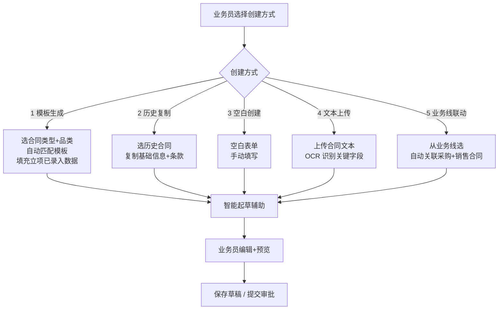
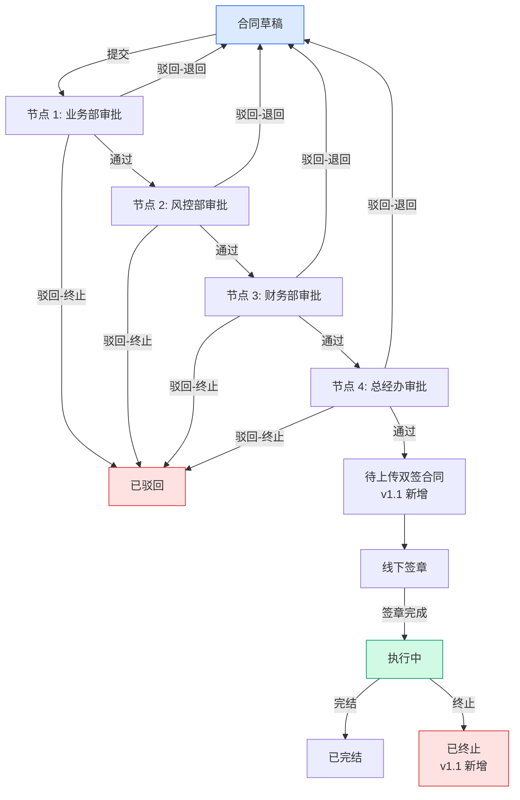
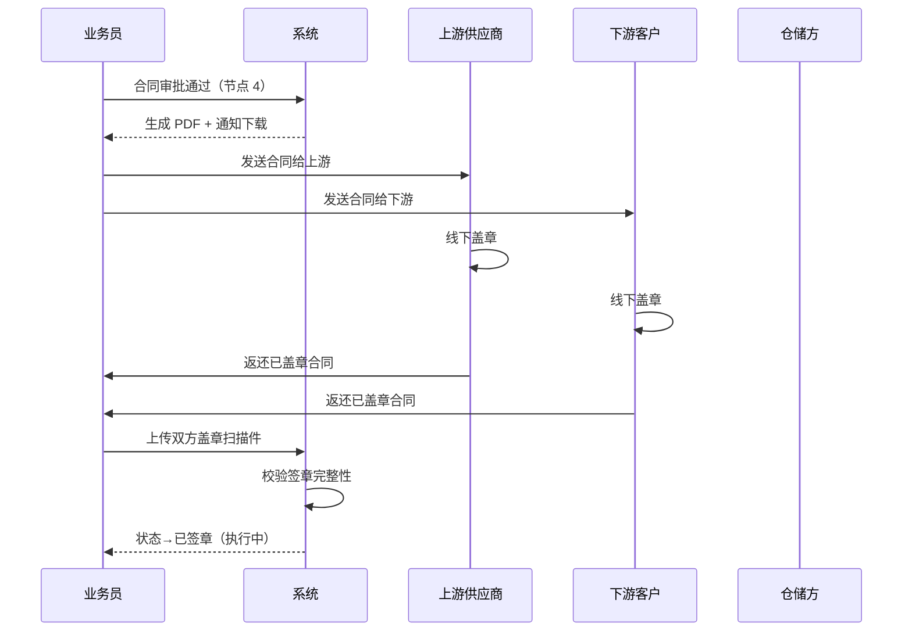
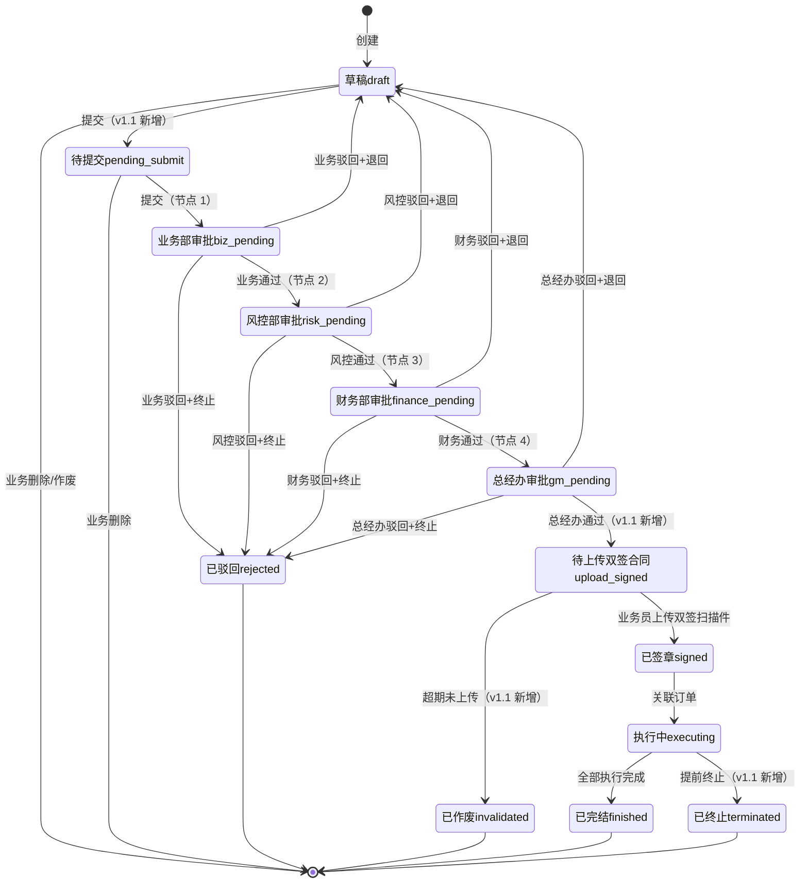
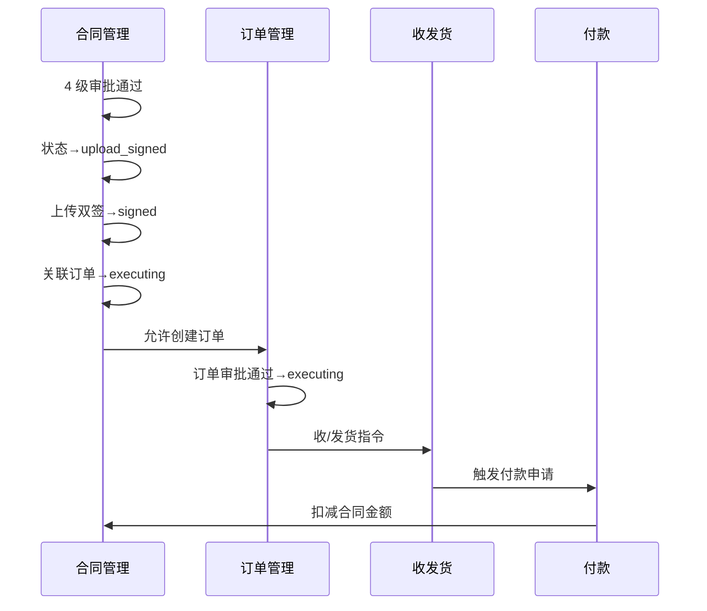

# 02.03 合同管理 v1.1 终版

> **状态**：v1.1 终版（**v1.0 修正版，基于 83 张原型截图调整**）
> **生成时间**：2026-07-24 14:55
> **变更**：
> - 🔴 **4 子菜单**（采购/销售/**运输**/补充）vs v1.0 4 类（采购/销售/仓储/补充）
> - 🔴 **合同号 4 段格式** `DLXLC-DSRMT-2022203-001` vs v1.0 `HT-{YYYYMM}-{4位}`
> - 🔴 **品类具体名** 玉米/糖粉/木薯淀粉 vs v1.0 谷物/糖粉/淀粉
> - 🟡 **9 状态**（新增"待上传双签合同/已终止/已作废"）vs v1.0 6 状态
> - 🟡 **5 业务类型**（+总代业务）vs v1.0 4 类型
> - 🟡 **2 维分类**：方向（采购/销售）×类型（框架/订单单批次）= 4 种合同
> - 🟡 合同字段新增：货物进度/付款进度/结算进度/开票进度 4 仪表盘
> **配套文档**：[00-项目总览与对接.md](../00-项目总览与对接.md) / [01-模块拆解大框架.md](../01-模块拆解大框架.md) / [05-复用对比/全量矩阵 v1.2.md](../05-复用对比/全量矩阵%20v1.0.md) / [02.01-项目管理-立项.md](./02.01-项目管理-立项.md) / [02.02-客户管理.md](./02.02-客户管理.md) / [02.04-订单管理.md](./02.04-订单管理.md)
> **复用度**：🟢 **80%（大幅复用）**——主产品 `bo_contract*` 7 张 + `t_xxx` 4 张 + `t_xxx` 钢铁业务 5 张 = **13+ 张表**

---

> **当前页**：`contract-supplement.html`
> **文档状态**：基于源模块文档的占位版，精确字段待 review 后按原型图精修

## 0. 章节导航

1. 业务定位
2. 业务流程全景
3. 核心实体（**v1.1 调整：13 张表**）
4. 9 状态机（**v1.1 新增 3 个状态**）
5. 角色操作矩阵
6. 字段规则
7. 按钮交互
8. 异常处理
9. 跨模块流转

11. v1.1 变更摘要

---

## 1. 业务定位

**合同管理**是港通供应链的**业务串联核心**——所有下游业务（订单/收发货/付款/发票/结算）都通过合同关联起来。

### 1.1 v1.1 关键规则（基于原型 08-22 截图 + sitemap）

1. **4 子菜单**（**v1.1 重大调整**）：
   - **采购合同**（含采购框架合同 + 采购订单/单批次合同）
   - **销售合同**（含销售框架合同 + 销售订单/单批次合同）
   - **运输合同**（**v1.1 新发现**）
   - **补充协议**
2. **2 维分类**（**v1.1 新增**）：
   - 方向：`purchase`（采购）/ `sales`（销售）
   - 类型：`framework`（框架合同）/ `single_batch`（订单/单批次合同）
   - 组合 = 4 种合同
3. **5 种业务模式**（**v1.1 新增 1 种**）：存货/预付/账期/购销/**总代业务**（从项目立项继承）
4. **4 级串行审批**：业务部 → 风控部 → 财务部 → 总经办（**单签**，不是 OR 会签）✅ 不变
5. **2 小时 SLA 自动催办** ✅ 不变
6. **加签机制**（临时加人审批）✅ 不变
7. **线下签章 + 系统流程化登记**（审批通过→下载→双方线下盖章→扫描件上传）✅ 不变
8. **5 种创建方式**：模板生成 / 历史复制 / 空白创建 / 文本上传 / 业务线联动 ✅ 不变
9. **客户关联**：直接引用 （业务实体）✅ 不变
10. **9 状态**（**v1.1 重大调整**）：新增"**待上传双签合同/已终止/已作废**"

### 1.2 v1.1 4 子菜单详解

| # | 子菜单 | 2 维分类 | 子页 | 范本对应 |
|---|--------|---------|------|---------|
| 1 | **采购合同** | direction=purchase | 采购框架合同 / **采购订单/单批次合同** | 02.03 v1.0 + 02.04 订单管理 |
| 2 | **销售合同** | direction=sales | 销售框架合同 / **销售订单/单批次合同** | 02.03 v1.0 + 02.04 订单管理 |
| 3 | **运输合同**（v1.1 新）| transport | 暂无详情页（占位）| **02.03 v1.0 没写** |
| 4 | **补充协议** | supplemental | 框架合同补充 / 订单/单批次合同补充 | 02.03 v1.0 部分 |

### 1.3 货物品类 3 种（**v1.1 具体名**）

| v1.0（抽象）| v1.1（具体名）|
|------|------|
| 谷物 | **玉米** |
| 糖粉 | **糖粉** |
| 淀粉 | **木薯淀粉** |

### 1.4 业务类型 5 种（**v1.1 新增总代业务**）

| # | 业务类型 | v1.0 | v1.1 |
|---|--------|-----|------|
| 1 | 存货业务 | ✅ | ✅ |
| 2 | 预付业务 | ✅ | ✅ |
| 3 | 账期业务 | ✅ | ✅ |
| 4 | 购销业务 | ✅ | ✅ |
| 5 | **总代业务**（`agency_business`）| ❌ | 🆕（23 业务线截图）|

---

## 2. 业务流程全景

### 2.1 5 种创建方式（不变）



### 2.2 4 级串行审批流程（不变）



**v1.1 关键调整**：节点 4 后新增"**待上传双签合同**"状态（线下盖章完成的过渡状态）

### 2.3 合同签章流程（不变）



---

## 4. 9 状态机（**v1.1 重大调整**）

### 4.1 合同状态机（**v1.1 从 6 个扩到 9 个**）



### 4.2 9 状态说明

| # | 状态 | 节点 | 中文 | 触发 | 出口 |
|---|------|------|------|------|------|
| 1 | `draft` | - | 草稿 | 创建 | 提交/删除/作废 |
| 2 | `pending_submit` | - | 待提交 | 业务员提交 | 业务部审批 |
| 3 | `biz_pending` | 1 | 业务部审批 | 业务员提交 | 业务部审批 |
| 4 | `risk_pending` | 2 | 风控部审批 | 业务部通过 | 风控部审批 |
| 5 | `finance_pending` | 3 | 财务部审批 | 风控部通过 | 财务部审批 |
| 6 | `gm_pending` | 4 | 总经办审批 | 财务部通过 | 总经办审批 |
| 7 | **`upload_signed`** | - | **待上传双签合同**（v1.1 新增）| 总经办通过 | 上传双签 / 超期作废 |
| 8 | `signed` | - | 已签章 | 上传双签扫描件 | 执行中 |
| 9 | `executing` | - | 执行中 | 关联订单 | 完结 / 终止 |
| 10 | `finished` | - | 已完结 | 全部执行完成 | 终态 |
| 11 | `terminated` | - | **已终止**（v1.1 新增）| 提前终止 | 终态 |
| 12 | `rejected` | - | 已驳回 | 任一审批驳回 | 终态 |
| 13 | `invalidated` | - | **已作废**（v1.1 新增）| 超期未上传双签 | 终态 |

### 4.3 列表 9 Tab 映射

| Tab | 对应状态 |
|-----|---------|
| 全部 | 所有 |
| 待提交(100) | `pending_submit` |
| 审批中(1) | `biz_pending` / `risk_pending` / `finance_pending` / `gm_pending` |
| **待上传双签合同(10)**（v1.1 新增）| `upload_signed` |
| 执行中(100) | `executing` |
| 已完结(100) | `finished` |
| **已终止(100)**（v1.1 新增）| `terminated` |
| 驳回(100) | `rejected` |
| **已作废(100)**（v1.1 新增）| `invalidated` |

---

## 5. 角色操作矩阵（不变）

| 状态 / 角色 | 业务员 | 业务部 | 风控部 | 财务部 | 总经办 | 系统 |
|------------|------|------|------|------|------|------|
| `pending_submit` 待提交 | 编辑/作废 | 查看 | 查看 | 查看 | 查看 | - |
| `biz_pending` 业务部 | 查看 | **审批** | 查看 | 查看 | 查看 | 推送 |
| `risk_pending` 风控部 | 查看 | 查看 | **审批** | 查看 | 查看 | 推送 |
| `finance_pending` 财务部 | 查看 | 查看 | 查看 | **审批** | 查看 | 推送 |
| `gm_pending` 总经办 | 查看 | 查看 | 查看 | 查看 | **审批** | 推送 |
| `upload_signed` 待上传（v1.1 新）| **上传双签** | 查看 | 查看 | 查看 | 查看 | 超期提醒 |
| `signed` 已签章 | 查看 | 查看 | 查看 | 查看 | 查看 | - |
| `executing` 执行中 | 查看 | 查看 | 查看 | 查看 | 查看 | - |
| `finished` 已完结 | 查看 | 查看 | 查看 | 查看 | 查看 | - |
| `terminated` 已终止（v1.1 新）| 查看 | 查看 | 查看 | 查看 | 查看 | - |
| `rejected` 已驳回 | **编辑后重新提交** | 查看 | 查看 | 查看 | 查看 | - |
| `invalidated` 已作废（v1.1 新）| 查看 | 查看 | 查看 | 查看 | 查看 | - |

---

## 6. 字段规则

### 6.1 合同号 `contract_xxx`（**v1.1 重大调整**）

- **格式**：`{项目代码}-{业务类型}-{YYYYMMDD}-{3位流水}`，**4 段**
- 例：`DLXLC-DSRMT-2022203-001`
- 段位含义（**v1.1 待确认**）：
  - 第 1 段：项目代码（DLXLC = 立项项目代码？跟 02.01 立项项目编号相关？）
  - 第 2 段：业务类型（DSRMT = 订/售/燃/煤/统？需用户确认）
  - 第 3 段：日期 YYYYMMDD
  - 第 4 段：3 位流水
- **v1.1 标 [P0 待确认-字段]**

### 6.2 业务模式 `business_mode`（**v1.1 新增第 5 种**）

- **5 种**：
  - `inventory`（存货业务）
  - `prepayment`（预付业务）
  - `credit_xxx`（账期业务）
  - `trade`（购销业务）
  - **`agency_business`（总代业务，v1.1 新增）**

### 6.3 合同方向 `direction`（**v1.1 新增**）

- 3 种：`purchase`（采购）/ `sales`（销售）/ `transport`（运输）

### 6.4 合同子类型 `contract_xxx`（**v1.1 新增**）

- 3 种：`framework`（框架合同）/ `single_batch`（订单/单批次合同）/ `supplement`（补充协议）

### 6.5 货物品类 `product_xxx`（**v1.1 具体名**）

- 3 种：**玉米** / **糖粉** / **木薯淀粉**（不再是"谷物/糖粉/淀粉"抽象名）

### 6.6 4 级串行审批规则（不变）

- 业务部 → 风控部 → 财务部 → 总经办
- 全部单签（不是 OR 会签）
- 任一驳回→ 退回草稿或终止
- 2 小时 SLA 自动催办

### 6.7 加签机制（不变）

- 加签（add_sign）：审批人可临时加审批人（紧急情况）
- 加签节点 `is_add_sign=1` + `add_sign_reason` 必填
- 加签人也需遵守 2 小时 SLA

### 6.8 线下签章规则（**v1.1 调整**）

- **v1.0 流程**：审批通过→下载→双方线下盖章→扫描件上传→已签章
- **v1.1 流程**：审批通过→**状态→"待上传双签合同"**→业务员上传双签扫描件→状态→"已签章"
- **超期未上传**（v1.1 新增）：超过 30 天未上传扫描件→状态→"已作废"

---

## 7. 按钮交互

### 7.1 列表页（**v1.1 调整**）

| 按钮 | 位置 | 可见条件 | 点击行为 |
|------|------|---------|---------|
| **新增合同** | 右上 | 业务部 | 弹创建方式选择（5 种）|
| **数据导出** | Tab 右侧 | 所有 | 导出 Excel |
| **合同详情** | 列表行 | 所有 | 跳详情页 |
| **上传合同附件** | 列表行 | `upload_signed` | 弹上传对话框（v1.1 新增）|
| **付款申请** | 列表行 | `executing` | 跳付款新建（关联 contract_xxx）|
| **发货申请** | 列表行 | `executing` | 跳发货新建 |
| **更多** | 列表行 | 所有 | 弹下拉（编辑/作废/驳回/复制等）|

### 7.2 详情页字段（**v1.1 新增 4 进度仪表盘**）

| 分类 | 字段 |
|------|------|
| **合同信息** | 合同号 / 卖方企业 / 品名 / 合同单价 / 合同金额 / 业务类型 / 合同量 / 签订日期 / 合同有效期 / 创建人 |
| **货物进度** | 进度条 0-120%（带颜色）|
| **付款进度** | 已付款（元）/ 0 |
| **结算进度** | 已结算数量（吨）/ 已结算金额（元）/ 拆分到本合同金额（元）|
| **开票进度** | 发票张数（张）/ 0 |
| **操作** | 合同详情 / 上传合同附件 / 付款申请 / 发货申请 / 更多 |

### 7.3 4 子菜单入口（**v1.1 调整**）

- 合同管理 → 4 个子菜单
  - 采购合同（含 2 Tab：采购框架合同 / 采购订单/单批次合同）
  - 销售合同（含 2 Tab：销售框架合同 / 销售订单/单批次合同）
  - 运输合同（占位）
  - 补充协议（含 2 Tab：新增补协-框架合同 / 新增补协-订单/单批次合同）

### 7.4 补充协议升级

- 补充协议列表：按主合同号 + 补协编号展示
- 补协编号格式：`{主合同号}-补{3位序号}`（如 `DLXLC-DSRMT-202203-001-补001`）
- 搜索：按主合同号 / 补协编号 / 卖方企业 / 买方企业
- 合同状态机加"待提交"（v1.7.99.21b）：补协列表 9 tab（含"待提交"）

### 7.5 补协操作项矩阵

#### 补协框架（`framework`）

| 状态 | 操作按钮数 | 按钮列表 |
|------|----------|---------|
| **待提交** | 2 | 补协详情 / 编辑 |
| **审批中** | 1 | 补协详情 |
| **待上传双签** | 3 | 补协详情 / 上传补协附件 / **合同作废**（红）|
| **执行中** | 4 | 补协详情 / 上传双签章合同 / 发起补协完结 / 发起补协终止 |
| **已完结** | 1 | 补协详情 |
| **审批驳回** | 3 | 补协详情 / 补协修改 / **合同作废**（红）|
| **已终止** | 1 | 补协详情 |
| **已作废** | 1 | 补协详情 |

#### 补协订单（`order`）

| 状态 | 操作按钮数 | 按钮列表 |
|------|----------|---------|
| **待提交** | 2 | 补协详情 / 编辑 |
| **审批中** | 1 | 补协详情 |
| **待上传双签** | 5 | 补协详情 / 上传补协附件 / 关联主合同 / 发起补协完结 / **合同作废**（红）|
| **执行中** | 6 | 补协详情 / 上传双签章合同 / 新增子补协 / 发起补协完结 / 发起补协终止 |
| **已完结** | 1 | 补协详情 |
| **审批驳回** | 3 | 补协详情 / 补协修改 / **合同作废**（红）|
| **已终止** | 1 | 补协详情 |
| **已作废** | 1 | 补协详情 |

### 7.6 列表页规范

- ✅ select 占位 = "全部"
- ✅ 状态 tag 颜色编码
- ✅ "更多"下拉 appendChild 到 body

### 7.7 v1.7.99.45 补充协议重制（按用户明确规则）

**大前提**：所有补充协议能修改的合同内容的项**固定为 3 项**（不能再加其他）：

1. **合同数量（吨）**
2. **合同单价（元/吨）**
3. **合同有效期**（具体起始时间）

> 之前 mock 数据中的"增加质量验收条款"等其他变更字段已全部移除，**只展示 3 种固定字段**。

**品类枚举统一**（v1.7.99.33 锁定的 4 选项，**全站统一**）：

- 淀粉制品 / 糖粉 / 谷物 / 玉米

> 之前的"钢材"、"螺纹钢"等 mock 数据已修正。**补充协议新增页 / 列表 / 详情 / 抽屉**全部统一用这 4 个枚举值。

#### 7.7.1 列表页操作列按钮上下排布（v1.7.99.45 锁定）

| 之前 | 现在 |
|------|------|
| 3 个按钮**左右横排**（补协详情 / 上传双签附件 / 作废）| 3 个按钮**垂直排列**（上下排布）|

**CSS 实现**：`.col-action-stack` 容器 + `flex-direction: column`

```css
.col-action-stack {
  display: flex;
  flex-direction: column;
  align-items: flex-start;
  gap: 4px;
}
.col-action-stack a { display: block; }
```

**操作按钮顺序**（从上到下）：

1. 补协详情（蓝色，普通链接）
2. 上传双签附件（蓝色，普通链接）
3. 作废（红色 `var(--color-danger)`）

#### 7.7.2 【新增交互】右侧抽屉式弹窗（v1.7.99.45 + v1.7.99.45-fix）

**触发器**：列表页"新增补充协议"按钮 → **下拉菜单**（2 选项）→ 选具体合同类型 → 弹出对应抽屉

**为什么需要下拉菜单作为首次过滤入口**（v1.7.99.45-fix 关键修复）：

- 抽屉内容需要基于合同类型做**首次过滤**（用户选框架合同 → 抽屉只显示框架合同列表；选订单合同 → 只显示订单合同）
- 如果去掉下拉菜单，抽屉需要同时展示 2 类合同，UX 上混乱
- 顶部按钮下拉是用户做"协议类型选择"的最自然入口（v1.7.99.19 旧逻辑）

**顶部按钮下拉菜单**（v1.7.99.45-fix 恢复 v1.7.99.19 旧逻辑）：

- 点击"新增补充协议"按钮（带向下箭头 v icon）→ 弹出下拉菜单
- 下拉菜单 2 选项：
  - 🔵 **新增补协-框架合同**（蓝色 dot，点击 → `openSupplementDrawer('framework', event)`）
  - 🟣 **新增补协-订单/单批次合同**（紫色 dot，点击 → `openSupplementDrawer('order', event)`）

**抽屉样式**（v1.7.99.45-fix 加宽到 1280px）：

| 属性 | 值 |
|------|-----|
| **宽度** | **1280px**（v1.7.99.45 720px → v1.7.99.45-fix 1280px，**接近全屏**）|
| 位置 | 右侧（right: 0，top: 0，bottom: 0）|
| 动画 | `transform: translateX(0)` + `transition: 0.25s ease` |
| 遮罩 | 半透明黑色（rgba(15, 23, 42, 0.45)），点击关闭抽屉 |

**抽屉顶部筛选区**（v1.7.99.45-fix + v1.7.99.45-fix2，6 项 / 2 行 3 列）：

| 第 1 行 | 第 2 行 |
|---------|---------|
| 合同编号（input 模糊搜索）| 业务类型（select：全部/存货业务/预付业务/账期业务/购销业务）|
| 企业名称（input 模糊搜索）| 签订日期（**date range picker**：开始日期 ~ 结束日期）|
| 品类（select：全部/淀粉制品/糖粉/谷物/玉米）| 创建人（input 模糊搜索）|

- **筛选框 label 位置**（v1.7.99.45-fix2 锁定）：**label 在 input 顶部左侧**（上下结构），不是左右结构
- 右上角操作按钮：**重置**（白底灰字）+ **查询**（primary 蓝色）
- 点击"查询"后联动刷新当前 tap 的合同列表

**业务类型 4 种**（v1.7.99.45-fix2 锁定，**全站统一**）：

- 存货业务
- 预付业务
- 账期业务
- 购销业务

> 之前的"贸易业务"/"加工业务"/"总代业务"全部废弃。补充协议抽屉 + 列表 + 详情 + 新增页全部统一用这 4 种业务类型。

**抽屉 4 个 tap**（v1.7.99.45-fix2 新增，**替换之前"未签订/已生效"两区**）：

| tap | 含义 | 状态 tag |
|-----|------|---------|
| **全部合同** | 所有合同 | 按合同实际状态显示 |
| **未签补协合同** | 业务允许签补协 + 还没签过 | 黄色"未签订" |
| **已签补协合同** | 已有已生效的补充协议（不可重复签）| 绿色"已生效" |
| **不可签补协合同** | 业务不允许 / 合同状态不允许 | 红色"不可签" |

- 4 个 tap 用 **`.drawer-tabs`** 容器 + 蓝色下划线标识 active 状态
- 每个 tap 右侧有数量徽标
- 切换 tap 时，**自动应用当前筛选条件**（保留用户已选筛选）

**抽屉单条合同呈现**（v1.7.99.45-fix + fix2，4 列网格）：

- row 1：合同编号（横跨整行，蓝色突出）+ 状态 tag
- row 2-4：4 列网格展示（卖方/买方/品类/计量单位/合同单价/合同数量/签章状态/签订日期/业务类型/交货期限/创建人）
- **已签补协合同**额外 1 行"关联补协编号"（蓝色突出）
- **不可签补协合同**额外 1 行"不可签原因"（红色突出，例：合同已作废，无法补协 / 运输合同不允许签补协）

**抽屉 mock 数据**（v1.7.99.45-fix2 锁定）：

| tap | 框架合同 | 订单/单批次合同 |
|-----|---------|---------------|
| **全部合同** | 13 个 | 9 个 |
| 未签补协合同 | 8 个 | 6 个 |
| 已签补协合同 | 3 个 | 2 个 |
| 不可签补协合同 | 2 个 | 1 个 |

**JS 交互**（`contract-supplement.html` 内嵌）：

```js
// 切换 tap
function switchDrawerTab(key) {
  CURRENT_DRAWER_TAB = key;  // all/unsigned/effective/unavailable
  document.querySelectorAll('.drawer-tab').forEach(function(el) {
    el.classList.toggle('active', el.getAttribute('data-tab-key') === key);
  });
  applyDrawerFilters();  // 自动应用筛选
}

// 获取当前 tap 的合同列表
function getCurrentTabContracts(allData) {
  if (CURRENT_DRAWER_TAB === 'all') return allData;
  return allData.filter(function(c) { return c.status === CURRENT_DRAWER_TAB; });
}

// 筛选联动（应用日期范围）
function applyDrawerFilters() {
  var signDateStart = (document.getElementById('drawerFilterSignDateStart').value || '').trim();
  var signDateEnd = (document.getElementById('drawerFilterSignDateEnd').value || '').trim();
  // ... 其他字段
  var allData = DRAWER_CONTRACTS[CURRENT_DRAWER_TYPE];
  var tabData = getCurrentTabContracts(allData);
  var filtered = filterContracts(tabData);
  document.getElementById('drawerContractList').innerHTML = renderContractList(filtered, CURRENT_DRAWER_TYPE);
}

// 筛选匹配（日期范围）
function filterContracts(list) {
  return list.filter(function(c) {
    if (CURRENT_DRAWER_FILTERS.signDateStart && c.signDate < CURRENT_DRAWER_FILTERS.signDateStart) return false;
    if (CURRENT_DRAWER_FILTERS.signDateEnd && c.signDate > CURRENT_DRAWER_FILTERS.signDateEnd) return false;
    // ... 其他字段
    return true;
  });
}
```

#### 7.7.3 框架合同新增补充协议表单页（v1.7.99.45 补做）

**触发场景**：用户从抽屉选中未签订合同后进入此页

**URL 参数**：`contract-supplement-new.html?contractId=XXX&contractType=framework`

**顶部"合同信息"区块**：

| 字段 | 类型 | 来源 |
|------|------|------|
| **框架合同编号** | **input（可搜索下拉）**| **默认带入上一步选择的合同编号** |
| 卖方企业 | input | 只读（跟随合同号自动联动）|
| 买方企业 | input | 只读 |
| 品类 | input | 只读 |
| 计量单位 | input | 只读 |
| 合同单价（元/吨）| input | 只读 |
| 合同数量（吨）| input | 只读 |
| 合同签章状态 | input | 只读 |
| 签订日期 | input | 只读 |
| 合同交货期限 | input | 只读 |
| 业务类型 | input | 只读 |

**【关键交互】框架合同编号 input 搜索变更**：

- 顶部右侧提示："通过下方搜索框选择需要补签的合同"
- 合同编号 input 是**可搜索下拉**（不是只读文本）
- 用户输入合同号 → 实时筛选同类型合同下拉
- 用户点击下拉项 → 自动更新合同信息所有 11 字段 + 同步更新变更前内容（前 3 行）
- **目的**：支持当前操作用户搜索新的同类型合同号进行变更合同

**补协信息（变更项）**：

- 变更项 checkbox：合同数量 / 合同单价 / 合同有效期（**3 项固定**）
- 变更表格 3 行：
  - 1. 合同数量（吨）
  - 2. 合同单价（元/吨）
  - 3. 合同有效期
- 每行 4 列：序号 / 字段名称 / 变更前内容（自动同步合同号）/ **变更后内容** / 变更说明

**URL 参数自动预填逻辑**（`contract-supplement-new.html` 内嵌 IIFE）：

```js
(function() {
  var params = new URLSearchParams(window.location.search);
  var contractId = params.get('contractId');
  var contractType = params.get('contractType');
  if (contractId) {
    // 在 mock 数据中查找匹配的合同项
    var matchedItem = null;
    items.forEach(function(item) {
      if (item.getAttribute('data-code') === contractId) {
        matchedItem = item;
      }
    });
    if (matchedItem) {
      // 触发该合同项的 click 事件，自动预填 11 字段 + 同步变更前内容
      matchedItem.click();
    } else {
      // 没找到，仅预填合同号到 input（手动搜索）
      searchInput.value = contractId;
      searchInput.classList.add('has-value');
    }
    console.log('[v1.7.99.45] 从抽屉带入合同：' + contractId);
  }
})();
```

**订单/单批次合同新增补充协议表单页**：本次**只做框架合同**，订单/单批次合同用户后续同步。

#### 7.7.4 补协详情页（v1.7.99.45-fix3 重制，**按图 1+图 2**）

**触发场景**：列表页"补协详情"操作按钮 → 跳转到 `contract-supplement-framework-detail.html`（框架合同补协）或 `contract-supplement-order-detail.html`（订单/单批次合同补协）

**页面结构**（v1.7.99.45-fix3 锁定）：

1. **面包屑** + **返回按钮**（右上角）
2. **头部 card**：
   - 补协编号_我方：XX-XXX-XXXXXXXX-XXX-补XXX + 复制按钮 + 状态 tag（已生效/已驳回/待提交 等）
   - 6 字段信息行：合同编号 / 合同类型 / 卖方企业 / 买方企业 / 创建人 / 创建时间
3. **2 个 tap**（**替换之前 3 tap：协议信息/变更详情/操作记录**）：
   - **tap1 = 补协信息**（默认 active）
   - **tap2 = 操作记录**

**Tap 1：补协信息**（4 个区块）：

| 区块 | 标题 | 内容 |
|------|------|------|
| 1 | **关联框架合同信息** / **关联订单/单批次合同信息** | 11 字段（合同编号链接 + 卖方/买方/品类/计量单位/合同单价/合同数量/签章状态/签订日期/交货期限/业务类型）|
| 2 | **基本信息** | 4 字段（补协名称/补协签订日期/签章状态/情况说明）|
| 3 | **补协信息**（变更项）| 3 个变更项 checkbox（合同数量/合同单价/合同有效期，**只读 disabled**）+ 3 行变更表格（序号/字段名称/变更前内容/变更后内容/变更说明）|
| 4 | **补协附件** | 3 行（待盖章补协附件 1 个 / 双签补协附件 3 个 / 其他附件 3 个）+ 右上角"一键下载" + 每个文件 hover 显示上传时间 |

**Tap 2：操作记录**（1 个区块 + 5 列表格 + 6 行）：

- 表格列：操作类型 / 操作人 / 所属公司 / 操作内容 / 操作时间
- 6 行 mock 数据（按时间顺序）：
  1. **新建**（张三 / XXXX公司 / 创建补协成功）
  2. **提交审批**（张三 / XXXX公司 / 提交补协到 OA 审批）
  3. **OA 审批通过**（—/—/OA 审批通过）
  4. **OA 审批驳回**（—/—/OA 审批驳回，驳回人：XXX，驳回原因：XXXX）
  5. **补协作废**（张三 / XXXX公司 / 补协作废，作废原因：XXX）
  6. **上传附件**（张三 / XXXX公司 / 上传已生效补协附件）

**框架合同 vs 订单/单批次合同 差异**：

| 字段 | 框架合同 | 订单/单批次合同 |
|------|---------|---------------|
| 补协编号前缀 | GTGYL-MSXS-XXX | DLXLC-DSRMT-XXX |
| 区块 1 标题 | 关联框架合同信息 | 关联订单/单批次合同信息 |
| 区块 1 合同号 | GTGYL-MSXS-XXX（链接到 `contract-purchase-framework-detail.html`）| DLXLC-DSRMT-XXX（链接到 `contract-purchase-order-detail.html`）|

> 框架合同 vs 订单/单批次合同 其他字段完全一致，**镜像同步**模式（同 v1.7.99.43 合同详情页原则）。

**关键设计原则**（v1.7.99.45-fix3 锁定）：

1. **2 tap 替换 3 tap**：之前"协议信息/变更详情/操作记录"3 tap 合并为"补协信息/操作记录"2 tap（补协信息 = 协议信息 + 变更详情）
2. **变更项 checkbox 只读**：详情页的变更项 checkbox 是**只读 disabled**状态（详情页不允许编辑，只展示），编辑用"补协修改"按钮跳转到新增页
3. **每个文件名 hover 上传时间**：复用现有 `.file-timestamp` / `.file-timestamp-tip` CSS（同 v1.7.99.43 合同详情页）
4. **mock 时间分布**（v1.7.99.45-fix3 锁定）：
   - 第 1 行（待盖章补协附件）：1 个文件，2023-12-12 12:23:32
   - 第 2 行（双签补协附件）：3 个文件，2023-12-13 10:15:00 / 10:16:30 / 10:18:00
   - 第 3 行（其他附件）：3 个文件，2024-01-05 09:00:00 / 09:30:00 / 10:00:00
5. **操作记录 6 行**：覆盖补协全生命周期（新建/提交审批/OA 审批通过/驳回/作废/上传附件）
6. **OA 审批通过/驳回行不显示操作人和公司**（用 — 占位）：OA 系统自动操作
7. **复制补协编号按钮**：📋 icon + hover 提示"复制补协编号"
8. **状态 tag 颜色**：已生效=绿色 / 已驳回=红色 / 待提交=黄色 / 审批中=橙色

**HTML 改造**（`contract-supplement-framework-detail.html` + `contract-supplement-order-detail.html`）：

- 完整重写（之前是占位骨架）
- 头部：`.detail-no-row` + 6 字段 `.detail-info-row`（grid 3 列）
- 2 tap：`.detail-tabs` + `.detail-tab` + `.detail-tab-panel`（active 状态切换）
- 4 区块：`.detail-card` + `.section-title` + `.info-grid-3`（3 列布局）
- 变更项 checkbox：`.change-checkbox-row`（flex 横向）+ `disabled` 状态
- 变更表格：`.change-table`（5 列：序号/字段名称/变更前/变更后/说明）
- 补协附件：`.detail-table`（3 列：单据类型/文件名/操作）+ 复用 `.file-timestamp` / `.file-timestamp-tip` CSS
- 操作记录：`.op-log-table`（5 列）+ 6 行 mock 数据

**v1.7.99.45-fix4 关键调整**（**订单/单批次合同补协详情页**）：

按用户截图（图 2）反馈，订单/单批次合同补协详情页区块 1 第一个字段从"订单/单批次合同编号"**改为"框架合同编号"**：

- 区块 1 标题仍为"关联订单/单批次合同编号"
- 区块 1 字段顺序（图 2）：
  1. **框架合同编号**（GTGYL-MSXS-20，链到 `contract-purchase-framework-detail.html`）
  2. 卖方企业
  3. 买方企业
  4. 品类
  5. 品名（订单/单批次合同特有字段，框架合同无）
  6. 计量单位
  7. 合同单价（元/吨）
  8. 合同数量（吨）
  9. 合同签章状态
  10. 签订日期
  11. 合同交货期限
  12. 业务类型

> 业务逻辑说明：订单/单批次合同本身有"框架合同编号"字段（指它所属的框架合同），区块 1 展示该订单/单批次合同的完整信息，所以第一字段是"框架合同编号"。

#### 7.7.5 订单/单批次合同补协（v1.7.99.45-fix4 新增，**按用户图 1+图 2+图 3**）

**触发场景**：用户在补充协议抽屉选中"未签订"订单/单批次合同 → 跳 `contract-supplement-order-new.html?contractId=XXX&contractType=order`；或者在补协列表点击"补协详情"→ 跳 `contract-supplement-order-detail.html`

**与框架合同补协的关键差异**（v1.7.99.45-fix4 锁定）：

| 字段 | 框架合同补协 | 订单/单批次合同补协 |
|------|-------------|-------------------|
| **新增页关联合同信息** | 11 字段（无品名）| **12 字段**（含品名 + 税率 + 运输方式 + 业务实际负责人）|
| **新增页变更项** | 3 项（合同数量/单价/有效期）| **4 项**（合同数量/单价/有效期/运输方式）|
| **详情页变更项** | 3 项 | 3 项（**详情页不显示运输方式**，因为详情只展示已变更内容）|
| **新增页附件** | 3 行（待盖章/双签/其他）| **2 行**（待盖章/其他，订单/单批次合同无需双签附件）|
| **详情页附件** | 3 行 | 3 行（详情页与新增页不同，详情页补全双签附件行）|
| **补协编号前缀** | GTGYL-MSXS-XXX-补XXX | DLXLC-DSRMT-XXX-补XXX |
| **区块 1 标题** | 关联框架合同信息 | 关联订单/单批次合同编号 |
| **区块 1 第一字段** | 框架合同编号（自身）| 框架合同编号（订单/单批次所属的框架合同）|

**新增页 12 字段（订单/单批次合同补协）**：

| 序号 | 字段 | 类型 | 来源 |
|------|------|------|------|
| 1 | 订单/合同编号 | input（可搜索下拉）| 默认带入合同编号 |
| 2 | 卖方企业 | input | 只读（跟随合同号自动联动）|
| 3 | 买方企业 | input | 只读 |
| 4 | **品名** | input | 只读（订单/单批次合同特有）|
| 5 | 计量单位 | input | 只读 |
| 6 | 合同单价（元/吨）| input | 只读 |
| 7 | 合同数量（吨）| input | 只读 |
| 8 | **税率（%）** | input | 只读（订单/单批次合同特有）|
| 9 | **签订日期** | input | 只读（订单/单批次合同特有）|
| 10 | 合同交货期限 | input | 只读 |
| 11 | **运输方式** | input | 只读（订单/单批次合同特有）|
| 12 | **业务实际负责人** | input | 只读（订单/单批次合同特有）|

**订单/单批次合同补协变更 4 项**（v1.7.99.45-fix4 锁定）：

1. **合同数量**（吨）
2. **合同单价**（元/吨）
3. **合同有效期**
4. **运输方式**（火运/船运/汽运/火运+汽运）

变更表格 4 行，每行 4 列：序号 / 字段名称 / 变更前内容（自动同步合同号）/ **变更后内容** / 变更说明

> 详情页只展示 3 个变更项（合同数量/合同单价/合同有效期），**不显示运输方式变更**——因为详情页只展示"已发生变更"的内容，运输方式如果未变更则不展示，已变更时直接以一行表格行展示即可（不通过 checkbox）。

**URL 参数预填 IIFE**（`contract-supplement-order-new.html`，与 framework 一致）：

```js
(function() {
  var params = new URLSearchParams(window.location.search);
  var contractId = params.get('contractId');
  var contractType = params.get('contractType');
  if (contractId) {
    var matchedItem = null;
    items.forEach(function(item) {
      if (item.getAttribute('data-code') === contractId) {
        matchedItem = item;
      }
    });
    if (matchedItem) {
      matchedItem.click();
    } else {
      searchInput.value = contractId;
      searchInput.classList.add('has-value');
    }
    console.log('[v1.7.99.45-fix4] 从抽屉带入合同：' + contractId + '（type=' + (contractType || 'order') + '）');
  }
})();
```

**补协详情 4 区块（订单/单批次合同，v1.7.99.45-fix4）**：

1. **关联订单/单批次合同编号**（12 字段，第一字段为"框架合同编号"）
2. **基本信息**（4 字段：补协名称/补协签订日期/签章状态/情况说明）
3. **补协信息**（3 变更项 checkbox 只读 + 3 行变更表格，不含运输方式）
4. **补协附件**（3 行：待盖章补协附件/双签补协附件/其他附件 + 一键下载 + hover 上传时间）

**操作记录 5 列表格 + 6 行**（与框架合同补协详情完全一致，OA 审批行用 — 占位）

#### 7.7.6 关键设计原则

1. **大前提不可变**：补充协议能修改的合同内容**永远只有 3 项**（合同数量/合同单价/合同有效期），不能新增
2. **品类全站统一**：v1.7.99.33 锁定的 4 选项（淀粉制品/糖粉/谷物/玉米），**任何业务场景的合同**都只能用这 4 个
3. **操作列上下排布**：列表页所有操作按钮**纵向**排布，避免视觉挤压
4. **抽屉交互优先**：从列表页"新增补充协议"是**优先走抽屉**，不再用下拉菜单
5. **已生效合同项不可重复签订**：点击仅供查看 + alert 提示
6. **合同编号可搜索变更**：用户可主动搜索同类型合同进行变更
7. **URL 参数预填**：抽屉→表单页带 `contractId` + `contractType` 参数自动载入
8. **订单/单批次合同本次不做**：本次只做框架合同的新增补充协议逻辑，订单/单批次合同另外同步

---

## 8. 异常处理

### 8.1 业务异常

| 异常场景 | 提示文案 | 处理动作 |
|---------|---------|---------|
| 必填项未填 | "请填写：合同名称/客户/品类/..." | 阻止提交 |
| 业务类型与品类不匹配 | "业务类型 X 与品类 Y 不匹配" | 红色提示 |
| 合同金额 = 0 | "合同金额必须 > 0" | 阻止 |
| 合同有效期 < 生效日期 | "到期日期必须 > 生效日期" | 阻止 |

### 8.2 审批异常

| 异常场景 | 提示文案 | 处理动作 |
|---------|---------|---------|
| 任一审批驳回 | "XX 审批驳回" | 状态→`draft`（退回）或 `rejected`（终止）|
| 审批超时（2 小时）| "审批超过 2 小时未处理" | **自动催办** |
| 审批人未配置 | "审批人未配置，请联系管理员" | 状态保持 |
| 消息推送失败 | "消息推送失败，请重试" | 允许重试 |

### 8.3 签章异常（**v1.1 调整**）

| 异常场景 | 提示文案 | 处理动作 |
|---------|---------|---------|
| **超期未上传双签合同**（v1.1 新）| "合同 XXX 已超 30 天未上传双签扫描件，已自动作废" | 状态→`invalidated` |
| 签章扫描件格式错误 | "扫描件格式不支持（仅支持 .pdf/.png/.jpg）" | 阻止上传 |
| 签章扫描件过大 | "扫描件不能超过 20MB" | 阻止上传 |
| 签章扫描件与签章方不匹配 | "扫描件签章方与系统记录不匹配" | 红色提示，需人工审核 |

### 8.4 变更/终止异常

| 异常场景 | 提示文案 | 处理动作 |
|---------|---------|---------|
| 执行中合同变更 | "执行中合同变更需走补充协议" | 引导到补充协议 |
| 已完结合同不能变更 | "已完结合同不能变更" | 阻止 |
| 已终止合同不能恢复 | "已终止合同不能恢复" | 阻止 |
| **作废合同恢复**（v1.1 新）| "已作废合同需走 OA 流程恢复" | 引导到 OA |

---

## 9. 跨模块流转

### 9.1 上游触发

| 触发模块 | 触发条件 | 触发动作 |
|---------|---------|---------|
| 项目管理-立项（02.01）| 项目 `finished` | 允许创建合同，关联 `project_xxx` |
| 客户管理（02.02）| 客户 `executing` | 允许合同关联 |

### 9.2 下游触发

| 触发模块 | 触发条件 | 触发动作 |
|---------|---------|---------|
| 订单管理（02.04）| 合同 `signed` | 允许创建订单（采购/销售）|
| 收发货（02.05）| 订单 `executing` | 收/发货关联到 `contract_xxx` |
| 付款（02.08.1）| 合同 `executing` | 付款时校验合同 |
| 发票（02.09）| 合同 `executing` | 发票关联到 `contract_xxx` |
| 结算（02.07）| 合同 `executing` | 结算关联到 `contract_xxx` |

### 9.3 跨模块状态机联动



---

## 11. v1.1 变更摘要

| 变更点 | v1.0 | v1.1 |
|------|------|------|
| **4 子菜单** | 4 类（采购/销售/仓储/补充）| **4 子菜单**（采购/销售/**运输**/补充）|
| **2 维分类** | 范本没明确 | **方向 × 子类型 = 4 种合同**（采购框架/采购订单/销售框架/销售订单）|
| **合同号格式** | `HT-{YYYYMM}-{4位}` | **`{项目代码}-{业务类型}-{YYYYMMDD}-{3位}` 4 段** |
| **货物品类** | 谷物/糖粉/淀粉 | **玉米/糖粉/木薯淀粉** |
| **业务类型** | 4 种 | **5 种**（+ 总代业务）|
| **状态数** | 6 个 | **9 个**（+ 待上传双签合同/已终止/已作废）|
| **新增表** | 13 张 | **13 张**（+ 4 张：upload/terminate/invalidate/progress）|
| **字段：合同量/单价** | 范本没说 | **v1.1 新增**（08 截图显示）|
| **4 进度仪表盘** | 范本没说 | **v1.1 新增**（货物/付款/结算/开票）|

---

## 12. 文档版本

- **v1.0（2026-07-24 11:33）**：基于 5 张截图 + 建设方案 V2 推测的初版
- **v1.1（2026-07-24 14:55）**：基于 83 张原型截图（7-24 最新版）修正
  - 🔴 4 子菜单（+运输合同）
  - 🔴 合同号 4 段格式
  - 🔴 品类具体名
  - 🟡 9 状态
  - 🟡 5 业务类型
  - 🟡 2 维分类
  - 🟡 4 进度仪表盘
  - 🟡 4 新表
- **v1.7.99.x（2026-07-28）**：基于 30+ 版本迭代同步
  - 🟡 补充协议升级（v1.7.99.19）
  - 🟡 合同状态机加"待提交"（v1.7.99.21b）
  - 🟡 补协操作项矩阵（v1.7.99.34+35）
  - 🟡 列表页占位 = "全部"
- **v1.7.99.45（2026-07-29）**：补充协议重制（按用户明确规则）
  - 🔴 **大前提**：补充协议能修改的合同内容**固定为 3 项**（合同数量/合同单价/合同有效期）—— 不能再加其他
  - 🔴 **品类枚举统一**为 v1.7.99.33 锁定的 4 选项（淀粉制品/糖粉/谷物/玉米）
  - 🟡 **操作列按钮上下排布**：3 个按钮（补协详情/上传双签附件/作废）用 `.col-action-stack` 容器垂直排列
  - 🟡 **【新增交互】右侧抽屉式弹窗**：列表页"新增补充协议"按钮 → 720px 抽屉从右侧划出 → 未签订/已生效合同两区清晰分隔
  - 🟡 **URL 参数预填**：抽屉选中合同 → 跳 `contract-supplement-new.html?contractId=...&contractType=framework` → 自动预填 11 字段 + 同步变更前内容
  - 🟡 **框架合同编号可搜索变更**：合同号 input 是可搜索下拉，支持用户主动搜索同类型合同号
  - 🟡 **订单/单批次合同本次不做**：本次只做框架合同新增逻辑，订单/单批次合同用户后续同步
- **v1.7.99.45-fix（2026-07-29）**：补充协议抽屉优化（按用户截图反馈）
  - 🔴 **【关键修复】恢复顶部按钮下拉菜单**（v1.7.99.19 旧逻辑）：用户原话"原来是点击按钮处下拉选择，是新增框架合同补充协议还是订单/单批次合同补充协议，在这一步就过滤了用户要增加补充协议的合同类型了"——抽屉内容需要基于合同类型做首次过滤
  - 🔴 **【关键修复】抽屉加宽到 1280px**（接近全屏）：单条合同需呈现图2 全部 11 字段
  - 🔴 **【关键修复】单条合同完整 11 字段呈现**（4 列网格布局）：合同号（横跨整行）/卖方企业·品类·合同单价 / 买方企业·计量单位·合同数量 / 签章状态·签订日期·业务类型 / 交货期限·创建人
  - 🔴 **【关键修复】抽屉顶部加 6 项筛选条件**（2 行 3 列）：合同编号 / 企业名称 / 品类 / 业务类型 / 签订日期 / 创建人；"后期合同量会很大，你这个呈现方式，如果有几百个合同，用户翻起来会很痛苦"
  - 🟡 **mock 数据扩充**：框架合同 8 未签 + 3 已生效，订单合同 6 未签 + 2 已生效（让筛选条件能体现价值）
  - 🟡 **筛选联动 JS**：重置/查询按钮 + 实时筛选 + 联动更新两个区块数量
- **v1.7.99.45-fix2（2026-07-29）**：补充协议抽屉 tap 拆分 + 业务类型修正 + 筛选样式优化
  - 🔴 **【关键修复】抽屉 4 个 tap 拆分**（全部/未签补协/已签补协/不可签补协）：替换之前"未签订/已生效"两区概念
  - 🔴 **【关键修复】业务类型 4 种**（存货业务/预付业务/账期业务/购销业务）：之前用的"贸易业务/加工业务/总代业务"全部废弃
  - 🔴 **【关键修复】筛选框 label 改顶部左侧**（上下结构）：替换之前的"label 在 input 左侧"（左右结构）
  - 🔴 **【关键修复】签订日期改 date range picker**：2 个 date input + 分隔符
  - 🟡 **mock 数据扩充**：加"不可签补协合同"组（运输合同 / 已作废 / 已终止 等场景）
  - 🟡 **状态 tag 新增"不可签"红色**：与"未签订"黄色 / "已生效"绿色区分
  - 🟡 **不可签补协合同项额外加"不可签原因"字段**：红色突出，例：合同已作废，无法补协
- **v1.7.99.45-fix3（2026-07-29）**：补协详情页重制（按图 1+图 2）
  - 🔴 **【关键修复】2 tap 替换 3 tap**：之前"协议信息/变更详情/操作记录"3 tap 合并为"补协信息/操作记录"2 tap（补协信息 = 协议信息 + 变更详情）
  - 🔴 **【关键修复】补协详情页 4 区块补全**（补协信息 tap）：关联框架/订单合同信息（11 字段）/ 基本信息（4 字段）/ 补协信息（3 变更项 + 3 行变更表格）/ 补协附件（3 行 + 一键下载 + hover 上传时间）
  - 🟡 **【关键修复】操作记录 tap 5 列表格**：操作类型/操作人/所属公司/操作内容/操作时间，6 行覆盖全生命周期（新建/提交审批/OA 审批通过/驳回/作废/上传附件）
  - 🟡 **变更项 checkbox 只读 disabled**：详情页不允许编辑
  - 🟡 **OA 审批通过/驳回行不显示操作人和公司**（用 — 占位）：OA 系统自动操作
  - 🟡 **mock 时间分布**（同 v1.7.99.43）：待盖章 1 个（2023-12-12 12:23:32）/ 双签 3 个（10:15/10:16:30/10:18:00）/ 其他 3 个（09:00/09:30/10:00）
  - 🟡 **镜像同步**（同 v1.7.99.43）：框架合同补协详情（GTGYL-MSXS-XXX）+ 订单合同补协详情（DLXLC-DSRMT-XXX）
- **v1.7.99.45-fix4（2026-07-29）**：订单/单批次合同补协新增 + 详情调整（按用户图 1+图 2+图 3）
  - 🟡 **【关键新增】订单/单批次合同补协新增表单页**（`contract-supplement-order-new.html`）：12 字段（订单编号+卖方+买方+品名+计量单位+合同单价+合同数量+税率+签订日期+合同交货期限+运输方式+业务实际负责人），4 变更项（合同数量/合同单价/合同有效期/运输方式），2 行附件（待盖章+其他）
  - 🟡 **【关键修复】订单/单批次合同补协详情页区块 1 第一字段改为"框架合同编号"**（按用户图 2 反馈）：区块 1 标题仍为"关联订单/单批次合同编号"，但第一字段从"订单/单批次合同编号"改为"框架合同编号"（GTGYL-MSXS-20，链到 framework-detail）—— 因为订单/单批次合同本身有"框架合同编号"字段（指它所属的框架合同）
  - 🟡 **【关键差异】订单/单批次合同补协 vs 框架合同补协**（v1.7.99.45-fix4 锁定）：
    - 新增页：订单 12 字段（含品名/税率/运输方式/业务实际负责人）vs 框架 11 字段（无）
    - 新增页变更项：订单 4 项（含运输方式）vs 框架 3 项
    - 新增页附件：订单 2 行（待盖章+其他）vs 框架 3 行（含双签）
    - 详情页变更项：订单/框架 都是 3 项（**详情页不显示运输方式**）
    - 详情页附件：订单/框架 都是 3 行
  - 🟡 **【关键修复】URL 参数预填 IIFE**：从 `contract-supplement.html` 抽屉带 `contractId=DLXLC-DSRMT-XXX&contractType=order` → `contract-supplement-order-new.html` 自动预填 12 字段
  - 🟡 **镜像同步原则延续**（同 v1.7.99.43 + fix3）：框架合同 vs 订单/单批次合同详情页操作记录 5 列 6 行完全一致，OA 审批行 — 占位
  - 🟡 **订单合同编号前缀**：DLXLC-DSRMT-XXX-补XXX（与框架合同 GTGYL-MSXS-XXX-补XXX 区分）
- 修改记录：见 `06-修改记录.md`