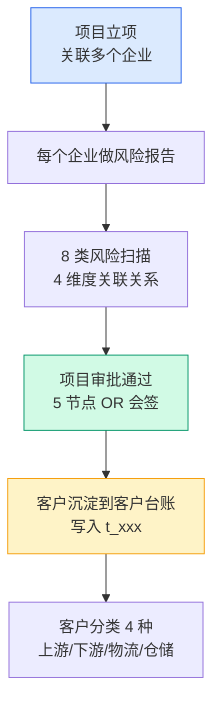
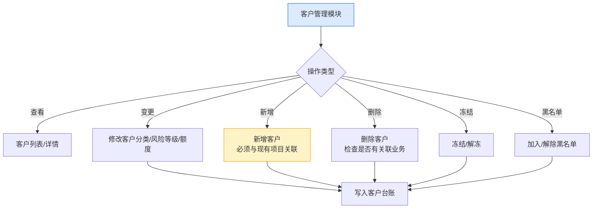
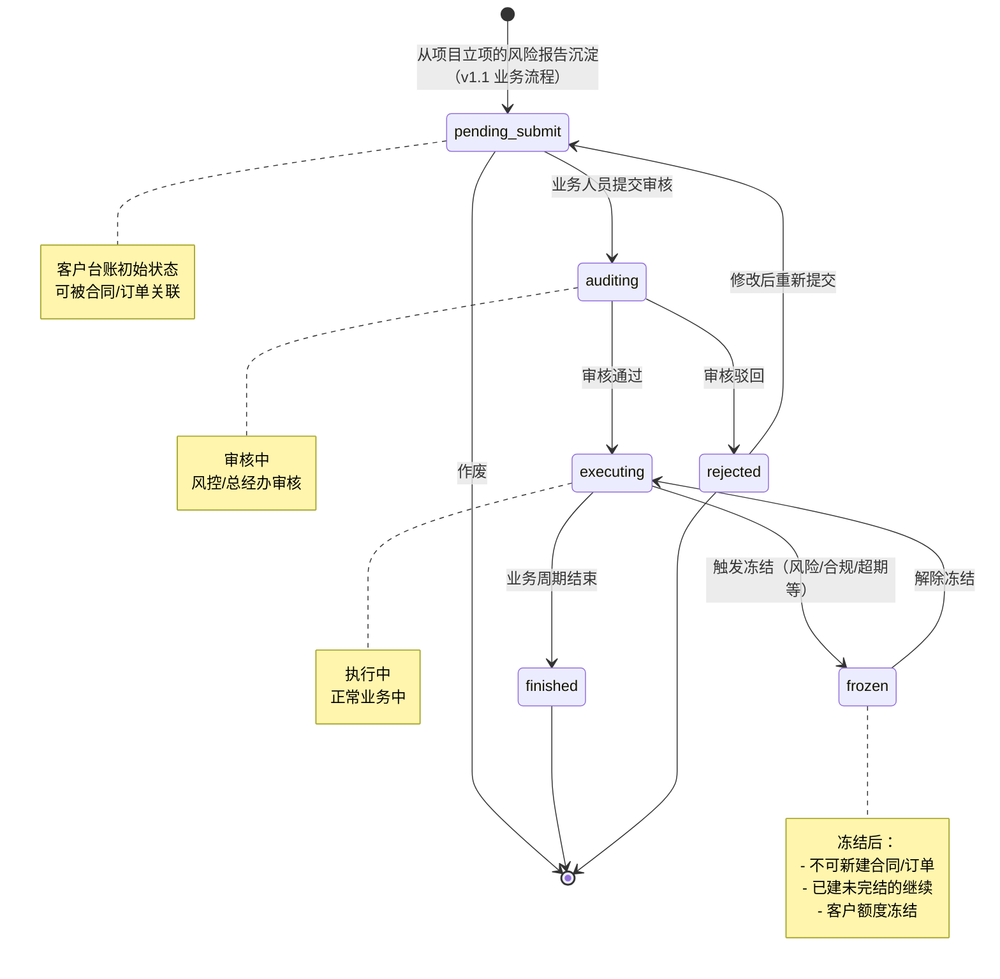
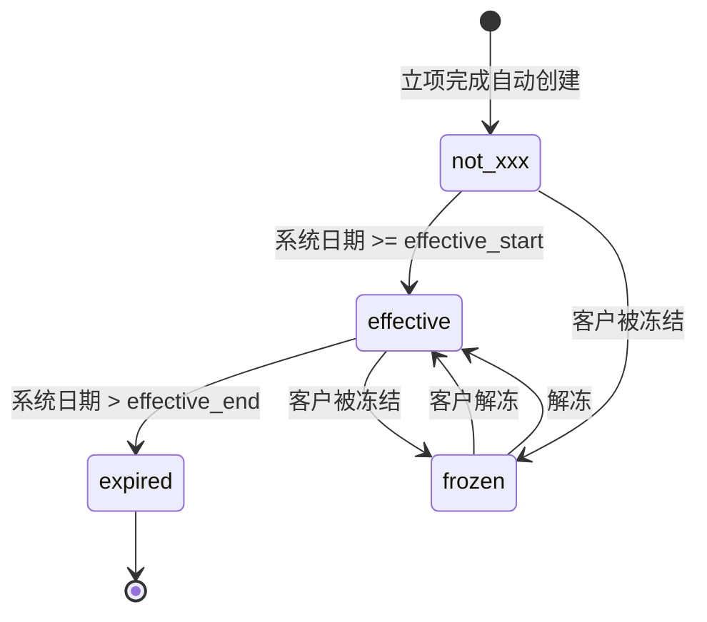
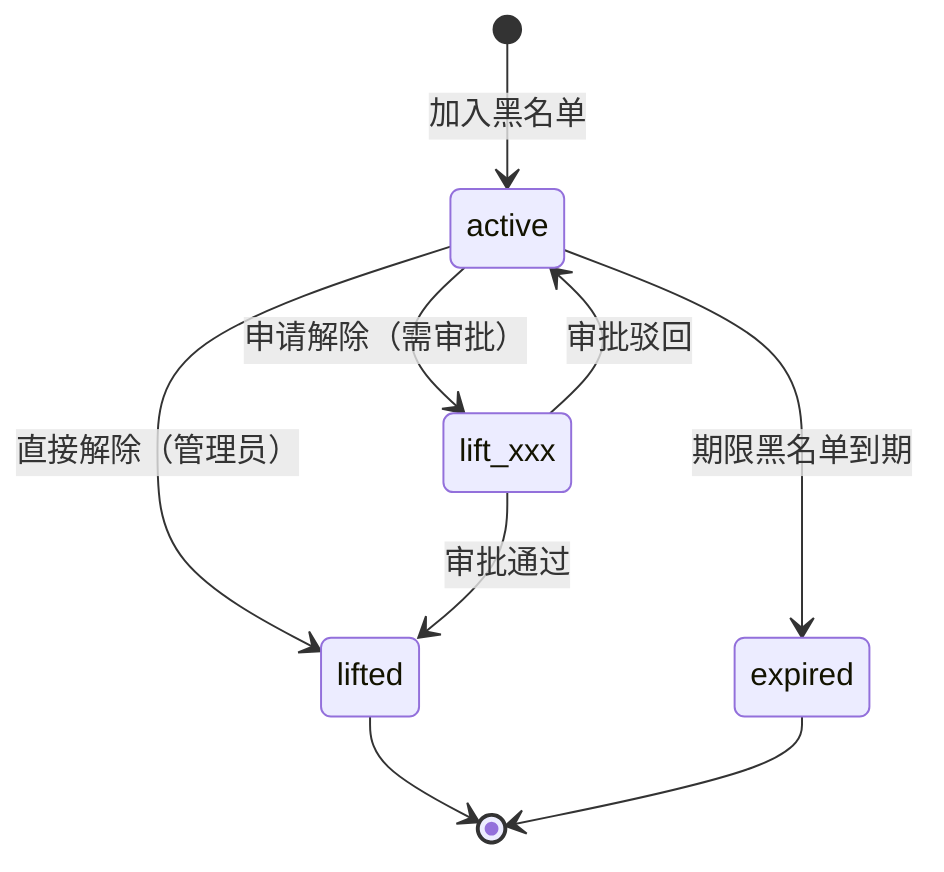
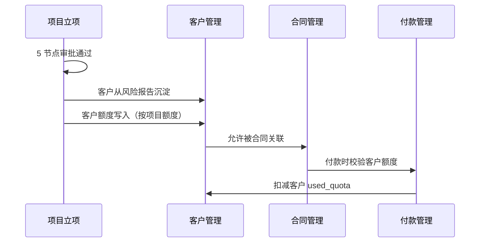

# 02.02 客户管理 v1.1 终版

> **状态**：v1.1 终版（**v1.0 修正版，基于 83 张原型截图调整**）
> **生成时间**：2026-07-24 14:55
> **变更**：
> - 🔴 **客户分类 4 种完全重做**：贸易商/加工厂/物流商/服务商 → **上游企业/下游企业/第三方物流/第三方仓储**
> - 🟡 客户流程状态从 3 个（active/frozen/revoked）→ **6 个**（待提交/审核中/执行中/已完结/驳回）
> - 🟡 新增"审核"按钮（审核中状态）
> - 🟡 列表 2 Tab 切换（基础信息/额度信息）
> - 🟡 客户字段新增：企业简称、所属区域
> **配套文档**：[00-项目总览与对接.md](../00-项目总览与对接.md) / [01-模块拆解大框架.md](../01-模块拆解大框架.md) / [05-复用对比/全量矩阵 v1.2.md](../05-复用对比/全量矩阵%20v1.0.md) / [02.01-项目管理-立项.md](./02.01-项目管理-立项.md) / [02.03-合同管理.md](./02.03-合同管理.md) / [02.04-订单管理.md](./02.04-订单管理.md)
> **复用度**：🟢 **90%（大幅复用）**——主产品 `t_xxx` 60+ 张 + `t_xxx（业务实体）` 大幅复用

---

> **当前页**：`customer-apply.html`
> **文档状态**：基于源模块文档的占位版，精确字段待 review 后按原型图精修

## 0. 章节导航

1. 业务定位
2. 业务流程全景
3. 核心实体（4 张表）
4. 状态机（**v1.1 重大调整**）
5. 角色操作矩阵
6. 字段规则
7. 按钮交互
8. 异常处理
9. 跨模块流转

---

## 1. 业务定位

**客户管理**是港通供应链的**客户档案中心**——客户从项目立项的"风险报告"中沉淀到客户台账，**不走独立审批流程**（与项目立项共用 5 节点审批）。客户管理模块负责客户档案的日常维护：客户分类、风险等级、关联关系、黑名单、额度管理等。

### 1.1 v1.1 关键规则（基于原型 04 截图 + sitemap）

1. **客户管理 = 项目立项的子流程**（客户从风险报告沉淀，不走独立审批）✅ 不变
2. **客户分类 4 种**（**v1.1 重大调整**）：
   - **`upstream`**（上游企业）= 卖方/供应方
   - **`downstream`**（下游企业）= 买方/采购方
   - **`third_party_logistics`**（第三方物流）
   - **`third_party_warehouse`**（第三方仓储）
3. **客户流程状态 6 个**（**v1.1 新增**，跟项目立项一致）：
   - 待提交 / 审核中 / 执行中 / 已完结 / 驳回
4. **客户来源记录**：`source_project_xxx` + `source_due_diligence_id` ✅ 不变
5. **客户额度管理**（多维度）✅ 不变
6. **黑名单管理**（独立子流程）✅ 不变
7. **客户列表 2 Tab 切换**：**基础信息 / 额度信息**（**v1.1 新增**）
8. **顶部 nav 7 个**：工作台/准入管理/数字供应链/智慧仓储/预警中心/数据中心/账户中心

## 2. 业务流程全景

### 2.1 客户从项目立项沉淀

### 2.2 客户管理日常维护

---

## 4. 状态机（**v1.1 重大调整**）

### 4.1 客户台账状态机（**v1.1 从 3 状态改 6 状态**）

**v1.1 关键变化**：
- ❌ 旧版 3 状态：`active` / `frozen` / `revoked`
- ✅ v1.1 6 状态：`pending_submit` / `auditing` / `executing` / `finished` / `rejected` / `frozen`（**跟项目立项一致**）

### 4.2 客户额度状态机（**v1.1 调整 4 状态**）

**v1.1 4 状态**：`not_xxx` / `effective` / `expired` / `frozen`

### 4.3 黑名单状态机（不变）

---

## 5. 角色操作矩阵

### 5.1 客户台账管理（**v1.1 新增「审核」操作**）

| 操作 / 角色 | 业务人员 | 业务部负责人 | 风控部 | 财务部 | 总经办 | 系统 |
|------------|--------|------------|-------|-------|-------|------|
| 查看客户列表/详情 | ✓ | ✓ | ✓ | ✓ | ✓ | - |
| 修改客户分类 | ✓ | ✓ | ✓ | - | - | - |
| 修改风险等级 | - | - | **✓** | - | - | 自动从风险报告 |
| 修改客户额度 | ✓ 建议 | ✓ | **✓** | **✓** | **✓** | - |
| **审核客户档案**（**v1.1 新增**）| - | - | **✓** | - | **✓** | - |
| 冻结/解冻 | 申请 | 申请 | **审批** | 申请 | **审批** | - |
| 取消客户 | - | 申请 | 申请 | 申请 | **审批** | - |
| 新增客户 | **✓**（必须关联项目）| ✓ | - | - | - | - |
| 删除客户 | - | - | - | - | **✓** | 检查关联业务 |
| 加入黑名单 | 申请 | 申请 | **✓** | - | **审批** | - |
| 解除黑名单 | 申请 | 申请 | **✓** | - | **审批** | - |

### 5.2 客户列表 Tab（**v1.1 新增**）

| Tab | 说明 |
|-----|------|
| **基础信息** | 客户分类/企业名称/统一信用代码/联系人/法定代表人 |
| **额度信息** | 项目编号/项目名称/授信额度/已用额度/可用额度/授信有效期/状态 |

### 5.3 客户列表状态 Tab（**v1.1 跟项目对齐 6 Tab**）

| Tab | 对应状态 | 颜色 |
|-----|---------|------|
| 全部 | 所有状态 | - |
| 待提交 | `pending_submit` | 蓝 |
| 审核中 | `auditing` | 黄 |
| 执行中 | `executing` | 绿 |
| 已完结 | `finished` | 灰 |
| 驳回 | `rejected` | 灰 |

### 5.4 客户列表操作按钮（**v1.1 新增「审核」**）

| 状态 | 操作按钮 |
|------|---------|
| 待提交 | 查看 / 编辑 / 作废 |
| 审核中 | 查看 / **审核**（v1.1 新增）|
| 执行中 | 查看 |
| 已完结 | 查看 |
| 驳回 | 查看 |

### 5.5 黑名单（不变）

| 操作 / 角色 | 风控部 | 总经办 | 系统 |
|------------|-------|-------|------|
| 新增黑名单 | **✓** | - | - |
| 批量导入 | **✓** | - | - |
| 申请解除 | **✓** | **审批** | - |
| 直接解除 | **✓**（`lift_xxx=0`）| - | - |

---

## 6. 字段规则

### 6.1 客户分类 `customer_category`（**v1.1 重大调整**）

- **4 类**（**v1.1 完全改**）：
  - `upstream`（上游企业）= 卖方/供应方
  - `downstream`（下游企业）= 买方/采购方
  - `third_party_logistics`（第三方物流）
  - `third_party_warehouse`（第三方仓储）
- 决定客户可作为的角色（**v1.1 自动推导 is_supplier/is_buyer/is_warehouse**）
- 决定客户额度默认值

**v1.1 角色映射**（**v1.1 新增**）：

| 客户分类 | 是否可作为供应商 | 是否可作为采购方 | 是否可作为仓储方 |
|---------|---------------|---------------|---------------|
| **upstream**（上游企业）| ✓ | ❌ | ❌ |
| **downstream**（下游企业）| ❌ | ✓ | ❌ |
| **third_party_logistics** | ❌ | ❌ | ❌（物流，不是仓储）|
| **third_party_warehouse** | ❌ | ❌ | ✓ |

### 6.2 客户名称 `company_name`

- 与营业执照完全一致
- 不可修改（如需修改必须重新立项）

### 6.3 统一社会信用代码 `unified_credit_xxx`

- **全平台唯一**（通过该字段判重）
- 18 位字母+数字
- 脱敏存储：`91XXXXXXMAXXXXXXXX` 格式

### 6.4 客户总额度 `total_quota`（**v1.1 字段简化**）

- 元，保留 2 位小数
- > 0
- 调整权限：业务员可建议，风控+财务可调整，总经办可最终调整

**v1.1 取消客户分类默认值**（**v1.1 重要调整**）：
- ❌ 旧版：贸易商 500 万 / 加工厂 200 万 / 物流商 100 万 / 服务商 100 万
- ✅ v1.1：**由项目额度决定**——立项时设定项目总额度，客户从项目继承，不分客户分类设默认值

### 6.5 客户风险等级 `risk_level`

- **自动从最近一次风险报告继承**
- 等级：`low` / `medium` / `high`
- 触发规则：
  - 0 类高风险 → `low`
  - 1 类高风险 → `medium`
  - 2+ 类高风险 或 3+ 类中风险 → `high`
- 风险等级为 `high` 时，客户状态自动置为 `frozen`

### 6.6 客户来源记录

- `source_project_xxx` + `source_due_diligence_id`
- 客户**必须**有来源（首次创建时必填）
- 后续客户变更不影响来源记录

### 6.7 企业简称 `company_short_xxx`（**v1.1 新增**）

- 用于列表/详情页显示
- 最多 20 个字符
- 可修改

### 6.8 所属区域 `region`（**v1.1 新增**）

- 选择项：境内/境外/港澳台
- 决定后续合同/订单的币种默认值

### 6.9 黑名单分级影响

| 分级 | 业务影响 |
|------|---------|
| 永久黑名单 | 永久禁止任何合作 |
| 期限黑名单 | 期限内禁止合作 |
| 观察名单 | 需风控部审批每笔业务 |
| 行业黑名单 | 特定行业禁止合作 |

### 6.10 6 必填字段

| # | 字段 | 必填 | JS 校验 |
|---|------|------|--------|
| 1 | 企业名称 | ✓ | 必填 |
| 2 | 统一社会信用代码 | ✓ | 必填 + 格式 |
| 3 | 开户行 | ✓ | 必填 |
| 4 | 银行账号 | ✓ | 必填 + 11-19 位数字 |
| 5 | 联系人 | ✓ | 必填 |
| 6 | 联系电话 | ✓ | 必填 + 11 位手机号格式 |

> 关联企业弹窗是 source of truth

---

## 7. 按钮交互

### 7.1 客户台账列表页（**v1.1 调整**）

| 按钮 | 位置 | 可见条件 | 点击行为 |
|------|------|---------|---------|
| 新增客户 | 右上 | 业务人员 | 弹新增框（**必须关联项目**）|
| 搜索/筛选 | 顶部 | 所有 | 弹筛选抽屉 |
| 导出 | 右上 | 所有 | 导出 Excel |
| 查看 | 列表行 | 所有 | 跳详情页（仅查看）|
| 编辑 | 列表行 | 状态=待提交 | 跳详情页（编辑）|
| **审核**（**v1.1 新增**）| 列表行 | 状态=审核中 | 弹审核框（风控+总经办）|
| 作废 | 列表行 | 状态=待提交 | 弹确认框 |
| **基础信息/额度信息 Tab 切换**（**v1.1 新增**）| 列表上方 | 所有 | 切换列表内容 |

### 7.2 客户台账详情页

> **memory 原则**：详情页**不**加业务变更按钮，只允许**跳关联单据/复制/附件下载**。

| 按钮 | 位置 | 可见条件 | 点击行为 |
|------|------|---------|---------|
| 编辑 | 顶部 | 状态=待提交 | 跳编辑页 |
| 跳关联项目 | 顶部 | 有关联项目 | 跳项目详情 |
| 跳关联合同 | 顶部 | 有关联合同 | 跳合同列表 |
| 跳风险报告 | 顶部 | 有风险报告 | 跳风险报告详情 |
| 下载附件 | 附件区 | 有附件 | 下载 |
| 变更历史 | 顶部 | 所有 | 弹变更日志 |

### 7.3 黑名单页（不变）

| 按钮 | 位置 | 可见条件 | 点击行为 |
|------|------|---------|---------|
| 新增黑名单 | 右上 | 风控 | 弹新增框 |
| 批量导入 | 右上 | 风控 | 弹导入框 |
| 申请解除 | 详情页 | 风控 | 弹申请框，走多级审批 |
| 直接解除 | 详情页 | 管理员（`lift_xxx=0`）| 弹确认框 |

### 7.4 4 步骤流程（提交审批组件升级）

1. **关联企业**（step 1）：选择已准入企业，自动带入主体信息
2. **主体信息**（step 2）：补充开户行/银行账号/联系人/地址
3. **业务信息**（step 3）：业务类型/品类/合作期限
4. **提交审批**（step 4）：预览 + 提交（风控审批）

#### 字段与联动

- ✅ **企业开户行/银行账号字段**：关联企业弹窗是 source of truth
- ✅ **6 字段改必填 + JS 校验**
- ✅ **项目小组成员必填同步**（3 处同步）
- ✅ **联系人地址字段**
- ✅ **项目准入 step 1 底部按钮改造**：上一步 / 保存草稿 / 提交审批
- ✅ **关联企业"已完成准入"自动带入**

### 7.5 表单页规范

- ❌ **不能用"全部"**（表单页 placeholder = "请选择"）
- ❌ **不能用 placeholder="不限"**（统一用"请选择"）
- ✅ 必填字段标红星 *
- ✅ 必填字段未填：提交按钮 disabled
- ✅ JS 校验：必填项 + 格式 + 长度 + 关联关系

---

## 8. 异常处理

### 8.1 客户管理异常

| 异常场景 | 提示文案 | 处理动作 |
|---------|---------|---------|
| 新增客户已存在 | "客户 XXX 已存在（统一信用代码 YYY）" | 阻止 |
| 新增客户无项目关联 | "新增客户必须与现有项目关联" | 强制阻止 |
| **客户分类与角色冲突**（**v1.1 调整**）| "上游企业不能作为采购方" | 红色提示 |
| 客户被冻结，新建合同 | "客户 XXX 已被冻结，不能新建合同" | 阻止 |
| 客户命中黑名单 | "客户 XXX 命中黑名单（合作黑名单），禁止任何业务" | 强制阻止 |
| 客户额度不足 | "客户可用额度不足（可用 X 元，需 Y 元）" | 阻止付款 |

### 8.2 客户变更异常（不变）

| 异常场景 | 提示文案 | 处理动作 |
|---------|---------|---------|
| 删除客户有关联业务 | "客户 XXX 有关联合同/订单未完结，不能删除" | 阻止 |
| 修改客户分类影响下游 | "客户分类修改会影响下游业务，是否继续？" | 黄色警示 |
| 客户额度调整生效 | "新额度已生效，将影响后续业务" | 通知 |

### 8.3 数据流转异常

| 异常场景 | 提示文案 | 处理动作 |
|---------|---------|---------|
| 客户从风险报告沉淀失败 | "客户沉淀失败，请联系管理员" | 阻止项目准入完成 |
| 客户风险等级过期 | "客户风险等级已过期（30 天），请重新扫描" | 黄灯提醒 |
| 客户额度被其他模块占用 | "客户额度被合同 XXX 占用，暂不能调整" | 阻止 |

---

## 9. 跨模块流转

### 9.1 上游触发

| 触发模块 | 触发条件 | 触发动作 |
|---------|---------|---------|
| 项目管理-立项（02.01）| 项目 `active` | **客户从风险报告沉淀** |

### 9.2 下游触发

| 触发模块 | 触发条件 | 触发动作 |
|---------|---------|---------|
| 合同管理（02.03）| 客户 `executing` | 允许合同关联 |
| 订单管理（02.04）| 客户 `executing` | 允许订单关联 |
| 收发货（02.05）| 客户 `executing` | 允许收/发货关联 |
| 付款（02.08.1）| 客户 `executing` | 允许付款关联 |
| 回款（02.08.2）| 客户 `executing` | 允许回款关联 |
| 发票（02.09）| 客户 `executing` | 允许开票关联 |
| 预警管理（02.11）| 客户风险/黑名单/超期 | 触发预警信号 |

### 9.3 字段影响其他模块（**v1.1 调整**）

| 港通字段 | 影响模块 | 影响方式 |
|---------|---------|---------|
| `customer_category` | 合同/订单/付款 | 决定业务规则 + **自动推导 is_supplier/buyer/warehouse** |
| `total_quota` | 敞口/额度/付款 | **由项目额度决定，不再按客户分类** |
| `risk_level` | 预警/合规 | 触发不同等级风险预警 |
| `unified_credit_xxx` | 合同/发票 | 关联所有外部数据 |
| 黑名单命中 | 合同/付款/收发货 | 强制阻止关联业务 |

### 9.4 跨模块状态机联动

---

## 11. v1.1 变更摘要

| 变更点 | v1.0 | v1.1 |
|------|------|------|
| **客户分类 4 种** | 贸易商/加工厂/物流商/服务商 | **上游企业/下游企业/第三方物流/第三方仓储** |
| **客户分类逻辑** | 按业务类型 | **按业务角色** |
| **客户流程状态** | 3 个（active/frozen/revoked）| **6 个**（pending_submit/auditing/executing/finished/rejected/frozen）|
| **客户额度状态** | 3 个（active/frozen/expired）| **4 个**（not_xxx/effective/expired/frozen）|
| **客户额度默认值** | 4 类（500/200/100/100 万）| **由项目额度决定** |
| **新字段** | - | `company_short_xxx` / `region` |
| **新按钮** | - | 「审核」按钮（审核中状态）|
| **新 Tab** | - | 「基础信息/额度信息」切换 |
| **`is_supplier/buyer/warehouse`** | 手动设置 | **由 customer_category 自动推导** |

---

## 12. 文档版本

- **v1.0（2026-07-24）**：基于 5 张截图 + 建设方案 V2 推测的初版
- **v1.1（2026-07-24）**：基于 83 张原型截图（7-24 最新版）修正
  - 🔴 客户分类 4 种完全重做
  - 🟡 客户流程状态从 3 改 6
  - 🟡 新增审核按钮
  - 🟡 列表 Tab 切换
  - 🟡 新增 2 字段
  - 🟡 客户额度默认值取消
- **v1.7.99.x（2026-07-28）**：基于 30+ 版本迭代同步
  - 🟡 4 步骤流程 + 提交审批组件升级（v1.7.99.16）
  - 🟡 企业开户行/银行账号字段（v1.7.99.22）
  - 🟡 6 字段改必填 + JS 校验（v1.7.99.23+24）
  - 🟡 项目小组成员必填同步（v1.7.99.26）
  - 🟡 联系人地址字段（v1.7.99.29）
  - 🟡 项目准入 step 1 底部按钮改造（v1.7.99.31）
- 修改记录：见 `06-修改记录.md`

---

## 13. v1.7.99.349.x 增量节（HTML 同步）

> 本节汇总 v1.7.99.349.x 期间对客户准入申请页的所有增量改造。HTML 实际功能已超过原 PRD 文档（v1.1 终版），本节做对齐说明。

### 13.1 当前步骤流程（**保持 4 步骤**，与项目立项不同）

| Step | 名称 | 内容核心 | 改造版本 | 数据回显支持 |
|---|---|---|---|---|
| 1 | **客户信息录入** | 工商信息（5 自动带入）+ 联系人 4 + 负责人 2 + 银行 2 + 简称 + 项目小组成员 + 关联项目 | v1.7.99.16 | — |
| 2 | **企业尽调报告** | 单企业尽调（复用 project-apply 组件） | v1.7.99.281 | ⚠ 未升级 |
| 3 | **提交审批** | 5 节点串行审批 timeline（v1.7.99.151 完整组件） | v1.7.99.16 | ⚠ 未升级 |
| 4 | **准入完成** | 完成态提示页 + 客户编号 + 返回列表 | v1.7.99.16 | ⚠ 未升级 |

> ⚠ **重要**：v1.7.99.332 步骤条**数据回显**（可点击切换步骤）**只在 `project-apply.html` 5 步骤条实现**；`customer-apply.html` 仍走经典"上一步/下一步"切换。`v1.7.99.333` 引导气泡同样仅在 project-apply.html 启用。这是产品决策——客户准入路径短（4 步骤），用户来回切换需求低；如后续需要，可单独发起 #v1.7.99.349 升级。

### 13.2 Step 1 客户信息录入字段细化（HTML 实际已升级到 17 字段）

| 字段 | 类型 | 必填 | 来源 | 改造版本 | 说明 |
|---|---|---|---|---|---|
| 客户类别 | select | ✅ | 用户选择 | — | 4 种：上游 / 下游 / 第三方物流 / 第三方仓储 |
| 企业名称 | text | ✅ | 用户输入 | — | 模糊匹配 → 自动带入工商信息 |
| 法定代表人 | text | — | **天眼查自动带入** | — | 灰色禁用 |
| 注册地址 | text | - | 天眼查 | — | 灰色禁用 |
| 社会统一信用代码 | text | - | 天眼查 | — | 18 位 |
| 经营期限（止） | text | - | 天眼查 | — | yyyy-MM-dd 或"长期" |
| 成立日期 | text | - | 天眼查 | — | yyyy-MM-dd |
| 联系人姓名 | text | ✅ | 用户输入 | v1.7.99.23 | — |
| 联系人电话 | text | ✅ | 用户输入 | v1.7.99.23 | — |
| 联系人邮箱 | text | - | 用户输入 | v1.7.99.22 | — |
| 联系人地址 | text | - | 用户输入 | v1.7.99.29 | — |
| 负责人姓名 | text | ✅ | 用户输入 | v1.7.99.23 | — |
| 负责人电话 | text | ✅ | 用户输入 | v1.7.99.23 | — |
| 企业开户行信息 | text | ✅ | 用户输入 | v1.7.99.22 | — |
| 企业银行账号 | text | ✅ | 用户输入 | v1.7.99.22 | — |
| 企业简称 | text | - | 用户输入 | v1.1 | — |
| 项目小组成员 | multi-select | ✅ | 用户输入 | v1.7.99.26 | 至少 1 个 |

### 13.3 v1.7.99.31 mock 已完成项目准入企业（与 project-apply 共享）

来自 project-apply.html 的 mockInProgressCompanies 共享 3 家：
- **河南诚泽运输有限公司**（上游 / 5 绿 3 黄）
- **杞县广润贸易有限公司**（上游 / 6 绿 2 黄）
- **中原粮食集团有限公司**（下游 / 8 绿全通过）

> ⚠ 注：customer-apply.html 步骤 1 的企业模糊匹配**未实现** v1.7.99.31 自动带入整套 17 字段 + 弹窗提示——只走天眼查模糊匹配 5 字段（工商信息）。是文档与 HTML 的**已知差异**——后续如需对接再发起升级。

### 13.4 关联项目展开（v1.7.99.16 新增 · 当前未在文档说明）

**HTML line 605-630**：Step 1 客户信息录入卡片末尾的「关联项目」折叠面板：

- 折叠触发器（`#relationToggle`）：点击展开/收起关联项目表
- 搜索框：按项目名称 / 编号过滤
- 7 列表格：复选框 / 立项申请编号 / 项目名称 / 上游企业 / 下游企业 / 业务类型 / 品类
- 全选 checkbox（`#relationCheckAll`）
- 5 行 mock：木薯淀粉存货类供应链项目 / 糖粉预付类业务供应链项目 / 玉米收购及加工项目 / 农产品购销业务项目 / 冷链仓储服务项目

> **业务规则**：客户准入申请**必须关联至少 1 个项目**（v1.7.99.16 决策），但当前 HTML 缺少"必填校验"——步骤校验阶段未阻断无关联项目。后续 #v1.7.99.349.2 待补。

### 13.5 v1.7.99.16 提交审批组件（当前文档未单独说明）

**Step 3 提交审批**：与 project-apply.html Step 4 共用同一组件：
- 顶部 status-card：审批进行中 + ⏸ 待审批 chip + 外部 OA 系统 chip + ↩ 撤回申请按钮
- 摘要：申请编号 `ADM-2026-XXXX` + 提交时间
- 双栏：审批进度 timeline（5 节点）+ 关键指标 / 实时活动 / 催办卡
- 5 节点：① 提交申请 → ② 二级会签（王浩·风控 ✅ + 宋美玲·财务 ⏳）→ ③ 三级审批·总经理（李娜） → ④ 准入完成
- mock 数据：`ADM-2026-0451` 提交于 2026-07-19 16:45：已 1/2 通过

> **跨页迁移**：从 customer-apply 到 project-apply，提交审批组件复用度 100%；但两者**字段数据不同**——customer 用客户编号 + 联系人；project 用立项编号 + 关联企业。

### 13.6 Step 4 准入完成（v1.7.99.16）

完成态提示页：
- icon（✅ 48px）
- 标题「客户准入完成」绿色粗体
- 副标题「客户编号：KE-{YYYYMMDD}-{3位}」
- 底部按钮「返回客户列表」→ `customer-list.html`
- mock：`KE-2026-0722-001`

### 13.7 历史修改记录（v1.7.99.349.x 新增）

- 🟡 4 步骤流程 + 提交审批组件升级（v1.7.99.16）—— Step 3 提交审批完整组件首次落地
- 🟡 企业开户行 / 银行账号字段（v1.7.99.22）
- 🟡 6 字段改必填 + JS 校验（v1.7.99.23+24）
- 🟡 项目小组成员必填同步（v1.7.99.26）
- 🟡 联系人地址字段（v1.7.99.29）
- 🟡 项目准入 step 1 底部按钮改造（v1.7.99.31）
- ⚠️ customer-apply.html **未升级** v1.7.99.332 数据回显 / v1.7.99.333 引导气泡 / v1.7.99.31 mockInProgressCompanies 自动带入（**已知差异，待后续处理**）
- ⚠️ customer-apply.html Step 1 关联项目**无强制校验**（**已知差异，待 #v1.7.99.349.2**）
