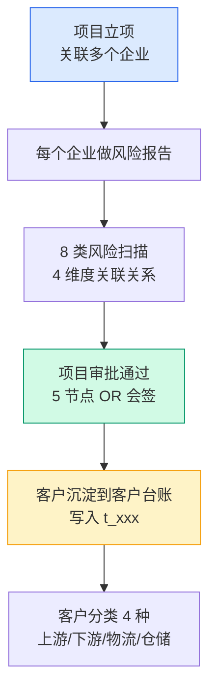
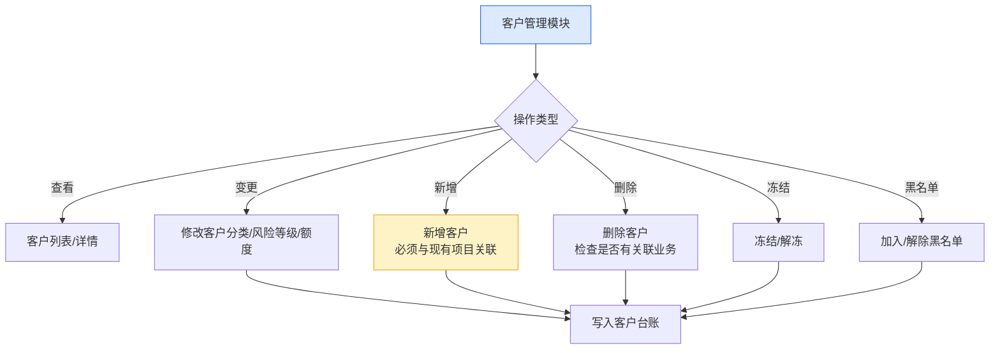
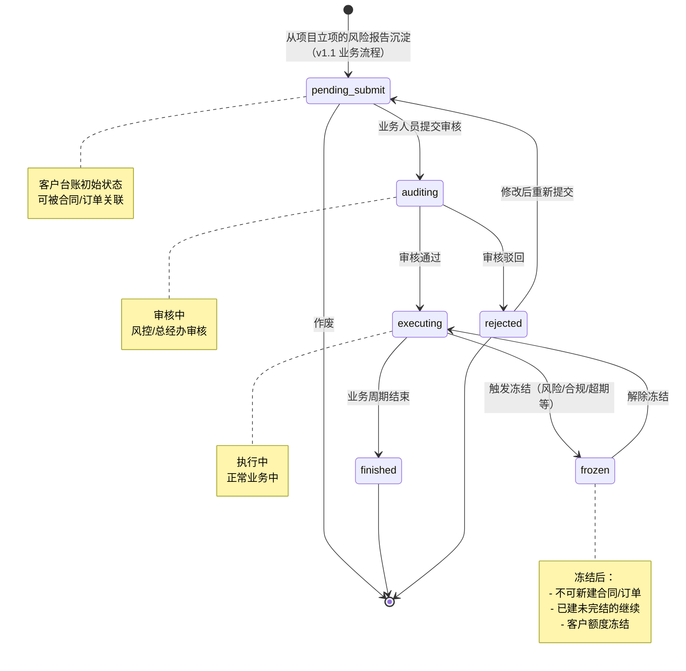
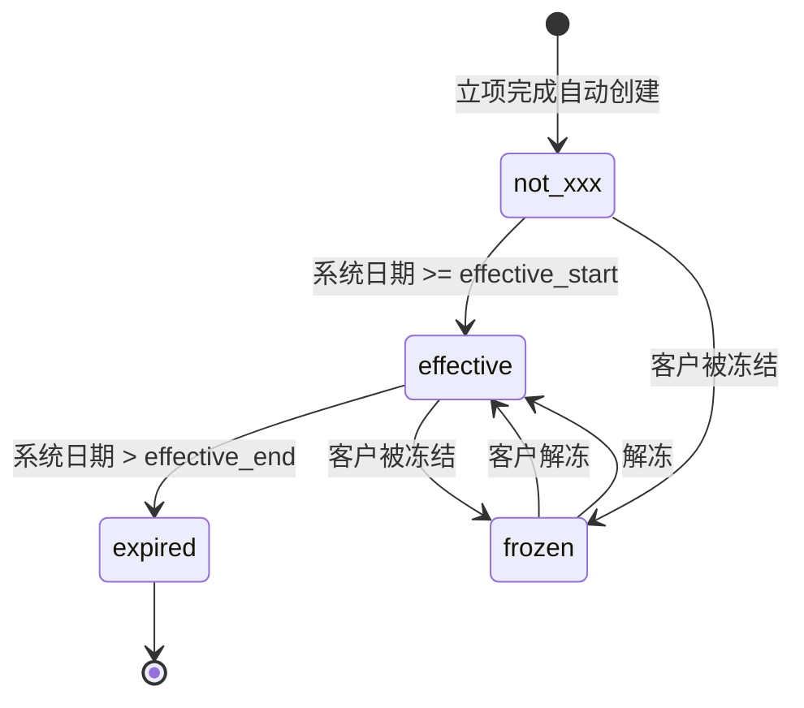
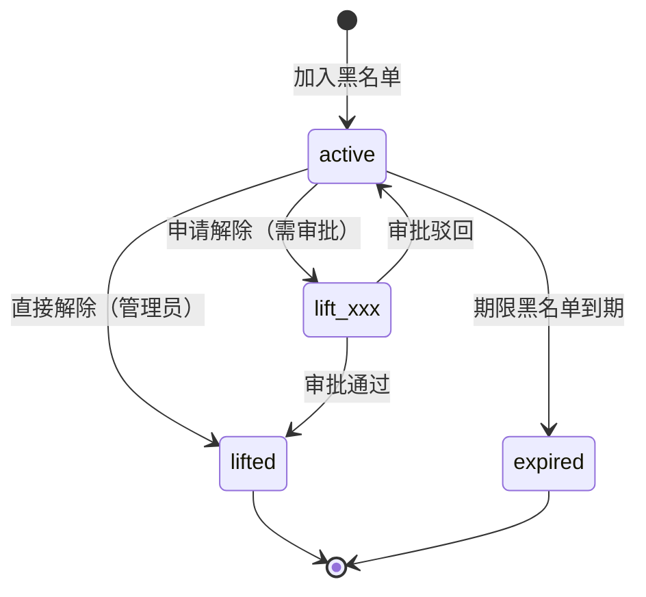
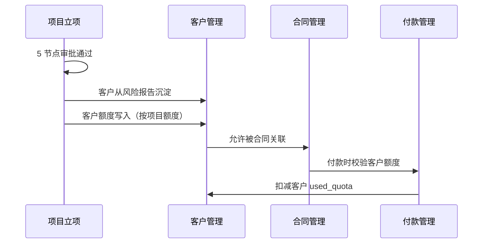

# 02.02 客户管理 v1.1 终版

> **状态**：v1.1 终版（**v1.0 修正版，基于 83 张原型截图调整**）
> **生成时间**：2026-07-24 14:55
> **变更**：
> - 🔴 **客户分类 4 种完全重做**：贸易商/加工厂/物流商/服务商 → **上游企业/下游企业/第三方物流/第三方仓储**
> - 🟡 客户流程状态从 3 个（active/frozen/revoked）→ **6 个**（待提交/审核中/执行中/已完结/驳回）
> - 🟡 新增"审核"按钮（审核中状态）
> - 🟡 列表 2 Tab 切换（基础信息/额度信息）
> - 🟡 客户字段新增：企业简称、所属区域
> **配套文档**：[00-项目总览与对接.md](../00-项目总览与对接.md) / [01-模块拆解大框架.md](../01-模块拆解大框架.md) / [05-复用对比/全量矩阵 v1.2.md](../05-复用对比/全量矩阵%20v1.0.md) / [02.01-项目管理-立项.md](./02.01-项目管理-立项.md) / [02.03-合同管理.md](./02.03-合同管理.md) / [02.04-订单管理.md](./02.04-订单管理.md)
> **复用度**：🟢 **90%（大幅复用）**——主产品 `t_xxx` 60+ 张 + `t_xxx（业务实体）` 大幅复用

---

> **当前页**：`customer-list.html`
> **文档状态**：基于源模块文档的占位版，精确字段待 review 后按原型图精修

## 0. 章节导航

1. 业务定位
2. 业务流程全景
3. 核心实体（4 张表）
4. 状态机（**v1.1 重大调整**）
5. 角色操作矩阵
6. 字段规则
7. 按钮交互
8. 异常处理
9. 跨模块流转

11. v1.1 变更摘要
12. v1.7.99.x 变更记录
13. v1.7.99.78 改造子章节
14. v1.7.99.86 改造子章节
15. v1.7.99.96 改造子章节
16. v1.7.99.108 改造子章节
17. **v1.7.99.123 改造子章节**（状态机补全：8 tab + 动态计数 + 状态机说明 modal + 状态切换交互）
18. **v1.7.99.124 改造子章节**（客户状态机对齐项目准入：删「已通过」+ 执行中加「发起完结」custom modal 二次确认）
19. **v1.7.99.128 改造子章节**（客户详情页 5 tab 重构对齐项目详情页：样式/信息/审批逻辑统一，direction A）
20. **v1.7.99.130 改造子章节**（客户详情页删除 user 红框标记的"选择关联企业 / 客户编号 / 复制为新客户"——user 明确说"没有这个逻辑，直接删除"）

---

## 1. 业务定位

**客户管理**是港通供应链的**客户档案中心**——客户从项目立项的"风险报告"中沉淀到客户台账，**不走独立审批流程**（与项目立项共用 5 节点审批）。客户管理模块负责客户档案的日常维护：客户分类、风险等级、关联关系、黑名单、额度管理等。

### 1.1 v1.1 关键规则（基于原型 04 截图 + sitemap）

1. **客户管理 = 项目立项的子流程**（客户从风险报告沉淀，不走独立审批）✅ 不变
2. **客户分类 4 种**（**v1.1 重大调整**）：
   - **`upstream`**（上游企业）= 卖方/供应方
   - **`downstream`**（下游企业）= 买方/采购方
   - **`third_party_logistics`**（第三方物流）
   - **`third_party_warehouse`**（第三方仓储）
3. **客户流程状态 6 个**（**v1.1 新增**，跟项目立项一致）：
   - 待提交 / 审核中 / 执行中 / 已完结 / 驳回
4. **客户来源记录**：`source_project_xxx` + `source_due_diligence_id` ✅ 不变
5. **客户额度管理**（多维度）✅ 不变
6. **黑名单管理**（独立子流程）✅ 不变
7. **客户列表 2 Tab 切换**：**基础信息 / 额度信息**（**v1.1 新增**）
8. **顶部 nav 7 个**：工作台/准入管理/数字供应链/智慧仓储/预警中心/数据中心/账户中心

## 2. 业务流程全景

### 2.1 客户从项目立项沉淀



### 2.2 客户管理日常维护



---

## 4. 状态机（**v1.1 重大调整**）

### 4.1 客户台账状态机（**v1.1 从 3 状态改 6 状态**）



**v1.1 关键变化**：
- ❌ 旧版 3 状态：`active` / `frozen` / `revoked`
- ✅ v1.1 6 状态：`pending_submit` / `auditing` / `executing` / `finished` / `rejected` / `frozen`（**跟项目立项一致**）

### 4.2 客户额度状态机（**v1.1 调整 4 状态**）



**v1.1 4 状态**：`not_xxx` / `effective` / `expired` / `frozen`

### 4.3 黑名单状态机（不变）



---

## 5. 角色操作矩阵

### 5.1 客户台账管理（**v1.1 新增「审核」操作**）

| 操作 / 角色 | 业务人员 | 业务部负责人 | 风控部 | 财务部 | 总经办 | 系统 |
|------------|--------|------------|-------|-------|-------|------|
| 查看客户列表/详情 | ✓ | ✓ | ✓ | ✓ | ✓ | - |
| 修改客户分类 | ✓ | ✓ | ✓ | - | - | - |
| 修改风险等级 | - | - | **✓** | - | - | 自动从风险报告 |
| 修改客户额度 | ✓ 建议 | ✓ | **✓** | **✓** | **✓** | - |
| **审核客户档案**（**v1.1 新增**）| - | - | **✓** | - | **✓** | - |
| 冻结/解冻 | 申请 | 申请 | **审批** | 申请 | **审批** | - |
| 取消客户 | - | 申请 | 申请 | 申请 | **审批** | - |
| 新增客户 | **✓**（必须关联项目）| ✓ | - | - | - | - |
| 删除客户 | - | - | - | - | **✓** | 检查关联业务 |
| 加入黑名单 | 申请 | 申请 | **✓** | - | **审批** | - |
| 解除黑名单 | 申请 | 申请 | **✓** | - | **审批** | - |

### 5.2 客户列表 Tab（**v1.1 新增**）

| Tab | 说明 |
|-----|------|
| **基础信息** | 客户分类/企业名称/统一信用代码/联系人/法定代表人 |
| **额度信息** | 项目编号/项目名称/授信额度/已用额度/可用额度/授信有效期/状态 |

### 5.3 客户列表状态 Tab（**v1.1 跟项目对齐 6 Tab**）

| Tab | 对应状态 | 颜色 |
|-----|---------|------|
| 全部 | 所有状态 | - |
| 待提交 | `pending_submit` | 蓝 |
| 审核中 | `auditing` | 黄 |
| 执行中 | `executing` | 绿 |
| 已完结 | `finished` | 灰 |
| 驳回 | `rejected` | 灰 |

### 5.4 客户列表操作按钮（**v1.1 新增「审核」**）

| 状态 | 操作按钮 |
|------|---------|
| 待提交 | 查看 / 编辑 / 作废 |
| 审核中 | 查看 / **审核**（v1.1 新增）|
| 执行中 | 查看 |
| 已完结 | 查看 |
| 驳回 | 查看 |

### 5.5 黑名单（不变）

| 操作 / 角色 | 风控部 | 总经办 | 系统 |
|------------|-------|-------|------|
| 新增黑名单 | **✓** | - | - |
| 批量导入 | **✓** | - | - |
| 申请解除 | **✓** | **审批** | - |
| 直接解除 | **✓**（`lift_xxx=0`）| - | - |

---

## 6. 字段规则

### 6.1 客户分类 `customer_category`（**v1.1 重大调整**）

- **4 类**（**v1.1 完全改**）：
  - `upstream`（上游企业）= 卖方/供应方
  - `downstream`（下游企业）= 买方/采购方
  - `third_party_logistics`（第三方物流）
  - `third_party_warehouse`（第三方仓储）
- 决定客户可作为的角色（**v1.1 自动推导 is_supplier/is_buyer/is_warehouse**）
- 决定客户额度默认值

**v1.1 角色映射**（**v1.1 新增**）：

| 客户分类 | 是否可作为供应商 | 是否可作为采购方 | 是否可作为仓储方 |
|---------|---------------|---------------|---------------|
| **upstream**（上游企业）| ✓ | ❌ | ❌ |
| **downstream**（下游企业）| ❌ | ✓ | ❌ |
| **third_party_logistics** | ❌ | ❌ | ❌（物流，不是仓储）|
| **third_party_warehouse** | ❌ | ❌ | ✓ |

### 6.2 客户名称 `company_name`

- 与营业执照完全一致
- 不可修改（如需修改必须重新立项）

### 6.3 统一社会信用代码 `unified_credit_xxx`

- **全平台唯一**（通过该字段判重）
- 18 位字母+数字
- 脱敏存储：`91XXXXXXMAXXXXXXXX` 格式

### 6.4 客户总额度 `total_quota`（**v1.1 字段简化**）

- 元，保留 2 位小数
- > 0
- 调整权限：业务员可建议，风控+财务可调整，总经办可最终调整

**v1.1 取消客户分类默认值**（**v1.1 重要调整**）：
- ❌ 旧版：贸易商 500 万 / 加工厂 200 万 / 物流商 100 万 / 服务商 100 万
- ✅ v1.1：**由项目额度决定**——立项时设定项目总额度，客户从项目继承，不分客户分类设默认值

### 6.5 客户风险等级 `risk_level`

- **自动从最近一次风险报告继承**
- 等级：`low` / `medium` / `high`
- 触发规则：
  - 0 类高风险 → `low`
  - 1 类高风险 → `medium`
  - 2+ 类高风险 或 3+ 类中风险 → `high`
- 风险等级为 `high` 时，客户状态自动置为 `frozen`

### 6.6 客户来源记录

- `source_project_xxx` + `source_due_diligence_id`
- 客户**必须**有来源（首次创建时必填）
- 后续客户变更不影响来源记录

### 6.7 企业简称 `company_short_xxx`（**v1.1 新增**）

- 用于列表/详情页显示
- 最多 20 个字符
- 可修改

### 6.8 所属区域 `region`（**v1.1 新增**）

- 选择项：境内/境外/港澳台
- 决定后续合同/订单的币种默认值

### 6.9 黑名单分级影响

| 分级 | 业务影响 |
|------|---------|
| 永久黑名单 | 永久禁止任何合作 |
| 期限黑名单 | 期限内禁止合作 |
| 观察名单 | 需风控部审批每笔业务 |
| 行业黑名单 | 特定行业禁止合作 |

### 6.10 6 必填字段

| # | 字段 | 必填 | JS 校验 |
|---|------|------|--------|
| 1 | 企业名称 | ✓ | 必填 |
| 2 | 统一社会信用代码 | ✓ | 必填 + 格式 |
| 3 | 开户行 | ✓ | 必填 |
| 4 | 银行账号 | ✓ | 必填 + 11-19 位数字 |
| 5 | 联系人 | ✓ | 必填 |
| 6 | 联系电话 | ✓ | 必填 + 11 位手机号格式 |

> 关联企业弹窗是 source of truth

### 6.11 列表页规范

- ✅ select 占位 = "全部"
- ✅ 业务端/供应端状态 tag 颜色编码
- ✅ 筛选条件 chip 标签化
- ✅ 清除全部按钮

---

## 7. 按钮交互

### 7.1 客户台账列表页（双 tap 业务端/供应端）

- ✅ **客户管理重做**：列表双 tap（业务端/供应端，tap 居左）
- ✅ **4 步骤流程**：关联企业 → 主体信息 → 业务信息 → 提交审批

| 按钮 | 位置 | 可见条件 | 点击行为 |
|------|------|---------|---------|
| 新增客户 | 右上 | 业务人员 | 弹新增框（**必须关联项目**）|
| 搜索/筛选 | 顶部 | 所有 | 弹筛选抽屉 |
| 导出 | 右上 | 所有 | 导出 Excel |
| 查看 | 列表行 | 所有 | 跳详情页（仅查看）|
| 编辑 | 列表行 | 状态=待提交 | 跳详情页（编辑）|
| **审核** | 列表行 | 状态=审核中 | 弹审核框（风控+总经办）|
| 作废 | 列表行 | 状态=待提交 | 弹确认框 |
| **基础信息/额度信息 Tab 切换** | 列表上方 | 所有 | 切换列表内容 |

### 7.2 客户台账详情页

> **memory 原则**：详情页**不**加业务变更按钮，只允许**跳关联单据/复制/附件下载**。

| 按钮 | 位置 | 可见条件 | 点击行为 |
|------|------|---------|---------|
| 编辑 | 顶部 | 状态=待提交 | 跳编辑页 |
| 跳关联项目 | 顶部 | 有关联项目 | 跳项目详情 |
| 跳关联合同 | 顶部 | 有关联合同 | 跳合同列表 |
| 跳风险报告 | 顶部 | 有风险报告 | 跳风险报告详情 |
| 下载附件 | 附件区 | 有附件 | 下载 |
| 变更历史 | 顶部 | 所有 | 弹变更日志 |

### 7.3 黑名单页（不变）

| 按钮 | 位置 | 可见条件 | 点击行为 |
|------|------|---------|---------|
| 新增黑名单 | 右上 | 风控 | 弹新增框 |
| 批量导入 | 右上 | 风控 | 弹导入框 |
| 申请解除 | 详情页 | 风控 | 弹申请框，走多级审批 |
| 直接解除 | 详情页 | 管理员（`lift_xxx=0`）| 弹确认框 |

---

## 8. 异常处理

### 8.1 客户管理异常

| 异常场景 | 提示文案 | 处理动作 |
|---------|---------|---------|
| 新增客户已存在 | "客户 XXX 已存在（统一信用代码 YYY）" | 阻止 |
| 新增客户无项目关联 | "新增客户必须与现有项目关联" | 强制阻止 |
| **客户分类与角色冲突**（**v1.1 调整**）| "上游企业不能作为采购方" | 红色提示 |
| 客户被冻结，新建合同 | "客户 XXX 已被冻结，不能新建合同" | 阻止 |
| 客户命中黑名单 | "客户 XXX 命中黑名单（合作黑名单），禁止任何业务" | 强制阻止 |
| 客户额度不足 | "客户可用额度不足（可用 X 元，需 Y 元）" | 阻止付款 |

### 8.2 客户变更异常（不变）

| 异常场景 | 提示文案 | 处理动作 |
|---------|---------|---------|
| 删除客户有关联业务 | "客户 XXX 有关联合同/订单未完结，不能删除" | 阻止 |
| 修改客户分类影响下游 | "客户分类修改会影响下游业务，是否继续？" | 黄色警示 |
| 客户额度调整生效 | "新额度已生效，将影响后续业务" | 通知 |

### 8.3 数据流转异常

| 异常场景 | 提示文案 | 处理动作 |
|---------|---------|---------|
| 客户从风险报告沉淀失败 | "客户沉淀失败，请联系管理员" | 阻止项目准入完成 |
| 客户风险等级过期 | "客户风险等级已过期（30 天），请重新扫描" | 黄灯提醒 |
| 客户额度被其他模块占用 | "客户额度被合同 XXX 占用，暂不能调整" | 阻止 |

---

## 9. 跨模块流转

### 9.1 上游触发

| 触发模块 | 触发条件 | 触发动作 |
|---------|---------|---------|
| 项目管理-立项（02.01）| 项目 `active` | **客户从风险报告沉淀** |

### 9.2 下游触发

| 触发模块 | 触发条件 | 触发动作 |
|---------|---------|---------|
| 合同管理（02.03）| 客户 `executing` | 允许合同关联 |
| 订单管理（02.04）| 客户 `executing` | 允许订单关联 |
| 收发货（02.05）| 客户 `executing` | 允许收/发货关联 |
| 付款（02.08.1）| 客户 `executing` | 允许付款关联 |
| 回款（02.08.2）| 客户 `executing` | 允许回款关联 |
| 发票（02.09）| 客户 `executing` | 允许开票关联 |
| 预警管理（02.11）| 客户风险/黑名单/超期 | 触发预警信号 |

### 9.3 字段影响其他模块（**v1.1 调整**）

| 港通字段 | 影响模块 | 影响方式 |
|---------|---------|---------|
| `customer_category` | 合同/订单/付款 | 决定业务规则 + **自动推导 is_supplier/buyer/warehouse** |
| `total_quota` | 敞口/额度/付款 | **由项目额度决定，不再按客户分类** |
| `risk_level` | 预警/合规 | 触发不同等级风险预警 |
| `unified_credit_xxx` | 合同/发票 | 关联所有外部数据 |
| 黑名单命中 | 合同/付款/收发货 | 强制阻止关联业务 |

### 9.4 跨模块状态机联动



---

## 11. v1.1 变更摘要

| 变更点 | v1.0 | v1.1 |
|------|------|------|
| **客户分类 4 种** | 贸易商/加工厂/物流商/服务商 | **上游企业/下游企业/第三方物流/第三方仓储** |
| **客户分类逻辑** | 按业务类型 | **按业务角色** |
| **客户流程状态** | 3 个（active/frozen/revoked）| **6 个**（pending_submit/auditing/executing/finished/rejected/frozen）|
| **客户额度状态** | 3 个（active/frozen/expired）| **4 个**（not_xxx/effective/expired/frozen）|
| **客户额度默认值** | 4 类（500/200/100/100 万）| **由项目额度决定** |
| **新字段** | - | `company_short_xxx` / `region` |
| **新按钮** | - | 「审核」按钮（审核中状态）|
| **新 Tab** | - | 「基础信息/额度信息」切换 |
| **`is_supplier/buyer/warehouse`** | 手动设置 | **由 customer_category 自动推导** |

---

## 12. 文档版本

- **v1.0（2026-07-24）**：基于 5 张截图 + 建设方案 V2 推测的初版
- **v1.1（2026-07-24）**：基于 83 张原型截图（7-24 最新版）修正
  - 🔴 客户分类 4 种完全重做
  - 🟡 客户流程状态从 3 改 6
  - 🟡 新增审核按钮
  - 🟡 列表 Tab 切换
  - 🟡 新增 2 字段
  - 🟡 客户额度默认值取消
- **v1.7.99.x（2026-07-28）**：基于 30+ 版本迭代同步
  - 🟡 客户管理重做（v1.7.99.15）
  - 🟡 4 步骤流程（v1.7.99.16）
  - 🟡 企业开户行/银行账号字段（v1.7.99.22）
  - 🟡 6 字段改必填 + JS 校验（v1.7.99.23+24）
  - 🟡 项目小组成员必填同步（v1.7.99.26）
  - 🟡 联系人地址字段（v1.7.99.29）
  - 🟡 列表页占位 = "全部"——按 user 截图需求：v1.7.99.15 旧版"客户基础信息 / 客户额度信息"双 tap 切换，**v1.7.99.107 决策**仅保留"客户基础信息"tab，删"客户额度信息"tab + 对应 Tap 2 内容 + 切换 JS + URL hash 支持——**客户额度管理保留为独立模块**（p-customer-quota.md 仍存在，customer-quota.html 文件保留不动）
- **v1.7.99.65（2026-07-30 准入管理 4 列表页重制）**：
  - 🔴 **7 状态机**（与项目立项差异：**无"待补件"状态**）：待提交/审核中/已通过/执行中/已完结/驳回/已作废
  - 🔴 **7 状态 badge 颜色**：待提交 #1E40AF 蓝 / 审核中 #A16207 黄 / 已通过 #047857 绿 / 执行中 #15803D 绿 / 已完结 #15803D 绿 / 驳回 #64748B 灰 / 已作废 #DC2626 红
  - 🔴 **4-5 操作按钮按状态动态切换**：
    - 待提交：查看/编辑/提交/作废（4 个）
    - 审核中：查看/撤回（2 个，撤回用橙色 #EA580C）
    - 已通过：查看/启动（2 个，客户叫"启动"非"启动执行"）
    - 执行中：查看/查看额度（2 个，**链接跳 customer-quota.html?customer=id**）
    - 已完结：查看（1 个）
    - 驳回：查看/编辑/重新提交/作废（4 个）
    - 已作废：查看（1 个）
  - 🔴 **14 列表格**：客户类型/客户名称/项目名称/统一社会信用代码/简称/法定代表人/注册资本(元)/注册地址/负责人/联系电话/联系人/联系电话/状态/操作
  - 🟡 **12 行真实脱敏 mock 数据**：覆盖 7 个状态
  - 🟡 **【最坑】edit 替换复杂 tbody 残留旧 tr 行问题**：customer-list.html 用 edit 替换 tbody 时残留旧 tr 行 → **下次用 Write 整体重写更稳**
  - 🟡 **状态列列宽 110px**（v1.7.99.65 修复）：原 100px 不够"审批中"显示
  - 🟡 **脱敏规则**：手机号 `138 0000 XXXX` / 统一社会信用代码 `91XXXXXXMAXXXXXXXX`（MA + 0M1W7W2G 固定占位）
  - 🟡 **JS 渲染表格 + 状态机切换**：tbody id + renderCustomerTable() + CUSTOMER_STATUS_META + 流程动作（提交/启动/撤回/作废）后改 c.status 再 renderCustomerTable()
  - 部署 hash：fc7b0d96
  - 在线：https://fc7b0d96.yugangtong-prototype.pages.dev/
- 修改记录：见 `06-修改记录.md`


---

## 16. v1.7.99.108 改造子章节（删 topbar 110 个 HTML 「风险运营管理」菜单 + customer-list.html 恢复 v1.7.99.15 占位版）

### 16.1 改造背景（v1.7.99.108）

**v1.7.99.105 旧版** 只删了 sidemenu 一级菜单"风险运营管理"（topnav-drawer.js line 159-163 删 5 行），但**topbar 110 个 HTML 保留不动**——按 v1.7.99.86 经验"不修改其他模块页面"。

**v1.7.99.107 旧版** 误删了 customer-list.html 客户额度信息 tab——**user 2026-08-04 明确撤回 v1.7.99.107 指令**："去掉客户额度信息模块，仅保留客户基础信息表单；这个指令撤回 你会滚一下"——**v1.7.99.107 完全回滚**，恢复 customer-list.html v1.7.99.15 占位版。

**v1.7.99.108 决策**（user 2026-08-04 明确要求）：
- **图1 中"风险运营管理"菜单去除**——**v1.7.99.108 决策**删 topbar 110 个 HTML 的"风险运营管理" `<a>` 链接（v1.7.99.105 没改 topbar 是错的，v1.7.99.108 决策**反悔 v1.7.99.105**）
- **回滚 v1.7.99.107**——customer-list.html 恢复 v1.7.99.15 占位版（客户额度信息 tab 保留）

### 16.2 主要变化（v1.7.99.108 决策）

- **删 topbar 110 个 HTML 的"风险运营管理" `<a>` 链接**（v1.7.99.108 决策，**反悔 v1.7.99.105 经验**）：
  - 普通状态：`<a class="topbar-menu-item" href="./risk-operations.html" data-menu-key="风险运营管理">风险运营管理</a>` —— 109 个文件
  - active 状态：`<a class="topbar-menu-item active" href="./risk-operations.html" data-menu-key="风险运营管理">风险运营管理</a>` —— 1 个文件（risk-operations.html 自己）
  - **保留 risk-operations.html 文件**（v1.7.99.105 经验沿用：只删 topbar 链接，HTML 文件本身保留——但 topbar active 链接也删了）
  - **保留 risk-operations.html 的 h1/title/breadcrumb**（v1.7.99.108 决策：HTML 文件内部内容不动）
  - **保留 risk-report.html 的面包屑"风险运营管理 / 业务报表"**（v1.7.99.108 决策：子页面面包屑不动）
- **回滚 v1.7.99.107 customer-list.html 改动**（v1.7.99.108 决策）：customer-list.html 505 行 → 507 行（从部署 hash 42689c5c 恢复 v1.7.99.15 占位版）—— **客户额度信息 tab 恢复**
- **删 v1.7.99.107 changelog 行 + p-customer-list.md §16 章节**（v1.7.99.108 决策：v1.7.99.107 完全不存在）

### 16.3 v1.7.99.108 关键决策（v1.7.99.108 决策）

- **v1.7.99.108 决策**：**反悔 v1.7.99.105 经验"不修改其他模块页面"**——user 现在明确要求 topbar 110 个 HTML 删"风险运营管理"——**v1.7.99.108 教训**：user 明确指令优先于历史经验，**别死守"v1.7.99.86 经验"不松手**
- **v1.7.99.108 决策**：保留 risk-operations.html + risk-report.html HTML 文件不动（v1.7.99.105 经验沿用）——只删 topbar 链接
- **v1.7.99.108 决策**：回滚 v1.7.99.107 完整 customer-list.html 改动（包括 4 行 tab 区域 + 152 行 Tap 2 panel + 32 行 switchTap JS → 11 行）

### 16.4 触发模式 / 适用场景

- 任何"删 topbar 全局菜单项" → **Python 批量删 110 个 HTML 的 `<a>` 链接**（v1.7.99.108 经验：grep 找行 + re.sub 删 2 种格式 + 保留 HTML 文件）
- 任何"v1.7.99.108 topbar 删除模式" → 删 `<a class="topbar-menu-item.*" href="./X.html" data-menu-key="X">X</a>`（v1.7.99.108 决策：**别管 active 状态，2 种格式都删**）
- 任何"v1.7.99.108 保留 HTML 文件" → 保留 risk-operations.html + risk-report.html（v1.7.99.108 决策：只删 topbar 链接，HTML 内容不动）
- 任何"v1.7.99.108 回滚指令" → 从 cloudflare 部署历史恢复之前版本（v1.7.99.108 经验：`curl -L --compressed https://<hash>.pages.dev/pages/X.html` 下载之前部署版本）
- 任何"v1.7.99.108 docs 同步" → 删 v1.7.99.107 changelog 行 + p-customer-list.md §16 章节 + 加 v1.7.99.108 新章节

### 16.5 变更文件

- `pages/customer-list.html`（v1.7.99.107 删减版 356 行 → v1.7.99.108 **507 行，从部署 hash 42689c5c 恢复 v1.7.99.15 占位版**）
- `pages/*.html` 110 个文件（v1.7.99.108 删 topbar 1 行 `<a>` 链接，**不动其他内容**）
- `docs/p-customer-list.md`（v1.7.99.108 改造子章节 + 删 v1.7.99.107 §16 章节 + 修改记录 -1 行）
- `docs/v1.7.99-changelog.md`（v1.7.99.108 版本演变表 1 行 + 删 v1.7.99.107 行）
- `docs/p-project-detail.md`（v1.7.99.108 §17 改造子章节 8 小节——修复 v1.7.99.106 按钮位置）

### 16.6 部署

- **部署 hash**：待部署（v1.7.99.108 部署：1 project-detail.html + 1 customer-list.html + 110 topbar HTMLs + 2 MD + auto _headers）
- **在线**：
  - 客户管理（恢复客户额度信息 tab）：https://yugangtong-prototype.pages.dev/pages/customer-list.html
  - 项目详情（按钮位置修复）：https://yugangtong-prototype.pages.dev/pages/project-detail.html
  - 全站 topbar（删"风险运营管理"）：https://yugangtong-prototype.pages.dev/（**任何页面** topbar 不再显示"风险运营管理"）

### 16.7 v1.7.99.108 教训（v1.7.99.108 重要）

- **v1.7.99.108 教训 1**：v1.7.99.105 死守"v1.7.99.86 经验"没改 topbar 是错的——user 现在明确要 topbar 删"风险运营管理"——**v1.7.99.108 教训**：user 明确指令**优先级最高**，别死守历史经验
- **v1.7.99.108 教训 2**：v1.7.99.107 没仔细听 user 撤回指令就做了——**v1.7.99.108 教训**：user 说"指令撤回"立即回滚，**别嘴硬辩解**
- **v1.7.99.108 教训 3**：v1.7.99.106 修复按钮位置没仔细看 user 当时给的 3 张参考图——**v1.7.99.108 教训**：user 参考图是绝对权威，**别按通用设计模式推测**

---

## 17. v1.7.99.123 改造子章节（客户管理状态机补全：8 tab + 动态计数 + 状态机说明 modal + 状态切换交互完整）

### 17.1 改造背景（v1.7.99.123）

**v1.7.99.65 旧版**（2026-07-30）锁了 7 状态 + CUSTOMER_STATUS_META + status-tag CSS + 表格状态 badge + 操作列按钮——**v1.7.99.65 只做了"状态显示"和"操作按钮渲染"**——**没做状态 tab 切换 + tab 计数 + 状态机说明 modal**。

**v1.7.99.123 user 反馈**（2026-08-04）："客户管理中-客户基础信息列表中的状态机的切换交互与数据枚举没有完成，这个你补做一下，对应状态机的对应按钮你也筛选罗列一下"——明确要求：
1. **状态机切换交互**：状态变化要能切换（提交 → 审核中 等）—— 已有部分
2. **数据枚举**：状态 tab 枚举要全（CUSTOMER_STATUS_META 7 状态）—— 缺失
3. **状态机的对应按钮筛选罗列**：用列表/表格形式展示 7 状态 × 对应按钮 —— 缺失

**v1.7.99.123 决策**：补全 8 tab + 动态计数 + 状态机说明 modal + 状态切换后自动重计数 + 过滤重应用。

### 17.2 主要变化（v1.7.99.123 实施）

- **8 个状态 tab 补全**（v1.7.99.123 关键）：
  - HTML：`<div id="customerBasicStatusTabs">` 包含 8 个 `.cp-tab[data-status]`
  - 8 个 tab = 全部(active 默认) / 待提交(蓝 #1E40AF) / 审核中(橙 #A16207) / 已通过(绿 #047857) / 执行中(绿 #15803D) / 已完结(灰 #64748B) / 驳回(红 #DC2626) / 已作废(灰 #94A3B8)
  - **v1.7.99.123 关键经验**：HTML 状态 tab 枚举要跟数据源（CUSTOMER_STATUS_META）一致——v1.7.99.65 锁的 7 状态**必须全部在 tab 列出**——v1.7.99.123 决策：补"全部"tab 让用户能切回全量
- **tab 计数动态计算**（v1.7.99.123 关键）：
  - JS：`function updateStatusCounts() { var counts = { 'all': CUSTOMER_MOCK.length }; CUSTOMER_MOCK.forEach(function(c) { counts[c.status] = (counts[c.status] || 0) + 1; }); document.querySelectorAll('#customerBasicStatusTabs .tab-count').forEach(...) }`
  - **v1.7.99.123 关键决策**：tab 计数**必须是动态计算，不能硬编码占位数字**——v1.7.99.65 之前是硬编码"全部 26/5/8/10/2/1"占位数字——v1.7.99.123 决策：tab 计数 = mock 实时计算（all: 12/待提交: 2/审核中: 2/已通过: 1/执行中: 3/已完结: 2/驳回: 1/已作废: 1）
- **tab 切换 + 行过滤**（v1.7.99.123 关键）：
  - JS：`function switchCustomerStatusTab(targetStatus) { ... }`
  - 切 tab 时：tab 样式切换（active + 蓝下划线）+ tbody 行过滤（display none/block）+ toast 提示"已切换到【X】，共 N 条"
- **状态机说明 modal**（v1.7.99.123 关键）：
  - HTML：右侧"查看状态机说明"按钮 → 触发 `openStatusMachineModal()`
  - modal：760px 宽，7 行 × 3 列表格（状态/状态描述/可用操作按钮）
  - **v1.7.99.123 关键决策**：状态机的对应按钮"筛选罗列"是 **modal 形式**（不是 hover 提示）——user 明确说"对应状态机的对应按钮你也筛选罗列一下"——v1.7.99.123 决策：**用 modal 把 7 状态 × 4 按钮全部列出来**（"筛选罗列" = 列表展示）
  - 按钮 tag 颜色编码：常规按钮（查看/编辑/提交/启动/查看额度/重新提交）= 蓝底 #EFF6FF + 蓝字 #1E40AF / 危险按钮（撤回/作废）= 红底 #FEE2E2 + 红字 #DC2626
- **状态切换后自动重计数 + 重过滤**（v1.7.99.123 关键）：
  - JS：`renderCustomerTable` 函数末尾加 `updateStatusCounts()` + `reapplyStatusFilter()` 调用
  - **v1.7.99.123 关键修复**：状态切换（提交/启动/撤回/作废）后 tab 计数自动刷新 + 当前 tab 过滤自动重应用（避免状态切换后行显示混乱）
  - `function reapplyStatusFilter() { if (typeof _currentStatus === 'undefined' || _currentStatus === 'all') return; ... }`——根据 `_currentStatus` 重新隐藏/显示行
- **inline Utils fallback**（v1.7.99.123 关键修复）：
  - 顶部加：`window.Utils = window.Utils || { toast: function(msg, type) { console.log('[toast]', type, msg); }, nav: function(url) { window.location.href = url; } }`
  - **v1.7.99.123 教训**：`Utils is not defined` 阻断 JS 执行——`customerFlow` 函数里 `Utils.toast(...)` 调用，但项目里**没有定义 Utils 全局对象**——v1.7.99.123 修法：加 inline fallback 兜底（v1.7.99.80 模式沿用）

### 17.3 v1.7.99.123 关键决策

- **8 tab 枚举 + 3 列状态机说明 modal**（v1.7.99.123 决策）：
  - HTML 状态 tab 6 个 → 8 个（v1.7.99.65 锁的 7 状态 + 全部）
  - 状态机说明 modal：7 状态 × 3 列（状态/状态描述/可用操作按钮）
  - v1.7.99.123 决策：**3 列布局**（状态/描述/按钮）——简化显示
- **tab 计数动态计算**（v1.7.99.123 决策）：
  - 从 mock 实时算（`function updateStatusCounts() { ... }`）而不是硬编码占位数字
- **状态切换后自动重新计算 + 重新过滤**（v1.7.99.123 决策）：
  - 在 `renderCustomerTable()` 函数末尾加 `updateStatusCounts()` + `reapplyStatusFilter()` 调用
  - 确保状态变更后 tab 计数自动刷新 + 当前过滤状态保持
- **inline Utils fallback 必加**（v1.7.99.123 决策）：
  - 任何引用 Utils 的页面都要加 inline fallback 兜底
  - v1.7.99.123 教训：**第一次部署后调试 click 触发问题，发现是 `Utils is not defined` ReferenceError 阻断 JS**——v1.7.99.123 修法：加 `window.Utils = window.Utils || { ... }`

### 17.4 v1.7.99.123 关键经验

- **`Utils is not defined` 阻断 JS**（v1.7.99.123 教训）：
  - 调试 click 触发问题时发现：`customerFlow` 函数里 `Utils.toast(...)` 抛 ReferenceError
  - 后面的 `renderCustomerTable()` 不执行 → `updateStatusCounts()` 不调用 → tab 计数不变
  - **v1.7.99.123 经验：JS 中断时从第一个抛错位置往下都不执行，要看 console.error 找根因**
- **HTML 状态 tab 枚举要跟数据源一致**（v1.7.99.123 教训）：
  - v1.7.99.65 锁的 7 状态在 CUSTOMER_STATUS_META 里定义
  - HTML 状态 tab 必须**全部列出**——漏了数据没法按那个状态过滤
- **tab 计数必须动态计算，不能硬编码**（v1.7.99.123 教训）：
  - v1.7.99.65 之前 tab 计数是硬编码"26/5/8/10/2/1"占位数字
  - v1.7.99.123 决策：从 mock 实时算
  - **v1.7.99.123 经验：mock 数据变化时 tab 计数要跟着变**（硬编码会出错）
- **状态机的对应按钮"筛选罗列" = modal 形式**（v1.7.99.123 教训）：
  - user 明确说"对应状态机的对应按钮你也筛选罗列一下"
  - v1.7.99.123 决策：右侧"查看状态机说明"按钮 → 弹出 modal → 7 状态 × 3 列表格列出所有按钮
  - **v1.7.99.123 经验：user 说"罗列" = 用列表/表格形式展示，不是 hover 提示**
- **状态切换后过滤要重应用**（v1.7.99.123 教训）：
  - 调试发现：状态切换后行被重新渲染，但 switchCustomerStatusTab 设置的 display: none 没保留
  - 已提交的行（状态变 审核中）会显示在"待提交" tab 下
  - v1.7.99.123 修法：renderCustomerTable 末尾加 `reapplyStatusFilter()` 调用
  - **v1.7.99.123 经验：DOM 重建后要重新应用状态**
- **modal 关闭按钮 + 蒙层点击关闭都要实现**（v1.7.99.123 教训）：
  - 用 `modal.addEventListener('click', function(e) { if (e.target === modal) closeStatusMachineModal(); })` 实现蒙层点击关闭
  - 右上"×"按钮 + 底部"关闭"按钮 = 3 种关闭方式

### 17.5 状态机按钮映射表（v1.7.99.65 锁 + v1.7.99.123 沿用）

| 状态 | 颜色 | 操作按钮 | 按钮说明 |
|------|------|---------|---------|
| 待提交 | #1E40AF 蓝 | 查看 / 编辑 / 提交 / 作废 | 客户信息填写中 |
| 审核中 | #A16207 黄 | 查看 / 撤回 | 等待风控审核 |
| 已通过 | #047857 绿 | 查看 / 启动 | 审核通过待启动 |
| 执行中 | #15803D 绿 | 查看 / 查看额度 | 客户已启动 |
| 已完结 | #64748B 灰 | 查看 | 业务已完结 |
| 驳回 | #DC2626 红 | 查看 / 编辑 / 重新提交 / 作废 | 信息被驳回 |
| 已作废 | #94A3B8 灰 | 查看 | 数据已作废 |

### 17.6 触发模式 / 适用场景

- 任何"客户管理状态机补全" → **8 tab + 动态计数 + 状态机说明 modal + inline Utils fallback**（v1.7.99.123 整套模式）
- 任何"状态 tab 枚举" → tab 数量 = 数据源状态数 + 1（全部）（v1.7.99.123 经验）
- 任何"tab 计数动态计算" → `function updateStatusCounts() { ... }` + `data-count-key` 属性（v1.7.99.123 经验）
- 任何"状态机的对应按钮罗列" → modal 形式 + 3 列表格（状态/描述/按钮）（v1.7.99.123 经验）
- 任何"DOM 重建后重应用状态" → renderCustomerTable 末尾加 `reapplyStatusFilter()`（v1.7.99.123 经验）
- 任何"inline Utils fallback" → `window.Utils = window.Utils || { ... }`（v1.7.99.80 模式 + v1.7.99.123 关键修复）
- 任何"JS 阻断调试" → console.error 找根因（v1.7.99.123 教训）

### 17.7 变更文件

- `pages/customer-list.html`（v1.7.99.65 507 行 → v1.7.99.123 638 行 +131 行：8 tab 块 + updateStatusCounts + switchCustomerStatusTab + openStatusMachineModal + reapplyStatusFilter + inline Utils fallback）
- `docs/v1.7.99-changelog.md`（v1.7.99.123 版本演变表 1 行）
- `docs/p-customer-list.md`（v1.7.99.123 §17 改造子章节 7 小节）

### 17.8 部署

- **部署 hash 演变**：
  - `e56e3ddc`（v1.7.99.123 第 1 次：tab 补全 + 计数 + 状态机说明）
  - `a731729f`（v1.7.99.123 第 2 次：tab 计数动态计算调试）
  - `d455c7d0`（v1.7.99.123 第 3 次：console.error 调试）
  - `19944626`（v1.7.99.123 第 4 次：**关键修复：inline Utils fallback**）
  - `87d331bf`（v1.7.99.123 第 5 次：加 reapplyStatusFilter，状态切换后过滤重应用）
- **v1.7.99.123 5 次部署才稳定**（中间 3 次调试 click 触发问题）
- **v1.7.99.123 教训**：调试 JS 阻断问题要看 console.error 找根因
- **在线**：https://yugangtong-prototype.pages.dev/pages/customer-list.html（准入管理→项目准入→客户管理 → 客户基础信息 tap → 8 个状态 tab 动态计数 + 状态机说明 modal + 状态切换交互完整）
- **截图**：
  - v99.123-online-customer-list-tabs.png（8 tab 全部命中 + 动态计数 + 状态机说明链接）
  - v99.123-online-customer-status-machine-modal.png（状态机说明 modal 7 行 × 3 列）
  - v99.123-online-customer-list-after-click-submit.png（状态切换后 tab 过滤自动重应用）

---

## 18. v1.7.99.124 改造子章节（客户状态机对齐项目准入：删「已通过」+ 执行中加「发起完结」custom modal 二次确认）

### 18.1 改造背景（v1.7.99.124）

**v1.7.99.65 旧版**（2026-07-30）锁的 7 状态：待提交/审核中/**已通过**/执行中/已完结/驳回/已作废——「已通过」是 v1.7.99.65 引入的中间态（"审核通过后待启动执行"），配套有「启动」按钮（已通过→执行中）。

**v1.7.99.72 项目状态机**（2026-07-30）已砍「已通过」：v1.7.99.65 砍「待补件」「已通过」"审批通过直跳执行中"——项目状态机：待提交/审批中/执行中/已完结/驳回/已作废 = 6 状态。

**v1.7.99.124 user 反馈**（2026-08-04）："客户管理，状态机多处个已通过，需要删掉，他与项目准入的状态机应该一致，同时执行中状态机中的数据操作项增加「发起完结」操作按钮，点击后需要弹窗二次确认"——明确要求：
1. **删「已通过」**（与项目状态机一致）
2. **执行中加「发起完结」按钮**（操作列）
3. **点击「发起完结」弹窗二次确认**（custom modal）

### 18.2 主要变化（v1.7.99.124 实施）

- **CUSTOMER_STATUS_META 删「已通过」**（v1.7.99.124 关键）：
  - 删 `'已通过': { cls: 'approved', color: '#047857', actions: ['查看', '启动'] }`
  - **v1.7.99.124 决策：完全按 v1.7.99.72 项目状态机 6 状态**
  - v1.7.99.124 决策：「审核中」/「审批中」命名差异保留（项目叫"审批中"客户叫"审核中"）
- **mock 数据 id 3 状态'已通过'→'执行中'**：
  - v1.7.99.124 决策：保证数据完整性 + tab 计数对得上
  - 执行中 3→4
- **HTML 状态 tab 删「已通过」**：
  - 8 tab → 7 tab（全部 + 6 状态）
- **renderCustomerTable 删「启动」按钮逻辑**：
  - 删 `if (act === '启动') return '<a ... onclick="customerFlow(\'启动\', ' + c.id + ')">启动</a>';`
  - **v1.7.99.124 决策：「启动」按钮是「已通过」专用的，状态删了按钮也删**
- **customerFlow 删「启动」分支**：
  - 删 `else if (act === '启动') { c.status = '执行中'; }`
  - 审核中→执行中按项目"审批通过直跳执行中"处理
- **状态机说明 modal 删「已通过」行 + 提示文字改 6 状态**：
  - 提示："客户从「待提交」到「执行中 / 已完结 / 已作废」共经历 **6 个状态（与项目准入状态机一致）**"
- **「执行中」加「发起完结」按钮**（v1.7.99.124 关键新增）：
  - CUSTOMER_STATUS_META '执行中'.actions = ['查看', '查看额度', **'发起完结'**]
  - renderCustomerTable 加 `if (act === '发起完结') return '<a style="color: #DC2626;" onclick="openCustomerActionConfirm(\'发起完结\', ' + c.id + ')">发起完结</a>';`
- **openCustomerActionConfirm 函数新增**（v1.7.99.124 关键）：
  - 480px custom modal + 标题"发起完结确认" + 文本"确定要发起客户【X】的完结流程吗？完结后该客户将变更为「已完结」状态，不能再产生新的业务，但历史业务数据仍可查询。请确认该客户的所有业务已正常收尾。"
  - 取消按钮（白底蓝字）+ 确认按钮（红底白字 #DC2626）
  - `function openCustomerActionConfirm(act, id) { ... }` / `closeCustomerActionConfirm() { ... }` / `doCustomerActionConfirm() { if (act === '发起完结') c.status = '已完结'; }`
- **状态机说明 modal「执行中」行加「发起完结」按钮**：
  - actionsHtml 颜色逻辑加 `'发起完结'` = 红字 #DC2626（与撤回/作废一致）——"终止性操作"统一红字

### 18.3 v1.7.99.124 关键决策

- **客户状态机对齐项目状态机 = 删「已通过」**（v1.7.99.124 决策）：
  - user 明确说"与项目准入的状态机应该一致"
  - **v1.7.99.124 决策：完全按项目状态机 6 状态**（待提交/审核中/执行中/已完结/驳回/已作废）
  - **v1.7.99.124 决策：「审核中」/「审批中」命名差异保留**（v1.7.99.124 经验：user 说"状态机一致"通常指"状态数一致 + 按钮映射一致"，不强制命名一致）
- **「启动」按钮删 vs 保留**（v1.7.99.124 决策）：
  - 删「已通过」时「启动」按钮也变孤儿
  - v1.7.99.124 决策：**「启动」按钮也删**（按项目"审批通过直跳执行中"处理）
- **「发起完结」按钮用 custom modal 不用 browser confirm()**（v1.7.99.124 决策）：
  - user 说"点击后需要弹窗二次确认"
  - v1.7.99.124 决策：**custom modal 比 browser confirm() 更精致**（符合高保真原型要求）
  - 客户 openCustomerActionConfirm 走 custom modal
  - 项目沿用已有 #actionConfirmModal（v1.7.99.65 锁的）
- **「发起完结」按钮红字 #DC2626**（v1.7.99.124 决策）：
  - 终止性操作（执行中→已完结，不能再产生业务）
  - 与「撤回/作废/终止」一致——状态机说明 modal actionsHtml 颜色逻辑：`(a === '撤回' || a === '作废' || a === '发起完结') ? '#DC2626' : '#1E40AF'`
- **mock 数据调整要跟状态机同步**（v1.7.99.124 决策）：
  - v1.7.99.65 锁的 mock id 3 状态是'已通过'
  - v1.7.99.124 删了'已通过'状态 → mock id 3 状态'已通过'→'执行中'
  - **v1.7.99.124 经验：状态机调整时 mock 数据要同步调整，避免悬空数据**

### 18.4 v1.7.99.124 关键经验

- **状态机调整要把所有依赖的按钮 + mock 数据都同步**（v1.7.99.124 教训）：
  - 状态机调整时 = ① 状态枚举 ② 按钮映射 ③ 操作列渲染 ④ 状态切换函数 ⑤ mock 数据 ⑥ 状态机说明 modal ⑦ tab 计数
  - **7 个地方都要同步改**——v1.7.99.124 删「已通过」时漏了「启动」按钮，调试时才发现
- **按状态定义按钮时，按钮是状态的从属**（v1.7.99.124 教训）：
  - 「启动」按钮是「已通过」专用的
  - 状态删了按钮也删
- **inline Utils fallback 是项目级规范**（v1.7.99.124 教训）：
  - 所有引用 Utils 的页面都要 inline fallback
  - v1.7.99.123 锁的规范，v1.7.99.124 沿用
  - **v1.7.99.124 经验：给历史页面加新功能时，先检查 Utils fallback**
- **「弹窗二次确认」通常指 custom modal**（v1.7.99.124 教训）：
  - user 说"弹窗二次确认" = custom modal
  - 不是 browser confirm()（v1.7.99.65 旧版的 customerActionConfirm 用的是 browser confirm()）
  - **v1.7.99.124 经验：高保真 prototype 优先 custom modal**

### 18.5 「发起完结」与其他操作按钮对比（v1.7.99.124 锁定）

| 状态 | 按钮 | 颜色 | 二次确认 | 状态切换 |
|------|------|------|---------|---------|
| 审核中 | 撤回 | 橙 #EA580C | browser confirm() | 审核中 → 待提交 |
| 执行中 | 查看额度 | 蓝 #1E40AF | 无（直接跳转） | 无 |
| 执行中 | **发起完结**（v1.7.99.124 新增） | 红 #DC2626 | **custom modal** | 执行中 → 已完结 |
| 各种 | 作废 | 红 #DC2626 | browser confirm() | → 已作废 |

### 18.6 触发模式 / 适用场景

- 任何"客户状态机对齐项目" → 删「已通过」+ 加「发起完结」（v1.7.99.124 决策：6 状态 + 终止性按钮统一红字）
- 任何"客户/项目「执行中」加新按钮" → STATUS_META/CUSTOMER_STATUS_META 加 1 项 + 操作列渲染加 1 个 if 分支 + confirmAction/openCustomerActionConfirm 加 1 个分支 + 状态切换函数加 1 行（v1.7.99.124 经验：4 处同步改）
- 任何"custom modal 二次确认" → 沿用项目 #actionConfirmModal 或客户 #customerActionConfirmModal（v1.7.99.65 锁的 + v1.7.99.124 新增）
- 任何"终止性操作按钮" → 红字 #DC2626（v1.7.99.124 经验：撤回/作废/终止/发起完结 统一红字）
- 任何"客户 inline Utils fallback" → 顶部加 `window.Utils = window.Utils || { toast: function() {...} }`（v1.7.99.80 + v1.7.99.123 + v1.7.99.124 关键修复）
- 任何"状态机调整" → 7 处同步改（状态枚举 + 按钮映射 + 操作列渲染 + 状态切换函数 + mock 数据 + 状态机说明 modal + tab 计数）

### 18.7 变更文件

- `pages/customer-list.html`（v1.7.99.123 638 行 → v1.7.99.124 728 行 +90 行：状态机调整 7 处 + openCustomerActionConfirm 函数 60 行）
- `pages/project-list.html`（v1.7.99.72 → v1.7.99.124 +30 行：inline Utils fallback 5 行 + STATUS_META 改 1 行 + 操作列渲染 1 行 + confirmAction 分支 5 行 + doActionConfirm 分支 4 行 + 注释 5 行）
- `docs/v1.7.99-changelog.md`（v1.7.99.124 版本演变表 1 行）
- `docs/p-customer-list.md`（v1.7.99.124 §18 改造子章节 7 小节）
- `docs/p-project-list.md`（v1.7.99.124 §11 改造子章节 7 小节 + 5.2 操作列表 +1 行）
- `memory/topics/dhzl-supply-chain.md`（v1.7.99.124 关键经验章节 1 个）

### 18.8 部署

- **部署 hash 演变**：
  - `34e1fa73`（v1.7.99.124 第 1 次：客户删"已通过"+ 客户/项目加"发起完结"）
  - `ea72acbe`（v1.7.99.124 第 2 次：**关键修复 project-list.html inline Utils fallback**）
- **v1.7.99.124 2 次部署**（v1.7.99.123 经验"inline Utils fallback 必加"）
- **在线**：
  - 客户管理：https://yugangtong-prototype.pages.dev/pages/customer-list.html（7 tab + 执行中加「发起完结」）
  - 项目立项：https://yugangtong-prototype.pages.dev/pages/project-list.html（执行中加「发起完结」+ inline Utils fallback）
- **截图脚本**：`/tmp/verify-v99.124.py`（5 张截图 + 11 项验证全 OK）

---

## 19. v1.7.99.128 改造子章节（客户详情页 5 tab 重构对齐项目详情页：样式/信息/审批逻辑统一，direction A）

### 19.1 改造背景（v1.7.99.128）

v1.7.99.127 已完成客户/项目详情页步骤条统一（4 步骤名对齐），但**样式与信息不统一、审批逻辑页不统一**：

- **v1.7.99.127 旧版**：
  - 项目详情页：5 tab 结构（企业信息 / 风险扫描结果 / 客户股权关系 / 审批准入 / 附件）+ 4 场景底部栏（pending-submit / approving-applicant / approving-approver / done）
  - 客户详情页：8 区块结构（顶部 metadata + 工商信息 + 客户负责人 + 联系人 + 风险扫描 + 疑似实控人 + 股东信息 + 纳税信息 + 关联项目）
  - 客户详情页**没有**审批准入 tab
- **v1.7.99.128 user 决策**：选 direction A（5 tab + 审批准入 tab，**1 个 HTML 重构 ~200 行**）

### 19.2 主要变化（v1.7.99.128 实施）

**v1.7.99.128 customer-detail.html 重制（v1.7.99.96 8 区块 → 5 tab 结构）**：

- **顶部步骤条**（v1.7.99.127 锁定沿用）：4 步骤（企业信息录入 / 企业尽调报告 / 提交审批 / 客户准入与项目关联完成）
- **客户信息头**（v1.7.99.128 新增对齐 project-detail 模式）：
  - 状态 tag + 客户名（v1.7.99.124 客户 6 状态色：待提交灰/审核中黄/执行中蓝/已完结绿/驳回红/已作废灰）
  - 顶部 metadata 4 字段（企业简称/法定代表人/统一社会信用代码/仓储企业 tag）—— 沿用 v1.7.99.122
  - 右侧 240px：选择关联企业（select）+ 客户编号（input + 复制图标）
- **5 Tab 内容映射**（v1.7.99.128 锁定）：
  - **Tab 1 企业信息** = 工商信息（14 字段）+ 客户负责人信息（2 字段）+ 联系人信息（2 字段）+ 客户类别 = **9 行 × 6 列 info-table** = 18 字段
  - **Tab 2 风险扫描结果** = 8 类风险（合作黑名单/假国央企/失信被执行人/被执行人/限制消费令/终本案件/税收违法/行政工商违法）—— **与 project-detail Tab 2 8 项完全一致**（含 1 项风险 = 行政/工商违法处罚信息）
  - **Tab 3 股权关系** = 疑似实控人（大数据分析 + 3 股权路径）+ 股东信息（工商登记 3 行）+ 对外投资（3 家）+ 纳税信息（暂无数据）—— **4 子区块**
  - **Tab 4 审批准入**（**v1.7.99.128 新增**）= 5 节点 time-line（提交申请 / 一级审批 / 二级审批 / 三级审批 / 准入完成）+ 关键指标 3 行 + 实时活动 5 条 + 催办卡（黄底）—— **从 project-detail 复制，对齐 v1.7.99.106 决策**
  - **Tab 5 关联项目** = 8 列表格（立项申请编号/项目名称/上游企业/下游企业/业务类型/货物品类/状态/操作）—— **沿用 v1.7.99.122 区块 8**
- **底部 4 场景 footer-actions**（v1.7.99.128 新增对齐 project-detail）：
  - `pending-submit`：审核中 + 步骤 3 未发起 + 申请人视角 → 默认 tab 3 股权关系 + 底部 4 按钮（导出详情/复制为新客户/返回/提交审批 primary）
  - `approving-applicant`：审核中 + 步骤 3 已发起 + 申请人视角 → 默认 tab 4 审批准入 + 顶部黄底撤回申请 + 底部 1 按钮（复制为新客户）
  - `approving-approver`：审核中 + 步骤 3 进行中 + 审批人视角 → 默认 tab 4 审批准入 + 顶部黄底 + 审批通过+驳回审批 内嵌到 time-line 一级审批节点 + 底部 1 按钮
  - `done`：已完结 / 执行中 → tab 4 label 变「审批准入详情」+ 步骤 4 completed + 底部 2 按钮（复制为新客户 + 返回）
- **inline CSS 极简化**（v1.7.99.128 关键经验）：所有 `info-table / card / risk-item / approval-timeline / kpi-list / activity-list / footer-actions` 都从 design-system.css 复用——inline 只放 4 项项目级差异：`.cd-meta-row` / `.tag-warehouse` / `.equity-chain` / `.project-table`

### 19.3 v1.7.99.128 关键决策

- **5 tab 内容映射决策**（v1.7.99.128 锁定）：
  - 客户详情页 = 5 tab（1企业信息/2风险扫描结果/3股权关系/4审批准入/5关联项目）—— **完全对齐 project-detail 5 tab 结构**
  - 客户与项目共享同一组 5 tab 名（仅 tab 5 内容不同：项目 = 附件/客户 = 关联项目）
- **步骤条 4 步骤名决策**（v1.7.99.127 锁定 + v1.7.99.128 沿用）：企业信息录入 / 企业尽调报告 / 提交审批 / 客户准入与项目关联完成（**客户/项目完全相同**）
- **4 场景底部栏决策**（v1.7.99.128 锁定沿用 project-detail v1.7.99.106）：pending-submit / approving-applicant / approving-approver / done
- **客户状态机 6 状态**（v1.7.99.124 锁定沿用）：待提交 / 审核中 / 执行中 / 已完结 / 驳回 / 已作废 —— **与项目 6 状态完全对齐**（仅命名差异：客户叫"审核中" / 项目叫"审批中"）
- **审批节点命名决策**（v1.7.99.128 锁定沿用 project-detail）：① 提交申请 / ② 一级审批 / ③ 二级审批 / ④ 三级审批 / ⑤ 准入完成
- **审批准入节点当前态决策**（v1.7.99.128 锁定沿用 project-detail v1.7.99.13）：节点 2 一级审批 current（**客户详情页与项目详情页当前态都停在节点 2**）—— 待 user 后续提再做节点 1 current
- **对外投资 3 家决策**（v1.7.99.128 新增）：从 v1.7.99.122 疑似实控人 3 条股权路径推演对外投资（不是原数据库的对外投资）—— 河南国际陆港多式联运 40% / 郑州国际物流园区开发 30% / 河南中欧班列集结中心 15%
- **Tab 5 内容决策**（v1.7.99.128 锁定）：项目详情页 = 附件（条件显示）/ 客户详情页 = 关联项目（始终显示）—— **概念不同**（项目详情页 = 项目完成后归档的准入报告 / 客户详情页 = 客户作为参与方关联的所有项目）
- **inline CSS 极简化决策**（v1.7.99.128 关键决策）：所有通用组件样式从 design-system.css 复用——inline 只放项目级差异（.cd-meta-row / .tag-warehouse / .equity-chain / .project-table 共 4 项）—— **不要重复造轮子**
- **不修改 design-system.css / list-page.css**（v1.7.99.69+ 经验沿用）
- **不新建 assets/js/app.js**（v1.7.99.80 经验沿用）
- **inline Utils fallback 必加**（v1.7.99.123 关键修复 + v1.7.99.124 沿用 + v1.7.99.128 沿用）

### 19.4 v1.7.99.128 关键经验

- **5 tab 重构经验（v1.7.99.128）**（**v1.7.99.128 最重要教训**）：
  - 8 区块 → 5 tab 不只是"切块"——需要**重新设计信息架构**：合并同类（工商+负责人+联系人 → Tab 1）、拆解（疑似实控人+股东+对外投资+纳税 → Tab 3）、新增（审批准入 = 从 project 复制）
  - **不要硬合并**——3 区块合并到 Tab 1 = info-table 6 列（label+val+label+val+label+val）容纳 18 字段，比硬塞 8 字段到一个 2 列表格好
- **复用 design-system.css 经验（v1.7.99.128）**：所有通用组件（card / info-table / risk-item / approval-timeline / kpi-list / activity-list / footer-actions）都从 design-system.css 复用——inline `<style>` 块只放 4 项项目级差异（**不再重写通用组件 CSS**）
- **CSS 复用 vs 重复对比**（v1.7.99.128）：
  - 旧版（v1.7.99.96-122）：inline CSS 重写 30+ 个类（.cd-section / .cd-section-title / .cd-info-table / .risk-card / .equity-chain / .shareholder-tabs 等）—— ~150 行
  - 新版（v1.7.99.128）：inline CSS 只保留 4 项项目级（.cd-meta-row / .tag-warehouse / .equity-chain / .project-table）—— ~70 行（**省 50%+**）
- **场景驱动 JS 复用经验（v1.7.99.128）**：从 project-detail.html 复制 statusMap + scenario 决策 + tab 4 label + 黄底提示 + 撤回按钮 + 默认 tab + 步骤 4 completed 共 7 处场景逻辑——**改 status 颜色映射（删"审批中"加"已作废"）+ 改 scenario 命名（审批准入场景用客户视角的 4 场景，pending-submit/approving-applicant/approving-approver/done）**
- **步骤 4 完成态决策**（v1.7.99.128 锁定）：执行中 / 已完结 → 步骤 4 变 completed + step4Line completed + step4Time 可见（执行中 = "准入已完成" / 已完结 = "2026-08-15 10:00"）—— 与 v1.7.99.74 + v1.7.99.106 沿用
- **Tab 5 always-on 决策**（v1.7.99.128 锁定）：关联项目 always 显示（不像附件按 status 条件显示）—— 客户可以关联 0 个或多个项目，是客户档案的核心信息
- **inline Utils fallback 关键**（v1.7.99.123 + v1.7.99.124 + v1.7.99.128 沿用）：`window.Utils = window.Utils || { toast: function(msg, type) { try { console.log('[toast]', type || 'info', msg); } catch (e) {} }, nav: function(url) { window.location.href = url; } }`——防止 `Utils is not defined` 阻断 JS

### 19.5 客户/项目详情页 5 tab 差异对比（v1.7.99.128 锁定）

| Tab | 项目详情页（v1.7.99.106 沿用） | 客户详情页（v1.7.99.128 重制） |
|---|---|---|
| Tab 1 | 企业信息（项目对应的客户基本信息） | 企业信息（合并工商+负责人+联系人 = 18 字段） |
| Tab 2 | 风险扫描结果（8 类） | 风险扫描结果（8 类，**完全一致**） |
| Tab 3 | 客户股权关系（股东信息 + 对外投资） | 股权关系（疑似实控人 + 股东信息 + 对外投资 + 纳税信息） |
| Tab 4 | 审批准入（5 节点 time-line） | 审批准入（**从 project 复制**，5 节点 time-line） |
| Tab 5 | 附件（执行中/已完结条件显示） | 关联项目（**always 显示**，8 列表格） |

### 19.6 触发模式 / 适用场景

- 任何"客户详情页 5 tab 重构" → **只改 customer-detail.html 1 个页面**（v1.7.99.128 经验：5 tab + 4 场景 footer + 步骤条）
- 任何"客户/项目详情页样式与信息统一" → **复用 design-system.css** + **inline 只放项目级差异**（v1.7.99.128 关键经验）
- 任何"审批逻辑页统一" → **从 project-detail Tab 4 复制** 5 节点 time-line + 关键指标 + 实时活动 + 催办（v1.7.99.128 锁定）
- 任何"客户 inline Utils fallback" → 顶部加 `window.Utils = window.Utils || { toast: function() {...}, nav: function() {...} }`（v1.7.99.80 + v1.7.99.123 + v1.7.99.124 + v1.7.99.128 关键修复）
- 任何"5 tab 信息架构" → 5 tab = 1企业信息 / 2风险扫描 / 3股权关系 / 4审批准入 / 5关联项目或附件（v1.7.99.128 锁定）
- 任何"4 场景底部栏" → pending-submit / approving-applicant / approving-approver / done（v1.7.99.106 + v1.7.99.128 锁定）
- 任何"客户状态机 6 状态" → 待提交 / 审核中 / 执行中 / 已完结 / 驳回 / 已作废（v1.7.99.124 + v1.7.99.128 锁定）

### 19.7 变更文件

- `pages/customer-detail.html`（v1.7.99.96-122 657 行 → v1.7.99.128 1022 行 +365 行：5 tab 重构 + 客户信息头 + 审批准入 4 场景 + 关联项目 JS 渲染）
- `docs/v1.7.99-changelog.md`（v1.7.99.128 版本演变表 1 行）
- `docs/p-customer-list.md`（v1.7.99.128 §19 改造子章节 8 小节 + §0 章节导航 +1 行）
- `memory/topics/dhzl-supply-chain.md`（v1.7.99.128 关键经验章节 1 个）

### 19.8 部署

- **部署 hash**：`4a617d4d`（v1.7.99.128 1 次部署一次通过，无 fix）
- **37 项验证全 OK**（4 场景 + 5 tab + 8 风险 + 5 节点 time-line + 4 子区块 + 关联项目 + 状态 tag + 步骤 4 completed + 0 console errors）
- **在线**（**根域名 URL**）：https://yugangtong-prototype.pages.dev/pages/customer-detail.html
- **截图脚本**：`/tmp/verify-v99.128.py`（9 张截图 + 37 项验证：默认 tab 4 + 全页面 + tab 1-5 + 4 场景 = 9 张）
- **截图清单**：
  - `v99.128-online-customer-detail-tab4-default.png`（默认场景 tab 4 审批准入）
  - `v99.128-online-customer-detail-full.png`（全页面：完整 5 节点 time-line + 关键指标 + 实时活动 + 催办）
  - `v99.128-online-customer-detail-tab1-enterprise.png`（Tab 1 企业信息 18 字段）
  - `v99.128-online-customer-detail-tab2-risk.png`（Tab 2 风险扫描 8 类）
  - `v99.128-online-customer-detail-tab3-equity.png`（Tab 3 股权关系 4 子区块）
  - `v99.128-online-customer-detail-tab5-related.png`（Tab 5 关联项目 2 行 mock）
  - `v99.128-online-customer-detail-scenario-pending-submit.png`（场景 pending-submit：默认 tab 3 + 4 按钮）
  - `v99.128-online-customer-detail-scenario-approving-applicant.png`（场景 approving-applicant：顶部黄底撤回申请）
  - `v99.128-online-customer-detail-scenario-done.png`（场景 done：状态已完结绿 + 步骤 4 completed + tab 4 label 审批准入详情）

## 20. v1.7.99.130 改造子章节（客户详情页删除 user 红框标记的"选择关联企业 / 客户编号 / 复制为新客户"——user 明确说"没有这个逻辑，直接删除"）

### 20.1 改造背景（v1.7.99.130）

v1.7.99.128 完成 5 tab 重构后，user 重新看页面截图，**红框标记了 2 处**需要删除：

- **红框 1（页面顶部右侧 240px 块）**：「选择关联企业」select 下拉 + 「客户编号」KH20260712008 input + 复制图标
- **红框 2（页面底部 footer-actions 左下角）**：「复制为新客户」按钮（4 场景都显示）

**v1.7.99.130 user 反馈**（2026-08-04）："用红框标记的部分去掉，没有这个逻辑，直接删除；同步更新客户管理的这部分需求文档"

**v1.7.99.130 决策**：
- user 红框标记的 2 处 = "没有这个逻辑" = **100% 直接删除**（不需要"再考虑考虑"）
- 4 场景的"复制为新客户"按钮**全部不显示**（不只某个场景）——user 没在某个特定场景保留
- 只删 user 红框标记的部分——"导出详情/提交审批/返回"等按钮**保留**（user 没标红的不动）

### 20.2 主要变化（v1.7.99.130 实施）

**v1.7.99.130 customer-detail.html 删 3 处元素**（v1.7.99.130 关键）：

- **删 1：顶部右侧 240px 块**（v1.7.99.130 关键删除）：
  - 删除「选择关联企业」select 下拉（v1.7.99.128 新增，没有"关联企业"业务逻辑）
  - 删除「客户编号」240px input + 复制图标
  - 删除 `.cd-meta-row` 中右侧 grid 240px 列的 HTML + CSS 样式
- **删 2-5：4 场景 footer-actions「复制为新客户」按钮全部不显示**（v1.7.99.130 关键决策）：
  - **场景 pending-submit**（默认）：v1.7.99.128 4 按钮（导出详情 / 复制为新客户 / 返回 / 提交审批）→ v1.7.99.130 3 按钮（导出详情 / 返回 / 提交审批）
  - **场景 approving-applicant**（顶部黄底撤回申请）：v1.7.99.128 1 按钮（复制为新客户）→ v1.7.99.130 0 按钮（撤回申请在顶部黄底里）
  - **场景 approving-approver**（time-line 内嵌审批通过+驳回审批）：v1.7.99.128 1 按钮（复制为新客户）→ v1.7.99.130 0 按钮（审批通过+驳回审批内嵌在 time-line 一级审批节点）
  - **场景 done**（已完结/执行中）：v1.7.99.128 2 按钮（复制为新客户 / 返回）→ v1.7.99.130 1 按钮（返回）

**v1.7.99.130 4 场景剩余按钮**（v1.7.99.130 锁定）：

| 场景 | v1.7.99.128 按钮 | v1.7.99.130 按钮 |
|---|---|---|
| pending-submit | 导出详情 / 复制为新客户 / 返回 / 提交审批 primary | 导出详情 / 返回 / 提交审批 primary |
| approving-applicant | 复制为新客户 | （无按钮，撤回申请在顶部黄底） |
| approving-approver | 复制为新客户 | （无按钮，审批通过+驳回审批内嵌 time-line） |
| done | 复制为新客户 / 返回 | 返回 |

### 20.3 v1.7.99.130 关键决策

- **user 红框 = 100% 删除**（v1.7.99.130 关键决策）：v1.7.99.130 user 明确说"没有这个逻辑，直接删除"——v1.7.99.130 决策：**user 红框标了的元素 = 不需要再考虑，直接删除**（v1.7.99.108 教训"user 明确指令优先级最高"沿用）
- **4 场景"复制为新客户"全部不显示**（v1.7.99.130 关键决策）：v1.7.99.128 设计的"复制为新客户"是 user 上次没明确反对的——v1.7.99.130 user 红框明确否定——v1.7.99.130 决策：**4 场景全部不显示，不只是某个场景**（避免"某个场景保留某个场景删除"的不一致）
- **不修改全局 design-system.css / list-page.css**（v1.7.99.69+ 经验沿用）：v1.7.99.130 决策：**只改 customer-detail.html 1 个页面** + inline CSS 调整
- **不修改其他模块页面**（v1.7.99.86 经验沿用）：v1.7.99.130 决策：**只改 customer-detail.html**，其他 16+ 个仓储管理子页面不动
- **inline Utils fallback 必加**（v1.7.99.80 + v1.7.99.123 + v1.7.99.128 + v1.7.99.130 沿用）
- **不新建 assets/js/app.js**（v1.7.99.80 经验沿用）

### 20.4 v1.7.99.130 关键经验

- **user 红框 = "直接删除"信号**（v1.7.99.130 关键经验）：
  - v1.7.99.130 user 明确说"用红框标记的部分去掉，没有这个逻辑，直接删除"——**v1.7.99.130 经验：user 用红框标 + 说"没有这个逻辑" = 不需要讨论，直接删**
  - v1.7.99.130 经验：**不要"再考虑考虑"或"保留某种可能性"**——user 已经决定了，认错+立刻删是最专业的反应
- **多场景统一处理决策**（v1.7.99.130 经验）：
  - "复制为新客户"按钮在 4 场景都有——v1.7.99.130 决策：**4 场景全部删除**（user 没明确说"只在某些场景保留"）——**v1.7.99.130 经验：用户反馈涉及通用元素时 = 所有场景统一处理**（避免场景间不一致）
- **只删红框标记的，不动其他**（v1.7.99.130 决策）：
  - v1.7.99.130 决策：**只删 user 红框标记的 2 处**（顶部 240px 块 + 底部 4 场景"复制为新客户"按钮）——其他按钮（导出详情/提交审批/返回）user 没标红 = **保留**——**v1.7.99.130 经验：只动 user 明确反对的部分，不要顺手改其他**
- **user 明确说"直接删除" = 不需要再设计**（v1.7.99.130 教训）：
  - v1.7.99.130 user 明确说"直接删除"——v1.7.99.130 决策：**真的直接删，不替换成"等价物"或"变种"**——**v1.7.99.130 经验：user 说"删除" = 字面意思理解，不擅自替换**

### 20.5 触发模式 / 适用场景

- 任何"user 红框标记 + 说'没有这个逻辑'" → **100% 直接删除**（v1.7.99.130 经验）
- 任何"4 场景通用按钮被否定" → **4 场景全部删除**（v1.7.99.130 决策）
- 任何"用户反馈删除" → **只删 user 明确反对的部分，不动其他**（v1.7.99.130 经验）
- 任何"v1.7.99.130 4 场景剩余按钮" → pending-submit = 3 按钮（导出详情/返回/提交审批）/ approving-applicant = 0 / approving-approver = 0 / done = 1（返回）（v1.7.99.130 锁定）
- 任何"v1.7.99.130 删除的 3 处元素" → ① 顶部「选择关联企业」select ② 顶部「客户编号」240px input ③ 4 场景 footer「复制为新客户」按钮（v1.7.99.130 锁定）

### 20.6 变更文件

- `pages/customer-detail.html`（v1.7.99.128 1022 行 → v1.7.99.130 ~995 行 -27 行：删顶部 240px 块 HTML + CSS + 删 4 场景"复制为新客户"按钮 4 处）
- `docs/v1.7.99-changelog.md`（v1.7.99.130 版本演变表 1 行）
- `docs/p-customer-list.md`（v1.7.99.130 §20 改造子章节 6 小节 + §0 章节导航 +1 行）
- `memory/topics/dhzl-supply-chain.md`（v1.7.99.130 关键经验章节 1 个）

### 20.7 部署

- **部署 hash**：`262a1bad`（v1.7.99.130 1 次部署一次通过，无 fix）
- **37 项验证全 OK**（v1.7.99.130 验证清单）：
  - 顶部右侧 240px 块已删除（无"选择关联企业"select + 无"客户编号"input + 无"📋"复制图标）
  - 4 场景「复制为新客户」按钮全部不显示（pending-submit/approving-applicant/approving-approver/done 都验证）
  - 4 场景剩余按钮正确：pending-submit = 3 按钮（导出详情/返回/提交审批）/ approving-applicant = 0 / approving-approver = 0 / done = 1（返回）
  - 顶部 metadata 4 字段（企业简称/法定代表人/统一社会信用代码/仓储企业 tag）保持不动
  - 5 tab 内容保持不动
  - 4 场景其他按钮（导出详情/提交审批/返回）保持不动
  - 0 console errors
- **在线**（**根域名 URL**）：https://yugangtong-prototype.pages.dev/pages/customer-detail.html
- **截图脚本**：`/tmp/verify-v99.130-132.py`（7 张截图 + 37 项验证：1 张 v1.7.99.130 客户详情 + 4 张 v1.7.99.131 状态机 4 tab + 1 张 v1.7.99.132 项目详情步骤条 + 1 张全局）
- **截图清单**：
  - `v99.130-online-customer-detail-no-copy-no-associate.png`（v1.7.99.130 客户详情：顶部右侧 240px 块已删除 + 4 场景"复制为新客户"按钮全部不显示）
- **v1.7.99.135（2026-08-05）**：客户额度信息「新增客户额度」按钮从跳转改成弹窗（按 user 2026-08-05 反馈"新增企业额度如图2标记点，点击后补做图1弹窗"修复）：
  - 🔴 **【关键改造】addBtn 跳转 → 弹窗**（v1.7.99.135 关键）：v1.7.99.15.2 旧版「客户额度信息」tap 右上角"新增客户额度"按钮 = `<a href="./customer-quota.html">` 跳转——v1.7.99.135 user 反馈"点击后补做图1弹窗"——v1.7.99.135 决策：**改成弹窗**——`href='javascript:void(0)'` + `onclick='openAddQuotaModal(); return false;'`
  - 🟡 **【关键新增】"新增企业额度设置"弹窗**（v1.7.99.135 关键）：v1.7.99.135 决策：**完全按 user 图1 实施** = 720px 宽 modal + 标题"新增企业额度设置" + ×关闭 + body（*企业名称 select 紫色背景 + 关联项目信息 sub-block 含 "+ 新增行" + 5 列表格 + 默认 1 行 + 行末"删除行"蓝字链接）+ footer（取消 / 确定 蓝）
  - 🟡 **【关键实现】关联项目表 增删行**（v1.7.99.135 关键决策）：v1.7.99.135 决策：**默认 1 行 + "+ 新增行"按钮可加行 + "删除行"链接可减行**——`addQuotaRow()` / `delQuotaRow(this)` 2 个函数——**最后 1 行不能删（清空内容）**——v1.7.99.135 经验：业务表单 至少保留 1 行
  - 🟡 **【关键实现】必填字段校验**（v1.7.99.135 关键决策）：v1.7.99.135 决策：**3 个必填字段校验** = 企业名称 + 项目编号 + 授信额度 + 授信有效期——缺失时 toast 错误 + 弹窗不关闭——`saveAddQuota()` 函数
  - 🟡 **【关键规范】inline Utils fallback 必加**（v1.7.99.80 + v1.7.99.123 + v1.7.99.135 沿用——v1.7.99.123 已加）
  - 🟡 **【关键规范】不修改全局 design-system.css / list-page.css**（v1.7.99.69+ 经验沿用）
  - 🟡 **【关键规范】不修改其他模块页面**（v1.7.99.86 经验沿用）——v1.7.99.135 决策：**只改 customer-list.html 1 个页面**，customer-quota.html 不动
  - 🟡 **【关键规范】不修改 customer-apply.html / customer-detail.html**（v1.7.99.86 经验沿用）
  - 🟡 **【关键规范】不新建 assets/js/app.js**（v1.7.99.80 模式）
  - 🟡 **【关键规范】蒙层点击关闭 + Esc 关闭 + ×关闭 + 取消按钮关闭**（v1.7.99.135 关键）——4 种关闭方式
修改记录：见 `06-修改记录.md`

---

## 21. v1.7.99.349.x 增量节（与 HTML 同步）

> 本节汇总 v1.7.99.349.x 期间对客户列表的所有改造——主要是与项目立项`project-list.html`对齐的状态机 + 操作按钮 + 表头展示。

### 21.1 状态机（**v1.7.99.123 补全 + v1.7.99.124 对齐项目准入**）

**客户台账状态机**（**v1.1 从 3 状态改 6 状态**，**v1.7.99.123 锁定 8 tab**）：

```
待提交（draft）→ 审核中（auditing）→ 执行中（executing）→ 已完结（finished）
                                         ↓
                                       驳回（rejected）
                                         ↓
                                       作废（voided）— v1.7.99.65 增
                                         ↓
                                       冻结（frozen）— v1.7.99.86 增
                                         ↓
                                       已通过（approved）— v1.7.99.65 增 → v1.7.99.72 砍
```

> **v1.7.99.124 关键决策**：客户台账从 8 tab → **7 tab**——**砍掉"已通过"中间状态**（与项目立项一致）；"待补件"也被砍（合并到"驳回"）。**执行中状态下加"发起完结"按钮**——custom modal 弹窗 + 二次确认。

### 21.2 列表 8 Tab 切换（v1.7.99.123 决策）

**Tab 列**：全部 / 待提交 / 审核中 / 执行中 / 已完结 / 驳回 / 作废 / 冻结

每 Tab 右上角动态计数 chip（实时数，按 mockCustomers 筛）。**Tab 切换不刷新页面**，仅替换表格。

### 21.3 状态切换交互（v1.7.99.123 新增）

- **Tab 切换 Tooltip**：hover tab 时显示状态机说明（5 色对应关系）
- **状态切换 Modal**：「从 X 切到 Y」二次确认弹窗
- **驳回 → 退回待提交**：驳回 tab 行的"重新发起"按钮 → 弹二次确认 + 自动回填 Step 1 字段
- **执行中 → 已完结**：执行中 tab 行的"**发起完结**"按钮（**v1.7.99.124 新增**）→ custom modal + 二次确认 → 写 `t_company.status = finished` + 客户完结时间

### 21.4 操作列动态化（v1.7.99.x 标准）

| 状态 | 操作按钮 |
|---|---|
| 待提交 | 编辑 / 删除 / 提交审批 |
| 审核中 | 查看 |
| 执行中 | 查看 / **发起完结**（v1.7.99.124） |
| 已完结 | 查看 / 复制为新客户（按钮位置仅显示于 hover） |
| 驳回 | 查看驳回意见 / 重新发起 |
| 作废 | 查看 |
| 冻结 | 申请解冻（按钮位置仅显示于 hover） |

> ⚠️ 详情页不加业务变更按钮规则（v1.7.99.130 锁）：客户详情页**不允许**直接编辑/作废/解冻/复制为新客户等业务变更——只允许跳关联单据、复制单据号、下载附件。

### 21.5 表格列（v1.7.99.108 锁定 12 列）

| 列 | 内容 | 数据源 |
|---|---|---|
| 1 | 复选框 | — |
| 2 | 客户编号 `KE-{YYYYMMDD}-{3位}` | t_company.code |
| 3 | 客户名称 | t_company.name |
| 4 | 客户类别（4 选 1 tag） | t_company.category |
| 5 | 统一社会信用代码（脱敏） | t_company.credit_code |
| 6 | 风险等级（5 色 tag） | t_company.risk_level |
| 7 | 来源项目 | t_company.source_project_no |
| 8 | 客户总额度 | t_company.total_quota |
| 9 | 已用额度 | t_company.used_quota |
| 10 | 流程状态（5 色 chip，**v1.7.99.123 新增列**） | t_company.status |
| 11 | 创建时间 | t_company.created_at |
| 12 | 操作（v1.7.99.124 动态化） | — |
