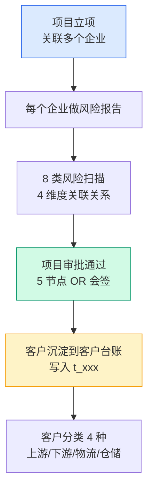
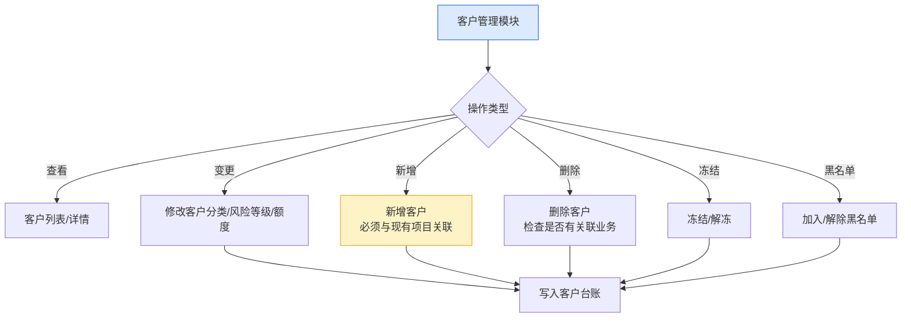
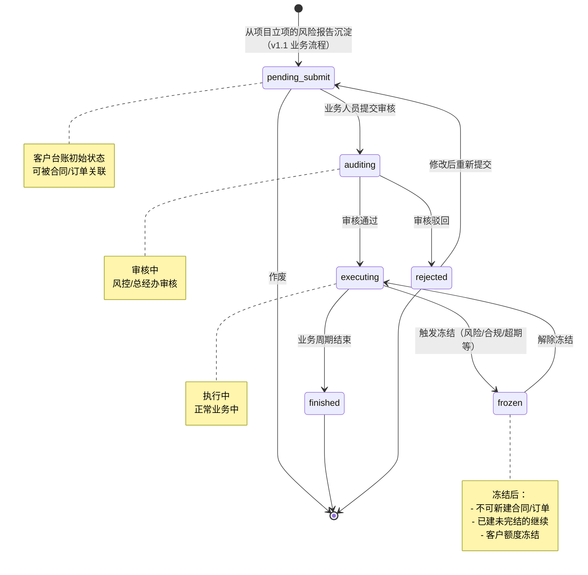
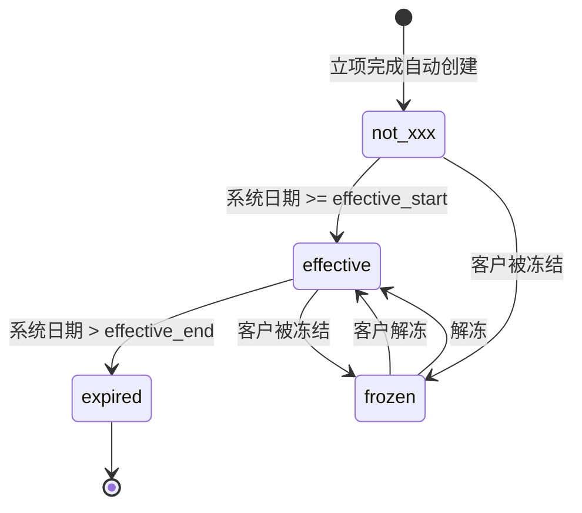
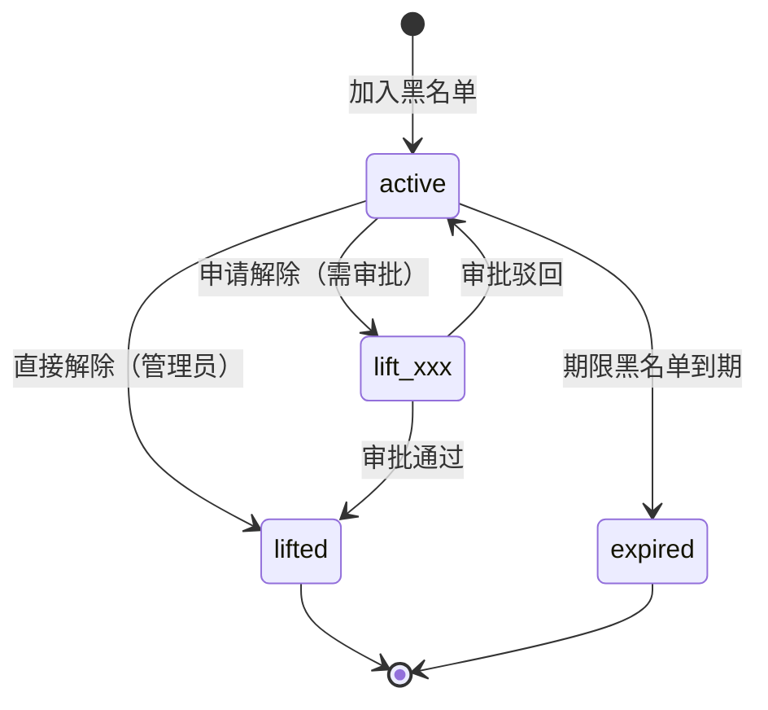
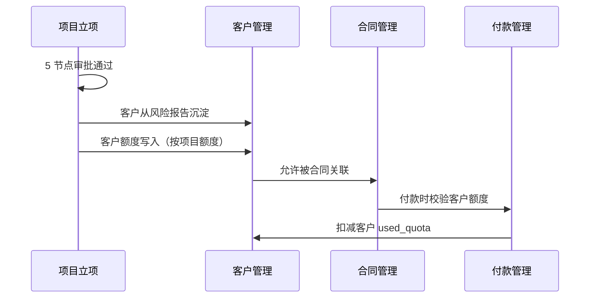

# 02.02 客户管理 v1.1 终版

> **状态**：v1.1 终版（**v1.0 修正版，基于 83 张原型截图调整**）
> **生成时间**：2026-07-24 14:55
> **变更**：
> - 🔴 **客户分类 4 种完全重做**：贸易商/加工厂/物流商/服务商 → **上游企业/下游企业/第三方物流/第三方仓储**
> - 🟡 客户流程状态从 3 个（active/frozen/revoked）→ **6 个**（待提交/审核中/执行中/已完结/驳回）
> - 🟡 新增"审核"按钮（审核中状态）
> - 🟡 列表 2 Tab 切换（基础信息/额度信息）
> - 🟡 客户字段新增：企业简称、所属区域
> **配套文档**：[00-项目总览与对接.md](../00-项目总览与对接.md) / [01-模块拆解大框架.md](../01-模块拆解大框架.md) / [05-复用对比/全量矩阵 v1.2.md](../05-复用对比/全量矩阵%20v1.0.md) / [02.01-项目管理-立项.md](./02.01-项目管理-立项.md) / [02.03-合同管理.md](./02.03-合同管理.md) / [02.04-订单管理.md](./02.04-订单管理.md)
> **复用度**：🟢 **90%（大幅复用）**——主产品 `t_xxx` 60+ 张 + `t_xxx（业务实体）` 大幅复用

---

> **当前页**：`customer-quota.html`
> **文档状态**：基于源模块文档的占位版，精确字段待 review 后按原型图精修

## 0. 章节导航

1. 业务定位
2. 业务流程全景
3. 核心实体（4 张表）
4. 状态机（**v1.1 重大调整**）
5. 角色操作矩阵
6. 字段规则
7. 按钮交互
8. 异常处理
9. 跨模块流转


---

## 1. 业务定位

**客户管理**是港通供应链的**客户档案中心**——客户从项目立项的"风险报告"中沉淀到客户台账，**不走独立审批流程**（与项目立项共用 5 节点审批）。客户管理模块负责客户档案的日常维护：客户分类、风险等级、关联关系、黑名单、额度管理等。

### 1.1 v1.1 关键规则（基于原型 04 截图 + sitemap）

1. **客户管理 = 项目立项的子流程**（客户从风险报告沉淀，不走独立审批）✅ 不变
2. **客户分类 4 种**（**v1.1 重大调整**）：
   - **`upstream`**（上游企业）= 卖方/供应方
   - **`downstream`**（下游企业）= 买方/采购方
   - **`third_party_logistics`**（第三方物流）
   - **`third_party_warehouse`**（第三方仓储）
3. **客户流程状态 6 个**（**v1.1 新增**，跟项目立项一致）：
   - 待提交 / 审核中 / 执行中 / 已完结 / 驳回
4. **客户来源记录**：`source_project_xxx` + `source_due_diligence_id` ✅ 不变
5. **客户额度管理**（多维度）✅ 不变
6. **黑名单管理**（独立子流程）✅ 不变
7. **客户列表 2 Tab 切换**：**基础信息 / 额度信息**（**v1.1 新增**）
8. **顶部 nav 7 个**：工作台/准入管理/数字供应链/智慧仓储/预警中心/数据中心/账户中心

## 2. 业务流程全景

### 2.1 客户从项目立项沉淀



### 2.2 客户管理日常维护



---

## 4. 状态机（**v1.1 重大调整**）

### 4.1 客户台账状态机（**v1.1 从 3 状态改 6 状态**）



**v1.1 关键变化**：
- ❌ 旧版 3 状态：`active` / `frozen` / `revoked`
- ✅ v1.1 6 状态：`pending_submit` / `auditing` / `executing` / `finished` / `rejected` / `frozen`（**跟项目立项一致**）

### 4.2 客户额度状态机（**v1.1 调整 4 状态**）



**v1.1 4 状态**：`not_xxx` / `effective` / `expired` / `frozen`

### 4.3 黑名单状态机（不变）



---

## 5. 角色操作矩阵

### 5.1 客户台账管理（**v1.1 新增「审核」操作**）

| 操作 / 角色 | 业务人员 | 业务部负责人 | 风控部 | 财务部 | 总经办 | 系统 |
|------------|--------|------------|-------|-------|-------|------|
| 查看客户列表/详情 | ✓ | ✓ | ✓ | ✓ | ✓ | - |
| 修改客户分类 | ✓ | ✓ | ✓ | - | - | - |
| 修改风险等级 | - | - | **✓** | - | - | 自动从风险报告 |
| 修改客户额度 | ✓ 建议 | ✓ | **✓** | **✓** | **✓** | - |
| **审核客户档案**（**v1.1 新增**）| - | - | **✓** | - | **✓** | - |
| 冻结/解冻 | 申请 | 申请 | **审批** | 申请 | **审批** | - |
| 取消客户 | - | 申请 | 申请 | 申请 | **审批** | - |
| 新增客户 | **✓**（必须关联项目）| ✓ | - | - | - | - |
| 删除客户 | - | - | - | - | **✓** | 检查关联业务 |
| 加入黑名单 | 申请 | 申请 | **✓** | - | **审批** | - |
| 解除黑名单 | 申请 | 申请 | **✓** | - | **审批** | - |

### 5.2 客户列表 Tab（**v1.1 新增**）

| Tab | 说明 |
|-----|------|
| **基础信息** | 客户分类/企业名称/统一信用代码/联系人/法定代表人 |
| **额度信息** | 项目编号/项目名称/授信额度/已用额度/可用额度/授信有效期/状态 |

### 5.3 客户列表状态 Tab（**v1.1 跟项目对齐 6 Tab**）

| Tab | 对应状态 | 颜色 |
|-----|---------|------|
| 全部 | 所有状态 | - |
| 待提交 | `pending_submit` | 蓝 |
| 审核中 | `auditing` | 黄 |
| 执行中 | `executing` | 绿 |
| 已完结 | `finished` | 灰 |
| 驳回 | `rejected` | 灰 |

### 5.4 客户列表操作按钮（**v1.1 新增「审核」**）

| 状态 | 操作按钮 |
|------|---------|
| 待提交 | 查看 / 编辑 / 作废 |
| 审核中 | 查看 / **审核**（v1.1 新增）|
| 执行中 | 查看 |
| 已完结 | 查看 |
| 驳回 | 查看 |

### 5.5 黑名单（不变）

| 操作 / 角色 | 风控部 | 总经办 | 系统 |
|------------|-------|-------|------|
| 新增黑名单 | **✓** | - | - |
| 批量导入 | **✓** | - | - |
| 申请解除 | **✓** | **审批** | - |
| 直接解除 | **✓**（`lift_xxx=0`）| - | - |

---

## 6. 字段规则

### 6.1 客户分类 `customer_category`（**v1.1 重大调整**）

- **4 类**（**v1.1 完全改**）：
  - `upstream`（上游企业）= 卖方/供应方
  - `downstream`（下游企业）= 买方/采购方
  - `third_party_logistics`（第三方物流）
  - `third_party_warehouse`（第三方仓储）
- 决定客户可作为的角色（**v1.1 自动推导 is_supplier/is_buyer/is_warehouse**）
- 决定客户额度默认值

**v1.1 角色映射**（**v1.1 新增**）：

| 客户分类 | 是否可作为供应商 | 是否可作为采购方 | 是否可作为仓储方 |
|---------|---------------|---------------|---------------|
| **upstream**（上游企业）| ✓ | ❌ | ❌ |
| **downstream**（下游企业）| ❌ | ✓ | ❌ |
| **third_party_logistics** | ❌ | ❌ | ❌（物流，不是仓储）|
| **third_party_warehouse** | ❌ | ❌ | ✓ |

### 6.2 客户名称 `company_name`

- 与营业执照完全一致
- 不可修改（如需修改必须重新立项）

### 6.3 统一社会信用代码 `unified_credit_xxx`

- **全平台唯一**（通过该字段判重）
- 18 位字母+数字
- 脱敏存储：`91XXXXXXMAXXXXXXXX` 格式

### 6.4 客户总额度 `total_quota`（**v1.1 字段简化**）

- 元，保留 2 位小数
- > 0
- 调整权限：业务员可建议，风控+财务可调整，总经办可最终调整

**v1.1 取消客户分类默认值**（**v1.1 重要调整**）：
- ❌ 旧版：贸易商 500 万 / 加工厂 200 万 / 物流商 100 万 / 服务商 100 万
- ✅ v1.1：**由项目额度决定**——立项时设定项目总额度，客户从项目继承，不分客户分类设默认值

### 6.5 客户风险等级 `risk_level`

- **自动从最近一次风险报告继承**
- 等级：`low` / `medium` / `high`
- 触发规则：
  - 0 类高风险 → `low`
  - 1 类高风险 → `medium`
  - 2+ 类高风险 或 3+ 类中风险 → `high`
- 风险等级为 `high` 时，客户状态自动置为 `frozen`

### 6.6 客户来源记录

- `source_project_xxx` + `source_due_diligence_id`
- 客户**必须**有来源（首次创建时必填）
- 后续客户变更不影响来源记录

### 6.7 企业简称 `company_short_xxx`（**v1.1 新增**）

- 用于列表/详情页显示
- 最多 20 个字符
- 可修改

### 6.8 所属区域 `region`（**v1.1 新增**）

- 选择项：境内/境外/港澳台
- 决定后续合同/订单的币种默认值

### 6.9 黑名单分级影响

| 分级 | 业务影响 |
|------|---------|
| 永久黑名单 | 永久禁止任何合作 |
| 期限黑名单 | 期限内禁止合作 |
| 观察名单 | 需风控部审批每笔业务 |
| 行业黑名单 | 特定行业禁止合作 |

---

## 7. 按钮交互

### 7.1 客户台账列表页（**v1.1 调整**）

| 按钮 | 位置 | 可见条件 | 点击行为 |
|------|------|---------|---------|
| 新增客户 | 右上 | 业务人员 | 弹新增框（**必须关联项目**）|
| 搜索/筛选 | 顶部 | 所有 | 弹筛选抽屉 |
| 导出 | 右上 | 所有 | 导出 Excel |
| 查看 | 列表行 | 所有 | 跳详情页（仅查看）|
| 编辑 | 列表行 | 状态=待提交 | 跳详情页（编辑）|
| **审核**（**v1.1 新增**）| 列表行 | 状态=审核中 | 弹审核框（风控+总经办）|
| 作废 | 列表行 | 状态=待提交 | 弹确认框 |
| **基础信息/额度信息 Tab 切换**（**v1.1 新增**）| 列表上方 | 所有 | 切换列表内容 |

### 7.2 客户台账详情页

> **memory 原则**：详情页**不**加业务变更按钮，只允许**跳关联单据/复制/附件下载**。

| 按钮 | 位置 | 可见条件 | 点击行为 |
|------|------|---------|---------|
| 编辑 | 顶部 | 状态=待提交 | 跳编辑页 |
| 跳关联项目 | 顶部 | 有关联项目 | 跳项目详情 |
| 跳关联合同 | 顶部 | 有关联合同 | 跳合同列表 |
| 跳风险报告 | 顶部 | 有风险报告 | 跳风险报告详情 |
| 下载附件 | 附件区 | 有附件 | 下载 |
| 变更历史 | 顶部 | 所有 | 弹变更日志 |

### 7.3 黑名单页（不变）

| 按钮 | 位置 | 可见条件 | 点击行为 |
|------|------|---------|---------|
| 新增黑名单 | 右上 | 风控 | 弹新增框 |
| 批量导入 | 右上 | 风控 | 弹导入框 |
| 申请解除 | 详情页 | 风控 | 弹申请框，走多级审批 |
| 直接解除 | 详情页 | 管理员（`lift_xxx=0`）| 弹确认框 |

---

## 8. 异常处理

### 8.1 客户管理异常

| 异常场景 | 提示文案 | 处理动作 |
|---------|---------|---------|
| 新增客户已存在 | "客户 XXX 已存在（统一信用代码 YYY）" | 阻止 |
| 新增客户无项目关联 | "新增客户必须与现有项目关联" | 强制阻止 |
| **客户分类与角色冲突**（**v1.1 调整**）| "上游企业不能作为采购方" | 红色提示 |
| 客户被冻结，新建合同 | "客户 XXX 已被冻结，不能新建合同" | 阻止 |
| 客户命中黑名单 | "客户 XXX 命中黑名单（合作黑名单），禁止任何业务" | 强制阻止 |
| 客户额度不足 | "客户可用额度不足（可用 X 元，需 Y 元）" | 阻止付款 |

### 8.2 客户变更异常（不变）

| 异常场景 | 提示文案 | 处理动作 |
|---------|---------|---------|
| 删除客户有关联业务 | "客户 XXX 有关联合同/订单未完结，不能删除" | 阻止 |
| 修改客户分类影响下游 | "客户分类修改会影响下游业务，是否继续？" | 黄色警示 |
| 客户额度调整生效 | "新额度已生效，将影响后续业务" | 通知 |

### 8.3 数据流转异常

| 异常场景 | 提示文案 | 处理动作 |
|---------|---------|---------|
| 客户从风险报告沉淀失败 | "客户沉淀失败，请联系管理员" | 阻止项目准入完成 |
| 客户风险等级过期 | "客户风险等级已过期（30 天），请重新扫描" | 黄灯提醒 |
| 客户额度被其他模块占用 | "客户额度被合同 XXX 占用，暂不能调整" | 阻止 |

---

## 9. 跨模块流转

### 9.1 上游触发

| 触发模块 | 触发条件 | 触发动作 |
|---------|---------|---------|
| 项目管理-立项（02.01）| 项目 `active` | **客户从风险报告沉淀** |

### 9.2 下游触发

| 触发模块 | 触发条件 | 触发动作 |
|---------|---------|---------|
| 合同管理（02.03）| 客户 `executing` | 允许合同关联 |
| 订单管理（02.04）| 客户 `executing` | 允许订单关联 |
| 收发货（02.05）| 客户 `executing` | 允许收/发货关联 |
| 付款（02.08.1）| 客户 `executing` | 允许付款关联 |
| 回款（02.08.2）| 客户 `executing` | 允许回款关联 |
| 发票（02.09）| 客户 `executing` | 允许开票关联 |
| 预警管理（02.11）| 客户风险/黑名单/超期 | 触发预警信号 |

### 9.3 字段影响其他模块（**v1.1 调整**）

| 港通字段 | 影响模块 | 影响方式 |
|---------|---------|---------|
| `customer_category` | 合同/订单/付款 | 决定业务规则 + **自动推导 is_supplier/buyer/warehouse** |
| `total_quota` | 敞口/额度/付款 | **由项目额度决定，不再按客户分类** |
| `risk_level` | 预警/合规 | 触发不同等级风险预警 |
| `unified_credit_xxx` | 合同/发票 | 关联所有外部数据 |
| 黑名单命中 | 合同/付款/收发货 | 强制阻止关联业务 |

### 9.4 跨模块状态机联动



---

## 11. v1.1 变更摘要

| 变更点 | v1.0 | v1.1 |
|------|------|------|
| **客户分类 4 种** | 贸易商/加工厂/物流商/服务商 | **上游企业/下游企业/第三方物流/第三方仓储** |
| **客户分类逻辑** | 按业务类型 | **按业务角色** |
| **客户流程状态** | 3 个（active/frozen/revoked）| **6 个**（pending_submit/auditing/executing/finished/rejected/frozen）|
| **客户额度状态** | 3 个（active/frozen/expired）| **4 个**（not_xxx/effective/expired/frozen）|
| **客户额度默认值** | 4 类（500/200/100/100 万）| **由项目额度决定** |
| **新字段** | - | `company_short_xxx` / `region` |
| **新按钮** | - | 「审核」按钮（审核中状态）|
| **新 Tab** | - | 「基础信息/额度信息」切换 |
| **`is_supplier/buyer/warehouse`** | 手动设置 | **由 customer_category 自动推导** |

---

## 12. 文档版本

- **v1.0（2026-07-24）**：基于 5 张截图 + 建设方案 V2 推测的初版
- **v1.1（2026-07-24）**：基于 83 张原型截图（7-24 最新版）修正
  - 🔴 客户分类 4 种完全重做
  - 🟡 客户流程状态从 3 改 6
  - 🟡 新增审核按钮
  - 🟡 列表 Tab 切换
  - 🟡 新增 2 字段
  - 🟡 客户额度默认值取消
- - **v1.7.99.x（2026-07-28）**：基于 30+ 版本迭代同步
  - 🟡 列表页占位 = "全部"（全站统一）
  - 🟡 状态 tag 颜色编码
  - 🟡 流程图统一用 Mermaid
  - 详见：[v1.7.99-changelog.md](./v1.7.99-changelog.md)
- **v1.7.99.65（2026-07-30 准入管理 4 列表页重制）**：
  - 🔴 **4 额度状态机**：正常/预警/已用尽/冻结
  - 🔴 **4 状态 badge 颜色**：
    - 正常：`tag-green` 绿底
    - 预警：`tag-yellow` 黄底
    - 已用尽：`tag-red` 红底
    - 冻结：`tag-gray` 灰底
  - 🔴 **操作按钮按状态动态切换**：
    - 正常：查看/调整/冻结（3 个，冻结用红色 var(--color-danger)）
    - 预警：查看/调整（2 个）
    - 已用尽：查看/调整（2 个）
    - 冻结：查看/解冻（2 个，解冻用蓝色 var(--color-primary)）
  - 🔴 **进度条按状态变色**（v1.7.99.65）：pct >= 100 红色 / pct >= 85 橙色 / 其他绿色
  - 🔴 **可用额度按状态变色**（v1.7.99.65）：<=0 红色 / 85%+ 橙色 / 其他绿色
  - 🟡 **8 行真实数据**：菏泽德坤/河南双汇/中外运/山东金粮/郑州铁龙/国电投/重庆基创/中远海运
  - 🟡 **【小修】分页器文字**（v1.7.99.65）："共 5 条记录" 改为 "共 8 条记录"（与 mock 数据一致）
  - 🟡 **JS 渲染表格 + 状态机切换**：tbody id + renderQuotaTable() + QUOTA_STATUS_META + 状态切换（冻结/解冻/调整）后改 q.status 再 renderQuotaTable()
  - 部署 hash：fc7b0d96
  - 在线：https://fc7b0d96.yugangtong-prototype.pages.dev/
修改记录：见 `06-修改记录.md`

---

## 14. v1.7.99.349.x 增量节（与 HTML 同步）

> 当前 `customer-quota.html` 仍为早期版本（v1.1 终版），与 `customer-list.html` / `customer-detail.html` 字段对齐。

### 14.1 现状说明

- **HTML 状态**：`pages/customer-quota.html`（187 行）—— 仅 1 个客户「河南军牧原国际贸易有限公司」的额度详情页（mock 演示）
- **PRD 状态**：`docs/p-customer-quota.md`（477 行）—— v1.1 终版，含完整字段说明
- **差异**：HTML 仅 mock 1 行；PRD 描述了完整的多客户列表 + 额度调整流程。**这是 mock 不完整，PRD 完整的状态**——文档可用，HTML 需补充

### 14.2 v1.7.99.86 关键决策：客户额度默认值取消

> **决策**：客户台账总授信额度的默认值**从 4 类固定值（500/200/100/100 万）改为"由项目额度决定"**——单一立项项目对应多个客户时，每个客户取该项目的总授信额度；客户可以属于多个项目时，按关联项目数加权平均。

**额度计算公式**（v1.7.99.86 锁定）：

```
客户总额度 = SUM(项目 i 的总授信额度 × 该客户在项目 i 的参与权重) / SUM(权重)
```

其中权重与客户在项目的角色（上游/下游/物流/仓储）相关。

### 14.3 客户额度状态机（**v1.1 调整 4 状态**）

| 状态 | 说明 |
|---|---|
| `not_activated` | 未启用（新创建客户初始态） |
| `effective` | 生效中（关联到至少 1 个已生效项目后自动启用） |
| `expired` | 已过期（项目周期结束 + 30 天后） |
| `frozen` | 已冻结（被风控部门冻结） |

> v1.1 从 v1.0 的 3 状态（active/frozen/expired）升级为 4 状态（新增 `not_activated`）。

### 14.4 字段对应关系（HTML 实际 - 待补全）

当前 HTML 仅 mock 1 行，实际需要补的表格列：

| 列 | 字段 | 数据源 | 演示 mock |
|---|---|---|---|
| 1 | 客户编号 | t_company.code | KE-2026-0722-001 |
| 2 | 客户名称 | t_company.name | 河南军牧原国际贸易有限公司 |
| 3 | 客户额度 | t_company.total_quota | ¥ 50,000,000 |
| 4 | 已用额度 | t_company.used_quota | ¥ 18,500,000 |
| 5 | 可用额度 | 计算：总额度 - 已用 | ¥ 31,500,000 |
| 6 | 关联项目数 | COUNT(source_project_xxx) | 3 |
| 7 | 额度状态 | t_company_quota.status | effective |
| 8 | 生效时间 | t_company_quota.effective_at | 2026-04-15 |
| 9 | 到期时间 | t_company_quota.expire_at | 2027-04-15 |
| 10 | 操作 | — | 调整额度 / 冻结 / 解冻 / 查看明细 |

### 14.5 调整额度按钮（详情页不允许业务变更）

> **v1.7.99.130 锁定**：详情页**不**加业务变更按钮（创建/调整/解除/导出明细），只允许跳关联单据/复制/附件下载。
> 此规则同样适用于本"客户额度"页——尽管是独立页，但其性质是**额度详情**，按钮仅为「跳关联项目 / 复制额度编号 / 下载对账单」。

### 14.6 异常处理

| 异常 | 表现 | 处理 |
|---|---|---|
| 额度计算异常 | 项目额度为 0 / 客户权重异常 | 默认按总额度的 50% 计算，提示「额度计算异常，请检查关联项目配置」 |
| 客户额度冻结 | 客户处于冻结态 | 红 banner「该客户额度已冻结，无法进行额度调整」 |
| 重复关联项目 | 同一项目多次关联 | 去重处理 + 提示 |
