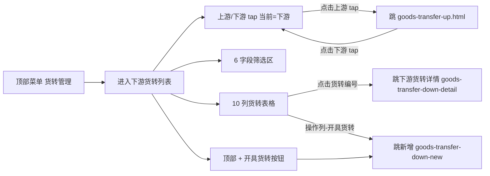

# 02.07.99.99 下游货转列表 v1.7.99.57 终版

> **状态**：v1.7.99.57 终版（**v1.0 基础上 + v1.7.99.57 上游/下游切换 tap**）
> **生成时间**：2026-09-24 17:00
> **配套文档**：[00-项目总览与对接.md](../00-项目总览与对接.md) / [01-模块拆解大框架.md](../01-模块拆解大框架.md) / [p-goods-transfer.md](./p-goods-transfer.md) / [p-goods-transfer-up.md](./p-goods-transfer-up.md) / [p-goods-transfer-down-new.md](./p-goods-transfer-down-new.md) / [p-goods-transfer-down-detail.md](./p-goods-transfer-down-detail.md) / [02.07-货转管理.md](./02.07-货转管理.md)
> **需求来源**：本仓库 v1.7.99.57 改造 + 飞书《豫港通用户使用手册（内部版）》第 5.4 节"货转管理"
> **复用度**：🟡 60%（与上游货转列表对称结构 + v1.7.99.57 切换 tap）

---

> **当前页**：`goods-transfer-down.html`（下游货转列表 — **含上游/下游切换 tap**）
> **关联页**：`goods-transfer-up.html`（上游货转列表）/ `goods-transfer-down-new.html`（新增下游货转）/ `goods-transfer-down-detail.html`（下游货转详情）

## 0. 章节导航

1. 业务定位
2. 业务流程全景
3. 字段规则
4. 按钮交互
5. 异常处理
6. 跨模块流转
7. 文档版本

---

## 1. 业务定位

**下游货转列表**是货转管理（02.07）的**下游方向列表页**——业务人员查看/筛选/管理所有**向下游客户**的货转记录。

| 维度 | 下游货转（本页）| 上游货转（goods-transfer-up）|
|------|------------------|-------------------------------|
| 货转方向 | **向下游客户**转货 | **向上游供应商**转货 |
| 业务场景 | 下游新客户需要原合同货物 | 原采购方不再需要货物，转给上游 |
| 库存影响 | 库存 + 出库 - 入库 | 库存 - 出库 + 入库 |

### 1.1 入口

| 入口 | URL | 说明 |
|------|------|------|
| 顶部菜单"数字供应链·业务" → 货转管理 → **下游货转** | `./goods-transfer-down.html` | 主入口（默认显示下游货转 tap）|
| `goods-transfer-up.html` 切换 tap → 下游货转 | 同上 | tap 切换 |

### 1.2 v1.7.99.57 关键改动

- **上游/下游 tap 切换**：v1.7.99.57 把上游货转和下游货转合并到**同一个列表页**用 tap 切换
- 默认 tap：**"上游货转" → 已开具" → 下游货转"**（v1.7.99.57 关键决策）—— 业务人员打开默认看下游货转
- 与 `goods-transfer-up.html` 形成 **2 个列表页**结构（不是 1 个页面带 tap，是 2 个页面有 tap 互跳）

---

## 2. 业务流程全景



---

## 3. 字段规则

### 3.1 顶部按钮

| 按钮 | 行为 |
|------|------|
| **+ 开具货转** | 跳 `goods-transfer-down-new.html`（新增下游货转）|
| **数据导出** | 导出当前筛选条件到 Excel（mock）|

### 3.2 上游/下游 tap 切换（v1.7.99.57）

| Tap | 跳转目标 |
|-----|----------|
| **上游货转**（默认隐藏，v1.7.99.57 关键）| `goods-transfer-up.html` |
| **下游货转**（当前页面）| 本页 |

### 3.3 6 字段筛选区

| 字段 | 类型 | 校验 |
|------|------|------|
| 编号（订单/合同）| input | 模糊匹配 |
| 货转编号 | input | 模糊匹配 |
| 买方企业 | input | 模糊匹配 |
| 卖方企业 | input | 模糊匹配 |
| 货转开具日期 | date-range | 起止日期 |
| 状态 | select | 全部/待发起/待审核/审核通过/审核驳回/已货转/已作废 |

### 3.4 10 列货转表格

| # | 列 | 字段 | 宽度 | 说明 |
|---|----|------|------|------|
| 1 | 合同编号 | input | 130px | 蓝字链接 → 合同详情 |
| 2 | 货转编号 | input | 200px | 蓝字链接 → 下游货转详情 |
| 3 | 买方企业 | input | 180px | 下游接收方 |
| 4 | 卖方企业 | input | 160px | 原采购方 |
| 5 | 收货人 | input | 160px | 下游收货人 |
| 6 | 货转开具日 | date | 140px | yyyy-MM-dd |
| 7 | 货转数量（吨）| input | 110px | 右对齐 |
| 8 | 发运方式 | select | 130px | 汽运/铁运/船运等 |
| 9 | 状态 | tag | 90px | 6 状态机 |
| 10 | 操作 | button | 130px | 查看 / 开具货转 |

---

## 4. 按钮交互

### 4.1 主操作按钮

| 按钮 | 位置 | 行为 |
|------|------|------|
| **+ 开具货转** | 顶部 | 跳 `goods-transfer-down-new.html` |
| **数据导出** | 顶部右侧 | 导出当前筛选 |

### 4.2 操作列按钮

| 按钮 | 行为 |
|------|------|
| 查看 | 跳 `goods-transfer-down-detail.html?gtNo={货转编号}` |
| 开具货转 | 跳 `goods-transfer-down-new.html?contractNo={原合同编号}`（预填）|

### 4.3 Tap 切换交互

```javascript
// v1.7.99.57 关键：tap 切换通过 window.location.href 跳转（不是单页面 tap）
// 上游 tap: onclick="window.location.href='./goods-transfer-up.html'"
// 下游 tap: 当前页面
```

---

## 5. 异常处理

| 场景 | 处理 |
|------|------|
| 筛选后无数据 | 空状态"暂无符合条件的下游货转" |
| 货转编号不存在 | 详情页顶部红色 bar 提示"该货转不存在" |
| 货转已作废 | 顶部橙色 bar 提示"该货转已作废" |
| 并发操作 | 二次校验被覆盖则提示"已被其他操作覆盖，请刷新" |

---

## 6. 跨模块流转

### 6.1 与上游货转列表（goods-transfer-up）

- 通过 tap 切换跳转（同结构对称）
- v1.7.99.57 关键决策：2 个独立页面 + tap 跳转（不是单页面 tap）

### 6.2 与业务线（02.06）

- 货转完成 → 该业务线"账面库存"重算（v1.7.99.176 关键）
- 货转上：库存 -X / 货转下：库存 +X

### 6.3 与合同（02.03）

- 货转编号链接 → 跳下游货转详情
- 货转完成 → 原合同"已货转数量"更新

### 6.4 与上游货转新建（goods-transfer-up-new）

- 操作列"开具货转"按钮（仅用于特殊业务场景）

---

## 7. 文档版本

- **v1.0（2026-07-24）**：货转管理 v1.0 终版
- **v1.7.99.57（2026-07-29）**：**上游/下游 tap 切换**（v1.7.99.57 关键决策：默认下游货转）
- **v1.7.99.176（2026-08-12）**：货转类型明确（货转上 / 货转下）+ 6 状态机
- **2026-09-24**：首次写 PRD（基于手册 5.4 + v1.7.99.57/176 沉淀）

修改记录：见 `v1.7.99-changelog.md`