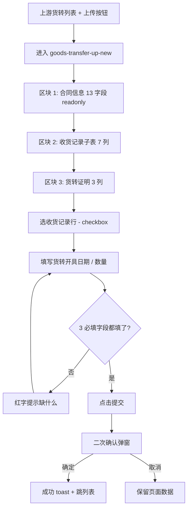

# 02.07.99.98 上传上游货转 - 填写货转信息 v1.7.99.61 终版

> **状态**：v1.7.99.61 终版（**v1.0 基础上 + v1.7.99.61 1:1 重制 user 截图**）
> **生成时间**：2026-09-24 17:10
> **配套文档**：[00-项目总览与对接.md](../00-项目总览与对接.md) / [01-模块拆解大框架.md](../01-模块拆解大框架.md) / [p-goods-transfer-up.md](./p-goods-transfer-up.md) / [p-goods-transfer-up-detail.md](./p-goods-transfer-up-detail.md) / [02.07-货转管理.md](./02.07-货转管理.md)
> **需求来源**：本仓库 v1.7.99.61 重制 + 飞书《豫港通用户使用手册（内部版）》第 5.4 节"货转管理"
> **复用度**：🟡 60%（与下游货转新建部分对称 + v1.7.99.61 货转证明区块）

---

> **当前页**：`goods-transfer-up-new.html`（上传上游货转 - 填写货转信息）
> **关联页**：`goods-transfer-up.html`（上游货转列表）/ `goods-transfer-up-detail.html`（上游货转详情）/ `goods-transfer-down-new.html`（下游货转新建 — 对称结构）

## 0. 章节导航

1. 业务定位
2. 业务流程全景
3. 字段规则
4. 按钮交互
5. 异常处理
6. 跨模块流转
7. 文档版本

---

## 1. 业务定位

**上传上游货转**（页面标题"上传上游货转 - 填写货转信息"）是货转管理（02.07）的**上游方向新建页**——业务人员（核心企业）发起**向上游供应商**的货转登记。

| 维度 | 上游货转新建（本页）| 下游货转新建（goods-transfer-down-new）|
|------|---------------------|---------------------------------------|
| 货转方向 | **向上游供应商**转货 | **向下游客户**转货 |
| 库存影响 | 库存 - 出库 + 入库（向上游）| 库存 + 出库 - 入库（向下游）|
| 业务流程 | 核心企业 → 上游供应商 | 核心企业 → 下游客户 |

### 1.1 入口

| 入口 | URL | 说明 |
|------|------|------|
| 上游货转列表 + 上传按钮 | `./goods-transfer-up-new.html` | 主入口 |
| 上游货转列表操作列"上传货转" | `./goods-transfer-up-new.html?contractNo={原合同编号}` | 预填合同 |

### 1.2 v1.7.99.61 关键改动

- 从 v1.0 单区块重构为 **v1.7.99.61 1:1 重制 user 截图**：
  - 区块 1：合同信息（13 字段 readonly）
  - 区块 2：收货记录子表（7 列，含收货编号/发货批次/品名/收货数量/收货日期/车数）
  - 区块 3：货转证明（v1.7.99.61 按图 1：3 列，含 3 必填字段）

---

## 2. 业务流程全景

---

## 3. 字段规则

### 3.1 区块 1：合同信息（v1.7.99.61 13 字段 readonly）

| # | 字段 |
|---|------|
| 1 | 合同编号 |
| 2 | 合同单价 |
| 3 | 合同数量 |
| 4 | 合同总价 |
| 5 | 签订日期 |
| 6 | 合同有效期 |
| 7 | 合同类型 |
| 8 | 合同签章状态 |
| 9 | 运输方式 |
| 10 | 发货地址 |
| 11 | 收货人名称 |
| 12 | 业务类型 |
| 13 | 收货地址 |

### 3.2 区块 2：收货记录子表（v1.7.99.61 7 列）

| # | 列 | 字段 | 宽度 |
|---|----|------|------|
| 1 | checkbox | 选中 | 40px |
| 2 | 收货编号 | input | - |
| 3 | 关联发货批次 | input | - |
| 4 | 品名 | input | - |
| 5 | 收货数量 | number | 右对齐 |
| 6 | 收货日期 | date | - |
| 7 | 车数 | number | 右对齐 |

### 3.3 区块 3：货转证明（v1.7.99.61 按图 1：3 列）

| # | 字段 | 类型 | 必填 | 校验 |
|---|------|------|------|------|
| 1 | **货转开具日期** | date | 是 | 必填；不能早于收货日期 |
| 2 | **货转开具数量（吨）** | number input | 是 | 必填；不能大于选中收货记录合计；min=0, step=0.01 |
| 3 | 签署状态 | select | 否 | 默认"已签发"；可选"待签发" |

**v1.7.99.61 简化校验**：3 必填字段（货转开具日期、数量、收货记录至少选 1）。

---

## 4. 按钮交互

### 4.1 主操作按钮

| 按钮 | 位置 | 行为 |
|------|------|------|
| **提交** | 底部 | 二次确认 → 写入上游货转 |
| **取消** | 底部 | 返回上游货转列表 |

### 4.2 辅助按钮

| 按钮 | 位置 | 行为 |
|------|------|------|
| 全选 / 反选 | 区块 2 表头 | 选中/取消所有收货记录 |
| 单行选择 | 区块 2 表行 checkbox | 选中/取消该行 |

### 4.3 二次确认弹窗

- **提交确认弹窗**：
  - 标题：提交确认
  - 内容：确认提交本次上游货转登记？提交后系统将生成上游货转编号
  - 按钮：取消 / 确定
  - 成功后 toast："上游货转登记成功"

---

## 5. 异常处理

| 场景 | 处理 |
|------|------|
| URL 参数 `contractNo` 缺失 | 顶部红色 bar + 返回上游货转列表 |
| 合同已作废 | 顶部红色 bar 提示"该合同已作废，无法发起货转" |
| 货转开具日期 < 收货日期 | 红字提示"货转开具日期不能早于收货日期" |
| 货转开具数量 > 选中收货记录合计 | 红字提示"货转数量不能大于选中收货记录合计" |
| 未选任何收货记录 | 禁用提交按钮 + 红字提示"请至少选择 1 条收货记录" |
| 货转开具数量 ≤ 0 | 红字提示"货转数量必须大于 0" |
| 同一合同并发货转 | 二次校验被覆盖则提示"已被其他货转覆盖，请刷新" |

---

## 6. 跨模块流转

### 6.1 与上游货转列表（goods-transfer-up）

- 提交成功 → 跳上游货转列表
- 列表刷新该货转记录

### 6.2 与业务线（02.06）

- 上游货转完成 → 该业务线"账面库存" -= 货转数量（v1.7.99.176 关键）
- 业务线台账的"货转"tab 自动同步

### 6.3 与合同（02.03）

- 上游货转完成 → 原合同"已货转数量" += 货转数量
- 原合同状态可能变为"已货转"或保持"执行中"

### 6.4 与下游货转新建（goods-transfer-down-new）

- 与下游对称结构（区块 1/2/3 + 3 必填字段）
- 区别：上游货转涉及"上游供应商"，下游货转涉及"下游客户"

---

## 7. 文档版本

- **v1.0（2026-07-24）**：货转管理 v1.0 终版
- **v1.7.99.61（2026-07-29）**：**1:1 重制 user 截图** + 3 区块（合同信息 / 收货记录 / 货转证明）
- **v1.7.99.176（2026-08-12）**：货转类型明确（货转上 / 货转下）+ 6 状态机 + 库存联动
- **2026-09-24**：首次写 PRD（基于手册 5.4 + v1.7.99.61/176 沉淀）

修改记录：见 `v1.7.99-changelog.md`