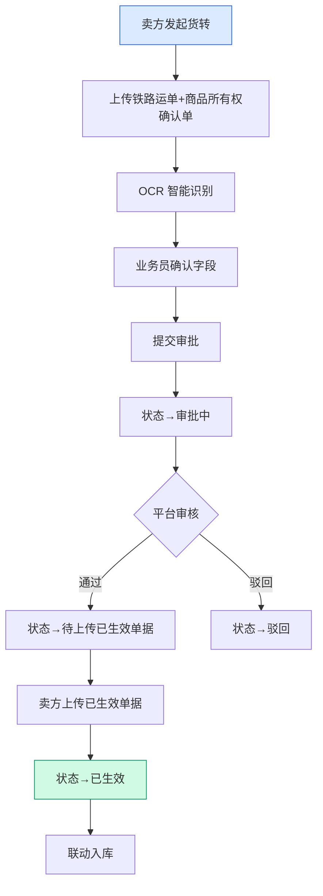
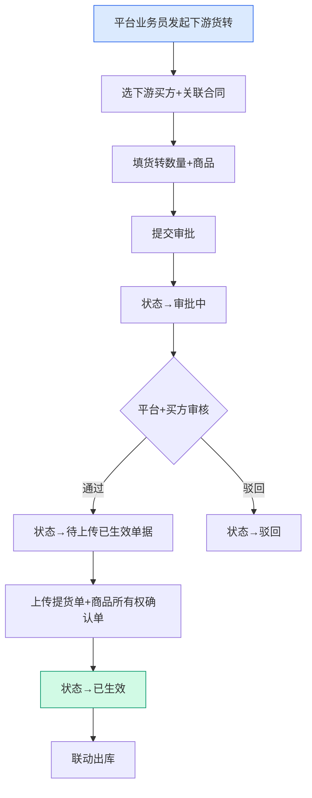
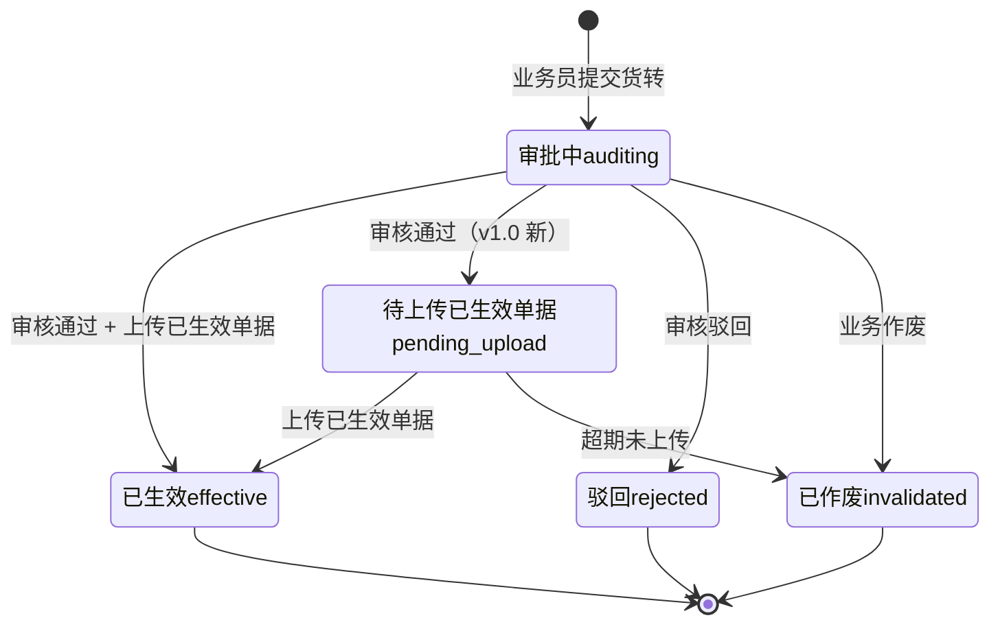

# 02.07 货转管理 v1.0 终版

> **状态**：v1.0 终版（**新模块，基于原型 32-36 截图**）
> **生成时间**：2026-07-24 14:55
> **配套文档**：[00-项目总览与对接.md](../00-项目总览与对接.md) / [01-模块拆解大框架.md](../01-模块拆解大框架.md) / [02.03-合同管理.md](./02.03-合同管理.md) / [02.04-订单管理.md](./02.04-订单管理.md)
> **复用度**：🟢 **80%（大幅复用）**——主产品 （业务实体）+ `t_xxx（业务实体）` 字段扩展

---

> **当前页**：`goods-transfer-up.html`
> **文档状态**：基于源模块文档的占位版，精确字段待 review 后按原型图精修

## 0. 章节导航

1. 业务定位
2. 业务流程全景
3. 核心实体（3 张表）
4. 6 状态机
5. 角色操作矩阵
6. 字段规则
7. 按钮交互
8. 异常处理
9. 跨模块流转

---

## 1. 业务定位

**货转管理**是港通供应链的**货权转移登记中心**（**v1.0 新顶级模块**）——货权在不同主体间的转移登记，包括**上游货转**（卖方→平台）和**下游货转**（平台→买方）两类。

**港通特色模块**——对接铁路运单 + 商品所有权确认单（中欧班列运输场景）。

### 1.1 关键规则

1. **2 个 Tab**（基于 32 截图）：**上游货转** / **下游货转**（同一个顶级模块下的 2 个子页）
2. **货转编号格式**：`SKBT{YYYYMMDD}{6位}-{YYYYMMDD}{4位}`，例 `SKBT202507240002-20260109004`
3. **6 状态**：全部/审批中/待上传已生效单据/已生效/驳回/已作废
4. **货权凭证**：上游货转 = 铁路运单 + 商品所有权确认单；下游货转 = 提货单 + 商品所有权确认单
5. **OCR 智能识别**（**港通特色**）：扫描凭证后自动识别关键字段

### 1.2 5 个页面（sitemap）

| # | 页面 | 说明 |
|---|------|------|
| 1 | **货转管理**（列表，含 2 Tab：上游/下游）| 6 状态 Tab + 搜索筛选 |
| 2 | **上传上游货转** | 上游货转新建（卖方→平台）|
| 3 | **已上传上游货转详情** | 上游货转详情 |
| 4 | **新增下游货转** | 下游货转新建（平台→买方）|
| 5 | **下游货转详情** | 下游货转详情 |

---

## 2. 业务流程全景

### 2.1 上游货转流程（卖方→平台）

### 2.2 下游货转流程（平台→买方）

---

## 4. 6 状态机

### 4.1 6 状态说明（基于 32 截图）

| # | 状态 | 中文 | 触发 | 出口 |
|---|------|------|------|------|
| 1 | `auditing` | 审批中 | 业务员提交 | 审核通过 / 驳回 / 作废 |
| 2 | `pending_upload` | 待上传已生效单据 | 审核通过 | 上传已生效单据 / 超期作废 |
| 3 | `effective` | 已生效 | 上传已生效单据 | 终态 |
| 4 | `rejected` | 驳回 | 审核驳回 | 终态 |
| 5 | `invalidated` | 已作废 | 业务作废 / 超期未上传 | 终态 |
| 6 | `all` | 全部 | 列表 Tab | - |

---

## 5. 角色操作矩阵

| 操作 / 角色 | 业务员 | 业务部 | 风控部 | 财务部 | 总经办 | 系统 |
|------------|------|------|------|------|------|------|
| 上传上游货转 | **✓** | - | - | - | - | - |
| 新增下游货转 | **✓** | 申请 | - | - | - | - |
| 审核货转 | - | **✓** | **✓** | - | - | - |
| 上传已生效单据 | **✓** | - | - | - | - | - |
| 查看/作废/下载 | ✓ | ✓ | ✓ | - | - | - |
| OCR 智能识别 | 自动 | - | - | - | - | ✓ |

---

## 6. 字段规则

### 6.1 货转编号 `transfer_no`

- **格式**：`SKBT{YYYYMMDD}{6位}-{YYYYMMDD}{4位}`，例 `SKBT202507240002-20260109004`
- **v1.0 标 [P0 待确认-字段]**：参考 32 截图的 SKBT 前缀

### 6.2 货转类型 `transfer_type`

- 2 种：`upstream`（上游货转，卖方→平台）/ `downstream`（下游货转，平台→买方）

### 6.3 货权凭证（**v1.0 港通特色**）

| 货转类型 | 必传凭证 |
|---------|---------|
| 上游货转 | 铁路运单（railway_waybill）+ 商品所有权确认单（ownership_cert）|
| 下游货转 | 提货单（pickup_order）+ 商品所有权确认单（ownership_cert）|
| 已生效 | 已生效单据（signed_doc）|

### 6.4 OCR 智能识别（**港通特色**）

- **触发**：上传铁路运单 / 商品所有权确认单 / 提货单时
- **识别字段**：
  - 铁路运单：运单号/发货人/收货人/品名/数量/发站/到站/日期
  - 商品所有权确认单：单号/所有权人/受让人/品名/数量/转移日期
  - 提货单：单号/提货人/品名/数量/提货日期
- **结果**：自动填充到表单字段，业务员确认/调整

---

## 7. 按钮交互

### 7.1 列表页（基于 32 截图）

| 按钮 | 位置 | 可见条件 | 点击行为 |
|------|------|---------|---------|
| **+ 开具货转**（v1.0）| 右上 | 业务员 | 弹货转类型选择（上游/下游）|
| 批量下载 | Tab 右侧 | 所有 | 批量下载货转凭证 |
| 数据导出 | Tab 右侧 | 所有 | 导出 Excel |
| **查看** | 列表行 | 所有 | 跳详情页 |
| **作废** | 列表行 | 状态≠已生效/已作废 | 弹作废确认框 |
| **下载** | 列表行 | 有附件 | 下载货转凭证 |

### 7.2 列表字段（基于 32 截图）

| 列 | 说明 |
|---|------|
| 合同编号 | `QY-LG-20250317-063` / `NMGZHCG202505015001` / `燃料公司-2025-燃煤-0162` |
| 货转编号 | `SKBT{YYYYMMDD}{6位}-{YYYYMMDD}{4位}` |
| 卖方企业 | 卖方名称 |
| 收货人 | 收货人姓名 |
| 货转开具日 | 货转日期 |
| 操作 | 查看 / 作废 / 下载 |

### 7.3 7 搜索条件（基于 32 截图右侧便签）

1. **编号**：订单/合同/货转编号
2. **货转编号**：货转编号（v1.0）
3. **卖方企业**：卖方名称
4. **货转开具日期**：日期范围（开始时间 ~ 结束时间）
5. **状态**：下拉选择（6 状态之一）

---

## 8. 异常处理

| 异常场景 | 提示文案 | 处理动作 |
|---------|---------|---------|
| 上游货转无铁路运单 | "上游货转必须上传铁路运单" | 阻止 |
| 下游货转无提货单 | "下游货转必须上传提货单" | 阻止 |
| OCR 识别失败 | "OCR 识别失败，请手动填写" | 允许手动 |
| 货转数量 > 合同数量 | "货转数量 X 超过合同剩余数量 Y" | 阻止 |
| 超期未上传已生效单据 | "货转 X 已超 30 天未上传已生效单据，已自动作废" | 自动作废 |
| 已生效货转作废 | "已生效货转不能作废，请走解除流程" | 阻止 |

---

## 9. 跨模块流转

### 9.1 上游触发

| 触发模块 | 触发条件 | 触发动作 |
|---------|---------|---------|
| 合同管理（02.03）| 合同 `executing` | 允许货转关联 |
| 收发货（02.05）| 收/发货完成 | 货转关联 |

### 9.2 下游触发

| 触发模块 | 触发条件 | 触发动作 |
|---------|---------|---------|
| 仓储-入库（02.12）| 上游货转生效 | 联动入库登记 |
| 仓储-出库（02.12）| 下游货转生效 | 联动出库登记 |
| 库存台账（02.12）| 货转生效 | 更新库存数量 |
| 业务线（02.06）| 货转生效 | 更新业务线货物进度 |

---

## 11. 文档版本

- **v1.0（2026-07-24 14:55）**：基于 32 截图 + sitemap 首次终版，作为范本用于后端开发
- - **v1.7.99.x（2026-07-28）**：基于 30+ 版本迭代同步
  - 🟡 列表页占位 = "全部"（全站统一）
  - 🟡 状态 tag 颜色编码
  - 🟡 流程图统一用 Mermaid
  - 详见：[v1.7.99-changelog.md](./v1.7.99-changelog.md)
- **v1.7.99.68（2026-07-30 上游货转表单页补全"选择合同"侧边抽屉）**：
  - 🔴 之前 v1.7.99.61 直接 mock 了合同信息，没做"先选合同"的核心步骤
  - 🔴 现在页面加载完成后**默认打开"选择上游销售订单/单批次合同"1440px 右侧抽屉**（与退款管理/保证金管理抽屉样式一致）
  - 抽屉内容：chips 条件标签（默认 HNCIEGTB24(购)H12-02-补-01 + + 添加条件）+ 5 字段筛选（订单编号/卖方/买方/品名/签订日期）+ 8 列表格（radio + 订单编号 + 卖方企业 + 业务类型 + 品名 + 合同数量 + 合同单价(元) + 签订日期）+ 6 行上游合同 mock + 分页
  - 底部 取消/确定 按钮
  - **关闭抽屉防误操作**（v1.7.99.68）：点击遮罩 / × / 取消按钮都触发 `confirm('不选择合同将无法继续填写货转信息，确定要返回吗？')`，确定才跳主页
  - **选中后回填 14 字段**（v1.7.99.68）：合同编号/合同单价/合同数量/合同总价/签订日期/合同有效期/合同类型/合同签章状态/运输方式/发货地址/收货人名称/业务类型/收货地址
  - mock 数据：HNCIEGTB24(购)H12-02-补-01（河津腾博煤焦有限公司）、GTGYL-XSXS-20260101-001（郑州金谷粮油供应管理有限公司）等 6 条
  - 部署 hash：97266f90
  - 在线：https://97266f90.yugangtong-prototype.pages.dev/
修改记录：见 `06-修改记录.md`