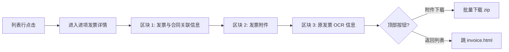

# 02.15.99.1 进项发票详情 v1.7.99.84 终版

> **状态**：v1.7.99.84 终版（**v1.0 基础上 + v1.7.99.83 进项发票列表 + v1.7.99.84 详情页重构**）
> **生成时间**：2026-09-24 15:00
> **配套文档**：[00-项目总览与对接.md](../00-项目总览与对接.md) / [01-模块拆解大框架.md](../01-模块拆解大框架.md) / [p-invoice.md](./p-invoice.md) / [p-invoice-out-detail.md](./p-invoice-out-detail.md) / [02.15-发票管理.md](./02.15-发票管理.md)
> **需求来源**：本仓库 v1.7.99.83 / 84 改造 + 飞书《豫港通用户使用手册（内部版）》第 7.2 节"发票管理"
> **复用度**：🟢 80%（复用 v1.7.99.84 详情页 3 区块结构 + 手册 7.2 业务规则）

---

> **当前页**：`invoice-detail.html`（进项发票详情页）
> **关联页**：`invoice.html`（进项发票列表）/ `invoice-out-detail.html`（销项发票详情）/ `invoice-out.html`（销项发票列表）

## 0. 章节导航

1. 业务定位
2. 业务流程全景
3. 字段规则（3 区块）
4. 按钮交互
5. 异常处理
6. 跨模块流转
7. 文档版本

---

## 1. 业务定位

**进项发票详情**是进项发票管理（采购方向）的**追溯页**——业务人员查看某张进项发票的全部信息（含发票与合同关联、发票附件、原发票 OCR 信息）。

**港通特色——OCR 识别 + 合同拆分**（来自手册 7.2 + v1.7.99.83 重构）：
- 发票录入支持图片上传（OCR 自动识别）或 Excel 导入
- 一张发票可**拆分关联到多个合同**（按金额拆分）

| 维度 | 进项发票（采购）| 销项发票（销售）|
|------|-----------------|------------------|
| 发票方向 | 供应商开给核心企业 | 核心企业开给客户 |
| 列表页 | invoice.html | invoice-out.html |
| 详情页 | **invoice-detail.html**（只读）| invoice-out-detail.html（**编辑**）|
| 典型场景 | 采购付款后索取发票 | 销售收款后开票 |

### 1.1 入口

| 入口 | URL | 说明 |
|------|------|------|
| 列表行点击发票编号 | `./invoice-detail.html?invoiceId={发票ID}` | 主入口 |

### 1.2 v1.7.99.84 关键改动

- 从 v1.0 单区块重构为 **3 大区块**：
  - 区块 1：发票与合同关联信息（4 列表格 + 顶部右侧价格合计 + 剩余拆分）
  - 区块 2：发票附件（3 列表格）
  - 区块 3：原发票信息（OCR 增值税专用发票模拟图）
- 进项发票详情为**只读**——编辑能力由"发票列表"或专门的编辑入口提供（v1.7.99.x 通用规则：详情页不直接做编辑）

---

## 2. 业务流程全景

**关键决策**：
- **详情页不加业务变更按钮**（v1.7.99.x 通用规则）—— 仅做跳转和附件下载
- 关联合同拆分金额调整、红冲、作废等操作**通过列表页**发起（详见 02.15 手册 7.2 节）

---

## 3. 字段规则

### 3.1 区块 1：发票与合同关联信息（v1.7.99.84 4 列表格）

| 列 | 字段 | 说明 |
|----|------|------|
| 1 | 合同编号 | 蓝字链接 → 跳合同详情（执行中/已结清）|
| 2 | 卖方名称 | 本发票"卖方"（供应商）|
| 3 | 买方名称 | 本发票"买方"（核心企业）|
| 4 | 拆分金额（元）| 该合同关联到本发票的拆分金额（ⓘ tooltip 提示）|

**顶部右侧**：价格合计 + 剩余拆分（v1.7.99.84 加）

### 3.2 区块 2：发票附件（v1.7.99.84 3 列表格）

| 列 | 字段 | 说明 |
|----|------|------|
| 1 | 单据类型 | 原发票 / 拆分凭证 / 其他 |
| 2 | 文件名称 | 文件名 + 大小 + 上传时间 |
| 3 | 操作 | 下载 |

### 3.3 区块 3：原发票信息（v1.7.99.84 OCR 增值税专用发票模拟图）

| 字段 | 来源 |
|------|------|
| 发票代码 | OCR 自动识别 |
| 发票号码 | OCR 自动识别 |
| 开票日期 | OCR 自动识别 |
| 销售方/购买方名称 | OCR 自动识别 |
| 不含税金额 | OCR 自动识别 |
| 税率 | OCR 自动识别 |
| 税额 | OCR 自动识别 |
| 含税金额 | OCR 自动识别 |
| 价税合计（大写）| OCR 自动识别 |

> **OCR 模拟图说明**：v1.7.99.84 在详情页右侧放 OCR 增值税专用发票的视觉化模拟图（不显示真实字体位置，仅做区块示意），便于业务人员视觉确认。

---

## 4. 按钮交互

### 4.1 顶部按钮

| 按钮 | 行为 |
|------|------|
| **附件下载** | 批量下载所有附件为 zip |
| **返回列表** | 跳 `invoice.html` |

### 4.2 区块内交互

| 操作 | 行为 |
|------|------|
| 合同编号点击 | 跳合同详情页（执行中/已结清状态可访问）|
| 附件列表"下载" | 下载该附件原文件 |

---

## 5. 异常处理

| 场景 | 处理 |
|------|------|
| URL 参数 `invoiceId` 缺失 | 顶部红色 bar 提示"该发票不存在" + 返回列表按钮 |
| 发票已删除（逻辑删除）| 顶部红色 bar 提示"该发票已删除" + 返回列表按钮 |
| OCR 识别失败 | 区块 3 提示"OCR 识别失败，请手动补录"（v1.7.99.x 通用规则）|
| 拆分金额总和 ≠ 含税金额 | 区块 1 顶部右侧红字提示"拆分金额不等于发票金额，差额 ¥X.XX" |

---

## 6. 跨模块流转

### 6.1 与合同管理（02.03）

- 区块 1 合同编号链接 → 跳 `contract-purchase-order-detail.html` 或 `contract-purchase.html`
- 拆分金额 → 该合同的"已开票金额" += 拆分金额

### 6.2 与付款管理（02.14）

- 发票关联的合同 → 实际付款记录 → 付款凭证
- 三方对账：发票金额 vs 拆分金额 vs 付款金额（详见 02.14 资金管理）

### 6.3 与 OCR / 税控 API

- 上传图片时调用 OCR API 自动识别
- 入账前调用税控 API 验真（v1.7.99.x 待集成）

---

## 7. 文档版本

- **v1.0（2026-07-24）**：进项发票详情 v1.0 终版
- **v1.7.99.83（2026-08-08）**：进项发票列表重构
- **v1.7.99.84（2026-08-08）**：**详情页 3 区块重构**（发票与合同关联 + 发票附件 + OCR 原发票信息）
- **2026-09-24**：首次写 PRD（基于手册 7.2 + v1.7.99.84 沉淀）

修改记录：见 `v1.7.99-changelog.md`