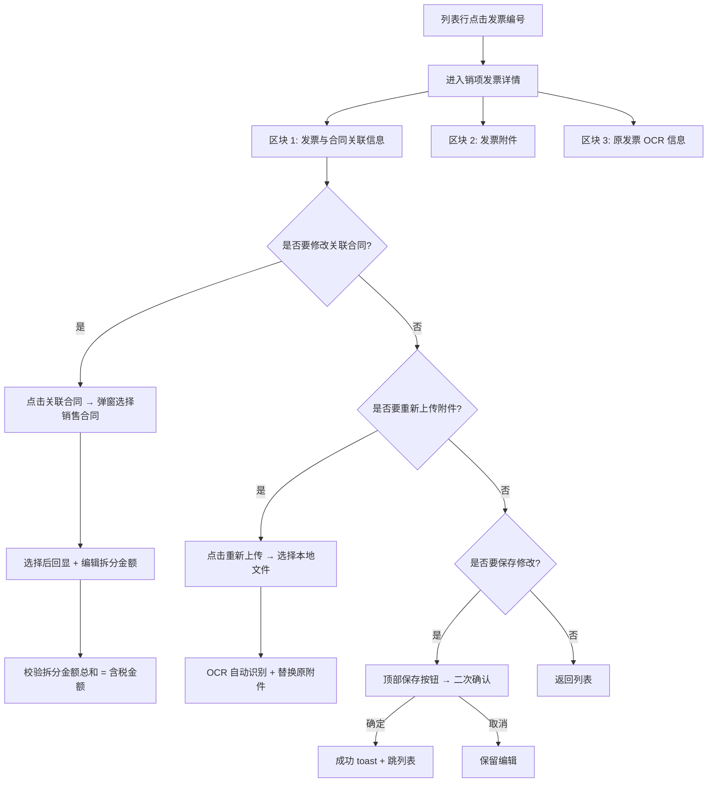

# 02.15.99.3 销项发票详情（编辑）v1.7.99.84 终版

> **状态**：v1.7.99.84 终版（**v1.0 基础上 + v1.7.99.84 详情页 3 区块重构 + 编辑能力**）
> **生成时间**：2026-09-24 15:30
> **配套文档**：[00-项目总览与对接.md](../00-项目总览与对接.md) / [01-模块拆解大框架.md](../01-模块拆解大框架.md) / [p-invoice.md](./p-invoice.md) / [p-invoice-out.md](./p-invoice-out.md) / [p-invoice-detail.md](./p-invoice-detail.md) / [02.15-发票管理.md](./02.15-发票管理.md)
> **需求来源**：本仓库 v1.7.99.83 / 84 改造 + 飞书《豫港通用户使用手册（内部版）》第 7.2 节"发票管理"
> **复用度**：🟢 80%（复用 invoice-detail 3 区块结构 + 编辑能力）

---

> **当前页**：`invoice-out-detail.html`（销项发票详情页 — **支持编辑**）
> **关联页**：`invoice-out.html`（销项发票列表）/ `invoice-detail.html`（进项发票详情 — 只读）

## 0. 章节导航

1. 业务定位
2. 业务流程全景
3. 字段规则（3 区块 + 编辑能力）
4. 按钮交互
5. 异常处理
6. 跨模块流转
7. 文档版本

---

## 1. 业务定位

**销项发票详情**是销项发票管理（销售方向）的**编辑页**——业务人员在销项发票列表点击进入后，**支持重新上传附件 + 编辑拆分金额 + 关联新合同**。

| 维度 | 销项发票详情（编辑）| 进项发票详情（只读）|
|------|---------------------|----------------------|
| 业务方向 | 销售（核心企业开给客户） | 采购（供应商开给核心企业） |
| 附件操作 | 重新上传 / 删除 | 仅下载 |
| 拆分金额 | **可编辑**（带"关联合同"按钮）| 灰置 |
| 关联合同 | **可重新关联 / 解除关联** | 灰置链接 |

### 1.1 入口

| 入口 | URL | 说明 |
|------|------|------|
| 列表行点击发票编号 | `./invoice-out-detail.html?invoiceId={发票ID}` | 主入口（标题"销项发票详情"，但实际支持编辑）|
| 列表"修改" | `./invoice-out-detail.html?invoiceId={发票ID}` | 同上 |

### 1.2 v1.7.99.84 关键改动

- 从 v1.0 单区块重构为 **3 大区块**：
  - 区块 1：发票与合同关联信息（**5 列表格 + 关联合同按钮 + 拆分金额编辑**）
  - 区块 2：发票附件（**2 列表格 + 重新上传/删除**）
  - 区块 3：原发票信息（OCR 增值税专用发票模拟图）
- 面包屑显示 **"销项发票编辑"** —— 但 page-title 仍为"销项发票详情"（v1.7.99.84 重命名遗留）

---

## 2. 业务流程全景

**关键决策**：
- **详情页允许业务变更按钮**（与只读详情页的 invoice-detail 区别）—— 仅在销项方向，因为销项是核心企业主动发起
- **进项发票详情不加业务变更按钮**——因为进项由供应商提供，核心企业只录入与归档

---

## 3. 字段规则

### 3.1 区块 1：发票与合同关联信息（v1.7.99.84 5 列表格 + 编辑能力）

| 列 | 字段 | 说明 |
|----|------|------|
| 1 | 合同编号 | input 蓝字链接 |
| 2 | 卖方名称 | 本发票"卖方"（核心企业）|
| 3 | 买方名称 | 本发票"买方"（下游客户）|
| 4 | **拆分金额（元）** | **input 可编辑**，带 ⓘ tooltip |
| 5 | **操作** | **解除关联**（仅可对状态=正常的发票操作）|

**关联合同按钮**（v1.7.99.84 关键）：
- 点击 → 弹窗选择销售合同（仅显示"执行中/待上传双签合同"）
- 选择后追加一行关联合同（拆分金额默认为 0，业务人员手动填）

### 3.2 区块 2：发票附件（v1.7.99.84 2 列表格 + 编辑能力）

| 列 | 字段 | 说明 |
|----|------|------|
| 1 | 文件名称 | 文件名 + 大小 + 上传时间 |
| 2 | 操作 | 重新上传 / 删除 / 下载 |

**重新上传**（v1.7.99.84 新增）：
- 点击 → 弹文件选择 → 上传后自动调用 OCR API 重新识别
- 替换原附件 + 同步更新区块 3 OCR 信息

### 3.3 区块 3：原发票信息（OCR 增值税专用发票模拟图）

同 [p-invoice-detail.md](./p-invoice-detail.md) 第 3.3 节，但**支持重新 OCR 后自动更新**。

### 3.4 校验规则

| 场景 | 校验 |
|------|------|
| 拆分金额总和 ≠ 含税金额 | 红字提示"拆分金额不等于发票金额，差额 ¥X.XX" |
| 拆分金额 ≤ 0 | 红字提示"拆分金额必须大于 0" |
| 关联合同状态非"执行中/待上传双签合同" | 红字提示"请选择执行中或待上传双签合同" |
| 删除最后一个关联合同 | 红字提示"发票必须至少关联一个合同" |
| 重新上传文件类型不符 | 红字提示"仅支持 jpg/jpeg/png/pdf" |

---

## 4. 按钮交互

### 4.1 顶部按钮

| 按钮 | 行为 |
|------|------|
| **保存** | 二次确认 → 写入数据库 → 跳列表 toast |
| **取消** | 二次确认（"取消后已修改不会被保存"）|
| **附件下载** | 批量下载 zip |
| **返回列表** | 跳 `invoice-out.html` |

### 4.2 区块内交互

| 操作 | 行为 |
|------|------|
| 关联合同（按钮）| 弹窗选销售合同（仅执行中/待上传双签合同）|
| 解除关联（行操作）| 二次确认 → 解除该合同与本发票的关联 |
| 重新上传（附件）| 弹文件选择 → OCR 识别 → 替换 |
| 删除附件（附件）| 二次确认 → 删除该附件 |

### 4.3 二次确认弹窗

- **保存确认弹窗**：
  - 标题：保存确认
  - 内容：确认保存本次修改？保存后发票关联合同和拆分金额将更新
  - 按钮：取消 / 确定

- **取消编辑弹窗**：
  - 标题：取消确认
  - 内容：取消后，已修改的拆分金额 / 关联合同 / 附件将不会被保存
  - 按钮：取消 / 确定

---

## 5. 异常处理

| 场景 | 处理 |
|------|------|
| URL 参数 `invoiceId` 缺失 | 顶部红色 bar + 返回列表 |
| 发票已删除 | 顶部红色 bar + 返回列表 |
| 发票已红冲/作废 | 顶部橙色 bar 提示"该发票已红冲/作废，无法修改关联合同和拆分金额"，仅支持查看附件 |
| 重新上传 OCR 识别失败 | 区块 3 提示"OCR 识别失败，请手动补录" |
| 并发修改（同一发票被另一用户修改）| 二次校验时被覆盖则提示"已被其他操作覆盖，请刷新后重试" |

---

## 6. 跨模块流转

### 6.1 与销售合同（02.03）

- 关联合同按钮 → 弹窗选销售合同（执行中/待上传双签合同）
- 保存后 → 该合同"已开票金额" += 新拆分金额 - 原拆分金额

### 6.2 与发票列表（invoice-out）

- 保存成功 → 列表刷新该发票状态
- 红冲/作废状态变更由列表页发起（详情页不做）

### 6.3 与 OCR / 税控 API

- 重新上传 → 调用 OCR API 重新识别
- 同步触发税控 API 验真（v1.7.99.x 待集成）

### 6.4 与回款管理（02.14）

- 销项发票关联的销售合同 → 回款认领时检查"已开票金额"是否足够

---

## 7. 文档版本

- **v1.0（2026-07-24）**：销项发票详情 v1.0 终版
- **v1.7.99.83（2026-08-08）**：销项发票列表独立
- **v1.7.99.84（2026-08-08）**：**详情页 3 区块重构 + 编辑能力**（重新上传 + 关联合同按钮 + 拆分金额编辑 + 解除关联）
- **2026-09-24**：首次写 PRD（基于手册 7.2 + v1.7.99.84 沉淀）

修改记录：见 `v1.7.99-changelog.md`