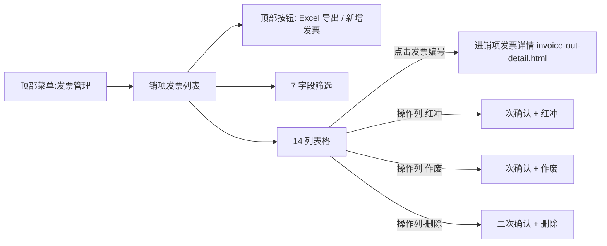

# 02.15.99.2 销项发票列表 v1.7.99.83 终版

> **状态**：v1.7.99.83 终版（**v1.0 基础上 + v1.7.99.83 销项发票列表对称复制进项发票**）
> **生成时间**：2026-09-24 15:15
> **配套文档**：[00-项目总览与对接.md](../00-项目总览与对接.md) / [01-模块拆解大框架.md](../01-模块拆解大框架.md) / [p-invoice.md](./p-invoice.md) / [p-invoice-out-detail.md](./p-invoice-out-detail.md) / [02.15-发票管理.md](./02.15-发票管理.md)
> **需求来源**：本仓库 v1.7.99.83 改造 + 飞书《豫港通用户使用手册（内部版）》第 7.2 节"发票管理"
> **复用度**：🟢 85%（对称复制进项发票结构 + 销项业务规则）

---

> **当前页**：`invoice-out.html`（销项发票列表页）
> **关联页**：`invoice-out-detail.html`（销项发票详情）/ `invoice.html`（进项发票列表）

## 0. 章节导航

1. 业务定位
2. 业务流程全景
3. 字段规则（7 筛选 + 14 列表格）
4. 按钮交互
5. 异常处理
6. 跨模块流转
7. 文档版本

---

## 1. 业务定位

**销项发票列表**是销项发票管理（销售方向）的**入口页**——业务人员查看/筛选/管理所有销项发票（含红冲、作废、删除操作入口）。

| 维度 | 销项发票（销售）| 进项发票（采购）|
|------|-----------------|------------------|
| 发票方向 | 核心企业开给客户 | 供应商开给核心企业 |
| 列表页 | **invoice-out.html** | invoice.html |
| 详情页 | invoice-out-detail.html | invoice-detail.html |
| 典型场景 | 销售收款后开票 | 采购付款后索取发票 |
| 核心字段 | 发票代码/发票号码/销售方/购买方 | 发票代码/发票号码/卖方/买方 |

### 1.1 入口

| 入口 | URL | 说明 |
|------|------|------|
| 顶部菜单"发票管理" | `./invoice-out.html` | 主入口 |

### 1.2 v1.7.99.83 关键改动

- **对称复制进项发票**：v1.7.99.83 销项发票列表从结构上**完全对称**复制进项发票（v1.7.99.83 同时改的）
- **14 列表格**：相比进项发票增加"销售方"和"购买方"两个核心列（进项是"卖方"/"买方"）
- **7 字段筛选区**：编号/销售方/购买方/开票日期/发票代码/发票号码/状态（去掉"是否含附件"以简化）
- **状态 tag 颜色**：
  - 正常：绿
  - 红冲：黄
  - 作废：红
  - 删除：灰

---

## 2. 业务流程全景



**关键流程**：
- **红冲**：原发票状态 → 红冲；系统生成一张负数发票冲抵
- **作废**：原发票状态 → 作废（适用于未入账的发票）
- **删除**：原发票状态 → 已删除（仅限状态=正常的未关联发票）

---

## 3. 字段规则

### 3.1 顶部按钮

| 按钮 | 行为 |
|------|------|
| **Excel 导出** | 导出当前筛选条件的数据到 Excel（mock） |
| **新增发票** | 跳新增发票页（v1.7.99.x 待补）/ 弹上传图片/Excel 二选 |

### 3.2 7 字段筛选区

| 字段 | 类型 | 校验 |
|------|------|------|
| 编号（订单/合同）| input | 模糊匹配 |
| 销售方 | input | 模糊匹配 |
| 购买方 | input | 模糊匹配 |
| 开票日期 | date-range | 起止日期 |
| 发票代码 | input | 精确匹配 |
| 发票号码 | input | 精确匹配 |
| 状态 | select | 全部/正常/红冲/作废/删除 |

### 3.3 14 列销项发票表格

| # | 列 | 字段 | 宽度 | 说明 |
|---|----|------|------|------|
| 1 | 发票代码 | input | 9% | 蓝字链接 → 详情页 |
| 2 | 发票号码 | input | 12% | 蓝字链接 → 详情页 |
| 3 | 开票日期 | date | 9% | yyyy-MM-dd |
| 4 | 销售方名称 | input | - | 蓝字链接 → 销售方详情（核心企业）|
| 5 | 购买方名称 | input | - | 蓝字链接 → 购买方详情（下游客户）|
| 6 | 不含税金额（元）| input | - | 右对齐 |
| 7 | 税额（元）| input | - | 右对齐 |
| 8 | 含税金额（元）| input | - | 右对齐 |
| 9 | 价税合计（大写）| input | - | 仅展示 |
| 10 | 关联合同数 | int | - | 该发票拆分关联的合同数 |
| 11 | 关联业务线 | input | - | 蓝字链接（v1.7.99.x 待补）|
| 12 | 状态 | tag | - | 正常/红冲/作废/删除 |
| 13 | 是否含附件 | icon | - | 📎/无 |
| 14 | 操作 | button | - | 查看 / 红冲 / 作废 / 删除 |

---

## 4. 按钮交互

### 4.1 主操作按钮

| 按钮 | 位置 | 行为 |
|------|------|------|
| **Excel 导出** | 顶部右侧 | 导出当前筛选条件 |
| **新增发票** | 顶部右侧 | 弹"图片上传 / Excel 导入"二选一 |

### 4.2 操作列按钮

| 按钮 | 行为 |
|------|------|
| 查看 | 跳 `invoice-out-detail.html?invoiceId={ID}` |
| 红冲 | 二次确认 → 状态=红冲 + 生成负数发票 |
| 作废 | 二次确认 → 状态=作废（仅正常状态可作废）|
| 删除 | 二次确认 → 状态=已删除（仅正常状态可删除）|

### 4.3 新增发票弹窗（v1.7.99.x 待补）

```
┌────────────────────────────────┐
│ 新增发票                       │
│                                │
│  ○ 图片上传（OCR 自动识别）     │
│  ○ Excel 导入（下载模板）      │
│                                │
│  [取消] [下一步]               │
└────────────────────────────────┘
```

---

## 5. 异常处理

| 场景 | 处理 |
|------|------|
| 筛选后无数据 | 空状态"暂无符合条件的发票" |
| 红冲已红冲/作废/已删除发票 | 红字提示"该发票状态不支持红冲" |
| 作废已红冲/作废/已删除发票 | 红字提示"该发票已作废或已红冲" |
| 删除已关联合同的发票 | 红字提示"该发票已关联合同，无法删除（可走作废）" |
| 同一发票并发操作 | 二次校验发票当前状态，被覆盖则提示"已被其他操作覆盖，请刷新" |

---

## 6. 跨模块流转

### 6.1 与销售合同（02.03）

- 销项发票关联到销售合同 → 合同"已开票金额" += 拆分金额
- 当合同已开票金额 = 合同总额 → 触发"已开票"状态

### 6.2 与回款管理（02.14）

- 销售收款 → 开销项发票 → 客户抬头 = 购买方名称
- 回款认领与发票不强制 1:1（v1.7.99.x 通用规则）

### 6.3 与红冲/作废

- 红冲生成一张负数发票，金额 = -原发票含税金额
- 红冲/作废自动同步到合同"已开票金额" - 原拆分金额

---

## 7. 文档版本

- **v1.0（2026-07-24）**：发票列表 v1.0 终版（合并进销项）
- **v1.7.99.83（2026-08-08）**：**销项发票独立** + 对称复制进项发票结构（14 列）+ 7 字段筛选
- **v1.7.99.84（2026-08-08）**：详情页 3 区块重构
- **2026-09-24**：首次写 PRD（基于手册 7.2 + v1.7.99.83/84 沉淀）

修改记录：见 `v1.7.99-changelog.md`