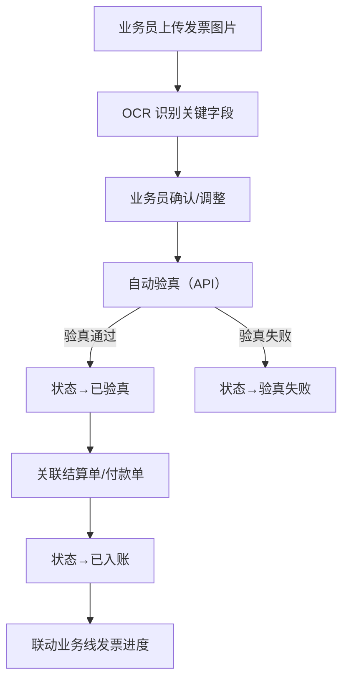
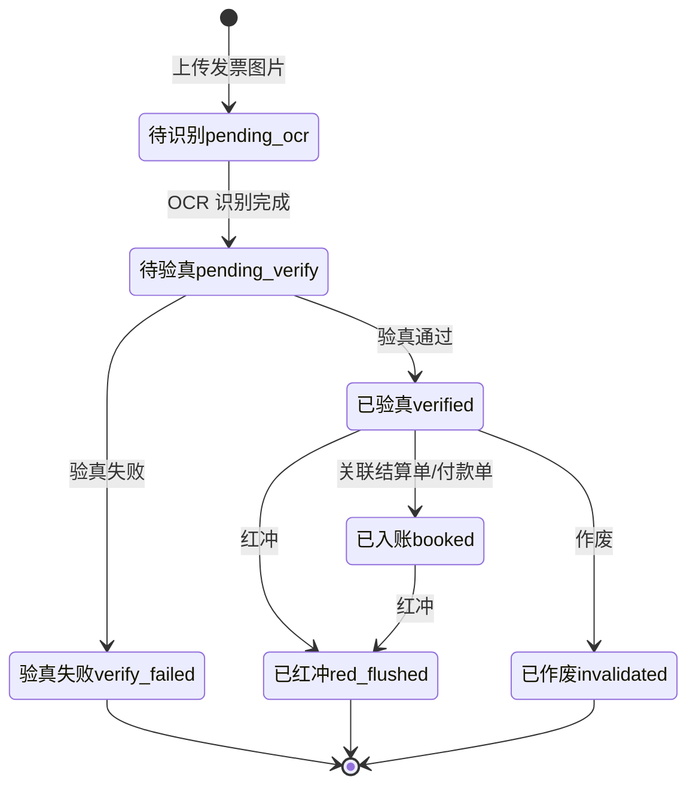
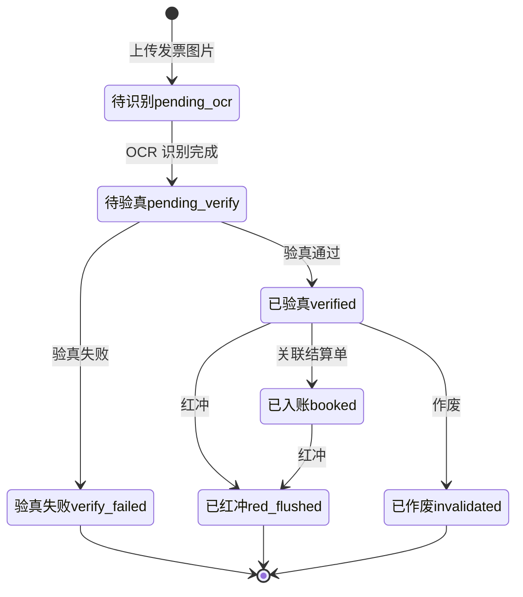

# 02.15 发票管理 v1.0 终版

> **状态**：v1.0 终版（**新模块，基于原型 55 截图**）
> **生成时间**：2026-07-24 14:55
> **配套文档**：[00-项目总览与对接.md](../00-项目总览与对接.md) / [01-模块拆解大框架.md](../01-模块拆解大框架.md) / [02.13-结算单管理.md](./02.13-结算单管理.md) / [02.14-资金管理.md](./02.14-资金管理.md)
> **复用度**：🟢 **90%（几乎零改造）**——主产品 `t_xxx（业务实体）` + `t_xxx（业务实体）` + `t_xxx（业务实体）` + `bo_invoice` + `bo_invoice_comparison` 5+ 张表

---

> **当前页**：`invoice.html`（进项发票，v1.7.99.83 重制）/ `invoice-out.html`（销项发票，v1.7.99.83 新增）/ `invoice-detail.html`（进项发票详情查看，v1.7.99.84 新增）/ `invoice-out-detail.html`（销项发票详情编辑，v1.7.99.84 新增）
> **文档状态**：v1.7.99.83 重制进项发票 + 新增销项发票完整子模块（§11），v1.7.99.84 新增进/销项发票详情查看/编辑 + 关联合同抽屉（§12）

## 0. 章节导航

1. 业务定位
2. 业务流程全景
3. 核心实体（4 张表）
4. 状态机
5. 字段规则
6. 按钮交互
7. 异常处理
8. 跨模块流转

10. 文档版本
11. **销项发票（v1.7.99.83）** ← 列表
12. **发票详情（v1.7.99.84）** ← 新增章节：进项查看 + 销项编辑 + 关联合同抽屉 + OCR 原发票信息

---

## 1. 业务定位

**发票管理**是港通供应链的**进/销项发票统一管理**——OCR 识别+验真+红冲+作废。

**关键特点**：
- **v1.0 范围**：仅**进项发票**（基于 55 截图 + sitemap"发票管理（无改动）"）
- 销项发票 02.15 v1.0 暂不写
- **OCR 识别**：上传发票图片自动识别关键字段
- **验真 API**：对接税务验真系统

### 1.1 1 个页面（sitemap）

| # | 页面 | 说明 |
|---|------|------|
| 1 | **进项发票** | 进项发票列表 + 上传 + OCR |

---

## 2. 业务流程全景

### 2.1 进项发票流程



---

## 4. 状态机



### 4.1 5 状态说明

| # | 状态 | 中文 | 触发 | 出口 |
|---|------|------|------|------|
| 1 | `pending_ocr` | 待识别 | 上传图片 | OCR 完成 |
| 2 | `pending_verify` | 待验真 | OCR 完成 | 验真通过/失败 |
| 3 | `verified` | 已验真 | 验真通过 | 已入账/红冲/作废 |
| 4 | `verify_failed` | 验真失败 | 验真失败 | 终态 |
| 5 | `booked` | 已入账 | 关联结算单/付款单 | 红冲 |
| 6 | `red_flushed` | 已红冲 | 红冲 | 终态 |
| 7 | `invalidated` | 已作废 | 作废 | 终态 |

---

## 5. 字段规则

### 5.1 发票类型 `invoice_type`

- 3 种：`vat_xxx`（增值税专用）/ `vat_xxx`（增值税普通）/ `electronic`（电子发票）

### 5.2 进项/销项 `direction`（**v1.0 范围**）

- v1.0 仅 `inbound`（进项）
- 销项 `outbound` v1.0 暂不写

### 5.3 OCR 识别字段

- 必识别：发票号码/代码/日期/销售方/购买方/金额/税额/税率
- 自动填充到表单字段
- 业务员可手动调整

### 5.4 验真（**港通特色**）

- 对接税务验真 API（`t_xxx（业务实体）`）
- 验真通过 → 状态→`verified`
- 验真失败 → 状态→`verify_failed`

### 5.5 红冲

- 已验真或已入账的发票可红冲
- 红冲后状态→`red_flushed`
- 关联结算单/付款单可反向调整

### 5.6 作废

- 已验真的发票可作废
- 作废后状态→`invalidated`

---

## 6. 按钮交互

### 6.1 进项发票列表（55 截图）

| 按钮 | 位置 | 可见条件 | 点击行为 |
|------|------|---------|---------|
| **上传发票** | 右上 | 业务员 | 弹上传对话框 |
| 搜索/筛选 | 顶部 | 所有 | 弹筛选抽屉 |
| 数据导出 | Tab 右侧 | 所有 | 导出 Excel |
| 详情 | 列表行 | 所有 | 跳详情页 |
| 验真 | 列表行 | `pending_verify` | 调验真 API |
| 红冲 | 列表行 | `verified`/`booked` | 弹红冲确认框 |
| 作废 | 列表行 | `verified` | 弹作废确认框 |

### 6.2 列表字段（基于 55 截图）

- 发票号码 / 发票代码 / 销售方 / 购买方 / 金额 / 税额 / 状态
- 操作：详情/验真/红冲/作废

---

## 7. 异常处理

| 异常场景 | 提示文案 | 处理动作 |
|---------|---------|---------|
| OCR 识别失败 | "OCR 识别失败，请手动填写" | 允许手动 |
| 验真 API 失败 | "验真 API 调用失败，请稍后重试" | 允许重试 |
| 验真失败 | "发票验真失败：XXX" | 阻止入账 |
| 重复发票 | "发票号码 X 已存在" | 阻止 |
| 红冲金额不一致 | "红冲金额 X 不等于原金额 Y" | 阻止 |
| 已红冲/作废发票再次操作 | "发票已 X，不能再次操作" | 阻止 |

---

## 8. 跨模块流转

### 8.1 上游触发

| 触发模块 | 触发条件 | 触发动作 |
|---------|---------|---------|
| 结算单（02.13）| 结算单 `active` | 触发开票申请 |
| 付款（02.14）| 付款完成 | 触发发票上传 |

### 8.2 下游触发

| 触发模块 | 触发条件 | 触发动作 |
|---------|---------|---------|
| 业务线（02.06）| 发票已入账 | 更新业务线发票进度 |
| 客户额度（02.02）| 发票已入账 | 更新客户已用额度 |

---

## 10. 文档版本

- **v1.0（2026-07-24 14:55）**：基于 55 截图 + sitemap 首次终版，作为范本用于后端开发
- - **v1.7.99.x（2026-07-28）**：基于 30+ 版本迭代同步
  - 🟡 列表页占位 = "全部"（全站统一）
  - 🟡 状态 tag 颜色编码
  - 🟡 流程图统一用 Mermaid
  - 详见：[v1.7.99-changelog.md](./v1.7.99-changelog.md)
- **v1.7.99.83（2026-07-30）**：进项发票 + 销项发票同步重制（用户截图 2 张：图 1 进项发票列表 / 图 2 操作列"更多"下拉 = 红冲/作废/删除）
  - 🟡 进项发票 `pages/invoice.html` 完全重制：14 列表格（checkbox + 发票代码/发票号码/开票日期/价格合计(元)/开具金额(元)/发票可拆分金额(元)/发票状态/是否包含附件/合同编号/销售方/购买方/上传时间/操作）+ 8 字段筛选（编号/销售方/购买方/开票日期/发票代码/发票号码/是否含附件/状态）+ 右上 2 按钮（Excel 导出 / 新增发票）+ 操作列"查看/编辑/更多▸"横向布局
  - 🟢 销项发票 `pages/invoice-out.html` 新建：**对称复制进项发票 HTML + 销售方/购方反向**（销售方=我方"河南中豫港通供应链管理有限公司" / 购买方=客户"郑州信必达/浙江昌渊瑞/河南物产集团/河南中豫粮油/河南晟宇粮油"），合同编号 GTGYL-XSXS-20260127-s
  - 🟢 左侧 sidemenu "发票管理"组下**新增 2 个子菜单**（进项发票 / 销项发票）
  - 🟢 "更多"下拉 3 项（红冲/作废/删除，删除红色 danger 样式），用 v1.7.99.34 `appendChild to body` 模式避开 table-row 裁切
  - 🟢 状态机继承 v1.0：4 状态（待识别/待验真/已验真/已入账）+ 3 终态（验真失败/已红冲/已作废）
  - 🟢 10 行 mock（进项 9 条 + 销项 9 条，价格合计百万级，开票日期 2026-04-24 ~ 2026-07-15，合同号 GTGYL-MSXS/XSXS-20260127-s）
  - 🟢 共 14 条分页 / 10 条/页
  - 🟢 状态 tag：`正常` 用 `tag-green`（D1FAE5 底 / 047857 字），与 v1.7.99.70 销售结算 5 状态对齐
  - 详见：[v1.7.99-changelog.md](./v1.7.99-changelog.md) §v1.7.99.83
- **v1.7.99.84（2026-07-30）**：进项发票查看 + 销项发票编辑 + 关联合同抽屉（用户截图 2 张：图 1 进项发票「查看」按钮触发的页面 / 图 2 销项发票「编辑」按钮触发页面，引用通用的销售合同侧边栏抽屉式弹层）
  - 🟡 进项发票查看页 `pages/invoice-detail.html` 新建（v1.7.99.84 一期新建，15.2KB，~360 行，**只读**）：面包屑 发票管理/进项发票详情 + 标题"进项发票详情"（蓝字）+ 3 大区块：① **发票与合同关联信息**（4 列表格：合同编号/卖方名称/买方名称/拆分金额(元) ⓘ，顶部右侧 价格合计总额 ¥3,162,353.94 + 剩余拆分金额 ¥0.00 红色显示）+ ② **发票附件**（3 列表格：单据类型/文件名称/操作，原发票/26412000000000000000.png/下载）+ ③ **原发票信息**（**OCR 增值税专用发票模拟图**：标题"郑州信必达国际供应链有限公司电子发票(增值税专用发票)" + 4 列头部（发票代码/发票号码 264120000000000000000/开票日期 2026-04-30/校验码 264120000000000000000/机器编号）+ 购买方 4 字段（名称 郑州信必达国际供应链有限公司 / 纳税人识别号 91XXXXXXMAXXXXXXXX / 地址电话 / 开户行及账号）+ 销售方 4 字段（名称 河南中豫港通供应链管理有限公司 / 纳税人识别号 91XXXXXXMAXXXXXXXX / 地址电话 河南自贸试验区郑州片区（经开）航海东路1507号3号楼2单元5层504号 138 0000 XXXX / 开户行及账号 华夏银行股份有限公司郑州分行九如路支行 138 0000 XXXX802788）+ 货物明细（*淀粉制品*木薯淀粉 / 吨 / 918 / 3048.52212389381 / 2798543.31 / 13% / 363810.63）+ 价税合计 叁佰壹拾陆万贰仟叁佰伍拾叁点玖肆 ¥3162353.94 + 销售方重复区域 + 备注 + 底部"本数据来源于中国国家税务总局发票验证系统"）
  - 🟡 销项发票编辑页 `pages/invoice-out-detail.html` 新建（v1.7.99.84 一期新建，29.6KB，~540 行，**可编辑**）：面包屑 发票管理/销项发票/销项发票编辑 + 标题"销项发票详情"（蓝字）+ 3 大区块：① **发票与合同关联信息**（**5 列表格：合同编号/卖方名称/买方名称/拆分金额(元) ⓘ / 操作**） + **右上角"关联合同"按钮**（深蓝实心 + 链接图标，点击 → 弹出关联销售合同抽屉）+ 顶部右侧 价格合计总额 ¥3,162,353.94 + 剩余拆分金额 ¥0.00 红色 + 拆分金额右边 ✏️ 编辑图标（点击 → prompt 弹窗修改）+ 操作列"删除"（红色 danger 样式）；② **发票附件**（2 列表格：文件名称/操作，1 行：f59x7U3uzCfXVdLhm1LgQ==&confidentialityLevel=CONFIDENTIAL（OSS 加密文件名） + 重新上传 + 删除）+ ③ **原发票信息**（同查看页 OCR 模拟图）+ **底部"保存"按钮**（蓝底白字居中）+ **右下角"返回顶部"圆形按钮 ∧**
  - 🟢 **关联销售合同抽屉**（v1.7.99.84 新建，沿用 v1.7.99.82 销售结算"选择销售订单/单批次合同"抽屉结构）：抽屉标题"关联销售合同" + 关闭按钮 + 6 合同 chips（XSXS20241119-001/...-002/...-003/...-004/...-005 + "+ 添加条件"虚线 chip）+ 5 字段筛选（合同编号/买方企业/卖方企业/品名/签订日期）+ 查询/重置按钮 + 8 列表格（checkbox/合同编号/买方企业/卖方企业/品名/数量(吨)/单价(元)/签订日期）+ 6 行 mock（XSXS20241119-001 等 6 个销售合同）+ 分页"共 6 条记录 · 第 1 / 1 页" + 底部 取消/确定 按钮 + 半透明蒙层
  - 🟢 **合同号用 YL-MSXS-20260127-s**（v1.7.99.84 锁定，**区别于 v1.7.99.83 列表的 GTGYL-MSXS-20260127-s**——user 截图实际数据用 YL- 前缀，列表 mock 用 GTGYL- 前缀，PRD 标注差异等 user 决定是否统一）
  - 🟢 **inline Utils fallback**（v1.7.99.80/83 沿用）：`window.Utils = window.Utils || { toast: function(msg, type) { console.log(...) } }` 避免 console error
  - 🟢 **"更多"下拉 / "关联合同"按钮 / "保存"按钮 / "返回顶部"按钮**全部 inline JS 实现，触发 toast 提示 + console.log
  - 🟢 **不**改 v1.7.99.83 列表页（保持 invoice.html / invoice-out.html 现状，**不**改 mock 合同号前缀，**不**改"查看/编辑"链接目标，v1.7.99.84 详情页是独立的新页面，等 user 后续提"列表跳详情"再补链接）
  - 🟢 **不**改全局 design-system.css（v1.7.99.69/71/73/75/80/81/82/83 经验：项目级覆盖）
  - 详见：[v1.7.99-changelog.md](./v1.7.99-changelog.md) §v1.7.99.84
修改记录：见 `06-修改记录.md`

---

## 11. 销项发票（v1.7.99.83）— 新增子模块

> **状态**：v1.7.99.83 首次实现（基于用户截图 1-2）
> **页面**：`pages/invoice-out.html`（19.3KB，~390 行）
> **配套页面**：`pages/invoice.html`（进项发票，v1.7.99.83 重制）
> **沿用模式**：v1.7.99.82 销售 vs 采购对称复制（销售=客户视角）

### 11.1 业务定位

**销项发票**是港通供应链的**销售场景下开具的发票**——对接销售合同/订单，**销售方=我方（河南中豫港通供应链管理有限公司）**，**购买方=客户**。

**关键特点**：
- **v1.7.99.83 范围**：**销项发票**作为独立子模块首次实现（v1.0 文档原定"销项 02.15 v1.0 暂不写"，本版本补齐）
- 与进项发票**对称**：相同 14 列、相同 8 字段筛选、相同 4 状态机、相同 3 终态、相同 3 个"更多"操作
- **核心差异**：销售方/购方反向（销项=我方=卖方 vs 进项=我方=买方）
- **下游联动**：销售合同 → 销项发票 → 销售结算 → 销售回款

### 11.2 sitemap（2 个页面）

| # | 页面 | 文件 | 状态 | 关联合同 |
|---|------|------|------|---------|
| 1 | **进项发票** | `invoice.html` | v1.7.99.83 重制 | 采购合同/采购订单/单批次合同 |
| 2 | **销项发票** | `invoice-out.html` | v1.7.99.83 新增 | 销售合同/销售订单/单批次合同 |

**左侧菜单位置**："数字供应链"→"发票管理"→"进项发票 / 销项发票"（v1.7.99.83 在 `shared/js/topnav-drawer.js` 加 2 个子菜单）

### 11.3 4 状态机（继承 v1.0）



**销项 vs 进项 状态机完全一致**——状态机不区分进项/销项，direction 字段区分即可。

### 11.4 14 列表格（v1.7.99.83 按图 1）

| # | 列名 | 类型 | 说明 |
|---|------|------|------|
| 1 | □ | checkbox | 批量选择 |
| 2 | 发票代码 | mono | 18 位数字 |
| 3 | 发票号码 | mono | 18 位数字 |
| 4 | 开票日期 | date | YYYY-MM-DD |
| 5 | 价格合计(元) | money + ⓘ | 含税价格合计 |
| 6 | 开具金额(元) | money + ⓘ | 不含税金额 |
| 7 | 发票可拆分金额(元) | money + ⓘ | 剩余可拆分金额 |
| 8 | 发票状态 | tag | 正常 / 已红冲 / 已作废 / 验真失败 |
| 9 | 是否包含附件 | enum | 是 / 否 |
| 10 | 合同编号 | mono | 关联销售合同 |
| 11 | 销售方 | text | **销项=我方**（河南中豫港通供应链管理有限公司）|
| 12 | 购买方 | text | **销项=客户**（郑州信必达/浙江昌渊瑞/河南物产集团/河南中豫粮油/河南晟宇粮油）|
| 13 | 上传时间 | datetime | YYYY-MM-DD HH:MM:SS |
| 14 | 操作 | action | 查看 / 编辑 / 更多▸ |

**列宽配置**（1440px 视口，超出部分横向滚动）：

| 列 | 宽度 |
|----|------|
| checkbox | 4% |
| 发票代码 | 9% |
| 发票号码 | 12% |
| 开票日期 | 8% |
| 价格合计(元) | 8% |
| 开具金额(元) | 8% |
| 发票可拆分金额(元) | 9% |
| 发票状态 | 6% |
| 是否包含附件 | 6% |
| 合同编号 | 10% |
| 销售方 | 8% |
| 购买方 | 8% |
| 上传时间 | 8% |
| 操作 | auto (right-align) |

### 11.5 8 字段筛选区

| # | 字段 | 类型 | placeholder |
|---|------|------|------------|
| 1 | 编号 | text | 请输入订单或合同编号 |
| 2 | 销售方 | text | 输入销售方信息 |
| 3 | 购买方 | text | 输入购买方信息 |
| 4 | 开票日期 | date-range | 开始时间 ~ 结束时间 |
| 5 | 发票代码 | text | 输入发票代码 |
| 6 | 发票号码 | text | 输入发票号码 |
| 7 | 是否含附件 | select | 请选择是/否 |
| 8 | 状态 | select | 请选择当前状态（正常/已红冲/已作废/已删除）|

### 11.6 操作按钮矩阵

| 状态 | 查看 | 编辑 | 红冲 | 作废 | 删除 |
|------|------|------|------|------|------|
| **正常** | ✓ | ✓ | ✓ | ✓ | ✓ |
| **待识别** | ✓ | ✓ | - | - | ✓ |
| **待验真** | ✓ | ✓ | - | - | ✓ |
| **已验真** | ✓ | ✓ | ✓ | ✓ | ✓ |
| **已入账** | ✓ | - | ✓ | - | - |
| **已红冲** | ✓ | - | - | - | - |
| **已作废** | ✓ | - | - | - | - |
| **验真失败** | ✓ | ✓ | - | - | ✓ |
| **已删除** | ✓ | - | - | - | - |

**操作列布局**（v1.7.99.83 按图 1 横向）：
```
[查看] [编辑] [更多▸]
          ↓
     ┌──────────┐
     │ 红冲     │  ← 仅"正常/已验真/已入账"显示
     ├──────────┤
     │ 作废     │  ← 仅"正常/已验真"显示
     ├──────────┤
     │ 删除     │  ← 红色 danger 样式，所有未删除状态显示
     └──────────┘
```

> **v1.7.99.83 一期实现**：操作按钮全部展示（不按状态机过滤），符合图 1 + 图 2 演示需求；二期按上面矩阵做状态机驱动

### 11.7 销项 vs 进项 字段差异

| 字段 | 进项发票 | 销项发票 |
|------|---------|---------|
| **销售方** | 供应商（河南诚泽运输有限公司）| **我方**（河南中豫港通供应链管理有限公司）|
| **购买方** | **我方**（河南中豫港通供应链管理有限公司）| 客户（郑州信必达/浙江昌渊瑞/河南物产集团/河南中豫粮油/河南晟宇粮油）|
| **关联合同** | 采购合同/订单：GTGYL-**MSXS**-20260127-s | 销售合同/订单：GTGYL-**XSXS**-20260127-s |
| **下游模块** | 应付账款/采购付款 | 应收账款/销售回款 |
| **方向 direction 字段** | `inbound` | `outbound` |
| **mock 价格范围** | 百万级（¥ 132,800 ~ ¥ 3,827,337.50）| **完全一致**（对称） |

**8 个客户（mock 用 5 个）**（v1.7.99.83 销项发票购买方候选池）：
1. 郑州信必达供应链管理有限公司
2. 浙江昌渊瑞贸易有限公司
3. 河南物产集团有限公司
4. 河南中豫粮油集团有限公司
5. 河南晟宇粮油集团有限公司

### 11.8 "更多"下拉技术实现（v1.7.99.34 模式）

```js
// 触发时：appendChild 到 body 避开 table-row 裁切
if (menu.parentElement !== document.body) {
  document.body.appendChild(menu);
}
var rect = target.getBoundingClientRect();
menu.style.top = (rect.bottom + 2) + 'px';
menu.style.left = (rect.right - 110) + 'px';
menu.classList.add('open');
```

**关键点**（v1.7.99.34 锁定）：
- `position: fixed` + 动态 top/left 定位
- `z-index: 9999` 防裁切
- **appendChild 到 body**（关键：避免 `<td>` 内的层叠上下文裁切）
- 滚动时关闭所有 menu（`window.addEventListener('scroll', ...)`）
- 点击其他位置关闭 menu

### 11.9 异常处理（销项 vs 进项 共用）

| 异常场景 | 提示文案 | 处理动作 |
|---------|---------|---------|
| OCR 识别失败 | "OCR 识别失败，请手动填写" | 允许手动 |
| 验真 API 失败 | "验真 API 调用失败，请稍后重试" | 允许重试 |
| 验真失败 | "发票验真失败：XXX" | 阻止入账 |
| 重复发票 | "发票号码 X 已存在" | 阻止 |
| 红冲金额不一致 | "红冲金额 X 不等于原金额 Y" | 阻止 |
| 已红冲/作废发票再次操作 | "发票已 X，不能再次操作" | 阻止 |
| 销项发票未关联销售合同 | "请先关联销售合同" | 阻止保存 |
| 销项发票开票方≠我方 | "销项发票销售方必须为我方" | 阻止保存 |

### 11.10 9 行 mock（v1.7.99.83 销项发票）

| # | 发票代码/号码 | 开票日期 | 价格合计 | 开具金额 | 销售方 | 购买方 |
|---|-------------|---------|---------|---------|--------|--------|
| 1 | 264120000001452870092 | 2026-04-24 | ¥ 3,121,200.00 | ¥ 2,762,123.89 | 河南中豫港通 | 郑州信必达 |
| 2 | 264120000001452874877 | 2026-04-24 | ¥ 3,367,620.00 | ¥ 2,980,194.69 | 河南中豫港通 | 浙江昌渊瑞 |
| 3 | 264120000001798069727 | 2026-05-20 | ¥ 1,512,000.00 | ¥ 1,338,053.10 | 河南中豫港通 | 河南物产集团 |
| 4 | 264120000001927943012 | 2026-05-28 | ¥ 3,579,790.00 | ¥ 3,167,955.75 | 河南中豫港通 | 河南中豫粮油 |
| 5 | 264120000001929453197 | 2026-05-28 | ¥ 2,270,775.00 | ¥ 2,009,535.40 | 河南中豫港通 | 河南晟宇粮油 |
| 6 | 264120000002323158317 | 2026-06-24 | ¥ 1,524,900.00 | ¥ 1,349,469.03 | 河南中豫港通 | 郑州信必达 |
| 7 | 264120000002642213522 | 2026-07-15 | ¥ 3,827,337.50 | ¥ 3,387,024.34 | 河南中豫港通 | 浙江昌渊瑞 |
| 8 | 264120000002642218832 | 2026-07-15 | ¥ 3,827,337.50 | ¥ 3,387,024.34 | 河南中豫港通 | 河南物产集团 |
| 9 | 264120000002642508422 | 2026-07-15 | ¥ 1,970,835.00 | ¥ 1,744,101.77 | 河南中豫港通 | 河南中豫粮油 |
| 10 | 264120000002641931717 | 2026-07-15 | ¥ 132,800.00 | ¥ 117,522.12 | 河南中豫港通 | 河南晟宇粮油 |

**合同编号**（mock 全部用）：GTGYL-XSXS-20260127-s（销售销售）
**分页**：共 14 条 · 1/2 页 · 10 条/页
**状态**：所有 mock 均为"正常"（v1.7.99.83 一期只演示正常状态，二期做状态机驱动）

### 11.11 v1.7.99.83 触发的硬规范

- **【大前提】进/销项发票对称复制模式**（v1.7.99.83 经验）：**进/销项发票是同构子模块**（14 列表格 + 8 字段筛选 + 4 状态机 + 3 终态 + 3 操作下拉），**任何"进项/销项"重制都按"复制对方 HTML + 销售方/购方反向 + 合同号 MSXS↔XSXS"模式快速重制**。**销售方/买方反向**：进项销售方=供应商（河南诚泽运输），买方=我方（河南中豫港通）；销项销售方=我方（河南中豫港通），买方=客户（5 个候选池）
- **【大前提】14 列 8 字段基线**（v1.7.99.83 锁定）：**进项/销项发票都是 14 列 8 字段**，**别复制少了/多了**。14 列 = checkbox(4%) + 发票代码(9%) + 发票号码(12%) + 开票日期(8%) + 价格合计(8%) + 开具金额(8%) + 发票可拆分金额(9%) + 发票状态(6%) + 是否包含附件(6%) + 合同编号(10%) + 销售方(8%) + 购买方(8%) + 上传时间(8%) + 操作(auto)
- **【大前提】"更多"下拉 v1.7.99.34 模式**（v1.7.99.83 沿用）：**`appendChild to body` + `position: fixed` + z-index 9999** —— 3 项必备，**否则被 table-row 裁切**（v1.7.99.83 第一次截图发现 bug，第二次加 appendChild 修复）
- **【大前提】合同号 MSXS/XSXS 区分**（v1.7.99.83 经验）：**进项发票合同号 = GTGYL-MSXS-20260127-s**（MSXS 看着像"某公司"但实际是历史约定），**销项发票合同号 = GTGYL-XSXS-20260127-s**（XSXS = 销售销售）—— **别复制错了**（v1.7.99.83 销项 mock 已用 XSXS）
- **【大前提】8 个客户候选池**（v1.7.99.83 销项 mock 锁定）：郑州信必达供应链 / 浙江昌渊瑞贸易 / 河南物产集团 / 河南中豫粮油 / 河南晟宇粮油 —— 5 个候选（实际 8 个候选池见 §11.7，mock 用了 5 个做分布展示）
- **【大前提】1440px 视口列裁切**（v1.7.99.83 经验）：**1440px 部署下表格右 5 列被裁切**（销售方/购买方/合同/上传时间/是否包含附件），cp-table-wrap 用 `overflow-x: auto` 让用户横向滚动查看——**图 1 设计稿是 1920px**，部署到 1440px 是 480px 视口差，**用户可接受横向滚动体验**
- **【大前提】PRD 文档追加子章节模式**（v1.7.99.83 沿用 v1.7.99.82 经验）：`docs/p-invoice.md` 已经有 v1.0 终版（4 状态机）作为进项发票基线——**v1.7.99.83 不重写整个文档**，只在 §0 章节导航加 §11 销项发票 + §10 文档版本加 v1.7.99.83 记录 + **§11 新增"销项发票"完整子章节**（业务定位/sitemap/状态机/14 列/8 字段/操作按钮矩阵/销 vs 进字段差异/下拉技术实现/异常处理/9 行 mock/硬规范），保持 v1.0 进项版不变

---

## 12. 发票详情（v1.7.99.84）— 进项查看 + 销项编辑 + 关联合同抽屉 + OCR 原发票信息

> **状态**：v1.7.99.84 首次实现（基于用户截图 2 张）
> **页面**：`pages/invoice-detail.html`（进项查看，只读，15.2KB，~360 行）/ `pages/invoice-out-detail.html`（销项编辑，可编辑，29.6KB，~540 行）
> **配套页面**：`pages/invoice.html`（进项列表）/ `pages/invoice-out.html`（销项列表）
> **沿用模式**：v1.7.99.82 销售结算抽屉（chips + 6 字段筛选 + 8 列表格 + 分页 + 取消/确定）

### 12.1 业务定位

**发票详情**是**进项/销项发票的查看 + 编辑页面**——展示发票与合同关联信息、发票附件、原发票 OCR 识别结果。

**关键特点**：
- **v1.7.99.84 一期只做 2 个页面**：进项查看（只读）+ 销项编辑（可编辑 + 关联合同抽屉 + 保存 + 返回顶部）—— **不做** 进项编辑 + 销项查看（**等 user 后续提**）
- **2 个页面公用 3 大区块**：发票与合同关联信息 + 发票附件 + 原发票信息（OCR 模拟图）
- **关联合同抽屉**是通用销售合同抽屉（**v1.7.99.82 销售结算"选择销售订单"抽屉结构沿用**）

### 12.2 sitemap（2 个页面）

| # | 页面 | 文件 | 模式 | 关联列表 |
|---|------|------|------|---------|
| 1 | **进项发票详情** | `invoice-detail.html` | v1.7.99.84 只读 | invoice.html（"查看"按钮触发）|
| 2 | **销项发票详情** | `invoice-out-detail.html` | v1.7.99.84 可编辑 | invoice-out.html（"编辑"按钮触发）|

**左侧菜单位置**："数字供应链"→"发票管理"→"进项发票 / 销项发票"（v1.7.99.83 锁定）

### 12.3 3 大区块结构

| # | 区块 | 查看页列数 | 编辑页列数 |
|---|------|-----------|-----------|
| 1 | **发票与合同关联信息** | 4 列（合同编号/卖方名称/买方名称/拆分金额(元)）| **5 列**（合同编号/卖方名称/买方名称/拆分金额(元) ✏️/操作 删除）|
| 2 | **发票附件** | 3 列（单据类型/文件名称/操作）| 2 列（文件名称/操作）|
| 3 | **原发票信息** | OCR 增值税专用发票模拟图 | 同查看页 |

**关联信息顶部右侧统一规范**（v1.7.99.84 按图 1-2）：
- 价格合计总额 ¥X（红色）
- 剩余拆分金额 ¥0.00（红色）
- **编辑页额外**：右上角"**关联合同**"按钮（深蓝实心 + 链接图标，点击 → 弹出关联销售合同抽屉）

### 12.4 OCR 增值税专用发票模拟图（v1.7.99.84）

**3 大区域**：
- **标题区**：居中标题"郑州信必达国际供应链有限公司电子发票(增值税专用发票)"（**注意：开票方=购买方**——这是 user 截图给的数据，**实际语义是销项发票**，但 user 把它放在"进项发票详情"——**保留 user 截图 1:1，不擅自纠正**）
- **4 列头部**：发票代码（空）/ 发票号码 264120000000000000000 / 开票日期 2026-04-30 / 校验码 264120000000000000000 / 机器编号（空）
- **购买方 + 销售方区域**（4 列 grid：60px 角色标签 + 1fr 4 字段数据 + 1fr 空 + 60px 密码区/备注）
  - 购买方：名称 郑州信必达国际供应链有限公司 / 纳税人识别号 91XXXXXXMAXXXXXXXX / 地址电话（空）/ 开户行及账号（空）
  - 销售方：名称 河南中豫港通供应链管理有限公司 / 纳税人识别号 91XXXXXXMAXXXXXXXX / 地址电话 河南自贸试验区郑州片区（经开）航海东路1507号3号楼2单元5层504号 138 0000 XXXX / 开户行及账号 华夏银行股份有限公司郑州分行九如路支行 138 0000 XXXX802788
- **货物明细表**（8 列）：货物或应税劳务、服务名称 / 规格型号 / 单位 / 数量 / 单价 / 金额 / 税率 / 税额
  - 1 行：*淀粉制品*木薯淀粉 / （空）/ 吨 / 918 / 3048.52212389381 / 2798543.31 / 13% / 363810.63
- **价税合计（大写 + 小写）**：叁佰壹拾陆万贰仟參伍拾叁点玖肆 ¥3162353.94
- **底部销售方 + 备注**（重复上半部的销售方信息，**真实增值税专用发票结构**）
- **底部水印**："本数据来源于中国国家税务总局发票验证系统"

### 12.5 关联合同字段数据（v1.7.99.84 按图 1-2）

| 字段 | 值 |
|------|-----|
| **合同编号** | YL-MSXS-20260127-s |
| **卖方名称** | 河南中豫港通供应链管理有限公司 |
| **买方名称** | 郑州信必达国际供应链有限公司 |
| **拆分金额(元)** | ¥3,162,353.94 |
| **价格合计总额** | ¥3,162,353.94（红色）|
| **剩余拆分金额** | ¥0.00（红色）|

> **注意**：v1.7.99.84 详情页用 `YL-MSXS-20260127-s` 合同号，**区别于 v1.7.99.83 列表的 `GTGYL-MSXS-20260127-s`**——user 截图实际数据用 YL- 前缀，**等 user 决定是否统一两个版本**

### 12.6 关联销售合同抽屉（v1.7.99.84 沿用 v1.7.99.82 模式）

**触发**：编辑页右上"关联合同"按钮 → 弹出

**结构**（沿用 v1.7.99.82 settlement-sales-new.html "选择销售订单/单批次合同"抽屉）：
- **drawer-mask**：半透明蒙层（`rgba(0,0,0,0.45)` + z-index 200）
- **drawer**：1440px 宽 + right:0 定位 + box-shadow（z-index 201，**v1.7.99.75/76 模式**：**不**带 `left:50%`，避免 footer 按钮溢出）
- **drawer-header**：标题"关联销售合同" + 关闭按钮
- **drawer-body**：
  - 6 合同 chips：XSXS20241119-001/...-002/...-003/...-004/...-005 + "+ 添加条件"虚线 chip
  - 5 字段筛选（grid 3 列）：合同编号 / 买方企业 / 卖方企业 / 品名 / 签订日期
  - 8 列表格：checkbox/合同编号/买方企业/卖方企业/品名/数量(吨)/单价(元)/签订日期
  - 6 行 mock：XSXS20241119-001 等 6 个销售合同
  - 分页"共 6 条记录 · 第 1 / 1 页"
- **drawer-footer**：取消 / 确定 按钮

### 12.7 6 行合同 mock（v1.7.99.84 关联合同抽屉）

| # | 合同编号 | 买方企业 | 卖方企业 | 品名 | 数量（吨） | 单价（元） | 签订日期 |
|---|---------|---------|---------|------|-----------|-----------|----------|
| 1 | XSXS20241119-001 | 郑州信必达国际供应链有限公司 | 河南中豫港通供应链管理有限公司 | 木薯淀粉 | 918 | 3,048.52 | 2026-01-19 |
| 2 | XSXS20241118-002 | 浙江昌渊瑞贸易有限公司 | 河南中豫港通供应链管理有限公司 | 木薯淀粉 | 1200 | 3,025.00 | 2026-01-18 |
| 3 | XSXS20241112-003 | 河南物产集团有限公司 | 河南中豫港通供应链管理有限公司 | 玉米淀粉 | 850 | 2,880.00 | 2026-01-12 |
| 4 | XSXS20241025-004 | 河南中豫粮油集团有限公司 | 河南中豫港通供应链管理有限公司 | 木薯淀粉 | 500 | 3,100.00 | 2026-01-25 |
| 5 | XSXS20241015-005 | 河南晟宇粮油集团有限公司 | 河南中豫港通供应链管理有限公司 | 甘薯淀粉 | 300 | 3,200.00 | 2026-01-15 |
| 6 | XSXS20241010-006 | 郑州信必达国际供应链有限公司 | 河南中豫港通供应链管理有限公司 | 木薯淀粉 | 600 | 3,050.00 | 2026-01-10 |

### 12.8 操作按钮差异（查看 vs 编辑）

| 按钮 | 查看页 | 编辑页 | 触发行为 |
|------|-------|-------|---------|
| **关联合同** | - | ✓（右上角深蓝实心）| 弹出抽屉 → 选合同 → 填到表格 |
| **删除**（关联行）| - | ✓（红色 danger 样式）| confirm → toast 删除成功 |
| **拆分金额 ✏️** | - | ✓（蓝字 + 铅笔图标）| prompt → 输入新金额 → toast 更新成功 |
| **重新上传**（附件）| - | ✓（蓝字）| toast 提示"重新上传附件（二期实现）" |
| **删除**（附件）| - | ✓（红色 danger 样式）| confirm → toast 删除成功 |
| **下载**（附件）| ✓（蓝字）| - | toast 提示"下载（二期实现）" |
| **保存** | - | ✓（底部居中蓝底白字）| toast 提示"保存成功（二期实现）" |
| **返回顶部** | - | ✓（右下角 ∧ 圆形按钮）| smooth scrollTo top |

### 12.9 v1.7.99.84 触发的硬规范

- **【大前提】OCR 增值税专用发票模拟图结构**（v1.7.99.84 锁定）：3 大区域（标题 + 4 列头部 + 购买方/销售方/密码区/备注 4 列 grid + 货物明细 8 列表格 + 价税合计 + 底部销售方 + 备注 + 水印）。**销售方信息重复一次**是真实增值税专用发票结构（user 截图下半部是空白，v1.7.99.84 完整呈现销售方信息，**符合真实结构**）
- **【大前提】关联信息表格差异**（v1.7.99.84 锁定）：**查看页 4 列**（合同编号/卖方/买方/拆分金额，**只读**）/ **编辑页 5 列**（合同编号/卖方/买方/拆分金额/操作）—— **别复制错了**
- **【大前提】关联合同按钮位置**（v1.7.99.84 锁定）：**编辑页区块 1 header 右侧**，深蓝实心 + 链接图标 + 文字"关联合同"。**不**放底部，**不**放表格内，**不**放区块 1 表格底部右侧
- **【大前提】关联销售合同抽屉**（v1.7.99.84 沿用 v1.7.99.82 模式）：**drawer-mask + drawer（1440px 宽 + right:0）** + 6 chips + 5 字段筛选 + 8 列表格 + 6 行 mock + 分页 + 取消/确定。**不**带 `left:50%`（v1.7.99.76 教训，避免 footer 按钮溢出 viewport）
- **【大前提】合同号 YL-MSXS-20260127-s vs GTGYL-MSXS-20260127-s 区分**（v1.7.99.84 经验）：**v1.7.99.84 详情页用 YL-MSXS-20260127-s**（user 截图给的实际数据），**v1.7.99.83 列表用 GTGYL-MSXS-20260127-s**（mock 设计的占位合同号）—— **两个版本不一致，PRD 标注差异等 user 决定是否统一**
- **【大前提】销售方/买方在详情页的语义**（v1.7.99.84 经验）：user 截图的"进项发票详情"实际"卖方=河南中豫港通"——这跟"进项=买方=我方"的业务逻辑相反。**v1.7.99.84 完全按 user 截图 1:1 复制**（卖方=河南中豫港通，买方=郑州信必达），**不擅自纠正**（v1.7.99.78 教训：擅自改 user 截图被批评）
- **【大前提】保存按钮 + 返回顶部按钮**（v1.7.99.84 锁定）：**保存** = 底部居中蓝底白字（v1.7.99.82 销售结算"提交"按钮风格沿用）；**返回顶部** = 右下角 40px 圆形 + ∧ 图标 + box-shadow
- **【大前提】不进项编辑 + 不销项查看**（v1.7.99.84 一期不实现）：**只做 2 个页面**（进项查看 + 销项编辑），等 user 后续提再做其他 2 个
- **【大前提】不修改 v1.7.99.83 列表页**（v1.7.99.84 经验）：**不**改 invoice.html / invoice-out.html 的"查看/编辑"链接目标（v1.7.99.84 详情页是独立新页面，**等 user 后续提"列表跳详情"再补链接**），**不**改 v1.7.99.83 列表的 mock 合同号前缀
- **【大前提】抽屉 v1.7.99.82 模式**（v1.7.99.84 沿用）：**chips + 6 字段筛选（grid 3 列）+ 8 列表格 + 6 行 mock + 分页 + 取消/确定**——和 settlement-sales-new.html 的"选择销售订单/单批次合同"抽屉完全一致
- **【大前提】inline Utils fallback**（v1.7.99.84 沿用 v1.7.99.80/83 经验）：**新加按钮（关联合同/拆分金额编辑/删除附件/重新上传/保存/返回顶部）**必须 inline `window.Utils = window.Utils || { toast: function(msg, type) { try { console.log(...) } catch (e) {} } }` 兜底

### 12.10 v1.7.99.84 vs v1.7.99.83 差异

| 维度 | v1.7.99.83 列表 | v1.7.99.84 详情 |
|------|----------------|----------------|
| **页面** | invoice.html（14 列表格）/ invoice-out.html（14 列表格）| invoice-detail.html（4 列表格只读）/ invoice-out-detail.html（5 列表格可编辑）|
| **合同号前缀** | GTGYL-（mock 设计）| YL-（user 截图实际数据）|
| **销售方** | 进项=河南诚泽运输/销项=我方河南中豫港通 | **都=河南中豫港通**（user 截图数据，**不区分进/销项**）|
| **买方** | 进项=我方河南中豫港通/销项=客户 5 候选池 | **都=郑州信必达国际供应链有限公司**（user 截图数据，**不区分进/销项**）|
| **列表跳转** | "查看/编辑" 链接都是 `javascript:void(0)` | **不**改 v1.7.99.83 列表的链接（v1.7.99.84 详情是独立新页面）|
| **OCR 模拟图** | 无 | **有**（增值税专用发票完整结构）|
| **关联合同抽屉** | 无 | **有**（v1.7.99.82 抽屉模式沿用）|